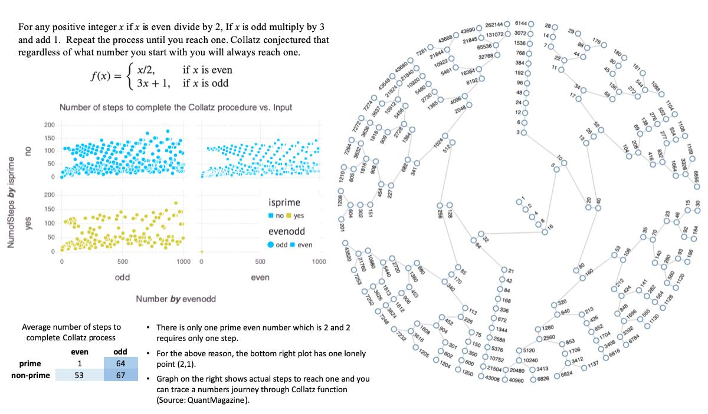

In undergrad I wrote a tutorial on #Julia programming language in which I analyzed the output of the Collatz function. The Collatz Conjecture was really fascinating to me due to its seemingly simple wording and almost impossible to solve mystery. Since then, #Julia changed significantly, and Terence Tao made a contribution that gets us closer to the proof of the Collatz Conjecture. 

View on Julia Notebook nbviewer: [https://lnkd.in/eGnHgy2](https://lnkd.in/eGnHgy2)



**Update:**
In September 2019 Tao published a paper in which he proved that the Collatz Conjecture is "almost true" for "almost all numbers." 

Tao's Paper: [https://lnkd.in/eCus8YU](https://lnkd.in/eCus8YU)

Tao's Blog Post: [https://lnkd.in/eb7ePAu](https://lnkd.in/eb7ePAu)

## Table of contents
- [Download](#download)
- [Quick Start](#quick-start)
- [Dataframes, plotting, and file Input/Output](#data-frames-plotting-and-file-inputoutput)
    - [Data frames](#data-frames)
    - [Plotting data](#plotting-data)
- [Conclusion](#conclusion)
- [Resources used](#resources-used)

## Download 

Download Julia from [http://julialang.org/](http://julialang.org/)

Download Julai IDEs:

- Juno from [http://junolab.org/](http://junolab.org/)

- IJulia kernel for Jyputer notebook from https://github.com/JuliaLang/IJulia.jl


Juno is a good IDE for writing and evaluating julia code quickly. IJulia notebook is good for writing tutorials and reports with julia code results embeded in the document. 

Once you've installed everything I recommend opening up the Juno IDE and going through the tutorial.

## Quick start

I execute all julia code below in Juno. I suggest you create a folder on your desktop and make it your working directory where we will be able to write files. First, a couple of basic commands. To evaluate code in Juno you just need to press `Ctrl-D` (its in the Juno tutrial):


```
VERSION # print julia version number

pwd() # print working directory
homedir() # print the default home directory

# cd(pwd()) # set working directory to DirectoryPath
```
```out
"/Users/kobakhitalishvili"
```


```
3+5 # => 8
5*7 # => 35
3^17 # => 129140163
3^(1+3im) # im stands for imaginary number => -2.964383781426573 - 0.46089998526262876im
log(7) # natural log of 7 => 1.9459101490553132
```
```out
1.9459101490553132
```


    1.9459101490553132


Interesting that julia has imaginary number built in. Now, variables and functions:


```
a = cos(pi) + im * sin(pi) # assigning to a variable
```
```out
-1.0 + 1.2246467991473532e-16im
```


    

```
b = ℯ^(im*pi)
```
```out
-1.0 + 1.2246467991473532e-16im
```
    


```
a == b # boolean expression. It is an euler identity.
```
```out
true
```


Lets see how to define functions. Here is a [chapter on functions](https://docs.julialang.org/en/v1/manual/documentation/index.html#Functions-and-Methods-1) in julia docs for more info.


```
plus2(x) = x + 2 # a compact way

function plustwo(x) # traditional function definition
    return x+2
end
```


```out
plustwo (generic function with 1 method)

```


```
plus2(11)
```
```out
13
```


```
plustwo(11)
```
```out
13
```


Here is a [julia cheatsheet](https://juliadocs.github.io/Julia-Cheat-Sheet/) with above and additional information in a concise form. Next, lets write a function that will generate some data which we will write to a csv file, plot, and save the plot. 

## Data frames, plotting, and file Input/Output

I decided to write a function $f(x)$ that performs the process from the [Collatz conjecture](https://en.wikipedia.org/wiki/Collatz_conjecture). Basically, for any positive integer $x$ if $x$ is even divide by $2$, if x is odd multiply by $3$ and add $1$. Repeat the process until you reach one. The Collatz conjecture proposes that regardless of what number you start with you will always reach one. Here it is in explicit form 

$$
f(x) = \begin{cases} x/2, & \mbox{if } x\mbox{ is even} \\ 3x+1, & \mbox{if } x\mbox{ is odd} \end{cases}
$$

The function `collatz(x)` will count the number of iterations it took for the starting number to reach $1$.


```
function collatz(x)
    # Given a number x
    # - divide by 2 if x is even
    # - multiply by 3 and add 1 if x is odd
    # until x reaches 1
    # Args:
    # - param x: integer
    # - return: integer
    count = 0
    while x != 1
        if x % 2 == 0
            x = x/2
            count += 1
        else
            x = 3*x + 1
            count += 1
        end
    end
    return count
end

collatz(2)
```
```out
1
```

```
collatz(3)
```
```out
3
```


### Data frames

Now, let's create a dataframe with the number of steps needed to complete the Collatz process for each number from 1 to 1000. We will use the [`DataFrames` package](https://github.com/JuliaStats/DataFrames.jl) because the base julia library does not have dataframes.


```
# install DataFrames package
using Pkg
# Pkg.add("DataFrames")

using DataFrames

# Before populating the dataframe with collatz data lets see how to create one
df = DataFrame(Col1 = 1:10, Col2 = ["a","b","c","d","e","f","a","b","c","d"])
df
```


<table class="data-frame"><thead><tr><th></th><th>Col1</th><th>Col2</th></tr><tr><th></th><th>Int64</th><th>String</th></tr></thead><tbody><p>10 rows × 2 columns</p><tr><th>1</th><td>1</td><td>a</td></tr><tr><th>2</th><td>2</td><td>b</td></tr><tr><th>3</th><td>3</td><td>c</td></tr><tr><th>4</th><td>4</td><td>d</td></tr><tr><th>5</th><td>5</td><td>e</td></tr><tr><th>6</th><td>6</td><td>f</td></tr><tr><th>7</th><td>7</td><td>a</td></tr><tr><th>8</th><td>8</td><td>b</td></tr><tr><th>9</th><td>9</td><td>c</td></tr><tr><th>10</th><td>10</td><td>d</td></tr></tbody></table>


```
# Neat. Now let's generate data using collatz function
df = DataFrame(Number = 1:1000, NumofSteps = map(collatz,1:1000))
first(df, 10)
```


<table class="data-frame"><thead><tr><th></th><th>Number</th><th>NumofSteps</th></tr><tr><th></th><th>Int64</th><th>Int64</th></tr></thead><tbody><p>10 rows × 2 columns</p><tr><th>1</th><td>1</td><td>0</td></tr><tr><th>2</th><td>2</td><td>1</td></tr><tr><th>3</th><td>3</td><td>7</td></tr><tr><th>4</th><td>4</td><td>2</td></tr><tr><th>5</th><td>5</td><td>5</td></tr><tr><th>6</th><td>6</td><td>8</td></tr><tr><th>7</th><td>7</td><td>16</td></tr><tr><th>8</th><td>8</td><td>3</td></tr><tr><th>9</th><td>9</td><td>19</td></tr><tr><th>10</th><td>10</td><td>6</td></tr></tbody></table>


`map()` applies `collatz()` function to every number in the `1:1000` array which is an array of numbers `[1,2,3,...,1000]`. In this instance `map()` returns an array of numbers that is the output of `collatz()` function. 


```
# To get descriptive statistics 
describe(df)
```


<table class="data-frame"><thead><tr><th></th><th>variable</th><th>mean</th><th>min</th><th>median</th><th>max</th><th>nunique</th><th>nmissing</th><th>eltype</th></tr><tr><th></th><th>Symbol</th><th>Float64</th><th>Int64</th><th>Float64</th><th>Int64</th><th>Nothing</th><th>Nothing</th><th>DataType</th></tr></thead><tbody><p>2 rows × 8 columns</p><tr><th>1</th><td>Number</td><td>500.5</td><td>1</td><td>500.5</td><td>1000</td><td></td><td></td><td>Int64</td></tr><tr><th>2</th><td>NumofSteps</td><td>59.542</td><td>0</td><td>43.0</td><td>178</td><td></td><td></td><td>Int64</td></tr></tbody></table>


Before we save it lets categorize the points based on whether the original number is even or odd.


```
df.evenodd = map(x -> if x % 2 == 0 "even" else "odd" end, 1:1000) # create new evenodd column
# rename!(df, :x1, :evenodd) #rename it to evenodd
first(df,5)
```


<table class="data-frame"><thead><tr><th></th><th>Number</th><th>NumofSteps</th><th>evenodd</th></tr><tr><th></th><th>Int64</th><th>Int64</th><th>String</th></tr></thead><tbody><p>5 rows × 3 columns</p><tr><th>1</th><td>1</td><td>0</td><td>odd</td></tr><tr><th>2</th><td>2</td><td>1</td><td>even</td></tr><tr><th>3</th><td>3</td><td>7</td><td>odd</td></tr><tr><th>4</th><td>4</td><td>2</td><td>even</td></tr><tr><th>5</th><td>5</td><td>5</td><td>odd</td></tr></tbody></table>


I use the `map()` function with an anonymous function `x -> if x % 2 == 0 "even" else "odd" end` which checks for divisibility by 2 to create a column with "even" and "odd" as entries. Finally, I rename the new column "evenodd".

Additionally, let's identify the **prime numbers** as well.


```
# Pkg.add("Primes")
using Primes

isprime(3)
```
```out
true
```


```
df.isprime = map(x -> if isprime(x) "yes" else "no" end,df.Number)
first(df,5)
```


<table class="data-frame"><thead><tr><th></th><th>Number</th><th>NumofSteps</th><th>evenodd</th><th>isprime</th></tr><tr><th></th><th>Int64</th><th>Int64</th><th>String</th><th>String</th></tr></thead><tbody><p>5 rows × 4 columns</p><tr><th>1</th><td>1</td><td>0</td><td>odd</td><td>no</td></tr><tr><th>2</th><td>2</td><td>1</td><td>even</td><td>yes</td></tr><tr><th>3</th><td>3</td><td>7</td><td>odd</td><td>yes</td></tr><tr><th>4</th><td>4</td><td>2</td><td>even</td><td>no</td></tr><tr><th>5</th><td>5</td><td>5</td><td>odd</td><td>yes</td></tr></tbody></table>


```
# Pkg.add("CSV")
using CSV

# To save the data frame in the working directory 
CSV.write("collatz.csv", df)
```
```out
"collatz.csv"
```

### Plotting data

To plot the data we will use the [Gadfly](http://gadflyjl.org/stable/) package. Gadly resembles `ggplot` in its functionality. There is also the [`Plots` package](https://github.com/dcjones/Gadfly.jl) which brings mutliple plotting libraries into a single API.

To save plots in different image formats we will need the `Cairo` pakage.


```
# Pkg.add(["Cairo","Fontconfig","Plots", "Gadfly","PlotlyJS","ORCA"])
# Pkg.add("Gadfly")

# using Plots
# plotlyjs() use plotly backend
# pyplot() use pyplot backend
using Cairo
using Gadfly

Gadfly.plot(df,x=:Number, y=:NumofSteps, Geom.point, Guide.title("Collatz Conjecture"))
```


<?xml version="1.0" encoding="UTF-8"?>
<svg xmlns="http://www.w3.org/2000/svg"
     xmlns:xlink="http://www.w3.org/1999/xlink"
     xmlns:gadfly="http://www.gadflyjl.org/ns"
     version="1.2"
     width="141.42mm" height="100mm" viewBox="0 0 141.42 100"
     stroke="none"
     fill="#000000"
     stroke-width="0.3"
     font-size="3.88"

     id="img-a3bc1b40">
<defs>
  <marker id="arrow" markerWidth="15" markerHeight="7" refX="5" refY="3.5" orient="auto" markerUnits="strokeWidth">
    <path d="M0,0 L15,3.5 L0,7 z" stroke="context-stroke" fill="context-stroke"/>
  </marker>
</defs>
<g class="plotroot xscalable yscalable" id="img-a3bc1b40-1">
  <g font-size="3.88" font-family="'PT Sans','Helvetica Neue','Helvetica',sans-serif" fill="#564A55" stroke="#000000" stroke-opacity="0.000" id="img-a3bc1b40-2">
    <g transform="translate(78.03,88.39)">
      <g class="primitive">
        <text text-anchor="middle" dy="0.6em">Number</text>
      </g>
    </g>
  </g>
  <g class="guide xlabels" font-size="2.82" font-family="'PT Sans Caption','Helvetica Neue','Helvetica',sans-serif" fill="#6C606B" id="img-a3bc1b40-3">
    <g transform="translate(-147.55,84.39)" gadfly:scale="1.0" visibility="hidden">
      <g class="primitive">
        <text text-anchor="middle" dy="-0em">-1500</text>
      </g>
    </g>
    <g transform="translate(-91.16,84.39)" gadfly:scale="1.0" visibility="hidden">
      <g class="primitive">
        <text text-anchor="middle" dy="-0em">-1000</text>
      </g>
    </g>
    <g transform="translate(-34.76,84.39)" gadfly:scale="1.0" visibility="hidden">
      <g class="primitive">
        <text text-anchor="middle" dy="-0em">-500</text>
      </g>
    </g>
    <g transform="translate(21.63,84.39)" gadfly:scale="1.0" visibility="visible">
      <g class="primitive">
        <text text-anchor="middle" dy="-0em">0</text>
      </g>
    </g>
    <g transform="translate(78.03,84.39)" gadfly:scale="1.0" visibility="visible">
      <g class="primitive">
        <text text-anchor="middle" dy="-0em">500</text>
      </g>
    </g>
    <g transform="translate(134.42,84.39)" gadfly:scale="1.0" visibility="visible">
      <g class="primitive">
        <text text-anchor="middle" dy="-0em">1000</text>
      </g>
    </g>
    <g transform="translate(190.82,84.39)" gadfly:scale="1.0" visibility="hidden">
      <g class="primitive">
        <text text-anchor="middle" dy="-0em">1500</text>
      </g>
    </g>
    <g transform="translate(247.21,84.39)" gadfly:scale="1.0" visibility="hidden">
      <g class="primitive">
        <text text-anchor="middle" dy="-0em">2000</text>
      </g>
    </g>
    <g transform="translate(303.61,84.39)" gadfly:scale="1.0" visibility="hidden">
      <g class="primitive">
        <text text-anchor="middle" dy="-0em">2500</text>
      </g>
    </g>
    <g transform="translate(-91.16,84.39)" gadfly:scale="10.0" visibility="hidden">
      <g class="primitive">
        <text text-anchor="middle" dy="-0em">-1000</text>
      </g>
    </g>
    <g transform="translate(-85.52,84.39)" gadfly:scale="10.0" visibility="hidden">
      <g class="primitive">
        <text text-anchor="middle" dy="-0em">-950</text>
      </g>
    </g>
    <g transform="translate(-79.88,84.39)" gadfly:scale="10.0" visibility="hidden">
      <g class="primitive">
        <text text-anchor="middle" dy="-0em">-900</text>
      </g>
    </g>
    <g transform="translate(-74.24,84.39)" gadfly:scale="10.0" visibility="hidden">
      <g class="primitive">
        <text text-anchor="middle" dy="-0em">-850</text>
      </g>
    </g>
    <g transform="translate(-68.6,84.39)" gadfly:scale="10.0" visibility="hidden">
      <g class="primitive">
        <text text-anchor="middle" dy="-0em">-800</text>
      </g>
    </g>
    <g transform="translate(-62.96,84.39)" gadfly:scale="10.0" visibility="hidden">
      <g class="primitive">
        <text text-anchor="middle" dy="-0em">-750</text>
      </g>
    </g>
    <g transform="translate(-57.32,84.39)" gadfly:scale="10.0" visibility="hidden">
      <g class="primitive">
        <text text-anchor="middle" dy="-0em">-700</text>
      </g>
    </g>
    <g transform="translate(-51.68,84.39)" gadfly:scale="10.0" visibility="hidden">
      <g class="primitive">
        <text text-anchor="middle" dy="-0em">-650</text>
      </g>
    </g>
    <g transform="translate(-46.04,84.39)" gadfly:scale="10.0" visibility="hidden">
      <g class="primitive">
        <text text-anchor="middle" dy="-0em">-600</text>
      </g>
    </g>
    <g transform="translate(-40.4,84.39)" gadfly:scale="10.0" visibility="hidden">
      <g class="primitive">
        <text text-anchor="middle" dy="-0em">-550</text>
      </g>
    </g>
    <g transform="translate(-34.76,84.39)" gadfly:scale="10.0" visibility="hidden">
      <g class="primitive">
        <text text-anchor="middle" dy="-0em">-500</text>
      </g>
    </g>
    <g transform="translate(-29.12,84.39)" gadfly:scale="10.0" visibility="hidden">
      <g class="primitive">
        <text text-anchor="middle" dy="-0em">-450</text>
      </g>
    </g>
    <g transform="translate(-23.48,84.39)" gadfly:scale="10.0" visibility="hidden">
      <g class="primitive">
        <text text-anchor="middle" dy="-0em">-400</text>
      </g>
    </g>
    <g transform="translate(-17.84,84.39)" gadfly:scale="10.0" visibility="hidden">
      <g class="primitive">
        <text text-anchor="middle" dy="-0em">-350</text>
      </g>
    </g>
    <g transform="translate(-12.21,84.39)" gadfly:scale="10.0" visibility="hidden">
      <g class="primitive">
        <text text-anchor="middle" dy="-0em">-300</text>
      </g>
    </g>
    <g transform="translate(-6.57,84.39)" gadfly:scale="10.0" visibility="hidden">
      <g class="primitive">
        <text text-anchor="middle" dy="-0em">-250</text>
      </g>
    </g>
    <g transform="translate(-0.93,84.39)" gadfly:scale="10.0" visibility="hidden">
      <g class="primitive">
        <text text-anchor="middle" dy="-0em">-200</text>
      </g>
    </g>
    <g transform="translate(4.71,84.39)" gadfly:scale="10.0" visibility="hidden">
      <g class="primitive">
        <text text-anchor="middle" dy="-0em">-150</text>
      </g>
    </g>
    <g transform="translate(10.35,84.39)" gadfly:scale="10.0" visibility="hidden">
      <g class="primitive">
        <text text-anchor="middle" dy="-0em">-100</text>
      </g>
    </g>
    <g transform="translate(15.99,84.39)" gadfly:scale="10.0" visibility="hidden">
      <g class="primitive">
        <text text-anchor="middle" dy="-0em">-50</text>
      </g>
    </g>
    <g transform="translate(21.63,84.39)" gadfly:scale="10.0" visibility="hidden">
      <g class="primitive">
        <text text-anchor="middle" dy="-0em">0</text>
      </g>
    </g>
    <g transform="translate(27.27,84.39)" gadfly:scale="10.0" visibility="hidden">
      <g class="primitive">
        <text text-anchor="middle" dy="-0em">50</text>
      </g>
    </g>
    <g transform="translate(32.91,84.39)" gadfly:scale="10.0" visibility="hidden">
      <g class="primitive">
        <text text-anchor="middle" dy="-0em">100</text>
      </g>
    </g>
    <g transform="translate(38.55,84.39)" gadfly:scale="10.0" visibility="hidden">
      <g class="primitive">
        <text text-anchor="middle" dy="-0em">150</text>
      </g>
    </g>
    <g transform="translate(44.19,84.39)" gadfly:scale="10.0" visibility="hidden">
      <g class="primitive">
        <text text-anchor="middle" dy="-0em">200</text>
      </g>
    </g>
    <g transform="translate(49.83,84.39)" gadfly:scale="10.0" visibility="hidden">
      <g class="primitive">
        <text text-anchor="middle" dy="-0em">250</text>
      </g>
    </g>
    <g transform="translate(55.47,84.39)" gadfly:scale="10.0" visibility="hidden">
      <g class="primitive">
        <text text-anchor="middle" dy="-0em">300</text>
      </g>
    </g>
    <g transform="translate(61.11,84.39)" gadfly:scale="10.0" visibility="hidden">
      <g class="primitive">
        <text text-anchor="middle" dy="-0em">350</text>
      </g>
    </g>
    <g transform="translate(66.75,84.39)" gadfly:scale="10.0" visibility="hidden">
      <g class="primitive">
        <text text-anchor="middle" dy="-0em">400</text>
      </g>
    </g>
    <g transform="translate(72.39,84.39)" gadfly:scale="10.0" visibility="hidden">
      <g class="primitive">
        <text text-anchor="middle" dy="-0em">450</text>
      </g>
    </g>
    <g transform="translate(78.03,84.39)" gadfly:scale="10.0" visibility="hidden">
      <g class="primitive">
        <text text-anchor="middle" dy="-0em">500</text>
      </g>
    </g>
    <g transform="translate(83.67,84.39)" gadfly:scale="10.0" visibility="hidden">
      <g class="primitive">
        <text text-anchor="middle" dy="-0em">550</text>
      </g>
    </g>
    <g transform="translate(89.31,84.39)" gadfly:scale="10.0" visibility="hidden">
      <g class="primitive">
        <text text-anchor="middle" dy="-0em">600</text>
      </g>
    </g>
    <g transform="translate(94.94,84.39)" gadfly:scale="10.0" visibility="hidden">
      <g class="primitive">
        <text text-anchor="middle" dy="-0em">650</text>
      </g>
    </g>
    <g transform="translate(100.58,84.39)" gadfly:scale="10.0" visibility="hidden">
      <g class="primitive">
        <text text-anchor="middle" dy="-0em">700</text>
      </g>
    </g>
    <g transform="translate(106.22,84.39)" gadfly:scale="10.0" visibility="hidden">
      <g class="primitive">
        <text text-anchor="middle" dy="-0em">750</text>
      </g>
    </g>
    <g transform="translate(111.86,84.39)" gadfly:scale="10.0" visibility="hidden">
      <g class="primitive">
        <text text-anchor="middle" dy="-0em">800</text>
      </g>
    </g>
    <g transform="translate(117.5,84.39)" gadfly:scale="10.0" visibility="hidden">
      <g class="primitive">
        <text text-anchor="middle" dy="-0em">850</text>
      </g>
    </g>
    <g transform="translate(123.14,84.39)" gadfly:scale="10.0" visibility="hidden">
      <g class="primitive">
        <text text-anchor="middle" dy="-0em">900</text>
      </g>
    </g>
    <g transform="translate(128.78,84.39)" gadfly:scale="10.0" visibility="hidden">
      <g class="primitive">
        <text text-anchor="middle" dy="-0em">950</text>
      </g>
    </g>
    <g transform="translate(134.42,84.39)" gadfly:scale="10.0" visibility="hidden">
      <g class="primitive">
        <text text-anchor="middle" dy="-0em">1000</text>
      </g>
    </g>
    <g transform="translate(140.06,84.39)" gadfly:scale="10.0" visibility="hidden">
      <g class="primitive">
        <text text-anchor="middle" dy="-0em">1050</text>
      </g>
    </g>
    <g transform="translate(145.7,84.39)" gadfly:scale="10.0" visibility="hidden">
      <g class="primitive">
        <text text-anchor="middle" dy="-0em">1100</text>
      </g>
    </g>
    <g transform="translate(151.34,84.39)" gadfly:scale="10.0" visibility="hidden">
      <g class="primitive">
        <text text-anchor="middle" dy="-0em">1150</text>
      </g>
    </g>
    <g transform="translate(156.98,84.39)" gadfly:scale="10.0" visibility="hidden">
      <g class="primitive">
        <text text-anchor="middle" dy="-0em">1200</text>
      </g>
    </g>
    <g transform="translate(162.62,84.39)" gadfly:scale="10.0" visibility="hidden">
      <g class="primitive">
        <text text-anchor="middle" dy="-0em">1250</text>
      </g>
    </g>
    <g transform="translate(168.26,84.39)" gadfly:scale="10.0" visibility="hidden">
      <g class="primitive">
        <text text-anchor="middle" dy="-0em">1300</text>
      </g>
    </g>
    <g transform="translate(173.9,84.39)" gadfly:scale="10.0" visibility="hidden">
      <g class="primitive">
        <text text-anchor="middle" dy="-0em">1350</text>
      </g>
    </g>
    <g transform="translate(179.54,84.39)" gadfly:scale="10.0" visibility="hidden">
      <g class="primitive">
        <text text-anchor="middle" dy="-0em">1400</text>
      </g>
    </g>
    <g transform="translate(185.18,84.39)" gadfly:scale="10.0" visibility="hidden">
      <g class="primitive">
        <text text-anchor="middle" dy="-0em">1450</text>
      </g>
    </g>
    <g transform="translate(190.82,84.39)" gadfly:scale="10.0" visibility="hidden">
      <g class="primitive">
        <text text-anchor="middle" dy="-0em">1500</text>
      </g>
    </g>
    <g transform="translate(196.46,84.39)" gadfly:scale="10.0" visibility="hidden">
      <g class="primitive">
        <text text-anchor="middle" dy="-0em">1550</text>
      </g>
    </g>
    <g transform="translate(202.1,84.39)" gadfly:scale="10.0" visibility="hidden">
      <g class="primitive">
        <text text-anchor="middle" dy="-0em">1600</text>
      </g>
    </g>
    <g transform="translate(207.73,84.39)" gadfly:scale="10.0" visibility="hidden">
      <g class="primitive">
        <text text-anchor="middle" dy="-0em">1650</text>
      </g>
    </g>
    <g transform="translate(213.37,84.39)" gadfly:scale="10.0" visibility="hidden">
      <g class="primitive">
        <text text-anchor="middle" dy="-0em">1700</text>
      </g>
    </g>
    <g transform="translate(219.01,84.39)" gadfly:scale="10.0" visibility="hidden">
      <g class="primitive">
        <text text-anchor="middle" dy="-0em">1750</text>
      </g>
    </g>
    <g transform="translate(224.65,84.39)" gadfly:scale="10.0" visibility="hidden">
      <g class="primitive">
        <text text-anchor="middle" dy="-0em">1800</text>
      </g>
    </g>
    <g transform="translate(230.29,84.39)" gadfly:scale="10.0" visibility="hidden">
      <g class="primitive">
        <text text-anchor="middle" dy="-0em">1850</text>
      </g>
    </g>
    <g transform="translate(235.93,84.39)" gadfly:scale="10.0" visibility="hidden">
      <g class="primitive">
        <text text-anchor="middle" dy="-0em">1900</text>
      </g>
    </g>
    <g transform="translate(241.57,84.39)" gadfly:scale="10.0" visibility="hidden">
      <g class="primitive">
        <text text-anchor="middle" dy="-0em">1950</text>
      </g>
    </g>
    <g transform="translate(247.21,84.39)" gadfly:scale="10.0" visibility="hidden">
      <g class="primitive">
        <text text-anchor="middle" dy="-0em">2000</text>
      </g>
    </g>
    <g transform="translate(-91.16,84.39)" gadfly:scale="0.5" visibility="hidden">
      <g class="primitive">
        <text text-anchor="middle" dy="-0em">-1000</text>
      </g>
    </g>
    <g transform="translate(21.63,84.39)" gadfly:scale="0.5" visibility="hidden">
      <g class="primitive">
        <text text-anchor="middle" dy="-0em">0</text>
      </g>
    </g>
    <g transform="translate(134.42,84.39)" gadfly:scale="0.5" visibility="hidden">
      <g class="primitive">
        <text text-anchor="middle" dy="-0em">1000</text>
      </g>
    </g>
    <g transform="translate(247.21,84.39)" gadfly:scale="0.5" visibility="hidden">
      <g class="primitive">
        <text text-anchor="middle" dy="-0em">2000</text>
      </g>
    </g>
    <g transform="translate(-91.16,84.39)" gadfly:scale="5.0" visibility="hidden">
      <g class="primitive">
        <text text-anchor="middle" dy="-0em">-1000</text>
      </g>
    </g>
    <g transform="translate(-79.88,84.39)" gadfly:scale="5.0" visibility="hidden">
      <g class="primitive">
        <text text-anchor="middle" dy="-0em">-900</text>
      </g>
    </g>
    <g transform="translate(-68.6,84.39)" gadfly:scale="5.0" visibility="hidden">
      <g class="primitive">
        <text text-anchor="middle" dy="-0em">-800</text>
      </g>
    </g>
    <g transform="translate(-57.32,84.39)" gadfly:scale="5.0" visibility="hidden">
      <g class="primitive">
        <text text-anchor="middle" dy="-0em">-700</text>
      </g>
    </g>
    <g transform="translate(-46.04,84.39)" gadfly:scale="5.0" visibility="hidden">
      <g class="primitive">
        <text text-anchor="middle" dy="-0em">-600</text>
      </g>
    </g>
    <g transform="translate(-34.76,84.39)" gadfly:scale="5.0" visibility="hidden">
      <g class="primitive">
        <text text-anchor="middle" dy="-0em">-500</text>
      </g>
    </g>
    <g transform="translate(-23.48,84.39)" gadfly:scale="5.0" visibility="hidden">
      <g class="primitive">
        <text text-anchor="middle" dy="-0em">-400</text>
      </g>
    </g>
    <g transform="translate(-12.21,84.39)" gadfly:scale="5.0" visibility="hidden">
      <g class="primitive">
        <text text-anchor="middle" dy="-0em">-300</text>
      </g>
    </g>
    <g transform="translate(-0.93,84.39)" gadfly:scale="5.0" visibility="hidden">
      <g class="primitive">
        <text text-anchor="middle" dy="-0em">-200</text>
      </g>
    </g>
    <g transform="translate(10.35,84.39)" gadfly:scale="5.0" visibility="hidden">
      <g class="primitive">
        <text text-anchor="middle" dy="-0em">-100</text>
      </g>
    </g>
    <g transform="translate(21.63,84.39)" gadfly:scale="5.0" visibility="hidden">
      <g class="primitive">
        <text text-anchor="middle" dy="-0em">0</text>
      </g>
    </g>
    <g transform="translate(32.91,84.39)" gadfly:scale="5.0" visibility="hidden">
      <g class="primitive">
        <text text-anchor="middle" dy="-0em">100</text>
      </g>
    </g>
    <g transform="translate(44.19,84.39)" gadfly:scale="5.0" visibility="hidden">
      <g class="primitive">
        <text text-anchor="middle" dy="-0em">200</text>
      </g>
    </g>
    <g transform="translate(55.47,84.39)" gadfly:scale="5.0" visibility="hidden">
      <g class="primitive">
        <text text-anchor="middle" dy="-0em">300</text>
      </g>
    </g>
    <g transform="translate(66.75,84.39)" gadfly:scale="5.0" visibility="hidden">
      <g class="primitive">
        <text text-anchor="middle" dy="-0em">400</text>
      </g>
    </g>
    <g transform="translate(78.03,84.39)" gadfly:scale="5.0" visibility="hidden">
      <g class="primitive">
        <text text-anchor="middle" dy="-0em">500</text>
      </g>
    </g>
    <g transform="translate(89.31,84.39)" gadfly:scale="5.0" visibility="hidden">
      <g class="primitive">
        <text text-anchor="middle" dy="-0em">600</text>
      </g>
    </g>
    <g transform="translate(100.58,84.39)" gadfly:scale="5.0" visibility="hidden">
      <g class="primitive">
        <text text-anchor="middle" dy="-0em">700</text>
      </g>
    </g>
    <g transform="translate(111.86,84.39)" gadfly:scale="5.0" visibility="hidden">
      <g class="primitive">
        <text text-anchor="middle" dy="-0em">800</text>
      </g>
    </g>
    <g transform="translate(123.14,84.39)" gadfly:scale="5.0" visibility="hidden">
      <g class="primitive">
        <text text-anchor="middle" dy="-0em">900</text>
      </g>
    </g>
    <g transform="translate(134.42,84.39)" gadfly:scale="5.0" visibility="hidden">
      <g class="primitive">
        <text text-anchor="middle" dy="-0em">1000</text>
      </g>
    </g>
    <g transform="translate(145.7,84.39)" gadfly:scale="5.0" visibility="hidden">
      <g class="primitive">
        <text text-anchor="middle" dy="-0em">1100</text>
      </g>
    </g>
    <g transform="translate(156.98,84.39)" gadfly:scale="5.0" visibility="hidden">
      <g class="primitive">
        <text text-anchor="middle" dy="-0em">1200</text>
      </g>
    </g>
    <g transform="translate(168.26,84.39)" gadfly:scale="5.0" visibility="hidden">
      <g class="primitive">
        <text text-anchor="middle" dy="-0em">1300</text>
      </g>
    </g>
    <g transform="translate(179.54,84.39)" gadfly:scale="5.0" visibility="hidden">
      <g class="primitive">
        <text text-anchor="middle" dy="-0em">1400</text>
      </g>
    </g>
    <g transform="translate(190.82,84.39)" gadfly:scale="5.0" visibility="hidden">
      <g class="primitive">
        <text text-anchor="middle" dy="-0em">1500</text>
      </g>
    </g>
    <g transform="translate(202.1,84.39)" gadfly:scale="5.0" visibility="hidden">
      <g class="primitive">
        <text text-anchor="middle" dy="-0em">1600</text>
      </g>
    </g>
    <g transform="translate(213.37,84.39)" gadfly:scale="5.0" visibility="hidden">
      <g class="primitive">
        <text text-anchor="middle" dy="-0em">1700</text>
      </g>
    </g>
    <g transform="translate(224.65,84.39)" gadfly:scale="5.0" visibility="hidden">
      <g class="primitive">
        <text text-anchor="middle" dy="-0em">1800</text>
      </g>
    </g>
    <g transform="translate(235.93,84.39)" gadfly:scale="5.0" visibility="hidden">
      <g class="primitive">
        <text text-anchor="middle" dy="-0em">1900</text>
      </g>
    </g>
    <g transform="translate(247.21,84.39)" gadfly:scale="5.0" visibility="hidden">
      <g class="primitive">
        <text text-anchor="middle" dy="-0em">2000</text>
      </g>
    </g>
  </g>
  <g clip-path="url(#img-a3bc1b40-4)">
    <g id="img-a3bc1b40-5">
      <g pointer-events="visible" fill="#000000" fill-opacity="0.000" stroke="#000000" stroke-opacity="0.000" class="guide background" id="img-a3bc1b40-6">
        <g transform="translate(78.03,45.66)" id="img-a3bc1b40-7">
          <path d="M-58.39,-35.05 L 58.39 -35.05 58.39 35.05 -58.39 35.05 z" class="primitive"/>
        </g>
      </g>
      <g class="guide ygridlines xfixed" stroke-dasharray="0.5,0.5" stroke-width="0.2" stroke="#D0D0E0" id="img-a3bc1b40-8">
        <g transform="translate(78.03,161.34)" id="img-a3bc1b40-9" visibility="hidden" gadfly:scale="1.0">
          <path fill="none" d="M-58.39,0 L 58.39 0" class="primitive"/>
        </g>
        <g transform="translate(78.03,144.82)" id="img-a3bc1b40-10" visibility="hidden" gadfly:scale="1.0">
          <path fill="none" d="M-58.39,0 L 58.39 0" class="primitive"/>
        </g>
        <g transform="translate(78.03,128.29)" id="img-a3bc1b40-11" visibility="hidden" gadfly:scale="1.0">
          <path fill="none" d="M-58.39,0 L 58.39 0" class="primitive"/>
        </g>
        <g transform="translate(78.03,111.77)" id="img-a3bc1b40-12" visibility="hidden" gadfly:scale="1.0">
          <path fill="none" d="M-58.39,0 L 58.39 0" class="primitive"/>
        </g>
        <g transform="translate(78.03,95.24)" id="img-a3bc1b40-13" visibility="hidden" gadfly:scale="1.0">
          <path fill="none" d="M-58.39,0 L 58.39 0" class="primitive"/>
        </g>
        <g transform="translate(78.03,78.72)" id="img-a3bc1b40-14" visibility="visible" gadfly:scale="1.0">
          <path fill="none" d="M-58.39,0 L 58.39 0" class="primitive"/>
        </g>
        <g transform="translate(78.03,62.19)" id="img-a3bc1b40-15" visibility="visible" gadfly:scale="1.0">
          <path fill="none" d="M-58.39,0 L 58.39 0" class="primitive"/>
        </g>
        <g transform="translate(78.03,45.66)" id="img-a3bc1b40-16" visibility="visible" gadfly:scale="1.0">
          <path fill="none" d="M-58.39,0 L 58.39 0" class="primitive"/>
        </g>
        <g transform="translate(78.03,29.14)" id="img-a3bc1b40-17" visibility="visible" gadfly:scale="1.0">
          <path fill="none" d="M-58.39,0 L 58.39 0" class="primitive"/>
        </g>
        <g transform="translate(78.03,12.61)" id="img-a3bc1b40-18" visibility="visible" gadfly:scale="1.0">
          <path fill="none" d="M-58.39,0 L 58.39 0" class="primitive"/>
        </g>
        <g transform="translate(78.03,-3.91)" id="img-a3bc1b40-19" visibility="hidden" gadfly:scale="1.0">
          <path fill="none" d="M-58.39,0 L 58.39 0" class="primitive"/>
        </g>
        <g transform="translate(78.03,-20.44)" id="img-a3bc1b40-20" visibility="hidden" gadfly:scale="1.0">
          <path fill="none" d="M-58.39,0 L 58.39 0" class="primitive"/>
        </g>
        <g transform="translate(78.03,-36.97)" id="img-a3bc1b40-21" visibility="hidden" gadfly:scale="1.0">
          <path fill="none" d="M-58.39,0 L 58.39 0" class="primitive"/>
        </g>
        <g transform="translate(78.03,-53.49)" id="img-a3bc1b40-22" visibility="hidden" gadfly:scale="1.0">
          <path fill="none" d="M-58.39,0 L 58.39 0" class="primitive"/>
        </g>
        <g transform="translate(78.03,-70.02)" id="img-a3bc1b40-23" visibility="hidden" gadfly:scale="1.0">
          <path fill="none" d="M-58.39,0 L 58.39 0" class="primitive"/>
        </g>
        <g transform="translate(78.03,144.82)" id="img-a3bc1b40-24" visibility="hidden" gadfly:scale="10.0">
          <path fill="none" d="M-58.39,0 L 58.39 0" class="primitive"/>
        </g>
        <g transform="translate(78.03,141.51)" id="img-a3bc1b40-25" visibility="hidden" gadfly:scale="10.0">
          <path fill="none" d="M-58.39,0 L 58.39 0" class="primitive"/>
        </g>
        <g transform="translate(78.03,138.21)" id="img-a3bc1b40-26" visibility="hidden" gadfly:scale="10.0">
          <path fill="none" d="M-58.39,0 L 58.39 0" class="primitive"/>
        </g>
        <g transform="translate(78.03,134.9)" id="img-a3bc1b40-27" visibility="hidden" gadfly:scale="10.0">
          <path fill="none" d="M-58.39,0 L 58.39 0" class="primitive"/>
        </g>
        <g transform="translate(78.03,131.6)" id="img-a3bc1b40-28" visibility="hidden" gadfly:scale="10.0">
          <path fill="none" d="M-58.39,0 L 58.39 0" class="primitive"/>
        </g>
        <g transform="translate(78.03,128.29)" id="img-a3bc1b40-29" visibility="hidden" gadfly:scale="10.0">
          <path fill="none" d="M-58.39,0 L 58.39 0" class="primitive"/>
        </g>
        <g transform="translate(78.03,124.99)" id="img-a3bc1b40-30" visibility="hidden" gadfly:scale="10.0">
          <path fill="none" d="M-58.39,0 L 58.39 0" class="primitive"/>
        </g>
        <g transform="translate(78.03,121.68)" id="img-a3bc1b40-31" visibility="hidden" gadfly:scale="10.0">
          <path fill="none" d="M-58.39,0 L 58.39 0" class="primitive"/>
        </g>
        <g transform="translate(78.03,118.38)" id="img-a3bc1b40-32" visibility="hidden" gadfly:scale="10.0">
          <path fill="none" d="M-58.39,0 L 58.39 0" class="primitive"/>
        </g>
        <g transform="translate(78.03,115.07)" id="img-a3bc1b40-33" visibility="hidden" gadfly:scale="10.0">
          <path fill="none" d="M-58.39,0 L 58.39 0" class="primitive"/>
        </g>
        <g transform="translate(78.03,111.77)" id="img-a3bc1b40-34" visibility="hidden" gadfly:scale="10.0">
          <path fill="none" d="M-58.39,0 L 58.39 0" class="primitive"/>
        </g>
        <g transform="translate(78.03,108.46)" id="img-a3bc1b40-35" visibility="hidden" gadfly:scale="10.0">
          <path fill="none" d="M-58.39,0 L 58.39 0" class="primitive"/>
        </g>
        <g transform="translate(78.03,105.16)" id="img-a3bc1b40-36" visibility="hidden" gadfly:scale="10.0">
          <path fill="none" d="M-58.39,0 L 58.39 0" class="primitive"/>
        </g>
        <g transform="translate(78.03,101.85)" id="img-a3bc1b40-37" visibility="hidden" gadfly:scale="10.0">
          <path fill="none" d="M-58.39,0 L 58.39 0" class="primitive"/>
        </g>
        <g transform="translate(78.03,98.55)" id="img-a3bc1b40-38" visibility="hidden" gadfly:scale="10.0">
          <path fill="none" d="M-58.39,0 L 58.39 0" class="primitive"/>
        </g>
        <g transform="translate(78.03,95.24)" id="img-a3bc1b40-39" visibility="hidden" gadfly:scale="10.0">
          <path fill="none" d="M-58.39,0 L 58.39 0" class="primitive"/>
        </g>
        <g transform="translate(78.03,91.94)" id="img-a3bc1b40-40" visibility="hidden" gadfly:scale="10.0">
          <path fill="none" d="M-58.39,0 L 58.39 0" class="primitive"/>
        </g>
        <g transform="translate(78.03,88.63)" id="img-a3bc1b40-41" visibility="hidden" gadfly:scale="10.0">
          <path fill="none" d="M-58.39,0 L 58.39 0" class="primitive"/>
        </g>
        <g transform="translate(78.03,85.33)" id="img-a3bc1b40-42" visibility="hidden" gadfly:scale="10.0">
          <path fill="none" d="M-58.39,0 L 58.39 0" class="primitive"/>
        </g>
        <g transform="translate(78.03,82.02)" id="img-a3bc1b40-43" visibility="hidden" gadfly:scale="10.0">
          <path fill="none" d="M-58.39,0 L 58.39 0" class="primitive"/>
        </g>
        <g transform="translate(78.03,78.72)" id="img-a3bc1b40-44" visibility="hidden" gadfly:scale="10.0">
          <path fill="none" d="M-58.39,0 L 58.39 0" class="primitive"/>
        </g>
        <g transform="translate(78.03,75.41)" id="img-a3bc1b40-45" visibility="hidden" gadfly:scale="10.0">
          <path fill="none" d="M-58.39,0 L 58.39 0" class="primitive"/>
        </g>
        <g transform="translate(78.03,72.1)" id="img-a3bc1b40-46" visibility="hidden" gadfly:scale="10.0">
          <path fill="none" d="M-58.39,0 L 58.39 0" class="primitive"/>
        </g>
        <g transform="translate(78.03,68.8)" id="img-a3bc1b40-47" visibility="hidden" gadfly:scale="10.0">
          <path fill="none" d="M-58.39,0 L 58.39 0" class="primitive"/>
        </g>
        <g transform="translate(78.03,65.49)" id="img-a3bc1b40-48" visibility="hidden" gadfly:scale="10.0">
          <path fill="none" d="M-58.39,0 L 58.39 0" class="primitive"/>
        </g>
        <g transform="translate(78.03,62.19)" id="img-a3bc1b40-49" visibility="hidden" gadfly:scale="10.0">
          <path fill="none" d="M-58.39,0 L 58.39 0" class="primitive"/>
        </g>
        <g transform="translate(78.03,58.88)" id="img-a3bc1b40-50" visibility="hidden" gadfly:scale="10.0">
          <path fill="none" d="M-58.39,0 L 58.39 0" class="primitive"/>
        </g>
        <g transform="translate(78.03,55.58)" id="img-a3bc1b40-51" visibility="hidden" gadfly:scale="10.0">
          <path fill="none" d="M-58.39,0 L 58.39 0" class="primitive"/>
        </g>
        <g transform="translate(78.03,52.27)" id="img-a3bc1b40-52" visibility="hidden" gadfly:scale="10.0">
          <path fill="none" d="M-58.39,0 L 58.39 0" class="primitive"/>
        </g>
        <g transform="translate(78.03,48.97)" id="img-a3bc1b40-53" visibility="hidden" gadfly:scale="10.0">
          <path fill="none" d="M-58.39,0 L 58.39 0" class="primitive"/>
        </g>
        <g transform="translate(78.03,45.66)" id="img-a3bc1b40-54" visibility="hidden" gadfly:scale="10.0">
          <path fill="none" d="M-58.39,0 L 58.39 0" class="primitive"/>
        </g>
        <g transform="translate(78.03,42.36)" id="img-a3bc1b40-55" visibility="hidden" gadfly:scale="10.0">
          <path fill="none" d="M-58.39,0 L 58.39 0" class="primitive"/>
        </g>
        <g transform="translate(78.03,39.05)" id="img-a3bc1b40-56" visibility="hidden" gadfly:scale="10.0">
          <path fill="none" d="M-58.39,0 L 58.39 0" class="primitive"/>
        </g>
        <g transform="translate(78.03,35.75)" id="img-a3bc1b40-57" visibility="hidden" gadfly:scale="10.0">
          <path fill="none" d="M-58.39,0 L 58.39 0" class="primitive"/>
        </g>
        <g transform="translate(78.03,32.44)" id="img-a3bc1b40-58" visibility="hidden" gadfly:scale="10.0">
          <path fill="none" d="M-58.39,0 L 58.39 0" class="primitive"/>
        </g>
        <g transform="translate(78.03,29.14)" id="img-a3bc1b40-59" visibility="hidden" gadfly:scale="10.0">
          <path fill="none" d="M-58.39,0 L 58.39 0" class="primitive"/>
        </g>
        <g transform="translate(78.03,25.83)" id="img-a3bc1b40-60" visibility="hidden" gadfly:scale="10.0">
          <path fill="none" d="M-58.39,0 L 58.39 0" class="primitive"/>
        </g>
        <g transform="translate(78.03,22.53)" id="img-a3bc1b40-61" visibility="hidden" gadfly:scale="10.0">
          <path fill="none" d="M-58.39,0 L 58.39 0" class="primitive"/>
        </g>
        <g transform="translate(78.03,19.22)" id="img-a3bc1b40-62" visibility="hidden" gadfly:scale="10.0">
          <path fill="none" d="M-58.39,0 L 58.39 0" class="primitive"/>
        </g>
        <g transform="translate(78.03,15.92)" id="img-a3bc1b40-63" visibility="hidden" gadfly:scale="10.0">
          <path fill="none" d="M-58.39,0 L 58.39 0" class="primitive"/>
        </g>
        <g transform="translate(78.03,12.61)" id="img-a3bc1b40-64" visibility="hidden" gadfly:scale="10.0">
          <path fill="none" d="M-58.39,0 L 58.39 0" class="primitive"/>
        </g>
        <g transform="translate(78.03,9.31)" id="img-a3bc1b40-65" visibility="hidden" gadfly:scale="10.0">
          <path fill="none" d="M-58.39,0 L 58.39 0" class="primitive"/>
        </g>
        <g transform="translate(78.03,6)" id="img-a3bc1b40-66" visibility="hidden" gadfly:scale="10.0">
          <path fill="none" d="M-58.39,0 L 58.39 0" class="primitive"/>
        </g>
        <g transform="translate(78.03,2.7)" id="img-a3bc1b40-67" visibility="hidden" gadfly:scale="10.0">
          <path fill="none" d="M-58.39,0 L 58.39 0" class="primitive"/>
        </g>
        <g transform="translate(78.03,-0.61)" id="img-a3bc1b40-68" visibility="hidden" gadfly:scale="10.0">
          <path fill="none" d="M-58.39,0 L 58.39 0" class="primitive"/>
        </g>
        <g transform="translate(78.03,-3.91)" id="img-a3bc1b40-69" visibility="hidden" gadfly:scale="10.0">
          <path fill="none" d="M-58.39,0 L 58.39 0" class="primitive"/>
        </g>
        <g transform="translate(78.03,-7.22)" id="img-a3bc1b40-70" visibility="hidden" gadfly:scale="10.0">
          <path fill="none" d="M-58.39,0 L 58.39 0" class="primitive"/>
        </g>
        <g transform="translate(78.03,-10.52)" id="img-a3bc1b40-71" visibility="hidden" gadfly:scale="10.0">
          <path fill="none" d="M-58.39,0 L 58.39 0" class="primitive"/>
        </g>
        <g transform="translate(78.03,-13.83)" id="img-a3bc1b40-72" visibility="hidden" gadfly:scale="10.0">
          <path fill="none" d="M-58.39,0 L 58.39 0" class="primitive"/>
        </g>
        <g transform="translate(78.03,-17.13)" id="img-a3bc1b40-73" visibility="hidden" gadfly:scale="10.0">
          <path fill="none" d="M-58.39,0 L 58.39 0" class="primitive"/>
        </g>
        <g transform="translate(78.03,-20.44)" id="img-a3bc1b40-74" visibility="hidden" gadfly:scale="10.0">
          <path fill="none" d="M-58.39,0 L 58.39 0" class="primitive"/>
        </g>
        <g transform="translate(78.03,-23.75)" id="img-a3bc1b40-75" visibility="hidden" gadfly:scale="10.0">
          <path fill="none" d="M-58.39,0 L 58.39 0" class="primitive"/>
        </g>
        <g transform="translate(78.03,-27.05)" id="img-a3bc1b40-76" visibility="hidden" gadfly:scale="10.0">
          <path fill="none" d="M-58.39,0 L 58.39 0" class="primitive"/>
        </g>
        <g transform="translate(78.03,-30.36)" id="img-a3bc1b40-77" visibility="hidden" gadfly:scale="10.0">
          <path fill="none" d="M-58.39,0 L 58.39 0" class="primitive"/>
        </g>
        <g transform="translate(78.03,-33.66)" id="img-a3bc1b40-78" visibility="hidden" gadfly:scale="10.0">
          <path fill="none" d="M-58.39,0 L 58.39 0" class="primitive"/>
        </g>
        <g transform="translate(78.03,-36.97)" id="img-a3bc1b40-79" visibility="hidden" gadfly:scale="10.0">
          <path fill="none" d="M-58.39,0 L 58.39 0" class="primitive"/>
        </g>
        <g transform="translate(78.03,-40.27)" id="img-a3bc1b40-80" visibility="hidden" gadfly:scale="10.0">
          <path fill="none" d="M-58.39,0 L 58.39 0" class="primitive"/>
        </g>
        <g transform="translate(78.03,-43.58)" id="img-a3bc1b40-81" visibility="hidden" gadfly:scale="10.0">
          <path fill="none" d="M-58.39,0 L 58.39 0" class="primitive"/>
        </g>
        <g transform="translate(78.03,-46.88)" id="img-a3bc1b40-82" visibility="hidden" gadfly:scale="10.0">
          <path fill="none" d="M-58.39,0 L 58.39 0" class="primitive"/>
        </g>
        <g transform="translate(78.03,-50.19)" id="img-a3bc1b40-83" visibility="hidden" gadfly:scale="10.0">
          <path fill="none" d="M-58.39,0 L 58.39 0" class="primitive"/>
        </g>
        <g transform="translate(78.03,-53.49)" id="img-a3bc1b40-84" visibility="hidden" gadfly:scale="10.0">
          <path fill="none" d="M-58.39,0 L 58.39 0" class="primitive"/>
        </g>
        <g transform="translate(78.03,144.82)" id="img-a3bc1b40-85" visibility="hidden" gadfly:scale="0.5">
          <path fill="none" d="M-58.39,0 L 58.39 0" class="primitive"/>
        </g>
        <g transform="translate(78.03,78.72)" id="img-a3bc1b40-86" visibility="hidden" gadfly:scale="0.5">
          <path fill="none" d="M-58.39,0 L 58.39 0" class="primitive"/>
        </g>
        <g transform="translate(78.03,12.61)" id="img-a3bc1b40-87" visibility="hidden" gadfly:scale="0.5">
          <path fill="none" d="M-58.39,0 L 58.39 0" class="primitive"/>
        </g>
        <g transform="translate(78.03,-53.49)" id="img-a3bc1b40-88" visibility="hidden" gadfly:scale="0.5">
          <path fill="none" d="M-58.39,0 L 58.39 0" class="primitive"/>
        </g>
        <g transform="translate(78.03,144.82)" id="img-a3bc1b40-89" visibility="hidden" gadfly:scale="5.0">
          <path fill="none" d="M-58.39,0 L 58.39 0" class="primitive"/>
        </g>
        <g transform="translate(78.03,138.21)" id="img-a3bc1b40-90" visibility="hidden" gadfly:scale="5.0">
          <path fill="none" d="M-58.39,0 L 58.39 0" class="primitive"/>
        </g>
        <g transform="translate(78.03,131.6)" id="img-a3bc1b40-91" visibility="hidden" gadfly:scale="5.0">
          <path fill="none" d="M-58.39,0 L 58.39 0" class="primitive"/>
        </g>
        <g transform="translate(78.03,124.99)" id="img-a3bc1b40-92" visibility="hidden" gadfly:scale="5.0">
          <path fill="none" d="M-58.39,0 L 58.39 0" class="primitive"/>
        </g>
        <g transform="translate(78.03,118.38)" id="img-a3bc1b40-93" visibility="hidden" gadfly:scale="5.0">
          <path fill="none" d="M-58.39,0 L 58.39 0" class="primitive"/>
        </g>
        <g transform="translate(78.03,111.77)" id="img-a3bc1b40-94" visibility="hidden" gadfly:scale="5.0">
          <path fill="none" d="M-58.39,0 L 58.39 0" class="primitive"/>
        </g>
        <g transform="translate(78.03,105.16)" id="img-a3bc1b40-95" visibility="hidden" gadfly:scale="5.0">
          <path fill="none" d="M-58.39,0 L 58.39 0" class="primitive"/>
        </g>
        <g transform="translate(78.03,98.55)" id="img-a3bc1b40-96" visibility="hidden" gadfly:scale="5.0">
          <path fill="none" d="M-58.39,0 L 58.39 0" class="primitive"/>
        </g>
        <g transform="translate(78.03,91.94)" id="img-a3bc1b40-97" visibility="hidden" gadfly:scale="5.0">
          <path fill="none" d="M-58.39,0 L 58.39 0" class="primitive"/>
        </g>
        <g transform="translate(78.03,85.33)" id="img-a3bc1b40-98" visibility="hidden" gadfly:scale="5.0">
          <path fill="none" d="M-58.39,0 L 58.39 0" class="primitive"/>
        </g>
        <g transform="translate(78.03,78.72)" id="img-a3bc1b40-99" visibility="hidden" gadfly:scale="5.0">
          <path fill="none" d="M-58.39,0 L 58.39 0" class="primitive"/>
        </g>
        <g transform="translate(78.03,72.1)" id="img-a3bc1b40-100" visibility="hidden" gadfly:scale="5.0">
          <path fill="none" d="M-58.39,0 L 58.39 0" class="primitive"/>
        </g>
        <g transform="translate(78.03,65.49)" id="img-a3bc1b40-101" visibility="hidden" gadfly:scale="5.0">
          <path fill="none" d="M-58.39,0 L 58.39 0" class="primitive"/>
        </g>
        <g transform="translate(78.03,58.88)" id="img-a3bc1b40-102" visibility="hidden" gadfly:scale="5.0">
          <path fill="none" d="M-58.39,0 L 58.39 0" class="primitive"/>
        </g>
        <g transform="translate(78.03,52.27)" id="img-a3bc1b40-103" visibility="hidden" gadfly:scale="5.0">
          <path fill="none" d="M-58.39,0 L 58.39 0" class="primitive"/>
        </g>
        <g transform="translate(78.03,45.66)" id="img-a3bc1b40-104" visibility="hidden" gadfly:scale="5.0">
          <path fill="none" d="M-58.39,0 L 58.39 0" class="primitive"/>
        </g>
        <g transform="translate(78.03,39.05)" id="img-a3bc1b40-105" visibility="hidden" gadfly:scale="5.0">
          <path fill="none" d="M-58.39,0 L 58.39 0" class="primitive"/>
        </g>
        <g transform="translate(78.03,32.44)" id="img-a3bc1b40-106" visibility="hidden" gadfly:scale="5.0">
          <path fill="none" d="M-58.39,0 L 58.39 0" class="primitive"/>
        </g>
        <g transform="translate(78.03,25.83)" id="img-a3bc1b40-107" visibility="hidden" gadfly:scale="5.0">
          <path fill="none" d="M-58.39,0 L 58.39 0" class="primitive"/>
        </g>
        <g transform="translate(78.03,19.22)" id="img-a3bc1b40-108" visibility="hidden" gadfly:scale="5.0">
          <path fill="none" d="M-58.39,0 L 58.39 0" class="primitive"/>
        </g>
        <g transform="translate(78.03,12.61)" id="img-a3bc1b40-109" visibility="hidden" gadfly:scale="5.0">
          <path fill="none" d="M-58.39,0 L 58.39 0" class="primitive"/>
        </g>
        <g transform="translate(78.03,6)" id="img-a3bc1b40-110" visibility="hidden" gadfly:scale="5.0">
          <path fill="none" d="M-58.39,0 L 58.39 0" class="primitive"/>
        </g>
        <g transform="translate(78.03,-0.61)" id="img-a3bc1b40-111" visibility="hidden" gadfly:scale="5.0">
          <path fill="none" d="M-58.39,0 L 58.39 0" class="primitive"/>
        </g>
        <g transform="translate(78.03,-7.22)" id="img-a3bc1b40-112" visibility="hidden" gadfly:scale="5.0">
          <path fill="none" d="M-58.39,0 L 58.39 0" class="primitive"/>
        </g>
        <g transform="translate(78.03,-13.83)" id="img-a3bc1b40-113" visibility="hidden" gadfly:scale="5.0">
          <path fill="none" d="M-58.39,0 L 58.39 0" class="primitive"/>
        </g>
        <g transform="translate(78.03,-20.44)" id="img-a3bc1b40-114" visibility="hidden" gadfly:scale="5.0">
          <path fill="none" d="M-58.39,0 L 58.39 0" class="primitive"/>
        </g>
        <g transform="translate(78.03,-27.05)" id="img-a3bc1b40-115" visibility="hidden" gadfly:scale="5.0">
          <path fill="none" d="M-58.39,0 L 58.39 0" class="primitive"/>
        </g>
        <g transform="translate(78.03,-33.66)" id="img-a3bc1b40-116" visibility="hidden" gadfly:scale="5.0">
          <path fill="none" d="M-58.39,0 L 58.39 0" class="primitive"/>
        </g>
        <g transform="translate(78.03,-40.27)" id="img-a3bc1b40-117" visibility="hidden" gadfly:scale="5.0">
          <path fill="none" d="M-58.39,0 L 58.39 0" class="primitive"/>
        </g>
        <g transform="translate(78.03,-46.88)" id="img-a3bc1b40-118" visibility="hidden" gadfly:scale="5.0">
          <path fill="none" d="M-58.39,0 L 58.39 0" class="primitive"/>
        </g>
        <g transform="translate(78.03,-53.49)" id="img-a3bc1b40-119" visibility="hidden" gadfly:scale="5.0">
          <path fill="none" d="M-58.39,0 L 58.39 0" class="primitive"/>
        </g>
      </g>
      <g class="guide xgridlines yfixed" stroke-dasharray="0.5,0.5" stroke-width="0.2" stroke="#D0D0E0" id="img-a3bc1b40-120">
        <g transform="translate(-147.55,45.66)" id="img-a3bc1b40-121" visibility="hidden" gadfly:scale="1.0">
          <path fill="none" d="M0,-35.05 L 0 35.05" class="primitive"/>
        </g>
        <g transform="translate(-91.16,45.66)" id="img-a3bc1b40-122" visibility="hidden" gadfly:scale="1.0">
          <path fill="none" d="M0,-35.05 L 0 35.05" class="primitive"/>
        </g>
        <g transform="translate(-34.76,45.66)" id="img-a3bc1b40-123" visibility="hidden" gadfly:scale="1.0">
          <path fill="none" d="M0,-35.05 L 0 35.05" class="primitive"/>
        </g>
        <g transform="translate(21.63,45.66)" id="img-a3bc1b40-124" visibility="visible" gadfly:scale="1.0">
          <path fill="none" d="M0,-35.05 L 0 35.05" class="primitive"/>
        </g>
        <g transform="translate(78.03,45.66)" id="img-a3bc1b40-125" visibility="visible" gadfly:scale="1.0">
          <path fill="none" d="M0,-35.05 L 0 35.05" class="primitive"/>
        </g>
        <g transform="translate(134.42,45.66)" id="img-a3bc1b40-126" visibility="visible" gadfly:scale="1.0">
          <path fill="none" d="M0,-35.05 L 0 35.05" class="primitive"/>
        </g>
        <g transform="translate(190.82,45.66)" id="img-a3bc1b40-127" visibility="hidden" gadfly:scale="1.0">
          <path fill="none" d="M0,-35.05 L 0 35.05" class="primitive"/>
        </g>
        <g transform="translate(247.21,45.66)" id="img-a3bc1b40-128" visibility="hidden" gadfly:scale="1.0">
          <path fill="none" d="M0,-35.05 L 0 35.05" class="primitive"/>
        </g>
        <g transform="translate(303.61,45.66)" id="img-a3bc1b40-129" visibility="hidden" gadfly:scale="1.0">
          <path fill="none" d="M0,-35.05 L 0 35.05" class="primitive"/>
        </g>
        <g transform="translate(-91.16,45.66)" id="img-a3bc1b40-130" visibility="hidden" gadfly:scale="10.0">
          <path fill="none" d="M0,-35.05 L 0 35.05" class="primitive"/>
        </g>
        <g transform="translate(-85.52,45.66)" id="img-a3bc1b40-131" visibility="hidden" gadfly:scale="10.0">
          <path fill="none" d="M0,-35.05 L 0 35.05" class="primitive"/>
        </g>
        <g transform="translate(-79.88,45.66)" id="img-a3bc1b40-132" visibility="hidden" gadfly:scale="10.0">
          <path fill="none" d="M0,-35.05 L 0 35.05" class="primitive"/>
        </g>
        <g transform="translate(-74.24,45.66)" id="img-a3bc1b40-133" visibility="hidden" gadfly:scale="10.0">
          <path fill="none" d="M0,-35.05 L 0 35.05" class="primitive"/>
        </g>
        <g transform="translate(-68.6,45.66)" id="img-a3bc1b40-134" visibility="hidden" gadfly:scale="10.0">
          <path fill="none" d="M0,-35.05 L 0 35.05" class="primitive"/>
        </g>
        <g transform="translate(-62.96,45.66)" id="img-a3bc1b40-135" visibility="hidden" gadfly:scale="10.0">
          <path fill="none" d="M0,-35.05 L 0 35.05" class="primitive"/>
        </g>
        <g transform="translate(-57.32,45.66)" id="img-a3bc1b40-136" visibility="hidden" gadfly:scale="10.0">
          <path fill="none" d="M0,-35.05 L 0 35.05" class="primitive"/>
        </g>
        <g transform="translate(-51.68,45.66)" id="img-a3bc1b40-137" visibility="hidden" gadfly:scale="10.0">
          <path fill="none" d="M0,-35.05 L 0 35.05" class="primitive"/>
        </g>
        <g transform="translate(-46.04,45.66)" id="img-a3bc1b40-138" visibility="hidden" gadfly:scale="10.0">
          <path fill="none" d="M0,-35.05 L 0 35.05" class="primitive"/>
        </g>
        <g transform="translate(-40.4,45.66)" id="img-a3bc1b40-139" visibility="hidden" gadfly:scale="10.0">
          <path fill="none" d="M0,-35.05 L 0 35.05" class="primitive"/>
        </g>
        <g transform="translate(-34.76,45.66)" id="img-a3bc1b40-140" visibility="hidden" gadfly:scale="10.0">
          <path fill="none" d="M0,-35.05 L 0 35.05" class="primitive"/>
        </g>
        <g transform="translate(-29.12,45.66)" id="img-a3bc1b40-141" visibility="hidden" gadfly:scale="10.0">
          <path fill="none" d="M0,-35.05 L 0 35.05" class="primitive"/>
        </g>
        <g transform="translate(-23.48,45.66)" id="img-a3bc1b40-142" visibility="hidden" gadfly:scale="10.0">
          <path fill="none" d="M0,-35.05 L 0 35.05" class="primitive"/>
        </g>
        <g transform="translate(-17.84,45.66)" id="img-a3bc1b40-143" visibility="hidden" gadfly:scale="10.0">
          <path fill="none" d="M0,-35.05 L 0 35.05" class="primitive"/>
        </g>
        <g transform="translate(-12.21,45.66)" id="img-a3bc1b40-144" visibility="hidden" gadfly:scale="10.0">
          <path fill="none" d="M0,-35.05 L 0 35.05" class="primitive"/>
        </g>
        <g transform="translate(-6.57,45.66)" id="img-a3bc1b40-145" visibility="hidden" gadfly:scale="10.0">
          <path fill="none" d="M0,-35.05 L 0 35.05" class="primitive"/>
        </g>
        <g transform="translate(-0.93,45.66)" id="img-a3bc1b40-146" visibility="hidden" gadfly:scale="10.0">
          <path fill="none" d="M0,-35.05 L 0 35.05" class="primitive"/>
        </g>
        <g transform="translate(4.71,45.66)" id="img-a3bc1b40-147" visibility="hidden" gadfly:scale="10.0">
          <path fill="none" d="M0,-35.05 L 0 35.05" class="primitive"/>
        </g>
        <g transform="translate(10.35,45.66)" id="img-a3bc1b40-148" visibility="hidden" gadfly:scale="10.0">
          <path fill="none" d="M0,-35.05 L 0 35.05" class="primitive"/>
        </g>
        <g transform="translate(15.99,45.66)" id="img-a3bc1b40-149" visibility="hidden" gadfly:scale="10.0">
          <path fill="none" d="M0,-35.05 L 0 35.05" class="primitive"/>
        </g>
        <g transform="translate(21.63,45.66)" id="img-a3bc1b40-150" visibility="hidden" gadfly:scale="10.0">
          <path fill="none" d="M0,-35.05 L 0 35.05" class="primitive"/>
        </g>
        <g transform="translate(27.27,45.66)" id="img-a3bc1b40-151" visibility="hidden" gadfly:scale="10.0">
          <path fill="none" d="M0,-35.05 L 0 35.05" class="primitive"/>
        </g>
        <g transform="translate(32.91,45.66)" id="img-a3bc1b40-152" visibility="hidden" gadfly:scale="10.0">
          <path fill="none" d="M0,-35.05 L 0 35.05" class="primitive"/>
        </g>
        <g transform="translate(38.55,45.66)" id="img-a3bc1b40-153" visibility="hidden" gadfly:scale="10.0">
          <path fill="none" d="M0,-35.05 L 0 35.05" class="primitive"/>
        </g>
        <g transform="translate(44.19,45.66)" id="img-a3bc1b40-154" visibility="hidden" gadfly:scale="10.0">
          <path fill="none" d="M0,-35.05 L 0 35.05" class="primitive"/>
        </g>
        <g transform="translate(49.83,45.66)" id="img-a3bc1b40-155" visibility="hidden" gadfly:scale="10.0">
          <path fill="none" d="M0,-35.05 L 0 35.05" class="primitive"/>
        </g>
        <g transform="translate(55.47,45.66)" id="img-a3bc1b40-156" visibility="hidden" gadfly:scale="10.0">
          <path fill="none" d="M0,-35.05 L 0 35.05" class="primitive"/>
        </g>
        <g transform="translate(61.11,45.66)" id="img-a3bc1b40-157" visibility="hidden" gadfly:scale="10.0">
          <path fill="none" d="M0,-35.05 L 0 35.05" class="primitive"/>
        </g>
        <g transform="translate(66.75,45.66)" id="img-a3bc1b40-158" visibility="hidden" gadfly:scale="10.0">
          <path fill="none" d="M0,-35.05 L 0 35.05" class="primitive"/>
        </g>
        <g transform="translate(72.39,45.66)" id="img-a3bc1b40-159" visibility="hidden" gadfly:scale="10.0">
          <path fill="none" d="M0,-35.05 L 0 35.05" class="primitive"/>
        </g>
        <g transform="translate(78.03,45.66)" id="img-a3bc1b40-160" visibility="hidden" gadfly:scale="10.0">
          <path fill="none" d="M0,-35.05 L 0 35.05" class="primitive"/>
        </g>
        <g transform="translate(83.67,45.66)" id="img-a3bc1b40-161" visibility="hidden" gadfly:scale="10.0">
          <path fill="none" d="M0,-35.05 L 0 35.05" class="primitive"/>
        </g>
        <g transform="translate(89.31,45.66)" id="img-a3bc1b40-162" visibility="hidden" gadfly:scale="10.0">
          <path fill="none" d="M0,-35.05 L 0 35.05" class="primitive"/>
        </g>
        <g transform="translate(94.94,45.66)" id="img-a3bc1b40-163" visibility="hidden" gadfly:scale="10.0">
          <path fill="none" d="M0,-35.05 L 0 35.05" class="primitive"/>
        </g>
        <g transform="translate(100.58,45.66)" id="img-a3bc1b40-164" visibility="hidden" gadfly:scale="10.0">
          <path fill="none" d="M0,-35.05 L 0 35.05" class="primitive"/>
        </g>
        <g transform="translate(106.22,45.66)" id="img-a3bc1b40-165" visibility="hidden" gadfly:scale="10.0">
          <path fill="none" d="M0,-35.05 L 0 35.05" class="primitive"/>
        </g>
        <g transform="translate(111.86,45.66)" id="img-a3bc1b40-166" visibility="hidden" gadfly:scale="10.0">
          <path fill="none" d="M0,-35.05 L 0 35.05" class="primitive"/>
        </g>
        <g transform="translate(117.5,45.66)" id="img-a3bc1b40-167" visibility="hidden" gadfly:scale="10.0">
          <path fill="none" d="M0,-35.05 L 0 35.05" class="primitive"/>
        </g>
        <g transform="translate(123.14,45.66)" id="img-a3bc1b40-168" visibility="hidden" gadfly:scale="10.0">
          <path fill="none" d="M0,-35.05 L 0 35.05" class="primitive"/>
        </g>
        <g transform="translate(128.78,45.66)" id="img-a3bc1b40-169" visibility="hidden" gadfly:scale="10.0">
          <path fill="none" d="M0,-35.05 L 0 35.05" class="primitive"/>
        </g>
        <g transform="translate(134.42,45.66)" id="img-a3bc1b40-170" visibility="hidden" gadfly:scale="10.0">
          <path fill="none" d="M0,-35.05 L 0 35.05" class="primitive"/>
        </g>
        <g transform="translate(140.06,45.66)" id="img-a3bc1b40-171" visibility="hidden" gadfly:scale="10.0">
          <path fill="none" d="M0,-35.05 L 0 35.05" class="primitive"/>
        </g>
        <g transform="translate(145.7,45.66)" id="img-a3bc1b40-172" visibility="hidden" gadfly:scale="10.0">
          <path fill="none" d="M0,-35.05 L 0 35.05" class="primitive"/>
        </g>
        <g transform="translate(151.34,45.66)" id="img-a3bc1b40-173" visibility="hidden" gadfly:scale="10.0">
          <path fill="none" d="M0,-35.05 L 0 35.05" class="primitive"/>
        </g>
        <g transform="translate(156.98,45.66)" id="img-a3bc1b40-174" visibility="hidden" gadfly:scale="10.0">
          <path fill="none" d="M0,-35.05 L 0 35.05" class="primitive"/>
        </g>
        <g transform="translate(162.62,45.66)" id="img-a3bc1b40-175" visibility="hidden" gadfly:scale="10.0">
          <path fill="none" d="M0,-35.05 L 0 35.05" class="primitive"/>
        </g>
        <g transform="translate(168.26,45.66)" id="img-a3bc1b40-176" visibility="hidden" gadfly:scale="10.0">
          <path fill="none" d="M0,-35.05 L 0 35.05" class="primitive"/>
        </g>
        <g transform="translate(173.9,45.66)" id="img-a3bc1b40-177" visibility="hidden" gadfly:scale="10.0">
          <path fill="none" d="M0,-35.05 L 0 35.05" class="primitive"/>
        </g>
        <g transform="translate(179.54,45.66)" id="img-a3bc1b40-178" visibility="hidden" gadfly:scale="10.0">
          <path fill="none" d="M0,-35.05 L 0 35.05" class="primitive"/>
        </g>
        <g transform="translate(185.18,45.66)" id="img-a3bc1b40-179" visibility="hidden" gadfly:scale="10.0">
          <path fill="none" d="M0,-35.05 L 0 35.05" class="primitive"/>
        </g>
        <g transform="translate(190.82,45.66)" id="img-a3bc1b40-180" visibility="hidden" gadfly:scale="10.0">
          <path fill="none" d="M0,-35.05 L 0 35.05" class="primitive"/>
        </g>
        <g transform="translate(196.46,45.66)" id="img-a3bc1b40-181" visibility="hidden" gadfly:scale="10.0">
          <path fill="none" d="M0,-35.05 L 0 35.05" class="primitive"/>
        </g>
        <g transform="translate(202.1,45.66)" id="img-a3bc1b40-182" visibility="hidden" gadfly:scale="10.0">
          <path fill="none" d="M0,-35.05 L 0 35.05" class="primitive"/>
        </g>
        <g transform="translate(207.73,45.66)" id="img-a3bc1b40-183" visibility="hidden" gadfly:scale="10.0">
          <path fill="none" d="M0,-35.05 L 0 35.05" class="primitive"/>
        </g>
        <g transform="translate(213.37,45.66)" id="img-a3bc1b40-184" visibility="hidden" gadfly:scale="10.0">
          <path fill="none" d="M0,-35.05 L 0 35.05" class="primitive"/>
        </g>
        <g transform="translate(219.01,45.66)" id="img-a3bc1b40-185" visibility="hidden" gadfly:scale="10.0">
          <path fill="none" d="M0,-35.05 L 0 35.05" class="primitive"/>
        </g>
        <g transform="translate(224.65,45.66)" id="img-a3bc1b40-186" visibility="hidden" gadfly:scale="10.0">
          <path fill="none" d="M0,-35.05 L 0 35.05" class="primitive"/>
        </g>
        <g transform="translate(230.29,45.66)" id="img-a3bc1b40-187" visibility="hidden" gadfly:scale="10.0">
          <path fill="none" d="M0,-35.05 L 0 35.05" class="primitive"/>
        </g>
        <g transform="translate(235.93,45.66)" id="img-a3bc1b40-188" visibility="hidden" gadfly:scale="10.0">
          <path fill="none" d="M0,-35.05 L 0 35.05" class="primitive"/>
        </g>
        <g transform="translate(241.57,45.66)" id="img-a3bc1b40-189" visibility="hidden" gadfly:scale="10.0">
          <path fill="none" d="M0,-35.05 L 0 35.05" class="primitive"/>
        </g>
        <g transform="translate(247.21,45.66)" id="img-a3bc1b40-190" visibility="hidden" gadfly:scale="10.0">
          <path fill="none" d="M0,-35.05 L 0 35.05" class="primitive"/>
        </g>
        <g transform="translate(-91.16,45.66)" id="img-a3bc1b40-191" visibility="hidden" gadfly:scale="0.5">
          <path fill="none" d="M0,-35.05 L 0 35.05" class="primitive"/>
        </g>
        <g transform="translate(21.63,45.66)" id="img-a3bc1b40-192" visibility="hidden" gadfly:scale="0.5">
          <path fill="none" d="M0,-35.05 L 0 35.05" class="primitive"/>
        </g>
        <g transform="translate(134.42,45.66)" id="img-a3bc1b40-193" visibility="hidden" gadfly:scale="0.5">
          <path fill="none" d="M0,-35.05 L 0 35.05" class="primitive"/>
        </g>
        <g transform="translate(247.21,45.66)" id="img-a3bc1b40-194" visibility="hidden" gadfly:scale="0.5">
          <path fill="none" d="M0,-35.05 L 0 35.05" class="primitive"/>
        </g>
        <g transform="translate(-91.16,45.66)" id="img-a3bc1b40-195" visibility="hidden" gadfly:scale="5.0">
          <path fill="none" d="M0,-35.05 L 0 35.05" class="primitive"/>
        </g>
        <g transform="translate(-79.88,45.66)" id="img-a3bc1b40-196" visibility="hidden" gadfly:scale="5.0">
          <path fill="none" d="M0,-35.05 L 0 35.05" class="primitive"/>
        </g>
        <g transform="translate(-68.6,45.66)" id="img-a3bc1b40-197" visibility="hidden" gadfly:scale="5.0">
          <path fill="none" d="M0,-35.05 L 0 35.05" class="primitive"/>
        </g>
        <g transform="translate(-57.32,45.66)" id="img-a3bc1b40-198" visibility="hidden" gadfly:scale="5.0">
          <path fill="none" d="M0,-35.05 L 0 35.05" class="primitive"/>
        </g>
        <g transform="translate(-46.04,45.66)" id="img-a3bc1b40-199" visibility="hidden" gadfly:scale="5.0">
          <path fill="none" d="M0,-35.05 L 0 35.05" class="primitive"/>
        </g>
        <g transform="translate(-34.76,45.66)" id="img-a3bc1b40-200" visibility="hidden" gadfly:scale="5.0">
          <path fill="none" d="M0,-35.05 L 0 35.05" class="primitive"/>
        </g>
        <g transform="translate(-23.48,45.66)" id="img-a3bc1b40-201" visibility="hidden" gadfly:scale="5.0">
          <path fill="none" d="M0,-35.05 L 0 35.05" class="primitive"/>
        </g>
        <g transform="translate(-12.21,45.66)" id="img-a3bc1b40-202" visibility="hidden" gadfly:scale="5.0">
          <path fill="none" d="M0,-35.05 L 0 35.05" class="primitive"/>
        </g>
        <g transform="translate(-0.93,45.66)" id="img-a3bc1b40-203" visibility="hidden" gadfly:scale="5.0">
          <path fill="none" d="M0,-35.05 L 0 35.05" class="primitive"/>
        </g>
        <g transform="translate(10.35,45.66)" id="img-a3bc1b40-204" visibility="hidden" gadfly:scale="5.0">
          <path fill="none" d="M0,-35.05 L 0 35.05" class="primitive"/>
        </g>
        <g transform="translate(21.63,45.66)" id="img-a3bc1b40-205" visibility="hidden" gadfly:scale="5.0">
          <path fill="none" d="M0,-35.05 L 0 35.05" class="primitive"/>
        </g>
        <g transform="translate(32.91,45.66)" id="img-a3bc1b40-206" visibility="hidden" gadfly:scale="5.0">
          <path fill="none" d="M0,-35.05 L 0 35.05" class="primitive"/>
        </g>
        <g transform="translate(44.19,45.66)" id="img-a3bc1b40-207" visibility="hidden" gadfly:scale="5.0">
          <path fill="none" d="M0,-35.05 L 0 35.05" class="primitive"/>
        </g>
        <g transform="translate(55.47,45.66)" id="img-a3bc1b40-208" visibility="hidden" gadfly:scale="5.0">
          <path fill="none" d="M0,-35.05 L 0 35.05" class="primitive"/>
        </g>
        <g transform="translate(66.75,45.66)" id="img-a3bc1b40-209" visibility="hidden" gadfly:scale="5.0">
          <path fill="none" d="M0,-35.05 L 0 35.05" class="primitive"/>
        </g>
        <g transform="translate(78.03,45.66)" id="img-a3bc1b40-210" visibility="hidden" gadfly:scale="5.0">
          <path fill="none" d="M0,-35.05 L 0 35.05" class="primitive"/>
        </g>
        <g transform="translate(89.31,45.66)" id="img-a3bc1b40-211" visibility="hidden" gadfly:scale="5.0">
          <path fill="none" d="M0,-35.05 L 0 35.05" class="primitive"/>
        </g>
        <g transform="translate(100.58,45.66)" id="img-a3bc1b40-212" visibility="hidden" gadfly:scale="5.0">
          <path fill="none" d="M0,-35.05 L 0 35.05" class="primitive"/>
        </g>
        <g transform="translate(111.86,45.66)" id="img-a3bc1b40-213" visibility="hidden" gadfly:scale="5.0">
          <path fill="none" d="M0,-35.05 L 0 35.05" class="primitive"/>
        </g>
        <g transform="translate(123.14,45.66)" id="img-a3bc1b40-214" visibility="hidden" gadfly:scale="5.0">
          <path fill="none" d="M0,-35.05 L 0 35.05" class="primitive"/>
        </g>
        <g transform="translate(134.42,45.66)" id="img-a3bc1b40-215" visibility="hidden" gadfly:scale="5.0">
          <path fill="none" d="M0,-35.05 L 0 35.05" class="primitive"/>
        </g>
        <g transform="translate(145.7,45.66)" id="img-a3bc1b40-216" visibility="hidden" gadfly:scale="5.0">
          <path fill="none" d="M0,-35.05 L 0 35.05" class="primitive"/>
        </g>
        <g transform="translate(156.98,45.66)" id="img-a3bc1b40-217" visibility="hidden" gadfly:scale="5.0">
          <path fill="none" d="M0,-35.05 L 0 35.05" class="primitive"/>
        </g>
        <g transform="translate(168.26,45.66)" id="img-a3bc1b40-218" visibility="hidden" gadfly:scale="5.0">
          <path fill="none" d="M0,-35.05 L 0 35.05" class="primitive"/>
        </g>
        <g transform="translate(179.54,45.66)" id="img-a3bc1b40-219" visibility="hidden" gadfly:scale="5.0">
          <path fill="none" d="M0,-35.05 L 0 35.05" class="primitive"/>
        </g>
        <g transform="translate(190.82,45.66)" id="img-a3bc1b40-220" visibility="hidden" gadfly:scale="5.0">
          <path fill="none" d="M0,-35.05 L 0 35.05" class="primitive"/>
        </g>
        <g transform="translate(202.1,45.66)" id="img-a3bc1b40-221" visibility="hidden" gadfly:scale="5.0">
          <path fill="none" d="M0,-35.05 L 0 35.05" class="primitive"/>
        </g>
        <g transform="translate(213.37,45.66)" id="img-a3bc1b40-222" visibility="hidden" gadfly:scale="5.0">
          <path fill="none" d="M0,-35.05 L 0 35.05" class="primitive"/>
        </g>
        <g transform="translate(224.65,45.66)" id="img-a3bc1b40-223" visibility="hidden" gadfly:scale="5.0">
          <path fill="none" d="M0,-35.05 L 0 35.05" class="primitive"/>
        </g>
        <g transform="translate(235.93,45.66)" id="img-a3bc1b40-224" visibility="hidden" gadfly:scale="5.0">
          <path fill="none" d="M0,-35.05 L 0 35.05" class="primitive"/>
        </g>
        <g transform="translate(247.21,45.66)" id="img-a3bc1b40-225" visibility="hidden" gadfly:scale="5.0">
          <path fill="none" d="M0,-35.05 L 0 35.05" class="primitive"/>
        </g>
      </g>
      <g class="plotpanel" id="img-a3bc1b40-226">
        <metadata>
          <boundingbox value="19.63166666666666mm 10.611666666666665mm 116.78968957064285mm 70.10333333333334mm"/>
          <unitbox value="-17.732117249488063 206.05113206595735 1035.464234498976 -212.10226413191467"/>
        </metadata>
        <g class="geometry" id="img-a3bc1b40-227">
          <g stroke-width="0.3" id="img-a3bc1b40-228">
            <g class="color_RGBA{Float32}(0.0f0,0.74736935f0,1.0f0,1.0f0)" stroke="#FFFFFF" fill="#00BFFF" id="img-a3bc1b40-229">
              <g class="marker" id="img-a3bc1b40-230">
                <g transform="translate(134.42,42.03)" id="img-a3bc1b40-231">
                  <circle cx="0" cy="0" r="0.9" class="primitive"/>
                </g>
              </g>
            </g>
            <g class="color_RGBA{Float32}(0.0f0,0.74736935f0,1.0f0,1.0f0)" stroke="#FFFFFF" fill="#00BFFF" id="img-a3bc1b40-232">
              <g class="marker" id="img-a3bc1b40-233">
                <g transform="translate(134.31,62.52)" id="img-a3bc1b40-234">
                  <circle cx="0" cy="0" r="0.9" class="primitive"/>
                </g>
              </g>
            </g>
            <g class="color_RGBA{Float32}(0.0f0,0.74736935f0,1.0f0,1.0f0)" stroke="#FFFFFF" fill="#00BFFF" id="img-a3bc1b40-235">
              <g class="marker" id="img-a3bc1b40-236">
                <g transform="translate(134.2,62.52)" id="img-a3bc1b40-237">
                  <circle cx="0" cy="0" r="0.9" class="primitive"/>
                </g>
              </g>
            </g>
            <g class="color_RGBA{Float32}(0.0f0,0.74736935f0,1.0f0,1.0f0)" stroke="#FFFFFF" fill="#00BFFF" id="img-a3bc1b40-238">
              <g class="marker" id="img-a3bc1b40-239">
                <g transform="translate(134.08,62.52)" id="img-a3bc1b40-240">
                  <circle cx="0" cy="0" r="0.9" class="primitive"/>
                </g>
              </g>
            </g>
            <g class="color_RGBA{Float32}(0.0f0,0.74736935f0,1.0f0,1.0f0)" stroke="#FFFFFF" fill="#00BFFF" id="img-a3bc1b40-241">
              <g class="marker" id="img-a3bc1b40-242">
                <g transform="translate(133.97,62.52)" id="img-a3bc1b40-243">
                  <circle cx="0" cy="0" r="0.9" class="primitive"/>
                </g>
              </g>
            </g>
            <g class="color_RGBA{Float32}(0.0f0,0.74736935f0,1.0f0,1.0f0)" stroke="#FFFFFF" fill="#00BFFF" id="img-a3bc1b40-244">
              <g class="marker" id="img-a3bc1b40-245">
                <g transform="translate(133.86,71.11)" id="img-a3bc1b40-246">
                  <circle cx="0" cy="0" r="0.9" class="primitive"/>
                </g>
              </g>
            </g>
            <g class="color_RGBA{Float32}(0.0f0,0.74736935f0,1.0f0,1.0f0)" stroke="#FFFFFF" fill="#00BFFF" id="img-a3bc1b40-247">
              <g class="marker" id="img-a3bc1b40-248">
                <g transform="translate(133.74,71.11)" id="img-a3bc1b40-249">
                  <circle cx="0" cy="0" r="0.9" class="primitive"/>
                </g>
              </g>
            </g>
            <g class="color_RGBA{Float32}(0.0f0,0.74736935f0,1.0f0,1.0f0)" stroke="#FFFFFF" fill="#00BFFF" id="img-a3bc1b40-250">
              <g class="marker" id="img-a3bc1b40-251">
                <g transform="translate(133.63,47.98)" id="img-a3bc1b40-252">
                  <circle cx="0" cy="0" r="0.9" class="primitive"/>
                </g>
              </g>
            </g>
            <g class="color_RGBA{Float32}(0.0f0,0.74736935f0,1.0f0,1.0f0)" stroke="#FFFFFF" fill="#00BFFF" id="img-a3bc1b40-253">
              <g class="marker" id="img-a3bc1b40-254">
                <g transform="translate(133.52,42.03)" id="img-a3bc1b40-255">
                  <circle cx="0" cy="0" r="0.9" class="primitive"/>
                </g>
              </g>
            </g>
            <g class="color_RGBA{Float32}(0.0f0,0.74736935f0,1.0f0,1.0f0)" stroke="#FFFFFF" fill="#00BFFF" id="img-a3bc1b40-256">
              <g class="marker" id="img-a3bc1b40-257">
                <g transform="translate(133.41,46.32)" id="img-a3bc1b40-258">
                  <circle cx="0" cy="0" r="0.9" class="primitive"/>
                </g>
              </g>
            </g>
            <g class="color_RGBA{Float32}(0.0f0,0.74736935f0,1.0f0,1.0f0)" stroke="#FFFFFF" fill="#00BFFF" id="img-a3bc1b40-259">
              <g class="marker" id="img-a3bc1b40-260">
                <g transform="translate(133.29,46.32)" id="img-a3bc1b40-261">
                  <circle cx="0" cy="0" r="0.9" class="primitive"/>
                </g>
              </g>
            </g>
            <g class="color_RGBA{Float32}(0.0f0,0.74736935f0,1.0f0,1.0f0)" stroke="#FFFFFF" fill="#00BFFF" id="img-a3bc1b40-262">
              <g class="marker" id="img-a3bc1b40-263">
                <g transform="translate(133.18,62.52)" id="img-a3bc1b40-264">
                  <circle cx="0" cy="0" r="0.9" class="primitive"/>
                </g>
              </g>
            </g>
            <g class="color_RGBA{Float32}(0.0f0,0.74736935f0,1.0f0,1.0f0)" stroke="#FFFFFF" fill="#00BFFF" id="img-a3bc1b40-265">
              <g class="marker" id="img-a3bc1b40-266">
                <g transform="translate(133.07,62.52)" id="img-a3bc1b40-267">
                  <circle cx="0" cy="0" r="0.9" class="primitive"/>
                </g>
              </g>
            </g>
            <g class="color_RGBA{Float32}(0.0f0,0.74736935f0,1.0f0,1.0f0)" stroke="#FFFFFF" fill="#00BFFF" id="img-a3bc1b40-268">
              <g class="marker" id="img-a3bc1b40-269">
                <g transform="translate(132.96,66.82)" id="img-a3bc1b40-270">
                  <circle cx="0" cy="0" r="0.9" class="primitive"/>
                </g>
              </g>
            </g>
            <g class="color_RGBA{Float32}(0.0f0,0.74736935f0,1.0f0,1.0f0)" stroke="#FFFFFF" fill="#00BFFF" id="img-a3bc1b40-271">
              <g class="marker" id="img-a3bc1b40-272">
                <g transform="translate(132.84,62.52)" id="img-a3bc1b40-273">
                  <circle cx="0" cy="0" r="0.9" class="primitive"/>
                </g>
              </g>
            </g>
            <g class="color_RGBA{Float32}(0.0f0,0.74736935f0,1.0f0,1.0f0)" stroke="#FFFFFF" fill="#00BFFF" id="img-a3bc1b40-274">
              <g class="marker" id="img-a3bc1b40-275">
                <g transform="translate(132.73,71.11)" id="img-a3bc1b40-276">
                  <circle cx="0" cy="0" r="0.9" class="primitive"/>
                </g>
              </g>
            </g>
            <g class="color_RGBA{Float32}(0.0f0,0.74736935f0,1.0f0,1.0f0)" stroke="#FFFFFF" fill="#00BFFF" id="img-a3bc1b40-277">
              <g class="marker" id="img-a3bc1b40-278">
                <g transform="translate(132.62,62.52)" id="img-a3bc1b40-279">
                  <circle cx="0" cy="0" r="0.9" class="primitive"/>
                </g>
              </g>
            </g>
            <g class="color_RGBA{Float32}(0.0f0,0.74736935f0,1.0f0,1.0f0)" stroke="#FFFFFF" fill="#00BFFF" id="img-a3bc1b40-280">
              <g class="marker" id="img-a3bc1b40-281">
                <g transform="translate(132.5,31.78)" id="img-a3bc1b40-282">
                  <circle cx="0" cy="0" r="0.9" class="primitive"/>
                </g>
              </g>
            </g>
            <g class="color_RGBA{Float32}(0.0f0,0.74736935f0,1.0f0,1.0f0)" stroke="#FFFFFF" fill="#00BFFF" id="img-a3bc1b40-283">
              <g class="marker" id="img-a3bc1b40-284">
                <g transform="translate(132.39,31.78)" id="img-a3bc1b40-285">
                  <circle cx="0" cy="0" r="0.9" class="primitive"/>
                </g>
              </g>
            </g>
            <g class="color_RGBA{Float32}(0.0f0,0.74736935f0,1.0f0,1.0f0)" stroke="#FFFFFF" fill="#00BFFF" id="img-a3bc1b40-286">
              <g class="marker" id="img-a3bc1b40-287">
                <g transform="translate(132.28,71.11)" id="img-a3bc1b40-288">
                  <circle cx="0" cy="0" r="0.9" class="primitive"/>
                </g>
              </g>
            </g>
            <g class="color_RGBA{Float32}(0.0f0,0.74736935f0,1.0f0,1.0f0)" stroke="#FFFFFF" fill="#00BFFF" id="img-a3bc1b40-289">
              <g class="marker" id="img-a3bc1b40-290">
                <g transform="translate(132.17,71.11)" id="img-a3bc1b40-291">
                  <circle cx="0" cy="0" r="0.9" class="primitive"/>
                </g>
              </g>
            </g>
            <g class="color_RGBA{Float32}(0.0f0,0.74736935f0,1.0f0,1.0f0)" stroke="#FFFFFF" fill="#00BFFF" id="img-a3bc1b40-292">
              <g class="marker" id="img-a3bc1b40-293">
                <g transform="translate(132.05,62.52)" id="img-a3bc1b40-294">
                  <circle cx="0" cy="0" r="0.9" class="primitive"/>
                </g>
              </g>
            </g>
            <g class="color_RGBA{Float32}(0.0f0,0.74736935f0,1.0f0,1.0f0)" stroke="#FFFFFF" fill="#00BFFF" id="img-a3bc1b40-295">
              <g class="marker" id="img-a3bc1b40-296">
                <g transform="translate(131.94,62.52)" id="img-a3bc1b40-297">
                  <circle cx="0" cy="0" r="0.9" class="primitive"/>
                </g>
              </g>
            </g>
            <g class="color_RGBA{Float32}(0.0f0,0.74736935f0,1.0f0,1.0f0)" stroke="#FFFFFF" fill="#00BFFF" id="img-a3bc1b40-298">
              <g class="marker" id="img-a3bc1b40-299">
                <g transform="translate(131.83,46.32)" id="img-a3bc1b40-300">
                  <circle cx="0" cy="0" r="0.9" class="primitive"/>
                </g>
              </g>
            </g>
            <g class="color_RGBA{Float32}(0.0f0,0.74736935f0,1.0f0,1.0f0)" stroke="#FFFFFF" fill="#00BFFF" id="img-a3bc1b40-301">
              <g class="marker" id="img-a3bc1b40-302">
                <g transform="translate(131.71,71.11)" id="img-a3bc1b40-303">
                  <circle cx="0" cy="0" r="0.9" class="primitive"/>
                </g>
              </g>
            </g>
            <g class="color_RGBA{Float32}(0.0f0,0.74736935f0,1.0f0,1.0f0)" stroke="#FFFFFF" fill="#00BFFF" id="img-a3bc1b40-304">
              <g class="marker" id="img-a3bc1b40-305">
                <g transform="translate(131.6,31.78)" id="img-a3bc1b40-306">
                  <circle cx="0" cy="0" r="0.9" class="primitive"/>
                </g>
              </g>
            </g>
            <g class="color_RGBA{Float32}(0.0f0,0.74736935f0,1.0f0,1.0f0)" stroke="#FFFFFF" fill="#00BFFF" id="img-a3bc1b40-307">
              <g class="marker" id="img-a3bc1b40-308">
                <g transform="translate(131.49,31.78)" id="img-a3bc1b40-309">
                  <circle cx="0" cy="0" r="0.9" class="primitive"/>
                </g>
              </g>
            </g>
            <g class="color_RGBA{Float32}(0.0f0,0.74736935f0,1.0f0,1.0f0)" stroke="#FFFFFF" fill="#00BFFF" id="img-a3bc1b40-310">
              <g class="marker" id="img-a3bc1b40-311">
                <g transform="translate(131.38,46.32)" id="img-a3bc1b40-312">
                  <circle cx="0" cy="0" r="0.9" class="primitive"/>
                </g>
              </g>
            </g>
            <g class="color_RGBA{Float32}(0.0f0,0.74736935f0,1.0f0,1.0f0)" stroke="#FFFFFF" fill="#00BFFF" id="img-a3bc1b40-313">
              <g class="marker" id="img-a3bc1b40-314">
                <g transform="translate(131.26,46.32)" id="img-a3bc1b40-315">
                  <circle cx="0" cy="0" r="0.9" class="primitive"/>
                </g>
              </g>
            </g>
            <g class="color_RGBA{Float32}(0.0f0,0.74736935f0,1.0f0,1.0f0)" stroke="#FFFFFF" fill="#00BFFF" id="img-a3bc1b40-316">
              <g class="marker" id="img-a3bc1b40-317">
                <g transform="translate(131.15,66.82)" id="img-a3bc1b40-318">
                  <circle cx="0" cy="0" r="0.9" class="primitive"/>
                </g>
              </g>
            </g>
            <g class="color_RGBA{Float32}(0.0f0,0.74736935f0,1.0f0,1.0f0)" stroke="#FFFFFF" fill="#00BFFF" id="img-a3bc1b40-319">
              <g class="marker" id="img-a3bc1b40-320">
                <g transform="translate(131.04,46.32)" id="img-a3bc1b40-321">
                  <circle cx="0" cy="0" r="0.9" class="primitive"/>
                </g>
              </g>
            </g>
            <g class="color_RGBA{Float32}(0.0f0,0.74736935f0,1.0f0,1.0f0)" stroke="#FFFFFF" fill="#00BFFF" id="img-a3bc1b40-322">
              <g class="marker" id="img-a3bc1b40-323">
                <g transform="translate(130.92,62.52)" id="img-a3bc1b40-324">
                  <circle cx="0" cy="0" r="0.9" class="primitive"/>
                </g>
              </g>
            </g>
            <g class="color_RGBA{Float32}(0.0f0,0.74736935f0,1.0f0,1.0f0)" stroke="#FFFFFF" fill="#00BFFF" id="img-a3bc1b40-325">
              <g class="marker" id="img-a3bc1b40-326">
                <g transform="translate(130.81,46.32)" id="img-a3bc1b40-327">
                  <circle cx="0" cy="0" r="0.9" class="primitive"/>
                </g>
              </g>
            </g>
            <g class="color_RGBA{Float32}(0.0f0,0.74736935f0,1.0f0,1.0f0)" stroke="#FFFFFF" fill="#00BFFF" id="img-a3bc1b40-328">
              <g class="marker" id="img-a3bc1b40-329">
                <g transform="translate(130.7,31.78)" id="img-a3bc1b40-330">
                  <circle cx="0" cy="0" r="0.9" class="primitive"/>
                </g>
              </g>
            </g>
            <g class="color_RGBA{Float32}(0.0f0,0.74736935f0,1.0f0,1.0f0)" stroke="#FFFFFF" fill="#00BFFF" id="img-a3bc1b40-331">
              <g class="marker" id="img-a3bc1b40-332">
                <g transform="translate(130.59,71.11)" id="img-a3bc1b40-333">
                  <circle cx="0" cy="0" r="0.9" class="primitive"/>
                </g>
              </g>
            </g>
            <g class="color_RGBA{Float32}(0.0f0,0.74736935f0,1.0f0,1.0f0)" stroke="#FFFFFF" fill="#00BFFF" id="img-a3bc1b40-334">
              <g class="marker" id="img-a3bc1b40-335">
                <g transform="translate(130.47,71.11)" id="img-a3bc1b40-336">
                  <circle cx="0" cy="0" r="0.9" class="primitive"/>
                </g>
              </g>
            </g>
            <g class="color_RGBA{Float32}(0.0f0,0.74736935f0,1.0f0,1.0f0)" stroke="#FFFFFF" fill="#00BFFF" id="img-a3bc1b40-337">
              <g class="marker" id="img-a3bc1b40-338">
                <g transform="translate(130.36,71.11)" id="img-a3bc1b40-339">
                  <circle cx="0" cy="0" r="0.9" class="primitive"/>
                </g>
              </g>
            </g>
            <g class="color_RGBA{Float32}(0.0f0,0.74736935f0,1.0f0,1.0f0)" stroke="#FFFFFF" fill="#00BFFF" id="img-a3bc1b40-340">
              <g class="marker" id="img-a3bc1b40-341">
                <g transform="translate(130.25,62.52)" id="img-a3bc1b40-342">
                  <circle cx="0" cy="0" r="0.9" class="primitive"/>
                </g>
              </g>
            </g>
            <g class="color_RGBA{Float32}(0.0f0,0.74736935f0,1.0f0,1.0f0)" stroke="#FFFFFF" fill="#00BFFF" id="img-a3bc1b40-343">
              <g class="marker" id="img-a3bc1b40-344">
                <g transform="translate(130.14,62.52)" id="img-a3bc1b40-345">
                  <circle cx="0" cy="0" r="0.9" class="primitive"/>
                </g>
              </g>
            </g>
            <g class="color_RGBA{Float32}(0.0f0,0.74736935f0,1.0f0,1.0f0)" stroke="#FFFFFF" fill="#00BFFF" id="img-a3bc1b40-346">
              <g class="marker" id="img-a3bc1b40-347">
                <g transform="translate(130.02,62.52)" id="img-a3bc1b40-348">
                  <circle cx="0" cy="0" r="0.9" class="primitive"/>
                </g>
              </g>
            </g>
            <g class="color_RGBA{Float32}(0.0f0,0.74736935f0,1.0f0,1.0f0)" stroke="#FFFFFF" fill="#00BFFF" id="img-a3bc1b40-349">
              <g class="marker" id="img-a3bc1b40-350">
                <g transform="translate(129.91,71.11)" id="img-a3bc1b40-351">
                  <circle cx="0" cy="0" r="0.9" class="primitive"/>
                </g>
              </g>
            </g>
            <g class="color_RGBA{Float32}(0.0f0,0.74736935f0,1.0f0,1.0f0)" stroke="#FFFFFF" fill="#00BFFF" id="img-a3bc1b40-352">
              <g class="marker" id="img-a3bc1b40-353">
                <g transform="translate(129.8,36.08)" id="img-a3bc1b40-354">
                  <circle cx="0" cy="0" r="0.9" class="primitive"/>
                </g>
              </g>
            </g>
            <g class="color_RGBA{Float32}(0.0f0,0.74736935f0,1.0f0,1.0f0)" stroke="#FFFFFF" fill="#00BFFF" id="img-a3bc1b40-355">
              <g class="marker" id="img-a3bc1b40-356">
                <g transform="translate(129.68,60.87)" id="img-a3bc1b40-357">
                  <circle cx="0" cy="0" r="0.9" class="primitive"/>
                </g>
              </g>
            </g>
            <g class="color_RGBA{Float32}(0.0f0,0.74736935f0,1.0f0,1.0f0)" stroke="#FFFFFF" fill="#00BFFF" id="img-a3bc1b40-358">
              <g class="marker" id="img-a3bc1b40-359">
                <g transform="translate(129.57,60.87)" id="img-a3bc1b40-360">
                  <circle cx="0" cy="0" r="0.9" class="primitive"/>
                </g>
              </g>
            </g>
            <g class="color_RGBA{Float32}(0.0f0,0.74736935f0,1.0f0,1.0f0)" stroke="#FFFFFF" fill="#00BFFF" id="img-a3bc1b40-361">
              <g class="marker" id="img-a3bc1b40-362">
                <g transform="translate(129.46,60.87)" id="img-a3bc1b40-363">
                  <circle cx="0" cy="0" r="0.9" class="primitive"/>
                </g>
              </g>
            </g>
            <g class="color_RGBA{Float32}(0.0f0,0.74736935f0,1.0f0,1.0f0)" stroke="#FFFFFF" fill="#00BFFF" id="img-a3bc1b40-364">
              <g class="marker" id="img-a3bc1b40-365">
                <g transform="translate(129.35,69.46)" id="img-a3bc1b40-366">
                  <circle cx="0" cy="0" r="0.9" class="primitive"/>
                </g>
              </g>
            </g>
            <g class="color_RGBA{Float32}(0.0f0,0.74736935f0,1.0f0,1.0f0)" stroke="#FFFFFF" fill="#00BFFF" id="img-a3bc1b40-367">
              <g class="marker" id="img-a3bc1b40-368">
                <g transform="translate(129.23,66.82)" id="img-a3bc1b40-369">
                  <circle cx="0" cy="0" r="0.9" class="primitive"/>
                </g>
              </g>
            </g>
            <g class="color_RGBA{Float32}(0.0f0,0.74736935f0,1.0f0,1.0f0)" stroke="#FFFFFF" fill="#00BFFF" id="img-a3bc1b40-370">
              <g class="marker" id="img-a3bc1b40-371">
                <g transform="translate(129.12,69.46)" id="img-a3bc1b40-372">
                  <circle cx="0" cy="0" r="0.9" class="primitive"/>
                </g>
              </g>
            </g>
            <g class="color_RGBA{Float32}(0.0f0,0.74736935f0,1.0f0,1.0f0)" stroke="#FFFFFF" fill="#00BFFF" id="img-a3bc1b40-373">
              <g class="marker" id="img-a3bc1b40-374">
                <g transform="translate(129.01,66.82)" id="img-a3bc1b40-375">
                  <circle cx="0" cy="0" r="0.9" class="primitive"/>
                </g>
              </g>
            </g>
            <g class="color_RGBA{Float32}(0.0f0,0.74736935f0,1.0f0,1.0f0)" stroke="#FFFFFF" fill="#00BFFF" id="img-a3bc1b40-376">
              <g class="marker" id="img-a3bc1b40-377">
                <g transform="translate(128.89,69.46)" id="img-a3bc1b40-378">
                  <circle cx="0" cy="0" r="0.9" class="primitive"/>
                </g>
              </g>
            </g>
            <g class="color_RGBA{Float32}(0.0f0,0.74736935f0,1.0f0,1.0f0)" stroke="#FFFFFF" fill="#00BFFF" id="img-a3bc1b40-379">
              <g class="marker" id="img-a3bc1b40-380">
                <g transform="translate(128.78,69.46)" id="img-a3bc1b40-381">
                  <circle cx="0" cy="0" r="0.9" class="primitive"/>
                </g>
              </g>
            </g>
            <g class="color_RGBA{Float32}(0.0f0,0.74736935f0,1.0f0,1.0f0)" stroke="#FFFFFF" fill="#00BFFF" id="img-a3bc1b40-382">
              <g class="marker" id="img-a3bc1b40-383">
                <g transform="translate(128.67,66.82)" id="img-a3bc1b40-384">
                  <circle cx="0" cy="0" r="0.9" class="primitive"/>
                </g>
              </g>
            </g>
            <g class="color_RGBA{Float32}(0.0f0,0.74736935f0,1.0f0,1.0f0)" stroke="#FFFFFF" fill="#00BFFF" id="img-a3bc1b40-385">
              <g class="marker" id="img-a3bc1b40-386">
                <g transform="translate(128.56,66.82)" id="img-a3bc1b40-387">
                  <circle cx="0" cy="0" r="0.9" class="primitive"/>
                </g>
              </g>
            </g>
            <g class="color_RGBA{Float32}(0.0f0,0.74736935f0,1.0f0,1.0f0)" stroke="#FFFFFF" fill="#00BFFF" id="img-a3bc1b40-388">
              <g class="marker" id="img-a3bc1b40-389">
                <g transform="translate(128.44,66.82)" id="img-a3bc1b40-390">
                  <circle cx="0" cy="0" r="0.9" class="primitive"/>
                </g>
              </g>
            </g>
            <g class="color_RGBA{Float32}(0.0f0,0.74736935f0,1.0f0,1.0f0)" stroke="#FFFFFF" fill="#00BFFF" id="img-a3bc1b40-391">
              <g class="marker" id="img-a3bc1b40-392">
                <g transform="translate(128.33,66.82)" id="img-a3bc1b40-393">
                  <circle cx="0" cy="0" r="0.9" class="primitive"/>
                </g>
              </g>
            </g>
            <g class="color_RGBA{Float32}(0.0f0,0.74736935f0,1.0f0,1.0f0)" stroke="#FFFFFF" fill="#00BFFF" id="img-a3bc1b40-394">
              <g class="marker" id="img-a3bc1b40-395">
                <g transform="translate(128.22,66.82)" id="img-a3bc1b40-396">
                  <circle cx="0" cy="0" r="0.9" class="primitive"/>
                </g>
              </g>
            </g>
            <g class="color_RGBA{Float32}(0.0f0,0.74736935f0,1.0f0,1.0f0)" stroke="#FFFFFF" fill="#00BFFF" id="img-a3bc1b40-397">
              <g class="marker" id="img-a3bc1b40-398">
                <g transform="translate(128.11,66.82)" id="img-a3bc1b40-399">
                  <circle cx="0" cy="0" r="0.9" class="primitive"/>
                </g>
              </g>
            </g>
            <g class="color_RGBA{Float32}(0.0f0,0.74736935f0,1.0f0,1.0f0)" stroke="#FFFFFF" fill="#00BFFF" id="img-a3bc1b40-400">
              <g class="marker" id="img-a3bc1b40-401">
                <g transform="translate(127.99,66.82)" id="img-a3bc1b40-402">
                  <circle cx="0" cy="0" r="0.9" class="primitive"/>
                </g>
              </g>
            </g>
            <g class="color_RGBA{Float32}(0.0f0,0.74736935f0,1.0f0,1.0f0)" stroke="#FFFFFF" fill="#00BFFF" id="img-a3bc1b40-403">
              <g class="marker" id="img-a3bc1b40-404">
                <g transform="translate(127.88,36.08)" id="img-a3bc1b40-405">
                  <circle cx="0" cy="0" r="0.9" class="primitive"/>
                </g>
              </g>
            </g>
            <g class="color_RGBA{Float32}(0.0f0,0.74736935f0,1.0f0,1.0f0)" stroke="#FFFFFF" fill="#00BFFF" id="img-a3bc1b40-406">
              <g class="marker" id="img-a3bc1b40-407">
                <g transform="translate(127.77,36.08)" id="img-a3bc1b40-408">
                  <circle cx="0" cy="0" r="0.9" class="primitive"/>
                </g>
              </g>
            </g>
            <g class="color_RGBA{Float32}(0.0f0,0.74736935f0,1.0f0,1.0f0)" stroke="#FFFFFF" fill="#00BFFF" id="img-a3bc1b40-409">
              <g class="marker" id="img-a3bc1b40-410">
                <g transform="translate(127.65,36.08)" id="img-a3bc1b40-411">
                  <circle cx="0" cy="0" r="0.9" class="primitive"/>
                </g>
              </g>
            </g>
            <g class="color_RGBA{Float32}(0.0f0,0.74736935f0,1.0f0,1.0f0)" stroke="#FFFFFF" fill="#00BFFF" id="img-a3bc1b40-412">
              <g class="marker" id="img-a3bc1b40-413">
                <g transform="translate(127.54,50.62)" id="img-a3bc1b40-414">
                  <circle cx="0" cy="0" r="0.9" class="primitive"/>
                </g>
              </g>
            </g>
            <g class="color_RGBA{Float32}(0.0f0,0.74736935f0,1.0f0,1.0f0)" stroke="#FFFFFF" fill="#00BFFF" id="img-a3bc1b40-415">
              <g class="marker" id="img-a3bc1b40-416">
                <g transform="translate(127.43,71.11)" id="img-a3bc1b40-417">
                  <circle cx="0" cy="0" r="0.9" class="primitive"/>
                </g>
              </g>
            </g>
            <g class="color_RGBA{Float32}(0.0f0,0.74736935f0,1.0f0,1.0f0)" stroke="#FFFFFF" fill="#00BFFF" id="img-a3bc1b40-418">
              <g class="marker" id="img-a3bc1b40-419">
                <g transform="translate(127.32,21.54)" id="img-a3bc1b40-420">
                  <circle cx="0" cy="0" r="0.9" class="primitive"/>
                </g>
              </g>
            </g>
            <g class="color_RGBA{Float32}(0.0f0,0.74736935f0,1.0f0,1.0f0)" stroke="#FFFFFF" fill="#00BFFF" id="img-a3bc1b40-421">
              <g class="marker" id="img-a3bc1b40-422">
                <g transform="translate(127.2,71.11)" id="img-a3bc1b40-423">
                  <circle cx="0" cy="0" r="0.9" class="primitive"/>
                </g>
              </g>
            </g>
            <g class="color_RGBA{Float32}(0.0f0,0.74736935f0,1.0f0,1.0f0)" stroke="#FFFFFF" fill="#00BFFF" id="img-a3bc1b40-424">
              <g class="marker" id="img-a3bc1b40-425">
                <g transform="translate(127.09,36.08)" id="img-a3bc1b40-426">
                  <circle cx="0" cy="0" r="0.9" class="primitive"/>
                </g>
              </g>
            </g>
            <g class="color_RGBA{Float32}(0.0f0,0.74736935f0,1.0f0,1.0f0)" stroke="#FFFFFF" fill="#00BFFF" id="img-a3bc1b40-427">
              <g class="marker" id="img-a3bc1b40-428">
                <g transform="translate(126.98,50.62)" id="img-a3bc1b40-429">
                  <circle cx="0" cy="0" r="0.9" class="primitive"/>
                </g>
              </g>
            </g>
            <g class="color_RGBA{Float32}(0.0f0,0.74736935f0,1.0f0,1.0f0)" stroke="#FFFFFF" fill="#00BFFF" id="img-a3bc1b40-430">
              <g class="marker" id="img-a3bc1b40-431">
                <g transform="translate(126.86,50.62)" id="img-a3bc1b40-432">
                  <circle cx="0" cy="0" r="0.9" class="primitive"/>
                </g>
              </g>
            </g>
            <g class="color_RGBA{Float32}(0.0f0,0.74736935f0,1.0f0,1.0f0)" stroke="#FFFFFF" fill="#00BFFF" id="img-a3bc1b40-433">
              <g class="marker" id="img-a3bc1b40-434">
                <g transform="translate(126.75,50.62)" id="img-a3bc1b40-435">
                  <circle cx="0" cy="0" r="0.9" class="primitive"/>
                </g>
              </g>
            </g>
            <g class="color_RGBA{Float32}(0.0f0,0.74736935f0,1.0f0,1.0f0)" stroke="#FFFFFF" fill="#00BFFF" id="img-a3bc1b40-436">
              <g class="marker" id="img-a3bc1b40-437">
                <g transform="translate(126.64,66.82)" id="img-a3bc1b40-438">
                  <circle cx="0" cy="0" r="0.9" class="primitive"/>
                </g>
              </g>
            </g>
            <g class="color_RGBA{Float32}(0.0f0,0.74736935f0,1.0f0,1.0f0)" stroke="#FFFFFF" fill="#00BFFF" id="img-a3bc1b40-439">
              <g class="marker" id="img-a3bc1b40-440">
                <g transform="translate(126.53,66.82)" id="img-a3bc1b40-441">
                  <circle cx="0" cy="0" r="0.9" class="primitive"/>
                </g>
              </g>
            </g>
            <g class="color_RGBA{Float32}(0.0f0,0.74736935f0,1.0f0,1.0f0)" stroke="#FFFFFF" fill="#00BFFF" id="img-a3bc1b40-442">
              <g class="marker" id="img-a3bc1b40-443">
                <g transform="translate(126.41,36.08)" id="img-a3bc1b40-444">
                  <circle cx="0" cy="0" r="0.9" class="primitive"/>
                </g>
              </g>
            </g>
            <g class="color_RGBA{Float32}(0.0f0,0.74736935f0,1.0f0,1.0f0)" stroke="#FFFFFF" fill="#00BFFF" id="img-a3bc1b40-445">
              <g class="marker" id="img-a3bc1b40-446">
                <g transform="translate(126.3,71.11)" id="img-a3bc1b40-447">
                  <circle cx="0" cy="0" r="0.9" class="primitive"/>
                </g>
              </g>
            </g>
            <g class="color_RGBA{Float32}(0.0f0,0.74736935f0,1.0f0,1.0f0)" stroke="#FFFFFF" fill="#00BFFF" id="img-a3bc1b40-448">
              <g class="marker" id="img-a3bc1b40-449">
                <g transform="translate(126.19,40.38)" id="img-a3bc1b40-450">
                  <circle cx="0" cy="0" r="0.9" class="primitive"/>
                </g>
              </g>
            </g>
            <g class="color_RGBA{Float32}(0.0f0,0.74736935f0,1.0f0,1.0f0)" stroke="#FFFFFF" fill="#00BFFF" id="img-a3bc1b40-451">
              <g class="marker" id="img-a3bc1b40-452">
                <g transform="translate(126.07,36.08)" id="img-a3bc1b40-453">
                  <circle cx="0" cy="0" r="0.9" class="primitive"/>
                </g>
              </g>
            </g>
            <g class="color_RGBA{Float32}(0.0f0,0.74736935f0,1.0f0,1.0f0)" stroke="#FFFFFF" fill="#00BFFF" id="img-a3bc1b40-454">
              <g class="marker" id="img-a3bc1b40-455">
                <g transform="translate(125.96,36.08)" id="img-a3bc1b40-456">
                  <circle cx="0" cy="0" r="0.9" class="primitive"/>
                </g>
              </g>
            </g>
            <g class="color_RGBA{Float32}(0.0f0,0.74736935f0,1.0f0,1.0f0)" stroke="#FFFFFF" fill="#00BFFF" id="img-a3bc1b40-457">
              <g class="marker" id="img-a3bc1b40-458">
                <g transform="translate(125.85,36.08)" id="img-a3bc1b40-459">
                  <circle cx="0" cy="0" r="0.9" class="primitive"/>
                </g>
              </g>
            </g>
            <g class="color_RGBA{Float32}(0.0f0,0.74736935f0,1.0f0,1.0f0)" stroke="#FFFFFF" fill="#00BFFF" id="img-a3bc1b40-460">
              <g class="marker" id="img-a3bc1b40-461">
                <g transform="translate(125.74,56.57)" id="img-a3bc1b40-462">
                  <circle cx="0" cy="0" r="0.9" class="primitive"/>
                </g>
              </g>
            </g>
            <g class="color_RGBA{Float32}(0.0f0,0.74736935f0,1.0f0,1.0f0)" stroke="#FFFFFF" fill="#00BFFF" id="img-a3bc1b40-463">
              <g class="marker" id="img-a3bc1b40-464">
                <g transform="translate(125.62,66.82)" id="img-a3bc1b40-465">
                  <circle cx="0" cy="0" r="0.9" class="primitive"/>
                </g>
              </g>
            </g>
            <g class="color_RGBA{Float32}(0.0f0,0.74736935f0,1.0f0,1.0f0)" stroke="#FFFFFF" fill="#00BFFF" id="img-a3bc1b40-466">
              <g class="marker" id="img-a3bc1b40-467">
                <g transform="translate(125.51,36.08)" id="img-a3bc1b40-468">
                  <circle cx="0" cy="0" r="0.9" class="primitive"/>
                </g>
              </g>
            </g>
            <g class="color_RGBA{Float32}(0.0f0,0.74736935f0,1.0f0,1.0f0)" stroke="#FFFFFF" fill="#00BFFF" id="img-a3bc1b40-469">
              <g class="marker" id="img-a3bc1b40-470">
                <g transform="translate(125.4,66.82)" id="img-a3bc1b40-471">
                  <circle cx="0" cy="0" r="0.9" class="primitive"/>
                </g>
              </g>
            </g>
            <g class="color_RGBA{Float32}(0.0f0,0.74736935f0,1.0f0,1.0f0)" stroke="#FFFFFF" fill="#00BFFF" id="img-a3bc1b40-472">
              <g class="marker" id="img-a3bc1b40-473">
                <g transform="translate(125.29,36.08)" id="img-a3bc1b40-474">
                  <circle cx="0" cy="0" r="0.9" class="primitive"/>
                </g>
              </g>
            </g>
            <g class="color_RGBA{Float32}(0.0f0,0.74736935f0,1.0f0,1.0f0)" stroke="#FFFFFF" fill="#00BFFF" id="img-a3bc1b40-475">
              <g class="marker" id="img-a3bc1b40-476">
                <g transform="translate(125.17,36.08)" id="img-a3bc1b40-477">
                  <circle cx="0" cy="0" r="0.9" class="primitive"/>
                </g>
              </g>
            </g>
            <g class="color_RGBA{Float32}(0.0f0,0.74736935f0,1.0f0,1.0f0)" stroke="#FFFFFF" fill="#00BFFF" id="img-a3bc1b40-478">
              <g class="marker" id="img-a3bc1b40-479">
                <g transform="translate(125.06,66.82)" id="img-a3bc1b40-480">
                  <circle cx="0" cy="0" r="0.9" class="primitive"/>
                </g>
              </g>
            </g>
            <g class="color_RGBA{Float32}(0.0f0,0.74736935f0,1.0f0,1.0f0)" stroke="#FFFFFF" fill="#00BFFF" id="img-a3bc1b40-481">
              <g class="marker" id="img-a3bc1b40-482">
                <g transform="translate(124.95,66.82)" id="img-a3bc1b40-483">
                  <circle cx="0" cy="0" r="0.9" class="primitive"/>
                </g>
              </g>
            </g>
            <g class="color_RGBA{Float32}(0.0f0,0.74736935f0,1.0f0,1.0f0)" stroke="#FFFFFF" fill="#00BFFF" id="img-a3bc1b40-484">
              <g class="marker" id="img-a3bc1b40-485">
                <g transform="translate(124.83,36.08)" id="img-a3bc1b40-486">
                  <circle cx="0" cy="0" r="0.9" class="primitive"/>
                </g>
              </g>
            </g>
            <g class="color_RGBA{Float32}(0.0f0,0.74736935f0,1.0f0,1.0f0)" stroke="#FFFFFF" fill="#00BFFF" id="img-a3bc1b40-487">
              <g class="marker" id="img-a3bc1b40-488">
                <g transform="translate(124.72,36.08)" id="img-a3bc1b40-489">
                  <circle cx="0" cy="0" r="0.9" class="primitive"/>
                </g>
              </g>
            </g>
            <g class="color_RGBA{Float32}(0.0f0,0.74736935f0,1.0f0,1.0f0)" stroke="#FFFFFF" fill="#00BFFF" id="img-a3bc1b40-490">
              <g class="marker" id="img-a3bc1b40-491">
                <g transform="translate(124.61,36.08)" id="img-a3bc1b40-492">
                  <circle cx="0" cy="0" r="0.9" class="primitive"/>
                </g>
              </g>
            </g>
            <g class="color_RGBA{Float32}(0.0f0,0.74736935f0,1.0f0,1.0f0)" stroke="#FFFFFF" fill="#00BFFF" id="img-a3bc1b40-493">
              <g class="marker" id="img-a3bc1b40-494">
                <g transform="translate(124.5,66.82)" id="img-a3bc1b40-495">
                  <circle cx="0" cy="0" r="0.9" class="primitive"/>
                </g>
              </g>
            </g>
            <g class="color_RGBA{Float32}(0.0f0,0.74736935f0,1.0f0,1.0f0)" stroke="#FFFFFF" fill="#00BFFF" id="img-a3bc1b40-496">
              <g class="marker" id="img-a3bc1b40-497">
                <g transform="translate(124.38,65.16)" id="img-a3bc1b40-498">
                  <circle cx="0" cy="0" r="0.9" class="primitive"/>
                </g>
              </g>
            </g>
            <g class="color_RGBA{Float32}(0.0f0,0.74736935f0,1.0f0,1.0f0)" stroke="#FFFFFF" fill="#00BFFF" id="img-a3bc1b40-499">
              <g class="marker" id="img-a3bc1b40-500">
                <g transform="translate(124.27,65.16)" id="img-a3bc1b40-501">
                  <circle cx="0" cy="0" r="0.9" class="primitive"/>
                </g>
              </g>
            </g>
            <g class="color_RGBA{Float32}(0.0f0,0.74736935f0,1.0f0,1.0f0)" stroke="#FFFFFF" fill="#00BFFF" id="img-a3bc1b40-502">
              <g class="marker" id="img-a3bc1b40-503">
                <g transform="translate(124.16,73.76)" id="img-a3bc1b40-504">
                  <circle cx="0" cy="0" r="0.9" class="primitive"/>
                </g>
              </g>
            </g>
            <g class="color_RGBA{Float32}(0.0f0,0.74736935f0,1.0f0,1.0f0)" stroke="#FFFFFF" fill="#00BFFF" id="img-a3bc1b40-505">
              <g class="marker" id="img-a3bc1b40-506">
                <g transform="translate(124.04,73.76)" id="img-a3bc1b40-507">
                  <circle cx="0" cy="0" r="0.9" class="primitive"/>
                </g>
              </g>
            </g>
            <g class="color_RGBA{Float32}(0.0f0,0.74736935f0,1.0f0,1.0f0)" stroke="#FFFFFF" fill="#00BFFF" id="img-a3bc1b40-508">
              <g class="marker" id="img-a3bc1b40-509">
                <g transform="translate(123.93,60.87)" id="img-a3bc1b40-510">
                  <circle cx="0" cy="0" r="0.9" class="primitive"/>
                </g>
              </g>
            </g>
            <g class="color_RGBA{Float32}(0.0f0,0.74736935f0,1.0f0,1.0f0)" stroke="#FFFFFF" fill="#00BFFF" id="img-a3bc1b40-511">
              <g class="marker" id="img-a3bc1b40-512">
                <g transform="translate(123.82,73.76)" id="img-a3bc1b40-513">
                  <circle cx="0" cy="0" r="0.9" class="primitive"/>
                </g>
              </g>
            </g>
            <g class="color_RGBA{Float32}(0.0f0,0.74736935f0,1.0f0,1.0f0)" stroke="#FFFFFF" fill="#00BFFF" id="img-a3bc1b40-514">
              <g class="marker" id="img-a3bc1b40-515">
                <g transform="translate(123.71,56.57)" id="img-a3bc1b40-516">
                  <circle cx="0" cy="0" r="0.9" class="primitive"/>
                </g>
              </g>
            </g>
            <g class="color_RGBA{Float32}(0.0f0,0.74736935f0,1.0f0,1.0f0)" stroke="#FFFFFF" fill="#00BFFF" id="img-a3bc1b40-517">
              <g class="marker" id="img-a3bc1b40-518">
                <g transform="translate(123.59,73.76)" id="img-a3bc1b40-519">
                  <circle cx="0" cy="0" r="0.9" class="primitive"/>
                </g>
              </g>
            </g>
            <g class="color_RGBA{Float32}(0.0f0,0.74736935f0,1.0f0,1.0f0)" stroke="#FFFFFF" fill="#00BFFF" id="img-a3bc1b40-520">
              <g class="marker" id="img-a3bc1b40-521">
                <g transform="translate(123.48,40.38)" id="img-a3bc1b40-522">
                  <circle cx="0" cy="0" r="0.9" class="primitive"/>
                </g>
              </g>
            </g>
            <g class="color_RGBA{Float32}(0.0f0,0.74736935f0,1.0f0,1.0f0)" stroke="#FFFFFF" fill="#00BFFF" id="img-a3bc1b40-523">
              <g class="marker" id="img-a3bc1b40-524">
                <g transform="translate(123.37,60.87)" id="img-a3bc1b40-525">
                  <circle cx="0" cy="0" r="0.9" class="primitive"/>
                </g>
              </g>
            </g>
            <g class="color_RGBA{Float32}(0.0f0,0.74736935f0,1.0f0,1.0f0)" stroke="#FFFFFF" fill="#00BFFF" id="img-a3bc1b40-526">
              <g class="marker" id="img-a3bc1b40-527">
                <g transform="translate(123.26,60.87)" id="img-a3bc1b40-528">
                  <circle cx="0" cy="0" r="0.9" class="primitive"/>
                </g>
              </g>
            </g>
            <g class="color_RGBA{Float32}(0.0f0,0.74736935f0,1.0f0,1.0f0)" stroke="#FFFFFF" fill="#00BFFF" id="img-a3bc1b40-529">
              <g class="marker" id="img-a3bc1b40-530">
                <g transform="translate(123.14,60.87)" id="img-a3bc1b40-531">
                  <circle cx="0" cy="0" r="0.9" class="primitive"/>
                </g>
              </g>
            </g>
            <g class="color_RGBA{Float32}(0.0f0,0.74736935f0,1.0f0,1.0f0)" stroke="#FFFFFF" fill="#00BFFF" id="img-a3bc1b40-532">
              <g class="marker" id="img-a3bc1b40-533">
                <g transform="translate(123.03,40.38)" id="img-a3bc1b40-534">
                  <circle cx="0" cy="0" r="0.9" class="primitive"/>
                </g>
              </g>
            </g>
            <g class="color_RGBA{Float32}(0.0f0,0.74736935f0,1.0f0,1.0f0)" stroke="#FFFFFF" fill="#00BFFF" id="img-a3bc1b40-535">
              <g class="marker" id="img-a3bc1b40-536">
                <g transform="translate(122.92,40.38)" id="img-a3bc1b40-537">
                  <circle cx="0" cy="0" r="0.9" class="primitive"/>
                </g>
              </g>
            </g>
            <g class="color_RGBA{Float32}(0.0f0,0.74736935f0,1.0f0,1.0f0)" stroke="#FFFFFF" fill="#00BFFF" id="img-a3bc1b40-538">
              <g class="marker" id="img-a3bc1b40-539">
                <g transform="translate(122.8,56.57)" id="img-a3bc1b40-540">
                  <circle cx="0" cy="0" r="0.9" class="primitive"/>
                </g>
              </g>
            </g>
            <g class="color_RGBA{Float32}(0.0f0,0.74736935f0,1.0f0,1.0f0)" stroke="#FFFFFF" fill="#00BFFF" id="img-a3bc1b40-541">
              <g class="marker" id="img-a3bc1b40-542">
                <g transform="translate(122.69,71.11)" id="img-a3bc1b40-543">
                  <circle cx="0" cy="0" r="0.9" class="primitive"/>
                </g>
              </g>
            </g>
            <g class="color_RGBA{Float32}(0.0f0,0.74736935f0,1.0f0,1.0f0)" stroke="#FFFFFF" fill="#00BFFF" id="img-a3bc1b40-544">
              <g class="marker" id="img-a3bc1b40-545">
                <g transform="translate(122.58,46.32)" id="img-a3bc1b40-546">
                  <circle cx="0" cy="0" r="0.9" class="primitive"/>
                </g>
              </g>
            </g>
            <g class="color_RGBA{Float32}(0.0f0,0.74736935f0,1.0f0,1.0f0)" stroke="#FFFFFF" fill="#00BFFF" id="img-a3bc1b40-547">
              <g class="marker" id="img-a3bc1b40-548">
                <g transform="translate(122.47,46.32)" id="img-a3bc1b40-549">
                  <circle cx="0" cy="0" r="0.9" class="primitive"/>
                </g>
              </g>
            </g>
            <g class="color_RGBA{Float32}(0.0f0,0.74736935f0,1.0f0,1.0f0)" stroke="#FFFFFF" fill="#00BFFF" id="img-a3bc1b40-550">
              <g class="marker" id="img-a3bc1b40-551">
                <g transform="translate(122.35,54.92)" id="img-a3bc1b40-552">
                  <circle cx="0" cy="0" r="0.9" class="primitive"/>
                </g>
              </g>
            </g>
            <g class="color_RGBA{Float32}(0.0f0,0.74736935f0,1.0f0,1.0f0)" stroke="#FFFFFF" fill="#00BFFF" id="img-a3bc1b40-553">
              <g class="marker" id="img-a3bc1b40-554">
                <g transform="translate(122.24,54.92)" id="img-a3bc1b40-555">
                  <circle cx="0" cy="0" r="0.9" class="primitive"/>
                </g>
              </g>
            </g>
            <g class="color_RGBA{Float32}(0.0f0,0.74736935f0,1.0f0,1.0f0)" stroke="#FFFFFF" fill="#00BFFF" id="img-a3bc1b40-556">
              <g class="marker" id="img-a3bc1b40-557">
                <g transform="translate(122.13,63.51)" id="img-a3bc1b40-558">
                  <circle cx="0" cy="0" r="0.9" class="primitive"/>
                </g>
              </g>
            </g>
            <g class="color_RGBA{Float32}(0.0f0,0.74736935f0,1.0f0,1.0f0)" stroke="#FFFFFF" fill="#00BFFF" id="img-a3bc1b40-559">
              <g class="marker" id="img-a3bc1b40-560">
                <g transform="translate(122.01,54.92)" id="img-a3bc1b40-561">
                  <circle cx="0" cy="0" r="0.9" class="primitive"/>
                </g>
              </g>
            </g>
            <g class="color_RGBA{Float32}(0.0f0,0.74736935f0,1.0f0,1.0f0)" stroke="#FFFFFF" fill="#00BFFF" id="img-a3bc1b40-562">
              <g class="marker" id="img-a3bc1b40-563">
                <g transform="translate(121.9,30.13)" id="img-a3bc1b40-564">
                  <circle cx="0" cy="0" r="0.9" class="primitive"/>
                </g>
              </g>
            </g>
            <g class="color_RGBA{Float32}(0.0f0,0.74736935f0,1.0f0,1.0f0)" stroke="#FFFFFF" fill="#00BFFF" id="img-a3bc1b40-565">
              <g class="marker" id="img-a3bc1b40-566">
                <g transform="translate(121.79,54.92)" id="img-a3bc1b40-567">
                  <circle cx="0" cy="0" r="0.9" class="primitive"/>
                </g>
              </g>
            </g>
            <g class="color_RGBA{Float32}(0.0f0,0.74736935f0,1.0f0,1.0f0)" stroke="#FFFFFF" fill="#00BFFF" id="img-a3bc1b40-568">
              <g class="marker" id="img-a3bc1b40-569">
                <g transform="translate(121.68,60.87)" id="img-a3bc1b40-570">
                  <circle cx="0" cy="0" r="0.9" class="primitive"/>
                </g>
              </g>
            </g>
            <g class="color_RGBA{Float32}(0.0f0,0.74736935f0,1.0f0,1.0f0)" stroke="#FFFFFF" fill="#00BFFF" id="img-a3bc1b40-571">
              <g class="marker" id="img-a3bc1b40-572">
                <g transform="translate(121.56,60.87)" id="img-a3bc1b40-573">
                  <circle cx="0" cy="0" r="0.9" class="primitive"/>
                </g>
              </g>
            </g>
            <g class="color_RGBA{Float32}(0.0f0,0.74736935f0,1.0f0,1.0f0)" stroke="#FFFFFF" fill="#00BFFF" id="img-a3bc1b40-574">
              <g class="marker" id="img-a3bc1b40-575">
                <g transform="translate(121.45,40.38)" id="img-a3bc1b40-576">
                  <circle cx="0" cy="0" r="0.9" class="primitive"/>
                </g>
              </g>
            </g>
            <g class="color_RGBA{Float32}(0.0f0,0.74736935f0,1.0f0,1.0f0)" stroke="#FFFFFF" fill="#00BFFF" id="img-a3bc1b40-577">
              <g class="marker" id="img-a3bc1b40-578">
                <g transform="translate(121.34,40.38)" id="img-a3bc1b40-579">
                  <circle cx="0" cy="0" r="0.9" class="primitive"/>
                </g>
              </g>
            </g>
            <g class="color_RGBA{Float32}(0.0f0,0.74736935f0,1.0f0,1.0f0)" stroke="#FFFFFF" fill="#00BFFF" id="img-a3bc1b40-580">
              <g class="marker" id="img-a3bc1b40-581">
                <g transform="translate(121.22,69.46)" id="img-a3bc1b40-582">
                  <circle cx="0" cy="0" r="0.9" class="primitive"/>
                </g>
              </g>
            </g>
            <g class="color_RGBA{Float32}(0.0f0,0.74736935f0,1.0f0,1.0f0)" stroke="#FFFFFF" fill="#00BFFF" id="img-a3bc1b40-583">
              <g class="marker" id="img-a3bc1b40-584">
                <g transform="translate(121.11,69.46)" id="img-a3bc1b40-585">
                  <circle cx="0" cy="0" r="0.9" class="primitive"/>
                </g>
              </g>
            </g>
            <g class="color_RGBA{Float32}(0.0f0,0.74736935f0,1.0f0,1.0f0)" stroke="#FFFFFF" fill="#00BFFF" id="img-a3bc1b40-586">
              <g class="marker" id="img-a3bc1b40-587">
                <g transform="translate(121,40.38)" id="img-a3bc1b40-588">
                  <circle cx="0" cy="0" r="0.9" class="primitive"/>
                </g>
              </g>
            </g>
            <g class="color_RGBA{Float32}(0.0f0,0.74736935f0,1.0f0,1.0f0)" stroke="#FFFFFF" fill="#00BFFF" id="img-a3bc1b40-589">
              <g class="marker" id="img-a3bc1b40-590">
                <g transform="translate(120.89,40.38)" id="img-a3bc1b40-591">
                  <circle cx="0" cy="0" r="0.9" class="primitive"/>
                </g>
              </g>
            </g>
            <g class="color_RGBA{Float32}(0.0f0,0.74736935f0,1.0f0,1.0f0)" stroke="#FFFFFF" fill="#00BFFF" id="img-a3bc1b40-592">
              <g class="marker" id="img-a3bc1b40-593">
                <g transform="translate(120.77,30.13)" id="img-a3bc1b40-594">
                  <circle cx="0" cy="0" r="0.9" class="primitive"/>
                </g>
              </g>
            </g>
            <g class="color_RGBA{Float32}(0.0f0,0.74736935f0,1.0f0,1.0f0)" stroke="#FFFFFF" fill="#00BFFF" id="img-a3bc1b40-595">
              <g class="marker" id="img-a3bc1b40-596">
                <g transform="translate(120.66,60.87)" id="img-a3bc1b40-597">
                  <circle cx="0" cy="0" r="0.9" class="primitive"/>
                </g>
              </g>
            </g>
            <g class="color_RGBA{Float32}(0.0f0,0.74736935f0,1.0f0,1.0f0)" stroke="#FFFFFF" fill="#00BFFF" id="img-a3bc1b40-598">
              <g class="marker" id="img-a3bc1b40-599">
                <g transform="translate(120.55,60.87)" id="img-a3bc1b40-600">
                  <circle cx="0" cy="0" r="0.9" class="primitive"/>
                </g>
              </g>
            </g>
            <g class="color_RGBA{Float32}(0.0f0,0.74736935f0,1.0f0,1.0f0)" stroke="#FFFFFF" fill="#00BFFF" id="img-a3bc1b40-601">
              <g class="marker" id="img-a3bc1b40-602">
                <g transform="translate(120.44,60.87)" id="img-a3bc1b40-603">
                  <circle cx="0" cy="0" r="0.9" class="primitive"/>
                </g>
              </g>
            </g>
            <g class="color_RGBA{Float32}(0.0f0,0.74736935f0,1.0f0,1.0f0)" stroke="#FFFFFF" fill="#00BFFF" id="img-a3bc1b40-604">
              <g class="marker" id="img-a3bc1b40-605">
                <g transform="translate(120.32,69.46)" id="img-a3bc1b40-606">
                  <circle cx="0" cy="0" r="0.9" class="primitive"/>
                </g>
              </g>
            </g>
            <g class="color_RGBA{Float32}(0.0f0,0.74736935f0,1.0f0,1.0f0)" stroke="#FFFFFF" fill="#00BFFF" id="img-a3bc1b40-607">
              <g class="marker" id="img-a3bc1b40-608">
                <g transform="translate(120.21,40.38)" id="img-a3bc1b40-609">
                  <circle cx="0" cy="0" r="0.9" class="primitive"/>
                </g>
              </g>
            </g>
            <g class="color_RGBA{Float32}(0.0f0,0.74736935f0,1.0f0,1.0f0)" stroke="#FFFFFF" fill="#00BFFF" id="img-a3bc1b40-610">
              <g class="marker" id="img-a3bc1b40-611">
                <g transform="translate(120.1,30.13)" id="img-a3bc1b40-612">
                  <circle cx="0" cy="0" r="0.9" class="primitive"/>
                </g>
              </g>
            </g>
            <g class="color_RGBA{Float32}(0.0f0,0.74736935f0,1.0f0,1.0f0)" stroke="#FFFFFF" fill="#00BFFF" id="img-a3bc1b40-613">
              <g class="marker" id="img-a3bc1b40-614">
                <g transform="translate(119.98,40.38)" id="img-a3bc1b40-615">
                  <circle cx="0" cy="0" r="0.9" class="primitive"/>
                </g>
              </g>
            </g>
            <g class="color_RGBA{Float32}(0.0f0,0.74736935f0,1.0f0,1.0f0)" stroke="#FFFFFF" fill="#00BFFF" id="img-a3bc1b40-616">
              <g class="marker" id="img-a3bc1b40-617">
                <g transform="translate(119.87,19.88)" id="img-a3bc1b40-618">
                  <circle cx="0" cy="0" r="0.9" class="primitive"/>
                </g>
              </g>
            </g>
            <g class="color_RGBA{Float32}(0.0f0,0.74736935f0,1.0f0,1.0f0)" stroke="#FFFFFF" fill="#00BFFF" id="img-a3bc1b40-619">
              <g class="marker" id="img-a3bc1b40-620">
                <g transform="translate(119.76,69.46)" id="img-a3bc1b40-621">
                  <circle cx="0" cy="0" r="0.9" class="primitive"/>
                </g>
              </g>
            </g>
            <g class="color_RGBA{Float32}(0.0f0,0.74736935f0,1.0f0,1.0f0)" stroke="#FFFFFF" fill="#00BFFF" id="img-a3bc1b40-622">
              <g class="marker" id="img-a3bc1b40-623">
                <g transform="translate(119.65,69.46)" id="img-a3bc1b40-624">
                  <circle cx="0" cy="0" r="0.9" class="primitive"/>
                </g>
              </g>
            </g>
            <g class="color_RGBA{Float32}(0.0f0,0.74736935f0,1.0f0,1.0f0)" stroke="#FFFFFF" fill="#00BFFF" id="img-a3bc1b40-625">
              <g class="marker" id="img-a3bc1b40-626">
                <g transform="translate(119.53,69.46)" id="img-a3bc1b40-627">
                  <circle cx="0" cy="0" r="0.9" class="primitive"/>
                </g>
              </g>
            </g>
            <g class="color_RGBA{Float32}(0.0f0,0.74736935f0,1.0f0,1.0f0)" stroke="#FFFFFF" fill="#00BFFF" id="img-a3bc1b40-628">
              <g class="marker" id="img-a3bc1b40-629">
                <g transform="translate(119.42,69.46)" id="img-a3bc1b40-630">
                  <circle cx="0" cy="0" r="0.9" class="primitive"/>
                </g>
              </g>
            </g>
            <g class="color_RGBA{Float32}(0.0f0,0.74736935f0,1.0f0,1.0f0)" stroke="#FFFFFF" fill="#00BFFF" id="img-a3bc1b40-631">
              <g class="marker" id="img-a3bc1b40-632">
                <g transform="translate(119.31,69.46)" id="img-a3bc1b40-633">
                  <circle cx="0" cy="0" r="0.9" class="primitive"/>
                </g>
              </g>
            </g>
            <g class="color_RGBA{Float32}(0.0f0,0.74736935f0,1.0f0,1.0f0)" stroke="#FFFFFF" fill="#00BFFF" id="img-a3bc1b40-634">
              <g class="marker" id="img-a3bc1b40-635">
                <g transform="translate(119.19,30.13)" id="img-a3bc1b40-636">
                  <circle cx="0" cy="0" r="0.9" class="primitive"/>
                </g>
              </g>
            </g>
            <g class="color_RGBA{Float32}(0.0f0,0.74736935f0,1.0f0,1.0f0)" stroke="#FFFFFF" fill="#00BFFF" id="img-a3bc1b40-637">
              <g class="marker" id="img-a3bc1b40-638">
                <g transform="translate(119.08,40.38)" id="img-a3bc1b40-639">
                  <circle cx="0" cy="0" r="0.9" class="primitive"/>
                </g>
              </g>
            </g>
            <g class="color_RGBA{Float32}(0.0f0,0.74736935f0,1.0f0,1.0f0)" stroke="#FFFFFF" fill="#00BFFF" id="img-a3bc1b40-640">
              <g class="marker" id="img-a3bc1b40-641">
                <g transform="translate(118.97,65.16)" id="img-a3bc1b40-642">
                  <circle cx="0" cy="0" r="0.9" class="primitive"/>
                </g>
              </g>
            </g>
            <g class="color_RGBA{Float32}(0.0f0,0.74736935f0,1.0f0,1.0f0)" stroke="#FFFFFF" fill="#00BFFF" id="img-a3bc1b40-643">
              <g class="marker" id="img-a3bc1b40-644">
                <g transform="translate(118.86,65.16)" id="img-a3bc1b40-645">
                  <circle cx="0" cy="0" r="0.9" class="primitive"/>
                </g>
              </g>
            </g>
            <g class="color_RGBA{Float32}(0.0f0,0.74736935f0,1.0f0,1.0f0)" stroke="#FFFFFF" fill="#00BFFF" id="img-a3bc1b40-646">
              <g class="marker" id="img-a3bc1b40-647">
                <g transform="translate(118.74,44.67)" id="img-a3bc1b40-648">
                  <circle cx="0" cy="0" r="0.9" class="primitive"/>
                </g>
              </g>
            </g>
            <g class="color_RGBA{Float32}(0.0f0,0.74736935f0,1.0f0,1.0f0)" stroke="#FFFFFF" fill="#00BFFF" id="img-a3bc1b40-649">
              <g class="marker" id="img-a3bc1b40-650">
                <g transform="translate(118.63,44.67)" id="img-a3bc1b40-651">
                  <circle cx="0" cy="0" r="0.9" class="primitive"/>
                </g>
              </g>
            </g>
            <g class="color_RGBA{Float32}(0.0f0,0.74736935f0,1.0f0,1.0f0)" stroke="#FFFFFF" fill="#00BFFF" id="img-a3bc1b40-652">
              <g class="marker" id="img-a3bc1b40-653">
                <g transform="translate(118.52,30.13)" id="img-a3bc1b40-654">
                  <circle cx="0" cy="0" r="0.9" class="primitive"/>
                </g>
              </g>
            </g>
            <g class="color_RGBA{Float32}(0.0f0,0.74736935f0,1.0f0,1.0f0)" stroke="#FFFFFF" fill="#00BFFF" id="img-a3bc1b40-655">
              <g class="marker" id="img-a3bc1b40-656">
                <g transform="translate(118.41,44.67)" id="img-a3bc1b40-657">
                  <circle cx="0" cy="0" r="0.9" class="primitive"/>
                </g>
              </g>
            </g>
            <g class="color_RGBA{Float32}(0.0f0,0.74736935f0,1.0f0,1.0f0)" stroke="#FFFFFF" fill="#00BFFF" id="img-a3bc1b40-658">
              <g class="marker" id="img-a3bc1b40-659">
                <g transform="translate(118.29,69.46)" id="img-a3bc1b40-660">
                  <circle cx="0" cy="0" r="0.9" class="primitive"/>
                </g>
              </g>
            </g>
            <g class="color_RGBA{Float32}(0.0f0,0.74736935f0,1.0f0,1.0f0)" stroke="#FFFFFF" fill="#00BFFF" id="img-a3bc1b40-661">
              <g class="marker" id="img-a3bc1b40-662">
                <g transform="translate(118.18,44.67)" id="img-a3bc1b40-663">
                  <circle cx="0" cy="0" r="0.9" class="primitive"/>
                </g>
              </g>
            </g>
            <g class="color_RGBA{Float32}(0.0f0,0.74736935f0,1.0f0,1.0f0)" stroke="#FFFFFF" fill="#00BFFF" id="img-a3bc1b40-664">
              <g class="marker" id="img-a3bc1b40-665">
                <g transform="translate(118.07,60.87)" id="img-a3bc1b40-666">
                  <circle cx="0" cy="0" r="0.9" class="primitive"/>
                </g>
              </g>
            </g>
            <g class="color_RGBA{Float32}(0.0f0,0.74736935f0,1.0f0,1.0f0)" stroke="#FFFFFF" fill="#00BFFF" id="img-a3bc1b40-667">
              <g class="marker" id="img-a3bc1b40-668">
                <g transform="translate(117.95,60.87)" id="img-a3bc1b40-669">
                  <circle cx="0" cy="0" r="0.9" class="primitive"/>
                </g>
              </g>
            </g>
            <g class="color_RGBA{Float32}(0.0f0,0.74736935f0,1.0f0,1.0f0)" stroke="#FFFFFF" fill="#00BFFF" id="img-a3bc1b40-670">
              <g class="marker" id="img-a3bc1b40-671">
                <g transform="translate(117.84,73.76)" id="img-a3bc1b40-672">
                  <circle cx="0" cy="0" r="0.9" class="primitive"/>
                </g>
              </g>
            </g>
            <g class="color_RGBA{Float32}(0.0f0,0.74736935f0,1.0f0,1.0f0)" stroke="#FFFFFF" fill="#00BFFF" id="img-a3bc1b40-673">
              <g class="marker" id="img-a3bc1b40-674">
                <g transform="translate(117.73,73.76)" id="img-a3bc1b40-675">
                  <circle cx="0" cy="0" r="0.9" class="primitive"/>
                </g>
              </g>
            </g>
            <g class="color_RGBA{Float32}(0.0f0,0.74736935f0,1.0f0,1.0f0)" stroke="#FFFFFF" fill="#00BFFF" id="img-a3bc1b40-676">
              <g class="marker" id="img-a3bc1b40-677">
                <g transform="translate(117.62,59.21)" id="img-a3bc1b40-678">
                  <circle cx="0" cy="0" r="0.9" class="primitive"/>
                </g>
              </g>
            </g>
            <g class="color_RGBA{Float32}(0.0f0,0.74736935f0,1.0f0,1.0f0)" stroke="#FFFFFF" fill="#00BFFF" id="img-a3bc1b40-679">
              <g class="marker" id="img-a3bc1b40-680">
                <g transform="translate(117.5,59.21)" id="img-a3bc1b40-681">
                  <circle cx="0" cy="0" r="0.9" class="primitive"/>
                </g>
              </g>
            </g>
            <g class="color_RGBA{Float32}(0.0f0,0.74736935f0,1.0f0,1.0f0)" stroke="#FFFFFF" fill="#00BFFF" id="img-a3bc1b40-682">
              <g class="marker" id="img-a3bc1b40-683">
                <g transform="translate(117.39,59.21)" id="img-a3bc1b40-684">
                  <circle cx="0" cy="0" r="0.9" class="primitive"/>
                </g>
              </g>
            </g>
            <g class="color_RGBA{Float32}(0.0f0,0.74736935f0,1.0f0,1.0f0)" stroke="#FFFFFF" fill="#00BFFF" id="img-a3bc1b40-685">
              <g class="marker" id="img-a3bc1b40-686">
                <g transform="translate(117.28,73.76)" id="img-a3bc1b40-687">
                  <circle cx="0" cy="0" r="0.9" class="primitive"/>
                </g>
              </g>
            </g>
            <g class="color_RGBA{Float32}(0.0f0,0.74736935f0,1.0f0,1.0f0)" stroke="#FFFFFF" fill="#00BFFF" id="img-a3bc1b40-688">
              <g class="marker" id="img-a3bc1b40-689">
                <g transform="translate(117.16,67.81)" id="img-a3bc1b40-690">
                  <circle cx="0" cy="0" r="0.9" class="primitive"/>
                </g>
              </g>
            </g>
            <g class="color_RGBA{Float32}(0.0f0,0.74736935f0,1.0f0,1.0f0)" stroke="#FFFFFF" fill="#00BFFF" id="img-a3bc1b40-691">
              <g class="marker" id="img-a3bc1b40-692">
                <g transform="translate(117.05,67.81)" id="img-a3bc1b40-693">
                  <circle cx="0" cy="0" r="0.9" class="primitive"/>
                </g>
              </g>
            </g>
            <g class="color_RGBA{Float32}(0.0f0,0.74736935f0,1.0f0,1.0f0)" stroke="#FFFFFF" fill="#00BFFF" id="img-a3bc1b40-694">
              <g class="marker" id="img-a3bc1b40-695">
                <g transform="translate(116.94,65.16)" id="img-a3bc1b40-696">
                  <circle cx="0" cy="0" r="0.9" class="primitive"/>
                </g>
              </g>
            </g>
            <g class="color_RGBA{Float32}(0.0f0,0.74736935f0,1.0f0,1.0f0)" stroke="#FFFFFF" fill="#00BFFF" id="img-a3bc1b40-697">
              <g class="marker" id="img-a3bc1b40-698">
                <g transform="translate(116.83,65.16)" id="img-a3bc1b40-699">
                  <circle cx="0" cy="0" r="0.9" class="primitive"/>
                </g>
              </g>
            </g>
            <g class="color_RGBA{Float32}(0.0f0,0.74736935f0,1.0f0,1.0f0)" stroke="#FFFFFF" fill="#00BFFF" id="img-a3bc1b40-700">
              <g class="marker" id="img-a3bc1b40-701">
                <g transform="translate(116.71,65.16)" id="img-a3bc1b40-702">
                  <circle cx="0" cy="0" r="0.9" class="primitive"/>
                </g>
              </g>
            </g>
            <g class="color_RGBA{Float32}(0.0f0,0.74736935f0,1.0f0,1.0f0)" stroke="#FFFFFF" fill="#00BFFF" id="img-a3bc1b40-703">
              <g class="marker" id="img-a3bc1b40-704">
                <g transform="translate(116.6,65.16)" id="img-a3bc1b40-705">
                  <circle cx="0" cy="0" r="0.9" class="primitive"/>
                </g>
              </g>
            </g>
            <g class="color_RGBA{Float32}(0.0f0,0.74736935f0,1.0f0,1.0f0)" stroke="#FFFFFF" fill="#00BFFF" id="img-a3bc1b40-706">
              <g class="marker" id="img-a3bc1b40-707">
                <g transform="translate(116.49,65.16)" id="img-a3bc1b40-708">
                  <circle cx="0" cy="0" r="0.9" class="primitive"/>
                </g>
              </g>
            </g>
            <g class="color_RGBA{Float32}(0.0f0,0.74736935f0,1.0f0,1.0f0)" stroke="#FFFFFF" fill="#00BFFF" id="img-a3bc1b40-709">
              <g class="marker" id="img-a3bc1b40-710">
                <g transform="translate(116.38,65.16)" id="img-a3bc1b40-711">
                  <circle cx="0" cy="0" r="0.9" class="primitive"/>
                </g>
              </g>
            </g>
            <g class="color_RGBA{Float32}(0.0f0,0.74736935f0,1.0f0,1.0f0)" stroke="#FFFFFF" fill="#00BFFF" id="img-a3bc1b40-712">
              <g class="marker" id="img-a3bc1b40-713">
                <g transform="translate(116.26,50.62)" id="img-a3bc1b40-714">
                  <circle cx="0" cy="0" r="0.9" class="primitive"/>
                </g>
              </g>
            </g>
            <g class="color_RGBA{Float32}(0.0f0,0.74736935f0,1.0f0,1.0f0)" stroke="#FFFFFF" fill="#00BFFF" id="img-a3bc1b40-715">
              <g class="marker" id="img-a3bc1b40-716">
                <g transform="translate(116.15,65.16)" id="img-a3bc1b40-717">
                  <circle cx="0" cy="0" r="0.9" class="primitive"/>
                </g>
              </g>
            </g>
            <g class="color_RGBA{Float32}(0.0f0,0.74736935f0,1.0f0,1.0f0)" stroke="#FFFFFF" fill="#00BFFF" id="img-a3bc1b40-718">
              <g class="marker" id="img-a3bc1b40-719">
                <g transform="translate(116.04,65.16)" id="img-a3bc1b40-720">
                  <circle cx="0" cy="0" r="0.9" class="primitive"/>
                </g>
              </g>
            </g>
            <g class="color_RGBA{Float32}(0.0f0,0.74736935f0,1.0f0,1.0f0)" stroke="#FFFFFF" fill="#00BFFF" id="img-a3bc1b40-721">
              <g class="marker" id="img-a3bc1b40-722">
                <g transform="translate(115.92,65.16)" id="img-a3bc1b40-723">
                  <circle cx="0" cy="0" r="0.9" class="primitive"/>
                </g>
              </g>
            </g>
            <g class="color_RGBA{Float32}(0.0f0,0.74736935f0,1.0f0,1.0f0)" stroke="#FFFFFF" fill="#00BFFF" id="img-a3bc1b40-724">
              <g class="marker" id="img-a3bc1b40-725">
                <g transform="translate(115.81,34.43)" id="img-a3bc1b40-726">
                  <circle cx="0" cy="0" r="0.9" class="primitive"/>
                </g>
              </g>
            </g>
            <g class="color_RGBA{Float32}(0.0f0,0.74736935f0,1.0f0,1.0f0)" stroke="#FFFFFF" fill="#00BFFF" id="img-a3bc1b40-727">
              <g class="marker" id="img-a3bc1b40-728">
                <g transform="translate(115.7,34.43)" id="img-a3bc1b40-729">
                  <circle cx="0" cy="0" r="0.9" class="primitive"/>
                </g>
              </g>
            </g>
            <g class="color_RGBA{Float32}(0.0f0,0.74736935f0,1.0f0,1.0f0)" stroke="#FFFFFF" fill="#00BFFF" id="img-a3bc1b40-730">
              <g class="marker" id="img-a3bc1b40-731">
                <g transform="translate(115.59,69.46)" id="img-a3bc1b40-732">
                  <circle cx="0" cy="0" r="0.9" class="primitive"/>
                </g>
              </g>
            </g>
            <g class="color_RGBA{Float32}(0.0f0,0.74736935f0,1.0f0,1.0f0)" stroke="#FFFFFF" fill="#00BFFF" id="img-a3bc1b40-733">
              <g class="marker" id="img-a3bc1b40-734">
                <g transform="translate(115.47,73.76)" id="img-a3bc1b40-735">
                  <circle cx="0" cy="0" r="0.9" class="primitive"/>
                </g>
              </g>
            </g>
            <g class="color_RGBA{Float32}(0.0f0,0.74736935f0,1.0f0,1.0f0)" stroke="#FFFFFF" fill="#00BFFF" id="img-a3bc1b40-736">
              <g class="marker" id="img-a3bc1b40-737">
                <g transform="translate(115.36,34.43)" id="img-a3bc1b40-738">
                  <circle cx="0" cy="0" r="0.9" class="primitive"/>
                </g>
              </g>
            </g>
            <g class="color_RGBA{Float32}(0.0f0,0.74736935f0,1.0f0,1.0f0)" stroke="#FFFFFF" fill="#00BFFF" id="img-a3bc1b40-739">
              <g class="marker" id="img-a3bc1b40-740">
                <g transform="translate(115.25,34.43)" id="img-a3bc1b40-741">
                  <circle cx="0" cy="0" r="0.9" class="primitive"/>
                </g>
              </g>
            </g>
            <g class="color_RGBA{Float32}(0.0f0,0.74736935f0,1.0f0,1.0f0)" stroke="#FFFFFF" fill="#00BFFF" id="img-a3bc1b40-742">
              <g class="marker" id="img-a3bc1b40-743">
                <g transform="translate(115.13,48.97)" id="img-a3bc1b40-744">
                  <circle cx="0" cy="0" r="0.9" class="primitive"/>
                </g>
              </g>
            </g>
            <g class="color_RGBA{Float32}(0.0f0,0.74736935f0,1.0f0,1.0f0)" stroke="#FFFFFF" fill="#00BFFF" id="img-a3bc1b40-745">
              <g class="marker" id="img-a3bc1b40-746">
                <g transform="translate(115.02,48.97)" id="img-a3bc1b40-747">
                  <circle cx="0" cy="0" r="0.9" class="primitive"/>
                </g>
              </g>
            </g>
            <g class="color_RGBA{Float32}(0.0f0,0.74736935f0,1.0f0,1.0f0)" stroke="#FFFFFF" fill="#00BFFF" id="img-a3bc1b40-748">
              <g class="marker" id="img-a3bc1b40-749">
                <g transform="translate(114.91,65.16)" id="img-a3bc1b40-750">
                  <circle cx="0" cy="0" r="0.9" class="primitive"/>
                </g>
              </g>
            </g>
            <g class="color_RGBA{Float32}(0.0f0,0.74736935f0,1.0f0,1.0f0)" stroke="#FFFFFF" fill="#00BFFF" id="img-a3bc1b40-751">
              <g class="marker" id="img-a3bc1b40-752">
                <g transform="translate(114.8,48.97)" id="img-a3bc1b40-753">
                  <circle cx="0" cy="0" r="0.9" class="primitive"/>
                </g>
              </g>
            </g>
            <g class="color_RGBA{Float32}(0.0f0,0.74736935f0,1.0f0,1.0f0)" stroke="#FFFFFF" fill="#00BFFF" id="img-a3bc1b40-754">
              <g class="marker" id="img-a3bc1b40-755">
                <g transform="translate(114.68,34.43)" id="img-a3bc1b40-756">
                  <circle cx="0" cy="0" r="0.9" class="primitive"/>
                </g>
              </g>
            </g>
            <g class="color_RGBA{Float32}(0.0f0,0.74736935f0,1.0f0,1.0f0)" stroke="#FFFFFF" fill="#00BFFF" id="img-a3bc1b40-757">
              <g class="marker" id="img-a3bc1b40-758">
                <g transform="translate(114.57,48.97)" id="img-a3bc1b40-759">
                  <circle cx="0" cy="0" r="0.9" class="primitive"/>
                </g>
              </g>
            </g>
            <g class="color_RGBA{Float32}(0.0f0,0.74736935f0,1.0f0,1.0f0)" stroke="#FFFFFF" fill="#00BFFF" id="img-a3bc1b40-760">
              <g class="marker" id="img-a3bc1b40-761">
                <g transform="translate(114.46,34.43)" id="img-a3bc1b40-762">
                  <circle cx="0" cy="0" r="0.9" class="primitive"/>
                </g>
              </g>
            </g>
            <g class="color_RGBA{Float32}(0.0f0,0.74736935f0,1.0f0,1.0f0)" stroke="#FFFFFF" fill="#00BFFF" id="img-a3bc1b40-763">
              <g class="marker" id="img-a3bc1b40-764">
                <g transform="translate(114.34,34.43)" id="img-a3bc1b40-765">
                  <circle cx="0" cy="0" r="0.9" class="primitive"/>
                </g>
              </g>
            </g>
            <g class="color_RGBA{Float32}(0.0f0,0.74736935f0,1.0f0,1.0f0)" stroke="#FFFFFF" fill="#00BFFF" id="img-a3bc1b40-766">
              <g class="marker" id="img-a3bc1b40-767">
                <g transform="translate(114.23,69.46)" id="img-a3bc1b40-768">
                  <circle cx="0" cy="0" r="0.9" class="primitive"/>
                </g>
              </g>
            </g>
            <g class="color_RGBA{Float32}(0.0f0,0.74736935f0,1.0f0,1.0f0)" stroke="#FFFFFF" fill="#00BFFF" id="img-a3bc1b40-769">
              <g class="marker" id="img-a3bc1b40-770">
                <g transform="translate(114.12,69.46)" id="img-a3bc1b40-771">
                  <circle cx="0" cy="0" r="0.9" class="primitive"/>
                </g>
              </g>
            </g>
            <g class="color_RGBA{Float32}(0.0f0,0.74736935f0,1.0f0,1.0f0)" stroke="#FFFFFF" fill="#00BFFF" id="img-a3bc1b40-772">
              <g class="marker" id="img-a3bc1b40-773">
                <g transform="translate(114.01,65.16)" id="img-a3bc1b40-774">
                  <circle cx="0" cy="0" r="0.9" class="primitive"/>
                </g>
              </g>
            </g>
            <g class="color_RGBA{Float32}(0.0f0,0.74736935f0,1.0f0,1.0f0)" stroke="#FFFFFF" fill="#00BFFF" id="img-a3bc1b40-775">
              <g class="marker" id="img-a3bc1b40-776">
                <g transform="translate(113.89,65.16)" id="img-a3bc1b40-777">
                  <circle cx="0" cy="0" r="0.9" class="primitive"/>
                </g>
              </g>
            </g>
            <g class="color_RGBA{Float32}(0.0f0,0.74736935f0,1.0f0,1.0f0)" stroke="#FFFFFF" fill="#00BFFF" id="img-a3bc1b40-778">
              <g class="marker" id="img-a3bc1b40-779">
                <g transform="translate(113.78,65.16)" id="img-a3bc1b40-780">
                  <circle cx="0" cy="0" r="0.9" class="primitive"/>
                </g>
              </g>
            </g>
            <g class="color_RGBA{Float32}(0.0f0,0.74736935f0,1.0f0,1.0f0)" stroke="#FFFFFF" fill="#00BFFF" id="img-a3bc1b40-781">
              <g class="marker" id="img-a3bc1b40-782">
                <g transform="translate(113.67,69.46)" id="img-a3bc1b40-783">
                  <circle cx="0" cy="0" r="0.9" class="primitive"/>
                </g>
              </g>
            </g>
            <g class="color_RGBA{Float32}(0.0f0,0.74736935f0,1.0f0,1.0f0)" stroke="#FFFFFF" fill="#00BFFF" id="img-a3bc1b40-784">
              <g class="marker" id="img-a3bc1b40-785">
                <g transform="translate(113.56,34.43)" id="img-a3bc1b40-786">
                  <circle cx="0" cy="0" r="0.9" class="primitive"/>
                </g>
              </g>
            </g>
            <g class="color_RGBA{Float32}(0.0f0,0.74736935f0,1.0f0,1.0f0)" stroke="#FFFFFF" fill="#00BFFF" id="img-a3bc1b40-787">
              <g class="marker" id="img-a3bc1b40-788">
                <g transform="translate(113.44,65.16)" id="img-a3bc1b40-789">
                  <circle cx="0" cy="0" r="0.9" class="primitive"/>
                </g>
              </g>
            </g>
            <g class="color_RGBA{Float32}(0.0f0,0.74736935f0,1.0f0,1.0f0)" stroke="#FFFFFF" fill="#00BFFF" id="img-a3bc1b40-790">
              <g class="marker" id="img-a3bc1b40-791">
                <g transform="translate(113.33,65.16)" id="img-a3bc1b40-792">
                  <circle cx="0" cy="0" r="0.9" class="primitive"/>
                </g>
              </g>
            </g>
            <g class="color_RGBA{Float32}(0.0f0,0.74736935f0,1.0f0,1.0f0)" stroke="#FFFFFF" fill="#00BFFF" id="img-a3bc1b40-793">
              <g class="marker" id="img-a3bc1b40-794">
                <g transform="translate(113.22,65.16)" id="img-a3bc1b40-795">
                  <circle cx="0" cy="0" r="0.9" class="primitive"/>
                </g>
              </g>
            </g>
            <g class="color_RGBA{Float32}(0.0f0,0.74736935f0,1.0f0,1.0f0)" stroke="#FFFFFF" fill="#00BFFF" id="img-a3bc1b40-796">
              <g class="marker" id="img-a3bc1b40-797">
                <g transform="translate(113.1,34.43)" id="img-a3bc1b40-798">
                  <circle cx="0" cy="0" r="0.9" class="primitive"/>
                </g>
              </g>
            </g>
            <g class="color_RGBA{Float32}(0.0f0,0.74736935f0,1.0f0,1.0f0)" stroke="#FFFFFF" fill="#00BFFF" id="img-a3bc1b40-799">
              <g class="marker" id="img-a3bc1b40-800">
                <g transform="translate(112.99,69.46)" id="img-a3bc1b40-801">
                  <circle cx="0" cy="0" r="0.9" class="primitive"/>
                </g>
              </g>
            </g>
            <g class="color_RGBA{Float32}(0.0f0,0.74736935f0,1.0f0,1.0f0)" stroke="#FFFFFF" fill="#00BFFF" id="img-a3bc1b40-802">
              <g class="marker" id="img-a3bc1b40-803">
                <g transform="translate(112.88,63.51)" id="img-a3bc1b40-804">
                  <circle cx="0" cy="0" r="0.9" class="primitive"/>
                </g>
              </g>
            </g>
            <g class="color_RGBA{Float32}(0.0f0,0.74736935f0,1.0f0,1.0f0)" stroke="#FFFFFF" fill="#00BFFF" id="img-a3bc1b40-805">
              <g class="marker" id="img-a3bc1b40-806">
                <g transform="translate(112.77,69.46)" id="img-a3bc1b40-807">
                  <circle cx="0" cy="0" r="0.9" class="primitive"/>
                </g>
              </g>
            </g>
            <g class="color_RGBA{Float32}(0.0f0,0.74736935f0,1.0f0,1.0f0)" stroke="#FFFFFF" fill="#00BFFF" id="img-a3bc1b40-808">
              <g class="marker" id="img-a3bc1b40-809">
                <g transform="translate(112.65,54.92)" id="img-a3bc1b40-810">
                  <circle cx="0" cy="0" r="0.9" class="primitive"/>
                </g>
              </g>
            </g>
            <g class="color_RGBA{Float32}(0.0f0,0.74736935f0,1.0f0,1.0f0)" stroke="#FFFFFF" fill="#00BFFF" id="img-a3bc1b40-811">
              <g class="marker" id="img-a3bc1b40-812">
                <g transform="translate(112.54,72.1)" id="img-a3bc1b40-813">
                  <circle cx="0" cy="0" r="0.9" class="primitive"/>
                </g>
              </g>
            </g>
            <g class="color_RGBA{Float32}(0.0f0,0.74736935f0,1.0f0,1.0f0)" stroke="#FFFFFF" fill="#00BFFF" id="img-a3bc1b40-814">
              <g class="marker" id="img-a3bc1b40-815">
                <g transform="translate(112.43,72.1)" id="img-a3bc1b40-816">
                  <circle cx="0" cy="0" r="0.9" class="primitive"/>
                </g>
              </g>
            </g>
            <g class="color_RGBA{Float32}(0.0f0,0.74736935f0,1.0f0,1.0f0)" stroke="#FFFFFF" fill="#00BFFF" id="img-a3bc1b40-817">
              <g class="marker" id="img-a3bc1b40-818">
                <g transform="translate(112.31,72.1)" id="img-a3bc1b40-819">
                  <circle cx="0" cy="0" r="0.9" class="primitive"/>
                </g>
              </g>
            </g>
            <g class="color_RGBA{Float32}(0.0f0,0.74736935f0,1.0f0,1.0f0)" stroke="#FFFFFF" fill="#00BFFF" id="img-a3bc1b40-820">
              <g class="marker" id="img-a3bc1b40-821">
                <g transform="translate(112.2,72.1)" id="img-a3bc1b40-822">
                  <circle cx="0" cy="0" r="0.9" class="primitive"/>
                </g>
              </g>
            </g>
            <g class="color_RGBA{Float32}(0.0f0,0.74736935f0,1.0f0,1.0f0)" stroke="#FFFFFF" fill="#00BFFF" id="img-a3bc1b40-823">
              <g class="marker" id="img-a3bc1b40-824">
                <g transform="translate(112.09,72.1)" id="img-a3bc1b40-825">
                  <circle cx="0" cy="0" r="0.9" class="primitive"/>
                </g>
              </g>
            </g>
            <g class="color_RGBA{Float32}(0.0f0,0.74736935f0,1.0f0,1.0f0)" stroke="#FFFFFF" fill="#00BFFF" id="img-a3bc1b40-826">
              <g class="marker" id="img-a3bc1b40-827">
                <g transform="translate(111.98,59.21)" id="img-a3bc1b40-828">
                  <circle cx="0" cy="0" r="0.9" class="primitive"/>
                </g>
              </g>
            </g>
            <g class="color_RGBA{Float32}(0.0f0,0.74736935f0,1.0f0,1.0f0)" stroke="#FFFFFF" fill="#00BFFF" id="img-a3bc1b40-829">
              <g class="marker" id="img-a3bc1b40-830">
                <g transform="translate(111.86,69.46)" id="img-a3bc1b40-831">
                  <circle cx="0" cy="0" r="0.9" class="primitive"/>
                </g>
              </g>
            </g>
            <g class="color_RGBA{Float32}(0.0f0,0.74736935f0,1.0f0,1.0f0)" stroke="#FFFFFF" fill="#00BFFF" id="img-a3bc1b40-832">
              <g class="marker" id="img-a3bc1b40-833">
                <g transform="translate(111.75,54.92)" id="img-a3bc1b40-834">
                  <circle cx="0" cy="0" r="0.9" class="primitive"/>
                </g>
              </g>
            </g>
            <g class="color_RGBA{Float32}(0.0f0,0.74736935f0,1.0f0,1.0f0)" stroke="#FFFFFF" fill="#00BFFF" id="img-a3bc1b40-835">
              <g class="marker" id="img-a3bc1b40-836">
                <g transform="translate(111.64,38.72)" id="img-a3bc1b40-837">
                  <circle cx="0" cy="0" r="0.9" class="primitive"/>
                </g>
              </g>
            </g>
            <g class="color_RGBA{Float32}(0.0f0,0.74736935f0,1.0f0,1.0f0)" stroke="#FFFFFF" fill="#00BFFF" id="img-a3bc1b40-838">
              <g class="marker" id="img-a3bc1b40-839">
                <g transform="translate(111.53,38.72)" id="img-a3bc1b40-840">
                  <circle cx="0" cy="0" r="0.9" class="primitive"/>
                </g>
              </g>
            </g>
            <g class="color_RGBA{Float32}(0.0f0,0.74736935f0,1.0f0,1.0f0)" stroke="#FFFFFF" fill="#00BFFF" id="img-a3bc1b40-841">
              <g class="marker" id="img-a3bc1b40-842">
                <g transform="translate(111.41,38.72)" id="img-a3bc1b40-843">
                  <circle cx="0" cy="0" r="0.9" class="primitive"/>
                </g>
              </g>
            </g>
            <g class="color_RGBA{Float32}(0.0f0,0.74736935f0,1.0f0,1.0f0)" stroke="#FFFFFF" fill="#00BFFF" id="img-a3bc1b40-844">
              <g class="marker" id="img-a3bc1b40-845">
                <g transform="translate(111.3,44.67)" id="img-a3bc1b40-846">
                  <circle cx="0" cy="0" r="0.9" class="primitive"/>
                </g>
              </g>
            </g>
            <g class="color_RGBA{Float32}(0.0f0,0.74736935f0,1.0f0,1.0f0)" stroke="#FFFFFF" fill="#00BFFF" id="img-a3bc1b40-847">
              <g class="marker" id="img-a3bc1b40-848">
                <g transform="translate(111.19,69.46)" id="img-a3bc1b40-849">
                  <circle cx="0" cy="0" r="0.9" class="primitive"/>
                </g>
              </g>
            </g>
            <g class="color_RGBA{Float32}(0.0f0,0.74736935f0,1.0f0,1.0f0)" stroke="#FFFFFF" fill="#00BFFF" id="img-a3bc1b40-850">
              <g class="marker" id="img-a3bc1b40-851">
                <g transform="translate(111.07,53.27)" id="img-a3bc1b40-852">
                  <circle cx="0" cy="0" r="0.9" class="primitive"/>
                </g>
              </g>
            </g>
            <g class="color_RGBA{Float32}(0.0f0,0.74736935f0,1.0f0,1.0f0)" stroke="#FFFFFF" fill="#00BFFF" id="img-a3bc1b40-853">
              <g class="marker" id="img-a3bc1b40-854">
                <g transform="translate(110.96,69.46)" id="img-a3bc1b40-855">
                  <circle cx="0" cy="0" r="0.9" class="primitive"/>
                </g>
              </g>
            </g>
            <g class="color_RGBA{Float32}(0.0f0,0.74736935f0,1.0f0,1.0f0)" stroke="#FFFFFF" fill="#00BFFF" id="img-a3bc1b40-856">
              <g class="marker" id="img-a3bc1b40-857">
                <g transform="translate(110.85,53.27)" id="img-a3bc1b40-858">
                  <circle cx="0" cy="0" r="0.9" class="primitive"/>
                </g>
              </g>
            </g>
            <g class="color_RGBA{Float32}(0.0f0,0.74736935f0,1.0f0,1.0f0)" stroke="#FFFFFF" fill="#00BFFF" id="img-a3bc1b40-859">
              <g class="marker" id="img-a3bc1b40-860">
                <g transform="translate(110.74,53.27)" id="img-a3bc1b40-861">
                  <circle cx="0" cy="0" r="0.9" class="primitive"/>
                </g>
              </g>
            </g>
            <g class="color_RGBA{Float32}(0.0f0,0.74736935f0,1.0f0,1.0f0)" stroke="#FFFFFF" fill="#00BFFF" id="img-a3bc1b40-862">
              <g class="marker" id="img-a3bc1b40-863">
                <g transform="translate(110.62,69.46)" id="img-a3bc1b40-864">
                  <circle cx="0" cy="0" r="0.9" class="primitive"/>
                </g>
              </g>
            </g>
            <g class="color_RGBA{Float32}(0.0f0,0.74736935f0,1.0f0,1.0f0)" stroke="#FFFFFF" fill="#00BFFF" id="img-a3bc1b40-865">
              <g class="marker" id="img-a3bc1b40-866">
                <g transform="translate(110.51,69.46)" id="img-a3bc1b40-867">
                  <circle cx="0" cy="0" r="0.9" class="primitive"/>
                </g>
              </g>
            </g>
            <g class="color_RGBA{Float32}(0.0f0,0.74736935f0,1.0f0,1.0f0)" stroke="#FFFFFF" fill="#00BFFF" id="img-a3bc1b40-868">
              <g class="marker" id="img-a3bc1b40-869">
                <g transform="translate(110.4,59.21)" id="img-a3bc1b40-870">
                  <circle cx="0" cy="0" r="0.9" class="primitive"/>
                </g>
              </g>
            </g>
            <g class="color_RGBA{Float32}(0.0f0,0.74736935f0,1.0f0,1.0f0)" stroke="#FFFFFF" fill="#00BFFF" id="img-a3bc1b40-871">
              <g class="marker" id="img-a3bc1b40-872">
                <g transform="translate(110.28,59.21)" id="img-a3bc1b40-873">
                  <circle cx="0" cy="0" r="0.9" class="primitive"/>
                </g>
              </g>
            </g>
            <g class="color_RGBA{Float32}(0.0f0,0.74736935f0,1.0f0,1.0f0)" stroke="#FFFFFF" fill="#00BFFF" id="img-a3bc1b40-874">
              <g class="marker" id="img-a3bc1b40-875">
                <g transform="translate(110.17,38.72)" id="img-a3bc1b40-876">
                  <circle cx="0" cy="0" r="0.9" class="primitive"/>
                </g>
              </g>
            </g>
            <g class="color_RGBA{Float32}(0.0f0,0.74736935f0,1.0f0,1.0f0)" stroke="#FFFFFF" fill="#00BFFF" id="img-a3bc1b40-877">
              <g class="marker" id="img-a3bc1b40-878">
                <g transform="translate(110.06,69.46)" id="img-a3bc1b40-879">
                  <circle cx="0" cy="0" r="0.9" class="primitive"/>
                </g>
              </g>
            </g>
            <g class="color_RGBA{Float32}(0.0f0,0.74736935f0,1.0f0,1.0f0)" stroke="#FFFFFF" fill="#00BFFF" id="img-a3bc1b40-880">
              <g class="marker" id="img-a3bc1b40-881">
                <g transform="translate(109.95,38.72)" id="img-a3bc1b40-882">
                  <circle cx="0" cy="0" r="0.9" class="primitive"/>
                </g>
              </g>
            </g>
            <g class="color_RGBA{Float32}(0.0f0,0.74736935f0,1.0f0,1.0f0)" stroke="#FFFFFF" fill="#00BFFF" id="img-a3bc1b40-883">
              <g class="marker" id="img-a3bc1b40-884">
                <g transform="translate(109.83,38.72)" id="img-a3bc1b40-885">
                  <circle cx="0" cy="0" r="0.9" class="primitive"/>
                </g>
              </g>
            </g>
            <g class="color_RGBA{Float32}(0.0f0,0.74736935f0,1.0f0,1.0f0)" stroke="#FFFFFF" fill="#00BFFF" id="img-a3bc1b40-886">
              <g class="marker" id="img-a3bc1b40-887">
                <g transform="translate(109.72,38.72)" id="img-a3bc1b40-888">
                  <circle cx="0" cy="0" r="0.9" class="primitive"/>
                </g>
              </g>
            </g>
            <g class="color_RGBA{Float32}(0.0f0,0.74736935f0,1.0f0,1.0f0)" stroke="#FFFFFF" fill="#00BFFF" id="img-a3bc1b40-889">
              <g class="marker" id="img-a3bc1b40-890">
                <g transform="translate(109.61,38.72)" id="img-a3bc1b40-891">
                  <circle cx="0" cy="0" r="0.9" class="primitive"/>
                </g>
              </g>
            </g>
            <g class="color_RGBA{Float32}(0.0f0,0.74736935f0,1.0f0,1.0f0)" stroke="#FFFFFF" fill="#00BFFF" id="img-a3bc1b40-892">
              <g class="marker" id="img-a3bc1b40-893">
                <g transform="translate(109.49,59.21)" id="img-a3bc1b40-894">
                  <circle cx="0" cy="0" r="0.9" class="primitive"/>
                </g>
              </g>
            </g>
            <g class="color_RGBA{Float32}(0.0f0,0.74736935f0,1.0f0,1.0f0)" stroke="#FFFFFF" fill="#00BFFF" id="img-a3bc1b40-895">
              <g class="marker" id="img-a3bc1b40-896">
                <g transform="translate(109.38,38.72)" id="img-a3bc1b40-897">
                  <circle cx="0" cy="0" r="0.9" class="primitive"/>
                </g>
              </g>
            </g>
            <g class="color_RGBA{Float32}(0.0f0,0.74736935f0,1.0f0,1.0f0)" stroke="#FFFFFF" fill="#00BFFF" id="img-a3bc1b40-898">
              <g class="marker" id="img-a3bc1b40-899">
                <g transform="translate(109.27,67.81)" id="img-a3bc1b40-900">
                  <circle cx="0" cy="0" r="0.9" class="primitive"/>
                </g>
              </g>
            </g>
            <g class="color_RGBA{Float32}(0.0f0,0.74736935f0,1.0f0,1.0f0)" stroke="#FFFFFF" fill="#00BFFF" id="img-a3bc1b40-901">
              <g class="marker" id="img-a3bc1b40-902">
                <g transform="translate(109.16,38.72)" id="img-a3bc1b40-903">
                  <circle cx="0" cy="0" r="0.9" class="primitive"/>
                </g>
              </g>
            </g>
            <g class="color_RGBA{Float32}(0.0f0,0.74736935f0,1.0f0,1.0f0)" stroke="#FFFFFF" fill="#00BFFF" id="img-a3bc1b40-904">
              <g class="marker" id="img-a3bc1b40-905">
                <g transform="translate(109.04,28.48)" id="img-a3bc1b40-906">
                  <circle cx="0" cy="0" r="0.9" class="primitive"/>
                </g>
              </g>
            </g>
            <g class="color_RGBA{Float32}(0.0f0,0.74736935f0,1.0f0,1.0f0)" stroke="#FFFFFF" fill="#00BFFF" id="img-a3bc1b40-907">
              <g class="marker" id="img-a3bc1b40-908">
                <g transform="translate(108.93,38.72)" id="img-a3bc1b40-909">
                  <circle cx="0" cy="0" r="0.9" class="primitive"/>
                </g>
              </g>
            </g>
            <g class="color_RGBA{Float32}(0.0f0,0.74736935f0,1.0f0,1.0f0)" stroke="#FFFFFF" fill="#00BFFF" id="img-a3bc1b40-910">
              <g class="marker" id="img-a3bc1b40-911">
                <g transform="translate(108.82,38.72)" id="img-a3bc1b40-912">
                  <circle cx="0" cy="0" r="0.9" class="primitive"/>
                </g>
              </g>
            </g>
            <g class="color_RGBA{Float32}(0.0f0,0.74736935f0,1.0f0,1.0f0)" stroke="#FFFFFF" fill="#00BFFF" id="img-a3bc1b40-913">
              <g class="marker" id="img-a3bc1b40-914">
                <g transform="translate(108.71,38.72)" id="img-a3bc1b40-915">
                  <circle cx="0" cy="0" r="0.9" class="primitive"/>
                </g>
              </g>
            </g>
            <g class="color_RGBA{Float32}(0.0f0,0.74736935f0,1.0f0,1.0f0)" stroke="#FFFFFF" fill="#00BFFF" id="img-a3bc1b40-916">
              <g class="marker" id="img-a3bc1b40-917">
                <g transform="translate(108.59,67.81)" id="img-a3bc1b40-918">
                  <circle cx="0" cy="0" r="0.9" class="primitive"/>
                </g>
              </g>
            </g>
            <g class="color_RGBA{Float32}(0.0f0,0.74736935f0,1.0f0,1.0f0)" stroke="#FFFFFF" fill="#00BFFF" id="img-a3bc1b40-919">
              <g class="marker" id="img-a3bc1b40-920">
                <g transform="translate(108.48,67.81)" id="img-a3bc1b40-921">
                  <circle cx="0" cy="0" r="0.9" class="primitive"/>
                </g>
              </g>
            </g>
            <g class="color_RGBA{Float32}(0.0f0,0.74736935f0,1.0f0,1.0f0)" stroke="#FFFFFF" fill="#00BFFF" id="img-a3bc1b40-922">
              <g class="marker" id="img-a3bc1b40-923">
                <g transform="translate(108.37,67.81)" id="img-a3bc1b40-924">
                  <circle cx="0" cy="0" r="0.9" class="primitive"/>
                </g>
              </g>
            </g>
            <g class="color_RGBA{Float32}(0.0f0,0.74736935f0,1.0f0,1.0f0)" stroke="#FFFFFF" fill="#00BFFF" id="img-a3bc1b40-925">
              <g class="marker" id="img-a3bc1b40-926">
                <g transform="translate(108.25,73.76)" id="img-a3bc1b40-927">
                  <circle cx="0" cy="0" r="0.9" class="primitive"/>
                </g>
              </g>
            </g>
            <g class="color_RGBA{Float32}(0.0f0,0.74736935f0,1.0f0,1.0f0)" stroke="#FFFFFF" fill="#00BFFF" id="img-a3bc1b40-928">
              <g class="marker" id="img-a3bc1b40-929">
                <g transform="translate(108.14,59.21)" id="img-a3bc1b40-930">
                  <circle cx="0" cy="0" r="0.9" class="primitive"/>
                </g>
              </g>
            </g>
            <g class="color_RGBA{Float32}(0.0f0,0.74736935f0,1.0f0,1.0f0)" stroke="#FFFFFF" fill="#00BFFF" id="img-a3bc1b40-931">
              <g class="marker" id="img-a3bc1b40-932">
                <g transform="translate(108.03,63.51)" id="img-a3bc1b40-933">
                  <circle cx="0" cy="0" r="0.9" class="primitive"/>
                </g>
              </g>
            </g>
            <g class="color_RGBA{Float32}(0.0f0,0.74736935f0,1.0f0,1.0f0)" stroke="#FFFFFF" fill="#00BFFF" id="img-a3bc1b40-934">
              <g class="marker" id="img-a3bc1b40-935">
                <g transform="translate(107.92,63.51)" id="img-a3bc1b40-936">
                  <circle cx="0" cy="0" r="0.9" class="primitive"/>
                </g>
              </g>
            </g>
            <g class="color_RGBA{Float32}(0.0f0,0.74736935f0,1.0f0,1.0f0)" stroke="#FFFFFF" fill="#00BFFF" id="img-a3bc1b40-937">
              <g class="marker" id="img-a3bc1b40-938">
                <g transform="translate(107.8,63.51)" id="img-a3bc1b40-939">
                  <circle cx="0" cy="0" r="0.9" class="primitive"/>
                </g>
              </g>
            </g>
            <g class="color_RGBA{Float32}(0.0f0,0.74736935f0,1.0f0,1.0f0)" stroke="#FFFFFF" fill="#00BFFF" id="img-a3bc1b40-940">
              <g class="marker" id="img-a3bc1b40-941">
                <g transform="translate(107.69,28.48)" id="img-a3bc1b40-942">
                  <circle cx="0" cy="0" r="0.9" class="primitive"/>
                </g>
              </g>
            </g>
            <g class="color_RGBA{Float32}(0.0f0,0.74736935f0,1.0f0,1.0f0)" stroke="#FFFFFF" fill="#00BFFF" id="img-a3bc1b40-943">
              <g class="marker" id="img-a3bc1b40-944">
                <g transform="translate(107.58,43.02)" id="img-a3bc1b40-945">
                  <circle cx="0" cy="0" r="0.9" class="primitive"/>
                </g>
              </g>
            </g>
            <g class="color_RGBA{Float32}(0.0f0,0.74736935f0,1.0f0,1.0f0)" stroke="#FFFFFF" fill="#00BFFF" id="img-a3bc1b40-946">
              <g class="marker" id="img-a3bc1b40-947">
                <g transform="translate(107.46,67.81)" id="img-a3bc1b40-948">
                  <circle cx="0" cy="0" r="0.9" class="primitive"/>
                </g>
              </g>
            </g>
            <g class="color_RGBA{Float32}(0.0f0,0.74736935f0,1.0f0,1.0f0)" stroke="#FFFFFF" fill="#00BFFF" id="img-a3bc1b40-949">
              <g class="marker" id="img-a3bc1b40-950">
                <g transform="translate(107.35,43.02)" id="img-a3bc1b40-951">
                  <circle cx="0" cy="0" r="0.9" class="primitive"/>
                </g>
              </g>
            </g>
            <g class="color_RGBA{Float32}(0.0f0,0.74736935f0,1.0f0,1.0f0)" stroke="#FFFFFF" fill="#00BFFF" id="img-a3bc1b40-952">
              <g class="marker" id="img-a3bc1b40-953">
                <g transform="translate(107.24,59.21)" id="img-a3bc1b40-954">
                  <circle cx="0" cy="0" r="0.9" class="primitive"/>
                </g>
              </g>
            </g>
            <g class="color_RGBA{Float32}(0.0f0,0.74736935f0,1.0f0,1.0f0)" stroke="#FFFFFF" fill="#00BFFF" id="img-a3bc1b40-955">
              <g class="marker" id="img-a3bc1b40-956">
                <g transform="translate(107.13,59.21)" id="img-a3bc1b40-957">
                  <circle cx="0" cy="0" r="0.9" class="primitive"/>
                </g>
              </g>
            </g>
            <g class="color_RGBA{Float32}(0.0f0,0.74736935f0,1.0f0,1.0f0)" stroke="#FFFFFF" fill="#00BFFF" id="img-a3bc1b40-958">
              <g class="marker" id="img-a3bc1b40-959">
                <g transform="translate(107.01,43.02)" id="img-a3bc1b40-960">
                  <circle cx="0" cy="0" r="0.9" class="primitive"/>
                </g>
              </g>
            </g>
            <g class="color_RGBA{Float32}(0.0f0,0.74736935f0,1.0f0,1.0f0)" stroke="#FFFFFF" fill="#00BFFF" id="img-a3bc1b40-961">
              <g class="marker" id="img-a3bc1b40-962">
                <g transform="translate(106.9,43.02)" id="img-a3bc1b40-963">
                  <circle cx="0" cy="0" r="0.9" class="primitive"/>
                </g>
              </g>
            </g>
            <g class="color_RGBA{Float32}(0.0f0,0.74736935f0,1.0f0,1.0f0)" stroke="#FFFFFF" fill="#00BFFF" id="img-a3bc1b40-964">
              <g class="marker" id="img-a3bc1b40-965">
                <g transform="translate(106.79,57.56)" id="img-a3bc1b40-966">
                  <circle cx="0" cy="0" r="0.9" class="primitive"/>
                </g>
              </g>
            </g>
            <g class="color_RGBA{Float32}(0.0f0,0.74736935f0,1.0f0,1.0f0)" stroke="#FFFFFF" fill="#00BFFF" id="img-a3bc1b40-967">
              <g class="marker" id="img-a3bc1b40-968">
                <g transform="translate(106.68,57.56)" id="img-a3bc1b40-969">
                  <circle cx="0" cy="0" r="0.9" class="primitive"/>
                </g>
              </g>
            </g>
            <g class="color_RGBA{Float32}(0.0f0,0.74736935f0,1.0f0,1.0f0)" stroke="#FFFFFF" fill="#00BFFF" id="img-a3bc1b40-970">
              <g class="marker" id="img-a3bc1b40-971">
                <g transform="translate(106.56,72.1)" id="img-a3bc1b40-972">
                  <circle cx="0" cy="0" r="0.9" class="primitive"/>
                </g>
              </g>
            </g>
            <g class="color_RGBA{Float32}(0.0f0,0.74736935f0,1.0f0,1.0f0)" stroke="#FFFFFF" fill="#00BFFF" id="img-a3bc1b40-973">
              <g class="marker" id="img-a3bc1b40-974">
                <g transform="translate(106.45,43.02)" id="img-a3bc1b40-975">
                  <circle cx="0" cy="0" r="0.9" class="primitive"/>
                </g>
              </g>
            </g>
            <g class="color_RGBA{Float32}(0.0f0,0.74736935f0,1.0f0,1.0f0)" stroke="#FFFFFF" fill="#00BFFF" id="img-a3bc1b40-976">
              <g class="marker" id="img-a3bc1b40-977">
                <g transform="translate(106.34,32.77)" id="img-a3bc1b40-978">
                  <circle cx="0" cy="0" r="0.9" class="primitive"/>
                </g>
              </g>
            </g>
            <g class="color_RGBA{Float32}(0.0f0,0.74736935f0,1.0f0,1.0f0)" stroke="#FFFFFF" fill="#00BFFF" id="img-a3bc1b40-979">
              <g class="marker" id="img-a3bc1b40-980">
                <g transform="translate(106.22,63.51)" id="img-a3bc1b40-981">
                  <circle cx="0" cy="0" r="0.9" class="primitive"/>
                </g>
              </g>
            </g>
            <g class="color_RGBA{Float32}(0.0f0,0.74736935f0,1.0f0,1.0f0)" stroke="#FFFFFF" fill="#00BFFF" id="img-a3bc1b40-982">
              <g class="marker" id="img-a3bc1b40-983">
                <g transform="translate(106.11,63.51)" id="img-a3bc1b40-984">
                  <circle cx="0" cy="0" r="0.9" class="primitive"/>
                </g>
              </g>
            </g>
            <g class="color_RGBA{Float32}(0.0f0,0.74736935f0,1.0f0,1.0f0)" stroke="#FFFFFF" fill="#00BFFF" id="img-a3bc1b40-985">
              <g class="marker" id="img-a3bc1b40-986">
                <g transform="translate(106,63.51)" id="img-a3bc1b40-987">
                  <circle cx="0" cy="0" r="0.9" class="primitive"/>
                </g>
              </g>
            </g>
            <g class="color_RGBA{Float32}(0.0f0,0.74736935f0,1.0f0,1.0f0)" stroke="#FFFFFF" fill="#00BFFF" id="img-a3bc1b40-988">
              <g class="marker" id="img-a3bc1b40-989">
                <g transform="translate(105.89,63.51)" id="img-a3bc1b40-990">
                  <circle cx="0" cy="0" r="0.9" class="primitive"/>
                </g>
              </g>
            </g>
            <g class="color_RGBA{Float32}(0.0f0,0.74736935f0,1.0f0,1.0f0)" stroke="#FFFFFF" fill="#00BFFF" id="img-a3bc1b40-991">
              <g class="marker" id="img-a3bc1b40-992">
                <g transform="translate(105.77,72.1)" id="img-a3bc1b40-993">
                  <circle cx="0" cy="0" r="0.9" class="primitive"/>
                </g>
              </g>
            </g>
            <g class="color_RGBA{Float32}(0.0f0,0.74736935f0,1.0f0,1.0f0)" stroke="#FFFFFF" fill="#00BFFF" id="img-a3bc1b40-994">
              <g class="marker" id="img-a3bc1b40-995">
                <g transform="translate(105.66,48.97)" id="img-a3bc1b40-996">
                  <circle cx="0" cy="0" r="0.9" class="primitive"/>
                </g>
              </g>
            </g>
            <g class="color_RGBA{Float32}(0.0f0,0.74736935f0,1.0f0,1.0f0)" stroke="#FFFFFF" fill="#00BFFF" id="img-a3bc1b40-997">
              <g class="marker" id="img-a3bc1b40-998">
                <g transform="translate(105.55,72.1)" id="img-a3bc1b40-999">
                  <circle cx="0" cy="0" r="0.9" class="primitive"/>
                </g>
              </g>
            </g>
            <g class="color_RGBA{Float32}(0.0f0,0.74736935f0,1.0f0,1.0f0)" stroke="#FFFFFF" fill="#00BFFF" id="img-a3bc1b40-1000">
              <g class="marker" id="img-a3bc1b40-1001">
                <g transform="translate(105.43,47.32)" id="img-a3bc1b40-1002">
                  <circle cx="0" cy="0" r="0.9" class="primitive"/>
                </g>
              </g>
            </g>
            <g class="color_RGBA{Float32}(0.0f0,0.74736935f0,1.0f0,1.0f0)" stroke="#FFFFFF" fill="#00BFFF" id="img-a3bc1b40-1003">
              <g class="marker" id="img-a3bc1b40-1004">
                <g transform="translate(105.32,63.51)" id="img-a3bc1b40-1005">
                  <circle cx="0" cy="0" r="0.9" class="primitive"/>
                </g>
              </g>
            </g>
            <g class="color_RGBA{Float32}(0.0f0,0.74736935f0,1.0f0,1.0f0)" stroke="#FFFFFF" fill="#00BFFF" id="img-a3bc1b40-1006">
              <g class="marker" id="img-a3bc1b40-1007">
                <g transform="translate(105.21,63.51)" id="img-a3bc1b40-1008">
                  <circle cx="0" cy="0" r="0.9" class="primitive"/>
                </g>
              </g>
            </g>
            <g class="color_RGBA{Float32}(0.0f0,0.74736935f0,1.0f0,1.0f0)" stroke="#FFFFFF" fill="#00BFFF" id="img-a3bc1b40-1009">
              <g class="marker" id="img-a3bc1b40-1010">
                <g transform="translate(105.1,63.51)" id="img-a3bc1b40-1011">
                  <circle cx="0" cy="0" r="0.9" class="primitive"/>
                </g>
              </g>
            </g>
            <g class="color_RGBA{Float32}(0.0f0,0.74736935f0,1.0f0,1.0f0)" stroke="#FFFFFF" fill="#00BFFF" id="img-a3bc1b40-1012">
              <g class="marker" id="img-a3bc1b40-1013">
                <g transform="translate(104.98,72.1)" id="img-a3bc1b40-1014">
                  <circle cx="0" cy="0" r="0.9" class="primitive"/>
                </g>
              </g>
            </g>
            <g class="color_RGBA{Float32}(0.0f0,0.74736935f0,1.0f0,1.0f0)" stroke="#FFFFFF" fill="#00BFFF" id="img-a3bc1b40-1015">
              <g class="marker" id="img-a3bc1b40-1016">
                <g transform="translate(104.87,72.1)" id="img-a3bc1b40-1017">
                  <circle cx="0" cy="0" r="0.9" class="primitive"/>
                </g>
              </g>
            </g>
            <g class="color_RGBA{Float32}(0.0f0,0.74736935f0,1.0f0,1.0f0)" stroke="#FFFFFF" fill="#00BFFF" id="img-a3bc1b40-1018">
              <g class="marker" id="img-a3bc1b40-1019">
                <g transform="translate(104.76,32.77)" id="img-a3bc1b40-1020">
                  <circle cx="0" cy="0" r="0.9" class="primitive"/>
                </g>
              </g>
            </g>
            <g class="color_RGBA{Float32}(0.0f0,0.74736935f0,1.0f0,1.0f0)" stroke="#FFFFFF" fill="#00BFFF" id="img-a3bc1b40-1021">
              <g class="marker" id="img-a3bc1b40-1022">
                <g transform="translate(104.64,72.1)" id="img-a3bc1b40-1023">
                  <circle cx="0" cy="0" r="0.9" class="primitive"/>
                </g>
              </g>
            </g>
            <g class="color_RGBA{Float32}(0.0f0,0.74736935f0,1.0f0,1.0f0)" stroke="#FFFFFF" fill="#00BFFF" id="img-a3bc1b40-1024">
              <g class="marker" id="img-a3bc1b40-1025">
                <g transform="translate(104.53,63.51)" id="img-a3bc1b40-1026">
                  <circle cx="0" cy="0" r="0.9" class="primitive"/>
                </g>
              </g>
            </g>
            <g class="color_RGBA{Float32}(0.0f0,0.74736935f0,1.0f0,1.0f0)" stroke="#FFFFFF" fill="#00BFFF" id="img-a3bc1b40-1027">
              <g class="marker" id="img-a3bc1b40-1028">
                <g transform="translate(104.42,63.51)" id="img-a3bc1b40-1029">
                  <circle cx="0" cy="0" r="0.9" class="primitive"/>
                </g>
              </g>
            </g>
            <g class="color_RGBA{Float32}(0.0f0,0.74736935f0,1.0f0,1.0f0)" stroke="#FFFFFF" fill="#00BFFF" id="img-a3bc1b40-1030">
              <g class="marker" id="img-a3bc1b40-1031">
                <g transform="translate(104.31,47.32)" id="img-a3bc1b40-1032">
                  <circle cx="0" cy="0" r="0.9" class="primitive"/>
                </g>
              </g>
            </g>
            <g class="color_RGBA{Float32}(0.0f0,0.74736935f0,1.0f0,1.0f0)" stroke="#FFFFFF" fill="#00BFFF" id="img-a3bc1b40-1033">
              <g class="marker" id="img-a3bc1b40-1034">
                <g transform="translate(104.19,47.32)" id="img-a3bc1b40-1035">
                  <circle cx="0" cy="0" r="0.9" class="primitive"/>
                </g>
              </g>
            </g>
            <g class="color_RGBA{Float32}(0.0f0,0.74736935f0,1.0f0,1.0f0)" stroke="#FFFFFF" fill="#00BFFF" id="img-a3bc1b40-1036">
              <g class="marker" id="img-a3bc1b40-1037">
                <g transform="translate(104.08,32.77)" id="img-a3bc1b40-1038">
                  <circle cx="0" cy="0" r="0.9" class="primitive"/>
                </g>
              </g>
            </g>
            <g class="color_RGBA{Float32}(0.0f0,0.74736935f0,1.0f0,1.0f0)" stroke="#FFFFFF" fill="#00BFFF" id="img-a3bc1b40-1039">
              <g class="marker" id="img-a3bc1b40-1040">
                <g transform="translate(103.97,47.32)" id="img-a3bc1b40-1041">
                  <circle cx="0" cy="0" r="0.9" class="primitive"/>
                </g>
              </g>
            </g>
            <g class="color_RGBA{Float32}(0.0f0,0.74736935f0,1.0f0,1.0f0)" stroke="#FFFFFF" fill="#00BFFF" id="img-a3bc1b40-1042">
              <g class="marker" id="img-a3bc1b40-1043">
                <g transform="translate(103.86,67.81)" id="img-a3bc1b40-1044">
                  <circle cx="0" cy="0" r="0.9" class="primitive"/>
                </g>
              </g>
            </g>
            <g class="color_RGBA{Float32}(0.0f0,0.74736935f0,1.0f0,1.0f0)" stroke="#FFFFFF" fill="#00BFFF" id="img-a3bc1b40-1045">
              <g class="marker" id="img-a3bc1b40-1046">
                <g transform="translate(103.74,47.32)" id="img-a3bc1b40-1047">
                  <circle cx="0" cy="0" r="0.9" class="primitive"/>
                </g>
              </g>
            </g>
            <g class="color_RGBA{Float32}(0.0f0,0.74736935f0,1.0f0,1.0f0)" stroke="#FFFFFF" fill="#00BFFF" id="img-a3bc1b40-1048">
              <g class="marker" id="img-a3bc1b40-1049">
                <g transform="translate(103.63,63.51)" id="img-a3bc1b40-1050">
                  <circle cx="0" cy="0" r="0.9" class="primitive"/>
                </g>
              </g>
            </g>
            <g class="color_RGBA{Float32}(0.0f0,0.74736935f0,1.0f0,1.0f0)" stroke="#FFFFFF" fill="#00BFFF" id="img-a3bc1b40-1051">
              <g class="marker" id="img-a3bc1b40-1052">
                <g transform="translate(103.52,63.51)" id="img-a3bc1b40-1053">
                  <circle cx="0" cy="0" r="0.9" class="primitive"/>
                </g>
              </g>
            </g>
            <g class="color_RGBA{Float32}(0.0f0,0.74736935f0,1.0f0,1.0f0)" stroke="#FFFFFF" fill="#00BFFF" id="img-a3bc1b40-1054">
              <g class="marker" id="img-a3bc1b40-1055">
                <g transform="translate(103.4,72.1)" id="img-a3bc1b40-1056">
                  <circle cx="0" cy="0" r="0.9" class="primitive"/>
                </g>
              </g>
            </g>
            <g class="color_RGBA{Float32}(0.0f0,0.74736935f0,1.0f0,1.0f0)" stroke="#FFFFFF" fill="#00BFFF" id="img-a3bc1b40-1057">
              <g class="marker" id="img-a3bc1b40-1058">
                <g transform="translate(103.29,72.1)" id="img-a3bc1b40-1059">
                  <circle cx="0" cy="0" r="0.9" class="primitive"/>
                </g>
              </g>
            </g>
            <g class="color_RGBA{Float32}(0.0f0,0.74736935f0,1.0f0,1.0f0)" stroke="#FFFFFF" fill="#00BFFF" id="img-a3bc1b40-1060">
              <g class="marker" id="img-a3bc1b40-1061">
                <g transform="translate(103.18,63.51)" id="img-a3bc1b40-1062">
                  <circle cx="0" cy="0" r="0.9" class="primitive"/>
                </g>
              </g>
            </g>
            <g class="color_RGBA{Float32}(0.0f0,0.74736935f0,1.0f0,1.0f0)" stroke="#FFFFFF" fill="#00BFFF" id="img-a3bc1b40-1063">
              <g class="marker" id="img-a3bc1b40-1064">
                <g transform="translate(103.07,63.51)" id="img-a3bc1b40-1065">
                  <circle cx="0" cy="0" r="0.9" class="primitive"/>
                </g>
              </g>
            </g>
            <g class="color_RGBA{Float32}(0.0f0,0.74736935f0,1.0f0,1.0f0)" stroke="#FFFFFF" fill="#00BFFF" id="img-a3bc1b40-1066">
              <g class="marker" id="img-a3bc1b40-1067">
                <g transform="translate(102.95,63.51)" id="img-a3bc1b40-1068">
                  <circle cx="0" cy="0" r="0.9" class="primitive"/>
                </g>
              </g>
            </g>
            <g class="color_RGBA{Float32}(0.0f0,0.74736935f0,1.0f0,1.0f0)" stroke="#FFFFFF" fill="#00BFFF" id="img-a3bc1b40-1069">
              <g class="marker" id="img-a3bc1b40-1070">
                <g transform="translate(102.84,72.1)" id="img-a3bc1b40-1071">
                  <circle cx="0" cy="0" r="0.9" class="primitive"/>
                </g>
              </g>
            </g>
            <g class="color_RGBA{Float32}(0.0f0,0.74736935f0,1.0f0,1.0f0)" stroke="#FFFFFF" fill="#00BFFF" id="img-a3bc1b40-1072">
              <g class="marker" id="img-a3bc1b40-1073">
                <g transform="translate(102.73,61.86)" id="img-a3bc1b40-1074">
                  <circle cx="0" cy="0" r="0.9" class="primitive"/>
                </g>
              </g>
            </g>
            <g class="color_RGBA{Float32}(0.0f0,0.74736935f0,1.0f0,1.0f0)" stroke="#FFFFFF" fill="#00BFFF" id="img-a3bc1b40-1075">
              <g class="marker" id="img-a3bc1b40-1076">
                <g transform="translate(102.61,61.86)" id="img-a3bc1b40-1077">
                  <circle cx="0" cy="0" r="0.9" class="primitive"/>
                </g>
              </g>
            </g>
            <g class="color_RGBA{Float32}(0.0f0,0.74736935f0,1.0f0,1.0f0)" stroke="#FFFFFF" fill="#00BFFF" id="img-a3bc1b40-1078">
              <g class="marker" id="img-a3bc1b40-1079">
                <g transform="translate(102.5,67.81)" id="img-a3bc1b40-1080">
                  <circle cx="0" cy="0" r="0.9" class="primitive"/>
                </g>
              </g>
            </g>
            <g class="color_RGBA{Float32}(0.0f0,0.74736935f0,1.0f0,1.0f0)" stroke="#FFFFFF" fill="#00BFFF" id="img-a3bc1b40-1081">
              <g class="marker" id="img-a3bc1b40-1082">
                <g transform="translate(102.39,67.81)" id="img-a3bc1b40-1083">
                  <circle cx="0" cy="0" r="0.9" class="primitive"/>
                </g>
              </g>
            </g>
            <g class="color_RGBA{Float32}(0.0f0,0.74736935f0,1.0f0,1.0f0)" stroke="#FFFFFF" fill="#00BFFF" id="img-a3bc1b40-1084">
              <g class="marker" id="img-a3bc1b40-1085">
                <g transform="translate(102.28,70.45)" id="img-a3bc1b40-1086">
                  <circle cx="0" cy="0" r="0.9" class="primitive"/>
                </g>
              </g>
            </g>
            <g class="color_RGBA{Float32}(0.0f0,0.74736935f0,1.0f0,1.0f0)" stroke="#FFFFFF" fill="#00BFFF" id="img-a3bc1b40-1087">
              <g class="marker" id="img-a3bc1b40-1088">
                <g transform="translate(102.16,67.81)" id="img-a3bc1b40-1089">
                  <circle cx="0" cy="0" r="0.9" class="primitive"/>
                </g>
              </g>
            </g>
            <g class="color_RGBA{Float32}(0.0f0,0.74736935f0,1.0f0,1.0f0)" stroke="#FFFFFF" fill="#00BFFF" id="img-a3bc1b40-1090">
              <g class="marker" id="img-a3bc1b40-1091">
                <g transform="translate(102.05,70.45)" id="img-a3bc1b40-1092">
                  <circle cx="0" cy="0" r="0.9" class="primitive"/>
                </g>
              </g>
            </g>
            <g class="color_RGBA{Float32}(0.0f0,0.74736935f0,1.0f0,1.0f0)" stroke="#FFFFFF" fill="#00BFFF" id="img-a3bc1b40-1093">
              <g class="marker" id="img-a3bc1b40-1094">
                <g transform="translate(101.94,67.81)" id="img-a3bc1b40-1095">
                  <circle cx="0" cy="0" r="0.9" class="primitive"/>
                </g>
              </g>
            </g>
            <g class="color_RGBA{Float32}(0.0f0,0.74736935f0,1.0f0,1.0f0)" stroke="#FFFFFF" fill="#00BFFF" id="img-a3bc1b40-1096">
              <g class="marker" id="img-a3bc1b40-1097">
                <g transform="translate(101.83,57.56)" id="img-a3bc1b40-1098">
                  <circle cx="0" cy="0" r="0.9" class="primitive"/>
                </g>
              </g>
            </g>
            <g class="color_RGBA{Float32}(0.0f0,0.74736935f0,1.0f0,1.0f0)" stroke="#FFFFFF" fill="#00BFFF" id="img-a3bc1b40-1099">
              <g class="marker" id="img-a3bc1b40-1100">
                <g transform="translate(101.71,67.81)" id="img-a3bc1b40-1101">
                  <circle cx="0" cy="0" r="0.9" class="primitive"/>
                </g>
              </g>
            </g>
            <g class="color_RGBA{Float32}(0.0f0,0.74736935f0,1.0f0,1.0f0)" stroke="#FFFFFF" fill="#00BFFF" id="img-a3bc1b40-1102">
              <g class="marker" id="img-a3bc1b40-1103">
                <g transform="translate(101.6,67.81)" id="img-a3bc1b40-1104">
                  <circle cx="0" cy="0" r="0.9" class="primitive"/>
                </g>
              </g>
            </g>
            <g class="color_RGBA{Float32}(0.0f0,0.74736935f0,1.0f0,1.0f0)" stroke="#FFFFFF" fill="#00BFFF" id="img-a3bc1b40-1105">
              <g class="marker" id="img-a3bc1b40-1106">
                <g transform="translate(101.49,67.81)" id="img-a3bc1b40-1107">
                  <circle cx="0" cy="0" r="0.9" class="primitive"/>
                </g>
              </g>
            </g>
            <g class="color_RGBA{Float32}(0.0f0,0.74736935f0,1.0f0,1.0f0)" stroke="#FFFFFF" fill="#00BFFF" id="img-a3bc1b40-1108">
              <g class="marker" id="img-a3bc1b40-1109">
                <g transform="translate(101.37,37.07)" id="img-a3bc1b40-1110">
                  <circle cx="0" cy="0" r="0.9" class="primitive"/>
                </g>
              </g>
            </g>
            <g class="color_RGBA{Float32}(0.0f0,0.74736935f0,1.0f0,1.0f0)" stroke="#FFFFFF" fill="#00BFFF" id="img-a3bc1b40-1111">
              <g class="marker" id="img-a3bc1b40-1112">
                <g transform="translate(101.26,37.07)" id="img-a3bc1b40-1113">
                  <circle cx="0" cy="0" r="0.9" class="primitive"/>
                </g>
              </g>
            </g>
            <g class="color_RGBA{Float32}(0.0f0,0.74736935f0,1.0f0,1.0f0)" stroke="#FFFFFF" fill="#00BFFF" id="img-a3bc1b40-1114">
              <g class="marker" id="img-a3bc1b40-1115">
                <g transform="translate(101.15,67.81)" id="img-a3bc1b40-1116">
                  <circle cx="0" cy="0" r="0.9" class="primitive"/>
                </g>
              </g>
            </g>
            <g class="color_RGBA{Float32}(0.0f0,0.74736935f0,1.0f0,1.0f0)" stroke="#FFFFFF" fill="#00BFFF" id="img-a3bc1b40-1117">
              <g class="marker" id="img-a3bc1b40-1118">
                <g transform="translate(101.04,72.1)" id="img-a3bc1b40-1119">
                  <circle cx="0" cy="0" r="0.9" class="primitive"/>
                </g>
              </g>
            </g>
            <g class="color_RGBA{Float32}(0.0f0,0.74736935f0,1.0f0,1.0f0)" stroke="#FFFFFF" fill="#00BFFF" id="img-a3bc1b40-1120">
              <g class="marker" id="img-a3bc1b40-1121">
                <g transform="translate(100.92,22.53)" id="img-a3bc1b40-1122">
                  <circle cx="0" cy="0" r="0.9" class="primitive"/>
                </g>
              </g>
            </g>
            <g class="color_RGBA{Float32}(0.0f0,0.74736935f0,1.0f0,1.0f0)" stroke="#FFFFFF" fill="#00BFFF" id="img-a3bc1b40-1123">
              <g class="marker" id="img-a3bc1b40-1124">
                <g transform="translate(100.81,51.61)" id="img-a3bc1b40-1125">
                  <circle cx="0" cy="0" r="0.9" class="primitive"/>
                </g>
              </g>
            </g>
            <g class="color_RGBA{Float32}(0.0f0,0.74736935f0,1.0f0,1.0f0)" stroke="#FFFFFF" fill="#00BFFF" id="img-a3bc1b40-1126">
              <g class="marker" id="img-a3bc1b40-1127">
                <g transform="translate(100.7,51.61)" id="img-a3bc1b40-1128">
                  <circle cx="0" cy="0" r="0.9" class="primitive"/>
                </g>
              </g>
            </g>
            <g class="color_RGBA{Float32}(0.0f0,0.74736935f0,1.0f0,1.0f0)" stroke="#FFFFFF" fill="#00BFFF" id="img-a3bc1b40-1129">
              <g class="marker" id="img-a3bc1b40-1130">
                <g transform="translate(100.58,51.61)" id="img-a3bc1b40-1131">
                  <circle cx="0" cy="0" r="0.9" class="primitive"/>
                </g>
              </g>
            </g>
            <g class="color_RGBA{Float32}(0.0f0,0.74736935f0,1.0f0,1.0f0)" stroke="#FFFFFF" fill="#00BFFF" id="img-a3bc1b40-1132">
              <g class="marker" id="img-a3bc1b40-1133">
                <g transform="translate(100.47,57.56)" id="img-a3bc1b40-1134">
                  <circle cx="0" cy="0" r="0.9" class="primitive"/>
                </g>
              </g>
            </g>
            <g class="color_RGBA{Float32}(0.0f0,0.74736935f0,1.0f0,1.0f0)" stroke="#FFFFFF" fill="#00BFFF" id="img-a3bc1b40-1135">
              <g class="marker" id="img-a3bc1b40-1136">
                <g transform="translate(100.36,67.81)" id="img-a3bc1b40-1137">
                  <circle cx="0" cy="0" r="0.9" class="primitive"/>
                </g>
              </g>
            </g>
            <g class="color_RGBA{Float32}(0.0f0,0.74736935f0,1.0f0,1.0f0)" stroke="#FFFFFF" fill="#00BFFF" id="img-a3bc1b40-1138">
              <g class="marker" id="img-a3bc1b40-1139">
                <g transform="translate(100.25,37.07)" id="img-a3bc1b40-1140">
                  <circle cx="0" cy="0" r="0.9" class="primitive"/>
                </g>
              </g>
            </g>
            <g class="color_RGBA{Float32}(0.0f0,0.74736935f0,1.0f0,1.0f0)" stroke="#FFFFFF" fill="#00BFFF" id="img-a3bc1b40-1141">
              <g class="marker" id="img-a3bc1b40-1142">
                <g transform="translate(100.13,67.81)" id="img-a3bc1b40-1143">
                  <circle cx="0" cy="0" r="0.9" class="primitive"/>
                </g>
              </g>
            </g>
            <g class="color_RGBA{Float32}(0.0f0,0.74736935f0,1.0f0,1.0f0)" stroke="#FFFFFF" fill="#00BFFF" id="img-a3bc1b40-1144">
              <g class="marker" id="img-a3bc1b40-1145">
                <g transform="translate(100.02,37.07)" id="img-a3bc1b40-1146">
                  <circle cx="0" cy="0" r="0.9" class="primitive"/>
                </g>
              </g>
            </g>
            <g class="color_RGBA{Float32}(0.0f0,0.74736935f0,1.0f0,1.0f0)" stroke="#FFFFFF" fill="#00BFFF" id="img-a3bc1b40-1147">
              <g class="marker" id="img-a3bc1b40-1148">
                <g transform="translate(99.91,37.07)" id="img-a3bc1b40-1149">
                  <circle cx="0" cy="0" r="0.9" class="primitive"/>
                </g>
              </g>
            </g>
            <g class="color_RGBA{Float32}(0.0f0,0.74736935f0,1.0f0,1.0f0)" stroke="#FFFFFF" fill="#00BFFF" id="img-a3bc1b40-1150">
              <g class="marker" id="img-a3bc1b40-1151">
                <g transform="translate(99.79,67.81)" id="img-a3bc1b40-1152">
                  <circle cx="0" cy="0" r="0.9" class="primitive"/>
                </g>
              </g>
            </g>
            <g class="color_RGBA{Float32}(0.0f0,0.74736935f0,1.0f0,1.0f0)" stroke="#FFFFFF" fill="#00BFFF" id="img-a3bc1b40-1153">
              <g class="marker" id="img-a3bc1b40-1154">
                <g transform="translate(99.68,67.81)" id="img-a3bc1b40-1155">
                  <circle cx="0" cy="0" r="0.9" class="primitive"/>
                </g>
              </g>
            </g>
            <g class="color_RGBA{Float32}(0.0f0,0.74736935f0,1.0f0,1.0f0)" stroke="#FFFFFF" fill="#00BFFF" id="img-a3bc1b40-1156">
              <g class="marker" id="img-a3bc1b40-1157">
                <g transform="translate(99.57,37.07)" id="img-a3bc1b40-1158">
                  <circle cx="0" cy="0" r="0.9" class="primitive"/>
                </g>
              </g>
            </g>
            <g class="color_RGBA{Float32}(0.0f0,0.74736935f0,1.0f0,1.0f0)" stroke="#FFFFFF" fill="#00BFFF" id="img-a3bc1b40-1159">
              <g class="marker" id="img-a3bc1b40-1160">
                <g transform="translate(99.46,37.07)" id="img-a3bc1b40-1161">
                  <circle cx="0" cy="0" r="0.9" class="primitive"/>
                </g>
              </g>
            </g>
            <g class="color_RGBA{Float32}(0.0f0,0.74736935f0,1.0f0,1.0f0)" stroke="#FFFFFF" fill="#00BFFF" id="img-a3bc1b40-1162">
              <g class="marker" id="img-a3bc1b40-1163">
                <g transform="translate(99.34,37.07)" id="img-a3bc1b40-1164">
                  <circle cx="0" cy="0" r="0.9" class="primitive"/>
                </g>
              </g>
            </g>
            <g class="color_RGBA{Float32}(0.0f0,0.74736935f0,1.0f0,1.0f0)" stroke="#FFFFFF" fill="#00BFFF" id="img-a3bc1b40-1165">
              <g class="marker" id="img-a3bc1b40-1166">
                <g transform="translate(99.23,67.81)" id="img-a3bc1b40-1167">
                  <circle cx="0" cy="0" r="0.9" class="primitive"/>
                </g>
              </g>
            </g>
            <g class="color_RGBA{Float32}(0.0f0,0.74736935f0,1.0f0,1.0f0)" stroke="#FFFFFF" fill="#00BFFF" id="img-a3bc1b40-1168">
              <g class="marker" id="img-a3bc1b40-1169">
                <g transform="translate(99.12,66.16)" id="img-a3bc1b40-1170">
                  <circle cx="0" cy="0" r="0.9" class="primitive"/>
                </g>
              </g>
            </g>
            <g class="color_RGBA{Float32}(0.0f0,0.74736935f0,1.0f0,1.0f0)" stroke="#FFFFFF" fill="#00BFFF" id="img-a3bc1b40-1171">
              <g class="marker" id="img-a3bc1b40-1172">
                <g transform="translate(99.01,37.07)" id="img-a3bc1b40-1173">
                  <circle cx="0" cy="0" r="0.9" class="primitive"/>
                </g>
              </g>
            </g>
            <g class="color_RGBA{Float32}(0.0f0,0.74736935f0,1.0f0,1.0f0)" stroke="#FFFFFF" fill="#00BFFF" id="img-a3bc1b40-1174">
              <g class="marker" id="img-a3bc1b40-1175">
                <g transform="translate(98.89,37.07)" id="img-a3bc1b40-1176">
                  <circle cx="0" cy="0" r="0.9" class="primitive"/>
                </g>
              </g>
            </g>
            <g class="color_RGBA{Float32}(0.0f0,0.74736935f0,1.0f0,1.0f0)" stroke="#FFFFFF" fill="#00BFFF" id="img-a3bc1b40-1177">
              <g class="marker" id="img-a3bc1b40-1178">
                <g transform="translate(98.78,37.07)" id="img-a3bc1b40-1179">
                  <circle cx="0" cy="0" r="0.9" class="primitive"/>
                </g>
              </g>
            </g>
            <g class="color_RGBA{Float32}(0.0f0,0.74736935f0,1.0f0,1.0f0)" stroke="#FFFFFF" fill="#00BFFF" id="img-a3bc1b40-1180">
              <g class="marker" id="img-a3bc1b40-1181">
                <g transform="translate(98.67,66.16)" id="img-a3bc1b40-1182">
                  <circle cx="0" cy="0" r="0.9" class="primitive"/>
                </g>
              </g>
            </g>
            <g class="color_RGBA{Float32}(0.0f0,0.74736935f0,1.0f0,1.0f0)" stroke="#FFFFFF" fill="#00BFFF" id="img-a3bc1b40-1183">
              <g class="marker" id="img-a3bc1b40-1184">
                <g transform="translate(98.55,74.75)" id="img-a3bc1b40-1185">
                  <circle cx="0" cy="0" r="0.9" class="primitive"/>
                </g>
              </g>
            </g>
            <g class="color_RGBA{Float32}(0.0f0,0.74736935f0,1.0f0,1.0f0)" stroke="#FFFFFF" fill="#00BFFF" id="img-a3bc1b40-1186">
              <g class="marker" id="img-a3bc1b40-1187">
                <g transform="translate(98.44,57.56)" id="img-a3bc1b40-1188">
                  <circle cx="0" cy="0" r="0.9" class="primitive"/>
                </g>
              </g>
            </g>
            <g class="color_RGBA{Float32}(0.0f0,0.74736935f0,1.0f0,1.0f0)" stroke="#FFFFFF" fill="#00BFFF" id="img-a3bc1b40-1189">
              <g class="marker" id="img-a3bc1b40-1190">
                <g transform="translate(98.33,74.75)" id="img-a3bc1b40-1191">
                  <circle cx="0" cy="0" r="0.9" class="primitive"/>
                </g>
              </g>
            </g>
            <g class="color_RGBA{Float32}(0.0f0,0.74736935f0,1.0f0,1.0f0)" stroke="#FFFFFF" fill="#00BFFF" id="img-a3bc1b40-1192">
              <g class="marker" id="img-a3bc1b40-1193">
                <g transform="translate(98.22,57.56)" id="img-a3bc1b40-1194">
                  <circle cx="0" cy="0" r="0.9" class="primitive"/>
                </g>
              </g>
            </g>
            <g class="color_RGBA{Float32}(0.0f0,0.74736935f0,1.0f0,1.0f0)" stroke="#FFFFFF" fill="#00BFFF" id="img-a3bc1b40-1195">
              <g class="marker" id="img-a3bc1b40-1196">
                <g transform="translate(98.1,61.86)" id="img-a3bc1b40-1197">
                  <circle cx="0" cy="0" r="0.9" class="primitive"/>
                </g>
              </g>
            </g>
            <g class="color_RGBA{Float32}(0.0f0,0.74736935f0,1.0f0,1.0f0)" stroke="#FFFFFF" fill="#00BFFF" id="img-a3bc1b40-1198">
              <g class="marker" id="img-a3bc1b40-1199">
                <g transform="translate(97.99,61.86)" id="img-a3bc1b40-1200">
                  <circle cx="0" cy="0" r="0.9" class="primitive"/>
                </g>
              </g>
            </g>
            <g class="color_RGBA{Float32}(0.0f0,0.74736935f0,1.0f0,1.0f0)" stroke="#FFFFFF" fill="#00BFFF" id="img-a3bc1b40-1201">
              <g class="marker" id="img-a3bc1b40-1202">
                <g transform="translate(97.88,61.86)" id="img-a3bc1b40-1203">
                  <circle cx="0" cy="0" r="0.9" class="primitive"/>
                </g>
              </g>
            </g>
            <g class="color_RGBA{Float32}(0.0f0,0.74736935f0,1.0f0,1.0f0)" stroke="#FFFFFF" fill="#00BFFF" id="img-a3bc1b40-1204">
              <g class="marker" id="img-a3bc1b40-1205">
                <g transform="translate(97.76,41.37)" id="img-a3bc1b40-1206">
                  <circle cx="0" cy="0" r="0.9" class="primitive"/>
                </g>
              </g>
            </g>
            <g class="color_RGBA{Float32}(0.0f0,0.74736935f0,1.0f0,1.0f0)" stroke="#FFFFFF" fill="#00BFFF" id="img-a3bc1b40-1207">
              <g class="marker" id="img-a3bc1b40-1208">
                <g transform="translate(97.65,41.37)" id="img-a3bc1b40-1209">
                  <circle cx="0" cy="0" r="0.9" class="primitive"/>
                </g>
              </g>
            </g>
            <g class="color_RGBA{Float32}(0.0f0,0.74736935f0,1.0f0,1.0f0)" stroke="#FFFFFF" fill="#00BFFF" id="img-a3bc1b40-1210">
              <g class="marker" id="img-a3bc1b40-1211">
                <g transform="translate(97.54,57.56)" id="img-a3bc1b40-1212">
                  <circle cx="0" cy="0" r="0.9" class="primitive"/>
                </g>
              </g>
            </g>
            <g class="color_RGBA{Float32}(0.0f0,0.74736935f0,1.0f0,1.0f0)" stroke="#FFFFFF" fill="#00BFFF" id="img-a3bc1b40-1213">
              <g class="marker" id="img-a3bc1b40-1214">
                <g transform="translate(97.43,74.75)" id="img-a3bc1b40-1215">
                  <circle cx="0" cy="0" r="0.9" class="primitive"/>
                </g>
              </g>
            </g>
            <g class="color_RGBA{Float32}(0.0f0,0.74736935f0,1.0f0,1.0f0)" stroke="#FFFFFF" fill="#00BFFF" id="img-a3bc1b40-1216">
              <g class="marker" id="img-a3bc1b40-1217">
                <g transform="translate(97.31,47.32)" id="img-a3bc1b40-1218">
                  <circle cx="0" cy="0" r="0.9" class="primitive"/>
                </g>
              </g>
            </g>
            <g class="color_RGBA{Float32}(0.0f0,0.74736935f0,1.0f0,1.0f0)" stroke="#FFFFFF" fill="#00BFFF" id="img-a3bc1b40-1219">
              <g class="marker" id="img-a3bc1b40-1220">
                <g transform="translate(97.2,55.91)" id="img-a3bc1b40-1221">
                  <circle cx="0" cy="0" r="0.9" class="primitive"/>
                </g>
              </g>
            </g>
            <g class="color_RGBA{Float32}(0.0f0,0.74736935f0,1.0f0,1.0f0)" stroke="#FFFFFF" fill="#00BFFF" id="img-a3bc1b40-1222">
              <g class="marker" id="img-a3bc1b40-1223">
                <g transform="translate(97.09,55.91)" id="img-a3bc1b40-1224">
                  <circle cx="0" cy="0" r="0.9" class="primitive"/>
                </g>
              </g>
            </g>
            <g class="color_RGBA{Float32}(0.0f0,0.74736935f0,1.0f0,1.0f0)" stroke="#FFFFFF" fill="#00BFFF" id="img-a3bc1b40-1225">
              <g class="marker" id="img-a3bc1b40-1226">
                <g transform="translate(96.98,55.91)" id="img-a3bc1b40-1227">
                  <circle cx="0" cy="0" r="0.9" class="primitive"/>
                </g>
              </g>
            </g>
            <g class="color_RGBA{Float32}(0.0f0,0.74736935f0,1.0f0,1.0f0)" stroke="#FFFFFF" fill="#00BFFF" id="img-a3bc1b40-1228">
              <g class="marker" id="img-a3bc1b40-1229">
                <g transform="translate(96.86,31.12)" id="img-a3bc1b40-1230">
                  <circle cx="0" cy="0" r="0.9" class="primitive"/>
                </g>
              </g>
            </g>
            <g class="color_RGBA{Float32}(0.0f0,0.74736935f0,1.0f0,1.0f0)" stroke="#FFFFFF" fill="#00BFFF" id="img-a3bc1b40-1231">
              <g class="marker" id="img-a3bc1b40-1232">
                <g transform="translate(96.75,41.37)" id="img-a3bc1b40-1233">
                  <circle cx="0" cy="0" r="0.9" class="primitive"/>
                </g>
              </g>
            </g>
            <g class="color_RGBA{Float32}(0.0f0,0.74736935f0,1.0f0,1.0f0)" stroke="#FFFFFF" fill="#00BFFF" id="img-a3bc1b40-1234">
              <g class="marker" id="img-a3bc1b40-1235">
                <g transform="translate(96.64,61.86)" id="img-a3bc1b40-1236">
                  <circle cx="0" cy="0" r="0.9" class="primitive"/>
                </g>
              </g>
            </g>
            <g class="color_RGBA{Float32}(0.0f0,0.74736935f0,1.0f0,1.0f0)" stroke="#FFFFFF" fill="#00BFFF" id="img-a3bc1b40-1237">
              <g class="marker" id="img-a3bc1b40-1238">
                <g transform="translate(96.52,41.37)" id="img-a3bc1b40-1239">
                  <circle cx="0" cy="0" r="0.9" class="primitive"/>
                </g>
              </g>
            </g>
            <g class="color_RGBA{Float32}(0.0f0,0.74736935f0,1.0f0,1.0f0)" stroke="#FFFFFF" fill="#00BFFF" id="img-a3bc1b40-1240">
              <g class="marker" id="img-a3bc1b40-1241">
                <g transform="translate(96.41,70.45)" id="img-a3bc1b40-1242">
                  <circle cx="0" cy="0" r="0.9" class="primitive"/>
                </g>
              </g>
            </g>
            <g class="color_RGBA{Float32}(0.0f0,0.74736935f0,1.0f0,1.0f0)" stroke="#FFFFFF" fill="#00BFFF" id="img-a3bc1b40-1243">
              <g class="marker" id="img-a3bc1b40-1244">
                <g transform="translate(96.3,70.45)" id="img-a3bc1b40-1245">
                  <circle cx="0" cy="0" r="0.9" class="primitive"/>
                </g>
              </g>
            </g>
            <g class="color_RGBA{Float32}(0.0f0,0.74736935f0,1.0f0,1.0f0)" stroke="#FFFFFF" fill="#00BFFF" id="img-a3bc1b40-1246">
              <g class="marker" id="img-a3bc1b40-1247">
                <g transform="translate(96.19,41.37)" id="img-a3bc1b40-1248">
                  <circle cx="0" cy="0" r="0.9" class="primitive"/>
                </g>
              </g>
            </g>
            <g class="color_RGBA{Float32}(0.0f0,0.74736935f0,1.0f0,1.0f0)" stroke="#FFFFFF" fill="#00BFFF" id="img-a3bc1b40-1249">
              <g class="marker" id="img-a3bc1b40-1250">
                <g transform="translate(96.07,41.37)" id="img-a3bc1b40-1251">
                  <circle cx="0" cy="0" r="0.9" class="primitive"/>
                </g>
              </g>
            </g>
            <g class="color_RGBA{Float32}(0.0f0,0.74736935f0,1.0f0,1.0f0)" stroke="#FFFFFF" fill="#00BFFF" id="img-a3bc1b40-1252">
              <g class="marker" id="img-a3bc1b40-1253">
                <g transform="translate(95.96,61.86)" id="img-a3bc1b40-1254">
                  <circle cx="0" cy="0" r="0.9" class="primitive"/>
                </g>
              </g>
            </g>
            <g class="color_RGBA{Float32}(0.0f0,0.74736935f0,1.0f0,1.0f0)" stroke="#FFFFFF" fill="#00BFFF" id="img-a3bc1b40-1255">
              <g class="marker" id="img-a3bc1b40-1256">
                <g transform="translate(95.85,61.86)" id="img-a3bc1b40-1257">
                  <circle cx="0" cy="0" r="0.9" class="primitive"/>
                </g>
              </g>
            </g>
            <g class="color_RGBA{Float32}(0.0f0,0.74736935f0,1.0f0,1.0f0)" stroke="#FFFFFF" fill="#00BFFF" id="img-a3bc1b40-1258">
              <g class="marker" id="img-a3bc1b40-1259">
                <g transform="translate(95.73,61.86)" id="img-a3bc1b40-1260">
                  <circle cx="0" cy="0" r="0.9" class="primitive"/>
                </g>
              </g>
            </g>
            <g class="color_RGBA{Float32}(0.0f0,0.74736935f0,1.0f0,1.0f0)" stroke="#FFFFFF" fill="#00BFFF" id="img-a3bc1b40-1261">
              <g class="marker" id="img-a3bc1b40-1262">
                <g transform="translate(95.62,41.37)" id="img-a3bc1b40-1263">
                  <circle cx="0" cy="0" r="0.9" class="primitive"/>
                </g>
              </g>
            </g>
            <g class="color_RGBA{Float32}(0.0f0,0.74736935f0,1.0f0,1.0f0)" stroke="#FFFFFF" fill="#00BFFF" id="img-a3bc1b40-1264">
              <g class="marker" id="img-a3bc1b40-1265">
                <g transform="translate(95.51,31.12)" id="img-a3bc1b40-1266">
                  <circle cx="0" cy="0" r="0.9" class="primitive"/>
                </g>
              </g>
            </g>
            <g class="color_RGBA{Float32}(0.0f0,0.74736935f0,1.0f0,1.0f0)" stroke="#FFFFFF" fill="#00BFFF" id="img-a3bc1b40-1267">
              <g class="marker" id="img-a3bc1b40-1268">
                <g transform="translate(95.4,31.12)" id="img-a3bc1b40-1269">
                  <circle cx="0" cy="0" r="0.9" class="primitive"/>
                </g>
              </g>
            </g>
            <g class="color_RGBA{Float32}(0.0f0,0.74736935f0,1.0f0,1.0f0)" stroke="#FFFFFF" fill="#00BFFF" id="img-a3bc1b40-1270">
              <g class="marker" id="img-a3bc1b40-1271">
                <g transform="translate(95.28,70.45)" id="img-a3bc1b40-1272">
                  <circle cx="0" cy="0" r="0.9" class="primitive"/>
                </g>
              </g>
            </g>
            <g class="color_RGBA{Float32}(0.0f0,0.74736935f0,1.0f0,1.0f0)" stroke="#FFFFFF" fill="#00BFFF" id="img-a3bc1b40-1273">
              <g class="marker" id="img-a3bc1b40-1274">
                <g transform="translate(95.17,70.45)" id="img-a3bc1b40-1275">
                  <circle cx="0" cy="0" r="0.9" class="primitive"/>
                </g>
              </g>
            </g>
            <g class="color_RGBA{Float32}(0.0f0,0.74736935f0,1.0f0,1.0f0)" stroke="#FFFFFF" fill="#00BFFF" id="img-a3bc1b40-1276">
              <g class="marker" id="img-a3bc1b40-1277">
                <g transform="translate(95.06,45.66)" id="img-a3bc1b40-1278">
                  <circle cx="0" cy="0" r="0.9" class="primitive"/>
                </g>
              </g>
            </g>
            <g class="color_RGBA{Float32}(0.0f0,0.74736935f0,1.0f0,1.0f0)" stroke="#FFFFFF" fill="#00BFFF" id="img-a3bc1b40-1279">
              <g class="marker" id="img-a3bc1b40-1280">
                <g transform="translate(94.94,70.45)" id="img-a3bc1b40-1281">
                  <circle cx="0" cy="0" r="0.9" class="primitive"/>
                </g>
              </g>
            </g>
            <g class="color_RGBA{Float32}(0.0f0,0.74736935f0,1.0f0,1.0f0)" stroke="#FFFFFF" fill="#00BFFF" id="img-a3bc1b40-1282">
              <g class="marker" id="img-a3bc1b40-1283">
                <g transform="translate(94.83,31.12)" id="img-a3bc1b40-1284">
                  <circle cx="0" cy="0" r="0.9" class="primitive"/>
                </g>
              </g>
            </g>
            <g class="color_RGBA{Float32}(0.0f0,0.74736935f0,1.0f0,1.0f0)" stroke="#FFFFFF" fill="#00BFFF" id="img-a3bc1b40-1285">
              <g class="marker" id="img-a3bc1b40-1286">
                <g transform="translate(94.72,70.45)" id="img-a3bc1b40-1287">
                  <circle cx="0" cy="0" r="0.9" class="primitive"/>
                </g>
              </g>
            </g>
            <g class="color_RGBA{Float32}(0.0f0,0.74736935f0,1.0f0,1.0f0)" stroke="#FFFFFF" fill="#00BFFF" id="img-a3bc1b40-1288">
              <g class="marker" id="img-a3bc1b40-1289">
                <g transform="translate(94.61,66.16)" id="img-a3bc1b40-1290">
                  <circle cx="0" cy="0" r="0.9" class="primitive"/>
                </g>
              </g>
            </g>
            <g class="color_RGBA{Float32}(0.0f0,0.74736935f0,1.0f0,1.0f0)" stroke="#FFFFFF" fill="#00BFFF" id="img-a3bc1b40-1291">
              <g class="marker" id="img-a3bc1b40-1292">
                <g transform="translate(94.49,45.66)" id="img-a3bc1b40-1293">
                  <circle cx="0" cy="0" r="0.9" class="primitive"/>
                </g>
              </g>
            </g>
            <g class="color_RGBA{Float32}(0.0f0,0.74736935f0,1.0f0,1.0f0)" stroke="#FFFFFF" fill="#00BFFF" id="img-a3bc1b40-1294">
              <g class="marker" id="img-a3bc1b40-1295">
                <g transform="translate(94.38,45.66)" id="img-a3bc1b40-1296">
                  <circle cx="0" cy="0" r="0.9" class="primitive"/>
                </g>
              </g>
            </g>
            <g class="color_RGBA{Float32}(0.0f0,0.74736935f0,1.0f0,1.0f0)" stroke="#FFFFFF" fill="#00BFFF" id="img-a3bc1b40-1297">
              <g class="marker" id="img-a3bc1b40-1298">
                <g transform="translate(94.27,45.66)" id="img-a3bc1b40-1299">
                  <circle cx="0" cy="0" r="0.9" class="primitive"/>
                </g>
              </g>
            </g>
            <g class="color_RGBA{Float32}(0.0f0,0.74736935f0,1.0f0,1.0f0)" stroke="#FFFFFF" fill="#00BFFF" id="img-a3bc1b40-1300">
              <g class="marker" id="img-a3bc1b40-1301">
                <g transform="translate(94.16,70.45)" id="img-a3bc1b40-1302">
                  <circle cx="0" cy="0" r="0.9" class="primitive"/>
                </g>
              </g>
            </g>
            <g class="color_RGBA{Float32}(0.0f0,0.74736935f0,1.0f0,1.0f0)" stroke="#FFFFFF" fill="#00BFFF" id="img-a3bc1b40-1303">
              <g class="marker" id="img-a3bc1b40-1304">
                <g transform="translate(94.04,70.45)" id="img-a3bc1b40-1305">
                  <circle cx="0" cy="0" r="0.9" class="primitive"/>
                </g>
              </g>
            </g>
            <g class="color_RGBA{Float32}(0.0f0,0.74736935f0,1.0f0,1.0f0)" stroke="#FFFFFF" fill="#00BFFF" id="img-a3bc1b40-1306">
              <g class="marker" id="img-a3bc1b40-1307">
                <g transform="translate(93.93,61.86)" id="img-a3bc1b40-1308">
                  <circle cx="0" cy="0" r="0.9" class="primitive"/>
                </g>
              </g>
            </g>
            <g class="color_RGBA{Float32}(0.0f0,0.74736935f0,1.0f0,1.0f0)" stroke="#FFFFFF" fill="#00BFFF" id="img-a3bc1b40-1309">
              <g class="marker" id="img-a3bc1b40-1310">
                <g transform="translate(93.82,74.75)" id="img-a3bc1b40-1311">
                  <circle cx="0" cy="0" r="0.9" class="primitive"/>
                </g>
              </g>
            </g>
            <g class="color_RGBA{Float32}(0.0f0,0.74736935f0,1.0f0,1.0f0)" stroke="#FFFFFF" fill="#00BFFF" id="img-a3bc1b40-1312">
              <g class="marker" id="img-a3bc1b40-1313">
                <g transform="translate(93.7,35.42)" id="img-a3bc1b40-1314">
                  <circle cx="0" cy="0" r="0.9" class="primitive"/>
                </g>
              </g>
            </g>
            <g class="color_RGBA{Float32}(0.0f0,0.74736935f0,1.0f0,1.0f0)" stroke="#FFFFFF" fill="#00BFFF" id="img-a3bc1b40-1315">
              <g class="marker" id="img-a3bc1b40-1316">
                <g transform="translate(93.59,60.21)" id="img-a3bc1b40-1317">
                  <circle cx="0" cy="0" r="0.9" class="primitive"/>
                </g>
              </g>
            </g>
            <g class="color_RGBA{Float32}(0.0f0,0.74736935f0,1.0f0,1.0f0)" stroke="#FFFFFF" fill="#00BFFF" id="img-a3bc1b40-1318">
              <g class="marker" id="img-a3bc1b40-1319">
                <g transform="translate(93.48,60.21)" id="img-a3bc1b40-1320">
                  <circle cx="0" cy="0" r="0.9" class="primitive"/>
                </g>
              </g>
            </g>
            <g class="color_RGBA{Float32}(0.0f0,0.74736935f0,1.0f0,1.0f0)" stroke="#FFFFFF" fill="#00BFFF" id="img-a3bc1b40-1321">
              <g class="marker" id="img-a3bc1b40-1322">
                <g transform="translate(93.37,60.21)" id="img-a3bc1b40-1323">
                  <circle cx="0" cy="0" r="0.9" class="primitive"/>
                </g>
              </g>
            </g>
            <g class="color_RGBA{Float32}(0.0f0,0.74736935f0,1.0f0,1.0f0)" stroke="#FFFFFF" fill="#00BFFF" id="img-a3bc1b40-1324">
              <g class="marker" id="img-a3bc1b40-1325">
                <g transform="translate(93.25,68.8)" id="img-a3bc1b40-1326">
                  <circle cx="0" cy="0" r="0.9" class="primitive"/>
                </g>
              </g>
            </g>
            <g class="color_RGBA{Float32}(0.0f0,0.74736935f0,1.0f0,1.0f0)" stroke="#FFFFFF" fill="#00BFFF" id="img-a3bc1b40-1327">
              <g class="marker" id="img-a3bc1b40-1328">
                <g transform="translate(93.14,66.16)" id="img-a3bc1b40-1329">
                  <circle cx="0" cy="0" r="0.9" class="primitive"/>
                </g>
              </g>
            </g>
            <g class="color_RGBA{Float32}(0.0f0,0.74736935f0,1.0f0,1.0f0)" stroke="#FFFFFF" fill="#00BFFF" id="img-a3bc1b40-1330">
              <g class="marker" id="img-a3bc1b40-1331">
                <g transform="translate(93.03,68.8)" id="img-a3bc1b40-1332">
                  <circle cx="0" cy="0" r="0.9" class="primitive"/>
                </g>
              </g>
            </g>
            <g class="color_RGBA{Float32}(0.0f0,0.74736935f0,1.0f0,1.0f0)" stroke="#FFFFFF" fill="#00BFFF" id="img-a3bc1b40-1333">
              <g class="marker" id="img-a3bc1b40-1334">
                <g transform="translate(92.91,66.16)" id="img-a3bc1b40-1335">
                  <circle cx="0" cy="0" r="0.9" class="primitive"/>
                </g>
              </g>
            </g>
            <g class="color_RGBA{Float32}(0.0f0,0.74736935f0,1.0f0,1.0f0)" stroke="#FFFFFF" fill="#00BFFF" id="img-a3bc1b40-1336">
              <g class="marker" id="img-a3bc1b40-1337">
                <g transform="translate(92.8,66.16)" id="img-a3bc1b40-1338">
                  <circle cx="0" cy="0" r="0.9" class="primitive"/>
                </g>
              </g>
            </g>
            <g class="color_RGBA{Float32}(0.0f0,0.74736935f0,1.0f0,1.0f0)" stroke="#FFFFFF" fill="#00BFFF" id="img-a3bc1b40-1339">
              <g class="marker" id="img-a3bc1b40-1340">
                <g transform="translate(92.69,66.16)" id="img-a3bc1b40-1341">
                  <circle cx="0" cy="0" r="0.9" class="primitive"/>
                </g>
              </g>
            </g>
            <g class="color_RGBA{Float32}(0.0f0,0.74736935f0,1.0f0,1.0f0)" stroke="#FFFFFF" fill="#00BFFF" id="img-a3bc1b40-1342">
              <g class="marker" id="img-a3bc1b40-1343">
                <g transform="translate(92.58,66.16)" id="img-a3bc1b40-1344">
                  <circle cx="0" cy="0" r="0.9" class="primitive"/>
                </g>
              </g>
            </g>
            <g class="color_RGBA{Float32}(0.0f0,0.74736935f0,1.0f0,1.0f0)" stroke="#FFFFFF" fill="#00BFFF" id="img-a3bc1b40-1345">
              <g class="marker" id="img-a3bc1b40-1346">
                <g transform="translate(92.46,66.16)" id="img-a3bc1b40-1347">
                  <circle cx="0" cy="0" r="0.9" class="primitive"/>
                </g>
              </g>
            </g>
            <g class="color_RGBA{Float32}(0.0f0,0.74736935f0,1.0f0,1.0f0)" stroke="#FFFFFF" fill="#00BFFF" id="img-a3bc1b40-1348">
              <g class="marker" id="img-a3bc1b40-1349">
                <g transform="translate(92.35,35.42)" id="img-a3bc1b40-1350">
                  <circle cx="0" cy="0" r="0.9" class="primitive"/>
                </g>
              </g>
            </g>
            <g class="color_RGBA{Float32}(0.0f0,0.74736935f0,1.0f0,1.0f0)" stroke="#FFFFFF" fill="#00BFFF" id="img-a3bc1b40-1351">
              <g class="marker" id="img-a3bc1b40-1352">
                <g transform="translate(92.24,35.42)" id="img-a3bc1b40-1353">
                  <circle cx="0" cy="0" r="0.9" class="primitive"/>
                </g>
              </g>
            </g>
            <g class="color_RGBA{Float32}(0.0f0,0.74736935f0,1.0f0,1.0f0)" stroke="#FFFFFF" fill="#00BFFF" id="img-a3bc1b40-1354">
              <g class="marker" id="img-a3bc1b40-1355">
                <g transform="translate(92.13,70.45)" id="img-a3bc1b40-1356">
                  <circle cx="0" cy="0" r="0.9" class="primitive"/>
                </g>
              </g>
            </g>
            <g class="color_RGBA{Float32}(0.0f0,0.74736935f0,1.0f0,1.0f0)" stroke="#FFFFFF" fill="#00BFFF" id="img-a3bc1b40-1357">
              <g class="marker" id="img-a3bc1b40-1358">
                <g transform="translate(92.01,66.16)" id="img-a3bc1b40-1359">
                  <circle cx="0" cy="0" r="0.9" class="primitive"/>
                </g>
              </g>
            </g>
            <g class="color_RGBA{Float32}(0.0f0,0.74736935f0,1.0f0,1.0f0)" stroke="#FFFFFF" fill="#00BFFF" id="img-a3bc1b40-1360">
              <g class="marker" id="img-a3bc1b40-1361">
                <g transform="translate(91.9,35.42)" id="img-a3bc1b40-1362">
                  <circle cx="0" cy="0" r="0.9" class="primitive"/>
                </g>
              </g>
            </g>
            <g class="color_RGBA{Float32}(0.0f0,0.74736935f0,1.0f0,1.0f0)" stroke="#FFFFFF" fill="#00BFFF" id="img-a3bc1b40-1363">
              <g class="marker" id="img-a3bc1b40-1364">
                <g transform="translate(91.79,49.96)" id="img-a3bc1b40-1365">
                  <circle cx="0" cy="0" r="0.9" class="primitive"/>
                </g>
              </g>
            </g>
            <g class="color_RGBA{Float32}(0.0f0,0.74736935f0,1.0f0,1.0f0)" stroke="#FFFFFF" fill="#00BFFF" id="img-a3bc1b40-1366">
              <g class="marker" id="img-a3bc1b40-1367">
                <g transform="translate(91.67,49.96)" id="img-a3bc1b40-1368">
                  <circle cx="0" cy="0" r="0.9" class="primitive"/>
                </g>
              </g>
            </g>
            <g class="color_RGBA{Float32}(0.0f0,0.74736935f0,1.0f0,1.0f0)" stroke="#FFFFFF" fill="#00BFFF" id="img-a3bc1b40-1369">
              <g class="marker" id="img-a3bc1b40-1370">
                <g transform="translate(91.56,49.96)" id="img-a3bc1b40-1371">
                  <circle cx="0" cy="0" r="0.9" class="primitive"/>
                </g>
              </g>
            </g>
            <g class="color_RGBA{Float32}(0.0f0,0.74736935f0,1.0f0,1.0f0)" stroke="#FFFFFF" fill="#00BFFF" id="img-a3bc1b40-1372">
              <g class="marker" id="img-a3bc1b40-1373">
                <g transform="translate(91.45,35.42)" id="img-a3bc1b40-1374">
                  <circle cx="0" cy="0" r="0.9" class="primitive"/>
                </g>
              </g>
            </g>
            <g class="color_RGBA{Float32}(0.0f0,0.74736935f0,1.0f0,1.0f0)" stroke="#FFFFFF" fill="#00BFFF" id="img-a3bc1b40-1375">
              <g class="marker" id="img-a3bc1b40-1376">
                <g transform="translate(91.34,70.45)" id="img-a3bc1b40-1377">
                  <circle cx="0" cy="0" r="0.9" class="primitive"/>
                </g>
              </g>
            </g>
            <g class="color_RGBA{Float32}(0.0f0,0.74736935f0,1.0f0,1.0f0)" stroke="#FFFFFF" fill="#00BFFF" id="img-a3bc1b40-1378">
              <g class="marker" id="img-a3bc1b40-1379">
                <g transform="translate(91.22,35.42)" id="img-a3bc1b40-1380">
                  <circle cx="0" cy="0" r="0.9" class="primitive"/>
                </g>
              </g>
            </g>
            <g class="color_RGBA{Float32}(0.0f0,0.74736935f0,1.0f0,1.0f0)" stroke="#FFFFFF" fill="#00BFFF" id="img-a3bc1b40-1381">
              <g class="marker" id="img-a3bc1b40-1382">
                <g transform="translate(91.11,70.45)" id="img-a3bc1b40-1383">
                  <circle cx="0" cy="0" r="0.9" class="primitive"/>
                </g>
              </g>
            </g>
            <g class="color_RGBA{Float32}(0.0f0,0.74736935f0,1.0f0,1.0f0)" stroke="#FFFFFF" fill="#00BFFF" id="img-a3bc1b40-1384">
              <g class="marker" id="img-a3bc1b40-1385">
                <g transform="translate(91,55.91)" id="img-a3bc1b40-1386">
                  <circle cx="0" cy="0" r="0.9" class="primitive"/>
                </g>
              </g>
            </g>
            <g class="color_RGBA{Float32}(0.0f0,0.74736935f0,1.0f0,1.0f0)" stroke="#FFFFFF" fill="#00BFFF" id="img-a3bc1b40-1387">
              <g class="marker" id="img-a3bc1b40-1388">
                <g transform="translate(90.88,66.16)" id="img-a3bc1b40-1389">
                  <circle cx="0" cy="0" r="0.9" class="primitive"/>
                </g>
              </g>
            </g>
            <g class="color_RGBA{Float32}(0.0f0,0.74736935f0,1.0f0,1.0f0)" stroke="#FFFFFF" fill="#00BFFF" id="img-a3bc1b40-1390">
              <g class="marker" id="img-a3bc1b40-1391">
                <g transform="translate(90.77,66.16)" id="img-a3bc1b40-1392">
                  <circle cx="0" cy="0" r="0.9" class="primitive"/>
                </g>
              </g>
            </g>
            <g class="color_RGBA{Float32}(0.0f0,0.74736935f0,1.0f0,1.0f0)" stroke="#FFFFFF" fill="#00BFFF" id="img-a3bc1b40-1393">
              <g class="marker" id="img-a3bc1b40-1394">
                <g transform="translate(90.66,66.16)" id="img-a3bc1b40-1395">
                  <circle cx="0" cy="0" r="0.9" class="primitive"/>
                </g>
              </g>
            </g>
            <g class="color_RGBA{Float32}(0.0f0,0.74736935f0,1.0f0,1.0f0)" stroke="#FFFFFF" fill="#00BFFF" id="img-a3bc1b40-1396">
              <g class="marker" id="img-a3bc1b40-1397">
                <g transform="translate(90.55,66.16)" id="img-a3bc1b40-1398">
                  <circle cx="0" cy="0" r="0.9" class="primitive"/>
                </g>
              </g>
            </g>
            <g class="color_RGBA{Float32}(0.0f0,0.74736935f0,1.0f0,1.0f0)" stroke="#FFFFFF" fill="#00BFFF" id="img-a3bc1b40-1399">
              <g class="marker" id="img-a3bc1b40-1400">
                <g transform="translate(90.43,66.16)" id="img-a3bc1b40-1401">
                  <circle cx="0" cy="0" r="0.9" class="primitive"/>
                </g>
              </g>
            </g>
            <g class="color_RGBA{Float32}(0.0f0,0.74736935f0,1.0f0,1.0f0)" stroke="#FFFFFF" fill="#00BFFF" id="img-a3bc1b40-1402">
              <g class="marker" id="img-a3bc1b40-1403">
                <g transform="translate(90.32,35.42)" id="img-a3bc1b40-1404">
                  <circle cx="0" cy="0" r="0.9" class="primitive"/>
                </g>
              </g>
            </g>
            <g class="color_RGBA{Float32}(0.0f0,0.74736935f0,1.0f0,1.0f0)" stroke="#FFFFFF" fill="#00BFFF" id="img-a3bc1b40-1405">
              <g class="marker" id="img-a3bc1b40-1406">
                <g transform="translate(90.21,70.45)" id="img-a3bc1b40-1407">
                  <circle cx="0" cy="0" r="0.9" class="primitive"/>
                </g>
              </g>
            </g>
            <g class="color_RGBA{Float32}(0.0f0,0.74736935f0,1.0f0,1.0f0)" stroke="#FFFFFF" fill="#00BFFF" id="img-a3bc1b40-1408">
              <g class="marker" id="img-a3bc1b40-1409">
                <g transform="translate(90.1,64.5)" id="img-a3bc1b40-1410">
                  <circle cx="0" cy="0" r="0.9" class="primitive"/>
                </g>
              </g>
            </g>
            <g class="color_RGBA{Float32}(0.0f0,0.74736935f0,1.0f0,1.0f0)" stroke="#FFFFFF" fill="#00BFFF" id="img-a3bc1b40-1411">
              <g class="marker" id="img-a3bc1b40-1412">
                <g transform="translate(89.98,64.5)" id="img-a3bc1b40-1413">
                  <circle cx="0" cy="0" r="0.9" class="primitive"/>
                </g>
              </g>
            </g>
            <g class="color_RGBA{Float32}(0.0f0,0.74736935f0,1.0f0,1.0f0)" stroke="#FFFFFF" fill="#00BFFF" id="img-a3bc1b40-1414">
              <g class="marker" id="img-a3bc1b40-1415">
                <g transform="translate(89.87,73.1)" id="img-a3bc1b40-1416">
                  <circle cx="0" cy="0" r="0.9" class="primitive"/>
                </g>
              </g>
            </g>
            <g class="color_RGBA{Float32}(0.0f0,0.74736935f0,1.0f0,1.0f0)" stroke="#FFFFFF" fill="#00BFFF" id="img-a3bc1b40-1417">
              <g class="marker" id="img-a3bc1b40-1418">
                <g transform="translate(89.76,73.1)" id="img-a3bc1b40-1419">
                  <circle cx="0" cy="0" r="0.9" class="primitive"/>
                </g>
              </g>
            </g>
            <g class="color_RGBA{Float32}(0.0f0,0.74736935f0,1.0f0,1.0f0)" stroke="#FFFFFF" fill="#00BFFF" id="img-a3bc1b40-1420">
              <g class="marker" id="img-a3bc1b40-1421">
                <g transform="translate(89.64,55.91)" id="img-a3bc1b40-1422">
                  <circle cx="0" cy="0" r="0.9" class="primitive"/>
                </g>
              </g>
            </g>
            <g class="color_RGBA{Float32}(0.0f0,0.74736935f0,1.0f0,1.0f0)" stroke="#FFFFFF" fill="#00BFFF" id="img-a3bc1b40-1423">
              <g class="marker" id="img-a3bc1b40-1424">
                <g transform="translate(89.53,73.1)" id="img-a3bc1b40-1425">
                  <circle cx="0" cy="0" r="0.9" class="primitive"/>
                </g>
              </g>
            </g>
            <g class="color_RGBA{Float32}(0.0f0,0.74736935f0,1.0f0,1.0f0)" stroke="#FFFFFF" fill="#00BFFF" id="img-a3bc1b40-1426">
              <g class="marker" id="img-a3bc1b40-1427">
                <g transform="translate(89.42,60.21)" id="img-a3bc1b40-1428">
                  <circle cx="0" cy="0" r="0.9" class="primitive"/>
                </g>
              </g>
            </g>
            <g class="color_RGBA{Float32}(0.0f0,0.74736935f0,1.0f0,1.0f0)" stroke="#FFFFFF" fill="#00BFFF" id="img-a3bc1b40-1429">
              <g class="marker" id="img-a3bc1b40-1430">
                <g transform="translate(89.31,73.1)" id="img-a3bc1b40-1431">
                  <circle cx="0" cy="0" r="0.9" class="primitive"/>
                </g>
              </g>
            </g>
            <g class="color_RGBA{Float32}(0.0f0,0.74736935f0,1.0f0,1.0f0)" stroke="#FFFFFF" fill="#00BFFF" id="img-a3bc1b40-1432">
              <g class="marker" id="img-a3bc1b40-1433">
                <g transform="translate(89.19,39.71)" id="img-a3bc1b40-1434">
                  <circle cx="0" cy="0" r="0.9" class="primitive"/>
                </g>
              </g>
            </g>
            <g class="color_RGBA{Float32}(0.0f0,0.74736935f0,1.0f0,1.0f0)" stroke="#FFFFFF" fill="#00BFFF" id="img-a3bc1b40-1435">
              <g class="marker" id="img-a3bc1b40-1436">
                <g transform="translate(89.08,39.71)" id="img-a3bc1b40-1437">
                  <circle cx="0" cy="0" r="0.9" class="primitive"/>
                </g>
              </g>
            </g>
            <g class="color_RGBA{Float32}(0.0f0,0.74736935f0,1.0f0,1.0f0)" stroke="#FFFFFF" fill="#00BFFF" id="img-a3bc1b40-1438">
              <g class="marker" id="img-a3bc1b40-1439">
                <g transform="translate(88.97,70.45)" id="img-a3bc1b40-1440">
                  <circle cx="0" cy="0" r="0.9" class="primitive"/>
                </g>
              </g>
            </g>
            <g class="color_RGBA{Float32}(0.0f0,0.74736935f0,1.0f0,1.0f0)" stroke="#FFFFFF" fill="#00BFFF" id="img-a3bc1b40-1441">
              <g class="marker" id="img-a3bc1b40-1442">
                <g transform="translate(88.85,70.45)" id="img-a3bc1b40-1443">
                  <circle cx="0" cy="0" r="0.9" class="primitive"/>
                </g>
              </g>
            </g>
            <g class="color_RGBA{Float32}(0.0f0,0.74736935f0,1.0f0,1.0f0)" stroke="#FFFFFF" fill="#00BFFF" id="img-a3bc1b40-1444">
              <g class="marker" id="img-a3bc1b40-1445">
                <g transform="translate(88.74,54.26)" id="img-a3bc1b40-1446">
                  <circle cx="0" cy="0" r="0.9" class="primitive"/>
                </g>
              </g>
            </g>
            <g class="color_RGBA{Float32}(0.0f0,0.74736935f0,1.0f0,1.0f0)" stroke="#FFFFFF" fill="#00BFFF" id="img-a3bc1b40-1447">
              <g class="marker" id="img-a3bc1b40-1448">
                <g transform="translate(88.63,54.26)" id="img-a3bc1b40-1449">
                  <circle cx="0" cy="0" r="0.9" class="primitive"/>
                </g>
              </g>
            </g>
            <g class="color_RGBA{Float32}(0.0f0,0.74736935f0,1.0f0,1.0f0)" stroke="#FFFFFF" fill="#00BFFF" id="img-a3bc1b40-1450">
              <g class="marker" id="img-a3bc1b40-1451">
                <g transform="translate(88.52,54.26)" id="img-a3bc1b40-1452">
                  <circle cx="0" cy="0" r="0.9" class="primitive"/>
                </g>
              </g>
            </g>
            <g class="color_RGBA{Float32}(0.0f0,0.74736935f0,1.0f0,1.0f0)" stroke="#FFFFFF" fill="#00BFFF" id="img-a3bc1b40-1453">
              <g class="marker" id="img-a3bc1b40-1454">
                <g transform="translate(88.4,70.45)" id="img-a3bc1b40-1455">
                  <circle cx="0" cy="0" r="0.9" class="primitive"/>
                </g>
              </g>
            </g>
            <g class="color_RGBA{Float32}(0.0f0,0.74736935f0,1.0f0,1.0f0)" stroke="#FFFFFF" fill="#00BFFF" id="img-a3bc1b40-1456">
              <g class="marker" id="img-a3bc1b40-1457">
                <g transform="translate(88.29,60.21)" id="img-a3bc1b40-1458">
                  <circle cx="0" cy="0" r="0.9" class="primitive"/>
                </g>
              </g>
            </g>
            <g class="color_RGBA{Float32}(0.0f0,0.74736935f0,1.0f0,1.0f0)" stroke="#FFFFFF" fill="#00BFFF" id="img-a3bc1b40-1459">
              <g class="marker" id="img-a3bc1b40-1460">
                <g transform="translate(88.18,60.21)" id="img-a3bc1b40-1461">
                  <circle cx="0" cy="0" r="0.9" class="primitive"/>
                </g>
              </g>
            </g>
            <g class="color_RGBA{Float32}(0.0f0,0.74736935f0,1.0f0,1.0f0)" stroke="#FFFFFF" fill="#00BFFF" id="img-a3bc1b40-1462">
              <g class="marker" id="img-a3bc1b40-1463">
                <g transform="translate(88.06,39.71)" id="img-a3bc1b40-1464">
                  <circle cx="0" cy="0" r="0.9" class="primitive"/>
                </g>
              </g>
            </g>
            <g class="color_RGBA{Float32}(0.0f0,0.74736935f0,1.0f0,1.0f0)" stroke="#FFFFFF" fill="#00BFFF" id="img-a3bc1b40-1465">
              <g class="marker" id="img-a3bc1b40-1466">
                <g transform="translate(87.95,39.71)" id="img-a3bc1b40-1467">
                  <circle cx="0" cy="0" r="0.9" class="primitive"/>
                </g>
              </g>
            </g>
            <g class="color_RGBA{Float32}(0.0f0,0.74736935f0,1.0f0,1.0f0)" stroke="#FFFFFF" fill="#00BFFF" id="img-a3bc1b40-1468">
              <g class="marker" id="img-a3bc1b40-1469">
                <g transform="translate(87.84,39.71)" id="img-a3bc1b40-1470">
                  <circle cx="0" cy="0" r="0.9" class="primitive"/>
                </g>
              </g>
            </g>
            <g class="color_RGBA{Float32}(0.0f0,0.74736935f0,1.0f0,1.0f0)" stroke="#FFFFFF" fill="#00BFFF" id="img-a3bc1b40-1471">
              <g class="marker" id="img-a3bc1b40-1472">
                <g transform="translate(87.73,39.71)" id="img-a3bc1b40-1473">
                  <circle cx="0" cy="0" r="0.9" class="primitive"/>
                </g>
              </g>
            </g>
            <g class="color_RGBA{Float32}(0.0f0,0.74736935f0,1.0f0,1.0f0)" stroke="#FFFFFF" fill="#00BFFF" id="img-a3bc1b40-1474">
              <g class="marker" id="img-a3bc1b40-1475">
                <g transform="translate(87.61,60.21)" id="img-a3bc1b40-1476">
                  <circle cx="0" cy="0" r="0.9" class="primitive"/>
                </g>
              </g>
            </g>
            <g class="color_RGBA{Float32}(0.0f0,0.74736935f0,1.0f0,1.0f0)" stroke="#FFFFFF" fill="#00BFFF" id="img-a3bc1b40-1477">
              <g class="marker" id="img-a3bc1b40-1478">
                <g transform="translate(87.5,39.71)" id="img-a3bc1b40-1479">
                  <circle cx="0" cy="0" r="0.9" class="primitive"/>
                </g>
              </g>
            </g>
            <g class="color_RGBA{Float32}(0.0f0,0.74736935f0,1.0f0,1.0f0)" stroke="#FFFFFF" fill="#00BFFF" id="img-a3bc1b40-1480">
              <g class="marker" id="img-a3bc1b40-1481">
                <g transform="translate(87.39,68.8)" id="img-a3bc1b40-1482">
                  <circle cx="0" cy="0" r="0.9" class="primitive"/>
                </g>
              </g>
            </g>
            <g class="color_RGBA{Float32}(0.0f0,0.74736935f0,1.0f0,1.0f0)" stroke="#FFFFFF" fill="#00BFFF" id="img-a3bc1b40-1483">
              <g class="marker" id="img-a3bc1b40-1484">
                <g transform="translate(87.28,39.71)" id="img-a3bc1b40-1485">
                  <circle cx="0" cy="0" r="0.9" class="primitive"/>
                </g>
              </g>
            </g>
            <g class="color_RGBA{Float32}(0.0f0,0.74736935f0,1.0f0,1.0f0)" stroke="#FFFFFF" fill="#00BFFF" id="img-a3bc1b40-1486">
              <g class="marker" id="img-a3bc1b40-1487">
                <g transform="translate(87.16,39.71)" id="img-a3bc1b40-1488">
                  <circle cx="0" cy="0" r="0.9" class="primitive"/>
                </g>
              </g>
            </g>
            <g class="color_RGBA{Float32}(0.0f0,0.74736935f0,1.0f0,1.0f0)" stroke="#FFFFFF" fill="#00BFFF" id="img-a3bc1b40-1489">
              <g class="marker" id="img-a3bc1b40-1490">
                <g transform="translate(87.05,39.71)" id="img-a3bc1b40-1491">
                  <circle cx="0" cy="0" r="0.9" class="primitive"/>
                </g>
              </g>
            </g>
            <g class="color_RGBA{Float32}(0.0f0,0.74736935f0,1.0f0,1.0f0)" stroke="#FFFFFF" fill="#00BFFF" id="img-a3bc1b40-1492">
              <g class="marker" id="img-a3bc1b40-1493">
                <g transform="translate(86.94,68.8)" id="img-a3bc1b40-1494">
                  <circle cx="0" cy="0" r="0.9" class="primitive"/>
                </g>
              </g>
            </g>
            <g class="color_RGBA{Float32}(0.0f0,0.74736935f0,1.0f0,1.0f0)" stroke="#FFFFFF" fill="#00BFFF" id="img-a3bc1b40-1495">
              <g class="marker" id="img-a3bc1b40-1496">
                <g transform="translate(86.82,68.8)" id="img-a3bc1b40-1497">
                  <circle cx="0" cy="0" r="0.9" class="primitive"/>
                </g>
              </g>
            </g>
            <g class="color_RGBA{Float32}(0.0f0,0.74736935f0,1.0f0,1.0f0)" stroke="#FFFFFF" fill="#00BFFF" id="img-a3bc1b40-1498">
              <g class="marker" id="img-a3bc1b40-1499">
                <g transform="translate(86.71,68.8)" id="img-a3bc1b40-1500">
                  <circle cx="0" cy="0" r="0.9" class="primitive"/>
                </g>
              </g>
            </g>
            <g class="color_RGBA{Float32}(0.0f0,0.74736935f0,1.0f0,1.0f0)" stroke="#FFFFFF" fill="#00BFFF" id="img-a3bc1b40-1501">
              <g class="marker" id="img-a3bc1b40-1502">
                <g transform="translate(86.6,70.45)" id="img-a3bc1b40-1503">
                  <circle cx="0" cy="0" r="0.9" class="primitive"/>
                </g>
              </g>
            </g>
            <g class="color_RGBA{Float32}(0.0f0,0.74736935f0,1.0f0,1.0f0)" stroke="#FFFFFF" fill="#00BFFF" id="img-a3bc1b40-1504">
              <g class="marker" id="img-a3bc1b40-1505">
                <g transform="translate(86.49,64.5)" id="img-a3bc1b40-1506">
                  <circle cx="0" cy="0" r="0.9" class="primitive"/>
                </g>
              </g>
            </g>
            <g class="color_RGBA{Float32}(0.0f0,0.74736935f0,1.0f0,1.0f0)" stroke="#FFFFFF" fill="#00BFFF" id="img-a3bc1b40-1507">
              <g class="marker" id="img-a3bc1b40-1508">
                <g transform="translate(86.37,64.5)" id="img-a3bc1b40-1509">
                  <circle cx="0" cy="0" r="0.9" class="primitive"/>
                </g>
              </g>
            </g>
            <g class="color_RGBA{Float32}(0.0f0,0.74736935f0,1.0f0,1.0f0)" stroke="#FFFFFF" fill="#00BFFF" id="img-a3bc1b40-1510">
              <g class="marker" id="img-a3bc1b40-1511">
                <g transform="translate(86.26,44.01)" id="img-a3bc1b40-1512">
                  <circle cx="0" cy="0" r="0.9" class="primitive"/>
                </g>
              </g>
            </g>
            <g class="color_RGBA{Float32}(0.0f0,0.74736935f0,1.0f0,1.0f0)" stroke="#FFFFFF" fill="#00BFFF" id="img-a3bc1b40-1513">
              <g class="marker" id="img-a3bc1b40-1514">
                <g transform="translate(86.15,44.01)" id="img-a3bc1b40-1515">
                  <circle cx="0" cy="0" r="0.9" class="primitive"/>
                </g>
              </g>
            </g>
            <g class="color_RGBA{Float32}(0.0f0,0.74736935f0,1.0f0,1.0f0)" stroke="#FFFFFF" fill="#00BFFF" id="img-a3bc1b40-1516">
              <g class="marker" id="img-a3bc1b40-1517">
                <g transform="translate(86.03,68.8)" id="img-a3bc1b40-1518">
                  <circle cx="0" cy="0" r="0.9" class="primitive"/>
                </g>
              </g>
            </g>
            <g class="color_RGBA{Float32}(0.0f0,0.74736935f0,1.0f0,1.0f0)" stroke="#FFFFFF" fill="#00BFFF" id="img-a3bc1b40-1519">
              <g class="marker" id="img-a3bc1b40-1520">
                <g transform="translate(85.92,44.01)" id="img-a3bc1b40-1521">
                  <circle cx="0" cy="0" r="0.9" class="primitive"/>
                </g>
              </g>
            </g>
            <g class="color_RGBA{Float32}(0.0f0,0.74736935f0,1.0f0,1.0f0)" stroke="#FFFFFF" fill="#00BFFF" id="img-a3bc1b40-1522">
              <g class="marker" id="img-a3bc1b40-1523">
                <g transform="translate(85.81,60.21)" id="img-a3bc1b40-1524">
                  <circle cx="0" cy="0" r="0.9" class="primitive"/>
                </g>
              </g>
            </g>
            <g class="color_RGBA{Float32}(0.0f0,0.74736935f0,1.0f0,1.0f0)" stroke="#FFFFFF" fill="#00BFFF" id="img-a3bc1b40-1525">
              <g class="marker" id="img-a3bc1b40-1526">
                <g transform="translate(85.7,44.01)" id="img-a3bc1b40-1527">
                  <circle cx="0" cy="0" r="0.9" class="primitive"/>
                </g>
              </g>
            </g>
            <g class="color_RGBA{Float32}(0.0f0,0.74736935f0,1.0f0,1.0f0)" stroke="#FFFFFF" fill="#00BFFF" id="img-a3bc1b40-1528">
              <g class="marker" id="img-a3bc1b40-1529">
                <g transform="translate(85.58,58.55)" id="img-a3bc1b40-1530">
                  <circle cx="0" cy="0" r="0.9" class="primitive"/>
                </g>
              </g>
            </g>
            <g class="color_RGBA{Float32}(0.0f0,0.74736935f0,1.0f0,1.0f0)" stroke="#FFFFFF" fill="#00BFFF" id="img-a3bc1b40-1531">
              <g class="marker" id="img-a3bc1b40-1532">
                <g transform="translate(85.47,58.55)" id="img-a3bc1b40-1533">
                  <circle cx="0" cy="0" r="0.9" class="primitive"/>
                </g>
              </g>
            </g>
            <g class="color_RGBA{Float32}(0.0f0,0.74736935f0,1.0f0,1.0f0)" stroke="#FFFFFF" fill="#00BFFF" id="img-a3bc1b40-1534">
              <g class="marker" id="img-a3bc1b40-1535">
                <g transform="translate(85.36,73.1)" id="img-a3bc1b40-1536">
                  <circle cx="0" cy="0" r="0.9" class="primitive"/>
                </g>
              </g>
            </g>
            <g class="color_RGBA{Float32}(0.0f0,0.74736935f0,1.0f0,1.0f0)" stroke="#FFFFFF" fill="#00BFFF" id="img-a3bc1b40-1537">
              <g class="marker" id="img-a3bc1b40-1538">
                <g transform="translate(85.25,73.1)" id="img-a3bc1b40-1539">
                  <circle cx="0" cy="0" r="0.9" class="primitive"/>
                </g>
              </g>
            </g>
            <g class="color_RGBA{Float32}(0.0f0,0.74736935f0,1.0f0,1.0f0)" stroke="#FFFFFF" fill="#00BFFF" id="img-a3bc1b40-1540">
              <g class="marker" id="img-a3bc1b40-1541">
                <g transform="translate(85.13,64.5)" id="img-a3bc1b40-1542">
                  <circle cx="0" cy="0" r="0.9" class="primitive"/>
                </g>
              </g>
            </g>
            <g class="color_RGBA{Float32}(0.0f0,0.74736935f0,1.0f0,1.0f0)" stroke="#FFFFFF" fill="#00BFFF" id="img-a3bc1b40-1543">
              <g class="marker" id="img-a3bc1b40-1544">
                <g transform="translate(85.02,64.5)" id="img-a3bc1b40-1545">
                  <circle cx="0" cy="0" r="0.9" class="primitive"/>
                </g>
              </g>
            </g>
            <g class="color_RGBA{Float32}(0.0f0,0.74736935f0,1.0f0,1.0f0)" stroke="#FFFFFF" fill="#00BFFF" id="img-a3bc1b40-1546">
              <g class="marker" id="img-a3bc1b40-1547">
                <g transform="translate(84.91,64.5)" id="img-a3bc1b40-1548">
                  <circle cx="0" cy="0" r="0.9" class="primitive"/>
                </g>
              </g>
            </g>
            <g class="color_RGBA{Float32}(0.0f0,0.74736935f0,1.0f0,1.0f0)" stroke="#FFFFFF" fill="#00BFFF" id="img-a3bc1b40-1549">
              <g class="marker" id="img-a3bc1b40-1550">
                <g transform="translate(84.79,73.1)" id="img-a3bc1b40-1551">
                  <circle cx="0" cy="0" r="0.9" class="primitive"/>
                </g>
              </g>
            </g>
            <g class="color_RGBA{Float32}(0.0f0,0.74736935f0,1.0f0,1.0f0)" stroke="#FFFFFF" fill="#00BFFF" id="img-a3bc1b40-1552">
              <g class="marker" id="img-a3bc1b40-1553">
                <g transform="translate(84.68,49.96)" id="img-a3bc1b40-1554">
                  <circle cx="0" cy="0" r="0.9" class="primitive"/>
                </g>
              </g>
            </g>
            <g class="color_RGBA{Float32}(0.0f0,0.74736935f0,1.0f0,1.0f0)" stroke="#FFFFFF" fill="#00BFFF" id="img-a3bc1b40-1555">
              <g class="marker" id="img-a3bc1b40-1556">
                <g transform="translate(84.57,64.5)" id="img-a3bc1b40-1557">
                  <circle cx="0" cy="0" r="0.9" class="primitive"/>
                </g>
              </g>
            </g>
            <g class="color_RGBA{Float32}(0.0f0,0.74736935f0,1.0f0,1.0f0)" stroke="#FFFFFF" fill="#00BFFF" id="img-a3bc1b40-1558">
              <g class="marker" id="img-a3bc1b40-1559">
                <g transform="translate(84.46,64.5)" id="img-a3bc1b40-1560">
                  <circle cx="0" cy="0" r="0.9" class="primitive"/>
                </g>
              </g>
            </g>
            <g class="color_RGBA{Float32}(0.0f0,0.74736935f0,1.0f0,1.0f0)" stroke="#FFFFFF" fill="#00BFFF" id="img-a3bc1b40-1561">
              <g class="marker" id="img-a3bc1b40-1562">
                <g transform="translate(84.34,64.5)" id="img-a3bc1b40-1563">
                  <circle cx="0" cy="0" r="0.9" class="primitive"/>
                </g>
              </g>
            </g>
            <g class="color_RGBA{Float32}(0.0f0,0.74736935f0,1.0f0,1.0f0)" stroke="#FFFFFF" fill="#00BFFF" id="img-a3bc1b40-1564">
              <g class="marker" id="img-a3bc1b40-1565">
                <g transform="translate(84.23,68.8)" id="img-a3bc1b40-1566">
                  <circle cx="0" cy="0" r="0.9" class="primitive"/>
                </g>
              </g>
            </g>
            <g class="color_RGBA{Float32}(0.0f0,0.74736935f0,1.0f0,1.0f0)" stroke="#FFFFFF" fill="#00BFFF" id="img-a3bc1b40-1567">
              <g class="marker" id="img-a3bc1b40-1568">
                <g transform="translate(84.12,73.1)" id="img-a3bc1b40-1569">
                  <circle cx="0" cy="0" r="0.9" class="primitive"/>
                </g>
              </g>
            </g>
            <g class="color_RGBA{Float32}(0.0f0,0.74736935f0,1.0f0,1.0f0)" stroke="#FFFFFF" fill="#00BFFF" id="img-a3bc1b40-1570">
              <g class="marker" id="img-a3bc1b40-1571">
                <g transform="translate(84,33.76)" id="img-a3bc1b40-1572">
                  <circle cx="0" cy="0" r="0.9" class="primitive"/>
                </g>
              </g>
            </g>
            <g class="color_RGBA{Float32}(0.0f0,0.74736935f0,1.0f0,1.0f0)" stroke="#FFFFFF" fill="#00BFFF" id="img-a3bc1b40-1573">
              <g class="marker" id="img-a3bc1b40-1574">
                <g transform="translate(83.89,73.1)" id="img-a3bc1b40-1575">
                  <circle cx="0" cy="0" r="0.9" class="primitive"/>
                </g>
              </g>
            </g>
            <g class="color_RGBA{Float32}(0.0f0,0.74736935f0,1.0f0,1.0f0)" stroke="#FFFFFF" fill="#00BFFF" id="img-a3bc1b40-1576">
              <g class="marker" id="img-a3bc1b40-1577">
                <g transform="translate(83.78,64.5)" id="img-a3bc1b40-1578">
                  <circle cx="0" cy="0" r="0.9" class="primitive"/>
                </g>
              </g>
            </g>
            <g class="color_RGBA{Float32}(0.0f0,0.74736935f0,1.0f0,1.0f0)" stroke="#FFFFFF" fill="#00BFFF" id="img-a3bc1b40-1579">
              <g class="marker" id="img-a3bc1b40-1580">
                <g transform="translate(83.67,48.31)" id="img-a3bc1b40-1581">
                  <circle cx="0" cy="0" r="0.9" class="primitive"/>
                </g>
              </g>
            </g>
            <g class="color_RGBA{Float32}(0.0f0,0.74736935f0,1.0f0,1.0f0)" stroke="#FFFFFF" fill="#00BFFF" id="img-a3bc1b40-1582">
              <g class="marker" id="img-a3bc1b40-1583">
                <g transform="translate(83.55,48.31)" id="img-a3bc1b40-1584">
                  <circle cx="0" cy="0" r="0.9" class="primitive"/>
                </g>
              </g>
            </g>
            <g class="color_RGBA{Float32}(0.0f0,0.74736935f0,1.0f0,1.0f0)" stroke="#FFFFFF" fill="#00BFFF" id="img-a3bc1b40-1585">
              <g class="marker" id="img-a3bc1b40-1586">
                <g transform="translate(83.44,48.31)" id="img-a3bc1b40-1587">
                  <circle cx="0" cy="0" r="0.9" class="primitive"/>
                </g>
              </g>
            </g>
            <g class="color_RGBA{Float32}(0.0f0,0.74736935f0,1.0f0,1.0f0)" stroke="#FFFFFF" fill="#00BFFF" id="img-a3bc1b40-1588">
              <g class="marker" id="img-a3bc1b40-1589">
                <g transform="translate(83.33,68.8)" id="img-a3bc1b40-1590">
                  <circle cx="0" cy="0" r="0.9" class="primitive"/>
                </g>
              </g>
            </g>
            <g class="color_RGBA{Float32}(0.0f0,0.74736935f0,1.0f0,1.0f0)" stroke="#FFFFFF" fill="#00BFFF" id="img-a3bc1b40-1591">
              <g class="marker" id="img-a3bc1b40-1592">
                <g transform="translate(83.21,68.8)" id="img-a3bc1b40-1593">
                  <circle cx="0" cy="0" r="0.9" class="primitive"/>
                </g>
              </g>
            </g>
            <g class="color_RGBA{Float32}(0.0f0,0.74736935f0,1.0f0,1.0f0)" stroke="#FFFFFF" fill="#00BFFF" id="img-a3bc1b40-1594">
              <g class="marker" id="img-a3bc1b40-1595">
                <g transform="translate(83.1,64.5)" id="img-a3bc1b40-1596">
                  <circle cx="0" cy="0" r="0.9" class="primitive"/>
                </g>
              </g>
            </g>
            <g class="color_RGBA{Float32}(0.0f0,0.74736935f0,1.0f0,1.0f0)" stroke="#FFFFFF" fill="#00BFFF" id="img-a3bc1b40-1597">
              <g class="marker" id="img-a3bc1b40-1598">
                <g transform="translate(82.99,73.1)" id="img-a3bc1b40-1599">
                  <circle cx="0" cy="0" r="0.9" class="primitive"/>
                </g>
              </g>
            </g>
            <g class="color_RGBA{Float32}(0.0f0,0.74736935f0,1.0f0,1.0f0)" stroke="#FFFFFF" fill="#00BFFF" id="img-a3bc1b40-1600">
              <g class="marker" id="img-a3bc1b40-1601">
                <g transform="translate(82.88,33.76)" id="img-a3bc1b40-1602">
                  <circle cx="0" cy="0" r="0.9" class="primitive"/>
                </g>
              </g>
            </g>
            <g class="color_RGBA{Float32}(0.0f0,0.74736935f0,1.0f0,1.0f0)" stroke="#FFFFFF" fill="#00BFFF" id="img-a3bc1b40-1603">
              <g class="marker" id="img-a3bc1b40-1604">
                <g transform="translate(82.76,64.5)" id="img-a3bc1b40-1605">
                  <circle cx="0" cy="0" r="0.9" class="primitive"/>
                </g>
              </g>
            </g>
            <g class="color_RGBA{Float32}(0.0f0,0.74736935f0,1.0f0,1.0f0)" stroke="#FFFFFF" fill="#00BFFF" id="img-a3bc1b40-1606">
              <g class="marker" id="img-a3bc1b40-1607">
                <g transform="translate(82.65,64.5)" id="img-a3bc1b40-1608">
                  <circle cx="0" cy="0" r="0.9" class="primitive"/>
                </g>
              </g>
            </g>
            <g class="color_RGBA{Float32}(0.0f0,0.74736935f0,1.0f0,1.0f0)" stroke="#FFFFFF" fill="#00BFFF" id="img-a3bc1b40-1609">
              <g class="marker" id="img-a3bc1b40-1610">
                <g transform="translate(82.54,64.5)" id="img-a3bc1b40-1611">
                  <circle cx="0" cy="0" r="0.9" class="primitive"/>
                </g>
              </g>
            </g>
            <g class="color_RGBA{Float32}(0.0f0,0.74736935f0,1.0f0,1.0f0)" stroke="#FFFFFF" fill="#00BFFF" id="img-a3bc1b40-1612">
              <g class="marker" id="img-a3bc1b40-1613">
                <g transform="translate(82.43,62.85)" id="img-a3bc1b40-1614">
                  <circle cx="0" cy="0" r="0.9" class="primitive"/>
                </g>
              </g>
            </g>
            <g class="color_RGBA{Float32}(0.0f0,0.74736935f0,1.0f0,1.0f0)" stroke="#FFFFFF" fill="#00BFFF" id="img-a3bc1b40-1615">
              <g class="marker" id="img-a3bc1b40-1616">
                <g transform="translate(82.31,68.8)" id="img-a3bc1b40-1617">
                  <circle cx="0" cy="0" r="0.9" class="primitive"/>
                </g>
              </g>
            </g>
            <g class="color_RGBA{Float32}(0.0f0,0.74736935f0,1.0f0,1.0f0)" stroke="#FFFFFF" fill="#00BFFF" id="img-a3bc1b40-1618">
              <g class="marker" id="img-a3bc1b40-1619">
                <g transform="translate(82.2,71.44)" id="img-a3bc1b40-1620">
                  <circle cx="0" cy="0" r="0.9" class="primitive"/>
                </g>
              </g>
            </g>
            <g class="color_RGBA{Float32}(0.0f0,0.74736935f0,1.0f0,1.0f0)" stroke="#FFFFFF" fill="#00BFFF" id="img-a3bc1b40-1621">
              <g class="marker" id="img-a3bc1b40-1622">
                <g transform="translate(82.09,68.8)" id="img-a3bc1b40-1623">
                  <circle cx="0" cy="0" r="0.9" class="primitive"/>
                </g>
              </g>
            </g>
            <g class="color_RGBA{Float32}(0.0f0,0.74736935f0,1.0f0,1.0f0)" stroke="#FFFFFF" fill="#00BFFF" id="img-a3bc1b40-1624">
              <g class="marker" id="img-a3bc1b40-1625">
                <g transform="translate(81.97,71.44)" id="img-a3bc1b40-1626">
                  <circle cx="0" cy="0" r="0.9" class="primitive"/>
                </g>
              </g>
            </g>
            <g class="color_RGBA{Float32}(0.0f0,0.74736935f0,1.0f0,1.0f0)" stroke="#FFFFFF" fill="#00BFFF" id="img-a3bc1b40-1627">
              <g class="marker" id="img-a3bc1b40-1628">
                <g transform="translate(81.86,71.44)" id="img-a3bc1b40-1629">
                  <circle cx="0" cy="0" r="0.9" class="primitive"/>
                </g>
              </g>
            </g>
            <g class="color_RGBA{Float32}(0.0f0,0.74736935f0,1.0f0,1.0f0)" stroke="#FFFFFF" fill="#00BFFF" id="img-a3bc1b40-1630">
              <g class="marker" id="img-a3bc1b40-1631">
                <g transform="translate(81.75,68.8)" id="img-a3bc1b40-1632">
                  <circle cx="0" cy="0" r="0.9" class="primitive"/>
                </g>
              </g>
            </g>
            <g class="color_RGBA{Float32}(0.0f0,0.74736935f0,1.0f0,1.0f0)" stroke="#FFFFFF" fill="#00BFFF" id="img-a3bc1b40-1633">
              <g class="marker" id="img-a3bc1b40-1634">
                <g transform="translate(81.64,68.8)" id="img-a3bc1b40-1635">
                  <circle cx="0" cy="0" r="0.9" class="primitive"/>
                </g>
              </g>
            </g>
            <g class="color_RGBA{Float32}(0.0f0,0.74736935f0,1.0f0,1.0f0)" stroke="#FFFFFF" fill="#00BFFF" id="img-a3bc1b40-1636">
              <g class="marker" id="img-a3bc1b40-1637">
                <g transform="translate(81.52,38.06)" id="img-a3bc1b40-1638">
                  <circle cx="0" cy="0" r="0.9" class="primitive"/>
                </g>
              </g>
            </g>
            <g class="color_RGBA{Float32}(0.0f0,0.74736935f0,1.0f0,1.0f0)" stroke="#FFFFFF" fill="#00BFFF" id="img-a3bc1b40-1639">
              <g class="marker" id="img-a3bc1b40-1640">
                <g transform="translate(81.41,38.06)" id="img-a3bc1b40-1641">
                  <circle cx="0" cy="0" r="0.9" class="primitive"/>
                </g>
              </g>
            </g>
            <g class="color_RGBA{Float32}(0.0f0,0.74736935f0,1.0f0,1.0f0)" stroke="#FFFFFF" fill="#00BFFF" id="img-a3bc1b40-1642">
              <g class="marker" id="img-a3bc1b40-1643">
                <g transform="translate(81.3,68.8)" id="img-a3bc1b40-1644">
                  <circle cx="0" cy="0" r="0.9" class="primitive"/>
                </g>
              </g>
            </g>
            <g class="color_RGBA{Float32}(0.0f0,0.74736935f0,1.0f0,1.0f0)" stroke="#FFFFFF" fill="#00BFFF" id="img-a3bc1b40-1645">
              <g class="marker" id="img-a3bc1b40-1646">
                <g transform="translate(81.18,68.8)" id="img-a3bc1b40-1647">
                  <circle cx="0" cy="0" r="0.9" class="primitive"/>
                </g>
              </g>
            </g>
            <g class="color_RGBA{Float32}(0.0f0,0.74736935f0,1.0f0,1.0f0)" stroke="#FFFFFF" fill="#00BFFF" id="img-a3bc1b40-1648">
              <g class="marker" id="img-a3bc1b40-1649">
                <g transform="translate(81.07,52.6)" id="img-a3bc1b40-1650">
                  <circle cx="0" cy="0" r="0.9" class="primitive"/>
                </g>
              </g>
            </g>
            <g class="color_RGBA{Float32}(0.0f0,0.74736935f0,1.0f0,1.0f0)" stroke="#FFFFFF" fill="#00BFFF" id="img-a3bc1b40-1651">
              <g class="marker" id="img-a3bc1b40-1652">
                <g transform="translate(80.96,52.6)" id="img-a3bc1b40-1653">
                  <circle cx="0" cy="0" r="0.9" class="primitive"/>
                </g>
              </g>
            </g>
            <g class="color_RGBA{Float32}(0.0f0,0.74736935f0,1.0f0,1.0f0)" stroke="#FFFFFF" fill="#00BFFF" id="img-a3bc1b40-1654">
              <g class="marker" id="img-a3bc1b40-1655">
                <g transform="translate(80.85,68.8)" id="img-a3bc1b40-1656">
                  <circle cx="0" cy="0" r="0.9" class="primitive"/>
                </g>
              </g>
            </g>
            <g class="color_RGBA{Float32}(0.0f0,0.74736935f0,1.0f0,1.0f0)" stroke="#FFFFFF" fill="#00BFFF" id="img-a3bc1b40-1657">
              <g class="marker" id="img-a3bc1b40-1658">
                <g transform="translate(80.73,68.8)" id="img-a3bc1b40-1659">
                  <circle cx="0" cy="0" r="0.9" class="primitive"/>
                </g>
              </g>
            </g>
            <g class="color_RGBA{Float32}(0.0f0,0.74736935f0,1.0f0,1.0f0)" stroke="#FFFFFF" fill="#00BFFF" id="img-a3bc1b40-1660">
              <g class="marker" id="img-a3bc1b40-1661">
                <g transform="translate(80.62,38.06)" id="img-a3bc1b40-1662">
                  <circle cx="0" cy="0" r="0.9" class="primitive"/>
                </g>
              </g>
            </g>
            <g class="color_RGBA{Float32}(0.0f0,0.74736935f0,1.0f0,1.0f0)" stroke="#FFFFFF" fill="#00BFFF" id="img-a3bc1b40-1663">
              <g class="marker" id="img-a3bc1b40-1664">
                <g transform="translate(80.51,68.8)" id="img-a3bc1b40-1665">
                  <circle cx="0" cy="0" r="0.9" class="primitive"/>
                </g>
              </g>
            </g>
            <g class="color_RGBA{Float32}(0.0f0,0.74736935f0,1.0f0,1.0f0)" stroke="#FFFFFF" fill="#00BFFF" id="img-a3bc1b40-1666">
              <g class="marker" id="img-a3bc1b40-1667">
                <g transform="translate(80.4,38.06)" id="img-a3bc1b40-1668">
                  <circle cx="0" cy="0" r="0.9" class="primitive"/>
                </g>
              </g>
            </g>
            <g class="color_RGBA{Float32}(0.0f0,0.74736935f0,1.0f0,1.0f0)" stroke="#FFFFFF" fill="#00BFFF" id="img-a3bc1b40-1669">
              <g class="marker" id="img-a3bc1b40-1670">
                <g transform="translate(80.28,68.8)" id="img-a3bc1b40-1671">
                  <circle cx="0" cy="0" r="0.9" class="primitive"/>
                </g>
              </g>
            </g>
            <g class="color_RGBA{Float32}(0.0f0,0.74736935f0,1.0f0,1.0f0)" stroke="#FFFFFF" fill="#00BFFF" id="img-a3bc1b40-1672">
              <g class="marker" id="img-a3bc1b40-1673">
                <g transform="translate(80.17,58.55)" id="img-a3bc1b40-1674">
                  <circle cx="0" cy="0" r="0.9" class="primitive"/>
                </g>
              </g>
            </g>
            <g class="color_RGBA{Float32}(0.0f0,0.74736935f0,1.0f0,1.0f0)" stroke="#FFFFFF" fill="#00BFFF" id="img-a3bc1b40-1675">
              <g class="marker" id="img-a3bc1b40-1676">
                <g transform="translate(80.06,38.06)" id="img-a3bc1b40-1677">
                  <circle cx="0" cy="0" r="0.9" class="primitive"/>
                </g>
              </g>
            </g>
            <g class="color_RGBA{Float32}(0.0f0,0.74736935f0,1.0f0,1.0f0)" stroke="#FFFFFF" fill="#00BFFF" id="img-a3bc1b40-1678">
              <g class="marker" id="img-a3bc1b40-1679">
                <g transform="translate(79.94,38.06)" id="img-a3bc1b40-1680">
                  <circle cx="0" cy="0" r="0.9" class="primitive"/>
                </g>
              </g>
            </g>
            <g class="color_RGBA{Float32}(0.0f0,0.74736935f0,1.0f0,1.0f0)" stroke="#FFFFFF" fill="#00BFFF" id="img-a3bc1b40-1681">
              <g class="marker" id="img-a3bc1b40-1682">
                <g transform="translate(79.83,38.06)" id="img-a3bc1b40-1683">
                  <circle cx="0" cy="0" r="0.9" class="primitive"/>
                </g>
              </g>
            </g>
            <g class="color_RGBA{Float32}(0.0f0,0.74736935f0,1.0f0,1.0f0)" stroke="#FFFFFF" fill="#00BFFF" id="img-a3bc1b40-1684">
              <g class="marker" id="img-a3bc1b40-1685">
                <g transform="translate(79.72,38.06)" id="img-a3bc1b40-1686">
                  <circle cx="0" cy="0" r="0.9" class="primitive"/>
                </g>
              </g>
            </g>
            <g class="color_RGBA{Float32}(0.0f0,0.74736935f0,1.0f0,1.0f0)" stroke="#FFFFFF" fill="#00BFFF" id="img-a3bc1b40-1687">
              <g class="marker" id="img-a3bc1b40-1688">
                <g transform="translate(79.61,38.06)" id="img-a3bc1b40-1689">
                  <circle cx="0" cy="0" r="0.9" class="primitive"/>
                </g>
              </g>
            </g>
            <g class="color_RGBA{Float32}(0.0f0,0.74736935f0,1.0f0,1.0f0)" stroke="#FFFFFF" fill="#00BFFF" id="img-a3bc1b40-1690">
              <g class="marker" id="img-a3bc1b40-1691">
                <g transform="translate(79.49,67.15)" id="img-a3bc1b40-1692">
                  <circle cx="0" cy="0" r="0.9" class="primitive"/>
                </g>
              </g>
            </g>
            <g class="color_RGBA{Float32}(0.0f0,0.74736935f0,1.0f0,1.0f0)" stroke="#FFFFFF" fill="#00BFFF" id="img-a3bc1b40-1693">
              <g class="marker" id="img-a3bc1b40-1694">
                <g transform="translate(79.38,75.74)" id="img-a3bc1b40-1695">
                  <circle cx="0" cy="0" r="0.9" class="primitive"/>
                </g>
              </g>
            </g>
            <g class="color_RGBA{Float32}(0.0f0,0.74736935f0,1.0f0,1.0f0)" stroke="#FFFFFF" fill="#00BFFF" id="img-a3bc1b40-1696">
              <g class="marker" id="img-a3bc1b40-1697">
                <g transform="translate(79.27,58.55)" id="img-a3bc1b40-1698">
                  <circle cx="0" cy="0" r="0.9" class="primitive"/>
                </g>
              </g>
            </g>
            <g class="color_RGBA{Float32}(0.0f0,0.74736935f0,1.0f0,1.0f0)" stroke="#FFFFFF" fill="#00BFFF" id="img-a3bc1b40-1699">
              <g class="marker" id="img-a3bc1b40-1700">
                <g transform="translate(79.15,62.85)" id="img-a3bc1b40-1701">
                  <circle cx="0" cy="0" r="0.9" class="primitive"/>
                </g>
              </g>
            </g>
            <g class="color_RGBA{Float32}(0.0f0,0.74736935f0,1.0f0,1.0f0)" stroke="#FFFFFF" fill="#00BFFF" id="img-a3bc1b40-1702">
              <g class="marker" id="img-a3bc1b40-1703">
                <g transform="translate(79.04,62.85)" id="img-a3bc1b40-1704">
                  <circle cx="0" cy="0" r="0.9" class="primitive"/>
                </g>
              </g>
            </g>
            <g class="color_RGBA{Float32}(0.0f0,0.74736935f0,1.0f0,1.0f0)" stroke="#FFFFFF" fill="#00BFFF" id="img-a3bc1b40-1705">
              <g class="marker" id="img-a3bc1b40-1706">
                <g transform="translate(78.93,62.85)" id="img-a3bc1b40-1707">
                  <circle cx="0" cy="0" r="0.9" class="primitive"/>
                </g>
              </g>
            </g>
            <g class="color_RGBA{Float32}(0.0f0,0.74736935f0,1.0f0,1.0f0)" stroke="#FFFFFF" fill="#00BFFF" id="img-a3bc1b40-1708">
              <g class="marker" id="img-a3bc1b40-1709">
                <g transform="translate(78.82,67.15)" id="img-a3bc1b40-1710">
                  <circle cx="0" cy="0" r="0.9" class="primitive"/>
                </g>
              </g>
            </g>
            <g class="color_RGBA{Float32}(0.0f0,0.74736935f0,1.0f0,1.0f0)" stroke="#FFFFFF" fill="#00BFFF" id="img-a3bc1b40-1711">
              <g class="marker" id="img-a3bc1b40-1712">
                <g transform="translate(78.7,42.36)" id="img-a3bc1b40-1713">
                  <circle cx="0" cy="0" r="0.9" class="primitive"/>
                </g>
              </g>
            </g>
            <g class="color_RGBA{Float32}(0.0f0,0.74736935f0,1.0f0,1.0f0)" stroke="#FFFFFF" fill="#00BFFF" id="img-a3bc1b40-1714">
              <g class="marker" id="img-a3bc1b40-1715">
                <g transform="translate(78.59,58.55)" id="img-a3bc1b40-1716">
                  <circle cx="0" cy="0" r="0.9" class="primitive"/>
                </g>
              </g>
            </g>
            <g class="color_RGBA{Float32}(0.0f0,0.74736935f0,1.0f0,1.0f0)" stroke="#FFFFFF" fill="#00BFFF" id="img-a3bc1b40-1717">
              <g class="marker" id="img-a3bc1b40-1718">
                <g transform="translate(78.48,42.36)" id="img-a3bc1b40-1719">
                  <circle cx="0" cy="0" r="0.9" class="primitive"/>
                </g>
              </g>
            </g>
            <g class="color_RGBA{Float32}(0.0f0,0.74736935f0,1.0f0,1.0f0)" stroke="#FFFFFF" fill="#00BFFF" id="img-a3bc1b40-1720">
              <g class="marker" id="img-a3bc1b40-1721">
                <g transform="translate(78.36,56.9)" id="img-a3bc1b40-1722">
                  <circle cx="0" cy="0" r="0.9" class="primitive"/>
                </g>
              </g>
            </g>
            <g class="color_RGBA{Float32}(0.0f0,0.74736935f0,1.0f0,1.0f0)" stroke="#FFFFFF" fill="#00BFFF" id="img-a3bc1b40-1723">
              <g class="marker" id="img-a3bc1b40-1724">
                <g transform="translate(78.25,56.9)" id="img-a3bc1b40-1725">
                  <circle cx="0" cy="0" r="0.9" class="primitive"/>
                </g>
              </g>
            </g>
            <g class="color_RGBA{Float32}(0.0f0,0.74736935f0,1.0f0,1.0f0)" stroke="#FFFFFF" fill="#00BFFF" id="img-a3bc1b40-1726">
              <g class="marker" id="img-a3bc1b40-1727">
                <g transform="translate(78.14,42.36)" id="img-a3bc1b40-1728">
                  <circle cx="0" cy="0" r="0.9" class="primitive"/>
                </g>
              </g>
            </g>
            <g class="color_RGBA{Float32}(0.0f0,0.74736935f0,1.0f0,1.0f0)" stroke="#FFFFFF" fill="#00BFFF" id="img-a3bc1b40-1729">
              <g class="marker" id="img-a3bc1b40-1730">
                <g transform="translate(78.03,42.36)" id="img-a3bc1b40-1731">
                  <circle cx="0" cy="0" r="0.9" class="primitive"/>
                </g>
              </g>
            </g>
            <g class="color_RGBA{Float32}(0.0f0,0.74736935f0,1.0f0,1.0f0)" stroke="#FFFFFF" fill="#00BFFF" id="img-a3bc1b40-1732">
              <g class="marker" id="img-a3bc1b40-1733">
                <g transform="translate(77.91,62.85)" id="img-a3bc1b40-1734">
                  <circle cx="0" cy="0" r="0.9" class="primitive"/>
                </g>
              </g>
            </g>
            <g class="color_RGBA{Float32}(0.0f0,0.74736935f0,1.0f0,1.0f0)" stroke="#FFFFFF" fill="#00BFFF" id="img-a3bc1b40-1735">
              <g class="marker" id="img-a3bc1b40-1736">
                <g transform="translate(77.8,62.85)" id="img-a3bc1b40-1737">
                  <circle cx="0" cy="0" r="0.9" class="primitive"/>
                </g>
              </g>
            </g>
            <g class="color_RGBA{Float32}(0.0f0,0.74736935f0,1.0f0,1.0f0)" stroke="#FFFFFF" fill="#00BFFF" id="img-a3bc1b40-1738">
              <g class="marker" id="img-a3bc1b40-1739">
                <g transform="translate(77.69,71.44)" id="img-a3bc1b40-1740">
                  <circle cx="0" cy="0" r="0.9" class="primitive"/>
                </g>
              </g>
            </g>
            <g class="color_RGBA{Float32}(0.0f0,0.74736935f0,1.0f0,1.0f0)" stroke="#FFFFFF" fill="#00BFFF" id="img-a3bc1b40-1741">
              <g class="marker" id="img-a3bc1b40-1742">
                <g transform="translate(77.58,42.36)" id="img-a3bc1b40-1743">
                  <circle cx="0" cy="0" r="0.9" class="primitive"/>
                </g>
              </g>
            </g>
            <g class="color_RGBA{Float32}(0.0f0,0.74736935f0,1.0f0,1.0f0)" stroke="#FFFFFF" fill="#00BFFF" id="img-a3bc1b40-1744">
              <g class="marker" id="img-a3bc1b40-1745">
                <g transform="translate(77.46,46.65)" id="img-a3bc1b40-1746">
                  <circle cx="0" cy="0" r="0.9" class="primitive"/>
                </g>
              </g>
            </g>
            <g class="color_RGBA{Float32}(0.0f0,0.74736935f0,1.0f0,1.0f0)" stroke="#FFFFFF" fill="#00BFFF" id="img-a3bc1b40-1747">
              <g class="marker" id="img-a3bc1b40-1748">
                <g transform="translate(77.35,62.85)" id="img-a3bc1b40-1749">
                  <circle cx="0" cy="0" r="0.9" class="primitive"/>
                </g>
              </g>
            </g>
            <g class="color_RGBA{Float32}(0.0f0,0.74736935f0,1.0f0,1.0f0)" stroke="#FFFFFF" fill="#00BFFF" id="img-a3bc1b40-1750">
              <g class="marker" id="img-a3bc1b40-1751">
                <g transform="translate(77.24,62.85)" id="img-a3bc1b40-1752">
                  <circle cx="0" cy="0" r="0.9" class="primitive"/>
                </g>
              </g>
            </g>
            <g class="color_RGBA{Float32}(0.0f0,0.74736935f0,1.0f0,1.0f0)" stroke="#FFFFFF" fill="#00BFFF" id="img-a3bc1b40-1753">
              <g class="marker" id="img-a3bc1b40-1754">
                <g transform="translate(77.12,62.85)" id="img-a3bc1b40-1755">
                  <circle cx="0" cy="0" r="0.9" class="primitive"/>
                </g>
              </g>
            </g>
            <g class="color_RGBA{Float32}(0.0f0,0.74736935f0,1.0f0,1.0f0)" stroke="#FFFFFF" fill="#00BFFF" id="img-a3bc1b40-1756">
              <g class="marker" id="img-a3bc1b40-1757">
                <g transform="translate(77.01,32.11)" id="img-a3bc1b40-1758">
                  <circle cx="0" cy="0" r="0.9" class="primitive"/>
                </g>
              </g>
            </g>
            <g class="color_RGBA{Float32}(0.0f0,0.74736935f0,1.0f0,1.0f0)" stroke="#FFFFFF" fill="#00BFFF" id="img-a3bc1b40-1759">
              <g class="marker" id="img-a3bc1b40-1760">
                <g transform="translate(76.9,71.44)" id="img-a3bc1b40-1761">
                  <circle cx="0" cy="0" r="0.9" class="primitive"/>
                </g>
              </g>
            </g>
            <g class="color_RGBA{Float32}(0.0f0,0.74736935f0,1.0f0,1.0f0)" stroke="#FFFFFF" fill="#00BFFF" id="img-a3bc1b40-1762">
              <g class="marker" id="img-a3bc1b40-1763">
                <g transform="translate(76.79,62.85)" id="img-a3bc1b40-1764">
                  <circle cx="0" cy="0" r="0.9" class="primitive"/>
                </g>
              </g>
            </g>
            <g class="color_RGBA{Float32}(0.0f0,0.74736935f0,1.0f0,1.0f0)" stroke="#FFFFFF" fill="#00BFFF" id="img-a3bc1b40-1765">
              <g class="marker" id="img-a3bc1b40-1766">
                <g transform="translate(76.67,71.44)" id="img-a3bc1b40-1767">
                  <circle cx="0" cy="0" r="0.9" class="primitive"/>
                </g>
              </g>
            </g>
            <g class="color_RGBA{Float32}(0.0f0,0.74736935f0,1.0f0,1.0f0)" stroke="#FFFFFF" fill="#00BFFF" id="img-a3bc1b40-1768">
              <g class="marker" id="img-a3bc1b40-1769">
                <g transform="translate(76.56,32.11)" id="img-a3bc1b40-1770">
                  <circle cx="0" cy="0" r="0.9" class="primitive"/>
                </g>
              </g>
            </g>
            <g class="color_RGBA{Float32}(0.0f0,0.74736935f0,1.0f0,1.0f0)" stroke="#FFFFFF" fill="#00BFFF" id="img-a3bc1b40-1771">
              <g class="marker" id="img-a3bc1b40-1772">
                <g transform="translate(76.45,46.65)" id="img-a3bc1b40-1773">
                  <circle cx="0" cy="0" r="0.9" class="primitive"/>
                </g>
              </g>
            </g>
            <g class="color_RGBA{Float32}(0.0f0,0.74736935f0,1.0f0,1.0f0)" stroke="#FFFFFF" fill="#00BFFF" id="img-a3bc1b40-1774">
              <g class="marker" id="img-a3bc1b40-1775">
                <g transform="translate(76.33,46.65)" id="img-a3bc1b40-1776">
                  <circle cx="0" cy="0" r="0.9" class="primitive"/>
                </g>
              </g>
            </g>
            <g class="color_RGBA{Float32}(0.0f0,0.74736935f0,1.0f0,1.0f0)" stroke="#FFFFFF" fill="#00BFFF" id="img-a3bc1b40-1777">
              <g class="marker" id="img-a3bc1b40-1778">
                <g transform="translate(76.22,46.65)" id="img-a3bc1b40-1779">
                  <circle cx="0" cy="0" r="0.9" class="primitive"/>
                </g>
              </g>
            </g>
            <g class="color_RGBA{Float32}(0.0f0,0.74736935f0,1.0f0,1.0f0)" stroke="#FFFFFF" fill="#00BFFF" id="img-a3bc1b40-1780">
              <g class="marker" id="img-a3bc1b40-1781">
                <g transform="translate(76.11,71.44)" id="img-a3bc1b40-1782">
                  <circle cx="0" cy="0" r="0.9" class="primitive"/>
                </g>
              </g>
            </g>
            <g class="color_RGBA{Float32}(0.0f0,0.74736935f0,1.0f0,1.0f0)" stroke="#FFFFFF" fill="#00BFFF" id="img-a3bc1b40-1783">
              <g class="marker" id="img-a3bc1b40-1784">
                <g transform="translate(76,71.44)" id="img-a3bc1b40-1785">
                  <circle cx="0" cy="0" r="0.9" class="primitive"/>
                </g>
              </g>
            </g>
            <g class="color_RGBA{Float32}(0.0f0,0.74736935f0,1.0f0,1.0f0)" stroke="#FFFFFF" fill="#00BFFF" id="img-a3bc1b40-1786">
              <g class="marker" id="img-a3bc1b40-1787">
                <g transform="translate(75.88,62.85)" id="img-a3bc1b40-1788">
                  <circle cx="0" cy="0" r="0.9" class="primitive"/>
                </g>
              </g>
            </g>
            <g class="color_RGBA{Float32}(0.0f0,0.74736935f0,1.0f0,1.0f0)" stroke="#FFFFFF" fill="#00BFFF" id="img-a3bc1b40-1789">
              <g class="marker" id="img-a3bc1b40-1790">
                <g transform="translate(75.77,71.44)" id="img-a3bc1b40-1791">
                  <circle cx="0" cy="0" r="0.9" class="primitive"/>
                </g>
              </g>
            </g>
            <g class="color_RGBA{Float32}(0.0f0,0.74736935f0,1.0f0,1.0f0)" stroke="#FFFFFF" fill="#00BFFF" id="img-a3bc1b40-1792">
              <g class="marker" id="img-a3bc1b40-1793">
                <g transform="translate(75.66,61.2)" id="img-a3bc1b40-1794">
                  <circle cx="0" cy="0" r="0.9" class="primitive"/>
                </g>
              </g>
            </g>
            <g class="color_RGBA{Float32}(0.0f0,0.74736935f0,1.0f0,1.0f0)" stroke="#FFFFFF" fill="#00BFFF" id="img-a3bc1b40-1795">
              <g class="marker" id="img-a3bc1b40-1796">
                <g transform="translate(75.55,61.2)" id="img-a3bc1b40-1797">
                  <circle cx="0" cy="0" r="0.9" class="primitive"/>
                </g>
              </g>
            </g>
            <g class="color_RGBA{Float32}(0.0f0,0.74736935f0,1.0f0,1.0f0)" stroke="#FFFFFF" fill="#00BFFF" id="img-a3bc1b40-1798">
              <g class="marker" id="img-a3bc1b40-1799">
                <g transform="translate(75.43,67.15)" id="img-a3bc1b40-1800">
                  <circle cx="0" cy="0" r="0.9" class="primitive"/>
                </g>
              </g>
            </g>
            <g class="color_RGBA{Float32}(0.0f0,0.74736935f0,1.0f0,1.0f0)" stroke="#FFFFFF" fill="#00BFFF" id="img-a3bc1b40-1801">
              <g class="marker" id="img-a3bc1b40-1802">
                <g transform="translate(75.32,67.15)" id="img-a3bc1b40-1803">
                  <circle cx="0" cy="0" r="0.9" class="primitive"/>
                </g>
              </g>
            </g>
            <g class="color_RGBA{Float32}(0.0f0,0.74736935f0,1.0f0,1.0f0)" stroke="#FFFFFF" fill="#00BFFF" id="img-a3bc1b40-1804">
              <g class="marker" id="img-a3bc1b40-1805">
                <g transform="translate(75.21,69.79)" id="img-a3bc1b40-1806">
                  <circle cx="0" cy="0" r="0.9" class="primitive"/>
                </g>
              </g>
            </g>
            <g class="color_RGBA{Float32}(0.0f0,0.74736935f0,1.0f0,1.0f0)" stroke="#FFFFFF" fill="#00BFFF" id="img-a3bc1b40-1807">
              <g class="marker" id="img-a3bc1b40-1808">
                <g transform="translate(75.09,67.15)" id="img-a3bc1b40-1809">
                  <circle cx="0" cy="0" r="0.9" class="primitive"/>
                </g>
              </g>
            </g>
            <g class="color_RGBA{Float32}(0.0f0,0.74736935f0,1.0f0,1.0f0)" stroke="#FFFFFF" fill="#00BFFF" id="img-a3bc1b40-1810">
              <g class="marker" id="img-a3bc1b40-1811">
                <g transform="translate(74.98,67.15)" id="img-a3bc1b40-1812">
                  <circle cx="0" cy="0" r="0.9" class="primitive"/>
                </g>
              </g>
            </g>
            <g class="color_RGBA{Float32}(0.0f0,0.74736935f0,1.0f0,1.0f0)" stroke="#FFFFFF" fill="#00BFFF" id="img-a3bc1b40-1813">
              <g class="marker" id="img-a3bc1b40-1814">
                <g transform="translate(74.87,67.15)" id="img-a3bc1b40-1815">
                  <circle cx="0" cy="0" r="0.9" class="primitive"/>
                </g>
              </g>
            </g>
            <g class="color_RGBA{Float32}(0.0f0,0.74736935f0,1.0f0,1.0f0)" stroke="#FFFFFF" fill="#00BFFF" id="img-a3bc1b40-1816">
              <g class="marker" id="img-a3bc1b40-1817">
                <g transform="translate(74.76,36.41)" id="img-a3bc1b40-1818">
                  <circle cx="0" cy="0" r="0.9" class="primitive"/>
                </g>
              </g>
            </g>
            <g class="color_RGBA{Float32}(0.0f0,0.74736935f0,1.0f0,1.0f0)" stroke="#FFFFFF" fill="#00BFFF" id="img-a3bc1b40-1819">
              <g class="marker" id="img-a3bc1b40-1820">
                <g transform="translate(74.64,36.41)" id="img-a3bc1b40-1821">
                  <circle cx="0" cy="0" r="0.9" class="primitive"/>
                </g>
              </g>
            </g>
            <g class="color_RGBA{Float32}(0.0f0,0.74736935f0,1.0f0,1.0f0)" stroke="#FFFFFF" fill="#00BFFF" id="img-a3bc1b40-1822">
              <g class="marker" id="img-a3bc1b40-1823">
                <g transform="translate(74.53,71.44)" id="img-a3bc1b40-1824">
                  <circle cx="0" cy="0" r="0.9" class="primitive"/>
                </g>
              </g>
            </g>
            <g class="color_RGBA{Float32}(0.0f0,0.74736935f0,1.0f0,1.0f0)" stroke="#FFFFFF" fill="#00BFFF" id="img-a3bc1b40-1825">
              <g class="marker" id="img-a3bc1b40-1826">
                <g transform="translate(74.42,71.44)" id="img-a3bc1b40-1827">
                  <circle cx="0" cy="0" r="0.9" class="primitive"/>
                </g>
              </g>
            </g>
            <g class="color_RGBA{Float32}(0.0f0,0.74736935f0,1.0f0,1.0f0)" stroke="#FFFFFF" fill="#00BFFF" id="img-a3bc1b40-1828">
              <g class="marker" id="img-a3bc1b40-1829">
                <g transform="translate(74.3,50.95)" id="img-a3bc1b40-1830">
                  <circle cx="0" cy="0" r="0.9" class="primitive"/>
                </g>
              </g>
            </g>
            <g class="color_RGBA{Float32}(0.0f0,0.74736935f0,1.0f0,1.0f0)" stroke="#FFFFFF" fill="#00BFFF" id="img-a3bc1b40-1831">
              <g class="marker" id="img-a3bc1b40-1832">
                <g transform="translate(74.19,50.95)" id="img-a3bc1b40-1833">
                  <circle cx="0" cy="0" r="0.9" class="primitive"/>
                </g>
              </g>
            </g>
            <g class="color_RGBA{Float32}(0.0f0,0.74736935f0,1.0f0,1.0f0)" stroke="#FFFFFF" fill="#00BFFF" id="img-a3bc1b40-1834">
              <g class="marker" id="img-a3bc1b40-1835">
                <g transform="translate(74.08,67.15)" id="img-a3bc1b40-1836">
                  <circle cx="0" cy="0" r="0.9" class="primitive"/>
                </g>
              </g>
            </g>
            <g class="color_RGBA{Float32}(0.0f0,0.74736935f0,1.0f0,1.0f0)" stroke="#FFFFFF" fill="#00BFFF" id="img-a3bc1b40-1837">
              <g class="marker" id="img-a3bc1b40-1838">
                <g transform="translate(73.97,71.44)" id="img-a3bc1b40-1839">
                  <circle cx="0" cy="0" r="0.9" class="primitive"/>
                </g>
              </g>
            </g>
            <g class="color_RGBA{Float32}(0.0f0,0.74736935f0,1.0f0,1.0f0)" stroke="#FFFFFF" fill="#00BFFF" id="img-a3bc1b40-1840">
              <g class="marker" id="img-a3bc1b40-1841">
                <g transform="translate(73.85,36.41)" id="img-a3bc1b40-1842">
                  <circle cx="0" cy="0" r="0.9" class="primitive"/>
                </g>
              </g>
            </g>
            <g class="color_RGBA{Float32}(0.0f0,0.74736935f0,1.0f0,1.0f0)" stroke="#FFFFFF" fill="#00BFFF" id="img-a3bc1b40-1843">
              <g class="marker" id="img-a3bc1b40-1844">
                <g transform="translate(73.74,36.41)" id="img-a3bc1b40-1845">
                  <circle cx="0" cy="0" r="0.9" class="primitive"/>
                </g>
              </g>
            </g>
            <g class="color_RGBA{Float32}(0.0f0,0.74736935f0,1.0f0,1.0f0)" stroke="#FFFFFF" fill="#00BFFF" id="img-a3bc1b40-1846">
              <g class="marker" id="img-a3bc1b40-1847">
                <g transform="translate(73.63,67.15)" id="img-a3bc1b40-1848">
                  <circle cx="0" cy="0" r="0.9" class="primitive"/>
                </g>
              </g>
            </g>
            <g class="color_RGBA{Float32}(0.0f0,0.74736935f0,1.0f0,1.0f0)" stroke="#FFFFFF" fill="#00BFFF" id="img-a3bc1b40-1849">
              <g class="marker" id="img-a3bc1b40-1850">
                <g transform="translate(73.51,67.15)" id="img-a3bc1b40-1851">
                  <circle cx="0" cy="0" r="0.9" class="primitive"/>
                </g>
              </g>
            </g>
            <g class="color_RGBA{Float32}(0.0f0,0.74736935f0,1.0f0,1.0f0)" stroke="#FFFFFF" fill="#00BFFF" id="img-a3bc1b40-1852">
              <g class="marker" id="img-a3bc1b40-1853">
                <g transform="translate(73.4,36.41)" id="img-a3bc1b40-1854">
                  <circle cx="0" cy="0" r="0.9" class="primitive"/>
                </g>
              </g>
            </g>
            <g class="color_RGBA{Float32}(0.0f0,0.74736935f0,1.0f0,1.0f0)" stroke="#FFFFFF" fill="#00BFFF" id="img-a3bc1b40-1855">
              <g class="marker" id="img-a3bc1b40-1856">
                <g transform="translate(73.29,67.15)" id="img-a3bc1b40-1857">
                  <circle cx="0" cy="0" r="0.9" class="primitive"/>
                </g>
              </g>
            </g>
            <g class="color_RGBA{Float32}(0.0f0,0.74736935f0,1.0f0,1.0f0)" stroke="#FFFFFF" fill="#00BFFF" id="img-a3bc1b40-1858">
              <g class="marker" id="img-a3bc1b40-1859">
                <g transform="translate(73.18,36.41)" id="img-a3bc1b40-1860">
                  <circle cx="0" cy="0" r="0.9" class="primitive"/>
                </g>
              </g>
            </g>
            <g class="color_RGBA{Float32}(0.0f0,0.74736935f0,1.0f0,1.0f0)" stroke="#FFFFFF" fill="#00BFFF" id="img-a3bc1b40-1861">
              <g class="marker" id="img-a3bc1b40-1862">
                <g transform="translate(73.06,67.15)" id="img-a3bc1b40-1863">
                  <circle cx="0" cy="0" r="0.9" class="primitive"/>
                </g>
              </g>
            </g>
            <g class="color_RGBA{Float32}(0.0f0,0.74736935f0,1.0f0,1.0f0)" stroke="#FFFFFF" fill="#00BFFF" id="img-a3bc1b40-1864">
              <g class="marker" id="img-a3bc1b40-1865">
                <g transform="translate(72.95,65.49)" id="img-a3bc1b40-1866">
                  <circle cx="0" cy="0" r="0.9" class="primitive"/>
                </g>
              </g>
            </g>
            <g class="color_RGBA{Float32}(0.0f0,0.74736935f0,1.0f0,1.0f0)" stroke="#FFFFFF" fill="#00BFFF" id="img-a3bc1b40-1867">
              <g class="marker" id="img-a3bc1b40-1868">
                <g transform="translate(72.84,74.09)" id="img-a3bc1b40-1869">
                  <circle cx="0" cy="0" r="0.9" class="primitive"/>
                </g>
              </g>
            </g>
            <g class="color_RGBA{Float32}(0.0f0,0.74736935f0,1.0f0,1.0f0)" stroke="#FFFFFF" fill="#00BFFF" id="img-a3bc1b40-1870">
              <g class="marker" id="img-a3bc1b40-1871">
                <g transform="translate(72.73,74.09)" id="img-a3bc1b40-1872">
                  <circle cx="0" cy="0" r="0.9" class="primitive"/>
                </g>
              </g>
            </g>
            <g class="color_RGBA{Float32}(0.0f0,0.74736935f0,1.0f0,1.0f0)" stroke="#FFFFFF" fill="#00BFFF" id="img-a3bc1b40-1873">
              <g class="marker" id="img-a3bc1b40-1874">
                <g transform="translate(72.61,74.09)" id="img-a3bc1b40-1875">
                  <circle cx="0" cy="0" r="0.9" class="primitive"/>
                </g>
              </g>
            </g>
            <g class="color_RGBA{Float32}(0.0f0,0.74736935f0,1.0f0,1.0f0)" stroke="#FFFFFF" fill="#00BFFF" id="img-a3bc1b40-1876">
              <g class="marker" id="img-a3bc1b40-1877">
                <g transform="translate(72.5,61.2)" id="img-a3bc1b40-1878">
                  <circle cx="0" cy="0" r="0.9" class="primitive"/>
                </g>
              </g>
            </g>
            <g class="color_RGBA{Float32}(0.0f0,0.74736935f0,1.0f0,1.0f0)" stroke="#FFFFFF" fill="#00BFFF" id="img-a3bc1b40-1879">
              <g class="marker" id="img-a3bc1b40-1880">
                <g transform="translate(72.39,61.2)" id="img-a3bc1b40-1881">
                  <circle cx="0" cy="0" r="0.9" class="primitive"/>
                </g>
              </g>
            </g>
            <g class="color_RGBA{Float32}(0.0f0,0.74736935f0,1.0f0,1.0f0)" stroke="#FFFFFF" fill="#00BFFF" id="img-a3bc1b40-1882">
              <g class="marker" id="img-a3bc1b40-1883">
                <g transform="translate(72.27,40.71)" id="img-a3bc1b40-1884">
                  <circle cx="0" cy="0" r="0.9" class="primitive"/>
                </g>
              </g>
            </g>
            <g class="color_RGBA{Float32}(0.0f0,0.74736935f0,1.0f0,1.0f0)" stroke="#FFFFFF" fill="#00BFFF" id="img-a3bc1b40-1885">
              <g class="marker" id="img-a3bc1b40-1886">
                <g transform="translate(72.16,71.44)" id="img-a3bc1b40-1887">
                  <circle cx="0" cy="0" r="0.9" class="primitive"/>
                </g>
              </g>
            </g>
            <g class="color_RGBA{Float32}(0.0f0,0.74736935f0,1.0f0,1.0f0)" stroke="#FFFFFF" fill="#00BFFF" id="img-a3bc1b40-1888">
              <g class="marker" id="img-a3bc1b40-1889">
                <g transform="translate(72.05,46.65)" id="img-a3bc1b40-1890">
                  <circle cx="0" cy="0" r="0.9" class="primitive"/>
                </g>
              </g>
            </g>
            <g class="color_RGBA{Float32}(0.0f0,0.74736935f0,1.0f0,1.0f0)" stroke="#FFFFFF" fill="#00BFFF" id="img-a3bc1b40-1891">
              <g class="marker" id="img-a3bc1b40-1892">
                <g transform="translate(71.94,55.25)" id="img-a3bc1b40-1893">
                  <circle cx="0" cy="0" r="0.9" class="primitive"/>
                </g>
              </g>
            </g>
            <g class="color_RGBA{Float32}(0.0f0,0.74736935f0,1.0f0,1.0f0)" stroke="#FFFFFF" fill="#00BFFF" id="img-a3bc1b40-1894">
              <g class="marker" id="img-a3bc1b40-1895">
                <g transform="translate(71.82,55.25)" id="img-a3bc1b40-1896">
                  <circle cx="0" cy="0" r="0.9" class="primitive"/>
                </g>
              </g>
            </g>
            <g class="color_RGBA{Float32}(0.0f0,0.74736935f0,1.0f0,1.0f0)" stroke="#FFFFFF" fill="#00BFFF" id="img-a3bc1b40-1897">
              <g class="marker" id="img-a3bc1b40-1898">
                <g transform="translate(71.71,55.25)" id="img-a3bc1b40-1899">
                  <circle cx="0" cy="0" r="0.9" class="primitive"/>
                </g>
              </g>
            </g>
            <g class="color_RGBA{Float32}(0.0f0,0.74736935f0,1.0f0,1.0f0)" stroke="#FFFFFF" fill="#00BFFF" id="img-a3bc1b40-1900">
              <g class="marker" id="img-a3bc1b40-1901">
                <g transform="translate(71.6,61.2)" id="img-a3bc1b40-1902">
                  <circle cx="0" cy="0" r="0.9" class="primitive"/>
                </g>
              </g>
            </g>
            <g class="color_RGBA{Float32}(0.0f0,0.74736935f0,1.0f0,1.0f0)" stroke="#FFFFFF" fill="#00BFFF" id="img-a3bc1b40-1903">
              <g class="marker" id="img-a3bc1b40-1904">
                <g transform="translate(71.48,40.71)" id="img-a3bc1b40-1905">
                  <circle cx="0" cy="0" r="0.9" class="primitive"/>
                </g>
              </g>
            </g>
            <g class="color_RGBA{Float32}(0.0f0,0.74736935f0,1.0f0,1.0f0)" stroke="#FFFFFF" fill="#00BFFF" id="img-a3bc1b40-1906">
              <g class="marker" id="img-a3bc1b40-1907">
                <g transform="translate(71.37,69.79)" id="img-a3bc1b40-1908">
                  <circle cx="0" cy="0" r="0.9" class="primitive"/>
                </g>
              </g>
            </g>
            <g class="color_RGBA{Float32}(0.0f0,0.74736935f0,1.0f0,1.0f0)" stroke="#FFFFFF" fill="#00BFFF" id="img-a3bc1b40-1909">
              <g class="marker" id="img-a3bc1b40-1910">
                <g transform="translate(71.26,40.71)" id="img-a3bc1b40-1911">
                  <circle cx="0" cy="0" r="0.9" class="primitive"/>
                </g>
              </g>
            </g>
            <g class="color_RGBA{Float32}(0.0f0,0.74736935f0,1.0f0,1.0f0)" stroke="#FFFFFF" fill="#00BFFF" id="img-a3bc1b40-1912">
              <g class="marker" id="img-a3bc1b40-1913">
                <g transform="translate(71.15,61.2)" id="img-a3bc1b40-1914">
                  <circle cx="0" cy="0" r="0.9" class="primitive"/>
                </g>
              </g>
            </g>
            <g class="color_RGBA{Float32}(0.0f0,0.74736935f0,1.0f0,1.0f0)" stroke="#FFFFFF" fill="#00BFFF" id="img-a3bc1b40-1915">
              <g class="marker" id="img-a3bc1b40-1916">
                <g transform="translate(71.03,61.2)" id="img-a3bc1b40-1917">
                  <circle cx="0" cy="0" r="0.9" class="primitive"/>
                </g>
              </g>
            </g>
            <g class="color_RGBA{Float32}(0.0f0,0.74736935f0,1.0f0,1.0f0)" stroke="#FFFFFF" fill="#00BFFF" id="img-a3bc1b40-1918">
              <g class="marker" id="img-a3bc1b40-1919">
                <g transform="translate(70.92,40.71)" id="img-a3bc1b40-1920">
                  <circle cx="0" cy="0" r="0.9" class="primitive"/>
                </g>
              </g>
            </g>
            <g class="color_RGBA{Float32}(0.0f0,0.74736935f0,1.0f0,1.0f0)" stroke="#FFFFFF" fill="#00BFFF" id="img-a3bc1b40-1921">
              <g class="marker" id="img-a3bc1b40-1922">
                <g transform="translate(70.81,40.71)" id="img-a3bc1b40-1923">
                  <circle cx="0" cy="0" r="0.9" class="primitive"/>
                </g>
              </g>
            </g>
            <g class="color_RGBA{Float32}(0.0f0,0.74736935f0,1.0f0,1.0f0)" stroke="#FFFFFF" fill="#00BFFF" id="img-a3bc1b40-1924">
              <g class="marker" id="img-a3bc1b40-1925">
                <g transform="translate(70.7,69.79)" id="img-a3bc1b40-1926">
                  <circle cx="0" cy="0" r="0.9" class="primitive"/>
                </g>
              </g>
            </g>
            <g class="color_RGBA{Float32}(0.0f0,0.74736935f0,1.0f0,1.0f0)" stroke="#FFFFFF" fill="#00BFFF" id="img-a3bc1b40-1927">
              <g class="marker" id="img-a3bc1b40-1928">
                <g transform="translate(70.58,69.79)" id="img-a3bc1b40-1929">
                  <circle cx="0" cy="0" r="0.9" class="primitive"/>
                </g>
              </g>
            </g>
            <g class="color_RGBA{Float32}(0.0f0,0.74736935f0,1.0f0,1.0f0)" stroke="#FFFFFF" fill="#00BFFF" id="img-a3bc1b40-1930">
              <g class="marker" id="img-a3bc1b40-1931">
                <g transform="translate(70.47,69.79)" id="img-a3bc1b40-1932">
                  <circle cx="0" cy="0" r="0.9" class="primitive"/>
                </g>
              </g>
            </g>
            <g class="color_RGBA{Float32}(0.0f0,0.74736935f0,1.0f0,1.0f0)" stroke="#FFFFFF" fill="#00BFFF" id="img-a3bc1b40-1933">
              <g class="marker" id="img-a3bc1b40-1934">
                <g transform="translate(70.36,40.71)" id="img-a3bc1b40-1935">
                  <circle cx="0" cy="0" r="0.9" class="primitive"/>
                </g>
              </g>
            </g>
            <g class="color_RGBA{Float32}(0.0f0,0.74736935f0,1.0f0,1.0f0)" stroke="#FFFFFF" fill="#00BFFF" id="img-a3bc1b40-1936">
              <g class="marker" id="img-a3bc1b40-1937">
                <g transform="translate(70.24,65.49)" id="img-a3bc1b40-1938">
                  <circle cx="0" cy="0" r="0.9" class="primitive"/>
                </g>
              </g>
            </g>
            <g class="color_RGBA{Float32}(0.0f0,0.74736935f0,1.0f0,1.0f0)" stroke="#FFFFFF" fill="#00BFFF" id="img-a3bc1b40-1939">
              <g class="marker" id="img-a3bc1b40-1940">
                <g transform="translate(70.13,45)" id="img-a3bc1b40-1941">
                  <circle cx="0" cy="0" r="0.9" class="primitive"/>
                </g>
              </g>
            </g>
            <g class="color_RGBA{Float32}(0.0f0,0.74736935f0,1.0f0,1.0f0)" stroke="#FFFFFF" fill="#00BFFF" id="img-a3bc1b40-1942">
              <g class="marker" id="img-a3bc1b40-1943">
                <g transform="translate(70.02,45)" id="img-a3bc1b40-1944">
                  <circle cx="0" cy="0" r="0.9" class="primitive"/>
                </g>
              </g>
            </g>
            <g class="color_RGBA{Float32}(0.0f0,0.74736935f0,1.0f0,1.0f0)" stroke="#FFFFFF" fill="#00BFFF" id="img-a3bc1b40-1945">
              <g class="marker" id="img-a3bc1b40-1946">
                <g transform="translate(69.91,45)" id="img-a3bc1b40-1947">
                  <circle cx="0" cy="0" r="0.9" class="primitive"/>
                </g>
              </g>
            </g>
            <g class="color_RGBA{Float32}(0.0f0,0.74736935f0,1.0f0,1.0f0)" stroke="#FFFFFF" fill="#00BFFF" id="img-a3bc1b40-1948">
              <g class="marker" id="img-a3bc1b40-1949">
                <g transform="translate(69.79,61.2)" id="img-a3bc1b40-1950">
                  <circle cx="0" cy="0" r="0.9" class="primitive"/>
                </g>
              </g>
            </g>
            <g class="color_RGBA{Float32}(0.0f0,0.74736935f0,1.0f0,1.0f0)" stroke="#FFFFFF" fill="#00BFFF" id="img-a3bc1b40-1951">
              <g class="marker" id="img-a3bc1b40-1952">
                <g transform="translate(69.68,74.09)" id="img-a3bc1b40-1953">
                  <circle cx="0" cy="0" r="0.9" class="primitive"/>
                </g>
              </g>
            </g>
            <g class="color_RGBA{Float32}(0.0f0,0.74736935f0,1.0f0,1.0f0)" stroke="#FFFFFF" fill="#00BFFF" id="img-a3bc1b40-1954">
              <g class="marker" id="img-a3bc1b40-1955">
                <g transform="translate(69.57,59.55)" id="img-a3bc1b40-1956">
                  <circle cx="0" cy="0" r="0.9" class="primitive"/>
                </g>
              </g>
            </g>
            <g class="color_RGBA{Float32}(0.0f0,0.74736935f0,1.0f0,1.0f0)" stroke="#FFFFFF" fill="#00BFFF" id="img-a3bc1b40-1957">
              <g class="marker" id="img-a3bc1b40-1958">
                <g transform="translate(69.45,74.09)" id="img-a3bc1b40-1959">
                  <circle cx="0" cy="0" r="0.9" class="primitive"/>
                </g>
              </g>
            </g>
            <g class="color_RGBA{Float32}(0.0f0,0.74736935f0,1.0f0,1.0f0)" stroke="#FFFFFF" fill="#00BFFF" id="img-a3bc1b40-1960">
              <g class="marker" id="img-a3bc1b40-1961">
                <g transform="translate(69.34,68.14)" id="img-a3bc1b40-1962">
                  <circle cx="0" cy="0" r="0.9" class="primitive"/>
                </g>
              </g>
            </g>
            <g class="color_RGBA{Float32}(0.0f0,0.74736935f0,1.0f0,1.0f0)" stroke="#FFFFFF" fill="#00BFFF" id="img-a3bc1b40-1963">
              <g class="marker" id="img-a3bc1b40-1964">
                <g transform="translate(69.23,65.49)" id="img-a3bc1b40-1965">
                  <circle cx="0" cy="0" r="0.9" class="primitive"/>
                </g>
              </g>
            </g>
            <g class="color_RGBA{Float32}(0.0f0,0.74736935f0,1.0f0,1.0f0)" stroke="#FFFFFF" fill="#00BFFF" id="img-a3bc1b40-1966">
              <g class="marker" id="img-a3bc1b40-1967">
                <g transform="translate(69.12,65.49)" id="img-a3bc1b40-1968">
                  <circle cx="0" cy="0" r="0.9" class="primitive"/>
                </g>
              </g>
            </g>
            <g class="color_RGBA{Float32}(0.0f0,0.74736935f0,1.0f0,1.0f0)" stroke="#FFFFFF" fill="#00BFFF" id="img-a3bc1b40-1969">
              <g class="marker" id="img-a3bc1b40-1970">
                <g transform="translate(69,65.49)" id="img-a3bc1b40-1971">
                  <circle cx="0" cy="0" r="0.9" class="primitive"/>
                </g>
              </g>
            </g>
            <g class="color_RGBA{Float32}(0.0f0,0.74736935f0,1.0f0,1.0f0)" stroke="#FFFFFF" fill="#00BFFF" id="img-a3bc1b40-1972">
              <g class="marker" id="img-a3bc1b40-1973">
                <g transform="translate(68.89,65.49)" id="img-a3bc1b40-1974">
                  <circle cx="0" cy="0" r="0.9" class="primitive"/>
                </g>
              </g>
            </g>
            <g class="color_RGBA{Float32}(0.0f0,0.74736935f0,1.0f0,1.0f0)" stroke="#FFFFFF" fill="#00BFFF" id="img-a3bc1b40-1975">
              <g class="marker" id="img-a3bc1b40-1976">
                <g transform="translate(68.78,65.49)" id="img-a3bc1b40-1977">
                  <circle cx="0" cy="0" r="0.9" class="primitive"/>
                </g>
              </g>
            </g>
            <g class="color_RGBA{Float32}(0.0f0,0.74736935f0,1.0f0,1.0f0)" stroke="#FFFFFF" fill="#00BFFF" id="img-a3bc1b40-1978">
              <g class="marker" id="img-a3bc1b40-1979">
                <g transform="translate(68.66,34.76)" id="img-a3bc1b40-1980">
                  <circle cx="0" cy="0" r="0.9" class="primitive"/>
                </g>
              </g>
            </g>
            <g class="color_RGBA{Float32}(0.0f0,0.74736935f0,1.0f0,1.0f0)" stroke="#FFFFFF" fill="#00BFFF" id="img-a3bc1b40-1981">
              <g class="marker" id="img-a3bc1b40-1982">
                <g transform="translate(68.55,74.09)" id="img-a3bc1b40-1983">
                  <circle cx="0" cy="0" r="0.9" class="primitive"/>
                </g>
              </g>
            </g>
            <g class="color_RGBA{Float32}(0.0f0,0.74736935f0,1.0f0,1.0f0)" stroke="#FFFFFF" fill="#00BFFF" id="img-a3bc1b40-1984">
              <g class="marker" id="img-a3bc1b40-1985">
                <g transform="translate(68.44,34.76)" id="img-a3bc1b40-1986">
                  <circle cx="0" cy="0" r="0.9" class="primitive"/>
                </g>
              </g>
            </g>
            <g class="color_RGBA{Float32}(0.0f0,0.74736935f0,1.0f0,1.0f0)" stroke="#FFFFFF" fill="#00BFFF" id="img-a3bc1b40-1987">
              <g class="marker" id="img-a3bc1b40-1988">
                <g transform="translate(68.33,49.3)" id="img-a3bc1b40-1989">
                  <circle cx="0" cy="0" r="0.9" class="primitive"/>
                </g>
              </g>
            </g>
            <g class="color_RGBA{Float32}(0.0f0,0.74736935f0,1.0f0,1.0f0)" stroke="#FFFFFF" fill="#00BFFF" id="img-a3bc1b40-1990">
              <g class="marker" id="img-a3bc1b40-1991">
                <g transform="translate(68.21,49.3)" id="img-a3bc1b40-1992">
                  <circle cx="0" cy="0" r="0.9" class="primitive"/>
                </g>
              </g>
            </g>
            <g class="color_RGBA{Float32}(0.0f0,0.74736935f0,1.0f0,1.0f0)" stroke="#FFFFFF" fill="#00BFFF" id="img-a3bc1b40-1993">
              <g class="marker" id="img-a3bc1b40-1994">
                <g transform="translate(68.1,49.3)" id="img-a3bc1b40-1995">
                  <circle cx="0" cy="0" r="0.9" class="primitive"/>
                </g>
              </g>
            </g>
            <g class="color_RGBA{Float32}(0.0f0,0.74736935f0,1.0f0,1.0f0)" stroke="#FFFFFF" fill="#00BFFF" id="img-a3bc1b40-1996">
              <g class="marker" id="img-a3bc1b40-1997">
                <g transform="translate(67.99,34.76)" id="img-a3bc1b40-1998">
                  <circle cx="0" cy="0" r="0.9" class="primitive"/>
                </g>
              </g>
            </g>
            <g class="color_RGBA{Float32}(0.0f0,0.74736935f0,1.0f0,1.0f0)" stroke="#FFFFFF" fill="#00BFFF" id="img-a3bc1b40-1999">
              <g class="marker" id="img-a3bc1b40-2000">
                <g transform="translate(67.88,69.79)" id="img-a3bc1b40-2001">
                  <circle cx="0" cy="0" r="0.9" class="primitive"/>
                </g>
              </g>
            </g>
            <g class="color_RGBA{Float32}(0.0f0,0.74736935f0,1.0f0,1.0f0)" stroke="#FFFFFF" fill="#00BFFF" id="img-a3bc1b40-2002">
              <g class="marker" id="img-a3bc1b40-2003">
                <g transform="translate(67.76,65.49)" id="img-a3bc1b40-2004">
                  <circle cx="0" cy="0" r="0.9" class="primitive"/>
                </g>
              </g>
            </g>
            <g class="color_RGBA{Float32}(0.0f0,0.74736935f0,1.0f0,1.0f0)" stroke="#FFFFFF" fill="#00BFFF" id="img-a3bc1b40-2005">
              <g class="marker" id="img-a3bc1b40-2006">
                <g transform="translate(67.65,69.79)" id="img-a3bc1b40-2007">
                  <circle cx="0" cy="0" r="0.9" class="primitive"/>
                </g>
              </g>
            </g>
            <g class="color_RGBA{Float32}(0.0f0,0.74736935f0,1.0f0,1.0f0)" stroke="#FFFFFF" fill="#00BFFF" id="img-a3bc1b40-2008">
              <g class="marker" id="img-a3bc1b40-2009">
                <g transform="translate(67.54,65.49)" id="img-a3bc1b40-2010">
                  <circle cx="0" cy="0" r="0.9" class="primitive"/>
                </g>
              </g>
            </g>
            <g class="color_RGBA{Float32}(0.0f0,0.74736935f0,1.0f0,1.0f0)" stroke="#FFFFFF" fill="#00BFFF" id="img-a3bc1b40-2011">
              <g class="marker" id="img-a3bc1b40-2012">
                <g transform="translate(67.42,65.49)" id="img-a3bc1b40-2013">
                  <circle cx="0" cy="0" r="0.9" class="primitive"/>
                </g>
              </g>
            </g>
            <g class="color_RGBA{Float32}(0.0f0,0.74736935f0,1.0f0,1.0f0)" stroke="#FFFFFF" fill="#00BFFF" id="img-a3bc1b40-2014">
              <g class="marker" id="img-a3bc1b40-2015">
                <g transform="translate(67.31,69.79)" id="img-a3bc1b40-2016">
                  <circle cx="0" cy="0" r="0.9" class="primitive"/>
                </g>
              </g>
            </g>
            <g class="color_RGBA{Float32}(0.0f0,0.74736935f0,1.0f0,1.0f0)" stroke="#FFFFFF" fill="#00BFFF" id="img-a3bc1b40-2017">
              <g class="marker" id="img-a3bc1b40-2018">
                <g transform="translate(67.2,69.79)" id="img-a3bc1b40-2019">
                  <circle cx="0" cy="0" r="0.9" class="primitive"/>
                </g>
              </g>
            </g>
            <g class="color_RGBA{Float32}(0.0f0,0.74736935f0,1.0f0,1.0f0)" stroke="#FFFFFF" fill="#00BFFF" id="img-a3bc1b40-2020">
              <g class="marker" id="img-a3bc1b40-2021">
                <g transform="translate(67.09,72.44)" id="img-a3bc1b40-2022">
                  <circle cx="0" cy="0" r="0.9" class="primitive"/>
                </g>
              </g>
            </g>
            <g class="color_RGBA{Float32}(0.0f0,0.74736935f0,1.0f0,1.0f0)" stroke="#FFFFFF" fill="#00BFFF" id="img-a3bc1b40-2023">
              <g class="marker" id="img-a3bc1b40-2024">
                <g transform="translate(66.97,72.44)" id="img-a3bc1b40-2025">
                  <circle cx="0" cy="0" r="0.9" class="primitive"/>
                </g>
              </g>
            </g>
            <g class="color_RGBA{Float32}(0.0f0,0.74736935f0,1.0f0,1.0f0)" stroke="#FFFFFF" fill="#00BFFF" id="img-a3bc1b40-2026">
              <g class="marker" id="img-a3bc1b40-2027">
                <g transform="translate(66.86,72.44)" id="img-a3bc1b40-2028">
                  <circle cx="0" cy="0" r="0.9" class="primitive"/>
                </g>
              </g>
            </g>
            <g class="color_RGBA{Float32}(0.0f0,0.74736935f0,1.0f0,1.0f0)" stroke="#FFFFFF" fill="#00BFFF" id="img-a3bc1b40-2029">
              <g class="marker" id="img-a3bc1b40-2030">
                <g transform="translate(66.75,69.79)" id="img-a3bc1b40-2031">
                  <circle cx="0" cy="0" r="0.9" class="primitive"/>
                </g>
              </g>
            </g>
            <g class="color_RGBA{Float32}(0.0f0,0.74736935f0,1.0f0,1.0f0)" stroke="#FFFFFF" fill="#00BFFF" id="img-a3bc1b40-2032">
              <g class="marker" id="img-a3bc1b40-2033">
                <g transform="translate(66.63,39.05)" id="img-a3bc1b40-2034">
                  <circle cx="0" cy="0" r="0.9" class="primitive"/>
                </g>
              </g>
            </g>
            <g class="color_RGBA{Float32}(0.0f0,0.74736935f0,1.0f0,1.0f0)" stroke="#FFFFFF" fill="#00BFFF" id="img-a3bc1b40-2035">
              <g class="marker" id="img-a3bc1b40-2036">
                <g transform="translate(66.52,39.05)" id="img-a3bc1b40-2037">
                  <circle cx="0" cy="0" r="0.9" class="primitive"/>
                </g>
              </g>
            </g>
            <g class="color_RGBA{Float32}(0.0f0,0.74736935f0,1.0f0,1.0f0)" stroke="#FFFFFF" fill="#00BFFF" id="img-a3bc1b40-2038">
              <g class="marker" id="img-a3bc1b40-2039">
                <g transform="translate(66.41,69.79)" id="img-a3bc1b40-2040">
                  <circle cx="0" cy="0" r="0.9" class="primitive"/>
                </g>
              </g>
            </g>
            <g class="color_RGBA{Float32}(0.0f0,0.74736935f0,1.0f0,1.0f0)" stroke="#FFFFFF" fill="#00BFFF" id="img-a3bc1b40-2041">
              <g class="marker" id="img-a3bc1b40-2042">
                <g transform="translate(66.3,69.79)" id="img-a3bc1b40-2043">
                  <circle cx="0" cy="0" r="0.9" class="primitive"/>
                </g>
              </g>
            </g>
            <g class="color_RGBA{Float32}(0.0f0,0.74736935f0,1.0f0,1.0f0)" stroke="#FFFFFF" fill="#00BFFF" id="img-a3bc1b40-2044">
              <g class="marker" id="img-a3bc1b40-2045">
                <g transform="translate(66.18,53.6)" id="img-a3bc1b40-2046">
                  <circle cx="0" cy="0" r="0.9" class="primitive"/>
                </g>
              </g>
            </g>
            <g class="color_RGBA{Float32}(0.0f0,0.74736935f0,1.0f0,1.0f0)" stroke="#FFFFFF" fill="#00BFFF" id="img-a3bc1b40-2047">
              <g class="marker" id="img-a3bc1b40-2048">
                <g transform="translate(66.07,69.79)" id="img-a3bc1b40-2049">
                  <circle cx="0" cy="0" r="0.9" class="primitive"/>
                </g>
              </g>
            </g>
            <g class="color_RGBA{Float32}(0.0f0,0.74736935f0,1.0f0,1.0f0)" stroke="#FFFFFF" fill="#00BFFF" id="img-a3bc1b40-2050">
              <g class="marker" id="img-a3bc1b40-2051">
                <g transform="translate(65.96,59.55)" id="img-a3bc1b40-2052">
                  <circle cx="0" cy="0" r="0.9" class="primitive"/>
                </g>
              </g>
            </g>
            <g class="color_RGBA{Float32}(0.0f0,0.74736935f0,1.0f0,1.0f0)" stroke="#FFFFFF" fill="#00BFFF" id="img-a3bc1b40-2053">
              <g class="marker" id="img-a3bc1b40-2054">
                <g transform="translate(65.85,69.79)" id="img-a3bc1b40-2055">
                  <circle cx="0" cy="0" r="0.9" class="primitive"/>
                </g>
              </g>
            </g>
            <g class="color_RGBA{Float32}(0.0f0,0.74736935f0,1.0f0,1.0f0)" stroke="#FFFFFF" fill="#00BFFF" id="img-a3bc1b40-2056">
              <g class="marker" id="img-a3bc1b40-2057">
                <g transform="translate(65.73,39.05)" id="img-a3bc1b40-2058">
                  <circle cx="0" cy="0" r="0.9" class="primitive"/>
                </g>
              </g>
            </g>
            <g class="color_RGBA{Float32}(0.0f0,0.74736935f0,1.0f0,1.0f0)" stroke="#FFFFFF" fill="#00BFFF" id="img-a3bc1b40-2059">
              <g class="marker" id="img-a3bc1b40-2060">
                <g transform="translate(65.62,39.05)" id="img-a3bc1b40-2061">
                  <circle cx="0" cy="0" r="0.9" class="primitive"/>
                </g>
              </g>
            </g>
            <g class="color_RGBA{Float32}(0.0f0,0.74736935f0,1.0f0,1.0f0)" stroke="#FFFFFF" fill="#00BFFF" id="img-a3bc1b40-2062">
              <g class="marker" id="img-a3bc1b40-2063">
                <g transform="translate(65.51,39.05)" id="img-a3bc1b40-2064">
                  <circle cx="0" cy="0" r="0.9" class="primitive"/>
                </g>
              </g>
            </g>
            <g class="color_RGBA{Float32}(0.0f0,0.74736935f0,1.0f0,1.0f0)" stroke="#FFFFFF" fill="#00BFFF" id="img-a3bc1b40-2065">
              <g class="marker" id="img-a3bc1b40-2066">
                <g transform="translate(65.39,39.05)" id="img-a3bc1b40-2067">
                  <circle cx="0" cy="0" r="0.9" class="primitive"/>
                </g>
              </g>
            </g>
            <g class="color_RGBA{Float32}(0.0f0,0.74736935f0,1.0f0,1.0f0)" stroke="#FFFFFF" fill="#00BFFF" id="img-a3bc1b40-2068">
              <g class="marker" id="img-a3bc1b40-2069">
                <g transform="translate(65.28,39.05)" id="img-a3bc1b40-2070">
                  <circle cx="0" cy="0" r="0.9" class="primitive"/>
                </g>
              </g>
            </g>
            <g class="color_RGBA{Float32}(0.0f0,0.74736935f0,1.0f0,1.0f0)" stroke="#FFFFFF" fill="#00BFFF" id="img-a3bc1b40-2071">
              <g class="marker" id="img-a3bc1b40-2072">
                <g transform="translate(65.17,39.05)" id="img-a3bc1b40-2073">
                  <circle cx="0" cy="0" r="0.9" class="primitive"/>
                </g>
              </g>
            </g>
            <g class="color_RGBA{Float32}(0.0f0,0.74736935f0,1.0f0,1.0f0)" stroke="#FFFFFF" fill="#00BFFF" id="img-a3bc1b40-2074">
              <g class="marker" id="img-a3bc1b40-2075">
                <g transform="translate(65.06,68.14)" id="img-a3bc1b40-2076">
                  <circle cx="0" cy="0" r="0.9" class="primitive"/>
                </g>
              </g>
            </g>
            <g class="color_RGBA{Float32}(0.0f0,0.74736935f0,1.0f0,1.0f0)" stroke="#FFFFFF" fill="#00BFFF" id="img-a3bc1b40-2077">
              <g class="marker" id="img-a3bc1b40-2078">
                <g transform="translate(64.94,74.09)" id="img-a3bc1b40-2079">
                  <circle cx="0" cy="0" r="0.9" class="primitive"/>
                </g>
              </g>
            </g>
            <g class="color_RGBA{Float32}(0.0f0,0.74736935f0,1.0f0,1.0f0)" stroke="#FFFFFF" fill="#00BFFF" id="img-a3bc1b40-2080">
              <g class="marker" id="img-a3bc1b40-2081">
                <g transform="translate(64.83,63.84)" id="img-a3bc1b40-2082">
                  <circle cx="0" cy="0" r="0.9" class="primitive"/>
                </g>
              </g>
            </g>
            <g class="color_RGBA{Float32}(0.0f0,0.74736935f0,1.0f0,1.0f0)" stroke="#FFFFFF" fill="#00BFFF" id="img-a3bc1b40-2083">
              <g class="marker" id="img-a3bc1b40-2084">
                <g transform="translate(64.72,63.84)" id="img-a3bc1b40-2085">
                  <circle cx="0" cy="0" r="0.9" class="primitive"/>
                </g>
              </g>
            </g>
            <g class="color_RGBA{Float32}(0.0f0,0.74736935f0,1.0f0,1.0f0)" stroke="#FFFFFF" fill="#00BFFF" id="img-a3bc1b40-2086">
              <g class="marker" id="img-a3bc1b40-2087">
                <g transform="translate(64.6,43.35)" id="img-a3bc1b40-2088">
                  <circle cx="0" cy="0" r="0.9" class="primitive"/>
                </g>
              </g>
            </g>
            <g class="color_RGBA{Float32}(0.0f0,0.74736935f0,1.0f0,1.0f0)" stroke="#FFFFFF" fill="#00BFFF" id="img-a3bc1b40-2089">
              <g class="marker" id="img-a3bc1b40-2090">
                <g transform="translate(64.49,43.35)" id="img-a3bc1b40-2091">
                  <circle cx="0" cy="0" r="0.9" class="primitive"/>
                </g>
              </g>
            </g>
            <g class="color_RGBA{Float32}(0.0f0,0.74736935f0,1.0f0,1.0f0)" stroke="#FFFFFF" fill="#00BFFF" id="img-a3bc1b40-2092">
              <g class="marker" id="img-a3bc1b40-2093">
                <g transform="translate(64.38,59.55)" id="img-a3bc1b40-2094">
                  <circle cx="0" cy="0" r="0.9" class="primitive"/>
                </g>
              </g>
            </g>
            <g class="color_RGBA{Float32}(0.0f0,0.74736935f0,1.0f0,1.0f0)" stroke="#FFFFFF" fill="#00BFFF" id="img-a3bc1b40-2095">
              <g class="marker" id="img-a3bc1b40-2096">
                <g transform="translate(64.27,43.35)" id="img-a3bc1b40-2097">
                  <circle cx="0" cy="0" r="0.9" class="primitive"/>
                </g>
              </g>
            </g>
            <g class="color_RGBA{Float32}(0.0f0,0.74736935f0,1.0f0,1.0f0)" stroke="#FFFFFF" fill="#00BFFF" id="img-a3bc1b40-2098">
              <g class="marker" id="img-a3bc1b40-2099">
                <g transform="translate(64.15,57.89)" id="img-a3bc1b40-2100">
                  <circle cx="0" cy="0" r="0.9" class="primitive"/>
                </g>
              </g>
            </g>
            <g class="color_RGBA{Float32}(0.0f0,0.74736935f0,1.0f0,1.0f0)" stroke="#FFFFFF" fill="#00BFFF" id="img-a3bc1b40-2101">
              <g class="marker" id="img-a3bc1b40-2102">
                <g transform="translate(64.04,43.35)" id="img-a3bc1b40-2103">
                  <circle cx="0" cy="0" r="0.9" class="primitive"/>
                </g>
              </g>
            </g>
            <g class="color_RGBA{Float32}(0.0f0,0.74736935f0,1.0f0,1.0f0)" stroke="#FFFFFF" fill="#00BFFF" id="img-a3bc1b40-2104">
              <g class="marker" id="img-a3bc1b40-2105">
                <g transform="translate(63.93,63.84)" id="img-a3bc1b40-2106">
                  <circle cx="0" cy="0" r="0.9" class="primitive"/>
                </g>
              </g>
            </g>
            <g class="color_RGBA{Float32}(0.0f0,0.74736935f0,1.0f0,1.0f0)" stroke="#FFFFFF" fill="#00BFFF" id="img-a3bc1b40-2107">
              <g class="marker" id="img-a3bc1b40-2108">
                <g transform="translate(63.82,63.84)" id="img-a3bc1b40-2109">
                  <circle cx="0" cy="0" r="0.9" class="primitive"/>
                </g>
              </g>
            </g>
            <g class="color_RGBA{Float32}(0.0f0,0.74736935f0,1.0f0,1.0f0)" stroke="#FFFFFF" fill="#00BFFF" id="img-a3bc1b40-2110">
              <g class="marker" id="img-a3bc1b40-2111">
                <g transform="translate(63.7,72.44)" id="img-a3bc1b40-2112">
                  <circle cx="0" cy="0" r="0.9" class="primitive"/>
                </g>
              </g>
            </g>
            <g class="color_RGBA{Float32}(0.0f0,0.74736935f0,1.0f0,1.0f0)" stroke="#FFFFFF" fill="#00BFFF" id="img-a3bc1b40-2113">
              <g class="marker" id="img-a3bc1b40-2114">
                <g transform="translate(63.59,72.44)" id="img-a3bc1b40-2115">
                  <circle cx="0" cy="0" r="0.9" class="primitive"/>
                </g>
              </g>
            </g>
            <g class="color_RGBA{Float32}(0.0f0,0.74736935f0,1.0f0,1.0f0)" stroke="#FFFFFF" fill="#00BFFF" id="img-a3bc1b40-2116">
              <g class="marker" id="img-a3bc1b40-2117">
                <g transform="translate(63.48,63.84)" id="img-a3bc1b40-2118">
                  <circle cx="0" cy="0" r="0.9" class="primitive"/>
                </g>
              </g>
            </g>
            <g class="color_RGBA{Float32}(0.0f0,0.74736935f0,1.0f0,1.0f0)" stroke="#FFFFFF" fill="#00BFFF" id="img-a3bc1b40-2119">
              <g class="marker" id="img-a3bc1b40-2120">
                <g transform="translate(63.36,63.84)" id="img-a3bc1b40-2121">
                  <circle cx="0" cy="0" r="0.9" class="primitive"/>
                </g>
              </g>
            </g>
            <g class="color_RGBA{Float32}(0.0f0,0.74736935f0,1.0f0,1.0f0)" stroke="#FFFFFF" fill="#00BFFF" id="img-a3bc1b40-2122">
              <g class="marker" id="img-a3bc1b40-2123">
                <g transform="translate(63.25,72.44)" id="img-a3bc1b40-2124">
                  <circle cx="0" cy="0" r="0.9" class="primitive"/>
                </g>
              </g>
            </g>
            <g class="color_RGBA{Float32}(0.0f0,0.74736935f0,1.0f0,1.0f0)" stroke="#FFFFFF" fill="#00BFFF" id="img-a3bc1b40-2125">
              <g class="marker" id="img-a3bc1b40-2126">
                <g transform="translate(63.14,72.44)" id="img-a3bc1b40-2127">
                  <circle cx="0" cy="0" r="0.9" class="primitive"/>
                </g>
              </g>
            </g>
            <g class="color_RGBA{Float32}(0.0f0,0.74736935f0,1.0f0,1.0f0)" stroke="#FFFFFF" fill="#00BFFF" id="img-a3bc1b40-2128">
              <g class="marker" id="img-a3bc1b40-2129">
                <g transform="translate(63.03,63.84)" id="img-a3bc1b40-2130">
                  <circle cx="0" cy="0" r="0.9" class="primitive"/>
                </g>
              </g>
            </g>
            <g class="color_RGBA{Float32}(0.0f0,0.74736935f0,1.0f0,1.0f0)" stroke="#FFFFFF" fill="#00BFFF" id="img-a3bc1b40-2131">
              <g class="marker" id="img-a3bc1b40-2132">
                <g transform="translate(62.91,47.65)" id="img-a3bc1b40-2133">
                  <circle cx="0" cy="0" r="0.9" class="primitive"/>
                </g>
              </g>
            </g>
            <g class="color_RGBA{Float32}(0.0f0,0.74736935f0,1.0f0,1.0f0)" stroke="#FFFFFF" fill="#00BFFF" id="img-a3bc1b40-2134">
              <g class="marker" id="img-a3bc1b40-2135">
                <g transform="translate(62.8,47.65)" id="img-a3bc1b40-2136">
                  <circle cx="0" cy="0" r="0.9" class="primitive"/>
                </g>
              </g>
            </g>
            <g class="color_RGBA{Float32}(0.0f0,0.74736935f0,1.0f0,1.0f0)" stroke="#FFFFFF" fill="#00BFFF" id="img-a3bc1b40-2137">
              <g class="marker" id="img-a3bc1b40-2138">
                <g transform="translate(62.69,47.65)" id="img-a3bc1b40-2139">
                  <circle cx="0" cy="0" r="0.9" class="primitive"/>
                </g>
              </g>
            </g>
            <g class="color_RGBA{Float32}(0.0f0,0.74736935f0,1.0f0,1.0f0)" stroke="#FFFFFF" fill="#00BFFF" id="img-a3bc1b40-2140">
              <g class="marker" id="img-a3bc1b40-2141">
                <g transform="translate(62.57,63.84)" id="img-a3bc1b40-2142">
                  <circle cx="0" cy="0" r="0.9" class="primitive"/>
                </g>
              </g>
            </g>
            <g class="color_RGBA{Float32}(0.0f0,0.74736935f0,1.0f0,1.0f0)" stroke="#FFFFFF" fill="#00BFFF" id="img-a3bc1b40-2143">
              <g class="marker" id="img-a3bc1b40-2144">
                <g transform="translate(62.46,72.44)" id="img-a3bc1b40-2145">
                  <circle cx="0" cy="0" r="0.9" class="primitive"/>
                </g>
              </g>
            </g>
            <g class="color_RGBA{Float32}(0.0f0,0.74736935f0,1.0f0,1.0f0)" stroke="#FFFFFF" fill="#00BFFF" id="img-a3bc1b40-2146">
              <g class="marker" id="img-a3bc1b40-2147">
                <g transform="translate(62.35,63.84)" id="img-a3bc1b40-2148">
                  <circle cx="0" cy="0" r="0.9" class="primitive"/>
                </g>
              </g>
            </g>
            <g class="color_RGBA{Float32}(0.0f0,0.74736935f0,1.0f0,1.0f0)" stroke="#FFFFFF" fill="#00BFFF" id="img-a3bc1b40-2149">
              <g class="marker" id="img-a3bc1b40-2150">
                <g transform="translate(62.24,72.44)" id="img-a3bc1b40-2151">
                  <circle cx="0" cy="0" r="0.9" class="primitive"/>
                </g>
              </g>
            </g>
            <g class="color_RGBA{Float32}(0.0f0,0.74736935f0,1.0f0,1.0f0)" stroke="#FFFFFF" fill="#00BFFF" id="img-a3bc1b40-2152">
              <g class="marker" id="img-a3bc1b40-2153">
                <g transform="translate(62.12,62.19)" id="img-a3bc1b40-2154">
                  <circle cx="0" cy="0" r="0.9" class="primitive"/>
                </g>
              </g>
            </g>
            <g class="color_RGBA{Float32}(0.0f0,0.74736935f0,1.0f0,1.0f0)" stroke="#FFFFFF" fill="#00BFFF" id="img-a3bc1b40-2155">
              <g class="marker" id="img-a3bc1b40-2156">
                <g transform="translate(62.01,68.14)" id="img-a3bc1b40-2157">
                  <circle cx="0" cy="0" r="0.9" class="primitive"/>
                </g>
              </g>
            </g>
            <g class="color_RGBA{Float32}(0.0f0,0.74736935f0,1.0f0,1.0f0)" stroke="#FFFFFF" fill="#00BFFF" id="img-a3bc1b40-2158">
              <g class="marker" id="img-a3bc1b40-2159">
                <g transform="translate(61.9,68.14)" id="img-a3bc1b40-2160">
                  <circle cx="0" cy="0" r="0.9" class="primitive"/>
                </g>
              </g>
            </g>
            <g class="color_RGBA{Float32}(0.0f0,0.74736935f0,1.0f0,1.0f0)" stroke="#FFFFFF" fill="#00BFFF" id="img-a3bc1b40-2161">
              <g class="marker" id="img-a3bc1b40-2162">
                <g transform="translate(61.78,68.14)" id="img-a3bc1b40-2163">
                  <circle cx="0" cy="0" r="0.9" class="primitive"/>
                </g>
              </g>
            </g>
            <g class="color_RGBA{Float32}(0.0f0,0.74736935f0,1.0f0,1.0f0)" stroke="#FFFFFF" fill="#00BFFF" id="img-a3bc1b40-2164">
              <g class="marker" id="img-a3bc1b40-2165">
                <g transform="translate(61.67,68.14)" id="img-a3bc1b40-2166">
                  <circle cx="0" cy="0" r="0.9" class="primitive"/>
                </g>
              </g>
            </g>
            <g class="color_RGBA{Float32}(0.0f0,0.74736935f0,1.0f0,1.0f0)" stroke="#FFFFFF" fill="#00BFFF" id="img-a3bc1b40-2167">
              <g class="marker" id="img-a3bc1b40-2168">
                <g transform="translate(61.56,68.14)" id="img-a3bc1b40-2169">
                  <circle cx="0" cy="0" r="0.9" class="primitive"/>
                </g>
              </g>
            </g>
            <g class="color_RGBA{Float32}(0.0f0,0.74736935f0,1.0f0,1.0f0)" stroke="#FFFFFF" fill="#00BFFF" id="img-a3bc1b40-2170">
              <g class="marker" id="img-a3bc1b40-2171">
                <g transform="translate(61.45,37.4)" id="img-a3bc1b40-2172">
                  <circle cx="0" cy="0" r="0.9" class="primitive"/>
                </g>
              </g>
            </g>
            <g class="color_RGBA{Float32}(0.0f0,0.74736935f0,1.0f0,1.0f0)" stroke="#FFFFFF" fill="#00BFFF" id="img-a3bc1b40-2173">
              <g class="marker" id="img-a3bc1b40-2174">
                <g transform="translate(61.33,72.44)" id="img-a3bc1b40-2175">
                  <circle cx="0" cy="0" r="0.9" class="primitive"/>
                </g>
              </g>
            </g>
            <g class="color_RGBA{Float32}(0.0f0,0.74736935f0,1.0f0,1.0f0)" stroke="#FFFFFF" fill="#00BFFF" id="img-a3bc1b40-2176">
              <g class="marker" id="img-a3bc1b40-2177">
                <g transform="translate(61.22,51.94)" id="img-a3bc1b40-2178">
                  <circle cx="0" cy="0" r="0.9" class="primitive"/>
                </g>
              </g>
            </g>
            <g class="color_RGBA{Float32}(0.0f0,0.74736935f0,1.0f0,1.0f0)" stroke="#FFFFFF" fill="#00BFFF" id="img-a3bc1b40-2179">
              <g class="marker" id="img-a3bc1b40-2180">
                <g transform="translate(61.11,51.94)" id="img-a3bc1b40-2181">
                  <circle cx="0" cy="0" r="0.9" class="primitive"/>
                </g>
              </g>
            </g>
            <g class="color_RGBA{Float32}(0.0f0,0.74736935f0,1.0f0,1.0f0)" stroke="#FFFFFF" fill="#00BFFF" id="img-a3bc1b40-2182">
              <g class="marker" id="img-a3bc1b40-2183">
                <g transform="translate(61,68.14)" id="img-a3bc1b40-2184">
                  <circle cx="0" cy="0" r="0.9" class="primitive"/>
                </g>
              </g>
            </g>
            <g class="color_RGBA{Float32}(0.0f0,0.74736935f0,1.0f0,1.0f0)" stroke="#FFFFFF" fill="#00BFFF" id="img-a3bc1b40-2185">
              <g class="marker" id="img-a3bc1b40-2186">
                <g transform="translate(60.88,68.14)" id="img-a3bc1b40-2187">
                  <circle cx="0" cy="0" r="0.9" class="primitive"/>
                </g>
              </g>
            </g>
            <g class="color_RGBA{Float32}(0.0f0,0.74736935f0,1.0f0,1.0f0)" stroke="#FFFFFF" fill="#00BFFF" id="img-a3bc1b40-2188">
              <g class="marker" id="img-a3bc1b40-2189">
                <g transform="translate(60.77,37.4)" id="img-a3bc1b40-2190">
                  <circle cx="0" cy="0" r="0.9" class="primitive"/>
                </g>
              </g>
            </g>
            <g class="color_RGBA{Float32}(0.0f0,0.74736935f0,1.0f0,1.0f0)" stroke="#FFFFFF" fill="#00BFFF" id="img-a3bc1b40-2191">
              <g class="marker" id="img-a3bc1b40-2192">
                <g transform="translate(60.66,68.14)" id="img-a3bc1b40-2193">
                  <circle cx="0" cy="0" r="0.9" class="primitive"/>
                </g>
              </g>
            </g>
            <g class="color_RGBA{Float32}(0.0f0,0.74736935f0,1.0f0,1.0f0)" stroke="#FFFFFF" fill="#00BFFF" id="img-a3bc1b40-2194">
              <g class="marker" id="img-a3bc1b40-2195">
                <g transform="translate(60.54,37.4)" id="img-a3bc1b40-2196">
                  <circle cx="0" cy="0" r="0.9" class="primitive"/>
                </g>
              </g>
            </g>
            <g class="color_RGBA{Float32}(0.0f0,0.74736935f0,1.0f0,1.0f0)" stroke="#FFFFFF" fill="#00BFFF" id="img-a3bc1b40-2197">
              <g class="marker" id="img-a3bc1b40-2198">
                <g transform="translate(60.43,68.14)" id="img-a3bc1b40-2199">
                  <circle cx="0" cy="0" r="0.9" class="primitive"/>
                </g>
              </g>
            </g>
            <g class="color_RGBA{Float32}(0.0f0,0.74736935f0,1.0f0,1.0f0)" stroke="#FFFFFF" fill="#00BFFF" id="img-a3bc1b40-2200">
              <g class="marker" id="img-a3bc1b40-2201">
                <g transform="translate(60.32,37.4)" id="img-a3bc1b40-2202">
                  <circle cx="0" cy="0" r="0.9" class="primitive"/>
                </g>
              </g>
            </g>
            <g class="color_RGBA{Float32}(0.0f0,0.74736935f0,1.0f0,1.0f0)" stroke="#FFFFFF" fill="#00BFFF" id="img-a3bc1b40-2203">
              <g class="marker" id="img-a3bc1b40-2204">
                <g transform="translate(60.21,37.4)" id="img-a3bc1b40-2205">
                  <circle cx="0" cy="0" r="0.9" class="primitive"/>
                </g>
              </g>
            </g>
            <g class="color_RGBA{Float32}(0.0f0,0.74736935f0,1.0f0,1.0f0)" stroke="#FFFFFF" fill="#00BFFF" id="img-a3bc1b40-2206">
              <g class="marker" id="img-a3bc1b40-2207">
                <g transform="translate(60.09,75.08)" id="img-a3bc1b40-2208">
                  <circle cx="0" cy="0" r="0.9" class="primitive"/>
                </g>
              </g>
            </g>
            <g class="color_RGBA{Float32}(0.0f0,0.74736935f0,1.0f0,1.0f0)" stroke="#FFFFFF" fill="#00BFFF" id="img-a3bc1b40-2209">
              <g class="marker" id="img-a3bc1b40-2210">
                <g transform="translate(59.98,75.08)" id="img-a3bc1b40-2211">
                  <circle cx="0" cy="0" r="0.9" class="primitive"/>
                </g>
              </g>
            </g>
            <g class="color_RGBA{Float32}(0.0f0,0.74736935f0,1.0f0,1.0f0)" stroke="#FFFFFF" fill="#00BFFF" id="img-a3bc1b40-2212">
              <g class="marker" id="img-a3bc1b40-2213">
                <g transform="translate(59.87,62.19)" id="img-a3bc1b40-2214">
                  <circle cx="0" cy="0" r="0.9" class="primitive"/>
                </g>
              </g>
            </g>
            <g class="color_RGBA{Float32}(0.0f0,0.74736935f0,1.0f0,1.0f0)" stroke="#FFFFFF" fill="#00BFFF" id="img-a3bc1b40-2215">
              <g class="marker" id="img-a3bc1b40-2216">
                <g transform="translate(59.75,62.19)" id="img-a3bc1b40-2217">
                  <circle cx="0" cy="0" r="0.9" class="primitive"/>
                </g>
              </g>
            </g>
            <g class="color_RGBA{Float32}(0.0f0,0.74736935f0,1.0f0,1.0f0)" stroke="#FFFFFF" fill="#00BFFF" id="img-a3bc1b40-2218">
              <g class="marker" id="img-a3bc1b40-2219">
                <g transform="translate(59.64,41.7)" id="img-a3bc1b40-2220">
                  <circle cx="0" cy="0" r="0.9" class="primitive"/>
                </g>
              </g>
            </g>
            <g class="color_RGBA{Float32}(0.0f0,0.74736935f0,1.0f0,1.0f0)" stroke="#FFFFFF" fill="#00BFFF" id="img-a3bc1b40-2221">
              <g class="marker" id="img-a3bc1b40-2222">
                <g transform="translate(59.53,75.08)" id="img-a3bc1b40-2223">
                  <circle cx="0" cy="0" r="0.9" class="primitive"/>
                </g>
              </g>
            </g>
            <g class="color_RGBA{Float32}(0.0f0,0.74736935f0,1.0f0,1.0f0)" stroke="#FFFFFF" fill="#00BFFF" id="img-a3bc1b40-2224">
              <g class="marker" id="img-a3bc1b40-2225">
                <g transform="translate(59.42,56.24)" id="img-a3bc1b40-2226">
                  <circle cx="0" cy="0" r="0.9" class="primitive"/>
                </g>
              </g>
            </g>
            <g class="color_RGBA{Float32}(0.0f0,0.74736935f0,1.0f0,1.0f0)" stroke="#FFFFFF" fill="#00BFFF" id="img-a3bc1b40-2227">
              <g class="marker" id="img-a3bc1b40-2228">
                <g transform="translate(59.3,56.24)" id="img-a3bc1b40-2229">
                  <circle cx="0" cy="0" r="0.9" class="primitive"/>
                </g>
              </g>
            </g>
            <g class="color_RGBA{Float32}(0.0f0,0.74736935f0,1.0f0,1.0f0)" stroke="#FFFFFF" fill="#00BFFF" id="img-a3bc1b40-2230">
              <g class="marker" id="img-a3bc1b40-2231">
                <g transform="translate(59.19,41.7)" id="img-a3bc1b40-2232">
                  <circle cx="0" cy="0" r="0.9" class="primitive"/>
                </g>
              </g>
            </g>
            <g class="color_RGBA{Float32}(0.0f0,0.74736935f0,1.0f0,1.0f0)" stroke="#FFFFFF" fill="#00BFFF" id="img-a3bc1b40-2233">
              <g class="marker" id="img-a3bc1b40-2234">
                <g transform="translate(59.08,41.7)" id="img-a3bc1b40-2235">
                  <circle cx="0" cy="0" r="0.9" class="primitive"/>
                </g>
              </g>
            </g>
            <g class="color_RGBA{Float32}(0.0f0,0.74736935f0,1.0f0,1.0f0)" stroke="#FFFFFF" fill="#00BFFF" id="img-a3bc1b40-2236">
              <g class="marker" id="img-a3bc1b40-2237">
                <g transform="translate(58.97,70.78)" id="img-a3bc1b40-2238">
                  <circle cx="0" cy="0" r="0.9" class="primitive"/>
                </g>
              </g>
            </g>
            <g class="color_RGBA{Float32}(0.0f0,0.74736935f0,1.0f0,1.0f0)" stroke="#FFFFFF" fill="#00BFFF" id="img-a3bc1b40-2239">
              <g class="marker" id="img-a3bc1b40-2240">
                <g transform="translate(58.85,41.7)" id="img-a3bc1b40-2241">
                  <circle cx="0" cy="0" r="0.9" class="primitive"/>
                </g>
              </g>
            </g>
            <g class="color_RGBA{Float32}(0.0f0,0.74736935f0,1.0f0,1.0f0)" stroke="#FFFFFF" fill="#00BFFF" id="img-a3bc1b40-2242">
              <g class="marker" id="img-a3bc1b40-2243">
                <g transform="translate(58.74,62.19)" id="img-a3bc1b40-2244">
                  <circle cx="0" cy="0" r="0.9" class="primitive"/>
                </g>
              </g>
            </g>
            <g class="color_RGBA{Float32}(0.0f0,0.74736935f0,1.0f0,1.0f0)" stroke="#FFFFFF" fill="#00BFFF" id="img-a3bc1b40-2245">
              <g class="marker" id="img-a3bc1b40-2246">
                <g transform="translate(58.63,41.7)" id="img-a3bc1b40-2247">
                  <circle cx="0" cy="0" r="0.9" class="primitive"/>
                </g>
              </g>
            </g>
            <g class="color_RGBA{Float32}(0.0f0,0.74736935f0,1.0f0,1.0f0)" stroke="#FFFFFF" fill="#00BFFF" id="img-a3bc1b40-2248">
              <g class="marker" id="img-a3bc1b40-2249">
                <g transform="translate(58.51,31.45)" id="img-a3bc1b40-2250">
                  <circle cx="0" cy="0" r="0.9" class="primitive"/>
                </g>
              </g>
            </g>
            <g class="color_RGBA{Float32}(0.0f0,0.74736935f0,1.0f0,1.0f0)" stroke="#FFFFFF" fill="#00BFFF" id="img-a3bc1b40-2251">
              <g class="marker" id="img-a3bc1b40-2252">
                <g transform="translate(58.4,70.78)" id="img-a3bc1b40-2253">
                  <circle cx="0" cy="0" r="0.9" class="primitive"/>
                </g>
              </g>
            </g>
            <g class="color_RGBA{Float32}(0.0f0,0.74736935f0,1.0f0,1.0f0)" stroke="#FFFFFF" fill="#00BFFF" id="img-a3bc1b40-2254">
              <g class="marker" id="img-a3bc1b40-2255">
                <g transform="translate(58.29,70.78)" id="img-a3bc1b40-2256">
                  <circle cx="0" cy="0" r="0.9" class="primitive"/>
                </g>
              </g>
            </g>
            <g class="color_RGBA{Float32}(0.0f0,0.74736935f0,1.0f0,1.0f0)" stroke="#FFFFFF" fill="#00BFFF" id="img-a3bc1b40-2257">
              <g class="marker" id="img-a3bc1b40-2258">
                <g transform="translate(58.18,70.78)" id="img-a3bc1b40-2259">
                  <circle cx="0" cy="0" r="0.9" class="primitive"/>
                </g>
              </g>
            </g>
            <g class="color_RGBA{Float32}(0.0f0,0.74736935f0,1.0f0,1.0f0)" stroke="#FFFFFF" fill="#00BFFF" id="img-a3bc1b40-2260">
              <g class="marker" id="img-a3bc1b40-2261">
                <g transform="translate(58.06,45.99)" id="img-a3bc1b40-2262">
                  <circle cx="0" cy="0" r="0.9" class="primitive"/>
                </g>
              </g>
            </g>
            <g class="color_RGBA{Float32}(0.0f0,0.74736935f0,1.0f0,1.0f0)" stroke="#FFFFFF" fill="#00BFFF" id="img-a3bc1b40-2263">
              <g class="marker" id="img-a3bc1b40-2264">
                <g transform="translate(57.95,45.99)" id="img-a3bc1b40-2265">
                  <circle cx="0" cy="0" r="0.9" class="primitive"/>
                </g>
              </g>
            </g>
            <g class="color_RGBA{Float32}(0.0f0,0.74736935f0,1.0f0,1.0f0)" stroke="#FFFFFF" fill="#00BFFF" id="img-a3bc1b40-2266">
              <g class="marker" id="img-a3bc1b40-2267">
                <g transform="translate(57.84,70.78)" id="img-a3bc1b40-2268">
                  <circle cx="0" cy="0" r="0.9" class="primitive"/>
                </g>
              </g>
            </g>
            <g class="color_RGBA{Float32}(0.0f0,0.74736935f0,1.0f0,1.0f0)" stroke="#FFFFFF" fill="#00BFFF" id="img-a3bc1b40-2269">
              <g class="marker" id="img-a3bc1b40-2270">
                <g transform="translate(57.72,75.08)" id="img-a3bc1b40-2271">
                  <circle cx="0" cy="0" r="0.9" class="primitive"/>
                </g>
              </g>
            </g>
            <g class="color_RGBA{Float32}(0.0f0,0.74736935f0,1.0f0,1.0f0)" stroke="#FFFFFF" fill="#00BFFF" id="img-a3bc1b40-2272">
              <g class="marker" id="img-a3bc1b40-2273">
                <g transform="translate(57.61,60.54)" id="img-a3bc1b40-2274">
                  <circle cx="0" cy="0" r="0.9" class="primitive"/>
                </g>
              </g>
            </g>
            <g class="color_RGBA{Float32}(0.0f0,0.74736935f0,1.0f0,1.0f0)" stroke="#FFFFFF" fill="#00BFFF" id="img-a3bc1b40-2275">
              <g class="marker" id="img-a3bc1b40-2276">
                <g transform="translate(57.5,60.54)" id="img-a3bc1b40-2277">
                  <circle cx="0" cy="0" r="0.9" class="primitive"/>
                </g>
              </g>
            </g>
            <g class="color_RGBA{Float32}(0.0f0,0.74736935f0,1.0f0,1.0f0)" stroke="#FFFFFF" fill="#00BFFF" id="img-a3bc1b40-2278">
              <g class="marker" id="img-a3bc1b40-2279">
                <g transform="translate(57.39,66.49)" id="img-a3bc1b40-2280">
                  <circle cx="0" cy="0" r="0.9" class="primitive"/>
                </g>
              </g>
            </g>
            <g class="color_RGBA{Float32}(0.0f0,0.74736935f0,1.0f0,1.0f0)" stroke="#FFFFFF" fill="#00BFFF" id="img-a3bc1b40-2281">
              <g class="marker" id="img-a3bc1b40-2282">
                <g transform="translate(57.27,66.49)" id="img-a3bc1b40-2283">
                  <circle cx="0" cy="0" r="0.9" class="primitive"/>
                </g>
              </g>
            </g>
            <g class="color_RGBA{Float32}(0.0f0,0.74736935f0,1.0f0,1.0f0)" stroke="#FFFFFF" fill="#00BFFF" id="img-a3bc1b40-2284">
              <g class="marker" id="img-a3bc1b40-2285">
                <g transform="translate(57.16,66.49)" id="img-a3bc1b40-2286">
                  <circle cx="0" cy="0" r="0.9" class="primitive"/>
                </g>
              </g>
            </g>
            <g class="color_RGBA{Float32}(0.0f0,0.74736935f0,1.0f0,1.0f0)" stroke="#FFFFFF" fill="#00BFFF" id="img-a3bc1b40-2287">
              <g class="marker" id="img-a3bc1b40-2288">
                <g transform="translate(57.05,66.49)" id="img-a3bc1b40-2289">
                  <circle cx="0" cy="0" r="0.9" class="primitive"/>
                </g>
              </g>
            </g>
            <g class="color_RGBA{Float32}(0.0f0,0.74736935f0,1.0f0,1.0f0)" stroke="#FFFFFF" fill="#00BFFF" id="img-a3bc1b40-2290">
              <g class="marker" id="img-a3bc1b40-2291">
                <g transform="translate(56.93,35.75)" id="img-a3bc1b40-2292">
                  <circle cx="0" cy="0" r="0.9" class="primitive"/>
                </g>
              </g>
            </g>
            <g class="color_RGBA{Float32}(0.0f0,0.74736935f0,1.0f0,1.0f0)" stroke="#FFFFFF" fill="#00BFFF" id="img-a3bc1b40-2293">
              <g class="marker" id="img-a3bc1b40-2294">
                <g transform="translate(56.82,66.49)" id="img-a3bc1b40-2295">
                  <circle cx="0" cy="0" r="0.9" class="primitive"/>
                </g>
              </g>
            </g>
            <g class="color_RGBA{Float32}(0.0f0,0.74736935f0,1.0f0,1.0f0)" stroke="#FFFFFF" fill="#00BFFF" id="img-a3bc1b40-2296">
              <g class="marker" id="img-a3bc1b40-2297">
                <g transform="translate(56.71,50.29)" id="img-a3bc1b40-2298">
                  <circle cx="0" cy="0" r="0.9" class="primitive"/>
                </g>
              </g>
            </g>
            <g class="color_RGBA{Float32}(0.0f0,0.74736935f0,1.0f0,1.0f0)" stroke="#FFFFFF" fill="#00BFFF" id="img-a3bc1b40-2299">
              <g class="marker" id="img-a3bc1b40-2300">
                <g transform="translate(56.6,50.29)" id="img-a3bc1b40-2301">
                  <circle cx="0" cy="0" r="0.9" class="primitive"/>
                </g>
              </g>
            </g>
            <g class="color_RGBA{Float32}(0.0f0,0.74736935f0,1.0f0,1.0f0)" stroke="#FFFFFF" fill="#00BFFF" id="img-a3bc1b40-2302">
              <g class="marker" id="img-a3bc1b40-2303">
                <g transform="translate(56.48,70.78)" id="img-a3bc1b40-2304">
                  <circle cx="0" cy="0" r="0.9" class="primitive"/>
                </g>
              </g>
            </g>
            <g class="color_RGBA{Float32}(0.0f0,0.74736935f0,1.0f0,1.0f0)" stroke="#FFFFFF" fill="#00BFFF" id="img-a3bc1b40-2305">
              <g class="marker" id="img-a3bc1b40-2306">
                <g transform="translate(56.37,70.78)" id="img-a3bc1b40-2307">
                  <circle cx="0" cy="0" r="0.9" class="primitive"/>
                </g>
              </g>
            </g>
            <g class="color_RGBA{Float32}(0.0f0,0.74736935f0,1.0f0,1.0f0)" stroke="#FFFFFF" fill="#00BFFF" id="img-a3bc1b40-2308">
              <g class="marker" id="img-a3bc1b40-2309">
                <g transform="translate(56.26,66.49)" id="img-a3bc1b40-2310">
                  <circle cx="0" cy="0" r="0.9" class="primitive"/>
                </g>
              </g>
            </g>
            <g class="color_RGBA{Float32}(0.0f0,0.74736935f0,1.0f0,1.0f0)" stroke="#FFFFFF" fill="#00BFFF" id="img-a3bc1b40-2311">
              <g class="marker" id="img-a3bc1b40-2312">
                <g transform="translate(56.15,66.49)" id="img-a3bc1b40-2313">
                  <circle cx="0" cy="0" r="0.9" class="primitive"/>
                </g>
              </g>
            </g>
            <g class="color_RGBA{Float32}(0.0f0,0.74736935f0,1.0f0,1.0f0)" stroke="#FFFFFF" fill="#00BFFF" id="img-a3bc1b40-2314">
              <g class="marker" id="img-a3bc1b40-2315">
                <g transform="translate(56.03,66.49)" id="img-a3bc1b40-2316">
                  <circle cx="0" cy="0" r="0.9" class="primitive"/>
                </g>
              </g>
            </g>
            <g class="color_RGBA{Float32}(0.0f0,0.74736935f0,1.0f0,1.0f0)" stroke="#FFFFFF" fill="#00BFFF" id="img-a3bc1b40-2317">
              <g class="marker" id="img-a3bc1b40-2318">
                <g transform="translate(55.92,70.78)" id="img-a3bc1b40-2319">
                  <circle cx="0" cy="0" r="0.9" class="primitive"/>
                </g>
              </g>
            </g>
            <g class="color_RGBA{Float32}(0.0f0,0.74736935f0,1.0f0,1.0f0)" stroke="#FFFFFF" fill="#00BFFF" id="img-a3bc1b40-2320">
              <g class="marker" id="img-a3bc1b40-2321">
                <g transform="translate(55.81,64.83)" id="img-a3bc1b40-2322">
                  <circle cx="0" cy="0" r="0.9" class="primitive"/>
                </g>
              </g>
            </g>
            <g class="color_RGBA{Float32}(0.0f0,0.74736935f0,1.0f0,1.0f0)" stroke="#FFFFFF" fill="#00BFFF" id="img-a3bc1b40-2323">
              <g class="marker" id="img-a3bc1b40-2324">
                <g transform="translate(55.69,73.43)" id="img-a3bc1b40-2325">
                  <circle cx="0" cy="0" r="0.9" class="primitive"/>
                </g>
              </g>
            </g>
            <g class="color_RGBA{Float32}(0.0f0,0.74736935f0,1.0f0,1.0f0)" stroke="#FFFFFF" fill="#00BFFF" id="img-a3bc1b40-2326">
              <g class="marker" id="img-a3bc1b40-2327">
                <g transform="translate(55.58,73.43)" id="img-a3bc1b40-2328">
                  <circle cx="0" cy="0" r="0.9" class="primitive"/>
                </g>
              </g>
            </g>
            <g class="color_RGBA{Float32}(0.0f0,0.74736935f0,1.0f0,1.0f0)" stroke="#FFFFFF" fill="#00BFFF" id="img-a3bc1b40-2329">
              <g class="marker" id="img-a3bc1b40-2330">
                <g transform="translate(55.47,73.43)" id="img-a3bc1b40-2331">
                  <circle cx="0" cy="0" r="0.9" class="primitive"/>
                </g>
              </g>
            </g>
            <g class="color_RGBA{Float32}(0.0f0,0.74736935f0,1.0f0,1.0f0)" stroke="#FFFFFF" fill="#00BFFF" id="img-a3bc1b40-2332">
              <g class="marker" id="img-a3bc1b40-2333">
                <g transform="translate(55.36,40.04)" id="img-a3bc1b40-2334">
                  <circle cx="0" cy="0" r="0.9" class="primitive"/>
                </g>
              </g>
            </g>
            <g class="color_RGBA{Float32}(0.0f0,0.74736935f0,1.0f0,1.0f0)" stroke="#FFFFFF" fill="#00BFFF" id="img-a3bc1b40-2335">
              <g class="marker" id="img-a3bc1b40-2336">
                <g transform="translate(55.24,70.78)" id="img-a3bc1b40-2337">
                  <circle cx="0" cy="0" r="0.9" class="primitive"/>
                </g>
              </g>
            </g>
            <g class="color_RGBA{Float32}(0.0f0,0.74736935f0,1.0f0,1.0f0)" stroke="#FFFFFF" fill="#00BFFF" id="img-a3bc1b40-2338">
              <g class="marker" id="img-a3bc1b40-2339">
                <g transform="translate(55.13,54.59)" id="img-a3bc1b40-2340">
                  <circle cx="0" cy="0" r="0.9" class="primitive"/>
                </g>
              </g>
            </g>
            <g class="color_RGBA{Float32}(0.0f0,0.74736935f0,1.0f0,1.0f0)" stroke="#FFFFFF" fill="#00BFFF" id="img-a3bc1b40-2341">
              <g class="marker" id="img-a3bc1b40-2342">
                <g transform="translate(55.02,70.78)" id="img-a3bc1b40-2343">
                  <circle cx="0" cy="0" r="0.9" class="primitive"/>
                </g>
              </g>
            </g>
            <g class="color_RGBA{Float32}(0.0f0,0.74736935f0,1.0f0,1.0f0)" stroke="#FFFFFF" fill="#00BFFF" id="img-a3bc1b40-2344">
              <g class="marker" id="img-a3bc1b40-2345">
                <g transform="translate(54.9,60.54)" id="img-a3bc1b40-2346">
                  <circle cx="0" cy="0" r="0.9" class="primitive"/>
                </g>
              </g>
            </g>
            <g class="color_RGBA{Float32}(0.0f0,0.74736935f0,1.0f0,1.0f0)" stroke="#FFFFFF" fill="#00BFFF" id="img-a3bc1b40-2347">
              <g class="marker" id="img-a3bc1b40-2348">
                <g transform="translate(54.79,40.04)" id="img-a3bc1b40-2349">
                  <circle cx="0" cy="0" r="0.9" class="primitive"/>
                </g>
              </g>
            </g>
            <g class="color_RGBA{Float32}(0.0f0,0.74736935f0,1.0f0,1.0f0)" stroke="#FFFFFF" fill="#00BFFF" id="img-a3bc1b40-2350">
              <g class="marker" id="img-a3bc1b40-2351">
                <g transform="translate(54.68,40.04)" id="img-a3bc1b40-2352">
                  <circle cx="0" cy="0" r="0.9" class="primitive"/>
                </g>
              </g>
            </g>
            <g class="color_RGBA{Float32}(0.0f0,0.74736935f0,1.0f0,1.0f0)" stroke="#FFFFFF" fill="#00BFFF" id="img-a3bc1b40-2353">
              <g class="marker" id="img-a3bc1b40-2354">
                <g transform="translate(54.57,40.04)" id="img-a3bc1b40-2355">
                  <circle cx="0" cy="0" r="0.9" class="primitive"/>
                </g>
              </g>
            </g>
            <g class="color_RGBA{Float32}(0.0f0,0.74736935f0,1.0f0,1.0f0)" stroke="#FFFFFF" fill="#00BFFF" id="img-a3bc1b40-2356">
              <g class="marker" id="img-a3bc1b40-2357">
                <g transform="translate(54.45,40.04)" id="img-a3bc1b40-2358">
                  <circle cx="0" cy="0" r="0.9" class="primitive"/>
                </g>
              </g>
            </g>
            <g class="color_RGBA{Float32}(0.0f0,0.74736935f0,1.0f0,1.0f0)" stroke="#FFFFFF" fill="#00BFFF" id="img-a3bc1b40-2359">
              <g class="marker" id="img-a3bc1b40-2360">
                <g transform="translate(54.34,40.04)" id="img-a3bc1b40-2361">
                  <circle cx="0" cy="0" r="0.9" class="primitive"/>
                </g>
              </g>
            </g>
            <g class="color_RGBA{Float32}(0.0f0,0.74736935f0,1.0f0,1.0f0)" stroke="#FFFFFF" fill="#00BFFF" id="img-a3bc1b40-2362">
              <g class="marker" id="img-a3bc1b40-2363">
                <g transform="translate(54.23,69.13)" id="img-a3bc1b40-2364">
                  <circle cx="0" cy="0" r="0.9" class="primitive"/>
                </g>
              </g>
            </g>
            <g class="color_RGBA{Float32}(0.0f0,0.74736935f0,1.0f0,1.0f0)" stroke="#FFFFFF" fill="#00BFFF" id="img-a3bc1b40-2365">
              <g class="marker" id="img-a3bc1b40-2366">
                <g transform="translate(54.12,70.78)" id="img-a3bc1b40-2367">
                  <circle cx="0" cy="0" r="0.9" class="primitive"/>
                </g>
              </g>
            </g>
            <g class="color_RGBA{Float32}(0.0f0,0.74736935f0,1.0f0,1.0f0)" stroke="#FFFFFF" fill="#00BFFF" id="img-a3bc1b40-2368">
              <g class="marker" id="img-a3bc1b40-2369">
                <g transform="translate(54,64.83)" id="img-a3bc1b40-2370">
                  <circle cx="0" cy="0" r="0.9" class="primitive"/>
                </g>
              </g>
            </g>
            <g class="color_RGBA{Float32}(0.0f0,0.74736935f0,1.0f0,1.0f0)" stroke="#FFFFFF" fill="#00BFFF" id="img-a3bc1b40-2371">
              <g class="marker" id="img-a3bc1b40-2372">
                <g transform="translate(53.89,44.34)" id="img-a3bc1b40-2373">
                  <circle cx="0" cy="0" r="0.9" class="primitive"/>
                </g>
              </g>
            </g>
            <g class="color_RGBA{Float32}(0.0f0,0.74736935f0,1.0f0,1.0f0)" stroke="#FFFFFF" fill="#00BFFF" id="img-a3bc1b40-2374">
              <g class="marker" id="img-a3bc1b40-2375">
                <g transform="translate(53.78,44.34)" id="img-a3bc1b40-2376">
                  <circle cx="0" cy="0" r="0.9" class="primitive"/>
                </g>
              </g>
            </g>
            <g class="color_RGBA{Float32}(0.0f0,0.74736935f0,1.0f0,1.0f0)" stroke="#FFFFFF" fill="#00BFFF" id="img-a3bc1b40-2377">
              <g class="marker" id="img-a3bc1b40-2378">
                <g transform="translate(53.66,44.34)" id="img-a3bc1b40-2379">
                  <circle cx="0" cy="0" r="0.9" class="primitive"/>
                </g>
              </g>
            </g>
            <g class="color_RGBA{Float32}(0.0f0,0.74736935f0,1.0f0,1.0f0)" stroke="#FFFFFF" fill="#00BFFF" id="img-a3bc1b40-2380">
              <g class="marker" id="img-a3bc1b40-2381">
                <g transform="translate(53.55,58.88)" id="img-a3bc1b40-2382">
                  <circle cx="0" cy="0" r="0.9" class="primitive"/>
                </g>
              </g>
            </g>
            <g class="color_RGBA{Float32}(0.0f0,0.74736935f0,1.0f0,1.0f0)" stroke="#FFFFFF" fill="#00BFFF" id="img-a3bc1b40-2383">
              <g class="marker" id="img-a3bc1b40-2384">
                <g transform="translate(53.44,73.43)" id="img-a3bc1b40-2385">
                  <circle cx="0" cy="0" r="0.9" class="primitive"/>
                </g>
              </g>
            </g>
            <g class="color_RGBA{Float32}(0.0f0,0.74736935f0,1.0f0,1.0f0)" stroke="#FFFFFF" fill="#00BFFF" id="img-a3bc1b40-2386">
              <g class="marker" id="img-a3bc1b40-2387">
                <g transform="translate(53.33,64.83)" id="img-a3bc1b40-2388">
                  <circle cx="0" cy="0" r="0.9" class="primitive"/>
                </g>
              </g>
            </g>
            <g class="color_RGBA{Float32}(0.0f0,0.74736935f0,1.0f0,1.0f0)" stroke="#FFFFFF" fill="#00BFFF" id="img-a3bc1b40-2389">
              <g class="marker" id="img-a3bc1b40-2390">
                <g transform="translate(53.21,73.43)" id="img-a3bc1b40-2391">
                  <circle cx="0" cy="0" r="0.9" class="primitive"/>
                </g>
              </g>
            </g>
            <g class="color_RGBA{Float32}(0.0f0,0.74736935f0,1.0f0,1.0f0)" stroke="#FFFFFF" fill="#00BFFF" id="img-a3bc1b40-2392">
              <g class="marker" id="img-a3bc1b40-2393">
                <g transform="translate(53.1,64.83)" id="img-a3bc1b40-2394">
                  <circle cx="0" cy="0" r="0.9" class="primitive"/>
                </g>
              </g>
            </g>
            <g class="color_RGBA{Float32}(0.0f0,0.74736935f0,1.0f0,1.0f0)" stroke="#FFFFFF" fill="#00BFFF" id="img-a3bc1b40-2395">
              <g class="marker" id="img-a3bc1b40-2396">
                <g transform="translate(52.99,64.83)" id="img-a3bc1b40-2397">
                  <circle cx="0" cy="0" r="0.9" class="primitive"/>
                </g>
              </g>
            </g>
            <g class="color_RGBA{Float32}(0.0f0,0.74736935f0,1.0f0,1.0f0)" stroke="#FFFFFF" fill="#00BFFF" id="img-a3bc1b40-2398">
              <g class="marker" id="img-a3bc1b40-2399">
                <g transform="translate(52.87,73.43)" id="img-a3bc1b40-2400">
                  <circle cx="0" cy="0" r="0.9" class="primitive"/>
                </g>
              </g>
            </g>
            <g class="color_RGBA{Float32}(0.0f0,0.74736935f0,1.0f0,1.0f0)" stroke="#FFFFFF" fill="#00BFFF" id="img-a3bc1b40-2401">
              <g class="marker" id="img-a3bc1b40-2402">
                <g transform="translate(52.76,73.43)" id="img-a3bc1b40-2403">
                  <circle cx="0" cy="0" r="0.9" class="primitive"/>
                </g>
              </g>
            </g>
            <g class="color_RGBA{Float32}(0.0f0,0.74736935f0,1.0f0,1.0f0)" stroke="#FFFFFF" fill="#00BFFF" id="img-a3bc1b40-2404">
              <g class="marker" id="img-a3bc1b40-2405">
                <g transform="translate(52.65,48.64)" id="img-a3bc1b40-2406">
                  <circle cx="0" cy="0" r="0.9" class="primitive"/>
                </g>
              </g>
            </g>
            <g class="color_RGBA{Float32}(0.0f0,0.74736935f0,1.0f0,1.0f0)" stroke="#FFFFFF" fill="#00BFFF" id="img-a3bc1b40-2407">
              <g class="marker" id="img-a3bc1b40-2408">
                <g transform="translate(52.54,48.64)" id="img-a3bc1b40-2409">
                  <circle cx="0" cy="0" r="0.9" class="primitive"/>
                </g>
              </g>
            </g>
            <g class="color_RGBA{Float32}(0.0f0,0.74736935f0,1.0f0,1.0f0)" stroke="#FFFFFF" fill="#00BFFF" id="img-a3bc1b40-2410">
              <g class="marker" id="img-a3bc1b40-2411">
                <g transform="translate(52.42,69.13)" id="img-a3bc1b40-2412">
                  <circle cx="0" cy="0" r="0.9" class="primitive"/>
                </g>
              </g>
            </g>
            <g class="color_RGBA{Float32}(0.0f0,0.74736935f0,1.0f0,1.0f0)" stroke="#FFFFFF" fill="#00BFFF" id="img-a3bc1b40-2413">
              <g class="marker" id="img-a3bc1b40-2414">
                <g transform="translate(52.31,73.43)" id="img-a3bc1b40-2415">
                  <circle cx="0" cy="0" r="0.9" class="primitive"/>
                </g>
              </g>
            </g>
            <g class="color_RGBA{Float32}(0.0f0,0.74736935f0,1.0f0,1.0f0)" stroke="#FFFFFF" fill="#00BFFF" id="img-a3bc1b40-2416">
              <g class="marker" id="img-a3bc1b40-2417">
                <g transform="translate(52.2,64.83)" id="img-a3bc1b40-2418">
                  <circle cx="0" cy="0" r="0.9" class="primitive"/>
                </g>
              </g>
            </g>
            <g class="color_RGBA{Float32}(0.0f0,0.74736935f0,1.0f0,1.0f0)" stroke="#FFFFFF" fill="#00BFFF" id="img-a3bc1b40-2419">
              <g class="marker" id="img-a3bc1b40-2420">
                <g transform="translate(52.08,64.83)" id="img-a3bc1b40-2421">
                  <circle cx="0" cy="0" r="0.9" class="primitive"/>
                </g>
              </g>
            </g>
            <g class="color_RGBA{Float32}(0.0f0,0.74736935f0,1.0f0,1.0f0)" stroke="#FFFFFF" fill="#00BFFF" id="img-a3bc1b40-2422">
              <g class="marker" id="img-a3bc1b40-2423">
                <g transform="translate(51.97,69.13)" id="img-a3bc1b40-2424">
                  <circle cx="0" cy="0" r="0.9" class="primitive"/>
                </g>
              </g>
            </g>
            <g class="color_RGBA{Float32}(0.0f0,0.74736935f0,1.0f0,1.0f0)" stroke="#FFFFFF" fill="#00BFFF" id="img-a3bc1b40-2425">
              <g class="marker" id="img-a3bc1b40-2426">
                <g transform="translate(51.86,69.13)" id="img-a3bc1b40-2427">
                  <circle cx="0" cy="0" r="0.9" class="primitive"/>
                </g>
              </g>
            </g>
            <g class="color_RGBA{Float32}(0.0f0,0.74736935f0,1.0f0,1.0f0)" stroke="#FFFFFF" fill="#00BFFF" id="img-a3bc1b40-2428">
              <g class="marker" id="img-a3bc1b40-2429">
                <g transform="translate(51.75,71.77)" id="img-a3bc1b40-2430">
                  <circle cx="0" cy="0" r="0.9" class="primitive"/>
                </g>
              </g>
            </g>
            <g class="color_RGBA{Float32}(0.0f0,0.74736935f0,1.0f0,1.0f0)" stroke="#FFFFFF" fill="#00BFFF" id="img-a3bc1b40-2431">
              <g class="marker" id="img-a3bc1b40-2432">
                <g transform="translate(51.63,69.13)" id="img-a3bc1b40-2433">
                  <circle cx="0" cy="0" r="0.9" class="primitive"/>
                </g>
              </g>
            </g>
            <g class="color_RGBA{Float32}(0.0f0,0.74736935f0,1.0f0,1.0f0)" stroke="#FFFFFF" fill="#00BFFF" id="img-a3bc1b40-2434">
              <g class="marker" id="img-a3bc1b40-2435">
                <g transform="translate(51.52,38.39)" id="img-a3bc1b40-2436">
                  <circle cx="0" cy="0" r="0.9" class="primitive"/>
                </g>
              </g>
            </g>
            <g class="color_RGBA{Float32}(0.0f0,0.74736935f0,1.0f0,1.0f0)" stroke="#FFFFFF" fill="#00BFFF" id="img-a3bc1b40-2437">
              <g class="marker" id="img-a3bc1b40-2438">
                <g transform="translate(51.41,69.13)" id="img-a3bc1b40-2439">
                  <circle cx="0" cy="0" r="0.9" class="primitive"/>
                </g>
              </g>
            </g>
            <g class="color_RGBA{Float32}(0.0f0,0.74736935f0,1.0f0,1.0f0)" stroke="#FFFFFF" fill="#00BFFF" id="img-a3bc1b40-2440">
              <g class="marker" id="img-a3bc1b40-2441">
                <g transform="translate(51.3,52.93)" id="img-a3bc1b40-2442">
                  <circle cx="0" cy="0" r="0.9" class="primitive"/>
                </g>
              </g>
            </g>
            <g class="color_RGBA{Float32}(0.0f0,0.74736935f0,1.0f0,1.0f0)" stroke="#FFFFFF" fill="#00BFFF" id="img-a3bc1b40-2443">
              <g class="marker" id="img-a3bc1b40-2444">
                <g transform="translate(51.18,69.13)" id="img-a3bc1b40-2445">
                  <circle cx="0" cy="0" r="0.9" class="primitive"/>
                </g>
              </g>
            </g>
            <g class="color_RGBA{Float32}(0.0f0,0.74736935f0,1.0f0,1.0f0)" stroke="#FFFFFF" fill="#00BFFF" id="img-a3bc1b40-2446">
              <g class="marker" id="img-a3bc1b40-2447">
                <g transform="translate(51.07,69.13)" id="img-a3bc1b40-2448">
                  <circle cx="0" cy="0" r="0.9" class="primitive"/>
                </g>
              </g>
            </g>
            <g class="color_RGBA{Float32}(0.0f0,0.74736935f0,1.0f0,1.0f0)" stroke="#FFFFFF" fill="#00BFFF" id="img-a3bc1b40-2449">
              <g class="marker" id="img-a3bc1b40-2450">
                <g transform="translate(50.96,69.13)" id="img-a3bc1b40-2451">
                  <circle cx="0" cy="0" r="0.9" class="primitive"/>
                </g>
              </g>
            </g>
            <g class="color_RGBA{Float32}(0.0f0,0.74736935f0,1.0f0,1.0f0)" stroke="#FFFFFF" fill="#00BFFF" id="img-a3bc1b40-2452">
              <g class="marker" id="img-a3bc1b40-2453">
                <g transform="translate(50.84,38.39)" id="img-a3bc1b40-2454">
                  <circle cx="0" cy="0" r="0.9" class="primitive"/>
                </g>
              </g>
            </g>
            <g class="color_RGBA{Float32}(0.0f0,0.74736935f0,1.0f0,1.0f0)" stroke="#FFFFFF" fill="#00BFFF" id="img-a3bc1b40-2455">
              <g class="marker" id="img-a3bc1b40-2456">
                <g transform="translate(50.73,38.39)" id="img-a3bc1b40-2457">
                  <circle cx="0" cy="0" r="0.9" class="primitive"/>
                </g>
              </g>
            </g>
            <g class="color_RGBA{Float32}(0.0f0,0.74736935f0,1.0f0,1.0f0)" stroke="#FFFFFF" fill="#00BFFF" id="img-a3bc1b40-2458">
              <g class="marker" id="img-a3bc1b40-2459">
                <g transform="translate(50.62,38.39)" id="img-a3bc1b40-2460">
                  <circle cx="0" cy="0" r="0.9" class="primitive"/>
                </g>
              </g>
            </g>
            <g class="color_RGBA{Float32}(0.0f0,0.74736935f0,1.0f0,1.0f0)" stroke="#FFFFFF" fill="#00BFFF" id="img-a3bc1b40-2461">
              <g class="marker" id="img-a3bc1b40-2462">
                <g transform="translate(50.51,76.07)" id="img-a3bc1b40-2463">
                  <circle cx="0" cy="0" r="0.9" class="primitive"/>
                </g>
              </g>
            </g>
            <g class="color_RGBA{Float32}(0.0f0,0.74736935f0,1.0f0,1.0f0)" stroke="#FFFFFF" fill="#00BFFF" id="img-a3bc1b40-2464">
              <g class="marker" id="img-a3bc1b40-2465">
                <g transform="translate(50.39,63.18)" id="img-a3bc1b40-2466">
                  <circle cx="0" cy="0" r="0.9" class="primitive"/>
                </g>
              </g>
            </g>
            <g class="color_RGBA{Float32}(0.0f0,0.74736935f0,1.0f0,1.0f0)" stroke="#FFFFFF" fill="#00BFFF" id="img-a3bc1b40-2467">
              <g class="marker" id="img-a3bc1b40-2468">
                <g transform="translate(50.28,63.18)" id="img-a3bc1b40-2469">
                  <circle cx="0" cy="0" r="0.9" class="primitive"/>
                </g>
              </g>
            </g>
            <g class="color_RGBA{Float32}(0.0f0,0.74736935f0,1.0f0,1.0f0)" stroke="#FFFFFF" fill="#00BFFF" id="img-a3bc1b40-2470">
              <g class="marker" id="img-a3bc1b40-2471">
                <g transform="translate(50.17,42.69)" id="img-a3bc1b40-2472">
                  <circle cx="0" cy="0" r="0.9" class="primitive"/>
                </g>
              </g>
            </g>
            <g class="color_RGBA{Float32}(0.0f0,0.74736935f0,1.0f0,1.0f0)" stroke="#FFFFFF" fill="#00BFFF" id="img-a3bc1b40-2473">
              <g class="marker" id="img-a3bc1b40-2474">
                <g transform="translate(50.05,42.69)" id="img-a3bc1b40-2475">
                  <circle cx="0" cy="0" r="0.9" class="primitive"/>
                </g>
              </g>
            </g>
            <g class="color_RGBA{Float32}(0.0f0,0.74736935f0,1.0f0,1.0f0)" stroke="#FFFFFF" fill="#00BFFF" id="img-a3bc1b40-2476">
              <g class="marker" id="img-a3bc1b40-2477">
                <g transform="translate(49.94,57.23)" id="img-a3bc1b40-2478">
                  <circle cx="0" cy="0" r="0.9" class="primitive"/>
                </g>
              </g>
            </g>
            <g class="color_RGBA{Float32}(0.0f0,0.74736935f0,1.0f0,1.0f0)" stroke="#FFFFFF" fill="#00BFFF" id="img-a3bc1b40-2479">
              <g class="marker" id="img-a3bc1b40-2480">
                <g transform="translate(49.83,42.69)" id="img-a3bc1b40-2481">
                  <circle cx="0" cy="0" r="0.9" class="primitive"/>
                </g>
              </g>
            </g>
            <g class="color_RGBA{Float32}(0.0f0,0.74736935f0,1.0f0,1.0f0)" stroke="#FFFFFF" fill="#00BFFF" id="img-a3bc1b40-2482">
              <g class="marker" id="img-a3bc1b40-2483">
                <g transform="translate(49.72,63.18)" id="img-a3bc1b40-2484">
                  <circle cx="0" cy="0" r="0.9" class="primitive"/>
                </g>
              </g>
            </g>
            <g class="color_RGBA{Float32}(0.0f0,0.74736935f0,1.0f0,1.0f0)" stroke="#FFFFFF" fill="#00BFFF" id="img-a3bc1b40-2485">
              <g class="marker" id="img-a3bc1b40-2486">
                <g transform="translate(49.6,42.69)" id="img-a3bc1b40-2487">
                  <circle cx="0" cy="0" r="0.9" class="primitive"/>
                </g>
              </g>
            </g>
            <g class="color_RGBA{Float32}(0.0f0,0.74736935f0,1.0f0,1.0f0)" stroke="#FFFFFF" fill="#00BFFF" id="img-a3bc1b40-2488">
              <g class="marker" id="img-a3bc1b40-2489">
                <g transform="translate(49.49,63.18)" id="img-a3bc1b40-2490">
                  <circle cx="0" cy="0" r="0.9" class="primitive"/>
                </g>
              </g>
            </g>
            <g class="color_RGBA{Float32}(0.0f0,0.74736935f0,1.0f0,1.0f0)" stroke="#FFFFFF" fill="#00BFFF" id="img-a3bc1b40-2491">
              <g class="marker" id="img-a3bc1b40-2492">
                <g transform="translate(49.38,63.18)" id="img-a3bc1b40-2493">
                  <circle cx="0" cy="0" r="0.9" class="primitive"/>
                </g>
              </g>
            </g>
            <g class="color_RGBA{Float32}(0.0f0,0.74736935f0,1.0f0,1.0f0)" stroke="#FFFFFF" fill="#00BFFF" id="img-a3bc1b40-2494">
              <g class="marker" id="img-a3bc1b40-2495">
                <g transform="translate(49.27,71.77)" id="img-a3bc1b40-2496">
                  <circle cx="0" cy="0" r="0.9" class="primitive"/>
                </g>
              </g>
            </g>
            <g class="color_RGBA{Float32}(0.0f0,0.74736935f0,1.0f0,1.0f0)" stroke="#FFFFFF" fill="#00BFFF" id="img-a3bc1b40-2497">
              <g class="marker" id="img-a3bc1b40-2498">
                <g transform="translate(49.15,71.77)" id="img-a3bc1b40-2499">
                  <circle cx="0" cy="0" r="0.9" class="primitive"/>
                </g>
              </g>
            </g>
            <g class="color_RGBA{Float32}(0.0f0,0.74736935f0,1.0f0,1.0f0)" stroke="#FFFFFF" fill="#00BFFF" id="img-a3bc1b40-2500">
              <g class="marker" id="img-a3bc1b40-2501">
                <g transform="translate(49.04,46.99)" id="img-a3bc1b40-2502">
                  <circle cx="0" cy="0" r="0.9" class="primitive"/>
                </g>
              </g>
            </g>
            <g class="color_RGBA{Float32}(0.0f0,0.74736935f0,1.0f0,1.0f0)" stroke="#FFFFFF" fill="#00BFFF" id="img-a3bc1b40-2503">
              <g class="marker" id="img-a3bc1b40-2504">
                <g transform="translate(48.93,46.99)" id="img-a3bc1b40-2505">
                  <circle cx="0" cy="0" r="0.9" class="primitive"/>
                </g>
              </g>
            </g>
            <g class="color_RGBA{Float32}(0.0f0,0.74736935f0,1.0f0,1.0f0)" stroke="#FFFFFF" fill="#00BFFF" id="img-a3bc1b40-2506">
              <g class="marker" id="img-a3bc1b40-2507">
                <g transform="translate(48.81,71.77)" id="img-a3bc1b40-2508">
                  <circle cx="0" cy="0" r="0.9" class="primitive"/>
                </g>
              </g>
            </g>
            <g class="color_RGBA{Float32}(0.0f0,0.74736935f0,1.0f0,1.0f0)" stroke="#FFFFFF" fill="#00BFFF" id="img-a3bc1b40-2509">
              <g class="marker" id="img-a3bc1b40-2510">
                <g transform="translate(48.7,71.77)" id="img-a3bc1b40-2511">
                  <circle cx="0" cy="0" r="0.9" class="primitive"/>
                </g>
              </g>
            </g>
            <g class="color_RGBA{Float32}(0.0f0,0.74736935f0,1.0f0,1.0f0)" stroke="#FFFFFF" fill="#00BFFF" id="img-a3bc1b40-2512">
              <g class="marker" id="img-a3bc1b40-2513">
                <g transform="translate(48.59,61.53)" id="img-a3bc1b40-2514">
                  <circle cx="0" cy="0" r="0.9" class="primitive"/>
                </g>
              </g>
            </g>
            <g class="color_RGBA{Float32}(0.0f0,0.74736935f0,1.0f0,1.0f0)" stroke="#FFFFFF" fill="#00BFFF" id="img-a3bc1b40-2515">
              <g class="marker" id="img-a3bc1b40-2516">
                <g transform="translate(48.48,67.48)" id="img-a3bc1b40-2517">
                  <circle cx="0" cy="0" r="0.9" class="primitive"/>
                </g>
              </g>
            </g>
            <g class="color_RGBA{Float32}(0.0f0,0.74736935f0,1.0f0,1.0f0)" stroke="#FFFFFF" fill="#00BFFF" id="img-a3bc1b40-2518">
              <g class="marker" id="img-a3bc1b40-2519">
                <g transform="translate(48.36,67.48)" id="img-a3bc1b40-2520">
                  <circle cx="0" cy="0" r="0.9" class="primitive"/>
                </g>
              </g>
            </g>
            <g class="color_RGBA{Float32}(0.0f0,0.74736935f0,1.0f0,1.0f0)" stroke="#FFFFFF" fill="#00BFFF" id="img-a3bc1b40-2521">
              <g class="marker" id="img-a3bc1b40-2522">
                <g transform="translate(48.25,67.48)" id="img-a3bc1b40-2523">
                  <circle cx="0" cy="0" r="0.9" class="primitive"/>
                </g>
              </g>
            </g>
            <g class="color_RGBA{Float32}(0.0f0,0.74736935f0,1.0f0,1.0f0)" stroke="#FFFFFF" fill="#00BFFF" id="img-a3bc1b40-2524">
              <g class="marker" id="img-a3bc1b40-2525">
                <g transform="translate(48.14,36.74)" id="img-a3bc1b40-2526">
                  <circle cx="0" cy="0" r="0.9" class="primitive"/>
                </g>
              </g>
            </g>
            <g class="color_RGBA{Float32}(0.0f0,0.74736935f0,1.0f0,1.0f0)" stroke="#FFFFFF" fill="#00BFFF" id="img-a3bc1b40-2527">
              <g class="marker" id="img-a3bc1b40-2528">
                <g transform="translate(48.02,71.77)" id="img-a3bc1b40-2529">
                  <circle cx="0" cy="0" r="0.9" class="primitive"/>
                </g>
              </g>
            </g>
            <g class="color_RGBA{Float32}(0.0f0,0.74736935f0,1.0f0,1.0f0)" stroke="#FFFFFF" fill="#00BFFF" id="img-a3bc1b40-2530">
              <g class="marker" id="img-a3bc1b40-2531">
                <g transform="translate(47.91,51.28)" id="img-a3bc1b40-2532">
                  <circle cx="0" cy="0" r="0.9" class="primitive"/>
                </g>
              </g>
            </g>
            <g class="color_RGBA{Float32}(0.0f0,0.74736935f0,1.0f0,1.0f0)" stroke="#FFFFFF" fill="#00BFFF" id="img-a3bc1b40-2533">
              <g class="marker" id="img-a3bc1b40-2534">
                <g transform="translate(47.8,71.77)" id="img-a3bc1b40-2535">
                  <circle cx="0" cy="0" r="0.9" class="primitive"/>
                </g>
              </g>
            </g>
            <g class="color_RGBA{Float32}(0.0f0,0.74736935f0,1.0f0,1.0f0)" stroke="#FFFFFF" fill="#00BFFF" id="img-a3bc1b40-2536">
              <g class="marker" id="img-a3bc1b40-2537">
                <g transform="translate(47.69,36.74)" id="img-a3bc1b40-2538">
                  <circle cx="0" cy="0" r="0.9" class="primitive"/>
                </g>
              </g>
            </g>
            <g class="color_RGBA{Float32}(0.0f0,0.74736935f0,1.0f0,1.0f0)" stroke="#FFFFFF" fill="#00BFFF" id="img-a3bc1b40-2539">
              <g class="marker" id="img-a3bc1b40-2540">
                <g transform="translate(47.57,67.48)" id="img-a3bc1b40-2541">
                  <circle cx="0" cy="0" r="0.9" class="primitive"/>
                </g>
              </g>
            </g>
            <g class="color_RGBA{Float32}(0.0f0,0.74736935f0,1.0f0,1.0f0)" stroke="#FFFFFF" fill="#00BFFF" id="img-a3bc1b40-2542">
              <g class="marker" id="img-a3bc1b40-2543">
                <g transform="translate(47.46,67.48)" id="img-a3bc1b40-2544">
                  <circle cx="0" cy="0" r="0.9" class="primitive"/>
                </g>
              </g>
            </g>
            <g class="color_RGBA{Float32}(0.0f0,0.74736935f0,1.0f0,1.0f0)" stroke="#FFFFFF" fill="#00BFFF" id="img-a3bc1b40-2545">
              <g class="marker" id="img-a3bc1b40-2546">
                <g transform="translate(47.35,67.48)" id="img-a3bc1b40-2547">
                  <circle cx="0" cy="0" r="0.9" class="primitive"/>
                </g>
              </g>
            </g>
            <g class="color_RGBA{Float32}(0.0f0,0.74736935f0,1.0f0,1.0f0)" stroke="#FFFFFF" fill="#00BFFF" id="img-a3bc1b40-2548">
              <g class="marker" id="img-a3bc1b40-2549">
                <g transform="translate(47.23,74.42)" id="img-a3bc1b40-2550">
                  <circle cx="0" cy="0" r="0.9" class="primitive"/>
                </g>
              </g>
            </g>
            <g class="color_RGBA{Float32}(0.0f0,0.74736935f0,1.0f0,1.0f0)" stroke="#FFFFFF" fill="#00BFFF" id="img-a3bc1b40-2551">
              <g class="marker" id="img-a3bc1b40-2552">
                <g transform="translate(47.12,74.42)" id="img-a3bc1b40-2553">
                  <circle cx="0" cy="0" r="0.9" class="primitive"/>
                </g>
              </g>
            </g>
            <g class="color_RGBA{Float32}(0.0f0,0.74736935f0,1.0f0,1.0f0)" stroke="#FFFFFF" fill="#00BFFF" id="img-a3bc1b40-2554">
              <g class="marker" id="img-a3bc1b40-2555">
                <g transform="translate(47.01,61.53)" id="img-a3bc1b40-2556">
                  <circle cx="0" cy="0" r="0.9" class="primitive"/>
                </g>
              </g>
            </g>
            <g class="color_RGBA{Float32}(0.0f0,0.74736935f0,1.0f0,1.0f0)" stroke="#FFFFFF" fill="#00BFFF" id="img-a3bc1b40-2557">
              <g class="marker" id="img-a3bc1b40-2558">
                <g transform="translate(46.9,71.77)" id="img-a3bc1b40-2559">
                  <circle cx="0" cy="0" r="0.9" class="primitive"/>
                </g>
              </g>
            </g>
            <g class="color_RGBA{Float32}(0.0f0,0.74736935f0,1.0f0,1.0f0)" stroke="#FFFFFF" fill="#00BFFF" id="img-a3bc1b40-2560">
              <g class="marker" id="img-a3bc1b40-2561">
                <g transform="translate(46.78,55.58)" id="img-a3bc1b40-2562">
                  <circle cx="0" cy="0" r="0.9" class="primitive"/>
                </g>
              </g>
            </g>
            <g class="color_RGBA{Float32}(0.0f0,0.74736935f0,1.0f0,1.0f0)" stroke="#FFFFFF" fill="#00BFFF" id="img-a3bc1b40-2563">
              <g class="marker" id="img-a3bc1b40-2564">
                <g transform="translate(46.67,55.58)" id="img-a3bc1b40-2565">
                  <circle cx="0" cy="0" r="0.9" class="primitive"/>
                </g>
              </g>
            </g>
            <g class="color_RGBA{Float32}(0.0f0,0.74736935f0,1.0f0,1.0f0)" stroke="#FFFFFF" fill="#00BFFF" id="img-a3bc1b40-2566">
              <g class="marker" id="img-a3bc1b40-2567">
                <g transform="translate(46.56,41.04)" id="img-a3bc1b40-2568">
                  <circle cx="0" cy="0" r="0.9" class="primitive"/>
                </g>
              </g>
            </g>
            <g class="color_RGBA{Float32}(0.0f0,0.74736935f0,1.0f0,1.0f0)" stroke="#FFFFFF" fill="#00BFFF" id="img-a3bc1b40-2569">
              <g class="marker" id="img-a3bc1b40-2570">
                <g transform="translate(46.45,41.04)" id="img-a3bc1b40-2571">
                  <circle cx="0" cy="0" r="0.9" class="primitive"/>
                </g>
              </g>
            </g>
            <g class="color_RGBA{Float32}(0.0f0,0.74736935f0,1.0f0,1.0f0)" stroke="#FFFFFF" fill="#00BFFF" id="img-a3bc1b40-2572">
              <g class="marker" id="img-a3bc1b40-2573">
                <g transform="translate(46.33,61.53)" id="img-a3bc1b40-2574">
                  <circle cx="0" cy="0" r="0.9" class="primitive"/>
                </g>
              </g>
            </g>
            <g class="color_RGBA{Float32}(0.0f0,0.74736935f0,1.0f0,1.0f0)" stroke="#FFFFFF" fill="#00BFFF" id="img-a3bc1b40-2575">
              <g class="marker" id="img-a3bc1b40-2576">
                <g transform="translate(46.22,41.04)" id="img-a3bc1b40-2577">
                  <circle cx="0" cy="0" r="0.9" class="primitive"/>
                </g>
              </g>
            </g>
            <g class="color_RGBA{Float32}(0.0f0,0.74736935f0,1.0f0,1.0f0)" stroke="#FFFFFF" fill="#00BFFF" id="img-a3bc1b40-2578">
              <g class="marker" id="img-a3bc1b40-2579">
                <g transform="translate(46.11,70.12)" id="img-a3bc1b40-2580">
                  <circle cx="0" cy="0" r="0.9" class="primitive"/>
                </g>
              </g>
            </g>
            <g class="color_RGBA{Float32}(0.0f0,0.74736935f0,1.0f0,1.0f0)" stroke="#FFFFFF" fill="#00BFFF" id="img-a3bc1b40-2581">
              <g class="marker" id="img-a3bc1b40-2582">
                <g transform="translate(45.99,41.04)" id="img-a3bc1b40-2583">
                  <circle cx="0" cy="0" r="0.9" class="primitive"/>
                </g>
              </g>
            </g>
            <g class="color_RGBA{Float32}(0.0f0,0.74736935f0,1.0f0,1.0f0)" stroke="#FFFFFF" fill="#00BFFF" id="img-a3bc1b40-2584">
              <g class="marker" id="img-a3bc1b40-2585">
                <g transform="translate(45.88,45.33)" id="img-a3bc1b40-2586">
                  <circle cx="0" cy="0" r="0.9" class="primitive"/>
                </g>
              </g>
            </g>
            <g class="color_RGBA{Float32}(0.0f0,0.74736935f0,1.0f0,1.0f0)" stroke="#FFFFFF" fill="#00BFFF" id="img-a3bc1b40-2587">
              <g class="marker" id="img-a3bc1b40-2588">
                <g transform="translate(45.77,45.33)" id="img-a3bc1b40-2589">
                  <circle cx="0" cy="0" r="0.9" class="primitive"/>
                </g>
              </g>
            </g>
            <g class="color_RGBA{Float32}(0.0f0,0.74736935f0,1.0f0,1.0f0)" stroke="#FFFFFF" fill="#00BFFF" id="img-a3bc1b40-2590">
              <g class="marker" id="img-a3bc1b40-2591">
                <g transform="translate(45.66,74.42)" id="img-a3bc1b40-2592">
                  <circle cx="0" cy="0" r="0.9" class="primitive"/>
                </g>
              </g>
            </g>
            <g class="color_RGBA{Float32}(0.0f0,0.74736935f0,1.0f0,1.0f0)" stroke="#FFFFFF" fill="#00BFFF" id="img-a3bc1b40-2593">
              <g class="marker" id="img-a3bc1b40-2594">
                <g transform="translate(45.54,74.42)" id="img-a3bc1b40-2595">
                  <circle cx="0" cy="0" r="0.9" class="primitive"/>
                </g>
              </g>
            </g>
            <g class="color_RGBA{Float32}(0.0f0,0.74736935f0,1.0f0,1.0f0)" stroke="#FFFFFF" fill="#00BFFF" id="img-a3bc1b40-2596">
              <g class="marker" id="img-a3bc1b40-2597">
                <g transform="translate(45.43,65.82)" id="img-a3bc1b40-2598">
                  <circle cx="0" cy="0" r="0.9" class="primitive"/>
                </g>
              </g>
            </g>
            <g class="color_RGBA{Float32}(0.0f0,0.74736935f0,1.0f0,1.0f0)" stroke="#FFFFFF" fill="#00BFFF" id="img-a3bc1b40-2599">
              <g class="marker" id="img-a3bc1b40-2600">
                <g transform="translate(45.32,65.82)" id="img-a3bc1b40-2601">
                  <circle cx="0" cy="0" r="0.9" class="primitive"/>
                </g>
              </g>
            </g>
            <g class="color_RGBA{Float32}(0.0f0,0.74736935f0,1.0f0,1.0f0)" stroke="#FFFFFF" fill="#00BFFF" id="img-a3bc1b40-2602">
              <g class="marker" id="img-a3bc1b40-2603">
                <g transform="translate(45.2,65.82)" id="img-a3bc1b40-2604">
                  <circle cx="0" cy="0" r="0.9" class="primitive"/>
                </g>
              </g>
            </g>
            <g class="color_RGBA{Float32}(0.0f0,0.74736935f0,1.0f0,1.0f0)" stroke="#FFFFFF" fill="#00BFFF" id="img-a3bc1b40-2605">
              <g class="marker" id="img-a3bc1b40-2606">
                <g transform="translate(45.09,74.42)" id="img-a3bc1b40-2607">
                  <circle cx="0" cy="0" r="0.9" class="primitive"/>
                </g>
              </g>
            </g>
            <g class="color_RGBA{Float32}(0.0f0,0.74736935f0,1.0f0,1.0f0)" stroke="#FFFFFF" fill="#00BFFF" id="img-a3bc1b40-2608">
              <g class="marker" id="img-a3bc1b40-2609">
                <g transform="translate(44.98,49.63)" id="img-a3bc1b40-2610">
                  <circle cx="0" cy="0" r="0.9" class="primitive"/>
                </g>
              </g>
            </g>
            <g class="color_RGBA{Float32}(0.0f0,0.74736935f0,1.0f0,1.0f0)" stroke="#FFFFFF" fill="#00BFFF" id="img-a3bc1b40-2611">
              <g class="marker" id="img-a3bc1b40-2612">
                <g transform="translate(44.87,49.63)" id="img-a3bc1b40-2613">
                  <circle cx="0" cy="0" r="0.9" class="primitive"/>
                </g>
              </g>
            </g>
            <g class="color_RGBA{Float32}(0.0f0,0.74736935f0,1.0f0,1.0f0)" stroke="#FFFFFF" fill="#00BFFF" id="img-a3bc1b40-2614">
              <g class="marker" id="img-a3bc1b40-2615">
                <g transform="translate(44.75,70.12)" id="img-a3bc1b40-2616">
                  <circle cx="0" cy="0" r="0.9" class="primitive"/>
                </g>
              </g>
            </g>
            <g class="color_RGBA{Float32}(0.0f0,0.74736935f0,1.0f0,1.0f0)" stroke="#FFFFFF" fill="#00BFFF" id="img-a3bc1b40-2617">
              <g class="marker" id="img-a3bc1b40-2618">
                <g transform="translate(44.64,70.12)" id="img-a3bc1b40-2619">
                  <circle cx="0" cy="0" r="0.9" class="primitive"/>
                </g>
              </g>
            </g>
            <g class="color_RGBA{Float32}(0.0f0,0.74736935f0,1.0f0,1.0f0)" stroke="#FFFFFF" fill="#00BFFF" id="img-a3bc1b40-2620">
              <g class="marker" id="img-a3bc1b40-2621">
                <g transform="translate(44.53,65.82)" id="img-a3bc1b40-2622">
                  <circle cx="0" cy="0" r="0.9" class="primitive"/>
                </g>
              </g>
            </g>
            <g class="color_RGBA{Float32}(0.0f0,0.74736935f0,1.0f0,1.0f0)" stroke="#FFFFFF" fill="#00BFFF" id="img-a3bc1b40-2623">
              <g class="marker" id="img-a3bc1b40-2624">
                <g transform="translate(44.42,70.12)" id="img-a3bc1b40-2625">
                  <circle cx="0" cy="0" r="0.9" class="primitive"/>
                </g>
              </g>
            </g>
            <g class="color_RGBA{Float32}(0.0f0,0.74736935f0,1.0f0,1.0f0)" stroke="#FFFFFF" fill="#00BFFF" id="img-a3bc1b40-2626">
              <g class="marker" id="img-a3bc1b40-2627">
                <g transform="translate(44.3,72.77)" id="img-a3bc1b40-2628">
                  <circle cx="0" cy="0" r="0.9" class="primitive"/>
                </g>
              </g>
            </g>
            <g class="color_RGBA{Float32}(0.0f0,0.74736935f0,1.0f0,1.0f0)" stroke="#FFFFFF" fill="#00BFFF" id="img-a3bc1b40-2629">
              <g class="marker" id="img-a3bc1b40-2630">
                <g transform="translate(44.19,70.12)" id="img-a3bc1b40-2631">
                  <circle cx="0" cy="0" r="0.9" class="primitive"/>
                </g>
              </g>
            </g>
            <g class="color_RGBA{Float32}(0.0f0,0.74736935f0,1.0f0,1.0f0)" stroke="#FFFFFF" fill="#00BFFF" id="img-a3bc1b40-2632">
              <g class="marker" id="img-a3bc1b40-2633">
                <g transform="translate(44.08,39.38)" id="img-a3bc1b40-2634">
                  <circle cx="0" cy="0" r="0.9" class="primitive"/>
                </g>
              </g>
            </g>
            <g class="color_RGBA{Float32}(0.0f0,0.74736935f0,1.0f0,1.0f0)" stroke="#FFFFFF" fill="#00BFFF" id="img-a3bc1b40-2635">
              <g class="marker" id="img-a3bc1b40-2636">
                <g transform="translate(43.96,70.12)" id="img-a3bc1b40-2637">
                  <circle cx="0" cy="0" r="0.9" class="primitive"/>
                </g>
              </g>
            </g>
            <g class="color_RGBA{Float32}(0.0f0,0.74736935f0,1.0f0,1.0f0)" stroke="#FFFFFF" fill="#00BFFF" id="img-a3bc1b40-2638">
              <g class="marker" id="img-a3bc1b40-2639">
                <g transform="translate(43.85,70.12)" id="img-a3bc1b40-2640">
                  <circle cx="0" cy="0" r="0.9" class="primitive"/>
                </g>
              </g>
            </g>
            <g class="color_RGBA{Float32}(0.0f0,0.74736935f0,1.0f0,1.0f0)" stroke="#FFFFFF" fill="#00BFFF" id="img-a3bc1b40-2641">
              <g class="marker" id="img-a3bc1b40-2642">
                <g transform="translate(43.74,70.12)" id="img-a3bc1b40-2643">
                  <circle cx="0" cy="0" r="0.9" class="primitive"/>
                </g>
              </g>
            </g>
            <g class="color_RGBA{Float32}(0.0f0,0.74736935f0,1.0f0,1.0f0)" stroke="#FFFFFF" fill="#00BFFF" id="img-a3bc1b40-2644">
              <g class="marker" id="img-a3bc1b40-2645">
                <g transform="translate(43.63,39.38)" id="img-a3bc1b40-2646">
                  <circle cx="0" cy="0" r="0.9" class="primitive"/>
                </g>
              </g>
            </g>
            <g class="color_RGBA{Float32}(0.0f0,0.74736935f0,1.0f0,1.0f0)" stroke="#FFFFFF" fill="#00BFFF" id="img-a3bc1b40-2647">
              <g class="marker" id="img-a3bc1b40-2648">
                <g transform="translate(43.51,39.38)" id="img-a3bc1b40-2649">
                  <circle cx="0" cy="0" r="0.9" class="primitive"/>
                </g>
              </g>
            </g>
            <g class="color_RGBA{Float32}(0.0f0,0.74736935f0,1.0f0,1.0f0)" stroke="#FFFFFF" fill="#00BFFF" id="img-a3bc1b40-2650">
              <g class="marker" id="img-a3bc1b40-2651">
                <g transform="translate(43.4,39.38)" id="img-a3bc1b40-2652">
                  <circle cx="0" cy="0" r="0.9" class="primitive"/>
                </g>
              </g>
            </g>
            <g class="color_RGBA{Float32}(0.0f0,0.74736935f0,1.0f0,1.0f0)" stroke="#FFFFFF" fill="#00BFFF" id="img-a3bc1b40-2653">
              <g class="marker" id="img-a3bc1b40-2654">
                <g transform="translate(43.29,74.42)" id="img-a3bc1b40-2655">
                  <circle cx="0" cy="0" r="0.9" class="primitive"/>
                </g>
              </g>
            </g>
            <g class="color_RGBA{Float32}(0.0f0,0.74736935f0,1.0f0,1.0f0)" stroke="#FFFFFF" fill="#00BFFF" id="img-a3bc1b40-2656">
              <g class="marker" id="img-a3bc1b40-2657">
                <g transform="translate(43.17,64.17)" id="img-a3bc1b40-2658">
                  <circle cx="0" cy="0" r="0.9" class="primitive"/>
                </g>
              </g>
            </g>
            <g class="color_RGBA{Float32}(0.0f0,0.74736935f0,1.0f0,1.0f0)" stroke="#FFFFFF" fill="#00BFFF" id="img-a3bc1b40-2659">
              <g class="marker" id="img-a3bc1b40-2660">
                <g transform="translate(43.06,43.68)" id="img-a3bc1b40-2661">
                  <circle cx="0" cy="0" r="0.9" class="primitive"/>
                </g>
              </g>
            </g>
            <g class="color_RGBA{Float32}(0.0f0,0.74736935f0,1.0f0,1.0f0)" stroke="#FFFFFF" fill="#00BFFF" id="img-a3bc1b40-2662">
              <g class="marker" id="img-a3bc1b40-2663">
                <g transform="translate(42.95,43.68)" id="img-a3bc1b40-2664">
                  <circle cx="0" cy="0" r="0.9" class="primitive"/>
                </g>
              </g>
            </g>
            <g class="color_RGBA{Float32}(0.0f0,0.74736935f0,1.0f0,1.0f0)" stroke="#FFFFFF" fill="#00BFFF" id="img-a3bc1b40-2665">
              <g class="marker" id="img-a3bc1b40-2666">
                <g transform="translate(42.84,43.68)" id="img-a3bc1b40-2667">
                  <circle cx="0" cy="0" r="0.9" class="primitive"/>
                </g>
              </g>
            </g>
            <g class="color_RGBA{Float32}(0.0f0,0.74736935f0,1.0f0,1.0f0)" stroke="#FFFFFF" fill="#00BFFF" id="img-a3bc1b40-2668">
              <g class="marker" id="img-a3bc1b40-2669">
                <g transform="translate(42.72,64.17)" id="img-a3bc1b40-2670">
                  <circle cx="0" cy="0" r="0.9" class="primitive"/>
                </g>
              </g>
            </g>
            <g class="color_RGBA{Float32}(0.0f0,0.74736935f0,1.0f0,1.0f0)" stroke="#FFFFFF" fill="#00BFFF" id="img-a3bc1b40-2671">
              <g class="marker" id="img-a3bc1b40-2672">
                <g transform="translate(42.61,72.77)" id="img-a3bc1b40-2673">
                  <circle cx="0" cy="0" r="0.9" class="primitive"/>
                </g>
              </g>
            </g>
            <g class="color_RGBA{Float32}(0.0f0,0.74736935f0,1.0f0,1.0f0)" stroke="#FFFFFF" fill="#00BFFF" id="img-a3bc1b40-2674">
              <g class="marker" id="img-a3bc1b40-2675">
                <g transform="translate(42.5,64.17)" id="img-a3bc1b40-2676">
                  <circle cx="0" cy="0" r="0.9" class="primitive"/>
                </g>
              </g>
            </g>
            <g class="color_RGBA{Float32}(0.0f0,0.74736935f0,1.0f0,1.0f0)" stroke="#FFFFFF" fill="#00BFFF" id="img-a3bc1b40-2677">
              <g class="marker" id="img-a3bc1b40-2678">
                <g transform="translate(42.38,72.77)" id="img-a3bc1b40-2679">
                  <circle cx="0" cy="0" r="0.9" class="primitive"/>
                </g>
              </g>
            </g>
            <g class="color_RGBA{Float32}(0.0f0,0.74736935f0,1.0f0,1.0f0)" stroke="#FFFFFF" fill="#00BFFF" id="img-a3bc1b40-2680">
              <g class="marker" id="img-a3bc1b40-2681">
                <g transform="translate(42.27,47.98)" id="img-a3bc1b40-2682">
                  <circle cx="0" cy="0" r="0.9" class="primitive"/>
                </g>
              </g>
            </g>
            <g class="color_RGBA{Float32}(0.0f0,0.74736935f0,1.0f0,1.0f0)" stroke="#FFFFFF" fill="#00BFFF" id="img-a3bc1b40-2683">
              <g class="marker" id="img-a3bc1b40-2684">
                <g transform="translate(42.16,47.98)" id="img-a3bc1b40-2685">
                  <circle cx="0" cy="0" r="0.9" class="primitive"/>
                </g>
              </g>
            </g>
            <g class="color_RGBA{Float32}(0.0f0,0.74736935f0,1.0f0,1.0f0)" stroke="#FFFFFF" fill="#00BFFF" id="img-a3bc1b40-2686">
              <g class="marker" id="img-a3bc1b40-2687">
                <g transform="translate(42.05,72.77)" id="img-a3bc1b40-2688">
                  <circle cx="0" cy="0" r="0.9" class="primitive"/>
                </g>
              </g>
            </g>
            <g class="color_RGBA{Float32}(0.0f0,0.74736935f0,1.0f0,1.0f0)" stroke="#FFFFFF" fill="#00BFFF" id="img-a3bc1b40-2689">
              <g class="marker" id="img-a3bc1b40-2690">
                <g transform="translate(41.93,72.77)" id="img-a3bc1b40-2691">
                  <circle cx="0" cy="0" r="0.9" class="primitive"/>
                </g>
              </g>
            </g>
            <g class="color_RGBA{Float32}(0.0f0,0.74736935f0,1.0f0,1.0f0)" stroke="#FFFFFF" fill="#00BFFF" id="img-a3bc1b40-2692">
              <g class="marker" id="img-a3bc1b40-2693">
                <g transform="translate(41.82,68.47)" id="img-a3bc1b40-2694">
                  <circle cx="0" cy="0" r="0.9" class="primitive"/>
                </g>
              </g>
            </g>
            <g class="color_RGBA{Float32}(0.0f0,0.74736935f0,1.0f0,1.0f0)" stroke="#FFFFFF" fill="#00BFFF" id="img-a3bc1b40-2695">
              <g class="marker" id="img-a3bc1b40-2696">
                <g transform="translate(41.71,68.47)" id="img-a3bc1b40-2697">
                  <circle cx="0" cy="0" r="0.9" class="primitive"/>
                </g>
              </g>
            </g>
            <g class="color_RGBA{Float32}(0.0f0,0.74736935f0,1.0f0,1.0f0)" stroke="#FFFFFF" fill="#00BFFF" id="img-a3bc1b40-2698">
              <g class="marker" id="img-a3bc1b40-2699">
                <g transform="translate(41.6,68.47)" id="img-a3bc1b40-2700">
                  <circle cx="0" cy="0" r="0.9" class="primitive"/>
                </g>
              </g>
            </g>
            <g class="color_RGBA{Float32}(0.0f0,0.74736935f0,1.0f0,1.0f0)" stroke="#FFFFFF" fill="#00BFFF" id="img-a3bc1b40-2701">
              <g class="marker" id="img-a3bc1b40-2702">
                <g transform="translate(41.48,72.77)" id="img-a3bc1b40-2703">
                  <circle cx="0" cy="0" r="0.9" class="primitive"/>
                </g>
              </g>
            </g>
            <g class="color_RGBA{Float32}(0.0f0,0.74736935f0,1.0f0,1.0f0)" stroke="#FFFFFF" fill="#00BFFF" id="img-a3bc1b40-2704">
              <g class="marker" id="img-a3bc1b40-2705">
                <g transform="translate(41.37,52.27)" id="img-a3bc1b40-2706">
                  <circle cx="0" cy="0" r="0.9" class="primitive"/>
                </g>
              </g>
            </g>
            <g class="color_RGBA{Float32}(0.0f0,0.74736935f0,1.0f0,1.0f0)" stroke="#FFFFFF" fill="#00BFFF" id="img-a3bc1b40-2707">
              <g class="marker" id="img-a3bc1b40-2708">
                <g transform="translate(41.26,68.47)" id="img-a3bc1b40-2709">
                  <circle cx="0" cy="0" r="0.9" class="primitive"/>
                </g>
              </g>
            </g>
            <g class="color_RGBA{Float32}(0.0f0,0.74736935f0,1.0f0,1.0f0)" stroke="#FFFFFF" fill="#00BFFF" id="img-a3bc1b40-2710">
              <g class="marker" id="img-a3bc1b40-2711">
                <g transform="translate(41.14,68.47)" id="img-a3bc1b40-2712">
                  <circle cx="0" cy="0" r="0.9" class="primitive"/>
                </g>
              </g>
            </g>
            <g class="color_RGBA{Float32}(0.0f0,0.74736935f0,1.0f0,1.0f0)" stroke="#FFFFFF" fill="#00BFFF" id="img-a3bc1b40-2713">
              <g class="marker" id="img-a3bc1b40-2714">
                <g transform="translate(41.03,68.47)" id="img-a3bc1b40-2715">
                  <circle cx="0" cy="0" r="0.9" class="primitive"/>
                </g>
              </g>
            </g>
            <g class="color_RGBA{Float32}(0.0f0,0.74736935f0,1.0f0,1.0f0)" stroke="#FFFFFF" fill="#00BFFF" id="img-a3bc1b40-2716">
              <g class="marker" id="img-a3bc1b40-2717">
                <g transform="translate(40.92,37.73)" id="img-a3bc1b40-2718">
                  <circle cx="0" cy="0" r="0.9" class="primitive"/>
                </g>
              </g>
            </g>
            <g class="color_RGBA{Float32}(0.0f0,0.74736935f0,1.0f0,1.0f0)" stroke="#FFFFFF" fill="#00BFFF" id="img-a3bc1b40-2719">
              <g class="marker" id="img-a3bc1b40-2720">
                <g transform="translate(40.81,75.41)" id="img-a3bc1b40-2721">
                  <circle cx="0" cy="0" r="0.9" class="primitive"/>
                </g>
              </g>
            </g>
            <g class="color_RGBA{Float32}(0.0f0,0.74736935f0,1.0f0,1.0f0)" stroke="#FFFFFF" fill="#00BFFF" id="img-a3bc1b40-2722">
              <g class="marker" id="img-a3bc1b40-2723">
                <g transform="translate(40.69,62.52)" id="img-a3bc1b40-2724">
                  <circle cx="0" cy="0" r="0.9" class="primitive"/>
                </g>
              </g>
            </g>
            <g class="color_RGBA{Float32}(0.0f0,0.74736935f0,1.0f0,1.0f0)" stroke="#FFFFFF" fill="#00BFFF" id="img-a3bc1b40-2725">
              <g class="marker" id="img-a3bc1b40-2726">
                <g transform="translate(40.58,75.41)" id="img-a3bc1b40-2727">
                  <circle cx="0" cy="0" r="0.9" class="primitive"/>
                </g>
              </g>
            </g>
            <g class="color_RGBA{Float32}(0.0f0,0.74736935f0,1.0f0,1.0f0)" stroke="#FFFFFF" fill="#00BFFF" id="img-a3bc1b40-2728">
              <g class="marker" id="img-a3bc1b40-2729">
                <g transform="translate(40.47,56.57)" id="img-a3bc1b40-2730">
                  <circle cx="0" cy="0" r="0.9" class="primitive"/>
                </g>
              </g>
            </g>
            <g class="color_RGBA{Float32}(0.0f0,0.74736935f0,1.0f0,1.0f0)" stroke="#FFFFFF" fill="#00BFFF" id="img-a3bc1b40-2731">
              <g class="marker" id="img-a3bc1b40-2732">
                <g transform="translate(40.35,42.03)" id="img-a3bc1b40-2733">
                  <circle cx="0" cy="0" r="0.9" class="primitive"/>
                </g>
              </g>
            </g>
            <g class="color_RGBA{Float32}(0.0f0,0.74736935f0,1.0f0,1.0f0)" stroke="#FFFFFF" fill="#00BFFF" id="img-a3bc1b40-2734">
              <g class="marker" id="img-a3bc1b40-2735">
                <g transform="translate(40.24,42.03)" id="img-a3bc1b40-2736">
                  <circle cx="0" cy="0" r="0.9" class="primitive"/>
                </g>
              </g>
            </g>
            <g class="color_RGBA{Float32}(0.0f0,0.74736935f0,1.0f0,1.0f0)" stroke="#FFFFFF" fill="#00BFFF" id="img-a3bc1b40-2737">
              <g class="marker" id="img-a3bc1b40-2738">
                <g transform="translate(40.13,42.03)" id="img-a3bc1b40-2739">
                  <circle cx="0" cy="0" r="0.9" class="primitive"/>
                </g>
              </g>
            </g>
            <g class="color_RGBA{Float32}(0.0f0,0.74736935f0,1.0f0,1.0f0)" stroke="#FFFFFF" fill="#00BFFF" id="img-a3bc1b40-2740">
              <g class="marker" id="img-a3bc1b40-2741">
                <g transform="translate(40.02,71.11)" id="img-a3bc1b40-2742">
                  <circle cx="0" cy="0" r="0.9" class="primitive"/>
                </g>
              </g>
            </g>
            <g class="color_RGBA{Float32}(0.0f0,0.74736935f0,1.0f0,1.0f0)" stroke="#FFFFFF" fill="#00BFFF" id="img-a3bc1b40-2743">
              <g class="marker" id="img-a3bc1b40-2744">
                <g transform="translate(39.9,71.11)" id="img-a3bc1b40-2745">
                  <circle cx="0" cy="0" r="0.9" class="primitive"/>
                </g>
              </g>
            </g>
            <g class="color_RGBA{Float32}(0.0f0,0.74736935f0,1.0f0,1.0f0)" stroke="#FFFFFF" fill="#00BFFF" id="img-a3bc1b40-2746">
              <g class="marker" id="img-a3bc1b40-2747">
                <g transform="translate(39.79,46.32)" id="img-a3bc1b40-2748">
                  <circle cx="0" cy="0" r="0.9" class="primitive"/>
                </g>
              </g>
            </g>
            <g class="color_RGBA{Float32}(0.0f0,0.74736935f0,1.0f0,1.0f0)" stroke="#FFFFFF" fill="#00BFFF" id="img-a3bc1b40-2749">
              <g class="marker" id="img-a3bc1b40-2750">
                <g transform="translate(39.68,75.41)" id="img-a3bc1b40-2751">
                  <circle cx="0" cy="0" r="0.9" class="primitive"/>
                </g>
              </g>
            </g>
            <g class="color_RGBA{Float32}(0.0f0,0.74736935f0,1.0f0,1.0f0)" stroke="#FFFFFF" fill="#00BFFF" id="img-a3bc1b40-2752">
              <g class="marker" id="img-a3bc1b40-2753">
                <g transform="translate(39.57,60.87)" id="img-a3bc1b40-2754">
                  <circle cx="0" cy="0" r="0.9" class="primitive"/>
                </g>
              </g>
            </g>
            <g class="color_RGBA{Float32}(0.0f0,0.74736935f0,1.0f0,1.0f0)" stroke="#FFFFFF" fill="#00BFFF" id="img-a3bc1b40-2755">
              <g class="marker" id="img-a3bc1b40-2756">
                <g transform="translate(39.45,66.82)" id="img-a3bc1b40-2757">
                  <circle cx="0" cy="0" r="0.9" class="primitive"/>
                </g>
              </g>
            </g>
            <g class="color_RGBA{Float32}(0.0f0,0.74736935f0,1.0f0,1.0f0)" stroke="#FFFFFF" fill="#00BFFF" id="img-a3bc1b40-2758">
              <g class="marker" id="img-a3bc1b40-2759">
                <g transform="translate(39.34,66.82)" id="img-a3bc1b40-2760">
                  <circle cx="0" cy="0" r="0.9" class="primitive"/>
                </g>
              </g>
            </g>
            <g class="color_RGBA{Float32}(0.0f0,0.74736935f0,1.0f0,1.0f0)" stroke="#FFFFFF" fill="#00BFFF" id="img-a3bc1b40-2761">
              <g class="marker" id="img-a3bc1b40-2762">
                <g transform="translate(39.23,66.82)" id="img-a3bc1b40-2763">
                  <circle cx="0" cy="0" r="0.9" class="primitive"/>
                </g>
              </g>
            </g>
            <g class="color_RGBA{Float32}(0.0f0,0.74736935f0,1.0f0,1.0f0)" stroke="#FFFFFF" fill="#00BFFF" id="img-a3bc1b40-2764">
              <g class="marker" id="img-a3bc1b40-2765">
                <g transform="translate(39.11,50.62)" id="img-a3bc1b40-2766">
                  <circle cx="0" cy="0" r="0.9" class="primitive"/>
                </g>
              </g>
            </g>
            <g class="color_RGBA{Float32}(0.0f0,0.74736935f0,1.0f0,1.0f0)" stroke="#FFFFFF" fill="#00BFFF" id="img-a3bc1b40-2767">
              <g class="marker" id="img-a3bc1b40-2768">
                <g transform="translate(39,71.11)" id="img-a3bc1b40-2769">
                  <circle cx="0" cy="0" r="0.9" class="primitive"/>
                </g>
              </g>
            </g>
            <g class="color_RGBA{Float32}(0.0f0,0.74736935f0,1.0f0,1.0f0)" stroke="#FFFFFF" fill="#00BFFF" id="img-a3bc1b40-2770">
              <g class="marker" id="img-a3bc1b40-2771">
                <g transform="translate(38.89,66.82)" id="img-a3bc1b40-2772">
                  <circle cx="0" cy="0" r="0.9" class="primitive"/>
                </g>
              </g>
            </g>
            <g class="color_RGBA{Float32}(0.0f0,0.74736935f0,1.0f0,1.0f0)" stroke="#FFFFFF" fill="#00BFFF" id="img-a3bc1b40-2773">
              <g class="marker" id="img-a3bc1b40-2774">
                <g transform="translate(38.78,71.11)" id="img-a3bc1b40-2775">
                  <circle cx="0" cy="0" r="0.9" class="primitive"/>
                </g>
              </g>
            </g>
            <g class="color_RGBA{Float32}(0.0f0,0.74736935f0,1.0f0,1.0f0)" stroke="#FFFFFF" fill="#00BFFF" id="img-a3bc1b40-2776">
              <g class="marker" id="img-a3bc1b40-2777">
                <g transform="translate(38.66,73.76)" id="img-a3bc1b40-2778">
                  <circle cx="0" cy="0" r="0.9" class="primitive"/>
                </g>
              </g>
            </g>
            <g class="color_RGBA{Float32}(0.0f0,0.74736935f0,1.0f0,1.0f0)" stroke="#FFFFFF" fill="#00BFFF" id="img-a3bc1b40-2779">
              <g class="marker" id="img-a3bc1b40-2780">
                <g transform="translate(38.55,73.76)" id="img-a3bc1b40-2781">
                  <circle cx="0" cy="0" r="0.9" class="primitive"/>
                </g>
              </g>
            </g>
            <g class="color_RGBA{Float32}(0.0f0,0.74736935f0,1.0f0,1.0f0)" stroke="#FFFFFF" fill="#00BFFF" id="img-a3bc1b40-2782">
              <g class="marker" id="img-a3bc1b40-2783">
                <g transform="translate(38.44,71.11)" id="img-a3bc1b40-2784">
                  <circle cx="0" cy="0" r="0.9" class="primitive"/>
                </g>
              </g>
            </g>
            <g class="color_RGBA{Float32}(0.0f0,0.74736935f0,1.0f0,1.0f0)" stroke="#FFFFFF" fill="#00BFFF" id="img-a3bc1b40-2785">
              <g class="marker" id="img-a3bc1b40-2786">
                <g transform="translate(38.32,71.11)" id="img-a3bc1b40-2787">
                  <circle cx="0" cy="0" r="0.9" class="primitive"/>
                </g>
              </g>
            </g>
            <g class="color_RGBA{Float32}(0.0f0,0.74736935f0,1.0f0,1.0f0)" stroke="#FFFFFF" fill="#00BFFF" id="img-a3bc1b40-2788">
              <g class="marker" id="img-a3bc1b40-2789">
                <g transform="translate(38.21,40.38)" id="img-a3bc1b40-2790">
                  <circle cx="0" cy="0" r="0.9" class="primitive"/>
                </g>
              </g>
            </g>
            <g class="color_RGBA{Float32}(0.0f0,0.74736935f0,1.0f0,1.0f0)" stroke="#FFFFFF" fill="#00BFFF" id="img-a3bc1b40-2791">
              <g class="marker" id="img-a3bc1b40-2792">
                <g transform="translate(38.1,40.38)" id="img-a3bc1b40-2793">
                  <circle cx="0" cy="0" r="0.9" class="primitive"/>
                </g>
              </g>
            </g>
            <g class="color_RGBA{Float32}(0.0f0,0.74736935f0,1.0f0,1.0f0)" stroke="#FFFFFF" fill="#00BFFF" id="img-a3bc1b40-2794">
              <g class="marker" id="img-a3bc1b40-2795">
                <g transform="translate(37.99,40.38)" id="img-a3bc1b40-2796">
                  <circle cx="0" cy="0" r="0.9" class="primitive"/>
                </g>
              </g>
            </g>
            <g class="color_RGBA{Float32}(0.0f0,0.74736935f0,1.0f0,1.0f0)" stroke="#FFFFFF" fill="#00BFFF" id="img-a3bc1b40-2797">
              <g class="marker" id="img-a3bc1b40-2798">
                <g transform="translate(37.87,71.11)" id="img-a3bc1b40-2799">
                  <circle cx="0" cy="0" r="0.9" class="primitive"/>
                </g>
              </g>
            </g>
            <g class="color_RGBA{Float32}(0.0f0,0.74736935f0,1.0f0,1.0f0)" stroke="#FFFFFF" fill="#00BFFF" id="img-a3bc1b40-2800">
              <g class="marker" id="img-a3bc1b40-2801">
                <g transform="translate(37.76,44.67)" id="img-a3bc1b40-2802">
                  <circle cx="0" cy="0" r="0.9" class="primitive"/>
                </g>
              </g>
            </g>
            <g class="color_RGBA{Float32}(0.0f0,0.74736935f0,1.0f0,1.0f0)" stroke="#FFFFFF" fill="#00BFFF" id="img-a3bc1b40-2803">
              <g class="marker" id="img-a3bc1b40-2804">
                <g transform="translate(37.65,44.67)" id="img-a3bc1b40-2805">
                  <circle cx="0" cy="0" r="0.9" class="primitive"/>
                </g>
              </g>
            </g>
            <g class="color_RGBA{Float32}(0.0f0,0.74736935f0,1.0f0,1.0f0)" stroke="#FFFFFF" fill="#00BFFF" id="img-a3bc1b40-2806">
              <g class="marker" id="img-a3bc1b40-2807">
                <g transform="translate(37.54,73.76)" id="img-a3bc1b40-2808">
                  <circle cx="0" cy="0" r="0.9" class="primitive"/>
                </g>
              </g>
            </g>
            <g class="color_RGBA{Float32}(0.0f0,0.74736935f0,1.0f0,1.0f0)" stroke="#FFFFFF" fill="#00BFFF" id="img-a3bc1b40-2809">
              <g class="marker" id="img-a3bc1b40-2810">
                <g transform="translate(37.42,73.76)" id="img-a3bc1b40-2811">
                  <circle cx="0" cy="0" r="0.9" class="primitive"/>
                </g>
              </g>
            </g>
            <g class="color_RGBA{Float32}(0.0f0,0.74736935f0,1.0f0,1.0f0)" stroke="#FFFFFF" fill="#00BFFF" id="img-a3bc1b40-2812">
              <g class="marker" id="img-a3bc1b40-2813">
                <g transform="translate(37.31,65.16)" id="img-a3bc1b40-2814">
                  <circle cx="0" cy="0" r="0.9" class="primitive"/>
                </g>
              </g>
            </g>
            <g class="color_RGBA{Float32}(0.0f0,0.74736935f0,1.0f0,1.0f0)" stroke="#FFFFFF" fill="#00BFFF" id="img-a3bc1b40-2815">
              <g class="marker" id="img-a3bc1b40-2816">
                <g transform="translate(37.2,73.76)" id="img-a3bc1b40-2817">
                  <circle cx="0" cy="0" r="0.9" class="primitive"/>
                </g>
              </g>
            </g>
            <g class="color_RGBA{Float32}(0.0f0,0.74736935f0,1.0f0,1.0f0)" stroke="#FFFFFF" fill="#00BFFF" id="img-a3bc1b40-2818">
              <g class="marker" id="img-a3bc1b40-2819">
                <g transform="translate(37.08,48.97)" id="img-a3bc1b40-2820">
                  <circle cx="0" cy="0" r="0.9" class="primitive"/>
                </g>
              </g>
            </g>
            <g class="color_RGBA{Float32}(0.0f0,0.74736935f0,1.0f0,1.0f0)" stroke="#FFFFFF" fill="#00BFFF" id="img-a3bc1b40-2821">
              <g class="marker" id="img-a3bc1b40-2822">
                <g transform="translate(36.97,73.76)" id="img-a3bc1b40-2823">
                  <circle cx="0" cy="0" r="0.9" class="primitive"/>
                </g>
              </g>
            </g>
            <g class="color_RGBA{Float32}(0.0f0,0.74736935f0,1.0f0,1.0f0)" stroke="#FFFFFF" fill="#00BFFF" id="img-a3bc1b40-2824">
              <g class="marker" id="img-a3bc1b40-2825">
                <g transform="translate(36.86,65.16)" id="img-a3bc1b40-2826">
                  <circle cx="0" cy="0" r="0.9" class="primitive"/>
                </g>
              </g>
            </g>
            <g class="color_RGBA{Float32}(0.0f0,0.74736935f0,1.0f0,1.0f0)" stroke="#FFFFFF" fill="#00BFFF" id="img-a3bc1b40-2827">
              <g class="marker" id="img-a3bc1b40-2828">
                <g transform="translate(36.75,69.46)" id="img-a3bc1b40-2829">
                  <circle cx="0" cy="0" r="0.9" class="primitive"/>
                </g>
              </g>
            </g>
            <g class="color_RGBA{Float32}(0.0f0,0.74736935f0,1.0f0,1.0f0)" stroke="#FFFFFF" fill="#00BFFF" id="img-a3bc1b40-2830">
              <g class="marker" id="img-a3bc1b40-2831">
                <g transform="translate(36.63,69.46)" id="img-a3bc1b40-2832">
                  <circle cx="0" cy="0" r="0.9" class="primitive"/>
                </g>
              </g>
            </g>
            <g class="color_RGBA{Float32}(0.0f0,0.74736935f0,1.0f0,1.0f0)" stroke="#FFFFFF" fill="#00BFFF" id="img-a3bc1b40-2833">
              <g class="marker" id="img-a3bc1b40-2834">
                <g transform="translate(36.52,69.46)" id="img-a3bc1b40-2835">
                  <circle cx="0" cy="0" r="0.9" class="primitive"/>
                </g>
              </g>
            </g>
            <g class="color_RGBA{Float32}(0.0f0,0.74736935f0,1.0f0,1.0f0)" stroke="#FFFFFF" fill="#00BFFF" id="img-a3bc1b40-2836">
              <g class="marker" id="img-a3bc1b40-2837">
                <g transform="translate(36.41,69.46)" id="img-a3bc1b40-2838">
                  <circle cx="0" cy="0" r="0.9" class="primitive"/>
                </g>
              </g>
            </g>
            <g class="color_RGBA{Float32}(0.0f0,0.74736935f0,1.0f0,1.0f0)" stroke="#FFFFFF" fill="#00BFFF" id="img-a3bc1b40-2839">
              <g class="marker" id="img-a3bc1b40-2840">
                <g transform="translate(36.29,69.46)" id="img-a3bc1b40-2841">
                  <circle cx="0" cy="0" r="0.9" class="primitive"/>
                </g>
              </g>
            </g>
            <g class="color_RGBA{Float32}(0.0f0,0.74736935f0,1.0f0,1.0f0)" stroke="#FFFFFF" fill="#00BFFF" id="img-a3bc1b40-2842">
              <g class="marker" id="img-a3bc1b40-2843">
                <g transform="translate(36.18,38.72)" id="img-a3bc1b40-2844">
                  <circle cx="0" cy="0" r="0.9" class="primitive"/>
                </g>
              </g>
            </g>
            <g class="color_RGBA{Float32}(0.0f0,0.74736935f0,1.0f0,1.0f0)" stroke="#FFFFFF" fill="#00BFFF" id="img-a3bc1b40-2845">
              <g class="marker" id="img-a3bc1b40-2846">
                <g transform="translate(36.07,76.4)" id="img-a3bc1b40-2847">
                  <circle cx="0" cy="0" r="0.9" class="primitive"/>
                </g>
              </g>
            </g>
            <g class="color_RGBA{Float32}(0.0f0,0.74736935f0,1.0f0,1.0f0)" stroke="#FFFFFF" fill="#00BFFF" id="img-a3bc1b40-2848">
              <g class="marker" id="img-a3bc1b40-2849">
                <g transform="translate(35.96,63.51)" id="img-a3bc1b40-2850">
                  <circle cx="0" cy="0" r="0.9" class="primitive"/>
                </g>
              </g>
            </g>
            <g class="color_RGBA{Float32}(0.0f0,0.74736935f0,1.0f0,1.0f0)" stroke="#FFFFFF" fill="#00BFFF" id="img-a3bc1b40-2851">
              <g class="marker" id="img-a3bc1b40-2852">
                <g transform="translate(35.84,43.02)" id="img-a3bc1b40-2853">
                  <circle cx="0" cy="0" r="0.9" class="primitive"/>
                </g>
              </g>
            </g>
            <g class="color_RGBA{Float32}(0.0f0,0.74736935f0,1.0f0,1.0f0)" stroke="#FFFFFF" fill="#00BFFF" id="img-a3bc1b40-2854">
              <g class="marker" id="img-a3bc1b40-2855">
                <g transform="translate(35.73,43.02)" id="img-a3bc1b40-2856">
                  <circle cx="0" cy="0" r="0.9" class="primitive"/>
                </g>
              </g>
            </g>
            <g class="color_RGBA{Float32}(0.0f0,0.74736935f0,1.0f0,1.0f0)" stroke="#FFFFFF" fill="#00BFFF" id="img-a3bc1b40-2857">
              <g class="marker" id="img-a3bc1b40-2858">
                <g transform="translate(35.62,43.02)" id="img-a3bc1b40-2859">
                  <circle cx="0" cy="0" r="0.9" class="primitive"/>
                </g>
              </g>
            </g>
            <g class="color_RGBA{Float32}(0.0f0,0.74736935f0,1.0f0,1.0f0)" stroke="#FFFFFF" fill="#00BFFF" id="img-a3bc1b40-2860">
              <g class="marker" id="img-a3bc1b40-2861">
                <g transform="translate(35.5,63.51)" id="img-a3bc1b40-2862">
                  <circle cx="0" cy="0" r="0.9" class="primitive"/>
                </g>
              </g>
            </g>
            <g class="color_RGBA{Float32}(0.0f0,0.74736935f0,1.0f0,1.0f0)" stroke="#FFFFFF" fill="#00BFFF" id="img-a3bc1b40-2863">
              <g class="marker" id="img-a3bc1b40-2864">
                <g transform="translate(35.39,72.1)" id="img-a3bc1b40-2865">
                  <circle cx="0" cy="0" r="0.9" class="primitive"/>
                </g>
              </g>
            </g>
            <g class="color_RGBA{Float32}(0.0f0,0.74736935f0,1.0f0,1.0f0)" stroke="#FFFFFF" fill="#00BFFF" id="img-a3bc1b40-2866">
              <g class="marker" id="img-a3bc1b40-2867">
                <g transform="translate(35.28,47.32)" id="img-a3bc1b40-2868">
                  <circle cx="0" cy="0" r="0.9" class="primitive"/>
                </g>
              </g>
            </g>
            <g class="color_RGBA{Float32}(0.0f0,0.74736935f0,1.0f0,1.0f0)" stroke="#FFFFFF" fill="#00BFFF" id="img-a3bc1b40-2869">
              <g class="marker" id="img-a3bc1b40-2870">
                <g transform="translate(35.17,72.1)" id="img-a3bc1b40-2871">
                  <circle cx="0" cy="0" r="0.9" class="primitive"/>
                </g>
              </g>
            </g>
            <g class="color_RGBA{Float32}(0.0f0,0.74736935f0,1.0f0,1.0f0)" stroke="#FFFFFF" fill="#00BFFF" id="img-a3bc1b40-2872">
              <g class="marker" id="img-a3bc1b40-2873">
                <g transform="translate(35.05,67.81)" id="img-a3bc1b40-2874">
                  <circle cx="0" cy="0" r="0.9" class="primitive"/>
                </g>
              </g>
            </g>
            <g class="color_RGBA{Float32}(0.0f0,0.74736935f0,1.0f0,1.0f0)" stroke="#FFFFFF" fill="#00BFFF" id="img-a3bc1b40-2875">
              <g class="marker" id="img-a3bc1b40-2876">
                <g transform="translate(34.94,67.81)" id="img-a3bc1b40-2877">
                  <circle cx="0" cy="0" r="0.9" class="primitive"/>
                </g>
              </g>
            </g>
            <g class="color_RGBA{Float32}(0.0f0,0.74736935f0,1.0f0,1.0f0)" stroke="#FFFFFF" fill="#00BFFF" id="img-a3bc1b40-2878">
              <g class="marker" id="img-a3bc1b40-2879">
                <g transform="translate(34.83,72.1)" id="img-a3bc1b40-2880">
                  <circle cx="0" cy="0" r="0.9" class="primitive"/>
                </g>
              </g>
            </g>
            <g class="color_RGBA{Float32}(0.0f0,0.74736935f0,1.0f0,1.0f0)" stroke="#FFFFFF" fill="#00BFFF" id="img-a3bc1b40-2881">
              <g class="marker" id="img-a3bc1b40-2882">
                <g transform="translate(34.72,72.1)" id="img-a3bc1b40-2883">
                  <circle cx="0" cy="0" r="0.9" class="primitive"/>
                </g>
              </g>
            </g>
            <g class="color_RGBA{Float32}(0.0f0,0.74736935f0,1.0f0,1.0f0)" stroke="#FFFFFF" fill="#00BFFF" id="img-a3bc1b40-2884">
              <g class="marker" id="img-a3bc1b40-2885">
                <g transform="translate(34.6,67.81)" id="img-a3bc1b40-2886">
                  <circle cx="0" cy="0" r="0.9" class="primitive"/>
                </g>
              </g>
            </g>
            <g class="color_RGBA{Float32}(0.0f0,0.74736935f0,1.0f0,1.0f0)" stroke="#FFFFFF" fill="#00BFFF" id="img-a3bc1b40-2887">
              <g class="marker" id="img-a3bc1b40-2888">
                <g transform="translate(34.49,67.81)" id="img-a3bc1b40-2889">
                  <circle cx="0" cy="0" r="0.9" class="primitive"/>
                </g>
              </g>
            </g>
            <g class="color_RGBA{Float32}(0.0f0,0.74736935f0,1.0f0,1.0f0)" stroke="#FFFFFF" fill="#00BFFF" id="img-a3bc1b40-2890">
              <g class="marker" id="img-a3bc1b40-2891">
                <g transform="translate(34.38,74.75)" id="img-a3bc1b40-2892">
                  <circle cx="0" cy="0" r="0.9" class="primitive"/>
                </g>
              </g>
            </g>
            <g class="color_RGBA{Float32}(0.0f0,0.74736935f0,1.0f0,1.0f0)" stroke="#FFFFFF" fill="#00BFFF" id="img-a3bc1b40-2893">
              <g class="marker" id="img-a3bc1b40-2894">
                <g transform="translate(34.26,72.1)" id="img-a3bc1b40-2895">
                  <circle cx="0" cy="0" r="0.9" class="primitive"/>
                </g>
              </g>
            </g>
            <g class="color_RGBA{Float32}(0.0f0,0.74736935f0,1.0f0,1.0f0)" stroke="#FFFFFF" fill="#00BFFF" id="img-a3bc1b40-2896">
              <g class="marker" id="img-a3bc1b40-2897">
                <g transform="translate(34.15,55.91)" id="img-a3bc1b40-2898">
                  <circle cx="0" cy="0" r="0.9" class="primitive"/>
                </g>
              </g>
            </g>
            <g class="color_RGBA{Float32}(0.0f0,0.74736935f0,1.0f0,1.0f0)" stroke="#FFFFFF" fill="#00BFFF" id="img-a3bc1b40-2899">
              <g class="marker" id="img-a3bc1b40-2900">
                <g transform="translate(34.04,41.37)" id="img-a3bc1b40-2901">
                  <circle cx="0" cy="0" r="0.9" class="primitive"/>
                </g>
              </g>
            </g>
            <g class="color_RGBA{Float32}(0.0f0,0.74736935f0,1.0f0,1.0f0)" stroke="#FFFFFF" fill="#00BFFF" id="img-a3bc1b40-2902">
              <g class="marker" id="img-a3bc1b40-2903">
                <g transform="translate(33.93,41.37)" id="img-a3bc1b40-2904">
                  <circle cx="0" cy="0" r="0.9" class="primitive"/>
                </g>
              </g>
            </g>
            <g class="color_RGBA{Float32}(0.0f0,0.74736935f0,1.0f0,1.0f0)" stroke="#FFFFFF" fill="#00BFFF" id="img-a3bc1b40-2905">
              <g class="marker" id="img-a3bc1b40-2906">
                <g transform="translate(33.81,41.37)" id="img-a3bc1b40-2907">
                  <circle cx="0" cy="0" r="0.9" class="primitive"/>
                </g>
              </g>
            </g>
            <g class="color_RGBA{Float32}(0.0f0,0.74736935f0,1.0f0,1.0f0)" stroke="#FFFFFF" fill="#00BFFF" id="img-a3bc1b40-2908">
              <g class="marker" id="img-a3bc1b40-2909">
                <g transform="translate(33.7,45.66)" id="img-a3bc1b40-2910">
                  <circle cx="0" cy="0" r="0.9" class="primitive"/>
                </g>
              </g>
            </g>
            <g class="color_RGBA{Float32}(0.0f0,0.74736935f0,1.0f0,1.0f0)" stroke="#FFFFFF" fill="#00BFFF" id="img-a3bc1b40-2911">
              <g class="marker" id="img-a3bc1b40-2912">
                <g transform="translate(33.59,74.75)" id="img-a3bc1b40-2913">
                  <circle cx="0" cy="0" r="0.9" class="primitive"/>
                </g>
              </g>
            </g>
            <g class="color_RGBA{Float32}(0.0f0,0.74736935f0,1.0f0,1.0f0)" stroke="#FFFFFF" fill="#00BFFF" id="img-a3bc1b40-2914">
              <g class="marker" id="img-a3bc1b40-2915">
                <g transform="translate(33.47,66.16)" id="img-a3bc1b40-2916">
                  <circle cx="0" cy="0" r="0.9" class="primitive"/>
                </g>
              </g>
            </g>
            <g class="color_RGBA{Float32}(0.0f0,0.74736935f0,1.0f0,1.0f0)" stroke="#FFFFFF" fill="#00BFFF" id="img-a3bc1b40-2917">
              <g class="marker" id="img-a3bc1b40-2918">
                <g transform="translate(33.36,74.75)" id="img-a3bc1b40-2919">
                  <circle cx="0" cy="0" r="0.9" class="primitive"/>
                </g>
              </g>
            </g>
            <g class="color_RGBA{Float32}(0.0f0,0.74736935f0,1.0f0,1.0f0)" stroke="#FFFFFF" fill="#00BFFF" id="img-a3bc1b40-2920">
              <g class="marker" id="img-a3bc1b40-2921">
                <g transform="translate(33.25,49.96)" id="img-a3bc1b40-2922">
                  <circle cx="0" cy="0" r="0.9" class="primitive"/>
                </g>
              </g>
            </g>
            <g class="color_RGBA{Float32}(0.0f0,0.74736935f0,1.0f0,1.0f0)" stroke="#FFFFFF" fill="#00BFFF" id="img-a3bc1b40-2923">
              <g class="marker" id="img-a3bc1b40-2924">
                <g transform="translate(33.14,70.45)" id="img-a3bc1b40-2925">
                  <circle cx="0" cy="0" r="0.9" class="primitive"/>
                </g>
              </g>
            </g>
            <g class="color_RGBA{Float32}(0.0f0,0.74736935f0,1.0f0,1.0f0)" stroke="#FFFFFF" fill="#00BFFF" id="img-a3bc1b40-2926">
              <g class="marker" id="img-a3bc1b40-2927">
                <g transform="translate(33.02,70.45)" id="img-a3bc1b40-2928">
                  <circle cx="0" cy="0" r="0.9" class="primitive"/>
                </g>
              </g>
            </g>
            <g class="color_RGBA{Float32}(0.0f0,0.74736935f0,1.0f0,1.0f0)" stroke="#FFFFFF" fill="#00BFFF" id="img-a3bc1b40-2929">
              <g class="marker" id="img-a3bc1b40-2930">
                <g transform="translate(32.91,70.45)" id="img-a3bc1b40-2931">
                  <circle cx="0" cy="0" r="0.9" class="primitive"/>
                </g>
              </g>
            </g>
            <g class="color_RGBA{Float32}(0.0f0,0.74736935f0,1.0f0,1.0f0)" stroke="#FFFFFF" fill="#00BFFF" id="img-a3bc1b40-2932">
              <g class="marker" id="img-a3bc1b40-2933">
                <g transform="translate(32.8,70.45)" id="img-a3bc1b40-2934">
                  <circle cx="0" cy="0" r="0.9" class="primitive"/>
                </g>
              </g>
            </g>
            <g class="color_RGBA{Float32}(0.0f0,0.74736935f0,1.0f0,1.0f0)" stroke="#FFFFFF" fill="#00BFFF" id="img-a3bc1b40-2935">
              <g class="marker" id="img-a3bc1b40-2936">
                <g transform="translate(32.69,70.45)" id="img-a3bc1b40-2937">
                  <circle cx="0" cy="0" r="0.9" class="primitive"/>
                </g>
              </g>
            </g>
            <g class="color_RGBA{Float32}(0.0f0,0.74736935f0,1.0f0,1.0f0)" stroke="#FFFFFF" fill="#00BFFF" id="img-a3bc1b40-2938">
              <g class="marker" id="img-a3bc1b40-2939">
                <g transform="translate(32.57,39.71)" id="img-a3bc1b40-2940">
                  <circle cx="0" cy="0" r="0.9" class="primitive"/>
                </g>
              </g>
            </g>
            <g class="color_RGBA{Float32}(0.0f0,0.74736935f0,1.0f0,1.0f0)" stroke="#FFFFFF" fill="#00BFFF" id="img-a3bc1b40-2941">
              <g class="marker" id="img-a3bc1b40-2942">
                <g transform="translate(32.46,74.75)" id="img-a3bc1b40-2943">
                  <circle cx="0" cy="0" r="0.9" class="primitive"/>
                </g>
              </g>
            </g>
            <g class="color_RGBA{Float32}(0.0f0,0.74736935f0,1.0f0,1.0f0)" stroke="#FFFFFF" fill="#00BFFF" id="img-a3bc1b40-2944">
              <g class="marker" id="img-a3bc1b40-2945">
                <g transform="translate(32.35,44.01)" id="img-a3bc1b40-2946">
                  <circle cx="0" cy="0" r="0.9" class="primitive"/>
                </g>
              </g>
            </g>
            <g class="color_RGBA{Float32}(0.0f0,0.74736935f0,1.0f0,1.0f0)" stroke="#FFFFFF" fill="#00BFFF" id="img-a3bc1b40-2947">
              <g class="marker" id="img-a3bc1b40-2948">
                <g transform="translate(32.23,44.01)" id="img-a3bc1b40-2949">
                  <circle cx="0" cy="0" r="0.9" class="primitive"/>
                </g>
              </g>
            </g>
            <g class="color_RGBA{Float32}(0.0f0,0.74736935f0,1.0f0,1.0f0)" stroke="#FFFFFF" fill="#00BFFF" id="img-a3bc1b40-2950">
              <g class="marker" id="img-a3bc1b40-2951">
                <g transform="translate(32.12,73.1)" id="img-a3bc1b40-2952">
                  <circle cx="0" cy="0" r="0.9" class="primitive"/>
                </g>
              </g>
            </g>
            <g class="color_RGBA{Float32}(0.0f0,0.74736935f0,1.0f0,1.0f0)" stroke="#FFFFFF" fill="#00BFFF" id="img-a3bc1b40-2953">
              <g class="marker" id="img-a3bc1b40-2954">
                <g transform="translate(32.01,73.1)" id="img-a3bc1b40-2955">
                  <circle cx="0" cy="0" r="0.9" class="primitive"/>
                </g>
              </g>
            </g>
            <g class="color_RGBA{Float32}(0.0f0,0.74736935f0,1.0f0,1.0f0)" stroke="#FFFFFF" fill="#00BFFF" id="img-a3bc1b40-2956">
              <g class="marker" id="img-a3bc1b40-2957">
                <g transform="translate(31.9,48.31)" id="img-a3bc1b40-2958">
                  <circle cx="0" cy="0" r="0.9" class="primitive"/>
                </g>
              </g>
            </g>
            <g class="color_RGBA{Float32}(0.0f0,0.74736935f0,1.0f0,1.0f0)" stroke="#FFFFFF" fill="#00BFFF" id="img-a3bc1b40-2959">
              <g class="marker" id="img-a3bc1b40-2960">
                <g transform="translate(31.78,73.1)" id="img-a3bc1b40-2961">
                  <circle cx="0" cy="0" r="0.9" class="primitive"/>
                </g>
              </g>
            </g>
            <g class="color_RGBA{Float32}(0.0f0,0.74736935f0,1.0f0,1.0f0)" stroke="#FFFFFF" fill="#00BFFF" id="img-a3bc1b40-2962">
              <g class="marker" id="img-a3bc1b40-2963">
                <g transform="translate(31.67,68.8)" id="img-a3bc1b40-2964">
                  <circle cx="0" cy="0" r="0.9" class="primitive"/>
                </g>
              </g>
            </g>
            <g class="color_RGBA{Float32}(0.0f0,0.74736935f0,1.0f0,1.0f0)" stroke="#FFFFFF" fill="#00BFFF" id="img-a3bc1b40-2965">
              <g class="marker" id="img-a3bc1b40-2966">
                <g transform="translate(31.56,73.1)" id="img-a3bc1b40-2967">
                  <circle cx="0" cy="0" r="0.9" class="primitive"/>
                </g>
              </g>
            </g>
            <g class="color_RGBA{Float32}(0.0f0,0.74736935f0,1.0f0,1.0f0)" stroke="#FFFFFF" fill="#00BFFF" id="img-a3bc1b40-2968">
              <g class="marker" id="img-a3bc1b40-2969">
                <g transform="translate(31.44,68.8)" id="img-a3bc1b40-2970">
                  <circle cx="0" cy="0" r="0.9" class="primitive"/>
                </g>
              </g>
            </g>
            <g class="color_RGBA{Float32}(0.0f0,0.74736935f0,1.0f0,1.0f0)" stroke="#FFFFFF" fill="#00BFFF" id="img-a3bc1b40-2971">
              <g class="marker" id="img-a3bc1b40-2972">
                <g transform="translate(31.33,68.8)" id="img-a3bc1b40-2973">
                  <circle cx="0" cy="0" r="0.9" class="primitive"/>
                </g>
              </g>
            </g>
            <g class="color_RGBA{Float32}(0.0f0,0.74736935f0,1.0f0,1.0f0)" stroke="#FFFFFF" fill="#00BFFF" id="img-a3bc1b40-2974">
              <g class="marker" id="img-a3bc1b40-2975">
                <g transform="translate(31.22,75.74)" id="img-a3bc1b40-2976">
                  <circle cx="0" cy="0" r="0.9" class="primitive"/>
                </g>
              </g>
            </g>
            <g class="color_RGBA{Float32}(0.0f0,0.74736935f0,1.0f0,1.0f0)" stroke="#FFFFFF" fill="#00BFFF" id="img-a3bc1b40-2977">
              <g class="marker" id="img-a3bc1b40-2978">
                <g transform="translate(31.11,75.74)" id="img-a3bc1b40-2979">
                  <circle cx="0" cy="0" r="0.9" class="primitive"/>
                </g>
              </g>
            </g>
            <g class="color_RGBA{Float32}(0.0f0,0.74736935f0,1.0f0,1.0f0)" stroke="#FFFFFF" fill="#00BFFF" id="img-a3bc1b40-2980">
              <g class="marker" id="img-a3bc1b40-2981">
                <g transform="translate(30.99,42.36)" id="img-a3bc1b40-2982">
                  <circle cx="0" cy="0" r="0.9" class="primitive"/>
                </g>
              </g>
            </g>
            <g class="color_RGBA{Float32}(0.0f0,0.74736935f0,1.0f0,1.0f0)" stroke="#FFFFFF" fill="#00BFFF" id="img-a3bc1b40-2983">
              <g class="marker" id="img-a3bc1b40-2984">
                <g transform="translate(30.88,42.36)" id="img-a3bc1b40-2985">
                  <circle cx="0" cy="0" r="0.9" class="primitive"/>
                </g>
              </g>
            </g>
            <g class="color_RGBA{Float32}(0.0f0,0.74736935f0,1.0f0,1.0f0)" stroke="#FFFFFF" fill="#00BFFF" id="img-a3bc1b40-2986">
              <g class="marker" id="img-a3bc1b40-2987">
                <g transform="translate(30.77,71.44)" id="img-a3bc1b40-2988">
                  <circle cx="0" cy="0" r="0.9" class="primitive"/>
                </g>
              </g>
            </g>
            <g class="color_RGBA{Float32}(0.0f0,0.74736935f0,1.0f0,1.0f0)" stroke="#FFFFFF" fill="#00BFFF" id="img-a3bc1b40-2989">
              <g class="marker" id="img-a3bc1b40-2990">
                <g transform="translate(30.65,75.74)" id="img-a3bc1b40-2991">
                  <circle cx="0" cy="0" r="0.9" class="primitive"/>
                </g>
              </g>
            </g>
            <g class="color_RGBA{Float32}(0.0f0,0.74736935f0,1.0f0,1.0f0)" stroke="#FFFFFF" fill="#00BFFF" id="img-a3bc1b40-2992">
              <g class="marker" id="img-a3bc1b40-2993">
                <g transform="translate(30.54,67.15)" id="img-a3bc1b40-2994">
                  <circle cx="0" cy="0" r="0.9" class="primitive"/>
                </g>
              </g>
            </g>
            <g class="color_RGBA{Float32}(0.0f0,0.74736935f0,1.0f0,1.0f0)" stroke="#FFFFFF" fill="#00BFFF" id="img-a3bc1b40-2995">
              <g class="marker" id="img-a3bc1b40-2996">
                <g transform="translate(30.43,67.15)" id="img-a3bc1b40-2997">
                  <circle cx="0" cy="0" r="0.9" class="primitive"/>
                </g>
              </g>
            </g>
            <g class="color_RGBA{Float32}(0.0f0,0.74736935f0,1.0f0,1.0f0)" stroke="#FFFFFF" fill="#00BFFF" id="img-a3bc1b40-2998">
              <g class="marker" id="img-a3bc1b40-2999">
                <g transform="translate(30.32,71.44)" id="img-a3bc1b40-3000">
                  <circle cx="0" cy="0" r="0.9" class="primitive"/>
                </g>
              </g>
            </g>
            <g class="color_RGBA{Float32}(0.0f0,0.74736935f0,1.0f0,1.0f0)" stroke="#FFFFFF" fill="#00BFFF" id="img-a3bc1b40-3001">
              <g class="marker" id="img-a3bc1b40-3002">
                <g transform="translate(30.2,71.44)" id="img-a3bc1b40-3003">
                  <circle cx="0" cy="0" r="0.9" class="primitive"/>
                </g>
              </g>
            </g>
            <g class="color_RGBA{Float32}(0.0f0,0.74736935f0,1.0f0,1.0f0)" stroke="#FFFFFF" fill="#00BFFF" id="img-a3bc1b40-3004">
              <g class="marker" id="img-a3bc1b40-3005">
                <g transform="translate(30.09,74.09)" id="img-a3bc1b40-3006">
                  <circle cx="0" cy="0" r="0.9" class="primitive"/>
                </g>
              </g>
            </g>
            <g class="color_RGBA{Float32}(0.0f0,0.74736935f0,1.0f0,1.0f0)" stroke="#FFFFFF" fill="#00BFFF" id="img-a3bc1b40-3007">
              <g class="marker" id="img-a3bc1b40-3008">
                <g transform="translate(29.98,71.44)" id="img-a3bc1b40-3009">
                  <circle cx="0" cy="0" r="0.9" class="primitive"/>
                </g>
              </g>
            </g>
            <g class="color_RGBA{Float32}(0.0f0,0.74736935f0,1.0f0,1.0f0)" stroke="#FFFFFF" fill="#00BFFF" id="img-a3bc1b40-3010">
              <g class="marker" id="img-a3bc1b40-3011">
                <g transform="translate(29.87,40.71)" id="img-a3bc1b40-3012">
                  <circle cx="0" cy="0" r="0.9" class="primitive"/>
                </g>
              </g>
            </g>
            <g class="color_RGBA{Float32}(0.0f0,0.74736935f0,1.0f0,1.0f0)" stroke="#FFFFFF" fill="#00BFFF" id="img-a3bc1b40-3013">
              <g class="marker" id="img-a3bc1b40-3014">
                <g transform="translate(29.75,71.44)" id="img-a3bc1b40-3015">
                  <circle cx="0" cy="0" r="0.9" class="primitive"/>
                </g>
              </g>
            </g>
            <g class="color_RGBA{Float32}(0.0f0,0.74736935f0,1.0f0,1.0f0)" stroke="#FFFFFF" fill="#00BFFF" id="img-a3bc1b40-3016">
              <g class="marker" id="img-a3bc1b40-3017">
                <g transform="translate(29.64,45)" id="img-a3bc1b40-3018">
                  <circle cx="0" cy="0" r="0.9" class="primitive"/>
                </g>
              </g>
            </g>
            <g class="color_RGBA{Float32}(0.0f0,0.74736935f0,1.0f0,1.0f0)" stroke="#FFFFFF" fill="#00BFFF" id="img-a3bc1b40-3019">
              <g class="marker" id="img-a3bc1b40-3020">
                <g transform="translate(29.53,74.09)" id="img-a3bc1b40-3021">
                  <circle cx="0" cy="0" r="0.9" class="primitive"/>
                </g>
              </g>
            </g>
            <g class="color_RGBA{Float32}(0.0f0,0.74736935f0,1.0f0,1.0f0)" stroke="#FFFFFF" fill="#00BFFF" id="img-a3bc1b40-3022">
              <g class="marker" id="img-a3bc1b40-3023">
                <g transform="translate(29.41,74.09)" id="img-a3bc1b40-3024">
                  <circle cx="0" cy="0" r="0.9" class="primitive"/>
                </g>
              </g>
            </g>
            <g class="color_RGBA{Float32}(0.0f0,0.74736935f0,1.0f0,1.0f0)" stroke="#FFFFFF" fill="#00BFFF" id="img-a3bc1b40-3025">
              <g class="marker" id="img-a3bc1b40-3026">
                <g transform="translate(29.3,74.09)" id="img-a3bc1b40-3027">
                  <circle cx="0" cy="0" r="0.9" class="primitive"/>
                </g>
              </g>
            </g>
            <g class="color_RGBA{Float32}(0.0f0,0.74736935f0,1.0f0,1.0f0)" stroke="#FFFFFF" fill="#00BFFF" id="img-a3bc1b40-3028">
              <g class="marker" id="img-a3bc1b40-3029">
                <g transform="translate(29.19,69.79)" id="img-a3bc1b40-3030">
                  <circle cx="0" cy="0" r="0.9" class="primitive"/>
                </g>
              </g>
            </g>
            <g class="color_RGBA{Float32}(0.0f0,0.74736935f0,1.0f0,1.0f0)" stroke="#FFFFFF" fill="#00BFFF" id="img-a3bc1b40-3031">
              <g class="marker" id="img-a3bc1b40-3032">
                <g transform="translate(29.08,69.79)" id="img-a3bc1b40-3033">
                  <circle cx="0" cy="0" r="0.9" class="primitive"/>
                </g>
              </g>
            </g>
            <g class="color_RGBA{Float32}(0.0f0,0.74736935f0,1.0f0,1.0f0)" stroke="#FFFFFF" fill="#00BFFF" id="img-a3bc1b40-3034">
              <g class="marker" id="img-a3bc1b40-3035">
                <g transform="translate(28.96,69.79)" id="img-a3bc1b40-3036">
                  <circle cx="0" cy="0" r="0.9" class="primitive"/>
                </g>
              </g>
            </g>
            <g class="color_RGBA{Float32}(0.0f0,0.74736935f0,1.0f0,1.0f0)" stroke="#FFFFFF" fill="#00BFFF" id="img-a3bc1b40-3037">
              <g class="marker" id="img-a3bc1b40-3038">
                <g transform="translate(28.85,76.73)" id="img-a3bc1b40-3039">
                  <circle cx="0" cy="0" r="0.9" class="primitive"/>
                </g>
              </g>
            </g>
            <g class="color_RGBA{Float32}(0.0f0,0.74736935f0,1.0f0,1.0f0)" stroke="#FFFFFF" fill="#00BFFF" id="img-a3bc1b40-3040">
              <g class="marker" id="img-a3bc1b40-3041">
                <g transform="translate(28.74,43.35)" id="img-a3bc1b40-3042">
                  <circle cx="0" cy="0" r="0.9" class="primitive"/>
                </g>
              </g>
            </g>
            <g class="color_RGBA{Float32}(0.0f0,0.74736935f0,1.0f0,1.0f0)" stroke="#FFFFFF" fill="#00BFFF" id="img-a3bc1b40-3043">
              <g class="marker" id="img-a3bc1b40-3044">
                <g transform="translate(28.62,43.35)" id="img-a3bc1b40-3045">
                  <circle cx="0" cy="0" r="0.9" class="primitive"/>
                </g>
              </g>
            </g>
            <g class="color_RGBA{Float32}(0.0f0,0.74736935f0,1.0f0,1.0f0)" stroke="#FFFFFF" fill="#00BFFF" id="img-a3bc1b40-3046">
              <g class="marker" id="img-a3bc1b40-3047">
                <g transform="translate(28.51,72.44)" id="img-a3bc1b40-3048">
                  <circle cx="0" cy="0" r="0.9" class="primitive"/>
                </g>
              </g>
            </g>
            <g class="color_RGBA{Float32}(0.0f0,0.74736935f0,1.0f0,1.0f0)" stroke="#FFFFFF" fill="#00BFFF" id="img-a3bc1b40-3049">
              <g class="marker" id="img-a3bc1b40-3050">
                <g transform="translate(28.4,72.44)" id="img-a3bc1b40-3051">
                  <circle cx="0" cy="0" r="0.9" class="primitive"/>
                </g>
              </g>
            </g>
            <g class="color_RGBA{Float32}(0.0f0,0.74736935f0,1.0f0,1.0f0)" stroke="#FFFFFF" fill="#00BFFF" id="img-a3bc1b40-3052">
              <g class="marker" id="img-a3bc1b40-3053">
                <g transform="translate(28.29,68.14)" id="img-a3bc1b40-3054">
                  <circle cx="0" cy="0" r="0.9" class="primitive"/>
                </g>
              </g>
            </g>
            <g class="color_RGBA{Float32}(0.0f0,0.74736935f0,1.0f0,1.0f0)" stroke="#FFFFFF" fill="#00BFFF" id="img-a3bc1b40-3055">
              <g class="marker" id="img-a3bc1b40-3056">
                <g transform="translate(28.17,72.44)" id="img-a3bc1b40-3057">
                  <circle cx="0" cy="0" r="0.9" class="primitive"/>
                </g>
              </g>
            </g>
            <g class="color_RGBA{Float32}(0.0f0,0.74736935f0,1.0f0,1.0f0)" stroke="#FFFFFF" fill="#00BFFF" id="img-a3bc1b40-3058">
              <g class="marker" id="img-a3bc1b40-3059">
                <g transform="translate(28.06,68.14)" id="img-a3bc1b40-3060">
                  <circle cx="0" cy="0" r="0.9" class="primitive"/>
                </g>
              </g>
            </g>
            <g class="color_RGBA{Float32}(0.0f0,0.74736935f0,1.0f0,1.0f0)" stroke="#FFFFFF" fill="#00BFFF" id="img-a3bc1b40-3061">
              <g class="marker" id="img-a3bc1b40-3062">
                <g transform="translate(27.95,72.44)" id="img-a3bc1b40-3063">
                  <circle cx="0" cy="0" r="0.9" class="primitive"/>
                </g>
              </g>
            </g>
            <g class="color_RGBA{Float32}(0.0f0,0.74736935f0,1.0f0,1.0f0)" stroke="#FFFFFF" fill="#00BFFF" id="img-a3bc1b40-3064">
              <g class="marker" id="img-a3bc1b40-3065">
                <g transform="translate(27.84,41.7)" id="img-a3bc1b40-3066">
                  <circle cx="0" cy="0" r="0.9" class="primitive"/>
                </g>
              </g>
            </g>
            <g class="color_RGBA{Float32}(0.0f0,0.74736935f0,1.0f0,1.0f0)" stroke="#FFFFFF" fill="#00BFFF" id="img-a3bc1b40-3067">
              <g class="marker" id="img-a3bc1b40-3068">
                <g transform="translate(27.72,41.7)" id="img-a3bc1b40-3069">
                  <circle cx="0" cy="0" r="0.9" class="primitive"/>
                </g>
              </g>
            </g>
            <g class="color_RGBA{Float32}(0.0f0,0.74736935f0,1.0f0,1.0f0)" stroke="#FFFFFF" fill="#00BFFF" id="img-a3bc1b40-3070">
              <g class="marker" id="img-a3bc1b40-3071">
                <g transform="translate(27.61,75.08)" id="img-a3bc1b40-3072">
                  <circle cx="0" cy="0" r="0.9" class="primitive"/>
                </g>
              </g>
            </g>
            <g class="color_RGBA{Float32}(0.0f0,0.74736935f0,1.0f0,1.0f0)" stroke="#FFFFFF" fill="#00BFFF" id="img-a3bc1b40-3073">
              <g class="marker" id="img-a3bc1b40-3074">
                <g transform="translate(27.5,75.08)" id="img-a3bc1b40-3075">
                  <circle cx="0" cy="0" r="0.9" class="primitive"/>
                </g>
              </g>
            </g>
            <g class="color_RGBA{Float32}(0.0f0,0.74736935f0,1.0f0,1.0f0)" stroke="#FFFFFF" fill="#00BFFF" id="img-a3bc1b40-3076">
              <g class="marker" id="img-a3bc1b40-3077">
                <g transform="translate(27.38,70.78)" id="img-a3bc1b40-3078">
                  <circle cx="0" cy="0" r="0.9" class="primitive"/>
                </g>
              </g>
            </g>
            <g class="color_RGBA{Float32}(0.0f0,0.74736935f0,1.0f0,1.0f0)" stroke="#FFFFFF" fill="#00BFFF" id="img-a3bc1b40-3079">
              <g class="marker" id="img-a3bc1b40-3080">
                <g transform="translate(27.27,70.78)" id="img-a3bc1b40-3081">
                  <circle cx="0" cy="0" r="0.9" class="primitive"/>
                </g>
              </g>
            </g>
            <g class="color_RGBA{Float32}(0.0f0,0.74736935f0,1.0f0,1.0f0)" stroke="#FFFFFF" fill="#00BFFF" id="img-a3bc1b40-3082">
              <g class="marker" id="img-a3bc1b40-3083">
                <g transform="translate(27.16,70.78)" id="img-a3bc1b40-3084">
                  <circle cx="0" cy="0" r="0.9" class="primitive"/>
                </g>
              </g>
            </g>
            <g class="color_RGBA{Float32}(0.0f0,0.74736935f0,1.0f0,1.0f0)" stroke="#FFFFFF" fill="#00BFFF" id="img-a3bc1b40-3085">
              <g class="marker" id="img-a3bc1b40-3086">
                <g transform="translate(27.05,75.08)" id="img-a3bc1b40-3087">
                  <circle cx="0" cy="0" r="0.9" class="primitive"/>
                </g>
              </g>
            </g>
            <g class="color_RGBA{Float32}(0.0f0,0.74736935f0,1.0f0,1.0f0)" stroke="#FFFFFF" fill="#00BFFF" id="img-a3bc1b40-3088">
              <g class="marker" id="img-a3bc1b40-3089">
                <g transform="translate(26.93,44.34)" id="img-a3bc1b40-3090">
                  <circle cx="0" cy="0" r="0.9" class="primitive"/>
                </g>
              </g>
            </g>
            <g class="color_RGBA{Float32}(0.0f0,0.74736935f0,1.0f0,1.0f0)" stroke="#FFFFFF" fill="#00BFFF" id="img-a3bc1b40-3091">
              <g class="marker" id="img-a3bc1b40-3092">
                <g transform="translate(26.82,73.43)" id="img-a3bc1b40-3093">
                  <circle cx="0" cy="0" r="0.9" class="primitive"/>
                </g>
              </g>
            </g>
            <g class="color_RGBA{Float32}(0.0f0,0.74736935f0,1.0f0,1.0f0)" stroke="#FFFFFF" fill="#00BFFF" id="img-a3bc1b40-3094">
              <g class="marker" id="img-a3bc1b40-3095">
                <g transform="translate(26.71,73.43)" id="img-a3bc1b40-3096">
                  <circle cx="0" cy="0" r="0.9" class="primitive"/>
                </g>
              </g>
            </g>
            <g class="color_RGBA{Float32}(0.0f0,0.74736935f0,1.0f0,1.0f0)" stroke="#FFFFFF" fill="#00BFFF" id="img-a3bc1b40-3097">
              <g class="marker" id="img-a3bc1b40-3098">
                <g transform="translate(26.59,73.43)" id="img-a3bc1b40-3099">
                  <circle cx="0" cy="0" r="0.9" class="primitive"/>
                </g>
              </g>
            </g>
            <g class="color_RGBA{Float32}(0.0f0,0.74736935f0,1.0f0,1.0f0)" stroke="#FFFFFF" fill="#00BFFF" id="img-a3bc1b40-3100">
              <g class="marker" id="img-a3bc1b40-3101">
                <g transform="translate(26.48,69.13)" id="img-a3bc1b40-3102">
                  <circle cx="0" cy="0" r="0.9" class="primitive"/>
                </g>
              </g>
            </g>
            <g class="color_RGBA{Float32}(0.0f0,0.74736935f0,1.0f0,1.0f0)" stroke="#FFFFFF" fill="#00BFFF" id="img-a3bc1b40-3103">
              <g class="marker" id="img-a3bc1b40-3104">
                <g transform="translate(26.37,76.07)" id="img-a3bc1b40-3105">
                  <circle cx="0" cy="0" r="0.9" class="primitive"/>
                </g>
              </g>
            </g>
            <g class="color_RGBA{Float32}(0.0f0,0.74736935f0,1.0f0,1.0f0)" stroke="#FFFFFF" fill="#00BFFF" id="img-a3bc1b40-3106">
              <g class="marker" id="img-a3bc1b40-3107">
                <g transform="translate(26.26,42.69)" id="img-a3bc1b40-3108">
                  <circle cx="0" cy="0" r="0.9" class="primitive"/>
                </g>
              </g>
            </g>
            <g class="color_RGBA{Float32}(0.0f0,0.74736935f0,1.0f0,1.0f0)" stroke="#FFFFFF" fill="#00BFFF" id="img-a3bc1b40-3109">
              <g class="marker" id="img-a3bc1b40-3110">
                <g transform="translate(26.14,76.07)" id="img-a3bc1b40-3111">
                  <circle cx="0" cy="0" r="0.9" class="primitive"/>
                </g>
              </g>
            </g>
            <g class="color_RGBA{Float32}(0.0f0,0.74736935f0,1.0f0,1.0f0)" stroke="#FFFFFF" fill="#00BFFF" id="img-a3bc1b40-3112">
              <g class="marker" id="img-a3bc1b40-3113">
                <g transform="translate(26.03,67.48)" id="img-a3bc1b40-3114">
                  <circle cx="0" cy="0" r="0.9" class="primitive"/>
                </g>
              </g>
            </g>
            <g class="color_RGBA{Float32}(0.0f0,0.74736935f0,1.0f0,1.0f0)" stroke="#FFFFFF" fill="#00BFFF" id="img-a3bc1b40-3115">
              <g class="marker" id="img-a3bc1b40-3116">
                <g transform="translate(25.92,71.77)" id="img-a3bc1b40-3117">
                  <circle cx="0" cy="0" r="0.9" class="primitive"/>
                </g>
              </g>
            </g>
            <g class="color_RGBA{Float32}(0.0f0,0.74736935f0,1.0f0,1.0f0)" stroke="#FFFFFF" fill="#00BFFF" id="img-a3bc1b40-3118">
              <g class="marker" id="img-a3bc1b40-3119">
                <g transform="translate(25.8,71.77)" id="img-a3bc1b40-3120">
                  <circle cx="0" cy="0" r="0.9" class="primitive"/>
                </g>
              </g>
            </g>
            <g class="color_RGBA{Float32}(0.0f0,0.74736935f0,1.0f0,1.0f0)" stroke="#FFFFFF" fill="#00BFFF" id="img-a3bc1b40-3121">
              <g class="marker" id="img-a3bc1b40-3122">
                <g transform="translate(25.69,71.77)" id="img-a3bc1b40-3123">
                  <circle cx="0" cy="0" r="0.9" class="primitive"/>
                </g>
              </g>
            </g>
            <g class="color_RGBA{Float32}(0.0f0,0.74736935f0,1.0f0,1.0f0)" stroke="#FFFFFF" fill="#00BFFF" id="img-a3bc1b40-3124">
              <g class="marker" id="img-a3bc1b40-3125">
                <g transform="translate(25.58,74.42)" id="img-a3bc1b40-3126">
                  <circle cx="0" cy="0" r="0.9" class="primitive"/>
                </g>
              </g>
            </g>
            <g class="color_RGBA{Float32}(0.0f0,0.74736935f0,1.0f0,1.0f0)" stroke="#FFFFFF" fill="#00BFFF" id="img-a3bc1b40-3127">
              <g class="marker" id="img-a3bc1b40-3128">
                <g transform="translate(25.47,74.42)" id="img-a3bc1b40-3129">
                  <circle cx="0" cy="0" r="0.9" class="primitive"/>
                </g>
              </g>
            </g>
            <g class="color_RGBA{Float32}(0.0f0,0.74736935f0,1.0f0,1.0f0)" stroke="#FFFFFF" fill="#00BFFF" id="img-a3bc1b40-3130">
              <g class="marker" id="img-a3bc1b40-3131">
                <g transform="translate(25.35,70.12)" id="img-a3bc1b40-3132">
                  <circle cx="0" cy="0" r="0.9" class="primitive"/>
                </g>
              </g>
            </g>
            <g class="color_RGBA{Float32}(0.0f0,0.74736935f0,1.0f0,1.0f0)" stroke="#FFFFFF" fill="#00BFFF" id="img-a3bc1b40-3133">
              <g class="marker" id="img-a3bc1b40-3134">
                <g transform="translate(25.24,77.06)" id="img-a3bc1b40-3135">
                  <circle cx="0" cy="0" r="0.9" class="primitive"/>
                </g>
              </g>
            </g>
            <g class="color_RGBA{Float32}(0.0f0,0.74736935f0,1.0f0,1.0f0)" stroke="#FFFFFF" fill="#00BFFF" id="img-a3bc1b40-3136">
              <g class="marker" id="img-a3bc1b40-3137">
                <g transform="translate(25.13,43.68)" id="img-a3bc1b40-3138">
                  <circle cx="0" cy="0" r="0.9" class="primitive"/>
                </g>
              </g>
            </g>
            <g class="color_RGBA{Float32}(0.0f0,0.74736935f0,1.0f0,1.0f0)" stroke="#FFFFFF" fill="#00BFFF" id="img-a3bc1b40-3139">
              <g class="marker" id="img-a3bc1b40-3140">
                <g transform="translate(25.02,72.77)" id="img-a3bc1b40-3141">
                  <circle cx="0" cy="0" r="0.9" class="primitive"/>
                </g>
              </g>
            </g>
            <g class="color_RGBA{Float32}(0.0f0,0.74736935f0,1.0f0,1.0f0)" stroke="#FFFFFF" fill="#00BFFF" id="img-a3bc1b40-3142">
              <g class="marker" id="img-a3bc1b40-3143">
                <g transform="translate(24.9,72.77)" id="img-a3bc1b40-3144">
                  <circle cx="0" cy="0" r="0.9" class="primitive"/>
                </g>
              </g>
            </g>
            <g class="color_RGBA{Float32}(0.0f0,0.74736935f0,1.0f0,1.0f0)" stroke="#FFFFFF" fill="#00BFFF" id="img-a3bc1b40-3145">
              <g class="marker" id="img-a3bc1b40-3146">
                <g transform="translate(24.79,72.77)" id="img-a3bc1b40-3147">
                  <circle cx="0" cy="0" r="0.9" class="primitive"/>
                </g>
              </g>
            </g>
            <g class="color_RGBA{Float32}(0.0f0,0.74736935f0,1.0f0,1.0f0)" stroke="#FFFFFF" fill="#00BFFF" id="img-a3bc1b40-3148">
              <g class="marker" id="img-a3bc1b40-3149">
                <g transform="translate(24.68,42.03)" id="img-a3bc1b40-3150">
                  <circle cx="0" cy="0" r="0.9" class="primitive"/>
                </g>
              </g>
            </g>
            <g class="color_RGBA{Float32}(0.0f0,0.74736935f0,1.0f0,1.0f0)" stroke="#FFFFFF" fill="#00BFFF" id="img-a3bc1b40-3151">
              <g class="marker" id="img-a3bc1b40-3152">
                <g transform="translate(24.56,75.41)" id="img-a3bc1b40-3153">
                  <circle cx="0" cy="0" r="0.9" class="primitive"/>
                </g>
              </g>
            </g>
            <g class="color_RGBA{Float32}(0.0f0,0.74736935f0,1.0f0,1.0f0)" stroke="#FFFFFF" fill="#00BFFF" id="img-a3bc1b40-3154">
              <g class="marker" id="img-a3bc1b40-3155">
                <g transform="translate(24.45,71.11)" id="img-a3bc1b40-3156">
                  <circle cx="0" cy="0" r="0.9" class="primitive"/>
                </g>
              </g>
            </g>
            <g class="color_RGBA{Float32}(0.0f0,0.74736935f0,1.0f0,1.0f0)" stroke="#FFFFFF" fill="#00BFFF" id="img-a3bc1b40-3157">
              <g class="marker" id="img-a3bc1b40-3158">
                <g transform="translate(24.34,75.41)" id="img-a3bc1b40-3159">
                  <circle cx="0" cy="0" r="0.9" class="primitive"/>
                </g>
              </g>
            </g>
            <g class="color_RGBA{Float32}(0.0f0,0.74736935f0,1.0f0,1.0f0)" stroke="#FFFFFF" fill="#00BFFF" id="img-a3bc1b40-3160">
              <g class="marker" id="img-a3bc1b40-3161">
                <g transform="translate(24.23,73.76)" id="img-a3bc1b40-3162">
                  <circle cx="0" cy="0" r="0.9" class="primitive"/>
                </g>
              </g>
            </g>
            <g class="color_RGBA{Float32}(0.0f0,0.74736935f0,1.0f0,1.0f0)" stroke="#FFFFFF" fill="#00BFFF" id="img-a3bc1b40-3163">
              <g class="marker" id="img-a3bc1b40-3164">
                <g transform="translate(24.11,73.76)" id="img-a3bc1b40-3165">
                  <circle cx="0" cy="0" r="0.9" class="primitive"/>
                </g>
              </g>
            </g>
            <g class="color_RGBA{Float32}(0.0f0,0.74736935f0,1.0f0,1.0f0)" stroke="#FFFFFF" fill="#00BFFF" id="img-a3bc1b40-3166">
              <g class="marker" id="img-a3bc1b40-3167">
                <g transform="translate(24,76.4)" id="img-a3bc1b40-3168">
                  <circle cx="0" cy="0" r="0.9" class="primitive"/>
                </g>
              </g>
            </g>
            <g class="color_RGBA{Float32}(0.0f0,0.74736935f0,1.0f0,1.0f0)" stroke="#FFFFFF" fill="#00BFFF" id="img-a3bc1b40-3169">
              <g class="marker" id="img-a3bc1b40-3170">
                <g transform="translate(23.89,76.4)" id="img-a3bc1b40-3171">
                  <circle cx="0" cy="0" r="0.9" class="primitive"/>
                </g>
              </g>
            </g>
            <g class="color_RGBA{Float32}(0.0f0,0.74736935f0,1.0f0,1.0f0)" stroke="#FFFFFF" fill="#00BFFF" id="img-a3bc1b40-3172">
              <g class="marker" id="img-a3bc1b40-3173">
                <g transform="translate(23.77,72.1)" id="img-a3bc1b40-3174">
                  <circle cx="0" cy="0" r="0.9" class="primitive"/>
                </g>
              </g>
            </g>
            <g class="color_RGBA{Float32}(0.0f0,0.74736935f0,1.0f0,1.0f0)" stroke="#FFFFFF" fill="#00BFFF" id="img-a3bc1b40-3175">
              <g class="marker" id="img-a3bc1b40-3176">
                <g transform="translate(23.66,72.1)" id="img-a3bc1b40-3177">
                  <circle cx="0" cy="0" r="0.9" class="primitive"/>
                </g>
              </g>
            </g>
            <g class="color_RGBA{Float32}(0.0f0,0.74736935f0,1.0f0,1.0f0)" stroke="#FFFFFF" fill="#00BFFF" id="img-a3bc1b40-3178">
              <g class="marker" id="img-a3bc1b40-3179">
                <g transform="translate(23.55,74.75)" id="img-a3bc1b40-3180">
                  <circle cx="0" cy="0" r="0.9" class="primitive"/>
                </g>
              </g>
            </g>
            <g class="color_RGBA{Float32}(0.0f0,0.74736935f0,1.0f0,1.0f0)" stroke="#FFFFFF" fill="#00BFFF" id="img-a3bc1b40-3181">
              <g class="marker" id="img-a3bc1b40-3182">
                <g transform="translate(23.44,77.39)" id="img-a3bc1b40-3183">
                  <circle cx="0" cy="0" r="0.9" class="primitive"/>
                </g>
              </g>
            </g>
            <g class="color_RGBA{Float32}(0.0f0,0.74736935f0,1.0f0,1.0f0)" stroke="#FFFFFF" fill="#00BFFF" id="img-a3bc1b40-3184">
              <g class="marker" id="img-a3bc1b40-3185">
                <g transform="translate(23.32,73.1)" id="img-a3bc1b40-3186">
                  <circle cx="0" cy="0" r="0.9" class="primitive"/>
                </g>
              </g>
            </g>
            <g class="color_RGBA{Float32}(0.0f0,0.74736935f0,1.0f0,1.0f0)" stroke="#FFFFFF" fill="#00BFFF" id="img-a3bc1b40-3187">
              <g class="marker" id="img-a3bc1b40-3188">
                <g transform="translate(23.21,73.1)" id="img-a3bc1b40-3189">
                  <circle cx="0" cy="0" r="0.9" class="primitive"/>
                </g>
              </g>
            </g>
            <g class="color_RGBA{Float32}(0.0f0,0.74736935f0,1.0f0,1.0f0)" stroke="#FFFFFF" fill="#00BFFF" id="img-a3bc1b40-3190">
              <g class="marker" id="img-a3bc1b40-3191">
                <g transform="translate(23.1,75.74)" id="img-a3bc1b40-3192">
                  <circle cx="0" cy="0" r="0.9" class="primitive"/>
                </g>
              </g>
            </g>
            <g class="color_RGBA{Float32}(0.0f0,0.74736935f0,1.0f0,1.0f0)" stroke="#FFFFFF" fill="#00BFFF" id="img-a3bc1b40-3193">
              <g class="marker" id="img-a3bc1b40-3194">
                <g transform="translate(22.99,75.74)" id="img-a3bc1b40-3195">
                  <circle cx="0" cy="0" r="0.9" class="primitive"/>
                </g>
              </g>
            </g>
            <g class="color_RGBA{Float32}(0.0f0,0.74736935f0,1.0f0,1.0f0)" stroke="#FFFFFF" fill="#00BFFF" id="img-a3bc1b40-3196">
              <g class="marker" id="img-a3bc1b40-3197">
                <g transform="translate(22.87,74.09)" id="img-a3bc1b40-3198">
                  <circle cx="0" cy="0" r="0.9" class="primitive"/>
                </g>
              </g>
            </g>
            <g class="color_RGBA{Float32}(0.0f0,0.74736935f0,1.0f0,1.0f0)" stroke="#FFFFFF" fill="#00BFFF" id="img-a3bc1b40-3199">
              <g class="marker" id="img-a3bc1b40-3200">
                <g transform="translate(22.76,76.73)" id="img-a3bc1b40-3201">
                  <circle cx="0" cy="0" r="0.9" class="primitive"/>
                </g>
              </g>
            </g>
            <g class="color_RGBA{Float32}(0.0f0,0.74736935f0,1.0f0,1.0f0)" stroke="#FFFFFF" fill="#00BFFF" id="img-a3bc1b40-3202">
              <g class="marker" id="img-a3bc1b40-3203">
                <g transform="translate(22.65,72.44)" id="img-a3bc1b40-3204">
                  <circle cx="0" cy="0" r="0.9" class="primitive"/>
                </g>
              </g>
            </g>
            <g class="color_RGBA{Float32}(0.0f0,0.74736935f0,1.0f0,1.0f0)" stroke="#FFFFFF" fill="#00BFFF" id="img-a3bc1b40-3205">
              <g class="marker" id="img-a3bc1b40-3206">
                <g transform="translate(22.53,77.72)" id="img-a3bc1b40-3207">
                  <circle cx="0" cy="0" r="0.9" class="primitive"/>
                </g>
              </g>
            </g>
            <g class="color_RGBA{Float32}(0.0f0,0.74736935f0,1.0f0,1.0f0)" stroke="#FFFFFF" fill="#00BFFF" id="img-a3bc1b40-3208">
              <g class="marker" id="img-a3bc1b40-3209">
                <g transform="translate(22.42,73.43)" id="img-a3bc1b40-3210">
                  <circle cx="0" cy="0" r="0.9" class="primitive"/>
                </g>
              </g>
            </g>
            <g class="color_RGBA{Float32}(0.0f0,0.74736935f0,1.0f0,1.0f0)" stroke="#FFFFFF" fill="#00BFFF" id="img-a3bc1b40-3211">
              <g class="marker" id="img-a3bc1b40-3212">
                <g transform="translate(22.31,76.07)" id="img-a3bc1b40-3213">
                  <circle cx="0" cy="0" r="0.9" class="primitive"/>
                </g>
              </g>
            </g>
            <g class="color_RGBA{Float32}(0.0f0,0.74736935f0,1.0f0,1.0f0)" stroke="#FFFFFF" fill="#00BFFF" id="img-a3bc1b40-3214">
              <g class="marker" id="img-a3bc1b40-3215">
                <g transform="translate(22.2,77.06)" id="img-a3bc1b40-3216">
                  <circle cx="0" cy="0" r="0.9" class="primitive"/>
                </g>
              </g>
            </g>
            <g class="color_RGBA{Float32}(0.0f0,0.74736935f0,1.0f0,1.0f0)" stroke="#FFFFFF" fill="#00BFFF" id="img-a3bc1b40-3217">
              <g class="marker" id="img-a3bc1b40-3218">
                <g transform="translate(22.08,78.05)" id="img-a3bc1b40-3219">
                  <circle cx="0" cy="0" r="0.9" class="primitive"/>
                </g>
              </g>
            </g>
            <g class="color_RGBA{Float32}(0.0f0,0.74736935f0,1.0f0,1.0f0)" stroke="#FFFFFF" fill="#00BFFF" id="img-a3bc1b40-3220">
              <g class="marker" id="img-a3bc1b40-3221">
                <g transform="translate(21.97,76.4)" id="img-a3bc1b40-3222">
                  <circle cx="0" cy="0" r="0.9" class="primitive"/>
                </g>
              </g>
            </g>
            <g class="color_RGBA{Float32}(0.0f0,0.74736935f0,1.0f0,1.0f0)" stroke="#FFFFFF" fill="#00BFFF" id="img-a3bc1b40-3223">
              <g class="marker" id="img-a3bc1b40-3224">
                <g transform="translate(21.86,78.38)" id="img-a3bc1b40-3225">
                  <circle cx="0" cy="0" r="0.9" class="primitive"/>
                </g>
              </g>
            </g>
            <g class="color_RGBA{Float32}(0.0f0,0.74736935f0,1.0f0,1.0f0)" stroke="#FFFFFF" fill="#00BFFF" id="img-a3bc1b40-3226">
              <g class="marker" id="img-a3bc1b40-3227">
                <g transform="translate(21.74,78.72)" id="img-a3bc1b40-3228">
                  <circle cx="0" cy="0" r="0.9" class="primitive"/>
                </g>
              </g>
            </g>
          </g>
        </g>
      </g>
      <g fill-opacity="0" class="guide crosshair" id="img-a3bc1b40-3229">
        <g class="text_box" fill="#000000" id="img-a3bc1b40-3230">
          <g transform="translate(129.37,11.14)" id="img-a3bc1b40-3231">
            <g class="primitive">
              <text text-anchor="end" dy="0.6em"></text>
            </g>
          </g>
        </g>
      </g>
      <g fill-opacity="0" class="guide helpscreen" id="img-a3bc1b40-3232">
        <g class="text_box" id="img-a3bc1b40-3233">
          <g fill="#000000" id="img-a3bc1b40-3234">
            <g transform="translate(78.03,45.66)" id="img-a3bc1b40-3235">
              <path d="M-27.48,-9.93 L 27.48 -9.93 27.48 9.93 -27.48 9.93 z" class="primitive"/>
            </g>
          </g>
          <g fill="#FFFF62" font-size="3.88" font-family="'PT Sans','Helvetica Neue','Helvetica',sans-serif" id="img-a3bc1b40-3236">
            <g transform="translate(78.03,38.44)" id="img-a3bc1b40-3237">
              <g class="primitive">
                <text text-anchor="middle" dy="0.35em">h,j,k,l,arrows,drag to pan</text>
              </g>
            </g>
            <g transform="translate(78.03,42.05)" id="img-a3bc1b40-3238">
              <g class="primitive">
                <text text-anchor="middle" dy="0.35em">i,o,+,-,scroll,shift-drag to zoom</text>
              </g>
            </g>
            <g transform="translate(78.03,45.66)" id="img-a3bc1b40-3239">
              <g class="primitive">
                <text text-anchor="middle" dy="0.35em">r,dbl-click to reset</text>
              </g>
            </g>
            <g transform="translate(78.03,49.28)" id="img-a3bc1b40-3240">
              <g class="primitive">
                <text text-anchor="middle" dy="0.35em">c for coordinates</text>
              </g>
            </g>
            <g transform="translate(78.03,52.89)" id="img-a3bc1b40-3241">
              <g class="primitive">
                <text text-anchor="middle" dy="0.35em">? for help</text>
              </g>
            </g>
          </g>
        </g>
      </g>
      <g fill-opacity="0" class="guide questionmark" id="img-a3bc1b40-3242">
        <g class="text_box" fill="#000000" id="img-a3bc1b40-3243">
          <g transform="translate(136.42,11.14)" id="img-a3bc1b40-3244">
            <g class="primitive">
              <text text-anchor="end" dy="0.6em">?</text>
            </g>
          </g>
        </g>
      </g>
    </g>
  </g>
  <g class="guide ylabels" font-size="2.82" font-family="'PT Sans Caption','Helvetica Neue','Helvetica',sans-serif" fill="#6C606B" id="img-a3bc1b40-3245">
    <g transform="translate(18.63,161.34)" id="img-a3bc1b40-3246" visibility="hidden" gadfly:scale="1.0">
      <g class="primitive">
        <text text-anchor="end" dy="0.35em">-250</text>
      </g>
    </g>
    <g transform="translate(18.63,144.82)" id="img-a3bc1b40-3247" visibility="hidden" gadfly:scale="1.0">
      <g class="primitive">
        <text text-anchor="end" dy="0.35em">-200</text>
      </g>
    </g>
    <g transform="translate(18.63,128.29)" id="img-a3bc1b40-3248" visibility="hidden" gadfly:scale="1.0">
      <g class="primitive">
        <text text-anchor="end" dy="0.35em">-150</text>
      </g>
    </g>
    <g transform="translate(18.63,111.77)" id="img-a3bc1b40-3249" visibility="hidden" gadfly:scale="1.0">
      <g class="primitive">
        <text text-anchor="end" dy="0.35em">-100</text>
      </g>
    </g>
    <g transform="translate(18.63,95.24)" id="img-a3bc1b40-3250" visibility="hidden" gadfly:scale="1.0">
      <g class="primitive">
        <text text-anchor="end" dy="0.35em">-50</text>
      </g>
    </g>
    <g transform="translate(18.63,78.72)" id="img-a3bc1b40-3251" visibility="visible" gadfly:scale="1.0">
      <g class="primitive">
        <text text-anchor="end" dy="0.35em">0</text>
      </g>
    </g>
    <g transform="translate(18.63,62.19)" id="img-a3bc1b40-3252" visibility="visible" gadfly:scale="1.0">
      <g class="primitive">
        <text text-anchor="end" dy="0.35em">50</text>
      </g>
    </g>
    <g transform="translate(18.63,45.66)" id="img-a3bc1b40-3253" visibility="visible" gadfly:scale="1.0">
      <g class="primitive">
        <text text-anchor="end" dy="0.35em">100</text>
      </g>
    </g>
    <g transform="translate(18.63,29.14)" id="img-a3bc1b40-3254" visibility="visible" gadfly:scale="1.0">
      <g class="primitive">
        <text text-anchor="end" dy="0.35em">150</text>
      </g>
    </g>
    <g transform="translate(18.63,12.61)" id="img-a3bc1b40-3255" visibility="visible" gadfly:scale="1.0">
      <g class="primitive">
        <text text-anchor="end" dy="0.35em">200</text>
      </g>
    </g>
    <g transform="translate(18.63,-3.91)" id="img-a3bc1b40-3256" visibility="hidden" gadfly:scale="1.0">
      <g class="primitive">
        <text text-anchor="end" dy="0.35em">250</text>
      </g>
    </g>
    <g transform="translate(18.63,-20.44)" id="img-a3bc1b40-3257" visibility="hidden" gadfly:scale="1.0">
      <g class="primitive">
        <text text-anchor="end" dy="0.35em">300</text>
      </g>
    </g>
    <g transform="translate(18.63,-36.97)" id="img-a3bc1b40-3258" visibility="hidden" gadfly:scale="1.0">
      <g class="primitive">
        <text text-anchor="end" dy="0.35em">350</text>
      </g>
    </g>
    <g transform="translate(18.63,-53.49)" id="img-a3bc1b40-3259" visibility="hidden" gadfly:scale="1.0">
      <g class="primitive">
        <text text-anchor="end" dy="0.35em">400</text>
      </g>
    </g>
    <g transform="translate(18.63,-70.02)" id="img-a3bc1b40-3260" visibility="hidden" gadfly:scale="1.0">
      <g class="primitive">
        <text text-anchor="end" dy="0.35em">450</text>
      </g>
    </g>
    <g transform="translate(18.63,144.82)" id="img-a3bc1b40-3261" visibility="hidden" gadfly:scale="10.0">
      <g class="primitive">
        <text text-anchor="end" dy="0.35em">-200</text>
      </g>
    </g>
    <g transform="translate(18.63,141.51)" id="img-a3bc1b40-3262" visibility="hidden" gadfly:scale="10.0">
      <g class="primitive">
        <text text-anchor="end" dy="0.35em">-190</text>
      </g>
    </g>
    <g transform="translate(18.63,138.21)" id="img-a3bc1b40-3263" visibility="hidden" gadfly:scale="10.0">
      <g class="primitive">
        <text text-anchor="end" dy="0.35em">-180</text>
      </g>
    </g>
    <g transform="translate(18.63,134.9)" id="img-a3bc1b40-3264" visibility="hidden" gadfly:scale="10.0">
      <g class="primitive">
        <text text-anchor="end" dy="0.35em">-170</text>
      </g>
    </g>
    <g transform="translate(18.63,131.6)" id="img-a3bc1b40-3265" visibility="hidden" gadfly:scale="10.0">
      <g class="primitive">
        <text text-anchor="end" dy="0.35em">-160</text>
      </g>
    </g>
    <g transform="translate(18.63,128.29)" id="img-a3bc1b40-3266" visibility="hidden" gadfly:scale="10.0">
      <g class="primitive">
        <text text-anchor="end" dy="0.35em">-150</text>
      </g>
    </g>
    <g transform="translate(18.63,124.99)" id="img-a3bc1b40-3267" visibility="hidden" gadfly:scale="10.0">
      <g class="primitive">
        <text text-anchor="end" dy="0.35em">-140</text>
      </g>
    </g>
    <g transform="translate(18.63,121.68)" id="img-a3bc1b40-3268" visibility="hidden" gadfly:scale="10.0">
      <g class="primitive">
        <text text-anchor="end" dy="0.35em">-130</text>
      </g>
    </g>
    <g transform="translate(18.63,118.38)" id="img-a3bc1b40-3269" visibility="hidden" gadfly:scale="10.0">
      <g class="primitive">
        <text text-anchor="end" dy="0.35em">-120</text>
      </g>
    </g>
    <g transform="translate(18.63,115.07)" id="img-a3bc1b40-3270" visibility="hidden" gadfly:scale="10.0">
      <g class="primitive">
        <text text-anchor="end" dy="0.35em">-110</text>
      </g>
    </g>
    <g transform="translate(18.63,111.77)" id="img-a3bc1b40-3271" visibility="hidden" gadfly:scale="10.0">
      <g class="primitive">
        <text text-anchor="end" dy="0.35em">-100</text>
      </g>
    </g>
    <g transform="translate(18.63,108.46)" id="img-a3bc1b40-3272" visibility="hidden" gadfly:scale="10.0">
      <g class="primitive">
        <text text-anchor="end" dy="0.35em">-90</text>
      </g>
    </g>
    <g transform="translate(18.63,105.16)" id="img-a3bc1b40-3273" visibility="hidden" gadfly:scale="10.0">
      <g class="primitive">
        <text text-anchor="end" dy="0.35em">-80</text>
      </g>
    </g>
    <g transform="translate(18.63,101.85)" id="img-a3bc1b40-3274" visibility="hidden" gadfly:scale="10.0">
      <g class="primitive">
        <text text-anchor="end" dy="0.35em">-70</text>
      </g>
    </g>
    <g transform="translate(18.63,98.55)" id="img-a3bc1b40-3275" visibility="hidden" gadfly:scale="10.0">
      <g class="primitive">
        <text text-anchor="end" dy="0.35em">-60</text>
      </g>
    </g>
    <g transform="translate(18.63,95.24)" id="img-a3bc1b40-3276" visibility="hidden" gadfly:scale="10.0">
      <g class="primitive">
        <text text-anchor="end" dy="0.35em">-50</text>
      </g>
    </g>
    <g transform="translate(18.63,91.94)" id="img-a3bc1b40-3277" visibility="hidden" gadfly:scale="10.0">
      <g class="primitive">
        <text text-anchor="end" dy="0.35em">-40</text>
      </g>
    </g>
    <g transform="translate(18.63,88.63)" id="img-a3bc1b40-3278" visibility="hidden" gadfly:scale="10.0">
      <g class="primitive">
        <text text-anchor="end" dy="0.35em">-30</text>
      </g>
    </g>
    <g transform="translate(18.63,85.33)" id="img-a3bc1b40-3279" visibility="hidden" gadfly:scale="10.0">
      <g class="primitive">
        <text text-anchor="end" dy="0.35em">-20</text>
      </g>
    </g>
    <g transform="translate(18.63,82.02)" id="img-a3bc1b40-3280" visibility="hidden" gadfly:scale="10.0">
      <g class="primitive">
        <text text-anchor="end" dy="0.35em">-10</text>
      </g>
    </g>
    <g transform="translate(18.63,78.72)" id="img-a3bc1b40-3281" visibility="hidden" gadfly:scale="10.0">
      <g class="primitive">
        <text text-anchor="end" dy="0.35em">0</text>
      </g>
    </g>
    <g transform="translate(18.63,75.41)" id="img-a3bc1b40-3282" visibility="hidden" gadfly:scale="10.0">
      <g class="primitive">
        <text text-anchor="end" dy="0.35em">10</text>
      </g>
    </g>
    <g transform="translate(18.63,72.1)" id="img-a3bc1b40-3283" visibility="hidden" gadfly:scale="10.0">
      <g class="primitive">
        <text text-anchor="end" dy="0.35em">20</text>
      </g>
    </g>
    <g transform="translate(18.63,68.8)" id="img-a3bc1b40-3284" visibility="hidden" gadfly:scale="10.0">
      <g class="primitive">
        <text text-anchor="end" dy="0.35em">30</text>
      </g>
    </g>
    <g transform="translate(18.63,65.49)" id="img-a3bc1b40-3285" visibility="hidden" gadfly:scale="10.0">
      <g class="primitive">
        <text text-anchor="end" dy="0.35em">40</text>
      </g>
    </g>
    <g transform="translate(18.63,62.19)" id="img-a3bc1b40-3286" visibility="hidden" gadfly:scale="10.0">
      <g class="primitive">
        <text text-anchor="end" dy="0.35em">50</text>
      </g>
    </g>
    <g transform="translate(18.63,58.88)" id="img-a3bc1b40-3287" visibility="hidden" gadfly:scale="10.0">
      <g class="primitive">
        <text text-anchor="end" dy="0.35em">60</text>
      </g>
    </g>
    <g transform="translate(18.63,55.58)" id="img-a3bc1b40-3288" visibility="hidden" gadfly:scale="10.0">
      <g class="primitive">
        <text text-anchor="end" dy="0.35em">70</text>
      </g>
    </g>
    <g transform="translate(18.63,52.27)" id="img-a3bc1b40-3289" visibility="hidden" gadfly:scale="10.0">
      <g class="primitive">
        <text text-anchor="end" dy="0.35em">80</text>
      </g>
    </g>
    <g transform="translate(18.63,48.97)" id="img-a3bc1b40-3290" visibility="hidden" gadfly:scale="10.0">
      <g class="primitive">
        <text text-anchor="end" dy="0.35em">90</text>
      </g>
    </g>
    <g transform="translate(18.63,45.66)" id="img-a3bc1b40-3291" visibility="hidden" gadfly:scale="10.0">
      <g class="primitive">
        <text text-anchor="end" dy="0.35em">100</text>
      </g>
    </g>
    <g transform="translate(18.63,42.36)" id="img-a3bc1b40-3292" visibility="hidden" gadfly:scale="10.0">
      <g class="primitive">
        <text text-anchor="end" dy="0.35em">110</text>
      </g>
    </g>
    <g transform="translate(18.63,39.05)" id="img-a3bc1b40-3293" visibility="hidden" gadfly:scale="10.0">
      <g class="primitive">
        <text text-anchor="end" dy="0.35em">120</text>
      </g>
    </g>
    <g transform="translate(18.63,35.75)" id="img-a3bc1b40-3294" visibility="hidden" gadfly:scale="10.0">
      <g class="primitive">
        <text text-anchor="end" dy="0.35em">130</text>
      </g>
    </g>
    <g transform="translate(18.63,32.44)" id="img-a3bc1b40-3295" visibility="hidden" gadfly:scale="10.0">
      <g class="primitive">
        <text text-anchor="end" dy="0.35em">140</text>
      </g>
    </g>
    <g transform="translate(18.63,29.14)" id="img-a3bc1b40-3296" visibility="hidden" gadfly:scale="10.0">
      <g class="primitive">
        <text text-anchor="end" dy="0.35em">150</text>
      </g>
    </g>
    <g transform="translate(18.63,25.83)" id="img-a3bc1b40-3297" visibility="hidden" gadfly:scale="10.0">
      <g class="primitive">
        <text text-anchor="end" dy="0.35em">160</text>
      </g>
    </g>
    <g transform="translate(18.63,22.53)" id="img-a3bc1b40-3298" visibility="hidden" gadfly:scale="10.0">
      <g class="primitive">
        <text text-anchor="end" dy="0.35em">170</text>
      </g>
    </g>
    <g transform="translate(18.63,19.22)" id="img-a3bc1b40-3299" visibility="hidden" gadfly:scale="10.0">
      <g class="primitive">
        <text text-anchor="end" dy="0.35em">180</text>
      </g>
    </g>
    <g transform="translate(18.63,15.92)" id="img-a3bc1b40-3300" visibility="hidden" gadfly:scale="10.0">
      <g class="primitive">
        <text text-anchor="end" dy="0.35em">190</text>
      </g>
    </g>
    <g transform="translate(18.63,12.61)" id="img-a3bc1b40-3301" visibility="hidden" gadfly:scale="10.0">
      <g class="primitive">
        <text text-anchor="end" dy="0.35em">200</text>
      </g>
    </g>
    <g transform="translate(18.63,9.31)" id="img-a3bc1b40-3302" visibility="hidden" gadfly:scale="10.0">
      <g class="primitive">
        <text text-anchor="end" dy="0.35em">210</text>
      </g>
    </g>
    <g transform="translate(18.63,6)" id="img-a3bc1b40-3303" visibility="hidden" gadfly:scale="10.0">
      <g class="primitive">
        <text text-anchor="end" dy="0.35em">220</text>
      </g>
    </g>
    <g transform="translate(18.63,2.7)" id="img-a3bc1b40-3304" visibility="hidden" gadfly:scale="10.0">
      <g class="primitive">
        <text text-anchor="end" dy="0.35em">230</text>
      </g>
    </g>
    <g transform="translate(18.63,-0.61)" id="img-a3bc1b40-3305" visibility="hidden" gadfly:scale="10.0">
      <g class="primitive">
        <text text-anchor="end" dy="0.35em">240</text>
      </g>
    </g>
    <g transform="translate(18.63,-3.91)" id="img-a3bc1b40-3306" visibility="hidden" gadfly:scale="10.0">
      <g class="primitive">
        <text text-anchor="end" dy="0.35em">250</text>
      </g>
    </g>
    <g transform="translate(18.63,-7.22)" id="img-a3bc1b40-3307" visibility="hidden" gadfly:scale="10.0">
      <g class="primitive">
        <text text-anchor="end" dy="0.35em">260</text>
      </g>
    </g>
    <g transform="translate(18.63,-10.52)" id="img-a3bc1b40-3308" visibility="hidden" gadfly:scale="10.0">
      <g class="primitive">
        <text text-anchor="end" dy="0.35em">270</text>
      </g>
    </g>
    <g transform="translate(18.63,-13.83)" id="img-a3bc1b40-3309" visibility="hidden" gadfly:scale="10.0">
      <g class="primitive">
        <text text-anchor="end" dy="0.35em">280</text>
      </g>
    </g>
    <g transform="translate(18.63,-17.13)" id="img-a3bc1b40-3310" visibility="hidden" gadfly:scale="10.0">
      <g class="primitive">
        <text text-anchor="end" dy="0.35em">290</text>
      </g>
    </g>
    <g transform="translate(18.63,-20.44)" id="img-a3bc1b40-3311" visibility="hidden" gadfly:scale="10.0">
      <g class="primitive">
        <text text-anchor="end" dy="0.35em">300</text>
      </g>
    </g>
    <g transform="translate(18.63,-23.75)" id="img-a3bc1b40-3312" visibility="hidden" gadfly:scale="10.0">
      <g class="primitive">
        <text text-anchor="end" dy="0.35em">310</text>
      </g>
    </g>
    <g transform="translate(18.63,-27.05)" id="img-a3bc1b40-3313" visibility="hidden" gadfly:scale="10.0">
      <g class="primitive">
        <text text-anchor="end" dy="0.35em">320</text>
      </g>
    </g>
    <g transform="translate(18.63,-30.36)" id="img-a3bc1b40-3314" visibility="hidden" gadfly:scale="10.0">
      <g class="primitive">
        <text text-anchor="end" dy="0.35em">330</text>
      </g>
    </g>
    <g transform="translate(18.63,-33.66)" id="img-a3bc1b40-3315" visibility="hidden" gadfly:scale="10.0">
      <g class="primitive">
        <text text-anchor="end" dy="0.35em">340</text>
      </g>
    </g>
    <g transform="translate(18.63,-36.97)" id="img-a3bc1b40-3316" visibility="hidden" gadfly:scale="10.0">
      <g class="primitive">
        <text text-anchor="end" dy="0.35em">350</text>
      </g>
    </g>
    <g transform="translate(18.63,-40.27)" id="img-a3bc1b40-3317" visibility="hidden" gadfly:scale="10.0">
      <g class="primitive">
        <text text-anchor="end" dy="0.35em">360</text>
      </g>
    </g>
    <g transform="translate(18.63,-43.58)" id="img-a3bc1b40-3318" visibility="hidden" gadfly:scale="10.0">
      <g class="primitive">
        <text text-anchor="end" dy="0.35em">370</text>
      </g>
    </g>
    <g transform="translate(18.63,-46.88)" id="img-a3bc1b40-3319" visibility="hidden" gadfly:scale="10.0">
      <g class="primitive">
        <text text-anchor="end" dy="0.35em">380</text>
      </g>
    </g>
    <g transform="translate(18.63,-50.19)" id="img-a3bc1b40-3320" visibility="hidden" gadfly:scale="10.0">
      <g class="primitive">
        <text text-anchor="end" dy="0.35em">390</text>
      </g>
    </g>
    <g transform="translate(18.63,-53.49)" id="img-a3bc1b40-3321" visibility="hidden" gadfly:scale="10.0">
      <g class="primitive">
        <text text-anchor="end" dy="0.35em">400</text>
      </g>
    </g>
    <g transform="translate(18.63,144.82)" id="img-a3bc1b40-3322" visibility="hidden" gadfly:scale="0.5">
      <g class="primitive">
        <text text-anchor="end" dy="0.35em">-200</text>
      </g>
    </g>
    <g transform="translate(18.63,78.72)" id="img-a3bc1b40-3323" visibility="hidden" gadfly:scale="0.5">
      <g class="primitive">
        <text text-anchor="end" dy="0.35em">0</text>
      </g>
    </g>
    <g transform="translate(18.63,12.61)" id="img-a3bc1b40-3324" visibility="hidden" gadfly:scale="0.5">
      <g class="primitive">
        <text text-anchor="end" dy="0.35em">200</text>
      </g>
    </g>
    <g transform="translate(18.63,-53.49)" id="img-a3bc1b40-3325" visibility="hidden" gadfly:scale="0.5">
      <g class="primitive">
        <text text-anchor="end" dy="0.35em">400</text>
      </g>
    </g>
    <g transform="translate(18.63,144.82)" id="img-a3bc1b40-3326" visibility="hidden" gadfly:scale="5.0">
      <g class="primitive">
        <text text-anchor="end" dy="0.35em">-200</text>
      </g>
    </g>
    <g transform="translate(18.63,138.21)" id="img-a3bc1b40-3327" visibility="hidden" gadfly:scale="5.0">
      <g class="primitive">
        <text text-anchor="end" dy="0.35em">-180</text>
      </g>
    </g>
    <g transform="translate(18.63,131.6)" id="img-a3bc1b40-3328" visibility="hidden" gadfly:scale="5.0">
      <g class="primitive">
        <text text-anchor="end" dy="0.35em">-160</text>
      </g>
    </g>
    <g transform="translate(18.63,124.99)" id="img-a3bc1b40-3329" visibility="hidden" gadfly:scale="5.0">
      <g class="primitive">
        <text text-anchor="end" dy="0.35em">-140</text>
      </g>
    </g>
    <g transform="translate(18.63,118.38)" id="img-a3bc1b40-3330" visibility="hidden" gadfly:scale="5.0">
      <g class="primitive">
        <text text-anchor="end" dy="0.35em">-120</text>
      </g>
    </g>
    <g transform="translate(18.63,111.77)" id="img-a3bc1b40-3331" visibility="hidden" gadfly:scale="5.0">
      <g class="primitive">
        <text text-anchor="end" dy="0.35em">-100</text>
      </g>
    </g>
    <g transform="translate(18.63,105.16)" id="img-a3bc1b40-3332" visibility="hidden" gadfly:scale="5.0">
      <g class="primitive">
        <text text-anchor="end" dy="0.35em">-80</text>
      </g>
    </g>
    <g transform="translate(18.63,98.55)" id="img-a3bc1b40-3333" visibility="hidden" gadfly:scale="5.0">
      <g class="primitive">
        <text text-anchor="end" dy="0.35em">-60</text>
      </g>
    </g>
    <g transform="translate(18.63,91.94)" id="img-a3bc1b40-3334" visibility="hidden" gadfly:scale="5.0">
      <g class="primitive">
        <text text-anchor="end" dy="0.35em">-40</text>
      </g>
    </g>
    <g transform="translate(18.63,85.33)" id="img-a3bc1b40-3335" visibility="hidden" gadfly:scale="5.0">
      <g class="primitive">
        <text text-anchor="end" dy="0.35em">-20</text>
      </g>
    </g>
    <g transform="translate(18.63,78.72)" id="img-a3bc1b40-3336" visibility="hidden" gadfly:scale="5.0">
      <g class="primitive">
        <text text-anchor="end" dy="0.35em">0</text>
      </g>
    </g>
    <g transform="translate(18.63,72.1)" id="img-a3bc1b40-3337" visibility="hidden" gadfly:scale="5.0">
      <g class="primitive">
        <text text-anchor="end" dy="0.35em">20</text>
      </g>
    </g>
    <g transform="translate(18.63,65.49)" id="img-a3bc1b40-3338" visibility="hidden" gadfly:scale="5.0">
      <g class="primitive">
        <text text-anchor="end" dy="0.35em">40</text>
      </g>
    </g>
    <g transform="translate(18.63,58.88)" id="img-a3bc1b40-3339" visibility="hidden" gadfly:scale="5.0">
      <g class="primitive">
        <text text-anchor="end" dy="0.35em">60</text>
      </g>
    </g>
    <g transform="translate(18.63,52.27)" id="img-a3bc1b40-3340" visibility="hidden" gadfly:scale="5.0">
      <g class="primitive">
        <text text-anchor="end" dy="0.35em">80</text>
      </g>
    </g>
    <g transform="translate(18.63,45.66)" id="img-a3bc1b40-3341" visibility="hidden" gadfly:scale="5.0">
      <g class="primitive">
        <text text-anchor="end" dy="0.35em">100</text>
      </g>
    </g>
    <g transform="translate(18.63,39.05)" id="img-a3bc1b40-3342" visibility="hidden" gadfly:scale="5.0">
      <g class="primitive">
        <text text-anchor="end" dy="0.35em">120</text>
      </g>
    </g>
    <g transform="translate(18.63,32.44)" id="img-a3bc1b40-3343" visibility="hidden" gadfly:scale="5.0">
      <g class="primitive">
        <text text-anchor="end" dy="0.35em">140</text>
      </g>
    </g>
    <g transform="translate(18.63,25.83)" id="img-a3bc1b40-3344" visibility="hidden" gadfly:scale="5.0">
      <g class="primitive">
        <text text-anchor="end" dy="0.35em">160</text>
      </g>
    </g>
    <g transform="translate(18.63,19.22)" id="img-a3bc1b40-3345" visibility="hidden" gadfly:scale="5.0">
      <g class="primitive">
        <text text-anchor="end" dy="0.35em">180</text>
      </g>
    </g>
    <g transform="translate(18.63,12.61)" id="img-a3bc1b40-3346" visibility="hidden" gadfly:scale="5.0">
      <g class="primitive">
        <text text-anchor="end" dy="0.35em">200</text>
      </g>
    </g>
    <g transform="translate(18.63,6)" id="img-a3bc1b40-3347" visibility="hidden" gadfly:scale="5.0">
      <g class="primitive">
        <text text-anchor="end" dy="0.35em">220</text>
      </g>
    </g>
    <g transform="translate(18.63,-0.61)" id="img-a3bc1b40-3348" visibility="hidden" gadfly:scale="5.0">
      <g class="primitive">
        <text text-anchor="end" dy="0.35em">240</text>
      </g>
    </g>
    <g transform="translate(18.63,-7.22)" id="img-a3bc1b40-3349" visibility="hidden" gadfly:scale="5.0">
      <g class="primitive">
        <text text-anchor="end" dy="0.35em">260</text>
      </g>
    </g>
    <g transform="translate(18.63,-13.83)" id="img-a3bc1b40-3350" visibility="hidden" gadfly:scale="5.0">
      <g class="primitive">
        <text text-anchor="end" dy="0.35em">280</text>
      </g>
    </g>
    <g transform="translate(18.63,-20.44)" id="img-a3bc1b40-3351" visibility="hidden" gadfly:scale="5.0">
      <g class="primitive">
        <text text-anchor="end" dy="0.35em">300</text>
      </g>
    </g>
    <g transform="translate(18.63,-27.05)" id="img-a3bc1b40-3352" visibility="hidden" gadfly:scale="5.0">
      <g class="primitive">
        <text text-anchor="end" dy="0.35em">320</text>
      </g>
    </g>
    <g transform="translate(18.63,-33.66)" id="img-a3bc1b40-3353" visibility="hidden" gadfly:scale="5.0">
      <g class="primitive">
        <text text-anchor="end" dy="0.35em">340</text>
      </g>
    </g>
    <g transform="translate(18.63,-40.27)" id="img-a3bc1b40-3354" visibility="hidden" gadfly:scale="5.0">
      <g class="primitive">
        <text text-anchor="end" dy="0.35em">360</text>
      </g>
    </g>
    <g transform="translate(18.63,-46.88)" id="img-a3bc1b40-3355" visibility="hidden" gadfly:scale="5.0">
      <g class="primitive">
        <text text-anchor="end" dy="0.35em">380</text>
      </g>
    </g>
    <g transform="translate(18.63,-53.49)" id="img-a3bc1b40-3356" visibility="hidden" gadfly:scale="5.0">
      <g class="primitive">
        <text text-anchor="end" dy="0.35em">400</text>
      </g>
    </g>
  </g>
  <g font-size="3.88" font-family="'PT Sans','Helvetica Neue','Helvetica',sans-serif" fill="#564A55" stroke="#000000" stroke-opacity="0.000" id="img-a3bc1b40-3357">
    <g transform="translate(8.81,43.66)" id="img-a3bc1b40-3358">
      <g class="primitive">
        <text text-anchor="middle" dy="0.35em" transform="rotate(-90,0, 2)">NumofSteps</text>
      </g>
    </g>
  </g>
  <g font-size="3.88" font-family="'PT Sans','Helvetica Neue','Helvetica',sans-serif" fill="#564A55" stroke="#000000" stroke-opacity="0.000" id="img-a3bc1b40-3359">
    <g transform="translate(78.03,5)" id="img-a3bc1b40-3360">
      <g class="primitive">
        <text text-anchor="middle" dy="0.6em">Collatz Conjecture</text>
      </g>
    </g>
  </g>
</g>
<defs>
  <clipPath id="img-a3bc1b40-4">
    <path d="M19.63,10.61 L 136.42 10.61 136.42 80.72 19.63 80.72" />
  </clipPath>
</defs>
<script> <![CDATA[
(function(N){var k=/[\.\/]/,L=/\s*,\s*/,C=function(a,d){return a-d},a,v,y={n:{}},M=function(){for(var a=0,d=this.length;a<d;a++)if("undefined"!=typeof this[a])return this[a]},A=function(){for(var a=this.length;--a;)if("undefined"!=typeof this[a])return this[a]},w=function(k,d){k=String(k);var f=v,n=Array.prototype.slice.call(arguments,2),u=w.listeners(k),p=0,b,q=[],e={},l=[],r=a;l.firstDefined=M;l.lastDefined=A;a=k;for(var s=v=0,x=u.length;s<x;s++)"zIndex"in u[s]&&(q.push(u[s].zIndex),0>u[s].zIndex&&
(e[u[s].zIndex]=u[s]));for(q.sort(C);0>q[p];)if(b=e[q[p++] ],l.push(b.apply(d,n)),v)return v=f,l;for(s=0;s<x;s++)if(b=u[s],"zIndex"in b)if(b.zIndex==q[p]){l.push(b.apply(d,n));if(v)break;do if(p++,(b=e[q[p] ])&&l.push(b.apply(d,n)),v)break;while(b)}else e[b.zIndex]=b;else if(l.push(b.apply(d,n)),v)break;v=f;a=r;return l};w._events=y;w.listeners=function(a){a=a.split(k);var d=y,f,n,u,p,b,q,e,l=[d],r=[];u=0;for(p=a.length;u<p;u++){e=[];b=0;for(q=l.length;b<q;b++)for(d=l[b].n,f=[d[a[u] ],d["*"] ],n=2;n--;)if(d=
f[n])e.push(d),r=r.concat(d.f||[]);l=e}return r};w.on=function(a,d){a=String(a);if("function"!=typeof d)return function(){};for(var f=a.split(L),n=0,u=f.length;n<u;n++)(function(a){a=a.split(k);for(var b=y,f,e=0,l=a.length;e<l;e++)b=b.n,b=b.hasOwnProperty(a[e])&&b[a[e] ]||(b[a[e] ]={n:{}});b.f=b.f||[];e=0;for(l=b.f.length;e<l;e++)if(b.f[e]==d){f=!0;break}!f&&b.f.push(d)})(f[n]);return function(a){+a==+a&&(d.zIndex=+a)}};w.f=function(a){var d=[].slice.call(arguments,1);return function(){w.apply(null,
[a,null].concat(d).concat([].slice.call(arguments,0)))}};w.stop=function(){v=1};w.nt=function(k){return k?(new RegExp("(?:\\.|\\/|^)"+k+"(?:\\.|\\/|$)")).test(a):a};w.nts=function(){return a.split(k)};w.off=w.unbind=function(a,d){if(a){var f=a.split(L);if(1<f.length)for(var n=0,u=f.length;n<u;n++)w.off(f[n],d);else{for(var f=a.split(k),p,b,q,e,l=[y],n=0,u=f.length;n<u;n++)for(e=0;e<l.length;e+=q.length-2){q=[e,1];p=l[e].n;if("*"!=f[n])p[f[n] ]&&q.push(p[f[n] ]);else for(b in p)p.hasOwnProperty(b)&&
q.push(p[b]);l.splice.apply(l,q)}n=0;for(u=l.length;n<u;n++)for(p=l[n];p.n;){if(d){if(p.f){e=0;for(f=p.f.length;e<f;e++)if(p.f[e]==d){p.f.splice(e,1);break}!p.f.length&&delete p.f}for(b in p.n)if(p.n.hasOwnProperty(b)&&p.n[b].f){q=p.n[b].f;e=0;for(f=q.length;e<f;e++)if(q[e]==d){q.splice(e,1);break}!q.length&&delete p.n[b].f}}else for(b in delete p.f,p.n)p.n.hasOwnProperty(b)&&p.n[b].f&&delete p.n[b].f;p=p.n}}}else w._events=y={n:{}}};w.once=function(a,d){var f=function(){w.unbind(a,f);return d.apply(this,
arguments)};return w.on(a,f)};w.version="0.4.2";w.toString=function(){return"You are running Eve 0.4.2"};"undefined"!=typeof module&&module.exports?module.exports=w:"function"===typeof define&&define.amd?define("eve",[],function(){return w}):N.eve=w})(this);
(function(N,k){"function"===typeof define&&define.amd?define("Snap.svg",["eve"],function(L){return k(N,L)}):k(N,N.eve)})(this,function(N,k){var L=function(a){var k={},y=N.requestAnimationFrame||N.webkitRequestAnimationFrame||N.mozRequestAnimationFrame||N.oRequestAnimationFrame||N.msRequestAnimationFrame||function(a){setTimeout(a,16)},M=Array.isArray||function(a){return a instanceof Array||"[object Array]"==Object.prototype.toString.call(a)},A=0,w="M"+(+new Date).toString(36),z=function(a){if(null==
a)return this.s;var b=this.s-a;this.b+=this.dur*b;this.B+=this.dur*b;this.s=a},d=function(a){if(null==a)return this.spd;this.spd=a},f=function(a){if(null==a)return this.dur;this.s=this.s*a/this.dur;this.dur=a},n=function(){delete k[this.id];this.update();a("mina.stop."+this.id,this)},u=function(){this.pdif||(delete k[this.id],this.update(),this.pdif=this.get()-this.b)},p=function(){this.pdif&&(this.b=this.get()-this.pdif,delete this.pdif,k[this.id]=this)},b=function(){var a;if(M(this.start)){a=[];
for(var b=0,e=this.start.length;b<e;b++)a[b]=+this.start[b]+(this.end[b]-this.start[b])*this.easing(this.s)}else a=+this.start+(this.end-this.start)*this.easing(this.s);this.set(a)},q=function(){var l=0,b;for(b in k)if(k.hasOwnProperty(b)){var e=k[b],f=e.get();l++;e.s=(f-e.b)/(e.dur/e.spd);1<=e.s&&(delete k[b],e.s=1,l--,function(b){setTimeout(function(){a("mina.finish."+b.id,b)})}(e));e.update()}l&&y(q)},e=function(a,r,s,x,G,h,J){a={id:w+(A++).toString(36),start:a,end:r,b:s,s:0,dur:x-s,spd:1,get:G,
set:h,easing:J||e.linear,status:z,speed:d,duration:f,stop:n,pause:u,resume:p,update:b};k[a.id]=a;r=0;for(var K in k)if(k.hasOwnProperty(K)&&(r++,2==r))break;1==r&&y(q);return a};e.time=Date.now||function(){return+new Date};e.getById=function(a){return k[a]||null};e.linear=function(a){return a};e.easeout=function(a){return Math.pow(a,1.7)};e.easein=function(a){return Math.pow(a,0.48)};e.easeinout=function(a){if(1==a)return 1;if(0==a)return 0;var b=0.48-a/1.04,e=Math.sqrt(0.1734+b*b);a=e-b;a=Math.pow(Math.abs(a),
1/3)*(0>a?-1:1);b=-e-b;b=Math.pow(Math.abs(b),1/3)*(0>b?-1:1);a=a+b+0.5;return 3*(1-a)*a*a+a*a*a};e.backin=function(a){return 1==a?1:a*a*(2.70158*a-1.70158)};e.backout=function(a){if(0==a)return 0;a-=1;return a*a*(2.70158*a+1.70158)+1};e.elastic=function(a){return a==!!a?a:Math.pow(2,-10*a)*Math.sin(2*(a-0.075)*Math.PI/0.3)+1};e.bounce=function(a){a<1/2.75?a*=7.5625*a:a<2/2.75?(a-=1.5/2.75,a=7.5625*a*a+0.75):a<2.5/2.75?(a-=2.25/2.75,a=7.5625*a*a+0.9375):(a-=2.625/2.75,a=7.5625*a*a+0.984375);return a};
return N.mina=e}("undefined"==typeof k?function(){}:k),C=function(){function a(c,t){if(c){if(c.tagName)return x(c);if(y(c,"array")&&a.set)return a.set.apply(a,c);if(c instanceof e)return c;if(null==t)return c=G.doc.querySelector(c),x(c)}return new s(null==c?"100%":c,null==t?"100%":t)}function v(c,a){if(a){"#text"==c&&(c=G.doc.createTextNode(a.text||""));"string"==typeof c&&(c=v(c));if("string"==typeof a)return"xlink:"==a.substring(0,6)?c.getAttributeNS(m,a.substring(6)):"xml:"==a.substring(0,4)?c.getAttributeNS(la,
a.substring(4)):c.getAttribute(a);for(var da in a)if(a[h](da)){var b=J(a[da]);b?"xlink:"==da.substring(0,6)?c.setAttributeNS(m,da.substring(6),b):"xml:"==da.substring(0,4)?c.setAttributeNS(la,da.substring(4),b):c.setAttribute(da,b):c.removeAttribute(da)}}else c=G.doc.createElementNS(la,c);return c}function y(c,a){a=J.prototype.toLowerCase.call(a);return"finite"==a?isFinite(c):"array"==a&&(c instanceof Array||Array.isArray&&Array.isArray(c))?!0:"null"==a&&null===c||a==typeof c&&null!==c||"object"==
a&&c===Object(c)||$.call(c).slice(8,-1).toLowerCase()==a}function M(c){if("function"==typeof c||Object(c)!==c)return c;var a=new c.constructor,b;for(b in c)c[h](b)&&(a[b]=M(c[b]));return a}function A(c,a,b){function m(){var e=Array.prototype.slice.call(arguments,0),f=e.join("\u2400"),d=m.cache=m.cache||{},l=m.count=m.count||[];if(d[h](f)){a:for(var e=l,l=f,B=0,H=e.length;B<H;B++)if(e[B]===l){e.push(e.splice(B,1)[0]);break a}return b?b(d[f]):d[f]}1E3<=l.length&&delete d[l.shift()];l.push(f);d[f]=c.apply(a,
e);return b?b(d[f]):d[f]}return m}function w(c,a,b,m,e,f){return null==e?(c-=b,a-=m,c||a?(180*I.atan2(-a,-c)/C+540)%360:0):w(c,a,e,f)-w(b,m,e,f)}function z(c){return c%360*C/180}function d(c){var a=[];c=c.replace(/(?:^|\s)(\w+)\(([^)]+)\)/g,function(c,b,m){m=m.split(/\s*,\s*|\s+/);"rotate"==b&&1==m.length&&m.push(0,0);"scale"==b&&(2<m.length?m=m.slice(0,2):2==m.length&&m.push(0,0),1==m.length&&m.push(m[0],0,0));"skewX"==b?a.push(["m",1,0,I.tan(z(m[0])),1,0,0]):"skewY"==b?a.push(["m",1,I.tan(z(m[0])),
0,1,0,0]):a.push([b.charAt(0)].concat(m));return c});return a}function f(c,t){var b=O(c),m=new a.Matrix;if(b)for(var e=0,f=b.length;e<f;e++){var h=b[e],d=h.length,B=J(h[0]).toLowerCase(),H=h[0]!=B,l=H?m.invert():0,E;"t"==B&&2==d?m.translate(h[1],0):"t"==B&&3==d?H?(d=l.x(0,0),B=l.y(0,0),H=l.x(h[1],h[2]),l=l.y(h[1],h[2]),m.translate(H-d,l-B)):m.translate(h[1],h[2]):"r"==B?2==d?(E=E||t,m.rotate(h[1],E.x+E.width/2,E.y+E.height/2)):4==d&&(H?(H=l.x(h[2],h[3]),l=l.y(h[2],h[3]),m.rotate(h[1],H,l)):m.rotate(h[1],
h[2],h[3])):"s"==B?2==d||3==d?(E=E||t,m.scale(h[1],h[d-1],E.x+E.width/2,E.y+E.height/2)):4==d?H?(H=l.x(h[2],h[3]),l=l.y(h[2],h[3]),m.scale(h[1],h[1],H,l)):m.scale(h[1],h[1],h[2],h[3]):5==d&&(H?(H=l.x(h[3],h[4]),l=l.y(h[3],h[4]),m.scale(h[1],h[2],H,l)):m.scale(h[1],h[2],h[3],h[4])):"m"==B&&7==d&&m.add(h[1],h[2],h[3],h[4],h[5],h[6])}return m}function n(c,t){if(null==t){var m=!0;t="linearGradient"==c.type||"radialGradient"==c.type?c.node.getAttribute("gradientTransform"):"pattern"==c.type?c.node.getAttribute("patternTransform"):
c.node.getAttribute("transform");if(!t)return new a.Matrix;t=d(t)}else t=a._.rgTransform.test(t)?J(t).replace(/\.{3}|\u2026/g,c._.transform||aa):d(t),y(t,"array")&&(t=a.path?a.path.toString.call(t):J(t)),c._.transform=t;var b=f(t,c.getBBox(1));if(m)return b;c.matrix=b}function u(c){c=c.node.ownerSVGElement&&x(c.node.ownerSVGElement)||c.node.parentNode&&x(c.node.parentNode)||a.select("svg")||a(0,0);var t=c.select("defs"),t=null==t?!1:t.node;t||(t=r("defs",c.node).node);return t}function p(c){return c.node.ownerSVGElement&&
x(c.node.ownerSVGElement)||a.select("svg")}function b(c,a,m){function b(c){if(null==c)return aa;if(c==+c)return c;v(B,{width:c});try{return B.getBBox().width}catch(a){return 0}}function h(c){if(null==c)return aa;if(c==+c)return c;v(B,{height:c});try{return B.getBBox().height}catch(a){return 0}}function e(b,B){null==a?d[b]=B(c.attr(b)||0):b==a&&(d=B(null==m?c.attr(b)||0:m))}var f=p(c).node,d={},B=f.querySelector(".svg---mgr");B||(B=v("rect"),v(B,{x:-9E9,y:-9E9,width:10,height:10,"class":"svg---mgr",
fill:"none"}),f.appendChild(B));switch(c.type){case "rect":e("rx",b),e("ry",h);case "image":e("width",b),e("height",h);case "text":e("x",b);e("y",h);break;case "circle":e("cx",b);e("cy",h);e("r",b);break;case "ellipse":e("cx",b);e("cy",h);e("rx",b);e("ry",h);break;case "line":e("x1",b);e("x2",b);e("y1",h);e("y2",h);break;case "marker":e("refX",b);e("markerWidth",b);e("refY",h);e("markerHeight",h);break;case "radialGradient":e("fx",b);e("fy",h);break;case "tspan":e("dx",b);e("dy",h);break;default:e(a,
b)}f.removeChild(B);return d}function q(c){y(c,"array")||(c=Array.prototype.slice.call(arguments,0));for(var a=0,b=0,m=this.node;this[a];)delete this[a++];for(a=0;a<c.length;a++)"set"==c[a].type?c[a].forEach(function(c){m.appendChild(c.node)}):m.appendChild(c[a].node);for(var h=m.childNodes,a=0;a<h.length;a++)this[b++]=x(h[a]);return this}function e(c){if(c.snap in E)return E[c.snap];var a=this.id=V(),b;try{b=c.ownerSVGElement}catch(m){}this.node=c;b&&(this.paper=new s(b));this.type=c.tagName;this.anims=
{};this._={transform:[]};c.snap=a;E[a]=this;"g"==this.type&&(this.add=q);if(this.type in{g:1,mask:1,pattern:1})for(var e in s.prototype)s.prototype[h](e)&&(this[e]=s.prototype[e])}function l(c){this.node=c}function r(c,a){var b=v(c);a.appendChild(b);return x(b)}function s(c,a){var b,m,f,d=s.prototype;if(c&&"svg"==c.tagName){if(c.snap in E)return E[c.snap];var l=c.ownerDocument;b=new e(c);m=c.getElementsByTagName("desc")[0];f=c.getElementsByTagName("defs")[0];m||(m=v("desc"),m.appendChild(l.createTextNode("Created with Snap")),
b.node.appendChild(m));f||(f=v("defs"),b.node.appendChild(f));b.defs=f;for(var ca in d)d[h](ca)&&(b[ca]=d[ca]);b.paper=b.root=b}else b=r("svg",G.doc.body),v(b.node,{height:a,version:1.1,width:c,xmlns:la});return b}function x(c){return!c||c instanceof e||c instanceof l?c:c.tagName&&"svg"==c.tagName.toLowerCase()?new s(c):c.tagName&&"object"==c.tagName.toLowerCase()&&"image/svg+xml"==c.type?new s(c.contentDocument.getElementsByTagName("svg")[0]):new e(c)}a.version="0.3.0";a.toString=function(){return"Snap v"+
this.version};a._={};var G={win:N,doc:N.document};a._.glob=G;var h="hasOwnProperty",J=String,K=parseFloat,U=parseInt,I=Math,P=I.max,Q=I.min,Y=I.abs,C=I.PI,aa="",$=Object.prototype.toString,F=/^\s*((#[a-f\d]{6})|(#[a-f\d]{3})|rgba?\(\s*([\d\.]+%?\s*,\s*[\d\.]+%?\s*,\s*[\d\.]+%?(?:\s*,\s*[\d\.]+%?)?)\s*\)|hsba?\(\s*([\d\.]+(?:deg|\xb0|%)?\s*,\s*[\d\.]+%?\s*,\s*[\d\.]+(?:%?\s*,\s*[\d\.]+)?%?)\s*\)|hsla?\(\s*([\d\.]+(?:deg|\xb0|%)?\s*,\s*[\d\.]+%?\s*,\s*[\d\.]+(?:%?\s*,\s*[\d\.]+)?%?)\s*\))\s*$/i;a._.separator=
RegExp("[,\t\n\x0B\f\r \u00a0\u1680\u180e\u2000\u2001\u2002\u2003\u2004\u2005\u2006\u2007\u2008\u2009\u200a\u202f\u205f\u3000\u2028\u2029]+");var S=RegExp("[\t\n\x0B\f\r \u00a0\u1680\u180e\u2000\u2001\u2002\u2003\u2004\u2005\u2006\u2007\u2008\u2009\u200a\u202f\u205f\u3000\u2028\u2029]*,[\t\n\x0B\f\r \u00a0\u1680\u180e\u2000\u2001\u2002\u2003\u2004\u2005\u2006\u2007\u2008\u2009\u200a\u202f\u205f\u3000\u2028\u2029]*"),X={hs:1,rg:1},W=RegExp("([a-z])[\t\n\x0B\f\r \u00a0\u1680\u180e\u2000\u2001\u2002\u2003\u2004\u2005\u2006\u2007\u2008\u2009\u200a\u202f\u205f\u3000\u2028\u2029,]*((-?\\d*\\.?\\d*(?:e[\\-+]?\\d+)?[\t\n\x0B\f\r \u00a0\u1680\u180e\u2000\u2001\u2002\u2003\u2004\u2005\u2006\u2007\u2008\u2009\u200a\u202f\u205f\u3000\u2028\u2029]*,?[\t\n\x0B\f\r \u00a0\u1680\u180e\u2000\u2001\u2002\u2003\u2004\u2005\u2006\u2007\u2008\u2009\u200a\u202f\u205f\u3000\u2028\u2029]*)+)",
"ig"),ma=RegExp("([rstm])[\t\n\x0B\f\r \u00a0\u1680\u180e\u2000\u2001\u2002\u2003\u2004\u2005\u2006\u2007\u2008\u2009\u200a\u202f\u205f\u3000\u2028\u2029,]*((-?\\d*\\.?\\d*(?:e[\\-+]?\\d+)?[\t\n\x0B\f\r \u00a0\u1680\u180e\u2000\u2001\u2002\u2003\u2004\u2005\u2006\u2007\u2008\u2009\u200a\u202f\u205f\u3000\u2028\u2029]*,?[\t\n\x0B\f\r \u00a0\u1680\u180e\u2000\u2001\u2002\u2003\u2004\u2005\u2006\u2007\u2008\u2009\u200a\u202f\u205f\u3000\u2028\u2029]*)+)","ig"),Z=RegExp("(-?\\d*\\.?\\d*(?:e[\\-+]?\\d+)?)[\t\n\x0B\f\r \u00a0\u1680\u180e\u2000\u2001\u2002\u2003\u2004\u2005\u2006\u2007\u2008\u2009\u200a\u202f\u205f\u3000\u2028\u2029]*,?[\t\n\x0B\f\r \u00a0\u1680\u180e\u2000\u2001\u2002\u2003\u2004\u2005\u2006\u2007\u2008\u2009\u200a\u202f\u205f\u3000\u2028\u2029]*",
"ig"),na=0,ba="S"+(+new Date).toString(36),V=function(){return ba+(na++).toString(36)},m="http://www.w3.org/1999/xlink",la="http://www.w3.org/2000/svg",E={},ca=a.url=function(c){return"url('#"+c+"')"};a._.$=v;a._.id=V;a.format=function(){var c=/\{([^\}]+)\}/g,a=/(?:(?:^|\.)(.+?)(?=\[|\.|$|\()|\[('|")(.+?)\2\])(\(\))?/g,b=function(c,b,m){var h=m;b.replace(a,function(c,a,b,m,t){a=a||m;h&&(a in h&&(h=h[a]),"function"==typeof h&&t&&(h=h()))});return h=(null==h||h==m?c:h)+""};return function(a,m){return J(a).replace(c,
function(c,a){return b(c,a,m)})}}();a._.clone=M;a._.cacher=A;a.rad=z;a.deg=function(c){return 180*c/C%360};a.angle=w;a.is=y;a.snapTo=function(c,a,b){b=y(b,"finite")?b:10;if(y(c,"array"))for(var m=c.length;m--;){if(Y(c[m]-a)<=b)return c[m]}else{c=+c;m=a%c;if(m<b)return a-m;if(m>c-b)return a-m+c}return a};a.getRGB=A(function(c){if(!c||(c=J(c)).indexOf("-")+1)return{r:-1,g:-1,b:-1,hex:"none",error:1,toString:ka};if("none"==c)return{r:-1,g:-1,b:-1,hex:"none",toString:ka};!X[h](c.toLowerCase().substring(0,
2))&&"#"!=c.charAt()&&(c=T(c));if(!c)return{r:-1,g:-1,b:-1,hex:"none",error:1,toString:ka};var b,m,e,f,d;if(c=c.match(F)){c[2]&&(e=U(c[2].substring(5),16),m=U(c[2].substring(3,5),16),b=U(c[2].substring(1,3),16));c[3]&&(e=U((d=c[3].charAt(3))+d,16),m=U((d=c[3].charAt(2))+d,16),b=U((d=c[3].charAt(1))+d,16));c[4]&&(d=c[4].split(S),b=K(d[0]),"%"==d[0].slice(-1)&&(b*=2.55),m=K(d[1]),"%"==d[1].slice(-1)&&(m*=2.55),e=K(d[2]),"%"==d[2].slice(-1)&&(e*=2.55),"rgba"==c[1].toLowerCase().slice(0,4)&&(f=K(d[3])),
d[3]&&"%"==d[3].slice(-1)&&(f/=100));if(c[5])return d=c[5].split(S),b=K(d[0]),"%"==d[0].slice(-1)&&(b/=100),m=K(d[1]),"%"==d[1].slice(-1)&&(m/=100),e=K(d[2]),"%"==d[2].slice(-1)&&(e/=100),"deg"!=d[0].slice(-3)&&"\u00b0"!=d[0].slice(-1)||(b/=360),"hsba"==c[1].toLowerCase().slice(0,4)&&(f=K(d[3])),d[3]&&"%"==d[3].slice(-1)&&(f/=100),a.hsb2rgb(b,m,e,f);if(c[6])return d=c[6].split(S),b=K(d[0]),"%"==d[0].slice(-1)&&(b/=100),m=K(d[1]),"%"==d[1].slice(-1)&&(m/=100),e=K(d[2]),"%"==d[2].slice(-1)&&(e/=100),
"deg"!=d[0].slice(-3)&&"\u00b0"!=d[0].slice(-1)||(b/=360),"hsla"==c[1].toLowerCase().slice(0,4)&&(f=K(d[3])),d[3]&&"%"==d[3].slice(-1)&&(f/=100),a.hsl2rgb(b,m,e,f);b=Q(I.round(b),255);m=Q(I.round(m),255);e=Q(I.round(e),255);f=Q(P(f,0),1);c={r:b,g:m,b:e,toString:ka};c.hex="#"+(16777216|e|m<<8|b<<16).toString(16).slice(1);c.opacity=y(f,"finite")?f:1;return c}return{r:-1,g:-1,b:-1,hex:"none",error:1,toString:ka}},a);a.hsb=A(function(c,b,m){return a.hsb2rgb(c,b,m).hex});a.hsl=A(function(c,b,m){return a.hsl2rgb(c,
b,m).hex});a.rgb=A(function(c,a,b,m){if(y(m,"finite")){var e=I.round;return"rgba("+[e(c),e(a),e(b),+m.toFixed(2)]+")"}return"#"+(16777216|b|a<<8|c<<16).toString(16).slice(1)});var T=function(c){var a=G.doc.getElementsByTagName("head")[0]||G.doc.getElementsByTagName("svg")[0];T=A(function(c){if("red"==c.toLowerCase())return"rgb(255, 0, 0)";a.style.color="rgb(255, 0, 0)";a.style.color=c;c=G.doc.defaultView.getComputedStyle(a,aa).getPropertyValue("color");return"rgb(255, 0, 0)"==c?null:c});return T(c)},
qa=function(){return"hsb("+[this.h,this.s,this.b]+")"},ra=function(){return"hsl("+[this.h,this.s,this.l]+")"},ka=function(){return 1==this.opacity||null==this.opacity?this.hex:"rgba("+[this.r,this.g,this.b,this.opacity]+")"},D=function(c,b,m){null==b&&y(c,"object")&&"r"in c&&"g"in c&&"b"in c&&(m=c.b,b=c.g,c=c.r);null==b&&y(c,string)&&(m=a.getRGB(c),c=m.r,b=m.g,m=m.b);if(1<c||1<b||1<m)c/=255,b/=255,m/=255;return[c,b,m]},oa=function(c,b,m,e){c=I.round(255*c);b=I.round(255*b);m=I.round(255*m);c={r:c,
g:b,b:m,opacity:y(e,"finite")?e:1,hex:a.rgb(c,b,m),toString:ka};y(e,"finite")&&(c.opacity=e);return c};a.color=function(c){var b;y(c,"object")&&"h"in c&&"s"in c&&"b"in c?(b=a.hsb2rgb(c),c.r=b.r,c.g=b.g,c.b=b.b,c.opacity=1,c.hex=b.hex):y(c,"object")&&"h"in c&&"s"in c&&"l"in c?(b=a.hsl2rgb(c),c.r=b.r,c.g=b.g,c.b=b.b,c.opacity=1,c.hex=b.hex):(y(c,"string")&&(c=a.getRGB(c)),y(c,"object")&&"r"in c&&"g"in c&&"b"in c&&!("error"in c)?(b=a.rgb2hsl(c),c.h=b.h,c.s=b.s,c.l=b.l,b=a.rgb2hsb(c),c.v=b.b):(c={hex:"none"},
c.r=c.g=c.b=c.h=c.s=c.v=c.l=-1,c.error=1));c.toString=ka;return c};a.hsb2rgb=function(c,a,b,m){y(c,"object")&&"h"in c&&"s"in c&&"b"in c&&(b=c.b,a=c.s,c=c.h,m=c.o);var e,h,d;c=360*c%360/60;d=b*a;a=d*(1-Y(c%2-1));b=e=h=b-d;c=~~c;b+=[d,a,0,0,a,d][c];e+=[a,d,d,a,0,0][c];h+=[0,0,a,d,d,a][c];return oa(b,e,h,m)};a.hsl2rgb=function(c,a,b,m){y(c,"object")&&"h"in c&&"s"in c&&"l"in c&&(b=c.l,a=c.s,c=c.h);if(1<c||1<a||1<b)c/=360,a/=100,b/=100;var e,h,d;c=360*c%360/60;d=2*a*(0.5>b?b:1-b);a=d*(1-Y(c%2-1));b=e=
h=b-d/2;c=~~c;b+=[d,a,0,0,a,d][c];e+=[a,d,d,a,0,0][c];h+=[0,0,a,d,d,a][c];return oa(b,e,h,m)};a.rgb2hsb=function(c,a,b){b=D(c,a,b);c=b[0];a=b[1];b=b[2];var m,e;m=P(c,a,b);e=m-Q(c,a,b);c=((0==e?0:m==c?(a-b)/e:m==a?(b-c)/e+2:(c-a)/e+4)+360)%6*60/360;return{h:c,s:0==e?0:e/m,b:m,toString:qa}};a.rgb2hsl=function(c,a,b){b=D(c,a,b);c=b[0];a=b[1];b=b[2];var m,e,h;m=P(c,a,b);e=Q(c,a,b);h=m-e;c=((0==h?0:m==c?(a-b)/h:m==a?(b-c)/h+2:(c-a)/h+4)+360)%6*60/360;m=(m+e)/2;return{h:c,s:0==h?0:0.5>m?h/(2*m):h/(2-2*
m),l:m,toString:ra}};a.parsePathString=function(c){if(!c)return null;var b=a.path(c);if(b.arr)return a.path.clone(b.arr);var m={a:7,c:6,o:2,h:1,l:2,m:2,r:4,q:4,s:4,t:2,v:1,u:3,z:0},e=[];y(c,"array")&&y(c[0],"array")&&(e=a.path.clone(c));e.length||J(c).replace(W,function(c,a,b){var h=[];c=a.toLowerCase();b.replace(Z,function(c,a){a&&h.push(+a)});"m"==c&&2<h.length&&(e.push([a].concat(h.splice(0,2))),c="l",a="m"==a?"l":"L");"o"==c&&1==h.length&&e.push([a,h[0] ]);if("r"==c)e.push([a].concat(h));else for(;h.length>=
m[c]&&(e.push([a].concat(h.splice(0,m[c]))),m[c]););});e.toString=a.path.toString;b.arr=a.path.clone(e);return e};var O=a.parseTransformString=function(c){if(!c)return null;var b=[];y(c,"array")&&y(c[0],"array")&&(b=a.path.clone(c));b.length||J(c).replace(ma,function(c,a,m){var e=[];a.toLowerCase();m.replace(Z,function(c,a){a&&e.push(+a)});b.push([a].concat(e))});b.toString=a.path.toString;return b};a._.svgTransform2string=d;a._.rgTransform=RegExp("^[a-z][\t\n\x0B\f\r \u00a0\u1680\u180e\u2000\u2001\u2002\u2003\u2004\u2005\u2006\u2007\u2008\u2009\u200a\u202f\u205f\u3000\u2028\u2029]*-?\\.?\\d",
"i");a._.transform2matrix=f;a._unit2px=b;a._.getSomeDefs=u;a._.getSomeSVG=p;a.select=function(c){return x(G.doc.querySelector(c))};a.selectAll=function(c){c=G.doc.querySelectorAll(c);for(var b=(a.set||Array)(),m=0;m<c.length;m++)b.push(x(c[m]));return b};setInterval(function(){for(var c in E)if(E[h](c)){var a=E[c],b=a.node;("svg"!=a.type&&!b.ownerSVGElement||"svg"==a.type&&(!b.parentNode||"ownerSVGElement"in b.parentNode&&!b.ownerSVGElement))&&delete E[c]}},1E4);(function(c){function m(c){function a(c,
b){var m=v(c.node,b);(m=(m=m&&m.match(d))&&m[2])&&"#"==m.charAt()&&(m=m.substring(1))&&(f[m]=(f[m]||[]).concat(function(a){var m={};m[b]=ca(a);v(c.node,m)}))}function b(c){var a=v(c.node,"xlink:href");a&&"#"==a.charAt()&&(a=a.substring(1))&&(f[a]=(f[a]||[]).concat(function(a){c.attr("xlink:href","#"+a)}))}var e=c.selectAll("*"),h,d=/^\s*url\(("|'|)(.*)\1\)\s*$/;c=[];for(var f={},l=0,E=e.length;l<E;l++){h=e[l];a(h,"fill");a(h,"stroke");a(h,"filter");a(h,"mask");a(h,"clip-path");b(h);var t=v(h.node,
"id");t&&(v(h.node,{id:h.id}),c.push({old:t,id:h.id}))}l=0;for(E=c.length;l<E;l++)if(e=f[c[l].old])for(h=0,t=e.length;h<t;h++)e[h](c[l].id)}function e(c,a,b){return function(m){m=m.slice(c,a);1==m.length&&(m=m[0]);return b?b(m):m}}function d(c){return function(){var a=c?"<"+this.type:"",b=this.node.attributes,m=this.node.childNodes;if(c)for(var e=0,h=b.length;e<h;e++)a+=" "+b[e].name+'="'+b[e].value.replace(/"/g,'\\"')+'"';if(m.length){c&&(a+=">");e=0;for(h=m.length;e<h;e++)3==m[e].nodeType?a+=m[e].nodeValue:
1==m[e].nodeType&&(a+=x(m[e]).toString());c&&(a+="</"+this.type+">")}else c&&(a+="/>");return a}}c.attr=function(c,a){if(!c)return this;if(y(c,"string"))if(1<arguments.length){var b={};b[c]=a;c=b}else return k("snap.util.getattr."+c,this).firstDefined();for(var m in c)c[h](m)&&k("snap.util.attr."+m,this,c[m]);return this};c.getBBox=function(c){if(!a.Matrix||!a.path)return this.node.getBBox();var b=this,m=new a.Matrix;if(b.removed)return a._.box();for(;"use"==b.type;)if(c||(m=m.add(b.transform().localMatrix.translate(b.attr("x")||
0,b.attr("y")||0))),b.original)b=b.original;else var e=b.attr("xlink:href"),b=b.original=b.node.ownerDocument.getElementById(e.substring(e.indexOf("#")+1));var e=b._,h=a.path.get[b.type]||a.path.get.deflt;try{if(c)return e.bboxwt=h?a.path.getBBox(b.realPath=h(b)):a._.box(b.node.getBBox()),a._.box(e.bboxwt);b.realPath=h(b);b.matrix=b.transform().localMatrix;e.bbox=a.path.getBBox(a.path.map(b.realPath,m.add(b.matrix)));return a._.box(e.bbox)}catch(d){return a._.box()}};var f=function(){return this.string};
c.transform=function(c){var b=this._;if(null==c){var m=this;c=new a.Matrix(this.node.getCTM());for(var e=n(this),h=[e],d=new a.Matrix,l=e.toTransformString(),b=J(e)==J(this.matrix)?J(b.transform):l;"svg"!=m.type&&(m=m.parent());)h.push(n(m));for(m=h.length;m--;)d.add(h[m]);return{string:b,globalMatrix:c,totalMatrix:d,localMatrix:e,diffMatrix:c.clone().add(e.invert()),global:c.toTransformString(),total:d.toTransformString(),local:l,toString:f}}c instanceof a.Matrix?this.matrix=c:n(this,c);this.node&&
("linearGradient"==this.type||"radialGradient"==this.type?v(this.node,{gradientTransform:this.matrix}):"pattern"==this.type?v(this.node,{patternTransform:this.matrix}):v(this.node,{transform:this.matrix}));return this};c.parent=function(){return x(this.node.parentNode)};c.append=c.add=function(c){if(c){if("set"==c.type){var a=this;c.forEach(function(c){a.add(c)});return this}c=x(c);this.node.appendChild(c.node);c.paper=this.paper}return this};c.appendTo=function(c){c&&(c=x(c),c.append(this));return this};
c.prepend=function(c){if(c){if("set"==c.type){var a=this,b;c.forEach(function(c){b?b.after(c):a.prepend(c);b=c});return this}c=x(c);var m=c.parent();this.node.insertBefore(c.node,this.node.firstChild);this.add&&this.add();c.paper=this.paper;this.parent()&&this.parent().add();m&&m.add()}return this};c.prependTo=function(c){c=x(c);c.prepend(this);return this};c.before=function(c){if("set"==c.type){var a=this;c.forEach(function(c){var b=c.parent();a.node.parentNode.insertBefore(c.node,a.node);b&&b.add()});
this.parent().add();return this}c=x(c);var b=c.parent();this.node.parentNode.insertBefore(c.node,this.node);this.parent()&&this.parent().add();b&&b.add();c.paper=this.paper;return this};c.after=function(c){c=x(c);var a=c.parent();this.node.nextSibling?this.node.parentNode.insertBefore(c.node,this.node.nextSibling):this.node.parentNode.appendChild(c.node);this.parent()&&this.parent().add();a&&a.add();c.paper=this.paper;return this};c.insertBefore=function(c){c=x(c);var a=this.parent();c.node.parentNode.insertBefore(this.node,
c.node);this.paper=c.paper;a&&a.add();c.parent()&&c.parent().add();return this};c.insertAfter=function(c){c=x(c);var a=this.parent();c.node.parentNode.insertBefore(this.node,c.node.nextSibling);this.paper=c.paper;a&&a.add();c.parent()&&c.parent().add();return this};c.remove=function(){var c=this.parent();this.node.parentNode&&this.node.parentNode.removeChild(this.node);delete this.paper;this.removed=!0;c&&c.add();return this};c.select=function(c){return x(this.node.querySelector(c))};c.selectAll=
function(c){c=this.node.querySelectorAll(c);for(var b=(a.set||Array)(),m=0;m<c.length;m++)b.push(x(c[m]));return b};c.asPX=function(c,a){null==a&&(a=this.attr(c));return+b(this,c,a)};c.use=function(){var c,a=this.node.id;a||(a=this.id,v(this.node,{id:a}));c="linearGradient"==this.type||"radialGradient"==this.type||"pattern"==this.type?r(this.type,this.node.parentNode):r("use",this.node.parentNode);v(c.node,{"xlink:href":"#"+a});c.original=this;return c};var l=/\S+/g;c.addClass=function(c){var a=(c||
"").match(l)||[];c=this.node;var b=c.className.baseVal,m=b.match(l)||[],e,h,d;if(a.length){for(e=0;d=a[e++];)h=m.indexOf(d),~h||m.push(d);a=m.join(" ");b!=a&&(c.className.baseVal=a)}return this};c.removeClass=function(c){var a=(c||"").match(l)||[];c=this.node;var b=c.className.baseVal,m=b.match(l)||[],e,h;if(m.length){for(e=0;h=a[e++];)h=m.indexOf(h),~h&&m.splice(h,1);a=m.join(" ");b!=a&&(c.className.baseVal=a)}return this};c.hasClass=function(c){return!!~(this.node.className.baseVal.match(l)||[]).indexOf(c)};
c.toggleClass=function(c,a){if(null!=a)return a?this.addClass(c):this.removeClass(c);var b=(c||"").match(l)||[],m=this.node,e=m.className.baseVal,h=e.match(l)||[],d,f,E;for(d=0;E=b[d++];)f=h.indexOf(E),~f?h.splice(f,1):h.push(E);b=h.join(" ");e!=b&&(m.className.baseVal=b);return this};c.clone=function(){var c=x(this.node.cloneNode(!0));v(c.node,"id")&&v(c.node,{id:c.id});m(c);c.insertAfter(this);return c};c.toDefs=function(){u(this).appendChild(this.node);return this};c.pattern=c.toPattern=function(c,
a,b,m){var e=r("pattern",u(this));null==c&&(c=this.getBBox());y(c,"object")&&"x"in c&&(a=c.y,b=c.width,m=c.height,c=c.x);v(e.node,{x:c,y:a,width:b,height:m,patternUnits:"userSpaceOnUse",id:e.id,viewBox:[c,a,b,m].join(" ")});e.node.appendChild(this.node);return e};c.marker=function(c,a,b,m,e,h){var d=r("marker",u(this));null==c&&(c=this.getBBox());y(c,"object")&&"x"in c&&(a=c.y,b=c.width,m=c.height,e=c.refX||c.cx,h=c.refY||c.cy,c=c.x);v(d.node,{viewBox:[c,a,b,m].join(" "),markerWidth:b,markerHeight:m,
orient:"auto",refX:e||0,refY:h||0,id:d.id});d.node.appendChild(this.node);return d};var E=function(c,a,b,m){"function"!=typeof b||b.length||(m=b,b=L.linear);this.attr=c;this.dur=a;b&&(this.easing=b);m&&(this.callback=m)};a._.Animation=E;a.animation=function(c,a,b,m){return new E(c,a,b,m)};c.inAnim=function(){var c=[],a;for(a in this.anims)this.anims[h](a)&&function(a){c.push({anim:new E(a._attrs,a.dur,a.easing,a._callback),mina:a,curStatus:a.status(),status:function(c){return a.status(c)},stop:function(){a.stop()}})}(this.anims[a]);
return c};a.animate=function(c,a,b,m,e,h){"function"!=typeof e||e.length||(h=e,e=L.linear);var d=L.time();c=L(c,a,d,d+m,L.time,b,e);h&&k.once("mina.finish."+c.id,h);return c};c.stop=function(){for(var c=this.inAnim(),a=0,b=c.length;a<b;a++)c[a].stop();return this};c.animate=function(c,a,b,m){"function"!=typeof b||b.length||(m=b,b=L.linear);c instanceof E&&(m=c.callback,b=c.easing,a=b.dur,c=c.attr);var d=[],f=[],l={},t,ca,n,T=this,q;for(q in c)if(c[h](q)){T.equal?(n=T.equal(q,J(c[q])),t=n.from,ca=
n.to,n=n.f):(t=+T.attr(q),ca=+c[q]);var la=y(t,"array")?t.length:1;l[q]=e(d.length,d.length+la,n);d=d.concat(t);f=f.concat(ca)}t=L.time();var p=L(d,f,t,t+a,L.time,function(c){var a={},b;for(b in l)l[h](b)&&(a[b]=l[b](c));T.attr(a)},b);T.anims[p.id]=p;p._attrs=c;p._callback=m;k("snap.animcreated."+T.id,p);k.once("mina.finish."+p.id,function(){delete T.anims[p.id];m&&m.call(T)});k.once("mina.stop."+p.id,function(){delete T.anims[p.id]});return T};var T={};c.data=function(c,b){var m=T[this.id]=T[this.id]||
{};if(0==arguments.length)return k("snap.data.get."+this.id,this,m,null),m;if(1==arguments.length){if(a.is(c,"object")){for(var e in c)c[h](e)&&this.data(e,c[e]);return this}k("snap.data.get."+this.id,this,m[c],c);return m[c]}m[c]=b;k("snap.data.set."+this.id,this,b,c);return this};c.removeData=function(c){null==c?T[this.id]={}:T[this.id]&&delete T[this.id][c];return this};c.outerSVG=c.toString=d(1);c.innerSVG=d()})(e.prototype);a.parse=function(c){var a=G.doc.createDocumentFragment(),b=!0,m=G.doc.createElement("div");
c=J(c);c.match(/^\s*<\s*svg(?:\s|>)/)||(c="<svg>"+c+"</svg>",b=!1);m.innerHTML=c;if(c=m.getElementsByTagName("svg")[0])if(b)a=c;else for(;c.firstChild;)a.appendChild(c.firstChild);m.innerHTML=aa;return new l(a)};l.prototype.select=e.prototype.select;l.prototype.selectAll=e.prototype.selectAll;a.fragment=function(){for(var c=Array.prototype.slice.call(arguments,0),b=G.doc.createDocumentFragment(),m=0,e=c.length;m<e;m++){var h=c[m];h.node&&h.node.nodeType&&b.appendChild(h.node);h.nodeType&&b.appendChild(h);
"string"==typeof h&&b.appendChild(a.parse(h).node)}return new l(b)};a._.make=r;a._.wrap=x;s.prototype.el=function(c,a){var b=r(c,this.node);a&&b.attr(a);return b};k.on("snap.util.getattr",function(){var c=k.nt(),c=c.substring(c.lastIndexOf(".")+1),a=c.replace(/[A-Z]/g,function(c){return"-"+c.toLowerCase()});return pa[h](a)?this.node.ownerDocument.defaultView.getComputedStyle(this.node,null).getPropertyValue(a):v(this.node,c)});var pa={"alignment-baseline":0,"baseline-shift":0,clip:0,"clip-path":0,
"clip-rule":0,color:0,"color-interpolation":0,"color-interpolation-filters":0,"color-profile":0,"color-rendering":0,cursor:0,direction:0,display:0,"dominant-baseline":0,"enable-background":0,fill:0,"fill-opacity":0,"fill-rule":0,filter:0,"flood-color":0,"flood-opacity":0,font:0,"font-family":0,"font-size":0,"font-size-adjust":0,"font-stretch":0,"font-style":0,"font-variant":0,"font-weight":0,"glyph-orientation-horizontal":0,"glyph-orientation-vertical":0,"image-rendering":0,kerning:0,"letter-spacing":0,
"lighting-color":0,marker:0,"marker-end":0,"marker-mid":0,"marker-start":0,mask:0,opacity:0,overflow:0,"pointer-events":0,"shape-rendering":0,"stop-color":0,"stop-opacity":0,stroke:0,"stroke-dasharray":0,"stroke-dashoffset":0,"stroke-linecap":0,"stroke-linejoin":0,"stroke-miterlimit":0,"stroke-opacity":0,"stroke-width":0,"text-anchor":0,"text-decoration":0,"text-rendering":0,"unicode-bidi":0,visibility:0,"word-spacing":0,"writing-mode":0};k.on("snap.util.attr",function(c){var a=k.nt(),b={},a=a.substring(a.lastIndexOf(".")+
1);b[a]=c;var m=a.replace(/-(\w)/gi,function(c,a){return a.toUpperCase()}),a=a.replace(/[A-Z]/g,function(c){return"-"+c.toLowerCase()});pa[h](a)?this.node.style[m]=null==c?aa:c:v(this.node,b)});a.ajax=function(c,a,b,m){var e=new XMLHttpRequest,h=V();if(e){if(y(a,"function"))m=b,b=a,a=null;else if(y(a,"object")){var d=[],f;for(f in a)a.hasOwnProperty(f)&&d.push(encodeURIComponent(f)+"="+encodeURIComponent(a[f]));a=d.join("&")}e.open(a?"POST":"GET",c,!0);a&&(e.setRequestHeader("X-Requested-With","XMLHttpRequest"),
e.setRequestHeader("Content-type","application/x-www-form-urlencoded"));b&&(k.once("snap.ajax."+h+".0",b),k.once("snap.ajax."+h+".200",b),k.once("snap.ajax."+h+".304",b));e.onreadystatechange=function(){4==e.readyState&&k("snap.ajax."+h+"."+e.status,m,e)};if(4==e.readyState)return e;e.send(a);return e}};a.load=function(c,b,m){a.ajax(c,function(c){c=a.parse(c.responseText);m?b.call(m,c):b(c)})};a.getElementByPoint=function(c,a){var b,m,e=G.doc.elementFromPoint(c,a);if(G.win.opera&&"svg"==e.tagName){b=
e;m=b.getBoundingClientRect();b=b.ownerDocument;var h=b.body,d=b.documentElement;b=m.top+(g.win.pageYOffset||d.scrollTop||h.scrollTop)-(d.clientTop||h.clientTop||0);m=m.left+(g.win.pageXOffset||d.scrollLeft||h.scrollLeft)-(d.clientLeft||h.clientLeft||0);h=e.createSVGRect();h.x=c-m;h.y=a-b;h.width=h.height=1;b=e.getIntersectionList(h,null);b.length&&(e=b[b.length-1])}return e?x(e):null};a.plugin=function(c){c(a,e,s,G,l)};return G.win.Snap=a}();C.plugin(function(a,k,y,M,A){function w(a,d,f,b,q,e){null==
d&&"[object SVGMatrix]"==z.call(a)?(this.a=a.a,this.b=a.b,this.c=a.c,this.d=a.d,this.e=a.e,this.f=a.f):null!=a?(this.a=+a,this.b=+d,this.c=+f,this.d=+b,this.e=+q,this.f=+e):(this.a=1,this.c=this.b=0,this.d=1,this.f=this.e=0)}var z=Object.prototype.toString,d=String,f=Math;(function(n){function k(a){return a[0]*a[0]+a[1]*a[1]}function p(a){var d=f.sqrt(k(a));a[0]&&(a[0]/=d);a[1]&&(a[1]/=d)}n.add=function(a,d,e,f,n,p){var k=[[],[],[] ],u=[[this.a,this.c,this.e],[this.b,this.d,this.f],[0,0,1] ];d=[[a,
e,n],[d,f,p],[0,0,1] ];a&&a instanceof w&&(d=[[a.a,a.c,a.e],[a.b,a.d,a.f],[0,0,1] ]);for(a=0;3>a;a++)for(e=0;3>e;e++){for(f=n=0;3>f;f++)n+=u[a][f]*d[f][e];k[a][e]=n}this.a=k[0][0];this.b=k[1][0];this.c=k[0][1];this.d=k[1][1];this.e=k[0][2];this.f=k[1][2];return this};n.invert=function(){var a=this.a*this.d-this.b*this.c;return new w(this.d/a,-this.b/a,-this.c/a,this.a/a,(this.c*this.f-this.d*this.e)/a,(this.b*this.e-this.a*this.f)/a)};n.clone=function(){return new w(this.a,this.b,this.c,this.d,this.e,
this.f)};n.translate=function(a,d){return this.add(1,0,0,1,a,d)};n.scale=function(a,d,e,f){null==d&&(d=a);(e||f)&&this.add(1,0,0,1,e,f);this.add(a,0,0,d,0,0);(e||f)&&this.add(1,0,0,1,-e,-f);return this};n.rotate=function(b,d,e){b=a.rad(b);d=d||0;e=e||0;var l=+f.cos(b).toFixed(9);b=+f.sin(b).toFixed(9);this.add(l,b,-b,l,d,e);return this.add(1,0,0,1,-d,-e)};n.x=function(a,d){return a*this.a+d*this.c+this.e};n.y=function(a,d){return a*this.b+d*this.d+this.f};n.get=function(a){return+this[d.fromCharCode(97+
a)].toFixed(4)};n.toString=function(){return"matrix("+[this.get(0),this.get(1),this.get(2),this.get(3),this.get(4),this.get(5)].join()+")"};n.offset=function(){return[this.e.toFixed(4),this.f.toFixed(4)]};n.determinant=function(){return this.a*this.d-this.b*this.c};n.split=function(){var b={};b.dx=this.e;b.dy=this.f;var d=[[this.a,this.c],[this.b,this.d] ];b.scalex=f.sqrt(k(d[0]));p(d[0]);b.shear=d[0][0]*d[1][0]+d[0][1]*d[1][1];d[1]=[d[1][0]-d[0][0]*b.shear,d[1][1]-d[0][1]*b.shear];b.scaley=f.sqrt(k(d[1]));
p(d[1]);b.shear/=b.scaley;0>this.determinant()&&(b.scalex=-b.scalex);var e=-d[0][1],d=d[1][1];0>d?(b.rotate=a.deg(f.acos(d)),0>e&&(b.rotate=360-b.rotate)):b.rotate=a.deg(f.asin(e));b.isSimple=!+b.shear.toFixed(9)&&(b.scalex.toFixed(9)==b.scaley.toFixed(9)||!b.rotate);b.isSuperSimple=!+b.shear.toFixed(9)&&b.scalex.toFixed(9)==b.scaley.toFixed(9)&&!b.rotate;b.noRotation=!+b.shear.toFixed(9)&&!b.rotate;return b};n.toTransformString=function(a){a=a||this.split();if(+a.shear.toFixed(9))return"m"+[this.get(0),
this.get(1),this.get(2),this.get(3),this.get(4),this.get(5)];a.scalex=+a.scalex.toFixed(4);a.scaley=+a.scaley.toFixed(4);a.rotate=+a.rotate.toFixed(4);return(a.dx||a.dy?"t"+[+a.dx.toFixed(4),+a.dy.toFixed(4)]:"")+(1!=a.scalex||1!=a.scaley?"s"+[a.scalex,a.scaley,0,0]:"")+(a.rotate?"r"+[+a.rotate.toFixed(4),0,0]:"")}})(w.prototype);a.Matrix=w;a.matrix=function(a,d,f,b,k,e){return new w(a,d,f,b,k,e)}});C.plugin(function(a,v,y,M,A){function w(h){return function(d){k.stop();d instanceof A&&1==d.node.childNodes.length&&
("radialGradient"==d.node.firstChild.tagName||"linearGradient"==d.node.firstChild.tagName||"pattern"==d.node.firstChild.tagName)&&(d=d.node.firstChild,b(this).appendChild(d),d=u(d));if(d instanceof v)if("radialGradient"==d.type||"linearGradient"==d.type||"pattern"==d.type){d.node.id||e(d.node,{id:d.id});var f=l(d.node.id)}else f=d.attr(h);else f=a.color(d),f.error?(f=a(b(this).ownerSVGElement).gradient(d))?(f.node.id||e(f.node,{id:f.id}),f=l(f.node.id)):f=d:f=r(f);d={};d[h]=f;e(this.node,d);this.node.style[h]=
x}}function z(a){k.stop();a==+a&&(a+="px");this.node.style.fontSize=a}function d(a){var b=[];a=a.childNodes;for(var e=0,f=a.length;e<f;e++){var l=a[e];3==l.nodeType&&b.push(l.nodeValue);"tspan"==l.tagName&&(1==l.childNodes.length&&3==l.firstChild.nodeType?b.push(l.firstChild.nodeValue):b.push(d(l)))}return b}function f(){k.stop();return this.node.style.fontSize}var n=a._.make,u=a._.wrap,p=a.is,b=a._.getSomeDefs,q=/^url\(#?([^)]+)\)$/,e=a._.$,l=a.url,r=String,s=a._.separator,x="";k.on("snap.util.attr.mask",
function(a){if(a instanceof v||a instanceof A){k.stop();a instanceof A&&1==a.node.childNodes.length&&(a=a.node.firstChild,b(this).appendChild(a),a=u(a));if("mask"==a.type)var d=a;else d=n("mask",b(this)),d.node.appendChild(a.node);!d.node.id&&e(d.node,{id:d.id});e(this.node,{mask:l(d.id)})}});(function(a){k.on("snap.util.attr.clip",a);k.on("snap.util.attr.clip-path",a);k.on("snap.util.attr.clipPath",a)})(function(a){if(a instanceof v||a instanceof A){k.stop();if("clipPath"==a.type)var d=a;else d=
n("clipPath",b(this)),d.node.appendChild(a.node),!d.node.id&&e(d.node,{id:d.id});e(this.node,{"clip-path":l(d.id)})}});k.on("snap.util.attr.fill",w("fill"));k.on("snap.util.attr.stroke",w("stroke"));var G=/^([lr])(?:\(([^)]*)\))?(.*)$/i;k.on("snap.util.grad.parse",function(a){a=r(a);var b=a.match(G);if(!b)return null;a=b[1];var e=b[2],b=b[3],e=e.split(/\s*,\s*/).map(function(a){return+a==a?+a:a});1==e.length&&0==e[0]&&(e=[]);b=b.split("-");b=b.map(function(a){a=a.split(":");var b={color:a[0]};a[1]&&
(b.offset=parseFloat(a[1]));return b});return{type:a,params:e,stops:b}});k.on("snap.util.attr.d",function(b){k.stop();p(b,"array")&&p(b[0],"array")&&(b=a.path.toString.call(b));b=r(b);b.match(/[ruo]/i)&&(b=a.path.toAbsolute(b));e(this.node,{d:b})})(-1);k.on("snap.util.attr.#text",function(a){k.stop();a=r(a);for(a=M.doc.createTextNode(a);this.node.firstChild;)this.node.removeChild(this.node.firstChild);this.node.appendChild(a)})(-1);k.on("snap.util.attr.path",function(a){k.stop();this.attr({d:a})})(-1);
k.on("snap.util.attr.class",function(a){k.stop();this.node.className.baseVal=a})(-1);k.on("snap.util.attr.viewBox",function(a){a=p(a,"object")&&"x"in a?[a.x,a.y,a.width,a.height].join(" "):p(a,"array")?a.join(" "):a;e(this.node,{viewBox:a});k.stop()})(-1);k.on("snap.util.attr.transform",function(a){this.transform(a);k.stop()})(-1);k.on("snap.util.attr.r",function(a){"rect"==this.type&&(k.stop(),e(this.node,{rx:a,ry:a}))})(-1);k.on("snap.util.attr.textpath",function(a){k.stop();if("text"==this.type){var d,
f;if(!a&&this.textPath){for(a=this.textPath;a.node.firstChild;)this.node.appendChild(a.node.firstChild);a.remove();delete this.textPath}else if(p(a,"string")?(d=b(this),a=u(d.parentNode).path(a),d.appendChild(a.node),d=a.id,a.attr({id:d})):(a=u(a),a instanceof v&&(d=a.attr("id"),d||(d=a.id,a.attr({id:d})))),d)if(a=this.textPath,f=this.node,a)a.attr({"xlink:href":"#"+d});else{for(a=e("textPath",{"xlink:href":"#"+d});f.firstChild;)a.appendChild(f.firstChild);f.appendChild(a);this.textPath=u(a)}}})(-1);
k.on("snap.util.attr.text",function(a){if("text"==this.type){for(var b=this.node,d=function(a){var b=e("tspan");if(p(a,"array"))for(var f=0;f<a.length;f++)b.appendChild(d(a[f]));else b.appendChild(M.doc.createTextNode(a));b.normalize&&b.normalize();return b};b.firstChild;)b.removeChild(b.firstChild);for(a=d(a);a.firstChild;)b.appendChild(a.firstChild)}k.stop()})(-1);k.on("snap.util.attr.fontSize",z)(-1);k.on("snap.util.attr.font-size",z)(-1);k.on("snap.util.getattr.transform",function(){k.stop();
return this.transform()})(-1);k.on("snap.util.getattr.textpath",function(){k.stop();return this.textPath})(-1);(function(){function b(d){return function(){k.stop();var b=M.doc.defaultView.getComputedStyle(this.node,null).getPropertyValue("marker-"+d);return"none"==b?b:a(M.doc.getElementById(b.match(q)[1]))}}function d(a){return function(b){k.stop();var d="marker"+a.charAt(0).toUpperCase()+a.substring(1);if(""==b||!b)this.node.style[d]="none";else if("marker"==b.type){var f=b.node.id;f||e(b.node,{id:b.id});
this.node.style[d]=l(f)}}}k.on("snap.util.getattr.marker-end",b("end"))(-1);k.on("snap.util.getattr.markerEnd",b("end"))(-1);k.on("snap.util.getattr.marker-start",b("start"))(-1);k.on("snap.util.getattr.markerStart",b("start"))(-1);k.on("snap.util.getattr.marker-mid",b("mid"))(-1);k.on("snap.util.getattr.markerMid",b("mid"))(-1);k.on("snap.util.attr.marker-end",d("end"))(-1);k.on("snap.util.attr.markerEnd",d("end"))(-1);k.on("snap.util.attr.marker-start",d("start"))(-1);k.on("snap.util.attr.markerStart",
d("start"))(-1);k.on("snap.util.attr.marker-mid",d("mid"))(-1);k.on("snap.util.attr.markerMid",d("mid"))(-1)})();k.on("snap.util.getattr.r",function(){if("rect"==this.type&&e(this.node,"rx")==e(this.node,"ry"))return k.stop(),e(this.node,"rx")})(-1);k.on("snap.util.getattr.text",function(){if("text"==this.type||"tspan"==this.type){k.stop();var a=d(this.node);return 1==a.length?a[0]:a}})(-1);k.on("snap.util.getattr.#text",function(){return this.node.textContent})(-1);k.on("snap.util.getattr.viewBox",
function(){k.stop();var b=e(this.node,"viewBox");if(b)return b=b.split(s),a._.box(+b[0],+b[1],+b[2],+b[3])})(-1);k.on("snap.util.getattr.points",function(){var a=e(this.node,"points");k.stop();if(a)return a.split(s)})(-1);k.on("snap.util.getattr.path",function(){var a=e(this.node,"d");k.stop();return a})(-1);k.on("snap.util.getattr.class",function(){return this.node.className.baseVal})(-1);k.on("snap.util.getattr.fontSize",f)(-1);k.on("snap.util.getattr.font-size",f)(-1)});C.plugin(function(a,v,y,
M,A){function w(a){return a}function z(a){return function(b){return+b.toFixed(3)+a}}var d={"+":function(a,b){return a+b},"-":function(a,b){return a-b},"/":function(a,b){return a/b},"*":function(a,b){return a*b}},f=String,n=/[a-z]+$/i,u=/^\s*([+\-\/*])\s*=\s*([\d.eE+\-]+)\s*([^\d\s]+)?\s*$/;k.on("snap.util.attr",function(a){if(a=f(a).match(u)){var b=k.nt(),b=b.substring(b.lastIndexOf(".")+1),q=this.attr(b),e={};k.stop();var l=a[3]||"",r=q.match(n),s=d[a[1] ];r&&r==l?a=s(parseFloat(q),+a[2]):(q=this.asPX(b),
a=s(this.asPX(b),this.asPX(b,a[2]+l)));isNaN(q)||isNaN(a)||(e[b]=a,this.attr(e))}})(-10);k.on("snap.util.equal",function(a,b){var q=f(this.attr(a)||""),e=f(b).match(u);if(e){k.stop();var l=e[3]||"",r=q.match(n),s=d[e[1] ];if(r&&r==l)return{from:parseFloat(q),to:s(parseFloat(q),+e[2]),f:z(r)};q=this.asPX(a);return{from:q,to:s(q,this.asPX(a,e[2]+l)),f:w}}})(-10)});C.plugin(function(a,v,y,M,A){var w=y.prototype,z=a.is;w.rect=function(a,d,k,p,b,q){var e;null==q&&(q=b);z(a,"object")&&"[object Object]"==
a?e=a:null!=a&&(e={x:a,y:d,width:k,height:p},null!=b&&(e.rx=b,e.ry=q));return this.el("rect",e)};w.circle=function(a,d,k){var p;z(a,"object")&&"[object Object]"==a?p=a:null!=a&&(p={cx:a,cy:d,r:k});return this.el("circle",p)};var d=function(){function a(){this.parentNode.removeChild(this)}return function(d,k){var p=M.doc.createElement("img"),b=M.doc.body;p.style.cssText="position:absolute;left:-9999em;top:-9999em";p.onload=function(){k.call(p);p.onload=p.onerror=null;b.removeChild(p)};p.onerror=a;
b.appendChild(p);p.src=d}}();w.image=function(f,n,k,p,b){var q=this.el("image");if(z(f,"object")&&"src"in f)q.attr(f);else if(null!=f){var e={"xlink:href":f,preserveAspectRatio:"none"};null!=n&&null!=k&&(e.x=n,e.y=k);null!=p&&null!=b?(e.width=p,e.height=b):d(f,function(){a._.$(q.node,{width:this.offsetWidth,height:this.offsetHeight})});a._.$(q.node,e)}return q};w.ellipse=function(a,d,k,p){var b;z(a,"object")&&"[object Object]"==a?b=a:null!=a&&(b={cx:a,cy:d,rx:k,ry:p});return this.el("ellipse",b)};
w.path=function(a){var d;z(a,"object")&&!z(a,"array")?d=a:a&&(d={d:a});return this.el("path",d)};w.group=w.g=function(a){var d=this.el("g");1==arguments.length&&a&&!a.type?d.attr(a):arguments.length&&d.add(Array.prototype.slice.call(arguments,0));return d};w.svg=function(a,d,k,p,b,q,e,l){var r={};z(a,"object")&&null==d?r=a:(null!=a&&(r.x=a),null!=d&&(r.y=d),null!=k&&(r.width=k),null!=p&&(r.height=p),null!=b&&null!=q&&null!=e&&null!=l&&(r.viewBox=[b,q,e,l]));return this.el("svg",r)};w.mask=function(a){var d=
this.el("mask");1==arguments.length&&a&&!a.type?d.attr(a):arguments.length&&d.add(Array.prototype.slice.call(arguments,0));return d};w.ptrn=function(a,d,k,p,b,q,e,l){if(z(a,"object"))var r=a;else arguments.length?(r={},null!=a&&(r.x=a),null!=d&&(r.y=d),null!=k&&(r.width=k),null!=p&&(r.height=p),null!=b&&null!=q&&null!=e&&null!=l&&(r.viewBox=[b,q,e,l])):r={patternUnits:"userSpaceOnUse"};return this.el("pattern",r)};w.use=function(a){return null!=a?(make("use",this.node),a instanceof v&&(a.attr("id")||
a.attr({id:ID()}),a=a.attr("id")),this.el("use",{"xlink:href":a})):v.prototype.use.call(this)};w.text=function(a,d,k){var p={};z(a,"object")?p=a:null!=a&&(p={x:a,y:d,text:k||""});return this.el("text",p)};w.line=function(a,d,k,p){var b={};z(a,"object")?b=a:null!=a&&(b={x1:a,x2:k,y1:d,y2:p});return this.el("line",b)};w.polyline=function(a){1<arguments.length&&(a=Array.prototype.slice.call(arguments,0));var d={};z(a,"object")&&!z(a,"array")?d=a:null!=a&&(d={points:a});return this.el("polyline",d)};
w.polygon=function(a){1<arguments.length&&(a=Array.prototype.slice.call(arguments,0));var d={};z(a,"object")&&!z(a,"array")?d=a:null!=a&&(d={points:a});return this.el("polygon",d)};(function(){function d(){return this.selectAll("stop")}function n(b,d){var f=e("stop"),k={offset:+d+"%"};b=a.color(b);k["stop-color"]=b.hex;1>b.opacity&&(k["stop-opacity"]=b.opacity);e(f,k);this.node.appendChild(f);return this}function u(){if("linearGradient"==this.type){var b=e(this.node,"x1")||0,d=e(this.node,"x2")||
1,f=e(this.node,"y1")||0,k=e(this.node,"y2")||0;return a._.box(b,f,math.abs(d-b),math.abs(k-f))}b=this.node.r||0;return a._.box((this.node.cx||0.5)-b,(this.node.cy||0.5)-b,2*b,2*b)}function p(a,d){function f(a,b){for(var d=(b-u)/(a-w),e=w;e<a;e++)h[e].offset=+(+u+d*(e-w)).toFixed(2);w=a;u=b}var n=k("snap.util.grad.parse",null,d).firstDefined(),p;if(!n)return null;n.params.unshift(a);p="l"==n.type.toLowerCase()?b.apply(0,n.params):q.apply(0,n.params);n.type!=n.type.toLowerCase()&&e(p.node,{gradientUnits:"userSpaceOnUse"});
var h=n.stops,n=h.length,u=0,w=0;n--;for(var v=0;v<n;v++)"offset"in h[v]&&f(v,h[v].offset);h[n].offset=h[n].offset||100;f(n,h[n].offset);for(v=0;v<=n;v++){var y=h[v];p.addStop(y.color,y.offset)}return p}function b(b,k,p,q,w){b=a._.make("linearGradient",b);b.stops=d;b.addStop=n;b.getBBox=u;null!=k&&e(b.node,{x1:k,y1:p,x2:q,y2:w});return b}function q(b,k,p,q,w,h){b=a._.make("radialGradient",b);b.stops=d;b.addStop=n;b.getBBox=u;null!=k&&e(b.node,{cx:k,cy:p,r:q});null!=w&&null!=h&&e(b.node,{fx:w,fy:h});
return b}var e=a._.$;w.gradient=function(a){return p(this.defs,a)};w.gradientLinear=function(a,d,e,f){return b(this.defs,a,d,e,f)};w.gradientRadial=function(a,b,d,e,f){return q(this.defs,a,b,d,e,f)};w.toString=function(){var b=this.node.ownerDocument,d=b.createDocumentFragment(),b=b.createElement("div"),e=this.node.cloneNode(!0);d.appendChild(b);b.appendChild(e);a._.$(e,{xmlns:"http://www.w3.org/2000/svg"});b=b.innerHTML;d.removeChild(d.firstChild);return b};w.clear=function(){for(var a=this.node.firstChild,
b;a;)b=a.nextSibling,"defs"!=a.tagName?a.parentNode.removeChild(a):w.clear.call({node:a}),a=b}})()});C.plugin(function(a,k,y,M){function A(a){var b=A.ps=A.ps||{};b[a]?b[a].sleep=100:b[a]={sleep:100};setTimeout(function(){for(var d in b)b[L](d)&&d!=a&&(b[d].sleep--,!b[d].sleep&&delete b[d])});return b[a]}function w(a,b,d,e){null==a&&(a=b=d=e=0);null==b&&(b=a.y,d=a.width,e=a.height,a=a.x);return{x:a,y:b,width:d,w:d,height:e,h:e,x2:a+d,y2:b+e,cx:a+d/2,cy:b+e/2,r1:F.min(d,e)/2,r2:F.max(d,e)/2,r0:F.sqrt(d*
d+e*e)/2,path:s(a,b,d,e),vb:[a,b,d,e].join(" ")}}function z(){return this.join(",").replace(N,"$1")}function d(a){a=C(a);a.toString=z;return a}function f(a,b,d,h,f,k,l,n,p){if(null==p)return e(a,b,d,h,f,k,l,n);if(0>p||e(a,b,d,h,f,k,l,n)<p)p=void 0;else{var q=0.5,O=1-q,s;for(s=e(a,b,d,h,f,k,l,n,O);0.01<Z(s-p);)q/=2,O+=(s<p?1:-1)*q,s=e(a,b,d,h,f,k,l,n,O);p=O}return u(a,b,d,h,f,k,l,n,p)}function n(b,d){function e(a){return+(+a).toFixed(3)}return a._.cacher(function(a,h,l){a instanceof k&&(a=a.attr("d"));
a=I(a);for(var n,p,D,q,O="",s={},c=0,t=0,r=a.length;t<r;t++){D=a[t];if("M"==D[0])n=+D[1],p=+D[2];else{q=f(n,p,D[1],D[2],D[3],D[4],D[5],D[6]);if(c+q>h){if(d&&!s.start){n=f(n,p,D[1],D[2],D[3],D[4],D[5],D[6],h-c);O+=["C"+e(n.start.x),e(n.start.y),e(n.m.x),e(n.m.y),e(n.x),e(n.y)];if(l)return O;s.start=O;O=["M"+e(n.x),e(n.y)+"C"+e(n.n.x),e(n.n.y),e(n.end.x),e(n.end.y),e(D[5]),e(D[6])].join();c+=q;n=+D[5];p=+D[6];continue}if(!b&&!d)return n=f(n,p,D[1],D[2],D[3],D[4],D[5],D[6],h-c)}c+=q;n=+D[5];p=+D[6]}O+=
D.shift()+D}s.end=O;return n=b?c:d?s:u(n,p,D[0],D[1],D[2],D[3],D[4],D[5],1)},null,a._.clone)}function u(a,b,d,e,h,f,k,l,n){var p=1-n,q=ma(p,3),s=ma(p,2),c=n*n,t=c*n,r=q*a+3*s*n*d+3*p*n*n*h+t*k,q=q*b+3*s*n*e+3*p*n*n*f+t*l,s=a+2*n*(d-a)+c*(h-2*d+a),t=b+2*n*(e-b)+c*(f-2*e+b),x=d+2*n*(h-d)+c*(k-2*h+d),c=e+2*n*(f-e)+c*(l-2*f+e);a=p*a+n*d;b=p*b+n*e;h=p*h+n*k;f=p*f+n*l;l=90-180*F.atan2(s-x,t-c)/S;return{x:r,y:q,m:{x:s,y:t},n:{x:x,y:c},start:{x:a,y:b},end:{x:h,y:f},alpha:l}}function p(b,d,e,h,f,n,k,l){a.is(b,
"array")||(b=[b,d,e,h,f,n,k,l]);b=U.apply(null,b);return w(b.min.x,b.min.y,b.max.x-b.min.x,b.max.y-b.min.y)}function b(a,b,d){return b>=a.x&&b<=a.x+a.width&&d>=a.y&&d<=a.y+a.height}function q(a,d){a=w(a);d=w(d);return b(d,a.x,a.y)||b(d,a.x2,a.y)||b(d,a.x,a.y2)||b(d,a.x2,a.y2)||b(a,d.x,d.y)||b(a,d.x2,d.y)||b(a,d.x,d.y2)||b(a,d.x2,d.y2)||(a.x<d.x2&&a.x>d.x||d.x<a.x2&&d.x>a.x)&&(a.y<d.y2&&a.y>d.y||d.y<a.y2&&d.y>a.y)}function e(a,b,d,e,h,f,n,k,l){null==l&&(l=1);l=(1<l?1:0>l?0:l)/2;for(var p=[-0.1252,
0.1252,-0.3678,0.3678,-0.5873,0.5873,-0.7699,0.7699,-0.9041,0.9041,-0.9816,0.9816],q=[0.2491,0.2491,0.2335,0.2335,0.2032,0.2032,0.1601,0.1601,0.1069,0.1069,0.0472,0.0472],s=0,c=0;12>c;c++)var t=l*p[c]+l,r=t*(t*(-3*a+9*d-9*h+3*n)+6*a-12*d+6*h)-3*a+3*d,t=t*(t*(-3*b+9*e-9*f+3*k)+6*b-12*e+6*f)-3*b+3*e,s=s+q[c]*F.sqrt(r*r+t*t);return l*s}function l(a,b,d){a=I(a);b=I(b);for(var h,f,l,n,k,s,r,O,x,c,t=d?0:[],w=0,v=a.length;w<v;w++)if(x=a[w],"M"==x[0])h=k=x[1],f=s=x[2];else{"C"==x[0]?(x=[h,f].concat(x.slice(1)),
h=x[6],f=x[7]):(x=[h,f,h,f,k,s,k,s],h=k,f=s);for(var G=0,y=b.length;G<y;G++)if(c=b[G],"M"==c[0])l=r=c[1],n=O=c[2];else{"C"==c[0]?(c=[l,n].concat(c.slice(1)),l=c[6],n=c[7]):(c=[l,n,l,n,r,O,r,O],l=r,n=O);var z;var K=x,B=c;z=d;var H=p(K),J=p(B);if(q(H,J)){for(var H=e.apply(0,K),J=e.apply(0,B),H=~~(H/8),J=~~(J/8),U=[],A=[],F={},M=z?0:[],P=0;P<H+1;P++){var C=u.apply(0,K.concat(P/H));U.push({x:C.x,y:C.y,t:P/H})}for(P=0;P<J+1;P++)C=u.apply(0,B.concat(P/J)),A.push({x:C.x,y:C.y,t:P/J});for(P=0;P<H;P++)for(K=
0;K<J;K++){var Q=U[P],L=U[P+1],B=A[K],C=A[K+1],N=0.001>Z(L.x-Q.x)?"y":"x",S=0.001>Z(C.x-B.x)?"y":"x",R;R=Q.x;var Y=Q.y,V=L.x,ea=L.y,fa=B.x,ga=B.y,ha=C.x,ia=C.y;if(W(R,V)<X(fa,ha)||X(R,V)>W(fa,ha)||W(Y,ea)<X(ga,ia)||X(Y,ea)>W(ga,ia))R=void 0;else{var $=(R*ea-Y*V)*(fa-ha)-(R-V)*(fa*ia-ga*ha),aa=(R*ea-Y*V)*(ga-ia)-(Y-ea)*(fa*ia-ga*ha),ja=(R-V)*(ga-ia)-(Y-ea)*(fa-ha);if(ja){var $=$/ja,aa=aa/ja,ja=+$.toFixed(2),ba=+aa.toFixed(2);R=ja<+X(R,V).toFixed(2)||ja>+W(R,V).toFixed(2)||ja<+X(fa,ha).toFixed(2)||
ja>+W(fa,ha).toFixed(2)||ba<+X(Y,ea).toFixed(2)||ba>+W(Y,ea).toFixed(2)||ba<+X(ga,ia).toFixed(2)||ba>+W(ga,ia).toFixed(2)?void 0:{x:$,y:aa}}else R=void 0}R&&F[R.x.toFixed(4)]!=R.y.toFixed(4)&&(F[R.x.toFixed(4)]=R.y.toFixed(4),Q=Q.t+Z((R[N]-Q[N])/(L[N]-Q[N]))*(L.t-Q.t),B=B.t+Z((R[S]-B[S])/(C[S]-B[S]))*(C.t-B.t),0<=Q&&1>=Q&&0<=B&&1>=B&&(z?M++:M.push({x:R.x,y:R.y,t1:Q,t2:B})))}z=M}else z=z?0:[];if(d)t+=z;else{H=0;for(J=z.length;H<J;H++)z[H].segment1=w,z[H].segment2=G,z[H].bez1=x,z[H].bez2=c;t=t.concat(z)}}}return t}
function r(a){var b=A(a);if(b.bbox)return C(b.bbox);if(!a)return w();a=I(a);for(var d=0,e=0,h=[],f=[],l,n=0,k=a.length;n<k;n++)l=a[n],"M"==l[0]?(d=l[1],e=l[2],h.push(d),f.push(e)):(d=U(d,e,l[1],l[2],l[3],l[4],l[5],l[6]),h=h.concat(d.min.x,d.max.x),f=f.concat(d.min.y,d.max.y),d=l[5],e=l[6]);a=X.apply(0,h);l=X.apply(0,f);h=W.apply(0,h);f=W.apply(0,f);f=w(a,l,h-a,f-l);b.bbox=C(f);return f}function s(a,b,d,e,h){if(h)return[["M",+a+ +h,b],["l",d-2*h,0],["a",h,h,0,0,1,h,h],["l",0,e-2*h],["a",h,h,0,0,1,
-h,h],["l",2*h-d,0],["a",h,h,0,0,1,-h,-h],["l",0,2*h-e],["a",h,h,0,0,1,h,-h],["z"] ];a=[["M",a,b],["l",d,0],["l",0,e],["l",-d,0],["z"] ];a.toString=z;return a}function x(a,b,d,e,h){null==h&&null==e&&(e=d);a=+a;b=+b;d=+d;e=+e;if(null!=h){var f=Math.PI/180,l=a+d*Math.cos(-e*f);a+=d*Math.cos(-h*f);var n=b+d*Math.sin(-e*f);b+=d*Math.sin(-h*f);d=[["M",l,n],["A",d,d,0,+(180<h-e),0,a,b] ]}else d=[["M",a,b],["m",0,-e],["a",d,e,0,1,1,0,2*e],["a",d,e,0,1,1,0,-2*e],["z"] ];d.toString=z;return d}function G(b){var e=
A(b);if(e.abs)return d(e.abs);Q(b,"array")&&Q(b&&b[0],"array")||(b=a.parsePathString(b));if(!b||!b.length)return[["M",0,0] ];var h=[],f=0,l=0,n=0,k=0,p=0;"M"==b[0][0]&&(f=+b[0][1],l=+b[0][2],n=f,k=l,p++,h[0]=["M",f,l]);for(var q=3==b.length&&"M"==b[0][0]&&"R"==b[1][0].toUpperCase()&&"Z"==b[2][0].toUpperCase(),s,r,w=p,c=b.length;w<c;w++){h.push(s=[]);r=b[w];p=r[0];if(p!=p.toUpperCase())switch(s[0]=p.toUpperCase(),s[0]){case "A":s[1]=r[1];s[2]=r[2];s[3]=r[3];s[4]=r[4];s[5]=r[5];s[6]=+r[6]+f;s[7]=+r[7]+
l;break;case "V":s[1]=+r[1]+l;break;case "H":s[1]=+r[1]+f;break;case "R":for(var t=[f,l].concat(r.slice(1)),u=2,v=t.length;u<v;u++)t[u]=+t[u]+f,t[++u]=+t[u]+l;h.pop();h=h.concat(P(t,q));break;case "O":h.pop();t=x(f,l,r[1],r[2]);t.push(t[0]);h=h.concat(t);break;case "U":h.pop();h=h.concat(x(f,l,r[1],r[2],r[3]));s=["U"].concat(h[h.length-1].slice(-2));break;case "M":n=+r[1]+f,k=+r[2]+l;default:for(u=1,v=r.length;u<v;u++)s[u]=+r[u]+(u%2?f:l)}else if("R"==p)t=[f,l].concat(r.slice(1)),h.pop(),h=h.concat(P(t,
q)),s=["R"].concat(r.slice(-2));else if("O"==p)h.pop(),t=x(f,l,r[1],r[2]),t.push(t[0]),h=h.concat(t);else if("U"==p)h.pop(),h=h.concat(x(f,l,r[1],r[2],r[3])),s=["U"].concat(h[h.length-1].slice(-2));else for(t=0,u=r.length;t<u;t++)s[t]=r[t];p=p.toUpperCase();if("O"!=p)switch(s[0]){case "Z":f=+n;l=+k;break;case "H":f=s[1];break;case "V":l=s[1];break;case "M":n=s[s.length-2],k=s[s.length-1];default:f=s[s.length-2],l=s[s.length-1]}}h.toString=z;e.abs=d(h);return h}function h(a,b,d,e){return[a,b,d,e,d,
e]}function J(a,b,d,e,h,f){var l=1/3,n=2/3;return[l*a+n*d,l*b+n*e,l*h+n*d,l*f+n*e,h,f]}function K(b,d,e,h,f,l,n,k,p,s){var r=120*S/180,q=S/180*(+f||0),c=[],t,x=a._.cacher(function(a,b,c){var d=a*F.cos(c)-b*F.sin(c);a=a*F.sin(c)+b*F.cos(c);return{x:d,y:a}});if(s)v=s[0],t=s[1],l=s[2],u=s[3];else{t=x(b,d,-q);b=t.x;d=t.y;t=x(k,p,-q);k=t.x;p=t.y;F.cos(S/180*f);F.sin(S/180*f);t=(b-k)/2;v=(d-p)/2;u=t*t/(e*e)+v*v/(h*h);1<u&&(u=F.sqrt(u),e*=u,h*=u);var u=e*e,w=h*h,u=(l==n?-1:1)*F.sqrt(Z((u*w-u*v*v-w*t*t)/
(u*v*v+w*t*t)));l=u*e*v/h+(b+k)/2;var u=u*-h*t/e+(d+p)/2,v=F.asin(((d-u)/h).toFixed(9));t=F.asin(((p-u)/h).toFixed(9));v=b<l?S-v:v;t=k<l?S-t:t;0>v&&(v=2*S+v);0>t&&(t=2*S+t);n&&v>t&&(v-=2*S);!n&&t>v&&(t-=2*S)}if(Z(t-v)>r){var c=t,w=k,G=p;t=v+r*(n&&t>v?1:-1);k=l+e*F.cos(t);p=u+h*F.sin(t);c=K(k,p,e,h,f,0,n,w,G,[t,c,l,u])}l=t-v;f=F.cos(v);r=F.sin(v);n=F.cos(t);t=F.sin(t);l=F.tan(l/4);e=4/3*e*l;l*=4/3*h;h=[b,d];b=[b+e*r,d-l*f];d=[k+e*t,p-l*n];k=[k,p];b[0]=2*h[0]-b[0];b[1]=2*h[1]-b[1];if(s)return[b,d,k].concat(c);
c=[b,d,k].concat(c).join().split(",");s=[];k=0;for(p=c.length;k<p;k++)s[k]=k%2?x(c[k-1],c[k],q).y:x(c[k],c[k+1],q).x;return s}function U(a,b,d,e,h,f,l,k){for(var n=[],p=[[],[] ],s,r,c,t,q=0;2>q;++q)0==q?(r=6*a-12*d+6*h,s=-3*a+9*d-9*h+3*l,c=3*d-3*a):(r=6*b-12*e+6*f,s=-3*b+9*e-9*f+3*k,c=3*e-3*b),1E-12>Z(s)?1E-12>Z(r)||(s=-c/r,0<s&&1>s&&n.push(s)):(t=r*r-4*c*s,c=F.sqrt(t),0>t||(t=(-r+c)/(2*s),0<t&&1>t&&n.push(t),s=(-r-c)/(2*s),0<s&&1>s&&n.push(s)));for(r=q=n.length;q--;)s=n[q],c=1-s,p[0][q]=c*c*c*a+3*
c*c*s*d+3*c*s*s*h+s*s*s*l,p[1][q]=c*c*c*b+3*c*c*s*e+3*c*s*s*f+s*s*s*k;p[0][r]=a;p[1][r]=b;p[0][r+1]=l;p[1][r+1]=k;p[0].length=p[1].length=r+2;return{min:{x:X.apply(0,p[0]),y:X.apply(0,p[1])},max:{x:W.apply(0,p[0]),y:W.apply(0,p[1])}}}function I(a,b){var e=!b&&A(a);if(!b&&e.curve)return d(e.curve);var f=G(a),l=b&&G(b),n={x:0,y:0,bx:0,by:0,X:0,Y:0,qx:null,qy:null},k={x:0,y:0,bx:0,by:0,X:0,Y:0,qx:null,qy:null},p=function(a,b,c){if(!a)return["C",b.x,b.y,b.x,b.y,b.x,b.y];a[0]in{T:1,Q:1}||(b.qx=b.qy=null);
switch(a[0]){case "M":b.X=a[1];b.Y=a[2];break;case "A":a=["C"].concat(K.apply(0,[b.x,b.y].concat(a.slice(1))));break;case "S":"C"==c||"S"==c?(c=2*b.x-b.bx,b=2*b.y-b.by):(c=b.x,b=b.y);a=["C",c,b].concat(a.slice(1));break;case "T":"Q"==c||"T"==c?(b.qx=2*b.x-b.qx,b.qy=2*b.y-b.qy):(b.qx=b.x,b.qy=b.y);a=["C"].concat(J(b.x,b.y,b.qx,b.qy,a[1],a[2]));break;case "Q":b.qx=a[1];b.qy=a[2];a=["C"].concat(J(b.x,b.y,a[1],a[2],a[3],a[4]));break;case "L":a=["C"].concat(h(b.x,b.y,a[1],a[2]));break;case "H":a=["C"].concat(h(b.x,
b.y,a[1],b.y));break;case "V":a=["C"].concat(h(b.x,b.y,b.x,a[1]));break;case "Z":a=["C"].concat(h(b.x,b.y,b.X,b.Y))}return a},s=function(a,b){if(7<a[b].length){a[b].shift();for(var c=a[b];c.length;)q[b]="A",l&&(u[b]="A"),a.splice(b++,0,["C"].concat(c.splice(0,6)));a.splice(b,1);v=W(f.length,l&&l.length||0)}},r=function(a,b,c,d,e){a&&b&&"M"==a[e][0]&&"M"!=b[e][0]&&(b.splice(e,0,["M",d.x,d.y]),c.bx=0,c.by=0,c.x=a[e][1],c.y=a[e][2],v=W(f.length,l&&l.length||0))},q=[],u=[],c="",t="",x=0,v=W(f.length,
l&&l.length||0);for(;x<v;x++){f[x]&&(c=f[x][0]);"C"!=c&&(q[x]=c,x&&(t=q[x-1]));f[x]=p(f[x],n,t);"A"!=q[x]&&"C"==c&&(q[x]="C");s(f,x);l&&(l[x]&&(c=l[x][0]),"C"!=c&&(u[x]=c,x&&(t=u[x-1])),l[x]=p(l[x],k,t),"A"!=u[x]&&"C"==c&&(u[x]="C"),s(l,x));r(f,l,n,k,x);r(l,f,k,n,x);var w=f[x],z=l&&l[x],y=w.length,U=l&&z.length;n.x=w[y-2];n.y=w[y-1];n.bx=$(w[y-4])||n.x;n.by=$(w[y-3])||n.y;k.bx=l&&($(z[U-4])||k.x);k.by=l&&($(z[U-3])||k.y);k.x=l&&z[U-2];k.y=l&&z[U-1]}l||(e.curve=d(f));return l?[f,l]:f}function P(a,
b){for(var d=[],e=0,h=a.length;h-2*!b>e;e+=2){var f=[{x:+a[e-2],y:+a[e-1]},{x:+a[e],y:+a[e+1]},{x:+a[e+2],y:+a[e+3]},{x:+a[e+4],y:+a[e+5]}];b?e?h-4==e?f[3]={x:+a[0],y:+a[1]}:h-2==e&&(f[2]={x:+a[0],y:+a[1]},f[3]={x:+a[2],y:+a[3]}):f[0]={x:+a[h-2],y:+a[h-1]}:h-4==e?f[3]=f[2]:e||(f[0]={x:+a[e],y:+a[e+1]});d.push(["C",(-f[0].x+6*f[1].x+f[2].x)/6,(-f[0].y+6*f[1].y+f[2].y)/6,(f[1].x+6*f[2].x-f[3].x)/6,(f[1].y+6*f[2].y-f[3].y)/6,f[2].x,f[2].y])}return d}y=k.prototype;var Q=a.is,C=a._.clone,L="hasOwnProperty",
N=/,?([a-z]),?/gi,$=parseFloat,F=Math,S=F.PI,X=F.min,W=F.max,ma=F.pow,Z=F.abs;M=n(1);var na=n(),ba=n(0,1),V=a._unit2px;a.path=A;a.path.getTotalLength=M;a.path.getPointAtLength=na;a.path.getSubpath=function(a,b,d){if(1E-6>this.getTotalLength(a)-d)return ba(a,b).end;a=ba(a,d,1);return b?ba(a,b).end:a};y.getTotalLength=function(){if(this.node.getTotalLength)return this.node.getTotalLength()};y.getPointAtLength=function(a){return na(this.attr("d"),a)};y.getSubpath=function(b,d){return a.path.getSubpath(this.attr("d"),
b,d)};a._.box=w;a.path.findDotsAtSegment=u;a.path.bezierBBox=p;a.path.isPointInsideBBox=b;a.path.isBBoxIntersect=q;a.path.intersection=function(a,b){return l(a,b)};a.path.intersectionNumber=function(a,b){return l(a,b,1)};a.path.isPointInside=function(a,d,e){var h=r(a);return b(h,d,e)&&1==l(a,[["M",d,e],["H",h.x2+10] ],1)%2};a.path.getBBox=r;a.path.get={path:function(a){return a.attr("path")},circle:function(a){a=V(a);return x(a.cx,a.cy,a.r)},ellipse:function(a){a=V(a);return x(a.cx||0,a.cy||0,a.rx,
a.ry)},rect:function(a){a=V(a);return s(a.x||0,a.y||0,a.width,a.height,a.rx,a.ry)},image:function(a){a=V(a);return s(a.x||0,a.y||0,a.width,a.height)},line:function(a){return"M"+[a.attr("x1")||0,a.attr("y1")||0,a.attr("x2"),a.attr("y2")]},polyline:function(a){return"M"+a.attr("points")},polygon:function(a){return"M"+a.attr("points")+"z"},deflt:function(a){a=a.node.getBBox();return s(a.x,a.y,a.width,a.height)}};a.path.toRelative=function(b){var e=A(b),h=String.prototype.toLowerCase;if(e.rel)return d(e.rel);
a.is(b,"array")&&a.is(b&&b[0],"array")||(b=a.parsePathString(b));var f=[],l=0,n=0,k=0,p=0,s=0;"M"==b[0][0]&&(l=b[0][1],n=b[0][2],k=l,p=n,s++,f.push(["M",l,n]));for(var r=b.length;s<r;s++){var q=f[s]=[],x=b[s];if(x[0]!=h.call(x[0]))switch(q[0]=h.call(x[0]),q[0]){case "a":q[1]=x[1];q[2]=x[2];q[3]=x[3];q[4]=x[4];q[5]=x[5];q[6]=+(x[6]-l).toFixed(3);q[7]=+(x[7]-n).toFixed(3);break;case "v":q[1]=+(x[1]-n).toFixed(3);break;case "m":k=x[1],p=x[2];default:for(var c=1,t=x.length;c<t;c++)q[c]=+(x[c]-(c%2?l:
n)).toFixed(3)}else for(f[s]=[],"m"==x[0]&&(k=x[1]+l,p=x[2]+n),q=0,c=x.length;q<c;q++)f[s][q]=x[q];x=f[s].length;switch(f[s][0]){case "z":l=k;n=p;break;case "h":l+=+f[s][x-1];break;case "v":n+=+f[s][x-1];break;default:l+=+f[s][x-2],n+=+f[s][x-1]}}f.toString=z;e.rel=d(f);return f};a.path.toAbsolute=G;a.path.toCubic=I;a.path.map=function(a,b){if(!b)return a;var d,e,h,f,l,n,k;a=I(a);h=0;for(l=a.length;h<l;h++)for(k=a[h],f=1,n=k.length;f<n;f+=2)d=b.x(k[f],k[f+1]),e=b.y(k[f],k[f+1]),k[f]=d,k[f+1]=e;return a};
a.path.toString=z;a.path.clone=d});C.plugin(function(a,v,y,C){var A=Math.max,w=Math.min,z=function(a){this.items=[];this.bindings={};this.length=0;this.type="set";if(a)for(var f=0,n=a.length;f<n;f++)a[f]&&(this[this.items.length]=this.items[this.items.length]=a[f],this.length++)};v=z.prototype;v.push=function(){for(var a,f,n=0,k=arguments.length;n<k;n++)if(a=arguments[n])f=this.items.length,this[f]=this.items[f]=a,this.length++;return this};v.pop=function(){this.length&&delete this[this.length--];
return this.items.pop()};v.forEach=function(a,f){for(var n=0,k=this.items.length;n<k&&!1!==a.call(f,this.items[n],n);n++);return this};v.animate=function(d,f,n,u){"function"!=typeof n||n.length||(u=n,n=L.linear);d instanceof a._.Animation&&(u=d.callback,n=d.easing,f=n.dur,d=d.attr);var p=arguments;if(a.is(d,"array")&&a.is(p[p.length-1],"array"))var b=!0;var q,e=function(){q?this.b=q:q=this.b},l=0,r=u&&function(){l++==this.length&&u.call(this)};return this.forEach(function(a,l){k.once("snap.animcreated."+
a.id,e);b?p[l]&&a.animate.apply(a,p[l]):a.animate(d,f,n,r)})};v.remove=function(){for(;this.length;)this.pop().remove();return this};v.bind=function(a,f,k){var u={};if("function"==typeof f)this.bindings[a]=f;else{var p=k||a;this.bindings[a]=function(a){u[p]=a;f.attr(u)}}return this};v.attr=function(a){var f={},k;for(k in a)if(this.bindings[k])this.bindings[k](a[k]);else f[k]=a[k];a=0;for(k=this.items.length;a<k;a++)this.items[a].attr(f);return this};v.clear=function(){for(;this.length;)this.pop()};
v.splice=function(a,f,k){a=0>a?A(this.length+a,0):a;f=A(0,w(this.length-a,f));var u=[],p=[],b=[],q;for(q=2;q<arguments.length;q++)b.push(arguments[q]);for(q=0;q<f;q++)p.push(this[a+q]);for(;q<this.length-a;q++)u.push(this[a+q]);var e=b.length;for(q=0;q<e+u.length;q++)this.items[a+q]=this[a+q]=q<e?b[q]:u[q-e];for(q=this.items.length=this.length-=f-e;this[q];)delete this[q++];return new z(p)};v.exclude=function(a){for(var f=0,k=this.length;f<k;f++)if(this[f]==a)return this.splice(f,1),!0;return!1};
v.insertAfter=function(a){for(var f=this.items.length;f--;)this.items[f].insertAfter(a);return this};v.getBBox=function(){for(var a=[],f=[],k=[],u=[],p=this.items.length;p--;)if(!this.items[p].removed){var b=this.items[p].getBBox();a.push(b.x);f.push(b.y);k.push(b.x+b.width);u.push(b.y+b.height)}a=w.apply(0,a);f=w.apply(0,f);k=A.apply(0,k);u=A.apply(0,u);return{x:a,y:f,x2:k,y2:u,width:k-a,height:u-f,cx:a+(k-a)/2,cy:f+(u-f)/2}};v.clone=function(a){a=new z;for(var f=0,k=this.items.length;f<k;f++)a.push(this.items[f].clone());
return a};v.toString=function(){return"Snap\u2018s set"};v.type="set";a.set=function(){var a=new z;arguments.length&&a.push.apply(a,Array.prototype.slice.call(arguments,0));return a}});C.plugin(function(a,v,y,C){function A(a){var b=a[0];switch(b.toLowerCase()){case "t":return[b,0,0];case "m":return[b,1,0,0,1,0,0];case "r":return 4==a.length?[b,0,a[2],a[3] ]:[b,0];case "s":return 5==a.length?[b,1,1,a[3],a[4] ]:3==a.length?[b,1,1]:[b,1]}}function w(b,d,f){d=q(d).replace(/\.{3}|\u2026/g,b);b=a.parseTransformString(b)||
[];d=a.parseTransformString(d)||[];for(var k=Math.max(b.length,d.length),p=[],v=[],h=0,w,z,y,I;h<k;h++){y=b[h]||A(d[h]);I=d[h]||A(y);if(y[0]!=I[0]||"r"==y[0].toLowerCase()&&(y[2]!=I[2]||y[3]!=I[3])||"s"==y[0].toLowerCase()&&(y[3]!=I[3]||y[4]!=I[4])){b=a._.transform2matrix(b,f());d=a._.transform2matrix(d,f());p=[["m",b.a,b.b,b.c,b.d,b.e,b.f] ];v=[["m",d.a,d.b,d.c,d.d,d.e,d.f] ];break}p[h]=[];v[h]=[];w=0;for(z=Math.max(y.length,I.length);w<z;w++)w in y&&(p[h][w]=y[w]),w in I&&(v[h][w]=I[w])}return{from:u(p),
to:u(v),f:n(p)}}function z(a){return a}function d(a){return function(b){return+b.toFixed(3)+a}}function f(b){return a.rgb(b[0],b[1],b[2])}function n(a){var b=0,d,f,k,n,h,p,q=[];d=0;for(f=a.length;d<f;d++){h="[";p=['"'+a[d][0]+'"'];k=1;for(n=a[d].length;k<n;k++)p[k]="val["+b++ +"]";h+=p+"]";q[d]=h}return Function("val","return Snap.path.toString.call(["+q+"])")}function u(a){for(var b=[],d=0,f=a.length;d<f;d++)for(var k=1,n=a[d].length;k<n;k++)b.push(a[d][k]);return b}var p={},b=/[a-z]+$/i,q=String;
p.stroke=p.fill="colour";v.prototype.equal=function(a,b){return k("snap.util.equal",this,a,b).firstDefined()};k.on("snap.util.equal",function(e,k){var r,s;r=q(this.attr(e)||"");var x=this;if(r==+r&&k==+k)return{from:+r,to:+k,f:z};if("colour"==p[e])return r=a.color(r),s=a.color(k),{from:[r.r,r.g,r.b,r.opacity],to:[s.r,s.g,s.b,s.opacity],f:f};if("transform"==e||"gradientTransform"==e||"patternTransform"==e)return k instanceof a.Matrix&&(k=k.toTransformString()),a._.rgTransform.test(k)||(k=a._.svgTransform2string(k)),
w(r,k,function(){return x.getBBox(1)});if("d"==e||"path"==e)return r=a.path.toCubic(r,k),{from:u(r[0]),to:u(r[1]),f:n(r[0])};if("points"==e)return r=q(r).split(a._.separator),s=q(k).split(a._.separator),{from:r,to:s,f:function(a){return a}};aUnit=r.match(b);s=q(k).match(b);return aUnit&&aUnit==s?{from:parseFloat(r),to:parseFloat(k),f:d(aUnit)}:{from:this.asPX(e),to:this.asPX(e,k),f:z}})});C.plugin(function(a,v,y,C){var A=v.prototype,w="createTouch"in C.doc;v="click dblclick mousedown mousemove mouseout mouseover mouseup touchstart touchmove touchend touchcancel".split(" ");
var z={mousedown:"touchstart",mousemove:"touchmove",mouseup:"touchend"},d=function(a,b){var d="y"==a?"scrollTop":"scrollLeft",e=b&&b.node?b.node.ownerDocument:C.doc;return e[d in e.documentElement?"documentElement":"body"][d]},f=function(){this.returnValue=!1},n=function(){return this.originalEvent.preventDefault()},u=function(){this.cancelBubble=!0},p=function(){return this.originalEvent.stopPropagation()},b=function(){if(C.doc.addEventListener)return function(a,b,e,f){var k=w&&z[b]?z[b]:b,l=function(k){var l=
d("y",f),q=d("x",f);if(w&&z.hasOwnProperty(b))for(var r=0,u=k.targetTouches&&k.targetTouches.length;r<u;r++)if(k.targetTouches[r].target==a||a.contains(k.targetTouches[r].target)){u=k;k=k.targetTouches[r];k.originalEvent=u;k.preventDefault=n;k.stopPropagation=p;break}return e.call(f,k,k.clientX+q,k.clientY+l)};b!==k&&a.addEventListener(b,l,!1);a.addEventListener(k,l,!1);return function(){b!==k&&a.removeEventListener(b,l,!1);a.removeEventListener(k,l,!1);return!0}};if(C.doc.attachEvent)return function(a,
b,e,h){var k=function(a){a=a||h.node.ownerDocument.window.event;var b=d("y",h),k=d("x",h),k=a.clientX+k,b=a.clientY+b;a.preventDefault=a.preventDefault||f;a.stopPropagation=a.stopPropagation||u;return e.call(h,a,k,b)};a.attachEvent("on"+b,k);return function(){a.detachEvent("on"+b,k);return!0}}}(),q=[],e=function(a){for(var b=a.clientX,e=a.clientY,f=d("y"),l=d("x"),n,p=q.length;p--;){n=q[p];if(w)for(var r=a.touches&&a.touches.length,u;r--;){if(u=a.touches[r],u.identifier==n.el._drag.id||n.el.node.contains(u.target)){b=
u.clientX;e=u.clientY;(a.originalEvent?a.originalEvent:a).preventDefault();break}}else a.preventDefault();b+=l;e+=f;k("snap.drag.move."+n.el.id,n.move_scope||n.el,b-n.el._drag.x,e-n.el._drag.y,b,e,a)}},l=function(b){a.unmousemove(e).unmouseup(l);for(var d=q.length,f;d--;)f=q[d],f.el._drag={},k("snap.drag.end."+f.el.id,f.end_scope||f.start_scope||f.move_scope||f.el,b);q=[]};for(y=v.length;y--;)(function(d){a[d]=A[d]=function(e,f){a.is(e,"function")&&(this.events=this.events||[],this.events.push({name:d,
f:e,unbind:b(this.node||document,d,e,f||this)}));return this};a["un"+d]=A["un"+d]=function(a){for(var b=this.events||[],e=b.length;e--;)if(b[e].name==d&&(b[e].f==a||!a)){b[e].unbind();b.splice(e,1);!b.length&&delete this.events;break}return this}})(v[y]);A.hover=function(a,b,d,e){return this.mouseover(a,d).mouseout(b,e||d)};A.unhover=function(a,b){return this.unmouseover(a).unmouseout(b)};var r=[];A.drag=function(b,d,f,h,n,p){function u(r,v,w){(r.originalEvent||r).preventDefault();this._drag.x=v;
this._drag.y=w;this._drag.id=r.identifier;!q.length&&a.mousemove(e).mouseup(l);q.push({el:this,move_scope:h,start_scope:n,end_scope:p});d&&k.on("snap.drag.start."+this.id,d);b&&k.on("snap.drag.move."+this.id,b);f&&k.on("snap.drag.end."+this.id,f);k("snap.drag.start."+this.id,n||h||this,v,w,r)}if(!arguments.length){var v;return this.drag(function(a,b){this.attr({transform:v+(v?"T":"t")+[a,b]})},function(){v=this.transform().local})}this._drag={};r.push({el:this,start:u});this.mousedown(u);return this};
A.undrag=function(){for(var b=r.length;b--;)r[b].el==this&&(this.unmousedown(r[b].start),r.splice(b,1),k.unbind("snap.drag.*."+this.id));!r.length&&a.unmousemove(e).unmouseup(l);return this}});C.plugin(function(a,v,y,C){y=y.prototype;var A=/^\s*url\((.+)\)/,w=String,z=a._.$;a.filter={};y.filter=function(d){var f=this;"svg"!=f.type&&(f=f.paper);d=a.parse(w(d));var k=a._.id(),u=z("filter");z(u,{id:k,filterUnits:"userSpaceOnUse"});u.appendChild(d.node);f.defs.appendChild(u);return new v(u)};k.on("snap.util.getattr.filter",
function(){k.stop();var d=z(this.node,"filter");if(d)return(d=w(d).match(A))&&a.select(d[1])});k.on("snap.util.attr.filter",function(d){if(d instanceof v&&"filter"==d.type){k.stop();var f=d.node.id;f||(z(d.node,{id:d.id}),f=d.id);z(this.node,{filter:a.url(f)})}d&&"none"!=d||(k.stop(),this.node.removeAttribute("filter"))});a.filter.blur=function(d,f){null==d&&(d=2);return a.format('<feGaussianBlur stdDeviation="{def}"/>',{def:null==f?d:[d,f]})};a.filter.blur.toString=function(){return this()};a.filter.shadow=
function(d,f,k,u,p){"string"==typeof k&&(p=u=k,k=4);"string"!=typeof u&&(p=u,u="#000");null==k&&(k=4);null==p&&(p=1);null==d&&(d=0,f=2);null==f&&(f=d);u=a.color(u||"#000");return a.format('<feGaussianBlur in="SourceAlpha" stdDeviation="{blur}"/><feOffset dx="{dx}" dy="{dy}" result="offsetblur"/><feFlood flood-color="{color}"/><feComposite in2="offsetblur" operator="in"/><feComponentTransfer><feFuncA type="linear" slope="{opacity}"/></feComponentTransfer><feMerge><feMergeNode/><feMergeNode in="SourceGraphic"/></feMerge>',
{color:u,dx:d,dy:f,blur:k,opacity:p})};a.filter.shadow.toString=function(){return this()};a.filter.grayscale=function(d){null==d&&(d=1);return a.format('<feColorMatrix type="matrix" values="{a} {b} {c} 0 0 {d} {e} {f} 0 0 {g} {b} {h} 0 0 0 0 0 1 0"/>',{a:0.2126+0.7874*(1-d),b:0.7152-0.7152*(1-d),c:0.0722-0.0722*(1-d),d:0.2126-0.2126*(1-d),e:0.7152+0.2848*(1-d),f:0.0722-0.0722*(1-d),g:0.2126-0.2126*(1-d),h:0.0722+0.9278*(1-d)})};a.filter.grayscale.toString=function(){return this()};a.filter.sepia=
function(d){null==d&&(d=1);return a.format('<feColorMatrix type="matrix" values="{a} {b} {c} 0 0 {d} {e} {f} 0 0 {g} {h} {i} 0 0 0 0 0 1 0"/>',{a:0.393+0.607*(1-d),b:0.769-0.769*(1-d),c:0.189-0.189*(1-d),d:0.349-0.349*(1-d),e:0.686+0.314*(1-d),f:0.168-0.168*(1-d),g:0.272-0.272*(1-d),h:0.534-0.534*(1-d),i:0.131+0.869*(1-d)})};a.filter.sepia.toString=function(){return this()};a.filter.saturate=function(d){null==d&&(d=1);return a.format('<feColorMatrix type="saturate" values="{amount}"/>',{amount:1-
d})};a.filter.saturate.toString=function(){return this()};a.filter.hueRotate=function(d){return a.format('<feColorMatrix type="hueRotate" values="{angle}"/>',{angle:d||0})};a.filter.hueRotate.toString=function(){return this()};a.filter.invert=function(d){null==d&&(d=1);return a.format('<feComponentTransfer><feFuncR type="table" tableValues="{amount} {amount2}"/><feFuncG type="table" tableValues="{amount} {amount2}"/><feFuncB type="table" tableValues="{amount} {amount2}"/></feComponentTransfer>',{amount:d,
amount2:1-d})};a.filter.invert.toString=function(){return this()};a.filter.brightness=function(d){null==d&&(d=1);return a.format('<feComponentTransfer><feFuncR type="linear" slope="{amount}"/><feFuncG type="linear" slope="{amount}"/><feFuncB type="linear" slope="{amount}"/></feComponentTransfer>',{amount:d})};a.filter.brightness.toString=function(){return this()};a.filter.contrast=function(d){null==d&&(d=1);return a.format('<feComponentTransfer><feFuncR type="linear" slope="{amount}" intercept="{amount2}"/><feFuncG type="linear" slope="{amount}" intercept="{amount2}"/><feFuncB type="linear" slope="{amount}" intercept="{amount2}"/></feComponentTransfer>',
{amount:d,amount2:0.5-d/2})};a.filter.contrast.toString=function(){return this()}});return C});

]]> </script>
<script> <![CDATA[

(function (glob, factory) {
    // AMD support
    if (typeof define === "function" && define.amd) {
        // Define as an anonymous module
        define("Gadfly", ["Snap.svg"], function (Snap) {
            return factory(Snap);
        });
    } else {
        // Browser globals (glob is window)
        // Snap adds itself to window
        glob.Gadfly = factory(glob.Snap);
    }
}(this, function (Snap) {

var Gadfly = {};

// Get an x/y coordinate value in pixels
var xPX = function(fig, x) {
    var client_box = fig.node.getBoundingClientRect();
    return x * fig.node.viewBox.baseVal.width / client_box.width;
};

var yPX = function(fig, y) {
    var client_box = fig.node.getBoundingClientRect();
    return y * fig.node.viewBox.baseVal.height / client_box.height;
};


Snap.plugin(function (Snap, Element, Paper, global) {
    // Traverse upwards from a snap element to find and return the first
    // note with the "plotroot" class.
    Element.prototype.plotroot = function () {
        var element = this;
        while (!element.hasClass("plotroot") && element.parent() != null) {
            element = element.parent();
        }
        return element;
    };

    Element.prototype.svgroot = function () {
        var element = this;
        while (element.node.nodeName != "svg" && element.parent() != null) {
            element = element.parent();
        }
        return element;
    };

    Element.prototype.plotbounds = function () {
        var root = this.plotroot()
        var bbox = root.select(".guide.background").node.getBBox();
        return {
            x0: bbox.x,
            x1: bbox.x + bbox.width,
            y0: bbox.y,
            y1: bbox.y + bbox.height
        };
    };

    Element.prototype.plotcenter = function () {
        var root = this.plotroot()
        var bbox = root.select(".guide.background").node.getBBox();
        return {
            x: bbox.x + bbox.width / 2,
            y: bbox.y + bbox.height / 2
        };
    };

    // Emulate IE style mouseenter/mouseleave events, since Microsoft always
    // does everything right.
    // See: http://www.dynamic-tools.net/toolbox/isMouseLeaveOrEnter/
    var events = ["mouseenter", "mouseleave"];

    for (i in events) {
        (function (event_name) {
            var event_name = events[i];
            Element.prototype[event_name] = function (fn, scope) {
                if (Snap.is(fn, "function")) {
                    var fn2 = function (event) {
                        if (event.type != "mouseover" && event.type != "mouseout") {
                            return;
                        }

                        var reltg = event.relatedTarget ? event.relatedTarget :
                            event.type == "mouseout" ? event.toElement : event.fromElement;
                        while (reltg && reltg != this.node) reltg = reltg.parentNode;

                        if (reltg != this.node) {
                            return fn.apply(this, event);
                        }
                    };

                    if (event_name == "mouseenter") {
                        this.mouseover(fn2, scope);
                    } else {
                        this.mouseout(fn2, scope);
                    }
                }
                return this;
            };
        })(events[i]);
    }


    Element.prototype.mousewheel = function (fn, scope) {
        if (Snap.is(fn, "function")) {
            var el = this;
            var fn2 = function (event) {
                fn.apply(el, [event]);
            };
        }

        this.node.addEventListener(
            /Firefox/i.test(navigator.userAgent) ? "DOMMouseScroll" : "mousewheel",
            fn2);

        return this;
    };


    // Snap's attr function can be too slow for things like panning/zooming.
    // This is a function to directly update element attributes without going
    // through eve.
    Element.prototype.attribute = function(key, val) {
        if (val === undefined) {
            return this.node.getAttribute(key);
        } else {
            this.node.setAttribute(key, val);
            return this;
        }
    };

    Element.prototype.init_gadfly = function() {
        this.mouseenter(Gadfly.plot_mouseover)
            .mousemove(Gadfly.plot_mousemove)
            .mouseleave(Gadfly.plot_mouseout)
            .dblclick(Gadfly.plot_dblclick)
            .mousewheel(Gadfly.guide_background_scroll)
            .drag(Gadfly.guide_background_drag_onmove,
                  Gadfly.guide_background_drag_onstart,
                  Gadfly.guide_background_drag_onend);
        this.mouseenter(function (event) {
            init_pan_zoom(this.plotroot());
        });
        return this;
    };
});


Gadfly.plot_mousemove = function(event, x_px, y_px) {
    var root = this.plotroot();
    if (root.data("crosshair")) {
        px_per_mm = root.data("px_per_mm");
        bB = root.select('boundingbox').node.getAttribute('value').split(' ');
        uB = root.select('unitbox').node.getAttribute('value').split(' ');
        xscale = root.data("xscale");
        yscale = root.data("yscale");
        xtranslate = root.data("tx");
        ytranslate = root.data("ty");

        xoff_mm = bB[0].substr(0,bB[0].length-2)/1;
        yoff_mm = bB[1].substr(0,bB[1].length-2)/1;
        xoff_unit = uB[0]/1;
        yoff_unit = uB[1]/1;
        mm_per_xunit = bB[2].substr(0,bB[2].length-2) / uB[2];
        mm_per_yunit = bB[3].substr(0,bB[3].length-2) / uB[3];

        x_unit = ((x_px / px_per_mm - xtranslate) / xscale - xoff_mm) / mm_per_xunit + xoff_unit;
        y_unit = ((y_px / px_per_mm - ytranslate) / yscale - yoff_mm) / mm_per_yunit + yoff_unit;

        root.select('.crosshair').select('.primitive').select('text')
                .node.innerHTML = x_unit.toPrecision(3)+","+y_unit.toPrecision(3);
    };
};

Gadfly.helpscreen_visible = function(event) {
    helpscreen_visible(this.plotroot());
};
var helpscreen_visible = function(root) {
    root.select(".helpscreen").animate({opacity: 1.0}, 250);
};

Gadfly.helpscreen_hidden = function(event) {
    helpscreen_hidden(this.plotroot());
};
var helpscreen_hidden = function(root) {
    root.select(".helpscreen").animate({opacity: 0.0}, 250);
};

// When the plot is moused over, emphasize the grid lines.
Gadfly.plot_mouseover = function(event) {
    var root = this.plotroot();

    var keyboard_help = function(event) {
        if (event.which == 191) { // ?
            helpscreen_visible(root);
        }
    };
    root.data("keyboard_help", keyboard_help);
    window.addEventListener("keydown", keyboard_help);

    var keyboard_pan_zoom = function(event) {
        var bounds = root.plotbounds(),
            width = bounds.x1 - bounds.x0;
            height = bounds.y1 - bounds.y0;
        if (event.which == 187 || event.which == 73) { // plus or i
            increase_zoom_by_position(root, 0.1, true);
        } else if (event.which == 189 || event.which == 79) { // minus or o
            increase_zoom_by_position(root, -0.1, true);
        } else if (event.which == 39 || event.which == 76) { // right-arrow or l
            set_plot_pan_zoom(root, root.data("tx")-width/10, root.data("ty"),
                    root.data("xscale"), root.data("yscale"));
        } else if (event.which == 40 || event.which == 74) { // down-arrow or j
            set_plot_pan_zoom(root, root.data("tx"), root.data("ty")-height/10,
                    root.data("xscale"), root.data("yscale"));
        } else if (event.which == 37 || event.which == 72) { // left-arrow or h
            set_plot_pan_zoom(root, root.data("tx")+width/10, root.data("ty"),
                    root.data("xscale"), root.data("yscale"));
        } else if (event.which == 38 || event.which == 75) { // up-arrow or k
            set_plot_pan_zoom(root, root.data("tx"), root.data("ty")+height/10,
                    root.data("xscale"), root.data("yscale"));
        } else if (event.which == 82) { // r
            set_plot_pan_zoom(root, 0.0, 0.0, 1.0, 1.0);
        } else if (event.which == 191) { // ?
            helpscreen_hidden(root);
        } else if (event.which == 67) { // c
            root.data("crosshair",!root.data("crosshair"));
            root.select(".crosshair")
                .animate({opacity: root.data("crosshair") ? 1.0 : 0.0}, 250);
        }
    };
    root.data("keyboard_pan_zoom", keyboard_pan_zoom);
    window.addEventListener("keyup", keyboard_pan_zoom);

    var xgridlines = root.select(".xgridlines"),
        ygridlines = root.select(".ygridlines");

    if (xgridlines) {
        xgridlines.data("unfocused_strokedash",
                        xgridlines.attribute("stroke-dasharray").replace(/(\d)(,|$)/g, "$1mm$2"));
        var destcolor = root.data("focused_xgrid_color");
        xgridlines.attribute("stroke-dasharray", "none")
                  .selectAll("path")
                  .animate({stroke: destcolor}, 250);
    }

    if (ygridlines) {
        ygridlines.data("unfocused_strokedash",
                        ygridlines.attribute("stroke-dasharray").replace(/(\d)(,|$)/g, "$1mm$2"));
        var destcolor = root.data("focused_ygrid_color");
        ygridlines.attribute("stroke-dasharray", "none")
                  .selectAll("path")
                  .animate({stroke: destcolor}, 250);
    }

    root.select(".crosshair")
        .animate({opacity: root.data("crosshair") ? 1.0 : 0.0}, 250);
    root.select(".questionmark").animate({opacity: 1.0}, 250);
};

// Reset pan and zoom on double click
Gadfly.plot_dblclick = function(event) {
  set_plot_pan_zoom(this.plotroot(), 0.0, 0.0, 1.0, 1.0);
};

// Unemphasize grid lines on mouse out.
Gadfly.plot_mouseout = function(event) {
    var root = this.plotroot();

    window.removeEventListener("keyup", root.data("keyboard_pan_zoom"));
    root.data("keyboard_pan_zoom", undefined);
    window.removeEventListener("keydown", root.data("keyboard_help"));
    root.data("keyboard_help", undefined);

    var xgridlines = root.select(".xgridlines"),
        ygridlines = root.select(".ygridlines");

    if (xgridlines) {
        var destcolor = root.data("unfocused_xgrid_color");
        xgridlines.attribute("stroke-dasharray", xgridlines.data("unfocused_strokedash"))
                  .selectAll("path")
                  .animate({stroke: destcolor}, 250);
    }

    if (ygridlines) {
        var destcolor = root.data("unfocused_ygrid_color");
        ygridlines.attribute("stroke-dasharray", ygridlines.data("unfocused_strokedash"))
                  .selectAll("path")
                  .animate({stroke: destcolor}, 250);
    }

    root.select(".crosshair").animate({opacity: 0.0}, 250);
    root.select(".questionmark").animate({opacity: 0.0}, 250);
    helpscreen_hidden(root);
};


var set_geometry_transform = function(root, tx, ty, xscale, yscale) {
    var xscalable = root.hasClass("xscalable"),
        yscalable = root.hasClass("yscalable");

    var old_xscale = root.data("xscale"),
        old_yscale = root.data("yscale");

    var xscale = xscalable ? xscale : 1.0,
        yscale = yscalable ? yscale : 1.0;

    tx = xscalable ? tx : 0.0;
    ty = yscalable ? ty : 0.0;

    var t = new Snap.Matrix().translate(tx, ty).scale(xscale, yscale);
    root.selectAll(".geometry, image").forEach(function (element, i) {
            element.transform(t);
        });

    var t = new Snap.Matrix().scale(1.0/xscale, 1.0/yscale);
    root.selectAll('.marker').forEach(function (element, i) {
        element.selectAll('.primitive').forEach(function (element, i) {
            element.transform(t);
        }) });

    bounds = root.plotbounds();
    px_per_mm = root.data("px_per_mm");

    if (yscalable) {
        var xfixed_t = new Snap.Matrix().translate(0, ty).scale(1.0, yscale);
        root.selectAll(".xfixed")
            .forEach(function (element, i) {
                element.transform(xfixed_t);
            });

        ylabels = root.select(".ylabels");
        if (ylabels) {
            ylabels.transform(xfixed_t)
                   .selectAll("g")
                   .forEach(function (element, i) {
                       if (element.attribute("gadfly:inscale") == "true") {
                           unscale_t = new Snap.Matrix();
                           unscale_t.scale(1, 1/yscale);
                           element.select("text").transform(unscale_t);

                           var y = element.attr("transform").globalMatrix.f / px_per_mm;
                           element.attr("visibility",
                               bounds.y0 <= y && y <= bounds.y1 ? "visible" : "hidden");
                       }
                   });
        }
    }

    if (xscalable) {
        var yfixed_t = new Snap.Matrix().translate(tx, 0).scale(xscale, 1.0);
        var xtrans = new Snap.Matrix().translate(tx, 0);
        root.selectAll(".yfixed")
            .forEach(function (element, i) {
                element.transform(yfixed_t);
            });

        xlabels = root.select(".xlabels");
        if (xlabels) {
            xlabels.transform(yfixed_t)
                   .selectAll("g")
                   .forEach(function (element, i) {
                       if (element.attribute("gadfly:inscale") == "true") {
                           unscale_t = new Snap.Matrix();
                           unscale_t.scale(1/xscale, 1);
                           element.select("text").transform(unscale_t);

                           var x = element.attr("transform").globalMatrix.e / px_per_mm;
                           element.attr("visibility",
                               bounds.x0 <= x && x <= bounds.x1 ? "visible" : "hidden");
                           }
                   });
        }
    }
};


// Find the most appropriate tick scale and update label visibility.
var update_tickscale = function(root, scale, axis) {
    if (!root.hasClass(axis + "scalable")) return;

    var tickscales = root.data(axis + "tickscales");
    var best_tickscale = 1.0;
    var best_tickscale_dist = Infinity;
    for (tickscale in tickscales) {
        var dist = Math.abs(Math.log(tickscale) - Math.log(scale));
        if (dist < best_tickscale_dist) {
            best_tickscale_dist = dist;
            best_tickscale = tickscale;
        }
    }

    if (best_tickscale != root.data(axis + "tickscale")) {
        root.data(axis + "tickscale", best_tickscale);
        var mark_inscale_gridlines = function (element, i) {
            if (element.attribute("gadfly:inscale") == null) { return; }
            var inscale = element.attr("gadfly:scale") == best_tickscale;
            element.attribute("gadfly:inscale", inscale);
            element.attr("visibility", inscale ? "visible" : "hidden");
        };

        var mark_inscale_labels = function (element, i) {
            if (element.attribute("gadfly:inscale") == null) { return; }
            var inscale = element.attr("gadfly:scale") == best_tickscale;
            element.attribute("gadfly:inscale", inscale);
            element.attr("visibility", inscale ? "visible" : "hidden");
        };

        root.select("." + axis + "gridlines").selectAll("g").forEach(mark_inscale_gridlines);
        root.select("." + axis + "labels").selectAll("g").forEach(mark_inscale_labels);
    }
};


var set_plot_pan_zoom = function(root, tx, ty, xscale, yscale) {
    var old_xscale = root.data("xscale"),
        old_yscale = root.data("yscale");
    var bounds = root.plotbounds();

    var width = bounds.x1 - bounds.x0,
        height = bounds.y1 - bounds.y0;

    // compute the viewport derived from tx, ty, xscale, and yscale
    var x_min = -width * xscale - (xscale * width - width),
        x_max = width * xscale,
        y_min = -height * yscale - (yscale * height - height),
        y_max = height * yscale;

    var x0 = bounds.x0 - xscale * bounds.x0,
        y0 = bounds.y0 - yscale * bounds.y0;

    var tx = Math.max(Math.min(tx - x0, x_max), x_min),
        ty = Math.max(Math.min(ty - y0, y_max), y_min);

    tx += x0;
    ty += y0;

    // when the scale changes, we may need to alter which set of
    // ticks are being displayed
    if (xscale != old_xscale) {
        update_tickscale(root, xscale, "x");
    }
    if (yscale != old_yscale) {
        update_tickscale(root, yscale, "y");
    }

    set_geometry_transform(root, tx, ty, xscale, yscale);

    root.data("xscale", xscale);
    root.data("yscale", yscale);
    root.data("tx", tx);
    root.data("ty", ty);
};


var scale_centered_translation = function(root, xscale, yscale) {
    var bounds = root.plotbounds();

    var width = bounds.x1 - bounds.x0,
        height = bounds.y1 - bounds.y0;

    var tx0 = root.data("tx"),
        ty0 = root.data("ty");

    var xscale0 = root.data("xscale"),
        yscale0 = root.data("yscale");

    // how off from center the current view is
    var xoff = tx0 - (bounds.x0 * (1 - xscale0) + (width * (1 - xscale0)) / 2),
        yoff = ty0 - (bounds.y0 * (1 - yscale0) + (height * (1 - yscale0)) / 2);

    // rescale offsets
    xoff = xoff * xscale / xscale0;
    yoff = yoff * yscale / yscale0;

    // adjust for the panel position being scaled
    var x_edge_adjust = bounds.x0 * (1 - xscale),
        y_edge_adjust = bounds.y0 * (1 - yscale);

    return {
        x: xoff + x_edge_adjust + (width - width * xscale) / 2,
        y: yoff + y_edge_adjust + (height - height * yscale) / 2
    };
};


// Initialize data for panning zooming if it isn't already.
var init_pan_zoom = function(root) {
    if (root.data("zoompan-ready")) {
        return;
    }

    root.data("crosshair",false);

    // The non-scaling-stroke trick. Rather than try to correct for the
    // stroke-width when zooming, we force it to a fixed value.
    var px_per_mm = root.node.getCTM().a;

    // Drag events report deltas in pixels, which we'd like to convert to
    // millimeters.
    root.data("px_per_mm", px_per_mm);

    root.selectAll("path")
        .forEach(function (element, i) {
        sw = element.asPX("stroke-width") * px_per_mm;
        if (sw > 0) {
            element.attribute("stroke-width", sw);
            element.attribute("vector-effect", "non-scaling-stroke");
        }
    });

    // Store ticks labels original tranformation
    root.selectAll(".xlabels > g, .ylabels > g")
        .forEach(function (element, i) {
            var lm = element.transform().localMatrix;
            element.data("static_transform",
                new Snap.Matrix(lm.a, lm.b, lm.c, lm.d, lm.e, lm.f));
        });

    var xgridlines = root.select(".xgridlines");
    var ygridlines = root.select(".ygridlines");
    var xlabels = root.select(".xlabels");
    var ylabels = root.select(".ylabels");

    if (root.data("tx") === undefined) root.data("tx", 0);
    if (root.data("ty") === undefined) root.data("ty", 0);
    if (root.data("xscale") === undefined) root.data("xscale", 1.0);
    if (root.data("yscale") === undefined) root.data("yscale", 1.0);
    if (root.data("xtickscales") === undefined) {

        // index all the tick scales that are listed
        var xtickscales = {};
        var ytickscales = {};
        var add_x_tick_scales = function (element, i) {
            if (element.attribute("gadfly:scale")==null) { return; }
            xtickscales[element.attribute("gadfly:scale")] = true;
        };
        var add_y_tick_scales = function (element, i) {
            if (element.attribute("gadfly:scale")==null) { return; }
            ytickscales[element.attribute("gadfly:scale")] = true;
        };

        if (xgridlines) xgridlines.selectAll("g").forEach(add_x_tick_scales);
        if (ygridlines) ygridlines.selectAll("g").forEach(add_y_tick_scales);
        if (xlabels) xlabels.selectAll("g").forEach(add_x_tick_scales);
        if (ylabels) ylabels.selectAll("g").forEach(add_y_tick_scales);

        root.data("xtickscales", xtickscales);
        root.data("ytickscales", ytickscales);
        root.data("xtickscale", 1.0);
        root.data("ytickscale", 1.0);  // ???
    }

    var min_scale = 1.0, max_scale = 1.0;
    for (scale in xtickscales) {
        min_scale = Math.min(min_scale, scale);
        max_scale = Math.max(max_scale, scale);
    }
    for (scale in ytickscales) {
        min_scale = Math.min(min_scale, scale);
        max_scale = Math.max(max_scale, scale);
    }
    root.data("min_scale", min_scale);
    root.data("max_scale", max_scale);

    // store the original positions of labels
    if (xlabels) {
        xlabels.selectAll("g")
               .forEach(function (element, i) {
                   element.data("x", element.asPX("x"));
               });
    }

    if (ylabels) {
        ylabels.selectAll("g")
               .forEach(function (element, i) {
                   element.data("y", element.asPX("y"));
               });
    }

    // mark grid lines and ticks as in or out of scale.
    var mark_inscale = function (element, i) {
        if (element.attribute("gadfly:scale") == null) { return; }
        element.attribute("gadfly:inscale", element.attribute("gadfly:scale") == 1.0);
    };

    if (xgridlines) xgridlines.selectAll("g").forEach(mark_inscale);
    if (ygridlines) ygridlines.selectAll("g").forEach(mark_inscale);
    if (xlabels) xlabels.selectAll("g").forEach(mark_inscale);
    if (ylabels) ylabels.selectAll("g").forEach(mark_inscale);

    // figure out the upper ond lower bounds on panning using the maximum
    // and minum grid lines
    var bounds = root.plotbounds();
    var pan_bounds = {
        x0: 0.0,
        y0: 0.0,
        x1: 0.0,
        y1: 0.0
    };

    if (xgridlines) {
        xgridlines
            .selectAll("g")
            .forEach(function (element, i) {
                if (element.attribute("gadfly:inscale") == "true") {
                    var bbox = element.node.getBBox();
                    if (bounds.x1 - bbox.x < pan_bounds.x0) {
                        pan_bounds.x0 = bounds.x1 - bbox.x;
                    }
                    if (bounds.x0 - bbox.x > pan_bounds.x1) {
                        pan_bounds.x1 = bounds.x0 - bbox.x;
                    }
                    element.attr("visibility", "visible");
                }
            });
    }

    if (ygridlines) {
        ygridlines
            .selectAll("g")
            .forEach(function (element, i) {
                if (element.attribute("gadfly:inscale") == "true") {
                    var bbox = element.node.getBBox();
                    if (bounds.y1 - bbox.y < pan_bounds.y0) {
                        pan_bounds.y0 = bounds.y1 - bbox.y;
                    }
                    if (bounds.y0 - bbox.y > pan_bounds.y1) {
                        pan_bounds.y1 = bounds.y0 - bbox.y;
                    }
                    element.attr("visibility", "visible");
                }
            });
    }

    // nudge these values a little
    pan_bounds.x0 -= 5;
    pan_bounds.x1 += 5;
    pan_bounds.y0 -= 5;
    pan_bounds.y1 += 5;
    root.data("pan_bounds", pan_bounds);

    root.data("zoompan-ready", true)
};


// drag actions, i.e. zooming and panning
var pan_action = {
    start: function(root, x, y, event) {
        root.data("dx", 0);
        root.data("dy", 0);
        root.data("tx0", root.data("tx"));
        root.data("ty0", root.data("ty"));
    },
    update: function(root, dx, dy, x, y, event) {
        var px_per_mm = root.data("px_per_mm");
        dx /= px_per_mm;
        dy /= px_per_mm;

        var tx0 = root.data("tx"),
            ty0 = root.data("ty");

        var dx0 = root.data("dx"),
            dy0 = root.data("dy");

        root.data("dx", dx);
        root.data("dy", dy);

        dx = dx - dx0;
        dy = dy - dy0;

        var tx = tx0 + dx,
            ty = ty0 + dy;

        set_plot_pan_zoom(root, tx, ty, root.data("xscale"), root.data("yscale"));
    },
    end: function(root, event) {

    },
    cancel: function(root) {
        set_plot_pan_zoom(root, root.data("tx0"), root.data("ty0"),
                root.data("xscale"), root.data("yscale"));
    }
};

var zoom_box;
var zoom_action = {
    start: function(root, x, y, event) {
        var bounds = root.plotbounds();
        var width = bounds.x1 - bounds.x0,
            height = bounds.y1 - bounds.y0;
        var xscalable = root.hasClass("xscalable"),
            yscalable = root.hasClass("yscalable");
        var px_per_mm = root.data("px_per_mm");
        x = xscalable ? x / px_per_mm : bounds.x0;
        y = yscalable ? y / px_per_mm : bounds.y0;
        var w = xscalable ? 0 : width;
        var h = yscalable ? 0 : height;
        zoom_box = root.rect(x, y, w, h).attr({
            "fill": "#000",
            "opacity": 0.25
        });
    },
    update: function(root, dx, dy, x, y, event) {
        var xscalable = root.hasClass("xscalable"),
            yscalable = root.hasClass("yscalable");
        var px_per_mm = root.data("px_per_mm");
        var bounds = root.plotbounds();
        if (yscalable) {
            y /= px_per_mm;
            y = Math.max(bounds.y0, y);
            y = Math.min(bounds.y1, y);
        } else {
            y = bounds.y1;
        }
        if (xscalable) {
            x /= px_per_mm;
            x = Math.max(bounds.x0, x);
            x = Math.min(bounds.x1, x);
        } else {
            x = bounds.x1;
        }

        dx = x - zoom_box.attr("x");
        dy = y - zoom_box.attr("y");
        var xoffset = 0,
            yoffset = 0;
        if (dx < 0) {
            xoffset = dx;
            dx = -1 * dx;
        }
        if (dy < 0) {
            yoffset = dy;
            dy = -1 * dy;
        }
        if (isNaN(dy)) {
            dy = 0.0;
        }
        if (isNaN(dx)) {
            dx = 0.0;
        }
        zoom_box.transform("T" + xoffset + "," + yoffset);
        zoom_box.attr("width", dx);
        zoom_box.attr("height", dy);
    },
    end: function(root, event) {
        var xscalable = root.hasClass("xscalable"),
            yscalable = root.hasClass("yscalable");
        var zoom_bounds = zoom_box.getBBox();
        if (zoom_bounds.width * zoom_bounds.height <= 0) {
            return;
        }
        var plot_bounds = root.plotbounds();
        var xzoom_factor = 1.0,
            yzoom_factor = 1.0;
        if (xscalable) {
            xzoom_factor = (plot_bounds.x1 - plot_bounds.x0) / zoom_bounds.width;
        }
        if (yscalable) {
            yzoom_factor = (plot_bounds.y1 - plot_bounds.y0) / zoom_bounds.height;
        }
        var tx = (root.data("tx") - zoom_bounds.x) * xzoom_factor + plot_bounds.x0,
            ty = (root.data("ty") - zoom_bounds.y) * yzoom_factor + plot_bounds.y0;
        set_plot_pan_zoom(root, tx, ty,
                root.data("xscale") * xzoom_factor, root.data("yscale") * yzoom_factor);
        zoom_box.remove();
    },
    cancel: function(root) {
        zoom_box.remove();
    }
};


Gadfly.guide_background_drag_onstart = function(x, y, event) {
    var root = this.plotroot();
    var scalable = root.hasClass("xscalable") || root.hasClass("yscalable");
    var zoomable = !event.altKey && !event.ctrlKey && event.shiftKey && scalable;
    var panable = !event.altKey && !event.ctrlKey && !event.shiftKey && scalable;
    var drag_action = zoomable ? zoom_action :
                      panable  ? pan_action :
                                 undefined;
    root.data("drag_action", drag_action);
    if (drag_action) {
        var cancel_drag_action = function(event) {
            if (event.which == 27) { // esc key
                drag_action.cancel(root);
                root.data("drag_action", undefined);
            }
        };
        window.addEventListener("keyup", cancel_drag_action);
        root.data("cancel_drag_action", cancel_drag_action);
        drag_action.start(root, x, y, event);
    }
};


Gadfly.guide_background_drag_onmove = function(dx, dy, x, y, event) {
    var root = this.plotroot();
    var drag_action = root.data("drag_action");
    if (drag_action) {
        drag_action.update(root, dx, dy, x, y, event);
    }
};


Gadfly.guide_background_drag_onend = function(event) {
    var root = this.plotroot();
    window.removeEventListener("keyup", root.data("cancel_drag_action"));
    root.data("cancel_drag_action", undefined);
    var drag_action = root.data("drag_action");
    if (drag_action) {
        drag_action.end(root, event);
    }
    root.data("drag_action", undefined);
};


Gadfly.guide_background_scroll = function(event) {
    if (event.shiftKey) {
        increase_zoom_by_position(this.plotroot(), 0.001 * event.wheelDelta);
        event.preventDefault();
    }
};

// Map slider position x to scale y using the function y = a*exp(b*x)+c.
// The constants a, b, and c are solved using the constraint that the function
// should go through the points (0; min_scale), (0.5; 1), and (1; max_scale).
var scale_from_slider_position = function(position, min_scale, max_scale) {
    if (min_scale==max_scale) { return 1; }
    var a = (1 - 2 * min_scale + min_scale * min_scale) / (min_scale + max_scale - 2),
        b = 2 * Math.log((max_scale - 1) / (1 - min_scale)),
        c = (min_scale * max_scale - 1) / (min_scale + max_scale - 2);
    return a * Math.exp(b * position) + c;
}

// inverse of scale_from_slider_position
var slider_position_from_scale = function(scale, min_scale, max_scale) {
    if (min_scale==max_scale) { return min_scale; }
    var a = (1 - 2 * min_scale + min_scale * min_scale) / (min_scale + max_scale - 2),
        b = 2 * Math.log((max_scale - 1) / (1 - min_scale)),
        c = (min_scale * max_scale - 1) / (min_scale + max_scale - 2);
    return 1 / b * Math.log((scale - c) / a);
}

var increase_zoom_by_position = function(root, delta_position, animate) {
    var old_xscale = root.data("xscale"),
        old_yscale = root.data("yscale"),
        min_scale = root.data("min_scale"),
        max_scale = root.data("max_scale");
    var xposition = slider_position_from_scale(old_xscale, min_scale, max_scale),
        yposition = slider_position_from_scale(old_yscale, min_scale, max_scale);
    xposition += (root.hasClass("xscalable") ? delta_position : 0.0);
    yposition += (root.hasClass("yscalable") ? delta_position : 0.0);
    old_xscale = scale_from_slider_position(xposition, min_scale, max_scale);
    old_yscale = scale_from_slider_position(yposition, min_scale, max_scale);
    var new_xscale = Math.max(min_scale, Math.min(old_xscale, max_scale)),
        new_yscale = Math.max(min_scale, Math.min(old_yscale, max_scale));
    if (animate) {
        Snap.animate(
            [old_xscale, old_yscale],
            [new_xscale, new_yscale],
            function (new_scale) {
                update_plot_scale(root, new_scale[0], new_scale[1]);
            },
            200);
    } else {
        update_plot_scale(root, new_xscale, new_yscale);
    }
}


var update_plot_scale = function(root, new_xscale, new_yscale) {
    var trans = scale_centered_translation(root, new_xscale, new_yscale);
    set_plot_pan_zoom(root, trans.x, trans.y, new_xscale, new_yscale);
};


var toggle_color_class = function(root, color_class, ison) {
    var escaped_color_class = color_class.replace(/([^0-9a-zA-z])/g,"\\$1");
    var guides = root.selectAll(".guide." + escaped_color_class + ",.guide ." + escaped_color_class);
    var geoms = root.selectAll(".geometry." + escaped_color_class + ",.geometry ." + escaped_color_class);
    if (ison) {
        guides.animate({opacity: 0.5}, 250);
        geoms.animate({opacity: 0.0}, 250);
    } else {
        guides.animate({opacity: 1.0}, 250);
        geoms.animate({opacity: 1.0}, 250);
    }
};


Gadfly.colorkey_swatch_click = function(event) {
    var root = this.plotroot();
    var color_class = this.data("color_class");

    if (event.shiftKey) {
        root.selectAll(".colorkey g")
            .forEach(function (element) {
                var other_color_class = element.data("color_class");
                if (typeof other_color_class !== 'undefined' && other_color_class != color_class) {
                    toggle_color_class(root, other_color_class,
                                       element.attr("opacity") == 1.0);
                }
            });
    } else {
        toggle_color_class(root, color_class, this.attr("opacity") == 1.0);
    }
};


return Gadfly;

}));


//@ sourceURL=gadfly.js

(function (glob, factory) {
    // AMD support
      if (typeof require === "function" && typeof define === "function" && define.amd) {
        require(["Snap.svg", "Gadfly"], function (Snap, Gadfly) {
            factory(Snap, Gadfly);
        });
      } else {
          factory(glob.Snap, glob.Gadfly);
      }
})(window, function (Snap, Gadfly) {
    var fig = Snap("#img-a3bc1b40");
fig.select("#img-a3bc1b40-5")
   .init_gadfly();
fig.select("#img-a3bc1b40-8")
   .plotroot().data("unfocused_ygrid_color", "#D0D0E0")
;
fig.select("#img-a3bc1b40-8")
   .plotroot().data("focused_ygrid_color", "#A0A0A0")
;
fig.select("#img-a3bc1b40-120")
   .plotroot().data("unfocused_xgrid_color", "#D0D0E0")
;
fig.select("#img-a3bc1b40-120")
   .plotroot().data("focused_xgrid_color", "#A0A0A0")
;
fig.select("#img-a3bc1b40-3243")
   .mouseenter(Gadfly.helpscreen_visible)
.mouseleave(Gadfly.helpscreen_hidden)
;
    });
]]> </script>
</svg>


Looks pretty. I will color the points based on whether the original number is even or odd. 


```
Gadfly.plot(df,x=:Number, y=:NumofSteps, color = :evenodd, Geom.point) # assign plot to variable
```


<?xml version="1.0" encoding="UTF-8"?>
<svg xmlns="http://www.w3.org/2000/svg"
     xmlns:xlink="http://www.w3.org/1999/xlink"
     xmlns:gadfly="http://www.gadflyjl.org/ns"
     version="1.2"
     width="141.42mm" height="100mm" viewBox="0 0 141.42 100"
     stroke="none"
     fill="#000000"
     stroke-width="0.3"
     font-size="3.88"

     id="img-be18e8fc">
<defs>
  <marker id="arrow" markerWidth="15" markerHeight="7" refX="5" refY="3.5" orient="auto" markerUnits="strokeWidth">
    <path d="M0,0 L15,3.5 L0,7 z" stroke="context-stroke" fill="context-stroke"/>
  </marker>
</defs>
<g class="plotroot xscalable yscalable" id="img-be18e8fc-1">
  <g font-size="3.88" font-family="'PT Sans','Helvetica Neue','Helvetica',sans-serif" fill="#564A55" stroke="#000000" stroke-opacity="0.000" id="img-be18e8fc-2">
    <g transform="translate(70.93,88.39)">
      <g class="primitive">
        <text text-anchor="middle" dy="0.6em">Number</text>
      </g>
    </g>
  </g>
  <g class="guide xlabels" font-size="2.82" font-family="'PT Sans Caption','Helvetica Neue','Helvetica',sans-serif" fill="#6C606B" id="img-be18e8fc-3">
    <g transform="translate(-126.27,84.39)" gadfly:scale="1.0" visibility="hidden">
      <g class="primitive">
        <text text-anchor="middle" dy="-0em">-1500</text>
      </g>
    </g>
    <g transform="translate(-76.97,84.39)" gadfly:scale="1.0" visibility="hidden">
      <g class="primitive">
        <text text-anchor="middle" dy="-0em">-1000</text>
      </g>
    </g>
    <g transform="translate(-27.67,84.39)" gadfly:scale="1.0" visibility="hidden">
      <g class="primitive">
        <text text-anchor="middle" dy="-0em">-500</text>
      </g>
    </g>
    <g transform="translate(21.63,84.39)" gadfly:scale="1.0" visibility="visible">
      <g class="primitive">
        <text text-anchor="middle" dy="-0em">0</text>
      </g>
    </g>
    <g transform="translate(70.93,84.39)" gadfly:scale="1.0" visibility="visible">
      <g class="primitive">
        <text text-anchor="middle" dy="-0em">500</text>
      </g>
    </g>
    <g transform="translate(120.23,84.39)" gadfly:scale="1.0" visibility="visible">
      <g class="primitive">
        <text text-anchor="middle" dy="-0em">1000</text>
      </g>
    </g>
    <g transform="translate(169.53,84.39)" gadfly:scale="1.0" visibility="hidden">
      <g class="primitive">
        <text text-anchor="middle" dy="-0em">1500</text>
      </g>
    </g>
    <g transform="translate(218.83,84.39)" gadfly:scale="1.0" visibility="hidden">
      <g class="primitive">
        <text text-anchor="middle" dy="-0em">2000</text>
      </g>
    </g>
    <g transform="translate(268.13,84.39)" gadfly:scale="1.0" visibility="hidden">
      <g class="primitive">
        <text text-anchor="middle" dy="-0em">2500</text>
      </g>
    </g>
    <g transform="translate(-76.97,84.39)" gadfly:scale="10.0" visibility="hidden">
      <g class="primitive">
        <text text-anchor="middle" dy="-0em">-1000</text>
      </g>
    </g>
    <g transform="translate(-72.04,84.39)" gadfly:scale="10.0" visibility="hidden">
      <g class="primitive">
        <text text-anchor="middle" dy="-0em">-950</text>
      </g>
    </g>
    <g transform="translate(-67.11,84.39)" gadfly:scale="10.0" visibility="hidden">
      <g class="primitive">
        <text text-anchor="middle" dy="-0em">-900</text>
      </g>
    </g>
    <g transform="translate(-62.18,84.39)" gadfly:scale="10.0" visibility="hidden">
      <g class="primitive">
        <text text-anchor="middle" dy="-0em">-850</text>
      </g>
    </g>
    <g transform="translate(-57.25,84.39)" gadfly:scale="10.0" visibility="hidden">
      <g class="primitive">
        <text text-anchor="middle" dy="-0em">-800</text>
      </g>
    </g>
    <g transform="translate(-52.32,84.39)" gadfly:scale="10.0" visibility="hidden">
      <g class="primitive">
        <text text-anchor="middle" dy="-0em">-750</text>
      </g>
    </g>
    <g transform="translate(-47.39,84.39)" gadfly:scale="10.0" visibility="hidden">
      <g class="primitive">
        <text text-anchor="middle" dy="-0em">-700</text>
      </g>
    </g>
    <g transform="translate(-42.46,84.39)" gadfly:scale="10.0" visibility="hidden">
      <g class="primitive">
        <text text-anchor="middle" dy="-0em">-650</text>
      </g>
    </g>
    <g transform="translate(-37.53,84.39)" gadfly:scale="10.0" visibility="hidden">
      <g class="primitive">
        <text text-anchor="middle" dy="-0em">-600</text>
      </g>
    </g>
    <g transform="translate(-32.6,84.39)" gadfly:scale="10.0" visibility="hidden">
      <g class="primitive">
        <text text-anchor="middle" dy="-0em">-550</text>
      </g>
    </g>
    <g transform="translate(-27.67,84.39)" gadfly:scale="10.0" visibility="hidden">
      <g class="primitive">
        <text text-anchor="middle" dy="-0em">-500</text>
      </g>
    </g>
    <g transform="translate(-22.74,84.39)" gadfly:scale="10.0" visibility="hidden">
      <g class="primitive">
        <text text-anchor="middle" dy="-0em">-450</text>
      </g>
    </g>
    <g transform="translate(-17.81,84.39)" gadfly:scale="10.0" visibility="hidden">
      <g class="primitive">
        <text text-anchor="middle" dy="-0em">-400</text>
      </g>
    </g>
    <g transform="translate(-12.88,84.39)" gadfly:scale="10.0" visibility="hidden">
      <g class="primitive">
        <text text-anchor="middle" dy="-0em">-350</text>
      </g>
    </g>
    <g transform="translate(-7.95,84.39)" gadfly:scale="10.0" visibility="hidden">
      <g class="primitive">
        <text text-anchor="middle" dy="-0em">-300</text>
      </g>
    </g>
    <g transform="translate(-3.02,84.39)" gadfly:scale="10.0" visibility="hidden">
      <g class="primitive">
        <text text-anchor="middle" dy="-0em">-250</text>
      </g>
    </g>
    <g transform="translate(1.91,84.39)" gadfly:scale="10.0" visibility="hidden">
      <g class="primitive">
        <text text-anchor="middle" dy="-0em">-200</text>
      </g>
    </g>
    <g transform="translate(6.84,84.39)" gadfly:scale="10.0" visibility="hidden">
      <g class="primitive">
        <text text-anchor="middle" dy="-0em">-150</text>
      </g>
    </g>
    <g transform="translate(11.77,84.39)" gadfly:scale="10.0" visibility="hidden">
      <g class="primitive">
        <text text-anchor="middle" dy="-0em">-100</text>
      </g>
    </g>
    <g transform="translate(16.7,84.39)" gadfly:scale="10.0" visibility="hidden">
      <g class="primitive">
        <text text-anchor="middle" dy="-0em">-50</text>
      </g>
    </g>
    <g transform="translate(21.63,84.39)" gadfly:scale="10.0" visibility="hidden">
      <g class="primitive">
        <text text-anchor="middle" dy="-0em">0</text>
      </g>
    </g>
    <g transform="translate(26.56,84.39)" gadfly:scale="10.0" visibility="hidden">
      <g class="primitive">
        <text text-anchor="middle" dy="-0em">50</text>
      </g>
    </g>
    <g transform="translate(31.49,84.39)" gadfly:scale="10.0" visibility="hidden">
      <g class="primitive">
        <text text-anchor="middle" dy="-0em">100</text>
      </g>
    </g>
    <g transform="translate(36.42,84.39)" gadfly:scale="10.0" visibility="hidden">
      <g class="primitive">
        <text text-anchor="middle" dy="-0em">150</text>
      </g>
    </g>
    <g transform="translate(41.35,84.39)" gadfly:scale="10.0" visibility="hidden">
      <g class="primitive">
        <text text-anchor="middle" dy="-0em">200</text>
      </g>
    </g>
    <g transform="translate(46.28,84.39)" gadfly:scale="10.0" visibility="hidden">
      <g class="primitive">
        <text text-anchor="middle" dy="-0em">250</text>
      </g>
    </g>
    <g transform="translate(51.21,84.39)" gadfly:scale="10.0" visibility="hidden">
      <g class="primitive">
        <text text-anchor="middle" dy="-0em">300</text>
      </g>
    </g>
    <g transform="translate(56.14,84.39)" gadfly:scale="10.0" visibility="hidden">
      <g class="primitive">
        <text text-anchor="middle" dy="-0em">350</text>
      </g>
    </g>
    <g transform="translate(61.07,84.39)" gadfly:scale="10.0" visibility="hidden">
      <g class="primitive">
        <text text-anchor="middle" dy="-0em">400</text>
      </g>
    </g>
    <g transform="translate(66,84.39)" gadfly:scale="10.0" visibility="hidden">
      <g class="primitive">
        <text text-anchor="middle" dy="-0em">450</text>
      </g>
    </g>
    <g transform="translate(70.93,84.39)" gadfly:scale="10.0" visibility="hidden">
      <g class="primitive">
        <text text-anchor="middle" dy="-0em">500</text>
      </g>
    </g>
    <g transform="translate(75.86,84.39)" gadfly:scale="10.0" visibility="hidden">
      <g class="primitive">
        <text text-anchor="middle" dy="-0em">550</text>
      </g>
    </g>
    <g transform="translate(80.79,84.39)" gadfly:scale="10.0" visibility="hidden">
      <g class="primitive">
        <text text-anchor="middle" dy="-0em">600</text>
      </g>
    </g>
    <g transform="translate(85.72,84.39)" gadfly:scale="10.0" visibility="hidden">
      <g class="primitive">
        <text text-anchor="middle" dy="-0em">650</text>
      </g>
    </g>
    <g transform="translate(90.65,84.39)" gadfly:scale="10.0" visibility="hidden">
      <g class="primitive">
        <text text-anchor="middle" dy="-0em">700</text>
      </g>
    </g>
    <g transform="translate(95.58,84.39)" gadfly:scale="10.0" visibility="hidden">
      <g class="primitive">
        <text text-anchor="middle" dy="-0em">750</text>
      </g>
    </g>
    <g transform="translate(100.51,84.39)" gadfly:scale="10.0" visibility="hidden">
      <g class="primitive">
        <text text-anchor="middle" dy="-0em">800</text>
      </g>
    </g>
    <g transform="translate(105.44,84.39)" gadfly:scale="10.0" visibility="hidden">
      <g class="primitive">
        <text text-anchor="middle" dy="-0em">850</text>
      </g>
    </g>
    <g transform="translate(110.37,84.39)" gadfly:scale="10.0" visibility="hidden">
      <g class="primitive">
        <text text-anchor="middle" dy="-0em">900</text>
      </g>
    </g>
    <g transform="translate(115.3,84.39)" gadfly:scale="10.0" visibility="hidden">
      <g class="primitive">
        <text text-anchor="middle" dy="-0em">950</text>
      </g>
    </g>
    <g transform="translate(120.23,84.39)" gadfly:scale="10.0" visibility="hidden">
      <g class="primitive">
        <text text-anchor="middle" dy="-0em">1000</text>
      </g>
    </g>
    <g transform="translate(125.16,84.39)" gadfly:scale="10.0" visibility="hidden">
      <g class="primitive">
        <text text-anchor="middle" dy="-0em">1050</text>
      </g>
    </g>
    <g transform="translate(130.09,84.39)" gadfly:scale="10.0" visibility="hidden">
      <g class="primitive">
        <text text-anchor="middle" dy="-0em">1100</text>
      </g>
    </g>
    <g transform="translate(135.02,84.39)" gadfly:scale="10.0" visibility="hidden">
      <g class="primitive">
        <text text-anchor="middle" dy="-0em">1150</text>
      </g>
    </g>
    <g transform="translate(139.95,84.39)" gadfly:scale="10.0" visibility="hidden">
      <g class="primitive">
        <text text-anchor="middle" dy="-0em">1200</text>
      </g>
    </g>
    <g transform="translate(144.88,84.39)" gadfly:scale="10.0" visibility="hidden">
      <g class="primitive">
        <text text-anchor="middle" dy="-0em">1250</text>
      </g>
    </g>
    <g transform="translate(149.81,84.39)" gadfly:scale="10.0" visibility="hidden">
      <g class="primitive">
        <text text-anchor="middle" dy="-0em">1300</text>
      </g>
    </g>
    <g transform="translate(154.74,84.39)" gadfly:scale="10.0" visibility="hidden">
      <g class="primitive">
        <text text-anchor="middle" dy="-0em">1350</text>
      </g>
    </g>
    <g transform="translate(159.67,84.39)" gadfly:scale="10.0" visibility="hidden">
      <g class="primitive">
        <text text-anchor="middle" dy="-0em">1400</text>
      </g>
    </g>
    <g transform="translate(164.6,84.39)" gadfly:scale="10.0" visibility="hidden">
      <g class="primitive">
        <text text-anchor="middle" dy="-0em">1450</text>
      </g>
    </g>
    <g transform="translate(169.53,84.39)" gadfly:scale="10.0" visibility="hidden">
      <g class="primitive">
        <text text-anchor="middle" dy="-0em">1500</text>
      </g>
    </g>
    <g transform="translate(174.46,84.39)" gadfly:scale="10.0" visibility="hidden">
      <g class="primitive">
        <text text-anchor="middle" dy="-0em">1550</text>
      </g>
    </g>
    <g transform="translate(179.39,84.39)" gadfly:scale="10.0" visibility="hidden">
      <g class="primitive">
        <text text-anchor="middle" dy="-0em">1600</text>
      </g>
    </g>
    <g transform="translate(184.32,84.39)" gadfly:scale="10.0" visibility="hidden">
      <g class="primitive">
        <text text-anchor="middle" dy="-0em">1650</text>
      </g>
    </g>
    <g transform="translate(189.25,84.39)" gadfly:scale="10.0" visibility="hidden">
      <g class="primitive">
        <text text-anchor="middle" dy="-0em">1700</text>
      </g>
    </g>
    <g transform="translate(194.18,84.39)" gadfly:scale="10.0" visibility="hidden">
      <g class="primitive">
        <text text-anchor="middle" dy="-0em">1750</text>
      </g>
    </g>
    <g transform="translate(199.11,84.39)" gadfly:scale="10.0" visibility="hidden">
      <g class="primitive">
        <text text-anchor="middle" dy="-0em">1800</text>
      </g>
    </g>
    <g transform="translate(204.04,84.39)" gadfly:scale="10.0" visibility="hidden">
      <g class="primitive">
        <text text-anchor="middle" dy="-0em">1850</text>
      </g>
    </g>
    <g transform="translate(208.97,84.39)" gadfly:scale="10.0" visibility="hidden">
      <g class="primitive">
        <text text-anchor="middle" dy="-0em">1900</text>
      </g>
    </g>
    <g transform="translate(213.9,84.39)" gadfly:scale="10.0" visibility="hidden">
      <g class="primitive">
        <text text-anchor="middle" dy="-0em">1950</text>
      </g>
    </g>
    <g transform="translate(218.83,84.39)" gadfly:scale="10.0" visibility="hidden">
      <g class="primitive">
        <text text-anchor="middle" dy="-0em">2000</text>
      </g>
    </g>
    <g transform="translate(-76.97,84.39)" gadfly:scale="0.5" visibility="hidden">
      <g class="primitive">
        <text text-anchor="middle" dy="-0em">-1000</text>
      </g>
    </g>
    <g transform="translate(21.63,84.39)" gadfly:scale="0.5" visibility="hidden">
      <g class="primitive">
        <text text-anchor="middle" dy="-0em">0</text>
      </g>
    </g>
    <g transform="translate(120.23,84.39)" gadfly:scale="0.5" visibility="hidden">
      <g class="primitive">
        <text text-anchor="middle" dy="-0em">1000</text>
      </g>
    </g>
    <g transform="translate(218.83,84.39)" gadfly:scale="0.5" visibility="hidden">
      <g class="primitive">
        <text text-anchor="middle" dy="-0em">2000</text>
      </g>
    </g>
    <g transform="translate(-76.97,84.39)" gadfly:scale="5.0" visibility="hidden">
      <g class="primitive">
        <text text-anchor="middle" dy="-0em">-1000</text>
      </g>
    </g>
    <g transform="translate(-67.11,84.39)" gadfly:scale="5.0" visibility="hidden">
      <g class="primitive">
        <text text-anchor="middle" dy="-0em">-900</text>
      </g>
    </g>
    <g transform="translate(-57.25,84.39)" gadfly:scale="5.0" visibility="hidden">
      <g class="primitive">
        <text text-anchor="middle" dy="-0em">-800</text>
      </g>
    </g>
    <g transform="translate(-47.39,84.39)" gadfly:scale="5.0" visibility="hidden">
      <g class="primitive">
        <text text-anchor="middle" dy="-0em">-700</text>
      </g>
    </g>
    <g transform="translate(-37.53,84.39)" gadfly:scale="5.0" visibility="hidden">
      <g class="primitive">
        <text text-anchor="middle" dy="-0em">-600</text>
      </g>
    </g>
    <g transform="translate(-27.67,84.39)" gadfly:scale="5.0" visibility="hidden">
      <g class="primitive">
        <text text-anchor="middle" dy="-0em">-500</text>
      </g>
    </g>
    <g transform="translate(-17.81,84.39)" gadfly:scale="5.0" visibility="hidden">
      <g class="primitive">
        <text text-anchor="middle" dy="-0em">-400</text>
      </g>
    </g>
    <g transform="translate(-7.95,84.39)" gadfly:scale="5.0" visibility="hidden">
      <g class="primitive">
        <text text-anchor="middle" dy="-0em">-300</text>
      </g>
    </g>
    <g transform="translate(1.91,84.39)" gadfly:scale="5.0" visibility="hidden">
      <g class="primitive">
        <text text-anchor="middle" dy="-0em">-200</text>
      </g>
    </g>
    <g transform="translate(11.77,84.39)" gadfly:scale="5.0" visibility="hidden">
      <g class="primitive">
        <text text-anchor="middle" dy="-0em">-100</text>
      </g>
    </g>
    <g transform="translate(21.63,84.39)" gadfly:scale="5.0" visibility="hidden">
      <g class="primitive">
        <text text-anchor="middle" dy="-0em">0</text>
      </g>
    </g>
    <g transform="translate(31.49,84.39)" gadfly:scale="5.0" visibility="hidden">
      <g class="primitive">
        <text text-anchor="middle" dy="-0em">100</text>
      </g>
    </g>
    <g transform="translate(41.35,84.39)" gadfly:scale="5.0" visibility="hidden">
      <g class="primitive">
        <text text-anchor="middle" dy="-0em">200</text>
      </g>
    </g>
    <g transform="translate(51.21,84.39)" gadfly:scale="5.0" visibility="hidden">
      <g class="primitive">
        <text text-anchor="middle" dy="-0em">300</text>
      </g>
    </g>
    <g transform="translate(61.07,84.39)" gadfly:scale="5.0" visibility="hidden">
      <g class="primitive">
        <text text-anchor="middle" dy="-0em">400</text>
      </g>
    </g>
    <g transform="translate(70.93,84.39)" gadfly:scale="5.0" visibility="hidden">
      <g class="primitive">
        <text text-anchor="middle" dy="-0em">500</text>
      </g>
    </g>
    <g transform="translate(80.79,84.39)" gadfly:scale="5.0" visibility="hidden">
      <g class="primitive">
        <text text-anchor="middle" dy="-0em">600</text>
      </g>
    </g>
    <g transform="translate(90.65,84.39)" gadfly:scale="5.0" visibility="hidden">
      <g class="primitive">
        <text text-anchor="middle" dy="-0em">700</text>
      </g>
    </g>
    <g transform="translate(100.51,84.39)" gadfly:scale="5.0" visibility="hidden">
      <g class="primitive">
        <text text-anchor="middle" dy="-0em">800</text>
      </g>
    </g>
    <g transform="translate(110.37,84.39)" gadfly:scale="5.0" visibility="hidden">
      <g class="primitive">
        <text text-anchor="middle" dy="-0em">900</text>
      </g>
    </g>
    <g transform="translate(120.23,84.39)" gadfly:scale="5.0" visibility="hidden">
      <g class="primitive">
        <text text-anchor="middle" dy="-0em">1000</text>
      </g>
    </g>
    <g transform="translate(130.09,84.39)" gadfly:scale="5.0" visibility="hidden">
      <g class="primitive">
        <text text-anchor="middle" dy="-0em">1100</text>
      </g>
    </g>
    <g transform="translate(139.95,84.39)" gadfly:scale="5.0" visibility="hidden">
      <g class="primitive">
        <text text-anchor="middle" dy="-0em">1200</text>
      </g>
    </g>
    <g transform="translate(149.81,84.39)" gadfly:scale="5.0" visibility="hidden">
      <g class="primitive">
        <text text-anchor="middle" dy="-0em">1300</text>
      </g>
    </g>
    <g transform="translate(159.67,84.39)" gadfly:scale="5.0" visibility="hidden">
      <g class="primitive">
        <text text-anchor="middle" dy="-0em">1400</text>
      </g>
    </g>
    <g transform="translate(169.53,84.39)" gadfly:scale="5.0" visibility="hidden">
      <g class="primitive">
        <text text-anchor="middle" dy="-0em">1500</text>
      </g>
    </g>
    <g transform="translate(179.39,84.39)" gadfly:scale="5.0" visibility="hidden">
      <g class="primitive">
        <text text-anchor="middle" dy="-0em">1600</text>
      </g>
    </g>
    <g transform="translate(189.25,84.39)" gadfly:scale="5.0" visibility="hidden">
      <g class="primitive">
        <text text-anchor="middle" dy="-0em">1700</text>
      </g>
    </g>
    <g transform="translate(199.11,84.39)" gadfly:scale="5.0" visibility="hidden">
      <g class="primitive">
        <text text-anchor="middle" dy="-0em">1800</text>
      </g>
    </g>
    <g transform="translate(208.97,84.39)" gadfly:scale="5.0" visibility="hidden">
      <g class="primitive">
        <text text-anchor="middle" dy="-0em">1900</text>
      </g>
    </g>
    <g transform="translate(218.83,84.39)" gadfly:scale="5.0" visibility="hidden">
      <g class="primitive">
        <text text-anchor="middle" dy="-0em">2000</text>
      </g>
    </g>
  </g>
  <g class="guide colorkey" id="img-be18e8fc-4">
    <g fill="#4C404B" font-size="2.82" font-family="'PT Sans','Helvetica Neue','Helvetica',sans-serif" id="img-be18e8fc-5">
      <g transform="translate(126.04,42.86)" id="img-be18e8fc-6" class="color_odd">
        <g class="primitive">
          <text dy="0.35em">odd</text>
        </g>
      </g>
      <g transform="translate(126.04,46.48)" id="img-be18e8fc-7" class="color_even">
        <g class="primitive">
          <text dy="0.35em">even</text>
        </g>
      </g>
    </g>
    <g stroke="#000000" stroke-opacity="0.000" id="img-be18e8fc-8">
      <g transform="translate(124.14,42.86)" id="img-be18e8fc-9" fill="#00BFFF" class="color_odd">
        <path d="M-0.91,-0.91 L 0.91 -0.91 0.91 0.91 -0.91 0.91 z" class="primitive"/>
      </g>
      <g transform="translate(124.14,46.48)" id="img-be18e8fc-10" fill="#D4CA3A" class="color_even">
        <path d="M-0.91,-0.91 L 0.91 -0.91 0.91 0.91 -0.91 0.91 z" class="primitive"/>
      </g>
    </g>
    <g fill="#362A35" font-size="3.88" font-family="'PT Sans','Helvetica Neue','Helvetica',sans-serif" stroke="#000000" stroke-opacity="0.000" id="img-be18e8fc-11">
      <g transform="translate(123.23,39.04)" id="img-be18e8fc-12">
        <g class="primitive">
          <text dy="-0em">evenodd</text>
        </g>
      </g>
    </g>
  </g>
  <g clip-path="url(#img-be18e8fc-13)">
    <g id="img-be18e8fc-14">
      <g pointer-events="visible" fill="#000000" fill-opacity="0.000" stroke="#000000" stroke-opacity="0.000" class="guide background" id="img-be18e8fc-15">
        <g transform="translate(70.93,42.86)" id="img-be18e8fc-16">
          <path d="M-51.3,-37.86 L 51.3 -37.86 51.3 37.86 -51.3 37.86 z" class="primitive"/>
        </g>
      </g>
      <g class="guide ygridlines xfixed" stroke-dasharray="0.5,0.5" stroke-width="0.2" stroke="#D0D0E0" id="img-be18e8fc-17">
        <g transform="translate(70.93,168.36)" id="img-be18e8fc-18" visibility="hidden" gadfly:scale="1.0">
          <path fill="none" d="M-51.3,0 L 51.3 0" class="primitive"/>
        </g>
        <g transform="translate(70.93,150.43)" id="img-be18e8fc-19" visibility="hidden" gadfly:scale="1.0">
          <path fill="none" d="M-51.3,0 L 51.3 0" class="primitive"/>
        </g>
        <g transform="translate(70.93,132.5)" id="img-be18e8fc-20" visibility="hidden" gadfly:scale="1.0">
          <path fill="none" d="M-51.3,0 L 51.3 0" class="primitive"/>
        </g>
        <g transform="translate(70.93,114.57)" id="img-be18e8fc-21" visibility="hidden" gadfly:scale="1.0">
          <path fill="none" d="M-51.3,0 L 51.3 0" class="primitive"/>
        </g>
        <g transform="translate(70.93,96.64)" id="img-be18e8fc-22" visibility="hidden" gadfly:scale="1.0">
          <path fill="none" d="M-51.3,0 L 51.3 0" class="primitive"/>
        </g>
        <g transform="translate(70.93,78.71)" id="img-be18e8fc-23" visibility="visible" gadfly:scale="1.0">
          <path fill="none" d="M-51.3,0 L 51.3 0" class="primitive"/>
        </g>
        <g transform="translate(70.93,60.79)" id="img-be18e8fc-24" visibility="visible" gadfly:scale="1.0">
          <path fill="none" d="M-51.3,0 L 51.3 0" class="primitive"/>
        </g>
        <g transform="translate(70.93,42.86)" id="img-be18e8fc-25" visibility="visible" gadfly:scale="1.0">
          <path fill="none" d="M-51.3,0 L 51.3 0" class="primitive"/>
        </g>
        <g transform="translate(70.93,24.93)" id="img-be18e8fc-26" visibility="visible" gadfly:scale="1.0">
          <path fill="none" d="M-51.3,0 L 51.3 0" class="primitive"/>
        </g>
        <g transform="translate(70.93,7)" id="img-be18e8fc-27" visibility="visible" gadfly:scale="1.0">
          <path fill="none" d="M-51.3,0 L 51.3 0" class="primitive"/>
        </g>
        <g transform="translate(70.93,-10.93)" id="img-be18e8fc-28" visibility="hidden" gadfly:scale="1.0">
          <path fill="none" d="M-51.3,0 L 51.3 0" class="primitive"/>
        </g>
        <g transform="translate(70.93,-28.86)" id="img-be18e8fc-29" visibility="hidden" gadfly:scale="1.0">
          <path fill="none" d="M-51.3,0 L 51.3 0" class="primitive"/>
        </g>
        <g transform="translate(70.93,-46.79)" id="img-be18e8fc-30" visibility="hidden" gadfly:scale="1.0">
          <path fill="none" d="M-51.3,0 L 51.3 0" class="primitive"/>
        </g>
        <g transform="translate(70.93,-64.72)" id="img-be18e8fc-31" visibility="hidden" gadfly:scale="1.0">
          <path fill="none" d="M-51.3,0 L 51.3 0" class="primitive"/>
        </g>
        <g transform="translate(70.93,-82.64)" id="img-be18e8fc-32" visibility="hidden" gadfly:scale="1.0">
          <path fill="none" d="M-51.3,0 L 51.3 0" class="primitive"/>
        </g>
        <g transform="translate(70.93,150.43)" id="img-be18e8fc-33" visibility="hidden" gadfly:scale="10.0">
          <path fill="none" d="M-51.3,0 L 51.3 0" class="primitive"/>
        </g>
        <g transform="translate(70.93,146.84)" id="img-be18e8fc-34" visibility="hidden" gadfly:scale="10.0">
          <path fill="none" d="M-51.3,0 L 51.3 0" class="primitive"/>
        </g>
        <g transform="translate(70.93,143.26)" id="img-be18e8fc-35" visibility="hidden" gadfly:scale="10.0">
          <path fill="none" d="M-51.3,0 L 51.3 0" class="primitive"/>
        </g>
        <g transform="translate(70.93,139.67)" id="img-be18e8fc-36" visibility="hidden" gadfly:scale="10.0">
          <path fill="none" d="M-51.3,0 L 51.3 0" class="primitive"/>
        </g>
        <g transform="translate(70.93,136.09)" id="img-be18e8fc-37" visibility="hidden" gadfly:scale="10.0">
          <path fill="none" d="M-51.3,0 L 51.3 0" class="primitive"/>
        </g>
        <g transform="translate(70.93,132.5)" id="img-be18e8fc-38" visibility="hidden" gadfly:scale="10.0">
          <path fill="none" d="M-51.3,0 L 51.3 0" class="primitive"/>
        </g>
        <g transform="translate(70.93,128.92)" id="img-be18e8fc-39" visibility="hidden" gadfly:scale="10.0">
          <path fill="none" d="M-51.3,0 L 51.3 0" class="primitive"/>
        </g>
        <g transform="translate(70.93,125.33)" id="img-be18e8fc-40" visibility="hidden" gadfly:scale="10.0">
          <path fill="none" d="M-51.3,0 L 51.3 0" class="primitive"/>
        </g>
        <g transform="translate(70.93,121.74)" id="img-be18e8fc-41" visibility="hidden" gadfly:scale="10.0">
          <path fill="none" d="M-51.3,0 L 51.3 0" class="primitive"/>
        </g>
        <g transform="translate(70.93,118.16)" id="img-be18e8fc-42" visibility="hidden" gadfly:scale="10.0">
          <path fill="none" d="M-51.3,0 L 51.3 0" class="primitive"/>
        </g>
        <g transform="translate(70.93,114.57)" id="img-be18e8fc-43" visibility="hidden" gadfly:scale="10.0">
          <path fill="none" d="M-51.3,0 L 51.3 0" class="primitive"/>
        </g>
        <g transform="translate(70.93,110.99)" id="img-be18e8fc-44" visibility="hidden" gadfly:scale="10.0">
          <path fill="none" d="M-51.3,0 L 51.3 0" class="primitive"/>
        </g>
        <g transform="translate(70.93,107.4)" id="img-be18e8fc-45" visibility="hidden" gadfly:scale="10.0">
          <path fill="none" d="M-51.3,0 L 51.3 0" class="primitive"/>
        </g>
        <g transform="translate(70.93,103.82)" id="img-be18e8fc-46" visibility="hidden" gadfly:scale="10.0">
          <path fill="none" d="M-51.3,0 L 51.3 0" class="primitive"/>
        </g>
        <g transform="translate(70.93,100.23)" id="img-be18e8fc-47" visibility="hidden" gadfly:scale="10.0">
          <path fill="none" d="M-51.3,0 L 51.3 0" class="primitive"/>
        </g>
        <g transform="translate(70.93,96.64)" id="img-be18e8fc-48" visibility="hidden" gadfly:scale="10.0">
          <path fill="none" d="M-51.3,0 L 51.3 0" class="primitive"/>
        </g>
        <g transform="translate(70.93,93.06)" id="img-be18e8fc-49" visibility="hidden" gadfly:scale="10.0">
          <path fill="none" d="M-51.3,0 L 51.3 0" class="primitive"/>
        </g>
        <g transform="translate(70.93,89.47)" id="img-be18e8fc-50" visibility="hidden" gadfly:scale="10.0">
          <path fill="none" d="M-51.3,0 L 51.3 0" class="primitive"/>
        </g>
        <g transform="translate(70.93,85.89)" id="img-be18e8fc-51" visibility="hidden" gadfly:scale="10.0">
          <path fill="none" d="M-51.3,0 L 51.3 0" class="primitive"/>
        </g>
        <g transform="translate(70.93,82.3)" id="img-be18e8fc-52" visibility="hidden" gadfly:scale="10.0">
          <path fill="none" d="M-51.3,0 L 51.3 0" class="primitive"/>
        </g>
        <g transform="translate(70.93,78.71)" id="img-be18e8fc-53" visibility="hidden" gadfly:scale="10.0">
          <path fill="none" d="M-51.3,0 L 51.3 0" class="primitive"/>
        </g>
        <g transform="translate(70.93,75.13)" id="img-be18e8fc-54" visibility="hidden" gadfly:scale="10.0">
          <path fill="none" d="M-51.3,0 L 51.3 0" class="primitive"/>
        </g>
        <g transform="translate(70.93,71.54)" id="img-be18e8fc-55" visibility="hidden" gadfly:scale="10.0">
          <path fill="none" d="M-51.3,0 L 51.3 0" class="primitive"/>
        </g>
        <g transform="translate(70.93,67.96)" id="img-be18e8fc-56" visibility="hidden" gadfly:scale="10.0">
          <path fill="none" d="M-51.3,0 L 51.3 0" class="primitive"/>
        </g>
        <g transform="translate(70.93,64.37)" id="img-be18e8fc-57" visibility="hidden" gadfly:scale="10.0">
          <path fill="none" d="M-51.3,0 L 51.3 0" class="primitive"/>
        </g>
        <g transform="translate(70.93,60.79)" id="img-be18e8fc-58" visibility="hidden" gadfly:scale="10.0">
          <path fill="none" d="M-51.3,0 L 51.3 0" class="primitive"/>
        </g>
        <g transform="translate(70.93,57.2)" id="img-be18e8fc-59" visibility="hidden" gadfly:scale="10.0">
          <path fill="none" d="M-51.3,0 L 51.3 0" class="primitive"/>
        </g>
        <g transform="translate(70.93,53.61)" id="img-be18e8fc-60" visibility="hidden" gadfly:scale="10.0">
          <path fill="none" d="M-51.3,0 L 51.3 0" class="primitive"/>
        </g>
        <g transform="translate(70.93,50.03)" id="img-be18e8fc-61" visibility="hidden" gadfly:scale="10.0">
          <path fill="none" d="M-51.3,0 L 51.3 0" class="primitive"/>
        </g>
        <g transform="translate(70.93,46.44)" id="img-be18e8fc-62" visibility="hidden" gadfly:scale="10.0">
          <path fill="none" d="M-51.3,0 L 51.3 0" class="primitive"/>
        </g>
        <g transform="translate(70.93,42.86)" id="img-be18e8fc-63" visibility="hidden" gadfly:scale="10.0">
          <path fill="none" d="M-51.3,0 L 51.3 0" class="primitive"/>
        </g>
        <g transform="translate(70.93,39.27)" id="img-be18e8fc-64" visibility="hidden" gadfly:scale="10.0">
          <path fill="none" d="M-51.3,0 L 51.3 0" class="primitive"/>
        </g>
        <g transform="translate(70.93,35.69)" id="img-be18e8fc-65" visibility="hidden" gadfly:scale="10.0">
          <path fill="none" d="M-51.3,0 L 51.3 0" class="primitive"/>
        </g>
        <g transform="translate(70.93,32.1)" id="img-be18e8fc-66" visibility="hidden" gadfly:scale="10.0">
          <path fill="none" d="M-51.3,0 L 51.3 0" class="primitive"/>
        </g>
        <g transform="translate(70.93,28.51)" id="img-be18e8fc-67" visibility="hidden" gadfly:scale="10.0">
          <path fill="none" d="M-51.3,0 L 51.3 0" class="primitive"/>
        </g>
        <g transform="translate(70.93,24.93)" id="img-be18e8fc-68" visibility="hidden" gadfly:scale="10.0">
          <path fill="none" d="M-51.3,0 L 51.3 0" class="primitive"/>
        </g>
        <g transform="translate(70.93,21.34)" id="img-be18e8fc-69" visibility="hidden" gadfly:scale="10.0">
          <path fill="none" d="M-51.3,0 L 51.3 0" class="primitive"/>
        </g>
        <g transform="translate(70.93,17.76)" id="img-be18e8fc-70" visibility="hidden" gadfly:scale="10.0">
          <path fill="none" d="M-51.3,0 L 51.3 0" class="primitive"/>
        </g>
        <g transform="translate(70.93,14.17)" id="img-be18e8fc-71" visibility="hidden" gadfly:scale="10.0">
          <path fill="none" d="M-51.3,0 L 51.3 0" class="primitive"/>
        </g>
        <g transform="translate(70.93,10.59)" id="img-be18e8fc-72" visibility="hidden" gadfly:scale="10.0">
          <path fill="none" d="M-51.3,0 L 51.3 0" class="primitive"/>
        </g>
        <g transform="translate(70.93,7)" id="img-be18e8fc-73" visibility="hidden" gadfly:scale="10.0">
          <path fill="none" d="M-51.3,0 L 51.3 0" class="primitive"/>
        </g>
        <g transform="translate(70.93,3.41)" id="img-be18e8fc-74" visibility="hidden" gadfly:scale="10.0">
          <path fill="none" d="M-51.3,0 L 51.3 0" class="primitive"/>
        </g>
        <g transform="translate(70.93,-0.17)" id="img-be18e8fc-75" visibility="hidden" gadfly:scale="10.0">
          <path fill="none" d="M-51.3,0 L 51.3 0" class="primitive"/>
        </g>
        <g transform="translate(70.93,-3.76)" id="img-be18e8fc-76" visibility="hidden" gadfly:scale="10.0">
          <path fill="none" d="M-51.3,0 L 51.3 0" class="primitive"/>
        </g>
        <g transform="translate(70.93,-7.34)" id="img-be18e8fc-77" visibility="hidden" gadfly:scale="10.0">
          <path fill="none" d="M-51.3,0 L 51.3 0" class="primitive"/>
        </g>
        <g transform="translate(70.93,-10.93)" id="img-be18e8fc-78" visibility="hidden" gadfly:scale="10.0">
          <path fill="none" d="M-51.3,0 L 51.3 0" class="primitive"/>
        </g>
        <g transform="translate(70.93,-14.51)" id="img-be18e8fc-79" visibility="hidden" gadfly:scale="10.0">
          <path fill="none" d="M-51.3,0 L 51.3 0" class="primitive"/>
        </g>
        <g transform="translate(70.93,-18.1)" id="img-be18e8fc-80" visibility="hidden" gadfly:scale="10.0">
          <path fill="none" d="M-51.3,0 L 51.3 0" class="primitive"/>
        </g>
        <g transform="translate(70.93,-21.69)" id="img-be18e8fc-81" visibility="hidden" gadfly:scale="10.0">
          <path fill="none" d="M-51.3,0 L 51.3 0" class="primitive"/>
        </g>
        <g transform="translate(70.93,-25.27)" id="img-be18e8fc-82" visibility="hidden" gadfly:scale="10.0">
          <path fill="none" d="M-51.3,0 L 51.3 0" class="primitive"/>
        </g>
        <g transform="translate(70.93,-28.86)" id="img-be18e8fc-83" visibility="hidden" gadfly:scale="10.0">
          <path fill="none" d="M-51.3,0 L 51.3 0" class="primitive"/>
        </g>
        <g transform="translate(70.93,-32.44)" id="img-be18e8fc-84" visibility="hidden" gadfly:scale="10.0">
          <path fill="none" d="M-51.3,0 L 51.3 0" class="primitive"/>
        </g>
        <g transform="translate(70.93,-36.03)" id="img-be18e8fc-85" visibility="hidden" gadfly:scale="10.0">
          <path fill="none" d="M-51.3,0 L 51.3 0" class="primitive"/>
        </g>
        <g transform="translate(70.93,-39.61)" id="img-be18e8fc-86" visibility="hidden" gadfly:scale="10.0">
          <path fill="none" d="M-51.3,0 L 51.3 0" class="primitive"/>
        </g>
        <g transform="translate(70.93,-43.2)" id="img-be18e8fc-87" visibility="hidden" gadfly:scale="10.0">
          <path fill="none" d="M-51.3,0 L 51.3 0" class="primitive"/>
        </g>
        <g transform="translate(70.93,-46.79)" id="img-be18e8fc-88" visibility="hidden" gadfly:scale="10.0">
          <path fill="none" d="M-51.3,0 L 51.3 0" class="primitive"/>
        </g>
        <g transform="translate(70.93,-50.37)" id="img-be18e8fc-89" visibility="hidden" gadfly:scale="10.0">
          <path fill="none" d="M-51.3,0 L 51.3 0" class="primitive"/>
        </g>
        <g transform="translate(70.93,-53.96)" id="img-be18e8fc-90" visibility="hidden" gadfly:scale="10.0">
          <path fill="none" d="M-51.3,0 L 51.3 0" class="primitive"/>
        </g>
        <g transform="translate(70.93,-57.54)" id="img-be18e8fc-91" visibility="hidden" gadfly:scale="10.0">
          <path fill="none" d="M-51.3,0 L 51.3 0" class="primitive"/>
        </g>
        <g transform="translate(70.93,-61.13)" id="img-be18e8fc-92" visibility="hidden" gadfly:scale="10.0">
          <path fill="none" d="M-51.3,0 L 51.3 0" class="primitive"/>
        </g>
        <g transform="translate(70.93,-64.72)" id="img-be18e8fc-93" visibility="hidden" gadfly:scale="10.0">
          <path fill="none" d="M-51.3,0 L 51.3 0" class="primitive"/>
        </g>
        <g transform="translate(70.93,150.43)" id="img-be18e8fc-94" visibility="hidden" gadfly:scale="0.5">
          <path fill="none" d="M-51.3,0 L 51.3 0" class="primitive"/>
        </g>
        <g transform="translate(70.93,78.71)" id="img-be18e8fc-95" visibility="hidden" gadfly:scale="0.5">
          <path fill="none" d="M-51.3,0 L 51.3 0" class="primitive"/>
        </g>
        <g transform="translate(70.93,7)" id="img-be18e8fc-96" visibility="hidden" gadfly:scale="0.5">
          <path fill="none" d="M-51.3,0 L 51.3 0" class="primitive"/>
        </g>
        <g transform="translate(70.93,-64.72)" id="img-be18e8fc-97" visibility="hidden" gadfly:scale="0.5">
          <path fill="none" d="M-51.3,0 L 51.3 0" class="primitive"/>
        </g>
        <g transform="translate(70.93,150.43)" id="img-be18e8fc-98" visibility="hidden" gadfly:scale="5.0">
          <path fill="none" d="M-51.3,0 L 51.3 0" class="primitive"/>
        </g>
        <g transform="translate(70.93,143.26)" id="img-be18e8fc-99" visibility="hidden" gadfly:scale="5.0">
          <path fill="none" d="M-51.3,0 L 51.3 0" class="primitive"/>
        </g>
        <g transform="translate(70.93,136.09)" id="img-be18e8fc-100" visibility="hidden" gadfly:scale="5.0">
          <path fill="none" d="M-51.3,0 L 51.3 0" class="primitive"/>
        </g>
        <g transform="translate(70.93,128.92)" id="img-be18e8fc-101" visibility="hidden" gadfly:scale="5.0">
          <path fill="none" d="M-51.3,0 L 51.3 0" class="primitive"/>
        </g>
        <g transform="translate(70.93,121.74)" id="img-be18e8fc-102" visibility="hidden" gadfly:scale="5.0">
          <path fill="none" d="M-51.3,0 L 51.3 0" class="primitive"/>
        </g>
        <g transform="translate(70.93,114.57)" id="img-be18e8fc-103" visibility="hidden" gadfly:scale="5.0">
          <path fill="none" d="M-51.3,0 L 51.3 0" class="primitive"/>
        </g>
        <g transform="translate(70.93,107.4)" id="img-be18e8fc-104" visibility="hidden" gadfly:scale="5.0">
          <path fill="none" d="M-51.3,0 L 51.3 0" class="primitive"/>
        </g>
        <g transform="translate(70.93,100.23)" id="img-be18e8fc-105" visibility="hidden" gadfly:scale="5.0">
          <path fill="none" d="M-51.3,0 L 51.3 0" class="primitive"/>
        </g>
        <g transform="translate(70.93,93.06)" id="img-be18e8fc-106" visibility="hidden" gadfly:scale="5.0">
          <path fill="none" d="M-51.3,0 L 51.3 0" class="primitive"/>
        </g>
        <g transform="translate(70.93,85.89)" id="img-be18e8fc-107" visibility="hidden" gadfly:scale="5.0">
          <path fill="none" d="M-51.3,0 L 51.3 0" class="primitive"/>
        </g>
        <g transform="translate(70.93,78.71)" id="img-be18e8fc-108" visibility="hidden" gadfly:scale="5.0">
          <path fill="none" d="M-51.3,0 L 51.3 0" class="primitive"/>
        </g>
        <g transform="translate(70.93,71.54)" id="img-be18e8fc-109" visibility="hidden" gadfly:scale="5.0">
          <path fill="none" d="M-51.3,0 L 51.3 0" class="primitive"/>
        </g>
        <g transform="translate(70.93,64.37)" id="img-be18e8fc-110" visibility="hidden" gadfly:scale="5.0">
          <path fill="none" d="M-51.3,0 L 51.3 0" class="primitive"/>
        </g>
        <g transform="translate(70.93,57.2)" id="img-be18e8fc-111" visibility="hidden" gadfly:scale="5.0">
          <path fill="none" d="M-51.3,0 L 51.3 0" class="primitive"/>
        </g>
        <g transform="translate(70.93,50.03)" id="img-be18e8fc-112" visibility="hidden" gadfly:scale="5.0">
          <path fill="none" d="M-51.3,0 L 51.3 0" class="primitive"/>
        </g>
        <g transform="translate(70.93,42.86)" id="img-be18e8fc-113" visibility="hidden" gadfly:scale="5.0">
          <path fill="none" d="M-51.3,0 L 51.3 0" class="primitive"/>
        </g>
        <g transform="translate(70.93,35.69)" id="img-be18e8fc-114" visibility="hidden" gadfly:scale="5.0">
          <path fill="none" d="M-51.3,0 L 51.3 0" class="primitive"/>
        </g>
        <g transform="translate(70.93,28.51)" id="img-be18e8fc-115" visibility="hidden" gadfly:scale="5.0">
          <path fill="none" d="M-51.3,0 L 51.3 0" class="primitive"/>
        </g>
        <g transform="translate(70.93,21.34)" id="img-be18e8fc-116" visibility="hidden" gadfly:scale="5.0">
          <path fill="none" d="M-51.3,0 L 51.3 0" class="primitive"/>
        </g>
        <g transform="translate(70.93,14.17)" id="img-be18e8fc-117" visibility="hidden" gadfly:scale="5.0">
          <path fill="none" d="M-51.3,0 L 51.3 0" class="primitive"/>
        </g>
        <g transform="translate(70.93,7)" id="img-be18e8fc-118" visibility="hidden" gadfly:scale="5.0">
          <path fill="none" d="M-51.3,0 L 51.3 0" class="primitive"/>
        </g>
        <g transform="translate(70.93,-0.17)" id="img-be18e8fc-119" visibility="hidden" gadfly:scale="5.0">
          <path fill="none" d="M-51.3,0 L 51.3 0" class="primitive"/>
        </g>
        <g transform="translate(70.93,-7.34)" id="img-be18e8fc-120" visibility="hidden" gadfly:scale="5.0">
          <path fill="none" d="M-51.3,0 L 51.3 0" class="primitive"/>
        </g>
        <g transform="translate(70.93,-14.51)" id="img-be18e8fc-121" visibility="hidden" gadfly:scale="5.0">
          <path fill="none" d="M-51.3,0 L 51.3 0" class="primitive"/>
        </g>
        <g transform="translate(70.93,-21.69)" id="img-be18e8fc-122" visibility="hidden" gadfly:scale="5.0">
          <path fill="none" d="M-51.3,0 L 51.3 0" class="primitive"/>
        </g>
        <g transform="translate(70.93,-28.86)" id="img-be18e8fc-123" visibility="hidden" gadfly:scale="5.0">
          <path fill="none" d="M-51.3,0 L 51.3 0" class="primitive"/>
        </g>
        <g transform="translate(70.93,-36.03)" id="img-be18e8fc-124" visibility="hidden" gadfly:scale="5.0">
          <path fill="none" d="M-51.3,0 L 51.3 0" class="primitive"/>
        </g>
        <g transform="translate(70.93,-43.2)" id="img-be18e8fc-125" visibility="hidden" gadfly:scale="5.0">
          <path fill="none" d="M-51.3,0 L 51.3 0" class="primitive"/>
        </g>
        <g transform="translate(70.93,-50.37)" id="img-be18e8fc-126" visibility="hidden" gadfly:scale="5.0">
          <path fill="none" d="M-51.3,0 L 51.3 0" class="primitive"/>
        </g>
        <g transform="translate(70.93,-57.54)" id="img-be18e8fc-127" visibility="hidden" gadfly:scale="5.0">
          <path fill="none" d="M-51.3,0 L 51.3 0" class="primitive"/>
        </g>
        <g transform="translate(70.93,-64.72)" id="img-be18e8fc-128" visibility="hidden" gadfly:scale="5.0">
          <path fill="none" d="M-51.3,0 L 51.3 0" class="primitive"/>
        </g>
      </g>
      <g class="guide xgridlines yfixed" stroke-dasharray="0.5,0.5" stroke-width="0.2" stroke="#D0D0E0" id="img-be18e8fc-129">
        <g transform="translate(-126.27,42.86)" id="img-be18e8fc-130" visibility="hidden" gadfly:scale="1.0">
          <path fill="none" d="M0,-37.86 L 0 37.86" class="primitive"/>
        </g>
        <g transform="translate(-76.97,42.86)" id="img-be18e8fc-131" visibility="hidden" gadfly:scale="1.0">
          <path fill="none" d="M0,-37.86 L 0 37.86" class="primitive"/>
        </g>
        <g transform="translate(-27.67,42.86)" id="img-be18e8fc-132" visibility="hidden" gadfly:scale="1.0">
          <path fill="none" d="M0,-37.86 L 0 37.86" class="primitive"/>
        </g>
        <g transform="translate(21.63,42.86)" id="img-be18e8fc-133" visibility="visible" gadfly:scale="1.0">
          <path fill="none" d="M0,-37.86 L 0 37.86" class="primitive"/>
        </g>
        <g transform="translate(70.93,42.86)" id="img-be18e8fc-134" visibility="visible" gadfly:scale="1.0">
          <path fill="none" d="M0,-37.86 L 0 37.86" class="primitive"/>
        </g>
        <g transform="translate(120.23,42.86)" id="img-be18e8fc-135" visibility="visible" gadfly:scale="1.0">
          <path fill="none" d="M0,-37.86 L 0 37.86" class="primitive"/>
        </g>
        <g transform="translate(169.53,42.86)" id="img-be18e8fc-136" visibility="hidden" gadfly:scale="1.0">
          <path fill="none" d="M0,-37.86 L 0 37.86" class="primitive"/>
        </g>
        <g transform="translate(218.83,42.86)" id="img-be18e8fc-137" visibility="hidden" gadfly:scale="1.0">
          <path fill="none" d="M0,-37.86 L 0 37.86" class="primitive"/>
        </g>
        <g transform="translate(268.13,42.86)" id="img-be18e8fc-138" visibility="hidden" gadfly:scale="1.0">
          <path fill="none" d="M0,-37.86 L 0 37.86" class="primitive"/>
        </g>
        <g transform="translate(-76.97,42.86)" id="img-be18e8fc-139" visibility="hidden" gadfly:scale="10.0">
          <path fill="none" d="M0,-37.86 L 0 37.86" class="primitive"/>
        </g>
        <g transform="translate(-72.04,42.86)" id="img-be18e8fc-140" visibility="hidden" gadfly:scale="10.0">
          <path fill="none" d="M0,-37.86 L 0 37.86" class="primitive"/>
        </g>
        <g transform="translate(-67.11,42.86)" id="img-be18e8fc-141" visibility="hidden" gadfly:scale="10.0">
          <path fill="none" d="M0,-37.86 L 0 37.86" class="primitive"/>
        </g>
        <g transform="translate(-62.18,42.86)" id="img-be18e8fc-142" visibility="hidden" gadfly:scale="10.0">
          <path fill="none" d="M0,-37.86 L 0 37.86" class="primitive"/>
        </g>
        <g transform="translate(-57.25,42.86)" id="img-be18e8fc-143" visibility="hidden" gadfly:scale="10.0">
          <path fill="none" d="M0,-37.86 L 0 37.86" class="primitive"/>
        </g>
        <g transform="translate(-52.32,42.86)" id="img-be18e8fc-144" visibility="hidden" gadfly:scale="10.0">
          <path fill="none" d="M0,-37.86 L 0 37.86" class="primitive"/>
        </g>
        <g transform="translate(-47.39,42.86)" id="img-be18e8fc-145" visibility="hidden" gadfly:scale="10.0">
          <path fill="none" d="M0,-37.86 L 0 37.86" class="primitive"/>
        </g>
        <g transform="translate(-42.46,42.86)" id="img-be18e8fc-146" visibility="hidden" gadfly:scale="10.0">
          <path fill="none" d="M0,-37.86 L 0 37.86" class="primitive"/>
        </g>
        <g transform="translate(-37.53,42.86)" id="img-be18e8fc-147" visibility="hidden" gadfly:scale="10.0">
          <path fill="none" d="M0,-37.86 L 0 37.86" class="primitive"/>
        </g>
        <g transform="translate(-32.6,42.86)" id="img-be18e8fc-148" visibility="hidden" gadfly:scale="10.0">
          <path fill="none" d="M0,-37.86 L 0 37.86" class="primitive"/>
        </g>
        <g transform="translate(-27.67,42.86)" id="img-be18e8fc-149" visibility="hidden" gadfly:scale="10.0">
          <path fill="none" d="M0,-37.86 L 0 37.86" class="primitive"/>
        </g>
        <g transform="translate(-22.74,42.86)" id="img-be18e8fc-150" visibility="hidden" gadfly:scale="10.0">
          <path fill="none" d="M0,-37.86 L 0 37.86" class="primitive"/>
        </g>
        <g transform="translate(-17.81,42.86)" id="img-be18e8fc-151" visibility="hidden" gadfly:scale="10.0">
          <path fill="none" d="M0,-37.86 L 0 37.86" class="primitive"/>
        </g>
        <g transform="translate(-12.88,42.86)" id="img-be18e8fc-152" visibility="hidden" gadfly:scale="10.0">
          <path fill="none" d="M0,-37.86 L 0 37.86" class="primitive"/>
        </g>
        <g transform="translate(-7.95,42.86)" id="img-be18e8fc-153" visibility="hidden" gadfly:scale="10.0">
          <path fill="none" d="M0,-37.86 L 0 37.86" class="primitive"/>
        </g>
        <g transform="translate(-3.02,42.86)" id="img-be18e8fc-154" visibility="hidden" gadfly:scale="10.0">
          <path fill="none" d="M0,-37.86 L 0 37.86" class="primitive"/>
        </g>
        <g transform="translate(1.91,42.86)" id="img-be18e8fc-155" visibility="hidden" gadfly:scale="10.0">
          <path fill="none" d="M0,-37.86 L 0 37.86" class="primitive"/>
        </g>
        <g transform="translate(6.84,42.86)" id="img-be18e8fc-156" visibility="hidden" gadfly:scale="10.0">
          <path fill="none" d="M0,-37.86 L 0 37.86" class="primitive"/>
        </g>
        <g transform="translate(11.77,42.86)" id="img-be18e8fc-157" visibility="hidden" gadfly:scale="10.0">
          <path fill="none" d="M0,-37.86 L 0 37.86" class="primitive"/>
        </g>
        <g transform="translate(16.7,42.86)" id="img-be18e8fc-158" visibility="hidden" gadfly:scale="10.0">
          <path fill="none" d="M0,-37.86 L 0 37.86" class="primitive"/>
        </g>
        <g transform="translate(21.63,42.86)" id="img-be18e8fc-159" visibility="hidden" gadfly:scale="10.0">
          <path fill="none" d="M0,-37.86 L 0 37.86" class="primitive"/>
        </g>
        <g transform="translate(26.56,42.86)" id="img-be18e8fc-160" visibility="hidden" gadfly:scale="10.0">
          <path fill="none" d="M0,-37.86 L 0 37.86" class="primitive"/>
        </g>
        <g transform="translate(31.49,42.86)" id="img-be18e8fc-161" visibility="hidden" gadfly:scale="10.0">
          <path fill="none" d="M0,-37.86 L 0 37.86" class="primitive"/>
        </g>
        <g transform="translate(36.42,42.86)" id="img-be18e8fc-162" visibility="hidden" gadfly:scale="10.0">
          <path fill="none" d="M0,-37.86 L 0 37.86" class="primitive"/>
        </g>
        <g transform="translate(41.35,42.86)" id="img-be18e8fc-163" visibility="hidden" gadfly:scale="10.0">
          <path fill="none" d="M0,-37.86 L 0 37.86" class="primitive"/>
        </g>
        <g transform="translate(46.28,42.86)" id="img-be18e8fc-164" visibility="hidden" gadfly:scale="10.0">
          <path fill="none" d="M0,-37.86 L 0 37.86" class="primitive"/>
        </g>
        <g transform="translate(51.21,42.86)" id="img-be18e8fc-165" visibility="hidden" gadfly:scale="10.0">
          <path fill="none" d="M0,-37.86 L 0 37.86" class="primitive"/>
        </g>
        <g transform="translate(56.14,42.86)" id="img-be18e8fc-166" visibility="hidden" gadfly:scale="10.0">
          <path fill="none" d="M0,-37.86 L 0 37.86" class="primitive"/>
        </g>
        <g transform="translate(61.07,42.86)" id="img-be18e8fc-167" visibility="hidden" gadfly:scale="10.0">
          <path fill="none" d="M0,-37.86 L 0 37.86" class="primitive"/>
        </g>
        <g transform="translate(66,42.86)" id="img-be18e8fc-168" visibility="hidden" gadfly:scale="10.0">
          <path fill="none" d="M0,-37.86 L 0 37.86" class="primitive"/>
        </g>
        <g transform="translate(70.93,42.86)" id="img-be18e8fc-169" visibility="hidden" gadfly:scale="10.0">
          <path fill="none" d="M0,-37.86 L 0 37.86" class="primitive"/>
        </g>
        <g transform="translate(75.86,42.86)" id="img-be18e8fc-170" visibility="hidden" gadfly:scale="10.0">
          <path fill="none" d="M0,-37.86 L 0 37.86" class="primitive"/>
        </g>
        <g transform="translate(80.79,42.86)" id="img-be18e8fc-171" visibility="hidden" gadfly:scale="10.0">
          <path fill="none" d="M0,-37.86 L 0 37.86" class="primitive"/>
        </g>
        <g transform="translate(85.72,42.86)" id="img-be18e8fc-172" visibility="hidden" gadfly:scale="10.0">
          <path fill="none" d="M0,-37.86 L 0 37.86" class="primitive"/>
        </g>
        <g transform="translate(90.65,42.86)" id="img-be18e8fc-173" visibility="hidden" gadfly:scale="10.0">
          <path fill="none" d="M0,-37.86 L 0 37.86" class="primitive"/>
        </g>
        <g transform="translate(95.58,42.86)" id="img-be18e8fc-174" visibility="hidden" gadfly:scale="10.0">
          <path fill="none" d="M0,-37.86 L 0 37.86" class="primitive"/>
        </g>
        <g transform="translate(100.51,42.86)" id="img-be18e8fc-175" visibility="hidden" gadfly:scale="10.0">
          <path fill="none" d="M0,-37.86 L 0 37.86" class="primitive"/>
        </g>
        <g transform="translate(105.44,42.86)" id="img-be18e8fc-176" visibility="hidden" gadfly:scale="10.0">
          <path fill="none" d="M0,-37.86 L 0 37.86" class="primitive"/>
        </g>
        <g transform="translate(110.37,42.86)" id="img-be18e8fc-177" visibility="hidden" gadfly:scale="10.0">
          <path fill="none" d="M0,-37.86 L 0 37.86" class="primitive"/>
        </g>
        <g transform="translate(115.3,42.86)" id="img-be18e8fc-178" visibility="hidden" gadfly:scale="10.0">
          <path fill="none" d="M0,-37.86 L 0 37.86" class="primitive"/>
        </g>
        <g transform="translate(120.23,42.86)" id="img-be18e8fc-179" visibility="hidden" gadfly:scale="10.0">
          <path fill="none" d="M0,-37.86 L 0 37.86" class="primitive"/>
        </g>
        <g transform="translate(125.16,42.86)" id="img-be18e8fc-180" visibility="hidden" gadfly:scale="10.0">
          <path fill="none" d="M0,-37.86 L 0 37.86" class="primitive"/>
        </g>
        <g transform="translate(130.09,42.86)" id="img-be18e8fc-181" visibility="hidden" gadfly:scale="10.0">
          <path fill="none" d="M0,-37.86 L 0 37.86" class="primitive"/>
        </g>
        <g transform="translate(135.02,42.86)" id="img-be18e8fc-182" visibility="hidden" gadfly:scale="10.0">
          <path fill="none" d="M0,-37.86 L 0 37.86" class="primitive"/>
        </g>
        <g transform="translate(139.95,42.86)" id="img-be18e8fc-183" visibility="hidden" gadfly:scale="10.0">
          <path fill="none" d="M0,-37.86 L 0 37.86" class="primitive"/>
        </g>
        <g transform="translate(144.88,42.86)" id="img-be18e8fc-184" visibility="hidden" gadfly:scale="10.0">
          <path fill="none" d="M0,-37.86 L 0 37.86" class="primitive"/>
        </g>
        <g transform="translate(149.81,42.86)" id="img-be18e8fc-185" visibility="hidden" gadfly:scale="10.0">
          <path fill="none" d="M0,-37.86 L 0 37.86" class="primitive"/>
        </g>
        <g transform="translate(154.74,42.86)" id="img-be18e8fc-186" visibility="hidden" gadfly:scale="10.0">
          <path fill="none" d="M0,-37.86 L 0 37.86" class="primitive"/>
        </g>
        <g transform="translate(159.67,42.86)" id="img-be18e8fc-187" visibility="hidden" gadfly:scale="10.0">
          <path fill="none" d="M0,-37.86 L 0 37.86" class="primitive"/>
        </g>
        <g transform="translate(164.6,42.86)" id="img-be18e8fc-188" visibility="hidden" gadfly:scale="10.0">
          <path fill="none" d="M0,-37.86 L 0 37.86" class="primitive"/>
        </g>
        <g transform="translate(169.53,42.86)" id="img-be18e8fc-189" visibility="hidden" gadfly:scale="10.0">
          <path fill="none" d="M0,-37.86 L 0 37.86" class="primitive"/>
        </g>
        <g transform="translate(174.46,42.86)" id="img-be18e8fc-190" visibility="hidden" gadfly:scale="10.0">
          <path fill="none" d="M0,-37.86 L 0 37.86" class="primitive"/>
        </g>
        <g transform="translate(179.39,42.86)" id="img-be18e8fc-191" visibility="hidden" gadfly:scale="10.0">
          <path fill="none" d="M0,-37.86 L 0 37.86" class="primitive"/>
        </g>
        <g transform="translate(184.32,42.86)" id="img-be18e8fc-192" visibility="hidden" gadfly:scale="10.0">
          <path fill="none" d="M0,-37.86 L 0 37.86" class="primitive"/>
        </g>
        <g transform="translate(189.25,42.86)" id="img-be18e8fc-193" visibility="hidden" gadfly:scale="10.0">
          <path fill="none" d="M0,-37.86 L 0 37.86" class="primitive"/>
        </g>
        <g transform="translate(194.18,42.86)" id="img-be18e8fc-194" visibility="hidden" gadfly:scale="10.0">
          <path fill="none" d="M0,-37.86 L 0 37.86" class="primitive"/>
        </g>
        <g transform="translate(199.11,42.86)" id="img-be18e8fc-195" visibility="hidden" gadfly:scale="10.0">
          <path fill="none" d="M0,-37.86 L 0 37.86" class="primitive"/>
        </g>
        <g transform="translate(204.04,42.86)" id="img-be18e8fc-196" visibility="hidden" gadfly:scale="10.0">
          <path fill="none" d="M0,-37.86 L 0 37.86" class="primitive"/>
        </g>
        <g transform="translate(208.97,42.86)" id="img-be18e8fc-197" visibility="hidden" gadfly:scale="10.0">
          <path fill="none" d="M0,-37.86 L 0 37.86" class="primitive"/>
        </g>
        <g transform="translate(213.9,42.86)" id="img-be18e8fc-198" visibility="hidden" gadfly:scale="10.0">
          <path fill="none" d="M0,-37.86 L 0 37.86" class="primitive"/>
        </g>
        <g transform="translate(218.83,42.86)" id="img-be18e8fc-199" visibility="hidden" gadfly:scale="10.0">
          <path fill="none" d="M0,-37.86 L 0 37.86" class="primitive"/>
        </g>
        <g transform="translate(-76.97,42.86)" id="img-be18e8fc-200" visibility="hidden" gadfly:scale="0.5">
          <path fill="none" d="M0,-37.86 L 0 37.86" class="primitive"/>
        </g>
        <g transform="translate(21.63,42.86)" id="img-be18e8fc-201" visibility="hidden" gadfly:scale="0.5">
          <path fill="none" d="M0,-37.86 L 0 37.86" class="primitive"/>
        </g>
        <g transform="translate(120.23,42.86)" id="img-be18e8fc-202" visibility="hidden" gadfly:scale="0.5">
          <path fill="none" d="M0,-37.86 L 0 37.86" class="primitive"/>
        </g>
        <g transform="translate(218.83,42.86)" id="img-be18e8fc-203" visibility="hidden" gadfly:scale="0.5">
          <path fill="none" d="M0,-37.86 L 0 37.86" class="primitive"/>
        </g>
        <g transform="translate(-76.97,42.86)" id="img-be18e8fc-204" visibility="hidden" gadfly:scale="5.0">
          <path fill="none" d="M0,-37.86 L 0 37.86" class="primitive"/>
        </g>
        <g transform="translate(-67.11,42.86)" id="img-be18e8fc-205" visibility="hidden" gadfly:scale="5.0">
          <path fill="none" d="M0,-37.86 L 0 37.86" class="primitive"/>
        </g>
        <g transform="translate(-57.25,42.86)" id="img-be18e8fc-206" visibility="hidden" gadfly:scale="5.0">
          <path fill="none" d="M0,-37.86 L 0 37.86" class="primitive"/>
        </g>
        <g transform="translate(-47.39,42.86)" id="img-be18e8fc-207" visibility="hidden" gadfly:scale="5.0">
          <path fill="none" d="M0,-37.86 L 0 37.86" class="primitive"/>
        </g>
        <g transform="translate(-37.53,42.86)" id="img-be18e8fc-208" visibility="hidden" gadfly:scale="5.0">
          <path fill="none" d="M0,-37.86 L 0 37.86" class="primitive"/>
        </g>
        <g transform="translate(-27.67,42.86)" id="img-be18e8fc-209" visibility="hidden" gadfly:scale="5.0">
          <path fill="none" d="M0,-37.86 L 0 37.86" class="primitive"/>
        </g>
        <g transform="translate(-17.81,42.86)" id="img-be18e8fc-210" visibility="hidden" gadfly:scale="5.0">
          <path fill="none" d="M0,-37.86 L 0 37.86" class="primitive"/>
        </g>
        <g transform="translate(-7.95,42.86)" id="img-be18e8fc-211" visibility="hidden" gadfly:scale="5.0">
          <path fill="none" d="M0,-37.86 L 0 37.86" class="primitive"/>
        </g>
        <g transform="translate(1.91,42.86)" id="img-be18e8fc-212" visibility="hidden" gadfly:scale="5.0">
          <path fill="none" d="M0,-37.86 L 0 37.86" class="primitive"/>
        </g>
        <g transform="translate(11.77,42.86)" id="img-be18e8fc-213" visibility="hidden" gadfly:scale="5.0">
          <path fill="none" d="M0,-37.86 L 0 37.86" class="primitive"/>
        </g>
        <g transform="translate(21.63,42.86)" id="img-be18e8fc-214" visibility="hidden" gadfly:scale="5.0">
          <path fill="none" d="M0,-37.86 L 0 37.86" class="primitive"/>
        </g>
        <g transform="translate(31.49,42.86)" id="img-be18e8fc-215" visibility="hidden" gadfly:scale="5.0">
          <path fill="none" d="M0,-37.86 L 0 37.86" class="primitive"/>
        </g>
        <g transform="translate(41.35,42.86)" id="img-be18e8fc-216" visibility="hidden" gadfly:scale="5.0">
          <path fill="none" d="M0,-37.86 L 0 37.86" class="primitive"/>
        </g>
        <g transform="translate(51.21,42.86)" id="img-be18e8fc-217" visibility="hidden" gadfly:scale="5.0">
          <path fill="none" d="M0,-37.86 L 0 37.86" class="primitive"/>
        </g>
        <g transform="translate(61.07,42.86)" id="img-be18e8fc-218" visibility="hidden" gadfly:scale="5.0">
          <path fill="none" d="M0,-37.86 L 0 37.86" class="primitive"/>
        </g>
        <g transform="translate(70.93,42.86)" id="img-be18e8fc-219" visibility="hidden" gadfly:scale="5.0">
          <path fill="none" d="M0,-37.86 L 0 37.86" class="primitive"/>
        </g>
        <g transform="translate(80.79,42.86)" id="img-be18e8fc-220" visibility="hidden" gadfly:scale="5.0">
          <path fill="none" d="M0,-37.86 L 0 37.86" class="primitive"/>
        </g>
        <g transform="translate(90.65,42.86)" id="img-be18e8fc-221" visibility="hidden" gadfly:scale="5.0">
          <path fill="none" d="M0,-37.86 L 0 37.86" class="primitive"/>
        </g>
        <g transform="translate(100.51,42.86)" id="img-be18e8fc-222" visibility="hidden" gadfly:scale="5.0">
          <path fill="none" d="M0,-37.86 L 0 37.86" class="primitive"/>
        </g>
        <g transform="translate(110.37,42.86)" id="img-be18e8fc-223" visibility="hidden" gadfly:scale="5.0">
          <path fill="none" d="M0,-37.86 L 0 37.86" class="primitive"/>
        </g>
        <g transform="translate(120.23,42.86)" id="img-be18e8fc-224" visibility="hidden" gadfly:scale="5.0">
          <path fill="none" d="M0,-37.86 L 0 37.86" class="primitive"/>
        </g>
        <g transform="translate(130.09,42.86)" id="img-be18e8fc-225" visibility="hidden" gadfly:scale="5.0">
          <path fill="none" d="M0,-37.86 L 0 37.86" class="primitive"/>
        </g>
        <g transform="translate(139.95,42.86)" id="img-be18e8fc-226" visibility="hidden" gadfly:scale="5.0">
          <path fill="none" d="M0,-37.86 L 0 37.86" class="primitive"/>
        </g>
        <g transform="translate(149.81,42.86)" id="img-be18e8fc-227" visibility="hidden" gadfly:scale="5.0">
          <path fill="none" d="M0,-37.86 L 0 37.86" class="primitive"/>
        </g>
        <g transform="translate(159.67,42.86)" id="img-be18e8fc-228" visibility="hidden" gadfly:scale="5.0">
          <path fill="none" d="M0,-37.86 L 0 37.86" class="primitive"/>
        </g>
        <g transform="translate(169.53,42.86)" id="img-be18e8fc-229" visibility="hidden" gadfly:scale="5.0">
          <path fill="none" d="M0,-37.86 L 0 37.86" class="primitive"/>
        </g>
        <g transform="translate(179.39,42.86)" id="img-be18e8fc-230" visibility="hidden" gadfly:scale="5.0">
          <path fill="none" d="M0,-37.86 L 0 37.86" class="primitive"/>
        </g>
        <g transform="translate(189.25,42.86)" id="img-be18e8fc-231" visibility="hidden" gadfly:scale="5.0">
          <path fill="none" d="M0,-37.86 L 0 37.86" class="primitive"/>
        </g>
        <g transform="translate(199.11,42.86)" id="img-be18e8fc-232" visibility="hidden" gadfly:scale="5.0">
          <path fill="none" d="M0,-37.86 L 0 37.86" class="primitive"/>
        </g>
        <g transform="translate(208.97,42.86)" id="img-be18e8fc-233" visibility="hidden" gadfly:scale="5.0">
          <path fill="none" d="M0,-37.86 L 0 37.86" class="primitive"/>
        </g>
        <g transform="translate(218.83,42.86)" id="img-be18e8fc-234" visibility="hidden" gadfly:scale="5.0">
          <path fill="none" d="M0,-37.86 L 0 37.86" class="primitive"/>
        </g>
      </g>
      <g class="plotpanel" id="img-be18e8fc-235">
        <metadata>
          <boundingbox value="19.63166666666666mm 5.0mm 102.59968957064285mm 75.715mm"/>
          <unitbox value="-20.284039520906173 205.57763368890747 1040.5680790418123 -211.155267377815"/>
        </metadata>
        <g class="geometry" id="img-be18e8fc-236">
          <g stroke-width="0.3" id="img-be18e8fc-237">
            <g class="color_even" stroke="#FFFFFF" fill="#D4CA3A" id="img-be18e8fc-238">
              <g class="marker" id="img-be18e8fc-239">
                <g transform="translate(120.23,38.91)" id="img-be18e8fc-240">
                  <circle cx="0" cy="0" r="0.9" class="primitive"/>
                </g>
              </g>
            </g>
            <g class="color_odd" stroke="#FFFFFF" fill="#00BFFF" id="img-be18e8fc-241">
              <g class="marker" id="img-be18e8fc-242">
                <g transform="translate(120.13,61.14)" id="img-be18e8fc-243">
                  <circle cx="0" cy="0" r="0.9" class="primitive"/>
                </g>
              </g>
            </g>
            <g class="color_even" stroke="#FFFFFF" fill="#D4CA3A" id="img-be18e8fc-244">
              <g class="marker" id="img-be18e8fc-245">
                <g transform="translate(120.03,61.14)" id="img-be18e8fc-246">
                  <circle cx="0" cy="0" r="0.9" class="primitive"/>
                </g>
              </g>
            </g>
            <g class="color_odd" stroke="#FFFFFF" fill="#00BFFF" id="img-be18e8fc-247">
              <g class="marker" id="img-be18e8fc-248">
                <g transform="translate(119.94,61.14)" id="img-be18e8fc-249">
                  <circle cx="0" cy="0" r="0.9" class="primitive"/>
                </g>
              </g>
            </g>
            <g class="color_even" stroke="#FFFFFF" fill="#D4CA3A" id="img-be18e8fc-250">
              <g class="marker" id="img-be18e8fc-251">
                <g transform="translate(119.84,61.14)" id="img-be18e8fc-252">
                  <circle cx="0" cy="0" r="0.9" class="primitive"/>
                </g>
              </g>
            </g>
            <g class="color_odd" stroke="#FFFFFF" fill="#00BFFF" id="img-be18e8fc-253">
              <g class="marker" id="img-be18e8fc-254">
                <g transform="translate(119.74,70.47)" id="img-be18e8fc-255">
                  <circle cx="0" cy="0" r="0.9" class="primitive"/>
                </g>
              </g>
            </g>
            <g class="color_even" stroke="#FFFFFF" fill="#D4CA3A" id="img-be18e8fc-256">
              <g class="marker" id="img-be18e8fc-257">
                <g transform="translate(119.64,70.47)" id="img-be18e8fc-258">
                  <circle cx="0" cy="0" r="0.9" class="primitive"/>
                </g>
              </g>
            </g>
            <g class="color_odd" stroke="#FFFFFF" fill="#00BFFF" id="img-be18e8fc-259">
              <g class="marker" id="img-be18e8fc-260">
                <g transform="translate(119.54,45.37)" id="img-be18e8fc-261">
                  <circle cx="0" cy="0" r="0.9" class="primitive"/>
                </g>
              </g>
            </g>
            <g class="color_even" stroke="#FFFFFF" fill="#D4CA3A" id="img-be18e8fc-262">
              <g class="marker" id="img-be18e8fc-263">
                <g transform="translate(119.44,38.91)" id="img-be18e8fc-264">
                  <circle cx="0" cy="0" r="0.9" class="primitive"/>
                </g>
              </g>
            </g>
            <g class="color_odd" stroke="#FFFFFF" fill="#00BFFF" id="img-be18e8fc-265">
              <g class="marker" id="img-be18e8fc-266">
                <g transform="translate(119.34,43.57)" id="img-be18e8fc-267">
                  <circle cx="0" cy="0" r="0.9" class="primitive"/>
                </g>
              </g>
            </g>
            <g class="color_even" stroke="#FFFFFF" fill="#D4CA3A" id="img-be18e8fc-268">
              <g class="marker" id="img-be18e8fc-269">
                <g transform="translate(119.25,43.57)" id="img-be18e8fc-270">
                  <circle cx="0" cy="0" r="0.9" class="primitive"/>
                </g>
              </g>
            </g>
            <g class="color_odd" stroke="#FFFFFF" fill="#00BFFF" id="img-be18e8fc-271">
              <g class="marker" id="img-be18e8fc-272">
                <g transform="translate(119.15,61.14)" id="img-be18e8fc-273">
                  <circle cx="0" cy="0" r="0.9" class="primitive"/>
                </g>
              </g>
            </g>
            <g class="color_even" stroke="#FFFFFF" fill="#D4CA3A" id="img-be18e8fc-274">
              <g class="marker" id="img-be18e8fc-275">
                <g transform="translate(119.05,61.14)" id="img-be18e8fc-276">
                  <circle cx="0" cy="0" r="0.9" class="primitive"/>
                </g>
              </g>
            </g>
            <g class="color_odd" stroke="#FFFFFF" fill="#00BFFF" id="img-be18e8fc-277">
              <g class="marker" id="img-be18e8fc-278">
                <g transform="translate(118.95,65.81)" id="img-be18e8fc-279">
                  <circle cx="0" cy="0" r="0.9" class="primitive"/>
                </g>
              </g>
            </g>
            <g class="color_even" stroke="#FFFFFF" fill="#D4CA3A" id="img-be18e8fc-280">
              <g class="marker" id="img-be18e8fc-281">
                <g transform="translate(118.85,61.14)" id="img-be18e8fc-282">
                  <circle cx="0" cy="0" r="0.9" class="primitive"/>
                </g>
              </g>
            </g>
            <g class="color_odd" stroke="#FFFFFF" fill="#00BFFF" id="img-be18e8fc-283">
              <g class="marker" id="img-be18e8fc-284">
                <g transform="translate(118.75,70.47)" id="img-be18e8fc-285">
                  <circle cx="0" cy="0" r="0.9" class="primitive"/>
                </g>
              </g>
            </g>
            <g class="color_even" stroke="#FFFFFF" fill="#D4CA3A" id="img-be18e8fc-286">
              <g class="marker" id="img-be18e8fc-287">
                <g transform="translate(118.65,61.14)" id="img-be18e8fc-288">
                  <circle cx="0" cy="0" r="0.9" class="primitive"/>
                </g>
              </g>
            </g>
            <g class="color_odd" stroke="#FFFFFF" fill="#00BFFF" id="img-be18e8fc-289">
              <g class="marker" id="img-be18e8fc-290">
                <g transform="translate(118.56,27.8)" id="img-be18e8fc-291">
                  <circle cx="0" cy="0" r="0.9" class="primitive"/>
                </g>
              </g>
            </g>
            <g class="color_even" stroke="#FFFFFF" fill="#D4CA3A" id="img-be18e8fc-292">
              <g class="marker" id="img-be18e8fc-293">
                <g transform="translate(118.46,27.8)" id="img-be18e8fc-294">
                  <circle cx="0" cy="0" r="0.9" class="primitive"/>
                </g>
              </g>
            </g>
            <g class="color_odd" stroke="#FFFFFF" fill="#00BFFF" id="img-be18e8fc-295">
              <g class="marker" id="img-be18e8fc-296">
                <g transform="translate(118.36,70.47)" id="img-be18e8fc-297">
                  <circle cx="0" cy="0" r="0.9" class="primitive"/>
                </g>
              </g>
            </g>
            <g class="color_even" stroke="#FFFFFF" fill="#D4CA3A" id="img-be18e8fc-298">
              <g class="marker" id="img-be18e8fc-299">
                <g transform="translate(118.26,70.47)" id="img-be18e8fc-300">
                  <circle cx="0" cy="0" r="0.9" class="primitive"/>
                </g>
              </g>
            </g>
            <g class="color_odd" stroke="#FFFFFF" fill="#00BFFF" id="img-be18e8fc-301">
              <g class="marker" id="img-be18e8fc-302">
                <g transform="translate(118.16,61.14)" id="img-be18e8fc-303">
                  <circle cx="0" cy="0" r="0.9" class="primitive"/>
                </g>
              </g>
            </g>
            <g class="color_even" stroke="#FFFFFF" fill="#D4CA3A" id="img-be18e8fc-304">
              <g class="marker" id="img-be18e8fc-305">
                <g transform="translate(118.06,61.14)" id="img-be18e8fc-306">
                  <circle cx="0" cy="0" r="0.9" class="primitive"/>
                </g>
              </g>
            </g>
            <g class="color_odd" stroke="#FFFFFF" fill="#00BFFF" id="img-be18e8fc-307">
              <g class="marker" id="img-be18e8fc-308">
                <g transform="translate(117.96,43.57)" id="img-be18e8fc-309">
                  <circle cx="0" cy="0" r="0.9" class="primitive"/>
                </g>
              </g>
            </g>
            <g class="color_even" stroke="#FFFFFF" fill="#D4CA3A" id="img-be18e8fc-310">
              <g class="marker" id="img-be18e8fc-311">
                <g transform="translate(117.86,70.47)" id="img-be18e8fc-312">
                  <circle cx="0" cy="0" r="0.9" class="primitive"/>
                </g>
              </g>
            </g>
            <g class="color_odd" stroke="#FFFFFF" fill="#00BFFF" id="img-be18e8fc-313">
              <g class="marker" id="img-be18e8fc-314">
                <g transform="translate(117.77,27.8)" id="img-be18e8fc-315">
                  <circle cx="0" cy="0" r="0.9" class="primitive"/>
                </g>
              </g>
            </g>
            <g class="color_even" stroke="#FFFFFF" fill="#D4CA3A" id="img-be18e8fc-316">
              <g class="marker" id="img-be18e8fc-317">
                <g transform="translate(117.67,27.8)" id="img-be18e8fc-318">
                  <circle cx="0" cy="0" r="0.9" class="primitive"/>
                </g>
              </g>
            </g>
            <g class="color_odd" stroke="#FFFFFF" fill="#00BFFF" id="img-be18e8fc-319">
              <g class="marker" id="img-be18e8fc-320">
                <g transform="translate(117.57,43.57)" id="img-be18e8fc-321">
                  <circle cx="0" cy="0" r="0.9" class="primitive"/>
                </g>
              </g>
            </g>
            <g class="color_even" stroke="#FFFFFF" fill="#D4CA3A" id="img-be18e8fc-322">
              <g class="marker" id="img-be18e8fc-323">
                <g transform="translate(117.47,43.57)" id="img-be18e8fc-324">
                  <circle cx="0" cy="0" r="0.9" class="primitive"/>
                </g>
              </g>
            </g>
            <g class="color_odd" stroke="#FFFFFF" fill="#00BFFF" id="img-be18e8fc-325">
              <g class="marker" id="img-be18e8fc-326">
                <g transform="translate(117.37,65.81)" id="img-be18e8fc-327">
                  <circle cx="0" cy="0" r="0.9" class="primitive"/>
                </g>
              </g>
            </g>
            <g class="color_even" stroke="#FFFFFF" fill="#D4CA3A" id="img-be18e8fc-328">
              <g class="marker" id="img-be18e8fc-329">
                <g transform="translate(117.27,43.57)" id="img-be18e8fc-330">
                  <circle cx="0" cy="0" r="0.9" class="primitive"/>
                </g>
              </g>
            </g>
            <g class="color_odd" stroke="#FFFFFF" fill="#00BFFF" id="img-be18e8fc-331">
              <g class="marker" id="img-be18e8fc-332">
                <g transform="translate(117.17,61.14)" id="img-be18e8fc-333">
                  <circle cx="0" cy="0" r="0.9" class="primitive"/>
                </g>
              </g>
            </g>
            <g class="color_even" stroke="#FFFFFF" fill="#D4CA3A" id="img-be18e8fc-334">
              <g class="marker" id="img-be18e8fc-335">
                <g transform="translate(117.08,43.57)" id="img-be18e8fc-336">
                  <circle cx="0" cy="0" r="0.9" class="primitive"/>
                </g>
              </g>
            </g>
            <g class="color_odd" stroke="#FFFFFF" fill="#00BFFF" id="img-be18e8fc-337">
              <g class="marker" id="img-be18e8fc-338">
                <g transform="translate(116.98,27.8)" id="img-be18e8fc-339">
                  <circle cx="0" cy="0" r="0.9" class="primitive"/>
                </g>
              </g>
            </g>
            <g class="color_even" stroke="#FFFFFF" fill="#D4CA3A" id="img-be18e8fc-340">
              <g class="marker" id="img-be18e8fc-341">
                <g transform="translate(116.88,70.47)" id="img-be18e8fc-342">
                  <circle cx="0" cy="0" r="0.9" class="primitive"/>
                </g>
              </g>
            </g>
            <g class="color_odd" stroke="#FFFFFF" fill="#00BFFF" id="img-be18e8fc-343">
              <g class="marker" id="img-be18e8fc-344">
                <g transform="translate(116.78,70.47)" id="img-be18e8fc-345">
                  <circle cx="0" cy="0" r="0.9" class="primitive"/>
                </g>
              </g>
            </g>
            <g class="color_even" stroke="#FFFFFF" fill="#D4CA3A" id="img-be18e8fc-346">
              <g class="marker" id="img-be18e8fc-347">
                <g transform="translate(116.68,70.47)" id="img-be18e8fc-348">
                  <circle cx="0" cy="0" r="0.9" class="primitive"/>
                </g>
              </g>
            </g>
            <g class="color_odd" stroke="#FFFFFF" fill="#00BFFF" id="img-be18e8fc-349">
              <g class="marker" id="img-be18e8fc-350">
                <g transform="translate(116.58,61.14)" id="img-be18e8fc-351">
                  <circle cx="0" cy="0" r="0.9" class="primitive"/>
                </g>
              </g>
            </g>
            <g class="color_even" stroke="#FFFFFF" fill="#D4CA3A" id="img-be18e8fc-352">
              <g class="marker" id="img-be18e8fc-353">
                <g transform="translate(116.48,61.14)" id="img-be18e8fc-354">
                  <circle cx="0" cy="0" r="0.9" class="primitive"/>
                </g>
              </g>
            </g>
            <g class="color_odd" stroke="#FFFFFF" fill="#00BFFF" id="img-be18e8fc-355">
              <g class="marker" id="img-be18e8fc-356">
                <g transform="translate(116.39,61.14)" id="img-be18e8fc-357">
                  <circle cx="0" cy="0" r="0.9" class="primitive"/>
                </g>
              </g>
            </g>
            <g class="color_even" stroke="#FFFFFF" fill="#D4CA3A" id="img-be18e8fc-358">
              <g class="marker" id="img-be18e8fc-359">
                <g transform="translate(116.29,70.47)" id="img-be18e8fc-360">
                  <circle cx="0" cy="0" r="0.9" class="primitive"/>
                </g>
              </g>
            </g>
            <g class="color_odd" stroke="#FFFFFF" fill="#00BFFF" id="img-be18e8fc-361">
              <g class="marker" id="img-be18e8fc-362">
                <g transform="translate(116.19,32.46)" id="img-be18e8fc-363">
                  <circle cx="0" cy="0" r="0.9" class="primitive"/>
                </g>
              </g>
            </g>
            <g class="color_even" stroke="#FFFFFF" fill="#D4CA3A" id="img-be18e8fc-364">
              <g class="marker" id="img-be18e8fc-365">
                <g transform="translate(116.09,59.35)" id="img-be18e8fc-366">
                  <circle cx="0" cy="0" r="0.9" class="primitive"/>
                </g>
              </g>
            </g>
            <g class="color_odd" stroke="#FFFFFF" fill="#00BFFF" id="img-be18e8fc-367">
              <g class="marker" id="img-be18e8fc-368">
                <g transform="translate(115.99,59.35)" id="img-be18e8fc-369">
                  <circle cx="0" cy="0" r="0.9" class="primitive"/>
                </g>
              </g>
            </g>
            <g class="color_even" stroke="#FFFFFF" fill="#D4CA3A" id="img-be18e8fc-370">
              <g class="marker" id="img-be18e8fc-371">
                <g transform="translate(115.89,59.35)" id="img-be18e8fc-372">
                  <circle cx="0" cy="0" r="0.9" class="primitive"/>
                </g>
              </g>
            </g>
            <g class="color_odd" stroke="#FFFFFF" fill="#00BFFF" id="img-be18e8fc-373">
              <g class="marker" id="img-be18e8fc-374">
                <g transform="translate(115.79,68.67)" id="img-be18e8fc-375">
                  <circle cx="0" cy="0" r="0.9" class="primitive"/>
                </g>
              </g>
            </g>
            <g class="color_even" stroke="#FFFFFF" fill="#D4CA3A" id="img-be18e8fc-376">
              <g class="marker" id="img-be18e8fc-377">
                <g transform="translate(115.7,65.81)" id="img-be18e8fc-378">
                  <circle cx="0" cy="0" r="0.9" class="primitive"/>
                </g>
              </g>
            </g>
            <g class="color_odd" stroke="#FFFFFF" fill="#00BFFF" id="img-be18e8fc-379">
              <g class="marker" id="img-be18e8fc-380">
                <g transform="translate(115.6,68.67)" id="img-be18e8fc-381">
                  <circle cx="0" cy="0" r="0.9" class="primitive"/>
                </g>
              </g>
            </g>
            <g class="color_even" stroke="#FFFFFF" fill="#D4CA3A" id="img-be18e8fc-382">
              <g class="marker" id="img-be18e8fc-383">
                <g transform="translate(115.5,65.81)" id="img-be18e8fc-384">
                  <circle cx="0" cy="0" r="0.9" class="primitive"/>
                </g>
              </g>
            </g>
            <g class="color_odd" stroke="#FFFFFF" fill="#00BFFF" id="img-be18e8fc-385">
              <g class="marker" id="img-be18e8fc-386">
                <g transform="translate(115.4,68.67)" id="img-be18e8fc-387">
                  <circle cx="0" cy="0" r="0.9" class="primitive"/>
                </g>
              </g>
            </g>
            <g class="color_even" stroke="#FFFFFF" fill="#D4CA3A" id="img-be18e8fc-388">
              <g class="marker" id="img-be18e8fc-389">
                <g transform="translate(115.3,68.67)" id="img-be18e8fc-390">
                  <circle cx="0" cy="0" r="0.9" class="primitive"/>
                </g>
              </g>
            </g>
            <g class="color_odd" stroke="#FFFFFF" fill="#00BFFF" id="img-be18e8fc-391">
              <g class="marker" id="img-be18e8fc-392">
                <g transform="translate(115.2,65.81)" id="img-be18e8fc-393">
                  <circle cx="0" cy="0" r="0.9" class="primitive"/>
                </g>
              </g>
            </g>
            <g class="color_even" stroke="#FFFFFF" fill="#D4CA3A" id="img-be18e8fc-394">
              <g class="marker" id="img-be18e8fc-395">
                <g transform="translate(115.1,65.81)" id="img-be18e8fc-396">
                  <circle cx="0" cy="0" r="0.9" class="primitive"/>
                </g>
              </g>
            </g>
            <g class="color_odd" stroke="#FFFFFF" fill="#00BFFF" id="img-be18e8fc-397">
              <g class="marker" id="img-be18e8fc-398">
                <g transform="translate(115.01,65.81)" id="img-be18e8fc-399">
                  <circle cx="0" cy="0" r="0.9" class="primitive"/>
                </g>
              </g>
            </g>
            <g class="color_even" stroke="#FFFFFF" fill="#D4CA3A" id="img-be18e8fc-400">
              <g class="marker" id="img-be18e8fc-401">
                <g transform="translate(114.91,65.81)" id="img-be18e8fc-402">
                  <circle cx="0" cy="0" r="0.9" class="primitive"/>
                </g>
              </g>
            </g>
            <g class="color_odd" stroke="#FFFFFF" fill="#00BFFF" id="img-be18e8fc-403">
              <g class="marker" id="img-be18e8fc-404">
                <g transform="translate(114.81,65.81)" id="img-be18e8fc-405">
                  <circle cx="0" cy="0" r="0.9" class="primitive"/>
                </g>
              </g>
            </g>
            <g class="color_even" stroke="#FFFFFF" fill="#D4CA3A" id="img-be18e8fc-406">
              <g class="marker" id="img-be18e8fc-407">
                <g transform="translate(114.71,65.81)" id="img-be18e8fc-408">
                  <circle cx="0" cy="0" r="0.9" class="primitive"/>
                </g>
              </g>
            </g>
            <g class="color_odd" stroke="#FFFFFF" fill="#00BFFF" id="img-be18e8fc-409">
              <g class="marker" id="img-be18e8fc-410">
                <g transform="translate(114.61,65.81)" id="img-be18e8fc-411">
                  <circle cx="0" cy="0" r="0.9" class="primitive"/>
                </g>
              </g>
            </g>
            <g class="color_even" stroke="#FFFFFF" fill="#D4CA3A" id="img-be18e8fc-412">
              <g class="marker" id="img-be18e8fc-413">
                <g transform="translate(114.51,32.46)" id="img-be18e8fc-414">
                  <circle cx="0" cy="0" r="0.9" class="primitive"/>
                </g>
              </g>
            </g>
            <g class="color_odd" stroke="#FFFFFF" fill="#00BFFF" id="img-be18e8fc-415">
              <g class="marker" id="img-be18e8fc-416">
                <g transform="translate(114.41,32.46)" id="img-be18e8fc-417">
                  <circle cx="0" cy="0" r="0.9" class="primitive"/>
                </g>
              </g>
            </g>
            <g class="color_even" stroke="#FFFFFF" fill="#D4CA3A" id="img-be18e8fc-418">
              <g class="marker" id="img-be18e8fc-419">
                <g transform="translate(114.32,32.46)" id="img-be18e8fc-420">
                  <circle cx="0" cy="0" r="0.9" class="primitive"/>
                </g>
              </g>
            </g>
            <g class="color_odd" stroke="#FFFFFF" fill="#00BFFF" id="img-be18e8fc-421">
              <g class="marker" id="img-be18e8fc-422">
                <g transform="translate(114.22,48.24)" id="img-be18e8fc-423">
                  <circle cx="0" cy="0" r="0.9" class="primitive"/>
                </g>
              </g>
            </g>
            <g class="color_even" stroke="#FFFFFF" fill="#D4CA3A" id="img-be18e8fc-424">
              <g class="marker" id="img-be18e8fc-425">
                <g transform="translate(114.12,70.47)" id="img-be18e8fc-426">
                  <circle cx="0" cy="0" r="0.9" class="primitive"/>
                </g>
              </g>
            </g>
            <g class="color_odd" stroke="#FFFFFF" fill="#00BFFF" id="img-be18e8fc-427">
              <g class="marker" id="img-be18e8fc-428">
                <g transform="translate(114.02,16.68)" id="img-be18e8fc-429">
                  <circle cx="0" cy="0" r="0.9" class="primitive"/>
                </g>
              </g>
            </g>
            <g class="color_even" stroke="#FFFFFF" fill="#D4CA3A" id="img-be18e8fc-430">
              <g class="marker" id="img-be18e8fc-431">
                <g transform="translate(113.92,70.47)" id="img-be18e8fc-432">
                  <circle cx="0" cy="0" r="0.9" class="primitive"/>
                </g>
              </g>
            </g>
            <g class="color_odd" stroke="#FFFFFF" fill="#00BFFF" id="img-be18e8fc-433">
              <g class="marker" id="img-be18e8fc-434">
                <g transform="translate(113.82,32.46)" id="img-be18e8fc-435">
                  <circle cx="0" cy="0" r="0.9" class="primitive"/>
                </g>
              </g>
            </g>
            <g class="color_even" stroke="#FFFFFF" fill="#D4CA3A" id="img-be18e8fc-436">
              <g class="marker" id="img-be18e8fc-437">
                <g transform="translate(113.72,48.24)" id="img-be18e8fc-438">
                  <circle cx="0" cy="0" r="0.9" class="primitive"/>
                </g>
              </g>
            </g>
            <g class="color_odd" stroke="#FFFFFF" fill="#00BFFF" id="img-be18e8fc-439">
              <g class="marker" id="img-be18e8fc-440">
                <g transform="translate(113.63,48.24)" id="img-be18e8fc-441">
                  <circle cx="0" cy="0" r="0.9" class="primitive"/>
                </g>
              </g>
            </g>
            <g class="color_even" stroke="#FFFFFF" fill="#D4CA3A" id="img-be18e8fc-442">
              <g class="marker" id="img-be18e8fc-443">
                <g transform="translate(113.53,48.24)" id="img-be18e8fc-444">
                  <circle cx="0" cy="0" r="0.9" class="primitive"/>
                </g>
              </g>
            </g>
            <g class="color_odd" stroke="#FFFFFF" fill="#00BFFF" id="img-be18e8fc-445">
              <g class="marker" id="img-be18e8fc-446">
                <g transform="translate(113.43,65.81)" id="img-be18e8fc-447">
                  <circle cx="0" cy="0" r="0.9" class="primitive"/>
                </g>
              </g>
            </g>
            <g class="color_even" stroke="#FFFFFF" fill="#D4CA3A" id="img-be18e8fc-448">
              <g class="marker" id="img-be18e8fc-449">
                <g transform="translate(113.33,65.81)" id="img-be18e8fc-450">
                  <circle cx="0" cy="0" r="0.9" class="primitive"/>
                </g>
              </g>
            </g>
            <g class="color_odd" stroke="#FFFFFF" fill="#00BFFF" id="img-be18e8fc-451">
              <g class="marker" id="img-be18e8fc-452">
                <g transform="translate(113.23,32.46)" id="img-be18e8fc-453">
                  <circle cx="0" cy="0" r="0.9" class="primitive"/>
                </g>
              </g>
            </g>
            <g class="color_even" stroke="#FFFFFF" fill="#D4CA3A" id="img-be18e8fc-454">
              <g class="marker" id="img-be18e8fc-455">
                <g transform="translate(113.13,70.47)" id="img-be18e8fc-456">
                  <circle cx="0" cy="0" r="0.9" class="primitive"/>
                </g>
              </g>
            </g>
            <g class="color_odd" stroke="#FFFFFF" fill="#00BFFF" id="img-be18e8fc-457">
              <g class="marker" id="img-be18e8fc-458">
                <g transform="translate(113.03,37.12)" id="img-be18e8fc-459">
                  <circle cx="0" cy="0" r="0.9" class="primitive"/>
                </g>
              </g>
            </g>
            <g class="color_even" stroke="#FFFFFF" fill="#D4CA3A" id="img-be18e8fc-460">
              <g class="marker" id="img-be18e8fc-461">
                <g transform="translate(112.93,32.46)" id="img-be18e8fc-462">
                  <circle cx="0" cy="0" r="0.9" class="primitive"/>
                </g>
              </g>
            </g>
            <g class="color_odd" stroke="#FFFFFF" fill="#00BFFF" id="img-be18e8fc-463">
              <g class="marker" id="img-be18e8fc-464">
                <g transform="translate(112.84,32.46)" id="img-be18e8fc-465">
                  <circle cx="0" cy="0" r="0.9" class="primitive"/>
                </g>
              </g>
            </g>
            <g class="color_even" stroke="#FFFFFF" fill="#D4CA3A" id="img-be18e8fc-466">
              <g class="marker" id="img-be18e8fc-467">
                <g transform="translate(112.74,32.46)" id="img-be18e8fc-468">
                  <circle cx="0" cy="0" r="0.9" class="primitive"/>
                </g>
              </g>
            </g>
            <g class="color_odd" stroke="#FFFFFF" fill="#00BFFF" id="img-be18e8fc-469">
              <g class="marker" id="img-be18e8fc-470">
                <g transform="translate(112.64,54.69)" id="img-be18e8fc-471">
                  <circle cx="0" cy="0" r="0.9" class="primitive"/>
                </g>
              </g>
            </g>
            <g class="color_even" stroke="#FFFFFF" fill="#D4CA3A" id="img-be18e8fc-472">
              <g class="marker" id="img-be18e8fc-473">
                <g transform="translate(112.54,65.81)" id="img-be18e8fc-474">
                  <circle cx="0" cy="0" r="0.9" class="primitive"/>
                </g>
              </g>
            </g>
            <g class="color_odd" stroke="#FFFFFF" fill="#00BFFF" id="img-be18e8fc-475">
              <g class="marker" id="img-be18e8fc-476">
                <g transform="translate(112.44,32.46)" id="img-be18e8fc-477">
                  <circle cx="0" cy="0" r="0.9" class="primitive"/>
                </g>
              </g>
            </g>
            <g class="color_even" stroke="#FFFFFF" fill="#D4CA3A" id="img-be18e8fc-478">
              <g class="marker" id="img-be18e8fc-479">
                <g transform="translate(112.34,65.81)" id="img-be18e8fc-480">
                  <circle cx="0" cy="0" r="0.9" class="primitive"/>
                </g>
              </g>
            </g>
            <g class="color_odd" stroke="#FFFFFF" fill="#00BFFF" id="img-be18e8fc-481">
              <g class="marker" id="img-be18e8fc-482">
                <g transform="translate(112.24,32.46)" id="img-be18e8fc-483">
                  <circle cx="0" cy="0" r="0.9" class="primitive"/>
                </g>
              </g>
            </g>
            <g class="color_even" stroke="#FFFFFF" fill="#D4CA3A" id="img-be18e8fc-484">
              <g class="marker" id="img-be18e8fc-485">
                <g transform="translate(112.15,32.46)" id="img-be18e8fc-486">
                  <circle cx="0" cy="0" r="0.9" class="primitive"/>
                </g>
              </g>
            </g>
            <g class="color_odd" stroke="#FFFFFF" fill="#00BFFF" id="img-be18e8fc-487">
              <g class="marker" id="img-be18e8fc-488">
                <g transform="translate(112.05,65.81)" id="img-be18e8fc-489">
                  <circle cx="0" cy="0" r="0.9" class="primitive"/>
                </g>
              </g>
            </g>
            <g class="color_even" stroke="#FFFFFF" fill="#D4CA3A" id="img-be18e8fc-490">
              <g class="marker" id="img-be18e8fc-491">
                <g transform="translate(111.95,65.81)" id="img-be18e8fc-492">
                  <circle cx="0" cy="0" r="0.9" class="primitive"/>
                </g>
              </g>
            </g>
            <g class="color_odd" stroke="#FFFFFF" fill="#00BFFF" id="img-be18e8fc-493">
              <g class="marker" id="img-be18e8fc-494">
                <g transform="translate(111.85,32.46)" id="img-be18e8fc-495">
                  <circle cx="0" cy="0" r="0.9" class="primitive"/>
                </g>
              </g>
            </g>
            <g class="color_even" stroke="#FFFFFF" fill="#D4CA3A" id="img-be18e8fc-496">
              <g class="marker" id="img-be18e8fc-497">
                <g transform="translate(111.75,32.46)" id="img-be18e8fc-498">
                  <circle cx="0" cy="0" r="0.9" class="primitive"/>
                </g>
              </g>
            </g>
            <g class="color_odd" stroke="#FFFFFF" fill="#00BFFF" id="img-be18e8fc-499">
              <g class="marker" id="img-be18e8fc-500">
                <g transform="translate(111.65,32.46)" id="img-be18e8fc-501">
                  <circle cx="0" cy="0" r="0.9" class="primitive"/>
                </g>
              </g>
            </g>
            <g class="color_even" stroke="#FFFFFF" fill="#D4CA3A" id="img-be18e8fc-502">
              <g class="marker" id="img-be18e8fc-503">
                <g transform="translate(111.55,65.81)" id="img-be18e8fc-504">
                  <circle cx="0" cy="0" r="0.9" class="primitive"/>
                </g>
              </g>
            </g>
            <g class="color_odd" stroke="#FFFFFF" fill="#00BFFF" id="img-be18e8fc-505">
              <g class="marker" id="img-be18e8fc-506">
                <g transform="translate(111.46,64.01)" id="img-be18e8fc-507">
                  <circle cx="0" cy="0" r="0.9" class="primitive"/>
                </g>
              </g>
            </g>
            <g class="color_even" stroke="#FFFFFF" fill="#D4CA3A" id="img-be18e8fc-508">
              <g class="marker" id="img-be18e8fc-509">
                <g transform="translate(111.36,64.01)" id="img-be18e8fc-510">
                  <circle cx="0" cy="0" r="0.9" class="primitive"/>
                </g>
              </g>
            </g>
            <g class="color_odd" stroke="#FFFFFF" fill="#00BFFF" id="img-be18e8fc-511">
              <g class="marker" id="img-be18e8fc-512">
                <g transform="translate(111.26,73.34)" id="img-be18e8fc-513">
                  <circle cx="0" cy="0" r="0.9" class="primitive"/>
                </g>
              </g>
            </g>
            <g class="color_even" stroke="#FFFFFF" fill="#D4CA3A" id="img-be18e8fc-514">
              <g class="marker" id="img-be18e8fc-515">
                <g transform="translate(111.16,73.34)" id="img-be18e8fc-516">
                  <circle cx="0" cy="0" r="0.9" class="primitive"/>
                </g>
              </g>
            </g>
            <g class="color_odd" stroke="#FFFFFF" fill="#00BFFF" id="img-be18e8fc-517">
              <g class="marker" id="img-be18e8fc-518">
                <g transform="translate(111.06,59.35)" id="img-be18e8fc-519">
                  <circle cx="0" cy="0" r="0.9" class="primitive"/>
                </g>
              </g>
            </g>
            <g class="color_even" stroke="#FFFFFF" fill="#D4CA3A" id="img-be18e8fc-520">
              <g class="marker" id="img-be18e8fc-521">
                <g transform="translate(110.96,73.34)" id="img-be18e8fc-522">
                  <circle cx="0" cy="0" r="0.9" class="primitive"/>
                </g>
              </g>
            </g>
            <g class="color_odd" stroke="#FFFFFF" fill="#00BFFF" id="img-be18e8fc-523">
              <g class="marker" id="img-be18e8fc-524">
                <g transform="translate(110.86,54.69)" id="img-be18e8fc-525">
                  <circle cx="0" cy="0" r="0.9" class="primitive"/>
                </g>
              </g>
            </g>
            <g class="color_even" stroke="#FFFFFF" fill="#D4CA3A" id="img-be18e8fc-526">
              <g class="marker" id="img-be18e8fc-527">
                <g transform="translate(110.77,73.34)" id="img-be18e8fc-528">
                  <circle cx="0" cy="0" r="0.9" class="primitive"/>
                </g>
              </g>
            </g>
            <g class="color_odd" stroke="#FFFFFF" fill="#00BFFF" id="img-be18e8fc-529">
              <g class="marker" id="img-be18e8fc-530">
                <g transform="translate(110.67,37.12)" id="img-be18e8fc-531">
                  <circle cx="0" cy="0" r="0.9" class="primitive"/>
                </g>
              </g>
            </g>
            <g class="color_even" stroke="#FFFFFF" fill="#D4CA3A" id="img-be18e8fc-532">
              <g class="marker" id="img-be18e8fc-533">
                <g transform="translate(110.57,59.35)" id="img-be18e8fc-534">
                  <circle cx="0" cy="0" r="0.9" class="primitive"/>
                </g>
              </g>
            </g>
            <g class="color_odd" stroke="#FFFFFF" fill="#00BFFF" id="img-be18e8fc-535">
              <g class="marker" id="img-be18e8fc-536">
                <g transform="translate(110.47,59.35)" id="img-be18e8fc-537">
                  <circle cx="0" cy="0" r="0.9" class="primitive"/>
                </g>
              </g>
            </g>
            <g class="color_even" stroke="#FFFFFF" fill="#D4CA3A" id="img-be18e8fc-538">
              <g class="marker" id="img-be18e8fc-539">
                <g transform="translate(110.37,59.35)" id="img-be18e8fc-540">
                  <circle cx="0" cy="0" r="0.9" class="primitive"/>
                </g>
              </g>
            </g>
            <g class="color_odd" stroke="#FFFFFF" fill="#00BFFF" id="img-be18e8fc-541">
              <g class="marker" id="img-be18e8fc-542">
                <g transform="translate(110.27,37.12)" id="img-be18e8fc-543">
                  <circle cx="0" cy="0" r="0.9" class="primitive"/>
                </g>
              </g>
            </g>
            <g class="color_even" stroke="#FFFFFF" fill="#D4CA3A" id="img-be18e8fc-544">
              <g class="marker" id="img-be18e8fc-545">
                <g transform="translate(110.17,37.12)" id="img-be18e8fc-546">
                  <circle cx="0" cy="0" r="0.9" class="primitive"/>
                </g>
              </g>
            </g>
            <g class="color_odd" stroke="#FFFFFF" fill="#00BFFF" id="img-be18e8fc-547">
              <g class="marker" id="img-be18e8fc-548">
                <g transform="translate(110.08,54.69)" id="img-be18e8fc-549">
                  <circle cx="0" cy="0" r="0.9" class="primitive"/>
                </g>
              </g>
            </g>
            <g class="color_even" stroke="#FFFFFF" fill="#D4CA3A" id="img-be18e8fc-550">
              <g class="marker" id="img-be18e8fc-551">
                <g transform="translate(109.98,70.47)" id="img-be18e8fc-552">
                  <circle cx="0" cy="0" r="0.9" class="primitive"/>
                </g>
              </g>
            </g>
            <g class="color_odd" stroke="#FFFFFF" fill="#00BFFF" id="img-be18e8fc-553">
              <g class="marker" id="img-be18e8fc-554">
                <g transform="translate(109.88,43.57)" id="img-be18e8fc-555">
                  <circle cx="0" cy="0" r="0.9" class="primitive"/>
                </g>
              </g>
            </g>
            <g class="color_even" stroke="#FFFFFF" fill="#D4CA3A" id="img-be18e8fc-556">
              <g class="marker" id="img-be18e8fc-557">
                <g transform="translate(109.78,43.57)" id="img-be18e8fc-558">
                  <circle cx="0" cy="0" r="0.9" class="primitive"/>
                </g>
              </g>
            </g>
            <g class="color_odd" stroke="#FFFFFF" fill="#00BFFF" id="img-be18e8fc-559">
              <g class="marker" id="img-be18e8fc-560">
                <g transform="translate(109.68,52.9)" id="img-be18e8fc-561">
                  <circle cx="0" cy="0" r="0.9" class="primitive"/>
                </g>
              </g>
            </g>
            <g class="color_even" stroke="#FFFFFF" fill="#D4CA3A" id="img-be18e8fc-562">
              <g class="marker" id="img-be18e8fc-563">
                <g transform="translate(109.58,52.9)" id="img-be18e8fc-564">
                  <circle cx="0" cy="0" r="0.9" class="primitive"/>
                </g>
              </g>
            </g>
            <g class="color_odd" stroke="#FFFFFF" fill="#00BFFF" id="img-be18e8fc-565">
              <g class="marker" id="img-be18e8fc-566">
                <g transform="translate(109.48,62.22)" id="img-be18e8fc-567">
                  <circle cx="0" cy="0" r="0.9" class="primitive"/>
                </g>
              </g>
            </g>
            <g class="color_even" stroke="#FFFFFF" fill="#D4CA3A" id="img-be18e8fc-568">
              <g class="marker" id="img-be18e8fc-569">
                <g transform="translate(109.39,52.9)" id="img-be18e8fc-570">
                  <circle cx="0" cy="0" r="0.9" class="primitive"/>
                </g>
              </g>
            </g>
            <g class="color_odd" stroke="#FFFFFF" fill="#00BFFF" id="img-be18e8fc-571">
              <g class="marker" id="img-be18e8fc-572">
                <g transform="translate(109.29,26)" id="img-be18e8fc-573">
                  <circle cx="0" cy="0" r="0.9" class="primitive"/>
                </g>
              </g>
            </g>
            <g class="color_even" stroke="#FFFFFF" fill="#D4CA3A" id="img-be18e8fc-574">
              <g class="marker" id="img-be18e8fc-575">
                <g transform="translate(109.19,52.9)" id="img-be18e8fc-576">
                  <circle cx="0" cy="0" r="0.9" class="primitive"/>
                </g>
              </g>
            </g>
            <g class="color_odd" stroke="#FFFFFF" fill="#00BFFF" id="img-be18e8fc-577">
              <g class="marker" id="img-be18e8fc-578">
                <g transform="translate(109.09,59.35)" id="img-be18e8fc-579">
                  <circle cx="0" cy="0" r="0.9" class="primitive"/>
                </g>
              </g>
            </g>
            <g class="color_even" stroke="#FFFFFF" fill="#D4CA3A" id="img-be18e8fc-580">
              <g class="marker" id="img-be18e8fc-581">
                <g transform="translate(108.99,59.35)" id="img-be18e8fc-582">
                  <circle cx="0" cy="0" r="0.9" class="primitive"/>
                </g>
              </g>
            </g>
            <g class="color_odd" stroke="#FFFFFF" fill="#00BFFF" id="img-be18e8fc-583">
              <g class="marker" id="img-be18e8fc-584">
                <g transform="translate(108.89,37.12)" id="img-be18e8fc-585">
                  <circle cx="0" cy="0" r="0.9" class="primitive"/>
                </g>
              </g>
            </g>
            <g class="color_even" stroke="#FFFFFF" fill="#D4CA3A" id="img-be18e8fc-586">
              <g class="marker" id="img-be18e8fc-587">
                <g transform="translate(108.79,37.12)" id="img-be18e8fc-588">
                  <circle cx="0" cy="0" r="0.9" class="primitive"/>
                </g>
              </g>
            </g>
            <g class="color_odd" stroke="#FFFFFF" fill="#00BFFF" id="img-be18e8fc-589">
              <g class="marker" id="img-be18e8fc-590">
                <g transform="translate(108.7,68.67)" id="img-be18e8fc-591">
                  <circle cx="0" cy="0" r="0.9" class="primitive"/>
                </g>
              </g>
            </g>
            <g class="color_even" stroke="#FFFFFF" fill="#D4CA3A" id="img-be18e8fc-592">
              <g class="marker" id="img-be18e8fc-593">
                <g transform="translate(108.6,68.67)" id="img-be18e8fc-594">
                  <circle cx="0" cy="0" r="0.9" class="primitive"/>
                </g>
              </g>
            </g>
            <g class="color_odd" stroke="#FFFFFF" fill="#00BFFF" id="img-be18e8fc-595">
              <g class="marker" id="img-be18e8fc-596">
                <g transform="translate(108.5,37.12)" id="img-be18e8fc-597">
                  <circle cx="0" cy="0" r="0.9" class="primitive"/>
                </g>
              </g>
            </g>
            <g class="color_even" stroke="#FFFFFF" fill="#D4CA3A" id="img-be18e8fc-598">
              <g class="marker" id="img-be18e8fc-599">
                <g transform="translate(108.4,37.12)" id="img-be18e8fc-600">
                  <circle cx="0" cy="0" r="0.9" class="primitive"/>
                </g>
              </g>
            </g>
            <g class="color_odd" stroke="#FFFFFF" fill="#00BFFF" id="img-be18e8fc-601">
              <g class="marker" id="img-be18e8fc-602">
                <g transform="translate(108.3,26)" id="img-be18e8fc-603">
                  <circle cx="0" cy="0" r="0.9" class="primitive"/>
                </g>
              </g>
            </g>
            <g class="color_even" stroke="#FFFFFF" fill="#D4CA3A" id="img-be18e8fc-604">
              <g class="marker" id="img-be18e8fc-605">
                <g transform="translate(108.2,59.35)" id="img-be18e8fc-606">
                  <circle cx="0" cy="0" r="0.9" class="primitive"/>
                </g>
              </g>
            </g>
            <g class="color_odd" stroke="#FFFFFF" fill="#00BFFF" id="img-be18e8fc-607">
              <g class="marker" id="img-be18e8fc-608">
                <g transform="translate(108.1,59.35)" id="img-be18e8fc-609">
                  <circle cx="0" cy="0" r="0.9" class="primitive"/>
                </g>
              </g>
            </g>
            <g class="color_even" stroke="#FFFFFF" fill="#D4CA3A" id="img-be18e8fc-610">
              <g class="marker" id="img-be18e8fc-611">
                <g transform="translate(108,59.35)" id="img-be18e8fc-612">
                  <circle cx="0" cy="0" r="0.9" class="primitive"/>
                </g>
              </g>
            </g>
            <g class="color_odd" stroke="#FFFFFF" fill="#00BFFF" id="img-be18e8fc-613">
              <g class="marker" id="img-be18e8fc-614">
                <g transform="translate(107.91,68.67)" id="img-be18e8fc-615">
                  <circle cx="0" cy="0" r="0.9" class="primitive"/>
                </g>
              </g>
            </g>
            <g class="color_even" stroke="#FFFFFF" fill="#D4CA3A" id="img-be18e8fc-616">
              <g class="marker" id="img-be18e8fc-617">
                <g transform="translate(107.81,37.12)" id="img-be18e8fc-618">
                  <circle cx="0" cy="0" r="0.9" class="primitive"/>
                </g>
              </g>
            </g>
            <g class="color_odd" stroke="#FFFFFF" fill="#00BFFF" id="img-be18e8fc-619">
              <g class="marker" id="img-be18e8fc-620">
                <g transform="translate(107.71,26)" id="img-be18e8fc-621">
                  <circle cx="0" cy="0" r="0.9" class="primitive"/>
                </g>
              </g>
            </g>
            <g class="color_even" stroke="#FFFFFF" fill="#D4CA3A" id="img-be18e8fc-622">
              <g class="marker" id="img-be18e8fc-623">
                <g transform="translate(107.61,37.12)" id="img-be18e8fc-624">
                  <circle cx="0" cy="0" r="0.9" class="primitive"/>
                </g>
              </g>
            </g>
            <g class="color_odd" stroke="#FFFFFF" fill="#00BFFF" id="img-be18e8fc-625">
              <g class="marker" id="img-be18e8fc-626">
                <g transform="translate(107.51,14.89)" id="img-be18e8fc-627">
                  <circle cx="0" cy="0" r="0.9" class="primitive"/>
                </g>
              </g>
            </g>
            <g class="color_even" stroke="#FFFFFF" fill="#D4CA3A" id="img-be18e8fc-628">
              <g class="marker" id="img-be18e8fc-629">
                <g transform="translate(107.41,68.67)" id="img-be18e8fc-630">
                  <circle cx="0" cy="0" r="0.9" class="primitive"/>
                </g>
              </g>
            </g>
            <g class="color_odd" stroke="#FFFFFF" fill="#00BFFF" id="img-be18e8fc-631">
              <g class="marker" id="img-be18e8fc-632">
                <g transform="translate(107.31,68.67)" id="img-be18e8fc-633">
                  <circle cx="0" cy="0" r="0.9" class="primitive"/>
                </g>
              </g>
            </g>
            <g class="color_even" stroke="#FFFFFF" fill="#D4CA3A" id="img-be18e8fc-634">
              <g class="marker" id="img-be18e8fc-635">
                <g transform="translate(107.22,68.67)" id="img-be18e8fc-636">
                  <circle cx="0" cy="0" r="0.9" class="primitive"/>
                </g>
              </g>
            </g>
            <g class="color_odd" stroke="#FFFFFF" fill="#00BFFF" id="img-be18e8fc-637">
              <g class="marker" id="img-be18e8fc-638">
                <g transform="translate(107.12,68.67)" id="img-be18e8fc-639">
                  <circle cx="0" cy="0" r="0.9" class="primitive"/>
                </g>
              </g>
            </g>
            <g class="color_even" stroke="#FFFFFF" fill="#D4CA3A" id="img-be18e8fc-640">
              <g class="marker" id="img-be18e8fc-641">
                <g transform="translate(107.02,68.67)" id="img-be18e8fc-642">
                  <circle cx="0" cy="0" r="0.9" class="primitive"/>
                </g>
              </g>
            </g>
            <g class="color_odd" stroke="#FFFFFF" fill="#00BFFF" id="img-be18e8fc-643">
              <g class="marker" id="img-be18e8fc-644">
                <g transform="translate(106.92,26)" id="img-be18e8fc-645">
                  <circle cx="0" cy="0" r="0.9" class="primitive"/>
                </g>
              </g>
            </g>
            <g class="color_even" stroke="#FFFFFF" fill="#D4CA3A" id="img-be18e8fc-646">
              <g class="marker" id="img-be18e8fc-647">
                <g transform="translate(106.82,37.12)" id="img-be18e8fc-648">
                  <circle cx="0" cy="0" r="0.9" class="primitive"/>
                </g>
              </g>
            </g>
            <g class="color_odd" stroke="#FFFFFF" fill="#00BFFF" id="img-be18e8fc-649">
              <g class="marker" id="img-be18e8fc-650">
                <g transform="translate(106.72,64.01)" id="img-be18e8fc-651">
                  <circle cx="0" cy="0" r="0.9" class="primitive"/>
                </g>
              </g>
            </g>
            <g class="color_even" stroke="#FFFFFF" fill="#D4CA3A" id="img-be18e8fc-652">
              <g class="marker" id="img-be18e8fc-653">
                <g transform="translate(106.62,64.01)" id="img-be18e8fc-654">
                  <circle cx="0" cy="0" r="0.9" class="primitive"/>
                </g>
              </g>
            </g>
            <g class="color_odd" stroke="#FFFFFF" fill="#00BFFF" id="img-be18e8fc-655">
              <g class="marker" id="img-be18e8fc-656">
                <g transform="translate(106.53,41.78)" id="img-be18e8fc-657">
                  <circle cx="0" cy="0" r="0.9" class="primitive"/>
                </g>
              </g>
            </g>
            <g class="color_even" stroke="#FFFFFF" fill="#D4CA3A" id="img-be18e8fc-658">
              <g class="marker" id="img-be18e8fc-659">
                <g transform="translate(106.43,41.78)" id="img-be18e8fc-660">
                  <circle cx="0" cy="0" r="0.9" class="primitive"/>
                </g>
              </g>
            </g>
            <g class="color_odd" stroke="#FFFFFF" fill="#00BFFF" id="img-be18e8fc-661">
              <g class="marker" id="img-be18e8fc-662">
                <g transform="translate(106.33,26)" id="img-be18e8fc-663">
                  <circle cx="0" cy="0" r="0.9" class="primitive"/>
                </g>
              </g>
            </g>
            <g class="color_even" stroke="#FFFFFF" fill="#D4CA3A" id="img-be18e8fc-664">
              <g class="marker" id="img-be18e8fc-665">
                <g transform="translate(106.23,41.78)" id="img-be18e8fc-666">
                  <circle cx="0" cy="0" r="0.9" class="primitive"/>
                </g>
              </g>
            </g>
            <g class="color_odd" stroke="#FFFFFF" fill="#00BFFF" id="img-be18e8fc-667">
              <g class="marker" id="img-be18e8fc-668">
                <g transform="translate(106.13,68.67)" id="img-be18e8fc-669">
                  <circle cx="0" cy="0" r="0.9" class="primitive"/>
                </g>
              </g>
            </g>
            <g class="color_even" stroke="#FFFFFF" fill="#D4CA3A" id="img-be18e8fc-670">
              <g class="marker" id="img-be18e8fc-671">
                <g transform="translate(106.03,41.78)" id="img-be18e8fc-672">
                  <circle cx="0" cy="0" r="0.9" class="primitive"/>
                </g>
              </g>
            </g>
            <g class="color_odd" stroke="#FFFFFF" fill="#00BFFF" id="img-be18e8fc-673">
              <g class="marker" id="img-be18e8fc-674">
                <g transform="translate(105.93,59.35)" id="img-be18e8fc-675">
                  <circle cx="0" cy="0" r="0.9" class="primitive"/>
                </g>
              </g>
            </g>
            <g class="color_even" stroke="#FFFFFF" fill="#D4CA3A" id="img-be18e8fc-676">
              <g class="marker" id="img-be18e8fc-677">
                <g transform="translate(105.84,59.35)" id="img-be18e8fc-678">
                  <circle cx="0" cy="0" r="0.9" class="primitive"/>
                </g>
              </g>
            </g>
            <g class="color_odd" stroke="#FFFFFF" fill="#00BFFF" id="img-be18e8fc-679">
              <g class="marker" id="img-be18e8fc-680">
                <g transform="translate(105.74,73.34)" id="img-be18e8fc-681">
                  <circle cx="0" cy="0" r="0.9" class="primitive"/>
                </g>
              </g>
            </g>
            <g class="color_even" stroke="#FFFFFF" fill="#D4CA3A" id="img-be18e8fc-682">
              <g class="marker" id="img-be18e8fc-683">
                <g transform="translate(105.64,73.34)" id="img-be18e8fc-684">
                  <circle cx="0" cy="0" r="0.9" class="primitive"/>
                </g>
              </g>
            </g>
            <g class="color_odd" stroke="#FFFFFF" fill="#00BFFF" id="img-be18e8fc-685">
              <g class="marker" id="img-be18e8fc-686">
                <g transform="translate(105.54,57.56)" id="img-be18e8fc-687">
                  <circle cx="0" cy="0" r="0.9" class="primitive"/>
                </g>
              </g>
            </g>
            <g class="color_even" stroke="#FFFFFF" fill="#D4CA3A" id="img-be18e8fc-688">
              <g class="marker" id="img-be18e8fc-689">
                <g transform="translate(105.44,57.56)" id="img-be18e8fc-690">
                  <circle cx="0" cy="0" r="0.9" class="primitive"/>
                </g>
              </g>
            </g>
            <g class="color_odd" stroke="#FFFFFF" fill="#00BFFF" id="img-be18e8fc-691">
              <g class="marker" id="img-be18e8fc-692">
                <g transform="translate(105.34,57.56)" id="img-be18e8fc-693">
                  <circle cx="0" cy="0" r="0.9" class="primitive"/>
                </g>
              </g>
            </g>
            <g class="color_even" stroke="#FFFFFF" fill="#D4CA3A" id="img-be18e8fc-694">
              <g class="marker" id="img-be18e8fc-695">
                <g transform="translate(105.24,73.34)" id="img-be18e8fc-696">
                  <circle cx="0" cy="0" r="0.9" class="primitive"/>
                </g>
              </g>
            </g>
            <g class="color_odd" stroke="#FFFFFF" fill="#00BFFF" id="img-be18e8fc-697">
              <g class="marker" id="img-be18e8fc-698">
                <g transform="translate(105.15,66.88)" id="img-be18e8fc-699">
                  <circle cx="0" cy="0" r="0.9" class="primitive"/>
                </g>
              </g>
            </g>
            <g class="color_even" stroke="#FFFFFF" fill="#D4CA3A" id="img-be18e8fc-700">
              <g class="marker" id="img-be18e8fc-701">
                <g transform="translate(105.05,66.88)" id="img-be18e8fc-702">
                  <circle cx="0" cy="0" r="0.9" class="primitive"/>
                </g>
              </g>
            </g>
            <g class="color_odd" stroke="#FFFFFF" fill="#00BFFF" id="img-be18e8fc-703">
              <g class="marker" id="img-be18e8fc-704">
                <g transform="translate(104.95,64.01)" id="img-be18e8fc-705">
                  <circle cx="0" cy="0" r="0.9" class="primitive"/>
                </g>
              </g>
            </g>
            <g class="color_even" stroke="#FFFFFF" fill="#D4CA3A" id="img-be18e8fc-706">
              <g class="marker" id="img-be18e8fc-707">
                <g transform="translate(104.85,64.01)" id="img-be18e8fc-708">
                  <circle cx="0" cy="0" r="0.9" class="primitive"/>
                </g>
              </g>
            </g>
            <g class="color_odd" stroke="#FFFFFF" fill="#00BFFF" id="img-be18e8fc-709">
              <g class="marker" id="img-be18e8fc-710">
                <g transform="translate(104.75,64.01)" id="img-be18e8fc-711">
                  <circle cx="0" cy="0" r="0.9" class="primitive"/>
                </g>
              </g>
            </g>
            <g class="color_even" stroke="#FFFFFF" fill="#D4CA3A" id="img-be18e8fc-712">
              <g class="marker" id="img-be18e8fc-713">
                <g transform="translate(104.65,64.01)" id="img-be18e8fc-714">
                  <circle cx="0" cy="0" r="0.9" class="primitive"/>
                </g>
              </g>
            </g>
            <g class="color_odd" stroke="#FFFFFF" fill="#00BFFF" id="img-be18e8fc-715">
              <g class="marker" id="img-be18e8fc-716">
                <g transform="translate(104.55,64.01)" id="img-be18e8fc-717">
                  <circle cx="0" cy="0" r="0.9" class="primitive"/>
                </g>
              </g>
            </g>
            <g class="color_even" stroke="#FFFFFF" fill="#D4CA3A" id="img-be18e8fc-718">
              <g class="marker" id="img-be18e8fc-719">
                <g transform="translate(104.46,64.01)" id="img-be18e8fc-720">
                  <circle cx="0" cy="0" r="0.9" class="primitive"/>
                </g>
              </g>
            </g>
            <g class="color_odd" stroke="#FFFFFF" fill="#00BFFF" id="img-be18e8fc-721">
              <g class="marker" id="img-be18e8fc-722">
                <g transform="translate(104.36,48.24)" id="img-be18e8fc-723">
                  <circle cx="0" cy="0" r="0.9" class="primitive"/>
                </g>
              </g>
            </g>
            <g class="color_even" stroke="#FFFFFF" fill="#D4CA3A" id="img-be18e8fc-724">
              <g class="marker" id="img-be18e8fc-725">
                <g transform="translate(104.26,64.01)" id="img-be18e8fc-726">
                  <circle cx="0" cy="0" r="0.9" class="primitive"/>
                </g>
              </g>
            </g>
            <g class="color_odd" stroke="#FFFFFF" fill="#00BFFF" id="img-be18e8fc-727">
              <g class="marker" id="img-be18e8fc-728">
                <g transform="translate(104.16,64.01)" id="img-be18e8fc-729">
                  <circle cx="0" cy="0" r="0.9" class="primitive"/>
                </g>
              </g>
            </g>
            <g class="color_even" stroke="#FFFFFF" fill="#D4CA3A" id="img-be18e8fc-730">
              <g class="marker" id="img-be18e8fc-731">
                <g transform="translate(104.06,64.01)" id="img-be18e8fc-732">
                  <circle cx="0" cy="0" r="0.9" class="primitive"/>
                </g>
              </g>
            </g>
            <g class="color_odd" stroke="#FFFFFF" fill="#00BFFF" id="img-be18e8fc-733">
              <g class="marker" id="img-be18e8fc-734">
                <g transform="translate(103.96,30.67)" id="img-be18e8fc-735">
                  <circle cx="0" cy="0" r="0.9" class="primitive"/>
                </g>
              </g>
            </g>
            <g class="color_even" stroke="#FFFFFF" fill="#D4CA3A" id="img-be18e8fc-736">
              <g class="marker" id="img-be18e8fc-737">
                <g transform="translate(103.86,30.67)" id="img-be18e8fc-738">
                  <circle cx="0" cy="0" r="0.9" class="primitive"/>
                </g>
              </g>
            </g>
            <g class="color_odd" stroke="#FFFFFF" fill="#00BFFF" id="img-be18e8fc-739">
              <g class="marker" id="img-be18e8fc-740">
                <g transform="translate(103.77,68.67)" id="img-be18e8fc-741">
                  <circle cx="0" cy="0" r="0.9" class="primitive"/>
                </g>
              </g>
            </g>
            <g class="color_even" stroke="#FFFFFF" fill="#D4CA3A" id="img-be18e8fc-742">
              <g class="marker" id="img-be18e8fc-743">
                <g transform="translate(103.67,73.34)" id="img-be18e8fc-744">
                  <circle cx="0" cy="0" r="0.9" class="primitive"/>
                </g>
              </g>
            </g>
            <g class="color_odd" stroke="#FFFFFF" fill="#00BFFF" id="img-be18e8fc-745">
              <g class="marker" id="img-be18e8fc-746">
                <g transform="translate(103.57,30.67)" id="img-be18e8fc-747">
                  <circle cx="0" cy="0" r="0.9" class="primitive"/>
                </g>
              </g>
            </g>
            <g class="color_even" stroke="#FFFFFF" fill="#D4CA3A" id="img-be18e8fc-748">
              <g class="marker" id="img-be18e8fc-749">
                <g transform="translate(103.47,30.67)" id="img-be18e8fc-750">
                  <circle cx="0" cy="0" r="0.9" class="primitive"/>
                </g>
              </g>
            </g>
            <g class="color_odd" stroke="#FFFFFF" fill="#00BFFF" id="img-be18e8fc-751">
              <g class="marker" id="img-be18e8fc-752">
                <g transform="translate(103.37,46.44)" id="img-be18e8fc-753">
                  <circle cx="0" cy="0" r="0.9" class="primitive"/>
                </g>
              </g>
            </g>
            <g class="color_even" stroke="#FFFFFF" fill="#D4CA3A" id="img-be18e8fc-754">
              <g class="marker" id="img-be18e8fc-755">
                <g transform="translate(103.27,46.44)" id="img-be18e8fc-756">
                  <circle cx="0" cy="0" r="0.9" class="primitive"/>
                </g>
              </g>
            </g>
            <g class="color_odd" stroke="#FFFFFF" fill="#00BFFF" id="img-be18e8fc-757">
              <g class="marker" id="img-be18e8fc-758">
                <g transform="translate(103.17,64.01)" id="img-be18e8fc-759">
                  <circle cx="0" cy="0" r="0.9" class="primitive"/>
                </g>
              </g>
            </g>
            <g class="color_even" stroke="#FFFFFF" fill="#D4CA3A" id="img-be18e8fc-760">
              <g class="marker" id="img-be18e8fc-761">
                <g transform="translate(103.08,46.44)" id="img-be18e8fc-762">
                  <circle cx="0" cy="0" r="0.9" class="primitive"/>
                </g>
              </g>
            </g>
            <g class="color_odd" stroke="#FFFFFF" fill="#00BFFF" id="img-be18e8fc-763">
              <g class="marker" id="img-be18e8fc-764">
                <g transform="translate(102.98,30.67)" id="img-be18e8fc-765">
                  <circle cx="0" cy="0" r="0.9" class="primitive"/>
                </g>
              </g>
            </g>
            <g class="color_even" stroke="#FFFFFF" fill="#D4CA3A" id="img-be18e8fc-766">
              <g class="marker" id="img-be18e8fc-767">
                <g transform="translate(102.88,46.44)" id="img-be18e8fc-768">
                  <circle cx="0" cy="0" r="0.9" class="primitive"/>
                </g>
              </g>
            </g>
            <g class="color_odd" stroke="#FFFFFF" fill="#00BFFF" id="img-be18e8fc-769">
              <g class="marker" id="img-be18e8fc-770">
                <g transform="translate(102.78,30.67)" id="img-be18e8fc-771">
                  <circle cx="0" cy="0" r="0.9" class="primitive"/>
                </g>
              </g>
            </g>
            <g class="color_even" stroke="#FFFFFF" fill="#D4CA3A" id="img-be18e8fc-772">
              <g class="marker" id="img-be18e8fc-773">
                <g transform="translate(102.68,30.67)" id="img-be18e8fc-774">
                  <circle cx="0" cy="0" r="0.9" class="primitive"/>
                </g>
              </g>
            </g>
            <g class="color_odd" stroke="#FFFFFF" fill="#00BFFF" id="img-be18e8fc-775">
              <g class="marker" id="img-be18e8fc-776">
                <g transform="translate(102.58,68.67)" id="img-be18e8fc-777">
                  <circle cx="0" cy="0" r="0.9" class="primitive"/>
                </g>
              </g>
            </g>
            <g class="color_even" stroke="#FFFFFF" fill="#D4CA3A" id="img-be18e8fc-778">
              <g class="marker" id="img-be18e8fc-779">
                <g transform="translate(102.48,68.67)" id="img-be18e8fc-780">
                  <circle cx="0" cy="0" r="0.9" class="primitive"/>
                </g>
              </g>
            </g>
            <g class="color_odd" stroke="#FFFFFF" fill="#00BFFF" id="img-be18e8fc-781">
              <g class="marker" id="img-be18e8fc-782">
                <g transform="translate(102.38,64.01)" id="img-be18e8fc-783">
                  <circle cx="0" cy="0" r="0.9" class="primitive"/>
                </g>
              </g>
            </g>
            <g class="color_even" stroke="#FFFFFF" fill="#D4CA3A" id="img-be18e8fc-784">
              <g class="marker" id="img-be18e8fc-785">
                <g transform="translate(102.29,64.01)" id="img-be18e8fc-786">
                  <circle cx="0" cy="0" r="0.9" class="primitive"/>
                </g>
              </g>
            </g>
            <g class="color_odd" stroke="#FFFFFF" fill="#00BFFF" id="img-be18e8fc-787">
              <g class="marker" id="img-be18e8fc-788">
                <g transform="translate(102.19,64.01)" id="img-be18e8fc-789">
                  <circle cx="0" cy="0" r="0.9" class="primitive"/>
                </g>
              </g>
            </g>
            <g class="color_even" stroke="#FFFFFF" fill="#D4CA3A" id="img-be18e8fc-790">
              <g class="marker" id="img-be18e8fc-791">
                <g transform="translate(102.09,68.67)" id="img-be18e8fc-792">
                  <circle cx="0" cy="0" r="0.9" class="primitive"/>
                </g>
              </g>
            </g>
            <g class="color_odd" stroke="#FFFFFF" fill="#00BFFF" id="img-be18e8fc-793">
              <g class="marker" id="img-be18e8fc-794">
                <g transform="translate(101.99,30.67)" id="img-be18e8fc-795">
                  <circle cx="0" cy="0" r="0.9" class="primitive"/>
                </g>
              </g>
            </g>
            <g class="color_even" stroke="#FFFFFF" fill="#D4CA3A" id="img-be18e8fc-796">
              <g class="marker" id="img-be18e8fc-797">
                <g transform="translate(101.89,64.01)" id="img-be18e8fc-798">
                  <circle cx="0" cy="0" r="0.9" class="primitive"/>
                </g>
              </g>
            </g>
            <g class="color_odd" stroke="#FFFFFF" fill="#00BFFF" id="img-be18e8fc-799">
              <g class="marker" id="img-be18e8fc-800">
                <g transform="translate(101.79,64.01)" id="img-be18e8fc-801">
                  <circle cx="0" cy="0" r="0.9" class="primitive"/>
                </g>
              </g>
            </g>
            <g class="color_even" stroke="#FFFFFF" fill="#D4CA3A" id="img-be18e8fc-802">
              <g class="marker" id="img-be18e8fc-803">
                <g transform="translate(101.69,64.01)" id="img-be18e8fc-804">
                  <circle cx="0" cy="0" r="0.9" class="primitive"/>
                </g>
              </g>
            </g>
            <g class="color_odd" stroke="#FFFFFF" fill="#00BFFF" id="img-be18e8fc-805">
              <g class="marker" id="img-be18e8fc-806">
                <g transform="translate(101.6,30.67)" id="img-be18e8fc-807">
                  <circle cx="0" cy="0" r="0.9" class="primitive"/>
                </g>
              </g>
            </g>
            <g class="color_even" stroke="#FFFFFF" fill="#D4CA3A" id="img-be18e8fc-808">
              <g class="marker" id="img-be18e8fc-809">
                <g transform="translate(101.5,68.67)" id="img-be18e8fc-810">
                  <circle cx="0" cy="0" r="0.9" class="primitive"/>
                </g>
              </g>
            </g>
            <g class="color_odd" stroke="#FFFFFF" fill="#00BFFF" id="img-be18e8fc-811">
              <g class="marker" id="img-be18e8fc-812">
                <g transform="translate(101.4,62.22)" id="img-be18e8fc-813">
                  <circle cx="0" cy="0" r="0.9" class="primitive"/>
                </g>
              </g>
            </g>
            <g class="color_even" stroke="#FFFFFF" fill="#D4CA3A" id="img-be18e8fc-814">
              <g class="marker" id="img-be18e8fc-815">
                <g transform="translate(101.3,68.67)" id="img-be18e8fc-816">
                  <circle cx="0" cy="0" r="0.9" class="primitive"/>
                </g>
              </g>
            </g>
            <g class="color_odd" stroke="#FFFFFF" fill="#00BFFF" id="img-be18e8fc-817">
              <g class="marker" id="img-be18e8fc-818">
                <g transform="translate(101.2,52.9)" id="img-be18e8fc-819">
                  <circle cx="0" cy="0" r="0.9" class="primitive"/>
                </g>
              </g>
            </g>
            <g class="color_even" stroke="#FFFFFF" fill="#D4CA3A" id="img-be18e8fc-820">
              <g class="marker" id="img-be18e8fc-821">
                <g transform="translate(101.1,71.54)" id="img-be18e8fc-822">
                  <circle cx="0" cy="0" r="0.9" class="primitive"/>
                </g>
              </g>
            </g>
            <g class="color_odd" stroke="#FFFFFF" fill="#00BFFF" id="img-be18e8fc-823">
              <g class="marker" id="img-be18e8fc-824">
                <g transform="translate(101,71.54)" id="img-be18e8fc-825">
                  <circle cx="0" cy="0" r="0.9" class="primitive"/>
                </g>
              </g>
            </g>
            <g class="color_even" stroke="#FFFFFF" fill="#D4CA3A" id="img-be18e8fc-826">
              <g class="marker" id="img-be18e8fc-827">
                <g transform="translate(100.91,71.54)" id="img-be18e8fc-828">
                  <circle cx="0" cy="0" r="0.9" class="primitive"/>
                </g>
              </g>
            </g>
            <g class="color_odd" stroke="#FFFFFF" fill="#00BFFF" id="img-be18e8fc-829">
              <g class="marker" id="img-be18e8fc-830">
                <g transform="translate(100.81,71.54)" id="img-be18e8fc-831">
                  <circle cx="0" cy="0" r="0.9" class="primitive"/>
                </g>
              </g>
            </g>
            <g class="color_even" stroke="#FFFFFF" fill="#D4CA3A" id="img-be18e8fc-832">
              <g class="marker" id="img-be18e8fc-833">
                <g transform="translate(100.71,71.54)" id="img-be18e8fc-834">
                  <circle cx="0" cy="0" r="0.9" class="primitive"/>
                </g>
              </g>
            </g>
            <g class="color_odd" stroke="#FFFFFF" fill="#00BFFF" id="img-be18e8fc-835">
              <g class="marker" id="img-be18e8fc-836">
                <g transform="translate(100.61,57.56)" id="img-be18e8fc-837">
                  <circle cx="0" cy="0" r="0.9" class="primitive"/>
                </g>
              </g>
            </g>
            <g class="color_even" stroke="#FFFFFF" fill="#D4CA3A" id="img-be18e8fc-838">
              <g class="marker" id="img-be18e8fc-839">
                <g transform="translate(100.51,68.67)" id="img-be18e8fc-840">
                  <circle cx="0" cy="0" r="0.9" class="primitive"/>
                </g>
              </g>
            </g>
            <g class="color_odd" stroke="#FFFFFF" fill="#00BFFF" id="img-be18e8fc-841">
              <g class="marker" id="img-be18e8fc-842">
                <g transform="translate(100.41,52.9)" id="img-be18e8fc-843">
                  <circle cx="0" cy="0" r="0.9" class="primitive"/>
                </g>
              </g>
            </g>
            <g class="color_even" stroke="#FFFFFF" fill="#D4CA3A" id="img-be18e8fc-844">
              <g class="marker" id="img-be18e8fc-845">
                <g transform="translate(100.31,35.33)" id="img-be18e8fc-846">
                  <circle cx="0" cy="0" r="0.9" class="primitive"/>
                </g>
              </g>
            </g>
            <g class="color_odd" stroke="#FFFFFF" fill="#00BFFF" id="img-be18e8fc-847">
              <g class="marker" id="img-be18e8fc-848">
                <g transform="translate(100.22,35.33)" id="img-be18e8fc-849">
                  <circle cx="0" cy="0" r="0.9" class="primitive"/>
                </g>
              </g>
            </g>
            <g class="color_even" stroke="#FFFFFF" fill="#D4CA3A" id="img-be18e8fc-850">
              <g class="marker" id="img-be18e8fc-851">
                <g transform="translate(100.12,35.33)" id="img-be18e8fc-852">
                  <circle cx="0" cy="0" r="0.9" class="primitive"/>
                </g>
              </g>
            </g>
            <g class="color_odd" stroke="#FFFFFF" fill="#00BFFF" id="img-be18e8fc-853">
              <g class="marker" id="img-be18e8fc-854">
                <g transform="translate(100.02,41.78)" id="img-be18e8fc-855">
                  <circle cx="0" cy="0" r="0.9" class="primitive"/>
                </g>
              </g>
            </g>
            <g class="color_even" stroke="#FFFFFF" fill="#D4CA3A" id="img-be18e8fc-856">
              <g class="marker" id="img-be18e8fc-857">
                <g transform="translate(99.92,68.67)" id="img-be18e8fc-858">
                  <circle cx="0" cy="0" r="0.9" class="primitive"/>
                </g>
              </g>
            </g>
            <g class="color_odd" stroke="#FFFFFF" fill="#00BFFF" id="img-be18e8fc-859">
              <g class="marker" id="img-be18e8fc-860">
                <g transform="translate(99.82,51.1)" id="img-be18e8fc-861">
                  <circle cx="0" cy="0" r="0.9" class="primitive"/>
                </g>
              </g>
            </g>
            <g class="color_even" stroke="#FFFFFF" fill="#D4CA3A" id="img-be18e8fc-862">
              <g class="marker" id="img-be18e8fc-863">
                <g transform="translate(99.72,68.67)" id="img-be18e8fc-864">
                  <circle cx="0" cy="0" r="0.9" class="primitive"/>
                </g>
              </g>
            </g>
            <g class="color_odd" stroke="#FFFFFF" fill="#00BFFF" id="img-be18e8fc-865">
              <g class="marker" id="img-be18e8fc-866">
                <g transform="translate(99.62,51.1)" id="img-be18e8fc-867">
                  <circle cx="0" cy="0" r="0.9" class="primitive"/>
                </g>
              </g>
            </g>
            <g class="color_even" stroke="#FFFFFF" fill="#D4CA3A" id="img-be18e8fc-868">
              <g class="marker" id="img-be18e8fc-869">
                <g transform="translate(99.53,51.1)" id="img-be18e8fc-870">
                  <circle cx="0" cy="0" r="0.9" class="primitive"/>
                </g>
              </g>
            </g>
            <g class="color_odd" stroke="#FFFFFF" fill="#00BFFF" id="img-be18e8fc-871">
              <g class="marker" id="img-be18e8fc-872">
                <g transform="translate(99.43,68.67)" id="img-be18e8fc-873">
                  <circle cx="0" cy="0" r="0.9" class="primitive"/>
                </g>
              </g>
            </g>
            <g class="color_even" stroke="#FFFFFF" fill="#D4CA3A" id="img-be18e8fc-874">
              <g class="marker" id="img-be18e8fc-875">
                <g transform="translate(99.33,68.67)" id="img-be18e8fc-876">
                  <circle cx="0" cy="0" r="0.9" class="primitive"/>
                </g>
              </g>
            </g>
            <g class="color_odd" stroke="#FFFFFF" fill="#00BFFF" id="img-be18e8fc-877">
              <g class="marker" id="img-be18e8fc-878">
                <g transform="translate(99.23,57.56)" id="img-be18e8fc-879">
                  <circle cx="0" cy="0" r="0.9" class="primitive"/>
                </g>
              </g>
            </g>
            <g class="color_even" stroke="#FFFFFF" fill="#D4CA3A" id="img-be18e8fc-880">
              <g class="marker" id="img-be18e8fc-881">
                <g transform="translate(99.13,57.56)" id="img-be18e8fc-882">
                  <circle cx="0" cy="0" r="0.9" class="primitive"/>
                </g>
              </g>
            </g>
            <g class="color_odd" stroke="#FFFFFF" fill="#00BFFF" id="img-be18e8fc-883">
              <g class="marker" id="img-be18e8fc-884">
                <g transform="translate(99.03,35.33)" id="img-be18e8fc-885">
                  <circle cx="0" cy="0" r="0.9" class="primitive"/>
                </g>
              </g>
            </g>
            <g class="color_even" stroke="#FFFFFF" fill="#D4CA3A" id="img-be18e8fc-886">
              <g class="marker" id="img-be18e8fc-887">
                <g transform="translate(98.93,68.67)" id="img-be18e8fc-888">
                  <circle cx="0" cy="0" r="0.9" class="primitive"/>
                </g>
              </g>
            </g>
            <g class="color_odd" stroke="#FFFFFF" fill="#00BFFF" id="img-be18e8fc-889">
              <g class="marker" id="img-be18e8fc-890">
                <g transform="translate(98.84,35.33)" id="img-be18e8fc-891">
                  <circle cx="0" cy="0" r="0.9" class="primitive"/>
                </g>
              </g>
            </g>
            <g class="color_even" stroke="#FFFFFF" fill="#D4CA3A" id="img-be18e8fc-892">
              <g class="marker" id="img-be18e8fc-893">
                <g transform="translate(98.74,35.33)" id="img-be18e8fc-894">
                  <circle cx="0" cy="0" r="0.9" class="primitive"/>
                </g>
              </g>
            </g>
            <g class="color_odd" stroke="#FFFFFF" fill="#00BFFF" id="img-be18e8fc-895">
              <g class="marker" id="img-be18e8fc-896">
                <g transform="translate(98.64,35.33)" id="img-be18e8fc-897">
                  <circle cx="0" cy="0" r="0.9" class="primitive"/>
                </g>
              </g>
            </g>
            <g class="color_even" stroke="#FFFFFF" fill="#D4CA3A" id="img-be18e8fc-898">
              <g class="marker" id="img-be18e8fc-899">
                <g transform="translate(98.54,35.33)" id="img-be18e8fc-900">
                  <circle cx="0" cy="0" r="0.9" class="primitive"/>
                </g>
              </g>
            </g>
            <g class="color_odd" stroke="#FFFFFF" fill="#00BFFF" id="img-be18e8fc-901">
              <g class="marker" id="img-be18e8fc-902">
                <g transform="translate(98.44,57.56)" id="img-be18e8fc-903">
                  <circle cx="0" cy="0" r="0.9" class="primitive"/>
                </g>
              </g>
            </g>
            <g class="color_even" stroke="#FFFFFF" fill="#D4CA3A" id="img-be18e8fc-904">
              <g class="marker" id="img-be18e8fc-905">
                <g transform="translate(98.34,35.33)" id="img-be18e8fc-906">
                  <circle cx="0" cy="0" r="0.9" class="primitive"/>
                </g>
              </g>
            </g>
            <g class="color_odd" stroke="#FFFFFF" fill="#00BFFF" id="img-be18e8fc-907">
              <g class="marker" id="img-be18e8fc-908">
                <g transform="translate(98.24,66.88)" id="img-be18e8fc-909">
                  <circle cx="0" cy="0" r="0.9" class="primitive"/>
                </g>
              </g>
            </g>
            <g class="color_even" stroke="#FFFFFF" fill="#D4CA3A" id="img-be18e8fc-910">
              <g class="marker" id="img-be18e8fc-911">
                <g transform="translate(98.15,35.33)" id="img-be18e8fc-912">
                  <circle cx="0" cy="0" r="0.9" class="primitive"/>
                </g>
              </g>
            </g>
            <g class="color_odd" stroke="#FFFFFF" fill="#00BFFF" id="img-be18e8fc-913">
              <g class="marker" id="img-be18e8fc-914">
                <g transform="translate(98.05,24.21)" id="img-be18e8fc-915">
                  <circle cx="0" cy="0" r="0.9" class="primitive"/>
                </g>
              </g>
            </g>
            <g class="color_even" stroke="#FFFFFF" fill="#D4CA3A" id="img-be18e8fc-916">
              <g class="marker" id="img-be18e8fc-917">
                <g transform="translate(97.95,35.33)" id="img-be18e8fc-918">
                  <circle cx="0" cy="0" r="0.9" class="primitive"/>
                </g>
              </g>
            </g>
            <g class="color_odd" stroke="#FFFFFF" fill="#00BFFF" id="img-be18e8fc-919">
              <g class="marker" id="img-be18e8fc-920">
                <g transform="translate(97.85,35.33)" id="img-be18e8fc-921">
                  <circle cx="0" cy="0" r="0.9" class="primitive"/>
                </g>
              </g>
            </g>
            <g class="color_even" stroke="#FFFFFF" fill="#D4CA3A" id="img-be18e8fc-922">
              <g class="marker" id="img-be18e8fc-923">
                <g transform="translate(97.75,35.33)" id="img-be18e8fc-924">
                  <circle cx="0" cy="0" r="0.9" class="primitive"/>
                </g>
              </g>
            </g>
            <g class="color_odd" stroke="#FFFFFF" fill="#00BFFF" id="img-be18e8fc-925">
              <g class="marker" id="img-be18e8fc-926">
                <g transform="translate(97.65,66.88)" id="img-be18e8fc-927">
                  <circle cx="0" cy="0" r="0.9" class="primitive"/>
                </g>
              </g>
            </g>
            <g class="color_even" stroke="#FFFFFF" fill="#D4CA3A" id="img-be18e8fc-928">
              <g class="marker" id="img-be18e8fc-929">
                <g transform="translate(97.55,66.88)" id="img-be18e8fc-930">
                  <circle cx="0" cy="0" r="0.9" class="primitive"/>
                </g>
              </g>
            </g>
            <g class="color_odd" stroke="#FFFFFF" fill="#00BFFF" id="img-be18e8fc-931">
              <g class="marker" id="img-be18e8fc-932">
                <g transform="translate(97.45,66.88)" id="img-be18e8fc-933">
                  <circle cx="0" cy="0" r="0.9" class="primitive"/>
                </g>
              </g>
            </g>
            <g class="color_even" stroke="#FFFFFF" fill="#D4CA3A" id="img-be18e8fc-934">
              <g class="marker" id="img-be18e8fc-935">
                <g transform="translate(97.36,73.34)" id="img-be18e8fc-936">
                  <circle cx="0" cy="0" r="0.9" class="primitive"/>
                </g>
              </g>
            </g>
            <g class="color_odd" stroke="#FFFFFF" fill="#00BFFF" id="img-be18e8fc-937">
              <g class="marker" id="img-be18e8fc-938">
                <g transform="translate(97.26,57.56)" id="img-be18e8fc-939">
                  <circle cx="0" cy="0" r="0.9" class="primitive"/>
                </g>
              </g>
            </g>
            <g class="color_even" stroke="#FFFFFF" fill="#D4CA3A" id="img-be18e8fc-940">
              <g class="marker" id="img-be18e8fc-941">
                <g transform="translate(97.16,62.22)" id="img-be18e8fc-942">
                  <circle cx="0" cy="0" r="0.9" class="primitive"/>
                </g>
              </g>
            </g>
            <g class="color_odd" stroke="#FFFFFF" fill="#00BFFF" id="img-be18e8fc-943">
              <g class="marker" id="img-be18e8fc-944">
                <g transform="translate(97.06,62.22)" id="img-be18e8fc-945">
                  <circle cx="0" cy="0" r="0.9" class="primitive"/>
                </g>
              </g>
            </g>
            <g class="color_even" stroke="#FFFFFF" fill="#D4CA3A" id="img-be18e8fc-946">
              <g class="marker" id="img-be18e8fc-947">
                <g transform="translate(96.96,62.22)" id="img-be18e8fc-948">
                  <circle cx="0" cy="0" r="0.9" class="primitive"/>
                </g>
              </g>
            </g>
            <g class="color_odd" stroke="#FFFFFF" fill="#00BFFF" id="img-be18e8fc-949">
              <g class="marker" id="img-be18e8fc-950">
                <g transform="translate(96.86,24.21)" id="img-be18e8fc-951">
                  <circle cx="0" cy="0" r="0.9" class="primitive"/>
                </g>
              </g>
            </g>
            <g class="color_even" stroke="#FFFFFF" fill="#D4CA3A" id="img-be18e8fc-952">
              <g class="marker" id="img-be18e8fc-953">
                <g transform="translate(96.76,39.99)" id="img-be18e8fc-954">
                  <circle cx="0" cy="0" r="0.9" class="primitive"/>
                </g>
              </g>
            </g>
            <g class="color_odd" stroke="#FFFFFF" fill="#00BFFF" id="img-be18e8fc-955">
              <g class="marker" id="img-be18e8fc-956">
                <g transform="translate(96.67,66.88)" id="img-be18e8fc-957">
                  <circle cx="0" cy="0" r="0.9" class="primitive"/>
                </g>
              </g>
            </g>
            <g class="color_even" stroke="#FFFFFF" fill="#D4CA3A" id="img-be18e8fc-958">
              <g class="marker" id="img-be18e8fc-959">
                <g transform="translate(96.57,39.99)" id="img-be18e8fc-960">
                  <circle cx="0" cy="0" r="0.9" class="primitive"/>
                </g>
              </g>
            </g>
            <g class="color_odd" stroke="#FFFFFF" fill="#00BFFF" id="img-be18e8fc-961">
              <g class="marker" id="img-be18e8fc-962">
                <g transform="translate(96.47,57.56)" id="img-be18e8fc-963">
                  <circle cx="0" cy="0" r="0.9" class="primitive"/>
                </g>
              </g>
            </g>
            <g class="color_even" stroke="#FFFFFF" fill="#D4CA3A" id="img-be18e8fc-964">
              <g class="marker" id="img-be18e8fc-965">
                <g transform="translate(96.37,57.56)" id="img-be18e8fc-966">
                  <circle cx="0" cy="0" r="0.9" class="primitive"/>
                </g>
              </g>
            </g>
            <g class="color_odd" stroke="#FFFFFF" fill="#00BFFF" id="img-be18e8fc-967">
              <g class="marker" id="img-be18e8fc-968">
                <g transform="translate(96.27,39.99)" id="img-be18e8fc-969">
                  <circle cx="0" cy="0" r="0.9" class="primitive"/>
                </g>
              </g>
            </g>
            <g class="color_even" stroke="#FFFFFF" fill="#D4CA3A" id="img-be18e8fc-970">
              <g class="marker" id="img-be18e8fc-971">
                <g transform="translate(96.17,39.99)" id="img-be18e8fc-972">
                  <circle cx="0" cy="0" r="0.9" class="primitive"/>
                </g>
              </g>
            </g>
            <g class="color_odd" stroke="#FFFFFF" fill="#00BFFF" id="img-be18e8fc-973">
              <g class="marker" id="img-be18e8fc-974">
                <g transform="translate(96.07,55.77)" id="img-be18e8fc-975">
                  <circle cx="0" cy="0" r="0.9" class="primitive"/>
                </g>
              </g>
            </g>
            <g class="color_even" stroke="#FFFFFF" fill="#D4CA3A" id="img-be18e8fc-976">
              <g class="marker" id="img-be18e8fc-977">
                <g transform="translate(95.98,55.77)" id="img-be18e8fc-978">
                  <circle cx="0" cy="0" r="0.9" class="primitive"/>
                </g>
              </g>
            </g>
            <g class="color_odd" stroke="#FFFFFF" fill="#00BFFF" id="img-be18e8fc-979">
              <g class="marker" id="img-be18e8fc-980">
                <g transform="translate(95.88,71.54)" id="img-be18e8fc-981">
                  <circle cx="0" cy="0" r="0.9" class="primitive"/>
                </g>
              </g>
            </g>
            <g class="color_even" stroke="#FFFFFF" fill="#D4CA3A" id="img-be18e8fc-982">
              <g class="marker" id="img-be18e8fc-983">
                <g transform="translate(95.78,39.99)" id="img-be18e8fc-984">
                  <circle cx="0" cy="0" r="0.9" class="primitive"/>
                </g>
              </g>
            </g>
            <g class="color_odd" stroke="#FFFFFF" fill="#00BFFF" id="img-be18e8fc-985">
              <g class="marker" id="img-be18e8fc-986">
                <g transform="translate(95.68,28.87)" id="img-be18e8fc-987">
                  <circle cx="0" cy="0" r="0.9" class="primitive"/>
                </g>
              </g>
            </g>
            <g class="color_even" stroke="#FFFFFF" fill="#D4CA3A" id="img-be18e8fc-988">
              <g class="marker" id="img-be18e8fc-989">
                <g transform="translate(95.58,62.22)" id="img-be18e8fc-990">
                  <circle cx="0" cy="0" r="0.9" class="primitive"/>
                </g>
              </g>
            </g>
            <g class="color_odd" stroke="#FFFFFF" fill="#00BFFF" id="img-be18e8fc-991">
              <g class="marker" id="img-be18e8fc-992">
                <g transform="translate(95.48,62.22)" id="img-be18e8fc-993">
                  <circle cx="0" cy="0" r="0.9" class="primitive"/>
                </g>
              </g>
            </g>
            <g class="color_even" stroke="#FFFFFF" fill="#D4CA3A" id="img-be18e8fc-994">
              <g class="marker" id="img-be18e8fc-995">
                <g transform="translate(95.38,62.22)" id="img-be18e8fc-996">
                  <circle cx="0" cy="0" r="0.9" class="primitive"/>
                </g>
              </g>
            </g>
            <g class="color_odd" stroke="#FFFFFF" fill="#00BFFF" id="img-be18e8fc-997">
              <g class="marker" id="img-be18e8fc-998">
                <g transform="translate(95.29,62.22)" id="img-be18e8fc-999">
                  <circle cx="0" cy="0" r="0.9" class="primitive"/>
                </g>
              </g>
            </g>
            <g class="color_even" stroke="#FFFFFF" fill="#D4CA3A" id="img-be18e8fc-1000">
              <g class="marker" id="img-be18e8fc-1001">
                <g transform="translate(95.19,71.54)" id="img-be18e8fc-1002">
                  <circle cx="0" cy="0" r="0.9" class="primitive"/>
                </g>
              </g>
            </g>
            <g class="color_odd" stroke="#FFFFFF" fill="#00BFFF" id="img-be18e8fc-1003">
              <g class="marker" id="img-be18e8fc-1004">
                <g transform="translate(95.09,46.44)" id="img-be18e8fc-1005">
                  <circle cx="0" cy="0" r="0.9" class="primitive"/>
                </g>
              </g>
            </g>
            <g class="color_even" stroke="#FFFFFF" fill="#D4CA3A" id="img-be18e8fc-1006">
              <g class="marker" id="img-be18e8fc-1007">
                <g transform="translate(94.99,71.54)" id="img-be18e8fc-1008">
                  <circle cx="0" cy="0" r="0.9" class="primitive"/>
                </g>
              </g>
            </g>
            <g class="color_odd" stroke="#FFFFFF" fill="#00BFFF" id="img-be18e8fc-1009">
              <g class="marker" id="img-be18e8fc-1010">
                <g transform="translate(94.89,44.65)" id="img-be18e8fc-1011">
                  <circle cx="0" cy="0" r="0.9" class="primitive"/>
                </g>
              </g>
            </g>
            <g class="color_even" stroke="#FFFFFF" fill="#D4CA3A" id="img-be18e8fc-1012">
              <g class="marker" id="img-be18e8fc-1013">
                <g transform="translate(94.79,62.22)" id="img-be18e8fc-1014">
                  <circle cx="0" cy="0" r="0.9" class="primitive"/>
                </g>
              </g>
            </g>
            <g class="color_odd" stroke="#FFFFFF" fill="#00BFFF" id="img-be18e8fc-1015">
              <g class="marker" id="img-be18e8fc-1016">
                <g transform="translate(94.69,62.22)" id="img-be18e8fc-1017">
                  <circle cx="0" cy="0" r="0.9" class="primitive"/>
                </g>
              </g>
            </g>
            <g class="color_even" stroke="#FFFFFF" fill="#D4CA3A" id="img-be18e8fc-1018">
              <g class="marker" id="img-be18e8fc-1019">
                <g transform="translate(94.6,62.22)" id="img-be18e8fc-1020">
                  <circle cx="0" cy="0" r="0.9" class="primitive"/>
                </g>
              </g>
            </g>
            <g class="color_odd" stroke="#FFFFFF" fill="#00BFFF" id="img-be18e8fc-1021">
              <g class="marker" id="img-be18e8fc-1022">
                <g transform="translate(94.5,71.54)" id="img-be18e8fc-1023">
                  <circle cx="0" cy="0" r="0.9" class="primitive"/>
                </g>
              </g>
            </g>
            <g class="color_even" stroke="#FFFFFF" fill="#D4CA3A" id="img-be18e8fc-1024">
              <g class="marker" id="img-be18e8fc-1025">
                <g transform="translate(94.4,71.54)" id="img-be18e8fc-1026">
                  <circle cx="0" cy="0" r="0.9" class="primitive"/>
                </g>
              </g>
            </g>
            <g class="color_odd" stroke="#FFFFFF" fill="#00BFFF" id="img-be18e8fc-1027">
              <g class="marker" id="img-be18e8fc-1028">
                <g transform="translate(94.3,28.87)" id="img-be18e8fc-1029">
                  <circle cx="0" cy="0" r="0.9" class="primitive"/>
                </g>
              </g>
            </g>
            <g class="color_even" stroke="#FFFFFF" fill="#D4CA3A" id="img-be18e8fc-1030">
              <g class="marker" id="img-be18e8fc-1031">
                <g transform="translate(94.2,71.54)" id="img-be18e8fc-1032">
                  <circle cx="0" cy="0" r="0.9" class="primitive"/>
                </g>
              </g>
            </g>
            <g class="color_odd" stroke="#FFFFFF" fill="#00BFFF" id="img-be18e8fc-1033">
              <g class="marker" id="img-be18e8fc-1034">
                <g transform="translate(94.1,62.22)" id="img-be18e8fc-1035">
                  <circle cx="0" cy="0" r="0.9" class="primitive"/>
                </g>
              </g>
            </g>
            <g class="color_even" stroke="#FFFFFF" fill="#D4CA3A" id="img-be18e8fc-1036">
              <g class="marker" id="img-be18e8fc-1037">
                <g transform="translate(94,62.22)" id="img-be18e8fc-1038">
                  <circle cx="0" cy="0" r="0.9" class="primitive"/>
                </g>
              </g>
            </g>
            <g class="color_odd" stroke="#FFFFFF" fill="#00BFFF" id="img-be18e8fc-1039">
              <g class="marker" id="img-be18e8fc-1040">
                <g transform="translate(93.91,44.65)" id="img-be18e8fc-1041">
                  <circle cx="0" cy="0" r="0.9" class="primitive"/>
                </g>
              </g>
            </g>
            <g class="color_even" stroke="#FFFFFF" fill="#D4CA3A" id="img-be18e8fc-1042">
              <g class="marker" id="img-be18e8fc-1043">
                <g transform="translate(93.81,44.65)" id="img-be18e8fc-1044">
                  <circle cx="0" cy="0" r="0.9" class="primitive"/>
                </g>
              </g>
            </g>
            <g class="color_odd" stroke="#FFFFFF" fill="#00BFFF" id="img-be18e8fc-1045">
              <g class="marker" id="img-be18e8fc-1046">
                <g transform="translate(93.71,28.87)" id="img-be18e8fc-1047">
                  <circle cx="0" cy="0" r="0.9" class="primitive"/>
                </g>
              </g>
            </g>
            <g class="color_even" stroke="#FFFFFF" fill="#D4CA3A" id="img-be18e8fc-1048">
              <g class="marker" id="img-be18e8fc-1049">
                <g transform="translate(93.61,44.65)" id="img-be18e8fc-1050">
                  <circle cx="0" cy="0" r="0.9" class="primitive"/>
                </g>
              </g>
            </g>
            <g class="color_odd" stroke="#FFFFFF" fill="#00BFFF" id="img-be18e8fc-1051">
              <g class="marker" id="img-be18e8fc-1052">
                <g transform="translate(93.51,66.88)" id="img-be18e8fc-1053">
                  <circle cx="0" cy="0" r="0.9" class="primitive"/>
                </g>
              </g>
            </g>
            <g class="color_even" stroke="#FFFFFF" fill="#D4CA3A" id="img-be18e8fc-1054">
              <g class="marker" id="img-be18e8fc-1055">
                <g transform="translate(93.41,44.65)" id="img-be18e8fc-1056">
                  <circle cx="0" cy="0" r="0.9" class="primitive"/>
                </g>
              </g>
            </g>
            <g class="color_odd" stroke="#FFFFFF" fill="#00BFFF" id="img-be18e8fc-1057">
              <g class="marker" id="img-be18e8fc-1058">
                <g transform="translate(93.31,62.22)" id="img-be18e8fc-1059">
                  <circle cx="0" cy="0" r="0.9" class="primitive"/>
                </g>
              </g>
            </g>
            <g class="color_even" stroke="#FFFFFF" fill="#D4CA3A" id="img-be18e8fc-1060">
              <g class="marker" id="img-be18e8fc-1061">
                <g transform="translate(93.22,62.22)" id="img-be18e8fc-1062">
                  <circle cx="0" cy="0" r="0.9" class="primitive"/>
                </g>
              </g>
            </g>
            <g class="color_odd" stroke="#FFFFFF" fill="#00BFFF" id="img-be18e8fc-1063">
              <g class="marker" id="img-be18e8fc-1064">
                <g transform="translate(93.12,71.54)" id="img-be18e8fc-1065">
                  <circle cx="0" cy="0" r="0.9" class="primitive"/>
                </g>
              </g>
            </g>
            <g class="color_even" stroke="#FFFFFF" fill="#D4CA3A" id="img-be18e8fc-1066">
              <g class="marker" id="img-be18e8fc-1067">
                <g transform="translate(93.02,71.54)" id="img-be18e8fc-1068">
                  <circle cx="0" cy="0" r="0.9" class="primitive"/>
                </g>
              </g>
            </g>
            <g class="color_odd" stroke="#FFFFFF" fill="#00BFFF" id="img-be18e8fc-1069">
              <g class="marker" id="img-be18e8fc-1070">
                <g transform="translate(92.92,62.22)" id="img-be18e8fc-1071">
                  <circle cx="0" cy="0" r="0.9" class="primitive"/>
                </g>
              </g>
            </g>
            <g class="color_even" stroke="#FFFFFF" fill="#D4CA3A" id="img-be18e8fc-1072">
              <g class="marker" id="img-be18e8fc-1073">
                <g transform="translate(92.82,62.22)" id="img-be18e8fc-1074">
                  <circle cx="0" cy="0" r="0.9" class="primitive"/>
                </g>
              </g>
            </g>
            <g class="color_odd" stroke="#FFFFFF" fill="#00BFFF" id="img-be18e8fc-1075">
              <g class="marker" id="img-be18e8fc-1076">
                <g transform="translate(92.72,62.22)" id="img-be18e8fc-1077">
                  <circle cx="0" cy="0" r="0.9" class="primitive"/>
                </g>
              </g>
            </g>
            <g class="color_even" stroke="#FFFFFF" fill="#D4CA3A" id="img-be18e8fc-1078">
              <g class="marker" id="img-be18e8fc-1079">
                <g transform="translate(92.62,71.54)" id="img-be18e8fc-1080">
                  <circle cx="0" cy="0" r="0.9" class="primitive"/>
                </g>
              </g>
            </g>
            <g class="color_odd" stroke="#FFFFFF" fill="#00BFFF" id="img-be18e8fc-1081">
              <g class="marker" id="img-be18e8fc-1082">
                <g transform="translate(92.52,60.43)" id="img-be18e8fc-1083">
                  <circle cx="0" cy="0" r="0.9" class="primitive"/>
                </g>
              </g>
            </g>
            <g class="color_even" stroke="#FFFFFF" fill="#D4CA3A" id="img-be18e8fc-1084">
              <g class="marker" id="img-be18e8fc-1085">
                <g transform="translate(92.43,60.43)" id="img-be18e8fc-1086">
                  <circle cx="0" cy="0" r="0.9" class="primitive"/>
                </g>
              </g>
            </g>
            <g class="color_odd" stroke="#FFFFFF" fill="#00BFFF" id="img-be18e8fc-1087">
              <g class="marker" id="img-be18e8fc-1088">
                <g transform="translate(92.33,66.88)" id="img-be18e8fc-1089">
                  <circle cx="0" cy="0" r="0.9" class="primitive"/>
                </g>
              </g>
            </g>
            <g class="color_even" stroke="#FFFFFF" fill="#D4CA3A" id="img-be18e8fc-1090">
              <g class="marker" id="img-be18e8fc-1091">
                <g transform="translate(92.23,66.88)" id="img-be18e8fc-1092">
                  <circle cx="0" cy="0" r="0.9" class="primitive"/>
                </g>
              </g>
            </g>
            <g class="color_odd" stroke="#FFFFFF" fill="#00BFFF" id="img-be18e8fc-1093">
              <g class="marker" id="img-be18e8fc-1094">
                <g transform="translate(92.13,69.75)" id="img-be18e8fc-1095">
                  <circle cx="0" cy="0" r="0.9" class="primitive"/>
                </g>
              </g>
            </g>
            <g class="color_even" stroke="#FFFFFF" fill="#D4CA3A" id="img-be18e8fc-1096">
              <g class="marker" id="img-be18e8fc-1097">
                <g transform="translate(92.03,66.88)" id="img-be18e8fc-1098">
                  <circle cx="0" cy="0" r="0.9" class="primitive"/>
                </g>
              </g>
            </g>
            <g class="color_odd" stroke="#FFFFFF" fill="#00BFFF" id="img-be18e8fc-1099">
              <g class="marker" id="img-be18e8fc-1100">
                <g transform="translate(91.93,69.75)" id="img-be18e8fc-1101">
                  <circle cx="0" cy="0" r="0.9" class="primitive"/>
                </g>
              </g>
            </g>
            <g class="color_even" stroke="#FFFFFF" fill="#D4CA3A" id="img-be18e8fc-1102">
              <g class="marker" id="img-be18e8fc-1103">
                <g transform="translate(91.83,66.88)" id="img-be18e8fc-1104">
                  <circle cx="0" cy="0" r="0.9" class="primitive"/>
                </g>
              </g>
            </g>
            <g class="color_odd" stroke="#FFFFFF" fill="#00BFFF" id="img-be18e8fc-1105">
              <g class="marker" id="img-be18e8fc-1106">
                <g transform="translate(91.74,55.77)" id="img-be18e8fc-1107">
                  <circle cx="0" cy="0" r="0.9" class="primitive"/>
                </g>
              </g>
            </g>
            <g class="color_even" stroke="#FFFFFF" fill="#D4CA3A" id="img-be18e8fc-1108">
              <g class="marker" id="img-be18e8fc-1109">
                <g transform="translate(91.64,66.88)" id="img-be18e8fc-1110">
                  <circle cx="0" cy="0" r="0.9" class="primitive"/>
                </g>
              </g>
            </g>
            <g class="color_odd" stroke="#FFFFFF" fill="#00BFFF" id="img-be18e8fc-1111">
              <g class="marker" id="img-be18e8fc-1112">
                <g transform="translate(91.54,66.88)" id="img-be18e8fc-1113">
                  <circle cx="0" cy="0" r="0.9" class="primitive"/>
                </g>
              </g>
            </g>
            <g class="color_even" stroke="#FFFFFF" fill="#D4CA3A" id="img-be18e8fc-1114">
              <g class="marker" id="img-be18e8fc-1115">
                <g transform="translate(91.44,66.88)" id="img-be18e8fc-1116">
                  <circle cx="0" cy="0" r="0.9" class="primitive"/>
                </g>
              </g>
            </g>
            <g class="color_odd" stroke="#FFFFFF" fill="#00BFFF" id="img-be18e8fc-1117">
              <g class="marker" id="img-be18e8fc-1118">
                <g transform="translate(91.34,33.53)" id="img-be18e8fc-1119">
                  <circle cx="0" cy="0" r="0.9" class="primitive"/>
                </g>
              </g>
            </g>
            <g class="color_even" stroke="#FFFFFF" fill="#D4CA3A" id="img-be18e8fc-1120">
              <g class="marker" id="img-be18e8fc-1121">
                <g transform="translate(91.24,33.53)" id="img-be18e8fc-1122">
                  <circle cx="0" cy="0" r="0.9" class="primitive"/>
                </g>
              </g>
            </g>
            <g class="color_odd" stroke="#FFFFFF" fill="#00BFFF" id="img-be18e8fc-1123">
              <g class="marker" id="img-be18e8fc-1124">
                <g transform="translate(91.14,66.88)" id="img-be18e8fc-1125">
                  <circle cx="0" cy="0" r="0.9" class="primitive"/>
                </g>
              </g>
            </g>
            <g class="color_even" stroke="#FFFFFF" fill="#D4CA3A" id="img-be18e8fc-1126">
              <g class="marker" id="img-be18e8fc-1127">
                <g transform="translate(91.05,71.54)" id="img-be18e8fc-1128">
                  <circle cx="0" cy="0" r="0.9" class="primitive"/>
                </g>
              </g>
            </g>
            <g class="color_odd" stroke="#FFFFFF" fill="#00BFFF" id="img-be18e8fc-1129">
              <g class="marker" id="img-be18e8fc-1130">
                <g transform="translate(90.95,17.76)" id="img-be18e8fc-1131">
                  <circle cx="0" cy="0" r="0.9" class="primitive"/>
                </g>
              </g>
            </g>
            <g class="color_even" stroke="#FFFFFF" fill="#D4CA3A" id="img-be18e8fc-1132">
              <g class="marker" id="img-be18e8fc-1133">
                <g transform="translate(90.85,49.31)" id="img-be18e8fc-1134">
                  <circle cx="0" cy="0" r="0.9" class="primitive"/>
                </g>
              </g>
            </g>
            <g class="color_odd" stroke="#FFFFFF" fill="#00BFFF" id="img-be18e8fc-1135">
              <g class="marker" id="img-be18e8fc-1136">
                <g transform="translate(90.75,49.31)" id="img-be18e8fc-1137">
                  <circle cx="0" cy="0" r="0.9" class="primitive"/>
                </g>
              </g>
            </g>
            <g class="color_even" stroke="#FFFFFF" fill="#D4CA3A" id="img-be18e8fc-1138">
              <g class="marker" id="img-be18e8fc-1139">
                <g transform="translate(90.65,49.31)" id="img-be18e8fc-1140">
                  <circle cx="0" cy="0" r="0.9" class="primitive"/>
                </g>
              </g>
            </g>
            <g class="color_odd" stroke="#FFFFFF" fill="#00BFFF" id="img-be18e8fc-1141">
              <g class="marker" id="img-be18e8fc-1142">
                <g transform="translate(90.55,55.77)" id="img-be18e8fc-1143">
                  <circle cx="0" cy="0" r="0.9" class="primitive"/>
                </g>
              </g>
            </g>
            <g class="color_even" stroke="#FFFFFF" fill="#D4CA3A" id="img-be18e8fc-1144">
              <g class="marker" id="img-be18e8fc-1145">
                <g transform="translate(90.45,66.88)" id="img-be18e8fc-1146">
                  <circle cx="0" cy="0" r="0.9" class="primitive"/>
                </g>
              </g>
            </g>
            <g class="color_odd" stroke="#FFFFFF" fill="#00BFFF" id="img-be18e8fc-1147">
              <g class="marker" id="img-be18e8fc-1148">
                <g transform="translate(90.36,33.53)" id="img-be18e8fc-1149">
                  <circle cx="0" cy="0" r="0.9" class="primitive"/>
                </g>
              </g>
            </g>
            <g class="color_even" stroke="#FFFFFF" fill="#D4CA3A" id="img-be18e8fc-1150">
              <g class="marker" id="img-be18e8fc-1151">
                <g transform="translate(90.26,66.88)" id="img-be18e8fc-1152">
                  <circle cx="0" cy="0" r="0.9" class="primitive"/>
                </g>
              </g>
            </g>
            <g class="color_odd" stroke="#FFFFFF" fill="#00BFFF" id="img-be18e8fc-1153">
              <g class="marker" id="img-be18e8fc-1154">
                <g transform="translate(90.16,33.53)" id="img-be18e8fc-1155">
                  <circle cx="0" cy="0" r="0.9" class="primitive"/>
                </g>
              </g>
            </g>
            <g class="color_even" stroke="#FFFFFF" fill="#D4CA3A" id="img-be18e8fc-1156">
              <g class="marker" id="img-be18e8fc-1157">
                <g transform="translate(90.06,33.53)" id="img-be18e8fc-1158">
                  <circle cx="0" cy="0" r="0.9" class="primitive"/>
                </g>
              </g>
            </g>
            <g class="color_odd" stroke="#FFFFFF" fill="#00BFFF" id="img-be18e8fc-1159">
              <g class="marker" id="img-be18e8fc-1160">
                <g transform="translate(89.96,66.88)" id="img-be18e8fc-1161">
                  <circle cx="0" cy="0" r="0.9" class="primitive"/>
                </g>
              </g>
            </g>
            <g class="color_even" stroke="#FFFFFF" fill="#D4CA3A" id="img-be18e8fc-1162">
              <g class="marker" id="img-be18e8fc-1163">
                <g transform="translate(89.86,66.88)" id="img-be18e8fc-1164">
                  <circle cx="0" cy="0" r="0.9" class="primitive"/>
                </g>
              </g>
            </g>
            <g class="color_odd" stroke="#FFFFFF" fill="#00BFFF" id="img-be18e8fc-1165">
              <g class="marker" id="img-be18e8fc-1166">
                <g transform="translate(89.76,33.53)" id="img-be18e8fc-1167">
                  <circle cx="0" cy="0" r="0.9" class="primitive"/>
                </g>
              </g>
            </g>
            <g class="color_even" stroke="#FFFFFF" fill="#D4CA3A" id="img-be18e8fc-1168">
              <g class="marker" id="img-be18e8fc-1169">
                <g transform="translate(89.67,33.53)" id="img-be18e8fc-1170">
                  <circle cx="0" cy="0" r="0.9" class="primitive"/>
                </g>
              </g>
            </g>
            <g class="color_odd" stroke="#FFFFFF" fill="#00BFFF" id="img-be18e8fc-1171">
              <g class="marker" id="img-be18e8fc-1172">
                <g transform="translate(89.57,33.53)" id="img-be18e8fc-1173">
                  <circle cx="0" cy="0" r="0.9" class="primitive"/>
                </g>
              </g>
            </g>
            <g class="color_even" stroke="#FFFFFF" fill="#D4CA3A" id="img-be18e8fc-1174">
              <g class="marker" id="img-be18e8fc-1175">
                <g transform="translate(89.47,66.88)" id="img-be18e8fc-1176">
                  <circle cx="0" cy="0" r="0.9" class="primitive"/>
                </g>
              </g>
            </g>
            <g class="color_odd" stroke="#FFFFFF" fill="#00BFFF" id="img-be18e8fc-1177">
              <g class="marker" id="img-be18e8fc-1178">
                <g transform="translate(89.37,65.09)" id="img-be18e8fc-1179">
                  <circle cx="0" cy="0" r="0.9" class="primitive"/>
                </g>
              </g>
            </g>
            <g class="color_even" stroke="#FFFFFF" fill="#D4CA3A" id="img-be18e8fc-1180">
              <g class="marker" id="img-be18e8fc-1181">
                <g transform="translate(89.27,33.53)" id="img-be18e8fc-1182">
                  <circle cx="0" cy="0" r="0.9" class="primitive"/>
                </g>
              </g>
            </g>
            <g class="color_odd" stroke="#FFFFFF" fill="#00BFFF" id="img-be18e8fc-1183">
              <g class="marker" id="img-be18e8fc-1184">
                <g transform="translate(89.17,33.53)" id="img-be18e8fc-1185">
                  <circle cx="0" cy="0" r="0.9" class="primitive"/>
                </g>
              </g>
            </g>
            <g class="color_even" stroke="#FFFFFF" fill="#D4CA3A" id="img-be18e8fc-1186">
              <g class="marker" id="img-be18e8fc-1187">
                <g transform="translate(89.07,33.53)" id="img-be18e8fc-1188">
                  <circle cx="0" cy="0" r="0.9" class="primitive"/>
                </g>
              </g>
            </g>
            <g class="color_odd" stroke="#FFFFFF" fill="#00BFFF" id="img-be18e8fc-1189">
              <g class="marker" id="img-be18e8fc-1190">
                <g transform="translate(88.98,65.09)" id="img-be18e8fc-1191">
                  <circle cx="0" cy="0" r="0.9" class="primitive"/>
                </g>
              </g>
            </g>
            <g class="color_even" stroke="#FFFFFF" fill="#D4CA3A" id="img-be18e8fc-1192">
              <g class="marker" id="img-be18e8fc-1193">
                <g transform="translate(88.88,74.41)" id="img-be18e8fc-1194">
                  <circle cx="0" cy="0" r="0.9" class="primitive"/>
                </g>
              </g>
            </g>
            <g class="color_odd" stroke="#FFFFFF" fill="#00BFFF" id="img-be18e8fc-1195">
              <g class="marker" id="img-be18e8fc-1196">
                <g transform="translate(88.78,55.77)" id="img-be18e8fc-1197">
                  <circle cx="0" cy="0" r="0.9" class="primitive"/>
                </g>
              </g>
            </g>
            <g class="color_even" stroke="#FFFFFF" fill="#D4CA3A" id="img-be18e8fc-1198">
              <g class="marker" id="img-be18e8fc-1199">
                <g transform="translate(88.68,74.41)" id="img-be18e8fc-1200">
                  <circle cx="0" cy="0" r="0.9" class="primitive"/>
                </g>
              </g>
            </g>
            <g class="color_odd" stroke="#FFFFFF" fill="#00BFFF" id="img-be18e8fc-1201">
              <g class="marker" id="img-be18e8fc-1202">
                <g transform="translate(88.58,55.77)" id="img-be18e8fc-1203">
                  <circle cx="0" cy="0" r="0.9" class="primitive"/>
                </g>
              </g>
            </g>
            <g class="color_even" stroke="#FFFFFF" fill="#D4CA3A" id="img-be18e8fc-1204">
              <g class="marker" id="img-be18e8fc-1205">
                <g transform="translate(88.48,60.43)" id="img-be18e8fc-1206">
                  <circle cx="0" cy="0" r="0.9" class="primitive"/>
                </g>
              </g>
            </g>
            <g class="color_odd" stroke="#FFFFFF" fill="#00BFFF" id="img-be18e8fc-1207">
              <g class="marker" id="img-be18e8fc-1208">
                <g transform="translate(88.38,60.43)" id="img-be18e8fc-1209">
                  <circle cx="0" cy="0" r="0.9" class="primitive"/>
                </g>
              </g>
            </g>
            <g class="color_even" stroke="#FFFFFF" fill="#D4CA3A" id="img-be18e8fc-1210">
              <g class="marker" id="img-be18e8fc-1211">
                <g transform="translate(88.29,60.43)" id="img-be18e8fc-1212">
                  <circle cx="0" cy="0" r="0.9" class="primitive"/>
                </g>
              </g>
            </g>
            <g class="color_odd" stroke="#FFFFFF" fill="#00BFFF" id="img-be18e8fc-1213">
              <g class="marker" id="img-be18e8fc-1214">
                <g transform="translate(88.19,38.2)" id="img-be18e8fc-1215">
                  <circle cx="0" cy="0" r="0.9" class="primitive"/>
                </g>
              </g>
            </g>
            <g class="color_even" stroke="#FFFFFF" fill="#D4CA3A" id="img-be18e8fc-1216">
              <g class="marker" id="img-be18e8fc-1217">
                <g transform="translate(88.09,38.2)" id="img-be18e8fc-1218">
                  <circle cx="0" cy="0" r="0.9" class="primitive"/>
                </g>
              </g>
            </g>
            <g class="color_odd" stroke="#FFFFFF" fill="#00BFFF" id="img-be18e8fc-1219">
              <g class="marker" id="img-be18e8fc-1220">
                <g transform="translate(87.99,55.77)" id="img-be18e8fc-1221">
                  <circle cx="0" cy="0" r="0.9" class="primitive"/>
                </g>
              </g>
            </g>
            <g class="color_even" stroke="#FFFFFF" fill="#D4CA3A" id="img-be18e8fc-1222">
              <g class="marker" id="img-be18e8fc-1223">
                <g transform="translate(87.89,74.41)" id="img-be18e8fc-1224">
                  <circle cx="0" cy="0" r="0.9" class="primitive"/>
                </g>
              </g>
            </g>
            <g class="color_odd" stroke="#FFFFFF" fill="#00BFFF" id="img-be18e8fc-1225">
              <g class="marker" id="img-be18e8fc-1226">
                <g transform="translate(87.79,44.65)" id="img-be18e8fc-1227">
                  <circle cx="0" cy="0" r="0.9" class="primitive"/>
                </g>
              </g>
            </g>
            <g class="color_even" stroke="#FFFFFF" fill="#D4CA3A" id="img-be18e8fc-1228">
              <g class="marker" id="img-be18e8fc-1229">
                <g transform="translate(87.69,53.97)" id="img-be18e8fc-1230">
                  <circle cx="0" cy="0" r="0.9" class="primitive"/>
                </g>
              </g>
            </g>
            <g class="color_odd" stroke="#FFFFFF" fill="#00BFFF" id="img-be18e8fc-1231">
              <g class="marker" id="img-be18e8fc-1232">
                <g transform="translate(87.59,53.97)" id="img-be18e8fc-1233">
                  <circle cx="0" cy="0" r="0.9" class="primitive"/>
                </g>
              </g>
            </g>
            <g class="color_even" stroke="#FFFFFF" fill="#D4CA3A" id="img-be18e8fc-1234">
              <g class="marker" id="img-be18e8fc-1235">
                <g transform="translate(87.5,53.97)" id="img-be18e8fc-1236">
                  <circle cx="0" cy="0" r="0.9" class="primitive"/>
                </g>
              </g>
            </g>
            <g class="color_odd" stroke="#FFFFFF" fill="#00BFFF" id="img-be18e8fc-1237">
              <g class="marker" id="img-be18e8fc-1238">
                <g transform="translate(87.4,27.08)" id="img-be18e8fc-1239">
                  <circle cx="0" cy="0" r="0.9" class="primitive"/>
                </g>
              </g>
            </g>
            <g class="color_even" stroke="#FFFFFF" fill="#D4CA3A" id="img-be18e8fc-1240">
              <g class="marker" id="img-be18e8fc-1241">
                <g transform="translate(87.3,38.2)" id="img-be18e8fc-1242">
                  <circle cx="0" cy="0" r="0.9" class="primitive"/>
                </g>
              </g>
            </g>
            <g class="color_odd" stroke="#FFFFFF" fill="#00BFFF" id="img-be18e8fc-1243">
              <g class="marker" id="img-be18e8fc-1244">
                <g transform="translate(87.2,60.43)" id="img-be18e8fc-1245">
                  <circle cx="0" cy="0" r="0.9" class="primitive"/>
                </g>
              </g>
            </g>
            <g class="color_even" stroke="#FFFFFF" fill="#D4CA3A" id="img-be18e8fc-1246">
              <g class="marker" id="img-be18e8fc-1247">
                <g transform="translate(87.1,38.2)" id="img-be18e8fc-1248">
                  <circle cx="0" cy="0" r="0.9" class="primitive"/>
                </g>
              </g>
            </g>
            <g class="color_odd" stroke="#FFFFFF" fill="#00BFFF" id="img-be18e8fc-1249">
              <g class="marker" id="img-be18e8fc-1250">
                <g transform="translate(87,69.75)" id="img-be18e8fc-1251">
                  <circle cx="0" cy="0" r="0.9" class="primitive"/>
                </g>
              </g>
            </g>
            <g class="color_even" stroke="#FFFFFF" fill="#D4CA3A" id="img-be18e8fc-1252">
              <g class="marker" id="img-be18e8fc-1253">
                <g transform="translate(86.9,69.75)" id="img-be18e8fc-1254">
                  <circle cx="0" cy="0" r="0.9" class="primitive"/>
                </g>
              </g>
            </g>
            <g class="color_odd" stroke="#FFFFFF" fill="#00BFFF" id="img-be18e8fc-1255">
              <g class="marker" id="img-be18e8fc-1256">
                <g transform="translate(86.81,38.2)" id="img-be18e8fc-1257">
                  <circle cx="0" cy="0" r="0.9" class="primitive"/>
                </g>
              </g>
            </g>
            <g class="color_even" stroke="#FFFFFF" fill="#D4CA3A" id="img-be18e8fc-1258">
              <g class="marker" id="img-be18e8fc-1259">
                <g transform="translate(86.71,38.2)" id="img-be18e8fc-1260">
                  <circle cx="0" cy="0" r="0.9" class="primitive"/>
                </g>
              </g>
            </g>
            <g class="color_odd" stroke="#FFFFFF" fill="#00BFFF" id="img-be18e8fc-1261">
              <g class="marker" id="img-be18e8fc-1262">
                <g transform="translate(86.61,60.43)" id="img-be18e8fc-1263">
                  <circle cx="0" cy="0" r="0.9" class="primitive"/>
                </g>
              </g>
            </g>
            <g class="color_even" stroke="#FFFFFF" fill="#D4CA3A" id="img-be18e8fc-1264">
              <g class="marker" id="img-be18e8fc-1265">
                <g transform="translate(86.51,60.43)" id="img-be18e8fc-1266">
                  <circle cx="0" cy="0" r="0.9" class="primitive"/>
                </g>
              </g>
            </g>
            <g class="color_odd" stroke="#FFFFFF" fill="#00BFFF" id="img-be18e8fc-1267">
              <g class="marker" id="img-be18e8fc-1268">
                <g transform="translate(86.41,60.43)" id="img-be18e8fc-1269">
                  <circle cx="0" cy="0" r="0.9" class="primitive"/>
                </g>
              </g>
            </g>
            <g class="color_even" stroke="#FFFFFF" fill="#D4CA3A" id="img-be18e8fc-1270">
              <g class="marker" id="img-be18e8fc-1271">
                <g transform="translate(86.31,38.2)" id="img-be18e8fc-1272">
                  <circle cx="0" cy="0" r="0.9" class="primitive"/>
                </g>
              </g>
            </g>
            <g class="color_odd" stroke="#FFFFFF" fill="#00BFFF" id="img-be18e8fc-1273">
              <g class="marker" id="img-be18e8fc-1274">
                <g transform="translate(86.21,27.08)" id="img-be18e8fc-1275">
                  <circle cx="0" cy="0" r="0.9" class="primitive"/>
                </g>
              </g>
            </g>
            <g class="color_even" stroke="#FFFFFF" fill="#D4CA3A" id="img-be18e8fc-1276">
              <g class="marker" id="img-be18e8fc-1277">
                <g transform="translate(86.12,27.08)" id="img-be18e8fc-1278">
                  <circle cx="0" cy="0" r="0.9" class="primitive"/>
                </g>
              </g>
            </g>
            <g class="color_odd" stroke="#FFFFFF" fill="#00BFFF" id="img-be18e8fc-1279">
              <g class="marker" id="img-be18e8fc-1280">
                <g transform="translate(86.02,69.75)" id="img-be18e8fc-1281">
                  <circle cx="0" cy="0" r="0.9" class="primitive"/>
                </g>
              </g>
            </g>
            <g class="color_even" stroke="#FFFFFF" fill="#D4CA3A" id="img-be18e8fc-1282">
              <g class="marker" id="img-be18e8fc-1283">
                <g transform="translate(85.92,69.75)" id="img-be18e8fc-1284">
                  <circle cx="0" cy="0" r="0.9" class="primitive"/>
                </g>
              </g>
            </g>
            <g class="color_odd" stroke="#FFFFFF" fill="#00BFFF" id="img-be18e8fc-1285">
              <g class="marker" id="img-be18e8fc-1286">
                <g transform="translate(85.82,42.86)" id="img-be18e8fc-1287">
                  <circle cx="0" cy="0" r="0.9" class="primitive"/>
                </g>
              </g>
            </g>
            <g class="color_even" stroke="#FFFFFF" fill="#D4CA3A" id="img-be18e8fc-1288">
              <g class="marker" id="img-be18e8fc-1289">
                <g transform="translate(85.72,69.75)" id="img-be18e8fc-1290">
                  <circle cx="0" cy="0" r="0.9" class="primitive"/>
                </g>
              </g>
            </g>
            <g class="color_odd" stroke="#FFFFFF" fill="#00BFFF" id="img-be18e8fc-1291">
              <g class="marker" id="img-be18e8fc-1292">
                <g transform="translate(85.62,27.08)" id="img-be18e8fc-1293">
                  <circle cx="0" cy="0" r="0.9" class="primitive"/>
                </g>
              </g>
            </g>
            <g class="color_even" stroke="#FFFFFF" fill="#D4CA3A" id="img-be18e8fc-1294">
              <g class="marker" id="img-be18e8fc-1295">
                <g transform="translate(85.52,69.75)" id="img-be18e8fc-1296">
                  <circle cx="0" cy="0" r="0.9" class="primitive"/>
                </g>
              </g>
            </g>
            <g class="color_odd" stroke="#FFFFFF" fill="#00BFFF" id="img-be18e8fc-1297">
              <g class="marker" id="img-be18e8fc-1298">
                <g transform="translate(85.43,65.09)" id="img-be18e8fc-1299">
                  <circle cx="0" cy="0" r="0.9" class="primitive"/>
                </g>
              </g>
            </g>
            <g class="color_even" stroke="#FFFFFF" fill="#D4CA3A" id="img-be18e8fc-1300">
              <g class="marker" id="img-be18e8fc-1301">
                <g transform="translate(85.33,42.86)" id="img-be18e8fc-1302">
                  <circle cx="0" cy="0" r="0.9" class="primitive"/>
                </g>
              </g>
            </g>
            <g class="color_odd" stroke="#FFFFFF" fill="#00BFFF" id="img-be18e8fc-1303">
              <g class="marker" id="img-be18e8fc-1304">
                <g transform="translate(85.23,42.86)" id="img-be18e8fc-1305">
                  <circle cx="0" cy="0" r="0.9" class="primitive"/>
                </g>
              </g>
            </g>
            <g class="color_even" stroke="#FFFFFF" fill="#D4CA3A" id="img-be18e8fc-1306">
              <g class="marker" id="img-be18e8fc-1307">
                <g transform="translate(85.13,42.86)" id="img-be18e8fc-1308">
                  <circle cx="0" cy="0" r="0.9" class="primitive"/>
                </g>
              </g>
            </g>
            <g class="color_odd" stroke="#FFFFFF" fill="#00BFFF" id="img-be18e8fc-1309">
              <g class="marker" id="img-be18e8fc-1310">
                <g transform="translate(85.03,69.75)" id="img-be18e8fc-1311">
                  <circle cx="0" cy="0" r="0.9" class="primitive"/>
                </g>
              </g>
            </g>
            <g class="color_even" stroke="#FFFFFF" fill="#D4CA3A" id="img-be18e8fc-1312">
              <g class="marker" id="img-be18e8fc-1313">
                <g transform="translate(84.93,69.75)" id="img-be18e8fc-1314">
                  <circle cx="0" cy="0" r="0.9" class="primitive"/>
                </g>
              </g>
            </g>
            <g class="color_odd" stroke="#FFFFFF" fill="#00BFFF" id="img-be18e8fc-1315">
              <g class="marker" id="img-be18e8fc-1316">
                <g transform="translate(84.83,60.43)" id="img-be18e8fc-1317">
                  <circle cx="0" cy="0" r="0.9" class="primitive"/>
                </g>
              </g>
            </g>
            <g class="color_even" stroke="#FFFFFF" fill="#D4CA3A" id="img-be18e8fc-1318">
              <g class="marker" id="img-be18e8fc-1319">
                <g transform="translate(84.74,74.41)" id="img-be18e8fc-1320">
                  <circle cx="0" cy="0" r="0.9" class="primitive"/>
                </g>
              </g>
            </g>
            <g class="color_odd" stroke="#FFFFFF" fill="#00BFFF" id="img-be18e8fc-1321">
              <g class="marker" id="img-be18e8fc-1322">
                <g transform="translate(84.64,31.74)" id="img-be18e8fc-1323">
                  <circle cx="0" cy="0" r="0.9" class="primitive"/>
                </g>
              </g>
            </g>
            <g class="color_even" stroke="#FFFFFF" fill="#D4CA3A" id="img-be18e8fc-1324">
              <g class="marker" id="img-be18e8fc-1325">
                <g transform="translate(84.54,58.63)" id="img-be18e8fc-1326">
                  <circle cx="0" cy="0" r="0.9" class="primitive"/>
                </g>
              </g>
            </g>
            <g class="color_odd" stroke="#FFFFFF" fill="#00BFFF" id="img-be18e8fc-1327">
              <g class="marker" id="img-be18e8fc-1328">
                <g transform="translate(84.44,58.63)" id="img-be18e8fc-1329">
                  <circle cx="0" cy="0" r="0.9" class="primitive"/>
                </g>
              </g>
            </g>
            <g class="color_even" stroke="#FFFFFF" fill="#D4CA3A" id="img-be18e8fc-1330">
              <g class="marker" id="img-be18e8fc-1331">
                <g transform="translate(84.34,58.63)" id="img-be18e8fc-1332">
                  <circle cx="0" cy="0" r="0.9" class="primitive"/>
                </g>
              </g>
            </g>
            <g class="color_odd" stroke="#FFFFFF" fill="#00BFFF" id="img-be18e8fc-1333">
              <g class="marker" id="img-be18e8fc-1334">
                <g transform="translate(84.24,67.96)" id="img-be18e8fc-1335">
                  <circle cx="0" cy="0" r="0.9" class="primitive"/>
                </g>
              </g>
            </g>
            <g class="color_even" stroke="#FFFFFF" fill="#D4CA3A" id="img-be18e8fc-1336">
              <g class="marker" id="img-be18e8fc-1337">
                <g transform="translate(84.14,65.09)" id="img-be18e8fc-1338">
                  <circle cx="0" cy="0" r="0.9" class="primitive"/>
                </g>
              </g>
            </g>
            <g class="color_odd" stroke="#FFFFFF" fill="#00BFFF" id="img-be18e8fc-1339">
              <g class="marker" id="img-be18e8fc-1340">
                <g transform="translate(84.05,67.96)" id="img-be18e8fc-1341">
                  <circle cx="0" cy="0" r="0.9" class="primitive"/>
                </g>
              </g>
            </g>
            <g class="color_even" stroke="#FFFFFF" fill="#D4CA3A" id="img-be18e8fc-1342">
              <g class="marker" id="img-be18e8fc-1343">
                <g transform="translate(83.95,65.09)" id="img-be18e8fc-1344">
                  <circle cx="0" cy="0" r="0.9" class="primitive"/>
                </g>
              </g>
            </g>
            <g class="color_odd" stroke="#FFFFFF" fill="#00BFFF" id="img-be18e8fc-1345">
              <g class="marker" id="img-be18e8fc-1346">
                <g transform="translate(83.85,65.09)" id="img-be18e8fc-1347">
                  <circle cx="0" cy="0" r="0.9" class="primitive"/>
                </g>
              </g>
            </g>
            <g class="color_even" stroke="#FFFFFF" fill="#D4CA3A" id="img-be18e8fc-1348">
              <g class="marker" id="img-be18e8fc-1349">
                <g transform="translate(83.75,65.09)" id="img-be18e8fc-1350">
                  <circle cx="0" cy="0" r="0.9" class="primitive"/>
                </g>
              </g>
            </g>
            <g class="color_odd" stroke="#FFFFFF" fill="#00BFFF" id="img-be18e8fc-1351">
              <g class="marker" id="img-be18e8fc-1352">
                <g transform="translate(83.65,65.09)" id="img-be18e8fc-1353">
                  <circle cx="0" cy="0" r="0.9" class="primitive"/>
                </g>
              </g>
            </g>
            <g class="color_even" stroke="#FFFFFF" fill="#D4CA3A" id="img-be18e8fc-1354">
              <g class="marker" id="img-be18e8fc-1355">
                <g transform="translate(83.55,65.09)" id="img-be18e8fc-1356">
                  <circle cx="0" cy="0" r="0.9" class="primitive"/>
                </g>
              </g>
            </g>
            <g class="color_odd" stroke="#FFFFFF" fill="#00BFFF" id="img-be18e8fc-1357">
              <g class="marker" id="img-be18e8fc-1358">
                <g transform="translate(83.45,31.74)" id="img-be18e8fc-1359">
                  <circle cx="0" cy="0" r="0.9" class="primitive"/>
                </g>
              </g>
            </g>
            <g class="color_even" stroke="#FFFFFF" fill="#D4CA3A" id="img-be18e8fc-1360">
              <g class="marker" id="img-be18e8fc-1361">
                <g transform="translate(83.36,31.74)" id="img-be18e8fc-1362">
                  <circle cx="0" cy="0" r="0.9" class="primitive"/>
                </g>
              </g>
            </g>
            <g class="color_odd" stroke="#FFFFFF" fill="#00BFFF" id="img-be18e8fc-1363">
              <g class="marker" id="img-be18e8fc-1364">
                <g transform="translate(83.26,69.75)" id="img-be18e8fc-1365">
                  <circle cx="0" cy="0" r="0.9" class="primitive"/>
                </g>
              </g>
            </g>
            <g class="color_even" stroke="#FFFFFF" fill="#D4CA3A" id="img-be18e8fc-1366">
              <g class="marker" id="img-be18e8fc-1367">
                <g transform="translate(83.16,65.09)" id="img-be18e8fc-1368">
                  <circle cx="0" cy="0" r="0.9" class="primitive"/>
                </g>
              </g>
            </g>
            <g class="color_odd" stroke="#FFFFFF" fill="#00BFFF" id="img-be18e8fc-1369">
              <g class="marker" id="img-be18e8fc-1370">
                <g transform="translate(83.06,31.74)" id="img-be18e8fc-1371">
                  <circle cx="0" cy="0" r="0.9" class="primitive"/>
                </g>
              </g>
            </g>
            <g class="color_even" stroke="#FFFFFF" fill="#D4CA3A" id="img-be18e8fc-1372">
              <g class="marker" id="img-be18e8fc-1373">
                <g transform="translate(82.96,47.52)" id="img-be18e8fc-1374">
                  <circle cx="0" cy="0" r="0.9" class="primitive"/>
                </g>
              </g>
            </g>
            <g class="color_odd" stroke="#FFFFFF" fill="#00BFFF" id="img-be18e8fc-1375">
              <g class="marker" id="img-be18e8fc-1376">
                <g transform="translate(82.86,47.52)" id="img-be18e8fc-1377">
                  <circle cx="0" cy="0" r="0.9" class="primitive"/>
                </g>
              </g>
            </g>
            <g class="color_even" stroke="#FFFFFF" fill="#D4CA3A" id="img-be18e8fc-1378">
              <g class="marker" id="img-be18e8fc-1379">
                <g transform="translate(82.76,47.52)" id="img-be18e8fc-1380">
                  <circle cx="0" cy="0" r="0.9" class="primitive"/>
                </g>
              </g>
            </g>
            <g class="color_odd" stroke="#FFFFFF" fill="#00BFFF" id="img-be18e8fc-1381">
              <g class="marker" id="img-be18e8fc-1382">
                <g transform="translate(82.66,31.74)" id="img-be18e8fc-1383">
                  <circle cx="0" cy="0" r="0.9" class="primitive"/>
                </g>
              </g>
            </g>
            <g class="color_even" stroke="#FFFFFF" fill="#D4CA3A" id="img-be18e8fc-1384">
              <g class="marker" id="img-be18e8fc-1385">
                <g transform="translate(82.57,69.75)" id="img-be18e8fc-1386">
                  <circle cx="0" cy="0" r="0.9" class="primitive"/>
                </g>
              </g>
            </g>
            <g class="color_odd" stroke="#FFFFFF" fill="#00BFFF" id="img-be18e8fc-1387">
              <g class="marker" id="img-be18e8fc-1388">
                <g transform="translate(82.47,31.74)" id="img-be18e8fc-1389">
                  <circle cx="0" cy="0" r="0.9" class="primitive"/>
                </g>
              </g>
            </g>
            <g class="color_even" stroke="#FFFFFF" fill="#D4CA3A" id="img-be18e8fc-1390">
              <g class="marker" id="img-be18e8fc-1391">
                <g transform="translate(82.37,69.75)" id="img-be18e8fc-1392">
                  <circle cx="0" cy="0" r="0.9" class="primitive"/>
                </g>
              </g>
            </g>
            <g class="color_odd" stroke="#FFFFFF" fill="#00BFFF" id="img-be18e8fc-1393">
              <g class="marker" id="img-be18e8fc-1394">
                <g transform="translate(82.27,53.97)" id="img-be18e8fc-1395">
                  <circle cx="0" cy="0" r="0.9" class="primitive"/>
                </g>
              </g>
            </g>
            <g class="color_even" stroke="#FFFFFF" fill="#D4CA3A" id="img-be18e8fc-1396">
              <g class="marker" id="img-be18e8fc-1397">
                <g transform="translate(82.17,65.09)" id="img-be18e8fc-1398">
                  <circle cx="0" cy="0" r="0.9" class="primitive"/>
                </g>
              </g>
            </g>
            <g class="color_odd" stroke="#FFFFFF" fill="#00BFFF" id="img-be18e8fc-1399">
              <g class="marker" id="img-be18e8fc-1400">
                <g transform="translate(82.07,65.09)" id="img-be18e8fc-1401">
                  <circle cx="0" cy="0" r="0.9" class="primitive"/>
                </g>
              </g>
            </g>
            <g class="color_even" stroke="#FFFFFF" fill="#D4CA3A" id="img-be18e8fc-1402">
              <g class="marker" id="img-be18e8fc-1403">
                <g transform="translate(81.97,65.09)" id="img-be18e8fc-1404">
                  <circle cx="0" cy="0" r="0.9" class="primitive"/>
                </g>
              </g>
            </g>
            <g class="color_odd" stroke="#FFFFFF" fill="#00BFFF" id="img-be18e8fc-1405">
              <g class="marker" id="img-be18e8fc-1406">
                <g transform="translate(81.88,65.09)" id="img-be18e8fc-1407">
                  <circle cx="0" cy="0" r="0.9" class="primitive"/>
                </g>
              </g>
            </g>
            <g class="color_even" stroke="#FFFFFF" fill="#D4CA3A" id="img-be18e8fc-1408">
              <g class="marker" id="img-be18e8fc-1409">
                <g transform="translate(81.78,65.09)" id="img-be18e8fc-1410">
                  <circle cx="0" cy="0" r="0.9" class="primitive"/>
                </g>
              </g>
            </g>
            <g class="color_odd" stroke="#FFFFFF" fill="#00BFFF" id="img-be18e8fc-1411">
              <g class="marker" id="img-be18e8fc-1412">
                <g transform="translate(81.68,31.74)" id="img-be18e8fc-1413">
                  <circle cx="0" cy="0" r="0.9" class="primitive"/>
                </g>
              </g>
            </g>
            <g class="color_even" stroke="#FFFFFF" fill="#D4CA3A" id="img-be18e8fc-1414">
              <g class="marker" id="img-be18e8fc-1415">
                <g transform="translate(81.58,69.75)" id="img-be18e8fc-1416">
                  <circle cx="0" cy="0" r="0.9" class="primitive"/>
                </g>
              </g>
            </g>
            <g class="color_odd" stroke="#FFFFFF" fill="#00BFFF" id="img-be18e8fc-1417">
              <g class="marker" id="img-be18e8fc-1418">
                <g transform="translate(81.48,63.3)" id="img-be18e8fc-1419">
                  <circle cx="0" cy="0" r="0.9" class="primitive"/>
                </g>
              </g>
            </g>
            <g class="color_even" stroke="#FFFFFF" fill="#D4CA3A" id="img-be18e8fc-1420">
              <g class="marker" id="img-be18e8fc-1421">
                <g transform="translate(81.38,63.3)" id="img-be18e8fc-1422">
                  <circle cx="0" cy="0" r="0.9" class="primitive"/>
                </g>
              </g>
            </g>
            <g class="color_odd" stroke="#FFFFFF" fill="#00BFFF" id="img-be18e8fc-1423">
              <g class="marker" id="img-be18e8fc-1424">
                <g transform="translate(81.28,72.62)" id="img-be18e8fc-1425">
                  <circle cx="0" cy="0" r="0.9" class="primitive"/>
                </g>
              </g>
            </g>
            <g class="color_even" stroke="#FFFFFF" fill="#D4CA3A" id="img-be18e8fc-1426">
              <g class="marker" id="img-be18e8fc-1427">
                <g transform="translate(81.19,72.62)" id="img-be18e8fc-1428">
                  <circle cx="0" cy="0" r="0.9" class="primitive"/>
                </g>
              </g>
            </g>
            <g class="color_odd" stroke="#FFFFFF" fill="#00BFFF" id="img-be18e8fc-1429">
              <g class="marker" id="img-be18e8fc-1430">
                <g transform="translate(81.09,53.97)" id="img-be18e8fc-1431">
                  <circle cx="0" cy="0" r="0.9" class="primitive"/>
                </g>
              </g>
            </g>
            <g class="color_even" stroke="#FFFFFF" fill="#D4CA3A" id="img-be18e8fc-1432">
              <g class="marker" id="img-be18e8fc-1433">
                <g transform="translate(80.99,72.62)" id="img-be18e8fc-1434">
                  <circle cx="0" cy="0" r="0.9" class="primitive"/>
                </g>
              </g>
            </g>
            <g class="color_odd" stroke="#FFFFFF" fill="#00BFFF" id="img-be18e8fc-1435">
              <g class="marker" id="img-be18e8fc-1436">
                <g transform="translate(80.89,58.63)" id="img-be18e8fc-1437">
                  <circle cx="0" cy="0" r="0.9" class="primitive"/>
                </g>
              </g>
            </g>
            <g class="color_even" stroke="#FFFFFF" fill="#D4CA3A" id="img-be18e8fc-1438">
              <g class="marker" id="img-be18e8fc-1439">
                <g transform="translate(80.79,72.62)" id="img-be18e8fc-1440">
                  <circle cx="0" cy="0" r="0.9" class="primitive"/>
                </g>
              </g>
            </g>
            <g class="color_odd" stroke="#FFFFFF" fill="#00BFFF" id="img-be18e8fc-1441">
              <g class="marker" id="img-be18e8fc-1442">
                <g transform="translate(80.69,36.4)" id="img-be18e8fc-1443">
                  <circle cx="0" cy="0" r="0.9" class="primitive"/>
                </g>
              </g>
            </g>
            <g class="color_even" stroke="#FFFFFF" fill="#D4CA3A" id="img-be18e8fc-1444">
              <g class="marker" id="img-be18e8fc-1445">
                <g transform="translate(80.59,36.4)" id="img-be18e8fc-1446">
                  <circle cx="0" cy="0" r="0.9" class="primitive"/>
                </g>
              </g>
            </g>
            <g class="color_odd" stroke="#FFFFFF" fill="#00BFFF" id="img-be18e8fc-1447">
              <g class="marker" id="img-be18e8fc-1448">
                <g transform="translate(80.5,69.75)" id="img-be18e8fc-1449">
                  <circle cx="0" cy="0" r="0.9" class="primitive"/>
                </g>
              </g>
            </g>
            <g class="color_even" stroke="#FFFFFF" fill="#D4CA3A" id="img-be18e8fc-1450">
              <g class="marker" id="img-be18e8fc-1451">
                <g transform="translate(80.4,69.75)" id="img-be18e8fc-1452">
                  <circle cx="0" cy="0" r="0.9" class="primitive"/>
                </g>
              </g>
            </g>
            <g class="color_odd" stroke="#FFFFFF" fill="#00BFFF" id="img-be18e8fc-1453">
              <g class="marker" id="img-be18e8fc-1454">
                <g transform="translate(80.3,52.18)" id="img-be18e8fc-1455">
                  <circle cx="0" cy="0" r="0.9" class="primitive"/>
                </g>
              </g>
            </g>
            <g class="color_even" stroke="#FFFFFF" fill="#D4CA3A" id="img-be18e8fc-1456">
              <g class="marker" id="img-be18e8fc-1457">
                <g transform="translate(80.2,52.18)" id="img-be18e8fc-1458">
                  <circle cx="0" cy="0" r="0.9" class="primitive"/>
                </g>
              </g>
            </g>
            <g class="color_odd" stroke="#FFFFFF" fill="#00BFFF" id="img-be18e8fc-1459">
              <g class="marker" id="img-be18e8fc-1460">
                <g transform="translate(80.1,52.18)" id="img-be18e8fc-1461">
                  <circle cx="0" cy="0" r="0.9" class="primitive"/>
                </g>
              </g>
            </g>
            <g class="color_even" stroke="#FFFFFF" fill="#D4CA3A" id="img-be18e8fc-1462">
              <g class="marker" id="img-be18e8fc-1463">
                <g transform="translate(80,69.75)" id="img-be18e8fc-1464">
                  <circle cx="0" cy="0" r="0.9" class="primitive"/>
                </g>
              </g>
            </g>
            <g class="color_odd" stroke="#FFFFFF" fill="#00BFFF" id="img-be18e8fc-1465">
              <g class="marker" id="img-be18e8fc-1466">
                <g transform="translate(79.9,58.63)" id="img-be18e8fc-1467">
                  <circle cx="0" cy="0" r="0.9" class="primitive"/>
                </g>
              </g>
            </g>
            <g class="color_even" stroke="#FFFFFF" fill="#D4CA3A" id="img-be18e8fc-1468">
              <g class="marker" id="img-be18e8fc-1469">
                <g transform="translate(79.81,58.63)" id="img-be18e8fc-1470">
                  <circle cx="0" cy="0" r="0.9" class="primitive"/>
                </g>
              </g>
            </g>
            <g class="color_odd" stroke="#FFFFFF" fill="#00BFFF" id="img-be18e8fc-1471">
              <g class="marker" id="img-be18e8fc-1472">
                <g transform="translate(79.71,36.4)" id="img-be18e8fc-1473">
                  <circle cx="0" cy="0" r="0.9" class="primitive"/>
                </g>
              </g>
            </g>
            <g class="color_even" stroke="#FFFFFF" fill="#D4CA3A" id="img-be18e8fc-1474">
              <g class="marker" id="img-be18e8fc-1475">
                <g transform="translate(79.61,36.4)" id="img-be18e8fc-1476">
                  <circle cx="0" cy="0" r="0.9" class="primitive"/>
                </g>
              </g>
            </g>
            <g class="color_odd" stroke="#FFFFFF" fill="#00BFFF" id="img-be18e8fc-1477">
              <g class="marker" id="img-be18e8fc-1478">
                <g transform="translate(79.51,36.4)" id="img-be18e8fc-1479">
                  <circle cx="0" cy="0" r="0.9" class="primitive"/>
                </g>
              </g>
            </g>
            <g class="color_even" stroke="#FFFFFF" fill="#D4CA3A" id="img-be18e8fc-1480">
              <g class="marker" id="img-be18e8fc-1481">
                <g transform="translate(79.41,36.4)" id="img-be18e8fc-1482">
                  <circle cx="0" cy="0" r="0.9" class="primitive"/>
                </g>
              </g>
            </g>
            <g class="color_odd" stroke="#FFFFFF" fill="#00BFFF" id="img-be18e8fc-1483">
              <g class="marker" id="img-be18e8fc-1484">
                <g transform="translate(79.31,58.63)" id="img-be18e8fc-1485">
                  <circle cx="0" cy="0" r="0.9" class="primitive"/>
                </g>
              </g>
            </g>
            <g class="color_even" stroke="#FFFFFF" fill="#D4CA3A" id="img-be18e8fc-1486">
              <g class="marker" id="img-be18e8fc-1487">
                <g transform="translate(79.21,36.4)" id="img-be18e8fc-1488">
                  <circle cx="0" cy="0" r="0.9" class="primitive"/>
                </g>
              </g>
            </g>
            <g class="color_odd" stroke="#FFFFFF" fill="#00BFFF" id="img-be18e8fc-1489">
              <g class="marker" id="img-be18e8fc-1490">
                <g transform="translate(79.12,67.96)" id="img-be18e8fc-1491">
                  <circle cx="0" cy="0" r="0.9" class="primitive"/>
                </g>
              </g>
            </g>
            <g class="color_even" stroke="#FFFFFF" fill="#D4CA3A" id="img-be18e8fc-1492">
              <g class="marker" id="img-be18e8fc-1493">
                <g transform="translate(79.02,36.4)" id="img-be18e8fc-1494">
                  <circle cx="0" cy="0" r="0.9" class="primitive"/>
                </g>
              </g>
            </g>
            <g class="color_odd" stroke="#FFFFFF" fill="#00BFFF" id="img-be18e8fc-1495">
              <g class="marker" id="img-be18e8fc-1496">
                <g transform="translate(78.92,36.4)" id="img-be18e8fc-1497">
                  <circle cx="0" cy="0" r="0.9" class="primitive"/>
                </g>
              </g>
            </g>
            <g class="color_even" stroke="#FFFFFF" fill="#D4CA3A" id="img-be18e8fc-1498">
              <g class="marker" id="img-be18e8fc-1499">
                <g transform="translate(78.82,36.4)" id="img-be18e8fc-1500">
                  <circle cx="0" cy="0" r="0.9" class="primitive"/>
                </g>
              </g>
            </g>
            <g class="color_odd" stroke="#FFFFFF" fill="#00BFFF" id="img-be18e8fc-1501">
              <g class="marker" id="img-be18e8fc-1502">
                <g transform="translate(78.72,67.96)" id="img-be18e8fc-1503">
                  <circle cx="0" cy="0" r="0.9" class="primitive"/>
                </g>
              </g>
            </g>
            <g class="color_even" stroke="#FFFFFF" fill="#D4CA3A" id="img-be18e8fc-1504">
              <g class="marker" id="img-be18e8fc-1505">
                <g transform="translate(78.62,67.96)" id="img-be18e8fc-1506">
                  <circle cx="0" cy="0" r="0.9" class="primitive"/>
                </g>
              </g>
            </g>
            <g class="color_odd" stroke="#FFFFFF" fill="#00BFFF" id="img-be18e8fc-1507">
              <g class="marker" id="img-be18e8fc-1508">
                <g transform="translate(78.52,67.96)" id="img-be18e8fc-1509">
                  <circle cx="0" cy="0" r="0.9" class="primitive"/>
                </g>
              </g>
            </g>
            <g class="color_even" stroke="#FFFFFF" fill="#D4CA3A" id="img-be18e8fc-1510">
              <g class="marker" id="img-be18e8fc-1511">
                <g transform="translate(78.43,69.75)" id="img-be18e8fc-1512">
                  <circle cx="0" cy="0" r="0.9" class="primitive"/>
                </g>
              </g>
            </g>
            <g class="color_odd" stroke="#FFFFFF" fill="#00BFFF" id="img-be18e8fc-1513">
              <g class="marker" id="img-be18e8fc-1514">
                <g transform="translate(78.33,63.3)" id="img-be18e8fc-1515">
                  <circle cx="0" cy="0" r="0.9" class="primitive"/>
                </g>
              </g>
            </g>
            <g class="color_even" stroke="#FFFFFF" fill="#D4CA3A" id="img-be18e8fc-1516">
              <g class="marker" id="img-be18e8fc-1517">
                <g transform="translate(78.23,63.3)" id="img-be18e8fc-1518">
                  <circle cx="0" cy="0" r="0.9" class="primitive"/>
                </g>
              </g>
            </g>
            <g class="color_odd" stroke="#FFFFFF" fill="#00BFFF" id="img-be18e8fc-1519">
              <g class="marker" id="img-be18e8fc-1520">
                <g transform="translate(78.13,41.06)" id="img-be18e8fc-1521">
                  <circle cx="0" cy="0" r="0.9" class="primitive"/>
                </g>
              </g>
            </g>
            <g class="color_even" stroke="#FFFFFF" fill="#D4CA3A" id="img-be18e8fc-1522">
              <g class="marker" id="img-be18e8fc-1523">
                <g transform="translate(78.03,41.06)" id="img-be18e8fc-1524">
                  <circle cx="0" cy="0" r="0.9" class="primitive"/>
                </g>
              </g>
            </g>
            <g class="color_odd" stroke="#FFFFFF" fill="#00BFFF" id="img-be18e8fc-1525">
              <g class="marker" id="img-be18e8fc-1526">
                <g transform="translate(77.93,67.96)" id="img-be18e8fc-1527">
                  <circle cx="0" cy="0" r="0.9" class="primitive"/>
                </g>
              </g>
            </g>
            <g class="color_even" stroke="#FFFFFF" fill="#D4CA3A" id="img-be18e8fc-1528">
              <g class="marker" id="img-be18e8fc-1529">
                <g transform="translate(77.83,41.06)" id="img-be18e8fc-1530">
                  <circle cx="0" cy="0" r="0.9" class="primitive"/>
                </g>
              </g>
            </g>
            <g class="color_odd" stroke="#FFFFFF" fill="#00BFFF" id="img-be18e8fc-1531">
              <g class="marker" id="img-be18e8fc-1532">
                <g transform="translate(77.73,58.63)" id="img-be18e8fc-1533">
                  <circle cx="0" cy="0" r="0.9" class="primitive"/>
                </g>
              </g>
            </g>
            <g class="color_even" stroke="#FFFFFF" fill="#D4CA3A" id="img-be18e8fc-1534">
              <g class="marker" id="img-be18e8fc-1535">
                <g transform="translate(77.64,41.06)" id="img-be18e8fc-1536">
                  <circle cx="0" cy="0" r="0.9" class="primitive"/>
                </g>
              </g>
            </g>
            <g class="color_odd" stroke="#FFFFFF" fill="#00BFFF" id="img-be18e8fc-1537">
              <g class="marker" id="img-be18e8fc-1538">
                <g transform="translate(77.54,56.84)" id="img-be18e8fc-1539">
                  <circle cx="0" cy="0" r="0.9" class="primitive"/>
                </g>
              </g>
            </g>
            <g class="color_even" stroke="#FFFFFF" fill="#D4CA3A" id="img-be18e8fc-1540">
              <g class="marker" id="img-be18e8fc-1541">
                <g transform="translate(77.44,56.84)" id="img-be18e8fc-1542">
                  <circle cx="0" cy="0" r="0.9" class="primitive"/>
                </g>
              </g>
            </g>
            <g class="color_odd" stroke="#FFFFFF" fill="#00BFFF" id="img-be18e8fc-1543">
              <g class="marker" id="img-be18e8fc-1544">
                <g transform="translate(77.34,72.62)" id="img-be18e8fc-1545">
                  <circle cx="0" cy="0" r="0.9" class="primitive"/>
                </g>
              </g>
            </g>
            <g class="color_even" stroke="#FFFFFF" fill="#D4CA3A" id="img-be18e8fc-1546">
              <g class="marker" id="img-be18e8fc-1547">
                <g transform="translate(77.24,72.62)" id="img-be18e8fc-1548">
                  <circle cx="0" cy="0" r="0.9" class="primitive"/>
                </g>
              </g>
            </g>
            <g class="color_odd" stroke="#FFFFFF" fill="#00BFFF" id="img-be18e8fc-1549">
              <g class="marker" id="img-be18e8fc-1550">
                <g transform="translate(77.14,63.3)" id="img-be18e8fc-1551">
                  <circle cx="0" cy="0" r="0.9" class="primitive"/>
                </g>
              </g>
            </g>
            <g class="color_even" stroke="#FFFFFF" fill="#D4CA3A" id="img-be18e8fc-1552">
              <g class="marker" id="img-be18e8fc-1553">
                <g transform="translate(77.04,63.3)" id="img-be18e8fc-1554">
                  <circle cx="0" cy="0" r="0.9" class="primitive"/>
                </g>
              </g>
            </g>
            <g class="color_odd" stroke="#FFFFFF" fill="#00BFFF" id="img-be18e8fc-1555">
              <g class="marker" id="img-be18e8fc-1556">
                <g transform="translate(76.95,63.3)" id="img-be18e8fc-1557">
                  <circle cx="0" cy="0" r="0.9" class="primitive"/>
                </g>
              </g>
            </g>
            <g class="color_even" stroke="#FFFFFF" fill="#D4CA3A" id="img-be18e8fc-1558">
              <g class="marker" id="img-be18e8fc-1559">
                <g transform="translate(76.85,72.62)" id="img-be18e8fc-1560">
                  <circle cx="0" cy="0" r="0.9" class="primitive"/>
                </g>
              </g>
            </g>
            <g class="color_odd" stroke="#FFFFFF" fill="#00BFFF" id="img-be18e8fc-1561">
              <g class="marker" id="img-be18e8fc-1562">
                <g transform="translate(76.75,47.52)" id="img-be18e8fc-1563">
                  <circle cx="0" cy="0" r="0.9" class="primitive"/>
                </g>
              </g>
            </g>
            <g class="color_even" stroke="#FFFFFF" fill="#D4CA3A" id="img-be18e8fc-1564">
              <g class="marker" id="img-be18e8fc-1565">
                <g transform="translate(76.65,63.3)" id="img-be18e8fc-1566">
                  <circle cx="0" cy="0" r="0.9" class="primitive"/>
                </g>
              </g>
            </g>
            <g class="color_odd" stroke="#FFFFFF" fill="#00BFFF" id="img-be18e8fc-1567">
              <g class="marker" id="img-be18e8fc-1568">
                <g transform="translate(76.55,63.3)" id="img-be18e8fc-1569">
                  <circle cx="0" cy="0" r="0.9" class="primitive"/>
                </g>
              </g>
            </g>
            <g class="color_even" stroke="#FFFFFF" fill="#D4CA3A" id="img-be18e8fc-1570">
              <g class="marker" id="img-be18e8fc-1571">
                <g transform="translate(76.45,63.3)" id="img-be18e8fc-1572">
                  <circle cx="0" cy="0" r="0.9" class="primitive"/>
                </g>
              </g>
            </g>
            <g class="color_odd" stroke="#FFFFFF" fill="#00BFFF" id="img-be18e8fc-1573">
              <g class="marker" id="img-be18e8fc-1574">
                <g transform="translate(76.35,67.96)" id="img-be18e8fc-1575">
                  <circle cx="0" cy="0" r="0.9" class="primitive"/>
                </g>
              </g>
            </g>
            <g class="color_even" stroke="#FFFFFF" fill="#D4CA3A" id="img-be18e8fc-1576">
              <g class="marker" id="img-be18e8fc-1577">
                <g transform="translate(76.26,72.62)" id="img-be18e8fc-1578">
                  <circle cx="0" cy="0" r="0.9" class="primitive"/>
                </g>
              </g>
            </g>
            <g class="color_odd" stroke="#FFFFFF" fill="#00BFFF" id="img-be18e8fc-1579">
              <g class="marker" id="img-be18e8fc-1580">
                <g transform="translate(76.16,29.95)" id="img-be18e8fc-1581">
                  <circle cx="0" cy="0" r="0.9" class="primitive"/>
                </g>
              </g>
            </g>
            <g class="color_even" stroke="#FFFFFF" fill="#D4CA3A" id="img-be18e8fc-1582">
              <g class="marker" id="img-be18e8fc-1583">
                <g transform="translate(76.06,72.62)" id="img-be18e8fc-1584">
                  <circle cx="0" cy="0" r="0.9" class="primitive"/>
                </g>
              </g>
            </g>
            <g class="color_odd" stroke="#FFFFFF" fill="#00BFFF" id="img-be18e8fc-1585">
              <g class="marker" id="img-be18e8fc-1586">
                <g transform="translate(75.96,63.3)" id="img-be18e8fc-1587">
                  <circle cx="0" cy="0" r="0.9" class="primitive"/>
                </g>
              </g>
            </g>
            <g class="color_even" stroke="#FFFFFF" fill="#D4CA3A" id="img-be18e8fc-1588">
              <g class="marker" id="img-be18e8fc-1589">
                <g transform="translate(75.86,45.73)" id="img-be18e8fc-1590">
                  <circle cx="0" cy="0" r="0.9" class="primitive"/>
                </g>
              </g>
            </g>
            <g class="color_odd" stroke="#FFFFFF" fill="#00BFFF" id="img-be18e8fc-1591">
              <g class="marker" id="img-be18e8fc-1592">
                <g transform="translate(75.76,45.73)" id="img-be18e8fc-1593">
                  <circle cx="0" cy="0" r="0.9" class="primitive"/>
                </g>
              </g>
            </g>
            <g class="color_even" stroke="#FFFFFF" fill="#D4CA3A" id="img-be18e8fc-1594">
              <g class="marker" id="img-be18e8fc-1595">
                <g transform="translate(75.66,45.73)" id="img-be18e8fc-1596">
                  <circle cx="0" cy="0" r="0.9" class="primitive"/>
                </g>
              </g>
            </g>
            <g class="color_odd" stroke="#FFFFFF" fill="#00BFFF" id="img-be18e8fc-1597">
              <g class="marker" id="img-be18e8fc-1598">
                <g transform="translate(75.57,67.96)" id="img-be18e8fc-1599">
                  <circle cx="0" cy="0" r="0.9" class="primitive"/>
                </g>
              </g>
            </g>
            <g class="color_even" stroke="#FFFFFF" fill="#D4CA3A" id="img-be18e8fc-1600">
              <g class="marker" id="img-be18e8fc-1601">
                <g transform="translate(75.47,67.96)" id="img-be18e8fc-1602">
                  <circle cx="0" cy="0" r="0.9" class="primitive"/>
                </g>
              </g>
            </g>
            <g class="color_odd" stroke="#FFFFFF" fill="#00BFFF" id="img-be18e8fc-1603">
              <g class="marker" id="img-be18e8fc-1604">
                <g transform="translate(75.37,63.3)" id="img-be18e8fc-1605">
                  <circle cx="0" cy="0" r="0.9" class="primitive"/>
                </g>
              </g>
            </g>
            <g class="color_even" stroke="#FFFFFF" fill="#D4CA3A" id="img-be18e8fc-1606">
              <g class="marker" id="img-be18e8fc-1607">
                <g transform="translate(75.27,72.62)" id="img-be18e8fc-1608">
                  <circle cx="0" cy="0" r="0.9" class="primitive"/>
                </g>
              </g>
            </g>
            <g class="color_odd" stroke="#FFFFFF" fill="#00BFFF" id="img-be18e8fc-1609">
              <g class="marker" id="img-be18e8fc-1610">
                <g transform="translate(75.17,29.95)" id="img-be18e8fc-1611">
                  <circle cx="0" cy="0" r="0.9" class="primitive"/>
                </g>
              </g>
            </g>
            <g class="color_even" stroke="#FFFFFF" fill="#D4CA3A" id="img-be18e8fc-1612">
              <g class="marker" id="img-be18e8fc-1613">
                <g transform="translate(75.07,63.3)" id="img-be18e8fc-1614">
                  <circle cx="0" cy="0" r="0.9" class="primitive"/>
                </g>
              </g>
            </g>
            <g class="color_odd" stroke="#FFFFFF" fill="#00BFFF" id="img-be18e8fc-1615">
              <g class="marker" id="img-be18e8fc-1616">
                <g transform="translate(74.97,63.3)" id="img-be18e8fc-1617">
                  <circle cx="0" cy="0" r="0.9" class="primitive"/>
                </g>
              </g>
            </g>
            <g class="color_even" stroke="#FFFFFF" fill="#D4CA3A" id="img-be18e8fc-1618">
              <g class="marker" id="img-be18e8fc-1619">
                <g transform="translate(74.88,63.3)" id="img-be18e8fc-1620">
                  <circle cx="0" cy="0" r="0.9" class="primitive"/>
                </g>
              </g>
            </g>
            <g class="color_odd" stroke="#FFFFFF" fill="#00BFFF" id="img-be18e8fc-1621">
              <g class="marker" id="img-be18e8fc-1622">
                <g transform="translate(74.78,61.5)" id="img-be18e8fc-1623">
                  <circle cx="0" cy="0" r="0.9" class="primitive"/>
                </g>
              </g>
            </g>
            <g class="color_even" stroke="#FFFFFF" fill="#D4CA3A" id="img-be18e8fc-1624">
              <g class="marker" id="img-be18e8fc-1625">
                <g transform="translate(74.68,67.96)" id="img-be18e8fc-1626">
                  <circle cx="0" cy="0" r="0.9" class="primitive"/>
                </g>
              </g>
            </g>
            <g class="color_odd" stroke="#FFFFFF" fill="#00BFFF" id="img-be18e8fc-1627">
              <g class="marker" id="img-be18e8fc-1628">
                <g transform="translate(74.58,70.83)" id="img-be18e8fc-1629">
                  <circle cx="0" cy="0" r="0.9" class="primitive"/>
                </g>
              </g>
            </g>
            <g class="color_even" stroke="#FFFFFF" fill="#D4CA3A" id="img-be18e8fc-1630">
              <g class="marker" id="img-be18e8fc-1631">
                <g transform="translate(74.48,67.96)" id="img-be18e8fc-1632">
                  <circle cx="0" cy="0" r="0.9" class="primitive"/>
                </g>
              </g>
            </g>
            <g class="color_odd" stroke="#FFFFFF" fill="#00BFFF" id="img-be18e8fc-1633">
              <g class="marker" id="img-be18e8fc-1634">
                <g transform="translate(74.38,70.83)" id="img-be18e8fc-1635">
                  <circle cx="0" cy="0" r="0.9" class="primitive"/>
                </g>
              </g>
            </g>
            <g class="color_even" stroke="#FFFFFF" fill="#D4CA3A" id="img-be18e8fc-1636">
              <g class="marker" id="img-be18e8fc-1637">
                <g transform="translate(74.28,70.83)" id="img-be18e8fc-1638">
                  <circle cx="0" cy="0" r="0.9" class="primitive"/>
                </g>
              </g>
            </g>
            <g class="color_odd" stroke="#FFFFFF" fill="#00BFFF" id="img-be18e8fc-1639">
              <g class="marker" id="img-be18e8fc-1640">
                <g transform="translate(74.19,67.96)" id="img-be18e8fc-1641">
                  <circle cx="0" cy="0" r="0.9" class="primitive"/>
                </g>
              </g>
            </g>
            <g class="color_even" stroke="#FFFFFF" fill="#D4CA3A" id="img-be18e8fc-1642">
              <g class="marker" id="img-be18e8fc-1643">
                <g transform="translate(74.09,67.96)" id="img-be18e8fc-1644">
                  <circle cx="0" cy="0" r="0.9" class="primitive"/>
                </g>
              </g>
            </g>
            <g class="color_odd" stroke="#FFFFFF" fill="#00BFFF" id="img-be18e8fc-1645">
              <g class="marker" id="img-be18e8fc-1646">
                <g transform="translate(73.99,34.61)" id="img-be18e8fc-1647">
                  <circle cx="0" cy="0" r="0.9" class="primitive"/>
                </g>
              </g>
            </g>
            <g class="color_even" stroke="#FFFFFF" fill="#D4CA3A" id="img-be18e8fc-1648">
              <g class="marker" id="img-be18e8fc-1649">
                <g transform="translate(73.89,34.61)" id="img-be18e8fc-1650">
                  <circle cx="0" cy="0" r="0.9" class="primitive"/>
                </g>
              </g>
            </g>
            <g class="color_odd" stroke="#FFFFFF" fill="#00BFFF" id="img-be18e8fc-1651">
              <g class="marker" id="img-be18e8fc-1652">
                <g transform="translate(73.79,67.96)" id="img-be18e8fc-1653">
                  <circle cx="0" cy="0" r="0.9" class="primitive"/>
                </g>
              </g>
            </g>
            <g class="color_even" stroke="#FFFFFF" fill="#D4CA3A" id="img-be18e8fc-1654">
              <g class="marker" id="img-be18e8fc-1655">
                <g transform="translate(73.69,67.96)" id="img-be18e8fc-1656">
                  <circle cx="0" cy="0" r="0.9" class="primitive"/>
                </g>
              </g>
            </g>
            <g class="color_odd" stroke="#FFFFFF" fill="#00BFFF" id="img-be18e8fc-1657">
              <g class="marker" id="img-be18e8fc-1658">
                <g transform="translate(73.59,50.39)" id="img-be18e8fc-1659">
                  <circle cx="0" cy="0" r="0.9" class="primitive"/>
                </g>
              </g>
            </g>
            <g class="color_even" stroke="#FFFFFF" fill="#D4CA3A" id="img-be18e8fc-1660">
              <g class="marker" id="img-be18e8fc-1661">
                <g transform="translate(73.5,50.39)" id="img-be18e8fc-1662">
                  <circle cx="0" cy="0" r="0.9" class="primitive"/>
                </g>
              </g>
            </g>
            <g class="color_odd" stroke="#FFFFFF" fill="#00BFFF" id="img-be18e8fc-1663">
              <g class="marker" id="img-be18e8fc-1664">
                <g transform="translate(73.4,67.96)" id="img-be18e8fc-1665">
                  <circle cx="0" cy="0" r="0.9" class="primitive"/>
                </g>
              </g>
            </g>
            <g class="color_even" stroke="#FFFFFF" fill="#D4CA3A" id="img-be18e8fc-1666">
              <g class="marker" id="img-be18e8fc-1667">
                <g transform="translate(73.3,67.96)" id="img-be18e8fc-1668">
                  <circle cx="0" cy="0" r="0.9" class="primitive"/>
                </g>
              </g>
            </g>
            <g class="color_odd" stroke="#FFFFFF" fill="#00BFFF" id="img-be18e8fc-1669">
              <g class="marker" id="img-be18e8fc-1670">
                <g transform="translate(73.2,34.61)" id="img-be18e8fc-1671">
                  <circle cx="0" cy="0" r="0.9" class="primitive"/>
                </g>
              </g>
            </g>
            <g class="color_even" stroke="#FFFFFF" fill="#D4CA3A" id="img-be18e8fc-1672">
              <g class="marker" id="img-be18e8fc-1673">
                <g transform="translate(73.1,67.96)" id="img-be18e8fc-1674">
                  <circle cx="0" cy="0" r="0.9" class="primitive"/>
                </g>
              </g>
            </g>
            <g class="color_odd" stroke="#FFFFFF" fill="#00BFFF" id="img-be18e8fc-1675">
              <g class="marker" id="img-be18e8fc-1676">
                <g transform="translate(73,34.61)" id="img-be18e8fc-1677">
                  <circle cx="0" cy="0" r="0.9" class="primitive"/>
                </g>
              </g>
            </g>
            <g class="color_even" stroke="#FFFFFF" fill="#D4CA3A" id="img-be18e8fc-1678">
              <g class="marker" id="img-be18e8fc-1679">
                <g transform="translate(72.9,67.96)" id="img-be18e8fc-1680">
                  <circle cx="0" cy="0" r="0.9" class="primitive"/>
                </g>
              </g>
            </g>
            <g class="color_odd" stroke="#FFFFFF" fill="#00BFFF" id="img-be18e8fc-1681">
              <g class="marker" id="img-be18e8fc-1682">
                <g transform="translate(72.8,56.84)" id="img-be18e8fc-1683">
                  <circle cx="0" cy="0" r="0.9" class="primitive"/>
                </g>
              </g>
            </g>
            <g class="color_even" stroke="#FFFFFF" fill="#D4CA3A" id="img-be18e8fc-1684">
              <g class="marker" id="img-be18e8fc-1685">
                <g transform="translate(72.71,34.61)" id="img-be18e8fc-1686">
                  <circle cx="0" cy="0" r="0.9" class="primitive"/>
                </g>
              </g>
            </g>
            <g class="color_odd" stroke="#FFFFFF" fill="#00BFFF" id="img-be18e8fc-1687">
              <g class="marker" id="img-be18e8fc-1688">
                <g transform="translate(72.61,34.61)" id="img-be18e8fc-1689">
                  <circle cx="0" cy="0" r="0.9" class="primitive"/>
                </g>
              </g>
            </g>
            <g class="color_even" stroke="#FFFFFF" fill="#D4CA3A" id="img-be18e8fc-1690">
              <g class="marker" id="img-be18e8fc-1691">
                <g transform="translate(72.51,34.61)" id="img-be18e8fc-1692">
                  <circle cx="0" cy="0" r="0.9" class="primitive"/>
                </g>
              </g>
            </g>
            <g class="color_odd" stroke="#FFFFFF" fill="#00BFFF" id="img-be18e8fc-1693">
              <g class="marker" id="img-be18e8fc-1694">
                <g transform="translate(72.41,34.61)" id="img-be18e8fc-1695">
                  <circle cx="0" cy="0" r="0.9" class="primitive"/>
                </g>
              </g>
            </g>
            <g class="color_even" stroke="#FFFFFF" fill="#D4CA3A" id="img-be18e8fc-1696">
              <g class="marker" id="img-be18e8fc-1697">
                <g transform="translate(72.31,34.61)" id="img-be18e8fc-1698">
                  <circle cx="0" cy="0" r="0.9" class="primitive"/>
                </g>
              </g>
            </g>
            <g class="color_odd" stroke="#FFFFFF" fill="#00BFFF" id="img-be18e8fc-1699">
              <g class="marker" id="img-be18e8fc-1700">
                <g transform="translate(72.21,66.16)" id="img-be18e8fc-1701">
                  <circle cx="0" cy="0" r="0.9" class="primitive"/>
                </g>
              </g>
            </g>
            <g class="color_even" stroke="#FFFFFF" fill="#D4CA3A" id="img-be18e8fc-1702">
              <g class="marker" id="img-be18e8fc-1703">
                <g transform="translate(72.11,75.49)" id="img-be18e8fc-1704">
                  <circle cx="0" cy="0" r="0.9" class="primitive"/>
                </g>
              </g>
            </g>
            <g class="color_odd" stroke="#FFFFFF" fill="#00BFFF" id="img-be18e8fc-1705">
              <g class="marker" id="img-be18e8fc-1706">
                <g transform="translate(72.02,56.84)" id="img-be18e8fc-1707">
                  <circle cx="0" cy="0" r="0.9" class="primitive"/>
                </g>
              </g>
            </g>
            <g class="color_even" stroke="#FFFFFF" fill="#D4CA3A" id="img-be18e8fc-1708">
              <g class="marker" id="img-be18e8fc-1709">
                <g transform="translate(71.92,61.5)" id="img-be18e8fc-1710">
                  <circle cx="0" cy="0" r="0.9" class="primitive"/>
                </g>
              </g>
            </g>
            <g class="color_odd" stroke="#FFFFFF" fill="#00BFFF" id="img-be18e8fc-1711">
              <g class="marker" id="img-be18e8fc-1712">
                <g transform="translate(71.82,61.5)" id="img-be18e8fc-1713">
                  <circle cx="0" cy="0" r="0.9" class="primitive"/>
                </g>
              </g>
            </g>
            <g class="color_even" stroke="#FFFFFF" fill="#D4CA3A" id="img-be18e8fc-1714">
              <g class="marker" id="img-be18e8fc-1715">
                <g transform="translate(71.72,61.5)" id="img-be18e8fc-1716">
                  <circle cx="0" cy="0" r="0.9" class="primitive"/>
                </g>
              </g>
            </g>
            <g class="color_odd" stroke="#FFFFFF" fill="#00BFFF" id="img-be18e8fc-1717">
              <g class="marker" id="img-be18e8fc-1718">
                <g transform="translate(71.62,66.16)" id="img-be18e8fc-1719">
                  <circle cx="0" cy="0" r="0.9" class="primitive"/>
                </g>
              </g>
            </g>
            <g class="color_even" stroke="#FFFFFF" fill="#D4CA3A" id="img-be18e8fc-1720">
              <g class="marker" id="img-be18e8fc-1721">
                <g transform="translate(71.52,39.27)" id="img-be18e8fc-1722">
                  <circle cx="0" cy="0" r="0.9" class="primitive"/>
                </g>
              </g>
            </g>
            <g class="color_odd" stroke="#FFFFFF" fill="#00BFFF" id="img-be18e8fc-1723">
              <g class="marker" id="img-be18e8fc-1724">
                <g transform="translate(71.42,56.84)" id="img-be18e8fc-1725">
                  <circle cx="0" cy="0" r="0.9" class="primitive"/>
                </g>
              </g>
            </g>
            <g class="color_even" stroke="#FFFFFF" fill="#D4CA3A" id="img-be18e8fc-1726">
              <g class="marker" id="img-be18e8fc-1727">
                <g transform="translate(71.33,39.27)" id="img-be18e8fc-1728">
                  <circle cx="0" cy="0" r="0.9" class="primitive"/>
                </g>
              </g>
            </g>
            <g class="color_odd" stroke="#FFFFFF" fill="#00BFFF" id="img-be18e8fc-1729">
              <g class="marker" id="img-be18e8fc-1730">
                <g transform="translate(71.23,55.05)" id="img-be18e8fc-1731">
                  <circle cx="0" cy="0" r="0.9" class="primitive"/>
                </g>
              </g>
            </g>
            <g class="color_even" stroke="#FFFFFF" fill="#D4CA3A" id="img-be18e8fc-1732">
              <g class="marker" id="img-be18e8fc-1733">
                <g transform="translate(71.13,55.05)" id="img-be18e8fc-1734">
                  <circle cx="0" cy="0" r="0.9" class="primitive"/>
                </g>
              </g>
            </g>
            <g class="color_odd" stroke="#FFFFFF" fill="#00BFFF" id="img-be18e8fc-1735">
              <g class="marker" id="img-be18e8fc-1736">
                <g transform="translate(71.03,39.27)" id="img-be18e8fc-1737">
                  <circle cx="0" cy="0" r="0.9" class="primitive"/>
                </g>
              </g>
            </g>
            <g class="color_even" stroke="#FFFFFF" fill="#D4CA3A" id="img-be18e8fc-1738">
              <g class="marker" id="img-be18e8fc-1739">
                <g transform="translate(70.93,39.27)" id="img-be18e8fc-1740">
                  <circle cx="0" cy="0" r="0.9" class="primitive"/>
                </g>
              </g>
            </g>
            <g class="color_odd" stroke="#FFFFFF" fill="#00BFFF" id="img-be18e8fc-1741">
              <g class="marker" id="img-be18e8fc-1742">
                <g transform="translate(70.83,61.5)" id="img-be18e8fc-1743">
                  <circle cx="0" cy="0" r="0.9" class="primitive"/>
                </g>
              </g>
            </g>
            <g class="color_even" stroke="#FFFFFF" fill="#D4CA3A" id="img-be18e8fc-1744">
              <g class="marker" id="img-be18e8fc-1745">
                <g transform="translate(70.73,61.5)" id="img-be18e8fc-1746">
                  <circle cx="0" cy="0" r="0.9" class="primitive"/>
                </g>
              </g>
            </g>
            <g class="color_odd" stroke="#FFFFFF" fill="#00BFFF" id="img-be18e8fc-1747">
              <g class="marker" id="img-be18e8fc-1748">
                <g transform="translate(70.64,70.83)" id="img-be18e8fc-1749">
                  <circle cx="0" cy="0" r="0.9" class="primitive"/>
                </g>
              </g>
            </g>
            <g class="color_even" stroke="#FFFFFF" fill="#D4CA3A" id="img-be18e8fc-1750">
              <g class="marker" id="img-be18e8fc-1751">
                <g transform="translate(70.54,39.27)" id="img-be18e8fc-1752">
                  <circle cx="0" cy="0" r="0.9" class="primitive"/>
                </g>
              </g>
            </g>
            <g class="color_odd" stroke="#FFFFFF" fill="#00BFFF" id="img-be18e8fc-1753">
              <g class="marker" id="img-be18e8fc-1754">
                <g transform="translate(70.44,43.93)" id="img-be18e8fc-1755">
                  <circle cx="0" cy="0" r="0.9" class="primitive"/>
                </g>
              </g>
            </g>
            <g class="color_even" stroke="#FFFFFF" fill="#D4CA3A" id="img-be18e8fc-1756">
              <g class="marker" id="img-be18e8fc-1757">
                <g transform="translate(70.34,61.5)" id="img-be18e8fc-1758">
                  <circle cx="0" cy="0" r="0.9" class="primitive"/>
                </g>
              </g>
            </g>
            <g class="color_odd" stroke="#FFFFFF" fill="#00BFFF" id="img-be18e8fc-1759">
              <g class="marker" id="img-be18e8fc-1760">
                <g transform="translate(70.24,61.5)" id="img-be18e8fc-1761">
                  <circle cx="0" cy="0" r="0.9" class="primitive"/>
                </g>
              </g>
            </g>
            <g class="color_even" stroke="#FFFFFF" fill="#D4CA3A" id="img-be18e8fc-1762">
              <g class="marker" id="img-be18e8fc-1763">
                <g transform="translate(70.14,61.5)" id="img-be18e8fc-1764">
                  <circle cx="0" cy="0" r="0.9" class="primitive"/>
                </g>
              </g>
            </g>
            <g class="color_odd" stroke="#FFFFFF" fill="#00BFFF" id="img-be18e8fc-1765">
              <g class="marker" id="img-be18e8fc-1766">
                <g transform="translate(70.04,28.16)" id="img-be18e8fc-1767">
                  <circle cx="0" cy="0" r="0.9" class="primitive"/>
                </g>
              </g>
            </g>
            <g class="color_even" stroke="#FFFFFF" fill="#D4CA3A" id="img-be18e8fc-1768">
              <g class="marker" id="img-be18e8fc-1769">
                <g transform="translate(69.95,70.83)" id="img-be18e8fc-1770">
                  <circle cx="0" cy="0" r="0.9" class="primitive"/>
                </g>
              </g>
            </g>
            <g class="color_odd" stroke="#FFFFFF" fill="#00BFFF" id="img-be18e8fc-1771">
              <g class="marker" id="img-be18e8fc-1772">
                <g transform="translate(69.85,61.5)" id="img-be18e8fc-1773">
                  <circle cx="0" cy="0" r="0.9" class="primitive"/>
                </g>
              </g>
            </g>
            <g class="color_even" stroke="#FFFFFF" fill="#D4CA3A" id="img-be18e8fc-1774">
              <g class="marker" id="img-be18e8fc-1775">
                <g transform="translate(69.75,70.83)" id="img-be18e8fc-1776">
                  <circle cx="0" cy="0" r="0.9" class="primitive"/>
                </g>
              </g>
            </g>
            <g class="color_odd" stroke="#FFFFFF" fill="#00BFFF" id="img-be18e8fc-1777">
              <g class="marker" id="img-be18e8fc-1778">
                <g transform="translate(69.65,28.16)" id="img-be18e8fc-1779">
                  <circle cx="0" cy="0" r="0.9" class="primitive"/>
                </g>
              </g>
            </g>
            <g class="color_even" stroke="#FFFFFF" fill="#D4CA3A" id="img-be18e8fc-1780">
              <g class="marker" id="img-be18e8fc-1781">
                <g transform="translate(69.55,43.93)" id="img-be18e8fc-1782">
                  <circle cx="0" cy="0" r="0.9" class="primitive"/>
                </g>
              </g>
            </g>
            <g class="color_odd" stroke="#FFFFFF" fill="#00BFFF" id="img-be18e8fc-1783">
              <g class="marker" id="img-be18e8fc-1784">
                <g transform="translate(69.45,43.93)" id="img-be18e8fc-1785">
                  <circle cx="0" cy="0" r="0.9" class="primitive"/>
                </g>
              </g>
            </g>
            <g class="color_even" stroke="#FFFFFF" fill="#D4CA3A" id="img-be18e8fc-1786">
              <g class="marker" id="img-be18e8fc-1787">
                <g transform="translate(69.35,43.93)" id="img-be18e8fc-1788">
                  <circle cx="0" cy="0" r="0.9" class="primitive"/>
                </g>
              </g>
            </g>
            <g class="color_odd" stroke="#FFFFFF" fill="#00BFFF" id="img-be18e8fc-1789">
              <g class="marker" id="img-be18e8fc-1790">
                <g transform="translate(69.26,70.83)" id="img-be18e8fc-1791">
                  <circle cx="0" cy="0" r="0.9" class="primitive"/>
                </g>
              </g>
            </g>
            <g class="color_even" stroke="#FFFFFF" fill="#D4CA3A" id="img-be18e8fc-1792">
              <g class="marker" id="img-be18e8fc-1793">
                <g transform="translate(69.16,70.83)" id="img-be18e8fc-1794">
                  <circle cx="0" cy="0" r="0.9" class="primitive"/>
                </g>
              </g>
            </g>
            <g class="color_odd" stroke="#FFFFFF" fill="#00BFFF" id="img-be18e8fc-1795">
              <g class="marker" id="img-be18e8fc-1796">
                <g transform="translate(69.06,61.5)" id="img-be18e8fc-1797">
                  <circle cx="0" cy="0" r="0.9" class="primitive"/>
                </g>
              </g>
            </g>
            <g class="color_even" stroke="#FFFFFF" fill="#D4CA3A" id="img-be18e8fc-1798">
              <g class="marker" id="img-be18e8fc-1799">
                <g transform="translate(68.96,70.83)" id="img-be18e8fc-1800">
                  <circle cx="0" cy="0" r="0.9" class="primitive"/>
                </g>
              </g>
            </g>
            <g class="color_odd" stroke="#FFFFFF" fill="#00BFFF" id="img-be18e8fc-1801">
              <g class="marker" id="img-be18e8fc-1802">
                <g transform="translate(68.86,59.71)" id="img-be18e8fc-1803">
                  <circle cx="0" cy="0" r="0.9" class="primitive"/>
                </g>
              </g>
            </g>
            <g class="color_even" stroke="#FFFFFF" fill="#D4CA3A" id="img-be18e8fc-1804">
              <g class="marker" id="img-be18e8fc-1805">
                <g transform="translate(68.76,59.71)" id="img-be18e8fc-1806">
                  <circle cx="0" cy="0" r="0.9" class="primitive"/>
                </g>
              </g>
            </g>
            <g class="color_odd" stroke="#FFFFFF" fill="#00BFFF" id="img-be18e8fc-1807">
              <g class="marker" id="img-be18e8fc-1808">
                <g transform="translate(68.66,66.16)" id="img-be18e8fc-1809">
                  <circle cx="0" cy="0" r="0.9" class="primitive"/>
                </g>
              </g>
            </g>
            <g class="color_even" stroke="#FFFFFF" fill="#D4CA3A" id="img-be18e8fc-1810">
              <g class="marker" id="img-be18e8fc-1811">
                <g transform="translate(68.57,66.16)" id="img-be18e8fc-1812">
                  <circle cx="0" cy="0" r="0.9" class="primitive"/>
                </g>
              </g>
            </g>
            <g class="color_odd" stroke="#FFFFFF" fill="#00BFFF" id="img-be18e8fc-1813">
              <g class="marker" id="img-be18e8fc-1814">
                <g transform="translate(68.47,69.03)" id="img-be18e8fc-1815">
                  <circle cx="0" cy="0" r="0.9" class="primitive"/>
                </g>
              </g>
            </g>
            <g class="color_even" stroke="#FFFFFF" fill="#D4CA3A" id="img-be18e8fc-1816">
              <g class="marker" id="img-be18e8fc-1817">
                <g transform="translate(68.37,66.16)" id="img-be18e8fc-1818">
                  <circle cx="0" cy="0" r="0.9" class="primitive"/>
                </g>
              </g>
            </g>
            <g class="color_odd" stroke="#FFFFFF" fill="#00BFFF" id="img-be18e8fc-1819">
              <g class="marker" id="img-be18e8fc-1820">
                <g transform="translate(68.27,66.16)" id="img-be18e8fc-1821">
                  <circle cx="0" cy="0" r="0.9" class="primitive"/>
                </g>
              </g>
            </g>
            <g class="color_even" stroke="#FFFFFF" fill="#D4CA3A" id="img-be18e8fc-1822">
              <g class="marker" id="img-be18e8fc-1823">
                <g transform="translate(68.17,66.16)" id="img-be18e8fc-1824">
                  <circle cx="0" cy="0" r="0.9" class="primitive"/>
                </g>
              </g>
            </g>
            <g class="color_odd" stroke="#FFFFFF" fill="#00BFFF" id="img-be18e8fc-1825">
              <g class="marker" id="img-be18e8fc-1826">
                <g transform="translate(68.07,32.82)" id="img-be18e8fc-1827">
                  <circle cx="0" cy="0" r="0.9" class="primitive"/>
                </g>
              </g>
            </g>
            <g class="color_even" stroke="#FFFFFF" fill="#D4CA3A" id="img-be18e8fc-1828">
              <g class="marker" id="img-be18e8fc-1829">
                <g transform="translate(67.97,32.82)" id="img-be18e8fc-1830">
                  <circle cx="0" cy="0" r="0.9" class="primitive"/>
                </g>
              </g>
            </g>
            <g class="color_odd" stroke="#FFFFFF" fill="#00BFFF" id="img-be18e8fc-1831">
              <g class="marker" id="img-be18e8fc-1832">
                <g transform="translate(67.87,70.83)" id="img-be18e8fc-1833">
                  <circle cx="0" cy="0" r="0.9" class="primitive"/>
                </g>
              </g>
            </g>
            <g class="color_even" stroke="#FFFFFF" fill="#D4CA3A" id="img-be18e8fc-1834">
              <g class="marker" id="img-be18e8fc-1835">
                <g transform="translate(67.78,70.83)" id="img-be18e8fc-1836">
                  <circle cx="0" cy="0" r="0.9" class="primitive"/>
                </g>
              </g>
            </g>
            <g class="color_odd" stroke="#FFFFFF" fill="#00BFFF" id="img-be18e8fc-1837">
              <g class="marker" id="img-be18e8fc-1838">
                <g transform="translate(67.68,48.59)" id="img-be18e8fc-1839">
                  <circle cx="0" cy="0" r="0.9" class="primitive"/>
                </g>
              </g>
            </g>
            <g class="color_even" stroke="#FFFFFF" fill="#D4CA3A" id="img-be18e8fc-1840">
              <g class="marker" id="img-be18e8fc-1841">
                <g transform="translate(67.58,48.59)" id="img-be18e8fc-1842">
                  <circle cx="0" cy="0" r="0.9" class="primitive"/>
                </g>
              </g>
            </g>
            <g class="color_odd" stroke="#FFFFFF" fill="#00BFFF" id="img-be18e8fc-1843">
              <g class="marker" id="img-be18e8fc-1844">
                <g transform="translate(67.48,66.16)" id="img-be18e8fc-1845">
                  <circle cx="0" cy="0" r="0.9" class="primitive"/>
                </g>
              </g>
            </g>
            <g class="color_even" stroke="#FFFFFF" fill="#D4CA3A" id="img-be18e8fc-1846">
              <g class="marker" id="img-be18e8fc-1847">
                <g transform="translate(67.38,70.83)" id="img-be18e8fc-1848">
                  <circle cx="0" cy="0" r="0.9" class="primitive"/>
                </g>
              </g>
            </g>
            <g class="color_odd" stroke="#FFFFFF" fill="#00BFFF" id="img-be18e8fc-1849">
              <g class="marker" id="img-be18e8fc-1850">
                <g transform="translate(67.28,32.82)" id="img-be18e8fc-1851">
                  <circle cx="0" cy="0" r="0.9" class="primitive"/>
                </g>
              </g>
            </g>
            <g class="color_even" stroke="#FFFFFF" fill="#D4CA3A" id="img-be18e8fc-1852">
              <g class="marker" id="img-be18e8fc-1853">
                <g transform="translate(67.18,32.82)" id="img-be18e8fc-1854">
                  <circle cx="0" cy="0" r="0.9" class="primitive"/>
                </g>
              </g>
            </g>
            <g class="color_odd" stroke="#FFFFFF" fill="#00BFFF" id="img-be18e8fc-1855">
              <g class="marker" id="img-be18e8fc-1856">
                <g transform="translate(67.09,66.16)" id="img-be18e8fc-1857">
                  <circle cx="0" cy="0" r="0.9" class="primitive"/>
                </g>
              </g>
            </g>
            <g class="color_even" stroke="#FFFFFF" fill="#D4CA3A" id="img-be18e8fc-1858">
              <g class="marker" id="img-be18e8fc-1859">
                <g transform="translate(66.99,66.16)" id="img-be18e8fc-1860">
                  <circle cx="0" cy="0" r="0.9" class="primitive"/>
                </g>
              </g>
            </g>
            <g class="color_odd" stroke="#FFFFFF" fill="#00BFFF" id="img-be18e8fc-1861">
              <g class="marker" id="img-be18e8fc-1862">
                <g transform="translate(66.89,32.82)" id="img-be18e8fc-1863">
                  <circle cx="0" cy="0" r="0.9" class="primitive"/>
                </g>
              </g>
            </g>
            <g class="color_even" stroke="#FFFFFF" fill="#D4CA3A" id="img-be18e8fc-1864">
              <g class="marker" id="img-be18e8fc-1865">
                <g transform="translate(66.79,66.16)" id="img-be18e8fc-1866">
                  <circle cx="0" cy="0" r="0.9" class="primitive"/>
                </g>
              </g>
            </g>
            <g class="color_odd" stroke="#FFFFFF" fill="#00BFFF" id="img-be18e8fc-1867">
              <g class="marker" id="img-be18e8fc-1868">
                <g transform="translate(66.69,32.82)" id="img-be18e8fc-1869">
                  <circle cx="0" cy="0" r="0.9" class="primitive"/>
                </g>
              </g>
            </g>
            <g class="color_even" stroke="#FFFFFF" fill="#D4CA3A" id="img-be18e8fc-1870">
              <g class="marker" id="img-be18e8fc-1871">
                <g transform="translate(66.59,66.16)" id="img-be18e8fc-1872">
                  <circle cx="0" cy="0" r="0.9" class="primitive"/>
                </g>
              </g>
            </g>
            <g class="color_odd" stroke="#FFFFFF" fill="#00BFFF" id="img-be18e8fc-1873">
              <g class="marker" id="img-be18e8fc-1874">
                <g transform="translate(66.49,64.37)" id="img-be18e8fc-1875">
                  <circle cx="0" cy="0" r="0.9" class="primitive"/>
                </g>
              </g>
            </g>
            <g class="color_even" stroke="#FFFFFF" fill="#D4CA3A" id="img-be18e8fc-1876">
              <g class="marker" id="img-be18e8fc-1877">
                <g transform="translate(66.4,73.69)" id="img-be18e8fc-1878">
                  <circle cx="0" cy="0" r="0.9" class="primitive"/>
                </g>
              </g>
            </g>
            <g class="color_odd" stroke="#FFFFFF" fill="#00BFFF" id="img-be18e8fc-1879">
              <g class="marker" id="img-be18e8fc-1880">
                <g transform="translate(66.3,73.69)" id="img-be18e8fc-1881">
                  <circle cx="0" cy="0" r="0.9" class="primitive"/>
                </g>
              </g>
            </g>
            <g class="color_even" stroke="#FFFFFF" fill="#D4CA3A" id="img-be18e8fc-1882">
              <g class="marker" id="img-be18e8fc-1883">
                <g transform="translate(66.2,73.69)" id="img-be18e8fc-1884">
                  <circle cx="0" cy="0" r="0.9" class="primitive"/>
                </g>
              </g>
            </g>
            <g class="color_odd" stroke="#FFFFFF" fill="#00BFFF" id="img-be18e8fc-1885">
              <g class="marker" id="img-be18e8fc-1886">
                <g transform="translate(66.1,59.71)" id="img-be18e8fc-1887">
                  <circle cx="0" cy="0" r="0.9" class="primitive"/>
                </g>
              </g>
            </g>
            <g class="color_even" stroke="#FFFFFF" fill="#D4CA3A" id="img-be18e8fc-1888">
              <g class="marker" id="img-be18e8fc-1889">
                <g transform="translate(66,59.71)" id="img-be18e8fc-1890">
                  <circle cx="0" cy="0" r="0.9" class="primitive"/>
                </g>
              </g>
            </g>
            <g class="color_odd" stroke="#FFFFFF" fill="#00BFFF" id="img-be18e8fc-1891">
              <g class="marker" id="img-be18e8fc-1892">
                <g transform="translate(65.9,37.48)" id="img-be18e8fc-1893">
                  <circle cx="0" cy="0" r="0.9" class="primitive"/>
                </g>
              </g>
            </g>
            <g class="color_even" stroke="#FFFFFF" fill="#D4CA3A" id="img-be18e8fc-1894">
              <g class="marker" id="img-be18e8fc-1895">
                <g transform="translate(65.8,70.83)" id="img-be18e8fc-1896">
                  <circle cx="0" cy="0" r="0.9" class="primitive"/>
                </g>
              </g>
            </g>
            <g class="color_odd" stroke="#FFFFFF" fill="#00BFFF" id="img-be18e8fc-1897">
              <g class="marker" id="img-be18e8fc-1898">
                <g transform="translate(65.71,43.93)" id="img-be18e8fc-1899">
                  <circle cx="0" cy="0" r="0.9" class="primitive"/>
                </g>
              </g>
            </g>
            <g class="color_even" stroke="#FFFFFF" fill="#D4CA3A" id="img-be18e8fc-1900">
              <g class="marker" id="img-be18e8fc-1901">
                <g transform="translate(65.61,53.26)" id="img-be18e8fc-1902">
                  <circle cx="0" cy="0" r="0.9" class="primitive"/>
                </g>
              </g>
            </g>
            <g class="color_odd" stroke="#FFFFFF" fill="#00BFFF" id="img-be18e8fc-1903">
              <g class="marker" id="img-be18e8fc-1904">
                <g transform="translate(65.51,53.26)" id="img-be18e8fc-1905">
                  <circle cx="0" cy="0" r="0.9" class="primitive"/>
                </g>
              </g>
            </g>
            <g class="color_even" stroke="#FFFFFF" fill="#D4CA3A" id="img-be18e8fc-1906">
              <g class="marker" id="img-be18e8fc-1907">
                <g transform="translate(65.41,53.26)" id="img-be18e8fc-1908">
                  <circle cx="0" cy="0" r="0.9" class="primitive"/>
                </g>
              </g>
            </g>
            <g class="color_odd" stroke="#FFFFFF" fill="#00BFFF" id="img-be18e8fc-1909">
              <g class="marker" id="img-be18e8fc-1910">
                <g transform="translate(65.31,59.71)" id="img-be18e8fc-1911">
                  <circle cx="0" cy="0" r="0.9" class="primitive"/>
                </g>
              </g>
            </g>
            <g class="color_even" stroke="#FFFFFF" fill="#D4CA3A" id="img-be18e8fc-1912">
              <g class="marker" id="img-be18e8fc-1913">
                <g transform="translate(65.21,37.48)" id="img-be18e8fc-1914">
                  <circle cx="0" cy="0" r="0.9" class="primitive"/>
                </g>
              </g>
            </g>
            <g class="color_odd" stroke="#FFFFFF" fill="#00BFFF" id="img-be18e8fc-1915">
              <g class="marker" id="img-be18e8fc-1916">
                <g transform="translate(65.11,69.03)" id="img-be18e8fc-1917">
                  <circle cx="0" cy="0" r="0.9" class="primitive"/>
                </g>
              </g>
            </g>
            <g class="color_even" stroke="#FFFFFF" fill="#D4CA3A" id="img-be18e8fc-1918">
              <g class="marker" id="img-be18e8fc-1919">
                <g transform="translate(65.02,37.48)" id="img-be18e8fc-1920">
                  <circle cx="0" cy="0" r="0.9" class="primitive"/>
                </g>
              </g>
            </g>
            <g class="color_odd" stroke="#FFFFFF" fill="#00BFFF" id="img-be18e8fc-1921">
              <g class="marker" id="img-be18e8fc-1922">
                <g transform="translate(64.92,59.71)" id="img-be18e8fc-1923">
                  <circle cx="0" cy="0" r="0.9" class="primitive"/>
                </g>
              </g>
            </g>
            <g class="color_even" stroke="#FFFFFF" fill="#D4CA3A" id="img-be18e8fc-1924">
              <g class="marker" id="img-be18e8fc-1925">
                <g transform="translate(64.82,59.71)" id="img-be18e8fc-1926">
                  <circle cx="0" cy="0" r="0.9" class="primitive"/>
                </g>
              </g>
            </g>
            <g class="color_odd" stroke="#FFFFFF" fill="#00BFFF" id="img-be18e8fc-1927">
              <g class="marker" id="img-be18e8fc-1928">
                <g transform="translate(64.72,37.48)" id="img-be18e8fc-1929">
                  <circle cx="0" cy="0" r="0.9" class="primitive"/>
                </g>
              </g>
            </g>
            <g class="color_even" stroke="#FFFFFF" fill="#D4CA3A" id="img-be18e8fc-1930">
              <g class="marker" id="img-be18e8fc-1931">
                <g transform="translate(64.62,37.48)" id="img-be18e8fc-1932">
                  <circle cx="0" cy="0" r="0.9" class="primitive"/>
                </g>
              </g>
            </g>
            <g class="color_odd" stroke="#FFFFFF" fill="#00BFFF" id="img-be18e8fc-1933">
              <g class="marker" id="img-be18e8fc-1934">
                <g transform="translate(64.52,69.03)" id="img-be18e8fc-1935">
                  <circle cx="0" cy="0" r="0.9" class="primitive"/>
                </g>
              </g>
            </g>
            <g class="color_even" stroke="#FFFFFF" fill="#D4CA3A" id="img-be18e8fc-1936">
              <g class="marker" id="img-be18e8fc-1937">
                <g transform="translate(64.42,69.03)" id="img-be18e8fc-1938">
                  <circle cx="0" cy="0" r="0.9" class="primitive"/>
                </g>
              </g>
            </g>
            <g class="color_odd" stroke="#FFFFFF" fill="#00BFFF" id="img-be18e8fc-1939">
              <g class="marker" id="img-be18e8fc-1940">
                <g transform="translate(64.33,69.03)" id="img-be18e8fc-1941">
                  <circle cx="0" cy="0" r="0.9" class="primitive"/>
                </g>
              </g>
            </g>
            <g class="color_even" stroke="#FFFFFF" fill="#D4CA3A" id="img-be18e8fc-1942">
              <g class="marker" id="img-be18e8fc-1943">
                <g transform="translate(64.23,37.48)" id="img-be18e8fc-1944">
                  <circle cx="0" cy="0" r="0.9" class="primitive"/>
                </g>
              </g>
            </g>
            <g class="color_odd" stroke="#FFFFFF" fill="#00BFFF" id="img-be18e8fc-1945">
              <g class="marker" id="img-be18e8fc-1946">
                <g transform="translate(64.13,64.37)" id="img-be18e8fc-1947">
                  <circle cx="0" cy="0" r="0.9" class="primitive"/>
                </g>
              </g>
            </g>
            <g class="color_even" stroke="#FFFFFF" fill="#D4CA3A" id="img-be18e8fc-1948">
              <g class="marker" id="img-be18e8fc-1949">
                <g transform="translate(64.03,42.14)" id="img-be18e8fc-1950">
                  <circle cx="0" cy="0" r="0.9" class="primitive"/>
                </g>
              </g>
            </g>
            <g class="color_odd" stroke="#FFFFFF" fill="#00BFFF" id="img-be18e8fc-1951">
              <g class="marker" id="img-be18e8fc-1952">
                <g transform="translate(63.93,42.14)" id="img-be18e8fc-1953">
                  <circle cx="0" cy="0" r="0.9" class="primitive"/>
                </g>
              </g>
            </g>
            <g class="color_even" stroke="#FFFFFF" fill="#D4CA3A" id="img-be18e8fc-1954">
              <g class="marker" id="img-be18e8fc-1955">
                <g transform="translate(63.83,42.14)" id="img-be18e8fc-1956">
                  <circle cx="0" cy="0" r="0.9" class="primitive"/>
                </g>
              </g>
            </g>
            <g class="color_odd" stroke="#FFFFFF" fill="#00BFFF" id="img-be18e8fc-1957">
              <g class="marker" id="img-be18e8fc-1958">
                <g transform="translate(63.73,59.71)" id="img-be18e8fc-1959">
                  <circle cx="0" cy="0" r="0.9" class="primitive"/>
                </g>
              </g>
            </g>
            <g class="color_even" stroke="#FFFFFF" fill="#D4CA3A" id="img-be18e8fc-1960">
              <g class="marker" id="img-be18e8fc-1961">
                <g transform="translate(63.64,73.69)" id="img-be18e8fc-1962">
                  <circle cx="0" cy="0" r="0.9" class="primitive"/>
                </g>
              </g>
            </g>
            <g class="color_odd" stroke="#FFFFFF" fill="#00BFFF" id="img-be18e8fc-1963">
              <g class="marker" id="img-be18e8fc-1964">
                <g transform="translate(63.54,57.92)" id="img-be18e8fc-1965">
                  <circle cx="0" cy="0" r="0.9" class="primitive"/>
                </g>
              </g>
            </g>
            <g class="color_even" stroke="#FFFFFF" fill="#D4CA3A" id="img-be18e8fc-1966">
              <g class="marker" id="img-be18e8fc-1967">
                <g transform="translate(63.44,73.69)" id="img-be18e8fc-1968">
                  <circle cx="0" cy="0" r="0.9" class="primitive"/>
                </g>
              </g>
            </g>
            <g class="color_odd" stroke="#FFFFFF" fill="#00BFFF" id="img-be18e8fc-1969">
              <g class="marker" id="img-be18e8fc-1970">
                <g transform="translate(63.34,67.24)" id="img-be18e8fc-1971">
                  <circle cx="0" cy="0" r="0.9" class="primitive"/>
                </g>
              </g>
            </g>
            <g class="color_even" stroke="#FFFFFF" fill="#D4CA3A" id="img-be18e8fc-1972">
              <g class="marker" id="img-be18e8fc-1973">
                <g transform="translate(63.24,64.37)" id="img-be18e8fc-1974">
                  <circle cx="0" cy="0" r="0.9" class="primitive"/>
                </g>
              </g>
            </g>
            <g class="color_odd" stroke="#FFFFFF" fill="#00BFFF" id="img-be18e8fc-1975">
              <g class="marker" id="img-be18e8fc-1976">
                <g transform="translate(63.14,64.37)" id="img-be18e8fc-1977">
                  <circle cx="0" cy="0" r="0.9" class="primitive"/>
                </g>
              </g>
            </g>
            <g class="color_even" stroke="#FFFFFF" fill="#D4CA3A" id="img-be18e8fc-1978">
              <g class="marker" id="img-be18e8fc-1979">
                <g transform="translate(63.04,64.37)" id="img-be18e8fc-1980">
                  <circle cx="0" cy="0" r="0.9" class="primitive"/>
                </g>
              </g>
            </g>
            <g class="color_odd" stroke="#FFFFFF" fill="#00BFFF" id="img-be18e8fc-1981">
              <g class="marker" id="img-be18e8fc-1982">
                <g transform="translate(62.94,64.37)" id="img-be18e8fc-1983">
                  <circle cx="0" cy="0" r="0.9" class="primitive"/>
                </g>
              </g>
            </g>
            <g class="color_even" stroke="#FFFFFF" fill="#D4CA3A" id="img-be18e8fc-1984">
              <g class="marker" id="img-be18e8fc-1985">
                <g transform="translate(62.85,64.37)" id="img-be18e8fc-1986">
                  <circle cx="0" cy="0" r="0.9" class="primitive"/>
                </g>
              </g>
            </g>
            <g class="color_odd" stroke="#FFFFFF" fill="#00BFFF" id="img-be18e8fc-1987">
              <g class="marker" id="img-be18e8fc-1988">
                <g transform="translate(62.75,31.02)" id="img-be18e8fc-1989">
                  <circle cx="0" cy="0" r="0.9" class="primitive"/>
                </g>
              </g>
            </g>
            <g class="color_even" stroke="#FFFFFF" fill="#D4CA3A" id="img-be18e8fc-1990">
              <g class="marker" id="img-be18e8fc-1991">
                <g transform="translate(62.65,73.69)" id="img-be18e8fc-1992">
                  <circle cx="0" cy="0" r="0.9" class="primitive"/>
                </g>
              </g>
            </g>
            <g class="color_odd" stroke="#FFFFFF" fill="#00BFFF" id="img-be18e8fc-1993">
              <g class="marker" id="img-be18e8fc-1994">
                <g transform="translate(62.55,31.02)" id="img-be18e8fc-1995">
                  <circle cx="0" cy="0" r="0.9" class="primitive"/>
                </g>
              </g>
            </g>
            <g class="color_even" stroke="#FFFFFF" fill="#D4CA3A" id="img-be18e8fc-1996">
              <g class="marker" id="img-be18e8fc-1997">
                <g transform="translate(62.45,46.8)" id="img-be18e8fc-1998">
                  <circle cx="0" cy="0" r="0.9" class="primitive"/>
                </g>
              </g>
            </g>
            <g class="color_odd" stroke="#FFFFFF" fill="#00BFFF" id="img-be18e8fc-1999">
              <g class="marker" id="img-be18e8fc-2000">
                <g transform="translate(62.35,46.8)" id="img-be18e8fc-2001">
                  <circle cx="0" cy="0" r="0.9" class="primitive"/>
                </g>
              </g>
            </g>
            <g class="color_even" stroke="#FFFFFF" fill="#D4CA3A" id="img-be18e8fc-2002">
              <g class="marker" id="img-be18e8fc-2003">
                <g transform="translate(62.25,46.8)" id="img-be18e8fc-2004">
                  <circle cx="0" cy="0" r="0.9" class="primitive"/>
                </g>
              </g>
            </g>
            <g class="color_odd" stroke="#FFFFFF" fill="#00BFFF" id="img-be18e8fc-2005">
              <g class="marker" id="img-be18e8fc-2006">
                <g transform="translate(62.16,31.02)" id="img-be18e8fc-2007">
                  <circle cx="0" cy="0" r="0.9" class="primitive"/>
                </g>
              </g>
            </g>
            <g class="color_even" stroke="#FFFFFF" fill="#D4CA3A" id="img-be18e8fc-2008">
              <g class="marker" id="img-be18e8fc-2009">
                <g transform="translate(62.06,69.03)" id="img-be18e8fc-2010">
                  <circle cx="0" cy="0" r="0.9" class="primitive"/>
                </g>
              </g>
            </g>
            <g class="color_odd" stroke="#FFFFFF" fill="#00BFFF" id="img-be18e8fc-2011">
              <g class="marker" id="img-be18e8fc-2012">
                <g transform="translate(61.96,64.37)" id="img-be18e8fc-2013">
                  <circle cx="0" cy="0" r="0.9" class="primitive"/>
                </g>
              </g>
            </g>
            <g class="color_even" stroke="#FFFFFF" fill="#D4CA3A" id="img-be18e8fc-2014">
              <g class="marker" id="img-be18e8fc-2015">
                <g transform="translate(61.86,69.03)" id="img-be18e8fc-2016">
                  <circle cx="0" cy="0" r="0.9" class="primitive"/>
                </g>
              </g>
            </g>
            <g class="color_odd" stroke="#FFFFFF" fill="#00BFFF" id="img-be18e8fc-2017">
              <g class="marker" id="img-be18e8fc-2018">
                <g transform="translate(61.76,64.37)" id="img-be18e8fc-2019">
                  <circle cx="0" cy="0" r="0.9" class="primitive"/>
                </g>
              </g>
            </g>
            <g class="color_even" stroke="#FFFFFF" fill="#D4CA3A" id="img-be18e8fc-2020">
              <g class="marker" id="img-be18e8fc-2021">
                <g transform="translate(61.66,64.37)" id="img-be18e8fc-2022">
                  <circle cx="0" cy="0" r="0.9" class="primitive"/>
                </g>
              </g>
            </g>
            <g class="color_odd" stroke="#FFFFFF" fill="#00BFFF" id="img-be18e8fc-2023">
              <g class="marker" id="img-be18e8fc-2024">
                <g transform="translate(61.56,69.03)" id="img-be18e8fc-2025">
                  <circle cx="0" cy="0" r="0.9" class="primitive"/>
                </g>
              </g>
            </g>
            <g class="color_even" stroke="#FFFFFF" fill="#D4CA3A" id="img-be18e8fc-2026">
              <g class="marker" id="img-be18e8fc-2027">
                <g transform="translate(61.47,69.03)" id="img-be18e8fc-2028">
                  <circle cx="0" cy="0" r="0.9" class="primitive"/>
                </g>
              </g>
            </g>
            <g class="color_odd" stroke="#FFFFFF" fill="#00BFFF" id="img-be18e8fc-2029">
              <g class="marker" id="img-be18e8fc-2030">
                <g transform="translate(61.37,71.9)" id="img-be18e8fc-2031">
                  <circle cx="0" cy="0" r="0.9" class="primitive"/>
                </g>
              </g>
            </g>
            <g class="color_even" stroke="#FFFFFF" fill="#D4CA3A" id="img-be18e8fc-2032">
              <g class="marker" id="img-be18e8fc-2033">
                <g transform="translate(61.27,71.9)" id="img-be18e8fc-2034">
                  <circle cx="0" cy="0" r="0.9" class="primitive"/>
                </g>
              </g>
            </g>
            <g class="color_odd" stroke="#FFFFFF" fill="#00BFFF" id="img-be18e8fc-2035">
              <g class="marker" id="img-be18e8fc-2036">
                <g transform="translate(61.17,71.9)" id="img-be18e8fc-2037">
                  <circle cx="0" cy="0" r="0.9" class="primitive"/>
                </g>
              </g>
            </g>
            <g class="color_even" stroke="#FFFFFF" fill="#D4CA3A" id="img-be18e8fc-2038">
              <g class="marker" id="img-be18e8fc-2039">
                <g transform="translate(61.07,69.03)" id="img-be18e8fc-2040">
                  <circle cx="0" cy="0" r="0.9" class="primitive"/>
                </g>
              </g>
            </g>
            <g class="color_odd" stroke="#FFFFFF" fill="#00BFFF" id="img-be18e8fc-2041">
              <g class="marker" id="img-be18e8fc-2042">
                <g transform="translate(60.97,35.69)" id="img-be18e8fc-2043">
                  <circle cx="0" cy="0" r="0.9" class="primitive"/>
                </g>
              </g>
            </g>
            <g class="color_even" stroke="#FFFFFF" fill="#D4CA3A" id="img-be18e8fc-2044">
              <g class="marker" id="img-be18e8fc-2045">
                <g transform="translate(60.87,35.69)" id="img-be18e8fc-2046">
                  <circle cx="0" cy="0" r="0.9" class="primitive"/>
                </g>
              </g>
            </g>
            <g class="color_odd" stroke="#FFFFFF" fill="#00BFFF" id="img-be18e8fc-2047">
              <g class="marker" id="img-be18e8fc-2048">
                <g transform="translate(60.78,69.03)" id="img-be18e8fc-2049">
                  <circle cx="0" cy="0" r="0.9" class="primitive"/>
                </g>
              </g>
            </g>
            <g class="color_even" stroke="#FFFFFF" fill="#D4CA3A" id="img-be18e8fc-2050">
              <g class="marker" id="img-be18e8fc-2051">
                <g transform="translate(60.68,69.03)" id="img-be18e8fc-2052">
                  <circle cx="0" cy="0" r="0.9" class="primitive"/>
                </g>
              </g>
            </g>
            <g class="color_odd" stroke="#FFFFFF" fill="#00BFFF" id="img-be18e8fc-2053">
              <g class="marker" id="img-be18e8fc-2054">
                <g transform="translate(60.58,51.46)" id="img-be18e8fc-2055">
                  <circle cx="0" cy="0" r="0.9" class="primitive"/>
                </g>
              </g>
            </g>
            <g class="color_even" stroke="#FFFFFF" fill="#D4CA3A" id="img-be18e8fc-2056">
              <g class="marker" id="img-be18e8fc-2057">
                <g transform="translate(60.48,69.03)" id="img-be18e8fc-2058">
                  <circle cx="0" cy="0" r="0.9" class="primitive"/>
                </g>
              </g>
            </g>
            <g class="color_odd" stroke="#FFFFFF" fill="#00BFFF" id="img-be18e8fc-2059">
              <g class="marker" id="img-be18e8fc-2060">
                <g transform="translate(60.38,57.92)" id="img-be18e8fc-2061">
                  <circle cx="0" cy="0" r="0.9" class="primitive"/>
                </g>
              </g>
            </g>
            <g class="color_even" stroke="#FFFFFF" fill="#D4CA3A" id="img-be18e8fc-2062">
              <g class="marker" id="img-be18e8fc-2063">
                <g transform="translate(60.28,69.03)" id="img-be18e8fc-2064">
                  <circle cx="0" cy="0" r="0.9" class="primitive"/>
                </g>
              </g>
            </g>
            <g class="color_odd" stroke="#FFFFFF" fill="#00BFFF" id="img-be18e8fc-2065">
              <g class="marker" id="img-be18e8fc-2066">
                <g transform="translate(60.18,35.69)" id="img-be18e8fc-2067">
                  <circle cx="0" cy="0" r="0.9" class="primitive"/>
                </g>
              </g>
            </g>
            <g class="color_even" stroke="#FFFFFF" fill="#D4CA3A" id="img-be18e8fc-2068">
              <g class="marker" id="img-be18e8fc-2069">
                <g transform="translate(60.09,35.69)" id="img-be18e8fc-2070">
                  <circle cx="0" cy="0" r="0.9" class="primitive"/>
                </g>
              </g>
            </g>
            <g class="color_odd" stroke="#FFFFFF" fill="#00BFFF" id="img-be18e8fc-2071">
              <g class="marker" id="img-be18e8fc-2072">
                <g transform="translate(59.99,35.69)" id="img-be18e8fc-2073">
                  <circle cx="0" cy="0" r="0.9" class="primitive"/>
                </g>
              </g>
            </g>
            <g class="color_even" stroke="#FFFFFF" fill="#D4CA3A" id="img-be18e8fc-2074">
              <g class="marker" id="img-be18e8fc-2075">
                <g transform="translate(59.89,35.69)" id="img-be18e8fc-2076">
                  <circle cx="0" cy="0" r="0.9" class="primitive"/>
                </g>
              </g>
            </g>
            <g class="color_odd" stroke="#FFFFFF" fill="#00BFFF" id="img-be18e8fc-2077">
              <g class="marker" id="img-be18e8fc-2078">
                <g transform="translate(59.79,35.69)" id="img-be18e8fc-2079">
                  <circle cx="0" cy="0" r="0.9" class="primitive"/>
                </g>
              </g>
            </g>
            <g class="color_even" stroke="#FFFFFF" fill="#D4CA3A" id="img-be18e8fc-2080">
              <g class="marker" id="img-be18e8fc-2081">
                <g transform="translate(59.69,35.69)" id="img-be18e8fc-2082">
                  <circle cx="0" cy="0" r="0.9" class="primitive"/>
                </g>
              </g>
            </g>
            <g class="color_odd" stroke="#FFFFFF" fill="#00BFFF" id="img-be18e8fc-2083">
              <g class="marker" id="img-be18e8fc-2084">
                <g transform="translate(59.59,67.24)" id="img-be18e8fc-2085">
                  <circle cx="0" cy="0" r="0.9" class="primitive"/>
                </g>
              </g>
            </g>
            <g class="color_even" stroke="#FFFFFF" fill="#D4CA3A" id="img-be18e8fc-2086">
              <g class="marker" id="img-be18e8fc-2087">
                <g transform="translate(59.49,73.69)" id="img-be18e8fc-2088">
                  <circle cx="0" cy="0" r="0.9" class="primitive"/>
                </g>
              </g>
            </g>
            <g class="color_odd" stroke="#FFFFFF" fill="#00BFFF" id="img-be18e8fc-2089">
              <g class="marker" id="img-be18e8fc-2090">
                <g transform="translate(59.4,62.58)" id="img-be18e8fc-2091">
                  <circle cx="0" cy="0" r="0.9" class="primitive"/>
                </g>
              </g>
            </g>
            <g class="color_even" stroke="#FFFFFF" fill="#D4CA3A" id="img-be18e8fc-2092">
              <g class="marker" id="img-be18e8fc-2093">
                <g transform="translate(59.3,62.58)" id="img-be18e8fc-2094">
                  <circle cx="0" cy="0" r="0.9" class="primitive"/>
                </g>
              </g>
            </g>
            <g class="color_odd" stroke="#FFFFFF" fill="#00BFFF" id="img-be18e8fc-2095">
              <g class="marker" id="img-be18e8fc-2096">
                <g transform="translate(59.2,40.35)" id="img-be18e8fc-2097">
                  <circle cx="0" cy="0" r="0.9" class="primitive"/>
                </g>
              </g>
            </g>
            <g class="color_even" stroke="#FFFFFF" fill="#D4CA3A" id="img-be18e8fc-2098">
              <g class="marker" id="img-be18e8fc-2099">
                <g transform="translate(59.1,40.35)" id="img-be18e8fc-2100">
                  <circle cx="0" cy="0" r="0.9" class="primitive"/>
                </g>
              </g>
            </g>
            <g class="color_odd" stroke="#FFFFFF" fill="#00BFFF" id="img-be18e8fc-2101">
              <g class="marker" id="img-be18e8fc-2102">
                <g transform="translate(59,57.92)" id="img-be18e8fc-2103">
                  <circle cx="0" cy="0" r="0.9" class="primitive"/>
                </g>
              </g>
            </g>
            <g class="color_even" stroke="#FFFFFF" fill="#D4CA3A" id="img-be18e8fc-2104">
              <g class="marker" id="img-be18e8fc-2105">
                <g transform="translate(58.9,40.35)" id="img-be18e8fc-2106">
                  <circle cx="0" cy="0" r="0.9" class="primitive"/>
                </g>
              </g>
            </g>
            <g class="color_odd" stroke="#FFFFFF" fill="#00BFFF" id="img-be18e8fc-2107">
              <g class="marker" id="img-be18e8fc-2108">
                <g transform="translate(58.8,56.12)" id="img-be18e8fc-2109">
                  <circle cx="0" cy="0" r="0.9" class="primitive"/>
                </g>
              </g>
            </g>
            <g class="color_even" stroke="#FFFFFF" fill="#D4CA3A" id="img-be18e8fc-2110">
              <g class="marker" id="img-be18e8fc-2111">
                <g transform="translate(58.71,40.35)" id="img-be18e8fc-2112">
                  <circle cx="0" cy="0" r="0.9" class="primitive"/>
                </g>
              </g>
            </g>
            <g class="color_odd" stroke="#FFFFFF" fill="#00BFFF" id="img-be18e8fc-2113">
              <g class="marker" id="img-be18e8fc-2114">
                <g transform="translate(58.61,62.58)" id="img-be18e8fc-2115">
                  <circle cx="0" cy="0" r="0.9" class="primitive"/>
                </g>
              </g>
            </g>
            <g class="color_even" stroke="#FFFFFF" fill="#D4CA3A" id="img-be18e8fc-2116">
              <g class="marker" id="img-be18e8fc-2117">
                <g transform="translate(58.51,62.58)" id="img-be18e8fc-2118">
                  <circle cx="0" cy="0" r="0.9" class="primitive"/>
                </g>
              </g>
            </g>
            <g class="color_odd" stroke="#FFFFFF" fill="#00BFFF" id="img-be18e8fc-2119">
              <g class="marker" id="img-be18e8fc-2120">
                <g transform="translate(58.41,71.9)" id="img-be18e8fc-2121">
                  <circle cx="0" cy="0" r="0.9" class="primitive"/>
                </g>
              </g>
            </g>
            <g class="color_even" stroke="#FFFFFF" fill="#D4CA3A" id="img-be18e8fc-2122">
              <g class="marker" id="img-be18e8fc-2123">
                <g transform="translate(58.31,71.9)" id="img-be18e8fc-2124">
                  <circle cx="0" cy="0" r="0.9" class="primitive"/>
                </g>
              </g>
            </g>
            <g class="color_odd" stroke="#FFFFFF" fill="#00BFFF" id="img-be18e8fc-2125">
              <g class="marker" id="img-be18e8fc-2126">
                <g transform="translate(58.21,62.58)" id="img-be18e8fc-2127">
                  <circle cx="0" cy="0" r="0.9" class="primitive"/>
                </g>
              </g>
            </g>
            <g class="color_even" stroke="#FFFFFF" fill="#D4CA3A" id="img-be18e8fc-2128">
              <g class="marker" id="img-be18e8fc-2129">
                <g transform="translate(58.11,62.58)" id="img-be18e8fc-2130">
                  <circle cx="0" cy="0" r="0.9" class="primitive"/>
                </g>
              </g>
            </g>
            <g class="color_odd" stroke="#FFFFFF" fill="#00BFFF" id="img-be18e8fc-2131">
              <g class="marker" id="img-be18e8fc-2132">
                <g transform="translate(58.01,71.9)" id="img-be18e8fc-2133">
                  <circle cx="0" cy="0" r="0.9" class="primitive"/>
                </g>
              </g>
            </g>
            <g class="color_even" stroke="#FFFFFF" fill="#D4CA3A" id="img-be18e8fc-2134">
              <g class="marker" id="img-be18e8fc-2135">
                <g transform="translate(57.92,71.9)" id="img-be18e8fc-2136">
                  <circle cx="0" cy="0" r="0.9" class="primitive"/>
                </g>
              </g>
            </g>
            <g class="color_odd" stroke="#FFFFFF" fill="#00BFFF" id="img-be18e8fc-2137">
              <g class="marker" id="img-be18e8fc-2138">
                <g transform="translate(57.82,62.58)" id="img-be18e8fc-2139">
                  <circle cx="0" cy="0" r="0.9" class="primitive"/>
                </g>
              </g>
            </g>
            <g class="color_even" stroke="#FFFFFF" fill="#D4CA3A" id="img-be18e8fc-2140">
              <g class="marker" id="img-be18e8fc-2141">
                <g transform="translate(57.72,45.01)" id="img-be18e8fc-2142">
                  <circle cx="0" cy="0" r="0.9" class="primitive"/>
                </g>
              </g>
            </g>
            <g class="color_odd" stroke="#FFFFFF" fill="#00BFFF" id="img-be18e8fc-2143">
              <g class="marker" id="img-be18e8fc-2144">
                <g transform="translate(57.62,45.01)" id="img-be18e8fc-2145">
                  <circle cx="0" cy="0" r="0.9" class="primitive"/>
                </g>
              </g>
            </g>
            <g class="color_even" stroke="#FFFFFF" fill="#D4CA3A" id="img-be18e8fc-2146">
              <g class="marker" id="img-be18e8fc-2147">
                <g transform="translate(57.52,45.01)" id="img-be18e8fc-2148">
                  <circle cx="0" cy="0" r="0.9" class="primitive"/>
                </g>
              </g>
            </g>
            <g class="color_odd" stroke="#FFFFFF" fill="#00BFFF" id="img-be18e8fc-2149">
              <g class="marker" id="img-be18e8fc-2150">
                <g transform="translate(57.42,62.58)" id="img-be18e8fc-2151">
                  <circle cx="0" cy="0" r="0.9" class="primitive"/>
                </g>
              </g>
            </g>
            <g class="color_even" stroke="#FFFFFF" fill="#D4CA3A" id="img-be18e8fc-2152">
              <g class="marker" id="img-be18e8fc-2153">
                <g transform="translate(57.32,71.9)" id="img-be18e8fc-2154">
                  <circle cx="0" cy="0" r="0.9" class="primitive"/>
                </g>
              </g>
            </g>
            <g class="color_odd" stroke="#FFFFFF" fill="#00BFFF" id="img-be18e8fc-2155">
              <g class="marker" id="img-be18e8fc-2156">
                <g transform="translate(57.23,62.58)" id="img-be18e8fc-2157">
                  <circle cx="0" cy="0" r="0.9" class="primitive"/>
                </g>
              </g>
            </g>
            <g class="color_even" stroke="#FFFFFF" fill="#D4CA3A" id="img-be18e8fc-2158">
              <g class="marker" id="img-be18e8fc-2159">
                <g transform="translate(57.13,71.9)" id="img-be18e8fc-2160">
                  <circle cx="0" cy="0" r="0.9" class="primitive"/>
                </g>
              </g>
            </g>
            <g class="color_odd" stroke="#FFFFFF" fill="#00BFFF" id="img-be18e8fc-2161">
              <g class="marker" id="img-be18e8fc-2162">
                <g transform="translate(57.03,60.79)" id="img-be18e8fc-2163">
                  <circle cx="0" cy="0" r="0.9" class="primitive"/>
                </g>
              </g>
            </g>
            <g class="color_even" stroke="#FFFFFF" fill="#D4CA3A" id="img-be18e8fc-2164">
              <g class="marker" id="img-be18e8fc-2165">
                <g transform="translate(56.93,67.24)" id="img-be18e8fc-2166">
                  <circle cx="0" cy="0" r="0.9" class="primitive"/>
                </g>
              </g>
            </g>
            <g class="color_odd" stroke="#FFFFFF" fill="#00BFFF" id="img-be18e8fc-2167">
              <g class="marker" id="img-be18e8fc-2168">
                <g transform="translate(56.83,67.24)" id="img-be18e8fc-2169">
                  <circle cx="0" cy="0" r="0.9" class="primitive"/>
                </g>
              </g>
            </g>
            <g class="color_even" stroke="#FFFFFF" fill="#D4CA3A" id="img-be18e8fc-2170">
              <g class="marker" id="img-be18e8fc-2171">
                <g transform="translate(56.73,67.24)" id="img-be18e8fc-2172">
                  <circle cx="0" cy="0" r="0.9" class="primitive"/>
                </g>
              </g>
            </g>
            <g class="color_odd" stroke="#FFFFFF" fill="#00BFFF" id="img-be18e8fc-2173">
              <g class="marker" id="img-be18e8fc-2174">
                <g transform="translate(56.63,67.24)" id="img-be18e8fc-2175">
                  <circle cx="0" cy="0" r="0.9" class="primitive"/>
                </g>
              </g>
            </g>
            <g class="color_even" stroke="#FFFFFF" fill="#D4CA3A" id="img-be18e8fc-2176">
              <g class="marker" id="img-be18e8fc-2177">
                <g transform="translate(56.54,67.24)" id="img-be18e8fc-2178">
                  <circle cx="0" cy="0" r="0.9" class="primitive"/>
                </g>
              </g>
            </g>
            <g class="color_odd" stroke="#FFFFFF" fill="#00BFFF" id="img-be18e8fc-2179">
              <g class="marker" id="img-be18e8fc-2180">
                <g transform="translate(56.44,33.89)" id="img-be18e8fc-2181">
                  <circle cx="0" cy="0" r="0.9" class="primitive"/>
                </g>
              </g>
            </g>
            <g class="color_even" stroke="#FFFFFF" fill="#D4CA3A" id="img-be18e8fc-2182">
              <g class="marker" id="img-be18e8fc-2183">
                <g transform="translate(56.34,71.9)" id="img-be18e8fc-2184">
                  <circle cx="0" cy="0" r="0.9" class="primitive"/>
                </g>
              </g>
            </g>
            <g class="color_odd" stroke="#FFFFFF" fill="#00BFFF" id="img-be18e8fc-2185">
              <g class="marker" id="img-be18e8fc-2186">
                <g transform="translate(56.24,49.67)" id="img-be18e8fc-2187">
                  <circle cx="0" cy="0" r="0.9" class="primitive"/>
                </g>
              </g>
            </g>
            <g class="color_even" stroke="#FFFFFF" fill="#D4CA3A" id="img-be18e8fc-2188">
              <g class="marker" id="img-be18e8fc-2189">
                <g transform="translate(56.14,49.67)" id="img-be18e8fc-2190">
                  <circle cx="0" cy="0" r="0.9" class="primitive"/>
                </g>
              </g>
            </g>
            <g class="color_odd" stroke="#FFFFFF" fill="#00BFFF" id="img-be18e8fc-2191">
              <g class="marker" id="img-be18e8fc-2192">
                <g transform="translate(56.04,67.24)" id="img-be18e8fc-2193">
                  <circle cx="0" cy="0" r="0.9" class="primitive"/>
                </g>
              </g>
            </g>
            <g class="color_even" stroke="#FFFFFF" fill="#D4CA3A" id="img-be18e8fc-2194">
              <g class="marker" id="img-be18e8fc-2195">
                <g transform="translate(55.94,67.24)" id="img-be18e8fc-2196">
                  <circle cx="0" cy="0" r="0.9" class="primitive"/>
                </g>
              </g>
            </g>
            <g class="color_odd" stroke="#FFFFFF" fill="#00BFFF" id="img-be18e8fc-2197">
              <g class="marker" id="img-be18e8fc-2198">
                <g transform="translate(55.85,33.89)" id="img-be18e8fc-2199">
                  <circle cx="0" cy="0" r="0.9" class="primitive"/>
                </g>
              </g>
            </g>
            <g class="color_even" stroke="#FFFFFF" fill="#D4CA3A" id="img-be18e8fc-2200">
              <g class="marker" id="img-be18e8fc-2201">
                <g transform="translate(55.75,67.24)" id="img-be18e8fc-2202">
                  <circle cx="0" cy="0" r="0.9" class="primitive"/>
                </g>
              </g>
            </g>
            <g class="color_odd" stroke="#FFFFFF" fill="#00BFFF" id="img-be18e8fc-2203">
              <g class="marker" id="img-be18e8fc-2204">
                <g transform="translate(55.65,33.89)" id="img-be18e8fc-2205">
                  <circle cx="0" cy="0" r="0.9" class="primitive"/>
                </g>
              </g>
            </g>
            <g class="color_even" stroke="#FFFFFF" fill="#D4CA3A" id="img-be18e8fc-2206">
              <g class="marker" id="img-be18e8fc-2207">
                <g transform="translate(55.55,67.24)" id="img-be18e8fc-2208">
                  <circle cx="0" cy="0" r="0.9" class="primitive"/>
                </g>
              </g>
            </g>
            <g class="color_odd" stroke="#FFFFFF" fill="#00BFFF" id="img-be18e8fc-2209">
              <g class="marker" id="img-be18e8fc-2210">
                <g transform="translate(55.45,33.89)" id="img-be18e8fc-2211">
                  <circle cx="0" cy="0" r="0.9" class="primitive"/>
                </g>
              </g>
            </g>
            <g class="color_even" stroke="#FFFFFF" fill="#D4CA3A" id="img-be18e8fc-2212">
              <g class="marker" id="img-be18e8fc-2213">
                <g transform="translate(55.35,33.89)" id="img-be18e8fc-2214">
                  <circle cx="0" cy="0" r="0.9" class="primitive"/>
                </g>
              </g>
            </g>
            <g class="color_odd" stroke="#FFFFFF" fill="#00BFFF" id="img-be18e8fc-2215">
              <g class="marker" id="img-be18e8fc-2216">
                <g transform="translate(55.25,74.77)" id="img-be18e8fc-2217">
                  <circle cx="0" cy="0" r="0.9" class="primitive"/>
                </g>
              </g>
            </g>
            <g class="color_even" stroke="#FFFFFF" fill="#D4CA3A" id="img-be18e8fc-2218">
              <g class="marker" id="img-be18e8fc-2219">
                <g transform="translate(55.16,74.77)" id="img-be18e8fc-2220">
                  <circle cx="0" cy="0" r="0.9" class="primitive"/>
                </g>
              </g>
            </g>
            <g class="color_odd" stroke="#FFFFFF" fill="#00BFFF" id="img-be18e8fc-2221">
              <g class="marker" id="img-be18e8fc-2222">
                <g transform="translate(55.06,60.79)" id="img-be18e8fc-2223">
                  <circle cx="0" cy="0" r="0.9" class="primitive"/>
                </g>
              </g>
            </g>
            <g class="color_even" stroke="#FFFFFF" fill="#D4CA3A" id="img-be18e8fc-2224">
              <g class="marker" id="img-be18e8fc-2225">
                <g transform="translate(54.96,60.79)" id="img-be18e8fc-2226">
                  <circle cx="0" cy="0" r="0.9" class="primitive"/>
                </g>
              </g>
            </g>
            <g class="color_odd" stroke="#FFFFFF" fill="#00BFFF" id="img-be18e8fc-2227">
              <g class="marker" id="img-be18e8fc-2228">
                <g transform="translate(54.86,38.55)" id="img-be18e8fc-2229">
                  <circle cx="0" cy="0" r="0.9" class="primitive"/>
                </g>
              </g>
            </g>
            <g class="color_even" stroke="#FFFFFF" fill="#D4CA3A" id="img-be18e8fc-2230">
              <g class="marker" id="img-be18e8fc-2231">
                <g transform="translate(54.76,74.77)" id="img-be18e8fc-2232">
                  <circle cx="0" cy="0" r="0.9" class="primitive"/>
                </g>
              </g>
            </g>
            <g class="color_odd" stroke="#FFFFFF" fill="#00BFFF" id="img-be18e8fc-2233">
              <g class="marker" id="img-be18e8fc-2234">
                <g transform="translate(54.66,54.33)" id="img-be18e8fc-2235">
                  <circle cx="0" cy="0" r="0.9" class="primitive"/>
                </g>
              </g>
            </g>
            <g class="color_even" stroke="#FFFFFF" fill="#D4CA3A" id="img-be18e8fc-2236">
              <g class="marker" id="img-be18e8fc-2237">
                <g transform="translate(54.56,54.33)" id="img-be18e8fc-2238">
                  <circle cx="0" cy="0" r="0.9" class="primitive"/>
                </g>
              </g>
            </g>
            <g class="color_odd" stroke="#FFFFFF" fill="#00BFFF" id="img-be18e8fc-2239">
              <g class="marker" id="img-be18e8fc-2240">
                <g transform="translate(54.47,38.55)" id="img-be18e8fc-2241">
                  <circle cx="0" cy="0" r="0.9" class="primitive"/>
                </g>
              </g>
            </g>
            <g class="color_even" stroke="#FFFFFF" fill="#D4CA3A" id="img-be18e8fc-2242">
              <g class="marker" id="img-be18e8fc-2243">
                <g transform="translate(54.37,38.55)" id="img-be18e8fc-2244">
                  <circle cx="0" cy="0" r="0.9" class="primitive"/>
                </g>
              </g>
            </g>
            <g class="color_odd" stroke="#FFFFFF" fill="#00BFFF" id="img-be18e8fc-2245">
              <g class="marker" id="img-be18e8fc-2246">
                <g transform="translate(54.27,70.11)" id="img-be18e8fc-2247">
                  <circle cx="0" cy="0" r="0.9" class="primitive"/>
                </g>
              </g>
            </g>
            <g class="color_even" stroke="#FFFFFF" fill="#D4CA3A" id="img-be18e8fc-2248">
              <g class="marker" id="img-be18e8fc-2249">
                <g transform="translate(54.17,38.55)" id="img-be18e8fc-2250">
                  <circle cx="0" cy="0" r="0.9" class="primitive"/>
                </g>
              </g>
            </g>
            <g class="color_odd" stroke="#FFFFFF" fill="#00BFFF" id="img-be18e8fc-2251">
              <g class="marker" id="img-be18e8fc-2252">
                <g transform="translate(54.07,60.79)" id="img-be18e8fc-2253">
                  <circle cx="0" cy="0" r="0.9" class="primitive"/>
                </g>
              </g>
            </g>
            <g class="color_even" stroke="#FFFFFF" fill="#D4CA3A" id="img-be18e8fc-2254">
              <g class="marker" id="img-be18e8fc-2255">
                <g transform="translate(53.97,38.55)" id="img-be18e8fc-2256">
                  <circle cx="0" cy="0" r="0.9" class="primitive"/>
                </g>
              </g>
            </g>
            <g class="color_odd" stroke="#FFFFFF" fill="#00BFFF" id="img-be18e8fc-2257">
              <g class="marker" id="img-be18e8fc-2258">
                <g transform="translate(53.87,27.44)" id="img-be18e8fc-2259">
                  <circle cx="0" cy="0" r="0.9" class="primitive"/>
                </g>
              </g>
            </g>
            <g class="color_even" stroke="#FFFFFF" fill="#D4CA3A" id="img-be18e8fc-2260">
              <g class="marker" id="img-be18e8fc-2261">
                <g transform="translate(53.78,70.11)" id="img-be18e8fc-2262">
                  <circle cx="0" cy="0" r="0.9" class="primitive"/>
                </g>
              </g>
            </g>
            <g class="color_odd" stroke="#FFFFFF" fill="#00BFFF" id="img-be18e8fc-2263">
              <g class="marker" id="img-be18e8fc-2264">
                <g transform="translate(53.68,70.11)" id="img-be18e8fc-2265">
                  <circle cx="0" cy="0" r="0.9" class="primitive"/>
                </g>
              </g>
            </g>
            <g class="color_even" stroke="#FFFFFF" fill="#D4CA3A" id="img-be18e8fc-2266">
              <g class="marker" id="img-be18e8fc-2267">
                <g transform="translate(53.58,70.11)" id="img-be18e8fc-2268">
                  <circle cx="0" cy="0" r="0.9" class="primitive"/>
                </g>
              </g>
            </g>
            <g class="color_odd" stroke="#FFFFFF" fill="#00BFFF" id="img-be18e8fc-2269">
              <g class="marker" id="img-be18e8fc-2270">
                <g transform="translate(53.48,43.22)" id="img-be18e8fc-2271">
                  <circle cx="0" cy="0" r="0.9" class="primitive"/>
                </g>
              </g>
            </g>
            <g class="color_even" stroke="#FFFFFF" fill="#D4CA3A" id="img-be18e8fc-2272">
              <g class="marker" id="img-be18e8fc-2273">
                <g transform="translate(53.38,43.22)" id="img-be18e8fc-2274">
                  <circle cx="0" cy="0" r="0.9" class="primitive"/>
                </g>
              </g>
            </g>
            <g class="color_odd" stroke="#FFFFFF" fill="#00BFFF" id="img-be18e8fc-2275">
              <g class="marker" id="img-be18e8fc-2276">
                <g transform="translate(53.28,70.11)" id="img-be18e8fc-2277">
                  <circle cx="0" cy="0" r="0.9" class="primitive"/>
                </g>
              </g>
            </g>
            <g class="color_even" stroke="#FFFFFF" fill="#D4CA3A" id="img-be18e8fc-2278">
              <g class="marker" id="img-be18e8fc-2279">
                <g transform="translate(53.18,74.77)" id="img-be18e8fc-2280">
                  <circle cx="0" cy="0" r="0.9" class="primitive"/>
                </g>
              </g>
            </g>
            <g class="color_odd" stroke="#FFFFFF" fill="#00BFFF" id="img-be18e8fc-2281">
              <g class="marker" id="img-be18e8fc-2282">
                <g transform="translate(53.08,58.99)" id="img-be18e8fc-2283">
                  <circle cx="0" cy="0" r="0.9" class="primitive"/>
                </g>
              </g>
            </g>
            <g class="color_even" stroke="#FFFFFF" fill="#D4CA3A" id="img-be18e8fc-2284">
              <g class="marker" id="img-be18e8fc-2285">
                <g transform="translate(52.99,58.99)" id="img-be18e8fc-2286">
                  <circle cx="0" cy="0" r="0.9" class="primitive"/>
                </g>
              </g>
            </g>
            <g class="color_odd" stroke="#FFFFFF" fill="#00BFFF" id="img-be18e8fc-2287">
              <g class="marker" id="img-be18e8fc-2288">
                <g transform="translate(52.89,65.45)" id="img-be18e8fc-2289">
                  <circle cx="0" cy="0" r="0.9" class="primitive"/>
                </g>
              </g>
            </g>
            <g class="color_even" stroke="#FFFFFF" fill="#D4CA3A" id="img-be18e8fc-2290">
              <g class="marker" id="img-be18e8fc-2291">
                <g transform="translate(52.79,65.45)" id="img-be18e8fc-2292">
                  <circle cx="0" cy="0" r="0.9" class="primitive"/>
                </g>
              </g>
            </g>
            <g class="color_odd" stroke="#FFFFFF" fill="#00BFFF" id="img-be18e8fc-2293">
              <g class="marker" id="img-be18e8fc-2294">
                <g transform="translate(52.69,65.45)" id="img-be18e8fc-2295">
                  <circle cx="0" cy="0" r="0.9" class="primitive"/>
                </g>
              </g>
            </g>
            <g class="color_even" stroke="#FFFFFF" fill="#D4CA3A" id="img-be18e8fc-2296">
              <g class="marker" id="img-be18e8fc-2297">
                <g transform="translate(52.59,65.45)" id="img-be18e8fc-2298">
                  <circle cx="0" cy="0" r="0.9" class="primitive"/>
                </g>
              </g>
            </g>
            <g class="color_odd" stroke="#FFFFFF" fill="#00BFFF" id="img-be18e8fc-2299">
              <g class="marker" id="img-be18e8fc-2300">
                <g transform="translate(52.49,32.1)" id="img-be18e8fc-2301">
                  <circle cx="0" cy="0" r="0.9" class="primitive"/>
                </g>
              </g>
            </g>
            <g class="color_even" stroke="#FFFFFF" fill="#D4CA3A" id="img-be18e8fc-2302">
              <g class="marker" id="img-be18e8fc-2303">
                <g transform="translate(52.39,65.45)" id="img-be18e8fc-2304">
                  <circle cx="0" cy="0" r="0.9" class="primitive"/>
                </g>
              </g>
            </g>
            <g class="color_odd" stroke="#FFFFFF" fill="#00BFFF" id="img-be18e8fc-2305">
              <g class="marker" id="img-be18e8fc-2306">
                <g transform="translate(52.3,47.88)" id="img-be18e8fc-2307">
                  <circle cx="0" cy="0" r="0.9" class="primitive"/>
                </g>
              </g>
            </g>
            <g class="color_even" stroke="#FFFFFF" fill="#D4CA3A" id="img-be18e8fc-2308">
              <g class="marker" id="img-be18e8fc-2309">
                <g transform="translate(52.2,47.88)" id="img-be18e8fc-2310">
                  <circle cx="0" cy="0" r="0.9" class="primitive"/>
                </g>
              </g>
            </g>
            <g class="color_odd" stroke="#FFFFFF" fill="#00BFFF" id="img-be18e8fc-2311">
              <g class="marker" id="img-be18e8fc-2312">
                <g transform="translate(52.1,70.11)" id="img-be18e8fc-2313">
                  <circle cx="0" cy="0" r="0.9" class="primitive"/>
                </g>
              </g>
            </g>
            <g class="color_even" stroke="#FFFFFF" fill="#D4CA3A" id="img-be18e8fc-2314">
              <g class="marker" id="img-be18e8fc-2315">
                <g transform="translate(52,70.11)" id="img-be18e8fc-2316">
                  <circle cx="0" cy="0" r="0.9" class="primitive"/>
                </g>
              </g>
            </g>
            <g class="color_odd" stroke="#FFFFFF" fill="#00BFFF" id="img-be18e8fc-2317">
              <g class="marker" id="img-be18e8fc-2318">
                <g transform="translate(51.9,65.45)" id="img-be18e8fc-2319">
                  <circle cx="0" cy="0" r="0.9" class="primitive"/>
                </g>
              </g>
            </g>
            <g class="color_even" stroke="#FFFFFF" fill="#D4CA3A" id="img-be18e8fc-2320">
              <g class="marker" id="img-be18e8fc-2321">
                <g transform="translate(51.8,65.45)" id="img-be18e8fc-2322">
                  <circle cx="0" cy="0" r="0.9" class="primitive"/>
                </g>
              </g>
            </g>
            <g class="color_odd" stroke="#FFFFFF" fill="#00BFFF" id="img-be18e8fc-2323">
              <g class="marker" id="img-be18e8fc-2324">
                <g transform="translate(51.7,65.45)" id="img-be18e8fc-2325">
                  <circle cx="0" cy="0" r="0.9" class="primitive"/>
                </g>
              </g>
            </g>
            <g class="color_even" stroke="#FFFFFF" fill="#D4CA3A" id="img-be18e8fc-2326">
              <g class="marker" id="img-be18e8fc-2327">
                <g transform="translate(51.61,70.11)" id="img-be18e8fc-2328">
                  <circle cx="0" cy="0" r="0.9" class="primitive"/>
                </g>
              </g>
            </g>
            <g class="color_odd" stroke="#FFFFFF" fill="#00BFFF" id="img-be18e8fc-2329">
              <g class="marker" id="img-be18e8fc-2330">
                <g transform="translate(51.51,63.65)" id="img-be18e8fc-2331">
                  <circle cx="0" cy="0" r="0.9" class="primitive"/>
                </g>
              </g>
            </g>
            <g class="color_even" stroke="#FFFFFF" fill="#D4CA3A" id="img-be18e8fc-2332">
              <g class="marker" id="img-be18e8fc-2333">
                <g transform="translate(51.41,72.98)" id="img-be18e8fc-2334">
                  <circle cx="0" cy="0" r="0.9" class="primitive"/>
                </g>
              </g>
            </g>
            <g class="color_odd" stroke="#FFFFFF" fill="#00BFFF" id="img-be18e8fc-2335">
              <g class="marker" id="img-be18e8fc-2336">
                <g transform="translate(51.31,72.98)" id="img-be18e8fc-2337">
                  <circle cx="0" cy="0" r="0.9" class="primitive"/>
                </g>
              </g>
            </g>
            <g class="color_even" stroke="#FFFFFF" fill="#D4CA3A" id="img-be18e8fc-2338">
              <g class="marker" id="img-be18e8fc-2339">
                <g transform="translate(51.21,72.98)" id="img-be18e8fc-2340">
                  <circle cx="0" cy="0" r="0.9" class="primitive"/>
                </g>
              </g>
            </g>
            <g class="color_odd" stroke="#FFFFFF" fill="#00BFFF" id="img-be18e8fc-2341">
              <g class="marker" id="img-be18e8fc-2342">
                <g transform="translate(51.11,36.76)" id="img-be18e8fc-2343">
                  <circle cx="0" cy="0" r="0.9" class="primitive"/>
                </g>
              </g>
            </g>
            <g class="color_even" stroke="#FFFFFF" fill="#D4CA3A" id="img-be18e8fc-2344">
              <g class="marker" id="img-be18e8fc-2345">
                <g transform="translate(51.01,70.11)" id="img-be18e8fc-2346">
                  <circle cx="0" cy="0" r="0.9" class="primitive"/>
                </g>
              </g>
            </g>
            <g class="color_odd" stroke="#FFFFFF" fill="#00BFFF" id="img-be18e8fc-2347">
              <g class="marker" id="img-be18e8fc-2348">
                <g transform="translate(50.92,52.54)" id="img-be18e8fc-2349">
                  <circle cx="0" cy="0" r="0.9" class="primitive"/>
                </g>
              </g>
            </g>
            <g class="color_even" stroke="#FFFFFF" fill="#D4CA3A" id="img-be18e8fc-2350">
              <g class="marker" id="img-be18e8fc-2351">
                <g transform="translate(50.82,70.11)" id="img-be18e8fc-2352">
                  <circle cx="0" cy="0" r="0.9" class="primitive"/>
                </g>
              </g>
            </g>
            <g class="color_odd" stroke="#FFFFFF" fill="#00BFFF" id="img-be18e8fc-2353">
              <g class="marker" id="img-be18e8fc-2354">
                <g transform="translate(50.72,58.99)" id="img-be18e8fc-2355">
                  <circle cx="0" cy="0" r="0.9" class="primitive"/>
                </g>
              </g>
            </g>
            <g class="color_even" stroke="#FFFFFF" fill="#D4CA3A" id="img-be18e8fc-2356">
              <g class="marker" id="img-be18e8fc-2357">
                <g transform="translate(50.62,36.76)" id="img-be18e8fc-2358">
                  <circle cx="0" cy="0" r="0.9" class="primitive"/>
                </g>
              </g>
            </g>
            <g class="color_odd" stroke="#FFFFFF" fill="#00BFFF" id="img-be18e8fc-2359">
              <g class="marker" id="img-be18e8fc-2360">
                <g transform="translate(50.52,36.76)" id="img-be18e8fc-2361">
                  <circle cx="0" cy="0" r="0.9" class="primitive"/>
                </g>
              </g>
            </g>
            <g class="color_even" stroke="#FFFFFF" fill="#D4CA3A" id="img-be18e8fc-2362">
              <g class="marker" id="img-be18e8fc-2363">
                <g transform="translate(50.42,36.76)" id="img-be18e8fc-2364">
                  <circle cx="0" cy="0" r="0.9" class="primitive"/>
                </g>
              </g>
            </g>
            <g class="color_odd" stroke="#FFFFFF" fill="#00BFFF" id="img-be18e8fc-2365">
              <g class="marker" id="img-be18e8fc-2366">
                <g transform="translate(50.32,36.76)" id="img-be18e8fc-2367">
                  <circle cx="0" cy="0" r="0.9" class="primitive"/>
                </g>
              </g>
            </g>
            <g class="color_even" stroke="#FFFFFF" fill="#D4CA3A" id="img-be18e8fc-2368">
              <g class="marker" id="img-be18e8fc-2369">
                <g transform="translate(50.23,36.76)" id="img-be18e8fc-2370">
                  <circle cx="0" cy="0" r="0.9" class="primitive"/>
                </g>
              </g>
            </g>
            <g class="color_odd" stroke="#FFFFFF" fill="#00BFFF" id="img-be18e8fc-2371">
              <g class="marker" id="img-be18e8fc-2372">
                <g transform="translate(50.13,68.32)" id="img-be18e8fc-2373">
                  <circle cx="0" cy="0" r="0.9" class="primitive"/>
                </g>
              </g>
            </g>
            <g class="color_even" stroke="#FFFFFF" fill="#D4CA3A" id="img-be18e8fc-2374">
              <g class="marker" id="img-be18e8fc-2375">
                <g transform="translate(50.03,70.11)" id="img-be18e8fc-2376">
                  <circle cx="0" cy="0" r="0.9" class="primitive"/>
                </g>
              </g>
            </g>
            <g class="color_odd" stroke="#FFFFFF" fill="#00BFFF" id="img-be18e8fc-2377">
              <g class="marker" id="img-be18e8fc-2378">
                <g transform="translate(49.93,63.65)" id="img-be18e8fc-2379">
                  <circle cx="0" cy="0" r="0.9" class="primitive"/>
                </g>
              </g>
            </g>
            <g class="color_even" stroke="#FFFFFF" fill="#D4CA3A" id="img-be18e8fc-2380">
              <g class="marker" id="img-be18e8fc-2381">
                <g transform="translate(49.83,41.42)" id="img-be18e8fc-2382">
                  <circle cx="0" cy="0" r="0.9" class="primitive"/>
                </g>
              </g>
            </g>
            <g class="color_odd" stroke="#FFFFFF" fill="#00BFFF" id="img-be18e8fc-2383">
              <g class="marker" id="img-be18e8fc-2384">
                <g transform="translate(49.73,41.42)" id="img-be18e8fc-2385">
                  <circle cx="0" cy="0" r="0.9" class="primitive"/>
                </g>
              </g>
            </g>
            <g class="color_even" stroke="#FFFFFF" fill="#D4CA3A" id="img-be18e8fc-2386">
              <g class="marker" id="img-be18e8fc-2387">
                <g transform="translate(49.63,41.42)" id="img-be18e8fc-2388">
                  <circle cx="0" cy="0" r="0.9" class="primitive"/>
                </g>
              </g>
            </g>
            <g class="color_odd" stroke="#FFFFFF" fill="#00BFFF" id="img-be18e8fc-2389">
              <g class="marker" id="img-be18e8fc-2390">
                <g transform="translate(49.54,57.2)" id="img-be18e8fc-2391">
                  <circle cx="0" cy="0" r="0.9" class="primitive"/>
                </g>
              </g>
            </g>
            <g class="color_even" stroke="#FFFFFF" fill="#D4CA3A" id="img-be18e8fc-2392">
              <g class="marker" id="img-be18e8fc-2393">
                <g transform="translate(49.44,72.98)" id="img-be18e8fc-2394">
                  <circle cx="0" cy="0" r="0.9" class="primitive"/>
                </g>
              </g>
            </g>
            <g class="color_odd" stroke="#FFFFFF" fill="#00BFFF" id="img-be18e8fc-2395">
              <g class="marker" id="img-be18e8fc-2396">
                <g transform="translate(49.34,63.65)" id="img-be18e8fc-2397">
                  <circle cx="0" cy="0" r="0.9" class="primitive"/>
                </g>
              </g>
            </g>
            <g class="color_even" stroke="#FFFFFF" fill="#D4CA3A" id="img-be18e8fc-2398">
              <g class="marker" id="img-be18e8fc-2399">
                <g transform="translate(49.24,72.98)" id="img-be18e8fc-2400">
                  <circle cx="0" cy="0" r="0.9" class="primitive"/>
                </g>
              </g>
            </g>
            <g class="color_odd" stroke="#FFFFFF" fill="#00BFFF" id="img-be18e8fc-2401">
              <g class="marker" id="img-be18e8fc-2402">
                <g transform="translate(49.14,63.65)" id="img-be18e8fc-2403">
                  <circle cx="0" cy="0" r="0.9" class="primitive"/>
                </g>
              </g>
            </g>
            <g class="color_even" stroke="#FFFFFF" fill="#D4CA3A" id="img-be18e8fc-2404">
              <g class="marker" id="img-be18e8fc-2405">
                <g transform="translate(49.04,63.65)" id="img-be18e8fc-2406">
                  <circle cx="0" cy="0" r="0.9" class="primitive"/>
                </g>
              </g>
            </g>
            <g class="color_odd" stroke="#FFFFFF" fill="#00BFFF" id="img-be18e8fc-2407">
              <g class="marker" id="img-be18e8fc-2408">
                <g transform="translate(48.94,72.98)" id="img-be18e8fc-2409">
                  <circle cx="0" cy="0" r="0.9" class="primitive"/>
                </g>
              </g>
            </g>
            <g class="color_even" stroke="#FFFFFF" fill="#D4CA3A" id="img-be18e8fc-2410">
              <g class="marker" id="img-be18e8fc-2411">
                <g transform="translate(48.85,72.98)" id="img-be18e8fc-2412">
                  <circle cx="0" cy="0" r="0.9" class="primitive"/>
                </g>
              </g>
            </g>
            <g class="color_odd" stroke="#FFFFFF" fill="#00BFFF" id="img-be18e8fc-2413">
              <g class="marker" id="img-be18e8fc-2414">
                <g transform="translate(48.75,46.08)" id="img-be18e8fc-2415">
                  <circle cx="0" cy="0" r="0.9" class="primitive"/>
                </g>
              </g>
            </g>
            <g class="color_even" stroke="#FFFFFF" fill="#D4CA3A" id="img-be18e8fc-2416">
              <g class="marker" id="img-be18e8fc-2417">
                <g transform="translate(48.65,46.08)" id="img-be18e8fc-2418">
                  <circle cx="0" cy="0" r="0.9" class="primitive"/>
                </g>
              </g>
            </g>
            <g class="color_odd" stroke="#FFFFFF" fill="#00BFFF" id="img-be18e8fc-2419">
              <g class="marker" id="img-be18e8fc-2420">
                <g transform="translate(48.55,68.32)" id="img-be18e8fc-2421">
                  <circle cx="0" cy="0" r="0.9" class="primitive"/>
                </g>
              </g>
            </g>
            <g class="color_even" stroke="#FFFFFF" fill="#D4CA3A" id="img-be18e8fc-2422">
              <g class="marker" id="img-be18e8fc-2423">
                <g transform="translate(48.45,72.98)" id="img-be18e8fc-2424">
                  <circle cx="0" cy="0" r="0.9" class="primitive"/>
                </g>
              </g>
            </g>
            <g class="color_odd" stroke="#FFFFFF" fill="#00BFFF" id="img-be18e8fc-2425">
              <g class="marker" id="img-be18e8fc-2426">
                <g transform="translate(48.35,63.65)" id="img-be18e8fc-2427">
                  <circle cx="0" cy="0" r="0.9" class="primitive"/>
                </g>
              </g>
            </g>
            <g class="color_even" stroke="#FFFFFF" fill="#D4CA3A" id="img-be18e8fc-2428">
              <g class="marker" id="img-be18e8fc-2429">
                <g transform="translate(48.25,63.65)" id="img-be18e8fc-2430">
                  <circle cx="0" cy="0" r="0.9" class="primitive"/>
                </g>
              </g>
            </g>
            <g class="color_odd" stroke="#FFFFFF" fill="#00BFFF" id="img-be18e8fc-2431">
              <g class="marker" id="img-be18e8fc-2432">
                <g transform="translate(48.15,68.32)" id="img-be18e8fc-2433">
                  <circle cx="0" cy="0" r="0.9" class="primitive"/>
                </g>
              </g>
            </g>
            <g class="color_even" stroke="#FFFFFF" fill="#D4CA3A" id="img-be18e8fc-2434">
              <g class="marker" id="img-be18e8fc-2435">
                <g transform="translate(48.06,68.32)" id="img-be18e8fc-2436">
                  <circle cx="0" cy="0" r="0.9" class="primitive"/>
                </g>
              </g>
            </g>
            <g class="color_odd" stroke="#FFFFFF" fill="#00BFFF" id="img-be18e8fc-2437">
              <g class="marker" id="img-be18e8fc-2438">
                <g transform="translate(47.96,71.18)" id="img-be18e8fc-2439">
                  <circle cx="0" cy="0" r="0.9" class="primitive"/>
                </g>
              </g>
            </g>
            <g class="color_even" stroke="#FFFFFF" fill="#D4CA3A" id="img-be18e8fc-2440">
              <g class="marker" id="img-be18e8fc-2441">
                <g transform="translate(47.86,68.32)" id="img-be18e8fc-2442">
                  <circle cx="0" cy="0" r="0.9" class="primitive"/>
                </g>
              </g>
            </g>
            <g class="color_odd" stroke="#FFFFFF" fill="#00BFFF" id="img-be18e8fc-2443">
              <g class="marker" id="img-be18e8fc-2444">
                <g transform="translate(47.76,34.97)" id="img-be18e8fc-2445">
                  <circle cx="0" cy="0" r="0.9" class="primitive"/>
                </g>
              </g>
            </g>
            <g class="color_even" stroke="#FFFFFF" fill="#D4CA3A" id="img-be18e8fc-2446">
              <g class="marker" id="img-be18e8fc-2447">
                <g transform="translate(47.66,68.32)" id="img-be18e8fc-2448">
                  <circle cx="0" cy="0" r="0.9" class="primitive"/>
                </g>
              </g>
            </g>
            <g class="color_odd" stroke="#FFFFFF" fill="#00BFFF" id="img-be18e8fc-2449">
              <g class="marker" id="img-be18e8fc-2450">
                <g transform="translate(47.56,50.75)" id="img-be18e8fc-2451">
                  <circle cx="0" cy="0" r="0.9" class="primitive"/>
                </g>
              </g>
            </g>
            <g class="color_even" stroke="#FFFFFF" fill="#D4CA3A" id="img-be18e8fc-2452">
              <g class="marker" id="img-be18e8fc-2453">
                <g transform="translate(47.46,68.32)" id="img-be18e8fc-2454">
                  <circle cx="0" cy="0" r="0.9" class="primitive"/>
                </g>
              </g>
            </g>
            <g class="color_odd" stroke="#FFFFFF" fill="#00BFFF" id="img-be18e8fc-2455">
              <g class="marker" id="img-be18e8fc-2456">
                <g transform="translate(47.37,68.32)" id="img-be18e8fc-2457">
                  <circle cx="0" cy="0" r="0.9" class="primitive"/>
                </g>
              </g>
            </g>
            <g class="color_even" stroke="#FFFFFF" fill="#D4CA3A" id="img-be18e8fc-2458">
              <g class="marker" id="img-be18e8fc-2459">
                <g transform="translate(47.27,68.32)" id="img-be18e8fc-2460">
                  <circle cx="0" cy="0" r="0.9" class="primitive"/>
                </g>
              </g>
            </g>
            <g class="color_odd" stroke="#FFFFFF" fill="#00BFFF" id="img-be18e8fc-2461">
              <g class="marker" id="img-be18e8fc-2462">
                <g transform="translate(47.17,34.97)" id="img-be18e8fc-2463">
                  <circle cx="0" cy="0" r="0.9" class="primitive"/>
                </g>
              </g>
            </g>
            <g class="color_even" stroke="#FFFFFF" fill="#D4CA3A" id="img-be18e8fc-2464">
              <g class="marker" id="img-be18e8fc-2465">
                <g transform="translate(47.07,34.97)" id="img-be18e8fc-2466">
                  <circle cx="0" cy="0" r="0.9" class="primitive"/>
                </g>
              </g>
            </g>
            <g class="color_odd" stroke="#FFFFFF" fill="#00BFFF" id="img-be18e8fc-2467">
              <g class="marker" id="img-be18e8fc-2468">
                <g transform="translate(46.97,34.97)" id="img-be18e8fc-2469">
                  <circle cx="0" cy="0" r="0.9" class="primitive"/>
                </g>
              </g>
            </g>
            <g class="color_even" stroke="#FFFFFF" fill="#D4CA3A" id="img-be18e8fc-2470">
              <g class="marker" id="img-be18e8fc-2471">
                <g transform="translate(46.87,75.85)" id="img-be18e8fc-2472">
                  <circle cx="0" cy="0" r="0.9" class="primitive"/>
                </g>
              </g>
            </g>
            <g class="color_odd" stroke="#FFFFFF" fill="#00BFFF" id="img-be18e8fc-2473">
              <g class="marker" id="img-be18e8fc-2474">
                <g transform="translate(46.77,61.86)" id="img-be18e8fc-2475">
                  <circle cx="0" cy="0" r="0.9" class="primitive"/>
                </g>
              </g>
            </g>
            <g class="color_even" stroke="#FFFFFF" fill="#D4CA3A" id="img-be18e8fc-2476">
              <g class="marker" id="img-be18e8fc-2477">
                <g transform="translate(46.68,61.86)" id="img-be18e8fc-2478">
                  <circle cx="0" cy="0" r="0.9" class="primitive"/>
                </g>
              </g>
            </g>
            <g class="color_odd" stroke="#FFFFFF" fill="#00BFFF" id="img-be18e8fc-2479">
              <g class="marker" id="img-be18e8fc-2480">
                <g transform="translate(46.58,39.63)" id="img-be18e8fc-2481">
                  <circle cx="0" cy="0" r="0.9" class="primitive"/>
                </g>
              </g>
            </g>
            <g class="color_even" stroke="#FFFFFF" fill="#D4CA3A" id="img-be18e8fc-2482">
              <g class="marker" id="img-be18e8fc-2483">
                <g transform="translate(46.48,39.63)" id="img-be18e8fc-2484">
                  <circle cx="0" cy="0" r="0.9" class="primitive"/>
                </g>
              </g>
            </g>
            <g class="color_odd" stroke="#FFFFFF" fill="#00BFFF" id="img-be18e8fc-2485">
              <g class="marker" id="img-be18e8fc-2486">
                <g transform="translate(46.38,55.41)" id="img-be18e8fc-2487">
                  <circle cx="0" cy="0" r="0.9" class="primitive"/>
                </g>
              </g>
            </g>
            <g class="color_even" stroke="#FFFFFF" fill="#D4CA3A" id="img-be18e8fc-2488">
              <g class="marker" id="img-be18e8fc-2489">
                <g transform="translate(46.28,39.63)" id="img-be18e8fc-2490">
                  <circle cx="0" cy="0" r="0.9" class="primitive"/>
                </g>
              </g>
            </g>
            <g class="color_odd" stroke="#FFFFFF" fill="#00BFFF" id="img-be18e8fc-2491">
              <g class="marker" id="img-be18e8fc-2492">
                <g transform="translate(46.18,61.86)" id="img-be18e8fc-2493">
                  <circle cx="0" cy="0" r="0.9" class="primitive"/>
                </g>
              </g>
            </g>
            <g class="color_even" stroke="#FFFFFF" fill="#D4CA3A" id="img-be18e8fc-2494">
              <g class="marker" id="img-be18e8fc-2495">
                <g transform="translate(46.08,39.63)" id="img-be18e8fc-2496">
                  <circle cx="0" cy="0" r="0.9" class="primitive"/>
                </g>
              </g>
            </g>
            <g class="color_odd" stroke="#FFFFFF" fill="#00BFFF" id="img-be18e8fc-2497">
              <g class="marker" id="img-be18e8fc-2498">
                <g transform="translate(45.99,61.86)" id="img-be18e8fc-2499">
                  <circle cx="0" cy="0" r="0.9" class="primitive"/>
                </g>
              </g>
            </g>
            <g class="color_even" stroke="#FFFFFF" fill="#D4CA3A" id="img-be18e8fc-2500">
              <g class="marker" id="img-be18e8fc-2501">
                <g transform="translate(45.89,61.86)" id="img-be18e8fc-2502">
                  <circle cx="0" cy="0" r="0.9" class="primitive"/>
                </g>
              </g>
            </g>
            <g class="color_odd" stroke="#FFFFFF" fill="#00BFFF" id="img-be18e8fc-2503">
              <g class="marker" id="img-be18e8fc-2504">
                <g transform="translate(45.79,71.18)" id="img-be18e8fc-2505">
                  <circle cx="0" cy="0" r="0.9" class="primitive"/>
                </g>
              </g>
            </g>
            <g class="color_even" stroke="#FFFFFF" fill="#D4CA3A" id="img-be18e8fc-2506">
              <g class="marker" id="img-be18e8fc-2507">
                <g transform="translate(45.69,71.18)" id="img-be18e8fc-2508">
                  <circle cx="0" cy="0" r="0.9" class="primitive"/>
                </g>
              </g>
            </g>
            <g class="color_odd" stroke="#FFFFFF" fill="#00BFFF" id="img-be18e8fc-2509">
              <g class="marker" id="img-be18e8fc-2510">
                <g transform="translate(45.59,44.29)" id="img-be18e8fc-2511">
                  <circle cx="0" cy="0" r="0.9" class="primitive"/>
                </g>
              </g>
            </g>
            <g class="color_even" stroke="#FFFFFF" fill="#D4CA3A" id="img-be18e8fc-2512">
              <g class="marker" id="img-be18e8fc-2513">
                <g transform="translate(45.49,44.29)" id="img-be18e8fc-2514">
                  <circle cx="0" cy="0" r="0.9" class="primitive"/>
                </g>
              </g>
            </g>
            <g class="color_odd" stroke="#FFFFFF" fill="#00BFFF" id="img-be18e8fc-2515">
              <g class="marker" id="img-be18e8fc-2516">
                <g transform="translate(45.39,71.18)" id="img-be18e8fc-2517">
                  <circle cx="0" cy="0" r="0.9" class="primitive"/>
                </g>
              </g>
            </g>
            <g class="color_even" stroke="#FFFFFF" fill="#D4CA3A" id="img-be18e8fc-2518">
              <g class="marker" id="img-be18e8fc-2519">
                <g transform="translate(45.3,71.18)" id="img-be18e8fc-2520">
                  <circle cx="0" cy="0" r="0.9" class="primitive"/>
                </g>
              </g>
            </g>
            <g class="color_odd" stroke="#FFFFFF" fill="#00BFFF" id="img-be18e8fc-2521">
              <g class="marker" id="img-be18e8fc-2522">
                <g transform="translate(45.2,60.07)" id="img-be18e8fc-2523">
                  <circle cx="0" cy="0" r="0.9" class="primitive"/>
                </g>
              </g>
            </g>
            <g class="color_even" stroke="#FFFFFF" fill="#D4CA3A" id="img-be18e8fc-2524">
              <g class="marker" id="img-be18e8fc-2525">
                <g transform="translate(45.1,66.52)" id="img-be18e8fc-2526">
                  <circle cx="0" cy="0" r="0.9" class="primitive"/>
                </g>
              </g>
            </g>
            <g class="color_odd" stroke="#FFFFFF" fill="#00BFFF" id="img-be18e8fc-2527">
              <g class="marker" id="img-be18e8fc-2528">
                <g transform="translate(45,66.52)" id="img-be18e8fc-2529">
                  <circle cx="0" cy="0" r="0.9" class="primitive"/>
                </g>
              </g>
            </g>
            <g class="color_even" stroke="#FFFFFF" fill="#D4CA3A" id="img-be18e8fc-2530">
              <g class="marker" id="img-be18e8fc-2531">
                <g transform="translate(44.9,66.52)" id="img-be18e8fc-2532">
                  <circle cx="0" cy="0" r="0.9" class="primitive"/>
                </g>
              </g>
            </g>
            <g class="color_odd" stroke="#FFFFFF" fill="#00BFFF" id="img-be18e8fc-2533">
              <g class="marker" id="img-be18e8fc-2534">
                <g transform="translate(44.8,33.18)" id="img-be18e8fc-2535">
                  <circle cx="0" cy="0" r="0.9" class="primitive"/>
                </g>
              </g>
            </g>
            <g class="color_even" stroke="#FFFFFF" fill="#D4CA3A" id="img-be18e8fc-2536">
              <g class="marker" id="img-be18e8fc-2537">
                <g transform="translate(44.7,71.18)" id="img-be18e8fc-2538">
                  <circle cx="0" cy="0" r="0.9" class="primitive"/>
                </g>
              </g>
            </g>
            <g class="color_odd" stroke="#FFFFFF" fill="#00BFFF" id="img-be18e8fc-2539">
              <g class="marker" id="img-be18e8fc-2540">
                <g transform="translate(44.61,48.95)" id="img-be18e8fc-2541">
                  <circle cx="0" cy="0" r="0.9" class="primitive"/>
                </g>
              </g>
            </g>
            <g class="color_even" stroke="#FFFFFF" fill="#D4CA3A" id="img-be18e8fc-2542">
              <g class="marker" id="img-be18e8fc-2543">
                <g transform="translate(44.51,71.18)" id="img-be18e8fc-2544">
                  <circle cx="0" cy="0" r="0.9" class="primitive"/>
                </g>
              </g>
            </g>
            <g class="color_odd" stroke="#FFFFFF" fill="#00BFFF" id="img-be18e8fc-2545">
              <g class="marker" id="img-be18e8fc-2546">
                <g transform="translate(44.41,33.18)" id="img-be18e8fc-2547">
                  <circle cx="0" cy="0" r="0.9" class="primitive"/>
                </g>
              </g>
            </g>
            <g class="color_even" stroke="#FFFFFF" fill="#D4CA3A" id="img-be18e8fc-2548">
              <g class="marker" id="img-be18e8fc-2549">
                <g transform="translate(44.31,66.52)" id="img-be18e8fc-2550">
                  <circle cx="0" cy="0" r="0.9" class="primitive"/>
                </g>
              </g>
            </g>
            <g class="color_odd" stroke="#FFFFFF" fill="#00BFFF" id="img-be18e8fc-2551">
              <g class="marker" id="img-be18e8fc-2552">
                <g transform="translate(44.21,66.52)" id="img-be18e8fc-2553">
                  <circle cx="0" cy="0" r="0.9" class="primitive"/>
                </g>
              </g>
            </g>
            <g class="color_even" stroke="#FFFFFF" fill="#D4CA3A" id="img-be18e8fc-2554">
              <g class="marker" id="img-be18e8fc-2555">
                <g transform="translate(44.11,66.52)" id="img-be18e8fc-2556">
                  <circle cx="0" cy="0" r="0.9" class="primitive"/>
                </g>
              </g>
            </g>
            <g class="color_odd" stroke="#FFFFFF" fill="#00BFFF" id="img-be18e8fc-2557">
              <g class="marker" id="img-be18e8fc-2558">
                <g transform="translate(44.01,74.05)" id="img-be18e8fc-2559">
                  <circle cx="0" cy="0" r="0.9" class="primitive"/>
                </g>
              </g>
            </g>
            <g class="color_even" stroke="#FFFFFF" fill="#D4CA3A" id="img-be18e8fc-2560">
              <g class="marker" id="img-be18e8fc-2561">
                <g transform="translate(43.92,74.05)" id="img-be18e8fc-2562">
                  <circle cx="0" cy="0" r="0.9" class="primitive"/>
                </g>
              </g>
            </g>
            <g class="color_odd" stroke="#FFFFFF" fill="#00BFFF" id="img-be18e8fc-2563">
              <g class="marker" id="img-be18e8fc-2564">
                <g transform="translate(43.82,60.07)" id="img-be18e8fc-2565">
                  <circle cx="0" cy="0" r="0.9" class="primitive"/>
                </g>
              </g>
            </g>
            <g class="color_even" stroke="#FFFFFF" fill="#D4CA3A" id="img-be18e8fc-2566">
              <g class="marker" id="img-be18e8fc-2567">
                <g transform="translate(43.72,71.18)" id="img-be18e8fc-2568">
                  <circle cx="0" cy="0" r="0.9" class="primitive"/>
                </g>
              </g>
            </g>
            <g class="color_odd" stroke="#FFFFFF" fill="#00BFFF" id="img-be18e8fc-2569">
              <g class="marker" id="img-be18e8fc-2570">
                <g transform="translate(43.62,53.61)" id="img-be18e8fc-2571">
                  <circle cx="0" cy="0" r="0.9" class="primitive"/>
                </g>
              </g>
            </g>
            <g class="color_even" stroke="#FFFFFF" fill="#D4CA3A" id="img-be18e8fc-2572">
              <g class="marker" id="img-be18e8fc-2573">
                <g transform="translate(43.52,53.61)" id="img-be18e8fc-2574">
                  <circle cx="0" cy="0" r="0.9" class="primitive"/>
                </g>
              </g>
            </g>
            <g class="color_odd" stroke="#FFFFFF" fill="#00BFFF" id="img-be18e8fc-2575">
              <g class="marker" id="img-be18e8fc-2576">
                <g transform="translate(43.42,37.84)" id="img-be18e8fc-2577">
                  <circle cx="0" cy="0" r="0.9" class="primitive"/>
                </g>
              </g>
            </g>
            <g class="color_even" stroke="#FFFFFF" fill="#D4CA3A" id="img-be18e8fc-2578">
              <g class="marker" id="img-be18e8fc-2579">
                <g transform="translate(43.32,37.84)" id="img-be18e8fc-2580">
                  <circle cx="0" cy="0" r="0.9" class="primitive"/>
                </g>
              </g>
            </g>
            <g class="color_odd" stroke="#FFFFFF" fill="#00BFFF" id="img-be18e8fc-2581">
              <g class="marker" id="img-be18e8fc-2582">
                <g transform="translate(43.22,60.07)" id="img-be18e8fc-2583">
                  <circle cx="0" cy="0" r="0.9" class="primitive"/>
                </g>
              </g>
            </g>
            <g class="color_even" stroke="#FFFFFF" fill="#D4CA3A" id="img-be18e8fc-2584">
              <g class="marker" id="img-be18e8fc-2585">
                <g transform="translate(43.13,37.84)" id="img-be18e8fc-2586">
                  <circle cx="0" cy="0" r="0.9" class="primitive"/>
                </g>
              </g>
            </g>
            <g class="color_odd" stroke="#FFFFFF" fill="#00BFFF" id="img-be18e8fc-2587">
              <g class="marker" id="img-be18e8fc-2588">
                <g transform="translate(43.03,69.39)" id="img-be18e8fc-2589">
                  <circle cx="0" cy="0" r="0.9" class="primitive"/>
                </g>
              </g>
            </g>
            <g class="color_even" stroke="#FFFFFF" fill="#D4CA3A" id="img-be18e8fc-2590">
              <g class="marker" id="img-be18e8fc-2591">
                <g transform="translate(42.93,37.84)" id="img-be18e8fc-2592">
                  <circle cx="0" cy="0" r="0.9" class="primitive"/>
                </g>
              </g>
            </g>
            <g class="color_odd" stroke="#FFFFFF" fill="#00BFFF" id="img-be18e8fc-2593">
              <g class="marker" id="img-be18e8fc-2594">
                <g transform="translate(42.83,42.5)" id="img-be18e8fc-2595">
                  <circle cx="0" cy="0" r="0.9" class="primitive"/>
                </g>
              </g>
            </g>
            <g class="color_even" stroke="#FFFFFF" fill="#D4CA3A" id="img-be18e8fc-2596">
              <g class="marker" id="img-be18e8fc-2597">
                <g transform="translate(42.73,42.5)" id="img-be18e8fc-2598">
                  <circle cx="0" cy="0" r="0.9" class="primitive"/>
                </g>
              </g>
            </g>
            <g class="color_odd" stroke="#FFFFFF" fill="#00BFFF" id="img-be18e8fc-2599">
              <g class="marker" id="img-be18e8fc-2600">
                <g transform="translate(42.63,74.05)" id="img-be18e8fc-2601">
                  <circle cx="0" cy="0" r="0.9" class="primitive"/>
                </g>
              </g>
            </g>
            <g class="color_even" stroke="#FFFFFF" fill="#D4CA3A" id="img-be18e8fc-2602">
              <g class="marker" id="img-be18e8fc-2603">
                <g transform="translate(42.53,74.05)" id="img-be18e8fc-2604">
                  <circle cx="0" cy="0" r="0.9" class="primitive"/>
                </g>
              </g>
            </g>
            <g class="color_odd" stroke="#FFFFFF" fill="#00BFFF" id="img-be18e8fc-2605">
              <g class="marker" id="img-be18e8fc-2606">
                <g transform="translate(42.44,64.73)" id="img-be18e8fc-2607">
                  <circle cx="0" cy="0" r="0.9" class="primitive"/>
                </g>
              </g>
            </g>
            <g class="color_even" stroke="#FFFFFF" fill="#D4CA3A" id="img-be18e8fc-2608">
              <g class="marker" id="img-be18e8fc-2609">
                <g transform="translate(42.34,64.73)" id="img-be18e8fc-2610">
                  <circle cx="0" cy="0" r="0.9" class="primitive"/>
                </g>
              </g>
            </g>
            <g class="color_odd" stroke="#FFFFFF" fill="#00BFFF" id="img-be18e8fc-2611">
              <g class="marker" id="img-be18e8fc-2612">
                <g transform="translate(42.24,64.73)" id="img-be18e8fc-2613">
                  <circle cx="0" cy="0" r="0.9" class="primitive"/>
                </g>
              </g>
            </g>
            <g class="color_even" stroke="#FFFFFF" fill="#D4CA3A" id="img-be18e8fc-2614">
              <g class="marker" id="img-be18e8fc-2615">
                <g transform="translate(42.14,74.05)" id="img-be18e8fc-2616">
                  <circle cx="0" cy="0" r="0.9" class="primitive"/>
                </g>
              </g>
            </g>
            <g class="color_odd" stroke="#FFFFFF" fill="#00BFFF" id="img-be18e8fc-2617">
              <g class="marker" id="img-be18e8fc-2618">
                <g transform="translate(42.04,47.16)" id="img-be18e8fc-2619">
                  <circle cx="0" cy="0" r="0.9" class="primitive"/>
                </g>
              </g>
            </g>
            <g class="color_even" stroke="#FFFFFF" fill="#D4CA3A" id="img-be18e8fc-2620">
              <g class="marker" id="img-be18e8fc-2621">
                <g transform="translate(41.94,47.16)" id="img-be18e8fc-2622">
                  <circle cx="0" cy="0" r="0.9" class="primitive"/>
                </g>
              </g>
            </g>
            <g class="color_odd" stroke="#FFFFFF" fill="#00BFFF" id="img-be18e8fc-2623">
              <g class="marker" id="img-be18e8fc-2624">
                <g transform="translate(41.84,69.39)" id="img-be18e8fc-2625">
                  <circle cx="0" cy="0" r="0.9" class="primitive"/>
                </g>
              </g>
            </g>
            <g class="color_even" stroke="#FFFFFF" fill="#D4CA3A" id="img-be18e8fc-2626">
              <g class="marker" id="img-be18e8fc-2627">
                <g transform="translate(41.75,69.39)" id="img-be18e8fc-2628">
                  <circle cx="0" cy="0" r="0.9" class="primitive"/>
                </g>
              </g>
            </g>
            <g class="color_odd" stroke="#FFFFFF" fill="#00BFFF" id="img-be18e8fc-2629">
              <g class="marker" id="img-be18e8fc-2630">
                <g transform="translate(41.65,64.73)" id="img-be18e8fc-2631">
                  <circle cx="0" cy="0" r="0.9" class="primitive"/>
                </g>
              </g>
            </g>
            <g class="color_even" stroke="#FFFFFF" fill="#D4CA3A" id="img-be18e8fc-2632">
              <g class="marker" id="img-be18e8fc-2633">
                <g transform="translate(41.55,69.39)" id="img-be18e8fc-2634">
                  <circle cx="0" cy="0" r="0.9" class="primitive"/>
                </g>
              </g>
            </g>
            <g class="color_odd" stroke="#FFFFFF" fill="#00BFFF" id="img-be18e8fc-2635">
              <g class="marker" id="img-be18e8fc-2636">
                <g transform="translate(41.45,72.26)" id="img-be18e8fc-2637">
                  <circle cx="0" cy="0" r="0.9" class="primitive"/>
                </g>
              </g>
            </g>
            <g class="color_even" stroke="#FFFFFF" fill="#D4CA3A" id="img-be18e8fc-2638">
              <g class="marker" id="img-be18e8fc-2639">
                <g transform="translate(41.35,69.39)" id="img-be18e8fc-2640">
                  <circle cx="0" cy="0" r="0.9" class="primitive"/>
                </g>
              </g>
            </g>
            <g class="color_odd" stroke="#FFFFFF" fill="#00BFFF" id="img-be18e8fc-2641">
              <g class="marker" id="img-be18e8fc-2642">
                <g transform="translate(41.25,36.04)" id="img-be18e8fc-2643">
                  <circle cx="0" cy="0" r="0.9" class="primitive"/>
                </g>
              </g>
            </g>
            <g class="color_even" stroke="#FFFFFF" fill="#D4CA3A" id="img-be18e8fc-2644">
              <g class="marker" id="img-be18e8fc-2645">
                <g transform="translate(41.15,69.39)" id="img-be18e8fc-2646">
                  <circle cx="0" cy="0" r="0.9" class="primitive"/>
                </g>
              </g>
            </g>
            <g class="color_odd" stroke="#FFFFFF" fill="#00BFFF" id="img-be18e8fc-2647">
              <g class="marker" id="img-be18e8fc-2648">
                <g transform="translate(41.06,69.39)" id="img-be18e8fc-2649">
                  <circle cx="0" cy="0" r="0.9" class="primitive"/>
                </g>
              </g>
            </g>
            <g class="color_even" stroke="#FFFFFF" fill="#D4CA3A" id="img-be18e8fc-2650">
              <g class="marker" id="img-be18e8fc-2651">
                <g transform="translate(40.96,69.39)" id="img-be18e8fc-2652">
                  <circle cx="0" cy="0" r="0.9" class="primitive"/>
                </g>
              </g>
            </g>
            <g class="color_odd" stroke="#FFFFFF" fill="#00BFFF" id="img-be18e8fc-2653">
              <g class="marker" id="img-be18e8fc-2654">
                <g transform="translate(40.86,36.04)" id="img-be18e8fc-2655">
                  <circle cx="0" cy="0" r="0.9" class="primitive"/>
                </g>
              </g>
            </g>
            <g class="color_even" stroke="#FFFFFF" fill="#D4CA3A" id="img-be18e8fc-2656">
              <g class="marker" id="img-be18e8fc-2657">
                <g transform="translate(40.76,36.04)" id="img-be18e8fc-2658">
                  <circle cx="0" cy="0" r="0.9" class="primitive"/>
                </g>
              </g>
            </g>
            <g class="color_odd" stroke="#FFFFFF" fill="#00BFFF" id="img-be18e8fc-2659">
              <g class="marker" id="img-be18e8fc-2660">
                <g transform="translate(40.66,36.04)" id="img-be18e8fc-2661">
                  <circle cx="0" cy="0" r="0.9" class="primitive"/>
                </g>
              </g>
            </g>
            <g class="color_even" stroke="#FFFFFF" fill="#D4CA3A" id="img-be18e8fc-2662">
              <g class="marker" id="img-be18e8fc-2663">
                <g transform="translate(40.56,74.05)" id="img-be18e8fc-2664">
                  <circle cx="0" cy="0" r="0.9" class="primitive"/>
                </g>
              </g>
            </g>
            <g class="color_odd" stroke="#FFFFFF" fill="#00BFFF" id="img-be18e8fc-2665">
              <g class="marker" id="img-be18e8fc-2666">
                <g transform="translate(40.46,62.94)" id="img-be18e8fc-2667">
                  <circle cx="0" cy="0" r="0.9" class="primitive"/>
                </g>
              </g>
            </g>
            <g class="color_even" stroke="#FFFFFF" fill="#D4CA3A" id="img-be18e8fc-2668">
              <g class="marker" id="img-be18e8fc-2669">
                <g transform="translate(40.37,40.71)" id="img-be18e8fc-2670">
                  <circle cx="0" cy="0" r="0.9" class="primitive"/>
                </g>
              </g>
            </g>
            <g class="color_odd" stroke="#FFFFFF" fill="#00BFFF" id="img-be18e8fc-2671">
              <g class="marker" id="img-be18e8fc-2672">
                <g transform="translate(40.27,40.71)" id="img-be18e8fc-2673">
                  <circle cx="0" cy="0" r="0.9" class="primitive"/>
                </g>
              </g>
            </g>
            <g class="color_even" stroke="#FFFFFF" fill="#D4CA3A" id="img-be18e8fc-2674">
              <g class="marker" id="img-be18e8fc-2675">
                <g transform="translate(40.17,40.71)" id="img-be18e8fc-2676">
                  <circle cx="0" cy="0" r="0.9" class="primitive"/>
                </g>
              </g>
            </g>
            <g class="color_odd" stroke="#FFFFFF" fill="#00BFFF" id="img-be18e8fc-2677">
              <g class="marker" id="img-be18e8fc-2678">
                <g transform="translate(40.07,62.94)" id="img-be18e8fc-2679">
                  <circle cx="0" cy="0" r="0.9" class="primitive"/>
                </g>
              </g>
            </g>
            <g class="color_even" stroke="#FFFFFF" fill="#D4CA3A" id="img-be18e8fc-2680">
              <g class="marker" id="img-be18e8fc-2681">
                <g transform="translate(39.97,72.26)" id="img-be18e8fc-2682">
                  <circle cx="0" cy="0" r="0.9" class="primitive"/>
                </g>
              </g>
            </g>
            <g class="color_odd" stroke="#FFFFFF" fill="#00BFFF" id="img-be18e8fc-2683">
              <g class="marker" id="img-be18e8fc-2684">
                <g transform="translate(39.87,62.94)" id="img-be18e8fc-2685">
                  <circle cx="0" cy="0" r="0.9" class="primitive"/>
                </g>
              </g>
            </g>
            <g class="color_even" stroke="#FFFFFF" fill="#D4CA3A" id="img-be18e8fc-2686">
              <g class="marker" id="img-be18e8fc-2687">
                <g transform="translate(39.77,72.26)" id="img-be18e8fc-2688">
                  <circle cx="0" cy="0" r="0.9" class="primitive"/>
                </g>
              </g>
            </g>
            <g class="color_odd" stroke="#FFFFFF" fill="#00BFFF" id="img-be18e8fc-2689">
              <g class="marker" id="img-be18e8fc-2690">
                <g transform="translate(39.68,45.37)" id="img-be18e8fc-2691">
                  <circle cx="0" cy="0" r="0.9" class="primitive"/>
                </g>
              </g>
            </g>
            <g class="color_even" stroke="#FFFFFF" fill="#D4CA3A" id="img-be18e8fc-2692">
              <g class="marker" id="img-be18e8fc-2693">
                <g transform="translate(39.58,45.37)" id="img-be18e8fc-2694">
                  <circle cx="0" cy="0" r="0.9" class="primitive"/>
                </g>
              </g>
            </g>
            <g class="color_odd" stroke="#FFFFFF" fill="#00BFFF" id="img-be18e8fc-2695">
              <g class="marker" id="img-be18e8fc-2696">
                <g transform="translate(39.48,72.26)" id="img-be18e8fc-2697">
                  <circle cx="0" cy="0" r="0.9" class="primitive"/>
                </g>
              </g>
            </g>
            <g class="color_even" stroke="#FFFFFF" fill="#D4CA3A" id="img-be18e8fc-2698">
              <g class="marker" id="img-be18e8fc-2699">
                <g transform="translate(39.38,72.26)" id="img-be18e8fc-2700">
                  <circle cx="0" cy="0" r="0.9" class="primitive"/>
                </g>
              </g>
            </g>
            <g class="color_odd" stroke="#FFFFFF" fill="#00BFFF" id="img-be18e8fc-2701">
              <g class="marker" id="img-be18e8fc-2702">
                <g transform="translate(39.28,67.6)" id="img-be18e8fc-2703">
                  <circle cx="0" cy="0" r="0.9" class="primitive"/>
                </g>
              </g>
            </g>
            <g class="color_even" stroke="#FFFFFF" fill="#D4CA3A" id="img-be18e8fc-2704">
              <g class="marker" id="img-be18e8fc-2705">
                <g transform="translate(39.18,67.6)" id="img-be18e8fc-2706">
                  <circle cx="0" cy="0" r="0.9" class="primitive"/>
                </g>
              </g>
            </g>
            <g class="color_odd" stroke="#FFFFFF" fill="#00BFFF" id="img-be18e8fc-2707">
              <g class="marker" id="img-be18e8fc-2708">
                <g transform="translate(39.08,67.6)" id="img-be18e8fc-2709">
                  <circle cx="0" cy="0" r="0.9" class="primitive"/>
                </g>
              </g>
            </g>
            <g class="color_even" stroke="#FFFFFF" fill="#D4CA3A" id="img-be18e8fc-2710">
              <g class="marker" id="img-be18e8fc-2711">
                <g transform="translate(38.99,72.26)" id="img-be18e8fc-2712">
                  <circle cx="0" cy="0" r="0.9" class="primitive"/>
                </g>
              </g>
            </g>
            <g class="color_odd" stroke="#FFFFFF" fill="#00BFFF" id="img-be18e8fc-2713">
              <g class="marker" id="img-be18e8fc-2714">
                <g transform="translate(38.89,50.03)" id="img-be18e8fc-2715">
                  <circle cx="0" cy="0" r="0.9" class="primitive"/>
                </g>
              </g>
            </g>
            <g class="color_even" stroke="#FFFFFF" fill="#D4CA3A" id="img-be18e8fc-2716">
              <g class="marker" id="img-be18e8fc-2717">
                <g transform="translate(38.79,67.6)" id="img-be18e8fc-2718">
                  <circle cx="0" cy="0" r="0.9" class="primitive"/>
                </g>
              </g>
            </g>
            <g class="color_odd" stroke="#FFFFFF" fill="#00BFFF" id="img-be18e8fc-2719">
              <g class="marker" id="img-be18e8fc-2720">
                <g transform="translate(38.69,67.6)" id="img-be18e8fc-2721">
                  <circle cx="0" cy="0" r="0.9" class="primitive"/>
                </g>
              </g>
            </g>
            <g class="color_even" stroke="#FFFFFF" fill="#D4CA3A" id="img-be18e8fc-2722">
              <g class="marker" id="img-be18e8fc-2723">
                <g transform="translate(38.59,67.6)" id="img-be18e8fc-2724">
                  <circle cx="0" cy="0" r="0.9" class="primitive"/>
                </g>
              </g>
            </g>
            <g class="color_odd" stroke="#FFFFFF" fill="#00BFFF" id="img-be18e8fc-2725">
              <g class="marker" id="img-be18e8fc-2726">
                <g transform="translate(38.49,34.25)" id="img-be18e8fc-2727">
                  <circle cx="0" cy="0" r="0.9" class="primitive"/>
                </g>
              </g>
            </g>
            <g class="color_even" stroke="#FFFFFF" fill="#D4CA3A" id="img-be18e8fc-2728">
              <g class="marker" id="img-be18e8fc-2729">
                <g transform="translate(38.39,75.13)" id="img-be18e8fc-2730">
                  <circle cx="0" cy="0" r="0.9" class="primitive"/>
                </g>
              </g>
            </g>
            <g class="color_odd" stroke="#FFFFFF" fill="#00BFFF" id="img-be18e8fc-2731">
              <g class="marker" id="img-be18e8fc-2732">
                <g transform="translate(38.3,61.14)" id="img-be18e8fc-2733">
                  <circle cx="0" cy="0" r="0.9" class="primitive"/>
                </g>
              </g>
            </g>
            <g class="color_even" stroke="#FFFFFF" fill="#D4CA3A" id="img-be18e8fc-2734">
              <g class="marker" id="img-be18e8fc-2735">
                <g transform="translate(38.2,75.13)" id="img-be18e8fc-2736">
                  <circle cx="0" cy="0" r="0.9" class="primitive"/>
                </g>
              </g>
            </g>
            <g class="color_odd" stroke="#FFFFFF" fill="#00BFFF" id="img-be18e8fc-2737">
              <g class="marker" id="img-be18e8fc-2738">
                <g transform="translate(38.1,54.69)" id="img-be18e8fc-2739">
                  <circle cx="0" cy="0" r="0.9" class="primitive"/>
                </g>
              </g>
            </g>
            <g class="color_even" stroke="#FFFFFF" fill="#D4CA3A" id="img-be18e8fc-2740">
              <g class="marker" id="img-be18e8fc-2741">
                <g transform="translate(38,38.91)" id="img-be18e8fc-2742">
                  <circle cx="0" cy="0" r="0.9" class="primitive"/>
                </g>
              </g>
            </g>
            <g class="color_odd" stroke="#FFFFFF" fill="#00BFFF" id="img-be18e8fc-2743">
              <g class="marker" id="img-be18e8fc-2744">
                <g transform="translate(37.9,38.91)" id="img-be18e8fc-2745">
                  <circle cx="0" cy="0" r="0.9" class="primitive"/>
                </g>
              </g>
            </g>
            <g class="color_even" stroke="#FFFFFF" fill="#D4CA3A" id="img-be18e8fc-2746">
              <g class="marker" id="img-be18e8fc-2747">
                <g transform="translate(37.8,38.91)" id="img-be18e8fc-2748">
                  <circle cx="0" cy="0" r="0.9" class="primitive"/>
                </g>
              </g>
            </g>
            <g class="color_odd" stroke="#FFFFFF" fill="#00BFFF" id="img-be18e8fc-2749">
              <g class="marker" id="img-be18e8fc-2750">
                <g transform="translate(37.7,70.47)" id="img-be18e8fc-2751">
                  <circle cx="0" cy="0" r="0.9" class="primitive"/>
                </g>
              </g>
            </g>
            <g class="color_even" stroke="#FFFFFF" fill="#D4CA3A" id="img-be18e8fc-2752">
              <g class="marker" id="img-be18e8fc-2753">
                <g transform="translate(37.6,70.47)" id="img-be18e8fc-2754">
                  <circle cx="0" cy="0" r="0.9" class="primitive"/>
                </g>
              </g>
            </g>
            <g class="color_odd" stroke="#FFFFFF" fill="#00BFFF" id="img-be18e8fc-2755">
              <g class="marker" id="img-be18e8fc-2756">
                <g transform="translate(37.51,43.57)" id="img-be18e8fc-2757">
                  <circle cx="0" cy="0" r="0.9" class="primitive"/>
                </g>
              </g>
            </g>
            <g class="color_even" stroke="#FFFFFF" fill="#D4CA3A" id="img-be18e8fc-2758">
              <g class="marker" id="img-be18e8fc-2759">
                <g transform="translate(37.41,75.13)" id="img-be18e8fc-2760">
                  <circle cx="0" cy="0" r="0.9" class="primitive"/>
                </g>
              </g>
            </g>
            <g class="color_odd" stroke="#FFFFFF" fill="#00BFFF" id="img-be18e8fc-2761">
              <g class="marker" id="img-be18e8fc-2762">
                <g transform="translate(37.31,59.35)" id="img-be18e8fc-2763">
                  <circle cx="0" cy="0" r="0.9" class="primitive"/>
                </g>
              </g>
            </g>
            <g class="color_even" stroke="#FFFFFF" fill="#D4CA3A" id="img-be18e8fc-2764">
              <g class="marker" id="img-be18e8fc-2765">
                <g transform="translate(37.21,65.81)" id="img-be18e8fc-2766">
                  <circle cx="0" cy="0" r="0.9" class="primitive"/>
                </g>
              </g>
            </g>
            <g class="color_odd" stroke="#FFFFFF" fill="#00BFFF" id="img-be18e8fc-2767">
              <g class="marker" id="img-be18e8fc-2768">
                <g transform="translate(37.11,65.81)" id="img-be18e8fc-2769">
                  <circle cx="0" cy="0" r="0.9" class="primitive"/>
                </g>
              </g>
            </g>
            <g class="color_even" stroke="#FFFFFF" fill="#D4CA3A" id="img-be18e8fc-2770">
              <g class="marker" id="img-be18e8fc-2771">
                <g transform="translate(37.01,65.81)" id="img-be18e8fc-2772">
                  <circle cx="0" cy="0" r="0.9" class="primitive"/>
                </g>
              </g>
            </g>
            <g class="color_odd" stroke="#FFFFFF" fill="#00BFFF" id="img-be18e8fc-2773">
              <g class="marker" id="img-be18e8fc-2774">
                <g transform="translate(36.91,48.24)" id="img-be18e8fc-2775">
                  <circle cx="0" cy="0" r="0.9" class="primitive"/>
                </g>
              </g>
            </g>
            <g class="color_even" stroke="#FFFFFF" fill="#D4CA3A" id="img-be18e8fc-2776">
              <g class="marker" id="img-be18e8fc-2777">
                <g transform="translate(36.82,70.47)" id="img-be18e8fc-2778">
                  <circle cx="0" cy="0" r="0.9" class="primitive"/>
                </g>
              </g>
            </g>
            <g class="color_odd" stroke="#FFFFFF" fill="#00BFFF" id="img-be18e8fc-2779">
              <g class="marker" id="img-be18e8fc-2780">
                <g transform="translate(36.72,65.81)" id="img-be18e8fc-2781">
                  <circle cx="0" cy="0" r="0.9" class="primitive"/>
                </g>
              </g>
            </g>
            <g class="color_even" stroke="#FFFFFF" fill="#D4CA3A" id="img-be18e8fc-2782">
              <g class="marker" id="img-be18e8fc-2783">
                <g transform="translate(36.62,70.47)" id="img-be18e8fc-2784">
                  <circle cx="0" cy="0" r="0.9" class="primitive"/>
                </g>
              </g>
            </g>
            <g class="color_odd" stroke="#FFFFFF" fill="#00BFFF" id="img-be18e8fc-2785">
              <g class="marker" id="img-be18e8fc-2786">
                <g transform="translate(36.52,73.34)" id="img-be18e8fc-2787">
                  <circle cx="0" cy="0" r="0.9" class="primitive"/>
                </g>
              </g>
            </g>
            <g class="color_even" stroke="#FFFFFF" fill="#D4CA3A" id="img-be18e8fc-2788">
              <g class="marker" id="img-be18e8fc-2789">
                <g transform="translate(36.42,73.34)" id="img-be18e8fc-2790">
                  <circle cx="0" cy="0" r="0.9" class="primitive"/>
                </g>
              </g>
            </g>
            <g class="color_odd" stroke="#FFFFFF" fill="#00BFFF" id="img-be18e8fc-2791">
              <g class="marker" id="img-be18e8fc-2792">
                <g transform="translate(36.32,70.47)" id="img-be18e8fc-2793">
                  <circle cx="0" cy="0" r="0.9" class="primitive"/>
                </g>
              </g>
            </g>
            <g class="color_even" stroke="#FFFFFF" fill="#D4CA3A" id="img-be18e8fc-2794">
              <g class="marker" id="img-be18e8fc-2795">
                <g transform="translate(36.22,70.47)" id="img-be18e8fc-2796">
                  <circle cx="0" cy="0" r="0.9" class="primitive"/>
                </g>
              </g>
            </g>
            <g class="color_odd" stroke="#FFFFFF" fill="#00BFFF" id="img-be18e8fc-2797">
              <g class="marker" id="img-be18e8fc-2798">
                <g transform="translate(36.13,37.12)" id="img-be18e8fc-2799">
                  <circle cx="0" cy="0" r="0.9" class="primitive"/>
                </g>
              </g>
            </g>
            <g class="color_even" stroke="#FFFFFF" fill="#D4CA3A" id="img-be18e8fc-2800">
              <g class="marker" id="img-be18e8fc-2801">
                <g transform="translate(36.03,37.12)" id="img-be18e8fc-2802">
                  <circle cx="0" cy="0" r="0.9" class="primitive"/>
                </g>
              </g>
            </g>
            <g class="color_odd" stroke="#FFFFFF" fill="#00BFFF" id="img-be18e8fc-2803">
              <g class="marker" id="img-be18e8fc-2804">
                <g transform="translate(35.93,37.12)" id="img-be18e8fc-2805">
                  <circle cx="0" cy="0" r="0.9" class="primitive"/>
                </g>
              </g>
            </g>
            <g class="color_even" stroke="#FFFFFF" fill="#D4CA3A" id="img-be18e8fc-2806">
              <g class="marker" id="img-be18e8fc-2807">
                <g transform="translate(35.83,70.47)" id="img-be18e8fc-2808">
                  <circle cx="0" cy="0" r="0.9" class="primitive"/>
                </g>
              </g>
            </g>
            <g class="color_odd" stroke="#FFFFFF" fill="#00BFFF" id="img-be18e8fc-2809">
              <g class="marker" id="img-be18e8fc-2810">
                <g transform="translate(35.73,41.78)" id="img-be18e8fc-2811">
                  <circle cx="0" cy="0" r="0.9" class="primitive"/>
                </g>
              </g>
            </g>
            <g class="color_even" stroke="#FFFFFF" fill="#D4CA3A" id="img-be18e8fc-2812">
              <g class="marker" id="img-be18e8fc-2813">
                <g transform="translate(35.63,41.78)" id="img-be18e8fc-2814">
                  <circle cx="0" cy="0" r="0.9" class="primitive"/>
                </g>
              </g>
            </g>
            <g class="color_odd" stroke="#FFFFFF" fill="#00BFFF" id="img-be18e8fc-2815">
              <g class="marker" id="img-be18e8fc-2816">
                <g transform="translate(35.53,73.34)" id="img-be18e8fc-2817">
                  <circle cx="0" cy="0" r="0.9" class="primitive"/>
                </g>
              </g>
            </g>
            <g class="color_even" stroke="#FFFFFF" fill="#D4CA3A" id="img-be18e8fc-2818">
              <g class="marker" id="img-be18e8fc-2819">
                <g transform="translate(35.44,73.34)" id="img-be18e8fc-2820">
                  <circle cx="0" cy="0" r="0.9" class="primitive"/>
                </g>
              </g>
            </g>
            <g class="color_odd" stroke="#FFFFFF" fill="#00BFFF" id="img-be18e8fc-2821">
              <g class="marker" id="img-be18e8fc-2822">
                <g transform="translate(35.34,64.01)" id="img-be18e8fc-2823">
                  <circle cx="0" cy="0" r="0.9" class="primitive"/>
                </g>
              </g>
            </g>
            <g class="color_even" stroke="#FFFFFF" fill="#D4CA3A" id="img-be18e8fc-2824">
              <g class="marker" id="img-be18e8fc-2825">
                <g transform="translate(35.24,73.34)" id="img-be18e8fc-2826">
                  <circle cx="0" cy="0" r="0.9" class="primitive"/>
                </g>
              </g>
            </g>
            <g class="color_odd" stroke="#FFFFFF" fill="#00BFFF" id="img-be18e8fc-2827">
              <g class="marker" id="img-be18e8fc-2828">
                <g transform="translate(35.14,46.44)" id="img-be18e8fc-2829">
                  <circle cx="0" cy="0" r="0.9" class="primitive"/>
                </g>
              </g>
            </g>
            <g class="color_even" stroke="#FFFFFF" fill="#D4CA3A" id="img-be18e8fc-2830">
              <g class="marker" id="img-be18e8fc-2831">
                <g transform="translate(35.04,73.34)" id="img-be18e8fc-2832">
                  <circle cx="0" cy="0" r="0.9" class="primitive"/>
                </g>
              </g>
            </g>
            <g class="color_odd" stroke="#FFFFFF" fill="#00BFFF" id="img-be18e8fc-2833">
              <g class="marker" id="img-be18e8fc-2834">
                <g transform="translate(34.94,64.01)" id="img-be18e8fc-2835">
                  <circle cx="0" cy="0" r="0.9" class="primitive"/>
                </g>
              </g>
            </g>
            <g class="color_even" stroke="#FFFFFF" fill="#D4CA3A" id="img-be18e8fc-2836">
              <g class="marker" id="img-be18e8fc-2837">
                <g transform="translate(34.84,68.67)" id="img-be18e8fc-2838">
                  <circle cx="0" cy="0" r="0.9" class="primitive"/>
                </g>
              </g>
            </g>
            <g class="color_odd" stroke="#FFFFFF" fill="#00BFFF" id="img-be18e8fc-2839">
              <g class="marker" id="img-be18e8fc-2840">
                <g transform="translate(34.75,68.67)" id="img-be18e8fc-2841">
                  <circle cx="0" cy="0" r="0.9" class="primitive"/>
                </g>
              </g>
            </g>
            <g class="color_even" stroke="#FFFFFF" fill="#D4CA3A" id="img-be18e8fc-2842">
              <g class="marker" id="img-be18e8fc-2843">
                <g transform="translate(34.65,68.67)" id="img-be18e8fc-2844">
                  <circle cx="0" cy="0" r="0.9" class="primitive"/>
                </g>
              </g>
            </g>
            <g class="color_odd" stroke="#FFFFFF" fill="#00BFFF" id="img-be18e8fc-2845">
              <g class="marker" id="img-be18e8fc-2846">
                <g transform="translate(34.55,68.67)" id="img-be18e8fc-2847">
                  <circle cx="0" cy="0" r="0.9" class="primitive"/>
                </g>
              </g>
            </g>
            <g class="color_even" stroke="#FFFFFF" fill="#D4CA3A" id="img-be18e8fc-2848">
              <g class="marker" id="img-be18e8fc-2849">
                <g transform="translate(34.45,68.67)" id="img-be18e8fc-2850">
                  <circle cx="0" cy="0" r="0.9" class="primitive"/>
                </g>
              </g>
            </g>
            <g class="color_odd" stroke="#FFFFFF" fill="#00BFFF" id="img-be18e8fc-2851">
              <g class="marker" id="img-be18e8fc-2852">
                <g transform="translate(34.35,35.33)" id="img-be18e8fc-2853">
                  <circle cx="0" cy="0" r="0.9" class="primitive"/>
                </g>
              </g>
            </g>
            <g class="color_even" stroke="#FFFFFF" fill="#D4CA3A" id="img-be18e8fc-2854">
              <g class="marker" id="img-be18e8fc-2855">
                <g transform="translate(34.25,76.2)" id="img-be18e8fc-2856">
                  <circle cx="0" cy="0" r="0.9" class="primitive"/>
                </g>
              </g>
            </g>
            <g class="color_odd" stroke="#FFFFFF" fill="#00BFFF" id="img-be18e8fc-2857">
              <g class="marker" id="img-be18e8fc-2858">
                <g transform="translate(34.15,62.22)" id="img-be18e8fc-2859">
                  <circle cx="0" cy="0" r="0.9" class="primitive"/>
                </g>
              </g>
            </g>
            <g class="color_even" stroke="#FFFFFF" fill="#D4CA3A" id="img-be18e8fc-2860">
              <g class="marker" id="img-be18e8fc-2861">
                <g transform="translate(34.06,39.99)" id="img-be18e8fc-2862">
                  <circle cx="0" cy="0" r="0.9" class="primitive"/>
                </g>
              </g>
            </g>
            <g class="color_odd" stroke="#FFFFFF" fill="#00BFFF" id="img-be18e8fc-2863">
              <g class="marker" id="img-be18e8fc-2864">
                <g transform="translate(33.96,39.99)" id="img-be18e8fc-2865">
                  <circle cx="0" cy="0" r="0.9" class="primitive"/>
                </g>
              </g>
            </g>
            <g class="color_even" stroke="#FFFFFF" fill="#D4CA3A" id="img-be18e8fc-2866">
              <g class="marker" id="img-be18e8fc-2867">
                <g transform="translate(33.86,39.99)" id="img-be18e8fc-2868">
                  <circle cx="0" cy="0" r="0.9" class="primitive"/>
                </g>
              </g>
            </g>
            <g class="color_odd" stroke="#FFFFFF" fill="#00BFFF" id="img-be18e8fc-2869">
              <g class="marker" id="img-be18e8fc-2870">
                <g transform="translate(33.76,62.22)" id="img-be18e8fc-2871">
                  <circle cx="0" cy="0" r="0.9" class="primitive"/>
                </g>
              </g>
            </g>
            <g class="color_even" stroke="#FFFFFF" fill="#D4CA3A" id="img-be18e8fc-2872">
              <g class="marker" id="img-be18e8fc-2873">
                <g transform="translate(33.66,71.54)" id="img-be18e8fc-2874">
                  <circle cx="0" cy="0" r="0.9" class="primitive"/>
                </g>
              </g>
            </g>
            <g class="color_odd" stroke="#FFFFFF" fill="#00BFFF" id="img-be18e8fc-2875">
              <g class="marker" id="img-be18e8fc-2876">
                <g transform="translate(33.56,44.65)" id="img-be18e8fc-2877">
                  <circle cx="0" cy="0" r="0.9" class="primitive"/>
                </g>
              </g>
            </g>
            <g class="color_even" stroke="#FFFFFF" fill="#D4CA3A" id="img-be18e8fc-2878">
              <g class="marker" id="img-be18e8fc-2879">
                <g transform="translate(33.46,71.54)" id="img-be18e8fc-2880">
                  <circle cx="0" cy="0" r="0.9" class="primitive"/>
                </g>
              </g>
            </g>
            <g class="color_odd" stroke="#FFFFFF" fill="#00BFFF" id="img-be18e8fc-2881">
              <g class="marker" id="img-be18e8fc-2882">
                <g transform="translate(33.37,66.88)" id="img-be18e8fc-2883">
                  <circle cx="0" cy="0" r="0.9" class="primitive"/>
                </g>
              </g>
            </g>
            <g class="color_even" stroke="#FFFFFF" fill="#D4CA3A" id="img-be18e8fc-2884">
              <g class="marker" id="img-be18e8fc-2885">
                <g transform="translate(33.27,66.88)" id="img-be18e8fc-2886">
                  <circle cx="0" cy="0" r="0.9" class="primitive"/>
                </g>
              </g>
            </g>
            <g class="color_odd" stroke="#FFFFFF" fill="#00BFFF" id="img-be18e8fc-2887">
              <g class="marker" id="img-be18e8fc-2888">
                <g transform="translate(33.17,71.54)" id="img-be18e8fc-2889">
                  <circle cx="0" cy="0" r="0.9" class="primitive"/>
                </g>
              </g>
            </g>
            <g class="color_even" stroke="#FFFFFF" fill="#D4CA3A" id="img-be18e8fc-2890">
              <g class="marker" id="img-be18e8fc-2891">
                <g transform="translate(33.07,71.54)" id="img-be18e8fc-2892">
                  <circle cx="0" cy="0" r="0.9" class="primitive"/>
                </g>
              </g>
            </g>
            <g class="color_odd" stroke="#FFFFFF" fill="#00BFFF" id="img-be18e8fc-2893">
              <g class="marker" id="img-be18e8fc-2894">
                <g transform="translate(32.97,66.88)" id="img-be18e8fc-2895">
                  <circle cx="0" cy="0" r="0.9" class="primitive"/>
                </g>
              </g>
            </g>
            <g class="color_even" stroke="#FFFFFF" fill="#D4CA3A" id="img-be18e8fc-2896">
              <g class="marker" id="img-be18e8fc-2897">
                <g transform="translate(32.87,66.88)" id="img-be18e8fc-2898">
                  <circle cx="0" cy="0" r="0.9" class="primitive"/>
                </g>
              </g>
            </g>
            <g class="color_odd" stroke="#FFFFFF" fill="#00BFFF" id="img-be18e8fc-2899">
              <g class="marker" id="img-be18e8fc-2900">
                <g transform="translate(32.77,74.41)" id="img-be18e8fc-2901">
                  <circle cx="0" cy="0" r="0.9" class="primitive"/>
                </g>
              </g>
            </g>
            <g class="color_even" stroke="#FFFFFF" fill="#D4CA3A" id="img-be18e8fc-2902">
              <g class="marker" id="img-be18e8fc-2903">
                <g transform="translate(32.67,71.54)" id="img-be18e8fc-2904">
                  <circle cx="0" cy="0" r="0.9" class="primitive"/>
                </g>
              </g>
            </g>
            <g class="color_odd" stroke="#FFFFFF" fill="#00BFFF" id="img-be18e8fc-2905">
              <g class="marker" id="img-be18e8fc-2906">
                <g transform="translate(32.58,53.97)" id="img-be18e8fc-2907">
                  <circle cx="0" cy="0" r="0.9" class="primitive"/>
                </g>
              </g>
            </g>
            <g class="color_even" stroke="#FFFFFF" fill="#D4CA3A" id="img-be18e8fc-2908">
              <g class="marker" id="img-be18e8fc-2909">
                <g transform="translate(32.48,38.2)" id="img-be18e8fc-2910">
                  <circle cx="0" cy="0" r="0.9" class="primitive"/>
                </g>
              </g>
            </g>
            <g class="color_odd" stroke="#FFFFFF" fill="#00BFFF" id="img-be18e8fc-2911">
              <g class="marker" id="img-be18e8fc-2912">
                <g transform="translate(32.38,38.2)" id="img-be18e8fc-2913">
                  <circle cx="0" cy="0" r="0.9" class="primitive"/>
                </g>
              </g>
            </g>
            <g class="color_even" stroke="#FFFFFF" fill="#D4CA3A" id="img-be18e8fc-2914">
              <g class="marker" id="img-be18e8fc-2915">
                <g transform="translate(32.28,38.2)" id="img-be18e8fc-2916">
                  <circle cx="0" cy="0" r="0.9" class="primitive"/>
                </g>
              </g>
            </g>
            <g class="color_odd" stroke="#FFFFFF" fill="#00BFFF" id="img-be18e8fc-2917">
              <g class="marker" id="img-be18e8fc-2918">
                <g transform="translate(32.18,42.86)" id="img-be18e8fc-2919">
                  <circle cx="0" cy="0" r="0.9" class="primitive"/>
                </g>
              </g>
            </g>
            <g class="color_even" stroke="#FFFFFF" fill="#D4CA3A" id="img-be18e8fc-2920">
              <g class="marker" id="img-be18e8fc-2921">
                <g transform="translate(32.08,74.41)" id="img-be18e8fc-2922">
                  <circle cx="0" cy="0" r="0.9" class="primitive"/>
                </g>
              </g>
            </g>
            <g class="color_odd" stroke="#FFFFFF" fill="#00BFFF" id="img-be18e8fc-2923">
              <g class="marker" id="img-be18e8fc-2924">
                <g transform="translate(31.98,65.09)" id="img-be18e8fc-2925">
                  <circle cx="0" cy="0" r="0.9" class="primitive"/>
                </g>
              </g>
            </g>
            <g class="color_even" stroke="#FFFFFF" fill="#D4CA3A" id="img-be18e8fc-2926">
              <g class="marker" id="img-be18e8fc-2927">
                <g transform="translate(31.89,74.41)" id="img-be18e8fc-2928">
                  <circle cx="0" cy="0" r="0.9" class="primitive"/>
                </g>
              </g>
            </g>
            <g class="color_odd" stroke="#FFFFFF" fill="#00BFFF" id="img-be18e8fc-2929">
              <g class="marker" id="img-be18e8fc-2930">
                <g transform="translate(31.79,47.52)" id="img-be18e8fc-2931">
                  <circle cx="0" cy="0" r="0.9" class="primitive"/>
                </g>
              </g>
            </g>
            <g class="color_even" stroke="#FFFFFF" fill="#D4CA3A" id="img-be18e8fc-2932">
              <g class="marker" id="img-be18e8fc-2933">
                <g transform="translate(31.69,69.75)" id="img-be18e8fc-2934">
                  <circle cx="0" cy="0" r="0.9" class="primitive"/>
                </g>
              </g>
            </g>
            <g class="color_odd" stroke="#FFFFFF" fill="#00BFFF" id="img-be18e8fc-2935">
              <g class="marker" id="img-be18e8fc-2936">
                <g transform="translate(31.59,69.75)" id="img-be18e8fc-2937">
                  <circle cx="0" cy="0" r="0.9" class="primitive"/>
                </g>
              </g>
            </g>
            <g class="color_even" stroke="#FFFFFF" fill="#D4CA3A" id="img-be18e8fc-2938">
              <g class="marker" id="img-be18e8fc-2939">
                <g transform="translate(31.49,69.75)" id="img-be18e8fc-2940">
                  <circle cx="0" cy="0" r="0.9" class="primitive"/>
                </g>
              </g>
            </g>
            <g class="color_odd" stroke="#FFFFFF" fill="#00BFFF" id="img-be18e8fc-2941">
              <g class="marker" id="img-be18e8fc-2942">
                <g transform="translate(31.39,69.75)" id="img-be18e8fc-2943">
                  <circle cx="0" cy="0" r="0.9" class="primitive"/>
                </g>
              </g>
            </g>
            <g class="color_even" stroke="#FFFFFF" fill="#D4CA3A" id="img-be18e8fc-2944">
              <g class="marker" id="img-be18e8fc-2945">
                <g transform="translate(31.29,69.75)" id="img-be18e8fc-2946">
                  <circle cx="0" cy="0" r="0.9" class="primitive"/>
                </g>
              </g>
            </g>
            <g class="color_odd" stroke="#FFFFFF" fill="#00BFFF" id="img-be18e8fc-2947">
              <g class="marker" id="img-be18e8fc-2948">
                <g transform="translate(31.2,36.4)" id="img-be18e8fc-2949">
                  <circle cx="0" cy="0" r="0.9" class="primitive"/>
                </g>
              </g>
            </g>
            <g class="color_even" stroke="#FFFFFF" fill="#D4CA3A" id="img-be18e8fc-2950">
              <g class="marker" id="img-be18e8fc-2951">
                <g transform="translate(31.1,74.41)" id="img-be18e8fc-2952">
                  <circle cx="0" cy="0" r="0.9" class="primitive"/>
                </g>
              </g>
            </g>
            <g class="color_odd" stroke="#FFFFFF" fill="#00BFFF" id="img-be18e8fc-2953">
              <g class="marker" id="img-be18e8fc-2954">
                <g transform="translate(31,41.06)" id="img-be18e8fc-2955">
                  <circle cx="0" cy="0" r="0.9" class="primitive"/>
                </g>
              </g>
            </g>
            <g class="color_even" stroke="#FFFFFF" fill="#D4CA3A" id="img-be18e8fc-2956">
              <g class="marker" id="img-be18e8fc-2957">
                <g transform="translate(30.9,41.06)" id="img-be18e8fc-2958">
                  <circle cx="0" cy="0" r="0.9" class="primitive"/>
                </g>
              </g>
            </g>
            <g class="color_odd" stroke="#FFFFFF" fill="#00BFFF" id="img-be18e8fc-2959">
              <g class="marker" id="img-be18e8fc-2960">
                <g transform="translate(30.8,72.62)" id="img-be18e8fc-2961">
                  <circle cx="0" cy="0" r="0.9" class="primitive"/>
                </g>
              </g>
            </g>
            <g class="color_even" stroke="#FFFFFF" fill="#D4CA3A" id="img-be18e8fc-2962">
              <g class="marker" id="img-be18e8fc-2963">
                <g transform="translate(30.7,72.62)" id="img-be18e8fc-2964">
                  <circle cx="0" cy="0" r="0.9" class="primitive"/>
                </g>
              </g>
            </g>
            <g class="color_odd" stroke="#FFFFFF" fill="#00BFFF" id="img-be18e8fc-2965">
              <g class="marker" id="img-be18e8fc-2966">
                <g transform="translate(30.6,45.73)" id="img-be18e8fc-2967">
                  <circle cx="0" cy="0" r="0.9" class="primitive"/>
                </g>
              </g>
            </g>
            <g class="color_even" stroke="#FFFFFF" fill="#D4CA3A" id="img-be18e8fc-2968">
              <g class="marker" id="img-be18e8fc-2969">
                <g transform="translate(30.51,72.62)" id="img-be18e8fc-2970">
                  <circle cx="0" cy="0" r="0.9" class="primitive"/>
                </g>
              </g>
            </g>
            <g class="color_odd" stroke="#FFFFFF" fill="#00BFFF" id="img-be18e8fc-2971">
              <g class="marker" id="img-be18e8fc-2972">
                <g transform="translate(30.41,67.96)" id="img-be18e8fc-2973">
                  <circle cx="0" cy="0" r="0.9" class="primitive"/>
                </g>
              </g>
            </g>
            <g class="color_even" stroke="#FFFFFF" fill="#D4CA3A" id="img-be18e8fc-2974">
              <g class="marker" id="img-be18e8fc-2975">
                <g transform="translate(30.31,72.62)" id="img-be18e8fc-2976">
                  <circle cx="0" cy="0" r="0.9" class="primitive"/>
                </g>
              </g>
            </g>
            <g class="color_odd" stroke="#FFFFFF" fill="#00BFFF" id="img-be18e8fc-2977">
              <g class="marker" id="img-be18e8fc-2978">
                <g transform="translate(30.21,67.96)" id="img-be18e8fc-2979">
                  <circle cx="0" cy="0" r="0.9" class="primitive"/>
                </g>
              </g>
            </g>
            <g class="color_even" stroke="#FFFFFF" fill="#D4CA3A" id="img-be18e8fc-2980">
              <g class="marker" id="img-be18e8fc-2981">
                <g transform="translate(30.11,67.96)" id="img-be18e8fc-2982">
                  <circle cx="0" cy="0" r="0.9" class="primitive"/>
                </g>
              </g>
            </g>
            <g class="color_odd" stroke="#FFFFFF" fill="#00BFFF" id="img-be18e8fc-2983">
              <g class="marker" id="img-be18e8fc-2984">
                <g transform="translate(30.01,75.49)" id="img-be18e8fc-2985">
                  <circle cx="0" cy="0" r="0.9" class="primitive"/>
                </g>
              </g>
            </g>
            <g class="color_even" stroke="#FFFFFF" fill="#D4CA3A" id="img-be18e8fc-2986">
              <g class="marker" id="img-be18e8fc-2987">
                <g transform="translate(29.91,75.49)" id="img-be18e8fc-2988">
                  <circle cx="0" cy="0" r="0.9" class="primitive"/>
                </g>
              </g>
            </g>
            <g class="color_odd" stroke="#FFFFFF" fill="#00BFFF" id="img-be18e8fc-2989">
              <g class="marker" id="img-be18e8fc-2990">
                <g transform="translate(29.82,39.27)" id="img-be18e8fc-2991">
                  <circle cx="0" cy="0" r="0.9" class="primitive"/>
                </g>
              </g>
            </g>
            <g class="color_even" stroke="#FFFFFF" fill="#D4CA3A" id="img-be18e8fc-2992">
              <g class="marker" id="img-be18e8fc-2993">
                <g transform="translate(29.72,39.27)" id="img-be18e8fc-2994">
                  <circle cx="0" cy="0" r="0.9" class="primitive"/>
                </g>
              </g>
            </g>
            <g class="color_odd" stroke="#FFFFFF" fill="#00BFFF" id="img-be18e8fc-2995">
              <g class="marker" id="img-be18e8fc-2996">
                <g transform="translate(29.62,70.83)" id="img-be18e8fc-2997">
                  <circle cx="0" cy="0" r="0.9" class="primitive"/>
                </g>
              </g>
            </g>
            <g class="color_even" stroke="#FFFFFF" fill="#D4CA3A" id="img-be18e8fc-2998">
              <g class="marker" id="img-be18e8fc-2999">
                <g transform="translate(29.52,75.49)" id="img-be18e8fc-3000">
                  <circle cx="0" cy="0" r="0.9" class="primitive"/>
                </g>
              </g>
            </g>
            <g class="color_odd" stroke="#FFFFFF" fill="#00BFFF" id="img-be18e8fc-3001">
              <g class="marker" id="img-be18e8fc-3002">
                <g transform="translate(29.42,66.16)" id="img-be18e8fc-3003">
                  <circle cx="0" cy="0" r="0.9" class="primitive"/>
                </g>
              </g>
            </g>
            <g class="color_even" stroke="#FFFFFF" fill="#D4CA3A" id="img-be18e8fc-3004">
              <g class="marker" id="img-be18e8fc-3005">
                <g transform="translate(29.32,66.16)" id="img-be18e8fc-3006">
                  <circle cx="0" cy="0" r="0.9" class="primitive"/>
                </g>
              </g>
            </g>
            <g class="color_odd" stroke="#FFFFFF" fill="#00BFFF" id="img-be18e8fc-3007">
              <g class="marker" id="img-be18e8fc-3008">
                <g transform="translate(29.22,70.83)" id="img-be18e8fc-3009">
                  <circle cx="0" cy="0" r="0.9" class="primitive"/>
                </g>
              </g>
            </g>
            <g class="color_even" stroke="#FFFFFF" fill="#D4CA3A" id="img-be18e8fc-3010">
              <g class="marker" id="img-be18e8fc-3011">
                <g transform="translate(29.13,70.83)" id="img-be18e8fc-3012">
                  <circle cx="0" cy="0" r="0.9" class="primitive"/>
                </g>
              </g>
            </g>
            <g class="color_odd" stroke="#FFFFFF" fill="#00BFFF" id="img-be18e8fc-3013">
              <g class="marker" id="img-be18e8fc-3014">
                <g transform="translate(29.03,73.69)" id="img-be18e8fc-3015">
                  <circle cx="0" cy="0" r="0.9" class="primitive"/>
                </g>
              </g>
            </g>
            <g class="color_even" stroke="#FFFFFF" fill="#D4CA3A" id="img-be18e8fc-3016">
              <g class="marker" id="img-be18e8fc-3017">
                <g transform="translate(28.93,70.83)" id="img-be18e8fc-3018">
                  <circle cx="0" cy="0" r="0.9" class="primitive"/>
                </g>
              </g>
            </g>
            <g class="color_odd" stroke="#FFFFFF" fill="#00BFFF" id="img-be18e8fc-3019">
              <g class="marker" id="img-be18e8fc-3020">
                <g transform="translate(28.83,37.48)" id="img-be18e8fc-3021">
                  <circle cx="0" cy="0" r="0.9" class="primitive"/>
                </g>
              </g>
            </g>
            <g class="color_even" stroke="#FFFFFF" fill="#D4CA3A" id="img-be18e8fc-3022">
              <g class="marker" id="img-be18e8fc-3023">
                <g transform="translate(28.73,70.83)" id="img-be18e8fc-3024">
                  <circle cx="0" cy="0" r="0.9" class="primitive"/>
                </g>
              </g>
            </g>
            <g class="color_odd" stroke="#FFFFFF" fill="#00BFFF" id="img-be18e8fc-3025">
              <g class="marker" id="img-be18e8fc-3026">
                <g transform="translate(28.63,42.14)" id="img-be18e8fc-3027">
                  <circle cx="0" cy="0" r="0.9" class="primitive"/>
                </g>
              </g>
            </g>
            <g class="color_even" stroke="#FFFFFF" fill="#D4CA3A" id="img-be18e8fc-3028">
              <g class="marker" id="img-be18e8fc-3029">
                <g transform="translate(28.53,73.69)" id="img-be18e8fc-3030">
                  <circle cx="0" cy="0" r="0.9" class="primitive"/>
                </g>
              </g>
            </g>
            <g class="color_odd" stroke="#FFFFFF" fill="#00BFFF" id="img-be18e8fc-3031">
              <g class="marker" id="img-be18e8fc-3032">
                <g transform="translate(28.44,73.69)" id="img-be18e8fc-3033">
                  <circle cx="0" cy="0" r="0.9" class="primitive"/>
                </g>
              </g>
            </g>
            <g class="color_even" stroke="#FFFFFF" fill="#D4CA3A" id="img-be18e8fc-3034">
              <g class="marker" id="img-be18e8fc-3035">
                <g transform="translate(28.34,73.69)" id="img-be18e8fc-3036">
                  <circle cx="0" cy="0" r="0.9" class="primitive"/>
                </g>
              </g>
            </g>
            <g class="color_odd" stroke="#FFFFFF" fill="#00BFFF" id="img-be18e8fc-3037">
              <g class="marker" id="img-be18e8fc-3038">
                <g transform="translate(28.24,69.03)" id="img-be18e8fc-3039">
                  <circle cx="0" cy="0" r="0.9" class="primitive"/>
                </g>
              </g>
            </g>
            <g class="color_even" stroke="#FFFFFF" fill="#D4CA3A" id="img-be18e8fc-3040">
              <g class="marker" id="img-be18e8fc-3041">
                <g transform="translate(28.14,69.03)" id="img-be18e8fc-3042">
                  <circle cx="0" cy="0" r="0.9" class="primitive"/>
                </g>
              </g>
            </g>
            <g class="color_odd" stroke="#FFFFFF" fill="#00BFFF" id="img-be18e8fc-3043">
              <g class="marker" id="img-be18e8fc-3044">
                <g transform="translate(28.04,69.03)" id="img-be18e8fc-3045">
                  <circle cx="0" cy="0" r="0.9" class="primitive"/>
                </g>
              </g>
            </g>
            <g class="color_even" stroke="#FFFFFF" fill="#D4CA3A" id="img-be18e8fc-3046">
              <g class="marker" id="img-be18e8fc-3047">
                <g transform="translate(27.94,76.56)" id="img-be18e8fc-3048">
                  <circle cx="0" cy="0" r="0.9" class="primitive"/>
                </g>
              </g>
            </g>
            <g class="color_odd" stroke="#FFFFFF" fill="#00BFFF" id="img-be18e8fc-3049">
              <g class="marker" id="img-be18e8fc-3050">
                <g transform="translate(27.84,40.35)" id="img-be18e8fc-3051">
                  <circle cx="0" cy="0" r="0.9" class="primitive"/>
                </g>
              </g>
            </g>
            <g class="color_even" stroke="#FFFFFF" fill="#D4CA3A" id="img-be18e8fc-3052">
              <g class="marker" id="img-be18e8fc-3053">
                <g transform="translate(27.74,40.35)" id="img-be18e8fc-3054">
                  <circle cx="0" cy="0" r="0.9" class="primitive"/>
                </g>
              </g>
            </g>
            <g class="color_odd" stroke="#FFFFFF" fill="#00BFFF" id="img-be18e8fc-3055">
              <g class="marker" id="img-be18e8fc-3056">
                <g transform="translate(27.65,71.9)" id="img-be18e8fc-3057">
                  <circle cx="0" cy="0" r="0.9" class="primitive"/>
                </g>
              </g>
            </g>
            <g class="color_even" stroke="#FFFFFF" fill="#D4CA3A" id="img-be18e8fc-3058">
              <g class="marker" id="img-be18e8fc-3059">
                <g transform="translate(27.55,71.9)" id="img-be18e8fc-3060">
                  <circle cx="0" cy="0" r="0.9" class="primitive"/>
                </g>
              </g>
            </g>
            <g class="color_odd" stroke="#FFFFFF" fill="#00BFFF" id="img-be18e8fc-3061">
              <g class="marker" id="img-be18e8fc-3062">
                <g transform="translate(27.45,67.24)" id="img-be18e8fc-3063">
                  <circle cx="0" cy="0" r="0.9" class="primitive"/>
                </g>
              </g>
            </g>
            <g class="color_even" stroke="#FFFFFF" fill="#D4CA3A" id="img-be18e8fc-3064">
              <g class="marker" id="img-be18e8fc-3065">
                <g transform="translate(27.35,71.9)" id="img-be18e8fc-3066">
                  <circle cx="0" cy="0" r="0.9" class="primitive"/>
                </g>
              </g>
            </g>
            <g class="color_odd" stroke="#FFFFFF" fill="#00BFFF" id="img-be18e8fc-3067">
              <g class="marker" id="img-be18e8fc-3068">
                <g transform="translate(27.25,67.24)" id="img-be18e8fc-3069">
                  <circle cx="0" cy="0" r="0.9" class="primitive"/>
                </g>
              </g>
            </g>
            <g class="color_even" stroke="#FFFFFF" fill="#D4CA3A" id="img-be18e8fc-3070">
              <g class="marker" id="img-be18e8fc-3071">
                <g transform="translate(27.15,71.9)" id="img-be18e8fc-3072">
                  <circle cx="0" cy="0" r="0.9" class="primitive"/>
                </g>
              </g>
            </g>
            <g class="color_odd" stroke="#FFFFFF" fill="#00BFFF" id="img-be18e8fc-3073">
              <g class="marker" id="img-be18e8fc-3074">
                <g transform="translate(27.05,38.55)" id="img-be18e8fc-3075">
                  <circle cx="0" cy="0" r="0.9" class="primitive"/>
                </g>
              </g>
            </g>
            <g class="color_even" stroke="#FFFFFF" fill="#D4CA3A" id="img-be18e8fc-3076">
              <g class="marker" id="img-be18e8fc-3077">
                <g transform="translate(26.96,38.55)" id="img-be18e8fc-3078">
                  <circle cx="0" cy="0" r="0.9" class="primitive"/>
                </g>
              </g>
            </g>
            <g class="color_odd" stroke="#FFFFFF" fill="#00BFFF" id="img-be18e8fc-3079">
              <g class="marker" id="img-be18e8fc-3080">
                <g transform="translate(26.86,74.77)" id="img-be18e8fc-3081">
                  <circle cx="0" cy="0" r="0.9" class="primitive"/>
                </g>
              </g>
            </g>
            <g class="color_even" stroke="#FFFFFF" fill="#D4CA3A" id="img-be18e8fc-3082">
              <g class="marker" id="img-be18e8fc-3083">
                <g transform="translate(26.76,74.77)" id="img-be18e8fc-3084">
                  <circle cx="0" cy="0" r="0.9" class="primitive"/>
                </g>
              </g>
            </g>
            <g class="color_odd" stroke="#FFFFFF" fill="#00BFFF" id="img-be18e8fc-3085">
              <g class="marker" id="img-be18e8fc-3086">
                <g transform="translate(26.66,70.11)" id="img-be18e8fc-3087">
                  <circle cx="0" cy="0" r="0.9" class="primitive"/>
                </g>
              </g>
            </g>
            <g class="color_even" stroke="#FFFFFF" fill="#D4CA3A" id="img-be18e8fc-3088">
              <g class="marker" id="img-be18e8fc-3089">
                <g transform="translate(26.56,70.11)" id="img-be18e8fc-3090">
                  <circle cx="0" cy="0" r="0.9" class="primitive"/>
                </g>
              </g>
            </g>
            <g class="color_odd" stroke="#FFFFFF" fill="#00BFFF" id="img-be18e8fc-3091">
              <g class="marker" id="img-be18e8fc-3092">
                <g transform="translate(26.46,70.11)" id="img-be18e8fc-3093">
                  <circle cx="0" cy="0" r="0.9" class="primitive"/>
                </g>
              </g>
            </g>
            <g class="color_even" stroke="#FFFFFF" fill="#D4CA3A" id="img-be18e8fc-3094">
              <g class="marker" id="img-be18e8fc-3095">
                <g transform="translate(26.36,74.77)" id="img-be18e8fc-3096">
                  <circle cx="0" cy="0" r="0.9" class="primitive"/>
                </g>
              </g>
            </g>
            <g class="color_odd" stroke="#FFFFFF" fill="#00BFFF" id="img-be18e8fc-3097">
              <g class="marker" id="img-be18e8fc-3098">
                <g transform="translate(26.27,41.42)" id="img-be18e8fc-3099">
                  <circle cx="0" cy="0" r="0.9" class="primitive"/>
                </g>
              </g>
            </g>
            <g class="color_even" stroke="#FFFFFF" fill="#D4CA3A" id="img-be18e8fc-3100">
              <g class="marker" id="img-be18e8fc-3101">
                <g transform="translate(26.17,72.98)" id="img-be18e8fc-3102">
                  <circle cx="0" cy="0" r="0.9" class="primitive"/>
                </g>
              </g>
            </g>
            <g class="color_odd" stroke="#FFFFFF" fill="#00BFFF" id="img-be18e8fc-3103">
              <g class="marker" id="img-be18e8fc-3104">
                <g transform="translate(26.07,72.98)" id="img-be18e8fc-3105">
                  <circle cx="0" cy="0" r="0.9" class="primitive"/>
                </g>
              </g>
            </g>
            <g class="color_even" stroke="#FFFFFF" fill="#D4CA3A" id="img-be18e8fc-3106">
              <g class="marker" id="img-be18e8fc-3107">
                <g transform="translate(25.97,72.98)" id="img-be18e8fc-3108">
                  <circle cx="0" cy="0" r="0.9" class="primitive"/>
                </g>
              </g>
            </g>
            <g class="color_odd" stroke="#FFFFFF" fill="#00BFFF" id="img-be18e8fc-3109">
              <g class="marker" id="img-be18e8fc-3110">
                <g transform="translate(25.87,68.32)" id="img-be18e8fc-3111">
                  <circle cx="0" cy="0" r="0.9" class="primitive"/>
                </g>
              </g>
            </g>
            <g class="color_even" stroke="#FFFFFF" fill="#D4CA3A" id="img-be18e8fc-3112">
              <g class="marker" id="img-be18e8fc-3113">
                <g transform="translate(25.77,75.85)" id="img-be18e8fc-3114">
                  <circle cx="0" cy="0" r="0.9" class="primitive"/>
                </g>
              </g>
            </g>
            <g class="color_odd" stroke="#FFFFFF" fill="#00BFFF" id="img-be18e8fc-3115">
              <g class="marker" id="img-be18e8fc-3116">
                <g transform="translate(25.67,39.63)" id="img-be18e8fc-3117">
                  <circle cx="0" cy="0" r="0.9" class="primitive"/>
                </g>
              </g>
            </g>
            <g class="color_even" stroke="#FFFFFF" fill="#D4CA3A" id="img-be18e8fc-3118">
              <g class="marker" id="img-be18e8fc-3119">
                <g transform="translate(25.58,75.85)" id="img-be18e8fc-3120">
                  <circle cx="0" cy="0" r="0.9" class="primitive"/>
                </g>
              </g>
            </g>
            <g class="color_odd" stroke="#FFFFFF" fill="#00BFFF" id="img-be18e8fc-3121">
              <g class="marker" id="img-be18e8fc-3122">
                <g transform="translate(25.48,66.52)" id="img-be18e8fc-3123">
                  <circle cx="0" cy="0" r="0.9" class="primitive"/>
                </g>
              </g>
            </g>
            <g class="color_even" stroke="#FFFFFF" fill="#D4CA3A" id="img-be18e8fc-3124">
              <g class="marker" id="img-be18e8fc-3125">
                <g transform="translate(25.38,71.18)" id="img-be18e8fc-3126">
                  <circle cx="0" cy="0" r="0.9" class="primitive"/>
                </g>
              </g>
            </g>
            <g class="color_odd" stroke="#FFFFFF" fill="#00BFFF" id="img-be18e8fc-3127">
              <g class="marker" id="img-be18e8fc-3128">
                <g transform="translate(25.28,71.18)" id="img-be18e8fc-3129">
                  <circle cx="0" cy="0" r="0.9" class="primitive"/>
                </g>
              </g>
            </g>
            <g class="color_even" stroke="#FFFFFF" fill="#D4CA3A" id="img-be18e8fc-3130">
              <g class="marker" id="img-be18e8fc-3131">
                <g transform="translate(25.18,71.18)" id="img-be18e8fc-3132">
                  <circle cx="0" cy="0" r="0.9" class="primitive"/>
                </g>
              </g>
            </g>
            <g class="color_odd" stroke="#FFFFFF" fill="#00BFFF" id="img-be18e8fc-3133">
              <g class="marker" id="img-be18e8fc-3134">
                <g transform="translate(25.08,74.05)" id="img-be18e8fc-3135">
                  <circle cx="0" cy="0" r="0.9" class="primitive"/>
                </g>
              </g>
            </g>
            <g class="color_even" stroke="#FFFFFF" fill="#D4CA3A" id="img-be18e8fc-3136">
              <g class="marker" id="img-be18e8fc-3137">
                <g transform="translate(24.98,74.05)" id="img-be18e8fc-3138">
                  <circle cx="0" cy="0" r="0.9" class="primitive"/>
                </g>
              </g>
            </g>
            <g class="color_odd" stroke="#FFFFFF" fill="#00BFFF" id="img-be18e8fc-3139">
              <g class="marker" id="img-be18e8fc-3140">
                <g transform="translate(24.89,69.39)" id="img-be18e8fc-3141">
                  <circle cx="0" cy="0" r="0.9" class="primitive"/>
                </g>
              </g>
            </g>
            <g class="color_even" stroke="#FFFFFF" fill="#D4CA3A" id="img-be18e8fc-3142">
              <g class="marker" id="img-be18e8fc-3143">
                <g transform="translate(24.79,76.92)" id="img-be18e8fc-3144">
                  <circle cx="0" cy="0" r="0.9" class="primitive"/>
                </g>
              </g>
            </g>
            <g class="color_odd" stroke="#FFFFFF" fill="#00BFFF" id="img-be18e8fc-3145">
              <g class="marker" id="img-be18e8fc-3146">
                <g transform="translate(24.69,40.71)" id="img-be18e8fc-3147">
                  <circle cx="0" cy="0" r="0.9" class="primitive"/>
                </g>
              </g>
            </g>
            <g class="color_even" stroke="#FFFFFF" fill="#D4CA3A" id="img-be18e8fc-3148">
              <g class="marker" id="img-be18e8fc-3149">
                <g transform="translate(24.59,72.26)" id="img-be18e8fc-3150">
                  <circle cx="0" cy="0" r="0.9" class="primitive"/>
                </g>
              </g>
            </g>
            <g class="color_odd" stroke="#FFFFFF" fill="#00BFFF" id="img-be18e8fc-3151">
              <g class="marker" id="img-be18e8fc-3152">
                <g transform="translate(24.49,72.26)" id="img-be18e8fc-3153">
                  <circle cx="0" cy="0" r="0.9" class="primitive"/>
                </g>
              </g>
            </g>
            <g class="color_even" stroke="#FFFFFF" fill="#D4CA3A" id="img-be18e8fc-3154">
              <g class="marker" id="img-be18e8fc-3155">
                <g transform="translate(24.39,72.26)" id="img-be18e8fc-3156">
                  <circle cx="0" cy="0" r="0.9" class="primitive"/>
                </g>
              </g>
            </g>
            <g class="color_odd" stroke="#FFFFFF" fill="#00BFFF" id="img-be18e8fc-3157">
              <g class="marker" id="img-be18e8fc-3158">
                <g transform="translate(24.29,38.91)" id="img-be18e8fc-3159">
                  <circle cx="0" cy="0" r="0.9" class="primitive"/>
                </g>
              </g>
            </g>
            <g class="color_even" stroke="#FFFFFF" fill="#D4CA3A" id="img-be18e8fc-3160">
              <g class="marker" id="img-be18e8fc-3161">
                <g transform="translate(24.2,75.13)" id="img-be18e8fc-3162">
                  <circle cx="0" cy="0" r="0.9" class="primitive"/>
                </g>
              </g>
            </g>
            <g class="color_odd" stroke="#FFFFFF" fill="#00BFFF" id="img-be18e8fc-3163">
              <g class="marker" id="img-be18e8fc-3164">
                <g transform="translate(24.1,70.47)" id="img-be18e8fc-3165">
                  <circle cx="0" cy="0" r="0.9" class="primitive"/>
                </g>
              </g>
            </g>
            <g class="color_even" stroke="#FFFFFF" fill="#D4CA3A" id="img-be18e8fc-3166">
              <g class="marker" id="img-be18e8fc-3167">
                <g transform="translate(24,75.13)" id="img-be18e8fc-3168">
                  <circle cx="0" cy="0" r="0.9" class="primitive"/>
                </g>
              </g>
            </g>
            <g class="color_odd" stroke="#FFFFFF" fill="#00BFFF" id="img-be18e8fc-3169">
              <g class="marker" id="img-be18e8fc-3170">
                <g transform="translate(23.9,73.34)" id="img-be18e8fc-3171">
                  <circle cx="0" cy="0" r="0.9" class="primitive"/>
                </g>
              </g>
            </g>
            <g class="color_even" stroke="#FFFFFF" fill="#D4CA3A" id="img-be18e8fc-3172">
              <g class="marker" id="img-be18e8fc-3173">
                <g transform="translate(23.8,73.34)" id="img-be18e8fc-3174">
                  <circle cx="0" cy="0" r="0.9" class="primitive"/>
                </g>
              </g>
            </g>
            <g class="color_odd" stroke="#FFFFFF" fill="#00BFFF" id="img-be18e8fc-3175">
              <g class="marker" id="img-be18e8fc-3176">
                <g transform="translate(23.7,76.2)" id="img-be18e8fc-3177">
                  <circle cx="0" cy="0" r="0.9" class="primitive"/>
                </g>
              </g>
            </g>
            <g class="color_even" stroke="#FFFFFF" fill="#D4CA3A" id="img-be18e8fc-3178">
              <g class="marker" id="img-be18e8fc-3179">
                <g transform="translate(23.6,76.2)" id="img-be18e8fc-3180">
                  <circle cx="0" cy="0" r="0.9" class="primitive"/>
                </g>
              </g>
            </g>
            <g class="color_odd" stroke="#FFFFFF" fill="#00BFFF" id="img-be18e8fc-3181">
              <g class="marker" id="img-be18e8fc-3182">
                <g transform="translate(23.51,71.54)" id="img-be18e8fc-3183">
                  <circle cx="0" cy="0" r="0.9" class="primitive"/>
                </g>
              </g>
            </g>
            <g class="color_even" stroke="#FFFFFF" fill="#D4CA3A" id="img-be18e8fc-3184">
              <g class="marker" id="img-be18e8fc-3185">
                <g transform="translate(23.41,71.54)" id="img-be18e8fc-3186">
                  <circle cx="0" cy="0" r="0.9" class="primitive"/>
                </g>
              </g>
            </g>
            <g class="color_odd" stroke="#FFFFFF" fill="#00BFFF" id="img-be18e8fc-3187">
              <g class="marker" id="img-be18e8fc-3188">
                <g transform="translate(23.31,74.41)" id="img-be18e8fc-3189">
                  <circle cx="0" cy="0" r="0.9" class="primitive"/>
                </g>
              </g>
            </g>
            <g class="color_even" stroke="#FFFFFF" fill="#D4CA3A" id="img-be18e8fc-3190">
              <g class="marker" id="img-be18e8fc-3191">
                <g transform="translate(23.21,77.28)" id="img-be18e8fc-3192">
                  <circle cx="0" cy="0" r="0.9" class="primitive"/>
                </g>
              </g>
            </g>
            <g class="color_odd" stroke="#FFFFFF" fill="#00BFFF" id="img-be18e8fc-3193">
              <g class="marker" id="img-be18e8fc-3194">
                <g transform="translate(23.11,72.62)" id="img-be18e8fc-3195">
                  <circle cx="0" cy="0" r="0.9" class="primitive"/>
                </g>
              </g>
            </g>
            <g class="color_even" stroke="#FFFFFF" fill="#D4CA3A" id="img-be18e8fc-3196">
              <g class="marker" id="img-be18e8fc-3197">
                <g transform="translate(23.01,72.62)" id="img-be18e8fc-3198">
                  <circle cx="0" cy="0" r="0.9" class="primitive"/>
                </g>
              </g>
            </g>
            <g class="color_odd" stroke="#FFFFFF" fill="#00BFFF" id="img-be18e8fc-3199">
              <g class="marker" id="img-be18e8fc-3200">
                <g transform="translate(22.91,75.49)" id="img-be18e8fc-3201">
                  <circle cx="0" cy="0" r="0.9" class="primitive"/>
                </g>
              </g>
            </g>
            <g class="color_even" stroke="#FFFFFF" fill="#D4CA3A" id="img-be18e8fc-3202">
              <g class="marker" id="img-be18e8fc-3203">
                <g transform="translate(22.81,75.49)" id="img-be18e8fc-3204">
                  <circle cx="0" cy="0" r="0.9" class="primitive"/>
                </g>
              </g>
            </g>
            <g class="color_odd" stroke="#FFFFFF" fill="#00BFFF" id="img-be18e8fc-3205">
              <g class="marker" id="img-be18e8fc-3206">
                <g transform="translate(22.72,73.69)" id="img-be18e8fc-3207">
                  <circle cx="0" cy="0" r="0.9" class="primitive"/>
                </g>
              </g>
            </g>
            <g class="color_even" stroke="#FFFFFF" fill="#D4CA3A" id="img-be18e8fc-3208">
              <g class="marker" id="img-be18e8fc-3209">
                <g transform="translate(22.62,76.56)" id="img-be18e8fc-3210">
                  <circle cx="0" cy="0" r="0.9" class="primitive"/>
                </g>
              </g>
            </g>
            <g class="color_odd" stroke="#FFFFFF" fill="#00BFFF" id="img-be18e8fc-3211">
              <g class="marker" id="img-be18e8fc-3212">
                <g transform="translate(22.52,71.9)" id="img-be18e8fc-3213">
                  <circle cx="0" cy="0" r="0.9" class="primitive"/>
                </g>
              </g>
            </g>
            <g class="color_even" stroke="#FFFFFF" fill="#D4CA3A" id="img-be18e8fc-3214">
              <g class="marker" id="img-be18e8fc-3215">
                <g transform="translate(22.42,77.64)" id="img-be18e8fc-3216">
                  <circle cx="0" cy="0" r="0.9" class="primitive"/>
                </g>
              </g>
            </g>
            <g class="color_odd" stroke="#FFFFFF" fill="#00BFFF" id="img-be18e8fc-3217">
              <g class="marker" id="img-be18e8fc-3218">
                <g transform="translate(22.32,72.98)" id="img-be18e8fc-3219">
                  <circle cx="0" cy="0" r="0.9" class="primitive"/>
                </g>
              </g>
            </g>
            <g class="color_even" stroke="#FFFFFF" fill="#D4CA3A" id="img-be18e8fc-3220">
              <g class="marker" id="img-be18e8fc-3221">
                <g transform="translate(22.22,75.85)" id="img-be18e8fc-3222">
                  <circle cx="0" cy="0" r="0.9" class="primitive"/>
                </g>
              </g>
            </g>
            <g class="color_odd" stroke="#FFFFFF" fill="#00BFFF" id="img-be18e8fc-3223">
              <g class="marker" id="img-be18e8fc-3224">
                <g transform="translate(22.12,76.92)" id="img-be18e8fc-3225">
                  <circle cx="0" cy="0" r="0.9" class="primitive"/>
                </g>
              </g>
            </g>
            <g class="color_even" stroke="#FFFFFF" fill="#D4CA3A" id="img-be18e8fc-3226">
              <g class="marker" id="img-be18e8fc-3227">
                <g transform="translate(22.03,78)" id="img-be18e8fc-3228">
                  <circle cx="0" cy="0" r="0.9" class="primitive"/>
                </g>
              </g>
            </g>
            <g class="color_odd" stroke="#FFFFFF" fill="#00BFFF" id="img-be18e8fc-3229">
              <g class="marker" id="img-be18e8fc-3230">
                <g transform="translate(21.93,76.2)" id="img-be18e8fc-3231">
                  <circle cx="0" cy="0" r="0.9" class="primitive"/>
                </g>
              </g>
            </g>
            <g class="color_even" stroke="#FFFFFF" fill="#D4CA3A" id="img-be18e8fc-3232">
              <g class="marker" id="img-be18e8fc-3233">
                <g transform="translate(21.83,78.36)" id="img-be18e8fc-3234">
                  <circle cx="0" cy="0" r="0.9" class="primitive"/>
                </g>
              </g>
            </g>
            <g class="color_odd" stroke="#FFFFFF" fill="#00BFFF" id="img-be18e8fc-3235">
              <g class="marker" id="img-be18e8fc-3236">
                <g transform="translate(21.73,78.71)" id="img-be18e8fc-3237">
                  <circle cx="0" cy="0" r="0.9" class="primitive"/>
                </g>
              </g>
            </g>
          </g>
        </g>
      </g>
      <g fill-opacity="0" class="guide crosshair" id="img-be18e8fc-3238">
        <g class="text_box" fill="#000000" id="img-be18e8fc-3239">
          <g transform="translate(115.18,5.53)" id="img-be18e8fc-3240">
            <g class="primitive">
              <text text-anchor="end" dy="0.6em"></text>
            </g>
          </g>
        </g>
      </g>
      <g fill-opacity="0" class="guide helpscreen" id="img-be18e8fc-3241">
        <g class="text_box" id="img-be18e8fc-3242">
          <g fill="#000000" id="img-be18e8fc-3243">
            <g transform="translate(70.93,42.86)" id="img-be18e8fc-3244">
              <path d="M-27.48,-9.93 L 27.48 -9.93 27.48 9.93 -27.48 9.93 z" class="primitive"/>
            </g>
          </g>
          <g fill="#FFFF62" font-size="3.88" font-family="'PT Sans','Helvetica Neue','Helvetica',sans-serif" id="img-be18e8fc-3245">
            <g transform="translate(70.93,35.63)" id="img-be18e8fc-3246">
              <g class="primitive">
                <text text-anchor="middle" dy="0.35em">h,j,k,l,arrows,drag to pan</text>
              </g>
            </g>
            <g transform="translate(70.93,39.25)" id="img-be18e8fc-3247">
              <g class="primitive">
                <text text-anchor="middle" dy="0.35em">i,o,+,-,scroll,shift-drag to zoom</text>
              </g>
            </g>
            <g transform="translate(70.93,42.86)" id="img-be18e8fc-3248">
              <g class="primitive">
                <text text-anchor="middle" dy="0.35em">r,dbl-click to reset</text>
              </g>
            </g>
            <g transform="translate(70.93,46.47)" id="img-be18e8fc-3249">
              <g class="primitive">
                <text text-anchor="middle" dy="0.35em">c for coordinates</text>
              </g>
            </g>
            <g transform="translate(70.93,50.08)" id="img-be18e8fc-3250">
              <g class="primitive">
                <text text-anchor="middle" dy="0.35em">? for help</text>
              </g>
            </g>
          </g>
        </g>
      </g>
      <g fill-opacity="0" class="guide questionmark" id="img-be18e8fc-3251">
        <g class="text_box" fill="#000000" id="img-be18e8fc-3252">
          <g transform="translate(122.23,5.53)" id="img-be18e8fc-3253">
            <g class="primitive">
              <text text-anchor="end" dy="0.6em">?</text>
            </g>
          </g>
        </g>
      </g>
    </g>
  </g>
  <g class="guide ylabels" font-size="2.82" font-family="'PT Sans Caption','Helvetica Neue','Helvetica',sans-serif" fill="#6C606B" id="img-be18e8fc-3254">
    <g transform="translate(18.63,168.36)" id="img-be18e8fc-3255" visibility="hidden" gadfly:scale="1.0">
      <g class="primitive">
        <text text-anchor="end" dy="0.35em">-250</text>
      </g>
    </g>
    <g transform="translate(18.63,150.43)" id="img-be18e8fc-3256" visibility="hidden" gadfly:scale="1.0">
      <g class="primitive">
        <text text-anchor="end" dy="0.35em">-200</text>
      </g>
    </g>
    <g transform="translate(18.63,132.5)" id="img-be18e8fc-3257" visibility="hidden" gadfly:scale="1.0">
      <g class="primitive">
        <text text-anchor="end" dy="0.35em">-150</text>
      </g>
    </g>
    <g transform="translate(18.63,114.57)" id="img-be18e8fc-3258" visibility="hidden" gadfly:scale="1.0">
      <g class="primitive">
        <text text-anchor="end" dy="0.35em">-100</text>
      </g>
    </g>
    <g transform="translate(18.63,96.64)" id="img-be18e8fc-3259" visibility="hidden" gadfly:scale="1.0">
      <g class="primitive">
        <text text-anchor="end" dy="0.35em">-50</text>
      </g>
    </g>
    <g transform="translate(18.63,78.71)" id="img-be18e8fc-3260" visibility="visible" gadfly:scale="1.0">
      <g class="primitive">
        <text text-anchor="end" dy="0.35em">0</text>
      </g>
    </g>
    <g transform="translate(18.63,60.79)" id="img-be18e8fc-3261" visibility="visible" gadfly:scale="1.0">
      <g class="primitive">
        <text text-anchor="end" dy="0.35em">50</text>
      </g>
    </g>
    <g transform="translate(18.63,42.86)" id="img-be18e8fc-3262" visibility="visible" gadfly:scale="1.0">
      <g class="primitive">
        <text text-anchor="end" dy="0.35em">100</text>
      </g>
    </g>
    <g transform="translate(18.63,24.93)" id="img-be18e8fc-3263" visibility="visible" gadfly:scale="1.0">
      <g class="primitive">
        <text text-anchor="end" dy="0.35em">150</text>
      </g>
    </g>
    <g transform="translate(18.63,7)" id="img-be18e8fc-3264" visibility="visible" gadfly:scale="1.0">
      <g class="primitive">
        <text text-anchor="end" dy="0.35em">200</text>
      </g>
    </g>
    <g transform="translate(18.63,-10.93)" id="img-be18e8fc-3265" visibility="hidden" gadfly:scale="1.0">
      <g class="primitive">
        <text text-anchor="end" dy="0.35em">250</text>
      </g>
    </g>
    <g transform="translate(18.63,-28.86)" id="img-be18e8fc-3266" visibility="hidden" gadfly:scale="1.0">
      <g class="primitive">
        <text text-anchor="end" dy="0.35em">300</text>
      </g>
    </g>
    <g transform="translate(18.63,-46.79)" id="img-be18e8fc-3267" visibility="hidden" gadfly:scale="1.0">
      <g class="primitive">
        <text text-anchor="end" dy="0.35em">350</text>
      </g>
    </g>
    <g transform="translate(18.63,-64.72)" id="img-be18e8fc-3268" visibility="hidden" gadfly:scale="1.0">
      <g class="primitive">
        <text text-anchor="end" dy="0.35em">400</text>
      </g>
    </g>
    <g transform="translate(18.63,-82.64)" id="img-be18e8fc-3269" visibility="hidden" gadfly:scale="1.0">
      <g class="primitive">
        <text text-anchor="end" dy="0.35em">450</text>
      </g>
    </g>
    <g transform="translate(18.63,150.43)" id="img-be18e8fc-3270" visibility="hidden" gadfly:scale="10.0">
      <g class="primitive">
        <text text-anchor="end" dy="0.35em">-200</text>
      </g>
    </g>
    <g transform="translate(18.63,146.84)" id="img-be18e8fc-3271" visibility="hidden" gadfly:scale="10.0">
      <g class="primitive">
        <text text-anchor="end" dy="0.35em">-190</text>
      </g>
    </g>
    <g transform="translate(18.63,143.26)" id="img-be18e8fc-3272" visibility="hidden" gadfly:scale="10.0">
      <g class="primitive">
        <text text-anchor="end" dy="0.35em">-180</text>
      </g>
    </g>
    <g transform="translate(18.63,139.67)" id="img-be18e8fc-3273" visibility="hidden" gadfly:scale="10.0">
      <g class="primitive">
        <text text-anchor="end" dy="0.35em">-170</text>
      </g>
    </g>
    <g transform="translate(18.63,136.09)" id="img-be18e8fc-3274" visibility="hidden" gadfly:scale="10.0">
      <g class="primitive">
        <text text-anchor="end" dy="0.35em">-160</text>
      </g>
    </g>
    <g transform="translate(18.63,132.5)" id="img-be18e8fc-3275" visibility="hidden" gadfly:scale="10.0">
      <g class="primitive">
        <text text-anchor="end" dy="0.35em">-150</text>
      </g>
    </g>
    <g transform="translate(18.63,128.92)" id="img-be18e8fc-3276" visibility="hidden" gadfly:scale="10.0">
      <g class="primitive">
        <text text-anchor="end" dy="0.35em">-140</text>
      </g>
    </g>
    <g transform="translate(18.63,125.33)" id="img-be18e8fc-3277" visibility="hidden" gadfly:scale="10.0">
      <g class="primitive">
        <text text-anchor="end" dy="0.35em">-130</text>
      </g>
    </g>
    <g transform="translate(18.63,121.74)" id="img-be18e8fc-3278" visibility="hidden" gadfly:scale="10.0">
      <g class="primitive">
        <text text-anchor="end" dy="0.35em">-120</text>
      </g>
    </g>
    <g transform="translate(18.63,118.16)" id="img-be18e8fc-3279" visibility="hidden" gadfly:scale="10.0">
      <g class="primitive">
        <text text-anchor="end" dy="0.35em">-110</text>
      </g>
    </g>
    <g transform="translate(18.63,114.57)" id="img-be18e8fc-3280" visibility="hidden" gadfly:scale="10.0">
      <g class="primitive">
        <text text-anchor="end" dy="0.35em">-100</text>
      </g>
    </g>
    <g transform="translate(18.63,110.99)" id="img-be18e8fc-3281" visibility="hidden" gadfly:scale="10.0">
      <g class="primitive">
        <text text-anchor="end" dy="0.35em">-90</text>
      </g>
    </g>
    <g transform="translate(18.63,107.4)" id="img-be18e8fc-3282" visibility="hidden" gadfly:scale="10.0">
      <g class="primitive">
        <text text-anchor="end" dy="0.35em">-80</text>
      </g>
    </g>
    <g transform="translate(18.63,103.82)" id="img-be18e8fc-3283" visibility="hidden" gadfly:scale="10.0">
      <g class="primitive">
        <text text-anchor="end" dy="0.35em">-70</text>
      </g>
    </g>
    <g transform="translate(18.63,100.23)" id="img-be18e8fc-3284" visibility="hidden" gadfly:scale="10.0">
      <g class="primitive">
        <text text-anchor="end" dy="0.35em">-60</text>
      </g>
    </g>
    <g transform="translate(18.63,96.64)" id="img-be18e8fc-3285" visibility="hidden" gadfly:scale="10.0">
      <g class="primitive">
        <text text-anchor="end" dy="0.35em">-50</text>
      </g>
    </g>
    <g transform="translate(18.63,93.06)" id="img-be18e8fc-3286" visibility="hidden" gadfly:scale="10.0">
      <g class="primitive">
        <text text-anchor="end" dy="0.35em">-40</text>
      </g>
    </g>
    <g transform="translate(18.63,89.47)" id="img-be18e8fc-3287" visibility="hidden" gadfly:scale="10.0">
      <g class="primitive">
        <text text-anchor="end" dy="0.35em">-30</text>
      </g>
    </g>
    <g transform="translate(18.63,85.89)" id="img-be18e8fc-3288" visibility="hidden" gadfly:scale="10.0">
      <g class="primitive">
        <text text-anchor="end" dy="0.35em">-20</text>
      </g>
    </g>
    <g transform="translate(18.63,82.3)" id="img-be18e8fc-3289" visibility="hidden" gadfly:scale="10.0">
      <g class="primitive">
        <text text-anchor="end" dy="0.35em">-10</text>
      </g>
    </g>
    <g transform="translate(18.63,78.71)" id="img-be18e8fc-3290" visibility="hidden" gadfly:scale="10.0">
      <g class="primitive">
        <text text-anchor="end" dy="0.35em">0</text>
      </g>
    </g>
    <g transform="translate(18.63,75.13)" id="img-be18e8fc-3291" visibility="hidden" gadfly:scale="10.0">
      <g class="primitive">
        <text text-anchor="end" dy="0.35em">10</text>
      </g>
    </g>
    <g transform="translate(18.63,71.54)" id="img-be18e8fc-3292" visibility="hidden" gadfly:scale="10.0">
      <g class="primitive">
        <text text-anchor="end" dy="0.35em">20</text>
      </g>
    </g>
    <g transform="translate(18.63,67.96)" id="img-be18e8fc-3293" visibility="hidden" gadfly:scale="10.0">
      <g class="primitive">
        <text text-anchor="end" dy="0.35em">30</text>
      </g>
    </g>
    <g transform="translate(18.63,64.37)" id="img-be18e8fc-3294" visibility="hidden" gadfly:scale="10.0">
      <g class="primitive">
        <text text-anchor="end" dy="0.35em">40</text>
      </g>
    </g>
    <g transform="translate(18.63,60.79)" id="img-be18e8fc-3295" visibility="hidden" gadfly:scale="10.0">
      <g class="primitive">
        <text text-anchor="end" dy="0.35em">50</text>
      </g>
    </g>
    <g transform="translate(18.63,57.2)" id="img-be18e8fc-3296" visibility="hidden" gadfly:scale="10.0">
      <g class="primitive">
        <text text-anchor="end" dy="0.35em">60</text>
      </g>
    </g>
    <g transform="translate(18.63,53.61)" id="img-be18e8fc-3297" visibility="hidden" gadfly:scale="10.0">
      <g class="primitive">
        <text text-anchor="end" dy="0.35em">70</text>
      </g>
    </g>
    <g transform="translate(18.63,50.03)" id="img-be18e8fc-3298" visibility="hidden" gadfly:scale="10.0">
      <g class="primitive">
        <text text-anchor="end" dy="0.35em">80</text>
      </g>
    </g>
    <g transform="translate(18.63,46.44)" id="img-be18e8fc-3299" visibility="hidden" gadfly:scale="10.0">
      <g class="primitive">
        <text text-anchor="end" dy="0.35em">90</text>
      </g>
    </g>
    <g transform="translate(18.63,42.86)" id="img-be18e8fc-3300" visibility="hidden" gadfly:scale="10.0">
      <g class="primitive">
        <text text-anchor="end" dy="0.35em">100</text>
      </g>
    </g>
    <g transform="translate(18.63,39.27)" id="img-be18e8fc-3301" visibility="hidden" gadfly:scale="10.0">
      <g class="primitive">
        <text text-anchor="end" dy="0.35em">110</text>
      </g>
    </g>
    <g transform="translate(18.63,35.69)" id="img-be18e8fc-3302" visibility="hidden" gadfly:scale="10.0">
      <g class="primitive">
        <text text-anchor="end" dy="0.35em">120</text>
      </g>
    </g>
    <g transform="translate(18.63,32.1)" id="img-be18e8fc-3303" visibility="hidden" gadfly:scale="10.0">
      <g class="primitive">
        <text text-anchor="end" dy="0.35em">130</text>
      </g>
    </g>
    <g transform="translate(18.63,28.51)" id="img-be18e8fc-3304" visibility="hidden" gadfly:scale="10.0">
      <g class="primitive">
        <text text-anchor="end" dy="0.35em">140</text>
      </g>
    </g>
    <g transform="translate(18.63,24.93)" id="img-be18e8fc-3305" visibility="hidden" gadfly:scale="10.0">
      <g class="primitive">
        <text text-anchor="end" dy="0.35em">150</text>
      </g>
    </g>
    <g transform="translate(18.63,21.34)" id="img-be18e8fc-3306" visibility="hidden" gadfly:scale="10.0">
      <g class="primitive">
        <text text-anchor="end" dy="0.35em">160</text>
      </g>
    </g>
    <g transform="translate(18.63,17.76)" id="img-be18e8fc-3307" visibility="hidden" gadfly:scale="10.0">
      <g class="primitive">
        <text text-anchor="end" dy="0.35em">170</text>
      </g>
    </g>
    <g transform="translate(18.63,14.17)" id="img-be18e8fc-3308" visibility="hidden" gadfly:scale="10.0">
      <g class="primitive">
        <text text-anchor="end" dy="0.35em">180</text>
      </g>
    </g>
    <g transform="translate(18.63,10.59)" id="img-be18e8fc-3309" visibility="hidden" gadfly:scale="10.0">
      <g class="primitive">
        <text text-anchor="end" dy="0.35em">190</text>
      </g>
    </g>
    <g transform="translate(18.63,7)" id="img-be18e8fc-3310" visibility="hidden" gadfly:scale="10.0">
      <g class="primitive">
        <text text-anchor="end" dy="0.35em">200</text>
      </g>
    </g>
    <g transform="translate(18.63,3.41)" id="img-be18e8fc-3311" visibility="hidden" gadfly:scale="10.0">
      <g class="primitive">
        <text text-anchor="end" dy="0.35em">210</text>
      </g>
    </g>
    <g transform="translate(18.63,-0.17)" id="img-be18e8fc-3312" visibility="hidden" gadfly:scale="10.0">
      <g class="primitive">
        <text text-anchor="end" dy="0.35em">220</text>
      </g>
    </g>
    <g transform="translate(18.63,-3.76)" id="img-be18e8fc-3313" visibility="hidden" gadfly:scale="10.0">
      <g class="primitive">
        <text text-anchor="end" dy="0.35em">230</text>
      </g>
    </g>
    <g transform="translate(18.63,-7.34)" id="img-be18e8fc-3314" visibility="hidden" gadfly:scale="10.0">
      <g class="primitive">
        <text text-anchor="end" dy="0.35em">240</text>
      </g>
    </g>
    <g transform="translate(18.63,-10.93)" id="img-be18e8fc-3315" visibility="hidden" gadfly:scale="10.0">
      <g class="primitive">
        <text text-anchor="end" dy="0.35em">250</text>
      </g>
    </g>
    <g transform="translate(18.63,-14.51)" id="img-be18e8fc-3316" visibility="hidden" gadfly:scale="10.0">
      <g class="primitive">
        <text text-anchor="end" dy="0.35em">260</text>
      </g>
    </g>
    <g transform="translate(18.63,-18.1)" id="img-be18e8fc-3317" visibility="hidden" gadfly:scale="10.0">
      <g class="primitive">
        <text text-anchor="end" dy="0.35em">270</text>
      </g>
    </g>
    <g transform="translate(18.63,-21.69)" id="img-be18e8fc-3318" visibility="hidden" gadfly:scale="10.0">
      <g class="primitive">
        <text text-anchor="end" dy="0.35em">280</text>
      </g>
    </g>
    <g transform="translate(18.63,-25.27)" id="img-be18e8fc-3319" visibility="hidden" gadfly:scale="10.0">
      <g class="primitive">
        <text text-anchor="end" dy="0.35em">290</text>
      </g>
    </g>
    <g transform="translate(18.63,-28.86)" id="img-be18e8fc-3320" visibility="hidden" gadfly:scale="10.0">
      <g class="primitive">
        <text text-anchor="end" dy="0.35em">300</text>
      </g>
    </g>
    <g transform="translate(18.63,-32.44)" id="img-be18e8fc-3321" visibility="hidden" gadfly:scale="10.0">
      <g class="primitive">
        <text text-anchor="end" dy="0.35em">310</text>
      </g>
    </g>
    <g transform="translate(18.63,-36.03)" id="img-be18e8fc-3322" visibility="hidden" gadfly:scale="10.0">
      <g class="primitive">
        <text text-anchor="end" dy="0.35em">320</text>
      </g>
    </g>
    <g transform="translate(18.63,-39.61)" id="img-be18e8fc-3323" visibility="hidden" gadfly:scale="10.0">
      <g class="primitive">
        <text text-anchor="end" dy="0.35em">330</text>
      </g>
    </g>
    <g transform="translate(18.63,-43.2)" id="img-be18e8fc-3324" visibility="hidden" gadfly:scale="10.0">
      <g class="primitive">
        <text text-anchor="end" dy="0.35em">340</text>
      </g>
    </g>
    <g transform="translate(18.63,-46.79)" id="img-be18e8fc-3325" visibility="hidden" gadfly:scale="10.0">
      <g class="primitive">
        <text text-anchor="end" dy="0.35em">350</text>
      </g>
    </g>
    <g transform="translate(18.63,-50.37)" id="img-be18e8fc-3326" visibility="hidden" gadfly:scale="10.0">
      <g class="primitive">
        <text text-anchor="end" dy="0.35em">360</text>
      </g>
    </g>
    <g transform="translate(18.63,-53.96)" id="img-be18e8fc-3327" visibility="hidden" gadfly:scale="10.0">
      <g class="primitive">
        <text text-anchor="end" dy="0.35em">370</text>
      </g>
    </g>
    <g transform="translate(18.63,-57.54)" id="img-be18e8fc-3328" visibility="hidden" gadfly:scale="10.0">
      <g class="primitive">
        <text text-anchor="end" dy="0.35em">380</text>
      </g>
    </g>
    <g transform="translate(18.63,-61.13)" id="img-be18e8fc-3329" visibility="hidden" gadfly:scale="10.0">
      <g class="primitive">
        <text text-anchor="end" dy="0.35em">390</text>
      </g>
    </g>
    <g transform="translate(18.63,-64.72)" id="img-be18e8fc-3330" visibility="hidden" gadfly:scale="10.0">
      <g class="primitive">
        <text text-anchor="end" dy="0.35em">400</text>
      </g>
    </g>
    <g transform="translate(18.63,150.43)" id="img-be18e8fc-3331" visibility="hidden" gadfly:scale="0.5">
      <g class="primitive">
        <text text-anchor="end" dy="0.35em">-200</text>
      </g>
    </g>
    <g transform="translate(18.63,78.71)" id="img-be18e8fc-3332" visibility="hidden" gadfly:scale="0.5">
      <g class="primitive">
        <text text-anchor="end" dy="0.35em">0</text>
      </g>
    </g>
    <g transform="translate(18.63,7)" id="img-be18e8fc-3333" visibility="hidden" gadfly:scale="0.5">
      <g class="primitive">
        <text text-anchor="end" dy="0.35em">200</text>
      </g>
    </g>
    <g transform="translate(18.63,-64.72)" id="img-be18e8fc-3334" visibility="hidden" gadfly:scale="0.5">
      <g class="primitive">
        <text text-anchor="end" dy="0.35em">400</text>
      </g>
    </g>
    <g transform="translate(18.63,150.43)" id="img-be18e8fc-3335" visibility="hidden" gadfly:scale="5.0">
      <g class="primitive">
        <text text-anchor="end" dy="0.35em">-200</text>
      </g>
    </g>
    <g transform="translate(18.63,143.26)" id="img-be18e8fc-3336" visibility="hidden" gadfly:scale="5.0">
      <g class="primitive">
        <text text-anchor="end" dy="0.35em">-180</text>
      </g>
    </g>
    <g transform="translate(18.63,136.09)" id="img-be18e8fc-3337" visibility="hidden" gadfly:scale="5.0">
      <g class="primitive">
        <text text-anchor="end" dy="0.35em">-160</text>
      </g>
    </g>
    <g transform="translate(18.63,128.92)" id="img-be18e8fc-3338" visibility="hidden" gadfly:scale="5.0">
      <g class="primitive">
        <text text-anchor="end" dy="0.35em">-140</text>
      </g>
    </g>
    <g transform="translate(18.63,121.74)" id="img-be18e8fc-3339" visibility="hidden" gadfly:scale="5.0">
      <g class="primitive">
        <text text-anchor="end" dy="0.35em">-120</text>
      </g>
    </g>
    <g transform="translate(18.63,114.57)" id="img-be18e8fc-3340" visibility="hidden" gadfly:scale="5.0">
      <g class="primitive">
        <text text-anchor="end" dy="0.35em">-100</text>
      </g>
    </g>
    <g transform="translate(18.63,107.4)" id="img-be18e8fc-3341" visibility="hidden" gadfly:scale="5.0">
      <g class="primitive">
        <text text-anchor="end" dy="0.35em">-80</text>
      </g>
    </g>
    <g transform="translate(18.63,100.23)" id="img-be18e8fc-3342" visibility="hidden" gadfly:scale="5.0">
      <g class="primitive">
        <text text-anchor="end" dy="0.35em">-60</text>
      </g>
    </g>
    <g transform="translate(18.63,93.06)" id="img-be18e8fc-3343" visibility="hidden" gadfly:scale="5.0">
      <g class="primitive">
        <text text-anchor="end" dy="0.35em">-40</text>
      </g>
    </g>
    <g transform="translate(18.63,85.89)" id="img-be18e8fc-3344" visibility="hidden" gadfly:scale="5.0">
      <g class="primitive">
        <text text-anchor="end" dy="0.35em">-20</text>
      </g>
    </g>
    <g transform="translate(18.63,78.71)" id="img-be18e8fc-3345" visibility="hidden" gadfly:scale="5.0">
      <g class="primitive">
        <text text-anchor="end" dy="0.35em">0</text>
      </g>
    </g>
    <g transform="translate(18.63,71.54)" id="img-be18e8fc-3346" visibility="hidden" gadfly:scale="5.0">
      <g class="primitive">
        <text text-anchor="end" dy="0.35em">20</text>
      </g>
    </g>
    <g transform="translate(18.63,64.37)" id="img-be18e8fc-3347" visibility="hidden" gadfly:scale="5.0">
      <g class="primitive">
        <text text-anchor="end" dy="0.35em">40</text>
      </g>
    </g>
    <g transform="translate(18.63,57.2)" id="img-be18e8fc-3348" visibility="hidden" gadfly:scale="5.0">
      <g class="primitive">
        <text text-anchor="end" dy="0.35em">60</text>
      </g>
    </g>
    <g transform="translate(18.63,50.03)" id="img-be18e8fc-3349" visibility="hidden" gadfly:scale="5.0">
      <g class="primitive">
        <text text-anchor="end" dy="0.35em">80</text>
      </g>
    </g>
    <g transform="translate(18.63,42.86)" id="img-be18e8fc-3350" visibility="hidden" gadfly:scale="5.0">
      <g class="primitive">
        <text text-anchor="end" dy="0.35em">100</text>
      </g>
    </g>
    <g transform="translate(18.63,35.69)" id="img-be18e8fc-3351" visibility="hidden" gadfly:scale="5.0">
      <g class="primitive">
        <text text-anchor="end" dy="0.35em">120</text>
      </g>
    </g>
    <g transform="translate(18.63,28.51)" id="img-be18e8fc-3352" visibility="hidden" gadfly:scale="5.0">
      <g class="primitive">
        <text text-anchor="end" dy="0.35em">140</text>
      </g>
    </g>
    <g transform="translate(18.63,21.34)" id="img-be18e8fc-3353" visibility="hidden" gadfly:scale="5.0">
      <g class="primitive">
        <text text-anchor="end" dy="0.35em">160</text>
      </g>
    </g>
    <g transform="translate(18.63,14.17)" id="img-be18e8fc-3354" visibility="hidden" gadfly:scale="5.0">
      <g class="primitive">
        <text text-anchor="end" dy="0.35em">180</text>
      </g>
    </g>
    <g transform="translate(18.63,7)" id="img-be18e8fc-3355" visibility="hidden" gadfly:scale="5.0">
      <g class="primitive">
        <text text-anchor="end" dy="0.35em">200</text>
      </g>
    </g>
    <g transform="translate(18.63,-0.17)" id="img-be18e8fc-3356" visibility="hidden" gadfly:scale="5.0">
      <g class="primitive">
        <text text-anchor="end" dy="0.35em">220</text>
      </g>
    </g>
    <g transform="translate(18.63,-7.34)" id="img-be18e8fc-3357" visibility="hidden" gadfly:scale="5.0">
      <g class="primitive">
        <text text-anchor="end" dy="0.35em">240</text>
      </g>
    </g>
    <g transform="translate(18.63,-14.51)" id="img-be18e8fc-3358" visibility="hidden" gadfly:scale="5.0">
      <g class="primitive">
        <text text-anchor="end" dy="0.35em">260</text>
      </g>
    </g>
    <g transform="translate(18.63,-21.69)" id="img-be18e8fc-3359" visibility="hidden" gadfly:scale="5.0">
      <g class="primitive">
        <text text-anchor="end" dy="0.35em">280</text>
      </g>
    </g>
    <g transform="translate(18.63,-28.86)" id="img-be18e8fc-3360" visibility="hidden" gadfly:scale="5.0">
      <g class="primitive">
        <text text-anchor="end" dy="0.35em">300</text>
      </g>
    </g>
    <g transform="translate(18.63,-36.03)" id="img-be18e8fc-3361" visibility="hidden" gadfly:scale="5.0">
      <g class="primitive">
        <text text-anchor="end" dy="0.35em">320</text>
      </g>
    </g>
    <g transform="translate(18.63,-43.2)" id="img-be18e8fc-3362" visibility="hidden" gadfly:scale="5.0">
      <g class="primitive">
        <text text-anchor="end" dy="0.35em">340</text>
      </g>
    </g>
    <g transform="translate(18.63,-50.37)" id="img-be18e8fc-3363" visibility="hidden" gadfly:scale="5.0">
      <g class="primitive">
        <text text-anchor="end" dy="0.35em">360</text>
      </g>
    </g>
    <g transform="translate(18.63,-57.54)" id="img-be18e8fc-3364" visibility="hidden" gadfly:scale="5.0">
      <g class="primitive">
        <text text-anchor="end" dy="0.35em">380</text>
      </g>
    </g>
    <g transform="translate(18.63,-64.72)" id="img-be18e8fc-3365" visibility="hidden" gadfly:scale="5.0">
      <g class="primitive">
        <text text-anchor="end" dy="0.35em">400</text>
      </g>
    </g>
  </g>
  <g font-size="3.88" font-family="'PT Sans','Helvetica Neue','Helvetica',sans-serif" fill="#564A55" stroke="#000000" stroke-opacity="0.000" id="img-be18e8fc-3366">
    <g transform="translate(8.81,40.86)" id="img-be18e8fc-3367">
      <g class="primitive">
        <text text-anchor="middle" dy="0.35em" transform="rotate(-90,0, 2)">NumofSteps</text>
      </g>
    </g>
  </g>
</g>
<defs>
  <clipPath id="img-be18e8fc-13">
    <path d="M19.63,5 L 122.23 5 122.23 80.72 19.63 80.72" />
  </clipPath>
</defs>
<script> <![CDATA[
(function(N){var k=/[\.\/]/,L=/\s*,\s*/,C=function(a,d){return a-d},a,v,y={n:{}},M=function(){for(var a=0,d=this.length;a<d;a++)if("undefined"!=typeof this[a])return this[a]},A=function(){for(var a=this.length;--a;)if("undefined"!=typeof this[a])return this[a]},w=function(k,d){k=String(k);var f=v,n=Array.prototype.slice.call(arguments,2),u=w.listeners(k),p=0,b,q=[],e={},l=[],r=a;l.firstDefined=M;l.lastDefined=A;a=k;for(var s=v=0,x=u.length;s<x;s++)"zIndex"in u[s]&&(q.push(u[s].zIndex),0>u[s].zIndex&&
(e[u[s].zIndex]=u[s]));for(q.sort(C);0>q[p];)if(b=e[q[p++] ],l.push(b.apply(d,n)),v)return v=f,l;for(s=0;s<x;s++)if(b=u[s],"zIndex"in b)if(b.zIndex==q[p]){l.push(b.apply(d,n));if(v)break;do if(p++,(b=e[q[p] ])&&l.push(b.apply(d,n)),v)break;while(b)}else e[b.zIndex]=b;else if(l.push(b.apply(d,n)),v)break;v=f;a=r;return l};w._events=y;w.listeners=function(a){a=a.split(k);var d=y,f,n,u,p,b,q,e,l=[d],r=[];u=0;for(p=a.length;u<p;u++){e=[];b=0;for(q=l.length;b<q;b++)for(d=l[b].n,f=[d[a[u] ],d["*"] ],n=2;n--;)if(d=
f[n])e.push(d),r=r.concat(d.f||[]);l=e}return r};w.on=function(a,d){a=String(a);if("function"!=typeof d)return function(){};for(var f=a.split(L),n=0,u=f.length;n<u;n++)(function(a){a=a.split(k);for(var b=y,f,e=0,l=a.length;e<l;e++)b=b.n,b=b.hasOwnProperty(a[e])&&b[a[e] ]||(b[a[e] ]={n:{}});b.f=b.f||[];e=0;for(l=b.f.length;e<l;e++)if(b.f[e]==d){f=!0;break}!f&&b.f.push(d)})(f[n]);return function(a){+a==+a&&(d.zIndex=+a)}};w.f=function(a){var d=[].slice.call(arguments,1);return function(){w.apply(null,
[a,null].concat(d).concat([].slice.call(arguments,0)))}};w.stop=function(){v=1};w.nt=function(k){return k?(new RegExp("(?:\\.|\\/|^)"+k+"(?:\\.|\\/|$)")).test(a):a};w.nts=function(){return a.split(k)};w.off=w.unbind=function(a,d){if(a){var f=a.split(L);if(1<f.length)for(var n=0,u=f.length;n<u;n++)w.off(f[n],d);else{for(var f=a.split(k),p,b,q,e,l=[y],n=0,u=f.length;n<u;n++)for(e=0;e<l.length;e+=q.length-2){q=[e,1];p=l[e].n;if("*"!=f[n])p[f[n] ]&&q.push(p[f[n] ]);else for(b in p)p.hasOwnProperty(b)&&
q.push(p[b]);l.splice.apply(l,q)}n=0;for(u=l.length;n<u;n++)for(p=l[n];p.n;){if(d){if(p.f){e=0;for(f=p.f.length;e<f;e++)if(p.f[e]==d){p.f.splice(e,1);break}!p.f.length&&delete p.f}for(b in p.n)if(p.n.hasOwnProperty(b)&&p.n[b].f){q=p.n[b].f;e=0;for(f=q.length;e<f;e++)if(q[e]==d){q.splice(e,1);break}!q.length&&delete p.n[b].f}}else for(b in delete p.f,p.n)p.n.hasOwnProperty(b)&&p.n[b].f&&delete p.n[b].f;p=p.n}}}else w._events=y={n:{}}};w.once=function(a,d){var f=function(){w.unbind(a,f);return d.apply(this,
arguments)};return w.on(a,f)};w.version="0.4.2";w.toString=function(){return"You are running Eve 0.4.2"};"undefined"!=typeof module&&module.exports?module.exports=w:"function"===typeof define&&define.amd?define("eve",[],function(){return w}):N.eve=w})(this);
(function(N,k){"function"===typeof define&&define.amd?define("Snap.svg",["eve"],function(L){return k(N,L)}):k(N,N.eve)})(this,function(N,k){var L=function(a){var k={},y=N.requestAnimationFrame||N.webkitRequestAnimationFrame||N.mozRequestAnimationFrame||N.oRequestAnimationFrame||N.msRequestAnimationFrame||function(a){setTimeout(a,16)},M=Array.isArray||function(a){return a instanceof Array||"[object Array]"==Object.prototype.toString.call(a)},A=0,w="M"+(+new Date).toString(36),z=function(a){if(null==
a)return this.s;var b=this.s-a;this.b+=this.dur*b;this.B+=this.dur*b;this.s=a},d=function(a){if(null==a)return this.spd;this.spd=a},f=function(a){if(null==a)return this.dur;this.s=this.s*a/this.dur;this.dur=a},n=function(){delete k[this.id];this.update();a("mina.stop."+this.id,this)},u=function(){this.pdif||(delete k[this.id],this.update(),this.pdif=this.get()-this.b)},p=function(){this.pdif&&(this.b=this.get()-this.pdif,delete this.pdif,k[this.id]=this)},b=function(){var a;if(M(this.start)){a=[];
for(var b=0,e=this.start.length;b<e;b++)a[b]=+this.start[b]+(this.end[b]-this.start[b])*this.easing(this.s)}else a=+this.start+(this.end-this.start)*this.easing(this.s);this.set(a)},q=function(){var l=0,b;for(b in k)if(k.hasOwnProperty(b)){var e=k[b],f=e.get();l++;e.s=(f-e.b)/(e.dur/e.spd);1<=e.s&&(delete k[b],e.s=1,l--,function(b){setTimeout(function(){a("mina.finish."+b.id,b)})}(e));e.update()}l&&y(q)},e=function(a,r,s,x,G,h,J){a={id:w+(A++).toString(36),start:a,end:r,b:s,s:0,dur:x-s,spd:1,get:G,
set:h,easing:J||e.linear,status:z,speed:d,duration:f,stop:n,pause:u,resume:p,update:b};k[a.id]=a;r=0;for(var K in k)if(k.hasOwnProperty(K)&&(r++,2==r))break;1==r&&y(q);return a};e.time=Date.now||function(){return+new Date};e.getById=function(a){return k[a]||null};e.linear=function(a){return a};e.easeout=function(a){return Math.pow(a,1.7)};e.easein=function(a){return Math.pow(a,0.48)};e.easeinout=function(a){if(1==a)return 1;if(0==a)return 0;var b=0.48-a/1.04,e=Math.sqrt(0.1734+b*b);a=e-b;a=Math.pow(Math.abs(a),
1/3)*(0>a?-1:1);b=-e-b;b=Math.pow(Math.abs(b),1/3)*(0>b?-1:1);a=a+b+0.5;return 3*(1-a)*a*a+a*a*a};e.backin=function(a){return 1==a?1:a*a*(2.70158*a-1.70158)};e.backout=function(a){if(0==a)return 0;a-=1;return a*a*(2.70158*a+1.70158)+1};e.elastic=function(a){return a==!!a?a:Math.pow(2,-10*a)*Math.sin(2*(a-0.075)*Math.PI/0.3)+1};e.bounce=function(a){a<1/2.75?a*=7.5625*a:a<2/2.75?(a-=1.5/2.75,a=7.5625*a*a+0.75):a<2.5/2.75?(a-=2.25/2.75,a=7.5625*a*a+0.9375):(a-=2.625/2.75,a=7.5625*a*a+0.984375);return a};
return N.mina=e}("undefined"==typeof k?function(){}:k),C=function(){function a(c,t){if(c){if(c.tagName)return x(c);if(y(c,"array")&&a.set)return a.set.apply(a,c);if(c instanceof e)return c;if(null==t)return c=G.doc.querySelector(c),x(c)}return new s(null==c?"100%":c,null==t?"100%":t)}function v(c,a){if(a){"#text"==c&&(c=G.doc.createTextNode(a.text||""));"string"==typeof c&&(c=v(c));if("string"==typeof a)return"xlink:"==a.substring(0,6)?c.getAttributeNS(m,a.substring(6)):"xml:"==a.substring(0,4)?c.getAttributeNS(la,
a.substring(4)):c.getAttribute(a);for(var da in a)if(a[h](da)){var b=J(a[da]);b?"xlink:"==da.substring(0,6)?c.setAttributeNS(m,da.substring(6),b):"xml:"==da.substring(0,4)?c.setAttributeNS(la,da.substring(4),b):c.setAttribute(da,b):c.removeAttribute(da)}}else c=G.doc.createElementNS(la,c);return c}function y(c,a){a=J.prototype.toLowerCase.call(a);return"finite"==a?isFinite(c):"array"==a&&(c instanceof Array||Array.isArray&&Array.isArray(c))?!0:"null"==a&&null===c||a==typeof c&&null!==c||"object"==
a&&c===Object(c)||$.call(c).slice(8,-1).toLowerCase()==a}function M(c){if("function"==typeof c||Object(c)!==c)return c;var a=new c.constructor,b;for(b in c)c[h](b)&&(a[b]=M(c[b]));return a}function A(c,a,b){function m(){var e=Array.prototype.slice.call(arguments,0),f=e.join("\u2400"),d=m.cache=m.cache||{},l=m.count=m.count||[];if(d[h](f)){a:for(var e=l,l=f,B=0,H=e.length;B<H;B++)if(e[B]===l){e.push(e.splice(B,1)[0]);break a}return b?b(d[f]):d[f]}1E3<=l.length&&delete d[l.shift()];l.push(f);d[f]=c.apply(a,
e);return b?b(d[f]):d[f]}return m}function w(c,a,b,m,e,f){return null==e?(c-=b,a-=m,c||a?(180*I.atan2(-a,-c)/C+540)%360:0):w(c,a,e,f)-w(b,m,e,f)}function z(c){return c%360*C/180}function d(c){var a=[];c=c.replace(/(?:^|\s)(\w+)\(([^)]+)\)/g,function(c,b,m){m=m.split(/\s*,\s*|\s+/);"rotate"==b&&1==m.length&&m.push(0,0);"scale"==b&&(2<m.length?m=m.slice(0,2):2==m.length&&m.push(0,0),1==m.length&&m.push(m[0],0,0));"skewX"==b?a.push(["m",1,0,I.tan(z(m[0])),1,0,0]):"skewY"==b?a.push(["m",1,I.tan(z(m[0])),
0,1,0,0]):a.push([b.charAt(0)].concat(m));return c});return a}function f(c,t){var b=O(c),m=new a.Matrix;if(b)for(var e=0,f=b.length;e<f;e++){var h=b[e],d=h.length,B=J(h[0]).toLowerCase(),H=h[0]!=B,l=H?m.invert():0,E;"t"==B&&2==d?m.translate(h[1],0):"t"==B&&3==d?H?(d=l.x(0,0),B=l.y(0,0),H=l.x(h[1],h[2]),l=l.y(h[1],h[2]),m.translate(H-d,l-B)):m.translate(h[1],h[2]):"r"==B?2==d?(E=E||t,m.rotate(h[1],E.x+E.width/2,E.y+E.height/2)):4==d&&(H?(H=l.x(h[2],h[3]),l=l.y(h[2],h[3]),m.rotate(h[1],H,l)):m.rotate(h[1],
h[2],h[3])):"s"==B?2==d||3==d?(E=E||t,m.scale(h[1],h[d-1],E.x+E.width/2,E.y+E.height/2)):4==d?H?(H=l.x(h[2],h[3]),l=l.y(h[2],h[3]),m.scale(h[1],h[1],H,l)):m.scale(h[1],h[1],h[2],h[3]):5==d&&(H?(H=l.x(h[3],h[4]),l=l.y(h[3],h[4]),m.scale(h[1],h[2],H,l)):m.scale(h[1],h[2],h[3],h[4])):"m"==B&&7==d&&m.add(h[1],h[2],h[3],h[4],h[5],h[6])}return m}function n(c,t){if(null==t){var m=!0;t="linearGradient"==c.type||"radialGradient"==c.type?c.node.getAttribute("gradientTransform"):"pattern"==c.type?c.node.getAttribute("patternTransform"):
c.node.getAttribute("transform");if(!t)return new a.Matrix;t=d(t)}else t=a._.rgTransform.test(t)?J(t).replace(/\.{3}|\u2026/g,c._.transform||aa):d(t),y(t,"array")&&(t=a.path?a.path.toString.call(t):J(t)),c._.transform=t;var b=f(t,c.getBBox(1));if(m)return b;c.matrix=b}function u(c){c=c.node.ownerSVGElement&&x(c.node.ownerSVGElement)||c.node.parentNode&&x(c.node.parentNode)||a.select("svg")||a(0,0);var t=c.select("defs"),t=null==t?!1:t.node;t||(t=r("defs",c.node).node);return t}function p(c){return c.node.ownerSVGElement&&
x(c.node.ownerSVGElement)||a.select("svg")}function b(c,a,m){function b(c){if(null==c)return aa;if(c==+c)return c;v(B,{width:c});try{return B.getBBox().width}catch(a){return 0}}function h(c){if(null==c)return aa;if(c==+c)return c;v(B,{height:c});try{return B.getBBox().height}catch(a){return 0}}function e(b,B){null==a?d[b]=B(c.attr(b)||0):b==a&&(d=B(null==m?c.attr(b)||0:m))}var f=p(c).node,d={},B=f.querySelector(".svg---mgr");B||(B=v("rect"),v(B,{x:-9E9,y:-9E9,width:10,height:10,"class":"svg---mgr",
fill:"none"}),f.appendChild(B));switch(c.type){case "rect":e("rx",b),e("ry",h);case "image":e("width",b),e("height",h);case "text":e("x",b);e("y",h);break;case "circle":e("cx",b);e("cy",h);e("r",b);break;case "ellipse":e("cx",b);e("cy",h);e("rx",b);e("ry",h);break;case "line":e("x1",b);e("x2",b);e("y1",h);e("y2",h);break;case "marker":e("refX",b);e("markerWidth",b);e("refY",h);e("markerHeight",h);break;case "radialGradient":e("fx",b);e("fy",h);break;case "tspan":e("dx",b);e("dy",h);break;default:e(a,
b)}f.removeChild(B);return d}function q(c){y(c,"array")||(c=Array.prototype.slice.call(arguments,0));for(var a=0,b=0,m=this.node;this[a];)delete this[a++];for(a=0;a<c.length;a++)"set"==c[a].type?c[a].forEach(function(c){m.appendChild(c.node)}):m.appendChild(c[a].node);for(var h=m.childNodes,a=0;a<h.length;a++)this[b++]=x(h[a]);return this}function e(c){if(c.snap in E)return E[c.snap];var a=this.id=V(),b;try{b=c.ownerSVGElement}catch(m){}this.node=c;b&&(this.paper=new s(b));this.type=c.tagName;this.anims=
{};this._={transform:[]};c.snap=a;E[a]=this;"g"==this.type&&(this.add=q);if(this.type in{g:1,mask:1,pattern:1})for(var e in s.prototype)s.prototype[h](e)&&(this[e]=s.prototype[e])}function l(c){this.node=c}function r(c,a){var b=v(c);a.appendChild(b);return x(b)}function s(c,a){var b,m,f,d=s.prototype;if(c&&"svg"==c.tagName){if(c.snap in E)return E[c.snap];var l=c.ownerDocument;b=new e(c);m=c.getElementsByTagName("desc")[0];f=c.getElementsByTagName("defs")[0];m||(m=v("desc"),m.appendChild(l.createTextNode("Created with Snap")),
b.node.appendChild(m));f||(f=v("defs"),b.node.appendChild(f));b.defs=f;for(var ca in d)d[h](ca)&&(b[ca]=d[ca]);b.paper=b.root=b}else b=r("svg",G.doc.body),v(b.node,{height:a,version:1.1,width:c,xmlns:la});return b}function x(c){return!c||c instanceof e||c instanceof l?c:c.tagName&&"svg"==c.tagName.toLowerCase()?new s(c):c.tagName&&"object"==c.tagName.toLowerCase()&&"image/svg+xml"==c.type?new s(c.contentDocument.getElementsByTagName("svg")[0]):new e(c)}a.version="0.3.0";a.toString=function(){return"Snap v"+
this.version};a._={};var G={win:N,doc:N.document};a._.glob=G;var h="hasOwnProperty",J=String,K=parseFloat,U=parseInt,I=Math,P=I.max,Q=I.min,Y=I.abs,C=I.PI,aa="",$=Object.prototype.toString,F=/^\s*((#[a-f\d]{6})|(#[a-f\d]{3})|rgba?\(\s*([\d\.]+%?\s*,\s*[\d\.]+%?\s*,\s*[\d\.]+%?(?:\s*,\s*[\d\.]+%?)?)\s*\)|hsba?\(\s*([\d\.]+(?:deg|\xb0|%)?\s*,\s*[\d\.]+%?\s*,\s*[\d\.]+(?:%?\s*,\s*[\d\.]+)?%?)\s*\)|hsla?\(\s*([\d\.]+(?:deg|\xb0|%)?\s*,\s*[\d\.]+%?\s*,\s*[\d\.]+(?:%?\s*,\s*[\d\.]+)?%?)\s*\))\s*$/i;a._.separator=
RegExp("[,\t\n\x0B\f\r \u00a0\u1680\u180e\u2000\u2001\u2002\u2003\u2004\u2005\u2006\u2007\u2008\u2009\u200a\u202f\u205f\u3000\u2028\u2029]+");var S=RegExp("[\t\n\x0B\f\r \u00a0\u1680\u180e\u2000\u2001\u2002\u2003\u2004\u2005\u2006\u2007\u2008\u2009\u200a\u202f\u205f\u3000\u2028\u2029]*,[\t\n\x0B\f\r \u00a0\u1680\u180e\u2000\u2001\u2002\u2003\u2004\u2005\u2006\u2007\u2008\u2009\u200a\u202f\u205f\u3000\u2028\u2029]*"),X={hs:1,rg:1},W=RegExp("([a-z])[\t\n\x0B\f\r \u00a0\u1680\u180e\u2000\u2001\u2002\u2003\u2004\u2005\u2006\u2007\u2008\u2009\u200a\u202f\u205f\u3000\u2028\u2029,]*((-?\\d*\\.?\\d*(?:e[\\-+]?\\d+)?[\t\n\x0B\f\r \u00a0\u1680\u180e\u2000\u2001\u2002\u2003\u2004\u2005\u2006\u2007\u2008\u2009\u200a\u202f\u205f\u3000\u2028\u2029]*,?[\t\n\x0B\f\r \u00a0\u1680\u180e\u2000\u2001\u2002\u2003\u2004\u2005\u2006\u2007\u2008\u2009\u200a\u202f\u205f\u3000\u2028\u2029]*)+)",
"ig"),ma=RegExp("([rstm])[\t\n\x0B\f\r \u00a0\u1680\u180e\u2000\u2001\u2002\u2003\u2004\u2005\u2006\u2007\u2008\u2009\u200a\u202f\u205f\u3000\u2028\u2029,]*((-?\\d*\\.?\\d*(?:e[\\-+]?\\d+)?[\t\n\x0B\f\r \u00a0\u1680\u180e\u2000\u2001\u2002\u2003\u2004\u2005\u2006\u2007\u2008\u2009\u200a\u202f\u205f\u3000\u2028\u2029]*,?[\t\n\x0B\f\r \u00a0\u1680\u180e\u2000\u2001\u2002\u2003\u2004\u2005\u2006\u2007\u2008\u2009\u200a\u202f\u205f\u3000\u2028\u2029]*)+)","ig"),Z=RegExp("(-?\\d*\\.?\\d*(?:e[\\-+]?\\d+)?)[\t\n\x0B\f\r \u00a0\u1680\u180e\u2000\u2001\u2002\u2003\u2004\u2005\u2006\u2007\u2008\u2009\u200a\u202f\u205f\u3000\u2028\u2029]*,?[\t\n\x0B\f\r \u00a0\u1680\u180e\u2000\u2001\u2002\u2003\u2004\u2005\u2006\u2007\u2008\u2009\u200a\u202f\u205f\u3000\u2028\u2029]*",
"ig"),na=0,ba="S"+(+new Date).toString(36),V=function(){return ba+(na++).toString(36)},m="http://www.w3.org/1999/xlink",la="http://www.w3.org/2000/svg",E={},ca=a.url=function(c){return"url('#"+c+"')"};a._.$=v;a._.id=V;a.format=function(){var c=/\{([^\}]+)\}/g,a=/(?:(?:^|\.)(.+?)(?=\[|\.|$|\()|\[('|")(.+?)\2\])(\(\))?/g,b=function(c,b,m){var h=m;b.replace(a,function(c,a,b,m,t){a=a||m;h&&(a in h&&(h=h[a]),"function"==typeof h&&t&&(h=h()))});return h=(null==h||h==m?c:h)+""};return function(a,m){return J(a).replace(c,
function(c,a){return b(c,a,m)})}}();a._.clone=M;a._.cacher=A;a.rad=z;a.deg=function(c){return 180*c/C%360};a.angle=w;a.is=y;a.snapTo=function(c,a,b){b=y(b,"finite")?b:10;if(y(c,"array"))for(var m=c.length;m--;){if(Y(c[m]-a)<=b)return c[m]}else{c=+c;m=a%c;if(m<b)return a-m;if(m>c-b)return a-m+c}return a};a.getRGB=A(function(c){if(!c||(c=J(c)).indexOf("-")+1)return{r:-1,g:-1,b:-1,hex:"none",error:1,toString:ka};if("none"==c)return{r:-1,g:-1,b:-1,hex:"none",toString:ka};!X[h](c.toLowerCase().substring(0,
2))&&"#"!=c.charAt()&&(c=T(c));if(!c)return{r:-1,g:-1,b:-1,hex:"none",error:1,toString:ka};var b,m,e,f,d;if(c=c.match(F)){c[2]&&(e=U(c[2].substring(5),16),m=U(c[2].substring(3,5),16),b=U(c[2].substring(1,3),16));c[3]&&(e=U((d=c[3].charAt(3))+d,16),m=U((d=c[3].charAt(2))+d,16),b=U((d=c[3].charAt(1))+d,16));c[4]&&(d=c[4].split(S),b=K(d[0]),"%"==d[0].slice(-1)&&(b*=2.55),m=K(d[1]),"%"==d[1].slice(-1)&&(m*=2.55),e=K(d[2]),"%"==d[2].slice(-1)&&(e*=2.55),"rgba"==c[1].toLowerCase().slice(0,4)&&(f=K(d[3])),
d[3]&&"%"==d[3].slice(-1)&&(f/=100));if(c[5])return d=c[5].split(S),b=K(d[0]),"%"==d[0].slice(-1)&&(b/=100),m=K(d[1]),"%"==d[1].slice(-1)&&(m/=100),e=K(d[2]),"%"==d[2].slice(-1)&&(e/=100),"deg"!=d[0].slice(-3)&&"\u00b0"!=d[0].slice(-1)||(b/=360),"hsba"==c[1].toLowerCase().slice(0,4)&&(f=K(d[3])),d[3]&&"%"==d[3].slice(-1)&&(f/=100),a.hsb2rgb(b,m,e,f);if(c[6])return d=c[6].split(S),b=K(d[0]),"%"==d[0].slice(-1)&&(b/=100),m=K(d[1]),"%"==d[1].slice(-1)&&(m/=100),e=K(d[2]),"%"==d[2].slice(-1)&&(e/=100),
"deg"!=d[0].slice(-3)&&"\u00b0"!=d[0].slice(-1)||(b/=360),"hsla"==c[1].toLowerCase().slice(0,4)&&(f=K(d[3])),d[3]&&"%"==d[3].slice(-1)&&(f/=100),a.hsl2rgb(b,m,e,f);b=Q(I.round(b),255);m=Q(I.round(m),255);e=Q(I.round(e),255);f=Q(P(f,0),1);c={r:b,g:m,b:e,toString:ka};c.hex="#"+(16777216|e|m<<8|b<<16).toString(16).slice(1);c.opacity=y(f,"finite")?f:1;return c}return{r:-1,g:-1,b:-1,hex:"none",error:1,toString:ka}},a);a.hsb=A(function(c,b,m){return a.hsb2rgb(c,b,m).hex});a.hsl=A(function(c,b,m){return a.hsl2rgb(c,
b,m).hex});a.rgb=A(function(c,a,b,m){if(y(m,"finite")){var e=I.round;return"rgba("+[e(c),e(a),e(b),+m.toFixed(2)]+")"}return"#"+(16777216|b|a<<8|c<<16).toString(16).slice(1)});var T=function(c){var a=G.doc.getElementsByTagName("head")[0]||G.doc.getElementsByTagName("svg")[0];T=A(function(c){if("red"==c.toLowerCase())return"rgb(255, 0, 0)";a.style.color="rgb(255, 0, 0)";a.style.color=c;c=G.doc.defaultView.getComputedStyle(a,aa).getPropertyValue("color");return"rgb(255, 0, 0)"==c?null:c});return T(c)},
qa=function(){return"hsb("+[this.h,this.s,this.b]+")"},ra=function(){return"hsl("+[this.h,this.s,this.l]+")"},ka=function(){return 1==this.opacity||null==this.opacity?this.hex:"rgba("+[this.r,this.g,this.b,this.opacity]+")"},D=function(c,b,m){null==b&&y(c,"object")&&"r"in c&&"g"in c&&"b"in c&&(m=c.b,b=c.g,c=c.r);null==b&&y(c,string)&&(m=a.getRGB(c),c=m.r,b=m.g,m=m.b);if(1<c||1<b||1<m)c/=255,b/=255,m/=255;return[c,b,m]},oa=function(c,b,m,e){c=I.round(255*c);b=I.round(255*b);m=I.round(255*m);c={r:c,
g:b,b:m,opacity:y(e,"finite")?e:1,hex:a.rgb(c,b,m),toString:ka};y(e,"finite")&&(c.opacity=e);return c};a.color=function(c){var b;y(c,"object")&&"h"in c&&"s"in c&&"b"in c?(b=a.hsb2rgb(c),c.r=b.r,c.g=b.g,c.b=b.b,c.opacity=1,c.hex=b.hex):y(c,"object")&&"h"in c&&"s"in c&&"l"in c?(b=a.hsl2rgb(c),c.r=b.r,c.g=b.g,c.b=b.b,c.opacity=1,c.hex=b.hex):(y(c,"string")&&(c=a.getRGB(c)),y(c,"object")&&"r"in c&&"g"in c&&"b"in c&&!("error"in c)?(b=a.rgb2hsl(c),c.h=b.h,c.s=b.s,c.l=b.l,b=a.rgb2hsb(c),c.v=b.b):(c={hex:"none"},
c.r=c.g=c.b=c.h=c.s=c.v=c.l=-1,c.error=1));c.toString=ka;return c};a.hsb2rgb=function(c,a,b,m){y(c,"object")&&"h"in c&&"s"in c&&"b"in c&&(b=c.b,a=c.s,c=c.h,m=c.o);var e,h,d;c=360*c%360/60;d=b*a;a=d*(1-Y(c%2-1));b=e=h=b-d;c=~~c;b+=[d,a,0,0,a,d][c];e+=[a,d,d,a,0,0][c];h+=[0,0,a,d,d,a][c];return oa(b,e,h,m)};a.hsl2rgb=function(c,a,b,m){y(c,"object")&&"h"in c&&"s"in c&&"l"in c&&(b=c.l,a=c.s,c=c.h);if(1<c||1<a||1<b)c/=360,a/=100,b/=100;var e,h,d;c=360*c%360/60;d=2*a*(0.5>b?b:1-b);a=d*(1-Y(c%2-1));b=e=
h=b-d/2;c=~~c;b+=[d,a,0,0,a,d][c];e+=[a,d,d,a,0,0][c];h+=[0,0,a,d,d,a][c];return oa(b,e,h,m)};a.rgb2hsb=function(c,a,b){b=D(c,a,b);c=b[0];a=b[1];b=b[2];var m,e;m=P(c,a,b);e=m-Q(c,a,b);c=((0==e?0:m==c?(a-b)/e:m==a?(b-c)/e+2:(c-a)/e+4)+360)%6*60/360;return{h:c,s:0==e?0:e/m,b:m,toString:qa}};a.rgb2hsl=function(c,a,b){b=D(c,a,b);c=b[0];a=b[1];b=b[2];var m,e,h;m=P(c,a,b);e=Q(c,a,b);h=m-e;c=((0==h?0:m==c?(a-b)/h:m==a?(b-c)/h+2:(c-a)/h+4)+360)%6*60/360;m=(m+e)/2;return{h:c,s:0==h?0:0.5>m?h/(2*m):h/(2-2*
m),l:m,toString:ra}};a.parsePathString=function(c){if(!c)return null;var b=a.path(c);if(b.arr)return a.path.clone(b.arr);var m={a:7,c:6,o:2,h:1,l:2,m:2,r:4,q:4,s:4,t:2,v:1,u:3,z:0},e=[];y(c,"array")&&y(c[0],"array")&&(e=a.path.clone(c));e.length||J(c).replace(W,function(c,a,b){var h=[];c=a.toLowerCase();b.replace(Z,function(c,a){a&&h.push(+a)});"m"==c&&2<h.length&&(e.push([a].concat(h.splice(0,2))),c="l",a="m"==a?"l":"L");"o"==c&&1==h.length&&e.push([a,h[0] ]);if("r"==c)e.push([a].concat(h));else for(;h.length>=
m[c]&&(e.push([a].concat(h.splice(0,m[c]))),m[c]););});e.toString=a.path.toString;b.arr=a.path.clone(e);return e};var O=a.parseTransformString=function(c){if(!c)return null;var b=[];y(c,"array")&&y(c[0],"array")&&(b=a.path.clone(c));b.length||J(c).replace(ma,function(c,a,m){var e=[];a.toLowerCase();m.replace(Z,function(c,a){a&&e.push(+a)});b.push([a].concat(e))});b.toString=a.path.toString;return b};a._.svgTransform2string=d;a._.rgTransform=RegExp("^[a-z][\t\n\x0B\f\r \u00a0\u1680\u180e\u2000\u2001\u2002\u2003\u2004\u2005\u2006\u2007\u2008\u2009\u200a\u202f\u205f\u3000\u2028\u2029]*-?\\.?\\d",
"i");a._.transform2matrix=f;a._unit2px=b;a._.getSomeDefs=u;a._.getSomeSVG=p;a.select=function(c){return x(G.doc.querySelector(c))};a.selectAll=function(c){c=G.doc.querySelectorAll(c);for(var b=(a.set||Array)(),m=0;m<c.length;m++)b.push(x(c[m]));return b};setInterval(function(){for(var c in E)if(E[h](c)){var a=E[c],b=a.node;("svg"!=a.type&&!b.ownerSVGElement||"svg"==a.type&&(!b.parentNode||"ownerSVGElement"in b.parentNode&&!b.ownerSVGElement))&&delete E[c]}},1E4);(function(c){function m(c){function a(c,
b){var m=v(c.node,b);(m=(m=m&&m.match(d))&&m[2])&&"#"==m.charAt()&&(m=m.substring(1))&&(f[m]=(f[m]||[]).concat(function(a){var m={};m[b]=ca(a);v(c.node,m)}))}function b(c){var a=v(c.node,"xlink:href");a&&"#"==a.charAt()&&(a=a.substring(1))&&(f[a]=(f[a]||[]).concat(function(a){c.attr("xlink:href","#"+a)}))}var e=c.selectAll("*"),h,d=/^\s*url\(("|'|)(.*)\1\)\s*$/;c=[];for(var f={},l=0,E=e.length;l<E;l++){h=e[l];a(h,"fill");a(h,"stroke");a(h,"filter");a(h,"mask");a(h,"clip-path");b(h);var t=v(h.node,
"id");t&&(v(h.node,{id:h.id}),c.push({old:t,id:h.id}))}l=0;for(E=c.length;l<E;l++)if(e=f[c[l].old])for(h=0,t=e.length;h<t;h++)e[h](c[l].id)}function e(c,a,b){return function(m){m=m.slice(c,a);1==m.length&&(m=m[0]);return b?b(m):m}}function d(c){return function(){var a=c?"<"+this.type:"",b=this.node.attributes,m=this.node.childNodes;if(c)for(var e=0,h=b.length;e<h;e++)a+=" "+b[e].name+'="'+b[e].value.replace(/"/g,'\\"')+'"';if(m.length){c&&(a+=">");e=0;for(h=m.length;e<h;e++)3==m[e].nodeType?a+=m[e].nodeValue:
1==m[e].nodeType&&(a+=x(m[e]).toString());c&&(a+="</"+this.type+">")}else c&&(a+="/>");return a}}c.attr=function(c,a){if(!c)return this;if(y(c,"string"))if(1<arguments.length){var b={};b[c]=a;c=b}else return k("snap.util.getattr."+c,this).firstDefined();for(var m in c)c[h](m)&&k("snap.util.attr."+m,this,c[m]);return this};c.getBBox=function(c){if(!a.Matrix||!a.path)return this.node.getBBox();var b=this,m=new a.Matrix;if(b.removed)return a._.box();for(;"use"==b.type;)if(c||(m=m.add(b.transform().localMatrix.translate(b.attr("x")||
0,b.attr("y")||0))),b.original)b=b.original;else var e=b.attr("xlink:href"),b=b.original=b.node.ownerDocument.getElementById(e.substring(e.indexOf("#")+1));var e=b._,h=a.path.get[b.type]||a.path.get.deflt;try{if(c)return e.bboxwt=h?a.path.getBBox(b.realPath=h(b)):a._.box(b.node.getBBox()),a._.box(e.bboxwt);b.realPath=h(b);b.matrix=b.transform().localMatrix;e.bbox=a.path.getBBox(a.path.map(b.realPath,m.add(b.matrix)));return a._.box(e.bbox)}catch(d){return a._.box()}};var f=function(){return this.string};
c.transform=function(c){var b=this._;if(null==c){var m=this;c=new a.Matrix(this.node.getCTM());for(var e=n(this),h=[e],d=new a.Matrix,l=e.toTransformString(),b=J(e)==J(this.matrix)?J(b.transform):l;"svg"!=m.type&&(m=m.parent());)h.push(n(m));for(m=h.length;m--;)d.add(h[m]);return{string:b,globalMatrix:c,totalMatrix:d,localMatrix:e,diffMatrix:c.clone().add(e.invert()),global:c.toTransformString(),total:d.toTransformString(),local:l,toString:f}}c instanceof a.Matrix?this.matrix=c:n(this,c);this.node&&
("linearGradient"==this.type||"radialGradient"==this.type?v(this.node,{gradientTransform:this.matrix}):"pattern"==this.type?v(this.node,{patternTransform:this.matrix}):v(this.node,{transform:this.matrix}));return this};c.parent=function(){return x(this.node.parentNode)};c.append=c.add=function(c){if(c){if("set"==c.type){var a=this;c.forEach(function(c){a.add(c)});return this}c=x(c);this.node.appendChild(c.node);c.paper=this.paper}return this};c.appendTo=function(c){c&&(c=x(c),c.append(this));return this};
c.prepend=function(c){if(c){if("set"==c.type){var a=this,b;c.forEach(function(c){b?b.after(c):a.prepend(c);b=c});return this}c=x(c);var m=c.parent();this.node.insertBefore(c.node,this.node.firstChild);this.add&&this.add();c.paper=this.paper;this.parent()&&this.parent().add();m&&m.add()}return this};c.prependTo=function(c){c=x(c);c.prepend(this);return this};c.before=function(c){if("set"==c.type){var a=this;c.forEach(function(c){var b=c.parent();a.node.parentNode.insertBefore(c.node,a.node);b&&b.add()});
this.parent().add();return this}c=x(c);var b=c.parent();this.node.parentNode.insertBefore(c.node,this.node);this.parent()&&this.parent().add();b&&b.add();c.paper=this.paper;return this};c.after=function(c){c=x(c);var a=c.parent();this.node.nextSibling?this.node.parentNode.insertBefore(c.node,this.node.nextSibling):this.node.parentNode.appendChild(c.node);this.parent()&&this.parent().add();a&&a.add();c.paper=this.paper;return this};c.insertBefore=function(c){c=x(c);var a=this.parent();c.node.parentNode.insertBefore(this.node,
c.node);this.paper=c.paper;a&&a.add();c.parent()&&c.parent().add();return this};c.insertAfter=function(c){c=x(c);var a=this.parent();c.node.parentNode.insertBefore(this.node,c.node.nextSibling);this.paper=c.paper;a&&a.add();c.parent()&&c.parent().add();return this};c.remove=function(){var c=this.parent();this.node.parentNode&&this.node.parentNode.removeChild(this.node);delete this.paper;this.removed=!0;c&&c.add();return this};c.select=function(c){return x(this.node.querySelector(c))};c.selectAll=
function(c){c=this.node.querySelectorAll(c);for(var b=(a.set||Array)(),m=0;m<c.length;m++)b.push(x(c[m]));return b};c.asPX=function(c,a){null==a&&(a=this.attr(c));return+b(this,c,a)};c.use=function(){var c,a=this.node.id;a||(a=this.id,v(this.node,{id:a}));c="linearGradient"==this.type||"radialGradient"==this.type||"pattern"==this.type?r(this.type,this.node.parentNode):r("use",this.node.parentNode);v(c.node,{"xlink:href":"#"+a});c.original=this;return c};var l=/\S+/g;c.addClass=function(c){var a=(c||
"").match(l)||[];c=this.node;var b=c.className.baseVal,m=b.match(l)||[],e,h,d;if(a.length){for(e=0;d=a[e++];)h=m.indexOf(d),~h||m.push(d);a=m.join(" ");b!=a&&(c.className.baseVal=a)}return this};c.removeClass=function(c){var a=(c||"").match(l)||[];c=this.node;var b=c.className.baseVal,m=b.match(l)||[],e,h;if(m.length){for(e=0;h=a[e++];)h=m.indexOf(h),~h&&m.splice(h,1);a=m.join(" ");b!=a&&(c.className.baseVal=a)}return this};c.hasClass=function(c){return!!~(this.node.className.baseVal.match(l)||[]).indexOf(c)};
c.toggleClass=function(c,a){if(null!=a)return a?this.addClass(c):this.removeClass(c);var b=(c||"").match(l)||[],m=this.node,e=m.className.baseVal,h=e.match(l)||[],d,f,E;for(d=0;E=b[d++];)f=h.indexOf(E),~f?h.splice(f,1):h.push(E);b=h.join(" ");e!=b&&(m.className.baseVal=b);return this};c.clone=function(){var c=x(this.node.cloneNode(!0));v(c.node,"id")&&v(c.node,{id:c.id});m(c);c.insertAfter(this);return c};c.toDefs=function(){u(this).appendChild(this.node);return this};c.pattern=c.toPattern=function(c,
a,b,m){var e=r("pattern",u(this));null==c&&(c=this.getBBox());y(c,"object")&&"x"in c&&(a=c.y,b=c.width,m=c.height,c=c.x);v(e.node,{x:c,y:a,width:b,height:m,patternUnits:"userSpaceOnUse",id:e.id,viewBox:[c,a,b,m].join(" ")});e.node.appendChild(this.node);return e};c.marker=function(c,a,b,m,e,h){var d=r("marker",u(this));null==c&&(c=this.getBBox());y(c,"object")&&"x"in c&&(a=c.y,b=c.width,m=c.height,e=c.refX||c.cx,h=c.refY||c.cy,c=c.x);v(d.node,{viewBox:[c,a,b,m].join(" "),markerWidth:b,markerHeight:m,
orient:"auto",refX:e||0,refY:h||0,id:d.id});d.node.appendChild(this.node);return d};var E=function(c,a,b,m){"function"!=typeof b||b.length||(m=b,b=L.linear);this.attr=c;this.dur=a;b&&(this.easing=b);m&&(this.callback=m)};a._.Animation=E;a.animation=function(c,a,b,m){return new E(c,a,b,m)};c.inAnim=function(){var c=[],a;for(a in this.anims)this.anims[h](a)&&function(a){c.push({anim:new E(a._attrs,a.dur,a.easing,a._callback),mina:a,curStatus:a.status(),status:function(c){return a.status(c)},stop:function(){a.stop()}})}(this.anims[a]);
return c};a.animate=function(c,a,b,m,e,h){"function"!=typeof e||e.length||(h=e,e=L.linear);var d=L.time();c=L(c,a,d,d+m,L.time,b,e);h&&k.once("mina.finish."+c.id,h);return c};c.stop=function(){for(var c=this.inAnim(),a=0,b=c.length;a<b;a++)c[a].stop();return this};c.animate=function(c,a,b,m){"function"!=typeof b||b.length||(m=b,b=L.linear);c instanceof E&&(m=c.callback,b=c.easing,a=b.dur,c=c.attr);var d=[],f=[],l={},t,ca,n,T=this,q;for(q in c)if(c[h](q)){T.equal?(n=T.equal(q,J(c[q])),t=n.from,ca=
n.to,n=n.f):(t=+T.attr(q),ca=+c[q]);var la=y(t,"array")?t.length:1;l[q]=e(d.length,d.length+la,n);d=d.concat(t);f=f.concat(ca)}t=L.time();var p=L(d,f,t,t+a,L.time,function(c){var a={},b;for(b in l)l[h](b)&&(a[b]=l[b](c));T.attr(a)},b);T.anims[p.id]=p;p._attrs=c;p._callback=m;k("snap.animcreated."+T.id,p);k.once("mina.finish."+p.id,function(){delete T.anims[p.id];m&&m.call(T)});k.once("mina.stop."+p.id,function(){delete T.anims[p.id]});return T};var T={};c.data=function(c,b){var m=T[this.id]=T[this.id]||
{};if(0==arguments.length)return k("snap.data.get."+this.id,this,m,null),m;if(1==arguments.length){if(a.is(c,"object")){for(var e in c)c[h](e)&&this.data(e,c[e]);return this}k("snap.data.get."+this.id,this,m[c],c);return m[c]}m[c]=b;k("snap.data.set."+this.id,this,b,c);return this};c.removeData=function(c){null==c?T[this.id]={}:T[this.id]&&delete T[this.id][c];return this};c.outerSVG=c.toString=d(1);c.innerSVG=d()})(e.prototype);a.parse=function(c){var a=G.doc.createDocumentFragment(),b=!0,m=G.doc.createElement("div");
c=J(c);c.match(/^\s*<\s*svg(?:\s|>)/)||(c="<svg>"+c+"</svg>",b=!1);m.innerHTML=c;if(c=m.getElementsByTagName("svg")[0])if(b)a=c;else for(;c.firstChild;)a.appendChild(c.firstChild);m.innerHTML=aa;return new l(a)};l.prototype.select=e.prototype.select;l.prototype.selectAll=e.prototype.selectAll;a.fragment=function(){for(var c=Array.prototype.slice.call(arguments,0),b=G.doc.createDocumentFragment(),m=0,e=c.length;m<e;m++){var h=c[m];h.node&&h.node.nodeType&&b.appendChild(h.node);h.nodeType&&b.appendChild(h);
"string"==typeof h&&b.appendChild(a.parse(h).node)}return new l(b)};a._.make=r;a._.wrap=x;s.prototype.el=function(c,a){var b=r(c,this.node);a&&b.attr(a);return b};k.on("snap.util.getattr",function(){var c=k.nt(),c=c.substring(c.lastIndexOf(".")+1),a=c.replace(/[A-Z]/g,function(c){return"-"+c.toLowerCase()});return pa[h](a)?this.node.ownerDocument.defaultView.getComputedStyle(this.node,null).getPropertyValue(a):v(this.node,c)});var pa={"alignment-baseline":0,"baseline-shift":0,clip:0,"clip-path":0,
"clip-rule":0,color:0,"color-interpolation":0,"color-interpolation-filters":0,"color-profile":0,"color-rendering":0,cursor:0,direction:0,display:0,"dominant-baseline":0,"enable-background":0,fill:0,"fill-opacity":0,"fill-rule":0,filter:0,"flood-color":0,"flood-opacity":0,font:0,"font-family":0,"font-size":0,"font-size-adjust":0,"font-stretch":0,"font-style":0,"font-variant":0,"font-weight":0,"glyph-orientation-horizontal":0,"glyph-orientation-vertical":0,"image-rendering":0,kerning:0,"letter-spacing":0,
"lighting-color":0,marker:0,"marker-end":0,"marker-mid":0,"marker-start":0,mask:0,opacity:0,overflow:0,"pointer-events":0,"shape-rendering":0,"stop-color":0,"stop-opacity":0,stroke:0,"stroke-dasharray":0,"stroke-dashoffset":0,"stroke-linecap":0,"stroke-linejoin":0,"stroke-miterlimit":0,"stroke-opacity":0,"stroke-width":0,"text-anchor":0,"text-decoration":0,"text-rendering":0,"unicode-bidi":0,visibility:0,"word-spacing":0,"writing-mode":0};k.on("snap.util.attr",function(c){var a=k.nt(),b={},a=a.substring(a.lastIndexOf(".")+
1);b[a]=c;var m=a.replace(/-(\w)/gi,function(c,a){return a.toUpperCase()}),a=a.replace(/[A-Z]/g,function(c){return"-"+c.toLowerCase()});pa[h](a)?this.node.style[m]=null==c?aa:c:v(this.node,b)});a.ajax=function(c,a,b,m){var e=new XMLHttpRequest,h=V();if(e){if(y(a,"function"))m=b,b=a,a=null;else if(y(a,"object")){var d=[],f;for(f in a)a.hasOwnProperty(f)&&d.push(encodeURIComponent(f)+"="+encodeURIComponent(a[f]));a=d.join("&")}e.open(a?"POST":"GET",c,!0);a&&(e.setRequestHeader("X-Requested-With","XMLHttpRequest"),
e.setRequestHeader("Content-type","application/x-www-form-urlencoded"));b&&(k.once("snap.ajax."+h+".0",b),k.once("snap.ajax."+h+".200",b),k.once("snap.ajax."+h+".304",b));e.onreadystatechange=function(){4==e.readyState&&k("snap.ajax."+h+"."+e.status,m,e)};if(4==e.readyState)return e;e.send(a);return e}};a.load=function(c,b,m){a.ajax(c,function(c){c=a.parse(c.responseText);m?b.call(m,c):b(c)})};a.getElementByPoint=function(c,a){var b,m,e=G.doc.elementFromPoint(c,a);if(G.win.opera&&"svg"==e.tagName){b=
e;m=b.getBoundingClientRect();b=b.ownerDocument;var h=b.body,d=b.documentElement;b=m.top+(g.win.pageYOffset||d.scrollTop||h.scrollTop)-(d.clientTop||h.clientTop||0);m=m.left+(g.win.pageXOffset||d.scrollLeft||h.scrollLeft)-(d.clientLeft||h.clientLeft||0);h=e.createSVGRect();h.x=c-m;h.y=a-b;h.width=h.height=1;b=e.getIntersectionList(h,null);b.length&&(e=b[b.length-1])}return e?x(e):null};a.plugin=function(c){c(a,e,s,G,l)};return G.win.Snap=a}();C.plugin(function(a,k,y,M,A){function w(a,d,f,b,q,e){null==
d&&"[object SVGMatrix]"==z.call(a)?(this.a=a.a,this.b=a.b,this.c=a.c,this.d=a.d,this.e=a.e,this.f=a.f):null!=a?(this.a=+a,this.b=+d,this.c=+f,this.d=+b,this.e=+q,this.f=+e):(this.a=1,this.c=this.b=0,this.d=1,this.f=this.e=0)}var z=Object.prototype.toString,d=String,f=Math;(function(n){function k(a){return a[0]*a[0]+a[1]*a[1]}function p(a){var d=f.sqrt(k(a));a[0]&&(a[0]/=d);a[1]&&(a[1]/=d)}n.add=function(a,d,e,f,n,p){var k=[[],[],[] ],u=[[this.a,this.c,this.e],[this.b,this.d,this.f],[0,0,1] ];d=[[a,
e,n],[d,f,p],[0,0,1] ];a&&a instanceof w&&(d=[[a.a,a.c,a.e],[a.b,a.d,a.f],[0,0,1] ]);for(a=0;3>a;a++)for(e=0;3>e;e++){for(f=n=0;3>f;f++)n+=u[a][f]*d[f][e];k[a][e]=n}this.a=k[0][0];this.b=k[1][0];this.c=k[0][1];this.d=k[1][1];this.e=k[0][2];this.f=k[1][2];return this};n.invert=function(){var a=this.a*this.d-this.b*this.c;return new w(this.d/a,-this.b/a,-this.c/a,this.a/a,(this.c*this.f-this.d*this.e)/a,(this.b*this.e-this.a*this.f)/a)};n.clone=function(){return new w(this.a,this.b,this.c,this.d,this.e,
this.f)};n.translate=function(a,d){return this.add(1,0,0,1,a,d)};n.scale=function(a,d,e,f){null==d&&(d=a);(e||f)&&this.add(1,0,0,1,e,f);this.add(a,0,0,d,0,0);(e||f)&&this.add(1,0,0,1,-e,-f);return this};n.rotate=function(b,d,e){b=a.rad(b);d=d||0;e=e||0;var l=+f.cos(b).toFixed(9);b=+f.sin(b).toFixed(9);this.add(l,b,-b,l,d,e);return this.add(1,0,0,1,-d,-e)};n.x=function(a,d){return a*this.a+d*this.c+this.e};n.y=function(a,d){return a*this.b+d*this.d+this.f};n.get=function(a){return+this[d.fromCharCode(97+
a)].toFixed(4)};n.toString=function(){return"matrix("+[this.get(0),this.get(1),this.get(2),this.get(3),this.get(4),this.get(5)].join()+")"};n.offset=function(){return[this.e.toFixed(4),this.f.toFixed(4)]};n.determinant=function(){return this.a*this.d-this.b*this.c};n.split=function(){var b={};b.dx=this.e;b.dy=this.f;var d=[[this.a,this.c],[this.b,this.d] ];b.scalex=f.sqrt(k(d[0]));p(d[0]);b.shear=d[0][0]*d[1][0]+d[0][1]*d[1][1];d[1]=[d[1][0]-d[0][0]*b.shear,d[1][1]-d[0][1]*b.shear];b.scaley=f.sqrt(k(d[1]));
p(d[1]);b.shear/=b.scaley;0>this.determinant()&&(b.scalex=-b.scalex);var e=-d[0][1],d=d[1][1];0>d?(b.rotate=a.deg(f.acos(d)),0>e&&(b.rotate=360-b.rotate)):b.rotate=a.deg(f.asin(e));b.isSimple=!+b.shear.toFixed(9)&&(b.scalex.toFixed(9)==b.scaley.toFixed(9)||!b.rotate);b.isSuperSimple=!+b.shear.toFixed(9)&&b.scalex.toFixed(9)==b.scaley.toFixed(9)&&!b.rotate;b.noRotation=!+b.shear.toFixed(9)&&!b.rotate;return b};n.toTransformString=function(a){a=a||this.split();if(+a.shear.toFixed(9))return"m"+[this.get(0),
this.get(1),this.get(2),this.get(3),this.get(4),this.get(5)];a.scalex=+a.scalex.toFixed(4);a.scaley=+a.scaley.toFixed(4);a.rotate=+a.rotate.toFixed(4);return(a.dx||a.dy?"t"+[+a.dx.toFixed(4),+a.dy.toFixed(4)]:"")+(1!=a.scalex||1!=a.scaley?"s"+[a.scalex,a.scaley,0,0]:"")+(a.rotate?"r"+[+a.rotate.toFixed(4),0,0]:"")}})(w.prototype);a.Matrix=w;a.matrix=function(a,d,f,b,k,e){return new w(a,d,f,b,k,e)}});C.plugin(function(a,v,y,M,A){function w(h){return function(d){k.stop();d instanceof A&&1==d.node.childNodes.length&&
("radialGradient"==d.node.firstChild.tagName||"linearGradient"==d.node.firstChild.tagName||"pattern"==d.node.firstChild.tagName)&&(d=d.node.firstChild,b(this).appendChild(d),d=u(d));if(d instanceof v)if("radialGradient"==d.type||"linearGradient"==d.type||"pattern"==d.type){d.node.id||e(d.node,{id:d.id});var f=l(d.node.id)}else f=d.attr(h);else f=a.color(d),f.error?(f=a(b(this).ownerSVGElement).gradient(d))?(f.node.id||e(f.node,{id:f.id}),f=l(f.node.id)):f=d:f=r(f);d={};d[h]=f;e(this.node,d);this.node.style[h]=
x}}function z(a){k.stop();a==+a&&(a+="px");this.node.style.fontSize=a}function d(a){var b=[];a=a.childNodes;for(var e=0,f=a.length;e<f;e++){var l=a[e];3==l.nodeType&&b.push(l.nodeValue);"tspan"==l.tagName&&(1==l.childNodes.length&&3==l.firstChild.nodeType?b.push(l.firstChild.nodeValue):b.push(d(l)))}return b}function f(){k.stop();return this.node.style.fontSize}var n=a._.make,u=a._.wrap,p=a.is,b=a._.getSomeDefs,q=/^url\(#?([^)]+)\)$/,e=a._.$,l=a.url,r=String,s=a._.separator,x="";k.on("snap.util.attr.mask",
function(a){if(a instanceof v||a instanceof A){k.stop();a instanceof A&&1==a.node.childNodes.length&&(a=a.node.firstChild,b(this).appendChild(a),a=u(a));if("mask"==a.type)var d=a;else d=n("mask",b(this)),d.node.appendChild(a.node);!d.node.id&&e(d.node,{id:d.id});e(this.node,{mask:l(d.id)})}});(function(a){k.on("snap.util.attr.clip",a);k.on("snap.util.attr.clip-path",a);k.on("snap.util.attr.clipPath",a)})(function(a){if(a instanceof v||a instanceof A){k.stop();if("clipPath"==a.type)var d=a;else d=
n("clipPath",b(this)),d.node.appendChild(a.node),!d.node.id&&e(d.node,{id:d.id});e(this.node,{"clip-path":l(d.id)})}});k.on("snap.util.attr.fill",w("fill"));k.on("snap.util.attr.stroke",w("stroke"));var G=/^([lr])(?:\(([^)]*)\))?(.*)$/i;k.on("snap.util.grad.parse",function(a){a=r(a);var b=a.match(G);if(!b)return null;a=b[1];var e=b[2],b=b[3],e=e.split(/\s*,\s*/).map(function(a){return+a==a?+a:a});1==e.length&&0==e[0]&&(e=[]);b=b.split("-");b=b.map(function(a){a=a.split(":");var b={color:a[0]};a[1]&&
(b.offset=parseFloat(a[1]));return b});return{type:a,params:e,stops:b}});k.on("snap.util.attr.d",function(b){k.stop();p(b,"array")&&p(b[0],"array")&&(b=a.path.toString.call(b));b=r(b);b.match(/[ruo]/i)&&(b=a.path.toAbsolute(b));e(this.node,{d:b})})(-1);k.on("snap.util.attr.#text",function(a){k.stop();a=r(a);for(a=M.doc.createTextNode(a);this.node.firstChild;)this.node.removeChild(this.node.firstChild);this.node.appendChild(a)})(-1);k.on("snap.util.attr.path",function(a){k.stop();this.attr({d:a})})(-1);
k.on("snap.util.attr.class",function(a){k.stop();this.node.className.baseVal=a})(-1);k.on("snap.util.attr.viewBox",function(a){a=p(a,"object")&&"x"in a?[a.x,a.y,a.width,a.height].join(" "):p(a,"array")?a.join(" "):a;e(this.node,{viewBox:a});k.stop()})(-1);k.on("snap.util.attr.transform",function(a){this.transform(a);k.stop()})(-1);k.on("snap.util.attr.r",function(a){"rect"==this.type&&(k.stop(),e(this.node,{rx:a,ry:a}))})(-1);k.on("snap.util.attr.textpath",function(a){k.stop();if("text"==this.type){var d,
f;if(!a&&this.textPath){for(a=this.textPath;a.node.firstChild;)this.node.appendChild(a.node.firstChild);a.remove();delete this.textPath}else if(p(a,"string")?(d=b(this),a=u(d.parentNode).path(a),d.appendChild(a.node),d=a.id,a.attr({id:d})):(a=u(a),a instanceof v&&(d=a.attr("id"),d||(d=a.id,a.attr({id:d})))),d)if(a=this.textPath,f=this.node,a)a.attr({"xlink:href":"#"+d});else{for(a=e("textPath",{"xlink:href":"#"+d});f.firstChild;)a.appendChild(f.firstChild);f.appendChild(a);this.textPath=u(a)}}})(-1);
k.on("snap.util.attr.text",function(a){if("text"==this.type){for(var b=this.node,d=function(a){var b=e("tspan");if(p(a,"array"))for(var f=0;f<a.length;f++)b.appendChild(d(a[f]));else b.appendChild(M.doc.createTextNode(a));b.normalize&&b.normalize();return b};b.firstChild;)b.removeChild(b.firstChild);for(a=d(a);a.firstChild;)b.appendChild(a.firstChild)}k.stop()})(-1);k.on("snap.util.attr.fontSize",z)(-1);k.on("snap.util.attr.font-size",z)(-1);k.on("snap.util.getattr.transform",function(){k.stop();
return this.transform()})(-1);k.on("snap.util.getattr.textpath",function(){k.stop();return this.textPath})(-1);(function(){function b(d){return function(){k.stop();var b=M.doc.defaultView.getComputedStyle(this.node,null).getPropertyValue("marker-"+d);return"none"==b?b:a(M.doc.getElementById(b.match(q)[1]))}}function d(a){return function(b){k.stop();var d="marker"+a.charAt(0).toUpperCase()+a.substring(1);if(""==b||!b)this.node.style[d]="none";else if("marker"==b.type){var f=b.node.id;f||e(b.node,{id:b.id});
this.node.style[d]=l(f)}}}k.on("snap.util.getattr.marker-end",b("end"))(-1);k.on("snap.util.getattr.markerEnd",b("end"))(-1);k.on("snap.util.getattr.marker-start",b("start"))(-1);k.on("snap.util.getattr.markerStart",b("start"))(-1);k.on("snap.util.getattr.marker-mid",b("mid"))(-1);k.on("snap.util.getattr.markerMid",b("mid"))(-1);k.on("snap.util.attr.marker-end",d("end"))(-1);k.on("snap.util.attr.markerEnd",d("end"))(-1);k.on("snap.util.attr.marker-start",d("start"))(-1);k.on("snap.util.attr.markerStart",
d("start"))(-1);k.on("snap.util.attr.marker-mid",d("mid"))(-1);k.on("snap.util.attr.markerMid",d("mid"))(-1)})();k.on("snap.util.getattr.r",function(){if("rect"==this.type&&e(this.node,"rx")==e(this.node,"ry"))return k.stop(),e(this.node,"rx")})(-1);k.on("snap.util.getattr.text",function(){if("text"==this.type||"tspan"==this.type){k.stop();var a=d(this.node);return 1==a.length?a[0]:a}})(-1);k.on("snap.util.getattr.#text",function(){return this.node.textContent})(-1);k.on("snap.util.getattr.viewBox",
function(){k.stop();var b=e(this.node,"viewBox");if(b)return b=b.split(s),a._.box(+b[0],+b[1],+b[2],+b[3])})(-1);k.on("snap.util.getattr.points",function(){var a=e(this.node,"points");k.stop();if(a)return a.split(s)})(-1);k.on("snap.util.getattr.path",function(){var a=e(this.node,"d");k.stop();return a})(-1);k.on("snap.util.getattr.class",function(){return this.node.className.baseVal})(-1);k.on("snap.util.getattr.fontSize",f)(-1);k.on("snap.util.getattr.font-size",f)(-1)});C.plugin(function(a,v,y,
M,A){function w(a){return a}function z(a){return function(b){return+b.toFixed(3)+a}}var d={"+":function(a,b){return a+b},"-":function(a,b){return a-b},"/":function(a,b){return a/b},"*":function(a,b){return a*b}},f=String,n=/[a-z]+$/i,u=/^\s*([+\-\/*])\s*=\s*([\d.eE+\-]+)\s*([^\d\s]+)?\s*$/;k.on("snap.util.attr",function(a){if(a=f(a).match(u)){var b=k.nt(),b=b.substring(b.lastIndexOf(".")+1),q=this.attr(b),e={};k.stop();var l=a[3]||"",r=q.match(n),s=d[a[1] ];r&&r==l?a=s(parseFloat(q),+a[2]):(q=this.asPX(b),
a=s(this.asPX(b),this.asPX(b,a[2]+l)));isNaN(q)||isNaN(a)||(e[b]=a,this.attr(e))}})(-10);k.on("snap.util.equal",function(a,b){var q=f(this.attr(a)||""),e=f(b).match(u);if(e){k.stop();var l=e[3]||"",r=q.match(n),s=d[e[1] ];if(r&&r==l)return{from:parseFloat(q),to:s(parseFloat(q),+e[2]),f:z(r)};q=this.asPX(a);return{from:q,to:s(q,this.asPX(a,e[2]+l)),f:w}}})(-10)});C.plugin(function(a,v,y,M,A){var w=y.prototype,z=a.is;w.rect=function(a,d,k,p,b,q){var e;null==q&&(q=b);z(a,"object")&&"[object Object]"==
a?e=a:null!=a&&(e={x:a,y:d,width:k,height:p},null!=b&&(e.rx=b,e.ry=q));return this.el("rect",e)};w.circle=function(a,d,k){var p;z(a,"object")&&"[object Object]"==a?p=a:null!=a&&(p={cx:a,cy:d,r:k});return this.el("circle",p)};var d=function(){function a(){this.parentNode.removeChild(this)}return function(d,k){var p=M.doc.createElement("img"),b=M.doc.body;p.style.cssText="position:absolute;left:-9999em;top:-9999em";p.onload=function(){k.call(p);p.onload=p.onerror=null;b.removeChild(p)};p.onerror=a;
b.appendChild(p);p.src=d}}();w.image=function(f,n,k,p,b){var q=this.el("image");if(z(f,"object")&&"src"in f)q.attr(f);else if(null!=f){var e={"xlink:href":f,preserveAspectRatio:"none"};null!=n&&null!=k&&(e.x=n,e.y=k);null!=p&&null!=b?(e.width=p,e.height=b):d(f,function(){a._.$(q.node,{width:this.offsetWidth,height:this.offsetHeight})});a._.$(q.node,e)}return q};w.ellipse=function(a,d,k,p){var b;z(a,"object")&&"[object Object]"==a?b=a:null!=a&&(b={cx:a,cy:d,rx:k,ry:p});return this.el("ellipse",b)};
w.path=function(a){var d;z(a,"object")&&!z(a,"array")?d=a:a&&(d={d:a});return this.el("path",d)};w.group=w.g=function(a){var d=this.el("g");1==arguments.length&&a&&!a.type?d.attr(a):arguments.length&&d.add(Array.prototype.slice.call(arguments,0));return d};w.svg=function(a,d,k,p,b,q,e,l){var r={};z(a,"object")&&null==d?r=a:(null!=a&&(r.x=a),null!=d&&(r.y=d),null!=k&&(r.width=k),null!=p&&(r.height=p),null!=b&&null!=q&&null!=e&&null!=l&&(r.viewBox=[b,q,e,l]));return this.el("svg",r)};w.mask=function(a){var d=
this.el("mask");1==arguments.length&&a&&!a.type?d.attr(a):arguments.length&&d.add(Array.prototype.slice.call(arguments,0));return d};w.ptrn=function(a,d,k,p,b,q,e,l){if(z(a,"object"))var r=a;else arguments.length?(r={},null!=a&&(r.x=a),null!=d&&(r.y=d),null!=k&&(r.width=k),null!=p&&(r.height=p),null!=b&&null!=q&&null!=e&&null!=l&&(r.viewBox=[b,q,e,l])):r={patternUnits:"userSpaceOnUse"};return this.el("pattern",r)};w.use=function(a){return null!=a?(make("use",this.node),a instanceof v&&(a.attr("id")||
a.attr({id:ID()}),a=a.attr("id")),this.el("use",{"xlink:href":a})):v.prototype.use.call(this)};w.text=function(a,d,k){var p={};z(a,"object")?p=a:null!=a&&(p={x:a,y:d,text:k||""});return this.el("text",p)};w.line=function(a,d,k,p){var b={};z(a,"object")?b=a:null!=a&&(b={x1:a,x2:k,y1:d,y2:p});return this.el("line",b)};w.polyline=function(a){1<arguments.length&&(a=Array.prototype.slice.call(arguments,0));var d={};z(a,"object")&&!z(a,"array")?d=a:null!=a&&(d={points:a});return this.el("polyline",d)};
w.polygon=function(a){1<arguments.length&&(a=Array.prototype.slice.call(arguments,0));var d={};z(a,"object")&&!z(a,"array")?d=a:null!=a&&(d={points:a});return this.el("polygon",d)};(function(){function d(){return this.selectAll("stop")}function n(b,d){var f=e("stop"),k={offset:+d+"%"};b=a.color(b);k["stop-color"]=b.hex;1>b.opacity&&(k["stop-opacity"]=b.opacity);e(f,k);this.node.appendChild(f);return this}function u(){if("linearGradient"==this.type){var b=e(this.node,"x1")||0,d=e(this.node,"x2")||
1,f=e(this.node,"y1")||0,k=e(this.node,"y2")||0;return a._.box(b,f,math.abs(d-b),math.abs(k-f))}b=this.node.r||0;return a._.box((this.node.cx||0.5)-b,(this.node.cy||0.5)-b,2*b,2*b)}function p(a,d){function f(a,b){for(var d=(b-u)/(a-w),e=w;e<a;e++)h[e].offset=+(+u+d*(e-w)).toFixed(2);w=a;u=b}var n=k("snap.util.grad.parse",null,d).firstDefined(),p;if(!n)return null;n.params.unshift(a);p="l"==n.type.toLowerCase()?b.apply(0,n.params):q.apply(0,n.params);n.type!=n.type.toLowerCase()&&e(p.node,{gradientUnits:"userSpaceOnUse"});
var h=n.stops,n=h.length,u=0,w=0;n--;for(var v=0;v<n;v++)"offset"in h[v]&&f(v,h[v].offset);h[n].offset=h[n].offset||100;f(n,h[n].offset);for(v=0;v<=n;v++){var y=h[v];p.addStop(y.color,y.offset)}return p}function b(b,k,p,q,w){b=a._.make("linearGradient",b);b.stops=d;b.addStop=n;b.getBBox=u;null!=k&&e(b.node,{x1:k,y1:p,x2:q,y2:w});return b}function q(b,k,p,q,w,h){b=a._.make("radialGradient",b);b.stops=d;b.addStop=n;b.getBBox=u;null!=k&&e(b.node,{cx:k,cy:p,r:q});null!=w&&null!=h&&e(b.node,{fx:w,fy:h});
return b}var e=a._.$;w.gradient=function(a){return p(this.defs,a)};w.gradientLinear=function(a,d,e,f){return b(this.defs,a,d,e,f)};w.gradientRadial=function(a,b,d,e,f){return q(this.defs,a,b,d,e,f)};w.toString=function(){var b=this.node.ownerDocument,d=b.createDocumentFragment(),b=b.createElement("div"),e=this.node.cloneNode(!0);d.appendChild(b);b.appendChild(e);a._.$(e,{xmlns:"http://www.w3.org/2000/svg"});b=b.innerHTML;d.removeChild(d.firstChild);return b};w.clear=function(){for(var a=this.node.firstChild,
b;a;)b=a.nextSibling,"defs"!=a.tagName?a.parentNode.removeChild(a):w.clear.call({node:a}),a=b}})()});C.plugin(function(a,k,y,M){function A(a){var b=A.ps=A.ps||{};b[a]?b[a].sleep=100:b[a]={sleep:100};setTimeout(function(){for(var d in b)b[L](d)&&d!=a&&(b[d].sleep--,!b[d].sleep&&delete b[d])});return b[a]}function w(a,b,d,e){null==a&&(a=b=d=e=0);null==b&&(b=a.y,d=a.width,e=a.height,a=a.x);return{x:a,y:b,width:d,w:d,height:e,h:e,x2:a+d,y2:b+e,cx:a+d/2,cy:b+e/2,r1:F.min(d,e)/2,r2:F.max(d,e)/2,r0:F.sqrt(d*
d+e*e)/2,path:s(a,b,d,e),vb:[a,b,d,e].join(" ")}}function z(){return this.join(",").replace(N,"$1")}function d(a){a=C(a);a.toString=z;return a}function f(a,b,d,h,f,k,l,n,p){if(null==p)return e(a,b,d,h,f,k,l,n);if(0>p||e(a,b,d,h,f,k,l,n)<p)p=void 0;else{var q=0.5,O=1-q,s;for(s=e(a,b,d,h,f,k,l,n,O);0.01<Z(s-p);)q/=2,O+=(s<p?1:-1)*q,s=e(a,b,d,h,f,k,l,n,O);p=O}return u(a,b,d,h,f,k,l,n,p)}function n(b,d){function e(a){return+(+a).toFixed(3)}return a._.cacher(function(a,h,l){a instanceof k&&(a=a.attr("d"));
a=I(a);for(var n,p,D,q,O="",s={},c=0,t=0,r=a.length;t<r;t++){D=a[t];if("M"==D[0])n=+D[1],p=+D[2];else{q=f(n,p,D[1],D[2],D[3],D[4],D[5],D[6]);if(c+q>h){if(d&&!s.start){n=f(n,p,D[1],D[2],D[3],D[4],D[5],D[6],h-c);O+=["C"+e(n.start.x),e(n.start.y),e(n.m.x),e(n.m.y),e(n.x),e(n.y)];if(l)return O;s.start=O;O=["M"+e(n.x),e(n.y)+"C"+e(n.n.x),e(n.n.y),e(n.end.x),e(n.end.y),e(D[5]),e(D[6])].join();c+=q;n=+D[5];p=+D[6];continue}if(!b&&!d)return n=f(n,p,D[1],D[2],D[3],D[4],D[5],D[6],h-c)}c+=q;n=+D[5];p=+D[6]}O+=
D.shift()+D}s.end=O;return n=b?c:d?s:u(n,p,D[0],D[1],D[2],D[3],D[4],D[5],1)},null,a._.clone)}function u(a,b,d,e,h,f,k,l,n){var p=1-n,q=ma(p,3),s=ma(p,2),c=n*n,t=c*n,r=q*a+3*s*n*d+3*p*n*n*h+t*k,q=q*b+3*s*n*e+3*p*n*n*f+t*l,s=a+2*n*(d-a)+c*(h-2*d+a),t=b+2*n*(e-b)+c*(f-2*e+b),x=d+2*n*(h-d)+c*(k-2*h+d),c=e+2*n*(f-e)+c*(l-2*f+e);a=p*a+n*d;b=p*b+n*e;h=p*h+n*k;f=p*f+n*l;l=90-180*F.atan2(s-x,t-c)/S;return{x:r,y:q,m:{x:s,y:t},n:{x:x,y:c},start:{x:a,y:b},end:{x:h,y:f},alpha:l}}function p(b,d,e,h,f,n,k,l){a.is(b,
"array")||(b=[b,d,e,h,f,n,k,l]);b=U.apply(null,b);return w(b.min.x,b.min.y,b.max.x-b.min.x,b.max.y-b.min.y)}function b(a,b,d){return b>=a.x&&b<=a.x+a.width&&d>=a.y&&d<=a.y+a.height}function q(a,d){a=w(a);d=w(d);return b(d,a.x,a.y)||b(d,a.x2,a.y)||b(d,a.x,a.y2)||b(d,a.x2,a.y2)||b(a,d.x,d.y)||b(a,d.x2,d.y)||b(a,d.x,d.y2)||b(a,d.x2,d.y2)||(a.x<d.x2&&a.x>d.x||d.x<a.x2&&d.x>a.x)&&(a.y<d.y2&&a.y>d.y||d.y<a.y2&&d.y>a.y)}function e(a,b,d,e,h,f,n,k,l){null==l&&(l=1);l=(1<l?1:0>l?0:l)/2;for(var p=[-0.1252,
0.1252,-0.3678,0.3678,-0.5873,0.5873,-0.7699,0.7699,-0.9041,0.9041,-0.9816,0.9816],q=[0.2491,0.2491,0.2335,0.2335,0.2032,0.2032,0.1601,0.1601,0.1069,0.1069,0.0472,0.0472],s=0,c=0;12>c;c++)var t=l*p[c]+l,r=t*(t*(-3*a+9*d-9*h+3*n)+6*a-12*d+6*h)-3*a+3*d,t=t*(t*(-3*b+9*e-9*f+3*k)+6*b-12*e+6*f)-3*b+3*e,s=s+q[c]*F.sqrt(r*r+t*t);return l*s}function l(a,b,d){a=I(a);b=I(b);for(var h,f,l,n,k,s,r,O,x,c,t=d?0:[],w=0,v=a.length;w<v;w++)if(x=a[w],"M"==x[0])h=k=x[1],f=s=x[2];else{"C"==x[0]?(x=[h,f].concat(x.slice(1)),
h=x[6],f=x[7]):(x=[h,f,h,f,k,s,k,s],h=k,f=s);for(var G=0,y=b.length;G<y;G++)if(c=b[G],"M"==c[0])l=r=c[1],n=O=c[2];else{"C"==c[0]?(c=[l,n].concat(c.slice(1)),l=c[6],n=c[7]):(c=[l,n,l,n,r,O,r,O],l=r,n=O);var z;var K=x,B=c;z=d;var H=p(K),J=p(B);if(q(H,J)){for(var H=e.apply(0,K),J=e.apply(0,B),H=~~(H/8),J=~~(J/8),U=[],A=[],F={},M=z?0:[],P=0;P<H+1;P++){var C=u.apply(0,K.concat(P/H));U.push({x:C.x,y:C.y,t:P/H})}for(P=0;P<J+1;P++)C=u.apply(0,B.concat(P/J)),A.push({x:C.x,y:C.y,t:P/J});for(P=0;P<H;P++)for(K=
0;K<J;K++){var Q=U[P],L=U[P+1],B=A[K],C=A[K+1],N=0.001>Z(L.x-Q.x)?"y":"x",S=0.001>Z(C.x-B.x)?"y":"x",R;R=Q.x;var Y=Q.y,V=L.x,ea=L.y,fa=B.x,ga=B.y,ha=C.x,ia=C.y;if(W(R,V)<X(fa,ha)||X(R,V)>W(fa,ha)||W(Y,ea)<X(ga,ia)||X(Y,ea)>W(ga,ia))R=void 0;else{var $=(R*ea-Y*V)*(fa-ha)-(R-V)*(fa*ia-ga*ha),aa=(R*ea-Y*V)*(ga-ia)-(Y-ea)*(fa*ia-ga*ha),ja=(R-V)*(ga-ia)-(Y-ea)*(fa-ha);if(ja){var $=$/ja,aa=aa/ja,ja=+$.toFixed(2),ba=+aa.toFixed(2);R=ja<+X(R,V).toFixed(2)||ja>+W(R,V).toFixed(2)||ja<+X(fa,ha).toFixed(2)||
ja>+W(fa,ha).toFixed(2)||ba<+X(Y,ea).toFixed(2)||ba>+W(Y,ea).toFixed(2)||ba<+X(ga,ia).toFixed(2)||ba>+W(ga,ia).toFixed(2)?void 0:{x:$,y:aa}}else R=void 0}R&&F[R.x.toFixed(4)]!=R.y.toFixed(4)&&(F[R.x.toFixed(4)]=R.y.toFixed(4),Q=Q.t+Z((R[N]-Q[N])/(L[N]-Q[N]))*(L.t-Q.t),B=B.t+Z((R[S]-B[S])/(C[S]-B[S]))*(C.t-B.t),0<=Q&&1>=Q&&0<=B&&1>=B&&(z?M++:M.push({x:R.x,y:R.y,t1:Q,t2:B})))}z=M}else z=z?0:[];if(d)t+=z;else{H=0;for(J=z.length;H<J;H++)z[H].segment1=w,z[H].segment2=G,z[H].bez1=x,z[H].bez2=c;t=t.concat(z)}}}return t}
function r(a){var b=A(a);if(b.bbox)return C(b.bbox);if(!a)return w();a=I(a);for(var d=0,e=0,h=[],f=[],l,n=0,k=a.length;n<k;n++)l=a[n],"M"==l[0]?(d=l[1],e=l[2],h.push(d),f.push(e)):(d=U(d,e,l[1],l[2],l[3],l[4],l[5],l[6]),h=h.concat(d.min.x,d.max.x),f=f.concat(d.min.y,d.max.y),d=l[5],e=l[6]);a=X.apply(0,h);l=X.apply(0,f);h=W.apply(0,h);f=W.apply(0,f);f=w(a,l,h-a,f-l);b.bbox=C(f);return f}function s(a,b,d,e,h){if(h)return[["M",+a+ +h,b],["l",d-2*h,0],["a",h,h,0,0,1,h,h],["l",0,e-2*h],["a",h,h,0,0,1,
-h,h],["l",2*h-d,0],["a",h,h,0,0,1,-h,-h],["l",0,2*h-e],["a",h,h,0,0,1,h,-h],["z"] ];a=[["M",a,b],["l",d,0],["l",0,e],["l",-d,0],["z"] ];a.toString=z;return a}function x(a,b,d,e,h){null==h&&null==e&&(e=d);a=+a;b=+b;d=+d;e=+e;if(null!=h){var f=Math.PI/180,l=a+d*Math.cos(-e*f);a+=d*Math.cos(-h*f);var n=b+d*Math.sin(-e*f);b+=d*Math.sin(-h*f);d=[["M",l,n],["A",d,d,0,+(180<h-e),0,a,b] ]}else d=[["M",a,b],["m",0,-e],["a",d,e,0,1,1,0,2*e],["a",d,e,0,1,1,0,-2*e],["z"] ];d.toString=z;return d}function G(b){var e=
A(b);if(e.abs)return d(e.abs);Q(b,"array")&&Q(b&&b[0],"array")||(b=a.parsePathString(b));if(!b||!b.length)return[["M",0,0] ];var h=[],f=0,l=0,n=0,k=0,p=0;"M"==b[0][0]&&(f=+b[0][1],l=+b[0][2],n=f,k=l,p++,h[0]=["M",f,l]);for(var q=3==b.length&&"M"==b[0][0]&&"R"==b[1][0].toUpperCase()&&"Z"==b[2][0].toUpperCase(),s,r,w=p,c=b.length;w<c;w++){h.push(s=[]);r=b[w];p=r[0];if(p!=p.toUpperCase())switch(s[0]=p.toUpperCase(),s[0]){case "A":s[1]=r[1];s[2]=r[2];s[3]=r[3];s[4]=r[4];s[5]=r[5];s[6]=+r[6]+f;s[7]=+r[7]+
l;break;case "V":s[1]=+r[1]+l;break;case "H":s[1]=+r[1]+f;break;case "R":for(var t=[f,l].concat(r.slice(1)),u=2,v=t.length;u<v;u++)t[u]=+t[u]+f,t[++u]=+t[u]+l;h.pop();h=h.concat(P(t,q));break;case "O":h.pop();t=x(f,l,r[1],r[2]);t.push(t[0]);h=h.concat(t);break;case "U":h.pop();h=h.concat(x(f,l,r[1],r[2],r[3]));s=["U"].concat(h[h.length-1].slice(-2));break;case "M":n=+r[1]+f,k=+r[2]+l;default:for(u=1,v=r.length;u<v;u++)s[u]=+r[u]+(u%2?f:l)}else if("R"==p)t=[f,l].concat(r.slice(1)),h.pop(),h=h.concat(P(t,
q)),s=["R"].concat(r.slice(-2));else if("O"==p)h.pop(),t=x(f,l,r[1],r[2]),t.push(t[0]),h=h.concat(t);else if("U"==p)h.pop(),h=h.concat(x(f,l,r[1],r[2],r[3])),s=["U"].concat(h[h.length-1].slice(-2));else for(t=0,u=r.length;t<u;t++)s[t]=r[t];p=p.toUpperCase();if("O"!=p)switch(s[0]){case "Z":f=+n;l=+k;break;case "H":f=s[1];break;case "V":l=s[1];break;case "M":n=s[s.length-2],k=s[s.length-1];default:f=s[s.length-2],l=s[s.length-1]}}h.toString=z;e.abs=d(h);return h}function h(a,b,d,e){return[a,b,d,e,d,
e]}function J(a,b,d,e,h,f){var l=1/3,n=2/3;return[l*a+n*d,l*b+n*e,l*h+n*d,l*f+n*e,h,f]}function K(b,d,e,h,f,l,n,k,p,s){var r=120*S/180,q=S/180*(+f||0),c=[],t,x=a._.cacher(function(a,b,c){var d=a*F.cos(c)-b*F.sin(c);a=a*F.sin(c)+b*F.cos(c);return{x:d,y:a}});if(s)v=s[0],t=s[1],l=s[2],u=s[3];else{t=x(b,d,-q);b=t.x;d=t.y;t=x(k,p,-q);k=t.x;p=t.y;F.cos(S/180*f);F.sin(S/180*f);t=(b-k)/2;v=(d-p)/2;u=t*t/(e*e)+v*v/(h*h);1<u&&(u=F.sqrt(u),e*=u,h*=u);var u=e*e,w=h*h,u=(l==n?-1:1)*F.sqrt(Z((u*w-u*v*v-w*t*t)/
(u*v*v+w*t*t)));l=u*e*v/h+(b+k)/2;var u=u*-h*t/e+(d+p)/2,v=F.asin(((d-u)/h).toFixed(9));t=F.asin(((p-u)/h).toFixed(9));v=b<l?S-v:v;t=k<l?S-t:t;0>v&&(v=2*S+v);0>t&&(t=2*S+t);n&&v>t&&(v-=2*S);!n&&t>v&&(t-=2*S)}if(Z(t-v)>r){var c=t,w=k,G=p;t=v+r*(n&&t>v?1:-1);k=l+e*F.cos(t);p=u+h*F.sin(t);c=K(k,p,e,h,f,0,n,w,G,[t,c,l,u])}l=t-v;f=F.cos(v);r=F.sin(v);n=F.cos(t);t=F.sin(t);l=F.tan(l/4);e=4/3*e*l;l*=4/3*h;h=[b,d];b=[b+e*r,d-l*f];d=[k+e*t,p-l*n];k=[k,p];b[0]=2*h[0]-b[0];b[1]=2*h[1]-b[1];if(s)return[b,d,k].concat(c);
c=[b,d,k].concat(c).join().split(",");s=[];k=0;for(p=c.length;k<p;k++)s[k]=k%2?x(c[k-1],c[k],q).y:x(c[k],c[k+1],q).x;return s}function U(a,b,d,e,h,f,l,k){for(var n=[],p=[[],[] ],s,r,c,t,q=0;2>q;++q)0==q?(r=6*a-12*d+6*h,s=-3*a+9*d-9*h+3*l,c=3*d-3*a):(r=6*b-12*e+6*f,s=-3*b+9*e-9*f+3*k,c=3*e-3*b),1E-12>Z(s)?1E-12>Z(r)||(s=-c/r,0<s&&1>s&&n.push(s)):(t=r*r-4*c*s,c=F.sqrt(t),0>t||(t=(-r+c)/(2*s),0<t&&1>t&&n.push(t),s=(-r-c)/(2*s),0<s&&1>s&&n.push(s)));for(r=q=n.length;q--;)s=n[q],c=1-s,p[0][q]=c*c*c*a+3*
c*c*s*d+3*c*s*s*h+s*s*s*l,p[1][q]=c*c*c*b+3*c*c*s*e+3*c*s*s*f+s*s*s*k;p[0][r]=a;p[1][r]=b;p[0][r+1]=l;p[1][r+1]=k;p[0].length=p[1].length=r+2;return{min:{x:X.apply(0,p[0]),y:X.apply(0,p[1])},max:{x:W.apply(0,p[0]),y:W.apply(0,p[1])}}}function I(a,b){var e=!b&&A(a);if(!b&&e.curve)return d(e.curve);var f=G(a),l=b&&G(b),n={x:0,y:0,bx:0,by:0,X:0,Y:0,qx:null,qy:null},k={x:0,y:0,bx:0,by:0,X:0,Y:0,qx:null,qy:null},p=function(a,b,c){if(!a)return["C",b.x,b.y,b.x,b.y,b.x,b.y];a[0]in{T:1,Q:1}||(b.qx=b.qy=null);
switch(a[0]){case "M":b.X=a[1];b.Y=a[2];break;case "A":a=["C"].concat(K.apply(0,[b.x,b.y].concat(a.slice(1))));break;case "S":"C"==c||"S"==c?(c=2*b.x-b.bx,b=2*b.y-b.by):(c=b.x,b=b.y);a=["C",c,b].concat(a.slice(1));break;case "T":"Q"==c||"T"==c?(b.qx=2*b.x-b.qx,b.qy=2*b.y-b.qy):(b.qx=b.x,b.qy=b.y);a=["C"].concat(J(b.x,b.y,b.qx,b.qy,a[1],a[2]));break;case "Q":b.qx=a[1];b.qy=a[2];a=["C"].concat(J(b.x,b.y,a[1],a[2],a[3],a[4]));break;case "L":a=["C"].concat(h(b.x,b.y,a[1],a[2]));break;case "H":a=["C"].concat(h(b.x,
b.y,a[1],b.y));break;case "V":a=["C"].concat(h(b.x,b.y,b.x,a[1]));break;case "Z":a=["C"].concat(h(b.x,b.y,b.X,b.Y))}return a},s=function(a,b){if(7<a[b].length){a[b].shift();for(var c=a[b];c.length;)q[b]="A",l&&(u[b]="A"),a.splice(b++,0,["C"].concat(c.splice(0,6)));a.splice(b,1);v=W(f.length,l&&l.length||0)}},r=function(a,b,c,d,e){a&&b&&"M"==a[e][0]&&"M"!=b[e][0]&&(b.splice(e,0,["M",d.x,d.y]),c.bx=0,c.by=0,c.x=a[e][1],c.y=a[e][2],v=W(f.length,l&&l.length||0))},q=[],u=[],c="",t="",x=0,v=W(f.length,
l&&l.length||0);for(;x<v;x++){f[x]&&(c=f[x][0]);"C"!=c&&(q[x]=c,x&&(t=q[x-1]));f[x]=p(f[x],n,t);"A"!=q[x]&&"C"==c&&(q[x]="C");s(f,x);l&&(l[x]&&(c=l[x][0]),"C"!=c&&(u[x]=c,x&&(t=u[x-1])),l[x]=p(l[x],k,t),"A"!=u[x]&&"C"==c&&(u[x]="C"),s(l,x));r(f,l,n,k,x);r(l,f,k,n,x);var w=f[x],z=l&&l[x],y=w.length,U=l&&z.length;n.x=w[y-2];n.y=w[y-1];n.bx=$(w[y-4])||n.x;n.by=$(w[y-3])||n.y;k.bx=l&&($(z[U-4])||k.x);k.by=l&&($(z[U-3])||k.y);k.x=l&&z[U-2];k.y=l&&z[U-1]}l||(e.curve=d(f));return l?[f,l]:f}function P(a,
b){for(var d=[],e=0,h=a.length;h-2*!b>e;e+=2){var f=[{x:+a[e-2],y:+a[e-1]},{x:+a[e],y:+a[e+1]},{x:+a[e+2],y:+a[e+3]},{x:+a[e+4],y:+a[e+5]}];b?e?h-4==e?f[3]={x:+a[0],y:+a[1]}:h-2==e&&(f[2]={x:+a[0],y:+a[1]},f[3]={x:+a[2],y:+a[3]}):f[0]={x:+a[h-2],y:+a[h-1]}:h-4==e?f[3]=f[2]:e||(f[0]={x:+a[e],y:+a[e+1]});d.push(["C",(-f[0].x+6*f[1].x+f[2].x)/6,(-f[0].y+6*f[1].y+f[2].y)/6,(f[1].x+6*f[2].x-f[3].x)/6,(f[1].y+6*f[2].y-f[3].y)/6,f[2].x,f[2].y])}return d}y=k.prototype;var Q=a.is,C=a._.clone,L="hasOwnProperty",
N=/,?([a-z]),?/gi,$=parseFloat,F=Math,S=F.PI,X=F.min,W=F.max,ma=F.pow,Z=F.abs;M=n(1);var na=n(),ba=n(0,1),V=a._unit2px;a.path=A;a.path.getTotalLength=M;a.path.getPointAtLength=na;a.path.getSubpath=function(a,b,d){if(1E-6>this.getTotalLength(a)-d)return ba(a,b).end;a=ba(a,d,1);return b?ba(a,b).end:a};y.getTotalLength=function(){if(this.node.getTotalLength)return this.node.getTotalLength()};y.getPointAtLength=function(a){return na(this.attr("d"),a)};y.getSubpath=function(b,d){return a.path.getSubpath(this.attr("d"),
b,d)};a._.box=w;a.path.findDotsAtSegment=u;a.path.bezierBBox=p;a.path.isPointInsideBBox=b;a.path.isBBoxIntersect=q;a.path.intersection=function(a,b){return l(a,b)};a.path.intersectionNumber=function(a,b){return l(a,b,1)};a.path.isPointInside=function(a,d,e){var h=r(a);return b(h,d,e)&&1==l(a,[["M",d,e],["H",h.x2+10] ],1)%2};a.path.getBBox=r;a.path.get={path:function(a){return a.attr("path")},circle:function(a){a=V(a);return x(a.cx,a.cy,a.r)},ellipse:function(a){a=V(a);return x(a.cx||0,a.cy||0,a.rx,
a.ry)},rect:function(a){a=V(a);return s(a.x||0,a.y||0,a.width,a.height,a.rx,a.ry)},image:function(a){a=V(a);return s(a.x||0,a.y||0,a.width,a.height)},line:function(a){return"M"+[a.attr("x1")||0,a.attr("y1")||0,a.attr("x2"),a.attr("y2")]},polyline:function(a){return"M"+a.attr("points")},polygon:function(a){return"M"+a.attr("points")+"z"},deflt:function(a){a=a.node.getBBox();return s(a.x,a.y,a.width,a.height)}};a.path.toRelative=function(b){var e=A(b),h=String.prototype.toLowerCase;if(e.rel)return d(e.rel);
a.is(b,"array")&&a.is(b&&b[0],"array")||(b=a.parsePathString(b));var f=[],l=0,n=0,k=0,p=0,s=0;"M"==b[0][0]&&(l=b[0][1],n=b[0][2],k=l,p=n,s++,f.push(["M",l,n]));for(var r=b.length;s<r;s++){var q=f[s]=[],x=b[s];if(x[0]!=h.call(x[0]))switch(q[0]=h.call(x[0]),q[0]){case "a":q[1]=x[1];q[2]=x[2];q[3]=x[3];q[4]=x[4];q[5]=x[5];q[6]=+(x[6]-l).toFixed(3);q[7]=+(x[7]-n).toFixed(3);break;case "v":q[1]=+(x[1]-n).toFixed(3);break;case "m":k=x[1],p=x[2];default:for(var c=1,t=x.length;c<t;c++)q[c]=+(x[c]-(c%2?l:
n)).toFixed(3)}else for(f[s]=[],"m"==x[0]&&(k=x[1]+l,p=x[2]+n),q=0,c=x.length;q<c;q++)f[s][q]=x[q];x=f[s].length;switch(f[s][0]){case "z":l=k;n=p;break;case "h":l+=+f[s][x-1];break;case "v":n+=+f[s][x-1];break;default:l+=+f[s][x-2],n+=+f[s][x-1]}}f.toString=z;e.rel=d(f);return f};a.path.toAbsolute=G;a.path.toCubic=I;a.path.map=function(a,b){if(!b)return a;var d,e,h,f,l,n,k;a=I(a);h=0;for(l=a.length;h<l;h++)for(k=a[h],f=1,n=k.length;f<n;f+=2)d=b.x(k[f],k[f+1]),e=b.y(k[f],k[f+1]),k[f]=d,k[f+1]=e;return a};
a.path.toString=z;a.path.clone=d});C.plugin(function(a,v,y,C){var A=Math.max,w=Math.min,z=function(a){this.items=[];this.bindings={};this.length=0;this.type="set";if(a)for(var f=0,n=a.length;f<n;f++)a[f]&&(this[this.items.length]=this.items[this.items.length]=a[f],this.length++)};v=z.prototype;v.push=function(){for(var a,f,n=0,k=arguments.length;n<k;n++)if(a=arguments[n])f=this.items.length,this[f]=this.items[f]=a,this.length++;return this};v.pop=function(){this.length&&delete this[this.length--];
return this.items.pop()};v.forEach=function(a,f){for(var n=0,k=this.items.length;n<k&&!1!==a.call(f,this.items[n],n);n++);return this};v.animate=function(d,f,n,u){"function"!=typeof n||n.length||(u=n,n=L.linear);d instanceof a._.Animation&&(u=d.callback,n=d.easing,f=n.dur,d=d.attr);var p=arguments;if(a.is(d,"array")&&a.is(p[p.length-1],"array"))var b=!0;var q,e=function(){q?this.b=q:q=this.b},l=0,r=u&&function(){l++==this.length&&u.call(this)};return this.forEach(function(a,l){k.once("snap.animcreated."+
a.id,e);b?p[l]&&a.animate.apply(a,p[l]):a.animate(d,f,n,r)})};v.remove=function(){for(;this.length;)this.pop().remove();return this};v.bind=function(a,f,k){var u={};if("function"==typeof f)this.bindings[a]=f;else{var p=k||a;this.bindings[a]=function(a){u[p]=a;f.attr(u)}}return this};v.attr=function(a){var f={},k;for(k in a)if(this.bindings[k])this.bindings[k](a[k]);else f[k]=a[k];a=0;for(k=this.items.length;a<k;a++)this.items[a].attr(f);return this};v.clear=function(){for(;this.length;)this.pop()};
v.splice=function(a,f,k){a=0>a?A(this.length+a,0):a;f=A(0,w(this.length-a,f));var u=[],p=[],b=[],q;for(q=2;q<arguments.length;q++)b.push(arguments[q]);for(q=0;q<f;q++)p.push(this[a+q]);for(;q<this.length-a;q++)u.push(this[a+q]);var e=b.length;for(q=0;q<e+u.length;q++)this.items[a+q]=this[a+q]=q<e?b[q]:u[q-e];for(q=this.items.length=this.length-=f-e;this[q];)delete this[q++];return new z(p)};v.exclude=function(a){for(var f=0,k=this.length;f<k;f++)if(this[f]==a)return this.splice(f,1),!0;return!1};
v.insertAfter=function(a){for(var f=this.items.length;f--;)this.items[f].insertAfter(a);return this};v.getBBox=function(){for(var a=[],f=[],k=[],u=[],p=this.items.length;p--;)if(!this.items[p].removed){var b=this.items[p].getBBox();a.push(b.x);f.push(b.y);k.push(b.x+b.width);u.push(b.y+b.height)}a=w.apply(0,a);f=w.apply(0,f);k=A.apply(0,k);u=A.apply(0,u);return{x:a,y:f,x2:k,y2:u,width:k-a,height:u-f,cx:a+(k-a)/2,cy:f+(u-f)/2}};v.clone=function(a){a=new z;for(var f=0,k=this.items.length;f<k;f++)a.push(this.items[f].clone());
return a};v.toString=function(){return"Snap\u2018s set"};v.type="set";a.set=function(){var a=new z;arguments.length&&a.push.apply(a,Array.prototype.slice.call(arguments,0));return a}});C.plugin(function(a,v,y,C){function A(a){var b=a[0];switch(b.toLowerCase()){case "t":return[b,0,0];case "m":return[b,1,0,0,1,0,0];case "r":return 4==a.length?[b,0,a[2],a[3] ]:[b,0];case "s":return 5==a.length?[b,1,1,a[3],a[4] ]:3==a.length?[b,1,1]:[b,1]}}function w(b,d,f){d=q(d).replace(/\.{3}|\u2026/g,b);b=a.parseTransformString(b)||
[];d=a.parseTransformString(d)||[];for(var k=Math.max(b.length,d.length),p=[],v=[],h=0,w,z,y,I;h<k;h++){y=b[h]||A(d[h]);I=d[h]||A(y);if(y[0]!=I[0]||"r"==y[0].toLowerCase()&&(y[2]!=I[2]||y[3]!=I[3])||"s"==y[0].toLowerCase()&&(y[3]!=I[3]||y[4]!=I[4])){b=a._.transform2matrix(b,f());d=a._.transform2matrix(d,f());p=[["m",b.a,b.b,b.c,b.d,b.e,b.f] ];v=[["m",d.a,d.b,d.c,d.d,d.e,d.f] ];break}p[h]=[];v[h]=[];w=0;for(z=Math.max(y.length,I.length);w<z;w++)w in y&&(p[h][w]=y[w]),w in I&&(v[h][w]=I[w])}return{from:u(p),
to:u(v),f:n(p)}}function z(a){return a}function d(a){return function(b){return+b.toFixed(3)+a}}function f(b){return a.rgb(b[0],b[1],b[2])}function n(a){var b=0,d,f,k,n,h,p,q=[];d=0;for(f=a.length;d<f;d++){h="[";p=['"'+a[d][0]+'"'];k=1;for(n=a[d].length;k<n;k++)p[k]="val["+b++ +"]";h+=p+"]";q[d]=h}return Function("val","return Snap.path.toString.call(["+q+"])")}function u(a){for(var b=[],d=0,f=a.length;d<f;d++)for(var k=1,n=a[d].length;k<n;k++)b.push(a[d][k]);return b}var p={},b=/[a-z]+$/i,q=String;
p.stroke=p.fill="colour";v.prototype.equal=function(a,b){return k("snap.util.equal",this,a,b).firstDefined()};k.on("snap.util.equal",function(e,k){var r,s;r=q(this.attr(e)||"");var x=this;if(r==+r&&k==+k)return{from:+r,to:+k,f:z};if("colour"==p[e])return r=a.color(r),s=a.color(k),{from:[r.r,r.g,r.b,r.opacity],to:[s.r,s.g,s.b,s.opacity],f:f};if("transform"==e||"gradientTransform"==e||"patternTransform"==e)return k instanceof a.Matrix&&(k=k.toTransformString()),a._.rgTransform.test(k)||(k=a._.svgTransform2string(k)),
w(r,k,function(){return x.getBBox(1)});if("d"==e||"path"==e)return r=a.path.toCubic(r,k),{from:u(r[0]),to:u(r[1]),f:n(r[0])};if("points"==e)return r=q(r).split(a._.separator),s=q(k).split(a._.separator),{from:r,to:s,f:function(a){return a}};aUnit=r.match(b);s=q(k).match(b);return aUnit&&aUnit==s?{from:parseFloat(r),to:parseFloat(k),f:d(aUnit)}:{from:this.asPX(e),to:this.asPX(e,k),f:z}})});C.plugin(function(a,v,y,C){var A=v.prototype,w="createTouch"in C.doc;v="click dblclick mousedown mousemove mouseout mouseover mouseup touchstart touchmove touchend touchcancel".split(" ");
var z={mousedown:"touchstart",mousemove:"touchmove",mouseup:"touchend"},d=function(a,b){var d="y"==a?"scrollTop":"scrollLeft",e=b&&b.node?b.node.ownerDocument:C.doc;return e[d in e.documentElement?"documentElement":"body"][d]},f=function(){this.returnValue=!1},n=function(){return this.originalEvent.preventDefault()},u=function(){this.cancelBubble=!0},p=function(){return this.originalEvent.stopPropagation()},b=function(){if(C.doc.addEventListener)return function(a,b,e,f){var k=w&&z[b]?z[b]:b,l=function(k){var l=
d("y",f),q=d("x",f);if(w&&z.hasOwnProperty(b))for(var r=0,u=k.targetTouches&&k.targetTouches.length;r<u;r++)if(k.targetTouches[r].target==a||a.contains(k.targetTouches[r].target)){u=k;k=k.targetTouches[r];k.originalEvent=u;k.preventDefault=n;k.stopPropagation=p;break}return e.call(f,k,k.clientX+q,k.clientY+l)};b!==k&&a.addEventListener(b,l,!1);a.addEventListener(k,l,!1);return function(){b!==k&&a.removeEventListener(b,l,!1);a.removeEventListener(k,l,!1);return!0}};if(C.doc.attachEvent)return function(a,
b,e,h){var k=function(a){a=a||h.node.ownerDocument.window.event;var b=d("y",h),k=d("x",h),k=a.clientX+k,b=a.clientY+b;a.preventDefault=a.preventDefault||f;a.stopPropagation=a.stopPropagation||u;return e.call(h,a,k,b)};a.attachEvent("on"+b,k);return function(){a.detachEvent("on"+b,k);return!0}}}(),q=[],e=function(a){for(var b=a.clientX,e=a.clientY,f=d("y"),l=d("x"),n,p=q.length;p--;){n=q[p];if(w)for(var r=a.touches&&a.touches.length,u;r--;){if(u=a.touches[r],u.identifier==n.el._drag.id||n.el.node.contains(u.target)){b=
u.clientX;e=u.clientY;(a.originalEvent?a.originalEvent:a).preventDefault();break}}else a.preventDefault();b+=l;e+=f;k("snap.drag.move."+n.el.id,n.move_scope||n.el,b-n.el._drag.x,e-n.el._drag.y,b,e,a)}},l=function(b){a.unmousemove(e).unmouseup(l);for(var d=q.length,f;d--;)f=q[d],f.el._drag={},k("snap.drag.end."+f.el.id,f.end_scope||f.start_scope||f.move_scope||f.el,b);q=[]};for(y=v.length;y--;)(function(d){a[d]=A[d]=function(e,f){a.is(e,"function")&&(this.events=this.events||[],this.events.push({name:d,
f:e,unbind:b(this.node||document,d,e,f||this)}));return this};a["un"+d]=A["un"+d]=function(a){for(var b=this.events||[],e=b.length;e--;)if(b[e].name==d&&(b[e].f==a||!a)){b[e].unbind();b.splice(e,1);!b.length&&delete this.events;break}return this}})(v[y]);A.hover=function(a,b,d,e){return this.mouseover(a,d).mouseout(b,e||d)};A.unhover=function(a,b){return this.unmouseover(a).unmouseout(b)};var r=[];A.drag=function(b,d,f,h,n,p){function u(r,v,w){(r.originalEvent||r).preventDefault();this._drag.x=v;
this._drag.y=w;this._drag.id=r.identifier;!q.length&&a.mousemove(e).mouseup(l);q.push({el:this,move_scope:h,start_scope:n,end_scope:p});d&&k.on("snap.drag.start."+this.id,d);b&&k.on("snap.drag.move."+this.id,b);f&&k.on("snap.drag.end."+this.id,f);k("snap.drag.start."+this.id,n||h||this,v,w,r)}if(!arguments.length){var v;return this.drag(function(a,b){this.attr({transform:v+(v?"T":"t")+[a,b]})},function(){v=this.transform().local})}this._drag={};r.push({el:this,start:u});this.mousedown(u);return this};
A.undrag=function(){for(var b=r.length;b--;)r[b].el==this&&(this.unmousedown(r[b].start),r.splice(b,1),k.unbind("snap.drag.*."+this.id));!r.length&&a.unmousemove(e).unmouseup(l);return this}});C.plugin(function(a,v,y,C){y=y.prototype;var A=/^\s*url\((.+)\)/,w=String,z=a._.$;a.filter={};y.filter=function(d){var f=this;"svg"!=f.type&&(f=f.paper);d=a.parse(w(d));var k=a._.id(),u=z("filter");z(u,{id:k,filterUnits:"userSpaceOnUse"});u.appendChild(d.node);f.defs.appendChild(u);return new v(u)};k.on("snap.util.getattr.filter",
function(){k.stop();var d=z(this.node,"filter");if(d)return(d=w(d).match(A))&&a.select(d[1])});k.on("snap.util.attr.filter",function(d){if(d instanceof v&&"filter"==d.type){k.stop();var f=d.node.id;f||(z(d.node,{id:d.id}),f=d.id);z(this.node,{filter:a.url(f)})}d&&"none"!=d||(k.stop(),this.node.removeAttribute("filter"))});a.filter.blur=function(d,f){null==d&&(d=2);return a.format('<feGaussianBlur stdDeviation="{def}"/>',{def:null==f?d:[d,f]})};a.filter.blur.toString=function(){return this()};a.filter.shadow=
function(d,f,k,u,p){"string"==typeof k&&(p=u=k,k=4);"string"!=typeof u&&(p=u,u="#000");null==k&&(k=4);null==p&&(p=1);null==d&&(d=0,f=2);null==f&&(f=d);u=a.color(u||"#000");return a.format('<feGaussianBlur in="SourceAlpha" stdDeviation="{blur}"/><feOffset dx="{dx}" dy="{dy}" result="offsetblur"/><feFlood flood-color="{color}"/><feComposite in2="offsetblur" operator="in"/><feComponentTransfer><feFuncA type="linear" slope="{opacity}"/></feComponentTransfer><feMerge><feMergeNode/><feMergeNode in="SourceGraphic"/></feMerge>',
{color:u,dx:d,dy:f,blur:k,opacity:p})};a.filter.shadow.toString=function(){return this()};a.filter.grayscale=function(d){null==d&&(d=1);return a.format('<feColorMatrix type="matrix" values="{a} {b} {c} 0 0 {d} {e} {f} 0 0 {g} {b} {h} 0 0 0 0 0 1 0"/>',{a:0.2126+0.7874*(1-d),b:0.7152-0.7152*(1-d),c:0.0722-0.0722*(1-d),d:0.2126-0.2126*(1-d),e:0.7152+0.2848*(1-d),f:0.0722-0.0722*(1-d),g:0.2126-0.2126*(1-d),h:0.0722+0.9278*(1-d)})};a.filter.grayscale.toString=function(){return this()};a.filter.sepia=
function(d){null==d&&(d=1);return a.format('<feColorMatrix type="matrix" values="{a} {b} {c} 0 0 {d} {e} {f} 0 0 {g} {h} {i} 0 0 0 0 0 1 0"/>',{a:0.393+0.607*(1-d),b:0.769-0.769*(1-d),c:0.189-0.189*(1-d),d:0.349-0.349*(1-d),e:0.686+0.314*(1-d),f:0.168-0.168*(1-d),g:0.272-0.272*(1-d),h:0.534-0.534*(1-d),i:0.131+0.869*(1-d)})};a.filter.sepia.toString=function(){return this()};a.filter.saturate=function(d){null==d&&(d=1);return a.format('<feColorMatrix type="saturate" values="{amount}"/>',{amount:1-
d})};a.filter.saturate.toString=function(){return this()};a.filter.hueRotate=function(d){return a.format('<feColorMatrix type="hueRotate" values="{angle}"/>',{angle:d||0})};a.filter.hueRotate.toString=function(){return this()};a.filter.invert=function(d){null==d&&(d=1);return a.format('<feComponentTransfer><feFuncR type="table" tableValues="{amount} {amount2}"/><feFuncG type="table" tableValues="{amount} {amount2}"/><feFuncB type="table" tableValues="{amount} {amount2}"/></feComponentTransfer>',{amount:d,
amount2:1-d})};a.filter.invert.toString=function(){return this()};a.filter.brightness=function(d){null==d&&(d=1);return a.format('<feComponentTransfer><feFuncR type="linear" slope="{amount}"/><feFuncG type="linear" slope="{amount}"/><feFuncB type="linear" slope="{amount}"/></feComponentTransfer>',{amount:d})};a.filter.brightness.toString=function(){return this()};a.filter.contrast=function(d){null==d&&(d=1);return a.format('<feComponentTransfer><feFuncR type="linear" slope="{amount}" intercept="{amount2}"/><feFuncG type="linear" slope="{amount}" intercept="{amount2}"/><feFuncB type="linear" slope="{amount}" intercept="{amount2}"/></feComponentTransfer>',
{amount:d,amount2:0.5-d/2})};a.filter.contrast.toString=function(){return this()}});return C});

]]> </script>
<script> <![CDATA[

(function (glob, factory) {
    // AMD support
    if (typeof define === "function" && define.amd) {
        // Define as an anonymous module
        define("Gadfly", ["Snap.svg"], function (Snap) {
            return factory(Snap);
        });
    } else {
        // Browser globals (glob is window)
        // Snap adds itself to window
        glob.Gadfly = factory(glob.Snap);
    }
}(this, function (Snap) {

var Gadfly = {};

// Get an x/y coordinate value in pixels
var xPX = function(fig, x) {
    var client_box = fig.node.getBoundingClientRect();
    return x * fig.node.viewBox.baseVal.width / client_box.width;
};

var yPX = function(fig, y) {
    var client_box = fig.node.getBoundingClientRect();
    return y * fig.node.viewBox.baseVal.height / client_box.height;
};


Snap.plugin(function (Snap, Element, Paper, global) {
    // Traverse upwards from a snap element to find and return the first
    // note with the "plotroot" class.
    Element.prototype.plotroot = function () {
        var element = this;
        while (!element.hasClass("plotroot") && element.parent() != null) {
            element = element.parent();
        }
        return element;
    };

    Element.prototype.svgroot = function () {
        var element = this;
        while (element.node.nodeName != "svg" && element.parent() != null) {
            element = element.parent();
        }
        return element;
    };

    Element.prototype.plotbounds = function () {
        var root = this.plotroot()
        var bbox = root.select(".guide.background").node.getBBox();
        return {
            x0: bbox.x,
            x1: bbox.x + bbox.width,
            y0: bbox.y,
            y1: bbox.y + bbox.height
        };
    };

    Element.prototype.plotcenter = function () {
        var root = this.plotroot()
        var bbox = root.select(".guide.background").node.getBBox();
        return {
            x: bbox.x + bbox.width / 2,
            y: bbox.y + bbox.height / 2
        };
    };

    // Emulate IE style mouseenter/mouseleave events, since Microsoft always
    // does everything right.
    // See: http://www.dynamic-tools.net/toolbox/isMouseLeaveOrEnter/
    var events = ["mouseenter", "mouseleave"];

    for (i in events) {
        (function (event_name) {
            var event_name = events[i];
            Element.prototype[event_name] = function (fn, scope) {
                if (Snap.is(fn, "function")) {
                    var fn2 = function (event) {
                        if (event.type != "mouseover" && event.type != "mouseout") {
                            return;
                        }

                        var reltg = event.relatedTarget ? event.relatedTarget :
                            event.type == "mouseout" ? event.toElement : event.fromElement;
                        while (reltg && reltg != this.node) reltg = reltg.parentNode;

                        if (reltg != this.node) {
                            return fn.apply(this, event);
                        }
                    };

                    if (event_name == "mouseenter") {
                        this.mouseover(fn2, scope);
                    } else {
                        this.mouseout(fn2, scope);
                    }
                }
                return this;
            };
        })(events[i]);
    }


    Element.prototype.mousewheel = function (fn, scope) {
        if (Snap.is(fn, "function")) {
            var el = this;
            var fn2 = function (event) {
                fn.apply(el, [event]);
            };
        }

        this.node.addEventListener(
            /Firefox/i.test(navigator.userAgent) ? "DOMMouseScroll" : "mousewheel",
            fn2);

        return this;
    };


    // Snap's attr function can be too slow for things like panning/zooming.
    // This is a function to directly update element attributes without going
    // through eve.
    Element.prototype.attribute = function(key, val) {
        if (val === undefined) {
            return this.node.getAttribute(key);
        } else {
            this.node.setAttribute(key, val);
            return this;
        }
    };

    Element.prototype.init_gadfly = function() {
        this.mouseenter(Gadfly.plot_mouseover)
            .mousemove(Gadfly.plot_mousemove)
            .mouseleave(Gadfly.plot_mouseout)
            .dblclick(Gadfly.plot_dblclick)
            .mousewheel(Gadfly.guide_background_scroll)
            .drag(Gadfly.guide_background_drag_onmove,
                  Gadfly.guide_background_drag_onstart,
                  Gadfly.guide_background_drag_onend);
        this.mouseenter(function (event) {
            init_pan_zoom(this.plotroot());
        });
        return this;
    };
});


Gadfly.plot_mousemove = function(event, x_px, y_px) {
    var root = this.plotroot();
    if (root.data("crosshair")) {
        px_per_mm = root.data("px_per_mm");
        bB = root.select('boundingbox').node.getAttribute('value').split(' ');
        uB = root.select('unitbox').node.getAttribute('value').split(' ');
        xscale = root.data("xscale");
        yscale = root.data("yscale");
        xtranslate = root.data("tx");
        ytranslate = root.data("ty");

        xoff_mm = bB[0].substr(0,bB[0].length-2)/1;
        yoff_mm = bB[1].substr(0,bB[1].length-2)/1;
        xoff_unit = uB[0]/1;
        yoff_unit = uB[1]/1;
        mm_per_xunit = bB[2].substr(0,bB[2].length-2) / uB[2];
        mm_per_yunit = bB[3].substr(0,bB[3].length-2) / uB[3];

        x_unit = ((x_px / px_per_mm - xtranslate) / xscale - xoff_mm) / mm_per_xunit + xoff_unit;
        y_unit = ((y_px / px_per_mm - ytranslate) / yscale - yoff_mm) / mm_per_yunit + yoff_unit;

        root.select('.crosshair').select('.primitive').select('text')
                .node.innerHTML = x_unit.toPrecision(3)+","+y_unit.toPrecision(3);
    };
};

Gadfly.helpscreen_visible = function(event) {
    helpscreen_visible(this.plotroot());
};
var helpscreen_visible = function(root) {
    root.select(".helpscreen").animate({opacity: 1.0}, 250);
};

Gadfly.helpscreen_hidden = function(event) {
    helpscreen_hidden(this.plotroot());
};
var helpscreen_hidden = function(root) {
    root.select(".helpscreen").animate({opacity: 0.0}, 250);
};

// When the plot is moused over, emphasize the grid lines.
Gadfly.plot_mouseover = function(event) {
    var root = this.plotroot();

    var keyboard_help = function(event) {
        if (event.which == 191) { // ?
            helpscreen_visible(root);
        }
    };
    root.data("keyboard_help", keyboard_help);
    window.addEventListener("keydown", keyboard_help);

    var keyboard_pan_zoom = function(event) {
        var bounds = root.plotbounds(),
            width = bounds.x1 - bounds.x0;
            height = bounds.y1 - bounds.y0;
        if (event.which == 187 || event.which == 73) { // plus or i
            increase_zoom_by_position(root, 0.1, true);
        } else if (event.which == 189 || event.which == 79) { // minus or o
            increase_zoom_by_position(root, -0.1, true);
        } else if (event.which == 39 || event.which == 76) { // right-arrow or l
            set_plot_pan_zoom(root, root.data("tx")-width/10, root.data("ty"),
                    root.data("xscale"), root.data("yscale"));
        } else if (event.which == 40 || event.which == 74) { // down-arrow or j
            set_plot_pan_zoom(root, root.data("tx"), root.data("ty")-height/10,
                    root.data("xscale"), root.data("yscale"));
        } else if (event.which == 37 || event.which == 72) { // left-arrow or h
            set_plot_pan_zoom(root, root.data("tx")+width/10, root.data("ty"),
                    root.data("xscale"), root.data("yscale"));
        } else if (event.which == 38 || event.which == 75) { // up-arrow or k
            set_plot_pan_zoom(root, root.data("tx"), root.data("ty")+height/10,
                    root.data("xscale"), root.data("yscale"));
        } else if (event.which == 82) { // r
            set_plot_pan_zoom(root, 0.0, 0.0, 1.0, 1.0);
        } else if (event.which == 191) { // ?
            helpscreen_hidden(root);
        } else if (event.which == 67) { // c
            root.data("crosshair",!root.data("crosshair"));
            root.select(".crosshair")
                .animate({opacity: root.data("crosshair") ? 1.0 : 0.0}, 250);
        }
    };
    root.data("keyboard_pan_zoom", keyboard_pan_zoom);
    window.addEventListener("keyup", keyboard_pan_zoom);

    var xgridlines = root.select(".xgridlines"),
        ygridlines = root.select(".ygridlines");

    if (xgridlines) {
        xgridlines.data("unfocused_strokedash",
                        xgridlines.attribute("stroke-dasharray").replace(/(\d)(,|$)/g, "$1mm$2"));
        var destcolor = root.data("focused_xgrid_color");
        xgridlines.attribute("stroke-dasharray", "none")
                  .selectAll("path")
                  .animate({stroke: destcolor}, 250);
    }

    if (ygridlines) {
        ygridlines.data("unfocused_strokedash",
                        ygridlines.attribute("stroke-dasharray").replace(/(\d)(,|$)/g, "$1mm$2"));
        var destcolor = root.data("focused_ygrid_color");
        ygridlines.attribute("stroke-dasharray", "none")
                  .selectAll("path")
                  .animate({stroke: destcolor}, 250);
    }

    root.select(".crosshair")
        .animate({opacity: root.data("crosshair") ? 1.0 : 0.0}, 250);
    root.select(".questionmark").animate({opacity: 1.0}, 250);
};

// Reset pan and zoom on double click
Gadfly.plot_dblclick = function(event) {
  set_plot_pan_zoom(this.plotroot(), 0.0, 0.0, 1.0, 1.0);
};

// Unemphasize grid lines on mouse out.
Gadfly.plot_mouseout = function(event) {
    var root = this.plotroot();

    window.removeEventListener("keyup", root.data("keyboard_pan_zoom"));
    root.data("keyboard_pan_zoom", undefined);
    window.removeEventListener("keydown", root.data("keyboard_help"));
    root.data("keyboard_help", undefined);

    var xgridlines = root.select(".xgridlines"),
        ygridlines = root.select(".ygridlines");

    if (xgridlines) {
        var destcolor = root.data("unfocused_xgrid_color");
        xgridlines.attribute("stroke-dasharray", xgridlines.data("unfocused_strokedash"))
                  .selectAll("path")
                  .animate({stroke: destcolor}, 250);
    }

    if (ygridlines) {
        var destcolor = root.data("unfocused_ygrid_color");
        ygridlines.attribute("stroke-dasharray", ygridlines.data("unfocused_strokedash"))
                  .selectAll("path")
                  .animate({stroke: destcolor}, 250);
    }

    root.select(".crosshair").animate({opacity: 0.0}, 250);
    root.select(".questionmark").animate({opacity: 0.0}, 250);
    helpscreen_hidden(root);
};


var set_geometry_transform = function(root, tx, ty, xscale, yscale) {
    var xscalable = root.hasClass("xscalable"),
        yscalable = root.hasClass("yscalable");

    var old_xscale = root.data("xscale"),
        old_yscale = root.data("yscale");

    var xscale = xscalable ? xscale : 1.0,
        yscale = yscalable ? yscale : 1.0;

    tx = xscalable ? tx : 0.0;
    ty = yscalable ? ty : 0.0;

    var t = new Snap.Matrix().translate(tx, ty).scale(xscale, yscale);
    root.selectAll(".geometry, image").forEach(function (element, i) {
            element.transform(t);
        });

    var t = new Snap.Matrix().scale(1.0/xscale, 1.0/yscale);
    root.selectAll('.marker').forEach(function (element, i) {
        element.selectAll('.primitive').forEach(function (element, i) {
            element.transform(t);
        }) });

    bounds = root.plotbounds();
    px_per_mm = root.data("px_per_mm");

    if (yscalable) {
        var xfixed_t = new Snap.Matrix().translate(0, ty).scale(1.0, yscale);
        root.selectAll(".xfixed")
            .forEach(function (element, i) {
                element.transform(xfixed_t);
            });

        ylabels = root.select(".ylabels");
        if (ylabels) {
            ylabels.transform(xfixed_t)
                   .selectAll("g")
                   .forEach(function (element, i) {
                       if (element.attribute("gadfly:inscale") == "true") {
                           unscale_t = new Snap.Matrix();
                           unscale_t.scale(1, 1/yscale);
                           element.select("text").transform(unscale_t);

                           var y = element.attr("transform").globalMatrix.f / px_per_mm;
                           element.attr("visibility",
                               bounds.y0 <= y && y <= bounds.y1 ? "visible" : "hidden");
                       }
                   });
        }
    }

    if (xscalable) {
        var yfixed_t = new Snap.Matrix().translate(tx, 0).scale(xscale, 1.0);
        var xtrans = new Snap.Matrix().translate(tx, 0);
        root.selectAll(".yfixed")
            .forEach(function (element, i) {
                element.transform(yfixed_t);
            });

        xlabels = root.select(".xlabels");
        if (xlabels) {
            xlabels.transform(yfixed_t)
                   .selectAll("g")
                   .forEach(function (element, i) {
                       if (element.attribute("gadfly:inscale") == "true") {
                           unscale_t = new Snap.Matrix();
                           unscale_t.scale(1/xscale, 1);
                           element.select("text").transform(unscale_t);

                           var x = element.attr("transform").globalMatrix.e / px_per_mm;
                           element.attr("visibility",
                               bounds.x0 <= x && x <= bounds.x1 ? "visible" : "hidden");
                           }
                   });
        }
    }
};


// Find the most appropriate tick scale and update label visibility.
var update_tickscale = function(root, scale, axis) {
    if (!root.hasClass(axis + "scalable")) return;

    var tickscales = root.data(axis + "tickscales");
    var best_tickscale = 1.0;
    var best_tickscale_dist = Infinity;
    for (tickscale in tickscales) {
        var dist = Math.abs(Math.log(tickscale) - Math.log(scale));
        if (dist < best_tickscale_dist) {
            best_tickscale_dist = dist;
            best_tickscale = tickscale;
        }
    }

    if (best_tickscale != root.data(axis + "tickscale")) {
        root.data(axis + "tickscale", best_tickscale);
        var mark_inscale_gridlines = function (element, i) {
            if (element.attribute("gadfly:inscale") == null) { return; }
            var inscale = element.attr("gadfly:scale") == best_tickscale;
            element.attribute("gadfly:inscale", inscale);
            element.attr("visibility", inscale ? "visible" : "hidden");
        };

        var mark_inscale_labels = function (element, i) {
            if (element.attribute("gadfly:inscale") == null) { return; }
            var inscale = element.attr("gadfly:scale") == best_tickscale;
            element.attribute("gadfly:inscale", inscale);
            element.attr("visibility", inscale ? "visible" : "hidden");
        };

        root.select("." + axis + "gridlines").selectAll("g").forEach(mark_inscale_gridlines);
        root.select("." + axis + "labels").selectAll("g").forEach(mark_inscale_labels);
    }
};


var set_plot_pan_zoom = function(root, tx, ty, xscale, yscale) {
    var old_xscale = root.data("xscale"),
        old_yscale = root.data("yscale");
    var bounds = root.plotbounds();

    var width = bounds.x1 - bounds.x0,
        height = bounds.y1 - bounds.y0;

    // compute the viewport derived from tx, ty, xscale, and yscale
    var x_min = -width * xscale - (xscale * width - width),
        x_max = width * xscale,
        y_min = -height * yscale - (yscale * height - height),
        y_max = height * yscale;

    var x0 = bounds.x0 - xscale * bounds.x0,
        y0 = bounds.y0 - yscale * bounds.y0;

    var tx = Math.max(Math.min(tx - x0, x_max), x_min),
        ty = Math.max(Math.min(ty - y0, y_max), y_min);

    tx += x0;
    ty += y0;

    // when the scale changes, we may need to alter which set of
    // ticks are being displayed
    if (xscale != old_xscale) {
        update_tickscale(root, xscale, "x");
    }
    if (yscale != old_yscale) {
        update_tickscale(root, yscale, "y");
    }

    set_geometry_transform(root, tx, ty, xscale, yscale);

    root.data("xscale", xscale);
    root.data("yscale", yscale);
    root.data("tx", tx);
    root.data("ty", ty);
};


var scale_centered_translation = function(root, xscale, yscale) {
    var bounds = root.plotbounds();

    var width = bounds.x1 - bounds.x0,
        height = bounds.y1 - bounds.y0;

    var tx0 = root.data("tx"),
        ty0 = root.data("ty");

    var xscale0 = root.data("xscale"),
        yscale0 = root.data("yscale");

    // how off from center the current view is
    var xoff = tx0 - (bounds.x0 * (1 - xscale0) + (width * (1 - xscale0)) / 2),
        yoff = ty0 - (bounds.y0 * (1 - yscale0) + (height * (1 - yscale0)) / 2);

    // rescale offsets
    xoff = xoff * xscale / xscale0;
    yoff = yoff * yscale / yscale0;

    // adjust for the panel position being scaled
    var x_edge_adjust = bounds.x0 * (1 - xscale),
        y_edge_adjust = bounds.y0 * (1 - yscale);

    return {
        x: xoff + x_edge_adjust + (width - width * xscale) / 2,
        y: yoff + y_edge_adjust + (height - height * yscale) / 2
    };
};


// Initialize data for panning zooming if it isn't already.
var init_pan_zoom = function(root) {
    if (root.data("zoompan-ready")) {
        return;
    }

    root.data("crosshair",false);

    // The non-scaling-stroke trick. Rather than try to correct for the
    // stroke-width when zooming, we force it to a fixed value.
    var px_per_mm = root.node.getCTM().a;

    // Drag events report deltas in pixels, which we'd like to convert to
    // millimeters.
    root.data("px_per_mm", px_per_mm);

    root.selectAll("path")
        .forEach(function (element, i) {
        sw = element.asPX("stroke-width") * px_per_mm;
        if (sw > 0) {
            element.attribute("stroke-width", sw);
            element.attribute("vector-effect", "non-scaling-stroke");
        }
    });

    // Store ticks labels original tranformation
    root.selectAll(".xlabels > g, .ylabels > g")
        .forEach(function (element, i) {
            var lm = element.transform().localMatrix;
            element.data("static_transform",
                new Snap.Matrix(lm.a, lm.b, lm.c, lm.d, lm.e, lm.f));
        });

    var xgridlines = root.select(".xgridlines");
    var ygridlines = root.select(".ygridlines");
    var xlabels = root.select(".xlabels");
    var ylabels = root.select(".ylabels");

    if (root.data("tx") === undefined) root.data("tx", 0);
    if (root.data("ty") === undefined) root.data("ty", 0);
    if (root.data("xscale") === undefined) root.data("xscale", 1.0);
    if (root.data("yscale") === undefined) root.data("yscale", 1.0);
    if (root.data("xtickscales") === undefined) {

        // index all the tick scales that are listed
        var xtickscales = {};
        var ytickscales = {};
        var add_x_tick_scales = function (element, i) {
            if (element.attribute("gadfly:scale")==null) { return; }
            xtickscales[element.attribute("gadfly:scale")] = true;
        };
        var add_y_tick_scales = function (element, i) {
            if (element.attribute("gadfly:scale")==null) { return; }
            ytickscales[element.attribute("gadfly:scale")] = true;
        };

        if (xgridlines) xgridlines.selectAll("g").forEach(add_x_tick_scales);
        if (ygridlines) ygridlines.selectAll("g").forEach(add_y_tick_scales);
        if (xlabels) xlabels.selectAll("g").forEach(add_x_tick_scales);
        if (ylabels) ylabels.selectAll("g").forEach(add_y_tick_scales);

        root.data("xtickscales", xtickscales);
        root.data("ytickscales", ytickscales);
        root.data("xtickscale", 1.0);
        root.data("ytickscale", 1.0);  // ???
    }

    var min_scale = 1.0, max_scale = 1.0;
    for (scale in xtickscales) {
        min_scale = Math.min(min_scale, scale);
        max_scale = Math.max(max_scale, scale);
    }
    for (scale in ytickscales) {
        min_scale = Math.min(min_scale, scale);
        max_scale = Math.max(max_scale, scale);
    }
    root.data("min_scale", min_scale);
    root.data("max_scale", max_scale);

    // store the original positions of labels
    if (xlabels) {
        xlabels.selectAll("g")
               .forEach(function (element, i) {
                   element.data("x", element.asPX("x"));
               });
    }

    if (ylabels) {
        ylabels.selectAll("g")
               .forEach(function (element, i) {
                   element.data("y", element.asPX("y"));
               });
    }

    // mark grid lines and ticks as in or out of scale.
    var mark_inscale = function (element, i) {
        if (element.attribute("gadfly:scale") == null) { return; }
        element.attribute("gadfly:inscale", element.attribute("gadfly:scale") == 1.0);
    };

    if (xgridlines) xgridlines.selectAll("g").forEach(mark_inscale);
    if (ygridlines) ygridlines.selectAll("g").forEach(mark_inscale);
    if (xlabels) xlabels.selectAll("g").forEach(mark_inscale);
    if (ylabels) ylabels.selectAll("g").forEach(mark_inscale);

    // figure out the upper ond lower bounds on panning using the maximum
    // and minum grid lines
    var bounds = root.plotbounds();
    var pan_bounds = {
        x0: 0.0,
        y0: 0.0,
        x1: 0.0,
        y1: 0.0
    };

    if (xgridlines) {
        xgridlines
            .selectAll("g")
            .forEach(function (element, i) {
                if (element.attribute("gadfly:inscale") == "true") {
                    var bbox = element.node.getBBox();
                    if (bounds.x1 - bbox.x < pan_bounds.x0) {
                        pan_bounds.x0 = bounds.x1 - bbox.x;
                    }
                    if (bounds.x0 - bbox.x > pan_bounds.x1) {
                        pan_bounds.x1 = bounds.x0 - bbox.x;
                    }
                    element.attr("visibility", "visible");
                }
            });
    }

    if (ygridlines) {
        ygridlines
            .selectAll("g")
            .forEach(function (element, i) {
                if (element.attribute("gadfly:inscale") == "true") {
                    var bbox = element.node.getBBox();
                    if (bounds.y1 - bbox.y < pan_bounds.y0) {
                        pan_bounds.y0 = bounds.y1 - bbox.y;
                    }
                    if (bounds.y0 - bbox.y > pan_bounds.y1) {
                        pan_bounds.y1 = bounds.y0 - bbox.y;
                    }
                    element.attr("visibility", "visible");
                }
            });
    }

    // nudge these values a little
    pan_bounds.x0 -= 5;
    pan_bounds.x1 += 5;
    pan_bounds.y0 -= 5;
    pan_bounds.y1 += 5;
    root.data("pan_bounds", pan_bounds);

    root.data("zoompan-ready", true)
};


// drag actions, i.e. zooming and panning
var pan_action = {
    start: function(root, x, y, event) {
        root.data("dx", 0);
        root.data("dy", 0);
        root.data("tx0", root.data("tx"));
        root.data("ty0", root.data("ty"));
    },
    update: function(root, dx, dy, x, y, event) {
        var px_per_mm = root.data("px_per_mm");
        dx /= px_per_mm;
        dy /= px_per_mm;

        var tx0 = root.data("tx"),
            ty0 = root.data("ty");

        var dx0 = root.data("dx"),
            dy0 = root.data("dy");

        root.data("dx", dx);
        root.data("dy", dy);

        dx = dx - dx0;
        dy = dy - dy0;

        var tx = tx0 + dx,
            ty = ty0 + dy;

        set_plot_pan_zoom(root, tx, ty, root.data("xscale"), root.data("yscale"));
    },
    end: function(root, event) {

    },
    cancel: function(root) {
        set_plot_pan_zoom(root, root.data("tx0"), root.data("ty0"),
                root.data("xscale"), root.data("yscale"));
    }
};

var zoom_box;
var zoom_action = {
    start: function(root, x, y, event) {
        var bounds = root.plotbounds();
        var width = bounds.x1 - bounds.x0,
            height = bounds.y1 - bounds.y0;
        var xscalable = root.hasClass("xscalable"),
            yscalable = root.hasClass("yscalable");
        var px_per_mm = root.data("px_per_mm");
        x = xscalable ? x / px_per_mm : bounds.x0;
        y = yscalable ? y / px_per_mm : bounds.y0;
        var w = xscalable ? 0 : width;
        var h = yscalable ? 0 : height;
        zoom_box = root.rect(x, y, w, h).attr({
            "fill": "#000",
            "opacity": 0.25
        });
    },
    update: function(root, dx, dy, x, y, event) {
        var xscalable = root.hasClass("xscalable"),
            yscalable = root.hasClass("yscalable");
        var px_per_mm = root.data("px_per_mm");
        var bounds = root.plotbounds();
        if (yscalable) {
            y /= px_per_mm;
            y = Math.max(bounds.y0, y);
            y = Math.min(bounds.y1, y);
        } else {
            y = bounds.y1;
        }
        if (xscalable) {
            x /= px_per_mm;
            x = Math.max(bounds.x0, x);
            x = Math.min(bounds.x1, x);
        } else {
            x = bounds.x1;
        }

        dx = x - zoom_box.attr("x");
        dy = y - zoom_box.attr("y");
        var xoffset = 0,
            yoffset = 0;
        if (dx < 0) {
            xoffset = dx;
            dx = -1 * dx;
        }
        if (dy < 0) {
            yoffset = dy;
            dy = -1 * dy;
        }
        if (isNaN(dy)) {
            dy = 0.0;
        }
        if (isNaN(dx)) {
            dx = 0.0;
        }
        zoom_box.transform("T" + xoffset + "," + yoffset);
        zoom_box.attr("width", dx);
        zoom_box.attr("height", dy);
    },
    end: function(root, event) {
        var xscalable = root.hasClass("xscalable"),
            yscalable = root.hasClass("yscalable");
        var zoom_bounds = zoom_box.getBBox();
        if (zoom_bounds.width * zoom_bounds.height <= 0) {
            return;
        }
        var plot_bounds = root.plotbounds();
        var xzoom_factor = 1.0,
            yzoom_factor = 1.0;
        if (xscalable) {
            xzoom_factor = (plot_bounds.x1 - plot_bounds.x0) / zoom_bounds.width;
        }
        if (yscalable) {
            yzoom_factor = (plot_bounds.y1 - plot_bounds.y0) / zoom_bounds.height;
        }
        var tx = (root.data("tx") - zoom_bounds.x) * xzoom_factor + plot_bounds.x0,
            ty = (root.data("ty") - zoom_bounds.y) * yzoom_factor + plot_bounds.y0;
        set_plot_pan_zoom(root, tx, ty,
                root.data("xscale") * xzoom_factor, root.data("yscale") * yzoom_factor);
        zoom_box.remove();
    },
    cancel: function(root) {
        zoom_box.remove();
    }
};


Gadfly.guide_background_drag_onstart = function(x, y, event) {
    var root = this.plotroot();
    var scalable = root.hasClass("xscalable") || root.hasClass("yscalable");
    var zoomable = !event.altKey && !event.ctrlKey && event.shiftKey && scalable;
    var panable = !event.altKey && !event.ctrlKey && !event.shiftKey && scalable;
    var drag_action = zoomable ? zoom_action :
                      panable  ? pan_action :
                                 undefined;
    root.data("drag_action", drag_action);
    if (drag_action) {
        var cancel_drag_action = function(event) {
            if (event.which == 27) { // esc key
                drag_action.cancel(root);
                root.data("drag_action", undefined);
            }
        };
        window.addEventListener("keyup", cancel_drag_action);
        root.data("cancel_drag_action", cancel_drag_action);
        drag_action.start(root, x, y, event);
    }
};


Gadfly.guide_background_drag_onmove = function(dx, dy, x, y, event) {
    var root = this.plotroot();
    var drag_action = root.data("drag_action");
    if (drag_action) {
        drag_action.update(root, dx, dy, x, y, event);
    }
};


Gadfly.guide_background_drag_onend = function(event) {
    var root = this.plotroot();
    window.removeEventListener("keyup", root.data("cancel_drag_action"));
    root.data("cancel_drag_action", undefined);
    var drag_action = root.data("drag_action");
    if (drag_action) {
        drag_action.end(root, event);
    }
    root.data("drag_action", undefined);
};


Gadfly.guide_background_scroll = function(event) {
    if (event.shiftKey) {
        increase_zoom_by_position(this.plotroot(), 0.001 * event.wheelDelta);
        event.preventDefault();
    }
};

// Map slider position x to scale y using the function y = a*exp(b*x)+c.
// The constants a, b, and c are solved using the constraint that the function
// should go through the points (0; min_scale), (0.5; 1), and (1; max_scale).
var scale_from_slider_position = function(position, min_scale, max_scale) {
    if (min_scale==max_scale) { return 1; }
    var a = (1 - 2 * min_scale + min_scale * min_scale) / (min_scale + max_scale - 2),
        b = 2 * Math.log((max_scale - 1) / (1 - min_scale)),
        c = (min_scale * max_scale - 1) / (min_scale + max_scale - 2);
    return a * Math.exp(b * position) + c;
}

// inverse of scale_from_slider_position
var slider_position_from_scale = function(scale, min_scale, max_scale) {
    if (min_scale==max_scale) { return min_scale; }
    var a = (1 - 2 * min_scale + min_scale * min_scale) / (min_scale + max_scale - 2),
        b = 2 * Math.log((max_scale - 1) / (1 - min_scale)),
        c = (min_scale * max_scale - 1) / (min_scale + max_scale - 2);
    return 1 / b * Math.log((scale - c) / a);
}

var increase_zoom_by_position = function(root, delta_position, animate) {
    var old_xscale = root.data("xscale"),
        old_yscale = root.data("yscale"),
        min_scale = root.data("min_scale"),
        max_scale = root.data("max_scale");
    var xposition = slider_position_from_scale(old_xscale, min_scale, max_scale),
        yposition = slider_position_from_scale(old_yscale, min_scale, max_scale);
    xposition += (root.hasClass("xscalable") ? delta_position : 0.0);
    yposition += (root.hasClass("yscalable") ? delta_position : 0.0);
    old_xscale = scale_from_slider_position(xposition, min_scale, max_scale);
    old_yscale = scale_from_slider_position(yposition, min_scale, max_scale);
    var new_xscale = Math.max(min_scale, Math.min(old_xscale, max_scale)),
        new_yscale = Math.max(min_scale, Math.min(old_yscale, max_scale));
    if (animate) {
        Snap.animate(
            [old_xscale, old_yscale],
            [new_xscale, new_yscale],
            function (new_scale) {
                update_plot_scale(root, new_scale[0], new_scale[1]);
            },
            200);
    } else {
        update_plot_scale(root, new_xscale, new_yscale);
    }
}


var update_plot_scale = function(root, new_xscale, new_yscale) {
    var trans = scale_centered_translation(root, new_xscale, new_yscale);
    set_plot_pan_zoom(root, trans.x, trans.y, new_xscale, new_yscale);
};


var toggle_color_class = function(root, color_class, ison) {
    var escaped_color_class = color_class.replace(/([^0-9a-zA-z])/g,"\\$1");
    var guides = root.selectAll(".guide." + escaped_color_class + ",.guide ." + escaped_color_class);
    var geoms = root.selectAll(".geometry." + escaped_color_class + ",.geometry ." + escaped_color_class);
    if (ison) {
        guides.animate({opacity: 0.5}, 250);
        geoms.animate({opacity: 0.0}, 250);
    } else {
        guides.animate({opacity: 1.0}, 250);
        geoms.animate({opacity: 1.0}, 250);
    }
};


Gadfly.colorkey_swatch_click = function(event) {
    var root = this.plotroot();
    var color_class = this.data("color_class");

    if (event.shiftKey) {
        root.selectAll(".colorkey g")
            .forEach(function (element) {
                var other_color_class = element.data("color_class");
                if (typeof other_color_class !== 'undefined' && other_color_class != color_class) {
                    toggle_color_class(root, other_color_class,
                                       element.attr("opacity") == 1.0);
                }
            });
    } else {
        toggle_color_class(root, color_class, this.attr("opacity") == 1.0);
    }
};


return Gadfly;

}));


//@ sourceURL=gadfly.js

(function (glob, factory) {
    // AMD support
      if (typeof require === "function" && typeof define === "function" && define.amd) {
        require(["Snap.svg", "Gadfly"], function (Snap, Gadfly) {
            factory(Snap, Gadfly);
        });
      } else {
          factory(glob.Snap, glob.Gadfly);
      }
})(window, function (Snap, Gadfly) {
    var fig = Snap("#img-be18e8fc");
fig.select("#img-be18e8fc-4")
   .drag(function() {}, function() {}, function() {});
fig.select("#img-be18e8fc-6")
   .data("color_class", "color_odd")
.click(Gadfly.colorkey_swatch_click)
;
fig.select("#img-be18e8fc-7")
   .data("color_class", "color_even")
.click(Gadfly.colorkey_swatch_click)
;
fig.select("#img-be18e8fc-9")
   .data("color_class", "color_odd")
.click(Gadfly.colorkey_swatch_click)
;
fig.select("#img-be18e8fc-10")
   .data("color_class", "color_even")
.click(Gadfly.colorkey_swatch_click)
;
fig.select("#img-be18e8fc-14")
   .init_gadfly();
fig.select("#img-be18e8fc-17")
   .plotroot().data("unfocused_ygrid_color", "#D0D0E0")
;
fig.select("#img-be18e8fc-17")
   .plotroot().data("focused_ygrid_color", "#A0A0A0")
;
fig.select("#img-be18e8fc-129")
   .plotroot().data("unfocused_xgrid_color", "#D0D0E0")
;
fig.select("#img-be18e8fc-129")
   .plotroot().data("focused_xgrid_color", "#A0A0A0")
;
fig.select("#img-be18e8fc-3252")
   .mouseenter(Gadfly.helpscreen_visible)
.mouseleave(Gadfly.helpscreen_hidden)
;
    });
]]> </script>
</svg>


It looks like odd and even numbers might overlay each other. Let's plot even and odd numbers side by side.


```
Gadfly.plot(df, xgroup=:evenodd, color = :evenodd,
    x=:Number, y=:NumofSteps,
    Geom.subplot_grid(Geom.point))
```


<?xml version="1.0" encoding="UTF-8"?>
<svg xmlns="http://www.w3.org/2000/svg"
     xmlns:xlink="http://www.w3.org/1999/xlink"
     xmlns:gadfly="http://www.gadflyjl.org/ns"
     version="1.2"
     width="141.42mm" height="100mm" viewBox="0 0 141.42 100"
     stroke="none"
     fill="#000000"
     stroke-width="0.3"
     font-size="3.88"

     id="img-ff885417">
<defs>
  <marker id="arrow" markerWidth="15" markerHeight="7" refX="5" refY="3.5" orient="auto" markerUnits="strokeWidth">
    <path d="M0,0 L15,3.5 L0,7 z" stroke="context-stroke" fill="context-stroke"/>
  </marker>
</defs>
<g class="plotroot xscalable yscalable" id="img-ff885417-1">
  <g font-size="3.88" font-family="'PT Sans','Helvetica Neue','Helvetica',sans-serif" fill="#564A55" stroke="#000000" stroke-opacity="0.000" id="img-ff885417-2">
    <g transform="translate(67.42,88.39)">
      <g class="primitive">
        <text text-anchor="middle" dy="0.6em">Number <tspan style="dominant-baseline:inherit" font-style="italic"><tspan style="dominant-baseline:inherit" font-weight="bold">by</tspan></tspan> evenodd</text>
      </g>
    </g>
  </g>
  <g class="guide colorkey" id="img-ff885417-3">
    <g fill="#4C404B" font-size="2.82" font-family="'PT Sans','Helvetica Neue','Helvetica',sans-serif" id="img-ff885417-4">
      <g transform="translate(126.04,45.19)" id="img-ff885417-5" class="color_odd">
        <g class="primitive">
          <text dy="0.35em">odd</text>
        </g>
      </g>
      <g transform="translate(126.04,48.82)" id="img-ff885417-6" class="color_even">
        <g class="primitive">
          <text dy="0.35em">even</text>
        </g>
      </g>
    </g>
    <g stroke="#000000" stroke-opacity="0.000" id="img-ff885417-7">
      <g transform="translate(124.14,45.19)" id="img-ff885417-8" fill="#00BFFF" class="color_odd">
        <path d="M-0.91,-0.91 L 0.91 -0.91 0.91 0.91 -0.91 0.91 z" class="primitive"/>
      </g>
      <g transform="translate(124.14,48.82)" id="img-ff885417-9" fill="#D4CA3A" class="color_even">
        <path d="M-0.91,-0.91 L 0.91 -0.91 0.91 0.91 -0.91 0.91 z" class="primitive"/>
      </g>
    </g>
    <g fill="#362A35" font-size="3.88" font-family="'PT Sans','Helvetica Neue','Helvetica',sans-serif" stroke="#000000" stroke-opacity="0.000" id="img-ff885417-10">
      <g transform="translate(123.23,41.37)" id="img-ff885417-11">
        <g class="primitive">
          <text dy="-0em">evenodd</text>
        </g>
      </g>
    </g>
  </g>
  <g clip-path="url(#img-ff885417-12)">
    <g id="img-ff885417-13">
      <g class="plotpanel" id="img-ff885417-14">
        <metadata>
          <boundingbox value="12.611666666666665mm 5.0mm 109.61968957064285mm 80.38833333333334mm"/>
          <unitbox value="0.0 0.0 1.0 1.0"/>
        </metadata>
        <g font-size="3.88" font-family="'PT Sans','Helvetica Neue','Helvetica',sans-serif" fill="#564A55" stroke="#000000" stroke-opacity="0.000" id="img-ff885417-15">
          <g transform="translate(96.58,78.78)" id="img-ff885417-16">
            <g class="primitive">
              <text text-anchor="middle" dy="0.6em">even</text>
            </g>
          </g>
        </g>
        <g font-size="3.88" font-family="'PT Sans','Helvetica Neue','Helvetica',sans-serif" fill="#564A55" stroke="#000000" stroke-opacity="0.000" id="img-ff885417-17">
          <g transform="translate(44.28,78.78)" id="img-ff885417-18">
            <g class="primitive">
              <text text-anchor="middle" dy="0.6em">odd</text>
            </g>
          </g>
        </g>
        <g class="guide xlabels" font-size="2.82" font-family="'PT Sans Caption','Helvetica Neue','Helvetica',sans-serif" fill="#6C606B" id="img-ff885417-19">
          <g transform="translate(9.98,74.78)" id="img-ff885417-20" gadfly:scale="1.0" visibility="hidden">
            <g class="primitive">
              <text text-anchor="middle" dy="-0em">-1500</text>
            </g>
          </g>
          <g transform="translate(31.63,74.78)" id="img-ff885417-21" gadfly:scale="1.0" visibility="hidden">
            <g class="primitive">
              <text text-anchor="middle" dy="-0em">-1000</text>
            </g>
          </g>
          <g transform="translate(53.28,74.78)" id="img-ff885417-22" gadfly:scale="1.0" visibility="hidden">
            <g class="primitive">
              <text text-anchor="middle" dy="-0em">-500</text>
            </g>
          </g>
          <g transform="translate(74.93,74.78)" id="img-ff885417-23" gadfly:scale="1.0" visibility="visible">
            <g class="primitive">
              <text text-anchor="middle" dy="-0em">0</text>
            </g>
          </g>
          <g transform="translate(96.58,74.78)" id="img-ff885417-24" gadfly:scale="1.0" visibility="visible">
            <g class="primitive">
              <text text-anchor="middle" dy="-0em">500</text>
            </g>
          </g>
          <g transform="translate(118.23,74.78)" id="img-ff885417-25" gadfly:scale="1.0" visibility="visible">
            <g class="primitive">
              <text text-anchor="middle" dy="-0em">1000</text>
            </g>
          </g>
          <g transform="translate(139.88,74.78)" id="img-ff885417-26" gadfly:scale="1.0" visibility="hidden">
            <g class="primitive">
              <text text-anchor="middle" dy="-0em">1500</text>
            </g>
          </g>
          <g transform="translate(161.53,74.78)" id="img-ff885417-27" gadfly:scale="1.0" visibility="hidden">
            <g class="primitive">
              <text text-anchor="middle" dy="-0em">2000</text>
            </g>
          </g>
          <g transform="translate(183.18,74.78)" id="img-ff885417-28" gadfly:scale="1.0" visibility="hidden">
            <g class="primitive">
              <text text-anchor="middle" dy="-0em">2500</text>
            </g>
          </g>
          <g transform="translate(31.63,74.78)" id="img-ff885417-29" gadfly:scale="10.0" visibility="hidden">
            <g class="primitive">
              <text text-anchor="middle" dy="-0em">-1000</text>
            </g>
          </g>
          <g transform="translate(33.8,74.78)" id="img-ff885417-30" gadfly:scale="10.0" visibility="hidden">
            <g class="primitive">
              <text text-anchor="middle" dy="-0em">-950</text>
            </g>
          </g>
          <g transform="translate(35.96,74.78)" id="img-ff885417-31" gadfly:scale="10.0" visibility="hidden">
            <g class="primitive">
              <text text-anchor="middle" dy="-0em">-900</text>
            </g>
          </g>
          <g transform="translate(38.13,74.78)" id="img-ff885417-32" gadfly:scale="10.0" visibility="hidden">
            <g class="primitive">
              <text text-anchor="middle" dy="-0em">-850</text>
            </g>
          </g>
          <g transform="translate(40.29,74.78)" id="img-ff885417-33" gadfly:scale="10.0" visibility="hidden">
            <g class="primitive">
              <text text-anchor="middle" dy="-0em">-800</text>
            </g>
          </g>
          <g transform="translate(42.46,74.78)" id="img-ff885417-34" gadfly:scale="10.0" visibility="hidden">
            <g class="primitive">
              <text text-anchor="middle" dy="-0em">-750</text>
            </g>
          </g>
          <g transform="translate(44.62,74.78)" id="img-ff885417-35" gadfly:scale="10.0" visibility="hidden">
            <g class="primitive">
              <text text-anchor="middle" dy="-0em">-700</text>
            </g>
          </g>
          <g transform="translate(46.79,74.78)" id="img-ff885417-36" gadfly:scale="10.0" visibility="hidden">
            <g class="primitive">
              <text text-anchor="middle" dy="-0em">-650</text>
            </g>
          </g>
          <g transform="translate(48.95,74.78)" id="img-ff885417-37" gadfly:scale="10.0" visibility="hidden">
            <g class="primitive">
              <text text-anchor="middle" dy="-0em">-600</text>
            </g>
          </g>
          <g transform="translate(51.12,74.78)" id="img-ff885417-38" gadfly:scale="10.0" visibility="hidden">
            <g class="primitive">
              <text text-anchor="middle" dy="-0em">-550</text>
            </g>
          </g>
          <g transform="translate(53.28,74.78)" id="img-ff885417-39" gadfly:scale="10.0" visibility="hidden">
            <g class="primitive">
              <text text-anchor="middle" dy="-0em">-500</text>
            </g>
          </g>
          <g transform="translate(55.45,74.78)" id="img-ff885417-40" gadfly:scale="10.0" visibility="hidden">
            <g class="primitive">
              <text text-anchor="middle" dy="-0em">-450</text>
            </g>
          </g>
          <g transform="translate(57.61,74.78)" id="img-ff885417-41" gadfly:scale="10.0" visibility="hidden">
            <g class="primitive">
              <text text-anchor="middle" dy="-0em">-400</text>
            </g>
          </g>
          <g transform="translate(59.78,74.78)" id="img-ff885417-42" gadfly:scale="10.0" visibility="hidden">
            <g class="primitive">
              <text text-anchor="middle" dy="-0em">-350</text>
            </g>
          </g>
          <g transform="translate(61.94,74.78)" id="img-ff885417-43" gadfly:scale="10.0" visibility="hidden">
            <g class="primitive">
              <text text-anchor="middle" dy="-0em">-300</text>
            </g>
          </g>
          <g transform="translate(64.11,74.78)" id="img-ff885417-44" gadfly:scale="10.0" visibility="hidden">
            <g class="primitive">
              <text text-anchor="middle" dy="-0em">-250</text>
            </g>
          </g>
          <g transform="translate(66.27,74.78)" id="img-ff885417-45" gadfly:scale="10.0" visibility="hidden">
            <g class="primitive">
              <text text-anchor="middle" dy="-0em">-200</text>
            </g>
          </g>
          <g transform="translate(68.44,74.78)" id="img-ff885417-46" gadfly:scale="10.0" visibility="hidden">
            <g class="primitive">
              <text text-anchor="middle" dy="-0em">-150</text>
            </g>
          </g>
          <g transform="translate(70.6,74.78)" id="img-ff885417-47" gadfly:scale="10.0" visibility="hidden">
            <g class="primitive">
              <text text-anchor="middle" dy="-0em">-100</text>
            </g>
          </g>
          <g transform="translate(72.77,74.78)" id="img-ff885417-48" gadfly:scale="10.0" visibility="hidden">
            <g class="primitive">
              <text text-anchor="middle" dy="-0em">-50</text>
            </g>
          </g>
          <g transform="translate(74.93,74.78)" id="img-ff885417-49" gadfly:scale="10.0" visibility="hidden">
            <g class="primitive">
              <text text-anchor="middle" dy="-0em">0</text>
            </g>
          </g>
          <g transform="translate(77.1,74.78)" id="img-ff885417-50" gadfly:scale="10.0" visibility="hidden">
            <g class="primitive">
              <text text-anchor="middle" dy="-0em">50</text>
            </g>
          </g>
          <g transform="translate(79.26,74.78)" id="img-ff885417-51" gadfly:scale="10.0" visibility="hidden">
            <g class="primitive">
              <text text-anchor="middle" dy="-0em">100</text>
            </g>
          </g>
          <g transform="translate(81.43,74.78)" id="img-ff885417-52" gadfly:scale="10.0" visibility="hidden">
            <g class="primitive">
              <text text-anchor="middle" dy="-0em">150</text>
            </g>
          </g>
          <g transform="translate(83.59,74.78)" id="img-ff885417-53" gadfly:scale="10.0" visibility="hidden">
            <g class="primitive">
              <text text-anchor="middle" dy="-0em">200</text>
            </g>
          </g>
          <g transform="translate(85.76,74.78)" id="img-ff885417-54" gadfly:scale="10.0" visibility="hidden">
            <g class="primitive">
              <text text-anchor="middle" dy="-0em">250</text>
            </g>
          </g>
          <g transform="translate(87.92,74.78)" id="img-ff885417-55" gadfly:scale="10.0" visibility="hidden">
            <g class="primitive">
              <text text-anchor="middle" dy="-0em">300</text>
            </g>
          </g>
          <g transform="translate(90.09,74.78)" id="img-ff885417-56" gadfly:scale="10.0" visibility="hidden">
            <g class="primitive">
              <text text-anchor="middle" dy="-0em">350</text>
            </g>
          </g>
          <g transform="translate(92.25,74.78)" id="img-ff885417-57" gadfly:scale="10.0" visibility="hidden">
            <g class="primitive">
              <text text-anchor="middle" dy="-0em">400</text>
            </g>
          </g>
          <g transform="translate(94.42,74.78)" id="img-ff885417-58" gadfly:scale="10.0" visibility="hidden">
            <g class="primitive">
              <text text-anchor="middle" dy="-0em">450</text>
            </g>
          </g>
          <g transform="translate(96.58,74.78)" id="img-ff885417-59" gadfly:scale="10.0" visibility="hidden">
            <g class="primitive">
              <text text-anchor="middle" dy="-0em">500</text>
            </g>
          </g>
          <g transform="translate(98.75,74.78)" id="img-ff885417-60" gadfly:scale="10.0" visibility="hidden">
            <g class="primitive">
              <text text-anchor="middle" dy="-0em">550</text>
            </g>
          </g>
          <g transform="translate(100.91,74.78)" id="img-ff885417-61" gadfly:scale="10.0" visibility="hidden">
            <g class="primitive">
              <text text-anchor="middle" dy="-0em">600</text>
            </g>
          </g>
          <g transform="translate(103.08,74.78)" id="img-ff885417-62" gadfly:scale="10.0" visibility="hidden">
            <g class="primitive">
              <text text-anchor="middle" dy="-0em">650</text>
            </g>
          </g>
          <g transform="translate(105.24,74.78)" id="img-ff885417-63" gadfly:scale="10.0" visibility="hidden">
            <g class="primitive">
              <text text-anchor="middle" dy="-0em">700</text>
            </g>
          </g>
          <g transform="translate(107.41,74.78)" id="img-ff885417-64" gadfly:scale="10.0" visibility="hidden">
            <g class="primitive">
              <text text-anchor="middle" dy="-0em">750</text>
            </g>
          </g>
          <g transform="translate(109.57,74.78)" id="img-ff885417-65" gadfly:scale="10.0" visibility="hidden">
            <g class="primitive">
              <text text-anchor="middle" dy="-0em">800</text>
            </g>
          </g>
          <g transform="translate(111.74,74.78)" id="img-ff885417-66" gadfly:scale="10.0" visibility="hidden">
            <g class="primitive">
              <text text-anchor="middle" dy="-0em">850</text>
            </g>
          </g>
          <g transform="translate(113.9,74.78)" id="img-ff885417-67" gadfly:scale="10.0" visibility="hidden">
            <g class="primitive">
              <text text-anchor="middle" dy="-0em">900</text>
            </g>
          </g>
          <g transform="translate(116.07,74.78)" id="img-ff885417-68" gadfly:scale="10.0" visibility="hidden">
            <g class="primitive">
              <text text-anchor="middle" dy="-0em">950</text>
            </g>
          </g>
          <g transform="translate(118.23,74.78)" id="img-ff885417-69" gadfly:scale="10.0" visibility="hidden">
            <g class="primitive">
              <text text-anchor="middle" dy="-0em">1000</text>
            </g>
          </g>
          <g transform="translate(120.4,74.78)" id="img-ff885417-70" gadfly:scale="10.0" visibility="hidden">
            <g class="primitive">
              <text text-anchor="middle" dy="-0em">1050</text>
            </g>
          </g>
          <g transform="translate(122.56,74.78)" id="img-ff885417-71" gadfly:scale="10.0" visibility="hidden">
            <g class="primitive">
              <text text-anchor="middle" dy="-0em">1100</text>
            </g>
          </g>
          <g transform="translate(124.73,74.78)" id="img-ff885417-72" gadfly:scale="10.0" visibility="hidden">
            <g class="primitive">
              <text text-anchor="middle" dy="-0em">1150</text>
            </g>
          </g>
          <g transform="translate(126.89,74.78)" id="img-ff885417-73" gadfly:scale="10.0" visibility="hidden">
            <g class="primitive">
              <text text-anchor="middle" dy="-0em">1200</text>
            </g>
          </g>
          <g transform="translate(129.06,74.78)" id="img-ff885417-74" gadfly:scale="10.0" visibility="hidden">
            <g class="primitive">
              <text text-anchor="middle" dy="-0em">1250</text>
            </g>
          </g>
          <g transform="translate(131.22,74.78)" id="img-ff885417-75" gadfly:scale="10.0" visibility="hidden">
            <g class="primitive">
              <text text-anchor="middle" dy="-0em">1300</text>
            </g>
          </g>
          <g transform="translate(133.39,74.78)" id="img-ff885417-76" gadfly:scale="10.0" visibility="hidden">
            <g class="primitive">
              <text text-anchor="middle" dy="-0em">1350</text>
            </g>
          </g>
          <g transform="translate(135.55,74.78)" id="img-ff885417-77" gadfly:scale="10.0" visibility="hidden">
            <g class="primitive">
              <text text-anchor="middle" dy="-0em">1400</text>
            </g>
          </g>
          <g transform="translate(137.72,74.78)" id="img-ff885417-78" gadfly:scale="10.0" visibility="hidden">
            <g class="primitive">
              <text text-anchor="middle" dy="-0em">1450</text>
            </g>
          </g>
          <g transform="translate(139.88,74.78)" id="img-ff885417-79" gadfly:scale="10.0" visibility="hidden">
            <g class="primitive">
              <text text-anchor="middle" dy="-0em">1500</text>
            </g>
          </g>
          <g transform="translate(142.05,74.78)" id="img-ff885417-80" gadfly:scale="10.0" visibility="hidden">
            <g class="primitive">
              <text text-anchor="middle" dy="-0em">1550</text>
            </g>
          </g>
          <g transform="translate(144.21,74.78)" id="img-ff885417-81" gadfly:scale="10.0" visibility="hidden">
            <g class="primitive">
              <text text-anchor="middle" dy="-0em">1600</text>
            </g>
          </g>
          <g transform="translate(146.38,74.78)" id="img-ff885417-82" gadfly:scale="10.0" visibility="hidden">
            <g class="primitive">
              <text text-anchor="middle" dy="-0em">1650</text>
            </g>
          </g>
          <g transform="translate(148.54,74.78)" id="img-ff885417-83" gadfly:scale="10.0" visibility="hidden">
            <g class="primitive">
              <text text-anchor="middle" dy="-0em">1700</text>
            </g>
          </g>
          <g transform="translate(150.71,74.78)" id="img-ff885417-84" gadfly:scale="10.0" visibility="hidden">
            <g class="primitive">
              <text text-anchor="middle" dy="-0em">1750</text>
            </g>
          </g>
          <g transform="translate(152.87,74.78)" id="img-ff885417-85" gadfly:scale="10.0" visibility="hidden">
            <g class="primitive">
              <text text-anchor="middle" dy="-0em">1800</text>
            </g>
          </g>
          <g transform="translate(155.04,74.78)" id="img-ff885417-86" gadfly:scale="10.0" visibility="hidden">
            <g class="primitive">
              <text text-anchor="middle" dy="-0em">1850</text>
            </g>
          </g>
          <g transform="translate(157.2,74.78)" id="img-ff885417-87" gadfly:scale="10.0" visibility="hidden">
            <g class="primitive">
              <text text-anchor="middle" dy="-0em">1900</text>
            </g>
          </g>
          <g transform="translate(159.37,74.78)" id="img-ff885417-88" gadfly:scale="10.0" visibility="hidden">
            <g class="primitive">
              <text text-anchor="middle" dy="-0em">1950</text>
            </g>
          </g>
          <g transform="translate(161.53,74.78)" id="img-ff885417-89" gadfly:scale="10.0" visibility="hidden">
            <g class="primitive">
              <text text-anchor="middle" dy="-0em">2000</text>
            </g>
          </g>
          <g transform="translate(31.63,74.78)" id="img-ff885417-90" gadfly:scale="0.5" visibility="hidden">
            <g class="primitive">
              <text text-anchor="middle" dy="-0em">-1000</text>
            </g>
          </g>
          <g transform="translate(74.93,74.78)" id="img-ff885417-91" gadfly:scale="0.5" visibility="hidden">
            <g class="primitive">
              <text text-anchor="middle" dy="-0em">0</text>
            </g>
          </g>
          <g transform="translate(118.23,74.78)" id="img-ff885417-92" gadfly:scale="0.5" visibility="hidden">
            <g class="primitive">
              <text text-anchor="middle" dy="-0em">1000</text>
            </g>
          </g>
          <g transform="translate(161.53,74.78)" id="img-ff885417-93" gadfly:scale="0.5" visibility="hidden">
            <g class="primitive">
              <text text-anchor="middle" dy="-0em">2000</text>
            </g>
          </g>
          <g transform="translate(31.63,74.78)" id="img-ff885417-94" gadfly:scale="5.0" visibility="hidden">
            <g class="primitive">
              <text text-anchor="middle" dy="-0em">-1000</text>
            </g>
          </g>
          <g transform="translate(35.96,74.78)" id="img-ff885417-95" gadfly:scale="5.0" visibility="hidden">
            <g class="primitive">
              <text text-anchor="middle" dy="-0em">-900</text>
            </g>
          </g>
          <g transform="translate(40.29,74.78)" id="img-ff885417-96" gadfly:scale="5.0" visibility="hidden">
            <g class="primitive">
              <text text-anchor="middle" dy="-0em">-800</text>
            </g>
          </g>
          <g transform="translate(44.62,74.78)" id="img-ff885417-97" gadfly:scale="5.0" visibility="hidden">
            <g class="primitive">
              <text text-anchor="middle" dy="-0em">-700</text>
            </g>
          </g>
          <g transform="translate(48.95,74.78)" id="img-ff885417-98" gadfly:scale="5.0" visibility="hidden">
            <g class="primitive">
              <text text-anchor="middle" dy="-0em">-600</text>
            </g>
          </g>
          <g transform="translate(53.28,74.78)" id="img-ff885417-99" gadfly:scale="5.0" visibility="hidden">
            <g class="primitive">
              <text text-anchor="middle" dy="-0em">-500</text>
            </g>
          </g>
          <g transform="translate(57.61,74.78)" id="img-ff885417-100" gadfly:scale="5.0" visibility="hidden">
            <g class="primitive">
              <text text-anchor="middle" dy="-0em">-400</text>
            </g>
          </g>
          <g transform="translate(61.94,74.78)" id="img-ff885417-101" gadfly:scale="5.0" visibility="hidden">
            <g class="primitive">
              <text text-anchor="middle" dy="-0em">-300</text>
            </g>
          </g>
          <g transform="translate(66.27,74.78)" id="img-ff885417-102" gadfly:scale="5.0" visibility="hidden">
            <g class="primitive">
              <text text-anchor="middle" dy="-0em">-200</text>
            </g>
          </g>
          <g transform="translate(70.6,74.78)" id="img-ff885417-103" gadfly:scale="5.0" visibility="hidden">
            <g class="primitive">
              <text text-anchor="middle" dy="-0em">-100</text>
            </g>
          </g>
          <g transform="translate(74.93,74.78)" id="img-ff885417-104" gadfly:scale="5.0" visibility="hidden">
            <g class="primitive">
              <text text-anchor="middle" dy="-0em">0</text>
            </g>
          </g>
          <g transform="translate(79.26,74.78)" id="img-ff885417-105" gadfly:scale="5.0" visibility="hidden">
            <g class="primitive">
              <text text-anchor="middle" dy="-0em">100</text>
            </g>
          </g>
          <g transform="translate(83.59,74.78)" id="img-ff885417-106" gadfly:scale="5.0" visibility="hidden">
            <g class="primitive">
              <text text-anchor="middle" dy="-0em">200</text>
            </g>
          </g>
          <g transform="translate(87.92,74.78)" id="img-ff885417-107" gadfly:scale="5.0" visibility="hidden">
            <g class="primitive">
              <text text-anchor="middle" dy="-0em">300</text>
            </g>
          </g>
          <g transform="translate(92.25,74.78)" id="img-ff885417-108" gadfly:scale="5.0" visibility="hidden">
            <g class="primitive">
              <text text-anchor="middle" dy="-0em">400</text>
            </g>
          </g>
          <g transform="translate(96.58,74.78)" id="img-ff885417-109" gadfly:scale="5.0" visibility="hidden">
            <g class="primitive">
              <text text-anchor="middle" dy="-0em">500</text>
            </g>
          </g>
          <g transform="translate(100.91,74.78)" id="img-ff885417-110" gadfly:scale="5.0" visibility="hidden">
            <g class="primitive">
              <text text-anchor="middle" dy="-0em">600</text>
            </g>
          </g>
          <g transform="translate(105.24,74.78)" id="img-ff885417-111" gadfly:scale="5.0" visibility="hidden">
            <g class="primitive">
              <text text-anchor="middle" dy="-0em">700</text>
            </g>
          </g>
          <g transform="translate(109.57,74.78)" id="img-ff885417-112" gadfly:scale="5.0" visibility="hidden">
            <g class="primitive">
              <text text-anchor="middle" dy="-0em">800</text>
            </g>
          </g>
          <g transform="translate(113.9,74.78)" id="img-ff885417-113" gadfly:scale="5.0" visibility="hidden">
            <g class="primitive">
              <text text-anchor="middle" dy="-0em">900</text>
            </g>
          </g>
          <g transform="translate(118.23,74.78)" id="img-ff885417-114" gadfly:scale="5.0" visibility="hidden">
            <g class="primitive">
              <text text-anchor="middle" dy="-0em">1000</text>
            </g>
          </g>
          <g transform="translate(122.56,74.78)" id="img-ff885417-115" gadfly:scale="5.0" visibility="hidden">
            <g class="primitive">
              <text text-anchor="middle" dy="-0em">1100</text>
            </g>
          </g>
          <g transform="translate(126.89,74.78)" id="img-ff885417-116" gadfly:scale="5.0" visibility="hidden">
            <g class="primitive">
              <text text-anchor="middle" dy="-0em">1200</text>
            </g>
          </g>
          <g transform="translate(131.22,74.78)" id="img-ff885417-117" gadfly:scale="5.0" visibility="hidden">
            <g class="primitive">
              <text text-anchor="middle" dy="-0em">1300</text>
            </g>
          </g>
          <g transform="translate(135.55,74.78)" id="img-ff885417-118" gadfly:scale="5.0" visibility="hidden">
            <g class="primitive">
              <text text-anchor="middle" dy="-0em">1400</text>
            </g>
          </g>
          <g transform="translate(139.88,74.78)" id="img-ff885417-119" gadfly:scale="5.0" visibility="hidden">
            <g class="primitive">
              <text text-anchor="middle" dy="-0em">1500</text>
            </g>
          </g>
          <g transform="translate(144.21,74.78)" id="img-ff885417-120" gadfly:scale="5.0" visibility="hidden">
            <g class="primitive">
              <text text-anchor="middle" dy="-0em">1600</text>
            </g>
          </g>
          <g transform="translate(148.54,74.78)" id="img-ff885417-121" gadfly:scale="5.0" visibility="hidden">
            <g class="primitive">
              <text text-anchor="middle" dy="-0em">1700</text>
            </g>
          </g>
          <g transform="translate(152.87,74.78)" id="img-ff885417-122" gadfly:scale="5.0" visibility="hidden">
            <g class="primitive">
              <text text-anchor="middle" dy="-0em">1800</text>
            </g>
          </g>
          <g transform="translate(157.2,74.78)" id="img-ff885417-123" gadfly:scale="5.0" visibility="hidden">
            <g class="primitive">
              <text text-anchor="middle" dy="-0em">1900</text>
            </g>
          </g>
          <g transform="translate(161.53,74.78)" id="img-ff885417-124" gadfly:scale="5.0" visibility="hidden">
            <g class="primitive">
              <text text-anchor="middle" dy="-0em">2000</text>
            </g>
          </g>
        </g>
        <g class="guide xlabels" font-size="2.82" font-family="'PT Sans Caption','Helvetica Neue','Helvetica',sans-serif" fill="#6C606B" id="img-ff885417-125">
          <g transform="translate(-46.32,74.78)" id="img-ff885417-126" gadfly:scale="1.0" visibility="hidden">
            <g class="primitive">
              <text text-anchor="middle" dy="-0em">-1500</text>
            </g>
          </g>
          <g transform="translate(-23.67,74.78)" id="img-ff885417-127" gadfly:scale="1.0" visibility="hidden">
            <g class="primitive">
              <text text-anchor="middle" dy="-0em">-1000</text>
            </g>
          </g>
          <g transform="translate(-1.02,74.78)" id="img-ff885417-128" gadfly:scale="1.0" visibility="hidden">
            <g class="primitive">
              <text text-anchor="middle" dy="-0em">-500</text>
            </g>
          </g>
          <g transform="translate(21.63,74.78)" id="img-ff885417-129" gadfly:scale="1.0" visibility="visible">
            <g class="primitive">
              <text text-anchor="middle" dy="-0em">0</text>
            </g>
          </g>
          <g transform="translate(44.28,74.78)" id="img-ff885417-130" gadfly:scale="1.0" visibility="visible">
            <g class="primitive">
              <text text-anchor="middle" dy="-0em">500</text>
            </g>
          </g>
          <g transform="translate(66.93,74.78)" id="img-ff885417-131" gadfly:scale="1.0" visibility="visible">
            <g class="primitive">
              <text text-anchor="middle" dy="-0em">1000</text>
            </g>
          </g>
          <g transform="translate(89.58,74.78)" id="img-ff885417-132" gadfly:scale="1.0" visibility="hidden">
            <g class="primitive">
              <text text-anchor="middle" dy="-0em">1500</text>
            </g>
          </g>
          <g transform="translate(112.23,74.78)" id="img-ff885417-133" gadfly:scale="1.0" visibility="hidden">
            <g class="primitive">
              <text text-anchor="middle" dy="-0em">2000</text>
            </g>
          </g>
          <g transform="translate(134.88,74.78)" id="img-ff885417-134" gadfly:scale="1.0" visibility="hidden">
            <g class="primitive">
              <text text-anchor="middle" dy="-0em">2500</text>
            </g>
          </g>
          <g transform="translate(-23.67,74.78)" id="img-ff885417-135" gadfly:scale="10.0" visibility="hidden">
            <g class="primitive">
              <text text-anchor="middle" dy="-0em">-1000</text>
            </g>
          </g>
          <g transform="translate(-21.4,74.78)" id="img-ff885417-136" gadfly:scale="10.0" visibility="hidden">
            <g class="primitive">
              <text text-anchor="middle" dy="-0em">-950</text>
            </g>
          </g>
          <g transform="translate(-19.14,74.78)" id="img-ff885417-137" gadfly:scale="10.0" visibility="hidden">
            <g class="primitive">
              <text text-anchor="middle" dy="-0em">-900</text>
            </g>
          </g>
          <g transform="translate(-16.87,74.78)" id="img-ff885417-138" gadfly:scale="10.0" visibility="hidden">
            <g class="primitive">
              <text text-anchor="middle" dy="-0em">-850</text>
            </g>
          </g>
          <g transform="translate(-14.61,74.78)" id="img-ff885417-139" gadfly:scale="10.0" visibility="hidden">
            <g class="primitive">
              <text text-anchor="middle" dy="-0em">-800</text>
            </g>
          </g>
          <g transform="translate(-12.34,74.78)" id="img-ff885417-140" gadfly:scale="10.0" visibility="hidden">
            <g class="primitive">
              <text text-anchor="middle" dy="-0em">-750</text>
            </g>
          </g>
          <g transform="translate(-10.08,74.78)" id="img-ff885417-141" gadfly:scale="10.0" visibility="hidden">
            <g class="primitive">
              <text text-anchor="middle" dy="-0em">-700</text>
            </g>
          </g>
          <g transform="translate(-7.81,74.78)" id="img-ff885417-142" gadfly:scale="10.0" visibility="hidden">
            <g class="primitive">
              <text text-anchor="middle" dy="-0em">-650</text>
            </g>
          </g>
          <g transform="translate(-5.55,74.78)" id="img-ff885417-143" gadfly:scale="10.0" visibility="hidden">
            <g class="primitive">
              <text text-anchor="middle" dy="-0em">-600</text>
            </g>
          </g>
          <g transform="translate(-3.28,74.78)" id="img-ff885417-144" gadfly:scale="10.0" visibility="hidden">
            <g class="primitive">
              <text text-anchor="middle" dy="-0em">-550</text>
            </g>
          </g>
          <g transform="translate(-1.02,74.78)" id="img-ff885417-145" gadfly:scale="10.0" visibility="hidden">
            <g class="primitive">
              <text text-anchor="middle" dy="-0em">-500</text>
            </g>
          </g>
          <g transform="translate(1.25,74.78)" id="img-ff885417-146" gadfly:scale="10.0" visibility="hidden">
            <g class="primitive">
              <text text-anchor="middle" dy="-0em">-450</text>
            </g>
          </g>
          <g transform="translate(3.51,74.78)" id="img-ff885417-147" gadfly:scale="10.0" visibility="hidden">
            <g class="primitive">
              <text text-anchor="middle" dy="-0em">-400</text>
            </g>
          </g>
          <g transform="translate(5.78,74.78)" id="img-ff885417-148" gadfly:scale="10.0" visibility="hidden">
            <g class="primitive">
              <text text-anchor="middle" dy="-0em">-350</text>
            </g>
          </g>
          <g transform="translate(8.04,74.78)" id="img-ff885417-149" gadfly:scale="10.0" visibility="hidden">
            <g class="primitive">
              <text text-anchor="middle" dy="-0em">-300</text>
            </g>
          </g>
          <g transform="translate(10.31,74.78)" id="img-ff885417-150" gadfly:scale="10.0" visibility="hidden">
            <g class="primitive">
              <text text-anchor="middle" dy="-0em">-250</text>
            </g>
          </g>
          <g transform="translate(12.57,74.78)" id="img-ff885417-151" gadfly:scale="10.0" visibility="hidden">
            <g class="primitive">
              <text text-anchor="middle" dy="-0em">-200</text>
            </g>
          </g>
          <g transform="translate(14.84,74.78)" id="img-ff885417-152" gadfly:scale="10.0" visibility="hidden">
            <g class="primitive">
              <text text-anchor="middle" dy="-0em">-150</text>
            </g>
          </g>
          <g transform="translate(17.1,74.78)" id="img-ff885417-153" gadfly:scale="10.0" visibility="hidden">
            <g class="primitive">
              <text text-anchor="middle" dy="-0em">-100</text>
            </g>
          </g>
          <g transform="translate(19.37,74.78)" id="img-ff885417-154" gadfly:scale="10.0" visibility="hidden">
            <g class="primitive">
              <text text-anchor="middle" dy="-0em">-50</text>
            </g>
          </g>
          <g transform="translate(21.63,74.78)" id="img-ff885417-155" gadfly:scale="10.0" visibility="hidden">
            <g class="primitive">
              <text text-anchor="middle" dy="-0em">0</text>
            </g>
          </g>
          <g transform="translate(23.9,74.78)" id="img-ff885417-156" gadfly:scale="10.0" visibility="hidden">
            <g class="primitive">
              <text text-anchor="middle" dy="-0em">50</text>
            </g>
          </g>
          <g transform="translate(26.16,74.78)" id="img-ff885417-157" gadfly:scale="10.0" visibility="hidden">
            <g class="primitive">
              <text text-anchor="middle" dy="-0em">100</text>
            </g>
          </g>
          <g transform="translate(28.43,74.78)" id="img-ff885417-158" gadfly:scale="10.0" visibility="hidden">
            <g class="primitive">
              <text text-anchor="middle" dy="-0em">150</text>
            </g>
          </g>
          <g transform="translate(30.69,74.78)" id="img-ff885417-159" gadfly:scale="10.0" visibility="hidden">
            <g class="primitive">
              <text text-anchor="middle" dy="-0em">200</text>
            </g>
          </g>
          <g transform="translate(32.96,74.78)" id="img-ff885417-160" gadfly:scale="10.0" visibility="hidden">
            <g class="primitive">
              <text text-anchor="middle" dy="-0em">250</text>
            </g>
          </g>
          <g transform="translate(35.22,74.78)" id="img-ff885417-161" gadfly:scale="10.0" visibility="hidden">
            <g class="primitive">
              <text text-anchor="middle" dy="-0em">300</text>
            </g>
          </g>
          <g transform="translate(37.49,74.78)" id="img-ff885417-162" gadfly:scale="10.0" visibility="hidden">
            <g class="primitive">
              <text text-anchor="middle" dy="-0em">350</text>
            </g>
          </g>
          <g transform="translate(39.75,74.78)" id="img-ff885417-163" gadfly:scale="10.0" visibility="hidden">
            <g class="primitive">
              <text text-anchor="middle" dy="-0em">400</text>
            </g>
          </g>
          <g transform="translate(42.02,74.78)" id="img-ff885417-164" gadfly:scale="10.0" visibility="hidden">
            <g class="primitive">
              <text text-anchor="middle" dy="-0em">450</text>
            </g>
          </g>
          <g transform="translate(44.28,74.78)" id="img-ff885417-165" gadfly:scale="10.0" visibility="hidden">
            <g class="primitive">
              <text text-anchor="middle" dy="-0em">500</text>
            </g>
          </g>
          <g transform="translate(46.55,74.78)" id="img-ff885417-166" gadfly:scale="10.0" visibility="hidden">
            <g class="primitive">
              <text text-anchor="middle" dy="-0em">550</text>
            </g>
          </g>
          <g transform="translate(48.81,74.78)" id="img-ff885417-167" gadfly:scale="10.0" visibility="hidden">
            <g class="primitive">
              <text text-anchor="middle" dy="-0em">600</text>
            </g>
          </g>
          <g transform="translate(51.08,74.78)" id="img-ff885417-168" gadfly:scale="10.0" visibility="hidden">
            <g class="primitive">
              <text text-anchor="middle" dy="-0em">650</text>
            </g>
          </g>
          <g transform="translate(53.34,74.78)" id="img-ff885417-169" gadfly:scale="10.0" visibility="hidden">
            <g class="primitive">
              <text text-anchor="middle" dy="-0em">700</text>
            </g>
          </g>
          <g transform="translate(55.61,74.78)" id="img-ff885417-170" gadfly:scale="10.0" visibility="hidden">
            <g class="primitive">
              <text text-anchor="middle" dy="-0em">750</text>
            </g>
          </g>
          <g transform="translate(57.87,74.78)" id="img-ff885417-171" gadfly:scale="10.0" visibility="hidden">
            <g class="primitive">
              <text text-anchor="middle" dy="-0em">800</text>
            </g>
          </g>
          <g transform="translate(60.14,74.78)" id="img-ff885417-172" gadfly:scale="10.0" visibility="hidden">
            <g class="primitive">
              <text text-anchor="middle" dy="-0em">850</text>
            </g>
          </g>
          <g transform="translate(62.4,74.78)" id="img-ff885417-173" gadfly:scale="10.0" visibility="hidden">
            <g class="primitive">
              <text text-anchor="middle" dy="-0em">900</text>
            </g>
          </g>
          <g transform="translate(64.67,74.78)" id="img-ff885417-174" gadfly:scale="10.0" visibility="hidden">
            <g class="primitive">
              <text text-anchor="middle" dy="-0em">950</text>
            </g>
          </g>
          <g transform="translate(66.93,74.78)" id="img-ff885417-175" gadfly:scale="10.0" visibility="hidden">
            <g class="primitive">
              <text text-anchor="middle" dy="-0em">1000</text>
            </g>
          </g>
          <g transform="translate(69.2,74.78)" id="img-ff885417-176" gadfly:scale="10.0" visibility="hidden">
            <g class="primitive">
              <text text-anchor="middle" dy="-0em">1050</text>
            </g>
          </g>
          <g transform="translate(71.46,74.78)" id="img-ff885417-177" gadfly:scale="10.0" visibility="hidden">
            <g class="primitive">
              <text text-anchor="middle" dy="-0em">1100</text>
            </g>
          </g>
          <g transform="translate(73.73,74.78)" id="img-ff885417-178" gadfly:scale="10.0" visibility="hidden">
            <g class="primitive">
              <text text-anchor="middle" dy="-0em">1150</text>
            </g>
          </g>
          <g transform="translate(75.99,74.78)" id="img-ff885417-179" gadfly:scale="10.0" visibility="hidden">
            <g class="primitive">
              <text text-anchor="middle" dy="-0em">1200</text>
            </g>
          </g>
          <g transform="translate(78.26,74.78)" id="img-ff885417-180" gadfly:scale="10.0" visibility="hidden">
            <g class="primitive">
              <text text-anchor="middle" dy="-0em">1250</text>
            </g>
          </g>
          <g transform="translate(80.52,74.78)" id="img-ff885417-181" gadfly:scale="10.0" visibility="hidden">
            <g class="primitive">
              <text text-anchor="middle" dy="-0em">1300</text>
            </g>
          </g>
          <g transform="translate(82.79,74.78)" id="img-ff885417-182" gadfly:scale="10.0" visibility="hidden">
            <g class="primitive">
              <text text-anchor="middle" dy="-0em">1350</text>
            </g>
          </g>
          <g transform="translate(85.05,74.78)" id="img-ff885417-183" gadfly:scale="10.0" visibility="hidden">
            <g class="primitive">
              <text text-anchor="middle" dy="-0em">1400</text>
            </g>
          </g>
          <g transform="translate(87.32,74.78)" id="img-ff885417-184" gadfly:scale="10.0" visibility="hidden">
            <g class="primitive">
              <text text-anchor="middle" dy="-0em">1450</text>
            </g>
          </g>
          <g transform="translate(89.58,74.78)" id="img-ff885417-185" gadfly:scale="10.0" visibility="hidden">
            <g class="primitive">
              <text text-anchor="middle" dy="-0em">1500</text>
            </g>
          </g>
          <g transform="translate(91.85,74.78)" id="img-ff885417-186" gadfly:scale="10.0" visibility="hidden">
            <g class="primitive">
              <text text-anchor="middle" dy="-0em">1550</text>
            </g>
          </g>
          <g transform="translate(94.11,74.78)" id="img-ff885417-187" gadfly:scale="10.0" visibility="hidden">
            <g class="primitive">
              <text text-anchor="middle" dy="-0em">1600</text>
            </g>
          </g>
          <g transform="translate(96.38,74.78)" id="img-ff885417-188" gadfly:scale="10.0" visibility="hidden">
            <g class="primitive">
              <text text-anchor="middle" dy="-0em">1650</text>
            </g>
          </g>
          <g transform="translate(98.64,74.78)" id="img-ff885417-189" gadfly:scale="10.0" visibility="hidden">
            <g class="primitive">
              <text text-anchor="middle" dy="-0em">1700</text>
            </g>
          </g>
          <g transform="translate(100.91,74.78)" id="img-ff885417-190" gadfly:scale="10.0" visibility="hidden">
            <g class="primitive">
              <text text-anchor="middle" dy="-0em">1750</text>
            </g>
          </g>
          <g transform="translate(103.17,74.78)" id="img-ff885417-191" gadfly:scale="10.0" visibility="hidden">
            <g class="primitive">
              <text text-anchor="middle" dy="-0em">1800</text>
            </g>
          </g>
          <g transform="translate(105.44,74.78)" id="img-ff885417-192" gadfly:scale="10.0" visibility="hidden">
            <g class="primitive">
              <text text-anchor="middle" dy="-0em">1850</text>
            </g>
          </g>
          <g transform="translate(107.7,74.78)" id="img-ff885417-193" gadfly:scale="10.0" visibility="hidden">
            <g class="primitive">
              <text text-anchor="middle" dy="-0em">1900</text>
            </g>
          </g>
          <g transform="translate(109.97,74.78)" id="img-ff885417-194" gadfly:scale="10.0" visibility="hidden">
            <g class="primitive">
              <text text-anchor="middle" dy="-0em">1950</text>
            </g>
          </g>
          <g transform="translate(112.23,74.78)" id="img-ff885417-195" gadfly:scale="10.0" visibility="hidden">
            <g class="primitive">
              <text text-anchor="middle" dy="-0em">2000</text>
            </g>
          </g>
          <g transform="translate(-23.67,74.78)" id="img-ff885417-196" gadfly:scale="0.5" visibility="hidden">
            <g class="primitive">
              <text text-anchor="middle" dy="-0em">-1000</text>
            </g>
          </g>
          <g transform="translate(21.63,74.78)" id="img-ff885417-197" gadfly:scale="0.5" visibility="hidden">
            <g class="primitive">
              <text text-anchor="middle" dy="-0em">0</text>
            </g>
          </g>
          <g transform="translate(66.93,74.78)" id="img-ff885417-198" gadfly:scale="0.5" visibility="hidden">
            <g class="primitive">
              <text text-anchor="middle" dy="-0em">1000</text>
            </g>
          </g>
          <g transform="translate(112.23,74.78)" id="img-ff885417-199" gadfly:scale="0.5" visibility="hidden">
            <g class="primitive">
              <text text-anchor="middle" dy="-0em">2000</text>
            </g>
          </g>
          <g transform="translate(-23.67,74.78)" id="img-ff885417-200" gadfly:scale="5.0" visibility="hidden">
            <g class="primitive">
              <text text-anchor="middle" dy="-0em">-1000</text>
            </g>
          </g>
          <g transform="translate(-19.14,74.78)" id="img-ff885417-201" gadfly:scale="5.0" visibility="hidden">
            <g class="primitive">
              <text text-anchor="middle" dy="-0em">-900</text>
            </g>
          </g>
          <g transform="translate(-14.61,74.78)" id="img-ff885417-202" gadfly:scale="5.0" visibility="hidden">
            <g class="primitive">
              <text text-anchor="middle" dy="-0em">-800</text>
            </g>
          </g>
          <g transform="translate(-10.08,74.78)" id="img-ff885417-203" gadfly:scale="5.0" visibility="hidden">
            <g class="primitive">
              <text text-anchor="middle" dy="-0em">-700</text>
            </g>
          </g>
          <g transform="translate(-5.55,74.78)" id="img-ff885417-204" gadfly:scale="5.0" visibility="hidden">
            <g class="primitive">
              <text text-anchor="middle" dy="-0em">-600</text>
            </g>
          </g>
          <g transform="translate(-1.02,74.78)" id="img-ff885417-205" gadfly:scale="5.0" visibility="hidden">
            <g class="primitive">
              <text text-anchor="middle" dy="-0em">-500</text>
            </g>
          </g>
          <g transform="translate(3.51,74.78)" id="img-ff885417-206" gadfly:scale="5.0" visibility="hidden">
            <g class="primitive">
              <text text-anchor="middle" dy="-0em">-400</text>
            </g>
          </g>
          <g transform="translate(8.04,74.78)" id="img-ff885417-207" gadfly:scale="5.0" visibility="hidden">
            <g class="primitive">
              <text text-anchor="middle" dy="-0em">-300</text>
            </g>
          </g>
          <g transform="translate(12.57,74.78)" id="img-ff885417-208" gadfly:scale="5.0" visibility="hidden">
            <g class="primitive">
              <text text-anchor="middle" dy="-0em">-200</text>
            </g>
          </g>
          <g transform="translate(17.1,74.78)" id="img-ff885417-209" gadfly:scale="5.0" visibility="hidden">
            <g class="primitive">
              <text text-anchor="middle" dy="-0em">-100</text>
            </g>
          </g>
          <g transform="translate(21.63,74.78)" id="img-ff885417-210" gadfly:scale="5.0" visibility="hidden">
            <g class="primitive">
              <text text-anchor="middle" dy="-0em">0</text>
            </g>
          </g>
          <g transform="translate(26.16,74.78)" id="img-ff885417-211" gadfly:scale="5.0" visibility="hidden">
            <g class="primitive">
              <text text-anchor="middle" dy="-0em">100</text>
            </g>
          </g>
          <g transform="translate(30.69,74.78)" id="img-ff885417-212" gadfly:scale="5.0" visibility="hidden">
            <g class="primitive">
              <text text-anchor="middle" dy="-0em">200</text>
            </g>
          </g>
          <g transform="translate(35.22,74.78)" id="img-ff885417-213" gadfly:scale="5.0" visibility="hidden">
            <g class="primitive">
              <text text-anchor="middle" dy="-0em">300</text>
            </g>
          </g>
          <g transform="translate(39.75,74.78)" id="img-ff885417-214" gadfly:scale="5.0" visibility="hidden">
            <g class="primitive">
              <text text-anchor="middle" dy="-0em">400</text>
            </g>
          </g>
          <g transform="translate(44.28,74.78)" id="img-ff885417-215" gadfly:scale="5.0" visibility="hidden">
            <g class="primitive">
              <text text-anchor="middle" dy="-0em">500</text>
            </g>
          </g>
          <g transform="translate(48.81,74.78)" id="img-ff885417-216" gadfly:scale="5.0" visibility="hidden">
            <g class="primitive">
              <text text-anchor="middle" dy="-0em">600</text>
            </g>
          </g>
          <g transform="translate(53.34,74.78)" id="img-ff885417-217" gadfly:scale="5.0" visibility="hidden">
            <g class="primitive">
              <text text-anchor="middle" dy="-0em">700</text>
            </g>
          </g>
          <g transform="translate(57.87,74.78)" id="img-ff885417-218" gadfly:scale="5.0" visibility="hidden">
            <g class="primitive">
              <text text-anchor="middle" dy="-0em">800</text>
            </g>
          </g>
          <g transform="translate(62.4,74.78)" id="img-ff885417-219" gadfly:scale="5.0" visibility="hidden">
            <g class="primitive">
              <text text-anchor="middle" dy="-0em">900</text>
            </g>
          </g>
          <g transform="translate(66.93,74.78)" id="img-ff885417-220" gadfly:scale="5.0" visibility="hidden">
            <g class="primitive">
              <text text-anchor="middle" dy="-0em">1000</text>
            </g>
          </g>
          <g transform="translate(71.46,74.78)" id="img-ff885417-221" gadfly:scale="5.0" visibility="hidden">
            <g class="primitive">
              <text text-anchor="middle" dy="-0em">1100</text>
            </g>
          </g>
          <g transform="translate(75.99,74.78)" id="img-ff885417-222" gadfly:scale="5.0" visibility="hidden">
            <g class="primitive">
              <text text-anchor="middle" dy="-0em">1200</text>
            </g>
          </g>
          <g transform="translate(80.52,74.78)" id="img-ff885417-223" gadfly:scale="5.0" visibility="hidden">
            <g class="primitive">
              <text text-anchor="middle" dy="-0em">1300</text>
            </g>
          </g>
          <g transform="translate(85.05,74.78)" id="img-ff885417-224" gadfly:scale="5.0" visibility="hidden">
            <g class="primitive">
              <text text-anchor="middle" dy="-0em">1400</text>
            </g>
          </g>
          <g transform="translate(89.58,74.78)" id="img-ff885417-225" gadfly:scale="5.0" visibility="hidden">
            <g class="primitive">
              <text text-anchor="middle" dy="-0em">1500</text>
            </g>
          </g>
          <g transform="translate(94.11,74.78)" id="img-ff885417-226" gadfly:scale="5.0" visibility="hidden">
            <g class="primitive">
              <text text-anchor="middle" dy="-0em">1600</text>
            </g>
          </g>
          <g transform="translate(98.64,74.78)" id="img-ff885417-227" gadfly:scale="5.0" visibility="hidden">
            <g class="primitive">
              <text text-anchor="middle" dy="-0em">1700</text>
            </g>
          </g>
          <g transform="translate(103.17,74.78)" id="img-ff885417-228" gadfly:scale="5.0" visibility="hidden">
            <g class="primitive">
              <text text-anchor="middle" dy="-0em">1800</text>
            </g>
          </g>
          <g transform="translate(107.7,74.78)" id="img-ff885417-229" gadfly:scale="5.0" visibility="hidden">
            <g class="primitive">
              <text text-anchor="middle" dy="-0em">1900</text>
            </g>
          </g>
          <g transform="translate(112.23,74.78)" id="img-ff885417-230" gadfly:scale="5.0" visibility="hidden">
            <g class="primitive">
              <text text-anchor="middle" dy="-0em">2000</text>
            </g>
          </g>
        </g>
        <g clip-path="url(#img-ff885417-231)">
          <g id="img-ff885417-232">
            <g pointer-events="visible" fill="#000000" fill-opacity="0.000" stroke="#000000" stroke-opacity="0.000" class="guide background" id="img-ff885417-233">
              <g transform="translate(96.58,39.05)" id="img-ff885417-234">
                <path d="M-23.65,-32.05 L 23.65 -32.05 23.65 32.05 -23.65 32.05 z" class="primitive"/>
              </g>
            </g>
            <g class="guide ygridlines xfixed" stroke-dasharray="0.5,0.5" stroke-width="0.2" stroke="#D0D0E0" id="img-ff885417-235">
              <g transform="translate(96.58,144.23)" id="img-ff885417-236" visibility="hidden" gadfly:scale="1.0">
                <path fill="none" d="M-23.65,0 L 23.65 0" class="primitive"/>
              </g>
              <g transform="translate(96.58,129.21)" id="img-ff885417-237" visibility="hidden" gadfly:scale="1.0">
                <path fill="none" d="M-23.65,0 L 23.65 0" class="primitive"/>
              </g>
              <g transform="translate(96.58,114.18)" id="img-ff885417-238" visibility="hidden" gadfly:scale="1.0">
                <path fill="none" d="M-23.65,0 L 23.65 0" class="primitive"/>
              </g>
              <g transform="translate(96.58,99.16)" id="img-ff885417-239" visibility="hidden" gadfly:scale="1.0">
                <path fill="none" d="M-23.65,0 L 23.65 0" class="primitive"/>
              </g>
              <g transform="translate(96.58,84.13)" id="img-ff885417-240" visibility="hidden" gadfly:scale="1.0">
                <path fill="none" d="M-23.65,0 L 23.65 0" class="primitive"/>
              </g>
              <g transform="translate(96.58,69.1)" id="img-ff885417-241" visibility="visible" gadfly:scale="1.0">
                <path fill="none" d="M-23.65,0 L 23.65 0" class="primitive"/>
              </g>
              <g transform="translate(96.58,54.08)" id="img-ff885417-242" visibility="visible" gadfly:scale="1.0">
                <path fill="none" d="M-23.65,0 L 23.65 0" class="primitive"/>
              </g>
              <g transform="translate(96.58,39.05)" id="img-ff885417-243" visibility="visible" gadfly:scale="1.0">
                <path fill="none" d="M-23.65,0 L 23.65 0" class="primitive"/>
              </g>
              <g transform="translate(96.58,24.03)" id="img-ff885417-244" visibility="visible" gadfly:scale="1.0">
                <path fill="none" d="M-23.65,0 L 23.65 0" class="primitive"/>
              </g>
              <g transform="translate(96.58,9)" id="img-ff885417-245" visibility="visible" gadfly:scale="1.0">
                <path fill="none" d="M-23.65,0 L 23.65 0" class="primitive"/>
              </g>
              <g transform="translate(96.58,-6.03)" id="img-ff885417-246" visibility="hidden" gadfly:scale="1.0">
                <path fill="none" d="M-23.65,0 L 23.65 0" class="primitive"/>
              </g>
              <g transform="translate(96.58,-21.05)" id="img-ff885417-247" visibility="hidden" gadfly:scale="1.0">
                <path fill="none" d="M-23.65,0 L 23.65 0" class="primitive"/>
              </g>
              <g transform="translate(96.58,-36.08)" id="img-ff885417-248" visibility="hidden" gadfly:scale="1.0">
                <path fill="none" d="M-23.65,0 L 23.65 0" class="primitive"/>
              </g>
              <g transform="translate(96.58,-51.1)" id="img-ff885417-249" visibility="hidden" gadfly:scale="1.0">
                <path fill="none" d="M-23.65,0 L 23.65 0" class="primitive"/>
              </g>
              <g transform="translate(96.58,-66.13)" id="img-ff885417-250" visibility="hidden" gadfly:scale="1.0">
                <path fill="none" d="M-23.65,0 L 23.65 0" class="primitive"/>
              </g>
              <g transform="translate(96.58,129.21)" id="img-ff885417-251" visibility="hidden" gadfly:scale="10.0">
                <path fill="none" d="M-23.65,0 L 23.65 0" class="primitive"/>
              </g>
              <g transform="translate(96.58,126.2)" id="img-ff885417-252" visibility="hidden" gadfly:scale="10.0">
                <path fill="none" d="M-23.65,0 L 23.65 0" class="primitive"/>
              </g>
              <g transform="translate(96.58,123.2)" id="img-ff885417-253" visibility="hidden" gadfly:scale="10.0">
                <path fill="none" d="M-23.65,0 L 23.65 0" class="primitive"/>
              </g>
              <g transform="translate(96.58,120.19)" id="img-ff885417-254" visibility="hidden" gadfly:scale="10.0">
                <path fill="none" d="M-23.65,0 L 23.65 0" class="primitive"/>
              </g>
              <g transform="translate(96.58,117.19)" id="img-ff885417-255" visibility="hidden" gadfly:scale="10.0">
                <path fill="none" d="M-23.65,0 L 23.65 0" class="primitive"/>
              </g>
              <g transform="translate(96.58,114.18)" id="img-ff885417-256" visibility="hidden" gadfly:scale="10.0">
                <path fill="none" d="M-23.65,0 L 23.65 0" class="primitive"/>
              </g>
              <g transform="translate(96.58,111.18)" id="img-ff885417-257" visibility="hidden" gadfly:scale="10.0">
                <path fill="none" d="M-23.65,0 L 23.65 0" class="primitive"/>
              </g>
              <g transform="translate(96.58,108.17)" id="img-ff885417-258" visibility="hidden" gadfly:scale="10.0">
                <path fill="none" d="M-23.65,0 L 23.65 0" class="primitive"/>
              </g>
              <g transform="translate(96.58,105.17)" id="img-ff885417-259" visibility="hidden" gadfly:scale="10.0">
                <path fill="none" d="M-23.65,0 L 23.65 0" class="primitive"/>
              </g>
              <g transform="translate(96.58,102.16)" id="img-ff885417-260" visibility="hidden" gadfly:scale="10.0">
                <path fill="none" d="M-23.65,0 L 23.65 0" class="primitive"/>
              </g>
              <g transform="translate(96.58,99.16)" id="img-ff885417-261" visibility="hidden" gadfly:scale="10.0">
                <path fill="none" d="M-23.65,0 L 23.65 0" class="primitive"/>
              </g>
              <g transform="translate(96.58,96.15)" id="img-ff885417-262" visibility="hidden" gadfly:scale="10.0">
                <path fill="none" d="M-23.65,0 L 23.65 0" class="primitive"/>
              </g>
              <g transform="translate(96.58,93.14)" id="img-ff885417-263" visibility="hidden" gadfly:scale="10.0">
                <path fill="none" d="M-23.65,0 L 23.65 0" class="primitive"/>
              </g>
              <g transform="translate(96.58,90.14)" id="img-ff885417-264" visibility="hidden" gadfly:scale="10.0">
                <path fill="none" d="M-23.65,0 L 23.65 0" class="primitive"/>
              </g>
              <g transform="translate(96.58,87.13)" id="img-ff885417-265" visibility="hidden" gadfly:scale="10.0">
                <path fill="none" d="M-23.65,0 L 23.65 0" class="primitive"/>
              </g>
              <g transform="translate(96.58,84.13)" id="img-ff885417-266" visibility="hidden" gadfly:scale="10.0">
                <path fill="none" d="M-23.65,0 L 23.65 0" class="primitive"/>
              </g>
              <g transform="translate(96.58,81.12)" id="img-ff885417-267" visibility="hidden" gadfly:scale="10.0">
                <path fill="none" d="M-23.65,0 L 23.65 0" class="primitive"/>
              </g>
              <g transform="translate(96.58,78.12)" id="img-ff885417-268" visibility="hidden" gadfly:scale="10.0">
                <path fill="none" d="M-23.65,0 L 23.65 0" class="primitive"/>
              </g>
              <g transform="translate(96.58,75.11)" id="img-ff885417-269" visibility="hidden" gadfly:scale="10.0">
                <path fill="none" d="M-23.65,0 L 23.65 0" class="primitive"/>
              </g>
              <g transform="translate(96.58,72.11)" id="img-ff885417-270" visibility="hidden" gadfly:scale="10.0">
                <path fill="none" d="M-23.65,0 L 23.65 0" class="primitive"/>
              </g>
              <g transform="translate(96.58,69.1)" id="img-ff885417-271" visibility="hidden" gadfly:scale="10.0">
                <path fill="none" d="M-23.65,0 L 23.65 0" class="primitive"/>
              </g>
              <g transform="translate(96.58,66.1)" id="img-ff885417-272" visibility="hidden" gadfly:scale="10.0">
                <path fill="none" d="M-23.65,0 L 23.65 0" class="primitive"/>
              </g>
              <g transform="translate(96.58,63.09)" id="img-ff885417-273" visibility="hidden" gadfly:scale="10.0">
                <path fill="none" d="M-23.65,0 L 23.65 0" class="primitive"/>
              </g>
              <g transform="translate(96.58,60.09)" id="img-ff885417-274" visibility="hidden" gadfly:scale="10.0">
                <path fill="none" d="M-23.65,0 L 23.65 0" class="primitive"/>
              </g>
              <g transform="translate(96.58,57.08)" id="img-ff885417-275" visibility="hidden" gadfly:scale="10.0">
                <path fill="none" d="M-23.65,0 L 23.65 0" class="primitive"/>
              </g>
              <g transform="translate(96.58,54.08)" id="img-ff885417-276" visibility="hidden" gadfly:scale="10.0">
                <path fill="none" d="M-23.65,0 L 23.65 0" class="primitive"/>
              </g>
              <g transform="translate(96.58,51.07)" id="img-ff885417-277" visibility="hidden" gadfly:scale="10.0">
                <path fill="none" d="M-23.65,0 L 23.65 0" class="primitive"/>
              </g>
              <g transform="translate(96.58,48.07)" id="img-ff885417-278" visibility="hidden" gadfly:scale="10.0">
                <path fill="none" d="M-23.65,0 L 23.65 0" class="primitive"/>
              </g>
              <g transform="translate(96.58,45.06)" id="img-ff885417-279" visibility="hidden" gadfly:scale="10.0">
                <path fill="none" d="M-23.65,0 L 23.65 0" class="primitive"/>
              </g>
              <g transform="translate(96.58,42.06)" id="img-ff885417-280" visibility="hidden" gadfly:scale="10.0">
                <path fill="none" d="M-23.65,0 L 23.65 0" class="primitive"/>
              </g>
              <g transform="translate(96.58,39.05)" id="img-ff885417-281" visibility="hidden" gadfly:scale="10.0">
                <path fill="none" d="M-23.65,0 L 23.65 0" class="primitive"/>
              </g>
              <g transform="translate(96.58,36.05)" id="img-ff885417-282" visibility="hidden" gadfly:scale="10.0">
                <path fill="none" d="M-23.65,0 L 23.65 0" class="primitive"/>
              </g>
              <g transform="translate(96.58,33.04)" id="img-ff885417-283" visibility="hidden" gadfly:scale="10.0">
                <path fill="none" d="M-23.65,0 L 23.65 0" class="primitive"/>
              </g>
              <g transform="translate(96.58,30.04)" id="img-ff885417-284" visibility="hidden" gadfly:scale="10.0">
                <path fill="none" d="M-23.65,0 L 23.65 0" class="primitive"/>
              </g>
              <g transform="translate(96.58,27.03)" id="img-ff885417-285" visibility="hidden" gadfly:scale="10.0">
                <path fill="none" d="M-23.65,0 L 23.65 0" class="primitive"/>
              </g>
              <g transform="translate(96.58,24.03)" id="img-ff885417-286" visibility="hidden" gadfly:scale="10.0">
                <path fill="none" d="M-23.65,0 L 23.65 0" class="primitive"/>
              </g>
              <g transform="translate(96.58,21.02)" id="img-ff885417-287" visibility="hidden" gadfly:scale="10.0">
                <path fill="none" d="M-23.65,0 L 23.65 0" class="primitive"/>
              </g>
              <g transform="translate(96.58,18.02)" id="img-ff885417-288" visibility="hidden" gadfly:scale="10.0">
                <path fill="none" d="M-23.65,0 L 23.65 0" class="primitive"/>
              </g>
              <g transform="translate(96.58,15.01)" id="img-ff885417-289" visibility="hidden" gadfly:scale="10.0">
                <path fill="none" d="M-23.65,0 L 23.65 0" class="primitive"/>
              </g>
              <g transform="translate(96.58,12.01)" id="img-ff885417-290" visibility="hidden" gadfly:scale="10.0">
                <path fill="none" d="M-23.65,0 L 23.65 0" class="primitive"/>
              </g>
              <g transform="translate(96.58,9)" id="img-ff885417-291" visibility="hidden" gadfly:scale="10.0">
                <path fill="none" d="M-23.65,0 L 23.65 0" class="primitive"/>
              </g>
              <g transform="translate(96.58,5.99)" id="img-ff885417-292" visibility="hidden" gadfly:scale="10.0">
                <path fill="none" d="M-23.65,0 L 23.65 0" class="primitive"/>
              </g>
              <g transform="translate(96.58,2.99)" id="img-ff885417-293" visibility="hidden" gadfly:scale="10.0">
                <path fill="none" d="M-23.65,0 L 23.65 0" class="primitive"/>
              </g>
              <g transform="translate(96.58,-0.02)" id="img-ff885417-294" visibility="hidden" gadfly:scale="10.0">
                <path fill="none" d="M-23.65,0 L 23.65 0" class="primitive"/>
              </g>
              <g transform="translate(96.58,-3.02)" id="img-ff885417-295" visibility="hidden" gadfly:scale="10.0">
                <path fill="none" d="M-23.65,0 L 23.65 0" class="primitive"/>
              </g>
              <g transform="translate(96.58,-6.03)" id="img-ff885417-296" visibility="hidden" gadfly:scale="10.0">
                <path fill="none" d="M-23.65,0 L 23.65 0" class="primitive"/>
              </g>
              <g transform="translate(96.58,-9.03)" id="img-ff885417-297" visibility="hidden" gadfly:scale="10.0">
                <path fill="none" d="M-23.65,0 L 23.65 0" class="primitive"/>
              </g>
              <g transform="translate(96.58,-12.04)" id="img-ff885417-298" visibility="hidden" gadfly:scale="10.0">
                <path fill="none" d="M-23.65,0 L 23.65 0" class="primitive"/>
              </g>
              <g transform="translate(96.58,-15.04)" id="img-ff885417-299" visibility="hidden" gadfly:scale="10.0">
                <path fill="none" d="M-23.65,0 L 23.65 0" class="primitive"/>
              </g>
              <g transform="translate(96.58,-18.05)" id="img-ff885417-300" visibility="hidden" gadfly:scale="10.0">
                <path fill="none" d="M-23.65,0 L 23.65 0" class="primitive"/>
              </g>
              <g transform="translate(96.58,-21.05)" id="img-ff885417-301" visibility="hidden" gadfly:scale="10.0">
                <path fill="none" d="M-23.65,0 L 23.65 0" class="primitive"/>
              </g>
              <g transform="translate(96.58,-24.06)" id="img-ff885417-302" visibility="hidden" gadfly:scale="10.0">
                <path fill="none" d="M-23.65,0 L 23.65 0" class="primitive"/>
              </g>
              <g transform="translate(96.58,-27.06)" id="img-ff885417-303" visibility="hidden" gadfly:scale="10.0">
                <path fill="none" d="M-23.65,0 L 23.65 0" class="primitive"/>
              </g>
              <g transform="translate(96.58,-30.07)" id="img-ff885417-304" visibility="hidden" gadfly:scale="10.0">
                <path fill="none" d="M-23.65,0 L 23.65 0" class="primitive"/>
              </g>
              <g transform="translate(96.58,-33.07)" id="img-ff885417-305" visibility="hidden" gadfly:scale="10.0">
                <path fill="none" d="M-23.65,0 L 23.65 0" class="primitive"/>
              </g>
              <g transform="translate(96.58,-36.08)" id="img-ff885417-306" visibility="hidden" gadfly:scale="10.0">
                <path fill="none" d="M-23.65,0 L 23.65 0" class="primitive"/>
              </g>
              <g transform="translate(96.58,-39.08)" id="img-ff885417-307" visibility="hidden" gadfly:scale="10.0">
                <path fill="none" d="M-23.65,0 L 23.65 0" class="primitive"/>
              </g>
              <g transform="translate(96.58,-42.09)" id="img-ff885417-308" visibility="hidden" gadfly:scale="10.0">
                <path fill="none" d="M-23.65,0 L 23.65 0" class="primitive"/>
              </g>
              <g transform="translate(96.58,-45.09)" id="img-ff885417-309" visibility="hidden" gadfly:scale="10.0">
                <path fill="none" d="M-23.65,0 L 23.65 0" class="primitive"/>
              </g>
              <g transform="translate(96.58,-48.1)" id="img-ff885417-310" visibility="hidden" gadfly:scale="10.0">
                <path fill="none" d="M-23.65,0 L 23.65 0" class="primitive"/>
              </g>
              <g transform="translate(96.58,-51.1)" id="img-ff885417-311" visibility="hidden" gadfly:scale="10.0">
                <path fill="none" d="M-23.65,0 L 23.65 0" class="primitive"/>
              </g>
              <g transform="translate(96.58,129.21)" id="img-ff885417-312" visibility="hidden" gadfly:scale="0.5">
                <path fill="none" d="M-23.65,0 L 23.65 0" class="primitive"/>
              </g>
              <g transform="translate(96.58,69.1)" id="img-ff885417-313" visibility="hidden" gadfly:scale="0.5">
                <path fill="none" d="M-23.65,0 L 23.65 0" class="primitive"/>
              </g>
              <g transform="translate(96.58,9)" id="img-ff885417-314" visibility="hidden" gadfly:scale="0.5">
                <path fill="none" d="M-23.65,0 L 23.65 0" class="primitive"/>
              </g>
              <g transform="translate(96.58,-51.1)" id="img-ff885417-315" visibility="hidden" gadfly:scale="0.5">
                <path fill="none" d="M-23.65,0 L 23.65 0" class="primitive"/>
              </g>
              <g transform="translate(96.58,129.21)" id="img-ff885417-316" visibility="hidden" gadfly:scale="5.0">
                <path fill="none" d="M-23.65,0 L 23.65 0" class="primitive"/>
              </g>
              <g transform="translate(96.58,123.2)" id="img-ff885417-317" visibility="hidden" gadfly:scale="5.0">
                <path fill="none" d="M-23.65,0 L 23.65 0" class="primitive"/>
              </g>
              <g transform="translate(96.58,117.19)" id="img-ff885417-318" visibility="hidden" gadfly:scale="5.0">
                <path fill="none" d="M-23.65,0 L 23.65 0" class="primitive"/>
              </g>
              <g transform="translate(96.58,111.18)" id="img-ff885417-319" visibility="hidden" gadfly:scale="5.0">
                <path fill="none" d="M-23.65,0 L 23.65 0" class="primitive"/>
              </g>
              <g transform="translate(96.58,105.17)" id="img-ff885417-320" visibility="hidden" gadfly:scale="5.0">
                <path fill="none" d="M-23.65,0 L 23.65 0" class="primitive"/>
              </g>
              <g transform="translate(96.58,99.16)" id="img-ff885417-321" visibility="hidden" gadfly:scale="5.0">
                <path fill="none" d="M-23.65,0 L 23.65 0" class="primitive"/>
              </g>
              <g transform="translate(96.58,93.14)" id="img-ff885417-322" visibility="hidden" gadfly:scale="5.0">
                <path fill="none" d="M-23.65,0 L 23.65 0" class="primitive"/>
              </g>
              <g transform="translate(96.58,87.13)" id="img-ff885417-323" visibility="hidden" gadfly:scale="5.0">
                <path fill="none" d="M-23.65,0 L 23.65 0" class="primitive"/>
              </g>
              <g transform="translate(96.58,81.12)" id="img-ff885417-324" visibility="hidden" gadfly:scale="5.0">
                <path fill="none" d="M-23.65,0 L 23.65 0" class="primitive"/>
              </g>
              <g transform="translate(96.58,75.11)" id="img-ff885417-325" visibility="hidden" gadfly:scale="5.0">
                <path fill="none" d="M-23.65,0 L 23.65 0" class="primitive"/>
              </g>
              <g transform="translate(96.58,69.1)" id="img-ff885417-326" visibility="hidden" gadfly:scale="5.0">
                <path fill="none" d="M-23.65,0 L 23.65 0" class="primitive"/>
              </g>
              <g transform="translate(96.58,63.09)" id="img-ff885417-327" visibility="hidden" gadfly:scale="5.0">
                <path fill="none" d="M-23.65,0 L 23.65 0" class="primitive"/>
              </g>
              <g transform="translate(96.58,57.08)" id="img-ff885417-328" visibility="hidden" gadfly:scale="5.0">
                <path fill="none" d="M-23.65,0 L 23.65 0" class="primitive"/>
              </g>
              <g transform="translate(96.58,51.07)" id="img-ff885417-329" visibility="hidden" gadfly:scale="5.0">
                <path fill="none" d="M-23.65,0 L 23.65 0" class="primitive"/>
              </g>
              <g transform="translate(96.58,45.06)" id="img-ff885417-330" visibility="hidden" gadfly:scale="5.0">
                <path fill="none" d="M-23.65,0 L 23.65 0" class="primitive"/>
              </g>
              <g transform="translate(96.58,39.05)" id="img-ff885417-331" visibility="hidden" gadfly:scale="5.0">
                <path fill="none" d="M-23.65,0 L 23.65 0" class="primitive"/>
              </g>
              <g transform="translate(96.58,33.04)" id="img-ff885417-332" visibility="hidden" gadfly:scale="5.0">
                <path fill="none" d="M-23.65,0 L 23.65 0" class="primitive"/>
              </g>
              <g transform="translate(96.58,27.03)" id="img-ff885417-333" visibility="hidden" gadfly:scale="5.0">
                <path fill="none" d="M-23.65,0 L 23.65 0" class="primitive"/>
              </g>
              <g transform="translate(96.58,21.02)" id="img-ff885417-334" visibility="hidden" gadfly:scale="5.0">
                <path fill="none" d="M-23.65,0 L 23.65 0" class="primitive"/>
              </g>
              <g transform="translate(96.58,15.01)" id="img-ff885417-335" visibility="hidden" gadfly:scale="5.0">
                <path fill="none" d="M-23.65,0 L 23.65 0" class="primitive"/>
              </g>
              <g transform="translate(96.58,9)" id="img-ff885417-336" visibility="hidden" gadfly:scale="5.0">
                <path fill="none" d="M-23.65,0 L 23.65 0" class="primitive"/>
              </g>
              <g transform="translate(96.58,2.99)" id="img-ff885417-337" visibility="hidden" gadfly:scale="5.0">
                <path fill="none" d="M-23.65,0 L 23.65 0" class="primitive"/>
              </g>
              <g transform="translate(96.58,-3.02)" id="img-ff885417-338" visibility="hidden" gadfly:scale="5.0">
                <path fill="none" d="M-23.65,0 L 23.65 0" class="primitive"/>
              </g>
              <g transform="translate(96.58,-9.03)" id="img-ff885417-339" visibility="hidden" gadfly:scale="5.0">
                <path fill="none" d="M-23.65,0 L 23.65 0" class="primitive"/>
              </g>
              <g transform="translate(96.58,-15.04)" id="img-ff885417-340" visibility="hidden" gadfly:scale="5.0">
                <path fill="none" d="M-23.65,0 L 23.65 0" class="primitive"/>
              </g>
              <g transform="translate(96.58,-21.05)" id="img-ff885417-341" visibility="hidden" gadfly:scale="5.0">
                <path fill="none" d="M-23.65,0 L 23.65 0" class="primitive"/>
              </g>
              <g transform="translate(96.58,-27.06)" id="img-ff885417-342" visibility="hidden" gadfly:scale="5.0">
                <path fill="none" d="M-23.65,0 L 23.65 0" class="primitive"/>
              </g>
              <g transform="translate(96.58,-33.07)" id="img-ff885417-343" visibility="hidden" gadfly:scale="5.0">
                <path fill="none" d="M-23.65,0 L 23.65 0" class="primitive"/>
              </g>
              <g transform="translate(96.58,-39.08)" id="img-ff885417-344" visibility="hidden" gadfly:scale="5.0">
                <path fill="none" d="M-23.65,0 L 23.65 0" class="primitive"/>
              </g>
              <g transform="translate(96.58,-45.09)" id="img-ff885417-345" visibility="hidden" gadfly:scale="5.0">
                <path fill="none" d="M-23.65,0 L 23.65 0" class="primitive"/>
              </g>
              <g transform="translate(96.58,-51.1)" id="img-ff885417-346" visibility="hidden" gadfly:scale="5.0">
                <path fill="none" d="M-23.65,0 L 23.65 0" class="primitive"/>
              </g>
            </g>
            <g class="guide xgridlines yfixed" stroke-dasharray="0.5,0.5" stroke-width="0.2" stroke="#D0D0E0" id="img-ff885417-347">
              <g transform="translate(9.98,39.05)" id="img-ff885417-348" visibility="hidden" gadfly:scale="1.0">
                <path fill="none" d="M0,-32.05 L 0 32.05" class="primitive"/>
              </g>
              <g transform="translate(31.63,39.05)" id="img-ff885417-349" visibility="hidden" gadfly:scale="1.0">
                <path fill="none" d="M0,-32.05 L 0 32.05" class="primitive"/>
              </g>
              <g transform="translate(53.28,39.05)" id="img-ff885417-350" visibility="hidden" gadfly:scale="1.0">
                <path fill="none" d="M0,-32.05 L 0 32.05" class="primitive"/>
              </g>
              <g transform="translate(74.93,39.05)" id="img-ff885417-351" visibility="visible" gadfly:scale="1.0">
                <path fill="none" d="M0,-32.05 L 0 32.05" class="primitive"/>
              </g>
              <g transform="translate(96.58,39.05)" id="img-ff885417-352" visibility="visible" gadfly:scale="1.0">
                <path fill="none" d="M0,-32.05 L 0 32.05" class="primitive"/>
              </g>
              <g transform="translate(118.23,39.05)" id="img-ff885417-353" visibility="visible" gadfly:scale="1.0">
                <path fill="none" d="M0,-32.05 L 0 32.05" class="primitive"/>
              </g>
              <g transform="translate(139.88,39.05)" id="img-ff885417-354" visibility="hidden" gadfly:scale="1.0">
                <path fill="none" d="M0,-32.05 L 0 32.05" class="primitive"/>
              </g>
              <g transform="translate(161.53,39.05)" id="img-ff885417-355" visibility="hidden" gadfly:scale="1.0">
                <path fill="none" d="M0,-32.05 L 0 32.05" class="primitive"/>
              </g>
              <g transform="translate(183.18,39.05)" id="img-ff885417-356" visibility="hidden" gadfly:scale="1.0">
                <path fill="none" d="M0,-32.05 L 0 32.05" class="primitive"/>
              </g>
              <g transform="translate(31.63,39.05)" id="img-ff885417-357" visibility="hidden" gadfly:scale="10.0">
                <path fill="none" d="M0,-32.05 L 0 32.05" class="primitive"/>
              </g>
              <g transform="translate(33.8,39.05)" id="img-ff885417-358" visibility="hidden" gadfly:scale="10.0">
                <path fill="none" d="M0,-32.05 L 0 32.05" class="primitive"/>
              </g>
              <g transform="translate(35.96,39.05)" id="img-ff885417-359" visibility="hidden" gadfly:scale="10.0">
                <path fill="none" d="M0,-32.05 L 0 32.05" class="primitive"/>
              </g>
              <g transform="translate(38.13,39.05)" id="img-ff885417-360" visibility="hidden" gadfly:scale="10.0">
                <path fill="none" d="M0,-32.05 L 0 32.05" class="primitive"/>
              </g>
              <g transform="translate(40.29,39.05)" id="img-ff885417-361" visibility="hidden" gadfly:scale="10.0">
                <path fill="none" d="M0,-32.05 L 0 32.05" class="primitive"/>
              </g>
              <g transform="translate(42.46,39.05)" id="img-ff885417-362" visibility="hidden" gadfly:scale="10.0">
                <path fill="none" d="M0,-32.05 L 0 32.05" class="primitive"/>
              </g>
              <g transform="translate(44.62,39.05)" id="img-ff885417-363" visibility="hidden" gadfly:scale="10.0">
                <path fill="none" d="M0,-32.05 L 0 32.05" class="primitive"/>
              </g>
              <g transform="translate(46.79,39.05)" id="img-ff885417-364" visibility="hidden" gadfly:scale="10.0">
                <path fill="none" d="M0,-32.05 L 0 32.05" class="primitive"/>
              </g>
              <g transform="translate(48.95,39.05)" id="img-ff885417-365" visibility="hidden" gadfly:scale="10.0">
                <path fill="none" d="M0,-32.05 L 0 32.05" class="primitive"/>
              </g>
              <g transform="translate(51.12,39.05)" id="img-ff885417-366" visibility="hidden" gadfly:scale="10.0">
                <path fill="none" d="M0,-32.05 L 0 32.05" class="primitive"/>
              </g>
              <g transform="translate(53.28,39.05)" id="img-ff885417-367" visibility="hidden" gadfly:scale="10.0">
                <path fill="none" d="M0,-32.05 L 0 32.05" class="primitive"/>
              </g>
              <g transform="translate(55.45,39.05)" id="img-ff885417-368" visibility="hidden" gadfly:scale="10.0">
                <path fill="none" d="M0,-32.05 L 0 32.05" class="primitive"/>
              </g>
              <g transform="translate(57.61,39.05)" id="img-ff885417-369" visibility="hidden" gadfly:scale="10.0">
                <path fill="none" d="M0,-32.05 L 0 32.05" class="primitive"/>
              </g>
              <g transform="translate(59.78,39.05)" id="img-ff885417-370" visibility="hidden" gadfly:scale="10.0">
                <path fill="none" d="M0,-32.05 L 0 32.05" class="primitive"/>
              </g>
              <g transform="translate(61.94,39.05)" id="img-ff885417-371" visibility="hidden" gadfly:scale="10.0">
                <path fill="none" d="M0,-32.05 L 0 32.05" class="primitive"/>
              </g>
              <g transform="translate(64.11,39.05)" id="img-ff885417-372" visibility="hidden" gadfly:scale="10.0">
                <path fill="none" d="M0,-32.05 L 0 32.05" class="primitive"/>
              </g>
              <g transform="translate(66.27,39.05)" id="img-ff885417-373" visibility="hidden" gadfly:scale="10.0">
                <path fill="none" d="M0,-32.05 L 0 32.05" class="primitive"/>
              </g>
              <g transform="translate(68.44,39.05)" id="img-ff885417-374" visibility="hidden" gadfly:scale="10.0">
                <path fill="none" d="M0,-32.05 L 0 32.05" class="primitive"/>
              </g>
              <g transform="translate(70.6,39.05)" id="img-ff885417-375" visibility="hidden" gadfly:scale="10.0">
                <path fill="none" d="M0,-32.05 L 0 32.05" class="primitive"/>
              </g>
              <g transform="translate(72.77,39.05)" id="img-ff885417-376" visibility="hidden" gadfly:scale="10.0">
                <path fill="none" d="M0,-32.05 L 0 32.05" class="primitive"/>
              </g>
              <g transform="translate(74.93,39.05)" id="img-ff885417-377" visibility="hidden" gadfly:scale="10.0">
                <path fill="none" d="M0,-32.05 L 0 32.05" class="primitive"/>
              </g>
              <g transform="translate(77.1,39.05)" id="img-ff885417-378" visibility="hidden" gadfly:scale="10.0">
                <path fill="none" d="M0,-32.05 L 0 32.05" class="primitive"/>
              </g>
              <g transform="translate(79.26,39.05)" id="img-ff885417-379" visibility="hidden" gadfly:scale="10.0">
                <path fill="none" d="M0,-32.05 L 0 32.05" class="primitive"/>
              </g>
              <g transform="translate(81.43,39.05)" id="img-ff885417-380" visibility="hidden" gadfly:scale="10.0">
                <path fill="none" d="M0,-32.05 L 0 32.05" class="primitive"/>
              </g>
              <g transform="translate(83.59,39.05)" id="img-ff885417-381" visibility="hidden" gadfly:scale="10.0">
                <path fill="none" d="M0,-32.05 L 0 32.05" class="primitive"/>
              </g>
              <g transform="translate(85.76,39.05)" id="img-ff885417-382" visibility="hidden" gadfly:scale="10.0">
                <path fill="none" d="M0,-32.05 L 0 32.05" class="primitive"/>
              </g>
              <g transform="translate(87.92,39.05)" id="img-ff885417-383" visibility="hidden" gadfly:scale="10.0">
                <path fill="none" d="M0,-32.05 L 0 32.05" class="primitive"/>
              </g>
              <g transform="translate(90.09,39.05)" id="img-ff885417-384" visibility="hidden" gadfly:scale="10.0">
                <path fill="none" d="M0,-32.05 L 0 32.05" class="primitive"/>
              </g>
              <g transform="translate(92.25,39.05)" id="img-ff885417-385" visibility="hidden" gadfly:scale="10.0">
                <path fill="none" d="M0,-32.05 L 0 32.05" class="primitive"/>
              </g>
              <g transform="translate(94.42,39.05)" id="img-ff885417-386" visibility="hidden" gadfly:scale="10.0">
                <path fill="none" d="M0,-32.05 L 0 32.05" class="primitive"/>
              </g>
              <g transform="translate(96.58,39.05)" id="img-ff885417-387" visibility="hidden" gadfly:scale="10.0">
                <path fill="none" d="M0,-32.05 L 0 32.05" class="primitive"/>
              </g>
              <g transform="translate(98.75,39.05)" id="img-ff885417-388" visibility="hidden" gadfly:scale="10.0">
                <path fill="none" d="M0,-32.05 L 0 32.05" class="primitive"/>
              </g>
              <g transform="translate(100.91,39.05)" id="img-ff885417-389" visibility="hidden" gadfly:scale="10.0">
                <path fill="none" d="M0,-32.05 L 0 32.05" class="primitive"/>
              </g>
              <g transform="translate(103.08,39.05)" id="img-ff885417-390" visibility="hidden" gadfly:scale="10.0">
                <path fill="none" d="M0,-32.05 L 0 32.05" class="primitive"/>
              </g>
              <g transform="translate(105.24,39.05)" id="img-ff885417-391" visibility="hidden" gadfly:scale="10.0">
                <path fill="none" d="M0,-32.05 L 0 32.05" class="primitive"/>
              </g>
              <g transform="translate(107.41,39.05)" id="img-ff885417-392" visibility="hidden" gadfly:scale="10.0">
                <path fill="none" d="M0,-32.05 L 0 32.05" class="primitive"/>
              </g>
              <g transform="translate(109.57,39.05)" id="img-ff885417-393" visibility="hidden" gadfly:scale="10.0">
                <path fill="none" d="M0,-32.05 L 0 32.05" class="primitive"/>
              </g>
              <g transform="translate(111.74,39.05)" id="img-ff885417-394" visibility="hidden" gadfly:scale="10.0">
                <path fill="none" d="M0,-32.05 L 0 32.05" class="primitive"/>
              </g>
              <g transform="translate(113.9,39.05)" id="img-ff885417-395" visibility="hidden" gadfly:scale="10.0">
                <path fill="none" d="M0,-32.05 L 0 32.05" class="primitive"/>
              </g>
              <g transform="translate(116.07,39.05)" id="img-ff885417-396" visibility="hidden" gadfly:scale="10.0">
                <path fill="none" d="M0,-32.05 L 0 32.05" class="primitive"/>
              </g>
              <g transform="translate(118.23,39.05)" id="img-ff885417-397" visibility="hidden" gadfly:scale="10.0">
                <path fill="none" d="M0,-32.05 L 0 32.05" class="primitive"/>
              </g>
              <g transform="translate(120.4,39.05)" id="img-ff885417-398" visibility="hidden" gadfly:scale="10.0">
                <path fill="none" d="M0,-32.05 L 0 32.05" class="primitive"/>
              </g>
              <g transform="translate(122.56,39.05)" id="img-ff885417-399" visibility="hidden" gadfly:scale="10.0">
                <path fill="none" d="M0,-32.05 L 0 32.05" class="primitive"/>
              </g>
              <g transform="translate(124.73,39.05)" id="img-ff885417-400" visibility="hidden" gadfly:scale="10.0">
                <path fill="none" d="M0,-32.05 L 0 32.05" class="primitive"/>
              </g>
              <g transform="translate(126.89,39.05)" id="img-ff885417-401" visibility="hidden" gadfly:scale="10.0">
                <path fill="none" d="M0,-32.05 L 0 32.05" class="primitive"/>
              </g>
              <g transform="translate(129.06,39.05)" id="img-ff885417-402" visibility="hidden" gadfly:scale="10.0">
                <path fill="none" d="M0,-32.05 L 0 32.05" class="primitive"/>
              </g>
              <g transform="translate(131.22,39.05)" id="img-ff885417-403" visibility="hidden" gadfly:scale="10.0">
                <path fill="none" d="M0,-32.05 L 0 32.05" class="primitive"/>
              </g>
              <g transform="translate(133.39,39.05)" id="img-ff885417-404" visibility="hidden" gadfly:scale="10.0">
                <path fill="none" d="M0,-32.05 L 0 32.05" class="primitive"/>
              </g>
              <g transform="translate(135.55,39.05)" id="img-ff885417-405" visibility="hidden" gadfly:scale="10.0">
                <path fill="none" d="M0,-32.05 L 0 32.05" class="primitive"/>
              </g>
              <g transform="translate(137.72,39.05)" id="img-ff885417-406" visibility="hidden" gadfly:scale="10.0">
                <path fill="none" d="M0,-32.05 L 0 32.05" class="primitive"/>
              </g>
              <g transform="translate(139.88,39.05)" id="img-ff885417-407" visibility="hidden" gadfly:scale="10.0">
                <path fill="none" d="M0,-32.05 L 0 32.05" class="primitive"/>
              </g>
              <g transform="translate(142.05,39.05)" id="img-ff885417-408" visibility="hidden" gadfly:scale="10.0">
                <path fill="none" d="M0,-32.05 L 0 32.05" class="primitive"/>
              </g>
              <g transform="translate(144.21,39.05)" id="img-ff885417-409" visibility="hidden" gadfly:scale="10.0">
                <path fill="none" d="M0,-32.05 L 0 32.05" class="primitive"/>
              </g>
              <g transform="translate(146.38,39.05)" id="img-ff885417-410" visibility="hidden" gadfly:scale="10.0">
                <path fill="none" d="M0,-32.05 L 0 32.05" class="primitive"/>
              </g>
              <g transform="translate(148.54,39.05)" id="img-ff885417-411" visibility="hidden" gadfly:scale="10.0">
                <path fill="none" d="M0,-32.05 L 0 32.05" class="primitive"/>
              </g>
              <g transform="translate(150.71,39.05)" id="img-ff885417-412" visibility="hidden" gadfly:scale="10.0">
                <path fill="none" d="M0,-32.05 L 0 32.05" class="primitive"/>
              </g>
              <g transform="translate(152.87,39.05)" id="img-ff885417-413" visibility="hidden" gadfly:scale="10.0">
                <path fill="none" d="M0,-32.05 L 0 32.05" class="primitive"/>
              </g>
              <g transform="translate(155.04,39.05)" id="img-ff885417-414" visibility="hidden" gadfly:scale="10.0">
                <path fill="none" d="M0,-32.05 L 0 32.05" class="primitive"/>
              </g>
              <g transform="translate(157.2,39.05)" id="img-ff885417-415" visibility="hidden" gadfly:scale="10.0">
                <path fill="none" d="M0,-32.05 L 0 32.05" class="primitive"/>
              </g>
              <g transform="translate(159.37,39.05)" id="img-ff885417-416" visibility="hidden" gadfly:scale="10.0">
                <path fill="none" d="M0,-32.05 L 0 32.05" class="primitive"/>
              </g>
              <g transform="translate(161.53,39.05)" id="img-ff885417-417" visibility="hidden" gadfly:scale="10.0">
                <path fill="none" d="M0,-32.05 L 0 32.05" class="primitive"/>
              </g>
              <g transform="translate(31.63,39.05)" id="img-ff885417-418" visibility="hidden" gadfly:scale="0.5">
                <path fill="none" d="M0,-32.05 L 0 32.05" class="primitive"/>
              </g>
              <g transform="translate(74.93,39.05)" id="img-ff885417-419" visibility="hidden" gadfly:scale="0.5">
                <path fill="none" d="M0,-32.05 L 0 32.05" class="primitive"/>
              </g>
              <g transform="translate(118.23,39.05)" id="img-ff885417-420" visibility="hidden" gadfly:scale="0.5">
                <path fill="none" d="M0,-32.05 L 0 32.05" class="primitive"/>
              </g>
              <g transform="translate(161.53,39.05)" id="img-ff885417-421" visibility="hidden" gadfly:scale="0.5">
                <path fill="none" d="M0,-32.05 L 0 32.05" class="primitive"/>
              </g>
              <g transform="translate(31.63,39.05)" id="img-ff885417-422" visibility="hidden" gadfly:scale="5.0">
                <path fill="none" d="M0,-32.05 L 0 32.05" class="primitive"/>
              </g>
              <g transform="translate(35.96,39.05)" id="img-ff885417-423" visibility="hidden" gadfly:scale="5.0">
                <path fill="none" d="M0,-32.05 L 0 32.05" class="primitive"/>
              </g>
              <g transform="translate(40.29,39.05)" id="img-ff885417-424" visibility="hidden" gadfly:scale="5.0">
                <path fill="none" d="M0,-32.05 L 0 32.05" class="primitive"/>
              </g>
              <g transform="translate(44.62,39.05)" id="img-ff885417-425" visibility="hidden" gadfly:scale="5.0">
                <path fill="none" d="M0,-32.05 L 0 32.05" class="primitive"/>
              </g>
              <g transform="translate(48.95,39.05)" id="img-ff885417-426" visibility="hidden" gadfly:scale="5.0">
                <path fill="none" d="M0,-32.05 L 0 32.05" class="primitive"/>
              </g>
              <g transform="translate(53.28,39.05)" id="img-ff885417-427" visibility="hidden" gadfly:scale="5.0">
                <path fill="none" d="M0,-32.05 L 0 32.05" class="primitive"/>
              </g>
              <g transform="translate(57.61,39.05)" id="img-ff885417-428" visibility="hidden" gadfly:scale="5.0">
                <path fill="none" d="M0,-32.05 L 0 32.05" class="primitive"/>
              </g>
              <g transform="translate(61.94,39.05)" id="img-ff885417-429" visibility="hidden" gadfly:scale="5.0">
                <path fill="none" d="M0,-32.05 L 0 32.05" class="primitive"/>
              </g>
              <g transform="translate(66.27,39.05)" id="img-ff885417-430" visibility="hidden" gadfly:scale="5.0">
                <path fill="none" d="M0,-32.05 L 0 32.05" class="primitive"/>
              </g>
              <g transform="translate(70.6,39.05)" id="img-ff885417-431" visibility="hidden" gadfly:scale="5.0">
                <path fill="none" d="M0,-32.05 L 0 32.05" class="primitive"/>
              </g>
              <g transform="translate(74.93,39.05)" id="img-ff885417-432" visibility="hidden" gadfly:scale="5.0">
                <path fill="none" d="M0,-32.05 L 0 32.05" class="primitive"/>
              </g>
              <g transform="translate(79.26,39.05)" id="img-ff885417-433" visibility="hidden" gadfly:scale="5.0">
                <path fill="none" d="M0,-32.05 L 0 32.05" class="primitive"/>
              </g>
              <g transform="translate(83.59,39.05)" id="img-ff885417-434" visibility="hidden" gadfly:scale="5.0">
                <path fill="none" d="M0,-32.05 L 0 32.05" class="primitive"/>
              </g>
              <g transform="translate(87.92,39.05)" id="img-ff885417-435" visibility="hidden" gadfly:scale="5.0">
                <path fill="none" d="M0,-32.05 L 0 32.05" class="primitive"/>
              </g>
              <g transform="translate(92.25,39.05)" id="img-ff885417-436" visibility="hidden" gadfly:scale="5.0">
                <path fill="none" d="M0,-32.05 L 0 32.05" class="primitive"/>
              </g>
              <g transform="translate(96.58,39.05)" id="img-ff885417-437" visibility="hidden" gadfly:scale="5.0">
                <path fill="none" d="M0,-32.05 L 0 32.05" class="primitive"/>
              </g>
              <g transform="translate(100.91,39.05)" id="img-ff885417-438" visibility="hidden" gadfly:scale="5.0">
                <path fill="none" d="M0,-32.05 L 0 32.05" class="primitive"/>
              </g>
              <g transform="translate(105.24,39.05)" id="img-ff885417-439" visibility="hidden" gadfly:scale="5.0">
                <path fill="none" d="M0,-32.05 L 0 32.05" class="primitive"/>
              </g>
              <g transform="translate(109.57,39.05)" id="img-ff885417-440" visibility="hidden" gadfly:scale="5.0">
                <path fill="none" d="M0,-32.05 L 0 32.05" class="primitive"/>
              </g>
              <g transform="translate(113.9,39.05)" id="img-ff885417-441" visibility="hidden" gadfly:scale="5.0">
                <path fill="none" d="M0,-32.05 L 0 32.05" class="primitive"/>
              </g>
              <g transform="translate(118.23,39.05)" id="img-ff885417-442" visibility="hidden" gadfly:scale="5.0">
                <path fill="none" d="M0,-32.05 L 0 32.05" class="primitive"/>
              </g>
              <g transform="translate(122.56,39.05)" id="img-ff885417-443" visibility="hidden" gadfly:scale="5.0">
                <path fill="none" d="M0,-32.05 L 0 32.05" class="primitive"/>
              </g>
              <g transform="translate(126.89,39.05)" id="img-ff885417-444" visibility="hidden" gadfly:scale="5.0">
                <path fill="none" d="M0,-32.05 L 0 32.05" class="primitive"/>
              </g>
              <g transform="translate(131.22,39.05)" id="img-ff885417-445" visibility="hidden" gadfly:scale="5.0">
                <path fill="none" d="M0,-32.05 L 0 32.05" class="primitive"/>
              </g>
              <g transform="translate(135.55,39.05)" id="img-ff885417-446" visibility="hidden" gadfly:scale="5.0">
                <path fill="none" d="M0,-32.05 L 0 32.05" class="primitive"/>
              </g>
              <g transform="translate(139.88,39.05)" id="img-ff885417-447" visibility="hidden" gadfly:scale="5.0">
                <path fill="none" d="M0,-32.05 L 0 32.05" class="primitive"/>
              </g>
              <g transform="translate(144.21,39.05)" id="img-ff885417-448" visibility="hidden" gadfly:scale="5.0">
                <path fill="none" d="M0,-32.05 L 0 32.05" class="primitive"/>
              </g>
              <g transform="translate(148.54,39.05)" id="img-ff885417-449" visibility="hidden" gadfly:scale="5.0">
                <path fill="none" d="M0,-32.05 L 0 32.05" class="primitive"/>
              </g>
              <g transform="translate(152.87,39.05)" id="img-ff885417-450" visibility="hidden" gadfly:scale="5.0">
                <path fill="none" d="M0,-32.05 L 0 32.05" class="primitive"/>
              </g>
              <g transform="translate(157.2,39.05)" id="img-ff885417-451" visibility="hidden" gadfly:scale="5.0">
                <path fill="none" d="M0,-32.05 L 0 32.05" class="primitive"/>
              </g>
              <g transform="translate(161.53,39.05)" id="img-ff885417-452" visibility="hidden" gadfly:scale="5.0">
                <path fill="none" d="M0,-32.05 L 0 32.05" class="primitive"/>
              </g>
            </g>
            <g class="plotpanel" id="img-ff885417-453">
              <metadata>
                <boundingbox value="72.93151145198809mm 7.0mm 47.299844785321426mm 64.10333333333334mm"/>
                <unitbox value="-46.189542016048904 206.65520492485163 1092.3790840320978 -213.31040984970332"/>
              </metadata>
              <g class="geometry" id="img-ff885417-454">
                <g stroke-width="0.3" id="img-ff885417-455">
                  <g class="color_even" stroke="#FFFFFF" fill="#D4CA3A" id="img-ff885417-456">
                    <g class="marker" id="img-ff885417-457">
                      <g transform="translate(118.23,35.75)" id="img-ff885417-458">
                        <circle cx="0" cy="0" r="0.9" class="primitive"/>
                      </g>
                    </g>
                  </g>
                  <g class="color_even" stroke="#FFFFFF" fill="#D4CA3A" id="img-ff885417-459">
                    <g class="marker" id="img-ff885417-460">
                      <g transform="translate(118.14,54.38)" id="img-ff885417-461">
                        <circle cx="0" cy="0" r="0.9" class="primitive"/>
                      </g>
                    </g>
                  </g>
                  <g class="color_even" stroke="#FFFFFF" fill="#D4CA3A" id="img-ff885417-462">
                    <g class="marker" id="img-ff885417-463">
                      <g transform="translate(118.06,54.38)" id="img-ff885417-464">
                        <circle cx="0" cy="0" r="0.9" class="primitive"/>
                      </g>
                    </g>
                  </g>
                  <g class="color_even" stroke="#FFFFFF" fill="#D4CA3A" id="img-ff885417-465">
                    <g class="marker" id="img-ff885417-466">
                      <g transform="translate(117.97,62.19)" id="img-ff885417-467">
                        <circle cx="0" cy="0" r="0.9" class="primitive"/>
                      </g>
                    </g>
                  </g>
                  <g class="color_even" stroke="#FFFFFF" fill="#D4CA3A" id="img-ff885417-468">
                    <g class="marker" id="img-ff885417-469">
                      <g transform="translate(117.88,35.75)" id="img-ff885417-470">
                        <circle cx="0" cy="0" r="0.9" class="primitive"/>
                      </g>
                    </g>
                  </g>
                  <g class="color_even" stroke="#FFFFFF" fill="#D4CA3A" id="img-ff885417-471">
                    <g class="marker" id="img-ff885417-472">
                      <g transform="translate(117.8,39.65)" id="img-ff885417-473">
                        <circle cx="0" cy="0" r="0.9" class="primitive"/>
                      </g>
                    </g>
                  </g>
                  <g class="color_even" stroke="#FFFFFF" fill="#D4CA3A" id="img-ff885417-474">
                    <g class="marker" id="img-ff885417-475">
                      <g transform="translate(117.71,54.38)" id="img-ff885417-476">
                        <circle cx="0" cy="0" r="0.9" class="primitive"/>
                      </g>
                    </g>
                  </g>
                  <g class="color_even" stroke="#FFFFFF" fill="#D4CA3A" id="img-ff885417-477">
                    <g class="marker" id="img-ff885417-478">
                      <g transform="translate(117.63,54.38)" id="img-ff885417-479">
                        <circle cx="0" cy="0" r="0.9" class="primitive"/>
                      </g>
                    </g>
                  </g>
                  <g class="color_even" stroke="#FFFFFF" fill="#D4CA3A" id="img-ff885417-480">
                    <g class="marker" id="img-ff885417-481">
                      <g transform="translate(117.54,54.38)" id="img-ff885417-482">
                        <circle cx="0" cy="0" r="0.9" class="primitive"/>
                      </g>
                    </g>
                  </g>
                  <g class="color_even" stroke="#FFFFFF" fill="#D4CA3A" id="img-ff885417-483">
                    <g class="marker" id="img-ff885417-484">
                      <g transform="translate(117.45,26.43)" id="img-ff885417-485">
                        <circle cx="0" cy="0" r="0.9" class="primitive"/>
                      </g>
                    </g>
                  </g>
                  <g class="color_even" stroke="#FFFFFF" fill="#D4CA3A" id="img-ff885417-486">
                    <g class="marker" id="img-ff885417-487">
                      <g transform="translate(117.37,62.19)" id="img-ff885417-488">
                        <circle cx="0" cy="0" r="0.9" class="primitive"/>
                      </g>
                    </g>
                  </g>
                  <g class="color_even" stroke="#FFFFFF" fill="#D4CA3A" id="img-ff885417-489">
                    <g class="marker" id="img-ff885417-490">
                      <g transform="translate(117.28,54.38)" id="img-ff885417-491">
                        <circle cx="0" cy="0" r="0.9" class="primitive"/>
                      </g>
                    </g>
                  </g>
                  <g class="color_even" stroke="#FFFFFF" fill="#D4CA3A" id="img-ff885417-492">
                    <g class="marker" id="img-ff885417-493">
                      <g transform="translate(117.19,62.19)" id="img-ff885417-494">
                        <circle cx="0" cy="0" r="0.9" class="primitive"/>
                      </g>
                    </g>
                  </g>
                  <g class="color_even" stroke="#FFFFFF" fill="#D4CA3A" id="img-ff885417-495">
                    <g class="marker" id="img-ff885417-496">
                      <g transform="translate(117.11,26.43)" id="img-ff885417-497">
                        <circle cx="0" cy="0" r="0.9" class="primitive"/>
                      </g>
                    </g>
                  </g>
                  <g class="color_even" stroke="#FFFFFF" fill="#D4CA3A" id="img-ff885417-498">
                    <g class="marker" id="img-ff885417-499">
                      <g transform="translate(117.02,39.65)" id="img-ff885417-500">
                        <circle cx="0" cy="0" r="0.9" class="primitive"/>
                      </g>
                    </g>
                  </g>
                  <g class="color_even" stroke="#FFFFFF" fill="#D4CA3A" id="img-ff885417-501">
                    <g class="marker" id="img-ff885417-502">
                      <g transform="translate(116.93,39.65)" id="img-ff885417-503">
                        <circle cx="0" cy="0" r="0.9" class="primitive"/>
                      </g>
                    </g>
                  </g>
                  <g class="color_even" stroke="#FFFFFF" fill="#D4CA3A" id="img-ff885417-504">
                    <g class="marker" id="img-ff885417-505">
                      <g transform="translate(116.85,39.65)" id="img-ff885417-506">
                        <circle cx="0" cy="0" r="0.9" class="primitive"/>
                      </g>
                    </g>
                  </g>
                  <g class="color_even" stroke="#FFFFFF" fill="#D4CA3A" id="img-ff885417-507">
                    <g class="marker" id="img-ff885417-508">
                      <g transform="translate(116.76,62.19)" id="img-ff885417-509">
                        <circle cx="0" cy="0" r="0.9" class="primitive"/>
                      </g>
                    </g>
                  </g>
                  <g class="color_even" stroke="#FFFFFF" fill="#D4CA3A" id="img-ff885417-510">
                    <g class="marker" id="img-ff885417-511">
                      <g transform="translate(116.67,62.19)" id="img-ff885417-512">
                        <circle cx="0" cy="0" r="0.9" class="primitive"/>
                      </g>
                    </g>
                  </g>
                  <g class="color_even" stroke="#FFFFFF" fill="#D4CA3A" id="img-ff885417-513">
                    <g class="marker" id="img-ff885417-514">
                      <g transform="translate(116.59,54.38)" id="img-ff885417-515">
                        <circle cx="0" cy="0" r="0.9" class="primitive"/>
                      </g>
                    </g>
                  </g>
                  <g class="color_even" stroke="#FFFFFF" fill="#D4CA3A" id="img-ff885417-516">
                    <g class="marker" id="img-ff885417-517">
                      <g transform="translate(116.5,62.19)" id="img-ff885417-518">
                        <circle cx="0" cy="0" r="0.9" class="primitive"/>
                      </g>
                    </g>
                  </g>
                  <g class="color_even" stroke="#FFFFFF" fill="#D4CA3A" id="img-ff885417-519">
                    <g class="marker" id="img-ff885417-520">
                      <g transform="translate(116.41,52.88)" id="img-ff885417-521">
                        <circle cx="0" cy="0" r="0.9" class="primitive"/>
                      </g>
                    </g>
                  </g>
                  <g class="color_even" stroke="#FFFFFF" fill="#D4CA3A" id="img-ff885417-522">
                    <g class="marker" id="img-ff885417-523">
                      <g transform="translate(116.33,52.88)" id="img-ff885417-524">
                        <circle cx="0" cy="0" r="0.9" class="primitive"/>
                      </g>
                    </g>
                  </g>
                  <g class="color_even" stroke="#FFFFFF" fill="#D4CA3A" id="img-ff885417-525">
                    <g class="marker" id="img-ff885417-526">
                      <g transform="translate(116.24,58.28)" id="img-ff885417-527">
                        <circle cx="0" cy="0" r="0.9" class="primitive"/>
                      </g>
                    </g>
                  </g>
                  <g class="color_even" stroke="#FFFFFF" fill="#D4CA3A" id="img-ff885417-528">
                    <g class="marker" id="img-ff885417-529">
                      <g transform="translate(116.15,58.28)" id="img-ff885417-530">
                        <circle cx="0" cy="0" r="0.9" class="primitive"/>
                      </g>
                    </g>
                  </g>
                  <g class="color_even" stroke="#FFFFFF" fill="#D4CA3A" id="img-ff885417-531">
                    <g class="marker" id="img-ff885417-532">
                      <g transform="translate(116.07,60.69)" id="img-ff885417-533">
                        <circle cx="0" cy="0" r="0.9" class="primitive"/>
                      </g>
                    </g>
                  </g>
                  <g class="color_even" stroke="#FFFFFF" fill="#D4CA3A" id="img-ff885417-534">
                    <g class="marker" id="img-ff885417-535">
                      <g transform="translate(115.98,58.28)" id="img-ff885417-536">
                        <circle cx="0" cy="0" r="0.9" class="primitive"/>
                      </g>
                    </g>
                  </g>
                  <g class="color_even" stroke="#FFFFFF" fill="#D4CA3A" id="img-ff885417-537">
                    <g class="marker" id="img-ff885417-538">
                      <g transform="translate(115.89,58.28)" id="img-ff885417-539">
                        <circle cx="0" cy="0" r="0.9" class="primitive"/>
                      </g>
                    </g>
                  </g>
                  <g class="color_even" stroke="#FFFFFF" fill="#D4CA3A" id="img-ff885417-540">
                    <g class="marker" id="img-ff885417-541">
                      <g transform="translate(115.81,58.28)" id="img-ff885417-542">
                        <circle cx="0" cy="0" r="0.9" class="primitive"/>
                      </g>
                    </g>
                  </g>
                  <g class="color_even" stroke="#FFFFFF" fill="#D4CA3A" id="img-ff885417-543">
                    <g class="marker" id="img-ff885417-544">
                      <g transform="translate(115.72,30.34)" id="img-ff885417-545">
                        <circle cx="0" cy="0" r="0.9" class="primitive"/>
                      </g>
                    </g>
                  </g>
                  <g class="color_even" stroke="#FFFFFF" fill="#D4CA3A" id="img-ff885417-546">
                    <g class="marker" id="img-ff885417-547">
                      <g transform="translate(115.63,30.34)" id="img-ff885417-548">
                        <circle cx="0" cy="0" r="0.9" class="primitive"/>
                      </g>
                    </g>
                  </g>
                  <g class="color_even" stroke="#FFFFFF" fill="#D4CA3A" id="img-ff885417-549">
                    <g class="marker" id="img-ff885417-550">
                      <g transform="translate(115.55,62.19)" id="img-ff885417-551">
                        <circle cx="0" cy="0" r="0.9" class="primitive"/>
                      </g>
                    </g>
                  </g>
                  <g class="color_even" stroke="#FFFFFF" fill="#D4CA3A" id="img-ff885417-552">
                    <g class="marker" id="img-ff885417-553">
                      <g transform="translate(115.46,62.19)" id="img-ff885417-554">
                        <circle cx="0" cy="0" r="0.9" class="primitive"/>
                      </g>
                    </g>
                  </g>
                  <g class="color_even" stroke="#FFFFFF" fill="#D4CA3A" id="img-ff885417-555">
                    <g class="marker" id="img-ff885417-556">
                      <g transform="translate(115.37,43.56)" id="img-ff885417-557">
                        <circle cx="0" cy="0" r="0.9" class="primitive"/>
                      </g>
                    </g>
                  </g>
                  <g class="color_even" stroke="#FFFFFF" fill="#D4CA3A" id="img-ff885417-558">
                    <g class="marker" id="img-ff885417-559">
                      <g transform="translate(115.29,43.56)" id="img-ff885417-560">
                        <circle cx="0" cy="0" r="0.9" class="primitive"/>
                      </g>
                    </g>
                  </g>
                  <g class="color_even" stroke="#FFFFFF" fill="#D4CA3A" id="img-ff885417-561">
                    <g class="marker" id="img-ff885417-562">
                      <g transform="translate(115.2,58.28)" id="img-ff885417-563">
                        <circle cx="0" cy="0" r="0.9" class="primitive"/>
                      </g>
                    </g>
                  </g>
                  <g class="color_even" stroke="#FFFFFF" fill="#D4CA3A" id="img-ff885417-564">
                    <g class="marker" id="img-ff885417-565">
                      <g transform="translate(115.11,62.19)" id="img-ff885417-566">
                        <circle cx="0" cy="0" r="0.9" class="primitive"/>
                      </g>
                    </g>
                  </g>
                  <g class="color_even" stroke="#FFFFFF" fill="#D4CA3A" id="img-ff885417-567">
                    <g class="marker" id="img-ff885417-568">
                      <g transform="translate(115.03,30.34)" id="img-ff885417-569">
                        <circle cx="0" cy="0" r="0.9" class="primitive"/>
                      </g>
                    </g>
                  </g>
                  <g class="color_even" stroke="#FFFFFF" fill="#D4CA3A" id="img-ff885417-570">
                    <g class="marker" id="img-ff885417-571">
                      <g transform="translate(114.94,30.34)" id="img-ff885417-572">
                        <circle cx="0" cy="0" r="0.9" class="primitive"/>
                      </g>
                    </g>
                  </g>
                  <g class="color_even" stroke="#FFFFFF" fill="#D4CA3A" id="img-ff885417-573">
                    <g class="marker" id="img-ff885417-574">
                      <g transform="translate(114.85,58.28)" id="img-ff885417-575">
                        <circle cx="0" cy="0" r="0.9" class="primitive"/>
                      </g>
                    </g>
                  </g>
                  <g class="color_even" stroke="#FFFFFF" fill="#D4CA3A" id="img-ff885417-576">
                    <g class="marker" id="img-ff885417-577">
                      <g transform="translate(114.77,58.28)" id="img-ff885417-578">
                        <circle cx="0" cy="0" r="0.9" class="primitive"/>
                      </g>
                    </g>
                  </g>
                  <g class="color_even" stroke="#FFFFFF" fill="#D4CA3A" id="img-ff885417-579">
                    <g class="marker" id="img-ff885417-580">
                      <g transform="translate(114.68,30.34)" id="img-ff885417-581">
                        <circle cx="0" cy="0" r="0.9" class="primitive"/>
                      </g>
                    </g>
                  </g>
                  <g class="color_even" stroke="#FFFFFF" fill="#D4CA3A" id="img-ff885417-582">
                    <g class="marker" id="img-ff885417-583">
                      <g transform="translate(114.59,58.28)" id="img-ff885417-584">
                        <circle cx="0" cy="0" r="0.9" class="primitive"/>
                      </g>
                    </g>
                  </g>
                  <g class="color_even" stroke="#FFFFFF" fill="#D4CA3A" id="img-ff885417-585">
                    <g class="marker" id="img-ff885417-586">
                      <g transform="translate(114.51,30.34)" id="img-ff885417-587">
                        <circle cx="0" cy="0" r="0.9" class="primitive"/>
                      </g>
                    </g>
                  </g>
                  <g class="color_even" stroke="#FFFFFF" fill="#D4CA3A" id="img-ff885417-588">
                    <g class="marker" id="img-ff885417-589">
                      <g transform="translate(114.42,58.28)" id="img-ff885417-590">
                        <circle cx="0" cy="0" r="0.9" class="primitive"/>
                      </g>
                    </g>
                  </g>
                  <g class="color_even" stroke="#FFFFFF" fill="#D4CA3A" id="img-ff885417-591">
                    <g class="marker" id="img-ff885417-592">
                      <g transform="translate(114.33,56.78)" id="img-ff885417-593">
                        <circle cx="0" cy="0" r="0.9" class="primitive"/>
                      </g>
                    </g>
                  </g>
                  <g class="color_even" stroke="#FFFFFF" fill="#D4CA3A" id="img-ff885417-594">
                    <g class="marker" id="img-ff885417-595">
                      <g transform="translate(114.25,64.6)" id="img-ff885417-596">
                        <circle cx="0" cy="0" r="0.9" class="primitive"/>
                      </g>
                    </g>
                  </g>
                  <g class="color_even" stroke="#FFFFFF" fill="#D4CA3A" id="img-ff885417-597">
                    <g class="marker" id="img-ff885417-598">
                      <g transform="translate(114.16,64.6)" id="img-ff885417-599">
                        <circle cx="0" cy="0" r="0.9" class="primitive"/>
                      </g>
                    </g>
                  </g>
                  <g class="color_even" stroke="#FFFFFF" fill="#D4CA3A" id="img-ff885417-600">
                    <g class="marker" id="img-ff885417-601">
                      <g transform="translate(114.07,64.6)" id="img-ff885417-602">
                        <circle cx="0" cy="0" r="0.9" class="primitive"/>
                      </g>
                    </g>
                  </g>
                  <g class="color_even" stroke="#FFFFFF" fill="#D4CA3A" id="img-ff885417-603">
                    <g class="marker" id="img-ff885417-604">
                      <g transform="translate(113.99,52.88)" id="img-ff885417-605">
                        <circle cx="0" cy="0" r="0.9" class="primitive"/>
                      </g>
                    </g>
                  </g>
                  <g class="color_even" stroke="#FFFFFF" fill="#D4CA3A" id="img-ff885417-606">
                    <g class="marker" id="img-ff885417-607">
                      <g transform="translate(113.9,52.88)" id="img-ff885417-608">
                        <circle cx="0" cy="0" r="0.9" class="primitive"/>
                      </g>
                    </g>
                  </g>
                  <g class="color_even" stroke="#FFFFFF" fill="#D4CA3A" id="img-ff885417-609">
                    <g class="marker" id="img-ff885417-610">
                      <g transform="translate(113.81,34.24)" id="img-ff885417-611">
                        <circle cx="0" cy="0" r="0.9" class="primitive"/>
                      </g>
                    </g>
                  </g>
                  <g class="color_even" stroke="#FFFFFF" fill="#D4CA3A" id="img-ff885417-612">
                    <g class="marker" id="img-ff885417-613">
                      <g transform="translate(113.73,62.19)" id="img-ff885417-614">
                        <circle cx="0" cy="0" r="0.9" class="primitive"/>
                      </g>
                    </g>
                  </g>
                  <g class="color_even" stroke="#FFFFFF" fill="#D4CA3A" id="img-ff885417-615">
                    <g class="marker" id="img-ff885417-616">
                      <g transform="translate(113.64,39.65)" id="img-ff885417-617">
                        <circle cx="0" cy="0" r="0.9" class="primitive"/>
                      </g>
                    </g>
                  </g>
                  <g class="color_even" stroke="#FFFFFF" fill="#D4CA3A" id="img-ff885417-618">
                    <g class="marker" id="img-ff885417-619">
                      <g transform="translate(113.55,47.47)" id="img-ff885417-620">
                        <circle cx="0" cy="0" r="0.9" class="primitive"/>
                      </g>
                    </g>
                  </g>
                  <g class="color_even" stroke="#FFFFFF" fill="#D4CA3A" id="img-ff885417-621">
                    <g class="marker" id="img-ff885417-622">
                      <g transform="translate(113.47,47.47)" id="img-ff885417-623">
                        <circle cx="0" cy="0" r="0.9" class="primitive"/>
                      </g>
                    </g>
                  </g>
                  <g class="color_even" stroke="#FFFFFF" fill="#D4CA3A" id="img-ff885417-624">
                    <g class="marker" id="img-ff885417-625">
                      <g transform="translate(113.38,47.47)" id="img-ff885417-626">
                        <circle cx="0" cy="0" r="0.9" class="primitive"/>
                      </g>
                    </g>
                  </g>
                  <g class="color_even" stroke="#FFFFFF" fill="#D4CA3A" id="img-ff885417-627">
                    <g class="marker" id="img-ff885417-628">
                      <g transform="translate(113.3,52.88)" id="img-ff885417-629">
                        <circle cx="0" cy="0" r="0.9" class="primitive"/>
                      </g>
                    </g>
                  </g>
                  <g class="color_even" stroke="#FFFFFF" fill="#D4CA3A" id="img-ff885417-630">
                    <g class="marker" id="img-ff885417-631">
                      <g transform="translate(113.21,34.24)" id="img-ff885417-632">
                        <circle cx="0" cy="0" r="0.9" class="primitive"/>
                      </g>
                    </g>
                  </g>
                  <g class="color_even" stroke="#FFFFFF" fill="#D4CA3A" id="img-ff885417-633">
                    <g class="marker" id="img-ff885417-634">
                      <g transform="translate(113.12,60.69)" id="img-ff885417-635">
                        <circle cx="0" cy="0" r="0.9" class="primitive"/>
                      </g>
                    </g>
                  </g>
                  <g class="color_even" stroke="#FFFFFF" fill="#D4CA3A" id="img-ff885417-636">
                    <g class="marker" id="img-ff885417-637">
                      <g transform="translate(113.04,34.24)" id="img-ff885417-638">
                        <circle cx="0" cy="0" r="0.9" class="primitive"/>
                      </g>
                    </g>
                  </g>
                  <g class="color_even" stroke="#FFFFFF" fill="#D4CA3A" id="img-ff885417-639">
                    <g class="marker" id="img-ff885417-640">
                      <g transform="translate(112.95,52.88)" id="img-ff885417-641">
                        <circle cx="0" cy="0" r="0.9" class="primitive"/>
                      </g>
                    </g>
                  </g>
                  <g class="color_even" stroke="#FFFFFF" fill="#D4CA3A" id="img-ff885417-642">
                    <g class="marker" id="img-ff885417-643">
                      <g transform="translate(112.86,52.88)" id="img-ff885417-644">
                        <circle cx="0" cy="0" r="0.9" class="primitive"/>
                      </g>
                    </g>
                  </g>
                  <g class="color_even" stroke="#FFFFFF" fill="#D4CA3A" id="img-ff885417-645">
                    <g class="marker" id="img-ff885417-646">
                      <g transform="translate(112.78,34.24)" id="img-ff885417-647">
                        <circle cx="0" cy="0" r="0.9" class="primitive"/>
                      </g>
                    </g>
                  </g>
                  <g class="color_even" stroke="#FFFFFF" fill="#D4CA3A" id="img-ff885417-648">
                    <g class="marker" id="img-ff885417-649">
                      <g transform="translate(112.69,34.24)" id="img-ff885417-650">
                        <circle cx="0" cy="0" r="0.9" class="primitive"/>
                      </g>
                    </g>
                  </g>
                  <g class="color_even" stroke="#FFFFFF" fill="#D4CA3A" id="img-ff885417-651">
                    <g class="marker" id="img-ff885417-652">
                      <g transform="translate(112.6,60.69)" id="img-ff885417-653">
                        <circle cx="0" cy="0" r="0.9" class="primitive"/>
                      </g>
                    </g>
                  </g>
                  <g class="color_even" stroke="#FFFFFF" fill="#D4CA3A" id="img-ff885417-654">
                    <g class="marker" id="img-ff885417-655">
                      <g transform="translate(112.52,60.69)" id="img-ff885417-656">
                        <circle cx="0" cy="0" r="0.9" class="primitive"/>
                      </g>
                    </g>
                  </g>
                  <g class="color_even" stroke="#FFFFFF" fill="#D4CA3A" id="img-ff885417-657">
                    <g class="marker" id="img-ff885417-658">
                      <g transform="translate(112.43,60.69)" id="img-ff885417-659">
                        <circle cx="0" cy="0" r="0.9" class="primitive"/>
                      </g>
                    </g>
                  </g>
                  <g class="color_even" stroke="#FFFFFF" fill="#D4CA3A" id="img-ff885417-660">
                    <g class="marker" id="img-ff885417-661">
                      <g transform="translate(112.34,34.24)" id="img-ff885417-662">
                        <circle cx="0" cy="0" r="0.9" class="primitive"/>
                      </g>
                    </g>
                  </g>
                  <g class="color_even" stroke="#FFFFFF" fill="#D4CA3A" id="img-ff885417-663">
                    <g class="marker" id="img-ff885417-664">
                      <g transform="translate(112.26,56.78)" id="img-ff885417-665">
                        <circle cx="0" cy="0" r="0.9" class="primitive"/>
                      </g>
                    </g>
                  </g>
                  <g class="color_even" stroke="#FFFFFF" fill="#D4CA3A" id="img-ff885417-666">
                    <g class="marker" id="img-ff885417-667">
                      <g transform="translate(112.17,38.15)" id="img-ff885417-668">
                        <circle cx="0" cy="0" r="0.9" class="primitive"/>
                      </g>
                    </g>
                  </g>
                  <g class="color_even" stroke="#FFFFFF" fill="#D4CA3A" id="img-ff885417-669">
                    <g class="marker" id="img-ff885417-670">
                      <g transform="translate(112.08,38.15)" id="img-ff885417-671">
                        <circle cx="0" cy="0" r="0.9" class="primitive"/>
                      </g>
                    </g>
                  </g>
                  <g class="color_even" stroke="#FFFFFF" fill="#D4CA3A" id="img-ff885417-672">
                    <g class="marker" id="img-ff885417-673">
                      <g transform="translate(112,38.15)" id="img-ff885417-674">
                        <circle cx="0" cy="0" r="0.9" class="primitive"/>
                      </g>
                    </g>
                  </g>
                  <g class="color_even" stroke="#FFFFFF" fill="#D4CA3A" id="img-ff885417-675">
                    <g class="marker" id="img-ff885417-676">
                      <g transform="translate(111.91,52.88)" id="img-ff885417-677">
                        <circle cx="0" cy="0" r="0.9" class="primitive"/>
                      </g>
                    </g>
                  </g>
                  <g class="color_even" stroke="#FFFFFF" fill="#D4CA3A" id="img-ff885417-678">
                    <g class="marker" id="img-ff885417-679">
                      <g transform="translate(111.82,64.6)" id="img-ff885417-680">
                        <circle cx="0" cy="0" r="0.9" class="primitive"/>
                      </g>
                    </g>
                  </g>
                  <g class="color_even" stroke="#FFFFFF" fill="#D4CA3A" id="img-ff885417-681">
                    <g class="marker" id="img-ff885417-682">
                      <g transform="translate(111.74,51.37)" id="img-ff885417-683">
                        <circle cx="0" cy="0" r="0.9" class="primitive"/>
                      </g>
                    </g>
                  </g>
                  <g class="color_even" stroke="#FFFFFF" fill="#D4CA3A" id="img-ff885417-684">
                    <g class="marker" id="img-ff885417-685">
                      <g transform="translate(111.65,64.6)" id="img-ff885417-686">
                        <circle cx="0" cy="0" r="0.9" class="primitive"/>
                      </g>
                    </g>
                  </g>
                  <g class="color_even" stroke="#FFFFFF" fill="#D4CA3A" id="img-ff885417-687">
                    <g class="marker" id="img-ff885417-688">
                      <g transform="translate(111.56,59.19)" id="img-ff885417-689">
                        <circle cx="0" cy="0" r="0.9" class="primitive"/>
                      </g>
                    </g>
                  </g>
                  <g class="color_even" stroke="#FFFFFF" fill="#D4CA3A" id="img-ff885417-690">
                    <g class="marker" id="img-ff885417-691">
                      <g transform="translate(111.48,56.78)" id="img-ff885417-692">
                        <circle cx="0" cy="0" r="0.9" class="primitive"/>
                      </g>
                    </g>
                  </g>
                  <g class="color_even" stroke="#FFFFFF" fill="#D4CA3A" id="img-ff885417-693">
                    <g class="marker" id="img-ff885417-694">
                      <g transform="translate(111.39,56.78)" id="img-ff885417-695">
                        <circle cx="0" cy="0" r="0.9" class="primitive"/>
                      </g>
                    </g>
                  </g>
                  <g class="color_even" stroke="#FFFFFF" fill="#D4CA3A" id="img-ff885417-696">
                    <g class="marker" id="img-ff885417-697">
                      <g transform="translate(111.3,56.78)" id="img-ff885417-698">
                        <circle cx="0" cy="0" r="0.9" class="primitive"/>
                      </g>
                    </g>
                  </g>
                  <g class="color_even" stroke="#FFFFFF" fill="#D4CA3A" id="img-ff885417-699">
                    <g class="marker" id="img-ff885417-700">
                      <g transform="translate(111.22,56.78)" id="img-ff885417-701">
                        <circle cx="0" cy="0" r="0.9" class="primitive"/>
                      </g>
                    </g>
                  </g>
                  <g class="color_even" stroke="#FFFFFF" fill="#D4CA3A" id="img-ff885417-702">
                    <g class="marker" id="img-ff885417-703">
                      <g transform="translate(111.13,56.78)" id="img-ff885417-704">
                        <circle cx="0" cy="0" r="0.9" class="primitive"/>
                      </g>
                    </g>
                  </g>
                  <g class="color_even" stroke="#FFFFFF" fill="#D4CA3A" id="img-ff885417-705">
                    <g class="marker" id="img-ff885417-706">
                      <g transform="translate(111.04,28.83)" id="img-ff885417-707">
                        <circle cx="0" cy="0" r="0.9" class="primitive"/>
                      </g>
                    </g>
                  </g>
                  <g class="color_even" stroke="#FFFFFF" fill="#D4CA3A" id="img-ff885417-708">
                    <g class="marker" id="img-ff885417-709">
                      <g transform="translate(110.96,64.6)" id="img-ff885417-710">
                        <circle cx="0" cy="0" r="0.9" class="primitive"/>
                      </g>
                    </g>
                  </g>
                  <g class="color_even" stroke="#FFFFFF" fill="#D4CA3A" id="img-ff885417-711">
                    <g class="marker" id="img-ff885417-712">
                      <g transform="translate(110.87,28.83)" id="img-ff885417-713">
                        <circle cx="0" cy="0" r="0.9" class="primitive"/>
                      </g>
                    </g>
                  </g>
                  <g class="color_even" stroke="#FFFFFF" fill="#D4CA3A" id="img-ff885417-714">
                    <g class="marker" id="img-ff885417-715">
                      <g transform="translate(110.78,42.06)" id="img-ff885417-716">
                        <circle cx="0" cy="0" r="0.9" class="primitive"/>
                      </g>
                    </g>
                  </g>
                  <g class="color_even" stroke="#FFFFFF" fill="#D4CA3A" id="img-ff885417-717">
                    <g class="marker" id="img-ff885417-718">
                      <g transform="translate(110.7,42.06)" id="img-ff885417-719">
                        <circle cx="0" cy="0" r="0.9" class="primitive"/>
                      </g>
                    </g>
                  </g>
                  <g class="color_even" stroke="#FFFFFF" fill="#D4CA3A" id="img-ff885417-720">
                    <g class="marker" id="img-ff885417-721">
                      <g transform="translate(110.61,42.06)" id="img-ff885417-722">
                        <circle cx="0" cy="0" r="0.9" class="primitive"/>
                      </g>
                    </g>
                  </g>
                  <g class="color_even" stroke="#FFFFFF" fill="#D4CA3A" id="img-ff885417-723">
                    <g class="marker" id="img-ff885417-724">
                      <g transform="translate(110.52,28.83)" id="img-ff885417-725">
                        <circle cx="0" cy="0" r="0.9" class="primitive"/>
                      </g>
                    </g>
                  </g>
                  <g class="color_even" stroke="#FFFFFF" fill="#D4CA3A" id="img-ff885417-726">
                    <g class="marker" id="img-ff885417-727">
                      <g transform="translate(110.44,60.69)" id="img-ff885417-728">
                        <circle cx="0" cy="0" r="0.9" class="primitive"/>
                      </g>
                    </g>
                  </g>
                  <g class="color_even" stroke="#FFFFFF" fill="#D4CA3A" id="img-ff885417-729">
                    <g class="marker" id="img-ff885417-730">
                      <g transform="translate(110.35,56.78)" id="img-ff885417-731">
                        <circle cx="0" cy="0" r="0.9" class="primitive"/>
                      </g>
                    </g>
                  </g>
                  <g class="color_even" stroke="#FFFFFF" fill="#D4CA3A" id="img-ff885417-732">
                    <g class="marker" id="img-ff885417-733">
                      <g transform="translate(110.26,60.69)" id="img-ff885417-734">
                        <circle cx="0" cy="0" r="0.9" class="primitive"/>
                      </g>
                    </g>
                  </g>
                  <g class="color_even" stroke="#FFFFFF" fill="#D4CA3A" id="img-ff885417-735">
                    <g class="marker" id="img-ff885417-736">
                      <g transform="translate(110.18,56.78)" id="img-ff885417-737">
                        <circle cx="0" cy="0" r="0.9" class="primitive"/>
                      </g>
                    </g>
                  </g>
                  <g class="color_even" stroke="#FFFFFF" fill="#D4CA3A" id="img-ff885417-738">
                    <g class="marker" id="img-ff885417-739">
                      <g transform="translate(110.09,56.78)" id="img-ff885417-740">
                        <circle cx="0" cy="0" r="0.9" class="primitive"/>
                      </g>
                    </g>
                  </g>
                  <g class="color_even" stroke="#FFFFFF" fill="#D4CA3A" id="img-ff885417-741">
                    <g class="marker" id="img-ff885417-742">
                      <g transform="translate(110,60.69)" id="img-ff885417-743">
                        <circle cx="0" cy="0" r="0.9" class="primitive"/>
                      </g>
                    </g>
                  </g>
                  <g class="color_even" stroke="#FFFFFF" fill="#D4CA3A" id="img-ff885417-744">
                    <g class="marker" id="img-ff885417-745">
                      <g transform="translate(109.92,60.69)" id="img-ff885417-746">
                        <circle cx="0" cy="0" r="0.9" class="primitive"/>
                      </g>
                    </g>
                  </g>
                  <g class="color_even" stroke="#FFFFFF" fill="#D4CA3A" id="img-ff885417-747">
                    <g class="marker" id="img-ff885417-748">
                      <g transform="translate(109.83,63.09)" id="img-ff885417-749">
                        <circle cx="0" cy="0" r="0.9" class="primitive"/>
                      </g>
                    </g>
                  </g>
                  <g class="color_even" stroke="#FFFFFF" fill="#D4CA3A" id="img-ff885417-750">
                    <g class="marker" id="img-ff885417-751">
                      <g transform="translate(109.74,63.09)" id="img-ff885417-752">
                        <circle cx="0" cy="0" r="0.9" class="primitive"/>
                      </g>
                    </g>
                  </g>
                  <g class="color_even" stroke="#FFFFFF" fill="#D4CA3A" id="img-ff885417-753">
                    <g class="marker" id="img-ff885417-754">
                      <g transform="translate(109.66,63.09)" id="img-ff885417-755">
                        <circle cx="0" cy="0" r="0.9" class="primitive"/>
                      </g>
                    </g>
                  </g>
                  <g class="color_even" stroke="#FFFFFF" fill="#D4CA3A" id="img-ff885417-756">
                    <g class="marker" id="img-ff885417-757">
                      <g transform="translate(109.57,60.69)" id="img-ff885417-758">
                        <circle cx="0" cy="0" r="0.9" class="primitive"/>
                      </g>
                    </g>
                  </g>
                  <g class="color_even" stroke="#FFFFFF" fill="#D4CA3A" id="img-ff885417-759">
                    <g class="marker" id="img-ff885417-760">
                      <g transform="translate(109.48,32.74)" id="img-ff885417-761">
                        <circle cx="0" cy="0" r="0.9" class="primitive"/>
                      </g>
                    </g>
                  </g>
                  <g class="color_even" stroke="#FFFFFF" fill="#D4CA3A" id="img-ff885417-762">
                    <g class="marker" id="img-ff885417-763">
                      <g transform="translate(109.4,32.74)" id="img-ff885417-764">
                        <circle cx="0" cy="0" r="0.9" class="primitive"/>
                      </g>
                    </g>
                  </g>
                  <g class="color_even" stroke="#FFFFFF" fill="#D4CA3A" id="img-ff885417-765">
                    <g class="marker" id="img-ff885417-766">
                      <g transform="translate(109.31,60.69)" id="img-ff885417-767">
                        <circle cx="0" cy="0" r="0.9" class="primitive"/>
                      </g>
                    </g>
                  </g>
                  <g class="color_even" stroke="#FFFFFF" fill="#D4CA3A" id="img-ff885417-768">
                    <g class="marker" id="img-ff885417-769">
                      <g transform="translate(109.22,60.69)" id="img-ff885417-770">
                        <circle cx="0" cy="0" r="0.9" class="primitive"/>
                      </g>
                    </g>
                  </g>
                  <g class="color_even" stroke="#FFFFFF" fill="#D4CA3A" id="img-ff885417-771">
                    <g class="marker" id="img-ff885417-772">
                      <g transform="translate(109.14,45.96)" id="img-ff885417-773">
                        <circle cx="0" cy="0" r="0.9" class="primitive"/>
                      </g>
                    </g>
                  </g>
                  <g class="color_even" stroke="#FFFFFF" fill="#D4CA3A" id="img-ff885417-774">
                    <g class="marker" id="img-ff885417-775">
                      <g transform="translate(109.05,60.69)" id="img-ff885417-776">
                        <circle cx="0" cy="0" r="0.9" class="primitive"/>
                      </g>
                    </g>
                  </g>
                  <g class="color_even" stroke="#FFFFFF" fill="#D4CA3A" id="img-ff885417-777">
                    <g class="marker" id="img-ff885417-778">
                      <g transform="translate(108.97,51.37)" id="img-ff885417-779">
                        <circle cx="0" cy="0" r="0.9" class="primitive"/>
                      </g>
                    </g>
                  </g>
                  <g class="color_even" stroke="#FFFFFF" fill="#D4CA3A" id="img-ff885417-780">
                    <g class="marker" id="img-ff885417-781">
                      <g transform="translate(108.88,60.69)" id="img-ff885417-782">
                        <circle cx="0" cy="0" r="0.9" class="primitive"/>
                      </g>
                    </g>
                  </g>
                  <g class="color_even" stroke="#FFFFFF" fill="#D4CA3A" id="img-ff885417-783">
                    <g class="marker" id="img-ff885417-784">
                      <g transform="translate(108.79,32.74)" id="img-ff885417-785">
                        <circle cx="0" cy="0" r="0.9" class="primitive"/>
                      </g>
                    </g>
                  </g>
                  <g class="color_even" stroke="#FFFFFF" fill="#D4CA3A" id="img-ff885417-786">
                    <g class="marker" id="img-ff885417-787">
                      <g transform="translate(108.71,32.74)" id="img-ff885417-788">
                        <circle cx="0" cy="0" r="0.9" class="primitive"/>
                      </g>
                    </g>
                  </g>
                  <g class="color_even" stroke="#FFFFFF" fill="#D4CA3A" id="img-ff885417-789">
                    <g class="marker" id="img-ff885417-790">
                      <g transform="translate(108.62,32.74)" id="img-ff885417-791">
                        <circle cx="0" cy="0" r="0.9" class="primitive"/>
                      </g>
                    </g>
                  </g>
                  <g class="color_even" stroke="#FFFFFF" fill="#D4CA3A" id="img-ff885417-792">
                    <g class="marker" id="img-ff885417-793">
                      <g transform="translate(108.53,32.74)" id="img-ff885417-794">
                        <circle cx="0" cy="0" r="0.9" class="primitive"/>
                      </g>
                    </g>
                  </g>
                  <g class="color_even" stroke="#FFFFFF" fill="#D4CA3A" id="img-ff885417-795">
                    <g class="marker" id="img-ff885417-796">
                      <g transform="translate(108.45,32.74)" id="img-ff885417-797">
                        <circle cx="0" cy="0" r="0.9" class="primitive"/>
                      </g>
                    </g>
                  </g>
                  <g class="color_even" stroke="#FFFFFF" fill="#D4CA3A" id="img-ff885417-798">
                    <g class="marker" id="img-ff885417-799">
                      <g transform="translate(108.36,32.74)" id="img-ff885417-800">
                        <circle cx="0" cy="0" r="0.9" class="primitive"/>
                      </g>
                    </g>
                  </g>
                  <g class="color_even" stroke="#FFFFFF" fill="#D4CA3A" id="img-ff885417-801">
                    <g class="marker" id="img-ff885417-802">
                      <g transform="translate(108.27,59.19)" id="img-ff885417-803">
                        <circle cx="0" cy="0" r="0.9" class="primitive"/>
                      </g>
                    </g>
                  </g>
                  <g class="color_even" stroke="#FFFFFF" fill="#D4CA3A" id="img-ff885417-804">
                    <g class="marker" id="img-ff885417-805">
                      <g transform="translate(108.19,64.6)" id="img-ff885417-806">
                        <circle cx="0" cy="0" r="0.9" class="primitive"/>
                      </g>
                    </g>
                  </g>
                  <g class="color_even" stroke="#FFFFFF" fill="#D4CA3A" id="img-ff885417-807">
                    <g class="marker" id="img-ff885417-808">
                      <g transform="translate(108.1,55.28)" id="img-ff885417-809">
                        <circle cx="0" cy="0" r="0.9" class="primitive"/>
                      </g>
                    </g>
                  </g>
                  <g class="color_even" stroke="#FFFFFF" fill="#D4CA3A" id="img-ff885417-810">
                    <g class="marker" id="img-ff885417-811">
                      <g transform="translate(108.01,55.28)" id="img-ff885417-812">
                        <circle cx="0" cy="0" r="0.9" class="primitive"/>
                      </g>
                    </g>
                  </g>
                  <g class="color_even" stroke="#FFFFFF" fill="#D4CA3A" id="img-ff885417-813">
                    <g class="marker" id="img-ff885417-814">
                      <g transform="translate(107.93,36.65)" id="img-ff885417-815">
                        <circle cx="0" cy="0" r="0.9" class="primitive"/>
                      </g>
                    </g>
                  </g>
                  <g class="color_even" stroke="#FFFFFF" fill="#D4CA3A" id="img-ff885417-816">
                    <g class="marker" id="img-ff885417-817">
                      <g transform="translate(107.84,36.65)" id="img-ff885417-818">
                        <circle cx="0" cy="0" r="0.9" class="primitive"/>
                      </g>
                    </g>
                  </g>
                  <g class="color_even" stroke="#FFFFFF" fill="#D4CA3A" id="img-ff885417-819">
                    <g class="marker" id="img-ff885417-820">
                      <g transform="translate(107.75,51.37)" id="img-ff885417-821">
                        <circle cx="0" cy="0" r="0.9" class="primitive"/>
                      </g>
                    </g>
                  </g>
                  <g class="color_even" stroke="#FFFFFF" fill="#D4CA3A" id="img-ff885417-822">
                    <g class="marker" id="img-ff885417-823">
                      <g transform="translate(107.67,36.65)" id="img-ff885417-824">
                        <circle cx="0" cy="0" r="0.9" class="primitive"/>
                      </g>
                    </g>
                  </g>
                  <g class="color_even" stroke="#FFFFFF" fill="#D4CA3A" id="img-ff885417-825">
                    <g class="marker" id="img-ff885417-826">
                      <g transform="translate(107.58,49.87)" id="img-ff885417-827">
                        <circle cx="0" cy="0" r="0.9" class="primitive"/>
                      </g>
                    </g>
                  </g>
                  <g class="color_even" stroke="#FFFFFF" fill="#D4CA3A" id="img-ff885417-828">
                    <g class="marker" id="img-ff885417-829">
                      <g transform="translate(107.49,36.65)" id="img-ff885417-830">
                        <circle cx="0" cy="0" r="0.9" class="primitive"/>
                      </g>
                    </g>
                  </g>
                  <g class="color_even" stroke="#FFFFFF" fill="#D4CA3A" id="img-ff885417-831">
                    <g class="marker" id="img-ff885417-832">
                      <g transform="translate(107.41,55.28)" id="img-ff885417-833">
                        <circle cx="0" cy="0" r="0.9" class="primitive"/>
                      </g>
                    </g>
                  </g>
                  <g class="color_even" stroke="#FFFFFF" fill="#D4CA3A" id="img-ff885417-834">
                    <g class="marker" id="img-ff885417-835">
                      <g transform="translate(107.32,55.28)" id="img-ff885417-836">
                        <circle cx="0" cy="0" r="0.9" class="primitive"/>
                      </g>
                    </g>
                  </g>
                  <g class="color_even" stroke="#FFFFFF" fill="#D4CA3A" id="img-ff885417-837">
                    <g class="marker" id="img-ff885417-838">
                      <g transform="translate(107.23,63.09)" id="img-ff885417-839">
                        <circle cx="0" cy="0" r="0.9" class="primitive"/>
                      </g>
                    </g>
                  </g>
                  <g class="color_even" stroke="#FFFFFF" fill="#D4CA3A" id="img-ff885417-840">
                    <g class="marker" id="img-ff885417-841">
                      <g transform="translate(107.15,63.09)" id="img-ff885417-842">
                        <circle cx="0" cy="0" r="0.9" class="primitive"/>
                      </g>
                    </g>
                  </g>
                  <g class="color_even" stroke="#FFFFFF" fill="#D4CA3A" id="img-ff885417-843">
                    <g class="marker" id="img-ff885417-844">
                      <g transform="translate(107.06,55.28)" id="img-ff885417-845">
                        <circle cx="0" cy="0" r="0.9" class="primitive"/>
                      </g>
                    </g>
                  </g>
                  <g class="color_even" stroke="#FFFFFF" fill="#D4CA3A" id="img-ff885417-846">
                    <g class="marker" id="img-ff885417-847">
                      <g transform="translate(106.97,55.28)" id="img-ff885417-848">
                        <circle cx="0" cy="0" r="0.9" class="primitive"/>
                      </g>
                    </g>
                  </g>
                  <g class="color_even" stroke="#FFFFFF" fill="#D4CA3A" id="img-ff885417-849">
                    <g class="marker" id="img-ff885417-850">
                      <g transform="translate(106.89,63.09)" id="img-ff885417-851">
                        <circle cx="0" cy="0" r="0.9" class="primitive"/>
                      </g>
                    </g>
                  </g>
                  <g class="color_even" stroke="#FFFFFF" fill="#D4CA3A" id="img-ff885417-852">
                    <g class="marker" id="img-ff885417-853">
                      <g transform="translate(106.8,63.09)" id="img-ff885417-854">
                        <circle cx="0" cy="0" r="0.9" class="primitive"/>
                      </g>
                    </g>
                  </g>
                  <g class="color_even" stroke="#FFFFFF" fill="#D4CA3A" id="img-ff885417-855">
                    <g class="marker" id="img-ff885417-856">
                      <g transform="translate(106.71,55.28)" id="img-ff885417-857">
                        <circle cx="0" cy="0" r="0.9" class="primitive"/>
                      </g>
                    </g>
                  </g>
                  <g class="color_even" stroke="#FFFFFF" fill="#D4CA3A" id="img-ff885417-858">
                    <g class="marker" id="img-ff885417-859">
                      <g transform="translate(106.63,40.55)" id="img-ff885417-860">
                        <circle cx="0" cy="0" r="0.9" class="primitive"/>
                      </g>
                    </g>
                  </g>
                  <g class="color_even" stroke="#FFFFFF" fill="#D4CA3A" id="img-ff885417-861">
                    <g class="marker" id="img-ff885417-862">
                      <g transform="translate(106.54,40.55)" id="img-ff885417-863">
                        <circle cx="0" cy="0" r="0.9" class="primitive"/>
                      </g>
                    </g>
                  </g>
                  <g class="color_even" stroke="#FFFFFF" fill="#D4CA3A" id="img-ff885417-864">
                    <g class="marker" id="img-ff885417-865">
                      <g transform="translate(106.45,40.55)" id="img-ff885417-866">
                        <circle cx="0" cy="0" r="0.9" class="primitive"/>
                      </g>
                    </g>
                  </g>
                  <g class="color_even" stroke="#FFFFFF" fill="#D4CA3A" id="img-ff885417-867">
                    <g class="marker" id="img-ff885417-868">
                      <g transform="translate(106.37,55.28)" id="img-ff885417-869">
                        <circle cx="0" cy="0" r="0.9" class="primitive"/>
                      </g>
                    </g>
                  </g>
                  <g class="color_even" stroke="#FFFFFF" fill="#D4CA3A" id="img-ff885417-870">
                    <g class="marker" id="img-ff885417-871">
                      <g transform="translate(106.28,63.09)" id="img-ff885417-872">
                        <circle cx="0" cy="0" r="0.9" class="primitive"/>
                      </g>
                    </g>
                  </g>
                  <g class="color_even" stroke="#FFFFFF" fill="#D4CA3A" id="img-ff885417-873">
                    <g class="marker" id="img-ff885417-874">
                      <g transform="translate(106.19,55.28)" id="img-ff885417-875">
                        <circle cx="0" cy="0" r="0.9" class="primitive"/>
                      </g>
                    </g>
                  </g>
                  <g class="color_even" stroke="#FFFFFF" fill="#D4CA3A" id="img-ff885417-876">
                    <g class="marker" id="img-ff885417-877">
                      <g transform="translate(106.11,63.09)" id="img-ff885417-878">
                        <circle cx="0" cy="0" r="0.9" class="primitive"/>
                      </g>
                    </g>
                  </g>
                  <g class="color_even" stroke="#FFFFFF" fill="#D4CA3A" id="img-ff885417-879">
                    <g class="marker" id="img-ff885417-880">
                      <g transform="translate(106.02,53.78)" id="img-ff885417-881">
                        <circle cx="0" cy="0" r="0.9" class="primitive"/>
                      </g>
                    </g>
                  </g>
                  <g class="color_even" stroke="#FFFFFF" fill="#D4CA3A" id="img-ff885417-882">
                    <g class="marker" id="img-ff885417-883">
                      <g transform="translate(105.93,59.19)" id="img-ff885417-884">
                        <circle cx="0" cy="0" r="0.9" class="primitive"/>
                      </g>
                    </g>
                  </g>
                  <g class="color_even" stroke="#FFFFFF" fill="#D4CA3A" id="img-ff885417-885">
                    <g class="marker" id="img-ff885417-886">
                      <g transform="translate(105.85,59.19)" id="img-ff885417-887">
                        <circle cx="0" cy="0" r="0.9" class="primitive"/>
                      </g>
                    </g>
                  </g>
                  <g class="color_even" stroke="#FFFFFF" fill="#D4CA3A" id="img-ff885417-888">
                    <g class="marker" id="img-ff885417-889">
                      <g transform="translate(105.76,59.19)" id="img-ff885417-890">
                        <circle cx="0" cy="0" r="0.9" class="primitive"/>
                      </g>
                    </g>
                  </g>
                  <g class="color_even" stroke="#FFFFFF" fill="#D4CA3A" id="img-ff885417-891">
                    <g class="marker" id="img-ff885417-892">
                      <g transform="translate(105.67,59.19)" id="img-ff885417-893">
                        <circle cx="0" cy="0" r="0.9" class="primitive"/>
                      </g>
                    </g>
                  </g>
                  <g class="color_even" stroke="#FFFFFF" fill="#D4CA3A" id="img-ff885417-894">
                    <g class="marker" id="img-ff885417-895">
                      <g transform="translate(105.59,59.19)" id="img-ff885417-896">
                        <circle cx="0" cy="0" r="0.9" class="primitive"/>
                      </g>
                    </g>
                  </g>
                  <g class="color_even" stroke="#FFFFFF" fill="#D4CA3A" id="img-ff885417-897">
                    <g class="marker" id="img-ff885417-898">
                      <g transform="translate(105.5,31.24)" id="img-ff885417-899">
                        <circle cx="0" cy="0" r="0.9" class="primitive"/>
                      </g>
                    </g>
                  </g>
                  <g class="color_even" stroke="#FFFFFF" fill="#D4CA3A" id="img-ff885417-900">
                    <g class="marker" id="img-ff885417-901">
                      <g transform="translate(105.41,63.09)" id="img-ff885417-902">
                        <circle cx="0" cy="0" r="0.9" class="primitive"/>
                      </g>
                    </g>
                  </g>
                  <g class="color_even" stroke="#FFFFFF" fill="#D4CA3A" id="img-ff885417-903">
                    <g class="marker" id="img-ff885417-904">
                      <g transform="translate(105.33,44.46)" id="img-ff885417-905">
                        <circle cx="0" cy="0" r="0.9" class="primitive"/>
                      </g>
                    </g>
                  </g>
                  <g class="color_even" stroke="#FFFFFF" fill="#D4CA3A" id="img-ff885417-906">
                    <g class="marker" id="img-ff885417-907">
                      <g transform="translate(105.24,44.46)" id="img-ff885417-908">
                        <circle cx="0" cy="0" r="0.9" class="primitive"/>
                      </g>
                    </g>
                  </g>
                  <g class="color_even" stroke="#FFFFFF" fill="#D4CA3A" id="img-ff885417-909">
                    <g class="marker" id="img-ff885417-910">
                      <g transform="translate(105.15,59.19)" id="img-ff885417-911">
                        <circle cx="0" cy="0" r="0.9" class="primitive"/>
                      </g>
                    </g>
                  </g>
                  <g class="color_even" stroke="#FFFFFF" fill="#D4CA3A" id="img-ff885417-912">
                    <g class="marker" id="img-ff885417-913">
                      <g transform="translate(105.07,59.19)" id="img-ff885417-914">
                        <circle cx="0" cy="0" r="0.9" class="primitive"/>
                      </g>
                    </g>
                  </g>
                  <g class="color_even" stroke="#FFFFFF" fill="#D4CA3A" id="img-ff885417-915">
                    <g class="marker" id="img-ff885417-916">
                      <g transform="translate(104.98,31.24)" id="img-ff885417-917">
                        <circle cx="0" cy="0" r="0.9" class="primitive"/>
                      </g>
                    </g>
                  </g>
                  <g class="color_even" stroke="#FFFFFF" fill="#D4CA3A" id="img-ff885417-918">
                    <g class="marker" id="img-ff885417-919">
                      <g transform="translate(104.9,59.19)" id="img-ff885417-920">
                        <circle cx="0" cy="0" r="0.9" class="primitive"/>
                      </g>
                    </g>
                  </g>
                  <g class="color_even" stroke="#FFFFFF" fill="#D4CA3A" id="img-ff885417-921">
                    <g class="marker" id="img-ff885417-922">
                      <g transform="translate(104.81,31.24)" id="img-ff885417-923">
                        <circle cx="0" cy="0" r="0.9" class="primitive"/>
                      </g>
                    </g>
                  </g>
                  <g class="color_even" stroke="#FFFFFF" fill="#D4CA3A" id="img-ff885417-924">
                    <g class="marker" id="img-ff885417-925">
                      <g transform="translate(104.72,59.19)" id="img-ff885417-926">
                        <circle cx="0" cy="0" r="0.9" class="primitive"/>
                      </g>
                    </g>
                  </g>
                  <g class="color_even" stroke="#FFFFFF" fill="#D4CA3A" id="img-ff885417-927">
                    <g class="marker" id="img-ff885417-928">
                      <g transform="translate(104.64,31.24)" id="img-ff885417-929">
                        <circle cx="0" cy="0" r="0.9" class="primitive"/>
                      </g>
                    </g>
                  </g>
                  <g class="color_even" stroke="#FFFFFF" fill="#D4CA3A" id="img-ff885417-930">
                    <g class="marker" id="img-ff885417-931">
                      <g transform="translate(104.55,31.24)" id="img-ff885417-932">
                        <circle cx="0" cy="0" r="0.9" class="primitive"/>
                      </g>
                    </g>
                  </g>
                  <g class="color_even" stroke="#FFFFFF" fill="#D4CA3A" id="img-ff885417-933">
                    <g class="marker" id="img-ff885417-934">
                      <g transform="translate(104.46,65.5)" id="img-ff885417-935">
                        <circle cx="0" cy="0" r="0.9" class="primitive"/>
                      </g>
                    </g>
                  </g>
                  <g class="color_even" stroke="#FFFFFF" fill="#D4CA3A" id="img-ff885417-936">
                    <g class="marker" id="img-ff885417-937">
                      <g transform="translate(104.38,65.5)" id="img-ff885417-938">
                        <circle cx="0" cy="0" r="0.9" class="primitive"/>
                      </g>
                    </g>
                  </g>
                  <g class="color_even" stroke="#FFFFFF" fill="#D4CA3A" id="img-ff885417-939">
                    <g class="marker" id="img-ff885417-940">
                      <g transform="translate(104.29,53.78)" id="img-ff885417-941">
                        <circle cx="0" cy="0" r="0.9" class="primitive"/>
                      </g>
                    </g>
                  </g>
                  <g class="color_even" stroke="#FFFFFF" fill="#D4CA3A" id="img-ff885417-942">
                    <g class="marker" id="img-ff885417-943">
                      <g transform="translate(104.2,53.78)" id="img-ff885417-944">
                        <circle cx="0" cy="0" r="0.9" class="primitive"/>
                      </g>
                    </g>
                  </g>
                  <g class="color_even" stroke="#FFFFFF" fill="#D4CA3A" id="img-ff885417-945">
                    <g class="marker" id="img-ff885417-946">
                      <g transform="translate(104.12,35.14)" id="img-ff885417-947">
                        <circle cx="0" cy="0" r="0.9" class="primitive"/>
                      </g>
                    </g>
                  </g>
                  <g class="color_even" stroke="#FFFFFF" fill="#D4CA3A" id="img-ff885417-948">
                    <g class="marker" id="img-ff885417-949">
                      <g transform="translate(104.03,65.5)" id="img-ff885417-950">
                        <circle cx="0" cy="0" r="0.9" class="primitive"/>
                      </g>
                    </g>
                  </g>
                  <g class="color_even" stroke="#FFFFFF" fill="#D4CA3A" id="img-ff885417-951">
                    <g class="marker" id="img-ff885417-952">
                      <g transform="translate(103.94,48.37)" id="img-ff885417-953">
                        <circle cx="0" cy="0" r="0.9" class="primitive"/>
                      </g>
                    </g>
                  </g>
                  <g class="color_even" stroke="#FFFFFF" fill="#D4CA3A" id="img-ff885417-954">
                    <g class="marker" id="img-ff885417-955">
                      <g transform="translate(103.86,48.37)" id="img-ff885417-956">
                        <circle cx="0" cy="0" r="0.9" class="primitive"/>
                      </g>
                    </g>
                  </g>
                  <g class="color_even" stroke="#FFFFFF" fill="#D4CA3A" id="img-ff885417-957">
                    <g class="marker" id="img-ff885417-958">
                      <g transform="translate(103.77,35.14)" id="img-ff885417-959">
                        <circle cx="0" cy="0" r="0.9" class="primitive"/>
                      </g>
                    </g>
                  </g>
                  <g class="color_even" stroke="#FFFFFF" fill="#D4CA3A" id="img-ff885417-960">
                    <g class="marker" id="img-ff885417-961">
                      <g transform="translate(103.68,35.14)" id="img-ff885417-962">
                        <circle cx="0" cy="0" r="0.9" class="primitive"/>
                      </g>
                    </g>
                  </g>
                  <g class="color_even" stroke="#FFFFFF" fill="#D4CA3A" id="img-ff885417-963">
                    <g class="marker" id="img-ff885417-964">
                      <g transform="translate(103.6,61.59)" id="img-ff885417-965">
                        <circle cx="0" cy="0" r="0.9" class="primitive"/>
                      </g>
                    </g>
                  </g>
                  <g class="color_even" stroke="#FFFFFF" fill="#D4CA3A" id="img-ff885417-966">
                    <g class="marker" id="img-ff885417-967">
                      <g transform="translate(103.51,35.14)" id="img-ff885417-968">
                        <circle cx="0" cy="0" r="0.9" class="primitive"/>
                      </g>
                    </g>
                  </g>
                  <g class="color_even" stroke="#FFFFFF" fill="#D4CA3A" id="img-ff885417-969">
                    <g class="marker" id="img-ff885417-970">
                      <g transform="translate(103.42,53.78)" id="img-ff885417-971">
                        <circle cx="0" cy="0" r="0.9" class="primitive"/>
                      </g>
                    </g>
                  </g>
                  <g class="color_even" stroke="#FFFFFF" fill="#D4CA3A" id="img-ff885417-972">
                    <g class="marker" id="img-ff885417-973">
                      <g transform="translate(103.34,35.14)" id="img-ff885417-974">
                        <circle cx="0" cy="0" r="0.9" class="primitive"/>
                      </g>
                    </g>
                  </g>
                  <g class="color_even" stroke="#FFFFFF" fill="#D4CA3A" id="img-ff885417-975">
                    <g class="marker" id="img-ff885417-976">
                      <g transform="translate(103.25,25.83)" id="img-ff885417-977">
                        <circle cx="0" cy="0" r="0.9" class="primitive"/>
                      </g>
                    </g>
                  </g>
                  <g class="color_even" stroke="#FFFFFF" fill="#D4CA3A" id="img-ff885417-978">
                    <g class="marker" id="img-ff885417-979">
                      <g transform="translate(103.16,61.59)" id="img-ff885417-980">
                        <circle cx="0" cy="0" r="0.9" class="primitive"/>
                      </g>
                    </g>
                  </g>
                  <g class="color_even" stroke="#FFFFFF" fill="#D4CA3A" id="img-ff885417-981">
                    <g class="marker" id="img-ff885417-982">
                      <g transform="translate(103.08,61.59)" id="img-ff885417-983">
                        <circle cx="0" cy="0" r="0.9" class="primitive"/>
                      </g>
                    </g>
                  </g>
                  <g class="color_even" stroke="#FFFFFF" fill="#D4CA3A" id="img-ff885417-984">
                    <g class="marker" id="img-ff885417-985">
                      <g transform="translate(102.99,61.59)" id="img-ff885417-986">
                        <circle cx="0" cy="0" r="0.9" class="primitive"/>
                      </g>
                    </g>
                  </g>
                  <g class="color_even" stroke="#FFFFFF" fill="#D4CA3A" id="img-ff885417-987">
                    <g class="marker" id="img-ff885417-988">
                      <g transform="translate(102.9,39.05)" id="img-ff885417-989">
                        <circle cx="0" cy="0" r="0.9" class="primitive"/>
                      </g>
                    </g>
                  </g>
                  <g class="color_even" stroke="#FFFFFF" fill="#D4CA3A" id="img-ff885417-990">
                    <g class="marker" id="img-ff885417-991">
                      <g transform="translate(102.82,39.05)" id="img-ff885417-992">
                        <circle cx="0" cy="0" r="0.9" class="primitive"/>
                      </g>
                    </g>
                  </g>
                  <g class="color_even" stroke="#FFFFFF" fill="#D4CA3A" id="img-ff885417-993">
                    <g class="marker" id="img-ff885417-994">
                      <g transform="translate(102.73,61.59)" id="img-ff885417-995">
                        <circle cx="0" cy="0" r="0.9" class="primitive"/>
                      </g>
                    </g>
                  </g>
                  <g class="color_even" stroke="#FFFFFF" fill="#D4CA3A" id="img-ff885417-996">
                    <g class="marker" id="img-ff885417-997">
                      <g transform="translate(102.64,65.5)" id="img-ff885417-998">
                        <circle cx="0" cy="0" r="0.9" class="primitive"/>
                      </g>
                    </g>
                  </g>
                  <g class="color_even" stroke="#FFFFFF" fill="#D4CA3A" id="img-ff885417-999">
                    <g class="marker" id="img-ff885417-1000">
                      <g transform="translate(102.56,52.27)" id="img-ff885417-1001">
                        <circle cx="0" cy="0" r="0.9" class="primitive"/>
                      </g>
                    </g>
                  </g>
                  <g class="color_even" stroke="#FFFFFF" fill="#D4CA3A" id="img-ff885417-1002">
                    <g class="marker" id="img-ff885417-1003">
                      <g transform="translate(102.47,52.27)" id="img-ff885417-1004">
                        <circle cx="0" cy="0" r="0.9" class="primitive"/>
                      </g>
                    </g>
                  </g>
                  <g class="color_even" stroke="#FFFFFF" fill="#D4CA3A" id="img-ff885417-1005">
                    <g class="marker" id="img-ff885417-1006">
                      <g transform="translate(102.38,57.68)" id="img-ff885417-1007">
                        <circle cx="0" cy="0" r="0.9" class="primitive"/>
                      </g>
                    </g>
                  </g>
                  <g class="color_even" stroke="#FFFFFF" fill="#D4CA3A" id="img-ff885417-1008">
                    <g class="marker" id="img-ff885417-1009">
                      <g transform="translate(102.3,57.68)" id="img-ff885417-1010">
                        <circle cx="0" cy="0" r="0.9" class="primitive"/>
                      </g>
                    </g>
                  </g>
                  <g class="color_even" stroke="#FFFFFF" fill="#D4CA3A" id="img-ff885417-1011">
                    <g class="marker" id="img-ff885417-1012">
                      <g transform="translate(102.21,57.68)" id="img-ff885417-1013">
                        <circle cx="0" cy="0" r="0.9" class="primitive"/>
                      </g>
                    </g>
                  </g>
                  <g class="color_even" stroke="#FFFFFF" fill="#D4CA3A" id="img-ff885417-1014">
                    <g class="marker" id="img-ff885417-1015">
                      <g transform="translate(102.12,57.68)" id="img-ff885417-1016">
                        <circle cx="0" cy="0" r="0.9" class="primitive"/>
                      </g>
                    </g>
                  </g>
                  <g class="color_even" stroke="#FFFFFF" fill="#D4CA3A" id="img-ff885417-1017">
                    <g class="marker" id="img-ff885417-1018">
                      <g transform="translate(102.04,29.74)" id="img-ff885417-1019">
                        <circle cx="0" cy="0" r="0.9" class="primitive"/>
                      </g>
                    </g>
                  </g>
                  <g class="color_even" stroke="#FFFFFF" fill="#D4CA3A" id="img-ff885417-1020">
                    <g class="marker" id="img-ff885417-1021">
                      <g transform="translate(101.95,57.68)" id="img-ff885417-1022">
                        <circle cx="0" cy="0" r="0.9" class="primitive"/>
                      </g>
                    </g>
                  </g>
                  <g class="color_even" stroke="#FFFFFF" fill="#D4CA3A" id="img-ff885417-1023">
                    <g class="marker" id="img-ff885417-1024">
                      <g transform="translate(101.86,42.96)" id="img-ff885417-1025">
                        <circle cx="0" cy="0" r="0.9" class="primitive"/>
                      </g>
                    </g>
                  </g>
                  <g class="color_even" stroke="#FFFFFF" fill="#D4CA3A" id="img-ff885417-1026">
                    <g class="marker" id="img-ff885417-1027">
                      <g transform="translate(101.78,42.96)" id="img-ff885417-1028">
                        <circle cx="0" cy="0" r="0.9" class="primitive"/>
                      </g>
                    </g>
                  </g>
                  <g class="color_even" stroke="#FFFFFF" fill="#D4CA3A" id="img-ff885417-1029">
                    <g class="marker" id="img-ff885417-1030">
                      <g transform="translate(101.69,61.59)" id="img-ff885417-1031">
                        <circle cx="0" cy="0" r="0.9" class="primitive"/>
                      </g>
                    </g>
                  </g>
                  <g class="color_even" stroke="#FFFFFF" fill="#D4CA3A" id="img-ff885417-1032">
                    <g class="marker" id="img-ff885417-1033">
                      <g transform="translate(101.6,61.59)" id="img-ff885417-1034">
                        <circle cx="0" cy="0" r="0.9" class="primitive"/>
                      </g>
                    </g>
                  </g>
                  <g class="color_even" stroke="#FFFFFF" fill="#D4CA3A" id="img-ff885417-1035">
                    <g class="marker" id="img-ff885417-1036">
                      <g transform="translate(101.52,57.68)" id="img-ff885417-1037">
                        <circle cx="0" cy="0" r="0.9" class="primitive"/>
                      </g>
                    </g>
                  </g>
                  <g class="color_even" stroke="#FFFFFF" fill="#D4CA3A" id="img-ff885417-1038">
                    <g class="marker" id="img-ff885417-1039">
                      <g transform="translate(101.43,57.68)" id="img-ff885417-1040">
                        <circle cx="0" cy="0" r="0.9" class="primitive"/>
                      </g>
                    </g>
                  </g>
                  <g class="color_even" stroke="#FFFFFF" fill="#D4CA3A" id="img-ff885417-1041">
                    <g class="marker" id="img-ff885417-1042">
                      <g transform="translate(101.34,57.68)" id="img-ff885417-1043">
                        <circle cx="0" cy="0" r="0.9" class="primitive"/>
                      </g>
                    </g>
                  </g>
                  <g class="color_even" stroke="#FFFFFF" fill="#D4CA3A" id="img-ff885417-1044">
                    <g class="marker" id="img-ff885417-1045">
                      <g transform="translate(101.26,61.59)" id="img-ff885417-1046">
                        <circle cx="0" cy="0" r="0.9" class="primitive"/>
                      </g>
                    </g>
                  </g>
                  <g class="color_even" stroke="#FFFFFF" fill="#D4CA3A" id="img-ff885417-1047">
                    <g class="marker" id="img-ff885417-1048">
                      <g transform="translate(101.17,56.18)" id="img-ff885417-1049">
                        <circle cx="0" cy="0" r="0.9" class="primitive"/>
                      </g>
                    </g>
                  </g>
                  <g class="color_even" stroke="#FFFFFF" fill="#D4CA3A" id="img-ff885417-1050">
                    <g class="marker" id="img-ff885417-1051">
                      <g transform="translate(101.08,63.99)" id="img-ff885417-1052">
                        <circle cx="0" cy="0" r="0.9" class="primitive"/>
                      </g>
                    </g>
                  </g>
                  <g class="color_even" stroke="#FFFFFF" fill="#D4CA3A" id="img-ff885417-1053">
                    <g class="marker" id="img-ff885417-1054">
                      <g transform="translate(101,63.99)" id="img-ff885417-1055">
                        <circle cx="0" cy="0" r="0.9" class="primitive"/>
                      </g>
                    </g>
                  </g>
                  <g class="color_even" stroke="#FFFFFF" fill="#D4CA3A" id="img-ff885417-1056">
                    <g class="marker" id="img-ff885417-1057">
                      <g transform="translate(100.91,63.99)" id="img-ff885417-1058">
                        <circle cx="0" cy="0" r="0.9" class="primitive"/>
                      </g>
                    </g>
                  </g>
                  <g class="color_even" stroke="#FFFFFF" fill="#D4CA3A" id="img-ff885417-1059">
                    <g class="marker" id="img-ff885417-1060">
                      <g transform="translate(100.82,33.64)" id="img-ff885417-1061">
                        <circle cx="0" cy="0" r="0.9" class="primitive"/>
                      </g>
                    </g>
                  </g>
                  <g class="color_even" stroke="#FFFFFF" fill="#D4CA3A" id="img-ff885417-1062">
                    <g class="marker" id="img-ff885417-1063">
                      <g transform="translate(100.74,61.59)" id="img-ff885417-1064">
                        <circle cx="0" cy="0" r="0.9" class="primitive"/>
                      </g>
                    </g>
                  </g>
                  <g class="color_even" stroke="#FFFFFF" fill="#D4CA3A" id="img-ff885417-1065">
                    <g class="marker" id="img-ff885417-1066">
                      <g transform="translate(100.65,46.87)" id="img-ff885417-1067">
                        <circle cx="0" cy="0" r="0.9" class="primitive"/>
                      </g>
                    </g>
                  </g>
                  <g class="color_even" stroke="#FFFFFF" fill="#D4CA3A" id="img-ff885417-1068">
                    <g class="marker" id="img-ff885417-1069">
                      <g transform="translate(100.57,61.59)" id="img-ff885417-1070">
                        <circle cx="0" cy="0" r="0.9" class="primitive"/>
                      </g>
                    </g>
                  </g>
                  <g class="color_even" stroke="#FFFFFF" fill="#D4CA3A" id="img-ff885417-1071">
                    <g class="marker" id="img-ff885417-1072">
                      <g transform="translate(100.48,52.27)" id="img-ff885417-1073">
                        <circle cx="0" cy="0" r="0.9" class="primitive"/>
                      </g>
                    </g>
                  </g>
                  <g class="color_even" stroke="#FFFFFF" fill="#D4CA3A" id="img-ff885417-1074">
                    <g class="marker" id="img-ff885417-1075">
                      <g transform="translate(100.39,33.64)" id="img-ff885417-1076">
                        <circle cx="0" cy="0" r="0.9" class="primitive"/>
                      </g>
                    </g>
                  </g>
                  <g class="color_even" stroke="#FFFFFF" fill="#D4CA3A" id="img-ff885417-1077">
                    <g class="marker" id="img-ff885417-1078">
                      <g transform="translate(100.31,33.64)" id="img-ff885417-1079">
                        <circle cx="0" cy="0" r="0.9" class="primitive"/>
                      </g>
                    </g>
                  </g>
                  <g class="color_even" stroke="#FFFFFF" fill="#D4CA3A" id="img-ff885417-1080">
                    <g class="marker" id="img-ff885417-1081">
                      <g transform="translate(100.22,33.64)" id="img-ff885417-1082">
                        <circle cx="0" cy="0" r="0.9" class="primitive"/>
                      </g>
                    </g>
                  </g>
                  <g class="color_even" stroke="#FFFFFF" fill="#D4CA3A" id="img-ff885417-1083">
                    <g class="marker" id="img-ff885417-1084">
                      <g transform="translate(100.13,33.64)" id="img-ff885417-1085">
                        <circle cx="0" cy="0" r="0.9" class="primitive"/>
                      </g>
                    </g>
                  </g>
                  <g class="color_even" stroke="#FFFFFF" fill="#D4CA3A" id="img-ff885417-1086">
                    <g class="marker" id="img-ff885417-1087">
                      <g transform="translate(100.05,33.64)" id="img-ff885417-1088">
                        <circle cx="0" cy="0" r="0.9" class="primitive"/>
                      </g>
                    </g>
                  </g>
                  <g class="color_even" stroke="#FFFFFF" fill="#D4CA3A" id="img-ff885417-1089">
                    <g class="marker" id="img-ff885417-1090">
                      <g transform="translate(99.96,60.09)" id="img-ff885417-1091">
                        <circle cx="0" cy="0" r="0.9" class="primitive"/>
                      </g>
                    </g>
                  </g>
                  <g class="color_even" stroke="#FFFFFF" fill="#D4CA3A" id="img-ff885417-1092">
                    <g class="marker" id="img-ff885417-1093">
                      <g transform="translate(99.87,61.59)" id="img-ff885417-1094">
                        <circle cx="0" cy="0" r="0.9" class="primitive"/>
                      </g>
                    </g>
                  </g>
                  <g class="color_even" stroke="#FFFFFF" fill="#D4CA3A" id="img-ff885417-1095">
                    <g class="marker" id="img-ff885417-1096">
                      <g transform="translate(99.79,56.18)" id="img-ff885417-1097">
                        <circle cx="0" cy="0" r="0.9" class="primitive"/>
                      </g>
                    </g>
                  </g>
                  <g class="color_even" stroke="#FFFFFF" fill="#D4CA3A" id="img-ff885417-1098">
                    <g class="marker" id="img-ff885417-1099">
                      <g transform="translate(99.7,37.55)" id="img-ff885417-1100">
                        <circle cx="0" cy="0" r="0.9" class="primitive"/>
                      </g>
                    </g>
                  </g>
                  <g class="color_even" stroke="#FFFFFF" fill="#D4CA3A" id="img-ff885417-1101">
                    <g class="marker" id="img-ff885417-1102">
                      <g transform="translate(99.61,37.55)" id="img-ff885417-1103">
                        <circle cx="0" cy="0" r="0.9" class="primitive"/>
                      </g>
                    </g>
                  </g>
                  <g class="color_even" stroke="#FFFFFF" fill="#D4CA3A" id="img-ff885417-1104">
                    <g class="marker" id="img-ff885417-1105">
                      <g transform="translate(99.53,37.55)" id="img-ff885417-1106">
                        <circle cx="0" cy="0" r="0.9" class="primitive"/>
                      </g>
                    </g>
                  </g>
                  <g class="color_even" stroke="#FFFFFF" fill="#D4CA3A" id="img-ff885417-1107">
                    <g class="marker" id="img-ff885417-1108">
                      <g transform="translate(99.44,50.77)" id="img-ff885417-1109">
                        <circle cx="0" cy="0" r="0.9" class="primitive"/>
                      </g>
                    </g>
                  </g>
                  <g class="color_even" stroke="#FFFFFF" fill="#D4CA3A" id="img-ff885417-1110">
                    <g class="marker" id="img-ff885417-1111">
                      <g transform="translate(99.35,63.99)" id="img-ff885417-1112">
                        <circle cx="0" cy="0" r="0.9" class="primitive"/>
                      </g>
                    </g>
                  </g>
                  <g class="color_even" stroke="#FFFFFF" fill="#D4CA3A" id="img-ff885417-1113">
                    <g class="marker" id="img-ff885417-1114">
                      <g transform="translate(99.27,56.18)" id="img-ff885417-1115">
                        <circle cx="0" cy="0" r="0.9" class="primitive"/>
                      </g>
                    </g>
                  </g>
                  <g class="color_even" stroke="#FFFFFF" fill="#D4CA3A" id="img-ff885417-1116">
                    <g class="marker" id="img-ff885417-1117">
                      <g transform="translate(99.18,63.99)" id="img-ff885417-1118">
                        <circle cx="0" cy="0" r="0.9" class="primitive"/>
                      </g>
                    </g>
                  </g>
                  <g class="color_even" stroke="#FFFFFF" fill="#D4CA3A" id="img-ff885417-1119">
                    <g class="marker" id="img-ff885417-1120">
                      <g transform="translate(99.09,56.18)" id="img-ff885417-1121">
                        <circle cx="0" cy="0" r="0.9" class="primitive"/>
                      </g>
                    </g>
                  </g>
                  <g class="color_even" stroke="#FFFFFF" fill="#D4CA3A" id="img-ff885417-1122">
                    <g class="marker" id="img-ff885417-1123">
                      <g transform="translate(99.01,56.18)" id="img-ff885417-1124">
                        <circle cx="0" cy="0" r="0.9" class="primitive"/>
                      </g>
                    </g>
                  </g>
                  <g class="color_even" stroke="#FFFFFF" fill="#D4CA3A" id="img-ff885417-1125">
                    <g class="marker" id="img-ff885417-1126">
                      <g transform="translate(98.92,63.99)" id="img-ff885417-1127">
                        <circle cx="0" cy="0" r="0.9" class="primitive"/>
                      </g>
                    </g>
                  </g>
                  <g class="color_even" stroke="#FFFFFF" fill="#D4CA3A" id="img-ff885417-1128">
                    <g class="marker" id="img-ff885417-1129">
                      <g transform="translate(98.83,63.99)" id="img-ff885417-1130">
                        <circle cx="0" cy="0" r="0.9" class="primitive"/>
                      </g>
                    </g>
                  </g>
                  <g class="color_even" stroke="#FFFFFF" fill="#D4CA3A" id="img-ff885417-1131">
                    <g class="marker" id="img-ff885417-1132">
                      <g transform="translate(98.75,41.46)" id="img-ff885417-1133">
                        <circle cx="0" cy="0" r="0.9" class="primitive"/>
                      </g>
                    </g>
                  </g>
                  <g class="color_even" stroke="#FFFFFF" fill="#D4CA3A" id="img-ff885417-1134">
                    <g class="marker" id="img-ff885417-1135">
                      <g transform="translate(98.66,41.46)" id="img-ff885417-1136">
                        <circle cx="0" cy="0" r="0.9" class="primitive"/>
                      </g>
                    </g>
                  </g>
                  <g class="color_even" stroke="#FFFFFF" fill="#D4CA3A" id="img-ff885417-1137">
                    <g class="marker" id="img-ff885417-1138">
                      <g transform="translate(98.57,60.09)" id="img-ff885417-1139">
                        <circle cx="0" cy="0" r="0.9" class="primitive"/>
                      </g>
                    </g>
                  </g>
                  <g class="color_even" stroke="#FFFFFF" fill="#D4CA3A" id="img-ff885417-1140">
                    <g class="marker" id="img-ff885417-1141">
                      <g transform="translate(98.49,63.99)" id="img-ff885417-1142">
                        <circle cx="0" cy="0" r="0.9" class="primitive"/>
                      </g>
                    </g>
                  </g>
                  <g class="color_even" stroke="#FFFFFF" fill="#D4CA3A" id="img-ff885417-1143">
                    <g class="marker" id="img-ff885417-1144">
                      <g transform="translate(98.4,56.18)" id="img-ff885417-1145">
                        <circle cx="0" cy="0" r="0.9" class="primitive"/>
                      </g>
                    </g>
                  </g>
                  <g class="color_even" stroke="#FFFFFF" fill="#D4CA3A" id="img-ff885417-1146">
                    <g class="marker" id="img-ff885417-1147">
                      <g transform="translate(98.31,56.18)" id="img-ff885417-1148">
                        <circle cx="0" cy="0" r="0.9" class="primitive"/>
                      </g>
                    </g>
                  </g>
                  <g class="color_even" stroke="#FFFFFF" fill="#D4CA3A" id="img-ff885417-1149">
                    <g class="marker" id="img-ff885417-1150">
                      <g transform="translate(98.23,60.09)" id="img-ff885417-1151">
                        <circle cx="0" cy="0" r="0.9" class="primitive"/>
                      </g>
                    </g>
                  </g>
                  <g class="color_even" stroke="#FFFFFF" fill="#D4CA3A" id="img-ff885417-1152">
                    <g class="marker" id="img-ff885417-1153">
                      <g transform="translate(98.14,60.09)" id="img-ff885417-1154">
                        <circle cx="0" cy="0" r="0.9" class="primitive"/>
                      </g>
                    </g>
                  </g>
                  <g class="color_even" stroke="#FFFFFF" fill="#D4CA3A" id="img-ff885417-1155">
                    <g class="marker" id="img-ff885417-1156">
                      <g transform="translate(98.05,62.49)" id="img-ff885417-1157">
                        <circle cx="0" cy="0" r="0.9" class="primitive"/>
                      </g>
                    </g>
                  </g>
                  <g class="color_even" stroke="#FFFFFF" fill="#D4CA3A" id="img-ff885417-1158">
                    <g class="marker" id="img-ff885417-1159">
                      <g transform="translate(97.97,60.09)" id="img-ff885417-1160">
                        <circle cx="0" cy="0" r="0.9" class="primitive"/>
                      </g>
                    </g>
                  </g>
                  <g class="color_even" stroke="#FFFFFF" fill="#D4CA3A" id="img-ff885417-1161">
                    <g class="marker" id="img-ff885417-1162">
                      <g transform="translate(97.88,32.14)" id="img-ff885417-1163">
                        <circle cx="0" cy="0" r="0.9" class="primitive"/>
                      </g>
                    </g>
                  </g>
                  <g class="color_even" stroke="#FFFFFF" fill="#D4CA3A" id="img-ff885417-1164">
                    <g class="marker" id="img-ff885417-1165">
                      <g transform="translate(97.79,60.09)" id="img-ff885417-1166">
                        <circle cx="0" cy="0" r="0.9" class="primitive"/>
                      </g>
                    </g>
                  </g>
                  <g class="color_even" stroke="#FFFFFF" fill="#D4CA3A" id="img-ff885417-1167">
                    <g class="marker" id="img-ff885417-1168">
                      <g transform="translate(97.71,45.36)" id="img-ff885417-1169">
                        <circle cx="0" cy="0" r="0.9" class="primitive"/>
                      </g>
                    </g>
                  </g>
                  <g class="color_even" stroke="#FFFFFF" fill="#D4CA3A" id="img-ff885417-1170">
                    <g class="marker" id="img-ff885417-1171">
                      <g transform="translate(97.62,60.09)" id="img-ff885417-1172">
                        <circle cx="0" cy="0" r="0.9" class="primitive"/>
                      </g>
                    </g>
                  </g>
                  <g class="color_even" stroke="#FFFFFF" fill="#D4CA3A" id="img-ff885417-1173">
                    <g class="marker" id="img-ff885417-1174">
                      <g transform="translate(97.53,60.09)" id="img-ff885417-1175">
                        <circle cx="0" cy="0" r="0.9" class="primitive"/>
                      </g>
                    </g>
                  </g>
                  <g class="color_even" stroke="#FFFFFF" fill="#D4CA3A" id="img-ff885417-1176">
                    <g class="marker" id="img-ff885417-1177">
                      <g transform="translate(97.45,60.09)" id="img-ff885417-1178">
                        <circle cx="0" cy="0" r="0.9" class="primitive"/>
                      </g>
                    </g>
                  </g>
                  <g class="color_even" stroke="#FFFFFF" fill="#D4CA3A" id="img-ff885417-1179">
                    <g class="marker" id="img-ff885417-1180">
                      <g transform="translate(97.36,32.14)" id="img-ff885417-1181">
                        <circle cx="0" cy="0" r="0.9" class="primitive"/>
                      </g>
                    </g>
                  </g>
                  <g class="color_even" stroke="#FFFFFF" fill="#D4CA3A" id="img-ff885417-1182">
                    <g class="marker" id="img-ff885417-1183">
                      <g transform="translate(97.27,32.14)" id="img-ff885417-1184">
                        <circle cx="0" cy="0" r="0.9" class="primitive"/>
                      </g>
                    </g>
                  </g>
                  <g class="color_even" stroke="#FFFFFF" fill="#D4CA3A" id="img-ff885417-1185">
                    <g class="marker" id="img-ff885417-1186">
                      <g transform="translate(97.19,32.14)" id="img-ff885417-1187">
                        <circle cx="0" cy="0" r="0.9" class="primitive"/>
                      </g>
                    </g>
                  </g>
                  <g class="color_even" stroke="#FFFFFF" fill="#D4CA3A" id="img-ff885417-1188">
                    <g class="marker" id="img-ff885417-1189">
                      <g transform="translate(97.1,66.4)" id="img-ff885417-1190">
                        <circle cx="0" cy="0" r="0.9" class="primitive"/>
                      </g>
                    </g>
                  </g>
                  <g class="color_even" stroke="#FFFFFF" fill="#D4CA3A" id="img-ff885417-1191">
                    <g class="marker" id="img-ff885417-1192">
                      <g transform="translate(97.01,54.68)" id="img-ff885417-1193">
                        <circle cx="0" cy="0" r="0.9" class="primitive"/>
                      </g>
                    </g>
                  </g>
                  <g class="color_even" stroke="#FFFFFF" fill="#D4CA3A" id="img-ff885417-1194">
                    <g class="marker" id="img-ff885417-1195">
                      <g transform="translate(96.93,54.68)" id="img-ff885417-1196">
                        <circle cx="0" cy="0" r="0.9" class="primitive"/>
                      </g>
                    </g>
                  </g>
                  <g class="color_even" stroke="#FFFFFF" fill="#D4CA3A" id="img-ff885417-1197">
                    <g class="marker" id="img-ff885417-1198">
                      <g transform="translate(96.84,36.05)" id="img-ff885417-1199">
                        <circle cx="0" cy="0" r="0.9" class="primitive"/>
                      </g>
                    </g>
                  </g>
                  <g class="color_even" stroke="#FFFFFF" fill="#D4CA3A" id="img-ff885417-1200">
                    <g class="marker" id="img-ff885417-1201">
                      <g transform="translate(96.75,36.05)" id="img-ff885417-1202">
                        <circle cx="0" cy="0" r="0.9" class="primitive"/>
                      </g>
                    </g>
                  </g>
                  <g class="color_even" stroke="#FFFFFF" fill="#D4CA3A" id="img-ff885417-1203">
                    <g class="marker" id="img-ff885417-1204">
                      <g transform="translate(96.67,49.27)" id="img-ff885417-1205">
                        <circle cx="0" cy="0" r="0.9" class="primitive"/>
                      </g>
                    </g>
                  </g>
                  <g class="color_even" stroke="#FFFFFF" fill="#D4CA3A" id="img-ff885417-1206">
                    <g class="marker" id="img-ff885417-1207">
                      <g transform="translate(96.58,36.05)" id="img-ff885417-1208">
                        <circle cx="0" cy="0" r="0.9" class="primitive"/>
                      </g>
                    </g>
                  </g>
                  <g class="color_even" stroke="#FFFFFF" fill="#D4CA3A" id="img-ff885417-1209">
                    <g class="marker" id="img-ff885417-1210">
                      <g transform="translate(96.49,54.68)" id="img-ff885417-1211">
                        <circle cx="0" cy="0" r="0.9" class="primitive"/>
                      </g>
                    </g>
                  </g>
                  <g class="color_even" stroke="#FFFFFF" fill="#D4CA3A" id="img-ff885417-1212">
                    <g class="marker" id="img-ff885417-1213">
                      <g transform="translate(96.41,36.05)" id="img-ff885417-1214">
                        <circle cx="0" cy="0" r="0.9" class="primitive"/>
                      </g>
                    </g>
                  </g>
                  <g class="color_even" stroke="#FFFFFF" fill="#D4CA3A" id="img-ff885417-1215">
                    <g class="marker" id="img-ff885417-1216">
                      <g transform="translate(96.32,54.68)" id="img-ff885417-1217">
                        <circle cx="0" cy="0" r="0.9" class="primitive"/>
                      </g>
                    </g>
                  </g>
                  <g class="color_even" stroke="#FFFFFF" fill="#D4CA3A" id="img-ff885417-1218">
                    <g class="marker" id="img-ff885417-1219">
                      <g transform="translate(96.24,54.68)" id="img-ff885417-1220">
                        <circle cx="0" cy="0" r="0.9" class="primitive"/>
                      </g>
                    </g>
                  </g>
                  <g class="color_even" stroke="#FFFFFF" fill="#D4CA3A" id="img-ff885417-1221">
                    <g class="marker" id="img-ff885417-1222">
                      <g transform="translate(96.15,62.49)" id="img-ff885417-1223">
                        <circle cx="0" cy="0" r="0.9" class="primitive"/>
                      </g>
                    </g>
                  </g>
                  <g class="color_even" stroke="#FFFFFF" fill="#D4CA3A" id="img-ff885417-1224">
                    <g class="marker" id="img-ff885417-1225">
                      <g transform="translate(96.06,62.49)" id="img-ff885417-1226">
                        <circle cx="0" cy="0" r="0.9" class="primitive"/>
                      </g>
                    </g>
                  </g>
                  <g class="color_even" stroke="#FFFFFF" fill="#D4CA3A" id="img-ff885417-1227">
                    <g class="marker" id="img-ff885417-1228">
                      <g transform="translate(95.98,39.95)" id="img-ff885417-1229">
                        <circle cx="0" cy="0" r="0.9" class="primitive"/>
                      </g>
                    </g>
                  </g>
                  <g class="color_even" stroke="#FFFFFF" fill="#D4CA3A" id="img-ff885417-1230">
                    <g class="marker" id="img-ff885417-1231">
                      <g transform="translate(95.89,39.95)" id="img-ff885417-1232">
                        <circle cx="0" cy="0" r="0.9" class="primitive"/>
                      </g>
                    </g>
                  </g>
                  <g class="color_even" stroke="#FFFFFF" fill="#D4CA3A" id="img-ff885417-1233">
                    <g class="marker" id="img-ff885417-1234">
                      <g transform="translate(95.8,62.49)" id="img-ff885417-1235">
                        <circle cx="0" cy="0" r="0.9" class="primitive"/>
                      </g>
                    </g>
                  </g>
                  <g class="color_even" stroke="#FFFFFF" fill="#D4CA3A" id="img-ff885417-1236">
                    <g class="marker" id="img-ff885417-1237">
                      <g transform="translate(95.72,62.49)" id="img-ff885417-1238">
                        <circle cx="0" cy="0" r="0.9" class="primitive"/>
                      </g>
                    </g>
                  </g>
                  <g class="color_even" stroke="#FFFFFF" fill="#D4CA3A" id="img-ff885417-1239">
                    <g class="marker" id="img-ff885417-1240">
                      <g transform="translate(95.63,53.18)" id="img-ff885417-1241">
                        <circle cx="0" cy="0" r="0.9" class="primitive"/>
                      </g>
                    </g>
                  </g>
                  <g class="color_even" stroke="#FFFFFF" fill="#D4CA3A" id="img-ff885417-1242">
                    <g class="marker" id="img-ff885417-1243">
                      <g transform="translate(95.54,58.59)" id="img-ff885417-1244">
                        <circle cx="0" cy="0" r="0.9" class="primitive"/>
                      </g>
                    </g>
                  </g>
                  <g class="color_even" stroke="#FFFFFF" fill="#D4CA3A" id="img-ff885417-1245">
                    <g class="marker" id="img-ff885417-1246">
                      <g transform="translate(95.46,58.59)" id="img-ff885417-1247">
                        <circle cx="0" cy="0" r="0.9" class="primitive"/>
                      </g>
                    </g>
                  </g>
                  <g class="color_even" stroke="#FFFFFF" fill="#D4CA3A" id="img-ff885417-1248">
                    <g class="marker" id="img-ff885417-1249">
                      <g transform="translate(95.37,58.59)" id="img-ff885417-1250">
                        <circle cx="0" cy="0" r="0.9" class="primitive"/>
                      </g>
                    </g>
                  </g>
                  <g class="color_even" stroke="#FFFFFF" fill="#D4CA3A" id="img-ff885417-1251">
                    <g class="marker" id="img-ff885417-1252">
                      <g transform="translate(95.28,30.64)" id="img-ff885417-1253">
                        <circle cx="0" cy="0" r="0.9" class="primitive"/>
                      </g>
                    </g>
                  </g>
                  <g class="color_even" stroke="#FFFFFF" fill="#D4CA3A" id="img-ff885417-1254">
                    <g class="marker" id="img-ff885417-1255">
                      <g transform="translate(95.2,62.49)" id="img-ff885417-1256">
                        <circle cx="0" cy="0" r="0.9" class="primitive"/>
                      </g>
                    </g>
                  </g>
                  <g class="color_even" stroke="#FFFFFF" fill="#D4CA3A" id="img-ff885417-1257">
                    <g class="marker" id="img-ff885417-1258">
                      <g transform="translate(95.11,43.86)" id="img-ff885417-1259">
                        <circle cx="0" cy="0" r="0.9" class="primitive"/>
                      </g>
                    </g>
                  </g>
                  <g class="color_even" stroke="#FFFFFF" fill="#D4CA3A" id="img-ff885417-1260">
                    <g class="marker" id="img-ff885417-1261">
                      <g transform="translate(95.02,62.49)" id="img-ff885417-1262">
                        <circle cx="0" cy="0" r="0.9" class="primitive"/>
                      </g>
                    </g>
                  </g>
                  <g class="color_even" stroke="#FFFFFF" fill="#D4CA3A" id="img-ff885417-1263">
                    <g class="marker" id="img-ff885417-1264">
                      <g transform="translate(94.94,30.64)" id="img-ff885417-1265">
                        <circle cx="0" cy="0" r="0.9" class="primitive"/>
                      </g>
                    </g>
                  </g>
                  <g class="color_even" stroke="#FFFFFF" fill="#D4CA3A" id="img-ff885417-1266">
                    <g class="marker" id="img-ff885417-1267">
                      <g transform="translate(94.85,58.59)" id="img-ff885417-1268">
                        <circle cx="0" cy="0" r="0.9" class="primitive"/>
                      </g>
                    </g>
                  </g>
                  <g class="color_even" stroke="#FFFFFF" fill="#D4CA3A" id="img-ff885417-1269">
                    <g class="marker" id="img-ff885417-1270">
                      <g transform="translate(94.76,58.59)" id="img-ff885417-1271">
                        <circle cx="0" cy="0" r="0.9" class="primitive"/>
                      </g>
                    </g>
                  </g>
                  <g class="color_even" stroke="#FFFFFF" fill="#D4CA3A" id="img-ff885417-1272">
                    <g class="marker" id="img-ff885417-1273">
                      <g transform="translate(94.68,58.59)" id="img-ff885417-1274">
                        <circle cx="0" cy="0" r="0.9" class="primitive"/>
                      </g>
                    </g>
                  </g>
                  <g class="color_even" stroke="#FFFFFF" fill="#D4CA3A" id="img-ff885417-1275">
                    <g class="marker" id="img-ff885417-1276">
                      <g transform="translate(94.59,64.9)" id="img-ff885417-1277">
                        <circle cx="0" cy="0" r="0.9" class="primitive"/>
                      </g>
                    </g>
                  </g>
                  <g class="color_even" stroke="#FFFFFF" fill="#D4CA3A" id="img-ff885417-1278">
                    <g class="marker" id="img-ff885417-1279">
                      <g transform="translate(94.5,64.9)" id="img-ff885417-1280">
                        <circle cx="0" cy="0" r="0.9" class="primitive"/>
                      </g>
                    </g>
                  </g>
                  <g class="color_even" stroke="#FFFFFF" fill="#D4CA3A" id="img-ff885417-1281">
                    <g class="marker" id="img-ff885417-1282">
                      <g transform="translate(94.42,53.18)" id="img-ff885417-1283">
                        <circle cx="0" cy="0" r="0.9" class="primitive"/>
                      </g>
                    </g>
                  </g>
                  <g class="color_even" stroke="#FFFFFF" fill="#D4CA3A" id="img-ff885417-1284">
                    <g class="marker" id="img-ff885417-1285">
                      <g transform="translate(94.33,62.49)" id="img-ff885417-1286">
                        <circle cx="0" cy="0" r="0.9" class="primitive"/>
                      </g>
                    </g>
                  </g>
                  <g class="color_even" stroke="#FFFFFF" fill="#D4CA3A" id="img-ff885417-1287">
                    <g class="marker" id="img-ff885417-1288">
                      <g transform="translate(94.24,47.77)" id="img-ff885417-1289">
                        <circle cx="0" cy="0" r="0.9" class="primitive"/>
                      </g>
                    </g>
                  </g>
                  <g class="color_even" stroke="#FFFFFF" fill="#D4CA3A" id="img-ff885417-1290">
                    <g class="marker" id="img-ff885417-1291">
                      <g transform="translate(94.16,47.77)" id="img-ff885417-1292">
                        <circle cx="0" cy="0" r="0.9" class="primitive"/>
                      </g>
                    </g>
                  </g>
                  <g class="color_even" stroke="#FFFFFF" fill="#D4CA3A" id="img-ff885417-1293">
                    <g class="marker" id="img-ff885417-1294">
                      <g transform="translate(94.07,34.54)" id="img-ff885417-1295">
                        <circle cx="0" cy="0" r="0.9" class="primitive"/>
                      </g>
                    </g>
                  </g>
                  <g class="color_even" stroke="#FFFFFF" fill="#D4CA3A" id="img-ff885417-1296">
                    <g class="marker" id="img-ff885417-1297">
                      <g transform="translate(93.98,34.54)" id="img-ff885417-1298">
                        <circle cx="0" cy="0" r="0.9" class="primitive"/>
                      </g>
                    </g>
                  </g>
                  <g class="color_even" stroke="#FFFFFF" fill="#D4CA3A" id="img-ff885417-1299">
                    <g class="marker" id="img-ff885417-1300">
                      <g transform="translate(93.9,53.18)" id="img-ff885417-1301">
                        <circle cx="0" cy="0" r="0.9" class="primitive"/>
                      </g>
                    </g>
                  </g>
                  <g class="color_even" stroke="#FFFFFF" fill="#D4CA3A" id="img-ff885417-1302">
                    <g class="marker" id="img-ff885417-1303">
                      <g transform="translate(93.81,34.54)" id="img-ff885417-1304">
                        <circle cx="0" cy="0" r="0.9" class="primitive"/>
                      </g>
                    </g>
                  </g>
                  <g class="color_even" stroke="#FFFFFF" fill="#D4CA3A" id="img-ff885417-1305">
                    <g class="marker" id="img-ff885417-1306">
                      <g transform="translate(93.72,60.99)" id="img-ff885417-1307">
                        <circle cx="0" cy="0" r="0.9" class="primitive"/>
                      </g>
                    </g>
                  </g>
                  <g class="color_even" stroke="#FFFFFF" fill="#D4CA3A" id="img-ff885417-1308">
                    <g class="marker" id="img-ff885417-1309">
                      <g transform="translate(93.64,34.54)" id="img-ff885417-1310">
                        <circle cx="0" cy="0" r="0.9" class="primitive"/>
                      </g>
                    </g>
                  </g>
                  <g class="color_even" stroke="#FFFFFF" fill="#D4CA3A" id="img-ff885417-1311">
                    <g class="marker" id="img-ff885417-1312">
                      <g transform="translate(93.55,38.45)" id="img-ff885417-1313">
                        <circle cx="0" cy="0" r="0.9" class="primitive"/>
                      </g>
                    </g>
                  </g>
                  <g class="color_even" stroke="#FFFFFF" fill="#D4CA3A" id="img-ff885417-1314">
                    <g class="marker" id="img-ff885417-1315">
                      <g transform="translate(93.46,38.45)" id="img-ff885417-1316">
                        <circle cx="0" cy="0" r="0.9" class="primitive"/>
                      </g>
                    </g>
                  </g>
                  <g class="color_even" stroke="#FFFFFF" fill="#D4CA3A" id="img-ff885417-1317">
                    <g class="marker" id="img-ff885417-1318">
                      <g transform="translate(93.38,64.9)" id="img-ff885417-1319">
                        <circle cx="0" cy="0" r="0.9" class="primitive"/>
                      </g>
                    </g>
                  </g>
                  <g class="color_even" stroke="#FFFFFF" fill="#D4CA3A" id="img-ff885417-1320">
                    <g class="marker" id="img-ff885417-1321">
                      <g transform="translate(93.29,64.9)" id="img-ff885417-1322">
                        <circle cx="0" cy="0" r="0.9" class="primitive"/>
                      </g>
                    </g>
                  </g>
                  <g class="color_even" stroke="#FFFFFF" fill="#D4CA3A" id="img-ff885417-1323">
                    <g class="marker" id="img-ff885417-1324">
                      <g transform="translate(93.2,57.08)" id="img-ff885417-1325">
                        <circle cx="0" cy="0" r="0.9" class="primitive"/>
                      </g>
                    </g>
                  </g>
                  <g class="color_even" stroke="#FFFFFF" fill="#D4CA3A" id="img-ff885417-1326">
                    <g class="marker" id="img-ff885417-1327">
                      <g transform="translate(93.12,57.08)" id="img-ff885417-1328">
                        <circle cx="0" cy="0" r="0.9" class="primitive"/>
                      </g>
                    </g>
                  </g>
                  <g class="color_even" stroke="#FFFFFF" fill="#D4CA3A" id="img-ff885417-1329">
                    <g class="marker" id="img-ff885417-1330">
                      <g transform="translate(93.03,57.08)" id="img-ff885417-1331">
                        <circle cx="0" cy="0" r="0.9" class="primitive"/>
                      </g>
                    </g>
                  </g>
                  <g class="color_even" stroke="#FFFFFF" fill="#D4CA3A" id="img-ff885417-1332">
                    <g class="marker" id="img-ff885417-1333">
                      <g transform="translate(92.94,64.9)" id="img-ff885417-1334">
                        <circle cx="0" cy="0" r="0.9" class="primitive"/>
                      </g>
                    </g>
                  </g>
                  <g class="color_even" stroke="#FFFFFF" fill="#D4CA3A" id="img-ff885417-1335">
                    <g class="marker" id="img-ff885417-1336">
                      <g transform="translate(92.86,42.36)" id="img-ff885417-1337">
                        <circle cx="0" cy="0" r="0.9" class="primitive"/>
                      </g>
                    </g>
                  </g>
                  <g class="color_even" stroke="#FFFFFF" fill="#D4CA3A" id="img-ff885417-1338">
                    <g class="marker" id="img-ff885417-1339">
                      <g transform="translate(92.77,42.36)" id="img-ff885417-1340">
                        <circle cx="0" cy="0" r="0.9" class="primitive"/>
                      </g>
                    </g>
                  </g>
                  <g class="color_even" stroke="#FFFFFF" fill="#D4CA3A" id="img-ff885417-1341">
                    <g class="marker" id="img-ff885417-1342">
                      <g transform="translate(92.68,60.99)" id="img-ff885417-1343">
                        <circle cx="0" cy="0" r="0.9" class="primitive"/>
                      </g>
                    </g>
                  </g>
                  <g class="color_even" stroke="#FFFFFF" fill="#D4CA3A" id="img-ff885417-1344">
                    <g class="marker" id="img-ff885417-1345">
                      <g transform="translate(92.6,60.99)" id="img-ff885417-1346">
                        <circle cx="0" cy="0" r="0.9" class="primitive"/>
                      </g>
                    </g>
                  </g>
                  <g class="color_even" stroke="#FFFFFF" fill="#D4CA3A" id="img-ff885417-1347">
                    <g class="marker" id="img-ff885417-1348">
                      <g transform="translate(92.51,57.08)" id="img-ff885417-1349">
                        <circle cx="0" cy="0" r="0.9" class="primitive"/>
                      </g>
                    </g>
                  </g>
                  <g class="color_even" stroke="#FFFFFF" fill="#D4CA3A" id="img-ff885417-1350">
                    <g class="marker" id="img-ff885417-1351">
                      <g transform="translate(92.42,60.99)" id="img-ff885417-1352">
                        <circle cx="0" cy="0" r="0.9" class="primitive"/>
                      </g>
                    </g>
                  </g>
                  <g class="color_even" stroke="#FFFFFF" fill="#D4CA3A" id="img-ff885417-1353">
                    <g class="marker" id="img-ff885417-1354">
                      <g transform="translate(92.34,63.39)" id="img-ff885417-1355">
                        <circle cx="0" cy="0" r="0.9" class="primitive"/>
                      </g>
                    </g>
                  </g>
                  <g class="color_even" stroke="#FFFFFF" fill="#D4CA3A" id="img-ff885417-1356">
                    <g class="marker" id="img-ff885417-1357">
                      <g transform="translate(92.25,60.99)" id="img-ff885417-1358">
                        <circle cx="0" cy="0" r="0.9" class="primitive"/>
                      </g>
                    </g>
                  </g>
                  <g class="color_even" stroke="#FFFFFF" fill="#D4CA3A" id="img-ff885417-1359">
                    <g class="marker" id="img-ff885417-1360">
                      <g transform="translate(92.16,33.04)" id="img-ff885417-1361">
                        <circle cx="0" cy="0" r="0.9" class="primitive"/>
                      </g>
                    </g>
                  </g>
                  <g class="color_even" stroke="#FFFFFF" fill="#D4CA3A" id="img-ff885417-1362">
                    <g class="marker" id="img-ff885417-1363">
                      <g transform="translate(92.08,60.99)" id="img-ff885417-1364">
                        <circle cx="0" cy="0" r="0.9" class="primitive"/>
                      </g>
                    </g>
                  </g>
                  <g class="color_even" stroke="#FFFFFF" fill="#D4CA3A" id="img-ff885417-1365">
                    <g class="marker" id="img-ff885417-1366">
                      <g transform="translate(91.99,60.99)" id="img-ff885417-1367">
                        <circle cx="0" cy="0" r="0.9" class="primitive"/>
                      </g>
                    </g>
                  </g>
                  <g class="color_even" stroke="#FFFFFF" fill="#D4CA3A" id="img-ff885417-1368">
                    <g class="marker" id="img-ff885417-1369">
                      <g transform="translate(91.91,60.99)" id="img-ff885417-1370">
                        <circle cx="0" cy="0" r="0.9" class="primitive"/>
                      </g>
                    </g>
                  </g>
                  <g class="color_even" stroke="#FFFFFF" fill="#D4CA3A" id="img-ff885417-1371">
                    <g class="marker" id="img-ff885417-1372">
                      <g transform="translate(91.82,33.04)" id="img-ff885417-1373">
                        <circle cx="0" cy="0" r="0.9" class="primitive"/>
                      </g>
                    </g>
                  </g>
                  <g class="color_even" stroke="#FFFFFF" fill="#D4CA3A" id="img-ff885417-1374">
                    <g class="marker" id="img-ff885417-1375">
                      <g transform="translate(91.73,33.04)" id="img-ff885417-1376">
                        <circle cx="0" cy="0" r="0.9" class="primitive"/>
                      </g>
                    </g>
                  </g>
                  <g class="color_even" stroke="#FFFFFF" fill="#D4CA3A" id="img-ff885417-1377">
                    <g class="marker" id="img-ff885417-1378">
                      <g transform="translate(91.65,33.04)" id="img-ff885417-1379">
                        <circle cx="0" cy="0" r="0.9" class="primitive"/>
                      </g>
                    </g>
                  </g>
                  <g class="color_even" stroke="#FFFFFF" fill="#D4CA3A" id="img-ff885417-1380">
                    <g class="marker" id="img-ff885417-1381">
                      <g transform="translate(91.56,64.9)" id="img-ff885417-1382">
                        <circle cx="0" cy="0" r="0.9" class="primitive"/>
                      </g>
                    </g>
                  </g>
                  <g class="color_even" stroke="#FFFFFF" fill="#D4CA3A" id="img-ff885417-1383">
                    <g class="marker" id="img-ff885417-1384">
                      <g transform="translate(91.47,55.58)" id="img-ff885417-1385">
                        <circle cx="0" cy="0" r="0.9" class="primitive"/>
                      </g>
                    </g>
                  </g>
                  <g class="color_even" stroke="#FFFFFF" fill="#D4CA3A" id="img-ff885417-1386">
                    <g class="marker" id="img-ff885417-1387">
                      <g transform="translate(91.39,36.95)" id="img-ff885417-1388">
                        <circle cx="0" cy="0" r="0.9" class="primitive"/>
                      </g>
                    </g>
                  </g>
                  <g class="color_even" stroke="#FFFFFF" fill="#D4CA3A" id="img-ff885417-1389">
                    <g class="marker" id="img-ff885417-1390">
                      <g transform="translate(91.3,36.95)" id="img-ff885417-1391">
                        <circle cx="0" cy="0" r="0.9" class="primitive"/>
                      </g>
                    </g>
                  </g>
                  <g class="color_even" stroke="#FFFFFF" fill="#D4CA3A" id="img-ff885417-1392">
                    <g class="marker" id="img-ff885417-1393">
                      <g transform="translate(91.21,36.95)" id="img-ff885417-1394">
                        <circle cx="0" cy="0" r="0.9" class="primitive"/>
                      </g>
                    </g>
                  </g>
                  <g class="color_even" stroke="#FFFFFF" fill="#D4CA3A" id="img-ff885417-1395">
                    <g class="marker" id="img-ff885417-1396">
                      <g transform="translate(91.13,55.58)" id="img-ff885417-1397">
                        <circle cx="0" cy="0" r="0.9" class="primitive"/>
                      </g>
                    </g>
                  </g>
                  <g class="color_even" stroke="#FFFFFF" fill="#D4CA3A" id="img-ff885417-1398">
                    <g class="marker" id="img-ff885417-1399">
                      <g transform="translate(91.04,63.39)" id="img-ff885417-1400">
                        <circle cx="0" cy="0" r="0.9" class="primitive"/>
                      </g>
                    </g>
                  </g>
                  <g class="color_even" stroke="#FFFFFF" fill="#D4CA3A" id="img-ff885417-1401">
                    <g class="marker" id="img-ff885417-1402">
                      <g transform="translate(90.95,55.58)" id="img-ff885417-1403">
                        <circle cx="0" cy="0" r="0.9" class="primitive"/>
                      </g>
                    </g>
                  </g>
                  <g class="color_even" stroke="#FFFFFF" fill="#D4CA3A" id="img-ff885417-1404">
                    <g class="marker" id="img-ff885417-1405">
                      <g transform="translate(90.87,63.39)" id="img-ff885417-1406">
                        <circle cx="0" cy="0" r="0.9" class="primitive"/>
                      </g>
                    </g>
                  </g>
                  <g class="color_even" stroke="#FFFFFF" fill="#D4CA3A" id="img-ff885417-1407">
                    <g class="marker" id="img-ff885417-1408">
                      <g transform="translate(90.78,40.85)" id="img-ff885417-1409">
                        <circle cx="0" cy="0" r="0.9" class="primitive"/>
                      </g>
                    </g>
                  </g>
                  <g class="color_even" stroke="#FFFFFF" fill="#D4CA3A" id="img-ff885417-1410">
                    <g class="marker" id="img-ff885417-1411">
                      <g transform="translate(90.69,40.85)" id="img-ff885417-1412">
                        <circle cx="0" cy="0" r="0.9" class="primitive"/>
                      </g>
                    </g>
                  </g>
                  <g class="color_even" stroke="#FFFFFF" fill="#D4CA3A" id="img-ff885417-1413">
                    <g class="marker" id="img-ff885417-1414">
                      <g transform="translate(90.61,63.39)" id="img-ff885417-1415">
                        <circle cx="0" cy="0" r="0.9" class="primitive"/>
                      </g>
                    </g>
                  </g>
                  <g class="color_even" stroke="#FFFFFF" fill="#D4CA3A" id="img-ff885417-1416">
                    <g class="marker" id="img-ff885417-1417">
                      <g transform="translate(90.52,63.39)" id="img-ff885417-1418">
                        <circle cx="0" cy="0" r="0.9" class="primitive"/>
                      </g>
                    </g>
                  </g>
                  <g class="color_even" stroke="#FFFFFF" fill="#D4CA3A" id="img-ff885417-1419">
                    <g class="marker" id="img-ff885417-1420">
                      <g transform="translate(90.43,59.49)" id="img-ff885417-1421">
                        <circle cx="0" cy="0" r="0.9" class="primitive"/>
                      </g>
                    </g>
                  </g>
                  <g class="color_even" stroke="#FFFFFF" fill="#D4CA3A" id="img-ff885417-1422">
                    <g class="marker" id="img-ff885417-1423">
                      <g transform="translate(90.35,59.49)" id="img-ff885417-1424">
                        <circle cx="0" cy="0" r="0.9" class="primitive"/>
                      </g>
                    </g>
                  </g>
                  <g class="color_even" stroke="#FFFFFF" fill="#D4CA3A" id="img-ff885417-1425">
                    <g class="marker" id="img-ff885417-1426">
                      <g transform="translate(90.26,59.49)" id="img-ff885417-1427">
                        <circle cx="0" cy="0" r="0.9" class="primitive"/>
                      </g>
                    </g>
                  </g>
                  <g class="color_even" stroke="#FFFFFF" fill="#D4CA3A" id="img-ff885417-1428">
                    <g class="marker" id="img-ff885417-1429">
                      <g transform="translate(90.17,63.39)" id="img-ff885417-1430">
                        <circle cx="0" cy="0" r="0.9" class="primitive"/>
                      </g>
                    </g>
                  </g>
                  <g class="color_even" stroke="#FFFFFF" fill="#D4CA3A" id="img-ff885417-1431">
                    <g class="marker" id="img-ff885417-1432">
                      <g transform="translate(90.09,44.76)" id="img-ff885417-1433">
                        <circle cx="0" cy="0" r="0.9" class="primitive"/>
                      </g>
                    </g>
                  </g>
                  <g class="color_even" stroke="#FFFFFF" fill="#D4CA3A" id="img-ff885417-1434">
                    <g class="marker" id="img-ff885417-1435">
                      <g transform="translate(90,59.49)" id="img-ff885417-1436">
                        <circle cx="0" cy="0" r="0.9" class="primitive"/>
                      </g>
                    </g>
                  </g>
                  <g class="color_even" stroke="#FFFFFF" fill="#D4CA3A" id="img-ff885417-1437">
                    <g class="marker" id="img-ff885417-1438">
                      <g transform="translate(89.91,59.49)" id="img-ff885417-1439">
                        <circle cx="0" cy="0" r="0.9" class="primitive"/>
                      </g>
                    </g>
                  </g>
                  <g class="color_even" stroke="#FFFFFF" fill="#D4CA3A" id="img-ff885417-1440">
                    <g class="marker" id="img-ff885417-1441">
                      <g transform="translate(89.83,59.49)" id="img-ff885417-1442">
                        <circle cx="0" cy="0" r="0.9" class="primitive"/>
                      </g>
                    </g>
                  </g>
                  <g class="color_even" stroke="#FFFFFF" fill="#D4CA3A" id="img-ff885417-1443">
                    <g class="marker" id="img-ff885417-1444">
                      <g transform="translate(89.74,31.54)" id="img-ff885417-1445">
                        <circle cx="0" cy="0" r="0.9" class="primitive"/>
                      </g>
                    </g>
                  </g>
                  <g class="color_even" stroke="#FFFFFF" fill="#D4CA3A" id="img-ff885417-1446">
                    <g class="marker" id="img-ff885417-1447">
                      <g transform="translate(89.65,65.8)" id="img-ff885417-1448">
                        <circle cx="0" cy="0" r="0.9" class="primitive"/>
                      </g>
                    </g>
                  </g>
                  <g class="color_even" stroke="#FFFFFF" fill="#D4CA3A" id="img-ff885417-1449">
                    <g class="marker" id="img-ff885417-1450">
                      <g transform="translate(89.57,54.08)" id="img-ff885417-1451">
                        <circle cx="0" cy="0" r="0.9" class="primitive"/>
                      </g>
                    </g>
                  </g>
                  <g class="color_even" stroke="#FFFFFF" fill="#D4CA3A" id="img-ff885417-1452">
                    <g class="marker" id="img-ff885417-1453">
                      <g transform="translate(89.48,65.8)" id="img-ff885417-1454">
                        <circle cx="0" cy="0" r="0.9" class="primitive"/>
                      </g>
                    </g>
                  </g>
                  <g class="color_even" stroke="#FFFFFF" fill="#D4CA3A" id="img-ff885417-1455">
                    <g class="marker" id="img-ff885417-1456">
                      <g transform="translate(89.39,48.67)" id="img-ff885417-1457">
                        <circle cx="0" cy="0" r="0.9" class="primitive"/>
                      </g>
                    </g>
                  </g>
                  <g class="color_even" stroke="#FFFFFF" fill="#D4CA3A" id="img-ff885417-1458">
                    <g class="marker" id="img-ff885417-1459">
                      <g transform="translate(89.31,35.45)" id="img-ff885417-1460">
                        <circle cx="0" cy="0" r="0.9" class="primitive"/>
                      </g>
                    </g>
                  </g>
                  <g class="color_even" stroke="#FFFFFF" fill="#D4CA3A" id="img-ff885417-1461">
                    <g class="marker" id="img-ff885417-1462">
                      <g transform="translate(89.22,35.45)" id="img-ff885417-1463">
                        <circle cx="0" cy="0" r="0.9" class="primitive"/>
                      </g>
                    </g>
                  </g>
                  <g class="color_even" stroke="#FFFFFF" fill="#D4CA3A" id="img-ff885417-1464">
                    <g class="marker" id="img-ff885417-1465">
                      <g transform="translate(89.13,35.45)" id="img-ff885417-1466">
                        <circle cx="0" cy="0" r="0.9" class="primitive"/>
                      </g>
                    </g>
                  </g>
                  <g class="color_even" stroke="#FFFFFF" fill="#D4CA3A" id="img-ff885417-1467">
                    <g class="marker" id="img-ff885417-1468">
                      <g transform="translate(89.05,61.89)" id="img-ff885417-1469">
                        <circle cx="0" cy="0" r="0.9" class="primitive"/>
                      </g>
                    </g>
                  </g>
                  <g class="color_even" stroke="#FFFFFF" fill="#D4CA3A" id="img-ff885417-1470">
                    <g class="marker" id="img-ff885417-1471">
                      <g transform="translate(88.96,61.89)" id="img-ff885417-1472">
                        <circle cx="0" cy="0" r="0.9" class="primitive"/>
                      </g>
                    </g>
                  </g>
                  <g class="color_even" stroke="#FFFFFF" fill="#D4CA3A" id="img-ff885417-1473">
                    <g class="marker" id="img-ff885417-1474">
                      <g transform="translate(88.87,39.35)" id="img-ff885417-1475">
                        <circle cx="0" cy="0" r="0.9" class="primitive"/>
                      </g>
                    </g>
                  </g>
                  <g class="color_even" stroke="#FFFFFF" fill="#D4CA3A" id="img-ff885417-1476">
                    <g class="marker" id="img-ff885417-1477">
                      <g transform="translate(88.79,65.8)" id="img-ff885417-1478">
                        <circle cx="0" cy="0" r="0.9" class="primitive"/>
                      </g>
                    </g>
                  </g>
                  <g class="color_even" stroke="#FFFFFF" fill="#D4CA3A" id="img-ff885417-1479">
                    <g class="marker" id="img-ff885417-1480">
                      <g transform="translate(88.7,52.57)" id="img-ff885417-1481">
                        <circle cx="0" cy="0" r="0.9" class="primitive"/>
                      </g>
                    </g>
                  </g>
                  <g class="color_even" stroke="#FFFFFF" fill="#D4CA3A" id="img-ff885417-1482">
                    <g class="marker" id="img-ff885417-1483">
                      <g transform="translate(88.61,57.98)" id="img-ff885417-1484">
                        <circle cx="0" cy="0" r="0.9" class="primitive"/>
                      </g>
                    </g>
                  </g>
                  <g class="color_even" stroke="#FFFFFF" fill="#D4CA3A" id="img-ff885417-1485">
                    <g class="marker" id="img-ff885417-1486">
                      <g transform="translate(88.53,57.98)" id="img-ff885417-1487">
                        <circle cx="0" cy="0" r="0.9" class="primitive"/>
                      </g>
                    </g>
                  </g>
                  <g class="color_even" stroke="#FFFFFF" fill="#D4CA3A" id="img-ff885417-1488">
                    <g class="marker" id="img-ff885417-1489">
                      <g transform="translate(88.44,57.98)" id="img-ff885417-1490">
                        <circle cx="0" cy="0" r="0.9" class="primitive"/>
                      </g>
                    </g>
                  </g>
                  <g class="color_even" stroke="#FFFFFF" fill="#D4CA3A" id="img-ff885417-1491">
                    <g class="marker" id="img-ff885417-1492">
                      <g transform="translate(88.35,43.26)" id="img-ff885417-1493">
                        <circle cx="0" cy="0" r="0.9" class="primitive"/>
                      </g>
                    </g>
                  </g>
                  <g class="color_even" stroke="#FFFFFF" fill="#D4CA3A" id="img-ff885417-1494">
                    <g class="marker" id="img-ff885417-1495">
                      <g transform="translate(88.27,61.89)" id="img-ff885417-1496">
                        <circle cx="0" cy="0" r="0.9" class="primitive"/>
                      </g>
                    </g>
                  </g>
                  <g class="color_even" stroke="#FFFFFF" fill="#D4CA3A" id="img-ff885417-1497">
                    <g class="marker" id="img-ff885417-1498">
                      <g transform="translate(88.18,57.98)" id="img-ff885417-1499">
                        <circle cx="0" cy="0" r="0.9" class="primitive"/>
                      </g>
                    </g>
                  </g>
                  <g class="color_even" stroke="#FFFFFF" fill="#D4CA3A" id="img-ff885417-1500">
                    <g class="marker" id="img-ff885417-1501">
                      <g transform="translate(88.09,61.89)" id="img-ff885417-1502">
                        <circle cx="0" cy="0" r="0.9" class="primitive"/>
                      </g>
                    </g>
                  </g>
                  <g class="color_even" stroke="#FFFFFF" fill="#D4CA3A" id="img-ff885417-1503">
                    <g class="marker" id="img-ff885417-1504">
                      <g transform="translate(88.01,64.3)" id="img-ff885417-1505">
                        <circle cx="0" cy="0" r="0.9" class="primitive"/>
                      </g>
                    </g>
                  </g>
                  <g class="color_even" stroke="#FFFFFF" fill="#D4CA3A" id="img-ff885417-1506">
                    <g class="marker" id="img-ff885417-1507">
                      <g transform="translate(87.92,64.3)" id="img-ff885417-1508">
                        <circle cx="0" cy="0" r="0.9" class="primitive"/>
                      </g>
                    </g>
                  </g>
                  <g class="color_even" stroke="#FFFFFF" fill="#D4CA3A" id="img-ff885417-1509">
                    <g class="marker" id="img-ff885417-1510">
                      <g transform="translate(87.83,61.89)" id="img-ff885417-1511">
                        <circle cx="0" cy="0" r="0.9" class="primitive"/>
                      </g>
                    </g>
                  </g>
                  <g class="color_even" stroke="#FFFFFF" fill="#D4CA3A" id="img-ff885417-1512">
                    <g class="marker" id="img-ff885417-1513">
                      <g transform="translate(87.75,61.89)" id="img-ff885417-1514">
                        <circle cx="0" cy="0" r="0.9" class="primitive"/>
                      </g>
                    </g>
                  </g>
                  <g class="color_even" stroke="#FFFFFF" fill="#D4CA3A" id="img-ff885417-1515">
                    <g class="marker" id="img-ff885417-1516">
                      <g transform="translate(87.66,33.94)" id="img-ff885417-1517">
                        <circle cx="0" cy="0" r="0.9" class="primitive"/>
                      </g>
                    </g>
                  </g>
                  <g class="color_even" stroke="#FFFFFF" fill="#D4CA3A" id="img-ff885417-1518">
                    <g class="marker" id="img-ff885417-1519">
                      <g transform="translate(87.58,33.94)" id="img-ff885417-1520">
                        <circle cx="0" cy="0" r="0.9" class="primitive"/>
                      </g>
                    </g>
                  </g>
                  <g class="color_even" stroke="#FFFFFF" fill="#D4CA3A" id="img-ff885417-1521">
                    <g class="marker" id="img-ff885417-1522">
                      <g transform="translate(87.49,33.94)" id="img-ff885417-1523">
                        <circle cx="0" cy="0" r="0.9" class="primitive"/>
                      </g>
                    </g>
                  </g>
                  <g class="color_even" stroke="#FFFFFF" fill="#D4CA3A" id="img-ff885417-1524">
                    <g class="marker" id="img-ff885417-1525">
                      <g transform="translate(87.4,61.89)" id="img-ff885417-1526">
                        <circle cx="0" cy="0" r="0.9" class="primitive"/>
                      </g>
                    </g>
                  </g>
                  <g class="color_even" stroke="#FFFFFF" fill="#D4CA3A" id="img-ff885417-1527">
                    <g class="marker" id="img-ff885417-1528">
                      <g transform="translate(87.32,37.85)" id="img-ff885417-1529">
                        <circle cx="0" cy="0" r="0.9" class="primitive"/>
                      </g>
                    </g>
                  </g>
                  <g class="color_even" stroke="#FFFFFF" fill="#D4CA3A" id="img-ff885417-1530">
                    <g class="marker" id="img-ff885417-1531">
                      <g transform="translate(87.23,37.85)" id="img-ff885417-1532">
                        <circle cx="0" cy="0" r="0.9" class="primitive"/>
                      </g>
                    </g>
                  </g>
                  <g class="color_even" stroke="#FFFFFF" fill="#D4CA3A" id="img-ff885417-1533">
                    <g class="marker" id="img-ff885417-1534">
                      <g transform="translate(87.14,64.3)" id="img-ff885417-1535">
                        <circle cx="0" cy="0" r="0.9" class="primitive"/>
                      </g>
                    </g>
                  </g>
                  <g class="color_even" stroke="#FFFFFF" fill="#D4CA3A" id="img-ff885417-1536">
                    <g class="marker" id="img-ff885417-1537">
                      <g transform="translate(87.06,64.3)" id="img-ff885417-1538">
                        <circle cx="0" cy="0" r="0.9" class="primitive"/>
                      </g>
                    </g>
                  </g>
                  <g class="color_even" stroke="#FFFFFF" fill="#D4CA3A" id="img-ff885417-1539">
                    <g class="marker" id="img-ff885417-1540">
                      <g transform="translate(86.97,56.48)" id="img-ff885417-1541">
                        <circle cx="0" cy="0" r="0.9" class="primitive"/>
                      </g>
                    </g>
                  </g>
                  <g class="color_even" stroke="#FFFFFF" fill="#D4CA3A" id="img-ff885417-1542">
                    <g class="marker" id="img-ff885417-1543">
                      <g transform="translate(86.88,64.3)" id="img-ff885417-1544">
                        <circle cx="0" cy="0" r="0.9" class="primitive"/>
                      </g>
                    </g>
                  </g>
                  <g class="color_even" stroke="#FFFFFF" fill="#D4CA3A" id="img-ff885417-1545">
                    <g class="marker" id="img-ff885417-1546">
                      <g transform="translate(86.8,41.76)" id="img-ff885417-1547">
                        <circle cx="0" cy="0" r="0.9" class="primitive"/>
                      </g>
                    </g>
                  </g>
                  <g class="color_even" stroke="#FFFFFF" fill="#D4CA3A" id="img-ff885417-1548">
                    <g class="marker" id="img-ff885417-1549">
                      <g transform="translate(86.71,64.3)" id="img-ff885417-1550">
                        <circle cx="0" cy="0" r="0.9" class="primitive"/>
                      </g>
                    </g>
                  </g>
                  <g class="color_even" stroke="#FFFFFF" fill="#D4CA3A" id="img-ff885417-1551">
                    <g class="marker" id="img-ff885417-1552">
                      <g transform="translate(86.62,56.48)" id="img-ff885417-1553">
                        <circle cx="0" cy="0" r="0.9" class="primitive"/>
                      </g>
                    </g>
                  </g>
                  <g class="color_even" stroke="#FFFFFF" fill="#D4CA3A" id="img-ff885417-1554">
                    <g class="marker" id="img-ff885417-1555">
                      <g transform="translate(86.54,60.39)" id="img-ff885417-1556">
                        <circle cx="0" cy="0" r="0.9" class="primitive"/>
                      </g>
                    </g>
                  </g>
                  <g class="color_even" stroke="#FFFFFF" fill="#D4CA3A" id="img-ff885417-1557">
                    <g class="marker" id="img-ff885417-1558">
                      <g transform="translate(86.45,60.39)" id="img-ff885417-1559">
                        <circle cx="0" cy="0" r="0.9" class="primitive"/>
                      </g>
                    </g>
                  </g>
                  <g class="color_even" stroke="#FFFFFF" fill="#D4CA3A" id="img-ff885417-1560">
                    <g class="marker" id="img-ff885417-1561">
                      <g transform="translate(86.36,60.39)" id="img-ff885417-1562">
                        <circle cx="0" cy="0" r="0.9" class="primitive"/>
                      </g>
                    </g>
                  </g>
                  <g class="color_even" stroke="#FFFFFF" fill="#D4CA3A" id="img-ff885417-1563">
                    <g class="marker" id="img-ff885417-1564">
                      <g transform="translate(86.28,60.39)" id="img-ff885417-1565">
                        <circle cx="0" cy="0" r="0.9" class="primitive"/>
                      </g>
                    </g>
                  </g>
                  <g class="color_even" stroke="#FFFFFF" fill="#D4CA3A" id="img-ff885417-1566">
                    <g class="marker" id="img-ff885417-1567">
                      <g transform="translate(86.19,60.39)" id="img-ff885417-1568">
                        <circle cx="0" cy="0" r="0.9" class="primitive"/>
                      </g>
                    </g>
                  </g>
                  <g class="color_even" stroke="#FFFFFF" fill="#D4CA3A" id="img-ff885417-1569">
                    <g class="marker" id="img-ff885417-1570">
                      <g transform="translate(86.1,32.44)" id="img-ff885417-1571">
                        <circle cx="0" cy="0" r="0.9" class="primitive"/>
                      </g>
                    </g>
                  </g>
                  <g class="color_even" stroke="#FFFFFF" fill="#D4CA3A" id="img-ff885417-1572">
                    <g class="marker" id="img-ff885417-1573">
                      <g transform="translate(86.02,66.7)" id="img-ff885417-1574">
                        <circle cx="0" cy="0" r="0.9" class="primitive"/>
                      </g>
                    </g>
                  </g>
                  <g class="color_even" stroke="#FFFFFF" fill="#D4CA3A" id="img-ff885417-1575">
                    <g class="marker" id="img-ff885417-1576">
                      <g transform="translate(85.93,54.98)" id="img-ff885417-1577">
                        <circle cx="0" cy="0" r="0.9" class="primitive"/>
                      </g>
                    </g>
                  </g>
                  <g class="color_even" stroke="#FFFFFF" fill="#D4CA3A" id="img-ff885417-1578">
                    <g class="marker" id="img-ff885417-1579">
                      <g transform="translate(85.84,36.35)" id="img-ff885417-1580">
                        <circle cx="0" cy="0" r="0.9" class="primitive"/>
                      </g>
                    </g>
                  </g>
                  <g class="color_even" stroke="#FFFFFF" fill="#D4CA3A" id="img-ff885417-1581">
                    <g class="marker" id="img-ff885417-1582">
                      <g transform="translate(85.76,36.35)" id="img-ff885417-1583">
                        <circle cx="0" cy="0" r="0.9" class="primitive"/>
                      </g>
                    </g>
                  </g>
                  <g class="color_even" stroke="#FFFFFF" fill="#D4CA3A" id="img-ff885417-1584">
                    <g class="marker" id="img-ff885417-1585">
                      <g transform="translate(85.67,36.35)" id="img-ff885417-1586">
                        <circle cx="0" cy="0" r="0.9" class="primitive"/>
                      </g>
                    </g>
                  </g>
                  <g class="color_even" stroke="#FFFFFF" fill="#D4CA3A" id="img-ff885417-1587">
                    <g class="marker" id="img-ff885417-1588">
                      <g transform="translate(85.58,54.98)" id="img-ff885417-1589">
                        <circle cx="0" cy="0" r="0.9" class="primitive"/>
                      </g>
                    </g>
                  </g>
                  <g class="color_even" stroke="#FFFFFF" fill="#D4CA3A" id="img-ff885417-1590">
                    <g class="marker" id="img-ff885417-1591">
                      <g transform="translate(85.5,62.79)" id="img-ff885417-1592">
                        <circle cx="0" cy="0" r="0.9" class="primitive"/>
                      </g>
                    </g>
                  </g>
                  <g class="color_even" stroke="#FFFFFF" fill="#D4CA3A" id="img-ff885417-1593">
                    <g class="marker" id="img-ff885417-1594">
                      <g transform="translate(85.41,40.25)" id="img-ff885417-1595">
                        <circle cx="0" cy="0" r="0.9" class="primitive"/>
                      </g>
                    </g>
                  </g>
                  <g class="color_even" stroke="#FFFFFF" fill="#D4CA3A" id="img-ff885417-1596">
                    <g class="marker" id="img-ff885417-1597">
                      <g transform="translate(85.32,62.79)" id="img-ff885417-1598">
                        <circle cx="0" cy="0" r="0.9" class="primitive"/>
                      </g>
                    </g>
                  </g>
                  <g class="color_even" stroke="#FFFFFF" fill="#D4CA3A" id="img-ff885417-1599">
                    <g class="marker" id="img-ff885417-1600">
                      <g transform="translate(85.24,58.89)" id="img-ff885417-1601">
                        <circle cx="0" cy="0" r="0.9" class="primitive"/>
                      </g>
                    </g>
                  </g>
                  <g class="color_even" stroke="#FFFFFF" fill="#D4CA3A" id="img-ff885417-1602">
                    <g class="marker" id="img-ff885417-1603">
                      <g transform="translate(85.15,58.89)" id="img-ff885417-1604">
                        <circle cx="0" cy="0" r="0.9" class="primitive"/>
                      </g>
                    </g>
                  </g>
                  <g class="color_even" stroke="#FFFFFF" fill="#D4CA3A" id="img-ff885417-1605">
                    <g class="marker" id="img-ff885417-1606">
                      <g transform="translate(85.06,62.79)" id="img-ff885417-1607">
                        <circle cx="0" cy="0" r="0.9" class="primitive"/>
                      </g>
                    </g>
                  </g>
                  <g class="color_even" stroke="#FFFFFF" fill="#D4CA3A" id="img-ff885417-1608">
                    <g class="marker" id="img-ff885417-1609">
                      <g transform="translate(84.98,62.79)" id="img-ff885417-1610">
                        <circle cx="0" cy="0" r="0.9" class="primitive"/>
                      </g>
                    </g>
                  </g>
                  <g class="color_even" stroke="#FFFFFF" fill="#D4CA3A" id="img-ff885417-1611">
                    <g class="marker" id="img-ff885417-1612">
                      <g transform="translate(84.89,58.89)" id="img-ff885417-1613">
                        <circle cx="0" cy="0" r="0.9" class="primitive"/>
                      </g>
                    </g>
                  </g>
                  <g class="color_even" stroke="#FFFFFF" fill="#D4CA3A" id="img-ff885417-1614">
                    <g class="marker" id="img-ff885417-1615">
                      <g transform="translate(84.8,58.89)" id="img-ff885417-1616">
                        <circle cx="0" cy="0" r="0.9" class="primitive"/>
                      </g>
                    </g>
                  </g>
                  <g class="color_even" stroke="#FFFFFF" fill="#D4CA3A" id="img-ff885417-1617">
                    <g class="marker" id="img-ff885417-1618">
                      <g transform="translate(84.72,65.2)" id="img-ff885417-1619">
                        <circle cx="0" cy="0" r="0.9" class="primitive"/>
                      </g>
                    </g>
                  </g>
                  <g class="color_even" stroke="#FFFFFF" fill="#D4CA3A" id="img-ff885417-1620">
                    <g class="marker" id="img-ff885417-1621">
                      <g transform="translate(84.63,62.79)" id="img-ff885417-1622">
                        <circle cx="0" cy="0" r="0.9" class="primitive"/>
                      </g>
                    </g>
                  </g>
                  <g class="color_even" stroke="#FFFFFF" fill="#D4CA3A" id="img-ff885417-1623">
                    <g class="marker" id="img-ff885417-1624">
                      <g transform="translate(84.54,48.07)" id="img-ff885417-1625">
                        <circle cx="0" cy="0" r="0.9" class="primitive"/>
                      </g>
                    </g>
                  </g>
                  <g class="color_even" stroke="#FFFFFF" fill="#D4CA3A" id="img-ff885417-1626">
                    <g class="marker" id="img-ff885417-1627">
                      <g transform="translate(84.46,34.84)" id="img-ff885417-1628">
                        <circle cx="0" cy="0" r="0.9" class="primitive"/>
                      </g>
                    </g>
                  </g>
                  <g class="color_even" stroke="#FFFFFF" fill="#D4CA3A" id="img-ff885417-1629">
                    <g class="marker" id="img-ff885417-1630">
                      <g transform="translate(84.37,34.84)" id="img-ff885417-1631">
                        <circle cx="0" cy="0" r="0.9" class="primitive"/>
                      </g>
                    </g>
                  </g>
                  <g class="color_even" stroke="#FFFFFF" fill="#D4CA3A" id="img-ff885417-1632">
                    <g class="marker" id="img-ff885417-1633">
                      <g transform="translate(84.28,34.84)" id="img-ff885417-1634">
                        <circle cx="0" cy="0" r="0.9" class="primitive"/>
                      </g>
                    </g>
                  </g>
                  <g class="color_even" stroke="#FFFFFF" fill="#D4CA3A" id="img-ff885417-1635">
                    <g class="marker" id="img-ff885417-1636">
                      <g transform="translate(84.2,38.75)" id="img-ff885417-1637">
                        <circle cx="0" cy="0" r="0.9" class="primitive"/>
                      </g>
                    </g>
                  </g>
                  <g class="color_even" stroke="#FFFFFF" fill="#D4CA3A" id="img-ff885417-1638">
                    <g class="marker" id="img-ff885417-1639">
                      <g transform="translate(84.11,65.2)" id="img-ff885417-1640">
                        <circle cx="0" cy="0" r="0.9" class="primitive"/>
                      </g>
                    </g>
                  </g>
                  <g class="color_even" stroke="#FFFFFF" fill="#D4CA3A" id="img-ff885417-1641">
                    <g class="marker" id="img-ff885417-1642">
                      <g transform="translate(84.02,57.38)" id="img-ff885417-1643">
                        <circle cx="0" cy="0" r="0.9" class="primitive"/>
                      </g>
                    </g>
                  </g>
                  <g class="color_even" stroke="#FFFFFF" fill="#D4CA3A" id="img-ff885417-1644">
                    <g class="marker" id="img-ff885417-1645">
                      <g transform="translate(83.94,65.2)" id="img-ff885417-1646">
                        <circle cx="0" cy="0" r="0.9" class="primitive"/>
                      </g>
                    </g>
                  </g>
                  <g class="color_even" stroke="#FFFFFF" fill="#D4CA3A" id="img-ff885417-1647">
                    <g class="marker" id="img-ff885417-1648">
                      <g transform="translate(83.85,42.66)" id="img-ff885417-1649">
                        <circle cx="0" cy="0" r="0.9" class="primitive"/>
                      </g>
                    </g>
                  </g>
                  <g class="color_even" stroke="#FFFFFF" fill="#D4CA3A" id="img-ff885417-1650">
                    <g class="marker" id="img-ff885417-1651">
                      <g transform="translate(83.76,61.29)" id="img-ff885417-1652">
                        <circle cx="0" cy="0" r="0.9" class="primitive"/>
                      </g>
                    </g>
                  </g>
                  <g class="color_even" stroke="#FFFFFF" fill="#D4CA3A" id="img-ff885417-1653">
                    <g class="marker" id="img-ff885417-1654">
                      <g transform="translate(83.68,61.29)" id="img-ff885417-1655">
                        <circle cx="0" cy="0" r="0.9" class="primitive"/>
                      </g>
                    </g>
                  </g>
                  <g class="color_even" stroke="#FFFFFF" fill="#D4CA3A" id="img-ff885417-1656">
                    <g class="marker" id="img-ff885417-1657">
                      <g transform="translate(83.59,61.29)" id="img-ff885417-1658">
                        <circle cx="0" cy="0" r="0.9" class="primitive"/>
                      </g>
                    </g>
                  </g>
                  <g class="color_even" stroke="#FFFFFF" fill="#D4CA3A" id="img-ff885417-1659">
                    <g class="marker" id="img-ff885417-1660">
                      <g transform="translate(83.5,61.29)" id="img-ff885417-1661">
                        <circle cx="0" cy="0" r="0.9" class="primitive"/>
                      </g>
                    </g>
                  </g>
                  <g class="color_even" stroke="#FFFFFF" fill="#D4CA3A" id="img-ff885417-1662">
                    <g class="marker" id="img-ff885417-1663">
                      <g transform="translate(83.42,61.29)" id="img-ff885417-1664">
                        <circle cx="0" cy="0" r="0.9" class="primitive"/>
                      </g>
                    </g>
                  </g>
                  <g class="color_even" stroke="#FFFFFF" fill="#D4CA3A" id="img-ff885417-1665">
                    <g class="marker" id="img-ff885417-1666">
                      <g transform="translate(83.33,33.34)" id="img-ff885417-1667">
                        <circle cx="0" cy="0" r="0.9" class="primitive"/>
                      </g>
                    </g>
                  </g>
                  <g class="color_even" stroke="#FFFFFF" fill="#D4CA3A" id="img-ff885417-1668">
                    <g class="marker" id="img-ff885417-1669">
                      <g transform="translate(83.25,65.2)" id="img-ff885417-1670">
                        <circle cx="0" cy="0" r="0.9" class="primitive"/>
                      </g>
                    </g>
                  </g>
                  <g class="color_even" stroke="#FFFFFF" fill="#D4CA3A" id="img-ff885417-1671">
                    <g class="marker" id="img-ff885417-1672">
                      <g transform="translate(83.16,37.25)" id="img-ff885417-1673">
                        <circle cx="0" cy="0" r="0.9" class="primitive"/>
                      </g>
                    </g>
                  </g>
                  <g class="color_even" stroke="#FFFFFF" fill="#D4CA3A" id="img-ff885417-1674">
                    <g class="marker" id="img-ff885417-1675">
                      <g transform="translate(83.07,37.25)" id="img-ff885417-1676">
                        <circle cx="0" cy="0" r="0.9" class="primitive"/>
                      </g>
                    </g>
                  </g>
                  <g class="color_even" stroke="#FFFFFF" fill="#D4CA3A" id="img-ff885417-1677">
                    <g class="marker" id="img-ff885417-1678">
                      <g transform="translate(82.99,63.69)" id="img-ff885417-1679">
                        <circle cx="0" cy="0" r="0.9" class="primitive"/>
                      </g>
                    </g>
                  </g>
                  <g class="color_even" stroke="#FFFFFF" fill="#D4CA3A" id="img-ff885417-1680">
                    <g class="marker" id="img-ff885417-1681">
                      <g transform="translate(82.9,63.69)" id="img-ff885417-1682">
                        <circle cx="0" cy="0" r="0.9" class="primitive"/>
                      </g>
                    </g>
                  </g>
                  <g class="color_even" stroke="#FFFFFF" fill="#D4CA3A" id="img-ff885417-1683">
                    <g class="marker" id="img-ff885417-1684">
                      <g transform="translate(82.81,41.16)" id="img-ff885417-1685">
                        <circle cx="0" cy="0" r="0.9" class="primitive"/>
                      </g>
                    </g>
                  </g>
                  <g class="color_even" stroke="#FFFFFF" fill="#D4CA3A" id="img-ff885417-1686">
                    <g class="marker" id="img-ff885417-1687">
                      <g transform="translate(82.73,63.69)" id="img-ff885417-1688">
                        <circle cx="0" cy="0" r="0.9" class="primitive"/>
                      </g>
                    </g>
                  </g>
                  <g class="color_even" stroke="#FFFFFF" fill="#D4CA3A" id="img-ff885417-1689">
                    <g class="marker" id="img-ff885417-1690">
                      <g transform="translate(82.64,59.79)" id="img-ff885417-1691">
                        <circle cx="0" cy="0" r="0.9" class="primitive"/>
                      </g>
                    </g>
                  </g>
                  <g class="color_even" stroke="#FFFFFF" fill="#D4CA3A" id="img-ff885417-1692">
                    <g class="marker" id="img-ff885417-1693">
                      <g transform="translate(82.55,63.69)" id="img-ff885417-1694">
                        <circle cx="0" cy="0" r="0.9" class="primitive"/>
                      </g>
                    </g>
                  </g>
                  <g class="color_even" stroke="#FFFFFF" fill="#D4CA3A" id="img-ff885417-1695">
                    <g class="marker" id="img-ff885417-1696">
                      <g transform="translate(82.47,59.79)" id="img-ff885417-1697">
                        <circle cx="0" cy="0" r="0.9" class="primitive"/>
                      </g>
                    </g>
                  </g>
                  <g class="color_even" stroke="#FFFFFF" fill="#D4CA3A" id="img-ff885417-1698">
                    <g class="marker" id="img-ff885417-1699">
                      <g transform="translate(82.38,59.79)" id="img-ff885417-1700">
                        <circle cx="0" cy="0" r="0.9" class="primitive"/>
                      </g>
                    </g>
                  </g>
                  <g class="color_even" stroke="#FFFFFF" fill="#D4CA3A" id="img-ff885417-1701">
                    <g class="marker" id="img-ff885417-1702">
                      <g transform="translate(82.29,66.1)" id="img-ff885417-1703">
                        <circle cx="0" cy="0" r="0.9" class="primitive"/>
                      </g>
                    </g>
                  </g>
                  <g class="color_even" stroke="#FFFFFF" fill="#D4CA3A" id="img-ff885417-1704">
                    <g class="marker" id="img-ff885417-1705">
                      <g transform="translate(82.21,66.1)" id="img-ff885417-1706">
                        <circle cx="0" cy="0" r="0.9" class="primitive"/>
                      </g>
                    </g>
                  </g>
                  <g class="color_even" stroke="#FFFFFF" fill="#D4CA3A" id="img-ff885417-1707">
                    <g class="marker" id="img-ff885417-1708">
                      <g transform="translate(82.12,35.75)" id="img-ff885417-1709">
                        <circle cx="0" cy="0" r="0.9" class="primitive"/>
                      </g>
                    </g>
                  </g>
                  <g class="color_even" stroke="#FFFFFF" fill="#D4CA3A" id="img-ff885417-1710">
                    <g class="marker" id="img-ff885417-1711">
                      <g transform="translate(82.03,35.75)" id="img-ff885417-1712">
                        <circle cx="0" cy="0" r="0.9" class="primitive"/>
                      </g>
                    </g>
                  </g>
                  <g class="color_even" stroke="#FFFFFF" fill="#D4CA3A" id="img-ff885417-1713">
                    <g class="marker" id="img-ff885417-1714">
                      <g transform="translate(81.95,62.19)" id="img-ff885417-1715">
                        <circle cx="0" cy="0" r="0.9" class="primitive"/>
                      </g>
                    </g>
                  </g>
                  <g class="color_even" stroke="#FFFFFF" fill="#D4CA3A" id="img-ff885417-1716">
                    <g class="marker" id="img-ff885417-1717">
                      <g transform="translate(81.86,66.1)" id="img-ff885417-1718">
                        <circle cx="0" cy="0" r="0.9" class="primitive"/>
                      </g>
                    </g>
                  </g>
                  <g class="color_even" stroke="#FFFFFF" fill="#D4CA3A" id="img-ff885417-1719">
                    <g class="marker" id="img-ff885417-1720">
                      <g transform="translate(81.77,58.28)" id="img-ff885417-1721">
                        <circle cx="0" cy="0" r="0.9" class="primitive"/>
                      </g>
                    </g>
                  </g>
                  <g class="color_even" stroke="#FFFFFF" fill="#D4CA3A" id="img-ff885417-1722">
                    <g class="marker" id="img-ff885417-1723">
                      <g transform="translate(81.69,58.28)" id="img-ff885417-1724">
                        <circle cx="0" cy="0" r="0.9" class="primitive"/>
                      </g>
                    </g>
                  </g>
                  <g class="color_even" stroke="#FFFFFF" fill="#D4CA3A" id="img-ff885417-1725">
                    <g class="marker" id="img-ff885417-1726">
                      <g transform="translate(81.6,62.19)" id="img-ff885417-1727">
                        <circle cx="0" cy="0" r="0.9" class="primitive"/>
                      </g>
                    </g>
                  </g>
                  <g class="color_even" stroke="#FFFFFF" fill="#D4CA3A" id="img-ff885417-1728">
                    <g class="marker" id="img-ff885417-1729">
                      <g transform="translate(81.51,62.19)" id="img-ff885417-1730">
                        <circle cx="0" cy="0" r="0.9" class="primitive"/>
                      </g>
                    </g>
                  </g>
                  <g class="color_even" stroke="#FFFFFF" fill="#D4CA3A" id="img-ff885417-1731">
                    <g class="marker" id="img-ff885417-1732">
                      <g transform="translate(81.43,64.6)" id="img-ff885417-1733">
                        <circle cx="0" cy="0" r="0.9" class="primitive"/>
                      </g>
                    </g>
                  </g>
                  <g class="color_even" stroke="#FFFFFF" fill="#D4CA3A" id="img-ff885417-1734">
                    <g class="marker" id="img-ff885417-1735">
                      <g transform="translate(81.34,62.19)" id="img-ff885417-1736">
                        <circle cx="0" cy="0" r="0.9" class="primitive"/>
                      </g>
                    </g>
                  </g>
                  <g class="color_even" stroke="#FFFFFF" fill="#D4CA3A" id="img-ff885417-1737">
                    <g class="marker" id="img-ff885417-1738">
                      <g transform="translate(81.25,34.24)" id="img-ff885417-1739">
                        <circle cx="0" cy="0" r="0.9" class="primitive"/>
                      </g>
                    </g>
                  </g>
                  <g class="color_even" stroke="#FFFFFF" fill="#D4CA3A" id="img-ff885417-1740">
                    <g class="marker" id="img-ff885417-1741">
                      <g transform="translate(81.17,62.19)" id="img-ff885417-1742">
                        <circle cx="0" cy="0" r="0.9" class="primitive"/>
                      </g>
                    </g>
                  </g>
                  <g class="color_even" stroke="#FFFFFF" fill="#D4CA3A" id="img-ff885417-1743">
                    <g class="marker" id="img-ff885417-1744">
                      <g transform="translate(81.08,38.15)" id="img-ff885417-1745">
                        <circle cx="0" cy="0" r="0.9" class="primitive"/>
                      </g>
                    </g>
                  </g>
                  <g class="color_even" stroke="#FFFFFF" fill="#D4CA3A" id="img-ff885417-1746">
                    <g class="marker" id="img-ff885417-1747">
                      <g transform="translate(80.99,64.6)" id="img-ff885417-1748">
                        <circle cx="0" cy="0" r="0.9" class="primitive"/>
                      </g>
                    </g>
                  </g>
                  <g class="color_even" stroke="#FFFFFF" fill="#D4CA3A" id="img-ff885417-1749">
                    <g class="marker" id="img-ff885417-1750">
                      <g transform="translate(80.91,64.6)" id="img-ff885417-1751">
                        <circle cx="0" cy="0" r="0.9" class="primitive"/>
                      </g>
                    </g>
                  </g>
                  <g class="color_even" stroke="#FFFFFF" fill="#D4CA3A" id="img-ff885417-1752">
                    <g class="marker" id="img-ff885417-1753">
                      <g transform="translate(80.82,64.6)" id="img-ff885417-1754">
                        <circle cx="0" cy="0" r="0.9" class="primitive"/>
                      </g>
                    </g>
                  </g>
                  <g class="color_even" stroke="#FFFFFF" fill="#D4CA3A" id="img-ff885417-1755">
                    <g class="marker" id="img-ff885417-1756">
                      <g transform="translate(80.73,60.69)" id="img-ff885417-1757">
                        <circle cx="0" cy="0" r="0.9" class="primitive"/>
                      </g>
                    </g>
                  </g>
                  <g class="color_even" stroke="#FFFFFF" fill="#D4CA3A" id="img-ff885417-1758">
                    <g class="marker" id="img-ff885417-1759">
                      <g transform="translate(80.65,60.69)" id="img-ff885417-1760">
                        <circle cx="0" cy="0" r="0.9" class="primitive"/>
                      </g>
                    </g>
                  </g>
                  <g class="color_even" stroke="#FFFFFF" fill="#D4CA3A" id="img-ff885417-1761">
                    <g class="marker" id="img-ff885417-1762">
                      <g transform="translate(80.56,60.69)" id="img-ff885417-1763">
                        <circle cx="0" cy="0" r="0.9" class="primitive"/>
                      </g>
                    </g>
                  </g>
                  <g class="color_even" stroke="#FFFFFF" fill="#D4CA3A" id="img-ff885417-1764">
                    <g class="marker" id="img-ff885417-1765">
                      <g transform="translate(80.47,67)" id="img-ff885417-1766">
                        <circle cx="0" cy="0" r="0.9" class="primitive"/>
                      </g>
                    </g>
                  </g>
                  <g class="color_even" stroke="#FFFFFF" fill="#D4CA3A" id="img-ff885417-1767">
                    <g class="marker" id="img-ff885417-1768">
                      <g transform="translate(80.39,36.65)" id="img-ff885417-1769">
                        <circle cx="0" cy="0" r="0.9" class="primitive"/>
                      </g>
                    </g>
                  </g>
                  <g class="color_even" stroke="#FFFFFF" fill="#D4CA3A" id="img-ff885417-1770">
                    <g class="marker" id="img-ff885417-1771">
                      <g transform="translate(80.3,36.65)" id="img-ff885417-1772">
                        <circle cx="0" cy="0" r="0.9" class="primitive"/>
                      </g>
                    </g>
                  </g>
                  <g class="color_even" stroke="#FFFFFF" fill="#D4CA3A" id="img-ff885417-1773">
                    <g class="marker" id="img-ff885417-1774">
                      <g transform="translate(80.21,63.09)" id="img-ff885417-1775">
                        <circle cx="0" cy="0" r="0.9" class="primitive"/>
                      </g>
                    </g>
                  </g>
                  <g class="color_even" stroke="#FFFFFF" fill="#D4CA3A" id="img-ff885417-1776">
                    <g class="marker" id="img-ff885417-1777">
                      <g transform="translate(80.13,63.09)" id="img-ff885417-1778">
                        <circle cx="0" cy="0" r="0.9" class="primitive"/>
                      </g>
                    </g>
                  </g>
                  <g class="color_even" stroke="#FFFFFF" fill="#D4CA3A" id="img-ff885417-1779">
                    <g class="marker" id="img-ff885417-1780">
                      <g transform="translate(80.04,59.19)" id="img-ff885417-1781">
                        <circle cx="0" cy="0" r="0.9" class="primitive"/>
                      </g>
                    </g>
                  </g>
                  <g class="color_even" stroke="#FFFFFF" fill="#D4CA3A" id="img-ff885417-1782">
                    <g class="marker" id="img-ff885417-1783">
                      <g transform="translate(79.95,63.09)" id="img-ff885417-1784">
                        <circle cx="0" cy="0" r="0.9" class="primitive"/>
                      </g>
                    </g>
                  </g>
                  <g class="color_even" stroke="#FFFFFF" fill="#D4CA3A" id="img-ff885417-1785">
                    <g class="marker" id="img-ff885417-1786">
                      <g transform="translate(79.87,59.19)" id="img-ff885417-1787">
                        <circle cx="0" cy="0" r="0.9" class="primitive"/>
                      </g>
                    </g>
                  </g>
                  <g class="color_even" stroke="#FFFFFF" fill="#D4CA3A" id="img-ff885417-1788">
                    <g class="marker" id="img-ff885417-1789">
                      <g transform="translate(79.78,63.09)" id="img-ff885417-1790">
                        <circle cx="0" cy="0" r="0.9" class="primitive"/>
                      </g>
                    </g>
                  </g>
                  <g class="color_even" stroke="#FFFFFF" fill="#D4CA3A" id="img-ff885417-1791">
                    <g class="marker" id="img-ff885417-1792">
                      <g transform="translate(79.69,35.14)" id="img-ff885417-1793">
                        <circle cx="0" cy="0" r="0.9" class="primitive"/>
                      </g>
                    </g>
                  </g>
                  <g class="color_even" stroke="#FFFFFF" fill="#D4CA3A" id="img-ff885417-1794">
                    <g class="marker" id="img-ff885417-1795">
                      <g transform="translate(79.61,35.14)" id="img-ff885417-1796">
                        <circle cx="0" cy="0" r="0.9" class="primitive"/>
                      </g>
                    </g>
                  </g>
                  <g class="color_even" stroke="#FFFFFF" fill="#D4CA3A" id="img-ff885417-1797">
                    <g class="marker" id="img-ff885417-1798">
                      <g transform="translate(79.52,65.5)" id="img-ff885417-1799">
                        <circle cx="0" cy="0" r="0.9" class="primitive"/>
                      </g>
                    </g>
                  </g>
                  <g class="color_even" stroke="#FFFFFF" fill="#D4CA3A" id="img-ff885417-1800">
                    <g class="marker" id="img-ff885417-1801">
                      <g transform="translate(79.43,65.5)" id="img-ff885417-1802">
                        <circle cx="0" cy="0" r="0.9" class="primitive"/>
                      </g>
                    </g>
                  </g>
                  <g class="color_even" stroke="#FFFFFF" fill="#D4CA3A" id="img-ff885417-1803">
                    <g class="marker" id="img-ff885417-1804">
                      <g transform="translate(79.35,61.59)" id="img-ff885417-1805">
                        <circle cx="0" cy="0" r="0.9" class="primitive"/>
                      </g>
                    </g>
                  </g>
                  <g class="color_even" stroke="#FFFFFF" fill="#D4CA3A" id="img-ff885417-1806">
                    <g class="marker" id="img-ff885417-1807">
                      <g transform="translate(79.26,61.59)" id="img-ff885417-1808">
                        <circle cx="0" cy="0" r="0.9" class="primitive"/>
                      </g>
                    </g>
                  </g>
                  <g class="color_even" stroke="#FFFFFF" fill="#D4CA3A" id="img-ff885417-1809">
                    <g class="marker" id="img-ff885417-1810">
                      <g transform="translate(79.17,61.59)" id="img-ff885417-1811">
                        <circle cx="0" cy="0" r="0.9" class="primitive"/>
                      </g>
                    </g>
                  </g>
                  <g class="color_even" stroke="#FFFFFF" fill="#D4CA3A" id="img-ff885417-1812">
                    <g class="marker" id="img-ff885417-1813">
                      <g transform="translate(79.09,65.5)" id="img-ff885417-1814">
                        <circle cx="0" cy="0" r="0.9" class="primitive"/>
                      </g>
                    </g>
                  </g>
                  <g class="color_even" stroke="#FFFFFF" fill="#D4CA3A" id="img-ff885417-1815">
                    <g class="marker" id="img-ff885417-1816">
                      <g transform="translate(79,37.55)" id="img-ff885417-1817">
                        <circle cx="0" cy="0" r="0.9" class="primitive"/>
                      </g>
                    </g>
                  </g>
                  <g class="color_even" stroke="#FFFFFF" fill="#D4CA3A" id="img-ff885417-1818">
                    <g class="marker" id="img-ff885417-1819">
                      <g transform="translate(78.92,63.99)" id="img-ff885417-1820">
                        <circle cx="0" cy="0" r="0.9" class="primitive"/>
                      </g>
                    </g>
                  </g>
                  <g class="color_even" stroke="#FFFFFF" fill="#D4CA3A" id="img-ff885417-1821">
                    <g class="marker" id="img-ff885417-1822">
                      <g transform="translate(78.83,63.99)" id="img-ff885417-1823">
                        <circle cx="0" cy="0" r="0.9" class="primitive"/>
                      </g>
                    </g>
                  </g>
                  <g class="color_even" stroke="#FFFFFF" fill="#D4CA3A" id="img-ff885417-1824">
                    <g class="marker" id="img-ff885417-1825">
                      <g transform="translate(78.74,63.99)" id="img-ff885417-1826">
                        <circle cx="0" cy="0" r="0.9" class="primitive"/>
                      </g>
                    </g>
                  </g>
                  <g class="color_even" stroke="#FFFFFF" fill="#D4CA3A" id="img-ff885417-1827">
                    <g class="marker" id="img-ff885417-1828">
                      <g transform="translate(78.66,60.09)" id="img-ff885417-1829">
                        <circle cx="0" cy="0" r="0.9" class="primitive"/>
                      </g>
                    </g>
                  </g>
                  <g class="color_even" stroke="#FFFFFF" fill="#D4CA3A" id="img-ff885417-1830">
                    <g class="marker" id="img-ff885417-1831">
                      <g transform="translate(78.57,66.4)" id="img-ff885417-1832">
                        <circle cx="0" cy="0" r="0.9" class="primitive"/>
                      </g>
                    </g>
                  </g>
                  <g class="color_even" stroke="#FFFFFF" fill="#D4CA3A" id="img-ff885417-1833">
                    <g class="marker" id="img-ff885417-1834">
                      <g transform="translate(78.48,36.05)" id="img-ff885417-1835">
                        <circle cx="0" cy="0" r="0.9" class="primitive"/>
                      </g>
                    </g>
                  </g>
                  <g class="color_even" stroke="#FFFFFF" fill="#D4CA3A" id="img-ff885417-1836">
                    <g class="marker" id="img-ff885417-1837">
                      <g transform="translate(78.4,66.4)" id="img-ff885417-1838">
                        <circle cx="0" cy="0" r="0.9" class="primitive"/>
                      </g>
                    </g>
                  </g>
                  <g class="color_even" stroke="#FFFFFF" fill="#D4CA3A" id="img-ff885417-1839">
                    <g class="marker" id="img-ff885417-1840">
                      <g transform="translate(78.31,58.59)" id="img-ff885417-1841">
                        <circle cx="0" cy="0" r="0.9" class="primitive"/>
                      </g>
                    </g>
                  </g>
                  <g class="color_even" stroke="#FFFFFF" fill="#D4CA3A" id="img-ff885417-1842">
                    <g class="marker" id="img-ff885417-1843">
                      <g transform="translate(78.22,62.49)" id="img-ff885417-1844">
                        <circle cx="0" cy="0" r="0.9" class="primitive"/>
                      </g>
                    </g>
                  </g>
                  <g class="color_even" stroke="#FFFFFF" fill="#D4CA3A" id="img-ff885417-1845">
                    <g class="marker" id="img-ff885417-1846">
                      <g transform="translate(78.14,62.49)" id="img-ff885417-1847">
                        <circle cx="0" cy="0" r="0.9" class="primitive"/>
                      </g>
                    </g>
                  </g>
                  <g class="color_even" stroke="#FFFFFF" fill="#D4CA3A" id="img-ff885417-1848">
                    <g class="marker" id="img-ff885417-1849">
                      <g transform="translate(78.05,62.49)" id="img-ff885417-1850">
                        <circle cx="0" cy="0" r="0.9" class="primitive"/>
                      </g>
                    </g>
                  </g>
                  <g class="color_even" stroke="#FFFFFF" fill="#D4CA3A" id="img-ff885417-1851">
                    <g class="marker" id="img-ff885417-1852">
                      <g transform="translate(77.96,64.9)" id="img-ff885417-1853">
                        <circle cx="0" cy="0" r="0.9" class="primitive"/>
                      </g>
                    </g>
                  </g>
                  <g class="color_even" stroke="#FFFFFF" fill="#D4CA3A" id="img-ff885417-1854">
                    <g class="marker" id="img-ff885417-1855">
                      <g transform="translate(77.88,64.9)" id="img-ff885417-1856">
                        <circle cx="0" cy="0" r="0.9" class="primitive"/>
                      </g>
                    </g>
                  </g>
                  <g class="color_even" stroke="#FFFFFF" fill="#D4CA3A" id="img-ff885417-1857">
                    <g class="marker" id="img-ff885417-1858">
                      <g transform="translate(77.79,60.99)" id="img-ff885417-1859">
                        <circle cx="0" cy="0" r="0.9" class="primitive"/>
                      </g>
                    </g>
                  </g>
                  <g class="color_even" stroke="#FFFFFF" fill="#D4CA3A" id="img-ff885417-1860">
                    <g class="marker" id="img-ff885417-1861">
                      <g transform="translate(77.7,67.3)" id="img-ff885417-1862">
                        <circle cx="0" cy="0" r="0.9" class="primitive"/>
                      </g>
                    </g>
                  </g>
                  <g class="color_even" stroke="#FFFFFF" fill="#D4CA3A" id="img-ff885417-1863">
                    <g class="marker" id="img-ff885417-1864">
                      <g transform="translate(77.62,36.95)" id="img-ff885417-1865">
                        <circle cx="0" cy="0" r="0.9" class="primitive"/>
                      </g>
                    </g>
                  </g>
                  <g class="color_even" stroke="#FFFFFF" fill="#D4CA3A" id="img-ff885417-1866">
                    <g class="marker" id="img-ff885417-1867">
                      <g transform="translate(77.53,63.39)" id="img-ff885417-1868">
                        <circle cx="0" cy="0" r="0.9" class="primitive"/>
                      </g>
                    </g>
                  </g>
                  <g class="color_even" stroke="#FFFFFF" fill="#D4CA3A" id="img-ff885417-1869">
                    <g class="marker" id="img-ff885417-1870">
                      <g transform="translate(77.44,63.39)" id="img-ff885417-1871">
                        <circle cx="0" cy="0" r="0.9" class="primitive"/>
                      </g>
                    </g>
                  </g>
                  <g class="color_even" stroke="#FFFFFF" fill="#D4CA3A" id="img-ff885417-1872">
                    <g class="marker" id="img-ff885417-1873">
                      <g transform="translate(77.36,63.39)" id="img-ff885417-1874">
                        <circle cx="0" cy="0" r="0.9" class="primitive"/>
                      </g>
                    </g>
                  </g>
                  <g class="color_even" stroke="#FFFFFF" fill="#D4CA3A" id="img-ff885417-1875">
                    <g class="marker" id="img-ff885417-1876">
                      <g transform="translate(77.27,35.45)" id="img-ff885417-1877">
                        <circle cx="0" cy="0" r="0.9" class="primitive"/>
                      </g>
                    </g>
                  </g>
                  <g class="color_even" stroke="#FFFFFF" fill="#D4CA3A" id="img-ff885417-1878">
                    <g class="marker" id="img-ff885417-1879">
                      <g transform="translate(77.18,65.8)" id="img-ff885417-1880">
                        <circle cx="0" cy="0" r="0.9" class="primitive"/>
                      </g>
                    </g>
                  </g>
                  <g class="color_even" stroke="#FFFFFF" fill="#D4CA3A" id="img-ff885417-1881">
                    <g class="marker" id="img-ff885417-1882">
                      <g transform="translate(77.1,61.89)" id="img-ff885417-1883">
                        <circle cx="0" cy="0" r="0.9" class="primitive"/>
                      </g>
                    </g>
                  </g>
                  <g class="color_even" stroke="#FFFFFF" fill="#D4CA3A" id="img-ff885417-1884">
                    <g class="marker" id="img-ff885417-1885">
                      <g transform="translate(77.01,65.8)" id="img-ff885417-1886">
                        <circle cx="0" cy="0" r="0.9" class="primitive"/>
                      </g>
                    </g>
                  </g>
                  <g class="color_even" stroke="#FFFFFF" fill="#D4CA3A" id="img-ff885417-1887">
                    <g class="marker" id="img-ff885417-1888">
                      <g transform="translate(76.92,64.3)" id="img-ff885417-1889">
                        <circle cx="0" cy="0" r="0.9" class="primitive"/>
                      </g>
                    </g>
                  </g>
                  <g class="color_even" stroke="#FFFFFF" fill="#D4CA3A" id="img-ff885417-1890">
                    <g class="marker" id="img-ff885417-1891">
                      <g transform="translate(76.84,64.3)" id="img-ff885417-1892">
                        <circle cx="0" cy="0" r="0.9" class="primitive"/>
                      </g>
                    </g>
                  </g>
                  <g class="color_even" stroke="#FFFFFF" fill="#D4CA3A" id="img-ff885417-1893">
                    <g class="marker" id="img-ff885417-1894">
                      <g transform="translate(76.75,66.7)" id="img-ff885417-1895">
                        <circle cx="0" cy="0" r="0.9" class="primitive"/>
                      </g>
                    </g>
                  </g>
                  <g class="color_even" stroke="#FFFFFF" fill="#D4CA3A" id="img-ff885417-1896">
                    <g class="marker" id="img-ff885417-1897">
                      <g transform="translate(76.66,66.7)" id="img-ff885417-1898">
                        <circle cx="0" cy="0" r="0.9" class="primitive"/>
                      </g>
                    </g>
                  </g>
                  <g class="color_even" stroke="#FFFFFF" fill="#D4CA3A" id="img-ff885417-1899">
                    <g class="marker" id="img-ff885417-1900">
                      <g transform="translate(76.58,62.79)" id="img-ff885417-1901">
                        <circle cx="0" cy="0" r="0.9" class="primitive"/>
                      </g>
                    </g>
                  </g>
                  <g class="color_even" stroke="#FFFFFF" fill="#D4CA3A" id="img-ff885417-1902">
                    <g class="marker" id="img-ff885417-1903">
                      <g transform="translate(76.49,62.79)" id="img-ff885417-1904">
                        <circle cx="0" cy="0" r="0.9" class="primitive"/>
                      </g>
                    </g>
                  </g>
                  <g class="color_even" stroke="#FFFFFF" fill="#D4CA3A" id="img-ff885417-1905">
                    <g class="marker" id="img-ff885417-1906">
                      <g transform="translate(76.4,65.2)" id="img-ff885417-1907">
                        <circle cx="0" cy="0" r="0.9" class="primitive"/>
                      </g>
                    </g>
                  </g>
                  <g class="color_even" stroke="#FFFFFF" fill="#D4CA3A" id="img-ff885417-1908">
                    <g class="marker" id="img-ff885417-1909">
                      <g transform="translate(76.32,67.6)" id="img-ff885417-1910">
                        <circle cx="0" cy="0" r="0.9" class="primitive"/>
                      </g>
                    </g>
                  </g>
                  <g class="color_even" stroke="#FFFFFF" fill="#D4CA3A" id="img-ff885417-1911">
                    <g class="marker" id="img-ff885417-1912">
                      <g transform="translate(76.23,63.69)" id="img-ff885417-1913">
                        <circle cx="0" cy="0" r="0.9" class="primitive"/>
                      </g>
                    </g>
                  </g>
                  <g class="color_even" stroke="#FFFFFF" fill="#D4CA3A" id="img-ff885417-1914">
                    <g class="marker" id="img-ff885417-1915">
                      <g transform="translate(76.14,63.69)" id="img-ff885417-1916">
                        <circle cx="0" cy="0" r="0.9" class="primitive"/>
                      </g>
                    </g>
                  </g>
                  <g class="color_even" stroke="#FFFFFF" fill="#D4CA3A" id="img-ff885417-1917">
                    <g class="marker" id="img-ff885417-1918">
                      <g transform="translate(76.06,66.1)" id="img-ff885417-1919">
                        <circle cx="0" cy="0" r="0.9" class="primitive"/>
                      </g>
                    </g>
                  </g>
                  <g class="color_even" stroke="#FFFFFF" fill="#D4CA3A" id="img-ff885417-1920">
                    <g class="marker" id="img-ff885417-1921">
                      <g transform="translate(75.97,66.1)" id="img-ff885417-1922">
                        <circle cx="0" cy="0" r="0.9" class="primitive"/>
                      </g>
                    </g>
                  </g>
                  <g class="color_even" stroke="#FFFFFF" fill="#D4CA3A" id="img-ff885417-1923">
                    <g class="marker" id="img-ff885417-1924">
                      <g transform="translate(75.88,64.6)" id="img-ff885417-1925">
                        <circle cx="0" cy="0" r="0.9" class="primitive"/>
                      </g>
                    </g>
                  </g>
                  <g class="color_even" stroke="#FFFFFF" fill="#D4CA3A" id="img-ff885417-1926">
                    <g class="marker" id="img-ff885417-1927">
                      <g transform="translate(75.8,67)" id="img-ff885417-1928">
                        <circle cx="0" cy="0" r="0.9" class="primitive"/>
                      </g>
                    </g>
                  </g>
                  <g class="color_even" stroke="#FFFFFF" fill="#D4CA3A" id="img-ff885417-1929">
                    <g class="marker" id="img-ff885417-1930">
                      <g transform="translate(75.71,63.09)" id="img-ff885417-1931">
                        <circle cx="0" cy="0" r="0.9" class="primitive"/>
                      </g>
                    </g>
                  </g>
                  <g class="color_even" stroke="#FFFFFF" fill="#D4CA3A" id="img-ff885417-1932">
                    <g class="marker" id="img-ff885417-1933">
                      <g transform="translate(75.62,67.9)" id="img-ff885417-1934">
                        <circle cx="0" cy="0" r="0.9" class="primitive"/>
                      </g>
                    </g>
                  </g>
                  <g class="color_even" stroke="#FFFFFF" fill="#D4CA3A" id="img-ff885417-1935">
                    <g class="marker" id="img-ff885417-1936">
                      <g transform="translate(75.54,63.99)" id="img-ff885417-1937">
                        <circle cx="0" cy="0" r="0.9" class="primitive"/>
                      </g>
                    </g>
                  </g>
                  <g class="color_even" stroke="#FFFFFF" fill="#D4CA3A" id="img-ff885417-1938">
                    <g class="marker" id="img-ff885417-1939">
                      <g transform="translate(75.45,66.4)" id="img-ff885417-1940">
                        <circle cx="0" cy="0" r="0.9" class="primitive"/>
                      </g>
                    </g>
                  </g>
                  <g class="color_even" stroke="#FFFFFF" fill="#D4CA3A" id="img-ff885417-1941">
                    <g class="marker" id="img-ff885417-1942">
                      <g transform="translate(75.36,67.3)" id="img-ff885417-1943">
                        <circle cx="0" cy="0" r="0.9" class="primitive"/>
                      </g>
                    </g>
                  </g>
                  <g class="color_even" stroke="#FFFFFF" fill="#D4CA3A" id="img-ff885417-1944">
                    <g class="marker" id="img-ff885417-1945">
                      <g transform="translate(75.28,68.2)" id="img-ff885417-1946">
                        <circle cx="0" cy="0" r="0.9" class="primitive"/>
                      </g>
                    </g>
                  </g>
                  <g class="color_even" stroke="#FFFFFF" fill="#D4CA3A" id="img-ff885417-1947">
                    <g class="marker" id="img-ff885417-1948">
                      <g transform="translate(75.19,66.7)" id="img-ff885417-1949">
                        <circle cx="0" cy="0" r="0.9" class="primitive"/>
                      </g>
                    </g>
                  </g>
                  <g class="color_even" stroke="#FFFFFF" fill="#D4CA3A" id="img-ff885417-1950">
                    <g class="marker" id="img-ff885417-1951">
                      <g transform="translate(75.1,68.5)" id="img-ff885417-1952">
                        <circle cx="0" cy="0" r="0.9" class="primitive"/>
                      </g>
                    </g>
                  </g>
                  <g class="color_even" stroke="#FFFFFF" fill="#D4CA3A" id="img-ff885417-1953">
                    <g class="marker" id="img-ff885417-1954">
                      <g transform="translate(75.02,68.8)" id="img-ff885417-1955">
                        <circle cx="0" cy="0" r="0.9" class="primitive"/>
                      </g>
                    </g>
                  </g>
                </g>
              </g>
            </g>
          </g>
        </g>
        <g clip-path="url(#img-ff885417-1956)">
          <g id="img-ff885417-1957">
            <g pointer-events="visible" fill="#000000" fill-opacity="0.000" stroke="#000000" stroke-opacity="0.000" class="guide background" id="img-ff885417-1958">
              <g transform="translate(44.28,39.05)" id="img-ff885417-1959">
                <path d="M-24.65,-32.05 L 24.65 -32.05 24.65 32.05 -24.65 32.05 z" class="primitive"/>
              </g>
            </g>
            <g class="guide ygridlines xfixed" stroke-dasharray="0.5,0.5" stroke-width="0.2" stroke="#D0D0E0" id="img-ff885417-1960">
              <g transform="translate(44.28,144.23)" id="img-ff885417-1961" visibility="hidden" gadfly:scale="1.0">
                <path fill="none" d="M-24.65,0 L 24.65 0" class="primitive"/>
              </g>
              <g transform="translate(44.28,129.21)" id="img-ff885417-1962" visibility="hidden" gadfly:scale="1.0">
                <path fill="none" d="M-24.65,0 L 24.65 0" class="primitive"/>
              </g>
              <g transform="translate(44.28,114.18)" id="img-ff885417-1963" visibility="hidden" gadfly:scale="1.0">
                <path fill="none" d="M-24.65,0 L 24.65 0" class="primitive"/>
              </g>
              <g transform="translate(44.28,99.16)" id="img-ff885417-1964" visibility="hidden" gadfly:scale="1.0">
                <path fill="none" d="M-24.65,0 L 24.65 0" class="primitive"/>
              </g>
              <g transform="translate(44.28,84.13)" id="img-ff885417-1965" visibility="hidden" gadfly:scale="1.0">
                <path fill="none" d="M-24.65,0 L 24.65 0" class="primitive"/>
              </g>
              <g transform="translate(44.28,69.1)" id="img-ff885417-1966" visibility="visible" gadfly:scale="1.0">
                <path fill="none" d="M-24.65,0 L 24.65 0" class="primitive"/>
              </g>
              <g transform="translate(44.28,54.08)" id="img-ff885417-1967" visibility="visible" gadfly:scale="1.0">
                <path fill="none" d="M-24.65,0 L 24.65 0" class="primitive"/>
              </g>
              <g transform="translate(44.28,39.05)" id="img-ff885417-1968" visibility="visible" gadfly:scale="1.0">
                <path fill="none" d="M-24.65,0 L 24.65 0" class="primitive"/>
              </g>
              <g transform="translate(44.28,24.03)" id="img-ff885417-1969" visibility="visible" gadfly:scale="1.0">
                <path fill="none" d="M-24.65,0 L 24.65 0" class="primitive"/>
              </g>
              <g transform="translate(44.28,9)" id="img-ff885417-1970" visibility="visible" gadfly:scale="1.0">
                <path fill="none" d="M-24.65,0 L 24.65 0" class="primitive"/>
              </g>
              <g transform="translate(44.28,-6.03)" id="img-ff885417-1971" visibility="hidden" gadfly:scale="1.0">
                <path fill="none" d="M-24.65,0 L 24.65 0" class="primitive"/>
              </g>
              <g transform="translate(44.28,-21.05)" id="img-ff885417-1972" visibility="hidden" gadfly:scale="1.0">
                <path fill="none" d="M-24.65,0 L 24.65 0" class="primitive"/>
              </g>
              <g transform="translate(44.28,-36.08)" id="img-ff885417-1973" visibility="hidden" gadfly:scale="1.0">
                <path fill="none" d="M-24.65,0 L 24.65 0" class="primitive"/>
              </g>
              <g transform="translate(44.28,-51.1)" id="img-ff885417-1974" visibility="hidden" gadfly:scale="1.0">
                <path fill="none" d="M-24.65,0 L 24.65 0" class="primitive"/>
              </g>
              <g transform="translate(44.28,-66.13)" id="img-ff885417-1975" visibility="hidden" gadfly:scale="1.0">
                <path fill="none" d="M-24.65,0 L 24.65 0" class="primitive"/>
              </g>
              <g transform="translate(44.28,129.21)" id="img-ff885417-1976" visibility="hidden" gadfly:scale="10.0">
                <path fill="none" d="M-24.65,0 L 24.65 0" class="primitive"/>
              </g>
              <g transform="translate(44.28,126.2)" id="img-ff885417-1977" visibility="hidden" gadfly:scale="10.0">
                <path fill="none" d="M-24.65,0 L 24.65 0" class="primitive"/>
              </g>
              <g transform="translate(44.28,123.2)" id="img-ff885417-1978" visibility="hidden" gadfly:scale="10.0">
                <path fill="none" d="M-24.65,0 L 24.65 0" class="primitive"/>
              </g>
              <g transform="translate(44.28,120.19)" id="img-ff885417-1979" visibility="hidden" gadfly:scale="10.0">
                <path fill="none" d="M-24.65,0 L 24.65 0" class="primitive"/>
              </g>
              <g transform="translate(44.28,117.19)" id="img-ff885417-1980" visibility="hidden" gadfly:scale="10.0">
                <path fill="none" d="M-24.65,0 L 24.65 0" class="primitive"/>
              </g>
              <g transform="translate(44.28,114.18)" id="img-ff885417-1981" visibility="hidden" gadfly:scale="10.0">
                <path fill="none" d="M-24.65,0 L 24.65 0" class="primitive"/>
              </g>
              <g transform="translate(44.28,111.18)" id="img-ff885417-1982" visibility="hidden" gadfly:scale="10.0">
                <path fill="none" d="M-24.65,0 L 24.65 0" class="primitive"/>
              </g>
              <g transform="translate(44.28,108.17)" id="img-ff885417-1983" visibility="hidden" gadfly:scale="10.0">
                <path fill="none" d="M-24.65,0 L 24.65 0" class="primitive"/>
              </g>
              <g transform="translate(44.28,105.17)" id="img-ff885417-1984" visibility="hidden" gadfly:scale="10.0">
                <path fill="none" d="M-24.65,0 L 24.65 0" class="primitive"/>
              </g>
              <g transform="translate(44.28,102.16)" id="img-ff885417-1985" visibility="hidden" gadfly:scale="10.0">
                <path fill="none" d="M-24.65,0 L 24.65 0" class="primitive"/>
              </g>
              <g transform="translate(44.28,99.16)" id="img-ff885417-1986" visibility="hidden" gadfly:scale="10.0">
                <path fill="none" d="M-24.65,0 L 24.65 0" class="primitive"/>
              </g>
              <g transform="translate(44.28,96.15)" id="img-ff885417-1987" visibility="hidden" gadfly:scale="10.0">
                <path fill="none" d="M-24.65,0 L 24.65 0" class="primitive"/>
              </g>
              <g transform="translate(44.28,93.14)" id="img-ff885417-1988" visibility="hidden" gadfly:scale="10.0">
                <path fill="none" d="M-24.65,0 L 24.65 0" class="primitive"/>
              </g>
              <g transform="translate(44.28,90.14)" id="img-ff885417-1989" visibility="hidden" gadfly:scale="10.0">
                <path fill="none" d="M-24.65,0 L 24.65 0" class="primitive"/>
              </g>
              <g transform="translate(44.28,87.13)" id="img-ff885417-1990" visibility="hidden" gadfly:scale="10.0">
                <path fill="none" d="M-24.65,0 L 24.65 0" class="primitive"/>
              </g>
              <g transform="translate(44.28,84.13)" id="img-ff885417-1991" visibility="hidden" gadfly:scale="10.0">
                <path fill="none" d="M-24.65,0 L 24.65 0" class="primitive"/>
              </g>
              <g transform="translate(44.28,81.12)" id="img-ff885417-1992" visibility="hidden" gadfly:scale="10.0">
                <path fill="none" d="M-24.65,0 L 24.65 0" class="primitive"/>
              </g>
              <g transform="translate(44.28,78.12)" id="img-ff885417-1993" visibility="hidden" gadfly:scale="10.0">
                <path fill="none" d="M-24.65,0 L 24.65 0" class="primitive"/>
              </g>
              <g transform="translate(44.28,75.11)" id="img-ff885417-1994" visibility="hidden" gadfly:scale="10.0">
                <path fill="none" d="M-24.65,0 L 24.65 0" class="primitive"/>
              </g>
              <g transform="translate(44.28,72.11)" id="img-ff885417-1995" visibility="hidden" gadfly:scale="10.0">
                <path fill="none" d="M-24.65,0 L 24.65 0" class="primitive"/>
              </g>
              <g transform="translate(44.28,69.1)" id="img-ff885417-1996" visibility="hidden" gadfly:scale="10.0">
                <path fill="none" d="M-24.65,0 L 24.65 0" class="primitive"/>
              </g>
              <g transform="translate(44.28,66.1)" id="img-ff885417-1997" visibility="hidden" gadfly:scale="10.0">
                <path fill="none" d="M-24.65,0 L 24.65 0" class="primitive"/>
              </g>
              <g transform="translate(44.28,63.09)" id="img-ff885417-1998" visibility="hidden" gadfly:scale="10.0">
                <path fill="none" d="M-24.65,0 L 24.65 0" class="primitive"/>
              </g>
              <g transform="translate(44.28,60.09)" id="img-ff885417-1999" visibility="hidden" gadfly:scale="10.0">
                <path fill="none" d="M-24.65,0 L 24.65 0" class="primitive"/>
              </g>
              <g transform="translate(44.28,57.08)" id="img-ff885417-2000" visibility="hidden" gadfly:scale="10.0">
                <path fill="none" d="M-24.65,0 L 24.65 0" class="primitive"/>
              </g>
              <g transform="translate(44.28,54.08)" id="img-ff885417-2001" visibility="hidden" gadfly:scale="10.0">
                <path fill="none" d="M-24.65,0 L 24.65 0" class="primitive"/>
              </g>
              <g transform="translate(44.28,51.07)" id="img-ff885417-2002" visibility="hidden" gadfly:scale="10.0">
                <path fill="none" d="M-24.65,0 L 24.65 0" class="primitive"/>
              </g>
              <g transform="translate(44.28,48.07)" id="img-ff885417-2003" visibility="hidden" gadfly:scale="10.0">
                <path fill="none" d="M-24.65,0 L 24.65 0" class="primitive"/>
              </g>
              <g transform="translate(44.28,45.06)" id="img-ff885417-2004" visibility="hidden" gadfly:scale="10.0">
                <path fill="none" d="M-24.65,0 L 24.65 0" class="primitive"/>
              </g>
              <g transform="translate(44.28,42.06)" id="img-ff885417-2005" visibility="hidden" gadfly:scale="10.0">
                <path fill="none" d="M-24.65,0 L 24.65 0" class="primitive"/>
              </g>
              <g transform="translate(44.28,39.05)" id="img-ff885417-2006" visibility="hidden" gadfly:scale="10.0">
                <path fill="none" d="M-24.65,0 L 24.65 0" class="primitive"/>
              </g>
              <g transform="translate(44.28,36.05)" id="img-ff885417-2007" visibility="hidden" gadfly:scale="10.0">
                <path fill="none" d="M-24.65,0 L 24.65 0" class="primitive"/>
              </g>
              <g transform="translate(44.28,33.04)" id="img-ff885417-2008" visibility="hidden" gadfly:scale="10.0">
                <path fill="none" d="M-24.65,0 L 24.65 0" class="primitive"/>
              </g>
              <g transform="translate(44.28,30.04)" id="img-ff885417-2009" visibility="hidden" gadfly:scale="10.0">
                <path fill="none" d="M-24.65,0 L 24.65 0" class="primitive"/>
              </g>
              <g transform="translate(44.28,27.03)" id="img-ff885417-2010" visibility="hidden" gadfly:scale="10.0">
                <path fill="none" d="M-24.65,0 L 24.65 0" class="primitive"/>
              </g>
              <g transform="translate(44.28,24.03)" id="img-ff885417-2011" visibility="hidden" gadfly:scale="10.0">
                <path fill="none" d="M-24.65,0 L 24.65 0" class="primitive"/>
              </g>
              <g transform="translate(44.28,21.02)" id="img-ff885417-2012" visibility="hidden" gadfly:scale="10.0">
                <path fill="none" d="M-24.65,0 L 24.65 0" class="primitive"/>
              </g>
              <g transform="translate(44.28,18.02)" id="img-ff885417-2013" visibility="hidden" gadfly:scale="10.0">
                <path fill="none" d="M-24.65,0 L 24.65 0" class="primitive"/>
              </g>
              <g transform="translate(44.28,15.01)" id="img-ff885417-2014" visibility="hidden" gadfly:scale="10.0">
                <path fill="none" d="M-24.65,0 L 24.65 0" class="primitive"/>
              </g>
              <g transform="translate(44.28,12.01)" id="img-ff885417-2015" visibility="hidden" gadfly:scale="10.0">
                <path fill="none" d="M-24.65,0 L 24.65 0" class="primitive"/>
              </g>
              <g transform="translate(44.28,9)" id="img-ff885417-2016" visibility="hidden" gadfly:scale="10.0">
                <path fill="none" d="M-24.65,0 L 24.65 0" class="primitive"/>
              </g>
              <g transform="translate(44.28,5.99)" id="img-ff885417-2017" visibility="hidden" gadfly:scale="10.0">
                <path fill="none" d="M-24.65,0 L 24.65 0" class="primitive"/>
              </g>
              <g transform="translate(44.28,2.99)" id="img-ff885417-2018" visibility="hidden" gadfly:scale="10.0">
                <path fill="none" d="M-24.65,0 L 24.65 0" class="primitive"/>
              </g>
              <g transform="translate(44.28,-0.02)" id="img-ff885417-2019" visibility="hidden" gadfly:scale="10.0">
                <path fill="none" d="M-24.65,0 L 24.65 0" class="primitive"/>
              </g>
              <g transform="translate(44.28,-3.02)" id="img-ff885417-2020" visibility="hidden" gadfly:scale="10.0">
                <path fill="none" d="M-24.65,0 L 24.65 0" class="primitive"/>
              </g>
              <g transform="translate(44.28,-6.03)" id="img-ff885417-2021" visibility="hidden" gadfly:scale="10.0">
                <path fill="none" d="M-24.65,0 L 24.65 0" class="primitive"/>
              </g>
              <g transform="translate(44.28,-9.03)" id="img-ff885417-2022" visibility="hidden" gadfly:scale="10.0">
                <path fill="none" d="M-24.65,0 L 24.65 0" class="primitive"/>
              </g>
              <g transform="translate(44.28,-12.04)" id="img-ff885417-2023" visibility="hidden" gadfly:scale="10.0">
                <path fill="none" d="M-24.65,0 L 24.65 0" class="primitive"/>
              </g>
              <g transform="translate(44.28,-15.04)" id="img-ff885417-2024" visibility="hidden" gadfly:scale="10.0">
                <path fill="none" d="M-24.65,0 L 24.65 0" class="primitive"/>
              </g>
              <g transform="translate(44.28,-18.05)" id="img-ff885417-2025" visibility="hidden" gadfly:scale="10.0">
                <path fill="none" d="M-24.65,0 L 24.65 0" class="primitive"/>
              </g>
              <g transform="translate(44.28,-21.05)" id="img-ff885417-2026" visibility="hidden" gadfly:scale="10.0">
                <path fill="none" d="M-24.65,0 L 24.65 0" class="primitive"/>
              </g>
              <g transform="translate(44.28,-24.06)" id="img-ff885417-2027" visibility="hidden" gadfly:scale="10.0">
                <path fill="none" d="M-24.65,0 L 24.65 0" class="primitive"/>
              </g>
              <g transform="translate(44.28,-27.06)" id="img-ff885417-2028" visibility="hidden" gadfly:scale="10.0">
                <path fill="none" d="M-24.65,0 L 24.65 0" class="primitive"/>
              </g>
              <g transform="translate(44.28,-30.07)" id="img-ff885417-2029" visibility="hidden" gadfly:scale="10.0">
                <path fill="none" d="M-24.65,0 L 24.65 0" class="primitive"/>
              </g>
              <g transform="translate(44.28,-33.07)" id="img-ff885417-2030" visibility="hidden" gadfly:scale="10.0">
                <path fill="none" d="M-24.65,0 L 24.65 0" class="primitive"/>
              </g>
              <g transform="translate(44.28,-36.08)" id="img-ff885417-2031" visibility="hidden" gadfly:scale="10.0">
                <path fill="none" d="M-24.65,0 L 24.65 0" class="primitive"/>
              </g>
              <g transform="translate(44.28,-39.08)" id="img-ff885417-2032" visibility="hidden" gadfly:scale="10.0">
                <path fill="none" d="M-24.65,0 L 24.65 0" class="primitive"/>
              </g>
              <g transform="translate(44.28,-42.09)" id="img-ff885417-2033" visibility="hidden" gadfly:scale="10.0">
                <path fill="none" d="M-24.65,0 L 24.65 0" class="primitive"/>
              </g>
              <g transform="translate(44.28,-45.09)" id="img-ff885417-2034" visibility="hidden" gadfly:scale="10.0">
                <path fill="none" d="M-24.65,0 L 24.65 0" class="primitive"/>
              </g>
              <g transform="translate(44.28,-48.1)" id="img-ff885417-2035" visibility="hidden" gadfly:scale="10.0">
                <path fill="none" d="M-24.65,0 L 24.65 0" class="primitive"/>
              </g>
              <g transform="translate(44.28,-51.1)" id="img-ff885417-2036" visibility="hidden" gadfly:scale="10.0">
                <path fill="none" d="M-24.65,0 L 24.65 0" class="primitive"/>
              </g>
              <g transform="translate(44.28,129.21)" id="img-ff885417-2037" visibility="hidden" gadfly:scale="0.5">
                <path fill="none" d="M-24.65,0 L 24.65 0" class="primitive"/>
              </g>
              <g transform="translate(44.28,69.1)" id="img-ff885417-2038" visibility="hidden" gadfly:scale="0.5">
                <path fill="none" d="M-24.65,0 L 24.65 0" class="primitive"/>
              </g>
              <g transform="translate(44.28,9)" id="img-ff885417-2039" visibility="hidden" gadfly:scale="0.5">
                <path fill="none" d="M-24.65,0 L 24.65 0" class="primitive"/>
              </g>
              <g transform="translate(44.28,-51.1)" id="img-ff885417-2040" visibility="hidden" gadfly:scale="0.5">
                <path fill="none" d="M-24.65,0 L 24.65 0" class="primitive"/>
              </g>
              <g transform="translate(44.28,129.21)" id="img-ff885417-2041" visibility="hidden" gadfly:scale="5.0">
                <path fill="none" d="M-24.65,0 L 24.65 0" class="primitive"/>
              </g>
              <g transform="translate(44.28,123.2)" id="img-ff885417-2042" visibility="hidden" gadfly:scale="5.0">
                <path fill="none" d="M-24.65,0 L 24.65 0" class="primitive"/>
              </g>
              <g transform="translate(44.28,117.19)" id="img-ff885417-2043" visibility="hidden" gadfly:scale="5.0">
                <path fill="none" d="M-24.65,0 L 24.65 0" class="primitive"/>
              </g>
              <g transform="translate(44.28,111.18)" id="img-ff885417-2044" visibility="hidden" gadfly:scale="5.0">
                <path fill="none" d="M-24.65,0 L 24.65 0" class="primitive"/>
              </g>
              <g transform="translate(44.28,105.17)" id="img-ff885417-2045" visibility="hidden" gadfly:scale="5.0">
                <path fill="none" d="M-24.65,0 L 24.65 0" class="primitive"/>
              </g>
              <g transform="translate(44.28,99.16)" id="img-ff885417-2046" visibility="hidden" gadfly:scale="5.0">
                <path fill="none" d="M-24.65,0 L 24.65 0" class="primitive"/>
              </g>
              <g transform="translate(44.28,93.14)" id="img-ff885417-2047" visibility="hidden" gadfly:scale="5.0">
                <path fill="none" d="M-24.65,0 L 24.65 0" class="primitive"/>
              </g>
              <g transform="translate(44.28,87.13)" id="img-ff885417-2048" visibility="hidden" gadfly:scale="5.0">
                <path fill="none" d="M-24.65,0 L 24.65 0" class="primitive"/>
              </g>
              <g transform="translate(44.28,81.12)" id="img-ff885417-2049" visibility="hidden" gadfly:scale="5.0">
                <path fill="none" d="M-24.65,0 L 24.65 0" class="primitive"/>
              </g>
              <g transform="translate(44.28,75.11)" id="img-ff885417-2050" visibility="hidden" gadfly:scale="5.0">
                <path fill="none" d="M-24.65,0 L 24.65 0" class="primitive"/>
              </g>
              <g transform="translate(44.28,69.1)" id="img-ff885417-2051" visibility="hidden" gadfly:scale="5.0">
                <path fill="none" d="M-24.65,0 L 24.65 0" class="primitive"/>
              </g>
              <g transform="translate(44.28,63.09)" id="img-ff885417-2052" visibility="hidden" gadfly:scale="5.0">
                <path fill="none" d="M-24.65,0 L 24.65 0" class="primitive"/>
              </g>
              <g transform="translate(44.28,57.08)" id="img-ff885417-2053" visibility="hidden" gadfly:scale="5.0">
                <path fill="none" d="M-24.65,0 L 24.65 0" class="primitive"/>
              </g>
              <g transform="translate(44.28,51.07)" id="img-ff885417-2054" visibility="hidden" gadfly:scale="5.0">
                <path fill="none" d="M-24.65,0 L 24.65 0" class="primitive"/>
              </g>
              <g transform="translate(44.28,45.06)" id="img-ff885417-2055" visibility="hidden" gadfly:scale="5.0">
                <path fill="none" d="M-24.65,0 L 24.65 0" class="primitive"/>
              </g>
              <g transform="translate(44.28,39.05)" id="img-ff885417-2056" visibility="hidden" gadfly:scale="5.0">
                <path fill="none" d="M-24.65,0 L 24.65 0" class="primitive"/>
              </g>
              <g transform="translate(44.28,33.04)" id="img-ff885417-2057" visibility="hidden" gadfly:scale="5.0">
                <path fill="none" d="M-24.65,0 L 24.65 0" class="primitive"/>
              </g>
              <g transform="translate(44.28,27.03)" id="img-ff885417-2058" visibility="hidden" gadfly:scale="5.0">
                <path fill="none" d="M-24.65,0 L 24.65 0" class="primitive"/>
              </g>
              <g transform="translate(44.28,21.02)" id="img-ff885417-2059" visibility="hidden" gadfly:scale="5.0">
                <path fill="none" d="M-24.65,0 L 24.65 0" class="primitive"/>
              </g>
              <g transform="translate(44.28,15.01)" id="img-ff885417-2060" visibility="hidden" gadfly:scale="5.0">
                <path fill="none" d="M-24.65,0 L 24.65 0" class="primitive"/>
              </g>
              <g transform="translate(44.28,9)" id="img-ff885417-2061" visibility="hidden" gadfly:scale="5.0">
                <path fill="none" d="M-24.65,0 L 24.65 0" class="primitive"/>
              </g>
              <g transform="translate(44.28,2.99)" id="img-ff885417-2062" visibility="hidden" gadfly:scale="5.0">
                <path fill="none" d="M-24.65,0 L 24.65 0" class="primitive"/>
              </g>
              <g transform="translate(44.28,-3.02)" id="img-ff885417-2063" visibility="hidden" gadfly:scale="5.0">
                <path fill="none" d="M-24.65,0 L 24.65 0" class="primitive"/>
              </g>
              <g transform="translate(44.28,-9.03)" id="img-ff885417-2064" visibility="hidden" gadfly:scale="5.0">
                <path fill="none" d="M-24.65,0 L 24.65 0" class="primitive"/>
              </g>
              <g transform="translate(44.28,-15.04)" id="img-ff885417-2065" visibility="hidden" gadfly:scale="5.0">
                <path fill="none" d="M-24.65,0 L 24.65 0" class="primitive"/>
              </g>
              <g transform="translate(44.28,-21.05)" id="img-ff885417-2066" visibility="hidden" gadfly:scale="5.0">
                <path fill="none" d="M-24.65,0 L 24.65 0" class="primitive"/>
              </g>
              <g transform="translate(44.28,-27.06)" id="img-ff885417-2067" visibility="hidden" gadfly:scale="5.0">
                <path fill="none" d="M-24.65,0 L 24.65 0" class="primitive"/>
              </g>
              <g transform="translate(44.28,-33.07)" id="img-ff885417-2068" visibility="hidden" gadfly:scale="5.0">
                <path fill="none" d="M-24.65,0 L 24.65 0" class="primitive"/>
              </g>
              <g transform="translate(44.28,-39.08)" id="img-ff885417-2069" visibility="hidden" gadfly:scale="5.0">
                <path fill="none" d="M-24.65,0 L 24.65 0" class="primitive"/>
              </g>
              <g transform="translate(44.28,-45.09)" id="img-ff885417-2070" visibility="hidden" gadfly:scale="5.0">
                <path fill="none" d="M-24.65,0 L 24.65 0" class="primitive"/>
              </g>
              <g transform="translate(44.28,-51.1)" id="img-ff885417-2071" visibility="hidden" gadfly:scale="5.0">
                <path fill="none" d="M-24.65,0 L 24.65 0" class="primitive"/>
              </g>
            </g>
            <g class="guide xgridlines yfixed" stroke-dasharray="0.5,0.5" stroke-width="0.2" stroke="#D0D0E0" id="img-ff885417-2072">
              <g transform="translate(-46.32,39.05)" id="img-ff885417-2073" visibility="hidden" gadfly:scale="1.0">
                <path fill="none" d="M0,-32.05 L 0 32.05" class="primitive"/>
              </g>
              <g transform="translate(-23.67,39.05)" id="img-ff885417-2074" visibility="hidden" gadfly:scale="1.0">
                <path fill="none" d="M0,-32.05 L 0 32.05" class="primitive"/>
              </g>
              <g transform="translate(-1.02,39.05)" id="img-ff885417-2075" visibility="hidden" gadfly:scale="1.0">
                <path fill="none" d="M0,-32.05 L 0 32.05" class="primitive"/>
              </g>
              <g transform="translate(21.63,39.05)" id="img-ff885417-2076" visibility="visible" gadfly:scale="1.0">
                <path fill="none" d="M0,-32.05 L 0 32.05" class="primitive"/>
              </g>
              <g transform="translate(44.28,39.05)" id="img-ff885417-2077" visibility="visible" gadfly:scale="1.0">
                <path fill="none" d="M0,-32.05 L 0 32.05" class="primitive"/>
              </g>
              <g transform="translate(66.93,39.05)" id="img-ff885417-2078" visibility="visible" gadfly:scale="1.0">
                <path fill="none" d="M0,-32.05 L 0 32.05" class="primitive"/>
              </g>
              <g transform="translate(89.58,39.05)" id="img-ff885417-2079" visibility="hidden" gadfly:scale="1.0">
                <path fill="none" d="M0,-32.05 L 0 32.05" class="primitive"/>
              </g>
              <g transform="translate(112.23,39.05)" id="img-ff885417-2080" visibility="hidden" gadfly:scale="1.0">
                <path fill="none" d="M0,-32.05 L 0 32.05" class="primitive"/>
              </g>
              <g transform="translate(134.88,39.05)" id="img-ff885417-2081" visibility="hidden" gadfly:scale="1.0">
                <path fill="none" d="M0,-32.05 L 0 32.05" class="primitive"/>
              </g>
              <g transform="translate(-23.67,39.05)" id="img-ff885417-2082" visibility="hidden" gadfly:scale="10.0">
                <path fill="none" d="M0,-32.05 L 0 32.05" class="primitive"/>
              </g>
              <g transform="translate(-21.4,39.05)" id="img-ff885417-2083" visibility="hidden" gadfly:scale="10.0">
                <path fill="none" d="M0,-32.05 L 0 32.05" class="primitive"/>
              </g>
              <g transform="translate(-19.14,39.05)" id="img-ff885417-2084" visibility="hidden" gadfly:scale="10.0">
                <path fill="none" d="M0,-32.05 L 0 32.05" class="primitive"/>
              </g>
              <g transform="translate(-16.87,39.05)" id="img-ff885417-2085" visibility="hidden" gadfly:scale="10.0">
                <path fill="none" d="M0,-32.05 L 0 32.05" class="primitive"/>
              </g>
              <g transform="translate(-14.61,39.05)" id="img-ff885417-2086" visibility="hidden" gadfly:scale="10.0">
                <path fill="none" d="M0,-32.05 L 0 32.05" class="primitive"/>
              </g>
              <g transform="translate(-12.34,39.05)" id="img-ff885417-2087" visibility="hidden" gadfly:scale="10.0">
                <path fill="none" d="M0,-32.05 L 0 32.05" class="primitive"/>
              </g>
              <g transform="translate(-10.08,39.05)" id="img-ff885417-2088" visibility="hidden" gadfly:scale="10.0">
                <path fill="none" d="M0,-32.05 L 0 32.05" class="primitive"/>
              </g>
              <g transform="translate(-7.81,39.05)" id="img-ff885417-2089" visibility="hidden" gadfly:scale="10.0">
                <path fill="none" d="M0,-32.05 L 0 32.05" class="primitive"/>
              </g>
              <g transform="translate(-5.55,39.05)" id="img-ff885417-2090" visibility="hidden" gadfly:scale="10.0">
                <path fill="none" d="M0,-32.05 L 0 32.05" class="primitive"/>
              </g>
              <g transform="translate(-3.28,39.05)" id="img-ff885417-2091" visibility="hidden" gadfly:scale="10.0">
                <path fill="none" d="M0,-32.05 L 0 32.05" class="primitive"/>
              </g>
              <g transform="translate(-1.02,39.05)" id="img-ff885417-2092" visibility="hidden" gadfly:scale="10.0">
                <path fill="none" d="M0,-32.05 L 0 32.05" class="primitive"/>
              </g>
              <g transform="translate(1.25,39.05)" id="img-ff885417-2093" visibility="hidden" gadfly:scale="10.0">
                <path fill="none" d="M0,-32.05 L 0 32.05" class="primitive"/>
              </g>
              <g transform="translate(3.51,39.05)" id="img-ff885417-2094" visibility="hidden" gadfly:scale="10.0">
                <path fill="none" d="M0,-32.05 L 0 32.05" class="primitive"/>
              </g>
              <g transform="translate(5.78,39.05)" id="img-ff885417-2095" visibility="hidden" gadfly:scale="10.0">
                <path fill="none" d="M0,-32.05 L 0 32.05" class="primitive"/>
              </g>
              <g transform="translate(8.04,39.05)" id="img-ff885417-2096" visibility="hidden" gadfly:scale="10.0">
                <path fill="none" d="M0,-32.05 L 0 32.05" class="primitive"/>
              </g>
              <g transform="translate(10.31,39.05)" id="img-ff885417-2097" visibility="hidden" gadfly:scale="10.0">
                <path fill="none" d="M0,-32.05 L 0 32.05" class="primitive"/>
              </g>
              <g transform="translate(12.57,39.05)" id="img-ff885417-2098" visibility="hidden" gadfly:scale="10.0">
                <path fill="none" d="M0,-32.05 L 0 32.05" class="primitive"/>
              </g>
              <g transform="translate(14.84,39.05)" id="img-ff885417-2099" visibility="hidden" gadfly:scale="10.0">
                <path fill="none" d="M0,-32.05 L 0 32.05" class="primitive"/>
              </g>
              <g transform="translate(17.1,39.05)" id="img-ff885417-2100" visibility="hidden" gadfly:scale="10.0">
                <path fill="none" d="M0,-32.05 L 0 32.05" class="primitive"/>
              </g>
              <g transform="translate(19.37,39.05)" id="img-ff885417-2101" visibility="hidden" gadfly:scale="10.0">
                <path fill="none" d="M0,-32.05 L 0 32.05" class="primitive"/>
              </g>
              <g transform="translate(21.63,39.05)" id="img-ff885417-2102" visibility="hidden" gadfly:scale="10.0">
                <path fill="none" d="M0,-32.05 L 0 32.05" class="primitive"/>
              </g>
              <g transform="translate(23.9,39.05)" id="img-ff885417-2103" visibility="hidden" gadfly:scale="10.0">
                <path fill="none" d="M0,-32.05 L 0 32.05" class="primitive"/>
              </g>
              <g transform="translate(26.16,39.05)" id="img-ff885417-2104" visibility="hidden" gadfly:scale="10.0">
                <path fill="none" d="M0,-32.05 L 0 32.05" class="primitive"/>
              </g>
              <g transform="translate(28.43,39.05)" id="img-ff885417-2105" visibility="hidden" gadfly:scale="10.0">
                <path fill="none" d="M0,-32.05 L 0 32.05" class="primitive"/>
              </g>
              <g transform="translate(30.69,39.05)" id="img-ff885417-2106" visibility="hidden" gadfly:scale="10.0">
                <path fill="none" d="M0,-32.05 L 0 32.05" class="primitive"/>
              </g>
              <g transform="translate(32.96,39.05)" id="img-ff885417-2107" visibility="hidden" gadfly:scale="10.0">
                <path fill="none" d="M0,-32.05 L 0 32.05" class="primitive"/>
              </g>
              <g transform="translate(35.22,39.05)" id="img-ff885417-2108" visibility="hidden" gadfly:scale="10.0">
                <path fill="none" d="M0,-32.05 L 0 32.05" class="primitive"/>
              </g>
              <g transform="translate(37.49,39.05)" id="img-ff885417-2109" visibility="hidden" gadfly:scale="10.0">
                <path fill="none" d="M0,-32.05 L 0 32.05" class="primitive"/>
              </g>
              <g transform="translate(39.75,39.05)" id="img-ff885417-2110" visibility="hidden" gadfly:scale="10.0">
                <path fill="none" d="M0,-32.05 L 0 32.05" class="primitive"/>
              </g>
              <g transform="translate(42.02,39.05)" id="img-ff885417-2111" visibility="hidden" gadfly:scale="10.0">
                <path fill="none" d="M0,-32.05 L 0 32.05" class="primitive"/>
              </g>
              <g transform="translate(44.28,39.05)" id="img-ff885417-2112" visibility="hidden" gadfly:scale="10.0">
                <path fill="none" d="M0,-32.05 L 0 32.05" class="primitive"/>
              </g>
              <g transform="translate(46.55,39.05)" id="img-ff885417-2113" visibility="hidden" gadfly:scale="10.0">
                <path fill="none" d="M0,-32.05 L 0 32.05" class="primitive"/>
              </g>
              <g transform="translate(48.81,39.05)" id="img-ff885417-2114" visibility="hidden" gadfly:scale="10.0">
                <path fill="none" d="M0,-32.05 L 0 32.05" class="primitive"/>
              </g>
              <g transform="translate(51.08,39.05)" id="img-ff885417-2115" visibility="hidden" gadfly:scale="10.0">
                <path fill="none" d="M0,-32.05 L 0 32.05" class="primitive"/>
              </g>
              <g transform="translate(53.34,39.05)" id="img-ff885417-2116" visibility="hidden" gadfly:scale="10.0">
                <path fill="none" d="M0,-32.05 L 0 32.05" class="primitive"/>
              </g>
              <g transform="translate(55.61,39.05)" id="img-ff885417-2117" visibility="hidden" gadfly:scale="10.0">
                <path fill="none" d="M0,-32.05 L 0 32.05" class="primitive"/>
              </g>
              <g transform="translate(57.87,39.05)" id="img-ff885417-2118" visibility="hidden" gadfly:scale="10.0">
                <path fill="none" d="M0,-32.05 L 0 32.05" class="primitive"/>
              </g>
              <g transform="translate(60.14,39.05)" id="img-ff885417-2119" visibility="hidden" gadfly:scale="10.0">
                <path fill="none" d="M0,-32.05 L 0 32.05" class="primitive"/>
              </g>
              <g transform="translate(62.4,39.05)" id="img-ff885417-2120" visibility="hidden" gadfly:scale="10.0">
                <path fill="none" d="M0,-32.05 L 0 32.05" class="primitive"/>
              </g>
              <g transform="translate(64.67,39.05)" id="img-ff885417-2121" visibility="hidden" gadfly:scale="10.0">
                <path fill="none" d="M0,-32.05 L 0 32.05" class="primitive"/>
              </g>
              <g transform="translate(66.93,39.05)" id="img-ff885417-2122" visibility="hidden" gadfly:scale="10.0">
                <path fill="none" d="M0,-32.05 L 0 32.05" class="primitive"/>
              </g>
              <g transform="translate(69.2,39.05)" id="img-ff885417-2123" visibility="hidden" gadfly:scale="10.0">
                <path fill="none" d="M0,-32.05 L 0 32.05" class="primitive"/>
              </g>
              <g transform="translate(71.46,39.05)" id="img-ff885417-2124" visibility="hidden" gadfly:scale="10.0">
                <path fill="none" d="M0,-32.05 L 0 32.05" class="primitive"/>
              </g>
              <g transform="translate(73.73,39.05)" id="img-ff885417-2125" visibility="hidden" gadfly:scale="10.0">
                <path fill="none" d="M0,-32.05 L 0 32.05" class="primitive"/>
              </g>
              <g transform="translate(75.99,39.05)" id="img-ff885417-2126" visibility="hidden" gadfly:scale="10.0">
                <path fill="none" d="M0,-32.05 L 0 32.05" class="primitive"/>
              </g>
              <g transform="translate(78.26,39.05)" id="img-ff885417-2127" visibility="hidden" gadfly:scale="10.0">
                <path fill="none" d="M0,-32.05 L 0 32.05" class="primitive"/>
              </g>
              <g transform="translate(80.52,39.05)" id="img-ff885417-2128" visibility="hidden" gadfly:scale="10.0">
                <path fill="none" d="M0,-32.05 L 0 32.05" class="primitive"/>
              </g>
              <g transform="translate(82.79,39.05)" id="img-ff885417-2129" visibility="hidden" gadfly:scale="10.0">
                <path fill="none" d="M0,-32.05 L 0 32.05" class="primitive"/>
              </g>
              <g transform="translate(85.05,39.05)" id="img-ff885417-2130" visibility="hidden" gadfly:scale="10.0">
                <path fill="none" d="M0,-32.05 L 0 32.05" class="primitive"/>
              </g>
              <g transform="translate(87.32,39.05)" id="img-ff885417-2131" visibility="hidden" gadfly:scale="10.0">
                <path fill="none" d="M0,-32.05 L 0 32.05" class="primitive"/>
              </g>
              <g transform="translate(89.58,39.05)" id="img-ff885417-2132" visibility="hidden" gadfly:scale="10.0">
                <path fill="none" d="M0,-32.05 L 0 32.05" class="primitive"/>
              </g>
              <g transform="translate(91.85,39.05)" id="img-ff885417-2133" visibility="hidden" gadfly:scale="10.0">
                <path fill="none" d="M0,-32.05 L 0 32.05" class="primitive"/>
              </g>
              <g transform="translate(94.11,39.05)" id="img-ff885417-2134" visibility="hidden" gadfly:scale="10.0">
                <path fill="none" d="M0,-32.05 L 0 32.05" class="primitive"/>
              </g>
              <g transform="translate(96.38,39.05)" id="img-ff885417-2135" visibility="hidden" gadfly:scale="10.0">
                <path fill="none" d="M0,-32.05 L 0 32.05" class="primitive"/>
              </g>
              <g transform="translate(98.64,39.05)" id="img-ff885417-2136" visibility="hidden" gadfly:scale="10.0">
                <path fill="none" d="M0,-32.05 L 0 32.05" class="primitive"/>
              </g>
              <g transform="translate(100.91,39.05)" id="img-ff885417-2137" visibility="hidden" gadfly:scale="10.0">
                <path fill="none" d="M0,-32.05 L 0 32.05" class="primitive"/>
              </g>
              <g transform="translate(103.17,39.05)" id="img-ff885417-2138" visibility="hidden" gadfly:scale="10.0">
                <path fill="none" d="M0,-32.05 L 0 32.05" class="primitive"/>
              </g>
              <g transform="translate(105.44,39.05)" id="img-ff885417-2139" visibility="hidden" gadfly:scale="10.0">
                <path fill="none" d="M0,-32.05 L 0 32.05" class="primitive"/>
              </g>
              <g transform="translate(107.7,39.05)" id="img-ff885417-2140" visibility="hidden" gadfly:scale="10.0">
                <path fill="none" d="M0,-32.05 L 0 32.05" class="primitive"/>
              </g>
              <g transform="translate(109.97,39.05)" id="img-ff885417-2141" visibility="hidden" gadfly:scale="10.0">
                <path fill="none" d="M0,-32.05 L 0 32.05" class="primitive"/>
              </g>
              <g transform="translate(112.23,39.05)" id="img-ff885417-2142" visibility="hidden" gadfly:scale="10.0">
                <path fill="none" d="M0,-32.05 L 0 32.05" class="primitive"/>
              </g>
              <g transform="translate(-23.67,39.05)" id="img-ff885417-2143" visibility="hidden" gadfly:scale="0.5">
                <path fill="none" d="M0,-32.05 L 0 32.05" class="primitive"/>
              </g>
              <g transform="translate(21.63,39.05)" id="img-ff885417-2144" visibility="hidden" gadfly:scale="0.5">
                <path fill="none" d="M0,-32.05 L 0 32.05" class="primitive"/>
              </g>
              <g transform="translate(66.93,39.05)" id="img-ff885417-2145" visibility="hidden" gadfly:scale="0.5">
                <path fill="none" d="M0,-32.05 L 0 32.05" class="primitive"/>
              </g>
              <g transform="translate(112.23,39.05)" id="img-ff885417-2146" visibility="hidden" gadfly:scale="0.5">
                <path fill="none" d="M0,-32.05 L 0 32.05" class="primitive"/>
              </g>
              <g transform="translate(-23.67,39.05)" id="img-ff885417-2147" visibility="hidden" gadfly:scale="5.0">
                <path fill="none" d="M0,-32.05 L 0 32.05" class="primitive"/>
              </g>
              <g transform="translate(-19.14,39.05)" id="img-ff885417-2148" visibility="hidden" gadfly:scale="5.0">
                <path fill="none" d="M0,-32.05 L 0 32.05" class="primitive"/>
              </g>
              <g transform="translate(-14.61,39.05)" id="img-ff885417-2149" visibility="hidden" gadfly:scale="5.0">
                <path fill="none" d="M0,-32.05 L 0 32.05" class="primitive"/>
              </g>
              <g transform="translate(-10.08,39.05)" id="img-ff885417-2150" visibility="hidden" gadfly:scale="5.0">
                <path fill="none" d="M0,-32.05 L 0 32.05" class="primitive"/>
              </g>
              <g transform="translate(-5.55,39.05)" id="img-ff885417-2151" visibility="hidden" gadfly:scale="5.0">
                <path fill="none" d="M0,-32.05 L 0 32.05" class="primitive"/>
              </g>
              <g transform="translate(-1.02,39.05)" id="img-ff885417-2152" visibility="hidden" gadfly:scale="5.0">
                <path fill="none" d="M0,-32.05 L 0 32.05" class="primitive"/>
              </g>
              <g transform="translate(3.51,39.05)" id="img-ff885417-2153" visibility="hidden" gadfly:scale="5.0">
                <path fill="none" d="M0,-32.05 L 0 32.05" class="primitive"/>
              </g>
              <g transform="translate(8.04,39.05)" id="img-ff885417-2154" visibility="hidden" gadfly:scale="5.0">
                <path fill="none" d="M0,-32.05 L 0 32.05" class="primitive"/>
              </g>
              <g transform="translate(12.57,39.05)" id="img-ff885417-2155" visibility="hidden" gadfly:scale="5.0">
                <path fill="none" d="M0,-32.05 L 0 32.05" class="primitive"/>
              </g>
              <g transform="translate(17.1,39.05)" id="img-ff885417-2156" visibility="hidden" gadfly:scale="5.0">
                <path fill="none" d="M0,-32.05 L 0 32.05" class="primitive"/>
              </g>
              <g transform="translate(21.63,39.05)" id="img-ff885417-2157" visibility="hidden" gadfly:scale="5.0">
                <path fill="none" d="M0,-32.05 L 0 32.05" class="primitive"/>
              </g>
              <g transform="translate(26.16,39.05)" id="img-ff885417-2158" visibility="hidden" gadfly:scale="5.0">
                <path fill="none" d="M0,-32.05 L 0 32.05" class="primitive"/>
              </g>
              <g transform="translate(30.69,39.05)" id="img-ff885417-2159" visibility="hidden" gadfly:scale="5.0">
                <path fill="none" d="M0,-32.05 L 0 32.05" class="primitive"/>
              </g>
              <g transform="translate(35.22,39.05)" id="img-ff885417-2160" visibility="hidden" gadfly:scale="5.0">
                <path fill="none" d="M0,-32.05 L 0 32.05" class="primitive"/>
              </g>
              <g transform="translate(39.75,39.05)" id="img-ff885417-2161" visibility="hidden" gadfly:scale="5.0">
                <path fill="none" d="M0,-32.05 L 0 32.05" class="primitive"/>
              </g>
              <g transform="translate(44.28,39.05)" id="img-ff885417-2162" visibility="hidden" gadfly:scale="5.0">
                <path fill="none" d="M0,-32.05 L 0 32.05" class="primitive"/>
              </g>
              <g transform="translate(48.81,39.05)" id="img-ff885417-2163" visibility="hidden" gadfly:scale="5.0">
                <path fill="none" d="M0,-32.05 L 0 32.05" class="primitive"/>
              </g>
              <g transform="translate(53.34,39.05)" id="img-ff885417-2164" visibility="hidden" gadfly:scale="5.0">
                <path fill="none" d="M0,-32.05 L 0 32.05" class="primitive"/>
              </g>
              <g transform="translate(57.87,39.05)" id="img-ff885417-2165" visibility="hidden" gadfly:scale="5.0">
                <path fill="none" d="M0,-32.05 L 0 32.05" class="primitive"/>
              </g>
              <g transform="translate(62.4,39.05)" id="img-ff885417-2166" visibility="hidden" gadfly:scale="5.0">
                <path fill="none" d="M0,-32.05 L 0 32.05" class="primitive"/>
              </g>
              <g transform="translate(66.93,39.05)" id="img-ff885417-2167" visibility="hidden" gadfly:scale="5.0">
                <path fill="none" d="M0,-32.05 L 0 32.05" class="primitive"/>
              </g>
              <g transform="translate(71.46,39.05)" id="img-ff885417-2168" visibility="hidden" gadfly:scale="5.0">
                <path fill="none" d="M0,-32.05 L 0 32.05" class="primitive"/>
              </g>
              <g transform="translate(75.99,39.05)" id="img-ff885417-2169" visibility="hidden" gadfly:scale="5.0">
                <path fill="none" d="M0,-32.05 L 0 32.05" class="primitive"/>
              </g>
              <g transform="translate(80.52,39.05)" id="img-ff885417-2170" visibility="hidden" gadfly:scale="5.0">
                <path fill="none" d="M0,-32.05 L 0 32.05" class="primitive"/>
              </g>
              <g transform="translate(85.05,39.05)" id="img-ff885417-2171" visibility="hidden" gadfly:scale="5.0">
                <path fill="none" d="M0,-32.05 L 0 32.05" class="primitive"/>
              </g>
              <g transform="translate(89.58,39.05)" id="img-ff885417-2172" visibility="hidden" gadfly:scale="5.0">
                <path fill="none" d="M0,-32.05 L 0 32.05" class="primitive"/>
              </g>
              <g transform="translate(94.11,39.05)" id="img-ff885417-2173" visibility="hidden" gadfly:scale="5.0">
                <path fill="none" d="M0,-32.05 L 0 32.05" class="primitive"/>
              </g>
              <g transform="translate(98.64,39.05)" id="img-ff885417-2174" visibility="hidden" gadfly:scale="5.0">
                <path fill="none" d="M0,-32.05 L 0 32.05" class="primitive"/>
              </g>
              <g transform="translate(103.17,39.05)" id="img-ff885417-2175" visibility="hidden" gadfly:scale="5.0">
                <path fill="none" d="M0,-32.05 L 0 32.05" class="primitive"/>
              </g>
              <g transform="translate(107.7,39.05)" id="img-ff885417-2176" visibility="hidden" gadfly:scale="5.0">
                <path fill="none" d="M0,-32.05 L 0 32.05" class="primitive"/>
              </g>
              <g transform="translate(112.23,39.05)" id="img-ff885417-2177" visibility="hidden" gadfly:scale="5.0">
                <path fill="none" d="M0,-32.05 L 0 32.05" class="primitive"/>
              </g>
            </g>
            <g class="plotpanel" id="img-ff885417-2178">
              <metadata>
                <boundingbox value="19.631666666666668mm 7.0mm 49.299844785321426mm 64.10333333333334mm"/>
                <unitbox value="-44.15026165052254 206.65520492485163 1088.300523301045 -213.31040984970332"/>
              </metadata>
              <g class="geometry" id="img-ff885417-2179">
                <g stroke-width="0.3" id="img-ff885417-2180">
                  <g class="color_odd" stroke="#FFFFFF" fill="#00BFFF" id="img-ff885417-2181">
                    <g class="marker" id="img-ff885417-2182">
                      <g transform="translate(66.89,54.38)" id="img-ff885417-2183">
                        <circle cx="0" cy="0" r="0.9" class="primitive"/>
                      </g>
                    </g>
                  </g>
                  <g class="color_odd" stroke="#FFFFFF" fill="#00BFFF" id="img-ff885417-2184">
                    <g class="marker" id="img-ff885417-2185">
                      <g transform="translate(66.8,54.38)" id="img-ff885417-2186">
                        <circle cx="0" cy="0" r="0.9" class="primitive"/>
                      </g>
                    </g>
                  </g>
                  <g class="color_odd" stroke="#FFFFFF" fill="#00BFFF" id="img-ff885417-2187">
                    <g class="marker" id="img-ff885417-2188">
                      <g transform="translate(66.71,62.19)" id="img-ff885417-2189">
                        <circle cx="0" cy="0" r="0.9" class="primitive"/>
                      </g>
                    </g>
                  </g>
                  <g class="color_odd" stroke="#FFFFFF" fill="#00BFFF" id="img-ff885417-2190">
                    <g class="marker" id="img-ff885417-2191">
                      <g transform="translate(66.61,41.16)" id="img-ff885417-2192">
                        <circle cx="0" cy="0" r="0.9" class="primitive"/>
                      </g>
                    </g>
                  </g>
                  <g class="color_odd" stroke="#FFFFFF" fill="#00BFFF" id="img-ff885417-2193">
                    <g class="marker" id="img-ff885417-2194">
                      <g transform="translate(66.52,39.65)" id="img-ff885417-2195">
                        <circle cx="0" cy="0" r="0.9" class="primitive"/>
                      </g>
                    </g>
                  </g>
                  <g class="color_odd" stroke="#FFFFFF" fill="#00BFFF" id="img-ff885417-2196">
                    <g class="marker" id="img-ff885417-2197">
                      <g transform="translate(66.43,54.38)" id="img-ff885417-2198">
                        <circle cx="0" cy="0" r="0.9" class="primitive"/>
                      </g>
                    </g>
                  </g>
                  <g class="color_odd" stroke="#FFFFFF" fill="#00BFFF" id="img-ff885417-2199">
                    <g class="marker" id="img-ff885417-2200">
                      <g transform="translate(66.34,58.28)" id="img-ff885417-2201">
                        <circle cx="0" cy="0" r="0.9" class="primitive"/>
                      </g>
                    </g>
                  </g>
                  <g class="color_odd" stroke="#FFFFFF" fill="#00BFFF" id="img-ff885417-2202">
                    <g class="marker" id="img-ff885417-2203">
                      <g transform="translate(66.25,62.19)" id="img-ff885417-2204">
                        <circle cx="0" cy="0" r="0.9" class="primitive"/>
                      </g>
                    </g>
                  </g>
                  <g class="color_odd" stroke="#FFFFFF" fill="#00BFFF" id="img-ff885417-2205">
                    <g class="marker" id="img-ff885417-2206">
                      <g transform="translate(66.16,26.43)" id="img-ff885417-2207">
                        <circle cx="0" cy="0" r="0.9" class="primitive"/>
                      </g>
                    </g>
                  </g>
                  <g class="color_odd" stroke="#FFFFFF" fill="#00BFFF" id="img-ff885417-2208">
                    <g class="marker" id="img-ff885417-2209">
                      <g transform="translate(66.07,62.19)" id="img-ff885417-2210">
                        <circle cx="0" cy="0" r="0.9" class="primitive"/>
                      </g>
                    </g>
                  </g>
                  <g class="color_odd" stroke="#FFFFFF" fill="#00BFFF" id="img-ff885417-2211">
                    <g class="marker" id="img-ff885417-2212">
                      <g transform="translate(65.98,54.38)" id="img-ff885417-2213">
                        <circle cx="0" cy="0" r="0.9" class="primitive"/>
                      </g>
                    </g>
                  </g>
                  <g class="color_odd" stroke="#FFFFFF" fill="#00BFFF" id="img-ff885417-2214">
                    <g class="marker" id="img-ff885417-2215">
                      <g transform="translate(65.89,39.65)" id="img-ff885417-2216">
                        <circle cx="0" cy="0" r="0.9" class="primitive"/>
                      </g>
                    </g>
                  </g>
                  <g class="color_odd" stroke="#FFFFFF" fill="#00BFFF" id="img-ff885417-2217">
                    <g class="marker" id="img-ff885417-2218">
                      <g transform="translate(65.8,26.43)" id="img-ff885417-2219">
                        <circle cx="0" cy="0" r="0.9" class="primitive"/>
                      </g>
                    </g>
                  </g>
                  <g class="color_odd" stroke="#FFFFFF" fill="#00BFFF" id="img-ff885417-2220">
                    <g class="marker" id="img-ff885417-2221">
                      <g transform="translate(65.71,39.65)" id="img-ff885417-2222">
                        <circle cx="0" cy="0" r="0.9" class="primitive"/>
                      </g>
                    </g>
                  </g>
                  <g class="color_odd" stroke="#FFFFFF" fill="#00BFFF" id="img-ff885417-2223">
                    <g class="marker" id="img-ff885417-2224">
                      <g transform="translate(65.62,58.28)" id="img-ff885417-2225">
                        <circle cx="0" cy="0" r="0.9" class="primitive"/>
                      </g>
                    </g>
                  </g>
                  <g class="color_odd" stroke="#FFFFFF" fill="#00BFFF" id="img-ff885417-2226">
                    <g class="marker" id="img-ff885417-2227">
                      <g transform="translate(65.53,54.38)" id="img-ff885417-2228">
                        <circle cx="0" cy="0" r="0.9" class="primitive"/>
                      </g>
                    </g>
                  </g>
                  <g class="color_odd" stroke="#FFFFFF" fill="#00BFFF" id="img-ff885417-2229">
                    <g class="marker" id="img-ff885417-2230">
                      <g transform="translate(65.44,26.43)" id="img-ff885417-2231">
                        <circle cx="0" cy="0" r="0.9" class="primitive"/>
                      </g>
                    </g>
                  </g>
                  <g class="color_odd" stroke="#FFFFFF" fill="#00BFFF" id="img-ff885417-2232">
                    <g class="marker" id="img-ff885417-2233">
                      <g transform="translate(65.35,62.19)" id="img-ff885417-2234">
                        <circle cx="0" cy="0" r="0.9" class="primitive"/>
                      </g>
                    </g>
                  </g>
                  <g class="color_odd" stroke="#FFFFFF" fill="#00BFFF" id="img-ff885417-2235">
                    <g class="marker" id="img-ff885417-2236">
                      <g transform="translate(65.26,54.38)" id="img-ff885417-2237">
                        <circle cx="0" cy="0" r="0.9" class="primitive"/>
                      </g>
                    </g>
                  </g>
                  <g class="color_odd" stroke="#FFFFFF" fill="#00BFFF" id="img-ff885417-2238">
                    <g class="marker" id="img-ff885417-2239">
                      <g transform="translate(65.16,54.38)" id="img-ff885417-2240">
                        <circle cx="0" cy="0" r="0.9" class="primitive"/>
                      </g>
                    </g>
                  </g>
                  <g class="color_odd" stroke="#FFFFFF" fill="#00BFFF" id="img-ff885417-2241">
                    <g class="marker" id="img-ff885417-2242">
                      <g transform="translate(65.07,30.34)" id="img-ff885417-2243">
                        <circle cx="0" cy="0" r="0.9" class="primitive"/>
                      </g>
                    </g>
                  </g>
                  <g class="color_odd" stroke="#FFFFFF" fill="#00BFFF" id="img-ff885417-2244">
                    <g class="marker" id="img-ff885417-2245">
                      <g transform="translate(64.98,52.88)" id="img-ff885417-2246">
                        <circle cx="0" cy="0" r="0.9" class="primitive"/>
                      </g>
                    </g>
                  </g>
                  <g class="color_odd" stroke="#FFFFFF" fill="#00BFFF" id="img-ff885417-2247">
                    <g class="marker" id="img-ff885417-2248">
                      <g transform="translate(64.89,60.69)" id="img-ff885417-2249">
                        <circle cx="0" cy="0" r="0.9" class="primitive"/>
                      </g>
                    </g>
                  </g>
                  <g class="color_odd" stroke="#FFFFFF" fill="#00BFFF" id="img-ff885417-2250">
                    <g class="marker" id="img-ff885417-2251">
                      <g transform="translate(64.8,60.69)" id="img-ff885417-2252">
                        <circle cx="0" cy="0" r="0.9" class="primitive"/>
                      </g>
                    </g>
                  </g>
                  <g class="color_odd" stroke="#FFFFFF" fill="#00BFFF" id="img-ff885417-2253">
                    <g class="marker" id="img-ff885417-2254">
                      <g transform="translate(64.71,60.69)" id="img-ff885417-2255">
                        <circle cx="0" cy="0" r="0.9" class="primitive"/>
                      </g>
                    </g>
                  </g>
                  <g class="color_odd" stroke="#FFFFFF" fill="#00BFFF" id="img-ff885417-2256">
                    <g class="marker" id="img-ff885417-2257">
                      <g transform="translate(64.62,58.28)" id="img-ff885417-2258">
                        <circle cx="0" cy="0" r="0.9" class="primitive"/>
                      </g>
                    </g>
                  </g>
                  <g class="color_odd" stroke="#FFFFFF" fill="#00BFFF" id="img-ff885417-2259">
                    <g class="marker" id="img-ff885417-2260">
                      <g transform="translate(64.53,58.28)" id="img-ff885417-2261">
                        <circle cx="0" cy="0" r="0.9" class="primitive"/>
                      </g>
                    </g>
                  </g>
                  <g class="color_odd" stroke="#FFFFFF" fill="#00BFFF" id="img-ff885417-2262">
                    <g class="marker" id="img-ff885417-2263">
                      <g transform="translate(64.44,58.28)" id="img-ff885417-2264">
                        <circle cx="0" cy="0" r="0.9" class="primitive"/>
                      </g>
                    </g>
                  </g>
                  <g class="color_odd" stroke="#FFFFFF" fill="#00BFFF" id="img-ff885417-2265">
                    <g class="marker" id="img-ff885417-2266">
                      <g transform="translate(64.35,58.28)" id="img-ff885417-2267">
                        <circle cx="0" cy="0" r="0.9" class="primitive"/>
                      </g>
                    </g>
                  </g>
                  <g class="color_odd" stroke="#FFFFFF" fill="#00BFFF" id="img-ff885417-2268">
                    <g class="marker" id="img-ff885417-2269">
                      <g transform="translate(64.26,30.34)" id="img-ff885417-2270">
                        <circle cx="0" cy="0" r="0.9" class="primitive"/>
                      </g>
                    </g>
                  </g>
                  <g class="color_odd" stroke="#FFFFFF" fill="#00BFFF" id="img-ff885417-2271">
                    <g class="marker" id="img-ff885417-2272">
                      <g transform="translate(64.17,43.56)" id="img-ff885417-2273">
                        <circle cx="0" cy="0" r="0.9" class="primitive"/>
                      </g>
                    </g>
                  </g>
                  <g class="color_odd" stroke="#FFFFFF" fill="#00BFFF" id="img-ff885417-2274">
                    <g class="marker" id="img-ff885417-2275">
                      <g transform="translate(64.08,17.11)" id="img-ff885417-2276">
                        <circle cx="0" cy="0" r="0.9" class="primitive"/>
                      </g>
                    </g>
                  </g>
                  <g class="color_odd" stroke="#FFFFFF" fill="#00BFFF" id="img-ff885417-2277">
                    <g class="marker" id="img-ff885417-2278">
                      <g transform="translate(63.99,30.34)" id="img-ff885417-2279">
                        <circle cx="0" cy="0" r="0.9" class="primitive"/>
                      </g>
                    </g>
                  </g>
                  <g class="color_odd" stroke="#FFFFFF" fill="#00BFFF" id="img-ff885417-2280">
                    <g class="marker" id="img-ff885417-2281">
                      <g transform="translate(63.9,43.56)" id="img-ff885417-2282">
                        <circle cx="0" cy="0" r="0.9" class="primitive"/>
                      </g>
                    </g>
                  </g>
                  <g class="color_odd" stroke="#FFFFFF" fill="#00BFFF" id="img-ff885417-2283">
                    <g class="marker" id="img-ff885417-2284">
                      <g transform="translate(63.81,58.28)" id="img-ff885417-2285">
                        <circle cx="0" cy="0" r="0.9" class="primitive"/>
                      </g>
                    </g>
                  </g>
                  <g class="color_odd" stroke="#FFFFFF" fill="#00BFFF" id="img-ff885417-2286">
                    <g class="marker" id="img-ff885417-2287">
                      <g transform="translate(63.72,30.34)" id="img-ff885417-2288">
                        <circle cx="0" cy="0" r="0.9" class="primitive"/>
                      </g>
                    </g>
                  </g>
                  <g class="color_odd" stroke="#FFFFFF" fill="#00BFFF" id="img-ff885417-2289">
                    <g class="marker" id="img-ff885417-2290">
                      <g transform="translate(63.62,34.24)" id="img-ff885417-2291">
                        <circle cx="0" cy="0" r="0.9" class="primitive"/>
                      </g>
                    </g>
                  </g>
                  <g class="color_odd" stroke="#FFFFFF" fill="#00BFFF" id="img-ff885417-2292">
                    <g class="marker" id="img-ff885417-2293">
                      <g transform="translate(63.53,30.34)" id="img-ff885417-2294">
                        <circle cx="0" cy="0" r="0.9" class="primitive"/>
                      </g>
                    </g>
                  </g>
                  <g class="color_odd" stroke="#FFFFFF" fill="#00BFFF" id="img-ff885417-2295">
                    <g class="marker" id="img-ff885417-2296">
                      <g transform="translate(63.44,48.97)" id="img-ff885417-2297">
                        <circle cx="0" cy="0" r="0.9" class="primitive"/>
                      </g>
                    </g>
                  </g>
                  <g class="color_odd" stroke="#FFFFFF" fill="#00BFFF" id="img-ff885417-2298">
                    <g class="marker" id="img-ff885417-2299">
                      <g transform="translate(63.35,30.34)" id="img-ff885417-2300">
                        <circle cx="0" cy="0" r="0.9" class="primitive"/>
                      </g>
                    </g>
                  </g>
                  <g class="color_odd" stroke="#FFFFFF" fill="#00BFFF" id="img-ff885417-2301">
                    <g class="marker" id="img-ff885417-2302">
                      <g transform="translate(63.26,30.34)" id="img-ff885417-2303">
                        <circle cx="0" cy="0" r="0.9" class="primitive"/>
                      </g>
                    </g>
                  </g>
                  <g class="color_odd" stroke="#FFFFFF" fill="#00BFFF" id="img-ff885417-2304">
                    <g class="marker" id="img-ff885417-2305">
                      <g transform="translate(63.17,58.28)" id="img-ff885417-2306">
                        <circle cx="0" cy="0" r="0.9" class="primitive"/>
                      </g>
                    </g>
                  </g>
                  <g class="color_odd" stroke="#FFFFFF" fill="#00BFFF" id="img-ff885417-2307">
                    <g class="marker" id="img-ff885417-2308">
                      <g transform="translate(63.08,30.34)" id="img-ff885417-2309">
                        <circle cx="0" cy="0" r="0.9" class="primitive"/>
                      </g>
                    </g>
                  </g>
                  <g class="color_odd" stroke="#FFFFFF" fill="#00BFFF" id="img-ff885417-2310">
                    <g class="marker" id="img-ff885417-2311">
                      <g transform="translate(62.99,30.34)" id="img-ff885417-2312">
                        <circle cx="0" cy="0" r="0.9" class="primitive"/>
                      </g>
                    </g>
                  </g>
                  <g class="color_odd" stroke="#FFFFFF" fill="#00BFFF" id="img-ff885417-2313">
                    <g class="marker" id="img-ff885417-2314">
                      <g transform="translate(62.9,56.78)" id="img-ff885417-2315">
                        <circle cx="0" cy="0" r="0.9" class="primitive"/>
                      </g>
                    </g>
                  </g>
                  <g class="color_odd" stroke="#FFFFFF" fill="#00BFFF" id="img-ff885417-2316">
                    <g class="marker" id="img-ff885417-2317">
                      <g transform="translate(62.81,64.6)" id="img-ff885417-2318">
                        <circle cx="0" cy="0" r="0.9" class="primitive"/>
                      </g>
                    </g>
                  </g>
                  <g class="color_odd" stroke="#FFFFFF" fill="#00BFFF" id="img-ff885417-2319">
                    <g class="marker" id="img-ff885417-2320">
                      <g transform="translate(62.72,52.88)" id="img-ff885417-2321">
                        <circle cx="0" cy="0" r="0.9" class="primitive"/>
                      </g>
                    </g>
                  </g>
                  <g class="color_odd" stroke="#FFFFFF" fill="#00BFFF" id="img-ff885417-2322">
                    <g class="marker" id="img-ff885417-2323">
                      <g transform="translate(62.63,48.97)" id="img-ff885417-2324">
                        <circle cx="0" cy="0" r="0.9" class="primitive"/>
                      </g>
                    </g>
                  </g>
                  <g class="color_odd" stroke="#FFFFFF" fill="#00BFFF" id="img-ff885417-2325">
                    <g class="marker" id="img-ff885417-2326">
                      <g transform="translate(62.54,34.24)" id="img-ff885417-2327">
                        <circle cx="0" cy="0" r="0.9" class="primitive"/>
                      </g>
                    </g>
                  </g>
                  <g class="color_odd" stroke="#FFFFFF" fill="#00BFFF" id="img-ff885417-2328">
                    <g class="marker" id="img-ff885417-2329">
                      <g transform="translate(62.45,52.88)" id="img-ff885417-2330">
                        <circle cx="0" cy="0" r="0.9" class="primitive"/>
                      </g>
                    </g>
                  </g>
                  <g class="color_odd" stroke="#FFFFFF" fill="#00BFFF" id="img-ff885417-2331">
                    <g class="marker" id="img-ff885417-2332">
                      <g transform="translate(62.36,34.24)" id="img-ff885417-2333">
                        <circle cx="0" cy="0" r="0.9" class="primitive"/>
                      </g>
                    </g>
                  </g>
                  <g class="color_odd" stroke="#FFFFFF" fill="#00BFFF" id="img-ff885417-2334">
                    <g class="marker" id="img-ff885417-2335">
                      <g transform="translate(62.27,48.97)" id="img-ff885417-2336">
                        <circle cx="0" cy="0" r="0.9" class="primitive"/>
                      </g>
                    </g>
                  </g>
                  <g class="color_odd" stroke="#FFFFFF" fill="#00BFFF" id="img-ff885417-2337">
                    <g class="marker" id="img-ff885417-2338">
                      <g transform="translate(62.18,39.65)" id="img-ff885417-2339">
                        <circle cx="0" cy="0" r="0.9" class="primitive"/>
                      </g>
                    </g>
                  </g>
                  <g class="color_odd" stroke="#FFFFFF" fill="#00BFFF" id="img-ff885417-2340">
                    <g class="marker" id="img-ff885417-2341">
                      <g transform="translate(62.08,47.47)" id="img-ff885417-2342">
                        <circle cx="0" cy="0" r="0.9" class="primitive"/>
                      </g>
                    </g>
                  </g>
                  <g class="color_odd" stroke="#FFFFFF" fill="#00BFFF" id="img-ff885417-2343">
                    <g class="marker" id="img-ff885417-2344">
                      <g transform="translate(61.99,55.28)" id="img-ff885417-2345">
                        <circle cx="0" cy="0" r="0.9" class="primitive"/>
                      </g>
                    </g>
                  </g>
                  <g class="color_odd" stroke="#FFFFFF" fill="#00BFFF" id="img-ff885417-2346">
                    <g class="marker" id="img-ff885417-2347">
                      <g transform="translate(61.9,24.93)" id="img-ff885417-2348">
                        <circle cx="0" cy="0" r="0.9" class="primitive"/>
                      </g>
                    </g>
                  </g>
                  <g class="color_odd" stroke="#FFFFFF" fill="#00BFFF" id="img-ff885417-2349">
                    <g class="marker" id="img-ff885417-2350">
                      <g transform="translate(61.81,52.88)" id="img-ff885417-2351">
                        <circle cx="0" cy="0" r="0.9" class="primitive"/>
                      </g>
                    </g>
                  </g>
                  <g class="color_odd" stroke="#FFFFFF" fill="#00BFFF" id="img-ff885417-2352">
                    <g class="marker" id="img-ff885417-2353">
                      <g transform="translate(61.72,34.24)" id="img-ff885417-2354">
                        <circle cx="0" cy="0" r="0.9" class="primitive"/>
                      </g>
                    </g>
                  </g>
                  <g class="color_odd" stroke="#FFFFFF" fill="#00BFFF" id="img-ff885417-2355">
                    <g class="marker" id="img-ff885417-2356">
                      <g transform="translate(61.63,60.69)" id="img-ff885417-2357">
                        <circle cx="0" cy="0" r="0.9" class="primitive"/>
                      </g>
                    </g>
                  </g>
                  <g class="color_odd" stroke="#FFFFFF" fill="#00BFFF" id="img-ff885417-2358">
                    <g class="marker" id="img-ff885417-2359">
                      <g transform="translate(61.54,34.24)" id="img-ff885417-2360">
                        <circle cx="0" cy="0" r="0.9" class="primitive"/>
                      </g>
                    </g>
                  </g>
                  <g class="color_odd" stroke="#FFFFFF" fill="#00BFFF" id="img-ff885417-2361">
                    <g class="marker" id="img-ff885417-2362">
                      <g transform="translate(61.45,24.93)" id="img-ff885417-2363">
                        <circle cx="0" cy="0" r="0.9" class="primitive"/>
                      </g>
                    </g>
                  </g>
                  <g class="color_odd" stroke="#FFFFFF" fill="#00BFFF" id="img-ff885417-2364">
                    <g class="marker" id="img-ff885417-2365">
                      <g transform="translate(61.36,52.88)" id="img-ff885417-2366">
                        <circle cx="0" cy="0" r="0.9" class="primitive"/>
                      </g>
                    </g>
                  </g>
                  <g class="color_odd" stroke="#FFFFFF" fill="#00BFFF" id="img-ff885417-2367">
                    <g class="marker" id="img-ff885417-2368">
                      <g transform="translate(61.27,60.69)" id="img-ff885417-2369">
                        <circle cx="0" cy="0" r="0.9" class="primitive"/>
                      </g>
                    </g>
                  </g>
                  <g class="color_odd" stroke="#FFFFFF" fill="#00BFFF" id="img-ff885417-2370">
                    <g class="marker" id="img-ff885417-2371">
                      <g transform="translate(61.18,24.93)" id="img-ff885417-2372">
                        <circle cx="0" cy="0" r="0.9" class="primitive"/>
                      </g>
                    </g>
                  </g>
                  <g class="color_odd" stroke="#FFFFFF" fill="#00BFFF" id="img-ff885417-2373">
                    <g class="marker" id="img-ff885417-2374">
                      <g transform="translate(61.09,15.61)" id="img-ff885417-2375">
                        <circle cx="0" cy="0" r="0.9" class="primitive"/>
                      </g>
                    </g>
                  </g>
                  <g class="color_odd" stroke="#FFFFFF" fill="#00BFFF" id="img-ff885417-2376">
                    <g class="marker" id="img-ff885417-2377">
                      <g transform="translate(61,60.69)" id="img-ff885417-2378">
                        <circle cx="0" cy="0" r="0.9" class="primitive"/>
                      </g>
                    </g>
                  </g>
                  <g class="color_odd" stroke="#FFFFFF" fill="#00BFFF" id="img-ff885417-2379">
                    <g class="marker" id="img-ff885417-2380">
                      <g transform="translate(60.91,60.69)" id="img-ff885417-2381">
                        <circle cx="0" cy="0" r="0.9" class="primitive"/>
                      </g>
                    </g>
                  </g>
                  <g class="color_odd" stroke="#FFFFFF" fill="#00BFFF" id="img-ff885417-2382">
                    <g class="marker" id="img-ff885417-2383">
                      <g transform="translate(60.82,24.93)" id="img-ff885417-2384">
                        <circle cx="0" cy="0" r="0.9" class="primitive"/>
                      </g>
                    </g>
                  </g>
                  <g class="color_odd" stroke="#FFFFFF" fill="#00BFFF" id="img-ff885417-2385">
                    <g class="marker" id="img-ff885417-2386">
                      <g transform="translate(60.73,56.78)" id="img-ff885417-2387">
                        <circle cx="0" cy="0" r="0.9" class="primitive"/>
                      </g>
                    </g>
                  </g>
                  <g class="color_odd" stroke="#FFFFFF" fill="#00BFFF" id="img-ff885417-2388">
                    <g class="marker" id="img-ff885417-2389">
                      <g transform="translate(60.63,38.15)" id="img-ff885417-2390">
                        <circle cx="0" cy="0" r="0.9" class="primitive"/>
                      </g>
                    </g>
                  </g>
                  <g class="color_odd" stroke="#FFFFFF" fill="#00BFFF" id="img-ff885417-2391">
                    <g class="marker" id="img-ff885417-2392">
                      <g transform="translate(60.54,24.93)" id="img-ff885417-2393">
                        <circle cx="0" cy="0" r="0.9" class="primitive"/>
                      </g>
                    </g>
                  </g>
                  <g class="color_odd" stroke="#FFFFFF" fill="#00BFFF" id="img-ff885417-2394">
                    <g class="marker" id="img-ff885417-2395">
                      <g transform="translate(60.45,60.69)" id="img-ff885417-2396">
                        <circle cx="0" cy="0" r="0.9" class="primitive"/>
                      </g>
                    </g>
                  </g>
                  <g class="color_odd" stroke="#FFFFFF" fill="#00BFFF" id="img-ff885417-2397">
                    <g class="marker" id="img-ff885417-2398">
                      <g transform="translate(60.36,52.88)" id="img-ff885417-2399">
                        <circle cx="0" cy="0" r="0.9" class="primitive"/>
                      </g>
                    </g>
                  </g>
                  <g class="color_odd" stroke="#FFFFFF" fill="#00BFFF" id="img-ff885417-2400">
                    <g class="marker" id="img-ff885417-2401">
                      <g transform="translate(60.27,64.6)" id="img-ff885417-2402">
                        <circle cx="0" cy="0" r="0.9" class="primitive"/>
                      </g>
                    </g>
                  </g>
                  <g class="color_odd" stroke="#FFFFFF" fill="#00BFFF" id="img-ff885417-2403">
                    <g class="marker" id="img-ff885417-2404">
                      <g transform="translate(60.18,51.37)" id="img-ff885417-2405">
                        <circle cx="0" cy="0" r="0.9" class="primitive"/>
                      </g>
                    </g>
                  </g>
                  <g class="color_odd" stroke="#FFFFFF" fill="#00BFFF" id="img-ff885417-2406">
                    <g class="marker" id="img-ff885417-2407">
                      <g transform="translate(60.09,51.37)" id="img-ff885417-2408">
                        <circle cx="0" cy="0" r="0.9" class="primitive"/>
                      </g>
                    </g>
                  </g>
                  <g class="color_odd" stroke="#FFFFFF" fill="#00BFFF" id="img-ff885417-2409">
                    <g class="marker" id="img-ff885417-2410">
                      <g transform="translate(60,59.19)" id="img-ff885417-2411">
                        <circle cx="0" cy="0" r="0.9" class="primitive"/>
                      </g>
                    </g>
                  </g>
                  <g class="color_odd" stroke="#FFFFFF" fill="#00BFFF" id="img-ff885417-2412">
                    <g class="marker" id="img-ff885417-2413">
                      <g transform="translate(59.91,56.78)" id="img-ff885417-2414">
                        <circle cx="0" cy="0" r="0.9" class="primitive"/>
                      </g>
                    </g>
                  </g>
                  <g class="color_odd" stroke="#FFFFFF" fill="#00BFFF" id="img-ff885417-2415">
                    <g class="marker" id="img-ff885417-2416">
                      <g transform="translate(59.82,56.78)" id="img-ff885417-2417">
                        <circle cx="0" cy="0" r="0.9" class="primitive"/>
                      </g>
                    </g>
                  </g>
                  <g class="color_odd" stroke="#FFFFFF" fill="#00BFFF" id="img-ff885417-2418">
                    <g class="marker" id="img-ff885417-2419">
                      <g transform="translate(59.73,56.78)" id="img-ff885417-2420">
                        <circle cx="0" cy="0" r="0.9" class="primitive"/>
                      </g>
                    </g>
                  </g>
                  <g class="color_odd" stroke="#FFFFFF" fill="#00BFFF" id="img-ff885417-2421">
                    <g class="marker" id="img-ff885417-2422">
                      <g transform="translate(59.64,43.56)" id="img-ff885417-2423">
                        <circle cx="0" cy="0" r="0.9" class="primitive"/>
                      </g>
                    </g>
                  </g>
                  <g class="color_odd" stroke="#FFFFFF" fill="#00BFFF" id="img-ff885417-2424">
                    <g class="marker" id="img-ff885417-2425">
                      <g transform="translate(59.55,56.78)" id="img-ff885417-2426">
                        <circle cx="0" cy="0" r="0.9" class="primitive"/>
                      </g>
                    </g>
                  </g>
                  <g class="color_odd" stroke="#FFFFFF" fill="#00BFFF" id="img-ff885417-2427">
                    <g class="marker" id="img-ff885417-2428">
                      <g transform="translate(59.46,28.83)" id="img-ff885417-2429">
                        <circle cx="0" cy="0" r="0.9" class="primitive"/>
                      </g>
                    </g>
                  </g>
                  <g class="color_odd" stroke="#FFFFFF" fill="#00BFFF" id="img-ff885417-2430">
                    <g class="marker" id="img-ff885417-2431">
                      <g transform="translate(59.37,60.69)" id="img-ff885417-2432">
                        <circle cx="0" cy="0" r="0.9" class="primitive"/>
                      </g>
                    </g>
                  </g>
                  <g class="color_odd" stroke="#FFFFFF" fill="#00BFFF" id="img-ff885417-2433">
                    <g class="marker" id="img-ff885417-2434">
                      <g transform="translate(59.28,28.83)" id="img-ff885417-2435">
                        <circle cx="0" cy="0" r="0.9" class="primitive"/>
                      </g>
                    </g>
                  </g>
                  <g class="color_odd" stroke="#FFFFFF" fill="#00BFFF" id="img-ff885417-2436">
                    <g class="marker" id="img-ff885417-2437">
                      <g transform="translate(59.19,42.06)" id="img-ff885417-2438">
                        <circle cx="0" cy="0" r="0.9" class="primitive"/>
                      </g>
                    </g>
                  </g>
                  <g class="color_odd" stroke="#FFFFFF" fill="#00BFFF" id="img-ff885417-2439">
                    <g class="marker" id="img-ff885417-2440">
                      <g transform="translate(59.09,56.78)" id="img-ff885417-2441">
                        <circle cx="0" cy="0" r="0.9" class="primitive"/>
                      </g>
                    </g>
                  </g>
                  <g class="color_odd" stroke="#FFFFFF" fill="#00BFFF" id="img-ff885417-2442">
                    <g class="marker" id="img-ff885417-2443">
                      <g transform="translate(59,28.83)" id="img-ff885417-2444">
                        <circle cx="0" cy="0" r="0.9" class="primitive"/>
                      </g>
                    </g>
                  </g>
                  <g class="color_odd" stroke="#FFFFFF" fill="#00BFFF" id="img-ff885417-2445">
                    <g class="marker" id="img-ff885417-2446">
                      <g transform="translate(58.91,28.83)" id="img-ff885417-2447">
                        <circle cx="0" cy="0" r="0.9" class="primitive"/>
                      </g>
                    </g>
                  </g>
                  <g class="color_odd" stroke="#FFFFFF" fill="#00BFFF" id="img-ff885417-2448">
                    <g class="marker" id="img-ff885417-2449">
                      <g transform="translate(58.82,60.69)" id="img-ff885417-2450">
                        <circle cx="0" cy="0" r="0.9" class="primitive"/>
                      </g>
                    </g>
                  </g>
                  <g class="color_odd" stroke="#FFFFFF" fill="#00BFFF" id="img-ff885417-2451">
                    <g class="marker" id="img-ff885417-2452">
                      <g transform="translate(58.73,56.78)" id="img-ff885417-2453">
                        <circle cx="0" cy="0" r="0.9" class="primitive"/>
                      </g>
                    </g>
                  </g>
                  <g class="color_odd" stroke="#FFFFFF" fill="#00BFFF" id="img-ff885417-2454">
                    <g class="marker" id="img-ff885417-2455">
                      <g transform="translate(58.64,56.78)" id="img-ff885417-2456">
                        <circle cx="0" cy="0" r="0.9" class="primitive"/>
                      </g>
                    </g>
                  </g>
                  <g class="color_odd" stroke="#FFFFFF" fill="#00BFFF" id="img-ff885417-2457">
                    <g class="marker" id="img-ff885417-2458">
                      <g transform="translate(58.55,28.83)" id="img-ff885417-2459">
                        <circle cx="0" cy="0" r="0.9" class="primitive"/>
                      </g>
                    </g>
                  </g>
                  <g class="color_odd" stroke="#FFFFFF" fill="#00BFFF" id="img-ff885417-2460">
                    <g class="marker" id="img-ff885417-2461">
                      <g transform="translate(58.46,56.78)" id="img-ff885417-2462">
                        <circle cx="0" cy="0" r="0.9" class="primitive"/>
                      </g>
                    </g>
                  </g>
                  <g class="color_odd" stroke="#FFFFFF" fill="#00BFFF" id="img-ff885417-2463">
                    <g class="marker" id="img-ff885417-2464">
                      <g transform="translate(58.37,28.83)" id="img-ff885417-2465">
                        <circle cx="0" cy="0" r="0.9" class="primitive"/>
                      </g>
                    </g>
                  </g>
                  <g class="color_odd" stroke="#FFFFFF" fill="#00BFFF" id="img-ff885417-2466">
                    <g class="marker" id="img-ff885417-2467">
                      <g transform="translate(58.28,55.28)" id="img-ff885417-2468">
                        <circle cx="0" cy="0" r="0.9" class="primitive"/>
                      </g>
                    </g>
                  </g>
                  <g class="color_odd" stroke="#FFFFFF" fill="#00BFFF" id="img-ff885417-2469">
                    <g class="marker" id="img-ff885417-2470">
                      <g transform="translate(58.19,47.47)" id="img-ff885417-2471">
                        <circle cx="0" cy="0" r="0.9" class="primitive"/>
                      </g>
                    </g>
                  </g>
                  <g class="color_odd" stroke="#FFFFFF" fill="#00BFFF" id="img-ff885417-2472">
                    <g class="marker" id="img-ff885417-2473">
                      <g transform="translate(58.1,63.09)" id="img-ff885417-2474">
                        <circle cx="0" cy="0" r="0.9" class="primitive"/>
                      </g>
                    </g>
                  </g>
                  <g class="color_odd" stroke="#FFFFFF" fill="#00BFFF" id="img-ff885417-2475">
                    <g class="marker" id="img-ff885417-2476">
                      <g transform="translate(58.01,63.09)" id="img-ff885417-2477">
                        <circle cx="0" cy="0" r="0.9" class="primitive"/>
                      </g>
                    </g>
                  </g>
                  <g class="color_odd" stroke="#FFFFFF" fill="#00BFFF" id="img-ff885417-2478">
                    <g class="marker" id="img-ff885417-2479">
                      <g transform="translate(57.92,51.37)" id="img-ff885417-2480">
                        <circle cx="0" cy="0" r="0.9" class="primitive"/>
                      </g>
                    </g>
                  </g>
                  <g class="color_odd" stroke="#FFFFFF" fill="#00BFFF" id="img-ff885417-2481">
                    <g class="marker" id="img-ff885417-2482">
                      <g transform="translate(57.83,47.47)" id="img-ff885417-2483">
                        <circle cx="0" cy="0" r="0.9" class="primitive"/>
                      </g>
                    </g>
                  </g>
                  <g class="color_odd" stroke="#FFFFFF" fill="#00BFFF" id="img-ff885417-2484">
                    <g class="marker" id="img-ff885417-2485">
                      <g transform="translate(57.74,32.74)" id="img-ff885417-2486">
                        <circle cx="0" cy="0" r="0.9" class="primitive"/>
                      </g>
                    </g>
                  </g>
                  <g class="color_odd" stroke="#FFFFFF" fill="#00BFFF" id="img-ff885417-2487">
                    <g class="marker" id="img-ff885417-2488">
                      <g transform="translate(57.65,38.15)" id="img-ff885417-2489">
                        <circle cx="0" cy="0" r="0.9" class="primitive"/>
                      </g>
                    </g>
                  </g>
                  <g class="color_odd" stroke="#FFFFFF" fill="#00BFFF" id="img-ff885417-2490">
                    <g class="marker" id="img-ff885417-2491">
                      <g transform="translate(57.55,45.96)" id="img-ff885417-2492">
                        <circle cx="0" cy="0" r="0.9" class="primitive"/>
                      </g>
                    </g>
                  </g>
                  <g class="color_odd" stroke="#FFFFFF" fill="#00BFFF" id="img-ff885417-2493">
                    <g class="marker" id="img-ff885417-2494">
                      <g transform="translate(57.46,45.96)" id="img-ff885417-2495">
                        <circle cx="0" cy="0" r="0.9" class="primitive"/>
                      </g>
                    </g>
                  </g>
                  <g class="color_odd" stroke="#FFFFFF" fill="#00BFFF" id="img-ff885417-2496">
                    <g class="marker" id="img-ff885417-2497">
                      <g transform="translate(57.37,60.69)" id="img-ff885417-2498">
                        <circle cx="0" cy="0" r="0.9" class="primitive"/>
                      </g>
                    </g>
                  </g>
                  <g class="color_odd" stroke="#FFFFFF" fill="#00BFFF" id="img-ff885417-2499">
                    <g class="marker" id="img-ff885417-2500">
                      <g transform="translate(57.28,51.37)" id="img-ff885417-2501">
                        <circle cx="0" cy="0" r="0.9" class="primitive"/>
                      </g>
                    </g>
                  </g>
                  <g class="color_odd" stroke="#FFFFFF" fill="#00BFFF" id="img-ff885417-2502">
                    <g class="marker" id="img-ff885417-2503">
                      <g transform="translate(57.19,32.74)" id="img-ff885417-2504">
                        <circle cx="0" cy="0" r="0.9" class="primitive"/>
                      </g>
                    </g>
                  </g>
                  <g class="color_odd" stroke="#FFFFFF" fill="#00BFFF" id="img-ff885417-2505">
                    <g class="marker" id="img-ff885417-2506">
                      <g transform="translate(57.1,32.74)" id="img-ff885417-2507">
                        <circle cx="0" cy="0" r="0.9" class="primitive"/>
                      </g>
                    </g>
                  </g>
                  <g class="color_odd" stroke="#FFFFFF" fill="#00BFFF" id="img-ff885417-2508">
                    <g class="marker" id="img-ff885417-2509">
                      <g transform="translate(57.01,32.74)" id="img-ff885417-2510">
                        <circle cx="0" cy="0" r="0.9" class="primitive"/>
                      </g>
                    </g>
                  </g>
                  <g class="color_odd" stroke="#FFFFFF" fill="#00BFFF" id="img-ff885417-2511">
                    <g class="marker" id="img-ff885417-2512">
                      <g transform="translate(56.92,51.37)" id="img-ff885417-2513">
                        <circle cx="0" cy="0" r="0.9" class="primitive"/>
                      </g>
                    </g>
                  </g>
                  <g class="color_odd" stroke="#FFFFFF" fill="#00BFFF" id="img-ff885417-2514">
                    <g class="marker" id="img-ff885417-2515">
                      <g transform="translate(56.83,59.19)" id="img-ff885417-2516">
                        <circle cx="0" cy="0" r="0.9" class="primitive"/>
                      </g>
                    </g>
                  </g>
                  <g class="color_odd" stroke="#FFFFFF" fill="#00BFFF" id="img-ff885417-2517">
                    <g class="marker" id="img-ff885417-2518">
                      <g transform="translate(56.74,23.42)" id="img-ff885417-2519">
                        <circle cx="0" cy="0" r="0.9" class="primitive"/>
                      </g>
                    </g>
                  </g>
                  <g class="color_odd" stroke="#FFFFFF" fill="#00BFFF" id="img-ff885417-2520">
                    <g class="marker" id="img-ff885417-2521">
                      <g transform="translate(56.65,32.74)" id="img-ff885417-2522">
                        <circle cx="0" cy="0" r="0.9" class="primitive"/>
                      </g>
                    </g>
                  </g>
                  <g class="color_odd" stroke="#FFFFFF" fill="#00BFFF" id="img-ff885417-2523">
                    <g class="marker" id="img-ff885417-2524">
                      <g transform="translate(56.56,59.19)" id="img-ff885417-2525">
                        <circle cx="0" cy="0" r="0.9" class="primitive"/>
                      </g>
                    </g>
                  </g>
                  <g class="color_odd" stroke="#FFFFFF" fill="#00BFFF" id="img-ff885417-2526">
                    <g class="marker" id="img-ff885417-2527">
                      <g transform="translate(56.47,59.19)" id="img-ff885417-2528">
                        <circle cx="0" cy="0" r="0.9" class="primitive"/>
                      </g>
                    </g>
                  </g>
                  <g class="color_odd" stroke="#FFFFFF" fill="#00BFFF" id="img-ff885417-2529">
                    <g class="marker" id="img-ff885417-2530">
                      <g transform="translate(56.38,51.37)" id="img-ff885417-2531">
                        <circle cx="0" cy="0" r="0.9" class="primitive"/>
                      </g>
                    </g>
                  </g>
                  <g class="color_odd" stroke="#FFFFFF" fill="#00BFFF" id="img-ff885417-2532">
                    <g class="marker" id="img-ff885417-2533">
                      <g transform="translate(56.29,55.28)" id="img-ff885417-2534">
                        <circle cx="0" cy="0" r="0.9" class="primitive"/>
                      </g>
                    </g>
                  </g>
                  <g class="color_odd" stroke="#FFFFFF" fill="#00BFFF" id="img-ff885417-2535">
                    <g class="marker" id="img-ff885417-2536">
                      <g transform="translate(56.2,23.42)" id="img-ff885417-2537">
                        <circle cx="0" cy="0" r="0.9" class="primitive"/>
                      </g>
                    </g>
                  </g>
                  <g class="color_odd" stroke="#FFFFFF" fill="#00BFFF" id="img-ff885417-2538">
                    <g class="marker" id="img-ff885417-2539">
                      <g transform="translate(56.1,59.19)" id="img-ff885417-2540">
                        <circle cx="0" cy="0" r="0.9" class="primitive"/>
                      </g>
                    </g>
                  </g>
                  <g class="color_odd" stroke="#FFFFFF" fill="#00BFFF" id="img-ff885417-2541">
                    <g class="marker" id="img-ff885417-2542">
                      <g transform="translate(56.01,51.37)" id="img-ff885417-2543">
                        <circle cx="0" cy="0" r="0.9" class="primitive"/>
                      </g>
                    </g>
                  </g>
                  <g class="color_odd" stroke="#FFFFFF" fill="#00BFFF" id="img-ff885417-2544">
                    <g class="marker" id="img-ff885417-2545">
                      <g transform="translate(55.92,36.65)" id="img-ff885417-2546">
                        <circle cx="0" cy="0" r="0.9" class="primitive"/>
                      </g>
                    </g>
                  </g>
                  <g class="color_odd" stroke="#FFFFFF" fill="#00BFFF" id="img-ff885417-2547">
                    <g class="marker" id="img-ff885417-2548">
                      <g transform="translate(55.83,49.87)" id="img-ff885417-2549">
                        <circle cx="0" cy="0" r="0.9" class="primitive"/>
                      </g>
                    </g>
                  </g>
                  <g class="color_odd" stroke="#FFFFFF" fill="#00BFFF" id="img-ff885417-2550">
                    <g class="marker" id="img-ff885417-2551">
                      <g transform="translate(55.74,63.09)" id="img-ff885417-2552">
                        <circle cx="0" cy="0" r="0.9" class="primitive"/>
                      </g>
                    </g>
                  </g>
                  <g class="color_odd" stroke="#FFFFFF" fill="#00BFFF" id="img-ff885417-2553">
                    <g class="marker" id="img-ff885417-2554">
                      <g transform="translate(55.65,27.33)" id="img-ff885417-2555">
                        <circle cx="0" cy="0" r="0.9" class="primitive"/>
                      </g>
                    </g>
                  </g>
                  <g class="color_odd" stroke="#FFFFFF" fill="#00BFFF" id="img-ff885417-2556">
                    <g class="marker" id="img-ff885417-2557">
                      <g transform="translate(55.56,55.28)" id="img-ff885417-2558">
                        <circle cx="0" cy="0" r="0.9" class="primitive"/>
                      </g>
                    </g>
                  </g>
                  <g class="color_odd" stroke="#FFFFFF" fill="#00BFFF" id="img-ff885417-2559">
                    <g class="marker" id="img-ff885417-2560">
                      <g transform="translate(55.47,55.28)" id="img-ff885417-2561">
                        <circle cx="0" cy="0" r="0.9" class="primitive"/>
                      </g>
                    </g>
                  </g>
                  <g class="color_odd" stroke="#FFFFFF" fill="#00BFFF" id="img-ff885417-2562">
                    <g class="marker" id="img-ff885417-2563">
                      <g transform="translate(55.38,42.06)" id="img-ff885417-2564">
                        <circle cx="0" cy="0" r="0.9" class="primitive"/>
                      </g>
                    </g>
                  </g>
                  <g class="color_odd" stroke="#FFFFFF" fill="#00BFFF" id="img-ff885417-2565">
                    <g class="marker" id="img-ff885417-2566">
                      <g transform="translate(55.29,40.55)" id="img-ff885417-2567">
                        <circle cx="0" cy="0" r="0.9" class="primitive"/>
                      </g>
                    </g>
                  </g>
                  <g class="color_odd" stroke="#FFFFFF" fill="#00BFFF" id="img-ff885417-2568">
                    <g class="marker" id="img-ff885417-2569">
                      <g transform="translate(55.2,55.28)" id="img-ff885417-2570">
                        <circle cx="0" cy="0" r="0.9" class="primitive"/>
                      </g>
                    </g>
                  </g>
                  <g class="color_odd" stroke="#FFFFFF" fill="#00BFFF" id="img-ff885417-2571">
                    <g class="marker" id="img-ff885417-2572">
                      <g transform="translate(55.11,63.09)" id="img-ff885417-2573">
                        <circle cx="0" cy="0" r="0.9" class="primitive"/>
                      </g>
                    </g>
                  </g>
                  <g class="color_odd" stroke="#FFFFFF" fill="#00BFFF" id="img-ff885417-2574">
                    <g class="marker" id="img-ff885417-2575">
                      <g transform="translate(55.02,27.33)" id="img-ff885417-2576">
                        <circle cx="0" cy="0" r="0.9" class="primitive"/>
                      </g>
                    </g>
                  </g>
                  <g class="color_odd" stroke="#FFFFFF" fill="#00BFFF" id="img-ff885417-2577">
                    <g class="marker" id="img-ff885417-2578">
                      <g transform="translate(54.93,55.28)" id="img-ff885417-2579">
                        <circle cx="0" cy="0" r="0.9" class="primitive"/>
                      </g>
                    </g>
                  </g>
                  <g class="color_odd" stroke="#FFFFFF" fill="#00BFFF" id="img-ff885417-2580">
                    <g class="marker" id="img-ff885417-2581">
                      <g transform="translate(54.84,40.55)" id="img-ff885417-2582">
                        <circle cx="0" cy="0" r="0.9" class="primitive"/>
                      </g>
                    </g>
                  </g>
                  <g class="color_odd" stroke="#FFFFFF" fill="#00BFFF" id="img-ff885417-2583">
                    <g class="marker" id="img-ff885417-2584">
                      <g transform="translate(54.75,27.33)" id="img-ff885417-2585">
                        <circle cx="0" cy="0" r="0.9" class="primitive"/>
                      </g>
                    </g>
                  </g>
                  <g class="color_odd" stroke="#FFFFFF" fill="#00BFFF" id="img-ff885417-2586">
                    <g class="marker" id="img-ff885417-2587">
                      <g transform="translate(54.66,59.19)" id="img-ff885417-2588">
                        <circle cx="0" cy="0" r="0.9" class="primitive"/>
                      </g>
                    </g>
                  </g>
                  <g class="color_odd" stroke="#FFFFFF" fill="#00BFFF" id="img-ff885417-2589">
                    <g class="marker" id="img-ff885417-2590">
                      <g transform="translate(54.56,55.28)" id="img-ff885417-2591">
                        <circle cx="0" cy="0" r="0.9" class="primitive"/>
                      </g>
                    </g>
                  </g>
                  <g class="color_odd" stroke="#FFFFFF" fill="#00BFFF" id="img-ff885417-2592">
                    <g class="marker" id="img-ff885417-2593">
                      <g transform="translate(54.47,63.09)" id="img-ff885417-2594">
                        <circle cx="0" cy="0" r="0.9" class="primitive"/>
                      </g>
                    </g>
                  </g>
                  <g class="color_odd" stroke="#FFFFFF" fill="#00BFFF" id="img-ff885417-2595">
                    <g class="marker" id="img-ff885417-2596">
                      <g transform="translate(54.38,55.28)" id="img-ff885417-2597">
                        <circle cx="0" cy="0" r="0.9" class="primitive"/>
                      </g>
                    </g>
                  </g>
                  <g class="color_odd" stroke="#FFFFFF" fill="#00BFFF" id="img-ff885417-2598">
                    <g class="marker" id="img-ff885417-2599">
                      <g transform="translate(54.29,55.28)" id="img-ff885417-2600">
                        <circle cx="0" cy="0" r="0.9" class="primitive"/>
                      </g>
                    </g>
                  </g>
                  <g class="color_odd" stroke="#FFFFFF" fill="#00BFFF" id="img-ff885417-2601">
                    <g class="marker" id="img-ff885417-2602">
                      <g transform="translate(54.2,53.78)" id="img-ff885417-2603">
                        <circle cx="0" cy="0" r="0.9" class="primitive"/>
                      </g>
                    </g>
                  </g>
                  <g class="color_odd" stroke="#FFFFFF" fill="#00BFFF" id="img-ff885417-2604">
                    <g class="marker" id="img-ff885417-2605">
                      <g transform="translate(54.11,59.19)" id="img-ff885417-2606">
                        <circle cx="0" cy="0" r="0.9" class="primitive"/>
                      </g>
                    </g>
                  </g>
                  <g class="color_odd" stroke="#FFFFFF" fill="#00BFFF" id="img-ff885417-2607">
                    <g class="marker" id="img-ff885417-2608">
                      <g transform="translate(54.02,61.59)" id="img-ff885417-2609">
                        <circle cx="0" cy="0" r="0.9" class="primitive"/>
                      </g>
                    </g>
                  </g>
                  <g class="color_odd" stroke="#FFFFFF" fill="#00BFFF" id="img-ff885417-2610">
                    <g class="marker" id="img-ff885417-2611">
                      <g transform="translate(53.93,61.59)" id="img-ff885417-2612">
                        <circle cx="0" cy="0" r="0.9" class="primitive"/>
                      </g>
                    </g>
                  </g>
                  <g class="color_odd" stroke="#FFFFFF" fill="#00BFFF" id="img-ff885417-2613">
                    <g class="marker" id="img-ff885417-2614">
                      <g transform="translate(53.84,49.87)" id="img-ff885417-2615">
                        <circle cx="0" cy="0" r="0.9" class="primitive"/>
                      </g>
                    </g>
                  </g>
                  <g class="color_odd" stroke="#FFFFFF" fill="#00BFFF" id="img-ff885417-2616">
                    <g class="marker" id="img-ff885417-2617">
                      <g transform="translate(53.75,59.19)" id="img-ff885417-2618">
                        <circle cx="0" cy="0" r="0.9" class="primitive"/>
                      </g>
                    </g>
                  </g>
                  <g class="color_odd" stroke="#FFFFFF" fill="#00BFFF" id="img-ff885417-2619">
                    <g class="marker" id="img-ff885417-2620">
                      <g transform="translate(53.66,31.24)" id="img-ff885417-2621">
                        <circle cx="0" cy="0" r="0.9" class="primitive"/>
                      </g>
                    </g>
                  </g>
                  <g class="color_odd" stroke="#FFFFFF" fill="#00BFFF" id="img-ff885417-2622">
                    <g class="marker" id="img-ff885417-2623">
                      <g transform="translate(53.57,59.19)" id="img-ff885417-2624">
                        <circle cx="0" cy="0" r="0.9" class="primitive"/>
                      </g>
                    </g>
                  </g>
                  <g class="color_odd" stroke="#FFFFFF" fill="#00BFFF" id="img-ff885417-2625">
                    <g class="marker" id="img-ff885417-2626">
                      <g transform="translate(53.48,18.02)" id="img-ff885417-2627">
                        <circle cx="0" cy="0" r="0.9" class="primitive"/>
                      </g>
                    </g>
                  </g>
                  <g class="color_odd" stroke="#FFFFFF" fill="#00BFFF" id="img-ff885417-2628">
                    <g class="marker" id="img-ff885417-2629">
                      <g transform="translate(53.39,44.46)" id="img-ff885417-2630">
                        <circle cx="0" cy="0" r="0.9" class="primitive"/>
                      </g>
                    </g>
                  </g>
                  <g class="color_odd" stroke="#FFFFFF" fill="#00BFFF" id="img-ff885417-2631">
                    <g class="marker" id="img-ff885417-2632">
                      <g transform="translate(53.3,49.87)" id="img-ff885417-2633">
                        <circle cx="0" cy="0" r="0.9" class="primitive"/>
                      </g>
                    </g>
                  </g>
                  <g class="color_odd" stroke="#FFFFFF" fill="#00BFFF" id="img-ff885417-2634">
                    <g class="marker" id="img-ff885417-2635">
                      <g transform="translate(53.21,31.24)" id="img-ff885417-2636">
                        <circle cx="0" cy="0" r="0.9" class="primitive"/>
                      </g>
                    </g>
                  </g>
                  <g class="color_odd" stroke="#FFFFFF" fill="#00BFFF" id="img-ff885417-2637">
                    <g class="marker" id="img-ff885417-2638">
                      <g transform="translate(53.12,31.24)" id="img-ff885417-2639">
                        <circle cx="0" cy="0" r="0.9" class="primitive"/>
                      </g>
                    </g>
                  </g>
                  <g class="color_odd" stroke="#FFFFFF" fill="#00BFFF" id="img-ff885417-2640">
                    <g class="marker" id="img-ff885417-2641">
                      <g transform="translate(53.02,59.19)" id="img-ff885417-2642">
                        <circle cx="0" cy="0" r="0.9" class="primitive"/>
                      </g>
                    </g>
                  </g>
                  <g class="color_odd" stroke="#FFFFFF" fill="#00BFFF" id="img-ff885417-2643">
                    <g class="marker" id="img-ff885417-2644">
                      <g transform="translate(52.93,31.24)" id="img-ff885417-2645">
                        <circle cx="0" cy="0" r="0.9" class="primitive"/>
                      </g>
                    </g>
                  </g>
                  <g class="color_odd" stroke="#FFFFFF" fill="#00BFFF" id="img-ff885417-2646">
                    <g class="marker" id="img-ff885417-2647">
                      <g transform="translate(52.84,31.24)" id="img-ff885417-2648">
                        <circle cx="0" cy="0" r="0.9" class="primitive"/>
                      </g>
                    </g>
                  </g>
                  <g class="color_odd" stroke="#FFFFFF" fill="#00BFFF" id="img-ff885417-2649">
                    <g class="marker" id="img-ff885417-2650">
                      <g transform="translate(52.75,57.68)" id="img-ff885417-2651">
                        <circle cx="0" cy="0" r="0.9" class="primitive"/>
                      </g>
                    </g>
                  </g>
                  <g class="color_odd" stroke="#FFFFFF" fill="#00BFFF" id="img-ff885417-2652">
                    <g class="marker" id="img-ff885417-2653">
                      <g transform="translate(52.66,31.24)" id="img-ff885417-2654">
                        <circle cx="0" cy="0" r="0.9" class="primitive"/>
                      </g>
                    </g>
                  </g>
                  <g class="color_odd" stroke="#FFFFFF" fill="#00BFFF" id="img-ff885417-2655">
                    <g class="marker" id="img-ff885417-2656">
                      <g transform="translate(52.57,57.68)" id="img-ff885417-2657">
                        <circle cx="0" cy="0" r="0.9" class="primitive"/>
                      </g>
                    </g>
                  </g>
                  <g class="color_odd" stroke="#FFFFFF" fill="#00BFFF" id="img-ff885417-2658">
                    <g class="marker" id="img-ff885417-2659">
                      <g transform="translate(52.48,49.87)" id="img-ff885417-2660">
                        <circle cx="0" cy="0" r="0.9" class="primitive"/>
                      </g>
                    </g>
                  </g>
                  <g class="color_odd" stroke="#FFFFFF" fill="#00BFFF" id="img-ff885417-2661">
                    <g class="marker" id="img-ff885417-2662">
                      <g transform="translate(52.39,49.87)" id="img-ff885417-2663">
                        <circle cx="0" cy="0" r="0.9" class="primitive"/>
                      </g>
                    </g>
                  </g>
                  <g class="color_odd" stroke="#FFFFFF" fill="#00BFFF" id="img-ff885417-2664">
                    <g class="marker" id="img-ff885417-2665">
                      <g transform="translate(52.3,53.78)" id="img-ff885417-2666">
                        <circle cx="0" cy="0" r="0.9" class="primitive"/>
                      </g>
                    </g>
                  </g>
                  <g class="color_odd" stroke="#FFFFFF" fill="#00BFFF" id="img-ff885417-2667">
                    <g class="marker" id="img-ff885417-2668">
                      <g transform="translate(52.21,35.14)" id="img-ff885417-2669">
                        <circle cx="0" cy="0" r="0.9" class="primitive"/>
                      </g>
                    </g>
                  </g>
                  <g class="color_odd" stroke="#FFFFFF" fill="#00BFFF" id="img-ff885417-2670">
                    <g class="marker" id="img-ff885417-2671">
                      <g transform="translate(52.12,49.87)" id="img-ff885417-2672">
                        <circle cx="0" cy="0" r="0.9" class="primitive"/>
                      </g>
                    </g>
                  </g>
                  <g class="color_odd" stroke="#FFFFFF" fill="#00BFFF" id="img-ff885417-2673">
                    <g class="marker" id="img-ff885417-2674">
                      <g transform="translate(52.03,40.55)" id="img-ff885417-2675">
                        <circle cx="0" cy="0" r="0.9" class="primitive"/>
                      </g>
                    </g>
                  </g>
                  <g class="color_odd" stroke="#FFFFFF" fill="#00BFFF" id="img-ff885417-2676">
                    <g class="marker" id="img-ff885417-2677">
                      <g transform="translate(51.94,48.37)" id="img-ff885417-2678">
                        <circle cx="0" cy="0" r="0.9" class="primitive"/>
                      </g>
                    </g>
                  </g>
                  <g class="color_odd" stroke="#FFFFFF" fill="#00BFFF" id="img-ff885417-2679">
                    <g class="marker" id="img-ff885417-2680">
                      <g transform="translate(51.85,25.83)" id="img-ff885417-2681">
                        <circle cx="0" cy="0" r="0.9" class="primitive"/>
                      </g>
                    </g>
                  </g>
                  <g class="color_odd" stroke="#FFFFFF" fill="#00BFFF" id="img-ff885417-2682">
                    <g class="marker" id="img-ff885417-2683">
                      <g transform="translate(51.76,53.78)" id="img-ff885417-2684">
                        <circle cx="0" cy="0" r="0.9" class="primitive"/>
                      </g>
                    </g>
                  </g>
                  <g class="color_odd" stroke="#FFFFFF" fill="#00BFFF" id="img-ff885417-2685">
                    <g class="marker" id="img-ff885417-2686">
                      <g transform="translate(51.67,61.59)" id="img-ff885417-2687">
                        <circle cx="0" cy="0" r="0.9" class="primitive"/>
                      </g>
                    </g>
                  </g>
                  <g class="color_odd" stroke="#FFFFFF" fill="#00BFFF" id="img-ff885417-2688">
                    <g class="marker" id="img-ff885417-2689">
                      <g transform="translate(51.57,35.14)" id="img-ff885417-2690">
                        <circle cx="0" cy="0" r="0.9" class="primitive"/>
                      </g>
                    </g>
                  </g>
                  <g class="color_odd" stroke="#FFFFFF" fill="#00BFFF" id="img-ff885417-2691">
                    <g class="marker" id="img-ff885417-2692">
                      <g transform="translate(51.48,53.78)" id="img-ff885417-2693">
                        <circle cx="0" cy="0" r="0.9" class="primitive"/>
                      </g>
                    </g>
                  </g>
                  <g class="color_odd" stroke="#FFFFFF" fill="#00BFFF" id="img-ff885417-2694">
                    <g class="marker" id="img-ff885417-2695">
                      <g transform="translate(51.39,53.78)" id="img-ff885417-2696">
                        <circle cx="0" cy="0" r="0.9" class="primitive"/>
                      </g>
                    </g>
                  </g>
                  <g class="color_odd" stroke="#FFFFFF" fill="#00BFFF" id="img-ff885417-2697">
                    <g class="marker" id="img-ff885417-2698">
                      <g transform="translate(51.3,25.83)" id="img-ff885417-2699">
                        <circle cx="0" cy="0" r="0.9" class="primitive"/>
                      </g>
                    </g>
                  </g>
                  <g class="color_odd" stroke="#FFFFFF" fill="#00BFFF" id="img-ff885417-2700">
                    <g class="marker" id="img-ff885417-2701">
                      <g transform="translate(51.21,61.59)" id="img-ff885417-2702">
                        <circle cx="0" cy="0" r="0.9" class="primitive"/>
                      </g>
                    </g>
                  </g>
                  <g class="color_odd" stroke="#FFFFFF" fill="#00BFFF" id="img-ff885417-2703">
                    <g class="marker" id="img-ff885417-2704">
                      <g transform="translate(51.12,39.05)" id="img-ff885417-2705">
                        <circle cx="0" cy="0" r="0.9" class="primitive"/>
                      </g>
                    </g>
                  </g>
                  <g class="color_odd" stroke="#FFFFFF" fill="#00BFFF" id="img-ff885417-2706">
                    <g class="marker" id="img-ff885417-2707">
                      <g transform="translate(51.03,25.83)" id="img-ff885417-2708">
                        <circle cx="0" cy="0" r="0.9" class="primitive"/>
                      </g>
                    </g>
                  </g>
                  <g class="color_odd" stroke="#FFFFFF" fill="#00BFFF" id="img-ff885417-2709">
                    <g class="marker" id="img-ff885417-2710">
                      <g transform="translate(50.94,57.68)" id="img-ff885417-2711">
                        <circle cx="0" cy="0" r="0.9" class="primitive"/>
                      </g>
                    </g>
                  </g>
                  <g class="color_odd" stroke="#FFFFFF" fill="#00BFFF" id="img-ff885417-2712">
                    <g class="marker" id="img-ff885417-2713">
                      <g transform="translate(50.85,39.05)" id="img-ff885417-2714">
                        <circle cx="0" cy="0" r="0.9" class="primitive"/>
                      </g>
                    </g>
                  </g>
                  <g class="color_odd" stroke="#FFFFFF" fill="#00BFFF" id="img-ff885417-2715">
                    <g class="marker" id="img-ff885417-2716">
                      <g transform="translate(50.76,61.59)" id="img-ff885417-2717">
                        <circle cx="0" cy="0" r="0.9" class="primitive"/>
                      </g>
                    </g>
                  </g>
                  <g class="color_odd" stroke="#FFFFFF" fill="#00BFFF" id="img-ff885417-2718">
                    <g class="marker" id="img-ff885417-2719">
                      <g transform="translate(50.67,53.78)" id="img-ff885417-2720">
                        <circle cx="0" cy="0" r="0.9" class="primitive"/>
                      </g>
                    </g>
                  </g>
                  <g class="color_odd" stroke="#FFFFFF" fill="#00BFFF" id="img-ff885417-2721">
                    <g class="marker" id="img-ff885417-2722">
                      <g transform="translate(50.58,29.74)" id="img-ff885417-2723">
                        <circle cx="0" cy="0" r="0.9" class="primitive"/>
                      </g>
                    </g>
                  </g>
                  <g class="color_odd" stroke="#FFFFFF" fill="#00BFFF" id="img-ff885417-2724">
                    <g class="marker" id="img-ff885417-2725">
                      <g transform="translate(50.49,52.27)" id="img-ff885417-2726">
                        <circle cx="0" cy="0" r="0.9" class="primitive"/>
                      </g>
                    </g>
                  </g>
                  <g class="color_odd" stroke="#FFFFFF" fill="#00BFFF" id="img-ff885417-2727">
                    <g class="marker" id="img-ff885417-2728">
                      <g transform="translate(50.4,60.09)" id="img-ff885417-2729">
                        <circle cx="0" cy="0" r="0.9" class="primitive"/>
                      </g>
                    </g>
                  </g>
                  <g class="color_odd" stroke="#FFFFFF" fill="#00BFFF" id="img-ff885417-2730">
                    <g class="marker" id="img-ff885417-2731">
                      <g transform="translate(50.31,60.09)" id="img-ff885417-2732">
                        <circle cx="0" cy="0" r="0.9" class="primitive"/>
                      </g>
                    </g>
                  </g>
                  <g class="color_odd" stroke="#FFFFFF" fill="#00BFFF" id="img-ff885417-2733">
                    <g class="marker" id="img-ff885417-2734">
                      <g transform="translate(50.22,57.68)" id="img-ff885417-2735">
                        <circle cx="0" cy="0" r="0.9" class="primitive"/>
                      </g>
                    </g>
                  </g>
                  <g class="color_odd" stroke="#FFFFFF" fill="#00BFFF" id="img-ff885417-2736">
                    <g class="marker" id="img-ff885417-2737">
                      <g transform="translate(50.13,57.68)" id="img-ff885417-2738">
                        <circle cx="0" cy="0" r="0.9" class="primitive"/>
                      </g>
                    </g>
                  </g>
                  <g class="color_odd" stroke="#FFFFFF" fill="#00BFFF" id="img-ff885417-2739">
                    <g class="marker" id="img-ff885417-2740">
                      <g transform="translate(50.03,29.74)" id="img-ff885417-2741">
                        <circle cx="0" cy="0" r="0.9" class="primitive"/>
                      </g>
                    </g>
                  </g>
                  <g class="color_odd" stroke="#FFFFFF" fill="#00BFFF" id="img-ff885417-2742">
                    <g class="marker" id="img-ff885417-2743">
                      <g transform="translate(49.94,61.59)" id="img-ff885417-2744">
                        <circle cx="0" cy="0" r="0.9" class="primitive"/>
                      </g>
                    </g>
                  </g>
                  <g class="color_odd" stroke="#FFFFFF" fill="#00BFFF" id="img-ff885417-2745">
                    <g class="marker" id="img-ff885417-2746">
                      <g transform="translate(49.85,29.74)" id="img-ff885417-2747">
                        <circle cx="0" cy="0" r="0.9" class="primitive"/>
                      </g>
                    </g>
                  </g>
                  <g class="color_odd" stroke="#FFFFFF" fill="#00BFFF" id="img-ff885417-2748">
                    <g class="marker" id="img-ff885417-2749">
                      <g transform="translate(49.76,42.96)" id="img-ff885417-2750">
                        <circle cx="0" cy="0" r="0.9" class="primitive"/>
                      </g>
                    </g>
                  </g>
                  <g class="color_odd" stroke="#FFFFFF" fill="#00BFFF" id="img-ff885417-2751">
                    <g class="marker" id="img-ff885417-2752">
                      <g transform="translate(49.67,29.74)" id="img-ff885417-2753">
                        <circle cx="0" cy="0" r="0.9" class="primitive"/>
                      </g>
                    </g>
                  </g>
                  <g class="color_odd" stroke="#FFFFFF" fill="#00BFFF" id="img-ff885417-2754">
                    <g class="marker" id="img-ff885417-2755">
                      <g transform="translate(49.58,29.74)" id="img-ff885417-2756">
                        <circle cx="0" cy="0" r="0.9" class="primitive"/>
                      </g>
                    </g>
                  </g>
                  <g class="color_odd" stroke="#FFFFFF" fill="#00BFFF" id="img-ff885417-2757">
                    <g class="marker" id="img-ff885417-2758">
                      <g transform="translate(49.49,48.37)" id="img-ff885417-2759">
                        <circle cx="0" cy="0" r="0.9" class="primitive"/>
                      </g>
                    </g>
                  </g>
                  <g class="color_odd" stroke="#FFFFFF" fill="#00BFFF" id="img-ff885417-2760">
                    <g class="marker" id="img-ff885417-2761">
                      <g transform="translate(49.4,57.68)" id="img-ff885417-2762">
                        <circle cx="0" cy="0" r="0.9" class="primitive"/>
                      </g>
                    </g>
                  </g>
                  <g class="color_odd" stroke="#FFFFFF" fill="#00BFFF" id="img-ff885417-2763">
                    <g class="marker" id="img-ff885417-2764">
                      <g transform="translate(49.31,57.68)" id="img-ff885417-2765">
                        <circle cx="0" cy="0" r="0.9" class="primitive"/>
                      </g>
                    </g>
                  </g>
                  <g class="color_odd" stroke="#FFFFFF" fill="#00BFFF" id="img-ff885417-2766">
                    <g class="marker" id="img-ff885417-2767">
                      <g transform="translate(49.22,29.74)" id="img-ff885417-2768">
                        <circle cx="0" cy="0" r="0.9" class="primitive"/>
                      </g>
                    </g>
                  </g>
                  <g class="color_odd" stroke="#FFFFFF" fill="#00BFFF" id="img-ff885417-2769">
                    <g class="marker" id="img-ff885417-2770">
                      <g transform="translate(49.13,56.18)" id="img-ff885417-2771">
                        <circle cx="0" cy="0" r="0.9" class="primitive"/>
                      </g>
                    </g>
                  </g>
                  <g class="color_odd" stroke="#FFFFFF" fill="#00BFFF" id="img-ff885417-2772">
                    <g class="marker" id="img-ff885417-2773">
                      <g transform="translate(49.04,63.99)" id="img-ff885417-2774">
                        <circle cx="0" cy="0" r="0.9" class="primitive"/>
                      </g>
                    </g>
                  </g>
                  <g class="color_odd" stroke="#FFFFFF" fill="#00BFFF" id="img-ff885417-2775">
                    <g class="marker" id="img-ff885417-2776">
                      <g transform="translate(48.95,48.37)" id="img-ff885417-2777">
                        <circle cx="0" cy="0" r="0.9" class="primitive"/>
                      </g>
                    </g>
                  </g>
                  <g class="color_odd" stroke="#FFFFFF" fill="#00BFFF" id="img-ff885417-2778">
                    <g class="marker" id="img-ff885417-2779">
                      <g transform="translate(48.86,52.27)" id="img-ff885417-2780">
                        <circle cx="0" cy="0" r="0.9" class="primitive"/>
                      </g>
                    </g>
                  </g>
                  <g class="color_odd" stroke="#FFFFFF" fill="#00BFFF" id="img-ff885417-2781">
                    <g class="marker" id="img-ff885417-2782">
                      <g transform="translate(48.77,33.64)" id="img-ff885417-2783">
                        <circle cx="0" cy="0" r="0.9" class="primitive"/>
                      </g>
                    </g>
                  </g>
                  <g class="color_odd" stroke="#FFFFFF" fill="#00BFFF" id="img-ff885417-2784">
                    <g class="marker" id="img-ff885417-2785">
                      <g transform="translate(48.68,61.59)" id="img-ff885417-2786">
                        <circle cx="0" cy="0" r="0.9" class="primitive"/>
                      </g>
                    </g>
                  </g>
                  <g class="color_odd" stroke="#FFFFFF" fill="#00BFFF" id="img-ff885417-2787">
                    <g class="marker" id="img-ff885417-2788">
                      <g transform="translate(48.59,46.87)" id="img-ff885417-2789">
                        <circle cx="0" cy="0" r="0.9" class="primitive"/>
                      </g>
                    </g>
                  </g>
                  <g class="color_odd" stroke="#FFFFFF" fill="#00BFFF" id="img-ff885417-2790">
                    <g class="marker" id="img-ff885417-2791">
                      <g transform="translate(48.49,46.87)" id="img-ff885417-2792">
                        <circle cx="0" cy="0" r="0.9" class="primitive"/>
                      </g>
                    </g>
                  </g>
                  <g class="color_odd" stroke="#FFFFFF" fill="#00BFFF" id="img-ff885417-2793">
                    <g class="marker" id="img-ff885417-2794">
                      <g transform="translate(48.4,52.27)" id="img-ff885417-2795">
                        <circle cx="0" cy="0" r="0.9" class="primitive"/>
                      </g>
                    </g>
                  </g>
                  <g class="color_odd" stroke="#FFFFFF" fill="#00BFFF" id="img-ff885417-2796">
                    <g class="marker" id="img-ff885417-2797">
                      <g transform="translate(48.31,33.64)" id="img-ff885417-2798">
                        <circle cx="0" cy="0" r="0.9" class="primitive"/>
                      </g>
                    </g>
                  </g>
                  <g class="color_odd" stroke="#FFFFFF" fill="#00BFFF" id="img-ff885417-2799">
                    <g class="marker" id="img-ff885417-2800">
                      <g transform="translate(48.22,33.64)" id="img-ff885417-2801">
                        <circle cx="0" cy="0" r="0.9" class="primitive"/>
                      </g>
                    </g>
                  </g>
                  <g class="color_odd" stroke="#FFFFFF" fill="#00BFFF" id="img-ff885417-2802">
                    <g class="marker" id="img-ff885417-2803">
                      <g transform="translate(48.13,52.27)" id="img-ff885417-2804">
                        <circle cx="0" cy="0" r="0.9" class="primitive"/>
                      </g>
                    </g>
                  </g>
                  <g class="color_odd" stroke="#FFFFFF" fill="#00BFFF" id="img-ff885417-2805">
                    <g class="marker" id="img-ff885417-2806">
                      <g transform="translate(48.04,60.09)" id="img-ff885417-2807">
                        <circle cx="0" cy="0" r="0.9" class="primitive"/>
                      </g>
                    </g>
                  </g>
                  <g class="color_odd" stroke="#FFFFFF" fill="#00BFFF" id="img-ff885417-2808">
                    <g class="marker" id="img-ff885417-2809">
                      <g transform="translate(47.95,33.64)" id="img-ff885417-2810">
                        <circle cx="0" cy="0" r="0.9" class="primitive"/>
                      </g>
                    </g>
                  </g>
                  <g class="color_odd" stroke="#FFFFFF" fill="#00BFFF" id="img-ff885417-2811">
                    <g class="marker" id="img-ff885417-2812">
                      <g transform="translate(47.86,60.09)" id="img-ff885417-2813">
                        <circle cx="0" cy="0" r="0.9" class="primitive"/>
                      </g>
                    </g>
                  </g>
                  <g class="color_odd" stroke="#FFFFFF" fill="#00BFFF" id="img-ff885417-2814">
                    <g class="marker" id="img-ff885417-2815">
                      <g transform="translate(47.77,60.09)" id="img-ff885417-2816">
                        <circle cx="0" cy="0" r="0.9" class="primitive"/>
                      </g>
                    </g>
                  </g>
                  <g class="color_odd" stroke="#FFFFFF" fill="#00BFFF" id="img-ff885417-2817">
                    <g class="marker" id="img-ff885417-2818">
                      <g transform="translate(47.68,56.18)" id="img-ff885417-2819">
                        <circle cx="0" cy="0" r="0.9" class="primitive"/>
                      </g>
                    </g>
                  </g>
                  <g class="color_odd" stroke="#FFFFFF" fill="#00BFFF" id="img-ff885417-2820">
                    <g class="marker" id="img-ff885417-2821">
                      <g transform="translate(47.59,37.55)" id="img-ff885417-2822">
                        <circle cx="0" cy="0" r="0.9" class="primitive"/>
                      </g>
                    </g>
                  </g>
                  <g class="color_odd" stroke="#FFFFFF" fill="#00BFFF" id="img-ff885417-2823">
                    <g class="marker" id="img-ff885417-2824">
                      <g transform="translate(47.5,60.09)" id="img-ff885417-2825">
                        <circle cx="0" cy="0" r="0.9" class="primitive"/>
                      </g>
                    </g>
                  </g>
                  <g class="color_odd" stroke="#FFFFFF" fill="#00BFFF" id="img-ff885417-2826">
                    <g class="marker" id="img-ff885417-2827">
                      <g transform="translate(47.41,52.27)" id="img-ff885417-2828">
                        <circle cx="0" cy="0" r="0.9" class="primitive"/>
                      </g>
                    </g>
                  </g>
                  <g class="color_odd" stroke="#FFFFFF" fill="#00BFFF" id="img-ff885417-2829">
                    <g class="marker" id="img-ff885417-2830">
                      <g transform="translate(47.32,50.77)" id="img-ff885417-2831">
                        <circle cx="0" cy="0" r="0.9" class="primitive"/>
                      </g>
                    </g>
                  </g>
                  <g class="color_odd" stroke="#FFFFFF" fill="#00BFFF" id="img-ff885417-2832">
                    <g class="marker" id="img-ff885417-2833">
                      <g transform="translate(47.23,63.99)" id="img-ff885417-2834">
                        <circle cx="0" cy="0" r="0.9" class="primitive"/>
                      </g>
                    </g>
                  </g>
                  <g class="color_odd" stroke="#FFFFFF" fill="#00BFFF" id="img-ff885417-2835">
                    <g class="marker" id="img-ff885417-2836">
                      <g transform="translate(47.14,56.18)" id="img-ff885417-2837">
                        <circle cx="0" cy="0" r="0.9" class="primitive"/>
                      </g>
                    </g>
                  </g>
                  <g class="color_odd" stroke="#FFFFFF" fill="#00BFFF" id="img-ff885417-2838">
                    <g class="marker" id="img-ff885417-2839">
                      <g transform="translate(47.04,56.18)" id="img-ff885417-2840">
                        <circle cx="0" cy="0" r="0.9" class="primitive"/>
                      </g>
                    </g>
                  </g>
                  <g class="color_odd" stroke="#FFFFFF" fill="#00BFFF" id="img-ff885417-2841">
                    <g class="marker" id="img-ff885417-2842">
                      <g transform="translate(46.95,42.96)" id="img-ff885417-2843">
                        <circle cx="0" cy="0" r="0.9" class="primitive"/>
                      </g>
                    </g>
                  </g>
                  <g class="color_odd" stroke="#FFFFFF" fill="#00BFFF" id="img-ff885417-2844">
                    <g class="marker" id="img-ff885417-2845">
                      <g transform="translate(46.86,56.18)" id="img-ff885417-2846">
                        <circle cx="0" cy="0" r="0.9" class="primitive"/>
                      </g>
                    </g>
                  </g>
                  <g class="color_odd" stroke="#FFFFFF" fill="#00BFFF" id="img-ff885417-2847">
                    <g class="marker" id="img-ff885417-2848">
                      <g transform="translate(46.77,60.09)" id="img-ff885417-2849">
                        <circle cx="0" cy="0" r="0.9" class="primitive"/>
                      </g>
                    </g>
                  </g>
                  <g class="color_odd" stroke="#FFFFFF" fill="#00BFFF" id="img-ff885417-2850">
                    <g class="marker" id="img-ff885417-2851">
                      <g transform="translate(46.68,28.23)" id="img-ff885417-2852">
                        <circle cx="0" cy="0" r="0.9" class="primitive"/>
                      </g>
                    </g>
                  </g>
                  <g class="color_odd" stroke="#FFFFFF" fill="#00BFFF" id="img-ff885417-2853">
                    <g class="marker" id="img-ff885417-2854">
                      <g transform="translate(46.59,56.18)" id="img-ff885417-2855">
                        <circle cx="0" cy="0" r="0.9" class="primitive"/>
                      </g>
                    </g>
                  </g>
                  <g class="color_odd" stroke="#FFFFFF" fill="#00BFFF" id="img-ff885417-2856">
                    <g class="marker" id="img-ff885417-2857">
                      <g transform="translate(46.5,41.46)" id="img-ff885417-2858">
                        <circle cx="0" cy="0" r="0.9" class="primitive"/>
                      </g>
                    </g>
                  </g>
                  <g class="color_odd" stroke="#FFFFFF" fill="#00BFFF" id="img-ff885417-2859">
                    <g class="marker" id="img-ff885417-2860">
                      <g transform="translate(46.41,60.09)" id="img-ff885417-2861">
                        <circle cx="0" cy="0" r="0.9" class="primitive"/>
                      </g>
                    </g>
                  </g>
                  <g class="color_odd" stroke="#FFFFFF" fill="#00BFFF" id="img-ff885417-2862">
                    <g class="marker" id="img-ff885417-2863">
                      <g transform="translate(46.32,56.18)" id="img-ff885417-2864">
                        <circle cx="0" cy="0" r="0.9" class="primitive"/>
                      </g>
                    </g>
                  </g>
                  <g class="color_odd" stroke="#FFFFFF" fill="#00BFFF" id="img-ff885417-2865">
                    <g class="marker" id="img-ff885417-2866">
                      <g transform="translate(46.23,28.23)" id="img-ff885417-2867">
                        <circle cx="0" cy="0" r="0.9" class="primitive"/>
                      </g>
                    </g>
                  </g>
                  <g class="color_odd" stroke="#FFFFFF" fill="#00BFFF" id="img-ff885417-2868">
                    <g class="marker" id="img-ff885417-2869">
                      <g transform="translate(46.14,56.18)" id="img-ff885417-2870">
                        <circle cx="0" cy="0" r="0.9" class="primitive"/>
                      </g>
                    </g>
                  </g>
                  <g class="color_odd" stroke="#FFFFFF" fill="#00BFFF" id="img-ff885417-2871">
                    <g class="marker" id="img-ff885417-2872">
                      <g transform="translate(46.05,54.68)" id="img-ff885417-2873">
                        <circle cx="0" cy="0" r="0.9" class="primitive"/>
                      </g>
                    </g>
                  </g>
                  <g class="color_odd" stroke="#FFFFFF" fill="#00BFFF" id="img-ff885417-2874">
                    <g class="marker" id="img-ff885417-2875">
                      <g transform="translate(45.96,62.49)" id="img-ff885417-2876">
                        <circle cx="0" cy="0" r="0.9" class="primitive"/>
                      </g>
                    </g>
                  </g>
                  <g class="color_odd" stroke="#FFFFFF" fill="#00BFFF" id="img-ff885417-2877">
                    <g class="marker" id="img-ff885417-2878">
                      <g transform="translate(45.87,62.49)" id="img-ff885417-2879">
                        <circle cx="0" cy="0" r="0.9" class="primitive"/>
                      </g>
                    </g>
                  </g>
                  <g class="color_odd" stroke="#FFFFFF" fill="#00BFFF" id="img-ff885417-2880">
                    <g class="marker" id="img-ff885417-2881">
                      <g transform="translate(45.78,60.09)" id="img-ff885417-2882">
                        <circle cx="0" cy="0" r="0.9" class="primitive"/>
                      </g>
                    </g>
                  </g>
                  <g class="color_odd" stroke="#FFFFFF" fill="#00BFFF" id="img-ff885417-2883">
                    <g class="marker" id="img-ff885417-2884">
                      <g transform="translate(45.69,32.14)" id="img-ff885417-2885">
                        <circle cx="0" cy="0" r="0.9" class="primitive"/>
                      </g>
                    </g>
                  </g>
                  <g class="color_odd" stroke="#FFFFFF" fill="#00BFFF" id="img-ff885417-2886">
                    <g class="marker" id="img-ff885417-2887">
                      <g transform="translate(45.6,60.09)" id="img-ff885417-2888">
                        <circle cx="0" cy="0" r="0.9" class="primitive"/>
                      </g>
                    </g>
                  </g>
                  <g class="color_odd" stroke="#FFFFFF" fill="#00BFFF" id="img-ff885417-2889">
                    <g class="marker" id="img-ff885417-2890">
                      <g transform="translate(45.5,45.36)" id="img-ff885417-2891">
                        <circle cx="0" cy="0" r="0.9" class="primitive"/>
                      </g>
                    </g>
                  </g>
                  <g class="color_odd" stroke="#FFFFFF" fill="#00BFFF" id="img-ff885417-2892">
                    <g class="marker" id="img-ff885417-2893">
                      <g transform="translate(45.41,60.09)" id="img-ff885417-2894">
                        <circle cx="0" cy="0" r="0.9" class="primitive"/>
                      </g>
                    </g>
                  </g>
                  <g class="color_odd" stroke="#FFFFFF" fill="#00BFFF" id="img-ff885417-2895">
                    <g class="marker" id="img-ff885417-2896">
                      <g transform="translate(45.32,32.14)" id="img-ff885417-2897">
                        <circle cx="0" cy="0" r="0.9" class="primitive"/>
                      </g>
                    </g>
                  </g>
                  <g class="color_odd" stroke="#FFFFFF" fill="#00BFFF" id="img-ff885417-2898">
                    <g class="marker" id="img-ff885417-2899">
                      <g transform="translate(45.23,32.14)" id="img-ff885417-2900">
                        <circle cx="0" cy="0" r="0.9" class="primitive"/>
                      </g>
                    </g>
                  </g>
                  <g class="color_odd" stroke="#FFFFFF" fill="#00BFFF" id="img-ff885417-2901">
                    <g class="marker" id="img-ff885417-2902">
                      <g transform="translate(45.14,50.77)" id="img-ff885417-2903">
                        <circle cx="0" cy="0" r="0.9" class="primitive"/>
                      </g>
                    </g>
                  </g>
                  <g class="color_odd" stroke="#FFFFFF" fill="#00BFFF" id="img-ff885417-2904">
                    <g class="marker" id="img-ff885417-2905">
                      <g transform="translate(45.05,32.14)" id="img-ff885417-2906">
                        <circle cx="0" cy="0" r="0.9" class="primitive"/>
                      </g>
                    </g>
                  </g>
                  <g class="color_odd" stroke="#FFFFFF" fill="#00BFFF" id="img-ff885417-2907">
                    <g class="marker" id="img-ff885417-2908">
                      <g transform="translate(44.96,32.14)" id="img-ff885417-2909">
                        <circle cx="0" cy="0" r="0.9" class="primitive"/>
                      </g>
                    </g>
                  </g>
                  <g class="color_odd" stroke="#FFFFFF" fill="#00BFFF" id="img-ff885417-2910">
                    <g class="marker" id="img-ff885417-2911">
                      <g transform="translate(44.87,58.59)" id="img-ff885417-2912">
                        <circle cx="0" cy="0" r="0.9" class="primitive"/>
                      </g>
                    </g>
                  </g>
                  <g class="color_odd" stroke="#FFFFFF" fill="#00BFFF" id="img-ff885417-2913">
                    <g class="marker" id="img-ff885417-2914">
                      <g transform="translate(44.78,50.77)" id="img-ff885417-2915">
                        <circle cx="0" cy="0" r="0.9" class="primitive"/>
                      </g>
                    </g>
                  </g>
                  <g class="color_odd" stroke="#FFFFFF" fill="#00BFFF" id="img-ff885417-2916">
                    <g class="marker" id="img-ff885417-2917">
                      <g transform="translate(44.69,54.68)" id="img-ff885417-2918">
                        <circle cx="0" cy="0" r="0.9" class="primitive"/>
                      </g>
                    </g>
                  </g>
                  <g class="color_odd" stroke="#FFFFFF" fill="#00BFFF" id="img-ff885417-2919">
                    <g class="marker" id="img-ff885417-2920">
                      <g transform="translate(44.6,58.59)" id="img-ff885417-2921">
                        <circle cx="0" cy="0" r="0.9" class="primitive"/>
                      </g>
                    </g>
                  </g>
                  <g class="color_odd" stroke="#FFFFFF" fill="#00BFFF" id="img-ff885417-2922">
                    <g class="marker" id="img-ff885417-2923">
                      <g transform="translate(44.51,50.77)" id="img-ff885417-2924">
                        <circle cx="0" cy="0" r="0.9" class="primitive"/>
                      </g>
                    </g>
                  </g>
                  <g class="color_odd" stroke="#FFFFFF" fill="#00BFFF" id="img-ff885417-2925">
                    <g class="marker" id="img-ff885417-2926">
                      <g transform="translate(44.42,49.27)" id="img-ff885417-2927">
                        <circle cx="0" cy="0" r="0.9" class="primitive"/>
                      </g>
                    </g>
                  </g>
                  <g class="color_odd" stroke="#FFFFFF" fill="#00BFFF" id="img-ff885417-2928">
                    <g class="marker" id="img-ff885417-2929">
                      <g transform="translate(44.33,36.05)" id="img-ff885417-2930">
                        <circle cx="0" cy="0" r="0.9" class="primitive"/>
                      </g>
                    </g>
                  </g>
                  <g class="color_odd" stroke="#FFFFFF" fill="#00BFFF" id="img-ff885417-2931">
                    <g class="marker" id="img-ff885417-2932">
                      <g transform="translate(44.24,54.68)" id="img-ff885417-2933">
                        <circle cx="0" cy="0" r="0.9" class="primitive"/>
                      </g>
                    </g>
                  </g>
                  <g class="color_odd" stroke="#FFFFFF" fill="#00BFFF" id="img-ff885417-2934">
                    <g class="marker" id="img-ff885417-2935">
                      <g transform="translate(44.15,62.49)" id="img-ff885417-2936">
                        <circle cx="0" cy="0" r="0.9" class="primitive"/>
                      </g>
                    </g>
                  </g>
                  <g class="color_odd" stroke="#FFFFFF" fill="#00BFFF" id="img-ff885417-2937">
                    <g class="marker" id="img-ff885417-2938">
                      <g transform="translate(44.06,39.95)" id="img-ff885417-2939">
                        <circle cx="0" cy="0" r="0.9" class="primitive"/>
                      </g>
                    </g>
                  </g>
                  <g class="color_odd" stroke="#FFFFFF" fill="#00BFFF" id="img-ff885417-2940">
                    <g class="marker" id="img-ff885417-2941">
                      <g transform="translate(43.96,54.68)" id="img-ff885417-2942">
                        <circle cx="0" cy="0" r="0.9" class="primitive"/>
                      </g>
                    </g>
                  </g>
                  <g class="color_odd" stroke="#FFFFFF" fill="#00BFFF" id="img-ff885417-2943">
                    <g class="marker" id="img-ff885417-2944">
                      <g transform="translate(43.87,26.73)" id="img-ff885417-2945">
                        <circle cx="0" cy="0" r="0.9" class="primitive"/>
                      </g>
                    </g>
                  </g>
                  <g class="color_odd" stroke="#FFFFFF" fill="#00BFFF" id="img-ff885417-2946">
                    <g class="marker" id="img-ff885417-2947">
                      <g transform="translate(43.78,54.68)" id="img-ff885417-2948">
                        <circle cx="0" cy="0" r="0.9" class="primitive"/>
                      </g>
                    </g>
                  </g>
                  <g class="color_odd" stroke="#FFFFFF" fill="#00BFFF" id="img-ff885417-2949">
                    <g class="marker" id="img-ff885417-2950">
                      <g transform="translate(43.69,26.73)" id="img-ff885417-2951">
                        <circle cx="0" cy="0" r="0.9" class="primitive"/>
                      </g>
                    </g>
                  </g>
                  <g class="color_odd" stroke="#FFFFFF" fill="#00BFFF" id="img-ff885417-2952">
                    <g class="marker" id="img-ff885417-2953">
                      <g transform="translate(43.6,39.95)" id="img-ff885417-2954">
                        <circle cx="0" cy="0" r="0.9" class="primitive"/>
                      </g>
                    </g>
                  </g>
                  <g class="color_odd" stroke="#FFFFFF" fill="#00BFFF" id="img-ff885417-2955">
                    <g class="marker" id="img-ff885417-2956">
                      <g transform="translate(43.51,62.49)" id="img-ff885417-2957">
                        <circle cx="0" cy="0" r="0.9" class="primitive"/>
                      </g>
                    </g>
                  </g>
                  <g class="color_odd" stroke="#FFFFFF" fill="#00BFFF" id="img-ff885417-2958">
                    <g class="marker" id="img-ff885417-2959">
                      <g transform="translate(43.42,54.68)" id="img-ff885417-2960">
                        <circle cx="0" cy="0" r="0.9" class="primitive"/>
                      </g>
                    </g>
                  </g>
                  <g class="color_odd" stroke="#FFFFFF" fill="#00BFFF" id="img-ff885417-2961">
                    <g class="marker" id="img-ff885417-2962">
                      <g transform="translate(43.33,53.18)" id="img-ff885417-2963">
                        <circle cx="0" cy="0" r="0.9" class="primitive"/>
                      </g>
                    </g>
                  </g>
                  <g class="color_odd" stroke="#FFFFFF" fill="#00BFFF" id="img-ff885417-2964">
                    <g class="marker" id="img-ff885417-2965">
                      <g transform="translate(43.24,58.59)" id="img-ff885417-2966">
                        <circle cx="0" cy="0" r="0.9" class="primitive"/>
                      </g>
                    </g>
                  </g>
                  <g class="color_odd" stroke="#FFFFFF" fill="#00BFFF" id="img-ff885417-2967">
                    <g class="marker" id="img-ff885417-2968">
                      <g transform="translate(43.15,60.99)" id="img-ff885417-2969">
                        <circle cx="0" cy="0" r="0.9" class="primitive"/>
                      </g>
                    </g>
                  </g>
                  <g class="color_odd" stroke="#FFFFFF" fill="#00BFFF" id="img-ff885417-2970">
                    <g class="marker" id="img-ff885417-2971">
                      <g transform="translate(43.06,58.59)" id="img-ff885417-2972">
                        <circle cx="0" cy="0" r="0.9" class="primitive"/>
                      </g>
                    </g>
                  </g>
                  <g class="color_odd" stroke="#FFFFFF" fill="#00BFFF" id="img-ff885417-2973">
                    <g class="marker" id="img-ff885417-2974">
                      <g transform="translate(42.97,30.64)" id="img-ff885417-2975">
                        <circle cx="0" cy="0" r="0.9" class="primitive"/>
                      </g>
                    </g>
                  </g>
                  <g class="color_odd" stroke="#FFFFFF" fill="#00BFFF" id="img-ff885417-2976">
                    <g class="marker" id="img-ff885417-2977">
                      <g transform="translate(42.88,62.49)" id="img-ff885417-2978">
                        <circle cx="0" cy="0" r="0.9" class="primitive"/>
                      </g>
                    </g>
                  </g>
                  <g class="color_odd" stroke="#FFFFFF" fill="#00BFFF" id="img-ff885417-2979">
                    <g class="marker" id="img-ff885417-2980">
                      <g transform="translate(42.79,43.86)" id="img-ff885417-2981">
                        <circle cx="0" cy="0" r="0.9" class="primitive"/>
                      </g>
                    </g>
                  </g>
                  <g class="color_odd" stroke="#FFFFFF" fill="#00BFFF" id="img-ff885417-2982">
                    <g class="marker" id="img-ff885417-2983">
                      <g transform="translate(42.7,58.59)" id="img-ff885417-2984">
                        <circle cx="0" cy="0" r="0.9" class="primitive"/>
                      </g>
                    </g>
                  </g>
                  <g class="color_odd" stroke="#FFFFFF" fill="#00BFFF" id="img-ff885417-2985">
                    <g class="marker" id="img-ff885417-2986">
                      <g transform="translate(42.61,30.64)" id="img-ff885417-2987">
                        <circle cx="0" cy="0" r="0.9" class="primitive"/>
                      </g>
                    </g>
                  </g>
                  <g class="color_odd" stroke="#FFFFFF" fill="#00BFFF" id="img-ff885417-2988">
                    <g class="marker" id="img-ff885417-2989">
                      <g transform="translate(42.51,58.59)" id="img-ff885417-2990">
                        <circle cx="0" cy="0" r="0.9" class="primitive"/>
                      </g>
                    </g>
                  </g>
                  <g class="color_odd" stroke="#FFFFFF" fill="#00BFFF" id="img-ff885417-2991">
                    <g class="marker" id="img-ff885417-2992">
                      <g transform="translate(42.42,30.64)" id="img-ff885417-2993">
                        <circle cx="0" cy="0" r="0.9" class="primitive"/>
                      </g>
                    </g>
                  </g>
                  <g class="color_odd" stroke="#FFFFFF" fill="#00BFFF" id="img-ff885417-2994">
                    <g class="marker" id="img-ff885417-2995">
                      <g transform="translate(42.33,30.64)" id="img-ff885417-2996">
                        <circle cx="0" cy="0" r="0.9" class="primitive"/>
                      </g>
                    </g>
                  </g>
                  <g class="color_odd" stroke="#FFFFFF" fill="#00BFFF" id="img-ff885417-2997">
                    <g class="marker" id="img-ff885417-2998">
                      <g transform="translate(42.24,57.08)" id="img-ff885417-2999">
                        <circle cx="0" cy="0" r="0.9" class="primitive"/>
                      </g>
                    </g>
                  </g>
                  <g class="color_odd" stroke="#FFFFFF" fill="#00BFFF" id="img-ff885417-3000">
                    <g class="marker" id="img-ff885417-3001">
                      <g transform="translate(42.15,64.9)" id="img-ff885417-3002">
                        <circle cx="0" cy="0" r="0.9" class="primitive"/>
                      </g>
                    </g>
                  </g>
                  <g class="color_odd" stroke="#FFFFFF" fill="#00BFFF" id="img-ff885417-3003">
                    <g class="marker" id="img-ff885417-3004">
                      <g transform="translate(42.06,53.18)" id="img-ff885417-3005">
                        <circle cx="0" cy="0" r="0.9" class="primitive"/>
                      </g>
                    </g>
                  </g>
                  <g class="color_odd" stroke="#FFFFFF" fill="#00BFFF" id="img-ff885417-3006">
                    <g class="marker" id="img-ff885417-3007">
                      <g transform="translate(41.97,34.54)" id="img-ff885417-3008">
                        <circle cx="0" cy="0" r="0.9" class="primitive"/>
                      </g>
                    </g>
                  </g>
                  <g class="color_odd" stroke="#FFFFFF" fill="#00BFFF" id="img-ff885417-3009">
                    <g class="marker" id="img-ff885417-3010">
                      <g transform="translate(41.88,39.95)" id="img-ff885417-3011">
                        <circle cx="0" cy="0" r="0.9" class="primitive"/>
                      </g>
                    </g>
                  </g>
                  <g class="color_odd" stroke="#FFFFFF" fill="#00BFFF" id="img-ff885417-3012">
                    <g class="marker" id="img-ff885417-3013">
                      <g transform="translate(41.79,47.77)" id="img-ff885417-3014">
                        <circle cx="0" cy="0" r="0.9" class="primitive"/>
                      </g>
                    </g>
                  </g>
                  <g class="color_odd" stroke="#FFFFFF" fill="#00BFFF" id="img-ff885417-3015">
                    <g class="marker" id="img-ff885417-3016">
                      <g transform="translate(41.7,53.18)" id="img-ff885417-3017">
                        <circle cx="0" cy="0" r="0.9" class="primitive"/>
                      </g>
                    </g>
                  </g>
                  <g class="color_odd" stroke="#FFFFFF" fill="#00BFFF" id="img-ff885417-3018">
                    <g class="marker" id="img-ff885417-3019">
                      <g transform="translate(41.61,60.99)" id="img-ff885417-3020">
                        <circle cx="0" cy="0" r="0.9" class="primitive"/>
                      </g>
                    </g>
                  </g>
                  <g class="color_odd" stroke="#FFFFFF" fill="#00BFFF" id="img-ff885417-3021">
                    <g class="marker" id="img-ff885417-3022">
                      <g transform="translate(41.52,53.18)" id="img-ff885417-3023">
                        <circle cx="0" cy="0" r="0.9" class="primitive"/>
                      </g>
                    </g>
                  </g>
                  <g class="color_odd" stroke="#FFFFFF" fill="#00BFFF" id="img-ff885417-3024">
                    <g class="marker" id="img-ff885417-3025">
                      <g transform="translate(41.43,34.54)" id="img-ff885417-3026">
                        <circle cx="0" cy="0" r="0.9" class="primitive"/>
                      </g>
                    </g>
                  </g>
                  <g class="color_odd" stroke="#FFFFFF" fill="#00BFFF" id="img-ff885417-3027">
                    <g class="marker" id="img-ff885417-3028">
                      <g transform="translate(41.34,60.99)" id="img-ff885417-3029">
                        <circle cx="0" cy="0" r="0.9" class="primitive"/>
                      </g>
                    </g>
                  </g>
                  <g class="color_odd" stroke="#FFFFFF" fill="#00BFFF" id="img-ff885417-3030">
                    <g class="marker" id="img-ff885417-3031">
                      <g transform="translate(41.25,60.99)" id="img-ff885417-3032">
                        <circle cx="0" cy="0" r="0.9" class="primitive"/>
                      </g>
                    </g>
                  </g>
                  <g class="color_odd" stroke="#FFFFFF" fill="#00BFFF" id="img-ff885417-3033">
                    <g class="marker" id="img-ff885417-3034">
                      <g transform="translate(41.16,57.08)" id="img-ff885417-3035">
                        <circle cx="0" cy="0" r="0.9" class="primitive"/>
                      </g>
                    </g>
                  </g>
                  <g class="color_odd" stroke="#FFFFFF" fill="#00BFFF" id="img-ff885417-3036">
                    <g class="marker" id="img-ff885417-3037">
                      <g transform="translate(41.07,38.45)" id="img-ff885417-3038">
                        <circle cx="0" cy="0" r="0.9" class="primitive"/>
                      </g>
                    </g>
                  </g>
                  <g class="color_odd" stroke="#FFFFFF" fill="#00BFFF" id="img-ff885417-3039">
                    <g class="marker" id="img-ff885417-3040">
                      <g transform="translate(40.97,53.18)" id="img-ff885417-3041">
                        <circle cx="0" cy="0" r="0.9" class="primitive"/>
                      </g>
                    </g>
                  </g>
                  <g class="color_odd" stroke="#FFFFFF" fill="#00BFFF" id="img-ff885417-3042">
                    <g class="marker" id="img-ff885417-3043">
                      <g transform="translate(40.88,51.67)" id="img-ff885417-3044">
                        <circle cx="0" cy="0" r="0.9" class="primitive"/>
                      </g>
                    </g>
                  </g>
                  <g class="color_odd" stroke="#FFFFFF" fill="#00BFFF" id="img-ff885417-3045">
                    <g class="marker" id="img-ff885417-3046">
                      <g transform="translate(40.79,59.49)" id="img-ff885417-3047">
                        <circle cx="0" cy="0" r="0.9" class="primitive"/>
                      </g>
                    </g>
                  </g>
                  <g class="color_odd" stroke="#FFFFFF" fill="#00BFFF" id="img-ff885417-3048">
                    <g class="marker" id="img-ff885417-3049">
                      <g transform="translate(40.7,57.08)" id="img-ff885417-3050">
                        <circle cx="0" cy="0" r="0.9" class="primitive"/>
                      </g>
                    </g>
                  </g>
                  <g class="color_odd" stroke="#FFFFFF" fill="#00BFFF" id="img-ff885417-3051">
                    <g class="marker" id="img-ff885417-3052">
                      <g transform="translate(40.61,57.08)" id="img-ff885417-3053">
                        <circle cx="0" cy="0" r="0.9" class="primitive"/>
                      </g>
                    </g>
                  </g>
                  <g class="color_odd" stroke="#FFFFFF" fill="#00BFFF" id="img-ff885417-3054">
                    <g class="marker" id="img-ff885417-3055">
                      <g transform="translate(40.52,29.13)" id="img-ff885417-3056">
                        <circle cx="0" cy="0" r="0.9" class="primitive"/>
                      </g>
                    </g>
                  </g>
                  <g class="color_odd" stroke="#FFFFFF" fill="#00BFFF" id="img-ff885417-3057">
                    <g class="marker" id="img-ff885417-3058">
                      <g transform="translate(40.43,29.13)" id="img-ff885417-3059">
                        <circle cx="0" cy="0" r="0.9" class="primitive"/>
                      </g>
                    </g>
                  </g>
                  <g class="color_odd" stroke="#FFFFFF" fill="#00BFFF" id="img-ff885417-3060">
                    <g class="marker" id="img-ff885417-3061">
                      <g transform="translate(40.34,42.36)" id="img-ff885417-3062">
                        <circle cx="0" cy="0" r="0.9" class="primitive"/>
                      </g>
                    </g>
                  </g>
                  <g class="color_odd" stroke="#FFFFFF" fill="#00BFFF" id="img-ff885417-3063">
                    <g class="marker" id="img-ff885417-3064">
                      <g transform="translate(40.25,29.13)" id="img-ff885417-3065">
                        <circle cx="0" cy="0" r="0.9" class="primitive"/>
                      </g>
                    </g>
                  </g>
                  <g class="color_odd" stroke="#FFFFFF" fill="#00BFFF" id="img-ff885417-3066">
                    <g class="marker" id="img-ff885417-3067">
                      <g transform="translate(40.16,57.08)" id="img-ff885417-3068">
                        <circle cx="0" cy="0" r="0.9" class="primitive"/>
                      </g>
                    </g>
                  </g>
                  <g class="color_odd" stroke="#FFFFFF" fill="#00BFFF" id="img-ff885417-3069">
                    <g class="marker" id="img-ff885417-3070">
                      <g transform="translate(40.07,57.08)" id="img-ff885417-3071">
                        <circle cx="0" cy="0" r="0.9" class="primitive"/>
                      </g>
                    </g>
                  </g>
                  <g class="color_odd" stroke="#FFFFFF" fill="#00BFFF" id="img-ff885417-3072">
                    <g class="marker" id="img-ff885417-3073">
                      <g transform="translate(39.98,60.99)" id="img-ff885417-3074">
                        <circle cx="0" cy="0" r="0.9" class="primitive"/>
                      </g>
                    </g>
                  </g>
                  <g class="color_odd" stroke="#FFFFFF" fill="#00BFFF" id="img-ff885417-3075">
                    <g class="marker" id="img-ff885417-3076">
                      <g transform="translate(39.89,63.39)" id="img-ff885417-3077">
                        <circle cx="0" cy="0" r="0.9" class="primitive"/>
                      </g>
                    </g>
                  </g>
                  <g class="color_odd" stroke="#FFFFFF" fill="#00BFFF" id="img-ff885417-3078">
                    <g class="marker" id="img-ff885417-3079">
                      <g transform="translate(39.8,63.39)" id="img-ff885417-3080">
                        <circle cx="0" cy="0" r="0.9" class="primitive"/>
                      </g>
                    </g>
                  </g>
                  <g class="color_odd" stroke="#FFFFFF" fill="#00BFFF" id="img-ff885417-3081">
                    <g class="marker" id="img-ff885417-3082">
                      <g transform="translate(39.71,33.04)" id="img-ff885417-3083">
                        <circle cx="0" cy="0" r="0.9" class="primitive"/>
                      </g>
                    </g>
                  </g>
                  <g class="color_odd" stroke="#FFFFFF" fill="#00BFFF" id="img-ff885417-3084">
                    <g class="marker" id="img-ff885417-3085">
                      <g transform="translate(39.62,60.99)" id="img-ff885417-3086">
                        <circle cx="0" cy="0" r="0.9" class="primitive"/>
                      </g>
                    </g>
                  </g>
                  <g class="color_odd" stroke="#FFFFFF" fill="#00BFFF" id="img-ff885417-3087">
                    <g class="marker" id="img-ff885417-3088">
                      <g transform="translate(39.53,46.26)" id="img-ff885417-3089">
                        <circle cx="0" cy="0" r="0.9" class="primitive"/>
                      </g>
                    </g>
                  </g>
                  <g class="color_odd" stroke="#FFFFFF" fill="#00BFFF" id="img-ff885417-3090">
                    <g class="marker" id="img-ff885417-3091">
                      <g transform="translate(39.43,51.67)" id="img-ff885417-3092">
                        <circle cx="0" cy="0" r="0.9" class="primitive"/>
                      </g>
                    </g>
                  </g>
                  <g class="color_odd" stroke="#FFFFFF" fill="#00BFFF" id="img-ff885417-3093">
                    <g class="marker" id="img-ff885417-3094">
                      <g transform="translate(39.34,33.04)" id="img-ff885417-3095">
                        <circle cx="0" cy="0" r="0.9" class="primitive"/>
                      </g>
                    </g>
                  </g>
                  <g class="color_odd" stroke="#FFFFFF" fill="#00BFFF" id="img-ff885417-3096">
                    <g class="marker" id="img-ff885417-3097">
                      <g transform="translate(39.25,33.04)" id="img-ff885417-3098">
                        <circle cx="0" cy="0" r="0.9" class="primitive"/>
                      </g>
                    </g>
                  </g>
                  <g class="color_odd" stroke="#FFFFFF" fill="#00BFFF" id="img-ff885417-3099">
                    <g class="marker" id="img-ff885417-3100">
                      <g transform="translate(39.16,33.04)" id="img-ff885417-3101">
                        <circle cx="0" cy="0" r="0.9" class="primitive"/>
                      </g>
                    </g>
                  </g>
                  <g class="color_odd" stroke="#FFFFFF" fill="#00BFFF" id="img-ff885417-3102">
                    <g class="marker" id="img-ff885417-3103">
                      <g transform="translate(39.07,59.49)" id="img-ff885417-3104">
                        <circle cx="0" cy="0" r="0.9" class="primitive"/>
                      </g>
                    </g>
                  </g>
                  <g class="color_odd" stroke="#FFFFFF" fill="#00BFFF" id="img-ff885417-3105">
                    <g class="marker" id="img-ff885417-3106">
                      <g transform="translate(38.98,55.58)" id="img-ff885417-3107">
                        <circle cx="0" cy="0" r="0.9" class="primitive"/>
                      </g>
                    </g>
                  </g>
                  <g class="color_odd" stroke="#FFFFFF" fill="#00BFFF" id="img-ff885417-3108">
                    <g class="marker" id="img-ff885417-3109">
                      <g transform="translate(38.89,36.95)" id="img-ff885417-3110">
                        <circle cx="0" cy="0" r="0.9" class="primitive"/>
                      </g>
                    </g>
                  </g>
                  <g class="color_odd" stroke="#FFFFFF" fill="#00BFFF" id="img-ff885417-3111">
                    <g class="marker" id="img-ff885417-3112">
                      <g transform="translate(38.8,51.67)" id="img-ff885417-3113">
                        <circle cx="0" cy="0" r="0.9" class="primitive"/>
                      </g>
                    </g>
                  </g>
                  <g class="color_odd" stroke="#FFFFFF" fill="#00BFFF" id="img-ff885417-3114">
                    <g class="marker" id="img-ff885417-3115">
                      <g transform="translate(38.71,50.17)" id="img-ff885417-3116">
                        <circle cx="0" cy="0" r="0.9" class="primitive"/>
                      </g>
                    </g>
                  </g>
                  <g class="color_odd" stroke="#FFFFFF" fill="#00BFFF" id="img-ff885417-3117">
                    <g class="marker" id="img-ff885417-3118">
                      <g transform="translate(38.62,55.58)" id="img-ff885417-3119">
                        <circle cx="0" cy="0" r="0.9" class="primitive"/>
                      </g>
                    </g>
                  </g>
                  <g class="color_odd" stroke="#FFFFFF" fill="#00BFFF" id="img-ff885417-3120">
                    <g class="marker" id="img-ff885417-3121">
                      <g transform="translate(38.53,63.39)" id="img-ff885417-3122">
                        <circle cx="0" cy="0" r="0.9" class="primitive"/>
                      </g>
                    </g>
                  </g>
                  <g class="color_odd" stroke="#FFFFFF" fill="#00BFFF" id="img-ff885417-3123">
                    <g class="marker" id="img-ff885417-3124">
                      <g transform="translate(38.44,55.58)" id="img-ff885417-3125">
                        <circle cx="0" cy="0" r="0.9" class="primitive"/>
                      </g>
                    </g>
                  </g>
                  <g class="color_odd" stroke="#FFFFFF" fill="#00BFFF" id="img-ff885417-3126">
                    <g class="marker" id="img-ff885417-3127">
                      <g transform="translate(38.35,63.39)" id="img-ff885417-3128">
                        <circle cx="0" cy="0" r="0.9" class="primitive"/>
                      </g>
                    </g>
                  </g>
                  <g class="color_odd" stroke="#FFFFFF" fill="#00BFFF" id="img-ff885417-3129">
                    <g class="marker" id="img-ff885417-3130">
                      <g transform="translate(38.26,55.58)" id="img-ff885417-3131">
                        <circle cx="0" cy="0" r="0.9" class="primitive"/>
                      </g>
                    </g>
                  </g>
                  <g class="color_odd" stroke="#FFFFFF" fill="#00BFFF" id="img-ff885417-3132">
                    <g class="marker" id="img-ff885417-3133">
                      <g transform="translate(38.17,40.85)" id="img-ff885417-3134">
                        <circle cx="0" cy="0" r="0.9" class="primitive"/>
                      </g>
                    </g>
                  </g>
                  <g class="color_odd" stroke="#FFFFFF" fill="#00BFFF" id="img-ff885417-3135">
                    <g class="marker" id="img-ff885417-3136">
                      <g transform="translate(38.08,55.58)" id="img-ff885417-3137">
                        <circle cx="0" cy="0" r="0.9" class="primitive"/>
                      </g>
                    </g>
                  </g>
                  <g class="color_odd" stroke="#FFFFFF" fill="#00BFFF" id="img-ff885417-3138">
                    <g class="marker" id="img-ff885417-3139">
                      <g transform="translate(37.98,55.58)" id="img-ff885417-3140">
                        <circle cx="0" cy="0" r="0.9" class="primitive"/>
                      </g>
                    </g>
                  </g>
                  <g class="color_odd" stroke="#FFFFFF" fill="#00BFFF" id="img-ff885417-3141">
                    <g class="marker" id="img-ff885417-3142">
                      <g transform="translate(37.89,54.08)" id="img-ff885417-3143">
                        <circle cx="0" cy="0" r="0.9" class="primitive"/>
                      </g>
                    </g>
                  </g>
                  <g class="color_odd" stroke="#FFFFFF" fill="#00BFFF" id="img-ff885417-3144">
                    <g class="marker" id="img-ff885417-3145">
                      <g transform="translate(37.8,59.49)" id="img-ff885417-3146">
                        <circle cx="0" cy="0" r="0.9" class="primitive"/>
                      </g>
                    </g>
                  </g>
                  <g class="color_odd" stroke="#FFFFFF" fill="#00BFFF" id="img-ff885417-3147">
                    <g class="marker" id="img-ff885417-3148">
                      <g transform="translate(37.71,59.49)" id="img-ff885417-3149">
                        <circle cx="0" cy="0" r="0.9" class="primitive"/>
                      </g>
                    </g>
                  </g>
                  <g class="color_odd" stroke="#FFFFFF" fill="#00BFFF" id="img-ff885417-3150">
                    <g class="marker" id="img-ff885417-3151">
                      <g transform="translate(37.62,31.54)" id="img-ff885417-3152">
                        <circle cx="0" cy="0" r="0.9" class="primitive"/>
                      </g>
                    </g>
                  </g>
                  <g class="color_odd" stroke="#FFFFFF" fill="#00BFFF" id="img-ff885417-3153">
                    <g class="marker" id="img-ff885417-3154">
                      <g transform="translate(37.53,44.76)" id="img-ff885417-3155">
                        <circle cx="0" cy="0" r="0.9" class="primitive"/>
                      </g>
                    </g>
                  </g>
                  <g class="color_odd" stroke="#FFFFFF" fill="#00BFFF" id="img-ff885417-3156">
                    <g class="marker" id="img-ff885417-3157">
                      <g transform="translate(37.44,59.49)" id="img-ff885417-3158">
                        <circle cx="0" cy="0" r="0.9" class="primitive"/>
                      </g>
                    </g>
                  </g>
                  <g class="color_odd" stroke="#FFFFFF" fill="#00BFFF" id="img-ff885417-3159">
                    <g class="marker" id="img-ff885417-3160">
                      <g transform="translate(37.35,31.54)" id="img-ff885417-3161">
                        <circle cx="0" cy="0" r="0.9" class="primitive"/>
                      </g>
                    </g>
                  </g>
                  <g class="color_odd" stroke="#FFFFFF" fill="#00BFFF" id="img-ff885417-3162">
                    <g class="marker" id="img-ff885417-3163">
                      <g transform="translate(37.26,31.54)" id="img-ff885417-3164">
                        <circle cx="0" cy="0" r="0.9" class="primitive"/>
                      </g>
                    </g>
                  </g>
                  <g class="color_odd" stroke="#FFFFFF" fill="#00BFFF" id="img-ff885417-3165">
                    <g class="marker" id="img-ff885417-3166">
                      <g transform="translate(37.17,31.54)" id="img-ff885417-3167">
                        <circle cx="0" cy="0" r="0.9" class="primitive"/>
                      </g>
                    </g>
                  </g>
                  <g class="color_odd" stroke="#FFFFFF" fill="#00BFFF" id="img-ff885417-3168">
                    <g class="marker" id="img-ff885417-3169">
                      <g transform="translate(37.08,65.8)" id="img-ff885417-3170">
                        <circle cx="0" cy="0" r="0.9" class="primitive"/>
                      </g>
                    </g>
                  </g>
                  <g class="color_odd" stroke="#FFFFFF" fill="#00BFFF" id="img-ff885417-3171">
                    <g class="marker" id="img-ff885417-3172">
                      <g transform="translate(36.99,54.08)" id="img-ff885417-3173">
                        <circle cx="0" cy="0" r="0.9" class="primitive"/>
                      </g>
                    </g>
                  </g>
                  <g class="color_odd" stroke="#FFFFFF" fill="#00BFFF" id="img-ff885417-3174">
                    <g class="marker" id="img-ff885417-3175">
                      <g transform="translate(36.9,35.45)" id="img-ff885417-3176">
                        <circle cx="0" cy="0" r="0.9" class="primitive"/>
                      </g>
                    </g>
                  </g>
                  <g class="color_odd" stroke="#FFFFFF" fill="#00BFFF" id="img-ff885417-3177">
                    <g class="marker" id="img-ff885417-3178">
                      <g transform="translate(36.81,48.67)" id="img-ff885417-3179">
                        <circle cx="0" cy="0" r="0.9" class="primitive"/>
                      </g>
                    </g>
                  </g>
                  <g class="color_odd" stroke="#FFFFFF" fill="#00BFFF" id="img-ff885417-3180">
                    <g class="marker" id="img-ff885417-3181">
                      <g transform="translate(36.72,35.45)" id="img-ff885417-3182">
                        <circle cx="0" cy="0" r="0.9" class="primitive"/>
                      </g>
                    </g>
                  </g>
                  <g class="color_odd" stroke="#FFFFFF" fill="#00BFFF" id="img-ff885417-3183">
                    <g class="marker" id="img-ff885417-3184">
                      <g transform="translate(36.63,61.89)" id="img-ff885417-3185">
                        <circle cx="0" cy="0" r="0.9" class="primitive"/>
                      </g>
                    </g>
                  </g>
                  <g class="color_odd" stroke="#FFFFFF" fill="#00BFFF" id="img-ff885417-3186">
                    <g class="marker" id="img-ff885417-3187">
                      <g transform="translate(36.54,54.08)" id="img-ff885417-3188">
                        <circle cx="0" cy="0" r="0.9" class="primitive"/>
                      </g>
                    </g>
                  </g>
                  <g class="color_odd" stroke="#FFFFFF" fill="#00BFFF" id="img-ff885417-3189">
                    <g class="marker" id="img-ff885417-3190">
                      <g transform="translate(36.44,26.13)" id="img-ff885417-3191">
                        <circle cx="0" cy="0" r="0.9" class="primitive"/>
                      </g>
                    </g>
                  </g>
                  <g class="color_odd" stroke="#FFFFFF" fill="#00BFFF" id="img-ff885417-3192">
                    <g class="marker" id="img-ff885417-3193">
                      <g transform="translate(36.35,61.89)" id="img-ff885417-3194">
                        <circle cx="0" cy="0" r="0.9" class="primitive"/>
                      </g>
                    </g>
                  </g>
                  <g class="color_odd" stroke="#FFFFFF" fill="#00BFFF" id="img-ff885417-3195">
                    <g class="marker" id="img-ff885417-3196">
                      <g transform="translate(36.26,39.35)" id="img-ff885417-3197">
                        <circle cx="0" cy="0" r="0.9" class="primitive"/>
                      </g>
                    </g>
                  </g>
                  <g class="color_odd" stroke="#FFFFFF" fill="#00BFFF" id="img-ff885417-3198">
                    <g class="marker" id="img-ff885417-3199">
                      <g transform="translate(36.17,61.89)" id="img-ff885417-3200">
                        <circle cx="0" cy="0" r="0.9" class="primitive"/>
                      </g>
                    </g>
                  </g>
                  <g class="color_odd" stroke="#FFFFFF" fill="#00BFFF" id="img-ff885417-3201">
                    <g class="marker" id="img-ff885417-3202">
                      <g transform="translate(36.08,52.57)" id="img-ff885417-3203">
                        <circle cx="0" cy="0" r="0.9" class="primitive"/>
                      </g>
                    </g>
                  </g>
                  <g class="color_odd" stroke="#FFFFFF" fill="#00BFFF" id="img-ff885417-3204">
                    <g class="marker" id="img-ff885417-3205">
                      <g transform="translate(35.99,57.98)" id="img-ff885417-3206">
                        <circle cx="0" cy="0" r="0.9" class="primitive"/>
                      </g>
                    </g>
                  </g>
                  <g class="color_odd" stroke="#FFFFFF" fill="#00BFFF" id="img-ff885417-3207">
                    <g class="marker" id="img-ff885417-3208">
                      <g transform="translate(35.9,57.98)" id="img-ff885417-3209">
                        <circle cx="0" cy="0" r="0.9" class="primitive"/>
                      </g>
                    </g>
                  </g>
                  <g class="color_odd" stroke="#FFFFFF" fill="#00BFFF" id="img-ff885417-3210">
                    <g class="marker" id="img-ff885417-3211">
                      <g transform="translate(35.81,30.04)" id="img-ff885417-3212">
                        <circle cx="0" cy="0" r="0.9" class="primitive"/>
                      </g>
                    </g>
                  </g>
                  <g class="color_odd" stroke="#FFFFFF" fill="#00BFFF" id="img-ff885417-3213">
                    <g class="marker" id="img-ff885417-3214">
                      <g transform="translate(35.72,43.26)" id="img-ff885417-3215">
                        <circle cx="0" cy="0" r="0.9" class="primitive"/>
                      </g>
                    </g>
                  </g>
                  <g class="color_odd" stroke="#FFFFFF" fill="#00BFFF" id="img-ff885417-3216">
                    <g class="marker" id="img-ff885417-3217">
                      <g transform="translate(35.63,61.89)" id="img-ff885417-3218">
                        <circle cx="0" cy="0" r="0.9" class="primitive"/>
                      </g>
                    </g>
                  </g>
                  <g class="color_odd" stroke="#FFFFFF" fill="#00BFFF" id="img-ff885417-3219">
                    <g class="marker" id="img-ff885417-3220">
                      <g transform="translate(35.54,57.98)" id="img-ff885417-3221">
                        <circle cx="0" cy="0" r="0.9" class="primitive"/>
                      </g>
                    </g>
                  </g>
                  <g class="color_odd" stroke="#FFFFFF" fill="#00BFFF" id="img-ff885417-3222">
                    <g class="marker" id="img-ff885417-3223">
                      <g transform="translate(35.45,57.98)" id="img-ff885417-3224">
                        <circle cx="0" cy="0" r="0.9" class="primitive"/>
                      </g>
                    </g>
                  </g>
                  <g class="color_odd" stroke="#FFFFFF" fill="#00BFFF" id="img-ff885417-3225">
                    <g class="marker" id="img-ff885417-3226">
                      <g transform="translate(35.36,56.48)" id="img-ff885417-3227">
                        <circle cx="0" cy="0" r="0.9" class="primitive"/>
                      </g>
                    </g>
                  </g>
                  <g class="color_odd" stroke="#FFFFFF" fill="#00BFFF" id="img-ff885417-3228">
                    <g class="marker" id="img-ff885417-3229">
                      <g transform="translate(35.27,64.3)" id="img-ff885417-3230">
                        <circle cx="0" cy="0" r="0.9" class="primitive"/>
                      </g>
                    </g>
                  </g>
                  <g class="color_odd" stroke="#FFFFFF" fill="#00BFFF" id="img-ff885417-3231">
                    <g class="marker" id="img-ff885417-3232">
                      <g transform="translate(35.18,33.94)" id="img-ff885417-3233">
                        <circle cx="0" cy="0" r="0.9" class="primitive"/>
                      </g>
                    </g>
                  </g>
                  <g class="color_odd" stroke="#FFFFFF" fill="#00BFFF" id="img-ff885417-3234">
                    <g class="marker" id="img-ff885417-3235">
                      <g transform="translate(35.09,47.17)" id="img-ff885417-3236">
                        <circle cx="0" cy="0" r="0.9" class="primitive"/>
                      </g>
                    </g>
                  </g>
                  <g class="color_odd" stroke="#FFFFFF" fill="#00BFFF" id="img-ff885417-3237">
                    <g class="marker" id="img-ff885417-3238">
                      <g transform="translate(35,52.57)" id="img-ff885417-3239">
                        <circle cx="0" cy="0" r="0.9" class="primitive"/>
                      </g>
                    </g>
                  </g>
                  <g class="color_odd" stroke="#FFFFFF" fill="#00BFFF" id="img-ff885417-3240">
                    <g class="marker" id="img-ff885417-3241">
                      <g transform="translate(34.9,33.94)" id="img-ff885417-3242">
                        <circle cx="0" cy="0" r="0.9" class="primitive"/>
                      </g>
                    </g>
                  </g>
                  <g class="color_odd" stroke="#FFFFFF" fill="#00BFFF" id="img-ff885417-3243">
                    <g class="marker" id="img-ff885417-3244">
                      <g transform="translate(34.81,33.94)" id="img-ff885417-3245">
                        <circle cx="0" cy="0" r="0.9" class="primitive"/>
                      </g>
                    </g>
                  </g>
                  <g class="color_odd" stroke="#FFFFFF" fill="#00BFFF" id="img-ff885417-3246">
                    <g class="marker" id="img-ff885417-3247">
                      <g transform="translate(34.72,60.39)" id="img-ff885417-3248">
                        <circle cx="0" cy="0" r="0.9" class="primitive"/>
                      </g>
                    </g>
                  </g>
                  <g class="color_odd" stroke="#FFFFFF" fill="#00BFFF" id="img-ff885417-3249">
                    <g class="marker" id="img-ff885417-3250">
                      <g transform="translate(34.63,56.48)" id="img-ff885417-3251">
                        <circle cx="0" cy="0" r="0.9" class="primitive"/>
                      </g>
                    </g>
                  </g>
                  <g class="color_odd" stroke="#FFFFFF" fill="#00BFFF" id="img-ff885417-3252">
                    <g class="marker" id="img-ff885417-3253">
                      <g transform="translate(34.54,37.85)" id="img-ff885417-3254">
                        <circle cx="0" cy="0" r="0.9" class="primitive"/>
                      </g>
                    </g>
                  </g>
                  <g class="color_odd" stroke="#FFFFFF" fill="#00BFFF" id="img-ff885417-3255">
                    <g class="marker" id="img-ff885417-3256">
                      <g transform="translate(34.45,51.07)" id="img-ff885417-3257">
                        <circle cx="0" cy="0" r="0.9" class="primitive"/>
                      </g>
                    </g>
                  </g>
                  <g class="color_odd" stroke="#FFFFFF" fill="#00BFFF" id="img-ff885417-3258">
                    <g class="marker" id="img-ff885417-3259">
                      <g transform="translate(34.36,56.48)" id="img-ff885417-3260">
                        <circle cx="0" cy="0" r="0.9" class="primitive"/>
                      </g>
                    </g>
                  </g>
                  <g class="color_odd" stroke="#FFFFFF" fill="#00BFFF" id="img-ff885417-3261">
                    <g class="marker" id="img-ff885417-3262">
                      <g transform="translate(34.27,56.48)" id="img-ff885417-3263">
                        <circle cx="0" cy="0" r="0.9" class="primitive"/>
                      </g>
                    </g>
                  </g>
                  <g class="color_odd" stroke="#FFFFFF" fill="#00BFFF" id="img-ff885417-3264">
                    <g class="marker" id="img-ff885417-3265">
                      <g transform="translate(34.18,64.3)" id="img-ff885417-3266">
                        <circle cx="0" cy="0" r="0.9" class="primitive"/>
                      </g>
                    </g>
                  </g>
                  <g class="color_odd" stroke="#FFFFFF" fill="#00BFFF" id="img-ff885417-3267">
                    <g class="marker" id="img-ff885417-3268">
                      <g transform="translate(34.09,41.76)" id="img-ff885417-3269">
                        <circle cx="0" cy="0" r="0.9" class="primitive"/>
                      </g>
                    </g>
                  </g>
                  <g class="color_odd" stroke="#FFFFFF" fill="#00BFFF" id="img-ff885417-3270">
                    <g class="marker" id="img-ff885417-3271">
                      <g transform="translate(34,60.39)" id="img-ff885417-3272">
                        <circle cx="0" cy="0" r="0.9" class="primitive"/>
                      </g>
                    </g>
                  </g>
                  <g class="color_odd" stroke="#FFFFFF" fill="#00BFFF" id="img-ff885417-3273">
                    <g class="marker" id="img-ff885417-3274">
                      <g transform="translate(33.91,56.48)" id="img-ff885417-3275">
                        <circle cx="0" cy="0" r="0.9" class="primitive"/>
                      </g>
                    </g>
                  </g>
                  <g class="color_odd" stroke="#FFFFFF" fill="#00BFFF" id="img-ff885417-3276">
                    <g class="marker" id="img-ff885417-3277">
                      <g transform="translate(33.82,60.39)" id="img-ff885417-3278">
                        <circle cx="0" cy="0" r="0.9" class="primitive"/>
                      </g>
                    </g>
                  </g>
                  <g class="color_odd" stroke="#FFFFFF" fill="#00BFFF" id="img-ff885417-3279">
                    <g class="marker" id="img-ff885417-3280">
                      <g transform="translate(33.73,62.79)" id="img-ff885417-3281">
                        <circle cx="0" cy="0" r="0.9" class="primitive"/>
                      </g>
                    </g>
                  </g>
                  <g class="color_odd" stroke="#FFFFFF" fill="#00BFFF" id="img-ff885417-3282">
                    <g class="marker" id="img-ff885417-3283">
                      <g transform="translate(33.64,32.44)" id="img-ff885417-3284">
                        <circle cx="0" cy="0" r="0.9" class="primitive"/>
                      </g>
                    </g>
                  </g>
                  <g class="color_odd" stroke="#FFFFFF" fill="#00BFFF" id="img-ff885417-3285">
                    <g class="marker" id="img-ff885417-3286">
                      <g transform="translate(33.55,45.66)" id="img-ff885417-3287">
                        <circle cx="0" cy="0" r="0.9" class="primitive"/>
                      </g>
                    </g>
                  </g>
                  <g class="color_odd" stroke="#FFFFFF" fill="#00BFFF" id="img-ff885417-3288">
                    <g class="marker" id="img-ff885417-3289">
                      <g transform="translate(33.45,60.39)" id="img-ff885417-3290">
                        <circle cx="0" cy="0" r="0.9" class="primitive"/>
                      </g>
                    </g>
                  </g>
                  <g class="color_odd" stroke="#FFFFFF" fill="#00BFFF" id="img-ff885417-3291">
                    <g class="marker" id="img-ff885417-3292">
                      <g transform="translate(33.36,32.44)" id="img-ff885417-3293">
                        <circle cx="0" cy="0" r="0.9" class="primitive"/>
                      </g>
                    </g>
                  </g>
                  <g class="color_odd" stroke="#FFFFFF" fill="#00BFFF" id="img-ff885417-3294">
                    <g class="marker" id="img-ff885417-3295">
                      <g transform="translate(33.27,32.44)" id="img-ff885417-3296">
                        <circle cx="0" cy="0" r="0.9" class="primitive"/>
                      </g>
                    </g>
                  </g>
                  <g class="color_odd" stroke="#FFFFFF" fill="#00BFFF" id="img-ff885417-3297">
                    <g class="marker" id="img-ff885417-3298">
                      <g transform="translate(33.18,54.98)" id="img-ff885417-3299">
                        <circle cx="0" cy="0" r="0.9" class="primitive"/>
                      </g>
                    </g>
                  </g>
                  <g class="color_odd" stroke="#FFFFFF" fill="#00BFFF" id="img-ff885417-3300">
                    <g class="marker" id="img-ff885417-3301">
                      <g transform="translate(33.09,36.35)" id="img-ff885417-3302">
                        <circle cx="0" cy="0" r="0.9" class="primitive"/>
                      </g>
                    </g>
                  </g>
                  <g class="color_odd" stroke="#FFFFFF" fill="#00BFFF" id="img-ff885417-3303">
                    <g class="marker" id="img-ff885417-3304">
                      <g transform="translate(33,49.57)" id="img-ff885417-3305">
                        <circle cx="0" cy="0" r="0.9" class="primitive"/>
                      </g>
                    </g>
                  </g>
                  <g class="color_odd" stroke="#FFFFFF" fill="#00BFFF" id="img-ff885417-3306">
                    <g class="marker" id="img-ff885417-3307">
                      <g transform="translate(32.91,54.98)" id="img-ff885417-3308">
                        <circle cx="0" cy="0" r="0.9" class="primitive"/>
                      </g>
                    </g>
                  </g>
                  <g class="color_odd" stroke="#FFFFFF" fill="#00BFFF" id="img-ff885417-3309">
                    <g class="marker" id="img-ff885417-3310">
                      <g transform="translate(32.82,54.98)" id="img-ff885417-3311">
                        <circle cx="0" cy="0" r="0.9" class="primitive"/>
                      </g>
                    </g>
                  </g>
                  <g class="color_odd" stroke="#FFFFFF" fill="#00BFFF" id="img-ff885417-3312">
                    <g class="marker" id="img-ff885417-3313">
                      <g transform="translate(32.73,62.79)" id="img-ff885417-3314">
                        <circle cx="0" cy="0" r="0.9" class="primitive"/>
                      </g>
                    </g>
                  </g>
                  <g class="color_odd" stroke="#FFFFFF" fill="#00BFFF" id="img-ff885417-3315">
                    <g class="marker" id="img-ff885417-3316">
                      <g transform="translate(32.64,40.25)" id="img-ff885417-3317">
                        <circle cx="0" cy="0" r="0.9" class="primitive"/>
                      </g>
                    </g>
                  </g>
                  <g class="color_odd" stroke="#FFFFFF" fill="#00BFFF" id="img-ff885417-3318">
                    <g class="marker" id="img-ff885417-3319">
                      <g transform="translate(32.55,62.79)" id="img-ff885417-3320">
                        <circle cx="0" cy="0" r="0.9" class="primitive"/>
                      </g>
                    </g>
                  </g>
                  <g class="color_odd" stroke="#FFFFFF" fill="#00BFFF" id="img-ff885417-3321">
                    <g class="marker" id="img-ff885417-3322">
                      <g transform="translate(32.46,53.48)" id="img-ff885417-3323">
                        <circle cx="0" cy="0" r="0.9" class="primitive"/>
                      </g>
                    </g>
                  </g>
                  <g class="color_odd" stroke="#FFFFFF" fill="#00BFFF" id="img-ff885417-3324">
                    <g class="marker" id="img-ff885417-3325">
                      <g transform="translate(32.37,58.89)" id="img-ff885417-3326">
                        <circle cx="0" cy="0" r="0.9" class="primitive"/>
                      </g>
                    </g>
                  </g>
                  <g class="color_odd" stroke="#FFFFFF" fill="#00BFFF" id="img-ff885417-3327">
                    <g class="marker" id="img-ff885417-3328">
                      <g transform="translate(32.28,30.94)" id="img-ff885417-3329">
                        <circle cx="0" cy="0" r="0.9" class="primitive"/>
                      </g>
                    </g>
                  </g>
                  <g class="color_odd" stroke="#FFFFFF" fill="#00BFFF" id="img-ff885417-3330">
                    <g class="marker" id="img-ff885417-3331">
                      <g transform="translate(32.19,44.16)" id="img-ff885417-3332">
                        <circle cx="0" cy="0" r="0.9" class="primitive"/>
                      </g>
                    </g>
                  </g>
                  <g class="color_odd" stroke="#FFFFFF" fill="#00BFFF" id="img-ff885417-3333">
                    <g class="marker" id="img-ff885417-3334">
                      <g transform="translate(32.1,30.94)" id="img-ff885417-3335">
                        <circle cx="0" cy="0" r="0.9" class="primitive"/>
                      </g>
                    </g>
                  </g>
                  <g class="color_odd" stroke="#FFFFFF" fill="#00BFFF" id="img-ff885417-3336">
                    <g class="marker" id="img-ff885417-3337">
                      <g transform="translate(32.01,58.89)" id="img-ff885417-3338">
                        <circle cx="0" cy="0" r="0.9" class="primitive"/>
                      </g>
                    </g>
                  </g>
                  <g class="color_odd" stroke="#FFFFFF" fill="#00BFFF" id="img-ff885417-3339">
                    <g class="marker" id="img-ff885417-3340">
                      <g transform="translate(31.91,65.2)" id="img-ff885417-3341">
                        <circle cx="0" cy="0" r="0.9" class="primitive"/>
                      </g>
                    </g>
                  </g>
                  <g class="color_odd" stroke="#FFFFFF" fill="#00BFFF" id="img-ff885417-3342">
                    <g class="marker" id="img-ff885417-3343">
                      <g transform="translate(31.82,53.48)" id="img-ff885417-3344">
                        <circle cx="0" cy="0" r="0.9" class="primitive"/>
                      </g>
                    </g>
                  </g>
                  <g class="color_odd" stroke="#FFFFFF" fill="#00BFFF" id="img-ff885417-3345">
                    <g class="marker" id="img-ff885417-3346">
                      <g transform="translate(31.73,48.07)" id="img-ff885417-3347">
                        <circle cx="0" cy="0" r="0.9" class="primitive"/>
                      </g>
                    </g>
                  </g>
                  <g class="color_odd" stroke="#FFFFFF" fill="#00BFFF" id="img-ff885417-3348">
                    <g class="marker" id="img-ff885417-3349">
                      <g transform="translate(31.64,34.84)" id="img-ff885417-3350">
                        <circle cx="0" cy="0" r="0.9" class="primitive"/>
                      </g>
                    </g>
                  </g>
                  <g class="color_odd" stroke="#FFFFFF" fill="#00BFFF" id="img-ff885417-3351">
                    <g class="marker" id="img-ff885417-3352">
                      <g transform="translate(31.55,53.48)" id="img-ff885417-3353">
                        <circle cx="0" cy="0" r="0.9" class="primitive"/>
                      </g>
                    </g>
                  </g>
                  <g class="color_odd" stroke="#FFFFFF" fill="#00BFFF" id="img-ff885417-3354">
                    <g class="marker" id="img-ff885417-3355">
                      <g transform="translate(31.46,61.29)" id="img-ff885417-3356">
                        <circle cx="0" cy="0" r="0.9" class="primitive"/>
                      </g>
                    </g>
                  </g>
                  <g class="color_odd" stroke="#FFFFFF" fill="#00BFFF" id="img-ff885417-3357">
                    <g class="marker" id="img-ff885417-3358">
                      <g transform="translate(31.37,38.75)" id="img-ff885417-3359">
                        <circle cx="0" cy="0" r="0.9" class="primitive"/>
                      </g>
                    </g>
                  </g>
                  <g class="color_odd" stroke="#FFFFFF" fill="#00BFFF" id="img-ff885417-3360">
                    <g class="marker" id="img-ff885417-3361">
                      <g transform="translate(31.28,65.2)" id="img-ff885417-3362">
                        <circle cx="0" cy="0" r="0.9" class="primitive"/>
                      </g>
                    </g>
                  </g>
                  <g class="color_odd" stroke="#FFFFFF" fill="#00BFFF" id="img-ff885417-3363">
                    <g class="marker" id="img-ff885417-3364">
                      <g transform="translate(31.19,57.38)" id="img-ff885417-3365">
                        <circle cx="0" cy="0" r="0.9" class="primitive"/>
                      </g>
                    </g>
                  </g>
                  <g class="color_odd" stroke="#FFFFFF" fill="#00BFFF" id="img-ff885417-3366">
                    <g class="marker" id="img-ff885417-3367">
                      <g transform="translate(31.1,57.38)" id="img-ff885417-3368">
                        <circle cx="0" cy="0" r="0.9" class="primitive"/>
                      </g>
                    </g>
                  </g>
                  <g class="color_odd" stroke="#FFFFFF" fill="#00BFFF" id="img-ff885417-3369">
                    <g class="marker" id="img-ff885417-3370">
                      <g transform="translate(31.01,42.66)" id="img-ff885417-3371">
                        <circle cx="0" cy="0" r="0.9" class="primitive"/>
                      </g>
                    </g>
                  </g>
                  <g class="color_odd" stroke="#FFFFFF" fill="#00BFFF" id="img-ff885417-3372">
                    <g class="marker" id="img-ff885417-3373">
                      <g transform="translate(30.92,61.29)" id="img-ff885417-3374">
                        <circle cx="0" cy="0" r="0.9" class="primitive"/>
                      </g>
                    </g>
                  </g>
                  <g class="color_odd" stroke="#FFFFFF" fill="#00BFFF" id="img-ff885417-3375">
                    <g class="marker" id="img-ff885417-3376">
                      <g transform="translate(30.83,57.38)" id="img-ff885417-3377">
                        <circle cx="0" cy="0" r="0.9" class="primitive"/>
                      </g>
                    </g>
                  </g>
                  <g class="color_odd" stroke="#FFFFFF" fill="#00BFFF" id="img-ff885417-3378">
                    <g class="marker" id="img-ff885417-3379">
                      <g transform="translate(30.74,63.69)" id="img-ff885417-3380">
                        <circle cx="0" cy="0" r="0.9" class="primitive"/>
                      </g>
                    </g>
                  </g>
                  <g class="color_odd" stroke="#FFFFFF" fill="#00BFFF" id="img-ff885417-3381">
                    <g class="marker" id="img-ff885417-3382">
                      <g transform="translate(30.65,33.34)" id="img-ff885417-3383">
                        <circle cx="0" cy="0" r="0.9" class="primitive"/>
                      </g>
                    </g>
                  </g>
                  <g class="color_odd" stroke="#FFFFFF" fill="#00BFFF" id="img-ff885417-3384">
                    <g class="marker" id="img-ff885417-3385">
                      <g transform="translate(30.56,61.29)" id="img-ff885417-3386">
                        <circle cx="0" cy="0" r="0.9" class="primitive"/>
                      </g>
                    </g>
                  </g>
                  <g class="color_odd" stroke="#FFFFFF" fill="#00BFFF" id="img-ff885417-3387">
                    <g class="marker" id="img-ff885417-3388">
                      <g transform="translate(30.47,33.34)" id="img-ff885417-3389">
                        <circle cx="0" cy="0" r="0.9" class="primitive"/>
                      </g>
                    </g>
                  </g>
                  <g class="color_odd" stroke="#FFFFFF" fill="#00BFFF" id="img-ff885417-3390">
                    <g class="marker" id="img-ff885417-3391">
                      <g transform="translate(30.37,33.34)" id="img-ff885417-3392">
                        <circle cx="0" cy="0" r="0.9" class="primitive"/>
                      </g>
                    </g>
                  </g>
                  <g class="color_odd" stroke="#FFFFFF" fill="#00BFFF" id="img-ff885417-3393">
                    <g class="marker" id="img-ff885417-3394">
                      <g transform="translate(30.28,55.88)" id="img-ff885417-3395">
                        <circle cx="0" cy="0" r="0.9" class="primitive"/>
                      </g>
                    </g>
                  </g>
                  <g class="color_odd" stroke="#FFFFFF" fill="#00BFFF" id="img-ff885417-3396">
                    <g class="marker" id="img-ff885417-3397">
                      <g transform="translate(30.19,37.25)" id="img-ff885417-3398">
                        <circle cx="0" cy="0" r="0.9" class="primitive"/>
                      </g>
                    </g>
                  </g>
                  <g class="color_odd" stroke="#FFFFFF" fill="#00BFFF" id="img-ff885417-3399">
                    <g class="marker" id="img-ff885417-3400">
                      <g transform="translate(30.1,55.88)" id="img-ff885417-3401">
                        <circle cx="0" cy="0" r="0.9" class="primitive"/>
                      </g>
                    </g>
                  </g>
                  <g class="color_odd" stroke="#FFFFFF" fill="#00BFFF" id="img-ff885417-3402">
                    <g class="marker" id="img-ff885417-3403">
                      <g transform="translate(30.01,55.88)" id="img-ff885417-3404">
                        <circle cx="0" cy="0" r="0.9" class="primitive"/>
                      </g>
                    </g>
                  </g>
                  <g class="color_odd" stroke="#FFFFFF" fill="#00BFFF" id="img-ff885417-3405">
                    <g class="marker" id="img-ff885417-3406">
                      <g transform="translate(29.92,41.16)" id="img-ff885417-3407">
                        <circle cx="0" cy="0" r="0.9" class="primitive"/>
                      </g>
                    </g>
                  </g>
                  <g class="color_odd" stroke="#FFFFFF" fill="#00BFFF" id="img-ff885417-3408">
                    <g class="marker" id="img-ff885417-3409">
                      <g transform="translate(29.83,63.69)" id="img-ff885417-3410">
                        <circle cx="0" cy="0" r="0.9" class="primitive"/>
                      </g>
                    </g>
                  </g>
                  <g class="color_odd" stroke="#FFFFFF" fill="#00BFFF" id="img-ff885417-3411">
                    <g class="marker" id="img-ff885417-3412">
                      <g transform="translate(29.74,59.79)" id="img-ff885417-3413">
                        <circle cx="0" cy="0" r="0.9" class="primitive"/>
                      </g>
                    </g>
                  </g>
                  <g class="color_odd" stroke="#FFFFFF" fill="#00BFFF" id="img-ff885417-3414">
                    <g class="marker" id="img-ff885417-3415">
                      <g transform="translate(29.65,59.79)" id="img-ff885417-3416">
                        <circle cx="0" cy="0" r="0.9" class="primitive"/>
                      </g>
                    </g>
                  </g>
                  <g class="color_odd" stroke="#FFFFFF" fill="#00BFFF" id="img-ff885417-3417">
                    <g class="marker" id="img-ff885417-3418">
                      <g transform="translate(29.56,45.06)" id="img-ff885417-3419">
                        <circle cx="0" cy="0" r="0.9" class="primitive"/>
                      </g>
                    </g>
                  </g>
                  <g class="color_odd" stroke="#FFFFFF" fill="#00BFFF" id="img-ff885417-3420">
                    <g class="marker" id="img-ff885417-3421">
                      <g transform="translate(29.47,59.79)" id="img-ff885417-3422">
                        <circle cx="0" cy="0" r="0.9" class="primitive"/>
                      </g>
                    </g>
                  </g>
                  <g class="color_odd" stroke="#FFFFFF" fill="#00BFFF" id="img-ff885417-3423">
                    <g class="marker" id="img-ff885417-3424">
                      <g transform="translate(29.38,31.84)" id="img-ff885417-3425">
                        <circle cx="0" cy="0" r="0.9" class="primitive"/>
                      </g>
                    </g>
                  </g>
                  <g class="color_odd" stroke="#FFFFFF" fill="#00BFFF" id="img-ff885417-3426">
                    <g class="marker" id="img-ff885417-3427">
                      <g transform="translate(29.29,54.38)" id="img-ff885417-3428">
                        <circle cx="0" cy="0" r="0.9" class="primitive"/>
                      </g>
                    </g>
                  </g>
                  <g class="color_odd" stroke="#FFFFFF" fill="#00BFFF" id="img-ff885417-3429">
                    <g class="marker" id="img-ff885417-3430">
                      <g transform="translate(29.2,48.97)" id="img-ff885417-3431">
                        <circle cx="0" cy="0" r="0.9" class="primitive"/>
                      </g>
                    </g>
                  </g>
                  <g class="color_odd" stroke="#FFFFFF" fill="#00BFFF" id="img-ff885417-3432">
                    <g class="marker" id="img-ff885417-3433">
                      <g transform="translate(29.11,35.75)" id="img-ff885417-3434">
                        <circle cx="0" cy="0" r="0.9" class="primitive"/>
                      </g>
                    </g>
                  </g>
                  <g class="color_odd" stroke="#FFFFFF" fill="#00BFFF" id="img-ff885417-3435">
                    <g class="marker" id="img-ff885417-3436">
                      <g transform="translate(29.02,62.19)" id="img-ff885417-3437">
                        <circle cx="0" cy="0" r="0.9" class="primitive"/>
                      </g>
                    </g>
                  </g>
                  <g class="color_odd" stroke="#FFFFFF" fill="#00BFFF" id="img-ff885417-3438">
                    <g class="marker" id="img-ff885417-3439">
                      <g transform="translate(28.92,39.65)" id="img-ff885417-3440">
                        <circle cx="0" cy="0" r="0.9" class="primitive"/>
                      </g>
                    </g>
                  </g>
                  <g class="color_odd" stroke="#FFFFFF" fill="#00BFFF" id="img-ff885417-3441">
                    <g class="marker" id="img-ff885417-3442">
                      <g transform="translate(28.83,52.88)" id="img-ff885417-3443">
                        <circle cx="0" cy="0" r="0.9" class="primitive"/>
                      </g>
                    </g>
                  </g>
                  <g class="color_odd" stroke="#FFFFFF" fill="#00BFFF" id="img-ff885417-3444">
                    <g class="marker" id="img-ff885417-3445">
                      <g transform="translate(28.74,58.28)" id="img-ff885417-3446">
                        <circle cx="0" cy="0" r="0.9" class="primitive"/>
                      </g>
                    </g>
                  </g>
                  <g class="color_odd" stroke="#FFFFFF" fill="#00BFFF" id="img-ff885417-3447">
                    <g class="marker" id="img-ff885417-3448">
                      <g transform="translate(28.65,43.56)" id="img-ff885417-3449">
                        <circle cx="0" cy="0" r="0.9" class="primitive"/>
                      </g>
                    </g>
                  </g>
                  <g class="color_odd" stroke="#FFFFFF" fill="#00BFFF" id="img-ff885417-3450">
                    <g class="marker" id="img-ff885417-3451">
                      <g transform="translate(28.56,58.28)" id="img-ff885417-3452">
                        <circle cx="0" cy="0" r="0.9" class="primitive"/>
                      </g>
                    </g>
                  </g>
                  <g class="color_odd" stroke="#FFFFFF" fill="#00BFFF" id="img-ff885417-3453">
                    <g class="marker" id="img-ff885417-3454">
                      <g transform="translate(28.47,64.6)" id="img-ff885417-3455">
                        <circle cx="0" cy="0" r="0.9" class="primitive"/>
                      </g>
                    </g>
                  </g>
                  <g class="color_odd" stroke="#FFFFFF" fill="#00BFFF" id="img-ff885417-3456">
                    <g class="marker" id="img-ff885417-3457">
                      <g transform="translate(28.38,62.19)" id="img-ff885417-3458">
                        <circle cx="0" cy="0" r="0.9" class="primitive"/>
                      </g>
                    </g>
                  </g>
                  <g class="color_odd" stroke="#FFFFFF" fill="#00BFFF" id="img-ff885417-3459">
                    <g class="marker" id="img-ff885417-3460">
                      <g transform="translate(28.29,34.24)" id="img-ff885417-3461">
                        <circle cx="0" cy="0" r="0.9" class="primitive"/>
                      </g>
                    </g>
                  </g>
                  <g class="color_odd" stroke="#FFFFFF" fill="#00BFFF" id="img-ff885417-3462">
                    <g class="marker" id="img-ff885417-3463">
                      <g transform="translate(28.2,34.24)" id="img-ff885417-3464">
                        <circle cx="0" cy="0" r="0.9" class="primitive"/>
                      </g>
                    </g>
                  </g>
                  <g class="color_odd" stroke="#FFFFFF" fill="#00BFFF" id="img-ff885417-3465">
                    <g class="marker" id="img-ff885417-3466">
                      <g transform="translate(28.11,38.15)" id="img-ff885417-3467">
                        <circle cx="0" cy="0" r="0.9" class="primitive"/>
                      </g>
                    </g>
                  </g>
                  <g class="color_odd" stroke="#FFFFFF" fill="#00BFFF" id="img-ff885417-3468">
                    <g class="marker" id="img-ff885417-3469">
                      <g transform="translate(28.02,64.6)" id="img-ff885417-3470">
                        <circle cx="0" cy="0" r="0.9" class="primitive"/>
                      </g>
                    </g>
                  </g>
                  <g class="color_odd" stroke="#FFFFFF" fill="#00BFFF" id="img-ff885417-3471">
                    <g class="marker" id="img-ff885417-3472">
                      <g transform="translate(27.93,56.78)" id="img-ff885417-3473">
                        <circle cx="0" cy="0" r="0.9" class="primitive"/>
                      </g>
                    </g>
                  </g>
                  <g class="color_odd" stroke="#FFFFFF" fill="#00BFFF" id="img-ff885417-3474">
                    <g class="marker" id="img-ff885417-3475">
                      <g transform="translate(27.84,42.06)" id="img-ff885417-3476">
                        <circle cx="0" cy="0" r="0.9" class="primitive"/>
                      </g>
                    </g>
                  </g>
                  <g class="color_odd" stroke="#FFFFFF" fill="#00BFFF" id="img-ff885417-3477">
                    <g class="marker" id="img-ff885417-3478">
                      <g transform="translate(27.75,56.78)" id="img-ff885417-3479">
                        <circle cx="0" cy="0" r="0.9" class="primitive"/>
                      </g>
                    </g>
                  </g>
                  <g class="color_odd" stroke="#FFFFFF" fill="#00BFFF" id="img-ff885417-3480">
                    <g class="marker" id="img-ff885417-3481">
                      <g transform="translate(27.66,60.69)" id="img-ff885417-3482">
                        <circle cx="0" cy="0" r="0.9" class="primitive"/>
                      </g>
                    </g>
                  </g>
                  <g class="color_odd" stroke="#FFFFFF" fill="#00BFFF" id="img-ff885417-3483">
                    <g class="marker" id="img-ff885417-3484">
                      <g transform="translate(27.57,60.69)" id="img-ff885417-3485">
                        <circle cx="0" cy="0" r="0.9" class="primitive"/>
                      </g>
                    </g>
                  </g>
                  <g class="color_odd" stroke="#FFFFFF" fill="#00BFFF" id="img-ff885417-3486">
                    <g class="marker" id="img-ff885417-3487">
                      <g transform="translate(27.48,32.74)" id="img-ff885417-3488">
                        <circle cx="0" cy="0" r="0.9" class="primitive"/>
                      </g>
                    </g>
                  </g>
                  <g class="color_odd" stroke="#FFFFFF" fill="#00BFFF" id="img-ff885417-3489">
                    <g class="marker" id="img-ff885417-3490">
                      <g transform="translate(27.38,55.28)" id="img-ff885417-3491">
                        <circle cx="0" cy="0" r="0.9" class="primitive"/>
                      </g>
                    </g>
                  </g>
                  <g class="color_odd" stroke="#FFFFFF" fill="#00BFFF" id="img-ff885417-3492">
                    <g class="marker" id="img-ff885417-3493">
                      <g transform="translate(27.29,36.65)" id="img-ff885417-3494">
                        <circle cx="0" cy="0" r="0.9" class="primitive"/>
                      </g>
                    </g>
                  </g>
                  <g class="color_odd" stroke="#FFFFFF" fill="#00BFFF" id="img-ff885417-3495">
                    <g class="marker" id="img-ff885417-3496">
                      <g transform="translate(27.2,55.28)" id="img-ff885417-3497">
                        <circle cx="0" cy="0" r="0.9" class="primitive"/>
                      </g>
                    </g>
                  </g>
                  <g class="color_odd" stroke="#FFFFFF" fill="#00BFFF" id="img-ff885417-3498">
                    <g class="marker" id="img-ff885417-3499">
                      <g transform="translate(27.11,40.55)" id="img-ff885417-3500">
                        <circle cx="0" cy="0" r="0.9" class="primitive"/>
                      </g>
                    </g>
                  </g>
                  <g class="color_odd" stroke="#FFFFFF" fill="#00BFFF" id="img-ff885417-3501">
                    <g class="marker" id="img-ff885417-3502">
                      <g transform="translate(27.02,59.19)" id="img-ff885417-3503">
                        <circle cx="0" cy="0" r="0.9" class="primitive"/>
                      </g>
                    </g>
                  </g>
                  <g class="color_odd" stroke="#FFFFFF" fill="#00BFFF" id="img-ff885417-3504">
                    <g class="marker" id="img-ff885417-3505">
                      <g transform="translate(26.93,63.09)" id="img-ff885417-3506">
                        <circle cx="0" cy="0" r="0.9" class="primitive"/>
                      </g>
                    </g>
                  </g>
                  <g class="color_odd" stroke="#FFFFFF" fill="#00BFFF" id="img-ff885417-3507">
                    <g class="marker" id="img-ff885417-3508">
                      <g transform="translate(26.84,59.19)" id="img-ff885417-3509">
                        <circle cx="0" cy="0" r="0.9" class="primitive"/>
                      </g>
                    </g>
                  </g>
                  <g class="color_odd" stroke="#FFFFFF" fill="#00BFFF" id="img-ff885417-3510">
                    <g class="marker" id="img-ff885417-3511">
                      <g transform="translate(26.75,65.5)" id="img-ff885417-3512">
                        <circle cx="0" cy="0" r="0.9" class="primitive"/>
                      </g>
                    </g>
                  </g>
                  <g class="color_odd" stroke="#FFFFFF" fill="#00BFFF" id="img-ff885417-3513">
                    <g class="marker" id="img-ff885417-3514">
                      <g transform="translate(26.66,48.37)" id="img-ff885417-3515">
                        <circle cx="0" cy="0" r="0.9" class="primitive"/>
                      </g>
                    </g>
                  </g>
                  <g class="color_odd" stroke="#FFFFFF" fill="#00BFFF" id="img-ff885417-3516">
                    <g class="marker" id="img-ff885417-3517">
                      <g transform="translate(26.57,35.14)" id="img-ff885417-3518">
                        <circle cx="0" cy="0" r="0.9" class="primitive"/>
                      </g>
                    </g>
                  </g>
                  <g class="color_odd" stroke="#FFFFFF" fill="#00BFFF" id="img-ff885417-3519">
                    <g class="marker" id="img-ff885417-3520">
                      <g transform="translate(26.48,39.05)" id="img-ff885417-3521">
                        <circle cx="0" cy="0" r="0.9" class="primitive"/>
                      </g>
                    </g>
                  </g>
                  <g class="color_odd" stroke="#FFFFFF" fill="#00BFFF" id="img-ff885417-3522">
                    <g class="marker" id="img-ff885417-3523">
                      <g transform="translate(26.39,57.68)" id="img-ff885417-3524">
                        <circle cx="0" cy="0" r="0.9" class="primitive"/>
                      </g>
                    </g>
                  </g>
                  <g class="color_odd" stroke="#FFFFFF" fill="#00BFFF" id="img-ff885417-3525">
                    <g class="marker" id="img-ff885417-3526">
                      <g transform="translate(26.3,42.96)" id="img-ff885417-3527">
                        <circle cx="0" cy="0" r="0.9" class="primitive"/>
                      </g>
                    </g>
                  </g>
                  <g class="color_odd" stroke="#FFFFFF" fill="#00BFFF" id="img-ff885417-3528">
                    <g class="marker" id="img-ff885417-3529">
                      <g transform="translate(26.21,61.59)" id="img-ff885417-3530">
                        <circle cx="0" cy="0" r="0.9" class="primitive"/>
                      </g>
                    </g>
                  </g>
                  <g class="color_odd" stroke="#FFFFFF" fill="#00BFFF" id="img-ff885417-3531">
                    <g class="marker" id="img-ff885417-3532">
                      <g transform="translate(26.12,61.59)" id="img-ff885417-3533">
                        <circle cx="0" cy="0" r="0.9" class="primitive"/>
                      </g>
                    </g>
                  </g>
                  <g class="color_odd" stroke="#FFFFFF" fill="#00BFFF" id="img-ff885417-3534">
                    <g class="marker" id="img-ff885417-3535">
                      <g transform="translate(26.03,33.64)" id="img-ff885417-3536">
                        <circle cx="0" cy="0" r="0.9" class="primitive"/>
                      </g>
                    </g>
                  </g>
                  <g class="color_odd" stroke="#FFFFFF" fill="#00BFFF" id="img-ff885417-3537">
                    <g class="marker" id="img-ff885417-3538">
                      <g transform="translate(25.94,37.55)" id="img-ff885417-3539">
                        <circle cx="0" cy="0" r="0.9" class="primitive"/>
                      </g>
                    </g>
                  </g>
                  <g class="color_odd" stroke="#FFFFFF" fill="#00BFFF" id="img-ff885417-3540">
                    <g class="marker" id="img-ff885417-3541">
                      <g transform="translate(25.84,63.99)" id="img-ff885417-3542">
                        <circle cx="0" cy="0" r="0.9" class="primitive"/>
                      </g>
                    </g>
                  </g>
                  <g class="color_odd" stroke="#FFFFFF" fill="#00BFFF" id="img-ff885417-3543">
                    <g class="marker" id="img-ff885417-3544">
                      <g transform="translate(25.75,41.46)" id="img-ff885417-3545">
                        <circle cx="0" cy="0" r="0.9" class="primitive"/>
                      </g>
                    </g>
                  </g>
                  <g class="color_odd" stroke="#FFFFFF" fill="#00BFFF" id="img-ff885417-3546">
                    <g class="marker" id="img-ff885417-3547">
                      <g transform="translate(25.66,60.09)" id="img-ff885417-3548">
                        <circle cx="0" cy="0" r="0.9" class="primitive"/>
                      </g>
                    </g>
                  </g>
                  <g class="color_odd" stroke="#FFFFFF" fill="#00BFFF" id="img-ff885417-3549">
                    <g class="marker" id="img-ff885417-3550">
                      <g transform="translate(25.57,60.09)" id="img-ff885417-3551">
                        <circle cx="0" cy="0" r="0.9" class="primitive"/>
                      </g>
                    </g>
                  </g>
                  <g class="color_odd" stroke="#FFFFFF" fill="#00BFFF" id="img-ff885417-3552">
                    <g class="marker" id="img-ff885417-3553">
                      <g transform="translate(25.48,66.4)" id="img-ff885417-3554">
                        <circle cx="0" cy="0" r="0.9" class="primitive"/>
                      </g>
                    </g>
                  </g>
                  <g class="color_odd" stroke="#FFFFFF" fill="#00BFFF" id="img-ff885417-3555">
                    <g class="marker" id="img-ff885417-3556">
                      <g transform="translate(25.39,36.05)" id="img-ff885417-3557">
                        <circle cx="0" cy="0" r="0.9" class="primitive"/>
                      </g>
                    </g>
                  </g>
                  <g class="color_odd" stroke="#FFFFFF" fill="#00BFFF" id="img-ff885417-3558">
                    <g class="marker" id="img-ff885417-3559">
                      <g transform="translate(25.3,62.49)" id="img-ff885417-3560">
                        <circle cx="0" cy="0" r="0.9" class="primitive"/>
                      </g>
                    </g>
                  </g>
                  <g class="color_odd" stroke="#FFFFFF" fill="#00BFFF" id="img-ff885417-3561">
                    <g class="marker" id="img-ff885417-3562">
                      <g transform="translate(25.21,58.59)" id="img-ff885417-3563">
                        <circle cx="0" cy="0" r="0.9" class="primitive"/>
                      </g>
                    </g>
                  </g>
                  <g class="color_odd" stroke="#FFFFFF" fill="#00BFFF" id="img-ff885417-3564">
                    <g class="marker" id="img-ff885417-3565">
                      <g transform="translate(25.12,62.49)" id="img-ff885417-3566">
                        <circle cx="0" cy="0" r="0.9" class="primitive"/>
                      </g>
                    </g>
                  </g>
                  <g class="color_odd" stroke="#FFFFFF" fill="#00BFFF" id="img-ff885417-3567">
                    <g class="marker" id="img-ff885417-3568">
                      <g transform="translate(25.03,64.9)" id="img-ff885417-3569">
                        <circle cx="0" cy="0" r="0.9" class="primitive"/>
                      </g>
                    </g>
                  </g>
                  <g class="color_odd" stroke="#FFFFFF" fill="#00BFFF" id="img-ff885417-3570">
                    <g class="marker" id="img-ff885417-3571">
                      <g transform="translate(24.94,34.54)" id="img-ff885417-3572">
                        <circle cx="0" cy="0" r="0.9" class="primitive"/>
                      </g>
                    </g>
                  </g>
                  <g class="color_odd" stroke="#FFFFFF" fill="#00BFFF" id="img-ff885417-3573">
                    <g class="marker" id="img-ff885417-3574">
                      <g transform="translate(24.85,38.45)" id="img-ff885417-3575">
                        <circle cx="0" cy="0" r="0.9" class="primitive"/>
                      </g>
                    </g>
                  </g>
                  <g class="color_odd" stroke="#FFFFFF" fill="#00BFFF" id="img-ff885417-3576">
                    <g class="marker" id="img-ff885417-3577">
                      <g transform="translate(24.76,64.9)" id="img-ff885417-3578">
                        <circle cx="0" cy="0" r="0.9" class="primitive"/>
                      </g>
                    </g>
                  </g>
                  <g class="color_odd" stroke="#FFFFFF" fill="#00BFFF" id="img-ff885417-3579">
                    <g class="marker" id="img-ff885417-3580">
                      <g transform="translate(24.67,60.99)" id="img-ff885417-3581">
                        <circle cx="0" cy="0" r="0.9" class="primitive"/>
                      </g>
                    </g>
                  </g>
                  <g class="color_odd" stroke="#FFFFFF" fill="#00BFFF" id="img-ff885417-3582">
                    <g class="marker" id="img-ff885417-3583">
                      <g transform="translate(24.58,60.99)" id="img-ff885417-3584">
                        <circle cx="0" cy="0" r="0.9" class="primitive"/>
                      </g>
                    </g>
                  </g>
                  <g class="color_odd" stroke="#FFFFFF" fill="#00BFFF" id="img-ff885417-3585">
                    <g class="marker" id="img-ff885417-3586">
                      <g transform="translate(24.49,36.95)" id="img-ff885417-3587">
                        <circle cx="0" cy="0" r="0.9" class="primitive"/>
                      </g>
                    </g>
                  </g>
                  <g class="color_odd" stroke="#FFFFFF" fill="#00BFFF" id="img-ff885417-3588">
                    <g class="marker" id="img-ff885417-3589">
                      <g transform="translate(24.39,63.39)" id="img-ff885417-3590">
                        <circle cx="0" cy="0" r="0.9" class="primitive"/>
                      </g>
                    </g>
                  </g>
                  <g class="color_odd" stroke="#FFFFFF" fill="#00BFFF" id="img-ff885417-3591">
                    <g class="marker" id="img-ff885417-3592">
                      <g transform="translate(24.3,59.49)" id="img-ff885417-3593">
                        <circle cx="0" cy="0" r="0.9" class="primitive"/>
                      </g>
                    </g>
                  </g>
                  <g class="color_odd" stroke="#FFFFFF" fill="#00BFFF" id="img-ff885417-3594">
                    <g class="marker" id="img-ff885417-3595">
                      <g transform="translate(24.21,59.49)" id="img-ff885417-3596">
                        <circle cx="0" cy="0" r="0.9" class="primitive"/>
                      </g>
                    </g>
                  </g>
                  <g class="color_odd" stroke="#FFFFFF" fill="#00BFFF" id="img-ff885417-3597">
                    <g class="marker" id="img-ff885417-3598">
                      <g transform="translate(24.12,35.45)" id="img-ff885417-3599">
                        <circle cx="0" cy="0" r="0.9" class="primitive"/>
                      </g>
                    </g>
                  </g>
                  <g class="color_odd" stroke="#FFFFFF" fill="#00BFFF" id="img-ff885417-3600">
                    <g class="marker" id="img-ff885417-3601">
                      <g transform="translate(24.03,65.8)" id="img-ff885417-3602">
                        <circle cx="0" cy="0" r="0.9" class="primitive"/>
                      </g>
                    </g>
                  </g>
                  <g class="color_odd" stroke="#FFFFFF" fill="#00BFFF" id="img-ff885417-3603">
                    <g class="marker" id="img-ff885417-3604">
                      <g transform="translate(23.94,61.89)" id="img-ff885417-3605">
                        <circle cx="0" cy="0" r="0.9" class="primitive"/>
                      </g>
                    </g>
                  </g>
                  <g class="color_odd" stroke="#FFFFFF" fill="#00BFFF" id="img-ff885417-3606">
                    <g class="marker" id="img-ff885417-3607">
                      <g transform="translate(23.85,61.89)" id="img-ff885417-3608">
                        <circle cx="0" cy="0" r="0.9" class="primitive"/>
                      </g>
                    </g>
                  </g>
                  <g class="color_odd" stroke="#FFFFFF" fill="#00BFFF" id="img-ff885417-3609">
                    <g class="marker" id="img-ff885417-3610">
                      <g transform="translate(23.76,37.85)" id="img-ff885417-3611">
                        <circle cx="0" cy="0" r="0.9" class="primitive"/>
                      </g>
                    </g>
                  </g>
                  <g class="color_odd" stroke="#FFFFFF" fill="#00BFFF" id="img-ff885417-3612">
                    <g class="marker" id="img-ff885417-3613">
                      <g transform="translate(23.67,64.3)" id="img-ff885417-3614">
                        <circle cx="0" cy="0" r="0.9" class="primitive"/>
                      </g>
                    </g>
                  </g>
                  <g class="color_odd" stroke="#FFFFFF" fill="#00BFFF" id="img-ff885417-3615">
                    <g class="marker" id="img-ff885417-3616">
                      <g transform="translate(23.58,60.39)" id="img-ff885417-3617">
                        <circle cx="0" cy="0" r="0.9" class="primitive"/>
                      </g>
                    </g>
                  </g>
                  <g class="color_odd" stroke="#FFFFFF" fill="#00BFFF" id="img-ff885417-3618">
                    <g class="marker" id="img-ff885417-3619">
                      <g transform="translate(23.49,36.35)" id="img-ff885417-3620">
                        <circle cx="0" cy="0" r="0.9" class="primitive"/>
                      </g>
                    </g>
                  </g>
                  <g class="color_odd" stroke="#FFFFFF" fill="#00BFFF" id="img-ff885417-3621">
                    <g class="marker" id="img-ff885417-3622">
                      <g transform="translate(23.4,58.89)" id="img-ff885417-3623">
                        <circle cx="0" cy="0" r="0.9" class="primitive"/>
                      </g>
                    </g>
                  </g>
                  <g class="color_odd" stroke="#FFFFFF" fill="#00BFFF" id="img-ff885417-3624">
                    <g class="marker" id="img-ff885417-3625">
                      <g transform="translate(23.31,62.79)" id="img-ff885417-3626">
                        <circle cx="0" cy="0" r="0.9" class="primitive"/>
                      </g>
                    </g>
                  </g>
                  <g class="color_odd" stroke="#FFFFFF" fill="#00BFFF" id="img-ff885417-3627">
                    <g class="marker" id="img-ff885417-3628">
                      <g transform="translate(23.22,65.2)" id="img-ff885417-3629">
                        <circle cx="0" cy="0" r="0.9" class="primitive"/>
                      </g>
                    </g>
                  </g>
                  <g class="color_odd" stroke="#FFFFFF" fill="#00BFFF" id="img-ff885417-3630">
                    <g class="marker" id="img-ff885417-3631">
                      <g transform="translate(23.13,61.29)" id="img-ff885417-3632">
                        <circle cx="0" cy="0" r="0.9" class="primitive"/>
                      </g>
                    </g>
                  </g>
                  <g class="color_odd" stroke="#FFFFFF" fill="#00BFFF" id="img-ff885417-3633">
                    <g class="marker" id="img-ff885417-3634">
                      <g transform="translate(23.04,37.25)" id="img-ff885417-3635">
                        <circle cx="0" cy="0" r="0.9" class="primitive"/>
                      </g>
                    </g>
                  </g>
                  <g class="color_odd" stroke="#FFFFFF" fill="#00BFFF" id="img-ff885417-3636">
                    <g class="marker" id="img-ff885417-3637">
                      <g transform="translate(22.95,63.69)" id="img-ff885417-3638">
                        <circle cx="0" cy="0" r="0.9" class="primitive"/>
                      </g>
                    </g>
                  </g>
                  <g class="color_odd" stroke="#FFFFFF" fill="#00BFFF" id="img-ff885417-3639">
                    <g class="marker" id="img-ff885417-3640">
                      <g transform="translate(22.85,35.75)" id="img-ff885417-3641">
                        <circle cx="0" cy="0" r="0.9" class="primitive"/>
                      </g>
                    </g>
                  </g>
                  <g class="color_odd" stroke="#FFFFFF" fill="#00BFFF" id="img-ff885417-3642">
                    <g class="marker" id="img-ff885417-3643">
                      <g transform="translate(22.76,62.19)" id="img-ff885417-3644">
                        <circle cx="0" cy="0" r="0.9" class="primitive"/>
                      </g>
                    </g>
                  </g>
                  <g class="color_odd" stroke="#FFFFFF" fill="#00BFFF" id="img-ff885417-3645">
                    <g class="marker" id="img-ff885417-3646">
                      <g transform="translate(22.67,64.6)" id="img-ff885417-3647">
                        <circle cx="0" cy="0" r="0.9" class="primitive"/>
                      </g>
                    </g>
                  </g>
                  <g class="color_odd" stroke="#FFFFFF" fill="#00BFFF" id="img-ff885417-3648">
                    <g class="marker" id="img-ff885417-3649">
                      <g transform="translate(22.58,67)" id="img-ff885417-3650">
                        <circle cx="0" cy="0" r="0.9" class="primitive"/>
                      </g>
                    </g>
                  </g>
                  <g class="color_odd" stroke="#FFFFFF" fill="#00BFFF" id="img-ff885417-3651">
                    <g class="marker" id="img-ff885417-3652">
                      <g transform="translate(22.49,63.09)" id="img-ff885417-3653">
                        <circle cx="0" cy="0" r="0.9" class="primitive"/>
                      </g>
                    </g>
                  </g>
                  <g class="color_odd" stroke="#FFFFFF" fill="#00BFFF" id="img-ff885417-3654">
                    <g class="marker" id="img-ff885417-3655">
                      <g transform="translate(22.4,65.5)" id="img-ff885417-3656">
                        <circle cx="0" cy="0" r="0.9" class="primitive"/>
                      </g>
                    </g>
                  </g>
                  <g class="color_odd" stroke="#FFFFFF" fill="#00BFFF" id="img-ff885417-3657">
                    <g class="marker" id="img-ff885417-3658">
                      <g transform="translate(22.31,63.99)" id="img-ff885417-3659">
                        <circle cx="0" cy="0" r="0.9" class="primitive"/>
                      </g>
                    </g>
                  </g>
                  <g class="color_odd" stroke="#FFFFFF" fill="#00BFFF" id="img-ff885417-3660">
                    <g class="marker" id="img-ff885417-3661">
                      <g transform="translate(22.22,66.4)" id="img-ff885417-3662">
                        <circle cx="0" cy="0" r="0.9" class="primitive"/>
                      </g>
                    </g>
                  </g>
                  <g class="color_odd" stroke="#FFFFFF" fill="#00BFFF" id="img-ff885417-3663">
                    <g class="marker" id="img-ff885417-3664">
                      <g transform="translate(22.13,64.9)" id="img-ff885417-3665">
                        <circle cx="0" cy="0" r="0.9" class="primitive"/>
                      </g>
                    </g>
                  </g>
                  <g class="color_odd" stroke="#FFFFFF" fill="#00BFFF" id="img-ff885417-3666">
                    <g class="marker" id="img-ff885417-3667">
                      <g transform="translate(22.04,63.39)" id="img-ff885417-3668">
                        <circle cx="0" cy="0" r="0.9" class="primitive"/>
                      </g>
                    </g>
                  </g>
                  <g class="color_odd" stroke="#FFFFFF" fill="#00BFFF" id="img-ff885417-3669">
                    <g class="marker" id="img-ff885417-3670">
                      <g transform="translate(21.95,64.3)" id="img-ff885417-3671">
                        <circle cx="0" cy="0" r="0.9" class="primitive"/>
                      </g>
                    </g>
                  </g>
                  <g class="color_odd" stroke="#FFFFFF" fill="#00BFFF" id="img-ff885417-3672">
                    <g class="marker" id="img-ff885417-3673">
                      <g transform="translate(21.86,67.6)" id="img-ff885417-3674">
                        <circle cx="0" cy="0" r="0.9" class="primitive"/>
                      </g>
                    </g>
                  </g>
                  <g class="color_odd" stroke="#FFFFFF" fill="#00BFFF" id="img-ff885417-3675">
                    <g class="marker" id="img-ff885417-3676">
                      <g transform="translate(21.77,67)" id="img-ff885417-3677">
                        <circle cx="0" cy="0" r="0.9" class="primitive"/>
                      </g>
                    </g>
                  </g>
                  <g class="color_odd" stroke="#FFFFFF" fill="#00BFFF" id="img-ff885417-3678">
                    <g class="marker" id="img-ff885417-3679">
                      <g transform="translate(21.68,69.1)" id="img-ff885417-3680">
                        <circle cx="0" cy="0" r="0.9" class="primitive"/>
                      </g>
                    </g>
                  </g>
                </g>
              </g>
            </g>
          </g>
        </g>
        <g class="guide ylabels" font-size="2.82" font-family="'PT Sans Caption','Helvetica Neue','Helvetica',sans-serif" fill="#6C606B" id="img-ff885417-3681">
          <g transform="translate(18.63,144.23)" id="img-ff885417-3682" visibility="hidden" gadfly:scale="1.0">
            <g class="primitive">
              <text text-anchor="end" dy="0.35em">-250</text>
            </g>
          </g>
          <g transform="translate(18.63,129.21)" id="img-ff885417-3683" visibility="hidden" gadfly:scale="1.0">
            <g class="primitive">
              <text text-anchor="end" dy="0.35em">-200</text>
            </g>
          </g>
          <g transform="translate(18.63,114.18)" id="img-ff885417-3684" visibility="hidden" gadfly:scale="1.0">
            <g class="primitive">
              <text text-anchor="end" dy="0.35em">-150</text>
            </g>
          </g>
          <g transform="translate(18.63,99.16)" id="img-ff885417-3685" visibility="hidden" gadfly:scale="1.0">
            <g class="primitive">
              <text text-anchor="end" dy="0.35em">-100</text>
            </g>
          </g>
          <g transform="translate(18.63,84.13)" id="img-ff885417-3686" visibility="hidden" gadfly:scale="1.0">
            <g class="primitive">
              <text text-anchor="end" dy="0.35em">-50</text>
            </g>
          </g>
          <g transform="translate(18.63,69.1)" id="img-ff885417-3687" visibility="visible" gadfly:scale="1.0">
            <g class="primitive">
              <text text-anchor="end" dy="0.35em">0</text>
            </g>
          </g>
          <g transform="translate(18.63,54.08)" id="img-ff885417-3688" visibility="visible" gadfly:scale="1.0">
            <g class="primitive">
              <text text-anchor="end" dy="0.35em">50</text>
            </g>
          </g>
          <g transform="translate(18.63,39.05)" id="img-ff885417-3689" visibility="visible" gadfly:scale="1.0">
            <g class="primitive">
              <text text-anchor="end" dy="0.35em">100</text>
            </g>
          </g>
          <g transform="translate(18.63,24.03)" id="img-ff885417-3690" visibility="visible" gadfly:scale="1.0">
            <g class="primitive">
              <text text-anchor="end" dy="0.35em">150</text>
            </g>
          </g>
          <g transform="translate(18.63,9)" id="img-ff885417-3691" visibility="visible" gadfly:scale="1.0">
            <g class="primitive">
              <text text-anchor="end" dy="0.35em">200</text>
            </g>
          </g>
          <g transform="translate(18.63,-6.03)" id="img-ff885417-3692" visibility="hidden" gadfly:scale="1.0">
            <g class="primitive">
              <text text-anchor="end" dy="0.35em">250</text>
            </g>
          </g>
          <g transform="translate(18.63,-21.05)" id="img-ff885417-3693" visibility="hidden" gadfly:scale="1.0">
            <g class="primitive">
              <text text-anchor="end" dy="0.35em">300</text>
            </g>
          </g>
          <g transform="translate(18.63,-36.08)" id="img-ff885417-3694" visibility="hidden" gadfly:scale="1.0">
            <g class="primitive">
              <text text-anchor="end" dy="0.35em">350</text>
            </g>
          </g>
          <g transform="translate(18.63,-51.1)" id="img-ff885417-3695" visibility="hidden" gadfly:scale="1.0">
            <g class="primitive">
              <text text-anchor="end" dy="0.35em">400</text>
            </g>
          </g>
          <g transform="translate(18.63,-66.13)" id="img-ff885417-3696" visibility="hidden" gadfly:scale="1.0">
            <g class="primitive">
              <text text-anchor="end" dy="0.35em">450</text>
            </g>
          </g>
          <g transform="translate(18.63,129.21)" id="img-ff885417-3697" visibility="hidden" gadfly:scale="10.0">
            <g class="primitive">
              <text text-anchor="end" dy="0.35em">-200</text>
            </g>
          </g>
          <g transform="translate(18.63,126.2)" id="img-ff885417-3698" visibility="hidden" gadfly:scale="10.0">
            <g class="primitive">
              <text text-anchor="end" dy="0.35em">-190</text>
            </g>
          </g>
          <g transform="translate(18.63,123.2)" id="img-ff885417-3699" visibility="hidden" gadfly:scale="10.0">
            <g class="primitive">
              <text text-anchor="end" dy="0.35em">-180</text>
            </g>
          </g>
          <g transform="translate(18.63,120.19)" id="img-ff885417-3700" visibility="hidden" gadfly:scale="10.0">
            <g class="primitive">
              <text text-anchor="end" dy="0.35em">-170</text>
            </g>
          </g>
          <g transform="translate(18.63,117.19)" id="img-ff885417-3701" visibility="hidden" gadfly:scale="10.0">
            <g class="primitive">
              <text text-anchor="end" dy="0.35em">-160</text>
            </g>
          </g>
          <g transform="translate(18.63,114.18)" id="img-ff885417-3702" visibility="hidden" gadfly:scale="10.0">
            <g class="primitive">
              <text text-anchor="end" dy="0.35em">-150</text>
            </g>
          </g>
          <g transform="translate(18.63,111.18)" id="img-ff885417-3703" visibility="hidden" gadfly:scale="10.0">
            <g class="primitive">
              <text text-anchor="end" dy="0.35em">-140</text>
            </g>
          </g>
          <g transform="translate(18.63,108.17)" id="img-ff885417-3704" visibility="hidden" gadfly:scale="10.0">
            <g class="primitive">
              <text text-anchor="end" dy="0.35em">-130</text>
            </g>
          </g>
          <g transform="translate(18.63,105.17)" id="img-ff885417-3705" visibility="hidden" gadfly:scale="10.0">
            <g class="primitive">
              <text text-anchor="end" dy="0.35em">-120</text>
            </g>
          </g>
          <g transform="translate(18.63,102.16)" id="img-ff885417-3706" visibility="hidden" gadfly:scale="10.0">
            <g class="primitive">
              <text text-anchor="end" dy="0.35em">-110</text>
            </g>
          </g>
          <g transform="translate(18.63,99.16)" id="img-ff885417-3707" visibility="hidden" gadfly:scale="10.0">
            <g class="primitive">
              <text text-anchor="end" dy="0.35em">-100</text>
            </g>
          </g>
          <g transform="translate(18.63,96.15)" id="img-ff885417-3708" visibility="hidden" gadfly:scale="10.0">
            <g class="primitive">
              <text text-anchor="end" dy="0.35em">-90</text>
            </g>
          </g>
          <g transform="translate(18.63,93.14)" id="img-ff885417-3709" visibility="hidden" gadfly:scale="10.0">
            <g class="primitive">
              <text text-anchor="end" dy="0.35em">-80</text>
            </g>
          </g>
          <g transform="translate(18.63,90.14)" id="img-ff885417-3710" visibility="hidden" gadfly:scale="10.0">
            <g class="primitive">
              <text text-anchor="end" dy="0.35em">-70</text>
            </g>
          </g>
          <g transform="translate(18.63,87.13)" id="img-ff885417-3711" visibility="hidden" gadfly:scale="10.0">
            <g class="primitive">
              <text text-anchor="end" dy="0.35em">-60</text>
            </g>
          </g>
          <g transform="translate(18.63,84.13)" id="img-ff885417-3712" visibility="hidden" gadfly:scale="10.0">
            <g class="primitive">
              <text text-anchor="end" dy="0.35em">-50</text>
            </g>
          </g>
          <g transform="translate(18.63,81.12)" id="img-ff885417-3713" visibility="hidden" gadfly:scale="10.0">
            <g class="primitive">
              <text text-anchor="end" dy="0.35em">-40</text>
            </g>
          </g>
          <g transform="translate(18.63,78.12)" id="img-ff885417-3714" visibility="hidden" gadfly:scale="10.0">
            <g class="primitive">
              <text text-anchor="end" dy="0.35em">-30</text>
            </g>
          </g>
          <g transform="translate(18.63,75.11)" id="img-ff885417-3715" visibility="hidden" gadfly:scale="10.0">
            <g class="primitive">
              <text text-anchor="end" dy="0.35em">-20</text>
            </g>
          </g>
          <g transform="translate(18.63,72.11)" id="img-ff885417-3716" visibility="hidden" gadfly:scale="10.0">
            <g class="primitive">
              <text text-anchor="end" dy="0.35em">-10</text>
            </g>
          </g>
          <g transform="translate(18.63,69.1)" id="img-ff885417-3717" visibility="hidden" gadfly:scale="10.0">
            <g class="primitive">
              <text text-anchor="end" dy="0.35em">0</text>
            </g>
          </g>
          <g transform="translate(18.63,66.1)" id="img-ff885417-3718" visibility="hidden" gadfly:scale="10.0">
            <g class="primitive">
              <text text-anchor="end" dy="0.35em">10</text>
            </g>
          </g>
          <g transform="translate(18.63,63.09)" id="img-ff885417-3719" visibility="hidden" gadfly:scale="10.0">
            <g class="primitive">
              <text text-anchor="end" dy="0.35em">20</text>
            </g>
          </g>
          <g transform="translate(18.63,60.09)" id="img-ff885417-3720" visibility="hidden" gadfly:scale="10.0">
            <g class="primitive">
              <text text-anchor="end" dy="0.35em">30</text>
            </g>
          </g>
          <g transform="translate(18.63,57.08)" id="img-ff885417-3721" visibility="hidden" gadfly:scale="10.0">
            <g class="primitive">
              <text text-anchor="end" dy="0.35em">40</text>
            </g>
          </g>
          <g transform="translate(18.63,54.08)" id="img-ff885417-3722" visibility="hidden" gadfly:scale="10.0">
            <g class="primitive">
              <text text-anchor="end" dy="0.35em">50</text>
            </g>
          </g>
          <g transform="translate(18.63,51.07)" id="img-ff885417-3723" visibility="hidden" gadfly:scale="10.0">
            <g class="primitive">
              <text text-anchor="end" dy="0.35em">60</text>
            </g>
          </g>
          <g transform="translate(18.63,48.07)" id="img-ff885417-3724" visibility="hidden" gadfly:scale="10.0">
            <g class="primitive">
              <text text-anchor="end" dy="0.35em">70</text>
            </g>
          </g>
          <g transform="translate(18.63,45.06)" id="img-ff885417-3725" visibility="hidden" gadfly:scale="10.0">
            <g class="primitive">
              <text text-anchor="end" dy="0.35em">80</text>
            </g>
          </g>
          <g transform="translate(18.63,42.06)" id="img-ff885417-3726" visibility="hidden" gadfly:scale="10.0">
            <g class="primitive">
              <text text-anchor="end" dy="0.35em">90</text>
            </g>
          </g>
          <g transform="translate(18.63,39.05)" id="img-ff885417-3727" visibility="hidden" gadfly:scale="10.0">
            <g class="primitive">
              <text text-anchor="end" dy="0.35em">100</text>
            </g>
          </g>
          <g transform="translate(18.63,36.05)" id="img-ff885417-3728" visibility="hidden" gadfly:scale="10.0">
            <g class="primitive">
              <text text-anchor="end" dy="0.35em">110</text>
            </g>
          </g>
          <g transform="translate(18.63,33.04)" id="img-ff885417-3729" visibility="hidden" gadfly:scale="10.0">
            <g class="primitive">
              <text text-anchor="end" dy="0.35em">120</text>
            </g>
          </g>
          <g transform="translate(18.63,30.04)" id="img-ff885417-3730" visibility="hidden" gadfly:scale="10.0">
            <g class="primitive">
              <text text-anchor="end" dy="0.35em">130</text>
            </g>
          </g>
          <g transform="translate(18.63,27.03)" id="img-ff885417-3731" visibility="hidden" gadfly:scale="10.0">
            <g class="primitive">
              <text text-anchor="end" dy="0.35em">140</text>
            </g>
          </g>
          <g transform="translate(18.63,24.03)" id="img-ff885417-3732" visibility="hidden" gadfly:scale="10.0">
            <g class="primitive">
              <text text-anchor="end" dy="0.35em">150</text>
            </g>
          </g>
          <g transform="translate(18.63,21.02)" id="img-ff885417-3733" visibility="hidden" gadfly:scale="10.0">
            <g class="primitive">
              <text text-anchor="end" dy="0.35em">160</text>
            </g>
          </g>
          <g transform="translate(18.63,18.02)" id="img-ff885417-3734" visibility="hidden" gadfly:scale="10.0">
            <g class="primitive">
              <text text-anchor="end" dy="0.35em">170</text>
            </g>
          </g>
          <g transform="translate(18.63,15.01)" id="img-ff885417-3735" visibility="hidden" gadfly:scale="10.0">
            <g class="primitive">
              <text text-anchor="end" dy="0.35em">180</text>
            </g>
          </g>
          <g transform="translate(18.63,12.01)" id="img-ff885417-3736" visibility="hidden" gadfly:scale="10.0">
            <g class="primitive">
              <text text-anchor="end" dy="0.35em">190</text>
            </g>
          </g>
          <g transform="translate(18.63,9)" id="img-ff885417-3737" visibility="hidden" gadfly:scale="10.0">
            <g class="primitive">
              <text text-anchor="end" dy="0.35em">200</text>
            </g>
          </g>
          <g transform="translate(18.63,5.99)" id="img-ff885417-3738" visibility="hidden" gadfly:scale="10.0">
            <g class="primitive">
              <text text-anchor="end" dy="0.35em">210</text>
            </g>
          </g>
          <g transform="translate(18.63,2.99)" id="img-ff885417-3739" visibility="hidden" gadfly:scale="10.0">
            <g class="primitive">
              <text text-anchor="end" dy="0.35em">220</text>
            </g>
          </g>
          <g transform="translate(18.63,-0.02)" id="img-ff885417-3740" visibility="hidden" gadfly:scale="10.0">
            <g class="primitive">
              <text text-anchor="end" dy="0.35em">230</text>
            </g>
          </g>
          <g transform="translate(18.63,-3.02)" id="img-ff885417-3741" visibility="hidden" gadfly:scale="10.0">
            <g class="primitive">
              <text text-anchor="end" dy="0.35em">240</text>
            </g>
          </g>
          <g transform="translate(18.63,-6.03)" id="img-ff885417-3742" visibility="hidden" gadfly:scale="10.0">
            <g class="primitive">
              <text text-anchor="end" dy="0.35em">250</text>
            </g>
          </g>
          <g transform="translate(18.63,-9.03)" id="img-ff885417-3743" visibility="hidden" gadfly:scale="10.0">
            <g class="primitive">
              <text text-anchor="end" dy="0.35em">260</text>
            </g>
          </g>
          <g transform="translate(18.63,-12.04)" id="img-ff885417-3744" visibility="hidden" gadfly:scale="10.0">
            <g class="primitive">
              <text text-anchor="end" dy="0.35em">270</text>
            </g>
          </g>
          <g transform="translate(18.63,-15.04)" id="img-ff885417-3745" visibility="hidden" gadfly:scale="10.0">
            <g class="primitive">
              <text text-anchor="end" dy="0.35em">280</text>
            </g>
          </g>
          <g transform="translate(18.63,-18.05)" id="img-ff885417-3746" visibility="hidden" gadfly:scale="10.0">
            <g class="primitive">
              <text text-anchor="end" dy="0.35em">290</text>
            </g>
          </g>
          <g transform="translate(18.63,-21.05)" id="img-ff885417-3747" visibility="hidden" gadfly:scale="10.0">
            <g class="primitive">
              <text text-anchor="end" dy="0.35em">300</text>
            </g>
          </g>
          <g transform="translate(18.63,-24.06)" id="img-ff885417-3748" visibility="hidden" gadfly:scale="10.0">
            <g class="primitive">
              <text text-anchor="end" dy="0.35em">310</text>
            </g>
          </g>
          <g transform="translate(18.63,-27.06)" id="img-ff885417-3749" visibility="hidden" gadfly:scale="10.0">
            <g class="primitive">
              <text text-anchor="end" dy="0.35em">320</text>
            </g>
          </g>
          <g transform="translate(18.63,-30.07)" id="img-ff885417-3750" visibility="hidden" gadfly:scale="10.0">
            <g class="primitive">
              <text text-anchor="end" dy="0.35em">330</text>
            </g>
          </g>
          <g transform="translate(18.63,-33.07)" id="img-ff885417-3751" visibility="hidden" gadfly:scale="10.0">
            <g class="primitive">
              <text text-anchor="end" dy="0.35em">340</text>
            </g>
          </g>
          <g transform="translate(18.63,-36.08)" id="img-ff885417-3752" visibility="hidden" gadfly:scale="10.0">
            <g class="primitive">
              <text text-anchor="end" dy="0.35em">350</text>
            </g>
          </g>
          <g transform="translate(18.63,-39.08)" id="img-ff885417-3753" visibility="hidden" gadfly:scale="10.0">
            <g class="primitive">
              <text text-anchor="end" dy="0.35em">360</text>
            </g>
          </g>
          <g transform="translate(18.63,-42.09)" id="img-ff885417-3754" visibility="hidden" gadfly:scale="10.0">
            <g class="primitive">
              <text text-anchor="end" dy="0.35em">370</text>
            </g>
          </g>
          <g transform="translate(18.63,-45.09)" id="img-ff885417-3755" visibility="hidden" gadfly:scale="10.0">
            <g class="primitive">
              <text text-anchor="end" dy="0.35em">380</text>
            </g>
          </g>
          <g transform="translate(18.63,-48.1)" id="img-ff885417-3756" visibility="hidden" gadfly:scale="10.0">
            <g class="primitive">
              <text text-anchor="end" dy="0.35em">390</text>
            </g>
          </g>
          <g transform="translate(18.63,-51.1)" id="img-ff885417-3757" visibility="hidden" gadfly:scale="10.0">
            <g class="primitive">
              <text text-anchor="end" dy="0.35em">400</text>
            </g>
          </g>
          <g transform="translate(18.63,129.21)" id="img-ff885417-3758" visibility="hidden" gadfly:scale="0.5">
            <g class="primitive">
              <text text-anchor="end" dy="0.35em">-200</text>
            </g>
          </g>
          <g transform="translate(18.63,69.1)" id="img-ff885417-3759" visibility="hidden" gadfly:scale="0.5">
            <g class="primitive">
              <text text-anchor="end" dy="0.35em">0</text>
            </g>
          </g>
          <g transform="translate(18.63,9)" id="img-ff885417-3760" visibility="hidden" gadfly:scale="0.5">
            <g class="primitive">
              <text text-anchor="end" dy="0.35em">200</text>
            </g>
          </g>
          <g transform="translate(18.63,-51.1)" id="img-ff885417-3761" visibility="hidden" gadfly:scale="0.5">
            <g class="primitive">
              <text text-anchor="end" dy="0.35em">400</text>
            </g>
          </g>
          <g transform="translate(18.63,129.21)" id="img-ff885417-3762" visibility="hidden" gadfly:scale="5.0">
            <g class="primitive">
              <text text-anchor="end" dy="0.35em">-200</text>
            </g>
          </g>
          <g transform="translate(18.63,123.2)" id="img-ff885417-3763" visibility="hidden" gadfly:scale="5.0">
            <g class="primitive">
              <text text-anchor="end" dy="0.35em">-180</text>
            </g>
          </g>
          <g transform="translate(18.63,117.19)" id="img-ff885417-3764" visibility="hidden" gadfly:scale="5.0">
            <g class="primitive">
              <text text-anchor="end" dy="0.35em">-160</text>
            </g>
          </g>
          <g transform="translate(18.63,111.18)" id="img-ff885417-3765" visibility="hidden" gadfly:scale="5.0">
            <g class="primitive">
              <text text-anchor="end" dy="0.35em">-140</text>
            </g>
          </g>
          <g transform="translate(18.63,105.17)" id="img-ff885417-3766" visibility="hidden" gadfly:scale="5.0">
            <g class="primitive">
              <text text-anchor="end" dy="0.35em">-120</text>
            </g>
          </g>
          <g transform="translate(18.63,99.16)" id="img-ff885417-3767" visibility="hidden" gadfly:scale="5.0">
            <g class="primitive">
              <text text-anchor="end" dy="0.35em">-100</text>
            </g>
          </g>
          <g transform="translate(18.63,93.14)" id="img-ff885417-3768" visibility="hidden" gadfly:scale="5.0">
            <g class="primitive">
              <text text-anchor="end" dy="0.35em">-80</text>
            </g>
          </g>
          <g transform="translate(18.63,87.13)" id="img-ff885417-3769" visibility="hidden" gadfly:scale="5.0">
            <g class="primitive">
              <text text-anchor="end" dy="0.35em">-60</text>
            </g>
          </g>
          <g transform="translate(18.63,81.12)" id="img-ff885417-3770" visibility="hidden" gadfly:scale="5.0">
            <g class="primitive">
              <text text-anchor="end" dy="0.35em">-40</text>
            </g>
          </g>
          <g transform="translate(18.63,75.11)" id="img-ff885417-3771" visibility="hidden" gadfly:scale="5.0">
            <g class="primitive">
              <text text-anchor="end" dy="0.35em">-20</text>
            </g>
          </g>
          <g transform="translate(18.63,69.1)" id="img-ff885417-3772" visibility="hidden" gadfly:scale="5.0">
            <g class="primitive">
              <text text-anchor="end" dy="0.35em">0</text>
            </g>
          </g>
          <g transform="translate(18.63,63.09)" id="img-ff885417-3773" visibility="hidden" gadfly:scale="5.0">
            <g class="primitive">
              <text text-anchor="end" dy="0.35em">20</text>
            </g>
          </g>
          <g transform="translate(18.63,57.08)" id="img-ff885417-3774" visibility="hidden" gadfly:scale="5.0">
            <g class="primitive">
              <text text-anchor="end" dy="0.35em">40</text>
            </g>
          </g>
          <g transform="translate(18.63,51.07)" id="img-ff885417-3775" visibility="hidden" gadfly:scale="5.0">
            <g class="primitive">
              <text text-anchor="end" dy="0.35em">60</text>
            </g>
          </g>
          <g transform="translate(18.63,45.06)" id="img-ff885417-3776" visibility="hidden" gadfly:scale="5.0">
            <g class="primitive">
              <text text-anchor="end" dy="0.35em">80</text>
            </g>
          </g>
          <g transform="translate(18.63,39.05)" id="img-ff885417-3777" visibility="hidden" gadfly:scale="5.0">
            <g class="primitive">
              <text text-anchor="end" dy="0.35em">100</text>
            </g>
          </g>
          <g transform="translate(18.63,33.04)" id="img-ff885417-3778" visibility="hidden" gadfly:scale="5.0">
            <g class="primitive">
              <text text-anchor="end" dy="0.35em">120</text>
            </g>
          </g>
          <g transform="translate(18.63,27.03)" id="img-ff885417-3779" visibility="hidden" gadfly:scale="5.0">
            <g class="primitive">
              <text text-anchor="end" dy="0.35em">140</text>
            </g>
          </g>
          <g transform="translate(18.63,21.02)" id="img-ff885417-3780" visibility="hidden" gadfly:scale="5.0">
            <g class="primitive">
              <text text-anchor="end" dy="0.35em">160</text>
            </g>
          </g>
          <g transform="translate(18.63,15.01)" id="img-ff885417-3781" visibility="hidden" gadfly:scale="5.0">
            <g class="primitive">
              <text text-anchor="end" dy="0.35em">180</text>
            </g>
          </g>
          <g transform="translate(18.63,9)" id="img-ff885417-3782" visibility="hidden" gadfly:scale="5.0">
            <g class="primitive">
              <text text-anchor="end" dy="0.35em">200</text>
            </g>
          </g>
          <g transform="translate(18.63,2.99)" id="img-ff885417-3783" visibility="hidden" gadfly:scale="5.0">
            <g class="primitive">
              <text text-anchor="end" dy="0.35em">220</text>
            </g>
          </g>
          <g transform="translate(18.63,-3.02)" id="img-ff885417-3784" visibility="hidden" gadfly:scale="5.0">
            <g class="primitive">
              <text text-anchor="end" dy="0.35em">240</text>
            </g>
          </g>
          <g transform="translate(18.63,-9.03)" id="img-ff885417-3785" visibility="hidden" gadfly:scale="5.0">
            <g class="primitive">
              <text text-anchor="end" dy="0.35em">260</text>
            </g>
          </g>
          <g transform="translate(18.63,-15.04)" id="img-ff885417-3786" visibility="hidden" gadfly:scale="5.0">
            <g class="primitive">
              <text text-anchor="end" dy="0.35em">280</text>
            </g>
          </g>
          <g transform="translate(18.63,-21.05)" id="img-ff885417-3787" visibility="hidden" gadfly:scale="5.0">
            <g class="primitive">
              <text text-anchor="end" dy="0.35em">300</text>
            </g>
          </g>
          <g transform="translate(18.63,-27.06)" id="img-ff885417-3788" visibility="hidden" gadfly:scale="5.0">
            <g class="primitive">
              <text text-anchor="end" dy="0.35em">320</text>
            </g>
          </g>
          <g transform="translate(18.63,-33.07)" id="img-ff885417-3789" visibility="hidden" gadfly:scale="5.0">
            <g class="primitive">
              <text text-anchor="end" dy="0.35em">340</text>
            </g>
          </g>
          <g transform="translate(18.63,-39.08)" id="img-ff885417-3790" visibility="hidden" gadfly:scale="5.0">
            <g class="primitive">
              <text text-anchor="end" dy="0.35em">360</text>
            </g>
          </g>
          <g transform="translate(18.63,-45.09)" id="img-ff885417-3791" visibility="hidden" gadfly:scale="5.0">
            <g class="primitive">
              <text text-anchor="end" dy="0.35em">380</text>
            </g>
          </g>
          <g transform="translate(18.63,-51.1)" id="img-ff885417-3792" visibility="hidden" gadfly:scale="5.0">
            <g class="primitive">
              <text text-anchor="end" dy="0.35em">400</text>
            </g>
          </g>
        </g>
      </g>
    </g>
  </g>
  <g font-size="3.88" font-family="'PT Sans','Helvetica Neue','Helvetica',sans-serif" fill="#564A55" stroke="#000000" stroke-opacity="0.000" id="img-ff885417-3793">
    <g transform="translate(8.81,43.19)" id="img-ff885417-3794">
      <g class="primitive">
        <text text-anchor="middle" dy="0.35em" transform="rotate(-90,0, 2)">NumofSteps</text>
      </g>
    </g>
  </g>
</g>
<defs>
  <clipPath id="img-ff885417-12">
    <path d="M12.61,5 L 122.23 5 122.23 85.39 12.61 85.39" />
  </clipPath>
  <clipPath id="img-ff885417-231">
    <path d="M72.93,7 L 120.23 7 120.23 71.1 72.93 71.1" />
  </clipPath>
  <clipPath id="img-ff885417-1956">
    <path d="M19.63,7 L 68.93 7 68.93 71.1 19.63 71.1" />
  </clipPath>
</defs>
<script> <![CDATA[
(function(N){var k=/[\.\/]/,L=/\s*,\s*/,C=function(a,d){return a-d},a,v,y={n:{}},M=function(){for(var a=0,d=this.length;a<d;a++)if("undefined"!=typeof this[a])return this[a]},A=function(){for(var a=this.length;--a;)if("undefined"!=typeof this[a])return this[a]},w=function(k,d){k=String(k);var f=v,n=Array.prototype.slice.call(arguments,2),u=w.listeners(k),p=0,b,q=[],e={},l=[],r=a;l.firstDefined=M;l.lastDefined=A;a=k;for(var s=v=0,x=u.length;s<x;s++)"zIndex"in u[s]&&(q.push(u[s].zIndex),0>u[s].zIndex&&
(e[u[s].zIndex]=u[s]));for(q.sort(C);0>q[p];)if(b=e[q[p++] ],l.push(b.apply(d,n)),v)return v=f,l;for(s=0;s<x;s++)if(b=u[s],"zIndex"in b)if(b.zIndex==q[p]){l.push(b.apply(d,n));if(v)break;do if(p++,(b=e[q[p] ])&&l.push(b.apply(d,n)),v)break;while(b)}else e[b.zIndex]=b;else if(l.push(b.apply(d,n)),v)break;v=f;a=r;return l};w._events=y;w.listeners=function(a){a=a.split(k);var d=y,f,n,u,p,b,q,e,l=[d],r=[];u=0;for(p=a.length;u<p;u++){e=[];b=0;for(q=l.length;b<q;b++)for(d=l[b].n,f=[d[a[u] ],d["*"] ],n=2;n--;)if(d=
f[n])e.push(d),r=r.concat(d.f||[]);l=e}return r};w.on=function(a,d){a=String(a);if("function"!=typeof d)return function(){};for(var f=a.split(L),n=0,u=f.length;n<u;n++)(function(a){a=a.split(k);for(var b=y,f,e=0,l=a.length;e<l;e++)b=b.n,b=b.hasOwnProperty(a[e])&&b[a[e] ]||(b[a[e] ]={n:{}});b.f=b.f||[];e=0;for(l=b.f.length;e<l;e++)if(b.f[e]==d){f=!0;break}!f&&b.f.push(d)})(f[n]);return function(a){+a==+a&&(d.zIndex=+a)}};w.f=function(a){var d=[].slice.call(arguments,1);return function(){w.apply(null,
[a,null].concat(d).concat([].slice.call(arguments,0)))}};w.stop=function(){v=1};w.nt=function(k){return k?(new RegExp("(?:\\.|\\/|^)"+k+"(?:\\.|\\/|$)")).test(a):a};w.nts=function(){return a.split(k)};w.off=w.unbind=function(a,d){if(a){var f=a.split(L);if(1<f.length)for(var n=0,u=f.length;n<u;n++)w.off(f[n],d);else{for(var f=a.split(k),p,b,q,e,l=[y],n=0,u=f.length;n<u;n++)for(e=0;e<l.length;e+=q.length-2){q=[e,1];p=l[e].n;if("*"!=f[n])p[f[n] ]&&q.push(p[f[n] ]);else for(b in p)p.hasOwnProperty(b)&&
q.push(p[b]);l.splice.apply(l,q)}n=0;for(u=l.length;n<u;n++)for(p=l[n];p.n;){if(d){if(p.f){e=0;for(f=p.f.length;e<f;e++)if(p.f[e]==d){p.f.splice(e,1);break}!p.f.length&&delete p.f}for(b in p.n)if(p.n.hasOwnProperty(b)&&p.n[b].f){q=p.n[b].f;e=0;for(f=q.length;e<f;e++)if(q[e]==d){q.splice(e,1);break}!q.length&&delete p.n[b].f}}else for(b in delete p.f,p.n)p.n.hasOwnProperty(b)&&p.n[b].f&&delete p.n[b].f;p=p.n}}}else w._events=y={n:{}}};w.once=function(a,d){var f=function(){w.unbind(a,f);return d.apply(this,
arguments)};return w.on(a,f)};w.version="0.4.2";w.toString=function(){return"You are running Eve 0.4.2"};"undefined"!=typeof module&&module.exports?module.exports=w:"function"===typeof define&&define.amd?define("eve",[],function(){return w}):N.eve=w})(this);
(function(N,k){"function"===typeof define&&define.amd?define("Snap.svg",["eve"],function(L){return k(N,L)}):k(N,N.eve)})(this,function(N,k){var L=function(a){var k={},y=N.requestAnimationFrame||N.webkitRequestAnimationFrame||N.mozRequestAnimationFrame||N.oRequestAnimationFrame||N.msRequestAnimationFrame||function(a){setTimeout(a,16)},M=Array.isArray||function(a){return a instanceof Array||"[object Array]"==Object.prototype.toString.call(a)},A=0,w="M"+(+new Date).toString(36),z=function(a){if(null==
a)return this.s;var b=this.s-a;this.b+=this.dur*b;this.B+=this.dur*b;this.s=a},d=function(a){if(null==a)return this.spd;this.spd=a},f=function(a){if(null==a)return this.dur;this.s=this.s*a/this.dur;this.dur=a},n=function(){delete k[this.id];this.update();a("mina.stop."+this.id,this)},u=function(){this.pdif||(delete k[this.id],this.update(),this.pdif=this.get()-this.b)},p=function(){this.pdif&&(this.b=this.get()-this.pdif,delete this.pdif,k[this.id]=this)},b=function(){var a;if(M(this.start)){a=[];
for(var b=0,e=this.start.length;b<e;b++)a[b]=+this.start[b]+(this.end[b]-this.start[b])*this.easing(this.s)}else a=+this.start+(this.end-this.start)*this.easing(this.s);this.set(a)},q=function(){var l=0,b;for(b in k)if(k.hasOwnProperty(b)){var e=k[b],f=e.get();l++;e.s=(f-e.b)/(e.dur/e.spd);1<=e.s&&(delete k[b],e.s=1,l--,function(b){setTimeout(function(){a("mina.finish."+b.id,b)})}(e));e.update()}l&&y(q)},e=function(a,r,s,x,G,h,J){a={id:w+(A++).toString(36),start:a,end:r,b:s,s:0,dur:x-s,spd:1,get:G,
set:h,easing:J||e.linear,status:z,speed:d,duration:f,stop:n,pause:u,resume:p,update:b};k[a.id]=a;r=0;for(var K in k)if(k.hasOwnProperty(K)&&(r++,2==r))break;1==r&&y(q);return a};e.time=Date.now||function(){return+new Date};e.getById=function(a){return k[a]||null};e.linear=function(a){return a};e.easeout=function(a){return Math.pow(a,1.7)};e.easein=function(a){return Math.pow(a,0.48)};e.easeinout=function(a){if(1==a)return 1;if(0==a)return 0;var b=0.48-a/1.04,e=Math.sqrt(0.1734+b*b);a=e-b;a=Math.pow(Math.abs(a),
1/3)*(0>a?-1:1);b=-e-b;b=Math.pow(Math.abs(b),1/3)*(0>b?-1:1);a=a+b+0.5;return 3*(1-a)*a*a+a*a*a};e.backin=function(a){return 1==a?1:a*a*(2.70158*a-1.70158)};e.backout=function(a){if(0==a)return 0;a-=1;return a*a*(2.70158*a+1.70158)+1};e.elastic=function(a){return a==!!a?a:Math.pow(2,-10*a)*Math.sin(2*(a-0.075)*Math.PI/0.3)+1};e.bounce=function(a){a<1/2.75?a*=7.5625*a:a<2/2.75?(a-=1.5/2.75,a=7.5625*a*a+0.75):a<2.5/2.75?(a-=2.25/2.75,a=7.5625*a*a+0.9375):(a-=2.625/2.75,a=7.5625*a*a+0.984375);return a};
return N.mina=e}("undefined"==typeof k?function(){}:k),C=function(){function a(c,t){if(c){if(c.tagName)return x(c);if(y(c,"array")&&a.set)return a.set.apply(a,c);if(c instanceof e)return c;if(null==t)return c=G.doc.querySelector(c),x(c)}return new s(null==c?"100%":c,null==t?"100%":t)}function v(c,a){if(a){"#text"==c&&(c=G.doc.createTextNode(a.text||""));"string"==typeof c&&(c=v(c));if("string"==typeof a)return"xlink:"==a.substring(0,6)?c.getAttributeNS(m,a.substring(6)):"xml:"==a.substring(0,4)?c.getAttributeNS(la,
a.substring(4)):c.getAttribute(a);for(var da in a)if(a[h](da)){var b=J(a[da]);b?"xlink:"==da.substring(0,6)?c.setAttributeNS(m,da.substring(6),b):"xml:"==da.substring(0,4)?c.setAttributeNS(la,da.substring(4),b):c.setAttribute(da,b):c.removeAttribute(da)}}else c=G.doc.createElementNS(la,c);return c}function y(c,a){a=J.prototype.toLowerCase.call(a);return"finite"==a?isFinite(c):"array"==a&&(c instanceof Array||Array.isArray&&Array.isArray(c))?!0:"null"==a&&null===c||a==typeof c&&null!==c||"object"==
a&&c===Object(c)||$.call(c).slice(8,-1).toLowerCase()==a}function M(c){if("function"==typeof c||Object(c)!==c)return c;var a=new c.constructor,b;for(b in c)c[h](b)&&(a[b]=M(c[b]));return a}function A(c,a,b){function m(){var e=Array.prototype.slice.call(arguments,0),f=e.join("\u2400"),d=m.cache=m.cache||{},l=m.count=m.count||[];if(d[h](f)){a:for(var e=l,l=f,B=0,H=e.length;B<H;B++)if(e[B]===l){e.push(e.splice(B,1)[0]);break a}return b?b(d[f]):d[f]}1E3<=l.length&&delete d[l.shift()];l.push(f);d[f]=c.apply(a,
e);return b?b(d[f]):d[f]}return m}function w(c,a,b,m,e,f){return null==e?(c-=b,a-=m,c||a?(180*I.atan2(-a,-c)/C+540)%360:0):w(c,a,e,f)-w(b,m,e,f)}function z(c){return c%360*C/180}function d(c){var a=[];c=c.replace(/(?:^|\s)(\w+)\(([^)]+)\)/g,function(c,b,m){m=m.split(/\s*,\s*|\s+/);"rotate"==b&&1==m.length&&m.push(0,0);"scale"==b&&(2<m.length?m=m.slice(0,2):2==m.length&&m.push(0,0),1==m.length&&m.push(m[0],0,0));"skewX"==b?a.push(["m",1,0,I.tan(z(m[0])),1,0,0]):"skewY"==b?a.push(["m",1,I.tan(z(m[0])),
0,1,0,0]):a.push([b.charAt(0)].concat(m));return c});return a}function f(c,t){var b=O(c),m=new a.Matrix;if(b)for(var e=0,f=b.length;e<f;e++){var h=b[e],d=h.length,B=J(h[0]).toLowerCase(),H=h[0]!=B,l=H?m.invert():0,E;"t"==B&&2==d?m.translate(h[1],0):"t"==B&&3==d?H?(d=l.x(0,0),B=l.y(0,0),H=l.x(h[1],h[2]),l=l.y(h[1],h[2]),m.translate(H-d,l-B)):m.translate(h[1],h[2]):"r"==B?2==d?(E=E||t,m.rotate(h[1],E.x+E.width/2,E.y+E.height/2)):4==d&&(H?(H=l.x(h[2],h[3]),l=l.y(h[2],h[3]),m.rotate(h[1],H,l)):m.rotate(h[1],
h[2],h[3])):"s"==B?2==d||3==d?(E=E||t,m.scale(h[1],h[d-1],E.x+E.width/2,E.y+E.height/2)):4==d?H?(H=l.x(h[2],h[3]),l=l.y(h[2],h[3]),m.scale(h[1],h[1],H,l)):m.scale(h[1],h[1],h[2],h[3]):5==d&&(H?(H=l.x(h[3],h[4]),l=l.y(h[3],h[4]),m.scale(h[1],h[2],H,l)):m.scale(h[1],h[2],h[3],h[4])):"m"==B&&7==d&&m.add(h[1],h[2],h[3],h[4],h[5],h[6])}return m}function n(c,t){if(null==t){var m=!0;t="linearGradient"==c.type||"radialGradient"==c.type?c.node.getAttribute("gradientTransform"):"pattern"==c.type?c.node.getAttribute("patternTransform"):
c.node.getAttribute("transform");if(!t)return new a.Matrix;t=d(t)}else t=a._.rgTransform.test(t)?J(t).replace(/\.{3}|\u2026/g,c._.transform||aa):d(t),y(t,"array")&&(t=a.path?a.path.toString.call(t):J(t)),c._.transform=t;var b=f(t,c.getBBox(1));if(m)return b;c.matrix=b}function u(c){c=c.node.ownerSVGElement&&x(c.node.ownerSVGElement)||c.node.parentNode&&x(c.node.parentNode)||a.select("svg")||a(0,0);var t=c.select("defs"),t=null==t?!1:t.node;t||(t=r("defs",c.node).node);return t}function p(c){return c.node.ownerSVGElement&&
x(c.node.ownerSVGElement)||a.select("svg")}function b(c,a,m){function b(c){if(null==c)return aa;if(c==+c)return c;v(B,{width:c});try{return B.getBBox().width}catch(a){return 0}}function h(c){if(null==c)return aa;if(c==+c)return c;v(B,{height:c});try{return B.getBBox().height}catch(a){return 0}}function e(b,B){null==a?d[b]=B(c.attr(b)||0):b==a&&(d=B(null==m?c.attr(b)||0:m))}var f=p(c).node,d={},B=f.querySelector(".svg---mgr");B||(B=v("rect"),v(B,{x:-9E9,y:-9E9,width:10,height:10,"class":"svg---mgr",
fill:"none"}),f.appendChild(B));switch(c.type){case "rect":e("rx",b),e("ry",h);case "image":e("width",b),e("height",h);case "text":e("x",b);e("y",h);break;case "circle":e("cx",b);e("cy",h);e("r",b);break;case "ellipse":e("cx",b);e("cy",h);e("rx",b);e("ry",h);break;case "line":e("x1",b);e("x2",b);e("y1",h);e("y2",h);break;case "marker":e("refX",b);e("markerWidth",b);e("refY",h);e("markerHeight",h);break;case "radialGradient":e("fx",b);e("fy",h);break;case "tspan":e("dx",b);e("dy",h);break;default:e(a,
b)}f.removeChild(B);return d}function q(c){y(c,"array")||(c=Array.prototype.slice.call(arguments,0));for(var a=0,b=0,m=this.node;this[a];)delete this[a++];for(a=0;a<c.length;a++)"set"==c[a].type?c[a].forEach(function(c){m.appendChild(c.node)}):m.appendChild(c[a].node);for(var h=m.childNodes,a=0;a<h.length;a++)this[b++]=x(h[a]);return this}function e(c){if(c.snap in E)return E[c.snap];var a=this.id=V(),b;try{b=c.ownerSVGElement}catch(m){}this.node=c;b&&(this.paper=new s(b));this.type=c.tagName;this.anims=
{};this._={transform:[]};c.snap=a;E[a]=this;"g"==this.type&&(this.add=q);if(this.type in{g:1,mask:1,pattern:1})for(var e in s.prototype)s.prototype[h](e)&&(this[e]=s.prototype[e])}function l(c){this.node=c}function r(c,a){var b=v(c);a.appendChild(b);return x(b)}function s(c,a){var b,m,f,d=s.prototype;if(c&&"svg"==c.tagName){if(c.snap in E)return E[c.snap];var l=c.ownerDocument;b=new e(c);m=c.getElementsByTagName("desc")[0];f=c.getElementsByTagName("defs")[0];m||(m=v("desc"),m.appendChild(l.createTextNode("Created with Snap")),
b.node.appendChild(m));f||(f=v("defs"),b.node.appendChild(f));b.defs=f;for(var ca in d)d[h](ca)&&(b[ca]=d[ca]);b.paper=b.root=b}else b=r("svg",G.doc.body),v(b.node,{height:a,version:1.1,width:c,xmlns:la});return b}function x(c){return!c||c instanceof e||c instanceof l?c:c.tagName&&"svg"==c.tagName.toLowerCase()?new s(c):c.tagName&&"object"==c.tagName.toLowerCase()&&"image/svg+xml"==c.type?new s(c.contentDocument.getElementsByTagName("svg")[0]):new e(c)}a.version="0.3.0";a.toString=function(){return"Snap v"+
this.version};a._={};var G={win:N,doc:N.document};a._.glob=G;var h="hasOwnProperty",J=String,K=parseFloat,U=parseInt,I=Math,P=I.max,Q=I.min,Y=I.abs,C=I.PI,aa="",$=Object.prototype.toString,F=/^\s*((#[a-f\d]{6})|(#[a-f\d]{3})|rgba?\(\s*([\d\.]+%?\s*,\s*[\d\.]+%?\s*,\s*[\d\.]+%?(?:\s*,\s*[\d\.]+%?)?)\s*\)|hsba?\(\s*([\d\.]+(?:deg|\xb0|%)?\s*,\s*[\d\.]+%?\s*,\s*[\d\.]+(?:%?\s*,\s*[\d\.]+)?%?)\s*\)|hsla?\(\s*([\d\.]+(?:deg|\xb0|%)?\s*,\s*[\d\.]+%?\s*,\s*[\d\.]+(?:%?\s*,\s*[\d\.]+)?%?)\s*\))\s*$/i;a._.separator=
RegExp("[,\t\n\x0B\f\r \u00a0\u1680\u180e\u2000\u2001\u2002\u2003\u2004\u2005\u2006\u2007\u2008\u2009\u200a\u202f\u205f\u3000\u2028\u2029]+");var S=RegExp("[\t\n\x0B\f\r \u00a0\u1680\u180e\u2000\u2001\u2002\u2003\u2004\u2005\u2006\u2007\u2008\u2009\u200a\u202f\u205f\u3000\u2028\u2029]*,[\t\n\x0B\f\r \u00a0\u1680\u180e\u2000\u2001\u2002\u2003\u2004\u2005\u2006\u2007\u2008\u2009\u200a\u202f\u205f\u3000\u2028\u2029]*"),X={hs:1,rg:1},W=RegExp("([a-z])[\t\n\x0B\f\r \u00a0\u1680\u180e\u2000\u2001\u2002\u2003\u2004\u2005\u2006\u2007\u2008\u2009\u200a\u202f\u205f\u3000\u2028\u2029,]*((-?\\d*\\.?\\d*(?:e[\\-+]?\\d+)?[\t\n\x0B\f\r \u00a0\u1680\u180e\u2000\u2001\u2002\u2003\u2004\u2005\u2006\u2007\u2008\u2009\u200a\u202f\u205f\u3000\u2028\u2029]*,?[\t\n\x0B\f\r \u00a0\u1680\u180e\u2000\u2001\u2002\u2003\u2004\u2005\u2006\u2007\u2008\u2009\u200a\u202f\u205f\u3000\u2028\u2029]*)+)",
"ig"),ma=RegExp("([rstm])[\t\n\x0B\f\r \u00a0\u1680\u180e\u2000\u2001\u2002\u2003\u2004\u2005\u2006\u2007\u2008\u2009\u200a\u202f\u205f\u3000\u2028\u2029,]*((-?\\d*\\.?\\d*(?:e[\\-+]?\\d+)?[\t\n\x0B\f\r \u00a0\u1680\u180e\u2000\u2001\u2002\u2003\u2004\u2005\u2006\u2007\u2008\u2009\u200a\u202f\u205f\u3000\u2028\u2029]*,?[\t\n\x0B\f\r \u00a0\u1680\u180e\u2000\u2001\u2002\u2003\u2004\u2005\u2006\u2007\u2008\u2009\u200a\u202f\u205f\u3000\u2028\u2029]*)+)","ig"),Z=RegExp("(-?\\d*\\.?\\d*(?:e[\\-+]?\\d+)?)[\t\n\x0B\f\r \u00a0\u1680\u180e\u2000\u2001\u2002\u2003\u2004\u2005\u2006\u2007\u2008\u2009\u200a\u202f\u205f\u3000\u2028\u2029]*,?[\t\n\x0B\f\r \u00a0\u1680\u180e\u2000\u2001\u2002\u2003\u2004\u2005\u2006\u2007\u2008\u2009\u200a\u202f\u205f\u3000\u2028\u2029]*",
"ig"),na=0,ba="S"+(+new Date).toString(36),V=function(){return ba+(na++).toString(36)},m="http://www.w3.org/1999/xlink",la="http://www.w3.org/2000/svg",E={},ca=a.url=function(c){return"url('#"+c+"')"};a._.$=v;a._.id=V;a.format=function(){var c=/\{([^\}]+)\}/g,a=/(?:(?:^|\.)(.+?)(?=\[|\.|$|\()|\[('|")(.+?)\2\])(\(\))?/g,b=function(c,b,m){var h=m;b.replace(a,function(c,a,b,m,t){a=a||m;h&&(a in h&&(h=h[a]),"function"==typeof h&&t&&(h=h()))});return h=(null==h||h==m?c:h)+""};return function(a,m){return J(a).replace(c,
function(c,a){return b(c,a,m)})}}();a._.clone=M;a._.cacher=A;a.rad=z;a.deg=function(c){return 180*c/C%360};a.angle=w;a.is=y;a.snapTo=function(c,a,b){b=y(b,"finite")?b:10;if(y(c,"array"))for(var m=c.length;m--;){if(Y(c[m]-a)<=b)return c[m]}else{c=+c;m=a%c;if(m<b)return a-m;if(m>c-b)return a-m+c}return a};a.getRGB=A(function(c){if(!c||(c=J(c)).indexOf("-")+1)return{r:-1,g:-1,b:-1,hex:"none",error:1,toString:ka};if("none"==c)return{r:-1,g:-1,b:-1,hex:"none",toString:ka};!X[h](c.toLowerCase().substring(0,
2))&&"#"!=c.charAt()&&(c=T(c));if(!c)return{r:-1,g:-1,b:-1,hex:"none",error:1,toString:ka};var b,m,e,f,d;if(c=c.match(F)){c[2]&&(e=U(c[2].substring(5),16),m=U(c[2].substring(3,5),16),b=U(c[2].substring(1,3),16));c[3]&&(e=U((d=c[3].charAt(3))+d,16),m=U((d=c[3].charAt(2))+d,16),b=U((d=c[3].charAt(1))+d,16));c[4]&&(d=c[4].split(S),b=K(d[0]),"%"==d[0].slice(-1)&&(b*=2.55),m=K(d[1]),"%"==d[1].slice(-1)&&(m*=2.55),e=K(d[2]),"%"==d[2].slice(-1)&&(e*=2.55),"rgba"==c[1].toLowerCase().slice(0,4)&&(f=K(d[3])),
d[3]&&"%"==d[3].slice(-1)&&(f/=100));if(c[5])return d=c[5].split(S),b=K(d[0]),"%"==d[0].slice(-1)&&(b/=100),m=K(d[1]),"%"==d[1].slice(-1)&&(m/=100),e=K(d[2]),"%"==d[2].slice(-1)&&(e/=100),"deg"!=d[0].slice(-3)&&"\u00b0"!=d[0].slice(-1)||(b/=360),"hsba"==c[1].toLowerCase().slice(0,4)&&(f=K(d[3])),d[3]&&"%"==d[3].slice(-1)&&(f/=100),a.hsb2rgb(b,m,e,f);if(c[6])return d=c[6].split(S),b=K(d[0]),"%"==d[0].slice(-1)&&(b/=100),m=K(d[1]),"%"==d[1].slice(-1)&&(m/=100),e=K(d[2]),"%"==d[2].slice(-1)&&(e/=100),
"deg"!=d[0].slice(-3)&&"\u00b0"!=d[0].slice(-1)||(b/=360),"hsla"==c[1].toLowerCase().slice(0,4)&&(f=K(d[3])),d[3]&&"%"==d[3].slice(-1)&&(f/=100),a.hsl2rgb(b,m,e,f);b=Q(I.round(b),255);m=Q(I.round(m),255);e=Q(I.round(e),255);f=Q(P(f,0),1);c={r:b,g:m,b:e,toString:ka};c.hex="#"+(16777216|e|m<<8|b<<16).toString(16).slice(1);c.opacity=y(f,"finite")?f:1;return c}return{r:-1,g:-1,b:-1,hex:"none",error:1,toString:ka}},a);a.hsb=A(function(c,b,m){return a.hsb2rgb(c,b,m).hex});a.hsl=A(function(c,b,m){return a.hsl2rgb(c,
b,m).hex});a.rgb=A(function(c,a,b,m){if(y(m,"finite")){var e=I.round;return"rgba("+[e(c),e(a),e(b),+m.toFixed(2)]+")"}return"#"+(16777216|b|a<<8|c<<16).toString(16).slice(1)});var T=function(c){var a=G.doc.getElementsByTagName("head")[0]||G.doc.getElementsByTagName("svg")[0];T=A(function(c){if("red"==c.toLowerCase())return"rgb(255, 0, 0)";a.style.color="rgb(255, 0, 0)";a.style.color=c;c=G.doc.defaultView.getComputedStyle(a,aa).getPropertyValue("color");return"rgb(255, 0, 0)"==c?null:c});return T(c)},
qa=function(){return"hsb("+[this.h,this.s,this.b]+")"},ra=function(){return"hsl("+[this.h,this.s,this.l]+")"},ka=function(){return 1==this.opacity||null==this.opacity?this.hex:"rgba("+[this.r,this.g,this.b,this.opacity]+")"},D=function(c,b,m){null==b&&y(c,"object")&&"r"in c&&"g"in c&&"b"in c&&(m=c.b,b=c.g,c=c.r);null==b&&y(c,string)&&(m=a.getRGB(c),c=m.r,b=m.g,m=m.b);if(1<c||1<b||1<m)c/=255,b/=255,m/=255;return[c,b,m]},oa=function(c,b,m,e){c=I.round(255*c);b=I.round(255*b);m=I.round(255*m);c={r:c,
g:b,b:m,opacity:y(e,"finite")?e:1,hex:a.rgb(c,b,m),toString:ka};y(e,"finite")&&(c.opacity=e);return c};a.color=function(c){var b;y(c,"object")&&"h"in c&&"s"in c&&"b"in c?(b=a.hsb2rgb(c),c.r=b.r,c.g=b.g,c.b=b.b,c.opacity=1,c.hex=b.hex):y(c,"object")&&"h"in c&&"s"in c&&"l"in c?(b=a.hsl2rgb(c),c.r=b.r,c.g=b.g,c.b=b.b,c.opacity=1,c.hex=b.hex):(y(c,"string")&&(c=a.getRGB(c)),y(c,"object")&&"r"in c&&"g"in c&&"b"in c&&!("error"in c)?(b=a.rgb2hsl(c),c.h=b.h,c.s=b.s,c.l=b.l,b=a.rgb2hsb(c),c.v=b.b):(c={hex:"none"},
c.r=c.g=c.b=c.h=c.s=c.v=c.l=-1,c.error=1));c.toString=ka;return c};a.hsb2rgb=function(c,a,b,m){y(c,"object")&&"h"in c&&"s"in c&&"b"in c&&(b=c.b,a=c.s,c=c.h,m=c.o);var e,h,d;c=360*c%360/60;d=b*a;a=d*(1-Y(c%2-1));b=e=h=b-d;c=~~c;b+=[d,a,0,0,a,d][c];e+=[a,d,d,a,0,0][c];h+=[0,0,a,d,d,a][c];return oa(b,e,h,m)};a.hsl2rgb=function(c,a,b,m){y(c,"object")&&"h"in c&&"s"in c&&"l"in c&&(b=c.l,a=c.s,c=c.h);if(1<c||1<a||1<b)c/=360,a/=100,b/=100;var e,h,d;c=360*c%360/60;d=2*a*(0.5>b?b:1-b);a=d*(1-Y(c%2-1));b=e=
h=b-d/2;c=~~c;b+=[d,a,0,0,a,d][c];e+=[a,d,d,a,0,0][c];h+=[0,0,a,d,d,a][c];return oa(b,e,h,m)};a.rgb2hsb=function(c,a,b){b=D(c,a,b);c=b[0];a=b[1];b=b[2];var m,e;m=P(c,a,b);e=m-Q(c,a,b);c=((0==e?0:m==c?(a-b)/e:m==a?(b-c)/e+2:(c-a)/e+4)+360)%6*60/360;return{h:c,s:0==e?0:e/m,b:m,toString:qa}};a.rgb2hsl=function(c,a,b){b=D(c,a,b);c=b[0];a=b[1];b=b[2];var m,e,h;m=P(c,a,b);e=Q(c,a,b);h=m-e;c=((0==h?0:m==c?(a-b)/h:m==a?(b-c)/h+2:(c-a)/h+4)+360)%6*60/360;m=(m+e)/2;return{h:c,s:0==h?0:0.5>m?h/(2*m):h/(2-2*
m),l:m,toString:ra}};a.parsePathString=function(c){if(!c)return null;var b=a.path(c);if(b.arr)return a.path.clone(b.arr);var m={a:7,c:6,o:2,h:1,l:2,m:2,r:4,q:4,s:4,t:2,v:1,u:3,z:0},e=[];y(c,"array")&&y(c[0],"array")&&(e=a.path.clone(c));e.length||J(c).replace(W,function(c,a,b){var h=[];c=a.toLowerCase();b.replace(Z,function(c,a){a&&h.push(+a)});"m"==c&&2<h.length&&(e.push([a].concat(h.splice(0,2))),c="l",a="m"==a?"l":"L");"o"==c&&1==h.length&&e.push([a,h[0] ]);if("r"==c)e.push([a].concat(h));else for(;h.length>=
m[c]&&(e.push([a].concat(h.splice(0,m[c]))),m[c]););});e.toString=a.path.toString;b.arr=a.path.clone(e);return e};var O=a.parseTransformString=function(c){if(!c)return null;var b=[];y(c,"array")&&y(c[0],"array")&&(b=a.path.clone(c));b.length||J(c).replace(ma,function(c,a,m){var e=[];a.toLowerCase();m.replace(Z,function(c,a){a&&e.push(+a)});b.push([a].concat(e))});b.toString=a.path.toString;return b};a._.svgTransform2string=d;a._.rgTransform=RegExp("^[a-z][\t\n\x0B\f\r \u00a0\u1680\u180e\u2000\u2001\u2002\u2003\u2004\u2005\u2006\u2007\u2008\u2009\u200a\u202f\u205f\u3000\u2028\u2029]*-?\\.?\\d",
"i");a._.transform2matrix=f;a._unit2px=b;a._.getSomeDefs=u;a._.getSomeSVG=p;a.select=function(c){return x(G.doc.querySelector(c))};a.selectAll=function(c){c=G.doc.querySelectorAll(c);for(var b=(a.set||Array)(),m=0;m<c.length;m++)b.push(x(c[m]));return b};setInterval(function(){for(var c in E)if(E[h](c)){var a=E[c],b=a.node;("svg"!=a.type&&!b.ownerSVGElement||"svg"==a.type&&(!b.parentNode||"ownerSVGElement"in b.parentNode&&!b.ownerSVGElement))&&delete E[c]}},1E4);(function(c){function m(c){function a(c,
b){var m=v(c.node,b);(m=(m=m&&m.match(d))&&m[2])&&"#"==m.charAt()&&(m=m.substring(1))&&(f[m]=(f[m]||[]).concat(function(a){var m={};m[b]=ca(a);v(c.node,m)}))}function b(c){var a=v(c.node,"xlink:href");a&&"#"==a.charAt()&&(a=a.substring(1))&&(f[a]=(f[a]||[]).concat(function(a){c.attr("xlink:href","#"+a)}))}var e=c.selectAll("*"),h,d=/^\s*url\(("|'|)(.*)\1\)\s*$/;c=[];for(var f={},l=0,E=e.length;l<E;l++){h=e[l];a(h,"fill");a(h,"stroke");a(h,"filter");a(h,"mask");a(h,"clip-path");b(h);var t=v(h.node,
"id");t&&(v(h.node,{id:h.id}),c.push({old:t,id:h.id}))}l=0;for(E=c.length;l<E;l++)if(e=f[c[l].old])for(h=0,t=e.length;h<t;h++)e[h](c[l].id)}function e(c,a,b){return function(m){m=m.slice(c,a);1==m.length&&(m=m[0]);return b?b(m):m}}function d(c){return function(){var a=c?"<"+this.type:"",b=this.node.attributes,m=this.node.childNodes;if(c)for(var e=0,h=b.length;e<h;e++)a+=" "+b[e].name+'="'+b[e].value.replace(/"/g,'\\"')+'"';if(m.length){c&&(a+=">");e=0;for(h=m.length;e<h;e++)3==m[e].nodeType?a+=m[e].nodeValue:
1==m[e].nodeType&&(a+=x(m[e]).toString());c&&(a+="</"+this.type+">")}else c&&(a+="/>");return a}}c.attr=function(c,a){if(!c)return this;if(y(c,"string"))if(1<arguments.length){var b={};b[c]=a;c=b}else return k("snap.util.getattr."+c,this).firstDefined();for(var m in c)c[h](m)&&k("snap.util.attr."+m,this,c[m]);return this};c.getBBox=function(c){if(!a.Matrix||!a.path)return this.node.getBBox();var b=this,m=new a.Matrix;if(b.removed)return a._.box();for(;"use"==b.type;)if(c||(m=m.add(b.transform().localMatrix.translate(b.attr("x")||
0,b.attr("y")||0))),b.original)b=b.original;else var e=b.attr("xlink:href"),b=b.original=b.node.ownerDocument.getElementById(e.substring(e.indexOf("#")+1));var e=b._,h=a.path.get[b.type]||a.path.get.deflt;try{if(c)return e.bboxwt=h?a.path.getBBox(b.realPath=h(b)):a._.box(b.node.getBBox()),a._.box(e.bboxwt);b.realPath=h(b);b.matrix=b.transform().localMatrix;e.bbox=a.path.getBBox(a.path.map(b.realPath,m.add(b.matrix)));return a._.box(e.bbox)}catch(d){return a._.box()}};var f=function(){return this.string};
c.transform=function(c){var b=this._;if(null==c){var m=this;c=new a.Matrix(this.node.getCTM());for(var e=n(this),h=[e],d=new a.Matrix,l=e.toTransformString(),b=J(e)==J(this.matrix)?J(b.transform):l;"svg"!=m.type&&(m=m.parent());)h.push(n(m));for(m=h.length;m--;)d.add(h[m]);return{string:b,globalMatrix:c,totalMatrix:d,localMatrix:e,diffMatrix:c.clone().add(e.invert()),global:c.toTransformString(),total:d.toTransformString(),local:l,toString:f}}c instanceof a.Matrix?this.matrix=c:n(this,c);this.node&&
("linearGradient"==this.type||"radialGradient"==this.type?v(this.node,{gradientTransform:this.matrix}):"pattern"==this.type?v(this.node,{patternTransform:this.matrix}):v(this.node,{transform:this.matrix}));return this};c.parent=function(){return x(this.node.parentNode)};c.append=c.add=function(c){if(c){if("set"==c.type){var a=this;c.forEach(function(c){a.add(c)});return this}c=x(c);this.node.appendChild(c.node);c.paper=this.paper}return this};c.appendTo=function(c){c&&(c=x(c),c.append(this));return this};
c.prepend=function(c){if(c){if("set"==c.type){var a=this,b;c.forEach(function(c){b?b.after(c):a.prepend(c);b=c});return this}c=x(c);var m=c.parent();this.node.insertBefore(c.node,this.node.firstChild);this.add&&this.add();c.paper=this.paper;this.parent()&&this.parent().add();m&&m.add()}return this};c.prependTo=function(c){c=x(c);c.prepend(this);return this};c.before=function(c){if("set"==c.type){var a=this;c.forEach(function(c){var b=c.parent();a.node.parentNode.insertBefore(c.node,a.node);b&&b.add()});
this.parent().add();return this}c=x(c);var b=c.parent();this.node.parentNode.insertBefore(c.node,this.node);this.parent()&&this.parent().add();b&&b.add();c.paper=this.paper;return this};c.after=function(c){c=x(c);var a=c.parent();this.node.nextSibling?this.node.parentNode.insertBefore(c.node,this.node.nextSibling):this.node.parentNode.appendChild(c.node);this.parent()&&this.parent().add();a&&a.add();c.paper=this.paper;return this};c.insertBefore=function(c){c=x(c);var a=this.parent();c.node.parentNode.insertBefore(this.node,
c.node);this.paper=c.paper;a&&a.add();c.parent()&&c.parent().add();return this};c.insertAfter=function(c){c=x(c);var a=this.parent();c.node.parentNode.insertBefore(this.node,c.node.nextSibling);this.paper=c.paper;a&&a.add();c.parent()&&c.parent().add();return this};c.remove=function(){var c=this.parent();this.node.parentNode&&this.node.parentNode.removeChild(this.node);delete this.paper;this.removed=!0;c&&c.add();return this};c.select=function(c){return x(this.node.querySelector(c))};c.selectAll=
function(c){c=this.node.querySelectorAll(c);for(var b=(a.set||Array)(),m=0;m<c.length;m++)b.push(x(c[m]));return b};c.asPX=function(c,a){null==a&&(a=this.attr(c));return+b(this,c,a)};c.use=function(){var c,a=this.node.id;a||(a=this.id,v(this.node,{id:a}));c="linearGradient"==this.type||"radialGradient"==this.type||"pattern"==this.type?r(this.type,this.node.parentNode):r("use",this.node.parentNode);v(c.node,{"xlink:href":"#"+a});c.original=this;return c};var l=/\S+/g;c.addClass=function(c){var a=(c||
"").match(l)||[];c=this.node;var b=c.className.baseVal,m=b.match(l)||[],e,h,d;if(a.length){for(e=0;d=a[e++];)h=m.indexOf(d),~h||m.push(d);a=m.join(" ");b!=a&&(c.className.baseVal=a)}return this};c.removeClass=function(c){var a=(c||"").match(l)||[];c=this.node;var b=c.className.baseVal,m=b.match(l)||[],e,h;if(m.length){for(e=0;h=a[e++];)h=m.indexOf(h),~h&&m.splice(h,1);a=m.join(" ");b!=a&&(c.className.baseVal=a)}return this};c.hasClass=function(c){return!!~(this.node.className.baseVal.match(l)||[]).indexOf(c)};
c.toggleClass=function(c,a){if(null!=a)return a?this.addClass(c):this.removeClass(c);var b=(c||"").match(l)||[],m=this.node,e=m.className.baseVal,h=e.match(l)||[],d,f,E;for(d=0;E=b[d++];)f=h.indexOf(E),~f?h.splice(f,1):h.push(E);b=h.join(" ");e!=b&&(m.className.baseVal=b);return this};c.clone=function(){var c=x(this.node.cloneNode(!0));v(c.node,"id")&&v(c.node,{id:c.id});m(c);c.insertAfter(this);return c};c.toDefs=function(){u(this).appendChild(this.node);return this};c.pattern=c.toPattern=function(c,
a,b,m){var e=r("pattern",u(this));null==c&&(c=this.getBBox());y(c,"object")&&"x"in c&&(a=c.y,b=c.width,m=c.height,c=c.x);v(e.node,{x:c,y:a,width:b,height:m,patternUnits:"userSpaceOnUse",id:e.id,viewBox:[c,a,b,m].join(" ")});e.node.appendChild(this.node);return e};c.marker=function(c,a,b,m,e,h){var d=r("marker",u(this));null==c&&(c=this.getBBox());y(c,"object")&&"x"in c&&(a=c.y,b=c.width,m=c.height,e=c.refX||c.cx,h=c.refY||c.cy,c=c.x);v(d.node,{viewBox:[c,a,b,m].join(" "),markerWidth:b,markerHeight:m,
orient:"auto",refX:e||0,refY:h||0,id:d.id});d.node.appendChild(this.node);return d};var E=function(c,a,b,m){"function"!=typeof b||b.length||(m=b,b=L.linear);this.attr=c;this.dur=a;b&&(this.easing=b);m&&(this.callback=m)};a._.Animation=E;a.animation=function(c,a,b,m){return new E(c,a,b,m)};c.inAnim=function(){var c=[],a;for(a in this.anims)this.anims[h](a)&&function(a){c.push({anim:new E(a._attrs,a.dur,a.easing,a._callback),mina:a,curStatus:a.status(),status:function(c){return a.status(c)},stop:function(){a.stop()}})}(this.anims[a]);
return c};a.animate=function(c,a,b,m,e,h){"function"!=typeof e||e.length||(h=e,e=L.linear);var d=L.time();c=L(c,a,d,d+m,L.time,b,e);h&&k.once("mina.finish."+c.id,h);return c};c.stop=function(){for(var c=this.inAnim(),a=0,b=c.length;a<b;a++)c[a].stop();return this};c.animate=function(c,a,b,m){"function"!=typeof b||b.length||(m=b,b=L.linear);c instanceof E&&(m=c.callback,b=c.easing,a=b.dur,c=c.attr);var d=[],f=[],l={},t,ca,n,T=this,q;for(q in c)if(c[h](q)){T.equal?(n=T.equal(q,J(c[q])),t=n.from,ca=
n.to,n=n.f):(t=+T.attr(q),ca=+c[q]);var la=y(t,"array")?t.length:1;l[q]=e(d.length,d.length+la,n);d=d.concat(t);f=f.concat(ca)}t=L.time();var p=L(d,f,t,t+a,L.time,function(c){var a={},b;for(b in l)l[h](b)&&(a[b]=l[b](c));T.attr(a)},b);T.anims[p.id]=p;p._attrs=c;p._callback=m;k("snap.animcreated."+T.id,p);k.once("mina.finish."+p.id,function(){delete T.anims[p.id];m&&m.call(T)});k.once("mina.stop."+p.id,function(){delete T.anims[p.id]});return T};var T={};c.data=function(c,b){var m=T[this.id]=T[this.id]||
{};if(0==arguments.length)return k("snap.data.get."+this.id,this,m,null),m;if(1==arguments.length){if(a.is(c,"object")){for(var e in c)c[h](e)&&this.data(e,c[e]);return this}k("snap.data.get."+this.id,this,m[c],c);return m[c]}m[c]=b;k("snap.data.set."+this.id,this,b,c);return this};c.removeData=function(c){null==c?T[this.id]={}:T[this.id]&&delete T[this.id][c];return this};c.outerSVG=c.toString=d(1);c.innerSVG=d()})(e.prototype);a.parse=function(c){var a=G.doc.createDocumentFragment(),b=!0,m=G.doc.createElement("div");
c=J(c);c.match(/^\s*<\s*svg(?:\s|>)/)||(c="<svg>"+c+"</svg>",b=!1);m.innerHTML=c;if(c=m.getElementsByTagName("svg")[0])if(b)a=c;else for(;c.firstChild;)a.appendChild(c.firstChild);m.innerHTML=aa;return new l(a)};l.prototype.select=e.prototype.select;l.prototype.selectAll=e.prototype.selectAll;a.fragment=function(){for(var c=Array.prototype.slice.call(arguments,0),b=G.doc.createDocumentFragment(),m=0,e=c.length;m<e;m++){var h=c[m];h.node&&h.node.nodeType&&b.appendChild(h.node);h.nodeType&&b.appendChild(h);
"string"==typeof h&&b.appendChild(a.parse(h).node)}return new l(b)};a._.make=r;a._.wrap=x;s.prototype.el=function(c,a){var b=r(c,this.node);a&&b.attr(a);return b};k.on("snap.util.getattr",function(){var c=k.nt(),c=c.substring(c.lastIndexOf(".")+1),a=c.replace(/[A-Z]/g,function(c){return"-"+c.toLowerCase()});return pa[h](a)?this.node.ownerDocument.defaultView.getComputedStyle(this.node,null).getPropertyValue(a):v(this.node,c)});var pa={"alignment-baseline":0,"baseline-shift":0,clip:0,"clip-path":0,
"clip-rule":0,color:0,"color-interpolation":0,"color-interpolation-filters":0,"color-profile":0,"color-rendering":0,cursor:0,direction:0,display:0,"dominant-baseline":0,"enable-background":0,fill:0,"fill-opacity":0,"fill-rule":0,filter:0,"flood-color":0,"flood-opacity":0,font:0,"font-family":0,"font-size":0,"font-size-adjust":0,"font-stretch":0,"font-style":0,"font-variant":0,"font-weight":0,"glyph-orientation-horizontal":0,"glyph-orientation-vertical":0,"image-rendering":0,kerning:0,"letter-spacing":0,
"lighting-color":0,marker:0,"marker-end":0,"marker-mid":0,"marker-start":0,mask:0,opacity:0,overflow:0,"pointer-events":0,"shape-rendering":0,"stop-color":0,"stop-opacity":0,stroke:0,"stroke-dasharray":0,"stroke-dashoffset":0,"stroke-linecap":0,"stroke-linejoin":0,"stroke-miterlimit":0,"stroke-opacity":0,"stroke-width":0,"text-anchor":0,"text-decoration":0,"text-rendering":0,"unicode-bidi":0,visibility:0,"word-spacing":0,"writing-mode":0};k.on("snap.util.attr",function(c){var a=k.nt(),b={},a=a.substring(a.lastIndexOf(".")+
1);b[a]=c;var m=a.replace(/-(\w)/gi,function(c,a){return a.toUpperCase()}),a=a.replace(/[A-Z]/g,function(c){return"-"+c.toLowerCase()});pa[h](a)?this.node.style[m]=null==c?aa:c:v(this.node,b)});a.ajax=function(c,a,b,m){var e=new XMLHttpRequest,h=V();if(e){if(y(a,"function"))m=b,b=a,a=null;else if(y(a,"object")){var d=[],f;for(f in a)a.hasOwnProperty(f)&&d.push(encodeURIComponent(f)+"="+encodeURIComponent(a[f]));a=d.join("&")}e.open(a?"POST":"GET",c,!0);a&&(e.setRequestHeader("X-Requested-With","XMLHttpRequest"),
e.setRequestHeader("Content-type","application/x-www-form-urlencoded"));b&&(k.once("snap.ajax."+h+".0",b),k.once("snap.ajax."+h+".200",b),k.once("snap.ajax."+h+".304",b));e.onreadystatechange=function(){4==e.readyState&&k("snap.ajax."+h+"."+e.status,m,e)};if(4==e.readyState)return e;e.send(a);return e}};a.load=function(c,b,m){a.ajax(c,function(c){c=a.parse(c.responseText);m?b.call(m,c):b(c)})};a.getElementByPoint=function(c,a){var b,m,e=G.doc.elementFromPoint(c,a);if(G.win.opera&&"svg"==e.tagName){b=
e;m=b.getBoundingClientRect();b=b.ownerDocument;var h=b.body,d=b.documentElement;b=m.top+(g.win.pageYOffset||d.scrollTop||h.scrollTop)-(d.clientTop||h.clientTop||0);m=m.left+(g.win.pageXOffset||d.scrollLeft||h.scrollLeft)-(d.clientLeft||h.clientLeft||0);h=e.createSVGRect();h.x=c-m;h.y=a-b;h.width=h.height=1;b=e.getIntersectionList(h,null);b.length&&(e=b[b.length-1])}return e?x(e):null};a.plugin=function(c){c(a,e,s,G,l)};return G.win.Snap=a}();C.plugin(function(a,k,y,M,A){function w(a,d,f,b,q,e){null==
d&&"[object SVGMatrix]"==z.call(a)?(this.a=a.a,this.b=a.b,this.c=a.c,this.d=a.d,this.e=a.e,this.f=a.f):null!=a?(this.a=+a,this.b=+d,this.c=+f,this.d=+b,this.e=+q,this.f=+e):(this.a=1,this.c=this.b=0,this.d=1,this.f=this.e=0)}var z=Object.prototype.toString,d=String,f=Math;(function(n){function k(a){return a[0]*a[0]+a[1]*a[1]}function p(a){var d=f.sqrt(k(a));a[0]&&(a[0]/=d);a[1]&&(a[1]/=d)}n.add=function(a,d,e,f,n,p){var k=[[],[],[] ],u=[[this.a,this.c,this.e],[this.b,this.d,this.f],[0,0,1] ];d=[[a,
e,n],[d,f,p],[0,0,1] ];a&&a instanceof w&&(d=[[a.a,a.c,a.e],[a.b,a.d,a.f],[0,0,1] ]);for(a=0;3>a;a++)for(e=0;3>e;e++){for(f=n=0;3>f;f++)n+=u[a][f]*d[f][e];k[a][e]=n}this.a=k[0][0];this.b=k[1][0];this.c=k[0][1];this.d=k[1][1];this.e=k[0][2];this.f=k[1][2];return this};n.invert=function(){var a=this.a*this.d-this.b*this.c;return new w(this.d/a,-this.b/a,-this.c/a,this.a/a,(this.c*this.f-this.d*this.e)/a,(this.b*this.e-this.a*this.f)/a)};n.clone=function(){return new w(this.a,this.b,this.c,this.d,this.e,
this.f)};n.translate=function(a,d){return this.add(1,0,0,1,a,d)};n.scale=function(a,d,e,f){null==d&&(d=a);(e||f)&&this.add(1,0,0,1,e,f);this.add(a,0,0,d,0,0);(e||f)&&this.add(1,0,0,1,-e,-f);return this};n.rotate=function(b,d,e){b=a.rad(b);d=d||0;e=e||0;var l=+f.cos(b).toFixed(9);b=+f.sin(b).toFixed(9);this.add(l,b,-b,l,d,e);return this.add(1,0,0,1,-d,-e)};n.x=function(a,d){return a*this.a+d*this.c+this.e};n.y=function(a,d){return a*this.b+d*this.d+this.f};n.get=function(a){return+this[d.fromCharCode(97+
a)].toFixed(4)};n.toString=function(){return"matrix("+[this.get(0),this.get(1),this.get(2),this.get(3),this.get(4),this.get(5)].join()+")"};n.offset=function(){return[this.e.toFixed(4),this.f.toFixed(4)]};n.determinant=function(){return this.a*this.d-this.b*this.c};n.split=function(){var b={};b.dx=this.e;b.dy=this.f;var d=[[this.a,this.c],[this.b,this.d] ];b.scalex=f.sqrt(k(d[0]));p(d[0]);b.shear=d[0][0]*d[1][0]+d[0][1]*d[1][1];d[1]=[d[1][0]-d[0][0]*b.shear,d[1][1]-d[0][1]*b.shear];b.scaley=f.sqrt(k(d[1]));
p(d[1]);b.shear/=b.scaley;0>this.determinant()&&(b.scalex=-b.scalex);var e=-d[0][1],d=d[1][1];0>d?(b.rotate=a.deg(f.acos(d)),0>e&&(b.rotate=360-b.rotate)):b.rotate=a.deg(f.asin(e));b.isSimple=!+b.shear.toFixed(9)&&(b.scalex.toFixed(9)==b.scaley.toFixed(9)||!b.rotate);b.isSuperSimple=!+b.shear.toFixed(9)&&b.scalex.toFixed(9)==b.scaley.toFixed(9)&&!b.rotate;b.noRotation=!+b.shear.toFixed(9)&&!b.rotate;return b};n.toTransformString=function(a){a=a||this.split();if(+a.shear.toFixed(9))return"m"+[this.get(0),
this.get(1),this.get(2),this.get(3),this.get(4),this.get(5)];a.scalex=+a.scalex.toFixed(4);a.scaley=+a.scaley.toFixed(4);a.rotate=+a.rotate.toFixed(4);return(a.dx||a.dy?"t"+[+a.dx.toFixed(4),+a.dy.toFixed(4)]:"")+(1!=a.scalex||1!=a.scaley?"s"+[a.scalex,a.scaley,0,0]:"")+(a.rotate?"r"+[+a.rotate.toFixed(4),0,0]:"")}})(w.prototype);a.Matrix=w;a.matrix=function(a,d,f,b,k,e){return new w(a,d,f,b,k,e)}});C.plugin(function(a,v,y,M,A){function w(h){return function(d){k.stop();d instanceof A&&1==d.node.childNodes.length&&
("radialGradient"==d.node.firstChild.tagName||"linearGradient"==d.node.firstChild.tagName||"pattern"==d.node.firstChild.tagName)&&(d=d.node.firstChild,b(this).appendChild(d),d=u(d));if(d instanceof v)if("radialGradient"==d.type||"linearGradient"==d.type||"pattern"==d.type){d.node.id||e(d.node,{id:d.id});var f=l(d.node.id)}else f=d.attr(h);else f=a.color(d),f.error?(f=a(b(this).ownerSVGElement).gradient(d))?(f.node.id||e(f.node,{id:f.id}),f=l(f.node.id)):f=d:f=r(f);d={};d[h]=f;e(this.node,d);this.node.style[h]=
x}}function z(a){k.stop();a==+a&&(a+="px");this.node.style.fontSize=a}function d(a){var b=[];a=a.childNodes;for(var e=0,f=a.length;e<f;e++){var l=a[e];3==l.nodeType&&b.push(l.nodeValue);"tspan"==l.tagName&&(1==l.childNodes.length&&3==l.firstChild.nodeType?b.push(l.firstChild.nodeValue):b.push(d(l)))}return b}function f(){k.stop();return this.node.style.fontSize}var n=a._.make,u=a._.wrap,p=a.is,b=a._.getSomeDefs,q=/^url\(#?([^)]+)\)$/,e=a._.$,l=a.url,r=String,s=a._.separator,x="";k.on("snap.util.attr.mask",
function(a){if(a instanceof v||a instanceof A){k.stop();a instanceof A&&1==a.node.childNodes.length&&(a=a.node.firstChild,b(this).appendChild(a),a=u(a));if("mask"==a.type)var d=a;else d=n("mask",b(this)),d.node.appendChild(a.node);!d.node.id&&e(d.node,{id:d.id});e(this.node,{mask:l(d.id)})}});(function(a){k.on("snap.util.attr.clip",a);k.on("snap.util.attr.clip-path",a);k.on("snap.util.attr.clipPath",a)})(function(a){if(a instanceof v||a instanceof A){k.stop();if("clipPath"==a.type)var d=a;else d=
n("clipPath",b(this)),d.node.appendChild(a.node),!d.node.id&&e(d.node,{id:d.id});e(this.node,{"clip-path":l(d.id)})}});k.on("snap.util.attr.fill",w("fill"));k.on("snap.util.attr.stroke",w("stroke"));var G=/^([lr])(?:\(([^)]*)\))?(.*)$/i;k.on("snap.util.grad.parse",function(a){a=r(a);var b=a.match(G);if(!b)return null;a=b[1];var e=b[2],b=b[3],e=e.split(/\s*,\s*/).map(function(a){return+a==a?+a:a});1==e.length&&0==e[0]&&(e=[]);b=b.split("-");b=b.map(function(a){a=a.split(":");var b={color:a[0]};a[1]&&
(b.offset=parseFloat(a[1]));return b});return{type:a,params:e,stops:b}});k.on("snap.util.attr.d",function(b){k.stop();p(b,"array")&&p(b[0],"array")&&(b=a.path.toString.call(b));b=r(b);b.match(/[ruo]/i)&&(b=a.path.toAbsolute(b));e(this.node,{d:b})})(-1);k.on("snap.util.attr.#text",function(a){k.stop();a=r(a);for(a=M.doc.createTextNode(a);this.node.firstChild;)this.node.removeChild(this.node.firstChild);this.node.appendChild(a)})(-1);k.on("snap.util.attr.path",function(a){k.stop();this.attr({d:a})})(-1);
k.on("snap.util.attr.class",function(a){k.stop();this.node.className.baseVal=a})(-1);k.on("snap.util.attr.viewBox",function(a){a=p(a,"object")&&"x"in a?[a.x,a.y,a.width,a.height].join(" "):p(a,"array")?a.join(" "):a;e(this.node,{viewBox:a});k.stop()})(-1);k.on("snap.util.attr.transform",function(a){this.transform(a);k.stop()})(-1);k.on("snap.util.attr.r",function(a){"rect"==this.type&&(k.stop(),e(this.node,{rx:a,ry:a}))})(-1);k.on("snap.util.attr.textpath",function(a){k.stop();if("text"==this.type){var d,
f;if(!a&&this.textPath){for(a=this.textPath;a.node.firstChild;)this.node.appendChild(a.node.firstChild);a.remove();delete this.textPath}else if(p(a,"string")?(d=b(this),a=u(d.parentNode).path(a),d.appendChild(a.node),d=a.id,a.attr({id:d})):(a=u(a),a instanceof v&&(d=a.attr("id"),d||(d=a.id,a.attr({id:d})))),d)if(a=this.textPath,f=this.node,a)a.attr({"xlink:href":"#"+d});else{for(a=e("textPath",{"xlink:href":"#"+d});f.firstChild;)a.appendChild(f.firstChild);f.appendChild(a);this.textPath=u(a)}}})(-1);
k.on("snap.util.attr.text",function(a){if("text"==this.type){for(var b=this.node,d=function(a){var b=e("tspan");if(p(a,"array"))for(var f=0;f<a.length;f++)b.appendChild(d(a[f]));else b.appendChild(M.doc.createTextNode(a));b.normalize&&b.normalize();return b};b.firstChild;)b.removeChild(b.firstChild);for(a=d(a);a.firstChild;)b.appendChild(a.firstChild)}k.stop()})(-1);k.on("snap.util.attr.fontSize",z)(-1);k.on("snap.util.attr.font-size",z)(-1);k.on("snap.util.getattr.transform",function(){k.stop();
return this.transform()})(-1);k.on("snap.util.getattr.textpath",function(){k.stop();return this.textPath})(-1);(function(){function b(d){return function(){k.stop();var b=M.doc.defaultView.getComputedStyle(this.node,null).getPropertyValue("marker-"+d);return"none"==b?b:a(M.doc.getElementById(b.match(q)[1]))}}function d(a){return function(b){k.stop();var d="marker"+a.charAt(0).toUpperCase()+a.substring(1);if(""==b||!b)this.node.style[d]="none";else if("marker"==b.type){var f=b.node.id;f||e(b.node,{id:b.id});
this.node.style[d]=l(f)}}}k.on("snap.util.getattr.marker-end",b("end"))(-1);k.on("snap.util.getattr.markerEnd",b("end"))(-1);k.on("snap.util.getattr.marker-start",b("start"))(-1);k.on("snap.util.getattr.markerStart",b("start"))(-1);k.on("snap.util.getattr.marker-mid",b("mid"))(-1);k.on("snap.util.getattr.markerMid",b("mid"))(-1);k.on("snap.util.attr.marker-end",d("end"))(-1);k.on("snap.util.attr.markerEnd",d("end"))(-1);k.on("snap.util.attr.marker-start",d("start"))(-1);k.on("snap.util.attr.markerStart",
d("start"))(-1);k.on("snap.util.attr.marker-mid",d("mid"))(-1);k.on("snap.util.attr.markerMid",d("mid"))(-1)})();k.on("snap.util.getattr.r",function(){if("rect"==this.type&&e(this.node,"rx")==e(this.node,"ry"))return k.stop(),e(this.node,"rx")})(-1);k.on("snap.util.getattr.text",function(){if("text"==this.type||"tspan"==this.type){k.stop();var a=d(this.node);return 1==a.length?a[0]:a}})(-1);k.on("snap.util.getattr.#text",function(){return this.node.textContent})(-1);k.on("snap.util.getattr.viewBox",
function(){k.stop();var b=e(this.node,"viewBox");if(b)return b=b.split(s),a._.box(+b[0],+b[1],+b[2],+b[3])})(-1);k.on("snap.util.getattr.points",function(){var a=e(this.node,"points");k.stop();if(a)return a.split(s)})(-1);k.on("snap.util.getattr.path",function(){var a=e(this.node,"d");k.stop();return a})(-1);k.on("snap.util.getattr.class",function(){return this.node.className.baseVal})(-1);k.on("snap.util.getattr.fontSize",f)(-1);k.on("snap.util.getattr.font-size",f)(-1)});C.plugin(function(a,v,y,
M,A){function w(a){return a}function z(a){return function(b){return+b.toFixed(3)+a}}var d={"+":function(a,b){return a+b},"-":function(a,b){return a-b},"/":function(a,b){return a/b},"*":function(a,b){return a*b}},f=String,n=/[a-z]+$/i,u=/^\s*([+\-\/*])\s*=\s*([\d.eE+\-]+)\s*([^\d\s]+)?\s*$/;k.on("snap.util.attr",function(a){if(a=f(a).match(u)){var b=k.nt(),b=b.substring(b.lastIndexOf(".")+1),q=this.attr(b),e={};k.stop();var l=a[3]||"",r=q.match(n),s=d[a[1] ];r&&r==l?a=s(parseFloat(q),+a[2]):(q=this.asPX(b),
a=s(this.asPX(b),this.asPX(b,a[2]+l)));isNaN(q)||isNaN(a)||(e[b]=a,this.attr(e))}})(-10);k.on("snap.util.equal",function(a,b){var q=f(this.attr(a)||""),e=f(b).match(u);if(e){k.stop();var l=e[3]||"",r=q.match(n),s=d[e[1] ];if(r&&r==l)return{from:parseFloat(q),to:s(parseFloat(q),+e[2]),f:z(r)};q=this.asPX(a);return{from:q,to:s(q,this.asPX(a,e[2]+l)),f:w}}})(-10)});C.plugin(function(a,v,y,M,A){var w=y.prototype,z=a.is;w.rect=function(a,d,k,p,b,q){var e;null==q&&(q=b);z(a,"object")&&"[object Object]"==
a?e=a:null!=a&&(e={x:a,y:d,width:k,height:p},null!=b&&(e.rx=b,e.ry=q));return this.el("rect",e)};w.circle=function(a,d,k){var p;z(a,"object")&&"[object Object]"==a?p=a:null!=a&&(p={cx:a,cy:d,r:k});return this.el("circle",p)};var d=function(){function a(){this.parentNode.removeChild(this)}return function(d,k){var p=M.doc.createElement("img"),b=M.doc.body;p.style.cssText="position:absolute;left:-9999em;top:-9999em";p.onload=function(){k.call(p);p.onload=p.onerror=null;b.removeChild(p)};p.onerror=a;
b.appendChild(p);p.src=d}}();w.image=function(f,n,k,p,b){var q=this.el("image");if(z(f,"object")&&"src"in f)q.attr(f);else if(null!=f){var e={"xlink:href":f,preserveAspectRatio:"none"};null!=n&&null!=k&&(e.x=n,e.y=k);null!=p&&null!=b?(e.width=p,e.height=b):d(f,function(){a._.$(q.node,{width:this.offsetWidth,height:this.offsetHeight})});a._.$(q.node,e)}return q};w.ellipse=function(a,d,k,p){var b;z(a,"object")&&"[object Object]"==a?b=a:null!=a&&(b={cx:a,cy:d,rx:k,ry:p});return this.el("ellipse",b)};
w.path=function(a){var d;z(a,"object")&&!z(a,"array")?d=a:a&&(d={d:a});return this.el("path",d)};w.group=w.g=function(a){var d=this.el("g");1==arguments.length&&a&&!a.type?d.attr(a):arguments.length&&d.add(Array.prototype.slice.call(arguments,0));return d};w.svg=function(a,d,k,p,b,q,e,l){var r={};z(a,"object")&&null==d?r=a:(null!=a&&(r.x=a),null!=d&&(r.y=d),null!=k&&(r.width=k),null!=p&&(r.height=p),null!=b&&null!=q&&null!=e&&null!=l&&(r.viewBox=[b,q,e,l]));return this.el("svg",r)};w.mask=function(a){var d=
this.el("mask");1==arguments.length&&a&&!a.type?d.attr(a):arguments.length&&d.add(Array.prototype.slice.call(arguments,0));return d};w.ptrn=function(a,d,k,p,b,q,e,l){if(z(a,"object"))var r=a;else arguments.length?(r={},null!=a&&(r.x=a),null!=d&&(r.y=d),null!=k&&(r.width=k),null!=p&&(r.height=p),null!=b&&null!=q&&null!=e&&null!=l&&(r.viewBox=[b,q,e,l])):r={patternUnits:"userSpaceOnUse"};return this.el("pattern",r)};w.use=function(a){return null!=a?(make("use",this.node),a instanceof v&&(a.attr("id")||
a.attr({id:ID()}),a=a.attr("id")),this.el("use",{"xlink:href":a})):v.prototype.use.call(this)};w.text=function(a,d,k){var p={};z(a,"object")?p=a:null!=a&&(p={x:a,y:d,text:k||""});return this.el("text",p)};w.line=function(a,d,k,p){var b={};z(a,"object")?b=a:null!=a&&(b={x1:a,x2:k,y1:d,y2:p});return this.el("line",b)};w.polyline=function(a){1<arguments.length&&(a=Array.prototype.slice.call(arguments,0));var d={};z(a,"object")&&!z(a,"array")?d=a:null!=a&&(d={points:a});return this.el("polyline",d)};
w.polygon=function(a){1<arguments.length&&(a=Array.prototype.slice.call(arguments,0));var d={};z(a,"object")&&!z(a,"array")?d=a:null!=a&&(d={points:a});return this.el("polygon",d)};(function(){function d(){return this.selectAll("stop")}function n(b,d){var f=e("stop"),k={offset:+d+"%"};b=a.color(b);k["stop-color"]=b.hex;1>b.opacity&&(k["stop-opacity"]=b.opacity);e(f,k);this.node.appendChild(f);return this}function u(){if("linearGradient"==this.type){var b=e(this.node,"x1")||0,d=e(this.node,"x2")||
1,f=e(this.node,"y1")||0,k=e(this.node,"y2")||0;return a._.box(b,f,math.abs(d-b),math.abs(k-f))}b=this.node.r||0;return a._.box((this.node.cx||0.5)-b,(this.node.cy||0.5)-b,2*b,2*b)}function p(a,d){function f(a,b){for(var d=(b-u)/(a-w),e=w;e<a;e++)h[e].offset=+(+u+d*(e-w)).toFixed(2);w=a;u=b}var n=k("snap.util.grad.parse",null,d).firstDefined(),p;if(!n)return null;n.params.unshift(a);p="l"==n.type.toLowerCase()?b.apply(0,n.params):q.apply(0,n.params);n.type!=n.type.toLowerCase()&&e(p.node,{gradientUnits:"userSpaceOnUse"});
var h=n.stops,n=h.length,u=0,w=0;n--;for(var v=0;v<n;v++)"offset"in h[v]&&f(v,h[v].offset);h[n].offset=h[n].offset||100;f(n,h[n].offset);for(v=0;v<=n;v++){var y=h[v];p.addStop(y.color,y.offset)}return p}function b(b,k,p,q,w){b=a._.make("linearGradient",b);b.stops=d;b.addStop=n;b.getBBox=u;null!=k&&e(b.node,{x1:k,y1:p,x2:q,y2:w});return b}function q(b,k,p,q,w,h){b=a._.make("radialGradient",b);b.stops=d;b.addStop=n;b.getBBox=u;null!=k&&e(b.node,{cx:k,cy:p,r:q});null!=w&&null!=h&&e(b.node,{fx:w,fy:h});
return b}var e=a._.$;w.gradient=function(a){return p(this.defs,a)};w.gradientLinear=function(a,d,e,f){return b(this.defs,a,d,e,f)};w.gradientRadial=function(a,b,d,e,f){return q(this.defs,a,b,d,e,f)};w.toString=function(){var b=this.node.ownerDocument,d=b.createDocumentFragment(),b=b.createElement("div"),e=this.node.cloneNode(!0);d.appendChild(b);b.appendChild(e);a._.$(e,{xmlns:"http://www.w3.org/2000/svg"});b=b.innerHTML;d.removeChild(d.firstChild);return b};w.clear=function(){for(var a=this.node.firstChild,
b;a;)b=a.nextSibling,"defs"!=a.tagName?a.parentNode.removeChild(a):w.clear.call({node:a}),a=b}})()});C.plugin(function(a,k,y,M){function A(a){var b=A.ps=A.ps||{};b[a]?b[a].sleep=100:b[a]={sleep:100};setTimeout(function(){for(var d in b)b[L](d)&&d!=a&&(b[d].sleep--,!b[d].sleep&&delete b[d])});return b[a]}function w(a,b,d,e){null==a&&(a=b=d=e=0);null==b&&(b=a.y,d=a.width,e=a.height,a=a.x);return{x:a,y:b,width:d,w:d,height:e,h:e,x2:a+d,y2:b+e,cx:a+d/2,cy:b+e/2,r1:F.min(d,e)/2,r2:F.max(d,e)/2,r0:F.sqrt(d*
d+e*e)/2,path:s(a,b,d,e),vb:[a,b,d,e].join(" ")}}function z(){return this.join(",").replace(N,"$1")}function d(a){a=C(a);a.toString=z;return a}function f(a,b,d,h,f,k,l,n,p){if(null==p)return e(a,b,d,h,f,k,l,n);if(0>p||e(a,b,d,h,f,k,l,n)<p)p=void 0;else{var q=0.5,O=1-q,s;for(s=e(a,b,d,h,f,k,l,n,O);0.01<Z(s-p);)q/=2,O+=(s<p?1:-1)*q,s=e(a,b,d,h,f,k,l,n,O);p=O}return u(a,b,d,h,f,k,l,n,p)}function n(b,d){function e(a){return+(+a).toFixed(3)}return a._.cacher(function(a,h,l){a instanceof k&&(a=a.attr("d"));
a=I(a);for(var n,p,D,q,O="",s={},c=0,t=0,r=a.length;t<r;t++){D=a[t];if("M"==D[0])n=+D[1],p=+D[2];else{q=f(n,p,D[1],D[2],D[3],D[4],D[5],D[6]);if(c+q>h){if(d&&!s.start){n=f(n,p,D[1],D[2],D[3],D[4],D[5],D[6],h-c);O+=["C"+e(n.start.x),e(n.start.y),e(n.m.x),e(n.m.y),e(n.x),e(n.y)];if(l)return O;s.start=O;O=["M"+e(n.x),e(n.y)+"C"+e(n.n.x),e(n.n.y),e(n.end.x),e(n.end.y),e(D[5]),e(D[6])].join();c+=q;n=+D[5];p=+D[6];continue}if(!b&&!d)return n=f(n,p,D[1],D[2],D[3],D[4],D[5],D[6],h-c)}c+=q;n=+D[5];p=+D[6]}O+=
D.shift()+D}s.end=O;return n=b?c:d?s:u(n,p,D[0],D[1],D[2],D[3],D[4],D[5],1)},null,a._.clone)}function u(a,b,d,e,h,f,k,l,n){var p=1-n,q=ma(p,3),s=ma(p,2),c=n*n,t=c*n,r=q*a+3*s*n*d+3*p*n*n*h+t*k,q=q*b+3*s*n*e+3*p*n*n*f+t*l,s=a+2*n*(d-a)+c*(h-2*d+a),t=b+2*n*(e-b)+c*(f-2*e+b),x=d+2*n*(h-d)+c*(k-2*h+d),c=e+2*n*(f-e)+c*(l-2*f+e);a=p*a+n*d;b=p*b+n*e;h=p*h+n*k;f=p*f+n*l;l=90-180*F.atan2(s-x,t-c)/S;return{x:r,y:q,m:{x:s,y:t},n:{x:x,y:c},start:{x:a,y:b},end:{x:h,y:f},alpha:l}}function p(b,d,e,h,f,n,k,l){a.is(b,
"array")||(b=[b,d,e,h,f,n,k,l]);b=U.apply(null,b);return w(b.min.x,b.min.y,b.max.x-b.min.x,b.max.y-b.min.y)}function b(a,b,d){return b>=a.x&&b<=a.x+a.width&&d>=a.y&&d<=a.y+a.height}function q(a,d){a=w(a);d=w(d);return b(d,a.x,a.y)||b(d,a.x2,a.y)||b(d,a.x,a.y2)||b(d,a.x2,a.y2)||b(a,d.x,d.y)||b(a,d.x2,d.y)||b(a,d.x,d.y2)||b(a,d.x2,d.y2)||(a.x<d.x2&&a.x>d.x||d.x<a.x2&&d.x>a.x)&&(a.y<d.y2&&a.y>d.y||d.y<a.y2&&d.y>a.y)}function e(a,b,d,e,h,f,n,k,l){null==l&&(l=1);l=(1<l?1:0>l?0:l)/2;for(var p=[-0.1252,
0.1252,-0.3678,0.3678,-0.5873,0.5873,-0.7699,0.7699,-0.9041,0.9041,-0.9816,0.9816],q=[0.2491,0.2491,0.2335,0.2335,0.2032,0.2032,0.1601,0.1601,0.1069,0.1069,0.0472,0.0472],s=0,c=0;12>c;c++)var t=l*p[c]+l,r=t*(t*(-3*a+9*d-9*h+3*n)+6*a-12*d+6*h)-3*a+3*d,t=t*(t*(-3*b+9*e-9*f+3*k)+6*b-12*e+6*f)-3*b+3*e,s=s+q[c]*F.sqrt(r*r+t*t);return l*s}function l(a,b,d){a=I(a);b=I(b);for(var h,f,l,n,k,s,r,O,x,c,t=d?0:[],w=0,v=a.length;w<v;w++)if(x=a[w],"M"==x[0])h=k=x[1],f=s=x[2];else{"C"==x[0]?(x=[h,f].concat(x.slice(1)),
h=x[6],f=x[7]):(x=[h,f,h,f,k,s,k,s],h=k,f=s);for(var G=0,y=b.length;G<y;G++)if(c=b[G],"M"==c[0])l=r=c[1],n=O=c[2];else{"C"==c[0]?(c=[l,n].concat(c.slice(1)),l=c[6],n=c[7]):(c=[l,n,l,n,r,O,r,O],l=r,n=O);var z;var K=x,B=c;z=d;var H=p(K),J=p(B);if(q(H,J)){for(var H=e.apply(0,K),J=e.apply(0,B),H=~~(H/8),J=~~(J/8),U=[],A=[],F={},M=z?0:[],P=0;P<H+1;P++){var C=u.apply(0,K.concat(P/H));U.push({x:C.x,y:C.y,t:P/H})}for(P=0;P<J+1;P++)C=u.apply(0,B.concat(P/J)),A.push({x:C.x,y:C.y,t:P/J});for(P=0;P<H;P++)for(K=
0;K<J;K++){var Q=U[P],L=U[P+1],B=A[K],C=A[K+1],N=0.001>Z(L.x-Q.x)?"y":"x",S=0.001>Z(C.x-B.x)?"y":"x",R;R=Q.x;var Y=Q.y,V=L.x,ea=L.y,fa=B.x,ga=B.y,ha=C.x,ia=C.y;if(W(R,V)<X(fa,ha)||X(R,V)>W(fa,ha)||W(Y,ea)<X(ga,ia)||X(Y,ea)>W(ga,ia))R=void 0;else{var $=(R*ea-Y*V)*(fa-ha)-(R-V)*(fa*ia-ga*ha),aa=(R*ea-Y*V)*(ga-ia)-(Y-ea)*(fa*ia-ga*ha),ja=(R-V)*(ga-ia)-(Y-ea)*(fa-ha);if(ja){var $=$/ja,aa=aa/ja,ja=+$.toFixed(2),ba=+aa.toFixed(2);R=ja<+X(R,V).toFixed(2)||ja>+W(R,V).toFixed(2)||ja<+X(fa,ha).toFixed(2)||
ja>+W(fa,ha).toFixed(2)||ba<+X(Y,ea).toFixed(2)||ba>+W(Y,ea).toFixed(2)||ba<+X(ga,ia).toFixed(2)||ba>+W(ga,ia).toFixed(2)?void 0:{x:$,y:aa}}else R=void 0}R&&F[R.x.toFixed(4)]!=R.y.toFixed(4)&&(F[R.x.toFixed(4)]=R.y.toFixed(4),Q=Q.t+Z((R[N]-Q[N])/(L[N]-Q[N]))*(L.t-Q.t),B=B.t+Z((R[S]-B[S])/(C[S]-B[S]))*(C.t-B.t),0<=Q&&1>=Q&&0<=B&&1>=B&&(z?M++:M.push({x:R.x,y:R.y,t1:Q,t2:B})))}z=M}else z=z?0:[];if(d)t+=z;else{H=0;for(J=z.length;H<J;H++)z[H].segment1=w,z[H].segment2=G,z[H].bez1=x,z[H].bez2=c;t=t.concat(z)}}}return t}
function r(a){var b=A(a);if(b.bbox)return C(b.bbox);if(!a)return w();a=I(a);for(var d=0,e=0,h=[],f=[],l,n=0,k=a.length;n<k;n++)l=a[n],"M"==l[0]?(d=l[1],e=l[2],h.push(d),f.push(e)):(d=U(d,e,l[1],l[2],l[3],l[4],l[5],l[6]),h=h.concat(d.min.x,d.max.x),f=f.concat(d.min.y,d.max.y),d=l[5],e=l[6]);a=X.apply(0,h);l=X.apply(0,f);h=W.apply(0,h);f=W.apply(0,f);f=w(a,l,h-a,f-l);b.bbox=C(f);return f}function s(a,b,d,e,h){if(h)return[["M",+a+ +h,b],["l",d-2*h,0],["a",h,h,0,0,1,h,h],["l",0,e-2*h],["a",h,h,0,0,1,
-h,h],["l",2*h-d,0],["a",h,h,0,0,1,-h,-h],["l",0,2*h-e],["a",h,h,0,0,1,h,-h],["z"] ];a=[["M",a,b],["l",d,0],["l",0,e],["l",-d,0],["z"] ];a.toString=z;return a}function x(a,b,d,e,h){null==h&&null==e&&(e=d);a=+a;b=+b;d=+d;e=+e;if(null!=h){var f=Math.PI/180,l=a+d*Math.cos(-e*f);a+=d*Math.cos(-h*f);var n=b+d*Math.sin(-e*f);b+=d*Math.sin(-h*f);d=[["M",l,n],["A",d,d,0,+(180<h-e),0,a,b] ]}else d=[["M",a,b],["m",0,-e],["a",d,e,0,1,1,0,2*e],["a",d,e,0,1,1,0,-2*e],["z"] ];d.toString=z;return d}function G(b){var e=
A(b);if(e.abs)return d(e.abs);Q(b,"array")&&Q(b&&b[0],"array")||(b=a.parsePathString(b));if(!b||!b.length)return[["M",0,0] ];var h=[],f=0,l=0,n=0,k=0,p=0;"M"==b[0][0]&&(f=+b[0][1],l=+b[0][2],n=f,k=l,p++,h[0]=["M",f,l]);for(var q=3==b.length&&"M"==b[0][0]&&"R"==b[1][0].toUpperCase()&&"Z"==b[2][0].toUpperCase(),s,r,w=p,c=b.length;w<c;w++){h.push(s=[]);r=b[w];p=r[0];if(p!=p.toUpperCase())switch(s[0]=p.toUpperCase(),s[0]){case "A":s[1]=r[1];s[2]=r[2];s[3]=r[3];s[4]=r[4];s[5]=r[5];s[6]=+r[6]+f;s[7]=+r[7]+
l;break;case "V":s[1]=+r[1]+l;break;case "H":s[1]=+r[1]+f;break;case "R":for(var t=[f,l].concat(r.slice(1)),u=2,v=t.length;u<v;u++)t[u]=+t[u]+f,t[++u]=+t[u]+l;h.pop();h=h.concat(P(t,q));break;case "O":h.pop();t=x(f,l,r[1],r[2]);t.push(t[0]);h=h.concat(t);break;case "U":h.pop();h=h.concat(x(f,l,r[1],r[2],r[3]));s=["U"].concat(h[h.length-1].slice(-2));break;case "M":n=+r[1]+f,k=+r[2]+l;default:for(u=1,v=r.length;u<v;u++)s[u]=+r[u]+(u%2?f:l)}else if("R"==p)t=[f,l].concat(r.slice(1)),h.pop(),h=h.concat(P(t,
q)),s=["R"].concat(r.slice(-2));else if("O"==p)h.pop(),t=x(f,l,r[1],r[2]),t.push(t[0]),h=h.concat(t);else if("U"==p)h.pop(),h=h.concat(x(f,l,r[1],r[2],r[3])),s=["U"].concat(h[h.length-1].slice(-2));else for(t=0,u=r.length;t<u;t++)s[t]=r[t];p=p.toUpperCase();if("O"!=p)switch(s[0]){case "Z":f=+n;l=+k;break;case "H":f=s[1];break;case "V":l=s[1];break;case "M":n=s[s.length-2],k=s[s.length-1];default:f=s[s.length-2],l=s[s.length-1]}}h.toString=z;e.abs=d(h);return h}function h(a,b,d,e){return[a,b,d,e,d,
e]}function J(a,b,d,e,h,f){var l=1/3,n=2/3;return[l*a+n*d,l*b+n*e,l*h+n*d,l*f+n*e,h,f]}function K(b,d,e,h,f,l,n,k,p,s){var r=120*S/180,q=S/180*(+f||0),c=[],t,x=a._.cacher(function(a,b,c){var d=a*F.cos(c)-b*F.sin(c);a=a*F.sin(c)+b*F.cos(c);return{x:d,y:a}});if(s)v=s[0],t=s[1],l=s[2],u=s[3];else{t=x(b,d,-q);b=t.x;d=t.y;t=x(k,p,-q);k=t.x;p=t.y;F.cos(S/180*f);F.sin(S/180*f);t=(b-k)/2;v=(d-p)/2;u=t*t/(e*e)+v*v/(h*h);1<u&&(u=F.sqrt(u),e*=u,h*=u);var u=e*e,w=h*h,u=(l==n?-1:1)*F.sqrt(Z((u*w-u*v*v-w*t*t)/
(u*v*v+w*t*t)));l=u*e*v/h+(b+k)/2;var u=u*-h*t/e+(d+p)/2,v=F.asin(((d-u)/h).toFixed(9));t=F.asin(((p-u)/h).toFixed(9));v=b<l?S-v:v;t=k<l?S-t:t;0>v&&(v=2*S+v);0>t&&(t=2*S+t);n&&v>t&&(v-=2*S);!n&&t>v&&(t-=2*S)}if(Z(t-v)>r){var c=t,w=k,G=p;t=v+r*(n&&t>v?1:-1);k=l+e*F.cos(t);p=u+h*F.sin(t);c=K(k,p,e,h,f,0,n,w,G,[t,c,l,u])}l=t-v;f=F.cos(v);r=F.sin(v);n=F.cos(t);t=F.sin(t);l=F.tan(l/4);e=4/3*e*l;l*=4/3*h;h=[b,d];b=[b+e*r,d-l*f];d=[k+e*t,p-l*n];k=[k,p];b[0]=2*h[0]-b[0];b[1]=2*h[1]-b[1];if(s)return[b,d,k].concat(c);
c=[b,d,k].concat(c).join().split(",");s=[];k=0;for(p=c.length;k<p;k++)s[k]=k%2?x(c[k-1],c[k],q).y:x(c[k],c[k+1],q).x;return s}function U(a,b,d,e,h,f,l,k){for(var n=[],p=[[],[] ],s,r,c,t,q=0;2>q;++q)0==q?(r=6*a-12*d+6*h,s=-3*a+9*d-9*h+3*l,c=3*d-3*a):(r=6*b-12*e+6*f,s=-3*b+9*e-9*f+3*k,c=3*e-3*b),1E-12>Z(s)?1E-12>Z(r)||(s=-c/r,0<s&&1>s&&n.push(s)):(t=r*r-4*c*s,c=F.sqrt(t),0>t||(t=(-r+c)/(2*s),0<t&&1>t&&n.push(t),s=(-r-c)/(2*s),0<s&&1>s&&n.push(s)));for(r=q=n.length;q--;)s=n[q],c=1-s,p[0][q]=c*c*c*a+3*
c*c*s*d+3*c*s*s*h+s*s*s*l,p[1][q]=c*c*c*b+3*c*c*s*e+3*c*s*s*f+s*s*s*k;p[0][r]=a;p[1][r]=b;p[0][r+1]=l;p[1][r+1]=k;p[0].length=p[1].length=r+2;return{min:{x:X.apply(0,p[0]),y:X.apply(0,p[1])},max:{x:W.apply(0,p[0]),y:W.apply(0,p[1])}}}function I(a,b){var e=!b&&A(a);if(!b&&e.curve)return d(e.curve);var f=G(a),l=b&&G(b),n={x:0,y:0,bx:0,by:0,X:0,Y:0,qx:null,qy:null},k={x:0,y:0,bx:0,by:0,X:0,Y:0,qx:null,qy:null},p=function(a,b,c){if(!a)return["C",b.x,b.y,b.x,b.y,b.x,b.y];a[0]in{T:1,Q:1}||(b.qx=b.qy=null);
switch(a[0]){case "M":b.X=a[1];b.Y=a[2];break;case "A":a=["C"].concat(K.apply(0,[b.x,b.y].concat(a.slice(1))));break;case "S":"C"==c||"S"==c?(c=2*b.x-b.bx,b=2*b.y-b.by):(c=b.x,b=b.y);a=["C",c,b].concat(a.slice(1));break;case "T":"Q"==c||"T"==c?(b.qx=2*b.x-b.qx,b.qy=2*b.y-b.qy):(b.qx=b.x,b.qy=b.y);a=["C"].concat(J(b.x,b.y,b.qx,b.qy,a[1],a[2]));break;case "Q":b.qx=a[1];b.qy=a[2];a=["C"].concat(J(b.x,b.y,a[1],a[2],a[3],a[4]));break;case "L":a=["C"].concat(h(b.x,b.y,a[1],a[2]));break;case "H":a=["C"].concat(h(b.x,
b.y,a[1],b.y));break;case "V":a=["C"].concat(h(b.x,b.y,b.x,a[1]));break;case "Z":a=["C"].concat(h(b.x,b.y,b.X,b.Y))}return a},s=function(a,b){if(7<a[b].length){a[b].shift();for(var c=a[b];c.length;)q[b]="A",l&&(u[b]="A"),a.splice(b++,0,["C"].concat(c.splice(0,6)));a.splice(b,1);v=W(f.length,l&&l.length||0)}},r=function(a,b,c,d,e){a&&b&&"M"==a[e][0]&&"M"!=b[e][0]&&(b.splice(e,0,["M",d.x,d.y]),c.bx=0,c.by=0,c.x=a[e][1],c.y=a[e][2],v=W(f.length,l&&l.length||0))},q=[],u=[],c="",t="",x=0,v=W(f.length,
l&&l.length||0);for(;x<v;x++){f[x]&&(c=f[x][0]);"C"!=c&&(q[x]=c,x&&(t=q[x-1]));f[x]=p(f[x],n,t);"A"!=q[x]&&"C"==c&&(q[x]="C");s(f,x);l&&(l[x]&&(c=l[x][0]),"C"!=c&&(u[x]=c,x&&(t=u[x-1])),l[x]=p(l[x],k,t),"A"!=u[x]&&"C"==c&&(u[x]="C"),s(l,x));r(f,l,n,k,x);r(l,f,k,n,x);var w=f[x],z=l&&l[x],y=w.length,U=l&&z.length;n.x=w[y-2];n.y=w[y-1];n.bx=$(w[y-4])||n.x;n.by=$(w[y-3])||n.y;k.bx=l&&($(z[U-4])||k.x);k.by=l&&($(z[U-3])||k.y);k.x=l&&z[U-2];k.y=l&&z[U-1]}l||(e.curve=d(f));return l?[f,l]:f}function P(a,
b){for(var d=[],e=0,h=a.length;h-2*!b>e;e+=2){var f=[{x:+a[e-2],y:+a[e-1]},{x:+a[e],y:+a[e+1]},{x:+a[e+2],y:+a[e+3]},{x:+a[e+4],y:+a[e+5]}];b?e?h-4==e?f[3]={x:+a[0],y:+a[1]}:h-2==e&&(f[2]={x:+a[0],y:+a[1]},f[3]={x:+a[2],y:+a[3]}):f[0]={x:+a[h-2],y:+a[h-1]}:h-4==e?f[3]=f[2]:e||(f[0]={x:+a[e],y:+a[e+1]});d.push(["C",(-f[0].x+6*f[1].x+f[2].x)/6,(-f[0].y+6*f[1].y+f[2].y)/6,(f[1].x+6*f[2].x-f[3].x)/6,(f[1].y+6*f[2].y-f[3].y)/6,f[2].x,f[2].y])}return d}y=k.prototype;var Q=a.is,C=a._.clone,L="hasOwnProperty",
N=/,?([a-z]),?/gi,$=parseFloat,F=Math,S=F.PI,X=F.min,W=F.max,ma=F.pow,Z=F.abs;M=n(1);var na=n(),ba=n(0,1),V=a._unit2px;a.path=A;a.path.getTotalLength=M;a.path.getPointAtLength=na;a.path.getSubpath=function(a,b,d){if(1E-6>this.getTotalLength(a)-d)return ba(a,b).end;a=ba(a,d,1);return b?ba(a,b).end:a};y.getTotalLength=function(){if(this.node.getTotalLength)return this.node.getTotalLength()};y.getPointAtLength=function(a){return na(this.attr("d"),a)};y.getSubpath=function(b,d){return a.path.getSubpath(this.attr("d"),
b,d)};a._.box=w;a.path.findDotsAtSegment=u;a.path.bezierBBox=p;a.path.isPointInsideBBox=b;a.path.isBBoxIntersect=q;a.path.intersection=function(a,b){return l(a,b)};a.path.intersectionNumber=function(a,b){return l(a,b,1)};a.path.isPointInside=function(a,d,e){var h=r(a);return b(h,d,e)&&1==l(a,[["M",d,e],["H",h.x2+10] ],1)%2};a.path.getBBox=r;a.path.get={path:function(a){return a.attr("path")},circle:function(a){a=V(a);return x(a.cx,a.cy,a.r)},ellipse:function(a){a=V(a);return x(a.cx||0,a.cy||0,a.rx,
a.ry)},rect:function(a){a=V(a);return s(a.x||0,a.y||0,a.width,a.height,a.rx,a.ry)},image:function(a){a=V(a);return s(a.x||0,a.y||0,a.width,a.height)},line:function(a){return"M"+[a.attr("x1")||0,a.attr("y1")||0,a.attr("x2"),a.attr("y2")]},polyline:function(a){return"M"+a.attr("points")},polygon:function(a){return"M"+a.attr("points")+"z"},deflt:function(a){a=a.node.getBBox();return s(a.x,a.y,a.width,a.height)}};a.path.toRelative=function(b){var e=A(b),h=String.prototype.toLowerCase;if(e.rel)return d(e.rel);
a.is(b,"array")&&a.is(b&&b[0],"array")||(b=a.parsePathString(b));var f=[],l=0,n=0,k=0,p=0,s=0;"M"==b[0][0]&&(l=b[0][1],n=b[0][2],k=l,p=n,s++,f.push(["M",l,n]));for(var r=b.length;s<r;s++){var q=f[s]=[],x=b[s];if(x[0]!=h.call(x[0]))switch(q[0]=h.call(x[0]),q[0]){case "a":q[1]=x[1];q[2]=x[2];q[3]=x[3];q[4]=x[4];q[5]=x[5];q[6]=+(x[6]-l).toFixed(3);q[7]=+(x[7]-n).toFixed(3);break;case "v":q[1]=+(x[1]-n).toFixed(3);break;case "m":k=x[1],p=x[2];default:for(var c=1,t=x.length;c<t;c++)q[c]=+(x[c]-(c%2?l:
n)).toFixed(3)}else for(f[s]=[],"m"==x[0]&&(k=x[1]+l,p=x[2]+n),q=0,c=x.length;q<c;q++)f[s][q]=x[q];x=f[s].length;switch(f[s][0]){case "z":l=k;n=p;break;case "h":l+=+f[s][x-1];break;case "v":n+=+f[s][x-1];break;default:l+=+f[s][x-2],n+=+f[s][x-1]}}f.toString=z;e.rel=d(f);return f};a.path.toAbsolute=G;a.path.toCubic=I;a.path.map=function(a,b){if(!b)return a;var d,e,h,f,l,n,k;a=I(a);h=0;for(l=a.length;h<l;h++)for(k=a[h],f=1,n=k.length;f<n;f+=2)d=b.x(k[f],k[f+1]),e=b.y(k[f],k[f+1]),k[f]=d,k[f+1]=e;return a};
a.path.toString=z;a.path.clone=d});C.plugin(function(a,v,y,C){var A=Math.max,w=Math.min,z=function(a){this.items=[];this.bindings={};this.length=0;this.type="set";if(a)for(var f=0,n=a.length;f<n;f++)a[f]&&(this[this.items.length]=this.items[this.items.length]=a[f],this.length++)};v=z.prototype;v.push=function(){for(var a,f,n=0,k=arguments.length;n<k;n++)if(a=arguments[n])f=this.items.length,this[f]=this.items[f]=a,this.length++;return this};v.pop=function(){this.length&&delete this[this.length--];
return this.items.pop()};v.forEach=function(a,f){for(var n=0,k=this.items.length;n<k&&!1!==a.call(f,this.items[n],n);n++);return this};v.animate=function(d,f,n,u){"function"!=typeof n||n.length||(u=n,n=L.linear);d instanceof a._.Animation&&(u=d.callback,n=d.easing,f=n.dur,d=d.attr);var p=arguments;if(a.is(d,"array")&&a.is(p[p.length-1],"array"))var b=!0;var q,e=function(){q?this.b=q:q=this.b},l=0,r=u&&function(){l++==this.length&&u.call(this)};return this.forEach(function(a,l){k.once("snap.animcreated."+
a.id,e);b?p[l]&&a.animate.apply(a,p[l]):a.animate(d,f,n,r)})};v.remove=function(){for(;this.length;)this.pop().remove();return this};v.bind=function(a,f,k){var u={};if("function"==typeof f)this.bindings[a]=f;else{var p=k||a;this.bindings[a]=function(a){u[p]=a;f.attr(u)}}return this};v.attr=function(a){var f={},k;for(k in a)if(this.bindings[k])this.bindings[k](a[k]);else f[k]=a[k];a=0;for(k=this.items.length;a<k;a++)this.items[a].attr(f);return this};v.clear=function(){for(;this.length;)this.pop()};
v.splice=function(a,f,k){a=0>a?A(this.length+a,0):a;f=A(0,w(this.length-a,f));var u=[],p=[],b=[],q;for(q=2;q<arguments.length;q++)b.push(arguments[q]);for(q=0;q<f;q++)p.push(this[a+q]);for(;q<this.length-a;q++)u.push(this[a+q]);var e=b.length;for(q=0;q<e+u.length;q++)this.items[a+q]=this[a+q]=q<e?b[q]:u[q-e];for(q=this.items.length=this.length-=f-e;this[q];)delete this[q++];return new z(p)};v.exclude=function(a){for(var f=0,k=this.length;f<k;f++)if(this[f]==a)return this.splice(f,1),!0;return!1};
v.insertAfter=function(a){for(var f=this.items.length;f--;)this.items[f].insertAfter(a);return this};v.getBBox=function(){for(var a=[],f=[],k=[],u=[],p=this.items.length;p--;)if(!this.items[p].removed){var b=this.items[p].getBBox();a.push(b.x);f.push(b.y);k.push(b.x+b.width);u.push(b.y+b.height)}a=w.apply(0,a);f=w.apply(0,f);k=A.apply(0,k);u=A.apply(0,u);return{x:a,y:f,x2:k,y2:u,width:k-a,height:u-f,cx:a+(k-a)/2,cy:f+(u-f)/2}};v.clone=function(a){a=new z;for(var f=0,k=this.items.length;f<k;f++)a.push(this.items[f].clone());
return a};v.toString=function(){return"Snap\u2018s set"};v.type="set";a.set=function(){var a=new z;arguments.length&&a.push.apply(a,Array.prototype.slice.call(arguments,0));return a}});C.plugin(function(a,v,y,C){function A(a){var b=a[0];switch(b.toLowerCase()){case "t":return[b,0,0];case "m":return[b,1,0,0,1,0,0];case "r":return 4==a.length?[b,0,a[2],a[3] ]:[b,0];case "s":return 5==a.length?[b,1,1,a[3],a[4] ]:3==a.length?[b,1,1]:[b,1]}}function w(b,d,f){d=q(d).replace(/\.{3}|\u2026/g,b);b=a.parseTransformString(b)||
[];d=a.parseTransformString(d)||[];for(var k=Math.max(b.length,d.length),p=[],v=[],h=0,w,z,y,I;h<k;h++){y=b[h]||A(d[h]);I=d[h]||A(y);if(y[0]!=I[0]||"r"==y[0].toLowerCase()&&(y[2]!=I[2]||y[3]!=I[3])||"s"==y[0].toLowerCase()&&(y[3]!=I[3]||y[4]!=I[4])){b=a._.transform2matrix(b,f());d=a._.transform2matrix(d,f());p=[["m",b.a,b.b,b.c,b.d,b.e,b.f] ];v=[["m",d.a,d.b,d.c,d.d,d.e,d.f] ];break}p[h]=[];v[h]=[];w=0;for(z=Math.max(y.length,I.length);w<z;w++)w in y&&(p[h][w]=y[w]),w in I&&(v[h][w]=I[w])}return{from:u(p),
to:u(v),f:n(p)}}function z(a){return a}function d(a){return function(b){return+b.toFixed(3)+a}}function f(b){return a.rgb(b[0],b[1],b[2])}function n(a){var b=0,d,f,k,n,h,p,q=[];d=0;for(f=a.length;d<f;d++){h="[";p=['"'+a[d][0]+'"'];k=1;for(n=a[d].length;k<n;k++)p[k]="val["+b++ +"]";h+=p+"]";q[d]=h}return Function("val","return Snap.path.toString.call(["+q+"])")}function u(a){for(var b=[],d=0,f=a.length;d<f;d++)for(var k=1,n=a[d].length;k<n;k++)b.push(a[d][k]);return b}var p={},b=/[a-z]+$/i,q=String;
p.stroke=p.fill="colour";v.prototype.equal=function(a,b){return k("snap.util.equal",this,a,b).firstDefined()};k.on("snap.util.equal",function(e,k){var r,s;r=q(this.attr(e)||"");var x=this;if(r==+r&&k==+k)return{from:+r,to:+k,f:z};if("colour"==p[e])return r=a.color(r),s=a.color(k),{from:[r.r,r.g,r.b,r.opacity],to:[s.r,s.g,s.b,s.opacity],f:f};if("transform"==e||"gradientTransform"==e||"patternTransform"==e)return k instanceof a.Matrix&&(k=k.toTransformString()),a._.rgTransform.test(k)||(k=a._.svgTransform2string(k)),
w(r,k,function(){return x.getBBox(1)});if("d"==e||"path"==e)return r=a.path.toCubic(r,k),{from:u(r[0]),to:u(r[1]),f:n(r[0])};if("points"==e)return r=q(r).split(a._.separator),s=q(k).split(a._.separator),{from:r,to:s,f:function(a){return a}};aUnit=r.match(b);s=q(k).match(b);return aUnit&&aUnit==s?{from:parseFloat(r),to:parseFloat(k),f:d(aUnit)}:{from:this.asPX(e),to:this.asPX(e,k),f:z}})});C.plugin(function(a,v,y,C){var A=v.prototype,w="createTouch"in C.doc;v="click dblclick mousedown mousemove mouseout mouseover mouseup touchstart touchmove touchend touchcancel".split(" ");
var z={mousedown:"touchstart",mousemove:"touchmove",mouseup:"touchend"},d=function(a,b){var d="y"==a?"scrollTop":"scrollLeft",e=b&&b.node?b.node.ownerDocument:C.doc;return e[d in e.documentElement?"documentElement":"body"][d]},f=function(){this.returnValue=!1},n=function(){return this.originalEvent.preventDefault()},u=function(){this.cancelBubble=!0},p=function(){return this.originalEvent.stopPropagation()},b=function(){if(C.doc.addEventListener)return function(a,b,e,f){var k=w&&z[b]?z[b]:b,l=function(k){var l=
d("y",f),q=d("x",f);if(w&&z.hasOwnProperty(b))for(var r=0,u=k.targetTouches&&k.targetTouches.length;r<u;r++)if(k.targetTouches[r].target==a||a.contains(k.targetTouches[r].target)){u=k;k=k.targetTouches[r];k.originalEvent=u;k.preventDefault=n;k.stopPropagation=p;break}return e.call(f,k,k.clientX+q,k.clientY+l)};b!==k&&a.addEventListener(b,l,!1);a.addEventListener(k,l,!1);return function(){b!==k&&a.removeEventListener(b,l,!1);a.removeEventListener(k,l,!1);return!0}};if(C.doc.attachEvent)return function(a,
b,e,h){var k=function(a){a=a||h.node.ownerDocument.window.event;var b=d("y",h),k=d("x",h),k=a.clientX+k,b=a.clientY+b;a.preventDefault=a.preventDefault||f;a.stopPropagation=a.stopPropagation||u;return e.call(h,a,k,b)};a.attachEvent("on"+b,k);return function(){a.detachEvent("on"+b,k);return!0}}}(),q=[],e=function(a){for(var b=a.clientX,e=a.clientY,f=d("y"),l=d("x"),n,p=q.length;p--;){n=q[p];if(w)for(var r=a.touches&&a.touches.length,u;r--;){if(u=a.touches[r],u.identifier==n.el._drag.id||n.el.node.contains(u.target)){b=
u.clientX;e=u.clientY;(a.originalEvent?a.originalEvent:a).preventDefault();break}}else a.preventDefault();b+=l;e+=f;k("snap.drag.move."+n.el.id,n.move_scope||n.el,b-n.el._drag.x,e-n.el._drag.y,b,e,a)}},l=function(b){a.unmousemove(e).unmouseup(l);for(var d=q.length,f;d--;)f=q[d],f.el._drag={},k("snap.drag.end."+f.el.id,f.end_scope||f.start_scope||f.move_scope||f.el,b);q=[]};for(y=v.length;y--;)(function(d){a[d]=A[d]=function(e,f){a.is(e,"function")&&(this.events=this.events||[],this.events.push({name:d,
f:e,unbind:b(this.node||document,d,e,f||this)}));return this};a["un"+d]=A["un"+d]=function(a){for(var b=this.events||[],e=b.length;e--;)if(b[e].name==d&&(b[e].f==a||!a)){b[e].unbind();b.splice(e,1);!b.length&&delete this.events;break}return this}})(v[y]);A.hover=function(a,b,d,e){return this.mouseover(a,d).mouseout(b,e||d)};A.unhover=function(a,b){return this.unmouseover(a).unmouseout(b)};var r=[];A.drag=function(b,d,f,h,n,p){function u(r,v,w){(r.originalEvent||r).preventDefault();this._drag.x=v;
this._drag.y=w;this._drag.id=r.identifier;!q.length&&a.mousemove(e).mouseup(l);q.push({el:this,move_scope:h,start_scope:n,end_scope:p});d&&k.on("snap.drag.start."+this.id,d);b&&k.on("snap.drag.move."+this.id,b);f&&k.on("snap.drag.end."+this.id,f);k("snap.drag.start."+this.id,n||h||this,v,w,r)}if(!arguments.length){var v;return this.drag(function(a,b){this.attr({transform:v+(v?"T":"t")+[a,b]})},function(){v=this.transform().local})}this._drag={};r.push({el:this,start:u});this.mousedown(u);return this};
A.undrag=function(){for(var b=r.length;b--;)r[b].el==this&&(this.unmousedown(r[b].start),r.splice(b,1),k.unbind("snap.drag.*."+this.id));!r.length&&a.unmousemove(e).unmouseup(l);return this}});C.plugin(function(a,v,y,C){y=y.prototype;var A=/^\s*url\((.+)\)/,w=String,z=a._.$;a.filter={};y.filter=function(d){var f=this;"svg"!=f.type&&(f=f.paper);d=a.parse(w(d));var k=a._.id(),u=z("filter");z(u,{id:k,filterUnits:"userSpaceOnUse"});u.appendChild(d.node);f.defs.appendChild(u);return new v(u)};k.on("snap.util.getattr.filter",
function(){k.stop();var d=z(this.node,"filter");if(d)return(d=w(d).match(A))&&a.select(d[1])});k.on("snap.util.attr.filter",function(d){if(d instanceof v&&"filter"==d.type){k.stop();var f=d.node.id;f||(z(d.node,{id:d.id}),f=d.id);z(this.node,{filter:a.url(f)})}d&&"none"!=d||(k.stop(),this.node.removeAttribute("filter"))});a.filter.blur=function(d,f){null==d&&(d=2);return a.format('<feGaussianBlur stdDeviation="{def}"/>',{def:null==f?d:[d,f]})};a.filter.blur.toString=function(){return this()};a.filter.shadow=
function(d,f,k,u,p){"string"==typeof k&&(p=u=k,k=4);"string"!=typeof u&&(p=u,u="#000");null==k&&(k=4);null==p&&(p=1);null==d&&(d=0,f=2);null==f&&(f=d);u=a.color(u||"#000");return a.format('<feGaussianBlur in="SourceAlpha" stdDeviation="{blur}"/><feOffset dx="{dx}" dy="{dy}" result="offsetblur"/><feFlood flood-color="{color}"/><feComposite in2="offsetblur" operator="in"/><feComponentTransfer><feFuncA type="linear" slope="{opacity}"/></feComponentTransfer><feMerge><feMergeNode/><feMergeNode in="SourceGraphic"/></feMerge>',
{color:u,dx:d,dy:f,blur:k,opacity:p})};a.filter.shadow.toString=function(){return this()};a.filter.grayscale=function(d){null==d&&(d=1);return a.format('<feColorMatrix type="matrix" values="{a} {b} {c} 0 0 {d} {e} {f} 0 0 {g} {b} {h} 0 0 0 0 0 1 0"/>',{a:0.2126+0.7874*(1-d),b:0.7152-0.7152*(1-d),c:0.0722-0.0722*(1-d),d:0.2126-0.2126*(1-d),e:0.7152+0.2848*(1-d),f:0.0722-0.0722*(1-d),g:0.2126-0.2126*(1-d),h:0.0722+0.9278*(1-d)})};a.filter.grayscale.toString=function(){return this()};a.filter.sepia=
function(d){null==d&&(d=1);return a.format('<feColorMatrix type="matrix" values="{a} {b} {c} 0 0 {d} {e} {f} 0 0 {g} {h} {i} 0 0 0 0 0 1 0"/>',{a:0.393+0.607*(1-d),b:0.769-0.769*(1-d),c:0.189-0.189*(1-d),d:0.349-0.349*(1-d),e:0.686+0.314*(1-d),f:0.168-0.168*(1-d),g:0.272-0.272*(1-d),h:0.534-0.534*(1-d),i:0.131+0.869*(1-d)})};a.filter.sepia.toString=function(){return this()};a.filter.saturate=function(d){null==d&&(d=1);return a.format('<feColorMatrix type="saturate" values="{amount}"/>',{amount:1-
d})};a.filter.saturate.toString=function(){return this()};a.filter.hueRotate=function(d){return a.format('<feColorMatrix type="hueRotate" values="{angle}"/>',{angle:d||0})};a.filter.hueRotate.toString=function(){return this()};a.filter.invert=function(d){null==d&&(d=1);return a.format('<feComponentTransfer><feFuncR type="table" tableValues="{amount} {amount2}"/><feFuncG type="table" tableValues="{amount} {amount2}"/><feFuncB type="table" tableValues="{amount} {amount2}"/></feComponentTransfer>',{amount:d,
amount2:1-d})};a.filter.invert.toString=function(){return this()};a.filter.brightness=function(d){null==d&&(d=1);return a.format('<feComponentTransfer><feFuncR type="linear" slope="{amount}"/><feFuncG type="linear" slope="{amount}"/><feFuncB type="linear" slope="{amount}"/></feComponentTransfer>',{amount:d})};a.filter.brightness.toString=function(){return this()};a.filter.contrast=function(d){null==d&&(d=1);return a.format('<feComponentTransfer><feFuncR type="linear" slope="{amount}" intercept="{amount2}"/><feFuncG type="linear" slope="{amount}" intercept="{amount2}"/><feFuncB type="linear" slope="{amount}" intercept="{amount2}"/></feComponentTransfer>',
{amount:d,amount2:0.5-d/2})};a.filter.contrast.toString=function(){return this()}});return C});

]]> </script>
<script> <![CDATA[

(function (glob, factory) {
    // AMD support
    if (typeof define === "function" && define.amd) {
        // Define as an anonymous module
        define("Gadfly", ["Snap.svg"], function (Snap) {
            return factory(Snap);
        });
    } else {
        // Browser globals (glob is window)
        // Snap adds itself to window
        glob.Gadfly = factory(glob.Snap);
    }
}(this, function (Snap) {

var Gadfly = {};

// Get an x/y coordinate value in pixels
var xPX = function(fig, x) {
    var client_box = fig.node.getBoundingClientRect();
    return x * fig.node.viewBox.baseVal.width / client_box.width;
};

var yPX = function(fig, y) {
    var client_box = fig.node.getBoundingClientRect();
    return y * fig.node.viewBox.baseVal.height / client_box.height;
};


Snap.plugin(function (Snap, Element, Paper, global) {
    // Traverse upwards from a snap element to find and return the first
    // note with the "plotroot" class.
    Element.prototype.plotroot = function () {
        var element = this;
        while (!element.hasClass("plotroot") && element.parent() != null) {
            element = element.parent();
        }
        return element;
    };

    Element.prototype.svgroot = function () {
        var element = this;
        while (element.node.nodeName != "svg" && element.parent() != null) {
            element = element.parent();
        }
        return element;
    };

    Element.prototype.plotbounds = function () {
        var root = this.plotroot()
        var bbox = root.select(".guide.background").node.getBBox();
        return {
            x0: bbox.x,
            x1: bbox.x + bbox.width,
            y0: bbox.y,
            y1: bbox.y + bbox.height
        };
    };

    Element.prototype.plotcenter = function () {
        var root = this.plotroot()
        var bbox = root.select(".guide.background").node.getBBox();
        return {
            x: bbox.x + bbox.width / 2,
            y: bbox.y + bbox.height / 2
        };
    };

    // Emulate IE style mouseenter/mouseleave events, since Microsoft always
    // does everything right.
    // See: http://www.dynamic-tools.net/toolbox/isMouseLeaveOrEnter/
    var events = ["mouseenter", "mouseleave"];

    for (i in events) {
        (function (event_name) {
            var event_name = events[i];
            Element.prototype[event_name] = function (fn, scope) {
                if (Snap.is(fn, "function")) {
                    var fn2 = function (event) {
                        if (event.type != "mouseover" && event.type != "mouseout") {
                            return;
                        }

                        var reltg = event.relatedTarget ? event.relatedTarget :
                            event.type == "mouseout" ? event.toElement : event.fromElement;
                        while (reltg && reltg != this.node) reltg = reltg.parentNode;

                        if (reltg != this.node) {
                            return fn.apply(this, event);
                        }
                    };

                    if (event_name == "mouseenter") {
                        this.mouseover(fn2, scope);
                    } else {
                        this.mouseout(fn2, scope);
                    }
                }
                return this;
            };
        })(events[i]);
    }


    Element.prototype.mousewheel = function (fn, scope) {
        if (Snap.is(fn, "function")) {
            var el = this;
            var fn2 = function (event) {
                fn.apply(el, [event]);
            };
        }

        this.node.addEventListener(
            /Firefox/i.test(navigator.userAgent) ? "DOMMouseScroll" : "mousewheel",
            fn2);

        return this;
    };


    // Snap's attr function can be too slow for things like panning/zooming.
    // This is a function to directly update element attributes without going
    // through eve.
    Element.prototype.attribute = function(key, val) {
        if (val === undefined) {
            return this.node.getAttribute(key);
        } else {
            this.node.setAttribute(key, val);
            return this;
        }
    };

    Element.prototype.init_gadfly = function() {
        this.mouseenter(Gadfly.plot_mouseover)
            .mousemove(Gadfly.plot_mousemove)
            .mouseleave(Gadfly.plot_mouseout)
            .dblclick(Gadfly.plot_dblclick)
            .mousewheel(Gadfly.guide_background_scroll)
            .drag(Gadfly.guide_background_drag_onmove,
                  Gadfly.guide_background_drag_onstart,
                  Gadfly.guide_background_drag_onend);
        this.mouseenter(function (event) {
            init_pan_zoom(this.plotroot());
        });
        return this;
    };
});


Gadfly.plot_mousemove = function(event, x_px, y_px) {
    var root = this.plotroot();
    if (root.data("crosshair")) {
        px_per_mm = root.data("px_per_mm");
        bB = root.select('boundingbox').node.getAttribute('value').split(' ');
        uB = root.select('unitbox').node.getAttribute('value').split(' ');
        xscale = root.data("xscale");
        yscale = root.data("yscale");
        xtranslate = root.data("tx");
        ytranslate = root.data("ty");

        xoff_mm = bB[0].substr(0,bB[0].length-2)/1;
        yoff_mm = bB[1].substr(0,bB[1].length-2)/1;
        xoff_unit = uB[0]/1;
        yoff_unit = uB[1]/1;
        mm_per_xunit = bB[2].substr(0,bB[2].length-2) / uB[2];
        mm_per_yunit = bB[3].substr(0,bB[3].length-2) / uB[3];

        x_unit = ((x_px / px_per_mm - xtranslate) / xscale - xoff_mm) / mm_per_xunit + xoff_unit;
        y_unit = ((y_px / px_per_mm - ytranslate) / yscale - yoff_mm) / mm_per_yunit + yoff_unit;

        root.select('.crosshair').select('.primitive').select('text')
                .node.innerHTML = x_unit.toPrecision(3)+","+y_unit.toPrecision(3);
    };
};

Gadfly.helpscreen_visible = function(event) {
    helpscreen_visible(this.plotroot());
};
var helpscreen_visible = function(root) {
    root.select(".helpscreen").animate({opacity: 1.0}, 250);
};

Gadfly.helpscreen_hidden = function(event) {
    helpscreen_hidden(this.plotroot());
};
var helpscreen_hidden = function(root) {
    root.select(".helpscreen").animate({opacity: 0.0}, 250);
};

// When the plot is moused over, emphasize the grid lines.
Gadfly.plot_mouseover = function(event) {
    var root = this.plotroot();

    var keyboard_help = function(event) {
        if (event.which == 191) { // ?
            helpscreen_visible(root);
        }
    };
    root.data("keyboard_help", keyboard_help);
    window.addEventListener("keydown", keyboard_help);

    var keyboard_pan_zoom = function(event) {
        var bounds = root.plotbounds(),
            width = bounds.x1 - bounds.x0;
            height = bounds.y1 - bounds.y0;
        if (event.which == 187 || event.which == 73) { // plus or i
            increase_zoom_by_position(root, 0.1, true);
        } else if (event.which == 189 || event.which == 79) { // minus or o
            increase_zoom_by_position(root, -0.1, true);
        } else if (event.which == 39 || event.which == 76) { // right-arrow or l
            set_plot_pan_zoom(root, root.data("tx")-width/10, root.data("ty"),
                    root.data("xscale"), root.data("yscale"));
        } else if (event.which == 40 || event.which == 74) { // down-arrow or j
            set_plot_pan_zoom(root, root.data("tx"), root.data("ty")-height/10,
                    root.data("xscale"), root.data("yscale"));
        } else if (event.which == 37 || event.which == 72) { // left-arrow or h
            set_plot_pan_zoom(root, root.data("tx")+width/10, root.data("ty"),
                    root.data("xscale"), root.data("yscale"));
        } else if (event.which == 38 || event.which == 75) { // up-arrow or k
            set_plot_pan_zoom(root, root.data("tx"), root.data("ty")+height/10,
                    root.data("xscale"), root.data("yscale"));
        } else if (event.which == 82) { // r
            set_plot_pan_zoom(root, 0.0, 0.0, 1.0, 1.0);
        } else if (event.which == 191) { // ?
            helpscreen_hidden(root);
        } else if (event.which == 67) { // c
            root.data("crosshair",!root.data("crosshair"));
            root.select(".crosshair")
                .animate({opacity: root.data("crosshair") ? 1.0 : 0.0}, 250);
        }
    };
    root.data("keyboard_pan_zoom", keyboard_pan_zoom);
    window.addEventListener("keyup", keyboard_pan_zoom);

    var xgridlines = root.select(".xgridlines"),
        ygridlines = root.select(".ygridlines");

    if (xgridlines) {
        xgridlines.data("unfocused_strokedash",
                        xgridlines.attribute("stroke-dasharray").replace(/(\d)(,|$)/g, "$1mm$2"));
        var destcolor = root.data("focused_xgrid_color");
        xgridlines.attribute("stroke-dasharray", "none")
                  .selectAll("path")
                  .animate({stroke: destcolor}, 250);
    }

    if (ygridlines) {
        ygridlines.data("unfocused_strokedash",
                        ygridlines.attribute("stroke-dasharray").replace(/(\d)(,|$)/g, "$1mm$2"));
        var destcolor = root.data("focused_ygrid_color");
        ygridlines.attribute("stroke-dasharray", "none")
                  .selectAll("path")
                  .animate({stroke: destcolor}, 250);
    }

    root.select(".crosshair")
        .animate({opacity: root.data("crosshair") ? 1.0 : 0.0}, 250);
    root.select(".questionmark").animate({opacity: 1.0}, 250);
};

// Reset pan and zoom on double click
Gadfly.plot_dblclick = function(event) {
  set_plot_pan_zoom(this.plotroot(), 0.0, 0.0, 1.0, 1.0);
};

// Unemphasize grid lines on mouse out.
Gadfly.plot_mouseout = function(event) {
    var root = this.plotroot();

    window.removeEventListener("keyup", root.data("keyboard_pan_zoom"));
    root.data("keyboard_pan_zoom", undefined);
    window.removeEventListener("keydown", root.data("keyboard_help"));
    root.data("keyboard_help", undefined);

    var xgridlines = root.select(".xgridlines"),
        ygridlines = root.select(".ygridlines");

    if (xgridlines) {
        var destcolor = root.data("unfocused_xgrid_color");
        xgridlines.attribute("stroke-dasharray", xgridlines.data("unfocused_strokedash"))
                  .selectAll("path")
                  .animate({stroke: destcolor}, 250);
    }

    if (ygridlines) {
        var destcolor = root.data("unfocused_ygrid_color");
        ygridlines.attribute("stroke-dasharray", ygridlines.data("unfocused_strokedash"))
                  .selectAll("path")
                  .animate({stroke: destcolor}, 250);
    }

    root.select(".crosshair").animate({opacity: 0.0}, 250);
    root.select(".questionmark").animate({opacity: 0.0}, 250);
    helpscreen_hidden(root);
};


var set_geometry_transform = function(root, tx, ty, xscale, yscale) {
    var xscalable = root.hasClass("xscalable"),
        yscalable = root.hasClass("yscalable");

    var old_xscale = root.data("xscale"),
        old_yscale = root.data("yscale");

    var xscale = xscalable ? xscale : 1.0,
        yscale = yscalable ? yscale : 1.0;

    tx = xscalable ? tx : 0.0;
    ty = yscalable ? ty : 0.0;

    var t = new Snap.Matrix().translate(tx, ty).scale(xscale, yscale);
    root.selectAll(".geometry, image").forEach(function (element, i) {
            element.transform(t);
        });

    var t = new Snap.Matrix().scale(1.0/xscale, 1.0/yscale);
    root.selectAll('.marker').forEach(function (element, i) {
        element.selectAll('.primitive').forEach(function (element, i) {
            element.transform(t);
        }) });

    bounds = root.plotbounds();
    px_per_mm = root.data("px_per_mm");

    if (yscalable) {
        var xfixed_t = new Snap.Matrix().translate(0, ty).scale(1.0, yscale);
        root.selectAll(".xfixed")
            .forEach(function (element, i) {
                element.transform(xfixed_t);
            });

        ylabels = root.select(".ylabels");
        if (ylabels) {
            ylabels.transform(xfixed_t)
                   .selectAll("g")
                   .forEach(function (element, i) {
                       if (element.attribute("gadfly:inscale") == "true") {
                           unscale_t = new Snap.Matrix();
                           unscale_t.scale(1, 1/yscale);
                           element.select("text").transform(unscale_t);

                           var y = element.attr("transform").globalMatrix.f / px_per_mm;
                           element.attr("visibility",
                               bounds.y0 <= y && y <= bounds.y1 ? "visible" : "hidden");
                       }
                   });
        }
    }

    if (xscalable) {
        var yfixed_t = new Snap.Matrix().translate(tx, 0).scale(xscale, 1.0);
        var xtrans = new Snap.Matrix().translate(tx, 0);
        root.selectAll(".yfixed")
            .forEach(function (element, i) {
                element.transform(yfixed_t);
            });

        xlabels = root.select(".xlabels");
        if (xlabels) {
            xlabels.transform(yfixed_t)
                   .selectAll("g")
                   .forEach(function (element, i) {
                       if (element.attribute("gadfly:inscale") == "true") {
                           unscale_t = new Snap.Matrix();
                           unscale_t.scale(1/xscale, 1);
                           element.select("text").transform(unscale_t);

                           var x = element.attr("transform").globalMatrix.e / px_per_mm;
                           element.attr("visibility",
                               bounds.x0 <= x && x <= bounds.x1 ? "visible" : "hidden");
                           }
                   });
        }
    }
};


// Find the most appropriate tick scale and update label visibility.
var update_tickscale = function(root, scale, axis) {
    if (!root.hasClass(axis + "scalable")) return;

    var tickscales = root.data(axis + "tickscales");
    var best_tickscale = 1.0;
    var best_tickscale_dist = Infinity;
    for (tickscale in tickscales) {
        var dist = Math.abs(Math.log(tickscale) - Math.log(scale));
        if (dist < best_tickscale_dist) {
            best_tickscale_dist = dist;
            best_tickscale = tickscale;
        }
    }

    if (best_tickscale != root.data(axis + "tickscale")) {
        root.data(axis + "tickscale", best_tickscale);
        var mark_inscale_gridlines = function (element, i) {
            if (element.attribute("gadfly:inscale") == null) { return; }
            var inscale = element.attr("gadfly:scale") == best_tickscale;
            element.attribute("gadfly:inscale", inscale);
            element.attr("visibility", inscale ? "visible" : "hidden");
        };

        var mark_inscale_labels = function (element, i) {
            if (element.attribute("gadfly:inscale") == null) { return; }
            var inscale = element.attr("gadfly:scale") == best_tickscale;
            element.attribute("gadfly:inscale", inscale);
            element.attr("visibility", inscale ? "visible" : "hidden");
        };

        root.select("." + axis + "gridlines").selectAll("g").forEach(mark_inscale_gridlines);
        root.select("." + axis + "labels").selectAll("g").forEach(mark_inscale_labels);
    }
};


var set_plot_pan_zoom = function(root, tx, ty, xscale, yscale) {
    var old_xscale = root.data("xscale"),
        old_yscale = root.data("yscale");
    var bounds = root.plotbounds();

    var width = bounds.x1 - bounds.x0,
        height = bounds.y1 - bounds.y0;

    // compute the viewport derived from tx, ty, xscale, and yscale
    var x_min = -width * xscale - (xscale * width - width),
        x_max = width * xscale,
        y_min = -height * yscale - (yscale * height - height),
        y_max = height * yscale;

    var x0 = bounds.x0 - xscale * bounds.x0,
        y0 = bounds.y0 - yscale * bounds.y0;

    var tx = Math.max(Math.min(tx - x0, x_max), x_min),
        ty = Math.max(Math.min(ty - y0, y_max), y_min);

    tx += x0;
    ty += y0;

    // when the scale changes, we may need to alter which set of
    // ticks are being displayed
    if (xscale != old_xscale) {
        update_tickscale(root, xscale, "x");
    }
    if (yscale != old_yscale) {
        update_tickscale(root, yscale, "y");
    }

    set_geometry_transform(root, tx, ty, xscale, yscale);

    root.data("xscale", xscale);
    root.data("yscale", yscale);
    root.data("tx", tx);
    root.data("ty", ty);
};


var scale_centered_translation = function(root, xscale, yscale) {
    var bounds = root.plotbounds();

    var width = bounds.x1 - bounds.x0,
        height = bounds.y1 - bounds.y0;

    var tx0 = root.data("tx"),
        ty0 = root.data("ty");

    var xscale0 = root.data("xscale"),
        yscale0 = root.data("yscale");

    // how off from center the current view is
    var xoff = tx0 - (bounds.x0 * (1 - xscale0) + (width * (1 - xscale0)) / 2),
        yoff = ty0 - (bounds.y0 * (1 - yscale0) + (height * (1 - yscale0)) / 2);

    // rescale offsets
    xoff = xoff * xscale / xscale0;
    yoff = yoff * yscale / yscale0;

    // adjust for the panel position being scaled
    var x_edge_adjust = bounds.x0 * (1 - xscale),
        y_edge_adjust = bounds.y0 * (1 - yscale);

    return {
        x: xoff + x_edge_adjust + (width - width * xscale) / 2,
        y: yoff + y_edge_adjust + (height - height * yscale) / 2
    };
};


// Initialize data for panning zooming if it isn't already.
var init_pan_zoom = function(root) {
    if (root.data("zoompan-ready")) {
        return;
    }

    root.data("crosshair",false);

    // The non-scaling-stroke trick. Rather than try to correct for the
    // stroke-width when zooming, we force it to a fixed value.
    var px_per_mm = root.node.getCTM().a;

    // Drag events report deltas in pixels, which we'd like to convert to
    // millimeters.
    root.data("px_per_mm", px_per_mm);

    root.selectAll("path")
        .forEach(function (element, i) {
        sw = element.asPX("stroke-width") * px_per_mm;
        if (sw > 0) {
            element.attribute("stroke-width", sw);
            element.attribute("vector-effect", "non-scaling-stroke");
        }
    });

    // Store ticks labels original tranformation
    root.selectAll(".xlabels > g, .ylabels > g")
        .forEach(function (element, i) {
            var lm = element.transform().localMatrix;
            element.data("static_transform",
                new Snap.Matrix(lm.a, lm.b, lm.c, lm.d, lm.e, lm.f));
        });

    var xgridlines = root.select(".xgridlines");
    var ygridlines = root.select(".ygridlines");
    var xlabels = root.select(".xlabels");
    var ylabels = root.select(".ylabels");

    if (root.data("tx") === undefined) root.data("tx", 0);
    if (root.data("ty") === undefined) root.data("ty", 0);
    if (root.data("xscale") === undefined) root.data("xscale", 1.0);
    if (root.data("yscale") === undefined) root.data("yscale", 1.0);
    if (root.data("xtickscales") === undefined) {

        // index all the tick scales that are listed
        var xtickscales = {};
        var ytickscales = {};
        var add_x_tick_scales = function (element, i) {
            if (element.attribute("gadfly:scale")==null) { return; }
            xtickscales[element.attribute("gadfly:scale")] = true;
        };
        var add_y_tick_scales = function (element, i) {
            if (element.attribute("gadfly:scale")==null) { return; }
            ytickscales[element.attribute("gadfly:scale")] = true;
        };

        if (xgridlines) xgridlines.selectAll("g").forEach(add_x_tick_scales);
        if (ygridlines) ygridlines.selectAll("g").forEach(add_y_tick_scales);
        if (xlabels) xlabels.selectAll("g").forEach(add_x_tick_scales);
        if (ylabels) ylabels.selectAll("g").forEach(add_y_tick_scales);

        root.data("xtickscales", xtickscales);
        root.data("ytickscales", ytickscales);
        root.data("xtickscale", 1.0);
        root.data("ytickscale", 1.0);  // ???
    }

    var min_scale = 1.0, max_scale = 1.0;
    for (scale in xtickscales) {
        min_scale = Math.min(min_scale, scale);
        max_scale = Math.max(max_scale, scale);
    }
    for (scale in ytickscales) {
        min_scale = Math.min(min_scale, scale);
        max_scale = Math.max(max_scale, scale);
    }
    root.data("min_scale", min_scale);
    root.data("max_scale", max_scale);

    // store the original positions of labels
    if (xlabels) {
        xlabels.selectAll("g")
               .forEach(function (element, i) {
                   element.data("x", element.asPX("x"));
               });
    }

    if (ylabels) {
        ylabels.selectAll("g")
               .forEach(function (element, i) {
                   element.data("y", element.asPX("y"));
               });
    }

    // mark grid lines and ticks as in or out of scale.
    var mark_inscale = function (element, i) {
        if (element.attribute("gadfly:scale") == null) { return; }
        element.attribute("gadfly:inscale", element.attribute("gadfly:scale") == 1.0);
    };

    if (xgridlines) xgridlines.selectAll("g").forEach(mark_inscale);
    if (ygridlines) ygridlines.selectAll("g").forEach(mark_inscale);
    if (xlabels) xlabels.selectAll("g").forEach(mark_inscale);
    if (ylabels) ylabels.selectAll("g").forEach(mark_inscale);

    // figure out the upper ond lower bounds on panning using the maximum
    // and minum grid lines
    var bounds = root.plotbounds();
    var pan_bounds = {
        x0: 0.0,
        y0: 0.0,
        x1: 0.0,
        y1: 0.0
    };

    if (xgridlines) {
        xgridlines
            .selectAll("g")
            .forEach(function (element, i) {
                if (element.attribute("gadfly:inscale") == "true") {
                    var bbox = element.node.getBBox();
                    if (bounds.x1 - bbox.x < pan_bounds.x0) {
                        pan_bounds.x0 = bounds.x1 - bbox.x;
                    }
                    if (bounds.x0 - bbox.x > pan_bounds.x1) {
                        pan_bounds.x1 = bounds.x0 - bbox.x;
                    }
                    element.attr("visibility", "visible");
                }
            });
    }

    if (ygridlines) {
        ygridlines
            .selectAll("g")
            .forEach(function (element, i) {
                if (element.attribute("gadfly:inscale") == "true") {
                    var bbox = element.node.getBBox();
                    if (bounds.y1 - bbox.y < pan_bounds.y0) {
                        pan_bounds.y0 = bounds.y1 - bbox.y;
                    }
                    if (bounds.y0 - bbox.y > pan_bounds.y1) {
                        pan_bounds.y1 = bounds.y0 - bbox.y;
                    }
                    element.attr("visibility", "visible");
                }
            });
    }

    // nudge these values a little
    pan_bounds.x0 -= 5;
    pan_bounds.x1 += 5;
    pan_bounds.y0 -= 5;
    pan_bounds.y1 += 5;
    root.data("pan_bounds", pan_bounds);

    root.data("zoompan-ready", true)
};


// drag actions, i.e. zooming and panning
var pan_action = {
    start: function(root, x, y, event) {
        root.data("dx", 0);
        root.data("dy", 0);
        root.data("tx0", root.data("tx"));
        root.data("ty0", root.data("ty"));
    },
    update: function(root, dx, dy, x, y, event) {
        var px_per_mm = root.data("px_per_mm");
        dx /= px_per_mm;
        dy /= px_per_mm;

        var tx0 = root.data("tx"),
            ty0 = root.data("ty");

        var dx0 = root.data("dx"),
            dy0 = root.data("dy");

        root.data("dx", dx);
        root.data("dy", dy);

        dx = dx - dx0;
        dy = dy - dy0;

        var tx = tx0 + dx,
            ty = ty0 + dy;

        set_plot_pan_zoom(root, tx, ty, root.data("xscale"), root.data("yscale"));
    },
    end: function(root, event) {

    },
    cancel: function(root) {
        set_plot_pan_zoom(root, root.data("tx0"), root.data("ty0"),
                root.data("xscale"), root.data("yscale"));
    }
};

var zoom_box;
var zoom_action = {
    start: function(root, x, y, event) {
        var bounds = root.plotbounds();
        var width = bounds.x1 - bounds.x0,
            height = bounds.y1 - bounds.y0;
        var xscalable = root.hasClass("xscalable"),
            yscalable = root.hasClass("yscalable");
        var px_per_mm = root.data("px_per_mm");
        x = xscalable ? x / px_per_mm : bounds.x0;
        y = yscalable ? y / px_per_mm : bounds.y0;
        var w = xscalable ? 0 : width;
        var h = yscalable ? 0 : height;
        zoom_box = root.rect(x, y, w, h).attr({
            "fill": "#000",
            "opacity": 0.25
        });
    },
    update: function(root, dx, dy, x, y, event) {
        var xscalable = root.hasClass("xscalable"),
            yscalable = root.hasClass("yscalable");
        var px_per_mm = root.data("px_per_mm");
        var bounds = root.plotbounds();
        if (yscalable) {
            y /= px_per_mm;
            y = Math.max(bounds.y0, y);
            y = Math.min(bounds.y1, y);
        } else {
            y = bounds.y1;
        }
        if (xscalable) {
            x /= px_per_mm;
            x = Math.max(bounds.x0, x);
            x = Math.min(bounds.x1, x);
        } else {
            x = bounds.x1;
        }

        dx = x - zoom_box.attr("x");
        dy = y - zoom_box.attr("y");
        var xoffset = 0,
            yoffset = 0;
        if (dx < 0) {
            xoffset = dx;
            dx = -1 * dx;
        }
        if (dy < 0) {
            yoffset = dy;
            dy = -1 * dy;
        }
        if (isNaN(dy)) {
            dy = 0.0;
        }
        if (isNaN(dx)) {
            dx = 0.0;
        }
        zoom_box.transform("T" + xoffset + "," + yoffset);
        zoom_box.attr("width", dx);
        zoom_box.attr("height", dy);
    },
    end: function(root, event) {
        var xscalable = root.hasClass("xscalable"),
            yscalable = root.hasClass("yscalable");
        var zoom_bounds = zoom_box.getBBox();
        if (zoom_bounds.width * zoom_bounds.height <= 0) {
            return;
        }
        var plot_bounds = root.plotbounds();
        var xzoom_factor = 1.0,
            yzoom_factor = 1.0;
        if (xscalable) {
            xzoom_factor = (plot_bounds.x1 - plot_bounds.x0) / zoom_bounds.width;
        }
        if (yscalable) {
            yzoom_factor = (plot_bounds.y1 - plot_bounds.y0) / zoom_bounds.height;
        }
        var tx = (root.data("tx") - zoom_bounds.x) * xzoom_factor + plot_bounds.x0,
            ty = (root.data("ty") - zoom_bounds.y) * yzoom_factor + plot_bounds.y0;
        set_plot_pan_zoom(root, tx, ty,
                root.data("xscale") * xzoom_factor, root.data("yscale") * yzoom_factor);
        zoom_box.remove();
    },
    cancel: function(root) {
        zoom_box.remove();
    }
};


Gadfly.guide_background_drag_onstart = function(x, y, event) {
    var root = this.plotroot();
    var scalable = root.hasClass("xscalable") || root.hasClass("yscalable");
    var zoomable = !event.altKey && !event.ctrlKey && event.shiftKey && scalable;
    var panable = !event.altKey && !event.ctrlKey && !event.shiftKey && scalable;
    var drag_action = zoomable ? zoom_action :
                      panable  ? pan_action :
                                 undefined;
    root.data("drag_action", drag_action);
    if (drag_action) {
        var cancel_drag_action = function(event) {
            if (event.which == 27) { // esc key
                drag_action.cancel(root);
                root.data("drag_action", undefined);
            }
        };
        window.addEventListener("keyup", cancel_drag_action);
        root.data("cancel_drag_action", cancel_drag_action);
        drag_action.start(root, x, y, event);
    }
};


Gadfly.guide_background_drag_onmove = function(dx, dy, x, y, event) {
    var root = this.plotroot();
    var drag_action = root.data("drag_action");
    if (drag_action) {
        drag_action.update(root, dx, dy, x, y, event);
    }
};


Gadfly.guide_background_drag_onend = function(event) {
    var root = this.plotroot();
    window.removeEventListener("keyup", root.data("cancel_drag_action"));
    root.data("cancel_drag_action", undefined);
    var drag_action = root.data("drag_action");
    if (drag_action) {
        drag_action.end(root, event);
    }
    root.data("drag_action", undefined);
};


Gadfly.guide_background_scroll = function(event) {
    if (event.shiftKey) {
        increase_zoom_by_position(this.plotroot(), 0.001 * event.wheelDelta);
        event.preventDefault();
    }
};

// Map slider position x to scale y using the function y = a*exp(b*x)+c.
// The constants a, b, and c are solved using the constraint that the function
// should go through the points (0; min_scale), (0.5; 1), and (1; max_scale).
var scale_from_slider_position = function(position, min_scale, max_scale) {
    if (min_scale==max_scale) { return 1; }
    var a = (1 - 2 * min_scale + min_scale * min_scale) / (min_scale + max_scale - 2),
        b = 2 * Math.log((max_scale - 1) / (1 - min_scale)),
        c = (min_scale * max_scale - 1) / (min_scale + max_scale - 2);
    return a * Math.exp(b * position) + c;
}

// inverse of scale_from_slider_position
var slider_position_from_scale = function(scale, min_scale, max_scale) {
    if (min_scale==max_scale) { return min_scale; }
    var a = (1 - 2 * min_scale + min_scale * min_scale) / (min_scale + max_scale - 2),
        b = 2 * Math.log((max_scale - 1) / (1 - min_scale)),
        c = (min_scale * max_scale - 1) / (min_scale + max_scale - 2);
    return 1 / b * Math.log((scale - c) / a);
}

var increase_zoom_by_position = function(root, delta_position, animate) {
    var old_xscale = root.data("xscale"),
        old_yscale = root.data("yscale"),
        min_scale = root.data("min_scale"),
        max_scale = root.data("max_scale");
    var xposition = slider_position_from_scale(old_xscale, min_scale, max_scale),
        yposition = slider_position_from_scale(old_yscale, min_scale, max_scale);
    xposition += (root.hasClass("xscalable") ? delta_position : 0.0);
    yposition += (root.hasClass("yscalable") ? delta_position : 0.0);
    old_xscale = scale_from_slider_position(xposition, min_scale, max_scale);
    old_yscale = scale_from_slider_position(yposition, min_scale, max_scale);
    var new_xscale = Math.max(min_scale, Math.min(old_xscale, max_scale)),
        new_yscale = Math.max(min_scale, Math.min(old_yscale, max_scale));
    if (animate) {
        Snap.animate(
            [old_xscale, old_yscale],
            [new_xscale, new_yscale],
            function (new_scale) {
                update_plot_scale(root, new_scale[0], new_scale[1]);
            },
            200);
    } else {
        update_plot_scale(root, new_xscale, new_yscale);
    }
}


var update_plot_scale = function(root, new_xscale, new_yscale) {
    var trans = scale_centered_translation(root, new_xscale, new_yscale);
    set_plot_pan_zoom(root, trans.x, trans.y, new_xscale, new_yscale);
};


var toggle_color_class = function(root, color_class, ison) {
    var escaped_color_class = color_class.replace(/([^0-9a-zA-z])/g,"\\$1");
    var guides = root.selectAll(".guide." + escaped_color_class + ",.guide ." + escaped_color_class);
    var geoms = root.selectAll(".geometry." + escaped_color_class + ",.geometry ." + escaped_color_class);
    if (ison) {
        guides.animate({opacity: 0.5}, 250);
        geoms.animate({opacity: 0.0}, 250);
    } else {
        guides.animate({opacity: 1.0}, 250);
        geoms.animate({opacity: 1.0}, 250);
    }
};


Gadfly.colorkey_swatch_click = function(event) {
    var root = this.plotroot();
    var color_class = this.data("color_class");

    if (event.shiftKey) {
        root.selectAll(".colorkey g")
            .forEach(function (element) {
                var other_color_class = element.data("color_class");
                if (typeof other_color_class !== 'undefined' && other_color_class != color_class) {
                    toggle_color_class(root, other_color_class,
                                       element.attr("opacity") == 1.0);
                }
            });
    } else {
        toggle_color_class(root, color_class, this.attr("opacity") == 1.0);
    }
};


return Gadfly;

}));


//@ sourceURL=gadfly.js

(function (glob, factory) {
    // AMD support
      if (typeof require === "function" && typeof define === "function" && define.amd) {
        require(["Snap.svg", "Gadfly"], function (Snap, Gadfly) {
            factory(Snap, Gadfly);
        });
      } else {
          factory(glob.Snap, glob.Gadfly);
      }
})(window, function (Snap, Gadfly) {
    var fig = Snap("#img-ff885417");
fig.select("#img-ff885417-3")
   .drag(function() {}, function() {}, function() {});
fig.select("#img-ff885417-5")
   .data("color_class", "color_odd")
.click(Gadfly.colorkey_swatch_click)
;
fig.select("#img-ff885417-6")
   .data("color_class", "color_even")
.click(Gadfly.colorkey_swatch_click)
;
fig.select("#img-ff885417-8")
   .data("color_class", "color_odd")
.click(Gadfly.colorkey_swatch_click)
;
fig.select("#img-ff885417-9")
   .data("color_class", "color_even")
.click(Gadfly.colorkey_swatch_click)
;
fig.select("#img-ff885417-13")
   .init_gadfly();
fig.select("#img-ff885417-232")
   .init_gadfly();
fig.select("#img-ff885417-235")
   .plotroot().data("unfocused_ygrid_color", "#D0D0E0")
;
fig.select("#img-ff885417-235")
   .plotroot().data("focused_ygrid_color", "#A0A0A0")
;
fig.select("#img-ff885417-347")
   .plotroot().data("unfocused_xgrid_color", "#D0D0E0")
;
fig.select("#img-ff885417-347")
   .plotroot().data("focused_xgrid_color", "#A0A0A0")
;
fig.select("#img-ff885417-1957")
   .init_gadfly();
fig.select("#img-ff885417-1960")
   .plotroot().data("unfocused_ygrid_color", "#D0D0E0")
;
fig.select("#img-ff885417-1960")
   .plotroot().data("focused_ygrid_color", "#A0A0A0")
;
fig.select("#img-ff885417-2072")
   .plotroot().data("unfocused_xgrid_color", "#D0D0E0")
;
fig.select("#img-ff885417-2072")
   .plotroot().data("focused_xgrid_color", "#A0A0A0")
;
    });
]]> </script>
</svg>


Even numbers up to 1000 require fewer steps to complete the Collatz procedure than odd numbers. Let's do the same for prime numbers.


```
Gadfly.plot(df, xgroup=:isprime, color = :isprime,
    x=:Number, y=:NumofSteps,
    Geom.subplot_grid(Geom.point))
```


<?xml version="1.0" encoding="UTF-8"?>
<svg xmlns="http://www.w3.org/2000/svg"
     xmlns:xlink="http://www.w3.org/1999/xlink"
     xmlns:gadfly="http://www.gadflyjl.org/ns"
     version="1.2"
     width="141.42mm" height="100mm" viewBox="0 0 141.42 100"
     stroke="none"
     fill="#000000"
     stroke-width="0.3"
     font-size="3.88"

     id="img-838a4bd8">
<defs>
  <marker id="arrow" markerWidth="15" markerHeight="7" refX="5" refY="3.5" orient="auto" markerUnits="strokeWidth">
    <path d="M0,0 L15,3.5 L0,7 z" stroke="context-stroke" fill="context-stroke"/>
  </marker>
</defs>
<g class="plotroot xscalable yscalable" id="img-838a4bd8-1">
  <g font-size="3.88" font-family="'PT Sans','Helvetica Neue','Helvetica',sans-serif" fill="#564A55" stroke="#000000" stroke-opacity="0.000" id="img-838a4bd8-2">
    <g transform="translate(68.39,88.39)">
      <g class="primitive">
        <text text-anchor="middle" dy="0.6em">Number <tspan style="dominant-baseline:inherit" font-style="italic"><tspan style="dominant-baseline:inherit" font-weight="bold">by</tspan></tspan> isprime</text>
      </g>
    </g>
  </g>
  <g class="guide colorkey" id="img-838a4bd8-3">
    <g fill="#4C404B" font-size="2.82" font-family="'PT Sans','Helvetica Neue','Helvetica',sans-serif" id="img-838a4bd8-4">
      <g transform="translate(127.99,45.19)" id="img-838a4bd8-5" class="color_no">
        <g class="primitive">
          <text dy="0.35em">no</text>
        </g>
      </g>
      <g transform="translate(127.99,48.82)" id="img-838a4bd8-6" class="color_yes">
        <g class="primitive">
          <text dy="0.35em">yes</text>
        </g>
      </g>
    </g>
    <g stroke="#000000" stroke-opacity="0.000" id="img-838a4bd8-7">
      <g transform="translate(126.08,45.19)" id="img-838a4bd8-8" fill="#00BFFF" class="color_no">
        <path d="M-0.91,-0.91 L 0.91 -0.91 0.91 0.91 -0.91 0.91 z" class="primitive"/>
      </g>
      <g transform="translate(126.08,48.82)" id="img-838a4bd8-9" fill="#D4CA3A" class="color_yes">
        <path d="M-0.91,-0.91 L 0.91 -0.91 0.91 0.91 -0.91 0.91 z" class="primitive"/>
      </g>
    </g>
    <g fill="#362A35" font-size="3.88" font-family="'PT Sans','Helvetica Neue','Helvetica',sans-serif" stroke="#000000" stroke-opacity="0.000" id="img-838a4bd8-10">
      <g transform="translate(125.17,41.37)" id="img-838a4bd8-11">
        <g class="primitive">
          <text dy="-0em">isprime</text>
        </g>
      </g>
    </g>
  </g>
  <g clip-path="url(#img-838a4bd8-12)">
    <g id="img-838a4bd8-13">
      <g class="plotpanel" id="img-838a4bd8-14">
        <metadata>
          <boundingbox value="12.611666666666665mm 5.0mm 111.56302290397618mm 80.38833333333334mm"/>
          <unitbox value="0.0 0.0 1.0 1.0"/>
        </metadata>
        <g font-size="3.88" font-family="'PT Sans','Helvetica Neue','Helvetica',sans-serif" fill="#564A55" stroke="#000000" stroke-opacity="0.000" id="img-838a4bd8-15">
          <g transform="translate(98.04,78.78)" id="img-838a4bd8-16">
            <g class="primitive">
              <text text-anchor="middle" dy="0.6em">yes</text>
            </g>
          </g>
        </g>
        <g font-size="3.88" font-family="'PT Sans','Helvetica Neue','Helvetica',sans-serif" fill="#564A55" stroke="#000000" stroke-opacity="0.000" id="img-838a4bd8-17">
          <g transform="translate(44.77,78.78)" id="img-838a4bd8-18">
            <g class="primitive">
              <text text-anchor="middle" dy="0.6em">no</text>
            </g>
          </g>
        </g>
        <g class="guide xlabels" font-size="2.82" font-family="'PT Sans Caption','Helvetica Neue','Helvetica',sans-serif" fill="#6C606B" id="img-838a4bd8-19">
          <g transform="translate(9.5,74.78)" id="img-838a4bd8-20" gadfly:scale="1.0" visibility="hidden">
            <g class="primitive">
              <text text-anchor="middle" dy="-0em">-1500</text>
            </g>
          </g>
          <g transform="translate(31.63,74.78)" id="img-838a4bd8-21" gadfly:scale="1.0" visibility="hidden">
            <g class="primitive">
              <text text-anchor="middle" dy="-0em">-1000</text>
            </g>
          </g>
          <g transform="translate(53.77,74.78)" id="img-838a4bd8-22" gadfly:scale="1.0" visibility="hidden">
            <g class="primitive">
              <text text-anchor="middle" dy="-0em">-500</text>
            </g>
          </g>
          <g transform="translate(75.9,74.78)" id="img-838a4bd8-23" gadfly:scale="1.0" visibility="visible">
            <g class="primitive">
              <text text-anchor="middle" dy="-0em">0</text>
            </g>
          </g>
          <g transform="translate(98.04,74.78)" id="img-838a4bd8-24" gadfly:scale="1.0" visibility="visible">
            <g class="primitive">
              <text text-anchor="middle" dy="-0em">500</text>
            </g>
          </g>
          <g transform="translate(120.17,74.78)" id="img-838a4bd8-25" gadfly:scale="1.0" visibility="visible">
            <g class="primitive">
              <text text-anchor="middle" dy="-0em">1000</text>
            </g>
          </g>
          <g transform="translate(142.31,74.78)" id="img-838a4bd8-26" gadfly:scale="1.0" visibility="hidden">
            <g class="primitive">
              <text text-anchor="middle" dy="-0em">1500</text>
            </g>
          </g>
          <g transform="translate(164.45,74.78)" id="img-838a4bd8-27" gadfly:scale="1.0" visibility="hidden">
            <g class="primitive">
              <text text-anchor="middle" dy="-0em">2000</text>
            </g>
          </g>
          <g transform="translate(186.58,74.78)" id="img-838a4bd8-28" gadfly:scale="1.0" visibility="hidden">
            <g class="primitive">
              <text text-anchor="middle" dy="-0em">2500</text>
            </g>
          </g>
          <g transform="translate(31.63,74.78)" id="img-838a4bd8-29" gadfly:scale="10.0" visibility="hidden">
            <g class="primitive">
              <text text-anchor="middle" dy="-0em">-1000</text>
            </g>
          </g>
          <g transform="translate(33.85,74.78)" id="img-838a4bd8-30" gadfly:scale="10.0" visibility="hidden">
            <g class="primitive">
              <text text-anchor="middle" dy="-0em">-950</text>
            </g>
          </g>
          <g transform="translate(36.06,74.78)" id="img-838a4bd8-31" gadfly:scale="10.0" visibility="hidden">
            <g class="primitive">
              <text text-anchor="middle" dy="-0em">-900</text>
            </g>
          </g>
          <g transform="translate(38.27,74.78)" id="img-838a4bd8-32" gadfly:scale="10.0" visibility="hidden">
            <g class="primitive">
              <text text-anchor="middle" dy="-0em">-850</text>
            </g>
          </g>
          <g transform="translate(40.49,74.78)" id="img-838a4bd8-33" gadfly:scale="10.0" visibility="hidden">
            <g class="primitive">
              <text text-anchor="middle" dy="-0em">-800</text>
            </g>
          </g>
          <g transform="translate(42.7,74.78)" id="img-838a4bd8-34" gadfly:scale="10.0" visibility="hidden">
            <g class="primitive">
              <text text-anchor="middle" dy="-0em">-750</text>
            </g>
          </g>
          <g transform="translate(44.91,74.78)" id="img-838a4bd8-35" gadfly:scale="10.0" visibility="hidden">
            <g class="primitive">
              <text text-anchor="middle" dy="-0em">-700</text>
            </g>
          </g>
          <g transform="translate(47.13,74.78)" id="img-838a4bd8-36" gadfly:scale="10.0" visibility="hidden">
            <g class="primitive">
              <text text-anchor="middle" dy="-0em">-650</text>
            </g>
          </g>
          <g transform="translate(49.34,74.78)" id="img-838a4bd8-37" gadfly:scale="10.0" visibility="hidden">
            <g class="primitive">
              <text text-anchor="middle" dy="-0em">-600</text>
            </g>
          </g>
          <g transform="translate(51.55,74.78)" id="img-838a4bd8-38" gadfly:scale="10.0" visibility="hidden">
            <g class="primitive">
              <text text-anchor="middle" dy="-0em">-550</text>
            </g>
          </g>
          <g transform="translate(53.77,74.78)" id="img-838a4bd8-39" gadfly:scale="10.0" visibility="hidden">
            <g class="primitive">
              <text text-anchor="middle" dy="-0em">-500</text>
            </g>
          </g>
          <g transform="translate(55.98,74.78)" id="img-838a4bd8-40" gadfly:scale="10.0" visibility="hidden">
            <g class="primitive">
              <text text-anchor="middle" dy="-0em">-450</text>
            </g>
          </g>
          <g transform="translate(58.19,74.78)" id="img-838a4bd8-41" gadfly:scale="10.0" visibility="hidden">
            <g class="primitive">
              <text text-anchor="middle" dy="-0em">-400</text>
            </g>
          </g>
          <g transform="translate(60.41,74.78)" id="img-838a4bd8-42" gadfly:scale="10.0" visibility="hidden">
            <g class="primitive">
              <text text-anchor="middle" dy="-0em">-350</text>
            </g>
          </g>
          <g transform="translate(62.62,74.78)" id="img-838a4bd8-43" gadfly:scale="10.0" visibility="hidden">
            <g class="primitive">
              <text text-anchor="middle" dy="-0em">-300</text>
            </g>
          </g>
          <g transform="translate(64.84,74.78)" id="img-838a4bd8-44" gadfly:scale="10.0" visibility="hidden">
            <g class="primitive">
              <text text-anchor="middle" dy="-0em">-250</text>
            </g>
          </g>
          <g transform="translate(67.05,74.78)" id="img-838a4bd8-45" gadfly:scale="10.0" visibility="hidden">
            <g class="primitive">
              <text text-anchor="middle" dy="-0em">-200</text>
            </g>
          </g>
          <g transform="translate(69.26,74.78)" id="img-838a4bd8-46" gadfly:scale="10.0" visibility="hidden">
            <g class="primitive">
              <text text-anchor="middle" dy="-0em">-150</text>
            </g>
          </g>
          <g transform="translate(71.48,74.78)" id="img-838a4bd8-47" gadfly:scale="10.0" visibility="hidden">
            <g class="primitive">
              <text text-anchor="middle" dy="-0em">-100</text>
            </g>
          </g>
          <g transform="translate(73.69,74.78)" id="img-838a4bd8-48" gadfly:scale="10.0" visibility="hidden">
            <g class="primitive">
              <text text-anchor="middle" dy="-0em">-50</text>
            </g>
          </g>
          <g transform="translate(75.9,74.78)" id="img-838a4bd8-49" gadfly:scale="10.0" visibility="hidden">
            <g class="primitive">
              <text text-anchor="middle" dy="-0em">0</text>
            </g>
          </g>
          <g transform="translate(78.12,74.78)" id="img-838a4bd8-50" gadfly:scale="10.0" visibility="hidden">
            <g class="primitive">
              <text text-anchor="middle" dy="-0em">50</text>
            </g>
          </g>
          <g transform="translate(80.33,74.78)" id="img-838a4bd8-51" gadfly:scale="10.0" visibility="hidden">
            <g class="primitive">
              <text text-anchor="middle" dy="-0em">100</text>
            </g>
          </g>
          <g transform="translate(82.54,74.78)" id="img-838a4bd8-52" gadfly:scale="10.0" visibility="hidden">
            <g class="primitive">
              <text text-anchor="middle" dy="-0em">150</text>
            </g>
          </g>
          <g transform="translate(84.76,74.78)" id="img-838a4bd8-53" gadfly:scale="10.0" visibility="hidden">
            <g class="primitive">
              <text text-anchor="middle" dy="-0em">200</text>
            </g>
          </g>
          <g transform="translate(86.97,74.78)" id="img-838a4bd8-54" gadfly:scale="10.0" visibility="hidden">
            <g class="primitive">
              <text text-anchor="middle" dy="-0em">250</text>
            </g>
          </g>
          <g transform="translate(89.18,74.78)" id="img-838a4bd8-55" gadfly:scale="10.0" visibility="hidden">
            <g class="primitive">
              <text text-anchor="middle" dy="-0em">300</text>
            </g>
          </g>
          <g transform="translate(91.4,74.78)" id="img-838a4bd8-56" gadfly:scale="10.0" visibility="hidden">
            <g class="primitive">
              <text text-anchor="middle" dy="-0em">350</text>
            </g>
          </g>
          <g transform="translate(93.61,74.78)" id="img-838a4bd8-57" gadfly:scale="10.0" visibility="hidden">
            <g class="primitive">
              <text text-anchor="middle" dy="-0em">400</text>
            </g>
          </g>
          <g transform="translate(95.83,74.78)" id="img-838a4bd8-58" gadfly:scale="10.0" visibility="hidden">
            <g class="primitive">
              <text text-anchor="middle" dy="-0em">450</text>
            </g>
          </g>
          <g transform="translate(98.04,74.78)" id="img-838a4bd8-59" gadfly:scale="10.0" visibility="hidden">
            <g class="primitive">
              <text text-anchor="middle" dy="-0em">500</text>
            </g>
          </g>
          <g transform="translate(100.25,74.78)" id="img-838a4bd8-60" gadfly:scale="10.0" visibility="hidden">
            <g class="primitive">
              <text text-anchor="middle" dy="-0em">550</text>
            </g>
          </g>
          <g transform="translate(102.47,74.78)" id="img-838a4bd8-61" gadfly:scale="10.0" visibility="hidden">
            <g class="primitive">
              <text text-anchor="middle" dy="-0em">600</text>
            </g>
          </g>
          <g transform="translate(104.68,74.78)" id="img-838a4bd8-62" gadfly:scale="10.0" visibility="hidden">
            <g class="primitive">
              <text text-anchor="middle" dy="-0em">650</text>
            </g>
          </g>
          <g transform="translate(106.89,74.78)" id="img-838a4bd8-63" gadfly:scale="10.0" visibility="hidden">
            <g class="primitive">
              <text text-anchor="middle" dy="-0em">700</text>
            </g>
          </g>
          <g transform="translate(109.11,74.78)" id="img-838a4bd8-64" gadfly:scale="10.0" visibility="hidden">
            <g class="primitive">
              <text text-anchor="middle" dy="-0em">750</text>
            </g>
          </g>
          <g transform="translate(111.32,74.78)" id="img-838a4bd8-65" gadfly:scale="10.0" visibility="hidden">
            <g class="primitive">
              <text text-anchor="middle" dy="-0em">800</text>
            </g>
          </g>
          <g transform="translate(113.53,74.78)" id="img-838a4bd8-66" gadfly:scale="10.0" visibility="hidden">
            <g class="primitive">
              <text text-anchor="middle" dy="-0em">850</text>
            </g>
          </g>
          <g transform="translate(115.75,74.78)" id="img-838a4bd8-67" gadfly:scale="10.0" visibility="hidden">
            <g class="primitive">
              <text text-anchor="middle" dy="-0em">900</text>
            </g>
          </g>
          <g transform="translate(117.96,74.78)" id="img-838a4bd8-68" gadfly:scale="10.0" visibility="hidden">
            <g class="primitive">
              <text text-anchor="middle" dy="-0em">950</text>
            </g>
          </g>
          <g transform="translate(120.17,74.78)" id="img-838a4bd8-69" gadfly:scale="10.0" visibility="hidden">
            <g class="primitive">
              <text text-anchor="middle" dy="-0em">1000</text>
            </g>
          </g>
          <g transform="translate(122.39,74.78)" id="img-838a4bd8-70" gadfly:scale="10.0" visibility="hidden">
            <g class="primitive">
              <text text-anchor="middle" dy="-0em">1050</text>
            </g>
          </g>
          <g transform="translate(124.6,74.78)" id="img-838a4bd8-71" gadfly:scale="10.0" visibility="hidden">
            <g class="primitive">
              <text text-anchor="middle" dy="-0em">1100</text>
            </g>
          </g>
          <g transform="translate(126.82,74.78)" id="img-838a4bd8-72" gadfly:scale="10.0" visibility="hidden">
            <g class="primitive">
              <text text-anchor="middle" dy="-0em">1150</text>
            </g>
          </g>
          <g transform="translate(129.03,74.78)" id="img-838a4bd8-73" gadfly:scale="10.0" visibility="hidden">
            <g class="primitive">
              <text text-anchor="middle" dy="-0em">1200</text>
            </g>
          </g>
          <g transform="translate(131.24,74.78)" id="img-838a4bd8-74" gadfly:scale="10.0" visibility="hidden">
            <g class="primitive">
              <text text-anchor="middle" dy="-0em">1250</text>
            </g>
          </g>
          <g transform="translate(133.46,74.78)" id="img-838a4bd8-75" gadfly:scale="10.0" visibility="hidden">
            <g class="primitive">
              <text text-anchor="middle" dy="-0em">1300</text>
            </g>
          </g>
          <g transform="translate(135.67,74.78)" id="img-838a4bd8-76" gadfly:scale="10.0" visibility="hidden">
            <g class="primitive">
              <text text-anchor="middle" dy="-0em">1350</text>
            </g>
          </g>
          <g transform="translate(137.88,74.78)" id="img-838a4bd8-77" gadfly:scale="10.0" visibility="hidden">
            <g class="primitive">
              <text text-anchor="middle" dy="-0em">1400</text>
            </g>
          </g>
          <g transform="translate(140.1,74.78)" id="img-838a4bd8-78" gadfly:scale="10.0" visibility="hidden">
            <g class="primitive">
              <text text-anchor="middle" dy="-0em">1450</text>
            </g>
          </g>
          <g transform="translate(142.31,74.78)" id="img-838a4bd8-79" gadfly:scale="10.0" visibility="hidden">
            <g class="primitive">
              <text text-anchor="middle" dy="-0em">1500</text>
            </g>
          </g>
          <g transform="translate(144.52,74.78)" id="img-838a4bd8-80" gadfly:scale="10.0" visibility="hidden">
            <g class="primitive">
              <text text-anchor="middle" dy="-0em">1550</text>
            </g>
          </g>
          <g transform="translate(146.74,74.78)" id="img-838a4bd8-81" gadfly:scale="10.0" visibility="hidden">
            <g class="primitive">
              <text text-anchor="middle" dy="-0em">1600</text>
            </g>
          </g>
          <g transform="translate(148.95,74.78)" id="img-838a4bd8-82" gadfly:scale="10.0" visibility="hidden">
            <g class="primitive">
              <text text-anchor="middle" dy="-0em">1650</text>
            </g>
          </g>
          <g transform="translate(151.16,74.78)" id="img-838a4bd8-83" gadfly:scale="10.0" visibility="hidden">
            <g class="primitive">
              <text text-anchor="middle" dy="-0em">1700</text>
            </g>
          </g>
          <g transform="translate(153.38,74.78)" id="img-838a4bd8-84" gadfly:scale="10.0" visibility="hidden">
            <g class="primitive">
              <text text-anchor="middle" dy="-0em">1750</text>
            </g>
          </g>
          <g transform="translate(155.59,74.78)" id="img-838a4bd8-85" gadfly:scale="10.0" visibility="hidden">
            <g class="primitive">
              <text text-anchor="middle" dy="-0em">1800</text>
            </g>
          </g>
          <g transform="translate(157.81,74.78)" id="img-838a4bd8-86" gadfly:scale="10.0" visibility="hidden">
            <g class="primitive">
              <text text-anchor="middle" dy="-0em">1850</text>
            </g>
          </g>
          <g transform="translate(160.02,74.78)" id="img-838a4bd8-87" gadfly:scale="10.0" visibility="hidden">
            <g class="primitive">
              <text text-anchor="middle" dy="-0em">1900</text>
            </g>
          </g>
          <g transform="translate(162.23,74.78)" id="img-838a4bd8-88" gadfly:scale="10.0" visibility="hidden">
            <g class="primitive">
              <text text-anchor="middle" dy="-0em">1950</text>
            </g>
          </g>
          <g transform="translate(164.45,74.78)" id="img-838a4bd8-89" gadfly:scale="10.0" visibility="hidden">
            <g class="primitive">
              <text text-anchor="middle" dy="-0em">2000</text>
            </g>
          </g>
          <g transform="translate(31.63,74.78)" id="img-838a4bd8-90" gadfly:scale="0.5" visibility="hidden">
            <g class="primitive">
              <text text-anchor="middle" dy="-0em">-1000</text>
            </g>
          </g>
          <g transform="translate(75.9,74.78)" id="img-838a4bd8-91" gadfly:scale="0.5" visibility="hidden">
            <g class="primitive">
              <text text-anchor="middle" dy="-0em">0</text>
            </g>
          </g>
          <g transform="translate(120.17,74.78)" id="img-838a4bd8-92" gadfly:scale="0.5" visibility="hidden">
            <g class="primitive">
              <text text-anchor="middle" dy="-0em">1000</text>
            </g>
          </g>
          <g transform="translate(164.45,74.78)" id="img-838a4bd8-93" gadfly:scale="0.5" visibility="hidden">
            <g class="primitive">
              <text text-anchor="middle" dy="-0em">2000</text>
            </g>
          </g>
          <g transform="translate(31.63,74.78)" id="img-838a4bd8-94" gadfly:scale="5.0" visibility="hidden">
            <g class="primitive">
              <text text-anchor="middle" dy="-0em">-1000</text>
            </g>
          </g>
          <g transform="translate(36.06,74.78)" id="img-838a4bd8-95" gadfly:scale="5.0" visibility="hidden">
            <g class="primitive">
              <text text-anchor="middle" dy="-0em">-900</text>
            </g>
          </g>
          <g transform="translate(40.49,74.78)" id="img-838a4bd8-96" gadfly:scale="5.0" visibility="hidden">
            <g class="primitive">
              <text text-anchor="middle" dy="-0em">-800</text>
            </g>
          </g>
          <g transform="translate(44.91,74.78)" id="img-838a4bd8-97" gadfly:scale="5.0" visibility="hidden">
            <g class="primitive">
              <text text-anchor="middle" dy="-0em">-700</text>
            </g>
          </g>
          <g transform="translate(49.34,74.78)" id="img-838a4bd8-98" gadfly:scale="5.0" visibility="hidden">
            <g class="primitive">
              <text text-anchor="middle" dy="-0em">-600</text>
            </g>
          </g>
          <g transform="translate(53.77,74.78)" id="img-838a4bd8-99" gadfly:scale="5.0" visibility="hidden">
            <g class="primitive">
              <text text-anchor="middle" dy="-0em">-500</text>
            </g>
          </g>
          <g transform="translate(58.19,74.78)" id="img-838a4bd8-100" gadfly:scale="5.0" visibility="hidden">
            <g class="primitive">
              <text text-anchor="middle" dy="-0em">-400</text>
            </g>
          </g>
          <g transform="translate(62.62,74.78)" id="img-838a4bd8-101" gadfly:scale="5.0" visibility="hidden">
            <g class="primitive">
              <text text-anchor="middle" dy="-0em">-300</text>
            </g>
          </g>
          <g transform="translate(67.05,74.78)" id="img-838a4bd8-102" gadfly:scale="5.0" visibility="hidden">
            <g class="primitive">
              <text text-anchor="middle" dy="-0em">-200</text>
            </g>
          </g>
          <g transform="translate(71.48,74.78)" id="img-838a4bd8-103" gadfly:scale="5.0" visibility="hidden">
            <g class="primitive">
              <text text-anchor="middle" dy="-0em">-100</text>
            </g>
          </g>
          <g transform="translate(75.9,74.78)" id="img-838a4bd8-104" gadfly:scale="5.0" visibility="hidden">
            <g class="primitive">
              <text text-anchor="middle" dy="-0em">0</text>
            </g>
          </g>
          <g transform="translate(80.33,74.78)" id="img-838a4bd8-105" gadfly:scale="5.0" visibility="hidden">
            <g class="primitive">
              <text text-anchor="middle" dy="-0em">100</text>
            </g>
          </g>
          <g transform="translate(84.76,74.78)" id="img-838a4bd8-106" gadfly:scale="5.0" visibility="hidden">
            <g class="primitive">
              <text text-anchor="middle" dy="-0em">200</text>
            </g>
          </g>
          <g transform="translate(89.18,74.78)" id="img-838a4bd8-107" gadfly:scale="5.0" visibility="hidden">
            <g class="primitive">
              <text text-anchor="middle" dy="-0em">300</text>
            </g>
          </g>
          <g transform="translate(93.61,74.78)" id="img-838a4bd8-108" gadfly:scale="5.0" visibility="hidden">
            <g class="primitive">
              <text text-anchor="middle" dy="-0em">400</text>
            </g>
          </g>
          <g transform="translate(98.04,74.78)" id="img-838a4bd8-109" gadfly:scale="5.0" visibility="hidden">
            <g class="primitive">
              <text text-anchor="middle" dy="-0em">500</text>
            </g>
          </g>
          <g transform="translate(102.47,74.78)" id="img-838a4bd8-110" gadfly:scale="5.0" visibility="hidden">
            <g class="primitive">
              <text text-anchor="middle" dy="-0em">600</text>
            </g>
          </g>
          <g transform="translate(106.89,74.78)" id="img-838a4bd8-111" gadfly:scale="5.0" visibility="hidden">
            <g class="primitive">
              <text text-anchor="middle" dy="-0em">700</text>
            </g>
          </g>
          <g transform="translate(111.32,74.78)" id="img-838a4bd8-112" gadfly:scale="5.0" visibility="hidden">
            <g class="primitive">
              <text text-anchor="middle" dy="-0em">800</text>
            </g>
          </g>
          <g transform="translate(115.75,74.78)" id="img-838a4bd8-113" gadfly:scale="5.0" visibility="hidden">
            <g class="primitive">
              <text text-anchor="middle" dy="-0em">900</text>
            </g>
          </g>
          <g transform="translate(120.17,74.78)" id="img-838a4bd8-114" gadfly:scale="5.0" visibility="hidden">
            <g class="primitive">
              <text text-anchor="middle" dy="-0em">1000</text>
            </g>
          </g>
          <g transform="translate(124.6,74.78)" id="img-838a4bd8-115" gadfly:scale="5.0" visibility="hidden">
            <g class="primitive">
              <text text-anchor="middle" dy="-0em">1100</text>
            </g>
          </g>
          <g transform="translate(129.03,74.78)" id="img-838a4bd8-116" gadfly:scale="5.0" visibility="hidden">
            <g class="primitive">
              <text text-anchor="middle" dy="-0em">1200</text>
            </g>
          </g>
          <g transform="translate(133.46,74.78)" id="img-838a4bd8-117" gadfly:scale="5.0" visibility="hidden">
            <g class="primitive">
              <text text-anchor="middle" dy="-0em">1300</text>
            </g>
          </g>
          <g transform="translate(137.88,74.78)" id="img-838a4bd8-118" gadfly:scale="5.0" visibility="hidden">
            <g class="primitive">
              <text text-anchor="middle" dy="-0em">1400</text>
            </g>
          </g>
          <g transform="translate(142.31,74.78)" id="img-838a4bd8-119" gadfly:scale="5.0" visibility="hidden">
            <g class="primitive">
              <text text-anchor="middle" dy="-0em">1500</text>
            </g>
          </g>
          <g transform="translate(146.74,74.78)" id="img-838a4bd8-120" gadfly:scale="5.0" visibility="hidden">
            <g class="primitive">
              <text text-anchor="middle" dy="-0em">1600</text>
            </g>
          </g>
          <g transform="translate(151.16,74.78)" id="img-838a4bd8-121" gadfly:scale="5.0" visibility="hidden">
            <g class="primitive">
              <text text-anchor="middle" dy="-0em">1700</text>
            </g>
          </g>
          <g transform="translate(155.59,74.78)" id="img-838a4bd8-122" gadfly:scale="5.0" visibility="hidden">
            <g class="primitive">
              <text text-anchor="middle" dy="-0em">1800</text>
            </g>
          </g>
          <g transform="translate(160.02,74.78)" id="img-838a4bd8-123" gadfly:scale="5.0" visibility="hidden">
            <g class="primitive">
              <text text-anchor="middle" dy="-0em">1900</text>
            </g>
          </g>
          <g transform="translate(164.45,74.78)" id="img-838a4bd8-124" gadfly:scale="5.0" visibility="hidden">
            <g class="primitive">
              <text text-anchor="middle" dy="-0em">2000</text>
            </g>
          </g>
        </g>
        <g class="guide xlabels" font-size="2.82" font-family="'PT Sans Caption','Helvetica Neue','Helvetica',sans-serif" fill="#6C606B" id="img-838a4bd8-125">
          <g transform="translate(-47.78,74.78)" id="img-838a4bd8-126" gadfly:scale="1.0" visibility="hidden">
            <g class="primitive">
              <text text-anchor="middle" dy="-0em">-1500</text>
            </g>
          </g>
          <g transform="translate(-24.64,74.78)" id="img-838a4bd8-127" gadfly:scale="1.0" visibility="hidden">
            <g class="primitive">
              <text text-anchor="middle" dy="-0em">-1000</text>
            </g>
          </g>
          <g transform="translate(-1.5,74.78)" id="img-838a4bd8-128" gadfly:scale="1.0" visibility="hidden">
            <g class="primitive">
              <text text-anchor="middle" dy="-0em">-500</text>
            </g>
          </g>
          <g transform="translate(21.63,74.78)" id="img-838a4bd8-129" gadfly:scale="1.0" visibility="visible">
            <g class="primitive">
              <text text-anchor="middle" dy="-0em">0</text>
            </g>
          </g>
          <g transform="translate(44.77,74.78)" id="img-838a4bd8-130" gadfly:scale="1.0" visibility="visible">
            <g class="primitive">
              <text text-anchor="middle" dy="-0em">500</text>
            </g>
          </g>
          <g transform="translate(67.9,74.78)" id="img-838a4bd8-131" gadfly:scale="1.0" visibility="visible">
            <g class="primitive">
              <text text-anchor="middle" dy="-0em">1000</text>
            </g>
          </g>
          <g transform="translate(91.04,74.78)" id="img-838a4bd8-132" gadfly:scale="1.0" visibility="hidden">
            <g class="primitive">
              <text text-anchor="middle" dy="-0em">1500</text>
            </g>
          </g>
          <g transform="translate(114.17,74.78)" id="img-838a4bd8-133" gadfly:scale="1.0" visibility="hidden">
            <g class="primitive">
              <text text-anchor="middle" dy="-0em">2000</text>
            </g>
          </g>
          <g transform="translate(137.31,74.78)" id="img-838a4bd8-134" gadfly:scale="1.0" visibility="hidden">
            <g class="primitive">
              <text text-anchor="middle" dy="-0em">2500</text>
            </g>
          </g>
          <g transform="translate(-24.64,74.78)" id="img-838a4bd8-135" gadfly:scale="10.0" visibility="hidden">
            <g class="primitive">
              <text text-anchor="middle" dy="-0em">-1000</text>
            </g>
          </g>
          <g transform="translate(-22.33,74.78)" id="img-838a4bd8-136" gadfly:scale="10.0" visibility="hidden">
            <g class="primitive">
              <text text-anchor="middle" dy="-0em">-950</text>
            </g>
          </g>
          <g transform="translate(-20.01,74.78)" id="img-838a4bd8-137" gadfly:scale="10.0" visibility="hidden">
            <g class="primitive">
              <text text-anchor="middle" dy="-0em">-900</text>
            </g>
          </g>
          <g transform="translate(-17.7,74.78)" id="img-838a4bd8-138" gadfly:scale="10.0" visibility="hidden">
            <g class="primitive">
              <text text-anchor="middle" dy="-0em">-850</text>
            </g>
          </g>
          <g transform="translate(-15.39,74.78)" id="img-838a4bd8-139" gadfly:scale="10.0" visibility="hidden">
            <g class="primitive">
              <text text-anchor="middle" dy="-0em">-800</text>
            </g>
          </g>
          <g transform="translate(-13.07,74.78)" id="img-838a4bd8-140" gadfly:scale="10.0" visibility="hidden">
            <g class="primitive">
              <text text-anchor="middle" dy="-0em">-750</text>
            </g>
          </g>
          <g transform="translate(-10.76,74.78)" id="img-838a4bd8-141" gadfly:scale="10.0" visibility="hidden">
            <g class="primitive">
              <text text-anchor="middle" dy="-0em">-700</text>
            </g>
          </g>
          <g transform="translate(-8.44,74.78)" id="img-838a4bd8-142" gadfly:scale="10.0" visibility="hidden">
            <g class="primitive">
              <text text-anchor="middle" dy="-0em">-650</text>
            </g>
          </g>
          <g transform="translate(-6.13,74.78)" id="img-838a4bd8-143" gadfly:scale="10.0" visibility="hidden">
            <g class="primitive">
              <text text-anchor="middle" dy="-0em">-600</text>
            </g>
          </g>
          <g transform="translate(-3.82,74.78)" id="img-838a4bd8-144" gadfly:scale="10.0" visibility="hidden">
            <g class="primitive">
              <text text-anchor="middle" dy="-0em">-550</text>
            </g>
          </g>
          <g transform="translate(-1.5,74.78)" id="img-838a4bd8-145" gadfly:scale="10.0" visibility="hidden">
            <g class="primitive">
              <text text-anchor="middle" dy="-0em">-500</text>
            </g>
          </g>
          <g transform="translate(0.81,74.78)" id="img-838a4bd8-146" gadfly:scale="10.0" visibility="hidden">
            <g class="primitive">
              <text text-anchor="middle" dy="-0em">-450</text>
            </g>
          </g>
          <g transform="translate(3.12,74.78)" id="img-838a4bd8-147" gadfly:scale="10.0" visibility="hidden">
            <g class="primitive">
              <text text-anchor="middle" dy="-0em">-400</text>
            </g>
          </g>
          <g transform="translate(5.44,74.78)" id="img-838a4bd8-148" gadfly:scale="10.0" visibility="hidden">
            <g class="primitive">
              <text text-anchor="middle" dy="-0em">-350</text>
            </g>
          </g>
          <g transform="translate(7.75,74.78)" id="img-838a4bd8-149" gadfly:scale="10.0" visibility="hidden">
            <g class="primitive">
              <text text-anchor="middle" dy="-0em">-300</text>
            </g>
          </g>
          <g transform="translate(10.06,74.78)" id="img-838a4bd8-150" gadfly:scale="10.0" visibility="hidden">
            <g class="primitive">
              <text text-anchor="middle" dy="-0em">-250</text>
            </g>
          </g>
          <g transform="translate(12.38,74.78)" id="img-838a4bd8-151" gadfly:scale="10.0" visibility="hidden">
            <g class="primitive">
              <text text-anchor="middle" dy="-0em">-200</text>
            </g>
          </g>
          <g transform="translate(14.69,74.78)" id="img-838a4bd8-152" gadfly:scale="10.0" visibility="hidden">
            <g class="primitive">
              <text text-anchor="middle" dy="-0em">-150</text>
            </g>
          </g>
          <g transform="translate(17,74.78)" id="img-838a4bd8-153" gadfly:scale="10.0" visibility="hidden">
            <g class="primitive">
              <text text-anchor="middle" dy="-0em">-100</text>
            </g>
          </g>
          <g transform="translate(19.32,74.78)" id="img-838a4bd8-154" gadfly:scale="10.0" visibility="hidden">
            <g class="primitive">
              <text text-anchor="middle" dy="-0em">-50</text>
            </g>
          </g>
          <g transform="translate(21.63,74.78)" id="img-838a4bd8-155" gadfly:scale="10.0" visibility="hidden">
            <g class="primitive">
              <text text-anchor="middle" dy="-0em">0</text>
            </g>
          </g>
          <g transform="translate(23.95,74.78)" id="img-838a4bd8-156" gadfly:scale="10.0" visibility="hidden">
            <g class="primitive">
              <text text-anchor="middle" dy="-0em">50</text>
            </g>
          </g>
          <g transform="translate(26.26,74.78)" id="img-838a4bd8-157" gadfly:scale="10.0" visibility="hidden">
            <g class="primitive">
              <text text-anchor="middle" dy="-0em">100</text>
            </g>
          </g>
          <g transform="translate(28.57,74.78)" id="img-838a4bd8-158" gadfly:scale="10.0" visibility="hidden">
            <g class="primitive">
              <text text-anchor="middle" dy="-0em">150</text>
            </g>
          </g>
          <g transform="translate(30.89,74.78)" id="img-838a4bd8-159" gadfly:scale="10.0" visibility="hidden">
            <g class="primitive">
              <text text-anchor="middle" dy="-0em">200</text>
            </g>
          </g>
          <g transform="translate(33.2,74.78)" id="img-838a4bd8-160" gadfly:scale="10.0" visibility="hidden">
            <g class="primitive">
              <text text-anchor="middle" dy="-0em">250</text>
            </g>
          </g>
          <g transform="translate(35.51,74.78)" id="img-838a4bd8-161" gadfly:scale="10.0" visibility="hidden">
            <g class="primitive">
              <text text-anchor="middle" dy="-0em">300</text>
            </g>
          </g>
          <g transform="translate(37.83,74.78)" id="img-838a4bd8-162" gadfly:scale="10.0" visibility="hidden">
            <g class="primitive">
              <text text-anchor="middle" dy="-0em">350</text>
            </g>
          </g>
          <g transform="translate(40.14,74.78)" id="img-838a4bd8-163" gadfly:scale="10.0" visibility="hidden">
            <g class="primitive">
              <text text-anchor="middle" dy="-0em">400</text>
            </g>
          </g>
          <g transform="translate(42.45,74.78)" id="img-838a4bd8-164" gadfly:scale="10.0" visibility="hidden">
            <g class="primitive">
              <text text-anchor="middle" dy="-0em">450</text>
            </g>
          </g>
          <g transform="translate(44.77,74.78)" id="img-838a4bd8-165" gadfly:scale="10.0" visibility="hidden">
            <g class="primitive">
              <text text-anchor="middle" dy="-0em">500</text>
            </g>
          </g>
          <g transform="translate(47.08,74.78)" id="img-838a4bd8-166" gadfly:scale="10.0" visibility="hidden">
            <g class="primitive">
              <text text-anchor="middle" dy="-0em">550</text>
            </g>
          </g>
          <g transform="translate(49.39,74.78)" id="img-838a4bd8-167" gadfly:scale="10.0" visibility="hidden">
            <g class="primitive">
              <text text-anchor="middle" dy="-0em">600</text>
            </g>
          </g>
          <g transform="translate(51.71,74.78)" id="img-838a4bd8-168" gadfly:scale="10.0" visibility="hidden">
            <g class="primitive">
              <text text-anchor="middle" dy="-0em">650</text>
            </g>
          </g>
          <g transform="translate(54.02,74.78)" id="img-838a4bd8-169" gadfly:scale="10.0" visibility="hidden">
            <g class="primitive">
              <text text-anchor="middle" dy="-0em">700</text>
            </g>
          </g>
          <g transform="translate(56.34,74.78)" id="img-838a4bd8-170" gadfly:scale="10.0" visibility="hidden">
            <g class="primitive">
              <text text-anchor="middle" dy="-0em">750</text>
            </g>
          </g>
          <g transform="translate(58.65,74.78)" id="img-838a4bd8-171" gadfly:scale="10.0" visibility="hidden">
            <g class="primitive">
              <text text-anchor="middle" dy="-0em">800</text>
            </g>
          </g>
          <g transform="translate(60.96,74.78)" id="img-838a4bd8-172" gadfly:scale="10.0" visibility="hidden">
            <g class="primitive">
              <text text-anchor="middle" dy="-0em">850</text>
            </g>
          </g>
          <g transform="translate(63.28,74.78)" id="img-838a4bd8-173" gadfly:scale="10.0" visibility="hidden">
            <g class="primitive">
              <text text-anchor="middle" dy="-0em">900</text>
            </g>
          </g>
          <g transform="translate(65.59,74.78)" id="img-838a4bd8-174" gadfly:scale="10.0" visibility="hidden">
            <g class="primitive">
              <text text-anchor="middle" dy="-0em">950</text>
            </g>
          </g>
          <g transform="translate(67.9,74.78)" id="img-838a4bd8-175" gadfly:scale="10.0" visibility="hidden">
            <g class="primitive">
              <text text-anchor="middle" dy="-0em">1000</text>
            </g>
          </g>
          <g transform="translate(70.22,74.78)" id="img-838a4bd8-176" gadfly:scale="10.0" visibility="hidden">
            <g class="primitive">
              <text text-anchor="middle" dy="-0em">1050</text>
            </g>
          </g>
          <g transform="translate(72.53,74.78)" id="img-838a4bd8-177" gadfly:scale="10.0" visibility="hidden">
            <g class="primitive">
              <text text-anchor="middle" dy="-0em">1100</text>
            </g>
          </g>
          <g transform="translate(74.84,74.78)" id="img-838a4bd8-178" gadfly:scale="10.0" visibility="hidden">
            <g class="primitive">
              <text text-anchor="middle" dy="-0em">1150</text>
            </g>
          </g>
          <g transform="translate(77.16,74.78)" id="img-838a4bd8-179" gadfly:scale="10.0" visibility="hidden">
            <g class="primitive">
              <text text-anchor="middle" dy="-0em">1200</text>
            </g>
          </g>
          <g transform="translate(79.47,74.78)" id="img-838a4bd8-180" gadfly:scale="10.0" visibility="hidden">
            <g class="primitive">
              <text text-anchor="middle" dy="-0em">1250</text>
            </g>
          </g>
          <g transform="translate(81.78,74.78)" id="img-838a4bd8-181" gadfly:scale="10.0" visibility="hidden">
            <g class="primitive">
              <text text-anchor="middle" dy="-0em">1300</text>
            </g>
          </g>
          <g transform="translate(84.1,74.78)" id="img-838a4bd8-182" gadfly:scale="10.0" visibility="hidden">
            <g class="primitive">
              <text text-anchor="middle" dy="-0em">1350</text>
            </g>
          </g>
          <g transform="translate(86.41,74.78)" id="img-838a4bd8-183" gadfly:scale="10.0" visibility="hidden">
            <g class="primitive">
              <text text-anchor="middle" dy="-0em">1400</text>
            </g>
          </g>
          <g transform="translate(88.73,74.78)" id="img-838a4bd8-184" gadfly:scale="10.0" visibility="hidden">
            <g class="primitive">
              <text text-anchor="middle" dy="-0em">1450</text>
            </g>
          </g>
          <g transform="translate(91.04,74.78)" id="img-838a4bd8-185" gadfly:scale="10.0" visibility="hidden">
            <g class="primitive">
              <text text-anchor="middle" dy="-0em">1500</text>
            </g>
          </g>
          <g transform="translate(93.35,74.78)" id="img-838a4bd8-186" gadfly:scale="10.0" visibility="hidden">
            <g class="primitive">
              <text text-anchor="middle" dy="-0em">1550</text>
            </g>
          </g>
          <g transform="translate(95.67,74.78)" id="img-838a4bd8-187" gadfly:scale="10.0" visibility="hidden">
            <g class="primitive">
              <text text-anchor="middle" dy="-0em">1600</text>
            </g>
          </g>
          <g transform="translate(97.98,74.78)" id="img-838a4bd8-188" gadfly:scale="10.0" visibility="hidden">
            <g class="primitive">
              <text text-anchor="middle" dy="-0em">1650</text>
            </g>
          </g>
          <g transform="translate(100.29,74.78)" id="img-838a4bd8-189" gadfly:scale="10.0" visibility="hidden">
            <g class="primitive">
              <text text-anchor="middle" dy="-0em">1700</text>
            </g>
          </g>
          <g transform="translate(102.61,74.78)" id="img-838a4bd8-190" gadfly:scale="10.0" visibility="hidden">
            <g class="primitive">
              <text text-anchor="middle" dy="-0em">1750</text>
            </g>
          </g>
          <g transform="translate(104.92,74.78)" id="img-838a4bd8-191" gadfly:scale="10.0" visibility="hidden">
            <g class="primitive">
              <text text-anchor="middle" dy="-0em">1800</text>
            </g>
          </g>
          <g transform="translate(107.23,74.78)" id="img-838a4bd8-192" gadfly:scale="10.0" visibility="hidden">
            <g class="primitive">
              <text text-anchor="middle" dy="-0em">1850</text>
            </g>
          </g>
          <g transform="translate(109.55,74.78)" id="img-838a4bd8-193" gadfly:scale="10.0" visibility="hidden">
            <g class="primitive">
              <text text-anchor="middle" dy="-0em">1900</text>
            </g>
          </g>
          <g transform="translate(111.86,74.78)" id="img-838a4bd8-194" gadfly:scale="10.0" visibility="hidden">
            <g class="primitive">
              <text text-anchor="middle" dy="-0em">1950</text>
            </g>
          </g>
          <g transform="translate(114.17,74.78)" id="img-838a4bd8-195" gadfly:scale="10.0" visibility="hidden">
            <g class="primitive">
              <text text-anchor="middle" dy="-0em">2000</text>
            </g>
          </g>
          <g transform="translate(-24.64,74.78)" id="img-838a4bd8-196" gadfly:scale="0.5" visibility="hidden">
            <g class="primitive">
              <text text-anchor="middle" dy="-0em">-1000</text>
            </g>
          </g>
          <g transform="translate(21.63,74.78)" id="img-838a4bd8-197" gadfly:scale="0.5" visibility="hidden">
            <g class="primitive">
              <text text-anchor="middle" dy="-0em">0</text>
            </g>
          </g>
          <g transform="translate(67.9,74.78)" id="img-838a4bd8-198" gadfly:scale="0.5" visibility="hidden">
            <g class="primitive">
              <text text-anchor="middle" dy="-0em">1000</text>
            </g>
          </g>
          <g transform="translate(114.17,74.78)" id="img-838a4bd8-199" gadfly:scale="0.5" visibility="hidden">
            <g class="primitive">
              <text text-anchor="middle" dy="-0em">2000</text>
            </g>
          </g>
          <g transform="translate(-24.64,74.78)" id="img-838a4bd8-200" gadfly:scale="5.0" visibility="hidden">
            <g class="primitive">
              <text text-anchor="middle" dy="-0em">-1000</text>
            </g>
          </g>
          <g transform="translate(-20.01,74.78)" id="img-838a4bd8-201" gadfly:scale="5.0" visibility="hidden">
            <g class="primitive">
              <text text-anchor="middle" dy="-0em">-900</text>
            </g>
          </g>
          <g transform="translate(-15.39,74.78)" id="img-838a4bd8-202" gadfly:scale="5.0" visibility="hidden">
            <g class="primitive">
              <text text-anchor="middle" dy="-0em">-800</text>
            </g>
          </g>
          <g transform="translate(-10.76,74.78)" id="img-838a4bd8-203" gadfly:scale="5.0" visibility="hidden">
            <g class="primitive">
              <text text-anchor="middle" dy="-0em">-700</text>
            </g>
          </g>
          <g transform="translate(-6.13,74.78)" id="img-838a4bd8-204" gadfly:scale="5.0" visibility="hidden">
            <g class="primitive">
              <text text-anchor="middle" dy="-0em">-600</text>
            </g>
          </g>
          <g transform="translate(-1.5,74.78)" id="img-838a4bd8-205" gadfly:scale="5.0" visibility="hidden">
            <g class="primitive">
              <text text-anchor="middle" dy="-0em">-500</text>
            </g>
          </g>
          <g transform="translate(3.12,74.78)" id="img-838a4bd8-206" gadfly:scale="5.0" visibility="hidden">
            <g class="primitive">
              <text text-anchor="middle" dy="-0em">-400</text>
            </g>
          </g>
          <g transform="translate(7.75,74.78)" id="img-838a4bd8-207" gadfly:scale="5.0" visibility="hidden">
            <g class="primitive">
              <text text-anchor="middle" dy="-0em">-300</text>
            </g>
          </g>
          <g transform="translate(12.38,74.78)" id="img-838a4bd8-208" gadfly:scale="5.0" visibility="hidden">
            <g class="primitive">
              <text text-anchor="middle" dy="-0em">-200</text>
            </g>
          </g>
          <g transform="translate(17,74.78)" id="img-838a4bd8-209" gadfly:scale="5.0" visibility="hidden">
            <g class="primitive">
              <text text-anchor="middle" dy="-0em">-100</text>
            </g>
          </g>
          <g transform="translate(21.63,74.78)" id="img-838a4bd8-210" gadfly:scale="5.0" visibility="hidden">
            <g class="primitive">
              <text text-anchor="middle" dy="-0em">0</text>
            </g>
          </g>
          <g transform="translate(26.26,74.78)" id="img-838a4bd8-211" gadfly:scale="5.0" visibility="hidden">
            <g class="primitive">
              <text text-anchor="middle" dy="-0em">100</text>
            </g>
          </g>
          <g transform="translate(30.89,74.78)" id="img-838a4bd8-212" gadfly:scale="5.0" visibility="hidden">
            <g class="primitive">
              <text text-anchor="middle" dy="-0em">200</text>
            </g>
          </g>
          <g transform="translate(35.51,74.78)" id="img-838a4bd8-213" gadfly:scale="5.0" visibility="hidden">
            <g class="primitive">
              <text text-anchor="middle" dy="-0em">300</text>
            </g>
          </g>
          <g transform="translate(40.14,74.78)" id="img-838a4bd8-214" gadfly:scale="5.0" visibility="hidden">
            <g class="primitive">
              <text text-anchor="middle" dy="-0em">400</text>
            </g>
          </g>
          <g transform="translate(44.77,74.78)" id="img-838a4bd8-215" gadfly:scale="5.0" visibility="hidden">
            <g class="primitive">
              <text text-anchor="middle" dy="-0em">500</text>
            </g>
          </g>
          <g transform="translate(49.39,74.78)" id="img-838a4bd8-216" gadfly:scale="5.0" visibility="hidden">
            <g class="primitive">
              <text text-anchor="middle" dy="-0em">600</text>
            </g>
          </g>
          <g transform="translate(54.02,74.78)" id="img-838a4bd8-217" gadfly:scale="5.0" visibility="hidden">
            <g class="primitive">
              <text text-anchor="middle" dy="-0em">700</text>
            </g>
          </g>
          <g transform="translate(58.65,74.78)" id="img-838a4bd8-218" gadfly:scale="5.0" visibility="hidden">
            <g class="primitive">
              <text text-anchor="middle" dy="-0em">800</text>
            </g>
          </g>
          <g transform="translate(63.28,74.78)" id="img-838a4bd8-219" gadfly:scale="5.0" visibility="hidden">
            <g class="primitive">
              <text text-anchor="middle" dy="-0em">900</text>
            </g>
          </g>
          <g transform="translate(67.9,74.78)" id="img-838a4bd8-220" gadfly:scale="5.0" visibility="hidden">
            <g class="primitive">
              <text text-anchor="middle" dy="-0em">1000</text>
            </g>
          </g>
          <g transform="translate(72.53,74.78)" id="img-838a4bd8-221" gadfly:scale="5.0" visibility="hidden">
            <g class="primitive">
              <text text-anchor="middle" dy="-0em">1100</text>
            </g>
          </g>
          <g transform="translate(77.16,74.78)" id="img-838a4bd8-222" gadfly:scale="5.0" visibility="hidden">
            <g class="primitive">
              <text text-anchor="middle" dy="-0em">1200</text>
            </g>
          </g>
          <g transform="translate(81.78,74.78)" id="img-838a4bd8-223" gadfly:scale="5.0" visibility="hidden">
            <g class="primitive">
              <text text-anchor="middle" dy="-0em">1300</text>
            </g>
          </g>
          <g transform="translate(86.41,74.78)" id="img-838a4bd8-224" gadfly:scale="5.0" visibility="hidden">
            <g class="primitive">
              <text text-anchor="middle" dy="-0em">1400</text>
            </g>
          </g>
          <g transform="translate(91.04,74.78)" id="img-838a4bd8-225" gadfly:scale="5.0" visibility="hidden">
            <g class="primitive">
              <text text-anchor="middle" dy="-0em">1500</text>
            </g>
          </g>
          <g transform="translate(95.67,74.78)" id="img-838a4bd8-226" gadfly:scale="5.0" visibility="hidden">
            <g class="primitive">
              <text text-anchor="middle" dy="-0em">1600</text>
            </g>
          </g>
          <g transform="translate(100.29,74.78)" id="img-838a4bd8-227" gadfly:scale="5.0" visibility="hidden">
            <g class="primitive">
              <text text-anchor="middle" dy="-0em">1700</text>
            </g>
          </g>
          <g transform="translate(104.92,74.78)" id="img-838a4bd8-228" gadfly:scale="5.0" visibility="hidden">
            <g class="primitive">
              <text text-anchor="middle" dy="-0em">1800</text>
            </g>
          </g>
          <g transform="translate(109.55,74.78)" id="img-838a4bd8-229" gadfly:scale="5.0" visibility="hidden">
            <g class="primitive">
              <text text-anchor="middle" dy="-0em">1900</text>
            </g>
          </g>
          <g transform="translate(114.17,74.78)" id="img-838a4bd8-230" gadfly:scale="5.0" visibility="hidden">
            <g class="primitive">
              <text text-anchor="middle" dy="-0em">2000</text>
            </g>
          </g>
        </g>
        <g clip-path="url(#img-838a4bd8-231)">
          <g id="img-838a4bd8-232">
            <g pointer-events="visible" fill="#000000" fill-opacity="0.000" stroke="#000000" stroke-opacity="0.000" class="guide background" id="img-838a4bd8-233">
              <g transform="translate(98.04,39.05)" id="img-838a4bd8-234">
                <path d="M-24.14,-32.05 L 24.14 -32.05 24.14 32.05 -24.14 32.05 z" class="primitive"/>
              </g>
            </g>
            <g class="guide ygridlines xfixed" stroke-dasharray="0.5,0.5" stroke-width="0.2" stroke="#D0D0E0" id="img-838a4bd8-235">
              <g transform="translate(98.04,144.23)" id="img-838a4bd8-236" visibility="hidden" gadfly:scale="1.0">
                <path fill="none" d="M-24.14,0 L 24.14 0" class="primitive"/>
              </g>
              <g transform="translate(98.04,129.21)" id="img-838a4bd8-237" visibility="hidden" gadfly:scale="1.0">
                <path fill="none" d="M-24.14,0 L 24.14 0" class="primitive"/>
              </g>
              <g transform="translate(98.04,114.18)" id="img-838a4bd8-238" visibility="hidden" gadfly:scale="1.0">
                <path fill="none" d="M-24.14,0 L 24.14 0" class="primitive"/>
              </g>
              <g transform="translate(98.04,99.16)" id="img-838a4bd8-239" visibility="hidden" gadfly:scale="1.0">
                <path fill="none" d="M-24.14,0 L 24.14 0" class="primitive"/>
              </g>
              <g transform="translate(98.04,84.13)" id="img-838a4bd8-240" visibility="hidden" gadfly:scale="1.0">
                <path fill="none" d="M-24.14,0 L 24.14 0" class="primitive"/>
              </g>
              <g transform="translate(98.04,69.1)" id="img-838a4bd8-241" visibility="visible" gadfly:scale="1.0">
                <path fill="none" d="M-24.14,0 L 24.14 0" class="primitive"/>
              </g>
              <g transform="translate(98.04,54.08)" id="img-838a4bd8-242" visibility="visible" gadfly:scale="1.0">
                <path fill="none" d="M-24.14,0 L 24.14 0" class="primitive"/>
              </g>
              <g transform="translate(98.04,39.05)" id="img-838a4bd8-243" visibility="visible" gadfly:scale="1.0">
                <path fill="none" d="M-24.14,0 L 24.14 0" class="primitive"/>
              </g>
              <g transform="translate(98.04,24.03)" id="img-838a4bd8-244" visibility="visible" gadfly:scale="1.0">
                <path fill="none" d="M-24.14,0 L 24.14 0" class="primitive"/>
              </g>
              <g transform="translate(98.04,9)" id="img-838a4bd8-245" visibility="visible" gadfly:scale="1.0">
                <path fill="none" d="M-24.14,0 L 24.14 0" class="primitive"/>
              </g>
              <g transform="translate(98.04,-6.03)" id="img-838a4bd8-246" visibility="hidden" gadfly:scale="1.0">
                <path fill="none" d="M-24.14,0 L 24.14 0" class="primitive"/>
              </g>
              <g transform="translate(98.04,-21.05)" id="img-838a4bd8-247" visibility="hidden" gadfly:scale="1.0">
                <path fill="none" d="M-24.14,0 L 24.14 0" class="primitive"/>
              </g>
              <g transform="translate(98.04,-36.08)" id="img-838a4bd8-248" visibility="hidden" gadfly:scale="1.0">
                <path fill="none" d="M-24.14,0 L 24.14 0" class="primitive"/>
              </g>
              <g transform="translate(98.04,-51.1)" id="img-838a4bd8-249" visibility="hidden" gadfly:scale="1.0">
                <path fill="none" d="M-24.14,0 L 24.14 0" class="primitive"/>
              </g>
              <g transform="translate(98.04,-66.13)" id="img-838a4bd8-250" visibility="hidden" gadfly:scale="1.0">
                <path fill="none" d="M-24.14,0 L 24.14 0" class="primitive"/>
              </g>
              <g transform="translate(98.04,129.21)" id="img-838a4bd8-251" visibility="hidden" gadfly:scale="10.0">
                <path fill="none" d="M-24.14,0 L 24.14 0" class="primitive"/>
              </g>
              <g transform="translate(98.04,126.2)" id="img-838a4bd8-252" visibility="hidden" gadfly:scale="10.0">
                <path fill="none" d="M-24.14,0 L 24.14 0" class="primitive"/>
              </g>
              <g transform="translate(98.04,123.2)" id="img-838a4bd8-253" visibility="hidden" gadfly:scale="10.0">
                <path fill="none" d="M-24.14,0 L 24.14 0" class="primitive"/>
              </g>
              <g transform="translate(98.04,120.19)" id="img-838a4bd8-254" visibility="hidden" gadfly:scale="10.0">
                <path fill="none" d="M-24.14,0 L 24.14 0" class="primitive"/>
              </g>
              <g transform="translate(98.04,117.19)" id="img-838a4bd8-255" visibility="hidden" gadfly:scale="10.0">
                <path fill="none" d="M-24.14,0 L 24.14 0" class="primitive"/>
              </g>
              <g transform="translate(98.04,114.18)" id="img-838a4bd8-256" visibility="hidden" gadfly:scale="10.0">
                <path fill="none" d="M-24.14,0 L 24.14 0" class="primitive"/>
              </g>
              <g transform="translate(98.04,111.18)" id="img-838a4bd8-257" visibility="hidden" gadfly:scale="10.0">
                <path fill="none" d="M-24.14,0 L 24.14 0" class="primitive"/>
              </g>
              <g transform="translate(98.04,108.17)" id="img-838a4bd8-258" visibility="hidden" gadfly:scale="10.0">
                <path fill="none" d="M-24.14,0 L 24.14 0" class="primitive"/>
              </g>
              <g transform="translate(98.04,105.17)" id="img-838a4bd8-259" visibility="hidden" gadfly:scale="10.0">
                <path fill="none" d="M-24.14,0 L 24.14 0" class="primitive"/>
              </g>
              <g transform="translate(98.04,102.16)" id="img-838a4bd8-260" visibility="hidden" gadfly:scale="10.0">
                <path fill="none" d="M-24.14,0 L 24.14 0" class="primitive"/>
              </g>
              <g transform="translate(98.04,99.16)" id="img-838a4bd8-261" visibility="hidden" gadfly:scale="10.0">
                <path fill="none" d="M-24.14,0 L 24.14 0" class="primitive"/>
              </g>
              <g transform="translate(98.04,96.15)" id="img-838a4bd8-262" visibility="hidden" gadfly:scale="10.0">
                <path fill="none" d="M-24.14,0 L 24.14 0" class="primitive"/>
              </g>
              <g transform="translate(98.04,93.14)" id="img-838a4bd8-263" visibility="hidden" gadfly:scale="10.0">
                <path fill="none" d="M-24.14,0 L 24.14 0" class="primitive"/>
              </g>
              <g transform="translate(98.04,90.14)" id="img-838a4bd8-264" visibility="hidden" gadfly:scale="10.0">
                <path fill="none" d="M-24.14,0 L 24.14 0" class="primitive"/>
              </g>
              <g transform="translate(98.04,87.13)" id="img-838a4bd8-265" visibility="hidden" gadfly:scale="10.0">
                <path fill="none" d="M-24.14,0 L 24.14 0" class="primitive"/>
              </g>
              <g transform="translate(98.04,84.13)" id="img-838a4bd8-266" visibility="hidden" gadfly:scale="10.0">
                <path fill="none" d="M-24.14,0 L 24.14 0" class="primitive"/>
              </g>
              <g transform="translate(98.04,81.12)" id="img-838a4bd8-267" visibility="hidden" gadfly:scale="10.0">
                <path fill="none" d="M-24.14,0 L 24.14 0" class="primitive"/>
              </g>
              <g transform="translate(98.04,78.12)" id="img-838a4bd8-268" visibility="hidden" gadfly:scale="10.0">
                <path fill="none" d="M-24.14,0 L 24.14 0" class="primitive"/>
              </g>
              <g transform="translate(98.04,75.11)" id="img-838a4bd8-269" visibility="hidden" gadfly:scale="10.0">
                <path fill="none" d="M-24.14,0 L 24.14 0" class="primitive"/>
              </g>
              <g transform="translate(98.04,72.11)" id="img-838a4bd8-270" visibility="hidden" gadfly:scale="10.0">
                <path fill="none" d="M-24.14,0 L 24.14 0" class="primitive"/>
              </g>
              <g transform="translate(98.04,69.1)" id="img-838a4bd8-271" visibility="hidden" gadfly:scale="10.0">
                <path fill="none" d="M-24.14,0 L 24.14 0" class="primitive"/>
              </g>
              <g transform="translate(98.04,66.1)" id="img-838a4bd8-272" visibility="hidden" gadfly:scale="10.0">
                <path fill="none" d="M-24.14,0 L 24.14 0" class="primitive"/>
              </g>
              <g transform="translate(98.04,63.09)" id="img-838a4bd8-273" visibility="hidden" gadfly:scale="10.0">
                <path fill="none" d="M-24.14,0 L 24.14 0" class="primitive"/>
              </g>
              <g transform="translate(98.04,60.09)" id="img-838a4bd8-274" visibility="hidden" gadfly:scale="10.0">
                <path fill="none" d="M-24.14,0 L 24.14 0" class="primitive"/>
              </g>
              <g transform="translate(98.04,57.08)" id="img-838a4bd8-275" visibility="hidden" gadfly:scale="10.0">
                <path fill="none" d="M-24.14,0 L 24.14 0" class="primitive"/>
              </g>
              <g transform="translate(98.04,54.08)" id="img-838a4bd8-276" visibility="hidden" gadfly:scale="10.0">
                <path fill="none" d="M-24.14,0 L 24.14 0" class="primitive"/>
              </g>
              <g transform="translate(98.04,51.07)" id="img-838a4bd8-277" visibility="hidden" gadfly:scale="10.0">
                <path fill="none" d="M-24.14,0 L 24.14 0" class="primitive"/>
              </g>
              <g transform="translate(98.04,48.07)" id="img-838a4bd8-278" visibility="hidden" gadfly:scale="10.0">
                <path fill="none" d="M-24.14,0 L 24.14 0" class="primitive"/>
              </g>
              <g transform="translate(98.04,45.06)" id="img-838a4bd8-279" visibility="hidden" gadfly:scale="10.0">
                <path fill="none" d="M-24.14,0 L 24.14 0" class="primitive"/>
              </g>
              <g transform="translate(98.04,42.06)" id="img-838a4bd8-280" visibility="hidden" gadfly:scale="10.0">
                <path fill="none" d="M-24.14,0 L 24.14 0" class="primitive"/>
              </g>
              <g transform="translate(98.04,39.05)" id="img-838a4bd8-281" visibility="hidden" gadfly:scale="10.0">
                <path fill="none" d="M-24.14,0 L 24.14 0" class="primitive"/>
              </g>
              <g transform="translate(98.04,36.05)" id="img-838a4bd8-282" visibility="hidden" gadfly:scale="10.0">
                <path fill="none" d="M-24.14,0 L 24.14 0" class="primitive"/>
              </g>
              <g transform="translate(98.04,33.04)" id="img-838a4bd8-283" visibility="hidden" gadfly:scale="10.0">
                <path fill="none" d="M-24.14,0 L 24.14 0" class="primitive"/>
              </g>
              <g transform="translate(98.04,30.04)" id="img-838a4bd8-284" visibility="hidden" gadfly:scale="10.0">
                <path fill="none" d="M-24.14,0 L 24.14 0" class="primitive"/>
              </g>
              <g transform="translate(98.04,27.03)" id="img-838a4bd8-285" visibility="hidden" gadfly:scale="10.0">
                <path fill="none" d="M-24.14,0 L 24.14 0" class="primitive"/>
              </g>
              <g transform="translate(98.04,24.03)" id="img-838a4bd8-286" visibility="hidden" gadfly:scale="10.0">
                <path fill="none" d="M-24.14,0 L 24.14 0" class="primitive"/>
              </g>
              <g transform="translate(98.04,21.02)" id="img-838a4bd8-287" visibility="hidden" gadfly:scale="10.0">
                <path fill="none" d="M-24.14,0 L 24.14 0" class="primitive"/>
              </g>
              <g transform="translate(98.04,18.02)" id="img-838a4bd8-288" visibility="hidden" gadfly:scale="10.0">
                <path fill="none" d="M-24.14,0 L 24.14 0" class="primitive"/>
              </g>
              <g transform="translate(98.04,15.01)" id="img-838a4bd8-289" visibility="hidden" gadfly:scale="10.0">
                <path fill="none" d="M-24.14,0 L 24.14 0" class="primitive"/>
              </g>
              <g transform="translate(98.04,12.01)" id="img-838a4bd8-290" visibility="hidden" gadfly:scale="10.0">
                <path fill="none" d="M-24.14,0 L 24.14 0" class="primitive"/>
              </g>
              <g transform="translate(98.04,9)" id="img-838a4bd8-291" visibility="hidden" gadfly:scale="10.0">
                <path fill="none" d="M-24.14,0 L 24.14 0" class="primitive"/>
              </g>
              <g transform="translate(98.04,5.99)" id="img-838a4bd8-292" visibility="hidden" gadfly:scale="10.0">
                <path fill="none" d="M-24.14,0 L 24.14 0" class="primitive"/>
              </g>
              <g transform="translate(98.04,2.99)" id="img-838a4bd8-293" visibility="hidden" gadfly:scale="10.0">
                <path fill="none" d="M-24.14,0 L 24.14 0" class="primitive"/>
              </g>
              <g transform="translate(98.04,-0.02)" id="img-838a4bd8-294" visibility="hidden" gadfly:scale="10.0">
                <path fill="none" d="M-24.14,0 L 24.14 0" class="primitive"/>
              </g>
              <g transform="translate(98.04,-3.02)" id="img-838a4bd8-295" visibility="hidden" gadfly:scale="10.0">
                <path fill="none" d="M-24.14,0 L 24.14 0" class="primitive"/>
              </g>
              <g transform="translate(98.04,-6.03)" id="img-838a4bd8-296" visibility="hidden" gadfly:scale="10.0">
                <path fill="none" d="M-24.14,0 L 24.14 0" class="primitive"/>
              </g>
              <g transform="translate(98.04,-9.03)" id="img-838a4bd8-297" visibility="hidden" gadfly:scale="10.0">
                <path fill="none" d="M-24.14,0 L 24.14 0" class="primitive"/>
              </g>
              <g transform="translate(98.04,-12.04)" id="img-838a4bd8-298" visibility="hidden" gadfly:scale="10.0">
                <path fill="none" d="M-24.14,0 L 24.14 0" class="primitive"/>
              </g>
              <g transform="translate(98.04,-15.04)" id="img-838a4bd8-299" visibility="hidden" gadfly:scale="10.0">
                <path fill="none" d="M-24.14,0 L 24.14 0" class="primitive"/>
              </g>
              <g transform="translate(98.04,-18.05)" id="img-838a4bd8-300" visibility="hidden" gadfly:scale="10.0">
                <path fill="none" d="M-24.14,0 L 24.14 0" class="primitive"/>
              </g>
              <g transform="translate(98.04,-21.05)" id="img-838a4bd8-301" visibility="hidden" gadfly:scale="10.0">
                <path fill="none" d="M-24.14,0 L 24.14 0" class="primitive"/>
              </g>
              <g transform="translate(98.04,-24.06)" id="img-838a4bd8-302" visibility="hidden" gadfly:scale="10.0">
                <path fill="none" d="M-24.14,0 L 24.14 0" class="primitive"/>
              </g>
              <g transform="translate(98.04,-27.06)" id="img-838a4bd8-303" visibility="hidden" gadfly:scale="10.0">
                <path fill="none" d="M-24.14,0 L 24.14 0" class="primitive"/>
              </g>
              <g transform="translate(98.04,-30.07)" id="img-838a4bd8-304" visibility="hidden" gadfly:scale="10.0">
                <path fill="none" d="M-24.14,0 L 24.14 0" class="primitive"/>
              </g>
              <g transform="translate(98.04,-33.07)" id="img-838a4bd8-305" visibility="hidden" gadfly:scale="10.0">
                <path fill="none" d="M-24.14,0 L 24.14 0" class="primitive"/>
              </g>
              <g transform="translate(98.04,-36.08)" id="img-838a4bd8-306" visibility="hidden" gadfly:scale="10.0">
                <path fill="none" d="M-24.14,0 L 24.14 0" class="primitive"/>
              </g>
              <g transform="translate(98.04,-39.08)" id="img-838a4bd8-307" visibility="hidden" gadfly:scale="10.0">
                <path fill="none" d="M-24.14,0 L 24.14 0" class="primitive"/>
              </g>
              <g transform="translate(98.04,-42.09)" id="img-838a4bd8-308" visibility="hidden" gadfly:scale="10.0">
                <path fill="none" d="M-24.14,0 L 24.14 0" class="primitive"/>
              </g>
              <g transform="translate(98.04,-45.09)" id="img-838a4bd8-309" visibility="hidden" gadfly:scale="10.0">
                <path fill="none" d="M-24.14,0 L 24.14 0" class="primitive"/>
              </g>
              <g transform="translate(98.04,-48.1)" id="img-838a4bd8-310" visibility="hidden" gadfly:scale="10.0">
                <path fill="none" d="M-24.14,0 L 24.14 0" class="primitive"/>
              </g>
              <g transform="translate(98.04,-51.1)" id="img-838a4bd8-311" visibility="hidden" gadfly:scale="10.0">
                <path fill="none" d="M-24.14,0 L 24.14 0" class="primitive"/>
              </g>
              <g transform="translate(98.04,129.21)" id="img-838a4bd8-312" visibility="hidden" gadfly:scale="0.5">
                <path fill="none" d="M-24.14,0 L 24.14 0" class="primitive"/>
              </g>
              <g transform="translate(98.04,69.1)" id="img-838a4bd8-313" visibility="hidden" gadfly:scale="0.5">
                <path fill="none" d="M-24.14,0 L 24.14 0" class="primitive"/>
              </g>
              <g transform="translate(98.04,9)" id="img-838a4bd8-314" visibility="hidden" gadfly:scale="0.5">
                <path fill="none" d="M-24.14,0 L 24.14 0" class="primitive"/>
              </g>
              <g transform="translate(98.04,-51.1)" id="img-838a4bd8-315" visibility="hidden" gadfly:scale="0.5">
                <path fill="none" d="M-24.14,0 L 24.14 0" class="primitive"/>
              </g>
              <g transform="translate(98.04,129.21)" id="img-838a4bd8-316" visibility="hidden" gadfly:scale="5.0">
                <path fill="none" d="M-24.14,0 L 24.14 0" class="primitive"/>
              </g>
              <g transform="translate(98.04,123.2)" id="img-838a4bd8-317" visibility="hidden" gadfly:scale="5.0">
                <path fill="none" d="M-24.14,0 L 24.14 0" class="primitive"/>
              </g>
              <g transform="translate(98.04,117.19)" id="img-838a4bd8-318" visibility="hidden" gadfly:scale="5.0">
                <path fill="none" d="M-24.14,0 L 24.14 0" class="primitive"/>
              </g>
              <g transform="translate(98.04,111.18)" id="img-838a4bd8-319" visibility="hidden" gadfly:scale="5.0">
                <path fill="none" d="M-24.14,0 L 24.14 0" class="primitive"/>
              </g>
              <g transform="translate(98.04,105.17)" id="img-838a4bd8-320" visibility="hidden" gadfly:scale="5.0">
                <path fill="none" d="M-24.14,0 L 24.14 0" class="primitive"/>
              </g>
              <g transform="translate(98.04,99.16)" id="img-838a4bd8-321" visibility="hidden" gadfly:scale="5.0">
                <path fill="none" d="M-24.14,0 L 24.14 0" class="primitive"/>
              </g>
              <g transform="translate(98.04,93.14)" id="img-838a4bd8-322" visibility="hidden" gadfly:scale="5.0">
                <path fill="none" d="M-24.14,0 L 24.14 0" class="primitive"/>
              </g>
              <g transform="translate(98.04,87.13)" id="img-838a4bd8-323" visibility="hidden" gadfly:scale="5.0">
                <path fill="none" d="M-24.14,0 L 24.14 0" class="primitive"/>
              </g>
              <g transform="translate(98.04,81.12)" id="img-838a4bd8-324" visibility="hidden" gadfly:scale="5.0">
                <path fill="none" d="M-24.14,0 L 24.14 0" class="primitive"/>
              </g>
              <g transform="translate(98.04,75.11)" id="img-838a4bd8-325" visibility="hidden" gadfly:scale="5.0">
                <path fill="none" d="M-24.14,0 L 24.14 0" class="primitive"/>
              </g>
              <g transform="translate(98.04,69.1)" id="img-838a4bd8-326" visibility="hidden" gadfly:scale="5.0">
                <path fill="none" d="M-24.14,0 L 24.14 0" class="primitive"/>
              </g>
              <g transform="translate(98.04,63.09)" id="img-838a4bd8-327" visibility="hidden" gadfly:scale="5.0">
                <path fill="none" d="M-24.14,0 L 24.14 0" class="primitive"/>
              </g>
              <g transform="translate(98.04,57.08)" id="img-838a4bd8-328" visibility="hidden" gadfly:scale="5.0">
                <path fill="none" d="M-24.14,0 L 24.14 0" class="primitive"/>
              </g>
              <g transform="translate(98.04,51.07)" id="img-838a4bd8-329" visibility="hidden" gadfly:scale="5.0">
                <path fill="none" d="M-24.14,0 L 24.14 0" class="primitive"/>
              </g>
              <g transform="translate(98.04,45.06)" id="img-838a4bd8-330" visibility="hidden" gadfly:scale="5.0">
                <path fill="none" d="M-24.14,0 L 24.14 0" class="primitive"/>
              </g>
              <g transform="translate(98.04,39.05)" id="img-838a4bd8-331" visibility="hidden" gadfly:scale="5.0">
                <path fill="none" d="M-24.14,0 L 24.14 0" class="primitive"/>
              </g>
              <g transform="translate(98.04,33.04)" id="img-838a4bd8-332" visibility="hidden" gadfly:scale="5.0">
                <path fill="none" d="M-24.14,0 L 24.14 0" class="primitive"/>
              </g>
              <g transform="translate(98.04,27.03)" id="img-838a4bd8-333" visibility="hidden" gadfly:scale="5.0">
                <path fill="none" d="M-24.14,0 L 24.14 0" class="primitive"/>
              </g>
              <g transform="translate(98.04,21.02)" id="img-838a4bd8-334" visibility="hidden" gadfly:scale="5.0">
                <path fill="none" d="M-24.14,0 L 24.14 0" class="primitive"/>
              </g>
              <g transform="translate(98.04,15.01)" id="img-838a4bd8-335" visibility="hidden" gadfly:scale="5.0">
                <path fill="none" d="M-24.14,0 L 24.14 0" class="primitive"/>
              </g>
              <g transform="translate(98.04,9)" id="img-838a4bd8-336" visibility="hidden" gadfly:scale="5.0">
                <path fill="none" d="M-24.14,0 L 24.14 0" class="primitive"/>
              </g>
              <g transform="translate(98.04,2.99)" id="img-838a4bd8-337" visibility="hidden" gadfly:scale="5.0">
                <path fill="none" d="M-24.14,0 L 24.14 0" class="primitive"/>
              </g>
              <g transform="translate(98.04,-3.02)" id="img-838a4bd8-338" visibility="hidden" gadfly:scale="5.0">
                <path fill="none" d="M-24.14,0 L 24.14 0" class="primitive"/>
              </g>
              <g transform="translate(98.04,-9.03)" id="img-838a4bd8-339" visibility="hidden" gadfly:scale="5.0">
                <path fill="none" d="M-24.14,0 L 24.14 0" class="primitive"/>
              </g>
              <g transform="translate(98.04,-15.04)" id="img-838a4bd8-340" visibility="hidden" gadfly:scale="5.0">
                <path fill="none" d="M-24.14,0 L 24.14 0" class="primitive"/>
              </g>
              <g transform="translate(98.04,-21.05)" id="img-838a4bd8-341" visibility="hidden" gadfly:scale="5.0">
                <path fill="none" d="M-24.14,0 L 24.14 0" class="primitive"/>
              </g>
              <g transform="translate(98.04,-27.06)" id="img-838a4bd8-342" visibility="hidden" gadfly:scale="5.0">
                <path fill="none" d="M-24.14,0 L 24.14 0" class="primitive"/>
              </g>
              <g transform="translate(98.04,-33.07)" id="img-838a4bd8-343" visibility="hidden" gadfly:scale="5.0">
                <path fill="none" d="M-24.14,0 L 24.14 0" class="primitive"/>
              </g>
              <g transform="translate(98.04,-39.08)" id="img-838a4bd8-344" visibility="hidden" gadfly:scale="5.0">
                <path fill="none" d="M-24.14,0 L 24.14 0" class="primitive"/>
              </g>
              <g transform="translate(98.04,-45.09)" id="img-838a4bd8-345" visibility="hidden" gadfly:scale="5.0">
                <path fill="none" d="M-24.14,0 L 24.14 0" class="primitive"/>
              </g>
              <g transform="translate(98.04,-51.1)" id="img-838a4bd8-346" visibility="hidden" gadfly:scale="5.0">
                <path fill="none" d="M-24.14,0 L 24.14 0" class="primitive"/>
              </g>
            </g>
            <g class="guide xgridlines yfixed" stroke-dasharray="0.5,0.5" stroke-width="0.2" stroke="#D0D0E0" id="img-838a4bd8-347">
              <g transform="translate(9.5,39.05)" id="img-838a4bd8-348" visibility="hidden" gadfly:scale="1.0">
                <path fill="none" d="M0,-32.05 L 0 32.05" class="primitive"/>
              </g>
              <g transform="translate(31.63,39.05)" id="img-838a4bd8-349" visibility="hidden" gadfly:scale="1.0">
                <path fill="none" d="M0,-32.05 L 0 32.05" class="primitive"/>
              </g>
              <g transform="translate(53.77,39.05)" id="img-838a4bd8-350" visibility="hidden" gadfly:scale="1.0">
                <path fill="none" d="M0,-32.05 L 0 32.05" class="primitive"/>
              </g>
              <g transform="translate(75.9,39.05)" id="img-838a4bd8-351" visibility="visible" gadfly:scale="1.0">
                <path fill="none" d="M0,-32.05 L 0 32.05" class="primitive"/>
              </g>
              <g transform="translate(98.04,39.05)" id="img-838a4bd8-352" visibility="visible" gadfly:scale="1.0">
                <path fill="none" d="M0,-32.05 L 0 32.05" class="primitive"/>
              </g>
              <g transform="translate(120.17,39.05)" id="img-838a4bd8-353" visibility="visible" gadfly:scale="1.0">
                <path fill="none" d="M0,-32.05 L 0 32.05" class="primitive"/>
              </g>
              <g transform="translate(142.31,39.05)" id="img-838a4bd8-354" visibility="hidden" gadfly:scale="1.0">
                <path fill="none" d="M0,-32.05 L 0 32.05" class="primitive"/>
              </g>
              <g transform="translate(164.45,39.05)" id="img-838a4bd8-355" visibility="hidden" gadfly:scale="1.0">
                <path fill="none" d="M0,-32.05 L 0 32.05" class="primitive"/>
              </g>
              <g transform="translate(186.58,39.05)" id="img-838a4bd8-356" visibility="hidden" gadfly:scale="1.0">
                <path fill="none" d="M0,-32.05 L 0 32.05" class="primitive"/>
              </g>
              <g transform="translate(31.63,39.05)" id="img-838a4bd8-357" visibility="hidden" gadfly:scale="10.0">
                <path fill="none" d="M0,-32.05 L 0 32.05" class="primitive"/>
              </g>
              <g transform="translate(33.85,39.05)" id="img-838a4bd8-358" visibility="hidden" gadfly:scale="10.0">
                <path fill="none" d="M0,-32.05 L 0 32.05" class="primitive"/>
              </g>
              <g transform="translate(36.06,39.05)" id="img-838a4bd8-359" visibility="hidden" gadfly:scale="10.0">
                <path fill="none" d="M0,-32.05 L 0 32.05" class="primitive"/>
              </g>
              <g transform="translate(38.27,39.05)" id="img-838a4bd8-360" visibility="hidden" gadfly:scale="10.0">
                <path fill="none" d="M0,-32.05 L 0 32.05" class="primitive"/>
              </g>
              <g transform="translate(40.49,39.05)" id="img-838a4bd8-361" visibility="hidden" gadfly:scale="10.0">
                <path fill="none" d="M0,-32.05 L 0 32.05" class="primitive"/>
              </g>
              <g transform="translate(42.7,39.05)" id="img-838a4bd8-362" visibility="hidden" gadfly:scale="10.0">
                <path fill="none" d="M0,-32.05 L 0 32.05" class="primitive"/>
              </g>
              <g transform="translate(44.91,39.05)" id="img-838a4bd8-363" visibility="hidden" gadfly:scale="10.0">
                <path fill="none" d="M0,-32.05 L 0 32.05" class="primitive"/>
              </g>
              <g transform="translate(47.13,39.05)" id="img-838a4bd8-364" visibility="hidden" gadfly:scale="10.0">
                <path fill="none" d="M0,-32.05 L 0 32.05" class="primitive"/>
              </g>
              <g transform="translate(49.34,39.05)" id="img-838a4bd8-365" visibility="hidden" gadfly:scale="10.0">
                <path fill="none" d="M0,-32.05 L 0 32.05" class="primitive"/>
              </g>
              <g transform="translate(51.55,39.05)" id="img-838a4bd8-366" visibility="hidden" gadfly:scale="10.0">
                <path fill="none" d="M0,-32.05 L 0 32.05" class="primitive"/>
              </g>
              <g transform="translate(53.77,39.05)" id="img-838a4bd8-367" visibility="hidden" gadfly:scale="10.0">
                <path fill="none" d="M0,-32.05 L 0 32.05" class="primitive"/>
              </g>
              <g transform="translate(55.98,39.05)" id="img-838a4bd8-368" visibility="hidden" gadfly:scale="10.0">
                <path fill="none" d="M0,-32.05 L 0 32.05" class="primitive"/>
              </g>
              <g transform="translate(58.19,39.05)" id="img-838a4bd8-369" visibility="hidden" gadfly:scale="10.0">
                <path fill="none" d="M0,-32.05 L 0 32.05" class="primitive"/>
              </g>
              <g transform="translate(60.41,39.05)" id="img-838a4bd8-370" visibility="hidden" gadfly:scale="10.0">
                <path fill="none" d="M0,-32.05 L 0 32.05" class="primitive"/>
              </g>
              <g transform="translate(62.62,39.05)" id="img-838a4bd8-371" visibility="hidden" gadfly:scale="10.0">
                <path fill="none" d="M0,-32.05 L 0 32.05" class="primitive"/>
              </g>
              <g transform="translate(64.84,39.05)" id="img-838a4bd8-372" visibility="hidden" gadfly:scale="10.0">
                <path fill="none" d="M0,-32.05 L 0 32.05" class="primitive"/>
              </g>
              <g transform="translate(67.05,39.05)" id="img-838a4bd8-373" visibility="hidden" gadfly:scale="10.0">
                <path fill="none" d="M0,-32.05 L 0 32.05" class="primitive"/>
              </g>
              <g transform="translate(69.26,39.05)" id="img-838a4bd8-374" visibility="hidden" gadfly:scale="10.0">
                <path fill="none" d="M0,-32.05 L 0 32.05" class="primitive"/>
              </g>
              <g transform="translate(71.48,39.05)" id="img-838a4bd8-375" visibility="hidden" gadfly:scale="10.0">
                <path fill="none" d="M0,-32.05 L 0 32.05" class="primitive"/>
              </g>
              <g transform="translate(73.69,39.05)" id="img-838a4bd8-376" visibility="hidden" gadfly:scale="10.0">
                <path fill="none" d="M0,-32.05 L 0 32.05" class="primitive"/>
              </g>
              <g transform="translate(75.9,39.05)" id="img-838a4bd8-377" visibility="hidden" gadfly:scale="10.0">
                <path fill="none" d="M0,-32.05 L 0 32.05" class="primitive"/>
              </g>
              <g transform="translate(78.12,39.05)" id="img-838a4bd8-378" visibility="hidden" gadfly:scale="10.0">
                <path fill="none" d="M0,-32.05 L 0 32.05" class="primitive"/>
              </g>
              <g transform="translate(80.33,39.05)" id="img-838a4bd8-379" visibility="hidden" gadfly:scale="10.0">
                <path fill="none" d="M0,-32.05 L 0 32.05" class="primitive"/>
              </g>
              <g transform="translate(82.54,39.05)" id="img-838a4bd8-380" visibility="hidden" gadfly:scale="10.0">
                <path fill="none" d="M0,-32.05 L 0 32.05" class="primitive"/>
              </g>
              <g transform="translate(84.76,39.05)" id="img-838a4bd8-381" visibility="hidden" gadfly:scale="10.0">
                <path fill="none" d="M0,-32.05 L 0 32.05" class="primitive"/>
              </g>
              <g transform="translate(86.97,39.05)" id="img-838a4bd8-382" visibility="hidden" gadfly:scale="10.0">
                <path fill="none" d="M0,-32.05 L 0 32.05" class="primitive"/>
              </g>
              <g transform="translate(89.18,39.05)" id="img-838a4bd8-383" visibility="hidden" gadfly:scale="10.0">
                <path fill="none" d="M0,-32.05 L 0 32.05" class="primitive"/>
              </g>
              <g transform="translate(91.4,39.05)" id="img-838a4bd8-384" visibility="hidden" gadfly:scale="10.0">
                <path fill="none" d="M0,-32.05 L 0 32.05" class="primitive"/>
              </g>
              <g transform="translate(93.61,39.05)" id="img-838a4bd8-385" visibility="hidden" gadfly:scale="10.0">
                <path fill="none" d="M0,-32.05 L 0 32.05" class="primitive"/>
              </g>
              <g transform="translate(95.83,39.05)" id="img-838a4bd8-386" visibility="hidden" gadfly:scale="10.0">
                <path fill="none" d="M0,-32.05 L 0 32.05" class="primitive"/>
              </g>
              <g transform="translate(98.04,39.05)" id="img-838a4bd8-387" visibility="hidden" gadfly:scale="10.0">
                <path fill="none" d="M0,-32.05 L 0 32.05" class="primitive"/>
              </g>
              <g transform="translate(100.25,39.05)" id="img-838a4bd8-388" visibility="hidden" gadfly:scale="10.0">
                <path fill="none" d="M0,-32.05 L 0 32.05" class="primitive"/>
              </g>
              <g transform="translate(102.47,39.05)" id="img-838a4bd8-389" visibility="hidden" gadfly:scale="10.0">
                <path fill="none" d="M0,-32.05 L 0 32.05" class="primitive"/>
              </g>
              <g transform="translate(104.68,39.05)" id="img-838a4bd8-390" visibility="hidden" gadfly:scale="10.0">
                <path fill="none" d="M0,-32.05 L 0 32.05" class="primitive"/>
              </g>
              <g transform="translate(106.89,39.05)" id="img-838a4bd8-391" visibility="hidden" gadfly:scale="10.0">
                <path fill="none" d="M0,-32.05 L 0 32.05" class="primitive"/>
              </g>
              <g transform="translate(109.11,39.05)" id="img-838a4bd8-392" visibility="hidden" gadfly:scale="10.0">
                <path fill="none" d="M0,-32.05 L 0 32.05" class="primitive"/>
              </g>
              <g transform="translate(111.32,39.05)" id="img-838a4bd8-393" visibility="hidden" gadfly:scale="10.0">
                <path fill="none" d="M0,-32.05 L 0 32.05" class="primitive"/>
              </g>
              <g transform="translate(113.53,39.05)" id="img-838a4bd8-394" visibility="hidden" gadfly:scale="10.0">
                <path fill="none" d="M0,-32.05 L 0 32.05" class="primitive"/>
              </g>
              <g transform="translate(115.75,39.05)" id="img-838a4bd8-395" visibility="hidden" gadfly:scale="10.0">
                <path fill="none" d="M0,-32.05 L 0 32.05" class="primitive"/>
              </g>
              <g transform="translate(117.96,39.05)" id="img-838a4bd8-396" visibility="hidden" gadfly:scale="10.0">
                <path fill="none" d="M0,-32.05 L 0 32.05" class="primitive"/>
              </g>
              <g transform="translate(120.17,39.05)" id="img-838a4bd8-397" visibility="hidden" gadfly:scale="10.0">
                <path fill="none" d="M0,-32.05 L 0 32.05" class="primitive"/>
              </g>
              <g transform="translate(122.39,39.05)" id="img-838a4bd8-398" visibility="hidden" gadfly:scale="10.0">
                <path fill="none" d="M0,-32.05 L 0 32.05" class="primitive"/>
              </g>
              <g transform="translate(124.6,39.05)" id="img-838a4bd8-399" visibility="hidden" gadfly:scale="10.0">
                <path fill="none" d="M0,-32.05 L 0 32.05" class="primitive"/>
              </g>
              <g transform="translate(126.82,39.05)" id="img-838a4bd8-400" visibility="hidden" gadfly:scale="10.0">
                <path fill="none" d="M0,-32.05 L 0 32.05" class="primitive"/>
              </g>
              <g transform="translate(129.03,39.05)" id="img-838a4bd8-401" visibility="hidden" gadfly:scale="10.0">
                <path fill="none" d="M0,-32.05 L 0 32.05" class="primitive"/>
              </g>
              <g transform="translate(131.24,39.05)" id="img-838a4bd8-402" visibility="hidden" gadfly:scale="10.0">
                <path fill="none" d="M0,-32.05 L 0 32.05" class="primitive"/>
              </g>
              <g transform="translate(133.46,39.05)" id="img-838a4bd8-403" visibility="hidden" gadfly:scale="10.0">
                <path fill="none" d="M0,-32.05 L 0 32.05" class="primitive"/>
              </g>
              <g transform="translate(135.67,39.05)" id="img-838a4bd8-404" visibility="hidden" gadfly:scale="10.0">
                <path fill="none" d="M0,-32.05 L 0 32.05" class="primitive"/>
              </g>
              <g transform="translate(137.88,39.05)" id="img-838a4bd8-405" visibility="hidden" gadfly:scale="10.0">
                <path fill="none" d="M0,-32.05 L 0 32.05" class="primitive"/>
              </g>
              <g transform="translate(140.1,39.05)" id="img-838a4bd8-406" visibility="hidden" gadfly:scale="10.0">
                <path fill="none" d="M0,-32.05 L 0 32.05" class="primitive"/>
              </g>
              <g transform="translate(142.31,39.05)" id="img-838a4bd8-407" visibility="hidden" gadfly:scale="10.0">
                <path fill="none" d="M0,-32.05 L 0 32.05" class="primitive"/>
              </g>
              <g transform="translate(144.52,39.05)" id="img-838a4bd8-408" visibility="hidden" gadfly:scale="10.0">
                <path fill="none" d="M0,-32.05 L 0 32.05" class="primitive"/>
              </g>
              <g transform="translate(146.74,39.05)" id="img-838a4bd8-409" visibility="hidden" gadfly:scale="10.0">
                <path fill="none" d="M0,-32.05 L 0 32.05" class="primitive"/>
              </g>
              <g transform="translate(148.95,39.05)" id="img-838a4bd8-410" visibility="hidden" gadfly:scale="10.0">
                <path fill="none" d="M0,-32.05 L 0 32.05" class="primitive"/>
              </g>
              <g transform="translate(151.16,39.05)" id="img-838a4bd8-411" visibility="hidden" gadfly:scale="10.0">
                <path fill="none" d="M0,-32.05 L 0 32.05" class="primitive"/>
              </g>
              <g transform="translate(153.38,39.05)" id="img-838a4bd8-412" visibility="hidden" gadfly:scale="10.0">
                <path fill="none" d="M0,-32.05 L 0 32.05" class="primitive"/>
              </g>
              <g transform="translate(155.59,39.05)" id="img-838a4bd8-413" visibility="hidden" gadfly:scale="10.0">
                <path fill="none" d="M0,-32.05 L 0 32.05" class="primitive"/>
              </g>
              <g transform="translate(157.81,39.05)" id="img-838a4bd8-414" visibility="hidden" gadfly:scale="10.0">
                <path fill="none" d="M0,-32.05 L 0 32.05" class="primitive"/>
              </g>
              <g transform="translate(160.02,39.05)" id="img-838a4bd8-415" visibility="hidden" gadfly:scale="10.0">
                <path fill="none" d="M0,-32.05 L 0 32.05" class="primitive"/>
              </g>
              <g transform="translate(162.23,39.05)" id="img-838a4bd8-416" visibility="hidden" gadfly:scale="10.0">
                <path fill="none" d="M0,-32.05 L 0 32.05" class="primitive"/>
              </g>
              <g transform="translate(164.45,39.05)" id="img-838a4bd8-417" visibility="hidden" gadfly:scale="10.0">
                <path fill="none" d="M0,-32.05 L 0 32.05" class="primitive"/>
              </g>
              <g transform="translate(31.63,39.05)" id="img-838a4bd8-418" visibility="hidden" gadfly:scale="0.5">
                <path fill="none" d="M0,-32.05 L 0 32.05" class="primitive"/>
              </g>
              <g transform="translate(75.9,39.05)" id="img-838a4bd8-419" visibility="hidden" gadfly:scale="0.5">
                <path fill="none" d="M0,-32.05 L 0 32.05" class="primitive"/>
              </g>
              <g transform="translate(120.17,39.05)" id="img-838a4bd8-420" visibility="hidden" gadfly:scale="0.5">
                <path fill="none" d="M0,-32.05 L 0 32.05" class="primitive"/>
              </g>
              <g transform="translate(164.45,39.05)" id="img-838a4bd8-421" visibility="hidden" gadfly:scale="0.5">
                <path fill="none" d="M0,-32.05 L 0 32.05" class="primitive"/>
              </g>
              <g transform="translate(31.63,39.05)" id="img-838a4bd8-422" visibility="hidden" gadfly:scale="5.0">
                <path fill="none" d="M0,-32.05 L 0 32.05" class="primitive"/>
              </g>
              <g transform="translate(36.06,39.05)" id="img-838a4bd8-423" visibility="hidden" gadfly:scale="5.0">
                <path fill="none" d="M0,-32.05 L 0 32.05" class="primitive"/>
              </g>
              <g transform="translate(40.49,39.05)" id="img-838a4bd8-424" visibility="hidden" gadfly:scale="5.0">
                <path fill="none" d="M0,-32.05 L 0 32.05" class="primitive"/>
              </g>
              <g transform="translate(44.91,39.05)" id="img-838a4bd8-425" visibility="hidden" gadfly:scale="5.0">
                <path fill="none" d="M0,-32.05 L 0 32.05" class="primitive"/>
              </g>
              <g transform="translate(49.34,39.05)" id="img-838a4bd8-426" visibility="hidden" gadfly:scale="5.0">
                <path fill="none" d="M0,-32.05 L 0 32.05" class="primitive"/>
              </g>
              <g transform="translate(53.77,39.05)" id="img-838a4bd8-427" visibility="hidden" gadfly:scale="5.0">
                <path fill="none" d="M0,-32.05 L 0 32.05" class="primitive"/>
              </g>
              <g transform="translate(58.19,39.05)" id="img-838a4bd8-428" visibility="hidden" gadfly:scale="5.0">
                <path fill="none" d="M0,-32.05 L 0 32.05" class="primitive"/>
              </g>
              <g transform="translate(62.62,39.05)" id="img-838a4bd8-429" visibility="hidden" gadfly:scale="5.0">
                <path fill="none" d="M0,-32.05 L 0 32.05" class="primitive"/>
              </g>
              <g transform="translate(67.05,39.05)" id="img-838a4bd8-430" visibility="hidden" gadfly:scale="5.0">
                <path fill="none" d="M0,-32.05 L 0 32.05" class="primitive"/>
              </g>
              <g transform="translate(71.48,39.05)" id="img-838a4bd8-431" visibility="hidden" gadfly:scale="5.0">
                <path fill="none" d="M0,-32.05 L 0 32.05" class="primitive"/>
              </g>
              <g transform="translate(75.9,39.05)" id="img-838a4bd8-432" visibility="hidden" gadfly:scale="5.0">
                <path fill="none" d="M0,-32.05 L 0 32.05" class="primitive"/>
              </g>
              <g transform="translate(80.33,39.05)" id="img-838a4bd8-433" visibility="hidden" gadfly:scale="5.0">
                <path fill="none" d="M0,-32.05 L 0 32.05" class="primitive"/>
              </g>
              <g transform="translate(84.76,39.05)" id="img-838a4bd8-434" visibility="hidden" gadfly:scale="5.0">
                <path fill="none" d="M0,-32.05 L 0 32.05" class="primitive"/>
              </g>
              <g transform="translate(89.18,39.05)" id="img-838a4bd8-435" visibility="hidden" gadfly:scale="5.0">
                <path fill="none" d="M0,-32.05 L 0 32.05" class="primitive"/>
              </g>
              <g transform="translate(93.61,39.05)" id="img-838a4bd8-436" visibility="hidden" gadfly:scale="5.0">
                <path fill="none" d="M0,-32.05 L 0 32.05" class="primitive"/>
              </g>
              <g transform="translate(98.04,39.05)" id="img-838a4bd8-437" visibility="hidden" gadfly:scale="5.0">
                <path fill="none" d="M0,-32.05 L 0 32.05" class="primitive"/>
              </g>
              <g transform="translate(102.47,39.05)" id="img-838a4bd8-438" visibility="hidden" gadfly:scale="5.0">
                <path fill="none" d="M0,-32.05 L 0 32.05" class="primitive"/>
              </g>
              <g transform="translate(106.89,39.05)" id="img-838a4bd8-439" visibility="hidden" gadfly:scale="5.0">
                <path fill="none" d="M0,-32.05 L 0 32.05" class="primitive"/>
              </g>
              <g transform="translate(111.32,39.05)" id="img-838a4bd8-440" visibility="hidden" gadfly:scale="5.0">
                <path fill="none" d="M0,-32.05 L 0 32.05" class="primitive"/>
              </g>
              <g transform="translate(115.75,39.05)" id="img-838a4bd8-441" visibility="hidden" gadfly:scale="5.0">
                <path fill="none" d="M0,-32.05 L 0 32.05" class="primitive"/>
              </g>
              <g transform="translate(120.17,39.05)" id="img-838a4bd8-442" visibility="hidden" gadfly:scale="5.0">
                <path fill="none" d="M0,-32.05 L 0 32.05" class="primitive"/>
              </g>
              <g transform="translate(124.6,39.05)" id="img-838a4bd8-443" visibility="hidden" gadfly:scale="5.0">
                <path fill="none" d="M0,-32.05 L 0 32.05" class="primitive"/>
              </g>
              <g transform="translate(129.03,39.05)" id="img-838a4bd8-444" visibility="hidden" gadfly:scale="5.0">
                <path fill="none" d="M0,-32.05 L 0 32.05" class="primitive"/>
              </g>
              <g transform="translate(133.46,39.05)" id="img-838a4bd8-445" visibility="hidden" gadfly:scale="5.0">
                <path fill="none" d="M0,-32.05 L 0 32.05" class="primitive"/>
              </g>
              <g transform="translate(137.88,39.05)" id="img-838a4bd8-446" visibility="hidden" gadfly:scale="5.0">
                <path fill="none" d="M0,-32.05 L 0 32.05" class="primitive"/>
              </g>
              <g transform="translate(142.31,39.05)" id="img-838a4bd8-447" visibility="hidden" gadfly:scale="5.0">
                <path fill="none" d="M0,-32.05 L 0 32.05" class="primitive"/>
              </g>
              <g transform="translate(146.74,39.05)" id="img-838a4bd8-448" visibility="hidden" gadfly:scale="5.0">
                <path fill="none" d="M0,-32.05 L 0 32.05" class="primitive"/>
              </g>
              <g transform="translate(151.16,39.05)" id="img-838a4bd8-449" visibility="hidden" gadfly:scale="5.0">
                <path fill="none" d="M0,-32.05 L 0 32.05" class="primitive"/>
              </g>
              <g transform="translate(155.59,39.05)" id="img-838a4bd8-450" visibility="hidden" gadfly:scale="5.0">
                <path fill="none" d="M0,-32.05 L 0 32.05" class="primitive"/>
              </g>
              <g transform="translate(160.02,39.05)" id="img-838a4bd8-451" visibility="hidden" gadfly:scale="5.0">
                <path fill="none" d="M0,-32.05 L 0 32.05" class="primitive"/>
              </g>
              <g transform="translate(164.45,39.05)" id="img-838a4bd8-452" visibility="hidden" gadfly:scale="5.0">
                <path fill="none" d="M0,-32.05 L 0 32.05" class="primitive"/>
              </g>
            </g>
            <g class="plotpanel" id="img-838a4bd8-453">
              <metadata>
                <boundingbox value="73.90317811865475mm 7.0mm 48.27151145198809mm 64.10333333333334mm"/>
                <unitbox value="-45.17577860807791 206.65520492485163 1090.3515572161557 -213.31040984970332"/>
              </metadata>
              <g class="geometry" id="img-838a4bd8-454">
                <g stroke-width="0.3" id="img-838a4bd8-455">
                  <g class="color_yes" stroke="#FFFFFF" fill="#D4CA3A" id="img-838a4bd8-456">
                    <g class="marker" id="img-838a4bd8-457">
                      <g transform="translate(120.04,54.38)" id="img-838a4bd8-458">
                        <circle cx="0" cy="0" r="0.9" class="primitive"/>
                      </g>
                    </g>
                  </g>
                  <g class="color_yes" stroke="#FFFFFF" fill="#D4CA3A" id="img-838a4bd8-459">
                    <g class="marker" id="img-838a4bd8-460">
                      <g transform="translate(119.78,39.65)" id="img-838a4bd8-461">
                        <circle cx="0" cy="0" r="0.9" class="primitive"/>
                      </g>
                    </g>
                  </g>
                  <g class="color_yes" stroke="#FFFFFF" fill="#D4CA3A" id="img-838a4bd8-462">
                    <g class="marker" id="img-838a4bd8-463">
                      <g transform="translate(119.42,26.43)" id="img-838a4bd8-464">
                        <circle cx="0" cy="0" r="0.9" class="primitive"/>
                      </g>
                    </g>
                  </g>
                  <g class="color_yes" stroke="#FFFFFF" fill="#D4CA3A" id="img-838a4bd8-465">
                    <g class="marker" id="img-838a4bd8-466">
                      <g transform="translate(119.16,39.65)" id="img-838a4bd8-467">
                        <circle cx="0" cy="0" r="0.9" class="primitive"/>
                      </g>
                    </g>
                  </g>
                  <g class="color_yes" stroke="#FFFFFF" fill="#D4CA3A" id="img-838a4bd8-468">
                    <g class="marker" id="img-838a4bd8-469">
                      <g transform="translate(118.89,58.28)" id="img-838a4bd8-470">
                        <circle cx="0" cy="0" r="0.9" class="primitive"/>
                      </g>
                    </g>
                  </g>
                  <g class="color_yes" stroke="#FFFFFF" fill="#D4CA3A" id="img-838a4bd8-471">
                    <g class="marker" id="img-838a4bd8-472">
                      <g transform="translate(118.71,26.43)" id="img-838a4bd8-473">
                        <circle cx="0" cy="0" r="0.9" class="primitive"/>
                      </g>
                    </g>
                  </g>
                  <g class="color_yes" stroke="#FFFFFF" fill="#D4CA3A" id="img-838a4bd8-474">
                    <g class="marker" id="img-838a4bd8-475">
                      <g transform="translate(118.09,60.69)" id="img-838a4bd8-476">
                        <circle cx="0" cy="0" r="0.9" class="primitive"/>
                      </g>
                    </g>
                  </g>
                  <g class="color_yes" stroke="#FFFFFF" fill="#D4CA3A" id="img-838a4bd8-477">
                    <g class="marker" id="img-838a4bd8-478">
                      <g transform="translate(117.83,58.28)" id="img-838a4bd8-479">
                        <circle cx="0" cy="0" r="0.9" class="primitive"/>
                      </g>
                    </g>
                  </g>
                  <g class="color_yes" stroke="#FFFFFF" fill="#D4CA3A" id="img-838a4bd8-480">
                    <g class="marker" id="img-838a4bd8-481">
                      <g transform="translate(117.56,30.34)" id="img-838a4bd8-482">
                        <circle cx="0" cy="0" r="0.9" class="primitive"/>
                      </g>
                    </g>
                  </g>
                  <g class="color_yes" stroke="#FFFFFF" fill="#D4CA3A" id="img-838a4bd8-483">
                    <g class="marker" id="img-838a4bd8-484">
                      <g transform="translate(117.39,17.11)" id="img-838a4bd8-485">
                        <circle cx="0" cy="0" r="0.9" class="primitive"/>
                      </g>
                    </g>
                  </g>
                  <g class="color_yes" stroke="#FFFFFF" fill="#D4CA3A" id="img-838a4bd8-486">
                    <g class="marker" id="img-838a4bd8-487">
                      <g transform="translate(117.03,30.34)" id="img-838a4bd8-488">
                        <circle cx="0" cy="0" r="0.9" class="primitive"/>
                      </g>
                    </g>
                  </g>
                  <g class="color_yes" stroke="#FFFFFF" fill="#D4CA3A" id="img-838a4bd8-489">
                    <g class="marker" id="img-838a4bd8-490">
                      <g transform="translate(116.59,30.34)" id="img-838a4bd8-491">
                        <circle cx="0" cy="0" r="0.9" class="primitive"/>
                      </g>
                    </g>
                  </g>
                  <g class="color_yes" stroke="#FFFFFF" fill="#D4CA3A" id="img-838a4bd8-492">
                    <g class="marker" id="img-838a4bd8-493">
                      <g transform="translate(116.23,56.78)" id="img-838a4bd8-494">
                        <circle cx="0" cy="0" r="0.9" class="primitive"/>
                      </g>
                    </g>
                  </g>
                  <g class="color_yes" stroke="#FFFFFF" fill="#D4CA3A" id="img-838a4bd8-495">
                    <g class="marker" id="img-838a4bd8-496">
                      <g transform="translate(116.06,52.88)" id="img-838a4bd8-497">
                        <circle cx="0" cy="0" r="0.9" class="primitive"/>
                      </g>
                    </g>
                  </g>
                  <g class="color_yes" stroke="#FFFFFF" fill="#D4CA3A" id="img-838a4bd8-498">
                    <g class="marker" id="img-838a4bd8-499">
                      <g transform="translate(115.17,52.88)" id="img-838a4bd8-500">
                        <circle cx="0" cy="0" r="0.9" class="primitive"/>
                      </g>
                    </g>
                  </g>
                  <g class="color_yes" stroke="#FFFFFF" fill="#D4CA3A" id="img-838a4bd8-501">
                    <g class="marker" id="img-838a4bd8-502">
                      <g transform="translate(114.99,60.69)" id="img-838a4bd8-503">
                        <circle cx="0" cy="0" r="0.9" class="primitive"/>
                      </g>
                    </g>
                  </g>
                  <g class="color_yes" stroke="#FFFFFF" fill="#D4CA3A" id="img-838a4bd8-504">
                    <g class="marker" id="img-838a4bd8-505">
                      <g transform="translate(114.91,34.24)" id="img-838a4bd8-506">
                        <circle cx="0" cy="0" r="0.9" class="primitive"/>
                      </g>
                    </g>
                  </g>
                  <g class="color_yes" stroke="#FFFFFF" fill="#D4CA3A" id="img-838a4bd8-507">
                    <g class="marker" id="img-838a4bd8-508">
                      <g transform="translate(114.73,52.88)" id="img-838a4bd8-509">
                        <circle cx="0" cy="0" r="0.9" class="primitive"/>
                      </g>
                    </g>
                  </g>
                  <g class="color_yes" stroke="#FFFFFF" fill="#D4CA3A" id="img-838a4bd8-510">
                    <g class="marker" id="img-838a4bd8-511">
                      <g transform="translate(114.11,56.78)" id="img-838a4bd8-512">
                        <circle cx="0" cy="0" r="0.9" class="primitive"/>
                      </g>
                    </g>
                  </g>
                  <g class="color_yes" stroke="#FFFFFF" fill="#D4CA3A" id="img-838a4bd8-513">
                    <g class="marker" id="img-838a4bd8-514">
                      <g transform="translate(113.93,24.93)" id="img-838a4bd8-515">
                        <circle cx="0" cy="0" r="0.9" class="primitive"/>
                      </g>
                    </g>
                  </g>
                  <g class="color_yes" stroke="#FFFFFF" fill="#D4CA3A" id="img-838a4bd8-516">
                    <g class="marker" id="img-838a4bd8-517">
                      <g transform="translate(113.84,60.69)" id="img-838a4bd8-518">
                        <circle cx="0" cy="0" r="0.9" class="primitive"/>
                      </g>
                    </g>
                  </g>
                  <g class="color_yes" stroke="#FFFFFF" fill="#D4CA3A" id="img-838a4bd8-519">
                    <g class="marker" id="img-838a4bd8-520">
                      <g transform="translate(113.67,64.6)" id="img-838a4bd8-521">
                        <circle cx="0" cy="0" r="0.9" class="primitive"/>
                      </g>
                    </g>
                  </g>
                  <g class="color_yes" stroke="#FFFFFF" fill="#D4CA3A" id="img-838a4bd8-522">
                    <g class="marker" id="img-838a4bd8-523">
                      <g transform="translate(113.05,43.56)" id="img-838a4bd8-524">
                        <circle cx="0" cy="0" r="0.9" class="primitive"/>
                      </g>
                    </g>
                  </g>
                  <g class="color_yes" stroke="#FFFFFF" fill="#D4CA3A" id="img-838a4bd8-525">
                    <g class="marker" id="img-838a4bd8-526">
                      <g transform="translate(112.6,42.06)" id="img-838a4bd8-527">
                        <circle cx="0" cy="0" r="0.9" class="primitive"/>
                      </g>
                    </g>
                  </g>
                  <g class="color_yes" stroke="#FFFFFF" fill="#D4CA3A" id="img-838a4bd8-528">
                    <g class="marker" id="img-838a4bd8-529">
                      <g transform="translate(112.52,56.78)" id="img-838a4bd8-530">
                        <circle cx="0" cy="0" r="0.9" class="primitive"/>
                      </g>
                    </g>
                  </g>
                  <g class="color_yes" stroke="#FFFFFF" fill="#D4CA3A" id="img-838a4bd8-531">
                    <g class="marker" id="img-838a4bd8-532">
                      <g transform="translate(112.34,28.83)" id="img-838a4bd8-533">
                        <circle cx="0" cy="0" r="0.9" class="primitive"/>
                      </g>
                    </g>
                  </g>
                  <g class="color_yes" stroke="#FFFFFF" fill="#D4CA3A" id="img-838a4bd8-534">
                    <g class="marker" id="img-838a4bd8-535">
                      <g transform="translate(112.25,60.69)" id="img-838a4bd8-536">
                        <circle cx="0" cy="0" r="0.9" class="primitive"/>
                      </g>
                    </g>
                  </g>
                  <g class="color_yes" stroke="#FFFFFF" fill="#D4CA3A" id="img-838a4bd8-537">
                    <g class="marker" id="img-838a4bd8-538">
                      <g transform="translate(111.81,28.83)" id="img-838a4bd8-539">
                        <circle cx="0" cy="0" r="0.9" class="primitive"/>
                      </g>
                    </g>
                  </g>
                  <g class="color_yes" stroke="#FFFFFF" fill="#D4CA3A" id="img-838a4bd8-540">
                    <g class="marker" id="img-838a4bd8-541">
                      <g transform="translate(111.72,55.28)" id="img-838a4bd8-542">
                        <circle cx="0" cy="0" r="0.9" class="primitive"/>
                      </g>
                    </g>
                  </g>
                  <g class="color_yes" stroke="#FFFFFF" fill="#D4CA3A" id="img-838a4bd8-543">
                    <g class="marker" id="img-838a4bd8-544">
                      <g transform="translate(111.19,32.74)" id="img-838a4bd8-545">
                        <circle cx="0" cy="0" r="0.9" class="primitive"/>
                      </g>
                    </g>
                  </g>
                  <g class="color_yes" stroke="#FFFFFF" fill="#D4CA3A" id="img-838a4bd8-546">
                    <g class="marker" id="img-838a4bd8-547">
                      <g transform="translate(110.74,51.37)" id="img-838a4bd8-548">
                        <circle cx="0" cy="0" r="0.9" class="primitive"/>
                      </g>
                    </g>
                  </g>
                  <g class="color_yes" stroke="#FFFFFF" fill="#D4CA3A" id="img-838a4bd8-549">
                    <g class="marker" id="img-838a4bd8-550">
                      <g transform="translate(110.13,32.74)" id="img-838a4bd8-551">
                        <circle cx="0" cy="0" r="0.9" class="primitive"/>
                      </g>
                    </g>
                  </g>
                  <g class="color_yes" stroke="#FFFFFF" fill="#D4CA3A" id="img-838a4bd8-552">
                    <g class="marker" id="img-838a4bd8-553">
                      <g transform="translate(109.95,59.19)" id="img-838a4bd8-554">
                        <circle cx="0" cy="0" r="0.9" class="primitive"/>
                      </g>
                    </g>
                  </g>
                  <g class="color_yes" stroke="#FFFFFF" fill="#D4CA3A" id="img-838a4bd8-555">
                    <g class="marker" id="img-838a4bd8-556">
                      <g transform="translate(109.59,59.19)" id="img-838a4bd8-557">
                        <circle cx="0" cy="0" r="0.9" class="primitive"/>
                      </g>
                    </g>
                  </g>
                  <g class="color_yes" stroke="#FFFFFF" fill="#D4CA3A" id="img-838a4bd8-558">
                    <g class="marker" id="img-838a4bd8-559">
                      <g transform="translate(109.42,36.65)" id="img-838a4bd8-560">
                        <circle cx="0" cy="0" r="0.9" class="primitive"/>
                      </g>
                    </g>
                  </g>
                  <g class="color_yes" stroke="#FFFFFF" fill="#D4CA3A" id="img-838a4bd8-561">
                    <g class="marker" id="img-838a4bd8-562">
                      <g transform="translate(109.15,27.33)" id="img-838a4bd8-563">
                        <circle cx="0" cy="0" r="0.9" class="primitive"/>
                      </g>
                    </g>
                  </g>
                  <g class="color_yes" stroke="#FFFFFF" fill="#D4CA3A" id="img-838a4bd8-564">
                    <g class="marker" id="img-838a4bd8-565">
                      <g transform="translate(108.8,40.55)" id="img-838a4bd8-566">
                        <circle cx="0" cy="0" r="0.9" class="primitive"/>
                      </g>
                    </g>
                  </g>
                  <g class="color_yes" stroke="#FFFFFF" fill="#D4CA3A" id="img-838a4bd8-567">
                    <g class="marker" id="img-838a4bd8-568">
                      <g transform="translate(108.62,63.09)" id="img-838a4bd8-569">
                        <circle cx="0" cy="0" r="0.9" class="primitive"/>
                      </g>
                    </g>
                  </g>
                  <g class="color_yes" stroke="#FFFFFF" fill="#D4CA3A" id="img-838a4bd8-570">
                    <g class="marker" id="img-838a4bd8-571">
                      <g transform="translate(108.35,40.55)" id="img-838a4bd8-572">
                        <circle cx="0" cy="0" r="0.9" class="primitive"/>
                      </g>
                    </g>
                  </g>
                  <g class="color_yes" stroke="#FFFFFF" fill="#D4CA3A" id="img-838a4bd8-573">
                    <g class="marker" id="img-838a4bd8-574">
                      <g transform="translate(108.09,55.28)" id="img-838a4bd8-575">
                        <circle cx="0" cy="0" r="0.9" class="primitive"/>
                      </g>
                    </g>
                  </g>
                  <g class="color_yes" stroke="#FFFFFF" fill="#D4CA3A" id="img-838a4bd8-576">
                    <g class="marker" id="img-838a4bd8-577">
                      <g transform="translate(107.73,53.78)" id="img-838a4bd8-578">
                        <circle cx="0" cy="0" r="0.9" class="primitive"/>
                      </g>
                    </g>
                  </g>
                  <g class="color_yes" stroke="#FFFFFF" fill="#D4CA3A" id="img-838a4bd8-579">
                    <g class="marker" id="img-838a4bd8-580">
                      <g transform="translate(107.29,59.19)" id="img-838a4bd8-581">
                        <circle cx="0" cy="0" r="0.9" class="primitive"/>
                      </g>
                    </g>
                  </g>
                  <g class="color_yes" stroke="#FFFFFF" fill="#D4CA3A" id="img-838a4bd8-582">
                    <g class="marker" id="img-838a4bd8-583">
                      <g transform="translate(106.94,44.46)" id="img-838a4bd8-584">
                        <circle cx="0" cy="0" r="0.9" class="primitive"/>
                      </g>
                    </g>
                  </g>
                  <g class="color_yes" stroke="#FFFFFF" fill="#D4CA3A" id="img-838a4bd8-585">
                    <g class="marker" id="img-838a4bd8-586">
                      <g transform="translate(106.49,31.24)" id="img-838a4bd8-587">
                        <circle cx="0" cy="0" r="0.9" class="primitive"/>
                      </g>
                    </g>
                  </g>
                  <g class="color_yes" stroke="#FFFFFF" fill="#D4CA3A" id="img-838a4bd8-588">
                    <g class="marker" id="img-838a4bd8-589">
                      <g transform="translate(106.14,57.68)" id="img-838a4bd8-590">
                        <circle cx="0" cy="0" r="0.9" class="primitive"/>
                      </g>
                    </g>
                  </g>
                  <g class="color_yes" stroke="#FFFFFF" fill="#D4CA3A" id="img-838a4bd8-591">
                    <g class="marker" id="img-838a4bd8-592">
                      <g transform="translate(105.87,53.78)" id="img-838a4bd8-593">
                        <circle cx="0" cy="0" r="0.9" class="primitive"/>
                      </g>
                    </g>
                  </g>
                  <g class="color_yes" stroke="#FFFFFF" fill="#D4CA3A" id="img-838a4bd8-594">
                    <g class="marker" id="img-838a4bd8-595">
                      <g transform="translate(105.7,49.87)" id="img-838a4bd8-596">
                        <circle cx="0" cy="0" r="0.9" class="primitive"/>
                      </g>
                    </g>
                  </g>
                  <g class="color_yes" stroke="#FFFFFF" fill="#D4CA3A" id="img-838a4bd8-597">
                    <g class="marker" id="img-838a4bd8-598">
                      <g transform="translate(105.17,35.14)" id="img-838a4bd8-599">
                        <circle cx="0" cy="0" r="0.9" class="primitive"/>
                      </g>
                    </g>
                  </g>
                  <g class="color_yes" stroke="#FFFFFF" fill="#D4CA3A" id="img-838a4bd8-600">
                    <g class="marker" id="img-838a4bd8-601">
                      <g transform="translate(105.08,53.78)" id="img-838a4bd8-602">
                        <circle cx="0" cy="0" r="0.9" class="primitive"/>
                      </g>
                    </g>
                  </g>
                  <g class="color_yes" stroke="#FFFFFF" fill="#D4CA3A" id="img-838a4bd8-603">
                    <g class="marker" id="img-838a4bd8-604">
                      <g transform="translate(104.81,61.59)" id="img-838a4bd8-605">
                        <circle cx="0" cy="0" r="0.9" class="primitive"/>
                      </g>
                    </g>
                  </g>
                  <g class="color_yes" stroke="#FFFFFF" fill="#D4CA3A" id="img-838a4bd8-606">
                    <g class="marker" id="img-838a4bd8-607">
                      <g transform="translate(104.55,57.68)" id="img-838a4bd8-608">
                        <circle cx="0" cy="0" r="0.9" class="primitive"/>
                      </g>
                    </g>
                  </g>
                  <g class="color_yes" stroke="#FFFFFF" fill="#D4CA3A" id="img-838a4bd8-609">
                    <g class="marker" id="img-838a4bd8-610">
                      <g transform="translate(104.37,61.59)" id="img-838a4bd8-611">
                        <circle cx="0" cy="0" r="0.9" class="primitive"/>
                      </g>
                    </g>
                  </g>
                  <g class="color_yes" stroke="#FFFFFF" fill="#D4CA3A" id="img-838a4bd8-612">
                    <g class="marker" id="img-838a4bd8-613">
                      <g transform="translate(104.28,53.78)" id="img-838a4bd8-614">
                        <circle cx="0" cy="0" r="0.9" class="primitive"/>
                      </g>
                    </g>
                  </g>
                  <g class="color_yes" stroke="#FFFFFF" fill="#D4CA3A" id="img-838a4bd8-615">
                    <g class="marker" id="img-838a4bd8-616">
                      <g transform="translate(103.84,57.68)" id="img-838a4bd8-617">
                        <circle cx="0" cy="0" r="0.9" class="primitive"/>
                      </g>
                    </g>
                  </g>
                  <g class="color_yes" stroke="#FFFFFF" fill="#D4CA3A" id="img-838a4bd8-618">
                    <g class="marker" id="img-838a4bd8-619">
                      <g transform="translate(103.31,29.74)" id="img-838a4bd8-620">
                        <circle cx="0" cy="0" r="0.9" class="primitive"/>
                      </g>
                    </g>
                  </g>
                  <g class="color_yes" stroke="#FFFFFF" fill="#D4CA3A" id="img-838a4bd8-621">
                    <g class="marker" id="img-838a4bd8-622">
                      <g transform="translate(103.22,29.74)" id="img-838a4bd8-623">
                        <circle cx="0" cy="0" r="0.9" class="primitive"/>
                      </g>
                    </g>
                  </g>
                  <g class="color_yes" stroke="#FFFFFF" fill="#D4CA3A" id="img-838a4bd8-624">
                    <g class="marker" id="img-838a4bd8-625">
                      <g transform="translate(103.04,57.68)" id="img-838a4bd8-626">
                        <circle cx="0" cy="0" r="0.9" class="primitive"/>
                      </g>
                    </g>
                  </g>
                  <g class="color_yes" stroke="#FFFFFF" fill="#D4CA3A" id="img-838a4bd8-627">
                    <g class="marker" id="img-838a4bd8-628">
                      <g transform="translate(102.78,56.18)" id="img-838a4bd8-629">
                        <circle cx="0" cy="0" r="0.9" class="primitive"/>
                      </g>
                    </g>
                  </g>
                  <g class="color_yes" stroke="#FFFFFF" fill="#D4CA3A" id="img-838a4bd8-630">
                    <g class="marker" id="img-838a4bd8-631">
                      <g transform="translate(102.51,52.27)" id="img-838a4bd8-632">
                        <circle cx="0" cy="0" r="0.9" class="primitive"/>
                      </g>
                    </g>
                  </g>
                  <g class="color_yes" stroke="#FFFFFF" fill="#D4CA3A" id="img-838a4bd8-633">
                    <g class="marker" id="img-838a4bd8-634">
                      <g transform="translate(102.42,33.64)" id="img-838a4bd8-635">
                        <circle cx="0" cy="0" r="0.9" class="primitive"/>
                      </g>
                    </g>
                  </g>
                  <g class="color_yes" stroke="#FFFFFF" fill="#D4CA3A" id="img-838a4bd8-636">
                    <g class="marker" id="img-838a4bd8-637">
                      <g transform="translate(102.16,46.87)" id="img-838a4bd8-638">
                        <circle cx="0" cy="0" r="0.9" class="primitive"/>
                      </g>
                    </g>
                  </g>
                  <g class="color_yes" stroke="#FFFFFF" fill="#D4CA3A" id="img-838a4bd8-639">
                    <g class="marker" id="img-838a4bd8-640">
                      <g transform="translate(101.89,33.64)" id="img-838a4bd8-641">
                        <circle cx="0" cy="0" r="0.9" class="primitive"/>
                      </g>
                    </g>
                  </g>
                  <g class="color_yes" stroke="#FFFFFF" fill="#D4CA3A" id="img-838a4bd8-642">
                    <g class="marker" id="img-838a4bd8-643">
                      <g transform="translate(101.45,60.09)" id="img-838a4bd8-644">
                        <circle cx="0" cy="0" r="0.9" class="primitive"/>
                      </g>
                    </g>
                  </g>
                  <g class="color_yes" stroke="#FFFFFF" fill="#D4CA3A" id="img-838a4bd8-645">
                    <g class="marker" id="img-838a4bd8-646">
                      <g transform="translate(101.18,60.09)" id="img-838a4bd8-647">
                        <circle cx="0" cy="0" r="0.9" class="primitive"/>
                      </g>
                    </g>
                  </g>
                  <g class="color_yes" stroke="#FFFFFF" fill="#D4CA3A" id="img-838a4bd8-648">
                    <g class="marker" id="img-838a4bd8-649">
                      <g transform="translate(101.09,52.27)" id="img-838a4bd8-650">
                        <circle cx="0" cy="0" r="0.9" class="primitive"/>
                      </g>
                    </g>
                  </g>
                  <g class="color_yes" stroke="#FFFFFF" fill="#D4CA3A" id="img-838a4bd8-651">
                    <g class="marker" id="img-838a4bd8-652">
                      <g transform="translate(100.83,56.18)" id="img-838a4bd8-653">
                        <circle cx="0" cy="0" r="0.9" class="primitive"/>
                      </g>
                    </g>
                  </g>
                  <g class="color_yes" stroke="#FFFFFF" fill="#D4CA3A" id="img-838a4bd8-654">
                    <g class="marker" id="img-838a4bd8-655">
                      <g transform="translate(100.56,56.18)" id="img-838a4bd8-656">
                        <circle cx="0" cy="0" r="0.9" class="primitive"/>
                      </g>
                    </g>
                  </g>
                  <g class="color_yes" stroke="#FFFFFF" fill="#D4CA3A" id="img-838a4bd8-657">
                    <g class="marker" id="img-838a4bd8-658">
                      <g transform="translate(100.12,60.09)" id="img-838a4bd8-659">
                        <circle cx="0" cy="0" r="0.9" class="primitive"/>
                      </g>
                    </g>
                  </g>
                  <g class="color_yes" stroke="#FFFFFF" fill="#D4CA3A" id="img-838a4bd8-660">
                    <g class="marker" id="img-838a4bd8-661">
                      <g transform="translate(99.85,56.18)" id="img-838a4bd8-662">
                        <circle cx="0" cy="0" r="0.9" class="primitive"/>
                      </g>
                    </g>
                  </g>
                  <g class="color_yes" stroke="#FFFFFF" fill="#D4CA3A" id="img-838a4bd8-663">
                    <g class="marker" id="img-838a4bd8-664">
                      <g transform="translate(99.06,32.14)" id="img-838a4bd8-665">
                        <circle cx="0" cy="0" r="0.9" class="primitive"/>
                      </g>
                    </g>
                  </g>
                  <g class="color_yes" stroke="#FFFFFF" fill="#D4CA3A" id="img-838a4bd8-666">
                    <g class="marker" id="img-838a4bd8-667">
                      <g transform="translate(98.97,32.14)" id="img-838a4bd8-668">
                        <circle cx="0" cy="0" r="0.9" class="primitive"/>
                      </g>
                    </g>
                  </g>
                  <g class="color_yes" stroke="#FFFFFF" fill="#D4CA3A" id="img-838a4bd8-669">
                    <g class="marker" id="img-838a4bd8-670">
                      <g transform="translate(98.44,54.68)" id="img-838a4bd8-671">
                        <circle cx="0" cy="0" r="0.9" class="primitive"/>
                      </g>
                    </g>
                  </g>
                  <g class="color_yes" stroke="#FFFFFF" fill="#D4CA3A" id="img-838a4bd8-672">
                    <g class="marker" id="img-838a4bd8-673">
                      <g transform="translate(98.17,49.27)" id="img-838a4bd8-674">
                        <circle cx="0" cy="0" r="0.9" class="primitive"/>
                      </g>
                    </g>
                  </g>
                  <g class="color_yes" stroke="#FFFFFF" fill="#D4CA3A" id="img-838a4bd8-675">
                    <g class="marker" id="img-838a4bd8-676">
                      <g transform="translate(97.99,54.68)" id="img-838a4bd8-677">
                        <circle cx="0" cy="0" r="0.9" class="primitive"/>
                      </g>
                    </g>
                  </g>
                  <g class="color_yes" stroke="#FFFFFF" fill="#D4CA3A" id="img-838a4bd8-678">
                    <g class="marker" id="img-838a4bd8-679">
                      <g transform="translate(97.64,26.73)" id="img-838a4bd8-680">
                        <circle cx="0" cy="0" r="0.9" class="primitive"/>
                      </g>
                    </g>
                  </g>
                  <g class="color_yes" stroke="#FFFFFF" fill="#D4CA3A" id="img-838a4bd8-681">
                    <g class="marker" id="img-838a4bd8-682">
                      <g transform="translate(97.46,26.73)" id="img-838a4bd8-683">
                        <circle cx="0" cy="0" r="0.9" class="primitive"/>
                      </g>
                    </g>
                  </g>
                  <g class="color_yes" stroke="#FFFFFF" fill="#D4CA3A" id="img-838a4bd8-684">
                    <g class="marker" id="img-838a4bd8-685">
                      <g transform="translate(97.11,53.18)" id="img-838a4bd8-686">
                        <circle cx="0" cy="0" r="0.9" class="primitive"/>
                      </g>
                    </g>
                  </g>
                  <g class="color_yes" stroke="#FFFFFF" fill="#D4CA3A" id="img-838a4bd8-687">
                    <g class="marker" id="img-838a4bd8-688">
                      <g transform="translate(96.58,43.86)" id="img-838a4bd8-689">
                        <circle cx="0" cy="0" r="0.9" class="primitive"/>
                      </g>
                    </g>
                  </g>
                  <g class="color_yes" stroke="#FFFFFF" fill="#D4CA3A" id="img-838a4bd8-690">
                    <g class="marker" id="img-838a4bd8-691">
                      <g transform="translate(96.4,30.64)" id="img-838a4bd8-692">
                        <circle cx="0" cy="0" r="0.9" class="primitive"/>
                      </g>
                    </g>
                  </g>
                  <g class="color_yes" stroke="#FFFFFF" fill="#D4CA3A" id="img-838a4bd8-693">
                    <g class="marker" id="img-838a4bd8-694">
                      <g transform="translate(96.31,58.59)" id="img-838a4bd8-695">
                        <circle cx="0" cy="0" r="0.9" class="primitive"/>
                      </g>
                    </g>
                  </g>
                  <g class="color_yes" stroke="#FFFFFF" fill="#D4CA3A" id="img-838a4bd8-696">
                    <g class="marker" id="img-838a4bd8-697">
                      <g transform="translate(96.14,30.64)" id="img-838a4bd8-698">
                        <circle cx="0" cy="0" r="0.9" class="primitive"/>
                      </g>
                    </g>
                  </g>
                  <g class="color_yes" stroke="#FFFFFF" fill="#D4CA3A" id="img-838a4bd8-699">
                    <g class="marker" id="img-838a4bd8-700">
                      <g transform="translate(95.78,34.54)" id="img-838a4bd8-701">
                        <circle cx="0" cy="0" r="0.9" class="primitive"/>
                      </g>
                    </g>
                  </g>
                  <g class="color_yes" stroke="#FFFFFF" fill="#D4CA3A" id="img-838a4bd8-702">
                    <g class="marker" id="img-838a4bd8-703">
                      <g transform="translate(95.52,53.18)" id="img-838a4bd8-704">
                        <circle cx="0" cy="0" r="0.9" class="primitive"/>
                      </g>
                    </g>
                  </g>
                  <g class="color_yes" stroke="#FFFFFF" fill="#D4CA3A" id="img-838a4bd8-705">
                    <g class="marker" id="img-838a4bd8-706">
                      <g transform="translate(95.34,53.18)" id="img-838a4bd8-707">
                        <circle cx="0" cy="0" r="0.9" class="primitive"/>
                      </g>
                    </g>
                  </g>
                  <g class="color_yes" stroke="#FFFFFF" fill="#D4CA3A" id="img-838a4bd8-708">
                    <g class="marker" id="img-838a4bd8-709">
                      <g transform="translate(95.07,60.99)" id="img-838a4bd8-710">
                        <circle cx="0" cy="0" r="0.9" class="primitive"/>
                      </g>
                    </g>
                  </g>
                  <g class="color_yes" stroke="#FFFFFF" fill="#D4CA3A" id="img-838a4bd8-711">
                    <g class="marker" id="img-838a4bd8-712">
                      <g transform="translate(94.98,57.08)" id="img-838a4bd8-713">
                        <circle cx="0" cy="0" r="0.9" class="primitive"/>
                      </g>
                    </g>
                  </g>
                  <g class="color_yes" stroke="#FFFFFF" fill="#D4CA3A" id="img-838a4bd8-714">
                    <g class="marker" id="img-838a4bd8-715">
                      <g transform="translate(94.54,57.08)" id="img-838a4bd8-716">
                        <circle cx="0" cy="0" r="0.9" class="primitive"/>
                      </g>
                    </g>
                  </g>
                  <g class="color_yes" stroke="#FFFFFF" fill="#D4CA3A" id="img-838a4bd8-717">
                    <g class="marker" id="img-838a4bd8-718">
                      <g transform="translate(94.45,57.08)" id="img-838a4bd8-719">
                        <circle cx="0" cy="0" r="0.9" class="primitive"/>
                      </g>
                    </g>
                  </g>
                  <g class="color_yes" stroke="#FFFFFF" fill="#D4CA3A" id="img-838a4bd8-720">
                    <g class="marker" id="img-838a4bd8-721">
                      <g transform="translate(94.01,57.08)" id="img-838a4bd8-722">
                        <circle cx="0" cy="0" r="0.9" class="primitive"/>
                      </g>
                    </g>
                  </g>
                  <g class="color_yes" stroke="#FFFFFF" fill="#D4CA3A" id="img-838a4bd8-723">
                    <g class="marker" id="img-838a4bd8-724">
                      <g transform="translate(93.66,63.39)" id="img-838a4bd8-725">
                        <circle cx="0" cy="0" r="0.9" class="primitive"/>
                      </g>
                    </g>
                  </g>
                  <g class="color_yes" stroke="#FFFFFF" fill="#D4CA3A" id="img-838a4bd8-726">
                    <g class="marker" id="img-838a4bd8-727">
                      <g transform="translate(93.48,60.99)" id="img-838a4bd8-728">
                        <circle cx="0" cy="0" r="0.9" class="primitive"/>
                      </g>
                    </g>
                  </g>
                  <g class="color_yes" stroke="#FFFFFF" fill="#D4CA3A" id="img-838a4bd8-729">
                    <g class="marker" id="img-838a4bd8-730">
                      <g transform="translate(93.12,33.04)" id="img-838a4bd8-731">
                        <circle cx="0" cy="0" r="0.9" class="primitive"/>
                      </g>
                    </g>
                  </g>
                  <g class="color_yes" stroke="#FFFFFF" fill="#D4CA3A" id="img-838a4bd8-732">
                    <g class="marker" id="img-838a4bd8-733">
                      <g transform="translate(92.86,55.58)" id="img-838a4bd8-734">
                        <circle cx="0" cy="0" r="0.9" class="primitive"/>
                      </g>
                    </g>
                  </g>
                  <g class="color_yes" stroke="#FFFFFF" fill="#D4CA3A" id="img-838a4bd8-735">
                    <g class="marker" id="img-838a4bd8-736">
                      <g transform="translate(92.68,51.67)" id="img-838a4bd8-737">
                        <circle cx="0" cy="0" r="0.9" class="primitive"/>
                      </g>
                    </g>
                  </g>
                  <g class="color_yes" stroke="#FFFFFF" fill="#D4CA3A" id="img-838a4bd8-738">
                    <g class="marker" id="img-838a4bd8-739">
                      <g transform="translate(92.42,63.39)" id="img-838a4bd8-740">
                        <circle cx="0" cy="0" r="0.9" class="primitive"/>
                      </g>
                    </g>
                  </g>
                  <g class="color_yes" stroke="#FFFFFF" fill="#D4CA3A" id="img-838a4bd8-741">
                    <g class="marker" id="img-838a4bd8-742">
                      <g transform="translate(92.15,55.58)" id="img-838a4bd8-743">
                        <circle cx="0" cy="0" r="0.9" class="primitive"/>
                      </g>
                    </g>
                  </g>
                  <g class="color_yes" stroke="#FFFFFF" fill="#D4CA3A" id="img-838a4bd8-744">
                    <g class="marker" id="img-838a4bd8-745">
                      <g transform="translate(91.8,54.08)" id="img-838a4bd8-746">
                        <circle cx="0" cy="0" r="0.9" class="primitive"/>
                      </g>
                    </g>
                  </g>
                  <g class="color_yes" stroke="#FFFFFF" fill="#D4CA3A" id="img-838a4bd8-747">
                    <g class="marker" id="img-838a4bd8-748">
                      <g transform="translate(91.53,31.54)" id="img-838a4bd8-749">
                        <circle cx="0" cy="0" r="0.9" class="primitive"/>
                      </g>
                    </g>
                  </g>
                  <g class="color_yes" stroke="#FFFFFF" fill="#D4CA3A" id="img-838a4bd8-750">
                    <g class="marker" id="img-838a4bd8-751">
                      <g transform="translate(91.35,59.49)" id="img-838a4bd8-752">
                        <circle cx="0" cy="0" r="0.9" class="primitive"/>
                      </g>
                    </g>
                  </g>
                  <g class="color_yes" stroke="#FFFFFF" fill="#D4CA3A" id="img-838a4bd8-753">
                    <g class="marker" id="img-838a4bd8-754">
                      <g transform="translate(91.27,31.54)" id="img-838a4bd8-755">
                        <circle cx="0" cy="0" r="0.9" class="primitive"/>
                      </g>
                    </g>
                  </g>
                  <g class="color_yes" stroke="#FFFFFF" fill="#D4CA3A" id="img-838a4bd8-756">
                    <g class="marker" id="img-838a4bd8-757">
                      <g transform="translate(90.82,35.45)" id="img-838a4bd8-758">
                        <circle cx="0" cy="0" r="0.9" class="primitive"/>
                      </g>
                    </g>
                  </g>
                  <g class="color_yes" stroke="#FFFFFF" fill="#D4CA3A" id="img-838a4bd8-759">
                    <g class="marker" id="img-838a4bd8-760">
                      <g transform="translate(90.56,61.89)" id="img-838a4bd8-761">
                        <circle cx="0" cy="0" r="0.9" class="primitive"/>
                      </g>
                    </g>
                  </g>
                  <g class="color_yes" stroke="#FFFFFF" fill="#D4CA3A" id="img-838a4bd8-762">
                    <g class="marker" id="img-838a4bd8-763">
                      <g transform="translate(89.94,57.98)" id="img-838a4bd8-764">
                        <circle cx="0" cy="0" r="0.9" class="primitive"/>
                      </g>
                    </g>
                  </g>
                  <g class="color_yes" stroke="#FFFFFF" fill="#D4CA3A" id="img-838a4bd8-765">
                    <g class="marker" id="img-838a4bd8-766">
                      <g transform="translate(89.76,30.04)" id="img-838a4bd8-767">
                        <circle cx="0" cy="0" r="0.9" class="primitive"/>
                      </g>
                    </g>
                  </g>
                  <g class="color_yes" stroke="#FFFFFF" fill="#D4CA3A" id="img-838a4bd8-768">
                    <g class="marker" id="img-838a4bd8-769">
                      <g transform="translate(89.67,43.26)" id="img-838a4bd8-770">
                        <circle cx="0" cy="0" r="0.9" class="primitive"/>
                      </g>
                    </g>
                  </g>
                  <g class="color_yes" stroke="#FFFFFF" fill="#D4CA3A" id="img-838a4bd8-771">
                    <g class="marker" id="img-838a4bd8-772">
                      <g transform="translate(89.49,57.98)" id="img-838a4bd8-773">
                        <circle cx="0" cy="0" r="0.9" class="primitive"/>
                      </g>
                    </g>
                  </g>
                  <g class="color_yes" stroke="#FFFFFF" fill="#D4CA3A" id="img-838a4bd8-774">
                    <g class="marker" id="img-838a4bd8-775">
                      <g transform="translate(88.87,33.94)" id="img-838a4bd8-776">
                        <circle cx="0" cy="0" r="0.9" class="primitive"/>
                      </g>
                    </g>
                  </g>
                  <g class="color_yes" stroke="#FFFFFF" fill="#D4CA3A" id="img-838a4bd8-777">
                    <g class="marker" id="img-838a4bd8-778">
                      <g transform="translate(88.43,51.07)" id="img-838a4bd8-779">
                        <circle cx="0" cy="0" r="0.9" class="primitive"/>
                      </g>
                    </g>
                  </g>
                  <g class="color_yes" stroke="#FFFFFF" fill="#D4CA3A" id="img-838a4bd8-780">
                    <g class="marker" id="img-838a4bd8-781">
                      <g transform="translate(88.34,56.48)" id="img-838a4bd8-782">
                        <circle cx="0" cy="0" r="0.9" class="primitive"/>
                      </g>
                    </g>
                  </g>
                  <g class="color_yes" stroke="#FFFFFF" fill="#D4CA3A" id="img-838a4bd8-783">
                    <g class="marker" id="img-838a4bd8-784">
                      <g transform="translate(88.17,64.3)" id="img-838a4bd8-785">
                        <circle cx="0" cy="0" r="0.9" class="primitive"/>
                      </g>
                    </g>
                  </g>
                  <g class="color_yes" stroke="#FFFFFF" fill="#D4CA3A" id="img-838a4bd8-786">
                    <g class="marker" id="img-838a4bd8-787">
                      <g transform="translate(87.9,56.48)" id="img-838a4bd8-788">
                        <circle cx="0" cy="0" r="0.9" class="primitive"/>
                      </g>
                    </g>
                  </g>
                  <g class="color_yes" stroke="#FFFFFF" fill="#D4CA3A" id="img-838a4bd8-789">
                    <g class="marker" id="img-838a4bd8-790">
                      <g transform="translate(87.81,60.39)" id="img-838a4bd8-791">
                        <circle cx="0" cy="0" r="0.9" class="primitive"/>
                      </g>
                    </g>
                  </g>
                  <g class="color_yes" stroke="#FFFFFF" fill="#D4CA3A" id="img-838a4bd8-792">
                    <g class="marker" id="img-838a4bd8-793">
                      <g transform="translate(87.55,45.66)" id="img-838a4bd8-794">
                        <circle cx="0" cy="0" r="0.9" class="primitive"/>
                      </g>
                    </g>
                  </g>
                  <g class="color_yes" stroke="#FFFFFF" fill="#D4CA3A" id="img-838a4bd8-795">
                    <g class="marker" id="img-838a4bd8-796">
                      <g transform="translate(87.28,32.44)" id="img-838a4bd8-797">
                        <circle cx="0" cy="0" r="0.9" class="primitive"/>
                      </g>
                    </g>
                  </g>
                  <g class="color_yes" stroke="#FFFFFF" fill="#D4CA3A" id="img-838a4bd8-798">
                    <g class="marker" id="img-838a4bd8-799">
                      <g transform="translate(87.02,49.57)" id="img-838a4bd8-800">
                        <circle cx="0" cy="0" r="0.9" class="primitive"/>
                      </g>
                    </g>
                  </g>
                  <g class="color_yes" stroke="#FFFFFF" fill="#D4CA3A" id="img-838a4bd8-801">
                    <g class="marker" id="img-838a4bd8-802">
                      <g transform="translate(86.57,62.79)" id="img-838a4bd8-803">
                        <circle cx="0" cy="0" r="0.9" class="primitive"/>
                      </g>
                    </g>
                  </g>
                  <g class="color_yes" stroke="#FFFFFF" fill="#D4CA3A" id="img-838a4bd8-804">
                    <g class="marker" id="img-838a4bd8-805">
                      <g transform="translate(86.48,53.48)" id="img-838a4bd8-806">
                        <circle cx="0" cy="0" r="0.9" class="primitive"/>
                      </g>
                    </g>
                  </g>
                  <g class="color_yes" stroke="#FFFFFF" fill="#D4CA3A" id="img-838a4bd8-807">
                    <g class="marker" id="img-838a4bd8-808">
                      <g transform="translate(86.22,44.16)" id="img-838a4bd8-809">
                        <circle cx="0" cy="0" r="0.9" class="primitive"/>
                      </g>
                    </g>
                  </g>
                  <g class="color_yes" stroke="#FFFFFF" fill="#D4CA3A" id="img-838a4bd8-810">
                    <g class="marker" id="img-838a4bd8-811">
                      <g transform="translate(86.04,58.89)" id="img-838a4bd8-812">
                        <circle cx="0" cy="0" r="0.9" class="primitive"/>
                      </g>
                    </g>
                  </g>
                  <g class="color_yes" stroke="#FFFFFF" fill="#D4CA3A" id="img-838a4bd8-813">
                    <g class="marker" id="img-838a4bd8-814">
                      <g transform="translate(85.95,65.2)" id="img-838a4bd8-815">
                        <circle cx="0" cy="0" r="0.9" class="primitive"/>
                      </g>
                    </g>
                  </g>
                  <g class="color_yes" stroke="#FFFFFF" fill="#D4CA3A" id="img-838a4bd8-816">
                    <g class="marker" id="img-838a4bd8-817">
                      <g transform="translate(85.78,48.07)" id="img-838a4bd8-818">
                        <circle cx="0" cy="0" r="0.9" class="primitive"/>
                      </g>
                    </g>
                  </g>
                  <g class="color_yes" stroke="#FFFFFF" fill="#D4CA3A" id="img-838a4bd8-819">
                    <g class="marker" id="img-838a4bd8-820">
                      <g transform="translate(85.24,57.38)" id="img-838a4bd8-821">
                        <circle cx="0" cy="0" r="0.9" class="primitive"/>
                      </g>
                    </g>
                  </g>
                  <g class="color_yes" stroke="#FFFFFF" fill="#D4CA3A" id="img-838a4bd8-822">
                    <g class="marker" id="img-838a4bd8-823">
                      <g transform="translate(84.71,33.34)" id="img-838a4bd8-824">
                        <circle cx="0" cy="0" r="0.9" class="primitive"/>
                      </g>
                    </g>
                  </g>
                  <g class="color_yes" stroke="#FFFFFF" fill="#D4CA3A" id="img-838a4bd8-825">
                    <g class="marker" id="img-838a4bd8-826">
                      <g transform="translate(84.62,61.29)" id="img-838a4bd8-827">
                        <circle cx="0" cy="0" r="0.9" class="primitive"/>
                      </g>
                    </g>
                  </g>
                  <g class="color_yes" stroke="#FFFFFF" fill="#D4CA3A" id="img-838a4bd8-828">
                    <g class="marker" id="img-838a4bd8-829">
                      <g transform="translate(84.45,33.34)" id="img-838a4bd8-830">
                        <circle cx="0" cy="0" r="0.9" class="primitive"/>
                      </g>
                    </g>
                  </g>
                  <g class="color_yes" stroke="#FFFFFF" fill="#D4CA3A" id="img-838a4bd8-831">
                    <g class="marker" id="img-838a4bd8-832">
                      <g transform="translate(84.36,55.88)" id="img-838a4bd8-833">
                        <circle cx="0" cy="0" r="0.9" class="primitive"/>
                      </g>
                    </g>
                  </g>
                  <g class="color_yes" stroke="#FFFFFF" fill="#D4CA3A" id="img-838a4bd8-834">
                    <g class="marker" id="img-838a4bd8-835">
                      <g transform="translate(83.92,63.69)" id="img-838a4bd8-836">
                        <circle cx="0" cy="0" r="0.9" class="primitive"/>
                      </g>
                    </g>
                  </g>
                  <g class="color_yes" stroke="#FFFFFF" fill="#D4CA3A" id="img-838a4bd8-837">
                    <g class="marker" id="img-838a4bd8-838">
                      <g transform="translate(83.83,59.79)" id="img-838a4bd8-839">
                        <circle cx="0" cy="0" r="0.9" class="primitive"/>
                      </g>
                    </g>
                  </g>
                  <g class="color_yes" stroke="#FFFFFF" fill="#D4CA3A" id="img-838a4bd8-840">
                    <g class="marker" id="img-838a4bd8-841">
                      <g transform="translate(83.56,59.79)" id="img-838a4bd8-842">
                        <circle cx="0" cy="0" r="0.9" class="primitive"/>
                      </g>
                    </g>
                  </g>
                  <g class="color_yes" stroke="#FFFFFF" fill="#D4CA3A" id="img-838a4bd8-843">
                    <g class="marker" id="img-838a4bd8-844">
                      <g transform="translate(83.3,48.97)" id="img-838a4bd8-845">
                        <circle cx="0" cy="0" r="0.9" class="primitive"/>
                      </g>
                    </g>
                  </g>
                  <g class="color_yes" stroke="#FFFFFF" fill="#D4CA3A" id="img-838a4bd8-846">
                    <g class="marker" id="img-838a4bd8-847">
                      <g transform="translate(83.12,62.19)" id="img-838a4bd8-848">
                        <circle cx="0" cy="0" r="0.9" class="primitive"/>
                      </g>
                    </g>
                  </g>
                  <g class="color_yes" stroke="#FFFFFF" fill="#D4CA3A" id="img-838a4bd8-849">
                    <g class="marker" id="img-838a4bd8-850">
                      <g transform="translate(82.85,58.28)" id="img-838a4bd8-851">
                        <circle cx="0" cy="0" r="0.9" class="primitive"/>
                      </g>
                    </g>
                  </g>
                  <g class="color_yes" stroke="#FFFFFF" fill="#D4CA3A" id="img-838a4bd8-852">
                    <g class="marker" id="img-838a4bd8-853">
                      <g transform="translate(82.59,64.6)" id="img-838a4bd8-854">
                        <circle cx="0" cy="0" r="0.9" class="primitive"/>
                      </g>
                    </g>
                  </g>
                  <g class="color_yes" stroke="#FFFFFF" fill="#D4CA3A" id="img-838a4bd8-855">
                    <g class="marker" id="img-838a4bd8-856">
                      <g transform="translate(82.5,62.19)" id="img-838a4bd8-857">
                        <circle cx="0" cy="0" r="0.9" class="primitive"/>
                      </g>
                    </g>
                  </g>
                  <g class="color_yes" stroke="#FFFFFF" fill="#D4CA3A" id="img-838a4bd8-858">
                    <g class="marker" id="img-838a4bd8-859">
                      <g transform="translate(82.06,56.78)" id="img-838a4bd8-860">
                        <circle cx="0" cy="0" r="0.9" class="primitive"/>
                      </g>
                    </g>
                  </g>
                  <g class="color_yes" stroke="#FFFFFF" fill="#D4CA3A" id="img-838a4bd8-861">
                    <g class="marker" id="img-838a4bd8-862">
                      <g transform="translate(81.97,42.06)" id="img-838a4bd8-863">
                        <circle cx="0" cy="0" r="0.9" class="primitive"/>
                      </g>
                    </g>
                  </g>
                  <g class="color_yes" stroke="#FFFFFF" fill="#D4CA3A" id="img-838a4bd8-864">
                    <g class="marker" id="img-838a4bd8-865">
                      <g transform="translate(81.7,60.69)" id="img-838a4bd8-866">
                        <circle cx="0" cy="0" r="0.9" class="primitive"/>
                      </g>
                    </g>
                  </g>
                  <g class="color_yes" stroke="#FFFFFF" fill="#D4CA3A" id="img-838a4bd8-867">
                    <g class="marker" id="img-838a4bd8-868">
                      <g transform="translate(81.53,55.28)" id="img-838a4bd8-869">
                        <circle cx="0" cy="0" r="0.9" class="primitive"/>
                      </g>
                    </g>
                  </g>
                  <g class="color_yes" stroke="#FFFFFF" fill="#D4CA3A" id="img-838a4bd8-870">
                    <g class="marker" id="img-838a4bd8-871">
                      <g transform="translate(80.91,65.5)" id="img-838a4bd8-872">
                        <circle cx="0" cy="0" r="0.9" class="primitive"/>
                      </g>
                    </g>
                  </g>
                  <g class="color_yes" stroke="#FFFFFF" fill="#D4CA3A" id="img-838a4bd8-873">
                    <g class="marker" id="img-838a4bd8-874">
                      <g transform="translate(80.73,35.14)" id="img-838a4bd8-875">
                        <circle cx="0" cy="0" r="0.9" class="primitive"/>
                      </g>
                    </g>
                  </g>
                  <g class="color_yes" stroke="#FFFFFF" fill="#D4CA3A" id="img-838a4bd8-876">
                    <g class="marker" id="img-838a4bd8-877">
                      <g transform="translate(80.64,39.05)" id="img-838a4bd8-878">
                        <circle cx="0" cy="0" r="0.9" class="primitive"/>
                      </g>
                    </g>
                  </g>
                  <g class="color_yes" stroke="#FFFFFF" fill="#D4CA3A" id="img-838a4bd8-879">
                    <g class="marker" id="img-838a4bd8-880">
                      <g transform="translate(80.46,42.96)" id="img-838a4bd8-881">
                        <circle cx="0" cy="0" r="0.9" class="primitive"/>
                      </g>
                    </g>
                  </g>
                  <g class="color_yes" stroke="#FFFFFF" fill="#D4CA3A" id="img-838a4bd8-882">
                    <g class="marker" id="img-838a4bd8-883">
                      <g transform="translate(80.37,61.59)" id="img-838a4bd8-884">
                        <circle cx="0" cy="0" r="0.9" class="primitive"/>
                      </g>
                    </g>
                  </g>
                  <g class="color_yes" stroke="#FFFFFF" fill="#D4CA3A" id="img-838a4bd8-885">
                    <g class="marker" id="img-838a4bd8-886">
                      <g transform="translate(80.2,33.64)" id="img-838a4bd8-887">
                        <circle cx="0" cy="0" r="0.9" class="primitive"/>
                      </g>
                    </g>
                  </g>
                  <g class="color_yes" stroke="#FFFFFF" fill="#D4CA3A" id="img-838a4bd8-888">
                    <g class="marker" id="img-838a4bd8-889">
                      <g transform="translate(79.84,60.09)" id="img-838a4bd8-890">
                        <circle cx="0" cy="0" r="0.9" class="primitive"/>
                      </g>
                    </g>
                  </g>
                  <g class="color_yes" stroke="#FFFFFF" fill="#D4CA3A" id="img-838a4bd8-891">
                    <g class="marker" id="img-838a4bd8-892">
                      <g transform="translate(79.58,36.05)" id="img-838a4bd8-893">
                        <circle cx="0" cy="0" r="0.9" class="primitive"/>
                      </g>
                    </g>
                  </g>
                  <g class="color_yes" stroke="#FFFFFF" fill="#D4CA3A" id="img-838a4bd8-894">
                    <g class="marker" id="img-838a4bd8-895">
                      <g transform="translate(79.4,58.59)" id="img-838a4bd8-896">
                        <circle cx="0" cy="0" r="0.9" class="primitive"/>
                      </g>
                    </g>
                  </g>
                  <g class="color_yes" stroke="#FFFFFF" fill="#D4CA3A" id="img-838a4bd8-897">
                    <g class="marker" id="img-838a4bd8-898">
                      <g transform="translate(79.13,34.54)" id="img-838a4bd8-899">
                        <circle cx="0" cy="0" r="0.9" class="primitive"/>
                      </g>
                    </g>
                  </g>
                  <g class="color_yes" stroke="#FFFFFF" fill="#D4CA3A" id="img-838a4bd8-900">
                    <g class="marker" id="img-838a4bd8-901">
                      <g transform="translate(79.05,38.45)" id="img-838a4bd8-902">
                        <circle cx="0" cy="0" r="0.9" class="primitive"/>
                      </g>
                    </g>
                  </g>
                  <g class="color_yes" stroke="#FFFFFF" fill="#D4CA3A" id="img-838a4bd8-903">
                    <g class="marker" id="img-838a4bd8-904">
                      <g transform="translate(78.87,60.99)" id="img-838a4bd8-905">
                        <circle cx="0" cy="0" r="0.9" class="primitive"/>
                      </g>
                    </g>
                  </g>
                  <g class="color_yes" stroke="#FFFFFF" fill="#D4CA3A" id="img-838a4bd8-906">
                    <g class="marker" id="img-838a4bd8-907">
                      <g transform="translate(78.6,63.39)" id="img-838a4bd8-908">
                        <circle cx="0" cy="0" r="0.9" class="primitive"/>
                      </g>
                    </g>
                  </g>
                  <g class="color_yes" stroke="#FFFFFF" fill="#D4CA3A" id="img-838a4bd8-909">
                    <g class="marker" id="img-838a4bd8-910">
                      <g transform="translate(78.52,59.49)" id="img-838a4bd8-911">
                        <circle cx="0" cy="0" r="0.9" class="primitive"/>
                      </g>
                    </g>
                  </g>
                  <g class="color_yes" stroke="#FFFFFF" fill="#D4CA3A" id="img-838a4bd8-912">
                    <g class="marker" id="img-838a4bd8-913">
                      <g transform="translate(78.25,65.8)" id="img-838a4bd8-914">
                        <circle cx="0" cy="0" r="0.9" class="primitive"/>
                      </g>
                    </g>
                  </g>
                  <g class="color_yes" stroke="#FFFFFF" fill="#D4CA3A" id="img-838a4bd8-915">
                    <g class="marker" id="img-838a4bd8-916">
                      <g transform="translate(77.98,37.85)" id="img-838a4bd8-917">
                        <circle cx="0" cy="0" r="0.9" class="primitive"/>
                      </g>
                    </g>
                  </g>
                  <g class="color_yes" stroke="#FFFFFF" fill="#D4CA3A" id="img-838a4bd8-918">
                    <g class="marker" id="img-838a4bd8-919">
                      <g transform="translate(77.81,60.39)" id="img-838a4bd8-920">
                        <circle cx="0" cy="0" r="0.9" class="primitive"/>
                      </g>
                    </g>
                  </g>
                  <g class="color_yes" stroke="#FFFFFF" fill="#D4CA3A" id="img-838a4bd8-921">
                    <g class="marker" id="img-838a4bd8-922">
                      <g transform="translate(77.72,36.35)" id="img-838a4bd8-923">
                        <circle cx="0" cy="0" r="0.9" class="primitive"/>
                      </g>
                    </g>
                  </g>
                  <g class="color_yes" stroke="#FFFFFF" fill="#D4CA3A" id="img-838a4bd8-924">
                    <g class="marker" id="img-838a4bd8-925">
                      <g transform="translate(77.54,62.79)" id="img-838a4bd8-926">
                        <circle cx="0" cy="0" r="0.9" class="primitive"/>
                      </g>
                    </g>
                  </g>
                  <g class="color_yes" stroke="#FFFFFF" fill="#D4CA3A" id="img-838a4bd8-927">
                    <g class="marker" id="img-838a4bd8-928">
                      <g transform="translate(77.28,37.25)" id="img-838a4bd8-929">
                        <circle cx="0" cy="0" r="0.9" class="primitive"/>
                      </g>
                    </g>
                  </g>
                  <g class="color_yes" stroke="#FFFFFF" fill="#D4CA3A" id="img-838a4bd8-930">
                    <g class="marker" id="img-838a4bd8-931">
                      <g transform="translate(77.19,63.69)" id="img-838a4bd8-932">
                        <circle cx="0" cy="0" r="0.9" class="primitive"/>
                      </g>
                    </g>
                  </g>
                  <g class="color_yes" stroke="#FFFFFF" fill="#D4CA3A" id="img-838a4bd8-933">
                    <g class="marker" id="img-838a4bd8-934">
                      <g transform="translate(76.92,64.6)" id="img-838a4bd8-935">
                        <circle cx="0" cy="0" r="0.9" class="primitive"/>
                      </g>
                    </g>
                  </g>
                  <g class="color_yes" stroke="#FFFFFF" fill="#D4CA3A" id="img-838a4bd8-936">
                    <g class="marker" id="img-838a4bd8-937">
                      <g transform="translate(76.74,63.09)" id="img-838a4bd8-938">
                        <circle cx="0" cy="0" r="0.9" class="primitive"/>
                      </g>
                    </g>
                  </g>
                  <g class="color_yes" stroke="#FFFFFF" fill="#D4CA3A" id="img-838a4bd8-939">
                    <g class="marker" id="img-838a4bd8-940">
                      <g transform="translate(76.66,65.5)" id="img-838a4bd8-941">
                        <circle cx="0" cy="0" r="0.9" class="primitive"/>
                      </g>
                    </g>
                  </g>
                  <g class="color_yes" stroke="#FFFFFF" fill="#D4CA3A" id="img-838a4bd8-942">
                    <g class="marker" id="img-838a4bd8-943">
                      <g transform="translate(76.48,66.4)" id="img-838a4bd8-944">
                        <circle cx="0" cy="0" r="0.9" class="primitive"/>
                      </g>
                    </g>
                  </g>
                  <g class="color_yes" stroke="#FFFFFF" fill="#D4CA3A" id="img-838a4bd8-945">
                    <g class="marker" id="img-838a4bd8-946">
                      <g transform="translate(76.39,64.9)" id="img-838a4bd8-947">
                        <circle cx="0" cy="0" r="0.9" class="primitive"/>
                      </g>
                    </g>
                  </g>
                  <g class="color_yes" stroke="#FFFFFF" fill="#D4CA3A" id="img-838a4bd8-948">
                    <g class="marker" id="img-838a4bd8-949">
                      <g transform="translate(76.21,64.3)" id="img-838a4bd8-950">
                        <circle cx="0" cy="0" r="0.9" class="primitive"/>
                      </g>
                    </g>
                  </g>
                  <g class="color_yes" stroke="#FFFFFF" fill="#D4CA3A" id="img-838a4bd8-951">
                    <g class="marker" id="img-838a4bd8-952">
                      <g transform="translate(76.12,67.6)" id="img-838a4bd8-953">
                        <circle cx="0" cy="0" r="0.9" class="primitive"/>
                      </g>
                    </g>
                  </g>
                  <g class="color_yes" stroke="#FFFFFF" fill="#D4CA3A" id="img-838a4bd8-954">
                    <g class="marker" id="img-838a4bd8-955">
                      <g transform="translate(76.04,67)" id="img-838a4bd8-956">
                        <circle cx="0" cy="0" r="0.9" class="primitive"/>
                      </g>
                    </g>
                  </g>
                  <g class="color_yes" stroke="#FFFFFF" fill="#D4CA3A" id="img-838a4bd8-957">
                    <g class="marker" id="img-838a4bd8-958">
                      <g transform="translate(75.99,68.8)" id="img-838a4bd8-959">
                        <circle cx="0" cy="0" r="0.9" class="primitive"/>
                      </g>
                    </g>
                  </g>
                </g>
              </g>
            </g>
          </g>
        </g>
        <g clip-path="url(#img-838a4bd8-960)">
          <g id="img-838a4bd8-961">
            <g pointer-events="visible" fill="#000000" fill-opacity="0.000" stroke="#000000" stroke-opacity="0.000" class="guide background" id="img-838a4bd8-962">
              <g transform="translate(44.77,39.05)" id="img-838a4bd8-963">
                <path d="M-25.14,-32.05 L 25.14 -32.05 25.14 32.05 -25.14 32.05 z" class="primitive"/>
              </g>
            </g>
            <g class="guide ygridlines xfixed" stroke-dasharray="0.5,0.5" stroke-width="0.2" stroke="#D0D0E0" id="img-838a4bd8-964">
              <g transform="translate(44.77,144.23)" id="img-838a4bd8-965" visibility="hidden" gadfly:scale="1.0">
                <path fill="none" d="M-25.14,0 L 25.14 0" class="primitive"/>
              </g>
              <g transform="translate(44.77,129.21)" id="img-838a4bd8-966" visibility="hidden" gadfly:scale="1.0">
                <path fill="none" d="M-25.14,0 L 25.14 0" class="primitive"/>
              </g>
              <g transform="translate(44.77,114.18)" id="img-838a4bd8-967" visibility="hidden" gadfly:scale="1.0">
                <path fill="none" d="M-25.14,0 L 25.14 0" class="primitive"/>
              </g>
              <g transform="translate(44.77,99.16)" id="img-838a4bd8-968" visibility="hidden" gadfly:scale="1.0">
                <path fill="none" d="M-25.14,0 L 25.14 0" class="primitive"/>
              </g>
              <g transform="translate(44.77,84.13)" id="img-838a4bd8-969" visibility="hidden" gadfly:scale="1.0">
                <path fill="none" d="M-25.14,0 L 25.14 0" class="primitive"/>
              </g>
              <g transform="translate(44.77,69.1)" id="img-838a4bd8-970" visibility="visible" gadfly:scale="1.0">
                <path fill="none" d="M-25.14,0 L 25.14 0" class="primitive"/>
              </g>
              <g transform="translate(44.77,54.08)" id="img-838a4bd8-971" visibility="visible" gadfly:scale="1.0">
                <path fill="none" d="M-25.14,0 L 25.14 0" class="primitive"/>
              </g>
              <g transform="translate(44.77,39.05)" id="img-838a4bd8-972" visibility="visible" gadfly:scale="1.0">
                <path fill="none" d="M-25.14,0 L 25.14 0" class="primitive"/>
              </g>
              <g transform="translate(44.77,24.03)" id="img-838a4bd8-973" visibility="visible" gadfly:scale="1.0">
                <path fill="none" d="M-25.14,0 L 25.14 0" class="primitive"/>
              </g>
              <g transform="translate(44.77,9)" id="img-838a4bd8-974" visibility="visible" gadfly:scale="1.0">
                <path fill="none" d="M-25.14,0 L 25.14 0" class="primitive"/>
              </g>
              <g transform="translate(44.77,-6.03)" id="img-838a4bd8-975" visibility="hidden" gadfly:scale="1.0">
                <path fill="none" d="M-25.14,0 L 25.14 0" class="primitive"/>
              </g>
              <g transform="translate(44.77,-21.05)" id="img-838a4bd8-976" visibility="hidden" gadfly:scale="1.0">
                <path fill="none" d="M-25.14,0 L 25.14 0" class="primitive"/>
              </g>
              <g transform="translate(44.77,-36.08)" id="img-838a4bd8-977" visibility="hidden" gadfly:scale="1.0">
                <path fill="none" d="M-25.14,0 L 25.14 0" class="primitive"/>
              </g>
              <g transform="translate(44.77,-51.1)" id="img-838a4bd8-978" visibility="hidden" gadfly:scale="1.0">
                <path fill="none" d="M-25.14,0 L 25.14 0" class="primitive"/>
              </g>
              <g transform="translate(44.77,-66.13)" id="img-838a4bd8-979" visibility="hidden" gadfly:scale="1.0">
                <path fill="none" d="M-25.14,0 L 25.14 0" class="primitive"/>
              </g>
              <g transform="translate(44.77,129.21)" id="img-838a4bd8-980" visibility="hidden" gadfly:scale="10.0">
                <path fill="none" d="M-25.14,0 L 25.14 0" class="primitive"/>
              </g>
              <g transform="translate(44.77,126.2)" id="img-838a4bd8-981" visibility="hidden" gadfly:scale="10.0">
                <path fill="none" d="M-25.14,0 L 25.14 0" class="primitive"/>
              </g>
              <g transform="translate(44.77,123.2)" id="img-838a4bd8-982" visibility="hidden" gadfly:scale="10.0">
                <path fill="none" d="M-25.14,0 L 25.14 0" class="primitive"/>
              </g>
              <g transform="translate(44.77,120.19)" id="img-838a4bd8-983" visibility="hidden" gadfly:scale="10.0">
                <path fill="none" d="M-25.14,0 L 25.14 0" class="primitive"/>
              </g>
              <g transform="translate(44.77,117.19)" id="img-838a4bd8-984" visibility="hidden" gadfly:scale="10.0">
                <path fill="none" d="M-25.14,0 L 25.14 0" class="primitive"/>
              </g>
              <g transform="translate(44.77,114.18)" id="img-838a4bd8-985" visibility="hidden" gadfly:scale="10.0">
                <path fill="none" d="M-25.14,0 L 25.14 0" class="primitive"/>
              </g>
              <g transform="translate(44.77,111.18)" id="img-838a4bd8-986" visibility="hidden" gadfly:scale="10.0">
                <path fill="none" d="M-25.14,0 L 25.14 0" class="primitive"/>
              </g>
              <g transform="translate(44.77,108.17)" id="img-838a4bd8-987" visibility="hidden" gadfly:scale="10.0">
                <path fill="none" d="M-25.14,0 L 25.14 0" class="primitive"/>
              </g>
              <g transform="translate(44.77,105.17)" id="img-838a4bd8-988" visibility="hidden" gadfly:scale="10.0">
                <path fill="none" d="M-25.14,0 L 25.14 0" class="primitive"/>
              </g>
              <g transform="translate(44.77,102.16)" id="img-838a4bd8-989" visibility="hidden" gadfly:scale="10.0">
                <path fill="none" d="M-25.14,0 L 25.14 0" class="primitive"/>
              </g>
              <g transform="translate(44.77,99.16)" id="img-838a4bd8-990" visibility="hidden" gadfly:scale="10.0">
                <path fill="none" d="M-25.14,0 L 25.14 0" class="primitive"/>
              </g>
              <g transform="translate(44.77,96.15)" id="img-838a4bd8-991" visibility="hidden" gadfly:scale="10.0">
                <path fill="none" d="M-25.14,0 L 25.14 0" class="primitive"/>
              </g>
              <g transform="translate(44.77,93.14)" id="img-838a4bd8-992" visibility="hidden" gadfly:scale="10.0">
                <path fill="none" d="M-25.14,0 L 25.14 0" class="primitive"/>
              </g>
              <g transform="translate(44.77,90.14)" id="img-838a4bd8-993" visibility="hidden" gadfly:scale="10.0">
                <path fill="none" d="M-25.14,0 L 25.14 0" class="primitive"/>
              </g>
              <g transform="translate(44.77,87.13)" id="img-838a4bd8-994" visibility="hidden" gadfly:scale="10.0">
                <path fill="none" d="M-25.14,0 L 25.14 0" class="primitive"/>
              </g>
              <g transform="translate(44.77,84.13)" id="img-838a4bd8-995" visibility="hidden" gadfly:scale="10.0">
                <path fill="none" d="M-25.14,0 L 25.14 0" class="primitive"/>
              </g>
              <g transform="translate(44.77,81.12)" id="img-838a4bd8-996" visibility="hidden" gadfly:scale="10.0">
                <path fill="none" d="M-25.14,0 L 25.14 0" class="primitive"/>
              </g>
              <g transform="translate(44.77,78.12)" id="img-838a4bd8-997" visibility="hidden" gadfly:scale="10.0">
                <path fill="none" d="M-25.14,0 L 25.14 0" class="primitive"/>
              </g>
              <g transform="translate(44.77,75.11)" id="img-838a4bd8-998" visibility="hidden" gadfly:scale="10.0">
                <path fill="none" d="M-25.14,0 L 25.14 0" class="primitive"/>
              </g>
              <g transform="translate(44.77,72.11)" id="img-838a4bd8-999" visibility="hidden" gadfly:scale="10.0">
                <path fill="none" d="M-25.14,0 L 25.14 0" class="primitive"/>
              </g>
              <g transform="translate(44.77,69.1)" id="img-838a4bd8-1000" visibility="hidden" gadfly:scale="10.0">
                <path fill="none" d="M-25.14,0 L 25.14 0" class="primitive"/>
              </g>
              <g transform="translate(44.77,66.1)" id="img-838a4bd8-1001" visibility="hidden" gadfly:scale="10.0">
                <path fill="none" d="M-25.14,0 L 25.14 0" class="primitive"/>
              </g>
              <g transform="translate(44.77,63.09)" id="img-838a4bd8-1002" visibility="hidden" gadfly:scale="10.0">
                <path fill="none" d="M-25.14,0 L 25.14 0" class="primitive"/>
              </g>
              <g transform="translate(44.77,60.09)" id="img-838a4bd8-1003" visibility="hidden" gadfly:scale="10.0">
                <path fill="none" d="M-25.14,0 L 25.14 0" class="primitive"/>
              </g>
              <g transform="translate(44.77,57.08)" id="img-838a4bd8-1004" visibility="hidden" gadfly:scale="10.0">
                <path fill="none" d="M-25.14,0 L 25.14 0" class="primitive"/>
              </g>
              <g transform="translate(44.77,54.08)" id="img-838a4bd8-1005" visibility="hidden" gadfly:scale="10.0">
                <path fill="none" d="M-25.14,0 L 25.14 0" class="primitive"/>
              </g>
              <g transform="translate(44.77,51.07)" id="img-838a4bd8-1006" visibility="hidden" gadfly:scale="10.0">
                <path fill="none" d="M-25.14,0 L 25.14 0" class="primitive"/>
              </g>
              <g transform="translate(44.77,48.07)" id="img-838a4bd8-1007" visibility="hidden" gadfly:scale="10.0">
                <path fill="none" d="M-25.14,0 L 25.14 0" class="primitive"/>
              </g>
              <g transform="translate(44.77,45.06)" id="img-838a4bd8-1008" visibility="hidden" gadfly:scale="10.0">
                <path fill="none" d="M-25.14,0 L 25.14 0" class="primitive"/>
              </g>
              <g transform="translate(44.77,42.06)" id="img-838a4bd8-1009" visibility="hidden" gadfly:scale="10.0">
                <path fill="none" d="M-25.14,0 L 25.14 0" class="primitive"/>
              </g>
              <g transform="translate(44.77,39.05)" id="img-838a4bd8-1010" visibility="hidden" gadfly:scale="10.0">
                <path fill="none" d="M-25.14,0 L 25.14 0" class="primitive"/>
              </g>
              <g transform="translate(44.77,36.05)" id="img-838a4bd8-1011" visibility="hidden" gadfly:scale="10.0">
                <path fill="none" d="M-25.14,0 L 25.14 0" class="primitive"/>
              </g>
              <g transform="translate(44.77,33.04)" id="img-838a4bd8-1012" visibility="hidden" gadfly:scale="10.0">
                <path fill="none" d="M-25.14,0 L 25.14 0" class="primitive"/>
              </g>
              <g transform="translate(44.77,30.04)" id="img-838a4bd8-1013" visibility="hidden" gadfly:scale="10.0">
                <path fill="none" d="M-25.14,0 L 25.14 0" class="primitive"/>
              </g>
              <g transform="translate(44.77,27.03)" id="img-838a4bd8-1014" visibility="hidden" gadfly:scale="10.0">
                <path fill="none" d="M-25.14,0 L 25.14 0" class="primitive"/>
              </g>
              <g transform="translate(44.77,24.03)" id="img-838a4bd8-1015" visibility="hidden" gadfly:scale="10.0">
                <path fill="none" d="M-25.14,0 L 25.14 0" class="primitive"/>
              </g>
              <g transform="translate(44.77,21.02)" id="img-838a4bd8-1016" visibility="hidden" gadfly:scale="10.0">
                <path fill="none" d="M-25.14,0 L 25.14 0" class="primitive"/>
              </g>
              <g transform="translate(44.77,18.02)" id="img-838a4bd8-1017" visibility="hidden" gadfly:scale="10.0">
                <path fill="none" d="M-25.14,0 L 25.14 0" class="primitive"/>
              </g>
              <g transform="translate(44.77,15.01)" id="img-838a4bd8-1018" visibility="hidden" gadfly:scale="10.0">
                <path fill="none" d="M-25.14,0 L 25.14 0" class="primitive"/>
              </g>
              <g transform="translate(44.77,12.01)" id="img-838a4bd8-1019" visibility="hidden" gadfly:scale="10.0">
                <path fill="none" d="M-25.14,0 L 25.14 0" class="primitive"/>
              </g>
              <g transform="translate(44.77,9)" id="img-838a4bd8-1020" visibility="hidden" gadfly:scale="10.0">
                <path fill="none" d="M-25.14,0 L 25.14 0" class="primitive"/>
              </g>
              <g transform="translate(44.77,5.99)" id="img-838a4bd8-1021" visibility="hidden" gadfly:scale="10.0">
                <path fill="none" d="M-25.14,0 L 25.14 0" class="primitive"/>
              </g>
              <g transform="translate(44.77,2.99)" id="img-838a4bd8-1022" visibility="hidden" gadfly:scale="10.0">
                <path fill="none" d="M-25.14,0 L 25.14 0" class="primitive"/>
              </g>
              <g transform="translate(44.77,-0.02)" id="img-838a4bd8-1023" visibility="hidden" gadfly:scale="10.0">
                <path fill="none" d="M-25.14,0 L 25.14 0" class="primitive"/>
              </g>
              <g transform="translate(44.77,-3.02)" id="img-838a4bd8-1024" visibility="hidden" gadfly:scale="10.0">
                <path fill="none" d="M-25.14,0 L 25.14 0" class="primitive"/>
              </g>
              <g transform="translate(44.77,-6.03)" id="img-838a4bd8-1025" visibility="hidden" gadfly:scale="10.0">
                <path fill="none" d="M-25.14,0 L 25.14 0" class="primitive"/>
              </g>
              <g transform="translate(44.77,-9.03)" id="img-838a4bd8-1026" visibility="hidden" gadfly:scale="10.0">
                <path fill="none" d="M-25.14,0 L 25.14 0" class="primitive"/>
              </g>
              <g transform="translate(44.77,-12.04)" id="img-838a4bd8-1027" visibility="hidden" gadfly:scale="10.0">
                <path fill="none" d="M-25.14,0 L 25.14 0" class="primitive"/>
              </g>
              <g transform="translate(44.77,-15.04)" id="img-838a4bd8-1028" visibility="hidden" gadfly:scale="10.0">
                <path fill="none" d="M-25.14,0 L 25.14 0" class="primitive"/>
              </g>
              <g transform="translate(44.77,-18.05)" id="img-838a4bd8-1029" visibility="hidden" gadfly:scale="10.0">
                <path fill="none" d="M-25.14,0 L 25.14 0" class="primitive"/>
              </g>
              <g transform="translate(44.77,-21.05)" id="img-838a4bd8-1030" visibility="hidden" gadfly:scale="10.0">
                <path fill="none" d="M-25.14,0 L 25.14 0" class="primitive"/>
              </g>
              <g transform="translate(44.77,-24.06)" id="img-838a4bd8-1031" visibility="hidden" gadfly:scale="10.0">
                <path fill="none" d="M-25.14,0 L 25.14 0" class="primitive"/>
              </g>
              <g transform="translate(44.77,-27.06)" id="img-838a4bd8-1032" visibility="hidden" gadfly:scale="10.0">
                <path fill="none" d="M-25.14,0 L 25.14 0" class="primitive"/>
              </g>
              <g transform="translate(44.77,-30.07)" id="img-838a4bd8-1033" visibility="hidden" gadfly:scale="10.0">
                <path fill="none" d="M-25.14,0 L 25.14 0" class="primitive"/>
              </g>
              <g transform="translate(44.77,-33.07)" id="img-838a4bd8-1034" visibility="hidden" gadfly:scale="10.0">
                <path fill="none" d="M-25.14,0 L 25.14 0" class="primitive"/>
              </g>
              <g transform="translate(44.77,-36.08)" id="img-838a4bd8-1035" visibility="hidden" gadfly:scale="10.0">
                <path fill="none" d="M-25.14,0 L 25.14 0" class="primitive"/>
              </g>
              <g transform="translate(44.77,-39.08)" id="img-838a4bd8-1036" visibility="hidden" gadfly:scale="10.0">
                <path fill="none" d="M-25.14,0 L 25.14 0" class="primitive"/>
              </g>
              <g transform="translate(44.77,-42.09)" id="img-838a4bd8-1037" visibility="hidden" gadfly:scale="10.0">
                <path fill="none" d="M-25.14,0 L 25.14 0" class="primitive"/>
              </g>
              <g transform="translate(44.77,-45.09)" id="img-838a4bd8-1038" visibility="hidden" gadfly:scale="10.0">
                <path fill="none" d="M-25.14,0 L 25.14 0" class="primitive"/>
              </g>
              <g transform="translate(44.77,-48.1)" id="img-838a4bd8-1039" visibility="hidden" gadfly:scale="10.0">
                <path fill="none" d="M-25.14,0 L 25.14 0" class="primitive"/>
              </g>
              <g transform="translate(44.77,-51.1)" id="img-838a4bd8-1040" visibility="hidden" gadfly:scale="10.0">
                <path fill="none" d="M-25.14,0 L 25.14 0" class="primitive"/>
              </g>
              <g transform="translate(44.77,129.21)" id="img-838a4bd8-1041" visibility="hidden" gadfly:scale="0.5">
                <path fill="none" d="M-25.14,0 L 25.14 0" class="primitive"/>
              </g>
              <g transform="translate(44.77,69.1)" id="img-838a4bd8-1042" visibility="hidden" gadfly:scale="0.5">
                <path fill="none" d="M-25.14,0 L 25.14 0" class="primitive"/>
              </g>
              <g transform="translate(44.77,9)" id="img-838a4bd8-1043" visibility="hidden" gadfly:scale="0.5">
                <path fill="none" d="M-25.14,0 L 25.14 0" class="primitive"/>
              </g>
              <g transform="translate(44.77,-51.1)" id="img-838a4bd8-1044" visibility="hidden" gadfly:scale="0.5">
                <path fill="none" d="M-25.14,0 L 25.14 0" class="primitive"/>
              </g>
              <g transform="translate(44.77,129.21)" id="img-838a4bd8-1045" visibility="hidden" gadfly:scale="5.0">
                <path fill="none" d="M-25.14,0 L 25.14 0" class="primitive"/>
              </g>
              <g transform="translate(44.77,123.2)" id="img-838a4bd8-1046" visibility="hidden" gadfly:scale="5.0">
                <path fill="none" d="M-25.14,0 L 25.14 0" class="primitive"/>
              </g>
              <g transform="translate(44.77,117.19)" id="img-838a4bd8-1047" visibility="hidden" gadfly:scale="5.0">
                <path fill="none" d="M-25.14,0 L 25.14 0" class="primitive"/>
              </g>
              <g transform="translate(44.77,111.18)" id="img-838a4bd8-1048" visibility="hidden" gadfly:scale="5.0">
                <path fill="none" d="M-25.14,0 L 25.14 0" class="primitive"/>
              </g>
              <g transform="translate(44.77,105.17)" id="img-838a4bd8-1049" visibility="hidden" gadfly:scale="5.0">
                <path fill="none" d="M-25.14,0 L 25.14 0" class="primitive"/>
              </g>
              <g transform="translate(44.77,99.16)" id="img-838a4bd8-1050" visibility="hidden" gadfly:scale="5.0">
                <path fill="none" d="M-25.14,0 L 25.14 0" class="primitive"/>
              </g>
              <g transform="translate(44.77,93.14)" id="img-838a4bd8-1051" visibility="hidden" gadfly:scale="5.0">
                <path fill="none" d="M-25.14,0 L 25.14 0" class="primitive"/>
              </g>
              <g transform="translate(44.77,87.13)" id="img-838a4bd8-1052" visibility="hidden" gadfly:scale="5.0">
                <path fill="none" d="M-25.14,0 L 25.14 0" class="primitive"/>
              </g>
              <g transform="translate(44.77,81.12)" id="img-838a4bd8-1053" visibility="hidden" gadfly:scale="5.0">
                <path fill="none" d="M-25.14,0 L 25.14 0" class="primitive"/>
              </g>
              <g transform="translate(44.77,75.11)" id="img-838a4bd8-1054" visibility="hidden" gadfly:scale="5.0">
                <path fill="none" d="M-25.14,0 L 25.14 0" class="primitive"/>
              </g>
              <g transform="translate(44.77,69.1)" id="img-838a4bd8-1055" visibility="hidden" gadfly:scale="5.0">
                <path fill="none" d="M-25.14,0 L 25.14 0" class="primitive"/>
              </g>
              <g transform="translate(44.77,63.09)" id="img-838a4bd8-1056" visibility="hidden" gadfly:scale="5.0">
                <path fill="none" d="M-25.14,0 L 25.14 0" class="primitive"/>
              </g>
              <g transform="translate(44.77,57.08)" id="img-838a4bd8-1057" visibility="hidden" gadfly:scale="5.0">
                <path fill="none" d="M-25.14,0 L 25.14 0" class="primitive"/>
              </g>
              <g transform="translate(44.77,51.07)" id="img-838a4bd8-1058" visibility="hidden" gadfly:scale="5.0">
                <path fill="none" d="M-25.14,0 L 25.14 0" class="primitive"/>
              </g>
              <g transform="translate(44.77,45.06)" id="img-838a4bd8-1059" visibility="hidden" gadfly:scale="5.0">
                <path fill="none" d="M-25.14,0 L 25.14 0" class="primitive"/>
              </g>
              <g transform="translate(44.77,39.05)" id="img-838a4bd8-1060" visibility="hidden" gadfly:scale="5.0">
                <path fill="none" d="M-25.14,0 L 25.14 0" class="primitive"/>
              </g>
              <g transform="translate(44.77,33.04)" id="img-838a4bd8-1061" visibility="hidden" gadfly:scale="5.0">
                <path fill="none" d="M-25.14,0 L 25.14 0" class="primitive"/>
              </g>
              <g transform="translate(44.77,27.03)" id="img-838a4bd8-1062" visibility="hidden" gadfly:scale="5.0">
                <path fill="none" d="M-25.14,0 L 25.14 0" class="primitive"/>
              </g>
              <g transform="translate(44.77,21.02)" id="img-838a4bd8-1063" visibility="hidden" gadfly:scale="5.0">
                <path fill="none" d="M-25.14,0 L 25.14 0" class="primitive"/>
              </g>
              <g transform="translate(44.77,15.01)" id="img-838a4bd8-1064" visibility="hidden" gadfly:scale="5.0">
                <path fill="none" d="M-25.14,0 L 25.14 0" class="primitive"/>
              </g>
              <g transform="translate(44.77,9)" id="img-838a4bd8-1065" visibility="hidden" gadfly:scale="5.0">
                <path fill="none" d="M-25.14,0 L 25.14 0" class="primitive"/>
              </g>
              <g transform="translate(44.77,2.99)" id="img-838a4bd8-1066" visibility="hidden" gadfly:scale="5.0">
                <path fill="none" d="M-25.14,0 L 25.14 0" class="primitive"/>
              </g>
              <g transform="translate(44.77,-3.02)" id="img-838a4bd8-1067" visibility="hidden" gadfly:scale="5.0">
                <path fill="none" d="M-25.14,0 L 25.14 0" class="primitive"/>
              </g>
              <g transform="translate(44.77,-9.03)" id="img-838a4bd8-1068" visibility="hidden" gadfly:scale="5.0">
                <path fill="none" d="M-25.14,0 L 25.14 0" class="primitive"/>
              </g>
              <g transform="translate(44.77,-15.04)" id="img-838a4bd8-1069" visibility="hidden" gadfly:scale="5.0">
                <path fill="none" d="M-25.14,0 L 25.14 0" class="primitive"/>
              </g>
              <g transform="translate(44.77,-21.05)" id="img-838a4bd8-1070" visibility="hidden" gadfly:scale="5.0">
                <path fill="none" d="M-25.14,0 L 25.14 0" class="primitive"/>
              </g>
              <g transform="translate(44.77,-27.06)" id="img-838a4bd8-1071" visibility="hidden" gadfly:scale="5.0">
                <path fill="none" d="M-25.14,0 L 25.14 0" class="primitive"/>
              </g>
              <g transform="translate(44.77,-33.07)" id="img-838a4bd8-1072" visibility="hidden" gadfly:scale="5.0">
                <path fill="none" d="M-25.14,0 L 25.14 0" class="primitive"/>
              </g>
              <g transform="translate(44.77,-39.08)" id="img-838a4bd8-1073" visibility="hidden" gadfly:scale="5.0">
                <path fill="none" d="M-25.14,0 L 25.14 0" class="primitive"/>
              </g>
              <g transform="translate(44.77,-45.09)" id="img-838a4bd8-1074" visibility="hidden" gadfly:scale="5.0">
                <path fill="none" d="M-25.14,0 L 25.14 0" class="primitive"/>
              </g>
              <g transform="translate(44.77,-51.1)" id="img-838a4bd8-1075" visibility="hidden" gadfly:scale="5.0">
                <path fill="none" d="M-25.14,0 L 25.14 0" class="primitive"/>
              </g>
            </g>
            <g class="guide xgridlines yfixed" stroke-dasharray="0.5,0.5" stroke-width="0.2" stroke="#D0D0E0" id="img-838a4bd8-1076">
              <g transform="translate(-47.78,39.05)" id="img-838a4bd8-1077" visibility="hidden" gadfly:scale="1.0">
                <path fill="none" d="M0,-32.05 L 0 32.05" class="primitive"/>
              </g>
              <g transform="translate(-24.64,39.05)" id="img-838a4bd8-1078" visibility="hidden" gadfly:scale="1.0">
                <path fill="none" d="M0,-32.05 L 0 32.05" class="primitive"/>
              </g>
              <g transform="translate(-1.5,39.05)" id="img-838a4bd8-1079" visibility="hidden" gadfly:scale="1.0">
                <path fill="none" d="M0,-32.05 L 0 32.05" class="primitive"/>
              </g>
              <g transform="translate(21.63,39.05)" id="img-838a4bd8-1080" visibility="visible" gadfly:scale="1.0">
                <path fill="none" d="M0,-32.05 L 0 32.05" class="primitive"/>
              </g>
              <g transform="translate(44.77,39.05)" id="img-838a4bd8-1081" visibility="visible" gadfly:scale="1.0">
                <path fill="none" d="M0,-32.05 L 0 32.05" class="primitive"/>
              </g>
              <g transform="translate(67.9,39.05)" id="img-838a4bd8-1082" visibility="visible" gadfly:scale="1.0">
                <path fill="none" d="M0,-32.05 L 0 32.05" class="primitive"/>
              </g>
              <g transform="translate(91.04,39.05)" id="img-838a4bd8-1083" visibility="hidden" gadfly:scale="1.0">
                <path fill="none" d="M0,-32.05 L 0 32.05" class="primitive"/>
              </g>
              <g transform="translate(114.17,39.05)" id="img-838a4bd8-1084" visibility="hidden" gadfly:scale="1.0">
                <path fill="none" d="M0,-32.05 L 0 32.05" class="primitive"/>
              </g>
              <g transform="translate(137.31,39.05)" id="img-838a4bd8-1085" visibility="hidden" gadfly:scale="1.0">
                <path fill="none" d="M0,-32.05 L 0 32.05" class="primitive"/>
              </g>
              <g transform="translate(-24.64,39.05)" id="img-838a4bd8-1086" visibility="hidden" gadfly:scale="10.0">
                <path fill="none" d="M0,-32.05 L 0 32.05" class="primitive"/>
              </g>
              <g transform="translate(-22.33,39.05)" id="img-838a4bd8-1087" visibility="hidden" gadfly:scale="10.0">
                <path fill="none" d="M0,-32.05 L 0 32.05" class="primitive"/>
              </g>
              <g transform="translate(-20.01,39.05)" id="img-838a4bd8-1088" visibility="hidden" gadfly:scale="10.0">
                <path fill="none" d="M0,-32.05 L 0 32.05" class="primitive"/>
              </g>
              <g transform="translate(-17.7,39.05)" id="img-838a4bd8-1089" visibility="hidden" gadfly:scale="10.0">
                <path fill="none" d="M0,-32.05 L 0 32.05" class="primitive"/>
              </g>
              <g transform="translate(-15.39,39.05)" id="img-838a4bd8-1090" visibility="hidden" gadfly:scale="10.0">
                <path fill="none" d="M0,-32.05 L 0 32.05" class="primitive"/>
              </g>
              <g transform="translate(-13.07,39.05)" id="img-838a4bd8-1091" visibility="hidden" gadfly:scale="10.0">
                <path fill="none" d="M0,-32.05 L 0 32.05" class="primitive"/>
              </g>
              <g transform="translate(-10.76,39.05)" id="img-838a4bd8-1092" visibility="hidden" gadfly:scale="10.0">
                <path fill="none" d="M0,-32.05 L 0 32.05" class="primitive"/>
              </g>
              <g transform="translate(-8.44,39.05)" id="img-838a4bd8-1093" visibility="hidden" gadfly:scale="10.0">
                <path fill="none" d="M0,-32.05 L 0 32.05" class="primitive"/>
              </g>
              <g transform="translate(-6.13,39.05)" id="img-838a4bd8-1094" visibility="hidden" gadfly:scale="10.0">
                <path fill="none" d="M0,-32.05 L 0 32.05" class="primitive"/>
              </g>
              <g transform="translate(-3.82,39.05)" id="img-838a4bd8-1095" visibility="hidden" gadfly:scale="10.0">
                <path fill="none" d="M0,-32.05 L 0 32.05" class="primitive"/>
              </g>
              <g transform="translate(-1.5,39.05)" id="img-838a4bd8-1096" visibility="hidden" gadfly:scale="10.0">
                <path fill="none" d="M0,-32.05 L 0 32.05" class="primitive"/>
              </g>
              <g transform="translate(0.81,39.05)" id="img-838a4bd8-1097" visibility="hidden" gadfly:scale="10.0">
                <path fill="none" d="M0,-32.05 L 0 32.05" class="primitive"/>
              </g>
              <g transform="translate(3.12,39.05)" id="img-838a4bd8-1098" visibility="hidden" gadfly:scale="10.0">
                <path fill="none" d="M0,-32.05 L 0 32.05" class="primitive"/>
              </g>
              <g transform="translate(5.44,39.05)" id="img-838a4bd8-1099" visibility="hidden" gadfly:scale="10.0">
                <path fill="none" d="M0,-32.05 L 0 32.05" class="primitive"/>
              </g>
              <g transform="translate(7.75,39.05)" id="img-838a4bd8-1100" visibility="hidden" gadfly:scale="10.0">
                <path fill="none" d="M0,-32.05 L 0 32.05" class="primitive"/>
              </g>
              <g transform="translate(10.06,39.05)" id="img-838a4bd8-1101" visibility="hidden" gadfly:scale="10.0">
                <path fill="none" d="M0,-32.05 L 0 32.05" class="primitive"/>
              </g>
              <g transform="translate(12.38,39.05)" id="img-838a4bd8-1102" visibility="hidden" gadfly:scale="10.0">
                <path fill="none" d="M0,-32.05 L 0 32.05" class="primitive"/>
              </g>
              <g transform="translate(14.69,39.05)" id="img-838a4bd8-1103" visibility="hidden" gadfly:scale="10.0">
                <path fill="none" d="M0,-32.05 L 0 32.05" class="primitive"/>
              </g>
              <g transform="translate(17,39.05)" id="img-838a4bd8-1104" visibility="hidden" gadfly:scale="10.0">
                <path fill="none" d="M0,-32.05 L 0 32.05" class="primitive"/>
              </g>
              <g transform="translate(19.32,39.05)" id="img-838a4bd8-1105" visibility="hidden" gadfly:scale="10.0">
                <path fill="none" d="M0,-32.05 L 0 32.05" class="primitive"/>
              </g>
              <g transform="translate(21.63,39.05)" id="img-838a4bd8-1106" visibility="hidden" gadfly:scale="10.0">
                <path fill="none" d="M0,-32.05 L 0 32.05" class="primitive"/>
              </g>
              <g transform="translate(23.95,39.05)" id="img-838a4bd8-1107" visibility="hidden" gadfly:scale="10.0">
                <path fill="none" d="M0,-32.05 L 0 32.05" class="primitive"/>
              </g>
              <g transform="translate(26.26,39.05)" id="img-838a4bd8-1108" visibility="hidden" gadfly:scale="10.0">
                <path fill="none" d="M0,-32.05 L 0 32.05" class="primitive"/>
              </g>
              <g transform="translate(28.57,39.05)" id="img-838a4bd8-1109" visibility="hidden" gadfly:scale="10.0">
                <path fill="none" d="M0,-32.05 L 0 32.05" class="primitive"/>
              </g>
              <g transform="translate(30.89,39.05)" id="img-838a4bd8-1110" visibility="hidden" gadfly:scale="10.0">
                <path fill="none" d="M0,-32.05 L 0 32.05" class="primitive"/>
              </g>
              <g transform="translate(33.2,39.05)" id="img-838a4bd8-1111" visibility="hidden" gadfly:scale="10.0">
                <path fill="none" d="M0,-32.05 L 0 32.05" class="primitive"/>
              </g>
              <g transform="translate(35.51,39.05)" id="img-838a4bd8-1112" visibility="hidden" gadfly:scale="10.0">
                <path fill="none" d="M0,-32.05 L 0 32.05" class="primitive"/>
              </g>
              <g transform="translate(37.83,39.05)" id="img-838a4bd8-1113" visibility="hidden" gadfly:scale="10.0">
                <path fill="none" d="M0,-32.05 L 0 32.05" class="primitive"/>
              </g>
              <g transform="translate(40.14,39.05)" id="img-838a4bd8-1114" visibility="hidden" gadfly:scale="10.0">
                <path fill="none" d="M0,-32.05 L 0 32.05" class="primitive"/>
              </g>
              <g transform="translate(42.45,39.05)" id="img-838a4bd8-1115" visibility="hidden" gadfly:scale="10.0">
                <path fill="none" d="M0,-32.05 L 0 32.05" class="primitive"/>
              </g>
              <g transform="translate(44.77,39.05)" id="img-838a4bd8-1116" visibility="hidden" gadfly:scale="10.0">
                <path fill="none" d="M0,-32.05 L 0 32.05" class="primitive"/>
              </g>
              <g transform="translate(47.08,39.05)" id="img-838a4bd8-1117" visibility="hidden" gadfly:scale="10.0">
                <path fill="none" d="M0,-32.05 L 0 32.05" class="primitive"/>
              </g>
              <g transform="translate(49.39,39.05)" id="img-838a4bd8-1118" visibility="hidden" gadfly:scale="10.0">
                <path fill="none" d="M0,-32.05 L 0 32.05" class="primitive"/>
              </g>
              <g transform="translate(51.71,39.05)" id="img-838a4bd8-1119" visibility="hidden" gadfly:scale="10.0">
                <path fill="none" d="M0,-32.05 L 0 32.05" class="primitive"/>
              </g>
              <g transform="translate(54.02,39.05)" id="img-838a4bd8-1120" visibility="hidden" gadfly:scale="10.0">
                <path fill="none" d="M0,-32.05 L 0 32.05" class="primitive"/>
              </g>
              <g transform="translate(56.34,39.05)" id="img-838a4bd8-1121" visibility="hidden" gadfly:scale="10.0">
                <path fill="none" d="M0,-32.05 L 0 32.05" class="primitive"/>
              </g>
              <g transform="translate(58.65,39.05)" id="img-838a4bd8-1122" visibility="hidden" gadfly:scale="10.0">
                <path fill="none" d="M0,-32.05 L 0 32.05" class="primitive"/>
              </g>
              <g transform="translate(60.96,39.05)" id="img-838a4bd8-1123" visibility="hidden" gadfly:scale="10.0">
                <path fill="none" d="M0,-32.05 L 0 32.05" class="primitive"/>
              </g>
              <g transform="translate(63.28,39.05)" id="img-838a4bd8-1124" visibility="hidden" gadfly:scale="10.0">
                <path fill="none" d="M0,-32.05 L 0 32.05" class="primitive"/>
              </g>
              <g transform="translate(65.59,39.05)" id="img-838a4bd8-1125" visibility="hidden" gadfly:scale="10.0">
                <path fill="none" d="M0,-32.05 L 0 32.05" class="primitive"/>
              </g>
              <g transform="translate(67.9,39.05)" id="img-838a4bd8-1126" visibility="hidden" gadfly:scale="10.0">
                <path fill="none" d="M0,-32.05 L 0 32.05" class="primitive"/>
              </g>
              <g transform="translate(70.22,39.05)" id="img-838a4bd8-1127" visibility="hidden" gadfly:scale="10.0">
                <path fill="none" d="M0,-32.05 L 0 32.05" class="primitive"/>
              </g>
              <g transform="translate(72.53,39.05)" id="img-838a4bd8-1128" visibility="hidden" gadfly:scale="10.0">
                <path fill="none" d="M0,-32.05 L 0 32.05" class="primitive"/>
              </g>
              <g transform="translate(74.84,39.05)" id="img-838a4bd8-1129" visibility="hidden" gadfly:scale="10.0">
                <path fill="none" d="M0,-32.05 L 0 32.05" class="primitive"/>
              </g>
              <g transform="translate(77.16,39.05)" id="img-838a4bd8-1130" visibility="hidden" gadfly:scale="10.0">
                <path fill="none" d="M0,-32.05 L 0 32.05" class="primitive"/>
              </g>
              <g transform="translate(79.47,39.05)" id="img-838a4bd8-1131" visibility="hidden" gadfly:scale="10.0">
                <path fill="none" d="M0,-32.05 L 0 32.05" class="primitive"/>
              </g>
              <g transform="translate(81.78,39.05)" id="img-838a4bd8-1132" visibility="hidden" gadfly:scale="10.0">
                <path fill="none" d="M0,-32.05 L 0 32.05" class="primitive"/>
              </g>
              <g transform="translate(84.1,39.05)" id="img-838a4bd8-1133" visibility="hidden" gadfly:scale="10.0">
                <path fill="none" d="M0,-32.05 L 0 32.05" class="primitive"/>
              </g>
              <g transform="translate(86.41,39.05)" id="img-838a4bd8-1134" visibility="hidden" gadfly:scale="10.0">
                <path fill="none" d="M0,-32.05 L 0 32.05" class="primitive"/>
              </g>
              <g transform="translate(88.73,39.05)" id="img-838a4bd8-1135" visibility="hidden" gadfly:scale="10.0">
                <path fill="none" d="M0,-32.05 L 0 32.05" class="primitive"/>
              </g>
              <g transform="translate(91.04,39.05)" id="img-838a4bd8-1136" visibility="hidden" gadfly:scale="10.0">
                <path fill="none" d="M0,-32.05 L 0 32.05" class="primitive"/>
              </g>
              <g transform="translate(93.35,39.05)" id="img-838a4bd8-1137" visibility="hidden" gadfly:scale="10.0">
                <path fill="none" d="M0,-32.05 L 0 32.05" class="primitive"/>
              </g>
              <g transform="translate(95.67,39.05)" id="img-838a4bd8-1138" visibility="hidden" gadfly:scale="10.0">
                <path fill="none" d="M0,-32.05 L 0 32.05" class="primitive"/>
              </g>
              <g transform="translate(97.98,39.05)" id="img-838a4bd8-1139" visibility="hidden" gadfly:scale="10.0">
                <path fill="none" d="M0,-32.05 L 0 32.05" class="primitive"/>
              </g>
              <g transform="translate(100.29,39.05)" id="img-838a4bd8-1140" visibility="hidden" gadfly:scale="10.0">
                <path fill="none" d="M0,-32.05 L 0 32.05" class="primitive"/>
              </g>
              <g transform="translate(102.61,39.05)" id="img-838a4bd8-1141" visibility="hidden" gadfly:scale="10.0">
                <path fill="none" d="M0,-32.05 L 0 32.05" class="primitive"/>
              </g>
              <g transform="translate(104.92,39.05)" id="img-838a4bd8-1142" visibility="hidden" gadfly:scale="10.0">
                <path fill="none" d="M0,-32.05 L 0 32.05" class="primitive"/>
              </g>
              <g transform="translate(107.23,39.05)" id="img-838a4bd8-1143" visibility="hidden" gadfly:scale="10.0">
                <path fill="none" d="M0,-32.05 L 0 32.05" class="primitive"/>
              </g>
              <g transform="translate(109.55,39.05)" id="img-838a4bd8-1144" visibility="hidden" gadfly:scale="10.0">
                <path fill="none" d="M0,-32.05 L 0 32.05" class="primitive"/>
              </g>
              <g transform="translate(111.86,39.05)" id="img-838a4bd8-1145" visibility="hidden" gadfly:scale="10.0">
                <path fill="none" d="M0,-32.05 L 0 32.05" class="primitive"/>
              </g>
              <g transform="translate(114.17,39.05)" id="img-838a4bd8-1146" visibility="hidden" gadfly:scale="10.0">
                <path fill="none" d="M0,-32.05 L 0 32.05" class="primitive"/>
              </g>
              <g transform="translate(-24.64,39.05)" id="img-838a4bd8-1147" visibility="hidden" gadfly:scale="0.5">
                <path fill="none" d="M0,-32.05 L 0 32.05" class="primitive"/>
              </g>
              <g transform="translate(21.63,39.05)" id="img-838a4bd8-1148" visibility="hidden" gadfly:scale="0.5">
                <path fill="none" d="M0,-32.05 L 0 32.05" class="primitive"/>
              </g>
              <g transform="translate(67.9,39.05)" id="img-838a4bd8-1149" visibility="hidden" gadfly:scale="0.5">
                <path fill="none" d="M0,-32.05 L 0 32.05" class="primitive"/>
              </g>
              <g transform="translate(114.17,39.05)" id="img-838a4bd8-1150" visibility="hidden" gadfly:scale="0.5">
                <path fill="none" d="M0,-32.05 L 0 32.05" class="primitive"/>
              </g>
              <g transform="translate(-24.64,39.05)" id="img-838a4bd8-1151" visibility="hidden" gadfly:scale="5.0">
                <path fill="none" d="M0,-32.05 L 0 32.05" class="primitive"/>
              </g>
              <g transform="translate(-20.01,39.05)" id="img-838a4bd8-1152" visibility="hidden" gadfly:scale="5.0">
                <path fill="none" d="M0,-32.05 L 0 32.05" class="primitive"/>
              </g>
              <g transform="translate(-15.39,39.05)" id="img-838a4bd8-1153" visibility="hidden" gadfly:scale="5.0">
                <path fill="none" d="M0,-32.05 L 0 32.05" class="primitive"/>
              </g>
              <g transform="translate(-10.76,39.05)" id="img-838a4bd8-1154" visibility="hidden" gadfly:scale="5.0">
                <path fill="none" d="M0,-32.05 L 0 32.05" class="primitive"/>
              </g>
              <g transform="translate(-6.13,39.05)" id="img-838a4bd8-1155" visibility="hidden" gadfly:scale="5.0">
                <path fill="none" d="M0,-32.05 L 0 32.05" class="primitive"/>
              </g>
              <g transform="translate(-1.5,39.05)" id="img-838a4bd8-1156" visibility="hidden" gadfly:scale="5.0">
                <path fill="none" d="M0,-32.05 L 0 32.05" class="primitive"/>
              </g>
              <g transform="translate(3.12,39.05)" id="img-838a4bd8-1157" visibility="hidden" gadfly:scale="5.0">
                <path fill="none" d="M0,-32.05 L 0 32.05" class="primitive"/>
              </g>
              <g transform="translate(7.75,39.05)" id="img-838a4bd8-1158" visibility="hidden" gadfly:scale="5.0">
                <path fill="none" d="M0,-32.05 L 0 32.05" class="primitive"/>
              </g>
              <g transform="translate(12.38,39.05)" id="img-838a4bd8-1159" visibility="hidden" gadfly:scale="5.0">
                <path fill="none" d="M0,-32.05 L 0 32.05" class="primitive"/>
              </g>
              <g transform="translate(17,39.05)" id="img-838a4bd8-1160" visibility="hidden" gadfly:scale="5.0">
                <path fill="none" d="M0,-32.05 L 0 32.05" class="primitive"/>
              </g>
              <g transform="translate(21.63,39.05)" id="img-838a4bd8-1161" visibility="hidden" gadfly:scale="5.0">
                <path fill="none" d="M0,-32.05 L 0 32.05" class="primitive"/>
              </g>
              <g transform="translate(26.26,39.05)" id="img-838a4bd8-1162" visibility="hidden" gadfly:scale="5.0">
                <path fill="none" d="M0,-32.05 L 0 32.05" class="primitive"/>
              </g>
              <g transform="translate(30.89,39.05)" id="img-838a4bd8-1163" visibility="hidden" gadfly:scale="5.0">
                <path fill="none" d="M0,-32.05 L 0 32.05" class="primitive"/>
              </g>
              <g transform="translate(35.51,39.05)" id="img-838a4bd8-1164" visibility="hidden" gadfly:scale="5.0">
                <path fill="none" d="M0,-32.05 L 0 32.05" class="primitive"/>
              </g>
              <g transform="translate(40.14,39.05)" id="img-838a4bd8-1165" visibility="hidden" gadfly:scale="5.0">
                <path fill="none" d="M0,-32.05 L 0 32.05" class="primitive"/>
              </g>
              <g transform="translate(44.77,39.05)" id="img-838a4bd8-1166" visibility="hidden" gadfly:scale="5.0">
                <path fill="none" d="M0,-32.05 L 0 32.05" class="primitive"/>
              </g>
              <g transform="translate(49.39,39.05)" id="img-838a4bd8-1167" visibility="hidden" gadfly:scale="5.0">
                <path fill="none" d="M0,-32.05 L 0 32.05" class="primitive"/>
              </g>
              <g transform="translate(54.02,39.05)" id="img-838a4bd8-1168" visibility="hidden" gadfly:scale="5.0">
                <path fill="none" d="M0,-32.05 L 0 32.05" class="primitive"/>
              </g>
              <g transform="translate(58.65,39.05)" id="img-838a4bd8-1169" visibility="hidden" gadfly:scale="5.0">
                <path fill="none" d="M0,-32.05 L 0 32.05" class="primitive"/>
              </g>
              <g transform="translate(63.28,39.05)" id="img-838a4bd8-1170" visibility="hidden" gadfly:scale="5.0">
                <path fill="none" d="M0,-32.05 L 0 32.05" class="primitive"/>
              </g>
              <g transform="translate(67.9,39.05)" id="img-838a4bd8-1171" visibility="hidden" gadfly:scale="5.0">
                <path fill="none" d="M0,-32.05 L 0 32.05" class="primitive"/>
              </g>
              <g transform="translate(72.53,39.05)" id="img-838a4bd8-1172" visibility="hidden" gadfly:scale="5.0">
                <path fill="none" d="M0,-32.05 L 0 32.05" class="primitive"/>
              </g>
              <g transform="translate(77.16,39.05)" id="img-838a4bd8-1173" visibility="hidden" gadfly:scale="5.0">
                <path fill="none" d="M0,-32.05 L 0 32.05" class="primitive"/>
              </g>
              <g transform="translate(81.78,39.05)" id="img-838a4bd8-1174" visibility="hidden" gadfly:scale="5.0">
                <path fill="none" d="M0,-32.05 L 0 32.05" class="primitive"/>
              </g>
              <g transform="translate(86.41,39.05)" id="img-838a4bd8-1175" visibility="hidden" gadfly:scale="5.0">
                <path fill="none" d="M0,-32.05 L 0 32.05" class="primitive"/>
              </g>
              <g transform="translate(91.04,39.05)" id="img-838a4bd8-1176" visibility="hidden" gadfly:scale="5.0">
                <path fill="none" d="M0,-32.05 L 0 32.05" class="primitive"/>
              </g>
              <g transform="translate(95.67,39.05)" id="img-838a4bd8-1177" visibility="hidden" gadfly:scale="5.0">
                <path fill="none" d="M0,-32.05 L 0 32.05" class="primitive"/>
              </g>
              <g transform="translate(100.29,39.05)" id="img-838a4bd8-1178" visibility="hidden" gadfly:scale="5.0">
                <path fill="none" d="M0,-32.05 L 0 32.05" class="primitive"/>
              </g>
              <g transform="translate(104.92,39.05)" id="img-838a4bd8-1179" visibility="hidden" gadfly:scale="5.0">
                <path fill="none" d="M0,-32.05 L 0 32.05" class="primitive"/>
              </g>
              <g transform="translate(109.55,39.05)" id="img-838a4bd8-1180" visibility="hidden" gadfly:scale="5.0">
                <path fill="none" d="M0,-32.05 L 0 32.05" class="primitive"/>
              </g>
              <g transform="translate(114.17,39.05)" id="img-838a4bd8-1181" visibility="hidden" gadfly:scale="5.0">
                <path fill="none" d="M0,-32.05 L 0 32.05" class="primitive"/>
              </g>
            </g>
            <g class="plotpanel" id="img-838a4bd8-1182">
              <metadata>
                <boundingbox value="19.631666666666668mm 7.0mm 50.27151145198809mm 64.10333333333334mm"/>
                <unitbox value="-43.223139621778415 206.65520492485163 1086.4462792435568 -213.31040984970332"/>
              </metadata>
              <g class="geometry" id="img-838a4bd8-1183">
                <g stroke-width="0.3" id="img-838a4bd8-1184">
                  <g class="color_no" stroke="#FFFFFF" fill="#00BFFF" id="img-838a4bd8-1185">
                    <g class="marker" id="img-838a4bd8-1186">
                      <g transform="translate(67.9,35.75)" id="img-838a4bd8-1187">
                        <circle cx="0" cy="0" r="0.9" class="primitive"/>
                      </g>
                    </g>
                  </g>
                  <g class="color_no" stroke="#FFFFFF" fill="#00BFFF" id="img-838a4bd8-1188">
                    <g class="marker" id="img-838a4bd8-1189">
                      <g transform="translate(67.86,54.38)" id="img-838a4bd8-1190">
                        <circle cx="0" cy="0" r="0.9" class="primitive"/>
                      </g>
                    </g>
                  </g>
                  <g class="color_no" stroke="#FFFFFF" fill="#00BFFF" id="img-838a4bd8-1191">
                    <g class="marker" id="img-838a4bd8-1192">
                      <g transform="translate(67.81,54.38)" id="img-838a4bd8-1193">
                        <circle cx="0" cy="0" r="0.9" class="primitive"/>
                      </g>
                    </g>
                  </g>
                  <g class="color_no" stroke="#FFFFFF" fill="#00BFFF" id="img-838a4bd8-1194">
                    <g class="marker" id="img-838a4bd8-1195">
                      <g transform="translate(67.72,54.38)" id="img-838a4bd8-1196">
                        <circle cx="0" cy="0" r="0.9" class="primitive"/>
                      </g>
                    </g>
                  </g>
                  <g class="color_no" stroke="#FFFFFF" fill="#00BFFF" id="img-838a4bd8-1197">
                    <g class="marker" id="img-838a4bd8-1198">
                      <g transform="translate(67.67,62.19)" id="img-838a4bd8-1199">
                        <circle cx="0" cy="0" r="0.9" class="primitive"/>
                      </g>
                    </g>
                  </g>
                  <g class="color_no" stroke="#FFFFFF" fill="#00BFFF" id="img-838a4bd8-1200">
                    <g class="marker" id="img-838a4bd8-1201">
                      <g transform="translate(67.63,62.19)" id="img-838a4bd8-1202">
                        <circle cx="0" cy="0" r="0.9" class="primitive"/>
                      </g>
                    </g>
                  </g>
                  <g class="color_no" stroke="#FFFFFF" fill="#00BFFF" id="img-838a4bd8-1203">
                    <g class="marker" id="img-838a4bd8-1204">
                      <g transform="translate(67.58,41.16)" id="img-838a4bd8-1205">
                        <circle cx="0" cy="0" r="0.9" class="primitive"/>
                      </g>
                    </g>
                  </g>
                  <g class="color_no" stroke="#FFFFFF" fill="#00BFFF" id="img-838a4bd8-1206">
                    <g class="marker" id="img-838a4bd8-1207">
                      <g transform="translate(67.53,35.75)" id="img-838a4bd8-1208">
                        <circle cx="0" cy="0" r="0.9" class="primitive"/>
                      </g>
                    </g>
                  </g>
                  <g class="color_no" stroke="#FFFFFF" fill="#00BFFF" id="img-838a4bd8-1209">
                    <g class="marker" id="img-838a4bd8-1210">
                      <g transform="translate(67.44,39.65)" id="img-838a4bd8-1211">
                        <circle cx="0" cy="0" r="0.9" class="primitive"/>
                      </g>
                    </g>
                  </g>
                  <g class="color_no" stroke="#FFFFFF" fill="#00BFFF" id="img-838a4bd8-1212">
                    <g class="marker" id="img-838a4bd8-1213">
                      <g transform="translate(67.39,54.38)" id="img-838a4bd8-1214">
                        <circle cx="0" cy="0" r="0.9" class="primitive"/>
                      </g>
                    </g>
                  </g>
                  <g class="color_no" stroke="#FFFFFF" fill="#00BFFF" id="img-838a4bd8-1215">
                    <g class="marker" id="img-838a4bd8-1216">
                      <g transform="translate(67.35,54.38)" id="img-838a4bd8-1217">
                        <circle cx="0" cy="0" r="0.9" class="primitive"/>
                      </g>
                    </g>
                  </g>
                  <g class="color_no" stroke="#FFFFFF" fill="#00BFFF" id="img-838a4bd8-1218">
                    <g class="marker" id="img-838a4bd8-1219">
                      <g transform="translate(67.3,58.28)" id="img-838a4bd8-1220">
                        <circle cx="0" cy="0" r="0.9" class="primitive"/>
                      </g>
                    </g>
                  </g>
                  <g class="color_no" stroke="#FFFFFF" fill="#00BFFF" id="img-838a4bd8-1221">
                    <g class="marker" id="img-838a4bd8-1222">
                      <g transform="translate(67.26,54.38)" id="img-838a4bd8-1223">
                        <circle cx="0" cy="0" r="0.9" class="primitive"/>
                      </g>
                    </g>
                  </g>
                  <g class="color_no" stroke="#FFFFFF" fill="#00BFFF" id="img-838a4bd8-1224">
                    <g class="marker" id="img-838a4bd8-1225">
                      <g transform="translate(67.21,62.19)" id="img-838a4bd8-1226">
                        <circle cx="0" cy="0" r="0.9" class="primitive"/>
                      </g>
                    </g>
                  </g>
                  <g class="color_no" stroke="#FFFFFF" fill="#00BFFF" id="img-838a4bd8-1227">
                    <g class="marker" id="img-838a4bd8-1228">
                      <g transform="translate(67.16,54.38)" id="img-838a4bd8-1229">
                        <circle cx="0" cy="0" r="0.9" class="primitive"/>
                      </g>
                    </g>
                  </g>
                  <g class="color_no" stroke="#FFFFFF" fill="#00BFFF" id="img-838a4bd8-1230">
                    <g class="marker" id="img-838a4bd8-1231">
                      <g transform="translate(67.07,26.43)" id="img-838a4bd8-1232">
                        <circle cx="0" cy="0" r="0.9" class="primitive"/>
                      </g>
                    </g>
                  </g>
                  <g class="color_no" stroke="#FFFFFF" fill="#00BFFF" id="img-838a4bd8-1233">
                    <g class="marker" id="img-838a4bd8-1234">
                      <g transform="translate(67.02,62.19)" id="img-838a4bd8-1235">
                        <circle cx="0" cy="0" r="0.9" class="primitive"/>
                      </g>
                    </g>
                  </g>
                  <g class="color_no" stroke="#FFFFFF" fill="#00BFFF" id="img-838a4bd8-1236">
                    <g class="marker" id="img-838a4bd8-1237">
                      <g transform="translate(66.98,62.19)" id="img-838a4bd8-1238">
                        <circle cx="0" cy="0" r="0.9" class="primitive"/>
                      </g>
                    </g>
                  </g>
                  <g class="color_no" stroke="#FFFFFF" fill="#00BFFF" id="img-838a4bd8-1239">
                    <g class="marker" id="img-838a4bd8-1240">
                      <g transform="translate(66.93,54.38)" id="img-838a4bd8-1241">
                        <circle cx="0" cy="0" r="0.9" class="primitive"/>
                      </g>
                    </g>
                  </g>
                  <g class="color_no" stroke="#FFFFFF" fill="#00BFFF" id="img-838a4bd8-1242">
                    <g class="marker" id="img-838a4bd8-1243">
                      <g transform="translate(66.89,54.38)" id="img-838a4bd8-1244">
                        <circle cx="0" cy="0" r="0.9" class="primitive"/>
                      </g>
                    </g>
                  </g>
                  <g class="color_no" stroke="#FFFFFF" fill="#00BFFF" id="img-838a4bd8-1245">
                    <g class="marker" id="img-838a4bd8-1246">
                      <g transform="translate(66.79,62.19)" id="img-838a4bd8-1247">
                        <circle cx="0" cy="0" r="0.9" class="primitive"/>
                      </g>
                    </g>
                  </g>
                  <g class="color_no" stroke="#FFFFFF" fill="#00BFFF" id="img-838a4bd8-1248">
                    <g class="marker" id="img-838a4bd8-1249">
                      <g transform="translate(66.75,26.43)" id="img-838a4bd8-1250">
                        <circle cx="0" cy="0" r="0.9" class="primitive"/>
                      </g>
                    </g>
                  </g>
                  <g class="color_no" stroke="#FFFFFF" fill="#00BFFF" id="img-838a4bd8-1251">
                    <g class="marker" id="img-838a4bd8-1252">
                      <g transform="translate(66.7,26.43)" id="img-838a4bd8-1253">
                        <circle cx="0" cy="0" r="0.9" class="primitive"/>
                      </g>
                    </g>
                  </g>
                  <g class="color_no" stroke="#FFFFFF" fill="#00BFFF" id="img-838a4bd8-1254">
                    <g class="marker" id="img-838a4bd8-1255">
                      <g transform="translate(66.65,39.65)" id="img-838a4bd8-1256">
                        <circle cx="0" cy="0" r="0.9" class="primitive"/>
                      </g>
                    </g>
                  </g>
                  <g class="color_no" stroke="#FFFFFF" fill="#00BFFF" id="img-838a4bd8-1257">
                    <g class="marker" id="img-838a4bd8-1258">
                      <g transform="translate(66.61,39.65)" id="img-838a4bd8-1259">
                        <circle cx="0" cy="0" r="0.9" class="primitive"/>
                      </g>
                    </g>
                  </g>
                  <g class="color_no" stroke="#FFFFFF" fill="#00BFFF" id="img-838a4bd8-1260">
                    <g class="marker" id="img-838a4bd8-1261">
                      <g transform="translate(66.52,39.65)" id="img-838a4bd8-1262">
                        <circle cx="0" cy="0" r="0.9" class="primitive"/>
                      </g>
                    </g>
                  </g>
                  <g class="color_no" stroke="#FFFFFF" fill="#00BFFF" id="img-838a4bd8-1263">
                    <g class="marker" id="img-838a4bd8-1264">
                      <g transform="translate(66.47,54.38)" id="img-838a4bd8-1265">
                        <circle cx="0" cy="0" r="0.9" class="primitive"/>
                      </g>
                    </g>
                  </g>
                  <g class="color_no" stroke="#FFFFFF" fill="#00BFFF" id="img-838a4bd8-1266">
                    <g class="marker" id="img-838a4bd8-1267">
                      <g transform="translate(66.42,39.65)" id="img-838a4bd8-1268">
                        <circle cx="0" cy="0" r="0.9" class="primitive"/>
                      </g>
                    </g>
                  </g>
                  <g class="color_no" stroke="#FFFFFF" fill="#00BFFF" id="img-838a4bd8-1269">
                    <g class="marker" id="img-838a4bd8-1270">
                      <g transform="translate(66.33,62.19)" id="img-838a4bd8-1271">
                        <circle cx="0" cy="0" r="0.9" class="primitive"/>
                      </g>
                    </g>
                  </g>
                  <g class="color_no" stroke="#FFFFFF" fill="#00BFFF" id="img-838a4bd8-1272">
                    <g class="marker" id="img-838a4bd8-1273">
                      <g transform="translate(66.28,62.19)" id="img-838a4bd8-1274">
                        <circle cx="0" cy="0" r="0.9" class="primitive"/>
                      </g>
                    </g>
                  </g>
                  <g class="color_no" stroke="#FFFFFF" fill="#00BFFF" id="img-838a4bd8-1275">
                    <g class="marker" id="img-838a4bd8-1276">
                      <g transform="translate(66.24,62.19)" id="img-838a4bd8-1277">
                        <circle cx="0" cy="0" r="0.9" class="primitive"/>
                      </g>
                    </g>
                  </g>
                  <g class="color_no" stroke="#FFFFFF" fill="#00BFFF" id="img-838a4bd8-1278">
                    <g class="marker" id="img-838a4bd8-1279">
                      <g transform="translate(66.19,54.38)" id="img-838a4bd8-1280">
                        <circle cx="0" cy="0" r="0.9" class="primitive"/>
                      </g>
                    </g>
                  </g>
                  <g class="color_no" stroke="#FFFFFF" fill="#00BFFF" id="img-838a4bd8-1281">
                    <g class="marker" id="img-838a4bd8-1282">
                      <g transform="translate(66.14,54.38)" id="img-838a4bd8-1283">
                        <circle cx="0" cy="0" r="0.9" class="primitive"/>
                      </g>
                    </g>
                  </g>
                  <g class="color_no" stroke="#FFFFFF" fill="#00BFFF" id="img-838a4bd8-1284">
                    <g class="marker" id="img-838a4bd8-1285">
                      <g transform="translate(66.1,54.38)" id="img-838a4bd8-1286">
                        <circle cx="0" cy="0" r="0.9" class="primitive"/>
                      </g>
                    </g>
                  </g>
                  <g class="color_no" stroke="#FFFFFF" fill="#00BFFF" id="img-838a4bd8-1287">
                    <g class="marker" id="img-838a4bd8-1288">
                      <g transform="translate(66.05,62.19)" id="img-838a4bd8-1289">
                        <circle cx="0" cy="0" r="0.9" class="primitive"/>
                      </g>
                    </g>
                  </g>
                  <g class="color_no" stroke="#FFFFFF" fill="#00BFFF" id="img-838a4bd8-1290">
                    <g class="marker" id="img-838a4bd8-1291">
                      <g transform="translate(66.01,30.34)" id="img-838a4bd8-1292">
                        <circle cx="0" cy="0" r="0.9" class="primitive"/>
                      </g>
                    </g>
                  </g>
                  <g class="color_no" stroke="#FFFFFF" fill="#00BFFF" id="img-838a4bd8-1293">
                    <g class="marker" id="img-838a4bd8-1294">
                      <g transform="translate(65.96,52.88)" id="img-838a4bd8-1295">
                        <circle cx="0" cy="0" r="0.9" class="primitive"/>
                      </g>
                    </g>
                  </g>
                  <g class="color_no" stroke="#FFFFFF" fill="#00BFFF" id="img-838a4bd8-1296">
                    <g class="marker" id="img-838a4bd8-1297">
                      <g transform="translate(65.91,52.88)" id="img-838a4bd8-1298">
                        <circle cx="0" cy="0" r="0.9" class="primitive"/>
                      </g>
                    </g>
                  </g>
                  <g class="color_no" stroke="#FFFFFF" fill="#00BFFF" id="img-838a4bd8-1299">
                    <g class="marker" id="img-838a4bd8-1300">
                      <g transform="translate(65.87,52.88)" id="img-838a4bd8-1301">
                        <circle cx="0" cy="0" r="0.9" class="primitive"/>
                      </g>
                    </g>
                  </g>
                  <g class="color_no" stroke="#FFFFFF" fill="#00BFFF" id="img-838a4bd8-1302">
                    <g class="marker" id="img-838a4bd8-1303">
                      <g transform="translate(65.82,60.69)" id="img-838a4bd8-1304">
                        <circle cx="0" cy="0" r="0.9" class="primitive"/>
                      </g>
                    </g>
                  </g>
                  <g class="color_no" stroke="#FFFFFF" fill="#00BFFF" id="img-838a4bd8-1305">
                    <g class="marker" id="img-838a4bd8-1306">
                      <g transform="translate(65.77,58.28)" id="img-838a4bd8-1307">
                        <circle cx="0" cy="0" r="0.9" class="primitive"/>
                      </g>
                    </g>
                  </g>
                  <g class="color_no" stroke="#FFFFFF" fill="#00BFFF" id="img-838a4bd8-1308">
                    <g class="marker" id="img-838a4bd8-1309">
                      <g transform="translate(65.68,58.28)" id="img-838a4bd8-1310">
                        <circle cx="0" cy="0" r="0.9" class="primitive"/>
                      </g>
                    </g>
                  </g>
                  <g class="color_no" stroke="#FFFFFF" fill="#00BFFF" id="img-838a4bd8-1311">
                    <g class="marker" id="img-838a4bd8-1312">
                      <g transform="translate(65.64,60.69)" id="img-838a4bd8-1313">
                        <circle cx="0" cy="0" r="0.9" class="primitive"/>
                      </g>
                    </g>
                  </g>
                  <g class="color_no" stroke="#FFFFFF" fill="#00BFFF" id="img-838a4bd8-1314">
                    <g class="marker" id="img-838a4bd8-1315">
                      <g transform="translate(65.59,60.69)" id="img-838a4bd8-1316">
                        <circle cx="0" cy="0" r="0.9" class="primitive"/>
                      </g>
                    </g>
                  </g>
                  <g class="color_no" stroke="#FFFFFF" fill="#00BFFF" id="img-838a4bd8-1317">
                    <g class="marker" id="img-838a4bd8-1318">
                      <g transform="translate(65.54,58.28)" id="img-838a4bd8-1319">
                        <circle cx="0" cy="0" r="0.9" class="primitive"/>
                      </g>
                    </g>
                  </g>
                  <g class="color_no" stroke="#FFFFFF" fill="#00BFFF" id="img-838a4bd8-1320">
                    <g class="marker" id="img-838a4bd8-1321">
                      <g transform="translate(65.5,58.28)" id="img-838a4bd8-1322">
                        <circle cx="0" cy="0" r="0.9" class="primitive"/>
                      </g>
                    </g>
                  </g>
                  <g class="color_no" stroke="#FFFFFF" fill="#00BFFF" id="img-838a4bd8-1323">
                    <g class="marker" id="img-838a4bd8-1324">
                      <g transform="translate(65.4,58.28)" id="img-838a4bd8-1325">
                        <circle cx="0" cy="0" r="0.9" class="primitive"/>
                      </g>
                    </g>
                  </g>
                  <g class="color_no" stroke="#FFFFFF" fill="#00BFFF" id="img-838a4bd8-1326">
                    <g class="marker" id="img-838a4bd8-1327">
                      <g transform="translate(65.36,58.28)" id="img-838a4bd8-1328">
                        <circle cx="0" cy="0" r="0.9" class="primitive"/>
                      </g>
                    </g>
                  </g>
                  <g class="color_no" stroke="#FFFFFF" fill="#00BFFF" id="img-838a4bd8-1329">
                    <g class="marker" id="img-838a4bd8-1330">
                      <g transform="translate(65.31,58.28)" id="img-838a4bd8-1331">
                        <circle cx="0" cy="0" r="0.9" class="primitive"/>
                      </g>
                    </g>
                  </g>
                  <g class="color_no" stroke="#FFFFFF" fill="#00BFFF" id="img-838a4bd8-1332">
                    <g class="marker" id="img-838a4bd8-1333">
                      <g transform="translate(65.27,58.28)" id="img-838a4bd8-1334">
                        <circle cx="0" cy="0" r="0.9" class="primitive"/>
                      </g>
                    </g>
                  </g>
                  <g class="color_no" stroke="#FFFFFF" fill="#00BFFF" id="img-838a4bd8-1335">
                    <g class="marker" id="img-838a4bd8-1336">
                      <g transform="translate(65.22,30.34)" id="img-838a4bd8-1337">
                        <circle cx="0" cy="0" r="0.9" class="primitive"/>
                      </g>
                    </g>
                  </g>
                  <g class="color_no" stroke="#FFFFFF" fill="#00BFFF" id="img-838a4bd8-1338">
                    <g class="marker" id="img-838a4bd8-1339">
                      <g transform="translate(65.13,30.34)" id="img-838a4bd8-1340">
                        <circle cx="0" cy="0" r="0.9" class="primitive"/>
                      </g>
                    </g>
                  </g>
                  <g class="color_no" stroke="#FFFFFF" fill="#00BFFF" id="img-838a4bd8-1341">
                    <g class="marker" id="img-838a4bd8-1342">
                      <g transform="translate(65.08,43.56)" id="img-838a4bd8-1343">
                        <circle cx="0" cy="0" r="0.9" class="primitive"/>
                      </g>
                    </g>
                  </g>
                  <g class="color_no" stroke="#FFFFFF" fill="#00BFFF" id="img-838a4bd8-1344">
                    <g class="marker" id="img-838a4bd8-1345">
                      <g transform="translate(65.03,62.19)" id="img-838a4bd8-1346">
                        <circle cx="0" cy="0" r="0.9" class="primitive"/>
                      </g>
                    </g>
                  </g>
                  <g class="color_no" stroke="#FFFFFF" fill="#00BFFF" id="img-838a4bd8-1347">
                    <g class="marker" id="img-838a4bd8-1348">
                      <g transform="translate(64.94,62.19)" id="img-838a4bd8-1349">
                        <circle cx="0" cy="0" r="0.9" class="primitive"/>
                      </g>
                    </g>
                  </g>
                  <g class="color_no" stroke="#FFFFFF" fill="#00BFFF" id="img-838a4bd8-1350">
                    <g class="marker" id="img-838a4bd8-1351">
                      <g transform="translate(64.9,30.34)" id="img-838a4bd8-1352">
                        <circle cx="0" cy="0" r="0.9" class="primitive"/>
                      </g>
                    </g>
                  </g>
                  <g class="color_no" stroke="#FFFFFF" fill="#00BFFF" id="img-838a4bd8-1353">
                    <g class="marker" id="img-838a4bd8-1354">
                      <g transform="translate(64.85,43.56)" id="img-838a4bd8-1355">
                        <circle cx="0" cy="0" r="0.9" class="primitive"/>
                      </g>
                    </g>
                  </g>
                  <g class="color_no" stroke="#FFFFFF" fill="#00BFFF" id="img-838a4bd8-1356">
                    <g class="marker" id="img-838a4bd8-1357">
                      <g transform="translate(64.8,43.56)" id="img-838a4bd8-1358">
                        <circle cx="0" cy="0" r="0.9" class="primitive"/>
                      </g>
                    </g>
                  </g>
                  <g class="color_no" stroke="#FFFFFF" fill="#00BFFF" id="img-838a4bd8-1359">
                    <g class="marker" id="img-838a4bd8-1360">
                      <g transform="translate(64.76,43.56)" id="img-838a4bd8-1361">
                        <circle cx="0" cy="0" r="0.9" class="primitive"/>
                      </g>
                    </g>
                  </g>
                  <g class="color_no" stroke="#FFFFFF" fill="#00BFFF" id="img-838a4bd8-1362">
                    <g class="marker" id="img-838a4bd8-1363">
                      <g transform="translate(64.71,58.28)" id="img-838a4bd8-1364">
                        <circle cx="0" cy="0" r="0.9" class="primitive"/>
                      </g>
                    </g>
                  </g>
                  <g class="color_no" stroke="#FFFFFF" fill="#00BFFF" id="img-838a4bd8-1365">
                    <g class="marker" id="img-838a4bd8-1366">
                      <g transform="translate(64.66,58.28)" id="img-838a4bd8-1367">
                        <circle cx="0" cy="0" r="0.9" class="primitive"/>
                      </g>
                    </g>
                  </g>
                  <g class="color_no" stroke="#FFFFFF" fill="#00BFFF" id="img-838a4bd8-1368">
                    <g class="marker" id="img-838a4bd8-1369">
                      <g transform="translate(64.57,62.19)" id="img-838a4bd8-1370">
                        <circle cx="0" cy="0" r="0.9" class="primitive"/>
                      </g>
                    </g>
                  </g>
                  <g class="color_no" stroke="#FFFFFF" fill="#00BFFF" id="img-838a4bd8-1371">
                    <g class="marker" id="img-838a4bd8-1372">
                      <g transform="translate(64.53,34.24)" id="img-838a4bd8-1373">
                        <circle cx="0" cy="0" r="0.9" class="primitive"/>
                      </g>
                    </g>
                  </g>
                  <g class="color_no" stroke="#FFFFFF" fill="#00BFFF" id="img-838a4bd8-1374">
                    <g class="marker" id="img-838a4bd8-1375">
                      <g transform="translate(64.48,30.34)" id="img-838a4bd8-1376">
                        <circle cx="0" cy="0" r="0.9" class="primitive"/>
                      </g>
                    </g>
                  </g>
                  <g class="color_no" stroke="#FFFFFF" fill="#00BFFF" id="img-838a4bd8-1377">
                    <g class="marker" id="img-838a4bd8-1378">
                      <g transform="translate(64.43,30.34)" id="img-838a4bd8-1379">
                        <circle cx="0" cy="0" r="0.9" class="primitive"/>
                      </g>
                    </g>
                  </g>
                  <g class="color_no" stroke="#FFFFFF" fill="#00BFFF" id="img-838a4bd8-1380">
                    <g class="marker" id="img-838a4bd8-1381">
                      <g transform="translate(64.39,30.34)" id="img-838a4bd8-1382">
                        <circle cx="0" cy="0" r="0.9" class="primitive"/>
                      </g>
                    </g>
                  </g>
                  <g class="color_no" stroke="#FFFFFF" fill="#00BFFF" id="img-838a4bd8-1383">
                    <g class="marker" id="img-838a4bd8-1384">
                      <g transform="translate(64.34,48.97)" id="img-838a4bd8-1385">
                        <circle cx="0" cy="0" r="0.9" class="primitive"/>
                      </g>
                    </g>
                  </g>
                  <g class="color_no" stroke="#FFFFFF" fill="#00BFFF" id="img-838a4bd8-1386">
                    <g class="marker" id="img-838a4bd8-1387">
                      <g transform="translate(64.29,58.28)" id="img-838a4bd8-1388">
                        <circle cx="0" cy="0" r="0.9" class="primitive"/>
                      </g>
                    </g>
                  </g>
                  <g class="color_no" stroke="#FFFFFF" fill="#00BFFF" id="img-838a4bd8-1389">
                    <g class="marker" id="img-838a4bd8-1390">
                      <g transform="translate(64.25,30.34)" id="img-838a4bd8-1391">
                        <circle cx="0" cy="0" r="0.9" class="primitive"/>
                      </g>
                    </g>
                  </g>
                  <g class="color_no" stroke="#FFFFFF" fill="#00BFFF" id="img-838a4bd8-1392">
                    <g class="marker" id="img-838a4bd8-1393">
                      <g transform="translate(64.2,58.28)" id="img-838a4bd8-1394">
                        <circle cx="0" cy="0" r="0.9" class="primitive"/>
                      </g>
                    </g>
                  </g>
                  <g class="color_no" stroke="#FFFFFF" fill="#00BFFF" id="img-838a4bd8-1395">
                    <g class="marker" id="img-838a4bd8-1396">
                      <g transform="translate(64.11,30.34)" id="img-838a4bd8-1397">
                        <circle cx="0" cy="0" r="0.9" class="primitive"/>
                      </g>
                    </g>
                  </g>
                  <g class="color_no" stroke="#FFFFFF" fill="#00BFFF" id="img-838a4bd8-1398">
                    <g class="marker" id="img-838a4bd8-1399">
                      <g transform="translate(64.06,58.28)" id="img-838a4bd8-1400">
                        <circle cx="0" cy="0" r="0.9" class="primitive"/>
                      </g>
                    </g>
                  </g>
                  <g class="color_no" stroke="#FFFFFF" fill="#00BFFF" id="img-838a4bd8-1401">
                    <g class="marker" id="img-838a4bd8-1402">
                      <g transform="translate(64.02,58.28)" id="img-838a4bd8-1403">
                        <circle cx="0" cy="0" r="0.9" class="primitive"/>
                      </g>
                    </g>
                  </g>
                  <g class="color_no" stroke="#FFFFFF" fill="#00BFFF" id="img-838a4bd8-1404">
                    <g class="marker" id="img-838a4bd8-1405">
                      <g transform="translate(63.97,30.34)" id="img-838a4bd8-1406">
                        <circle cx="0" cy="0" r="0.9" class="primitive"/>
                      </g>
                    </g>
                  </g>
                  <g class="color_no" stroke="#FFFFFF" fill="#00BFFF" id="img-838a4bd8-1407">
                    <g class="marker" id="img-838a4bd8-1408">
                      <g transform="translate(63.92,30.34)" id="img-838a4bd8-1409">
                        <circle cx="0" cy="0" r="0.9" class="primitive"/>
                      </g>
                    </g>
                  </g>
                  <g class="color_no" stroke="#FFFFFF" fill="#00BFFF" id="img-838a4bd8-1410">
                    <g class="marker" id="img-838a4bd8-1411">
                      <g transform="translate(63.88,30.34)" id="img-838a4bd8-1412">
                        <circle cx="0" cy="0" r="0.9" class="primitive"/>
                      </g>
                    </g>
                  </g>
                  <g class="color_no" stroke="#FFFFFF" fill="#00BFFF" id="img-838a4bd8-1413">
                    <g class="marker" id="img-838a4bd8-1414">
                      <g transform="translate(63.83,58.28)" id="img-838a4bd8-1415">
                        <circle cx="0" cy="0" r="0.9" class="primitive"/>
                      </g>
                    </g>
                  </g>
                  <g class="color_no" stroke="#FFFFFF" fill="#00BFFF" id="img-838a4bd8-1416">
                    <g class="marker" id="img-838a4bd8-1417">
                      <g transform="translate(63.74,56.78)" id="img-838a4bd8-1418">
                        <circle cx="0" cy="0" r="0.9" class="primitive"/>
                      </g>
                    </g>
                  </g>
                  <g class="color_no" stroke="#FFFFFF" fill="#00BFFF" id="img-838a4bd8-1419">
                    <g class="marker" id="img-838a4bd8-1420">
                      <g transform="translate(63.69,64.6)" id="img-838a4bd8-1421">
                        <circle cx="0" cy="0" r="0.9" class="primitive"/>
                      </g>
                    </g>
                  </g>
                  <g class="color_no" stroke="#FFFFFF" fill="#00BFFF" id="img-838a4bd8-1422">
                    <g class="marker" id="img-838a4bd8-1423">
                      <g transform="translate(63.65,64.6)" id="img-838a4bd8-1424">
                        <circle cx="0" cy="0" r="0.9" class="primitive"/>
                      </g>
                    </g>
                  </g>
                  <g class="color_no" stroke="#FFFFFF" fill="#00BFFF" id="img-838a4bd8-1425">
                    <g class="marker" id="img-838a4bd8-1426">
                      <g transform="translate(63.55,64.6)" id="img-838a4bd8-1427">
                        <circle cx="0" cy="0" r="0.9" class="primitive"/>
                      </g>
                    </g>
                  </g>
                  <g class="color_no" stroke="#FFFFFF" fill="#00BFFF" id="img-838a4bd8-1428">
                    <g class="marker" id="img-838a4bd8-1429">
                      <g transform="translate(63.51,48.97)" id="img-838a4bd8-1430">
                        <circle cx="0" cy="0" r="0.9" class="primitive"/>
                      </g>
                    </g>
                  </g>
                  <g class="color_no" stroke="#FFFFFF" fill="#00BFFF" id="img-838a4bd8-1431">
                    <g class="marker" id="img-838a4bd8-1432">
                      <g transform="translate(63.46,64.6)" id="img-838a4bd8-1433">
                        <circle cx="0" cy="0" r="0.9" class="primitive"/>
                      </g>
                    </g>
                  </g>
                  <g class="color_no" stroke="#FFFFFF" fill="#00BFFF" id="img-838a4bd8-1434">
                    <g class="marker" id="img-838a4bd8-1435">
                      <g transform="translate(63.41,34.24)" id="img-838a4bd8-1436">
                        <circle cx="0" cy="0" r="0.9" class="primitive"/>
                      </g>
                    </g>
                  </g>
                  <g class="color_no" stroke="#FFFFFF" fill="#00BFFF" id="img-838a4bd8-1437">
                    <g class="marker" id="img-838a4bd8-1438">
                      <g transform="translate(63.37,52.88)" id="img-838a4bd8-1439">
                        <circle cx="0" cy="0" r="0.9" class="primitive"/>
                      </g>
                    </g>
                  </g>
                  <g class="color_no" stroke="#FFFFFF" fill="#00BFFF" id="img-838a4bd8-1440">
                    <g class="marker" id="img-838a4bd8-1441">
                      <g transform="translate(63.32,52.88)" id="img-838a4bd8-1442">
                        <circle cx="0" cy="0" r="0.9" class="primitive"/>
                      </g>
                    </g>
                  </g>
                  <g class="color_no" stroke="#FFFFFF" fill="#00BFFF" id="img-838a4bd8-1443">
                    <g class="marker" id="img-838a4bd8-1444">
                      <g transform="translate(63.28,52.88)" id="img-838a4bd8-1445">
                        <circle cx="0" cy="0" r="0.9" class="primitive"/>
                      </g>
                    </g>
                  </g>
                  <g class="color_no" stroke="#FFFFFF" fill="#00BFFF" id="img-838a4bd8-1446">
                    <g class="marker" id="img-838a4bd8-1447">
                      <g transform="translate(63.23,34.24)" id="img-838a4bd8-1448">
                        <circle cx="0" cy="0" r="0.9" class="primitive"/>
                      </g>
                    </g>
                  </g>
                  <g class="color_no" stroke="#FFFFFF" fill="#00BFFF" id="img-838a4bd8-1449">
                    <g class="marker" id="img-838a4bd8-1450">
                      <g transform="translate(63.18,34.24)" id="img-838a4bd8-1451">
                        <circle cx="0" cy="0" r="0.9" class="primitive"/>
                      </g>
                    </g>
                  </g>
                  <g class="color_no" stroke="#FFFFFF" fill="#00BFFF" id="img-838a4bd8-1452">
                    <g class="marker" id="img-838a4bd8-1453">
                      <g transform="translate(63.14,48.97)" id="img-838a4bd8-1454">
                        <circle cx="0" cy="0" r="0.9" class="primitive"/>
                      </g>
                    </g>
                  </g>
                  <g class="color_no" stroke="#FFFFFF" fill="#00BFFF" id="img-838a4bd8-1455">
                    <g class="marker" id="img-838a4bd8-1456">
                      <g transform="translate(63.09,62.19)" id="img-838a4bd8-1457">
                        <circle cx="0" cy="0" r="0.9" class="primitive"/>
                      </g>
                    </g>
                  </g>
                  <g class="color_no" stroke="#FFFFFF" fill="#00BFFF" id="img-838a4bd8-1458">
                    <g class="marker" id="img-838a4bd8-1459">
                      <g transform="translate(63.04,39.65)" id="img-838a4bd8-1460">
                        <circle cx="0" cy="0" r="0.9" class="primitive"/>
                      </g>
                    </g>
                  </g>
                  <g class="color_no" stroke="#FFFFFF" fill="#00BFFF" id="img-838a4bd8-1461">
                    <g class="marker" id="img-838a4bd8-1462">
                      <g transform="translate(63,39.65)" id="img-838a4bd8-1463">
                        <circle cx="0" cy="0" r="0.9" class="primitive"/>
                      </g>
                    </g>
                  </g>
                  <g class="color_no" stroke="#FFFFFF" fill="#00BFFF" id="img-838a4bd8-1464">
                    <g class="marker" id="img-838a4bd8-1465">
                      <g transform="translate(62.95,47.47)" id="img-838a4bd8-1466">
                        <circle cx="0" cy="0" r="0.9" class="primitive"/>
                      </g>
                    </g>
                  </g>
                  <g class="color_no" stroke="#FFFFFF" fill="#00BFFF" id="img-838a4bd8-1467">
                    <g class="marker" id="img-838a4bd8-1468">
                      <g transform="translate(62.91,47.47)" id="img-838a4bd8-1469">
                        <circle cx="0" cy="0" r="0.9" class="primitive"/>
                      </g>
                    </g>
                  </g>
                  <g class="color_no" stroke="#FFFFFF" fill="#00BFFF" id="img-838a4bd8-1470">
                    <g class="marker" id="img-838a4bd8-1471">
                      <g transform="translate(62.86,55.28)" id="img-838a4bd8-1472">
                        <circle cx="0" cy="0" r="0.9" class="primitive"/>
                      </g>
                    </g>
                  </g>
                  <g class="color_no" stroke="#FFFFFF" fill="#00BFFF" id="img-838a4bd8-1473">
                    <g class="marker" id="img-838a4bd8-1474">
                      <g transform="translate(62.81,47.47)" id="img-838a4bd8-1475">
                        <circle cx="0" cy="0" r="0.9" class="primitive"/>
                      </g>
                    </g>
                  </g>
                  <g class="color_no" stroke="#FFFFFF" fill="#00BFFF" id="img-838a4bd8-1476">
                    <g class="marker" id="img-838a4bd8-1477">
                      <g transform="translate(62.77,24.93)" id="img-838a4bd8-1478">
                        <circle cx="0" cy="0" r="0.9" class="primitive"/>
                      </g>
                    </g>
                  </g>
                  <g class="color_no" stroke="#FFFFFF" fill="#00BFFF" id="img-838a4bd8-1479">
                    <g class="marker" id="img-838a4bd8-1480">
                      <g transform="translate(62.72,47.47)" id="img-838a4bd8-1481">
                        <circle cx="0" cy="0" r="0.9" class="primitive"/>
                      </g>
                    </g>
                  </g>
                  <g class="color_no" stroke="#FFFFFF" fill="#00BFFF" id="img-838a4bd8-1482">
                    <g class="marker" id="img-838a4bd8-1483">
                      <g transform="translate(62.63,52.88)" id="img-838a4bd8-1484">
                        <circle cx="0" cy="0" r="0.9" class="primitive"/>
                      </g>
                    </g>
                  </g>
                  <g class="color_no" stroke="#FFFFFF" fill="#00BFFF" id="img-838a4bd8-1485">
                    <g class="marker" id="img-838a4bd8-1486">
                      <g transform="translate(62.58,34.24)" id="img-838a4bd8-1487">
                        <circle cx="0" cy="0" r="0.9" class="primitive"/>
                      </g>
                    </g>
                  </g>
                  <g class="color_no" stroke="#FFFFFF" fill="#00BFFF" id="img-838a4bd8-1488">
                    <g class="marker" id="img-838a4bd8-1489">
                      <g transform="translate(62.54,34.24)" id="img-838a4bd8-1490">
                        <circle cx="0" cy="0" r="0.9" class="primitive"/>
                      </g>
                    </g>
                  </g>
                  <g class="color_no" stroke="#FFFFFF" fill="#00BFFF" id="img-838a4bd8-1491">
                    <g class="marker" id="img-838a4bd8-1492">
                      <g transform="translate(62.44,60.69)" id="img-838a4bd8-1493">
                        <circle cx="0" cy="0" r="0.9" class="primitive"/>
                      </g>
                    </g>
                  </g>
                  <g class="color_no" stroke="#FFFFFF" fill="#00BFFF" id="img-838a4bd8-1494">
                    <g class="marker" id="img-838a4bd8-1495">
                      <g transform="translate(62.35,34.24)" id="img-838a4bd8-1496">
                        <circle cx="0" cy="0" r="0.9" class="primitive"/>
                      </g>
                    </g>
                  </g>
                  <g class="color_no" stroke="#FFFFFF" fill="#00BFFF" id="img-838a4bd8-1497">
                    <g class="marker" id="img-838a4bd8-1498">
                      <g transform="translate(62.3,24.93)" id="img-838a4bd8-1499">
                        <circle cx="0" cy="0" r="0.9" class="primitive"/>
                      </g>
                    </g>
                  </g>
                  <g class="color_no" stroke="#FFFFFF" fill="#00BFFF" id="img-838a4bd8-1500">
                    <g class="marker" id="img-838a4bd8-1501">
                      <g transform="translate(62.26,52.88)" id="img-838a4bd8-1502">
                        <circle cx="0" cy="0" r="0.9" class="primitive"/>
                      </g>
                    </g>
                  </g>
                  <g class="color_no" stroke="#FFFFFF" fill="#00BFFF" id="img-838a4bd8-1503">
                    <g class="marker" id="img-838a4bd8-1504">
                      <g transform="translate(62.17,52.88)" id="img-838a4bd8-1505">
                        <circle cx="0" cy="0" r="0.9" class="primitive"/>
                      </g>
                    </g>
                  </g>
                  <g class="color_no" stroke="#FFFFFF" fill="#00BFFF" id="img-838a4bd8-1506">
                    <g class="marker" id="img-838a4bd8-1507">
                      <g transform="translate(62.12,60.69)" id="img-838a4bd8-1508">
                        <circle cx="0" cy="0" r="0.9" class="primitive"/>
                      </g>
                    </g>
                  </g>
                  <g class="color_no" stroke="#FFFFFF" fill="#00BFFF" id="img-838a4bd8-1509">
                    <g class="marker" id="img-838a4bd8-1510">
                      <g transform="translate(62.07,34.24)" id="img-838a4bd8-1511">
                        <circle cx="0" cy="0" r="0.9" class="primitive"/>
                      </g>
                    </g>
                  </g>
                  <g class="color_no" stroke="#FFFFFF" fill="#00BFFF" id="img-838a4bd8-1512">
                    <g class="marker" id="img-838a4bd8-1513">
                      <g transform="translate(62.03,24.93)" id="img-838a4bd8-1514">
                        <circle cx="0" cy="0" r="0.9" class="primitive"/>
                      </g>
                    </g>
                  </g>
                  <g class="color_no" stroke="#FFFFFF" fill="#00BFFF" id="img-838a4bd8-1515">
                    <g class="marker" id="img-838a4bd8-1516">
                      <g transform="translate(61.98,34.24)" id="img-838a4bd8-1517">
                        <circle cx="0" cy="0" r="0.9" class="primitive"/>
                      </g>
                    </g>
                  </g>
                  <g class="color_no" stroke="#FFFFFF" fill="#00BFFF" id="img-838a4bd8-1518">
                    <g class="marker" id="img-838a4bd8-1519">
                      <g transform="translate(61.93,15.61)" id="img-838a4bd8-1520">
                        <circle cx="0" cy="0" r="0.9" class="primitive"/>
                      </g>
                    </g>
                  </g>
                  <g class="color_no" stroke="#FFFFFF" fill="#00BFFF" id="img-838a4bd8-1521">
                    <g class="marker" id="img-838a4bd8-1522">
                      <g transform="translate(61.89,60.69)" id="img-838a4bd8-1523">
                        <circle cx="0" cy="0" r="0.9" class="primitive"/>
                      </g>
                    </g>
                  </g>
                  <g class="color_no" stroke="#FFFFFF" fill="#00BFFF" id="img-838a4bd8-1524">
                    <g class="marker" id="img-838a4bd8-1525">
                      <g transform="translate(61.84,60.69)" id="img-838a4bd8-1526">
                        <circle cx="0" cy="0" r="0.9" class="primitive"/>
                      </g>
                    </g>
                  </g>
                  <g class="color_no" stroke="#FFFFFF" fill="#00BFFF" id="img-838a4bd8-1527">
                    <g class="marker" id="img-838a4bd8-1528">
                      <g transform="translate(61.8,60.69)" id="img-838a4bd8-1529">
                        <circle cx="0" cy="0" r="0.9" class="primitive"/>
                      </g>
                    </g>
                  </g>
                  <g class="color_no" stroke="#FFFFFF" fill="#00BFFF" id="img-838a4bd8-1530">
                    <g class="marker" id="img-838a4bd8-1531">
                      <g transform="translate(61.75,60.69)" id="img-838a4bd8-1532">
                        <circle cx="0" cy="0" r="0.9" class="primitive"/>
                      </g>
                    </g>
                  </g>
                  <g class="color_no" stroke="#FFFFFF" fill="#00BFFF" id="img-838a4bd8-1533">
                    <g class="marker" id="img-838a4bd8-1534">
                      <g transform="translate(61.7,60.69)" id="img-838a4bd8-1535">
                        <circle cx="0" cy="0" r="0.9" class="primitive"/>
                      </g>
                    </g>
                  </g>
                  <g class="color_no" stroke="#FFFFFF" fill="#00BFFF" id="img-838a4bd8-1536">
                    <g class="marker" id="img-838a4bd8-1537">
                      <g transform="translate(61.66,24.93)" id="img-838a4bd8-1538">
                        <circle cx="0" cy="0" r="0.9" class="primitive"/>
                      </g>
                    </g>
                  </g>
                  <g class="color_no" stroke="#FFFFFF" fill="#00BFFF" id="img-838a4bd8-1539">
                    <g class="marker" id="img-838a4bd8-1540">
                      <g transform="translate(61.61,34.24)" id="img-838a4bd8-1541">
                        <circle cx="0" cy="0" r="0.9" class="primitive"/>
                      </g>
                    </g>
                  </g>
                  <g class="color_no" stroke="#FFFFFF" fill="#00BFFF" id="img-838a4bd8-1542">
                    <g class="marker" id="img-838a4bd8-1543">
                      <g transform="translate(61.52,56.78)" id="img-838a4bd8-1544">
                        <circle cx="0" cy="0" r="0.9" class="primitive"/>
                      </g>
                    </g>
                  </g>
                  <g class="color_no" stroke="#FFFFFF" fill="#00BFFF" id="img-838a4bd8-1545">
                    <g class="marker" id="img-838a4bd8-1546">
                      <g transform="translate(61.47,38.15)" id="img-838a4bd8-1547">
                        <circle cx="0" cy="0" r="0.9" class="primitive"/>
                      </g>
                    </g>
                  </g>
                  <g class="color_no" stroke="#FFFFFF" fill="#00BFFF" id="img-838a4bd8-1548">
                    <g class="marker" id="img-838a4bd8-1549">
                      <g transform="translate(61.43,38.15)" id="img-838a4bd8-1550">
                        <circle cx="0" cy="0" r="0.9" class="primitive"/>
                      </g>
                    </g>
                  </g>
                  <g class="color_no" stroke="#FFFFFF" fill="#00BFFF" id="img-838a4bd8-1551">
                    <g class="marker" id="img-838a4bd8-1552">
                      <g transform="translate(61.33,38.15)" id="img-838a4bd8-1553">
                        <circle cx="0" cy="0" r="0.9" class="primitive"/>
                      </g>
                    </g>
                  </g>
                  <g class="color_no" stroke="#FFFFFF" fill="#00BFFF" id="img-838a4bd8-1554">
                    <g class="marker" id="img-838a4bd8-1555">
                      <g transform="translate(61.24,38.15)" id="img-838a4bd8-1556">
                        <circle cx="0" cy="0" r="0.9" class="primitive"/>
                      </g>
                    </g>
                  </g>
                  <g class="color_no" stroke="#FFFFFF" fill="#00BFFF" id="img-838a4bd8-1557">
                    <g class="marker" id="img-838a4bd8-1558">
                      <g transform="translate(61.19,52.88)" id="img-838a4bd8-1559">
                        <circle cx="0" cy="0" r="0.9" class="primitive"/>
                      </g>
                    </g>
                  </g>
                  <g class="color_no" stroke="#FFFFFF" fill="#00BFFF" id="img-838a4bd8-1560">
                    <g class="marker" id="img-838a4bd8-1561">
                      <g transform="translate(61.15,52.88)" id="img-838a4bd8-1562">
                        <circle cx="0" cy="0" r="0.9" class="primitive"/>
                      </g>
                    </g>
                  </g>
                  <g class="color_no" stroke="#FFFFFF" fill="#00BFFF" id="img-838a4bd8-1563">
                    <g class="marker" id="img-838a4bd8-1564">
                      <g transform="translate(61.05,64.6)" id="img-838a4bd8-1565">
                        <circle cx="0" cy="0" r="0.9" class="primitive"/>
                      </g>
                    </g>
                  </g>
                  <g class="color_no" stroke="#FFFFFF" fill="#00BFFF" id="img-838a4bd8-1566">
                    <g class="marker" id="img-838a4bd8-1567">
                      <g transform="translate(61.01,51.37)" id="img-838a4bd8-1568">
                        <circle cx="0" cy="0" r="0.9" class="primitive"/>
                      </g>
                    </g>
                  </g>
                  <g class="color_no" stroke="#FFFFFF" fill="#00BFFF" id="img-838a4bd8-1569">
                    <g class="marker" id="img-838a4bd8-1570">
                      <g transform="translate(60.96,51.37)" id="img-838a4bd8-1571">
                        <circle cx="0" cy="0" r="0.9" class="primitive"/>
                      </g>
                    </g>
                  </g>
                  <g class="color_no" stroke="#FFFFFF" fill="#00BFFF" id="img-838a4bd8-1572">
                    <g class="marker" id="img-838a4bd8-1573">
                      <g transform="translate(60.92,51.37)" id="img-838a4bd8-1574">
                        <circle cx="0" cy="0" r="0.9" class="primitive"/>
                      </g>
                    </g>
                  </g>
                  <g class="color_no" stroke="#FFFFFF" fill="#00BFFF" id="img-838a4bd8-1575">
                    <g class="marker" id="img-838a4bd8-1576">
                      <g transform="translate(60.87,64.6)" id="img-838a4bd8-1577">
                        <circle cx="0" cy="0" r="0.9" class="primitive"/>
                      </g>
                    </g>
                  </g>
                  <g class="color_no" stroke="#FFFFFF" fill="#00BFFF" id="img-838a4bd8-1578">
                    <g class="marker" id="img-838a4bd8-1579">
                      <g transform="translate(60.82,59.19)" id="img-838a4bd8-1580">
                        <circle cx="0" cy="0" r="0.9" class="primitive"/>
                      </g>
                    </g>
                  </g>
                  <g class="color_no" stroke="#FFFFFF" fill="#00BFFF" id="img-838a4bd8-1581">
                    <g class="marker" id="img-838a4bd8-1582">
                      <g transform="translate(60.78,59.19)" id="img-838a4bd8-1583">
                        <circle cx="0" cy="0" r="0.9" class="primitive"/>
                      </g>
                    </g>
                  </g>
                  <g class="color_no" stroke="#FFFFFF" fill="#00BFFF" id="img-838a4bd8-1584">
                    <g class="marker" id="img-838a4bd8-1585">
                      <g transform="translate(60.73,56.78)" id="img-838a4bd8-1586">
                        <circle cx="0" cy="0" r="0.9" class="primitive"/>
                      </g>
                    </g>
                  </g>
                  <g class="color_no" stroke="#FFFFFF" fill="#00BFFF" id="img-838a4bd8-1587">
                    <g class="marker" id="img-838a4bd8-1588">
                      <g transform="translate(60.68,56.78)" id="img-838a4bd8-1589">
                        <circle cx="0" cy="0" r="0.9" class="primitive"/>
                      </g>
                    </g>
                  </g>
                  <g class="color_no" stroke="#FFFFFF" fill="#00BFFF" id="img-838a4bd8-1590">
                    <g class="marker" id="img-838a4bd8-1591">
                      <g transform="translate(60.64,56.78)" id="img-838a4bd8-1592">
                        <circle cx="0" cy="0" r="0.9" class="primitive"/>
                      </g>
                    </g>
                  </g>
                  <g class="color_no" stroke="#FFFFFF" fill="#00BFFF" id="img-838a4bd8-1593">
                    <g class="marker" id="img-838a4bd8-1594">
                      <g transform="translate(60.59,56.78)" id="img-838a4bd8-1595">
                        <circle cx="0" cy="0" r="0.9" class="primitive"/>
                      </g>
                    </g>
                  </g>
                  <g class="color_no" stroke="#FFFFFF" fill="#00BFFF" id="img-838a4bd8-1596">
                    <g class="marker" id="img-838a4bd8-1597">
                      <g transform="translate(60.55,56.78)" id="img-838a4bd8-1598">
                        <circle cx="0" cy="0" r="0.9" class="primitive"/>
                      </g>
                    </g>
                  </g>
                  <g class="color_no" stroke="#FFFFFF" fill="#00BFFF" id="img-838a4bd8-1599">
                    <g class="marker" id="img-838a4bd8-1600">
                      <g transform="translate(60.5,56.78)" id="img-838a4bd8-1601">
                        <circle cx="0" cy="0" r="0.9" class="primitive"/>
                      </g>
                    </g>
                  </g>
                  <g class="color_no" stroke="#FFFFFF" fill="#00BFFF" id="img-838a4bd8-1602">
                    <g class="marker" id="img-838a4bd8-1603">
                      <g transform="translate(60.41,56.78)" id="img-838a4bd8-1604">
                        <circle cx="0" cy="0" r="0.9" class="primitive"/>
                      </g>
                    </g>
                  </g>
                  <g class="color_no" stroke="#FFFFFF" fill="#00BFFF" id="img-838a4bd8-1605">
                    <g class="marker" id="img-838a4bd8-1606">
                      <g transform="translate(60.36,56.78)" id="img-838a4bd8-1607">
                        <circle cx="0" cy="0" r="0.9" class="primitive"/>
                      </g>
                    </g>
                  </g>
                  <g class="color_no" stroke="#FFFFFF" fill="#00BFFF" id="img-838a4bd8-1608">
                    <g class="marker" id="img-838a4bd8-1609">
                      <g transform="translate(60.31,56.78)" id="img-838a4bd8-1610">
                        <circle cx="0" cy="0" r="0.9" class="primitive"/>
                      </g>
                    </g>
                  </g>
                  <g class="color_no" stroke="#FFFFFF" fill="#00BFFF" id="img-838a4bd8-1611">
                    <g class="marker" id="img-838a4bd8-1612">
                      <g transform="translate(60.27,28.83)" id="img-838a4bd8-1613">
                        <circle cx="0" cy="0" r="0.9" class="primitive"/>
                      </g>
                    </g>
                  </g>
                  <g class="color_no" stroke="#FFFFFF" fill="#00BFFF" id="img-838a4bd8-1614">
                    <g class="marker" id="img-838a4bd8-1615">
                      <g transform="translate(60.22,28.83)" id="img-838a4bd8-1616">
                        <circle cx="0" cy="0" r="0.9" class="primitive"/>
                      </g>
                    </g>
                  </g>
                  <g class="color_no" stroke="#FFFFFF" fill="#00BFFF" id="img-838a4bd8-1617">
                    <g class="marker" id="img-838a4bd8-1618">
                      <g transform="translate(60.18,60.69)" id="img-838a4bd8-1619">
                        <circle cx="0" cy="0" r="0.9" class="primitive"/>
                      </g>
                    </g>
                  </g>
                  <g class="color_no" stroke="#FFFFFF" fill="#00BFFF" id="img-838a4bd8-1620">
                    <g class="marker" id="img-838a4bd8-1621">
                      <g transform="translate(60.13,64.6)" id="img-838a4bd8-1622">
                        <circle cx="0" cy="0" r="0.9" class="primitive"/>
                      </g>
                    </g>
                  </g>
                  <g class="color_no" stroke="#FFFFFF" fill="#00BFFF" id="img-838a4bd8-1623">
                    <g class="marker" id="img-838a4bd8-1624">
                      <g transform="translate(60.08,28.83)" id="img-838a4bd8-1625">
                        <circle cx="0" cy="0" r="0.9" class="primitive"/>
                      </g>
                    </g>
                  </g>
                  <g class="color_no" stroke="#FFFFFF" fill="#00BFFF" id="img-838a4bd8-1626">
                    <g class="marker" id="img-838a4bd8-1627">
                      <g transform="translate(60.04,28.83)" id="img-838a4bd8-1628">
                        <circle cx="0" cy="0" r="0.9" class="primitive"/>
                      </g>
                    </g>
                  </g>
                  <g class="color_no" stroke="#FFFFFF" fill="#00BFFF" id="img-838a4bd8-1629">
                    <g class="marker" id="img-838a4bd8-1630">
                      <g transform="translate(59.94,42.06)" id="img-838a4bd8-1631">
                        <circle cx="0" cy="0" r="0.9" class="primitive"/>
                      </g>
                    </g>
                  </g>
                  <g class="color_no" stroke="#FFFFFF" fill="#00BFFF" id="img-838a4bd8-1632">
                    <g class="marker" id="img-838a4bd8-1633">
                      <g transform="translate(59.85,42.06)" id="img-838a4bd8-1634">
                        <circle cx="0" cy="0" r="0.9" class="primitive"/>
                      </g>
                    </g>
                  </g>
                  <g class="color_no" stroke="#FFFFFF" fill="#00BFFF" id="img-838a4bd8-1635">
                    <g class="marker" id="img-838a4bd8-1636">
                      <g transform="translate(59.81,28.83)" id="img-838a4bd8-1637">
                        <circle cx="0" cy="0" r="0.9" class="primitive"/>
                      </g>
                    </g>
                  </g>
                  <g class="color_no" stroke="#FFFFFF" fill="#00BFFF" id="img-838a4bd8-1638">
                    <g class="marker" id="img-838a4bd8-1639">
                      <g transform="translate(59.76,42.06)" id="img-838a4bd8-1640">
                        <circle cx="0" cy="0" r="0.9" class="primitive"/>
                      </g>
                    </g>
                  </g>
                  <g class="color_no" stroke="#FFFFFF" fill="#00BFFF" id="img-838a4bd8-1641">
                    <g class="marker" id="img-838a4bd8-1642">
                      <g transform="translate(59.67,28.83)" id="img-838a4bd8-1643">
                        <circle cx="0" cy="0" r="0.9" class="primitive"/>
                      </g>
                    </g>
                  </g>
                  <g class="color_no" stroke="#FFFFFF" fill="#00BFFF" id="img-838a4bd8-1644">
                    <g class="marker" id="img-838a4bd8-1645">
                      <g transform="translate(59.57,60.69)" id="img-838a4bd8-1646">
                        <circle cx="0" cy="0" r="0.9" class="primitive"/>
                      </g>
                    </g>
                  </g>
                  <g class="color_no" stroke="#FFFFFF" fill="#00BFFF" id="img-838a4bd8-1647">
                    <g class="marker" id="img-838a4bd8-1648">
                      <g transform="translate(59.53,56.78)" id="img-838a4bd8-1649">
                        <circle cx="0" cy="0" r="0.9" class="primitive"/>
                      </g>
                    </g>
                  </g>
                  <g class="color_no" stroke="#FFFFFF" fill="#00BFFF" id="img-838a4bd8-1650">
                    <g class="marker" id="img-838a4bd8-1651">
                      <g transform="translate(59.48,56.78)" id="img-838a4bd8-1652">
                        <circle cx="0" cy="0" r="0.9" class="primitive"/>
                      </g>
                    </g>
                  </g>
                  <g class="color_no" stroke="#FFFFFF" fill="#00BFFF" id="img-838a4bd8-1653">
                    <g class="marker" id="img-838a4bd8-1654">
                      <g transform="translate(59.44,56.78)" id="img-838a4bd8-1655">
                        <circle cx="0" cy="0" r="0.9" class="primitive"/>
                      </g>
                    </g>
                  </g>
                  <g class="color_no" stroke="#FFFFFF" fill="#00BFFF" id="img-838a4bd8-1656">
                    <g class="marker" id="img-838a4bd8-1657">
                      <g transform="translate(59.39,60.69)" id="img-838a4bd8-1658">
                        <circle cx="0" cy="0" r="0.9" class="primitive"/>
                      </g>
                    </g>
                  </g>
                  <g class="color_no" stroke="#FFFFFF" fill="#00BFFF" id="img-838a4bd8-1659">
                    <g class="marker" id="img-838a4bd8-1660">
                      <g transform="translate(59.34,28.83)" id="img-838a4bd8-1661">
                        <circle cx="0" cy="0" r="0.9" class="primitive"/>
                      </g>
                    </g>
                  </g>
                  <g class="color_no" stroke="#FFFFFF" fill="#00BFFF" id="img-838a4bd8-1662">
                    <g class="marker" id="img-838a4bd8-1663">
                      <g transform="translate(59.3,56.78)" id="img-838a4bd8-1664">
                        <circle cx="0" cy="0" r="0.9" class="primitive"/>
                      </g>
                    </g>
                  </g>
                  <g class="color_no" stroke="#FFFFFF" fill="#00BFFF" id="img-838a4bd8-1665">
                    <g class="marker" id="img-838a4bd8-1666">
                      <g transform="translate(59.25,56.78)" id="img-838a4bd8-1667">
                        <circle cx="0" cy="0" r="0.9" class="primitive"/>
                      </g>
                    </g>
                  </g>
                  <g class="color_no" stroke="#FFFFFF" fill="#00BFFF" id="img-838a4bd8-1668">
                    <g class="marker" id="img-838a4bd8-1669">
                      <g transform="translate(59.2,56.78)" id="img-838a4bd8-1670">
                        <circle cx="0" cy="0" r="0.9" class="primitive"/>
                      </g>
                    </g>
                  </g>
                  <g class="color_no" stroke="#FFFFFF" fill="#00BFFF" id="img-838a4bd8-1671">
                    <g class="marker" id="img-838a4bd8-1672">
                      <g transform="translate(59.11,60.69)" id="img-838a4bd8-1673">
                        <circle cx="0" cy="0" r="0.9" class="primitive"/>
                      </g>
                    </g>
                  </g>
                  <g class="color_no" stroke="#FFFFFF" fill="#00BFFF" id="img-838a4bd8-1674">
                    <g class="marker" id="img-838a4bd8-1675">
                      <g transform="translate(59.02,60.69)" id="img-838a4bd8-1676">
                        <circle cx="0" cy="0" r="0.9" class="primitive"/>
                      </g>
                    </g>
                  </g>
                  <g class="color_no" stroke="#FFFFFF" fill="#00BFFF" id="img-838a4bd8-1677">
                    <g class="marker" id="img-838a4bd8-1678">
                      <g transform="translate(58.97,47.47)" id="img-838a4bd8-1679">
                        <circle cx="0" cy="0" r="0.9" class="primitive"/>
                      </g>
                    </g>
                  </g>
                  <g class="color_no" stroke="#FFFFFF" fill="#00BFFF" id="img-838a4bd8-1680">
                    <g class="marker" id="img-838a4bd8-1681">
                      <g transform="translate(58.93,63.09)" id="img-838a4bd8-1682">
                        <circle cx="0" cy="0" r="0.9" class="primitive"/>
                      </g>
                    </g>
                  </g>
                  <g class="color_no" stroke="#FFFFFF" fill="#00BFFF" id="img-838a4bd8-1683">
                    <g class="marker" id="img-838a4bd8-1684">
                      <g transform="translate(58.88,63.09)" id="img-838a4bd8-1685">
                        <circle cx="0" cy="0" r="0.9" class="primitive"/>
                      </g>
                    </g>
                  </g>
                  <g class="color_no" stroke="#FFFFFF" fill="#00BFFF" id="img-838a4bd8-1686">
                    <g class="marker" id="img-838a4bd8-1687">
                      <g transform="translate(58.83,63.09)" id="img-838a4bd8-1688">
                        <circle cx="0" cy="0" r="0.9" class="primitive"/>
                      </g>
                    </g>
                  </g>
                  <g class="color_no" stroke="#FFFFFF" fill="#00BFFF" id="img-838a4bd8-1689">
                    <g class="marker" id="img-838a4bd8-1690">
                      <g transform="translate(58.79,63.09)" id="img-838a4bd8-1691">
                        <circle cx="0" cy="0" r="0.9" class="primitive"/>
                      </g>
                    </g>
                  </g>
                  <g class="color_no" stroke="#FFFFFF" fill="#00BFFF" id="img-838a4bd8-1692">
                    <g class="marker" id="img-838a4bd8-1693">
                      <g transform="translate(58.74,63.09)" id="img-838a4bd8-1694">
                        <circle cx="0" cy="0" r="0.9" class="primitive"/>
                      </g>
                    </g>
                  </g>
                  <g class="color_no" stroke="#FFFFFF" fill="#00BFFF" id="img-838a4bd8-1695">
                    <g class="marker" id="img-838a4bd8-1696">
                      <g transform="translate(58.7,51.37)" id="img-838a4bd8-1697">
                        <circle cx="0" cy="0" r="0.9" class="primitive"/>
                      </g>
                    </g>
                  </g>
                  <g class="color_no" stroke="#FFFFFF" fill="#00BFFF" id="img-838a4bd8-1698">
                    <g class="marker" id="img-838a4bd8-1699">
                      <g transform="translate(58.65,60.69)" id="img-838a4bd8-1700">
                        <circle cx="0" cy="0" r="0.9" class="primitive"/>
                      </g>
                    </g>
                  </g>
                  <g class="color_no" stroke="#FFFFFF" fill="#00BFFF" id="img-838a4bd8-1701">
                    <g class="marker" id="img-838a4bd8-1702">
                      <g transform="translate(58.6,47.47)" id="img-838a4bd8-1703">
                        <circle cx="0" cy="0" r="0.9" class="primitive"/>
                      </g>
                    </g>
                  </g>
                  <g class="color_no" stroke="#FFFFFF" fill="#00BFFF" id="img-838a4bd8-1704">
                    <g class="marker" id="img-838a4bd8-1705">
                      <g transform="translate(58.56,32.74)" id="img-838a4bd8-1706">
                        <circle cx="0" cy="0" r="0.9" class="primitive"/>
                      </g>
                    </g>
                  </g>
                  <g class="color_no" stroke="#FFFFFF" fill="#00BFFF" id="img-838a4bd8-1707">
                    <g class="marker" id="img-838a4bd8-1708">
                      <g transform="translate(58.46,32.74)" id="img-838a4bd8-1709">
                        <circle cx="0" cy="0" r="0.9" class="primitive"/>
                      </g>
                    </g>
                  </g>
                  <g class="color_no" stroke="#FFFFFF" fill="#00BFFF" id="img-838a4bd8-1710">
                    <g class="marker" id="img-838a4bd8-1711">
                      <g transform="translate(58.42,38.15)" id="img-838a4bd8-1712">
                        <circle cx="0" cy="0" r="0.9" class="primitive"/>
                      </g>
                    </g>
                  </g>
                  <g class="color_no" stroke="#FFFFFF" fill="#00BFFF" id="img-838a4bd8-1713">
                    <g class="marker" id="img-838a4bd8-1714">
                      <g transform="translate(58.37,60.69)" id="img-838a4bd8-1715">
                        <circle cx="0" cy="0" r="0.9" class="primitive"/>
                      </g>
                    </g>
                  </g>
                  <g class="color_no" stroke="#FFFFFF" fill="#00BFFF" id="img-838a4bd8-1716">
                    <g class="marker" id="img-838a4bd8-1717">
                      <g transform="translate(58.32,45.96)" id="img-838a4bd8-1718">
                        <circle cx="0" cy="0" r="0.9" class="primitive"/>
                      </g>
                    </g>
                  </g>
                  <g class="color_no" stroke="#FFFFFF" fill="#00BFFF" id="img-838a4bd8-1719">
                    <g class="marker" id="img-838a4bd8-1720">
                      <g transform="translate(58.28,60.69)" id="img-838a4bd8-1721">
                        <circle cx="0" cy="0" r="0.9" class="primitive"/>
                      </g>
                    </g>
                  </g>
                  <g class="color_no" stroke="#FFFFFF" fill="#00BFFF" id="img-838a4bd8-1722">
                    <g class="marker" id="img-838a4bd8-1723">
                      <g transform="translate(58.23,45.96)" id="img-838a4bd8-1724">
                        <circle cx="0" cy="0" r="0.9" class="primitive"/>
                      </g>
                    </g>
                  </g>
                  <g class="color_no" stroke="#FFFFFF" fill="#00BFFF" id="img-838a4bd8-1725">
                    <g class="marker" id="img-838a4bd8-1726">
                      <g transform="translate(58.19,45.96)" id="img-838a4bd8-1727">
                        <circle cx="0" cy="0" r="0.9" class="primitive"/>
                      </g>
                    </g>
                  </g>
                  <g class="color_no" stroke="#FFFFFF" fill="#00BFFF" id="img-838a4bd8-1728">
                    <g class="marker" id="img-838a4bd8-1729">
                      <g transform="translate(58.14,60.69)" id="img-838a4bd8-1730">
                        <circle cx="0" cy="0" r="0.9" class="primitive"/>
                      </g>
                    </g>
                  </g>
                  <g class="color_no" stroke="#FFFFFF" fill="#00BFFF" id="img-838a4bd8-1731">
                    <g class="marker" id="img-838a4bd8-1732">
                      <g transform="translate(58.09,60.69)" id="img-838a4bd8-1733">
                        <circle cx="0" cy="0" r="0.9" class="primitive"/>
                      </g>
                    </g>
                  </g>
                  <g class="color_no" stroke="#FFFFFF" fill="#00BFFF" id="img-838a4bd8-1734">
                    <g class="marker" id="img-838a4bd8-1735">
                      <g transform="translate(58,51.37)" id="img-838a4bd8-1736">
                        <circle cx="0" cy="0" r="0.9" class="primitive"/>
                      </g>
                    </g>
                  </g>
                  <g class="color_no" stroke="#FFFFFF" fill="#00BFFF" id="img-838a4bd8-1737">
                    <g class="marker" id="img-838a4bd8-1738">
                      <g transform="translate(57.95,32.74)" id="img-838a4bd8-1739">
                        <circle cx="0" cy="0" r="0.9" class="primitive"/>
                      </g>
                    </g>
                  </g>
                  <g class="color_no" stroke="#FFFFFF" fill="#00BFFF" id="img-838a4bd8-1740">
                    <g class="marker" id="img-838a4bd8-1741">
                      <g transform="translate(57.91,60.69)" id="img-838a4bd8-1742">
                        <circle cx="0" cy="0" r="0.9" class="primitive"/>
                      </g>
                    </g>
                  </g>
                  <g class="color_no" stroke="#FFFFFF" fill="#00BFFF" id="img-838a4bd8-1743">
                    <g class="marker" id="img-838a4bd8-1744">
                      <g transform="translate(57.86,32.74)" id="img-838a4bd8-1745">
                        <circle cx="0" cy="0" r="0.9" class="primitive"/>
                      </g>
                    </g>
                  </g>
                  <g class="color_no" stroke="#FFFFFF" fill="#00BFFF" id="img-838a4bd8-1746">
                    <g class="marker" id="img-838a4bd8-1747">
                      <g transform="translate(57.82,32.74)" id="img-838a4bd8-1748">
                        <circle cx="0" cy="0" r="0.9" class="primitive"/>
                      </g>
                    </g>
                  </g>
                  <g class="color_no" stroke="#FFFFFF" fill="#00BFFF" id="img-838a4bd8-1749">
                    <g class="marker" id="img-838a4bd8-1750">
                      <g transform="translate(57.77,32.74)" id="img-838a4bd8-1751">
                        <circle cx="0" cy="0" r="0.9" class="primitive"/>
                      </g>
                    </g>
                  </g>
                  <g class="color_no" stroke="#FFFFFF" fill="#00BFFF" id="img-838a4bd8-1752">
                    <g class="marker" id="img-838a4bd8-1753">
                      <g transform="translate(57.72,32.74)" id="img-838a4bd8-1754">
                        <circle cx="0" cy="0" r="0.9" class="primitive"/>
                      </g>
                    </g>
                  </g>
                  <g class="color_no" stroke="#FFFFFF" fill="#00BFFF" id="img-838a4bd8-1755">
                    <g class="marker" id="img-838a4bd8-1756">
                      <g transform="translate(57.68,51.37)" id="img-838a4bd8-1757">
                        <circle cx="0" cy="0" r="0.9" class="primitive"/>
                      </g>
                    </g>
                  </g>
                  <g class="color_no" stroke="#FFFFFF" fill="#00BFFF" id="img-838a4bd8-1758">
                    <g class="marker" id="img-838a4bd8-1759">
                      <g transform="translate(57.63,32.74)" id="img-838a4bd8-1760">
                        <circle cx="0" cy="0" r="0.9" class="primitive"/>
                      </g>
                    </g>
                  </g>
                  <g class="color_no" stroke="#FFFFFF" fill="#00BFFF" id="img-838a4bd8-1761">
                    <g class="marker" id="img-838a4bd8-1762">
                      <g transform="translate(57.58,59.19)" id="img-838a4bd8-1763">
                        <circle cx="0" cy="0" r="0.9" class="primitive"/>
                      </g>
                    </g>
                  </g>
                  <g class="color_no" stroke="#FFFFFF" fill="#00BFFF" id="img-838a4bd8-1764">
                    <g class="marker" id="img-838a4bd8-1765">
                      <g transform="translate(57.54,32.74)" id="img-838a4bd8-1766">
                        <circle cx="0" cy="0" r="0.9" class="primitive"/>
                      </g>
                    </g>
                  </g>
                  <g class="color_no" stroke="#FFFFFF" fill="#00BFFF" id="img-838a4bd8-1767">
                    <g class="marker" id="img-838a4bd8-1768">
                      <g transform="translate(57.49,23.42)" id="img-838a4bd8-1769">
                        <circle cx="0" cy="0" r="0.9" class="primitive"/>
                      </g>
                    </g>
                  </g>
                  <g class="color_no" stroke="#FFFFFF" fill="#00BFFF" id="img-838a4bd8-1770">
                    <g class="marker" id="img-838a4bd8-1771">
                      <g transform="translate(57.45,32.74)" id="img-838a4bd8-1772">
                        <circle cx="0" cy="0" r="0.9" class="primitive"/>
                      </g>
                    </g>
                  </g>
                  <g class="color_no" stroke="#FFFFFF" fill="#00BFFF" id="img-838a4bd8-1773">
                    <g class="marker" id="img-838a4bd8-1774">
                      <g transform="translate(57.35,32.74)" id="img-838a4bd8-1775">
                        <circle cx="0" cy="0" r="0.9" class="primitive"/>
                      </g>
                    </g>
                  </g>
                  <g class="color_no" stroke="#FFFFFF" fill="#00BFFF" id="img-838a4bd8-1776">
                    <g class="marker" id="img-838a4bd8-1777">
                      <g transform="translate(57.31,59.19)" id="img-838a4bd8-1778">
                        <circle cx="0" cy="0" r="0.9" class="primitive"/>
                      </g>
                    </g>
                  </g>
                  <g class="color_no" stroke="#FFFFFF" fill="#00BFFF" id="img-838a4bd8-1779">
                    <g class="marker" id="img-838a4bd8-1780">
                      <g transform="translate(57.26,59.19)" id="img-838a4bd8-1781">
                        <circle cx="0" cy="0" r="0.9" class="primitive"/>
                      </g>
                    </g>
                  </g>
                  <g class="color_no" stroke="#FFFFFF" fill="#00BFFF" id="img-838a4bd8-1782">
                    <g class="marker" id="img-838a4bd8-1783">
                      <g transform="translate(57.17,64.6)" id="img-838a4bd8-1784">
                        <circle cx="0" cy="0" r="0.9" class="primitive"/>
                      </g>
                    </g>
                  </g>
                  <g class="color_no" stroke="#FFFFFF" fill="#00BFFF" id="img-838a4bd8-1785">
                    <g class="marker" id="img-838a4bd8-1786">
                      <g transform="translate(57.12,51.37)" id="img-838a4bd8-1787">
                        <circle cx="0" cy="0" r="0.9" class="primitive"/>
                      </g>
                    </g>
                  </g>
                  <g class="color_no" stroke="#FFFFFF" fill="#00BFFF" id="img-838a4bd8-1788">
                    <g class="marker" id="img-838a4bd8-1789">
                      <g transform="translate(57.08,55.28)" id="img-838a4bd8-1790">
                        <circle cx="0" cy="0" r="0.9" class="primitive"/>
                      </g>
                    </g>
                  </g>
                  <g class="color_no" stroke="#FFFFFF" fill="#00BFFF" id="img-838a4bd8-1791">
                    <g class="marker" id="img-838a4bd8-1792">
                      <g transform="translate(57.03,55.28)" id="img-838a4bd8-1793">
                        <circle cx="0" cy="0" r="0.9" class="primitive"/>
                      </g>
                    </g>
                  </g>
                  <g class="color_no" stroke="#FFFFFF" fill="#00BFFF" id="img-838a4bd8-1794">
                    <g class="marker" id="img-838a4bd8-1795">
                      <g transform="translate(56.98,55.28)" id="img-838a4bd8-1796">
                        <circle cx="0" cy="0" r="0.9" class="primitive"/>
                      </g>
                    </g>
                  </g>
                  <g class="color_no" stroke="#FFFFFF" fill="#00BFFF" id="img-838a4bd8-1797">
                    <g class="marker" id="img-838a4bd8-1798">
                      <g transform="translate(56.94,23.42)" id="img-838a4bd8-1799">
                        <circle cx="0" cy="0" r="0.9" class="primitive"/>
                      </g>
                    </g>
                  </g>
                  <g class="color_no" stroke="#FFFFFF" fill="#00BFFF" id="img-838a4bd8-1800">
                    <g class="marker" id="img-838a4bd8-1801">
                      <g transform="translate(56.89,36.65)" id="img-838a4bd8-1802">
                        <circle cx="0" cy="0" r="0.9" class="primitive"/>
                      </g>
                    </g>
                  </g>
                  <g class="color_no" stroke="#FFFFFF" fill="#00BFFF" id="img-838a4bd8-1803">
                    <g class="marker" id="img-838a4bd8-1804">
                      <g transform="translate(56.8,36.65)" id="img-838a4bd8-1805">
                        <circle cx="0" cy="0" r="0.9" class="primitive"/>
                      </g>
                    </g>
                  </g>
                  <g class="color_no" stroke="#FFFFFF" fill="#00BFFF" id="img-838a4bd8-1806">
                    <g class="marker" id="img-838a4bd8-1807">
                      <g transform="translate(56.75,51.37)" id="img-838a4bd8-1808">
                        <circle cx="0" cy="0" r="0.9" class="primitive"/>
                      </g>
                    </g>
                  </g>
                  <g class="color_no" stroke="#FFFFFF" fill="#00BFFF" id="img-838a4bd8-1809">
                    <g class="marker" id="img-838a4bd8-1810">
                      <g transform="translate(56.71,51.37)" id="img-838a4bd8-1811">
                        <circle cx="0" cy="0" r="0.9" class="primitive"/>
                      </g>
                    </g>
                  </g>
                  <g class="color_no" stroke="#FFFFFF" fill="#00BFFF" id="img-838a4bd8-1812">
                    <g class="marker" id="img-838a4bd8-1813">
                      <g transform="translate(56.61,36.65)" id="img-838a4bd8-1814">
                        <circle cx="0" cy="0" r="0.9" class="primitive"/>
                      </g>
                    </g>
                  </g>
                  <g class="color_no" stroke="#FFFFFF" fill="#00BFFF" id="img-838a4bd8-1815">
                    <g class="marker" id="img-838a4bd8-1816">
                      <g transform="translate(56.57,49.87)" id="img-838a4bd8-1817">
                        <circle cx="0" cy="0" r="0.9" class="primitive"/>
                      </g>
                    </g>
                  </g>
                  <g class="color_no" stroke="#FFFFFF" fill="#00BFFF" id="img-838a4bd8-1818">
                    <g class="marker" id="img-838a4bd8-1819">
                      <g transform="translate(56.52,49.87)" id="img-838a4bd8-1820">
                        <circle cx="0" cy="0" r="0.9" class="primitive"/>
                      </g>
                    </g>
                  </g>
                  <g class="color_no" stroke="#FFFFFF" fill="#00BFFF" id="img-838a4bd8-1821">
                    <g class="marker" id="img-838a4bd8-1822">
                      <g transform="translate(56.47,63.09)" id="img-838a4bd8-1823">
                        <circle cx="0" cy="0" r="0.9" class="primitive"/>
                      </g>
                    </g>
                  </g>
                  <g class="color_no" stroke="#FFFFFF" fill="#00BFFF" id="img-838a4bd8-1824">
                    <g class="marker" id="img-838a4bd8-1825">
                      <g transform="translate(56.43,36.65)" id="img-838a4bd8-1826">
                        <circle cx="0" cy="0" r="0.9" class="primitive"/>
                      </g>
                    </g>
                  </g>
                  <g class="color_no" stroke="#FFFFFF" fill="#00BFFF" id="img-838a4bd8-1827">
                    <g class="marker" id="img-838a4bd8-1828">
                      <g transform="translate(56.34,55.28)" id="img-838a4bd8-1829">
                        <circle cx="0" cy="0" r="0.9" class="primitive"/>
                      </g>
                    </g>
                  </g>
                  <g class="color_no" stroke="#FFFFFF" fill="#00BFFF" id="img-838a4bd8-1830">
                    <g class="marker" id="img-838a4bd8-1831">
                      <g transform="translate(56.29,55.28)" id="img-838a4bd8-1832">
                        <circle cx="0" cy="0" r="0.9" class="primitive"/>
                      </g>
                    </g>
                  </g>
                  <g class="color_no" stroke="#FFFFFF" fill="#00BFFF" id="img-838a4bd8-1833">
                    <g class="marker" id="img-838a4bd8-1834">
                      <g transform="translate(56.24,55.28)" id="img-838a4bd8-1835">
                        <circle cx="0" cy="0" r="0.9" class="primitive"/>
                      </g>
                    </g>
                  </g>
                  <g class="color_no" stroke="#FFFFFF" fill="#00BFFF" id="img-838a4bd8-1836">
                    <g class="marker" id="img-838a4bd8-1837">
                      <g transform="translate(56.2,55.28)" id="img-838a4bd8-1838">
                        <circle cx="0" cy="0" r="0.9" class="primitive"/>
                      </g>
                    </g>
                  </g>
                  <g class="color_no" stroke="#FFFFFF" fill="#00BFFF" id="img-838a4bd8-1839">
                    <g class="marker" id="img-838a4bd8-1840">
                      <g transform="translate(56.15,63.09)" id="img-838a4bd8-1841">
                        <circle cx="0" cy="0" r="0.9" class="primitive"/>
                      </g>
                    </g>
                  </g>
                  <g class="color_no" stroke="#FFFFFF" fill="#00BFFF" id="img-838a4bd8-1842">
                    <g class="marker" id="img-838a4bd8-1843">
                      <g transform="translate(56.1,42.06)" id="img-838a4bd8-1844">
                        <circle cx="0" cy="0" r="0.9" class="primitive"/>
                      </g>
                    </g>
                  </g>
                  <g class="color_no" stroke="#FFFFFF" fill="#00BFFF" id="img-838a4bd8-1845">
                    <g class="marker" id="img-838a4bd8-1846">
                      <g transform="translate(56.06,63.09)" id="img-838a4bd8-1847">
                        <circle cx="0" cy="0" r="0.9" class="primitive"/>
                      </g>
                    </g>
                  </g>
                  <g class="color_no" stroke="#FFFFFF" fill="#00BFFF" id="img-838a4bd8-1848">
                    <g class="marker" id="img-838a4bd8-1849">
                      <g transform="translate(55.97,55.28)" id="img-838a4bd8-1850">
                        <circle cx="0" cy="0" r="0.9" class="primitive"/>
                      </g>
                    </g>
                  </g>
                  <g class="color_no" stroke="#FFFFFF" fill="#00BFFF" id="img-838a4bd8-1851">
                    <g class="marker" id="img-838a4bd8-1852">
                      <g transform="translate(55.92,55.28)" id="img-838a4bd8-1853">
                        <circle cx="0" cy="0" r="0.9" class="primitive"/>
                      </g>
                    </g>
                  </g>
                  <g class="color_no" stroke="#FFFFFF" fill="#00BFFF" id="img-838a4bd8-1854">
                    <g class="marker" id="img-838a4bd8-1855">
                      <g transform="translate(55.87,55.28)" id="img-838a4bd8-1856">
                        <circle cx="0" cy="0" r="0.9" class="primitive"/>
                      </g>
                    </g>
                  </g>
                  <g class="color_no" stroke="#FFFFFF" fill="#00BFFF" id="img-838a4bd8-1857">
                    <g class="marker" id="img-838a4bd8-1858">
                      <g transform="translate(55.78,63.09)" id="img-838a4bd8-1859">
                        <circle cx="0" cy="0" r="0.9" class="primitive"/>
                      </g>
                    </g>
                  </g>
                  <g class="color_no" stroke="#FFFFFF" fill="#00BFFF" id="img-838a4bd8-1860">
                    <g class="marker" id="img-838a4bd8-1861">
                      <g transform="translate(55.73,27.33)" id="img-838a4bd8-1862">
                        <circle cx="0" cy="0" r="0.9" class="primitive"/>
                      </g>
                    </g>
                  </g>
                  <g class="color_no" stroke="#FFFFFF" fill="#00BFFF" id="img-838a4bd8-1863">
                    <g class="marker" id="img-838a4bd8-1864">
                      <g transform="translate(55.69,63.09)" id="img-838a4bd8-1865">
                        <circle cx="0" cy="0" r="0.9" class="primitive"/>
                      </g>
                    </g>
                  </g>
                  <g class="color_no" stroke="#FFFFFF" fill="#00BFFF" id="img-838a4bd8-1866">
                    <g class="marker" id="img-838a4bd8-1867">
                      <g transform="translate(55.64,55.28)" id="img-838a4bd8-1868">
                        <circle cx="0" cy="0" r="0.9" class="primitive"/>
                      </g>
                    </g>
                  </g>
                  <g class="color_no" stroke="#FFFFFF" fill="#00BFFF" id="img-838a4bd8-1869">
                    <g class="marker" id="img-838a4bd8-1870">
                      <g transform="translate(55.59,55.28)" id="img-838a4bd8-1871">
                        <circle cx="0" cy="0" r="0.9" class="primitive"/>
                      </g>
                    </g>
                  </g>
                  <g class="color_no" stroke="#FFFFFF" fill="#00BFFF" id="img-838a4bd8-1872">
                    <g class="marker" id="img-838a4bd8-1873">
                      <g transform="translate(55.5,40.55)" id="img-838a4bd8-1874">
                        <circle cx="0" cy="0" r="0.9" class="primitive"/>
                      </g>
                    </g>
                  </g>
                  <g class="color_no" stroke="#FFFFFF" fill="#00BFFF" id="img-838a4bd8-1875">
                    <g class="marker" id="img-838a4bd8-1876">
                      <g transform="translate(55.46,27.33)" id="img-838a4bd8-1877">
                        <circle cx="0" cy="0" r="0.9" class="primitive"/>
                      </g>
                    </g>
                  </g>
                  <g class="color_no" stroke="#FFFFFF" fill="#00BFFF" id="img-838a4bd8-1878">
                    <g class="marker" id="img-838a4bd8-1879">
                      <g transform="translate(55.41,40.55)" id="img-838a4bd8-1880">
                        <circle cx="0" cy="0" r="0.9" class="primitive"/>
                      </g>
                    </g>
                  </g>
                  <g class="color_no" stroke="#FFFFFF" fill="#00BFFF" id="img-838a4bd8-1881">
                    <g class="marker" id="img-838a4bd8-1882">
                      <g transform="translate(55.36,59.19)" id="img-838a4bd8-1883">
                        <circle cx="0" cy="0" r="0.9" class="primitive"/>
                      </g>
                    </g>
                  </g>
                  <g class="color_no" stroke="#FFFFFF" fill="#00BFFF" id="img-838a4bd8-1884">
                    <g class="marker" id="img-838a4bd8-1885">
                      <g transform="translate(55.32,40.55)" id="img-838a4bd8-1886">
                        <circle cx="0" cy="0" r="0.9" class="primitive"/>
                      </g>
                    </g>
                  </g>
                  <g class="color_no" stroke="#FFFFFF" fill="#00BFFF" id="img-838a4bd8-1887">
                    <g class="marker" id="img-838a4bd8-1888">
                      <g transform="translate(55.22,55.28)" id="img-838a4bd8-1889">
                        <circle cx="0" cy="0" r="0.9" class="primitive"/>
                      </g>
                    </g>
                  </g>
                  <g class="color_no" stroke="#FFFFFF" fill="#00BFFF" id="img-838a4bd8-1890">
                    <g class="marker" id="img-838a4bd8-1891">
                      <g transform="translate(55.18,63.09)" id="img-838a4bd8-1892">
                        <circle cx="0" cy="0" r="0.9" class="primitive"/>
                      </g>
                    </g>
                  </g>
                  <g class="color_no" stroke="#FFFFFF" fill="#00BFFF" id="img-838a4bd8-1893">
                    <g class="marker" id="img-838a4bd8-1894">
                      <g transform="translate(55.13,63.09)" id="img-838a4bd8-1895">
                        <circle cx="0" cy="0" r="0.9" class="primitive"/>
                      </g>
                    </g>
                  </g>
                  <g class="color_no" stroke="#FFFFFF" fill="#00BFFF" id="img-838a4bd8-1896">
                    <g class="marker" id="img-838a4bd8-1897">
                      <g transform="translate(55.09,55.28)" id="img-838a4bd8-1898">
                        <circle cx="0" cy="0" r="0.9" class="primitive"/>
                      </g>
                    </g>
                  </g>
                  <g class="color_no" stroke="#FFFFFF" fill="#00BFFF" id="img-838a4bd8-1899">
                    <g class="marker" id="img-838a4bd8-1900">
                      <g transform="translate(55.04,55.28)" id="img-838a4bd8-1901">
                        <circle cx="0" cy="0" r="0.9" class="primitive"/>
                      </g>
                    </g>
                  </g>
                  <g class="color_no" stroke="#FFFFFF" fill="#00BFFF" id="img-838a4bd8-1902">
                    <g class="marker" id="img-838a4bd8-1903">
                      <g transform="translate(54.99,55.28)" id="img-838a4bd8-1904">
                        <circle cx="0" cy="0" r="0.9" class="primitive"/>
                      </g>
                    </g>
                  </g>
                  <g class="color_no" stroke="#FFFFFF" fill="#00BFFF" id="img-838a4bd8-1905">
                    <g class="marker" id="img-838a4bd8-1906">
                      <g transform="translate(54.95,63.09)" id="img-838a4bd8-1907">
                        <circle cx="0" cy="0" r="0.9" class="primitive"/>
                      </g>
                    </g>
                  </g>
                  <g class="color_no" stroke="#FFFFFF" fill="#00BFFF" id="img-838a4bd8-1908">
                    <g class="marker" id="img-838a4bd8-1909">
                      <g transform="translate(54.85,53.78)" id="img-838a4bd8-1910">
                        <circle cx="0" cy="0" r="0.9" class="primitive"/>
                      </g>
                    </g>
                  </g>
                  <g class="color_no" stroke="#FFFFFF" fill="#00BFFF" id="img-838a4bd8-1911">
                    <g class="marker" id="img-838a4bd8-1912">
                      <g transform="translate(54.81,59.19)" id="img-838a4bd8-1913">
                        <circle cx="0" cy="0" r="0.9" class="primitive"/>
                      </g>
                    </g>
                  </g>
                  <g class="color_no" stroke="#FFFFFF" fill="#00BFFF" id="img-838a4bd8-1914">
                    <g class="marker" id="img-838a4bd8-1915">
                      <g transform="translate(54.76,59.19)" id="img-838a4bd8-1916">
                        <circle cx="0" cy="0" r="0.9" class="primitive"/>
                      </g>
                    </g>
                  </g>
                  <g class="color_no" stroke="#FFFFFF" fill="#00BFFF" id="img-838a4bd8-1917">
                    <g class="marker" id="img-838a4bd8-1918">
                      <g transform="translate(54.72,61.59)" id="img-838a4bd8-1919">
                        <circle cx="0" cy="0" r="0.9" class="primitive"/>
                      </g>
                    </g>
                  </g>
                  <g class="color_no" stroke="#FFFFFF" fill="#00BFFF" id="img-838a4bd8-1920">
                    <g class="marker" id="img-838a4bd8-1921">
                      <g transform="translate(54.67,59.19)" id="img-838a4bd8-1922">
                        <circle cx="0" cy="0" r="0.9" class="primitive"/>
                      </g>
                    </g>
                  </g>
                  <g class="color_no" stroke="#FFFFFF" fill="#00BFFF" id="img-838a4bd8-1923">
                    <g class="marker" id="img-838a4bd8-1924">
                      <g transform="translate(54.62,61.59)" id="img-838a4bd8-1925">
                        <circle cx="0" cy="0" r="0.9" class="primitive"/>
                      </g>
                    </g>
                  </g>
                  <g class="color_no" stroke="#FFFFFF" fill="#00BFFF" id="img-838a4bd8-1926">
                    <g class="marker" id="img-838a4bd8-1927">
                      <g transform="translate(54.58,59.19)" id="img-838a4bd8-1928">
                        <circle cx="0" cy="0" r="0.9" class="primitive"/>
                      </g>
                    </g>
                  </g>
                  <g class="color_no" stroke="#FFFFFF" fill="#00BFFF" id="img-838a4bd8-1929">
                    <g class="marker" id="img-838a4bd8-1930">
                      <g transform="translate(54.53,49.87)" id="img-838a4bd8-1931">
                        <circle cx="0" cy="0" r="0.9" class="primitive"/>
                      </g>
                    </g>
                  </g>
                  <g class="color_no" stroke="#FFFFFF" fill="#00BFFF" id="img-838a4bd8-1932">
                    <g class="marker" id="img-838a4bd8-1933">
                      <g transform="translate(54.48,59.19)" id="img-838a4bd8-1934">
                        <circle cx="0" cy="0" r="0.9" class="primitive"/>
                      </g>
                    </g>
                  </g>
                  <g class="color_no" stroke="#FFFFFF" fill="#00BFFF" id="img-838a4bd8-1935">
                    <g class="marker" id="img-838a4bd8-1936">
                      <g transform="translate(54.39,59.19)" id="img-838a4bd8-1937">
                        <circle cx="0" cy="0" r="0.9" class="primitive"/>
                      </g>
                    </g>
                  </g>
                  <g class="color_no" stroke="#FFFFFF" fill="#00BFFF" id="img-838a4bd8-1938">
                    <g class="marker" id="img-838a4bd8-1939">
                      <g transform="translate(54.35,31.24)" id="img-838a4bd8-1940">
                        <circle cx="0" cy="0" r="0.9" class="primitive"/>
                      </g>
                    </g>
                  </g>
                  <g class="color_no" stroke="#FFFFFF" fill="#00BFFF" id="img-838a4bd8-1941">
                    <g class="marker" id="img-838a4bd8-1942">
                      <g transform="translate(54.3,31.24)" id="img-838a4bd8-1943">
                        <circle cx="0" cy="0" r="0.9" class="primitive"/>
                      </g>
                    </g>
                  </g>
                  <g class="color_no" stroke="#FFFFFF" fill="#00BFFF" id="img-838a4bd8-1944">
                    <g class="marker" id="img-838a4bd8-1945">
                      <g transform="translate(54.25,59.19)" id="img-838a4bd8-1946">
                        <circle cx="0" cy="0" r="0.9" class="primitive"/>
                      </g>
                    </g>
                  </g>
                  <g class="color_no" stroke="#FFFFFF" fill="#00BFFF" id="img-838a4bd8-1947">
                    <g class="marker" id="img-838a4bd8-1948">
                      <g transform="translate(54.21,63.09)" id="img-838a4bd8-1949">
                        <circle cx="0" cy="0" r="0.9" class="primitive"/>
                      </g>
                    </g>
                  </g>
                  <g class="color_no" stroke="#FFFFFF" fill="#00BFFF" id="img-838a4bd8-1950">
                    <g class="marker" id="img-838a4bd8-1951">
                      <g transform="translate(54.16,18.02)" id="img-838a4bd8-1952">
                        <circle cx="0" cy="0" r="0.9" class="primitive"/>
                      </g>
                    </g>
                  </g>
                  <g class="color_no" stroke="#FFFFFF" fill="#00BFFF" id="img-838a4bd8-1953">
                    <g class="marker" id="img-838a4bd8-1954">
                      <g transform="translate(54.11,44.46)" id="img-838a4bd8-1955">
                        <circle cx="0" cy="0" r="0.9" class="primitive"/>
                      </g>
                    </g>
                  </g>
                  <g class="color_no" stroke="#FFFFFF" fill="#00BFFF" id="img-838a4bd8-1956">
                    <g class="marker" id="img-838a4bd8-1957">
                      <g transform="translate(54.02,44.46)" id="img-838a4bd8-1958">
                        <circle cx="0" cy="0" r="0.9" class="primitive"/>
                      </g>
                    </g>
                  </g>
                  <g class="color_no" stroke="#FFFFFF" fill="#00BFFF" id="img-838a4bd8-1959">
                    <g class="marker" id="img-838a4bd8-1960">
                      <g transform="translate(53.98,49.87)" id="img-838a4bd8-1961">
                        <circle cx="0" cy="0" r="0.9" class="primitive"/>
                      </g>
                    </g>
                  </g>
                  <g class="color_no" stroke="#FFFFFF" fill="#00BFFF" id="img-838a4bd8-1962">
                    <g class="marker" id="img-838a4bd8-1963">
                      <g transform="translate(53.93,59.19)" id="img-838a4bd8-1964">
                        <circle cx="0" cy="0" r="0.9" class="primitive"/>
                      </g>
                    </g>
                  </g>
                  <g class="color_no" stroke="#FFFFFF" fill="#00BFFF" id="img-838a4bd8-1965">
                    <g class="marker" id="img-838a4bd8-1966">
                      <g transform="translate(53.88,31.24)" id="img-838a4bd8-1967">
                        <circle cx="0" cy="0" r="0.9" class="primitive"/>
                      </g>
                    </g>
                  </g>
                  <g class="color_no" stroke="#FFFFFF" fill="#00BFFF" id="img-838a4bd8-1968">
                    <g class="marker" id="img-838a4bd8-1969">
                      <g transform="translate(53.84,59.19)" id="img-838a4bd8-1970">
                        <circle cx="0" cy="0" r="0.9" class="primitive"/>
                      </g>
                    </g>
                  </g>
                  <g class="color_no" stroke="#FFFFFF" fill="#00BFFF" id="img-838a4bd8-1971">
                    <g class="marker" id="img-838a4bd8-1972">
                      <g transform="translate(53.79,31.24)" id="img-838a4bd8-1973">
                        <circle cx="0" cy="0" r="0.9" class="primitive"/>
                      </g>
                    </g>
                  </g>
                  <g class="color_no" stroke="#FFFFFF" fill="#00BFFF" id="img-838a4bd8-1974">
                    <g class="marker" id="img-838a4bd8-1975">
                      <g transform="translate(53.74,31.24)" id="img-838a4bd8-1976">
                        <circle cx="0" cy="0" r="0.9" class="primitive"/>
                      </g>
                    </g>
                  </g>
                  <g class="color_no" stroke="#FFFFFF" fill="#00BFFF" id="img-838a4bd8-1977">
                    <g class="marker" id="img-838a4bd8-1978">
                      <g transform="translate(53.7,59.19)" id="img-838a4bd8-1979">
                        <circle cx="0" cy="0" r="0.9" class="primitive"/>
                      </g>
                    </g>
                  </g>
                  <g class="color_no" stroke="#FFFFFF" fill="#00BFFF" id="img-838a4bd8-1980">
                    <g class="marker" id="img-838a4bd8-1981">
                      <g transform="translate(53.65,59.19)" id="img-838a4bd8-1982">
                        <circle cx="0" cy="0" r="0.9" class="primitive"/>
                      </g>
                    </g>
                  </g>
                  <g class="color_no" stroke="#FFFFFF" fill="#00BFFF" id="img-838a4bd8-1983">
                    <g class="marker" id="img-838a4bd8-1984">
                      <g transform="translate(53.56,31.24)" id="img-838a4bd8-1985">
                        <circle cx="0" cy="0" r="0.9" class="primitive"/>
                      </g>
                    </g>
                  </g>
                  <g class="color_no" stroke="#FFFFFF" fill="#00BFFF" id="img-838a4bd8-1986">
                    <g class="marker" id="img-838a4bd8-1987">
                      <g transform="translate(53.51,31.24)" id="img-838a4bd8-1988">
                        <circle cx="0" cy="0" r="0.9" class="primitive"/>
                      </g>
                    </g>
                  </g>
                  <g class="color_no" stroke="#FFFFFF" fill="#00BFFF" id="img-838a4bd8-1989">
                    <g class="marker" id="img-838a4bd8-1990">
                      <g transform="translate(53.47,59.19)" id="img-838a4bd8-1991">
                        <circle cx="0" cy="0" r="0.9" class="primitive"/>
                      </g>
                    </g>
                  </g>
                  <g class="color_no" stroke="#FFFFFF" fill="#00BFFF" id="img-838a4bd8-1992">
                    <g class="marker" id="img-838a4bd8-1993">
                      <g transform="translate(53.42,57.68)" id="img-838a4bd8-1994">
                        <circle cx="0" cy="0" r="0.9" class="primitive"/>
                      </g>
                    </g>
                  </g>
                  <g class="color_no" stroke="#FFFFFF" fill="#00BFFF" id="img-838a4bd8-1995">
                    <g class="marker" id="img-838a4bd8-1996">
                      <g transform="translate(53.37,31.24)" id="img-838a4bd8-1997">
                        <circle cx="0" cy="0" r="0.9" class="primitive"/>
                      </g>
                    </g>
                  </g>
                  <g class="color_no" stroke="#FFFFFF" fill="#00BFFF" id="img-838a4bd8-1998">
                    <g class="marker" id="img-838a4bd8-1999">
                      <g transform="translate(53.33,31.24)" id="img-838a4bd8-2000">
                        <circle cx="0" cy="0" r="0.9" class="primitive"/>
                      </g>
                    </g>
                  </g>
                  <g class="color_no" stroke="#FFFFFF" fill="#00BFFF" id="img-838a4bd8-2001">
                    <g class="marker" id="img-838a4bd8-2002">
                      <g transform="translate(53.28,31.24)" id="img-838a4bd8-2003">
                        <circle cx="0" cy="0" r="0.9" class="primitive"/>
                      </g>
                    </g>
                  </g>
                  <g class="color_no" stroke="#FFFFFF" fill="#00BFFF" id="img-838a4bd8-2004">
                    <g class="marker" id="img-838a4bd8-2005">
                      <g transform="translate(53.19,65.5)" id="img-838a4bd8-2006">
                        <circle cx="0" cy="0" r="0.9" class="primitive"/>
                      </g>
                    </g>
                  </g>
                  <g class="color_no" stroke="#FFFFFF" fill="#00BFFF" id="img-838a4bd8-2007">
                    <g class="marker" id="img-838a4bd8-2008">
                      <g transform="translate(53.14,49.87)" id="img-838a4bd8-2009">
                        <circle cx="0" cy="0" r="0.9" class="primitive"/>
                      </g>
                    </g>
                  </g>
                  <g class="color_no" stroke="#FFFFFF" fill="#00BFFF" id="img-838a4bd8-2010">
                    <g class="marker" id="img-838a4bd8-2011">
                      <g transform="translate(53.1,65.5)" id="img-838a4bd8-2012">
                        <circle cx="0" cy="0" r="0.9" class="primitive"/>
                      </g>
                    </g>
                  </g>
                  <g class="color_no" stroke="#FFFFFF" fill="#00BFFF" id="img-838a4bd8-2013">
                    <g class="marker" id="img-838a4bd8-2014">
                      <g transform="translate(53.05,49.87)" id="img-838a4bd8-2015">
                        <circle cx="0" cy="0" r="0.9" class="primitive"/>
                      </g>
                    </g>
                  </g>
                  <g class="color_no" stroke="#FFFFFF" fill="#00BFFF" id="img-838a4bd8-2016">
                    <g class="marker" id="img-838a4bd8-2017">
                      <g transform="translate(53,53.78)" id="img-838a4bd8-2018">
                        <circle cx="0" cy="0" r="0.9" class="primitive"/>
                      </g>
                    </g>
                  </g>
                  <g class="color_no" stroke="#FFFFFF" fill="#00BFFF" id="img-838a4bd8-2019">
                    <g class="marker" id="img-838a4bd8-2020">
                      <g transform="translate(52.91,53.78)" id="img-838a4bd8-2021">
                        <circle cx="0" cy="0" r="0.9" class="primitive"/>
                      </g>
                    </g>
                  </g>
                  <g class="color_no" stroke="#FFFFFF" fill="#00BFFF" id="img-838a4bd8-2022">
                    <g class="marker" id="img-838a4bd8-2023">
                      <g transform="translate(52.86,35.14)" id="img-838a4bd8-2024">
                        <circle cx="0" cy="0" r="0.9" class="primitive"/>
                      </g>
                    </g>
                  </g>
                  <g class="color_no" stroke="#FFFFFF" fill="#00BFFF" id="img-838a4bd8-2025">
                    <g class="marker" id="img-838a4bd8-2026">
                      <g transform="translate(52.82,35.14)" id="img-838a4bd8-2027">
                        <circle cx="0" cy="0" r="0.9" class="primitive"/>
                      </g>
                    </g>
                  </g>
                  <g class="color_no" stroke="#FFFFFF" fill="#00BFFF" id="img-838a4bd8-2028">
                    <g class="marker" id="img-838a4bd8-2029">
                      <g transform="translate(52.73,65.5)" id="img-838a4bd8-2030">
                        <circle cx="0" cy="0" r="0.9" class="primitive"/>
                      </g>
                    </g>
                  </g>
                  <g class="color_no" stroke="#FFFFFF" fill="#00BFFF" id="img-838a4bd8-2031">
                    <g class="marker" id="img-838a4bd8-2032">
                      <g transform="translate(52.68,40.55)" id="img-838a4bd8-2033">
                        <circle cx="0" cy="0" r="0.9" class="primitive"/>
                      </g>
                    </g>
                  </g>
                  <g class="color_no" stroke="#FFFFFF" fill="#00BFFF" id="img-838a4bd8-2034">
                    <g class="marker" id="img-838a4bd8-2035">
                      <g transform="translate(52.63,48.37)" id="img-838a4bd8-2036">
                        <circle cx="0" cy="0" r="0.9" class="primitive"/>
                      </g>
                    </g>
                  </g>
                  <g class="color_no" stroke="#FFFFFF" fill="#00BFFF" id="img-838a4bd8-2037">
                    <g class="marker" id="img-838a4bd8-2038">
                      <g transform="translate(52.59,48.37)" id="img-838a4bd8-2039">
                        <circle cx="0" cy="0" r="0.9" class="primitive"/>
                      </g>
                    </g>
                  </g>
                  <g class="color_no" stroke="#FFFFFF" fill="#00BFFF" id="img-838a4bd8-2040">
                    <g class="marker" id="img-838a4bd8-2041">
                      <g transform="translate(52.54,48.37)" id="img-838a4bd8-2042">
                        <circle cx="0" cy="0" r="0.9" class="primitive"/>
                      </g>
                    </g>
                  </g>
                  <g class="color_no" stroke="#FFFFFF" fill="#00BFFF" id="img-838a4bd8-2043">
                    <g class="marker" id="img-838a4bd8-2044">
                      <g transform="translate(52.49,25.83)" id="img-838a4bd8-2045">
                        <circle cx="0" cy="0" r="0.9" class="primitive"/>
                      </g>
                    </g>
                  </g>
                  <g class="color_no" stroke="#FFFFFF" fill="#00BFFF" id="img-838a4bd8-2046">
                    <g class="marker" id="img-838a4bd8-2047">
                      <g transform="translate(52.45,35.14)" id="img-838a4bd8-2048">
                        <circle cx="0" cy="0" r="0.9" class="primitive"/>
                      </g>
                    </g>
                  </g>
                  <g class="color_no" stroke="#FFFFFF" fill="#00BFFF" id="img-838a4bd8-2049">
                    <g class="marker" id="img-838a4bd8-2050">
                      <g transform="translate(52.4,53.78)" id="img-838a4bd8-2051">
                        <circle cx="0" cy="0" r="0.9" class="primitive"/>
                      </g>
                    </g>
                  </g>
                  <g class="color_no" stroke="#FFFFFF" fill="#00BFFF" id="img-838a4bd8-2052">
                    <g class="marker" id="img-838a4bd8-2053">
                      <g transform="translate(52.36,35.14)" id="img-838a4bd8-2054">
                        <circle cx="0" cy="0" r="0.9" class="primitive"/>
                      </g>
                    </g>
                  </g>
                  <g class="color_no" stroke="#FFFFFF" fill="#00BFFF" id="img-838a4bd8-2055">
                    <g class="marker" id="img-838a4bd8-2056">
                      <g transform="translate(52.31,61.59)" id="img-838a4bd8-2057">
                        <circle cx="0" cy="0" r="0.9" class="primitive"/>
                      </g>
                    </g>
                  </g>
                  <g class="color_no" stroke="#FFFFFF" fill="#00BFFF" id="img-838a4bd8-2058">
                    <g class="marker" id="img-838a4bd8-2059">
                      <g transform="translate(52.26,61.59)" id="img-838a4bd8-2060">
                        <circle cx="0" cy="0" r="0.9" class="primitive"/>
                      </g>
                    </g>
                  </g>
                  <g class="color_no" stroke="#FFFFFF" fill="#00BFFF" id="img-838a4bd8-2061">
                    <g class="marker" id="img-838a4bd8-2062">
                      <g transform="translate(52.17,35.14)" id="img-838a4bd8-2063">
                        <circle cx="0" cy="0" r="0.9" class="primitive"/>
                      </g>
                    </g>
                  </g>
                  <g class="color_no" stroke="#FFFFFF" fill="#00BFFF" id="img-838a4bd8-2064">
                    <g class="marker" id="img-838a4bd8-2065">
                      <g transform="translate(52.08,53.78)" id="img-838a4bd8-2066">
                        <circle cx="0" cy="0" r="0.9" class="primitive"/>
                      </g>
                    </g>
                  </g>
                  <g class="color_no" stroke="#FFFFFF" fill="#00BFFF" id="img-838a4bd8-2067">
                    <g class="marker" id="img-838a4bd8-2068">
                      <g transform="translate(52.03,53.78)" id="img-838a4bd8-2069">
                        <circle cx="0" cy="0" r="0.9" class="primitive"/>
                      </g>
                    </g>
                  </g>
                  <g class="color_no" stroke="#FFFFFF" fill="#00BFFF" id="img-838a4bd8-2070">
                    <g class="marker" id="img-838a4bd8-2071">
                      <g transform="translate(51.99,35.14)" id="img-838a4bd8-2072">
                        <circle cx="0" cy="0" r="0.9" class="primitive"/>
                      </g>
                    </g>
                  </g>
                  <g class="color_no" stroke="#FFFFFF" fill="#00BFFF" id="img-838a4bd8-2073">
                    <g class="marker" id="img-838a4bd8-2074">
                      <g transform="translate(51.94,25.83)" id="img-838a4bd8-2075">
                        <circle cx="0" cy="0" r="0.9" class="primitive"/>
                      </g>
                    </g>
                  </g>
                  <g class="color_no" stroke="#FFFFFF" fill="#00BFFF" id="img-838a4bd8-2076">
                    <g class="marker" id="img-838a4bd8-2077">
                      <g transform="translate(51.89,25.83)" id="img-838a4bd8-2078">
                        <circle cx="0" cy="0" r="0.9" class="primitive"/>
                      </g>
                    </g>
                  </g>
                  <g class="color_no" stroke="#FFFFFF" fill="#00BFFF" id="img-838a4bd8-2079">
                    <g class="marker" id="img-838a4bd8-2080">
                      <g transform="translate(51.8,61.59)" id="img-838a4bd8-2081">
                        <circle cx="0" cy="0" r="0.9" class="primitive"/>
                      </g>
                    </g>
                  </g>
                  <g class="color_no" stroke="#FFFFFF" fill="#00BFFF" id="img-838a4bd8-2082">
                    <g class="marker" id="img-838a4bd8-2083">
                      <g transform="translate(51.75,39.05)" id="img-838a4bd8-2084">
                        <circle cx="0" cy="0" r="0.9" class="primitive"/>
                      </g>
                    </g>
                  </g>
                  <g class="color_no" stroke="#FFFFFF" fill="#00BFFF" id="img-838a4bd8-2085">
                    <g class="marker" id="img-838a4bd8-2086">
                      <g transform="translate(51.71,61.59)" id="img-838a4bd8-2087">
                        <circle cx="0" cy="0" r="0.9" class="primitive"/>
                      </g>
                    </g>
                  </g>
                  <g class="color_no" stroke="#FFFFFF" fill="#00BFFF" id="img-838a4bd8-2088">
                    <g class="marker" id="img-838a4bd8-2089">
                      <g transform="translate(51.66,25.83)" id="img-838a4bd8-2090">
                        <circle cx="0" cy="0" r="0.9" class="primitive"/>
                      </g>
                    </g>
                  </g>
                  <g class="color_no" stroke="#FFFFFF" fill="#00BFFF" id="img-838a4bd8-2091">
                    <g class="marker" id="img-838a4bd8-2092">
                      <g transform="translate(51.62,61.59)" id="img-838a4bd8-2093">
                        <circle cx="0" cy="0" r="0.9" class="primitive"/>
                      </g>
                    </g>
                  </g>
                  <g class="color_no" stroke="#FFFFFF" fill="#00BFFF" id="img-838a4bd8-2094">
                    <g class="marker" id="img-838a4bd8-2095">
                      <g transform="translate(51.52,39.05)" id="img-838a4bd8-2096">
                        <circle cx="0" cy="0" r="0.9" class="primitive"/>
                      </g>
                    </g>
                  </g>
                  <g class="color_no" stroke="#FFFFFF" fill="#00BFFF" id="img-838a4bd8-2097">
                    <g class="marker" id="img-838a4bd8-2098">
                      <g transform="translate(51.48,39.05)" id="img-838a4bd8-2099">
                        <circle cx="0" cy="0" r="0.9" class="primitive"/>
                      </g>
                    </g>
                  </g>
                  <g class="color_no" stroke="#FFFFFF" fill="#00BFFF" id="img-838a4bd8-2100">
                    <g class="marker" id="img-838a4bd8-2101">
                      <g transform="translate(51.43,39.05)" id="img-838a4bd8-2102">
                        <circle cx="0" cy="0" r="0.9" class="primitive"/>
                      </g>
                    </g>
                  </g>
                  <g class="color_no" stroke="#FFFFFF" fill="#00BFFF" id="img-838a4bd8-2103">
                    <g class="marker" id="img-838a4bd8-2104">
                      <g transform="translate(51.34,61.59)" id="img-838a4bd8-2105">
                        <circle cx="0" cy="0" r="0.9" class="primitive"/>
                      </g>
                    </g>
                  </g>
                  <g class="color_no" stroke="#FFFFFF" fill="#00BFFF" id="img-838a4bd8-2106">
                    <g class="marker" id="img-838a4bd8-2107">
                      <g transform="translate(51.25,65.5)" id="img-838a4bd8-2108">
                        <circle cx="0" cy="0" r="0.9" class="primitive"/>
                      </g>
                    </g>
                  </g>
                  <g class="color_no" stroke="#FFFFFF" fill="#00BFFF" id="img-838a4bd8-2109">
                    <g class="marker" id="img-838a4bd8-2110">
                      <g transform="translate(51.2,29.74)" id="img-838a4bd8-2111">
                        <circle cx="0" cy="0" r="0.9" class="primitive"/>
                      </g>
                    </g>
                  </g>
                  <g class="color_no" stroke="#FFFFFF" fill="#00BFFF" id="img-838a4bd8-2112">
                    <g class="marker" id="img-838a4bd8-2113">
                      <g transform="translate(51.15,52.27)" id="img-838a4bd8-2114">
                        <circle cx="0" cy="0" r="0.9" class="primitive"/>
                      </g>
                    </g>
                  </g>
                  <g class="color_no" stroke="#FFFFFF" fill="#00BFFF" id="img-838a4bd8-2115">
                    <g class="marker" id="img-838a4bd8-2116">
                      <g transform="translate(51.11,52.27)" id="img-838a4bd8-2117">
                        <circle cx="0" cy="0" r="0.9" class="primitive"/>
                      </g>
                    </g>
                  </g>
                  <g class="color_no" stroke="#FFFFFF" fill="#00BFFF" id="img-838a4bd8-2118">
                    <g class="marker" id="img-838a4bd8-2119">
                      <g transform="translate(51.06,52.27)" id="img-838a4bd8-2120">
                        <circle cx="0" cy="0" r="0.9" class="primitive"/>
                      </g>
                    </g>
                  </g>
                  <g class="color_no" stroke="#FFFFFF" fill="#00BFFF" id="img-838a4bd8-2121">
                    <g class="marker" id="img-838a4bd8-2122">
                      <g transform="translate(51.01,60.09)" id="img-838a4bd8-2123">
                        <circle cx="0" cy="0" r="0.9" class="primitive"/>
                      </g>
                    </g>
                  </g>
                  <g class="color_no" stroke="#FFFFFF" fill="#00BFFF" id="img-838a4bd8-2124">
                    <g class="marker" id="img-838a4bd8-2125">
                      <g transform="translate(50.97,57.68)" id="img-838a4bd8-2126">
                        <circle cx="0" cy="0" r="0.9" class="primitive"/>
                      </g>
                    </g>
                  </g>
                  <g class="color_no" stroke="#FFFFFF" fill="#00BFFF" id="img-838a4bd8-2127">
                    <g class="marker" id="img-838a4bd8-2128">
                      <g transform="translate(50.92,60.09)" id="img-838a4bd8-2129">
                        <circle cx="0" cy="0" r="0.9" class="primitive"/>
                      </g>
                    </g>
                  </g>
                  <g class="color_no" stroke="#FFFFFF" fill="#00BFFF" id="img-838a4bd8-2130">
                    <g class="marker" id="img-838a4bd8-2131">
                      <g transform="translate(50.88,57.68)" id="img-838a4bd8-2132">
                        <circle cx="0" cy="0" r="0.9" class="primitive"/>
                      </g>
                    </g>
                  </g>
                  <g class="color_no" stroke="#FFFFFF" fill="#00BFFF" id="img-838a4bd8-2133">
                    <g class="marker" id="img-838a4bd8-2134">
                      <g transform="translate(50.78,57.68)" id="img-838a4bd8-2135">
                        <circle cx="0" cy="0" r="0.9" class="primitive"/>
                      </g>
                    </g>
                  </g>
                  <g class="color_no" stroke="#FFFFFF" fill="#00BFFF" id="img-838a4bd8-2136">
                    <g class="marker" id="img-838a4bd8-2137">
                      <g transform="translate(50.74,57.68)" id="img-838a4bd8-2138">
                        <circle cx="0" cy="0" r="0.9" class="primitive"/>
                      </g>
                    </g>
                  </g>
                  <g class="color_no" stroke="#FFFFFF" fill="#00BFFF" id="img-838a4bd8-2139">
                    <g class="marker" id="img-838a4bd8-2140">
                      <g transform="translate(50.69,57.68)" id="img-838a4bd8-2141">
                        <circle cx="0" cy="0" r="0.9" class="primitive"/>
                      </g>
                    </g>
                  </g>
                  <g class="color_no" stroke="#FFFFFF" fill="#00BFFF" id="img-838a4bd8-2142">
                    <g class="marker" id="img-838a4bd8-2143">
                      <g transform="translate(50.64,29.74)" id="img-838a4bd8-2144">
                        <circle cx="0" cy="0" r="0.9" class="primitive"/>
                      </g>
                    </g>
                  </g>
                  <g class="color_no" stroke="#FFFFFF" fill="#00BFFF" id="img-838a4bd8-2145">
                    <g class="marker" id="img-838a4bd8-2146">
                      <g transform="translate(50.6,29.74)" id="img-838a4bd8-2147">
                        <circle cx="0" cy="0" r="0.9" class="primitive"/>
                      </g>
                    </g>
                  </g>
                  <g class="color_no" stroke="#FFFFFF" fill="#00BFFF" id="img-838a4bd8-2148">
                    <g class="marker" id="img-838a4bd8-2149">
                      <g transform="translate(50.55,61.59)" id="img-838a4bd8-2150">
                        <circle cx="0" cy="0" r="0.9" class="primitive"/>
                      </g>
                    </g>
                  </g>
                  <g class="color_no" stroke="#FFFFFF" fill="#00BFFF" id="img-838a4bd8-2151">
                    <g class="marker" id="img-838a4bd8-2152">
                      <g transform="translate(50.51,57.68)" id="img-838a4bd8-2153">
                        <circle cx="0" cy="0" r="0.9" class="primitive"/>
                      </g>
                    </g>
                  </g>
                  <g class="color_no" stroke="#FFFFFF" fill="#00BFFF" id="img-838a4bd8-2154">
                    <g class="marker" id="img-838a4bd8-2155">
                      <g transform="translate(50.46,29.74)" id="img-838a4bd8-2156">
                        <circle cx="0" cy="0" r="0.9" class="primitive"/>
                      </g>
                    </g>
                  </g>
                  <g class="color_no" stroke="#FFFFFF" fill="#00BFFF" id="img-838a4bd8-2157">
                    <g class="marker" id="img-838a4bd8-2158">
                      <g transform="translate(50.41,42.96)" id="img-838a4bd8-2159">
                        <circle cx="0" cy="0" r="0.9" class="primitive"/>
                      </g>
                    </g>
                  </g>
                  <g class="color_no" stroke="#FFFFFF" fill="#00BFFF" id="img-838a4bd8-2160">
                    <g class="marker" id="img-838a4bd8-2161">
                      <g transform="translate(50.37,42.96)" id="img-838a4bd8-2162">
                        <circle cx="0" cy="0" r="0.9" class="primitive"/>
                      </g>
                    </g>
                  </g>
                  <g class="color_no" stroke="#FFFFFF" fill="#00BFFF" id="img-838a4bd8-2163">
                    <g class="marker" id="img-838a4bd8-2164">
                      <g transform="translate(50.32,42.96)" id="img-838a4bd8-2165">
                        <circle cx="0" cy="0" r="0.9" class="primitive"/>
                      </g>
                    </g>
                  </g>
                  <g class="color_no" stroke="#FFFFFF" fill="#00BFFF" id="img-838a4bd8-2166">
                    <g class="marker" id="img-838a4bd8-2167">
                      <g transform="translate(50.23,61.59)" id="img-838a4bd8-2168">
                        <circle cx="0" cy="0" r="0.9" class="primitive"/>
                      </g>
                    </g>
                  </g>
                  <g class="color_no" stroke="#FFFFFF" fill="#00BFFF" id="img-838a4bd8-2169">
                    <g class="marker" id="img-838a4bd8-2170">
                      <g transform="translate(50.13,61.59)" id="img-838a4bd8-2171">
                        <circle cx="0" cy="0" r="0.9" class="primitive"/>
                      </g>
                    </g>
                  </g>
                  <g class="color_no" stroke="#FFFFFF" fill="#00BFFF" id="img-838a4bd8-2172">
                    <g class="marker" id="img-838a4bd8-2173">
                      <g transform="translate(50.09,48.37)" id="img-838a4bd8-2174">
                        <circle cx="0" cy="0" r="0.9" class="primitive"/>
                      </g>
                    </g>
                  </g>
                  <g class="color_no" stroke="#FFFFFF" fill="#00BFFF" id="img-838a4bd8-2175">
                    <g class="marker" id="img-838a4bd8-2176">
                      <g transform="translate(50.04,57.68)" id="img-838a4bd8-2177">
                        <circle cx="0" cy="0" r="0.9" class="primitive"/>
                      </g>
                    </g>
                  </g>
                  <g class="color_no" stroke="#FFFFFF" fill="#00BFFF" id="img-838a4bd8-2178">
                    <g class="marker" id="img-838a4bd8-2179">
                      <g transform="translate(49.95,57.68)" id="img-838a4bd8-2180">
                        <circle cx="0" cy="0" r="0.9" class="primitive"/>
                      </g>
                    </g>
                  </g>
                  <g class="color_no" stroke="#FFFFFF" fill="#00BFFF" id="img-838a4bd8-2181">
                    <g class="marker" id="img-838a4bd8-2182">
                      <g transform="translate(49.9,57.68)" id="img-838a4bd8-2183">
                        <circle cx="0" cy="0" r="0.9" class="primitive"/>
                      </g>
                    </g>
                  </g>
                  <g class="color_no" stroke="#FFFFFF" fill="#00BFFF" id="img-838a4bd8-2184">
                    <g class="marker" id="img-838a4bd8-2185">
                      <g transform="translate(49.86,57.68)" id="img-838a4bd8-2186">
                        <circle cx="0" cy="0" r="0.9" class="primitive"/>
                      </g>
                    </g>
                  </g>
                  <g class="color_no" stroke="#FFFFFF" fill="#00BFFF" id="img-838a4bd8-2187">
                    <g class="marker" id="img-838a4bd8-2188">
                      <g transform="translate(49.81,29.74)" id="img-838a4bd8-2189">
                        <circle cx="0" cy="0" r="0.9" class="primitive"/>
                      </g>
                    </g>
                  </g>
                  <g class="color_no" stroke="#FFFFFF" fill="#00BFFF" id="img-838a4bd8-2190">
                    <g class="marker" id="img-838a4bd8-2191">
                      <g transform="translate(49.76,61.59)" id="img-838a4bd8-2192">
                        <circle cx="0" cy="0" r="0.9" class="primitive"/>
                      </g>
                    </g>
                  </g>
                  <g class="color_no" stroke="#FFFFFF" fill="#00BFFF" id="img-838a4bd8-2193">
                    <g class="marker" id="img-838a4bd8-2194">
                      <g transform="translate(49.67,56.18)" id="img-838a4bd8-2195">
                        <circle cx="0" cy="0" r="0.9" class="primitive"/>
                      </g>
                    </g>
                  </g>
                  <g class="color_no" stroke="#FFFFFF" fill="#00BFFF" id="img-838a4bd8-2196">
                    <g class="marker" id="img-838a4bd8-2197">
                      <g transform="translate(49.63,63.99)" id="img-838a4bd8-2198">
                        <circle cx="0" cy="0" r="0.9" class="primitive"/>
                      </g>
                    </g>
                  </g>
                  <g class="color_no" stroke="#FFFFFF" fill="#00BFFF" id="img-838a4bd8-2199">
                    <g class="marker" id="img-838a4bd8-2200">
                      <g transform="translate(49.58,63.99)" id="img-838a4bd8-2201">
                        <circle cx="0" cy="0" r="0.9" class="primitive"/>
                      </g>
                    </g>
                  </g>
                  <g class="color_no" stroke="#FFFFFF" fill="#00BFFF" id="img-838a4bd8-2202">
                    <g class="marker" id="img-838a4bd8-2203">
                      <g transform="translate(49.53,48.37)" id="img-838a4bd8-2204">
                        <circle cx="0" cy="0" r="0.9" class="primitive"/>
                      </g>
                    </g>
                  </g>
                  <g class="color_no" stroke="#FFFFFF" fill="#00BFFF" id="img-838a4bd8-2205">
                    <g class="marker" id="img-838a4bd8-2206">
                      <g transform="translate(49.49,63.99)" id="img-838a4bd8-2207">
                        <circle cx="0" cy="0" r="0.9" class="primitive"/>
                      </g>
                    </g>
                  </g>
                  <g class="color_no" stroke="#FFFFFF" fill="#00BFFF" id="img-838a4bd8-2208">
                    <g class="marker" id="img-838a4bd8-2209">
                      <g transform="translate(49.39,63.99)" id="img-838a4bd8-2210">
                        <circle cx="0" cy="0" r="0.9" class="primitive"/>
                      </g>
                    </g>
                  </g>
                  <g class="color_no" stroke="#FFFFFF" fill="#00BFFF" id="img-838a4bd8-2211">
                    <g class="marker" id="img-838a4bd8-2212">
                      <g transform="translate(49.3,33.64)" id="img-838a4bd8-2213">
                        <circle cx="0" cy="0" r="0.9" class="primitive"/>
                      </g>
                    </g>
                  </g>
                  <g class="color_no" stroke="#FFFFFF" fill="#00BFFF" id="img-838a4bd8-2214">
                    <g class="marker" id="img-838a4bd8-2215">
                      <g transform="translate(49.26,61.59)" id="img-838a4bd8-2216">
                        <circle cx="0" cy="0" r="0.9" class="primitive"/>
                      </g>
                    </g>
                  </g>
                  <g class="color_no" stroke="#FFFFFF" fill="#00BFFF" id="img-838a4bd8-2217">
                    <g class="marker" id="img-838a4bd8-2218">
                      <g transform="translate(49.21,61.59)" id="img-838a4bd8-2219">
                        <circle cx="0" cy="0" r="0.9" class="primitive"/>
                      </g>
                    </g>
                  </g>
                  <g class="color_no" stroke="#FFFFFF" fill="#00BFFF" id="img-838a4bd8-2220">
                    <g class="marker" id="img-838a4bd8-2221">
                      <g transform="translate(49.16,46.87)" id="img-838a4bd8-2222">
                        <circle cx="0" cy="0" r="0.9" class="primitive"/>
                      </g>
                    </g>
                  </g>
                  <g class="color_no" stroke="#FFFFFF" fill="#00BFFF" id="img-838a4bd8-2223">
                    <g class="marker" id="img-838a4bd8-2224">
                      <g transform="translate(49.12,46.87)" id="img-838a4bd8-2225">
                        <circle cx="0" cy="0" r="0.9" class="primitive"/>
                      </g>
                    </g>
                  </g>
                  <g class="color_no" stroke="#FFFFFF" fill="#00BFFF" id="img-838a4bd8-2226">
                    <g class="marker" id="img-838a4bd8-2227">
                      <g transform="translate(49.02,61.59)" id="img-838a4bd8-2228">
                        <circle cx="0" cy="0" r="0.9" class="primitive"/>
                      </g>
                    </g>
                  </g>
                  <g class="color_no" stroke="#FFFFFF" fill="#00BFFF" id="img-838a4bd8-2229">
                    <g class="marker" id="img-838a4bd8-2230">
                      <g transform="translate(48.98,52.27)" id="img-838a4bd8-2231">
                        <circle cx="0" cy="0" r="0.9" class="primitive"/>
                      </g>
                    </g>
                  </g>
                  <g class="color_no" stroke="#FFFFFF" fill="#00BFFF" id="img-838a4bd8-2232">
                    <g class="marker" id="img-838a4bd8-2233">
                      <g transform="translate(48.93,52.27)" id="img-838a4bd8-2234">
                        <circle cx="0" cy="0" r="0.9" class="primitive"/>
                      </g>
                    </g>
                  </g>
                  <g class="color_no" stroke="#FFFFFF" fill="#00BFFF" id="img-838a4bd8-2235">
                    <g class="marker" id="img-838a4bd8-2236">
                      <g transform="translate(48.89,33.64)" id="img-838a4bd8-2237">
                        <circle cx="0" cy="0" r="0.9" class="primitive"/>
                      </g>
                    </g>
                  </g>
                  <g class="color_no" stroke="#FFFFFF" fill="#00BFFF" id="img-838a4bd8-2238">
                    <g class="marker" id="img-838a4bd8-2239">
                      <g transform="translate(48.84,33.64)" id="img-838a4bd8-2240">
                        <circle cx="0" cy="0" r="0.9" class="primitive"/>
                      </g>
                    </g>
                  </g>
                  <g class="color_no" stroke="#FFFFFF" fill="#00BFFF" id="img-838a4bd8-2241">
                    <g class="marker" id="img-838a4bd8-2242">
                      <g transform="translate(48.75,33.64)" id="img-838a4bd8-2243">
                        <circle cx="0" cy="0" r="0.9" class="primitive"/>
                      </g>
                    </g>
                  </g>
                  <g class="color_no" stroke="#FFFFFF" fill="#00BFFF" id="img-838a4bd8-2244">
                    <g class="marker" id="img-838a4bd8-2245">
                      <g transform="translate(48.7,52.27)" id="img-838a4bd8-2246">
                        <circle cx="0" cy="0" r="0.9" class="primitive"/>
                      </g>
                    </g>
                  </g>
                  <g class="color_no" stroke="#FFFFFF" fill="#00BFFF" id="img-838a4bd8-2247">
                    <g class="marker" id="img-838a4bd8-2248">
                      <g transform="translate(48.65,33.64)" id="img-838a4bd8-2249">
                        <circle cx="0" cy="0" r="0.9" class="primitive"/>
                      </g>
                    </g>
                  </g>
                  <g class="color_no" stroke="#FFFFFF" fill="#00BFFF" id="img-838a4bd8-2250">
                    <g class="marker" id="img-838a4bd8-2251">
                      <g transform="translate(48.61,60.09)" id="img-838a4bd8-2252">
                        <circle cx="0" cy="0" r="0.9" class="primitive"/>
                      </g>
                    </g>
                  </g>
                  <g class="color_no" stroke="#FFFFFF" fill="#00BFFF" id="img-838a4bd8-2253">
                    <g class="marker" id="img-838a4bd8-2254">
                      <g transform="translate(48.56,33.64)" id="img-838a4bd8-2255">
                        <circle cx="0" cy="0" r="0.9" class="primitive"/>
                      </g>
                    </g>
                  </g>
                  <g class="color_no" stroke="#FFFFFF" fill="#00BFFF" id="img-838a4bd8-2256">
                    <g class="marker" id="img-838a4bd8-2257">
                      <g transform="translate(48.52,33.64)" id="img-838a4bd8-2258">
                        <circle cx="0" cy="0" r="0.9" class="primitive"/>
                      </g>
                    </g>
                  </g>
                  <g class="color_no" stroke="#FFFFFF" fill="#00BFFF" id="img-838a4bd8-2259">
                    <g class="marker" id="img-838a4bd8-2260">
                      <g transform="translate(48.47,33.64)" id="img-838a4bd8-2261">
                        <circle cx="0" cy="0" r="0.9" class="primitive"/>
                      </g>
                    </g>
                  </g>
                  <g class="color_no" stroke="#FFFFFF" fill="#00BFFF" id="img-838a4bd8-2262">
                    <g class="marker" id="img-838a4bd8-2263">
                      <g transform="translate(48.42,60.09)" id="img-838a4bd8-2264">
                        <circle cx="0" cy="0" r="0.9" class="primitive"/>
                      </g>
                    </g>
                  </g>
                  <g class="color_no" stroke="#FFFFFF" fill="#00BFFF" id="img-838a4bd8-2265">
                    <g class="marker" id="img-838a4bd8-2266">
                      <g transform="translate(48.38,60.09)" id="img-838a4bd8-2267">
                        <circle cx="0" cy="0" r="0.9" class="primitive"/>
                      </g>
                    </g>
                  </g>
                  <g class="color_no" stroke="#FFFFFF" fill="#00BFFF" id="img-838a4bd8-2268">
                    <g class="marker" id="img-838a4bd8-2269">
                      <g transform="translate(48.28,61.59)" id="img-838a4bd8-2270">
                        <circle cx="0" cy="0" r="0.9" class="primitive"/>
                      </g>
                    </g>
                  </g>
                  <g class="color_no" stroke="#FFFFFF" fill="#00BFFF" id="img-838a4bd8-2271">
                    <g class="marker" id="img-838a4bd8-2272">
                      <g transform="translate(48.24,56.18)" id="img-838a4bd8-2273">
                        <circle cx="0" cy="0" r="0.9" class="primitive"/>
                      </g>
                    </g>
                  </g>
                  <g class="color_no" stroke="#FFFFFF" fill="#00BFFF" id="img-838a4bd8-2274">
                    <g class="marker" id="img-838a4bd8-2275">
                      <g transform="translate(48.19,56.18)" id="img-838a4bd8-2276">
                        <circle cx="0" cy="0" r="0.9" class="primitive"/>
                      </g>
                    </g>
                  </g>
                  <g class="color_no" stroke="#FFFFFF" fill="#00BFFF" id="img-838a4bd8-2277">
                    <g class="marker" id="img-838a4bd8-2278">
                      <g transform="translate(48.15,37.55)" id="img-838a4bd8-2279">
                        <circle cx="0" cy="0" r="0.9" class="primitive"/>
                      </g>
                    </g>
                  </g>
                  <g class="color_no" stroke="#FFFFFF" fill="#00BFFF" id="img-838a4bd8-2280">
                    <g class="marker" id="img-838a4bd8-2281">
                      <g transform="translate(48.1,37.55)" id="img-838a4bd8-2282">
                        <circle cx="0" cy="0" r="0.9" class="primitive"/>
                      </g>
                    </g>
                  </g>
                  <g class="color_no" stroke="#FFFFFF" fill="#00BFFF" id="img-838a4bd8-2283">
                    <g class="marker" id="img-838a4bd8-2284">
                      <g transform="translate(48.01,37.55)" id="img-838a4bd8-2285">
                        <circle cx="0" cy="0" r="0.9" class="primitive"/>
                      </g>
                    </g>
                  </g>
                  <g class="color_no" stroke="#FFFFFF" fill="#00BFFF" id="img-838a4bd8-2286">
                    <g class="marker" id="img-838a4bd8-2287">
                      <g transform="translate(47.91,37.55)" id="img-838a4bd8-2288">
                        <circle cx="0" cy="0" r="0.9" class="primitive"/>
                      </g>
                    </g>
                  </g>
                  <g class="color_no" stroke="#FFFFFF" fill="#00BFFF" id="img-838a4bd8-2289">
                    <g class="marker" id="img-838a4bd8-2290">
                      <g transform="translate(47.87,50.77)" id="img-838a4bd8-2291">
                        <circle cx="0" cy="0" r="0.9" class="primitive"/>
                      </g>
                    </g>
                  </g>
                  <g class="color_no" stroke="#FFFFFF" fill="#00BFFF" id="img-838a4bd8-2292">
                    <g class="marker" id="img-838a4bd8-2293">
                      <g transform="translate(47.82,50.77)" id="img-838a4bd8-2294">
                        <circle cx="0" cy="0" r="0.9" class="primitive"/>
                      </g>
                    </g>
                  </g>
                  <g class="color_no" stroke="#FFFFFF" fill="#00BFFF" id="img-838a4bd8-2295">
                    <g class="marker" id="img-838a4bd8-2296">
                      <g transform="translate(47.78,63.99)" id="img-838a4bd8-2297">
                        <circle cx="0" cy="0" r="0.9" class="primitive"/>
                      </g>
                    </g>
                  </g>
                  <g class="color_no" stroke="#FFFFFF" fill="#00BFFF" id="img-838a4bd8-2298">
                    <g class="marker" id="img-838a4bd8-2299">
                      <g transform="translate(47.73,63.99)" id="img-838a4bd8-2300">
                        <circle cx="0" cy="0" r="0.9" class="primitive"/>
                      </g>
                    </g>
                  </g>
                  <g class="color_no" stroke="#FFFFFF" fill="#00BFFF" id="img-838a4bd8-2301">
                    <g class="marker" id="img-838a4bd8-2302">
                      <g transform="translate(47.64,56.18)" id="img-838a4bd8-2303">
                        <circle cx="0" cy="0" r="0.9" class="primitive"/>
                      </g>
                    </g>
                  </g>
                  <g class="color_no" stroke="#FFFFFF" fill="#00BFFF" id="img-838a4bd8-2304">
                    <g class="marker" id="img-838a4bd8-2305">
                      <g transform="translate(47.59,56.18)" id="img-838a4bd8-2306">
                        <circle cx="0" cy="0" r="0.9" class="primitive"/>
                      </g>
                    </g>
                  </g>
                  <g class="color_no" stroke="#FFFFFF" fill="#00BFFF" id="img-838a4bd8-2307">
                    <g class="marker" id="img-838a4bd8-2308">
                      <g transform="translate(47.54,63.99)" id="img-838a4bd8-2309">
                        <circle cx="0" cy="0" r="0.9" class="primitive"/>
                      </g>
                    </g>
                  </g>
                  <g class="color_no" stroke="#FFFFFF" fill="#00BFFF" id="img-838a4bd8-2310">
                    <g class="marker" id="img-838a4bd8-2311">
                      <g transform="translate(47.5,42.96)" id="img-838a4bd8-2312">
                        <circle cx="0" cy="0" r="0.9" class="primitive"/>
                      </g>
                    </g>
                  </g>
                  <g class="color_no" stroke="#FFFFFF" fill="#00BFFF" id="img-838a4bd8-2313">
                    <g class="marker" id="img-838a4bd8-2314">
                      <g transform="translate(47.45,56.18)" id="img-838a4bd8-2315">
                        <circle cx="0" cy="0" r="0.9" class="primitive"/>
                      </g>
                    </g>
                  </g>
                  <g class="color_no" stroke="#FFFFFF" fill="#00BFFF" id="img-838a4bd8-2316">
                    <g class="marker" id="img-838a4bd8-2317">
                      <g transform="translate(47.36,56.18)" id="img-838a4bd8-2318">
                        <circle cx="0" cy="0" r="0.9" class="primitive"/>
                      </g>
                    </g>
                  </g>
                  <g class="color_no" stroke="#FFFFFF" fill="#00BFFF" id="img-838a4bd8-2319">
                    <g class="marker" id="img-838a4bd8-2320">
                      <g transform="translate(47.31,60.09)" id="img-838a4bd8-2321">
                        <circle cx="0" cy="0" r="0.9" class="primitive"/>
                      </g>
                    </g>
                  </g>
                  <g class="color_no" stroke="#FFFFFF" fill="#00BFFF" id="img-838a4bd8-2322">
                    <g class="marker" id="img-838a4bd8-2323">
                      <g transform="translate(47.27,63.99)" id="img-838a4bd8-2324">
                        <circle cx="0" cy="0" r="0.9" class="primitive"/>
                      </g>
                    </g>
                  </g>
                  <g class="color_no" stroke="#FFFFFF" fill="#00BFFF" id="img-838a4bd8-2325">
                    <g class="marker" id="img-838a4bd8-2326">
                      <g transform="translate(47.22,28.23)" id="img-838a4bd8-2327">
                        <circle cx="0" cy="0" r="0.9" class="primitive"/>
                      </g>
                    </g>
                  </g>
                  <g class="color_no" stroke="#FFFFFF" fill="#00BFFF" id="img-838a4bd8-2328">
                    <g class="marker" id="img-838a4bd8-2329">
                      <g transform="translate(47.17,63.99)" id="img-838a4bd8-2330">
                        <circle cx="0" cy="0" r="0.9" class="primitive"/>
                      </g>
                    </g>
                  </g>
                  <g class="color_no" stroke="#FFFFFF" fill="#00BFFF" id="img-838a4bd8-2331">
                    <g class="marker" id="img-838a4bd8-2332">
                      <g transform="translate(47.13,56.18)" id="img-838a4bd8-2333">
                        <circle cx="0" cy="0" r="0.9" class="primitive"/>
                      </g>
                    </g>
                  </g>
                  <g class="color_no" stroke="#FFFFFF" fill="#00BFFF" id="img-838a4bd8-2334">
                    <g class="marker" id="img-838a4bd8-2335">
                      <g transform="translate(47.08,41.46)" id="img-838a4bd8-2336">
                        <circle cx="0" cy="0" r="0.9" class="primitive"/>
                      </g>
                    </g>
                  </g>
                  <g class="color_no" stroke="#FFFFFF" fill="#00BFFF" id="img-838a4bd8-2337">
                    <g class="marker" id="img-838a4bd8-2338">
                      <g transform="translate(47.03,41.46)" id="img-838a4bd8-2339">
                        <circle cx="0" cy="0" r="0.9" class="primitive"/>
                      </g>
                    </g>
                  </g>
                  <g class="color_no" stroke="#FFFFFF" fill="#00BFFF" id="img-838a4bd8-2340">
                    <g class="marker" id="img-838a4bd8-2341">
                      <g transform="translate(46.99,41.46)" id="img-838a4bd8-2342">
                        <circle cx="0" cy="0" r="0.9" class="primitive"/>
                      </g>
                    </g>
                  </g>
                  <g class="color_no" stroke="#FFFFFF" fill="#00BFFF" id="img-838a4bd8-2343">
                    <g class="marker" id="img-838a4bd8-2344">
                      <g transform="translate(46.9,60.09)" id="img-838a4bd8-2345">
                        <circle cx="0" cy="0" r="0.9" class="primitive"/>
                      </g>
                    </g>
                  </g>
                  <g class="color_no" stroke="#FFFFFF" fill="#00BFFF" id="img-838a4bd8-2346">
                    <g class="marker" id="img-838a4bd8-2347">
                      <g transform="translate(46.85,56.18)" id="img-838a4bd8-2348">
                        <circle cx="0" cy="0" r="0.9" class="primitive"/>
                      </g>
                    </g>
                  </g>
                  <g class="color_no" stroke="#FFFFFF" fill="#00BFFF" id="img-838a4bd8-2349">
                    <g class="marker" id="img-838a4bd8-2350">
                      <g transform="translate(46.8,63.99)" id="img-838a4bd8-2351">
                        <circle cx="0" cy="0" r="0.9" class="primitive"/>
                      </g>
                    </g>
                  </g>
                  <g class="color_no" stroke="#FFFFFF" fill="#00BFFF" id="img-838a4bd8-2352">
                    <g class="marker" id="img-838a4bd8-2353">
                      <g transform="translate(46.76,28.23)" id="img-838a4bd8-2354">
                        <circle cx="0" cy="0" r="0.9" class="primitive"/>
                      </g>
                    </g>
                  </g>
                  <g class="color_no" stroke="#FFFFFF" fill="#00BFFF" id="img-838a4bd8-2355">
                    <g class="marker" id="img-838a4bd8-2356">
                      <g transform="translate(46.71,56.18)" id="img-838a4bd8-2357">
                        <circle cx="0" cy="0" r="0.9" class="primitive"/>
                      </g>
                    </g>
                  </g>
                  <g class="color_no" stroke="#FFFFFF" fill="#00BFFF" id="img-838a4bd8-2358">
                    <g class="marker" id="img-838a4bd8-2359">
                      <g transform="translate(46.62,56.18)" id="img-838a4bd8-2360">
                        <circle cx="0" cy="0" r="0.9" class="primitive"/>
                      </g>
                    </g>
                  </g>
                  <g class="color_no" stroke="#FFFFFF" fill="#00BFFF" id="img-838a4bd8-2361">
                    <g class="marker" id="img-838a4bd8-2362">
                      <g transform="translate(46.57,54.68)" id="img-838a4bd8-2363">
                        <circle cx="0" cy="0" r="0.9" class="primitive"/>
                      </g>
                    </g>
                  </g>
                  <g class="color_no" stroke="#FFFFFF" fill="#00BFFF" id="img-838a4bd8-2364">
                    <g class="marker" id="img-838a4bd8-2365">
                      <g transform="translate(46.53,60.09)" id="img-838a4bd8-2366">
                        <circle cx="0" cy="0" r="0.9" class="primitive"/>
                      </g>
                    </g>
                  </g>
                  <g class="color_no" stroke="#FFFFFF" fill="#00BFFF" id="img-838a4bd8-2367">
                    <g class="marker" id="img-838a4bd8-2368">
                      <g transform="translate(46.48,62.49)" id="img-838a4bd8-2369">
                        <circle cx="0" cy="0" r="0.9" class="primitive"/>
                      </g>
                    </g>
                  </g>
                  <g class="color_no" stroke="#FFFFFF" fill="#00BFFF" id="img-838a4bd8-2370">
                    <g class="marker" id="img-838a4bd8-2371">
                      <g transform="translate(46.43,60.09)" id="img-838a4bd8-2372">
                        <circle cx="0" cy="0" r="0.9" class="primitive"/>
                      </g>
                    </g>
                  </g>
                  <g class="color_no" stroke="#FFFFFF" fill="#00BFFF" id="img-838a4bd8-2373">
                    <g class="marker" id="img-838a4bd8-2374">
                      <g transform="translate(46.39,62.49)" id="img-838a4bd8-2375">
                        <circle cx="0" cy="0" r="0.9" class="primitive"/>
                      </g>
                    </g>
                  </g>
                  <g class="color_no" stroke="#FFFFFF" fill="#00BFFF" id="img-838a4bd8-2376">
                    <g class="marker" id="img-838a4bd8-2377">
                      <g transform="translate(46.34,62.49)" id="img-838a4bd8-2378">
                        <circle cx="0" cy="0" r="0.9" class="primitive"/>
                      </g>
                    </g>
                  </g>
                  <g class="color_no" stroke="#FFFFFF" fill="#00BFFF" id="img-838a4bd8-2379">
                    <g class="marker" id="img-838a4bd8-2380">
                      <g transform="translate(46.29,60.09)" id="img-838a4bd8-2381">
                        <circle cx="0" cy="0" r="0.9" class="primitive"/>
                      </g>
                    </g>
                  </g>
                  <g class="color_no" stroke="#FFFFFF" fill="#00BFFF" id="img-838a4bd8-2382">
                    <g class="marker" id="img-838a4bd8-2383">
                      <g transform="translate(46.25,60.09)" id="img-838a4bd8-2384">
                        <circle cx="0" cy="0" r="0.9" class="primitive"/>
                      </g>
                    </g>
                  </g>
                  <g class="color_no" stroke="#FFFFFF" fill="#00BFFF" id="img-838a4bd8-2385">
                    <g class="marker" id="img-838a4bd8-2386">
                      <g transform="translate(46.2,32.14)" id="img-838a4bd8-2387">
                        <circle cx="0" cy="0" r="0.9" class="primitive"/>
                      </g>
                    </g>
                  </g>
                  <g class="color_no" stroke="#FFFFFF" fill="#00BFFF" id="img-838a4bd8-2388">
                    <g class="marker" id="img-838a4bd8-2389">
                      <g transform="translate(46.16,32.14)" id="img-838a4bd8-2390">
                        <circle cx="0" cy="0" r="0.9" class="primitive"/>
                      </g>
                    </g>
                  </g>
                  <g class="color_no" stroke="#FFFFFF" fill="#00BFFF" id="img-838a4bd8-2391">
                    <g class="marker" id="img-838a4bd8-2392">
                      <g transform="translate(46.11,60.09)" id="img-838a4bd8-2393">
                        <circle cx="0" cy="0" r="0.9" class="primitive"/>
                      </g>
                    </g>
                  </g>
                  <g class="color_no" stroke="#FFFFFF" fill="#00BFFF" id="img-838a4bd8-2394">
                    <g class="marker" id="img-838a4bd8-2395">
                      <g transform="translate(46.06,60.09)" id="img-838a4bd8-2396">
                        <circle cx="0" cy="0" r="0.9" class="primitive"/>
                      </g>
                    </g>
                  </g>
                  <g class="color_no" stroke="#FFFFFF" fill="#00BFFF" id="img-838a4bd8-2397">
                    <g class="marker" id="img-838a4bd8-2398">
                      <g transform="translate(46.02,45.36)" id="img-838a4bd8-2399">
                        <circle cx="0" cy="0" r="0.9" class="primitive"/>
                      </g>
                    </g>
                  </g>
                  <g class="color_no" stroke="#FFFFFF" fill="#00BFFF" id="img-838a4bd8-2400">
                    <g class="marker" id="img-838a4bd8-2401">
                      <g transform="translate(45.97,45.36)" id="img-838a4bd8-2402">
                        <circle cx="0" cy="0" r="0.9" class="primitive"/>
                      </g>
                    </g>
                  </g>
                  <g class="color_no" stroke="#FFFFFF" fill="#00BFFF" id="img-838a4bd8-2403">
                    <g class="marker" id="img-838a4bd8-2404">
                      <g transform="translate(45.92,60.09)" id="img-838a4bd8-2405">
                        <circle cx="0" cy="0" r="0.9" class="primitive"/>
                      </g>
                    </g>
                  </g>
                  <g class="color_no" stroke="#FFFFFF" fill="#00BFFF" id="img-838a4bd8-2406">
                    <g class="marker" id="img-838a4bd8-2407">
                      <g transform="translate(45.88,60.09)" id="img-838a4bd8-2408">
                        <circle cx="0" cy="0" r="0.9" class="primitive"/>
                      </g>
                    </g>
                  </g>
                  <g class="color_no" stroke="#FFFFFF" fill="#00BFFF" id="img-838a4bd8-2409">
                    <g class="marker" id="img-838a4bd8-2410">
                      <g transform="translate(45.79,60.09)" id="img-838a4bd8-2411">
                        <circle cx="0" cy="0" r="0.9" class="primitive"/>
                      </g>
                    </g>
                  </g>
                  <g class="color_no" stroke="#FFFFFF" fill="#00BFFF" id="img-838a4bd8-2412">
                    <g class="marker" id="img-838a4bd8-2413">
                      <g transform="translate(45.69,60.09)" id="img-838a4bd8-2414">
                        <circle cx="0" cy="0" r="0.9" class="primitive"/>
                      </g>
                    </g>
                  </g>
                  <g class="color_no" stroke="#FFFFFF" fill="#00BFFF" id="img-838a4bd8-2415">
                    <g class="marker" id="img-838a4bd8-2416">
                      <g transform="translate(45.65,50.77)" id="img-838a4bd8-2417">
                        <circle cx="0" cy="0" r="0.9" class="primitive"/>
                      </g>
                    </g>
                  </g>
                  <g class="color_no" stroke="#FFFFFF" fill="#00BFFF" id="img-838a4bd8-2418">
                    <g class="marker" id="img-838a4bd8-2419">
                      <g transform="translate(45.6,32.14)" id="img-838a4bd8-2420">
                        <circle cx="0" cy="0" r="0.9" class="primitive"/>
                      </g>
                    </g>
                  </g>
                  <g class="color_no" stroke="#FFFFFF" fill="#00BFFF" id="img-838a4bd8-2421">
                    <g class="marker" id="img-838a4bd8-2422">
                      <g transform="translate(45.55,32.14)" id="img-838a4bd8-2423">
                        <circle cx="0" cy="0" r="0.9" class="primitive"/>
                      </g>
                    </g>
                  </g>
                  <g class="color_no" stroke="#FFFFFF" fill="#00BFFF" id="img-838a4bd8-2424">
                    <g class="marker" id="img-838a4bd8-2425">
                      <g transform="translate(45.51,32.14)" id="img-838a4bd8-2426">
                        <circle cx="0" cy="0" r="0.9" class="primitive"/>
                      </g>
                    </g>
                  </g>
                  <g class="color_no" stroke="#FFFFFF" fill="#00BFFF" id="img-838a4bd8-2427">
                    <g class="marker" id="img-838a4bd8-2428">
                      <g transform="translate(45.46,32.14)" id="img-838a4bd8-2429">
                        <circle cx="0" cy="0" r="0.9" class="primitive"/>
                      </g>
                    </g>
                  </g>
                  <g class="color_no" stroke="#FFFFFF" fill="#00BFFF" id="img-838a4bd8-2430">
                    <g class="marker" id="img-838a4bd8-2431">
                      <g transform="translate(45.42,32.14)" id="img-838a4bd8-2432">
                        <circle cx="0" cy="0" r="0.9" class="primitive"/>
                      </g>
                    </g>
                  </g>
                  <g class="color_no" stroke="#FFFFFF" fill="#00BFFF" id="img-838a4bd8-2433">
                    <g class="marker" id="img-838a4bd8-2434">
                      <g transform="translate(45.37,58.59)" id="img-838a4bd8-2435">
                        <circle cx="0" cy="0" r="0.9" class="primitive"/>
                      </g>
                    </g>
                  </g>
                  <g class="color_no" stroke="#FFFFFF" fill="#00BFFF" id="img-838a4bd8-2436">
                    <g class="marker" id="img-838a4bd8-2437">
                      <g transform="translate(45.32,66.4)" id="img-838a4bd8-2438">
                        <circle cx="0" cy="0" r="0.9" class="primitive"/>
                      </g>
                    </g>
                  </g>
                  <g class="color_no" stroke="#FFFFFF" fill="#00BFFF" id="img-838a4bd8-2439">
                    <g class="marker" id="img-838a4bd8-2440">
                      <g transform="translate(45.28,50.77)" id="img-838a4bd8-2441">
                        <circle cx="0" cy="0" r="0.9" class="primitive"/>
                      </g>
                    </g>
                  </g>
                  <g class="color_no" stroke="#FFFFFF" fill="#00BFFF" id="img-838a4bd8-2442">
                    <g class="marker" id="img-838a4bd8-2443">
                      <g transform="translate(45.23,54.68)" id="img-838a4bd8-2444">
                        <circle cx="0" cy="0" r="0.9" class="primitive"/>
                      </g>
                    </g>
                  </g>
                  <g class="color_no" stroke="#FFFFFF" fill="#00BFFF" id="img-838a4bd8-2445">
                    <g class="marker" id="img-838a4bd8-2446">
                      <g transform="translate(45.14,54.68)" id="img-838a4bd8-2447">
                        <circle cx="0" cy="0" r="0.9" class="primitive"/>
                      </g>
                    </g>
                  </g>
                  <g class="color_no" stroke="#FFFFFF" fill="#00BFFF" id="img-838a4bd8-2448">
                    <g class="marker" id="img-838a4bd8-2449">
                      <g transform="translate(45.09,58.59)" id="img-838a4bd8-2450">
                        <circle cx="0" cy="0" r="0.9" class="primitive"/>
                      </g>
                    </g>
                  </g>
                  <g class="color_no" stroke="#FFFFFF" fill="#00BFFF" id="img-838a4bd8-2451">
                    <g class="marker" id="img-838a4bd8-2452">
                      <g transform="translate(45.05,36.05)" id="img-838a4bd8-2453">
                        <circle cx="0" cy="0" r="0.9" class="primitive"/>
                      </g>
                    </g>
                  </g>
                  <g class="color_no" stroke="#FFFFFF" fill="#00BFFF" id="img-838a4bd8-2454">
                    <g class="marker" id="img-838a4bd8-2455">
                      <g transform="translate(45,50.77)" id="img-838a4bd8-2456">
                        <circle cx="0" cy="0" r="0.9" class="primitive"/>
                      </g>
                    </g>
                  </g>
                  <g class="color_no" stroke="#FFFFFF" fill="#00BFFF" id="img-838a4bd8-2457">
                    <g class="marker" id="img-838a4bd8-2458">
                      <g transform="translate(44.95,36.05)" id="img-838a4bd8-2459">
                        <circle cx="0" cy="0" r="0.9" class="primitive"/>
                      </g>
                    </g>
                  </g>
                  <g class="color_no" stroke="#FFFFFF" fill="#00BFFF" id="img-838a4bd8-2460">
                    <g class="marker" id="img-838a4bd8-2461">
                      <g transform="translate(44.86,49.27)" id="img-838a4bd8-2462">
                        <circle cx="0" cy="0" r="0.9" class="primitive"/>
                      </g>
                    </g>
                  </g>
                  <g class="color_no" stroke="#FFFFFF" fill="#00BFFF" id="img-838a4bd8-2463">
                    <g class="marker" id="img-838a4bd8-2464">
                      <g transform="translate(44.81,36.05)" id="img-838a4bd8-2465">
                        <circle cx="0" cy="0" r="0.9" class="primitive"/>
                      </g>
                    </g>
                  </g>
                  <g class="color_no" stroke="#FFFFFF" fill="#00BFFF" id="img-838a4bd8-2466">
                    <g class="marker" id="img-838a4bd8-2467">
                      <g transform="translate(44.77,36.05)" id="img-838a4bd8-2468">
                        <circle cx="0" cy="0" r="0.9" class="primitive"/>
                      </g>
                    </g>
                  </g>
                  <g class="color_no" stroke="#FFFFFF" fill="#00BFFF" id="img-838a4bd8-2469">
                    <g class="marker" id="img-838a4bd8-2470">
                      <g transform="translate(44.67,54.68)" id="img-838a4bd8-2471">
                        <circle cx="0" cy="0" r="0.9" class="primitive"/>
                      </g>
                    </g>
                  </g>
                  <g class="color_no" stroke="#FFFFFF" fill="#00BFFF" id="img-838a4bd8-2472">
                    <g class="marker" id="img-838a4bd8-2473">
                      <g transform="translate(44.63,62.49)" id="img-838a4bd8-2474">
                        <circle cx="0" cy="0" r="0.9" class="primitive"/>
                      </g>
                    </g>
                  </g>
                  <g class="color_no" stroke="#FFFFFF" fill="#00BFFF" id="img-838a4bd8-2475">
                    <g class="marker" id="img-838a4bd8-2476">
                      <g transform="translate(44.58,36.05)" id="img-838a4bd8-2477">
                        <circle cx="0" cy="0" r="0.9" class="primitive"/>
                      </g>
                    </g>
                  </g>
                  <g class="color_no" stroke="#FFFFFF" fill="#00BFFF" id="img-838a4bd8-2478">
                    <g class="marker" id="img-838a4bd8-2479">
                      <g transform="translate(44.54,39.95)" id="img-838a4bd8-2480">
                        <circle cx="0" cy="0" r="0.9" class="primitive"/>
                      </g>
                    </g>
                  </g>
                  <g class="color_no" stroke="#FFFFFF" fill="#00BFFF" id="img-838a4bd8-2481">
                    <g class="marker" id="img-838a4bd8-2482">
                      <g transform="translate(44.49,54.68)" id="img-838a4bd8-2483">
                        <circle cx="0" cy="0" r="0.9" class="primitive"/>
                      </g>
                    </g>
                  </g>
                  <g class="color_no" stroke="#FFFFFF" fill="#00BFFF" id="img-838a4bd8-2484">
                    <g class="marker" id="img-838a4bd8-2485">
                      <g transform="translate(44.44,54.68)" id="img-838a4bd8-2486">
                        <circle cx="0" cy="0" r="0.9" class="primitive"/>
                      </g>
                    </g>
                  </g>
                  <g class="color_no" stroke="#FFFFFF" fill="#00BFFF" id="img-838a4bd8-2487">
                    <g class="marker" id="img-838a4bd8-2488">
                      <g transform="translate(44.4,54.68)" id="img-838a4bd8-2489">
                        <circle cx="0" cy="0" r="0.9" class="primitive"/>
                      </g>
                    </g>
                  </g>
                  <g class="color_no" stroke="#FFFFFF" fill="#00BFFF" id="img-838a4bd8-2490">
                    <g class="marker" id="img-838a4bd8-2491">
                      <g transform="translate(44.3,62.49)" id="img-838a4bd8-2492">
                        <circle cx="0" cy="0" r="0.9" class="primitive"/>
                      </g>
                    </g>
                  </g>
                  <g class="color_no" stroke="#FFFFFF" fill="#00BFFF" id="img-838a4bd8-2493">
                    <g class="marker" id="img-838a4bd8-2494">
                      <g transform="translate(44.26,54.68)" id="img-838a4bd8-2495">
                        <circle cx="0" cy="0" r="0.9" class="primitive"/>
                      </g>
                    </g>
                  </g>
                  <g class="color_no" stroke="#FFFFFF" fill="#00BFFF" id="img-838a4bd8-2496">
                    <g class="marker" id="img-838a4bd8-2497">
                      <g transform="translate(44.21,62.49)" id="img-838a4bd8-2498">
                        <circle cx="0" cy="0" r="0.9" class="primitive"/>
                      </g>
                    </g>
                  </g>
                  <g class="color_no" stroke="#FFFFFF" fill="#00BFFF" id="img-838a4bd8-2499">
                    <g class="marker" id="img-838a4bd8-2500">
                      <g transform="translate(44.12,39.95)" id="img-838a4bd8-2501">
                        <circle cx="0" cy="0" r="0.9" class="primitive"/>
                      </g>
                    </g>
                  </g>
                  <g class="color_no" stroke="#FFFFFF" fill="#00BFFF" id="img-838a4bd8-2502">
                    <g class="marker" id="img-838a4bd8-2503">
                      <g transform="translate(44.07,39.95)" id="img-838a4bd8-2504">
                        <circle cx="0" cy="0" r="0.9" class="primitive"/>
                      </g>
                    </g>
                  </g>
                  <g class="color_no" stroke="#FFFFFF" fill="#00BFFF" id="img-838a4bd8-2505">
                    <g class="marker" id="img-838a4bd8-2506">
                      <g transform="translate(44.03,39.95)" id="img-838a4bd8-2507">
                        <circle cx="0" cy="0" r="0.9" class="primitive"/>
                      </g>
                    </g>
                  </g>
                  <g class="color_no" stroke="#FFFFFF" fill="#00BFFF" id="img-838a4bd8-2508">
                    <g class="marker" id="img-838a4bd8-2509">
                      <g transform="translate(43.98,62.49)" id="img-838a4bd8-2510">
                        <circle cx="0" cy="0" r="0.9" class="primitive"/>
                      </g>
                    </g>
                  </g>
                  <g class="color_no" stroke="#FFFFFF" fill="#00BFFF" id="img-838a4bd8-2511">
                    <g class="marker" id="img-838a4bd8-2512">
                      <g transform="translate(43.93,62.49)" id="img-838a4bd8-2513">
                        <circle cx="0" cy="0" r="0.9" class="primitive"/>
                      </g>
                    </g>
                  </g>
                  <g class="color_no" stroke="#FFFFFF" fill="#00BFFF" id="img-838a4bd8-2514">
                    <g class="marker" id="img-838a4bd8-2515">
                      <g transform="translate(43.89,54.68)" id="img-838a4bd8-2516">
                        <circle cx="0" cy="0" r="0.9" class="primitive"/>
                      </g>
                    </g>
                  </g>
                  <g class="color_no" stroke="#FFFFFF" fill="#00BFFF" id="img-838a4bd8-2517">
                    <g class="marker" id="img-838a4bd8-2518">
                      <g transform="translate(43.84,62.49)" id="img-838a4bd8-2519">
                        <circle cx="0" cy="0" r="0.9" class="primitive"/>
                      </g>
                    </g>
                  </g>
                  <g class="color_no" stroke="#FFFFFF" fill="#00BFFF" id="img-838a4bd8-2520">
                    <g class="marker" id="img-838a4bd8-2521">
                      <g transform="translate(43.75,53.18)" id="img-838a4bd8-2522">
                        <circle cx="0" cy="0" r="0.9" class="primitive"/>
                      </g>
                    </g>
                  </g>
                  <g class="color_no" stroke="#FFFFFF" fill="#00BFFF" id="img-838a4bd8-2523">
                    <g class="marker" id="img-838a4bd8-2524">
                      <g transform="translate(43.7,58.59)" id="img-838a4bd8-2525">
                        <circle cx="0" cy="0" r="0.9" class="primitive"/>
                      </g>
                    </g>
                  </g>
                  <g class="color_no" stroke="#FFFFFF" fill="#00BFFF" id="img-838a4bd8-2526">
                    <g class="marker" id="img-838a4bd8-2527">
                      <g transform="translate(43.66,58.59)" id="img-838a4bd8-2528">
                        <circle cx="0" cy="0" r="0.9" class="primitive"/>
                      </g>
                    </g>
                  </g>
                  <g class="color_no" stroke="#FFFFFF" fill="#00BFFF" id="img-838a4bd8-2529">
                    <g class="marker" id="img-838a4bd8-2530">
                      <g transform="translate(43.61,60.99)" id="img-838a4bd8-2531">
                        <circle cx="0" cy="0" r="0.9" class="primitive"/>
                      </g>
                    </g>
                  </g>
                  <g class="color_no" stroke="#FFFFFF" fill="#00BFFF" id="img-838a4bd8-2532">
                    <g class="marker" id="img-838a4bd8-2533">
                      <g transform="translate(43.56,58.59)" id="img-838a4bd8-2534">
                        <circle cx="0" cy="0" r="0.9" class="primitive"/>
                      </g>
                    </g>
                  </g>
                  <g class="color_no" stroke="#FFFFFF" fill="#00BFFF" id="img-838a4bd8-2535">
                    <g class="marker" id="img-838a4bd8-2536">
                      <g transform="translate(43.52,58.59)" id="img-838a4bd8-2537">
                        <circle cx="0" cy="0" r="0.9" class="primitive"/>
                      </g>
                    </g>
                  </g>
                  <g class="color_no" stroke="#FFFFFF" fill="#00BFFF" id="img-838a4bd8-2538">
                    <g class="marker" id="img-838a4bd8-2539">
                      <g transform="translate(43.47,58.59)" id="img-838a4bd8-2540">
                        <circle cx="0" cy="0" r="0.9" class="primitive"/>
                      </g>
                    </g>
                  </g>
                  <g class="color_no" stroke="#FFFFFF" fill="#00BFFF" id="img-838a4bd8-2541">
                    <g class="marker" id="img-838a4bd8-2542">
                      <g transform="translate(43.43,30.64)" id="img-838a4bd8-2543">
                        <circle cx="0" cy="0" r="0.9" class="primitive"/>
                      </g>
                    </g>
                  </g>
                  <g class="color_no" stroke="#FFFFFF" fill="#00BFFF" id="img-838a4bd8-2544">
                    <g class="marker" id="img-838a4bd8-2545">
                      <g transform="translate(43.38,30.64)" id="img-838a4bd8-2546">
                        <circle cx="0" cy="0" r="0.9" class="primitive"/>
                      </g>
                    </g>
                  </g>
                  <g class="color_no" stroke="#FFFFFF" fill="#00BFFF" id="img-838a4bd8-2547">
                    <g class="marker" id="img-838a4bd8-2548">
                      <g transform="translate(43.33,62.49)" id="img-838a4bd8-2549">
                        <circle cx="0" cy="0" r="0.9" class="primitive"/>
                      </g>
                    </g>
                  </g>
                  <g class="color_no" stroke="#FFFFFF" fill="#00BFFF" id="img-838a4bd8-2550">
                    <g class="marker" id="img-838a4bd8-2551">
                      <g transform="translate(43.29,62.49)" id="img-838a4bd8-2552">
                        <circle cx="0" cy="0" r="0.9" class="primitive"/>
                      </g>
                    </g>
                  </g>
                  <g class="color_no" stroke="#FFFFFF" fill="#00BFFF" id="img-838a4bd8-2553">
                    <g class="marker" id="img-838a4bd8-2554">
                      <g transform="translate(43.19,43.86)" id="img-838a4bd8-2555">
                        <circle cx="0" cy="0" r="0.9" class="primitive"/>
                      </g>
                    </g>
                  </g>
                  <g class="color_no" stroke="#FFFFFF" fill="#00BFFF" id="img-838a4bd8-2556">
                    <g class="marker" id="img-838a4bd8-2557">
                      <g transform="translate(43.15,58.59)" id="img-838a4bd8-2558">
                        <circle cx="0" cy="0" r="0.9" class="primitive"/>
                      </g>
                    </g>
                  </g>
                  <g class="color_no" stroke="#FFFFFF" fill="#00BFFF" id="img-838a4bd8-2559">
                    <g class="marker" id="img-838a4bd8-2560">
                      <g transform="translate(43.1,62.49)" id="img-838a4bd8-2561">
                        <circle cx="0" cy="0" r="0.9" class="primitive"/>
                      </g>
                    </g>
                  </g>
                  <g class="color_no" stroke="#FFFFFF" fill="#00BFFF" id="img-838a4bd8-2562">
                    <g class="marker" id="img-838a4bd8-2563">
                      <g transform="translate(43.01,30.64)" id="img-838a4bd8-2564">
                        <circle cx="0" cy="0" r="0.9" class="primitive"/>
                      </g>
                    </g>
                  </g>
                  <g class="color_no" stroke="#FFFFFF" fill="#00BFFF" id="img-838a4bd8-2565">
                    <g class="marker" id="img-838a4bd8-2566">
                      <g transform="translate(42.92,58.59)" id="img-838a4bd8-2567">
                        <circle cx="0" cy="0" r="0.9" class="primitive"/>
                      </g>
                    </g>
                  </g>
                  <g class="color_no" stroke="#FFFFFF" fill="#00BFFF" id="img-838a4bd8-2568">
                    <g class="marker" id="img-838a4bd8-2569">
                      <g transform="translate(42.87,30.64)" id="img-838a4bd8-2570">
                        <circle cx="0" cy="0" r="0.9" class="primitive"/>
                      </g>
                    </g>
                  </g>
                  <g class="color_no" stroke="#FFFFFF" fill="#00BFFF" id="img-838a4bd8-2571">
                    <g class="marker" id="img-838a4bd8-2572">
                      <g transform="translate(42.82,58.59)" id="img-838a4bd8-2573">
                        <circle cx="0" cy="0" r="0.9" class="primitive"/>
                      </g>
                    </g>
                  </g>
                  <g class="color_no" stroke="#FFFFFF" fill="#00BFFF" id="img-838a4bd8-2574">
                    <g class="marker" id="img-838a4bd8-2575">
                      <g transform="translate(42.73,58.59)" id="img-838a4bd8-2576">
                        <circle cx="0" cy="0" r="0.9" class="primitive"/>
                      </g>
                    </g>
                  </g>
                  <g class="color_no" stroke="#FFFFFF" fill="#00BFFF" id="img-838a4bd8-2577">
                    <g class="marker" id="img-838a4bd8-2578">
                      <g transform="translate(42.69,57.08)" id="img-838a4bd8-2579">
                        <circle cx="0" cy="0" r="0.9" class="primitive"/>
                      </g>
                    </g>
                  </g>
                  <g class="color_no" stroke="#FFFFFF" fill="#00BFFF" id="img-838a4bd8-2580">
                    <g class="marker" id="img-838a4bd8-2581">
                      <g transform="translate(42.64,64.9)" id="img-838a4bd8-2582">
                        <circle cx="0" cy="0" r="0.9" class="primitive"/>
                      </g>
                    </g>
                  </g>
                  <g class="color_no" stroke="#FFFFFF" fill="#00BFFF" id="img-838a4bd8-2583">
                    <g class="marker" id="img-838a4bd8-2584">
                      <g transform="translate(42.59,64.9)" id="img-838a4bd8-2585">
                        <circle cx="0" cy="0" r="0.9" class="primitive"/>
                      </g>
                    </g>
                  </g>
                  <g class="color_no" stroke="#FFFFFF" fill="#00BFFF" id="img-838a4bd8-2586">
                    <g class="marker" id="img-838a4bd8-2587">
                      <g transform="translate(42.55,64.9)" id="img-838a4bd8-2588">
                        <circle cx="0" cy="0" r="0.9" class="primitive"/>
                      </g>
                    </g>
                  </g>
                  <g class="color_no" stroke="#FFFFFF" fill="#00BFFF" id="img-838a4bd8-2589">
                    <g class="marker" id="img-838a4bd8-2590">
                      <g transform="translate(42.5,53.18)" id="img-838a4bd8-2591">
                        <circle cx="0" cy="0" r="0.9" class="primitive"/>
                      </g>
                    </g>
                  </g>
                  <g class="color_no" stroke="#FFFFFF" fill="#00BFFF" id="img-838a4bd8-2592">
                    <g class="marker" id="img-838a4bd8-2593">
                      <g transform="translate(42.45,53.18)" id="img-838a4bd8-2594">
                        <circle cx="0" cy="0" r="0.9" class="primitive"/>
                      </g>
                    </g>
                  </g>
                  <g class="color_no" stroke="#FFFFFF" fill="#00BFFF" id="img-838a4bd8-2595">
                    <g class="marker" id="img-838a4bd8-2596">
                      <g transform="translate(42.36,62.49)" id="img-838a4bd8-2597">
                        <circle cx="0" cy="0" r="0.9" class="primitive"/>
                      </g>
                    </g>
                  </g>
                  <g class="color_no" stroke="#FFFFFF" fill="#00BFFF" id="img-838a4bd8-2598">
                    <g class="marker" id="img-838a4bd8-2599">
                      <g transform="translate(42.32,39.95)" id="img-838a4bd8-2600">
                        <circle cx="0" cy="0" r="0.9" class="primitive"/>
                      </g>
                    </g>
                  </g>
                  <g class="color_no" stroke="#FFFFFF" fill="#00BFFF" id="img-838a4bd8-2601">
                    <g class="marker" id="img-838a4bd8-2602">
                      <g transform="translate(42.27,47.77)" id="img-838a4bd8-2603">
                        <circle cx="0" cy="0" r="0.9" class="primitive"/>
                      </g>
                    </g>
                  </g>
                  <g class="color_no" stroke="#FFFFFF" fill="#00BFFF" id="img-838a4bd8-2604">
                    <g class="marker" id="img-838a4bd8-2605">
                      <g transform="translate(42.22,47.77)" id="img-838a4bd8-2606">
                        <circle cx="0" cy="0" r="0.9" class="primitive"/>
                      </g>
                    </g>
                  </g>
                  <g class="color_no" stroke="#FFFFFF" fill="#00BFFF" id="img-838a4bd8-2607">
                    <g class="marker" id="img-838a4bd8-2608">
                      <g transform="translate(42.18,47.77)" id="img-838a4bd8-2609">
                        <circle cx="0" cy="0" r="0.9" class="primitive"/>
                      </g>
                    </g>
                  </g>
                  <g class="color_no" stroke="#FFFFFF" fill="#00BFFF" id="img-838a4bd8-2610">
                    <g class="marker" id="img-838a4bd8-2611">
                      <g transform="translate(42.08,34.54)" id="img-838a4bd8-2612">
                        <circle cx="0" cy="0" r="0.9" class="primitive"/>
                      </g>
                    </g>
                  </g>
                  <g class="color_no" stroke="#FFFFFF" fill="#00BFFF" id="img-838a4bd8-2613">
                    <g class="marker" id="img-838a4bd8-2614">
                      <g transform="translate(42.04,60.99)" id="img-838a4bd8-2615">
                        <circle cx="0" cy="0" r="0.9" class="primitive"/>
                      </g>
                    </g>
                  </g>
                  <g class="color_no" stroke="#FFFFFF" fill="#00BFFF" id="img-838a4bd8-2616">
                    <g class="marker" id="img-838a4bd8-2617">
                      <g transform="translate(41.99,34.54)" id="img-838a4bd8-2618">
                        <circle cx="0" cy="0" r="0.9" class="primitive"/>
                      </g>
                    </g>
                  </g>
                  <g class="color_no" stroke="#FFFFFF" fill="#00BFFF" id="img-838a4bd8-2619">
                    <g class="marker" id="img-838a4bd8-2620">
                      <g transform="translate(41.9,53.18)" id="img-838a4bd8-2621">
                        <circle cx="0" cy="0" r="0.9" class="primitive"/>
                      </g>
                    </g>
                  </g>
                  <g class="color_no" stroke="#FFFFFF" fill="#00BFFF" id="img-838a4bd8-2622">
                    <g class="marker" id="img-838a4bd8-2623">
                      <g transform="translate(41.85,34.54)" id="img-838a4bd8-2624">
                        <circle cx="0" cy="0" r="0.9" class="primitive"/>
                      </g>
                    </g>
                  </g>
                  <g class="color_no" stroke="#FFFFFF" fill="#00BFFF" id="img-838a4bd8-2625">
                    <g class="marker" id="img-838a4bd8-2626">
                      <g transform="translate(41.81,34.54)" id="img-838a4bd8-2627">
                        <circle cx="0" cy="0" r="0.9" class="primitive"/>
                      </g>
                    </g>
                  </g>
                  <g class="color_no" stroke="#FFFFFF" fill="#00BFFF" id="img-838a4bd8-2628">
                    <g class="marker" id="img-838a4bd8-2629">
                      <g transform="translate(41.76,60.99)" id="img-838a4bd8-2630">
                        <circle cx="0" cy="0" r="0.9" class="primitive"/>
                      </g>
                    </g>
                  </g>
                  <g class="color_no" stroke="#FFFFFF" fill="#00BFFF" id="img-838a4bd8-2631">
                    <g class="marker" id="img-838a4bd8-2632">
                      <g transform="translate(41.71,60.99)" id="img-838a4bd8-2633">
                        <circle cx="0" cy="0" r="0.9" class="primitive"/>
                      </g>
                    </g>
                  </g>
                  <g class="color_no" stroke="#FFFFFF" fill="#00BFFF" id="img-838a4bd8-2634">
                    <g class="marker" id="img-838a4bd8-2635">
                      <g transform="translate(41.62,34.54)" id="img-838a4bd8-2636">
                        <circle cx="0" cy="0" r="0.9" class="primitive"/>
                      </g>
                    </g>
                  </g>
                  <g class="color_no" stroke="#FFFFFF" fill="#00BFFF" id="img-838a4bd8-2637">
                    <g class="marker" id="img-838a4bd8-2638">
                      <g transform="translate(41.53,38.45)" id="img-838a4bd8-2639">
                        <circle cx="0" cy="0" r="0.9" class="primitive"/>
                      </g>
                    </g>
                  </g>
                  <g class="color_no" stroke="#FFFFFF" fill="#00BFFF" id="img-838a4bd8-2640">
                    <g class="marker" id="img-838a4bd8-2641">
                      <g transform="translate(41.48,38.45)" id="img-838a4bd8-2642">
                        <circle cx="0" cy="0" r="0.9" class="primitive"/>
                      </g>
                    </g>
                  </g>
                  <g class="color_no" stroke="#FFFFFF" fill="#00BFFF" id="img-838a4bd8-2643">
                    <g class="marker" id="img-838a4bd8-2644">
                      <g transform="translate(41.44,38.45)" id="img-838a4bd8-2645">
                        <circle cx="0" cy="0" r="0.9" class="primitive"/>
                      </g>
                    </g>
                  </g>
                  <g class="color_no" stroke="#FFFFFF" fill="#00BFFF" id="img-838a4bd8-2646">
                    <g class="marker" id="img-838a4bd8-2647">
                      <g transform="translate(41.39,53.18)" id="img-838a4bd8-2648">
                        <circle cx="0" cy="0" r="0.9" class="primitive"/>
                      </g>
                    </g>
                  </g>
                  <g class="color_no" stroke="#FFFFFF" fill="#00BFFF" id="img-838a4bd8-2649">
                    <g class="marker" id="img-838a4bd8-2650">
                      <g transform="translate(41.34,64.9)" id="img-838a4bd8-2651">
                        <circle cx="0" cy="0" r="0.9" class="primitive"/>
                      </g>
                    </g>
                  </g>
                  <g class="color_no" stroke="#FFFFFF" fill="#00BFFF" id="img-838a4bd8-2652">
                    <g class="marker" id="img-838a4bd8-2653">
                      <g transform="translate(41.3,51.67)" id="img-838a4bd8-2654">
                        <circle cx="0" cy="0" r="0.9" class="primitive"/>
                      </g>
                    </g>
                  </g>
                  <g class="color_no" stroke="#FFFFFF" fill="#00BFFF" id="img-838a4bd8-2655">
                    <g class="marker" id="img-838a4bd8-2656">
                      <g transform="translate(41.25,64.9)" id="img-838a4bd8-2657">
                        <circle cx="0" cy="0" r="0.9" class="primitive"/>
                      </g>
                    </g>
                  </g>
                  <g class="color_no" stroke="#FFFFFF" fill="#00BFFF" id="img-838a4bd8-2658">
                    <g class="marker" id="img-838a4bd8-2659">
                      <g transform="translate(41.2,59.49)" id="img-838a4bd8-2660">
                        <circle cx="0" cy="0" r="0.9" class="primitive"/>
                      </g>
                    </g>
                  </g>
                  <g class="color_no" stroke="#FFFFFF" fill="#00BFFF" id="img-838a4bd8-2661">
                    <g class="marker" id="img-838a4bd8-2662">
                      <g transform="translate(41.16,57.08)" id="img-838a4bd8-2663">
                        <circle cx="0" cy="0" r="0.9" class="primitive"/>
                      </g>
                    </g>
                  </g>
                  <g class="color_no" stroke="#FFFFFF" fill="#00BFFF" id="img-838a4bd8-2664">
                    <g class="marker" id="img-838a4bd8-2665">
                      <g transform="translate(41.07,57.08)" id="img-838a4bd8-2666">
                        <circle cx="0" cy="0" r="0.9" class="primitive"/>
                      </g>
                    </g>
                  </g>
                  <g class="color_no" stroke="#FFFFFF" fill="#00BFFF" id="img-838a4bd8-2667">
                    <g class="marker" id="img-838a4bd8-2668">
                      <g transform="translate(40.97,57.08)" id="img-838a4bd8-2669">
                        <circle cx="0" cy="0" r="0.9" class="primitive"/>
                      </g>
                    </g>
                  </g>
                  <g class="color_no" stroke="#FFFFFF" fill="#00BFFF" id="img-838a4bd8-2670">
                    <g class="marker" id="img-838a4bd8-2671">
                      <g transform="translate(40.93,29.13)" id="img-838a4bd8-2672">
                        <circle cx="0" cy="0" r="0.9" class="primitive"/>
                      </g>
                    </g>
                  </g>
                  <g class="color_no" stroke="#FFFFFF" fill="#00BFFF" id="img-838a4bd8-2673">
                    <g class="marker" id="img-838a4bd8-2674">
                      <g transform="translate(40.88,64.9)" id="img-838a4bd8-2675">
                        <circle cx="0" cy="0" r="0.9" class="primitive"/>
                      </g>
                    </g>
                  </g>
                  <g class="color_no" stroke="#FFFFFF" fill="#00BFFF" id="img-838a4bd8-2676">
                    <g class="marker" id="img-838a4bd8-2677">
                      <g transform="translate(40.83,29.13)" id="img-838a4bd8-2678">
                        <circle cx="0" cy="0" r="0.9" class="primitive"/>
                      </g>
                    </g>
                  </g>
                  <g class="color_no" stroke="#FFFFFF" fill="#00BFFF" id="img-838a4bd8-2679">
                    <g class="marker" id="img-838a4bd8-2680">
                      <g transform="translate(40.79,42.36)" id="img-838a4bd8-2681">
                        <circle cx="0" cy="0" r="0.9" class="primitive"/>
                      </g>
                    </g>
                  </g>
                  <g class="color_no" stroke="#FFFFFF" fill="#00BFFF" id="img-838a4bd8-2682">
                    <g class="marker" id="img-838a4bd8-2683">
                      <g transform="translate(40.74,42.36)" id="img-838a4bd8-2684">
                        <circle cx="0" cy="0" r="0.9" class="primitive"/>
                      </g>
                    </g>
                  </g>
                  <g class="color_no" stroke="#FFFFFF" fill="#00BFFF" id="img-838a4bd8-2685">
                    <g class="marker" id="img-838a4bd8-2686">
                      <g transform="translate(40.7,42.36)" id="img-838a4bd8-2687">
                        <circle cx="0" cy="0" r="0.9" class="primitive"/>
                      </g>
                    </g>
                  </g>
                  <g class="color_no" stroke="#FFFFFF" fill="#00BFFF" id="img-838a4bd8-2688">
                    <g class="marker" id="img-838a4bd8-2689">
                      <g transform="translate(40.65,29.13)" id="img-838a4bd8-2690">
                        <circle cx="0" cy="0" r="0.9" class="primitive"/>
                      </g>
                    </g>
                  </g>
                  <g class="color_no" stroke="#FFFFFF" fill="#00BFFF" id="img-838a4bd8-2691">
                    <g class="marker" id="img-838a4bd8-2692">
                      <g transform="translate(40.6,60.99)" id="img-838a4bd8-2693">
                        <circle cx="0" cy="0" r="0.9" class="primitive"/>
                      </g>
                    </g>
                  </g>
                  <g class="color_no" stroke="#FFFFFF" fill="#00BFFF" id="img-838a4bd8-2694">
                    <g class="marker" id="img-838a4bd8-2695">
                      <g transform="translate(40.51,60.99)" id="img-838a4bd8-2696">
                        <circle cx="0" cy="0" r="0.9" class="primitive"/>
                      </g>
                    </g>
                  </g>
                  <g class="color_no" stroke="#FFFFFF" fill="#00BFFF" id="img-838a4bd8-2697">
                    <g class="marker" id="img-838a4bd8-2698">
                      <g transform="translate(40.46,57.08)" id="img-838a4bd8-2699">
                        <circle cx="0" cy="0" r="0.9" class="primitive"/>
                      </g>
                    </g>
                  </g>
                  <g class="color_no" stroke="#FFFFFF" fill="#00BFFF" id="img-838a4bd8-2700">
                    <g class="marker" id="img-838a4bd8-2701">
                      <g transform="translate(40.42,57.08)" id="img-838a4bd8-2702">
                        <circle cx="0" cy="0" r="0.9" class="primitive"/>
                      </g>
                    </g>
                  </g>
                  <g class="color_no" stroke="#FFFFFF" fill="#00BFFF" id="img-838a4bd8-2703">
                    <g class="marker" id="img-838a4bd8-2704">
                      <g transform="translate(40.37,60.99)" id="img-838a4bd8-2705">
                        <circle cx="0" cy="0" r="0.9" class="primitive"/>
                      </g>
                    </g>
                  </g>
                  <g class="color_no" stroke="#FFFFFF" fill="#00BFFF" id="img-838a4bd8-2706">
                    <g class="marker" id="img-838a4bd8-2707">
                      <g transform="translate(40.33,60.99)" id="img-838a4bd8-2708">
                        <circle cx="0" cy="0" r="0.9" class="primitive"/>
                      </g>
                    </g>
                  </g>
                  <g class="color_no" stroke="#FFFFFF" fill="#00BFFF" id="img-838a4bd8-2709">
                    <g class="marker" id="img-838a4bd8-2710">
                      <g transform="translate(40.28,63.39)" id="img-838a4bd8-2711">
                        <circle cx="0" cy="0" r="0.9" class="primitive"/>
                      </g>
                    </g>
                  </g>
                  <g class="color_no" stroke="#FFFFFF" fill="#00BFFF" id="img-838a4bd8-2712">
                    <g class="marker" id="img-838a4bd8-2713">
                      <g transform="translate(40.23,63.39)" id="img-838a4bd8-2714">
                        <circle cx="0" cy="0" r="0.9" class="primitive"/>
                      </g>
                    </g>
                  </g>
                  <g class="color_no" stroke="#FFFFFF" fill="#00BFFF" id="img-838a4bd8-2715">
                    <g class="marker" id="img-838a4bd8-2716">
                      <g transform="translate(40.14,60.99)" id="img-838a4bd8-2717">
                        <circle cx="0" cy="0" r="0.9" class="primitive"/>
                      </g>
                    </g>
                  </g>
                  <g class="color_no" stroke="#FFFFFF" fill="#00BFFF" id="img-838a4bd8-2718">
                    <g class="marker" id="img-838a4bd8-2719">
                      <g transform="translate(40.09,33.04)" id="img-838a4bd8-2720">
                        <circle cx="0" cy="0" r="0.9" class="primitive"/>
                      </g>
                    </g>
                  </g>
                  <g class="color_no" stroke="#FFFFFF" fill="#00BFFF" id="img-838a4bd8-2721">
                    <g class="marker" id="img-838a4bd8-2722">
                      <g transform="translate(40.05,33.04)" id="img-838a4bd8-2723">
                        <circle cx="0" cy="0" r="0.9" class="primitive"/>
                      </g>
                    </g>
                  </g>
                  <g class="color_no" stroke="#FFFFFF" fill="#00BFFF" id="img-838a4bd8-2724">
                    <g class="marker" id="img-838a4bd8-2725">
                      <g transform="translate(39.96,60.99)" id="img-838a4bd8-2726">
                        <circle cx="0" cy="0" r="0.9" class="primitive"/>
                      </g>
                    </g>
                  </g>
                  <g class="color_no" stroke="#FFFFFF" fill="#00BFFF" id="img-838a4bd8-2727">
                    <g class="marker" id="img-838a4bd8-2728">
                      <g transform="translate(39.91,46.26)" id="img-838a4bd8-2729">
                        <circle cx="0" cy="0" r="0.9" class="primitive"/>
                      </g>
                    </g>
                  </g>
                  <g class="color_no" stroke="#FFFFFF" fill="#00BFFF" id="img-838a4bd8-2730">
                    <g class="marker" id="img-838a4bd8-2731">
                      <g transform="translate(39.86,60.99)" id="img-838a4bd8-2732">
                        <circle cx="0" cy="0" r="0.9" class="primitive"/>
                      </g>
                    </g>
                  </g>
                  <g class="color_no" stroke="#FFFFFF" fill="#00BFFF" id="img-838a4bd8-2733">
                    <g class="marker" id="img-838a4bd8-2734">
                      <g transform="translate(39.82,51.67)" id="img-838a4bd8-2735">
                        <circle cx="0" cy="0" r="0.9" class="primitive"/>
                      </g>
                    </g>
                  </g>
                  <g class="color_no" stroke="#FFFFFF" fill="#00BFFF" id="img-838a4bd8-2736">
                    <g class="marker" id="img-838a4bd8-2737">
                      <g transform="translate(39.77,60.99)" id="img-838a4bd8-2738">
                        <circle cx="0" cy="0" r="0.9" class="primitive"/>
                      </g>
                    </g>
                  </g>
                  <g class="color_no" stroke="#FFFFFF" fill="#00BFFF" id="img-838a4bd8-2739">
                    <g class="marker" id="img-838a4bd8-2740">
                      <g transform="translate(39.72,33.04)" id="img-838a4bd8-2741">
                        <circle cx="0" cy="0" r="0.9" class="primitive"/>
                      </g>
                    </g>
                  </g>
                  <g class="color_no" stroke="#FFFFFF" fill="#00BFFF" id="img-838a4bd8-2742">
                    <g class="marker" id="img-838a4bd8-2743">
                      <g transform="translate(39.68,33.04)" id="img-838a4bd8-2744">
                        <circle cx="0" cy="0" r="0.9" class="primitive"/>
                      </g>
                    </g>
                  </g>
                  <g class="color_no" stroke="#FFFFFF" fill="#00BFFF" id="img-838a4bd8-2745">
                    <g class="marker" id="img-838a4bd8-2746">
                      <g transform="translate(39.59,33.04)" id="img-838a4bd8-2747">
                        <circle cx="0" cy="0" r="0.9" class="primitive"/>
                      </g>
                    </g>
                  </g>
                  <g class="color_no" stroke="#FFFFFF" fill="#00BFFF" id="img-838a4bd8-2748">
                    <g class="marker" id="img-838a4bd8-2749">
                      <g transform="translate(39.54,33.04)" id="img-838a4bd8-2750">
                        <circle cx="0" cy="0" r="0.9" class="primitive"/>
                      </g>
                    </g>
                  </g>
                  <g class="color_no" stroke="#FFFFFF" fill="#00BFFF" id="img-838a4bd8-2751">
                    <g class="marker" id="img-838a4bd8-2752">
                      <g transform="translate(39.49,33.04)" id="img-838a4bd8-2753">
                        <circle cx="0" cy="0" r="0.9" class="primitive"/>
                      </g>
                    </g>
                  </g>
                  <g class="color_no" stroke="#FFFFFF" fill="#00BFFF" id="img-838a4bd8-2754">
                    <g class="marker" id="img-838a4bd8-2755">
                      <g transform="translate(39.45,59.49)" id="img-838a4bd8-2756">
                        <circle cx="0" cy="0" r="0.9" class="primitive"/>
                      </g>
                    </g>
                  </g>
                  <g class="color_no" stroke="#FFFFFF" fill="#00BFFF" id="img-838a4bd8-2757">
                    <g class="marker" id="img-838a4bd8-2758">
                      <g transform="translate(39.4,64.9)" id="img-838a4bd8-2759">
                        <circle cx="0" cy="0" r="0.9" class="primitive"/>
                      </g>
                    </g>
                  </g>
                  <g class="color_no" stroke="#FFFFFF" fill="#00BFFF" id="img-838a4bd8-2760">
                    <g class="marker" id="img-838a4bd8-2761">
                      <g transform="translate(39.31,55.58)" id="img-838a4bd8-2762">
                        <circle cx="0" cy="0" r="0.9" class="primitive"/>
                      </g>
                    </g>
                  </g>
                  <g class="color_no" stroke="#FFFFFF" fill="#00BFFF" id="img-838a4bd8-2763">
                    <g class="marker" id="img-838a4bd8-2764">
                      <g transform="translate(39.26,36.95)" id="img-838a4bd8-2765">
                        <circle cx="0" cy="0" r="0.9" class="primitive"/>
                      </g>
                    </g>
                  </g>
                  <g class="color_no" stroke="#FFFFFF" fill="#00BFFF" id="img-838a4bd8-2766">
                    <g class="marker" id="img-838a4bd8-2767">
                      <g transform="translate(39.21,36.95)" id="img-838a4bd8-2768">
                        <circle cx="0" cy="0" r="0.9" class="primitive"/>
                      </g>
                    </g>
                  </g>
                  <g class="color_no" stroke="#FFFFFF" fill="#00BFFF" id="img-838a4bd8-2769">
                    <g class="marker" id="img-838a4bd8-2770">
                      <g transform="translate(39.12,36.95)" id="img-838a4bd8-2771">
                        <circle cx="0" cy="0" r="0.9" class="primitive"/>
                      </g>
                    </g>
                  </g>
                  <g class="color_no" stroke="#FFFFFF" fill="#00BFFF" id="img-838a4bd8-2772">
                    <g class="marker" id="img-838a4bd8-2773">
                      <g transform="translate(39.08,50.17)" id="img-838a4bd8-2774">
                        <circle cx="0" cy="0" r="0.9" class="primitive"/>
                      </g>
                    </g>
                  </g>
                  <g class="color_no" stroke="#FFFFFF" fill="#00BFFF" id="img-838a4bd8-2775">
                    <g class="marker" id="img-838a4bd8-2776">
                      <g transform="translate(39.03,36.95)" id="img-838a4bd8-2777">
                        <circle cx="0" cy="0" r="0.9" class="primitive"/>
                      </g>
                    </g>
                  </g>
                  <g class="color_no" stroke="#FFFFFF" fill="#00BFFF" id="img-838a4bd8-2778">
                    <g class="marker" id="img-838a4bd8-2779">
                      <g transform="translate(38.98,55.58)" id="img-838a4bd8-2780">
                        <circle cx="0" cy="0" r="0.9" class="primitive"/>
                      </g>
                    </g>
                  </g>
                  <g class="color_no" stroke="#FFFFFF" fill="#00BFFF" id="img-838a4bd8-2781">
                    <g class="marker" id="img-838a4bd8-2782">
                      <g transform="translate(38.94,55.58)" id="img-838a4bd8-2783">
                        <circle cx="0" cy="0" r="0.9" class="primitive"/>
                      </g>
                    </g>
                  </g>
                  <g class="color_no" stroke="#FFFFFF" fill="#00BFFF" id="img-838a4bd8-2784">
                    <g class="marker" id="img-838a4bd8-2785">
                      <g transform="translate(38.84,63.39)" id="img-838a4bd8-2786">
                        <circle cx="0" cy="0" r="0.9" class="primitive"/>
                      </g>
                    </g>
                  </g>
                  <g class="color_no" stroke="#FFFFFF" fill="#00BFFF" id="img-838a4bd8-2787">
                    <g class="marker" id="img-838a4bd8-2788">
                      <g transform="translate(38.8,55.58)" id="img-838a4bd8-2789">
                        <circle cx="0" cy="0" r="0.9" class="primitive"/>
                      </g>
                    </g>
                  </g>
                  <g class="color_no" stroke="#FFFFFF" fill="#00BFFF" id="img-838a4bd8-2790">
                    <g class="marker" id="img-838a4bd8-2791">
                      <g transform="translate(38.75,55.58)" id="img-838a4bd8-2792">
                        <circle cx="0" cy="0" r="0.9" class="primitive"/>
                      </g>
                    </g>
                  </g>
                  <g class="color_no" stroke="#FFFFFF" fill="#00BFFF" id="img-838a4bd8-2793">
                    <g class="marker" id="img-838a4bd8-2794">
                      <g transform="translate(38.71,63.39)" id="img-838a4bd8-2795">
                        <circle cx="0" cy="0" r="0.9" class="primitive"/>
                      </g>
                    </g>
                  </g>
                  <g class="color_no" stroke="#FFFFFF" fill="#00BFFF" id="img-838a4bd8-2796">
                    <g class="marker" id="img-838a4bd8-2797">
                      <g transform="translate(38.66,63.39)" id="img-838a4bd8-2798">
                        <circle cx="0" cy="0" r="0.9" class="primitive"/>
                      </g>
                    </g>
                  </g>
                  <g class="color_no" stroke="#FFFFFF" fill="#00BFFF" id="img-838a4bd8-2799">
                    <g class="marker" id="img-838a4bd8-2800">
                      <g transform="translate(38.57,40.85)" id="img-838a4bd8-2801">
                        <circle cx="0" cy="0" r="0.9" class="primitive"/>
                      </g>
                    </g>
                  </g>
                  <g class="color_no" stroke="#FFFFFF" fill="#00BFFF" id="img-838a4bd8-2802">
                    <g class="marker" id="img-838a4bd8-2803">
                      <g transform="translate(38.52,40.85)" id="img-838a4bd8-2804">
                        <circle cx="0" cy="0" r="0.9" class="primitive"/>
                      </g>
                    </g>
                  </g>
                  <g class="color_no" stroke="#FFFFFF" fill="#00BFFF" id="img-838a4bd8-2805">
                    <g class="marker" id="img-838a4bd8-2806">
                      <g transform="translate(38.47,40.85)" id="img-838a4bd8-2807">
                        <circle cx="0" cy="0" r="0.9" class="primitive"/>
                      </g>
                    </g>
                  </g>
                  <g class="color_no" stroke="#FFFFFF" fill="#00BFFF" id="img-838a4bd8-2808">
                    <g class="marker" id="img-838a4bd8-2809">
                      <g transform="translate(38.43,55.58)" id="img-838a4bd8-2810">
                        <circle cx="0" cy="0" r="0.9" class="primitive"/>
                      </g>
                    </g>
                  </g>
                  <g class="color_no" stroke="#FFFFFF" fill="#00BFFF" id="img-838a4bd8-2811">
                    <g class="marker" id="img-838a4bd8-2812">
                      <g transform="translate(38.38,63.39)" id="img-838a4bd8-2813">
                        <circle cx="0" cy="0" r="0.9" class="primitive"/>
                      </g>
                    </g>
                  </g>
                  <g class="color_no" stroke="#FFFFFF" fill="#00BFFF" id="img-838a4bd8-2814">
                    <g class="marker" id="img-838a4bd8-2815">
                      <g transform="translate(38.34,55.58)" id="img-838a4bd8-2816">
                        <circle cx="0" cy="0" r="0.9" class="primitive"/>
                      </g>
                    </g>
                  </g>
                  <g class="color_no" stroke="#FFFFFF" fill="#00BFFF" id="img-838a4bd8-2817">
                    <g class="marker" id="img-838a4bd8-2818">
                      <g transform="translate(38.29,63.39)" id="img-838a4bd8-2819">
                        <circle cx="0" cy="0" r="0.9" class="primitive"/>
                      </g>
                    </g>
                  </g>
                  <g class="color_no" stroke="#FFFFFF" fill="#00BFFF" id="img-838a4bd8-2820">
                    <g class="marker" id="img-838a4bd8-2821">
                      <g transform="translate(38.2,59.49)" id="img-838a4bd8-2822">
                        <circle cx="0" cy="0" r="0.9" class="primitive"/>
                      </g>
                    </g>
                  </g>
                  <g class="color_no" stroke="#FFFFFF" fill="#00BFFF" id="img-838a4bd8-2823">
                    <g class="marker" id="img-838a4bd8-2824">
                      <g transform="translate(38.15,59.49)" id="img-838a4bd8-2825">
                        <circle cx="0" cy="0" r="0.9" class="primitive"/>
                      </g>
                    </g>
                  </g>
                  <g class="color_no" stroke="#FFFFFF" fill="#00BFFF" id="img-838a4bd8-2826">
                    <g class="marker" id="img-838a4bd8-2827">
                      <g transform="translate(38.1,59.49)" id="img-838a4bd8-2828">
                        <circle cx="0" cy="0" r="0.9" class="primitive"/>
                      </g>
                    </g>
                  </g>
                  <g class="color_no" stroke="#FFFFFF" fill="#00BFFF" id="img-838a4bd8-2829">
                    <g class="marker" id="img-838a4bd8-2830">
                      <g transform="translate(38.06,59.49)" id="img-838a4bd8-2831">
                        <circle cx="0" cy="0" r="0.9" class="primitive"/>
                      </g>
                    </g>
                  </g>
                  <g class="color_no" stroke="#FFFFFF" fill="#00BFFF" id="img-838a4bd8-2832">
                    <g class="marker" id="img-838a4bd8-2833">
                      <g transform="translate(38.01,59.49)" id="img-838a4bd8-2834">
                        <circle cx="0" cy="0" r="0.9" class="primitive"/>
                      </g>
                    </g>
                  </g>
                  <g class="color_no" stroke="#FFFFFF" fill="#00BFFF" id="img-838a4bd8-2835">
                    <g class="marker" id="img-838a4bd8-2836">
                      <g transform="translate(37.92,63.39)" id="img-838a4bd8-2837">
                        <circle cx="0" cy="0" r="0.9" class="primitive"/>
                      </g>
                    </g>
                  </g>
                  <g class="color_no" stroke="#FFFFFF" fill="#00BFFF" id="img-838a4bd8-2838">
                    <g class="marker" id="img-838a4bd8-2839">
                      <g transform="translate(37.87,44.76)" id="img-838a4bd8-2840">
                        <circle cx="0" cy="0" r="0.9" class="primitive"/>
                      </g>
                    </g>
                  </g>
                  <g class="color_no" stroke="#FFFFFF" fill="#00BFFF" id="img-838a4bd8-2841">
                    <g class="marker" id="img-838a4bd8-2842">
                      <g transform="translate(37.83,44.76)" id="img-838a4bd8-2843">
                        <circle cx="0" cy="0" r="0.9" class="primitive"/>
                      </g>
                    </g>
                  </g>
                  <g class="color_no" stroke="#FFFFFF" fill="#00BFFF" id="img-838a4bd8-2844">
                    <g class="marker" id="img-838a4bd8-2845">
                      <g transform="translate(37.73,59.49)" id="img-838a4bd8-2846">
                        <circle cx="0" cy="0" r="0.9" class="primitive"/>
                      </g>
                    </g>
                  </g>
                  <g class="color_no" stroke="#FFFFFF" fill="#00BFFF" id="img-838a4bd8-2847">
                    <g class="marker" id="img-838a4bd8-2848">
                      <g transform="translate(37.64,59.49)" id="img-838a4bd8-2849">
                        <circle cx="0" cy="0" r="0.9" class="primitive"/>
                      </g>
                    </g>
                  </g>
                  <g class="color_no" stroke="#FFFFFF" fill="#00BFFF" id="img-838a4bd8-2850">
                    <g class="marker" id="img-838a4bd8-2851">
                      <g transform="translate(37.6,31.54)" id="img-838a4bd8-2852">
                        <circle cx="0" cy="0" r="0.9" class="primitive"/>
                      </g>
                    </g>
                  </g>
                  <g class="color_no" stroke="#FFFFFF" fill="#00BFFF" id="img-838a4bd8-2853">
                    <g class="marker" id="img-838a4bd8-2854">
                      <g transform="translate(37.55,59.49)" id="img-838a4bd8-2855">
                        <circle cx="0" cy="0" r="0.9" class="primitive"/>
                      </g>
                    </g>
                  </g>
                  <g class="color_no" stroke="#FFFFFF" fill="#00BFFF" id="img-838a4bd8-2856">
                    <g class="marker" id="img-838a4bd8-2857">
                      <g transform="translate(37.5,31.54)" id="img-838a4bd8-2858">
                        <circle cx="0" cy="0" r="0.9" class="primitive"/>
                      </g>
                    </g>
                  </g>
                  <g class="color_no" stroke="#FFFFFF" fill="#00BFFF" id="img-838a4bd8-2859">
                    <g class="marker" id="img-838a4bd8-2860">
                      <g transform="translate(37.46,31.54)" id="img-838a4bd8-2861">
                        <circle cx="0" cy="0" r="0.9" class="primitive"/>
                      </g>
                    </g>
                  </g>
                  <g class="color_no" stroke="#FFFFFF" fill="#00BFFF" id="img-838a4bd8-2862">
                    <g class="marker" id="img-838a4bd8-2863">
                      <g transform="translate(37.41,65.8)" id="img-838a4bd8-2864">
                        <circle cx="0" cy="0" r="0.9" class="primitive"/>
                      </g>
                    </g>
                  </g>
                  <g class="color_no" stroke="#FFFFFF" fill="#00BFFF" id="img-838a4bd8-2865">
                    <g class="marker" id="img-838a4bd8-2866">
                      <g transform="translate(37.36,65.8)" id="img-838a4bd8-2867">
                        <circle cx="0" cy="0" r="0.9" class="primitive"/>
                      </g>
                    </g>
                  </g>
                  <g class="color_no" stroke="#FFFFFF" fill="#00BFFF" id="img-838a4bd8-2868">
                    <g class="marker" id="img-838a4bd8-2869">
                      <g transform="translate(37.32,54.08)" id="img-838a4bd8-2870">
                        <circle cx="0" cy="0" r="0.9" class="primitive"/>
                      </g>
                    </g>
                  </g>
                  <g class="color_no" stroke="#FFFFFF" fill="#00BFFF" id="img-838a4bd8-2871">
                    <g class="marker" id="img-838a4bd8-2872">
                      <g transform="translate(37.27,54.08)" id="img-838a4bd8-2873">
                        <circle cx="0" cy="0" r="0.9" class="primitive"/>
                      </g>
                    </g>
                  </g>
                  <g class="color_no" stroke="#FFFFFF" fill="#00BFFF" id="img-838a4bd8-2874">
                    <g class="marker" id="img-838a4bd8-2875">
                      <g transform="translate(37.18,65.8)" id="img-838a4bd8-2876">
                        <circle cx="0" cy="0" r="0.9" class="primitive"/>
                      </g>
                    </g>
                  </g>
                  <g class="color_no" stroke="#FFFFFF" fill="#00BFFF" id="img-838a4bd8-2877">
                    <g class="marker" id="img-838a4bd8-2878">
                      <g transform="translate(37.13,48.67)" id="img-838a4bd8-2879">
                        <circle cx="0" cy="0" r="0.9" class="primitive"/>
                      </g>
                    </g>
                  </g>
                  <g class="color_no" stroke="#FFFFFF" fill="#00BFFF" id="img-838a4bd8-2880">
                    <g class="marker" id="img-838a4bd8-2881">
                      <g transform="translate(37.09,48.67)" id="img-838a4bd8-2882">
                        <circle cx="0" cy="0" r="0.9" class="primitive"/>
                      </g>
                    </g>
                  </g>
                  <g class="color_no" stroke="#FFFFFF" fill="#00BFFF" id="img-838a4bd8-2883">
                    <g class="marker" id="img-838a4bd8-2884">
                      <g transform="translate(37.04,35.45)" id="img-838a4bd8-2885">
                        <circle cx="0" cy="0" r="0.9" class="primitive"/>
                      </g>
                    </g>
                  </g>
                  <g class="color_no" stroke="#FFFFFF" fill="#00BFFF" id="img-838a4bd8-2886">
                    <g class="marker" id="img-838a4bd8-2887">
                      <g transform="translate(36.99,35.45)" id="img-838a4bd8-2888">
                        <circle cx="0" cy="0" r="0.9" class="primitive"/>
                      </g>
                    </g>
                  </g>
                  <g class="color_no" stroke="#FFFFFF" fill="#00BFFF" id="img-838a4bd8-2889">
                    <g class="marker" id="img-838a4bd8-2890">
                      <g transform="translate(36.9,35.45)" id="img-838a4bd8-2891">
                        <circle cx="0" cy="0" r="0.9" class="primitive"/>
                      </g>
                    </g>
                  </g>
                  <g class="color_no" stroke="#FFFFFF" fill="#00BFFF" id="img-838a4bd8-2892">
                    <g class="marker" id="img-838a4bd8-2893">
                      <g transform="translate(36.85,54.08)" id="img-838a4bd8-2894">
                        <circle cx="0" cy="0" r="0.9" class="primitive"/>
                      </g>
                    </g>
                  </g>
                  <g class="color_no" stroke="#FFFFFF" fill="#00BFFF" id="img-838a4bd8-2895">
                    <g class="marker" id="img-838a4bd8-2896">
                      <g transform="translate(36.81,35.45)" id="img-838a4bd8-2897">
                        <circle cx="0" cy="0" r="0.9" class="primitive"/>
                      </g>
                    </g>
                  </g>
                  <g class="color_no" stroke="#FFFFFF" fill="#00BFFF" id="img-838a4bd8-2898">
                    <g class="marker" id="img-838a4bd8-2899">
                      <g transform="translate(36.76,26.13)" id="img-838a4bd8-2900">
                        <circle cx="0" cy="0" r="0.9" class="primitive"/>
                      </g>
                    </g>
                  </g>
                  <g class="color_no" stroke="#FFFFFF" fill="#00BFFF" id="img-838a4bd8-2901">
                    <g class="marker" id="img-838a4bd8-2902">
                      <g transform="translate(36.72,61.89)" id="img-838a4bd8-2903">
                        <circle cx="0" cy="0" r="0.9" class="primitive"/>
                      </g>
                    </g>
                  </g>
                  <g class="color_no" stroke="#FFFFFF" fill="#00BFFF" id="img-838a4bd8-2904">
                    <g class="marker" id="img-838a4bd8-2905">
                      <g transform="translate(36.67,61.89)" id="img-838a4bd8-2906">
                        <circle cx="0" cy="0" r="0.9" class="primitive"/>
                      </g>
                    </g>
                  </g>
                  <g class="color_no" stroke="#FFFFFF" fill="#00BFFF" id="img-838a4bd8-2907">
                    <g class="marker" id="img-838a4bd8-2908">
                      <g transform="translate(36.62,61.89)" id="img-838a4bd8-2909">
                        <circle cx="0" cy="0" r="0.9" class="primitive"/>
                      </g>
                    </g>
                  </g>
                  <g class="color_no" stroke="#FFFFFF" fill="#00BFFF" id="img-838a4bd8-2910">
                    <g class="marker" id="img-838a4bd8-2911">
                      <g transform="translate(36.58,39.35)" id="img-838a4bd8-2912">
                        <circle cx="0" cy="0" r="0.9" class="primitive"/>
                      </g>
                    </g>
                  </g>
                  <g class="color_no" stroke="#FFFFFF" fill="#00BFFF" id="img-838a4bd8-2913">
                    <g class="marker" id="img-838a4bd8-2914">
                      <g transform="translate(36.53,39.35)" id="img-838a4bd8-2915">
                        <circle cx="0" cy="0" r="0.9" class="primitive"/>
                      </g>
                    </g>
                  </g>
                  <g class="color_no" stroke="#FFFFFF" fill="#00BFFF" id="img-838a4bd8-2916">
                    <g class="marker" id="img-838a4bd8-2917">
                      <g transform="translate(36.48,61.89)" id="img-838a4bd8-2918">
                        <circle cx="0" cy="0" r="0.9" class="primitive"/>
                      </g>
                    </g>
                  </g>
                  <g class="color_no" stroke="#FFFFFF" fill="#00BFFF" id="img-838a4bd8-2919">
                    <g class="marker" id="img-838a4bd8-2920">
                      <g transform="translate(36.44,65.8)" id="img-838a4bd8-2921">
                        <circle cx="0" cy="0" r="0.9" class="primitive"/>
                      </g>
                    </g>
                  </g>
                  <g class="color_no" stroke="#FFFFFF" fill="#00BFFF" id="img-838a4bd8-2922">
                    <g class="marker" id="img-838a4bd8-2923">
                      <g transform="translate(36.39,52.57)" id="img-838a4bd8-2924">
                        <circle cx="0" cy="0" r="0.9" class="primitive"/>
                      </g>
                    </g>
                  </g>
                  <g class="color_no" stroke="#FFFFFF" fill="#00BFFF" id="img-838a4bd8-2925">
                    <g class="marker" id="img-838a4bd8-2926">
                      <g transform="translate(36.35,52.57)" id="img-838a4bd8-2927">
                        <circle cx="0" cy="0" r="0.9" class="primitive"/>
                      </g>
                    </g>
                  </g>
                  <g class="color_no" stroke="#FFFFFF" fill="#00BFFF" id="img-838a4bd8-2928">
                    <g class="marker" id="img-838a4bd8-2929">
                      <g transform="translate(36.25,57.98)" id="img-838a4bd8-2930">
                        <circle cx="0" cy="0" r="0.9" class="primitive"/>
                      </g>
                    </g>
                  </g>
                  <g class="color_no" stroke="#FFFFFF" fill="#00BFFF" id="img-838a4bd8-2931">
                    <g class="marker" id="img-838a4bd8-2932">
                      <g transform="translate(36.21,57.98)" id="img-838a4bd8-2933">
                        <circle cx="0" cy="0" r="0.9" class="primitive"/>
                      </g>
                    </g>
                  </g>
                  <g class="color_no" stroke="#FFFFFF" fill="#00BFFF" id="img-838a4bd8-2934">
                    <g class="marker" id="img-838a4bd8-2935">
                      <g transform="translate(36.16,57.98)" id="img-838a4bd8-2936">
                        <circle cx="0" cy="0" r="0.9" class="primitive"/>
                      </g>
                    </g>
                  </g>
                  <g class="color_no" stroke="#FFFFFF" fill="#00BFFF" id="img-838a4bd8-2937">
                    <g class="marker" id="img-838a4bd8-2938">
                      <g transform="translate(36.07,57.98)" id="img-838a4bd8-2939">
                        <circle cx="0" cy="0" r="0.9" class="primitive"/>
                      </g>
                    </g>
                  </g>
                  <g class="color_no" stroke="#FFFFFF" fill="#00BFFF" id="img-838a4bd8-2940">
                    <g class="marker" id="img-838a4bd8-2941">
                      <g transform="translate(35.98,43.26)" id="img-838a4bd8-2942">
                        <circle cx="0" cy="0" r="0.9" class="primitive"/>
                      </g>
                    </g>
                  </g>
                  <g class="color_no" stroke="#FFFFFF" fill="#00BFFF" id="img-838a4bd8-2943">
                    <g class="marker" id="img-838a4bd8-2944">
                      <g transform="translate(35.93,61.89)" id="img-838a4bd8-2945">
                        <circle cx="0" cy="0" r="0.9" class="primitive"/>
                      </g>
                    </g>
                  </g>
                  <g class="color_no" stroke="#FFFFFF" fill="#00BFFF" id="img-838a4bd8-2946">
                    <g class="marker" id="img-838a4bd8-2947">
                      <g transform="translate(35.88,61.89)" id="img-838a4bd8-2948">
                        <circle cx="0" cy="0" r="0.9" class="primitive"/>
                      </g>
                    </g>
                  </g>
                  <g class="color_no" stroke="#FFFFFF" fill="#00BFFF" id="img-838a4bd8-2949">
                    <g class="marker" id="img-838a4bd8-2950">
                      <g transform="translate(35.79,57.98)" id="img-838a4bd8-2951">
                        <circle cx="0" cy="0" r="0.9" class="primitive"/>
                      </g>
                    </g>
                  </g>
                  <g class="color_no" stroke="#FFFFFF" fill="#00BFFF" id="img-838a4bd8-2952">
                    <g class="marker" id="img-838a4bd8-2953">
                      <g transform="translate(35.74,57.98)" id="img-838a4bd8-2954">
                        <circle cx="0" cy="0" r="0.9" class="primitive"/>
                      </g>
                    </g>
                  </g>
                  <g class="color_no" stroke="#FFFFFF" fill="#00BFFF" id="img-838a4bd8-2955">
                    <g class="marker" id="img-838a4bd8-2956">
                      <g transform="translate(35.7,61.89)" id="img-838a4bd8-2957">
                        <circle cx="0" cy="0" r="0.9" class="primitive"/>
                      </g>
                    </g>
                  </g>
                  <g class="color_no" stroke="#FFFFFF" fill="#00BFFF" id="img-838a4bd8-2958">
                    <g class="marker" id="img-838a4bd8-2959">
                      <g transform="translate(35.65,56.48)" id="img-838a4bd8-2960">
                        <circle cx="0" cy="0" r="0.9" class="primitive"/>
                      </g>
                    </g>
                  </g>
                  <g class="color_no" stroke="#FFFFFF" fill="#00BFFF" id="img-838a4bd8-2961">
                    <g class="marker" id="img-838a4bd8-2962">
                      <g transform="translate(35.61,64.3)" id="img-838a4bd8-2963">
                        <circle cx="0" cy="0" r="0.9" class="primitive"/>
                      </g>
                    </g>
                  </g>
                  <g class="color_no" stroke="#FFFFFF" fill="#00BFFF" id="img-838a4bd8-2964">
                    <g class="marker" id="img-838a4bd8-2965">
                      <g transform="translate(35.56,64.3)" id="img-838a4bd8-2966">
                        <circle cx="0" cy="0" r="0.9" class="primitive"/>
                      </g>
                    </g>
                  </g>
                  <g class="color_no" stroke="#FFFFFF" fill="#00BFFF" id="img-838a4bd8-2967">
                    <g class="marker" id="img-838a4bd8-2968">
                      <g transform="translate(35.51,64.3)" id="img-838a4bd8-2969">
                        <circle cx="0" cy="0" r="0.9" class="primitive"/>
                      </g>
                    </g>
                  </g>
                  <g class="color_no" stroke="#FFFFFF" fill="#00BFFF" id="img-838a4bd8-2970">
                    <g class="marker" id="img-838a4bd8-2971">
                      <g transform="translate(35.47,33.94)" id="img-838a4bd8-2972">
                        <circle cx="0" cy="0" r="0.9" class="primitive"/>
                      </g>
                    </g>
                  </g>
                  <g class="color_no" stroke="#FFFFFF" fill="#00BFFF" id="img-838a4bd8-2973">
                    <g class="marker" id="img-838a4bd8-2974">
                      <g transform="translate(35.42,61.89)" id="img-838a4bd8-2975">
                        <circle cx="0" cy="0" r="0.9" class="primitive"/>
                      </g>
                    </g>
                  </g>
                  <g class="color_no" stroke="#FFFFFF" fill="#00BFFF" id="img-838a4bd8-2976">
                    <g class="marker" id="img-838a4bd8-2977">
                      <g transform="translate(35.37,47.17)" id="img-838a4bd8-2978">
                        <circle cx="0" cy="0" r="0.9" class="primitive"/>
                      </g>
                    </g>
                  </g>
                  <g class="color_no" stroke="#FFFFFF" fill="#00BFFF" id="img-838a4bd8-2979">
                    <g class="marker" id="img-838a4bd8-2980">
                      <g transform="translate(35.33,61.89)" id="img-838a4bd8-2981">
                        <circle cx="0" cy="0" r="0.9" class="primitive"/>
                      </g>
                    </g>
                  </g>
                  <g class="color_no" stroke="#FFFFFF" fill="#00BFFF" id="img-838a4bd8-2982">
                    <g class="marker" id="img-838a4bd8-2983">
                      <g transform="translate(35.28,52.57)" id="img-838a4bd8-2984">
                        <circle cx="0" cy="0" r="0.9" class="primitive"/>
                      </g>
                    </g>
                  </g>
                  <g class="color_no" stroke="#FFFFFF" fill="#00BFFF" id="img-838a4bd8-2985">
                    <g class="marker" id="img-838a4bd8-2986">
                      <g transform="translate(35.24,33.94)" id="img-838a4bd8-2987">
                        <circle cx="0" cy="0" r="0.9" class="primitive"/>
                      </g>
                    </g>
                  </g>
                  <g class="color_no" stroke="#FFFFFF" fill="#00BFFF" id="img-838a4bd8-2988">
                    <g class="marker" id="img-838a4bd8-2989">
                      <g transform="translate(35.14,33.94)" id="img-838a4bd8-2990">
                        <circle cx="0" cy="0" r="0.9" class="primitive"/>
                      </g>
                    </g>
                  </g>
                  <g class="color_no" stroke="#FFFFFF" fill="#00BFFF" id="img-838a4bd8-2991">
                    <g class="marker" id="img-838a4bd8-2992">
                      <g transform="translate(35.1,33.94)" id="img-838a4bd8-2993">
                        <circle cx="0" cy="0" r="0.9" class="primitive"/>
                      </g>
                    </g>
                  </g>
                  <g class="color_no" stroke="#FFFFFF" fill="#00BFFF" id="img-838a4bd8-2994">
                    <g class="marker" id="img-838a4bd8-2995">
                      <g transform="translate(35.05,33.94)" id="img-838a4bd8-2996">
                        <circle cx="0" cy="0" r="0.9" class="primitive"/>
                      </g>
                    </g>
                  </g>
                  <g class="color_no" stroke="#FFFFFF" fill="#00BFFF" id="img-838a4bd8-2997">
                    <g class="marker" id="img-838a4bd8-2998">
                      <g transform="translate(35,60.39)" id="img-838a4bd8-2999">
                        <circle cx="0" cy="0" r="0.9" class="primitive"/>
                      </g>
                    </g>
                  </g>
                  <g class="color_no" stroke="#FFFFFF" fill="#00BFFF" id="img-838a4bd8-3000">
                    <g class="marker" id="img-838a4bd8-3001">
                      <g transform="translate(34.96,61.89)" id="img-838a4bd8-3002">
                        <circle cx="0" cy="0" r="0.9" class="primitive"/>
                      </g>
                    </g>
                  </g>
                  <g class="color_no" stroke="#FFFFFF" fill="#00BFFF" id="img-838a4bd8-3003">
                    <g class="marker" id="img-838a4bd8-3004">
                      <g transform="translate(34.91,56.48)" id="img-838a4bd8-3005">
                        <circle cx="0" cy="0" r="0.9" class="primitive"/>
                      </g>
                    </g>
                  </g>
                  <g class="color_no" stroke="#FFFFFF" fill="#00BFFF" id="img-838a4bd8-3006">
                    <g class="marker" id="img-838a4bd8-3007">
                      <g transform="translate(34.87,37.85)" id="img-838a4bd8-3008">
                        <circle cx="0" cy="0" r="0.9" class="primitive"/>
                      </g>
                    </g>
                  </g>
                  <g class="color_no" stroke="#FFFFFF" fill="#00BFFF" id="img-838a4bd8-3009">
                    <g class="marker" id="img-838a4bd8-3010">
                      <g transform="translate(34.82,37.85)" id="img-838a4bd8-3011">
                        <circle cx="0" cy="0" r="0.9" class="primitive"/>
                      </g>
                    </g>
                  </g>
                  <g class="color_no" stroke="#FFFFFF" fill="#00BFFF" id="img-838a4bd8-3012">
                    <g class="marker" id="img-838a4bd8-3013">
                      <g transform="translate(34.77,37.85)" id="img-838a4bd8-3014">
                        <circle cx="0" cy="0" r="0.9" class="primitive"/>
                      </g>
                    </g>
                  </g>
                  <g class="color_no" stroke="#FFFFFF" fill="#00BFFF" id="img-838a4bd8-3015">
                    <g class="marker" id="img-838a4bd8-3016">
                      <g transform="translate(34.68,64.3)" id="img-838a4bd8-3017">
                        <circle cx="0" cy="0" r="0.9" class="primitive"/>
                      </g>
                    </g>
                  </g>
                  <g class="color_no" stroke="#FFFFFF" fill="#00BFFF" id="img-838a4bd8-3018">
                    <g class="marker" id="img-838a4bd8-3019">
                      <g transform="translate(34.59,64.3)" id="img-838a4bd8-3020">
                        <circle cx="0" cy="0" r="0.9" class="primitive"/>
                      </g>
                    </g>
                  </g>
                  <g class="color_no" stroke="#FFFFFF" fill="#00BFFF" id="img-838a4bd8-3021">
                    <g class="marker" id="img-838a4bd8-3022">
                      <g transform="translate(34.54,56.48)" id="img-838a4bd8-3023">
                        <circle cx="0" cy="0" r="0.9" class="primitive"/>
                      </g>
                    </g>
                  </g>
                  <g class="color_no" stroke="#FFFFFF" fill="#00BFFF" id="img-838a4bd8-3024">
                    <g class="marker" id="img-838a4bd8-3025">
                      <g transform="translate(34.5,56.48)" id="img-838a4bd8-3026">
                        <circle cx="0" cy="0" r="0.9" class="primitive"/>
                      </g>
                    </g>
                  </g>
                  <g class="color_no" stroke="#FFFFFF" fill="#00BFFF" id="img-838a4bd8-3027">
                    <g class="marker" id="img-838a4bd8-3028">
                      <g transform="translate(34.4,64.3)" id="img-838a4bd8-3029">
                        <circle cx="0" cy="0" r="0.9" class="primitive"/>
                      </g>
                    </g>
                  </g>
                  <g class="color_no" stroke="#FFFFFF" fill="#00BFFF" id="img-838a4bd8-3030">
                    <g class="marker" id="img-838a4bd8-3031">
                      <g transform="translate(34.36,41.76)" id="img-838a4bd8-3032">
                        <circle cx="0" cy="0" r="0.9" class="primitive"/>
                      </g>
                    </g>
                  </g>
                  <g class="color_no" stroke="#FFFFFF" fill="#00BFFF" id="img-838a4bd8-3033">
                    <g class="marker" id="img-838a4bd8-3034">
                      <g transform="translate(34.31,41.76)" id="img-838a4bd8-3035">
                        <circle cx="0" cy="0" r="0.9" class="primitive"/>
                      </g>
                    </g>
                  </g>
                  <g class="color_no" stroke="#FFFFFF" fill="#00BFFF" id="img-838a4bd8-3036">
                    <g class="marker" id="img-838a4bd8-3037">
                      <g transform="translate(34.26,60.39)" id="img-838a4bd8-3038">
                        <circle cx="0" cy="0" r="0.9" class="primitive"/>
                      </g>
                    </g>
                  </g>
                  <g class="color_no" stroke="#FFFFFF" fill="#00BFFF" id="img-838a4bd8-3039">
                    <g class="marker" id="img-838a4bd8-3040">
                      <g transform="translate(34.22,64.3)" id="img-838a4bd8-3041">
                        <circle cx="0" cy="0" r="0.9" class="primitive"/>
                      </g>
                    </g>
                  </g>
                  <g class="color_no" stroke="#FFFFFF" fill="#00BFFF" id="img-838a4bd8-3042">
                    <g class="marker" id="img-838a4bd8-3043">
                      <g transform="translate(34.12,56.48)" id="img-838a4bd8-3044">
                        <circle cx="0" cy="0" r="0.9" class="primitive"/>
                      </g>
                    </g>
                  </g>
                  <g class="color_no" stroke="#FFFFFF" fill="#00BFFF" id="img-838a4bd8-3045">
                    <g class="marker" id="img-838a4bd8-3046">
                      <g transform="translate(34.03,60.39)" id="img-838a4bd8-3047">
                        <circle cx="0" cy="0" r="0.9" class="primitive"/>
                      </g>
                    </g>
                  </g>
                  <g class="color_no" stroke="#FFFFFF" fill="#00BFFF" id="img-838a4bd8-3048">
                    <g class="marker" id="img-838a4bd8-3049">
                      <g transform="translate(33.99,62.79)" id="img-838a4bd8-3050">
                        <circle cx="0" cy="0" r="0.9" class="primitive"/>
                      </g>
                    </g>
                  </g>
                  <g class="color_no" stroke="#FFFFFF" fill="#00BFFF" id="img-838a4bd8-3051">
                    <g class="marker" id="img-838a4bd8-3052">
                      <g transform="translate(33.94,60.39)" id="img-838a4bd8-3053">
                        <circle cx="0" cy="0" r="0.9" class="primitive"/>
                      </g>
                    </g>
                  </g>
                  <g class="color_no" stroke="#FFFFFF" fill="#00BFFF" id="img-838a4bd8-3054">
                    <g class="marker" id="img-838a4bd8-3055">
                      <g transform="translate(33.89,32.44)" id="img-838a4bd8-3056">
                        <circle cx="0" cy="0" r="0.9" class="primitive"/>
                      </g>
                    </g>
                  </g>
                  <g class="color_no" stroke="#FFFFFF" fill="#00BFFF" id="img-838a4bd8-3057">
                    <g class="marker" id="img-838a4bd8-3058">
                      <g transform="translate(33.85,60.39)" id="img-838a4bd8-3059">
                        <circle cx="0" cy="0" r="0.9" class="primitive"/>
                      </g>
                    </g>
                  </g>
                  <g class="color_no" stroke="#FFFFFF" fill="#00BFFF" id="img-838a4bd8-3060">
                    <g class="marker" id="img-838a4bd8-3061">
                      <g transform="translate(33.75,60.39)" id="img-838a4bd8-3062">
                        <circle cx="0" cy="0" r="0.9" class="primitive"/>
                      </g>
                    </g>
                  </g>
                  <g class="color_no" stroke="#FFFFFF" fill="#00BFFF" id="img-838a4bd8-3063">
                    <g class="marker" id="img-838a4bd8-3064">
                      <g transform="translate(33.71,60.39)" id="img-838a4bd8-3065">
                        <circle cx="0" cy="0" r="0.9" class="primitive"/>
                      </g>
                    </g>
                  </g>
                  <g class="color_no" stroke="#FFFFFF" fill="#00BFFF" id="img-838a4bd8-3066">
                    <g class="marker" id="img-838a4bd8-3067">
                      <g transform="translate(33.66,60.39)" id="img-838a4bd8-3068">
                        <circle cx="0" cy="0" r="0.9" class="primitive"/>
                      </g>
                    </g>
                  </g>
                  <g class="color_no" stroke="#FFFFFF" fill="#00BFFF" id="img-838a4bd8-3069">
                    <g class="marker" id="img-838a4bd8-3070">
                      <g transform="translate(33.62,32.44)" id="img-838a4bd8-3071">
                        <circle cx="0" cy="0" r="0.9" class="primitive"/>
                      </g>
                    </g>
                  </g>
                  <g class="color_no" stroke="#FFFFFF" fill="#00BFFF" id="img-838a4bd8-3072">
                    <g class="marker" id="img-838a4bd8-3073">
                      <g transform="translate(33.57,32.44)" id="img-838a4bd8-3074">
                        <circle cx="0" cy="0" r="0.9" class="primitive"/>
                      </g>
                    </g>
                  </g>
                  <g class="color_no" stroke="#FFFFFF" fill="#00BFFF" id="img-838a4bd8-3075">
                    <g class="marker" id="img-838a4bd8-3076">
                      <g transform="translate(33.48,66.7)" id="img-838a4bd8-3077">
                        <circle cx="0" cy="0" r="0.9" class="primitive"/>
                      </g>
                    </g>
                  </g>
                  <g class="color_no" stroke="#FFFFFF" fill="#00BFFF" id="img-838a4bd8-3078">
                    <g class="marker" id="img-838a4bd8-3079">
                      <g transform="translate(33.43,54.98)" id="img-838a4bd8-3080">
                        <circle cx="0" cy="0" r="0.9" class="primitive"/>
                      </g>
                    </g>
                  </g>
                  <g class="color_no" stroke="#FFFFFF" fill="#00BFFF" id="img-838a4bd8-3081">
                    <g class="marker" id="img-838a4bd8-3082">
                      <g transform="translate(33.38,54.98)" id="img-838a4bd8-3083">
                        <circle cx="0" cy="0" r="0.9" class="primitive"/>
                      </g>
                    </g>
                  </g>
                  <g class="color_no" stroke="#FFFFFF" fill="#00BFFF" id="img-838a4bd8-3084">
                    <g class="marker" id="img-838a4bd8-3085">
                      <g transform="translate(33.34,36.35)" id="img-838a4bd8-3086">
                        <circle cx="0" cy="0" r="0.9" class="primitive"/>
                      </g>
                    </g>
                  </g>
                  <g class="color_no" stroke="#FFFFFF" fill="#00BFFF" id="img-838a4bd8-3087">
                    <g class="marker" id="img-838a4bd8-3088">
                      <g transform="translate(33.29,36.35)" id="img-838a4bd8-3089">
                        <circle cx="0" cy="0" r="0.9" class="primitive"/>
                      </g>
                    </g>
                  </g>
                  <g class="color_no" stroke="#FFFFFF" fill="#00BFFF" id="img-838a4bd8-3090">
                    <g class="marker" id="img-838a4bd8-3091">
                      <g transform="translate(33.2,36.35)" id="img-838a4bd8-3092">
                        <circle cx="0" cy="0" r="0.9" class="primitive"/>
                      </g>
                    </g>
                  </g>
                  <g class="color_no" stroke="#FFFFFF" fill="#00BFFF" id="img-838a4bd8-3093">
                    <g class="marker" id="img-838a4bd8-3094">
                      <g transform="translate(33.15,54.98)" id="img-838a4bd8-3095">
                        <circle cx="0" cy="0" r="0.9" class="primitive"/>
                      </g>
                    </g>
                  </g>
                  <g class="color_no" stroke="#FFFFFF" fill="#00BFFF" id="img-838a4bd8-3096">
                    <g class="marker" id="img-838a4bd8-3097">
                      <g transform="translate(33.11,36.35)" id="img-838a4bd8-3098">
                        <circle cx="0" cy="0" r="0.9" class="primitive"/>
                      </g>
                    </g>
                  </g>
                  <g class="color_no" stroke="#FFFFFF" fill="#00BFFF" id="img-838a4bd8-3099">
                    <g class="marker" id="img-838a4bd8-3100">
                      <g transform="translate(33.06,54.98)" id="img-838a4bd8-3101">
                        <circle cx="0" cy="0" r="0.9" class="primitive"/>
                      </g>
                    </g>
                  </g>
                  <g class="color_no" stroke="#FFFFFF" fill="#00BFFF" id="img-838a4bd8-3102">
                    <g class="marker" id="img-838a4bd8-3103">
                      <g transform="translate(33.01,54.98)" id="img-838a4bd8-3104">
                        <circle cx="0" cy="0" r="0.9" class="primitive"/>
                      </g>
                    </g>
                  </g>
                  <g class="color_no" stroke="#FFFFFF" fill="#00BFFF" id="img-838a4bd8-3105">
                    <g class="marker" id="img-838a4bd8-3106">
                      <g transform="translate(32.97,62.79)" id="img-838a4bd8-3107">
                        <circle cx="0" cy="0" r="0.9" class="primitive"/>
                      </g>
                    </g>
                  </g>
                  <g class="color_no" stroke="#FFFFFF" fill="#00BFFF" id="img-838a4bd8-3108">
                    <g class="marker" id="img-838a4bd8-3109">
                      <g transform="translate(32.92,62.79)" id="img-838a4bd8-3110">
                        <circle cx="0" cy="0" r="0.9" class="primitive"/>
                      </g>
                    </g>
                  </g>
                  <g class="color_no" stroke="#FFFFFF" fill="#00BFFF" id="img-838a4bd8-3111">
                    <g class="marker" id="img-838a4bd8-3112">
                      <g transform="translate(32.88,40.25)" id="img-838a4bd8-3113">
                        <circle cx="0" cy="0" r="0.9" class="primitive"/>
                      </g>
                    </g>
                  </g>
                  <g class="color_no" stroke="#FFFFFF" fill="#00BFFF" id="img-838a4bd8-3114">
                    <g class="marker" id="img-838a4bd8-3115">
                      <g transform="translate(32.83,40.25)" id="img-838a4bd8-3116">
                        <circle cx="0" cy="0" r="0.9" class="primitive"/>
                      </g>
                    </g>
                  </g>
                  <g class="color_no" stroke="#FFFFFF" fill="#00BFFF" id="img-838a4bd8-3117">
                    <g class="marker" id="img-838a4bd8-3118">
                      <g transform="translate(32.74,62.79)" id="img-838a4bd8-3119">
                        <circle cx="0" cy="0" r="0.9" class="primitive"/>
                      </g>
                    </g>
                  </g>
                  <g class="color_no" stroke="#FFFFFF" fill="#00BFFF" id="img-838a4bd8-3120">
                    <g class="marker" id="img-838a4bd8-3121">
                      <g transform="translate(32.64,58.89)" id="img-838a4bd8-3122">
                        <circle cx="0" cy="0" r="0.9" class="primitive"/>
                      </g>
                    </g>
                  </g>
                  <g class="color_no" stroke="#FFFFFF" fill="#00BFFF" id="img-838a4bd8-3123">
                    <g class="marker" id="img-838a4bd8-3124">
                      <g transform="translate(32.6,58.89)" id="img-838a4bd8-3125">
                        <circle cx="0" cy="0" r="0.9" class="primitive"/>
                      </g>
                    </g>
                  </g>
                  <g class="color_no" stroke="#FFFFFF" fill="#00BFFF" id="img-838a4bd8-3126">
                    <g class="marker" id="img-838a4bd8-3127">
                      <g transform="translate(32.55,58.89)" id="img-838a4bd8-3128">
                        <circle cx="0" cy="0" r="0.9" class="primitive"/>
                      </g>
                    </g>
                  </g>
                  <g class="color_no" stroke="#FFFFFF" fill="#00BFFF" id="img-838a4bd8-3129">
                    <g class="marker" id="img-838a4bd8-3130">
                      <g transform="translate(32.51,30.94)" id="img-838a4bd8-3131">
                        <circle cx="0" cy="0" r="0.9" class="primitive"/>
                      </g>
                    </g>
                  </g>
                  <g class="color_no" stroke="#FFFFFF" fill="#00BFFF" id="img-838a4bd8-3132">
                    <g class="marker" id="img-838a4bd8-3133">
                      <g transform="translate(32.46,62.79)" id="img-838a4bd8-3134">
                        <circle cx="0" cy="0" r="0.9" class="primitive"/>
                      </g>
                    </g>
                  </g>
                  <g class="color_no" stroke="#FFFFFF" fill="#00BFFF" id="img-838a4bd8-3135">
                    <g class="marker" id="img-838a4bd8-3136">
                      <g transform="translate(32.37,62.79)" id="img-838a4bd8-3137">
                        <circle cx="0" cy="0" r="0.9" class="primitive"/>
                      </g>
                    </g>
                  </g>
                  <g class="color_no" stroke="#FFFFFF" fill="#00BFFF" id="img-838a4bd8-3138">
                    <g class="marker" id="img-838a4bd8-3139">
                      <g transform="translate(32.32,30.94)" id="img-838a4bd8-3140">
                        <circle cx="0" cy="0" r="0.9" class="primitive"/>
                      </g>
                    </g>
                  </g>
                  <g class="color_no" stroke="#FFFFFF" fill="#00BFFF" id="img-838a4bd8-3141">
                    <g class="marker" id="img-838a4bd8-3142">
                      <g transform="translate(32.27,58.89)" id="img-838a4bd8-3143">
                        <circle cx="0" cy="0" r="0.9" class="primitive"/>
                      </g>
                    </g>
                  </g>
                  <g class="color_no" stroke="#FFFFFF" fill="#00BFFF" id="img-838a4bd8-3144">
                    <g class="marker" id="img-838a4bd8-3145">
                      <g transform="translate(32.18,58.89)" id="img-838a4bd8-3146">
                        <circle cx="0" cy="0" r="0.9" class="primitive"/>
                      </g>
                    </g>
                  </g>
                  <g class="color_no" stroke="#FFFFFF" fill="#00BFFF" id="img-838a4bd8-3147">
                    <g class="marker" id="img-838a4bd8-3148">
                      <g transform="translate(32.09,65.2)" id="img-838a4bd8-3149">
                        <circle cx="0" cy="0" r="0.9" class="primitive"/>
                      </g>
                    </g>
                  </g>
                  <g class="color_no" stroke="#FFFFFF" fill="#00BFFF" id="img-838a4bd8-3150">
                    <g class="marker" id="img-838a4bd8-3151">
                      <g transform="translate(32.04,53.48)" id="img-838a4bd8-3152">
                        <circle cx="0" cy="0" r="0.9" class="primitive"/>
                      </g>
                    </g>
                  </g>
                  <g class="color_no" stroke="#FFFFFF" fill="#00BFFF" id="img-838a4bd8-3153">
                    <g class="marker" id="img-838a4bd8-3154">
                      <g transform="translate(32,62.79)" id="img-838a4bd8-3155">
                        <circle cx="0" cy="0" r="0.9" class="primitive"/>
                      </g>
                    </g>
                  </g>
                  <g class="color_no" stroke="#FFFFFF" fill="#00BFFF" id="img-838a4bd8-3156">
                    <g class="marker" id="img-838a4bd8-3157">
                      <g transform="translate(31.9,48.07)" id="img-838a4bd8-3158">
                        <circle cx="0" cy="0" r="0.9" class="primitive"/>
                      </g>
                    </g>
                  </g>
                  <g class="color_no" stroke="#FFFFFF" fill="#00BFFF" id="img-838a4bd8-3159">
                    <g class="marker" id="img-838a4bd8-3160">
                      <g transform="translate(31.86,34.84)" id="img-838a4bd8-3161">
                        <circle cx="0" cy="0" r="0.9" class="primitive"/>
                      </g>
                    </g>
                  </g>
                  <g class="color_no" stroke="#FFFFFF" fill="#00BFFF" id="img-838a4bd8-3162">
                    <g class="marker" id="img-838a4bd8-3163">
                      <g transform="translate(31.81,34.84)" id="img-838a4bd8-3164">
                        <circle cx="0" cy="0" r="0.9" class="primitive"/>
                      </g>
                    </g>
                  </g>
                  <g class="color_no" stroke="#FFFFFF" fill="#00BFFF" id="img-838a4bd8-3165">
                    <g class="marker" id="img-838a4bd8-3166">
                      <g transform="translate(31.77,53.48)" id="img-838a4bd8-3167">
                        <circle cx="0" cy="0" r="0.9" class="primitive"/>
                      </g>
                    </g>
                  </g>
                  <g class="color_no" stroke="#FFFFFF" fill="#00BFFF" id="img-838a4bd8-3168">
                    <g class="marker" id="img-838a4bd8-3169">
                      <g transform="translate(31.72,34.84)" id="img-838a4bd8-3170">
                        <circle cx="0" cy="0" r="0.9" class="primitive"/>
                      </g>
                    </g>
                  </g>
                  <g class="color_no" stroke="#FFFFFF" fill="#00BFFF" id="img-838a4bd8-3171">
                    <g class="marker" id="img-838a4bd8-3172">
                      <g transform="translate(31.67,61.29)" id="img-838a4bd8-3173">
                        <circle cx="0" cy="0" r="0.9" class="primitive"/>
                      </g>
                    </g>
                  </g>
                  <g class="color_no" stroke="#FFFFFF" fill="#00BFFF" id="img-838a4bd8-3174">
                    <g class="marker" id="img-838a4bd8-3175">
                      <g transform="translate(31.63,34.84)" id="img-838a4bd8-3176">
                        <circle cx="0" cy="0" r="0.9" class="primitive"/>
                      </g>
                    </g>
                  </g>
                  <g class="color_no" stroke="#FFFFFF" fill="#00BFFF" id="img-838a4bd8-3177">
                    <g class="marker" id="img-838a4bd8-3178">
                      <g transform="translate(31.58,38.75)" id="img-838a4bd8-3179">
                        <circle cx="0" cy="0" r="0.9" class="primitive"/>
                      </g>
                    </g>
                  </g>
                  <g class="color_no" stroke="#FFFFFF" fill="#00BFFF" id="img-838a4bd8-3180">
                    <g class="marker" id="img-838a4bd8-3181">
                      <g transform="translate(31.53,38.75)" id="img-838a4bd8-3182">
                        <circle cx="0" cy="0" r="0.9" class="primitive"/>
                      </g>
                    </g>
                  </g>
                  <g class="color_no" stroke="#FFFFFF" fill="#00BFFF" id="img-838a4bd8-3183">
                    <g class="marker" id="img-838a4bd8-3184">
                      <g transform="translate(31.49,65.2)" id="img-838a4bd8-3185">
                        <circle cx="0" cy="0" r="0.9" class="primitive"/>
                      </g>
                    </g>
                  </g>
                  <g class="color_no" stroke="#FFFFFF" fill="#00BFFF" id="img-838a4bd8-3186">
                    <g class="marker" id="img-838a4bd8-3187">
                      <g transform="translate(31.44,65.2)" id="img-838a4bd8-3188">
                        <circle cx="0" cy="0" r="0.9" class="primitive"/>
                      </g>
                    </g>
                  </g>
                  <g class="color_no" stroke="#FFFFFF" fill="#00BFFF" id="img-838a4bd8-3189">
                    <g class="marker" id="img-838a4bd8-3190">
                      <g transform="translate(31.35,57.38)" id="img-838a4bd8-3191">
                        <circle cx="0" cy="0" r="0.9" class="primitive"/>
                      </g>
                    </g>
                  </g>
                  <g class="color_no" stroke="#FFFFFF" fill="#00BFFF" id="img-838a4bd8-3192">
                    <g class="marker" id="img-838a4bd8-3193">
                      <g transform="translate(31.3,57.38)" id="img-838a4bd8-3194">
                        <circle cx="0" cy="0" r="0.9" class="primitive"/>
                      </g>
                    </g>
                  </g>
                  <g class="color_no" stroke="#FFFFFF" fill="#00BFFF" id="img-838a4bd8-3195">
                    <g class="marker" id="img-838a4bd8-3196">
                      <g transform="translate(31.26,65.2)" id="img-838a4bd8-3197">
                        <circle cx="0" cy="0" r="0.9" class="primitive"/>
                      </g>
                    </g>
                  </g>
                  <g class="color_no" stroke="#FFFFFF" fill="#00BFFF" id="img-838a4bd8-3198">
                    <g class="marker" id="img-838a4bd8-3199">
                      <g transform="translate(31.21,42.66)" id="img-838a4bd8-3200">
                        <circle cx="0" cy="0" r="0.9" class="primitive"/>
                      </g>
                    </g>
                  </g>
                  <g class="color_no" stroke="#FFFFFF" fill="#00BFFF" id="img-838a4bd8-3201">
                    <g class="marker" id="img-838a4bd8-3202">
                      <g transform="translate(31.16,42.66)" id="img-838a4bd8-3203">
                        <circle cx="0" cy="0" r="0.9" class="primitive"/>
                      </g>
                    </g>
                  </g>
                  <g class="color_no" stroke="#FFFFFF" fill="#00BFFF" id="img-838a4bd8-3204">
                    <g class="marker" id="img-838a4bd8-3205">
                      <g transform="translate(31.12,61.29)" id="img-838a4bd8-3206">
                        <circle cx="0" cy="0" r="0.9" class="primitive"/>
                      </g>
                    </g>
                  </g>
                  <g class="color_no" stroke="#FFFFFF" fill="#00BFFF" id="img-838a4bd8-3207">
                    <g class="marker" id="img-838a4bd8-3208">
                      <g transform="translate(31.07,61.29)" id="img-838a4bd8-3209">
                        <circle cx="0" cy="0" r="0.9" class="primitive"/>
                      </g>
                    </g>
                  </g>
                  <g class="color_no" stroke="#FFFFFF" fill="#00BFFF" id="img-838a4bd8-3210">
                    <g class="marker" id="img-838a4bd8-3211">
                      <g transform="translate(31.02,57.38)" id="img-838a4bd8-3212">
                        <circle cx="0" cy="0" r="0.9" class="primitive"/>
                      </g>
                    </g>
                  </g>
                  <g class="color_no" stroke="#FFFFFF" fill="#00BFFF" id="img-838a4bd8-3213">
                    <g class="marker" id="img-838a4bd8-3214">
                      <g transform="translate(30.98,61.29)" id="img-838a4bd8-3215">
                        <circle cx="0" cy="0" r="0.9" class="primitive"/>
                      </g>
                    </g>
                  </g>
                  <g class="color_no" stroke="#FFFFFF" fill="#00BFFF" id="img-838a4bd8-3216">
                    <g class="marker" id="img-838a4bd8-3217">
                      <g transform="translate(30.93,63.69)" id="img-838a4bd8-3218">
                        <circle cx="0" cy="0" r="0.9" class="primitive"/>
                      </g>
                    </g>
                  </g>
                  <g class="color_no" stroke="#FFFFFF" fill="#00BFFF" id="img-838a4bd8-3219">
                    <g class="marker" id="img-838a4bd8-3220">
                      <g transform="translate(30.89,61.29)" id="img-838a4bd8-3221">
                        <circle cx="0" cy="0" r="0.9" class="primitive"/>
                      </g>
                    </g>
                  </g>
                  <g class="color_no" stroke="#FFFFFF" fill="#00BFFF" id="img-838a4bd8-3222">
                    <g class="marker" id="img-838a4bd8-3223">
                      <g transform="translate(30.79,61.29)" id="img-838a4bd8-3224">
                        <circle cx="0" cy="0" r="0.9" class="primitive"/>
                      </g>
                    </g>
                  </g>
                  <g class="color_no" stroke="#FFFFFF" fill="#00BFFF" id="img-838a4bd8-3225">
                    <g class="marker" id="img-838a4bd8-3226">
                      <g transform="translate(30.7,61.29)" id="img-838a4bd8-3227">
                        <circle cx="0" cy="0" r="0.9" class="primitive"/>
                      </g>
                    </g>
                  </g>
                  <g class="color_no" stroke="#FFFFFF" fill="#00BFFF" id="img-838a4bd8-3228">
                    <g class="marker" id="img-838a4bd8-3229">
                      <g transform="translate(30.65,33.34)" id="img-838a4bd8-3230">
                        <circle cx="0" cy="0" r="0.9" class="primitive"/>
                      </g>
                    </g>
                  </g>
                  <g class="color_no" stroke="#FFFFFF" fill="#00BFFF" id="img-838a4bd8-3231">
                    <g class="marker" id="img-838a4bd8-3232">
                      <g transform="translate(30.61,33.34)" id="img-838a4bd8-3233">
                        <circle cx="0" cy="0" r="0.9" class="primitive"/>
                      </g>
                    </g>
                  </g>
                  <g class="color_no" stroke="#FFFFFF" fill="#00BFFF" id="img-838a4bd8-3234">
                    <g class="marker" id="img-838a4bd8-3235">
                      <g transform="translate(30.52,65.2)" id="img-838a4bd8-3236">
                        <circle cx="0" cy="0" r="0.9" class="primitive"/>
                      </g>
                    </g>
                  </g>
                  <g class="color_no" stroke="#FFFFFF" fill="#00BFFF" id="img-838a4bd8-3237">
                    <g class="marker" id="img-838a4bd8-3238">
                      <g transform="translate(30.42,37.25)" id="img-838a4bd8-3239">
                        <circle cx="0" cy="0" r="0.9" class="primitive"/>
                      </g>
                    </g>
                  </g>
                  <g class="color_no" stroke="#FFFFFF" fill="#00BFFF" id="img-838a4bd8-3240">
                    <g class="marker" id="img-838a4bd8-3241">
                      <g transform="translate(30.38,37.25)" id="img-838a4bd8-3242">
                        <circle cx="0" cy="0" r="0.9" class="primitive"/>
                      </g>
                    </g>
                  </g>
                  <g class="color_no" stroke="#FFFFFF" fill="#00BFFF" id="img-838a4bd8-3243">
                    <g class="marker" id="img-838a4bd8-3244">
                      <g transform="translate(30.33,37.25)" id="img-838a4bd8-3245">
                        <circle cx="0" cy="0" r="0.9" class="primitive"/>
                      </g>
                    </g>
                  </g>
                  <g class="color_no" stroke="#FFFFFF" fill="#00BFFF" id="img-838a4bd8-3246">
                    <g class="marker" id="img-838a4bd8-3247">
                      <g transform="translate(30.28,55.88)" id="img-838a4bd8-3248">
                        <circle cx="0" cy="0" r="0.9" class="primitive"/>
                      </g>
                    </g>
                  </g>
                  <g class="color_no" stroke="#FFFFFF" fill="#00BFFF" id="img-838a4bd8-3249">
                    <g class="marker" id="img-838a4bd8-3250">
                      <g transform="translate(30.24,63.69)" id="img-838a4bd8-3251">
                        <circle cx="0" cy="0" r="0.9" class="primitive"/>
                      </g>
                    </g>
                  </g>
                  <g class="color_no" stroke="#FFFFFF" fill="#00BFFF" id="img-838a4bd8-3252">
                    <g class="marker" id="img-838a4bd8-3253">
                      <g transform="translate(30.19,55.88)" id="img-838a4bd8-3254">
                        <circle cx="0" cy="0" r="0.9" class="primitive"/>
                      </g>
                    </g>
                  </g>
                  <g class="color_no" stroke="#FFFFFF" fill="#00BFFF" id="img-838a4bd8-3255">
                    <g class="marker" id="img-838a4bd8-3256">
                      <g transform="translate(30.15,63.69)" id="img-838a4bd8-3257">
                        <circle cx="0" cy="0" r="0.9" class="primitive"/>
                      </g>
                    </g>
                  </g>
                  <g class="color_no" stroke="#FFFFFF" fill="#00BFFF" id="img-838a4bd8-3258">
                    <g class="marker" id="img-838a4bd8-3259">
                      <g transform="translate(30.1,41.16)" id="img-838a4bd8-3260">
                        <circle cx="0" cy="0" r="0.9" class="primitive"/>
                      </g>
                    </g>
                  </g>
                  <g class="color_no" stroke="#FFFFFF" fill="#00BFFF" id="img-838a4bd8-3261">
                    <g class="marker" id="img-838a4bd8-3262">
                      <g transform="translate(30.05,41.16)" id="img-838a4bd8-3263">
                        <circle cx="0" cy="0" r="0.9" class="primitive"/>
                      </g>
                    </g>
                  </g>
                  <g class="color_no" stroke="#FFFFFF" fill="#00BFFF" id="img-838a4bd8-3264">
                    <g class="marker" id="img-838a4bd8-3265">
                      <g transform="translate(29.96,63.69)" id="img-838a4bd8-3266">
                        <circle cx="0" cy="0" r="0.9" class="primitive"/>
                      </g>
                    </g>
                  </g>
                  <g class="color_no" stroke="#FFFFFF" fill="#00BFFF" id="img-838a4bd8-3267">
                    <g class="marker" id="img-838a4bd8-3268">
                      <g transform="translate(29.87,59.79)" id="img-838a4bd8-3269">
                        <circle cx="0" cy="0" r="0.9" class="primitive"/>
                      </g>
                    </g>
                  </g>
                  <g class="color_no" stroke="#FFFFFF" fill="#00BFFF" id="img-838a4bd8-3270">
                    <g class="marker" id="img-838a4bd8-3271">
                      <g transform="translate(29.82,59.79)" id="img-838a4bd8-3272">
                        <circle cx="0" cy="0" r="0.9" class="primitive"/>
                      </g>
                    </g>
                  </g>
                  <g class="color_no" stroke="#FFFFFF" fill="#00BFFF" id="img-838a4bd8-3273">
                    <g class="marker" id="img-838a4bd8-3274">
                      <g transform="translate(29.78,63.69)" id="img-838a4bd8-3275">
                        <circle cx="0" cy="0" r="0.9" class="primitive"/>
                      </g>
                    </g>
                  </g>
                  <g class="color_no" stroke="#FFFFFF" fill="#00BFFF" id="img-838a4bd8-3276">
                    <g class="marker" id="img-838a4bd8-3277">
                      <g transform="translate(29.73,45.06)" id="img-838a4bd8-3278">
                        <circle cx="0" cy="0" r="0.9" class="primitive"/>
                      </g>
                    </g>
                  </g>
                  <g class="color_no" stroke="#FFFFFF" fill="#00BFFF" id="img-838a4bd8-3279">
                    <g class="marker" id="img-838a4bd8-3280">
                      <g transform="translate(29.68,59.79)" id="img-838a4bd8-3281">
                        <circle cx="0" cy="0" r="0.9" class="primitive"/>
                      </g>
                    </g>
                  </g>
                  <g class="color_no" stroke="#FFFFFF" fill="#00BFFF" id="img-838a4bd8-3282">
                    <g class="marker" id="img-838a4bd8-3283">
                      <g transform="translate(29.59,59.79)" id="img-838a4bd8-3284">
                        <circle cx="0" cy="0" r="0.9" class="primitive"/>
                      </g>
                    </g>
                  </g>
                  <g class="color_no" stroke="#FFFFFF" fill="#00BFFF" id="img-838a4bd8-3285">
                    <g class="marker" id="img-838a4bd8-3286">
                      <g transform="translate(29.54,31.84)" id="img-838a4bd8-3287">
                        <circle cx="0" cy="0" r="0.9" class="primitive"/>
                      </g>
                    </g>
                  </g>
                  <g class="color_no" stroke="#FFFFFF" fill="#00BFFF" id="img-838a4bd8-3288">
                    <g class="marker" id="img-838a4bd8-3289">
                      <g transform="translate(29.5,66.1)" id="img-838a4bd8-3290">
                        <circle cx="0" cy="0" r="0.9" class="primitive"/>
                      </g>
                    </g>
                  </g>
                  <g class="color_no" stroke="#FFFFFF" fill="#00BFFF" id="img-838a4bd8-3291">
                    <g class="marker" id="img-838a4bd8-3292">
                      <g transform="translate(29.45,54.38)" id="img-838a4bd8-3293">
                        <circle cx="0" cy="0" r="0.9" class="primitive"/>
                      </g>
                    </g>
                  </g>
                  <g class="color_no" stroke="#FFFFFF" fill="#00BFFF" id="img-838a4bd8-3294">
                    <g class="marker" id="img-838a4bd8-3295">
                      <g transform="translate(29.41,66.1)" id="img-838a4bd8-3296">
                        <circle cx="0" cy="0" r="0.9" class="primitive"/>
                      </g>
                    </g>
                  </g>
                  <g class="color_no" stroke="#FFFFFF" fill="#00BFFF" id="img-838a4bd8-3297">
                    <g class="marker" id="img-838a4bd8-3298">
                      <g transform="translate(29.31,35.75)" id="img-838a4bd8-3299">
                        <circle cx="0" cy="0" r="0.9" class="primitive"/>
                      </g>
                    </g>
                  </g>
                  <g class="color_no" stroke="#FFFFFF" fill="#00BFFF" id="img-838a4bd8-3300">
                    <g class="marker" id="img-838a4bd8-3301">
                      <g transform="translate(29.27,35.75)" id="img-838a4bd8-3302">
                        <circle cx="0" cy="0" r="0.9" class="primitive"/>
                      </g>
                    </g>
                  </g>
                  <g class="color_no" stroke="#FFFFFF" fill="#00BFFF" id="img-838a4bd8-3303">
                    <g class="marker" id="img-838a4bd8-3304">
                      <g transform="translate(29.22,35.75)" id="img-838a4bd8-3305">
                        <circle cx="0" cy="0" r="0.9" class="primitive"/>
                      </g>
                    </g>
                  </g>
                  <g class="color_no" stroke="#FFFFFF" fill="#00BFFF" id="img-838a4bd8-3306">
                    <g class="marker" id="img-838a4bd8-3307">
                      <g transform="translate(29.13,62.19)" id="img-838a4bd8-3308">
                        <circle cx="0" cy="0" r="0.9" class="primitive"/>
                      </g>
                    </g>
                  </g>
                  <g class="color_no" stroke="#FFFFFF" fill="#00BFFF" id="img-838a4bd8-3309">
                    <g class="marker" id="img-838a4bd8-3310">
                      <g transform="translate(29.08,39.65)" id="img-838a4bd8-3311">
                        <circle cx="0" cy="0" r="0.9" class="primitive"/>
                      </g>
                    </g>
                  </g>
                  <g class="color_no" stroke="#FFFFFF" fill="#00BFFF" id="img-838a4bd8-3312">
                    <g class="marker" id="img-838a4bd8-3313">
                      <g transform="translate(29.04,66.1)" id="img-838a4bd8-3314">
                        <circle cx="0" cy="0" r="0.9" class="primitive"/>
                      </g>
                    </g>
                  </g>
                  <g class="color_no" stroke="#FFFFFF" fill="#00BFFF" id="img-838a4bd8-3315">
                    <g class="marker" id="img-838a4bd8-3316">
                      <g transform="translate(28.99,52.88)" id="img-838a4bd8-3317">
                        <circle cx="0" cy="0" r="0.9" class="primitive"/>
                      </g>
                    </g>
                  </g>
                  <g class="color_no" stroke="#FFFFFF" fill="#00BFFF" id="img-838a4bd8-3318">
                    <g class="marker" id="img-838a4bd8-3319">
                      <g transform="translate(28.94,58.28)" id="img-838a4bd8-3320">
                        <circle cx="0" cy="0" r="0.9" class="primitive"/>
                      </g>
                    </g>
                  </g>
                  <g class="color_no" stroke="#FFFFFF" fill="#00BFFF" id="img-838a4bd8-3321">
                    <g class="marker" id="img-838a4bd8-3322">
                      <g transform="translate(28.85,58.28)" id="img-838a4bd8-3323">
                        <circle cx="0" cy="0" r="0.9" class="primitive"/>
                      </g>
                    </g>
                  </g>
                  <g class="color_no" stroke="#FFFFFF" fill="#00BFFF" id="img-838a4bd8-3324">
                    <g class="marker" id="img-838a4bd8-3325">
                      <g transform="translate(28.8,43.56)" id="img-838a4bd8-3326">
                        <circle cx="0" cy="0" r="0.9" class="primitive"/>
                      </g>
                    </g>
                  </g>
                  <g class="color_no" stroke="#FFFFFF" fill="#00BFFF" id="img-838a4bd8-3327">
                    <g class="marker" id="img-838a4bd8-3328">
                      <g transform="translate(28.76,62.19)" id="img-838a4bd8-3329">
                        <circle cx="0" cy="0" r="0.9" class="primitive"/>
                      </g>
                    </g>
                  </g>
                  <g class="color_no" stroke="#FFFFFF" fill="#00BFFF" id="img-838a4bd8-3330">
                    <g class="marker" id="img-838a4bd8-3331">
                      <g transform="translate(28.71,58.28)" id="img-838a4bd8-3332">
                        <circle cx="0" cy="0" r="0.9" class="primitive"/>
                      </g>
                    </g>
                  </g>
                  <g class="color_no" stroke="#FFFFFF" fill="#00BFFF" id="img-838a4bd8-3333">
                    <g class="marker" id="img-838a4bd8-3334">
                      <g transform="translate(28.66,62.19)" id="img-838a4bd8-3335">
                        <circle cx="0" cy="0" r="0.9" class="primitive"/>
                      </g>
                    </g>
                  </g>
                  <g class="color_no" stroke="#FFFFFF" fill="#00BFFF" id="img-838a4bd8-3336">
                    <g class="marker" id="img-838a4bd8-3337">
                      <g transform="translate(28.57,64.6)" id="img-838a4bd8-3338">
                        <circle cx="0" cy="0" r="0.9" class="primitive"/>
                      </g>
                    </g>
                  </g>
                  <g class="color_no" stroke="#FFFFFF" fill="#00BFFF" id="img-838a4bd8-3339">
                    <g class="marker" id="img-838a4bd8-3340">
                      <g transform="translate(28.48,62.19)" id="img-838a4bd8-3341">
                        <circle cx="0" cy="0" r="0.9" class="primitive"/>
                      </g>
                    </g>
                  </g>
                  <g class="color_no" stroke="#FFFFFF" fill="#00BFFF" id="img-838a4bd8-3342">
                    <g class="marker" id="img-838a4bd8-3343">
                      <g transform="translate(28.43,34.24)" id="img-838a4bd8-3344">
                        <circle cx="0" cy="0" r="0.9" class="primitive"/>
                      </g>
                    </g>
                  </g>
                  <g class="color_no" stroke="#FFFFFF" fill="#00BFFF" id="img-838a4bd8-3345">
                    <g class="marker" id="img-838a4bd8-3346">
                      <g transform="translate(28.39,34.24)" id="img-838a4bd8-3347">
                        <circle cx="0" cy="0" r="0.9" class="primitive"/>
                      </g>
                    </g>
                  </g>
                  <g class="color_no" stroke="#FFFFFF" fill="#00BFFF" id="img-838a4bd8-3348">
                    <g class="marker" id="img-838a4bd8-3349">
                      <g transform="translate(28.34,34.24)" id="img-838a4bd8-3350">
                        <circle cx="0" cy="0" r="0.9" class="primitive"/>
                      </g>
                    </g>
                  </g>
                  <g class="color_no" stroke="#FFFFFF" fill="#00BFFF" id="img-838a4bd8-3351">
                    <g class="marker" id="img-838a4bd8-3352">
                      <g transform="translate(28.29,62.19)" id="img-838a4bd8-3353">
                        <circle cx="0" cy="0" r="0.9" class="primitive"/>
                      </g>
                    </g>
                  </g>
                  <g class="color_no" stroke="#FFFFFF" fill="#00BFFF" id="img-838a4bd8-3354">
                    <g class="marker" id="img-838a4bd8-3355">
                      <g transform="translate(28.25,38.15)" id="img-838a4bd8-3356">
                        <circle cx="0" cy="0" r="0.9" class="primitive"/>
                      </g>
                    </g>
                  </g>
                  <g class="color_no" stroke="#FFFFFF" fill="#00BFFF" id="img-838a4bd8-3357">
                    <g class="marker" id="img-838a4bd8-3358">
                      <g transform="translate(28.2,38.15)" id="img-838a4bd8-3359">
                        <circle cx="0" cy="0" r="0.9" class="primitive"/>
                      </g>
                    </g>
                  </g>
                  <g class="color_no" stroke="#FFFFFF" fill="#00BFFF" id="img-838a4bd8-3360">
                    <g class="marker" id="img-838a4bd8-3361">
                      <g transform="translate(28.16,64.6)" id="img-838a4bd8-3362">
                        <circle cx="0" cy="0" r="0.9" class="primitive"/>
                      </g>
                    </g>
                  </g>
                  <g class="color_no" stroke="#FFFFFF" fill="#00BFFF" id="img-838a4bd8-3363">
                    <g class="marker" id="img-838a4bd8-3364">
                      <g transform="translate(28.11,64.6)" id="img-838a4bd8-3365">
                        <circle cx="0" cy="0" r="0.9" class="primitive"/>
                      </g>
                    </g>
                  </g>
                  <g class="color_no" stroke="#FFFFFF" fill="#00BFFF" id="img-838a4bd8-3366">
                    <g class="marker" id="img-838a4bd8-3367">
                      <g transform="translate(28.02,64.6)" id="img-838a4bd8-3368">
                        <circle cx="0" cy="0" r="0.9" class="primitive"/>
                      </g>
                    </g>
                  </g>
                  <g class="color_no" stroke="#FFFFFF" fill="#00BFFF" id="img-838a4bd8-3369">
                    <g class="marker" id="img-838a4bd8-3370">
                      <g transform="translate(27.92,64.6)" id="img-838a4bd8-3371">
                        <circle cx="0" cy="0" r="0.9" class="primitive"/>
                      </g>
                    </g>
                  </g>
                  <g class="color_no" stroke="#FFFFFF" fill="#00BFFF" id="img-838a4bd8-3372">
                    <g class="marker" id="img-838a4bd8-3373">
                      <g transform="translate(27.88,56.78)" id="img-838a4bd8-3374">
                        <circle cx="0" cy="0" r="0.9" class="primitive"/>
                      </g>
                    </g>
                  </g>
                  <g class="color_no" stroke="#FFFFFF" fill="#00BFFF" id="img-838a4bd8-3375">
                    <g class="marker" id="img-838a4bd8-3376">
                      <g transform="translate(27.83,60.69)" id="img-838a4bd8-3377">
                        <circle cx="0" cy="0" r="0.9" class="primitive"/>
                      </g>
                    </g>
                  </g>
                  <g class="color_no" stroke="#FFFFFF" fill="#00BFFF" id="img-838a4bd8-3378">
                    <g class="marker" id="img-838a4bd8-3379">
                      <g transform="translate(27.79,60.69)" id="img-838a4bd8-3380">
                        <circle cx="0" cy="0" r="0.9" class="primitive"/>
                      </g>
                    </g>
                  </g>
                  <g class="color_no" stroke="#FFFFFF" fill="#00BFFF" id="img-838a4bd8-3381">
                    <g class="marker" id="img-838a4bd8-3382">
                      <g transform="translate(27.74,60.69)" id="img-838a4bd8-3383">
                        <circle cx="0" cy="0" r="0.9" class="primitive"/>
                      </g>
                    </g>
                  </g>
                  <g class="color_no" stroke="#FFFFFF" fill="#00BFFF" id="img-838a4bd8-3384">
                    <g class="marker" id="img-838a4bd8-3385">
                      <g transform="translate(27.65,60.69)" id="img-838a4bd8-3386">
                        <circle cx="0" cy="0" r="0.9" class="primitive"/>
                      </g>
                    </g>
                  </g>
                  <g class="color_no" stroke="#FFFFFF" fill="#00BFFF" id="img-838a4bd8-3387">
                    <g class="marker" id="img-838a4bd8-3388">
                      <g transform="translate(27.6,32.74)" id="img-838a4bd8-3389">
                        <circle cx="0" cy="0" r="0.9" class="primitive"/>
                      </g>
                    </g>
                  </g>
                  <g class="color_no" stroke="#FFFFFF" fill="#00BFFF" id="img-838a4bd8-3390">
                    <g class="marker" id="img-838a4bd8-3391">
                      <g transform="translate(27.55,67)" id="img-838a4bd8-3392">
                        <circle cx="0" cy="0" r="0.9" class="primitive"/>
                      </g>
                    </g>
                  </g>
                  <g class="color_no" stroke="#FFFFFF" fill="#00BFFF" id="img-838a4bd8-3393">
                    <g class="marker" id="img-838a4bd8-3394">
                      <g transform="translate(27.46,36.65)" id="img-838a4bd8-3395">
                        <circle cx="0" cy="0" r="0.9" class="primitive"/>
                      </g>
                    </g>
                  </g>
                  <g class="color_no" stroke="#FFFFFF" fill="#00BFFF" id="img-838a4bd8-3396">
                    <g class="marker" id="img-838a4bd8-3397">
                      <g transform="translate(27.42,36.65)" id="img-838a4bd8-3398">
                        <circle cx="0" cy="0" r="0.9" class="primitive"/>
                      </g>
                    </g>
                  </g>
                  <g class="color_no" stroke="#FFFFFF" fill="#00BFFF" id="img-838a4bd8-3399">
                    <g class="marker" id="img-838a4bd8-3400">
                      <g transform="translate(27.37,36.65)" id="img-838a4bd8-3401">
                        <circle cx="0" cy="0" r="0.9" class="primitive"/>
                      </g>
                    </g>
                  </g>
                  <g class="color_no" stroke="#FFFFFF" fill="#00BFFF" id="img-838a4bd8-3402">
                    <g class="marker" id="img-838a4bd8-3403">
                      <g transform="translate(27.32,55.28)" id="img-838a4bd8-3404">
                        <circle cx="0" cy="0" r="0.9" class="primitive"/>
                      </g>
                    </g>
                  </g>
                  <g class="color_no" stroke="#FFFFFF" fill="#00BFFF" id="img-838a4bd8-3405">
                    <g class="marker" id="img-838a4bd8-3406">
                      <g transform="translate(27.28,63.09)" id="img-838a4bd8-3407">
                        <circle cx="0" cy="0" r="0.9" class="primitive"/>
                      </g>
                    </g>
                  </g>
                  <g class="color_no" stroke="#FFFFFF" fill="#00BFFF" id="img-838a4bd8-3408">
                    <g class="marker" id="img-838a4bd8-3409">
                      <g transform="translate(27.23,40.55)" id="img-838a4bd8-3410">
                        <circle cx="0" cy="0" r="0.9" class="primitive"/>
                      </g>
                    </g>
                  </g>
                  <g class="color_no" stroke="#FFFFFF" fill="#00BFFF" id="img-838a4bd8-3411">
                    <g class="marker" id="img-838a4bd8-3412">
                      <g transform="translate(27.18,63.09)" id="img-838a4bd8-3413">
                        <circle cx="0" cy="0" r="0.9" class="primitive"/>
                      </g>
                    </g>
                  </g>
                  <g class="color_no" stroke="#FFFFFF" fill="#00BFFF" id="img-838a4bd8-3414">
                    <g class="marker" id="img-838a4bd8-3415">
                      <g transform="translate(27.14,59.19)" id="img-838a4bd8-3416">
                        <circle cx="0" cy="0" r="0.9" class="primitive"/>
                      </g>
                    </g>
                  </g>
                  <g class="color_no" stroke="#FFFFFF" fill="#00BFFF" id="img-838a4bd8-3417">
                    <g class="marker" id="img-838a4bd8-3418">
                      <g transform="translate(27.09,59.19)" id="img-838a4bd8-3419">
                        <circle cx="0" cy="0" r="0.9" class="primitive"/>
                      </g>
                    </g>
                  </g>
                  <g class="color_no" stroke="#FFFFFF" fill="#00BFFF" id="img-838a4bd8-3420">
                    <g class="marker" id="img-838a4bd8-3421">
                      <g transform="translate(27.05,63.09)" id="img-838a4bd8-3422">
                        <circle cx="0" cy="0" r="0.9" class="primitive"/>
                      </g>
                    </g>
                  </g>
                  <g class="color_no" stroke="#FFFFFF" fill="#00BFFF" id="img-838a4bd8-3423">
                    <g class="marker" id="img-838a4bd8-3424">
                      <g transform="translate(27,63.09)" id="img-838a4bd8-3425">
                        <circle cx="0" cy="0" r="0.9" class="primitive"/>
                      </g>
                    </g>
                  </g>
                  <g class="color_no" stroke="#FFFFFF" fill="#00BFFF" id="img-838a4bd8-3426">
                    <g class="marker" id="img-838a4bd8-3427">
                      <g transform="translate(26.95,59.19)" id="img-838a4bd8-3428">
                        <circle cx="0" cy="0" r="0.9" class="primitive"/>
                      </g>
                    </g>
                  </g>
                  <g class="color_no" stroke="#FFFFFF" fill="#00BFFF" id="img-838a4bd8-3429">
                    <g class="marker" id="img-838a4bd8-3430">
                      <g transform="translate(26.91,59.19)" id="img-838a4bd8-3431">
                        <circle cx="0" cy="0" r="0.9" class="primitive"/>
                      </g>
                    </g>
                  </g>
                  <g class="color_no" stroke="#FFFFFF" fill="#00BFFF" id="img-838a4bd8-3432">
                    <g class="marker" id="img-838a4bd8-3433">
                      <g transform="translate(26.81,63.09)" id="img-838a4bd8-3434">
                        <circle cx="0" cy="0" r="0.9" class="primitive"/>
                      </g>
                    </g>
                  </g>
                  <g class="color_no" stroke="#FFFFFF" fill="#00BFFF" id="img-838a4bd8-3435">
                    <g class="marker" id="img-838a4bd8-3436">
                      <g transform="translate(26.77,48.37)" id="img-838a4bd8-3437">
                        <circle cx="0" cy="0" r="0.9" class="primitive"/>
                      </g>
                    </g>
                  </g>
                  <g class="color_no" stroke="#FFFFFF" fill="#00BFFF" id="img-838a4bd8-3438">
                    <g class="marker" id="img-838a4bd8-3439">
                      <g transform="translate(26.72,35.14)" id="img-838a4bd8-3440">
                        <circle cx="0" cy="0" r="0.9" class="primitive"/>
                      </g>
                    </g>
                  </g>
                  <g class="color_no" stroke="#FFFFFF" fill="#00BFFF" id="img-838a4bd8-3441">
                    <g class="marker" id="img-838a4bd8-3442">
                      <g transform="translate(26.63,35.14)" id="img-838a4bd8-3443">
                        <circle cx="0" cy="0" r="0.9" class="primitive"/>
                      </g>
                    </g>
                  </g>
                  <g class="color_no" stroke="#FFFFFF" fill="#00BFFF" id="img-838a4bd8-3444">
                    <g class="marker" id="img-838a4bd8-3445">
                      <g transform="translate(26.54,65.5)" id="img-838a4bd8-3446">
                        <circle cx="0" cy="0" r="0.9" class="primitive"/>
                      </g>
                    </g>
                  </g>
                  <g class="color_no" stroke="#FFFFFF" fill="#00BFFF" id="img-838a4bd8-3447">
                    <g class="marker" id="img-838a4bd8-3448">
                      <g transform="translate(26.49,57.68)" id="img-838a4bd8-3449">
                        <circle cx="0" cy="0" r="0.9" class="primitive"/>
                      </g>
                    </g>
                  </g>
                  <g class="color_no" stroke="#FFFFFF" fill="#00BFFF" id="img-838a4bd8-3450">
                    <g class="marker" id="img-838a4bd8-3451">
                      <g transform="translate(26.44,65.5)" id="img-838a4bd8-3452">
                        <circle cx="0" cy="0" r="0.9" class="primitive"/>
                      </g>
                    </g>
                  </g>
                  <g class="color_no" stroke="#FFFFFF" fill="#00BFFF" id="img-838a4bd8-3453">
                    <g class="marker" id="img-838a4bd8-3454">
                      <g transform="translate(26.35,61.59)" id="img-838a4bd8-3455">
                        <circle cx="0" cy="0" r="0.9" class="primitive"/>
                      </g>
                    </g>
                  </g>
                  <g class="color_no" stroke="#FFFFFF" fill="#00BFFF" id="img-838a4bd8-3456">
                    <g class="marker" id="img-838a4bd8-3457">
                      <g transform="translate(26.26,61.59)" id="img-838a4bd8-3458">
                        <circle cx="0" cy="0" r="0.9" class="primitive"/>
                      </g>
                    </g>
                  </g>
                  <g class="color_no" stroke="#FFFFFF" fill="#00BFFF" id="img-838a4bd8-3459">
                    <g class="marker" id="img-838a4bd8-3460">
                      <g transform="translate(26.21,61.59)" id="img-838a4bd8-3461">
                        <circle cx="0" cy="0" r="0.9" class="primitive"/>
                      </g>
                    </g>
                  </g>
                  <g class="color_no" stroke="#FFFFFF" fill="#00BFFF" id="img-838a4bd8-3462">
                    <g class="marker" id="img-838a4bd8-3463">
                      <g transform="translate(26.17,61.59)" id="img-838a4bd8-3464">
                        <circle cx="0" cy="0" r="0.9" class="primitive"/>
                      </g>
                    </g>
                  </g>
                  <g class="color_no" stroke="#FFFFFF" fill="#00BFFF" id="img-838a4bd8-3465">
                    <g class="marker" id="img-838a4bd8-3466">
                      <g transform="translate(26.07,65.5)" id="img-838a4bd8-3467">
                        <circle cx="0" cy="0" r="0.9" class="primitive"/>
                      </g>
                    </g>
                  </g>
                  <g class="color_no" stroke="#FFFFFF" fill="#00BFFF" id="img-838a4bd8-3468">
                    <g class="marker" id="img-838a4bd8-3469">
                      <g transform="translate(26.03,37.55)" id="img-838a4bd8-3470">
                        <circle cx="0" cy="0" r="0.9" class="primitive"/>
                      </g>
                    </g>
                  </g>
                  <g class="color_no" stroke="#FFFFFF" fill="#00BFFF" id="img-838a4bd8-3471">
                    <g class="marker" id="img-838a4bd8-3472">
                      <g transform="translate(25.98,37.55)" id="img-838a4bd8-3473">
                        <circle cx="0" cy="0" r="0.9" class="primitive"/>
                      </g>
                    </g>
                  </g>
                  <g class="color_no" stroke="#FFFFFF" fill="#00BFFF" id="img-838a4bd8-3474">
                    <g class="marker" id="img-838a4bd8-3475">
                      <g transform="translate(25.93,63.99)" id="img-838a4bd8-3476">
                        <circle cx="0" cy="0" r="0.9" class="primitive"/>
                      </g>
                    </g>
                  </g>
                  <g class="color_no" stroke="#FFFFFF" fill="#00BFFF" id="img-838a4bd8-3477">
                    <g class="marker" id="img-838a4bd8-3478">
                      <g transform="translate(25.89,63.99)" id="img-838a4bd8-3479">
                        <circle cx="0" cy="0" r="0.9" class="primitive"/>
                      </g>
                    </g>
                  </g>
                  <g class="color_no" stroke="#FFFFFF" fill="#00BFFF" id="img-838a4bd8-3480">
                    <g class="marker" id="img-838a4bd8-3481">
                      <g transform="translate(25.84,41.46)" id="img-838a4bd8-3482">
                        <circle cx="0" cy="0" r="0.9" class="primitive"/>
                      </g>
                    </g>
                  </g>
                  <g class="color_no" stroke="#FFFFFF" fill="#00BFFF" id="img-838a4bd8-3483">
                    <g class="marker" id="img-838a4bd8-3484">
                      <g transform="translate(25.8,63.99)" id="img-838a4bd8-3485">
                        <circle cx="0" cy="0" r="0.9" class="primitive"/>
                      </g>
                    </g>
                  </g>
                  <g class="color_no" stroke="#FFFFFF" fill="#00BFFF" id="img-838a4bd8-3486">
                    <g class="marker" id="img-838a4bd8-3487">
                      <g transform="translate(25.7,63.99)" id="img-838a4bd8-3488">
                        <circle cx="0" cy="0" r="0.9" class="primitive"/>
                      </g>
                    </g>
                  </g>
                  <g class="color_no" stroke="#FFFFFF" fill="#00BFFF" id="img-838a4bd8-3489">
                    <g class="marker" id="img-838a4bd8-3490">
                      <g transform="translate(25.66,60.09)" id="img-838a4bd8-3491">
                        <circle cx="0" cy="0" r="0.9" class="primitive"/>
                      </g>
                    </g>
                  </g>
                  <g class="color_no" stroke="#FFFFFF" fill="#00BFFF" id="img-838a4bd8-3492">
                    <g class="marker" id="img-838a4bd8-3493">
                      <g transform="translate(25.61,60.09)" id="img-838a4bd8-3494">
                        <circle cx="0" cy="0" r="0.9" class="primitive"/>
                      </g>
                    </g>
                  </g>
                  <g class="color_no" stroke="#FFFFFF" fill="#00BFFF" id="img-838a4bd8-3495">
                    <g class="marker" id="img-838a4bd8-3496">
                      <g transform="translate(25.56,66.4)" id="img-838a4bd8-3497">
                        <circle cx="0" cy="0" r="0.9" class="primitive"/>
                      </g>
                    </g>
                  </g>
                  <g class="color_no" stroke="#FFFFFF" fill="#00BFFF" id="img-838a4bd8-3498">
                    <g class="marker" id="img-838a4bd8-3499">
                      <g transform="translate(25.52,66.4)" id="img-838a4bd8-3500">
                        <circle cx="0" cy="0" r="0.9" class="primitive"/>
                      </g>
                    </g>
                  </g>
                  <g class="color_no" stroke="#FFFFFF" fill="#00BFFF" id="img-838a4bd8-3501">
                    <g class="marker" id="img-838a4bd8-3502">
                      <g transform="translate(25.43,36.05)" id="img-838a4bd8-3503">
                        <circle cx="0" cy="0" r="0.9" class="primitive"/>
                      </g>
                    </g>
                  </g>
                  <g class="color_no" stroke="#FFFFFF" fill="#00BFFF" id="img-838a4bd8-3504">
                    <g class="marker" id="img-838a4bd8-3505">
                      <g transform="translate(25.38,62.49)" id="img-838a4bd8-3506">
                        <circle cx="0" cy="0" r="0.9" class="primitive"/>
                      </g>
                    </g>
                  </g>
                  <g class="color_no" stroke="#FFFFFF" fill="#00BFFF" id="img-838a4bd8-3507">
                    <g class="marker" id="img-838a4bd8-3508">
                      <g transform="translate(25.33,66.4)" id="img-838a4bd8-3509">
                        <circle cx="0" cy="0" r="0.9" class="primitive"/>
                      </g>
                    </g>
                  </g>
                  <g class="color_no" stroke="#FFFFFF" fill="#00BFFF" id="img-838a4bd8-3510">
                    <g class="marker" id="img-838a4bd8-3511">
                      <g transform="translate(25.24,58.59)" id="img-838a4bd8-3512">
                        <circle cx="0" cy="0" r="0.9" class="primitive"/>
                      </g>
                    </g>
                  </g>
                  <g class="color_no" stroke="#FFFFFF" fill="#00BFFF" id="img-838a4bd8-3513">
                    <g class="marker" id="img-838a4bd8-3514">
                      <g transform="translate(25.19,62.49)" id="img-838a4bd8-3515">
                        <circle cx="0" cy="0" r="0.9" class="primitive"/>
                      </g>
                    </g>
                  </g>
                  <g class="color_no" stroke="#FFFFFF" fill="#00BFFF" id="img-838a4bd8-3516">
                    <g class="marker" id="img-838a4bd8-3517">
                      <g transform="translate(25.15,62.49)" id="img-838a4bd8-3518">
                        <circle cx="0" cy="0" r="0.9" class="primitive"/>
                      </g>
                    </g>
                  </g>
                  <g class="color_no" stroke="#FFFFFF" fill="#00BFFF" id="img-838a4bd8-3519">
                    <g class="marker" id="img-838a4bd8-3520">
                      <g transform="translate(25.1,64.9)" id="img-838a4bd8-3521">
                        <circle cx="0" cy="0" r="0.9" class="primitive"/>
                      </g>
                    </g>
                  </g>
                  <g class="color_no" stroke="#FFFFFF" fill="#00BFFF" id="img-838a4bd8-3522">
                    <g class="marker" id="img-838a4bd8-3523">
                      <g transform="translate(25.06,62.49)" id="img-838a4bd8-3524">
                        <circle cx="0" cy="0" r="0.9" class="primitive"/>
                      </g>
                    </g>
                  </g>
                  <g class="color_no" stroke="#FFFFFF" fill="#00BFFF" id="img-838a4bd8-3525">
                    <g class="marker" id="img-838a4bd8-3526">
                      <g transform="translate(24.96,62.49)" id="img-838a4bd8-3527">
                        <circle cx="0" cy="0" r="0.9" class="primitive"/>
                      </g>
                    </g>
                  </g>
                  <g class="color_no" stroke="#FFFFFF" fill="#00BFFF" id="img-838a4bd8-3528">
                    <g class="marker" id="img-838a4bd8-3529">
                      <g transform="translate(24.87,64.9)" id="img-838a4bd8-3530">
                        <circle cx="0" cy="0" r="0.9" class="primitive"/>
                      </g>
                    </g>
                  </g>
                  <g class="color_no" stroke="#FFFFFF" fill="#00BFFF" id="img-838a4bd8-3531">
                    <g class="marker" id="img-838a4bd8-3532">
                      <g transform="translate(24.82,64.9)" id="img-838a4bd8-3533">
                        <circle cx="0" cy="0" r="0.9" class="primitive"/>
                      </g>
                    </g>
                  </g>
                  <g class="color_no" stroke="#FFFFFF" fill="#00BFFF" id="img-838a4bd8-3534">
                    <g class="marker" id="img-838a4bd8-3535">
                      <g transform="translate(24.78,64.9)" id="img-838a4bd8-3536">
                        <circle cx="0" cy="0" r="0.9" class="primitive"/>
                      </g>
                    </g>
                  </g>
                  <g class="color_no" stroke="#FFFFFF" fill="#00BFFF" id="img-838a4bd8-3537">
                    <g class="marker" id="img-838a4bd8-3538">
                      <g transform="translate(24.69,60.99)" id="img-838a4bd8-3539">
                        <circle cx="0" cy="0" r="0.9" class="primitive"/>
                      </g>
                    </g>
                  </g>
                  <g class="color_no" stroke="#FFFFFF" fill="#00BFFF" id="img-838a4bd8-3540">
                    <g class="marker" id="img-838a4bd8-3541">
                      <g transform="translate(24.64,60.99)" id="img-838a4bd8-3542">
                        <circle cx="0" cy="0" r="0.9" class="primitive"/>
                      </g>
                    </g>
                  </g>
                  <g class="color_no" stroke="#FFFFFF" fill="#00BFFF" id="img-838a4bd8-3543">
                    <g class="marker" id="img-838a4bd8-3544">
                      <g transform="translate(24.59,67.3)" id="img-838a4bd8-3545">
                        <circle cx="0" cy="0" r="0.9" class="primitive"/>
                      </g>
                    </g>
                  </g>
                  <g class="color_no" stroke="#FFFFFF" fill="#00BFFF" id="img-838a4bd8-3546">
                    <g class="marker" id="img-838a4bd8-3547">
                      <g transform="translate(24.55,36.95)" id="img-838a4bd8-3548">
                        <circle cx="0" cy="0" r="0.9" class="primitive"/>
                      </g>
                    </g>
                  </g>
                  <g class="color_no" stroke="#FFFFFF" fill="#00BFFF" id="img-838a4bd8-3549">
                    <g class="marker" id="img-838a4bd8-3550">
                      <g transform="translate(24.5,36.95)" id="img-838a4bd8-3551">
                        <circle cx="0" cy="0" r="0.9" class="primitive"/>
                      </g>
                    </g>
                  </g>
                  <g class="color_no" stroke="#FFFFFF" fill="#00BFFF" id="img-838a4bd8-3552">
                    <g class="marker" id="img-838a4bd8-3553">
                      <g transform="translate(24.41,63.39)" id="img-838a4bd8-3554">
                        <circle cx="0" cy="0" r="0.9" class="primitive"/>
                      </g>
                    </g>
                  </g>
                  <g class="color_no" stroke="#FFFFFF" fill="#00BFFF" id="img-838a4bd8-3555">
                    <g class="marker" id="img-838a4bd8-3556">
                      <g transform="translate(24.32,63.39)" id="img-838a4bd8-3557">
                        <circle cx="0" cy="0" r="0.9" class="primitive"/>
                      </g>
                    </g>
                  </g>
                  <g class="color_no" stroke="#FFFFFF" fill="#00BFFF" id="img-838a4bd8-3558">
                    <g class="marker" id="img-838a4bd8-3559">
                      <g transform="translate(24.27,59.49)" id="img-838a4bd8-3560">
                        <circle cx="0" cy="0" r="0.9" class="primitive"/>
                      </g>
                    </g>
                  </g>
                  <g class="color_no" stroke="#FFFFFF" fill="#00BFFF" id="img-838a4bd8-3561">
                    <g class="marker" id="img-838a4bd8-3562">
                      <g transform="translate(24.22,63.39)" id="img-838a4bd8-3563">
                        <circle cx="0" cy="0" r="0.9" class="primitive"/>
                      </g>
                    </g>
                  </g>
                  <g class="color_no" stroke="#FFFFFF" fill="#00BFFF" id="img-838a4bd8-3564">
                    <g class="marker" id="img-838a4bd8-3565">
                      <g transform="translate(24.18,35.45)" id="img-838a4bd8-3566">
                        <circle cx="0" cy="0" r="0.9" class="primitive"/>
                      </g>
                    </g>
                  </g>
                  <g class="color_no" stroke="#FFFFFF" fill="#00BFFF" id="img-838a4bd8-3567">
                    <g class="marker" id="img-838a4bd8-3568">
                      <g transform="translate(24.13,35.45)" id="img-838a4bd8-3569">
                        <circle cx="0" cy="0" r="0.9" class="primitive"/>
                      </g>
                    </g>
                  </g>
                  <g class="color_no" stroke="#FFFFFF" fill="#00BFFF" id="img-838a4bd8-3570">
                    <g class="marker" id="img-838a4bd8-3571">
                      <g transform="translate(24.04,65.8)" id="img-838a4bd8-3572">
                        <circle cx="0" cy="0" r="0.9" class="primitive"/>
                      </g>
                    </g>
                  </g>
                  <g class="color_no" stroke="#FFFFFF" fill="#00BFFF" id="img-838a4bd8-3573">
                    <g class="marker" id="img-838a4bd8-3574">
                      <g transform="translate(23.99,61.89)" id="img-838a4bd8-3575">
                        <circle cx="0" cy="0" r="0.9" class="primitive"/>
                      </g>
                    </g>
                  </g>
                  <g class="color_no" stroke="#FFFFFF" fill="#00BFFF" id="img-838a4bd8-3576">
                    <g class="marker" id="img-838a4bd8-3577">
                      <g transform="translate(23.95,61.89)" id="img-838a4bd8-3578">
                        <circle cx="0" cy="0" r="0.9" class="primitive"/>
                      </g>
                    </g>
                  </g>
                  <g class="color_no" stroke="#FFFFFF" fill="#00BFFF" id="img-838a4bd8-3579">
                    <g class="marker" id="img-838a4bd8-3580">
                      <g transform="translate(23.9,61.89)" id="img-838a4bd8-3581">
                        <circle cx="0" cy="0" r="0.9" class="primitive"/>
                      </g>
                    </g>
                  </g>
                  <g class="color_no" stroke="#FFFFFF" fill="#00BFFF" id="img-838a4bd8-3582">
                    <g class="marker" id="img-838a4bd8-3583">
                      <g transform="translate(23.85,65.8)" id="img-838a4bd8-3584">
                        <circle cx="0" cy="0" r="0.9" class="primitive"/>
                      </g>
                    </g>
                  </g>
                  <g class="color_no" stroke="#FFFFFF" fill="#00BFFF" id="img-838a4bd8-3585">
                    <g class="marker" id="img-838a4bd8-3586">
                      <g transform="translate(23.76,64.3)" id="img-838a4bd8-3587">
                        <circle cx="0" cy="0" r="0.9" class="primitive"/>
                      </g>
                    </g>
                  </g>
                  <g class="color_no" stroke="#FFFFFF" fill="#00BFFF" id="img-838a4bd8-3588">
                    <g class="marker" id="img-838a4bd8-3589">
                      <g transform="translate(23.71,64.3)" id="img-838a4bd8-3590">
                        <circle cx="0" cy="0" r="0.9" class="primitive"/>
                      </g>
                    </g>
                  </g>
                  <g class="color_no" stroke="#FFFFFF" fill="#00BFFF" id="img-838a4bd8-3591">
                    <g class="marker" id="img-838a4bd8-3592">
                      <g transform="translate(23.67,64.3)" id="img-838a4bd8-3593">
                        <circle cx="0" cy="0" r="0.9" class="primitive"/>
                      </g>
                    </g>
                  </g>
                  <g class="color_no" stroke="#FFFFFF" fill="#00BFFF" id="img-838a4bd8-3594">
                    <g class="marker" id="img-838a4bd8-3595">
                      <g transform="translate(23.58,66.7)" id="img-838a4bd8-3596">
                        <circle cx="0" cy="0" r="0.9" class="primitive"/>
                      </g>
                    </g>
                  </g>
                  <g class="color_no" stroke="#FFFFFF" fill="#00BFFF" id="img-838a4bd8-3597">
                    <g class="marker" id="img-838a4bd8-3598">
                      <g transform="translate(23.48,66.7)" id="img-838a4bd8-3599">
                        <circle cx="0" cy="0" r="0.9" class="primitive"/>
                      </g>
                    </g>
                  </g>
                  <g class="color_no" stroke="#FFFFFF" fill="#00BFFF" id="img-838a4bd8-3600">
                    <g class="marker" id="img-838a4bd8-3601">
                      <g transform="translate(23.44,58.89)" id="img-838a4bd8-3602">
                        <circle cx="0" cy="0" r="0.9" class="primitive"/>
                      </g>
                    </g>
                  </g>
                  <g class="color_no" stroke="#FFFFFF" fill="#00BFFF" id="img-838a4bd8-3603">
                    <g class="marker" id="img-838a4bd8-3604">
                      <g transform="translate(23.39,62.79)" id="img-838a4bd8-3605">
                        <circle cx="0" cy="0" r="0.9" class="primitive"/>
                      </g>
                    </g>
                  </g>
                  <g class="color_no" stroke="#FFFFFF" fill="#00BFFF" id="img-838a4bd8-3606">
                    <g class="marker" id="img-838a4bd8-3607">
                      <g transform="translate(23.3,62.79)" id="img-838a4bd8-3608">
                        <circle cx="0" cy="0" r="0.9" class="primitive"/>
                      </g>
                    </g>
                  </g>
                  <g class="color_no" stroke="#FFFFFF" fill="#00BFFF" id="img-838a4bd8-3609">
                    <g class="marker" id="img-838a4bd8-3610">
                      <g transform="translate(23.25,65.2)" id="img-838a4bd8-3611">
                        <circle cx="0" cy="0" r="0.9" class="primitive"/>
                      </g>
                    </g>
                  </g>
                  <g class="color_no" stroke="#FFFFFF" fill="#00BFFF" id="img-838a4bd8-3612">
                    <g class="marker" id="img-838a4bd8-3613">
                      <g transform="translate(23.2,65.2)" id="img-838a4bd8-3614">
                        <circle cx="0" cy="0" r="0.9" class="primitive"/>
                      </g>
                    </g>
                  </g>
                  <g class="color_no" stroke="#FFFFFF" fill="#00BFFF" id="img-838a4bd8-3615">
                    <g class="marker" id="img-838a4bd8-3616">
                      <g transform="translate(23.16,61.29)" id="img-838a4bd8-3617">
                        <circle cx="0" cy="0" r="0.9" class="primitive"/>
                      </g>
                    </g>
                  </g>
                  <g class="color_no" stroke="#FFFFFF" fill="#00BFFF" id="img-838a4bd8-3618">
                    <g class="marker" id="img-838a4bd8-3619">
                      <g transform="translate(23.11,67.6)" id="img-838a4bd8-3620">
                        <circle cx="0" cy="0" r="0.9" class="primitive"/>
                      </g>
                    </g>
                  </g>
                  <g class="color_no" stroke="#FFFFFF" fill="#00BFFF" id="img-838a4bd8-3621">
                    <g class="marker" id="img-838a4bd8-3622">
                      <g transform="translate(23.02,63.69)" id="img-838a4bd8-3623">
                        <circle cx="0" cy="0" r="0.9" class="primitive"/>
                      </g>
                    </g>
                  </g>
                  <g class="color_no" stroke="#FFFFFF" fill="#00BFFF" id="img-838a4bd8-3624">
                    <g class="marker" id="img-838a4bd8-3625">
                      <g transform="translate(22.93,63.69)" id="img-838a4bd8-3626">
                        <circle cx="0" cy="0" r="0.9" class="primitive"/>
                      </g>
                    </g>
                  </g>
                  <g class="color_no" stroke="#FFFFFF" fill="#00BFFF" id="img-838a4bd8-3627">
                    <g class="marker" id="img-838a4bd8-3628">
                      <g transform="translate(22.88,35.75)" id="img-838a4bd8-3629">
                        <circle cx="0" cy="0" r="0.9" class="primitive"/>
                      </g>
                    </g>
                  </g>
                  <g class="color_no" stroke="#FFFFFF" fill="#00BFFF" id="img-838a4bd8-3630">
                    <g class="marker" id="img-838a4bd8-3631">
                      <g transform="translate(22.83,66.1)" id="img-838a4bd8-3632">
                        <circle cx="0" cy="0" r="0.9" class="primitive"/>
                      </g>
                    </g>
                  </g>
                  <g class="color_no" stroke="#FFFFFF" fill="#00BFFF" id="img-838a4bd8-3633">
                    <g class="marker" id="img-838a4bd8-3634">
                      <g transform="translate(22.79,62.19)" id="img-838a4bd8-3635">
                        <circle cx="0" cy="0" r="0.9" class="primitive"/>
                      </g>
                    </g>
                  </g>
                  <g class="color_no" stroke="#FFFFFF" fill="#00BFFF" id="img-838a4bd8-3636">
                    <g class="marker" id="img-838a4bd8-3637">
                      <g transform="translate(22.74,66.1)" id="img-838a4bd8-3638">
                        <circle cx="0" cy="0" r="0.9" class="primitive"/>
                      </g>
                    </g>
                  </g>
                  <g class="color_no" stroke="#FFFFFF" fill="#00BFFF" id="img-838a4bd8-3639">
                    <g class="marker" id="img-838a4bd8-3640">
                      <g transform="translate(22.65,64.6)" id="img-838a4bd8-3641">
                        <circle cx="0" cy="0" r="0.9" class="primitive"/>
                      </g>
                    </g>
                  </g>
                  <g class="color_no" stroke="#FFFFFF" fill="#00BFFF" id="img-838a4bd8-3642">
                    <g class="marker" id="img-838a4bd8-3643">
                      <g transform="translate(22.6,67)" id="img-838a4bd8-3644">
                        <circle cx="0" cy="0" r="0.9" class="primitive"/>
                      </g>
                    </g>
                  </g>
                  <g class="color_no" stroke="#FFFFFF" fill="#00BFFF" id="img-838a4bd8-3645">
                    <g class="marker" id="img-838a4bd8-3646">
                      <g transform="translate(22.56,67)" id="img-838a4bd8-3647">
                        <circle cx="0" cy="0" r="0.9" class="primitive"/>
                      </g>
                    </g>
                  </g>
                  <g class="color_no" stroke="#FFFFFF" fill="#00BFFF" id="img-838a4bd8-3648">
                    <g class="marker" id="img-838a4bd8-3649">
                      <g transform="translate(22.46,63.09)" id="img-838a4bd8-3650">
                        <circle cx="0" cy="0" r="0.9" class="primitive"/>
                      </g>
                    </g>
                  </g>
                  <g class="color_no" stroke="#FFFFFF" fill="#00BFFF" id="img-838a4bd8-3651">
                    <g class="marker" id="img-838a4bd8-3652">
                      <g transform="translate(22.37,67.9)" id="img-838a4bd8-3653">
                        <circle cx="0" cy="0" r="0.9" class="primitive"/>
                      </g>
                    </g>
                  </g>
                  <g class="color_no" stroke="#FFFFFF" fill="#00BFFF" id="img-838a4bd8-3654">
                    <g class="marker" id="img-838a4bd8-3655">
                      <g transform="translate(22.33,63.99)" id="img-838a4bd8-3656">
                        <circle cx="0" cy="0" r="0.9" class="primitive"/>
                      </g>
                    </g>
                  </g>
                  <g class="color_no" stroke="#FFFFFF" fill="#00BFFF" id="img-838a4bd8-3657">
                    <g class="marker" id="img-838a4bd8-3658">
                      <g transform="translate(22.28,63.99)" id="img-838a4bd8-3659">
                        <circle cx="0" cy="0" r="0.9" class="primitive"/>
                      </g>
                    </g>
                  </g>
                  <g class="color_no" stroke="#FFFFFF" fill="#00BFFF" id="img-838a4bd8-3660">
                    <g class="marker" id="img-838a4bd8-3661">
                      <g transform="translate(22.19,66.4)" id="img-838a4bd8-3662">
                        <circle cx="0" cy="0" r="0.9" class="primitive"/>
                      </g>
                    </g>
                  </g>
                  <g class="color_no" stroke="#FFFFFF" fill="#00BFFF" id="img-838a4bd8-3663">
                    <g class="marker" id="img-838a4bd8-3664">
                      <g transform="translate(22.09,67.3)" id="img-838a4bd8-3665">
                        <circle cx="0" cy="0" r="0.9" class="primitive"/>
                      </g>
                    </g>
                  </g>
                  <g class="color_no" stroke="#FFFFFF" fill="#00BFFF" id="img-838a4bd8-3666">
                    <g class="marker" id="img-838a4bd8-3667">
                      <g transform="translate(22.05,63.39)" id="img-838a4bd8-3668">
                        <circle cx="0" cy="0" r="0.9" class="primitive"/>
                      </g>
                    </g>
                  </g>
                  <g class="color_no" stroke="#FFFFFF" fill="#00BFFF" id="img-838a4bd8-3669">
                    <g class="marker" id="img-838a4bd8-3670">
                      <g transform="translate(22,68.2)" id="img-838a4bd8-3671">
                        <circle cx="0" cy="0" r="0.9" class="primitive"/>
                      </g>
                    </g>
                  </g>
                  <g class="color_no" stroke="#FFFFFF" fill="#00BFFF" id="img-838a4bd8-3672">
                    <g class="marker" id="img-838a4bd8-3673">
                      <g transform="translate(21.91,66.7)" id="img-838a4bd8-3674">
                        <circle cx="0" cy="0" r="0.9" class="primitive"/>
                      </g>
                    </g>
                  </g>
                  <g class="color_no" stroke="#FFFFFF" fill="#00BFFF" id="img-838a4bd8-3675">
                    <g class="marker" id="img-838a4bd8-3676">
                      <g transform="translate(21.82,68.5)" id="img-838a4bd8-3677">
                        <circle cx="0" cy="0" r="0.9" class="primitive"/>
                      </g>
                    </g>
                  </g>
                  <g class="color_no" stroke="#FFFFFF" fill="#00BFFF" id="img-838a4bd8-3678">
                    <g class="marker" id="img-838a4bd8-3679">
                      <g transform="translate(21.68,69.1)" id="img-838a4bd8-3680">
                        <circle cx="0" cy="0" r="0.9" class="primitive"/>
                      </g>
                    </g>
                  </g>
                </g>
              </g>
            </g>
          </g>
        </g>
        <g class="guide ylabels" font-size="2.82" font-family="'PT Sans Caption','Helvetica Neue','Helvetica',sans-serif" fill="#6C606B" id="img-838a4bd8-3681">
          <g transform="translate(18.63,144.23)" id="img-838a4bd8-3682" visibility="hidden" gadfly:scale="1.0">
            <g class="primitive">
              <text text-anchor="end" dy="0.35em">-250</text>
            </g>
          </g>
          <g transform="translate(18.63,129.21)" id="img-838a4bd8-3683" visibility="hidden" gadfly:scale="1.0">
            <g class="primitive">
              <text text-anchor="end" dy="0.35em">-200</text>
            </g>
          </g>
          <g transform="translate(18.63,114.18)" id="img-838a4bd8-3684" visibility="hidden" gadfly:scale="1.0">
            <g class="primitive">
              <text text-anchor="end" dy="0.35em">-150</text>
            </g>
          </g>
          <g transform="translate(18.63,99.16)" id="img-838a4bd8-3685" visibility="hidden" gadfly:scale="1.0">
            <g class="primitive">
              <text text-anchor="end" dy="0.35em">-100</text>
            </g>
          </g>
          <g transform="translate(18.63,84.13)" id="img-838a4bd8-3686" visibility="hidden" gadfly:scale="1.0">
            <g class="primitive">
              <text text-anchor="end" dy="0.35em">-50</text>
            </g>
          </g>
          <g transform="translate(18.63,69.1)" id="img-838a4bd8-3687" visibility="visible" gadfly:scale="1.0">
            <g class="primitive">
              <text text-anchor="end" dy="0.35em">0</text>
            </g>
          </g>
          <g transform="translate(18.63,54.08)" id="img-838a4bd8-3688" visibility="visible" gadfly:scale="1.0">
            <g class="primitive">
              <text text-anchor="end" dy="0.35em">50</text>
            </g>
          </g>
          <g transform="translate(18.63,39.05)" id="img-838a4bd8-3689" visibility="visible" gadfly:scale="1.0">
            <g class="primitive">
              <text text-anchor="end" dy="0.35em">100</text>
            </g>
          </g>
          <g transform="translate(18.63,24.03)" id="img-838a4bd8-3690" visibility="visible" gadfly:scale="1.0">
            <g class="primitive">
              <text text-anchor="end" dy="0.35em">150</text>
            </g>
          </g>
          <g transform="translate(18.63,9)" id="img-838a4bd8-3691" visibility="visible" gadfly:scale="1.0">
            <g class="primitive">
              <text text-anchor="end" dy="0.35em">200</text>
            </g>
          </g>
          <g transform="translate(18.63,-6.03)" id="img-838a4bd8-3692" visibility="hidden" gadfly:scale="1.0">
            <g class="primitive">
              <text text-anchor="end" dy="0.35em">250</text>
            </g>
          </g>
          <g transform="translate(18.63,-21.05)" id="img-838a4bd8-3693" visibility="hidden" gadfly:scale="1.0">
            <g class="primitive">
              <text text-anchor="end" dy="0.35em">300</text>
            </g>
          </g>
          <g transform="translate(18.63,-36.08)" id="img-838a4bd8-3694" visibility="hidden" gadfly:scale="1.0">
            <g class="primitive">
              <text text-anchor="end" dy="0.35em">350</text>
            </g>
          </g>
          <g transform="translate(18.63,-51.1)" id="img-838a4bd8-3695" visibility="hidden" gadfly:scale="1.0">
            <g class="primitive">
              <text text-anchor="end" dy="0.35em">400</text>
            </g>
          </g>
          <g transform="translate(18.63,-66.13)" id="img-838a4bd8-3696" visibility="hidden" gadfly:scale="1.0">
            <g class="primitive">
              <text text-anchor="end" dy="0.35em">450</text>
            </g>
          </g>
          <g transform="translate(18.63,129.21)" id="img-838a4bd8-3697" visibility="hidden" gadfly:scale="10.0">
            <g class="primitive">
              <text text-anchor="end" dy="0.35em">-200</text>
            </g>
          </g>
          <g transform="translate(18.63,126.2)" id="img-838a4bd8-3698" visibility="hidden" gadfly:scale="10.0">
            <g class="primitive">
              <text text-anchor="end" dy="0.35em">-190</text>
            </g>
          </g>
          <g transform="translate(18.63,123.2)" id="img-838a4bd8-3699" visibility="hidden" gadfly:scale="10.0">
            <g class="primitive">
              <text text-anchor="end" dy="0.35em">-180</text>
            </g>
          </g>
          <g transform="translate(18.63,120.19)" id="img-838a4bd8-3700" visibility="hidden" gadfly:scale="10.0">
            <g class="primitive">
              <text text-anchor="end" dy="0.35em">-170</text>
            </g>
          </g>
          <g transform="translate(18.63,117.19)" id="img-838a4bd8-3701" visibility="hidden" gadfly:scale="10.0">
            <g class="primitive">
              <text text-anchor="end" dy="0.35em">-160</text>
            </g>
          </g>
          <g transform="translate(18.63,114.18)" id="img-838a4bd8-3702" visibility="hidden" gadfly:scale="10.0">
            <g class="primitive">
              <text text-anchor="end" dy="0.35em">-150</text>
            </g>
          </g>
          <g transform="translate(18.63,111.18)" id="img-838a4bd8-3703" visibility="hidden" gadfly:scale="10.0">
            <g class="primitive">
              <text text-anchor="end" dy="0.35em">-140</text>
            </g>
          </g>
          <g transform="translate(18.63,108.17)" id="img-838a4bd8-3704" visibility="hidden" gadfly:scale="10.0">
            <g class="primitive">
              <text text-anchor="end" dy="0.35em">-130</text>
            </g>
          </g>
          <g transform="translate(18.63,105.17)" id="img-838a4bd8-3705" visibility="hidden" gadfly:scale="10.0">
            <g class="primitive">
              <text text-anchor="end" dy="0.35em">-120</text>
            </g>
          </g>
          <g transform="translate(18.63,102.16)" id="img-838a4bd8-3706" visibility="hidden" gadfly:scale="10.0">
            <g class="primitive">
              <text text-anchor="end" dy="0.35em">-110</text>
            </g>
          </g>
          <g transform="translate(18.63,99.16)" id="img-838a4bd8-3707" visibility="hidden" gadfly:scale="10.0">
            <g class="primitive">
              <text text-anchor="end" dy="0.35em">-100</text>
            </g>
          </g>
          <g transform="translate(18.63,96.15)" id="img-838a4bd8-3708" visibility="hidden" gadfly:scale="10.0">
            <g class="primitive">
              <text text-anchor="end" dy="0.35em">-90</text>
            </g>
          </g>
          <g transform="translate(18.63,93.14)" id="img-838a4bd8-3709" visibility="hidden" gadfly:scale="10.0">
            <g class="primitive">
              <text text-anchor="end" dy="0.35em">-80</text>
            </g>
          </g>
          <g transform="translate(18.63,90.14)" id="img-838a4bd8-3710" visibility="hidden" gadfly:scale="10.0">
            <g class="primitive">
              <text text-anchor="end" dy="0.35em">-70</text>
            </g>
          </g>
          <g transform="translate(18.63,87.13)" id="img-838a4bd8-3711" visibility="hidden" gadfly:scale="10.0">
            <g class="primitive">
              <text text-anchor="end" dy="0.35em">-60</text>
            </g>
          </g>
          <g transform="translate(18.63,84.13)" id="img-838a4bd8-3712" visibility="hidden" gadfly:scale="10.0">
            <g class="primitive">
              <text text-anchor="end" dy="0.35em">-50</text>
            </g>
          </g>
          <g transform="translate(18.63,81.12)" id="img-838a4bd8-3713" visibility="hidden" gadfly:scale="10.0">
            <g class="primitive">
              <text text-anchor="end" dy="0.35em">-40</text>
            </g>
          </g>
          <g transform="translate(18.63,78.12)" id="img-838a4bd8-3714" visibility="hidden" gadfly:scale="10.0">
            <g class="primitive">
              <text text-anchor="end" dy="0.35em">-30</text>
            </g>
          </g>
          <g transform="translate(18.63,75.11)" id="img-838a4bd8-3715" visibility="hidden" gadfly:scale="10.0">
            <g class="primitive">
              <text text-anchor="end" dy="0.35em">-20</text>
            </g>
          </g>
          <g transform="translate(18.63,72.11)" id="img-838a4bd8-3716" visibility="hidden" gadfly:scale="10.0">
            <g class="primitive">
              <text text-anchor="end" dy="0.35em">-10</text>
            </g>
          </g>
          <g transform="translate(18.63,69.1)" id="img-838a4bd8-3717" visibility="hidden" gadfly:scale="10.0">
            <g class="primitive">
              <text text-anchor="end" dy="0.35em">0</text>
            </g>
          </g>
          <g transform="translate(18.63,66.1)" id="img-838a4bd8-3718" visibility="hidden" gadfly:scale="10.0">
            <g class="primitive">
              <text text-anchor="end" dy="0.35em">10</text>
            </g>
          </g>
          <g transform="translate(18.63,63.09)" id="img-838a4bd8-3719" visibility="hidden" gadfly:scale="10.0">
            <g class="primitive">
              <text text-anchor="end" dy="0.35em">20</text>
            </g>
          </g>
          <g transform="translate(18.63,60.09)" id="img-838a4bd8-3720" visibility="hidden" gadfly:scale="10.0">
            <g class="primitive">
              <text text-anchor="end" dy="0.35em">30</text>
            </g>
          </g>
          <g transform="translate(18.63,57.08)" id="img-838a4bd8-3721" visibility="hidden" gadfly:scale="10.0">
            <g class="primitive">
              <text text-anchor="end" dy="0.35em">40</text>
            </g>
          </g>
          <g transform="translate(18.63,54.08)" id="img-838a4bd8-3722" visibility="hidden" gadfly:scale="10.0">
            <g class="primitive">
              <text text-anchor="end" dy="0.35em">50</text>
            </g>
          </g>
          <g transform="translate(18.63,51.07)" id="img-838a4bd8-3723" visibility="hidden" gadfly:scale="10.0">
            <g class="primitive">
              <text text-anchor="end" dy="0.35em">60</text>
            </g>
          </g>
          <g transform="translate(18.63,48.07)" id="img-838a4bd8-3724" visibility="hidden" gadfly:scale="10.0">
            <g class="primitive">
              <text text-anchor="end" dy="0.35em">70</text>
            </g>
          </g>
          <g transform="translate(18.63,45.06)" id="img-838a4bd8-3725" visibility="hidden" gadfly:scale="10.0">
            <g class="primitive">
              <text text-anchor="end" dy="0.35em">80</text>
            </g>
          </g>
          <g transform="translate(18.63,42.06)" id="img-838a4bd8-3726" visibility="hidden" gadfly:scale="10.0">
            <g class="primitive">
              <text text-anchor="end" dy="0.35em">90</text>
            </g>
          </g>
          <g transform="translate(18.63,39.05)" id="img-838a4bd8-3727" visibility="hidden" gadfly:scale="10.0">
            <g class="primitive">
              <text text-anchor="end" dy="0.35em">100</text>
            </g>
          </g>
          <g transform="translate(18.63,36.05)" id="img-838a4bd8-3728" visibility="hidden" gadfly:scale="10.0">
            <g class="primitive">
              <text text-anchor="end" dy="0.35em">110</text>
            </g>
          </g>
          <g transform="translate(18.63,33.04)" id="img-838a4bd8-3729" visibility="hidden" gadfly:scale="10.0">
            <g class="primitive">
              <text text-anchor="end" dy="0.35em">120</text>
            </g>
          </g>
          <g transform="translate(18.63,30.04)" id="img-838a4bd8-3730" visibility="hidden" gadfly:scale="10.0">
            <g class="primitive">
              <text text-anchor="end" dy="0.35em">130</text>
            </g>
          </g>
          <g transform="translate(18.63,27.03)" id="img-838a4bd8-3731" visibility="hidden" gadfly:scale="10.0">
            <g class="primitive">
              <text text-anchor="end" dy="0.35em">140</text>
            </g>
          </g>
          <g transform="translate(18.63,24.03)" id="img-838a4bd8-3732" visibility="hidden" gadfly:scale="10.0">
            <g class="primitive">
              <text text-anchor="end" dy="0.35em">150</text>
            </g>
          </g>
          <g transform="translate(18.63,21.02)" id="img-838a4bd8-3733" visibility="hidden" gadfly:scale="10.0">
            <g class="primitive">
              <text text-anchor="end" dy="0.35em">160</text>
            </g>
          </g>
          <g transform="translate(18.63,18.02)" id="img-838a4bd8-3734" visibility="hidden" gadfly:scale="10.0">
            <g class="primitive">
              <text text-anchor="end" dy="0.35em">170</text>
            </g>
          </g>
          <g transform="translate(18.63,15.01)" id="img-838a4bd8-3735" visibility="hidden" gadfly:scale="10.0">
            <g class="primitive">
              <text text-anchor="end" dy="0.35em">180</text>
            </g>
          </g>
          <g transform="translate(18.63,12.01)" id="img-838a4bd8-3736" visibility="hidden" gadfly:scale="10.0">
            <g class="primitive">
              <text text-anchor="end" dy="0.35em">190</text>
            </g>
          </g>
          <g transform="translate(18.63,9)" id="img-838a4bd8-3737" visibility="hidden" gadfly:scale="10.0">
            <g class="primitive">
              <text text-anchor="end" dy="0.35em">200</text>
            </g>
          </g>
          <g transform="translate(18.63,5.99)" id="img-838a4bd8-3738" visibility="hidden" gadfly:scale="10.0">
            <g class="primitive">
              <text text-anchor="end" dy="0.35em">210</text>
            </g>
          </g>
          <g transform="translate(18.63,2.99)" id="img-838a4bd8-3739" visibility="hidden" gadfly:scale="10.0">
            <g class="primitive">
              <text text-anchor="end" dy="0.35em">220</text>
            </g>
          </g>
          <g transform="translate(18.63,-0.02)" id="img-838a4bd8-3740" visibility="hidden" gadfly:scale="10.0">
            <g class="primitive">
              <text text-anchor="end" dy="0.35em">230</text>
            </g>
          </g>
          <g transform="translate(18.63,-3.02)" id="img-838a4bd8-3741" visibility="hidden" gadfly:scale="10.0">
            <g class="primitive">
              <text text-anchor="end" dy="0.35em">240</text>
            </g>
          </g>
          <g transform="translate(18.63,-6.03)" id="img-838a4bd8-3742" visibility="hidden" gadfly:scale="10.0">
            <g class="primitive">
              <text text-anchor="end" dy="0.35em">250</text>
            </g>
          </g>
          <g transform="translate(18.63,-9.03)" id="img-838a4bd8-3743" visibility="hidden" gadfly:scale="10.0">
            <g class="primitive">
              <text text-anchor="end" dy="0.35em">260</text>
            </g>
          </g>
          <g transform="translate(18.63,-12.04)" id="img-838a4bd8-3744" visibility="hidden" gadfly:scale="10.0">
            <g class="primitive">
              <text text-anchor="end" dy="0.35em">270</text>
            </g>
          </g>
          <g transform="translate(18.63,-15.04)" id="img-838a4bd8-3745" visibility="hidden" gadfly:scale="10.0">
            <g class="primitive">
              <text text-anchor="end" dy="0.35em">280</text>
            </g>
          </g>
          <g transform="translate(18.63,-18.05)" id="img-838a4bd8-3746" visibility="hidden" gadfly:scale="10.0">
            <g class="primitive">
              <text text-anchor="end" dy="0.35em">290</text>
            </g>
          </g>
          <g transform="translate(18.63,-21.05)" id="img-838a4bd8-3747" visibility="hidden" gadfly:scale="10.0">
            <g class="primitive">
              <text text-anchor="end" dy="0.35em">300</text>
            </g>
          </g>
          <g transform="translate(18.63,-24.06)" id="img-838a4bd8-3748" visibility="hidden" gadfly:scale="10.0">
            <g class="primitive">
              <text text-anchor="end" dy="0.35em">310</text>
            </g>
          </g>
          <g transform="translate(18.63,-27.06)" id="img-838a4bd8-3749" visibility="hidden" gadfly:scale="10.0">
            <g class="primitive">
              <text text-anchor="end" dy="0.35em">320</text>
            </g>
          </g>
          <g transform="translate(18.63,-30.07)" id="img-838a4bd8-3750" visibility="hidden" gadfly:scale="10.0">
            <g class="primitive">
              <text text-anchor="end" dy="0.35em">330</text>
            </g>
          </g>
          <g transform="translate(18.63,-33.07)" id="img-838a4bd8-3751" visibility="hidden" gadfly:scale="10.0">
            <g class="primitive">
              <text text-anchor="end" dy="0.35em">340</text>
            </g>
          </g>
          <g transform="translate(18.63,-36.08)" id="img-838a4bd8-3752" visibility="hidden" gadfly:scale="10.0">
            <g class="primitive">
              <text text-anchor="end" dy="0.35em">350</text>
            </g>
          </g>
          <g transform="translate(18.63,-39.08)" id="img-838a4bd8-3753" visibility="hidden" gadfly:scale="10.0">
            <g class="primitive">
              <text text-anchor="end" dy="0.35em">360</text>
            </g>
          </g>
          <g transform="translate(18.63,-42.09)" id="img-838a4bd8-3754" visibility="hidden" gadfly:scale="10.0">
            <g class="primitive">
              <text text-anchor="end" dy="0.35em">370</text>
            </g>
          </g>
          <g transform="translate(18.63,-45.09)" id="img-838a4bd8-3755" visibility="hidden" gadfly:scale="10.0">
            <g class="primitive">
              <text text-anchor="end" dy="0.35em">380</text>
            </g>
          </g>
          <g transform="translate(18.63,-48.1)" id="img-838a4bd8-3756" visibility="hidden" gadfly:scale="10.0">
            <g class="primitive">
              <text text-anchor="end" dy="0.35em">390</text>
            </g>
          </g>
          <g transform="translate(18.63,-51.1)" id="img-838a4bd8-3757" visibility="hidden" gadfly:scale="10.0">
            <g class="primitive">
              <text text-anchor="end" dy="0.35em">400</text>
            </g>
          </g>
          <g transform="translate(18.63,129.21)" id="img-838a4bd8-3758" visibility="hidden" gadfly:scale="0.5">
            <g class="primitive">
              <text text-anchor="end" dy="0.35em">-200</text>
            </g>
          </g>
          <g transform="translate(18.63,69.1)" id="img-838a4bd8-3759" visibility="hidden" gadfly:scale="0.5">
            <g class="primitive">
              <text text-anchor="end" dy="0.35em">0</text>
            </g>
          </g>
          <g transform="translate(18.63,9)" id="img-838a4bd8-3760" visibility="hidden" gadfly:scale="0.5">
            <g class="primitive">
              <text text-anchor="end" dy="0.35em">200</text>
            </g>
          </g>
          <g transform="translate(18.63,-51.1)" id="img-838a4bd8-3761" visibility="hidden" gadfly:scale="0.5">
            <g class="primitive">
              <text text-anchor="end" dy="0.35em">400</text>
            </g>
          </g>
          <g transform="translate(18.63,129.21)" id="img-838a4bd8-3762" visibility="hidden" gadfly:scale="5.0">
            <g class="primitive">
              <text text-anchor="end" dy="0.35em">-200</text>
            </g>
          </g>
          <g transform="translate(18.63,123.2)" id="img-838a4bd8-3763" visibility="hidden" gadfly:scale="5.0">
            <g class="primitive">
              <text text-anchor="end" dy="0.35em">-180</text>
            </g>
          </g>
          <g transform="translate(18.63,117.19)" id="img-838a4bd8-3764" visibility="hidden" gadfly:scale="5.0">
            <g class="primitive">
              <text text-anchor="end" dy="0.35em">-160</text>
            </g>
          </g>
          <g transform="translate(18.63,111.18)" id="img-838a4bd8-3765" visibility="hidden" gadfly:scale="5.0">
            <g class="primitive">
              <text text-anchor="end" dy="0.35em">-140</text>
            </g>
          </g>
          <g transform="translate(18.63,105.17)" id="img-838a4bd8-3766" visibility="hidden" gadfly:scale="5.0">
            <g class="primitive">
              <text text-anchor="end" dy="0.35em">-120</text>
            </g>
          </g>
          <g transform="translate(18.63,99.16)" id="img-838a4bd8-3767" visibility="hidden" gadfly:scale="5.0">
            <g class="primitive">
              <text text-anchor="end" dy="0.35em">-100</text>
            </g>
          </g>
          <g transform="translate(18.63,93.14)" id="img-838a4bd8-3768" visibility="hidden" gadfly:scale="5.0">
            <g class="primitive">
              <text text-anchor="end" dy="0.35em">-80</text>
            </g>
          </g>
          <g transform="translate(18.63,87.13)" id="img-838a4bd8-3769" visibility="hidden" gadfly:scale="5.0">
            <g class="primitive">
              <text text-anchor="end" dy="0.35em">-60</text>
            </g>
          </g>
          <g transform="translate(18.63,81.12)" id="img-838a4bd8-3770" visibility="hidden" gadfly:scale="5.0">
            <g class="primitive">
              <text text-anchor="end" dy="0.35em">-40</text>
            </g>
          </g>
          <g transform="translate(18.63,75.11)" id="img-838a4bd8-3771" visibility="hidden" gadfly:scale="5.0">
            <g class="primitive">
              <text text-anchor="end" dy="0.35em">-20</text>
            </g>
          </g>
          <g transform="translate(18.63,69.1)" id="img-838a4bd8-3772" visibility="hidden" gadfly:scale="5.0">
            <g class="primitive">
              <text text-anchor="end" dy="0.35em">0</text>
            </g>
          </g>
          <g transform="translate(18.63,63.09)" id="img-838a4bd8-3773" visibility="hidden" gadfly:scale="5.0">
            <g class="primitive">
              <text text-anchor="end" dy="0.35em">20</text>
            </g>
          </g>
          <g transform="translate(18.63,57.08)" id="img-838a4bd8-3774" visibility="hidden" gadfly:scale="5.0">
            <g class="primitive">
              <text text-anchor="end" dy="0.35em">40</text>
            </g>
          </g>
          <g transform="translate(18.63,51.07)" id="img-838a4bd8-3775" visibility="hidden" gadfly:scale="5.0">
            <g class="primitive">
              <text text-anchor="end" dy="0.35em">60</text>
            </g>
          </g>
          <g transform="translate(18.63,45.06)" id="img-838a4bd8-3776" visibility="hidden" gadfly:scale="5.0">
            <g class="primitive">
              <text text-anchor="end" dy="0.35em">80</text>
            </g>
          </g>
          <g transform="translate(18.63,39.05)" id="img-838a4bd8-3777" visibility="hidden" gadfly:scale="5.0">
            <g class="primitive">
              <text text-anchor="end" dy="0.35em">100</text>
            </g>
          </g>
          <g transform="translate(18.63,33.04)" id="img-838a4bd8-3778" visibility="hidden" gadfly:scale="5.0">
            <g class="primitive">
              <text text-anchor="end" dy="0.35em">120</text>
            </g>
          </g>
          <g transform="translate(18.63,27.03)" id="img-838a4bd8-3779" visibility="hidden" gadfly:scale="5.0">
            <g class="primitive">
              <text text-anchor="end" dy="0.35em">140</text>
            </g>
          </g>
          <g transform="translate(18.63,21.02)" id="img-838a4bd8-3780" visibility="hidden" gadfly:scale="5.0">
            <g class="primitive">
              <text text-anchor="end" dy="0.35em">160</text>
            </g>
          </g>
          <g transform="translate(18.63,15.01)" id="img-838a4bd8-3781" visibility="hidden" gadfly:scale="5.0">
            <g class="primitive">
              <text text-anchor="end" dy="0.35em">180</text>
            </g>
          </g>
          <g transform="translate(18.63,9)" id="img-838a4bd8-3782" visibility="hidden" gadfly:scale="5.0">
            <g class="primitive">
              <text text-anchor="end" dy="0.35em">200</text>
            </g>
          </g>
          <g transform="translate(18.63,2.99)" id="img-838a4bd8-3783" visibility="hidden" gadfly:scale="5.0">
            <g class="primitive">
              <text text-anchor="end" dy="0.35em">220</text>
            </g>
          </g>
          <g transform="translate(18.63,-3.02)" id="img-838a4bd8-3784" visibility="hidden" gadfly:scale="5.0">
            <g class="primitive">
              <text text-anchor="end" dy="0.35em">240</text>
            </g>
          </g>
          <g transform="translate(18.63,-9.03)" id="img-838a4bd8-3785" visibility="hidden" gadfly:scale="5.0">
            <g class="primitive">
              <text text-anchor="end" dy="0.35em">260</text>
            </g>
          </g>
          <g transform="translate(18.63,-15.04)" id="img-838a4bd8-3786" visibility="hidden" gadfly:scale="5.0">
            <g class="primitive">
              <text text-anchor="end" dy="0.35em">280</text>
            </g>
          </g>
          <g transform="translate(18.63,-21.05)" id="img-838a4bd8-3787" visibility="hidden" gadfly:scale="5.0">
            <g class="primitive">
              <text text-anchor="end" dy="0.35em">300</text>
            </g>
          </g>
          <g transform="translate(18.63,-27.06)" id="img-838a4bd8-3788" visibility="hidden" gadfly:scale="5.0">
            <g class="primitive">
              <text text-anchor="end" dy="0.35em">320</text>
            </g>
          </g>
          <g transform="translate(18.63,-33.07)" id="img-838a4bd8-3789" visibility="hidden" gadfly:scale="5.0">
            <g class="primitive">
              <text text-anchor="end" dy="0.35em">340</text>
            </g>
          </g>
          <g transform="translate(18.63,-39.08)" id="img-838a4bd8-3790" visibility="hidden" gadfly:scale="5.0">
            <g class="primitive">
              <text text-anchor="end" dy="0.35em">360</text>
            </g>
          </g>
          <g transform="translate(18.63,-45.09)" id="img-838a4bd8-3791" visibility="hidden" gadfly:scale="5.0">
            <g class="primitive">
              <text text-anchor="end" dy="0.35em">380</text>
            </g>
          </g>
          <g transform="translate(18.63,-51.1)" id="img-838a4bd8-3792" visibility="hidden" gadfly:scale="5.0">
            <g class="primitive">
              <text text-anchor="end" dy="0.35em">400</text>
            </g>
          </g>
        </g>
      </g>
    </g>
  </g>
  <g font-size="3.88" font-family="'PT Sans','Helvetica Neue','Helvetica',sans-serif" fill="#564A55" stroke="#000000" stroke-opacity="0.000" id="img-838a4bd8-3793">
    <g transform="translate(8.81,43.19)" id="img-838a4bd8-3794">
      <g class="primitive">
        <text text-anchor="middle" dy="0.35em" transform="rotate(-90,0, 2)">NumofSteps</text>
      </g>
    </g>
  </g>
</g>
<defs>
  <clipPath id="img-838a4bd8-12">
    <path d="M12.61,5 L 124.17 5 124.17 85.39 12.61 85.39" />
  </clipPath>
  <clipPath id="img-838a4bd8-231">
    <path d="M73.9,7 L 122.17 7 122.17 71.1 73.9 71.1" />
  </clipPath>
  <clipPath id="img-838a4bd8-960">
    <path d="M19.63,7 L 69.9 7 69.9 71.1 19.63 71.1" />
  </clipPath>
</defs>
<script> <![CDATA[
(function(N){var k=/[\.\/]/,L=/\s*,\s*/,C=function(a,d){return a-d},a,v,y={n:{}},M=function(){for(var a=0,d=this.length;a<d;a++)if("undefined"!=typeof this[a])return this[a]},A=function(){for(var a=this.length;--a;)if("undefined"!=typeof this[a])return this[a]},w=function(k,d){k=String(k);var f=v,n=Array.prototype.slice.call(arguments,2),u=w.listeners(k),p=0,b,q=[],e={},l=[],r=a;l.firstDefined=M;l.lastDefined=A;a=k;for(var s=v=0,x=u.length;s<x;s++)"zIndex"in u[s]&&(q.push(u[s].zIndex),0>u[s].zIndex&&
(e[u[s].zIndex]=u[s]));for(q.sort(C);0>q[p];)if(b=e[q[p++] ],l.push(b.apply(d,n)),v)return v=f,l;for(s=0;s<x;s++)if(b=u[s],"zIndex"in b)if(b.zIndex==q[p]){l.push(b.apply(d,n));if(v)break;do if(p++,(b=e[q[p] ])&&l.push(b.apply(d,n)),v)break;while(b)}else e[b.zIndex]=b;else if(l.push(b.apply(d,n)),v)break;v=f;a=r;return l};w._events=y;w.listeners=function(a){a=a.split(k);var d=y,f,n,u,p,b,q,e,l=[d],r=[];u=0;for(p=a.length;u<p;u++){e=[];b=0;for(q=l.length;b<q;b++)for(d=l[b].n,f=[d[a[u] ],d["*"] ],n=2;n--;)if(d=
f[n])e.push(d),r=r.concat(d.f||[]);l=e}return r};w.on=function(a,d){a=String(a);if("function"!=typeof d)return function(){};for(var f=a.split(L),n=0,u=f.length;n<u;n++)(function(a){a=a.split(k);for(var b=y,f,e=0,l=a.length;e<l;e++)b=b.n,b=b.hasOwnProperty(a[e])&&b[a[e] ]||(b[a[e] ]={n:{}});b.f=b.f||[];e=0;for(l=b.f.length;e<l;e++)if(b.f[e]==d){f=!0;break}!f&&b.f.push(d)})(f[n]);return function(a){+a==+a&&(d.zIndex=+a)}};w.f=function(a){var d=[].slice.call(arguments,1);return function(){w.apply(null,
[a,null].concat(d).concat([].slice.call(arguments,0)))}};w.stop=function(){v=1};w.nt=function(k){return k?(new RegExp("(?:\\.|\\/|^)"+k+"(?:\\.|\\/|$)")).test(a):a};w.nts=function(){return a.split(k)};w.off=w.unbind=function(a,d){if(a){var f=a.split(L);if(1<f.length)for(var n=0,u=f.length;n<u;n++)w.off(f[n],d);else{for(var f=a.split(k),p,b,q,e,l=[y],n=0,u=f.length;n<u;n++)for(e=0;e<l.length;e+=q.length-2){q=[e,1];p=l[e].n;if("*"!=f[n])p[f[n] ]&&q.push(p[f[n] ]);else for(b in p)p.hasOwnProperty(b)&&
q.push(p[b]);l.splice.apply(l,q)}n=0;for(u=l.length;n<u;n++)for(p=l[n];p.n;){if(d){if(p.f){e=0;for(f=p.f.length;e<f;e++)if(p.f[e]==d){p.f.splice(e,1);break}!p.f.length&&delete p.f}for(b in p.n)if(p.n.hasOwnProperty(b)&&p.n[b].f){q=p.n[b].f;e=0;for(f=q.length;e<f;e++)if(q[e]==d){q.splice(e,1);break}!q.length&&delete p.n[b].f}}else for(b in delete p.f,p.n)p.n.hasOwnProperty(b)&&p.n[b].f&&delete p.n[b].f;p=p.n}}}else w._events=y={n:{}}};w.once=function(a,d){var f=function(){w.unbind(a,f);return d.apply(this,
arguments)};return w.on(a,f)};w.version="0.4.2";w.toString=function(){return"You are running Eve 0.4.2"};"undefined"!=typeof module&&module.exports?module.exports=w:"function"===typeof define&&define.amd?define("eve",[],function(){return w}):N.eve=w})(this);
(function(N,k){"function"===typeof define&&define.amd?define("Snap.svg",["eve"],function(L){return k(N,L)}):k(N,N.eve)})(this,function(N,k){var L=function(a){var k={},y=N.requestAnimationFrame||N.webkitRequestAnimationFrame||N.mozRequestAnimationFrame||N.oRequestAnimationFrame||N.msRequestAnimationFrame||function(a){setTimeout(a,16)},M=Array.isArray||function(a){return a instanceof Array||"[object Array]"==Object.prototype.toString.call(a)},A=0,w="M"+(+new Date).toString(36),z=function(a){if(null==
a)return this.s;var b=this.s-a;this.b+=this.dur*b;this.B+=this.dur*b;this.s=a},d=function(a){if(null==a)return this.spd;this.spd=a},f=function(a){if(null==a)return this.dur;this.s=this.s*a/this.dur;this.dur=a},n=function(){delete k[this.id];this.update();a("mina.stop."+this.id,this)},u=function(){this.pdif||(delete k[this.id],this.update(),this.pdif=this.get()-this.b)},p=function(){this.pdif&&(this.b=this.get()-this.pdif,delete this.pdif,k[this.id]=this)},b=function(){var a;if(M(this.start)){a=[];
for(var b=0,e=this.start.length;b<e;b++)a[b]=+this.start[b]+(this.end[b]-this.start[b])*this.easing(this.s)}else a=+this.start+(this.end-this.start)*this.easing(this.s);this.set(a)},q=function(){var l=0,b;for(b in k)if(k.hasOwnProperty(b)){var e=k[b],f=e.get();l++;e.s=(f-e.b)/(e.dur/e.spd);1<=e.s&&(delete k[b],e.s=1,l--,function(b){setTimeout(function(){a("mina.finish."+b.id,b)})}(e));e.update()}l&&y(q)},e=function(a,r,s,x,G,h,J){a={id:w+(A++).toString(36),start:a,end:r,b:s,s:0,dur:x-s,spd:1,get:G,
set:h,easing:J||e.linear,status:z,speed:d,duration:f,stop:n,pause:u,resume:p,update:b};k[a.id]=a;r=0;for(var K in k)if(k.hasOwnProperty(K)&&(r++,2==r))break;1==r&&y(q);return a};e.time=Date.now||function(){return+new Date};e.getById=function(a){return k[a]||null};e.linear=function(a){return a};e.easeout=function(a){return Math.pow(a,1.7)};e.easein=function(a){return Math.pow(a,0.48)};e.easeinout=function(a){if(1==a)return 1;if(0==a)return 0;var b=0.48-a/1.04,e=Math.sqrt(0.1734+b*b);a=e-b;a=Math.pow(Math.abs(a),
1/3)*(0>a?-1:1);b=-e-b;b=Math.pow(Math.abs(b),1/3)*(0>b?-1:1);a=a+b+0.5;return 3*(1-a)*a*a+a*a*a};e.backin=function(a){return 1==a?1:a*a*(2.70158*a-1.70158)};e.backout=function(a){if(0==a)return 0;a-=1;return a*a*(2.70158*a+1.70158)+1};e.elastic=function(a){return a==!!a?a:Math.pow(2,-10*a)*Math.sin(2*(a-0.075)*Math.PI/0.3)+1};e.bounce=function(a){a<1/2.75?a*=7.5625*a:a<2/2.75?(a-=1.5/2.75,a=7.5625*a*a+0.75):a<2.5/2.75?(a-=2.25/2.75,a=7.5625*a*a+0.9375):(a-=2.625/2.75,a=7.5625*a*a+0.984375);return a};
return N.mina=e}("undefined"==typeof k?function(){}:k),C=function(){function a(c,t){if(c){if(c.tagName)return x(c);if(y(c,"array")&&a.set)return a.set.apply(a,c);if(c instanceof e)return c;if(null==t)return c=G.doc.querySelector(c),x(c)}return new s(null==c?"100%":c,null==t?"100%":t)}function v(c,a){if(a){"#text"==c&&(c=G.doc.createTextNode(a.text||""));"string"==typeof c&&(c=v(c));if("string"==typeof a)return"xlink:"==a.substring(0,6)?c.getAttributeNS(m,a.substring(6)):"xml:"==a.substring(0,4)?c.getAttributeNS(la,
a.substring(4)):c.getAttribute(a);for(var da in a)if(a[h](da)){var b=J(a[da]);b?"xlink:"==da.substring(0,6)?c.setAttributeNS(m,da.substring(6),b):"xml:"==da.substring(0,4)?c.setAttributeNS(la,da.substring(4),b):c.setAttribute(da,b):c.removeAttribute(da)}}else c=G.doc.createElementNS(la,c);return c}function y(c,a){a=J.prototype.toLowerCase.call(a);return"finite"==a?isFinite(c):"array"==a&&(c instanceof Array||Array.isArray&&Array.isArray(c))?!0:"null"==a&&null===c||a==typeof c&&null!==c||"object"==
a&&c===Object(c)||$.call(c).slice(8,-1).toLowerCase()==a}function M(c){if("function"==typeof c||Object(c)!==c)return c;var a=new c.constructor,b;for(b in c)c[h](b)&&(a[b]=M(c[b]));return a}function A(c,a,b){function m(){var e=Array.prototype.slice.call(arguments,0),f=e.join("\u2400"),d=m.cache=m.cache||{},l=m.count=m.count||[];if(d[h](f)){a:for(var e=l,l=f,B=0,H=e.length;B<H;B++)if(e[B]===l){e.push(e.splice(B,1)[0]);break a}return b?b(d[f]):d[f]}1E3<=l.length&&delete d[l.shift()];l.push(f);d[f]=c.apply(a,
e);return b?b(d[f]):d[f]}return m}function w(c,a,b,m,e,f){return null==e?(c-=b,a-=m,c||a?(180*I.atan2(-a,-c)/C+540)%360:0):w(c,a,e,f)-w(b,m,e,f)}function z(c){return c%360*C/180}function d(c){var a=[];c=c.replace(/(?:^|\s)(\w+)\(([^)]+)\)/g,function(c,b,m){m=m.split(/\s*,\s*|\s+/);"rotate"==b&&1==m.length&&m.push(0,0);"scale"==b&&(2<m.length?m=m.slice(0,2):2==m.length&&m.push(0,0),1==m.length&&m.push(m[0],0,0));"skewX"==b?a.push(["m",1,0,I.tan(z(m[0])),1,0,0]):"skewY"==b?a.push(["m",1,I.tan(z(m[0])),
0,1,0,0]):a.push([b.charAt(0)].concat(m));return c});return a}function f(c,t){var b=O(c),m=new a.Matrix;if(b)for(var e=0,f=b.length;e<f;e++){var h=b[e],d=h.length,B=J(h[0]).toLowerCase(),H=h[0]!=B,l=H?m.invert():0,E;"t"==B&&2==d?m.translate(h[1],0):"t"==B&&3==d?H?(d=l.x(0,0),B=l.y(0,0),H=l.x(h[1],h[2]),l=l.y(h[1],h[2]),m.translate(H-d,l-B)):m.translate(h[1],h[2]):"r"==B?2==d?(E=E||t,m.rotate(h[1],E.x+E.width/2,E.y+E.height/2)):4==d&&(H?(H=l.x(h[2],h[3]),l=l.y(h[2],h[3]),m.rotate(h[1],H,l)):m.rotate(h[1],
h[2],h[3])):"s"==B?2==d||3==d?(E=E||t,m.scale(h[1],h[d-1],E.x+E.width/2,E.y+E.height/2)):4==d?H?(H=l.x(h[2],h[3]),l=l.y(h[2],h[3]),m.scale(h[1],h[1],H,l)):m.scale(h[1],h[1],h[2],h[3]):5==d&&(H?(H=l.x(h[3],h[4]),l=l.y(h[3],h[4]),m.scale(h[1],h[2],H,l)):m.scale(h[1],h[2],h[3],h[4])):"m"==B&&7==d&&m.add(h[1],h[2],h[3],h[4],h[5],h[6])}return m}function n(c,t){if(null==t){var m=!0;t="linearGradient"==c.type||"radialGradient"==c.type?c.node.getAttribute("gradientTransform"):"pattern"==c.type?c.node.getAttribute("patternTransform"):
c.node.getAttribute("transform");if(!t)return new a.Matrix;t=d(t)}else t=a._.rgTransform.test(t)?J(t).replace(/\.{3}|\u2026/g,c._.transform||aa):d(t),y(t,"array")&&(t=a.path?a.path.toString.call(t):J(t)),c._.transform=t;var b=f(t,c.getBBox(1));if(m)return b;c.matrix=b}function u(c){c=c.node.ownerSVGElement&&x(c.node.ownerSVGElement)||c.node.parentNode&&x(c.node.parentNode)||a.select("svg")||a(0,0);var t=c.select("defs"),t=null==t?!1:t.node;t||(t=r("defs",c.node).node);return t}function p(c){return c.node.ownerSVGElement&&
x(c.node.ownerSVGElement)||a.select("svg")}function b(c,a,m){function b(c){if(null==c)return aa;if(c==+c)return c;v(B,{width:c});try{return B.getBBox().width}catch(a){return 0}}function h(c){if(null==c)return aa;if(c==+c)return c;v(B,{height:c});try{return B.getBBox().height}catch(a){return 0}}function e(b,B){null==a?d[b]=B(c.attr(b)||0):b==a&&(d=B(null==m?c.attr(b)||0:m))}var f=p(c).node,d={},B=f.querySelector(".svg---mgr");B||(B=v("rect"),v(B,{x:-9E9,y:-9E9,width:10,height:10,"class":"svg---mgr",
fill:"none"}),f.appendChild(B));switch(c.type){case "rect":e("rx",b),e("ry",h);case "image":e("width",b),e("height",h);case "text":e("x",b);e("y",h);break;case "circle":e("cx",b);e("cy",h);e("r",b);break;case "ellipse":e("cx",b);e("cy",h);e("rx",b);e("ry",h);break;case "line":e("x1",b);e("x2",b);e("y1",h);e("y2",h);break;case "marker":e("refX",b);e("markerWidth",b);e("refY",h);e("markerHeight",h);break;case "radialGradient":e("fx",b);e("fy",h);break;case "tspan":e("dx",b);e("dy",h);break;default:e(a,
b)}f.removeChild(B);return d}function q(c){y(c,"array")||(c=Array.prototype.slice.call(arguments,0));for(var a=0,b=0,m=this.node;this[a];)delete this[a++];for(a=0;a<c.length;a++)"set"==c[a].type?c[a].forEach(function(c){m.appendChild(c.node)}):m.appendChild(c[a].node);for(var h=m.childNodes,a=0;a<h.length;a++)this[b++]=x(h[a]);return this}function e(c){if(c.snap in E)return E[c.snap];var a=this.id=V(),b;try{b=c.ownerSVGElement}catch(m){}this.node=c;b&&(this.paper=new s(b));this.type=c.tagName;this.anims=
{};this._={transform:[]};c.snap=a;E[a]=this;"g"==this.type&&(this.add=q);if(this.type in{g:1,mask:1,pattern:1})for(var e in s.prototype)s.prototype[h](e)&&(this[e]=s.prototype[e])}function l(c){this.node=c}function r(c,a){var b=v(c);a.appendChild(b);return x(b)}function s(c,a){var b,m,f,d=s.prototype;if(c&&"svg"==c.tagName){if(c.snap in E)return E[c.snap];var l=c.ownerDocument;b=new e(c);m=c.getElementsByTagName("desc")[0];f=c.getElementsByTagName("defs")[0];m||(m=v("desc"),m.appendChild(l.createTextNode("Created with Snap")),
b.node.appendChild(m));f||(f=v("defs"),b.node.appendChild(f));b.defs=f;for(var ca in d)d[h](ca)&&(b[ca]=d[ca]);b.paper=b.root=b}else b=r("svg",G.doc.body),v(b.node,{height:a,version:1.1,width:c,xmlns:la});return b}function x(c){return!c||c instanceof e||c instanceof l?c:c.tagName&&"svg"==c.tagName.toLowerCase()?new s(c):c.tagName&&"object"==c.tagName.toLowerCase()&&"image/svg+xml"==c.type?new s(c.contentDocument.getElementsByTagName("svg")[0]):new e(c)}a.version="0.3.0";a.toString=function(){return"Snap v"+
this.version};a._={};var G={win:N,doc:N.document};a._.glob=G;var h="hasOwnProperty",J=String,K=parseFloat,U=parseInt,I=Math,P=I.max,Q=I.min,Y=I.abs,C=I.PI,aa="",$=Object.prototype.toString,F=/^\s*((#[a-f\d]{6})|(#[a-f\d]{3})|rgba?\(\s*([\d\.]+%?\s*,\s*[\d\.]+%?\s*,\s*[\d\.]+%?(?:\s*,\s*[\d\.]+%?)?)\s*\)|hsba?\(\s*([\d\.]+(?:deg|\xb0|%)?\s*,\s*[\d\.]+%?\s*,\s*[\d\.]+(?:%?\s*,\s*[\d\.]+)?%?)\s*\)|hsla?\(\s*([\d\.]+(?:deg|\xb0|%)?\s*,\s*[\d\.]+%?\s*,\s*[\d\.]+(?:%?\s*,\s*[\d\.]+)?%?)\s*\))\s*$/i;a._.separator=
RegExp("[,\t\n\x0B\f\r \u00a0\u1680\u180e\u2000\u2001\u2002\u2003\u2004\u2005\u2006\u2007\u2008\u2009\u200a\u202f\u205f\u3000\u2028\u2029]+");var S=RegExp("[\t\n\x0B\f\r \u00a0\u1680\u180e\u2000\u2001\u2002\u2003\u2004\u2005\u2006\u2007\u2008\u2009\u200a\u202f\u205f\u3000\u2028\u2029]*,[\t\n\x0B\f\r \u00a0\u1680\u180e\u2000\u2001\u2002\u2003\u2004\u2005\u2006\u2007\u2008\u2009\u200a\u202f\u205f\u3000\u2028\u2029]*"),X={hs:1,rg:1},W=RegExp("([a-z])[\t\n\x0B\f\r \u00a0\u1680\u180e\u2000\u2001\u2002\u2003\u2004\u2005\u2006\u2007\u2008\u2009\u200a\u202f\u205f\u3000\u2028\u2029,]*((-?\\d*\\.?\\d*(?:e[\\-+]?\\d+)?[\t\n\x0B\f\r \u00a0\u1680\u180e\u2000\u2001\u2002\u2003\u2004\u2005\u2006\u2007\u2008\u2009\u200a\u202f\u205f\u3000\u2028\u2029]*,?[\t\n\x0B\f\r \u00a0\u1680\u180e\u2000\u2001\u2002\u2003\u2004\u2005\u2006\u2007\u2008\u2009\u200a\u202f\u205f\u3000\u2028\u2029]*)+)",
"ig"),ma=RegExp("([rstm])[\t\n\x0B\f\r \u00a0\u1680\u180e\u2000\u2001\u2002\u2003\u2004\u2005\u2006\u2007\u2008\u2009\u200a\u202f\u205f\u3000\u2028\u2029,]*((-?\\d*\\.?\\d*(?:e[\\-+]?\\d+)?[\t\n\x0B\f\r \u00a0\u1680\u180e\u2000\u2001\u2002\u2003\u2004\u2005\u2006\u2007\u2008\u2009\u200a\u202f\u205f\u3000\u2028\u2029]*,?[\t\n\x0B\f\r \u00a0\u1680\u180e\u2000\u2001\u2002\u2003\u2004\u2005\u2006\u2007\u2008\u2009\u200a\u202f\u205f\u3000\u2028\u2029]*)+)","ig"),Z=RegExp("(-?\\d*\\.?\\d*(?:e[\\-+]?\\d+)?)[\t\n\x0B\f\r \u00a0\u1680\u180e\u2000\u2001\u2002\u2003\u2004\u2005\u2006\u2007\u2008\u2009\u200a\u202f\u205f\u3000\u2028\u2029]*,?[\t\n\x0B\f\r \u00a0\u1680\u180e\u2000\u2001\u2002\u2003\u2004\u2005\u2006\u2007\u2008\u2009\u200a\u202f\u205f\u3000\u2028\u2029]*",
"ig"),na=0,ba="S"+(+new Date).toString(36),V=function(){return ba+(na++).toString(36)},m="http://www.w3.org/1999/xlink",la="http://www.w3.org/2000/svg",E={},ca=a.url=function(c){return"url('#"+c+"')"};a._.$=v;a._.id=V;a.format=function(){var c=/\{([^\}]+)\}/g,a=/(?:(?:^|\.)(.+?)(?=\[|\.|$|\()|\[('|")(.+?)\2\])(\(\))?/g,b=function(c,b,m){var h=m;b.replace(a,function(c,a,b,m,t){a=a||m;h&&(a in h&&(h=h[a]),"function"==typeof h&&t&&(h=h()))});return h=(null==h||h==m?c:h)+""};return function(a,m){return J(a).replace(c,
function(c,a){return b(c,a,m)})}}();a._.clone=M;a._.cacher=A;a.rad=z;a.deg=function(c){return 180*c/C%360};a.angle=w;a.is=y;a.snapTo=function(c,a,b){b=y(b,"finite")?b:10;if(y(c,"array"))for(var m=c.length;m--;){if(Y(c[m]-a)<=b)return c[m]}else{c=+c;m=a%c;if(m<b)return a-m;if(m>c-b)return a-m+c}return a};a.getRGB=A(function(c){if(!c||(c=J(c)).indexOf("-")+1)return{r:-1,g:-1,b:-1,hex:"none",error:1,toString:ka};if("none"==c)return{r:-1,g:-1,b:-1,hex:"none",toString:ka};!X[h](c.toLowerCase().substring(0,
2))&&"#"!=c.charAt()&&(c=T(c));if(!c)return{r:-1,g:-1,b:-1,hex:"none",error:1,toString:ka};var b,m,e,f,d;if(c=c.match(F)){c[2]&&(e=U(c[2].substring(5),16),m=U(c[2].substring(3,5),16),b=U(c[2].substring(1,3),16));c[3]&&(e=U((d=c[3].charAt(3))+d,16),m=U((d=c[3].charAt(2))+d,16),b=U((d=c[3].charAt(1))+d,16));c[4]&&(d=c[4].split(S),b=K(d[0]),"%"==d[0].slice(-1)&&(b*=2.55),m=K(d[1]),"%"==d[1].slice(-1)&&(m*=2.55),e=K(d[2]),"%"==d[2].slice(-1)&&(e*=2.55),"rgba"==c[1].toLowerCase().slice(0,4)&&(f=K(d[3])),
d[3]&&"%"==d[3].slice(-1)&&(f/=100));if(c[5])return d=c[5].split(S),b=K(d[0]),"%"==d[0].slice(-1)&&(b/=100),m=K(d[1]),"%"==d[1].slice(-1)&&(m/=100),e=K(d[2]),"%"==d[2].slice(-1)&&(e/=100),"deg"!=d[0].slice(-3)&&"\u00b0"!=d[0].slice(-1)||(b/=360),"hsba"==c[1].toLowerCase().slice(0,4)&&(f=K(d[3])),d[3]&&"%"==d[3].slice(-1)&&(f/=100),a.hsb2rgb(b,m,e,f);if(c[6])return d=c[6].split(S),b=K(d[0]),"%"==d[0].slice(-1)&&(b/=100),m=K(d[1]),"%"==d[1].slice(-1)&&(m/=100),e=K(d[2]),"%"==d[2].slice(-1)&&(e/=100),
"deg"!=d[0].slice(-3)&&"\u00b0"!=d[0].slice(-1)||(b/=360),"hsla"==c[1].toLowerCase().slice(0,4)&&(f=K(d[3])),d[3]&&"%"==d[3].slice(-1)&&(f/=100),a.hsl2rgb(b,m,e,f);b=Q(I.round(b),255);m=Q(I.round(m),255);e=Q(I.round(e),255);f=Q(P(f,0),1);c={r:b,g:m,b:e,toString:ka};c.hex="#"+(16777216|e|m<<8|b<<16).toString(16).slice(1);c.opacity=y(f,"finite")?f:1;return c}return{r:-1,g:-1,b:-1,hex:"none",error:1,toString:ka}},a);a.hsb=A(function(c,b,m){return a.hsb2rgb(c,b,m).hex});a.hsl=A(function(c,b,m){return a.hsl2rgb(c,
b,m).hex});a.rgb=A(function(c,a,b,m){if(y(m,"finite")){var e=I.round;return"rgba("+[e(c),e(a),e(b),+m.toFixed(2)]+")"}return"#"+(16777216|b|a<<8|c<<16).toString(16).slice(1)});var T=function(c){var a=G.doc.getElementsByTagName("head")[0]||G.doc.getElementsByTagName("svg")[0];T=A(function(c){if("red"==c.toLowerCase())return"rgb(255, 0, 0)";a.style.color="rgb(255, 0, 0)";a.style.color=c;c=G.doc.defaultView.getComputedStyle(a,aa).getPropertyValue("color");return"rgb(255, 0, 0)"==c?null:c});return T(c)},
qa=function(){return"hsb("+[this.h,this.s,this.b]+")"},ra=function(){return"hsl("+[this.h,this.s,this.l]+")"},ka=function(){return 1==this.opacity||null==this.opacity?this.hex:"rgba("+[this.r,this.g,this.b,this.opacity]+")"},D=function(c,b,m){null==b&&y(c,"object")&&"r"in c&&"g"in c&&"b"in c&&(m=c.b,b=c.g,c=c.r);null==b&&y(c,string)&&(m=a.getRGB(c),c=m.r,b=m.g,m=m.b);if(1<c||1<b||1<m)c/=255,b/=255,m/=255;return[c,b,m]},oa=function(c,b,m,e){c=I.round(255*c);b=I.round(255*b);m=I.round(255*m);c={r:c,
g:b,b:m,opacity:y(e,"finite")?e:1,hex:a.rgb(c,b,m),toString:ka};y(e,"finite")&&(c.opacity=e);return c};a.color=function(c){var b;y(c,"object")&&"h"in c&&"s"in c&&"b"in c?(b=a.hsb2rgb(c),c.r=b.r,c.g=b.g,c.b=b.b,c.opacity=1,c.hex=b.hex):y(c,"object")&&"h"in c&&"s"in c&&"l"in c?(b=a.hsl2rgb(c),c.r=b.r,c.g=b.g,c.b=b.b,c.opacity=1,c.hex=b.hex):(y(c,"string")&&(c=a.getRGB(c)),y(c,"object")&&"r"in c&&"g"in c&&"b"in c&&!("error"in c)?(b=a.rgb2hsl(c),c.h=b.h,c.s=b.s,c.l=b.l,b=a.rgb2hsb(c),c.v=b.b):(c={hex:"none"},
c.r=c.g=c.b=c.h=c.s=c.v=c.l=-1,c.error=1));c.toString=ka;return c};a.hsb2rgb=function(c,a,b,m){y(c,"object")&&"h"in c&&"s"in c&&"b"in c&&(b=c.b,a=c.s,c=c.h,m=c.o);var e,h,d;c=360*c%360/60;d=b*a;a=d*(1-Y(c%2-1));b=e=h=b-d;c=~~c;b+=[d,a,0,0,a,d][c];e+=[a,d,d,a,0,0][c];h+=[0,0,a,d,d,a][c];return oa(b,e,h,m)};a.hsl2rgb=function(c,a,b,m){y(c,"object")&&"h"in c&&"s"in c&&"l"in c&&(b=c.l,a=c.s,c=c.h);if(1<c||1<a||1<b)c/=360,a/=100,b/=100;var e,h,d;c=360*c%360/60;d=2*a*(0.5>b?b:1-b);a=d*(1-Y(c%2-1));b=e=
h=b-d/2;c=~~c;b+=[d,a,0,0,a,d][c];e+=[a,d,d,a,0,0][c];h+=[0,0,a,d,d,a][c];return oa(b,e,h,m)};a.rgb2hsb=function(c,a,b){b=D(c,a,b);c=b[0];a=b[1];b=b[2];var m,e;m=P(c,a,b);e=m-Q(c,a,b);c=((0==e?0:m==c?(a-b)/e:m==a?(b-c)/e+2:(c-a)/e+4)+360)%6*60/360;return{h:c,s:0==e?0:e/m,b:m,toString:qa}};a.rgb2hsl=function(c,a,b){b=D(c,a,b);c=b[0];a=b[1];b=b[2];var m,e,h;m=P(c,a,b);e=Q(c,a,b);h=m-e;c=((0==h?0:m==c?(a-b)/h:m==a?(b-c)/h+2:(c-a)/h+4)+360)%6*60/360;m=(m+e)/2;return{h:c,s:0==h?0:0.5>m?h/(2*m):h/(2-2*
m),l:m,toString:ra}};a.parsePathString=function(c){if(!c)return null;var b=a.path(c);if(b.arr)return a.path.clone(b.arr);var m={a:7,c:6,o:2,h:1,l:2,m:2,r:4,q:4,s:4,t:2,v:1,u:3,z:0},e=[];y(c,"array")&&y(c[0],"array")&&(e=a.path.clone(c));e.length||J(c).replace(W,function(c,a,b){var h=[];c=a.toLowerCase();b.replace(Z,function(c,a){a&&h.push(+a)});"m"==c&&2<h.length&&(e.push([a].concat(h.splice(0,2))),c="l",a="m"==a?"l":"L");"o"==c&&1==h.length&&e.push([a,h[0] ]);if("r"==c)e.push([a].concat(h));else for(;h.length>=
m[c]&&(e.push([a].concat(h.splice(0,m[c]))),m[c]););});e.toString=a.path.toString;b.arr=a.path.clone(e);return e};var O=a.parseTransformString=function(c){if(!c)return null;var b=[];y(c,"array")&&y(c[0],"array")&&(b=a.path.clone(c));b.length||J(c).replace(ma,function(c,a,m){var e=[];a.toLowerCase();m.replace(Z,function(c,a){a&&e.push(+a)});b.push([a].concat(e))});b.toString=a.path.toString;return b};a._.svgTransform2string=d;a._.rgTransform=RegExp("^[a-z][\t\n\x0B\f\r \u00a0\u1680\u180e\u2000\u2001\u2002\u2003\u2004\u2005\u2006\u2007\u2008\u2009\u200a\u202f\u205f\u3000\u2028\u2029]*-?\\.?\\d",
"i");a._.transform2matrix=f;a._unit2px=b;a._.getSomeDefs=u;a._.getSomeSVG=p;a.select=function(c){return x(G.doc.querySelector(c))};a.selectAll=function(c){c=G.doc.querySelectorAll(c);for(var b=(a.set||Array)(),m=0;m<c.length;m++)b.push(x(c[m]));return b};setInterval(function(){for(var c in E)if(E[h](c)){var a=E[c],b=a.node;("svg"!=a.type&&!b.ownerSVGElement||"svg"==a.type&&(!b.parentNode||"ownerSVGElement"in b.parentNode&&!b.ownerSVGElement))&&delete E[c]}},1E4);(function(c){function m(c){function a(c,
b){var m=v(c.node,b);(m=(m=m&&m.match(d))&&m[2])&&"#"==m.charAt()&&(m=m.substring(1))&&(f[m]=(f[m]||[]).concat(function(a){var m={};m[b]=ca(a);v(c.node,m)}))}function b(c){var a=v(c.node,"xlink:href");a&&"#"==a.charAt()&&(a=a.substring(1))&&(f[a]=(f[a]||[]).concat(function(a){c.attr("xlink:href","#"+a)}))}var e=c.selectAll("*"),h,d=/^\s*url\(("|'|)(.*)\1\)\s*$/;c=[];for(var f={},l=0,E=e.length;l<E;l++){h=e[l];a(h,"fill");a(h,"stroke");a(h,"filter");a(h,"mask");a(h,"clip-path");b(h);var t=v(h.node,
"id");t&&(v(h.node,{id:h.id}),c.push({old:t,id:h.id}))}l=0;for(E=c.length;l<E;l++)if(e=f[c[l].old])for(h=0,t=e.length;h<t;h++)e[h](c[l].id)}function e(c,a,b){return function(m){m=m.slice(c,a);1==m.length&&(m=m[0]);return b?b(m):m}}function d(c){return function(){var a=c?"<"+this.type:"",b=this.node.attributes,m=this.node.childNodes;if(c)for(var e=0,h=b.length;e<h;e++)a+=" "+b[e].name+'="'+b[e].value.replace(/"/g,'\\"')+'"';if(m.length){c&&(a+=">");e=0;for(h=m.length;e<h;e++)3==m[e].nodeType?a+=m[e].nodeValue:
1==m[e].nodeType&&(a+=x(m[e]).toString());c&&(a+="</"+this.type+">")}else c&&(a+="/>");return a}}c.attr=function(c,a){if(!c)return this;if(y(c,"string"))if(1<arguments.length){var b={};b[c]=a;c=b}else return k("snap.util.getattr."+c,this).firstDefined();for(var m in c)c[h](m)&&k("snap.util.attr."+m,this,c[m]);return this};c.getBBox=function(c){if(!a.Matrix||!a.path)return this.node.getBBox();var b=this,m=new a.Matrix;if(b.removed)return a._.box();for(;"use"==b.type;)if(c||(m=m.add(b.transform().localMatrix.translate(b.attr("x")||
0,b.attr("y")||0))),b.original)b=b.original;else var e=b.attr("xlink:href"),b=b.original=b.node.ownerDocument.getElementById(e.substring(e.indexOf("#")+1));var e=b._,h=a.path.get[b.type]||a.path.get.deflt;try{if(c)return e.bboxwt=h?a.path.getBBox(b.realPath=h(b)):a._.box(b.node.getBBox()),a._.box(e.bboxwt);b.realPath=h(b);b.matrix=b.transform().localMatrix;e.bbox=a.path.getBBox(a.path.map(b.realPath,m.add(b.matrix)));return a._.box(e.bbox)}catch(d){return a._.box()}};var f=function(){return this.string};
c.transform=function(c){var b=this._;if(null==c){var m=this;c=new a.Matrix(this.node.getCTM());for(var e=n(this),h=[e],d=new a.Matrix,l=e.toTransformString(),b=J(e)==J(this.matrix)?J(b.transform):l;"svg"!=m.type&&(m=m.parent());)h.push(n(m));for(m=h.length;m--;)d.add(h[m]);return{string:b,globalMatrix:c,totalMatrix:d,localMatrix:e,diffMatrix:c.clone().add(e.invert()),global:c.toTransformString(),total:d.toTransformString(),local:l,toString:f}}c instanceof a.Matrix?this.matrix=c:n(this,c);this.node&&
("linearGradient"==this.type||"radialGradient"==this.type?v(this.node,{gradientTransform:this.matrix}):"pattern"==this.type?v(this.node,{patternTransform:this.matrix}):v(this.node,{transform:this.matrix}));return this};c.parent=function(){return x(this.node.parentNode)};c.append=c.add=function(c){if(c){if("set"==c.type){var a=this;c.forEach(function(c){a.add(c)});return this}c=x(c);this.node.appendChild(c.node);c.paper=this.paper}return this};c.appendTo=function(c){c&&(c=x(c),c.append(this));return this};
c.prepend=function(c){if(c){if("set"==c.type){var a=this,b;c.forEach(function(c){b?b.after(c):a.prepend(c);b=c});return this}c=x(c);var m=c.parent();this.node.insertBefore(c.node,this.node.firstChild);this.add&&this.add();c.paper=this.paper;this.parent()&&this.parent().add();m&&m.add()}return this};c.prependTo=function(c){c=x(c);c.prepend(this);return this};c.before=function(c){if("set"==c.type){var a=this;c.forEach(function(c){var b=c.parent();a.node.parentNode.insertBefore(c.node,a.node);b&&b.add()});
this.parent().add();return this}c=x(c);var b=c.parent();this.node.parentNode.insertBefore(c.node,this.node);this.parent()&&this.parent().add();b&&b.add();c.paper=this.paper;return this};c.after=function(c){c=x(c);var a=c.parent();this.node.nextSibling?this.node.parentNode.insertBefore(c.node,this.node.nextSibling):this.node.parentNode.appendChild(c.node);this.parent()&&this.parent().add();a&&a.add();c.paper=this.paper;return this};c.insertBefore=function(c){c=x(c);var a=this.parent();c.node.parentNode.insertBefore(this.node,
c.node);this.paper=c.paper;a&&a.add();c.parent()&&c.parent().add();return this};c.insertAfter=function(c){c=x(c);var a=this.parent();c.node.parentNode.insertBefore(this.node,c.node.nextSibling);this.paper=c.paper;a&&a.add();c.parent()&&c.parent().add();return this};c.remove=function(){var c=this.parent();this.node.parentNode&&this.node.parentNode.removeChild(this.node);delete this.paper;this.removed=!0;c&&c.add();return this};c.select=function(c){return x(this.node.querySelector(c))};c.selectAll=
function(c){c=this.node.querySelectorAll(c);for(var b=(a.set||Array)(),m=0;m<c.length;m++)b.push(x(c[m]));return b};c.asPX=function(c,a){null==a&&(a=this.attr(c));return+b(this,c,a)};c.use=function(){var c,a=this.node.id;a||(a=this.id,v(this.node,{id:a}));c="linearGradient"==this.type||"radialGradient"==this.type||"pattern"==this.type?r(this.type,this.node.parentNode):r("use",this.node.parentNode);v(c.node,{"xlink:href":"#"+a});c.original=this;return c};var l=/\S+/g;c.addClass=function(c){var a=(c||
"").match(l)||[];c=this.node;var b=c.className.baseVal,m=b.match(l)||[],e,h,d;if(a.length){for(e=0;d=a[e++];)h=m.indexOf(d),~h||m.push(d);a=m.join(" ");b!=a&&(c.className.baseVal=a)}return this};c.removeClass=function(c){var a=(c||"").match(l)||[];c=this.node;var b=c.className.baseVal,m=b.match(l)||[],e,h;if(m.length){for(e=0;h=a[e++];)h=m.indexOf(h),~h&&m.splice(h,1);a=m.join(" ");b!=a&&(c.className.baseVal=a)}return this};c.hasClass=function(c){return!!~(this.node.className.baseVal.match(l)||[]).indexOf(c)};
c.toggleClass=function(c,a){if(null!=a)return a?this.addClass(c):this.removeClass(c);var b=(c||"").match(l)||[],m=this.node,e=m.className.baseVal,h=e.match(l)||[],d,f,E;for(d=0;E=b[d++];)f=h.indexOf(E),~f?h.splice(f,1):h.push(E);b=h.join(" ");e!=b&&(m.className.baseVal=b);return this};c.clone=function(){var c=x(this.node.cloneNode(!0));v(c.node,"id")&&v(c.node,{id:c.id});m(c);c.insertAfter(this);return c};c.toDefs=function(){u(this).appendChild(this.node);return this};c.pattern=c.toPattern=function(c,
a,b,m){var e=r("pattern",u(this));null==c&&(c=this.getBBox());y(c,"object")&&"x"in c&&(a=c.y,b=c.width,m=c.height,c=c.x);v(e.node,{x:c,y:a,width:b,height:m,patternUnits:"userSpaceOnUse",id:e.id,viewBox:[c,a,b,m].join(" ")});e.node.appendChild(this.node);return e};c.marker=function(c,a,b,m,e,h){var d=r("marker",u(this));null==c&&(c=this.getBBox());y(c,"object")&&"x"in c&&(a=c.y,b=c.width,m=c.height,e=c.refX||c.cx,h=c.refY||c.cy,c=c.x);v(d.node,{viewBox:[c,a,b,m].join(" "),markerWidth:b,markerHeight:m,
orient:"auto",refX:e||0,refY:h||0,id:d.id});d.node.appendChild(this.node);return d};var E=function(c,a,b,m){"function"!=typeof b||b.length||(m=b,b=L.linear);this.attr=c;this.dur=a;b&&(this.easing=b);m&&(this.callback=m)};a._.Animation=E;a.animation=function(c,a,b,m){return new E(c,a,b,m)};c.inAnim=function(){var c=[],a;for(a in this.anims)this.anims[h](a)&&function(a){c.push({anim:new E(a._attrs,a.dur,a.easing,a._callback),mina:a,curStatus:a.status(),status:function(c){return a.status(c)},stop:function(){a.stop()}})}(this.anims[a]);
return c};a.animate=function(c,a,b,m,e,h){"function"!=typeof e||e.length||(h=e,e=L.linear);var d=L.time();c=L(c,a,d,d+m,L.time,b,e);h&&k.once("mina.finish."+c.id,h);return c};c.stop=function(){for(var c=this.inAnim(),a=0,b=c.length;a<b;a++)c[a].stop();return this};c.animate=function(c,a,b,m){"function"!=typeof b||b.length||(m=b,b=L.linear);c instanceof E&&(m=c.callback,b=c.easing,a=b.dur,c=c.attr);var d=[],f=[],l={},t,ca,n,T=this,q;for(q in c)if(c[h](q)){T.equal?(n=T.equal(q,J(c[q])),t=n.from,ca=
n.to,n=n.f):(t=+T.attr(q),ca=+c[q]);var la=y(t,"array")?t.length:1;l[q]=e(d.length,d.length+la,n);d=d.concat(t);f=f.concat(ca)}t=L.time();var p=L(d,f,t,t+a,L.time,function(c){var a={},b;for(b in l)l[h](b)&&(a[b]=l[b](c));T.attr(a)},b);T.anims[p.id]=p;p._attrs=c;p._callback=m;k("snap.animcreated."+T.id,p);k.once("mina.finish."+p.id,function(){delete T.anims[p.id];m&&m.call(T)});k.once("mina.stop."+p.id,function(){delete T.anims[p.id]});return T};var T={};c.data=function(c,b){var m=T[this.id]=T[this.id]||
{};if(0==arguments.length)return k("snap.data.get."+this.id,this,m,null),m;if(1==arguments.length){if(a.is(c,"object")){for(var e in c)c[h](e)&&this.data(e,c[e]);return this}k("snap.data.get."+this.id,this,m[c],c);return m[c]}m[c]=b;k("snap.data.set."+this.id,this,b,c);return this};c.removeData=function(c){null==c?T[this.id]={}:T[this.id]&&delete T[this.id][c];return this};c.outerSVG=c.toString=d(1);c.innerSVG=d()})(e.prototype);a.parse=function(c){var a=G.doc.createDocumentFragment(),b=!0,m=G.doc.createElement("div");
c=J(c);c.match(/^\s*<\s*svg(?:\s|>)/)||(c="<svg>"+c+"</svg>",b=!1);m.innerHTML=c;if(c=m.getElementsByTagName("svg")[0])if(b)a=c;else for(;c.firstChild;)a.appendChild(c.firstChild);m.innerHTML=aa;return new l(a)};l.prototype.select=e.prototype.select;l.prototype.selectAll=e.prototype.selectAll;a.fragment=function(){for(var c=Array.prototype.slice.call(arguments,0),b=G.doc.createDocumentFragment(),m=0,e=c.length;m<e;m++){var h=c[m];h.node&&h.node.nodeType&&b.appendChild(h.node);h.nodeType&&b.appendChild(h);
"string"==typeof h&&b.appendChild(a.parse(h).node)}return new l(b)};a._.make=r;a._.wrap=x;s.prototype.el=function(c,a){var b=r(c,this.node);a&&b.attr(a);return b};k.on("snap.util.getattr",function(){var c=k.nt(),c=c.substring(c.lastIndexOf(".")+1),a=c.replace(/[A-Z]/g,function(c){return"-"+c.toLowerCase()});return pa[h](a)?this.node.ownerDocument.defaultView.getComputedStyle(this.node,null).getPropertyValue(a):v(this.node,c)});var pa={"alignment-baseline":0,"baseline-shift":0,clip:0,"clip-path":0,
"clip-rule":0,color:0,"color-interpolation":0,"color-interpolation-filters":0,"color-profile":0,"color-rendering":0,cursor:0,direction:0,display:0,"dominant-baseline":0,"enable-background":0,fill:0,"fill-opacity":0,"fill-rule":0,filter:0,"flood-color":0,"flood-opacity":0,font:0,"font-family":0,"font-size":0,"font-size-adjust":0,"font-stretch":0,"font-style":0,"font-variant":0,"font-weight":0,"glyph-orientation-horizontal":0,"glyph-orientation-vertical":0,"image-rendering":0,kerning:0,"letter-spacing":0,
"lighting-color":0,marker:0,"marker-end":0,"marker-mid":0,"marker-start":0,mask:0,opacity:0,overflow:0,"pointer-events":0,"shape-rendering":0,"stop-color":0,"stop-opacity":0,stroke:0,"stroke-dasharray":0,"stroke-dashoffset":0,"stroke-linecap":0,"stroke-linejoin":0,"stroke-miterlimit":0,"stroke-opacity":0,"stroke-width":0,"text-anchor":0,"text-decoration":0,"text-rendering":0,"unicode-bidi":0,visibility:0,"word-spacing":0,"writing-mode":0};k.on("snap.util.attr",function(c){var a=k.nt(),b={},a=a.substring(a.lastIndexOf(".")+
1);b[a]=c;var m=a.replace(/-(\w)/gi,function(c,a){return a.toUpperCase()}),a=a.replace(/[A-Z]/g,function(c){return"-"+c.toLowerCase()});pa[h](a)?this.node.style[m]=null==c?aa:c:v(this.node,b)});a.ajax=function(c,a,b,m){var e=new XMLHttpRequest,h=V();if(e){if(y(a,"function"))m=b,b=a,a=null;else if(y(a,"object")){var d=[],f;for(f in a)a.hasOwnProperty(f)&&d.push(encodeURIComponent(f)+"="+encodeURIComponent(a[f]));a=d.join("&")}e.open(a?"POST":"GET",c,!0);a&&(e.setRequestHeader("X-Requested-With","XMLHttpRequest"),
e.setRequestHeader("Content-type","application/x-www-form-urlencoded"));b&&(k.once("snap.ajax."+h+".0",b),k.once("snap.ajax."+h+".200",b),k.once("snap.ajax."+h+".304",b));e.onreadystatechange=function(){4==e.readyState&&k("snap.ajax."+h+"."+e.status,m,e)};if(4==e.readyState)return e;e.send(a);return e}};a.load=function(c,b,m){a.ajax(c,function(c){c=a.parse(c.responseText);m?b.call(m,c):b(c)})};a.getElementByPoint=function(c,a){var b,m,e=G.doc.elementFromPoint(c,a);if(G.win.opera&&"svg"==e.tagName){b=
e;m=b.getBoundingClientRect();b=b.ownerDocument;var h=b.body,d=b.documentElement;b=m.top+(g.win.pageYOffset||d.scrollTop||h.scrollTop)-(d.clientTop||h.clientTop||0);m=m.left+(g.win.pageXOffset||d.scrollLeft||h.scrollLeft)-(d.clientLeft||h.clientLeft||0);h=e.createSVGRect();h.x=c-m;h.y=a-b;h.width=h.height=1;b=e.getIntersectionList(h,null);b.length&&(e=b[b.length-1])}return e?x(e):null};a.plugin=function(c){c(a,e,s,G,l)};return G.win.Snap=a}();C.plugin(function(a,k,y,M,A){function w(a,d,f,b,q,e){null==
d&&"[object SVGMatrix]"==z.call(a)?(this.a=a.a,this.b=a.b,this.c=a.c,this.d=a.d,this.e=a.e,this.f=a.f):null!=a?(this.a=+a,this.b=+d,this.c=+f,this.d=+b,this.e=+q,this.f=+e):(this.a=1,this.c=this.b=0,this.d=1,this.f=this.e=0)}var z=Object.prototype.toString,d=String,f=Math;(function(n){function k(a){return a[0]*a[0]+a[1]*a[1]}function p(a){var d=f.sqrt(k(a));a[0]&&(a[0]/=d);a[1]&&(a[1]/=d)}n.add=function(a,d,e,f,n,p){var k=[[],[],[] ],u=[[this.a,this.c,this.e],[this.b,this.d,this.f],[0,0,1] ];d=[[a,
e,n],[d,f,p],[0,0,1] ];a&&a instanceof w&&(d=[[a.a,a.c,a.e],[a.b,a.d,a.f],[0,0,1] ]);for(a=0;3>a;a++)for(e=0;3>e;e++){for(f=n=0;3>f;f++)n+=u[a][f]*d[f][e];k[a][e]=n}this.a=k[0][0];this.b=k[1][0];this.c=k[0][1];this.d=k[1][1];this.e=k[0][2];this.f=k[1][2];return this};n.invert=function(){var a=this.a*this.d-this.b*this.c;return new w(this.d/a,-this.b/a,-this.c/a,this.a/a,(this.c*this.f-this.d*this.e)/a,(this.b*this.e-this.a*this.f)/a)};n.clone=function(){return new w(this.a,this.b,this.c,this.d,this.e,
this.f)};n.translate=function(a,d){return this.add(1,0,0,1,a,d)};n.scale=function(a,d,e,f){null==d&&(d=a);(e||f)&&this.add(1,0,0,1,e,f);this.add(a,0,0,d,0,0);(e||f)&&this.add(1,0,0,1,-e,-f);return this};n.rotate=function(b,d,e){b=a.rad(b);d=d||0;e=e||0;var l=+f.cos(b).toFixed(9);b=+f.sin(b).toFixed(9);this.add(l,b,-b,l,d,e);return this.add(1,0,0,1,-d,-e)};n.x=function(a,d){return a*this.a+d*this.c+this.e};n.y=function(a,d){return a*this.b+d*this.d+this.f};n.get=function(a){return+this[d.fromCharCode(97+
a)].toFixed(4)};n.toString=function(){return"matrix("+[this.get(0),this.get(1),this.get(2),this.get(3),this.get(4),this.get(5)].join()+")"};n.offset=function(){return[this.e.toFixed(4),this.f.toFixed(4)]};n.determinant=function(){return this.a*this.d-this.b*this.c};n.split=function(){var b={};b.dx=this.e;b.dy=this.f;var d=[[this.a,this.c],[this.b,this.d] ];b.scalex=f.sqrt(k(d[0]));p(d[0]);b.shear=d[0][0]*d[1][0]+d[0][1]*d[1][1];d[1]=[d[1][0]-d[0][0]*b.shear,d[1][1]-d[0][1]*b.shear];b.scaley=f.sqrt(k(d[1]));
p(d[1]);b.shear/=b.scaley;0>this.determinant()&&(b.scalex=-b.scalex);var e=-d[0][1],d=d[1][1];0>d?(b.rotate=a.deg(f.acos(d)),0>e&&(b.rotate=360-b.rotate)):b.rotate=a.deg(f.asin(e));b.isSimple=!+b.shear.toFixed(9)&&(b.scalex.toFixed(9)==b.scaley.toFixed(9)||!b.rotate);b.isSuperSimple=!+b.shear.toFixed(9)&&b.scalex.toFixed(9)==b.scaley.toFixed(9)&&!b.rotate;b.noRotation=!+b.shear.toFixed(9)&&!b.rotate;return b};n.toTransformString=function(a){a=a||this.split();if(+a.shear.toFixed(9))return"m"+[this.get(0),
this.get(1),this.get(2),this.get(3),this.get(4),this.get(5)];a.scalex=+a.scalex.toFixed(4);a.scaley=+a.scaley.toFixed(4);a.rotate=+a.rotate.toFixed(4);return(a.dx||a.dy?"t"+[+a.dx.toFixed(4),+a.dy.toFixed(4)]:"")+(1!=a.scalex||1!=a.scaley?"s"+[a.scalex,a.scaley,0,0]:"")+(a.rotate?"r"+[+a.rotate.toFixed(4),0,0]:"")}})(w.prototype);a.Matrix=w;a.matrix=function(a,d,f,b,k,e){return new w(a,d,f,b,k,e)}});C.plugin(function(a,v,y,M,A){function w(h){return function(d){k.stop();d instanceof A&&1==d.node.childNodes.length&&
("radialGradient"==d.node.firstChild.tagName||"linearGradient"==d.node.firstChild.tagName||"pattern"==d.node.firstChild.tagName)&&(d=d.node.firstChild,b(this).appendChild(d),d=u(d));if(d instanceof v)if("radialGradient"==d.type||"linearGradient"==d.type||"pattern"==d.type){d.node.id||e(d.node,{id:d.id});var f=l(d.node.id)}else f=d.attr(h);else f=a.color(d),f.error?(f=a(b(this).ownerSVGElement).gradient(d))?(f.node.id||e(f.node,{id:f.id}),f=l(f.node.id)):f=d:f=r(f);d={};d[h]=f;e(this.node,d);this.node.style[h]=
x}}function z(a){k.stop();a==+a&&(a+="px");this.node.style.fontSize=a}function d(a){var b=[];a=a.childNodes;for(var e=0,f=a.length;e<f;e++){var l=a[e];3==l.nodeType&&b.push(l.nodeValue);"tspan"==l.tagName&&(1==l.childNodes.length&&3==l.firstChild.nodeType?b.push(l.firstChild.nodeValue):b.push(d(l)))}return b}function f(){k.stop();return this.node.style.fontSize}var n=a._.make,u=a._.wrap,p=a.is,b=a._.getSomeDefs,q=/^url\(#?([^)]+)\)$/,e=a._.$,l=a.url,r=String,s=a._.separator,x="";k.on("snap.util.attr.mask",
function(a){if(a instanceof v||a instanceof A){k.stop();a instanceof A&&1==a.node.childNodes.length&&(a=a.node.firstChild,b(this).appendChild(a),a=u(a));if("mask"==a.type)var d=a;else d=n("mask",b(this)),d.node.appendChild(a.node);!d.node.id&&e(d.node,{id:d.id});e(this.node,{mask:l(d.id)})}});(function(a){k.on("snap.util.attr.clip",a);k.on("snap.util.attr.clip-path",a);k.on("snap.util.attr.clipPath",a)})(function(a){if(a instanceof v||a instanceof A){k.stop();if("clipPath"==a.type)var d=a;else d=
n("clipPath",b(this)),d.node.appendChild(a.node),!d.node.id&&e(d.node,{id:d.id});e(this.node,{"clip-path":l(d.id)})}});k.on("snap.util.attr.fill",w("fill"));k.on("snap.util.attr.stroke",w("stroke"));var G=/^([lr])(?:\(([^)]*)\))?(.*)$/i;k.on("snap.util.grad.parse",function(a){a=r(a);var b=a.match(G);if(!b)return null;a=b[1];var e=b[2],b=b[3],e=e.split(/\s*,\s*/).map(function(a){return+a==a?+a:a});1==e.length&&0==e[0]&&(e=[]);b=b.split("-");b=b.map(function(a){a=a.split(":");var b={color:a[0]};a[1]&&
(b.offset=parseFloat(a[1]));return b});return{type:a,params:e,stops:b}});k.on("snap.util.attr.d",function(b){k.stop();p(b,"array")&&p(b[0],"array")&&(b=a.path.toString.call(b));b=r(b);b.match(/[ruo]/i)&&(b=a.path.toAbsolute(b));e(this.node,{d:b})})(-1);k.on("snap.util.attr.#text",function(a){k.stop();a=r(a);for(a=M.doc.createTextNode(a);this.node.firstChild;)this.node.removeChild(this.node.firstChild);this.node.appendChild(a)})(-1);k.on("snap.util.attr.path",function(a){k.stop();this.attr({d:a})})(-1);
k.on("snap.util.attr.class",function(a){k.stop();this.node.className.baseVal=a})(-1);k.on("snap.util.attr.viewBox",function(a){a=p(a,"object")&&"x"in a?[a.x,a.y,a.width,a.height].join(" "):p(a,"array")?a.join(" "):a;e(this.node,{viewBox:a});k.stop()})(-1);k.on("snap.util.attr.transform",function(a){this.transform(a);k.stop()})(-1);k.on("snap.util.attr.r",function(a){"rect"==this.type&&(k.stop(),e(this.node,{rx:a,ry:a}))})(-1);k.on("snap.util.attr.textpath",function(a){k.stop();if("text"==this.type){var d,
f;if(!a&&this.textPath){for(a=this.textPath;a.node.firstChild;)this.node.appendChild(a.node.firstChild);a.remove();delete this.textPath}else if(p(a,"string")?(d=b(this),a=u(d.parentNode).path(a),d.appendChild(a.node),d=a.id,a.attr({id:d})):(a=u(a),a instanceof v&&(d=a.attr("id"),d||(d=a.id,a.attr({id:d})))),d)if(a=this.textPath,f=this.node,a)a.attr({"xlink:href":"#"+d});else{for(a=e("textPath",{"xlink:href":"#"+d});f.firstChild;)a.appendChild(f.firstChild);f.appendChild(a);this.textPath=u(a)}}})(-1);
k.on("snap.util.attr.text",function(a){if("text"==this.type){for(var b=this.node,d=function(a){var b=e("tspan");if(p(a,"array"))for(var f=0;f<a.length;f++)b.appendChild(d(a[f]));else b.appendChild(M.doc.createTextNode(a));b.normalize&&b.normalize();return b};b.firstChild;)b.removeChild(b.firstChild);for(a=d(a);a.firstChild;)b.appendChild(a.firstChild)}k.stop()})(-1);k.on("snap.util.attr.fontSize",z)(-1);k.on("snap.util.attr.font-size",z)(-1);k.on("snap.util.getattr.transform",function(){k.stop();
return this.transform()})(-1);k.on("snap.util.getattr.textpath",function(){k.stop();return this.textPath})(-1);(function(){function b(d){return function(){k.stop();var b=M.doc.defaultView.getComputedStyle(this.node,null).getPropertyValue("marker-"+d);return"none"==b?b:a(M.doc.getElementById(b.match(q)[1]))}}function d(a){return function(b){k.stop();var d="marker"+a.charAt(0).toUpperCase()+a.substring(1);if(""==b||!b)this.node.style[d]="none";else if("marker"==b.type){var f=b.node.id;f||e(b.node,{id:b.id});
this.node.style[d]=l(f)}}}k.on("snap.util.getattr.marker-end",b("end"))(-1);k.on("snap.util.getattr.markerEnd",b("end"))(-1);k.on("snap.util.getattr.marker-start",b("start"))(-1);k.on("snap.util.getattr.markerStart",b("start"))(-1);k.on("snap.util.getattr.marker-mid",b("mid"))(-1);k.on("snap.util.getattr.markerMid",b("mid"))(-1);k.on("snap.util.attr.marker-end",d("end"))(-1);k.on("snap.util.attr.markerEnd",d("end"))(-1);k.on("snap.util.attr.marker-start",d("start"))(-1);k.on("snap.util.attr.markerStart",
d("start"))(-1);k.on("snap.util.attr.marker-mid",d("mid"))(-1);k.on("snap.util.attr.markerMid",d("mid"))(-1)})();k.on("snap.util.getattr.r",function(){if("rect"==this.type&&e(this.node,"rx")==e(this.node,"ry"))return k.stop(),e(this.node,"rx")})(-1);k.on("snap.util.getattr.text",function(){if("text"==this.type||"tspan"==this.type){k.stop();var a=d(this.node);return 1==a.length?a[0]:a}})(-1);k.on("snap.util.getattr.#text",function(){return this.node.textContent})(-1);k.on("snap.util.getattr.viewBox",
function(){k.stop();var b=e(this.node,"viewBox");if(b)return b=b.split(s),a._.box(+b[0],+b[1],+b[2],+b[3])})(-1);k.on("snap.util.getattr.points",function(){var a=e(this.node,"points");k.stop();if(a)return a.split(s)})(-1);k.on("snap.util.getattr.path",function(){var a=e(this.node,"d");k.stop();return a})(-1);k.on("snap.util.getattr.class",function(){return this.node.className.baseVal})(-1);k.on("snap.util.getattr.fontSize",f)(-1);k.on("snap.util.getattr.font-size",f)(-1)});C.plugin(function(a,v,y,
M,A){function w(a){return a}function z(a){return function(b){return+b.toFixed(3)+a}}var d={"+":function(a,b){return a+b},"-":function(a,b){return a-b},"/":function(a,b){return a/b},"*":function(a,b){return a*b}},f=String,n=/[a-z]+$/i,u=/^\s*([+\-\/*])\s*=\s*([\d.eE+\-]+)\s*([^\d\s]+)?\s*$/;k.on("snap.util.attr",function(a){if(a=f(a).match(u)){var b=k.nt(),b=b.substring(b.lastIndexOf(".")+1),q=this.attr(b),e={};k.stop();var l=a[3]||"",r=q.match(n),s=d[a[1] ];r&&r==l?a=s(parseFloat(q),+a[2]):(q=this.asPX(b),
a=s(this.asPX(b),this.asPX(b,a[2]+l)));isNaN(q)||isNaN(a)||(e[b]=a,this.attr(e))}})(-10);k.on("snap.util.equal",function(a,b){var q=f(this.attr(a)||""),e=f(b).match(u);if(e){k.stop();var l=e[3]||"",r=q.match(n),s=d[e[1] ];if(r&&r==l)return{from:parseFloat(q),to:s(parseFloat(q),+e[2]),f:z(r)};q=this.asPX(a);return{from:q,to:s(q,this.asPX(a,e[2]+l)),f:w}}})(-10)});C.plugin(function(a,v,y,M,A){var w=y.prototype,z=a.is;w.rect=function(a,d,k,p,b,q){var e;null==q&&(q=b);z(a,"object")&&"[object Object]"==
a?e=a:null!=a&&(e={x:a,y:d,width:k,height:p},null!=b&&(e.rx=b,e.ry=q));return this.el("rect",e)};w.circle=function(a,d,k){var p;z(a,"object")&&"[object Object]"==a?p=a:null!=a&&(p={cx:a,cy:d,r:k});return this.el("circle",p)};var d=function(){function a(){this.parentNode.removeChild(this)}return function(d,k){var p=M.doc.createElement("img"),b=M.doc.body;p.style.cssText="position:absolute;left:-9999em;top:-9999em";p.onload=function(){k.call(p);p.onload=p.onerror=null;b.removeChild(p)};p.onerror=a;
b.appendChild(p);p.src=d}}();w.image=function(f,n,k,p,b){var q=this.el("image");if(z(f,"object")&&"src"in f)q.attr(f);else if(null!=f){var e={"xlink:href":f,preserveAspectRatio:"none"};null!=n&&null!=k&&(e.x=n,e.y=k);null!=p&&null!=b?(e.width=p,e.height=b):d(f,function(){a._.$(q.node,{width:this.offsetWidth,height:this.offsetHeight})});a._.$(q.node,e)}return q};w.ellipse=function(a,d,k,p){var b;z(a,"object")&&"[object Object]"==a?b=a:null!=a&&(b={cx:a,cy:d,rx:k,ry:p});return this.el("ellipse",b)};
w.path=function(a){var d;z(a,"object")&&!z(a,"array")?d=a:a&&(d={d:a});return this.el("path",d)};w.group=w.g=function(a){var d=this.el("g");1==arguments.length&&a&&!a.type?d.attr(a):arguments.length&&d.add(Array.prototype.slice.call(arguments,0));return d};w.svg=function(a,d,k,p,b,q,e,l){var r={};z(a,"object")&&null==d?r=a:(null!=a&&(r.x=a),null!=d&&(r.y=d),null!=k&&(r.width=k),null!=p&&(r.height=p),null!=b&&null!=q&&null!=e&&null!=l&&(r.viewBox=[b,q,e,l]));return this.el("svg",r)};w.mask=function(a){var d=
this.el("mask");1==arguments.length&&a&&!a.type?d.attr(a):arguments.length&&d.add(Array.prototype.slice.call(arguments,0));return d};w.ptrn=function(a,d,k,p,b,q,e,l){if(z(a,"object"))var r=a;else arguments.length?(r={},null!=a&&(r.x=a),null!=d&&(r.y=d),null!=k&&(r.width=k),null!=p&&(r.height=p),null!=b&&null!=q&&null!=e&&null!=l&&(r.viewBox=[b,q,e,l])):r={patternUnits:"userSpaceOnUse"};return this.el("pattern",r)};w.use=function(a){return null!=a?(make("use",this.node),a instanceof v&&(a.attr("id")||
a.attr({id:ID()}),a=a.attr("id")),this.el("use",{"xlink:href":a})):v.prototype.use.call(this)};w.text=function(a,d,k){var p={};z(a,"object")?p=a:null!=a&&(p={x:a,y:d,text:k||""});return this.el("text",p)};w.line=function(a,d,k,p){var b={};z(a,"object")?b=a:null!=a&&(b={x1:a,x2:k,y1:d,y2:p});return this.el("line",b)};w.polyline=function(a){1<arguments.length&&(a=Array.prototype.slice.call(arguments,0));var d={};z(a,"object")&&!z(a,"array")?d=a:null!=a&&(d={points:a});return this.el("polyline",d)};
w.polygon=function(a){1<arguments.length&&(a=Array.prototype.slice.call(arguments,0));var d={};z(a,"object")&&!z(a,"array")?d=a:null!=a&&(d={points:a});return this.el("polygon",d)};(function(){function d(){return this.selectAll("stop")}function n(b,d){var f=e("stop"),k={offset:+d+"%"};b=a.color(b);k["stop-color"]=b.hex;1>b.opacity&&(k["stop-opacity"]=b.opacity);e(f,k);this.node.appendChild(f);return this}function u(){if("linearGradient"==this.type){var b=e(this.node,"x1")||0,d=e(this.node,"x2")||
1,f=e(this.node,"y1")||0,k=e(this.node,"y2")||0;return a._.box(b,f,math.abs(d-b),math.abs(k-f))}b=this.node.r||0;return a._.box((this.node.cx||0.5)-b,(this.node.cy||0.5)-b,2*b,2*b)}function p(a,d){function f(a,b){for(var d=(b-u)/(a-w),e=w;e<a;e++)h[e].offset=+(+u+d*(e-w)).toFixed(2);w=a;u=b}var n=k("snap.util.grad.parse",null,d).firstDefined(),p;if(!n)return null;n.params.unshift(a);p="l"==n.type.toLowerCase()?b.apply(0,n.params):q.apply(0,n.params);n.type!=n.type.toLowerCase()&&e(p.node,{gradientUnits:"userSpaceOnUse"});
var h=n.stops,n=h.length,u=0,w=0;n--;for(var v=0;v<n;v++)"offset"in h[v]&&f(v,h[v].offset);h[n].offset=h[n].offset||100;f(n,h[n].offset);for(v=0;v<=n;v++){var y=h[v];p.addStop(y.color,y.offset)}return p}function b(b,k,p,q,w){b=a._.make("linearGradient",b);b.stops=d;b.addStop=n;b.getBBox=u;null!=k&&e(b.node,{x1:k,y1:p,x2:q,y2:w});return b}function q(b,k,p,q,w,h){b=a._.make("radialGradient",b);b.stops=d;b.addStop=n;b.getBBox=u;null!=k&&e(b.node,{cx:k,cy:p,r:q});null!=w&&null!=h&&e(b.node,{fx:w,fy:h});
return b}var e=a._.$;w.gradient=function(a){return p(this.defs,a)};w.gradientLinear=function(a,d,e,f){return b(this.defs,a,d,e,f)};w.gradientRadial=function(a,b,d,e,f){return q(this.defs,a,b,d,e,f)};w.toString=function(){var b=this.node.ownerDocument,d=b.createDocumentFragment(),b=b.createElement("div"),e=this.node.cloneNode(!0);d.appendChild(b);b.appendChild(e);a._.$(e,{xmlns:"http://www.w3.org/2000/svg"});b=b.innerHTML;d.removeChild(d.firstChild);return b};w.clear=function(){for(var a=this.node.firstChild,
b;a;)b=a.nextSibling,"defs"!=a.tagName?a.parentNode.removeChild(a):w.clear.call({node:a}),a=b}})()});C.plugin(function(a,k,y,M){function A(a){var b=A.ps=A.ps||{};b[a]?b[a].sleep=100:b[a]={sleep:100};setTimeout(function(){for(var d in b)b[L](d)&&d!=a&&(b[d].sleep--,!b[d].sleep&&delete b[d])});return b[a]}function w(a,b,d,e){null==a&&(a=b=d=e=0);null==b&&(b=a.y,d=a.width,e=a.height,a=a.x);return{x:a,y:b,width:d,w:d,height:e,h:e,x2:a+d,y2:b+e,cx:a+d/2,cy:b+e/2,r1:F.min(d,e)/2,r2:F.max(d,e)/2,r0:F.sqrt(d*
d+e*e)/2,path:s(a,b,d,e),vb:[a,b,d,e].join(" ")}}function z(){return this.join(",").replace(N,"$1")}function d(a){a=C(a);a.toString=z;return a}function f(a,b,d,h,f,k,l,n,p){if(null==p)return e(a,b,d,h,f,k,l,n);if(0>p||e(a,b,d,h,f,k,l,n)<p)p=void 0;else{var q=0.5,O=1-q,s;for(s=e(a,b,d,h,f,k,l,n,O);0.01<Z(s-p);)q/=2,O+=(s<p?1:-1)*q,s=e(a,b,d,h,f,k,l,n,O);p=O}return u(a,b,d,h,f,k,l,n,p)}function n(b,d){function e(a){return+(+a).toFixed(3)}return a._.cacher(function(a,h,l){a instanceof k&&(a=a.attr("d"));
a=I(a);for(var n,p,D,q,O="",s={},c=0,t=0,r=a.length;t<r;t++){D=a[t];if("M"==D[0])n=+D[1],p=+D[2];else{q=f(n,p,D[1],D[2],D[3],D[4],D[5],D[6]);if(c+q>h){if(d&&!s.start){n=f(n,p,D[1],D[2],D[3],D[4],D[5],D[6],h-c);O+=["C"+e(n.start.x),e(n.start.y),e(n.m.x),e(n.m.y),e(n.x),e(n.y)];if(l)return O;s.start=O;O=["M"+e(n.x),e(n.y)+"C"+e(n.n.x),e(n.n.y),e(n.end.x),e(n.end.y),e(D[5]),e(D[6])].join();c+=q;n=+D[5];p=+D[6];continue}if(!b&&!d)return n=f(n,p,D[1],D[2],D[3],D[4],D[5],D[6],h-c)}c+=q;n=+D[5];p=+D[6]}O+=
D.shift()+D}s.end=O;return n=b?c:d?s:u(n,p,D[0],D[1],D[2],D[3],D[4],D[5],1)},null,a._.clone)}function u(a,b,d,e,h,f,k,l,n){var p=1-n,q=ma(p,3),s=ma(p,2),c=n*n,t=c*n,r=q*a+3*s*n*d+3*p*n*n*h+t*k,q=q*b+3*s*n*e+3*p*n*n*f+t*l,s=a+2*n*(d-a)+c*(h-2*d+a),t=b+2*n*(e-b)+c*(f-2*e+b),x=d+2*n*(h-d)+c*(k-2*h+d),c=e+2*n*(f-e)+c*(l-2*f+e);a=p*a+n*d;b=p*b+n*e;h=p*h+n*k;f=p*f+n*l;l=90-180*F.atan2(s-x,t-c)/S;return{x:r,y:q,m:{x:s,y:t},n:{x:x,y:c},start:{x:a,y:b},end:{x:h,y:f},alpha:l}}function p(b,d,e,h,f,n,k,l){a.is(b,
"array")||(b=[b,d,e,h,f,n,k,l]);b=U.apply(null,b);return w(b.min.x,b.min.y,b.max.x-b.min.x,b.max.y-b.min.y)}function b(a,b,d){return b>=a.x&&b<=a.x+a.width&&d>=a.y&&d<=a.y+a.height}function q(a,d){a=w(a);d=w(d);return b(d,a.x,a.y)||b(d,a.x2,a.y)||b(d,a.x,a.y2)||b(d,a.x2,a.y2)||b(a,d.x,d.y)||b(a,d.x2,d.y)||b(a,d.x,d.y2)||b(a,d.x2,d.y2)||(a.x<d.x2&&a.x>d.x||d.x<a.x2&&d.x>a.x)&&(a.y<d.y2&&a.y>d.y||d.y<a.y2&&d.y>a.y)}function e(a,b,d,e,h,f,n,k,l){null==l&&(l=1);l=(1<l?1:0>l?0:l)/2;for(var p=[-0.1252,
0.1252,-0.3678,0.3678,-0.5873,0.5873,-0.7699,0.7699,-0.9041,0.9041,-0.9816,0.9816],q=[0.2491,0.2491,0.2335,0.2335,0.2032,0.2032,0.1601,0.1601,0.1069,0.1069,0.0472,0.0472],s=0,c=0;12>c;c++)var t=l*p[c]+l,r=t*(t*(-3*a+9*d-9*h+3*n)+6*a-12*d+6*h)-3*a+3*d,t=t*(t*(-3*b+9*e-9*f+3*k)+6*b-12*e+6*f)-3*b+3*e,s=s+q[c]*F.sqrt(r*r+t*t);return l*s}function l(a,b,d){a=I(a);b=I(b);for(var h,f,l,n,k,s,r,O,x,c,t=d?0:[],w=0,v=a.length;w<v;w++)if(x=a[w],"M"==x[0])h=k=x[1],f=s=x[2];else{"C"==x[0]?(x=[h,f].concat(x.slice(1)),
h=x[6],f=x[7]):(x=[h,f,h,f,k,s,k,s],h=k,f=s);for(var G=0,y=b.length;G<y;G++)if(c=b[G],"M"==c[0])l=r=c[1],n=O=c[2];else{"C"==c[0]?(c=[l,n].concat(c.slice(1)),l=c[6],n=c[7]):(c=[l,n,l,n,r,O,r,O],l=r,n=O);var z;var K=x,B=c;z=d;var H=p(K),J=p(B);if(q(H,J)){for(var H=e.apply(0,K),J=e.apply(0,B),H=~~(H/8),J=~~(J/8),U=[],A=[],F={},M=z?0:[],P=0;P<H+1;P++){var C=u.apply(0,K.concat(P/H));U.push({x:C.x,y:C.y,t:P/H})}for(P=0;P<J+1;P++)C=u.apply(0,B.concat(P/J)),A.push({x:C.x,y:C.y,t:P/J});for(P=0;P<H;P++)for(K=
0;K<J;K++){var Q=U[P],L=U[P+1],B=A[K],C=A[K+1],N=0.001>Z(L.x-Q.x)?"y":"x",S=0.001>Z(C.x-B.x)?"y":"x",R;R=Q.x;var Y=Q.y,V=L.x,ea=L.y,fa=B.x,ga=B.y,ha=C.x,ia=C.y;if(W(R,V)<X(fa,ha)||X(R,V)>W(fa,ha)||W(Y,ea)<X(ga,ia)||X(Y,ea)>W(ga,ia))R=void 0;else{var $=(R*ea-Y*V)*(fa-ha)-(R-V)*(fa*ia-ga*ha),aa=(R*ea-Y*V)*(ga-ia)-(Y-ea)*(fa*ia-ga*ha),ja=(R-V)*(ga-ia)-(Y-ea)*(fa-ha);if(ja){var $=$/ja,aa=aa/ja,ja=+$.toFixed(2),ba=+aa.toFixed(2);R=ja<+X(R,V).toFixed(2)||ja>+W(R,V).toFixed(2)||ja<+X(fa,ha).toFixed(2)||
ja>+W(fa,ha).toFixed(2)||ba<+X(Y,ea).toFixed(2)||ba>+W(Y,ea).toFixed(2)||ba<+X(ga,ia).toFixed(2)||ba>+W(ga,ia).toFixed(2)?void 0:{x:$,y:aa}}else R=void 0}R&&F[R.x.toFixed(4)]!=R.y.toFixed(4)&&(F[R.x.toFixed(4)]=R.y.toFixed(4),Q=Q.t+Z((R[N]-Q[N])/(L[N]-Q[N]))*(L.t-Q.t),B=B.t+Z((R[S]-B[S])/(C[S]-B[S]))*(C.t-B.t),0<=Q&&1>=Q&&0<=B&&1>=B&&(z?M++:M.push({x:R.x,y:R.y,t1:Q,t2:B})))}z=M}else z=z?0:[];if(d)t+=z;else{H=0;for(J=z.length;H<J;H++)z[H].segment1=w,z[H].segment2=G,z[H].bez1=x,z[H].bez2=c;t=t.concat(z)}}}return t}
function r(a){var b=A(a);if(b.bbox)return C(b.bbox);if(!a)return w();a=I(a);for(var d=0,e=0,h=[],f=[],l,n=0,k=a.length;n<k;n++)l=a[n],"M"==l[0]?(d=l[1],e=l[2],h.push(d),f.push(e)):(d=U(d,e,l[1],l[2],l[3],l[4],l[5],l[6]),h=h.concat(d.min.x,d.max.x),f=f.concat(d.min.y,d.max.y),d=l[5],e=l[6]);a=X.apply(0,h);l=X.apply(0,f);h=W.apply(0,h);f=W.apply(0,f);f=w(a,l,h-a,f-l);b.bbox=C(f);return f}function s(a,b,d,e,h){if(h)return[["M",+a+ +h,b],["l",d-2*h,0],["a",h,h,0,0,1,h,h],["l",0,e-2*h],["a",h,h,0,0,1,
-h,h],["l",2*h-d,0],["a",h,h,0,0,1,-h,-h],["l",0,2*h-e],["a",h,h,0,0,1,h,-h],["z"] ];a=[["M",a,b],["l",d,0],["l",0,e],["l",-d,0],["z"] ];a.toString=z;return a}function x(a,b,d,e,h){null==h&&null==e&&(e=d);a=+a;b=+b;d=+d;e=+e;if(null!=h){var f=Math.PI/180,l=a+d*Math.cos(-e*f);a+=d*Math.cos(-h*f);var n=b+d*Math.sin(-e*f);b+=d*Math.sin(-h*f);d=[["M",l,n],["A",d,d,0,+(180<h-e),0,a,b] ]}else d=[["M",a,b],["m",0,-e],["a",d,e,0,1,1,0,2*e],["a",d,e,0,1,1,0,-2*e],["z"] ];d.toString=z;return d}function G(b){var e=
A(b);if(e.abs)return d(e.abs);Q(b,"array")&&Q(b&&b[0],"array")||(b=a.parsePathString(b));if(!b||!b.length)return[["M",0,0] ];var h=[],f=0,l=0,n=0,k=0,p=0;"M"==b[0][0]&&(f=+b[0][1],l=+b[0][2],n=f,k=l,p++,h[0]=["M",f,l]);for(var q=3==b.length&&"M"==b[0][0]&&"R"==b[1][0].toUpperCase()&&"Z"==b[2][0].toUpperCase(),s,r,w=p,c=b.length;w<c;w++){h.push(s=[]);r=b[w];p=r[0];if(p!=p.toUpperCase())switch(s[0]=p.toUpperCase(),s[0]){case "A":s[1]=r[1];s[2]=r[2];s[3]=r[3];s[4]=r[4];s[5]=r[5];s[6]=+r[6]+f;s[7]=+r[7]+
l;break;case "V":s[1]=+r[1]+l;break;case "H":s[1]=+r[1]+f;break;case "R":for(var t=[f,l].concat(r.slice(1)),u=2,v=t.length;u<v;u++)t[u]=+t[u]+f,t[++u]=+t[u]+l;h.pop();h=h.concat(P(t,q));break;case "O":h.pop();t=x(f,l,r[1],r[2]);t.push(t[0]);h=h.concat(t);break;case "U":h.pop();h=h.concat(x(f,l,r[1],r[2],r[3]));s=["U"].concat(h[h.length-1].slice(-2));break;case "M":n=+r[1]+f,k=+r[2]+l;default:for(u=1,v=r.length;u<v;u++)s[u]=+r[u]+(u%2?f:l)}else if("R"==p)t=[f,l].concat(r.slice(1)),h.pop(),h=h.concat(P(t,
q)),s=["R"].concat(r.slice(-2));else if("O"==p)h.pop(),t=x(f,l,r[1],r[2]),t.push(t[0]),h=h.concat(t);else if("U"==p)h.pop(),h=h.concat(x(f,l,r[1],r[2],r[3])),s=["U"].concat(h[h.length-1].slice(-2));else for(t=0,u=r.length;t<u;t++)s[t]=r[t];p=p.toUpperCase();if("O"!=p)switch(s[0]){case "Z":f=+n;l=+k;break;case "H":f=s[1];break;case "V":l=s[1];break;case "M":n=s[s.length-2],k=s[s.length-1];default:f=s[s.length-2],l=s[s.length-1]}}h.toString=z;e.abs=d(h);return h}function h(a,b,d,e){return[a,b,d,e,d,
e]}function J(a,b,d,e,h,f){var l=1/3,n=2/3;return[l*a+n*d,l*b+n*e,l*h+n*d,l*f+n*e,h,f]}function K(b,d,e,h,f,l,n,k,p,s){var r=120*S/180,q=S/180*(+f||0),c=[],t,x=a._.cacher(function(a,b,c){var d=a*F.cos(c)-b*F.sin(c);a=a*F.sin(c)+b*F.cos(c);return{x:d,y:a}});if(s)v=s[0],t=s[1],l=s[2],u=s[3];else{t=x(b,d,-q);b=t.x;d=t.y;t=x(k,p,-q);k=t.x;p=t.y;F.cos(S/180*f);F.sin(S/180*f);t=(b-k)/2;v=(d-p)/2;u=t*t/(e*e)+v*v/(h*h);1<u&&(u=F.sqrt(u),e*=u,h*=u);var u=e*e,w=h*h,u=(l==n?-1:1)*F.sqrt(Z((u*w-u*v*v-w*t*t)/
(u*v*v+w*t*t)));l=u*e*v/h+(b+k)/2;var u=u*-h*t/e+(d+p)/2,v=F.asin(((d-u)/h).toFixed(9));t=F.asin(((p-u)/h).toFixed(9));v=b<l?S-v:v;t=k<l?S-t:t;0>v&&(v=2*S+v);0>t&&(t=2*S+t);n&&v>t&&(v-=2*S);!n&&t>v&&(t-=2*S)}if(Z(t-v)>r){var c=t,w=k,G=p;t=v+r*(n&&t>v?1:-1);k=l+e*F.cos(t);p=u+h*F.sin(t);c=K(k,p,e,h,f,0,n,w,G,[t,c,l,u])}l=t-v;f=F.cos(v);r=F.sin(v);n=F.cos(t);t=F.sin(t);l=F.tan(l/4);e=4/3*e*l;l*=4/3*h;h=[b,d];b=[b+e*r,d-l*f];d=[k+e*t,p-l*n];k=[k,p];b[0]=2*h[0]-b[0];b[1]=2*h[1]-b[1];if(s)return[b,d,k].concat(c);
c=[b,d,k].concat(c).join().split(",");s=[];k=0;for(p=c.length;k<p;k++)s[k]=k%2?x(c[k-1],c[k],q).y:x(c[k],c[k+1],q).x;return s}function U(a,b,d,e,h,f,l,k){for(var n=[],p=[[],[] ],s,r,c,t,q=0;2>q;++q)0==q?(r=6*a-12*d+6*h,s=-3*a+9*d-9*h+3*l,c=3*d-3*a):(r=6*b-12*e+6*f,s=-3*b+9*e-9*f+3*k,c=3*e-3*b),1E-12>Z(s)?1E-12>Z(r)||(s=-c/r,0<s&&1>s&&n.push(s)):(t=r*r-4*c*s,c=F.sqrt(t),0>t||(t=(-r+c)/(2*s),0<t&&1>t&&n.push(t),s=(-r-c)/(2*s),0<s&&1>s&&n.push(s)));for(r=q=n.length;q--;)s=n[q],c=1-s,p[0][q]=c*c*c*a+3*
c*c*s*d+3*c*s*s*h+s*s*s*l,p[1][q]=c*c*c*b+3*c*c*s*e+3*c*s*s*f+s*s*s*k;p[0][r]=a;p[1][r]=b;p[0][r+1]=l;p[1][r+1]=k;p[0].length=p[1].length=r+2;return{min:{x:X.apply(0,p[0]),y:X.apply(0,p[1])},max:{x:W.apply(0,p[0]),y:W.apply(0,p[1])}}}function I(a,b){var e=!b&&A(a);if(!b&&e.curve)return d(e.curve);var f=G(a),l=b&&G(b),n={x:0,y:0,bx:0,by:0,X:0,Y:0,qx:null,qy:null},k={x:0,y:0,bx:0,by:0,X:0,Y:0,qx:null,qy:null},p=function(a,b,c){if(!a)return["C",b.x,b.y,b.x,b.y,b.x,b.y];a[0]in{T:1,Q:1}||(b.qx=b.qy=null);
switch(a[0]){case "M":b.X=a[1];b.Y=a[2];break;case "A":a=["C"].concat(K.apply(0,[b.x,b.y].concat(a.slice(1))));break;case "S":"C"==c||"S"==c?(c=2*b.x-b.bx,b=2*b.y-b.by):(c=b.x,b=b.y);a=["C",c,b].concat(a.slice(1));break;case "T":"Q"==c||"T"==c?(b.qx=2*b.x-b.qx,b.qy=2*b.y-b.qy):(b.qx=b.x,b.qy=b.y);a=["C"].concat(J(b.x,b.y,b.qx,b.qy,a[1],a[2]));break;case "Q":b.qx=a[1];b.qy=a[2];a=["C"].concat(J(b.x,b.y,a[1],a[2],a[3],a[4]));break;case "L":a=["C"].concat(h(b.x,b.y,a[1],a[2]));break;case "H":a=["C"].concat(h(b.x,
b.y,a[1],b.y));break;case "V":a=["C"].concat(h(b.x,b.y,b.x,a[1]));break;case "Z":a=["C"].concat(h(b.x,b.y,b.X,b.Y))}return a},s=function(a,b){if(7<a[b].length){a[b].shift();for(var c=a[b];c.length;)q[b]="A",l&&(u[b]="A"),a.splice(b++,0,["C"].concat(c.splice(0,6)));a.splice(b,1);v=W(f.length,l&&l.length||0)}},r=function(a,b,c,d,e){a&&b&&"M"==a[e][0]&&"M"!=b[e][0]&&(b.splice(e,0,["M",d.x,d.y]),c.bx=0,c.by=0,c.x=a[e][1],c.y=a[e][2],v=W(f.length,l&&l.length||0))},q=[],u=[],c="",t="",x=0,v=W(f.length,
l&&l.length||0);for(;x<v;x++){f[x]&&(c=f[x][0]);"C"!=c&&(q[x]=c,x&&(t=q[x-1]));f[x]=p(f[x],n,t);"A"!=q[x]&&"C"==c&&(q[x]="C");s(f,x);l&&(l[x]&&(c=l[x][0]),"C"!=c&&(u[x]=c,x&&(t=u[x-1])),l[x]=p(l[x],k,t),"A"!=u[x]&&"C"==c&&(u[x]="C"),s(l,x));r(f,l,n,k,x);r(l,f,k,n,x);var w=f[x],z=l&&l[x],y=w.length,U=l&&z.length;n.x=w[y-2];n.y=w[y-1];n.bx=$(w[y-4])||n.x;n.by=$(w[y-3])||n.y;k.bx=l&&($(z[U-4])||k.x);k.by=l&&($(z[U-3])||k.y);k.x=l&&z[U-2];k.y=l&&z[U-1]}l||(e.curve=d(f));return l?[f,l]:f}function P(a,
b){for(var d=[],e=0,h=a.length;h-2*!b>e;e+=2){var f=[{x:+a[e-2],y:+a[e-1]},{x:+a[e],y:+a[e+1]},{x:+a[e+2],y:+a[e+3]},{x:+a[e+4],y:+a[e+5]}];b?e?h-4==e?f[3]={x:+a[0],y:+a[1]}:h-2==e&&(f[2]={x:+a[0],y:+a[1]},f[3]={x:+a[2],y:+a[3]}):f[0]={x:+a[h-2],y:+a[h-1]}:h-4==e?f[3]=f[2]:e||(f[0]={x:+a[e],y:+a[e+1]});d.push(["C",(-f[0].x+6*f[1].x+f[2].x)/6,(-f[0].y+6*f[1].y+f[2].y)/6,(f[1].x+6*f[2].x-f[3].x)/6,(f[1].y+6*f[2].y-f[3].y)/6,f[2].x,f[2].y])}return d}y=k.prototype;var Q=a.is,C=a._.clone,L="hasOwnProperty",
N=/,?([a-z]),?/gi,$=parseFloat,F=Math,S=F.PI,X=F.min,W=F.max,ma=F.pow,Z=F.abs;M=n(1);var na=n(),ba=n(0,1),V=a._unit2px;a.path=A;a.path.getTotalLength=M;a.path.getPointAtLength=na;a.path.getSubpath=function(a,b,d){if(1E-6>this.getTotalLength(a)-d)return ba(a,b).end;a=ba(a,d,1);return b?ba(a,b).end:a};y.getTotalLength=function(){if(this.node.getTotalLength)return this.node.getTotalLength()};y.getPointAtLength=function(a){return na(this.attr("d"),a)};y.getSubpath=function(b,d){return a.path.getSubpath(this.attr("d"),
b,d)};a._.box=w;a.path.findDotsAtSegment=u;a.path.bezierBBox=p;a.path.isPointInsideBBox=b;a.path.isBBoxIntersect=q;a.path.intersection=function(a,b){return l(a,b)};a.path.intersectionNumber=function(a,b){return l(a,b,1)};a.path.isPointInside=function(a,d,e){var h=r(a);return b(h,d,e)&&1==l(a,[["M",d,e],["H",h.x2+10] ],1)%2};a.path.getBBox=r;a.path.get={path:function(a){return a.attr("path")},circle:function(a){a=V(a);return x(a.cx,a.cy,a.r)},ellipse:function(a){a=V(a);return x(a.cx||0,a.cy||0,a.rx,
a.ry)},rect:function(a){a=V(a);return s(a.x||0,a.y||0,a.width,a.height,a.rx,a.ry)},image:function(a){a=V(a);return s(a.x||0,a.y||0,a.width,a.height)},line:function(a){return"M"+[a.attr("x1")||0,a.attr("y1")||0,a.attr("x2"),a.attr("y2")]},polyline:function(a){return"M"+a.attr("points")},polygon:function(a){return"M"+a.attr("points")+"z"},deflt:function(a){a=a.node.getBBox();return s(a.x,a.y,a.width,a.height)}};a.path.toRelative=function(b){var e=A(b),h=String.prototype.toLowerCase;if(e.rel)return d(e.rel);
a.is(b,"array")&&a.is(b&&b[0],"array")||(b=a.parsePathString(b));var f=[],l=0,n=0,k=0,p=0,s=0;"M"==b[0][0]&&(l=b[0][1],n=b[0][2],k=l,p=n,s++,f.push(["M",l,n]));for(var r=b.length;s<r;s++){var q=f[s]=[],x=b[s];if(x[0]!=h.call(x[0]))switch(q[0]=h.call(x[0]),q[0]){case "a":q[1]=x[1];q[2]=x[2];q[3]=x[3];q[4]=x[4];q[5]=x[5];q[6]=+(x[6]-l).toFixed(3);q[7]=+(x[7]-n).toFixed(3);break;case "v":q[1]=+(x[1]-n).toFixed(3);break;case "m":k=x[1],p=x[2];default:for(var c=1,t=x.length;c<t;c++)q[c]=+(x[c]-(c%2?l:
n)).toFixed(3)}else for(f[s]=[],"m"==x[0]&&(k=x[1]+l,p=x[2]+n),q=0,c=x.length;q<c;q++)f[s][q]=x[q];x=f[s].length;switch(f[s][0]){case "z":l=k;n=p;break;case "h":l+=+f[s][x-1];break;case "v":n+=+f[s][x-1];break;default:l+=+f[s][x-2],n+=+f[s][x-1]}}f.toString=z;e.rel=d(f);return f};a.path.toAbsolute=G;a.path.toCubic=I;a.path.map=function(a,b){if(!b)return a;var d,e,h,f,l,n,k;a=I(a);h=0;for(l=a.length;h<l;h++)for(k=a[h],f=1,n=k.length;f<n;f+=2)d=b.x(k[f],k[f+1]),e=b.y(k[f],k[f+1]),k[f]=d,k[f+1]=e;return a};
a.path.toString=z;a.path.clone=d});C.plugin(function(a,v,y,C){var A=Math.max,w=Math.min,z=function(a){this.items=[];this.bindings={};this.length=0;this.type="set";if(a)for(var f=0,n=a.length;f<n;f++)a[f]&&(this[this.items.length]=this.items[this.items.length]=a[f],this.length++)};v=z.prototype;v.push=function(){for(var a,f,n=0,k=arguments.length;n<k;n++)if(a=arguments[n])f=this.items.length,this[f]=this.items[f]=a,this.length++;return this};v.pop=function(){this.length&&delete this[this.length--];
return this.items.pop()};v.forEach=function(a,f){for(var n=0,k=this.items.length;n<k&&!1!==a.call(f,this.items[n],n);n++);return this};v.animate=function(d,f,n,u){"function"!=typeof n||n.length||(u=n,n=L.linear);d instanceof a._.Animation&&(u=d.callback,n=d.easing,f=n.dur,d=d.attr);var p=arguments;if(a.is(d,"array")&&a.is(p[p.length-1],"array"))var b=!0;var q,e=function(){q?this.b=q:q=this.b},l=0,r=u&&function(){l++==this.length&&u.call(this)};return this.forEach(function(a,l){k.once("snap.animcreated."+
a.id,e);b?p[l]&&a.animate.apply(a,p[l]):a.animate(d,f,n,r)})};v.remove=function(){for(;this.length;)this.pop().remove();return this};v.bind=function(a,f,k){var u={};if("function"==typeof f)this.bindings[a]=f;else{var p=k||a;this.bindings[a]=function(a){u[p]=a;f.attr(u)}}return this};v.attr=function(a){var f={},k;for(k in a)if(this.bindings[k])this.bindings[k](a[k]);else f[k]=a[k];a=0;for(k=this.items.length;a<k;a++)this.items[a].attr(f);return this};v.clear=function(){for(;this.length;)this.pop()};
v.splice=function(a,f,k){a=0>a?A(this.length+a,0):a;f=A(0,w(this.length-a,f));var u=[],p=[],b=[],q;for(q=2;q<arguments.length;q++)b.push(arguments[q]);for(q=0;q<f;q++)p.push(this[a+q]);for(;q<this.length-a;q++)u.push(this[a+q]);var e=b.length;for(q=0;q<e+u.length;q++)this.items[a+q]=this[a+q]=q<e?b[q]:u[q-e];for(q=this.items.length=this.length-=f-e;this[q];)delete this[q++];return new z(p)};v.exclude=function(a){for(var f=0,k=this.length;f<k;f++)if(this[f]==a)return this.splice(f,1),!0;return!1};
v.insertAfter=function(a){for(var f=this.items.length;f--;)this.items[f].insertAfter(a);return this};v.getBBox=function(){for(var a=[],f=[],k=[],u=[],p=this.items.length;p--;)if(!this.items[p].removed){var b=this.items[p].getBBox();a.push(b.x);f.push(b.y);k.push(b.x+b.width);u.push(b.y+b.height)}a=w.apply(0,a);f=w.apply(0,f);k=A.apply(0,k);u=A.apply(0,u);return{x:a,y:f,x2:k,y2:u,width:k-a,height:u-f,cx:a+(k-a)/2,cy:f+(u-f)/2}};v.clone=function(a){a=new z;for(var f=0,k=this.items.length;f<k;f++)a.push(this.items[f].clone());
return a};v.toString=function(){return"Snap\u2018s set"};v.type="set";a.set=function(){var a=new z;arguments.length&&a.push.apply(a,Array.prototype.slice.call(arguments,0));return a}});C.plugin(function(a,v,y,C){function A(a){var b=a[0];switch(b.toLowerCase()){case "t":return[b,0,0];case "m":return[b,1,0,0,1,0,0];case "r":return 4==a.length?[b,0,a[2],a[3] ]:[b,0];case "s":return 5==a.length?[b,1,1,a[3],a[4] ]:3==a.length?[b,1,1]:[b,1]}}function w(b,d,f){d=q(d).replace(/\.{3}|\u2026/g,b);b=a.parseTransformString(b)||
[];d=a.parseTransformString(d)||[];for(var k=Math.max(b.length,d.length),p=[],v=[],h=0,w,z,y,I;h<k;h++){y=b[h]||A(d[h]);I=d[h]||A(y);if(y[0]!=I[0]||"r"==y[0].toLowerCase()&&(y[2]!=I[2]||y[3]!=I[3])||"s"==y[0].toLowerCase()&&(y[3]!=I[3]||y[4]!=I[4])){b=a._.transform2matrix(b,f());d=a._.transform2matrix(d,f());p=[["m",b.a,b.b,b.c,b.d,b.e,b.f] ];v=[["m",d.a,d.b,d.c,d.d,d.e,d.f] ];break}p[h]=[];v[h]=[];w=0;for(z=Math.max(y.length,I.length);w<z;w++)w in y&&(p[h][w]=y[w]),w in I&&(v[h][w]=I[w])}return{from:u(p),
to:u(v),f:n(p)}}function z(a){return a}function d(a){return function(b){return+b.toFixed(3)+a}}function f(b){return a.rgb(b[0],b[1],b[2])}function n(a){var b=0,d,f,k,n,h,p,q=[];d=0;for(f=a.length;d<f;d++){h="[";p=['"'+a[d][0]+'"'];k=1;for(n=a[d].length;k<n;k++)p[k]="val["+b++ +"]";h+=p+"]";q[d]=h}return Function("val","return Snap.path.toString.call(["+q+"])")}function u(a){for(var b=[],d=0,f=a.length;d<f;d++)for(var k=1,n=a[d].length;k<n;k++)b.push(a[d][k]);return b}var p={},b=/[a-z]+$/i,q=String;
p.stroke=p.fill="colour";v.prototype.equal=function(a,b){return k("snap.util.equal",this,a,b).firstDefined()};k.on("snap.util.equal",function(e,k){var r,s;r=q(this.attr(e)||"");var x=this;if(r==+r&&k==+k)return{from:+r,to:+k,f:z};if("colour"==p[e])return r=a.color(r),s=a.color(k),{from:[r.r,r.g,r.b,r.opacity],to:[s.r,s.g,s.b,s.opacity],f:f};if("transform"==e||"gradientTransform"==e||"patternTransform"==e)return k instanceof a.Matrix&&(k=k.toTransformString()),a._.rgTransform.test(k)||(k=a._.svgTransform2string(k)),
w(r,k,function(){return x.getBBox(1)});if("d"==e||"path"==e)return r=a.path.toCubic(r,k),{from:u(r[0]),to:u(r[1]),f:n(r[0])};if("points"==e)return r=q(r).split(a._.separator),s=q(k).split(a._.separator),{from:r,to:s,f:function(a){return a}};aUnit=r.match(b);s=q(k).match(b);return aUnit&&aUnit==s?{from:parseFloat(r),to:parseFloat(k),f:d(aUnit)}:{from:this.asPX(e),to:this.asPX(e,k),f:z}})});C.plugin(function(a,v,y,C){var A=v.prototype,w="createTouch"in C.doc;v="click dblclick mousedown mousemove mouseout mouseover mouseup touchstart touchmove touchend touchcancel".split(" ");
var z={mousedown:"touchstart",mousemove:"touchmove",mouseup:"touchend"},d=function(a,b){var d="y"==a?"scrollTop":"scrollLeft",e=b&&b.node?b.node.ownerDocument:C.doc;return e[d in e.documentElement?"documentElement":"body"][d]},f=function(){this.returnValue=!1},n=function(){return this.originalEvent.preventDefault()},u=function(){this.cancelBubble=!0},p=function(){return this.originalEvent.stopPropagation()},b=function(){if(C.doc.addEventListener)return function(a,b,e,f){var k=w&&z[b]?z[b]:b,l=function(k){var l=
d("y",f),q=d("x",f);if(w&&z.hasOwnProperty(b))for(var r=0,u=k.targetTouches&&k.targetTouches.length;r<u;r++)if(k.targetTouches[r].target==a||a.contains(k.targetTouches[r].target)){u=k;k=k.targetTouches[r];k.originalEvent=u;k.preventDefault=n;k.stopPropagation=p;break}return e.call(f,k,k.clientX+q,k.clientY+l)};b!==k&&a.addEventListener(b,l,!1);a.addEventListener(k,l,!1);return function(){b!==k&&a.removeEventListener(b,l,!1);a.removeEventListener(k,l,!1);return!0}};if(C.doc.attachEvent)return function(a,
b,e,h){var k=function(a){a=a||h.node.ownerDocument.window.event;var b=d("y",h),k=d("x",h),k=a.clientX+k,b=a.clientY+b;a.preventDefault=a.preventDefault||f;a.stopPropagation=a.stopPropagation||u;return e.call(h,a,k,b)};a.attachEvent("on"+b,k);return function(){a.detachEvent("on"+b,k);return!0}}}(),q=[],e=function(a){for(var b=a.clientX,e=a.clientY,f=d("y"),l=d("x"),n,p=q.length;p--;){n=q[p];if(w)for(var r=a.touches&&a.touches.length,u;r--;){if(u=a.touches[r],u.identifier==n.el._drag.id||n.el.node.contains(u.target)){b=
u.clientX;e=u.clientY;(a.originalEvent?a.originalEvent:a).preventDefault();break}}else a.preventDefault();b+=l;e+=f;k("snap.drag.move."+n.el.id,n.move_scope||n.el,b-n.el._drag.x,e-n.el._drag.y,b,e,a)}},l=function(b){a.unmousemove(e).unmouseup(l);for(var d=q.length,f;d--;)f=q[d],f.el._drag={},k("snap.drag.end."+f.el.id,f.end_scope||f.start_scope||f.move_scope||f.el,b);q=[]};for(y=v.length;y--;)(function(d){a[d]=A[d]=function(e,f){a.is(e,"function")&&(this.events=this.events||[],this.events.push({name:d,
f:e,unbind:b(this.node||document,d,e,f||this)}));return this};a["un"+d]=A["un"+d]=function(a){for(var b=this.events||[],e=b.length;e--;)if(b[e].name==d&&(b[e].f==a||!a)){b[e].unbind();b.splice(e,1);!b.length&&delete this.events;break}return this}})(v[y]);A.hover=function(a,b,d,e){return this.mouseover(a,d).mouseout(b,e||d)};A.unhover=function(a,b){return this.unmouseover(a).unmouseout(b)};var r=[];A.drag=function(b,d,f,h,n,p){function u(r,v,w){(r.originalEvent||r).preventDefault();this._drag.x=v;
this._drag.y=w;this._drag.id=r.identifier;!q.length&&a.mousemove(e).mouseup(l);q.push({el:this,move_scope:h,start_scope:n,end_scope:p});d&&k.on("snap.drag.start."+this.id,d);b&&k.on("snap.drag.move."+this.id,b);f&&k.on("snap.drag.end."+this.id,f);k("snap.drag.start."+this.id,n||h||this,v,w,r)}if(!arguments.length){var v;return this.drag(function(a,b){this.attr({transform:v+(v?"T":"t")+[a,b]})},function(){v=this.transform().local})}this._drag={};r.push({el:this,start:u});this.mousedown(u);return this};
A.undrag=function(){for(var b=r.length;b--;)r[b].el==this&&(this.unmousedown(r[b].start),r.splice(b,1),k.unbind("snap.drag.*."+this.id));!r.length&&a.unmousemove(e).unmouseup(l);return this}});C.plugin(function(a,v,y,C){y=y.prototype;var A=/^\s*url\((.+)\)/,w=String,z=a._.$;a.filter={};y.filter=function(d){var f=this;"svg"!=f.type&&(f=f.paper);d=a.parse(w(d));var k=a._.id(),u=z("filter");z(u,{id:k,filterUnits:"userSpaceOnUse"});u.appendChild(d.node);f.defs.appendChild(u);return new v(u)};k.on("snap.util.getattr.filter",
function(){k.stop();var d=z(this.node,"filter");if(d)return(d=w(d).match(A))&&a.select(d[1])});k.on("snap.util.attr.filter",function(d){if(d instanceof v&&"filter"==d.type){k.stop();var f=d.node.id;f||(z(d.node,{id:d.id}),f=d.id);z(this.node,{filter:a.url(f)})}d&&"none"!=d||(k.stop(),this.node.removeAttribute("filter"))});a.filter.blur=function(d,f){null==d&&(d=2);return a.format('<feGaussianBlur stdDeviation="{def}"/>',{def:null==f?d:[d,f]})};a.filter.blur.toString=function(){return this()};a.filter.shadow=
function(d,f,k,u,p){"string"==typeof k&&(p=u=k,k=4);"string"!=typeof u&&(p=u,u="#000");null==k&&(k=4);null==p&&(p=1);null==d&&(d=0,f=2);null==f&&(f=d);u=a.color(u||"#000");return a.format('<feGaussianBlur in="SourceAlpha" stdDeviation="{blur}"/><feOffset dx="{dx}" dy="{dy}" result="offsetblur"/><feFlood flood-color="{color}"/><feComposite in2="offsetblur" operator="in"/><feComponentTransfer><feFuncA type="linear" slope="{opacity}"/></feComponentTransfer><feMerge><feMergeNode/><feMergeNode in="SourceGraphic"/></feMerge>',
{color:u,dx:d,dy:f,blur:k,opacity:p})};a.filter.shadow.toString=function(){return this()};a.filter.grayscale=function(d){null==d&&(d=1);return a.format('<feColorMatrix type="matrix" values="{a} {b} {c} 0 0 {d} {e} {f} 0 0 {g} {b} {h} 0 0 0 0 0 1 0"/>',{a:0.2126+0.7874*(1-d),b:0.7152-0.7152*(1-d),c:0.0722-0.0722*(1-d),d:0.2126-0.2126*(1-d),e:0.7152+0.2848*(1-d),f:0.0722-0.0722*(1-d),g:0.2126-0.2126*(1-d),h:0.0722+0.9278*(1-d)})};a.filter.grayscale.toString=function(){return this()};a.filter.sepia=
function(d){null==d&&(d=1);return a.format('<feColorMatrix type="matrix" values="{a} {b} {c} 0 0 {d} {e} {f} 0 0 {g} {h} {i} 0 0 0 0 0 1 0"/>',{a:0.393+0.607*(1-d),b:0.769-0.769*(1-d),c:0.189-0.189*(1-d),d:0.349-0.349*(1-d),e:0.686+0.314*(1-d),f:0.168-0.168*(1-d),g:0.272-0.272*(1-d),h:0.534-0.534*(1-d),i:0.131+0.869*(1-d)})};a.filter.sepia.toString=function(){return this()};a.filter.saturate=function(d){null==d&&(d=1);return a.format('<feColorMatrix type="saturate" values="{amount}"/>',{amount:1-
d})};a.filter.saturate.toString=function(){return this()};a.filter.hueRotate=function(d){return a.format('<feColorMatrix type="hueRotate" values="{angle}"/>',{angle:d||0})};a.filter.hueRotate.toString=function(){return this()};a.filter.invert=function(d){null==d&&(d=1);return a.format('<feComponentTransfer><feFuncR type="table" tableValues="{amount} {amount2}"/><feFuncG type="table" tableValues="{amount} {amount2}"/><feFuncB type="table" tableValues="{amount} {amount2}"/></feComponentTransfer>',{amount:d,
amount2:1-d})};a.filter.invert.toString=function(){return this()};a.filter.brightness=function(d){null==d&&(d=1);return a.format('<feComponentTransfer><feFuncR type="linear" slope="{amount}"/><feFuncG type="linear" slope="{amount}"/><feFuncB type="linear" slope="{amount}"/></feComponentTransfer>',{amount:d})};a.filter.brightness.toString=function(){return this()};a.filter.contrast=function(d){null==d&&(d=1);return a.format('<feComponentTransfer><feFuncR type="linear" slope="{amount}" intercept="{amount2}"/><feFuncG type="linear" slope="{amount}" intercept="{amount2}"/><feFuncB type="linear" slope="{amount}" intercept="{amount2}"/></feComponentTransfer>',
{amount:d,amount2:0.5-d/2})};a.filter.contrast.toString=function(){return this()}});return C});

]]> </script>
<script> <![CDATA[

(function (glob, factory) {
    // AMD support
    if (typeof define === "function" && define.amd) {
        // Define as an anonymous module
        define("Gadfly", ["Snap.svg"], function (Snap) {
            return factory(Snap);
        });
    } else {
        // Browser globals (glob is window)
        // Snap adds itself to window
        glob.Gadfly = factory(glob.Snap);
    }
}(this, function (Snap) {

var Gadfly = {};

// Get an x/y coordinate value in pixels
var xPX = function(fig, x) {
    var client_box = fig.node.getBoundingClientRect();
    return x * fig.node.viewBox.baseVal.width / client_box.width;
};

var yPX = function(fig, y) {
    var client_box = fig.node.getBoundingClientRect();
    return y * fig.node.viewBox.baseVal.height / client_box.height;
};


Snap.plugin(function (Snap, Element, Paper, global) {
    // Traverse upwards from a snap element to find and return the first
    // note with the "plotroot" class.
    Element.prototype.plotroot = function () {
        var element = this;
        while (!element.hasClass("plotroot") && element.parent() != null) {
            element = element.parent();
        }
        return element;
    };

    Element.prototype.svgroot = function () {
        var element = this;
        while (element.node.nodeName != "svg" && element.parent() != null) {
            element = element.parent();
        }
        return element;
    };

    Element.prototype.plotbounds = function () {
        var root = this.plotroot()
        var bbox = root.select(".guide.background").node.getBBox();
        return {
            x0: bbox.x,
            x1: bbox.x + bbox.width,
            y0: bbox.y,
            y1: bbox.y + bbox.height
        };
    };

    Element.prototype.plotcenter = function () {
        var root = this.plotroot()
        var bbox = root.select(".guide.background").node.getBBox();
        return {
            x: bbox.x + bbox.width / 2,
            y: bbox.y + bbox.height / 2
        };
    };

    // Emulate IE style mouseenter/mouseleave events, since Microsoft always
    // does everything right.
    // See: http://www.dynamic-tools.net/toolbox/isMouseLeaveOrEnter/
    var events = ["mouseenter", "mouseleave"];

    for (i in events) {
        (function (event_name) {
            var event_name = events[i];
            Element.prototype[event_name] = function (fn, scope) {
                if (Snap.is(fn, "function")) {
                    var fn2 = function (event) {
                        if (event.type != "mouseover" && event.type != "mouseout") {
                            return;
                        }

                        var reltg = event.relatedTarget ? event.relatedTarget :
                            event.type == "mouseout" ? event.toElement : event.fromElement;
                        while (reltg && reltg != this.node) reltg = reltg.parentNode;

                        if (reltg != this.node) {
                            return fn.apply(this, event);
                        }
                    };

                    if (event_name == "mouseenter") {
                        this.mouseover(fn2, scope);
                    } else {
                        this.mouseout(fn2, scope);
                    }
                }
                return this;
            };
        })(events[i]);
    }


    Element.prototype.mousewheel = function (fn, scope) {
        if (Snap.is(fn, "function")) {
            var el = this;
            var fn2 = function (event) {
                fn.apply(el, [event]);
            };
        }

        this.node.addEventListener(
            /Firefox/i.test(navigator.userAgent) ? "DOMMouseScroll" : "mousewheel",
            fn2);

        return this;
    };


    // Snap's attr function can be too slow for things like panning/zooming.
    // This is a function to directly update element attributes without going
    // through eve.
    Element.prototype.attribute = function(key, val) {
        if (val === undefined) {
            return this.node.getAttribute(key);
        } else {
            this.node.setAttribute(key, val);
            return this;
        }
    };

    Element.prototype.init_gadfly = function() {
        this.mouseenter(Gadfly.plot_mouseover)
            .mousemove(Gadfly.plot_mousemove)
            .mouseleave(Gadfly.plot_mouseout)
            .dblclick(Gadfly.plot_dblclick)
            .mousewheel(Gadfly.guide_background_scroll)
            .drag(Gadfly.guide_background_drag_onmove,
                  Gadfly.guide_background_drag_onstart,
                  Gadfly.guide_background_drag_onend);
        this.mouseenter(function (event) {
            init_pan_zoom(this.plotroot());
        });
        return this;
    };
});


Gadfly.plot_mousemove = function(event, x_px, y_px) {
    var root = this.plotroot();
    if (root.data("crosshair")) {
        px_per_mm = root.data("px_per_mm");
        bB = root.select('boundingbox').node.getAttribute('value').split(' ');
        uB = root.select('unitbox').node.getAttribute('value').split(' ');
        xscale = root.data("xscale");
        yscale = root.data("yscale");
        xtranslate = root.data("tx");
        ytranslate = root.data("ty");

        xoff_mm = bB[0].substr(0,bB[0].length-2)/1;
        yoff_mm = bB[1].substr(0,bB[1].length-2)/1;
        xoff_unit = uB[0]/1;
        yoff_unit = uB[1]/1;
        mm_per_xunit = bB[2].substr(0,bB[2].length-2) / uB[2];
        mm_per_yunit = bB[3].substr(0,bB[3].length-2) / uB[3];

        x_unit = ((x_px / px_per_mm - xtranslate) / xscale - xoff_mm) / mm_per_xunit + xoff_unit;
        y_unit = ((y_px / px_per_mm - ytranslate) / yscale - yoff_mm) / mm_per_yunit + yoff_unit;

        root.select('.crosshair').select('.primitive').select('text')
                .node.innerHTML = x_unit.toPrecision(3)+","+y_unit.toPrecision(3);
    };
};

Gadfly.helpscreen_visible = function(event) {
    helpscreen_visible(this.plotroot());
};
var helpscreen_visible = function(root) {
    root.select(".helpscreen").animate({opacity: 1.0}, 250);
};

Gadfly.helpscreen_hidden = function(event) {
    helpscreen_hidden(this.plotroot());
};
var helpscreen_hidden = function(root) {
    root.select(".helpscreen").animate({opacity: 0.0}, 250);
};

// When the plot is moused over, emphasize the grid lines.
Gadfly.plot_mouseover = function(event) {
    var root = this.plotroot();

    var keyboard_help = function(event) {
        if (event.which == 191) { // ?
            helpscreen_visible(root);
        }
    };
    root.data("keyboard_help", keyboard_help);
    window.addEventListener("keydown", keyboard_help);

    var keyboard_pan_zoom = function(event) {
        var bounds = root.plotbounds(),
            width = bounds.x1 - bounds.x0;
            height = bounds.y1 - bounds.y0;
        if (event.which == 187 || event.which == 73) { // plus or i
            increase_zoom_by_position(root, 0.1, true);
        } else if (event.which == 189 || event.which == 79) { // minus or o
            increase_zoom_by_position(root, -0.1, true);
        } else if (event.which == 39 || event.which == 76) { // right-arrow or l
            set_plot_pan_zoom(root, root.data("tx")-width/10, root.data("ty"),
                    root.data("xscale"), root.data("yscale"));
        } else if (event.which == 40 || event.which == 74) { // down-arrow or j
            set_plot_pan_zoom(root, root.data("tx"), root.data("ty")-height/10,
                    root.data("xscale"), root.data("yscale"));
        } else if (event.which == 37 || event.which == 72) { // left-arrow or h
            set_plot_pan_zoom(root, root.data("tx")+width/10, root.data("ty"),
                    root.data("xscale"), root.data("yscale"));
        } else if (event.which == 38 || event.which == 75) { // up-arrow or k
            set_plot_pan_zoom(root, root.data("tx"), root.data("ty")+height/10,
                    root.data("xscale"), root.data("yscale"));
        } else if (event.which == 82) { // r
            set_plot_pan_zoom(root, 0.0, 0.0, 1.0, 1.0);
        } else if (event.which == 191) { // ?
            helpscreen_hidden(root);
        } else if (event.which == 67) { // c
            root.data("crosshair",!root.data("crosshair"));
            root.select(".crosshair")
                .animate({opacity: root.data("crosshair") ? 1.0 : 0.0}, 250);
        }
    };
    root.data("keyboard_pan_zoom", keyboard_pan_zoom);
    window.addEventListener("keyup", keyboard_pan_zoom);

    var xgridlines = root.select(".xgridlines"),
        ygridlines = root.select(".ygridlines");

    if (xgridlines) {
        xgridlines.data("unfocused_strokedash",
                        xgridlines.attribute("stroke-dasharray").replace(/(\d)(,|$)/g, "$1mm$2"));
        var destcolor = root.data("focused_xgrid_color");
        xgridlines.attribute("stroke-dasharray", "none")
                  .selectAll("path")
                  .animate({stroke: destcolor}, 250);
    }

    if (ygridlines) {
        ygridlines.data("unfocused_strokedash",
                        ygridlines.attribute("stroke-dasharray").replace(/(\d)(,|$)/g, "$1mm$2"));
        var destcolor = root.data("focused_ygrid_color");
        ygridlines.attribute("stroke-dasharray", "none")
                  .selectAll("path")
                  .animate({stroke: destcolor}, 250);
    }

    root.select(".crosshair")
        .animate({opacity: root.data("crosshair") ? 1.0 : 0.0}, 250);
    root.select(".questionmark").animate({opacity: 1.0}, 250);
};

// Reset pan and zoom on double click
Gadfly.plot_dblclick = function(event) {
  set_plot_pan_zoom(this.plotroot(), 0.0, 0.0, 1.0, 1.0);
};

// Unemphasize grid lines on mouse out.
Gadfly.plot_mouseout = function(event) {
    var root = this.plotroot();

    window.removeEventListener("keyup", root.data("keyboard_pan_zoom"));
    root.data("keyboard_pan_zoom", undefined);
    window.removeEventListener("keydown", root.data("keyboard_help"));
    root.data("keyboard_help", undefined);

    var xgridlines = root.select(".xgridlines"),
        ygridlines = root.select(".ygridlines");

    if (xgridlines) {
        var destcolor = root.data("unfocused_xgrid_color");
        xgridlines.attribute("stroke-dasharray", xgridlines.data("unfocused_strokedash"))
                  .selectAll("path")
                  .animate({stroke: destcolor}, 250);
    }

    if (ygridlines) {
        var destcolor = root.data("unfocused_ygrid_color");
        ygridlines.attribute("stroke-dasharray", ygridlines.data("unfocused_strokedash"))
                  .selectAll("path")
                  .animate({stroke: destcolor}, 250);
    }

    root.select(".crosshair").animate({opacity: 0.0}, 250);
    root.select(".questionmark").animate({opacity: 0.0}, 250);
    helpscreen_hidden(root);
};


var set_geometry_transform = function(root, tx, ty, xscale, yscale) {
    var xscalable = root.hasClass("xscalable"),
        yscalable = root.hasClass("yscalable");

    var old_xscale = root.data("xscale"),
        old_yscale = root.data("yscale");

    var xscale = xscalable ? xscale : 1.0,
        yscale = yscalable ? yscale : 1.0;

    tx = xscalable ? tx : 0.0;
    ty = yscalable ? ty : 0.0;

    var t = new Snap.Matrix().translate(tx, ty).scale(xscale, yscale);
    root.selectAll(".geometry, image").forEach(function (element, i) {
            element.transform(t);
        });

    var t = new Snap.Matrix().scale(1.0/xscale, 1.0/yscale);
    root.selectAll('.marker').forEach(function (element, i) {
        element.selectAll('.primitive').forEach(function (element, i) {
            element.transform(t);
        }) });

    bounds = root.plotbounds();
    px_per_mm = root.data("px_per_mm");

    if (yscalable) {
        var xfixed_t = new Snap.Matrix().translate(0, ty).scale(1.0, yscale);
        root.selectAll(".xfixed")
            .forEach(function (element, i) {
                element.transform(xfixed_t);
            });

        ylabels = root.select(".ylabels");
        if (ylabels) {
            ylabels.transform(xfixed_t)
                   .selectAll("g")
                   .forEach(function (element, i) {
                       if (element.attribute("gadfly:inscale") == "true") {
                           unscale_t = new Snap.Matrix();
                           unscale_t.scale(1, 1/yscale);
                           element.select("text").transform(unscale_t);

                           var y = element.attr("transform").globalMatrix.f / px_per_mm;
                           element.attr("visibility",
                               bounds.y0 <= y && y <= bounds.y1 ? "visible" : "hidden");
                       }
                   });
        }
    }

    if (xscalable) {
        var yfixed_t = new Snap.Matrix().translate(tx, 0).scale(xscale, 1.0);
        var xtrans = new Snap.Matrix().translate(tx, 0);
        root.selectAll(".yfixed")
            .forEach(function (element, i) {
                element.transform(yfixed_t);
            });

        xlabels = root.select(".xlabels");
        if (xlabels) {
            xlabels.transform(yfixed_t)
                   .selectAll("g")
                   .forEach(function (element, i) {
                       if (element.attribute("gadfly:inscale") == "true") {
                           unscale_t = new Snap.Matrix();
                           unscale_t.scale(1/xscale, 1);
                           element.select("text").transform(unscale_t);

                           var x = element.attr("transform").globalMatrix.e / px_per_mm;
                           element.attr("visibility",
                               bounds.x0 <= x && x <= bounds.x1 ? "visible" : "hidden");
                           }
                   });
        }
    }
};


// Find the most appropriate tick scale and update label visibility.
var update_tickscale = function(root, scale, axis) {
    if (!root.hasClass(axis + "scalable")) return;

    var tickscales = root.data(axis + "tickscales");
    var best_tickscale = 1.0;
    var best_tickscale_dist = Infinity;
    for (tickscale in tickscales) {
        var dist = Math.abs(Math.log(tickscale) - Math.log(scale));
        if (dist < best_tickscale_dist) {
            best_tickscale_dist = dist;
            best_tickscale = tickscale;
        }
    }

    if (best_tickscale != root.data(axis + "tickscale")) {
        root.data(axis + "tickscale", best_tickscale);
        var mark_inscale_gridlines = function (element, i) {
            if (element.attribute("gadfly:inscale") == null) { return; }
            var inscale = element.attr("gadfly:scale") == best_tickscale;
            element.attribute("gadfly:inscale", inscale);
            element.attr("visibility", inscale ? "visible" : "hidden");
        };

        var mark_inscale_labels = function (element, i) {
            if (element.attribute("gadfly:inscale") == null) { return; }
            var inscale = element.attr("gadfly:scale") == best_tickscale;
            element.attribute("gadfly:inscale", inscale);
            element.attr("visibility", inscale ? "visible" : "hidden");
        };

        root.select("." + axis + "gridlines").selectAll("g").forEach(mark_inscale_gridlines);
        root.select("." + axis + "labels").selectAll("g").forEach(mark_inscale_labels);
    }
};


var set_plot_pan_zoom = function(root, tx, ty, xscale, yscale) {
    var old_xscale = root.data("xscale"),
        old_yscale = root.data("yscale");
    var bounds = root.plotbounds();

    var width = bounds.x1 - bounds.x0,
        height = bounds.y1 - bounds.y0;

    // compute the viewport derived from tx, ty, xscale, and yscale
    var x_min = -width * xscale - (xscale * width - width),
        x_max = width * xscale,
        y_min = -height * yscale - (yscale * height - height),
        y_max = height * yscale;

    var x0 = bounds.x0 - xscale * bounds.x0,
        y0 = bounds.y0 - yscale * bounds.y0;

    var tx = Math.max(Math.min(tx - x0, x_max), x_min),
        ty = Math.max(Math.min(ty - y0, y_max), y_min);

    tx += x0;
    ty += y0;

    // when the scale changes, we may need to alter which set of
    // ticks are being displayed
    if (xscale != old_xscale) {
        update_tickscale(root, xscale, "x");
    }
    if (yscale != old_yscale) {
        update_tickscale(root, yscale, "y");
    }

    set_geometry_transform(root, tx, ty, xscale, yscale);

    root.data("xscale", xscale);
    root.data("yscale", yscale);
    root.data("tx", tx);
    root.data("ty", ty);
};


var scale_centered_translation = function(root, xscale, yscale) {
    var bounds = root.plotbounds();

    var width = bounds.x1 - bounds.x0,
        height = bounds.y1 - bounds.y0;

    var tx0 = root.data("tx"),
        ty0 = root.data("ty");

    var xscale0 = root.data("xscale"),
        yscale0 = root.data("yscale");

    // how off from center the current view is
    var xoff = tx0 - (bounds.x0 * (1 - xscale0) + (width * (1 - xscale0)) / 2),
        yoff = ty0 - (bounds.y0 * (1 - yscale0) + (height * (1 - yscale0)) / 2);

    // rescale offsets
    xoff = xoff * xscale / xscale0;
    yoff = yoff * yscale / yscale0;

    // adjust for the panel position being scaled
    var x_edge_adjust = bounds.x0 * (1 - xscale),
        y_edge_adjust = bounds.y0 * (1 - yscale);

    return {
        x: xoff + x_edge_adjust + (width - width * xscale) / 2,
        y: yoff + y_edge_adjust + (height - height * yscale) / 2
    };
};


// Initialize data for panning zooming if it isn't already.
var init_pan_zoom = function(root) {
    if (root.data("zoompan-ready")) {
        return;
    }

    root.data("crosshair",false);

    // The non-scaling-stroke trick. Rather than try to correct for the
    // stroke-width when zooming, we force it to a fixed value.
    var px_per_mm = root.node.getCTM().a;

    // Drag events report deltas in pixels, which we'd like to convert to
    // millimeters.
    root.data("px_per_mm", px_per_mm);

    root.selectAll("path")
        .forEach(function (element, i) {
        sw = element.asPX("stroke-width") * px_per_mm;
        if (sw > 0) {
            element.attribute("stroke-width", sw);
            element.attribute("vector-effect", "non-scaling-stroke");
        }
    });

    // Store ticks labels original tranformation
    root.selectAll(".xlabels > g, .ylabels > g")
        .forEach(function (element, i) {
            var lm = element.transform().localMatrix;
            element.data("static_transform",
                new Snap.Matrix(lm.a, lm.b, lm.c, lm.d, lm.e, lm.f));
        });

    var xgridlines = root.select(".xgridlines");
    var ygridlines = root.select(".ygridlines");
    var xlabels = root.select(".xlabels");
    var ylabels = root.select(".ylabels");

    if (root.data("tx") === undefined) root.data("tx", 0);
    if (root.data("ty") === undefined) root.data("ty", 0);
    if (root.data("xscale") === undefined) root.data("xscale", 1.0);
    if (root.data("yscale") === undefined) root.data("yscale", 1.0);
    if (root.data("xtickscales") === undefined) {

        // index all the tick scales that are listed
        var xtickscales = {};
        var ytickscales = {};
        var add_x_tick_scales = function (element, i) {
            if (element.attribute("gadfly:scale")==null) { return; }
            xtickscales[element.attribute("gadfly:scale")] = true;
        };
        var add_y_tick_scales = function (element, i) {
            if (element.attribute("gadfly:scale")==null) { return; }
            ytickscales[element.attribute("gadfly:scale")] = true;
        };

        if (xgridlines) xgridlines.selectAll("g").forEach(add_x_tick_scales);
        if (ygridlines) ygridlines.selectAll("g").forEach(add_y_tick_scales);
        if (xlabels) xlabels.selectAll("g").forEach(add_x_tick_scales);
        if (ylabels) ylabels.selectAll("g").forEach(add_y_tick_scales);

        root.data("xtickscales", xtickscales);
        root.data("ytickscales", ytickscales);
        root.data("xtickscale", 1.0);
        root.data("ytickscale", 1.0);  // ???
    }

    var min_scale = 1.0, max_scale = 1.0;
    for (scale in xtickscales) {
        min_scale = Math.min(min_scale, scale);
        max_scale = Math.max(max_scale, scale);
    }
    for (scale in ytickscales) {
        min_scale = Math.min(min_scale, scale);
        max_scale = Math.max(max_scale, scale);
    }
    root.data("min_scale", min_scale);
    root.data("max_scale", max_scale);

    // store the original positions of labels
    if (xlabels) {
        xlabels.selectAll("g")
               .forEach(function (element, i) {
                   element.data("x", element.asPX("x"));
               });
    }

    if (ylabels) {
        ylabels.selectAll("g")
               .forEach(function (element, i) {
                   element.data("y", element.asPX("y"));
               });
    }

    // mark grid lines and ticks as in or out of scale.
    var mark_inscale = function (element, i) {
        if (element.attribute("gadfly:scale") == null) { return; }
        element.attribute("gadfly:inscale", element.attribute("gadfly:scale") == 1.0);
    };

    if (xgridlines) xgridlines.selectAll("g").forEach(mark_inscale);
    if (ygridlines) ygridlines.selectAll("g").forEach(mark_inscale);
    if (xlabels) xlabels.selectAll("g").forEach(mark_inscale);
    if (ylabels) ylabels.selectAll("g").forEach(mark_inscale);

    // figure out the upper ond lower bounds on panning using the maximum
    // and minum grid lines
    var bounds = root.plotbounds();
    var pan_bounds = {
        x0: 0.0,
        y0: 0.0,
        x1: 0.0,
        y1: 0.0
    };

    if (xgridlines) {
        xgridlines
            .selectAll("g")
            .forEach(function (element, i) {
                if (element.attribute("gadfly:inscale") == "true") {
                    var bbox = element.node.getBBox();
                    if (bounds.x1 - bbox.x < pan_bounds.x0) {
                        pan_bounds.x0 = bounds.x1 - bbox.x;
                    }
                    if (bounds.x0 - bbox.x > pan_bounds.x1) {
                        pan_bounds.x1 = bounds.x0 - bbox.x;
                    }
                    element.attr("visibility", "visible");
                }
            });
    }

    if (ygridlines) {
        ygridlines
            .selectAll("g")
            .forEach(function (element, i) {
                if (element.attribute("gadfly:inscale") == "true") {
                    var bbox = element.node.getBBox();
                    if (bounds.y1 - bbox.y < pan_bounds.y0) {
                        pan_bounds.y0 = bounds.y1 - bbox.y;
                    }
                    if (bounds.y0 - bbox.y > pan_bounds.y1) {
                        pan_bounds.y1 = bounds.y0 - bbox.y;
                    }
                    element.attr("visibility", "visible");
                }
            });
    }

    // nudge these values a little
    pan_bounds.x0 -= 5;
    pan_bounds.x1 += 5;
    pan_bounds.y0 -= 5;
    pan_bounds.y1 += 5;
    root.data("pan_bounds", pan_bounds);

    root.data("zoompan-ready", true)
};


// drag actions, i.e. zooming and panning
var pan_action = {
    start: function(root, x, y, event) {
        root.data("dx", 0);
        root.data("dy", 0);
        root.data("tx0", root.data("tx"));
        root.data("ty0", root.data("ty"));
    },
    update: function(root, dx, dy, x, y, event) {
        var px_per_mm = root.data("px_per_mm");
        dx /= px_per_mm;
        dy /= px_per_mm;

        var tx0 = root.data("tx"),
            ty0 = root.data("ty");

        var dx0 = root.data("dx"),
            dy0 = root.data("dy");

        root.data("dx", dx);
        root.data("dy", dy);

        dx = dx - dx0;
        dy = dy - dy0;

        var tx = tx0 + dx,
            ty = ty0 + dy;

        set_plot_pan_zoom(root, tx, ty, root.data("xscale"), root.data("yscale"));
    },
    end: function(root, event) {

    },
    cancel: function(root) {
        set_plot_pan_zoom(root, root.data("tx0"), root.data("ty0"),
                root.data("xscale"), root.data("yscale"));
    }
};

var zoom_box;
var zoom_action = {
    start: function(root, x, y, event) {
        var bounds = root.plotbounds();
        var width = bounds.x1 - bounds.x0,
            height = bounds.y1 - bounds.y0;
        var xscalable = root.hasClass("xscalable"),
            yscalable = root.hasClass("yscalable");
        var px_per_mm = root.data("px_per_mm");
        x = xscalable ? x / px_per_mm : bounds.x0;
        y = yscalable ? y / px_per_mm : bounds.y0;
        var w = xscalable ? 0 : width;
        var h = yscalable ? 0 : height;
        zoom_box = root.rect(x, y, w, h).attr({
            "fill": "#000",
            "opacity": 0.25
        });
    },
    update: function(root, dx, dy, x, y, event) {
        var xscalable = root.hasClass("xscalable"),
            yscalable = root.hasClass("yscalable");
        var px_per_mm = root.data("px_per_mm");
        var bounds = root.plotbounds();
        if (yscalable) {
            y /= px_per_mm;
            y = Math.max(bounds.y0, y);
            y = Math.min(bounds.y1, y);
        } else {
            y = bounds.y1;
        }
        if (xscalable) {
            x /= px_per_mm;
            x = Math.max(bounds.x0, x);
            x = Math.min(bounds.x1, x);
        } else {
            x = bounds.x1;
        }

        dx = x - zoom_box.attr("x");
        dy = y - zoom_box.attr("y");
        var xoffset = 0,
            yoffset = 0;
        if (dx < 0) {
            xoffset = dx;
            dx = -1 * dx;
        }
        if (dy < 0) {
            yoffset = dy;
            dy = -1 * dy;
        }
        if (isNaN(dy)) {
            dy = 0.0;
        }
        if (isNaN(dx)) {
            dx = 0.0;
        }
        zoom_box.transform("T" + xoffset + "," + yoffset);
        zoom_box.attr("width", dx);
        zoom_box.attr("height", dy);
    },
    end: function(root, event) {
        var xscalable = root.hasClass("xscalable"),
            yscalable = root.hasClass("yscalable");
        var zoom_bounds = zoom_box.getBBox();
        if (zoom_bounds.width * zoom_bounds.height <= 0) {
            return;
        }
        var plot_bounds = root.plotbounds();
        var xzoom_factor = 1.0,
            yzoom_factor = 1.0;
        if (xscalable) {
            xzoom_factor = (plot_bounds.x1 - plot_bounds.x0) / zoom_bounds.width;
        }
        if (yscalable) {
            yzoom_factor = (plot_bounds.y1 - plot_bounds.y0) / zoom_bounds.height;
        }
        var tx = (root.data("tx") - zoom_bounds.x) * xzoom_factor + plot_bounds.x0,
            ty = (root.data("ty") - zoom_bounds.y) * yzoom_factor + plot_bounds.y0;
        set_plot_pan_zoom(root, tx, ty,
                root.data("xscale") * xzoom_factor, root.data("yscale") * yzoom_factor);
        zoom_box.remove();
    },
    cancel: function(root) {
        zoom_box.remove();
    }
};


Gadfly.guide_background_drag_onstart = function(x, y, event) {
    var root = this.plotroot();
    var scalable = root.hasClass("xscalable") || root.hasClass("yscalable");
    var zoomable = !event.altKey && !event.ctrlKey && event.shiftKey && scalable;
    var panable = !event.altKey && !event.ctrlKey && !event.shiftKey && scalable;
    var drag_action = zoomable ? zoom_action :
                      panable  ? pan_action :
                                 undefined;
    root.data("drag_action", drag_action);
    if (drag_action) {
        var cancel_drag_action = function(event) {
            if (event.which == 27) { // esc key
                drag_action.cancel(root);
                root.data("drag_action", undefined);
            }
        };
        window.addEventListener("keyup", cancel_drag_action);
        root.data("cancel_drag_action", cancel_drag_action);
        drag_action.start(root, x, y, event);
    }
};


Gadfly.guide_background_drag_onmove = function(dx, dy, x, y, event) {
    var root = this.plotroot();
    var drag_action = root.data("drag_action");
    if (drag_action) {
        drag_action.update(root, dx, dy, x, y, event);
    }
};


Gadfly.guide_background_drag_onend = function(event) {
    var root = this.plotroot();
    window.removeEventListener("keyup", root.data("cancel_drag_action"));
    root.data("cancel_drag_action", undefined);
    var drag_action = root.data("drag_action");
    if (drag_action) {
        drag_action.end(root, event);
    }
    root.data("drag_action", undefined);
};


Gadfly.guide_background_scroll = function(event) {
    if (event.shiftKey) {
        increase_zoom_by_position(this.plotroot(), 0.001 * event.wheelDelta);
        event.preventDefault();
    }
};

// Map slider position x to scale y using the function y = a*exp(b*x)+c.
// The constants a, b, and c are solved using the constraint that the function
// should go through the points (0; min_scale), (0.5; 1), and (1; max_scale).
var scale_from_slider_position = function(position, min_scale, max_scale) {
    if (min_scale==max_scale) { return 1; }
    var a = (1 - 2 * min_scale + min_scale * min_scale) / (min_scale + max_scale - 2),
        b = 2 * Math.log((max_scale - 1) / (1 - min_scale)),
        c = (min_scale * max_scale - 1) / (min_scale + max_scale - 2);
    return a * Math.exp(b * position) + c;
}

// inverse of scale_from_slider_position
var slider_position_from_scale = function(scale, min_scale, max_scale) {
    if (min_scale==max_scale) { return min_scale; }
    var a = (1 - 2 * min_scale + min_scale * min_scale) / (min_scale + max_scale - 2),
        b = 2 * Math.log((max_scale - 1) / (1 - min_scale)),
        c = (min_scale * max_scale - 1) / (min_scale + max_scale - 2);
    return 1 / b * Math.log((scale - c) / a);
}

var increase_zoom_by_position = function(root, delta_position, animate) {
    var old_xscale = root.data("xscale"),
        old_yscale = root.data("yscale"),
        min_scale = root.data("min_scale"),
        max_scale = root.data("max_scale");
    var xposition = slider_position_from_scale(old_xscale, min_scale, max_scale),
        yposition = slider_position_from_scale(old_yscale, min_scale, max_scale);
    xposition += (root.hasClass("xscalable") ? delta_position : 0.0);
    yposition += (root.hasClass("yscalable") ? delta_position : 0.0);
    old_xscale = scale_from_slider_position(xposition, min_scale, max_scale);
    old_yscale = scale_from_slider_position(yposition, min_scale, max_scale);
    var new_xscale = Math.max(min_scale, Math.min(old_xscale, max_scale)),
        new_yscale = Math.max(min_scale, Math.min(old_yscale, max_scale));
    if (animate) {
        Snap.animate(
            [old_xscale, old_yscale],
            [new_xscale, new_yscale],
            function (new_scale) {
                update_plot_scale(root, new_scale[0], new_scale[1]);
            },
            200);
    } else {
        update_plot_scale(root, new_xscale, new_yscale);
    }
}


var update_plot_scale = function(root, new_xscale, new_yscale) {
    var trans = scale_centered_translation(root, new_xscale, new_yscale);
    set_plot_pan_zoom(root, trans.x, trans.y, new_xscale, new_yscale);
};


var toggle_color_class = function(root, color_class, ison) {
    var escaped_color_class = color_class.replace(/([^0-9a-zA-z])/g,"\\$1");
    var guides = root.selectAll(".guide." + escaped_color_class + ",.guide ." + escaped_color_class);
    var geoms = root.selectAll(".geometry." + escaped_color_class + ",.geometry ." + escaped_color_class);
    if (ison) {
        guides.animate({opacity: 0.5}, 250);
        geoms.animate({opacity: 0.0}, 250);
    } else {
        guides.animate({opacity: 1.0}, 250);
        geoms.animate({opacity: 1.0}, 250);
    }
};


Gadfly.colorkey_swatch_click = function(event) {
    var root = this.plotroot();
    var color_class = this.data("color_class");

    if (event.shiftKey) {
        root.selectAll(".colorkey g")
            .forEach(function (element) {
                var other_color_class = element.data("color_class");
                if (typeof other_color_class !== 'undefined' && other_color_class != color_class) {
                    toggle_color_class(root, other_color_class,
                                       element.attr("opacity") == 1.0);
                }
            });
    } else {
        toggle_color_class(root, color_class, this.attr("opacity") == 1.0);
    }
};


return Gadfly;

}));


//@ sourceURL=gadfly.js

(function (glob, factory) {
    // AMD support
      if (typeof require === "function" && typeof define === "function" && define.amd) {
        require(["Snap.svg", "Gadfly"], function (Snap, Gadfly) {
            factory(Snap, Gadfly);
        });
      } else {
          factory(glob.Snap, glob.Gadfly);
      }
})(window, function (Snap, Gadfly) {
    var fig = Snap("#img-838a4bd8");
fig.select("#img-838a4bd8-3")
   .drag(function() {}, function() {}, function() {});
fig.select("#img-838a4bd8-5")
   .data("color_class", "color_no")
.click(Gadfly.colorkey_swatch_click)
;
fig.select("#img-838a4bd8-6")
   .data("color_class", "color_yes")
.click(Gadfly.colorkey_swatch_click)
;
fig.select("#img-838a4bd8-8")
   .data("color_class", "color_no")
.click(Gadfly.colorkey_swatch_click)
;
fig.select("#img-838a4bd8-9")
   .data("color_class", "color_yes")
.click(Gadfly.colorkey_swatch_click)
;
fig.select("#img-838a4bd8-13")
   .init_gadfly();
fig.select("#img-838a4bd8-232")
   .init_gadfly();
fig.select("#img-838a4bd8-235")
   .plotroot().data("unfocused_ygrid_color", "#D0D0E0")
;
fig.select("#img-838a4bd8-235")
   .plotroot().data("focused_ygrid_color", "#A0A0A0")
;
fig.select("#img-838a4bd8-347")
   .plotroot().data("unfocused_xgrid_color", "#D0D0E0")
;
fig.select("#img-838a4bd8-347")
   .plotroot().data("focused_xgrid_color", "#A0A0A0")
;
fig.select("#img-838a4bd8-961")
   .init_gadfly();
fig.select("#img-838a4bd8-964")
   .plotroot().data("unfocused_ygrid_color", "#D0D0E0")
;
fig.select("#img-838a4bd8-964")
   .plotroot().data("focused_ygrid_color", "#A0A0A0")
;
fig.select("#img-838a4bd8-1076")
   .plotroot().data("unfocused_xgrid_color", "#D0D0E0")
;
fig.select("#img-838a4bd8-1076")
   .plotroot().data("focused_xgrid_color", "#A0A0A0")
;
    });
]]> </script>
</svg>


Seems like prime numbers follow a similar distribution of steps to that of non primes. Finally, let's plot this data by separating even, odd and prime numbers.


```
p = Gadfly.plot(df, xgroup=:evenodd, ygroup=:isprime, 
    color = :isprime,
    x=:Number, y=:NumofSteps,
    Geom.subplot_grid(Geom.point),
    Guide.title("Number of steps to complete the Collatz procedure vs. Input"))
```


<?xml version="1.0" encoding="UTF-8"?>
<svg xmlns="http://www.w3.org/2000/svg"
     xmlns:xlink="http://www.w3.org/1999/xlink"
     xmlns:gadfly="http://www.gadflyjl.org/ns"
     version="1.2"
     width="141.42mm" height="100mm" viewBox="0 0 141.42 100"
     stroke="none"
     fill="#000000"
     stroke-width="0.3"
     font-size="3.88"

     id="img-a256306a">
<defs>
  <marker id="arrow" markerWidth="15" markerHeight="7" refX="5" refY="3.5" orient="auto" markerUnits="strokeWidth">
    <path d="M0,0 L15,3.5 L0,7 z" stroke="context-stroke" fill="context-stroke"/>
  </marker>
</defs>
<g class="plotroot xscalable yscalable" id="img-a256306a-1">
  <g font-size="3.88" font-family="'PT Sans','Helvetica Neue','Helvetica',sans-serif" fill="#564A55" stroke="#000000" stroke-opacity="0.000" id="img-a256306a-2">
    <g transform="translate(68.39,88.39)">
      <g class="primitive">
        <text text-anchor="middle" dy="0.6em">Number <tspan style="dominant-baseline:inherit" font-style="italic"><tspan style="dominant-baseline:inherit" font-weight="bold">by</tspan></tspan> evenodd</text>
      </g>
    </g>
  </g>
  <g class="guide colorkey" id="img-a256306a-3">
    <g fill="#4C404B" font-size="2.82" font-family="'PT Sans','Helvetica Neue','Helvetica',sans-serif" id="img-a256306a-4">
      <g transform="translate(127.99,48)" id="img-a256306a-5" class="color_no">
        <g class="primitive">
          <text dy="0.35em">no</text>
        </g>
      </g>
      <g transform="translate(127.99,51.63)" id="img-a256306a-6" class="color_yes">
        <g class="primitive">
          <text dy="0.35em">yes</text>
        </g>
      </g>
    </g>
    <g stroke="#000000" stroke-opacity="0.000" id="img-a256306a-7">
      <g transform="translate(126.08,48)" id="img-a256306a-8" fill="#00BFFF" class="color_no">
        <path d="M-0.91,-0.91 L 0.91 -0.91 0.91 0.91 -0.91 0.91 z" class="primitive"/>
      </g>
      <g transform="translate(126.08,51.63)" id="img-a256306a-9" fill="#D4CA3A" class="color_yes">
        <path d="M-0.91,-0.91 L 0.91 -0.91 0.91 0.91 -0.91 0.91 z" class="primitive"/>
      </g>
    </g>
    <g fill="#362A35" font-size="3.88" font-family="'PT Sans','Helvetica Neue','Helvetica',sans-serif" stroke="#000000" stroke-opacity="0.000" id="img-a256306a-10">
      <g transform="translate(125.17,44.18)" id="img-a256306a-11">
        <g class="primitive">
          <text dy="-0em">isprime</text>
        </g>
      </g>
    </g>
  </g>
  <g clip-path="url(#img-a256306a-12)">
    <g id="img-a256306a-13">
      <g class="plotpanel" id="img-a256306a-14">
        <metadata>
          <boundingbox value="12.611666666666665mm 10.611666666666665mm 111.56302290397618mm 74.77666666666667mm"/>
          <unitbox value="0.0 0.0 1.0 1.0"/>
        </metadata>
        <g font-size="3.88" font-family="'PT Sans','Helvetica Neue','Helvetica',sans-serif" fill="#564A55" stroke="#000000" stroke-opacity="0.000" id="img-a256306a-15">
          <g transform="translate(99.94,78.78)" id="img-a256306a-16">
            <g class="primitive">
              <text text-anchor="middle" dy="0.6em">even</text>
            </g>
          </g>
        </g>
        <g font-size="3.88" font-family="'PT Sans','Helvetica Neue','Helvetica',sans-serif" fill="#564A55" stroke="#000000" stroke-opacity="0.000" id="img-a256306a-17">
          <g transform="translate(50.48,78.78)" id="img-a256306a-18">
            <g class="primitive">
              <text text-anchor="middle" dy="0.6em">odd</text>
            </g>
          </g>
        </g>
        <g class="guide xlabels" font-size="2.82" font-family="'PT Sans Caption','Helvetica Neue','Helvetica',sans-serif" fill="#6C606B" id="img-a256306a-19">
          <g transform="translate(19.01,74.78)" id="img-a256306a-20" gadfly:scale="1.0" visibility="hidden">
            <g class="primitive">
              <text text-anchor="middle" dy="-0em">-1500</text>
            </g>
          </g>
          <g transform="translate(39.24,74.78)" id="img-a256306a-21" gadfly:scale="1.0" visibility="hidden">
            <g class="primitive">
              <text text-anchor="middle" dy="-0em">-1000</text>
            </g>
          </g>
          <g transform="translate(59.48,74.78)" id="img-a256306a-22" gadfly:scale="1.0" visibility="hidden">
            <g class="primitive">
              <text text-anchor="middle" dy="-0em">-500</text>
            </g>
          </g>
          <g transform="translate(79.71,74.78)" id="img-a256306a-23" gadfly:scale="1.0" visibility="visible">
            <g class="primitive">
              <text text-anchor="middle" dy="-0em">0</text>
            </g>
          </g>
          <g transform="translate(99.94,74.78)" id="img-a256306a-24" gadfly:scale="1.0" visibility="visible">
            <g class="primitive">
              <text text-anchor="middle" dy="-0em">500</text>
            </g>
          </g>
          <g transform="translate(120.17,74.78)" id="img-a256306a-25" gadfly:scale="1.0" visibility="visible">
            <g class="primitive">
              <text text-anchor="middle" dy="-0em">1000</text>
            </g>
          </g>
          <g transform="translate(140.41,74.78)" id="img-a256306a-26" gadfly:scale="1.0" visibility="hidden">
            <g class="primitive">
              <text text-anchor="middle" dy="-0em">1500</text>
            </g>
          </g>
          <g transform="translate(160.64,74.78)" id="img-a256306a-27" gadfly:scale="1.0" visibility="hidden">
            <g class="primitive">
              <text text-anchor="middle" dy="-0em">2000</text>
            </g>
          </g>
          <g transform="translate(180.87,74.78)" id="img-a256306a-28" gadfly:scale="1.0" visibility="hidden">
            <g class="primitive">
              <text text-anchor="middle" dy="-0em">2500</text>
            </g>
          </g>
          <g transform="translate(39.24,74.78)" id="img-a256306a-29" gadfly:scale="10.0" visibility="hidden">
            <g class="primitive">
              <text text-anchor="middle" dy="-0em">-1000</text>
            </g>
          </g>
          <g transform="translate(41.27,74.78)" id="img-a256306a-30" gadfly:scale="10.0" visibility="hidden">
            <g class="primitive">
              <text text-anchor="middle" dy="-0em">-950</text>
            </g>
          </g>
          <g transform="translate(43.29,74.78)" id="img-a256306a-31" gadfly:scale="10.0" visibility="hidden">
            <g class="primitive">
              <text text-anchor="middle" dy="-0em">-900</text>
            </g>
          </g>
          <g transform="translate(45.31,74.78)" id="img-a256306a-32" gadfly:scale="10.0" visibility="hidden">
            <g class="primitive">
              <text text-anchor="middle" dy="-0em">-850</text>
            </g>
          </g>
          <g transform="translate(47.34,74.78)" id="img-a256306a-33" gadfly:scale="10.0" visibility="hidden">
            <g class="primitive">
              <text text-anchor="middle" dy="-0em">-800</text>
            </g>
          </g>
          <g transform="translate(49.36,74.78)" id="img-a256306a-34" gadfly:scale="10.0" visibility="hidden">
            <g class="primitive">
              <text text-anchor="middle" dy="-0em">-750</text>
            </g>
          </g>
          <g transform="translate(51.38,74.78)" id="img-a256306a-35" gadfly:scale="10.0" visibility="hidden">
            <g class="primitive">
              <text text-anchor="middle" dy="-0em">-700</text>
            </g>
          </g>
          <g transform="translate(53.41,74.78)" id="img-a256306a-36" gadfly:scale="10.0" visibility="hidden">
            <g class="primitive">
              <text text-anchor="middle" dy="-0em">-650</text>
            </g>
          </g>
          <g transform="translate(55.43,74.78)" id="img-a256306a-37" gadfly:scale="10.0" visibility="hidden">
            <g class="primitive">
              <text text-anchor="middle" dy="-0em">-600</text>
            </g>
          </g>
          <g transform="translate(57.45,74.78)" id="img-a256306a-38" gadfly:scale="10.0" visibility="hidden">
            <g class="primitive">
              <text text-anchor="middle" dy="-0em">-550</text>
            </g>
          </g>
          <g transform="translate(59.48,74.78)" id="img-a256306a-39" gadfly:scale="10.0" visibility="hidden">
            <g class="primitive">
              <text text-anchor="middle" dy="-0em">-500</text>
            </g>
          </g>
          <g transform="translate(61.5,74.78)" id="img-a256306a-40" gadfly:scale="10.0" visibility="hidden">
            <g class="primitive">
              <text text-anchor="middle" dy="-0em">-450</text>
            </g>
          </g>
          <g transform="translate(63.52,74.78)" id="img-a256306a-41" gadfly:scale="10.0" visibility="hidden">
            <g class="primitive">
              <text text-anchor="middle" dy="-0em">-400</text>
            </g>
          </g>
          <g transform="translate(65.55,74.78)" id="img-a256306a-42" gadfly:scale="10.0" visibility="hidden">
            <g class="primitive">
              <text text-anchor="middle" dy="-0em">-350</text>
            </g>
          </g>
          <g transform="translate(67.57,74.78)" id="img-a256306a-43" gadfly:scale="10.0" visibility="hidden">
            <g class="primitive">
              <text text-anchor="middle" dy="-0em">-300</text>
            </g>
          </g>
          <g transform="translate(69.59,74.78)" id="img-a256306a-44" gadfly:scale="10.0" visibility="hidden">
            <g class="primitive">
              <text text-anchor="middle" dy="-0em">-250</text>
            </g>
          </g>
          <g transform="translate(71.62,74.78)" id="img-a256306a-45" gadfly:scale="10.0" visibility="hidden">
            <g class="primitive">
              <text text-anchor="middle" dy="-0em">-200</text>
            </g>
          </g>
          <g transform="translate(73.64,74.78)" id="img-a256306a-46" gadfly:scale="10.0" visibility="hidden">
            <g class="primitive">
              <text text-anchor="middle" dy="-0em">-150</text>
            </g>
          </g>
          <g transform="translate(75.66,74.78)" id="img-a256306a-47" gadfly:scale="10.0" visibility="hidden">
            <g class="primitive">
              <text text-anchor="middle" dy="-0em">-100</text>
            </g>
          </g>
          <g transform="translate(77.69,74.78)" id="img-a256306a-48" gadfly:scale="10.0" visibility="hidden">
            <g class="primitive">
              <text text-anchor="middle" dy="-0em">-50</text>
            </g>
          </g>
          <g transform="translate(79.71,74.78)" id="img-a256306a-49" gadfly:scale="10.0" visibility="hidden">
            <g class="primitive">
              <text text-anchor="middle" dy="-0em">0</text>
            </g>
          </g>
          <g transform="translate(81.73,74.78)" id="img-a256306a-50" gadfly:scale="10.0" visibility="hidden">
            <g class="primitive">
              <text text-anchor="middle" dy="-0em">50</text>
            </g>
          </g>
          <g transform="translate(83.76,74.78)" id="img-a256306a-51" gadfly:scale="10.0" visibility="hidden">
            <g class="primitive">
              <text text-anchor="middle" dy="-0em">100</text>
            </g>
          </g>
          <g transform="translate(85.78,74.78)" id="img-a256306a-52" gadfly:scale="10.0" visibility="hidden">
            <g class="primitive">
              <text text-anchor="middle" dy="-0em">150</text>
            </g>
          </g>
          <g transform="translate(87.8,74.78)" id="img-a256306a-53" gadfly:scale="10.0" visibility="hidden">
            <g class="primitive">
              <text text-anchor="middle" dy="-0em">200</text>
            </g>
          </g>
          <g transform="translate(89.83,74.78)" id="img-a256306a-54" gadfly:scale="10.0" visibility="hidden">
            <g class="primitive">
              <text text-anchor="middle" dy="-0em">250</text>
            </g>
          </g>
          <g transform="translate(91.85,74.78)" id="img-a256306a-55" gadfly:scale="10.0" visibility="hidden">
            <g class="primitive">
              <text text-anchor="middle" dy="-0em">300</text>
            </g>
          </g>
          <g transform="translate(93.87,74.78)" id="img-a256306a-56" gadfly:scale="10.0" visibility="hidden">
            <g class="primitive">
              <text text-anchor="middle" dy="-0em">350</text>
            </g>
          </g>
          <g transform="translate(95.9,74.78)" id="img-a256306a-57" gadfly:scale="10.0" visibility="hidden">
            <g class="primitive">
              <text text-anchor="middle" dy="-0em">400</text>
            </g>
          </g>
          <g transform="translate(97.92,74.78)" id="img-a256306a-58" gadfly:scale="10.0" visibility="hidden">
            <g class="primitive">
              <text text-anchor="middle" dy="-0em">450</text>
            </g>
          </g>
          <g transform="translate(99.94,74.78)" id="img-a256306a-59" gadfly:scale="10.0" visibility="hidden">
            <g class="primitive">
              <text text-anchor="middle" dy="-0em">500</text>
            </g>
          </g>
          <g transform="translate(101.97,74.78)" id="img-a256306a-60" gadfly:scale="10.0" visibility="hidden">
            <g class="primitive">
              <text text-anchor="middle" dy="-0em">550</text>
            </g>
          </g>
          <g transform="translate(103.99,74.78)" id="img-a256306a-61" gadfly:scale="10.0" visibility="hidden">
            <g class="primitive">
              <text text-anchor="middle" dy="-0em">600</text>
            </g>
          </g>
          <g transform="translate(106.01,74.78)" id="img-a256306a-62" gadfly:scale="10.0" visibility="hidden">
            <g class="primitive">
              <text text-anchor="middle" dy="-0em">650</text>
            </g>
          </g>
          <g transform="translate(108.03,74.78)" id="img-a256306a-63" gadfly:scale="10.0" visibility="hidden">
            <g class="primitive">
              <text text-anchor="middle" dy="-0em">700</text>
            </g>
          </g>
          <g transform="translate(110.06,74.78)" id="img-a256306a-64" gadfly:scale="10.0" visibility="hidden">
            <g class="primitive">
              <text text-anchor="middle" dy="-0em">750</text>
            </g>
          </g>
          <g transform="translate(112.08,74.78)" id="img-a256306a-65" gadfly:scale="10.0" visibility="hidden">
            <g class="primitive">
              <text text-anchor="middle" dy="-0em">800</text>
            </g>
          </g>
          <g transform="translate(114.1,74.78)" id="img-a256306a-66" gadfly:scale="10.0" visibility="hidden">
            <g class="primitive">
              <text text-anchor="middle" dy="-0em">850</text>
            </g>
          </g>
          <g transform="translate(116.13,74.78)" id="img-a256306a-67" gadfly:scale="10.0" visibility="hidden">
            <g class="primitive">
              <text text-anchor="middle" dy="-0em">900</text>
            </g>
          </g>
          <g transform="translate(118.15,74.78)" id="img-a256306a-68" gadfly:scale="10.0" visibility="hidden">
            <g class="primitive">
              <text text-anchor="middle" dy="-0em">950</text>
            </g>
          </g>
          <g transform="translate(120.17,74.78)" id="img-a256306a-69" gadfly:scale="10.0" visibility="hidden">
            <g class="primitive">
              <text text-anchor="middle" dy="-0em">1000</text>
            </g>
          </g>
          <g transform="translate(122.2,74.78)" id="img-a256306a-70" gadfly:scale="10.0" visibility="hidden">
            <g class="primitive">
              <text text-anchor="middle" dy="-0em">1050</text>
            </g>
          </g>
          <g transform="translate(124.22,74.78)" id="img-a256306a-71" gadfly:scale="10.0" visibility="hidden">
            <g class="primitive">
              <text text-anchor="middle" dy="-0em">1100</text>
            </g>
          </g>
          <g transform="translate(126.24,74.78)" id="img-a256306a-72" gadfly:scale="10.0" visibility="hidden">
            <g class="primitive">
              <text text-anchor="middle" dy="-0em">1150</text>
            </g>
          </g>
          <g transform="translate(128.27,74.78)" id="img-a256306a-73" gadfly:scale="10.0" visibility="hidden">
            <g class="primitive">
              <text text-anchor="middle" dy="-0em">1200</text>
            </g>
          </g>
          <g transform="translate(130.29,74.78)" id="img-a256306a-74" gadfly:scale="10.0" visibility="hidden">
            <g class="primitive">
              <text text-anchor="middle" dy="-0em">1250</text>
            </g>
          </g>
          <g transform="translate(132.31,74.78)" id="img-a256306a-75" gadfly:scale="10.0" visibility="hidden">
            <g class="primitive">
              <text text-anchor="middle" dy="-0em">1300</text>
            </g>
          </g>
          <g transform="translate(134.34,74.78)" id="img-a256306a-76" gadfly:scale="10.0" visibility="hidden">
            <g class="primitive">
              <text text-anchor="middle" dy="-0em">1350</text>
            </g>
          </g>
          <g transform="translate(136.36,74.78)" id="img-a256306a-77" gadfly:scale="10.0" visibility="hidden">
            <g class="primitive">
              <text text-anchor="middle" dy="-0em">1400</text>
            </g>
          </g>
          <g transform="translate(138.38,74.78)" id="img-a256306a-78" gadfly:scale="10.0" visibility="hidden">
            <g class="primitive">
              <text text-anchor="middle" dy="-0em">1450</text>
            </g>
          </g>
          <g transform="translate(140.41,74.78)" id="img-a256306a-79" gadfly:scale="10.0" visibility="hidden">
            <g class="primitive">
              <text text-anchor="middle" dy="-0em">1500</text>
            </g>
          </g>
          <g transform="translate(142.43,74.78)" id="img-a256306a-80" gadfly:scale="10.0" visibility="hidden">
            <g class="primitive">
              <text text-anchor="middle" dy="-0em">1550</text>
            </g>
          </g>
          <g transform="translate(144.45,74.78)" id="img-a256306a-81" gadfly:scale="10.0" visibility="hidden">
            <g class="primitive">
              <text text-anchor="middle" dy="-0em">1600</text>
            </g>
          </g>
          <g transform="translate(146.48,74.78)" id="img-a256306a-82" gadfly:scale="10.0" visibility="hidden">
            <g class="primitive">
              <text text-anchor="middle" dy="-0em">1650</text>
            </g>
          </g>
          <g transform="translate(148.5,74.78)" id="img-a256306a-83" gadfly:scale="10.0" visibility="hidden">
            <g class="primitive">
              <text text-anchor="middle" dy="-0em">1700</text>
            </g>
          </g>
          <g transform="translate(150.52,74.78)" id="img-a256306a-84" gadfly:scale="10.0" visibility="hidden">
            <g class="primitive">
              <text text-anchor="middle" dy="-0em">1750</text>
            </g>
          </g>
          <g transform="translate(152.55,74.78)" id="img-a256306a-85" gadfly:scale="10.0" visibility="hidden">
            <g class="primitive">
              <text text-anchor="middle" dy="-0em">1800</text>
            </g>
          </g>
          <g transform="translate(154.57,74.78)" id="img-a256306a-86" gadfly:scale="10.0" visibility="hidden">
            <g class="primitive">
              <text text-anchor="middle" dy="-0em">1850</text>
            </g>
          </g>
          <g transform="translate(156.59,74.78)" id="img-a256306a-87" gadfly:scale="10.0" visibility="hidden">
            <g class="primitive">
              <text text-anchor="middle" dy="-0em">1900</text>
            </g>
          </g>
          <g transform="translate(158.62,74.78)" id="img-a256306a-88" gadfly:scale="10.0" visibility="hidden">
            <g class="primitive">
              <text text-anchor="middle" dy="-0em">1950</text>
            </g>
          </g>
          <g transform="translate(160.64,74.78)" id="img-a256306a-89" gadfly:scale="10.0" visibility="hidden">
            <g class="primitive">
              <text text-anchor="middle" dy="-0em">2000</text>
            </g>
          </g>
          <g transform="translate(39.24,74.78)" id="img-a256306a-90" gadfly:scale="0.5" visibility="hidden">
            <g class="primitive">
              <text text-anchor="middle" dy="-0em">-1000</text>
            </g>
          </g>
          <g transform="translate(79.71,74.78)" id="img-a256306a-91" gadfly:scale="0.5" visibility="hidden">
            <g class="primitive">
              <text text-anchor="middle" dy="-0em">0</text>
            </g>
          </g>
          <g transform="translate(120.17,74.78)" id="img-a256306a-92" gadfly:scale="0.5" visibility="hidden">
            <g class="primitive">
              <text text-anchor="middle" dy="-0em">1000</text>
            </g>
          </g>
          <g transform="translate(160.64,74.78)" id="img-a256306a-93" gadfly:scale="0.5" visibility="hidden">
            <g class="primitive">
              <text text-anchor="middle" dy="-0em">2000</text>
            </g>
          </g>
          <g transform="translate(39.24,74.78)" id="img-a256306a-94" gadfly:scale="5.0" visibility="hidden">
            <g class="primitive">
              <text text-anchor="middle" dy="-0em">-1000</text>
            </g>
          </g>
          <g transform="translate(43.29,74.78)" id="img-a256306a-95" gadfly:scale="5.0" visibility="hidden">
            <g class="primitive">
              <text text-anchor="middle" dy="-0em">-900</text>
            </g>
          </g>
          <g transform="translate(47.34,74.78)" id="img-a256306a-96" gadfly:scale="5.0" visibility="hidden">
            <g class="primitive">
              <text text-anchor="middle" dy="-0em">-800</text>
            </g>
          </g>
          <g transform="translate(51.38,74.78)" id="img-a256306a-97" gadfly:scale="5.0" visibility="hidden">
            <g class="primitive">
              <text text-anchor="middle" dy="-0em">-700</text>
            </g>
          </g>
          <g transform="translate(55.43,74.78)" id="img-a256306a-98" gadfly:scale="5.0" visibility="hidden">
            <g class="primitive">
              <text text-anchor="middle" dy="-0em">-600</text>
            </g>
          </g>
          <g transform="translate(59.48,74.78)" id="img-a256306a-99" gadfly:scale="5.0" visibility="hidden">
            <g class="primitive">
              <text text-anchor="middle" dy="-0em">-500</text>
            </g>
          </g>
          <g transform="translate(63.52,74.78)" id="img-a256306a-100" gadfly:scale="5.0" visibility="hidden">
            <g class="primitive">
              <text text-anchor="middle" dy="-0em">-400</text>
            </g>
          </g>
          <g transform="translate(67.57,74.78)" id="img-a256306a-101" gadfly:scale="5.0" visibility="hidden">
            <g class="primitive">
              <text text-anchor="middle" dy="-0em">-300</text>
            </g>
          </g>
          <g transform="translate(71.62,74.78)" id="img-a256306a-102" gadfly:scale="5.0" visibility="hidden">
            <g class="primitive">
              <text text-anchor="middle" dy="-0em">-200</text>
            </g>
          </g>
          <g transform="translate(75.66,74.78)" id="img-a256306a-103" gadfly:scale="5.0" visibility="hidden">
            <g class="primitive">
              <text text-anchor="middle" dy="-0em">-100</text>
            </g>
          </g>
          <g transform="translate(79.71,74.78)" id="img-a256306a-104" gadfly:scale="5.0" visibility="hidden">
            <g class="primitive">
              <text text-anchor="middle" dy="-0em">0</text>
            </g>
          </g>
          <g transform="translate(83.76,74.78)" id="img-a256306a-105" gadfly:scale="5.0" visibility="hidden">
            <g class="primitive">
              <text text-anchor="middle" dy="-0em">100</text>
            </g>
          </g>
          <g transform="translate(87.8,74.78)" id="img-a256306a-106" gadfly:scale="5.0" visibility="hidden">
            <g class="primitive">
              <text text-anchor="middle" dy="-0em">200</text>
            </g>
          </g>
          <g transform="translate(91.85,74.78)" id="img-a256306a-107" gadfly:scale="5.0" visibility="hidden">
            <g class="primitive">
              <text text-anchor="middle" dy="-0em">300</text>
            </g>
          </g>
          <g transform="translate(95.9,74.78)" id="img-a256306a-108" gadfly:scale="5.0" visibility="hidden">
            <g class="primitive">
              <text text-anchor="middle" dy="-0em">400</text>
            </g>
          </g>
          <g transform="translate(99.94,74.78)" id="img-a256306a-109" gadfly:scale="5.0" visibility="hidden">
            <g class="primitive">
              <text text-anchor="middle" dy="-0em">500</text>
            </g>
          </g>
          <g transform="translate(103.99,74.78)" id="img-a256306a-110" gadfly:scale="5.0" visibility="hidden">
            <g class="primitive">
              <text text-anchor="middle" dy="-0em">600</text>
            </g>
          </g>
          <g transform="translate(108.03,74.78)" id="img-a256306a-111" gadfly:scale="5.0" visibility="hidden">
            <g class="primitive">
              <text text-anchor="middle" dy="-0em">700</text>
            </g>
          </g>
          <g transform="translate(112.08,74.78)" id="img-a256306a-112" gadfly:scale="5.0" visibility="hidden">
            <g class="primitive">
              <text text-anchor="middle" dy="-0em">800</text>
            </g>
          </g>
          <g transform="translate(116.13,74.78)" id="img-a256306a-113" gadfly:scale="5.0" visibility="hidden">
            <g class="primitive">
              <text text-anchor="middle" dy="-0em">900</text>
            </g>
          </g>
          <g transform="translate(120.17,74.78)" id="img-a256306a-114" gadfly:scale="5.0" visibility="hidden">
            <g class="primitive">
              <text text-anchor="middle" dy="-0em">1000</text>
            </g>
          </g>
          <g transform="translate(124.22,74.78)" id="img-a256306a-115" gadfly:scale="5.0" visibility="hidden">
            <g class="primitive">
              <text text-anchor="middle" dy="-0em">1100</text>
            </g>
          </g>
          <g transform="translate(128.27,74.78)" id="img-a256306a-116" gadfly:scale="5.0" visibility="hidden">
            <g class="primitive">
              <text text-anchor="middle" dy="-0em">1200</text>
            </g>
          </g>
          <g transform="translate(132.31,74.78)" id="img-a256306a-117" gadfly:scale="5.0" visibility="hidden">
            <g class="primitive">
              <text text-anchor="middle" dy="-0em">1300</text>
            </g>
          </g>
          <g transform="translate(136.36,74.78)" id="img-a256306a-118" gadfly:scale="5.0" visibility="hidden">
            <g class="primitive">
              <text text-anchor="middle" dy="-0em">1400</text>
            </g>
          </g>
          <g transform="translate(140.41,74.78)" id="img-a256306a-119" gadfly:scale="5.0" visibility="hidden">
            <g class="primitive">
              <text text-anchor="middle" dy="-0em">1500</text>
            </g>
          </g>
          <g transform="translate(144.45,74.78)" id="img-a256306a-120" gadfly:scale="5.0" visibility="hidden">
            <g class="primitive">
              <text text-anchor="middle" dy="-0em">1600</text>
            </g>
          </g>
          <g transform="translate(148.5,74.78)" id="img-a256306a-121" gadfly:scale="5.0" visibility="hidden">
            <g class="primitive">
              <text text-anchor="middle" dy="-0em">1700</text>
            </g>
          </g>
          <g transform="translate(152.55,74.78)" id="img-a256306a-122" gadfly:scale="5.0" visibility="hidden">
            <g class="primitive">
              <text text-anchor="middle" dy="-0em">1800</text>
            </g>
          </g>
          <g transform="translate(156.59,74.78)" id="img-a256306a-123" gadfly:scale="5.0" visibility="hidden">
            <g class="primitive">
              <text text-anchor="middle" dy="-0em">1900</text>
            </g>
          </g>
          <g transform="translate(160.64,74.78)" id="img-a256306a-124" gadfly:scale="5.0" visibility="hidden">
            <g class="primitive">
              <text text-anchor="middle" dy="-0em">2000</text>
            </g>
          </g>
        </g>
        <g class="guide xlabels" font-size="2.82" font-family="'PT Sans Caption','Helvetica Neue','Helvetica',sans-serif" fill="#6C606B" id="img-a256306a-125">
          <g transform="translate(-34.46,74.78)" id="img-a256306a-126" gadfly:scale="1.0" visibility="hidden">
            <g class="primitive">
              <text text-anchor="middle" dy="-0em">-1500</text>
            </g>
          </g>
          <g transform="translate(-13.22,74.78)" id="img-a256306a-127" gadfly:scale="1.0" visibility="hidden">
            <g class="primitive">
              <text text-anchor="middle" dy="-0em">-1000</text>
            </g>
          </g>
          <g transform="translate(8.01,74.78)" id="img-a256306a-128" gadfly:scale="1.0" visibility="hidden">
            <g class="primitive">
              <text text-anchor="middle" dy="-0em">-500</text>
            </g>
          </g>
          <g transform="translate(29.24,74.78)" id="img-a256306a-129" gadfly:scale="1.0" visibility="visible">
            <g class="primitive">
              <text text-anchor="middle" dy="-0em">0</text>
            </g>
          </g>
          <g transform="translate(50.48,74.78)" id="img-a256306a-130" gadfly:scale="1.0" visibility="visible">
            <g class="primitive">
              <text text-anchor="middle" dy="-0em">500</text>
            </g>
          </g>
          <g transform="translate(71.71,74.78)" id="img-a256306a-131" gadfly:scale="1.0" visibility="visible">
            <g class="primitive">
              <text text-anchor="middle" dy="-0em">1000</text>
            </g>
          </g>
          <g transform="translate(92.94,74.78)" id="img-a256306a-132" gadfly:scale="1.0" visibility="hidden">
            <g class="primitive">
              <text text-anchor="middle" dy="-0em">1500</text>
            </g>
          </g>
          <g transform="translate(114.17,74.78)" id="img-a256306a-133" gadfly:scale="1.0" visibility="hidden">
            <g class="primitive">
              <text text-anchor="middle" dy="-0em">2000</text>
            </g>
          </g>
          <g transform="translate(135.41,74.78)" id="img-a256306a-134" gadfly:scale="1.0" visibility="hidden">
            <g class="primitive">
              <text text-anchor="middle" dy="-0em">2500</text>
            </g>
          </g>
          <g transform="translate(-13.22,74.78)" id="img-a256306a-135" gadfly:scale="10.0" visibility="hidden">
            <g class="primitive">
              <text text-anchor="middle" dy="-0em">-1000</text>
            </g>
          </g>
          <g transform="translate(-11.1,74.78)" id="img-a256306a-136" gadfly:scale="10.0" visibility="hidden">
            <g class="primitive">
              <text text-anchor="middle" dy="-0em">-950</text>
            </g>
          </g>
          <g transform="translate(-8.98,74.78)" id="img-a256306a-137" gadfly:scale="10.0" visibility="hidden">
            <g class="primitive">
              <text text-anchor="middle" dy="-0em">-900</text>
            </g>
          </g>
          <g transform="translate(-6.85,74.78)" id="img-a256306a-138" gadfly:scale="10.0" visibility="hidden">
            <g class="primitive">
              <text text-anchor="middle" dy="-0em">-850</text>
            </g>
          </g>
          <g transform="translate(-4.73,74.78)" id="img-a256306a-139" gadfly:scale="10.0" visibility="hidden">
            <g class="primitive">
              <text text-anchor="middle" dy="-0em">-800</text>
            </g>
          </g>
          <g transform="translate(-2.61,74.78)" id="img-a256306a-140" gadfly:scale="10.0" visibility="hidden">
            <g class="primitive">
              <text text-anchor="middle" dy="-0em">-750</text>
            </g>
          </g>
          <g transform="translate(-0.48,74.78)" id="img-a256306a-141" gadfly:scale="10.0" visibility="hidden">
            <g class="primitive">
              <text text-anchor="middle" dy="-0em">-700</text>
            </g>
          </g>
          <g transform="translate(1.64,74.78)" id="img-a256306a-142" gadfly:scale="10.0" visibility="hidden">
            <g class="primitive">
              <text text-anchor="middle" dy="-0em">-650</text>
            </g>
          </g>
          <g transform="translate(3.76,74.78)" id="img-a256306a-143" gadfly:scale="10.0" visibility="hidden">
            <g class="primitive">
              <text text-anchor="middle" dy="-0em">-600</text>
            </g>
          </g>
          <g transform="translate(5.89,74.78)" id="img-a256306a-144" gadfly:scale="10.0" visibility="hidden">
            <g class="primitive">
              <text text-anchor="middle" dy="-0em">-550</text>
            </g>
          </g>
          <g transform="translate(8.01,74.78)" id="img-a256306a-145" gadfly:scale="10.0" visibility="hidden">
            <g class="primitive">
              <text text-anchor="middle" dy="-0em">-500</text>
            </g>
          </g>
          <g transform="translate(10.13,74.78)" id="img-a256306a-146" gadfly:scale="10.0" visibility="hidden">
            <g class="primitive">
              <text text-anchor="middle" dy="-0em">-450</text>
            </g>
          </g>
          <g transform="translate(12.26,74.78)" id="img-a256306a-147" gadfly:scale="10.0" visibility="hidden">
            <g class="primitive">
              <text text-anchor="middle" dy="-0em">-400</text>
            </g>
          </g>
          <g transform="translate(14.38,74.78)" id="img-a256306a-148" gadfly:scale="10.0" visibility="hidden">
            <g class="primitive">
              <text text-anchor="middle" dy="-0em">-350</text>
            </g>
          </g>
          <g transform="translate(16.5,74.78)" id="img-a256306a-149" gadfly:scale="10.0" visibility="hidden">
            <g class="primitive">
              <text text-anchor="middle" dy="-0em">-300</text>
            </g>
          </g>
          <g transform="translate(18.63,74.78)" id="img-a256306a-150" gadfly:scale="10.0" visibility="hidden">
            <g class="primitive">
              <text text-anchor="middle" dy="-0em">-250</text>
            </g>
          </g>
          <g transform="translate(20.75,74.78)" id="img-a256306a-151" gadfly:scale="10.0" visibility="hidden">
            <g class="primitive">
              <text text-anchor="middle" dy="-0em">-200</text>
            </g>
          </g>
          <g transform="translate(22.87,74.78)" id="img-a256306a-152" gadfly:scale="10.0" visibility="hidden">
            <g class="primitive">
              <text text-anchor="middle" dy="-0em">-150</text>
            </g>
          </g>
          <g transform="translate(25,74.78)" id="img-a256306a-153" gadfly:scale="10.0" visibility="hidden">
            <g class="primitive">
              <text text-anchor="middle" dy="-0em">-100</text>
            </g>
          </g>
          <g transform="translate(27.12,74.78)" id="img-a256306a-154" gadfly:scale="10.0" visibility="hidden">
            <g class="primitive">
              <text text-anchor="middle" dy="-0em">-50</text>
            </g>
          </g>
          <g transform="translate(29.24,74.78)" id="img-a256306a-155" gadfly:scale="10.0" visibility="hidden">
            <g class="primitive">
              <text text-anchor="middle" dy="-0em">0</text>
            </g>
          </g>
          <g transform="translate(31.37,74.78)" id="img-a256306a-156" gadfly:scale="10.0" visibility="hidden">
            <g class="primitive">
              <text text-anchor="middle" dy="-0em">50</text>
            </g>
          </g>
          <g transform="translate(33.49,74.78)" id="img-a256306a-157" gadfly:scale="10.0" visibility="hidden">
            <g class="primitive">
              <text text-anchor="middle" dy="-0em">100</text>
            </g>
          </g>
          <g transform="translate(35.61,74.78)" id="img-a256306a-158" gadfly:scale="10.0" visibility="hidden">
            <g class="primitive">
              <text text-anchor="middle" dy="-0em">150</text>
            </g>
          </g>
          <g transform="translate(37.74,74.78)" id="img-a256306a-159" gadfly:scale="10.0" visibility="hidden">
            <g class="primitive">
              <text text-anchor="middle" dy="-0em">200</text>
            </g>
          </g>
          <g transform="translate(39.86,74.78)" id="img-a256306a-160" gadfly:scale="10.0" visibility="hidden">
            <g class="primitive">
              <text text-anchor="middle" dy="-0em">250</text>
            </g>
          </g>
          <g transform="translate(41.98,74.78)" id="img-a256306a-161" gadfly:scale="10.0" visibility="hidden">
            <g class="primitive">
              <text text-anchor="middle" dy="-0em">300</text>
            </g>
          </g>
          <g transform="translate(44.11,74.78)" id="img-a256306a-162" gadfly:scale="10.0" visibility="hidden">
            <g class="primitive">
              <text text-anchor="middle" dy="-0em">350</text>
            </g>
          </g>
          <g transform="translate(46.23,74.78)" id="img-a256306a-163" gadfly:scale="10.0" visibility="hidden">
            <g class="primitive">
              <text text-anchor="middle" dy="-0em">400</text>
            </g>
          </g>
          <g transform="translate(48.35,74.78)" id="img-a256306a-164" gadfly:scale="10.0" visibility="hidden">
            <g class="primitive">
              <text text-anchor="middle" dy="-0em">450</text>
            </g>
          </g>
          <g transform="translate(50.48,74.78)" id="img-a256306a-165" gadfly:scale="10.0" visibility="hidden">
            <g class="primitive">
              <text text-anchor="middle" dy="-0em">500</text>
            </g>
          </g>
          <g transform="translate(52.6,74.78)" id="img-a256306a-166" gadfly:scale="10.0" visibility="hidden">
            <g class="primitive">
              <text text-anchor="middle" dy="-0em">550</text>
            </g>
          </g>
          <g transform="translate(54.72,74.78)" id="img-a256306a-167" gadfly:scale="10.0" visibility="hidden">
            <g class="primitive">
              <text text-anchor="middle" dy="-0em">600</text>
            </g>
          </g>
          <g transform="translate(56.85,74.78)" id="img-a256306a-168" gadfly:scale="10.0" visibility="hidden">
            <g class="primitive">
              <text text-anchor="middle" dy="-0em">650</text>
            </g>
          </g>
          <g transform="translate(58.97,74.78)" id="img-a256306a-169" gadfly:scale="10.0" visibility="hidden">
            <g class="primitive">
              <text text-anchor="middle" dy="-0em">700</text>
            </g>
          </g>
          <g transform="translate(61.09,74.78)" id="img-a256306a-170" gadfly:scale="10.0" visibility="hidden">
            <g class="primitive">
              <text text-anchor="middle" dy="-0em">750</text>
            </g>
          </g>
          <g transform="translate(63.22,74.78)" id="img-a256306a-171" gadfly:scale="10.0" visibility="hidden">
            <g class="primitive">
              <text text-anchor="middle" dy="-0em">800</text>
            </g>
          </g>
          <g transform="translate(65.34,74.78)" id="img-a256306a-172" gadfly:scale="10.0" visibility="hidden">
            <g class="primitive">
              <text text-anchor="middle" dy="-0em">850</text>
            </g>
          </g>
          <g transform="translate(67.46,74.78)" id="img-a256306a-173" gadfly:scale="10.0" visibility="hidden">
            <g class="primitive">
              <text text-anchor="middle" dy="-0em">900</text>
            </g>
          </g>
          <g transform="translate(69.59,74.78)" id="img-a256306a-174" gadfly:scale="10.0" visibility="hidden">
            <g class="primitive">
              <text text-anchor="middle" dy="-0em">950</text>
            </g>
          </g>
          <g transform="translate(71.71,74.78)" id="img-a256306a-175" gadfly:scale="10.0" visibility="hidden">
            <g class="primitive">
              <text text-anchor="middle" dy="-0em">1000</text>
            </g>
          </g>
          <g transform="translate(73.83,74.78)" id="img-a256306a-176" gadfly:scale="10.0" visibility="hidden">
            <g class="primitive">
              <text text-anchor="middle" dy="-0em">1050</text>
            </g>
          </g>
          <g transform="translate(75.96,74.78)" id="img-a256306a-177" gadfly:scale="10.0" visibility="hidden">
            <g class="primitive">
              <text text-anchor="middle" dy="-0em">1100</text>
            </g>
          </g>
          <g transform="translate(78.08,74.78)" id="img-a256306a-178" gadfly:scale="10.0" visibility="hidden">
            <g class="primitive">
              <text text-anchor="middle" dy="-0em">1150</text>
            </g>
          </g>
          <g transform="translate(80.2,74.78)" id="img-a256306a-179" gadfly:scale="10.0" visibility="hidden">
            <g class="primitive">
              <text text-anchor="middle" dy="-0em">1200</text>
            </g>
          </g>
          <g transform="translate(82.33,74.78)" id="img-a256306a-180" gadfly:scale="10.0" visibility="hidden">
            <g class="primitive">
              <text text-anchor="middle" dy="-0em">1250</text>
            </g>
          </g>
          <g transform="translate(84.45,74.78)" id="img-a256306a-181" gadfly:scale="10.0" visibility="hidden">
            <g class="primitive">
              <text text-anchor="middle" dy="-0em">1300</text>
            </g>
          </g>
          <g transform="translate(86.57,74.78)" id="img-a256306a-182" gadfly:scale="10.0" visibility="hidden">
            <g class="primitive">
              <text text-anchor="middle" dy="-0em">1350</text>
            </g>
          </g>
          <g transform="translate(88.7,74.78)" id="img-a256306a-183" gadfly:scale="10.0" visibility="hidden">
            <g class="primitive">
              <text text-anchor="middle" dy="-0em">1400</text>
            </g>
          </g>
          <g transform="translate(90.82,74.78)" id="img-a256306a-184" gadfly:scale="10.0" visibility="hidden">
            <g class="primitive">
              <text text-anchor="middle" dy="-0em">1450</text>
            </g>
          </g>
          <g transform="translate(92.94,74.78)" id="img-a256306a-185" gadfly:scale="10.0" visibility="hidden">
            <g class="primitive">
              <text text-anchor="middle" dy="-0em">1500</text>
            </g>
          </g>
          <g transform="translate(95.07,74.78)" id="img-a256306a-186" gadfly:scale="10.0" visibility="hidden">
            <g class="primitive">
              <text text-anchor="middle" dy="-0em">1550</text>
            </g>
          </g>
          <g transform="translate(97.19,74.78)" id="img-a256306a-187" gadfly:scale="10.0" visibility="hidden">
            <g class="primitive">
              <text text-anchor="middle" dy="-0em">1600</text>
            </g>
          </g>
          <g transform="translate(99.31,74.78)" id="img-a256306a-188" gadfly:scale="10.0" visibility="hidden">
            <g class="primitive">
              <text text-anchor="middle" dy="-0em">1650</text>
            </g>
          </g>
          <g transform="translate(101.43,74.78)" id="img-a256306a-189" gadfly:scale="10.0" visibility="hidden">
            <g class="primitive">
              <text text-anchor="middle" dy="-0em">1700</text>
            </g>
          </g>
          <g transform="translate(103.56,74.78)" id="img-a256306a-190" gadfly:scale="10.0" visibility="hidden">
            <g class="primitive">
              <text text-anchor="middle" dy="-0em">1750</text>
            </g>
          </g>
          <g transform="translate(105.68,74.78)" id="img-a256306a-191" gadfly:scale="10.0" visibility="hidden">
            <g class="primitive">
              <text text-anchor="middle" dy="-0em">1800</text>
            </g>
          </g>
          <g transform="translate(107.8,74.78)" id="img-a256306a-192" gadfly:scale="10.0" visibility="hidden">
            <g class="primitive">
              <text text-anchor="middle" dy="-0em">1850</text>
            </g>
          </g>
          <g transform="translate(109.93,74.78)" id="img-a256306a-193" gadfly:scale="10.0" visibility="hidden">
            <g class="primitive">
              <text text-anchor="middle" dy="-0em">1900</text>
            </g>
          </g>
          <g transform="translate(112.05,74.78)" id="img-a256306a-194" gadfly:scale="10.0" visibility="hidden">
            <g class="primitive">
              <text text-anchor="middle" dy="-0em">1950</text>
            </g>
          </g>
          <g transform="translate(114.17,74.78)" id="img-a256306a-195" gadfly:scale="10.0" visibility="hidden">
            <g class="primitive">
              <text text-anchor="middle" dy="-0em">2000</text>
            </g>
          </g>
          <g transform="translate(-13.22,74.78)" id="img-a256306a-196" gadfly:scale="0.5" visibility="hidden">
            <g class="primitive">
              <text text-anchor="middle" dy="-0em">-1000</text>
            </g>
          </g>
          <g transform="translate(29.24,74.78)" id="img-a256306a-197" gadfly:scale="0.5" visibility="hidden">
            <g class="primitive">
              <text text-anchor="middle" dy="-0em">0</text>
            </g>
          </g>
          <g transform="translate(71.71,74.78)" id="img-a256306a-198" gadfly:scale="0.5" visibility="hidden">
            <g class="primitive">
              <text text-anchor="middle" dy="-0em">1000</text>
            </g>
          </g>
          <g transform="translate(114.17,74.78)" id="img-a256306a-199" gadfly:scale="0.5" visibility="hidden">
            <g class="primitive">
              <text text-anchor="middle" dy="-0em">2000</text>
            </g>
          </g>
          <g transform="translate(-13.22,74.78)" id="img-a256306a-200" gadfly:scale="5.0" visibility="hidden">
            <g class="primitive">
              <text text-anchor="middle" dy="-0em">-1000</text>
            </g>
          </g>
          <g transform="translate(-8.98,74.78)" id="img-a256306a-201" gadfly:scale="5.0" visibility="hidden">
            <g class="primitive">
              <text text-anchor="middle" dy="-0em">-900</text>
            </g>
          </g>
          <g transform="translate(-4.73,74.78)" id="img-a256306a-202" gadfly:scale="5.0" visibility="hidden">
            <g class="primitive">
              <text text-anchor="middle" dy="-0em">-800</text>
            </g>
          </g>
          <g transform="translate(-0.48,74.78)" id="img-a256306a-203" gadfly:scale="5.0" visibility="hidden">
            <g class="primitive">
              <text text-anchor="middle" dy="-0em">-700</text>
            </g>
          </g>
          <g transform="translate(3.76,74.78)" id="img-a256306a-204" gadfly:scale="5.0" visibility="hidden">
            <g class="primitive">
              <text text-anchor="middle" dy="-0em">-600</text>
            </g>
          </g>
          <g transform="translate(8.01,74.78)" id="img-a256306a-205" gadfly:scale="5.0" visibility="hidden">
            <g class="primitive">
              <text text-anchor="middle" dy="-0em">-500</text>
            </g>
          </g>
          <g transform="translate(12.26,74.78)" id="img-a256306a-206" gadfly:scale="5.0" visibility="hidden">
            <g class="primitive">
              <text text-anchor="middle" dy="-0em">-400</text>
            </g>
          </g>
          <g transform="translate(16.5,74.78)" id="img-a256306a-207" gadfly:scale="5.0" visibility="hidden">
            <g class="primitive">
              <text text-anchor="middle" dy="-0em">-300</text>
            </g>
          </g>
          <g transform="translate(20.75,74.78)" id="img-a256306a-208" gadfly:scale="5.0" visibility="hidden">
            <g class="primitive">
              <text text-anchor="middle" dy="-0em">-200</text>
            </g>
          </g>
          <g transform="translate(25,74.78)" id="img-a256306a-209" gadfly:scale="5.0" visibility="hidden">
            <g class="primitive">
              <text text-anchor="middle" dy="-0em">-100</text>
            </g>
          </g>
          <g transform="translate(29.24,74.78)" id="img-a256306a-210" gadfly:scale="5.0" visibility="hidden">
            <g class="primitive">
              <text text-anchor="middle" dy="-0em">0</text>
            </g>
          </g>
          <g transform="translate(33.49,74.78)" id="img-a256306a-211" gadfly:scale="5.0" visibility="hidden">
            <g class="primitive">
              <text text-anchor="middle" dy="-0em">100</text>
            </g>
          </g>
          <g transform="translate(37.74,74.78)" id="img-a256306a-212" gadfly:scale="5.0" visibility="hidden">
            <g class="primitive">
              <text text-anchor="middle" dy="-0em">200</text>
            </g>
          </g>
          <g transform="translate(41.98,74.78)" id="img-a256306a-213" gadfly:scale="5.0" visibility="hidden">
            <g class="primitive">
              <text text-anchor="middle" dy="-0em">300</text>
            </g>
          </g>
          <g transform="translate(46.23,74.78)" id="img-a256306a-214" gadfly:scale="5.0" visibility="hidden">
            <g class="primitive">
              <text text-anchor="middle" dy="-0em">400</text>
            </g>
          </g>
          <g transform="translate(50.48,74.78)" id="img-a256306a-215" gadfly:scale="5.0" visibility="hidden">
            <g class="primitive">
              <text text-anchor="middle" dy="-0em">500</text>
            </g>
          </g>
          <g transform="translate(54.72,74.78)" id="img-a256306a-216" gadfly:scale="5.0" visibility="hidden">
            <g class="primitive">
              <text text-anchor="middle" dy="-0em">600</text>
            </g>
          </g>
          <g transform="translate(58.97,74.78)" id="img-a256306a-217" gadfly:scale="5.0" visibility="hidden">
            <g class="primitive">
              <text text-anchor="middle" dy="-0em">700</text>
            </g>
          </g>
          <g transform="translate(63.22,74.78)" id="img-a256306a-218" gadfly:scale="5.0" visibility="hidden">
            <g class="primitive">
              <text text-anchor="middle" dy="-0em">800</text>
            </g>
          </g>
          <g transform="translate(67.46,74.78)" id="img-a256306a-219" gadfly:scale="5.0" visibility="hidden">
            <g class="primitive">
              <text text-anchor="middle" dy="-0em">900</text>
            </g>
          </g>
          <g transform="translate(71.71,74.78)" id="img-a256306a-220" gadfly:scale="5.0" visibility="hidden">
            <g class="primitive">
              <text text-anchor="middle" dy="-0em">1000</text>
            </g>
          </g>
          <g transform="translate(75.96,74.78)" id="img-a256306a-221" gadfly:scale="5.0" visibility="hidden">
            <g class="primitive">
              <text text-anchor="middle" dy="-0em">1100</text>
            </g>
          </g>
          <g transform="translate(80.2,74.78)" id="img-a256306a-222" gadfly:scale="5.0" visibility="hidden">
            <g class="primitive">
              <text text-anchor="middle" dy="-0em">1200</text>
            </g>
          </g>
          <g transform="translate(84.45,74.78)" id="img-a256306a-223" gadfly:scale="5.0" visibility="hidden">
            <g class="primitive">
              <text text-anchor="middle" dy="-0em">1300</text>
            </g>
          </g>
          <g transform="translate(88.7,74.78)" id="img-a256306a-224" gadfly:scale="5.0" visibility="hidden">
            <g class="primitive">
              <text text-anchor="middle" dy="-0em">1400</text>
            </g>
          </g>
          <g transform="translate(92.94,74.78)" id="img-a256306a-225" gadfly:scale="5.0" visibility="hidden">
            <g class="primitive">
              <text text-anchor="middle" dy="-0em">1500</text>
            </g>
          </g>
          <g transform="translate(97.19,74.78)" id="img-a256306a-226" gadfly:scale="5.0" visibility="hidden">
            <g class="primitive">
              <text text-anchor="middle" dy="-0em">1600</text>
            </g>
          </g>
          <g transform="translate(101.43,74.78)" id="img-a256306a-227" gadfly:scale="5.0" visibility="hidden">
            <g class="primitive">
              <text text-anchor="middle" dy="-0em">1700</text>
            </g>
          </g>
          <g transform="translate(105.68,74.78)" id="img-a256306a-228" gadfly:scale="5.0" visibility="hidden">
            <g class="primitive">
              <text text-anchor="middle" dy="-0em">1800</text>
            </g>
          </g>
          <g transform="translate(109.93,74.78)" id="img-a256306a-229" gadfly:scale="5.0" visibility="hidden">
            <g class="primitive">
              <text text-anchor="middle" dy="-0em">1900</text>
            </g>
          </g>
          <g transform="translate(114.17,74.78)" id="img-a256306a-230" gadfly:scale="5.0" visibility="hidden">
            <g class="primitive">
              <text text-anchor="middle" dy="-0em">2000</text>
            </g>
          </g>
        </g>
        <g clip-path="url(#img-a256306a-231)">
          <g id="img-a256306a-232">
            <g pointer-events="visible" fill="#000000" fill-opacity="0.000" stroke="#000000" stroke-opacity="0.000" class="guide background" id="img-a256306a-233">
              <g transform="translate(99.94,56.98)" id="img-a256306a-234">
                <path d="M-22.23,-14.12 L 22.23 -14.12 22.23 14.12 -22.23 14.12 z" class="primitive"/>
              </g>
            </g>
            <g class="guide ygridlines xfixed" stroke-dasharray="0.5,0.5" stroke-width="0.2" stroke="#D0D0E0" id="img-a256306a-235">
              <g transform="translate(99.94,99.41)" id="img-a256306a-236" visibility="hidden" gadfly:scale="1.0">
                <path fill="none" d="M-22.23,0 L 22.23 0" class="primitive"/>
              </g>
              <g transform="translate(99.94,93.35)" id="img-a256306a-237" visibility="hidden" gadfly:scale="1.0">
                <path fill="none" d="M-22.23,0 L 22.23 0" class="primitive"/>
              </g>
              <g transform="translate(99.94,87.29)" id="img-a256306a-238" visibility="hidden" gadfly:scale="1.0">
                <path fill="none" d="M-22.23,0 L 22.23 0" class="primitive"/>
              </g>
              <g transform="translate(99.94,81.23)" id="img-a256306a-239" visibility="hidden" gadfly:scale="1.0">
                <path fill="none" d="M-22.23,0 L 22.23 0" class="primitive"/>
              </g>
              <g transform="translate(99.94,75.16)" id="img-a256306a-240" visibility="hidden" gadfly:scale="1.0">
                <path fill="none" d="M-22.23,0 L 22.23 0" class="primitive"/>
              </g>
              <g transform="translate(99.94,69.1)" id="img-a256306a-241" visibility="visible" gadfly:scale="1.0">
                <path fill="none" d="M-22.23,0 L 22.23 0" class="primitive"/>
              </g>
              <g transform="translate(99.94,63.04)" id="img-a256306a-242" visibility="visible" gadfly:scale="1.0">
                <path fill="none" d="M-22.23,0 L 22.23 0" class="primitive"/>
              </g>
              <g transform="translate(99.94,56.98)" id="img-a256306a-243" visibility="visible" gadfly:scale="1.0">
                <path fill="none" d="M-22.23,0 L 22.23 0" class="primitive"/>
              </g>
              <g transform="translate(99.94,50.92)" id="img-a256306a-244" visibility="visible" gadfly:scale="1.0">
                <path fill="none" d="M-22.23,0 L 22.23 0" class="primitive"/>
              </g>
              <g transform="translate(99.94,44.86)" id="img-a256306a-245" visibility="visible" gadfly:scale="1.0">
                <path fill="none" d="M-22.23,0 L 22.23 0" class="primitive"/>
              </g>
              <g transform="translate(99.94,38.8)" id="img-a256306a-246" visibility="hidden" gadfly:scale="1.0">
                <path fill="none" d="M-22.23,0 L 22.23 0" class="primitive"/>
              </g>
              <g transform="translate(99.94,32.73)" id="img-a256306a-247" visibility="hidden" gadfly:scale="1.0">
                <path fill="none" d="M-22.23,0 L 22.23 0" class="primitive"/>
              </g>
              <g transform="translate(99.94,26.67)" id="img-a256306a-248" visibility="hidden" gadfly:scale="1.0">
                <path fill="none" d="M-22.23,0 L 22.23 0" class="primitive"/>
              </g>
              <g transform="translate(99.94,20.61)" id="img-a256306a-249" visibility="hidden" gadfly:scale="1.0">
                <path fill="none" d="M-22.23,0 L 22.23 0" class="primitive"/>
              </g>
              <g transform="translate(99.94,14.55)" id="img-a256306a-250" visibility="hidden" gadfly:scale="1.0">
                <path fill="none" d="M-22.23,0 L 22.23 0" class="primitive"/>
              </g>
              <g transform="translate(99.94,93.35)" id="img-a256306a-251" visibility="hidden" gadfly:scale="10.0">
                <path fill="none" d="M-22.23,0 L 22.23 0" class="primitive"/>
              </g>
              <g transform="translate(99.94,92.14)" id="img-a256306a-252" visibility="hidden" gadfly:scale="10.0">
                <path fill="none" d="M-22.23,0 L 22.23 0" class="primitive"/>
              </g>
              <g transform="translate(99.94,90.92)" id="img-a256306a-253" visibility="hidden" gadfly:scale="10.0">
                <path fill="none" d="M-22.23,0 L 22.23 0" class="primitive"/>
              </g>
              <g transform="translate(99.94,89.71)" id="img-a256306a-254" visibility="hidden" gadfly:scale="10.0">
                <path fill="none" d="M-22.23,0 L 22.23 0" class="primitive"/>
              </g>
              <g transform="translate(99.94,88.5)" id="img-a256306a-255" visibility="hidden" gadfly:scale="10.0">
                <path fill="none" d="M-22.23,0 L 22.23 0" class="primitive"/>
              </g>
              <g transform="translate(99.94,87.29)" id="img-a256306a-256" visibility="hidden" gadfly:scale="10.0">
                <path fill="none" d="M-22.23,0 L 22.23 0" class="primitive"/>
              </g>
              <g transform="translate(99.94,86.08)" id="img-a256306a-257" visibility="hidden" gadfly:scale="10.0">
                <path fill="none" d="M-22.23,0 L 22.23 0" class="primitive"/>
              </g>
              <g transform="translate(99.94,84.86)" id="img-a256306a-258" visibility="hidden" gadfly:scale="10.0">
                <path fill="none" d="M-22.23,0 L 22.23 0" class="primitive"/>
              </g>
              <g transform="translate(99.94,83.65)" id="img-a256306a-259" visibility="hidden" gadfly:scale="10.0">
                <path fill="none" d="M-22.23,0 L 22.23 0" class="primitive"/>
              </g>
              <g transform="translate(99.94,82.44)" id="img-a256306a-260" visibility="hidden" gadfly:scale="10.0">
                <path fill="none" d="M-22.23,0 L 22.23 0" class="primitive"/>
              </g>
              <g transform="translate(99.94,81.23)" id="img-a256306a-261" visibility="hidden" gadfly:scale="10.0">
                <path fill="none" d="M-22.23,0 L 22.23 0" class="primitive"/>
              </g>
              <g transform="translate(99.94,80.01)" id="img-a256306a-262" visibility="hidden" gadfly:scale="10.0">
                <path fill="none" d="M-22.23,0 L 22.23 0" class="primitive"/>
              </g>
              <g transform="translate(99.94,78.8)" id="img-a256306a-263" visibility="hidden" gadfly:scale="10.0">
                <path fill="none" d="M-22.23,0 L 22.23 0" class="primitive"/>
              </g>
              <g transform="translate(99.94,77.59)" id="img-a256306a-264" visibility="hidden" gadfly:scale="10.0">
                <path fill="none" d="M-22.23,0 L 22.23 0" class="primitive"/>
              </g>
              <g transform="translate(99.94,76.38)" id="img-a256306a-265" visibility="hidden" gadfly:scale="10.0">
                <path fill="none" d="M-22.23,0 L 22.23 0" class="primitive"/>
              </g>
              <g transform="translate(99.94,75.16)" id="img-a256306a-266" visibility="hidden" gadfly:scale="10.0">
                <path fill="none" d="M-22.23,0 L 22.23 0" class="primitive"/>
              </g>
              <g transform="translate(99.94,73.95)" id="img-a256306a-267" visibility="hidden" gadfly:scale="10.0">
                <path fill="none" d="M-22.23,0 L 22.23 0" class="primitive"/>
              </g>
              <g transform="translate(99.94,72.74)" id="img-a256306a-268" visibility="hidden" gadfly:scale="10.0">
                <path fill="none" d="M-22.23,0 L 22.23 0" class="primitive"/>
              </g>
              <g transform="translate(99.94,71.53)" id="img-a256306a-269" visibility="hidden" gadfly:scale="10.0">
                <path fill="none" d="M-22.23,0 L 22.23 0" class="primitive"/>
              </g>
              <g transform="translate(99.94,70.32)" id="img-a256306a-270" visibility="hidden" gadfly:scale="10.0">
                <path fill="none" d="M-22.23,0 L 22.23 0" class="primitive"/>
              </g>
              <g transform="translate(99.94,69.1)" id="img-a256306a-271" visibility="hidden" gadfly:scale="10.0">
                <path fill="none" d="M-22.23,0 L 22.23 0" class="primitive"/>
              </g>
              <g transform="translate(99.94,67.89)" id="img-a256306a-272" visibility="hidden" gadfly:scale="10.0">
                <path fill="none" d="M-22.23,0 L 22.23 0" class="primitive"/>
              </g>
              <g transform="translate(99.94,66.68)" id="img-a256306a-273" visibility="hidden" gadfly:scale="10.0">
                <path fill="none" d="M-22.23,0 L 22.23 0" class="primitive"/>
              </g>
              <g transform="translate(99.94,65.47)" id="img-a256306a-274" visibility="hidden" gadfly:scale="10.0">
                <path fill="none" d="M-22.23,0 L 22.23 0" class="primitive"/>
              </g>
              <g transform="translate(99.94,64.25)" id="img-a256306a-275" visibility="hidden" gadfly:scale="10.0">
                <path fill="none" d="M-22.23,0 L 22.23 0" class="primitive"/>
              </g>
              <g transform="translate(99.94,63.04)" id="img-a256306a-276" visibility="hidden" gadfly:scale="10.0">
                <path fill="none" d="M-22.23,0 L 22.23 0" class="primitive"/>
              </g>
              <g transform="translate(99.94,61.83)" id="img-a256306a-277" visibility="hidden" gadfly:scale="10.0">
                <path fill="none" d="M-22.23,0 L 22.23 0" class="primitive"/>
              </g>
              <g transform="translate(99.94,60.62)" id="img-a256306a-278" visibility="hidden" gadfly:scale="10.0">
                <path fill="none" d="M-22.23,0 L 22.23 0" class="primitive"/>
              </g>
              <g transform="translate(99.94,59.4)" id="img-a256306a-279" visibility="hidden" gadfly:scale="10.0">
                <path fill="none" d="M-22.23,0 L 22.23 0" class="primitive"/>
              </g>
              <g transform="translate(99.94,58.19)" id="img-a256306a-280" visibility="hidden" gadfly:scale="10.0">
                <path fill="none" d="M-22.23,0 L 22.23 0" class="primitive"/>
              </g>
              <g transform="translate(99.94,56.98)" id="img-a256306a-281" visibility="hidden" gadfly:scale="10.0">
                <path fill="none" d="M-22.23,0 L 22.23 0" class="primitive"/>
              </g>
              <g transform="translate(99.94,55.77)" id="img-a256306a-282" visibility="hidden" gadfly:scale="10.0">
                <path fill="none" d="M-22.23,0 L 22.23 0" class="primitive"/>
              </g>
              <g transform="translate(99.94,54.56)" id="img-a256306a-283" visibility="hidden" gadfly:scale="10.0">
                <path fill="none" d="M-22.23,0 L 22.23 0" class="primitive"/>
              </g>
              <g transform="translate(99.94,53.34)" id="img-a256306a-284" visibility="hidden" gadfly:scale="10.0">
                <path fill="none" d="M-22.23,0 L 22.23 0" class="primitive"/>
              </g>
              <g transform="translate(99.94,52.13)" id="img-a256306a-285" visibility="hidden" gadfly:scale="10.0">
                <path fill="none" d="M-22.23,0 L 22.23 0" class="primitive"/>
              </g>
              <g transform="translate(99.94,50.92)" id="img-a256306a-286" visibility="hidden" gadfly:scale="10.0">
                <path fill="none" d="M-22.23,0 L 22.23 0" class="primitive"/>
              </g>
              <g transform="translate(99.94,49.71)" id="img-a256306a-287" visibility="hidden" gadfly:scale="10.0">
                <path fill="none" d="M-22.23,0 L 22.23 0" class="primitive"/>
              </g>
              <g transform="translate(99.94,48.49)" id="img-a256306a-288" visibility="hidden" gadfly:scale="10.0">
                <path fill="none" d="M-22.23,0 L 22.23 0" class="primitive"/>
              </g>
              <g transform="translate(99.94,47.28)" id="img-a256306a-289" visibility="hidden" gadfly:scale="10.0">
                <path fill="none" d="M-22.23,0 L 22.23 0" class="primitive"/>
              </g>
              <g transform="translate(99.94,46.07)" id="img-a256306a-290" visibility="hidden" gadfly:scale="10.0">
                <path fill="none" d="M-22.23,0 L 22.23 0" class="primitive"/>
              </g>
              <g transform="translate(99.94,44.86)" id="img-a256306a-291" visibility="hidden" gadfly:scale="10.0">
                <path fill="none" d="M-22.23,0 L 22.23 0" class="primitive"/>
              </g>
              <g transform="translate(99.94,43.65)" id="img-a256306a-292" visibility="hidden" gadfly:scale="10.0">
                <path fill="none" d="M-22.23,0 L 22.23 0" class="primitive"/>
              </g>
              <g transform="translate(99.94,42.43)" id="img-a256306a-293" visibility="hidden" gadfly:scale="10.0">
                <path fill="none" d="M-22.23,0 L 22.23 0" class="primitive"/>
              </g>
              <g transform="translate(99.94,41.22)" id="img-a256306a-294" visibility="hidden" gadfly:scale="10.0">
                <path fill="none" d="M-22.23,0 L 22.23 0" class="primitive"/>
              </g>
              <g transform="translate(99.94,40.01)" id="img-a256306a-295" visibility="hidden" gadfly:scale="10.0">
                <path fill="none" d="M-22.23,0 L 22.23 0" class="primitive"/>
              </g>
              <g transform="translate(99.94,38.8)" id="img-a256306a-296" visibility="hidden" gadfly:scale="10.0">
                <path fill="none" d="M-22.23,0 L 22.23 0" class="primitive"/>
              </g>
              <g transform="translate(99.94,37.58)" id="img-a256306a-297" visibility="hidden" gadfly:scale="10.0">
                <path fill="none" d="M-22.23,0 L 22.23 0" class="primitive"/>
              </g>
              <g transform="translate(99.94,36.37)" id="img-a256306a-298" visibility="hidden" gadfly:scale="10.0">
                <path fill="none" d="M-22.23,0 L 22.23 0" class="primitive"/>
              </g>
              <g transform="translate(99.94,35.16)" id="img-a256306a-299" visibility="hidden" gadfly:scale="10.0">
                <path fill="none" d="M-22.23,0 L 22.23 0" class="primitive"/>
              </g>
              <g transform="translate(99.94,33.95)" id="img-a256306a-300" visibility="hidden" gadfly:scale="10.0">
                <path fill="none" d="M-22.23,0 L 22.23 0" class="primitive"/>
              </g>
              <g transform="translate(99.94,32.73)" id="img-a256306a-301" visibility="hidden" gadfly:scale="10.0">
                <path fill="none" d="M-22.23,0 L 22.23 0" class="primitive"/>
              </g>
              <g transform="translate(99.94,31.52)" id="img-a256306a-302" visibility="hidden" gadfly:scale="10.0">
                <path fill="none" d="M-22.23,0 L 22.23 0" class="primitive"/>
              </g>
              <g transform="translate(99.94,30.31)" id="img-a256306a-303" visibility="hidden" gadfly:scale="10.0">
                <path fill="none" d="M-22.23,0 L 22.23 0" class="primitive"/>
              </g>
              <g transform="translate(99.94,29.1)" id="img-a256306a-304" visibility="hidden" gadfly:scale="10.0">
                <path fill="none" d="M-22.23,0 L 22.23 0" class="primitive"/>
              </g>
              <g transform="translate(99.94,27.89)" id="img-a256306a-305" visibility="hidden" gadfly:scale="10.0">
                <path fill="none" d="M-22.23,0 L 22.23 0" class="primitive"/>
              </g>
              <g transform="translate(99.94,26.67)" id="img-a256306a-306" visibility="hidden" gadfly:scale="10.0">
                <path fill="none" d="M-22.23,0 L 22.23 0" class="primitive"/>
              </g>
              <g transform="translate(99.94,25.46)" id="img-a256306a-307" visibility="hidden" gadfly:scale="10.0">
                <path fill="none" d="M-22.23,0 L 22.23 0" class="primitive"/>
              </g>
              <g transform="translate(99.94,24.25)" id="img-a256306a-308" visibility="hidden" gadfly:scale="10.0">
                <path fill="none" d="M-22.23,0 L 22.23 0" class="primitive"/>
              </g>
              <g transform="translate(99.94,23.04)" id="img-a256306a-309" visibility="hidden" gadfly:scale="10.0">
                <path fill="none" d="M-22.23,0 L 22.23 0" class="primitive"/>
              </g>
              <g transform="translate(99.94,21.82)" id="img-a256306a-310" visibility="hidden" gadfly:scale="10.0">
                <path fill="none" d="M-22.23,0 L 22.23 0" class="primitive"/>
              </g>
              <g transform="translate(99.94,20.61)" id="img-a256306a-311" visibility="hidden" gadfly:scale="10.0">
                <path fill="none" d="M-22.23,0 L 22.23 0" class="primitive"/>
              </g>
              <g transform="translate(99.94,93.35)" id="img-a256306a-312" visibility="hidden" gadfly:scale="0.5">
                <path fill="none" d="M-22.23,0 L 22.23 0" class="primitive"/>
              </g>
              <g transform="translate(99.94,69.1)" id="img-a256306a-313" visibility="hidden" gadfly:scale="0.5">
                <path fill="none" d="M-22.23,0 L 22.23 0" class="primitive"/>
              </g>
              <g transform="translate(99.94,44.86)" id="img-a256306a-314" visibility="hidden" gadfly:scale="0.5">
                <path fill="none" d="M-22.23,0 L 22.23 0" class="primitive"/>
              </g>
              <g transform="translate(99.94,20.61)" id="img-a256306a-315" visibility="hidden" gadfly:scale="0.5">
                <path fill="none" d="M-22.23,0 L 22.23 0" class="primitive"/>
              </g>
              <g transform="translate(99.94,93.35)" id="img-a256306a-316" visibility="hidden" gadfly:scale="5.0">
                <path fill="none" d="M-22.23,0 L 22.23 0" class="primitive"/>
              </g>
              <g transform="translate(99.94,90.92)" id="img-a256306a-317" visibility="hidden" gadfly:scale="5.0">
                <path fill="none" d="M-22.23,0 L 22.23 0" class="primitive"/>
              </g>
              <g transform="translate(99.94,88.5)" id="img-a256306a-318" visibility="hidden" gadfly:scale="5.0">
                <path fill="none" d="M-22.23,0 L 22.23 0" class="primitive"/>
              </g>
              <g transform="translate(99.94,86.08)" id="img-a256306a-319" visibility="hidden" gadfly:scale="5.0">
                <path fill="none" d="M-22.23,0 L 22.23 0" class="primitive"/>
              </g>
              <g transform="translate(99.94,83.65)" id="img-a256306a-320" visibility="hidden" gadfly:scale="5.0">
                <path fill="none" d="M-22.23,0 L 22.23 0" class="primitive"/>
              </g>
              <g transform="translate(99.94,81.23)" id="img-a256306a-321" visibility="hidden" gadfly:scale="5.0">
                <path fill="none" d="M-22.23,0 L 22.23 0" class="primitive"/>
              </g>
              <g transform="translate(99.94,78.8)" id="img-a256306a-322" visibility="hidden" gadfly:scale="5.0">
                <path fill="none" d="M-22.23,0 L 22.23 0" class="primitive"/>
              </g>
              <g transform="translate(99.94,76.38)" id="img-a256306a-323" visibility="hidden" gadfly:scale="5.0">
                <path fill="none" d="M-22.23,0 L 22.23 0" class="primitive"/>
              </g>
              <g transform="translate(99.94,73.95)" id="img-a256306a-324" visibility="hidden" gadfly:scale="5.0">
                <path fill="none" d="M-22.23,0 L 22.23 0" class="primitive"/>
              </g>
              <g transform="translate(99.94,71.53)" id="img-a256306a-325" visibility="hidden" gadfly:scale="5.0">
                <path fill="none" d="M-22.23,0 L 22.23 0" class="primitive"/>
              </g>
              <g transform="translate(99.94,69.1)" id="img-a256306a-326" visibility="hidden" gadfly:scale="5.0">
                <path fill="none" d="M-22.23,0 L 22.23 0" class="primitive"/>
              </g>
              <g transform="translate(99.94,66.68)" id="img-a256306a-327" visibility="hidden" gadfly:scale="5.0">
                <path fill="none" d="M-22.23,0 L 22.23 0" class="primitive"/>
              </g>
              <g transform="translate(99.94,64.25)" id="img-a256306a-328" visibility="hidden" gadfly:scale="5.0">
                <path fill="none" d="M-22.23,0 L 22.23 0" class="primitive"/>
              </g>
              <g transform="translate(99.94,61.83)" id="img-a256306a-329" visibility="hidden" gadfly:scale="5.0">
                <path fill="none" d="M-22.23,0 L 22.23 0" class="primitive"/>
              </g>
              <g transform="translate(99.94,59.4)" id="img-a256306a-330" visibility="hidden" gadfly:scale="5.0">
                <path fill="none" d="M-22.23,0 L 22.23 0" class="primitive"/>
              </g>
              <g transform="translate(99.94,56.98)" id="img-a256306a-331" visibility="hidden" gadfly:scale="5.0">
                <path fill="none" d="M-22.23,0 L 22.23 0" class="primitive"/>
              </g>
              <g transform="translate(99.94,54.56)" id="img-a256306a-332" visibility="hidden" gadfly:scale="5.0">
                <path fill="none" d="M-22.23,0 L 22.23 0" class="primitive"/>
              </g>
              <g transform="translate(99.94,52.13)" id="img-a256306a-333" visibility="hidden" gadfly:scale="5.0">
                <path fill="none" d="M-22.23,0 L 22.23 0" class="primitive"/>
              </g>
              <g transform="translate(99.94,49.71)" id="img-a256306a-334" visibility="hidden" gadfly:scale="5.0">
                <path fill="none" d="M-22.23,0 L 22.23 0" class="primitive"/>
              </g>
              <g transform="translate(99.94,47.28)" id="img-a256306a-335" visibility="hidden" gadfly:scale="5.0">
                <path fill="none" d="M-22.23,0 L 22.23 0" class="primitive"/>
              </g>
              <g transform="translate(99.94,44.86)" id="img-a256306a-336" visibility="hidden" gadfly:scale="5.0">
                <path fill="none" d="M-22.23,0 L 22.23 0" class="primitive"/>
              </g>
              <g transform="translate(99.94,42.43)" id="img-a256306a-337" visibility="hidden" gadfly:scale="5.0">
                <path fill="none" d="M-22.23,0 L 22.23 0" class="primitive"/>
              </g>
              <g transform="translate(99.94,40.01)" id="img-a256306a-338" visibility="hidden" gadfly:scale="5.0">
                <path fill="none" d="M-22.23,0 L 22.23 0" class="primitive"/>
              </g>
              <g transform="translate(99.94,37.58)" id="img-a256306a-339" visibility="hidden" gadfly:scale="5.0">
                <path fill="none" d="M-22.23,0 L 22.23 0" class="primitive"/>
              </g>
              <g transform="translate(99.94,35.16)" id="img-a256306a-340" visibility="hidden" gadfly:scale="5.0">
                <path fill="none" d="M-22.23,0 L 22.23 0" class="primitive"/>
              </g>
              <g transform="translate(99.94,32.73)" id="img-a256306a-341" visibility="hidden" gadfly:scale="5.0">
                <path fill="none" d="M-22.23,0 L 22.23 0" class="primitive"/>
              </g>
              <g transform="translate(99.94,30.31)" id="img-a256306a-342" visibility="hidden" gadfly:scale="5.0">
                <path fill="none" d="M-22.23,0 L 22.23 0" class="primitive"/>
              </g>
              <g transform="translate(99.94,27.89)" id="img-a256306a-343" visibility="hidden" gadfly:scale="5.0">
                <path fill="none" d="M-22.23,0 L 22.23 0" class="primitive"/>
              </g>
              <g transform="translate(99.94,25.46)" id="img-a256306a-344" visibility="hidden" gadfly:scale="5.0">
                <path fill="none" d="M-22.23,0 L 22.23 0" class="primitive"/>
              </g>
              <g transform="translate(99.94,23.04)" id="img-a256306a-345" visibility="hidden" gadfly:scale="5.0">
                <path fill="none" d="M-22.23,0 L 22.23 0" class="primitive"/>
              </g>
              <g transform="translate(99.94,20.61)" id="img-a256306a-346" visibility="hidden" gadfly:scale="5.0">
                <path fill="none" d="M-22.23,0 L 22.23 0" class="primitive"/>
              </g>
            </g>
            <g class="guide xgridlines yfixed" stroke-dasharray="0.5,0.5" stroke-width="0.2" stroke="#D0D0E0" id="img-a256306a-347">
              <g transform="translate(19.01,56.98)" id="img-a256306a-348" visibility="hidden" gadfly:scale="1.0">
                <path fill="none" d="M0,-14.12 L 0 14.12" class="primitive"/>
              </g>
              <g transform="translate(39.24,56.98)" id="img-a256306a-349" visibility="hidden" gadfly:scale="1.0">
                <path fill="none" d="M0,-14.12 L 0 14.12" class="primitive"/>
              </g>
              <g transform="translate(59.48,56.98)" id="img-a256306a-350" visibility="hidden" gadfly:scale="1.0">
                <path fill="none" d="M0,-14.12 L 0 14.12" class="primitive"/>
              </g>
              <g transform="translate(79.71,56.98)" id="img-a256306a-351" visibility="visible" gadfly:scale="1.0">
                <path fill="none" d="M0,-14.12 L 0 14.12" class="primitive"/>
              </g>
              <g transform="translate(99.94,56.98)" id="img-a256306a-352" visibility="visible" gadfly:scale="1.0">
                <path fill="none" d="M0,-14.12 L 0 14.12" class="primitive"/>
              </g>
              <g transform="translate(120.17,56.98)" id="img-a256306a-353" visibility="visible" gadfly:scale="1.0">
                <path fill="none" d="M0,-14.12 L 0 14.12" class="primitive"/>
              </g>
              <g transform="translate(140.41,56.98)" id="img-a256306a-354" visibility="hidden" gadfly:scale="1.0">
                <path fill="none" d="M0,-14.12 L 0 14.12" class="primitive"/>
              </g>
              <g transform="translate(160.64,56.98)" id="img-a256306a-355" visibility="hidden" gadfly:scale="1.0">
                <path fill="none" d="M0,-14.12 L 0 14.12" class="primitive"/>
              </g>
              <g transform="translate(180.87,56.98)" id="img-a256306a-356" visibility="hidden" gadfly:scale="1.0">
                <path fill="none" d="M0,-14.12 L 0 14.12" class="primitive"/>
              </g>
              <g transform="translate(39.24,56.98)" id="img-a256306a-357" visibility="hidden" gadfly:scale="10.0">
                <path fill="none" d="M0,-14.12 L 0 14.12" class="primitive"/>
              </g>
              <g transform="translate(41.27,56.98)" id="img-a256306a-358" visibility="hidden" gadfly:scale="10.0">
                <path fill="none" d="M0,-14.12 L 0 14.12" class="primitive"/>
              </g>
              <g transform="translate(43.29,56.98)" id="img-a256306a-359" visibility="hidden" gadfly:scale="10.0">
                <path fill="none" d="M0,-14.12 L 0 14.12" class="primitive"/>
              </g>
              <g transform="translate(45.31,56.98)" id="img-a256306a-360" visibility="hidden" gadfly:scale="10.0">
                <path fill="none" d="M0,-14.12 L 0 14.12" class="primitive"/>
              </g>
              <g transform="translate(47.34,56.98)" id="img-a256306a-361" visibility="hidden" gadfly:scale="10.0">
                <path fill="none" d="M0,-14.12 L 0 14.12" class="primitive"/>
              </g>
              <g transform="translate(49.36,56.98)" id="img-a256306a-362" visibility="hidden" gadfly:scale="10.0">
                <path fill="none" d="M0,-14.12 L 0 14.12" class="primitive"/>
              </g>
              <g transform="translate(51.38,56.98)" id="img-a256306a-363" visibility="hidden" gadfly:scale="10.0">
                <path fill="none" d="M0,-14.12 L 0 14.12" class="primitive"/>
              </g>
              <g transform="translate(53.41,56.98)" id="img-a256306a-364" visibility="hidden" gadfly:scale="10.0">
                <path fill="none" d="M0,-14.12 L 0 14.12" class="primitive"/>
              </g>
              <g transform="translate(55.43,56.98)" id="img-a256306a-365" visibility="hidden" gadfly:scale="10.0">
                <path fill="none" d="M0,-14.12 L 0 14.12" class="primitive"/>
              </g>
              <g transform="translate(57.45,56.98)" id="img-a256306a-366" visibility="hidden" gadfly:scale="10.0">
                <path fill="none" d="M0,-14.12 L 0 14.12" class="primitive"/>
              </g>
              <g transform="translate(59.48,56.98)" id="img-a256306a-367" visibility="hidden" gadfly:scale="10.0">
                <path fill="none" d="M0,-14.12 L 0 14.12" class="primitive"/>
              </g>
              <g transform="translate(61.5,56.98)" id="img-a256306a-368" visibility="hidden" gadfly:scale="10.0">
                <path fill="none" d="M0,-14.12 L 0 14.12" class="primitive"/>
              </g>
              <g transform="translate(63.52,56.98)" id="img-a256306a-369" visibility="hidden" gadfly:scale="10.0">
                <path fill="none" d="M0,-14.12 L 0 14.12" class="primitive"/>
              </g>
              <g transform="translate(65.55,56.98)" id="img-a256306a-370" visibility="hidden" gadfly:scale="10.0">
                <path fill="none" d="M0,-14.12 L 0 14.12" class="primitive"/>
              </g>
              <g transform="translate(67.57,56.98)" id="img-a256306a-371" visibility="hidden" gadfly:scale="10.0">
                <path fill="none" d="M0,-14.12 L 0 14.12" class="primitive"/>
              </g>
              <g transform="translate(69.59,56.98)" id="img-a256306a-372" visibility="hidden" gadfly:scale="10.0">
                <path fill="none" d="M0,-14.12 L 0 14.12" class="primitive"/>
              </g>
              <g transform="translate(71.62,56.98)" id="img-a256306a-373" visibility="hidden" gadfly:scale="10.0">
                <path fill="none" d="M0,-14.12 L 0 14.12" class="primitive"/>
              </g>
              <g transform="translate(73.64,56.98)" id="img-a256306a-374" visibility="hidden" gadfly:scale="10.0">
                <path fill="none" d="M0,-14.12 L 0 14.12" class="primitive"/>
              </g>
              <g transform="translate(75.66,56.98)" id="img-a256306a-375" visibility="hidden" gadfly:scale="10.0">
                <path fill="none" d="M0,-14.12 L 0 14.12" class="primitive"/>
              </g>
              <g transform="translate(77.69,56.98)" id="img-a256306a-376" visibility="hidden" gadfly:scale="10.0">
                <path fill="none" d="M0,-14.12 L 0 14.12" class="primitive"/>
              </g>
              <g transform="translate(79.71,56.98)" id="img-a256306a-377" visibility="hidden" gadfly:scale="10.0">
                <path fill="none" d="M0,-14.12 L 0 14.12" class="primitive"/>
              </g>
              <g transform="translate(81.73,56.98)" id="img-a256306a-378" visibility="hidden" gadfly:scale="10.0">
                <path fill="none" d="M0,-14.12 L 0 14.12" class="primitive"/>
              </g>
              <g transform="translate(83.76,56.98)" id="img-a256306a-379" visibility="hidden" gadfly:scale="10.0">
                <path fill="none" d="M0,-14.12 L 0 14.12" class="primitive"/>
              </g>
              <g transform="translate(85.78,56.98)" id="img-a256306a-380" visibility="hidden" gadfly:scale="10.0">
                <path fill="none" d="M0,-14.12 L 0 14.12" class="primitive"/>
              </g>
              <g transform="translate(87.8,56.98)" id="img-a256306a-381" visibility="hidden" gadfly:scale="10.0">
                <path fill="none" d="M0,-14.12 L 0 14.12" class="primitive"/>
              </g>
              <g transform="translate(89.83,56.98)" id="img-a256306a-382" visibility="hidden" gadfly:scale="10.0">
                <path fill="none" d="M0,-14.12 L 0 14.12" class="primitive"/>
              </g>
              <g transform="translate(91.85,56.98)" id="img-a256306a-383" visibility="hidden" gadfly:scale="10.0">
                <path fill="none" d="M0,-14.12 L 0 14.12" class="primitive"/>
              </g>
              <g transform="translate(93.87,56.98)" id="img-a256306a-384" visibility="hidden" gadfly:scale="10.0">
                <path fill="none" d="M0,-14.12 L 0 14.12" class="primitive"/>
              </g>
              <g transform="translate(95.9,56.98)" id="img-a256306a-385" visibility="hidden" gadfly:scale="10.0">
                <path fill="none" d="M0,-14.12 L 0 14.12" class="primitive"/>
              </g>
              <g transform="translate(97.92,56.98)" id="img-a256306a-386" visibility="hidden" gadfly:scale="10.0">
                <path fill="none" d="M0,-14.12 L 0 14.12" class="primitive"/>
              </g>
              <g transform="translate(99.94,56.98)" id="img-a256306a-387" visibility="hidden" gadfly:scale="10.0">
                <path fill="none" d="M0,-14.12 L 0 14.12" class="primitive"/>
              </g>
              <g transform="translate(101.97,56.98)" id="img-a256306a-388" visibility="hidden" gadfly:scale="10.0">
                <path fill="none" d="M0,-14.12 L 0 14.12" class="primitive"/>
              </g>
              <g transform="translate(103.99,56.98)" id="img-a256306a-389" visibility="hidden" gadfly:scale="10.0">
                <path fill="none" d="M0,-14.12 L 0 14.12" class="primitive"/>
              </g>
              <g transform="translate(106.01,56.98)" id="img-a256306a-390" visibility="hidden" gadfly:scale="10.0">
                <path fill="none" d="M0,-14.12 L 0 14.12" class="primitive"/>
              </g>
              <g transform="translate(108.03,56.98)" id="img-a256306a-391" visibility="hidden" gadfly:scale="10.0">
                <path fill="none" d="M0,-14.12 L 0 14.12" class="primitive"/>
              </g>
              <g transform="translate(110.06,56.98)" id="img-a256306a-392" visibility="hidden" gadfly:scale="10.0">
                <path fill="none" d="M0,-14.12 L 0 14.12" class="primitive"/>
              </g>
              <g transform="translate(112.08,56.98)" id="img-a256306a-393" visibility="hidden" gadfly:scale="10.0">
                <path fill="none" d="M0,-14.12 L 0 14.12" class="primitive"/>
              </g>
              <g transform="translate(114.1,56.98)" id="img-a256306a-394" visibility="hidden" gadfly:scale="10.0">
                <path fill="none" d="M0,-14.12 L 0 14.12" class="primitive"/>
              </g>
              <g transform="translate(116.13,56.98)" id="img-a256306a-395" visibility="hidden" gadfly:scale="10.0">
                <path fill="none" d="M0,-14.12 L 0 14.12" class="primitive"/>
              </g>
              <g transform="translate(118.15,56.98)" id="img-a256306a-396" visibility="hidden" gadfly:scale="10.0">
                <path fill="none" d="M0,-14.12 L 0 14.12" class="primitive"/>
              </g>
              <g transform="translate(120.17,56.98)" id="img-a256306a-397" visibility="hidden" gadfly:scale="10.0">
                <path fill="none" d="M0,-14.12 L 0 14.12" class="primitive"/>
              </g>
              <g transform="translate(122.2,56.98)" id="img-a256306a-398" visibility="hidden" gadfly:scale="10.0">
                <path fill="none" d="M0,-14.12 L 0 14.12" class="primitive"/>
              </g>
              <g transform="translate(124.22,56.98)" id="img-a256306a-399" visibility="hidden" gadfly:scale="10.0">
                <path fill="none" d="M0,-14.12 L 0 14.12" class="primitive"/>
              </g>
              <g transform="translate(126.24,56.98)" id="img-a256306a-400" visibility="hidden" gadfly:scale="10.0">
                <path fill="none" d="M0,-14.12 L 0 14.12" class="primitive"/>
              </g>
              <g transform="translate(128.27,56.98)" id="img-a256306a-401" visibility="hidden" gadfly:scale="10.0">
                <path fill="none" d="M0,-14.12 L 0 14.12" class="primitive"/>
              </g>
              <g transform="translate(130.29,56.98)" id="img-a256306a-402" visibility="hidden" gadfly:scale="10.0">
                <path fill="none" d="M0,-14.12 L 0 14.12" class="primitive"/>
              </g>
              <g transform="translate(132.31,56.98)" id="img-a256306a-403" visibility="hidden" gadfly:scale="10.0">
                <path fill="none" d="M0,-14.12 L 0 14.12" class="primitive"/>
              </g>
              <g transform="translate(134.34,56.98)" id="img-a256306a-404" visibility="hidden" gadfly:scale="10.0">
                <path fill="none" d="M0,-14.12 L 0 14.12" class="primitive"/>
              </g>
              <g transform="translate(136.36,56.98)" id="img-a256306a-405" visibility="hidden" gadfly:scale="10.0">
                <path fill="none" d="M0,-14.12 L 0 14.12" class="primitive"/>
              </g>
              <g transform="translate(138.38,56.98)" id="img-a256306a-406" visibility="hidden" gadfly:scale="10.0">
                <path fill="none" d="M0,-14.12 L 0 14.12" class="primitive"/>
              </g>
              <g transform="translate(140.41,56.98)" id="img-a256306a-407" visibility="hidden" gadfly:scale="10.0">
                <path fill="none" d="M0,-14.12 L 0 14.12" class="primitive"/>
              </g>
              <g transform="translate(142.43,56.98)" id="img-a256306a-408" visibility="hidden" gadfly:scale="10.0">
                <path fill="none" d="M0,-14.12 L 0 14.12" class="primitive"/>
              </g>
              <g transform="translate(144.45,56.98)" id="img-a256306a-409" visibility="hidden" gadfly:scale="10.0">
                <path fill="none" d="M0,-14.12 L 0 14.12" class="primitive"/>
              </g>
              <g transform="translate(146.48,56.98)" id="img-a256306a-410" visibility="hidden" gadfly:scale="10.0">
                <path fill="none" d="M0,-14.12 L 0 14.12" class="primitive"/>
              </g>
              <g transform="translate(148.5,56.98)" id="img-a256306a-411" visibility="hidden" gadfly:scale="10.0">
                <path fill="none" d="M0,-14.12 L 0 14.12" class="primitive"/>
              </g>
              <g transform="translate(150.52,56.98)" id="img-a256306a-412" visibility="hidden" gadfly:scale="10.0">
                <path fill="none" d="M0,-14.12 L 0 14.12" class="primitive"/>
              </g>
              <g transform="translate(152.55,56.98)" id="img-a256306a-413" visibility="hidden" gadfly:scale="10.0">
                <path fill="none" d="M0,-14.12 L 0 14.12" class="primitive"/>
              </g>
              <g transform="translate(154.57,56.98)" id="img-a256306a-414" visibility="hidden" gadfly:scale="10.0">
                <path fill="none" d="M0,-14.12 L 0 14.12" class="primitive"/>
              </g>
              <g transform="translate(156.59,56.98)" id="img-a256306a-415" visibility="hidden" gadfly:scale="10.0">
                <path fill="none" d="M0,-14.12 L 0 14.12" class="primitive"/>
              </g>
              <g transform="translate(158.62,56.98)" id="img-a256306a-416" visibility="hidden" gadfly:scale="10.0">
                <path fill="none" d="M0,-14.12 L 0 14.12" class="primitive"/>
              </g>
              <g transform="translate(160.64,56.98)" id="img-a256306a-417" visibility="hidden" gadfly:scale="10.0">
                <path fill="none" d="M0,-14.12 L 0 14.12" class="primitive"/>
              </g>
              <g transform="translate(39.24,56.98)" id="img-a256306a-418" visibility="hidden" gadfly:scale="0.5">
                <path fill="none" d="M0,-14.12 L 0 14.12" class="primitive"/>
              </g>
              <g transform="translate(79.71,56.98)" id="img-a256306a-419" visibility="hidden" gadfly:scale="0.5">
                <path fill="none" d="M0,-14.12 L 0 14.12" class="primitive"/>
              </g>
              <g transform="translate(120.17,56.98)" id="img-a256306a-420" visibility="hidden" gadfly:scale="0.5">
                <path fill="none" d="M0,-14.12 L 0 14.12" class="primitive"/>
              </g>
              <g transform="translate(160.64,56.98)" id="img-a256306a-421" visibility="hidden" gadfly:scale="0.5">
                <path fill="none" d="M0,-14.12 L 0 14.12" class="primitive"/>
              </g>
              <g transform="translate(39.24,56.98)" id="img-a256306a-422" visibility="hidden" gadfly:scale="5.0">
                <path fill="none" d="M0,-14.12 L 0 14.12" class="primitive"/>
              </g>
              <g transform="translate(43.29,56.98)" id="img-a256306a-423" visibility="hidden" gadfly:scale="5.0">
                <path fill="none" d="M0,-14.12 L 0 14.12" class="primitive"/>
              </g>
              <g transform="translate(47.34,56.98)" id="img-a256306a-424" visibility="hidden" gadfly:scale="5.0">
                <path fill="none" d="M0,-14.12 L 0 14.12" class="primitive"/>
              </g>
              <g transform="translate(51.38,56.98)" id="img-a256306a-425" visibility="hidden" gadfly:scale="5.0">
                <path fill="none" d="M0,-14.12 L 0 14.12" class="primitive"/>
              </g>
              <g transform="translate(55.43,56.98)" id="img-a256306a-426" visibility="hidden" gadfly:scale="5.0">
                <path fill="none" d="M0,-14.12 L 0 14.12" class="primitive"/>
              </g>
              <g transform="translate(59.48,56.98)" id="img-a256306a-427" visibility="hidden" gadfly:scale="5.0">
                <path fill="none" d="M0,-14.12 L 0 14.12" class="primitive"/>
              </g>
              <g transform="translate(63.52,56.98)" id="img-a256306a-428" visibility="hidden" gadfly:scale="5.0">
                <path fill="none" d="M0,-14.12 L 0 14.12" class="primitive"/>
              </g>
              <g transform="translate(67.57,56.98)" id="img-a256306a-429" visibility="hidden" gadfly:scale="5.0">
                <path fill="none" d="M0,-14.12 L 0 14.12" class="primitive"/>
              </g>
              <g transform="translate(71.62,56.98)" id="img-a256306a-430" visibility="hidden" gadfly:scale="5.0">
                <path fill="none" d="M0,-14.12 L 0 14.12" class="primitive"/>
              </g>
              <g transform="translate(75.66,56.98)" id="img-a256306a-431" visibility="hidden" gadfly:scale="5.0">
                <path fill="none" d="M0,-14.12 L 0 14.12" class="primitive"/>
              </g>
              <g transform="translate(79.71,56.98)" id="img-a256306a-432" visibility="hidden" gadfly:scale="5.0">
                <path fill="none" d="M0,-14.12 L 0 14.12" class="primitive"/>
              </g>
              <g transform="translate(83.76,56.98)" id="img-a256306a-433" visibility="hidden" gadfly:scale="5.0">
                <path fill="none" d="M0,-14.12 L 0 14.12" class="primitive"/>
              </g>
              <g transform="translate(87.8,56.98)" id="img-a256306a-434" visibility="hidden" gadfly:scale="5.0">
                <path fill="none" d="M0,-14.12 L 0 14.12" class="primitive"/>
              </g>
              <g transform="translate(91.85,56.98)" id="img-a256306a-435" visibility="hidden" gadfly:scale="5.0">
                <path fill="none" d="M0,-14.12 L 0 14.12" class="primitive"/>
              </g>
              <g transform="translate(95.9,56.98)" id="img-a256306a-436" visibility="hidden" gadfly:scale="5.0">
                <path fill="none" d="M0,-14.12 L 0 14.12" class="primitive"/>
              </g>
              <g transform="translate(99.94,56.98)" id="img-a256306a-437" visibility="hidden" gadfly:scale="5.0">
                <path fill="none" d="M0,-14.12 L 0 14.12" class="primitive"/>
              </g>
              <g transform="translate(103.99,56.98)" id="img-a256306a-438" visibility="hidden" gadfly:scale="5.0">
                <path fill="none" d="M0,-14.12 L 0 14.12" class="primitive"/>
              </g>
              <g transform="translate(108.03,56.98)" id="img-a256306a-439" visibility="hidden" gadfly:scale="5.0">
                <path fill="none" d="M0,-14.12 L 0 14.12" class="primitive"/>
              </g>
              <g transform="translate(112.08,56.98)" id="img-a256306a-440" visibility="hidden" gadfly:scale="5.0">
                <path fill="none" d="M0,-14.12 L 0 14.12" class="primitive"/>
              </g>
              <g transform="translate(116.13,56.98)" id="img-a256306a-441" visibility="hidden" gadfly:scale="5.0">
                <path fill="none" d="M0,-14.12 L 0 14.12" class="primitive"/>
              </g>
              <g transform="translate(120.17,56.98)" id="img-a256306a-442" visibility="hidden" gadfly:scale="5.0">
                <path fill="none" d="M0,-14.12 L 0 14.12" class="primitive"/>
              </g>
              <g transform="translate(124.22,56.98)" id="img-a256306a-443" visibility="hidden" gadfly:scale="5.0">
                <path fill="none" d="M0,-14.12 L 0 14.12" class="primitive"/>
              </g>
              <g transform="translate(128.27,56.98)" id="img-a256306a-444" visibility="hidden" gadfly:scale="5.0">
                <path fill="none" d="M0,-14.12 L 0 14.12" class="primitive"/>
              </g>
              <g transform="translate(132.31,56.98)" id="img-a256306a-445" visibility="hidden" gadfly:scale="5.0">
                <path fill="none" d="M0,-14.12 L 0 14.12" class="primitive"/>
              </g>
              <g transform="translate(136.36,56.98)" id="img-a256306a-446" visibility="hidden" gadfly:scale="5.0">
                <path fill="none" d="M0,-14.12 L 0 14.12" class="primitive"/>
              </g>
              <g transform="translate(140.41,56.98)" id="img-a256306a-447" visibility="hidden" gadfly:scale="5.0">
                <path fill="none" d="M0,-14.12 L 0 14.12" class="primitive"/>
              </g>
              <g transform="translate(144.45,56.98)" id="img-a256306a-448" visibility="hidden" gadfly:scale="5.0">
                <path fill="none" d="M0,-14.12 L 0 14.12" class="primitive"/>
              </g>
              <g transform="translate(148.5,56.98)" id="img-a256306a-449" visibility="hidden" gadfly:scale="5.0">
                <path fill="none" d="M0,-14.12 L 0 14.12" class="primitive"/>
              </g>
              <g transform="translate(152.55,56.98)" id="img-a256306a-450" visibility="hidden" gadfly:scale="5.0">
                <path fill="none" d="M0,-14.12 L 0 14.12" class="primitive"/>
              </g>
              <g transform="translate(156.59,56.98)" id="img-a256306a-451" visibility="hidden" gadfly:scale="5.0">
                <path fill="none" d="M0,-14.12 L 0 14.12" class="primitive"/>
              </g>
              <g transform="translate(160.64,56.98)" id="img-a256306a-452" visibility="hidden" gadfly:scale="5.0">
                <path fill="none" d="M0,-14.12 L 0 14.12" class="primitive"/>
              </g>
            </g>
            <g class="plotpanel" id="img-a256306a-453">
              <metadata>
                <boundingbox value="77.70901145198809mm 42.8575mm 44.46567811865475mm 28.245833333333337mm"/>
                <unitbox value="-49.42460111839807 216.49768001374807 1098.8492022367961 -232.99536002749613"/>
              </metadata>
              <g class="geometry" id="img-a256306a-454">
                <g stroke-width="0.3" id="img-a256306a-455">
                  <g class="color_yes" stroke="#FFFFFF" fill="#D4CA3A" id="img-a256306a-456">
                    <g class="marker" id="img-a256306a-457">
                      <g transform="translate(79.79,68.98)" id="img-a256306a-458">
                        <circle cx="0" cy="0" r="0.9" class="primitive"/>
                      </g>
                    </g>
                  </g>
                </g>
              </g>
            </g>
          </g>
        </g>
        <g clip-path="url(#img-a256306a-459)">
          <g id="img-a256306a-460">
            <g pointer-events="visible" fill="#000000" fill-opacity="0.000" stroke="#000000" stroke-opacity="0.000" class="guide background" id="img-a256306a-461">
              <g transform="translate(50.48,56.98)" id="img-a256306a-462">
                <path d="M-23.23,-14.12 L 23.23 -14.12 23.23 14.12 -23.23 14.12 z" class="primitive"/>
              </g>
            </g>
            <g class="guide ygridlines xfixed" stroke-dasharray="0.5,0.5" stroke-width="0.2" stroke="#D0D0E0" id="img-a256306a-463">
              <g transform="translate(50.48,99.41)" id="img-a256306a-464" visibility="hidden" gadfly:scale="1.0">
                <path fill="none" d="M-23.23,0 L 23.23 0" class="primitive"/>
              </g>
              <g transform="translate(50.48,93.35)" id="img-a256306a-465" visibility="hidden" gadfly:scale="1.0">
                <path fill="none" d="M-23.23,0 L 23.23 0" class="primitive"/>
              </g>
              <g transform="translate(50.48,87.29)" id="img-a256306a-466" visibility="hidden" gadfly:scale="1.0">
                <path fill="none" d="M-23.23,0 L 23.23 0" class="primitive"/>
              </g>
              <g transform="translate(50.48,81.23)" id="img-a256306a-467" visibility="hidden" gadfly:scale="1.0">
                <path fill="none" d="M-23.23,0 L 23.23 0" class="primitive"/>
              </g>
              <g transform="translate(50.48,75.16)" id="img-a256306a-468" visibility="hidden" gadfly:scale="1.0">
                <path fill="none" d="M-23.23,0 L 23.23 0" class="primitive"/>
              </g>
              <g transform="translate(50.48,69.1)" id="img-a256306a-469" visibility="visible" gadfly:scale="1.0">
                <path fill="none" d="M-23.23,0 L 23.23 0" class="primitive"/>
              </g>
              <g transform="translate(50.48,63.04)" id="img-a256306a-470" visibility="visible" gadfly:scale="1.0">
                <path fill="none" d="M-23.23,0 L 23.23 0" class="primitive"/>
              </g>
              <g transform="translate(50.48,56.98)" id="img-a256306a-471" visibility="visible" gadfly:scale="1.0">
                <path fill="none" d="M-23.23,0 L 23.23 0" class="primitive"/>
              </g>
              <g transform="translate(50.48,50.92)" id="img-a256306a-472" visibility="visible" gadfly:scale="1.0">
                <path fill="none" d="M-23.23,0 L 23.23 0" class="primitive"/>
              </g>
              <g transform="translate(50.48,44.86)" id="img-a256306a-473" visibility="visible" gadfly:scale="1.0">
                <path fill="none" d="M-23.23,0 L 23.23 0" class="primitive"/>
              </g>
              <g transform="translate(50.48,38.8)" id="img-a256306a-474" visibility="hidden" gadfly:scale="1.0">
                <path fill="none" d="M-23.23,0 L 23.23 0" class="primitive"/>
              </g>
              <g transform="translate(50.48,32.73)" id="img-a256306a-475" visibility="hidden" gadfly:scale="1.0">
                <path fill="none" d="M-23.23,0 L 23.23 0" class="primitive"/>
              </g>
              <g transform="translate(50.48,26.67)" id="img-a256306a-476" visibility="hidden" gadfly:scale="1.0">
                <path fill="none" d="M-23.23,0 L 23.23 0" class="primitive"/>
              </g>
              <g transform="translate(50.48,20.61)" id="img-a256306a-477" visibility="hidden" gadfly:scale="1.0">
                <path fill="none" d="M-23.23,0 L 23.23 0" class="primitive"/>
              </g>
              <g transform="translate(50.48,14.55)" id="img-a256306a-478" visibility="hidden" gadfly:scale="1.0">
                <path fill="none" d="M-23.23,0 L 23.23 0" class="primitive"/>
              </g>
              <g transform="translate(50.48,93.35)" id="img-a256306a-479" visibility="hidden" gadfly:scale="10.0">
                <path fill="none" d="M-23.23,0 L 23.23 0" class="primitive"/>
              </g>
              <g transform="translate(50.48,92.14)" id="img-a256306a-480" visibility="hidden" gadfly:scale="10.0">
                <path fill="none" d="M-23.23,0 L 23.23 0" class="primitive"/>
              </g>
              <g transform="translate(50.48,90.92)" id="img-a256306a-481" visibility="hidden" gadfly:scale="10.0">
                <path fill="none" d="M-23.23,0 L 23.23 0" class="primitive"/>
              </g>
              <g transform="translate(50.48,89.71)" id="img-a256306a-482" visibility="hidden" gadfly:scale="10.0">
                <path fill="none" d="M-23.23,0 L 23.23 0" class="primitive"/>
              </g>
              <g transform="translate(50.48,88.5)" id="img-a256306a-483" visibility="hidden" gadfly:scale="10.0">
                <path fill="none" d="M-23.23,0 L 23.23 0" class="primitive"/>
              </g>
              <g transform="translate(50.48,87.29)" id="img-a256306a-484" visibility="hidden" gadfly:scale="10.0">
                <path fill="none" d="M-23.23,0 L 23.23 0" class="primitive"/>
              </g>
              <g transform="translate(50.48,86.08)" id="img-a256306a-485" visibility="hidden" gadfly:scale="10.0">
                <path fill="none" d="M-23.23,0 L 23.23 0" class="primitive"/>
              </g>
              <g transform="translate(50.48,84.86)" id="img-a256306a-486" visibility="hidden" gadfly:scale="10.0">
                <path fill="none" d="M-23.23,0 L 23.23 0" class="primitive"/>
              </g>
              <g transform="translate(50.48,83.65)" id="img-a256306a-487" visibility="hidden" gadfly:scale="10.0">
                <path fill="none" d="M-23.23,0 L 23.23 0" class="primitive"/>
              </g>
              <g transform="translate(50.48,82.44)" id="img-a256306a-488" visibility="hidden" gadfly:scale="10.0">
                <path fill="none" d="M-23.23,0 L 23.23 0" class="primitive"/>
              </g>
              <g transform="translate(50.48,81.23)" id="img-a256306a-489" visibility="hidden" gadfly:scale="10.0">
                <path fill="none" d="M-23.23,0 L 23.23 0" class="primitive"/>
              </g>
              <g transform="translate(50.48,80.01)" id="img-a256306a-490" visibility="hidden" gadfly:scale="10.0">
                <path fill="none" d="M-23.23,0 L 23.23 0" class="primitive"/>
              </g>
              <g transform="translate(50.48,78.8)" id="img-a256306a-491" visibility="hidden" gadfly:scale="10.0">
                <path fill="none" d="M-23.23,0 L 23.23 0" class="primitive"/>
              </g>
              <g transform="translate(50.48,77.59)" id="img-a256306a-492" visibility="hidden" gadfly:scale="10.0">
                <path fill="none" d="M-23.23,0 L 23.23 0" class="primitive"/>
              </g>
              <g transform="translate(50.48,76.38)" id="img-a256306a-493" visibility="hidden" gadfly:scale="10.0">
                <path fill="none" d="M-23.23,0 L 23.23 0" class="primitive"/>
              </g>
              <g transform="translate(50.48,75.16)" id="img-a256306a-494" visibility="hidden" gadfly:scale="10.0">
                <path fill="none" d="M-23.23,0 L 23.23 0" class="primitive"/>
              </g>
              <g transform="translate(50.48,73.95)" id="img-a256306a-495" visibility="hidden" gadfly:scale="10.0">
                <path fill="none" d="M-23.23,0 L 23.23 0" class="primitive"/>
              </g>
              <g transform="translate(50.48,72.74)" id="img-a256306a-496" visibility="hidden" gadfly:scale="10.0">
                <path fill="none" d="M-23.23,0 L 23.23 0" class="primitive"/>
              </g>
              <g transform="translate(50.48,71.53)" id="img-a256306a-497" visibility="hidden" gadfly:scale="10.0">
                <path fill="none" d="M-23.23,0 L 23.23 0" class="primitive"/>
              </g>
              <g transform="translate(50.48,70.32)" id="img-a256306a-498" visibility="hidden" gadfly:scale="10.0">
                <path fill="none" d="M-23.23,0 L 23.23 0" class="primitive"/>
              </g>
              <g transform="translate(50.48,69.1)" id="img-a256306a-499" visibility="hidden" gadfly:scale="10.0">
                <path fill="none" d="M-23.23,0 L 23.23 0" class="primitive"/>
              </g>
              <g transform="translate(50.48,67.89)" id="img-a256306a-500" visibility="hidden" gadfly:scale="10.0">
                <path fill="none" d="M-23.23,0 L 23.23 0" class="primitive"/>
              </g>
              <g transform="translate(50.48,66.68)" id="img-a256306a-501" visibility="hidden" gadfly:scale="10.0">
                <path fill="none" d="M-23.23,0 L 23.23 0" class="primitive"/>
              </g>
              <g transform="translate(50.48,65.47)" id="img-a256306a-502" visibility="hidden" gadfly:scale="10.0">
                <path fill="none" d="M-23.23,0 L 23.23 0" class="primitive"/>
              </g>
              <g transform="translate(50.48,64.25)" id="img-a256306a-503" visibility="hidden" gadfly:scale="10.0">
                <path fill="none" d="M-23.23,0 L 23.23 0" class="primitive"/>
              </g>
              <g transform="translate(50.48,63.04)" id="img-a256306a-504" visibility="hidden" gadfly:scale="10.0">
                <path fill="none" d="M-23.23,0 L 23.23 0" class="primitive"/>
              </g>
              <g transform="translate(50.48,61.83)" id="img-a256306a-505" visibility="hidden" gadfly:scale="10.0">
                <path fill="none" d="M-23.23,0 L 23.23 0" class="primitive"/>
              </g>
              <g transform="translate(50.48,60.62)" id="img-a256306a-506" visibility="hidden" gadfly:scale="10.0">
                <path fill="none" d="M-23.23,0 L 23.23 0" class="primitive"/>
              </g>
              <g transform="translate(50.48,59.4)" id="img-a256306a-507" visibility="hidden" gadfly:scale="10.0">
                <path fill="none" d="M-23.23,0 L 23.23 0" class="primitive"/>
              </g>
              <g transform="translate(50.48,58.19)" id="img-a256306a-508" visibility="hidden" gadfly:scale="10.0">
                <path fill="none" d="M-23.23,0 L 23.23 0" class="primitive"/>
              </g>
              <g transform="translate(50.48,56.98)" id="img-a256306a-509" visibility="hidden" gadfly:scale="10.0">
                <path fill="none" d="M-23.23,0 L 23.23 0" class="primitive"/>
              </g>
              <g transform="translate(50.48,55.77)" id="img-a256306a-510" visibility="hidden" gadfly:scale="10.0">
                <path fill="none" d="M-23.23,0 L 23.23 0" class="primitive"/>
              </g>
              <g transform="translate(50.48,54.56)" id="img-a256306a-511" visibility="hidden" gadfly:scale="10.0">
                <path fill="none" d="M-23.23,0 L 23.23 0" class="primitive"/>
              </g>
              <g transform="translate(50.48,53.34)" id="img-a256306a-512" visibility="hidden" gadfly:scale="10.0">
                <path fill="none" d="M-23.23,0 L 23.23 0" class="primitive"/>
              </g>
              <g transform="translate(50.48,52.13)" id="img-a256306a-513" visibility="hidden" gadfly:scale="10.0">
                <path fill="none" d="M-23.23,0 L 23.23 0" class="primitive"/>
              </g>
              <g transform="translate(50.48,50.92)" id="img-a256306a-514" visibility="hidden" gadfly:scale="10.0">
                <path fill="none" d="M-23.23,0 L 23.23 0" class="primitive"/>
              </g>
              <g transform="translate(50.48,49.71)" id="img-a256306a-515" visibility="hidden" gadfly:scale="10.0">
                <path fill="none" d="M-23.23,0 L 23.23 0" class="primitive"/>
              </g>
              <g transform="translate(50.48,48.49)" id="img-a256306a-516" visibility="hidden" gadfly:scale="10.0">
                <path fill="none" d="M-23.23,0 L 23.23 0" class="primitive"/>
              </g>
              <g transform="translate(50.48,47.28)" id="img-a256306a-517" visibility="hidden" gadfly:scale="10.0">
                <path fill="none" d="M-23.23,0 L 23.23 0" class="primitive"/>
              </g>
              <g transform="translate(50.48,46.07)" id="img-a256306a-518" visibility="hidden" gadfly:scale="10.0">
                <path fill="none" d="M-23.23,0 L 23.23 0" class="primitive"/>
              </g>
              <g transform="translate(50.48,44.86)" id="img-a256306a-519" visibility="hidden" gadfly:scale="10.0">
                <path fill="none" d="M-23.23,0 L 23.23 0" class="primitive"/>
              </g>
              <g transform="translate(50.48,43.65)" id="img-a256306a-520" visibility="hidden" gadfly:scale="10.0">
                <path fill="none" d="M-23.23,0 L 23.23 0" class="primitive"/>
              </g>
              <g transform="translate(50.48,42.43)" id="img-a256306a-521" visibility="hidden" gadfly:scale="10.0">
                <path fill="none" d="M-23.23,0 L 23.23 0" class="primitive"/>
              </g>
              <g transform="translate(50.48,41.22)" id="img-a256306a-522" visibility="hidden" gadfly:scale="10.0">
                <path fill="none" d="M-23.23,0 L 23.23 0" class="primitive"/>
              </g>
              <g transform="translate(50.48,40.01)" id="img-a256306a-523" visibility="hidden" gadfly:scale="10.0">
                <path fill="none" d="M-23.23,0 L 23.23 0" class="primitive"/>
              </g>
              <g transform="translate(50.48,38.8)" id="img-a256306a-524" visibility="hidden" gadfly:scale="10.0">
                <path fill="none" d="M-23.23,0 L 23.23 0" class="primitive"/>
              </g>
              <g transform="translate(50.48,37.58)" id="img-a256306a-525" visibility="hidden" gadfly:scale="10.0">
                <path fill="none" d="M-23.23,0 L 23.23 0" class="primitive"/>
              </g>
              <g transform="translate(50.48,36.37)" id="img-a256306a-526" visibility="hidden" gadfly:scale="10.0">
                <path fill="none" d="M-23.23,0 L 23.23 0" class="primitive"/>
              </g>
              <g transform="translate(50.48,35.16)" id="img-a256306a-527" visibility="hidden" gadfly:scale="10.0">
                <path fill="none" d="M-23.23,0 L 23.23 0" class="primitive"/>
              </g>
              <g transform="translate(50.48,33.95)" id="img-a256306a-528" visibility="hidden" gadfly:scale="10.0">
                <path fill="none" d="M-23.23,0 L 23.23 0" class="primitive"/>
              </g>
              <g transform="translate(50.48,32.73)" id="img-a256306a-529" visibility="hidden" gadfly:scale="10.0">
                <path fill="none" d="M-23.23,0 L 23.23 0" class="primitive"/>
              </g>
              <g transform="translate(50.48,31.52)" id="img-a256306a-530" visibility="hidden" gadfly:scale="10.0">
                <path fill="none" d="M-23.23,0 L 23.23 0" class="primitive"/>
              </g>
              <g transform="translate(50.48,30.31)" id="img-a256306a-531" visibility="hidden" gadfly:scale="10.0">
                <path fill="none" d="M-23.23,0 L 23.23 0" class="primitive"/>
              </g>
              <g transform="translate(50.48,29.1)" id="img-a256306a-532" visibility="hidden" gadfly:scale="10.0">
                <path fill="none" d="M-23.23,0 L 23.23 0" class="primitive"/>
              </g>
              <g transform="translate(50.48,27.89)" id="img-a256306a-533" visibility="hidden" gadfly:scale="10.0">
                <path fill="none" d="M-23.23,0 L 23.23 0" class="primitive"/>
              </g>
              <g transform="translate(50.48,26.67)" id="img-a256306a-534" visibility="hidden" gadfly:scale="10.0">
                <path fill="none" d="M-23.23,0 L 23.23 0" class="primitive"/>
              </g>
              <g transform="translate(50.48,25.46)" id="img-a256306a-535" visibility="hidden" gadfly:scale="10.0">
                <path fill="none" d="M-23.23,0 L 23.23 0" class="primitive"/>
              </g>
              <g transform="translate(50.48,24.25)" id="img-a256306a-536" visibility="hidden" gadfly:scale="10.0">
                <path fill="none" d="M-23.23,0 L 23.23 0" class="primitive"/>
              </g>
              <g transform="translate(50.48,23.04)" id="img-a256306a-537" visibility="hidden" gadfly:scale="10.0">
                <path fill="none" d="M-23.23,0 L 23.23 0" class="primitive"/>
              </g>
              <g transform="translate(50.48,21.82)" id="img-a256306a-538" visibility="hidden" gadfly:scale="10.0">
                <path fill="none" d="M-23.23,0 L 23.23 0" class="primitive"/>
              </g>
              <g transform="translate(50.48,20.61)" id="img-a256306a-539" visibility="hidden" gadfly:scale="10.0">
                <path fill="none" d="M-23.23,0 L 23.23 0" class="primitive"/>
              </g>
              <g transform="translate(50.48,93.35)" id="img-a256306a-540" visibility="hidden" gadfly:scale="0.5">
                <path fill="none" d="M-23.23,0 L 23.23 0" class="primitive"/>
              </g>
              <g transform="translate(50.48,69.1)" id="img-a256306a-541" visibility="hidden" gadfly:scale="0.5">
                <path fill="none" d="M-23.23,0 L 23.23 0" class="primitive"/>
              </g>
              <g transform="translate(50.48,44.86)" id="img-a256306a-542" visibility="hidden" gadfly:scale="0.5">
                <path fill="none" d="M-23.23,0 L 23.23 0" class="primitive"/>
              </g>
              <g transform="translate(50.48,20.61)" id="img-a256306a-543" visibility="hidden" gadfly:scale="0.5">
                <path fill="none" d="M-23.23,0 L 23.23 0" class="primitive"/>
              </g>
              <g transform="translate(50.48,93.35)" id="img-a256306a-544" visibility="hidden" gadfly:scale="5.0">
                <path fill="none" d="M-23.23,0 L 23.23 0" class="primitive"/>
              </g>
              <g transform="translate(50.48,90.92)" id="img-a256306a-545" visibility="hidden" gadfly:scale="5.0">
                <path fill="none" d="M-23.23,0 L 23.23 0" class="primitive"/>
              </g>
              <g transform="translate(50.48,88.5)" id="img-a256306a-546" visibility="hidden" gadfly:scale="5.0">
                <path fill="none" d="M-23.23,0 L 23.23 0" class="primitive"/>
              </g>
              <g transform="translate(50.48,86.08)" id="img-a256306a-547" visibility="hidden" gadfly:scale="5.0">
                <path fill="none" d="M-23.23,0 L 23.23 0" class="primitive"/>
              </g>
              <g transform="translate(50.48,83.65)" id="img-a256306a-548" visibility="hidden" gadfly:scale="5.0">
                <path fill="none" d="M-23.23,0 L 23.23 0" class="primitive"/>
              </g>
              <g transform="translate(50.48,81.23)" id="img-a256306a-549" visibility="hidden" gadfly:scale="5.0">
                <path fill="none" d="M-23.23,0 L 23.23 0" class="primitive"/>
              </g>
              <g transform="translate(50.48,78.8)" id="img-a256306a-550" visibility="hidden" gadfly:scale="5.0">
                <path fill="none" d="M-23.23,0 L 23.23 0" class="primitive"/>
              </g>
              <g transform="translate(50.48,76.38)" id="img-a256306a-551" visibility="hidden" gadfly:scale="5.0">
                <path fill="none" d="M-23.23,0 L 23.23 0" class="primitive"/>
              </g>
              <g transform="translate(50.48,73.95)" id="img-a256306a-552" visibility="hidden" gadfly:scale="5.0">
                <path fill="none" d="M-23.23,0 L 23.23 0" class="primitive"/>
              </g>
              <g transform="translate(50.48,71.53)" id="img-a256306a-553" visibility="hidden" gadfly:scale="5.0">
                <path fill="none" d="M-23.23,0 L 23.23 0" class="primitive"/>
              </g>
              <g transform="translate(50.48,69.1)" id="img-a256306a-554" visibility="hidden" gadfly:scale="5.0">
                <path fill="none" d="M-23.23,0 L 23.23 0" class="primitive"/>
              </g>
              <g transform="translate(50.48,66.68)" id="img-a256306a-555" visibility="hidden" gadfly:scale="5.0">
                <path fill="none" d="M-23.23,0 L 23.23 0" class="primitive"/>
              </g>
              <g transform="translate(50.48,64.25)" id="img-a256306a-556" visibility="hidden" gadfly:scale="5.0">
                <path fill="none" d="M-23.23,0 L 23.23 0" class="primitive"/>
              </g>
              <g transform="translate(50.48,61.83)" id="img-a256306a-557" visibility="hidden" gadfly:scale="5.0">
                <path fill="none" d="M-23.23,0 L 23.23 0" class="primitive"/>
              </g>
              <g transform="translate(50.48,59.4)" id="img-a256306a-558" visibility="hidden" gadfly:scale="5.0">
                <path fill="none" d="M-23.23,0 L 23.23 0" class="primitive"/>
              </g>
              <g transform="translate(50.48,56.98)" id="img-a256306a-559" visibility="hidden" gadfly:scale="5.0">
                <path fill="none" d="M-23.23,0 L 23.23 0" class="primitive"/>
              </g>
              <g transform="translate(50.48,54.56)" id="img-a256306a-560" visibility="hidden" gadfly:scale="5.0">
                <path fill="none" d="M-23.23,0 L 23.23 0" class="primitive"/>
              </g>
              <g transform="translate(50.48,52.13)" id="img-a256306a-561" visibility="hidden" gadfly:scale="5.0">
                <path fill="none" d="M-23.23,0 L 23.23 0" class="primitive"/>
              </g>
              <g transform="translate(50.48,49.71)" id="img-a256306a-562" visibility="hidden" gadfly:scale="5.0">
                <path fill="none" d="M-23.23,0 L 23.23 0" class="primitive"/>
              </g>
              <g transform="translate(50.48,47.28)" id="img-a256306a-563" visibility="hidden" gadfly:scale="5.0">
                <path fill="none" d="M-23.23,0 L 23.23 0" class="primitive"/>
              </g>
              <g transform="translate(50.48,44.86)" id="img-a256306a-564" visibility="hidden" gadfly:scale="5.0">
                <path fill="none" d="M-23.23,0 L 23.23 0" class="primitive"/>
              </g>
              <g transform="translate(50.48,42.43)" id="img-a256306a-565" visibility="hidden" gadfly:scale="5.0">
                <path fill="none" d="M-23.23,0 L 23.23 0" class="primitive"/>
              </g>
              <g transform="translate(50.48,40.01)" id="img-a256306a-566" visibility="hidden" gadfly:scale="5.0">
                <path fill="none" d="M-23.23,0 L 23.23 0" class="primitive"/>
              </g>
              <g transform="translate(50.48,37.58)" id="img-a256306a-567" visibility="hidden" gadfly:scale="5.0">
                <path fill="none" d="M-23.23,0 L 23.23 0" class="primitive"/>
              </g>
              <g transform="translate(50.48,35.16)" id="img-a256306a-568" visibility="hidden" gadfly:scale="5.0">
                <path fill="none" d="M-23.23,0 L 23.23 0" class="primitive"/>
              </g>
              <g transform="translate(50.48,32.73)" id="img-a256306a-569" visibility="hidden" gadfly:scale="5.0">
                <path fill="none" d="M-23.23,0 L 23.23 0" class="primitive"/>
              </g>
              <g transform="translate(50.48,30.31)" id="img-a256306a-570" visibility="hidden" gadfly:scale="5.0">
                <path fill="none" d="M-23.23,0 L 23.23 0" class="primitive"/>
              </g>
              <g transform="translate(50.48,27.89)" id="img-a256306a-571" visibility="hidden" gadfly:scale="5.0">
                <path fill="none" d="M-23.23,0 L 23.23 0" class="primitive"/>
              </g>
              <g transform="translate(50.48,25.46)" id="img-a256306a-572" visibility="hidden" gadfly:scale="5.0">
                <path fill="none" d="M-23.23,0 L 23.23 0" class="primitive"/>
              </g>
              <g transform="translate(50.48,23.04)" id="img-a256306a-573" visibility="hidden" gadfly:scale="5.0">
                <path fill="none" d="M-23.23,0 L 23.23 0" class="primitive"/>
              </g>
              <g transform="translate(50.48,20.61)" id="img-a256306a-574" visibility="hidden" gadfly:scale="5.0">
                <path fill="none" d="M-23.23,0 L 23.23 0" class="primitive"/>
              </g>
            </g>
            <g class="guide xgridlines yfixed" stroke-dasharray="0.5,0.5" stroke-width="0.2" stroke="#D0D0E0" id="img-a256306a-575">
              <g transform="translate(-34.46,56.98)" id="img-a256306a-576" visibility="hidden" gadfly:scale="1.0">
                <path fill="none" d="M0,-14.12 L 0 14.12" class="primitive"/>
              </g>
              <g transform="translate(-13.22,56.98)" id="img-a256306a-577" visibility="hidden" gadfly:scale="1.0">
                <path fill="none" d="M0,-14.12 L 0 14.12" class="primitive"/>
              </g>
              <g transform="translate(8.01,56.98)" id="img-a256306a-578" visibility="hidden" gadfly:scale="1.0">
                <path fill="none" d="M0,-14.12 L 0 14.12" class="primitive"/>
              </g>
              <g transform="translate(29.24,56.98)" id="img-a256306a-579" visibility="visible" gadfly:scale="1.0">
                <path fill="none" d="M0,-14.12 L 0 14.12" class="primitive"/>
              </g>
              <g transform="translate(50.48,56.98)" id="img-a256306a-580" visibility="visible" gadfly:scale="1.0">
                <path fill="none" d="M0,-14.12 L 0 14.12" class="primitive"/>
              </g>
              <g transform="translate(71.71,56.98)" id="img-a256306a-581" visibility="visible" gadfly:scale="1.0">
                <path fill="none" d="M0,-14.12 L 0 14.12" class="primitive"/>
              </g>
              <g transform="translate(92.94,56.98)" id="img-a256306a-582" visibility="hidden" gadfly:scale="1.0">
                <path fill="none" d="M0,-14.12 L 0 14.12" class="primitive"/>
              </g>
              <g transform="translate(114.17,56.98)" id="img-a256306a-583" visibility="hidden" gadfly:scale="1.0">
                <path fill="none" d="M0,-14.12 L 0 14.12" class="primitive"/>
              </g>
              <g transform="translate(135.41,56.98)" id="img-a256306a-584" visibility="hidden" gadfly:scale="1.0">
                <path fill="none" d="M0,-14.12 L 0 14.12" class="primitive"/>
              </g>
              <g transform="translate(-13.22,56.98)" id="img-a256306a-585" visibility="hidden" gadfly:scale="10.0">
                <path fill="none" d="M0,-14.12 L 0 14.12" class="primitive"/>
              </g>
              <g transform="translate(-11.1,56.98)" id="img-a256306a-586" visibility="hidden" gadfly:scale="10.0">
                <path fill="none" d="M0,-14.12 L 0 14.12" class="primitive"/>
              </g>
              <g transform="translate(-8.98,56.98)" id="img-a256306a-587" visibility="hidden" gadfly:scale="10.0">
                <path fill="none" d="M0,-14.12 L 0 14.12" class="primitive"/>
              </g>
              <g transform="translate(-6.85,56.98)" id="img-a256306a-588" visibility="hidden" gadfly:scale="10.0">
                <path fill="none" d="M0,-14.12 L 0 14.12" class="primitive"/>
              </g>
              <g transform="translate(-4.73,56.98)" id="img-a256306a-589" visibility="hidden" gadfly:scale="10.0">
                <path fill="none" d="M0,-14.12 L 0 14.12" class="primitive"/>
              </g>
              <g transform="translate(-2.61,56.98)" id="img-a256306a-590" visibility="hidden" gadfly:scale="10.0">
                <path fill="none" d="M0,-14.12 L 0 14.12" class="primitive"/>
              </g>
              <g transform="translate(-0.48,56.98)" id="img-a256306a-591" visibility="hidden" gadfly:scale="10.0">
                <path fill="none" d="M0,-14.12 L 0 14.12" class="primitive"/>
              </g>
              <g transform="translate(1.64,56.98)" id="img-a256306a-592" visibility="hidden" gadfly:scale="10.0">
                <path fill="none" d="M0,-14.12 L 0 14.12" class="primitive"/>
              </g>
              <g transform="translate(3.76,56.98)" id="img-a256306a-593" visibility="hidden" gadfly:scale="10.0">
                <path fill="none" d="M0,-14.12 L 0 14.12" class="primitive"/>
              </g>
              <g transform="translate(5.89,56.98)" id="img-a256306a-594" visibility="hidden" gadfly:scale="10.0">
                <path fill="none" d="M0,-14.12 L 0 14.12" class="primitive"/>
              </g>
              <g transform="translate(8.01,56.98)" id="img-a256306a-595" visibility="hidden" gadfly:scale="10.0">
                <path fill="none" d="M0,-14.12 L 0 14.12" class="primitive"/>
              </g>
              <g transform="translate(10.13,56.98)" id="img-a256306a-596" visibility="hidden" gadfly:scale="10.0">
                <path fill="none" d="M0,-14.12 L 0 14.12" class="primitive"/>
              </g>
              <g transform="translate(12.26,56.98)" id="img-a256306a-597" visibility="hidden" gadfly:scale="10.0">
                <path fill="none" d="M0,-14.12 L 0 14.12" class="primitive"/>
              </g>
              <g transform="translate(14.38,56.98)" id="img-a256306a-598" visibility="hidden" gadfly:scale="10.0">
                <path fill="none" d="M0,-14.12 L 0 14.12" class="primitive"/>
              </g>
              <g transform="translate(16.5,56.98)" id="img-a256306a-599" visibility="hidden" gadfly:scale="10.0">
                <path fill="none" d="M0,-14.12 L 0 14.12" class="primitive"/>
              </g>
              <g transform="translate(18.63,56.98)" id="img-a256306a-600" visibility="hidden" gadfly:scale="10.0">
                <path fill="none" d="M0,-14.12 L 0 14.12" class="primitive"/>
              </g>
              <g transform="translate(20.75,56.98)" id="img-a256306a-601" visibility="hidden" gadfly:scale="10.0">
                <path fill="none" d="M0,-14.12 L 0 14.12" class="primitive"/>
              </g>
              <g transform="translate(22.87,56.98)" id="img-a256306a-602" visibility="hidden" gadfly:scale="10.0">
                <path fill="none" d="M0,-14.12 L 0 14.12" class="primitive"/>
              </g>
              <g transform="translate(25,56.98)" id="img-a256306a-603" visibility="hidden" gadfly:scale="10.0">
                <path fill="none" d="M0,-14.12 L 0 14.12" class="primitive"/>
              </g>
              <g transform="translate(27.12,56.98)" id="img-a256306a-604" visibility="hidden" gadfly:scale="10.0">
                <path fill="none" d="M0,-14.12 L 0 14.12" class="primitive"/>
              </g>
              <g transform="translate(29.24,56.98)" id="img-a256306a-605" visibility="hidden" gadfly:scale="10.0">
                <path fill="none" d="M0,-14.12 L 0 14.12" class="primitive"/>
              </g>
              <g transform="translate(31.37,56.98)" id="img-a256306a-606" visibility="hidden" gadfly:scale="10.0">
                <path fill="none" d="M0,-14.12 L 0 14.12" class="primitive"/>
              </g>
              <g transform="translate(33.49,56.98)" id="img-a256306a-607" visibility="hidden" gadfly:scale="10.0">
                <path fill="none" d="M0,-14.12 L 0 14.12" class="primitive"/>
              </g>
              <g transform="translate(35.61,56.98)" id="img-a256306a-608" visibility="hidden" gadfly:scale="10.0">
                <path fill="none" d="M0,-14.12 L 0 14.12" class="primitive"/>
              </g>
              <g transform="translate(37.74,56.98)" id="img-a256306a-609" visibility="hidden" gadfly:scale="10.0">
                <path fill="none" d="M0,-14.12 L 0 14.12" class="primitive"/>
              </g>
              <g transform="translate(39.86,56.98)" id="img-a256306a-610" visibility="hidden" gadfly:scale="10.0">
                <path fill="none" d="M0,-14.12 L 0 14.12" class="primitive"/>
              </g>
              <g transform="translate(41.98,56.98)" id="img-a256306a-611" visibility="hidden" gadfly:scale="10.0">
                <path fill="none" d="M0,-14.12 L 0 14.12" class="primitive"/>
              </g>
              <g transform="translate(44.11,56.98)" id="img-a256306a-612" visibility="hidden" gadfly:scale="10.0">
                <path fill="none" d="M0,-14.12 L 0 14.12" class="primitive"/>
              </g>
              <g transform="translate(46.23,56.98)" id="img-a256306a-613" visibility="hidden" gadfly:scale="10.0">
                <path fill="none" d="M0,-14.12 L 0 14.12" class="primitive"/>
              </g>
              <g transform="translate(48.35,56.98)" id="img-a256306a-614" visibility="hidden" gadfly:scale="10.0">
                <path fill="none" d="M0,-14.12 L 0 14.12" class="primitive"/>
              </g>
              <g transform="translate(50.48,56.98)" id="img-a256306a-615" visibility="hidden" gadfly:scale="10.0">
                <path fill="none" d="M0,-14.12 L 0 14.12" class="primitive"/>
              </g>
              <g transform="translate(52.6,56.98)" id="img-a256306a-616" visibility="hidden" gadfly:scale="10.0">
                <path fill="none" d="M0,-14.12 L 0 14.12" class="primitive"/>
              </g>
              <g transform="translate(54.72,56.98)" id="img-a256306a-617" visibility="hidden" gadfly:scale="10.0">
                <path fill="none" d="M0,-14.12 L 0 14.12" class="primitive"/>
              </g>
              <g transform="translate(56.85,56.98)" id="img-a256306a-618" visibility="hidden" gadfly:scale="10.0">
                <path fill="none" d="M0,-14.12 L 0 14.12" class="primitive"/>
              </g>
              <g transform="translate(58.97,56.98)" id="img-a256306a-619" visibility="hidden" gadfly:scale="10.0">
                <path fill="none" d="M0,-14.12 L 0 14.12" class="primitive"/>
              </g>
              <g transform="translate(61.09,56.98)" id="img-a256306a-620" visibility="hidden" gadfly:scale="10.0">
                <path fill="none" d="M0,-14.12 L 0 14.12" class="primitive"/>
              </g>
              <g transform="translate(63.22,56.98)" id="img-a256306a-621" visibility="hidden" gadfly:scale="10.0">
                <path fill="none" d="M0,-14.12 L 0 14.12" class="primitive"/>
              </g>
              <g transform="translate(65.34,56.98)" id="img-a256306a-622" visibility="hidden" gadfly:scale="10.0">
                <path fill="none" d="M0,-14.12 L 0 14.12" class="primitive"/>
              </g>
              <g transform="translate(67.46,56.98)" id="img-a256306a-623" visibility="hidden" gadfly:scale="10.0">
                <path fill="none" d="M0,-14.12 L 0 14.12" class="primitive"/>
              </g>
              <g transform="translate(69.59,56.98)" id="img-a256306a-624" visibility="hidden" gadfly:scale="10.0">
                <path fill="none" d="M0,-14.12 L 0 14.12" class="primitive"/>
              </g>
              <g transform="translate(71.71,56.98)" id="img-a256306a-625" visibility="hidden" gadfly:scale="10.0">
                <path fill="none" d="M0,-14.12 L 0 14.12" class="primitive"/>
              </g>
              <g transform="translate(73.83,56.98)" id="img-a256306a-626" visibility="hidden" gadfly:scale="10.0">
                <path fill="none" d="M0,-14.12 L 0 14.12" class="primitive"/>
              </g>
              <g transform="translate(75.96,56.98)" id="img-a256306a-627" visibility="hidden" gadfly:scale="10.0">
                <path fill="none" d="M0,-14.12 L 0 14.12" class="primitive"/>
              </g>
              <g transform="translate(78.08,56.98)" id="img-a256306a-628" visibility="hidden" gadfly:scale="10.0">
                <path fill="none" d="M0,-14.12 L 0 14.12" class="primitive"/>
              </g>
              <g transform="translate(80.2,56.98)" id="img-a256306a-629" visibility="hidden" gadfly:scale="10.0">
                <path fill="none" d="M0,-14.12 L 0 14.12" class="primitive"/>
              </g>
              <g transform="translate(82.33,56.98)" id="img-a256306a-630" visibility="hidden" gadfly:scale="10.0">
                <path fill="none" d="M0,-14.12 L 0 14.12" class="primitive"/>
              </g>
              <g transform="translate(84.45,56.98)" id="img-a256306a-631" visibility="hidden" gadfly:scale="10.0">
                <path fill="none" d="M0,-14.12 L 0 14.12" class="primitive"/>
              </g>
              <g transform="translate(86.57,56.98)" id="img-a256306a-632" visibility="hidden" gadfly:scale="10.0">
                <path fill="none" d="M0,-14.12 L 0 14.12" class="primitive"/>
              </g>
              <g transform="translate(88.7,56.98)" id="img-a256306a-633" visibility="hidden" gadfly:scale="10.0">
                <path fill="none" d="M0,-14.12 L 0 14.12" class="primitive"/>
              </g>
              <g transform="translate(90.82,56.98)" id="img-a256306a-634" visibility="hidden" gadfly:scale="10.0">
                <path fill="none" d="M0,-14.12 L 0 14.12" class="primitive"/>
              </g>
              <g transform="translate(92.94,56.98)" id="img-a256306a-635" visibility="hidden" gadfly:scale="10.0">
                <path fill="none" d="M0,-14.12 L 0 14.12" class="primitive"/>
              </g>
              <g transform="translate(95.07,56.98)" id="img-a256306a-636" visibility="hidden" gadfly:scale="10.0">
                <path fill="none" d="M0,-14.12 L 0 14.12" class="primitive"/>
              </g>
              <g transform="translate(97.19,56.98)" id="img-a256306a-637" visibility="hidden" gadfly:scale="10.0">
                <path fill="none" d="M0,-14.12 L 0 14.12" class="primitive"/>
              </g>
              <g transform="translate(99.31,56.98)" id="img-a256306a-638" visibility="hidden" gadfly:scale="10.0">
                <path fill="none" d="M0,-14.12 L 0 14.12" class="primitive"/>
              </g>
              <g transform="translate(101.43,56.98)" id="img-a256306a-639" visibility="hidden" gadfly:scale="10.0">
                <path fill="none" d="M0,-14.12 L 0 14.12" class="primitive"/>
              </g>
              <g transform="translate(103.56,56.98)" id="img-a256306a-640" visibility="hidden" gadfly:scale="10.0">
                <path fill="none" d="M0,-14.12 L 0 14.12" class="primitive"/>
              </g>
              <g transform="translate(105.68,56.98)" id="img-a256306a-641" visibility="hidden" gadfly:scale="10.0">
                <path fill="none" d="M0,-14.12 L 0 14.12" class="primitive"/>
              </g>
              <g transform="translate(107.8,56.98)" id="img-a256306a-642" visibility="hidden" gadfly:scale="10.0">
                <path fill="none" d="M0,-14.12 L 0 14.12" class="primitive"/>
              </g>
              <g transform="translate(109.93,56.98)" id="img-a256306a-643" visibility="hidden" gadfly:scale="10.0">
                <path fill="none" d="M0,-14.12 L 0 14.12" class="primitive"/>
              </g>
              <g transform="translate(112.05,56.98)" id="img-a256306a-644" visibility="hidden" gadfly:scale="10.0">
                <path fill="none" d="M0,-14.12 L 0 14.12" class="primitive"/>
              </g>
              <g transform="translate(114.17,56.98)" id="img-a256306a-645" visibility="hidden" gadfly:scale="10.0">
                <path fill="none" d="M0,-14.12 L 0 14.12" class="primitive"/>
              </g>
              <g transform="translate(-13.22,56.98)" id="img-a256306a-646" visibility="hidden" gadfly:scale="0.5">
                <path fill="none" d="M0,-14.12 L 0 14.12" class="primitive"/>
              </g>
              <g transform="translate(29.24,56.98)" id="img-a256306a-647" visibility="hidden" gadfly:scale="0.5">
                <path fill="none" d="M0,-14.12 L 0 14.12" class="primitive"/>
              </g>
              <g transform="translate(71.71,56.98)" id="img-a256306a-648" visibility="hidden" gadfly:scale="0.5">
                <path fill="none" d="M0,-14.12 L 0 14.12" class="primitive"/>
              </g>
              <g transform="translate(114.17,56.98)" id="img-a256306a-649" visibility="hidden" gadfly:scale="0.5">
                <path fill="none" d="M0,-14.12 L 0 14.12" class="primitive"/>
              </g>
              <g transform="translate(-13.22,56.98)" id="img-a256306a-650" visibility="hidden" gadfly:scale="5.0">
                <path fill="none" d="M0,-14.12 L 0 14.12" class="primitive"/>
              </g>
              <g transform="translate(-8.98,56.98)" id="img-a256306a-651" visibility="hidden" gadfly:scale="5.0">
                <path fill="none" d="M0,-14.12 L 0 14.12" class="primitive"/>
              </g>
              <g transform="translate(-4.73,56.98)" id="img-a256306a-652" visibility="hidden" gadfly:scale="5.0">
                <path fill="none" d="M0,-14.12 L 0 14.12" class="primitive"/>
              </g>
              <g transform="translate(-0.48,56.98)" id="img-a256306a-653" visibility="hidden" gadfly:scale="5.0">
                <path fill="none" d="M0,-14.12 L 0 14.12" class="primitive"/>
              </g>
              <g transform="translate(3.76,56.98)" id="img-a256306a-654" visibility="hidden" gadfly:scale="5.0">
                <path fill="none" d="M0,-14.12 L 0 14.12" class="primitive"/>
              </g>
              <g transform="translate(8.01,56.98)" id="img-a256306a-655" visibility="hidden" gadfly:scale="5.0">
                <path fill="none" d="M0,-14.12 L 0 14.12" class="primitive"/>
              </g>
              <g transform="translate(12.26,56.98)" id="img-a256306a-656" visibility="hidden" gadfly:scale="5.0">
                <path fill="none" d="M0,-14.12 L 0 14.12" class="primitive"/>
              </g>
              <g transform="translate(16.5,56.98)" id="img-a256306a-657" visibility="hidden" gadfly:scale="5.0">
                <path fill="none" d="M0,-14.12 L 0 14.12" class="primitive"/>
              </g>
              <g transform="translate(20.75,56.98)" id="img-a256306a-658" visibility="hidden" gadfly:scale="5.0">
                <path fill="none" d="M0,-14.12 L 0 14.12" class="primitive"/>
              </g>
              <g transform="translate(25,56.98)" id="img-a256306a-659" visibility="hidden" gadfly:scale="5.0">
                <path fill="none" d="M0,-14.12 L 0 14.12" class="primitive"/>
              </g>
              <g transform="translate(29.24,56.98)" id="img-a256306a-660" visibility="hidden" gadfly:scale="5.0">
                <path fill="none" d="M0,-14.12 L 0 14.12" class="primitive"/>
              </g>
              <g transform="translate(33.49,56.98)" id="img-a256306a-661" visibility="hidden" gadfly:scale="5.0">
                <path fill="none" d="M0,-14.12 L 0 14.12" class="primitive"/>
              </g>
              <g transform="translate(37.74,56.98)" id="img-a256306a-662" visibility="hidden" gadfly:scale="5.0">
                <path fill="none" d="M0,-14.12 L 0 14.12" class="primitive"/>
              </g>
              <g transform="translate(41.98,56.98)" id="img-a256306a-663" visibility="hidden" gadfly:scale="5.0">
                <path fill="none" d="M0,-14.12 L 0 14.12" class="primitive"/>
              </g>
              <g transform="translate(46.23,56.98)" id="img-a256306a-664" visibility="hidden" gadfly:scale="5.0">
                <path fill="none" d="M0,-14.12 L 0 14.12" class="primitive"/>
              </g>
              <g transform="translate(50.48,56.98)" id="img-a256306a-665" visibility="hidden" gadfly:scale="5.0">
                <path fill="none" d="M0,-14.12 L 0 14.12" class="primitive"/>
              </g>
              <g transform="translate(54.72,56.98)" id="img-a256306a-666" visibility="hidden" gadfly:scale="5.0">
                <path fill="none" d="M0,-14.12 L 0 14.12" class="primitive"/>
              </g>
              <g transform="translate(58.97,56.98)" id="img-a256306a-667" visibility="hidden" gadfly:scale="5.0">
                <path fill="none" d="M0,-14.12 L 0 14.12" class="primitive"/>
              </g>
              <g transform="translate(63.22,56.98)" id="img-a256306a-668" visibility="hidden" gadfly:scale="5.0">
                <path fill="none" d="M0,-14.12 L 0 14.12" class="primitive"/>
              </g>
              <g transform="translate(67.46,56.98)" id="img-a256306a-669" visibility="hidden" gadfly:scale="5.0">
                <path fill="none" d="M0,-14.12 L 0 14.12" class="primitive"/>
              </g>
              <g transform="translate(71.71,56.98)" id="img-a256306a-670" visibility="hidden" gadfly:scale="5.0">
                <path fill="none" d="M0,-14.12 L 0 14.12" class="primitive"/>
              </g>
              <g transform="translate(75.96,56.98)" id="img-a256306a-671" visibility="hidden" gadfly:scale="5.0">
                <path fill="none" d="M0,-14.12 L 0 14.12" class="primitive"/>
              </g>
              <g transform="translate(80.2,56.98)" id="img-a256306a-672" visibility="hidden" gadfly:scale="5.0">
                <path fill="none" d="M0,-14.12 L 0 14.12" class="primitive"/>
              </g>
              <g transform="translate(84.45,56.98)" id="img-a256306a-673" visibility="hidden" gadfly:scale="5.0">
                <path fill="none" d="M0,-14.12 L 0 14.12" class="primitive"/>
              </g>
              <g transform="translate(88.7,56.98)" id="img-a256306a-674" visibility="hidden" gadfly:scale="5.0">
                <path fill="none" d="M0,-14.12 L 0 14.12" class="primitive"/>
              </g>
              <g transform="translate(92.94,56.98)" id="img-a256306a-675" visibility="hidden" gadfly:scale="5.0">
                <path fill="none" d="M0,-14.12 L 0 14.12" class="primitive"/>
              </g>
              <g transform="translate(97.19,56.98)" id="img-a256306a-676" visibility="hidden" gadfly:scale="5.0">
                <path fill="none" d="M0,-14.12 L 0 14.12" class="primitive"/>
              </g>
              <g transform="translate(101.43,56.98)" id="img-a256306a-677" visibility="hidden" gadfly:scale="5.0">
                <path fill="none" d="M0,-14.12 L 0 14.12" class="primitive"/>
              </g>
              <g transform="translate(105.68,56.98)" id="img-a256306a-678" visibility="hidden" gadfly:scale="5.0">
                <path fill="none" d="M0,-14.12 L 0 14.12" class="primitive"/>
              </g>
              <g transform="translate(109.93,56.98)" id="img-a256306a-679" visibility="hidden" gadfly:scale="5.0">
                <path fill="none" d="M0,-14.12 L 0 14.12" class="primitive"/>
              </g>
              <g transform="translate(114.17,56.98)" id="img-a256306a-680" visibility="hidden" gadfly:scale="5.0">
                <path fill="none" d="M0,-14.12 L 0 14.12" class="primitive"/>
              </g>
            </g>
            <g class="plotpanel" id="img-a256306a-681">
              <metadata>
                <boundingbox value="27.243333333333332mm 42.8575mm 46.46567811865475mm 28.245833333333337mm"/>
                <unitbox value="-47.09685771205005 216.49768001374807 1094.1937154241002 -232.99536002749613"/>
              </metadata>
              <g class="geometry" id="img-a256306a-682">
                <g stroke-width="0.3" id="img-a256306a-683">
                  <g class="color_yes" stroke="#FFFFFF" fill="#D4CA3A" id="img-a256306a-684">
                    <g class="marker" id="img-a256306a-685">
                      <g transform="translate(71.58,63.16)" id="img-a256306a-686">
                        <circle cx="0" cy="0" r="0.9" class="primitive"/>
                      </g>
                    </g>
                  </g>
                  <g class="color_yes" stroke="#FFFFFF" fill="#D4CA3A" id="img-a256306a-687">
                    <g class="marker" id="img-a256306a-688">
                      <g transform="translate(71.33,57.22)" id="img-a256306a-689">
                        <circle cx="0" cy="0" r="0.9" class="primitive"/>
                      </g>
                    </g>
                  </g>
                  <g class="color_yes" stroke="#FFFFFF" fill="#D4CA3A" id="img-a256306a-690">
                    <g class="marker" id="img-a256306a-691">
                      <g transform="translate(70.99,51.89)" id="img-a256306a-692">
                        <circle cx="0" cy="0" r="0.9" class="primitive"/>
                      </g>
                    </g>
                  </g>
                  <g class="color_yes" stroke="#FFFFFF" fill="#D4CA3A" id="img-a256306a-693">
                    <g class="marker" id="img-a256306a-694">
                      <g transform="translate(70.73,57.22)" id="img-a256306a-695">
                        <circle cx="0" cy="0" r="0.9" class="primitive"/>
                      </g>
                    </g>
                  </g>
                  <g class="color_yes" stroke="#FFFFFF" fill="#D4CA3A" id="img-a256306a-696">
                    <g class="marker" id="img-a256306a-697">
                      <g transform="translate(70.48,64.74)" id="img-a256306a-698">
                        <circle cx="0" cy="0" r="0.9" class="primitive"/>
                      </g>
                    </g>
                  </g>
                  <g class="color_yes" stroke="#FFFFFF" fill="#D4CA3A" id="img-a256306a-699">
                    <g class="marker" id="img-a256306a-700">
                      <g transform="translate(70.31,51.89)" id="img-a256306a-701">
                        <circle cx="0" cy="0" r="0.9" class="primitive"/>
                      </g>
                    </g>
                  </g>
                  <g class="color_yes" stroke="#FFFFFF" fill="#D4CA3A" id="img-a256306a-702">
                    <g class="marker" id="img-a256306a-703">
                      <g transform="translate(69.71,65.71)" id="img-a256306a-704">
                        <circle cx="0" cy="0" r="0.9" class="primitive"/>
                      </g>
                    </g>
                  </g>
                  <g class="color_yes" stroke="#FFFFFF" fill="#D4CA3A" id="img-a256306a-705">
                    <g class="marker" id="img-a256306a-706">
                      <g transform="translate(69.46,64.74)" id="img-a256306a-707">
                        <circle cx="0" cy="0" r="0.9" class="primitive"/>
                      </g>
                    </g>
                  </g>
                  <g class="color_yes" stroke="#FFFFFF" fill="#D4CA3A" id="img-a256306a-708">
                    <g class="marker" id="img-a256306a-709">
                      <g transform="translate(69.2,53.46)" id="img-a256306a-710">
                        <circle cx="0" cy="0" r="0.9" class="primitive"/>
                      </g>
                    </g>
                  </g>
                  <g class="color_yes" stroke="#FFFFFF" fill="#D4CA3A" id="img-a256306a-711">
                    <g class="marker" id="img-a256306a-712">
                      <g transform="translate(69.03,48.13)" id="img-a256306a-713">
                        <circle cx="0" cy="0" r="0.9" class="primitive"/>
                      </g>
                    </g>
                  </g>
                  <g class="color_yes" stroke="#FFFFFF" fill="#D4CA3A" id="img-a256306a-714">
                    <g class="marker" id="img-a256306a-715">
                      <g transform="translate(68.69,53.46)" id="img-a256306a-716">
                        <circle cx="0" cy="0" r="0.9" class="primitive"/>
                      </g>
                    </g>
                  </g>
                  <g class="color_yes" stroke="#FFFFFF" fill="#D4CA3A" id="img-a256306a-717">
                    <g class="marker" id="img-a256306a-718">
                      <g transform="translate(68.27,53.46)" id="img-a256306a-719">
                        <circle cx="0" cy="0" r="0.9" class="primitive"/>
                      </g>
                    </g>
                  </g>
                  <g class="color_yes" stroke="#FFFFFF" fill="#D4CA3A" id="img-a256306a-720">
                    <g class="marker" id="img-a256306a-721">
                      <g transform="translate(67.93,64.13)" id="img-a256306a-722">
                        <circle cx="0" cy="0" r="0.9" class="primitive"/>
                      </g>
                    </g>
                  </g>
                  <g class="color_yes" stroke="#FFFFFF" fill="#D4CA3A" id="img-a256306a-723">
                    <g class="marker" id="img-a256306a-724">
                      <g transform="translate(67.76,62.56)" id="img-a256306a-725">
                        <circle cx="0" cy="0" r="0.9" class="primitive"/>
                      </g>
                    </g>
                  </g>
                  <g class="color_yes" stroke="#FFFFFF" fill="#D4CA3A" id="img-a256306a-726">
                    <g class="marker" id="img-a256306a-727">
                      <g transform="translate(66.91,62.56)" id="img-a256306a-728">
                        <circle cx="0" cy="0" r="0.9" class="primitive"/>
                      </g>
                    </g>
                  </g>
                  <g class="color_yes" stroke="#FFFFFF" fill="#D4CA3A" id="img-a256306a-729">
                    <g class="marker" id="img-a256306a-730">
                      <g transform="translate(66.74,65.71)" id="img-a256306a-731">
                        <circle cx="0" cy="0" r="0.9" class="primitive"/>
                      </g>
                    </g>
                  </g>
                  <g class="color_yes" stroke="#FFFFFF" fill="#D4CA3A" id="img-a256306a-732">
                    <g class="marker" id="img-a256306a-733">
                      <g transform="translate(66.66,55.04)" id="img-a256306a-734">
                        <circle cx="0" cy="0" r="0.9" class="primitive"/>
                      </g>
                    </g>
                  </g>
                  <g class="color_yes" stroke="#FFFFFF" fill="#D4CA3A" id="img-a256306a-735">
                    <g class="marker" id="img-a256306a-736">
                      <g transform="translate(66.49,62.56)" id="img-a256306a-737">
                        <circle cx="0" cy="0" r="0.9" class="primitive"/>
                      </g>
                    </g>
                  </g>
                  <g class="color_yes" stroke="#FFFFFF" fill="#D4CA3A" id="img-a256306a-738">
                    <g class="marker" id="img-a256306a-739">
                      <g transform="translate(65.89,64.13)" id="img-a256306a-740">
                        <circle cx="0" cy="0" r="0.9" class="primitive"/>
                      </g>
                    </g>
                  </g>
                  <g class="color_yes" stroke="#FFFFFF" fill="#D4CA3A" id="img-a256306a-741">
                    <g class="marker" id="img-a256306a-742">
                      <g transform="translate(65.72,51.28)" id="img-a256306a-743">
                        <circle cx="0" cy="0" r="0.9" class="primitive"/>
                      </g>
                    </g>
                  </g>
                  <g class="color_yes" stroke="#FFFFFF" fill="#D4CA3A" id="img-a256306a-744">
                    <g class="marker" id="img-a256306a-745">
                      <g transform="translate(65.64,65.71)" id="img-a256306a-746">
                        <circle cx="0" cy="0" r="0.9" class="primitive"/>
                      </g>
                    </g>
                  </g>
                  <g class="color_yes" stroke="#FFFFFF" fill="#D4CA3A" id="img-a256306a-747">
                    <g class="marker" id="img-a256306a-748">
                      <g transform="translate(65.47,67.28)" id="img-a256306a-749">
                        <circle cx="0" cy="0" r="0.9" class="primitive"/>
                      </g>
                    </g>
                  </g>
                  <g class="color_yes" stroke="#FFFFFF" fill="#D4CA3A" id="img-a256306a-750">
                    <g class="marker" id="img-a256306a-751">
                      <g transform="translate(64.87,58.8)" id="img-a256306a-752">
                        <circle cx="0" cy="0" r="0.9" class="primitive"/>
                      </g>
                    </g>
                  </g>
                  <g class="color_yes" stroke="#FFFFFF" fill="#D4CA3A" id="img-a256306a-753">
                    <g class="marker" id="img-a256306a-754">
                      <g transform="translate(64.45,58.19)" id="img-a256306a-755">
                        <circle cx="0" cy="0" r="0.9" class="primitive"/>
                      </g>
                    </g>
                  </g>
                  <g class="color_yes" stroke="#FFFFFF" fill="#D4CA3A" id="img-a256306a-756">
                    <g class="marker" id="img-a256306a-757">
                      <g transform="translate(64.36,64.13)" id="img-a256306a-758">
                        <circle cx="0" cy="0" r="0.9" class="primitive"/>
                      </g>
                    </g>
                  </g>
                  <g class="color_yes" stroke="#FFFFFF" fill="#D4CA3A" id="img-a256306a-759">
                    <g class="marker" id="img-a256306a-760">
                      <g transform="translate(64.19,52.86)" id="img-a256306a-761">
                        <circle cx="0" cy="0" r="0.9" class="primitive"/>
                      </g>
                    </g>
                  </g>
                  <g class="color_yes" stroke="#FFFFFF" fill="#D4CA3A" id="img-a256306a-762">
                    <g class="marker" id="img-a256306a-763">
                      <g transform="translate(64.11,65.71)" id="img-a256306a-764">
                        <circle cx="0" cy="0" r="0.9" class="primitive"/>
                      </g>
                    </g>
                  </g>
                  <g class="color_yes" stroke="#FFFFFF" fill="#D4CA3A" id="img-a256306a-765">
                    <g class="marker" id="img-a256306a-766">
                      <g transform="translate(63.68,52.86)" id="img-a256306a-767">
                        <circle cx="0" cy="0" r="0.9" class="primitive"/>
                      </g>
                    </g>
                  </g>
                  <g class="color_yes" stroke="#FFFFFF" fill="#D4CA3A" id="img-a256306a-768">
                    <g class="marker" id="img-a256306a-769">
                      <g transform="translate(63.6,63.53)" id="img-a256306a-770">
                        <circle cx="0" cy="0" r="0.9" class="primitive"/>
                      </g>
                    </g>
                  </g>
                  <g class="color_yes" stroke="#FFFFFF" fill="#D4CA3A" id="img-a256306a-771">
                    <g class="marker" id="img-a256306a-772">
                      <g transform="translate(63.09,54.43)" id="img-a256306a-773">
                        <circle cx="0" cy="0" r="0.9" class="primitive"/>
                      </g>
                    </g>
                  </g>
                  <g class="color_yes" stroke="#FFFFFF" fill="#D4CA3A" id="img-a256306a-774">
                    <g class="marker" id="img-a256306a-775">
                      <g transform="translate(62.66,61.95)" id="img-a256306a-776">
                        <circle cx="0" cy="0" r="0.9" class="primitive"/>
                      </g>
                    </g>
                  </g>
                  <g class="color_yes" stroke="#FFFFFF" fill="#D4CA3A" id="img-a256306a-777">
                    <g class="marker" id="img-a256306a-778">
                      <g transform="translate(62.07,54.43)" id="img-a256306a-779">
                        <circle cx="0" cy="0" r="0.9" class="primitive"/>
                      </g>
                    </g>
                  </g>
                  <g class="color_yes" stroke="#FFFFFF" fill="#D4CA3A" id="img-a256306a-780">
                    <g class="marker" id="img-a256306a-781">
                      <g transform="translate(61.9,65.1)" id="img-a256306a-782">
                        <circle cx="0" cy="0" r="0.9" class="primitive"/>
                      </g>
                    </g>
                  </g>
                  <g class="color_yes" stroke="#FFFFFF" fill="#D4CA3A" id="img-a256306a-783">
                    <g class="marker" id="img-a256306a-784">
                      <g transform="translate(61.56,65.1)" id="img-a256306a-785">
                        <circle cx="0" cy="0" r="0.9" class="primitive"/>
                      </g>
                    </g>
                  </g>
                  <g class="color_yes" stroke="#FFFFFF" fill="#D4CA3A" id="img-a256306a-786">
                    <g class="marker" id="img-a256306a-787">
                      <g transform="translate(61.39,56.01)" id="img-a256306a-788">
                        <circle cx="0" cy="0" r="0.9" class="primitive"/>
                      </g>
                    </g>
                  </g>
                  <g class="color_yes" stroke="#FFFFFF" fill="#D4CA3A" id="img-a256306a-789">
                    <g class="marker" id="img-a256306a-790">
                      <g transform="translate(61.14,52.25)" id="img-a256306a-791">
                        <circle cx="0" cy="0" r="0.9" class="primitive"/>
                      </g>
                    </g>
                  </g>
                  <g class="color_yes" stroke="#FFFFFF" fill="#D4CA3A" id="img-a256306a-792">
                    <g class="marker" id="img-a256306a-793">
                      <g transform="translate(60.8,57.59)" id="img-a256306a-794">
                        <circle cx="0" cy="0" r="0.9" class="primitive"/>
                      </g>
                    </g>
                  </g>
                  <g class="color_yes" stroke="#FFFFFF" fill="#D4CA3A" id="img-a256306a-795">
                    <g class="marker" id="img-a256306a-796">
                      <g transform="translate(60.63,66.68)" id="img-a256306a-797">
                        <circle cx="0" cy="0" r="0.9" class="primitive"/>
                      </g>
                    </g>
                  </g>
                  <g class="color_yes" stroke="#FFFFFF" fill="#D4CA3A" id="img-a256306a-798">
                    <g class="marker" id="img-a256306a-799">
                      <g transform="translate(60.37,57.59)" id="img-a256306a-800">
                        <circle cx="0" cy="0" r="0.9" class="primitive"/>
                      </g>
                    </g>
                  </g>
                  <g class="color_yes" stroke="#FFFFFF" fill="#D4CA3A" id="img-a256306a-801">
                    <g class="marker" id="img-a256306a-802">
                      <g transform="translate(60.12,63.53)" id="img-a256306a-803">
                        <circle cx="0" cy="0" r="0.9" class="primitive"/>
                      </g>
                    </g>
                  </g>
                  <g class="color_yes" stroke="#FFFFFF" fill="#D4CA3A" id="img-a256306a-804">
                    <g class="marker" id="img-a256306a-805">
                      <g transform="translate(59.78,62.92)" id="img-a256306a-806">
                        <circle cx="0" cy="0" r="0.9" class="primitive"/>
                      </g>
                    </g>
                  </g>
                  <g class="color_yes" stroke="#FFFFFF" fill="#D4CA3A" id="img-a256306a-807">
                    <g class="marker" id="img-a256306a-808">
                      <g transform="translate(59.35,65.1)" id="img-a256306a-809">
                        <circle cx="0" cy="0" r="0.9" class="primitive"/>
                      </g>
                    </g>
                  </g>
                  <g class="color_yes" stroke="#FFFFFF" fill="#D4CA3A" id="img-a256306a-810">
                    <g class="marker" id="img-a256306a-811">
                      <g transform="translate(59.01,59.16)" id="img-a256306a-812">
                        <circle cx="0" cy="0" r="0.9" class="primitive"/>
                      </g>
                    </g>
                  </g>
                  <g class="color_yes" stroke="#FFFFFF" fill="#D4CA3A" id="img-a256306a-813">
                    <g class="marker" id="img-a256306a-814">
                      <g transform="translate(58.59,53.83)" id="img-a256306a-815">
                        <circle cx="0" cy="0" r="0.9" class="primitive"/>
                      </g>
                    </g>
                  </g>
                  <g class="color_yes" stroke="#FFFFFF" fill="#D4CA3A" id="img-a256306a-816">
                    <g class="marker" id="img-a256306a-817">
                      <g transform="translate(58.25,64.5)" id="img-a256306a-818">
                        <circle cx="0" cy="0" r="0.9" class="primitive"/>
                      </g>
                    </g>
                  </g>
                  <g class="color_yes" stroke="#FFFFFF" fill="#D4CA3A" id="img-a256306a-819">
                    <g class="marker" id="img-a256306a-820">
                      <g transform="translate(57.99,62.92)" id="img-a256306a-821">
                        <circle cx="0" cy="0" r="0.9" class="primitive"/>
                      </g>
                    </g>
                  </g>
                  <g class="color_yes" stroke="#FFFFFF" fill="#D4CA3A" id="img-a256306a-822">
                    <g class="marker" id="img-a256306a-823">
                      <g transform="translate(57.82,61.34)" id="img-a256306a-824">
                        <circle cx="0" cy="0" r="0.9" class="primitive"/>
                      </g>
                    </g>
                  </g>
                  <g class="color_yes" stroke="#FFFFFF" fill="#D4CA3A" id="img-a256306a-825">
                    <g class="marker" id="img-a256306a-826">
                      <g transform="translate(57.31,55.4)" id="img-a256306a-827">
                        <circle cx="0" cy="0" r="0.9" class="primitive"/>
                      </g>
                    </g>
                  </g>
                  <g class="color_yes" stroke="#FFFFFF" fill="#D4CA3A" id="img-a256306a-828">
                    <g class="marker" id="img-a256306a-829">
                      <g transform="translate(57.23,62.92)" id="img-a256306a-830">
                        <circle cx="0" cy="0" r="0.9" class="primitive"/>
                      </g>
                    </g>
                  </g>
                  <g class="color_yes" stroke="#FFFFFF" fill="#D4CA3A" id="img-a256306a-831">
                    <g class="marker" id="img-a256306a-832">
                      <g transform="translate(56.97,66.07)" id="img-a256306a-833">
                        <circle cx="0" cy="0" r="0.9" class="primitive"/>
                      </g>
                    </g>
                  </g>
                  <g class="color_yes" stroke="#FFFFFF" fill="#D4CA3A" id="img-a256306a-834">
                    <g class="marker" id="img-a256306a-835">
                      <g transform="translate(56.72,64.5)" id="img-a256306a-836">
                        <circle cx="0" cy="0" r="0.9" class="primitive"/>
                      </g>
                    </g>
                  </g>
                  <g class="color_yes" stroke="#FFFFFF" fill="#D4CA3A" id="img-a256306a-837">
                    <g class="marker" id="img-a256306a-838">
                      <g transform="translate(56.55,66.07)" id="img-a256306a-839">
                        <circle cx="0" cy="0" r="0.9" class="primitive"/>
                      </g>
                    </g>
                  </g>
                  <g class="color_yes" stroke="#FFFFFF" fill="#D4CA3A" id="img-a256306a-840">
                    <g class="marker" id="img-a256306a-841">
                      <g transform="translate(56.46,62.92)" id="img-a256306a-842">
                        <circle cx="0" cy="0" r="0.9" class="primitive"/>
                      </g>
                    </g>
                  </g>
                  <g class="color_yes" stroke="#FFFFFF" fill="#D4CA3A" id="img-a256306a-843">
                    <g class="marker" id="img-a256306a-844">
                      <g transform="translate(56.04,64.5)" id="img-a256306a-845">
                        <circle cx="0" cy="0" r="0.9" class="primitive"/>
                      </g>
                    </g>
                  </g>
                  <g class="color_yes" stroke="#FFFFFF" fill="#D4CA3A" id="img-a256306a-846">
                    <g class="marker" id="img-a256306a-847">
                      <g transform="translate(55.53,53.22)" id="img-a256306a-848">
                        <circle cx="0" cy="0" r="0.9" class="primitive"/>
                      </g>
                    </g>
                  </g>
                  <g class="color_yes" stroke="#FFFFFF" fill="#D4CA3A" id="img-a256306a-849">
                    <g class="marker" id="img-a256306a-850">
                      <g transform="translate(55.44,53.22)" id="img-a256306a-851">
                        <circle cx="0" cy="0" r="0.9" class="primitive"/>
                      </g>
                    </g>
                  </g>
                  <g class="color_yes" stroke="#FFFFFF" fill="#D4CA3A" id="img-a256306a-852">
                    <g class="marker" id="img-a256306a-853">
                      <g transform="translate(55.27,64.5)" id="img-a256306a-854">
                        <circle cx="0" cy="0" r="0.9" class="primitive"/>
                      </g>
                    </g>
                  </g>
                  <g class="color_yes" stroke="#FFFFFF" fill="#D4CA3A" id="img-a256306a-855">
                    <g class="marker" id="img-a256306a-856">
                      <g transform="translate(55.02,63.89)" id="img-a256306a-857">
                        <circle cx="0" cy="0" r="0.9" class="primitive"/>
                      </g>
                    </g>
                  </g>
                  <g class="color_yes" stroke="#FFFFFF" fill="#D4CA3A" id="img-a256306a-858">
                    <g class="marker" id="img-a256306a-859">
                      <g transform="translate(54.77,62.31)" id="img-a256306a-860">
                        <circle cx="0" cy="0" r="0.9" class="primitive"/>
                      </g>
                    </g>
                  </g>
                  <g class="color_yes" stroke="#FFFFFF" fill="#D4CA3A" id="img-a256306a-861">
                    <g class="marker" id="img-a256306a-862">
                      <g transform="translate(54.68,54.8)" id="img-a256306a-863">
                        <circle cx="0" cy="0" r="0.9" class="primitive"/>
                      </g>
                    </g>
                  </g>
                  <g class="color_yes" stroke="#FFFFFF" fill="#D4CA3A" id="img-a256306a-864">
                    <g class="marker" id="img-a256306a-865">
                      <g transform="translate(54.43,60.13)" id="img-a256306a-866">
                        <circle cx="0" cy="0" r="0.9" class="primitive"/>
                      </g>
                    </g>
                  </g>
                  <g class="color_yes" stroke="#FFFFFF" fill="#D4CA3A" id="img-a256306a-867">
                    <g class="marker" id="img-a256306a-868">
                      <g transform="translate(54.17,54.8)" id="img-a256306a-869">
                        <circle cx="0" cy="0" r="0.9" class="primitive"/>
                      </g>
                    </g>
                  </g>
                  <g class="color_yes" stroke="#FFFFFF" fill="#D4CA3A" id="img-a256306a-870">
                    <g class="marker" id="img-a256306a-871">
                      <g transform="translate(53.75,65.47)" id="img-a256306a-872">
                        <circle cx="0" cy="0" r="0.9" class="primitive"/>
                      </g>
                    </g>
                  </g>
                  <g class="color_yes" stroke="#FFFFFF" fill="#D4CA3A" id="img-a256306a-873">
                    <g class="marker" id="img-a256306a-874">
                      <g transform="translate(53.49,65.47)" id="img-a256306a-875">
                        <circle cx="0" cy="0" r="0.9" class="primitive"/>
                      </g>
                    </g>
                  </g>
                  <g class="color_yes" stroke="#FFFFFF" fill="#D4CA3A" id="img-a256306a-876">
                    <g class="marker" id="img-a256306a-877">
                      <g transform="translate(53.41,62.31)" id="img-a256306a-878">
                        <circle cx="0" cy="0" r="0.9" class="primitive"/>
                      </g>
                    </g>
                  </g>
                  <g class="color_yes" stroke="#FFFFFF" fill="#D4CA3A" id="img-a256306a-879">
                    <g class="marker" id="img-a256306a-880">
                      <g transform="translate(53.15,63.89)" id="img-a256306a-881">
                        <circle cx="0" cy="0" r="0.9" class="primitive"/>
                      </g>
                    </g>
                  </g>
                  <g class="color_yes" stroke="#FFFFFF" fill="#D4CA3A" id="img-a256306a-882">
                    <g class="marker" id="img-a256306a-883">
                      <g transform="translate(52.9,63.89)" id="img-a256306a-884">
                        <circle cx="0" cy="0" r="0.9" class="primitive"/>
                      </g>
                    </g>
                  </g>
                  <g class="color_yes" stroke="#FFFFFF" fill="#D4CA3A" id="img-a256306a-885">
                    <g class="marker" id="img-a256306a-886">
                      <g transform="translate(52.47,65.47)" id="img-a256306a-887">
                        <circle cx="0" cy="0" r="0.9" class="primitive"/>
                      </g>
                    </g>
                  </g>
                  <g class="color_yes" stroke="#FFFFFF" fill="#D4CA3A" id="img-a256306a-888">
                    <g class="marker" id="img-a256306a-889">
                      <g transform="translate(52.22,63.89)" id="img-a256306a-890">
                        <circle cx="0" cy="0" r="0.9" class="primitive"/>
                      </g>
                    </g>
                  </g>
                  <g class="color_yes" stroke="#FFFFFF" fill="#D4CA3A" id="img-a256306a-891">
                    <g class="marker" id="img-a256306a-892">
                      <g transform="translate(51.45,54.19)" id="img-a256306a-893">
                        <circle cx="0" cy="0" r="0.9" class="primitive"/>
                      </g>
                    </g>
                  </g>
                  <g class="color_yes" stroke="#FFFFFF" fill="#D4CA3A" id="img-a256306a-894">
                    <g class="marker" id="img-a256306a-895">
                      <g transform="translate(51.37,54.19)" id="img-a256306a-896">
                        <circle cx="0" cy="0" r="0.9" class="primitive"/>
                      </g>
                    </g>
                  </g>
                  <g class="color_yes" stroke="#FFFFFF" fill="#D4CA3A" id="img-a256306a-897">
                    <g class="marker" id="img-a256306a-898">
                      <g transform="translate(50.86,63.28)" id="img-a256306a-899">
                        <circle cx="0" cy="0" r="0.9" class="primitive"/>
                      </g>
                    </g>
                  </g>
                  <g class="color_yes" stroke="#FFFFFF" fill="#D4CA3A" id="img-a256306a-900">
                    <g class="marker" id="img-a256306a-901">
                      <g transform="translate(50.6,61.1)" id="img-a256306a-902">
                        <circle cx="0" cy="0" r="0.9" class="primitive"/>
                      </g>
                    </g>
                  </g>
                  <g class="color_yes" stroke="#FFFFFF" fill="#D4CA3A" id="img-a256306a-903">
                    <g class="marker" id="img-a256306a-904">
                      <g transform="translate(50.43,63.28)" id="img-a256306a-905">
                        <circle cx="0" cy="0" r="0.9" class="primitive"/>
                      </g>
                    </g>
                  </g>
                  <g class="color_yes" stroke="#FFFFFF" fill="#D4CA3A" id="img-a256306a-906">
                    <g class="marker" id="img-a256306a-907">
                      <g transform="translate(50.09,52.01)" id="img-a256306a-908">
                        <circle cx="0" cy="0" r="0.9" class="primitive"/>
                      </g>
                    </g>
                  </g>
                  <g class="color_yes" stroke="#FFFFFF" fill="#D4CA3A" id="img-a256306a-909">
                    <g class="marker" id="img-a256306a-910">
                      <g transform="translate(49.92,52.01)" id="img-a256306a-911">
                        <circle cx="0" cy="0" r="0.9" class="primitive"/>
                      </g>
                    </g>
                  </g>
                  <g class="color_yes" stroke="#FFFFFF" fill="#D4CA3A" id="img-a256306a-912">
                    <g class="marker" id="img-a256306a-913">
                      <g transform="translate(49.58,62.68)" id="img-a256306a-914">
                        <circle cx="0" cy="0" r="0.9" class="primitive"/>
                      </g>
                    </g>
                  </g>
                  <g class="color_yes" stroke="#FFFFFF" fill="#D4CA3A" id="img-a256306a-915">
                    <g class="marker" id="img-a256306a-916">
                      <g transform="translate(49.07,58.92)" id="img-a256306a-917">
                        <circle cx="0" cy="0" r="0.9" class="primitive"/>
                      </g>
                    </g>
                  </g>
                  <g class="color_yes" stroke="#FFFFFF" fill="#D4CA3A" id="img-a256306a-918">
                    <g class="marker" id="img-a256306a-919">
                      <g transform="translate(48.9,53.59)" id="img-a256306a-920">
                        <circle cx="0" cy="0" r="0.9" class="primitive"/>
                      </g>
                    </g>
                  </g>
                  <g class="color_yes" stroke="#FFFFFF" fill="#D4CA3A" id="img-a256306a-921">
                    <g class="marker" id="img-a256306a-922">
                      <g transform="translate(48.82,64.86)" id="img-a256306a-923">
                        <circle cx="0" cy="0" r="0.9" class="primitive"/>
                      </g>
                    </g>
                  </g>
                  <g class="color_yes" stroke="#FFFFFF" fill="#D4CA3A" id="img-a256306a-924">
                    <g class="marker" id="img-a256306a-925">
                      <g transform="translate(48.65,53.59)" id="img-a256306a-926">
                        <circle cx="0" cy="0" r="0.9" class="primitive"/>
                      </g>
                    </g>
                  </g>
                  <g class="color_yes" stroke="#FFFFFF" fill="#D4CA3A" id="img-a256306a-927">
                    <g class="marker" id="img-a256306a-928">
                      <g transform="translate(48.31,55.16)" id="img-a256306a-929">
                        <circle cx="0" cy="0" r="0.9" class="primitive"/>
                      </g>
                    </g>
                  </g>
                  <g class="color_yes" stroke="#FFFFFF" fill="#D4CA3A" id="img-a256306a-930">
                    <g class="marker" id="img-a256306a-931">
                      <g transform="translate(48.06,62.68)" id="img-a256306a-932">
                        <circle cx="0" cy="0" r="0.9" class="primitive"/>
                      </g>
                    </g>
                  </g>
                  <g class="color_yes" stroke="#FFFFFF" fill="#D4CA3A" id="img-a256306a-933">
                    <g class="marker" id="img-a256306a-934">
                      <g transform="translate(47.89,62.68)" id="img-a256306a-935">
                        <circle cx="0" cy="0" r="0.9" class="primitive"/>
                      </g>
                    </g>
                  </g>
                  <g class="color_yes" stroke="#FFFFFF" fill="#D4CA3A" id="img-a256306a-936">
                    <g class="marker" id="img-a256306a-937">
                      <g transform="translate(47.63,65.83)" id="img-a256306a-938">
                        <circle cx="0" cy="0" r="0.9" class="primitive"/>
                      </g>
                    </g>
                  </g>
                  <g class="color_yes" stroke="#FFFFFF" fill="#D4CA3A" id="img-a256306a-939">
                    <g class="marker" id="img-a256306a-940">
                      <g transform="translate(47.55,64.25)" id="img-a256306a-941">
                        <circle cx="0" cy="0" r="0.9" class="primitive"/>
                      </g>
                    </g>
                  </g>
                  <g class="color_yes" stroke="#FFFFFF" fill="#D4CA3A" id="img-a256306a-942">
                    <g class="marker" id="img-a256306a-943">
                      <g transform="translate(47.12,64.25)" id="img-a256306a-944">
                        <circle cx="0" cy="0" r="0.9" class="primitive"/>
                      </g>
                    </g>
                  </g>
                  <g class="color_yes" stroke="#FFFFFF" fill="#D4CA3A" id="img-a256306a-945">
                    <g class="marker" id="img-a256306a-946">
                      <g transform="translate(47.04,64.25)" id="img-a256306a-947">
                        <circle cx="0" cy="0" r="0.9" class="primitive"/>
                      </g>
                    </g>
                  </g>
                  <g class="color_yes" stroke="#FFFFFF" fill="#D4CA3A" id="img-a256306a-948">
                    <g class="marker" id="img-a256306a-949">
                      <g transform="translate(46.61,64.25)" id="img-a256306a-950">
                        <circle cx="0" cy="0" r="0.9" class="primitive"/>
                      </g>
                    </g>
                  </g>
                  <g class="color_yes" stroke="#FFFFFF" fill="#D4CA3A" id="img-a256306a-951">
                    <g class="marker" id="img-a256306a-952">
                      <g transform="translate(46.27,66.8)" id="img-a256306a-953">
                        <circle cx="0" cy="0" r="0.9" class="primitive"/>
                      </g>
                    </g>
                  </g>
                  <g class="color_yes" stroke="#FFFFFF" fill="#D4CA3A" id="img-a256306a-954">
                    <g class="marker" id="img-a256306a-955">
                      <g transform="translate(46.1,65.83)" id="img-a256306a-956">
                        <circle cx="0" cy="0" r="0.9" class="primitive"/>
                      </g>
                    </g>
                  </g>
                  <g class="color_yes" stroke="#FFFFFF" fill="#D4CA3A" id="img-a256306a-957">
                    <g class="marker" id="img-a256306a-958">
                      <g transform="translate(45.76,54.56)" id="img-a256306a-959">
                        <circle cx="0" cy="0" r="0.9" class="primitive"/>
                      </g>
                    </g>
                  </g>
                  <g class="color_yes" stroke="#FFFFFF" fill="#D4CA3A" id="img-a256306a-960">
                    <g class="marker" id="img-a256306a-961">
                      <g transform="translate(45.51,63.65)" id="img-a256306a-962">
                        <circle cx="0" cy="0" r="0.9" class="primitive"/>
                      </g>
                    </g>
                  </g>
                  <g class="color_yes" stroke="#FFFFFF" fill="#D4CA3A" id="img-a256306a-963">
                    <g class="marker" id="img-a256306a-964">
                      <g transform="translate(45.34,62.07)" id="img-a256306a-965">
                        <circle cx="0" cy="0" r="0.9" class="primitive"/>
                      </g>
                    </g>
                  </g>
                  <g class="color_yes" stroke="#FFFFFF" fill="#D4CA3A" id="img-a256306a-966">
                    <g class="marker" id="img-a256306a-967">
                      <g transform="translate(45.08,66.8)" id="img-a256306a-968">
                        <circle cx="0" cy="0" r="0.9" class="primitive"/>
                      </g>
                    </g>
                  </g>
                  <g class="color_yes" stroke="#FFFFFF" fill="#D4CA3A" id="img-a256306a-969">
                    <g class="marker" id="img-a256306a-970">
                      <g transform="translate(44.83,63.65)" id="img-a256306a-971">
                        <circle cx="0" cy="0" r="0.9" class="primitive"/>
                      </g>
                    </g>
                  </g>
                  <g class="color_yes" stroke="#FFFFFF" fill="#D4CA3A" id="img-a256306a-972">
                    <g class="marker" id="img-a256306a-973">
                      <g transform="translate(44.49,63.04)" id="img-a256306a-974">
                        <circle cx="0" cy="0" r="0.9" class="primitive"/>
                      </g>
                    </g>
                  </g>
                  <g class="color_yes" stroke="#FFFFFF" fill="#D4CA3A" id="img-a256306a-975">
                    <g class="marker" id="img-a256306a-976">
                      <g transform="translate(44.23,53.95)" id="img-a256306a-977">
                        <circle cx="0" cy="0" r="0.9" class="primitive"/>
                      </g>
                    </g>
                  </g>
                  <g class="color_yes" stroke="#FFFFFF" fill="#D4CA3A" id="img-a256306a-978">
                    <g class="marker" id="img-a256306a-979">
                      <g transform="translate(44.06,65.22)" id="img-a256306a-980">
                        <circle cx="0" cy="0" r="0.9" class="primitive"/>
                      </g>
                    </g>
                  </g>
                  <g class="color_yes" stroke="#FFFFFF" fill="#D4CA3A" id="img-a256306a-981">
                    <g class="marker" id="img-a256306a-982">
                      <g transform="translate(43.98,53.95)" id="img-a256306a-983">
                        <circle cx="0" cy="0" r="0.9" class="primitive"/>
                      </g>
                    </g>
                  </g>
                  <g class="color_yes" stroke="#FFFFFF" fill="#D4CA3A" id="img-a256306a-984">
                    <g class="marker" id="img-a256306a-985">
                      <g transform="translate(43.55,55.53)" id="img-a256306a-986">
                        <circle cx="0" cy="0" r="0.9" class="primitive"/>
                      </g>
                    </g>
                  </g>
                  <g class="color_yes" stroke="#FFFFFF" fill="#D4CA3A" id="img-a256306a-987">
                    <g class="marker" id="img-a256306a-988">
                      <g transform="translate(43.3,66.19)" id="img-a256306a-989">
                        <circle cx="0" cy="0" r="0.9" class="primitive"/>
                      </g>
                    </g>
                  </g>
                  <g class="color_yes" stroke="#FFFFFF" fill="#D4CA3A" id="img-a256306a-990">
                    <g class="marker" id="img-a256306a-991">
                      <g transform="translate(42.7,64.62)" id="img-a256306a-992">
                        <circle cx="0" cy="0" r="0.9" class="primitive"/>
                      </g>
                    </g>
                  </g>
                  <g class="color_yes" stroke="#FFFFFF" fill="#D4CA3A" id="img-a256306a-993">
                    <g class="marker" id="img-a256306a-994">
                      <g transform="translate(42.54,53.34)" id="img-a256306a-995">
                        <circle cx="0" cy="0" r="0.9" class="primitive"/>
                      </g>
                    </g>
                  </g>
                  <g class="color_yes" stroke="#FFFFFF" fill="#D4CA3A" id="img-a256306a-996">
                    <g class="marker" id="img-a256306a-997">
                      <g transform="translate(42.45,58.68)" id="img-a256306a-998">
                        <circle cx="0" cy="0" r="0.9" class="primitive"/>
                      </g>
                    </g>
                  </g>
                  <g class="color_yes" stroke="#FFFFFF" fill="#D4CA3A" id="img-a256306a-999">
                    <g class="marker" id="img-a256306a-1000">
                      <g transform="translate(42.28,64.62)" id="img-a256306a-1001">
                        <circle cx="0" cy="0" r="0.9" class="primitive"/>
                      </g>
                    </g>
                  </g>
                  <g class="color_yes" stroke="#FFFFFF" fill="#D4CA3A" id="img-a256306a-1002">
                    <g class="marker" id="img-a256306a-1003">
                      <g transform="translate(41.69,54.92)" id="img-a256306a-1004">
                        <circle cx="0" cy="0" r="0.9" class="primitive"/>
                      </g>
                    </g>
                  </g>
                  <g class="color_yes" stroke="#FFFFFF" fill="#D4CA3A" id="img-a256306a-1005">
                    <g class="marker" id="img-a256306a-1006">
                      <g transform="translate(41.26,61.83)" id="img-a256306a-1007">
                        <circle cx="0" cy="0" r="0.9" class="primitive"/>
                      </g>
                    </g>
                  </g>
                  <g class="color_yes" stroke="#FFFFFF" fill="#D4CA3A" id="img-a256306a-1008">
                    <g class="marker" id="img-a256306a-1009">
                      <g transform="translate(41.18,64.01)" id="img-a256306a-1010">
                        <circle cx="0" cy="0" r="0.9" class="primitive"/>
                      </g>
                    </g>
                  </g>
                  <g class="color_yes" stroke="#FFFFFF" fill="#D4CA3A" id="img-a256306a-1011">
                    <g class="marker" id="img-a256306a-1012">
                      <g transform="translate(41.01,67.16)" id="img-a256306a-1013">
                        <circle cx="0" cy="0" r="0.9" class="primitive"/>
                      </g>
                    </g>
                  </g>
                  <g class="color_yes" stroke="#FFFFFF" fill="#D4CA3A" id="img-a256306a-1014">
                    <g class="marker" id="img-a256306a-1015">
                      <g transform="translate(40.75,64.01)" id="img-a256306a-1016">
                        <circle cx="0" cy="0" r="0.9" class="primitive"/>
                      </g>
                    </g>
                  </g>
                  <g class="color_yes" stroke="#FFFFFF" fill="#D4CA3A" id="img-a256306a-1017">
                    <g class="marker" id="img-a256306a-1018">
                      <g transform="translate(40.67,65.59)" id="img-a256306a-1019">
                        <circle cx="0" cy="0" r="0.9" class="primitive"/>
                      </g>
                    </g>
                  </g>
                  <g class="color_yes" stroke="#FFFFFF" fill="#D4CA3A" id="img-a256306a-1020">
                    <g class="marker" id="img-a256306a-1021">
                      <g transform="translate(40.41,59.65)" id="img-a256306a-1022">
                        <circle cx="0" cy="0" r="0.9" class="primitive"/>
                      </g>
                    </g>
                  </g>
                  <g class="color_yes" stroke="#FFFFFF" fill="#D4CA3A" id="img-a256306a-1023">
                    <g class="marker" id="img-a256306a-1024">
                      <g transform="translate(40.16,54.31)" id="img-a256306a-1025">
                        <circle cx="0" cy="0" r="0.9" class="primitive"/>
                      </g>
                    </g>
                  </g>
                  <g class="color_yes" stroke="#FFFFFF" fill="#D4CA3A" id="img-a256306a-1026">
                    <g class="marker" id="img-a256306a-1027">
                      <g transform="translate(39.9,61.22)" id="img-a256306a-1028">
                        <circle cx="0" cy="0" r="0.9" class="primitive"/>
                      </g>
                    </g>
                  </g>
                  <g class="color_yes" stroke="#FFFFFF" fill="#D4CA3A" id="img-a256306a-1029">
                    <g class="marker" id="img-a256306a-1030">
                      <g transform="translate(39.48,66.56)" id="img-a256306a-1031">
                        <circle cx="0" cy="0" r="0.9" class="primitive"/>
                      </g>
                    </g>
                  </g>
                  <g class="color_yes" stroke="#FFFFFF" fill="#D4CA3A" id="img-a256306a-1032">
                    <g class="marker" id="img-a256306a-1033">
                      <g transform="translate(39.39,62.8)" id="img-a256306a-1034">
                        <circle cx="0" cy="0" r="0.9" class="primitive"/>
                      </g>
                    </g>
                  </g>
                  <g class="color_yes" stroke="#FFFFFF" fill="#D4CA3A" id="img-a256306a-1035">
                    <g class="marker" id="img-a256306a-1036">
                      <g transform="translate(39.14,59.04)" id="img-a256306a-1037">
                        <circle cx="0" cy="0" r="0.9" class="primitive"/>
                      </g>
                    </g>
                  </g>
                  <g class="color_yes" stroke="#FFFFFF" fill="#D4CA3A" id="img-a256306a-1038">
                    <g class="marker" id="img-a256306a-1039">
                      <g transform="translate(38.97,64.98)" id="img-a256306a-1040">
                        <circle cx="0" cy="0" r="0.9" class="primitive"/>
                      </g>
                    </g>
                  </g>
                  <g class="color_yes" stroke="#FFFFFF" fill="#D4CA3A" id="img-a256306a-1041">
                    <g class="marker" id="img-a256306a-1042">
                      <g transform="translate(38.88,67.53)" id="img-a256306a-1043">
                        <circle cx="0" cy="0" r="0.9" class="primitive"/>
                      </g>
                    </g>
                  </g>
                  <g class="color_yes" stroke="#FFFFFF" fill="#D4CA3A" id="img-a256306a-1044">
                    <g class="marker" id="img-a256306a-1045">
                      <g transform="translate(38.71,60.62)" id="img-a256306a-1046">
                        <circle cx="0" cy="0" r="0.9" class="primitive"/>
                      </g>
                    </g>
                  </g>
                  <g class="color_yes" stroke="#FFFFFF" fill="#D4CA3A" id="img-a256306a-1047">
                    <g class="marker" id="img-a256306a-1048">
                      <g transform="translate(38.2,64.38)" id="img-a256306a-1049">
                        <circle cx="0" cy="0" r="0.9" class="primitive"/>
                      </g>
                    </g>
                  </g>
                  <g class="color_yes" stroke="#FFFFFF" fill="#D4CA3A" id="img-a256306a-1050">
                    <g class="marker" id="img-a256306a-1051">
                      <g transform="translate(37.69,54.68)" id="img-a256306a-1052">
                        <circle cx="0" cy="0" r="0.9" class="primitive"/>
                      </g>
                    </g>
                  </g>
                  <g class="color_yes" stroke="#FFFFFF" fill="#D4CA3A" id="img-a256306a-1053">
                    <g class="marker" id="img-a256306a-1054">
                      <g transform="translate(37.61,65.95)" id="img-a256306a-1055">
                        <circle cx="0" cy="0" r="0.9" class="primitive"/>
                      </g>
                    </g>
                  </g>
                  <g class="color_yes" stroke="#FFFFFF" fill="#D4CA3A" id="img-a256306a-1056">
                    <g class="marker" id="img-a256306a-1057">
                      <g transform="translate(37.44,54.68)" id="img-a256306a-1058">
                        <circle cx="0" cy="0" r="0.9" class="primitive"/>
                      </g>
                    </g>
                  </g>
                  <g class="color_yes" stroke="#FFFFFF" fill="#D4CA3A" id="img-a256306a-1059">
                    <g class="marker" id="img-a256306a-1060">
                      <g transform="translate(37.35,63.77)" id="img-a256306a-1061">
                        <circle cx="0" cy="0" r="0.9" class="primitive"/>
                      </g>
                    </g>
                  </g>
                  <g class="color_yes" stroke="#FFFFFF" fill="#D4CA3A" id="img-a256306a-1062">
                    <g class="marker" id="img-a256306a-1063">
                      <g transform="translate(36.93,66.92)" id="img-a256306a-1064">
                        <circle cx="0" cy="0" r="0.9" class="primitive"/>
                      </g>
                    </g>
                  </g>
                  <g class="color_yes" stroke="#FFFFFF" fill="#D4CA3A" id="img-a256306a-1065">
                    <g class="marker" id="img-a256306a-1066">
                      <g transform="translate(36.84,65.35)" id="img-a256306a-1067">
                        <circle cx="0" cy="0" r="0.9" class="primitive"/>
                      </g>
                    </g>
                  </g>
                  <g class="color_yes" stroke="#FFFFFF" fill="#D4CA3A" id="img-a256306a-1068">
                    <g class="marker" id="img-a256306a-1069">
                      <g transform="translate(36.59,65.35)" id="img-a256306a-1070">
                        <circle cx="0" cy="0" r="0.9" class="primitive"/>
                      </g>
                    </g>
                  </g>
                  <g class="color_yes" stroke="#FFFFFF" fill="#D4CA3A" id="img-a256306a-1071">
                    <g class="marker" id="img-a256306a-1072">
                      <g transform="translate(36.34,60.98)" id="img-a256306a-1073">
                        <circle cx="0" cy="0" r="0.9" class="primitive"/>
                      </g>
                    </g>
                  </g>
                  <g class="color_yes" stroke="#FFFFFF" fill="#D4CA3A" id="img-a256306a-1074">
                    <g class="marker" id="img-a256306a-1075">
                      <g transform="translate(36.17,66.32)" id="img-a256306a-1076">
                        <circle cx="0" cy="0" r="0.9" class="primitive"/>
                      </g>
                    </g>
                  </g>
                  <g class="color_yes" stroke="#FFFFFF" fill="#D4CA3A" id="img-a256306a-1077">
                    <g class="marker" id="img-a256306a-1078">
                      <g transform="translate(35.91,64.74)" id="img-a256306a-1079">
                        <circle cx="0" cy="0" r="0.9" class="primitive"/>
                      </g>
                    </g>
                  </g>
                  <g class="color_yes" stroke="#FFFFFF" fill="#D4CA3A" id="img-a256306a-1080">
                    <g class="marker" id="img-a256306a-1081">
                      <g transform="translate(35.66,67.28)" id="img-a256306a-1082">
                        <circle cx="0" cy="0" r="0.9" class="primitive"/>
                      </g>
                    </g>
                  </g>
                  <g class="color_yes" stroke="#FFFFFF" fill="#D4CA3A" id="img-a256306a-1083">
                    <g class="marker" id="img-a256306a-1084">
                      <g transform="translate(35.57,66.32)" id="img-a256306a-1085">
                        <circle cx="0" cy="0" r="0.9" class="primitive"/>
                      </g>
                    </g>
                  </g>
                  <g class="color_yes" stroke="#FFFFFF" fill="#D4CA3A" id="img-a256306a-1086">
                    <g class="marker" id="img-a256306a-1087">
                      <g transform="translate(35.15,64.13)" id="img-a256306a-1088">
                        <circle cx="0" cy="0" r="0.9" class="primitive"/>
                      </g>
                    </g>
                  </g>
                  <g class="color_yes" stroke="#FFFFFF" fill="#D4CA3A" id="img-a256306a-1089">
                    <g class="marker" id="img-a256306a-1090">
                      <g transform="translate(35.06,58.19)" id="img-a256306a-1091">
                        <circle cx="0" cy="0" r="0.9" class="primitive"/>
                      </g>
                    </g>
                  </g>
                  <g class="color_yes" stroke="#FFFFFF" fill="#D4CA3A" id="img-a256306a-1092">
                    <g class="marker" id="img-a256306a-1093">
                      <g transform="translate(34.81,65.71)" id="img-a256306a-1094">
                        <circle cx="0" cy="0" r="0.9" class="primitive"/>
                      </g>
                    </g>
                  </g>
                  <g class="color_yes" stroke="#FFFFFF" fill="#D4CA3A" id="img-a256306a-1095">
                    <g class="marker" id="img-a256306a-1096">
                      <g transform="translate(34.64,63.53)" id="img-a256306a-1097">
                        <circle cx="0" cy="0" r="0.9" class="primitive"/>
                      </g>
                    </g>
                  </g>
                  <g class="color_yes" stroke="#FFFFFF" fill="#D4CA3A" id="img-a256306a-1098">
                    <g class="marker" id="img-a256306a-1099">
                      <g transform="translate(34.04,67.65)" id="img-a256306a-1100">
                        <circle cx="0" cy="0" r="0.9" class="primitive"/>
                      </g>
                    </g>
                  </g>
                  <g class="color_yes" stroke="#FFFFFF" fill="#D4CA3A" id="img-a256306a-1101">
                    <g class="marker" id="img-a256306a-1102">
                      <g transform="translate(33.87,55.4)" id="img-a256306a-1103">
                        <circle cx="0" cy="0" r="0.9" class="primitive"/>
                      </g>
                    </g>
                  </g>
                  <g class="color_yes" stroke="#FFFFFF" fill="#D4CA3A" id="img-a256306a-1104">
                    <g class="marker" id="img-a256306a-1105">
                      <g transform="translate(33.79,56.98)" id="img-a256306a-1106">
                        <circle cx="0" cy="0" r="0.9" class="primitive"/>
                      </g>
                    </g>
                  </g>
                  <g class="color_yes" stroke="#FFFFFF" fill="#D4CA3A" id="img-a256306a-1107">
                    <g class="marker" id="img-a256306a-1108">
                      <g transform="translate(33.62,58.56)" id="img-a256306a-1109">
                        <circle cx="0" cy="0" r="0.9" class="primitive"/>
                      </g>
                    </g>
                  </g>
                  <g class="color_yes" stroke="#FFFFFF" fill="#D4CA3A" id="img-a256306a-1110">
                    <g class="marker" id="img-a256306a-1111">
                      <g transform="translate(33.53,66.07)" id="img-a256306a-1112">
                        <circle cx="0" cy="0" r="0.9" class="primitive"/>
                      </g>
                    </g>
                  </g>
                  <g class="color_yes" stroke="#FFFFFF" fill="#D4CA3A" id="img-a256306a-1113">
                    <g class="marker" id="img-a256306a-1114">
                      <g transform="translate(33.36,54.8)" id="img-a256306a-1115">
                        <circle cx="0" cy="0" r="0.9" class="primitive"/>
                      </g>
                    </g>
                  </g>
                  <g class="color_yes" stroke="#FFFFFF" fill="#D4CA3A" id="img-a256306a-1116">
                    <g class="marker" id="img-a256306a-1117">
                      <g transform="translate(33.02,65.47)" id="img-a256306a-1118">
                        <circle cx="0" cy="0" r="0.9" class="primitive"/>
                      </g>
                    </g>
                  </g>
                  <g class="color_yes" stroke="#FFFFFF" fill="#D4CA3A" id="img-a256306a-1119">
                    <g class="marker" id="img-a256306a-1120">
                      <g transform="translate(32.77,55.77)" id="img-a256306a-1121">
                        <circle cx="0" cy="0" r="0.9" class="primitive"/>
                      </g>
                    </g>
                  </g>
                  <g class="color_yes" stroke="#FFFFFF" fill="#D4CA3A" id="img-a256306a-1122">
                    <g class="marker" id="img-a256306a-1123">
                      <g transform="translate(32.6,64.86)" id="img-a256306a-1124">
                        <circle cx="0" cy="0" r="0.9" class="primitive"/>
                      </g>
                    </g>
                  </g>
                  <g class="color_yes" stroke="#FFFFFF" fill="#D4CA3A" id="img-a256306a-1125">
                    <g class="marker" id="img-a256306a-1126">
                      <g transform="translate(32.34,55.16)" id="img-a256306a-1127">
                        <circle cx="0" cy="0" r="0.9" class="primitive"/>
                      </g>
                    </g>
                  </g>
                  <g class="color_yes" stroke="#FFFFFF" fill="#D4CA3A" id="img-a256306a-1128">
                    <g class="marker" id="img-a256306a-1129">
                      <g transform="translate(32.26,56.74)" id="img-a256306a-1130">
                        <circle cx="0" cy="0" r="0.9" class="primitive"/>
                      </g>
                    </g>
                  </g>
                  <g class="color_yes" stroke="#FFFFFF" fill="#D4CA3A" id="img-a256306a-1131">
                    <g class="marker" id="img-a256306a-1132">
                      <g transform="translate(32.09,65.83)" id="img-a256306a-1133">
                        <circle cx="0" cy="0" r="0.9" class="primitive"/>
                      </g>
                    </g>
                  </g>
                  <g class="color_yes" stroke="#FFFFFF" fill="#D4CA3A" id="img-a256306a-1134">
                    <g class="marker" id="img-a256306a-1135">
                      <g transform="translate(31.83,66.8)" id="img-a256306a-1136">
                        <circle cx="0" cy="0" r="0.9" class="primitive"/>
                      </g>
                    </g>
                  </g>
                  <g class="color_yes" stroke="#FFFFFF" fill="#D4CA3A" id="img-a256306a-1137">
                    <g class="marker" id="img-a256306a-1138">
                      <g transform="translate(31.75,65.22)" id="img-a256306a-1139">
                        <circle cx="0" cy="0" r="0.9" class="primitive"/>
                      </g>
                    </g>
                  </g>
                  <g class="color_yes" stroke="#FFFFFF" fill="#D4CA3A" id="img-a256306a-1140">
                    <g class="marker" id="img-a256306a-1141">
                      <g transform="translate(31.49,67.77)" id="img-a256306a-1142">
                        <circle cx="0" cy="0" r="0.9" class="primitive"/>
                      </g>
                    </g>
                  </g>
                  <g class="color_yes" stroke="#FFFFFF" fill="#D4CA3A" id="img-a256306a-1143">
                    <g class="marker" id="img-a256306a-1144">
                      <g transform="translate(31.24,56.5)" id="img-a256306a-1145">
                        <circle cx="0" cy="0" r="0.9" class="primitive"/>
                      </g>
                    </g>
                  </g>
                  <g class="color_yes" stroke="#FFFFFF" fill="#D4CA3A" id="img-a256306a-1146">
                    <g class="marker" id="img-a256306a-1147">
                      <g transform="translate(31.07,65.59)" id="img-a256306a-1148">
                        <circle cx="0" cy="0" r="0.9" class="primitive"/>
                      </g>
                    </g>
                  </g>
                  <g class="color_yes" stroke="#FFFFFF" fill="#D4CA3A" id="img-a256306a-1149">
                    <g class="marker" id="img-a256306a-1150">
                      <g transform="translate(30.98,55.89)" id="img-a256306a-1151">
                        <circle cx="0" cy="0" r="0.9" class="primitive"/>
                      </g>
                    </g>
                  </g>
                  <g class="color_yes" stroke="#FFFFFF" fill="#D4CA3A" id="img-a256306a-1152">
                    <g class="marker" id="img-a256306a-1153">
                      <g transform="translate(30.81,66.56)" id="img-a256306a-1154">
                        <circle cx="0" cy="0" r="0.9" class="primitive"/>
                      </g>
                    </g>
                  </g>
                  <g class="color_yes" stroke="#FFFFFF" fill="#D4CA3A" id="img-a256306a-1155">
                    <g class="marker" id="img-a256306a-1156">
                      <g transform="translate(30.56,56.25)" id="img-a256306a-1157">
                        <circle cx="0" cy="0" r="0.9" class="primitive"/>
                      </g>
                    </g>
                  </g>
                  <g class="color_yes" stroke="#FFFFFF" fill="#D4CA3A" id="img-a256306a-1158">
                    <g class="marker" id="img-a256306a-1159">
                      <g transform="translate(30.47,66.92)" id="img-a256306a-1160">
                        <circle cx="0" cy="0" r="0.9" class="primitive"/>
                      </g>
                    </g>
                  </g>
                  <g class="color_yes" stroke="#FFFFFF" fill="#D4CA3A" id="img-a256306a-1161">
                    <g class="marker" id="img-a256306a-1162">
                      <g transform="translate(30.22,67.28)" id="img-a256306a-1163">
                        <circle cx="0" cy="0" r="0.9" class="primitive"/>
                      </g>
                    </g>
                  </g>
                  <g class="color_yes" stroke="#FFFFFF" fill="#D4CA3A" id="img-a256306a-1164">
                    <g class="marker" id="img-a256306a-1165">
                      <g transform="translate(30.05,66.68)" id="img-a256306a-1166">
                        <circle cx="0" cy="0" r="0.9" class="primitive"/>
                      </g>
                    </g>
                  </g>
                  <g class="color_yes" stroke="#FFFFFF" fill="#D4CA3A" id="img-a256306a-1167">
                    <g class="marker" id="img-a256306a-1168">
                      <g transform="translate(29.97,67.65)" id="img-a256306a-1169">
                        <circle cx="0" cy="0" r="0.9" class="primitive"/>
                      </g>
                    </g>
                  </g>
                  <g class="color_yes" stroke="#FFFFFF" fill="#D4CA3A" id="img-a256306a-1170">
                    <g class="marker" id="img-a256306a-1171">
                      <g transform="translate(29.8,68.01)" id="img-a256306a-1172">
                        <circle cx="0" cy="0" r="0.9" class="primitive"/>
                      </g>
                    </g>
                  </g>
                  <g class="color_yes" stroke="#FFFFFF" fill="#D4CA3A" id="img-a256306a-1173">
                    <g class="marker" id="img-a256306a-1174">
                      <g transform="translate(29.71,67.41)" id="img-a256306a-1175">
                        <circle cx="0" cy="0" r="0.9" class="primitive"/>
                      </g>
                    </g>
                  </g>
                  <g class="color_yes" stroke="#FFFFFF" fill="#D4CA3A" id="img-a256306a-1176">
                    <g class="marker" id="img-a256306a-1177">
                      <g transform="translate(29.54,67.16)" id="img-a256306a-1178">
                        <circle cx="0" cy="0" r="0.9" class="primitive"/>
                      </g>
                    </g>
                  </g>
                  <g class="color_yes" stroke="#FFFFFF" fill="#D4CA3A" id="img-a256306a-1179">
                    <g class="marker" id="img-a256306a-1180">
                      <g transform="translate(29.46,68.5)" id="img-a256306a-1181">
                        <circle cx="0" cy="0" r="0.9" class="primitive"/>
                      </g>
                    </g>
                  </g>
                  <g class="color_yes" stroke="#FFFFFF" fill="#D4CA3A" id="img-a256306a-1182">
                    <g class="marker" id="img-a256306a-1183">
                      <g transform="translate(29.37,68.25)" id="img-a256306a-1184">
                        <circle cx="0" cy="0" r="0.9" class="primitive"/>
                      </g>
                    </g>
                  </g>
                </g>
              </g>
            </g>
          </g>
        </g>
        <g class="guide ylabels" font-size="2.82" font-family="'PT Sans Caption','Helvetica Neue','Helvetica',sans-serif" fill="#6C606B" id="img-a256306a-1185">
          <g transform="translate(26.24,99.41)" id="img-a256306a-1186" visibility="hidden" gadfly:scale="1.0">
            <g class="primitive">
              <text text-anchor="end" dy="0.35em">-250</text>
            </g>
          </g>
          <g transform="translate(26.24,93.35)" id="img-a256306a-1187" visibility="hidden" gadfly:scale="1.0">
            <g class="primitive">
              <text text-anchor="end" dy="0.35em">-200</text>
            </g>
          </g>
          <g transform="translate(26.24,87.29)" id="img-a256306a-1188" visibility="hidden" gadfly:scale="1.0">
            <g class="primitive">
              <text text-anchor="end" dy="0.35em">-150</text>
            </g>
          </g>
          <g transform="translate(26.24,81.23)" id="img-a256306a-1189" visibility="hidden" gadfly:scale="1.0">
            <g class="primitive">
              <text text-anchor="end" dy="0.35em">-100</text>
            </g>
          </g>
          <g transform="translate(26.24,75.16)" id="img-a256306a-1190" visibility="hidden" gadfly:scale="1.0">
            <g class="primitive">
              <text text-anchor="end" dy="0.35em">-50</text>
            </g>
          </g>
          <g transform="translate(26.24,69.1)" id="img-a256306a-1191" visibility="visible" gadfly:scale="1.0">
            <g class="primitive">
              <text text-anchor="end" dy="0.35em">0</text>
            </g>
          </g>
          <g transform="translate(26.24,63.04)" id="img-a256306a-1192" visibility="visible" gadfly:scale="1.0">
            <g class="primitive">
              <text text-anchor="end" dy="0.35em">50</text>
            </g>
          </g>
          <g transform="translate(26.24,56.98)" id="img-a256306a-1193" visibility="visible" gadfly:scale="1.0">
            <g class="primitive">
              <text text-anchor="end" dy="0.35em">100</text>
            </g>
          </g>
          <g transform="translate(26.24,50.92)" id="img-a256306a-1194" visibility="visible" gadfly:scale="1.0">
            <g class="primitive">
              <text text-anchor="end" dy="0.35em">150</text>
            </g>
          </g>
          <g transform="translate(26.24,44.86)" id="img-a256306a-1195" visibility="visible" gadfly:scale="1.0">
            <g class="primitive">
              <text text-anchor="end" dy="0.35em">200</text>
            </g>
          </g>
          <g transform="translate(26.24,38.8)" id="img-a256306a-1196" visibility="hidden" gadfly:scale="1.0">
            <g class="primitive">
              <text text-anchor="end" dy="0.35em">250</text>
            </g>
          </g>
          <g transform="translate(26.24,32.73)" id="img-a256306a-1197" visibility="hidden" gadfly:scale="1.0">
            <g class="primitive">
              <text text-anchor="end" dy="0.35em">300</text>
            </g>
          </g>
          <g transform="translate(26.24,26.67)" id="img-a256306a-1198" visibility="hidden" gadfly:scale="1.0">
            <g class="primitive">
              <text text-anchor="end" dy="0.35em">350</text>
            </g>
          </g>
          <g transform="translate(26.24,20.61)" id="img-a256306a-1199" visibility="hidden" gadfly:scale="1.0">
            <g class="primitive">
              <text text-anchor="end" dy="0.35em">400</text>
            </g>
          </g>
          <g transform="translate(26.24,14.55)" id="img-a256306a-1200" visibility="hidden" gadfly:scale="1.0">
            <g class="primitive">
              <text text-anchor="end" dy="0.35em">450</text>
            </g>
          </g>
          <g transform="translate(26.24,93.35)" id="img-a256306a-1201" visibility="hidden" gadfly:scale="10.0">
            <g class="primitive">
              <text text-anchor="end" dy="0.35em">-200</text>
            </g>
          </g>
          <g transform="translate(26.24,92.14)" id="img-a256306a-1202" visibility="hidden" gadfly:scale="10.0">
            <g class="primitive">
              <text text-anchor="end" dy="0.35em">-190</text>
            </g>
          </g>
          <g transform="translate(26.24,90.92)" id="img-a256306a-1203" visibility="hidden" gadfly:scale="10.0">
            <g class="primitive">
              <text text-anchor="end" dy="0.35em">-180</text>
            </g>
          </g>
          <g transform="translate(26.24,89.71)" id="img-a256306a-1204" visibility="hidden" gadfly:scale="10.0">
            <g class="primitive">
              <text text-anchor="end" dy="0.35em">-170</text>
            </g>
          </g>
          <g transform="translate(26.24,88.5)" id="img-a256306a-1205" visibility="hidden" gadfly:scale="10.0">
            <g class="primitive">
              <text text-anchor="end" dy="0.35em">-160</text>
            </g>
          </g>
          <g transform="translate(26.24,87.29)" id="img-a256306a-1206" visibility="hidden" gadfly:scale="10.0">
            <g class="primitive">
              <text text-anchor="end" dy="0.35em">-150</text>
            </g>
          </g>
          <g transform="translate(26.24,86.08)" id="img-a256306a-1207" visibility="hidden" gadfly:scale="10.0">
            <g class="primitive">
              <text text-anchor="end" dy="0.35em">-140</text>
            </g>
          </g>
          <g transform="translate(26.24,84.86)" id="img-a256306a-1208" visibility="hidden" gadfly:scale="10.0">
            <g class="primitive">
              <text text-anchor="end" dy="0.35em">-130</text>
            </g>
          </g>
          <g transform="translate(26.24,83.65)" id="img-a256306a-1209" visibility="hidden" gadfly:scale="10.0">
            <g class="primitive">
              <text text-anchor="end" dy="0.35em">-120</text>
            </g>
          </g>
          <g transform="translate(26.24,82.44)" id="img-a256306a-1210" visibility="hidden" gadfly:scale="10.0">
            <g class="primitive">
              <text text-anchor="end" dy="0.35em">-110</text>
            </g>
          </g>
          <g transform="translate(26.24,81.23)" id="img-a256306a-1211" visibility="hidden" gadfly:scale="10.0">
            <g class="primitive">
              <text text-anchor="end" dy="0.35em">-100</text>
            </g>
          </g>
          <g transform="translate(26.24,80.01)" id="img-a256306a-1212" visibility="hidden" gadfly:scale="10.0">
            <g class="primitive">
              <text text-anchor="end" dy="0.35em">-90</text>
            </g>
          </g>
          <g transform="translate(26.24,78.8)" id="img-a256306a-1213" visibility="hidden" gadfly:scale="10.0">
            <g class="primitive">
              <text text-anchor="end" dy="0.35em">-80</text>
            </g>
          </g>
          <g transform="translate(26.24,77.59)" id="img-a256306a-1214" visibility="hidden" gadfly:scale="10.0">
            <g class="primitive">
              <text text-anchor="end" dy="0.35em">-70</text>
            </g>
          </g>
          <g transform="translate(26.24,76.38)" id="img-a256306a-1215" visibility="hidden" gadfly:scale="10.0">
            <g class="primitive">
              <text text-anchor="end" dy="0.35em">-60</text>
            </g>
          </g>
          <g transform="translate(26.24,75.16)" id="img-a256306a-1216" visibility="hidden" gadfly:scale="10.0">
            <g class="primitive">
              <text text-anchor="end" dy="0.35em">-50</text>
            </g>
          </g>
          <g transform="translate(26.24,73.95)" id="img-a256306a-1217" visibility="hidden" gadfly:scale="10.0">
            <g class="primitive">
              <text text-anchor="end" dy="0.35em">-40</text>
            </g>
          </g>
          <g transform="translate(26.24,72.74)" id="img-a256306a-1218" visibility="hidden" gadfly:scale="10.0">
            <g class="primitive">
              <text text-anchor="end" dy="0.35em">-30</text>
            </g>
          </g>
          <g transform="translate(26.24,71.53)" id="img-a256306a-1219" visibility="hidden" gadfly:scale="10.0">
            <g class="primitive">
              <text text-anchor="end" dy="0.35em">-20</text>
            </g>
          </g>
          <g transform="translate(26.24,70.32)" id="img-a256306a-1220" visibility="hidden" gadfly:scale="10.0">
            <g class="primitive">
              <text text-anchor="end" dy="0.35em">-10</text>
            </g>
          </g>
          <g transform="translate(26.24,69.1)" id="img-a256306a-1221" visibility="hidden" gadfly:scale="10.0">
            <g class="primitive">
              <text text-anchor="end" dy="0.35em">0</text>
            </g>
          </g>
          <g transform="translate(26.24,67.89)" id="img-a256306a-1222" visibility="hidden" gadfly:scale="10.0">
            <g class="primitive">
              <text text-anchor="end" dy="0.35em">10</text>
            </g>
          </g>
          <g transform="translate(26.24,66.68)" id="img-a256306a-1223" visibility="hidden" gadfly:scale="10.0">
            <g class="primitive">
              <text text-anchor="end" dy="0.35em">20</text>
            </g>
          </g>
          <g transform="translate(26.24,65.47)" id="img-a256306a-1224" visibility="hidden" gadfly:scale="10.0">
            <g class="primitive">
              <text text-anchor="end" dy="0.35em">30</text>
            </g>
          </g>
          <g transform="translate(26.24,64.25)" id="img-a256306a-1225" visibility="hidden" gadfly:scale="10.0">
            <g class="primitive">
              <text text-anchor="end" dy="0.35em">40</text>
            </g>
          </g>
          <g transform="translate(26.24,63.04)" id="img-a256306a-1226" visibility="hidden" gadfly:scale="10.0">
            <g class="primitive">
              <text text-anchor="end" dy="0.35em">50</text>
            </g>
          </g>
          <g transform="translate(26.24,61.83)" id="img-a256306a-1227" visibility="hidden" gadfly:scale="10.0">
            <g class="primitive">
              <text text-anchor="end" dy="0.35em">60</text>
            </g>
          </g>
          <g transform="translate(26.24,60.62)" id="img-a256306a-1228" visibility="hidden" gadfly:scale="10.0">
            <g class="primitive">
              <text text-anchor="end" dy="0.35em">70</text>
            </g>
          </g>
          <g transform="translate(26.24,59.4)" id="img-a256306a-1229" visibility="hidden" gadfly:scale="10.0">
            <g class="primitive">
              <text text-anchor="end" dy="0.35em">80</text>
            </g>
          </g>
          <g transform="translate(26.24,58.19)" id="img-a256306a-1230" visibility="hidden" gadfly:scale="10.0">
            <g class="primitive">
              <text text-anchor="end" dy="0.35em">90</text>
            </g>
          </g>
          <g transform="translate(26.24,56.98)" id="img-a256306a-1231" visibility="hidden" gadfly:scale="10.0">
            <g class="primitive">
              <text text-anchor="end" dy="0.35em">100</text>
            </g>
          </g>
          <g transform="translate(26.24,55.77)" id="img-a256306a-1232" visibility="hidden" gadfly:scale="10.0">
            <g class="primitive">
              <text text-anchor="end" dy="0.35em">110</text>
            </g>
          </g>
          <g transform="translate(26.24,54.56)" id="img-a256306a-1233" visibility="hidden" gadfly:scale="10.0">
            <g class="primitive">
              <text text-anchor="end" dy="0.35em">120</text>
            </g>
          </g>
          <g transform="translate(26.24,53.34)" id="img-a256306a-1234" visibility="hidden" gadfly:scale="10.0">
            <g class="primitive">
              <text text-anchor="end" dy="0.35em">130</text>
            </g>
          </g>
          <g transform="translate(26.24,52.13)" id="img-a256306a-1235" visibility="hidden" gadfly:scale="10.0">
            <g class="primitive">
              <text text-anchor="end" dy="0.35em">140</text>
            </g>
          </g>
          <g transform="translate(26.24,50.92)" id="img-a256306a-1236" visibility="hidden" gadfly:scale="10.0">
            <g class="primitive">
              <text text-anchor="end" dy="0.35em">150</text>
            </g>
          </g>
          <g transform="translate(26.24,49.71)" id="img-a256306a-1237" visibility="hidden" gadfly:scale="10.0">
            <g class="primitive">
              <text text-anchor="end" dy="0.35em">160</text>
            </g>
          </g>
          <g transform="translate(26.24,48.49)" id="img-a256306a-1238" visibility="hidden" gadfly:scale="10.0">
            <g class="primitive">
              <text text-anchor="end" dy="0.35em">170</text>
            </g>
          </g>
          <g transform="translate(26.24,47.28)" id="img-a256306a-1239" visibility="hidden" gadfly:scale="10.0">
            <g class="primitive">
              <text text-anchor="end" dy="0.35em">180</text>
            </g>
          </g>
          <g transform="translate(26.24,46.07)" id="img-a256306a-1240" visibility="hidden" gadfly:scale="10.0">
            <g class="primitive">
              <text text-anchor="end" dy="0.35em">190</text>
            </g>
          </g>
          <g transform="translate(26.24,44.86)" id="img-a256306a-1241" visibility="hidden" gadfly:scale="10.0">
            <g class="primitive">
              <text text-anchor="end" dy="0.35em">200</text>
            </g>
          </g>
          <g transform="translate(26.24,43.65)" id="img-a256306a-1242" visibility="hidden" gadfly:scale="10.0">
            <g class="primitive">
              <text text-anchor="end" dy="0.35em">210</text>
            </g>
          </g>
          <g transform="translate(26.24,42.43)" id="img-a256306a-1243" visibility="hidden" gadfly:scale="10.0">
            <g class="primitive">
              <text text-anchor="end" dy="0.35em">220</text>
            </g>
          </g>
          <g transform="translate(26.24,41.22)" id="img-a256306a-1244" visibility="hidden" gadfly:scale="10.0">
            <g class="primitive">
              <text text-anchor="end" dy="0.35em">230</text>
            </g>
          </g>
          <g transform="translate(26.24,40.01)" id="img-a256306a-1245" visibility="hidden" gadfly:scale="10.0">
            <g class="primitive">
              <text text-anchor="end" dy="0.35em">240</text>
            </g>
          </g>
          <g transform="translate(26.24,38.8)" id="img-a256306a-1246" visibility="hidden" gadfly:scale="10.0">
            <g class="primitive">
              <text text-anchor="end" dy="0.35em">250</text>
            </g>
          </g>
          <g transform="translate(26.24,37.58)" id="img-a256306a-1247" visibility="hidden" gadfly:scale="10.0">
            <g class="primitive">
              <text text-anchor="end" dy="0.35em">260</text>
            </g>
          </g>
          <g transform="translate(26.24,36.37)" id="img-a256306a-1248" visibility="hidden" gadfly:scale="10.0">
            <g class="primitive">
              <text text-anchor="end" dy="0.35em">270</text>
            </g>
          </g>
          <g transform="translate(26.24,35.16)" id="img-a256306a-1249" visibility="hidden" gadfly:scale="10.0">
            <g class="primitive">
              <text text-anchor="end" dy="0.35em">280</text>
            </g>
          </g>
          <g transform="translate(26.24,33.95)" id="img-a256306a-1250" visibility="hidden" gadfly:scale="10.0">
            <g class="primitive">
              <text text-anchor="end" dy="0.35em">290</text>
            </g>
          </g>
          <g transform="translate(26.24,32.73)" id="img-a256306a-1251" visibility="hidden" gadfly:scale="10.0">
            <g class="primitive">
              <text text-anchor="end" dy="0.35em">300</text>
            </g>
          </g>
          <g transform="translate(26.24,31.52)" id="img-a256306a-1252" visibility="hidden" gadfly:scale="10.0">
            <g class="primitive">
              <text text-anchor="end" dy="0.35em">310</text>
            </g>
          </g>
          <g transform="translate(26.24,30.31)" id="img-a256306a-1253" visibility="hidden" gadfly:scale="10.0">
            <g class="primitive">
              <text text-anchor="end" dy="0.35em">320</text>
            </g>
          </g>
          <g transform="translate(26.24,29.1)" id="img-a256306a-1254" visibility="hidden" gadfly:scale="10.0">
            <g class="primitive">
              <text text-anchor="end" dy="0.35em">330</text>
            </g>
          </g>
          <g transform="translate(26.24,27.89)" id="img-a256306a-1255" visibility="hidden" gadfly:scale="10.0">
            <g class="primitive">
              <text text-anchor="end" dy="0.35em">340</text>
            </g>
          </g>
          <g transform="translate(26.24,26.67)" id="img-a256306a-1256" visibility="hidden" gadfly:scale="10.0">
            <g class="primitive">
              <text text-anchor="end" dy="0.35em">350</text>
            </g>
          </g>
          <g transform="translate(26.24,25.46)" id="img-a256306a-1257" visibility="hidden" gadfly:scale="10.0">
            <g class="primitive">
              <text text-anchor="end" dy="0.35em">360</text>
            </g>
          </g>
          <g transform="translate(26.24,24.25)" id="img-a256306a-1258" visibility="hidden" gadfly:scale="10.0">
            <g class="primitive">
              <text text-anchor="end" dy="0.35em">370</text>
            </g>
          </g>
          <g transform="translate(26.24,23.04)" id="img-a256306a-1259" visibility="hidden" gadfly:scale="10.0">
            <g class="primitive">
              <text text-anchor="end" dy="0.35em">380</text>
            </g>
          </g>
          <g transform="translate(26.24,21.82)" id="img-a256306a-1260" visibility="hidden" gadfly:scale="10.0">
            <g class="primitive">
              <text text-anchor="end" dy="0.35em">390</text>
            </g>
          </g>
          <g transform="translate(26.24,20.61)" id="img-a256306a-1261" visibility="hidden" gadfly:scale="10.0">
            <g class="primitive">
              <text text-anchor="end" dy="0.35em">400</text>
            </g>
          </g>
          <g transform="translate(26.24,93.35)" id="img-a256306a-1262" visibility="hidden" gadfly:scale="0.5">
            <g class="primitive">
              <text text-anchor="end" dy="0.35em">-200</text>
            </g>
          </g>
          <g transform="translate(26.24,69.1)" id="img-a256306a-1263" visibility="hidden" gadfly:scale="0.5">
            <g class="primitive">
              <text text-anchor="end" dy="0.35em">0</text>
            </g>
          </g>
          <g transform="translate(26.24,44.86)" id="img-a256306a-1264" visibility="hidden" gadfly:scale="0.5">
            <g class="primitive">
              <text text-anchor="end" dy="0.35em">200</text>
            </g>
          </g>
          <g transform="translate(26.24,20.61)" id="img-a256306a-1265" visibility="hidden" gadfly:scale="0.5">
            <g class="primitive">
              <text text-anchor="end" dy="0.35em">400</text>
            </g>
          </g>
          <g transform="translate(26.24,93.35)" id="img-a256306a-1266" visibility="hidden" gadfly:scale="5.0">
            <g class="primitive">
              <text text-anchor="end" dy="0.35em">-200</text>
            </g>
          </g>
          <g transform="translate(26.24,90.92)" id="img-a256306a-1267" visibility="hidden" gadfly:scale="5.0">
            <g class="primitive">
              <text text-anchor="end" dy="0.35em">-180</text>
            </g>
          </g>
          <g transform="translate(26.24,88.5)" id="img-a256306a-1268" visibility="hidden" gadfly:scale="5.0">
            <g class="primitive">
              <text text-anchor="end" dy="0.35em">-160</text>
            </g>
          </g>
          <g transform="translate(26.24,86.08)" id="img-a256306a-1269" visibility="hidden" gadfly:scale="5.0">
            <g class="primitive">
              <text text-anchor="end" dy="0.35em">-140</text>
            </g>
          </g>
          <g transform="translate(26.24,83.65)" id="img-a256306a-1270" visibility="hidden" gadfly:scale="5.0">
            <g class="primitive">
              <text text-anchor="end" dy="0.35em">-120</text>
            </g>
          </g>
          <g transform="translate(26.24,81.23)" id="img-a256306a-1271" visibility="hidden" gadfly:scale="5.0">
            <g class="primitive">
              <text text-anchor="end" dy="0.35em">-100</text>
            </g>
          </g>
          <g transform="translate(26.24,78.8)" id="img-a256306a-1272" visibility="hidden" gadfly:scale="5.0">
            <g class="primitive">
              <text text-anchor="end" dy="0.35em">-80</text>
            </g>
          </g>
          <g transform="translate(26.24,76.38)" id="img-a256306a-1273" visibility="hidden" gadfly:scale="5.0">
            <g class="primitive">
              <text text-anchor="end" dy="0.35em">-60</text>
            </g>
          </g>
          <g transform="translate(26.24,73.95)" id="img-a256306a-1274" visibility="hidden" gadfly:scale="5.0">
            <g class="primitive">
              <text text-anchor="end" dy="0.35em">-40</text>
            </g>
          </g>
          <g transform="translate(26.24,71.53)" id="img-a256306a-1275" visibility="hidden" gadfly:scale="5.0">
            <g class="primitive">
              <text text-anchor="end" dy="0.35em">-20</text>
            </g>
          </g>
          <g transform="translate(26.24,69.1)" id="img-a256306a-1276" visibility="hidden" gadfly:scale="5.0">
            <g class="primitive">
              <text text-anchor="end" dy="0.35em">0</text>
            </g>
          </g>
          <g transform="translate(26.24,66.68)" id="img-a256306a-1277" visibility="hidden" gadfly:scale="5.0">
            <g class="primitive">
              <text text-anchor="end" dy="0.35em">20</text>
            </g>
          </g>
          <g transform="translate(26.24,64.25)" id="img-a256306a-1278" visibility="hidden" gadfly:scale="5.0">
            <g class="primitive">
              <text text-anchor="end" dy="0.35em">40</text>
            </g>
          </g>
          <g transform="translate(26.24,61.83)" id="img-a256306a-1279" visibility="hidden" gadfly:scale="5.0">
            <g class="primitive">
              <text text-anchor="end" dy="0.35em">60</text>
            </g>
          </g>
          <g transform="translate(26.24,59.4)" id="img-a256306a-1280" visibility="hidden" gadfly:scale="5.0">
            <g class="primitive">
              <text text-anchor="end" dy="0.35em">80</text>
            </g>
          </g>
          <g transform="translate(26.24,56.98)" id="img-a256306a-1281" visibility="hidden" gadfly:scale="5.0">
            <g class="primitive">
              <text text-anchor="end" dy="0.35em">100</text>
            </g>
          </g>
          <g transform="translate(26.24,54.56)" id="img-a256306a-1282" visibility="hidden" gadfly:scale="5.0">
            <g class="primitive">
              <text text-anchor="end" dy="0.35em">120</text>
            </g>
          </g>
          <g transform="translate(26.24,52.13)" id="img-a256306a-1283" visibility="hidden" gadfly:scale="5.0">
            <g class="primitive">
              <text text-anchor="end" dy="0.35em">140</text>
            </g>
          </g>
          <g transform="translate(26.24,49.71)" id="img-a256306a-1284" visibility="hidden" gadfly:scale="5.0">
            <g class="primitive">
              <text text-anchor="end" dy="0.35em">160</text>
            </g>
          </g>
          <g transform="translate(26.24,47.28)" id="img-a256306a-1285" visibility="hidden" gadfly:scale="5.0">
            <g class="primitive">
              <text text-anchor="end" dy="0.35em">180</text>
            </g>
          </g>
          <g transform="translate(26.24,44.86)" id="img-a256306a-1286" visibility="hidden" gadfly:scale="5.0">
            <g class="primitive">
              <text text-anchor="end" dy="0.35em">200</text>
            </g>
          </g>
          <g transform="translate(26.24,42.43)" id="img-a256306a-1287" visibility="hidden" gadfly:scale="5.0">
            <g class="primitive">
              <text text-anchor="end" dy="0.35em">220</text>
            </g>
          </g>
          <g transform="translate(26.24,40.01)" id="img-a256306a-1288" visibility="hidden" gadfly:scale="5.0">
            <g class="primitive">
              <text text-anchor="end" dy="0.35em">240</text>
            </g>
          </g>
          <g transform="translate(26.24,37.58)" id="img-a256306a-1289" visibility="hidden" gadfly:scale="5.0">
            <g class="primitive">
              <text text-anchor="end" dy="0.35em">260</text>
            </g>
          </g>
          <g transform="translate(26.24,35.16)" id="img-a256306a-1290" visibility="hidden" gadfly:scale="5.0">
            <g class="primitive">
              <text text-anchor="end" dy="0.35em">280</text>
            </g>
          </g>
          <g transform="translate(26.24,32.73)" id="img-a256306a-1291" visibility="hidden" gadfly:scale="5.0">
            <g class="primitive">
              <text text-anchor="end" dy="0.35em">300</text>
            </g>
          </g>
          <g transform="translate(26.24,30.31)" id="img-a256306a-1292" visibility="hidden" gadfly:scale="5.0">
            <g class="primitive">
              <text text-anchor="end" dy="0.35em">320</text>
            </g>
          </g>
          <g transform="translate(26.24,27.89)" id="img-a256306a-1293" visibility="hidden" gadfly:scale="5.0">
            <g class="primitive">
              <text text-anchor="end" dy="0.35em">340</text>
            </g>
          </g>
          <g transform="translate(26.24,25.46)" id="img-a256306a-1294" visibility="hidden" gadfly:scale="5.0">
            <g class="primitive">
              <text text-anchor="end" dy="0.35em">360</text>
            </g>
          </g>
          <g transform="translate(26.24,23.04)" id="img-a256306a-1295" visibility="hidden" gadfly:scale="5.0">
            <g class="primitive">
              <text text-anchor="end" dy="0.35em">380</text>
            </g>
          </g>
          <g transform="translate(26.24,20.61)" id="img-a256306a-1296" visibility="hidden" gadfly:scale="5.0">
            <g class="primitive">
              <text text-anchor="end" dy="0.35em">400</text>
            </g>
          </g>
        </g>
        <g font-size="3.88" font-family="'PT Sans','Helvetica Neue','Helvetica',sans-serif" fill="#564A55" stroke="#000000" stroke-opacity="0.000" id="img-a256306a-1297">
          <g transform="translate(16.42,54.98)" id="img-a256306a-1298">
            <g class="primitive">
              <text text-anchor="middle" dy="0.35em" transform="rotate(-90,0, 2)">yes</text>
            </g>
          </g>
        </g>
        <g clip-path="url(#img-a256306a-1299)">
          <g id="img-a256306a-1300">
            <g pointer-events="visible" fill="#000000" fill-opacity="0.000" stroke="#000000" stroke-opacity="0.000" class="guide background" id="img-a256306a-1301">
              <g transform="translate(99.94,25.73)" id="img-a256306a-1302">
                <path d="M-22.23,-13.12 L 22.23 -13.12 22.23 13.12 -22.23 13.12 z" class="primitive"/>
              </g>
            </g>
            <g class="guide ygridlines xfixed" stroke-dasharray="0.5,0.5" stroke-width="0.2" stroke="#D0D0E0" id="img-a256306a-1303">
              <g transform="translate(99.94,64.66)" id="img-a256306a-1304" visibility="hidden" gadfly:scale="1.0">
                <path fill="none" d="M-22.23,0 L 22.23 0" class="primitive"/>
              </g>
              <g transform="translate(99.94,59.1)" id="img-a256306a-1305" visibility="hidden" gadfly:scale="1.0">
                <path fill="none" d="M-22.23,0 L 22.23 0" class="primitive"/>
              </g>
              <g transform="translate(99.94,53.54)" id="img-a256306a-1306" visibility="hidden" gadfly:scale="1.0">
                <path fill="none" d="M-22.23,0 L 22.23 0" class="primitive"/>
              </g>
              <g transform="translate(99.94,47.98)" id="img-a256306a-1307" visibility="hidden" gadfly:scale="1.0">
                <path fill="none" d="M-22.23,0 L 22.23 0" class="primitive"/>
              </g>
              <g transform="translate(99.94,42.42)" id="img-a256306a-1308" visibility="hidden" gadfly:scale="1.0">
                <path fill="none" d="M-22.23,0 L 22.23 0" class="primitive"/>
              </g>
              <g transform="translate(99.94,36.86)" id="img-a256306a-1309" visibility="visible" gadfly:scale="1.0">
                <path fill="none" d="M-22.23,0 L 22.23 0" class="primitive"/>
              </g>
              <g transform="translate(99.94,31.3)" id="img-a256306a-1310" visibility="visible" gadfly:scale="1.0">
                <path fill="none" d="M-22.23,0 L 22.23 0" class="primitive"/>
              </g>
              <g transform="translate(99.94,25.73)" id="img-a256306a-1311" visibility="visible" gadfly:scale="1.0">
                <path fill="none" d="M-22.23,0 L 22.23 0" class="primitive"/>
              </g>
              <g transform="translate(99.94,20.17)" id="img-a256306a-1312" visibility="visible" gadfly:scale="1.0">
                <path fill="none" d="M-22.23,0 L 22.23 0" class="primitive"/>
              </g>
              <g transform="translate(99.94,14.61)" id="img-a256306a-1313" visibility="visible" gadfly:scale="1.0">
                <path fill="none" d="M-22.23,0 L 22.23 0" class="primitive"/>
              </g>
              <g transform="translate(99.94,9.05)" id="img-a256306a-1314" visibility="hidden" gadfly:scale="1.0">
                <path fill="none" d="M-22.23,0 L 22.23 0" class="primitive"/>
              </g>
              <g transform="translate(99.94,3.49)" id="img-a256306a-1315" visibility="hidden" gadfly:scale="1.0">
                <path fill="none" d="M-22.23,0 L 22.23 0" class="primitive"/>
              </g>
              <g transform="translate(99.94,-2.07)" id="img-a256306a-1316" visibility="hidden" gadfly:scale="1.0">
                <path fill="none" d="M-22.23,0 L 22.23 0" class="primitive"/>
              </g>
              <g transform="translate(99.94,-7.63)" id="img-a256306a-1317" visibility="hidden" gadfly:scale="1.0">
                <path fill="none" d="M-22.23,0 L 22.23 0" class="primitive"/>
              </g>
              <g transform="translate(99.94,-13.2)" id="img-a256306a-1318" visibility="hidden" gadfly:scale="1.0">
                <path fill="none" d="M-22.23,0 L 22.23 0" class="primitive"/>
              </g>
              <g transform="translate(99.94,59.1)" id="img-a256306a-1319" visibility="hidden" gadfly:scale="10.0">
                <path fill="none" d="M-22.23,0 L 22.23 0" class="primitive"/>
              </g>
              <g transform="translate(99.94,57.99)" id="img-a256306a-1320" visibility="hidden" gadfly:scale="10.0">
                <path fill="none" d="M-22.23,0 L 22.23 0" class="primitive"/>
              </g>
              <g transform="translate(99.94,56.88)" id="img-a256306a-1321" visibility="hidden" gadfly:scale="10.0">
                <path fill="none" d="M-22.23,0 L 22.23 0" class="primitive"/>
              </g>
              <g transform="translate(99.94,55.77)" id="img-a256306a-1322" visibility="hidden" gadfly:scale="10.0">
                <path fill="none" d="M-22.23,0 L 22.23 0" class="primitive"/>
              </g>
              <g transform="translate(99.94,54.65)" id="img-a256306a-1323" visibility="hidden" gadfly:scale="10.0">
                <path fill="none" d="M-22.23,0 L 22.23 0" class="primitive"/>
              </g>
              <g transform="translate(99.94,53.54)" id="img-a256306a-1324" visibility="hidden" gadfly:scale="10.0">
                <path fill="none" d="M-22.23,0 L 22.23 0" class="primitive"/>
              </g>
              <g transform="translate(99.94,52.43)" id="img-a256306a-1325" visibility="hidden" gadfly:scale="10.0">
                <path fill="none" d="M-22.23,0 L 22.23 0" class="primitive"/>
              </g>
              <g transform="translate(99.94,51.32)" id="img-a256306a-1326" visibility="hidden" gadfly:scale="10.0">
                <path fill="none" d="M-22.23,0 L 22.23 0" class="primitive"/>
              </g>
              <g transform="translate(99.94,50.2)" id="img-a256306a-1327" visibility="hidden" gadfly:scale="10.0">
                <path fill="none" d="M-22.23,0 L 22.23 0" class="primitive"/>
              </g>
              <g transform="translate(99.94,49.09)" id="img-a256306a-1328" visibility="hidden" gadfly:scale="10.0">
                <path fill="none" d="M-22.23,0 L 22.23 0" class="primitive"/>
              </g>
              <g transform="translate(99.94,47.98)" id="img-a256306a-1329" visibility="hidden" gadfly:scale="10.0">
                <path fill="none" d="M-22.23,0 L 22.23 0" class="primitive"/>
              </g>
              <g transform="translate(99.94,46.87)" id="img-a256306a-1330" visibility="hidden" gadfly:scale="10.0">
                <path fill="none" d="M-22.23,0 L 22.23 0" class="primitive"/>
              </g>
              <g transform="translate(99.94,45.76)" id="img-a256306a-1331" visibility="hidden" gadfly:scale="10.0">
                <path fill="none" d="M-22.23,0 L 22.23 0" class="primitive"/>
              </g>
              <g transform="translate(99.94,44.64)" id="img-a256306a-1332" visibility="hidden" gadfly:scale="10.0">
                <path fill="none" d="M-22.23,0 L 22.23 0" class="primitive"/>
              </g>
              <g transform="translate(99.94,43.53)" id="img-a256306a-1333" visibility="hidden" gadfly:scale="10.0">
                <path fill="none" d="M-22.23,0 L 22.23 0" class="primitive"/>
              </g>
              <g transform="translate(99.94,42.42)" id="img-a256306a-1334" visibility="hidden" gadfly:scale="10.0">
                <path fill="none" d="M-22.23,0 L 22.23 0" class="primitive"/>
              </g>
              <g transform="translate(99.94,41.31)" id="img-a256306a-1335" visibility="hidden" gadfly:scale="10.0">
                <path fill="none" d="M-22.23,0 L 22.23 0" class="primitive"/>
              </g>
              <g transform="translate(99.94,40.19)" id="img-a256306a-1336" visibility="hidden" gadfly:scale="10.0">
                <path fill="none" d="M-22.23,0 L 22.23 0" class="primitive"/>
              </g>
              <g transform="translate(99.94,39.08)" id="img-a256306a-1337" visibility="hidden" gadfly:scale="10.0">
                <path fill="none" d="M-22.23,0 L 22.23 0" class="primitive"/>
              </g>
              <g transform="translate(99.94,37.97)" id="img-a256306a-1338" visibility="hidden" gadfly:scale="10.0">
                <path fill="none" d="M-22.23,0 L 22.23 0" class="primitive"/>
              </g>
              <g transform="translate(99.94,36.86)" id="img-a256306a-1339" visibility="hidden" gadfly:scale="10.0">
                <path fill="none" d="M-22.23,0 L 22.23 0" class="primitive"/>
              </g>
              <g transform="translate(99.94,35.75)" id="img-a256306a-1340" visibility="hidden" gadfly:scale="10.0">
                <path fill="none" d="M-22.23,0 L 22.23 0" class="primitive"/>
              </g>
              <g transform="translate(99.94,34.63)" id="img-a256306a-1341" visibility="hidden" gadfly:scale="10.0">
                <path fill="none" d="M-22.23,0 L 22.23 0" class="primitive"/>
              </g>
              <g transform="translate(99.94,33.52)" id="img-a256306a-1342" visibility="hidden" gadfly:scale="10.0">
                <path fill="none" d="M-22.23,0 L 22.23 0" class="primitive"/>
              </g>
              <g transform="translate(99.94,32.41)" id="img-a256306a-1343" visibility="hidden" gadfly:scale="10.0">
                <path fill="none" d="M-22.23,0 L 22.23 0" class="primitive"/>
              </g>
              <g transform="translate(99.94,31.3)" id="img-a256306a-1344" visibility="hidden" gadfly:scale="10.0">
                <path fill="none" d="M-22.23,0 L 22.23 0" class="primitive"/>
              </g>
              <g transform="translate(99.94,30.18)" id="img-a256306a-1345" visibility="hidden" gadfly:scale="10.0">
                <path fill="none" d="M-22.23,0 L 22.23 0" class="primitive"/>
              </g>
              <g transform="translate(99.94,29.07)" id="img-a256306a-1346" visibility="hidden" gadfly:scale="10.0">
                <path fill="none" d="M-22.23,0 L 22.23 0" class="primitive"/>
              </g>
              <g transform="translate(99.94,27.96)" id="img-a256306a-1347" visibility="hidden" gadfly:scale="10.0">
                <path fill="none" d="M-22.23,0 L 22.23 0" class="primitive"/>
              </g>
              <g transform="translate(99.94,26.85)" id="img-a256306a-1348" visibility="hidden" gadfly:scale="10.0">
                <path fill="none" d="M-22.23,0 L 22.23 0" class="primitive"/>
              </g>
              <g transform="translate(99.94,25.73)" id="img-a256306a-1349" visibility="hidden" gadfly:scale="10.0">
                <path fill="none" d="M-22.23,0 L 22.23 0" class="primitive"/>
              </g>
              <g transform="translate(99.94,24.62)" id="img-a256306a-1350" visibility="hidden" gadfly:scale="10.0">
                <path fill="none" d="M-22.23,0 L 22.23 0" class="primitive"/>
              </g>
              <g transform="translate(99.94,23.51)" id="img-a256306a-1351" visibility="hidden" gadfly:scale="10.0">
                <path fill="none" d="M-22.23,0 L 22.23 0" class="primitive"/>
              </g>
              <g transform="translate(99.94,22.4)" id="img-a256306a-1352" visibility="hidden" gadfly:scale="10.0">
                <path fill="none" d="M-22.23,0 L 22.23 0" class="primitive"/>
              </g>
              <g transform="translate(99.94,21.29)" id="img-a256306a-1353" visibility="hidden" gadfly:scale="10.0">
                <path fill="none" d="M-22.23,0 L 22.23 0" class="primitive"/>
              </g>
              <g transform="translate(99.94,20.17)" id="img-a256306a-1354" visibility="hidden" gadfly:scale="10.0">
                <path fill="none" d="M-22.23,0 L 22.23 0" class="primitive"/>
              </g>
              <g transform="translate(99.94,19.06)" id="img-a256306a-1355" visibility="hidden" gadfly:scale="10.0">
                <path fill="none" d="M-22.23,0 L 22.23 0" class="primitive"/>
              </g>
              <g transform="translate(99.94,17.95)" id="img-a256306a-1356" visibility="hidden" gadfly:scale="10.0">
                <path fill="none" d="M-22.23,0 L 22.23 0" class="primitive"/>
              </g>
              <g transform="translate(99.94,16.84)" id="img-a256306a-1357" visibility="hidden" gadfly:scale="10.0">
                <path fill="none" d="M-22.23,0 L 22.23 0" class="primitive"/>
              </g>
              <g transform="translate(99.94,15.72)" id="img-a256306a-1358" visibility="hidden" gadfly:scale="10.0">
                <path fill="none" d="M-22.23,0 L 22.23 0" class="primitive"/>
              </g>
              <g transform="translate(99.94,14.61)" id="img-a256306a-1359" visibility="hidden" gadfly:scale="10.0">
                <path fill="none" d="M-22.23,0 L 22.23 0" class="primitive"/>
              </g>
              <g transform="translate(99.94,13.5)" id="img-a256306a-1360" visibility="hidden" gadfly:scale="10.0">
                <path fill="none" d="M-22.23,0 L 22.23 0" class="primitive"/>
              </g>
              <g transform="translate(99.94,12.39)" id="img-a256306a-1361" visibility="hidden" gadfly:scale="10.0">
                <path fill="none" d="M-22.23,0 L 22.23 0" class="primitive"/>
              </g>
              <g transform="translate(99.94,11.27)" id="img-a256306a-1362" visibility="hidden" gadfly:scale="10.0">
                <path fill="none" d="M-22.23,0 L 22.23 0" class="primitive"/>
              </g>
              <g transform="translate(99.94,10.16)" id="img-a256306a-1363" visibility="hidden" gadfly:scale="10.0">
                <path fill="none" d="M-22.23,0 L 22.23 0" class="primitive"/>
              </g>
              <g transform="translate(99.94,9.05)" id="img-a256306a-1364" visibility="hidden" gadfly:scale="10.0">
                <path fill="none" d="M-22.23,0 L 22.23 0" class="primitive"/>
              </g>
              <g transform="translate(99.94,7.94)" id="img-a256306a-1365" visibility="hidden" gadfly:scale="10.0">
                <path fill="none" d="M-22.23,0 L 22.23 0" class="primitive"/>
              </g>
              <g transform="translate(99.94,6.83)" id="img-a256306a-1366" visibility="hidden" gadfly:scale="10.0">
                <path fill="none" d="M-22.23,0 L 22.23 0" class="primitive"/>
              </g>
              <g transform="translate(99.94,5.71)" id="img-a256306a-1367" visibility="hidden" gadfly:scale="10.0">
                <path fill="none" d="M-22.23,0 L 22.23 0" class="primitive"/>
              </g>
              <g transform="translate(99.94,4.6)" id="img-a256306a-1368" visibility="hidden" gadfly:scale="10.0">
                <path fill="none" d="M-22.23,0 L 22.23 0" class="primitive"/>
              </g>
              <g transform="translate(99.94,3.49)" id="img-a256306a-1369" visibility="hidden" gadfly:scale="10.0">
                <path fill="none" d="M-22.23,0 L 22.23 0" class="primitive"/>
              </g>
              <g transform="translate(99.94,2.38)" id="img-a256306a-1370" visibility="hidden" gadfly:scale="10.0">
                <path fill="none" d="M-22.23,0 L 22.23 0" class="primitive"/>
              </g>
              <g transform="translate(99.94,1.26)" id="img-a256306a-1371" visibility="hidden" gadfly:scale="10.0">
                <path fill="none" d="M-22.23,0 L 22.23 0" class="primitive"/>
              </g>
              <g transform="translate(99.94,0.15)" id="img-a256306a-1372" visibility="hidden" gadfly:scale="10.0">
                <path fill="none" d="M-22.23,0 L 22.23 0" class="primitive"/>
              </g>
              <g transform="translate(99.94,-0.96)" id="img-a256306a-1373" visibility="hidden" gadfly:scale="10.0">
                <path fill="none" d="M-22.23,0 L 22.23 0" class="primitive"/>
              </g>
              <g transform="translate(99.94,-2.07)" id="img-a256306a-1374" visibility="hidden" gadfly:scale="10.0">
                <path fill="none" d="M-22.23,0 L 22.23 0" class="primitive"/>
              </g>
              <g transform="translate(99.94,-3.19)" id="img-a256306a-1375" visibility="hidden" gadfly:scale="10.0">
                <path fill="none" d="M-22.23,0 L 22.23 0" class="primitive"/>
              </g>
              <g transform="translate(99.94,-4.3)" id="img-a256306a-1376" visibility="hidden" gadfly:scale="10.0">
                <path fill="none" d="M-22.23,0 L 22.23 0" class="primitive"/>
              </g>
              <g transform="translate(99.94,-5.41)" id="img-a256306a-1377" visibility="hidden" gadfly:scale="10.0">
                <path fill="none" d="M-22.23,0 L 22.23 0" class="primitive"/>
              </g>
              <g transform="translate(99.94,-6.52)" id="img-a256306a-1378" visibility="hidden" gadfly:scale="10.0">
                <path fill="none" d="M-22.23,0 L 22.23 0" class="primitive"/>
              </g>
              <g transform="translate(99.94,-7.63)" id="img-a256306a-1379" visibility="hidden" gadfly:scale="10.0">
                <path fill="none" d="M-22.23,0 L 22.23 0" class="primitive"/>
              </g>
              <g transform="translate(99.94,59.1)" id="img-a256306a-1380" visibility="hidden" gadfly:scale="0.5">
                <path fill="none" d="M-22.23,0 L 22.23 0" class="primitive"/>
              </g>
              <g transform="translate(99.94,36.86)" id="img-a256306a-1381" visibility="hidden" gadfly:scale="0.5">
                <path fill="none" d="M-22.23,0 L 22.23 0" class="primitive"/>
              </g>
              <g transform="translate(99.94,14.61)" id="img-a256306a-1382" visibility="hidden" gadfly:scale="0.5">
                <path fill="none" d="M-22.23,0 L 22.23 0" class="primitive"/>
              </g>
              <g transform="translate(99.94,-7.63)" id="img-a256306a-1383" visibility="hidden" gadfly:scale="0.5">
                <path fill="none" d="M-22.23,0 L 22.23 0" class="primitive"/>
              </g>
              <g transform="translate(99.94,59.1)" id="img-a256306a-1384" visibility="hidden" gadfly:scale="5.0">
                <path fill="none" d="M-22.23,0 L 22.23 0" class="primitive"/>
              </g>
              <g transform="translate(99.94,56.88)" id="img-a256306a-1385" visibility="hidden" gadfly:scale="5.0">
                <path fill="none" d="M-22.23,0 L 22.23 0" class="primitive"/>
              </g>
              <g transform="translate(99.94,54.65)" id="img-a256306a-1386" visibility="hidden" gadfly:scale="5.0">
                <path fill="none" d="M-22.23,0 L 22.23 0" class="primitive"/>
              </g>
              <g transform="translate(99.94,52.43)" id="img-a256306a-1387" visibility="hidden" gadfly:scale="5.0">
                <path fill="none" d="M-22.23,0 L 22.23 0" class="primitive"/>
              </g>
              <g transform="translate(99.94,50.2)" id="img-a256306a-1388" visibility="hidden" gadfly:scale="5.0">
                <path fill="none" d="M-22.23,0 L 22.23 0" class="primitive"/>
              </g>
              <g transform="translate(99.94,47.98)" id="img-a256306a-1389" visibility="hidden" gadfly:scale="5.0">
                <path fill="none" d="M-22.23,0 L 22.23 0" class="primitive"/>
              </g>
              <g transform="translate(99.94,45.76)" id="img-a256306a-1390" visibility="hidden" gadfly:scale="5.0">
                <path fill="none" d="M-22.23,0 L 22.23 0" class="primitive"/>
              </g>
              <g transform="translate(99.94,43.53)" id="img-a256306a-1391" visibility="hidden" gadfly:scale="5.0">
                <path fill="none" d="M-22.23,0 L 22.23 0" class="primitive"/>
              </g>
              <g transform="translate(99.94,41.31)" id="img-a256306a-1392" visibility="hidden" gadfly:scale="5.0">
                <path fill="none" d="M-22.23,0 L 22.23 0" class="primitive"/>
              </g>
              <g transform="translate(99.94,39.08)" id="img-a256306a-1393" visibility="hidden" gadfly:scale="5.0">
                <path fill="none" d="M-22.23,0 L 22.23 0" class="primitive"/>
              </g>
              <g transform="translate(99.94,36.86)" id="img-a256306a-1394" visibility="hidden" gadfly:scale="5.0">
                <path fill="none" d="M-22.23,0 L 22.23 0" class="primitive"/>
              </g>
              <g transform="translate(99.94,34.63)" id="img-a256306a-1395" visibility="hidden" gadfly:scale="5.0">
                <path fill="none" d="M-22.23,0 L 22.23 0" class="primitive"/>
              </g>
              <g transform="translate(99.94,32.41)" id="img-a256306a-1396" visibility="hidden" gadfly:scale="5.0">
                <path fill="none" d="M-22.23,0 L 22.23 0" class="primitive"/>
              </g>
              <g transform="translate(99.94,30.18)" id="img-a256306a-1397" visibility="hidden" gadfly:scale="5.0">
                <path fill="none" d="M-22.23,0 L 22.23 0" class="primitive"/>
              </g>
              <g transform="translate(99.94,27.96)" id="img-a256306a-1398" visibility="hidden" gadfly:scale="5.0">
                <path fill="none" d="M-22.23,0 L 22.23 0" class="primitive"/>
              </g>
              <g transform="translate(99.94,25.73)" id="img-a256306a-1399" visibility="hidden" gadfly:scale="5.0">
                <path fill="none" d="M-22.23,0 L 22.23 0" class="primitive"/>
              </g>
              <g transform="translate(99.94,23.51)" id="img-a256306a-1400" visibility="hidden" gadfly:scale="5.0">
                <path fill="none" d="M-22.23,0 L 22.23 0" class="primitive"/>
              </g>
              <g transform="translate(99.94,21.29)" id="img-a256306a-1401" visibility="hidden" gadfly:scale="5.0">
                <path fill="none" d="M-22.23,0 L 22.23 0" class="primitive"/>
              </g>
              <g transform="translate(99.94,19.06)" id="img-a256306a-1402" visibility="hidden" gadfly:scale="5.0">
                <path fill="none" d="M-22.23,0 L 22.23 0" class="primitive"/>
              </g>
              <g transform="translate(99.94,16.84)" id="img-a256306a-1403" visibility="hidden" gadfly:scale="5.0">
                <path fill="none" d="M-22.23,0 L 22.23 0" class="primitive"/>
              </g>
              <g transform="translate(99.94,14.61)" id="img-a256306a-1404" visibility="hidden" gadfly:scale="5.0">
                <path fill="none" d="M-22.23,0 L 22.23 0" class="primitive"/>
              </g>
              <g transform="translate(99.94,12.39)" id="img-a256306a-1405" visibility="hidden" gadfly:scale="5.0">
                <path fill="none" d="M-22.23,0 L 22.23 0" class="primitive"/>
              </g>
              <g transform="translate(99.94,10.16)" id="img-a256306a-1406" visibility="hidden" gadfly:scale="5.0">
                <path fill="none" d="M-22.23,0 L 22.23 0" class="primitive"/>
              </g>
              <g transform="translate(99.94,7.94)" id="img-a256306a-1407" visibility="hidden" gadfly:scale="5.0">
                <path fill="none" d="M-22.23,0 L 22.23 0" class="primitive"/>
              </g>
              <g transform="translate(99.94,5.71)" id="img-a256306a-1408" visibility="hidden" gadfly:scale="5.0">
                <path fill="none" d="M-22.23,0 L 22.23 0" class="primitive"/>
              </g>
              <g transform="translate(99.94,3.49)" id="img-a256306a-1409" visibility="hidden" gadfly:scale="5.0">
                <path fill="none" d="M-22.23,0 L 22.23 0" class="primitive"/>
              </g>
              <g transform="translate(99.94,1.26)" id="img-a256306a-1410" visibility="hidden" gadfly:scale="5.0">
                <path fill="none" d="M-22.23,0 L 22.23 0" class="primitive"/>
              </g>
              <g transform="translate(99.94,-0.96)" id="img-a256306a-1411" visibility="hidden" gadfly:scale="5.0">
                <path fill="none" d="M-22.23,0 L 22.23 0" class="primitive"/>
              </g>
              <g transform="translate(99.94,-3.19)" id="img-a256306a-1412" visibility="hidden" gadfly:scale="5.0">
                <path fill="none" d="M-22.23,0 L 22.23 0" class="primitive"/>
              </g>
              <g transform="translate(99.94,-5.41)" id="img-a256306a-1413" visibility="hidden" gadfly:scale="5.0">
                <path fill="none" d="M-22.23,0 L 22.23 0" class="primitive"/>
              </g>
              <g transform="translate(99.94,-7.63)" id="img-a256306a-1414" visibility="hidden" gadfly:scale="5.0">
                <path fill="none" d="M-22.23,0 L 22.23 0" class="primitive"/>
              </g>
            </g>
            <g class="guide xgridlines yfixed" stroke-dasharray="0.5,0.5" stroke-width="0.2" stroke="#D0D0E0" id="img-a256306a-1415">
              <g transform="translate(19.01,25.73)" id="img-a256306a-1416" visibility="hidden" gadfly:scale="1.0">
                <path fill="none" d="M0,-13.12 L 0 13.12" class="primitive"/>
              </g>
              <g transform="translate(39.24,25.73)" id="img-a256306a-1417" visibility="hidden" gadfly:scale="1.0">
                <path fill="none" d="M0,-13.12 L 0 13.12" class="primitive"/>
              </g>
              <g transform="translate(59.48,25.73)" id="img-a256306a-1418" visibility="hidden" gadfly:scale="1.0">
                <path fill="none" d="M0,-13.12 L 0 13.12" class="primitive"/>
              </g>
              <g transform="translate(79.71,25.73)" id="img-a256306a-1419" visibility="visible" gadfly:scale="1.0">
                <path fill="none" d="M0,-13.12 L 0 13.12" class="primitive"/>
              </g>
              <g transform="translate(99.94,25.73)" id="img-a256306a-1420" visibility="visible" gadfly:scale="1.0">
                <path fill="none" d="M0,-13.12 L 0 13.12" class="primitive"/>
              </g>
              <g transform="translate(120.17,25.73)" id="img-a256306a-1421" visibility="visible" gadfly:scale="1.0">
                <path fill="none" d="M0,-13.12 L 0 13.12" class="primitive"/>
              </g>
              <g transform="translate(140.41,25.73)" id="img-a256306a-1422" visibility="hidden" gadfly:scale="1.0">
                <path fill="none" d="M0,-13.12 L 0 13.12" class="primitive"/>
              </g>
              <g transform="translate(160.64,25.73)" id="img-a256306a-1423" visibility="hidden" gadfly:scale="1.0">
                <path fill="none" d="M0,-13.12 L 0 13.12" class="primitive"/>
              </g>
              <g transform="translate(180.87,25.73)" id="img-a256306a-1424" visibility="hidden" gadfly:scale="1.0">
                <path fill="none" d="M0,-13.12 L 0 13.12" class="primitive"/>
              </g>
              <g transform="translate(39.24,25.73)" id="img-a256306a-1425" visibility="hidden" gadfly:scale="10.0">
                <path fill="none" d="M0,-13.12 L 0 13.12" class="primitive"/>
              </g>
              <g transform="translate(41.27,25.73)" id="img-a256306a-1426" visibility="hidden" gadfly:scale="10.0">
                <path fill="none" d="M0,-13.12 L 0 13.12" class="primitive"/>
              </g>
              <g transform="translate(43.29,25.73)" id="img-a256306a-1427" visibility="hidden" gadfly:scale="10.0">
                <path fill="none" d="M0,-13.12 L 0 13.12" class="primitive"/>
              </g>
              <g transform="translate(45.31,25.73)" id="img-a256306a-1428" visibility="hidden" gadfly:scale="10.0">
                <path fill="none" d="M0,-13.12 L 0 13.12" class="primitive"/>
              </g>
              <g transform="translate(47.34,25.73)" id="img-a256306a-1429" visibility="hidden" gadfly:scale="10.0">
                <path fill="none" d="M0,-13.12 L 0 13.12" class="primitive"/>
              </g>
              <g transform="translate(49.36,25.73)" id="img-a256306a-1430" visibility="hidden" gadfly:scale="10.0">
                <path fill="none" d="M0,-13.12 L 0 13.12" class="primitive"/>
              </g>
              <g transform="translate(51.38,25.73)" id="img-a256306a-1431" visibility="hidden" gadfly:scale="10.0">
                <path fill="none" d="M0,-13.12 L 0 13.12" class="primitive"/>
              </g>
              <g transform="translate(53.41,25.73)" id="img-a256306a-1432" visibility="hidden" gadfly:scale="10.0">
                <path fill="none" d="M0,-13.12 L 0 13.12" class="primitive"/>
              </g>
              <g transform="translate(55.43,25.73)" id="img-a256306a-1433" visibility="hidden" gadfly:scale="10.0">
                <path fill="none" d="M0,-13.12 L 0 13.12" class="primitive"/>
              </g>
              <g transform="translate(57.45,25.73)" id="img-a256306a-1434" visibility="hidden" gadfly:scale="10.0">
                <path fill="none" d="M0,-13.12 L 0 13.12" class="primitive"/>
              </g>
              <g transform="translate(59.48,25.73)" id="img-a256306a-1435" visibility="hidden" gadfly:scale="10.0">
                <path fill="none" d="M0,-13.12 L 0 13.12" class="primitive"/>
              </g>
              <g transform="translate(61.5,25.73)" id="img-a256306a-1436" visibility="hidden" gadfly:scale="10.0">
                <path fill="none" d="M0,-13.12 L 0 13.12" class="primitive"/>
              </g>
              <g transform="translate(63.52,25.73)" id="img-a256306a-1437" visibility="hidden" gadfly:scale="10.0">
                <path fill="none" d="M0,-13.12 L 0 13.12" class="primitive"/>
              </g>
              <g transform="translate(65.55,25.73)" id="img-a256306a-1438" visibility="hidden" gadfly:scale="10.0">
                <path fill="none" d="M0,-13.12 L 0 13.12" class="primitive"/>
              </g>
              <g transform="translate(67.57,25.73)" id="img-a256306a-1439" visibility="hidden" gadfly:scale="10.0">
                <path fill="none" d="M0,-13.12 L 0 13.12" class="primitive"/>
              </g>
              <g transform="translate(69.59,25.73)" id="img-a256306a-1440" visibility="hidden" gadfly:scale="10.0">
                <path fill="none" d="M0,-13.12 L 0 13.12" class="primitive"/>
              </g>
              <g transform="translate(71.62,25.73)" id="img-a256306a-1441" visibility="hidden" gadfly:scale="10.0">
                <path fill="none" d="M0,-13.12 L 0 13.12" class="primitive"/>
              </g>
              <g transform="translate(73.64,25.73)" id="img-a256306a-1442" visibility="hidden" gadfly:scale="10.0">
                <path fill="none" d="M0,-13.12 L 0 13.12" class="primitive"/>
              </g>
              <g transform="translate(75.66,25.73)" id="img-a256306a-1443" visibility="hidden" gadfly:scale="10.0">
                <path fill="none" d="M0,-13.12 L 0 13.12" class="primitive"/>
              </g>
              <g transform="translate(77.69,25.73)" id="img-a256306a-1444" visibility="hidden" gadfly:scale="10.0">
                <path fill="none" d="M0,-13.12 L 0 13.12" class="primitive"/>
              </g>
              <g transform="translate(79.71,25.73)" id="img-a256306a-1445" visibility="hidden" gadfly:scale="10.0">
                <path fill="none" d="M0,-13.12 L 0 13.12" class="primitive"/>
              </g>
              <g transform="translate(81.73,25.73)" id="img-a256306a-1446" visibility="hidden" gadfly:scale="10.0">
                <path fill="none" d="M0,-13.12 L 0 13.12" class="primitive"/>
              </g>
              <g transform="translate(83.76,25.73)" id="img-a256306a-1447" visibility="hidden" gadfly:scale="10.0">
                <path fill="none" d="M0,-13.12 L 0 13.12" class="primitive"/>
              </g>
              <g transform="translate(85.78,25.73)" id="img-a256306a-1448" visibility="hidden" gadfly:scale="10.0">
                <path fill="none" d="M0,-13.12 L 0 13.12" class="primitive"/>
              </g>
              <g transform="translate(87.8,25.73)" id="img-a256306a-1449" visibility="hidden" gadfly:scale="10.0">
                <path fill="none" d="M0,-13.12 L 0 13.12" class="primitive"/>
              </g>
              <g transform="translate(89.83,25.73)" id="img-a256306a-1450" visibility="hidden" gadfly:scale="10.0">
                <path fill="none" d="M0,-13.12 L 0 13.12" class="primitive"/>
              </g>
              <g transform="translate(91.85,25.73)" id="img-a256306a-1451" visibility="hidden" gadfly:scale="10.0">
                <path fill="none" d="M0,-13.12 L 0 13.12" class="primitive"/>
              </g>
              <g transform="translate(93.87,25.73)" id="img-a256306a-1452" visibility="hidden" gadfly:scale="10.0">
                <path fill="none" d="M0,-13.12 L 0 13.12" class="primitive"/>
              </g>
              <g transform="translate(95.9,25.73)" id="img-a256306a-1453" visibility="hidden" gadfly:scale="10.0">
                <path fill="none" d="M0,-13.12 L 0 13.12" class="primitive"/>
              </g>
              <g transform="translate(97.92,25.73)" id="img-a256306a-1454" visibility="hidden" gadfly:scale="10.0">
                <path fill="none" d="M0,-13.12 L 0 13.12" class="primitive"/>
              </g>
              <g transform="translate(99.94,25.73)" id="img-a256306a-1455" visibility="hidden" gadfly:scale="10.0">
                <path fill="none" d="M0,-13.12 L 0 13.12" class="primitive"/>
              </g>
              <g transform="translate(101.97,25.73)" id="img-a256306a-1456" visibility="hidden" gadfly:scale="10.0">
                <path fill="none" d="M0,-13.12 L 0 13.12" class="primitive"/>
              </g>
              <g transform="translate(103.99,25.73)" id="img-a256306a-1457" visibility="hidden" gadfly:scale="10.0">
                <path fill="none" d="M0,-13.12 L 0 13.12" class="primitive"/>
              </g>
              <g transform="translate(106.01,25.73)" id="img-a256306a-1458" visibility="hidden" gadfly:scale="10.0">
                <path fill="none" d="M0,-13.12 L 0 13.12" class="primitive"/>
              </g>
              <g transform="translate(108.03,25.73)" id="img-a256306a-1459" visibility="hidden" gadfly:scale="10.0">
                <path fill="none" d="M0,-13.12 L 0 13.12" class="primitive"/>
              </g>
              <g transform="translate(110.06,25.73)" id="img-a256306a-1460" visibility="hidden" gadfly:scale="10.0">
                <path fill="none" d="M0,-13.12 L 0 13.12" class="primitive"/>
              </g>
              <g transform="translate(112.08,25.73)" id="img-a256306a-1461" visibility="hidden" gadfly:scale="10.0">
                <path fill="none" d="M0,-13.12 L 0 13.12" class="primitive"/>
              </g>
              <g transform="translate(114.1,25.73)" id="img-a256306a-1462" visibility="hidden" gadfly:scale="10.0">
                <path fill="none" d="M0,-13.12 L 0 13.12" class="primitive"/>
              </g>
              <g transform="translate(116.13,25.73)" id="img-a256306a-1463" visibility="hidden" gadfly:scale="10.0">
                <path fill="none" d="M0,-13.12 L 0 13.12" class="primitive"/>
              </g>
              <g transform="translate(118.15,25.73)" id="img-a256306a-1464" visibility="hidden" gadfly:scale="10.0">
                <path fill="none" d="M0,-13.12 L 0 13.12" class="primitive"/>
              </g>
              <g transform="translate(120.17,25.73)" id="img-a256306a-1465" visibility="hidden" gadfly:scale="10.0">
                <path fill="none" d="M0,-13.12 L 0 13.12" class="primitive"/>
              </g>
              <g transform="translate(122.2,25.73)" id="img-a256306a-1466" visibility="hidden" gadfly:scale="10.0">
                <path fill="none" d="M0,-13.12 L 0 13.12" class="primitive"/>
              </g>
              <g transform="translate(124.22,25.73)" id="img-a256306a-1467" visibility="hidden" gadfly:scale="10.0">
                <path fill="none" d="M0,-13.12 L 0 13.12" class="primitive"/>
              </g>
              <g transform="translate(126.24,25.73)" id="img-a256306a-1468" visibility="hidden" gadfly:scale="10.0">
                <path fill="none" d="M0,-13.12 L 0 13.12" class="primitive"/>
              </g>
              <g transform="translate(128.27,25.73)" id="img-a256306a-1469" visibility="hidden" gadfly:scale="10.0">
                <path fill="none" d="M0,-13.12 L 0 13.12" class="primitive"/>
              </g>
              <g transform="translate(130.29,25.73)" id="img-a256306a-1470" visibility="hidden" gadfly:scale="10.0">
                <path fill="none" d="M0,-13.12 L 0 13.12" class="primitive"/>
              </g>
              <g transform="translate(132.31,25.73)" id="img-a256306a-1471" visibility="hidden" gadfly:scale="10.0">
                <path fill="none" d="M0,-13.12 L 0 13.12" class="primitive"/>
              </g>
              <g transform="translate(134.34,25.73)" id="img-a256306a-1472" visibility="hidden" gadfly:scale="10.0">
                <path fill="none" d="M0,-13.12 L 0 13.12" class="primitive"/>
              </g>
              <g transform="translate(136.36,25.73)" id="img-a256306a-1473" visibility="hidden" gadfly:scale="10.0">
                <path fill="none" d="M0,-13.12 L 0 13.12" class="primitive"/>
              </g>
              <g transform="translate(138.38,25.73)" id="img-a256306a-1474" visibility="hidden" gadfly:scale="10.0">
                <path fill="none" d="M0,-13.12 L 0 13.12" class="primitive"/>
              </g>
              <g transform="translate(140.41,25.73)" id="img-a256306a-1475" visibility="hidden" gadfly:scale="10.0">
                <path fill="none" d="M0,-13.12 L 0 13.12" class="primitive"/>
              </g>
              <g transform="translate(142.43,25.73)" id="img-a256306a-1476" visibility="hidden" gadfly:scale="10.0">
                <path fill="none" d="M0,-13.12 L 0 13.12" class="primitive"/>
              </g>
              <g transform="translate(144.45,25.73)" id="img-a256306a-1477" visibility="hidden" gadfly:scale="10.0">
                <path fill="none" d="M0,-13.12 L 0 13.12" class="primitive"/>
              </g>
              <g transform="translate(146.48,25.73)" id="img-a256306a-1478" visibility="hidden" gadfly:scale="10.0">
                <path fill="none" d="M0,-13.12 L 0 13.12" class="primitive"/>
              </g>
              <g transform="translate(148.5,25.73)" id="img-a256306a-1479" visibility="hidden" gadfly:scale="10.0">
                <path fill="none" d="M0,-13.12 L 0 13.12" class="primitive"/>
              </g>
              <g transform="translate(150.52,25.73)" id="img-a256306a-1480" visibility="hidden" gadfly:scale="10.0">
                <path fill="none" d="M0,-13.12 L 0 13.12" class="primitive"/>
              </g>
              <g transform="translate(152.55,25.73)" id="img-a256306a-1481" visibility="hidden" gadfly:scale="10.0">
                <path fill="none" d="M0,-13.12 L 0 13.12" class="primitive"/>
              </g>
              <g transform="translate(154.57,25.73)" id="img-a256306a-1482" visibility="hidden" gadfly:scale="10.0">
                <path fill="none" d="M0,-13.12 L 0 13.12" class="primitive"/>
              </g>
              <g transform="translate(156.59,25.73)" id="img-a256306a-1483" visibility="hidden" gadfly:scale="10.0">
                <path fill="none" d="M0,-13.12 L 0 13.12" class="primitive"/>
              </g>
              <g transform="translate(158.62,25.73)" id="img-a256306a-1484" visibility="hidden" gadfly:scale="10.0">
                <path fill="none" d="M0,-13.12 L 0 13.12" class="primitive"/>
              </g>
              <g transform="translate(160.64,25.73)" id="img-a256306a-1485" visibility="hidden" gadfly:scale="10.0">
                <path fill="none" d="M0,-13.12 L 0 13.12" class="primitive"/>
              </g>
              <g transform="translate(39.24,25.73)" id="img-a256306a-1486" visibility="hidden" gadfly:scale="0.5">
                <path fill="none" d="M0,-13.12 L 0 13.12" class="primitive"/>
              </g>
              <g transform="translate(79.71,25.73)" id="img-a256306a-1487" visibility="hidden" gadfly:scale="0.5">
                <path fill="none" d="M0,-13.12 L 0 13.12" class="primitive"/>
              </g>
              <g transform="translate(120.17,25.73)" id="img-a256306a-1488" visibility="hidden" gadfly:scale="0.5">
                <path fill="none" d="M0,-13.12 L 0 13.12" class="primitive"/>
              </g>
              <g transform="translate(160.64,25.73)" id="img-a256306a-1489" visibility="hidden" gadfly:scale="0.5">
                <path fill="none" d="M0,-13.12 L 0 13.12" class="primitive"/>
              </g>
              <g transform="translate(39.24,25.73)" id="img-a256306a-1490" visibility="hidden" gadfly:scale="5.0">
                <path fill="none" d="M0,-13.12 L 0 13.12" class="primitive"/>
              </g>
              <g transform="translate(43.29,25.73)" id="img-a256306a-1491" visibility="hidden" gadfly:scale="5.0">
                <path fill="none" d="M0,-13.12 L 0 13.12" class="primitive"/>
              </g>
              <g transform="translate(47.34,25.73)" id="img-a256306a-1492" visibility="hidden" gadfly:scale="5.0">
                <path fill="none" d="M0,-13.12 L 0 13.12" class="primitive"/>
              </g>
              <g transform="translate(51.38,25.73)" id="img-a256306a-1493" visibility="hidden" gadfly:scale="5.0">
                <path fill="none" d="M0,-13.12 L 0 13.12" class="primitive"/>
              </g>
              <g transform="translate(55.43,25.73)" id="img-a256306a-1494" visibility="hidden" gadfly:scale="5.0">
                <path fill="none" d="M0,-13.12 L 0 13.12" class="primitive"/>
              </g>
              <g transform="translate(59.48,25.73)" id="img-a256306a-1495" visibility="hidden" gadfly:scale="5.0">
                <path fill="none" d="M0,-13.12 L 0 13.12" class="primitive"/>
              </g>
              <g transform="translate(63.52,25.73)" id="img-a256306a-1496" visibility="hidden" gadfly:scale="5.0">
                <path fill="none" d="M0,-13.12 L 0 13.12" class="primitive"/>
              </g>
              <g transform="translate(67.57,25.73)" id="img-a256306a-1497" visibility="hidden" gadfly:scale="5.0">
                <path fill="none" d="M0,-13.12 L 0 13.12" class="primitive"/>
              </g>
              <g transform="translate(71.62,25.73)" id="img-a256306a-1498" visibility="hidden" gadfly:scale="5.0">
                <path fill="none" d="M0,-13.12 L 0 13.12" class="primitive"/>
              </g>
              <g transform="translate(75.66,25.73)" id="img-a256306a-1499" visibility="hidden" gadfly:scale="5.0">
                <path fill="none" d="M0,-13.12 L 0 13.12" class="primitive"/>
              </g>
              <g transform="translate(79.71,25.73)" id="img-a256306a-1500" visibility="hidden" gadfly:scale="5.0">
                <path fill="none" d="M0,-13.12 L 0 13.12" class="primitive"/>
              </g>
              <g transform="translate(83.76,25.73)" id="img-a256306a-1501" visibility="hidden" gadfly:scale="5.0">
                <path fill="none" d="M0,-13.12 L 0 13.12" class="primitive"/>
              </g>
              <g transform="translate(87.8,25.73)" id="img-a256306a-1502" visibility="hidden" gadfly:scale="5.0">
                <path fill="none" d="M0,-13.12 L 0 13.12" class="primitive"/>
              </g>
              <g transform="translate(91.85,25.73)" id="img-a256306a-1503" visibility="hidden" gadfly:scale="5.0">
                <path fill="none" d="M0,-13.12 L 0 13.12" class="primitive"/>
              </g>
              <g transform="translate(95.9,25.73)" id="img-a256306a-1504" visibility="hidden" gadfly:scale="5.0">
                <path fill="none" d="M0,-13.12 L 0 13.12" class="primitive"/>
              </g>
              <g transform="translate(99.94,25.73)" id="img-a256306a-1505" visibility="hidden" gadfly:scale="5.0">
                <path fill="none" d="M0,-13.12 L 0 13.12" class="primitive"/>
              </g>
              <g transform="translate(103.99,25.73)" id="img-a256306a-1506" visibility="hidden" gadfly:scale="5.0">
                <path fill="none" d="M0,-13.12 L 0 13.12" class="primitive"/>
              </g>
              <g transform="translate(108.03,25.73)" id="img-a256306a-1507" visibility="hidden" gadfly:scale="5.0">
                <path fill="none" d="M0,-13.12 L 0 13.12" class="primitive"/>
              </g>
              <g transform="translate(112.08,25.73)" id="img-a256306a-1508" visibility="hidden" gadfly:scale="5.0">
                <path fill="none" d="M0,-13.12 L 0 13.12" class="primitive"/>
              </g>
              <g transform="translate(116.13,25.73)" id="img-a256306a-1509" visibility="hidden" gadfly:scale="5.0">
                <path fill="none" d="M0,-13.12 L 0 13.12" class="primitive"/>
              </g>
              <g transform="translate(120.17,25.73)" id="img-a256306a-1510" visibility="hidden" gadfly:scale="5.0">
                <path fill="none" d="M0,-13.12 L 0 13.12" class="primitive"/>
              </g>
              <g transform="translate(124.22,25.73)" id="img-a256306a-1511" visibility="hidden" gadfly:scale="5.0">
                <path fill="none" d="M0,-13.12 L 0 13.12" class="primitive"/>
              </g>
              <g transform="translate(128.27,25.73)" id="img-a256306a-1512" visibility="hidden" gadfly:scale="5.0">
                <path fill="none" d="M0,-13.12 L 0 13.12" class="primitive"/>
              </g>
              <g transform="translate(132.31,25.73)" id="img-a256306a-1513" visibility="hidden" gadfly:scale="5.0">
                <path fill="none" d="M0,-13.12 L 0 13.12" class="primitive"/>
              </g>
              <g transform="translate(136.36,25.73)" id="img-a256306a-1514" visibility="hidden" gadfly:scale="5.0">
                <path fill="none" d="M0,-13.12 L 0 13.12" class="primitive"/>
              </g>
              <g transform="translate(140.41,25.73)" id="img-a256306a-1515" visibility="hidden" gadfly:scale="5.0">
                <path fill="none" d="M0,-13.12 L 0 13.12" class="primitive"/>
              </g>
              <g transform="translate(144.45,25.73)" id="img-a256306a-1516" visibility="hidden" gadfly:scale="5.0">
                <path fill="none" d="M0,-13.12 L 0 13.12" class="primitive"/>
              </g>
              <g transform="translate(148.5,25.73)" id="img-a256306a-1517" visibility="hidden" gadfly:scale="5.0">
                <path fill="none" d="M0,-13.12 L 0 13.12" class="primitive"/>
              </g>
              <g transform="translate(152.55,25.73)" id="img-a256306a-1518" visibility="hidden" gadfly:scale="5.0">
                <path fill="none" d="M0,-13.12 L 0 13.12" class="primitive"/>
              </g>
              <g transform="translate(156.59,25.73)" id="img-a256306a-1519" visibility="hidden" gadfly:scale="5.0">
                <path fill="none" d="M0,-13.12 L 0 13.12" class="primitive"/>
              </g>
              <g transform="translate(160.64,25.73)" id="img-a256306a-1520" visibility="hidden" gadfly:scale="5.0">
                <path fill="none" d="M0,-13.12 L 0 13.12" class="primitive"/>
              </g>
            </g>
            <g class="plotpanel" id="img-a256306a-1521">
              <metadata>
                <boundingbox value="77.70901145198809mm 12.611666666666665mm 44.46567811865475mm 26.245833333333337mm"/>
                <unitbox value="-49.42460111839807 217.98089529874508 1098.8492022367961 -235.96179059749014"/>
              </metadata>
              <g class="geometry" id="img-a256306a-1522">
                <g stroke-width="0.3" id="img-a256306a-1523">
                  <g class="color_no" stroke="#FFFFFF" fill="#00BFFF" id="img-a256306a-1524">
                    <g class="marker" id="img-a256306a-1525">
                      <g transform="translate(120.17,24.51)" id="img-a256306a-1526">
                        <circle cx="0" cy="0" r="0.9" class="primitive"/>
                      </g>
                    </g>
                  </g>
                  <g class="color_no" stroke="#FFFFFF" fill="#00BFFF" id="img-a256306a-1527">
                    <g class="marker" id="img-a256306a-1528">
                      <g transform="translate(120.09,31.41)" id="img-a256306a-1529">
                        <circle cx="0" cy="0" r="0.9" class="primitive"/>
                      </g>
                    </g>
                  </g>
                  <g class="color_no" stroke="#FFFFFF" fill="#00BFFF" id="img-a256306a-1530">
                    <g class="marker" id="img-a256306a-1531">
                      <g transform="translate(120.01,31.41)" id="img-a256306a-1532">
                        <circle cx="0" cy="0" r="0.9" class="primitive"/>
                      </g>
                    </g>
                  </g>
                  <g class="color_no" stroke="#FFFFFF" fill="#00BFFF" id="img-a256306a-1533">
                    <g class="marker" id="img-a256306a-1534">
                      <g transform="translate(119.93,34.3)" id="img-a256306a-1535">
                        <circle cx="0" cy="0" r="0.9" class="primitive"/>
                      </g>
                    </g>
                  </g>
                  <g class="color_no" stroke="#FFFFFF" fill="#00BFFF" id="img-a256306a-1536">
                    <g class="marker" id="img-a256306a-1537">
                      <g transform="translate(119.85,24.51)" id="img-a256306a-1538">
                        <circle cx="0" cy="0" r="0.9" class="primitive"/>
                      </g>
                    </g>
                  </g>
                  <g class="color_no" stroke="#FFFFFF" fill="#00BFFF" id="img-a256306a-1539">
                    <g class="marker" id="img-a256306a-1540">
                      <g transform="translate(119.77,25.96)" id="img-a256306a-1541">
                        <circle cx="0" cy="0" r="0.9" class="primitive"/>
                      </g>
                    </g>
                  </g>
                  <g class="color_no" stroke="#FFFFFF" fill="#00BFFF" id="img-a256306a-1542">
                    <g class="marker" id="img-a256306a-1543">
                      <g transform="translate(119.69,31.41)" id="img-a256306a-1544">
                        <circle cx="0" cy="0" r="0.9" class="primitive"/>
                      </g>
                    </g>
                  </g>
                  <g class="color_no" stroke="#FFFFFF" fill="#00BFFF" id="img-a256306a-1545">
                    <g class="marker" id="img-a256306a-1546">
                      <g transform="translate(119.61,31.41)" id="img-a256306a-1547">
                        <circle cx="0" cy="0" r="0.9" class="primitive"/>
                      </g>
                    </g>
                  </g>
                  <g class="color_no" stroke="#FFFFFF" fill="#00BFFF" id="img-a256306a-1548">
                    <g class="marker" id="img-a256306a-1549">
                      <g transform="translate(119.53,31.41)" id="img-a256306a-1550">
                        <circle cx="0" cy="0" r="0.9" class="primitive"/>
                      </g>
                    </g>
                  </g>
                  <g class="color_no" stroke="#FFFFFF" fill="#00BFFF" id="img-a256306a-1551">
                    <g class="marker" id="img-a256306a-1552">
                      <g transform="translate(119.45,21.06)" id="img-a256306a-1553">
                        <circle cx="0" cy="0" r="0.9" class="primitive"/>
                      </g>
                    </g>
                  </g>
                  <g class="color_no" stroke="#FFFFFF" fill="#00BFFF" id="img-a256306a-1554">
                    <g class="marker" id="img-a256306a-1555">
                      <g transform="translate(119.37,34.3)" id="img-a256306a-1556">
                        <circle cx="0" cy="0" r="0.9" class="primitive"/>
                      </g>
                    </g>
                  </g>
                  <g class="color_no" stroke="#FFFFFF" fill="#00BFFF" id="img-a256306a-1557">
                    <g class="marker" id="img-a256306a-1558">
                      <g transform="translate(119.28,31.41)" id="img-a256306a-1559">
                        <circle cx="0" cy="0" r="0.9" class="primitive"/>
                      </g>
                    </g>
                  </g>
                  <g class="color_no" stroke="#FFFFFF" fill="#00BFFF" id="img-a256306a-1560">
                    <g class="marker" id="img-a256306a-1561">
                      <g transform="translate(119.2,34.3)" id="img-a256306a-1562">
                        <circle cx="0" cy="0" r="0.9" class="primitive"/>
                      </g>
                    </g>
                  </g>
                  <g class="color_no" stroke="#FFFFFF" fill="#00BFFF" id="img-a256306a-1563">
                    <g class="marker" id="img-a256306a-1564">
                      <g transform="translate(119.12,21.06)" id="img-a256306a-1565">
                        <circle cx="0" cy="0" r="0.9" class="primitive"/>
                      </g>
                    </g>
                  </g>
                  <g class="color_no" stroke="#FFFFFF" fill="#00BFFF" id="img-a256306a-1566">
                    <g class="marker" id="img-a256306a-1567">
                      <g transform="translate(119.04,25.96)" id="img-a256306a-1568">
                        <circle cx="0" cy="0" r="0.9" class="primitive"/>
                      </g>
                    </g>
                  </g>
                  <g class="color_no" stroke="#FFFFFF" fill="#00BFFF" id="img-a256306a-1569">
                    <g class="marker" id="img-a256306a-1570">
                      <g transform="translate(118.96,25.96)" id="img-a256306a-1571">
                        <circle cx="0" cy="0" r="0.9" class="primitive"/>
                      </g>
                    </g>
                  </g>
                  <g class="color_no" stroke="#FFFFFF" fill="#00BFFF" id="img-a256306a-1572">
                    <g class="marker" id="img-a256306a-1573">
                      <g transform="translate(118.88,25.96)" id="img-a256306a-1574">
                        <circle cx="0" cy="0" r="0.9" class="primitive"/>
                      </g>
                    </g>
                  </g>
                  <g class="color_no" stroke="#FFFFFF" fill="#00BFFF" id="img-a256306a-1575">
                    <g class="marker" id="img-a256306a-1576">
                      <g transform="translate(118.8,34.3)" id="img-a256306a-1577">
                        <circle cx="0" cy="0" r="0.9" class="primitive"/>
                      </g>
                    </g>
                  </g>
                  <g class="color_no" stroke="#FFFFFF" fill="#00BFFF" id="img-a256306a-1578">
                    <g class="marker" id="img-a256306a-1579">
                      <g transform="translate(118.72,34.3)" id="img-a256306a-1580">
                        <circle cx="0" cy="0" r="0.9" class="primitive"/>
                      </g>
                    </g>
                  </g>
                  <g class="color_no" stroke="#FFFFFF" fill="#00BFFF" id="img-a256306a-1581">
                    <g class="marker" id="img-a256306a-1582">
                      <g transform="translate(118.64,31.41)" id="img-a256306a-1583">
                        <circle cx="0" cy="0" r="0.9" class="primitive"/>
                      </g>
                    </g>
                  </g>
                  <g class="color_no" stroke="#FFFFFF" fill="#00BFFF" id="img-a256306a-1584">
                    <g class="marker" id="img-a256306a-1585">
                      <g transform="translate(118.56,34.3)" id="img-a256306a-1586">
                        <circle cx="0" cy="0" r="0.9" class="primitive"/>
                      </g>
                    </g>
                  </g>
                  <g class="color_no" stroke="#FFFFFF" fill="#00BFFF" id="img-a256306a-1587">
                    <g class="marker" id="img-a256306a-1588">
                      <g transform="translate(118.48,30.85)" id="img-a256306a-1589">
                        <circle cx="0" cy="0" r="0.9" class="primitive"/>
                      </g>
                    </g>
                  </g>
                  <g class="color_no" stroke="#FFFFFF" fill="#00BFFF" id="img-a256306a-1590">
                    <g class="marker" id="img-a256306a-1591">
                      <g transform="translate(118.39,30.85)" id="img-a256306a-1592">
                        <circle cx="0" cy="0" r="0.9" class="primitive"/>
                      </g>
                    </g>
                  </g>
                  <g class="color_no" stroke="#FFFFFF" fill="#00BFFF" id="img-a256306a-1593">
                    <g class="marker" id="img-a256306a-1594">
                      <g transform="translate(118.31,32.85)" id="img-a256306a-1595">
                        <circle cx="0" cy="0" r="0.9" class="primitive"/>
                      </g>
                    </g>
                  </g>
                  <g class="color_no" stroke="#FFFFFF" fill="#00BFFF" id="img-a256306a-1596">
                    <g class="marker" id="img-a256306a-1597">
                      <g transform="translate(118.23,32.85)" id="img-a256306a-1598">
                        <circle cx="0" cy="0" r="0.9" class="primitive"/>
                      </g>
                    </g>
                  </g>
                  <g class="color_no" stroke="#FFFFFF" fill="#00BFFF" id="img-a256306a-1599">
                    <g class="marker" id="img-a256306a-1600">
                      <g transform="translate(118.15,33.74)" id="img-a256306a-1601">
                        <circle cx="0" cy="0" r="0.9" class="primitive"/>
                      </g>
                    </g>
                  </g>
                  <g class="color_no" stroke="#FFFFFF" fill="#00BFFF" id="img-a256306a-1602">
                    <g class="marker" id="img-a256306a-1603">
                      <g transform="translate(118.07,32.85)" id="img-a256306a-1604">
                        <circle cx="0" cy="0" r="0.9" class="primitive"/>
                      </g>
                    </g>
                  </g>
                  <g class="color_no" stroke="#FFFFFF" fill="#00BFFF" id="img-a256306a-1605">
                    <g class="marker" id="img-a256306a-1606">
                      <g transform="translate(117.99,32.85)" id="img-a256306a-1607">
                        <circle cx="0" cy="0" r="0.9" class="primitive"/>
                      </g>
                    </g>
                  </g>
                  <g class="color_no" stroke="#FFFFFF" fill="#00BFFF" id="img-a256306a-1608">
                    <g class="marker" id="img-a256306a-1609">
                      <g transform="translate(117.91,32.85)" id="img-a256306a-1610">
                        <circle cx="0" cy="0" r="0.9" class="primitive"/>
                      </g>
                    </g>
                  </g>
                  <g class="color_no" stroke="#FFFFFF" fill="#00BFFF" id="img-a256306a-1611">
                    <g class="marker" id="img-a256306a-1612">
                      <g transform="translate(117.83,22.51)" id="img-a256306a-1613">
                        <circle cx="0" cy="0" r="0.9" class="primitive"/>
                      </g>
                    </g>
                  </g>
                  <g class="color_no" stroke="#FFFFFF" fill="#00BFFF" id="img-a256306a-1614">
                    <g class="marker" id="img-a256306a-1615">
                      <g transform="translate(117.75,22.51)" id="img-a256306a-1616">
                        <circle cx="0" cy="0" r="0.9" class="primitive"/>
                      </g>
                    </g>
                  </g>
                  <g class="color_no" stroke="#FFFFFF" fill="#00BFFF" id="img-a256306a-1617">
                    <g class="marker" id="img-a256306a-1618">
                      <g transform="translate(117.67,34.3)" id="img-a256306a-1619">
                        <circle cx="0" cy="0" r="0.9" class="primitive"/>
                      </g>
                    </g>
                  </g>
                  <g class="color_no" stroke="#FFFFFF" fill="#00BFFF" id="img-a256306a-1620">
                    <g class="marker" id="img-a256306a-1621">
                      <g transform="translate(117.58,34.3)" id="img-a256306a-1622">
                        <circle cx="0" cy="0" r="0.9" class="primitive"/>
                      </g>
                    </g>
                  </g>
                  <g class="color_no" stroke="#FFFFFF" fill="#00BFFF" id="img-a256306a-1623">
                    <g class="marker" id="img-a256306a-1624">
                      <g transform="translate(117.5,27.4)" id="img-a256306a-1625">
                        <circle cx="0" cy="0" r="0.9" class="primitive"/>
                      </g>
                    </g>
                  </g>
                  <g class="color_no" stroke="#FFFFFF" fill="#00BFFF" id="img-a256306a-1626">
                    <g class="marker" id="img-a256306a-1627">
                      <g transform="translate(117.42,27.4)" id="img-a256306a-1628">
                        <circle cx="0" cy="0" r="0.9" class="primitive"/>
                      </g>
                    </g>
                  </g>
                  <g class="color_no" stroke="#FFFFFF" fill="#00BFFF" id="img-a256306a-1629">
                    <g class="marker" id="img-a256306a-1630">
                      <g transform="translate(117.34,32.85)" id="img-a256306a-1631">
                        <circle cx="0" cy="0" r="0.9" class="primitive"/>
                      </g>
                    </g>
                  </g>
                  <g class="color_no" stroke="#FFFFFF" fill="#00BFFF" id="img-a256306a-1632">
                    <g class="marker" id="img-a256306a-1633">
                      <g transform="translate(117.26,34.3)" id="img-a256306a-1634">
                        <circle cx="0" cy="0" r="0.9" class="primitive"/>
                      </g>
                    </g>
                  </g>
                  <g class="color_no" stroke="#FFFFFF" fill="#00BFFF" id="img-a256306a-1635">
                    <g class="marker" id="img-a256306a-1636">
                      <g transform="translate(117.18,22.51)" id="img-a256306a-1637">
                        <circle cx="0" cy="0" r="0.9" class="primitive"/>
                      </g>
                    </g>
                  </g>
                  <g class="color_no" stroke="#FFFFFF" fill="#00BFFF" id="img-a256306a-1638">
                    <g class="marker" id="img-a256306a-1639">
                      <g transform="translate(117.1,22.51)" id="img-a256306a-1640">
                        <circle cx="0" cy="0" r="0.9" class="primitive"/>
                      </g>
                    </g>
                  </g>
                  <g class="color_no" stroke="#FFFFFF" fill="#00BFFF" id="img-a256306a-1641">
                    <g class="marker" id="img-a256306a-1642">
                      <g transform="translate(117.02,32.85)" id="img-a256306a-1643">
                        <circle cx="0" cy="0" r="0.9" class="primitive"/>
                      </g>
                    </g>
                  </g>
                  <g class="color_no" stroke="#FFFFFF" fill="#00BFFF" id="img-a256306a-1644">
                    <g class="marker" id="img-a256306a-1645">
                      <g transform="translate(116.94,32.85)" id="img-a256306a-1646">
                        <circle cx="0" cy="0" r="0.9" class="primitive"/>
                      </g>
                    </g>
                  </g>
                  <g class="color_no" stroke="#FFFFFF" fill="#00BFFF" id="img-a256306a-1647">
                    <g class="marker" id="img-a256306a-1648">
                      <g transform="translate(116.86,22.51)" id="img-a256306a-1649">
                        <circle cx="0" cy="0" r="0.9" class="primitive"/>
                      </g>
                    </g>
                  </g>
                  <g class="color_no" stroke="#FFFFFF" fill="#00BFFF" id="img-a256306a-1650">
                    <g class="marker" id="img-a256306a-1651">
                      <g transform="translate(116.78,32.85)" id="img-a256306a-1652">
                        <circle cx="0" cy="0" r="0.9" class="primitive"/>
                      </g>
                    </g>
                  </g>
                  <g class="color_no" stroke="#FFFFFF" fill="#00BFFF" id="img-a256306a-1653">
                    <g class="marker" id="img-a256306a-1654">
                      <g transform="translate(116.69,22.51)" id="img-a256306a-1655">
                        <circle cx="0" cy="0" r="0.9" class="primitive"/>
                      </g>
                    </g>
                  </g>
                  <g class="color_no" stroke="#FFFFFF" fill="#00BFFF" id="img-a256306a-1656">
                    <g class="marker" id="img-a256306a-1657">
                      <g transform="translate(116.61,32.85)" id="img-a256306a-1658">
                        <circle cx="0" cy="0" r="0.9" class="primitive"/>
                      </g>
                    </g>
                  </g>
                  <g class="color_no" stroke="#FFFFFF" fill="#00BFFF" id="img-a256306a-1659">
                    <g class="marker" id="img-a256306a-1660">
                      <g transform="translate(116.53,32.3)" id="img-a256306a-1661">
                        <circle cx="0" cy="0" r="0.9" class="primitive"/>
                      </g>
                    </g>
                  </g>
                  <g class="color_no" stroke="#FFFFFF" fill="#00BFFF" id="img-a256306a-1662">
                    <g class="marker" id="img-a256306a-1663">
                      <g transform="translate(116.45,35.19)" id="img-a256306a-1664">
                        <circle cx="0" cy="0" r="0.9" class="primitive"/>
                      </g>
                    </g>
                  </g>
                  <g class="color_no" stroke="#FFFFFF" fill="#00BFFF" id="img-a256306a-1665">
                    <g class="marker" id="img-a256306a-1666">
                      <g transform="translate(116.37,35.19)" id="img-a256306a-1667">
                        <circle cx="0" cy="0" r="0.9" class="primitive"/>
                      </g>
                    </g>
                  </g>
                  <g class="color_no" stroke="#FFFFFF" fill="#00BFFF" id="img-a256306a-1668">
                    <g class="marker" id="img-a256306a-1669">
                      <g transform="translate(116.29,35.19)" id="img-a256306a-1670">
                        <circle cx="0" cy="0" r="0.9" class="primitive"/>
                      </g>
                    </g>
                  </g>
                  <g class="color_no" stroke="#FFFFFF" fill="#00BFFF" id="img-a256306a-1671">
                    <g class="marker" id="img-a256306a-1672">
                      <g transform="translate(116.21,30.85)" id="img-a256306a-1673">
                        <circle cx="0" cy="0" r="0.9" class="primitive"/>
                      </g>
                    </g>
                  </g>
                  <g class="color_no" stroke="#FFFFFF" fill="#00BFFF" id="img-a256306a-1674">
                    <g class="marker" id="img-a256306a-1675">
                      <g transform="translate(116.13,30.85)" id="img-a256306a-1676">
                        <circle cx="0" cy="0" r="0.9" class="primitive"/>
                      </g>
                    </g>
                  </g>
                  <g class="color_no" stroke="#FFFFFF" fill="#00BFFF" id="img-a256306a-1677">
                    <g class="marker" id="img-a256306a-1678">
                      <g transform="translate(116.05,23.95)" id="img-a256306a-1679">
                        <circle cx="0" cy="0" r="0.9" class="primitive"/>
                      </g>
                    </g>
                  </g>
                  <g class="color_no" stroke="#FFFFFF" fill="#00BFFF" id="img-a256306a-1680">
                    <g class="marker" id="img-a256306a-1681">
                      <g transform="translate(115.97,34.3)" id="img-a256306a-1682">
                        <circle cx="0" cy="0" r="0.9" class="primitive"/>
                      </g>
                    </g>
                  </g>
                  <g class="color_no" stroke="#FFFFFF" fill="#00BFFF" id="img-a256306a-1683">
                    <g class="marker" id="img-a256306a-1684">
                      <g transform="translate(115.89,25.96)" id="img-a256306a-1685">
                        <circle cx="0" cy="0" r="0.9" class="primitive"/>
                      </g>
                    </g>
                  </g>
                  <g class="color_no" stroke="#FFFFFF" fill="#00BFFF" id="img-a256306a-1686">
                    <g class="marker" id="img-a256306a-1687">
                      <g transform="translate(115.8,28.85)" id="img-a256306a-1688">
                        <circle cx="0" cy="0" r="0.9" class="primitive"/>
                      </g>
                    </g>
                  </g>
                  <g class="color_no" stroke="#FFFFFF" fill="#00BFFF" id="img-a256306a-1689">
                    <g class="marker" id="img-a256306a-1690">
                      <g transform="translate(115.72,28.85)" id="img-a256306a-1691">
                        <circle cx="0" cy="0" r="0.9" class="primitive"/>
                      </g>
                    </g>
                  </g>
                  <g class="color_no" stroke="#FFFFFF" fill="#00BFFF" id="img-a256306a-1692">
                    <g class="marker" id="img-a256306a-1693">
                      <g transform="translate(115.64,28.85)" id="img-a256306a-1694">
                        <circle cx="0" cy="0" r="0.9" class="primitive"/>
                      </g>
                    </g>
                  </g>
                  <g class="color_no" stroke="#FFFFFF" fill="#00BFFF" id="img-a256306a-1695">
                    <g class="marker" id="img-a256306a-1696">
                      <g transform="translate(115.56,30.85)" id="img-a256306a-1697">
                        <circle cx="0" cy="0" r="0.9" class="primitive"/>
                      </g>
                    </g>
                  </g>
                  <g class="color_no" stroke="#FFFFFF" fill="#00BFFF" id="img-a256306a-1698">
                    <g class="marker" id="img-a256306a-1699">
                      <g transform="translate(115.48,23.95)" id="img-a256306a-1700">
                        <circle cx="0" cy="0" r="0.9" class="primitive"/>
                      </g>
                    </g>
                  </g>
                  <g class="color_no" stroke="#FFFFFF" fill="#00BFFF" id="img-a256306a-1701">
                    <g class="marker" id="img-a256306a-1702">
                      <g transform="translate(115.4,33.74)" id="img-a256306a-1703">
                        <circle cx="0" cy="0" r="0.9" class="primitive"/>
                      </g>
                    </g>
                  </g>
                  <g class="color_no" stroke="#FFFFFF" fill="#00BFFF" id="img-a256306a-1704">
                    <g class="marker" id="img-a256306a-1705">
                      <g transform="translate(115.32,23.95)" id="img-a256306a-1706">
                        <circle cx="0" cy="0" r="0.9" class="primitive"/>
                      </g>
                    </g>
                  </g>
                  <g class="color_no" stroke="#FFFFFF" fill="#00BFFF" id="img-a256306a-1707">
                    <g class="marker" id="img-a256306a-1708">
                      <g transform="translate(115.24,30.85)" id="img-a256306a-1709">
                        <circle cx="0" cy="0" r="0.9" class="primitive"/>
                      </g>
                    </g>
                  </g>
                  <g class="color_no" stroke="#FFFFFF" fill="#00BFFF" id="img-a256306a-1710">
                    <g class="marker" id="img-a256306a-1711">
                      <g transform="translate(115.16,30.85)" id="img-a256306a-1712">
                        <circle cx="0" cy="0" r="0.9" class="primitive"/>
                      </g>
                    </g>
                  </g>
                  <g class="color_no" stroke="#FFFFFF" fill="#00BFFF" id="img-a256306a-1713">
                    <g class="marker" id="img-a256306a-1714">
                      <g transform="translate(115.08,23.95)" id="img-a256306a-1715">
                        <circle cx="0" cy="0" r="0.9" class="primitive"/>
                      </g>
                    </g>
                  </g>
                  <g class="color_no" stroke="#FFFFFF" fill="#00BFFF" id="img-a256306a-1716">
                    <g class="marker" id="img-a256306a-1717">
                      <g transform="translate(115,23.95)" id="img-a256306a-1718">
                        <circle cx="0" cy="0" r="0.9" class="primitive"/>
                      </g>
                    </g>
                  </g>
                  <g class="color_no" stroke="#FFFFFF" fill="#00BFFF" id="img-a256306a-1719">
                    <g class="marker" id="img-a256306a-1720">
                      <g transform="translate(114.91,33.74)" id="img-a256306a-1721">
                        <circle cx="0" cy="0" r="0.9" class="primitive"/>
                      </g>
                    </g>
                  </g>
                  <g class="color_no" stroke="#FFFFFF" fill="#00BFFF" id="img-a256306a-1722">
                    <g class="marker" id="img-a256306a-1723">
                      <g transform="translate(114.83,33.74)" id="img-a256306a-1724">
                        <circle cx="0" cy="0" r="0.9" class="primitive"/>
                      </g>
                    </g>
                  </g>
                  <g class="color_no" stroke="#FFFFFF" fill="#00BFFF" id="img-a256306a-1725">
                    <g class="marker" id="img-a256306a-1726">
                      <g transform="translate(114.75,33.74)" id="img-a256306a-1727">
                        <circle cx="0" cy="0" r="0.9" class="primitive"/>
                      </g>
                    </g>
                  </g>
                  <g class="color_no" stroke="#FFFFFF" fill="#00BFFF" id="img-a256306a-1728">
                    <g class="marker" id="img-a256306a-1729">
                      <g transform="translate(114.67,23.95)" id="img-a256306a-1730">
                        <circle cx="0" cy="0" r="0.9" class="primitive"/>
                      </g>
                    </g>
                  </g>
                  <g class="color_no" stroke="#FFFFFF" fill="#00BFFF" id="img-a256306a-1731">
                    <g class="marker" id="img-a256306a-1732">
                      <g transform="translate(114.59,32.3)" id="img-a256306a-1733">
                        <circle cx="0" cy="0" r="0.9" class="primitive"/>
                      </g>
                    </g>
                  </g>
                  <g class="color_no" stroke="#FFFFFF" fill="#00BFFF" id="img-a256306a-1734">
                    <g class="marker" id="img-a256306a-1735">
                      <g transform="translate(114.51,25.4)" id="img-a256306a-1736">
                        <circle cx="0" cy="0" r="0.9" class="primitive"/>
                      </g>
                    </g>
                  </g>
                  <g class="color_no" stroke="#FFFFFF" fill="#00BFFF" id="img-a256306a-1737">
                    <g class="marker" id="img-a256306a-1738">
                      <g transform="translate(114.43,25.4)" id="img-a256306a-1739">
                        <circle cx="0" cy="0" r="0.9" class="primitive"/>
                      </g>
                    </g>
                  </g>
                  <g class="color_no" stroke="#FFFFFF" fill="#00BFFF" id="img-a256306a-1740">
                    <g class="marker" id="img-a256306a-1741">
                      <g transform="translate(114.35,25.4)" id="img-a256306a-1742">
                        <circle cx="0" cy="0" r="0.9" class="primitive"/>
                      </g>
                    </g>
                  </g>
                  <g class="color_no" stroke="#FFFFFF" fill="#00BFFF" id="img-a256306a-1743">
                    <g class="marker" id="img-a256306a-1744">
                      <g transform="translate(114.27,30.85)" id="img-a256306a-1745">
                        <circle cx="0" cy="0" r="0.9" class="primitive"/>
                      </g>
                    </g>
                  </g>
                  <g class="color_no" stroke="#FFFFFF" fill="#00BFFF" id="img-a256306a-1746">
                    <g class="marker" id="img-a256306a-1747">
                      <g transform="translate(114.19,35.19)" id="img-a256306a-1748">
                        <circle cx="0" cy="0" r="0.9" class="primitive"/>
                      </g>
                    </g>
                  </g>
                  <g class="color_no" stroke="#FFFFFF" fill="#00BFFF" id="img-a256306a-1749">
                    <g class="marker" id="img-a256306a-1750">
                      <g transform="translate(114.1,30.29)" id="img-a256306a-1751">
                        <circle cx="0" cy="0" r="0.9" class="primitive"/>
                      </g>
                    </g>
                  </g>
                  <g class="color_no" stroke="#FFFFFF" fill="#00BFFF" id="img-a256306a-1752">
                    <g class="marker" id="img-a256306a-1753">
                      <g transform="translate(114.02,35.19)" id="img-a256306a-1754">
                        <circle cx="0" cy="0" r="0.9" class="primitive"/>
                      </g>
                    </g>
                  </g>
                  <g class="color_no" stroke="#FFFFFF" fill="#00BFFF" id="img-a256306a-1755">
                    <g class="marker" id="img-a256306a-1756">
                      <g transform="translate(113.94,33.19)" id="img-a256306a-1757">
                        <circle cx="0" cy="0" r="0.9" class="primitive"/>
                      </g>
                    </g>
                  </g>
                  <g class="color_no" stroke="#FFFFFF" fill="#00BFFF" id="img-a256306a-1758">
                    <g class="marker" id="img-a256306a-1759">
                      <g transform="translate(113.86,32.3)" id="img-a256306a-1760">
                        <circle cx="0" cy="0" r="0.9" class="primitive"/>
                      </g>
                    </g>
                  </g>
                  <g class="color_no" stroke="#FFFFFF" fill="#00BFFF" id="img-a256306a-1761">
                    <g class="marker" id="img-a256306a-1762">
                      <g transform="translate(113.78,32.3)" id="img-a256306a-1763">
                        <circle cx="0" cy="0" r="0.9" class="primitive"/>
                      </g>
                    </g>
                  </g>
                  <g class="color_no" stroke="#FFFFFF" fill="#00BFFF" id="img-a256306a-1764">
                    <g class="marker" id="img-a256306a-1765">
                      <g transform="translate(113.7,32.3)" id="img-a256306a-1766">
                        <circle cx="0" cy="0" r="0.9" class="primitive"/>
                      </g>
                    </g>
                  </g>
                  <g class="color_no" stroke="#FFFFFF" fill="#00BFFF" id="img-a256306a-1767">
                    <g class="marker" id="img-a256306a-1768">
                      <g transform="translate(113.62,32.3)" id="img-a256306a-1769">
                        <circle cx="0" cy="0" r="0.9" class="primitive"/>
                      </g>
                    </g>
                  </g>
                  <g class="color_no" stroke="#FFFFFF" fill="#00BFFF" id="img-a256306a-1770">
                    <g class="marker" id="img-a256306a-1771">
                      <g transform="translate(113.54,32.3)" id="img-a256306a-1772">
                        <circle cx="0" cy="0" r="0.9" class="primitive"/>
                      </g>
                    </g>
                  </g>
                  <g class="color_no" stroke="#FFFFFF" fill="#00BFFF" id="img-a256306a-1773">
                    <g class="marker" id="img-a256306a-1774">
                      <g transform="translate(113.46,21.95)" id="img-a256306a-1775">
                        <circle cx="0" cy="0" r="0.9" class="primitive"/>
                      </g>
                    </g>
                  </g>
                  <g class="color_no" stroke="#FFFFFF" fill="#00BFFF" id="img-a256306a-1776">
                    <g class="marker" id="img-a256306a-1777">
                      <g transform="translate(113.38,35.19)" id="img-a256306a-1778">
                        <circle cx="0" cy="0" r="0.9" class="primitive"/>
                      </g>
                    </g>
                  </g>
                  <g class="color_no" stroke="#FFFFFF" fill="#00BFFF" id="img-a256306a-1779">
                    <g class="marker" id="img-a256306a-1780">
                      <g transform="translate(113.3,21.95)" id="img-a256306a-1781">
                        <circle cx="0" cy="0" r="0.9" class="primitive"/>
                      </g>
                    </g>
                  </g>
                  <g class="color_no" stroke="#FFFFFF" fill="#00BFFF" id="img-a256306a-1782">
                    <g class="marker" id="img-a256306a-1783">
                      <g transform="translate(113.21,26.85)" id="img-a256306a-1784">
                        <circle cx="0" cy="0" r="0.9" class="primitive"/>
                      </g>
                    </g>
                  </g>
                  <g class="color_no" stroke="#FFFFFF" fill="#00BFFF" id="img-a256306a-1785">
                    <g class="marker" id="img-a256306a-1786">
                      <g transform="translate(113.13,26.85)" id="img-a256306a-1787">
                        <circle cx="0" cy="0" r="0.9" class="primitive"/>
                      </g>
                    </g>
                  </g>
                  <g class="color_no" stroke="#FFFFFF" fill="#00BFFF" id="img-a256306a-1788">
                    <g class="marker" id="img-a256306a-1789">
                      <g transform="translate(113.05,26.85)" id="img-a256306a-1790">
                        <circle cx="0" cy="0" r="0.9" class="primitive"/>
                      </g>
                    </g>
                  </g>
                  <g class="color_no" stroke="#FFFFFF" fill="#00BFFF" id="img-a256306a-1791">
                    <g class="marker" id="img-a256306a-1792">
                      <g transform="translate(112.97,21.95)" id="img-a256306a-1793">
                        <circle cx="0" cy="0" r="0.9" class="primitive"/>
                      </g>
                    </g>
                  </g>
                  <g class="color_no" stroke="#FFFFFF" fill="#00BFFF" id="img-a256306a-1794">
                    <g class="marker" id="img-a256306a-1795">
                      <g transform="translate(112.89,33.74)" id="img-a256306a-1796">
                        <circle cx="0" cy="0" r="0.9" class="primitive"/>
                      </g>
                    </g>
                  </g>
                  <g class="color_no" stroke="#FFFFFF" fill="#00BFFF" id="img-a256306a-1797">
                    <g class="marker" id="img-a256306a-1798">
                      <g transform="translate(112.81,32.3)" id="img-a256306a-1799">
                        <circle cx="0" cy="0" r="0.9" class="primitive"/>
                      </g>
                    </g>
                  </g>
                  <g class="color_no" stroke="#FFFFFF" fill="#00BFFF" id="img-a256306a-1800">
                    <g class="marker" id="img-a256306a-1801">
                      <g transform="translate(112.73,33.74)" id="img-a256306a-1802">
                        <circle cx="0" cy="0" r="0.9" class="primitive"/>
                      </g>
                    </g>
                  </g>
                  <g class="color_no" stroke="#FFFFFF" fill="#00BFFF" id="img-a256306a-1803">
                    <g class="marker" id="img-a256306a-1804">
                      <g transform="translate(112.65,32.3)" id="img-a256306a-1805">
                        <circle cx="0" cy="0" r="0.9" class="primitive"/>
                      </g>
                    </g>
                  </g>
                  <g class="color_no" stroke="#FFFFFF" fill="#00BFFF" id="img-a256306a-1806">
                    <g class="marker" id="img-a256306a-1807">
                      <g transform="translate(112.57,32.3)" id="img-a256306a-1808">
                        <circle cx="0" cy="0" r="0.9" class="primitive"/>
                      </g>
                    </g>
                  </g>
                  <g class="color_no" stroke="#FFFFFF" fill="#00BFFF" id="img-a256306a-1809">
                    <g class="marker" id="img-a256306a-1810">
                      <g transform="translate(112.49,33.74)" id="img-a256306a-1811">
                        <circle cx="0" cy="0" r="0.9" class="primitive"/>
                      </g>
                    </g>
                  </g>
                  <g class="color_no" stroke="#FFFFFF" fill="#00BFFF" id="img-a256306a-1812">
                    <g class="marker" id="img-a256306a-1813">
                      <g transform="translate(112.41,33.74)" id="img-a256306a-1814">
                        <circle cx="0" cy="0" r="0.9" class="primitive"/>
                      </g>
                    </g>
                  </g>
                  <g class="color_no" stroke="#FFFFFF" fill="#00BFFF" id="img-a256306a-1815">
                    <g class="marker" id="img-a256306a-1816">
                      <g transform="translate(112.32,34.63)" id="img-a256306a-1817">
                        <circle cx="0" cy="0" r="0.9" class="primitive"/>
                      </g>
                    </g>
                  </g>
                  <g class="color_no" stroke="#FFFFFF" fill="#00BFFF" id="img-a256306a-1818">
                    <g class="marker" id="img-a256306a-1819">
                      <g transform="translate(112.24,34.63)" id="img-a256306a-1820">
                        <circle cx="0" cy="0" r="0.9" class="primitive"/>
                      </g>
                    </g>
                  </g>
                  <g class="color_no" stroke="#FFFFFF" fill="#00BFFF" id="img-a256306a-1821">
                    <g class="marker" id="img-a256306a-1822">
                      <g transform="translate(112.16,34.63)" id="img-a256306a-1823">
                        <circle cx="0" cy="0" r="0.9" class="primitive"/>
                      </g>
                    </g>
                  </g>
                  <g class="color_no" stroke="#FFFFFF" fill="#00BFFF" id="img-a256306a-1824">
                    <g class="marker" id="img-a256306a-1825">
                      <g transform="translate(112.08,33.74)" id="img-a256306a-1826">
                        <circle cx="0" cy="0" r="0.9" class="primitive"/>
                      </g>
                    </g>
                  </g>
                  <g class="color_no" stroke="#FFFFFF" fill="#00BFFF" id="img-a256306a-1827">
                    <g class="marker" id="img-a256306a-1828">
                      <g transform="translate(112,23.4)" id="img-a256306a-1829">
                        <circle cx="0" cy="0" r="0.9" class="primitive"/>
                      </g>
                    </g>
                  </g>
                  <g class="color_no" stroke="#FFFFFF" fill="#00BFFF" id="img-a256306a-1830">
                    <g class="marker" id="img-a256306a-1831">
                      <g transform="translate(111.92,23.4)" id="img-a256306a-1832">
                        <circle cx="0" cy="0" r="0.9" class="primitive"/>
                      </g>
                    </g>
                  </g>
                  <g class="color_no" stroke="#FFFFFF" fill="#00BFFF" id="img-a256306a-1833">
                    <g class="marker" id="img-a256306a-1834">
                      <g transform="translate(111.84,33.74)" id="img-a256306a-1835">
                        <circle cx="0" cy="0" r="0.9" class="primitive"/>
                      </g>
                    </g>
                  </g>
                  <g class="color_no" stroke="#FFFFFF" fill="#00BFFF" id="img-a256306a-1836">
                    <g class="marker" id="img-a256306a-1837">
                      <g transform="translate(111.76,33.74)" id="img-a256306a-1838">
                        <circle cx="0" cy="0" r="0.9" class="primitive"/>
                      </g>
                    </g>
                  </g>
                  <g class="color_no" stroke="#FFFFFF" fill="#00BFFF" id="img-a256306a-1839">
                    <g class="marker" id="img-a256306a-1840">
                      <g transform="translate(111.68,28.29)" id="img-a256306a-1841">
                        <circle cx="0" cy="0" r="0.9" class="primitive"/>
                      </g>
                    </g>
                  </g>
                  <g class="color_no" stroke="#FFFFFF" fill="#00BFFF" id="img-a256306a-1842">
                    <g class="marker" id="img-a256306a-1843">
                      <g transform="translate(111.6,33.74)" id="img-a256306a-1844">
                        <circle cx="0" cy="0" r="0.9" class="primitive"/>
                      </g>
                    </g>
                  </g>
                  <g class="color_no" stroke="#FFFFFF" fill="#00BFFF" id="img-a256306a-1845">
                    <g class="marker" id="img-a256306a-1846">
                      <g transform="translate(111.52,30.29)" id="img-a256306a-1847">
                        <circle cx="0" cy="0" r="0.9" class="primitive"/>
                      </g>
                    </g>
                  </g>
                  <g class="color_no" stroke="#FFFFFF" fill="#00BFFF" id="img-a256306a-1848">
                    <g class="marker" id="img-a256306a-1849">
                      <g transform="translate(111.43,33.74)" id="img-a256306a-1850">
                        <circle cx="0" cy="0" r="0.9" class="primitive"/>
                      </g>
                    </g>
                  </g>
                  <g class="color_no" stroke="#FFFFFF" fill="#00BFFF" id="img-a256306a-1851">
                    <g class="marker" id="img-a256306a-1852">
                      <g transform="translate(111.35,23.4)" id="img-a256306a-1853">
                        <circle cx="0" cy="0" r="0.9" class="primitive"/>
                      </g>
                    </g>
                  </g>
                  <g class="color_no" stroke="#FFFFFF" fill="#00BFFF" id="img-a256306a-1854">
                    <g class="marker" id="img-a256306a-1855">
                      <g transform="translate(111.27,23.4)" id="img-a256306a-1856">
                        <circle cx="0" cy="0" r="0.9" class="primitive"/>
                      </g>
                    </g>
                  </g>
                  <g class="color_no" stroke="#FFFFFF" fill="#00BFFF" id="img-a256306a-1857">
                    <g class="marker" id="img-a256306a-1858">
                      <g transform="translate(111.19,23.4)" id="img-a256306a-1859">
                        <circle cx="0" cy="0" r="0.9" class="primitive"/>
                      </g>
                    </g>
                  </g>
                  <g class="color_no" stroke="#FFFFFF" fill="#00BFFF" id="img-a256306a-1860">
                    <g class="marker" id="img-a256306a-1861">
                      <g transform="translate(111.11,23.4)" id="img-a256306a-1862">
                        <circle cx="0" cy="0" r="0.9" class="primitive"/>
                      </g>
                    </g>
                  </g>
                  <g class="color_no" stroke="#FFFFFF" fill="#00BFFF" id="img-a256306a-1863">
                    <g class="marker" id="img-a256306a-1864">
                      <g transform="translate(111.03,23.4)" id="img-a256306a-1865">
                        <circle cx="0" cy="0" r="0.9" class="primitive"/>
                      </g>
                    </g>
                  </g>
                  <g class="color_no" stroke="#FFFFFF" fill="#00BFFF" id="img-a256306a-1866">
                    <g class="marker" id="img-a256306a-1867">
                      <g transform="translate(110.95,23.4)" id="img-a256306a-1868">
                        <circle cx="0" cy="0" r="0.9" class="primitive"/>
                      </g>
                    </g>
                  </g>
                  <g class="color_no" stroke="#FFFFFF" fill="#00BFFF" id="img-a256306a-1869">
                    <g class="marker" id="img-a256306a-1870">
                      <g transform="translate(110.87,33.19)" id="img-a256306a-1871">
                        <circle cx="0" cy="0" r="0.9" class="primitive"/>
                      </g>
                    </g>
                  </g>
                  <g class="color_no" stroke="#FFFFFF" fill="#00BFFF" id="img-a256306a-1872">
                    <g class="marker" id="img-a256306a-1873">
                      <g transform="translate(110.79,35.19)" id="img-a256306a-1874">
                        <circle cx="0" cy="0" r="0.9" class="primitive"/>
                      </g>
                    </g>
                  </g>
                  <g class="color_no" stroke="#FFFFFF" fill="#00BFFF" id="img-a256306a-1875">
                    <g class="marker" id="img-a256306a-1876">
                      <g transform="translate(110.71,31.74)" id="img-a256306a-1877">
                        <circle cx="0" cy="0" r="0.9" class="primitive"/>
                      </g>
                    </g>
                  </g>
                  <g class="color_no" stroke="#FFFFFF" fill="#00BFFF" id="img-a256306a-1878">
                    <g class="marker" id="img-a256306a-1879">
                      <g transform="translate(110.62,31.74)" id="img-a256306a-1880">
                        <circle cx="0" cy="0" r="0.9" class="primitive"/>
                      </g>
                    </g>
                  </g>
                  <g class="color_no" stroke="#FFFFFF" fill="#00BFFF" id="img-a256306a-1881">
                    <g class="marker" id="img-a256306a-1882">
                      <g transform="translate(110.54,24.84)" id="img-a256306a-1883">
                        <circle cx="0" cy="0" r="0.9" class="primitive"/>
                      </g>
                    </g>
                  </g>
                  <g class="color_no" stroke="#FFFFFF" fill="#00BFFF" id="img-a256306a-1884">
                    <g class="marker" id="img-a256306a-1885">
                      <g transform="translate(110.46,24.84)" id="img-a256306a-1886">
                        <circle cx="0" cy="0" r="0.9" class="primitive"/>
                      </g>
                    </g>
                  </g>
                  <g class="color_no" stroke="#FFFFFF" fill="#00BFFF" id="img-a256306a-1887">
                    <g class="marker" id="img-a256306a-1888">
                      <g transform="translate(110.38,30.29)" id="img-a256306a-1889">
                        <circle cx="0" cy="0" r="0.9" class="primitive"/>
                      </g>
                    </g>
                  </g>
                  <g class="color_no" stroke="#FFFFFF" fill="#00BFFF" id="img-a256306a-1890">
                    <g class="marker" id="img-a256306a-1891">
                      <g transform="translate(110.3,24.84)" id="img-a256306a-1892">
                        <circle cx="0" cy="0" r="0.9" class="primitive"/>
                      </g>
                    </g>
                  </g>
                  <g class="color_no" stroke="#FFFFFF" fill="#00BFFF" id="img-a256306a-1893">
                    <g class="marker" id="img-a256306a-1894">
                      <g transform="translate(110.22,29.74)" id="img-a256306a-1895">
                        <circle cx="0" cy="0" r="0.9" class="primitive"/>
                      </g>
                    </g>
                  </g>
                  <g class="color_no" stroke="#FFFFFF" fill="#00BFFF" id="img-a256306a-1896">
                    <g class="marker" id="img-a256306a-1897">
                      <g transform="translate(110.14,24.84)" id="img-a256306a-1898">
                        <circle cx="0" cy="0" r="0.9" class="primitive"/>
                      </g>
                    </g>
                  </g>
                  <g class="color_no" stroke="#FFFFFF" fill="#00BFFF" id="img-a256306a-1899">
                    <g class="marker" id="img-a256306a-1900">
                      <g transform="translate(110.06,31.74)" id="img-a256306a-1901">
                        <circle cx="0" cy="0" r="0.9" class="primitive"/>
                      </g>
                    </g>
                  </g>
                  <g class="color_no" stroke="#FFFFFF" fill="#00BFFF" id="img-a256306a-1902">
                    <g class="marker" id="img-a256306a-1903">
                      <g transform="translate(109.98,31.74)" id="img-a256306a-1904">
                        <circle cx="0" cy="0" r="0.9" class="primitive"/>
                      </g>
                    </g>
                  </g>
                  <g class="color_no" stroke="#FFFFFF" fill="#00BFFF" id="img-a256306a-1905">
                    <g class="marker" id="img-a256306a-1906">
                      <g transform="translate(109.9,34.63)" id="img-a256306a-1907">
                        <circle cx="0" cy="0" r="0.9" class="primitive"/>
                      </g>
                    </g>
                  </g>
                  <g class="color_no" stroke="#FFFFFF" fill="#00BFFF" id="img-a256306a-1908">
                    <g class="marker" id="img-a256306a-1909">
                      <g transform="translate(109.82,34.63)" id="img-a256306a-1910">
                        <circle cx="0" cy="0" r="0.9" class="primitive"/>
                      </g>
                    </g>
                  </g>
                  <g class="color_no" stroke="#FFFFFF" fill="#00BFFF" id="img-a256306a-1911">
                    <g class="marker" id="img-a256306a-1912">
                      <g transform="translate(109.73,31.74)" id="img-a256306a-1913">
                        <circle cx="0" cy="0" r="0.9" class="primitive"/>
                      </g>
                    </g>
                  </g>
                  <g class="color_no" stroke="#FFFFFF" fill="#00BFFF" id="img-a256306a-1914">
                    <g class="marker" id="img-a256306a-1915">
                      <g transform="translate(109.65,31.74)" id="img-a256306a-1916">
                        <circle cx="0" cy="0" r="0.9" class="primitive"/>
                      </g>
                    </g>
                  </g>
                  <g class="color_no" stroke="#FFFFFF" fill="#00BFFF" id="img-a256306a-1917">
                    <g class="marker" id="img-a256306a-1918">
                      <g transform="translate(109.57,34.63)" id="img-a256306a-1919">
                        <circle cx="0" cy="0" r="0.9" class="primitive"/>
                      </g>
                    </g>
                  </g>
                  <g class="color_no" stroke="#FFFFFF" fill="#00BFFF" id="img-a256306a-1920">
                    <g class="marker" id="img-a256306a-1921">
                      <g transform="translate(109.49,34.63)" id="img-a256306a-1922">
                        <circle cx="0" cy="0" r="0.9" class="primitive"/>
                      </g>
                    </g>
                  </g>
                  <g class="color_no" stroke="#FFFFFF" fill="#00BFFF" id="img-a256306a-1923">
                    <g class="marker" id="img-a256306a-1924">
                      <g transform="translate(109.41,31.74)" id="img-a256306a-1925">
                        <circle cx="0" cy="0" r="0.9" class="primitive"/>
                      </g>
                    </g>
                  </g>
                  <g class="color_no" stroke="#FFFFFF" fill="#00BFFF" id="img-a256306a-1926">
                    <g class="marker" id="img-a256306a-1927">
                      <g transform="translate(109.33,26.29)" id="img-a256306a-1928">
                        <circle cx="0" cy="0" r="0.9" class="primitive"/>
                      </g>
                    </g>
                  </g>
                  <g class="color_no" stroke="#FFFFFF" fill="#00BFFF" id="img-a256306a-1929">
                    <g class="marker" id="img-a256306a-1930">
                      <g transform="translate(109.25,26.29)" id="img-a256306a-1931">
                        <circle cx="0" cy="0" r="0.9" class="primitive"/>
                      </g>
                    </g>
                  </g>
                  <g class="color_no" stroke="#FFFFFF" fill="#00BFFF" id="img-a256306a-1932">
                    <g class="marker" id="img-a256306a-1933">
                      <g transform="translate(109.17,26.29)" id="img-a256306a-1934">
                        <circle cx="0" cy="0" r="0.9" class="primitive"/>
                      </g>
                    </g>
                  </g>
                  <g class="color_no" stroke="#FFFFFF" fill="#00BFFF" id="img-a256306a-1935">
                    <g class="marker" id="img-a256306a-1936">
                      <g transform="translate(109.09,31.74)" id="img-a256306a-1937">
                        <circle cx="0" cy="0" r="0.9" class="primitive"/>
                      </g>
                    </g>
                  </g>
                  <g class="color_no" stroke="#FFFFFF" fill="#00BFFF" id="img-a256306a-1938">
                    <g class="marker" id="img-a256306a-1939">
                      <g transform="translate(109.01,34.63)" id="img-a256306a-1940">
                        <circle cx="0" cy="0" r="0.9" class="primitive"/>
                      </g>
                    </g>
                  </g>
                  <g class="color_no" stroke="#FFFFFF" fill="#00BFFF" id="img-a256306a-1941">
                    <g class="marker" id="img-a256306a-1942">
                      <g transform="translate(108.93,31.74)" id="img-a256306a-1943">
                        <circle cx="0" cy="0" r="0.9" class="primitive"/>
                      </g>
                    </g>
                  </g>
                  <g class="color_no" stroke="#FFFFFF" fill="#00BFFF" id="img-a256306a-1944">
                    <g class="marker" id="img-a256306a-1945">
                      <g transform="translate(108.84,34.63)" id="img-a256306a-1946">
                        <circle cx="0" cy="0" r="0.9" class="primitive"/>
                      </g>
                    </g>
                  </g>
                  <g class="color_no" stroke="#FFFFFF" fill="#00BFFF" id="img-a256306a-1947">
                    <g class="marker" id="img-a256306a-1948">
                      <g transform="translate(108.76,31.18)" id="img-a256306a-1949">
                        <circle cx="0" cy="0" r="0.9" class="primitive"/>
                      </g>
                    </g>
                  </g>
                  <g class="color_no" stroke="#FFFFFF" fill="#00BFFF" id="img-a256306a-1950">
                    <g class="marker" id="img-a256306a-1951">
                      <g transform="translate(108.68,33.19)" id="img-a256306a-1952">
                        <circle cx="0" cy="0" r="0.9" class="primitive"/>
                      </g>
                    </g>
                  </g>
                  <g class="color_no" stroke="#FFFFFF" fill="#00BFFF" id="img-a256306a-1953">
                    <g class="marker" id="img-a256306a-1954">
                      <g transform="translate(108.6,33.19)" id="img-a256306a-1955">
                        <circle cx="0" cy="0" r="0.9" class="primitive"/>
                      </g>
                    </g>
                  </g>
                  <g class="color_no" stroke="#FFFFFF" fill="#00BFFF" id="img-a256306a-1956">
                    <g class="marker" id="img-a256306a-1957">
                      <g transform="translate(108.52,33.19)" id="img-a256306a-1958">
                        <circle cx="0" cy="0" r="0.9" class="primitive"/>
                      </g>
                    </g>
                  </g>
                  <g class="color_no" stroke="#FFFFFF" fill="#00BFFF" id="img-a256306a-1959">
                    <g class="marker" id="img-a256306a-1960">
                      <g transform="translate(108.44,33.19)" id="img-a256306a-1961">
                        <circle cx="0" cy="0" r="0.9" class="primitive"/>
                      </g>
                    </g>
                  </g>
                  <g class="color_no" stroke="#FFFFFF" fill="#00BFFF" id="img-a256306a-1962">
                    <g class="marker" id="img-a256306a-1963">
                      <g transform="translate(108.36,33.19)" id="img-a256306a-1964">
                        <circle cx="0" cy="0" r="0.9" class="primitive"/>
                      </g>
                    </g>
                  </g>
                  <g class="color_no" stroke="#FFFFFF" fill="#00BFFF" id="img-a256306a-1965">
                    <g class="marker" id="img-a256306a-1966">
                      <g transform="translate(108.28,22.84)" id="img-a256306a-1967">
                        <circle cx="0" cy="0" r="0.9" class="primitive"/>
                      </g>
                    </g>
                  </g>
                  <g class="color_no" stroke="#FFFFFF" fill="#00BFFF" id="img-a256306a-1968">
                    <g class="marker" id="img-a256306a-1969">
                      <g transform="translate(108.2,34.63)" id="img-a256306a-1970">
                        <circle cx="0" cy="0" r="0.9" class="primitive"/>
                      </g>
                    </g>
                  </g>
                  <g class="color_no" stroke="#FFFFFF" fill="#00BFFF" id="img-a256306a-1971">
                    <g class="marker" id="img-a256306a-1972">
                      <g transform="translate(108.12,27.74)" id="img-a256306a-1973">
                        <circle cx="0" cy="0" r="0.9" class="primitive"/>
                      </g>
                    </g>
                  </g>
                  <g class="color_no" stroke="#FFFFFF" fill="#00BFFF" id="img-a256306a-1974">
                    <g class="marker" id="img-a256306a-1975">
                      <g transform="translate(108.03,27.74)" id="img-a256306a-1976">
                        <circle cx="0" cy="0" r="0.9" class="primitive"/>
                      </g>
                    </g>
                  </g>
                  <g class="color_no" stroke="#FFFFFF" fill="#00BFFF" id="img-a256306a-1977">
                    <g class="marker" id="img-a256306a-1978">
                      <g transform="translate(107.95,33.19)" id="img-a256306a-1979">
                        <circle cx="0" cy="0" r="0.9" class="primitive"/>
                      </g>
                    </g>
                  </g>
                  <g class="color_no" stroke="#FFFFFF" fill="#00BFFF" id="img-a256306a-1980">
                    <g class="marker" id="img-a256306a-1981">
                      <g transform="translate(107.87,33.19)" id="img-a256306a-1982">
                        <circle cx="0" cy="0" r="0.9" class="primitive"/>
                      </g>
                    </g>
                  </g>
                  <g class="color_no" stroke="#FFFFFF" fill="#00BFFF" id="img-a256306a-1983">
                    <g class="marker" id="img-a256306a-1984">
                      <g transform="translate(107.79,22.84)" id="img-a256306a-1985">
                        <circle cx="0" cy="0" r="0.9" class="primitive"/>
                      </g>
                    </g>
                  </g>
                  <g class="color_no" stroke="#FFFFFF" fill="#00BFFF" id="img-a256306a-1986">
                    <g class="marker" id="img-a256306a-1987">
                      <g transform="translate(107.71,33.19)" id="img-a256306a-1988">
                        <circle cx="0" cy="0" r="0.9" class="primitive"/>
                      </g>
                    </g>
                  </g>
                  <g class="color_no" stroke="#FFFFFF" fill="#00BFFF" id="img-a256306a-1989">
                    <g class="marker" id="img-a256306a-1990">
                      <g transform="translate(107.63,22.84)" id="img-a256306a-1991">
                        <circle cx="0" cy="0" r="0.9" class="primitive"/>
                      </g>
                    </g>
                  </g>
                  <g class="color_no" stroke="#FFFFFF" fill="#00BFFF" id="img-a256306a-1992">
                    <g class="marker" id="img-a256306a-1993">
                      <g transform="translate(107.55,33.19)" id="img-a256306a-1994">
                        <circle cx="0" cy="0" r="0.9" class="primitive"/>
                      </g>
                    </g>
                  </g>
                  <g class="color_no" stroke="#FFFFFF" fill="#00BFFF" id="img-a256306a-1995">
                    <g class="marker" id="img-a256306a-1996">
                      <g transform="translate(107.47,22.84)" id="img-a256306a-1997">
                        <circle cx="0" cy="0" r="0.9" class="primitive"/>
                      </g>
                    </g>
                  </g>
                  <g class="color_no" stroke="#FFFFFF" fill="#00BFFF" id="img-a256306a-1998">
                    <g class="marker" id="img-a256306a-1999">
                      <g transform="translate(107.39,22.84)" id="img-a256306a-2000">
                        <circle cx="0" cy="0" r="0.9" class="primitive"/>
                      </g>
                    </g>
                  </g>
                  <g class="color_no" stroke="#FFFFFF" fill="#00BFFF" id="img-a256306a-2001">
                    <g class="marker" id="img-a256306a-2002">
                      <g transform="translate(107.31,35.52)" id="img-a256306a-2003">
                        <circle cx="0" cy="0" r="0.9" class="primitive"/>
                      </g>
                    </g>
                  </g>
                  <g class="color_no" stroke="#FFFFFF" fill="#00BFFF" id="img-a256306a-2004">
                    <g class="marker" id="img-a256306a-2005">
                      <g transform="translate(107.23,35.52)" id="img-a256306a-2006">
                        <circle cx="0" cy="0" r="0.9" class="primitive"/>
                      </g>
                    </g>
                  </g>
                  <g class="color_no" stroke="#FFFFFF" fill="#00BFFF" id="img-a256306a-2007">
                    <g class="marker" id="img-a256306a-2008">
                      <g transform="translate(107.14,31.18)" id="img-a256306a-2009">
                        <circle cx="0" cy="0" r="0.9" class="primitive"/>
                      </g>
                    </g>
                  </g>
                  <g class="color_no" stroke="#FFFFFF" fill="#00BFFF" id="img-a256306a-2010">
                    <g class="marker" id="img-a256306a-2011">
                      <g transform="translate(107.06,31.18)" id="img-a256306a-2012">
                        <circle cx="0" cy="0" r="0.9" class="primitive"/>
                      </g>
                    </g>
                  </g>
                  <g class="color_no" stroke="#FFFFFF" fill="#00BFFF" id="img-a256306a-2013">
                    <g class="marker" id="img-a256306a-2014">
                      <g transform="translate(106.98,24.29)" id="img-a256306a-2015">
                        <circle cx="0" cy="0" r="0.9" class="primitive"/>
                      </g>
                    </g>
                  </g>
                  <g class="color_no" stroke="#FFFFFF" fill="#00BFFF" id="img-a256306a-2016">
                    <g class="marker" id="img-a256306a-2017">
                      <g transform="translate(106.9,35.52)" id="img-a256306a-2018">
                        <circle cx="0" cy="0" r="0.9" class="primitive"/>
                      </g>
                    </g>
                  </g>
                  <g class="color_no" stroke="#FFFFFF" fill="#00BFFF" id="img-a256306a-2019">
                    <g class="marker" id="img-a256306a-2020">
                      <g transform="translate(106.82,29.18)" id="img-a256306a-2021">
                        <circle cx="0" cy="0" r="0.9" class="primitive"/>
                      </g>
                    </g>
                  </g>
                  <g class="color_no" stroke="#FFFFFF" fill="#00BFFF" id="img-a256306a-2022">
                    <g class="marker" id="img-a256306a-2023">
                      <g transform="translate(106.74,29.18)" id="img-a256306a-2024">
                        <circle cx="0" cy="0" r="0.9" class="primitive"/>
                      </g>
                    </g>
                  </g>
                  <g class="color_no" stroke="#FFFFFF" fill="#00BFFF" id="img-a256306a-2025">
                    <g class="marker" id="img-a256306a-2026">
                      <g transform="translate(106.66,24.29)" id="img-a256306a-2027">
                        <circle cx="0" cy="0" r="0.9" class="primitive"/>
                      </g>
                    </g>
                  </g>
                  <g class="color_no" stroke="#FFFFFF" fill="#00BFFF" id="img-a256306a-2028">
                    <g class="marker" id="img-a256306a-2029">
                      <g transform="translate(106.58,24.29)" id="img-a256306a-2030">
                        <circle cx="0" cy="0" r="0.9" class="primitive"/>
                      </g>
                    </g>
                  </g>
                  <g class="color_no" stroke="#FFFFFF" fill="#00BFFF" id="img-a256306a-2031">
                    <g class="marker" id="img-a256306a-2032">
                      <g transform="translate(106.5,34.08)" id="img-a256306a-2033">
                        <circle cx="0" cy="0" r="0.9" class="primitive"/>
                      </g>
                    </g>
                  </g>
                  <g class="color_no" stroke="#FFFFFF" fill="#00BFFF" id="img-a256306a-2034">
                    <g class="marker" id="img-a256306a-2035">
                      <g transform="translate(106.42,24.29)" id="img-a256306a-2036">
                        <circle cx="0" cy="0" r="0.9" class="primitive"/>
                      </g>
                    </g>
                  </g>
                  <g class="color_no" stroke="#FFFFFF" fill="#00BFFF" id="img-a256306a-2037">
                    <g class="marker" id="img-a256306a-2038">
                      <g transform="translate(106.34,31.18)" id="img-a256306a-2039">
                        <circle cx="0" cy="0" r="0.9" class="primitive"/>
                      </g>
                    </g>
                  </g>
                  <g class="color_no" stroke="#FFFFFF" fill="#00BFFF" id="img-a256306a-2040">
                    <g class="marker" id="img-a256306a-2041">
                      <g transform="translate(106.25,24.29)" id="img-a256306a-2042">
                        <circle cx="0" cy="0" r="0.9" class="primitive"/>
                      </g>
                    </g>
                  </g>
                  <g class="color_no" stroke="#FFFFFF" fill="#00BFFF" id="img-a256306a-2043">
                    <g class="marker" id="img-a256306a-2044">
                      <g transform="translate(106.17,20.84)" id="img-a256306a-2045">
                        <circle cx="0" cy="0" r="0.9" class="primitive"/>
                      </g>
                    </g>
                  </g>
                  <g class="color_no" stroke="#FFFFFF" fill="#00BFFF" id="img-a256306a-2046">
                    <g class="marker" id="img-a256306a-2047">
                      <g transform="translate(106.09,34.08)" id="img-a256306a-2048">
                        <circle cx="0" cy="0" r="0.9" class="primitive"/>
                      </g>
                    </g>
                  </g>
                  <g class="color_no" stroke="#FFFFFF" fill="#00BFFF" id="img-a256306a-2049">
                    <g class="marker" id="img-a256306a-2050">
                      <g transform="translate(106.01,34.08)" id="img-a256306a-2051">
                        <circle cx="0" cy="0" r="0.9" class="primitive"/>
                      </g>
                    </g>
                  </g>
                  <g class="color_no" stroke="#FFFFFF" fill="#00BFFF" id="img-a256306a-2052">
                    <g class="marker" id="img-a256306a-2053">
                      <g transform="translate(105.93,34.08)" id="img-a256306a-2054">
                        <circle cx="0" cy="0" r="0.9" class="primitive"/>
                      </g>
                    </g>
                  </g>
                  <g class="color_no" stroke="#FFFFFF" fill="#00BFFF" id="img-a256306a-2055">
                    <g class="marker" id="img-a256306a-2056">
                      <g transform="translate(105.85,25.73)" id="img-a256306a-2057">
                        <circle cx="0" cy="0" r="0.9" class="primitive"/>
                      </g>
                    </g>
                  </g>
                  <g class="color_no" stroke="#FFFFFF" fill="#00BFFF" id="img-a256306a-2058">
                    <g class="marker" id="img-a256306a-2059">
                      <g transform="translate(105.77,25.73)" id="img-a256306a-2060">
                        <circle cx="0" cy="0" r="0.9" class="primitive"/>
                      </g>
                    </g>
                  </g>
                  <g class="color_no" stroke="#FFFFFF" fill="#00BFFF" id="img-a256306a-2061">
                    <g class="marker" id="img-a256306a-2062">
                      <g transform="translate(105.69,34.08)" id="img-a256306a-2063">
                        <circle cx="0" cy="0" r="0.9" class="primitive"/>
                      </g>
                    </g>
                  </g>
                  <g class="color_no" stroke="#FFFFFF" fill="#00BFFF" id="img-a256306a-2064">
                    <g class="marker" id="img-a256306a-2065">
                      <g transform="translate(105.61,35.52)" id="img-a256306a-2066">
                        <circle cx="0" cy="0" r="0.9" class="primitive"/>
                      </g>
                    </g>
                  </g>
                  <g class="color_no" stroke="#FFFFFF" fill="#00BFFF" id="img-a256306a-2067">
                    <g class="marker" id="img-a256306a-2068">
                      <g transform="translate(105.53,30.63)" id="img-a256306a-2069">
                        <circle cx="0" cy="0" r="0.9" class="primitive"/>
                      </g>
                    </g>
                  </g>
                  <g class="color_no" stroke="#FFFFFF" fill="#00BFFF" id="img-a256306a-2070">
                    <g class="marker" id="img-a256306a-2071">
                      <g transform="translate(105.45,30.63)" id="img-a256306a-2072">
                        <circle cx="0" cy="0" r="0.9" class="primitive"/>
                      </g>
                    </g>
                  </g>
                  <g class="color_no" stroke="#FFFFFF" fill="#00BFFF" id="img-a256306a-2073">
                    <g class="marker" id="img-a256306a-2074">
                      <g transform="translate(105.36,32.63)" id="img-a256306a-2075">
                        <circle cx="0" cy="0" r="0.9" class="primitive"/>
                      </g>
                    </g>
                  </g>
                  <g class="color_no" stroke="#FFFFFF" fill="#00BFFF" id="img-a256306a-2076">
                    <g class="marker" id="img-a256306a-2077">
                      <g transform="translate(105.28,32.63)" id="img-a256306a-2078">
                        <circle cx="0" cy="0" r="0.9" class="primitive"/>
                      </g>
                    </g>
                  </g>
                  <g class="color_no" stroke="#FFFFFF" fill="#00BFFF" id="img-a256306a-2079">
                    <g class="marker" id="img-a256306a-2080">
                      <g transform="translate(105.2,32.63)" id="img-a256306a-2081">
                        <circle cx="0" cy="0" r="0.9" class="primitive"/>
                      </g>
                    </g>
                  </g>
                  <g class="color_no" stroke="#FFFFFF" fill="#00BFFF" id="img-a256306a-2082">
                    <g class="marker" id="img-a256306a-2083">
                      <g transform="translate(105.12,32.63)" id="img-a256306a-2084">
                        <circle cx="0" cy="0" r="0.9" class="primitive"/>
                      </g>
                    </g>
                  </g>
                  <g class="color_no" stroke="#FFFFFF" fill="#00BFFF" id="img-a256306a-2085">
                    <g class="marker" id="img-a256306a-2086">
                      <g transform="translate(105.04,22.29)" id="img-a256306a-2087">
                        <circle cx="0" cy="0" r="0.9" class="primitive"/>
                      </g>
                    </g>
                  </g>
                  <g class="color_no" stroke="#FFFFFF" fill="#00BFFF" id="img-a256306a-2088">
                    <g class="marker" id="img-a256306a-2089">
                      <g transform="translate(104.96,32.63)" id="img-a256306a-2090">
                        <circle cx="0" cy="0" r="0.9" class="primitive"/>
                      </g>
                    </g>
                  </g>
                  <g class="color_no" stroke="#FFFFFF" fill="#00BFFF" id="img-a256306a-2091">
                    <g class="marker" id="img-a256306a-2092">
                      <g transform="translate(104.88,27.18)" id="img-a256306a-2093">
                        <circle cx="0" cy="0" r="0.9" class="primitive"/>
                      </g>
                    </g>
                  </g>
                  <g class="color_no" stroke="#FFFFFF" fill="#00BFFF" id="img-a256306a-2094">
                    <g class="marker" id="img-a256306a-2095">
                      <g transform="translate(104.8,27.18)" id="img-a256306a-2096">
                        <circle cx="0" cy="0" r="0.9" class="primitive"/>
                      </g>
                    </g>
                  </g>
                  <g class="color_no" stroke="#FFFFFF" fill="#00BFFF" id="img-a256306a-2097">
                    <g class="marker" id="img-a256306a-2098">
                      <g transform="translate(104.72,34.08)" id="img-a256306a-2099">
                        <circle cx="0" cy="0" r="0.9" class="primitive"/>
                      </g>
                    </g>
                  </g>
                  <g class="color_no" stroke="#FFFFFF" fill="#00BFFF" id="img-a256306a-2100">
                    <g class="marker" id="img-a256306a-2101">
                      <g transform="translate(104.64,34.08)" id="img-a256306a-2102">
                        <circle cx="0" cy="0" r="0.9" class="primitive"/>
                      </g>
                    </g>
                  </g>
                  <g class="color_no" stroke="#FFFFFF" fill="#00BFFF" id="img-a256306a-2103">
                    <g class="marker" id="img-a256306a-2104">
                      <g transform="translate(104.55,32.63)" id="img-a256306a-2105">
                        <circle cx="0" cy="0" r="0.9" class="primitive"/>
                      </g>
                    </g>
                  </g>
                  <g class="color_no" stroke="#FFFFFF" fill="#00BFFF" id="img-a256306a-2106">
                    <g class="marker" id="img-a256306a-2107">
                      <g transform="translate(104.47,32.63)" id="img-a256306a-2108">
                        <circle cx="0" cy="0" r="0.9" class="primitive"/>
                      </g>
                    </g>
                  </g>
                  <g class="color_no" stroke="#FFFFFF" fill="#00BFFF" id="img-a256306a-2109">
                    <g class="marker" id="img-a256306a-2110">
                      <g transform="translate(104.39,32.63)" id="img-a256306a-2111">
                        <circle cx="0" cy="0" r="0.9" class="primitive"/>
                      </g>
                    </g>
                  </g>
                  <g class="color_no" stroke="#FFFFFF" fill="#00BFFF" id="img-a256306a-2112">
                    <g class="marker" id="img-a256306a-2113">
                      <g transform="translate(104.31,34.08)" id="img-a256306a-2114">
                        <circle cx="0" cy="0" r="0.9" class="primitive"/>
                      </g>
                    </g>
                  </g>
                  <g class="color_no" stroke="#FFFFFF" fill="#00BFFF" id="img-a256306a-2115">
                    <g class="marker" id="img-a256306a-2116">
                      <g transform="translate(104.23,32.07)" id="img-a256306a-2117">
                        <circle cx="0" cy="0" r="0.9" class="primitive"/>
                      </g>
                    </g>
                  </g>
                  <g class="color_no" stroke="#FFFFFF" fill="#00BFFF" id="img-a256306a-2118">
                    <g class="marker" id="img-a256306a-2119">
                      <g transform="translate(104.15,34.97)" id="img-a256306a-2120">
                        <circle cx="0" cy="0" r="0.9" class="primitive"/>
                      </g>
                    </g>
                  </g>
                  <g class="color_no" stroke="#FFFFFF" fill="#00BFFF" id="img-a256306a-2121">
                    <g class="marker" id="img-a256306a-2122">
                      <g transform="translate(104.07,34.97)" id="img-a256306a-2123">
                        <circle cx="0" cy="0" r="0.9" class="primitive"/>
                      </g>
                    </g>
                  </g>
                  <g class="color_no" stroke="#FFFFFF" fill="#00BFFF" id="img-a256306a-2124">
                    <g class="marker" id="img-a256306a-2125">
                      <g transform="translate(103.99,34.97)" id="img-a256306a-2126">
                        <circle cx="0" cy="0" r="0.9" class="primitive"/>
                      </g>
                    </g>
                  </g>
                  <g class="color_no" stroke="#FFFFFF" fill="#00BFFF" id="img-a256306a-2127">
                    <g class="marker" id="img-a256306a-2128">
                      <g transform="translate(103.91,23.73)" id="img-a256306a-2129">
                        <circle cx="0" cy="0" r="0.9" class="primitive"/>
                      </g>
                    </g>
                  </g>
                  <g class="color_no" stroke="#FFFFFF" fill="#00BFFF" id="img-a256306a-2130">
                    <g class="marker" id="img-a256306a-2131">
                      <g transform="translate(103.83,34.08)" id="img-a256306a-2132">
                        <circle cx="0" cy="0" r="0.9" class="primitive"/>
                      </g>
                    </g>
                  </g>
                  <g class="color_no" stroke="#FFFFFF" fill="#00BFFF" id="img-a256306a-2133">
                    <g class="marker" id="img-a256306a-2134">
                      <g transform="translate(103.75,28.63)" id="img-a256306a-2135">
                        <circle cx="0" cy="0" r="0.9" class="primitive"/>
                      </g>
                    </g>
                  </g>
                  <g class="color_no" stroke="#FFFFFF" fill="#00BFFF" id="img-a256306a-2136">
                    <g class="marker" id="img-a256306a-2137">
                      <g transform="translate(103.66,34.08)" id="img-a256306a-2138">
                        <circle cx="0" cy="0" r="0.9" class="primitive"/>
                      </g>
                    </g>
                  </g>
                  <g class="color_no" stroke="#FFFFFF" fill="#00BFFF" id="img-a256306a-2139">
                    <g class="marker" id="img-a256306a-2140">
                      <g transform="translate(103.58,30.63)" id="img-a256306a-2141">
                        <circle cx="0" cy="0" r="0.9" class="primitive"/>
                      </g>
                    </g>
                  </g>
                  <g class="color_no" stroke="#FFFFFF" fill="#00BFFF" id="img-a256306a-2142">
                    <g class="marker" id="img-a256306a-2143">
                      <g transform="translate(103.5,23.73)" id="img-a256306a-2144">
                        <circle cx="0" cy="0" r="0.9" class="primitive"/>
                      </g>
                    </g>
                  </g>
                  <g class="color_no" stroke="#FFFFFF" fill="#00BFFF" id="img-a256306a-2145">
                    <g class="marker" id="img-a256306a-2146">
                      <g transform="translate(103.42,23.73)" id="img-a256306a-2147">
                        <circle cx="0" cy="0" r="0.9" class="primitive"/>
                      </g>
                    </g>
                  </g>
                  <g class="color_no" stroke="#FFFFFF" fill="#00BFFF" id="img-a256306a-2148">
                    <g class="marker" id="img-a256306a-2149">
                      <g transform="translate(103.34,23.73)" id="img-a256306a-2150">
                        <circle cx="0" cy="0" r="0.9" class="primitive"/>
                      </g>
                    </g>
                  </g>
                  <g class="color_no" stroke="#FFFFFF" fill="#00BFFF" id="img-a256306a-2151">
                    <g class="marker" id="img-a256306a-2152">
                      <g transform="translate(103.26,23.73)" id="img-a256306a-2153">
                        <circle cx="0" cy="0" r="0.9" class="primitive"/>
                      </g>
                    </g>
                  </g>
                  <g class="color_no" stroke="#FFFFFF" fill="#00BFFF" id="img-a256306a-2154">
                    <g class="marker" id="img-a256306a-2155">
                      <g transform="translate(103.18,23.73)" id="img-a256306a-2156">
                        <circle cx="0" cy="0" r="0.9" class="primitive"/>
                      </g>
                    </g>
                  </g>
                  <g class="color_no" stroke="#FFFFFF" fill="#00BFFF" id="img-a256306a-2157">
                    <g class="marker" id="img-a256306a-2158">
                      <g transform="translate(103.1,33.52)" id="img-a256306a-2159">
                        <circle cx="0" cy="0" r="0.9" class="primitive"/>
                      </g>
                    </g>
                  </g>
                  <g class="color_no" stroke="#FFFFFF" fill="#00BFFF" id="img-a256306a-2160">
                    <g class="marker" id="img-a256306a-2161">
                      <g transform="translate(103.02,34.08)" id="img-a256306a-2162">
                        <circle cx="0" cy="0" r="0.9" class="primitive"/>
                      </g>
                    </g>
                  </g>
                  <g class="color_no" stroke="#FFFFFF" fill="#00BFFF" id="img-a256306a-2163">
                    <g class="marker" id="img-a256306a-2164">
                      <g transform="translate(102.94,32.07)" id="img-a256306a-2165">
                        <circle cx="0" cy="0" r="0.9" class="primitive"/>
                      </g>
                    </g>
                  </g>
                  <g class="color_no" stroke="#FFFFFF" fill="#00BFFF" id="img-a256306a-2166">
                    <g class="marker" id="img-a256306a-2167">
                      <g transform="translate(102.86,25.18)" id="img-a256306a-2168">
                        <circle cx="0" cy="0" r="0.9" class="primitive"/>
                      </g>
                    </g>
                  </g>
                  <g class="color_no" stroke="#FFFFFF" fill="#00BFFF" id="img-a256306a-2169">
                    <g class="marker" id="img-a256306a-2170">
                      <g transform="translate(102.77,25.18)" id="img-a256306a-2171">
                        <circle cx="0" cy="0" r="0.9" class="primitive"/>
                      </g>
                    </g>
                  </g>
                  <g class="color_no" stroke="#FFFFFF" fill="#00BFFF" id="img-a256306a-2172">
                    <g class="marker" id="img-a256306a-2173">
                      <g transform="translate(102.69,25.18)" id="img-a256306a-2174">
                        <circle cx="0" cy="0" r="0.9" class="primitive"/>
                      </g>
                    </g>
                  </g>
                  <g class="color_no" stroke="#FFFFFF" fill="#00BFFF" id="img-a256306a-2175">
                    <g class="marker" id="img-a256306a-2176">
                      <g transform="translate(102.61,30.07)" id="img-a256306a-2177">
                        <circle cx="0" cy="0" r="0.9" class="primitive"/>
                      </g>
                    </g>
                  </g>
                  <g class="color_no" stroke="#FFFFFF" fill="#00BFFF" id="img-a256306a-2178">
                    <g class="marker" id="img-a256306a-2179">
                      <g transform="translate(102.53,34.97)" id="img-a256306a-2180">
                        <circle cx="0" cy="0" r="0.9" class="primitive"/>
                      </g>
                    </g>
                  </g>
                  <g class="color_no" stroke="#FFFFFF" fill="#00BFFF" id="img-a256306a-2181">
                    <g class="marker" id="img-a256306a-2182">
                      <g transform="translate(102.45,32.07)" id="img-a256306a-2183">
                        <circle cx="0" cy="0" r="0.9" class="primitive"/>
                      </g>
                    </g>
                  </g>
                  <g class="color_no" stroke="#FFFFFF" fill="#00BFFF" id="img-a256306a-2184">
                    <g class="marker" id="img-a256306a-2185">
                      <g transform="translate(102.37,34.97)" id="img-a256306a-2186">
                        <circle cx="0" cy="0" r="0.9" class="primitive"/>
                      </g>
                    </g>
                  </g>
                  <g class="color_no" stroke="#FFFFFF" fill="#00BFFF" id="img-a256306a-2187">
                    <g class="marker" id="img-a256306a-2188">
                      <g transform="translate(102.29,32.07)" id="img-a256306a-2189">
                        <circle cx="0" cy="0" r="0.9" class="primitive"/>
                      </g>
                    </g>
                  </g>
                  <g class="color_no" stroke="#FFFFFF" fill="#00BFFF" id="img-a256306a-2190">
                    <g class="marker" id="img-a256306a-2191">
                      <g transform="translate(102.21,32.07)" id="img-a256306a-2192">
                        <circle cx="0" cy="0" r="0.9" class="primitive"/>
                      </g>
                    </g>
                  </g>
                  <g class="color_no" stroke="#FFFFFF" fill="#00BFFF" id="img-a256306a-2193">
                    <g class="marker" id="img-a256306a-2194">
                      <g transform="translate(102.13,34.97)" id="img-a256306a-2195">
                        <circle cx="0" cy="0" r="0.9" class="primitive"/>
                      </g>
                    </g>
                  </g>
                  <g class="color_no" stroke="#FFFFFF" fill="#00BFFF" id="img-a256306a-2196">
                    <g class="marker" id="img-a256306a-2197">
                      <g transform="translate(102.05,34.97)" id="img-a256306a-2198">
                        <circle cx="0" cy="0" r="0.9" class="primitive"/>
                      </g>
                    </g>
                  </g>
                  <g class="color_no" stroke="#FFFFFF" fill="#00BFFF" id="img-a256306a-2199">
                    <g class="marker" id="img-a256306a-2200">
                      <g transform="translate(101.97,26.62)" id="img-a256306a-2201">
                        <circle cx="0" cy="0" r="0.9" class="primitive"/>
                      </g>
                    </g>
                  </g>
                  <g class="color_no" stroke="#FFFFFF" fill="#00BFFF" id="img-a256306a-2202">
                    <g class="marker" id="img-a256306a-2203">
                      <g transform="translate(101.88,26.62)" id="img-a256306a-2204">
                        <circle cx="0" cy="0" r="0.9" class="primitive"/>
                      </g>
                    </g>
                  </g>
                  <g class="color_no" stroke="#FFFFFF" fill="#00BFFF" id="img-a256306a-2205">
                    <g class="marker" id="img-a256306a-2206">
                      <g transform="translate(101.8,33.52)" id="img-a256306a-2207">
                        <circle cx="0" cy="0" r="0.9" class="primitive"/>
                      </g>
                    </g>
                  </g>
                  <g class="color_no" stroke="#FFFFFF" fill="#00BFFF" id="img-a256306a-2208">
                    <g class="marker" id="img-a256306a-2209">
                      <g transform="translate(101.72,34.97)" id="img-a256306a-2210">
                        <circle cx="0" cy="0" r="0.9" class="primitive"/>
                      </g>
                    </g>
                  </g>
                  <g class="color_no" stroke="#FFFFFF" fill="#00BFFF" id="img-a256306a-2211">
                    <g class="marker" id="img-a256306a-2212">
                      <g transform="translate(101.64,32.07)" id="img-a256306a-2213">
                        <circle cx="0" cy="0" r="0.9" class="primitive"/>
                      </g>
                    </g>
                  </g>
                  <g class="color_no" stroke="#FFFFFF" fill="#00BFFF" id="img-a256306a-2214">
                    <g class="marker" id="img-a256306a-2215">
                      <g transform="translate(101.56,32.07)" id="img-a256306a-2216">
                        <circle cx="0" cy="0" r="0.9" class="primitive"/>
                      </g>
                    </g>
                  </g>
                  <g class="color_no" stroke="#FFFFFF" fill="#00BFFF" id="img-a256306a-2217">
                    <g class="marker" id="img-a256306a-2218">
                      <g transform="translate(101.48,33.52)" id="img-a256306a-2219">
                        <circle cx="0" cy="0" r="0.9" class="primitive"/>
                      </g>
                    </g>
                  </g>
                  <g class="color_no" stroke="#FFFFFF" fill="#00BFFF" id="img-a256306a-2220">
                    <g class="marker" id="img-a256306a-2221">
                      <g transform="translate(101.4,33.52)" id="img-a256306a-2222">
                        <circle cx="0" cy="0" r="0.9" class="primitive"/>
                      </g>
                    </g>
                  </g>
                  <g class="color_no" stroke="#FFFFFF" fill="#00BFFF" id="img-a256306a-2223">
                    <g class="marker" id="img-a256306a-2224">
                      <g transform="translate(101.32,34.41)" id="img-a256306a-2225">
                        <circle cx="0" cy="0" r="0.9" class="primitive"/>
                      </g>
                    </g>
                  </g>
                  <g class="color_no" stroke="#FFFFFF" fill="#00BFFF" id="img-a256306a-2226">
                    <g class="marker" id="img-a256306a-2227">
                      <g transform="translate(101.24,33.52)" id="img-a256306a-2228">
                        <circle cx="0" cy="0" r="0.9" class="primitive"/>
                      </g>
                    </g>
                  </g>
                  <g class="color_no" stroke="#FFFFFF" fill="#00BFFF" id="img-a256306a-2229">
                    <g class="marker" id="img-a256306a-2230">
                      <g transform="translate(101.16,23.18)" id="img-a256306a-2231">
                        <circle cx="0" cy="0" r="0.9" class="primitive"/>
                      </g>
                    </g>
                  </g>
                  <g class="color_no" stroke="#FFFFFF" fill="#00BFFF" id="img-a256306a-2232">
                    <g class="marker" id="img-a256306a-2233">
                      <g transform="translate(101.07,33.52)" id="img-a256306a-2234">
                        <circle cx="0" cy="0" r="0.9" class="primitive"/>
                      </g>
                    </g>
                  </g>
                  <g class="color_no" stroke="#FFFFFF" fill="#00BFFF" id="img-a256306a-2235">
                    <g class="marker" id="img-a256306a-2236">
                      <g transform="translate(100.99,28.07)" id="img-a256306a-2237">
                        <circle cx="0" cy="0" r="0.9" class="primitive"/>
                      </g>
                    </g>
                  </g>
                  <g class="color_no" stroke="#FFFFFF" fill="#00BFFF" id="img-a256306a-2238">
                    <g class="marker" id="img-a256306a-2239">
                      <g transform="translate(100.91,33.52)" id="img-a256306a-2240">
                        <circle cx="0" cy="0" r="0.9" class="primitive"/>
                      </g>
                    </g>
                  </g>
                  <g class="color_no" stroke="#FFFFFF" fill="#00BFFF" id="img-a256306a-2241">
                    <g class="marker" id="img-a256306a-2242">
                      <g transform="translate(100.83,33.52)" id="img-a256306a-2243">
                        <circle cx="0" cy="0" r="0.9" class="primitive"/>
                      </g>
                    </g>
                  </g>
                  <g class="color_no" stroke="#FFFFFF" fill="#00BFFF" id="img-a256306a-2244">
                    <g class="marker" id="img-a256306a-2245">
                      <g transform="translate(100.75,33.52)" id="img-a256306a-2246">
                        <circle cx="0" cy="0" r="0.9" class="primitive"/>
                      </g>
                    </g>
                  </g>
                  <g class="color_no" stroke="#FFFFFF" fill="#00BFFF" id="img-a256306a-2247">
                    <g class="marker" id="img-a256306a-2248">
                      <g transform="translate(100.67,23.18)" id="img-a256306a-2249">
                        <circle cx="0" cy="0" r="0.9" class="primitive"/>
                      </g>
                    </g>
                  </g>
                  <g class="color_no" stroke="#FFFFFF" fill="#00BFFF" id="img-a256306a-2250">
                    <g class="marker" id="img-a256306a-2251">
                      <g transform="translate(100.59,23.18)" id="img-a256306a-2252">
                        <circle cx="0" cy="0" r="0.9" class="primitive"/>
                      </g>
                    </g>
                  </g>
                  <g class="color_no" stroke="#FFFFFF" fill="#00BFFF" id="img-a256306a-2253">
                    <g class="marker" id="img-a256306a-2254">
                      <g transform="translate(100.51,23.18)" id="img-a256306a-2255">
                        <circle cx="0" cy="0" r="0.9" class="primitive"/>
                      </g>
                    </g>
                  </g>
                  <g class="color_no" stroke="#FFFFFF" fill="#00BFFF" id="img-a256306a-2256">
                    <g class="marker" id="img-a256306a-2257">
                      <g transform="translate(100.43,35.86)" id="img-a256306a-2258">
                        <circle cx="0" cy="0" r="0.9" class="primitive"/>
                      </g>
                    </g>
                  </g>
                  <g class="color_no" stroke="#FFFFFF" fill="#00BFFF" id="img-a256306a-2259">
                    <g class="marker" id="img-a256306a-2260">
                      <g transform="translate(100.35,31.52)" id="img-a256306a-2261">
                        <circle cx="0" cy="0" r="0.9" class="primitive"/>
                      </g>
                    </g>
                  </g>
                  <g class="color_no" stroke="#FFFFFF" fill="#00BFFF" id="img-a256306a-2262">
                    <g class="marker" id="img-a256306a-2263">
                      <g transform="translate(100.27,31.52)" id="img-a256306a-2264">
                        <circle cx="0" cy="0" r="0.9" class="primitive"/>
                      </g>
                    </g>
                  </g>
                  <g class="color_no" stroke="#FFFFFF" fill="#00BFFF" id="img-a256306a-2265">
                    <g class="marker" id="img-a256306a-2266">
                      <g transform="translate(100.18,24.62)" id="img-a256306a-2267">
                        <circle cx="0" cy="0" r="0.9" class="primitive"/>
                      </g>
                    </g>
                  </g>
                  <g class="color_no" stroke="#FFFFFF" fill="#00BFFF" id="img-a256306a-2268">
                    <g class="marker" id="img-a256306a-2269">
                      <g transform="translate(100.1,24.62)" id="img-a256306a-2270">
                        <circle cx="0" cy="0" r="0.9" class="primitive"/>
                      </g>
                    </g>
                  </g>
                  <g class="color_no" stroke="#FFFFFF" fill="#00BFFF" id="img-a256306a-2271">
                    <g class="marker" id="img-a256306a-2272">
                      <g transform="translate(100.02,29.52)" id="img-a256306a-2273">
                        <circle cx="0" cy="0" r="0.9" class="primitive"/>
                      </g>
                    </g>
                  </g>
                  <g class="color_no" stroke="#FFFFFF" fill="#00BFFF" id="img-a256306a-2274">
                    <g class="marker" id="img-a256306a-2275">
                      <g transform="translate(99.94,24.62)" id="img-a256306a-2276">
                        <circle cx="0" cy="0" r="0.9" class="primitive"/>
                      </g>
                    </g>
                  </g>
                  <g class="color_no" stroke="#FFFFFF" fill="#00BFFF" id="img-a256306a-2277">
                    <g class="marker" id="img-a256306a-2278">
                      <g transform="translate(99.86,31.52)" id="img-a256306a-2279">
                        <circle cx="0" cy="0" r="0.9" class="primitive"/>
                      </g>
                    </g>
                  </g>
                  <g class="color_no" stroke="#FFFFFF" fill="#00BFFF" id="img-a256306a-2280">
                    <g class="marker" id="img-a256306a-2281">
                      <g transform="translate(99.78,24.62)" id="img-a256306a-2282">
                        <circle cx="0" cy="0" r="0.9" class="primitive"/>
                      </g>
                    </g>
                  </g>
                  <g class="color_no" stroke="#FFFFFF" fill="#00BFFF" id="img-a256306a-2283">
                    <g class="marker" id="img-a256306a-2284">
                      <g transform="translate(99.7,31.52)" id="img-a256306a-2285">
                        <circle cx="0" cy="0" r="0.9" class="primitive"/>
                      </g>
                    </g>
                  </g>
                  <g class="color_no" stroke="#FFFFFF" fill="#00BFFF" id="img-a256306a-2286">
                    <g class="marker" id="img-a256306a-2287">
                      <g transform="translate(99.62,31.52)" id="img-a256306a-2288">
                        <circle cx="0" cy="0" r="0.9" class="primitive"/>
                      </g>
                    </g>
                  </g>
                  <g class="color_no" stroke="#FFFFFF" fill="#00BFFF" id="img-a256306a-2289">
                    <g class="marker" id="img-a256306a-2290">
                      <g transform="translate(99.54,34.41)" id="img-a256306a-2291">
                        <circle cx="0" cy="0" r="0.9" class="primitive"/>
                      </g>
                    </g>
                  </g>
                  <g class="color_no" stroke="#FFFFFF" fill="#00BFFF" id="img-a256306a-2292">
                    <g class="marker" id="img-a256306a-2293">
                      <g transform="translate(99.46,34.41)" id="img-a256306a-2294">
                        <circle cx="0" cy="0" r="0.9" class="primitive"/>
                      </g>
                    </g>
                  </g>
                  <g class="color_no" stroke="#FFFFFF" fill="#00BFFF" id="img-a256306a-2295">
                    <g class="marker" id="img-a256306a-2296">
                      <g transform="translate(99.38,26.07)" id="img-a256306a-2297">
                        <circle cx="0" cy="0" r="0.9" class="primitive"/>
                      </g>
                    </g>
                  </g>
                  <g class="color_no" stroke="#FFFFFF" fill="#00BFFF" id="img-a256306a-2298">
                    <g class="marker" id="img-a256306a-2299">
                      <g transform="translate(99.29,26.07)" id="img-a256306a-2300">
                        <circle cx="0" cy="0" r="0.9" class="primitive"/>
                      </g>
                    </g>
                  </g>
                  <g class="color_no" stroke="#FFFFFF" fill="#00BFFF" id="img-a256306a-2301">
                    <g class="marker" id="img-a256306a-2302">
                      <g transform="translate(99.21,34.41)" id="img-a256306a-2303">
                        <circle cx="0" cy="0" r="0.9" class="primitive"/>
                      </g>
                    </g>
                  </g>
                  <g class="color_no" stroke="#FFFFFF" fill="#00BFFF" id="img-a256306a-2304">
                    <g class="marker" id="img-a256306a-2305">
                      <g transform="translate(99.13,34.41)" id="img-a256306a-2306">
                        <circle cx="0" cy="0" r="0.9" class="primitive"/>
                      </g>
                    </g>
                  </g>
                  <g class="color_no" stroke="#FFFFFF" fill="#00BFFF" id="img-a256306a-2307">
                    <g class="marker" id="img-a256306a-2308">
                      <g transform="translate(99.05,30.96)" id="img-a256306a-2309">
                        <circle cx="0" cy="0" r="0.9" class="primitive"/>
                      </g>
                    </g>
                  </g>
                  <g class="color_no" stroke="#FFFFFF" fill="#00BFFF" id="img-a256306a-2310">
                    <g class="marker" id="img-a256306a-2311">
                      <g transform="translate(98.97,32.96)" id="img-a256306a-2312">
                        <circle cx="0" cy="0" r="0.9" class="primitive"/>
                      </g>
                    </g>
                  </g>
                  <g class="color_no" stroke="#FFFFFF" fill="#00BFFF" id="img-a256306a-2313">
                    <g class="marker" id="img-a256306a-2314">
                      <g transform="translate(98.89,32.96)" id="img-a256306a-2315">
                        <circle cx="0" cy="0" r="0.9" class="primitive"/>
                      </g>
                    </g>
                  </g>
                  <g class="color_no" stroke="#FFFFFF" fill="#00BFFF" id="img-a256306a-2316">
                    <g class="marker" id="img-a256306a-2317">
                      <g transform="translate(98.81,32.96)" id="img-a256306a-2318">
                        <circle cx="0" cy="0" r="0.9" class="primitive"/>
                      </g>
                    </g>
                  </g>
                  <g class="color_no" stroke="#FFFFFF" fill="#00BFFF" id="img-a256306a-2319">
                    <g class="marker" id="img-a256306a-2320">
                      <g transform="translate(98.73,22.62)" id="img-a256306a-2321">
                        <circle cx="0" cy="0" r="0.9" class="primitive"/>
                      </g>
                    </g>
                  </g>
                  <g class="color_no" stroke="#FFFFFF" fill="#00BFFF" id="img-a256306a-2322">
                    <g class="marker" id="img-a256306a-2323">
                      <g transform="translate(98.65,34.41)" id="img-a256306a-2324">
                        <circle cx="0" cy="0" r="0.9" class="primitive"/>
                      </g>
                    </g>
                  </g>
                  <g class="color_no" stroke="#FFFFFF" fill="#00BFFF" id="img-a256306a-2325">
                    <g class="marker" id="img-a256306a-2326">
                      <g transform="translate(98.57,27.51)" id="img-a256306a-2327">
                        <circle cx="0" cy="0" r="0.9" class="primitive"/>
                      </g>
                    </g>
                  </g>
                  <g class="color_no" stroke="#FFFFFF" fill="#00BFFF" id="img-a256306a-2328">
                    <g class="marker" id="img-a256306a-2329">
                      <g transform="translate(98.49,34.41)" id="img-a256306a-2330">
                        <circle cx="0" cy="0" r="0.9" class="primitive"/>
                      </g>
                    </g>
                  </g>
                  <g class="color_no" stroke="#FFFFFF" fill="#00BFFF" id="img-a256306a-2331">
                    <g class="marker" id="img-a256306a-2332">
                      <g transform="translate(98.4,22.62)" id="img-a256306a-2333">
                        <circle cx="0" cy="0" r="0.9" class="primitive"/>
                      </g>
                    </g>
                  </g>
                  <g class="color_no" stroke="#FFFFFF" fill="#00BFFF" id="img-a256306a-2334">
                    <g class="marker" id="img-a256306a-2335">
                      <g transform="translate(98.32,32.96)" id="img-a256306a-2336">
                        <circle cx="0" cy="0" r="0.9" class="primitive"/>
                      </g>
                    </g>
                  </g>
                  <g class="color_no" stroke="#FFFFFF" fill="#00BFFF" id="img-a256306a-2337">
                    <g class="marker" id="img-a256306a-2338">
                      <g transform="translate(98.24,32.96)" id="img-a256306a-2339">
                        <circle cx="0" cy="0" r="0.9" class="primitive"/>
                      </g>
                    </g>
                  </g>
                  <g class="color_no" stroke="#FFFFFF" fill="#00BFFF" id="img-a256306a-2340">
                    <g class="marker" id="img-a256306a-2341">
                      <g transform="translate(98.16,32.96)" id="img-a256306a-2342">
                        <circle cx="0" cy="0" r="0.9" class="primitive"/>
                      </g>
                    </g>
                  </g>
                  <g class="color_no" stroke="#FFFFFF" fill="#00BFFF" id="img-a256306a-2343">
                    <g class="marker" id="img-a256306a-2344">
                      <g transform="translate(98.08,35.3)" id="img-a256306a-2345">
                        <circle cx="0" cy="0" r="0.9" class="primitive"/>
                      </g>
                    </g>
                  </g>
                  <g class="color_no" stroke="#FFFFFF" fill="#00BFFF" id="img-a256306a-2346">
                    <g class="marker" id="img-a256306a-2347">
                      <g transform="translate(98,35.3)" id="img-a256306a-2348">
                        <circle cx="0" cy="0" r="0.9" class="primitive"/>
                      </g>
                    </g>
                  </g>
                  <g class="color_no" stroke="#FFFFFF" fill="#00BFFF" id="img-a256306a-2349">
                    <g class="marker" id="img-a256306a-2350">
                      <g transform="translate(97.92,30.96)" id="img-a256306a-2351">
                        <circle cx="0" cy="0" r="0.9" class="primitive"/>
                      </g>
                    </g>
                  </g>
                  <g class="color_no" stroke="#FFFFFF" fill="#00BFFF" id="img-a256306a-2352">
                    <g class="marker" id="img-a256306a-2353">
                      <g transform="translate(97.84,34.41)" id="img-a256306a-2354">
                        <circle cx="0" cy="0" r="0.9" class="primitive"/>
                      </g>
                    </g>
                  </g>
                  <g class="color_no" stroke="#FFFFFF" fill="#00BFFF" id="img-a256306a-2355">
                    <g class="marker" id="img-a256306a-2356">
                      <g transform="translate(97.76,28.96)" id="img-a256306a-2357">
                        <circle cx="0" cy="0" r="0.9" class="primitive"/>
                      </g>
                    </g>
                  </g>
                  <g class="color_no" stroke="#FFFFFF" fill="#00BFFF" id="img-a256306a-2358">
                    <g class="marker" id="img-a256306a-2359">
                      <g transform="translate(97.68,28.96)" id="img-a256306a-2360">
                        <circle cx="0" cy="0" r="0.9" class="primitive"/>
                      </g>
                    </g>
                  </g>
                  <g class="color_no" stroke="#FFFFFF" fill="#00BFFF" id="img-a256306a-2361">
                    <g class="marker" id="img-a256306a-2362">
                      <g transform="translate(97.59,24.07)" id="img-a256306a-2363">
                        <circle cx="0" cy="0" r="0.9" class="primitive"/>
                      </g>
                    </g>
                  </g>
                  <g class="color_no" stroke="#FFFFFF" fill="#00BFFF" id="img-a256306a-2364">
                    <g class="marker" id="img-a256306a-2365">
                      <g transform="translate(97.51,24.07)" id="img-a256306a-2366">
                        <circle cx="0" cy="0" r="0.9" class="primitive"/>
                      </g>
                    </g>
                  </g>
                  <g class="color_no" stroke="#FFFFFF" fill="#00BFFF" id="img-a256306a-2367">
                    <g class="marker" id="img-a256306a-2368">
                      <g transform="translate(97.43,30.96)" id="img-a256306a-2369">
                        <circle cx="0" cy="0" r="0.9" class="primitive"/>
                      </g>
                    </g>
                  </g>
                  <g class="color_no" stroke="#FFFFFF" fill="#00BFFF" id="img-a256306a-2370">
                    <g class="marker" id="img-a256306a-2371">
                      <g transform="translate(97.35,24.07)" id="img-a256306a-2372">
                        <circle cx="0" cy="0" r="0.9" class="primitive"/>
                      </g>
                    </g>
                  </g>
                  <g class="color_no" stroke="#FFFFFF" fill="#00BFFF" id="img-a256306a-2373">
                    <g class="marker" id="img-a256306a-2374">
                      <g transform="translate(97.27,33.85)" id="img-a256306a-2375">
                        <circle cx="0" cy="0" r="0.9" class="primitive"/>
                      </g>
                    </g>
                  </g>
                  <g class="color_no" stroke="#FFFFFF" fill="#00BFFF" id="img-a256306a-2376">
                    <g class="marker" id="img-a256306a-2377">
                      <g transform="translate(97.19,24.07)" id="img-a256306a-2378">
                        <circle cx="0" cy="0" r="0.9" class="primitive"/>
                      </g>
                    </g>
                  </g>
                  <g class="color_no" stroke="#FFFFFF" fill="#00BFFF" id="img-a256306a-2379">
                    <g class="marker" id="img-a256306a-2380">
                      <g transform="translate(97.11,25.51)" id="img-a256306a-2381">
                        <circle cx="0" cy="0" r="0.9" class="primitive"/>
                      </g>
                    </g>
                  </g>
                  <g class="color_no" stroke="#FFFFFF" fill="#00BFFF" id="img-a256306a-2382">
                    <g class="marker" id="img-a256306a-2383">
                      <g transform="translate(97.03,25.51)" id="img-a256306a-2384">
                        <circle cx="0" cy="0" r="0.9" class="primitive"/>
                      </g>
                    </g>
                  </g>
                  <g class="color_no" stroke="#FFFFFF" fill="#00BFFF" id="img-a256306a-2385">
                    <g class="marker" id="img-a256306a-2386">
                      <g transform="translate(96.95,35.3)" id="img-a256306a-2387">
                        <circle cx="0" cy="0" r="0.9" class="primitive"/>
                      </g>
                    </g>
                  </g>
                  <g class="color_no" stroke="#FFFFFF" fill="#00BFFF" id="img-a256306a-2388">
                    <g class="marker" id="img-a256306a-2389">
                      <g transform="translate(96.87,35.3)" id="img-a256306a-2390">
                        <circle cx="0" cy="0" r="0.9" class="primitive"/>
                      </g>
                    </g>
                  </g>
                  <g class="color_no" stroke="#FFFFFF" fill="#00BFFF" id="img-a256306a-2391">
                    <g class="marker" id="img-a256306a-2392">
                      <g transform="translate(96.79,32.41)" id="img-a256306a-2393">
                        <circle cx="0" cy="0" r="0.9" class="primitive"/>
                      </g>
                    </g>
                  </g>
                  <g class="color_no" stroke="#FFFFFF" fill="#00BFFF" id="img-a256306a-2394">
                    <g class="marker" id="img-a256306a-2395">
                      <g transform="translate(96.7,32.41)" id="img-a256306a-2396">
                        <circle cx="0" cy="0" r="0.9" class="primitive"/>
                      </g>
                    </g>
                  </g>
                  <g class="color_no" stroke="#FFFFFF" fill="#00BFFF" id="img-a256306a-2397">
                    <g class="marker" id="img-a256306a-2398">
                      <g transform="translate(96.62,32.41)" id="img-a256306a-2399">
                        <circle cx="0" cy="0" r="0.9" class="primitive"/>
                      </g>
                    </g>
                  </g>
                  <g class="color_no" stroke="#FFFFFF" fill="#00BFFF" id="img-a256306a-2400">
                    <g class="marker" id="img-a256306a-2401">
                      <g transform="translate(96.54,35.3)" id="img-a256306a-2402">
                        <circle cx="0" cy="0" r="0.9" class="primitive"/>
                      </g>
                    </g>
                  </g>
                  <g class="color_no" stroke="#FFFFFF" fill="#00BFFF" id="img-a256306a-2403">
                    <g class="marker" id="img-a256306a-2404">
                      <g transform="translate(96.46,26.96)" id="img-a256306a-2405">
                        <circle cx="0" cy="0" r="0.9" class="primitive"/>
                      </g>
                    </g>
                  </g>
                  <g class="color_no" stroke="#FFFFFF" fill="#00BFFF" id="img-a256306a-2406">
                    <g class="marker" id="img-a256306a-2407">
                      <g transform="translate(96.38,26.96)" id="img-a256306a-2408">
                        <circle cx="0" cy="0" r="0.9" class="primitive"/>
                      </g>
                    </g>
                  </g>
                  <g class="color_no" stroke="#FFFFFF" fill="#00BFFF" id="img-a256306a-2409">
                    <g class="marker" id="img-a256306a-2410">
                      <g transform="translate(96.3,33.85)" id="img-a256306a-2411">
                        <circle cx="0" cy="0" r="0.9" class="primitive"/>
                      </g>
                    </g>
                  </g>
                  <g class="color_no" stroke="#FFFFFF" fill="#00BFFF" id="img-a256306a-2412">
                    <g class="marker" id="img-a256306a-2413">
                      <g transform="translate(96.22,33.85)" id="img-a256306a-2414">
                        <circle cx="0" cy="0" r="0.9" class="primitive"/>
                      </g>
                    </g>
                  </g>
                  <g class="color_no" stroke="#FFFFFF" fill="#00BFFF" id="img-a256306a-2415">
                    <g class="marker" id="img-a256306a-2416">
                      <g transform="translate(96.14,32.41)" id="img-a256306a-2417">
                        <circle cx="0" cy="0" r="0.9" class="primitive"/>
                      </g>
                    </g>
                  </g>
                  <g class="color_no" stroke="#FFFFFF" fill="#00BFFF" id="img-a256306a-2418">
                    <g class="marker" id="img-a256306a-2419">
                      <g transform="translate(96.06,33.85)" id="img-a256306a-2420">
                        <circle cx="0" cy="0" r="0.9" class="primitive"/>
                      </g>
                    </g>
                  </g>
                  <g class="color_no" stroke="#FFFFFF" fill="#00BFFF" id="img-a256306a-2421">
                    <g class="marker" id="img-a256306a-2422">
                      <g transform="translate(95.98,34.74)" id="img-a256306a-2423">
                        <circle cx="0" cy="0" r="0.9" class="primitive"/>
                      </g>
                    </g>
                  </g>
                  <g class="color_no" stroke="#FFFFFF" fill="#00BFFF" id="img-a256306a-2424">
                    <g class="marker" id="img-a256306a-2425">
                      <g transform="translate(95.9,33.85)" id="img-a256306a-2426">
                        <circle cx="0" cy="0" r="0.9" class="primitive"/>
                      </g>
                    </g>
                  </g>
                  <g class="color_no" stroke="#FFFFFF" fill="#00BFFF" id="img-a256306a-2427">
                    <g class="marker" id="img-a256306a-2428">
                      <g transform="translate(95.81,23.51)" id="img-a256306a-2429">
                        <circle cx="0" cy="0" r="0.9" class="primitive"/>
                      </g>
                    </g>
                  </g>
                  <g class="color_no" stroke="#FFFFFF" fill="#00BFFF" id="img-a256306a-2430">
                    <g class="marker" id="img-a256306a-2431">
                      <g transform="translate(95.73,33.85)" id="img-a256306a-2432">
                        <circle cx="0" cy="0" r="0.9" class="primitive"/>
                      </g>
                    </g>
                  </g>
                  <g class="color_no" stroke="#FFFFFF" fill="#00BFFF" id="img-a256306a-2433">
                    <g class="marker" id="img-a256306a-2434">
                      <g transform="translate(95.65,33.85)" id="img-a256306a-2435">
                        <circle cx="0" cy="0" r="0.9" class="primitive"/>
                      </g>
                    </g>
                  </g>
                  <g class="color_no" stroke="#FFFFFF" fill="#00BFFF" id="img-a256306a-2436">
                    <g class="marker" id="img-a256306a-2437">
                      <g transform="translate(95.57,33.85)" id="img-a256306a-2438">
                        <circle cx="0" cy="0" r="0.9" class="primitive"/>
                      </g>
                    </g>
                  </g>
                  <g class="color_no" stroke="#FFFFFF" fill="#00BFFF" id="img-a256306a-2439">
                    <g class="marker" id="img-a256306a-2440">
                      <g transform="translate(95.49,23.51)" id="img-a256306a-2441">
                        <circle cx="0" cy="0" r="0.9" class="primitive"/>
                      </g>
                    </g>
                  </g>
                  <g class="color_no" stroke="#FFFFFF" fill="#00BFFF" id="img-a256306a-2442">
                    <g class="marker" id="img-a256306a-2443">
                      <g transform="translate(95.41,23.51)" id="img-a256306a-2444">
                        <circle cx="0" cy="0" r="0.9" class="primitive"/>
                      </g>
                    </g>
                  </g>
                  <g class="color_no" stroke="#FFFFFF" fill="#00BFFF" id="img-a256306a-2445">
                    <g class="marker" id="img-a256306a-2446">
                      <g transform="translate(95.33,23.51)" id="img-a256306a-2447">
                        <circle cx="0" cy="0" r="0.9" class="primitive"/>
                      </g>
                    </g>
                  </g>
                  <g class="color_no" stroke="#FFFFFF" fill="#00BFFF" id="img-a256306a-2448">
                    <g class="marker" id="img-a256306a-2449">
                      <g transform="translate(95.25,35.3)" id="img-a256306a-2450">
                        <circle cx="0" cy="0" r="0.9" class="primitive"/>
                      </g>
                    </g>
                  </g>
                  <g class="color_no" stroke="#FFFFFF" fill="#00BFFF" id="img-a256306a-2451">
                    <g class="marker" id="img-a256306a-2452">
                      <g transform="translate(95.17,31.85)" id="img-a256306a-2453">
                        <circle cx="0" cy="0" r="0.9" class="primitive"/>
                      </g>
                    </g>
                  </g>
                  <g class="color_no" stroke="#FFFFFF" fill="#00BFFF" id="img-a256306a-2454">
                    <g class="marker" id="img-a256306a-2455">
                      <g transform="translate(95.09,24.96)" id="img-a256306a-2456">
                        <circle cx="0" cy="0" r="0.9" class="primitive"/>
                      </g>
                    </g>
                  </g>
                  <g class="color_no" stroke="#FFFFFF" fill="#00BFFF" id="img-a256306a-2457">
                    <g class="marker" id="img-a256306a-2458">
                      <g transform="translate(95.01,24.96)" id="img-a256306a-2459">
                        <circle cx="0" cy="0" r="0.9" class="primitive"/>
                      </g>
                    </g>
                  </g>
                  <g class="color_no" stroke="#FFFFFF" fill="#00BFFF" id="img-a256306a-2460">
                    <g class="marker" id="img-a256306a-2461">
                      <g transform="translate(94.92,24.96)" id="img-a256306a-2462">
                        <circle cx="0" cy="0" r="0.9" class="primitive"/>
                      </g>
                    </g>
                  </g>
                  <g class="color_no" stroke="#FFFFFF" fill="#00BFFF" id="img-a256306a-2463">
                    <g class="marker" id="img-a256306a-2464">
                      <g transform="translate(94.84,31.85)" id="img-a256306a-2465">
                        <circle cx="0" cy="0" r="0.9" class="primitive"/>
                      </g>
                    </g>
                  </g>
                  <g class="color_no" stroke="#FFFFFF" fill="#00BFFF" id="img-a256306a-2466">
                    <g class="marker" id="img-a256306a-2467">
                      <g transform="translate(94.76,34.74)" id="img-a256306a-2468">
                        <circle cx="0" cy="0" r="0.9" class="primitive"/>
                      </g>
                    </g>
                  </g>
                  <g class="color_no" stroke="#FFFFFF" fill="#00BFFF" id="img-a256306a-2469">
                    <g class="marker" id="img-a256306a-2470">
                      <g transform="translate(94.68,31.85)" id="img-a256306a-2471">
                        <circle cx="0" cy="0" r="0.9" class="primitive"/>
                      </g>
                    </g>
                  </g>
                  <g class="color_no" stroke="#FFFFFF" fill="#00BFFF" id="img-a256306a-2472">
                    <g class="marker" id="img-a256306a-2473">
                      <g transform="translate(94.6,34.74)" id="img-a256306a-2474">
                        <circle cx="0" cy="0" r="0.9" class="primitive"/>
                      </g>
                    </g>
                  </g>
                  <g class="color_no" stroke="#FFFFFF" fill="#00BFFF" id="img-a256306a-2475">
                    <g class="marker" id="img-a256306a-2476">
                      <g transform="translate(94.52,26.4)" id="img-a256306a-2477">
                        <circle cx="0" cy="0" r="0.9" class="primitive"/>
                      </g>
                    </g>
                  </g>
                  <g class="color_no" stroke="#FFFFFF" fill="#00BFFF" id="img-a256306a-2478">
                    <g class="marker" id="img-a256306a-2479">
                      <g transform="translate(94.44,26.4)" id="img-a256306a-2480">
                        <circle cx="0" cy="0" r="0.9" class="primitive"/>
                      </g>
                    </g>
                  </g>
                  <g class="color_no" stroke="#FFFFFF" fill="#00BFFF" id="img-a256306a-2481">
                    <g class="marker" id="img-a256306a-2482">
                      <g transform="translate(94.36,34.74)" id="img-a256306a-2483">
                        <circle cx="0" cy="0" r="0.9" class="primitive"/>
                      </g>
                    </g>
                  </g>
                  <g class="color_no" stroke="#FFFFFF" fill="#00BFFF" id="img-a256306a-2484">
                    <g class="marker" id="img-a256306a-2485">
                      <g transform="translate(94.28,34.74)" id="img-a256306a-2486">
                        <circle cx="0" cy="0" r="0.9" class="primitive"/>
                      </g>
                    </g>
                  </g>
                  <g class="color_no" stroke="#FFFFFF" fill="#00BFFF" id="img-a256306a-2487">
                    <g class="marker" id="img-a256306a-2488">
                      <g transform="translate(94.2,33.3)" id="img-a256306a-2489">
                        <circle cx="0" cy="0" r="0.9" class="primitive"/>
                      </g>
                    </g>
                  </g>
                  <g class="color_no" stroke="#FFFFFF" fill="#00BFFF" id="img-a256306a-2490">
                    <g class="marker" id="img-a256306a-2491">
                      <g transform="translate(94.11,33.3)" id="img-a256306a-2492">
                        <circle cx="0" cy="0" r="0.9" class="primitive"/>
                      </g>
                    </g>
                  </g>
                  <g class="color_no" stroke="#FFFFFF" fill="#00BFFF" id="img-a256306a-2493">
                    <g class="marker" id="img-a256306a-2494">
                      <g transform="translate(94.03,33.3)" id="img-a256306a-2495">
                        <circle cx="0" cy="0" r="0.9" class="primitive"/>
                      </g>
                    </g>
                  </g>
                  <g class="color_no" stroke="#FFFFFF" fill="#00BFFF" id="img-a256306a-2496">
                    <g class="marker" id="img-a256306a-2497">
                      <g transform="translate(93.95,34.74)" id="img-a256306a-2498">
                        <circle cx="0" cy="0" r="0.9" class="primitive"/>
                      </g>
                    </g>
                  </g>
                  <g class="color_no" stroke="#FFFFFF" fill="#00BFFF" id="img-a256306a-2499">
                    <g class="marker" id="img-a256306a-2500">
                      <g transform="translate(93.87,27.85)" id="img-a256306a-2501">
                        <circle cx="0" cy="0" r="0.9" class="primitive"/>
                      </g>
                    </g>
                  </g>
                  <g class="color_no" stroke="#FFFFFF" fill="#00BFFF" id="img-a256306a-2502">
                    <g class="marker" id="img-a256306a-2503">
                      <g transform="translate(93.79,33.3)" id="img-a256306a-2504">
                        <circle cx="0" cy="0" r="0.9" class="primitive"/>
                      </g>
                    </g>
                  </g>
                  <g class="color_no" stroke="#FFFFFF" fill="#00BFFF" id="img-a256306a-2505">
                    <g class="marker" id="img-a256306a-2506">
                      <g transform="translate(93.71,33.3)" id="img-a256306a-2507">
                        <circle cx="0" cy="0" r="0.9" class="primitive"/>
                      </g>
                    </g>
                  </g>
                  <g class="color_no" stroke="#FFFFFF" fill="#00BFFF" id="img-a256306a-2508">
                    <g class="marker" id="img-a256306a-2509">
                      <g transform="translate(93.63,33.3)" id="img-a256306a-2510">
                        <circle cx="0" cy="0" r="0.9" class="primitive"/>
                      </g>
                    </g>
                  </g>
                  <g class="color_no" stroke="#FFFFFF" fill="#00BFFF" id="img-a256306a-2511">
                    <g class="marker" id="img-a256306a-2512">
                      <g transform="translate(93.55,22.95)" id="img-a256306a-2513">
                        <circle cx="0" cy="0" r="0.9" class="primitive"/>
                      </g>
                    </g>
                  </g>
                  <g class="color_no" stroke="#FFFFFF" fill="#00BFFF" id="img-a256306a-2514">
                    <g class="marker" id="img-a256306a-2515">
                      <g transform="translate(93.47,35.63)" id="img-a256306a-2516">
                        <circle cx="0" cy="0" r="0.9" class="primitive"/>
                      </g>
                    </g>
                  </g>
                  <g class="color_no" stroke="#FFFFFF" fill="#00BFFF" id="img-a256306a-2517">
                    <g class="marker" id="img-a256306a-2518">
                      <g transform="translate(93.39,31.3)" id="img-a256306a-2519">
                        <circle cx="0" cy="0" r="0.9" class="primitive"/>
                      </g>
                    </g>
                  </g>
                  <g class="color_no" stroke="#FFFFFF" fill="#00BFFF" id="img-a256306a-2520">
                    <g class="marker" id="img-a256306a-2521">
                      <g transform="translate(93.31,35.63)" id="img-a256306a-2522">
                        <circle cx="0" cy="0" r="0.9" class="primitive"/>
                      </g>
                    </g>
                  </g>
                  <g class="color_no" stroke="#FFFFFF" fill="#00BFFF" id="img-a256306a-2523">
                    <g class="marker" id="img-a256306a-2524">
                      <g transform="translate(93.22,29.29)" id="img-a256306a-2525">
                        <circle cx="0" cy="0" r="0.9" class="primitive"/>
                      </g>
                    </g>
                  </g>
                  <g class="color_no" stroke="#FFFFFF" fill="#00BFFF" id="img-a256306a-2526">
                    <g class="marker" id="img-a256306a-2527">
                      <g transform="translate(93.14,24.4)" id="img-a256306a-2528">
                        <circle cx="0" cy="0" r="0.9" class="primitive"/>
                      </g>
                    </g>
                  </g>
                  <g class="color_no" stroke="#FFFFFF" fill="#00BFFF" id="img-a256306a-2529">
                    <g class="marker" id="img-a256306a-2530">
                      <g transform="translate(93.06,24.4)" id="img-a256306a-2531">
                        <circle cx="0" cy="0" r="0.9" class="primitive"/>
                      </g>
                    </g>
                  </g>
                  <g class="color_no" stroke="#FFFFFF" fill="#00BFFF" id="img-a256306a-2532">
                    <g class="marker" id="img-a256306a-2533">
                      <g transform="translate(92.98,24.4)" id="img-a256306a-2534">
                        <circle cx="0" cy="0" r="0.9" class="primitive"/>
                      </g>
                    </g>
                  </g>
                  <g class="color_no" stroke="#FFFFFF" fill="#00BFFF" id="img-a256306a-2535">
                    <g class="marker" id="img-a256306a-2536">
                      <g transform="translate(92.9,34.19)" id="img-a256306a-2537">
                        <circle cx="0" cy="0" r="0.9" class="primitive"/>
                      </g>
                    </g>
                  </g>
                  <g class="color_no" stroke="#FFFFFF" fill="#00BFFF" id="img-a256306a-2538">
                    <g class="marker" id="img-a256306a-2539">
                      <g transform="translate(92.82,34.19)" id="img-a256306a-2540">
                        <circle cx="0" cy="0" r="0.9" class="primitive"/>
                      </g>
                    </g>
                  </g>
                  <g class="color_no" stroke="#FFFFFF" fill="#00BFFF" id="img-a256306a-2541">
                    <g class="marker" id="img-a256306a-2542">
                      <g transform="translate(92.74,25.85)" id="img-a256306a-2543">
                        <circle cx="0" cy="0" r="0.9" class="primitive"/>
                      </g>
                    </g>
                  </g>
                  <g class="color_no" stroke="#FFFFFF" fill="#00BFFF" id="img-a256306a-2544">
                    <g class="marker" id="img-a256306a-2545">
                      <g transform="translate(92.66,35.63)" id="img-a256306a-2546">
                        <circle cx="0" cy="0" r="0.9" class="primitive"/>
                      </g>
                    </g>
                  </g>
                  <g class="color_no" stroke="#FFFFFF" fill="#00BFFF" id="img-a256306a-2547">
                    <g class="marker" id="img-a256306a-2548">
                      <g transform="translate(92.58,30.74)" id="img-a256306a-2549">
                        <circle cx="0" cy="0" r="0.9" class="primitive"/>
                      </g>
                    </g>
                  </g>
                  <g class="color_no" stroke="#FFFFFF" fill="#00BFFF" id="img-a256306a-2550">
                    <g class="marker" id="img-a256306a-2551">
                      <g transform="translate(92.5,32.74)" id="img-a256306a-2552">
                        <circle cx="0" cy="0" r="0.9" class="primitive"/>
                      </g>
                    </g>
                  </g>
                  <g class="color_no" stroke="#FFFFFF" fill="#00BFFF" id="img-a256306a-2553">
                    <g class="marker" id="img-a256306a-2554">
                      <g transform="translate(92.42,32.74)" id="img-a256306a-2555">
                        <circle cx="0" cy="0" r="0.9" class="primitive"/>
                      </g>
                    </g>
                  </g>
                  <g class="color_no" stroke="#FFFFFF" fill="#00BFFF" id="img-a256306a-2556">
                    <g class="marker" id="img-a256306a-2557">
                      <g transform="translate(92.33,32.74)" id="img-a256306a-2558">
                        <circle cx="0" cy="0" r="0.9" class="primitive"/>
                      </g>
                    </g>
                  </g>
                  <g class="color_no" stroke="#FFFFFF" fill="#00BFFF" id="img-a256306a-2559">
                    <g class="marker" id="img-a256306a-2560">
                      <g transform="translate(92.25,27.29)" id="img-a256306a-2561">
                        <circle cx="0" cy="0" r="0.9" class="primitive"/>
                      </g>
                    </g>
                  </g>
                  <g class="color_no" stroke="#FFFFFF" fill="#00BFFF" id="img-a256306a-2562">
                    <g class="marker" id="img-a256306a-2563">
                      <g transform="translate(92.17,34.19)" id="img-a256306a-2564">
                        <circle cx="0" cy="0" r="0.9" class="primitive"/>
                      </g>
                    </g>
                  </g>
                  <g class="color_no" stroke="#FFFFFF" fill="#00BFFF" id="img-a256306a-2565">
                    <g class="marker" id="img-a256306a-2566">
                      <g transform="translate(92.09,32.74)" id="img-a256306a-2567">
                        <circle cx="0" cy="0" r="0.9" class="primitive"/>
                      </g>
                    </g>
                  </g>
                  <g class="color_no" stroke="#FFFFFF" fill="#00BFFF" id="img-a256306a-2568">
                    <g class="marker" id="img-a256306a-2569">
                      <g transform="translate(92.01,34.19)" id="img-a256306a-2570">
                        <circle cx="0" cy="0" r="0.9" class="primitive"/>
                      </g>
                    </g>
                  </g>
                  <g class="color_no" stroke="#FFFFFF" fill="#00BFFF" id="img-a256306a-2571">
                    <g class="marker" id="img-a256306a-2572">
                      <g transform="translate(91.93,35.08)" id="img-a256306a-2573">
                        <circle cx="0" cy="0" r="0.9" class="primitive"/>
                      </g>
                    </g>
                  </g>
                  <g class="color_no" stroke="#FFFFFF" fill="#00BFFF" id="img-a256306a-2574">
                    <g class="marker" id="img-a256306a-2575">
                      <g transform="translate(91.85,35.08)" id="img-a256306a-2576">
                        <circle cx="0" cy="0" r="0.9" class="primitive"/>
                      </g>
                    </g>
                  </g>
                  <g class="color_no" stroke="#FFFFFF" fill="#00BFFF" id="img-a256306a-2577">
                    <g class="marker" id="img-a256306a-2578">
                      <g transform="translate(91.77,34.19)" id="img-a256306a-2579">
                        <circle cx="0" cy="0" r="0.9" class="primitive"/>
                      </g>
                    </g>
                  </g>
                  <g class="color_no" stroke="#FFFFFF" fill="#00BFFF" id="img-a256306a-2580">
                    <g class="marker" id="img-a256306a-2581">
                      <g transform="translate(91.69,34.19)" id="img-a256306a-2582">
                        <circle cx="0" cy="0" r="0.9" class="primitive"/>
                      </g>
                    </g>
                  </g>
                  <g class="color_no" stroke="#FFFFFF" fill="#00BFFF" id="img-a256306a-2583">
                    <g class="marker" id="img-a256306a-2584">
                      <g transform="translate(91.61,23.84)" id="img-a256306a-2585">
                        <circle cx="0" cy="0" r="0.9" class="primitive"/>
                      </g>
                    </g>
                  </g>
                  <g class="color_no" stroke="#FFFFFF" fill="#00BFFF" id="img-a256306a-2586">
                    <g class="marker" id="img-a256306a-2587">
                      <g transform="translate(91.52,23.84)" id="img-a256306a-2588">
                        <circle cx="0" cy="0" r="0.9" class="primitive"/>
                      </g>
                    </g>
                  </g>
                  <g class="color_no" stroke="#FFFFFF" fill="#00BFFF" id="img-a256306a-2589">
                    <g class="marker" id="img-a256306a-2590">
                      <g transform="translate(91.44,23.84)" id="img-a256306a-2591">
                        <circle cx="0" cy="0" r="0.9" class="primitive"/>
                      </g>
                    </g>
                  </g>
                  <g class="color_no" stroke="#FFFFFF" fill="#00BFFF" id="img-a256306a-2592">
                    <g class="marker" id="img-a256306a-2593">
                      <g transform="translate(91.36,34.19)" id="img-a256306a-2594">
                        <circle cx="0" cy="0" r="0.9" class="primitive"/>
                      </g>
                    </g>
                  </g>
                  <g class="color_no" stroke="#FFFFFF" fill="#00BFFF" id="img-a256306a-2595">
                    <g class="marker" id="img-a256306a-2596">
                      <g transform="translate(91.28,25.29)" id="img-a256306a-2597">
                        <circle cx="0" cy="0" r="0.9" class="primitive"/>
                      </g>
                    </g>
                  </g>
                  <g class="color_no" stroke="#FFFFFF" fill="#00BFFF" id="img-a256306a-2598">
                    <g class="marker" id="img-a256306a-2599">
                      <g transform="translate(91.2,25.29)" id="img-a256306a-2600">
                        <circle cx="0" cy="0" r="0.9" class="primitive"/>
                      </g>
                    </g>
                  </g>
                  <g class="color_no" stroke="#FFFFFF" fill="#00BFFF" id="img-a256306a-2601">
                    <g class="marker" id="img-a256306a-2602">
                      <g transform="translate(91.12,35.08)" id="img-a256306a-2603">
                        <circle cx="0" cy="0" r="0.9" class="primitive"/>
                      </g>
                    </g>
                  </g>
                  <g class="color_no" stroke="#FFFFFF" fill="#00BFFF" id="img-a256306a-2604">
                    <g class="marker" id="img-a256306a-2605">
                      <g transform="translate(91.04,35.08)" id="img-a256306a-2606">
                        <circle cx="0" cy="0" r="0.9" class="primitive"/>
                      </g>
                    </g>
                  </g>
                  <g class="color_no" stroke="#FFFFFF" fill="#00BFFF" id="img-a256306a-2607">
                    <g class="marker" id="img-a256306a-2608">
                      <g transform="translate(90.96,32.19)" id="img-a256306a-2609">
                        <circle cx="0" cy="0" r="0.9" class="primitive"/>
                      </g>
                    </g>
                  </g>
                  <g class="color_no" stroke="#FFFFFF" fill="#00BFFF" id="img-a256306a-2610">
                    <g class="marker" id="img-a256306a-2611">
                      <g transform="translate(90.88,35.08)" id="img-a256306a-2612">
                        <circle cx="0" cy="0" r="0.9" class="primitive"/>
                      </g>
                    </g>
                  </g>
                  <g class="color_no" stroke="#FFFFFF" fill="#00BFFF" id="img-a256306a-2613">
                    <g class="marker" id="img-a256306a-2614">
                      <g transform="translate(90.8,26.74)" id="img-a256306a-2615">
                        <circle cx="0" cy="0" r="0.9" class="primitive"/>
                      </g>
                    </g>
                  </g>
                  <g class="color_no" stroke="#FFFFFF" fill="#00BFFF" id="img-a256306a-2616">
                    <g class="marker" id="img-a256306a-2617">
                      <g transform="translate(90.72,35.08)" id="img-a256306a-2618">
                        <circle cx="0" cy="0" r="0.9" class="primitive"/>
                      </g>
                    </g>
                  </g>
                  <g class="color_no" stroke="#FFFFFF" fill="#00BFFF" id="img-a256306a-2619">
                    <g class="marker" id="img-a256306a-2620">
                      <g transform="translate(90.63,32.19)" id="img-a256306a-2621">
                        <circle cx="0" cy="0" r="0.9" class="primitive"/>
                      </g>
                    </g>
                  </g>
                  <g class="color_no" stroke="#FFFFFF" fill="#00BFFF" id="img-a256306a-2622">
                    <g class="marker" id="img-a256306a-2623">
                      <g transform="translate(90.55,33.63)" id="img-a256306a-2624">
                        <circle cx="0" cy="0" r="0.9" class="primitive"/>
                      </g>
                    </g>
                  </g>
                  <g class="color_no" stroke="#FFFFFF" fill="#00BFFF" id="img-a256306a-2625">
                    <g class="marker" id="img-a256306a-2626">
                      <g transform="translate(90.47,33.63)" id="img-a256306a-2627">
                        <circle cx="0" cy="0" r="0.9" class="primitive"/>
                      </g>
                    </g>
                  </g>
                  <g class="color_no" stroke="#FFFFFF" fill="#00BFFF" id="img-a256306a-2628">
                    <g class="marker" id="img-a256306a-2629">
                      <g transform="translate(90.39,33.63)" id="img-a256306a-2630">
                        <circle cx="0" cy="0" r="0.9" class="primitive"/>
                      </g>
                    </g>
                  </g>
                  <g class="color_no" stroke="#FFFFFF" fill="#00BFFF" id="img-a256306a-2631">
                    <g class="marker" id="img-a256306a-2632">
                      <g transform="translate(90.31,33.63)" id="img-a256306a-2633">
                        <circle cx="0" cy="0" r="0.9" class="primitive"/>
                      </g>
                    </g>
                  </g>
                  <g class="color_no" stroke="#FFFFFF" fill="#00BFFF" id="img-a256306a-2634">
                    <g class="marker" id="img-a256306a-2635">
                      <g transform="translate(90.23,33.63)" id="img-a256306a-2636">
                        <circle cx="0" cy="0" r="0.9" class="primitive"/>
                      </g>
                    </g>
                  </g>
                  <g class="color_no" stroke="#FFFFFF" fill="#00BFFF" id="img-a256306a-2637">
                    <g class="marker" id="img-a256306a-2638">
                      <g transform="translate(90.15,23.29)" id="img-a256306a-2639">
                        <circle cx="0" cy="0" r="0.9" class="primitive"/>
                      </g>
                    </g>
                  </g>
                  <g class="color_no" stroke="#FFFFFF" fill="#00BFFF" id="img-a256306a-2640">
                    <g class="marker" id="img-a256306a-2641">
                      <g transform="translate(90.07,35.97)" id="img-a256306a-2642">
                        <circle cx="0" cy="0" r="0.9" class="primitive"/>
                      </g>
                    </g>
                  </g>
                  <g class="color_no" stroke="#FFFFFF" fill="#00BFFF" id="img-a256306a-2643">
                    <g class="marker" id="img-a256306a-2644">
                      <g transform="translate(89.99,31.63)" id="img-a256306a-2645">
                        <circle cx="0" cy="0" r="0.9" class="primitive"/>
                      </g>
                    </g>
                  </g>
                  <g class="color_no" stroke="#FFFFFF" fill="#00BFFF" id="img-a256306a-2646">
                    <g class="marker" id="img-a256306a-2647">
                      <g transform="translate(89.91,24.73)" id="img-a256306a-2648">
                        <circle cx="0" cy="0" r="0.9" class="primitive"/>
                      </g>
                    </g>
                  </g>
                  <g class="color_no" stroke="#FFFFFF" fill="#00BFFF" id="img-a256306a-2649">
                    <g class="marker" id="img-a256306a-2650">
                      <g transform="translate(89.83,24.73)" id="img-a256306a-2651">
                        <circle cx="0" cy="0" r="0.9" class="primitive"/>
                      </g>
                    </g>
                  </g>
                  <g class="color_no" stroke="#FFFFFF" fill="#00BFFF" id="img-a256306a-2652">
                    <g class="marker" id="img-a256306a-2653">
                      <g transform="translate(89.74,24.73)" id="img-a256306a-2654">
                        <circle cx="0" cy="0" r="0.9" class="primitive"/>
                      </g>
                    </g>
                  </g>
                  <g class="color_no" stroke="#FFFFFF" fill="#00BFFF" id="img-a256306a-2655">
                    <g class="marker" id="img-a256306a-2656">
                      <g transform="translate(89.66,31.63)" id="img-a256306a-2657">
                        <circle cx="0" cy="0" r="0.9" class="primitive"/>
                      </g>
                    </g>
                  </g>
                  <g class="color_no" stroke="#FFFFFF" fill="#00BFFF" id="img-a256306a-2658">
                    <g class="marker" id="img-a256306a-2659">
                      <g transform="translate(89.58,34.52)" id="img-a256306a-2660">
                        <circle cx="0" cy="0" r="0.9" class="primitive"/>
                      </g>
                    </g>
                  </g>
                  <g class="color_no" stroke="#FFFFFF" fill="#00BFFF" id="img-a256306a-2661">
                    <g class="marker" id="img-a256306a-2662">
                      <g transform="translate(89.5,26.18)" id="img-a256306a-2663">
                        <circle cx="0" cy="0" r="0.9" class="primitive"/>
                      </g>
                    </g>
                  </g>
                  <g class="color_no" stroke="#FFFFFF" fill="#00BFFF" id="img-a256306a-2664">
                    <g class="marker" id="img-a256306a-2665">
                      <g transform="translate(89.42,34.52)" id="img-a256306a-2666">
                        <circle cx="0" cy="0" r="0.9" class="primitive"/>
                      </g>
                    </g>
                  </g>
                  <g class="color_no" stroke="#FFFFFF" fill="#00BFFF" id="img-a256306a-2667">
                    <g class="marker" id="img-a256306a-2668">
                      <g transform="translate(89.34,33.08)" id="img-a256306a-2669">
                        <circle cx="0" cy="0" r="0.9" class="primitive"/>
                      </g>
                    </g>
                  </g>
                  <g class="color_no" stroke="#FFFFFF" fill="#00BFFF" id="img-a256306a-2670">
                    <g class="marker" id="img-a256306a-2671">
                      <g transform="translate(89.26,33.08)" id="img-a256306a-2672">
                        <circle cx="0" cy="0" r="0.9" class="primitive"/>
                      </g>
                    </g>
                  </g>
                  <g class="color_no" stroke="#FFFFFF" fill="#00BFFF" id="img-a256306a-2673">
                    <g class="marker" id="img-a256306a-2674">
                      <g transform="translate(89.18,34.52)" id="img-a256306a-2675">
                        <circle cx="0" cy="0" r="0.9" class="primitive"/>
                      </g>
                    </g>
                  </g>
                  <g class="color_no" stroke="#FFFFFF" fill="#00BFFF" id="img-a256306a-2676">
                    <g class="marker" id="img-a256306a-2677">
                      <g transform="translate(89.1,34.52)" id="img-a256306a-2678">
                        <circle cx="0" cy="0" r="0.9" class="primitive"/>
                      </g>
                    </g>
                  </g>
                  <g class="color_no" stroke="#FFFFFF" fill="#00BFFF" id="img-a256306a-2679">
                    <g class="marker" id="img-a256306a-2680">
                      <g transform="translate(89.02,33.08)" id="img-a256306a-2681">
                        <circle cx="0" cy="0" r="0.9" class="primitive"/>
                      </g>
                    </g>
                  </g>
                  <g class="color_no" stroke="#FFFFFF" fill="#00BFFF" id="img-a256306a-2682">
                    <g class="marker" id="img-a256306a-2683">
                      <g transform="translate(88.94,33.08)" id="img-a256306a-2684">
                        <circle cx="0" cy="0" r="0.9" class="primitive"/>
                      </g>
                    </g>
                  </g>
                  <g class="color_no" stroke="#FFFFFF" fill="#00BFFF" id="img-a256306a-2685">
                    <g class="marker" id="img-a256306a-2686">
                      <g transform="translate(88.85,35.41)" id="img-a256306a-2687">
                        <circle cx="0" cy="0" r="0.9" class="primitive"/>
                      </g>
                    </g>
                  </g>
                  <g class="color_no" stroke="#FFFFFF" fill="#00BFFF" id="img-a256306a-2688">
                    <g class="marker" id="img-a256306a-2689">
                      <g transform="translate(88.77,34.52)" id="img-a256306a-2690">
                        <circle cx="0" cy="0" r="0.9" class="primitive"/>
                      </g>
                    </g>
                  </g>
                  <g class="color_no" stroke="#FFFFFF" fill="#00BFFF" id="img-a256306a-2691">
                    <g class="marker" id="img-a256306a-2692">
                      <g transform="translate(88.69,29.07)" id="img-a256306a-2693">
                        <circle cx="0" cy="0" r="0.9" class="primitive"/>
                      </g>
                    </g>
                  </g>
                  <g class="color_no" stroke="#FFFFFF" fill="#00BFFF" id="img-a256306a-2694">
                    <g class="marker" id="img-a256306a-2695">
                      <g transform="translate(88.61,24.18)" id="img-a256306a-2696">
                        <circle cx="0" cy="0" r="0.9" class="primitive"/>
                      </g>
                    </g>
                  </g>
                  <g class="color_no" stroke="#FFFFFF" fill="#00BFFF" id="img-a256306a-2697">
                    <g class="marker" id="img-a256306a-2698">
                      <g transform="translate(88.53,24.18)" id="img-a256306a-2699">
                        <circle cx="0" cy="0" r="0.9" class="primitive"/>
                      </g>
                    </g>
                  </g>
                  <g class="color_no" stroke="#FFFFFF" fill="#00BFFF" id="img-a256306a-2700">
                    <g class="marker" id="img-a256306a-2701">
                      <g transform="translate(88.45,24.18)" id="img-a256306a-2702">
                        <circle cx="0" cy="0" r="0.9" class="primitive"/>
                      </g>
                    </g>
                  </g>
                  <g class="color_no" stroke="#FFFFFF" fill="#00BFFF" id="img-a256306a-2703">
                    <g class="marker" id="img-a256306a-2704">
                      <g transform="translate(88.37,25.62)" id="img-a256306a-2705">
                        <circle cx="0" cy="0" r="0.9" class="primitive"/>
                      </g>
                    </g>
                  </g>
                  <g class="color_no" stroke="#FFFFFF" fill="#00BFFF" id="img-a256306a-2706">
                    <g class="marker" id="img-a256306a-2707">
                      <g transform="translate(88.29,35.41)" id="img-a256306a-2708">
                        <circle cx="0" cy="0" r="0.9" class="primitive"/>
                      </g>
                    </g>
                  </g>
                  <g class="color_no" stroke="#FFFFFF" fill="#00BFFF" id="img-a256306a-2709">
                    <g class="marker" id="img-a256306a-2710">
                      <g transform="translate(88.21,32.52)" id="img-a256306a-2711">
                        <circle cx="0" cy="0" r="0.9" class="primitive"/>
                      </g>
                    </g>
                  </g>
                  <g class="color_no" stroke="#FFFFFF" fill="#00BFFF" id="img-a256306a-2712">
                    <g class="marker" id="img-a256306a-2713">
                      <g transform="translate(88.13,35.41)" id="img-a256306a-2714">
                        <circle cx="0" cy="0" r="0.9" class="primitive"/>
                      </g>
                    </g>
                  </g>
                  <g class="color_no" stroke="#FFFFFF" fill="#00BFFF" id="img-a256306a-2715">
                    <g class="marker" id="img-a256306a-2716">
                      <g transform="translate(88.04,27.07)" id="img-a256306a-2717">
                        <circle cx="0" cy="0" r="0.9" class="primitive"/>
                      </g>
                    </g>
                  </g>
                  <g class="color_no" stroke="#FFFFFF" fill="#00BFFF" id="img-a256306a-2718">
                    <g class="marker" id="img-a256306a-2719">
                      <g transform="translate(87.96,33.97)" id="img-a256306a-2720">
                        <circle cx="0" cy="0" r="0.9" class="primitive"/>
                      </g>
                    </g>
                  </g>
                  <g class="color_no" stroke="#FFFFFF" fill="#00BFFF" id="img-a256306a-2721">
                    <g class="marker" id="img-a256306a-2722">
                      <g transform="translate(87.88,33.97)" id="img-a256306a-2723">
                        <circle cx="0" cy="0" r="0.9" class="primitive"/>
                      </g>
                    </g>
                  </g>
                  <g class="color_no" stroke="#FFFFFF" fill="#00BFFF" id="img-a256306a-2724">
                    <g class="marker" id="img-a256306a-2725">
                      <g transform="translate(87.8,33.97)" id="img-a256306a-2726">
                        <circle cx="0" cy="0" r="0.9" class="primitive"/>
                      </g>
                    </g>
                  </g>
                  <g class="color_no" stroke="#FFFFFF" fill="#00BFFF" id="img-a256306a-2727">
                    <g class="marker" id="img-a256306a-2728">
                      <g transform="translate(87.72,33.97)" id="img-a256306a-2729">
                        <circle cx="0" cy="0" r="0.9" class="primitive"/>
                      </g>
                    </g>
                  </g>
                  <g class="color_no" stroke="#FFFFFF" fill="#00BFFF" id="img-a256306a-2730">
                    <g class="marker" id="img-a256306a-2731">
                      <g transform="translate(87.64,33.97)" id="img-a256306a-2732">
                        <circle cx="0" cy="0" r="0.9" class="primitive"/>
                      </g>
                    </g>
                  </g>
                  <g class="color_no" stroke="#FFFFFF" fill="#00BFFF" id="img-a256306a-2733">
                    <g class="marker" id="img-a256306a-2734">
                      <g transform="translate(87.56,23.62)" id="img-a256306a-2735">
                        <circle cx="0" cy="0" r="0.9" class="primitive"/>
                      </g>
                    </g>
                  </g>
                  <g class="color_no" stroke="#FFFFFF" fill="#00BFFF" id="img-a256306a-2736">
                    <g class="marker" id="img-a256306a-2737">
                      <g transform="translate(87.48,35.41)" id="img-a256306a-2738">
                        <circle cx="0" cy="0" r="0.9" class="primitive"/>
                      </g>
                    </g>
                  </g>
                  <g class="color_no" stroke="#FFFFFF" fill="#00BFFF" id="img-a256306a-2739">
                    <g class="marker" id="img-a256306a-2740">
                      <g transform="translate(87.4,25.07)" id="img-a256306a-2741">
                        <circle cx="0" cy="0" r="0.9" class="primitive"/>
                      </g>
                    </g>
                  </g>
                  <g class="color_no" stroke="#FFFFFF" fill="#00BFFF" id="img-a256306a-2742">
                    <g class="marker" id="img-a256306a-2743">
                      <g transform="translate(87.32,25.07)" id="img-a256306a-2744">
                        <circle cx="0" cy="0" r="0.9" class="primitive"/>
                      </g>
                    </g>
                  </g>
                  <g class="color_no" stroke="#FFFFFF" fill="#00BFFF" id="img-a256306a-2745">
                    <g class="marker" id="img-a256306a-2746">
                      <g transform="translate(87.24,34.86)" id="img-a256306a-2747">
                        <circle cx="0" cy="0" r="0.9" class="primitive"/>
                      </g>
                    </g>
                  </g>
                  <g class="color_no" stroke="#FFFFFF" fill="#00BFFF" id="img-a256306a-2748">
                    <g class="marker" id="img-a256306a-2749">
                      <g transform="translate(87.15,34.86)" id="img-a256306a-2750">
                        <circle cx="0" cy="0" r="0.9" class="primitive"/>
                      </g>
                    </g>
                  </g>
                  <g class="color_no" stroke="#FFFFFF" fill="#00BFFF" id="img-a256306a-2751">
                    <g class="marker" id="img-a256306a-2752">
                      <g transform="translate(87.07,26.51)" id="img-a256306a-2753">
                        <circle cx="0" cy="0" r="0.9" class="primitive"/>
                      </g>
                    </g>
                  </g>
                  <g class="color_no" stroke="#FFFFFF" fill="#00BFFF" id="img-a256306a-2754">
                    <g class="marker" id="img-a256306a-2755">
                      <g transform="translate(86.99,34.86)" id="img-a256306a-2756">
                        <circle cx="0" cy="0" r="0.9" class="primitive"/>
                      </g>
                    </g>
                  </g>
                  <g class="color_no" stroke="#FFFFFF" fill="#00BFFF" id="img-a256306a-2757">
                    <g class="marker" id="img-a256306a-2758">
                      <g transform="translate(86.91,33.41)" id="img-a256306a-2759">
                        <circle cx="0" cy="0" r="0.9" class="primitive"/>
                      </g>
                    </g>
                  </g>
                  <g class="color_no" stroke="#FFFFFF" fill="#00BFFF" id="img-a256306a-2760">
                    <g class="marker" id="img-a256306a-2761">
                      <g transform="translate(86.83,34.86)" id="img-a256306a-2762">
                        <circle cx="0" cy="0" r="0.9" class="primitive"/>
                      </g>
                    </g>
                  </g>
                  <g class="color_no" stroke="#FFFFFF" fill="#00BFFF" id="img-a256306a-2763">
                    <g class="marker" id="img-a256306a-2764">
                      <g transform="translate(86.75,33.41)" id="img-a256306a-2765">
                        <circle cx="0" cy="0" r="0.9" class="primitive"/>
                      </g>
                    </g>
                  </g>
                  <g class="color_no" stroke="#FFFFFF" fill="#00BFFF" id="img-a256306a-2766">
                    <g class="marker" id="img-a256306a-2767">
                      <g transform="translate(86.67,33.41)" id="img-a256306a-2768">
                        <circle cx="0" cy="0" r="0.9" class="primitive"/>
                      </g>
                    </g>
                  </g>
                  <g class="color_no" stroke="#FFFFFF" fill="#00BFFF" id="img-a256306a-2769">
                    <g class="marker" id="img-a256306a-2770">
                      <g transform="translate(86.59,35.75)" id="img-a256306a-2771">
                        <circle cx="0" cy="0" r="0.9" class="primitive"/>
                      </g>
                    </g>
                  </g>
                  <g class="color_no" stroke="#FFFFFF" fill="#00BFFF" id="img-a256306a-2772">
                    <g class="marker" id="img-a256306a-2773">
                      <g transform="translate(86.51,35.75)" id="img-a256306a-2774">
                        <circle cx="0" cy="0" r="0.9" class="primitive"/>
                      </g>
                    </g>
                  </g>
                  <g class="color_no" stroke="#FFFFFF" fill="#00BFFF" id="img-a256306a-2775">
                    <g class="marker" id="img-a256306a-2776">
                      <g transform="translate(86.43,24.51)" id="img-a256306a-2777">
                        <circle cx="0" cy="0" r="0.9" class="primitive"/>
                      </g>
                    </g>
                  </g>
                  <g class="color_no" stroke="#FFFFFF" fill="#00BFFF" id="img-a256306a-2778">
                    <g class="marker" id="img-a256306a-2779">
                      <g transform="translate(86.35,24.51)" id="img-a256306a-2780">
                        <circle cx="0" cy="0" r="0.9" class="primitive"/>
                      </g>
                    </g>
                  </g>
                  <g class="color_no" stroke="#FFFFFF" fill="#00BFFF" id="img-a256306a-2781">
                    <g class="marker" id="img-a256306a-2782">
                      <g transform="translate(86.26,34.3)" id="img-a256306a-2783">
                        <circle cx="0" cy="0" r="0.9" class="primitive"/>
                      </g>
                    </g>
                  </g>
                  <g class="color_no" stroke="#FFFFFF" fill="#00BFFF" id="img-a256306a-2784">
                    <g class="marker" id="img-a256306a-2785">
                      <g transform="translate(86.18,35.75)" id="img-a256306a-2786">
                        <circle cx="0" cy="0" r="0.9" class="primitive"/>
                      </g>
                    </g>
                  </g>
                  <g class="color_no" stroke="#FFFFFF" fill="#00BFFF" id="img-a256306a-2787">
                    <g class="marker" id="img-a256306a-2788">
                      <g transform="translate(86.1,32.85)" id="img-a256306a-2789">
                        <circle cx="0" cy="0" r="0.9" class="primitive"/>
                      </g>
                    </g>
                  </g>
                  <g class="color_no" stroke="#FFFFFF" fill="#00BFFF" id="img-a256306a-2790">
                    <g class="marker" id="img-a256306a-2791">
                      <g transform="translate(86.02,32.85)" id="img-a256306a-2792">
                        <circle cx="0" cy="0" r="0.9" class="primitive"/>
                      </g>
                    </g>
                  </g>
                  <g class="color_no" stroke="#FFFFFF" fill="#00BFFF" id="img-a256306a-2793">
                    <g class="marker" id="img-a256306a-2794">
                      <g transform="translate(85.94,34.3)" id="img-a256306a-2795">
                        <circle cx="0" cy="0" r="0.9" class="primitive"/>
                      </g>
                    </g>
                  </g>
                  <g class="color_no" stroke="#FFFFFF" fill="#00BFFF" id="img-a256306a-2796">
                    <g class="marker" id="img-a256306a-2797">
                      <g transform="translate(85.86,34.3)" id="img-a256306a-2798">
                        <circle cx="0" cy="0" r="0.9" class="primitive"/>
                      </g>
                    </g>
                  </g>
                  <g class="color_no" stroke="#FFFFFF" fill="#00BFFF" id="img-a256306a-2799">
                    <g class="marker" id="img-a256306a-2800">
                      <g transform="translate(85.78,35.19)" id="img-a256306a-2801">
                        <circle cx="0" cy="0" r="0.9" class="primitive"/>
                      </g>
                    </g>
                  </g>
                  <g class="color_no" stroke="#FFFFFF" fill="#00BFFF" id="img-a256306a-2802">
                    <g class="marker" id="img-a256306a-2803">
                      <g transform="translate(85.7,34.3)" id="img-a256306a-2804">
                        <circle cx="0" cy="0" r="0.9" class="primitive"/>
                      </g>
                    </g>
                  </g>
                  <g class="color_no" stroke="#FFFFFF" fill="#00BFFF" id="img-a256306a-2805">
                    <g class="marker" id="img-a256306a-2806">
                      <g transform="translate(85.62,23.95)" id="img-a256306a-2807">
                        <circle cx="0" cy="0" r="0.9" class="primitive"/>
                      </g>
                    </g>
                  </g>
                  <g class="color_no" stroke="#FFFFFF" fill="#00BFFF" id="img-a256306a-2808">
                    <g class="marker" id="img-a256306a-2809">
                      <g transform="translate(85.54,34.3)" id="img-a256306a-2810">
                        <circle cx="0" cy="0" r="0.9" class="primitive"/>
                      </g>
                    </g>
                  </g>
                  <g class="color_no" stroke="#FFFFFF" fill="#00BFFF" id="img-a256306a-2811">
                    <g class="marker" id="img-a256306a-2812">
                      <g transform="translate(85.46,25.4)" id="img-a256306a-2813">
                        <circle cx="0" cy="0" r="0.9" class="primitive"/>
                      </g>
                    </g>
                  </g>
                  <g class="color_no" stroke="#FFFFFF" fill="#00BFFF" id="img-a256306a-2814">
                    <g class="marker" id="img-a256306a-2815">
                      <g transform="translate(85.37,35.19)" id="img-a256306a-2816">
                        <circle cx="0" cy="0" r="0.9" class="primitive"/>
                      </g>
                    </g>
                  </g>
                  <g class="color_no" stroke="#FFFFFF" fill="#00BFFF" id="img-a256306a-2817">
                    <g class="marker" id="img-a256306a-2818">
                      <g transform="translate(85.29,35.19)" id="img-a256306a-2819">
                        <circle cx="0" cy="0" r="0.9" class="primitive"/>
                      </g>
                    </g>
                  </g>
                  <g class="color_no" stroke="#FFFFFF" fill="#00BFFF" id="img-a256306a-2820">
                    <g class="marker" id="img-a256306a-2821">
                      <g transform="translate(85.21,35.19)" id="img-a256306a-2822">
                        <circle cx="0" cy="0" r="0.9" class="primitive"/>
                      </g>
                    </g>
                  </g>
                  <g class="color_no" stroke="#FFFFFF" fill="#00BFFF" id="img-a256306a-2823">
                    <g class="marker" id="img-a256306a-2824">
                      <g transform="translate(85.13,33.74)" id="img-a256306a-2825">
                        <circle cx="0" cy="0" r="0.9" class="primitive"/>
                      </g>
                    </g>
                  </g>
                  <g class="color_no" stroke="#FFFFFF" fill="#00BFFF" id="img-a256306a-2826">
                    <g class="marker" id="img-a256306a-2827">
                      <g transform="translate(85.05,33.74)" id="img-a256306a-2828">
                        <circle cx="0" cy="0" r="0.9" class="primitive"/>
                      </g>
                    </g>
                  </g>
                  <g class="color_no" stroke="#FFFFFF" fill="#00BFFF" id="img-a256306a-2829">
                    <g class="marker" id="img-a256306a-2830">
                      <g transform="translate(84.97,33.74)" id="img-a256306a-2831">
                        <circle cx="0" cy="0" r="0.9" class="primitive"/>
                      </g>
                    </g>
                  </g>
                  <g class="color_no" stroke="#FFFFFF" fill="#00BFFF" id="img-a256306a-2832">
                    <g class="marker" id="img-a256306a-2833">
                      <g transform="translate(84.89,36.08)" id="img-a256306a-2834">
                        <circle cx="0" cy="0" r="0.9" class="primitive"/>
                      </g>
                    </g>
                  </g>
                  <g class="color_no" stroke="#FFFFFF" fill="#00BFFF" id="img-a256306a-2835">
                    <g class="marker" id="img-a256306a-2836">
                      <g transform="translate(84.81,24.84)" id="img-a256306a-2837">
                        <circle cx="0" cy="0" r="0.9" class="primitive"/>
                      </g>
                    </g>
                  </g>
                  <g class="color_no" stroke="#FFFFFF" fill="#00BFFF" id="img-a256306a-2838">
                    <g class="marker" id="img-a256306a-2839">
                      <g transform="translate(84.73,24.84)" id="img-a256306a-2840">
                        <circle cx="0" cy="0" r="0.9" class="primitive"/>
                      </g>
                    </g>
                  </g>
                  <g class="color_no" stroke="#FFFFFF" fill="#00BFFF" id="img-a256306a-2841">
                    <g class="marker" id="img-a256306a-2842">
                      <g transform="translate(84.65,34.63)" id="img-a256306a-2843">
                        <circle cx="0" cy="0" r="0.9" class="primitive"/>
                      </g>
                    </g>
                  </g>
                  <g class="color_no" stroke="#FFFFFF" fill="#00BFFF" id="img-a256306a-2844">
                    <g class="marker" id="img-a256306a-2845">
                      <g transform="translate(84.56,34.63)" id="img-a256306a-2846">
                        <circle cx="0" cy="0" r="0.9" class="primitive"/>
                      </g>
                    </g>
                  </g>
                  <g class="color_no" stroke="#FFFFFF" fill="#00BFFF" id="img-a256306a-2847">
                    <g class="marker" id="img-a256306a-2848">
                      <g transform="translate(84.48,33.19)" id="img-a256306a-2849">
                        <circle cx="0" cy="0" r="0.9" class="primitive"/>
                      </g>
                    </g>
                  </g>
                  <g class="color_no" stroke="#FFFFFF" fill="#00BFFF" id="img-a256306a-2850">
                    <g class="marker" id="img-a256306a-2851">
                      <g transform="translate(84.4,34.63)" id="img-a256306a-2852">
                        <circle cx="0" cy="0" r="0.9" class="primitive"/>
                      </g>
                    </g>
                  </g>
                  <g class="color_no" stroke="#FFFFFF" fill="#00BFFF" id="img-a256306a-2853">
                    <g class="marker" id="img-a256306a-2854">
                      <g transform="translate(84.32,33.19)" id="img-a256306a-2855">
                        <circle cx="0" cy="0" r="0.9" class="primitive"/>
                      </g>
                    </g>
                  </g>
                  <g class="color_no" stroke="#FFFFFF" fill="#00BFFF" id="img-a256306a-2856">
                    <g class="marker" id="img-a256306a-2857">
                      <g transform="translate(84.24,34.63)" id="img-a256306a-2858">
                        <circle cx="0" cy="0" r="0.9" class="primitive"/>
                      </g>
                    </g>
                  </g>
                  <g class="color_no" stroke="#FFFFFF" fill="#00BFFF" id="img-a256306a-2859">
                    <g class="marker" id="img-a256306a-2860">
                      <g transform="translate(84.16,24.29)" id="img-a256306a-2861">
                        <circle cx="0" cy="0" r="0.9" class="primitive"/>
                      </g>
                    </g>
                  </g>
                  <g class="color_no" stroke="#FFFFFF" fill="#00BFFF" id="img-a256306a-2862">
                    <g class="marker" id="img-a256306a-2863">
                      <g transform="translate(84.08,24.29)" id="img-a256306a-2864">
                        <circle cx="0" cy="0" r="0.9" class="primitive"/>
                      </g>
                    </g>
                  </g>
                  <g class="color_no" stroke="#FFFFFF" fill="#00BFFF" id="img-a256306a-2865">
                    <g class="marker" id="img-a256306a-2866">
                      <g transform="translate(84,35.52)" id="img-a256306a-2867">
                        <circle cx="0" cy="0" r="0.9" class="primitive"/>
                      </g>
                    </g>
                  </g>
                  <g class="color_no" stroke="#FFFFFF" fill="#00BFFF" id="img-a256306a-2868">
                    <g class="marker" id="img-a256306a-2869">
                      <g transform="translate(83.92,35.52)" id="img-a256306a-2870">
                        <circle cx="0" cy="0" r="0.9" class="primitive"/>
                      </g>
                    </g>
                  </g>
                  <g class="color_no" stroke="#FFFFFF" fill="#00BFFF" id="img-a256306a-2871">
                    <g class="marker" id="img-a256306a-2872">
                      <g transform="translate(83.84,34.08)" id="img-a256306a-2873">
                        <circle cx="0" cy="0" r="0.9" class="primitive"/>
                      </g>
                    </g>
                  </g>
                  <g class="color_no" stroke="#FFFFFF" fill="#00BFFF" id="img-a256306a-2874">
                    <g class="marker" id="img-a256306a-2875">
                      <g transform="translate(83.76,34.08)" id="img-a256306a-2876">
                        <circle cx="0" cy="0" r="0.9" class="primitive"/>
                      </g>
                    </g>
                  </g>
                  <g class="color_no" stroke="#FFFFFF" fill="#00BFFF" id="img-a256306a-2877">
                    <g class="marker" id="img-a256306a-2878">
                      <g transform="translate(83.67,34.08)" id="img-a256306a-2879">
                        <circle cx="0" cy="0" r="0.9" class="primitive"/>
                      </g>
                    </g>
                  </g>
                  <g class="color_no" stroke="#FFFFFF" fill="#00BFFF" id="img-a256306a-2880">
                    <g class="marker" id="img-a256306a-2881">
                      <g transform="translate(83.59,35.52)" id="img-a256306a-2882">
                        <circle cx="0" cy="0" r="0.9" class="primitive"/>
                      </g>
                    </g>
                  </g>
                  <g class="color_no" stroke="#FFFFFF" fill="#00BFFF" id="img-a256306a-2883">
                    <g class="marker" id="img-a256306a-2884">
                      <g transform="translate(83.51,25.18)" id="img-a256306a-2885">
                        <circle cx="0" cy="0" r="0.9" class="primitive"/>
                      </g>
                    </g>
                  </g>
                  <g class="color_no" stroke="#FFFFFF" fill="#00BFFF" id="img-a256306a-2886">
                    <g class="marker" id="img-a256306a-2887">
                      <g transform="translate(83.43,34.97)" id="img-a256306a-2888">
                        <circle cx="0" cy="0" r="0.9" class="primitive"/>
                      </g>
                    </g>
                  </g>
                  <g class="color_no" stroke="#FFFFFF" fill="#00BFFF" id="img-a256306a-2889">
                    <g class="marker" id="img-a256306a-2890">
                      <g transform="translate(83.35,34.97)" id="img-a256306a-2891">
                        <circle cx="0" cy="0" r="0.9" class="primitive"/>
                      </g>
                    </g>
                  </g>
                  <g class="color_no" stroke="#FFFFFF" fill="#00BFFF" id="img-a256306a-2892">
                    <g class="marker" id="img-a256306a-2893">
                      <g transform="translate(83.27,34.97)" id="img-a256306a-2894">
                        <circle cx="0" cy="0" r="0.9" class="primitive"/>
                      </g>
                    </g>
                  </g>
                  <g class="color_no" stroke="#FFFFFF" fill="#00BFFF" id="img-a256306a-2895">
                    <g class="marker" id="img-a256306a-2896">
                      <g transform="translate(83.19,33.52)" id="img-a256306a-2897">
                        <circle cx="0" cy="0" r="0.9" class="primitive"/>
                      </g>
                    </g>
                  </g>
                  <g class="color_no" stroke="#FFFFFF" fill="#00BFFF" id="img-a256306a-2898">
                    <g class="marker" id="img-a256306a-2899">
                      <g transform="translate(83.11,35.86)" id="img-a256306a-2900">
                        <circle cx="0" cy="0" r="0.9" class="primitive"/>
                      </g>
                    </g>
                  </g>
                  <g class="color_no" stroke="#FFFFFF" fill="#00BFFF" id="img-a256306a-2901">
                    <g class="marker" id="img-a256306a-2902">
                      <g transform="translate(83.03,24.62)" id="img-a256306a-2903">
                        <circle cx="0" cy="0" r="0.9" class="primitive"/>
                      </g>
                    </g>
                  </g>
                  <g class="color_no" stroke="#FFFFFF" fill="#00BFFF" id="img-a256306a-2904">
                    <g class="marker" id="img-a256306a-2905">
                      <g transform="translate(82.95,35.86)" id="img-a256306a-2906">
                        <circle cx="0" cy="0" r="0.9" class="primitive"/>
                      </g>
                    </g>
                  </g>
                  <g class="color_no" stroke="#FFFFFF" fill="#00BFFF" id="img-a256306a-2907">
                    <g class="marker" id="img-a256306a-2908">
                      <g transform="translate(82.87,32.96)" id="img-a256306a-2909">
                        <circle cx="0" cy="0" r="0.9" class="primitive"/>
                      </g>
                    </g>
                  </g>
                  <g class="color_no" stroke="#FFFFFF" fill="#00BFFF" id="img-a256306a-2910">
                    <g class="marker" id="img-a256306a-2911">
                      <g transform="translate(82.78,34.41)" id="img-a256306a-2912">
                        <circle cx="0" cy="0" r="0.9" class="primitive"/>
                      </g>
                    </g>
                  </g>
                  <g class="color_no" stroke="#FFFFFF" fill="#00BFFF" id="img-a256306a-2913">
                    <g class="marker" id="img-a256306a-2914">
                      <g transform="translate(82.7,34.41)" id="img-a256306a-2915">
                        <circle cx="0" cy="0" r="0.9" class="primitive"/>
                      </g>
                    </g>
                  </g>
                  <g class="color_no" stroke="#FFFFFF" fill="#00BFFF" id="img-a256306a-2916">
                    <g class="marker" id="img-a256306a-2917">
                      <g transform="translate(82.62,34.41)" id="img-a256306a-2918">
                        <circle cx="0" cy="0" r="0.9" class="primitive"/>
                      </g>
                    </g>
                  </g>
                  <g class="color_no" stroke="#FFFFFF" fill="#00BFFF" id="img-a256306a-2919">
                    <g class="marker" id="img-a256306a-2920">
                      <g transform="translate(82.54,35.3)" id="img-a256306a-2921">
                        <circle cx="0" cy="0" r="0.9" class="primitive"/>
                      </g>
                    </g>
                  </g>
                  <g class="color_no" stroke="#FFFFFF" fill="#00BFFF" id="img-a256306a-2922">
                    <g class="marker" id="img-a256306a-2923">
                      <g transform="translate(82.46,35.3)" id="img-a256306a-2924">
                        <circle cx="0" cy="0" r="0.9" class="primitive"/>
                      </g>
                    </g>
                  </g>
                  <g class="color_no" stroke="#FFFFFF" fill="#00BFFF" id="img-a256306a-2925">
                    <g class="marker" id="img-a256306a-2926">
                      <g transform="translate(82.38,33.85)" id="img-a256306a-2927">
                        <circle cx="0" cy="0" r="0.9" class="primitive"/>
                      </g>
                    </g>
                  </g>
                  <g class="color_no" stroke="#FFFFFF" fill="#00BFFF" id="img-a256306a-2928">
                    <g class="marker" id="img-a256306a-2929">
                      <g transform="translate(82.3,36.19)" id="img-a256306a-2930">
                        <circle cx="0" cy="0" r="0.9" class="primitive"/>
                      </g>
                    </g>
                  </g>
                  <g class="color_no" stroke="#FFFFFF" fill="#00BFFF" id="img-a256306a-2931">
                    <g class="marker" id="img-a256306a-2932">
                      <g transform="translate(82.22,24.96)" id="img-a256306a-2933">
                        <circle cx="0" cy="0" r="0.9" class="primitive"/>
                      </g>
                    </g>
                  </g>
                  <g class="color_no" stroke="#FFFFFF" fill="#00BFFF" id="img-a256306a-2934">
                    <g class="marker" id="img-a256306a-2935">
                      <g transform="translate(82.14,34.74)" id="img-a256306a-2936">
                        <circle cx="0" cy="0" r="0.9" class="primitive"/>
                      </g>
                    </g>
                  </g>
                  <g class="color_no" stroke="#FFFFFF" fill="#00BFFF" id="img-a256306a-2937">
                    <g class="marker" id="img-a256306a-2938">
                      <g transform="translate(82.06,34.74)" id="img-a256306a-2939">
                        <circle cx="0" cy="0" r="0.9" class="primitive"/>
                      </g>
                    </g>
                  </g>
                  <g class="color_no" stroke="#FFFFFF" fill="#00BFFF" id="img-a256306a-2940">
                    <g class="marker" id="img-a256306a-2941">
                      <g transform="translate(81.98,34.74)" id="img-a256306a-2942">
                        <circle cx="0" cy="0" r="0.9" class="primitive"/>
                      </g>
                    </g>
                  </g>
                  <g class="color_no" stroke="#FFFFFF" fill="#00BFFF" id="img-a256306a-2943">
                    <g class="marker" id="img-a256306a-2944">
                      <g transform="translate(81.89,24.4)" id="img-a256306a-2945">
                        <circle cx="0" cy="0" r="0.9" class="primitive"/>
                      </g>
                    </g>
                  </g>
                  <g class="color_no" stroke="#FFFFFF" fill="#00BFFF" id="img-a256306a-2946">
                    <g class="marker" id="img-a256306a-2947">
                      <g transform="translate(81.81,35.63)" id="img-a256306a-2948">
                        <circle cx="0" cy="0" r="0.9" class="primitive"/>
                      </g>
                    </g>
                  </g>
                  <g class="color_no" stroke="#FFFFFF" fill="#00BFFF" id="img-a256306a-2949">
                    <g class="marker" id="img-a256306a-2950">
                      <g transform="translate(81.73,34.19)" id="img-a256306a-2951">
                        <circle cx="0" cy="0" r="0.9" class="primitive"/>
                      </g>
                    </g>
                  </g>
                  <g class="color_no" stroke="#FFFFFF" fill="#00BFFF" id="img-a256306a-2952">
                    <g class="marker" id="img-a256306a-2953">
                      <g transform="translate(81.65,35.63)" id="img-a256306a-2954">
                        <circle cx="0" cy="0" r="0.9" class="primitive"/>
                      </g>
                    </g>
                  </g>
                  <g class="color_no" stroke="#FFFFFF" fill="#00BFFF" id="img-a256306a-2955">
                    <g class="marker" id="img-a256306a-2956">
                      <g transform="translate(81.57,35.08)" id="img-a256306a-2957">
                        <circle cx="0" cy="0" r="0.9" class="primitive"/>
                      </g>
                    </g>
                  </g>
                  <g class="color_no" stroke="#FFFFFF" fill="#00BFFF" id="img-a256306a-2958">
                    <g class="marker" id="img-a256306a-2959">
                      <g transform="translate(81.49,35.08)" id="img-a256306a-2960">
                        <circle cx="0" cy="0" r="0.9" class="primitive"/>
                      </g>
                    </g>
                  </g>
                  <g class="color_no" stroke="#FFFFFF" fill="#00BFFF" id="img-a256306a-2961">
                    <g class="marker" id="img-a256306a-2962">
                      <g transform="translate(81.41,35.97)" id="img-a256306a-2963">
                        <circle cx="0" cy="0" r="0.9" class="primitive"/>
                      </g>
                    </g>
                  </g>
                  <g class="color_no" stroke="#FFFFFF" fill="#00BFFF" id="img-a256306a-2964">
                    <g class="marker" id="img-a256306a-2965">
                      <g transform="translate(81.33,35.97)" id="img-a256306a-2966">
                        <circle cx="0" cy="0" r="0.9" class="primitive"/>
                      </g>
                    </g>
                  </g>
                  <g class="color_no" stroke="#FFFFFF" fill="#00BFFF" id="img-a256306a-2967">
                    <g class="marker" id="img-a256306a-2968">
                      <g transform="translate(81.25,34.52)" id="img-a256306a-2969">
                        <circle cx="0" cy="0" r="0.9" class="primitive"/>
                      </g>
                    </g>
                  </g>
                  <g class="color_no" stroke="#FFFFFF" fill="#00BFFF" id="img-a256306a-2970">
                    <g class="marker" id="img-a256306a-2971">
                      <g transform="translate(81.17,34.52)" id="img-a256306a-2972">
                        <circle cx="0" cy="0" r="0.9" class="primitive"/>
                      </g>
                    </g>
                  </g>
                  <g class="color_no" stroke="#FFFFFF" fill="#00BFFF" id="img-a256306a-2973">
                    <g class="marker" id="img-a256306a-2974">
                      <g transform="translate(81.08,35.41)" id="img-a256306a-2975">
                        <circle cx="0" cy="0" r="0.9" class="primitive"/>
                      </g>
                    </g>
                  </g>
                  <g class="color_no" stroke="#FFFFFF" fill="#00BFFF" id="img-a256306a-2976">
                    <g class="marker" id="img-a256306a-2977">
                      <g transform="translate(81,36.3)" id="img-a256306a-2978">
                        <circle cx="0" cy="0" r="0.9" class="primitive"/>
                      </g>
                    </g>
                  </g>
                  <g class="color_no" stroke="#FFFFFF" fill="#00BFFF" id="img-a256306a-2979">
                    <g class="marker" id="img-a256306a-2980">
                      <g transform="translate(80.92,34.86)" id="img-a256306a-2981">
                        <circle cx="0" cy="0" r="0.9" class="primitive"/>
                      </g>
                    </g>
                  </g>
                  <g class="color_no" stroke="#FFFFFF" fill="#00BFFF" id="img-a256306a-2982">
                    <g class="marker" id="img-a256306a-2983">
                      <g transform="translate(80.84,34.86)" id="img-a256306a-2984">
                        <circle cx="0" cy="0" r="0.9" class="primitive"/>
                      </g>
                    </g>
                  </g>
                  <g class="color_no" stroke="#FFFFFF" fill="#00BFFF" id="img-a256306a-2985">
                    <g class="marker" id="img-a256306a-2986">
                      <g transform="translate(80.76,35.75)" id="img-a256306a-2987">
                        <circle cx="0" cy="0" r="0.9" class="primitive"/>
                      </g>
                    </g>
                  </g>
                  <g class="color_no" stroke="#FFFFFF" fill="#00BFFF" id="img-a256306a-2988">
                    <g class="marker" id="img-a256306a-2989">
                      <g transform="translate(80.68,35.75)" id="img-a256306a-2990">
                        <circle cx="0" cy="0" r="0.9" class="primitive"/>
                      </g>
                    </g>
                  </g>
                  <g class="color_no" stroke="#FFFFFF" fill="#00BFFF" id="img-a256306a-2991">
                    <g class="marker" id="img-a256306a-2992">
                      <g transform="translate(80.6,35.19)" id="img-a256306a-2993">
                        <circle cx="0" cy="0" r="0.9" class="primitive"/>
                      </g>
                    </g>
                  </g>
                  <g class="color_no" stroke="#FFFFFF" fill="#00BFFF" id="img-a256306a-2994">
                    <g class="marker" id="img-a256306a-2995">
                      <g transform="translate(80.52,36.08)" id="img-a256306a-2996">
                        <circle cx="0" cy="0" r="0.9" class="primitive"/>
                      </g>
                    </g>
                  </g>
                  <g class="color_no" stroke="#FFFFFF" fill="#00BFFF" id="img-a256306a-2997">
                    <g class="marker" id="img-a256306a-2998">
                      <g transform="translate(80.44,34.63)" id="img-a256306a-2999">
                        <circle cx="0" cy="0" r="0.9" class="primitive"/>
                      </g>
                    </g>
                  </g>
                  <g class="color_no" stroke="#FFFFFF" fill="#00BFFF" id="img-a256306a-3000">
                    <g class="marker" id="img-a256306a-3001">
                      <g transform="translate(80.36,36.41)" id="img-a256306a-3002">
                        <circle cx="0" cy="0" r="0.9" class="primitive"/>
                      </g>
                    </g>
                  </g>
                  <g class="color_no" stroke="#FFFFFF" fill="#00BFFF" id="img-a256306a-3003">
                    <g class="marker" id="img-a256306a-3004">
                      <g transform="translate(80.28,34.97)" id="img-a256306a-3005">
                        <circle cx="0" cy="0" r="0.9" class="primitive"/>
                      </g>
                    </g>
                  </g>
                  <g class="color_no" stroke="#FFFFFF" fill="#00BFFF" id="img-a256306a-3006">
                    <g class="marker" id="img-a256306a-3007">
                      <g transform="translate(80.19,35.86)" id="img-a256306a-3008">
                        <circle cx="0" cy="0" r="0.9" class="primitive"/>
                      </g>
                    </g>
                  </g>
                  <g class="color_no" stroke="#FFFFFF" fill="#00BFFF" id="img-a256306a-3009">
                    <g class="marker" id="img-a256306a-3010">
                      <g transform="translate(80.11,36.19)" id="img-a256306a-3011">
                        <circle cx="0" cy="0" r="0.9" class="primitive"/>
                      </g>
                    </g>
                  </g>
                  <g class="color_no" stroke="#FFFFFF" fill="#00BFFF" id="img-a256306a-3012">
                    <g class="marker" id="img-a256306a-3013">
                      <g transform="translate(80.03,36.52)" id="img-a256306a-3014">
                        <circle cx="0" cy="0" r="0.9" class="primitive"/>
                      </g>
                    </g>
                  </g>
                  <g class="color_no" stroke="#FFFFFF" fill="#00BFFF" id="img-a256306a-3015">
                    <g class="marker" id="img-a256306a-3016">
                      <g transform="translate(79.95,35.97)" id="img-a256306a-3017">
                        <circle cx="0" cy="0" r="0.9" class="primitive"/>
                      </g>
                    </g>
                  </g>
                  <g class="color_no" stroke="#FFFFFF" fill="#00BFFF" id="img-a256306a-3018">
                    <g class="marker" id="img-a256306a-3019">
                      <g transform="translate(79.87,36.64)" id="img-a256306a-3020">
                        <circle cx="0" cy="0" r="0.9" class="primitive"/>
                      </g>
                    </g>
                  </g>
                </g>
              </g>
            </g>
          </g>
        </g>
        <g clip-path="url(#img-a256306a-3021)">
          <g id="img-a256306a-3022">
            <g pointer-events="visible" fill="#000000" fill-opacity="0.000" stroke="#000000" stroke-opacity="0.000" class="guide background" id="img-a256306a-3023">
              <g transform="translate(50.48,25.73)" id="img-a256306a-3024">
                <path d="M-23.23,-13.12 L 23.23 -13.12 23.23 13.12 -23.23 13.12 z" class="primitive"/>
              </g>
            </g>
            <g class="guide ygridlines xfixed" stroke-dasharray="0.5,0.5" stroke-width="0.2" stroke="#D0D0E0" id="img-a256306a-3025">
              <g transform="translate(50.48,64.66)" id="img-a256306a-3026" visibility="hidden" gadfly:scale="1.0">
                <path fill="none" d="M-23.23,0 L 23.23 0" class="primitive"/>
              </g>
              <g transform="translate(50.48,59.1)" id="img-a256306a-3027" visibility="hidden" gadfly:scale="1.0">
                <path fill="none" d="M-23.23,0 L 23.23 0" class="primitive"/>
              </g>
              <g transform="translate(50.48,53.54)" id="img-a256306a-3028" visibility="hidden" gadfly:scale="1.0">
                <path fill="none" d="M-23.23,0 L 23.23 0" class="primitive"/>
              </g>
              <g transform="translate(50.48,47.98)" id="img-a256306a-3029" visibility="hidden" gadfly:scale="1.0">
                <path fill="none" d="M-23.23,0 L 23.23 0" class="primitive"/>
              </g>
              <g transform="translate(50.48,42.42)" id="img-a256306a-3030" visibility="hidden" gadfly:scale="1.0">
                <path fill="none" d="M-23.23,0 L 23.23 0" class="primitive"/>
              </g>
              <g transform="translate(50.48,36.86)" id="img-a256306a-3031" visibility="visible" gadfly:scale="1.0">
                <path fill="none" d="M-23.23,0 L 23.23 0" class="primitive"/>
              </g>
              <g transform="translate(50.48,31.3)" id="img-a256306a-3032" visibility="visible" gadfly:scale="1.0">
                <path fill="none" d="M-23.23,0 L 23.23 0" class="primitive"/>
              </g>
              <g transform="translate(50.48,25.73)" id="img-a256306a-3033" visibility="visible" gadfly:scale="1.0">
                <path fill="none" d="M-23.23,0 L 23.23 0" class="primitive"/>
              </g>
              <g transform="translate(50.48,20.17)" id="img-a256306a-3034" visibility="visible" gadfly:scale="1.0">
                <path fill="none" d="M-23.23,0 L 23.23 0" class="primitive"/>
              </g>
              <g transform="translate(50.48,14.61)" id="img-a256306a-3035" visibility="visible" gadfly:scale="1.0">
                <path fill="none" d="M-23.23,0 L 23.23 0" class="primitive"/>
              </g>
              <g transform="translate(50.48,9.05)" id="img-a256306a-3036" visibility="hidden" gadfly:scale="1.0">
                <path fill="none" d="M-23.23,0 L 23.23 0" class="primitive"/>
              </g>
              <g transform="translate(50.48,3.49)" id="img-a256306a-3037" visibility="hidden" gadfly:scale="1.0">
                <path fill="none" d="M-23.23,0 L 23.23 0" class="primitive"/>
              </g>
              <g transform="translate(50.48,-2.07)" id="img-a256306a-3038" visibility="hidden" gadfly:scale="1.0">
                <path fill="none" d="M-23.23,0 L 23.23 0" class="primitive"/>
              </g>
              <g transform="translate(50.48,-7.63)" id="img-a256306a-3039" visibility="hidden" gadfly:scale="1.0">
                <path fill="none" d="M-23.23,0 L 23.23 0" class="primitive"/>
              </g>
              <g transform="translate(50.48,-13.2)" id="img-a256306a-3040" visibility="hidden" gadfly:scale="1.0">
                <path fill="none" d="M-23.23,0 L 23.23 0" class="primitive"/>
              </g>
              <g transform="translate(50.48,59.1)" id="img-a256306a-3041" visibility="hidden" gadfly:scale="10.0">
                <path fill="none" d="M-23.23,0 L 23.23 0" class="primitive"/>
              </g>
              <g transform="translate(50.48,57.99)" id="img-a256306a-3042" visibility="hidden" gadfly:scale="10.0">
                <path fill="none" d="M-23.23,0 L 23.23 0" class="primitive"/>
              </g>
              <g transform="translate(50.48,56.88)" id="img-a256306a-3043" visibility="hidden" gadfly:scale="10.0">
                <path fill="none" d="M-23.23,0 L 23.23 0" class="primitive"/>
              </g>
              <g transform="translate(50.48,55.77)" id="img-a256306a-3044" visibility="hidden" gadfly:scale="10.0">
                <path fill="none" d="M-23.23,0 L 23.23 0" class="primitive"/>
              </g>
              <g transform="translate(50.48,54.65)" id="img-a256306a-3045" visibility="hidden" gadfly:scale="10.0">
                <path fill="none" d="M-23.23,0 L 23.23 0" class="primitive"/>
              </g>
              <g transform="translate(50.48,53.54)" id="img-a256306a-3046" visibility="hidden" gadfly:scale="10.0">
                <path fill="none" d="M-23.23,0 L 23.23 0" class="primitive"/>
              </g>
              <g transform="translate(50.48,52.43)" id="img-a256306a-3047" visibility="hidden" gadfly:scale="10.0">
                <path fill="none" d="M-23.23,0 L 23.23 0" class="primitive"/>
              </g>
              <g transform="translate(50.48,51.32)" id="img-a256306a-3048" visibility="hidden" gadfly:scale="10.0">
                <path fill="none" d="M-23.23,0 L 23.23 0" class="primitive"/>
              </g>
              <g transform="translate(50.48,50.2)" id="img-a256306a-3049" visibility="hidden" gadfly:scale="10.0">
                <path fill="none" d="M-23.23,0 L 23.23 0" class="primitive"/>
              </g>
              <g transform="translate(50.48,49.09)" id="img-a256306a-3050" visibility="hidden" gadfly:scale="10.0">
                <path fill="none" d="M-23.23,0 L 23.23 0" class="primitive"/>
              </g>
              <g transform="translate(50.48,47.98)" id="img-a256306a-3051" visibility="hidden" gadfly:scale="10.0">
                <path fill="none" d="M-23.23,0 L 23.23 0" class="primitive"/>
              </g>
              <g transform="translate(50.48,46.87)" id="img-a256306a-3052" visibility="hidden" gadfly:scale="10.0">
                <path fill="none" d="M-23.23,0 L 23.23 0" class="primitive"/>
              </g>
              <g transform="translate(50.48,45.76)" id="img-a256306a-3053" visibility="hidden" gadfly:scale="10.0">
                <path fill="none" d="M-23.23,0 L 23.23 0" class="primitive"/>
              </g>
              <g transform="translate(50.48,44.64)" id="img-a256306a-3054" visibility="hidden" gadfly:scale="10.0">
                <path fill="none" d="M-23.23,0 L 23.23 0" class="primitive"/>
              </g>
              <g transform="translate(50.48,43.53)" id="img-a256306a-3055" visibility="hidden" gadfly:scale="10.0">
                <path fill="none" d="M-23.23,0 L 23.23 0" class="primitive"/>
              </g>
              <g transform="translate(50.48,42.42)" id="img-a256306a-3056" visibility="hidden" gadfly:scale="10.0">
                <path fill="none" d="M-23.23,0 L 23.23 0" class="primitive"/>
              </g>
              <g transform="translate(50.48,41.31)" id="img-a256306a-3057" visibility="hidden" gadfly:scale="10.0">
                <path fill="none" d="M-23.23,0 L 23.23 0" class="primitive"/>
              </g>
              <g transform="translate(50.48,40.19)" id="img-a256306a-3058" visibility="hidden" gadfly:scale="10.0">
                <path fill="none" d="M-23.23,0 L 23.23 0" class="primitive"/>
              </g>
              <g transform="translate(50.48,39.08)" id="img-a256306a-3059" visibility="hidden" gadfly:scale="10.0">
                <path fill="none" d="M-23.23,0 L 23.23 0" class="primitive"/>
              </g>
              <g transform="translate(50.48,37.97)" id="img-a256306a-3060" visibility="hidden" gadfly:scale="10.0">
                <path fill="none" d="M-23.23,0 L 23.23 0" class="primitive"/>
              </g>
              <g transform="translate(50.48,36.86)" id="img-a256306a-3061" visibility="hidden" gadfly:scale="10.0">
                <path fill="none" d="M-23.23,0 L 23.23 0" class="primitive"/>
              </g>
              <g transform="translate(50.48,35.75)" id="img-a256306a-3062" visibility="hidden" gadfly:scale="10.0">
                <path fill="none" d="M-23.23,0 L 23.23 0" class="primitive"/>
              </g>
              <g transform="translate(50.48,34.63)" id="img-a256306a-3063" visibility="hidden" gadfly:scale="10.0">
                <path fill="none" d="M-23.23,0 L 23.23 0" class="primitive"/>
              </g>
              <g transform="translate(50.48,33.52)" id="img-a256306a-3064" visibility="hidden" gadfly:scale="10.0">
                <path fill="none" d="M-23.23,0 L 23.23 0" class="primitive"/>
              </g>
              <g transform="translate(50.48,32.41)" id="img-a256306a-3065" visibility="hidden" gadfly:scale="10.0">
                <path fill="none" d="M-23.23,0 L 23.23 0" class="primitive"/>
              </g>
              <g transform="translate(50.48,31.3)" id="img-a256306a-3066" visibility="hidden" gadfly:scale="10.0">
                <path fill="none" d="M-23.23,0 L 23.23 0" class="primitive"/>
              </g>
              <g transform="translate(50.48,30.18)" id="img-a256306a-3067" visibility="hidden" gadfly:scale="10.0">
                <path fill="none" d="M-23.23,0 L 23.23 0" class="primitive"/>
              </g>
              <g transform="translate(50.48,29.07)" id="img-a256306a-3068" visibility="hidden" gadfly:scale="10.0">
                <path fill="none" d="M-23.23,0 L 23.23 0" class="primitive"/>
              </g>
              <g transform="translate(50.48,27.96)" id="img-a256306a-3069" visibility="hidden" gadfly:scale="10.0">
                <path fill="none" d="M-23.23,0 L 23.23 0" class="primitive"/>
              </g>
              <g transform="translate(50.48,26.85)" id="img-a256306a-3070" visibility="hidden" gadfly:scale="10.0">
                <path fill="none" d="M-23.23,0 L 23.23 0" class="primitive"/>
              </g>
              <g transform="translate(50.48,25.73)" id="img-a256306a-3071" visibility="hidden" gadfly:scale="10.0">
                <path fill="none" d="M-23.23,0 L 23.23 0" class="primitive"/>
              </g>
              <g transform="translate(50.48,24.62)" id="img-a256306a-3072" visibility="hidden" gadfly:scale="10.0">
                <path fill="none" d="M-23.23,0 L 23.23 0" class="primitive"/>
              </g>
              <g transform="translate(50.48,23.51)" id="img-a256306a-3073" visibility="hidden" gadfly:scale="10.0">
                <path fill="none" d="M-23.23,0 L 23.23 0" class="primitive"/>
              </g>
              <g transform="translate(50.48,22.4)" id="img-a256306a-3074" visibility="hidden" gadfly:scale="10.0">
                <path fill="none" d="M-23.23,0 L 23.23 0" class="primitive"/>
              </g>
              <g transform="translate(50.48,21.29)" id="img-a256306a-3075" visibility="hidden" gadfly:scale="10.0">
                <path fill="none" d="M-23.23,0 L 23.23 0" class="primitive"/>
              </g>
              <g transform="translate(50.48,20.17)" id="img-a256306a-3076" visibility="hidden" gadfly:scale="10.0">
                <path fill="none" d="M-23.23,0 L 23.23 0" class="primitive"/>
              </g>
              <g transform="translate(50.48,19.06)" id="img-a256306a-3077" visibility="hidden" gadfly:scale="10.0">
                <path fill="none" d="M-23.23,0 L 23.23 0" class="primitive"/>
              </g>
              <g transform="translate(50.48,17.95)" id="img-a256306a-3078" visibility="hidden" gadfly:scale="10.0">
                <path fill="none" d="M-23.23,0 L 23.23 0" class="primitive"/>
              </g>
              <g transform="translate(50.48,16.84)" id="img-a256306a-3079" visibility="hidden" gadfly:scale="10.0">
                <path fill="none" d="M-23.23,0 L 23.23 0" class="primitive"/>
              </g>
              <g transform="translate(50.48,15.72)" id="img-a256306a-3080" visibility="hidden" gadfly:scale="10.0">
                <path fill="none" d="M-23.23,0 L 23.23 0" class="primitive"/>
              </g>
              <g transform="translate(50.48,14.61)" id="img-a256306a-3081" visibility="hidden" gadfly:scale="10.0">
                <path fill="none" d="M-23.23,0 L 23.23 0" class="primitive"/>
              </g>
              <g transform="translate(50.48,13.5)" id="img-a256306a-3082" visibility="hidden" gadfly:scale="10.0">
                <path fill="none" d="M-23.23,0 L 23.23 0" class="primitive"/>
              </g>
              <g transform="translate(50.48,12.39)" id="img-a256306a-3083" visibility="hidden" gadfly:scale="10.0">
                <path fill="none" d="M-23.23,0 L 23.23 0" class="primitive"/>
              </g>
              <g transform="translate(50.48,11.27)" id="img-a256306a-3084" visibility="hidden" gadfly:scale="10.0">
                <path fill="none" d="M-23.23,0 L 23.23 0" class="primitive"/>
              </g>
              <g transform="translate(50.48,10.16)" id="img-a256306a-3085" visibility="hidden" gadfly:scale="10.0">
                <path fill="none" d="M-23.23,0 L 23.23 0" class="primitive"/>
              </g>
              <g transform="translate(50.48,9.05)" id="img-a256306a-3086" visibility="hidden" gadfly:scale="10.0">
                <path fill="none" d="M-23.23,0 L 23.23 0" class="primitive"/>
              </g>
              <g transform="translate(50.48,7.94)" id="img-a256306a-3087" visibility="hidden" gadfly:scale="10.0">
                <path fill="none" d="M-23.23,0 L 23.23 0" class="primitive"/>
              </g>
              <g transform="translate(50.48,6.83)" id="img-a256306a-3088" visibility="hidden" gadfly:scale="10.0">
                <path fill="none" d="M-23.23,0 L 23.23 0" class="primitive"/>
              </g>
              <g transform="translate(50.48,5.71)" id="img-a256306a-3089" visibility="hidden" gadfly:scale="10.0">
                <path fill="none" d="M-23.23,0 L 23.23 0" class="primitive"/>
              </g>
              <g transform="translate(50.48,4.6)" id="img-a256306a-3090" visibility="hidden" gadfly:scale="10.0">
                <path fill="none" d="M-23.23,0 L 23.23 0" class="primitive"/>
              </g>
              <g transform="translate(50.48,3.49)" id="img-a256306a-3091" visibility="hidden" gadfly:scale="10.0">
                <path fill="none" d="M-23.23,0 L 23.23 0" class="primitive"/>
              </g>
              <g transform="translate(50.48,2.38)" id="img-a256306a-3092" visibility="hidden" gadfly:scale="10.0">
                <path fill="none" d="M-23.23,0 L 23.23 0" class="primitive"/>
              </g>
              <g transform="translate(50.48,1.26)" id="img-a256306a-3093" visibility="hidden" gadfly:scale="10.0">
                <path fill="none" d="M-23.23,0 L 23.23 0" class="primitive"/>
              </g>
              <g transform="translate(50.48,0.15)" id="img-a256306a-3094" visibility="hidden" gadfly:scale="10.0">
                <path fill="none" d="M-23.23,0 L 23.23 0" class="primitive"/>
              </g>
              <g transform="translate(50.48,-0.96)" id="img-a256306a-3095" visibility="hidden" gadfly:scale="10.0">
                <path fill="none" d="M-23.23,0 L 23.23 0" class="primitive"/>
              </g>
              <g transform="translate(50.48,-2.07)" id="img-a256306a-3096" visibility="hidden" gadfly:scale="10.0">
                <path fill="none" d="M-23.23,0 L 23.23 0" class="primitive"/>
              </g>
              <g transform="translate(50.48,-3.19)" id="img-a256306a-3097" visibility="hidden" gadfly:scale="10.0">
                <path fill="none" d="M-23.23,0 L 23.23 0" class="primitive"/>
              </g>
              <g transform="translate(50.48,-4.3)" id="img-a256306a-3098" visibility="hidden" gadfly:scale="10.0">
                <path fill="none" d="M-23.23,0 L 23.23 0" class="primitive"/>
              </g>
              <g transform="translate(50.48,-5.41)" id="img-a256306a-3099" visibility="hidden" gadfly:scale="10.0">
                <path fill="none" d="M-23.23,0 L 23.23 0" class="primitive"/>
              </g>
              <g transform="translate(50.48,-6.52)" id="img-a256306a-3100" visibility="hidden" gadfly:scale="10.0">
                <path fill="none" d="M-23.23,0 L 23.23 0" class="primitive"/>
              </g>
              <g transform="translate(50.48,-7.63)" id="img-a256306a-3101" visibility="hidden" gadfly:scale="10.0">
                <path fill="none" d="M-23.23,0 L 23.23 0" class="primitive"/>
              </g>
              <g transform="translate(50.48,59.1)" id="img-a256306a-3102" visibility="hidden" gadfly:scale="0.5">
                <path fill="none" d="M-23.23,0 L 23.23 0" class="primitive"/>
              </g>
              <g transform="translate(50.48,36.86)" id="img-a256306a-3103" visibility="hidden" gadfly:scale="0.5">
                <path fill="none" d="M-23.23,0 L 23.23 0" class="primitive"/>
              </g>
              <g transform="translate(50.48,14.61)" id="img-a256306a-3104" visibility="hidden" gadfly:scale="0.5">
                <path fill="none" d="M-23.23,0 L 23.23 0" class="primitive"/>
              </g>
              <g transform="translate(50.48,-7.63)" id="img-a256306a-3105" visibility="hidden" gadfly:scale="0.5">
                <path fill="none" d="M-23.23,0 L 23.23 0" class="primitive"/>
              </g>
              <g transform="translate(50.48,59.1)" id="img-a256306a-3106" visibility="hidden" gadfly:scale="5.0">
                <path fill="none" d="M-23.23,0 L 23.23 0" class="primitive"/>
              </g>
              <g transform="translate(50.48,56.88)" id="img-a256306a-3107" visibility="hidden" gadfly:scale="5.0">
                <path fill="none" d="M-23.23,0 L 23.23 0" class="primitive"/>
              </g>
              <g transform="translate(50.48,54.65)" id="img-a256306a-3108" visibility="hidden" gadfly:scale="5.0">
                <path fill="none" d="M-23.23,0 L 23.23 0" class="primitive"/>
              </g>
              <g transform="translate(50.48,52.43)" id="img-a256306a-3109" visibility="hidden" gadfly:scale="5.0">
                <path fill="none" d="M-23.23,0 L 23.23 0" class="primitive"/>
              </g>
              <g transform="translate(50.48,50.2)" id="img-a256306a-3110" visibility="hidden" gadfly:scale="5.0">
                <path fill="none" d="M-23.23,0 L 23.23 0" class="primitive"/>
              </g>
              <g transform="translate(50.48,47.98)" id="img-a256306a-3111" visibility="hidden" gadfly:scale="5.0">
                <path fill="none" d="M-23.23,0 L 23.23 0" class="primitive"/>
              </g>
              <g transform="translate(50.48,45.76)" id="img-a256306a-3112" visibility="hidden" gadfly:scale="5.0">
                <path fill="none" d="M-23.23,0 L 23.23 0" class="primitive"/>
              </g>
              <g transform="translate(50.48,43.53)" id="img-a256306a-3113" visibility="hidden" gadfly:scale="5.0">
                <path fill="none" d="M-23.23,0 L 23.23 0" class="primitive"/>
              </g>
              <g transform="translate(50.48,41.31)" id="img-a256306a-3114" visibility="hidden" gadfly:scale="5.0">
                <path fill="none" d="M-23.23,0 L 23.23 0" class="primitive"/>
              </g>
              <g transform="translate(50.48,39.08)" id="img-a256306a-3115" visibility="hidden" gadfly:scale="5.0">
                <path fill="none" d="M-23.23,0 L 23.23 0" class="primitive"/>
              </g>
              <g transform="translate(50.48,36.86)" id="img-a256306a-3116" visibility="hidden" gadfly:scale="5.0">
                <path fill="none" d="M-23.23,0 L 23.23 0" class="primitive"/>
              </g>
              <g transform="translate(50.48,34.63)" id="img-a256306a-3117" visibility="hidden" gadfly:scale="5.0">
                <path fill="none" d="M-23.23,0 L 23.23 0" class="primitive"/>
              </g>
              <g transform="translate(50.48,32.41)" id="img-a256306a-3118" visibility="hidden" gadfly:scale="5.0">
                <path fill="none" d="M-23.23,0 L 23.23 0" class="primitive"/>
              </g>
              <g transform="translate(50.48,30.18)" id="img-a256306a-3119" visibility="hidden" gadfly:scale="5.0">
                <path fill="none" d="M-23.23,0 L 23.23 0" class="primitive"/>
              </g>
              <g transform="translate(50.48,27.96)" id="img-a256306a-3120" visibility="hidden" gadfly:scale="5.0">
                <path fill="none" d="M-23.23,0 L 23.23 0" class="primitive"/>
              </g>
              <g transform="translate(50.48,25.73)" id="img-a256306a-3121" visibility="hidden" gadfly:scale="5.0">
                <path fill="none" d="M-23.23,0 L 23.23 0" class="primitive"/>
              </g>
              <g transform="translate(50.48,23.51)" id="img-a256306a-3122" visibility="hidden" gadfly:scale="5.0">
                <path fill="none" d="M-23.23,0 L 23.23 0" class="primitive"/>
              </g>
              <g transform="translate(50.48,21.29)" id="img-a256306a-3123" visibility="hidden" gadfly:scale="5.0">
                <path fill="none" d="M-23.23,0 L 23.23 0" class="primitive"/>
              </g>
              <g transform="translate(50.48,19.06)" id="img-a256306a-3124" visibility="hidden" gadfly:scale="5.0">
                <path fill="none" d="M-23.23,0 L 23.23 0" class="primitive"/>
              </g>
              <g transform="translate(50.48,16.84)" id="img-a256306a-3125" visibility="hidden" gadfly:scale="5.0">
                <path fill="none" d="M-23.23,0 L 23.23 0" class="primitive"/>
              </g>
              <g transform="translate(50.48,14.61)" id="img-a256306a-3126" visibility="hidden" gadfly:scale="5.0">
                <path fill="none" d="M-23.23,0 L 23.23 0" class="primitive"/>
              </g>
              <g transform="translate(50.48,12.39)" id="img-a256306a-3127" visibility="hidden" gadfly:scale="5.0">
                <path fill="none" d="M-23.23,0 L 23.23 0" class="primitive"/>
              </g>
              <g transform="translate(50.48,10.16)" id="img-a256306a-3128" visibility="hidden" gadfly:scale="5.0">
                <path fill="none" d="M-23.23,0 L 23.23 0" class="primitive"/>
              </g>
              <g transform="translate(50.48,7.94)" id="img-a256306a-3129" visibility="hidden" gadfly:scale="5.0">
                <path fill="none" d="M-23.23,0 L 23.23 0" class="primitive"/>
              </g>
              <g transform="translate(50.48,5.71)" id="img-a256306a-3130" visibility="hidden" gadfly:scale="5.0">
                <path fill="none" d="M-23.23,0 L 23.23 0" class="primitive"/>
              </g>
              <g transform="translate(50.48,3.49)" id="img-a256306a-3131" visibility="hidden" gadfly:scale="5.0">
                <path fill="none" d="M-23.23,0 L 23.23 0" class="primitive"/>
              </g>
              <g transform="translate(50.48,1.26)" id="img-a256306a-3132" visibility="hidden" gadfly:scale="5.0">
                <path fill="none" d="M-23.23,0 L 23.23 0" class="primitive"/>
              </g>
              <g transform="translate(50.48,-0.96)" id="img-a256306a-3133" visibility="hidden" gadfly:scale="5.0">
                <path fill="none" d="M-23.23,0 L 23.23 0" class="primitive"/>
              </g>
              <g transform="translate(50.48,-3.19)" id="img-a256306a-3134" visibility="hidden" gadfly:scale="5.0">
                <path fill="none" d="M-23.23,0 L 23.23 0" class="primitive"/>
              </g>
              <g transform="translate(50.48,-5.41)" id="img-a256306a-3135" visibility="hidden" gadfly:scale="5.0">
                <path fill="none" d="M-23.23,0 L 23.23 0" class="primitive"/>
              </g>
              <g transform="translate(50.48,-7.63)" id="img-a256306a-3136" visibility="hidden" gadfly:scale="5.0">
                <path fill="none" d="M-23.23,0 L 23.23 0" class="primitive"/>
              </g>
            </g>
            <g class="guide xgridlines yfixed" stroke-dasharray="0.5,0.5" stroke-width="0.2" stroke="#D0D0E0" id="img-a256306a-3137">
              <g transform="translate(-34.46,25.73)" id="img-a256306a-3138" visibility="hidden" gadfly:scale="1.0">
                <path fill="none" d="M0,-13.12 L 0 13.12" class="primitive"/>
              </g>
              <g transform="translate(-13.22,25.73)" id="img-a256306a-3139" visibility="hidden" gadfly:scale="1.0">
                <path fill="none" d="M0,-13.12 L 0 13.12" class="primitive"/>
              </g>
              <g transform="translate(8.01,25.73)" id="img-a256306a-3140" visibility="hidden" gadfly:scale="1.0">
                <path fill="none" d="M0,-13.12 L 0 13.12" class="primitive"/>
              </g>
              <g transform="translate(29.24,25.73)" id="img-a256306a-3141" visibility="visible" gadfly:scale="1.0">
                <path fill="none" d="M0,-13.12 L 0 13.12" class="primitive"/>
              </g>
              <g transform="translate(50.48,25.73)" id="img-a256306a-3142" visibility="visible" gadfly:scale="1.0">
                <path fill="none" d="M0,-13.12 L 0 13.12" class="primitive"/>
              </g>
              <g transform="translate(71.71,25.73)" id="img-a256306a-3143" visibility="visible" gadfly:scale="1.0">
                <path fill="none" d="M0,-13.12 L 0 13.12" class="primitive"/>
              </g>
              <g transform="translate(92.94,25.73)" id="img-a256306a-3144" visibility="hidden" gadfly:scale="1.0">
                <path fill="none" d="M0,-13.12 L 0 13.12" class="primitive"/>
              </g>
              <g transform="translate(114.17,25.73)" id="img-a256306a-3145" visibility="hidden" gadfly:scale="1.0">
                <path fill="none" d="M0,-13.12 L 0 13.12" class="primitive"/>
              </g>
              <g transform="translate(135.41,25.73)" id="img-a256306a-3146" visibility="hidden" gadfly:scale="1.0">
                <path fill="none" d="M0,-13.12 L 0 13.12" class="primitive"/>
              </g>
              <g transform="translate(-13.22,25.73)" id="img-a256306a-3147" visibility="hidden" gadfly:scale="10.0">
                <path fill="none" d="M0,-13.12 L 0 13.12" class="primitive"/>
              </g>
              <g transform="translate(-11.1,25.73)" id="img-a256306a-3148" visibility="hidden" gadfly:scale="10.0">
                <path fill="none" d="M0,-13.12 L 0 13.12" class="primitive"/>
              </g>
              <g transform="translate(-8.98,25.73)" id="img-a256306a-3149" visibility="hidden" gadfly:scale="10.0">
                <path fill="none" d="M0,-13.12 L 0 13.12" class="primitive"/>
              </g>
              <g transform="translate(-6.85,25.73)" id="img-a256306a-3150" visibility="hidden" gadfly:scale="10.0">
                <path fill="none" d="M0,-13.12 L 0 13.12" class="primitive"/>
              </g>
              <g transform="translate(-4.73,25.73)" id="img-a256306a-3151" visibility="hidden" gadfly:scale="10.0">
                <path fill="none" d="M0,-13.12 L 0 13.12" class="primitive"/>
              </g>
              <g transform="translate(-2.61,25.73)" id="img-a256306a-3152" visibility="hidden" gadfly:scale="10.0">
                <path fill="none" d="M0,-13.12 L 0 13.12" class="primitive"/>
              </g>
              <g transform="translate(-0.48,25.73)" id="img-a256306a-3153" visibility="hidden" gadfly:scale="10.0">
                <path fill="none" d="M0,-13.12 L 0 13.12" class="primitive"/>
              </g>
              <g transform="translate(1.64,25.73)" id="img-a256306a-3154" visibility="hidden" gadfly:scale="10.0">
                <path fill="none" d="M0,-13.12 L 0 13.12" class="primitive"/>
              </g>
              <g transform="translate(3.76,25.73)" id="img-a256306a-3155" visibility="hidden" gadfly:scale="10.0">
                <path fill="none" d="M0,-13.12 L 0 13.12" class="primitive"/>
              </g>
              <g transform="translate(5.89,25.73)" id="img-a256306a-3156" visibility="hidden" gadfly:scale="10.0">
                <path fill="none" d="M0,-13.12 L 0 13.12" class="primitive"/>
              </g>
              <g transform="translate(8.01,25.73)" id="img-a256306a-3157" visibility="hidden" gadfly:scale="10.0">
                <path fill="none" d="M0,-13.12 L 0 13.12" class="primitive"/>
              </g>
              <g transform="translate(10.13,25.73)" id="img-a256306a-3158" visibility="hidden" gadfly:scale="10.0">
                <path fill="none" d="M0,-13.12 L 0 13.12" class="primitive"/>
              </g>
              <g transform="translate(12.26,25.73)" id="img-a256306a-3159" visibility="hidden" gadfly:scale="10.0">
                <path fill="none" d="M0,-13.12 L 0 13.12" class="primitive"/>
              </g>
              <g transform="translate(14.38,25.73)" id="img-a256306a-3160" visibility="hidden" gadfly:scale="10.0">
                <path fill="none" d="M0,-13.12 L 0 13.12" class="primitive"/>
              </g>
              <g transform="translate(16.5,25.73)" id="img-a256306a-3161" visibility="hidden" gadfly:scale="10.0">
                <path fill="none" d="M0,-13.12 L 0 13.12" class="primitive"/>
              </g>
              <g transform="translate(18.63,25.73)" id="img-a256306a-3162" visibility="hidden" gadfly:scale="10.0">
                <path fill="none" d="M0,-13.12 L 0 13.12" class="primitive"/>
              </g>
              <g transform="translate(20.75,25.73)" id="img-a256306a-3163" visibility="hidden" gadfly:scale="10.0">
                <path fill="none" d="M0,-13.12 L 0 13.12" class="primitive"/>
              </g>
              <g transform="translate(22.87,25.73)" id="img-a256306a-3164" visibility="hidden" gadfly:scale="10.0">
                <path fill="none" d="M0,-13.12 L 0 13.12" class="primitive"/>
              </g>
              <g transform="translate(25,25.73)" id="img-a256306a-3165" visibility="hidden" gadfly:scale="10.0">
                <path fill="none" d="M0,-13.12 L 0 13.12" class="primitive"/>
              </g>
              <g transform="translate(27.12,25.73)" id="img-a256306a-3166" visibility="hidden" gadfly:scale="10.0">
                <path fill="none" d="M0,-13.12 L 0 13.12" class="primitive"/>
              </g>
              <g transform="translate(29.24,25.73)" id="img-a256306a-3167" visibility="hidden" gadfly:scale="10.0">
                <path fill="none" d="M0,-13.12 L 0 13.12" class="primitive"/>
              </g>
              <g transform="translate(31.37,25.73)" id="img-a256306a-3168" visibility="hidden" gadfly:scale="10.0">
                <path fill="none" d="M0,-13.12 L 0 13.12" class="primitive"/>
              </g>
              <g transform="translate(33.49,25.73)" id="img-a256306a-3169" visibility="hidden" gadfly:scale="10.0">
                <path fill="none" d="M0,-13.12 L 0 13.12" class="primitive"/>
              </g>
              <g transform="translate(35.61,25.73)" id="img-a256306a-3170" visibility="hidden" gadfly:scale="10.0">
                <path fill="none" d="M0,-13.12 L 0 13.12" class="primitive"/>
              </g>
              <g transform="translate(37.74,25.73)" id="img-a256306a-3171" visibility="hidden" gadfly:scale="10.0">
                <path fill="none" d="M0,-13.12 L 0 13.12" class="primitive"/>
              </g>
              <g transform="translate(39.86,25.73)" id="img-a256306a-3172" visibility="hidden" gadfly:scale="10.0">
                <path fill="none" d="M0,-13.12 L 0 13.12" class="primitive"/>
              </g>
              <g transform="translate(41.98,25.73)" id="img-a256306a-3173" visibility="hidden" gadfly:scale="10.0">
                <path fill="none" d="M0,-13.12 L 0 13.12" class="primitive"/>
              </g>
              <g transform="translate(44.11,25.73)" id="img-a256306a-3174" visibility="hidden" gadfly:scale="10.0">
                <path fill="none" d="M0,-13.12 L 0 13.12" class="primitive"/>
              </g>
              <g transform="translate(46.23,25.73)" id="img-a256306a-3175" visibility="hidden" gadfly:scale="10.0">
                <path fill="none" d="M0,-13.12 L 0 13.12" class="primitive"/>
              </g>
              <g transform="translate(48.35,25.73)" id="img-a256306a-3176" visibility="hidden" gadfly:scale="10.0">
                <path fill="none" d="M0,-13.12 L 0 13.12" class="primitive"/>
              </g>
              <g transform="translate(50.48,25.73)" id="img-a256306a-3177" visibility="hidden" gadfly:scale="10.0">
                <path fill="none" d="M0,-13.12 L 0 13.12" class="primitive"/>
              </g>
              <g transform="translate(52.6,25.73)" id="img-a256306a-3178" visibility="hidden" gadfly:scale="10.0">
                <path fill="none" d="M0,-13.12 L 0 13.12" class="primitive"/>
              </g>
              <g transform="translate(54.72,25.73)" id="img-a256306a-3179" visibility="hidden" gadfly:scale="10.0">
                <path fill="none" d="M0,-13.12 L 0 13.12" class="primitive"/>
              </g>
              <g transform="translate(56.85,25.73)" id="img-a256306a-3180" visibility="hidden" gadfly:scale="10.0">
                <path fill="none" d="M0,-13.12 L 0 13.12" class="primitive"/>
              </g>
              <g transform="translate(58.97,25.73)" id="img-a256306a-3181" visibility="hidden" gadfly:scale="10.0">
                <path fill="none" d="M0,-13.12 L 0 13.12" class="primitive"/>
              </g>
              <g transform="translate(61.09,25.73)" id="img-a256306a-3182" visibility="hidden" gadfly:scale="10.0">
                <path fill="none" d="M0,-13.12 L 0 13.12" class="primitive"/>
              </g>
              <g transform="translate(63.22,25.73)" id="img-a256306a-3183" visibility="hidden" gadfly:scale="10.0">
                <path fill="none" d="M0,-13.12 L 0 13.12" class="primitive"/>
              </g>
              <g transform="translate(65.34,25.73)" id="img-a256306a-3184" visibility="hidden" gadfly:scale="10.0">
                <path fill="none" d="M0,-13.12 L 0 13.12" class="primitive"/>
              </g>
              <g transform="translate(67.46,25.73)" id="img-a256306a-3185" visibility="hidden" gadfly:scale="10.0">
                <path fill="none" d="M0,-13.12 L 0 13.12" class="primitive"/>
              </g>
              <g transform="translate(69.59,25.73)" id="img-a256306a-3186" visibility="hidden" gadfly:scale="10.0">
                <path fill="none" d="M0,-13.12 L 0 13.12" class="primitive"/>
              </g>
              <g transform="translate(71.71,25.73)" id="img-a256306a-3187" visibility="hidden" gadfly:scale="10.0">
                <path fill="none" d="M0,-13.12 L 0 13.12" class="primitive"/>
              </g>
              <g transform="translate(73.83,25.73)" id="img-a256306a-3188" visibility="hidden" gadfly:scale="10.0">
                <path fill="none" d="M0,-13.12 L 0 13.12" class="primitive"/>
              </g>
              <g transform="translate(75.96,25.73)" id="img-a256306a-3189" visibility="hidden" gadfly:scale="10.0">
                <path fill="none" d="M0,-13.12 L 0 13.12" class="primitive"/>
              </g>
              <g transform="translate(78.08,25.73)" id="img-a256306a-3190" visibility="hidden" gadfly:scale="10.0">
                <path fill="none" d="M0,-13.12 L 0 13.12" class="primitive"/>
              </g>
              <g transform="translate(80.2,25.73)" id="img-a256306a-3191" visibility="hidden" gadfly:scale="10.0">
                <path fill="none" d="M0,-13.12 L 0 13.12" class="primitive"/>
              </g>
              <g transform="translate(82.33,25.73)" id="img-a256306a-3192" visibility="hidden" gadfly:scale="10.0">
                <path fill="none" d="M0,-13.12 L 0 13.12" class="primitive"/>
              </g>
              <g transform="translate(84.45,25.73)" id="img-a256306a-3193" visibility="hidden" gadfly:scale="10.0">
                <path fill="none" d="M0,-13.12 L 0 13.12" class="primitive"/>
              </g>
              <g transform="translate(86.57,25.73)" id="img-a256306a-3194" visibility="hidden" gadfly:scale="10.0">
                <path fill="none" d="M0,-13.12 L 0 13.12" class="primitive"/>
              </g>
              <g transform="translate(88.7,25.73)" id="img-a256306a-3195" visibility="hidden" gadfly:scale="10.0">
                <path fill="none" d="M0,-13.12 L 0 13.12" class="primitive"/>
              </g>
              <g transform="translate(90.82,25.73)" id="img-a256306a-3196" visibility="hidden" gadfly:scale="10.0">
                <path fill="none" d="M0,-13.12 L 0 13.12" class="primitive"/>
              </g>
              <g transform="translate(92.94,25.73)" id="img-a256306a-3197" visibility="hidden" gadfly:scale="10.0">
                <path fill="none" d="M0,-13.12 L 0 13.12" class="primitive"/>
              </g>
              <g transform="translate(95.07,25.73)" id="img-a256306a-3198" visibility="hidden" gadfly:scale="10.0">
                <path fill="none" d="M0,-13.12 L 0 13.12" class="primitive"/>
              </g>
              <g transform="translate(97.19,25.73)" id="img-a256306a-3199" visibility="hidden" gadfly:scale="10.0">
                <path fill="none" d="M0,-13.12 L 0 13.12" class="primitive"/>
              </g>
              <g transform="translate(99.31,25.73)" id="img-a256306a-3200" visibility="hidden" gadfly:scale="10.0">
                <path fill="none" d="M0,-13.12 L 0 13.12" class="primitive"/>
              </g>
              <g transform="translate(101.43,25.73)" id="img-a256306a-3201" visibility="hidden" gadfly:scale="10.0">
                <path fill="none" d="M0,-13.12 L 0 13.12" class="primitive"/>
              </g>
              <g transform="translate(103.56,25.73)" id="img-a256306a-3202" visibility="hidden" gadfly:scale="10.0">
                <path fill="none" d="M0,-13.12 L 0 13.12" class="primitive"/>
              </g>
              <g transform="translate(105.68,25.73)" id="img-a256306a-3203" visibility="hidden" gadfly:scale="10.0">
                <path fill="none" d="M0,-13.12 L 0 13.12" class="primitive"/>
              </g>
              <g transform="translate(107.8,25.73)" id="img-a256306a-3204" visibility="hidden" gadfly:scale="10.0">
                <path fill="none" d="M0,-13.12 L 0 13.12" class="primitive"/>
              </g>
              <g transform="translate(109.93,25.73)" id="img-a256306a-3205" visibility="hidden" gadfly:scale="10.0">
                <path fill="none" d="M0,-13.12 L 0 13.12" class="primitive"/>
              </g>
              <g transform="translate(112.05,25.73)" id="img-a256306a-3206" visibility="hidden" gadfly:scale="10.0">
                <path fill="none" d="M0,-13.12 L 0 13.12" class="primitive"/>
              </g>
              <g transform="translate(114.17,25.73)" id="img-a256306a-3207" visibility="hidden" gadfly:scale="10.0">
                <path fill="none" d="M0,-13.12 L 0 13.12" class="primitive"/>
              </g>
              <g transform="translate(-13.22,25.73)" id="img-a256306a-3208" visibility="hidden" gadfly:scale="0.5">
                <path fill="none" d="M0,-13.12 L 0 13.12" class="primitive"/>
              </g>
              <g transform="translate(29.24,25.73)" id="img-a256306a-3209" visibility="hidden" gadfly:scale="0.5">
                <path fill="none" d="M0,-13.12 L 0 13.12" class="primitive"/>
              </g>
              <g transform="translate(71.71,25.73)" id="img-a256306a-3210" visibility="hidden" gadfly:scale="0.5">
                <path fill="none" d="M0,-13.12 L 0 13.12" class="primitive"/>
              </g>
              <g transform="translate(114.17,25.73)" id="img-a256306a-3211" visibility="hidden" gadfly:scale="0.5">
                <path fill="none" d="M0,-13.12 L 0 13.12" class="primitive"/>
              </g>
              <g transform="translate(-13.22,25.73)" id="img-a256306a-3212" visibility="hidden" gadfly:scale="5.0">
                <path fill="none" d="M0,-13.12 L 0 13.12" class="primitive"/>
              </g>
              <g transform="translate(-8.98,25.73)" id="img-a256306a-3213" visibility="hidden" gadfly:scale="5.0">
                <path fill="none" d="M0,-13.12 L 0 13.12" class="primitive"/>
              </g>
              <g transform="translate(-4.73,25.73)" id="img-a256306a-3214" visibility="hidden" gadfly:scale="5.0">
                <path fill="none" d="M0,-13.12 L 0 13.12" class="primitive"/>
              </g>
              <g transform="translate(-0.48,25.73)" id="img-a256306a-3215" visibility="hidden" gadfly:scale="5.0">
                <path fill="none" d="M0,-13.12 L 0 13.12" class="primitive"/>
              </g>
              <g transform="translate(3.76,25.73)" id="img-a256306a-3216" visibility="hidden" gadfly:scale="5.0">
                <path fill="none" d="M0,-13.12 L 0 13.12" class="primitive"/>
              </g>
              <g transform="translate(8.01,25.73)" id="img-a256306a-3217" visibility="hidden" gadfly:scale="5.0">
                <path fill="none" d="M0,-13.12 L 0 13.12" class="primitive"/>
              </g>
              <g transform="translate(12.26,25.73)" id="img-a256306a-3218" visibility="hidden" gadfly:scale="5.0">
                <path fill="none" d="M0,-13.12 L 0 13.12" class="primitive"/>
              </g>
              <g transform="translate(16.5,25.73)" id="img-a256306a-3219" visibility="hidden" gadfly:scale="5.0">
                <path fill="none" d="M0,-13.12 L 0 13.12" class="primitive"/>
              </g>
              <g transform="translate(20.75,25.73)" id="img-a256306a-3220" visibility="hidden" gadfly:scale="5.0">
                <path fill="none" d="M0,-13.12 L 0 13.12" class="primitive"/>
              </g>
              <g transform="translate(25,25.73)" id="img-a256306a-3221" visibility="hidden" gadfly:scale="5.0">
                <path fill="none" d="M0,-13.12 L 0 13.12" class="primitive"/>
              </g>
              <g transform="translate(29.24,25.73)" id="img-a256306a-3222" visibility="hidden" gadfly:scale="5.0">
                <path fill="none" d="M0,-13.12 L 0 13.12" class="primitive"/>
              </g>
              <g transform="translate(33.49,25.73)" id="img-a256306a-3223" visibility="hidden" gadfly:scale="5.0">
                <path fill="none" d="M0,-13.12 L 0 13.12" class="primitive"/>
              </g>
              <g transform="translate(37.74,25.73)" id="img-a256306a-3224" visibility="hidden" gadfly:scale="5.0">
                <path fill="none" d="M0,-13.12 L 0 13.12" class="primitive"/>
              </g>
              <g transform="translate(41.98,25.73)" id="img-a256306a-3225" visibility="hidden" gadfly:scale="5.0">
                <path fill="none" d="M0,-13.12 L 0 13.12" class="primitive"/>
              </g>
              <g transform="translate(46.23,25.73)" id="img-a256306a-3226" visibility="hidden" gadfly:scale="5.0">
                <path fill="none" d="M0,-13.12 L 0 13.12" class="primitive"/>
              </g>
              <g transform="translate(50.48,25.73)" id="img-a256306a-3227" visibility="hidden" gadfly:scale="5.0">
                <path fill="none" d="M0,-13.12 L 0 13.12" class="primitive"/>
              </g>
              <g transform="translate(54.72,25.73)" id="img-a256306a-3228" visibility="hidden" gadfly:scale="5.0">
                <path fill="none" d="M0,-13.12 L 0 13.12" class="primitive"/>
              </g>
              <g transform="translate(58.97,25.73)" id="img-a256306a-3229" visibility="hidden" gadfly:scale="5.0">
                <path fill="none" d="M0,-13.12 L 0 13.12" class="primitive"/>
              </g>
              <g transform="translate(63.22,25.73)" id="img-a256306a-3230" visibility="hidden" gadfly:scale="5.0">
                <path fill="none" d="M0,-13.12 L 0 13.12" class="primitive"/>
              </g>
              <g transform="translate(67.46,25.73)" id="img-a256306a-3231" visibility="hidden" gadfly:scale="5.0">
                <path fill="none" d="M0,-13.12 L 0 13.12" class="primitive"/>
              </g>
              <g transform="translate(71.71,25.73)" id="img-a256306a-3232" visibility="hidden" gadfly:scale="5.0">
                <path fill="none" d="M0,-13.12 L 0 13.12" class="primitive"/>
              </g>
              <g transform="translate(75.96,25.73)" id="img-a256306a-3233" visibility="hidden" gadfly:scale="5.0">
                <path fill="none" d="M0,-13.12 L 0 13.12" class="primitive"/>
              </g>
              <g transform="translate(80.2,25.73)" id="img-a256306a-3234" visibility="hidden" gadfly:scale="5.0">
                <path fill="none" d="M0,-13.12 L 0 13.12" class="primitive"/>
              </g>
              <g transform="translate(84.45,25.73)" id="img-a256306a-3235" visibility="hidden" gadfly:scale="5.0">
                <path fill="none" d="M0,-13.12 L 0 13.12" class="primitive"/>
              </g>
              <g transform="translate(88.7,25.73)" id="img-a256306a-3236" visibility="hidden" gadfly:scale="5.0">
                <path fill="none" d="M0,-13.12 L 0 13.12" class="primitive"/>
              </g>
              <g transform="translate(92.94,25.73)" id="img-a256306a-3237" visibility="hidden" gadfly:scale="5.0">
                <path fill="none" d="M0,-13.12 L 0 13.12" class="primitive"/>
              </g>
              <g transform="translate(97.19,25.73)" id="img-a256306a-3238" visibility="hidden" gadfly:scale="5.0">
                <path fill="none" d="M0,-13.12 L 0 13.12" class="primitive"/>
              </g>
              <g transform="translate(101.43,25.73)" id="img-a256306a-3239" visibility="hidden" gadfly:scale="5.0">
                <path fill="none" d="M0,-13.12 L 0 13.12" class="primitive"/>
              </g>
              <g transform="translate(105.68,25.73)" id="img-a256306a-3240" visibility="hidden" gadfly:scale="5.0">
                <path fill="none" d="M0,-13.12 L 0 13.12" class="primitive"/>
              </g>
              <g transform="translate(109.93,25.73)" id="img-a256306a-3241" visibility="hidden" gadfly:scale="5.0">
                <path fill="none" d="M0,-13.12 L 0 13.12" class="primitive"/>
              </g>
              <g transform="translate(114.17,25.73)" id="img-a256306a-3242" visibility="hidden" gadfly:scale="5.0">
                <path fill="none" d="M0,-13.12 L 0 13.12" class="primitive"/>
              </g>
            </g>
            <g class="plotpanel" id="img-a256306a-3243">
              <metadata>
                <boundingbox value="27.243333333333332mm 12.611666666666665mm 46.46567811865475mm 26.245833333333337mm"/>
                <unitbox value="-47.09685771205005 217.98089529874508 1094.1937154241002 -235.96179059749014"/>
              </metadata>
              <g class="geometry" id="img-a256306a-3244">
                <g stroke-width="0.3" id="img-a256306a-3245">
                  <g class="color_no" stroke="#FFFFFF" fill="#00BFFF" id="img-a256306a-3246">
                    <g class="marker" id="img-a256306a-3247">
                      <g transform="translate(71.67,31.41)" id="img-a256306a-3248">
                        <circle cx="0" cy="0" r="0.9" class="primitive"/>
                      </g>
                    </g>
                  </g>
                  <g class="color_no" stroke="#FFFFFF" fill="#00BFFF" id="img-a256306a-3249">
                    <g class="marker" id="img-a256306a-3250">
                      <g transform="translate(71.5,34.3)" id="img-a256306a-3251">
                        <circle cx="0" cy="0" r="0.9" class="primitive"/>
                      </g>
                    </g>
                  </g>
                  <g class="color_no" stroke="#FFFFFF" fill="#00BFFF" id="img-a256306a-3252">
                    <g class="marker" id="img-a256306a-3253">
                      <g transform="translate(71.41,26.51)" id="img-a256306a-3254">
                        <circle cx="0" cy="0" r="0.9" class="primitive"/>
                      </g>
                    </g>
                  </g>
                  <g class="color_no" stroke="#FFFFFF" fill="#00BFFF" id="img-a256306a-3255">
                    <g class="marker" id="img-a256306a-3256">
                      <g transform="translate(71.24,31.41)" id="img-a256306a-3257">
                        <circle cx="0" cy="0" r="0.9" class="primitive"/>
                      </g>
                    </g>
                  </g>
                  <g class="color_no" stroke="#FFFFFF" fill="#00BFFF" id="img-a256306a-3258">
                    <g class="marker" id="img-a256306a-3259">
                      <g transform="translate(71.16,32.85)" id="img-a256306a-3260">
                        <circle cx="0" cy="0" r="0.9" class="primitive"/>
                      </g>
                    </g>
                  </g>
                  <g class="color_no" stroke="#FFFFFF" fill="#00BFFF" id="img-a256306a-3261">
                    <g class="marker" id="img-a256306a-3262">
                      <g transform="translate(71.07,34.3)" id="img-a256306a-3263">
                        <circle cx="0" cy="0" r="0.9" class="primitive"/>
                      </g>
                    </g>
                  </g>
                  <g class="color_no" stroke="#FFFFFF" fill="#00BFFF" id="img-a256306a-3264">
                    <g class="marker" id="img-a256306a-3265">
                      <g transform="translate(70.9,34.3)" id="img-a256306a-3266">
                        <circle cx="0" cy="0" r="0.9" class="primitive"/>
                      </g>
                    </g>
                  </g>
                  <g class="color_no" stroke="#FFFFFF" fill="#00BFFF" id="img-a256306a-3267">
                    <g class="marker" id="img-a256306a-3268">
                      <g transform="translate(70.82,31.41)" id="img-a256306a-3269">
                        <circle cx="0" cy="0" r="0.9" class="primitive"/>
                      </g>
                    </g>
                  </g>
                  <g class="color_no" stroke="#FFFFFF" fill="#00BFFF" id="img-a256306a-3270">
                    <g class="marker" id="img-a256306a-3271">
                      <g transform="translate(70.65,21.06)" id="img-a256306a-3272">
                        <circle cx="0" cy="0" r="0.9" class="primitive"/>
                      </g>
                    </g>
                  </g>
                  <g class="color_no" stroke="#FFFFFF" fill="#00BFFF" id="img-a256306a-3273">
                    <g class="marker" id="img-a256306a-3274">
                      <g transform="translate(70.56,25.96)" id="img-a256306a-3275">
                        <circle cx="0" cy="0" r="0.9" class="primitive"/>
                      </g>
                    </g>
                  </g>
                  <g class="color_no" stroke="#FFFFFF" fill="#00BFFF" id="img-a256306a-3276">
                    <g class="marker" id="img-a256306a-3277">
                      <g transform="translate(70.39,31.41)" id="img-a256306a-3278">
                        <circle cx="0" cy="0" r="0.9" class="primitive"/>
                      </g>
                    </g>
                  </g>
                  <g class="color_no" stroke="#FFFFFF" fill="#00BFFF" id="img-a256306a-3279">
                    <g class="marker" id="img-a256306a-3280">
                      <g transform="translate(70.22,34.3)" id="img-a256306a-3281">
                        <circle cx="0" cy="0" r="0.9" class="primitive"/>
                      </g>
                    </g>
                  </g>
                  <g class="color_no" stroke="#FFFFFF" fill="#00BFFF" id="img-a256306a-3282">
                    <g class="marker" id="img-a256306a-3283">
                      <g transform="translate(70.14,31.41)" id="img-a256306a-3284">
                        <circle cx="0" cy="0" r="0.9" class="primitive"/>
                      </g>
                    </g>
                  </g>
                  <g class="color_no" stroke="#FFFFFF" fill="#00BFFF" id="img-a256306a-3285">
                    <g class="marker" id="img-a256306a-3286">
                      <g transform="translate(70.05,31.41)" id="img-a256306a-3287">
                        <circle cx="0" cy="0" r="0.9" class="primitive"/>
                      </g>
                    </g>
                  </g>
                  <g class="color_no" stroke="#FFFFFF" fill="#00BFFF" id="img-a256306a-3288">
                    <g class="marker" id="img-a256306a-3289">
                      <g transform="translate(69.97,22.51)" id="img-a256306a-3290">
                        <circle cx="0" cy="0" r="0.9" class="primitive"/>
                      </g>
                    </g>
                  </g>
                  <g class="color_no" stroke="#FFFFFF" fill="#00BFFF" id="img-a256306a-3291">
                    <g class="marker" id="img-a256306a-3292">
                      <g transform="translate(69.88,30.85)" id="img-a256306a-3293">
                        <circle cx="0" cy="0" r="0.9" class="primitive"/>
                      </g>
                    </g>
                  </g>
                  <g class="color_no" stroke="#FFFFFF" fill="#00BFFF" id="img-a256306a-3294">
                    <g class="marker" id="img-a256306a-3295">
                      <g transform="translate(69.8,33.74)" id="img-a256306a-3296">
                        <circle cx="0" cy="0" r="0.9" class="primitive"/>
                      </g>
                    </g>
                  </g>
                  <g class="color_no" stroke="#FFFFFF" fill="#00BFFF" id="img-a256306a-3297">
                    <g class="marker" id="img-a256306a-3298">
                      <g transform="translate(69.63,33.74)" id="img-a256306a-3299">
                        <circle cx="0" cy="0" r="0.9" class="primitive"/>
                      </g>
                    </g>
                  </g>
                  <g class="color_no" stroke="#FFFFFF" fill="#00BFFF" id="img-a256306a-3300">
                    <g class="marker" id="img-a256306a-3301">
                      <g transform="translate(69.54,32.85)" id="img-a256306a-3302">
                        <circle cx="0" cy="0" r="0.9" class="primitive"/>
                      </g>
                    </g>
                  </g>
                  <g class="color_no" stroke="#FFFFFF" fill="#00BFFF" id="img-a256306a-3303">
                    <g class="marker" id="img-a256306a-3304">
                      <g transform="translate(69.37,32.85)" id="img-a256306a-3305">
                        <circle cx="0" cy="0" r="0.9" class="primitive"/>
                      </g>
                    </g>
                  </g>
                  <g class="color_no" stroke="#FFFFFF" fill="#00BFFF" id="img-a256306a-3306">
                    <g class="marker" id="img-a256306a-3307">
                      <g transform="translate(69.29,32.85)" id="img-a256306a-3308">
                        <circle cx="0" cy="0" r="0.9" class="primitive"/>
                      </g>
                    </g>
                  </g>
                  <g class="color_no" stroke="#FFFFFF" fill="#00BFFF" id="img-a256306a-3309">
                    <g class="marker" id="img-a256306a-3310">
                      <g transform="translate(69.12,27.4)" id="img-a256306a-3311">
                        <circle cx="0" cy="0" r="0.9" class="primitive"/>
                      </g>
                    </g>
                  </g>
                  <g class="color_no" stroke="#FFFFFF" fill="#00BFFF" id="img-a256306a-3312">
                    <g class="marker" id="img-a256306a-3313">
                      <g transform="translate(68.95,22.51)" id="img-a256306a-3314">
                        <circle cx="0" cy="0" r="0.9" class="primitive"/>
                      </g>
                    </g>
                  </g>
                  <g class="color_no" stroke="#FFFFFF" fill="#00BFFF" id="img-a256306a-3315">
                    <g class="marker" id="img-a256306a-3316">
                      <g transform="translate(68.86,27.4)" id="img-a256306a-3317">
                        <circle cx="0" cy="0" r="0.9" class="primitive"/>
                      </g>
                    </g>
                  </g>
                  <g class="color_no" stroke="#FFFFFF" fill="#00BFFF" id="img-a256306a-3318">
                    <g class="marker" id="img-a256306a-3319">
                      <g transform="translate(68.78,32.85)" id="img-a256306a-3320">
                        <circle cx="0" cy="0" r="0.9" class="primitive"/>
                      </g>
                    </g>
                  </g>
                  <g class="color_no" stroke="#FFFFFF" fill="#00BFFF" id="img-a256306a-3321">
                    <g class="marker" id="img-a256306a-3322">
                      <g transform="translate(68.61,23.95)" id="img-a256306a-3323">
                        <circle cx="0" cy="0" r="0.9" class="primitive"/>
                      </g>
                    </g>
                  </g>
                  <g class="color_no" stroke="#FFFFFF" fill="#00BFFF" id="img-a256306a-3324">
                    <g class="marker" id="img-a256306a-3325">
                      <g transform="translate(68.52,22.51)" id="img-a256306a-3326">
                        <circle cx="0" cy="0" r="0.9" class="primitive"/>
                      </g>
                    </g>
                  </g>
                  <g class="color_no" stroke="#FFFFFF" fill="#00BFFF" id="img-a256306a-3327">
                    <g class="marker" id="img-a256306a-3328">
                      <g transform="translate(68.44,29.41)" id="img-a256306a-3329">
                        <circle cx="0" cy="0" r="0.9" class="primitive"/>
                      </g>
                    </g>
                  </g>
                  <g class="color_no" stroke="#FFFFFF" fill="#00BFFF" id="img-a256306a-3330">
                    <g class="marker" id="img-a256306a-3331">
                      <g transform="translate(68.35,22.51)" id="img-a256306a-3332">
                        <circle cx="0" cy="0" r="0.9" class="primitive"/>
                      </g>
                    </g>
                  </g>
                  <g class="color_no" stroke="#FFFFFF" fill="#00BFFF" id="img-a256306a-3333">
                    <g class="marker" id="img-a256306a-3334">
                      <g transform="translate(68.18,32.85)" id="img-a256306a-3335">
                        <circle cx="0" cy="0" r="0.9" class="primitive"/>
                      </g>
                    </g>
                  </g>
                  <g class="color_no" stroke="#FFFFFF" fill="#00BFFF" id="img-a256306a-3336">
                    <g class="marker" id="img-a256306a-3337">
                      <g transform="translate(68.1,22.51)" id="img-a256306a-3338">
                        <circle cx="0" cy="0" r="0.9" class="primitive"/>
                      </g>
                    </g>
                  </g>
                  <g class="color_no" stroke="#FFFFFF" fill="#00BFFF" id="img-a256306a-3339">
                    <g class="marker" id="img-a256306a-3340">
                      <g transform="translate(68.01,22.51)" id="img-a256306a-3341">
                        <circle cx="0" cy="0" r="0.9" class="primitive"/>
                      </g>
                    </g>
                  </g>
                  <g class="color_no" stroke="#FFFFFF" fill="#00BFFF" id="img-a256306a-3342">
                    <g class="marker" id="img-a256306a-3343">
                      <g transform="translate(67.84,35.19)" id="img-a256306a-3344">
                        <circle cx="0" cy="0" r="0.9" class="primitive"/>
                      </g>
                    </g>
                  </g>
                  <g class="color_no" stroke="#FFFFFF" fill="#00BFFF" id="img-a256306a-3345">
                    <g class="marker" id="img-a256306a-3346">
                      <g transform="translate(67.67,29.41)" id="img-a256306a-3347">
                        <circle cx="0" cy="0" r="0.9" class="primitive"/>
                      </g>
                    </g>
                  </g>
                  <g class="color_no" stroke="#FFFFFF" fill="#00BFFF" id="img-a256306a-3348">
                    <g class="marker" id="img-a256306a-3349">
                      <g transform="translate(67.59,23.95)" id="img-a256306a-3350">
                        <circle cx="0" cy="0" r="0.9" class="primitive"/>
                      </g>
                    </g>
                  </g>
                  <g class="color_no" stroke="#FFFFFF" fill="#00BFFF" id="img-a256306a-3351">
                    <g class="marker" id="img-a256306a-3352">
                      <g transform="translate(67.5,30.85)" id="img-a256306a-3353">
                        <circle cx="0" cy="0" r="0.9" class="primitive"/>
                      </g>
                    </g>
                  </g>
                  <g class="color_no" stroke="#FFFFFF" fill="#00BFFF" id="img-a256306a-3354">
                    <g class="marker" id="img-a256306a-3355">
                      <g transform="translate(67.42,23.95)" id="img-a256306a-3356">
                        <circle cx="0" cy="0" r="0.9" class="primitive"/>
                      </g>
                    </g>
                  </g>
                  <g class="color_no" stroke="#FFFFFF" fill="#00BFFF" id="img-a256306a-3357">
                    <g class="marker" id="img-a256306a-3358">
                      <g transform="translate(67.34,29.41)" id="img-a256306a-3359">
                        <circle cx="0" cy="0" r="0.9" class="primitive"/>
                      </g>
                    </g>
                  </g>
                  <g class="color_no" stroke="#FFFFFF" fill="#00BFFF" id="img-a256306a-3360">
                    <g class="marker" id="img-a256306a-3361">
                      <g transform="translate(67.25,25.96)" id="img-a256306a-3362">
                        <circle cx="0" cy="0" r="0.9" class="primitive"/>
                      </g>
                    </g>
                  </g>
                  <g class="color_no" stroke="#FFFFFF" fill="#00BFFF" id="img-a256306a-3363">
                    <g class="marker" id="img-a256306a-3364">
                      <g transform="translate(67.17,28.85)" id="img-a256306a-3365">
                        <circle cx="0" cy="0" r="0.9" class="primitive"/>
                      </g>
                    </g>
                  </g>
                  <g class="color_no" stroke="#FFFFFF" fill="#00BFFF" id="img-a256306a-3366">
                    <g class="marker" id="img-a256306a-3367">
                      <g transform="translate(67.08,31.74)" id="img-a256306a-3368">
                        <circle cx="0" cy="0" r="0.9" class="primitive"/>
                      </g>
                    </g>
                  </g>
                  <g class="color_no" stroke="#FFFFFF" fill="#00BFFF" id="img-a256306a-3369">
                    <g class="marker" id="img-a256306a-3370">
                      <g transform="translate(67,20.51)" id="img-a256306a-3371">
                        <circle cx="0" cy="0" r="0.9" class="primitive"/>
                      </g>
                    </g>
                  </g>
                  <g class="color_no" stroke="#FFFFFF" fill="#00BFFF" id="img-a256306a-3372">
                    <g class="marker" id="img-a256306a-3373">
                      <g transform="translate(66.83,23.95)" id="img-a256306a-3374">
                        <circle cx="0" cy="0" r="0.9" class="primitive"/>
                      </g>
                    </g>
                  </g>
                  <g class="color_no" stroke="#FFFFFF" fill="#00BFFF" id="img-a256306a-3375">
                    <g class="marker" id="img-a256306a-3376">
                      <g transform="translate(66.57,20.51)" id="img-a256306a-3377">
                        <circle cx="0" cy="0" r="0.9" class="primitive"/>
                      </g>
                    </g>
                  </g>
                  <g class="color_no" stroke="#FFFFFF" fill="#00BFFF" id="img-a256306a-3378">
                    <g class="marker" id="img-a256306a-3379">
                      <g transform="translate(66.4,33.74)" id="img-a256306a-3380">
                        <circle cx="0" cy="0" r="0.9" class="primitive"/>
                      </g>
                    </g>
                  </g>
                  <g class="color_no" stroke="#FFFFFF" fill="#00BFFF" id="img-a256306a-3381">
                    <g class="marker" id="img-a256306a-3382">
                      <g transform="translate(66.32,20.51)" id="img-a256306a-3383">
                        <circle cx="0" cy="0" r="0.9" class="primitive"/>
                      </g>
                    </g>
                  </g>
                  <g class="color_no" stroke="#FFFFFF" fill="#00BFFF" id="img-a256306a-3384">
                    <g class="marker" id="img-a256306a-3385">
                      <g transform="translate(66.23,17.06)" id="img-a256306a-3386">
                        <circle cx="0" cy="0" r="0.9" class="primitive"/>
                      </g>
                    </g>
                  </g>
                  <g class="color_no" stroke="#FFFFFF" fill="#00BFFF" id="img-a256306a-3387">
                    <g class="marker" id="img-a256306a-3388">
                      <g transform="translate(66.15,33.74)" id="img-a256306a-3389">
                        <circle cx="0" cy="0" r="0.9" class="primitive"/>
                      </g>
                    </g>
                  </g>
                  <g class="color_no" stroke="#FFFFFF" fill="#00BFFF" id="img-a256306a-3390">
                    <g class="marker" id="img-a256306a-3391">
                      <g transform="translate(66.06,33.74)" id="img-a256306a-3392">
                        <circle cx="0" cy="0" r="0.9" class="primitive"/>
                      </g>
                    </g>
                  </g>
                  <g class="color_no" stroke="#FFFFFF" fill="#00BFFF" id="img-a256306a-3393">
                    <g class="marker" id="img-a256306a-3394">
                      <g transform="translate(65.98,20.51)" id="img-a256306a-3395">
                        <circle cx="0" cy="0" r="0.9" class="primitive"/>
                      </g>
                    </g>
                  </g>
                  <g class="color_no" stroke="#FFFFFF" fill="#00BFFF" id="img-a256306a-3396">
                    <g class="marker" id="img-a256306a-3397">
                      <g transform="translate(65.81,25.4)" id="img-a256306a-3398">
                        <circle cx="0" cy="0" r="0.9" class="primitive"/>
                      </g>
                    </g>
                  </g>
                  <g class="color_no" stroke="#FFFFFF" fill="#00BFFF" id="img-a256306a-3399">
                    <g class="marker" id="img-a256306a-3400">
                      <g transform="translate(65.55,30.85)" id="img-a256306a-3401">
                        <circle cx="0" cy="0" r="0.9" class="primitive"/>
                      </g>
                    </g>
                  </g>
                  <g class="color_no" stroke="#FFFFFF" fill="#00BFFF" id="img-a256306a-3402">
                    <g class="marker" id="img-a256306a-3403">
                      <g transform="translate(65.38,30.29)" id="img-a256306a-3404">
                        <circle cx="0" cy="0" r="0.9" class="primitive"/>
                      </g>
                    </g>
                  </g>
                  <g class="color_no" stroke="#FFFFFF" fill="#00BFFF" id="img-a256306a-3405">
                    <g class="marker" id="img-a256306a-3406">
                      <g transform="translate(65.3,30.29)" id="img-a256306a-3407">
                        <circle cx="0" cy="0" r="0.9" class="primitive"/>
                      </g>
                    </g>
                  </g>
                  <g class="color_no" stroke="#FFFFFF" fill="#00BFFF" id="img-a256306a-3408">
                    <g class="marker" id="img-a256306a-3409">
                      <g transform="translate(65.21,33.19)" id="img-a256306a-3410">
                        <circle cx="0" cy="0" r="0.9" class="primitive"/>
                      </g>
                    </g>
                  </g>
                  <g class="color_no" stroke="#FFFFFF" fill="#00BFFF" id="img-a256306a-3411">
                    <g class="marker" id="img-a256306a-3412">
                      <g transform="translate(65.13,32.3)" id="img-a256306a-3413">
                        <circle cx="0" cy="0" r="0.9" class="primitive"/>
                      </g>
                    </g>
                  </g>
                  <g class="color_no" stroke="#FFFFFF" fill="#00BFFF" id="img-a256306a-3414">
                    <g class="marker" id="img-a256306a-3415">
                      <g transform="translate(65.04,32.3)" id="img-a256306a-3416">
                        <circle cx="0" cy="0" r="0.9" class="primitive"/>
                      </g>
                    </g>
                  </g>
                  <g class="color_no" stroke="#FFFFFF" fill="#00BFFF" id="img-a256306a-3417">
                    <g class="marker" id="img-a256306a-3418">
                      <g transform="translate(64.96,32.3)" id="img-a256306a-3419">
                        <circle cx="0" cy="0" r="0.9" class="primitive"/>
                      </g>
                    </g>
                  </g>
                  <g class="color_no" stroke="#FFFFFF" fill="#00BFFF" id="img-a256306a-3420">
                    <g class="marker" id="img-a256306a-3421">
                      <g transform="translate(64.79,32.3)" id="img-a256306a-3422">
                        <circle cx="0" cy="0" r="0.9" class="primitive"/>
                      </g>
                    </g>
                  </g>
                  <g class="color_no" stroke="#FFFFFF" fill="#00BFFF" id="img-a256306a-3423">
                    <g class="marker" id="img-a256306a-3424">
                      <g transform="translate(64.7,21.95)" id="img-a256306a-3425">
                        <circle cx="0" cy="0" r="0.9" class="primitive"/>
                      </g>
                    </g>
                  </g>
                  <g class="color_no" stroke="#FFFFFF" fill="#00BFFF" id="img-a256306a-3426">
                    <g class="marker" id="img-a256306a-3427">
                      <g transform="translate(64.62,33.74)" id="img-a256306a-3428">
                        <circle cx="0" cy="0" r="0.9" class="primitive"/>
                      </g>
                    </g>
                  </g>
                  <g class="color_no" stroke="#FFFFFF" fill="#00BFFF" id="img-a256306a-3429">
                    <g class="marker" id="img-a256306a-3430">
                      <g transform="translate(64.53,21.95)" id="img-a256306a-3431">
                        <circle cx="0" cy="0" r="0.9" class="primitive"/>
                      </g>
                    </g>
                  </g>
                  <g class="color_no" stroke="#FFFFFF" fill="#00BFFF" id="img-a256306a-3432">
                    <g class="marker" id="img-a256306a-3433">
                      <g transform="translate(64.28,21.95)" id="img-a256306a-3434">
                        <circle cx="0" cy="0" r="0.9" class="primitive"/>
                      </g>
                    </g>
                  </g>
                  <g class="color_no" stroke="#FFFFFF" fill="#00BFFF" id="img-a256306a-3435">
                    <g class="marker" id="img-a256306a-3436">
                      <g transform="translate(64.02,32.3)" id="img-a256306a-3437">
                        <circle cx="0" cy="0" r="0.9" class="primitive"/>
                      </g>
                    </g>
                  </g>
                  <g class="color_no" stroke="#FFFFFF" fill="#00BFFF" id="img-a256306a-3438">
                    <g class="marker" id="img-a256306a-3439">
                      <g transform="translate(63.94,32.3)" id="img-a256306a-3440">
                        <circle cx="0" cy="0" r="0.9" class="primitive"/>
                      </g>
                    </g>
                  </g>
                  <g class="color_no" stroke="#FFFFFF" fill="#00BFFF" id="img-a256306a-3441">
                    <g class="marker" id="img-a256306a-3442">
                      <g transform="translate(63.85,21.95)" id="img-a256306a-3443">
                        <circle cx="0" cy="0" r="0.9" class="primitive"/>
                      </g>
                    </g>
                  </g>
                  <g class="color_no" stroke="#FFFFFF" fill="#00BFFF" id="img-a256306a-3444">
                    <g class="marker" id="img-a256306a-3445">
                      <g transform="translate(63.77,32.3)" id="img-a256306a-3446">
                        <circle cx="0" cy="0" r="0.9" class="primitive"/>
                      </g>
                    </g>
                  </g>
                  <g class="color_no" stroke="#FFFFFF" fill="#00BFFF" id="img-a256306a-3447">
                    <g class="marker" id="img-a256306a-3448">
                      <g transform="translate(63.51,28.85)" id="img-a256306a-3449">
                        <circle cx="0" cy="0" r="0.9" class="primitive"/>
                      </g>
                    </g>
                  </g>
                  <g class="color_no" stroke="#FFFFFF" fill="#00BFFF" id="img-a256306a-3450">
                    <g class="marker" id="img-a256306a-3451">
                      <g transform="translate(63.43,34.63)" id="img-a256306a-3452">
                        <circle cx="0" cy="0" r="0.9" class="primitive"/>
                      </g>
                    </g>
                  </g>
                  <g class="color_no" stroke="#FFFFFF" fill="#00BFFF" id="img-a256306a-3453">
                    <g class="marker" id="img-a256306a-3454">
                      <g transform="translate(63.34,34.63)" id="img-a256306a-3455">
                        <circle cx="0" cy="0" r="0.9" class="primitive"/>
                      </g>
                    </g>
                  </g>
                  <g class="color_no" stroke="#FFFFFF" fill="#00BFFF" id="img-a256306a-3456">
                    <g class="marker" id="img-a256306a-3457">
                      <g transform="translate(63.26,30.29)" id="img-a256306a-3458">
                        <circle cx="0" cy="0" r="0.9" class="primitive"/>
                      </g>
                    </g>
                  </g>
                  <g class="color_no" stroke="#FFFFFF" fill="#00BFFF" id="img-a256306a-3459">
                    <g class="marker" id="img-a256306a-3460">
                      <g transform="translate(63.17,28.85)" id="img-a256306a-3461">
                        <circle cx="0" cy="0" r="0.9" class="primitive"/>
                      </g>
                    </g>
                  </g>
                  <g class="color_no" stroke="#FFFFFF" fill="#00BFFF" id="img-a256306a-3462">
                    <g class="marker" id="img-a256306a-3463">
                      <g transform="translate(63,25.4)" id="img-a256306a-3464">
                        <circle cx="0" cy="0" r="0.9" class="primitive"/>
                      </g>
                    </g>
                  </g>
                  <g class="color_no" stroke="#FFFFFF" fill="#00BFFF" id="img-a256306a-3465">
                    <g class="marker" id="img-a256306a-3466">
                      <g transform="translate(62.92,28.29)" id="img-a256306a-3467">
                        <circle cx="0" cy="0" r="0.9" class="primitive"/>
                      </g>
                    </g>
                  </g>
                  <g class="color_no" stroke="#FFFFFF" fill="#00BFFF" id="img-a256306a-3468">
                    <g class="marker" id="img-a256306a-3469">
                      <g transform="translate(62.83,28.29)" id="img-a256306a-3470">
                        <circle cx="0" cy="0" r="0.9" class="primitive"/>
                      </g>
                    </g>
                  </g>
                  <g class="color_no" stroke="#FFFFFF" fill="#00BFFF" id="img-a256306a-3471">
                    <g class="marker" id="img-a256306a-3472">
                      <g transform="translate(62.75,33.74)" id="img-a256306a-3473">
                        <circle cx="0" cy="0" r="0.9" class="primitive"/>
                      </g>
                    </g>
                  </g>
                  <g class="color_no" stroke="#FFFFFF" fill="#00BFFF" id="img-a256306a-3474">
                    <g class="marker" id="img-a256306a-3475">
                      <g transform="translate(62.58,23.4)" id="img-a256306a-3476">
                        <circle cx="0" cy="0" r="0.9" class="primitive"/>
                      </g>
                    </g>
                  </g>
                  <g class="color_no" stroke="#FFFFFF" fill="#00BFFF" id="img-a256306a-3477">
                    <g class="marker" id="img-a256306a-3478">
                      <g transform="translate(62.49,23.4)" id="img-a256306a-3479">
                        <circle cx="0" cy="0" r="0.9" class="primitive"/>
                      </g>
                    </g>
                  </g>
                  <g class="color_no" stroke="#FFFFFF" fill="#00BFFF" id="img-a256306a-3480">
                    <g class="marker" id="img-a256306a-3481">
                      <g transform="translate(62.41,23.4)" id="img-a256306a-3482">
                        <circle cx="0" cy="0" r="0.9" class="primitive"/>
                      </g>
                    </g>
                  </g>
                  <g class="color_no" stroke="#FFFFFF" fill="#00BFFF" id="img-a256306a-3483">
                    <g class="marker" id="img-a256306a-3484">
                      <g transform="translate(62.32,30.29)" id="img-a256306a-3485">
                        <circle cx="0" cy="0" r="0.9" class="primitive"/>
                      </g>
                    </g>
                  </g>
                  <g class="color_no" stroke="#FFFFFF" fill="#00BFFF" id="img-a256306a-3486">
                    <g class="marker" id="img-a256306a-3487">
                      <g transform="translate(62.24,33.19)" id="img-a256306a-3488">
                        <circle cx="0" cy="0" r="0.9" class="primitive"/>
                      </g>
                    </g>
                  </g>
                  <g class="color_no" stroke="#FFFFFF" fill="#00BFFF" id="img-a256306a-3489">
                    <g class="marker" id="img-a256306a-3490">
                      <g transform="translate(62.15,19.95)" id="img-a256306a-3491">
                        <circle cx="0" cy="0" r="0.9" class="primitive"/>
                      </g>
                    </g>
                  </g>
                  <g class="color_no" stroke="#FFFFFF" fill="#00BFFF" id="img-a256306a-3492">
                    <g class="marker" id="img-a256306a-3493">
                      <g transform="translate(61.98,33.19)" id="img-a256306a-3494">
                        <circle cx="0" cy="0" r="0.9" class="primitive"/>
                      </g>
                    </g>
                  </g>
                  <g class="color_no" stroke="#FFFFFF" fill="#00BFFF" id="img-a256306a-3495">
                    <g class="marker" id="img-a256306a-3496">
                      <g transform="translate(61.81,30.29)" id="img-a256306a-3497">
                        <circle cx="0" cy="0" r="0.9" class="primitive"/>
                      </g>
                    </g>
                  </g>
                  <g class="color_no" stroke="#FFFFFF" fill="#00BFFF" id="img-a256306a-3498">
                    <g class="marker" id="img-a256306a-3499">
                      <g transform="translate(61.73,31.74)" id="img-a256306a-3500">
                        <circle cx="0" cy="0" r="0.9" class="primitive"/>
                      </g>
                    </g>
                  </g>
                  <g class="color_no" stroke="#FFFFFF" fill="#00BFFF" id="img-a256306a-3501">
                    <g class="marker" id="img-a256306a-3502">
                      <g transform="translate(61.64,19.95)" id="img-a256306a-3503">
                        <circle cx="0" cy="0" r="0.9" class="primitive"/>
                      </g>
                    </g>
                  </g>
                  <g class="color_no" stroke="#FFFFFF" fill="#00BFFF" id="img-a256306a-3504">
                    <g class="marker" id="img-a256306a-3505">
                      <g transform="translate(61.47,30.29)" id="img-a256306a-3506">
                        <circle cx="0" cy="0" r="0.9" class="primitive"/>
                      </g>
                    </g>
                  </g>
                  <g class="color_no" stroke="#FFFFFF" fill="#00BFFF" id="img-a256306a-3507">
                    <g class="marker" id="img-a256306a-3508">
                      <g transform="translate(61.3,29.74)" id="img-a256306a-3509">
                        <circle cx="0" cy="0" r="0.9" class="primitive"/>
                      </g>
                    </g>
                  </g>
                  <g class="color_no" stroke="#FFFFFF" fill="#00BFFF" id="img-a256306a-3510">
                    <g class="marker" id="img-a256306a-3511">
                      <g transform="translate(61.22,34.63)" id="img-a256306a-3512">
                        <circle cx="0" cy="0" r="0.9" class="primitive"/>
                      </g>
                    </g>
                  </g>
                  <g class="color_no" stroke="#FFFFFF" fill="#00BFFF" id="img-a256306a-3513">
                    <g class="marker" id="img-a256306a-3514">
                      <g transform="translate(61.05,31.74)" id="img-a256306a-3515">
                        <circle cx="0" cy="0" r="0.9" class="primitive"/>
                      </g>
                    </g>
                  </g>
                  <g class="color_no" stroke="#FFFFFF" fill="#00BFFF" id="img-a256306a-3516">
                    <g class="marker" id="img-a256306a-3517">
                      <g transform="translate(60.97,31.74)" id="img-a256306a-3518">
                        <circle cx="0" cy="0" r="0.9" class="primitive"/>
                      </g>
                    </g>
                  </g>
                  <g class="color_no" stroke="#FFFFFF" fill="#00BFFF" id="img-a256306a-3519">
                    <g class="marker" id="img-a256306a-3520">
                      <g transform="translate(60.88,26.85)" id="img-a256306a-3521">
                        <circle cx="0" cy="0" r="0.9" class="primitive"/>
                      </g>
                    </g>
                  </g>
                  <g class="color_no" stroke="#FFFFFF" fill="#00BFFF" id="img-a256306a-3522">
                    <g class="marker" id="img-a256306a-3523">
                      <g transform="translate(60.71,31.74)" id="img-a256306a-3524">
                        <circle cx="0" cy="0" r="0.9" class="primitive"/>
                      </g>
                    </g>
                  </g>
                  <g class="color_no" stroke="#FFFFFF" fill="#00BFFF" id="img-a256306a-3525">
                    <g class="marker" id="img-a256306a-3526">
                      <g transform="translate(60.54,21.4)" id="img-a256306a-3527">
                        <circle cx="0" cy="0" r="0.9" class="primitive"/>
                      </g>
                    </g>
                  </g>
                  <g class="color_no" stroke="#FFFFFF" fill="#00BFFF" id="img-a256306a-3528">
                    <g class="marker" id="img-a256306a-3529">
                      <g transform="translate(60.46,31.74)" id="img-a256306a-3530">
                        <circle cx="0" cy="0" r="0.9" class="primitive"/>
                      </g>
                    </g>
                  </g>
                  <g class="color_no" stroke="#FFFFFF" fill="#00BFFF" id="img-a256306a-3531">
                    <g class="marker" id="img-a256306a-3532">
                      <g transform="translate(60.29,21.4)" id="img-a256306a-3533">
                        <circle cx="0" cy="0" r="0.9" class="primitive"/>
                      </g>
                    </g>
                  </g>
                  <g class="color_no" stroke="#FFFFFF" fill="#00BFFF" id="img-a256306a-3534">
                    <g class="marker" id="img-a256306a-3535">
                      <g transform="translate(60.2,33.19)" id="img-a256306a-3536">
                        <circle cx="0" cy="0" r="0.9" class="primitive"/>
                      </g>
                    </g>
                  </g>
                  <g class="color_no" stroke="#FFFFFF" fill="#00BFFF" id="img-a256306a-3537">
                    <g class="marker" id="img-a256306a-3538">
                      <g transform="translate(60.03,34.63)" id="img-a256306a-3539">
                        <circle cx="0" cy="0" r="0.9" class="primitive"/>
                      </g>
                    </g>
                  </g>
                  <g class="color_no" stroke="#FFFFFF" fill="#00BFFF" id="img-a256306a-3540">
                    <g class="marker" id="img-a256306a-3541">
                      <g transform="translate(59.95,31.74)" id="img-a256306a-3542">
                        <circle cx="0" cy="0" r="0.9" class="primitive"/>
                      </g>
                    </g>
                  </g>
                  <g class="color_no" stroke="#FFFFFF" fill="#00BFFF" id="img-a256306a-3543">
                    <g class="marker" id="img-a256306a-3544">
                      <g transform="translate(59.86,31.74)" id="img-a256306a-3545">
                        <circle cx="0" cy="0" r="0.9" class="primitive"/>
                      </g>
                    </g>
                  </g>
                  <g class="color_no" stroke="#FFFFFF" fill="#00BFFF" id="img-a256306a-3546">
                    <g class="marker" id="img-a256306a-3547">
                      <g transform="translate(59.69,33.19)" id="img-a256306a-3548">
                        <circle cx="0" cy="0" r="0.9" class="primitive"/>
                      </g>
                    </g>
                  </g>
                  <g class="color_no" stroke="#FFFFFF" fill="#00BFFF" id="img-a256306a-3549">
                    <g class="marker" id="img-a256306a-3550">
                      <g transform="translate(59.61,34.08)" id="img-a256306a-3551">
                        <circle cx="0" cy="0" r="0.9" class="primitive"/>
                      </g>
                    </g>
                  </g>
                  <g class="color_no" stroke="#FFFFFF" fill="#00BFFF" id="img-a256306a-3552">
                    <g class="marker" id="img-a256306a-3553">
                      <g transform="translate(59.52,34.08)" id="img-a256306a-3554">
                        <circle cx="0" cy="0" r="0.9" class="primitive"/>
                      </g>
                    </g>
                  </g>
                  <g class="color_no" stroke="#FFFFFF" fill="#00BFFF" id="img-a256306a-3555">
                    <g class="marker" id="img-a256306a-3556">
                      <g transform="translate(59.44,29.74)" id="img-a256306a-3557">
                        <circle cx="0" cy="0" r="0.9" class="primitive"/>
                      </g>
                    </g>
                  </g>
                  <g class="color_no" stroke="#FFFFFF" fill="#00BFFF" id="img-a256306a-3558">
                    <g class="marker" id="img-a256306a-3559">
                      <g transform="translate(59.27,22.84)" id="img-a256306a-3560">
                        <circle cx="0" cy="0" r="0.9" class="primitive"/>
                      </g>
                    </g>
                  </g>
                  <g class="color_no" stroke="#FFFFFF" fill="#00BFFF" id="img-a256306a-3561">
                    <g class="marker" id="img-a256306a-3562">
                      <g transform="translate(59.18,33.19)" id="img-a256306a-3563">
                        <circle cx="0" cy="0" r="0.9" class="primitive"/>
                      </g>
                    </g>
                  </g>
                  <g class="color_no" stroke="#FFFFFF" fill="#00BFFF" id="img-a256306a-3564">
                    <g class="marker" id="img-a256306a-3565">
                      <g transform="translate(59.1,17.95)" id="img-a256306a-3566">
                        <circle cx="0" cy="0" r="0.9" class="primitive"/>
                      </g>
                    </g>
                  </g>
                  <g class="color_no" stroke="#FFFFFF" fill="#00BFFF" id="img-a256306a-3567">
                    <g class="marker" id="img-a256306a-3568">
                      <g transform="translate(58.93,29.74)" id="img-a256306a-3569">
                        <circle cx="0" cy="0" r="0.9" class="primitive"/>
                      </g>
                    </g>
                  </g>
                  <g class="color_no" stroke="#FFFFFF" fill="#00BFFF" id="img-a256306a-3570">
                    <g class="marker" id="img-a256306a-3571">
                      <g transform="translate(58.84,22.84)" id="img-a256306a-3572">
                        <circle cx="0" cy="0" r="0.9" class="primitive"/>
                      </g>
                    </g>
                  </g>
                  <g class="color_no" stroke="#FFFFFF" fill="#00BFFF" id="img-a256306a-3573">
                    <g class="marker" id="img-a256306a-3574">
                      <g transform="translate(58.76,22.84)" id="img-a256306a-3575">
                        <circle cx="0" cy="0" r="0.9" class="primitive"/>
                      </g>
                    </g>
                  </g>
                  <g class="color_no" stroke="#FFFFFF" fill="#00BFFF" id="img-a256306a-3576">
                    <g class="marker" id="img-a256306a-3577">
                      <g transform="translate(58.67,33.19)" id="img-a256306a-3578">
                        <circle cx="0" cy="0" r="0.9" class="primitive"/>
                      </g>
                    </g>
                  </g>
                  <g class="color_no" stroke="#FFFFFF" fill="#00BFFF" id="img-a256306a-3579">
                    <g class="marker" id="img-a256306a-3580">
                      <g transform="translate(58.5,22.84)" id="img-a256306a-3581">
                        <circle cx="0" cy="0" r="0.9" class="primitive"/>
                      </g>
                    </g>
                  </g>
                  <g class="color_no" stroke="#FFFFFF" fill="#00BFFF" id="img-a256306a-3582">
                    <g class="marker" id="img-a256306a-3583">
                      <g transform="translate(58.42,32.63)" id="img-a256306a-3584">
                        <circle cx="0" cy="0" r="0.9" class="primitive"/>
                      </g>
                    </g>
                  </g>
                  <g class="color_no" stroke="#FFFFFF" fill="#00BFFF" id="img-a256306a-3585">
                    <g class="marker" id="img-a256306a-3586">
                      <g transform="translate(58.33,22.84)" id="img-a256306a-3587">
                        <circle cx="0" cy="0" r="0.9" class="primitive"/>
                      </g>
                    </g>
                  </g>
                  <g class="color_no" stroke="#FFFFFF" fill="#00BFFF" id="img-a256306a-3588">
                    <g class="marker" id="img-a256306a-3589">
                      <g transform="translate(58.16,29.74)" id="img-a256306a-3590">
                        <circle cx="0" cy="0" r="0.9" class="primitive"/>
                      </g>
                    </g>
                  </g>
                  <g class="color_no" stroke="#FFFFFF" fill="#00BFFF" id="img-a256306a-3591">
                    <g class="marker" id="img-a256306a-3592">
                      <g transform="translate(58.08,29.74)" id="img-a256306a-3593">
                        <circle cx="0" cy="0" r="0.9" class="primitive"/>
                      </g>
                    </g>
                  </g>
                  <g class="color_no" stroke="#FFFFFF" fill="#00BFFF" id="img-a256306a-3594">
                    <g class="marker" id="img-a256306a-3595">
                      <g transform="translate(57.91,24.29)" id="img-a256306a-3596">
                        <circle cx="0" cy="0" r="0.9" class="primitive"/>
                      </g>
                    </g>
                  </g>
                  <g class="color_no" stroke="#FFFFFF" fill="#00BFFF" id="img-a256306a-3597">
                    <g class="marker" id="img-a256306a-3598">
                      <g transform="translate(57.74,26.29)" id="img-a256306a-3599">
                        <circle cx="0" cy="0" r="0.9" class="primitive"/>
                      </g>
                    </g>
                  </g>
                  <g class="color_no" stroke="#FFFFFF" fill="#00BFFF" id="img-a256306a-3600">
                    <g class="marker" id="img-a256306a-3601">
                      <g transform="translate(57.65,29.18)" id="img-a256306a-3602">
                        <circle cx="0" cy="0" r="0.9" class="primitive"/>
                      </g>
                    </g>
                  </g>
                  <g class="color_no" stroke="#FFFFFF" fill="#00BFFF" id="img-a256306a-3603">
                    <g class="marker" id="img-a256306a-3604">
                      <g transform="translate(57.57,20.84)" id="img-a256306a-3605">
                        <circle cx="0" cy="0" r="0.9" class="primitive"/>
                      </g>
                    </g>
                  </g>
                  <g class="color_no" stroke="#FFFFFF" fill="#00BFFF" id="img-a256306a-3606">
                    <g class="marker" id="img-a256306a-3607">
                      <g transform="translate(57.48,31.18)" id="img-a256306a-3608">
                        <circle cx="0" cy="0" r="0.9" class="primitive"/>
                      </g>
                    </g>
                  </g>
                  <g class="color_no" stroke="#FFFFFF" fill="#00BFFF" id="img-a256306a-3609">
                    <g class="marker" id="img-a256306a-3610">
                      <g transform="translate(57.4,34.08)" id="img-a256306a-3611">
                        <circle cx="0" cy="0" r="0.9" class="primitive"/>
                      </g>
                    </g>
                  </g>
                  <g class="color_no" stroke="#FFFFFF" fill="#00BFFF" id="img-a256306a-3612">
                    <g class="marker" id="img-a256306a-3613">
                      <g transform="translate(57.14,31.18)" id="img-a256306a-3614">
                        <circle cx="0" cy="0" r="0.9" class="primitive"/>
                      </g>
                    </g>
                  </g>
                  <g class="color_no" stroke="#FFFFFF" fill="#00BFFF" id="img-a256306a-3615">
                    <g class="marker" id="img-a256306a-3616">
                      <g transform="translate(57.06,20.84)" id="img-a256306a-3617">
                        <circle cx="0" cy="0" r="0.9" class="primitive"/>
                      </g>
                    </g>
                  </g>
                  <g class="color_no" stroke="#FFFFFF" fill="#00BFFF" id="img-a256306a-3618">
                    <g class="marker" id="img-a256306a-3619">
                      <g transform="translate(56.89,25.73)" id="img-a256306a-3620">
                        <circle cx="0" cy="0" r="0.9" class="primitive"/>
                      </g>
                    </g>
                  </g>
                  <g class="color_no" stroke="#FFFFFF" fill="#00BFFF" id="img-a256306a-3621">
                    <g class="marker" id="img-a256306a-3622">
                      <g transform="translate(56.8,20.84)" id="img-a256306a-3623">
                        <circle cx="0" cy="0" r="0.9" class="primitive"/>
                      </g>
                    </g>
                  </g>
                  <g class="color_no" stroke="#FFFFFF" fill="#00BFFF" id="img-a256306a-3624">
                    <g class="marker" id="img-a256306a-3625">
                      <g transform="translate(56.63,25.73)" id="img-a256306a-3626">
                        <circle cx="0" cy="0" r="0.9" class="primitive"/>
                      </g>
                    </g>
                  </g>
                  <g class="color_no" stroke="#FFFFFF" fill="#00BFFF" id="img-a256306a-3627">
                    <g class="marker" id="img-a256306a-3628">
                      <g transform="translate(56.38,22.29)" id="img-a256306a-3629">
                        <circle cx="0" cy="0" r="0.9" class="primitive"/>
                      </g>
                    </g>
                  </g>
                  <g class="color_no" stroke="#FFFFFF" fill="#00BFFF" id="img-a256306a-3630">
                    <g class="marker" id="img-a256306a-3631">
                      <g transform="translate(56.29,30.63)" id="img-a256306a-3632">
                        <circle cx="0" cy="0" r="0.9" class="primitive"/>
                      </g>
                    </g>
                  </g>
                  <g class="color_no" stroke="#FFFFFF" fill="#00BFFF" id="img-a256306a-3633">
                    <g class="marker" id="img-a256306a-3634">
                      <g transform="translate(56.21,33.52)" id="img-a256306a-3635">
                        <circle cx="0" cy="0" r="0.9" class="primitive"/>
                      </g>
                    </g>
                  </g>
                  <g class="color_no" stroke="#FFFFFF" fill="#00BFFF" id="img-a256306a-3636">
                    <g class="marker" id="img-a256306a-3637">
                      <g transform="translate(56.12,33.52)" id="img-a256306a-3638">
                        <circle cx="0" cy="0" r="0.9" class="primitive"/>
                      </g>
                    </g>
                  </g>
                  <g class="color_no" stroke="#FFFFFF" fill="#00BFFF" id="img-a256306a-3639">
                    <g class="marker" id="img-a256306a-3640">
                      <g transform="translate(55.95,32.63)" id="img-a256306a-3641">
                        <circle cx="0" cy="0" r="0.9" class="primitive"/>
                      </g>
                    </g>
                  </g>
                  <g class="color_no" stroke="#FFFFFF" fill="#00BFFF" id="img-a256306a-3642">
                    <g class="marker" id="img-a256306a-3643">
                      <g transform="translate(55.87,22.29)" id="img-a256306a-3644">
                        <circle cx="0" cy="0" r="0.9" class="primitive"/>
                      </g>
                    </g>
                  </g>
                  <g class="color_no" stroke="#FFFFFF" fill="#00BFFF" id="img-a256306a-3645">
                    <g class="marker" id="img-a256306a-3646">
                      <g transform="translate(55.78,34.08)" id="img-a256306a-3647">
                        <circle cx="0" cy="0" r="0.9" class="primitive"/>
                      </g>
                    </g>
                  </g>
                  <g class="color_no" stroke="#FFFFFF" fill="#00BFFF" id="img-a256306a-3648">
                    <g class="marker" id="img-a256306a-3649">
                      <g transform="translate(55.7,22.29)" id="img-a256306a-3650">
                        <circle cx="0" cy="0" r="0.9" class="primitive"/>
                      </g>
                    </g>
                  </g>
                  <g class="color_no" stroke="#FFFFFF" fill="#00BFFF" id="img-a256306a-3651">
                    <g class="marker" id="img-a256306a-3652">
                      <g transform="translate(55.61,27.18)" id="img-a256306a-3653">
                        <circle cx="0" cy="0" r="0.9" class="primitive"/>
                      </g>
                    </g>
                  </g>
                  <g class="color_no" stroke="#FFFFFF" fill="#00BFFF" id="img-a256306a-3654">
                    <g class="marker" id="img-a256306a-3655">
                      <g transform="translate(55.36,29.18)" id="img-a256306a-3656">
                        <circle cx="0" cy="0" r="0.9" class="primitive"/>
                      </g>
                    </g>
                  </g>
                  <g class="color_no" stroke="#FFFFFF" fill="#00BFFF" id="img-a256306a-3657">
                    <g class="marker" id="img-a256306a-3658">
                      <g transform="translate(55.19,32.63)" id="img-a256306a-3659">
                        <circle cx="0" cy="0" r="0.9" class="primitive"/>
                      </g>
                    </g>
                  </g>
                  <g class="color_no" stroke="#FFFFFF" fill="#00BFFF" id="img-a256306a-3660">
                    <g class="marker" id="img-a256306a-3661">
                      <g transform="translate(55.1,22.29)" id="img-a256306a-3662">
                        <circle cx="0" cy="0" r="0.9" class="primitive"/>
                      </g>
                    </g>
                  </g>
                  <g class="color_no" stroke="#FFFFFF" fill="#00BFFF" id="img-a256306a-3663">
                    <g class="marker" id="img-a256306a-3664">
                      <g transform="translate(54.94,34.97)" id="img-a256306a-3665">
                        <circle cx="0" cy="0" r="0.9" class="primitive"/>
                      </g>
                    </g>
                  </g>
                  <g class="color_no" stroke="#FFFFFF" fill="#00BFFF" id="img-a256306a-3666">
                    <g class="marker" id="img-a256306a-3667">
                      <g transform="translate(54.85,29.18)" id="img-a256306a-3668">
                        <circle cx="0" cy="0" r="0.9" class="primitive"/>
                      </g>
                    </g>
                  </g>
                  <g class="color_no" stroke="#FFFFFF" fill="#00BFFF" id="img-a256306a-3669">
                    <g class="marker" id="img-a256306a-3670">
                      <g transform="translate(54.6,34.08)" id="img-a256306a-3671">
                        <circle cx="0" cy="0" r="0.9" class="primitive"/>
                      </g>
                    </g>
                  </g>
                  <g class="color_no" stroke="#FFFFFF" fill="#00BFFF" id="img-a256306a-3672">
                    <g class="marker" id="img-a256306a-3673">
                      <g transform="translate(54.51,28.63)" id="img-a256306a-3674">
                        <circle cx="0" cy="0" r="0.9" class="primitive"/>
                      </g>
                    </g>
                  </g>
                  <g class="color_no" stroke="#FFFFFF" fill="#00BFFF" id="img-a256306a-3675">
                    <g class="marker" id="img-a256306a-3676">
                      <g transform="translate(54.34,30.63)" id="img-a256306a-3677">
                        <circle cx="0" cy="0" r="0.9" class="primitive"/>
                      </g>
                    </g>
                  </g>
                  <g class="color_no" stroke="#FFFFFF" fill="#00BFFF" id="img-a256306a-3678">
                    <g class="marker" id="img-a256306a-3679">
                      <g transform="translate(54.26,23.73)" id="img-a256306a-3680">
                        <circle cx="0" cy="0" r="0.9" class="primitive"/>
                      </g>
                    </g>
                  </g>
                  <g class="color_no" stroke="#FFFFFF" fill="#00BFFF" id="img-a256306a-3681">
                    <g class="marker" id="img-a256306a-3682">
                      <g transform="translate(54.09,30.63)" id="img-a256306a-3683">
                        <circle cx="0" cy="0" r="0.9" class="primitive"/>
                      </g>
                    </g>
                  </g>
                  <g class="color_no" stroke="#FFFFFF" fill="#00BFFF" id="img-a256306a-3684">
                    <g class="marker" id="img-a256306a-3685">
                      <g transform="translate(54,33.52)" id="img-a256306a-3686">
                        <circle cx="0" cy="0" r="0.9" class="primitive"/>
                      </g>
                    </g>
                  </g>
                  <g class="color_no" stroke="#FFFFFF" fill="#00BFFF" id="img-a256306a-3687">
                    <g class="marker" id="img-a256306a-3688">
                      <g transform="translate(53.92,23.73)" id="img-a256306a-3689">
                        <circle cx="0" cy="0" r="0.9" class="primitive"/>
                      </g>
                    </g>
                  </g>
                  <g class="color_no" stroke="#FFFFFF" fill="#00BFFF" id="img-a256306a-3690">
                    <g class="marker" id="img-a256306a-3691">
                      <g transform="translate(53.83,33.52)" id="img-a256306a-3692">
                        <circle cx="0" cy="0" r="0.9" class="primitive"/>
                      </g>
                    </g>
                  </g>
                  <g class="color_no" stroke="#FFFFFF" fill="#00BFFF" id="img-a256306a-3693">
                    <g class="marker" id="img-a256306a-3694">
                      <g transform="translate(53.66,32.07)" id="img-a256306a-3695">
                        <circle cx="0" cy="0" r="0.9" class="primitive"/>
                      </g>
                    </g>
                  </g>
                  <g class="color_no" stroke="#FFFFFF" fill="#00BFFF" id="img-a256306a-3696">
                    <g class="marker" id="img-a256306a-3697">
                      <g transform="translate(53.58,25.18)" id="img-a256306a-3698">
                        <circle cx="0" cy="0" r="0.9" class="primitive"/>
                      </g>
                    </g>
                  </g>
                  <g class="color_no" stroke="#FFFFFF" fill="#00BFFF" id="img-a256306a-3699">
                    <g class="marker" id="img-a256306a-3700">
                      <g transform="translate(53.32,30.07)" id="img-a256306a-3701">
                        <circle cx="0" cy="0" r="0.9" class="primitive"/>
                      </g>
                    </g>
                  </g>
                  <g class="color_no" stroke="#FFFFFF" fill="#00BFFF" id="img-a256306a-3702">
                    <g class="marker" id="img-a256306a-3703">
                      <g transform="translate(53.24,34.97)" id="img-a256306a-3704">
                        <circle cx="0" cy="0" r="0.9" class="primitive"/>
                      </g>
                    </g>
                  </g>
                  <g class="color_no" stroke="#FFFFFF" fill="#00BFFF" id="img-a256306a-3705">
                    <g class="marker" id="img-a256306a-3706">
                      <g transform="translate(53.07,32.07)" id="img-a256306a-3707">
                        <circle cx="0" cy="0" r="0.9" class="primitive"/>
                      </g>
                    </g>
                  </g>
                  <g class="color_no" stroke="#FFFFFF" fill="#00BFFF" id="img-a256306a-3708">
                    <g class="marker" id="img-a256306a-3709">
                      <g transform="translate(52.98,27.18)" id="img-a256306a-3710">
                        <circle cx="0" cy="0" r="0.9" class="primitive"/>
                      </g>
                    </g>
                  </g>
                  <g class="color_no" stroke="#FFFFFF" fill="#00BFFF" id="img-a256306a-3711">
                    <g class="marker" id="img-a256306a-3712">
                      <g transform="translate(52.81,33.52)" id="img-a256306a-3713">
                        <circle cx="0" cy="0" r="0.9" class="primitive"/>
                      </g>
                    </g>
                  </g>
                  <g class="color_no" stroke="#FFFFFF" fill="#00BFFF" id="img-a256306a-3714">
                    <g class="marker" id="img-a256306a-3715">
                      <g transform="translate(52.73,21.73)" id="img-a256306a-3716">
                        <circle cx="0" cy="0" r="0.9" class="primitive"/>
                      </g>
                    </g>
                  </g>
                  <g class="color_no" stroke="#FFFFFF" fill="#00BFFF" id="img-a256306a-3717">
                    <g class="marker" id="img-a256306a-3718">
                      <g transform="translate(52.64,32.07)" id="img-a256306a-3719">
                        <circle cx="0" cy="0" r="0.9" class="primitive"/>
                      </g>
                    </g>
                  </g>
                  <g class="color_no" stroke="#FFFFFF" fill="#00BFFF" id="img-a256306a-3720">
                    <g class="marker" id="img-a256306a-3721">
                      <g transform="translate(52.56,26.62)" id="img-a256306a-3722">
                        <circle cx="0" cy="0" r="0.9" class="primitive"/>
                      </g>
                    </g>
                  </g>
                  <g class="color_no" stroke="#FFFFFF" fill="#00BFFF" id="img-a256306a-3723">
                    <g class="marker" id="img-a256306a-3724">
                      <g transform="translate(52.39,32.07)" id="img-a256306a-3725">
                        <circle cx="0" cy="0" r="0.9" class="primitive"/>
                      </g>
                    </g>
                  </g>
                  <g class="color_no" stroke="#FFFFFF" fill="#00BFFF" id="img-a256306a-3726">
                    <g class="marker" id="img-a256306a-3727">
                      <g transform="translate(52.3,21.73)" id="img-a256306a-3728">
                        <circle cx="0" cy="0" r="0.9" class="primitive"/>
                      </g>
                    </g>
                  </g>
                  <g class="color_no" stroke="#FFFFFF" fill="#00BFFF" id="img-a256306a-3729">
                    <g class="marker" id="img-a256306a-3730">
                      <g transform="translate(52.13,31.52)" id="img-a256306a-3731">
                        <circle cx="0" cy="0" r="0.9" class="primitive"/>
                      </g>
                    </g>
                  </g>
                  <g class="color_no" stroke="#FFFFFF" fill="#00BFFF" id="img-a256306a-3732">
                    <g class="marker" id="img-a256306a-3733">
                      <g transform="translate(52.05,34.41)" id="img-a256306a-3734">
                        <circle cx="0" cy="0" r="0.9" class="primitive"/>
                      </g>
                    </g>
                  </g>
                  <g class="color_no" stroke="#FFFFFF" fill="#00BFFF" id="img-a256306a-3735">
                    <g class="marker" id="img-a256306a-3736">
                      <g transform="translate(51.96,34.41)" id="img-a256306a-3737">
                        <circle cx="0" cy="0" r="0.9" class="primitive"/>
                      </g>
                    </g>
                  </g>
                  <g class="color_no" stroke="#FFFFFF" fill="#00BFFF" id="img-a256306a-3738">
                    <g class="marker" id="img-a256306a-3739">
                      <g transform="translate(51.88,33.52)" id="img-a256306a-3740">
                        <circle cx="0" cy="0" r="0.9" class="primitive"/>
                      </g>
                    </g>
                  </g>
                  <g class="color_no" stroke="#FFFFFF" fill="#00BFFF" id="img-a256306a-3741">
                    <g class="marker" id="img-a256306a-3742">
                      <g transform="translate(51.79,23.18)" id="img-a256306a-3743">
                        <circle cx="0" cy="0" r="0.9" class="primitive"/>
                      </g>
                    </g>
                  </g>
                  <g class="color_no" stroke="#FFFFFF" fill="#00BFFF" id="img-a256306a-3744">
                    <g class="marker" id="img-a256306a-3745">
                      <g transform="translate(51.71,33.52)" id="img-a256306a-3746">
                        <circle cx="0" cy="0" r="0.9" class="primitive"/>
                      </g>
                    </g>
                  </g>
                  <g class="color_no" stroke="#FFFFFF" fill="#00BFFF" id="img-a256306a-3747">
                    <g class="marker" id="img-a256306a-3748">
                      <g transform="translate(51.62,28.07)" id="img-a256306a-3749">
                        <circle cx="0" cy="0" r="0.9" class="primitive"/>
                      </g>
                    </g>
                  </g>
                  <g class="color_no" stroke="#FFFFFF" fill="#00BFFF" id="img-a256306a-3750">
                    <g class="marker" id="img-a256306a-3751">
                      <g transform="translate(51.54,33.52)" id="img-a256306a-3752">
                        <circle cx="0" cy="0" r="0.9" class="primitive"/>
                      </g>
                    </g>
                  </g>
                  <g class="color_no" stroke="#FFFFFF" fill="#00BFFF" id="img-a256306a-3753">
                    <g class="marker" id="img-a256306a-3754">
                      <g transform="translate(51.28,30.07)" id="img-a256306a-3755">
                        <circle cx="0" cy="0" r="0.9" class="primitive"/>
                      </g>
                    </g>
                  </g>
                  <g class="color_no" stroke="#FFFFFF" fill="#00BFFF" id="img-a256306a-3756">
                    <g class="marker" id="img-a256306a-3757">
                      <g transform="translate(51.2,23.18)" id="img-a256306a-3758">
                        <circle cx="0" cy="0" r="0.9" class="primitive"/>
                      </g>
                    </g>
                  </g>
                  <g class="color_no" stroke="#FFFFFF" fill="#00BFFF" id="img-a256306a-3759">
                    <g class="marker" id="img-a256306a-3760">
                      <g transform="translate(51.11,23.18)" id="img-a256306a-3761">
                        <circle cx="0" cy="0" r="0.9" class="primitive"/>
                      </g>
                    </g>
                  </g>
                  <g class="color_no" stroke="#FFFFFF" fill="#00BFFF" id="img-a256306a-3762">
                    <g class="marker" id="img-a256306a-3763">
                      <g transform="translate(51.03,32.96)" id="img-a256306a-3764">
                        <circle cx="0" cy="0" r="0.9" class="primitive"/>
                      </g>
                    </g>
                  </g>
                  <g class="color_no" stroke="#FFFFFF" fill="#00BFFF" id="img-a256306a-3765">
                    <g class="marker" id="img-a256306a-3766">
                      <g transform="translate(50.94,30.07)" id="img-a256306a-3767">
                        <circle cx="0" cy="0" r="0.9" class="primitive"/>
                      </g>
                    </g>
                  </g>
                  <g class="color_no" stroke="#FFFFFF" fill="#00BFFF" id="img-a256306a-3768">
                    <g class="marker" id="img-a256306a-3769">
                      <g transform="translate(50.77,32.96)" id="img-a256306a-3770">
                        <circle cx="0" cy="0" r="0.9" class="primitive"/>
                      </g>
                    </g>
                  </g>
                  <g class="color_no" stroke="#FFFFFF" fill="#00BFFF" id="img-a256306a-3771">
                    <g class="marker" id="img-a256306a-3772">
                      <g transform="translate(50.69,30.07)" id="img-a256306a-3773">
                        <circle cx="0" cy="0" r="0.9" class="primitive"/>
                      </g>
                    </g>
                  </g>
                  <g class="color_no" stroke="#FFFFFF" fill="#00BFFF" id="img-a256306a-3774">
                    <g class="marker" id="img-a256306a-3775">
                      <g transform="translate(50.52,24.62)" id="img-a256306a-3776">
                        <circle cx="0" cy="0" r="0.9" class="primitive"/>
                      </g>
                    </g>
                  </g>
                  <g class="color_no" stroke="#FFFFFF" fill="#00BFFF" id="img-a256306a-3777">
                    <g class="marker" id="img-a256306a-3778">
                      <g transform="translate(50.35,34.41)" id="img-a256306a-3779">
                        <circle cx="0" cy="0" r="0.9" class="primitive"/>
                      </g>
                    </g>
                  </g>
                  <g class="color_no" stroke="#FFFFFF" fill="#00BFFF" id="img-a256306a-3780">
                    <g class="marker" id="img-a256306a-3781">
                      <g transform="translate(50.26,26.07)" id="img-a256306a-3782">
                        <circle cx="0" cy="0" r="0.9" class="primitive"/>
                      </g>
                    </g>
                  </g>
                  <g class="color_no" stroke="#FFFFFF" fill="#00BFFF" id="img-a256306a-3783">
                    <g class="marker" id="img-a256306a-3784">
                      <g transform="translate(50.18,31.52)" id="img-a256306a-3785">
                        <circle cx="0" cy="0" r="0.9" class="primitive"/>
                      </g>
                    </g>
                  </g>
                  <g class="color_no" stroke="#FFFFFF" fill="#00BFFF" id="img-a256306a-3786">
                    <g class="marker" id="img-a256306a-3787">
                      <g transform="translate(50.01,31.52)" id="img-a256306a-3788">
                        <circle cx="0" cy="0" r="0.9" class="primitive"/>
                      </g>
                    </g>
                  </g>
                  <g class="color_no" stroke="#FFFFFF" fill="#00BFFF" id="img-a256306a-3789">
                    <g class="marker" id="img-a256306a-3790">
                      <g transform="translate(49.84,26.07)" id="img-a256306a-3791">
                        <circle cx="0" cy="0" r="0.9" class="primitive"/>
                      </g>
                    </g>
                  </g>
                  <g class="color_no" stroke="#FFFFFF" fill="#00BFFF" id="img-a256306a-3792">
                    <g class="marker" id="img-a256306a-3793">
                      <g transform="translate(49.75,34.41)" id="img-a256306a-3794">
                        <circle cx="0" cy="0" r="0.9" class="primitive"/>
                      </g>
                    </g>
                  </g>
                  <g class="color_no" stroke="#FFFFFF" fill="#00BFFF" id="img-a256306a-3795">
                    <g class="marker" id="img-a256306a-3796">
                      <g transform="translate(49.67,31.52)" id="img-a256306a-3797">
                        <circle cx="0" cy="0" r="0.9" class="primitive"/>
                      </g>
                    </g>
                  </g>
                  <g class="color_no" stroke="#FFFFFF" fill="#00BFFF" id="img-a256306a-3798">
                    <g class="marker" id="img-a256306a-3799">
                      <g transform="translate(49.5,32.96)" id="img-a256306a-3800">
                        <circle cx="0" cy="0" r="0.9" class="primitive"/>
                      </g>
                    </g>
                  </g>
                  <g class="color_no" stroke="#FFFFFF" fill="#00BFFF" id="img-a256306a-3801">
                    <g class="marker" id="img-a256306a-3802">
                      <g transform="translate(49.41,33.85)" id="img-a256306a-3803">
                        <circle cx="0" cy="0" r="0.9" class="primitive"/>
                      </g>
                    </g>
                  </g>
                  <g class="color_no" stroke="#FFFFFF" fill="#00BFFF" id="img-a256306a-3804">
                    <g class="marker" id="img-a256306a-3805">
                      <g transform="translate(49.33,32.96)" id="img-a256306a-3806">
                        <circle cx="0" cy="0" r="0.9" class="primitive"/>
                      </g>
                    </g>
                  </g>
                  <g class="color_no" stroke="#FFFFFF" fill="#00BFFF" id="img-a256306a-3807">
                    <g class="marker" id="img-a256306a-3808">
                      <g transform="translate(49.24,22.62)" id="img-a256306a-3809">
                        <circle cx="0" cy="0" r="0.9" class="primitive"/>
                      </g>
                    </g>
                  </g>
                  <g class="color_no" stroke="#FFFFFF" fill="#00BFFF" id="img-a256306a-3810">
                    <g class="marker" id="img-a256306a-3811">
                      <g transform="translate(49.16,34.41)" id="img-a256306a-3812">
                        <circle cx="0" cy="0" r="0.9" class="primitive"/>
                      </g>
                    </g>
                  </g>
                  <g class="color_no" stroke="#FFFFFF" fill="#00BFFF" id="img-a256306a-3813">
                    <g class="marker" id="img-a256306a-3814">
                      <g transform="translate(48.99,32.96)" id="img-a256306a-3815">
                        <circle cx="0" cy="0" r="0.9" class="primitive"/>
                      </g>
                    </g>
                  </g>
                  <g class="color_no" stroke="#FFFFFF" fill="#00BFFF" id="img-a256306a-3816">
                    <g class="marker" id="img-a256306a-3817">
                      <g transform="translate(48.74,22.62)" id="img-a256306a-3818">
                        <circle cx="0" cy="0" r="0.9" class="primitive"/>
                      </g>
                    </g>
                  </g>
                  <g class="color_no" stroke="#FFFFFF" fill="#00BFFF" id="img-a256306a-3819">
                    <g class="marker" id="img-a256306a-3820">
                      <g transform="translate(48.57,32.41)" id="img-a256306a-3821">
                        <circle cx="0" cy="0" r="0.9" class="primitive"/>
                      </g>
                    </g>
                  </g>
                  <g class="color_no" stroke="#FFFFFF" fill="#00BFFF" id="img-a256306a-3822">
                    <g class="marker" id="img-a256306a-3823">
                      <g transform="translate(48.48,35.3)" id="img-a256306a-3824">
                        <circle cx="0" cy="0" r="0.9" class="primitive"/>
                      </g>
                    </g>
                  </g>
                  <g class="color_no" stroke="#FFFFFF" fill="#00BFFF" id="img-a256306a-3825">
                    <g class="marker" id="img-a256306a-3826">
                      <g transform="translate(48.4,30.96)" id="img-a256306a-3827">
                        <circle cx="0" cy="0" r="0.9" class="primitive"/>
                      </g>
                    </g>
                  </g>
                  <g class="color_no" stroke="#FFFFFF" fill="#00BFFF" id="img-a256306a-3828">
                    <g class="marker" id="img-a256306a-3829">
                      <g transform="translate(48.23,26.07)" id="img-a256306a-3830">
                        <circle cx="0" cy="0" r="0.9" class="primitive"/>
                      </g>
                    </g>
                  </g>
                  <g class="color_no" stroke="#FFFFFF" fill="#00BFFF" id="img-a256306a-3831">
                    <g class="marker" id="img-a256306a-3832">
                      <g transform="translate(48.14,28.96)" id="img-a256306a-3833">
                        <circle cx="0" cy="0" r="0.9" class="primitive"/>
                      </g>
                    </g>
                  </g>
                  <g class="color_no" stroke="#FFFFFF" fill="#00BFFF" id="img-a256306a-3834">
                    <g class="marker" id="img-a256306a-3835">
                      <g transform="translate(47.97,33.85)" id="img-a256306a-3836">
                        <circle cx="0" cy="0" r="0.9" class="primitive"/>
                      </g>
                    </g>
                  </g>
                  <g class="color_no" stroke="#FFFFFF" fill="#00BFFF" id="img-a256306a-3837">
                    <g class="marker" id="img-a256306a-3838">
                      <g transform="translate(47.8,24.07)" id="img-a256306a-3839">
                        <circle cx="0" cy="0" r="0.9" class="primitive"/>
                      </g>
                    </g>
                  </g>
                  <g class="color_no" stroke="#FFFFFF" fill="#00BFFF" id="img-a256306a-3840">
                    <g class="marker" id="img-a256306a-3841">
                      <g transform="translate(47.72,33.85)" id="img-a256306a-3842">
                        <circle cx="0" cy="0" r="0.9" class="primitive"/>
                      </g>
                    </g>
                  </g>
                  <g class="color_no" stroke="#FFFFFF" fill="#00BFFF" id="img-a256306a-3843">
                    <g class="marker" id="img-a256306a-3844">
                      <g transform="translate(47.46,25.51)" id="img-a256306a-3845">
                        <circle cx="0" cy="0" r="0.9" class="primitive"/>
                      </g>
                    </g>
                  </g>
                  <g class="color_no" stroke="#FFFFFF" fill="#00BFFF" id="img-a256306a-3846">
                    <g class="marker" id="img-a256306a-3847">
                      <g transform="translate(47.38,30.96)" id="img-a256306a-3848">
                        <circle cx="0" cy="0" r="0.9" class="primitive"/>
                      </g>
                    </g>
                  </g>
                  <g class="color_no" stroke="#FFFFFF" fill="#00BFFF" id="img-a256306a-3849">
                    <g class="marker" id="img-a256306a-3850">
                      <g transform="translate(47.29,30.41)" id="img-a256306a-3851">
                        <circle cx="0" cy="0" r="0.9" class="primitive"/>
                      </g>
                    </g>
                  </g>
                  <g class="color_no" stroke="#FFFFFF" fill="#00BFFF" id="img-a256306a-3852">
                    <g class="marker" id="img-a256306a-3853">
                      <g transform="translate(47.21,33.3)" id="img-a256306a-3854">
                        <circle cx="0" cy="0" r="0.9" class="primitive"/>
                      </g>
                    </g>
                  </g>
                  <g class="color_no" stroke="#FFFFFF" fill="#00BFFF" id="img-a256306a-3855">
                    <g class="marker" id="img-a256306a-3856">
                      <g transform="translate(46.95,22.06)" id="img-a256306a-3857">
                        <circle cx="0" cy="0" r="0.9" class="primitive"/>
                      </g>
                    </g>
                  </g>
                  <g class="color_no" stroke="#FFFFFF" fill="#00BFFF" id="img-a256306a-3858">
                    <g class="marker" id="img-a256306a-3859">
                      <g transform="translate(46.87,22.06)" id="img-a256306a-3860">
                        <circle cx="0" cy="0" r="0.9" class="primitive"/>
                      </g>
                    </g>
                  </g>
                  <g class="color_no" stroke="#FFFFFF" fill="#00BFFF" id="img-a256306a-3861">
                    <g class="marker" id="img-a256306a-3862">
                      <g transform="translate(46.78,26.96)" id="img-a256306a-3863">
                        <circle cx="0" cy="0" r="0.9" class="primitive"/>
                      </g>
                    </g>
                  </g>
                  <g class="color_no" stroke="#FFFFFF" fill="#00BFFF" id="img-a256306a-3864">
                    <g class="marker" id="img-a256306a-3865">
                      <g transform="translate(46.7,22.06)" id="img-a256306a-3866">
                        <circle cx="0" cy="0" r="0.9" class="primitive"/>
                      </g>
                    </g>
                  </g>
                  <g class="color_no" stroke="#FFFFFF" fill="#00BFFF" id="img-a256306a-3867">
                    <g class="marker" id="img-a256306a-3868">
                      <g transform="translate(46.53,32.41)" id="img-a256306a-3869">
                        <circle cx="0" cy="0" r="0.9" class="primitive"/>
                      </g>
                    </g>
                  </g>
                  <g class="color_no" stroke="#FFFFFF" fill="#00BFFF" id="img-a256306a-3870">
                    <g class="marker" id="img-a256306a-3871">
                      <g transform="translate(46.44,33.85)" id="img-a256306a-3872">
                        <circle cx="0" cy="0" r="0.9" class="primitive"/>
                      </g>
                    </g>
                  </g>
                  <g class="color_no" stroke="#FFFFFF" fill="#00BFFF" id="img-a256306a-3873">
                    <g class="marker" id="img-a256306a-3874">
                      <g transform="translate(46.36,34.74)" id="img-a256306a-3875">
                        <circle cx="0" cy="0" r="0.9" class="primitive"/>
                      </g>
                    </g>
                  </g>
                  <g class="color_no" stroke="#FFFFFF" fill="#00BFFF" id="img-a256306a-3876">
                    <g class="marker" id="img-a256306a-3877">
                      <g transform="translate(46.19,23.51)" id="img-a256306a-3878">
                        <circle cx="0" cy="0" r="0.9" class="primitive"/>
                      </g>
                    </g>
                  </g>
                  <g class="color_no" stroke="#FFFFFF" fill="#00BFFF" id="img-a256306a-3879">
                    <g class="marker" id="img-a256306a-3880">
                      <g transform="translate(46.02,28.4)" id="img-a256306a-3881">
                        <circle cx="0" cy="0" r="0.9" class="primitive"/>
                      </g>
                    </g>
                  </g>
                  <g class="color_no" stroke="#FFFFFF" fill="#00BFFF" id="img-a256306a-3882">
                    <g class="marker" id="img-a256306a-3883">
                      <g transform="translate(45.93,30.41)" id="img-a256306a-3884">
                        <circle cx="0" cy="0" r="0.9" class="primitive"/>
                      </g>
                    </g>
                  </g>
                  <g class="color_no" stroke="#FFFFFF" fill="#00BFFF" id="img-a256306a-3885">
                    <g class="marker" id="img-a256306a-3886">
                      <g transform="translate(45.85,23.51)" id="img-a256306a-3887">
                        <circle cx="0" cy="0" r="0.9" class="primitive"/>
                      </g>
                    </g>
                  </g>
                  <g class="color_no" stroke="#FFFFFF" fill="#00BFFF" id="img-a256306a-3888">
                    <g class="marker" id="img-a256306a-3889">
                      <g transform="translate(45.68,23.51)" id="img-a256306a-3890">
                        <circle cx="0" cy="0" r="0.9" class="primitive"/>
                      </g>
                    </g>
                  </g>
                  <g class="color_no" stroke="#FFFFFF" fill="#00BFFF" id="img-a256306a-3891">
                    <g class="marker" id="img-a256306a-3892">
                      <g transform="translate(45.59,33.3)" id="img-a256306a-3893">
                        <circle cx="0" cy="0" r="0.9" class="primitive"/>
                      </g>
                    </g>
                  </g>
                  <g class="color_no" stroke="#FFFFFF" fill="#00BFFF" id="img-a256306a-3894">
                    <g class="marker" id="img-a256306a-3895">
                      <g transform="translate(45.42,24.96)" id="img-a256306a-3896">
                        <circle cx="0" cy="0" r="0.9" class="primitive"/>
                      </g>
                    </g>
                  </g>
                  <g class="color_no" stroke="#FFFFFF" fill="#00BFFF" id="img-a256306a-3897">
                    <g class="marker" id="img-a256306a-3898">
                      <g transform="translate(45.25,29.85)" id="img-a256306a-3899">
                        <circle cx="0" cy="0" r="0.9" class="primitive"/>
                      </g>
                    </g>
                  </g>
                  <g class="color_no" stroke="#FFFFFF" fill="#00BFFF" id="img-a256306a-3900">
                    <g class="marker" id="img-a256306a-3901">
                      <g transform="translate(45.17,31.85)" id="img-a256306a-3902">
                        <circle cx="0" cy="0" r="0.9" class="primitive"/>
                      </g>
                    </g>
                  </g>
                  <g class="color_no" stroke="#FFFFFF" fill="#00BFFF" id="img-a256306a-3903">
                    <g class="marker" id="img-a256306a-3904">
                      <g transform="translate(45,31.85)" id="img-a256306a-3905">
                        <circle cx="0" cy="0" r="0.9" class="primitive"/>
                      </g>
                    </g>
                  </g>
                  <g class="color_no" stroke="#FFFFFF" fill="#00BFFF" id="img-a256306a-3906">
                    <g class="marker" id="img-a256306a-3907">
                      <g transform="translate(44.91,34.74)" id="img-a256306a-3908">
                        <circle cx="0" cy="0" r="0.9" class="primitive"/>
                      </g>
                    </g>
                  </g>
                  <g class="color_no" stroke="#FFFFFF" fill="#00BFFF" id="img-a256306a-3909">
                    <g class="marker" id="img-a256306a-3910">
                      <g transform="translate(44.74,26.4)" id="img-a256306a-3911">
                        <circle cx="0" cy="0" r="0.9" class="primitive"/>
                      </g>
                    </g>
                  </g>
                  <g class="color_no" stroke="#FFFFFF" fill="#00BFFF" id="img-a256306a-3912">
                    <g class="marker" id="img-a256306a-3913">
                      <g transform="translate(44.66,31.85)" id="img-a256306a-3914">
                        <circle cx="0" cy="0" r="0.9" class="primitive"/>
                      </g>
                    </g>
                  </g>
                  <g class="color_no" stroke="#FFFFFF" fill="#00BFFF" id="img-a256306a-3915">
                    <g class="marker" id="img-a256306a-3916">
                      <g transform="translate(44.57,31.85)" id="img-a256306a-3917">
                        <circle cx="0" cy="0" r="0.9" class="primitive"/>
                      </g>
                    </g>
                  </g>
                  <g class="color_no" stroke="#FFFFFF" fill="#00BFFF" id="img-a256306a-3918">
                    <g class="marker" id="img-a256306a-3919">
                      <g transform="translate(44.4,33.3)" id="img-a256306a-3920">
                        <circle cx="0" cy="0" r="0.9" class="primitive"/>
                      </g>
                    </g>
                  </g>
                  <g class="color_no" stroke="#FFFFFF" fill="#00BFFF" id="img-a256306a-3921">
                    <g class="marker" id="img-a256306a-3922">
                      <g transform="translate(44.32,33.3)" id="img-a256306a-3923">
                        <circle cx="0" cy="0" r="0.9" class="primitive"/>
                      </g>
                    </g>
                  </g>
                  <g class="color_no" stroke="#FFFFFF" fill="#00BFFF" id="img-a256306a-3924">
                    <g class="marker" id="img-a256306a-3925">
                      <g transform="translate(44.15,27.85)" id="img-a256306a-3926">
                        <circle cx="0" cy="0" r="0.9" class="primitive"/>
                      </g>
                    </g>
                  </g>
                  <g class="color_no" stroke="#FFFFFF" fill="#00BFFF" id="img-a256306a-3927">
                    <g class="marker" id="img-a256306a-3928">
                      <g transform="translate(43.89,22.95)" id="img-a256306a-3929">
                        <circle cx="0" cy="0" r="0.9" class="primitive"/>
                      </g>
                    </g>
                  </g>
                  <g class="color_no" stroke="#FFFFFF" fill="#00BFFF" id="img-a256306a-3930">
                    <g class="marker" id="img-a256306a-3931">
                      <g transform="translate(43.81,22.95)" id="img-a256306a-3932">
                        <circle cx="0" cy="0" r="0.9" class="primitive"/>
                      </g>
                    </g>
                  </g>
                  <g class="color_no" stroke="#FFFFFF" fill="#00BFFF" id="img-a256306a-3933">
                    <g class="marker" id="img-a256306a-3934">
                      <g transform="translate(43.72,35.63)" id="img-a256306a-3935">
                        <circle cx="0" cy="0" r="0.9" class="primitive"/>
                      </g>
                    </g>
                  </g>
                  <g class="color_no" stroke="#FFFFFF" fill="#00BFFF" id="img-a256306a-3936">
                    <g class="marker" id="img-a256306a-3937">
                      <g transform="translate(43.64,31.3)" id="img-a256306a-3938">
                        <circle cx="0" cy="0" r="0.9" class="primitive"/>
                      </g>
                    </g>
                  </g>
                  <g class="color_no" stroke="#FFFFFF" fill="#00BFFF" id="img-a256306a-3939">
                    <g class="marker" id="img-a256306a-3940">
                      <g transform="translate(43.47,29.29)" id="img-a256306a-3941">
                        <circle cx="0" cy="0" r="0.9" class="primitive"/>
                      </g>
                    </g>
                  </g>
                  <g class="color_no" stroke="#FFFFFF" fill="#00BFFF" id="img-a256306a-3942">
                    <g class="marker" id="img-a256306a-3943">
                      <g transform="translate(43.38,24.4)" id="img-a256306a-3944">
                        <circle cx="0" cy="0" r="0.9" class="primitive"/>
                      </g>
                    </g>
                  </g>
                  <g class="color_no" stroke="#FFFFFF" fill="#00BFFF" id="img-a256306a-3945">
                    <g class="marker" id="img-a256306a-3946">
                      <g transform="translate(43.21,31.3)" id="img-a256306a-3947">
                        <circle cx="0" cy="0" r="0.9" class="primitive"/>
                      </g>
                    </g>
                  </g>
                  <g class="color_no" stroke="#FFFFFF" fill="#00BFFF" id="img-a256306a-3948">
                    <g class="marker" id="img-a256306a-3949">
                      <g transform="translate(43.13,20.95)" id="img-a256306a-3950">
                        <circle cx="0" cy="0" r="0.9" class="primitive"/>
                      </g>
                    </g>
                  </g>
                  <g class="color_no" stroke="#FFFFFF" fill="#00BFFF" id="img-a256306a-3951">
                    <g class="marker" id="img-a256306a-3952">
                      <g transform="translate(43.04,34.19)" id="img-a256306a-3953">
                        <circle cx="0" cy="0" r="0.9" class="primitive"/>
                      </g>
                    </g>
                  </g>
                  <g class="color_no" stroke="#FFFFFF" fill="#00BFFF" id="img-a256306a-3954">
                    <g class="marker" id="img-a256306a-3955">
                      <g transform="translate(42.96,25.85)" id="img-a256306a-3956">
                        <circle cx="0" cy="0" r="0.9" class="primitive"/>
                      </g>
                    </g>
                  </g>
                  <g class="color_no" stroke="#FFFFFF" fill="#00BFFF" id="img-a256306a-3957">
                    <g class="marker" id="img-a256306a-3958">
                      <g transform="translate(42.87,34.19)" id="img-a256306a-3959">
                        <circle cx="0" cy="0" r="0.9" class="primitive"/>
                      </g>
                    </g>
                  </g>
                  <g class="color_no" stroke="#FFFFFF" fill="#00BFFF" id="img-a256306a-3960">
                    <g class="marker" id="img-a256306a-3961">
                      <g transform="translate(42.79,30.74)" id="img-a256306a-3962">
                        <circle cx="0" cy="0" r="0.9" class="primitive"/>
                      </g>
                    </g>
                  </g>
                  <g class="color_no" stroke="#FFFFFF" fill="#00BFFF" id="img-a256306a-3963">
                    <g class="marker" id="img-a256306a-3964">
                      <g transform="translate(42.62,32.74)" id="img-a256306a-3965">
                        <circle cx="0" cy="0" r="0.9" class="primitive"/>
                      </g>
                    </g>
                  </g>
                  <g class="color_no" stroke="#FFFFFF" fill="#00BFFF" id="img-a256306a-3966">
                    <g class="marker" id="img-a256306a-3967">
                      <g transform="translate(42.37,34.19)" id="img-a256306a-3968">
                        <circle cx="0" cy="0" r="0.9" class="primitive"/>
                      </g>
                    </g>
                  </g>
                  <g class="color_no" stroke="#FFFFFF" fill="#00BFFF" id="img-a256306a-3969">
                    <g class="marker" id="img-a256306a-3970">
                      <g transform="translate(42.2,32.74)" id="img-a256306a-3971">
                        <circle cx="0" cy="0" r="0.9" class="primitive"/>
                      </g>
                    </g>
                  </g>
                  <g class="color_no" stroke="#FFFFFF" fill="#00BFFF" id="img-a256306a-3972">
                    <g class="marker" id="img-a256306a-3973">
                      <g transform="translate(42.11,32.19)" id="img-a256306a-3974">
                        <circle cx="0" cy="0" r="0.9" class="primitive"/>
                      </g>
                    </g>
                  </g>
                  <g class="color_no" stroke="#FFFFFF" fill="#00BFFF" id="img-a256306a-3975">
                    <g class="marker" id="img-a256306a-3976">
                      <g transform="translate(42.03,35.08)" id="img-a256306a-3977">
                        <circle cx="0" cy="0" r="0.9" class="primitive"/>
                      </g>
                    </g>
                  </g>
                  <g class="color_no" stroke="#FFFFFF" fill="#00BFFF" id="img-a256306a-3978">
                    <g class="marker" id="img-a256306a-3979">
                      <g transform="translate(41.94,23.84)" id="img-a256306a-3980">
                        <circle cx="0" cy="0" r="0.9" class="primitive"/>
                      </g>
                    </g>
                  </g>
                  <g class="color_no" stroke="#FFFFFF" fill="#00BFFF" id="img-a256306a-3981">
                    <g class="marker" id="img-a256306a-3982">
                      <g transform="translate(41.86,28.74)" id="img-a256306a-3983">
                        <circle cx="0" cy="0" r="0.9" class="primitive"/>
                      </g>
                    </g>
                  </g>
                  <g class="color_no" stroke="#FFFFFF" fill="#00BFFF" id="img-a256306a-3984">
                    <g class="marker" id="img-a256306a-3985">
                      <g transform="translate(41.77,30.74)" id="img-a256306a-3986">
                        <circle cx="0" cy="0" r="0.9" class="primitive"/>
                      </g>
                    </g>
                  </g>
                  <g class="color_no" stroke="#FFFFFF" fill="#00BFFF" id="img-a256306a-3987">
                    <g class="marker" id="img-a256306a-3988">
                      <g transform="translate(41.6,23.84)" id="img-a256306a-3989">
                        <circle cx="0" cy="0" r="0.9" class="primitive"/>
                      </g>
                    </g>
                  </g>
                  <g class="color_no" stroke="#FFFFFF" fill="#00BFFF" id="img-a256306a-3990">
                    <g class="marker" id="img-a256306a-3991">
                      <g transform="translate(41.52,33.63)" id="img-a256306a-3992">
                        <circle cx="0" cy="0" r="0.9" class="primitive"/>
                      </g>
                    </g>
                  </g>
                  <g class="color_no" stroke="#FFFFFF" fill="#00BFFF" id="img-a256306a-3993">
                    <g class="marker" id="img-a256306a-3994">
                      <g transform="translate(41.43,32.19)" id="img-a256306a-3995">
                        <circle cx="0" cy="0" r="0.9" class="primitive"/>
                      </g>
                    </g>
                  </g>
                  <g class="color_no" stroke="#FFFFFF" fill="#00BFFF" id="img-a256306a-3996">
                    <g class="marker" id="img-a256306a-3997">
                      <g transform="translate(41.35,25.29)" id="img-a256306a-3998">
                        <circle cx="0" cy="0" r="0.9" class="primitive"/>
                      </g>
                    </g>
                  </g>
                  <g class="color_no" stroke="#FFFFFF" fill="#00BFFF" id="img-a256306a-3999">
                    <g class="marker" id="img-a256306a-4000">
                      <g transform="translate(41.09,32.19)" id="img-a256306a-4001">
                        <circle cx="0" cy="0" r="0.9" class="primitive"/>
                      </g>
                    </g>
                  </g>
                  <g class="color_no" stroke="#FFFFFF" fill="#00BFFF" id="img-a256306a-4002">
                    <g class="marker" id="img-a256306a-4003">
                      <g transform="translate(40.92,26.74)" id="img-a256306a-4004">
                        <circle cx="0" cy="0" r="0.9" class="primitive"/>
                      </g>
                    </g>
                  </g>
                  <g class="color_no" stroke="#FFFFFF" fill="#00BFFF" id="img-a256306a-4005">
                    <g class="marker" id="img-a256306a-4006">
                      <g transform="translate(40.84,33.63)" id="img-a256306a-4007">
                        <circle cx="0" cy="0" r="0.9" class="primitive"/>
                      </g>
                    </g>
                  </g>
                  <g class="color_no" stroke="#FFFFFF" fill="#00BFFF" id="img-a256306a-4008">
                    <g class="marker" id="img-a256306a-4009">
                      <g transform="translate(40.58,34.52)" id="img-a256306a-4010">
                        <circle cx="0" cy="0" r="0.9" class="primitive"/>
                      </g>
                    </g>
                  </g>
                  <g class="color_no" stroke="#FFFFFF" fill="#00BFFF" id="img-a256306a-4011">
                    <g class="marker" id="img-a256306a-4012">
                      <g transform="translate(40.5,23.29)" id="img-a256306a-4013">
                        <circle cx="0" cy="0" r="0.9" class="primitive"/>
                      </g>
                    </g>
                  </g>
                  <g class="color_no" stroke="#FFFFFF" fill="#00BFFF" id="img-a256306a-4014">
                    <g class="marker" id="img-a256306a-4015">
                      <g transform="translate(40.33,33.63)" id="img-a256306a-4016">
                        <circle cx="0" cy="0" r="0.9" class="primitive"/>
                      </g>
                    </g>
                  </g>
                  <g class="color_no" stroke="#FFFFFF" fill="#00BFFF" id="img-a256306a-4017">
                    <g class="marker" id="img-a256306a-4018">
                      <g transform="translate(40.24,23.29)" id="img-a256306a-4019">
                        <circle cx="0" cy="0" r="0.9" class="primitive"/>
                      </g>
                    </g>
                  </g>
                  <g class="color_no" stroke="#FFFFFF" fill="#00BFFF" id="img-a256306a-4020">
                    <g class="marker" id="img-a256306a-4021">
                      <g transform="translate(40.07,31.63)" id="img-a256306a-4022">
                        <circle cx="0" cy="0" r="0.9" class="primitive"/>
                      </g>
                    </g>
                  </g>
                  <g class="color_no" stroke="#FFFFFF" fill="#00BFFF" id="img-a256306a-4023">
                    <g class="marker" id="img-a256306a-4024">
                      <g transform="translate(39.99,24.73)" id="img-a256306a-4025">
                        <circle cx="0" cy="0" r="0.9" class="primitive"/>
                      </g>
                    </g>
                  </g>
                  <g class="color_no" stroke="#FFFFFF" fill="#00BFFF" id="img-a256306a-4026">
                    <g class="marker" id="img-a256306a-4027">
                      <g transform="translate(39.82,31.63)" id="img-a256306a-4028">
                        <circle cx="0" cy="0" r="0.9" class="primitive"/>
                      </g>
                    </g>
                  </g>
                  <g class="color_no" stroke="#FFFFFF" fill="#00BFFF" id="img-a256306a-4029">
                    <g class="marker" id="img-a256306a-4030">
                      <g transform="translate(39.73,31.63)" id="img-a256306a-4031">
                        <circle cx="0" cy="0" r="0.9" class="primitive"/>
                      </g>
                    </g>
                  </g>
                  <g class="color_no" stroke="#FFFFFF" fill="#00BFFF" id="img-a256306a-4032">
                    <g class="marker" id="img-a256306a-4033">
                      <g transform="translate(39.65,34.52)" id="img-a256306a-4034">
                        <circle cx="0" cy="0" r="0.9" class="primitive"/>
                      </g>
                    </g>
                  </g>
                  <g class="color_no" stroke="#FFFFFF" fill="#00BFFF" id="img-a256306a-4035">
                    <g class="marker" id="img-a256306a-4036">
                      <g transform="translate(39.56,26.18)" id="img-a256306a-4037">
                        <circle cx="0" cy="0" r="0.9" class="primitive"/>
                      </g>
                    </g>
                  </g>
                  <g class="color_no" stroke="#FFFFFF" fill="#00BFFF" id="img-a256306a-4038">
                    <g class="marker" id="img-a256306a-4039">
                      <g transform="translate(39.31,33.08)" id="img-a256306a-4040">
                        <circle cx="0" cy="0" r="0.9" class="primitive"/>
                      </g>
                    </g>
                  </g>
                  <g class="color_no" stroke="#FFFFFF" fill="#00BFFF" id="img-a256306a-4041">
                    <g class="marker" id="img-a256306a-4042">
                      <g transform="translate(39.22,22.73)" id="img-a256306a-4043">
                        <circle cx="0" cy="0" r="0.9" class="primitive"/>
                      </g>
                    </g>
                  </g>
                  <g class="color_no" stroke="#FFFFFF" fill="#00BFFF" id="img-a256306a-4044">
                    <g class="marker" id="img-a256306a-4045">
                      <g transform="translate(39.05,22.73)" id="img-a256306a-4046">
                        <circle cx="0" cy="0" r="0.9" class="primitive"/>
                      </g>
                    </g>
                  </g>
                  <g class="color_no" stroke="#FFFFFF" fill="#00BFFF" id="img-a256306a-4047">
                    <g class="marker" id="img-a256306a-4048">
                      <g transform="translate(38.8,31.07)" id="img-a256306a-4049">
                        <circle cx="0" cy="0" r="0.9" class="primitive"/>
                      </g>
                    </g>
                  </g>
                  <g class="color_no" stroke="#FFFFFF" fill="#00BFFF" id="img-a256306a-4050">
                    <g class="marker" id="img-a256306a-4051">
                      <g transform="translate(38.63,24.18)" id="img-a256306a-4052">
                        <circle cx="0" cy="0" r="0.9" class="primitive"/>
                      </g>
                    </g>
                  </g>
                  <g class="color_no" stroke="#FFFFFF" fill="#00BFFF" id="img-a256306a-4053">
                    <g class="marker" id="img-a256306a-4054">
                      <g transform="translate(38.54,31.07)" id="img-a256306a-4055">
                        <circle cx="0" cy="0" r="0.9" class="primitive"/>
                      </g>
                    </g>
                  </g>
                  <g class="color_no" stroke="#FFFFFF" fill="#00BFFF" id="img-a256306a-4056">
                    <g class="marker" id="img-a256306a-4057">
                      <g transform="translate(38.46,33.97)" id="img-a256306a-4058">
                        <circle cx="0" cy="0" r="0.9" class="primitive"/>
                      </g>
                    </g>
                  </g>
                  <g class="color_no" stroke="#FFFFFF" fill="#00BFFF" id="img-a256306a-4059">
                    <g class="marker" id="img-a256306a-4060">
                      <g transform="translate(38.37,25.62)" id="img-a256306a-4061">
                        <circle cx="0" cy="0" r="0.9" class="primitive"/>
                      </g>
                    </g>
                  </g>
                  <g class="color_no" stroke="#FFFFFF" fill="#00BFFF" id="img-a256306a-4062">
                    <g class="marker" id="img-a256306a-4063">
                      <g transform="translate(38.29,35.41)" id="img-a256306a-4064">
                        <circle cx="0" cy="0" r="0.9" class="primitive"/>
                      </g>
                    </g>
                  </g>
                  <g class="color_no" stroke="#FFFFFF" fill="#00BFFF" id="img-a256306a-4065">
                    <g class="marker" id="img-a256306a-4066">
                      <g transform="translate(38.12,32.52)" id="img-a256306a-4067">
                        <circle cx="0" cy="0" r="0.9" class="primitive"/>
                      </g>
                    </g>
                  </g>
                  <g class="color_no" stroke="#FFFFFF" fill="#00BFFF" id="img-a256306a-4068">
                    <g class="marker" id="img-a256306a-4069">
                      <g transform="translate(38.03,27.07)" id="img-a256306a-4070">
                        <circle cx="0" cy="0" r="0.9" class="primitive"/>
                      </g>
                    </g>
                  </g>
                  <g class="color_no" stroke="#FFFFFF" fill="#00BFFF" id="img-a256306a-4071">
                    <g class="marker" id="img-a256306a-4072">
                      <g transform="translate(37.95,33.97)" id="img-a256306a-4073">
                        <circle cx="0" cy="0" r="0.9" class="primitive"/>
                      </g>
                    </g>
                  </g>
                  <g class="color_no" stroke="#FFFFFF" fill="#00BFFF" id="img-a256306a-4074">
                    <g class="marker" id="img-a256306a-4075">
                      <g transform="translate(37.86,32.52)" id="img-a256306a-4076">
                        <circle cx="0" cy="0" r="0.9" class="primitive"/>
                      </g>
                    </g>
                  </g>
                  <g class="color_no" stroke="#FFFFFF" fill="#00BFFF" id="img-a256306a-4077">
                    <g class="marker" id="img-a256306a-4078">
                      <g transform="translate(37.78,34.86)" id="img-a256306a-4079">
                        <circle cx="0" cy="0" r="0.9" class="primitive"/>
                      </g>
                    </g>
                  </g>
                  <g class="color_no" stroke="#FFFFFF" fill="#00BFFF" id="img-a256306a-4080">
                    <g class="marker" id="img-a256306a-4081">
                      <g transform="translate(37.52,23.62)" id="img-a256306a-4082">
                        <circle cx="0" cy="0" r="0.9" class="primitive"/>
                      </g>
                    </g>
                  </g>
                  <g class="color_no" stroke="#FFFFFF" fill="#00BFFF" id="img-a256306a-4083">
                    <g class="marker" id="img-a256306a-4084">
                      <g transform="translate(37.27,25.07)" id="img-a256306a-4085">
                        <circle cx="0" cy="0" r="0.9" class="primitive"/>
                      </g>
                    </g>
                  </g>
                  <g class="color_no" stroke="#FFFFFF" fill="#00BFFF" id="img-a256306a-4086">
                    <g class="marker" id="img-a256306a-4087">
                      <g transform="translate(37.18,31.96)" id="img-a256306a-4088">
                        <circle cx="0" cy="0" r="0.9" class="primitive"/>
                      </g>
                    </g>
                  </g>
                  <g class="color_no" stroke="#FFFFFF" fill="#00BFFF" id="img-a256306a-4089">
                    <g class="marker" id="img-a256306a-4090">
                      <g transform="translate(37.1,31.96)" id="img-a256306a-4091">
                        <circle cx="0" cy="0" r="0.9" class="primitive"/>
                      </g>
                    </g>
                  </g>
                  <g class="color_no" stroke="#FFFFFF" fill="#00BFFF" id="img-a256306a-4092">
                    <g class="marker" id="img-a256306a-4093">
                      <g transform="translate(37.01,26.51)" id="img-a256306a-4094">
                        <circle cx="0" cy="0" r="0.9" class="primitive"/>
                      </g>
                    </g>
                  </g>
                  <g class="color_no" stroke="#FFFFFF" fill="#00BFFF" id="img-a256306a-4095">
                    <g class="marker" id="img-a256306a-4096">
                      <g transform="translate(36.76,33.41)" id="img-a256306a-4097">
                        <circle cx="0" cy="0" r="0.9" class="primitive"/>
                      </g>
                    </g>
                  </g>
                  <g class="color_no" stroke="#FFFFFF" fill="#00BFFF" id="img-a256306a-4098">
                    <g class="marker" id="img-a256306a-4099">
                      <g transform="translate(36.67,27.96)" id="img-a256306a-4100">
                        <circle cx="0" cy="0" r="0.9" class="primitive"/>
                      </g>
                    </g>
                  </g>
                  <g class="color_no" stroke="#FFFFFF" fill="#00BFFF" id="img-a256306a-4101">
                    <g class="marker" id="img-a256306a-4102">
                      <g transform="translate(36.5,23.07)" id="img-a256306a-4103">
                        <circle cx="0" cy="0" r="0.9" class="primitive"/>
                      </g>
                    </g>
                  </g>
                  <g class="color_no" stroke="#FFFFFF" fill="#00BFFF" id="img-a256306a-4104">
                    <g class="marker" id="img-a256306a-4105">
                      <g transform="translate(36.42,31.41)" id="img-a256306a-4106">
                        <circle cx="0" cy="0" r="0.9" class="primitive"/>
                      </g>
                    </g>
                  </g>
                  <g class="color_no" stroke="#FFFFFF" fill="#00BFFF" id="img-a256306a-4107">
                    <g class="marker" id="img-a256306a-4108">
                      <g transform="translate(36.25,24.51)" id="img-a256306a-4109">
                        <circle cx="0" cy="0" r="0.9" class="primitive"/>
                      </g>
                    </g>
                  </g>
                  <g class="color_no" stroke="#FFFFFF" fill="#00BFFF" id="img-a256306a-4110">
                    <g class="marker" id="img-a256306a-4111">
                      <g transform="translate(36.08,25.96)" id="img-a256306a-4112">
                        <circle cx="0" cy="0" r="0.9" class="primitive"/>
                      </g>
                    </g>
                  </g>
                  <g class="color_no" stroke="#FFFFFF" fill="#00BFFF" id="img-a256306a-4113">
                    <g class="marker" id="img-a256306a-4114">
                      <g transform="translate(36,30.85)" id="img-a256306a-4115">
                        <circle cx="0" cy="0" r="0.9" class="primitive"/>
                      </g>
                    </g>
                  </g>
                  <g class="color_no" stroke="#FFFFFF" fill="#00BFFF" id="img-a256306a-4116">
                    <g class="marker" id="img-a256306a-4117">
                      <g transform="translate(35.83,27.4)" id="img-a256306a-4118">
                        <circle cx="0" cy="0" r="0.9" class="primitive"/>
                      </g>
                    </g>
                  </g>
                  <g class="color_no" stroke="#FFFFFF" fill="#00BFFF" id="img-a256306a-4119">
                    <g class="marker" id="img-a256306a-4120">
                      <g transform="translate(35.74,32.85)" id="img-a256306a-4121">
                        <circle cx="0" cy="0" r="0.9" class="primitive"/>
                      </g>
                    </g>
                  </g>
                  <g class="color_no" stroke="#FFFFFF" fill="#00BFFF" id="img-a256306a-4122">
                    <g class="marker" id="img-a256306a-4123">
                      <g transform="translate(35.49,23.95)" id="img-a256306a-4124">
                        <circle cx="0" cy="0" r="0.9" class="primitive"/>
                      </g>
                    </g>
                  </g>
                  <g class="color_no" stroke="#FFFFFF" fill="#00BFFF" id="img-a256306a-4125">
                    <g class="marker" id="img-a256306a-4126">
                      <g transform="translate(35.4,23.95)" id="img-a256306a-4127">
                        <circle cx="0" cy="0" r="0.9" class="primitive"/>
                      </g>
                    </g>
                  </g>
                  <g class="color_no" stroke="#FFFFFF" fill="#00BFFF" id="img-a256306a-4128">
                    <g class="marker" id="img-a256306a-4129">
                      <g transform="translate(35.32,25.4)" id="img-a256306a-4130">
                        <circle cx="0" cy="0" r="0.9" class="primitive"/>
                      </g>
                    </g>
                  </g>
                  <g class="color_no" stroke="#FFFFFF" fill="#00BFFF" id="img-a256306a-4131">
                    <g class="marker" id="img-a256306a-4132">
                      <g transform="translate(35.23,35.19)" id="img-a256306a-4133">
                        <circle cx="0" cy="0" r="0.9" class="primitive"/>
                      </g>
                    </g>
                  </g>
                  <g class="color_no" stroke="#FFFFFF" fill="#00BFFF" id="img-a256306a-4134">
                    <g class="marker" id="img-a256306a-4135">
                      <g transform="translate(34.98,32.3)" id="img-a256306a-4136">
                        <circle cx="0" cy="0" r="0.9" class="primitive"/>
                      </g>
                    </g>
                  </g>
                  <g class="color_no" stroke="#FFFFFF" fill="#00BFFF" id="img-a256306a-4137">
                    <g class="marker" id="img-a256306a-4138">
                      <g transform="translate(34.89,33.74)" id="img-a256306a-4139">
                        <circle cx="0" cy="0" r="0.9" class="primitive"/>
                      </g>
                    </g>
                  </g>
                  <g class="color_no" stroke="#FFFFFF" fill="#00BFFF" id="img-a256306a-4140">
                    <g class="marker" id="img-a256306a-4141">
                      <g transform="translate(34.72,23.4)" id="img-a256306a-4142">
                        <circle cx="0" cy="0" r="0.9" class="primitive"/>
                      </g>
                    </g>
                  </g>
                  <g class="color_no" stroke="#FFFFFF" fill="#00BFFF" id="img-a256306a-4143">
                    <g class="marker" id="img-a256306a-4144">
                      <g transform="translate(34.55,24.84)" id="img-a256306a-4145">
                        <circle cx="0" cy="0" r="0.9" class="primitive"/>
                      </g>
                    </g>
                  </g>
                  <g class="color_no" stroke="#FFFFFF" fill="#00BFFF" id="img-a256306a-4146">
                    <g class="marker" id="img-a256306a-4147">
                      <g transform="translate(34.47,31.74)" id="img-a256306a-4148">
                        <circle cx="0" cy="0" r="0.9" class="primitive"/>
                      </g>
                    </g>
                  </g>
                  <g class="color_no" stroke="#FFFFFF" fill="#00BFFF" id="img-a256306a-4149">
                    <g class="marker" id="img-a256306a-4150">
                      <g transform="translate(34.38,26.29)" id="img-a256306a-4151">
                        <circle cx="0" cy="0" r="0.9" class="primitive"/>
                      </g>
                    </g>
                  </g>
                  <g class="color_no" stroke="#FFFFFF" fill="#00BFFF" id="img-a256306a-4152">
                    <g class="marker" id="img-a256306a-4153">
                      <g transform="translate(34.3,33.19)" id="img-a256306a-4154">
                        <circle cx="0" cy="0" r="0.9" class="primitive"/>
                      </g>
                    </g>
                  </g>
                  <g class="color_no" stroke="#FFFFFF" fill="#00BFFF" id="img-a256306a-4155">
                    <g class="marker" id="img-a256306a-4156">
                      <g transform="translate(34.21,34.63)" id="img-a256306a-4157">
                        <circle cx="0" cy="0" r="0.9" class="primitive"/>
                      </g>
                    </g>
                  </g>
                  <g class="color_no" stroke="#FFFFFF" fill="#00BFFF" id="img-a256306a-4158">
                    <g class="marker" id="img-a256306a-4159">
                      <g transform="translate(34.13,33.19)" id="img-a256306a-4160">
                        <circle cx="0" cy="0" r="0.9" class="primitive"/>
                      </g>
                    </g>
                  </g>
                  <g class="color_no" stroke="#FFFFFF" fill="#00BFFF" id="img-a256306a-4161">
                    <g class="marker" id="img-a256306a-4162">
                      <g transform="translate(33.96,29.18)" id="img-a256306a-4163">
                        <circle cx="0" cy="0" r="0.9" class="primitive"/>
                      </g>
                    </g>
                  </g>
                  <g class="color_no" stroke="#FFFFFF" fill="#00BFFF" id="img-a256306a-4164">
                    <g class="marker" id="img-a256306a-4165">
                      <g transform="translate(33.7,32.63)" id="img-a256306a-4166">
                        <circle cx="0" cy="0" r="0.9" class="primitive"/>
                      </g>
                    </g>
                  </g>
                  <g class="color_no" stroke="#FFFFFF" fill="#00BFFF" id="img-a256306a-4167">
                    <g class="marker" id="img-a256306a-4168">
                      <g transform="translate(33.45,34.08)" id="img-a256306a-4169">
                        <circle cx="0" cy="0" r="0.9" class="primitive"/>
                      </g>
                    </g>
                  </g>
                  <g class="color_no" stroke="#FFFFFF" fill="#00BFFF" id="img-a256306a-4170">
                    <g class="marker" id="img-a256306a-4171">
                      <g transform="translate(33.28,25.18)" id="img-a256306a-4172">
                        <circle cx="0" cy="0" r="0.9" class="primitive"/>
                      </g>
                    </g>
                  </g>
                  <g class="color_no" stroke="#FFFFFF" fill="#00BFFF" id="img-a256306a-4173">
                    <g class="marker" id="img-a256306a-4174">
                      <g transform="translate(33.19,34.97)" id="img-a256306a-4175">
                        <circle cx="0" cy="0" r="0.9" class="primitive"/>
                      </g>
                    </g>
                  </g>
                  <g class="color_no" stroke="#FFFFFF" fill="#00BFFF" id="img-a256306a-4176">
                    <g class="marker" id="img-a256306a-4177">
                      <g transform="translate(33.11,26.62)" id="img-a256306a-4178">
                        <circle cx="0" cy="0" r="0.9" class="primitive"/>
                      </g>
                    </g>
                  </g>
                  <g class="color_no" stroke="#FFFFFF" fill="#00BFFF" id="img-a256306a-4179">
                    <g class="marker" id="img-a256306a-4180">
                      <g transform="translate(32.94,33.52)" id="img-a256306a-4181">
                        <circle cx="0" cy="0" r="0.9" class="primitive"/>
                      </g>
                    </g>
                  </g>
                  <g class="color_no" stroke="#FFFFFF" fill="#00BFFF" id="img-a256306a-4182">
                    <g class="marker" id="img-a256306a-4183">
                      <g transform="translate(32.85,35.86)" id="img-a256306a-4184">
                        <circle cx="0" cy="0" r="0.9" class="primitive"/>
                      </g>
                    </g>
                  </g>
                  <g class="color_no" stroke="#FFFFFF" fill="#00BFFF" id="img-a256306a-4185">
                    <g class="marker" id="img-a256306a-4186">
                      <g transform="translate(32.68,34.41)" id="img-a256306a-4187">
                        <circle cx="0" cy="0" r="0.9" class="primitive"/>
                      </g>
                    </g>
                  </g>
                  <g class="color_no" stroke="#FFFFFF" fill="#00BFFF" id="img-a256306a-4188">
                    <g class="marker" id="img-a256306a-4189">
                      <g transform="translate(32.51,34.41)" id="img-a256306a-4190">
                        <circle cx="0" cy="0" r="0.9" class="primitive"/>
                      </g>
                    </g>
                  </g>
                  <g class="color_no" stroke="#FFFFFF" fill="#00BFFF" id="img-a256306a-4191">
                    <g class="marker" id="img-a256306a-4192">
                      <g transform="translate(32.43,35.3)" id="img-a256306a-4193">
                        <circle cx="0" cy="0" r="0.9" class="primitive"/>
                      </g>
                    </g>
                  </g>
                  <g class="color_no" stroke="#FFFFFF" fill="#00BFFF" id="img-a256306a-4194">
                    <g class="marker" id="img-a256306a-4195">
                      <g transform="translate(32.17,35.3)" id="img-a256306a-4196">
                        <circle cx="0" cy="0" r="0.9" class="primitive"/>
                      </g>
                    </g>
                  </g>
                  <g class="color_no" stroke="#FFFFFF" fill="#00BFFF" id="img-a256306a-4197">
                    <g class="marker" id="img-a256306a-4198">
                      <g transform="translate(32,33.85)" id="img-a256306a-4199">
                        <circle cx="0" cy="0" r="0.9" class="primitive"/>
                      </g>
                    </g>
                  </g>
                  <g class="color_no" stroke="#FFFFFF" fill="#00BFFF" id="img-a256306a-4200">
                    <g class="marker" id="img-a256306a-4201">
                      <g transform="translate(31.92,24.96)" id="img-a256306a-4202">
                        <circle cx="0" cy="0" r="0.9" class="primitive"/>
                      </g>
                    </g>
                  </g>
                  <g class="color_no" stroke="#FFFFFF" fill="#00BFFF" id="img-a256306a-4203">
                    <g class="marker" id="img-a256306a-4204">
                      <g transform="translate(31.66,33.3)" id="img-a256306a-4205">
                        <circle cx="0" cy="0" r="0.9" class="primitive"/>
                      </g>
                    </g>
                  </g>
                  <g class="color_no" stroke="#FFFFFF" fill="#00BFFF" id="img-a256306a-4206">
                    <g class="marker" id="img-a256306a-4207">
                      <g transform="translate(31.58,24.4)" id="img-a256306a-4208">
                        <circle cx="0" cy="0" r="0.9" class="primitive"/>
                      </g>
                    </g>
                  </g>
                  <g class="color_no" stroke="#FFFFFF" fill="#00BFFF" id="img-a256306a-4209">
                    <g class="marker" id="img-a256306a-4210">
                      <g transform="translate(31.41,34.19)" id="img-a256306a-4211">
                        <circle cx="0" cy="0" r="0.9" class="primitive"/>
                      </g>
                    </g>
                  </g>
                  <g class="color_no" stroke="#FFFFFF" fill="#00BFFF" id="img-a256306a-4212">
                    <g class="marker" id="img-a256306a-4213">
                      <g transform="translate(31.32,34.19)" id="img-a256306a-4214">
                        <circle cx="0" cy="0" r="0.9" class="primitive"/>
                      </g>
                    </g>
                  </g>
                  <g class="color_no" stroke="#FFFFFF" fill="#00BFFF" id="img-a256306a-4215">
                    <g class="marker" id="img-a256306a-4216">
                      <g transform="translate(31.15,35.08)" id="img-a256306a-4217">
                        <circle cx="0" cy="0" r="0.9" class="primitive"/>
                      </g>
                    </g>
                  </g>
                  <g class="color_no" stroke="#FFFFFF" fill="#00BFFF" id="img-a256306a-4218">
                    <g class="marker" id="img-a256306a-4219">
                      <g transform="translate(30.9,33.08)" id="img-a256306a-4220">
                        <circle cx="0" cy="0" r="0.9" class="primitive"/>
                      </g>
                    </g>
                  </g>
                  <g class="color_no" stroke="#FFFFFF" fill="#00BFFF" id="img-a256306a-4221">
                    <g class="marker" id="img-a256306a-4222">
                      <g transform="translate(30.73,35.41)" id="img-a256306a-4223">
                        <circle cx="0" cy="0" r="0.9" class="primitive"/>
                      </g>
                    </g>
                  </g>
                  <g class="color_no" stroke="#FFFFFF" fill="#00BFFF" id="img-a256306a-4224">
                    <g class="marker" id="img-a256306a-4225">
                      <g transform="translate(30.64,33.97)" id="img-a256306a-4226">
                        <circle cx="0" cy="0" r="0.9" class="primitive"/>
                      </g>
                    </g>
                  </g>
                  <g class="color_no" stroke="#FFFFFF" fill="#00BFFF" id="img-a256306a-4227">
                    <g class="marker" id="img-a256306a-4228">
                      <g transform="translate(30.39,24.51)" id="img-a256306a-4229">
                        <circle cx="0" cy="0" r="0.9" class="primitive"/>
                      </g>
                    </g>
                  </g>
                  <g class="color_no" stroke="#FFFFFF" fill="#00BFFF" id="img-a256306a-4230">
                    <g class="marker" id="img-a256306a-4231">
                      <g transform="translate(30.3,34.3)" id="img-a256306a-4232">
                        <circle cx="0" cy="0" r="0.9" class="primitive"/>
                      </g>
                    </g>
                  </g>
                  <g class="color_no" stroke="#FFFFFF" fill="#00BFFF" id="img-a256306a-4233">
                    <g class="marker" id="img-a256306a-4234">
                      <g transform="translate(30.14,36.08)" id="img-a256306a-4235">
                        <circle cx="0" cy="0" r="0.9" class="primitive"/>
                      </g>
                    </g>
                  </g>
                  <g class="color_no" stroke="#FFFFFF" fill="#00BFFF" id="img-a256306a-4236">
                    <g class="marker" id="img-a256306a-4237">
                      <g transform="translate(29.88,34.97)" id="img-a256306a-4238">
                        <circle cx="0" cy="0" r="0.9" class="primitive"/>
                      </g>
                    </g>
                  </g>
                  <g class="color_no" stroke="#FFFFFF" fill="#00BFFF" id="img-a256306a-4239">
                    <g class="marker" id="img-a256306a-4240">
                      <g transform="translate(29.63,34.74)" id="img-a256306a-4241">
                        <circle cx="0" cy="0" r="0.9" class="primitive"/>
                      </g>
                    </g>
                  </g>
                  <g class="color_no" stroke="#FFFFFF" fill="#00BFFF" id="img-a256306a-4242">
                    <g class="marker" id="img-a256306a-4243">
                      <g transform="translate(29.29,36.86)" id="img-a256306a-4244">
                        <circle cx="0" cy="0" r="0.9" class="primitive"/>
                      </g>
                    </g>
                  </g>
                </g>
              </g>
            </g>
          </g>
        </g>
        <g class="guide ylabels" font-size="2.82" font-family="'PT Sans Caption','Helvetica Neue','Helvetica',sans-serif" fill="#6C606B" id="img-a256306a-4245">
          <g transform="translate(26.24,64.66)" id="img-a256306a-4246" visibility="hidden" gadfly:scale="1.0">
            <g class="primitive">
              <text text-anchor="end" dy="0.35em">-250</text>
            </g>
          </g>
          <g transform="translate(26.24,59.1)" id="img-a256306a-4247" visibility="hidden" gadfly:scale="1.0">
            <g class="primitive">
              <text text-anchor="end" dy="0.35em">-200</text>
            </g>
          </g>
          <g transform="translate(26.24,53.54)" id="img-a256306a-4248" visibility="hidden" gadfly:scale="1.0">
            <g class="primitive">
              <text text-anchor="end" dy="0.35em">-150</text>
            </g>
          </g>
          <g transform="translate(26.24,47.98)" id="img-a256306a-4249" visibility="hidden" gadfly:scale="1.0">
            <g class="primitive">
              <text text-anchor="end" dy="0.35em">-100</text>
            </g>
          </g>
          <g transform="translate(26.24,42.42)" id="img-a256306a-4250" visibility="hidden" gadfly:scale="1.0">
            <g class="primitive">
              <text text-anchor="end" dy="0.35em">-50</text>
            </g>
          </g>
          <g transform="translate(26.24,36.86)" id="img-a256306a-4251" visibility="visible" gadfly:scale="1.0">
            <g class="primitive">
              <text text-anchor="end" dy="0.35em">0</text>
            </g>
          </g>
          <g transform="translate(26.24,31.3)" id="img-a256306a-4252" visibility="visible" gadfly:scale="1.0">
            <g class="primitive">
              <text text-anchor="end" dy="0.35em">50</text>
            </g>
          </g>
          <g transform="translate(26.24,25.73)" id="img-a256306a-4253" visibility="visible" gadfly:scale="1.0">
            <g class="primitive">
              <text text-anchor="end" dy="0.35em">100</text>
            </g>
          </g>
          <g transform="translate(26.24,20.17)" id="img-a256306a-4254" visibility="visible" gadfly:scale="1.0">
            <g class="primitive">
              <text text-anchor="end" dy="0.35em">150</text>
            </g>
          </g>
          <g transform="translate(26.24,14.61)" id="img-a256306a-4255" visibility="visible" gadfly:scale="1.0">
            <g class="primitive">
              <text text-anchor="end" dy="0.35em">200</text>
            </g>
          </g>
          <g transform="translate(26.24,9.05)" id="img-a256306a-4256" visibility="hidden" gadfly:scale="1.0">
            <g class="primitive">
              <text text-anchor="end" dy="0.35em">250</text>
            </g>
          </g>
          <g transform="translate(26.24,3.49)" id="img-a256306a-4257" visibility="hidden" gadfly:scale="1.0">
            <g class="primitive">
              <text text-anchor="end" dy="0.35em">300</text>
            </g>
          </g>
          <g transform="translate(26.24,-2.07)" id="img-a256306a-4258" visibility="hidden" gadfly:scale="1.0">
            <g class="primitive">
              <text text-anchor="end" dy="0.35em">350</text>
            </g>
          </g>
          <g transform="translate(26.24,-7.63)" id="img-a256306a-4259" visibility="hidden" gadfly:scale="1.0">
            <g class="primitive">
              <text text-anchor="end" dy="0.35em">400</text>
            </g>
          </g>
          <g transform="translate(26.24,-13.2)" id="img-a256306a-4260" visibility="hidden" gadfly:scale="1.0">
            <g class="primitive">
              <text text-anchor="end" dy="0.35em">450</text>
            </g>
          </g>
          <g transform="translate(26.24,59.1)" id="img-a256306a-4261" visibility="hidden" gadfly:scale="10.0">
            <g class="primitive">
              <text text-anchor="end" dy="0.35em">-200</text>
            </g>
          </g>
          <g transform="translate(26.24,57.99)" id="img-a256306a-4262" visibility="hidden" gadfly:scale="10.0">
            <g class="primitive">
              <text text-anchor="end" dy="0.35em">-190</text>
            </g>
          </g>
          <g transform="translate(26.24,56.88)" id="img-a256306a-4263" visibility="hidden" gadfly:scale="10.0">
            <g class="primitive">
              <text text-anchor="end" dy="0.35em">-180</text>
            </g>
          </g>
          <g transform="translate(26.24,55.77)" id="img-a256306a-4264" visibility="hidden" gadfly:scale="10.0">
            <g class="primitive">
              <text text-anchor="end" dy="0.35em">-170</text>
            </g>
          </g>
          <g transform="translate(26.24,54.65)" id="img-a256306a-4265" visibility="hidden" gadfly:scale="10.0">
            <g class="primitive">
              <text text-anchor="end" dy="0.35em">-160</text>
            </g>
          </g>
          <g transform="translate(26.24,53.54)" id="img-a256306a-4266" visibility="hidden" gadfly:scale="10.0">
            <g class="primitive">
              <text text-anchor="end" dy="0.35em">-150</text>
            </g>
          </g>
          <g transform="translate(26.24,52.43)" id="img-a256306a-4267" visibility="hidden" gadfly:scale="10.0">
            <g class="primitive">
              <text text-anchor="end" dy="0.35em">-140</text>
            </g>
          </g>
          <g transform="translate(26.24,51.32)" id="img-a256306a-4268" visibility="hidden" gadfly:scale="10.0">
            <g class="primitive">
              <text text-anchor="end" dy="0.35em">-130</text>
            </g>
          </g>
          <g transform="translate(26.24,50.2)" id="img-a256306a-4269" visibility="hidden" gadfly:scale="10.0">
            <g class="primitive">
              <text text-anchor="end" dy="0.35em">-120</text>
            </g>
          </g>
          <g transform="translate(26.24,49.09)" id="img-a256306a-4270" visibility="hidden" gadfly:scale="10.0">
            <g class="primitive">
              <text text-anchor="end" dy="0.35em">-110</text>
            </g>
          </g>
          <g transform="translate(26.24,47.98)" id="img-a256306a-4271" visibility="hidden" gadfly:scale="10.0">
            <g class="primitive">
              <text text-anchor="end" dy="0.35em">-100</text>
            </g>
          </g>
          <g transform="translate(26.24,46.87)" id="img-a256306a-4272" visibility="hidden" gadfly:scale="10.0">
            <g class="primitive">
              <text text-anchor="end" dy="0.35em">-90</text>
            </g>
          </g>
          <g transform="translate(26.24,45.76)" id="img-a256306a-4273" visibility="hidden" gadfly:scale="10.0">
            <g class="primitive">
              <text text-anchor="end" dy="0.35em">-80</text>
            </g>
          </g>
          <g transform="translate(26.24,44.64)" id="img-a256306a-4274" visibility="hidden" gadfly:scale="10.0">
            <g class="primitive">
              <text text-anchor="end" dy="0.35em">-70</text>
            </g>
          </g>
          <g transform="translate(26.24,43.53)" id="img-a256306a-4275" visibility="hidden" gadfly:scale="10.0">
            <g class="primitive">
              <text text-anchor="end" dy="0.35em">-60</text>
            </g>
          </g>
          <g transform="translate(26.24,42.42)" id="img-a256306a-4276" visibility="hidden" gadfly:scale="10.0">
            <g class="primitive">
              <text text-anchor="end" dy="0.35em">-50</text>
            </g>
          </g>
          <g transform="translate(26.24,41.31)" id="img-a256306a-4277" visibility="hidden" gadfly:scale="10.0">
            <g class="primitive">
              <text text-anchor="end" dy="0.35em">-40</text>
            </g>
          </g>
          <g transform="translate(26.24,40.19)" id="img-a256306a-4278" visibility="hidden" gadfly:scale="10.0">
            <g class="primitive">
              <text text-anchor="end" dy="0.35em">-30</text>
            </g>
          </g>
          <g transform="translate(26.24,39.08)" id="img-a256306a-4279" visibility="hidden" gadfly:scale="10.0">
            <g class="primitive">
              <text text-anchor="end" dy="0.35em">-20</text>
            </g>
          </g>
          <g transform="translate(26.24,37.97)" id="img-a256306a-4280" visibility="hidden" gadfly:scale="10.0">
            <g class="primitive">
              <text text-anchor="end" dy="0.35em">-10</text>
            </g>
          </g>
          <g transform="translate(26.24,36.86)" id="img-a256306a-4281" visibility="hidden" gadfly:scale="10.0">
            <g class="primitive">
              <text text-anchor="end" dy="0.35em">0</text>
            </g>
          </g>
          <g transform="translate(26.24,35.75)" id="img-a256306a-4282" visibility="hidden" gadfly:scale="10.0">
            <g class="primitive">
              <text text-anchor="end" dy="0.35em">10</text>
            </g>
          </g>
          <g transform="translate(26.24,34.63)" id="img-a256306a-4283" visibility="hidden" gadfly:scale="10.0">
            <g class="primitive">
              <text text-anchor="end" dy="0.35em">20</text>
            </g>
          </g>
          <g transform="translate(26.24,33.52)" id="img-a256306a-4284" visibility="hidden" gadfly:scale="10.0">
            <g class="primitive">
              <text text-anchor="end" dy="0.35em">30</text>
            </g>
          </g>
          <g transform="translate(26.24,32.41)" id="img-a256306a-4285" visibility="hidden" gadfly:scale="10.0">
            <g class="primitive">
              <text text-anchor="end" dy="0.35em">40</text>
            </g>
          </g>
          <g transform="translate(26.24,31.3)" id="img-a256306a-4286" visibility="hidden" gadfly:scale="10.0">
            <g class="primitive">
              <text text-anchor="end" dy="0.35em">50</text>
            </g>
          </g>
          <g transform="translate(26.24,30.18)" id="img-a256306a-4287" visibility="hidden" gadfly:scale="10.0">
            <g class="primitive">
              <text text-anchor="end" dy="0.35em">60</text>
            </g>
          </g>
          <g transform="translate(26.24,29.07)" id="img-a256306a-4288" visibility="hidden" gadfly:scale="10.0">
            <g class="primitive">
              <text text-anchor="end" dy="0.35em">70</text>
            </g>
          </g>
          <g transform="translate(26.24,27.96)" id="img-a256306a-4289" visibility="hidden" gadfly:scale="10.0">
            <g class="primitive">
              <text text-anchor="end" dy="0.35em">80</text>
            </g>
          </g>
          <g transform="translate(26.24,26.85)" id="img-a256306a-4290" visibility="hidden" gadfly:scale="10.0">
            <g class="primitive">
              <text text-anchor="end" dy="0.35em">90</text>
            </g>
          </g>
          <g transform="translate(26.24,25.73)" id="img-a256306a-4291" visibility="hidden" gadfly:scale="10.0">
            <g class="primitive">
              <text text-anchor="end" dy="0.35em">100</text>
            </g>
          </g>
          <g transform="translate(26.24,24.62)" id="img-a256306a-4292" visibility="hidden" gadfly:scale="10.0">
            <g class="primitive">
              <text text-anchor="end" dy="0.35em">110</text>
            </g>
          </g>
          <g transform="translate(26.24,23.51)" id="img-a256306a-4293" visibility="hidden" gadfly:scale="10.0">
            <g class="primitive">
              <text text-anchor="end" dy="0.35em">120</text>
            </g>
          </g>
          <g transform="translate(26.24,22.4)" id="img-a256306a-4294" visibility="hidden" gadfly:scale="10.0">
            <g class="primitive">
              <text text-anchor="end" dy="0.35em">130</text>
            </g>
          </g>
          <g transform="translate(26.24,21.29)" id="img-a256306a-4295" visibility="hidden" gadfly:scale="10.0">
            <g class="primitive">
              <text text-anchor="end" dy="0.35em">140</text>
            </g>
          </g>
          <g transform="translate(26.24,20.17)" id="img-a256306a-4296" visibility="hidden" gadfly:scale="10.0">
            <g class="primitive">
              <text text-anchor="end" dy="0.35em">150</text>
            </g>
          </g>
          <g transform="translate(26.24,19.06)" id="img-a256306a-4297" visibility="hidden" gadfly:scale="10.0">
            <g class="primitive">
              <text text-anchor="end" dy="0.35em">160</text>
            </g>
          </g>
          <g transform="translate(26.24,17.95)" id="img-a256306a-4298" visibility="hidden" gadfly:scale="10.0">
            <g class="primitive">
              <text text-anchor="end" dy="0.35em">170</text>
            </g>
          </g>
          <g transform="translate(26.24,16.84)" id="img-a256306a-4299" visibility="hidden" gadfly:scale="10.0">
            <g class="primitive">
              <text text-anchor="end" dy="0.35em">180</text>
            </g>
          </g>
          <g transform="translate(26.24,15.72)" id="img-a256306a-4300" visibility="hidden" gadfly:scale="10.0">
            <g class="primitive">
              <text text-anchor="end" dy="0.35em">190</text>
            </g>
          </g>
          <g transform="translate(26.24,14.61)" id="img-a256306a-4301" visibility="hidden" gadfly:scale="10.0">
            <g class="primitive">
              <text text-anchor="end" dy="0.35em">200</text>
            </g>
          </g>
          <g transform="translate(26.24,13.5)" id="img-a256306a-4302" visibility="hidden" gadfly:scale="10.0">
            <g class="primitive">
              <text text-anchor="end" dy="0.35em">210</text>
            </g>
          </g>
          <g transform="translate(26.24,12.39)" id="img-a256306a-4303" visibility="hidden" gadfly:scale="10.0">
            <g class="primitive">
              <text text-anchor="end" dy="0.35em">220</text>
            </g>
          </g>
          <g transform="translate(26.24,11.27)" id="img-a256306a-4304" visibility="hidden" gadfly:scale="10.0">
            <g class="primitive">
              <text text-anchor="end" dy="0.35em">230</text>
            </g>
          </g>
          <g transform="translate(26.24,10.16)" id="img-a256306a-4305" visibility="hidden" gadfly:scale="10.0">
            <g class="primitive">
              <text text-anchor="end" dy="0.35em">240</text>
            </g>
          </g>
          <g transform="translate(26.24,9.05)" id="img-a256306a-4306" visibility="hidden" gadfly:scale="10.0">
            <g class="primitive">
              <text text-anchor="end" dy="0.35em">250</text>
            </g>
          </g>
          <g transform="translate(26.24,7.94)" id="img-a256306a-4307" visibility="hidden" gadfly:scale="10.0">
            <g class="primitive">
              <text text-anchor="end" dy="0.35em">260</text>
            </g>
          </g>
          <g transform="translate(26.24,6.83)" id="img-a256306a-4308" visibility="hidden" gadfly:scale="10.0">
            <g class="primitive">
              <text text-anchor="end" dy="0.35em">270</text>
            </g>
          </g>
          <g transform="translate(26.24,5.71)" id="img-a256306a-4309" visibility="hidden" gadfly:scale="10.0">
            <g class="primitive">
              <text text-anchor="end" dy="0.35em">280</text>
            </g>
          </g>
          <g transform="translate(26.24,4.6)" id="img-a256306a-4310" visibility="hidden" gadfly:scale="10.0">
            <g class="primitive">
              <text text-anchor="end" dy="0.35em">290</text>
            </g>
          </g>
          <g transform="translate(26.24,3.49)" id="img-a256306a-4311" visibility="hidden" gadfly:scale="10.0">
            <g class="primitive">
              <text text-anchor="end" dy="0.35em">300</text>
            </g>
          </g>
          <g transform="translate(26.24,2.38)" id="img-a256306a-4312" visibility="hidden" gadfly:scale="10.0">
            <g class="primitive">
              <text text-anchor="end" dy="0.35em">310</text>
            </g>
          </g>
          <g transform="translate(26.24,1.26)" id="img-a256306a-4313" visibility="hidden" gadfly:scale="10.0">
            <g class="primitive">
              <text text-anchor="end" dy="0.35em">320</text>
            </g>
          </g>
          <g transform="translate(26.24,0.15)" id="img-a256306a-4314" visibility="hidden" gadfly:scale="10.0">
            <g class="primitive">
              <text text-anchor="end" dy="0.35em">330</text>
            </g>
          </g>
          <g transform="translate(26.24,-0.96)" id="img-a256306a-4315" visibility="hidden" gadfly:scale="10.0">
            <g class="primitive">
              <text text-anchor="end" dy="0.35em">340</text>
            </g>
          </g>
          <g transform="translate(26.24,-2.07)" id="img-a256306a-4316" visibility="hidden" gadfly:scale="10.0">
            <g class="primitive">
              <text text-anchor="end" dy="0.35em">350</text>
            </g>
          </g>
          <g transform="translate(26.24,-3.19)" id="img-a256306a-4317" visibility="hidden" gadfly:scale="10.0">
            <g class="primitive">
              <text text-anchor="end" dy="0.35em">360</text>
            </g>
          </g>
          <g transform="translate(26.24,-4.3)" id="img-a256306a-4318" visibility="hidden" gadfly:scale="10.0">
            <g class="primitive">
              <text text-anchor="end" dy="0.35em">370</text>
            </g>
          </g>
          <g transform="translate(26.24,-5.41)" id="img-a256306a-4319" visibility="hidden" gadfly:scale="10.0">
            <g class="primitive">
              <text text-anchor="end" dy="0.35em">380</text>
            </g>
          </g>
          <g transform="translate(26.24,-6.52)" id="img-a256306a-4320" visibility="hidden" gadfly:scale="10.0">
            <g class="primitive">
              <text text-anchor="end" dy="0.35em">390</text>
            </g>
          </g>
          <g transform="translate(26.24,-7.63)" id="img-a256306a-4321" visibility="hidden" gadfly:scale="10.0">
            <g class="primitive">
              <text text-anchor="end" dy="0.35em">400</text>
            </g>
          </g>
          <g transform="translate(26.24,59.1)" id="img-a256306a-4322" visibility="hidden" gadfly:scale="0.5">
            <g class="primitive">
              <text text-anchor="end" dy="0.35em">-200</text>
            </g>
          </g>
          <g transform="translate(26.24,36.86)" id="img-a256306a-4323" visibility="hidden" gadfly:scale="0.5">
            <g class="primitive">
              <text text-anchor="end" dy="0.35em">0</text>
            </g>
          </g>
          <g transform="translate(26.24,14.61)" id="img-a256306a-4324" visibility="hidden" gadfly:scale="0.5">
            <g class="primitive">
              <text text-anchor="end" dy="0.35em">200</text>
            </g>
          </g>
          <g transform="translate(26.24,-7.63)" id="img-a256306a-4325" visibility="hidden" gadfly:scale="0.5">
            <g class="primitive">
              <text text-anchor="end" dy="0.35em">400</text>
            </g>
          </g>
          <g transform="translate(26.24,59.1)" id="img-a256306a-4326" visibility="hidden" gadfly:scale="5.0">
            <g class="primitive">
              <text text-anchor="end" dy="0.35em">-200</text>
            </g>
          </g>
          <g transform="translate(26.24,56.88)" id="img-a256306a-4327" visibility="hidden" gadfly:scale="5.0">
            <g class="primitive">
              <text text-anchor="end" dy="0.35em">-180</text>
            </g>
          </g>
          <g transform="translate(26.24,54.65)" id="img-a256306a-4328" visibility="hidden" gadfly:scale="5.0">
            <g class="primitive">
              <text text-anchor="end" dy="0.35em">-160</text>
            </g>
          </g>
          <g transform="translate(26.24,52.43)" id="img-a256306a-4329" visibility="hidden" gadfly:scale="5.0">
            <g class="primitive">
              <text text-anchor="end" dy="0.35em">-140</text>
            </g>
          </g>
          <g transform="translate(26.24,50.2)" id="img-a256306a-4330" visibility="hidden" gadfly:scale="5.0">
            <g class="primitive">
              <text text-anchor="end" dy="0.35em">-120</text>
            </g>
          </g>
          <g transform="translate(26.24,47.98)" id="img-a256306a-4331" visibility="hidden" gadfly:scale="5.0">
            <g class="primitive">
              <text text-anchor="end" dy="0.35em">-100</text>
            </g>
          </g>
          <g transform="translate(26.24,45.76)" id="img-a256306a-4332" visibility="hidden" gadfly:scale="5.0">
            <g class="primitive">
              <text text-anchor="end" dy="0.35em">-80</text>
            </g>
          </g>
          <g transform="translate(26.24,43.53)" id="img-a256306a-4333" visibility="hidden" gadfly:scale="5.0">
            <g class="primitive">
              <text text-anchor="end" dy="0.35em">-60</text>
            </g>
          </g>
          <g transform="translate(26.24,41.31)" id="img-a256306a-4334" visibility="hidden" gadfly:scale="5.0">
            <g class="primitive">
              <text text-anchor="end" dy="0.35em">-40</text>
            </g>
          </g>
          <g transform="translate(26.24,39.08)" id="img-a256306a-4335" visibility="hidden" gadfly:scale="5.0">
            <g class="primitive">
              <text text-anchor="end" dy="0.35em">-20</text>
            </g>
          </g>
          <g transform="translate(26.24,36.86)" id="img-a256306a-4336" visibility="hidden" gadfly:scale="5.0">
            <g class="primitive">
              <text text-anchor="end" dy="0.35em">0</text>
            </g>
          </g>
          <g transform="translate(26.24,34.63)" id="img-a256306a-4337" visibility="hidden" gadfly:scale="5.0">
            <g class="primitive">
              <text text-anchor="end" dy="0.35em">20</text>
            </g>
          </g>
          <g transform="translate(26.24,32.41)" id="img-a256306a-4338" visibility="hidden" gadfly:scale="5.0">
            <g class="primitive">
              <text text-anchor="end" dy="0.35em">40</text>
            </g>
          </g>
          <g transform="translate(26.24,30.18)" id="img-a256306a-4339" visibility="hidden" gadfly:scale="5.0">
            <g class="primitive">
              <text text-anchor="end" dy="0.35em">60</text>
            </g>
          </g>
          <g transform="translate(26.24,27.96)" id="img-a256306a-4340" visibility="hidden" gadfly:scale="5.0">
            <g class="primitive">
              <text text-anchor="end" dy="0.35em">80</text>
            </g>
          </g>
          <g transform="translate(26.24,25.73)" id="img-a256306a-4341" visibility="hidden" gadfly:scale="5.0">
            <g class="primitive">
              <text text-anchor="end" dy="0.35em">100</text>
            </g>
          </g>
          <g transform="translate(26.24,23.51)" id="img-a256306a-4342" visibility="hidden" gadfly:scale="5.0">
            <g class="primitive">
              <text text-anchor="end" dy="0.35em">120</text>
            </g>
          </g>
          <g transform="translate(26.24,21.29)" id="img-a256306a-4343" visibility="hidden" gadfly:scale="5.0">
            <g class="primitive">
              <text text-anchor="end" dy="0.35em">140</text>
            </g>
          </g>
          <g transform="translate(26.24,19.06)" id="img-a256306a-4344" visibility="hidden" gadfly:scale="5.0">
            <g class="primitive">
              <text text-anchor="end" dy="0.35em">160</text>
            </g>
          </g>
          <g transform="translate(26.24,16.84)" id="img-a256306a-4345" visibility="hidden" gadfly:scale="5.0">
            <g class="primitive">
              <text text-anchor="end" dy="0.35em">180</text>
            </g>
          </g>
          <g transform="translate(26.24,14.61)" id="img-a256306a-4346" visibility="hidden" gadfly:scale="5.0">
            <g class="primitive">
              <text text-anchor="end" dy="0.35em">200</text>
            </g>
          </g>
          <g transform="translate(26.24,12.39)" id="img-a256306a-4347" visibility="hidden" gadfly:scale="5.0">
            <g class="primitive">
              <text text-anchor="end" dy="0.35em">220</text>
            </g>
          </g>
          <g transform="translate(26.24,10.16)" id="img-a256306a-4348" visibility="hidden" gadfly:scale="5.0">
            <g class="primitive">
              <text text-anchor="end" dy="0.35em">240</text>
            </g>
          </g>
          <g transform="translate(26.24,7.94)" id="img-a256306a-4349" visibility="hidden" gadfly:scale="5.0">
            <g class="primitive">
              <text text-anchor="end" dy="0.35em">260</text>
            </g>
          </g>
          <g transform="translate(26.24,5.71)" id="img-a256306a-4350" visibility="hidden" gadfly:scale="5.0">
            <g class="primitive">
              <text text-anchor="end" dy="0.35em">280</text>
            </g>
          </g>
          <g transform="translate(26.24,3.49)" id="img-a256306a-4351" visibility="hidden" gadfly:scale="5.0">
            <g class="primitive">
              <text text-anchor="end" dy="0.35em">300</text>
            </g>
          </g>
          <g transform="translate(26.24,1.26)" id="img-a256306a-4352" visibility="hidden" gadfly:scale="5.0">
            <g class="primitive">
              <text text-anchor="end" dy="0.35em">320</text>
            </g>
          </g>
          <g transform="translate(26.24,-0.96)" id="img-a256306a-4353" visibility="hidden" gadfly:scale="5.0">
            <g class="primitive">
              <text text-anchor="end" dy="0.35em">340</text>
            </g>
          </g>
          <g transform="translate(26.24,-3.19)" id="img-a256306a-4354" visibility="hidden" gadfly:scale="5.0">
            <g class="primitive">
              <text text-anchor="end" dy="0.35em">360</text>
            </g>
          </g>
          <g transform="translate(26.24,-5.41)" id="img-a256306a-4355" visibility="hidden" gadfly:scale="5.0">
            <g class="primitive">
              <text text-anchor="end" dy="0.35em">380</text>
            </g>
          </g>
          <g transform="translate(26.24,-7.63)" id="img-a256306a-4356" visibility="hidden" gadfly:scale="5.0">
            <g class="primitive">
              <text text-anchor="end" dy="0.35em">400</text>
            </g>
          </g>
        </g>
        <g font-size="3.88" font-family="'PT Sans','Helvetica Neue','Helvetica',sans-serif" fill="#564A55" stroke="#000000" stroke-opacity="0.000" id="img-a256306a-4357">
          <g transform="translate(16.42,23.73)" id="img-a256306a-4358">
            <g class="primitive">
              <text text-anchor="middle" dy="0.35em" transform="rotate(-90,0, 2)">no</text>
            </g>
          </g>
        </g>
      </g>
    </g>
  </g>
  <g font-size="3.88" font-family="'PT Sans','Helvetica Neue','Helvetica',sans-serif" fill="#564A55" stroke="#000000" stroke-opacity="0.000" id="img-a256306a-4359">
    <g transform="translate(8.81,46)" id="img-a256306a-4360">
      <g class="primitive">
        <text text-anchor="middle" dy="0.35em" transform="rotate(-90,0, 2)">NumofSteps <tspan style="dominant-baseline:inherit" font-style="italic"><tspan style="dominant-baseline:inherit" font-weight="bold">by</tspan></tspan> isprime</text>
      </g>
    </g>
  </g>
  <g font-size="3.88" font-family="'PT Sans','Helvetica Neue','Helvetica',sans-serif" fill="#564A55" stroke="#000000" stroke-opacity="0.000" id="img-a256306a-4361">
    <g transform="translate(68.39,5)" id="img-a256306a-4362">
      <g class="primitive">
        <text text-anchor="middle" dy="0.6em">Number of steps to complete the Collatz procedure vs. Input</text>
      </g>
    </g>
  </g>
</g>
<defs>
  <clipPath id="img-a256306a-12">
    <path d="M12.61,10.61 L 124.17 10.61 124.17 85.39 12.61 85.39" />
  </clipPath>
  <clipPath id="img-a256306a-231">
    <path d="M77.71,42.86 L 122.17 42.86 122.17 71.1 77.71 71.1" />
  </clipPath>
  <clipPath id="img-a256306a-459">
    <path d="M27.24,42.86 L 73.71 42.86 73.71 71.1 27.24 71.1" />
  </clipPath>
  <clipPath id="img-a256306a-1299">
    <path d="M77.71,12.61 L 122.17 12.61 122.17 38.86 77.71 38.86" />
  </clipPath>
  <clipPath id="img-a256306a-3021">
    <path d="M27.24,12.61 L 73.71 12.61 73.71 38.86 27.24 38.86" />
  </clipPath>
</defs>
<script> <![CDATA[
(function(N){var k=/[\.\/]/,L=/\s*,\s*/,C=function(a,d){return a-d},a,v,y={n:{}},M=function(){for(var a=0,d=this.length;a<d;a++)if("undefined"!=typeof this[a])return this[a]},A=function(){for(var a=this.length;--a;)if("undefined"!=typeof this[a])return this[a]},w=function(k,d){k=String(k);var f=v,n=Array.prototype.slice.call(arguments,2),u=w.listeners(k),p=0,b,q=[],e={},l=[],r=a;l.firstDefined=M;l.lastDefined=A;a=k;for(var s=v=0,x=u.length;s<x;s++)"zIndex"in u[s]&&(q.push(u[s].zIndex),0>u[s].zIndex&&
(e[u[s].zIndex]=u[s]));for(q.sort(C);0>q[p];)if(b=e[q[p++] ],l.push(b.apply(d,n)),v)return v=f,l;for(s=0;s<x;s++)if(b=u[s],"zIndex"in b)if(b.zIndex==q[p]){l.push(b.apply(d,n));if(v)break;do if(p++,(b=e[q[p] ])&&l.push(b.apply(d,n)),v)break;while(b)}else e[b.zIndex]=b;else if(l.push(b.apply(d,n)),v)break;v=f;a=r;return l};w._events=y;w.listeners=function(a){a=a.split(k);var d=y,f,n,u,p,b,q,e,l=[d],r=[];u=0;for(p=a.length;u<p;u++){e=[];b=0;for(q=l.length;b<q;b++)for(d=l[b].n,f=[d[a[u] ],d["*"] ],n=2;n--;)if(d=
f[n])e.push(d),r=r.concat(d.f||[]);l=e}return r};w.on=function(a,d){a=String(a);if("function"!=typeof d)return function(){};for(var f=a.split(L),n=0,u=f.length;n<u;n++)(function(a){a=a.split(k);for(var b=y,f,e=0,l=a.length;e<l;e++)b=b.n,b=b.hasOwnProperty(a[e])&&b[a[e] ]||(b[a[e] ]={n:{}});b.f=b.f||[];e=0;for(l=b.f.length;e<l;e++)if(b.f[e]==d){f=!0;break}!f&&b.f.push(d)})(f[n]);return function(a){+a==+a&&(d.zIndex=+a)}};w.f=function(a){var d=[].slice.call(arguments,1);return function(){w.apply(null,
[a,null].concat(d).concat([].slice.call(arguments,0)))}};w.stop=function(){v=1};w.nt=function(k){return k?(new RegExp("(?:\\.|\\/|^)"+k+"(?:\\.|\\/|$)")).test(a):a};w.nts=function(){return a.split(k)};w.off=w.unbind=function(a,d){if(a){var f=a.split(L);if(1<f.length)for(var n=0,u=f.length;n<u;n++)w.off(f[n],d);else{for(var f=a.split(k),p,b,q,e,l=[y],n=0,u=f.length;n<u;n++)for(e=0;e<l.length;e+=q.length-2){q=[e,1];p=l[e].n;if("*"!=f[n])p[f[n] ]&&q.push(p[f[n] ]);else for(b in p)p.hasOwnProperty(b)&&
q.push(p[b]);l.splice.apply(l,q)}n=0;for(u=l.length;n<u;n++)for(p=l[n];p.n;){if(d){if(p.f){e=0;for(f=p.f.length;e<f;e++)if(p.f[e]==d){p.f.splice(e,1);break}!p.f.length&&delete p.f}for(b in p.n)if(p.n.hasOwnProperty(b)&&p.n[b].f){q=p.n[b].f;e=0;for(f=q.length;e<f;e++)if(q[e]==d){q.splice(e,1);break}!q.length&&delete p.n[b].f}}else for(b in delete p.f,p.n)p.n.hasOwnProperty(b)&&p.n[b].f&&delete p.n[b].f;p=p.n}}}else w._events=y={n:{}}};w.once=function(a,d){var f=function(){w.unbind(a,f);return d.apply(this,
arguments)};return w.on(a,f)};w.version="0.4.2";w.toString=function(){return"You are running Eve 0.4.2"};"undefined"!=typeof module&&module.exports?module.exports=w:"function"===typeof define&&define.amd?define("eve",[],function(){return w}):N.eve=w})(this);
(function(N,k){"function"===typeof define&&define.amd?define("Snap.svg",["eve"],function(L){return k(N,L)}):k(N,N.eve)})(this,function(N,k){var L=function(a){var k={},y=N.requestAnimationFrame||N.webkitRequestAnimationFrame||N.mozRequestAnimationFrame||N.oRequestAnimationFrame||N.msRequestAnimationFrame||function(a){setTimeout(a,16)},M=Array.isArray||function(a){return a instanceof Array||"[object Array]"==Object.prototype.toString.call(a)},A=0,w="M"+(+new Date).toString(36),z=function(a){if(null==
a)return this.s;var b=this.s-a;this.b+=this.dur*b;this.B+=this.dur*b;this.s=a},d=function(a){if(null==a)return this.spd;this.spd=a},f=function(a){if(null==a)return this.dur;this.s=this.s*a/this.dur;this.dur=a},n=function(){delete k[this.id];this.update();a("mina.stop."+this.id,this)},u=function(){this.pdif||(delete k[this.id],this.update(),this.pdif=this.get()-this.b)},p=function(){this.pdif&&(this.b=this.get()-this.pdif,delete this.pdif,k[this.id]=this)},b=function(){var a;if(M(this.start)){a=[];
for(var b=0,e=this.start.length;b<e;b++)a[b]=+this.start[b]+(this.end[b]-this.start[b])*this.easing(this.s)}else a=+this.start+(this.end-this.start)*this.easing(this.s);this.set(a)},q=function(){var l=0,b;for(b in k)if(k.hasOwnProperty(b)){var e=k[b],f=e.get();l++;e.s=(f-e.b)/(e.dur/e.spd);1<=e.s&&(delete k[b],e.s=1,l--,function(b){setTimeout(function(){a("mina.finish."+b.id,b)})}(e));e.update()}l&&y(q)},e=function(a,r,s,x,G,h,J){a={id:w+(A++).toString(36),start:a,end:r,b:s,s:0,dur:x-s,spd:1,get:G,
set:h,easing:J||e.linear,status:z,speed:d,duration:f,stop:n,pause:u,resume:p,update:b};k[a.id]=a;r=0;for(var K in k)if(k.hasOwnProperty(K)&&(r++,2==r))break;1==r&&y(q);return a};e.time=Date.now||function(){return+new Date};e.getById=function(a){return k[a]||null};e.linear=function(a){return a};e.easeout=function(a){return Math.pow(a,1.7)};e.easein=function(a){return Math.pow(a,0.48)};e.easeinout=function(a){if(1==a)return 1;if(0==a)return 0;var b=0.48-a/1.04,e=Math.sqrt(0.1734+b*b);a=e-b;a=Math.pow(Math.abs(a),
1/3)*(0>a?-1:1);b=-e-b;b=Math.pow(Math.abs(b),1/3)*(0>b?-1:1);a=a+b+0.5;return 3*(1-a)*a*a+a*a*a};e.backin=function(a){return 1==a?1:a*a*(2.70158*a-1.70158)};e.backout=function(a){if(0==a)return 0;a-=1;return a*a*(2.70158*a+1.70158)+1};e.elastic=function(a){return a==!!a?a:Math.pow(2,-10*a)*Math.sin(2*(a-0.075)*Math.PI/0.3)+1};e.bounce=function(a){a<1/2.75?a*=7.5625*a:a<2/2.75?(a-=1.5/2.75,a=7.5625*a*a+0.75):a<2.5/2.75?(a-=2.25/2.75,a=7.5625*a*a+0.9375):(a-=2.625/2.75,a=7.5625*a*a+0.984375);return a};
return N.mina=e}("undefined"==typeof k?function(){}:k),C=function(){function a(c,t){if(c){if(c.tagName)return x(c);if(y(c,"array")&&a.set)return a.set.apply(a,c);if(c instanceof e)return c;if(null==t)return c=G.doc.querySelector(c),x(c)}return new s(null==c?"100%":c,null==t?"100%":t)}function v(c,a){if(a){"#text"==c&&(c=G.doc.createTextNode(a.text||""));"string"==typeof c&&(c=v(c));if("string"==typeof a)return"xlink:"==a.substring(0,6)?c.getAttributeNS(m,a.substring(6)):"xml:"==a.substring(0,4)?c.getAttributeNS(la,
a.substring(4)):c.getAttribute(a);for(var da in a)if(a[h](da)){var b=J(a[da]);b?"xlink:"==da.substring(0,6)?c.setAttributeNS(m,da.substring(6),b):"xml:"==da.substring(0,4)?c.setAttributeNS(la,da.substring(4),b):c.setAttribute(da,b):c.removeAttribute(da)}}else c=G.doc.createElementNS(la,c);return c}function y(c,a){a=J.prototype.toLowerCase.call(a);return"finite"==a?isFinite(c):"array"==a&&(c instanceof Array||Array.isArray&&Array.isArray(c))?!0:"null"==a&&null===c||a==typeof c&&null!==c||"object"==
a&&c===Object(c)||$.call(c).slice(8,-1).toLowerCase()==a}function M(c){if("function"==typeof c||Object(c)!==c)return c;var a=new c.constructor,b;for(b in c)c[h](b)&&(a[b]=M(c[b]));return a}function A(c,a,b){function m(){var e=Array.prototype.slice.call(arguments,0),f=e.join("\u2400"),d=m.cache=m.cache||{},l=m.count=m.count||[];if(d[h](f)){a:for(var e=l,l=f,B=0,H=e.length;B<H;B++)if(e[B]===l){e.push(e.splice(B,1)[0]);break a}return b?b(d[f]):d[f]}1E3<=l.length&&delete d[l.shift()];l.push(f);d[f]=c.apply(a,
e);return b?b(d[f]):d[f]}return m}function w(c,a,b,m,e,f){return null==e?(c-=b,a-=m,c||a?(180*I.atan2(-a,-c)/C+540)%360:0):w(c,a,e,f)-w(b,m,e,f)}function z(c){return c%360*C/180}function d(c){var a=[];c=c.replace(/(?:^|\s)(\w+)\(([^)]+)\)/g,function(c,b,m){m=m.split(/\s*,\s*|\s+/);"rotate"==b&&1==m.length&&m.push(0,0);"scale"==b&&(2<m.length?m=m.slice(0,2):2==m.length&&m.push(0,0),1==m.length&&m.push(m[0],0,0));"skewX"==b?a.push(["m",1,0,I.tan(z(m[0])),1,0,0]):"skewY"==b?a.push(["m",1,I.tan(z(m[0])),
0,1,0,0]):a.push([b.charAt(0)].concat(m));return c});return a}function f(c,t){var b=O(c),m=new a.Matrix;if(b)for(var e=0,f=b.length;e<f;e++){var h=b[e],d=h.length,B=J(h[0]).toLowerCase(),H=h[0]!=B,l=H?m.invert():0,E;"t"==B&&2==d?m.translate(h[1],0):"t"==B&&3==d?H?(d=l.x(0,0),B=l.y(0,0),H=l.x(h[1],h[2]),l=l.y(h[1],h[2]),m.translate(H-d,l-B)):m.translate(h[1],h[2]):"r"==B?2==d?(E=E||t,m.rotate(h[1],E.x+E.width/2,E.y+E.height/2)):4==d&&(H?(H=l.x(h[2],h[3]),l=l.y(h[2],h[3]),m.rotate(h[1],H,l)):m.rotate(h[1],
h[2],h[3])):"s"==B?2==d||3==d?(E=E||t,m.scale(h[1],h[d-1],E.x+E.width/2,E.y+E.height/2)):4==d?H?(H=l.x(h[2],h[3]),l=l.y(h[2],h[3]),m.scale(h[1],h[1],H,l)):m.scale(h[1],h[1],h[2],h[3]):5==d&&(H?(H=l.x(h[3],h[4]),l=l.y(h[3],h[4]),m.scale(h[1],h[2],H,l)):m.scale(h[1],h[2],h[3],h[4])):"m"==B&&7==d&&m.add(h[1],h[2],h[3],h[4],h[5],h[6])}return m}function n(c,t){if(null==t){var m=!0;t="linearGradient"==c.type||"radialGradient"==c.type?c.node.getAttribute("gradientTransform"):"pattern"==c.type?c.node.getAttribute("patternTransform"):
c.node.getAttribute("transform");if(!t)return new a.Matrix;t=d(t)}else t=a._.rgTransform.test(t)?J(t).replace(/\.{3}|\u2026/g,c._.transform||aa):d(t),y(t,"array")&&(t=a.path?a.path.toString.call(t):J(t)),c._.transform=t;var b=f(t,c.getBBox(1));if(m)return b;c.matrix=b}function u(c){c=c.node.ownerSVGElement&&x(c.node.ownerSVGElement)||c.node.parentNode&&x(c.node.parentNode)||a.select("svg")||a(0,0);var t=c.select("defs"),t=null==t?!1:t.node;t||(t=r("defs",c.node).node);return t}function p(c){return c.node.ownerSVGElement&&
x(c.node.ownerSVGElement)||a.select("svg")}function b(c,a,m){function b(c){if(null==c)return aa;if(c==+c)return c;v(B,{width:c});try{return B.getBBox().width}catch(a){return 0}}function h(c){if(null==c)return aa;if(c==+c)return c;v(B,{height:c});try{return B.getBBox().height}catch(a){return 0}}function e(b,B){null==a?d[b]=B(c.attr(b)||0):b==a&&(d=B(null==m?c.attr(b)||0:m))}var f=p(c).node,d={},B=f.querySelector(".svg---mgr");B||(B=v("rect"),v(B,{x:-9E9,y:-9E9,width:10,height:10,"class":"svg---mgr",
fill:"none"}),f.appendChild(B));switch(c.type){case "rect":e("rx",b),e("ry",h);case "image":e("width",b),e("height",h);case "text":e("x",b);e("y",h);break;case "circle":e("cx",b);e("cy",h);e("r",b);break;case "ellipse":e("cx",b);e("cy",h);e("rx",b);e("ry",h);break;case "line":e("x1",b);e("x2",b);e("y1",h);e("y2",h);break;case "marker":e("refX",b);e("markerWidth",b);e("refY",h);e("markerHeight",h);break;case "radialGradient":e("fx",b);e("fy",h);break;case "tspan":e("dx",b);e("dy",h);break;default:e(a,
b)}f.removeChild(B);return d}function q(c){y(c,"array")||(c=Array.prototype.slice.call(arguments,0));for(var a=0,b=0,m=this.node;this[a];)delete this[a++];for(a=0;a<c.length;a++)"set"==c[a].type?c[a].forEach(function(c){m.appendChild(c.node)}):m.appendChild(c[a].node);for(var h=m.childNodes,a=0;a<h.length;a++)this[b++]=x(h[a]);return this}function e(c){if(c.snap in E)return E[c.snap];var a=this.id=V(),b;try{b=c.ownerSVGElement}catch(m){}this.node=c;b&&(this.paper=new s(b));this.type=c.tagName;this.anims=
{};this._={transform:[]};c.snap=a;E[a]=this;"g"==this.type&&(this.add=q);if(this.type in{g:1,mask:1,pattern:1})for(var e in s.prototype)s.prototype[h](e)&&(this[e]=s.prototype[e])}function l(c){this.node=c}function r(c,a){var b=v(c);a.appendChild(b);return x(b)}function s(c,a){var b,m,f,d=s.prototype;if(c&&"svg"==c.tagName){if(c.snap in E)return E[c.snap];var l=c.ownerDocument;b=new e(c);m=c.getElementsByTagName("desc")[0];f=c.getElementsByTagName("defs")[0];m||(m=v("desc"),m.appendChild(l.createTextNode("Created with Snap")),
b.node.appendChild(m));f||(f=v("defs"),b.node.appendChild(f));b.defs=f;for(var ca in d)d[h](ca)&&(b[ca]=d[ca]);b.paper=b.root=b}else b=r("svg",G.doc.body),v(b.node,{height:a,version:1.1,width:c,xmlns:la});return b}function x(c){return!c||c instanceof e||c instanceof l?c:c.tagName&&"svg"==c.tagName.toLowerCase()?new s(c):c.tagName&&"object"==c.tagName.toLowerCase()&&"image/svg+xml"==c.type?new s(c.contentDocument.getElementsByTagName("svg")[0]):new e(c)}a.version="0.3.0";a.toString=function(){return"Snap v"+
this.version};a._={};var G={win:N,doc:N.document};a._.glob=G;var h="hasOwnProperty",J=String,K=parseFloat,U=parseInt,I=Math,P=I.max,Q=I.min,Y=I.abs,C=I.PI,aa="",$=Object.prototype.toString,F=/^\s*((#[a-f\d]{6})|(#[a-f\d]{3})|rgba?\(\s*([\d\.]+%?\s*,\s*[\d\.]+%?\s*,\s*[\d\.]+%?(?:\s*,\s*[\d\.]+%?)?)\s*\)|hsba?\(\s*([\d\.]+(?:deg|\xb0|%)?\s*,\s*[\d\.]+%?\s*,\s*[\d\.]+(?:%?\s*,\s*[\d\.]+)?%?)\s*\)|hsla?\(\s*([\d\.]+(?:deg|\xb0|%)?\s*,\s*[\d\.]+%?\s*,\s*[\d\.]+(?:%?\s*,\s*[\d\.]+)?%?)\s*\))\s*$/i;a._.separator=
RegExp("[,\t\n\x0B\f\r \u00a0\u1680\u180e\u2000\u2001\u2002\u2003\u2004\u2005\u2006\u2007\u2008\u2009\u200a\u202f\u205f\u3000\u2028\u2029]+");var S=RegExp("[\t\n\x0B\f\r \u00a0\u1680\u180e\u2000\u2001\u2002\u2003\u2004\u2005\u2006\u2007\u2008\u2009\u200a\u202f\u205f\u3000\u2028\u2029]*,[\t\n\x0B\f\r \u00a0\u1680\u180e\u2000\u2001\u2002\u2003\u2004\u2005\u2006\u2007\u2008\u2009\u200a\u202f\u205f\u3000\u2028\u2029]*"),X={hs:1,rg:1},W=RegExp("([a-z])[\t\n\x0B\f\r \u00a0\u1680\u180e\u2000\u2001\u2002\u2003\u2004\u2005\u2006\u2007\u2008\u2009\u200a\u202f\u205f\u3000\u2028\u2029,]*((-?\\d*\\.?\\d*(?:e[\\-+]?\\d+)?[\t\n\x0B\f\r \u00a0\u1680\u180e\u2000\u2001\u2002\u2003\u2004\u2005\u2006\u2007\u2008\u2009\u200a\u202f\u205f\u3000\u2028\u2029]*,?[\t\n\x0B\f\r \u00a0\u1680\u180e\u2000\u2001\u2002\u2003\u2004\u2005\u2006\u2007\u2008\u2009\u200a\u202f\u205f\u3000\u2028\u2029]*)+)",
"ig"),ma=RegExp("([rstm])[\t\n\x0B\f\r \u00a0\u1680\u180e\u2000\u2001\u2002\u2003\u2004\u2005\u2006\u2007\u2008\u2009\u200a\u202f\u205f\u3000\u2028\u2029,]*((-?\\d*\\.?\\d*(?:e[\\-+]?\\d+)?[\t\n\x0B\f\r \u00a0\u1680\u180e\u2000\u2001\u2002\u2003\u2004\u2005\u2006\u2007\u2008\u2009\u200a\u202f\u205f\u3000\u2028\u2029]*,?[\t\n\x0B\f\r \u00a0\u1680\u180e\u2000\u2001\u2002\u2003\u2004\u2005\u2006\u2007\u2008\u2009\u200a\u202f\u205f\u3000\u2028\u2029]*)+)","ig"),Z=RegExp("(-?\\d*\\.?\\d*(?:e[\\-+]?\\d+)?)[\t\n\x0B\f\r \u00a0\u1680\u180e\u2000\u2001\u2002\u2003\u2004\u2005\u2006\u2007\u2008\u2009\u200a\u202f\u205f\u3000\u2028\u2029]*,?[\t\n\x0B\f\r \u00a0\u1680\u180e\u2000\u2001\u2002\u2003\u2004\u2005\u2006\u2007\u2008\u2009\u200a\u202f\u205f\u3000\u2028\u2029]*",
"ig"),na=0,ba="S"+(+new Date).toString(36),V=function(){return ba+(na++).toString(36)},m="http://www.w3.org/1999/xlink",la="http://www.w3.org/2000/svg",E={},ca=a.url=function(c){return"url('#"+c+"')"};a._.$=v;a._.id=V;a.format=function(){var c=/\{([^\}]+)\}/g,a=/(?:(?:^|\.)(.+?)(?=\[|\.|$|\()|\[('|")(.+?)\2\])(\(\))?/g,b=function(c,b,m){var h=m;b.replace(a,function(c,a,b,m,t){a=a||m;h&&(a in h&&(h=h[a]),"function"==typeof h&&t&&(h=h()))});return h=(null==h||h==m?c:h)+""};return function(a,m){return J(a).replace(c,
function(c,a){return b(c,a,m)})}}();a._.clone=M;a._.cacher=A;a.rad=z;a.deg=function(c){return 180*c/C%360};a.angle=w;a.is=y;a.snapTo=function(c,a,b){b=y(b,"finite")?b:10;if(y(c,"array"))for(var m=c.length;m--;){if(Y(c[m]-a)<=b)return c[m]}else{c=+c;m=a%c;if(m<b)return a-m;if(m>c-b)return a-m+c}return a};a.getRGB=A(function(c){if(!c||(c=J(c)).indexOf("-")+1)return{r:-1,g:-1,b:-1,hex:"none",error:1,toString:ka};if("none"==c)return{r:-1,g:-1,b:-1,hex:"none",toString:ka};!X[h](c.toLowerCase().substring(0,
2))&&"#"!=c.charAt()&&(c=T(c));if(!c)return{r:-1,g:-1,b:-1,hex:"none",error:1,toString:ka};var b,m,e,f,d;if(c=c.match(F)){c[2]&&(e=U(c[2].substring(5),16),m=U(c[2].substring(3,5),16),b=U(c[2].substring(1,3),16));c[3]&&(e=U((d=c[3].charAt(3))+d,16),m=U((d=c[3].charAt(2))+d,16),b=U((d=c[3].charAt(1))+d,16));c[4]&&(d=c[4].split(S),b=K(d[0]),"%"==d[0].slice(-1)&&(b*=2.55),m=K(d[1]),"%"==d[1].slice(-1)&&(m*=2.55),e=K(d[2]),"%"==d[2].slice(-1)&&(e*=2.55),"rgba"==c[1].toLowerCase().slice(0,4)&&(f=K(d[3])),
d[3]&&"%"==d[3].slice(-1)&&(f/=100));if(c[5])return d=c[5].split(S),b=K(d[0]),"%"==d[0].slice(-1)&&(b/=100),m=K(d[1]),"%"==d[1].slice(-1)&&(m/=100),e=K(d[2]),"%"==d[2].slice(-1)&&(e/=100),"deg"!=d[0].slice(-3)&&"\u00b0"!=d[0].slice(-1)||(b/=360),"hsba"==c[1].toLowerCase().slice(0,4)&&(f=K(d[3])),d[3]&&"%"==d[3].slice(-1)&&(f/=100),a.hsb2rgb(b,m,e,f);if(c[6])return d=c[6].split(S),b=K(d[0]),"%"==d[0].slice(-1)&&(b/=100),m=K(d[1]),"%"==d[1].slice(-1)&&(m/=100),e=K(d[2]),"%"==d[2].slice(-1)&&(e/=100),
"deg"!=d[0].slice(-3)&&"\u00b0"!=d[0].slice(-1)||(b/=360),"hsla"==c[1].toLowerCase().slice(0,4)&&(f=K(d[3])),d[3]&&"%"==d[3].slice(-1)&&(f/=100),a.hsl2rgb(b,m,e,f);b=Q(I.round(b),255);m=Q(I.round(m),255);e=Q(I.round(e),255);f=Q(P(f,0),1);c={r:b,g:m,b:e,toString:ka};c.hex="#"+(16777216|e|m<<8|b<<16).toString(16).slice(1);c.opacity=y(f,"finite")?f:1;return c}return{r:-1,g:-1,b:-1,hex:"none",error:1,toString:ka}},a);a.hsb=A(function(c,b,m){return a.hsb2rgb(c,b,m).hex});a.hsl=A(function(c,b,m){return a.hsl2rgb(c,
b,m).hex});a.rgb=A(function(c,a,b,m){if(y(m,"finite")){var e=I.round;return"rgba("+[e(c),e(a),e(b),+m.toFixed(2)]+")"}return"#"+(16777216|b|a<<8|c<<16).toString(16).slice(1)});var T=function(c){var a=G.doc.getElementsByTagName("head")[0]||G.doc.getElementsByTagName("svg")[0];T=A(function(c){if("red"==c.toLowerCase())return"rgb(255, 0, 0)";a.style.color="rgb(255, 0, 0)";a.style.color=c;c=G.doc.defaultView.getComputedStyle(a,aa).getPropertyValue("color");return"rgb(255, 0, 0)"==c?null:c});return T(c)},
qa=function(){return"hsb("+[this.h,this.s,this.b]+")"},ra=function(){return"hsl("+[this.h,this.s,this.l]+")"},ka=function(){return 1==this.opacity||null==this.opacity?this.hex:"rgba("+[this.r,this.g,this.b,this.opacity]+")"},D=function(c,b,m){null==b&&y(c,"object")&&"r"in c&&"g"in c&&"b"in c&&(m=c.b,b=c.g,c=c.r);null==b&&y(c,string)&&(m=a.getRGB(c),c=m.r,b=m.g,m=m.b);if(1<c||1<b||1<m)c/=255,b/=255,m/=255;return[c,b,m]},oa=function(c,b,m,e){c=I.round(255*c);b=I.round(255*b);m=I.round(255*m);c={r:c,
g:b,b:m,opacity:y(e,"finite")?e:1,hex:a.rgb(c,b,m),toString:ka};y(e,"finite")&&(c.opacity=e);return c};a.color=function(c){var b;y(c,"object")&&"h"in c&&"s"in c&&"b"in c?(b=a.hsb2rgb(c),c.r=b.r,c.g=b.g,c.b=b.b,c.opacity=1,c.hex=b.hex):y(c,"object")&&"h"in c&&"s"in c&&"l"in c?(b=a.hsl2rgb(c),c.r=b.r,c.g=b.g,c.b=b.b,c.opacity=1,c.hex=b.hex):(y(c,"string")&&(c=a.getRGB(c)),y(c,"object")&&"r"in c&&"g"in c&&"b"in c&&!("error"in c)?(b=a.rgb2hsl(c),c.h=b.h,c.s=b.s,c.l=b.l,b=a.rgb2hsb(c),c.v=b.b):(c={hex:"none"},
c.r=c.g=c.b=c.h=c.s=c.v=c.l=-1,c.error=1));c.toString=ka;return c};a.hsb2rgb=function(c,a,b,m){y(c,"object")&&"h"in c&&"s"in c&&"b"in c&&(b=c.b,a=c.s,c=c.h,m=c.o);var e,h,d;c=360*c%360/60;d=b*a;a=d*(1-Y(c%2-1));b=e=h=b-d;c=~~c;b+=[d,a,0,0,a,d][c];e+=[a,d,d,a,0,0][c];h+=[0,0,a,d,d,a][c];return oa(b,e,h,m)};a.hsl2rgb=function(c,a,b,m){y(c,"object")&&"h"in c&&"s"in c&&"l"in c&&(b=c.l,a=c.s,c=c.h);if(1<c||1<a||1<b)c/=360,a/=100,b/=100;var e,h,d;c=360*c%360/60;d=2*a*(0.5>b?b:1-b);a=d*(1-Y(c%2-1));b=e=
h=b-d/2;c=~~c;b+=[d,a,0,0,a,d][c];e+=[a,d,d,a,0,0][c];h+=[0,0,a,d,d,a][c];return oa(b,e,h,m)};a.rgb2hsb=function(c,a,b){b=D(c,a,b);c=b[0];a=b[1];b=b[2];var m,e;m=P(c,a,b);e=m-Q(c,a,b);c=((0==e?0:m==c?(a-b)/e:m==a?(b-c)/e+2:(c-a)/e+4)+360)%6*60/360;return{h:c,s:0==e?0:e/m,b:m,toString:qa}};a.rgb2hsl=function(c,a,b){b=D(c,a,b);c=b[0];a=b[1];b=b[2];var m,e,h;m=P(c,a,b);e=Q(c,a,b);h=m-e;c=((0==h?0:m==c?(a-b)/h:m==a?(b-c)/h+2:(c-a)/h+4)+360)%6*60/360;m=(m+e)/2;return{h:c,s:0==h?0:0.5>m?h/(2*m):h/(2-2*
m),l:m,toString:ra}};a.parsePathString=function(c){if(!c)return null;var b=a.path(c);if(b.arr)return a.path.clone(b.arr);var m={a:7,c:6,o:2,h:1,l:2,m:2,r:4,q:4,s:4,t:2,v:1,u:3,z:0},e=[];y(c,"array")&&y(c[0],"array")&&(e=a.path.clone(c));e.length||J(c).replace(W,function(c,a,b){var h=[];c=a.toLowerCase();b.replace(Z,function(c,a){a&&h.push(+a)});"m"==c&&2<h.length&&(e.push([a].concat(h.splice(0,2))),c="l",a="m"==a?"l":"L");"o"==c&&1==h.length&&e.push([a,h[0] ]);if("r"==c)e.push([a].concat(h));else for(;h.length>=
m[c]&&(e.push([a].concat(h.splice(0,m[c]))),m[c]););});e.toString=a.path.toString;b.arr=a.path.clone(e);return e};var O=a.parseTransformString=function(c){if(!c)return null;var b=[];y(c,"array")&&y(c[0],"array")&&(b=a.path.clone(c));b.length||J(c).replace(ma,function(c,a,m){var e=[];a.toLowerCase();m.replace(Z,function(c,a){a&&e.push(+a)});b.push([a].concat(e))});b.toString=a.path.toString;return b};a._.svgTransform2string=d;a._.rgTransform=RegExp("^[a-z][\t\n\x0B\f\r \u00a0\u1680\u180e\u2000\u2001\u2002\u2003\u2004\u2005\u2006\u2007\u2008\u2009\u200a\u202f\u205f\u3000\u2028\u2029]*-?\\.?\\d",
"i");a._.transform2matrix=f;a._unit2px=b;a._.getSomeDefs=u;a._.getSomeSVG=p;a.select=function(c){return x(G.doc.querySelector(c))};a.selectAll=function(c){c=G.doc.querySelectorAll(c);for(var b=(a.set||Array)(),m=0;m<c.length;m++)b.push(x(c[m]));return b};setInterval(function(){for(var c in E)if(E[h](c)){var a=E[c],b=a.node;("svg"!=a.type&&!b.ownerSVGElement||"svg"==a.type&&(!b.parentNode||"ownerSVGElement"in b.parentNode&&!b.ownerSVGElement))&&delete E[c]}},1E4);(function(c){function m(c){function a(c,
b){var m=v(c.node,b);(m=(m=m&&m.match(d))&&m[2])&&"#"==m.charAt()&&(m=m.substring(1))&&(f[m]=(f[m]||[]).concat(function(a){var m={};m[b]=ca(a);v(c.node,m)}))}function b(c){var a=v(c.node,"xlink:href");a&&"#"==a.charAt()&&(a=a.substring(1))&&(f[a]=(f[a]||[]).concat(function(a){c.attr("xlink:href","#"+a)}))}var e=c.selectAll("*"),h,d=/^\s*url\(("|'|)(.*)\1\)\s*$/;c=[];for(var f={},l=0,E=e.length;l<E;l++){h=e[l];a(h,"fill");a(h,"stroke");a(h,"filter");a(h,"mask");a(h,"clip-path");b(h);var t=v(h.node,
"id");t&&(v(h.node,{id:h.id}),c.push({old:t,id:h.id}))}l=0;for(E=c.length;l<E;l++)if(e=f[c[l].old])for(h=0,t=e.length;h<t;h++)e[h](c[l].id)}function e(c,a,b){return function(m){m=m.slice(c,a);1==m.length&&(m=m[0]);return b?b(m):m}}function d(c){return function(){var a=c?"<"+this.type:"",b=this.node.attributes,m=this.node.childNodes;if(c)for(var e=0,h=b.length;e<h;e++)a+=" "+b[e].name+'="'+b[e].value.replace(/"/g,'\\"')+'"';if(m.length){c&&(a+=">");e=0;for(h=m.length;e<h;e++)3==m[e].nodeType?a+=m[e].nodeValue:
1==m[e].nodeType&&(a+=x(m[e]).toString());c&&(a+="</"+this.type+">")}else c&&(a+="/>");return a}}c.attr=function(c,a){if(!c)return this;if(y(c,"string"))if(1<arguments.length){var b={};b[c]=a;c=b}else return k("snap.util.getattr."+c,this).firstDefined();for(var m in c)c[h](m)&&k("snap.util.attr."+m,this,c[m]);return this};c.getBBox=function(c){if(!a.Matrix||!a.path)return this.node.getBBox();var b=this,m=new a.Matrix;if(b.removed)return a._.box();for(;"use"==b.type;)if(c||(m=m.add(b.transform().localMatrix.translate(b.attr("x")||
0,b.attr("y")||0))),b.original)b=b.original;else var e=b.attr("xlink:href"),b=b.original=b.node.ownerDocument.getElementById(e.substring(e.indexOf("#")+1));var e=b._,h=a.path.get[b.type]||a.path.get.deflt;try{if(c)return e.bboxwt=h?a.path.getBBox(b.realPath=h(b)):a._.box(b.node.getBBox()),a._.box(e.bboxwt);b.realPath=h(b);b.matrix=b.transform().localMatrix;e.bbox=a.path.getBBox(a.path.map(b.realPath,m.add(b.matrix)));return a._.box(e.bbox)}catch(d){return a._.box()}};var f=function(){return this.string};
c.transform=function(c){var b=this._;if(null==c){var m=this;c=new a.Matrix(this.node.getCTM());for(var e=n(this),h=[e],d=new a.Matrix,l=e.toTransformString(),b=J(e)==J(this.matrix)?J(b.transform):l;"svg"!=m.type&&(m=m.parent());)h.push(n(m));for(m=h.length;m--;)d.add(h[m]);return{string:b,globalMatrix:c,totalMatrix:d,localMatrix:e,diffMatrix:c.clone().add(e.invert()),global:c.toTransformString(),total:d.toTransformString(),local:l,toString:f}}c instanceof a.Matrix?this.matrix=c:n(this,c);this.node&&
("linearGradient"==this.type||"radialGradient"==this.type?v(this.node,{gradientTransform:this.matrix}):"pattern"==this.type?v(this.node,{patternTransform:this.matrix}):v(this.node,{transform:this.matrix}));return this};c.parent=function(){return x(this.node.parentNode)};c.append=c.add=function(c){if(c){if("set"==c.type){var a=this;c.forEach(function(c){a.add(c)});return this}c=x(c);this.node.appendChild(c.node);c.paper=this.paper}return this};c.appendTo=function(c){c&&(c=x(c),c.append(this));return this};
c.prepend=function(c){if(c){if("set"==c.type){var a=this,b;c.forEach(function(c){b?b.after(c):a.prepend(c);b=c});return this}c=x(c);var m=c.parent();this.node.insertBefore(c.node,this.node.firstChild);this.add&&this.add();c.paper=this.paper;this.parent()&&this.parent().add();m&&m.add()}return this};c.prependTo=function(c){c=x(c);c.prepend(this);return this};c.before=function(c){if("set"==c.type){var a=this;c.forEach(function(c){var b=c.parent();a.node.parentNode.insertBefore(c.node,a.node);b&&b.add()});
this.parent().add();return this}c=x(c);var b=c.parent();this.node.parentNode.insertBefore(c.node,this.node);this.parent()&&this.parent().add();b&&b.add();c.paper=this.paper;return this};c.after=function(c){c=x(c);var a=c.parent();this.node.nextSibling?this.node.parentNode.insertBefore(c.node,this.node.nextSibling):this.node.parentNode.appendChild(c.node);this.parent()&&this.parent().add();a&&a.add();c.paper=this.paper;return this};c.insertBefore=function(c){c=x(c);var a=this.parent();c.node.parentNode.insertBefore(this.node,
c.node);this.paper=c.paper;a&&a.add();c.parent()&&c.parent().add();return this};c.insertAfter=function(c){c=x(c);var a=this.parent();c.node.parentNode.insertBefore(this.node,c.node.nextSibling);this.paper=c.paper;a&&a.add();c.parent()&&c.parent().add();return this};c.remove=function(){var c=this.parent();this.node.parentNode&&this.node.parentNode.removeChild(this.node);delete this.paper;this.removed=!0;c&&c.add();return this};c.select=function(c){return x(this.node.querySelector(c))};c.selectAll=
function(c){c=this.node.querySelectorAll(c);for(var b=(a.set||Array)(),m=0;m<c.length;m++)b.push(x(c[m]));return b};c.asPX=function(c,a){null==a&&(a=this.attr(c));return+b(this,c,a)};c.use=function(){var c,a=this.node.id;a||(a=this.id,v(this.node,{id:a}));c="linearGradient"==this.type||"radialGradient"==this.type||"pattern"==this.type?r(this.type,this.node.parentNode):r("use",this.node.parentNode);v(c.node,{"xlink:href":"#"+a});c.original=this;return c};var l=/\S+/g;c.addClass=function(c){var a=(c||
"").match(l)||[];c=this.node;var b=c.className.baseVal,m=b.match(l)||[],e,h,d;if(a.length){for(e=0;d=a[e++];)h=m.indexOf(d),~h||m.push(d);a=m.join(" ");b!=a&&(c.className.baseVal=a)}return this};c.removeClass=function(c){var a=(c||"").match(l)||[];c=this.node;var b=c.className.baseVal,m=b.match(l)||[],e,h;if(m.length){for(e=0;h=a[e++];)h=m.indexOf(h),~h&&m.splice(h,1);a=m.join(" ");b!=a&&(c.className.baseVal=a)}return this};c.hasClass=function(c){return!!~(this.node.className.baseVal.match(l)||[]).indexOf(c)};
c.toggleClass=function(c,a){if(null!=a)return a?this.addClass(c):this.removeClass(c);var b=(c||"").match(l)||[],m=this.node,e=m.className.baseVal,h=e.match(l)||[],d,f,E;for(d=0;E=b[d++];)f=h.indexOf(E),~f?h.splice(f,1):h.push(E);b=h.join(" ");e!=b&&(m.className.baseVal=b);return this};c.clone=function(){var c=x(this.node.cloneNode(!0));v(c.node,"id")&&v(c.node,{id:c.id});m(c);c.insertAfter(this);return c};c.toDefs=function(){u(this).appendChild(this.node);return this};c.pattern=c.toPattern=function(c,
a,b,m){var e=r("pattern",u(this));null==c&&(c=this.getBBox());y(c,"object")&&"x"in c&&(a=c.y,b=c.width,m=c.height,c=c.x);v(e.node,{x:c,y:a,width:b,height:m,patternUnits:"userSpaceOnUse",id:e.id,viewBox:[c,a,b,m].join(" ")});e.node.appendChild(this.node);return e};c.marker=function(c,a,b,m,e,h){var d=r("marker",u(this));null==c&&(c=this.getBBox());y(c,"object")&&"x"in c&&(a=c.y,b=c.width,m=c.height,e=c.refX||c.cx,h=c.refY||c.cy,c=c.x);v(d.node,{viewBox:[c,a,b,m].join(" "),markerWidth:b,markerHeight:m,
orient:"auto",refX:e||0,refY:h||0,id:d.id});d.node.appendChild(this.node);return d};var E=function(c,a,b,m){"function"!=typeof b||b.length||(m=b,b=L.linear);this.attr=c;this.dur=a;b&&(this.easing=b);m&&(this.callback=m)};a._.Animation=E;a.animation=function(c,a,b,m){return new E(c,a,b,m)};c.inAnim=function(){var c=[],a;for(a in this.anims)this.anims[h](a)&&function(a){c.push({anim:new E(a._attrs,a.dur,a.easing,a._callback),mina:a,curStatus:a.status(),status:function(c){return a.status(c)},stop:function(){a.stop()}})}(this.anims[a]);
return c};a.animate=function(c,a,b,m,e,h){"function"!=typeof e||e.length||(h=e,e=L.linear);var d=L.time();c=L(c,a,d,d+m,L.time,b,e);h&&k.once("mina.finish."+c.id,h);return c};c.stop=function(){for(var c=this.inAnim(),a=0,b=c.length;a<b;a++)c[a].stop();return this};c.animate=function(c,a,b,m){"function"!=typeof b||b.length||(m=b,b=L.linear);c instanceof E&&(m=c.callback,b=c.easing,a=b.dur,c=c.attr);var d=[],f=[],l={},t,ca,n,T=this,q;for(q in c)if(c[h](q)){T.equal?(n=T.equal(q,J(c[q])),t=n.from,ca=
n.to,n=n.f):(t=+T.attr(q),ca=+c[q]);var la=y(t,"array")?t.length:1;l[q]=e(d.length,d.length+la,n);d=d.concat(t);f=f.concat(ca)}t=L.time();var p=L(d,f,t,t+a,L.time,function(c){var a={},b;for(b in l)l[h](b)&&(a[b]=l[b](c));T.attr(a)},b);T.anims[p.id]=p;p._attrs=c;p._callback=m;k("snap.animcreated."+T.id,p);k.once("mina.finish."+p.id,function(){delete T.anims[p.id];m&&m.call(T)});k.once("mina.stop."+p.id,function(){delete T.anims[p.id]});return T};var T={};c.data=function(c,b){var m=T[this.id]=T[this.id]||
{};if(0==arguments.length)return k("snap.data.get."+this.id,this,m,null),m;if(1==arguments.length){if(a.is(c,"object")){for(var e in c)c[h](e)&&this.data(e,c[e]);return this}k("snap.data.get."+this.id,this,m[c],c);return m[c]}m[c]=b;k("snap.data.set."+this.id,this,b,c);return this};c.removeData=function(c){null==c?T[this.id]={}:T[this.id]&&delete T[this.id][c];return this};c.outerSVG=c.toString=d(1);c.innerSVG=d()})(e.prototype);a.parse=function(c){var a=G.doc.createDocumentFragment(),b=!0,m=G.doc.createElement("div");
c=J(c);c.match(/^\s*<\s*svg(?:\s|>)/)||(c="<svg>"+c+"</svg>",b=!1);m.innerHTML=c;if(c=m.getElementsByTagName("svg")[0])if(b)a=c;else for(;c.firstChild;)a.appendChild(c.firstChild);m.innerHTML=aa;return new l(a)};l.prototype.select=e.prototype.select;l.prototype.selectAll=e.prototype.selectAll;a.fragment=function(){for(var c=Array.prototype.slice.call(arguments,0),b=G.doc.createDocumentFragment(),m=0,e=c.length;m<e;m++){var h=c[m];h.node&&h.node.nodeType&&b.appendChild(h.node);h.nodeType&&b.appendChild(h);
"string"==typeof h&&b.appendChild(a.parse(h).node)}return new l(b)};a._.make=r;a._.wrap=x;s.prototype.el=function(c,a){var b=r(c,this.node);a&&b.attr(a);return b};k.on("snap.util.getattr",function(){var c=k.nt(),c=c.substring(c.lastIndexOf(".")+1),a=c.replace(/[A-Z]/g,function(c){return"-"+c.toLowerCase()});return pa[h](a)?this.node.ownerDocument.defaultView.getComputedStyle(this.node,null).getPropertyValue(a):v(this.node,c)});var pa={"alignment-baseline":0,"baseline-shift":0,clip:0,"clip-path":0,
"clip-rule":0,color:0,"color-interpolation":0,"color-interpolation-filters":0,"color-profile":0,"color-rendering":0,cursor:0,direction:0,display:0,"dominant-baseline":0,"enable-background":0,fill:0,"fill-opacity":0,"fill-rule":0,filter:0,"flood-color":0,"flood-opacity":0,font:0,"font-family":0,"font-size":0,"font-size-adjust":0,"font-stretch":0,"font-style":0,"font-variant":0,"font-weight":0,"glyph-orientation-horizontal":0,"glyph-orientation-vertical":0,"image-rendering":0,kerning:0,"letter-spacing":0,
"lighting-color":0,marker:0,"marker-end":0,"marker-mid":0,"marker-start":0,mask:0,opacity:0,overflow:0,"pointer-events":0,"shape-rendering":0,"stop-color":0,"stop-opacity":0,stroke:0,"stroke-dasharray":0,"stroke-dashoffset":0,"stroke-linecap":0,"stroke-linejoin":0,"stroke-miterlimit":0,"stroke-opacity":0,"stroke-width":0,"text-anchor":0,"text-decoration":0,"text-rendering":0,"unicode-bidi":0,visibility:0,"word-spacing":0,"writing-mode":0};k.on("snap.util.attr",function(c){var a=k.nt(),b={},a=a.substring(a.lastIndexOf(".")+
1);b[a]=c;var m=a.replace(/-(\w)/gi,function(c,a){return a.toUpperCase()}),a=a.replace(/[A-Z]/g,function(c){return"-"+c.toLowerCase()});pa[h](a)?this.node.style[m]=null==c?aa:c:v(this.node,b)});a.ajax=function(c,a,b,m){var e=new XMLHttpRequest,h=V();if(e){if(y(a,"function"))m=b,b=a,a=null;else if(y(a,"object")){var d=[],f;for(f in a)a.hasOwnProperty(f)&&d.push(encodeURIComponent(f)+"="+encodeURIComponent(a[f]));a=d.join("&")}e.open(a?"POST":"GET",c,!0);a&&(e.setRequestHeader("X-Requested-With","XMLHttpRequest"),
e.setRequestHeader("Content-type","application/x-www-form-urlencoded"));b&&(k.once("snap.ajax."+h+".0",b),k.once("snap.ajax."+h+".200",b),k.once("snap.ajax."+h+".304",b));e.onreadystatechange=function(){4==e.readyState&&k("snap.ajax."+h+"."+e.status,m,e)};if(4==e.readyState)return e;e.send(a);return e}};a.load=function(c,b,m){a.ajax(c,function(c){c=a.parse(c.responseText);m?b.call(m,c):b(c)})};a.getElementByPoint=function(c,a){var b,m,e=G.doc.elementFromPoint(c,a);if(G.win.opera&&"svg"==e.tagName){b=
e;m=b.getBoundingClientRect();b=b.ownerDocument;var h=b.body,d=b.documentElement;b=m.top+(g.win.pageYOffset||d.scrollTop||h.scrollTop)-(d.clientTop||h.clientTop||0);m=m.left+(g.win.pageXOffset||d.scrollLeft||h.scrollLeft)-(d.clientLeft||h.clientLeft||0);h=e.createSVGRect();h.x=c-m;h.y=a-b;h.width=h.height=1;b=e.getIntersectionList(h,null);b.length&&(e=b[b.length-1])}return e?x(e):null};a.plugin=function(c){c(a,e,s,G,l)};return G.win.Snap=a}();C.plugin(function(a,k,y,M,A){function w(a,d,f,b,q,e){null==
d&&"[object SVGMatrix]"==z.call(a)?(this.a=a.a,this.b=a.b,this.c=a.c,this.d=a.d,this.e=a.e,this.f=a.f):null!=a?(this.a=+a,this.b=+d,this.c=+f,this.d=+b,this.e=+q,this.f=+e):(this.a=1,this.c=this.b=0,this.d=1,this.f=this.e=0)}var z=Object.prototype.toString,d=String,f=Math;(function(n){function k(a){return a[0]*a[0]+a[1]*a[1]}function p(a){var d=f.sqrt(k(a));a[0]&&(a[0]/=d);a[1]&&(a[1]/=d)}n.add=function(a,d,e,f,n,p){var k=[[],[],[] ],u=[[this.a,this.c,this.e],[this.b,this.d,this.f],[0,0,1] ];d=[[a,
e,n],[d,f,p],[0,0,1] ];a&&a instanceof w&&(d=[[a.a,a.c,a.e],[a.b,a.d,a.f],[0,0,1] ]);for(a=0;3>a;a++)for(e=0;3>e;e++){for(f=n=0;3>f;f++)n+=u[a][f]*d[f][e];k[a][e]=n}this.a=k[0][0];this.b=k[1][0];this.c=k[0][1];this.d=k[1][1];this.e=k[0][2];this.f=k[1][2];return this};n.invert=function(){var a=this.a*this.d-this.b*this.c;return new w(this.d/a,-this.b/a,-this.c/a,this.a/a,(this.c*this.f-this.d*this.e)/a,(this.b*this.e-this.a*this.f)/a)};n.clone=function(){return new w(this.a,this.b,this.c,this.d,this.e,
this.f)};n.translate=function(a,d){return this.add(1,0,0,1,a,d)};n.scale=function(a,d,e,f){null==d&&(d=a);(e||f)&&this.add(1,0,0,1,e,f);this.add(a,0,0,d,0,0);(e||f)&&this.add(1,0,0,1,-e,-f);return this};n.rotate=function(b,d,e){b=a.rad(b);d=d||0;e=e||0;var l=+f.cos(b).toFixed(9);b=+f.sin(b).toFixed(9);this.add(l,b,-b,l,d,e);return this.add(1,0,0,1,-d,-e)};n.x=function(a,d){return a*this.a+d*this.c+this.e};n.y=function(a,d){return a*this.b+d*this.d+this.f};n.get=function(a){return+this[d.fromCharCode(97+
a)].toFixed(4)};n.toString=function(){return"matrix("+[this.get(0),this.get(1),this.get(2),this.get(3),this.get(4),this.get(5)].join()+")"};n.offset=function(){return[this.e.toFixed(4),this.f.toFixed(4)]};n.determinant=function(){return this.a*this.d-this.b*this.c};n.split=function(){var b={};b.dx=this.e;b.dy=this.f;var d=[[this.a,this.c],[this.b,this.d] ];b.scalex=f.sqrt(k(d[0]));p(d[0]);b.shear=d[0][0]*d[1][0]+d[0][1]*d[1][1];d[1]=[d[1][0]-d[0][0]*b.shear,d[1][1]-d[0][1]*b.shear];b.scaley=f.sqrt(k(d[1]));
p(d[1]);b.shear/=b.scaley;0>this.determinant()&&(b.scalex=-b.scalex);var e=-d[0][1],d=d[1][1];0>d?(b.rotate=a.deg(f.acos(d)),0>e&&(b.rotate=360-b.rotate)):b.rotate=a.deg(f.asin(e));b.isSimple=!+b.shear.toFixed(9)&&(b.scalex.toFixed(9)==b.scaley.toFixed(9)||!b.rotate);b.isSuperSimple=!+b.shear.toFixed(9)&&b.scalex.toFixed(9)==b.scaley.toFixed(9)&&!b.rotate;b.noRotation=!+b.shear.toFixed(9)&&!b.rotate;return b};n.toTransformString=function(a){a=a||this.split();if(+a.shear.toFixed(9))return"m"+[this.get(0),
this.get(1),this.get(2),this.get(3),this.get(4),this.get(5)];a.scalex=+a.scalex.toFixed(4);a.scaley=+a.scaley.toFixed(4);a.rotate=+a.rotate.toFixed(4);return(a.dx||a.dy?"t"+[+a.dx.toFixed(4),+a.dy.toFixed(4)]:"")+(1!=a.scalex||1!=a.scaley?"s"+[a.scalex,a.scaley,0,0]:"")+(a.rotate?"r"+[+a.rotate.toFixed(4),0,0]:"")}})(w.prototype);a.Matrix=w;a.matrix=function(a,d,f,b,k,e){return new w(a,d,f,b,k,e)}});C.plugin(function(a,v,y,M,A){function w(h){return function(d){k.stop();d instanceof A&&1==d.node.childNodes.length&&
("radialGradient"==d.node.firstChild.tagName||"linearGradient"==d.node.firstChild.tagName||"pattern"==d.node.firstChild.tagName)&&(d=d.node.firstChild,b(this).appendChild(d),d=u(d));if(d instanceof v)if("radialGradient"==d.type||"linearGradient"==d.type||"pattern"==d.type){d.node.id||e(d.node,{id:d.id});var f=l(d.node.id)}else f=d.attr(h);else f=a.color(d),f.error?(f=a(b(this).ownerSVGElement).gradient(d))?(f.node.id||e(f.node,{id:f.id}),f=l(f.node.id)):f=d:f=r(f);d={};d[h]=f;e(this.node,d);this.node.style[h]=
x}}function z(a){k.stop();a==+a&&(a+="px");this.node.style.fontSize=a}function d(a){var b=[];a=a.childNodes;for(var e=0,f=a.length;e<f;e++){var l=a[e];3==l.nodeType&&b.push(l.nodeValue);"tspan"==l.tagName&&(1==l.childNodes.length&&3==l.firstChild.nodeType?b.push(l.firstChild.nodeValue):b.push(d(l)))}return b}function f(){k.stop();return this.node.style.fontSize}var n=a._.make,u=a._.wrap,p=a.is,b=a._.getSomeDefs,q=/^url\(#?([^)]+)\)$/,e=a._.$,l=a.url,r=String,s=a._.separator,x="";k.on("snap.util.attr.mask",
function(a){if(a instanceof v||a instanceof A){k.stop();a instanceof A&&1==a.node.childNodes.length&&(a=a.node.firstChild,b(this).appendChild(a),a=u(a));if("mask"==a.type)var d=a;else d=n("mask",b(this)),d.node.appendChild(a.node);!d.node.id&&e(d.node,{id:d.id});e(this.node,{mask:l(d.id)})}});(function(a){k.on("snap.util.attr.clip",a);k.on("snap.util.attr.clip-path",a);k.on("snap.util.attr.clipPath",a)})(function(a){if(a instanceof v||a instanceof A){k.stop();if("clipPath"==a.type)var d=a;else d=
n("clipPath",b(this)),d.node.appendChild(a.node),!d.node.id&&e(d.node,{id:d.id});e(this.node,{"clip-path":l(d.id)})}});k.on("snap.util.attr.fill",w("fill"));k.on("snap.util.attr.stroke",w("stroke"));var G=/^([lr])(?:\(([^)]*)\))?(.*)$/i;k.on("snap.util.grad.parse",function(a){a=r(a);var b=a.match(G);if(!b)return null;a=b[1];var e=b[2],b=b[3],e=e.split(/\s*,\s*/).map(function(a){return+a==a?+a:a});1==e.length&&0==e[0]&&(e=[]);b=b.split("-");b=b.map(function(a){a=a.split(":");var b={color:a[0]};a[1]&&
(b.offset=parseFloat(a[1]));return b});return{type:a,params:e,stops:b}});k.on("snap.util.attr.d",function(b){k.stop();p(b,"array")&&p(b[0],"array")&&(b=a.path.toString.call(b));b=r(b);b.match(/[ruo]/i)&&(b=a.path.toAbsolute(b));e(this.node,{d:b})})(-1);k.on("snap.util.attr.#text",function(a){k.stop();a=r(a);for(a=M.doc.createTextNode(a);this.node.firstChild;)this.node.removeChild(this.node.firstChild);this.node.appendChild(a)})(-1);k.on("snap.util.attr.path",function(a){k.stop();this.attr({d:a})})(-1);
k.on("snap.util.attr.class",function(a){k.stop();this.node.className.baseVal=a})(-1);k.on("snap.util.attr.viewBox",function(a){a=p(a,"object")&&"x"in a?[a.x,a.y,a.width,a.height].join(" "):p(a,"array")?a.join(" "):a;e(this.node,{viewBox:a});k.stop()})(-1);k.on("snap.util.attr.transform",function(a){this.transform(a);k.stop()})(-1);k.on("snap.util.attr.r",function(a){"rect"==this.type&&(k.stop(),e(this.node,{rx:a,ry:a}))})(-1);k.on("snap.util.attr.textpath",function(a){k.stop();if("text"==this.type){var d,
f;if(!a&&this.textPath){for(a=this.textPath;a.node.firstChild;)this.node.appendChild(a.node.firstChild);a.remove();delete this.textPath}else if(p(a,"string")?(d=b(this),a=u(d.parentNode).path(a),d.appendChild(a.node),d=a.id,a.attr({id:d})):(a=u(a),a instanceof v&&(d=a.attr("id"),d||(d=a.id,a.attr({id:d})))),d)if(a=this.textPath,f=this.node,a)a.attr({"xlink:href":"#"+d});else{for(a=e("textPath",{"xlink:href":"#"+d});f.firstChild;)a.appendChild(f.firstChild);f.appendChild(a);this.textPath=u(a)}}})(-1);
k.on("snap.util.attr.text",function(a){if("text"==this.type){for(var b=this.node,d=function(a){var b=e("tspan");if(p(a,"array"))for(var f=0;f<a.length;f++)b.appendChild(d(a[f]));else b.appendChild(M.doc.createTextNode(a));b.normalize&&b.normalize();return b};b.firstChild;)b.removeChild(b.firstChild);for(a=d(a);a.firstChild;)b.appendChild(a.firstChild)}k.stop()})(-1);k.on("snap.util.attr.fontSize",z)(-1);k.on("snap.util.attr.font-size",z)(-1);k.on("snap.util.getattr.transform",function(){k.stop();
return this.transform()})(-1);k.on("snap.util.getattr.textpath",function(){k.stop();return this.textPath})(-1);(function(){function b(d){return function(){k.stop();var b=M.doc.defaultView.getComputedStyle(this.node,null).getPropertyValue("marker-"+d);return"none"==b?b:a(M.doc.getElementById(b.match(q)[1]))}}function d(a){return function(b){k.stop();var d="marker"+a.charAt(0).toUpperCase()+a.substring(1);if(""==b||!b)this.node.style[d]="none";else if("marker"==b.type){var f=b.node.id;f||e(b.node,{id:b.id});
this.node.style[d]=l(f)}}}k.on("snap.util.getattr.marker-end",b("end"))(-1);k.on("snap.util.getattr.markerEnd",b("end"))(-1);k.on("snap.util.getattr.marker-start",b("start"))(-1);k.on("snap.util.getattr.markerStart",b("start"))(-1);k.on("snap.util.getattr.marker-mid",b("mid"))(-1);k.on("snap.util.getattr.markerMid",b("mid"))(-1);k.on("snap.util.attr.marker-end",d("end"))(-1);k.on("snap.util.attr.markerEnd",d("end"))(-1);k.on("snap.util.attr.marker-start",d("start"))(-1);k.on("snap.util.attr.markerStart",
d("start"))(-1);k.on("snap.util.attr.marker-mid",d("mid"))(-1);k.on("snap.util.attr.markerMid",d("mid"))(-1)})();k.on("snap.util.getattr.r",function(){if("rect"==this.type&&e(this.node,"rx")==e(this.node,"ry"))return k.stop(),e(this.node,"rx")})(-1);k.on("snap.util.getattr.text",function(){if("text"==this.type||"tspan"==this.type){k.stop();var a=d(this.node);return 1==a.length?a[0]:a}})(-1);k.on("snap.util.getattr.#text",function(){return this.node.textContent})(-1);k.on("snap.util.getattr.viewBox",
function(){k.stop();var b=e(this.node,"viewBox");if(b)return b=b.split(s),a._.box(+b[0],+b[1],+b[2],+b[3])})(-1);k.on("snap.util.getattr.points",function(){var a=e(this.node,"points");k.stop();if(a)return a.split(s)})(-1);k.on("snap.util.getattr.path",function(){var a=e(this.node,"d");k.stop();return a})(-1);k.on("snap.util.getattr.class",function(){return this.node.className.baseVal})(-1);k.on("snap.util.getattr.fontSize",f)(-1);k.on("snap.util.getattr.font-size",f)(-1)});C.plugin(function(a,v,y,
M,A){function w(a){return a}function z(a){return function(b){return+b.toFixed(3)+a}}var d={"+":function(a,b){return a+b},"-":function(a,b){return a-b},"/":function(a,b){return a/b},"*":function(a,b){return a*b}},f=String,n=/[a-z]+$/i,u=/^\s*([+\-\/*])\s*=\s*([\d.eE+\-]+)\s*([^\d\s]+)?\s*$/;k.on("snap.util.attr",function(a){if(a=f(a).match(u)){var b=k.nt(),b=b.substring(b.lastIndexOf(".")+1),q=this.attr(b),e={};k.stop();var l=a[3]||"",r=q.match(n),s=d[a[1] ];r&&r==l?a=s(parseFloat(q),+a[2]):(q=this.asPX(b),
a=s(this.asPX(b),this.asPX(b,a[2]+l)));isNaN(q)||isNaN(a)||(e[b]=a,this.attr(e))}})(-10);k.on("snap.util.equal",function(a,b){var q=f(this.attr(a)||""),e=f(b).match(u);if(e){k.stop();var l=e[3]||"",r=q.match(n),s=d[e[1] ];if(r&&r==l)return{from:parseFloat(q),to:s(parseFloat(q),+e[2]),f:z(r)};q=this.asPX(a);return{from:q,to:s(q,this.asPX(a,e[2]+l)),f:w}}})(-10)});C.plugin(function(a,v,y,M,A){var w=y.prototype,z=a.is;w.rect=function(a,d,k,p,b,q){var e;null==q&&(q=b);z(a,"object")&&"[object Object]"==
a?e=a:null!=a&&(e={x:a,y:d,width:k,height:p},null!=b&&(e.rx=b,e.ry=q));return this.el("rect",e)};w.circle=function(a,d,k){var p;z(a,"object")&&"[object Object]"==a?p=a:null!=a&&(p={cx:a,cy:d,r:k});return this.el("circle",p)};var d=function(){function a(){this.parentNode.removeChild(this)}return function(d,k){var p=M.doc.createElement("img"),b=M.doc.body;p.style.cssText="position:absolute;left:-9999em;top:-9999em";p.onload=function(){k.call(p);p.onload=p.onerror=null;b.removeChild(p)};p.onerror=a;
b.appendChild(p);p.src=d}}();w.image=function(f,n,k,p,b){var q=this.el("image");if(z(f,"object")&&"src"in f)q.attr(f);else if(null!=f){var e={"xlink:href":f,preserveAspectRatio:"none"};null!=n&&null!=k&&(e.x=n,e.y=k);null!=p&&null!=b?(e.width=p,e.height=b):d(f,function(){a._.$(q.node,{width:this.offsetWidth,height:this.offsetHeight})});a._.$(q.node,e)}return q};w.ellipse=function(a,d,k,p){var b;z(a,"object")&&"[object Object]"==a?b=a:null!=a&&(b={cx:a,cy:d,rx:k,ry:p});return this.el("ellipse",b)};
w.path=function(a){var d;z(a,"object")&&!z(a,"array")?d=a:a&&(d={d:a});return this.el("path",d)};w.group=w.g=function(a){var d=this.el("g");1==arguments.length&&a&&!a.type?d.attr(a):arguments.length&&d.add(Array.prototype.slice.call(arguments,0));return d};w.svg=function(a,d,k,p,b,q,e,l){var r={};z(a,"object")&&null==d?r=a:(null!=a&&(r.x=a),null!=d&&(r.y=d),null!=k&&(r.width=k),null!=p&&(r.height=p),null!=b&&null!=q&&null!=e&&null!=l&&(r.viewBox=[b,q,e,l]));return this.el("svg",r)};w.mask=function(a){var d=
this.el("mask");1==arguments.length&&a&&!a.type?d.attr(a):arguments.length&&d.add(Array.prototype.slice.call(arguments,0));return d};w.ptrn=function(a,d,k,p,b,q,e,l){if(z(a,"object"))var r=a;else arguments.length?(r={},null!=a&&(r.x=a),null!=d&&(r.y=d),null!=k&&(r.width=k),null!=p&&(r.height=p),null!=b&&null!=q&&null!=e&&null!=l&&(r.viewBox=[b,q,e,l])):r={patternUnits:"userSpaceOnUse"};return this.el("pattern",r)};w.use=function(a){return null!=a?(make("use",this.node),a instanceof v&&(a.attr("id")||
a.attr({id:ID()}),a=a.attr("id")),this.el("use",{"xlink:href":a})):v.prototype.use.call(this)};w.text=function(a,d,k){var p={};z(a,"object")?p=a:null!=a&&(p={x:a,y:d,text:k||""});return this.el("text",p)};w.line=function(a,d,k,p){var b={};z(a,"object")?b=a:null!=a&&(b={x1:a,x2:k,y1:d,y2:p});return this.el("line",b)};w.polyline=function(a){1<arguments.length&&(a=Array.prototype.slice.call(arguments,0));var d={};z(a,"object")&&!z(a,"array")?d=a:null!=a&&(d={points:a});return this.el("polyline",d)};
w.polygon=function(a){1<arguments.length&&(a=Array.prototype.slice.call(arguments,0));var d={};z(a,"object")&&!z(a,"array")?d=a:null!=a&&(d={points:a});return this.el("polygon",d)};(function(){function d(){return this.selectAll("stop")}function n(b,d){var f=e("stop"),k={offset:+d+"%"};b=a.color(b);k["stop-color"]=b.hex;1>b.opacity&&(k["stop-opacity"]=b.opacity);e(f,k);this.node.appendChild(f);return this}function u(){if("linearGradient"==this.type){var b=e(this.node,"x1")||0,d=e(this.node,"x2")||
1,f=e(this.node,"y1")||0,k=e(this.node,"y2")||0;return a._.box(b,f,math.abs(d-b),math.abs(k-f))}b=this.node.r||0;return a._.box((this.node.cx||0.5)-b,(this.node.cy||0.5)-b,2*b,2*b)}function p(a,d){function f(a,b){for(var d=(b-u)/(a-w),e=w;e<a;e++)h[e].offset=+(+u+d*(e-w)).toFixed(2);w=a;u=b}var n=k("snap.util.grad.parse",null,d).firstDefined(),p;if(!n)return null;n.params.unshift(a);p="l"==n.type.toLowerCase()?b.apply(0,n.params):q.apply(0,n.params);n.type!=n.type.toLowerCase()&&e(p.node,{gradientUnits:"userSpaceOnUse"});
var h=n.stops,n=h.length,u=0,w=0;n--;for(var v=0;v<n;v++)"offset"in h[v]&&f(v,h[v].offset);h[n].offset=h[n].offset||100;f(n,h[n].offset);for(v=0;v<=n;v++){var y=h[v];p.addStop(y.color,y.offset)}return p}function b(b,k,p,q,w){b=a._.make("linearGradient",b);b.stops=d;b.addStop=n;b.getBBox=u;null!=k&&e(b.node,{x1:k,y1:p,x2:q,y2:w});return b}function q(b,k,p,q,w,h){b=a._.make("radialGradient",b);b.stops=d;b.addStop=n;b.getBBox=u;null!=k&&e(b.node,{cx:k,cy:p,r:q});null!=w&&null!=h&&e(b.node,{fx:w,fy:h});
return b}var e=a._.$;w.gradient=function(a){return p(this.defs,a)};w.gradientLinear=function(a,d,e,f){return b(this.defs,a,d,e,f)};w.gradientRadial=function(a,b,d,e,f){return q(this.defs,a,b,d,e,f)};w.toString=function(){var b=this.node.ownerDocument,d=b.createDocumentFragment(),b=b.createElement("div"),e=this.node.cloneNode(!0);d.appendChild(b);b.appendChild(e);a._.$(e,{xmlns:"http://www.w3.org/2000/svg"});b=b.innerHTML;d.removeChild(d.firstChild);return b};w.clear=function(){for(var a=this.node.firstChild,
b;a;)b=a.nextSibling,"defs"!=a.tagName?a.parentNode.removeChild(a):w.clear.call({node:a}),a=b}})()});C.plugin(function(a,k,y,M){function A(a){var b=A.ps=A.ps||{};b[a]?b[a].sleep=100:b[a]={sleep:100};setTimeout(function(){for(var d in b)b[L](d)&&d!=a&&(b[d].sleep--,!b[d].sleep&&delete b[d])});return b[a]}function w(a,b,d,e){null==a&&(a=b=d=e=0);null==b&&(b=a.y,d=a.width,e=a.height,a=a.x);return{x:a,y:b,width:d,w:d,height:e,h:e,x2:a+d,y2:b+e,cx:a+d/2,cy:b+e/2,r1:F.min(d,e)/2,r2:F.max(d,e)/2,r0:F.sqrt(d*
d+e*e)/2,path:s(a,b,d,e),vb:[a,b,d,e].join(" ")}}function z(){return this.join(",").replace(N,"$1")}function d(a){a=C(a);a.toString=z;return a}function f(a,b,d,h,f,k,l,n,p){if(null==p)return e(a,b,d,h,f,k,l,n);if(0>p||e(a,b,d,h,f,k,l,n)<p)p=void 0;else{var q=0.5,O=1-q,s;for(s=e(a,b,d,h,f,k,l,n,O);0.01<Z(s-p);)q/=2,O+=(s<p?1:-1)*q,s=e(a,b,d,h,f,k,l,n,O);p=O}return u(a,b,d,h,f,k,l,n,p)}function n(b,d){function e(a){return+(+a).toFixed(3)}return a._.cacher(function(a,h,l){a instanceof k&&(a=a.attr("d"));
a=I(a);for(var n,p,D,q,O="",s={},c=0,t=0,r=a.length;t<r;t++){D=a[t];if("M"==D[0])n=+D[1],p=+D[2];else{q=f(n,p,D[1],D[2],D[3],D[4],D[5],D[6]);if(c+q>h){if(d&&!s.start){n=f(n,p,D[1],D[2],D[3],D[4],D[5],D[6],h-c);O+=["C"+e(n.start.x),e(n.start.y),e(n.m.x),e(n.m.y),e(n.x),e(n.y)];if(l)return O;s.start=O;O=["M"+e(n.x),e(n.y)+"C"+e(n.n.x),e(n.n.y),e(n.end.x),e(n.end.y),e(D[5]),e(D[6])].join();c+=q;n=+D[5];p=+D[6];continue}if(!b&&!d)return n=f(n,p,D[1],D[2],D[3],D[4],D[5],D[6],h-c)}c+=q;n=+D[5];p=+D[6]}O+=
D.shift()+D}s.end=O;return n=b?c:d?s:u(n,p,D[0],D[1],D[2],D[3],D[4],D[5],1)},null,a._.clone)}function u(a,b,d,e,h,f,k,l,n){var p=1-n,q=ma(p,3),s=ma(p,2),c=n*n,t=c*n,r=q*a+3*s*n*d+3*p*n*n*h+t*k,q=q*b+3*s*n*e+3*p*n*n*f+t*l,s=a+2*n*(d-a)+c*(h-2*d+a),t=b+2*n*(e-b)+c*(f-2*e+b),x=d+2*n*(h-d)+c*(k-2*h+d),c=e+2*n*(f-e)+c*(l-2*f+e);a=p*a+n*d;b=p*b+n*e;h=p*h+n*k;f=p*f+n*l;l=90-180*F.atan2(s-x,t-c)/S;return{x:r,y:q,m:{x:s,y:t},n:{x:x,y:c},start:{x:a,y:b},end:{x:h,y:f},alpha:l}}function p(b,d,e,h,f,n,k,l){a.is(b,
"array")||(b=[b,d,e,h,f,n,k,l]);b=U.apply(null,b);return w(b.min.x,b.min.y,b.max.x-b.min.x,b.max.y-b.min.y)}function b(a,b,d){return b>=a.x&&b<=a.x+a.width&&d>=a.y&&d<=a.y+a.height}function q(a,d){a=w(a);d=w(d);return b(d,a.x,a.y)||b(d,a.x2,a.y)||b(d,a.x,a.y2)||b(d,a.x2,a.y2)||b(a,d.x,d.y)||b(a,d.x2,d.y)||b(a,d.x,d.y2)||b(a,d.x2,d.y2)||(a.x<d.x2&&a.x>d.x||d.x<a.x2&&d.x>a.x)&&(a.y<d.y2&&a.y>d.y||d.y<a.y2&&d.y>a.y)}function e(a,b,d,e,h,f,n,k,l){null==l&&(l=1);l=(1<l?1:0>l?0:l)/2;for(var p=[-0.1252,
0.1252,-0.3678,0.3678,-0.5873,0.5873,-0.7699,0.7699,-0.9041,0.9041,-0.9816,0.9816],q=[0.2491,0.2491,0.2335,0.2335,0.2032,0.2032,0.1601,0.1601,0.1069,0.1069,0.0472,0.0472],s=0,c=0;12>c;c++)var t=l*p[c]+l,r=t*(t*(-3*a+9*d-9*h+3*n)+6*a-12*d+6*h)-3*a+3*d,t=t*(t*(-3*b+9*e-9*f+3*k)+6*b-12*e+6*f)-3*b+3*e,s=s+q[c]*F.sqrt(r*r+t*t);return l*s}function l(a,b,d){a=I(a);b=I(b);for(var h,f,l,n,k,s,r,O,x,c,t=d?0:[],w=0,v=a.length;w<v;w++)if(x=a[w],"M"==x[0])h=k=x[1],f=s=x[2];else{"C"==x[0]?(x=[h,f].concat(x.slice(1)),
h=x[6],f=x[7]):(x=[h,f,h,f,k,s,k,s],h=k,f=s);for(var G=0,y=b.length;G<y;G++)if(c=b[G],"M"==c[0])l=r=c[1],n=O=c[2];else{"C"==c[0]?(c=[l,n].concat(c.slice(1)),l=c[6],n=c[7]):(c=[l,n,l,n,r,O,r,O],l=r,n=O);var z;var K=x,B=c;z=d;var H=p(K),J=p(B);if(q(H,J)){for(var H=e.apply(0,K),J=e.apply(0,B),H=~~(H/8),J=~~(J/8),U=[],A=[],F={},M=z?0:[],P=0;P<H+1;P++){var C=u.apply(0,K.concat(P/H));U.push({x:C.x,y:C.y,t:P/H})}for(P=0;P<J+1;P++)C=u.apply(0,B.concat(P/J)),A.push({x:C.x,y:C.y,t:P/J});for(P=0;P<H;P++)for(K=
0;K<J;K++){var Q=U[P],L=U[P+1],B=A[K],C=A[K+1],N=0.001>Z(L.x-Q.x)?"y":"x",S=0.001>Z(C.x-B.x)?"y":"x",R;R=Q.x;var Y=Q.y,V=L.x,ea=L.y,fa=B.x,ga=B.y,ha=C.x,ia=C.y;if(W(R,V)<X(fa,ha)||X(R,V)>W(fa,ha)||W(Y,ea)<X(ga,ia)||X(Y,ea)>W(ga,ia))R=void 0;else{var $=(R*ea-Y*V)*(fa-ha)-(R-V)*(fa*ia-ga*ha),aa=(R*ea-Y*V)*(ga-ia)-(Y-ea)*(fa*ia-ga*ha),ja=(R-V)*(ga-ia)-(Y-ea)*(fa-ha);if(ja){var $=$/ja,aa=aa/ja,ja=+$.toFixed(2),ba=+aa.toFixed(2);R=ja<+X(R,V).toFixed(2)||ja>+W(R,V).toFixed(2)||ja<+X(fa,ha).toFixed(2)||
ja>+W(fa,ha).toFixed(2)||ba<+X(Y,ea).toFixed(2)||ba>+W(Y,ea).toFixed(2)||ba<+X(ga,ia).toFixed(2)||ba>+W(ga,ia).toFixed(2)?void 0:{x:$,y:aa}}else R=void 0}R&&F[R.x.toFixed(4)]!=R.y.toFixed(4)&&(F[R.x.toFixed(4)]=R.y.toFixed(4),Q=Q.t+Z((R[N]-Q[N])/(L[N]-Q[N]))*(L.t-Q.t),B=B.t+Z((R[S]-B[S])/(C[S]-B[S]))*(C.t-B.t),0<=Q&&1>=Q&&0<=B&&1>=B&&(z?M++:M.push({x:R.x,y:R.y,t1:Q,t2:B})))}z=M}else z=z?0:[];if(d)t+=z;else{H=0;for(J=z.length;H<J;H++)z[H].segment1=w,z[H].segment2=G,z[H].bez1=x,z[H].bez2=c;t=t.concat(z)}}}return t}
function r(a){var b=A(a);if(b.bbox)return C(b.bbox);if(!a)return w();a=I(a);for(var d=0,e=0,h=[],f=[],l,n=0,k=a.length;n<k;n++)l=a[n],"M"==l[0]?(d=l[1],e=l[2],h.push(d),f.push(e)):(d=U(d,e,l[1],l[2],l[3],l[4],l[5],l[6]),h=h.concat(d.min.x,d.max.x),f=f.concat(d.min.y,d.max.y),d=l[5],e=l[6]);a=X.apply(0,h);l=X.apply(0,f);h=W.apply(0,h);f=W.apply(0,f);f=w(a,l,h-a,f-l);b.bbox=C(f);return f}function s(a,b,d,e,h){if(h)return[["M",+a+ +h,b],["l",d-2*h,0],["a",h,h,0,0,1,h,h],["l",0,e-2*h],["a",h,h,0,0,1,
-h,h],["l",2*h-d,0],["a",h,h,0,0,1,-h,-h],["l",0,2*h-e],["a",h,h,0,0,1,h,-h],["z"] ];a=[["M",a,b],["l",d,0],["l",0,e],["l",-d,0],["z"] ];a.toString=z;return a}function x(a,b,d,e,h){null==h&&null==e&&(e=d);a=+a;b=+b;d=+d;e=+e;if(null!=h){var f=Math.PI/180,l=a+d*Math.cos(-e*f);a+=d*Math.cos(-h*f);var n=b+d*Math.sin(-e*f);b+=d*Math.sin(-h*f);d=[["M",l,n],["A",d,d,0,+(180<h-e),0,a,b] ]}else d=[["M",a,b],["m",0,-e],["a",d,e,0,1,1,0,2*e],["a",d,e,0,1,1,0,-2*e],["z"] ];d.toString=z;return d}function G(b){var e=
A(b);if(e.abs)return d(e.abs);Q(b,"array")&&Q(b&&b[0],"array")||(b=a.parsePathString(b));if(!b||!b.length)return[["M",0,0] ];var h=[],f=0,l=0,n=0,k=0,p=0;"M"==b[0][0]&&(f=+b[0][1],l=+b[0][2],n=f,k=l,p++,h[0]=["M",f,l]);for(var q=3==b.length&&"M"==b[0][0]&&"R"==b[1][0].toUpperCase()&&"Z"==b[2][0].toUpperCase(),s,r,w=p,c=b.length;w<c;w++){h.push(s=[]);r=b[w];p=r[0];if(p!=p.toUpperCase())switch(s[0]=p.toUpperCase(),s[0]){case "A":s[1]=r[1];s[2]=r[2];s[3]=r[3];s[4]=r[4];s[5]=r[5];s[6]=+r[6]+f;s[7]=+r[7]+
l;break;case "V":s[1]=+r[1]+l;break;case "H":s[1]=+r[1]+f;break;case "R":for(var t=[f,l].concat(r.slice(1)),u=2,v=t.length;u<v;u++)t[u]=+t[u]+f,t[++u]=+t[u]+l;h.pop();h=h.concat(P(t,q));break;case "O":h.pop();t=x(f,l,r[1],r[2]);t.push(t[0]);h=h.concat(t);break;case "U":h.pop();h=h.concat(x(f,l,r[1],r[2],r[3]));s=["U"].concat(h[h.length-1].slice(-2));break;case "M":n=+r[1]+f,k=+r[2]+l;default:for(u=1,v=r.length;u<v;u++)s[u]=+r[u]+(u%2?f:l)}else if("R"==p)t=[f,l].concat(r.slice(1)),h.pop(),h=h.concat(P(t,
q)),s=["R"].concat(r.slice(-2));else if("O"==p)h.pop(),t=x(f,l,r[1],r[2]),t.push(t[0]),h=h.concat(t);else if("U"==p)h.pop(),h=h.concat(x(f,l,r[1],r[2],r[3])),s=["U"].concat(h[h.length-1].slice(-2));else for(t=0,u=r.length;t<u;t++)s[t]=r[t];p=p.toUpperCase();if("O"!=p)switch(s[0]){case "Z":f=+n;l=+k;break;case "H":f=s[1];break;case "V":l=s[1];break;case "M":n=s[s.length-2],k=s[s.length-1];default:f=s[s.length-2],l=s[s.length-1]}}h.toString=z;e.abs=d(h);return h}function h(a,b,d,e){return[a,b,d,e,d,
e]}function J(a,b,d,e,h,f){var l=1/3,n=2/3;return[l*a+n*d,l*b+n*e,l*h+n*d,l*f+n*e,h,f]}function K(b,d,e,h,f,l,n,k,p,s){var r=120*S/180,q=S/180*(+f||0),c=[],t,x=a._.cacher(function(a,b,c){var d=a*F.cos(c)-b*F.sin(c);a=a*F.sin(c)+b*F.cos(c);return{x:d,y:a}});if(s)v=s[0],t=s[1],l=s[2],u=s[3];else{t=x(b,d,-q);b=t.x;d=t.y;t=x(k,p,-q);k=t.x;p=t.y;F.cos(S/180*f);F.sin(S/180*f);t=(b-k)/2;v=(d-p)/2;u=t*t/(e*e)+v*v/(h*h);1<u&&(u=F.sqrt(u),e*=u,h*=u);var u=e*e,w=h*h,u=(l==n?-1:1)*F.sqrt(Z((u*w-u*v*v-w*t*t)/
(u*v*v+w*t*t)));l=u*e*v/h+(b+k)/2;var u=u*-h*t/e+(d+p)/2,v=F.asin(((d-u)/h).toFixed(9));t=F.asin(((p-u)/h).toFixed(9));v=b<l?S-v:v;t=k<l?S-t:t;0>v&&(v=2*S+v);0>t&&(t=2*S+t);n&&v>t&&(v-=2*S);!n&&t>v&&(t-=2*S)}if(Z(t-v)>r){var c=t,w=k,G=p;t=v+r*(n&&t>v?1:-1);k=l+e*F.cos(t);p=u+h*F.sin(t);c=K(k,p,e,h,f,0,n,w,G,[t,c,l,u])}l=t-v;f=F.cos(v);r=F.sin(v);n=F.cos(t);t=F.sin(t);l=F.tan(l/4);e=4/3*e*l;l*=4/3*h;h=[b,d];b=[b+e*r,d-l*f];d=[k+e*t,p-l*n];k=[k,p];b[0]=2*h[0]-b[0];b[1]=2*h[1]-b[1];if(s)return[b,d,k].concat(c);
c=[b,d,k].concat(c).join().split(",");s=[];k=0;for(p=c.length;k<p;k++)s[k]=k%2?x(c[k-1],c[k],q).y:x(c[k],c[k+1],q).x;return s}function U(a,b,d,e,h,f,l,k){for(var n=[],p=[[],[] ],s,r,c,t,q=0;2>q;++q)0==q?(r=6*a-12*d+6*h,s=-3*a+9*d-9*h+3*l,c=3*d-3*a):(r=6*b-12*e+6*f,s=-3*b+9*e-9*f+3*k,c=3*e-3*b),1E-12>Z(s)?1E-12>Z(r)||(s=-c/r,0<s&&1>s&&n.push(s)):(t=r*r-4*c*s,c=F.sqrt(t),0>t||(t=(-r+c)/(2*s),0<t&&1>t&&n.push(t),s=(-r-c)/(2*s),0<s&&1>s&&n.push(s)));for(r=q=n.length;q--;)s=n[q],c=1-s,p[0][q]=c*c*c*a+3*
c*c*s*d+3*c*s*s*h+s*s*s*l,p[1][q]=c*c*c*b+3*c*c*s*e+3*c*s*s*f+s*s*s*k;p[0][r]=a;p[1][r]=b;p[0][r+1]=l;p[1][r+1]=k;p[0].length=p[1].length=r+2;return{min:{x:X.apply(0,p[0]),y:X.apply(0,p[1])},max:{x:W.apply(0,p[0]),y:W.apply(0,p[1])}}}function I(a,b){var e=!b&&A(a);if(!b&&e.curve)return d(e.curve);var f=G(a),l=b&&G(b),n={x:0,y:0,bx:0,by:0,X:0,Y:0,qx:null,qy:null},k={x:0,y:0,bx:0,by:0,X:0,Y:0,qx:null,qy:null},p=function(a,b,c){if(!a)return["C",b.x,b.y,b.x,b.y,b.x,b.y];a[0]in{T:1,Q:1}||(b.qx=b.qy=null);
switch(a[0]){case "M":b.X=a[1];b.Y=a[2];break;case "A":a=["C"].concat(K.apply(0,[b.x,b.y].concat(a.slice(1))));break;case "S":"C"==c||"S"==c?(c=2*b.x-b.bx,b=2*b.y-b.by):(c=b.x,b=b.y);a=["C",c,b].concat(a.slice(1));break;case "T":"Q"==c||"T"==c?(b.qx=2*b.x-b.qx,b.qy=2*b.y-b.qy):(b.qx=b.x,b.qy=b.y);a=["C"].concat(J(b.x,b.y,b.qx,b.qy,a[1],a[2]));break;case "Q":b.qx=a[1];b.qy=a[2];a=["C"].concat(J(b.x,b.y,a[1],a[2],a[3],a[4]));break;case "L":a=["C"].concat(h(b.x,b.y,a[1],a[2]));break;case "H":a=["C"].concat(h(b.x,
b.y,a[1],b.y));break;case "V":a=["C"].concat(h(b.x,b.y,b.x,a[1]));break;case "Z":a=["C"].concat(h(b.x,b.y,b.X,b.Y))}return a},s=function(a,b){if(7<a[b].length){a[b].shift();for(var c=a[b];c.length;)q[b]="A",l&&(u[b]="A"),a.splice(b++,0,["C"].concat(c.splice(0,6)));a.splice(b,1);v=W(f.length,l&&l.length||0)}},r=function(a,b,c,d,e){a&&b&&"M"==a[e][0]&&"M"!=b[e][0]&&(b.splice(e,0,["M",d.x,d.y]),c.bx=0,c.by=0,c.x=a[e][1],c.y=a[e][2],v=W(f.length,l&&l.length||0))},q=[],u=[],c="",t="",x=0,v=W(f.length,
l&&l.length||0);for(;x<v;x++){f[x]&&(c=f[x][0]);"C"!=c&&(q[x]=c,x&&(t=q[x-1]));f[x]=p(f[x],n,t);"A"!=q[x]&&"C"==c&&(q[x]="C");s(f,x);l&&(l[x]&&(c=l[x][0]),"C"!=c&&(u[x]=c,x&&(t=u[x-1])),l[x]=p(l[x],k,t),"A"!=u[x]&&"C"==c&&(u[x]="C"),s(l,x));r(f,l,n,k,x);r(l,f,k,n,x);var w=f[x],z=l&&l[x],y=w.length,U=l&&z.length;n.x=w[y-2];n.y=w[y-1];n.bx=$(w[y-4])||n.x;n.by=$(w[y-3])||n.y;k.bx=l&&($(z[U-4])||k.x);k.by=l&&($(z[U-3])||k.y);k.x=l&&z[U-2];k.y=l&&z[U-1]}l||(e.curve=d(f));return l?[f,l]:f}function P(a,
b){for(var d=[],e=0,h=a.length;h-2*!b>e;e+=2){var f=[{x:+a[e-2],y:+a[e-1]},{x:+a[e],y:+a[e+1]},{x:+a[e+2],y:+a[e+3]},{x:+a[e+4],y:+a[e+5]}];b?e?h-4==e?f[3]={x:+a[0],y:+a[1]}:h-2==e&&(f[2]={x:+a[0],y:+a[1]},f[3]={x:+a[2],y:+a[3]}):f[0]={x:+a[h-2],y:+a[h-1]}:h-4==e?f[3]=f[2]:e||(f[0]={x:+a[e],y:+a[e+1]});d.push(["C",(-f[0].x+6*f[1].x+f[2].x)/6,(-f[0].y+6*f[1].y+f[2].y)/6,(f[1].x+6*f[2].x-f[3].x)/6,(f[1].y+6*f[2].y-f[3].y)/6,f[2].x,f[2].y])}return d}y=k.prototype;var Q=a.is,C=a._.clone,L="hasOwnProperty",
N=/,?([a-z]),?/gi,$=parseFloat,F=Math,S=F.PI,X=F.min,W=F.max,ma=F.pow,Z=F.abs;M=n(1);var na=n(),ba=n(0,1),V=a._unit2px;a.path=A;a.path.getTotalLength=M;a.path.getPointAtLength=na;a.path.getSubpath=function(a,b,d){if(1E-6>this.getTotalLength(a)-d)return ba(a,b).end;a=ba(a,d,1);return b?ba(a,b).end:a};y.getTotalLength=function(){if(this.node.getTotalLength)return this.node.getTotalLength()};y.getPointAtLength=function(a){return na(this.attr("d"),a)};y.getSubpath=function(b,d){return a.path.getSubpath(this.attr("d"),
b,d)};a._.box=w;a.path.findDotsAtSegment=u;a.path.bezierBBox=p;a.path.isPointInsideBBox=b;a.path.isBBoxIntersect=q;a.path.intersection=function(a,b){return l(a,b)};a.path.intersectionNumber=function(a,b){return l(a,b,1)};a.path.isPointInside=function(a,d,e){var h=r(a);return b(h,d,e)&&1==l(a,[["M",d,e],["H",h.x2+10] ],1)%2};a.path.getBBox=r;a.path.get={path:function(a){return a.attr("path")},circle:function(a){a=V(a);return x(a.cx,a.cy,a.r)},ellipse:function(a){a=V(a);return x(a.cx||0,a.cy||0,a.rx,
a.ry)},rect:function(a){a=V(a);return s(a.x||0,a.y||0,a.width,a.height,a.rx,a.ry)},image:function(a){a=V(a);return s(a.x||0,a.y||0,a.width,a.height)},line:function(a){return"M"+[a.attr("x1")||0,a.attr("y1")||0,a.attr("x2"),a.attr("y2")]},polyline:function(a){return"M"+a.attr("points")},polygon:function(a){return"M"+a.attr("points")+"z"},deflt:function(a){a=a.node.getBBox();return s(a.x,a.y,a.width,a.height)}};a.path.toRelative=function(b){var e=A(b),h=String.prototype.toLowerCase;if(e.rel)return d(e.rel);
a.is(b,"array")&&a.is(b&&b[0],"array")||(b=a.parsePathString(b));var f=[],l=0,n=0,k=0,p=0,s=0;"M"==b[0][0]&&(l=b[0][1],n=b[0][2],k=l,p=n,s++,f.push(["M",l,n]));for(var r=b.length;s<r;s++){var q=f[s]=[],x=b[s];if(x[0]!=h.call(x[0]))switch(q[0]=h.call(x[0]),q[0]){case "a":q[1]=x[1];q[2]=x[2];q[3]=x[3];q[4]=x[4];q[5]=x[5];q[6]=+(x[6]-l).toFixed(3);q[7]=+(x[7]-n).toFixed(3);break;case "v":q[1]=+(x[1]-n).toFixed(3);break;case "m":k=x[1],p=x[2];default:for(var c=1,t=x.length;c<t;c++)q[c]=+(x[c]-(c%2?l:
n)).toFixed(3)}else for(f[s]=[],"m"==x[0]&&(k=x[1]+l,p=x[2]+n),q=0,c=x.length;q<c;q++)f[s][q]=x[q];x=f[s].length;switch(f[s][0]){case "z":l=k;n=p;break;case "h":l+=+f[s][x-1];break;case "v":n+=+f[s][x-1];break;default:l+=+f[s][x-2],n+=+f[s][x-1]}}f.toString=z;e.rel=d(f);return f};a.path.toAbsolute=G;a.path.toCubic=I;a.path.map=function(a,b){if(!b)return a;var d,e,h,f,l,n,k;a=I(a);h=0;for(l=a.length;h<l;h++)for(k=a[h],f=1,n=k.length;f<n;f+=2)d=b.x(k[f],k[f+1]),e=b.y(k[f],k[f+1]),k[f]=d,k[f+1]=e;return a};
a.path.toString=z;a.path.clone=d});C.plugin(function(a,v,y,C){var A=Math.max,w=Math.min,z=function(a){this.items=[];this.bindings={};this.length=0;this.type="set";if(a)for(var f=0,n=a.length;f<n;f++)a[f]&&(this[this.items.length]=this.items[this.items.length]=a[f],this.length++)};v=z.prototype;v.push=function(){for(var a,f,n=0,k=arguments.length;n<k;n++)if(a=arguments[n])f=this.items.length,this[f]=this.items[f]=a,this.length++;return this};v.pop=function(){this.length&&delete this[this.length--];
return this.items.pop()};v.forEach=function(a,f){for(var n=0,k=this.items.length;n<k&&!1!==a.call(f,this.items[n],n);n++);return this};v.animate=function(d,f,n,u){"function"!=typeof n||n.length||(u=n,n=L.linear);d instanceof a._.Animation&&(u=d.callback,n=d.easing,f=n.dur,d=d.attr);var p=arguments;if(a.is(d,"array")&&a.is(p[p.length-1],"array"))var b=!0;var q,e=function(){q?this.b=q:q=this.b},l=0,r=u&&function(){l++==this.length&&u.call(this)};return this.forEach(function(a,l){k.once("snap.animcreated."+
a.id,e);b?p[l]&&a.animate.apply(a,p[l]):a.animate(d,f,n,r)})};v.remove=function(){for(;this.length;)this.pop().remove();return this};v.bind=function(a,f,k){var u={};if("function"==typeof f)this.bindings[a]=f;else{var p=k||a;this.bindings[a]=function(a){u[p]=a;f.attr(u)}}return this};v.attr=function(a){var f={},k;for(k in a)if(this.bindings[k])this.bindings[k](a[k]);else f[k]=a[k];a=0;for(k=this.items.length;a<k;a++)this.items[a].attr(f);return this};v.clear=function(){for(;this.length;)this.pop()};
v.splice=function(a,f,k){a=0>a?A(this.length+a,0):a;f=A(0,w(this.length-a,f));var u=[],p=[],b=[],q;for(q=2;q<arguments.length;q++)b.push(arguments[q]);for(q=0;q<f;q++)p.push(this[a+q]);for(;q<this.length-a;q++)u.push(this[a+q]);var e=b.length;for(q=0;q<e+u.length;q++)this.items[a+q]=this[a+q]=q<e?b[q]:u[q-e];for(q=this.items.length=this.length-=f-e;this[q];)delete this[q++];return new z(p)};v.exclude=function(a){for(var f=0,k=this.length;f<k;f++)if(this[f]==a)return this.splice(f,1),!0;return!1};
v.insertAfter=function(a){for(var f=this.items.length;f--;)this.items[f].insertAfter(a);return this};v.getBBox=function(){for(var a=[],f=[],k=[],u=[],p=this.items.length;p--;)if(!this.items[p].removed){var b=this.items[p].getBBox();a.push(b.x);f.push(b.y);k.push(b.x+b.width);u.push(b.y+b.height)}a=w.apply(0,a);f=w.apply(0,f);k=A.apply(0,k);u=A.apply(0,u);return{x:a,y:f,x2:k,y2:u,width:k-a,height:u-f,cx:a+(k-a)/2,cy:f+(u-f)/2}};v.clone=function(a){a=new z;for(var f=0,k=this.items.length;f<k;f++)a.push(this.items[f].clone());
return a};v.toString=function(){return"Snap\u2018s set"};v.type="set";a.set=function(){var a=new z;arguments.length&&a.push.apply(a,Array.prototype.slice.call(arguments,0));return a}});C.plugin(function(a,v,y,C){function A(a){var b=a[0];switch(b.toLowerCase()){case "t":return[b,0,0];case "m":return[b,1,0,0,1,0,0];case "r":return 4==a.length?[b,0,a[2],a[3] ]:[b,0];case "s":return 5==a.length?[b,1,1,a[3],a[4] ]:3==a.length?[b,1,1]:[b,1]}}function w(b,d,f){d=q(d).replace(/\.{3}|\u2026/g,b);b=a.parseTransformString(b)||
[];d=a.parseTransformString(d)||[];for(var k=Math.max(b.length,d.length),p=[],v=[],h=0,w,z,y,I;h<k;h++){y=b[h]||A(d[h]);I=d[h]||A(y);if(y[0]!=I[0]||"r"==y[0].toLowerCase()&&(y[2]!=I[2]||y[3]!=I[3])||"s"==y[0].toLowerCase()&&(y[3]!=I[3]||y[4]!=I[4])){b=a._.transform2matrix(b,f());d=a._.transform2matrix(d,f());p=[["m",b.a,b.b,b.c,b.d,b.e,b.f] ];v=[["m",d.a,d.b,d.c,d.d,d.e,d.f] ];break}p[h]=[];v[h]=[];w=0;for(z=Math.max(y.length,I.length);w<z;w++)w in y&&(p[h][w]=y[w]),w in I&&(v[h][w]=I[w])}return{from:u(p),
to:u(v),f:n(p)}}function z(a){return a}function d(a){return function(b){return+b.toFixed(3)+a}}function f(b){return a.rgb(b[0],b[1],b[2])}function n(a){var b=0,d,f,k,n,h,p,q=[];d=0;for(f=a.length;d<f;d++){h="[";p=['"'+a[d][0]+'"'];k=1;for(n=a[d].length;k<n;k++)p[k]="val["+b++ +"]";h+=p+"]";q[d]=h}return Function("val","return Snap.path.toString.call(["+q+"])")}function u(a){for(var b=[],d=0,f=a.length;d<f;d++)for(var k=1,n=a[d].length;k<n;k++)b.push(a[d][k]);return b}var p={},b=/[a-z]+$/i,q=String;
p.stroke=p.fill="colour";v.prototype.equal=function(a,b){return k("snap.util.equal",this,a,b).firstDefined()};k.on("snap.util.equal",function(e,k){var r,s;r=q(this.attr(e)||"");var x=this;if(r==+r&&k==+k)return{from:+r,to:+k,f:z};if("colour"==p[e])return r=a.color(r),s=a.color(k),{from:[r.r,r.g,r.b,r.opacity],to:[s.r,s.g,s.b,s.opacity],f:f};if("transform"==e||"gradientTransform"==e||"patternTransform"==e)return k instanceof a.Matrix&&(k=k.toTransformString()),a._.rgTransform.test(k)||(k=a._.svgTransform2string(k)),
w(r,k,function(){return x.getBBox(1)});if("d"==e||"path"==e)return r=a.path.toCubic(r,k),{from:u(r[0]),to:u(r[1]),f:n(r[0])};if("points"==e)return r=q(r).split(a._.separator),s=q(k).split(a._.separator),{from:r,to:s,f:function(a){return a}};aUnit=r.match(b);s=q(k).match(b);return aUnit&&aUnit==s?{from:parseFloat(r),to:parseFloat(k),f:d(aUnit)}:{from:this.asPX(e),to:this.asPX(e,k),f:z}})});C.plugin(function(a,v,y,C){var A=v.prototype,w="createTouch"in C.doc;v="click dblclick mousedown mousemove mouseout mouseover mouseup touchstart touchmove touchend touchcancel".split(" ");
var z={mousedown:"touchstart",mousemove:"touchmove",mouseup:"touchend"},d=function(a,b){var d="y"==a?"scrollTop":"scrollLeft",e=b&&b.node?b.node.ownerDocument:C.doc;return e[d in e.documentElement?"documentElement":"body"][d]},f=function(){this.returnValue=!1},n=function(){return this.originalEvent.preventDefault()},u=function(){this.cancelBubble=!0},p=function(){return this.originalEvent.stopPropagation()},b=function(){if(C.doc.addEventListener)return function(a,b,e,f){var k=w&&z[b]?z[b]:b,l=function(k){var l=
d("y",f),q=d("x",f);if(w&&z.hasOwnProperty(b))for(var r=0,u=k.targetTouches&&k.targetTouches.length;r<u;r++)if(k.targetTouches[r].target==a||a.contains(k.targetTouches[r].target)){u=k;k=k.targetTouches[r];k.originalEvent=u;k.preventDefault=n;k.stopPropagation=p;break}return e.call(f,k,k.clientX+q,k.clientY+l)};b!==k&&a.addEventListener(b,l,!1);a.addEventListener(k,l,!1);return function(){b!==k&&a.removeEventListener(b,l,!1);a.removeEventListener(k,l,!1);return!0}};if(C.doc.attachEvent)return function(a,
b,e,h){var k=function(a){a=a||h.node.ownerDocument.window.event;var b=d("y",h),k=d("x",h),k=a.clientX+k,b=a.clientY+b;a.preventDefault=a.preventDefault||f;a.stopPropagation=a.stopPropagation||u;return e.call(h,a,k,b)};a.attachEvent("on"+b,k);return function(){a.detachEvent("on"+b,k);return!0}}}(),q=[],e=function(a){for(var b=a.clientX,e=a.clientY,f=d("y"),l=d("x"),n,p=q.length;p--;){n=q[p];if(w)for(var r=a.touches&&a.touches.length,u;r--;){if(u=a.touches[r],u.identifier==n.el._drag.id||n.el.node.contains(u.target)){b=
u.clientX;e=u.clientY;(a.originalEvent?a.originalEvent:a).preventDefault();break}}else a.preventDefault();b+=l;e+=f;k("snap.drag.move."+n.el.id,n.move_scope||n.el,b-n.el._drag.x,e-n.el._drag.y,b,e,a)}},l=function(b){a.unmousemove(e).unmouseup(l);for(var d=q.length,f;d--;)f=q[d],f.el._drag={},k("snap.drag.end."+f.el.id,f.end_scope||f.start_scope||f.move_scope||f.el,b);q=[]};for(y=v.length;y--;)(function(d){a[d]=A[d]=function(e,f){a.is(e,"function")&&(this.events=this.events||[],this.events.push({name:d,
f:e,unbind:b(this.node||document,d,e,f||this)}));return this};a["un"+d]=A["un"+d]=function(a){for(var b=this.events||[],e=b.length;e--;)if(b[e].name==d&&(b[e].f==a||!a)){b[e].unbind();b.splice(e,1);!b.length&&delete this.events;break}return this}})(v[y]);A.hover=function(a,b,d,e){return this.mouseover(a,d).mouseout(b,e||d)};A.unhover=function(a,b){return this.unmouseover(a).unmouseout(b)};var r=[];A.drag=function(b,d,f,h,n,p){function u(r,v,w){(r.originalEvent||r).preventDefault();this._drag.x=v;
this._drag.y=w;this._drag.id=r.identifier;!q.length&&a.mousemove(e).mouseup(l);q.push({el:this,move_scope:h,start_scope:n,end_scope:p});d&&k.on("snap.drag.start."+this.id,d);b&&k.on("snap.drag.move."+this.id,b);f&&k.on("snap.drag.end."+this.id,f);k("snap.drag.start."+this.id,n||h||this,v,w,r)}if(!arguments.length){var v;return this.drag(function(a,b){this.attr({transform:v+(v?"T":"t")+[a,b]})},function(){v=this.transform().local})}this._drag={};r.push({el:this,start:u});this.mousedown(u);return this};
A.undrag=function(){for(var b=r.length;b--;)r[b].el==this&&(this.unmousedown(r[b].start),r.splice(b,1),k.unbind("snap.drag.*."+this.id));!r.length&&a.unmousemove(e).unmouseup(l);return this}});C.plugin(function(a,v,y,C){y=y.prototype;var A=/^\s*url\((.+)\)/,w=String,z=a._.$;a.filter={};y.filter=function(d){var f=this;"svg"!=f.type&&(f=f.paper);d=a.parse(w(d));var k=a._.id(),u=z("filter");z(u,{id:k,filterUnits:"userSpaceOnUse"});u.appendChild(d.node);f.defs.appendChild(u);return new v(u)};k.on("snap.util.getattr.filter",
function(){k.stop();var d=z(this.node,"filter");if(d)return(d=w(d).match(A))&&a.select(d[1])});k.on("snap.util.attr.filter",function(d){if(d instanceof v&&"filter"==d.type){k.stop();var f=d.node.id;f||(z(d.node,{id:d.id}),f=d.id);z(this.node,{filter:a.url(f)})}d&&"none"!=d||(k.stop(),this.node.removeAttribute("filter"))});a.filter.blur=function(d,f){null==d&&(d=2);return a.format('<feGaussianBlur stdDeviation="{def}"/>',{def:null==f?d:[d,f]})};a.filter.blur.toString=function(){return this()};a.filter.shadow=
function(d,f,k,u,p){"string"==typeof k&&(p=u=k,k=4);"string"!=typeof u&&(p=u,u="#000");null==k&&(k=4);null==p&&(p=1);null==d&&(d=0,f=2);null==f&&(f=d);u=a.color(u||"#000");return a.format('<feGaussianBlur in="SourceAlpha" stdDeviation="{blur}"/><feOffset dx="{dx}" dy="{dy}" result="offsetblur"/><feFlood flood-color="{color}"/><feComposite in2="offsetblur" operator="in"/><feComponentTransfer><feFuncA type="linear" slope="{opacity}"/></feComponentTransfer><feMerge><feMergeNode/><feMergeNode in="SourceGraphic"/></feMerge>',
{color:u,dx:d,dy:f,blur:k,opacity:p})};a.filter.shadow.toString=function(){return this()};a.filter.grayscale=function(d){null==d&&(d=1);return a.format('<feColorMatrix type="matrix" values="{a} {b} {c} 0 0 {d} {e} {f} 0 0 {g} {b} {h} 0 0 0 0 0 1 0"/>',{a:0.2126+0.7874*(1-d),b:0.7152-0.7152*(1-d),c:0.0722-0.0722*(1-d),d:0.2126-0.2126*(1-d),e:0.7152+0.2848*(1-d),f:0.0722-0.0722*(1-d),g:0.2126-0.2126*(1-d),h:0.0722+0.9278*(1-d)})};a.filter.grayscale.toString=function(){return this()};a.filter.sepia=
function(d){null==d&&(d=1);return a.format('<feColorMatrix type="matrix" values="{a} {b} {c} 0 0 {d} {e} {f} 0 0 {g} {h} {i} 0 0 0 0 0 1 0"/>',{a:0.393+0.607*(1-d),b:0.769-0.769*(1-d),c:0.189-0.189*(1-d),d:0.349-0.349*(1-d),e:0.686+0.314*(1-d),f:0.168-0.168*(1-d),g:0.272-0.272*(1-d),h:0.534-0.534*(1-d),i:0.131+0.869*(1-d)})};a.filter.sepia.toString=function(){return this()};a.filter.saturate=function(d){null==d&&(d=1);return a.format('<feColorMatrix type="saturate" values="{amount}"/>',{amount:1-
d})};a.filter.saturate.toString=function(){return this()};a.filter.hueRotate=function(d){return a.format('<feColorMatrix type="hueRotate" values="{angle}"/>',{angle:d||0})};a.filter.hueRotate.toString=function(){return this()};a.filter.invert=function(d){null==d&&(d=1);return a.format('<feComponentTransfer><feFuncR type="table" tableValues="{amount} {amount2}"/><feFuncG type="table" tableValues="{amount} {amount2}"/><feFuncB type="table" tableValues="{amount} {amount2}"/></feComponentTransfer>',{amount:d,
amount2:1-d})};a.filter.invert.toString=function(){return this()};a.filter.brightness=function(d){null==d&&(d=1);return a.format('<feComponentTransfer><feFuncR type="linear" slope="{amount}"/><feFuncG type="linear" slope="{amount}"/><feFuncB type="linear" slope="{amount}"/></feComponentTransfer>',{amount:d})};a.filter.brightness.toString=function(){return this()};a.filter.contrast=function(d){null==d&&(d=1);return a.format('<feComponentTransfer><feFuncR type="linear" slope="{amount}" intercept="{amount2}"/><feFuncG type="linear" slope="{amount}" intercept="{amount2}"/><feFuncB type="linear" slope="{amount}" intercept="{amount2}"/></feComponentTransfer>',
{amount:d,amount2:0.5-d/2})};a.filter.contrast.toString=function(){return this()}});return C});

]]> </script>
<script> <![CDATA[

(function (glob, factory) {
    // AMD support
    if (typeof define === "function" && define.amd) {
        // Define as an anonymous module
        define("Gadfly", ["Snap.svg"], function (Snap) {
            return factory(Snap);
        });
    } else {
        // Browser globals (glob is window)
        // Snap adds itself to window
        glob.Gadfly = factory(glob.Snap);
    }
}(this, function (Snap) {

var Gadfly = {};

// Get an x/y coordinate value in pixels
var xPX = function(fig, x) {
    var client_box = fig.node.getBoundingClientRect();
    return x * fig.node.viewBox.baseVal.width / client_box.width;
};

var yPX = function(fig, y) {
    var client_box = fig.node.getBoundingClientRect();
    return y * fig.node.viewBox.baseVal.height / client_box.height;
};


Snap.plugin(function (Snap, Element, Paper, global) {
    // Traverse upwards from a snap element to find and return the first
    // note with the "plotroot" class.
    Element.prototype.plotroot = function () {
        var element = this;
        while (!element.hasClass("plotroot") && element.parent() != null) {
            element = element.parent();
        }
        return element;
    };

    Element.prototype.svgroot = function () {
        var element = this;
        while (element.node.nodeName != "svg" && element.parent() != null) {
            element = element.parent();
        }
        return element;
    };

    Element.prototype.plotbounds = function () {
        var root = this.plotroot()
        var bbox = root.select(".guide.background").node.getBBox();
        return {
            x0: bbox.x,
            x1: bbox.x + bbox.width,
            y0: bbox.y,
            y1: bbox.y + bbox.height
        };
    };

    Element.prototype.plotcenter = function () {
        var root = this.plotroot()
        var bbox = root.select(".guide.background").node.getBBox();
        return {
            x: bbox.x + bbox.width / 2,
            y: bbox.y + bbox.height / 2
        };
    };

    // Emulate IE style mouseenter/mouseleave events, since Microsoft always
    // does everything right.
    // See: http://www.dynamic-tools.net/toolbox/isMouseLeaveOrEnter/
    var events = ["mouseenter", "mouseleave"];

    for (i in events) {
        (function (event_name) {
            var event_name = events[i];
            Element.prototype[event_name] = function (fn, scope) {
                if (Snap.is(fn, "function")) {
                    var fn2 = function (event) {
                        if (event.type != "mouseover" && event.type != "mouseout") {
                            return;
                        }

                        var reltg = event.relatedTarget ? event.relatedTarget :
                            event.type == "mouseout" ? event.toElement : event.fromElement;
                        while (reltg && reltg != this.node) reltg = reltg.parentNode;

                        if (reltg != this.node) {
                            return fn.apply(this, event);
                        }
                    };

                    if (event_name == "mouseenter") {
                        this.mouseover(fn2, scope);
                    } else {
                        this.mouseout(fn2, scope);
                    }
                }
                return this;
            };
        })(events[i]);
    }


    Element.prototype.mousewheel = function (fn, scope) {
        if (Snap.is(fn, "function")) {
            var el = this;
            var fn2 = function (event) {
                fn.apply(el, [event]);
            };
        }

        this.node.addEventListener(
            /Firefox/i.test(navigator.userAgent) ? "DOMMouseScroll" : "mousewheel",
            fn2);

        return this;
    };


    // Snap's attr function can be too slow for things like panning/zooming.
    // This is a function to directly update element attributes without going
    // through eve.
    Element.prototype.attribute = function(key, val) {
        if (val === undefined) {
            return this.node.getAttribute(key);
        } else {
            this.node.setAttribute(key, val);
            return this;
        }
    };

    Element.prototype.init_gadfly = function() {
        this.mouseenter(Gadfly.plot_mouseover)
            .mousemove(Gadfly.plot_mousemove)
            .mouseleave(Gadfly.plot_mouseout)
            .dblclick(Gadfly.plot_dblclick)
            .mousewheel(Gadfly.guide_background_scroll)
            .drag(Gadfly.guide_background_drag_onmove,
                  Gadfly.guide_background_drag_onstart,
                  Gadfly.guide_background_drag_onend);
        this.mouseenter(function (event) {
            init_pan_zoom(this.plotroot());
        });
        return this;
    };
});


Gadfly.plot_mousemove = function(event, x_px, y_px) {
    var root = this.plotroot();
    if (root.data("crosshair")) {
        px_per_mm = root.data("px_per_mm");
        bB = root.select('boundingbox').node.getAttribute('value').split(' ');
        uB = root.select('unitbox').node.getAttribute('value').split(' ');
        xscale = root.data("xscale");
        yscale = root.data("yscale");
        xtranslate = root.data("tx");
        ytranslate = root.data("ty");

        xoff_mm = bB[0].substr(0,bB[0].length-2)/1;
        yoff_mm = bB[1].substr(0,bB[1].length-2)/1;
        xoff_unit = uB[0]/1;
        yoff_unit = uB[1]/1;
        mm_per_xunit = bB[2].substr(0,bB[2].length-2) / uB[2];
        mm_per_yunit = bB[3].substr(0,bB[3].length-2) / uB[3];

        x_unit = ((x_px / px_per_mm - xtranslate) / xscale - xoff_mm) / mm_per_xunit + xoff_unit;
        y_unit = ((y_px / px_per_mm - ytranslate) / yscale - yoff_mm) / mm_per_yunit + yoff_unit;

        root.select('.crosshair').select('.primitive').select('text')
                .node.innerHTML = x_unit.toPrecision(3)+","+y_unit.toPrecision(3);
    };
};

Gadfly.helpscreen_visible = function(event) {
    helpscreen_visible(this.plotroot());
};
var helpscreen_visible = function(root) {
    root.select(".helpscreen").animate({opacity: 1.0}, 250);
};

Gadfly.helpscreen_hidden = function(event) {
    helpscreen_hidden(this.plotroot());
};
var helpscreen_hidden = function(root) {
    root.select(".helpscreen").animate({opacity: 0.0}, 250);
};

// When the plot is moused over, emphasize the grid lines.
Gadfly.plot_mouseover = function(event) {
    var root = this.plotroot();

    var keyboard_help = function(event) {
        if (event.which == 191) { // ?
            helpscreen_visible(root);
        }
    };
    root.data("keyboard_help", keyboard_help);
    window.addEventListener("keydown", keyboard_help);

    var keyboard_pan_zoom = function(event) {
        var bounds = root.plotbounds(),
            width = bounds.x1 - bounds.x0;
            height = bounds.y1 - bounds.y0;
        if (event.which == 187 || event.which == 73) { // plus or i
            increase_zoom_by_position(root, 0.1, true);
        } else if (event.which == 189 || event.which == 79) { // minus or o
            increase_zoom_by_position(root, -0.1, true);
        } else if (event.which == 39 || event.which == 76) { // right-arrow or l
            set_plot_pan_zoom(root, root.data("tx")-width/10, root.data("ty"),
                    root.data("xscale"), root.data("yscale"));
        } else if (event.which == 40 || event.which == 74) { // down-arrow or j
            set_plot_pan_zoom(root, root.data("tx"), root.data("ty")-height/10,
                    root.data("xscale"), root.data("yscale"));
        } else if (event.which == 37 || event.which == 72) { // left-arrow or h
            set_plot_pan_zoom(root, root.data("tx")+width/10, root.data("ty"),
                    root.data("xscale"), root.data("yscale"));
        } else if (event.which == 38 || event.which == 75) { // up-arrow or k
            set_plot_pan_zoom(root, root.data("tx"), root.data("ty")+height/10,
                    root.data("xscale"), root.data("yscale"));
        } else if (event.which == 82) { // r
            set_plot_pan_zoom(root, 0.0, 0.0, 1.0, 1.0);
        } else if (event.which == 191) { // ?
            helpscreen_hidden(root);
        } else if (event.which == 67) { // c
            root.data("crosshair",!root.data("crosshair"));
            root.select(".crosshair")
                .animate({opacity: root.data("crosshair") ? 1.0 : 0.0}, 250);
        }
    };
    root.data("keyboard_pan_zoom", keyboard_pan_zoom);
    window.addEventListener("keyup", keyboard_pan_zoom);

    var xgridlines = root.select(".xgridlines"),
        ygridlines = root.select(".ygridlines");

    if (xgridlines) {
        xgridlines.data("unfocused_strokedash",
                        xgridlines.attribute("stroke-dasharray").replace(/(\d)(,|$)/g, "$1mm$2"));
        var destcolor = root.data("focused_xgrid_color");
        xgridlines.attribute("stroke-dasharray", "none")
                  .selectAll("path")
                  .animate({stroke: destcolor}, 250);
    }

    if (ygridlines) {
        ygridlines.data("unfocused_strokedash",
                        ygridlines.attribute("stroke-dasharray").replace(/(\d)(,|$)/g, "$1mm$2"));
        var destcolor = root.data("focused_ygrid_color");
        ygridlines.attribute("stroke-dasharray", "none")
                  .selectAll("path")
                  .animate({stroke: destcolor}, 250);
    }

    root.select(".crosshair")
        .animate({opacity: root.data("crosshair") ? 1.0 : 0.0}, 250);
    root.select(".questionmark").animate({opacity: 1.0}, 250);
};

// Reset pan and zoom on double click
Gadfly.plot_dblclick = function(event) {
  set_plot_pan_zoom(this.plotroot(), 0.0, 0.0, 1.0, 1.0);
};

// Unemphasize grid lines on mouse out.
Gadfly.plot_mouseout = function(event) {
    var root = this.plotroot();

    window.removeEventListener("keyup", root.data("keyboard_pan_zoom"));
    root.data("keyboard_pan_zoom", undefined);
    window.removeEventListener("keydown", root.data("keyboard_help"));
    root.data("keyboard_help", undefined);

    var xgridlines = root.select(".xgridlines"),
        ygridlines = root.select(".ygridlines");

    if (xgridlines) {
        var destcolor = root.data("unfocused_xgrid_color");
        xgridlines.attribute("stroke-dasharray", xgridlines.data("unfocused_strokedash"))
                  .selectAll("path")
                  .animate({stroke: destcolor}, 250);
    }

    if (ygridlines) {
        var destcolor = root.data("unfocused_ygrid_color");
        ygridlines.attribute("stroke-dasharray", ygridlines.data("unfocused_strokedash"))
                  .selectAll("path")
                  .animate({stroke: destcolor}, 250);
    }

    root.select(".crosshair").animate({opacity: 0.0}, 250);
    root.select(".questionmark").animate({opacity: 0.0}, 250);
    helpscreen_hidden(root);
};


var set_geometry_transform = function(root, tx, ty, xscale, yscale) {
    var xscalable = root.hasClass("xscalable"),
        yscalable = root.hasClass("yscalable");

    var old_xscale = root.data("xscale"),
        old_yscale = root.data("yscale");

    var xscale = xscalable ? xscale : 1.0,
        yscale = yscalable ? yscale : 1.0;

    tx = xscalable ? tx : 0.0;
    ty = yscalable ? ty : 0.0;

    var t = new Snap.Matrix().translate(tx, ty).scale(xscale, yscale);
    root.selectAll(".geometry, image").forEach(function (element, i) {
            element.transform(t);
        });

    var t = new Snap.Matrix().scale(1.0/xscale, 1.0/yscale);
    root.selectAll('.marker').forEach(function (element, i) {
        element.selectAll('.primitive').forEach(function (element, i) {
            element.transform(t);
        }) });

    bounds = root.plotbounds();
    px_per_mm = root.data("px_per_mm");

    if (yscalable) {
        var xfixed_t = new Snap.Matrix().translate(0, ty).scale(1.0, yscale);
        root.selectAll(".xfixed")
            .forEach(function (element, i) {
                element.transform(xfixed_t);
            });

        ylabels = root.select(".ylabels");
        if (ylabels) {
            ylabels.transform(xfixed_t)
                   .selectAll("g")
                   .forEach(function (element, i) {
                       if (element.attribute("gadfly:inscale") == "true") {
                           unscale_t = new Snap.Matrix();
                           unscale_t.scale(1, 1/yscale);
                           element.select("text").transform(unscale_t);

                           var y = element.attr("transform").globalMatrix.f / px_per_mm;
                           element.attr("visibility",
                               bounds.y0 <= y && y <= bounds.y1 ? "visible" : "hidden");
                       }
                   });
        }
    }

    if (xscalable) {
        var yfixed_t = new Snap.Matrix().translate(tx, 0).scale(xscale, 1.0);
        var xtrans = new Snap.Matrix().translate(tx, 0);
        root.selectAll(".yfixed")
            .forEach(function (element, i) {
                element.transform(yfixed_t);
            });

        xlabels = root.select(".xlabels");
        if (xlabels) {
            xlabels.transform(yfixed_t)
                   .selectAll("g")
                   .forEach(function (element, i) {
                       if (element.attribute("gadfly:inscale") == "true") {
                           unscale_t = new Snap.Matrix();
                           unscale_t.scale(1/xscale, 1);
                           element.select("text").transform(unscale_t);

                           var x = element.attr("transform").globalMatrix.e / px_per_mm;
                           element.attr("visibility",
                               bounds.x0 <= x && x <= bounds.x1 ? "visible" : "hidden");
                           }
                   });
        }
    }
};


// Find the most appropriate tick scale and update label visibility.
var update_tickscale = function(root, scale, axis) {
    if (!root.hasClass(axis + "scalable")) return;

    var tickscales = root.data(axis + "tickscales");
    var best_tickscale = 1.0;
    var best_tickscale_dist = Infinity;
    for (tickscale in tickscales) {
        var dist = Math.abs(Math.log(tickscale) - Math.log(scale));
        if (dist < best_tickscale_dist) {
            best_tickscale_dist = dist;
            best_tickscale = tickscale;
        }
    }

    if (best_tickscale != root.data(axis + "tickscale")) {
        root.data(axis + "tickscale", best_tickscale);
        var mark_inscale_gridlines = function (element, i) {
            if (element.attribute("gadfly:inscale") == null) { return; }
            var inscale = element.attr("gadfly:scale") == best_tickscale;
            element.attribute("gadfly:inscale", inscale);
            element.attr("visibility", inscale ? "visible" : "hidden");
        };

        var mark_inscale_labels = function (element, i) {
            if (element.attribute("gadfly:inscale") == null) { return; }
            var inscale = element.attr("gadfly:scale") == best_tickscale;
            element.attribute("gadfly:inscale", inscale);
            element.attr("visibility", inscale ? "visible" : "hidden");
        };

        root.select("." + axis + "gridlines").selectAll("g").forEach(mark_inscale_gridlines);
        root.select("." + axis + "labels").selectAll("g").forEach(mark_inscale_labels);
    }
};


var set_plot_pan_zoom = function(root, tx, ty, xscale, yscale) {
    var old_xscale = root.data("xscale"),
        old_yscale = root.data("yscale");
    var bounds = root.plotbounds();

    var width = bounds.x1 - bounds.x0,
        height = bounds.y1 - bounds.y0;

    // compute the viewport derived from tx, ty, xscale, and yscale
    var x_min = -width * xscale - (xscale * width - width),
        x_max = width * xscale,
        y_min = -height * yscale - (yscale * height - height),
        y_max = height * yscale;

    var x0 = bounds.x0 - xscale * bounds.x0,
        y0 = bounds.y0 - yscale * bounds.y0;

    var tx = Math.max(Math.min(tx - x0, x_max), x_min),
        ty = Math.max(Math.min(ty - y0, y_max), y_min);

    tx += x0;
    ty += y0;

    // when the scale changes, we may need to alter which set of
    // ticks are being displayed
    if (xscale != old_xscale) {
        update_tickscale(root, xscale, "x");
    }
    if (yscale != old_yscale) {
        update_tickscale(root, yscale, "y");
    }

    set_geometry_transform(root, tx, ty, xscale, yscale);

    root.data("xscale", xscale);
    root.data("yscale", yscale);
    root.data("tx", tx);
    root.data("ty", ty);
};


var scale_centered_translation = function(root, xscale, yscale) {
    var bounds = root.plotbounds();

    var width = bounds.x1 - bounds.x0,
        height = bounds.y1 - bounds.y0;

    var tx0 = root.data("tx"),
        ty0 = root.data("ty");

    var xscale0 = root.data("xscale"),
        yscale0 = root.data("yscale");

    // how off from center the current view is
    var xoff = tx0 - (bounds.x0 * (1 - xscale0) + (width * (1 - xscale0)) / 2),
        yoff = ty0 - (bounds.y0 * (1 - yscale0) + (height * (1 - yscale0)) / 2);

    // rescale offsets
    xoff = xoff * xscale / xscale0;
    yoff = yoff * yscale / yscale0;

    // adjust for the panel position being scaled
    var x_edge_adjust = bounds.x0 * (1 - xscale),
        y_edge_adjust = bounds.y0 * (1 - yscale);

    return {
        x: xoff + x_edge_adjust + (width - width * xscale) / 2,
        y: yoff + y_edge_adjust + (height - height * yscale) / 2
    };
};


// Initialize data for panning zooming if it isn't already.
var init_pan_zoom = function(root) {
    if (root.data("zoompan-ready")) {
        return;
    }

    root.data("crosshair",false);

    // The non-scaling-stroke trick. Rather than try to correct for the
    // stroke-width when zooming, we force it to a fixed value.
    var px_per_mm = root.node.getCTM().a;

    // Drag events report deltas in pixels, which we'd like to convert to
    // millimeters.
    root.data("px_per_mm", px_per_mm);

    root.selectAll("path")
        .forEach(function (element, i) {
        sw = element.asPX("stroke-width") * px_per_mm;
        if (sw > 0) {
            element.attribute("stroke-width", sw);
            element.attribute("vector-effect", "non-scaling-stroke");
        }
    });

    // Store ticks labels original tranformation
    root.selectAll(".xlabels > g, .ylabels > g")
        .forEach(function (element, i) {
            var lm = element.transform().localMatrix;
            element.data("static_transform",
                new Snap.Matrix(lm.a, lm.b, lm.c, lm.d, lm.e, lm.f));
        });

    var xgridlines = root.select(".xgridlines");
    var ygridlines = root.select(".ygridlines");
    var xlabels = root.select(".xlabels");
    var ylabels = root.select(".ylabels");

    if (root.data("tx") === undefined) root.data("tx", 0);
    if (root.data("ty") === undefined) root.data("ty", 0);
    if (root.data("xscale") === undefined) root.data("xscale", 1.0);
    if (root.data("yscale") === undefined) root.data("yscale", 1.0);
    if (root.data("xtickscales") === undefined) {

        // index all the tick scales that are listed
        var xtickscales = {};
        var ytickscales = {};
        var add_x_tick_scales = function (element, i) {
            if (element.attribute("gadfly:scale")==null) { return; }
            xtickscales[element.attribute("gadfly:scale")] = true;
        };
        var add_y_tick_scales = function (element, i) {
            if (element.attribute("gadfly:scale")==null) { return; }
            ytickscales[element.attribute("gadfly:scale")] = true;
        };

        if (xgridlines) xgridlines.selectAll("g").forEach(add_x_tick_scales);
        if (ygridlines) ygridlines.selectAll("g").forEach(add_y_tick_scales);
        if (xlabels) xlabels.selectAll("g").forEach(add_x_tick_scales);
        if (ylabels) ylabels.selectAll("g").forEach(add_y_tick_scales);

        root.data("xtickscales", xtickscales);
        root.data("ytickscales", ytickscales);
        root.data("xtickscale", 1.0);
        root.data("ytickscale", 1.0);  // ???
    }

    var min_scale = 1.0, max_scale = 1.0;
    for (scale in xtickscales) {
        min_scale = Math.min(min_scale, scale);
        max_scale = Math.max(max_scale, scale);
    }
    for (scale in ytickscales) {
        min_scale = Math.min(min_scale, scale);
        max_scale = Math.max(max_scale, scale);
    }
    root.data("min_scale", min_scale);
    root.data("max_scale", max_scale);

    // store the original positions of labels
    if (xlabels) {
        xlabels.selectAll("g")
               .forEach(function (element, i) {
                   element.data("x", element.asPX("x"));
               });
    }

    if (ylabels) {
        ylabels.selectAll("g")
               .forEach(function (element, i) {
                   element.data("y", element.asPX("y"));
               });
    }

    // mark grid lines and ticks as in or out of scale.
    var mark_inscale = function (element, i) {
        if (element.attribute("gadfly:scale") == null) { return; }
        element.attribute("gadfly:inscale", element.attribute("gadfly:scale") == 1.0);
    };

    if (xgridlines) xgridlines.selectAll("g").forEach(mark_inscale);
    if (ygridlines) ygridlines.selectAll("g").forEach(mark_inscale);
    if (xlabels) xlabels.selectAll("g").forEach(mark_inscale);
    if (ylabels) ylabels.selectAll("g").forEach(mark_inscale);

    // figure out the upper ond lower bounds on panning using the maximum
    // and minum grid lines
    var bounds = root.plotbounds();
    var pan_bounds = {
        x0: 0.0,
        y0: 0.0,
        x1: 0.0,
        y1: 0.0
    };

    if (xgridlines) {
        xgridlines
            .selectAll("g")
            .forEach(function (element, i) {
                if (element.attribute("gadfly:inscale") == "true") {
                    var bbox = element.node.getBBox();
                    if (bounds.x1 - bbox.x < pan_bounds.x0) {
                        pan_bounds.x0 = bounds.x1 - bbox.x;
                    }
                    if (bounds.x0 - bbox.x > pan_bounds.x1) {
                        pan_bounds.x1 = bounds.x0 - bbox.x;
                    }
                    element.attr("visibility", "visible");
                }
            });
    }

    if (ygridlines) {
        ygridlines
            .selectAll("g")
            .forEach(function (element, i) {
                if (element.attribute("gadfly:inscale") == "true") {
                    var bbox = element.node.getBBox();
                    if (bounds.y1 - bbox.y < pan_bounds.y0) {
                        pan_bounds.y0 = bounds.y1 - bbox.y;
                    }
                    if (bounds.y0 - bbox.y > pan_bounds.y1) {
                        pan_bounds.y1 = bounds.y0 - bbox.y;
                    }
                    element.attr("visibility", "visible");
                }
            });
    }

    // nudge these values a little
    pan_bounds.x0 -= 5;
    pan_bounds.x1 += 5;
    pan_bounds.y0 -= 5;
    pan_bounds.y1 += 5;
    root.data("pan_bounds", pan_bounds);

    root.data("zoompan-ready", true)
};


// drag actions, i.e. zooming and panning
var pan_action = {
    start: function(root, x, y, event) {
        root.data("dx", 0);
        root.data("dy", 0);
        root.data("tx0", root.data("tx"));
        root.data("ty0", root.data("ty"));
    },
    update: function(root, dx, dy, x, y, event) {
        var px_per_mm = root.data("px_per_mm");
        dx /= px_per_mm;
        dy /= px_per_mm;

        var tx0 = root.data("tx"),
            ty0 = root.data("ty");

        var dx0 = root.data("dx"),
            dy0 = root.data("dy");

        root.data("dx", dx);
        root.data("dy", dy);

        dx = dx - dx0;
        dy = dy - dy0;

        var tx = tx0 + dx,
            ty = ty0 + dy;

        set_plot_pan_zoom(root, tx, ty, root.data("xscale"), root.data("yscale"));
    },
    end: function(root, event) {

    },
    cancel: function(root) {
        set_plot_pan_zoom(root, root.data("tx0"), root.data("ty0"),
                root.data("xscale"), root.data("yscale"));
    }
};

var zoom_box;
var zoom_action = {
    start: function(root, x, y, event) {
        var bounds = root.plotbounds();
        var width = bounds.x1 - bounds.x0,
            height = bounds.y1 - bounds.y0;
        var xscalable = root.hasClass("xscalable"),
            yscalable = root.hasClass("yscalable");
        var px_per_mm = root.data("px_per_mm");
        x = xscalable ? x / px_per_mm : bounds.x0;
        y = yscalable ? y / px_per_mm : bounds.y0;
        var w = xscalable ? 0 : width;
        var h = yscalable ? 0 : height;
        zoom_box = root.rect(x, y, w, h).attr({
            "fill": "#000",
            "opacity": 0.25
        });
    },
    update: function(root, dx, dy, x, y, event) {
        var xscalable = root.hasClass("xscalable"),
            yscalable = root.hasClass("yscalable");
        var px_per_mm = root.data("px_per_mm");
        var bounds = root.plotbounds();
        if (yscalable) {
            y /= px_per_mm;
            y = Math.max(bounds.y0, y);
            y = Math.min(bounds.y1, y);
        } else {
            y = bounds.y1;
        }
        if (xscalable) {
            x /= px_per_mm;
            x = Math.max(bounds.x0, x);
            x = Math.min(bounds.x1, x);
        } else {
            x = bounds.x1;
        }

        dx = x - zoom_box.attr("x");
        dy = y - zoom_box.attr("y");
        var xoffset = 0,
            yoffset = 0;
        if (dx < 0) {
            xoffset = dx;
            dx = -1 * dx;
        }
        if (dy < 0) {
            yoffset = dy;
            dy = -1 * dy;
        }
        if (isNaN(dy)) {
            dy = 0.0;
        }
        if (isNaN(dx)) {
            dx = 0.0;
        }
        zoom_box.transform("T" + xoffset + "," + yoffset);
        zoom_box.attr("width", dx);
        zoom_box.attr("height", dy);
    },
    end: function(root, event) {
        var xscalable = root.hasClass("xscalable"),
            yscalable = root.hasClass("yscalable");
        var zoom_bounds = zoom_box.getBBox();
        if (zoom_bounds.width * zoom_bounds.height <= 0) {
            return;
        }
        var plot_bounds = root.plotbounds();
        var xzoom_factor = 1.0,
            yzoom_factor = 1.0;
        if (xscalable) {
            xzoom_factor = (plot_bounds.x1 - plot_bounds.x0) / zoom_bounds.width;
        }
        if (yscalable) {
            yzoom_factor = (plot_bounds.y1 - plot_bounds.y0) / zoom_bounds.height;
        }
        var tx = (root.data("tx") - zoom_bounds.x) * xzoom_factor + plot_bounds.x0,
            ty = (root.data("ty") - zoom_bounds.y) * yzoom_factor + plot_bounds.y0;
        set_plot_pan_zoom(root, tx, ty,
                root.data("xscale") * xzoom_factor, root.data("yscale") * yzoom_factor);
        zoom_box.remove();
    },
    cancel: function(root) {
        zoom_box.remove();
    }
};


Gadfly.guide_background_drag_onstart = function(x, y, event) {
    var root = this.plotroot();
    var scalable = root.hasClass("xscalable") || root.hasClass("yscalable");
    var zoomable = !event.altKey && !event.ctrlKey && event.shiftKey && scalable;
    var panable = !event.altKey && !event.ctrlKey && !event.shiftKey && scalable;
    var drag_action = zoomable ? zoom_action :
                      panable  ? pan_action :
                                 undefined;
    root.data("drag_action", drag_action);
    if (drag_action) {
        var cancel_drag_action = function(event) {
            if (event.which == 27) { // esc key
                drag_action.cancel(root);
                root.data("drag_action", undefined);
            }
        };
        window.addEventListener("keyup", cancel_drag_action);
        root.data("cancel_drag_action", cancel_drag_action);
        drag_action.start(root, x, y, event);
    }
};


Gadfly.guide_background_drag_onmove = function(dx, dy, x, y, event) {
    var root = this.plotroot();
    var drag_action = root.data("drag_action");
    if (drag_action) {
        drag_action.update(root, dx, dy, x, y, event);
    }
};


Gadfly.guide_background_drag_onend = function(event) {
    var root = this.plotroot();
    window.removeEventListener("keyup", root.data("cancel_drag_action"));
    root.data("cancel_drag_action", undefined);
    var drag_action = root.data("drag_action");
    if (drag_action) {
        drag_action.end(root, event);
    }
    root.data("drag_action", undefined);
};


Gadfly.guide_background_scroll = function(event) {
    if (event.shiftKey) {
        increase_zoom_by_position(this.plotroot(), 0.001 * event.wheelDelta);
        event.preventDefault();
    }
};

// Map slider position x to scale y using the function y = a*exp(b*x)+c.
// The constants a, b, and c are solved using the constraint that the function
// should go through the points (0; min_scale), (0.5; 1), and (1; max_scale).
var scale_from_slider_position = function(position, min_scale, max_scale) {
    if (min_scale==max_scale) { return 1; }
    var a = (1 - 2 * min_scale + min_scale * min_scale) / (min_scale + max_scale - 2),
        b = 2 * Math.log((max_scale - 1) / (1 - min_scale)),
        c = (min_scale * max_scale - 1) / (min_scale + max_scale - 2);
    return a * Math.exp(b * position) + c;
}

// inverse of scale_from_slider_position
var slider_position_from_scale = function(scale, min_scale, max_scale) {
    if (min_scale==max_scale) { return min_scale; }
    var a = (1 - 2 * min_scale + min_scale * min_scale) / (min_scale + max_scale - 2),
        b = 2 * Math.log((max_scale - 1) / (1 - min_scale)),
        c = (min_scale * max_scale - 1) / (min_scale + max_scale - 2);
    return 1 / b * Math.log((scale - c) / a);
}

var increase_zoom_by_position = function(root, delta_position, animate) {
    var old_xscale = root.data("xscale"),
        old_yscale = root.data("yscale"),
        min_scale = root.data("min_scale"),
        max_scale = root.data("max_scale");
    var xposition = slider_position_from_scale(old_xscale, min_scale, max_scale),
        yposition = slider_position_from_scale(old_yscale, min_scale, max_scale);
    xposition += (root.hasClass("xscalable") ? delta_position : 0.0);
    yposition += (root.hasClass("yscalable") ? delta_position : 0.0);
    old_xscale = scale_from_slider_position(xposition, min_scale, max_scale);
    old_yscale = scale_from_slider_position(yposition, min_scale, max_scale);
    var new_xscale = Math.max(min_scale, Math.min(old_xscale, max_scale)),
        new_yscale = Math.max(min_scale, Math.min(old_yscale, max_scale));
    if (animate) {
        Snap.animate(
            [old_xscale, old_yscale],
            [new_xscale, new_yscale],
            function (new_scale) {
                update_plot_scale(root, new_scale[0], new_scale[1]);
            },
            200);
    } else {
        update_plot_scale(root, new_xscale, new_yscale);
    }
}


var update_plot_scale = function(root, new_xscale, new_yscale) {
    var trans = scale_centered_translation(root, new_xscale, new_yscale);
    set_plot_pan_zoom(root, trans.x, trans.y, new_xscale, new_yscale);
};


var toggle_color_class = function(root, color_class, ison) {
    var escaped_color_class = color_class.replace(/([^0-9a-zA-z])/g,"\\$1");
    var guides = root.selectAll(".guide." + escaped_color_class + ",.guide ." + escaped_color_class);
    var geoms = root.selectAll(".geometry." + escaped_color_class + ",.geometry ." + escaped_color_class);
    if (ison) {
        guides.animate({opacity: 0.5}, 250);
        geoms.animate({opacity: 0.0}, 250);
    } else {
        guides.animate({opacity: 1.0}, 250);
        geoms.animate({opacity: 1.0}, 250);
    }
};


Gadfly.colorkey_swatch_click = function(event) {
    var root = this.plotroot();
    var color_class = this.data("color_class");

    if (event.shiftKey) {
        root.selectAll(".colorkey g")
            .forEach(function (element) {
                var other_color_class = element.data("color_class");
                if (typeof other_color_class !== 'undefined' && other_color_class != color_class) {
                    toggle_color_class(root, other_color_class,
                                       element.attr("opacity") == 1.0);
                }
            });
    } else {
        toggle_color_class(root, color_class, this.attr("opacity") == 1.0);
    }
};


return Gadfly;

}));


//@ sourceURL=gadfly.js

(function (glob, factory) {
    // AMD support
      if (typeof require === "function" && typeof define === "function" && define.amd) {
        require(["Snap.svg", "Gadfly"], function (Snap, Gadfly) {
            factory(Snap, Gadfly);
        });
      } else {
          factory(glob.Snap, glob.Gadfly);
      }
})(window, function (Snap, Gadfly) {
    var fig = Snap("#img-a256306a");
fig.select("#img-a256306a-3")
   .drag(function() {}, function() {}, function() {});
fig.select("#img-a256306a-5")
   .data("color_class", "color_no")
.click(Gadfly.colorkey_swatch_click)
;
fig.select("#img-a256306a-6")
   .data("color_class", "color_yes")
.click(Gadfly.colorkey_swatch_click)
;
fig.select("#img-a256306a-8")
   .data("color_class", "color_no")
.click(Gadfly.colorkey_swatch_click)
;
fig.select("#img-a256306a-9")
   .data("color_class", "color_yes")
.click(Gadfly.colorkey_swatch_click)
;
fig.select("#img-a256306a-13")
   .init_gadfly();
fig.select("#img-a256306a-232")
   .init_gadfly();
fig.select("#img-a256306a-235")
   .plotroot().data("unfocused_ygrid_color", "#D0D0E0")
;
fig.select("#img-a256306a-235")
   .plotroot().data("focused_ygrid_color", "#A0A0A0")
;
fig.select("#img-a256306a-347")
   .plotroot().data("unfocused_xgrid_color", "#D0D0E0")
;
fig.select("#img-a256306a-347")
   .plotroot().data("focused_xgrid_color", "#A0A0A0")
;
fig.select("#img-a256306a-460")
   .init_gadfly();
fig.select("#img-a256306a-463")
   .plotroot().data("unfocused_ygrid_color", "#D0D0E0")
;
fig.select("#img-a256306a-463")
   .plotroot().data("focused_ygrid_color", "#A0A0A0")
;
fig.select("#img-a256306a-575")
   .plotroot().data("unfocused_xgrid_color", "#D0D0E0")
;
fig.select("#img-a256306a-575")
   .plotroot().data("focused_xgrid_color", "#A0A0A0")
;
fig.select("#img-a256306a-1300")
   .init_gadfly();
fig.select("#img-a256306a-1303")
   .plotroot().data("unfocused_ygrid_color", "#D0D0E0")
;
fig.select("#img-a256306a-1303")
   .plotroot().data("focused_ygrid_color", "#A0A0A0")
;
fig.select("#img-a256306a-1415")
   .plotroot().data("unfocused_xgrid_color", "#D0D0E0")
;
fig.select("#img-a256306a-1415")
   .plotroot().data("focused_xgrid_color", "#A0A0A0")
;
fig.select("#img-a256306a-3022")
   .init_gadfly();
fig.select("#img-a256306a-3025")
   .plotroot().data("unfocused_ygrid_color", "#D0D0E0")
;
fig.select("#img-a256306a-3025")
   .plotroot().data("focused_ygrid_color", "#A0A0A0")
;
fig.select("#img-a256306a-3137")
   .plotroot().data("unfocused_xgrid_color", "#D0D0E0")
;
fig.select("#img-a256306a-3137")
   .plotroot().data("focused_xgrid_color", "#A0A0A0")
;
    });
]]> </script>
</svg>


Obvisouly, there are no even prime numbers except 2 and hence the plot in bottom right contains a lonely (2,1) point. Let's calculate the mean number of steps required for $x$ to complete the Collatz process by whether $x$ is even, odd or prime.


```
using Statistics
mean_steps = by(df, [:isprime, :evenodd], :NumofSteps => mean)
sort!(mean_steps,:NumofSteps_mean, rev=true)
```


<table class="data-frame"><thead><tr><th></th><th>isprime</th><th>evenodd</th><th>NumofSteps_mean</th></tr><tr><th></th><th>String</th><th>String</th><th>Float64</th></tr></thead><tbody><p>4 rows × 3 columns</p><tr><th>1</th><td>no</td><td>odd</td><td>66.8348</td></tr><tr><th>2</th><td>yes</td><td>odd</td><td>63.7305</td></tr><tr><th>3</th><td>no</td><td>even</td><td>53.3908</td></tr><tr><th>4</th><td>yes</td><td>even</td><td>1.0</td></tr></tbody></table>


You might have noticed the exclamation mark in `sort!`. The exclamation mark indicates to perform the operation in place instead of doing `df = sort(df)`.
It looks like even numbers on average require the least number of steps to complete the Collatz procedure. Non prime odd numbers require the most number of steps. There is only one prime even number which is 2 and 2 requires only one step. 

What does it tell us about the Collatz Conjecture? Nothing. This kind of analysis will not uncover any helpful insights, even though it may help visualize the behavior of numbers and their outputs generated by the Collatz function.

The Collatz Conjecture is one of the simplest unsolved problems in mathematics actually and [Terence Tao is the last mathematician to have made any kind of progress on it](https://terrytao.wordpress.com/2019/09/10/almost-all-collatz-orbits-attain-almost-bounded-values/). In September 2019 he proved that the Conjecture holds "almost true" for "almost all numbers". 


```
# Save the plot in the working directory
draw(PNG("collatz-plot.png", 6inch, 4inch), p)
```

## Conclusion
Julia is a comfortable language to work with and many say it is the future of scientific computing. It may very well be true. One of the main reasons is Julia's JIT compiler which makes Julia almost as fast and sometimes faster than C.  At this point, I find Julia not as good as R simply because R is more mature and has a bigger commmunity. R aslo has better documentation and more questions on Stackoverflow. There  are $728,009$ questions with an `R` tag in contrast to $16,583$ questions with `julia` tag as of 12/12/2019. 

Julia has been developing at a steady pace with growing community and ecosystem. Unlikely that Julia is going to be a competitor in the industry against Python, SAS and R, but in academia it is a different story. 

## Resources used

- [Julia manual](https://docs.julialang.org/en/v1/)
- [IJulia](https://github.com/JuliaLang/IJulia.jl)
- [DataFrames docs](https://juliadata.github.io/DataFrames.jl/stable/)
- [Gadfly docs](http://gadflyjl.org/stable/)